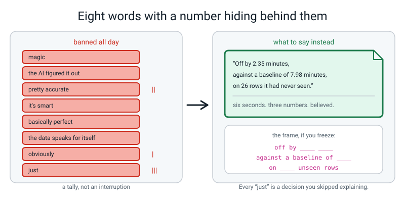
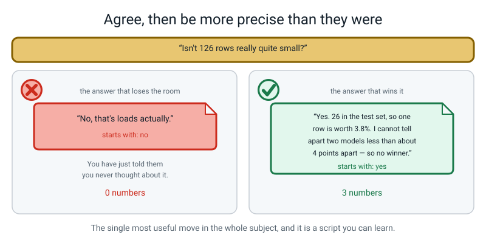
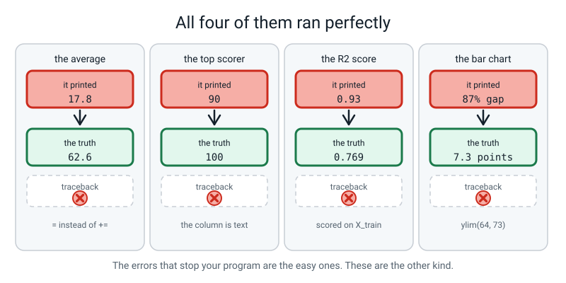
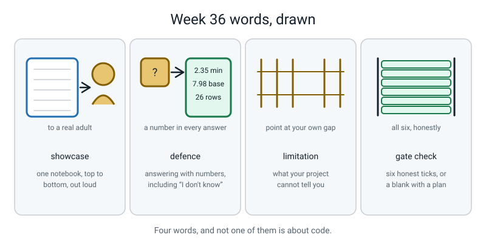

# Week 36 — Showcase Day: Read Your Notebook Out Loud

[⬅ Week 35](week-35.md) · [Course Home](../README.md) · [Next ➡](../README.md) · [Workbook](../workbook/week-36.md)

---

> ### This week in one sentence
> **You can take a question, a messy table and a keyboard, and produce an answer you are willing to defend.**
>
> **By the end of this chapter you will be able to:**
> - Read your notebook aloud to a real adult in eight minutes, without once saying "magic"
> - Answer six questions from the question bank, including the two hard ones, with a number in every answer
> - Complete the written assessment: 20 multiple choice, 8 short answers, 4 debug problems
> - Diagnose four broken programs out loud — what kind, which thing, which line
> - Name the single biggest limitation of your own project, before anybody asks
> - Fill in the Level 3 gate self-check **honestly**, including the boxes you cannot tick
>
> **New syntax this week:** **none.** Everything today is something you already have. Thirty-six weeks ago you could not print "hello".
>
> **Reading time:** about 30 minutes. **Homework:** about 40 minutes, and none of it is for anybody but you.

---

## 🪝 Start Here

Eight words and phrases. From now until the end of today, none of them is allowed out of your mouth.

```text
magic  ·  the AI figured it out  ·  pretty accurate  ·  it's smart
basically perfect  ·  the data speaks for itself  ·  obviously  ·  just
```

Seven of those are banned for the same reason: **they are ways of saying a number without saying a number.**

"Pretty accurate" — how accurate? Compared to what? On how many rows? Every one of those phrases is a place where you *had* a real number and chose a feeling instead.


*Figure 36.1 — Behind every one of those phrases there was a number you already knew.*

But the eighth one is the interesting one. **Just.**

Why is "just" banned?

...

Because of sentences like this one: *"I just dropped the weird rows."*

Listen to what that sentence does. There were rows. You made a decision about them. You had a reason — or you did not, which is worse. And the word **just** takes all of that and hides it, so nobody asks.

> **Every "just" is a decision you skipped explaining.**

Same with **obviously**. If it were obvious you would not need to say it. "Obviously" means *please do not ask me about this bit*.

So here is what is actually being asked of you today, and it is harder than it sounds. Somebody who does not code is going to sit next to you while you read your notebook out loud. They are allowed to interrupt. And **every single time a number leaves your mouth, you say its units and what you are comparing it to.**

> *"Off by 2.35 minutes, against a baseline of 7.98 minutes, on 26 rows the model had never seen."*

That sentence takes six seconds. It is the difference between being **believed** and being **nodded at**.

---

## 🧠 The Big Idea

> **📌 About the code in this section.** The blocks below are **illustrations, not files**. They show you the shape of one idea, and each one carries on from the one above it — the `import` lines and the data are typed once, in the first block that needs them. **The complete, runnable file is in 💻 Type This.** If you copy a block from this section on its own and Python says `NameError`, that is why, and nothing is broken.

### 1. A showcase is one notebook, read out loud

**The plain explanation.**

> **Showcase** — scrolling one notebook, top to bottom, out loud, to a person who has not seen it. Not slides. Not a talk *about* the project.

**The analogy.** You are not selling the project. You are giving somebody a guided tour of a building you built, including the corner where the floor creaks.

**The running order, and the proportions matter more than they look:**


*Figure 36.2 — The charts get two whole minutes and the cleaning gets seventy-five seconds. That is deliberate.*

| Time | Section | What you actually say |
|---|---|---|
| 0:00 | The question (45 s) | Say it. Then say who would care about the answer. Then read your dated prediction — **including the bit you got wrong.** |
| 0:45 | The data (60 s) | "One row is one ______. I collected 126 of them between 12 May and 9 June, by ______." Show `head()` and `shape`. |
| 1:45 | The cleaning (75 s) | Read **three log lines out loud, with the reasons in them.** "131 rows in, 126 out. Here is every row I lost and why." |
| 3:00 | The charts (2 min) | Read the five captions in order, as a paragraph. Do **not** describe the axes — the labels do that. Say the finding. |
| 5:00 | The models (90 s) | **Baseline first, always.** "Guessing the average is off by 7.98 minutes." Then the table. |
| 6:30 | What I got wrong (60 s) | Three admissions with numbers. Show the worst-five table and explain the pattern. |
| 7:30 | Whose data, what it costs (30 s) | Who is in it, who would pay for a wrong answer — by role, not "users" — and whether you would let anyone decide with it yet. |

**Two things in there that surprise everybody.**

**The charts get a quarter of the whole showcase.** Not because charts take long to explain — you are not explaining them, you are reading five sentences. **Those five sentences are your argument.**

**And you start with being wrong.** Stop number one includes reading your dated prediction from Week 34, including the part that turned out to be wrong. Leading with a mistake you found yourself buys you trust for the remaining seven and a half minutes, and it costs you nothing, because you were going to be wrong about something anyway.

### 2. The question bank, and why two of them are hard

**The plain explanation.** Six questions. You should be able to answer all six with a number in the answer.


*Figure 36.3 — The two marked hard are the two that decide whether the room believes you.*

| They ask | The shape of a good answer |
|---|---|
| *"How do you know the model actually works?"* | "I don't, fully. I know it was off by 2.35 minutes on 26 journeys it had never seen. Guessing the average is off by 7.98. That is the comparison." |
| *"Why did you pick that model?"* | Name the metric, then give a reason that is **not** the score. "The tree is 0.35 minutes better, which is noise on 26 rows — but I can read its rules out loud." |
| *"Couldn't you just use the average?"* | "That is my baseline row, and it is off by 7.98 minutes. The model gets that to 2.35." Point at the row. |
| **"Isn't 126 rows really quite small?"** ← hard | "Yes. Here is exactly how small: 26 in the test set, so one row is worth 3.8%. I cannot distinguish two models less than about 4 points apart, which is why I am not claiming a winner among my top two." |
| *"Did you delete data that didn't fit?"* | Point at the cleaning log. Every dropped row, counted, with a reason. Say the before and after shape out loud. |
| **"Should anyone actually decide anything with this?"** ← hard | A yes or a no, with a number attached, plus what would have to change. "Not yet. It under-predicts long walks by up to 8 minutes, and long walks are exactly the kids who arrive late." |

**Why those two are the hard ones.** Both of them invite a defensive answer, and the defensive answer is the wrong one.

"No, 126 is loads actually" **fails.** You have just told the person asking that you have not thought about it.

"Yes — and here is exactly how small" **passes.**


*Figure 36.4 — Agree with the criticism, then be more precise about it than the person criticising you.*

Look at what happens in the right-hand panel. You **agreed with the criticism**, and then you were **more precise about it than they were.**

> That single move — agree, then out-precise — is the most useful thing in this entire subject, and it is a script you can practise.

```text
"Isn't that a small sample?"   -> "Yes. 26 test rows, so one row is 3.8%."
"Isn't that only your data?"   -> "Yes. Three people, one family, one town."
"Didn't you pick the depth?"   -> "Yes. So my test score is optimistic."
```

> **💡 Try this:** say all three out loud, three times, until they come without thinking. They will, because they are short.

**And one more thing, because everybody gets this wrong:** *"I don't know"* **is allowed**, and it is one of the strongest answers there is — as long as you follow it with what you *do* know. *"I don't know whether it would work for other people. Every row in my table is one of three people in one family, so I genuinely cannot tell you."* That answer will be believed. A confident guess will not.

### 3. All four bugs are silent — and that is the last idea of the year

**The plain explanation.** In the debug round you get four broken programs. For each one you answer three questions **out loud, before touching the keyboard**:

```text
1. WHAT KIND?   a crash with a traceback, or a silent wrong answer?
2. WHICH THING? name it.
3. WHICH LINE?  point at it.
```

**The analogy.** A doctor asks what hurts before reaching for anything. A student who types first and thinks second turns a twenty-second bug into a twenty-minute one.

**And here is the thing about the four you will be given:**


*Figure 36.5 — Four wrong answers. Four empty traceback slots. Not one of them raised an error.*

| Problem | Kind | Why that matters |
|---|---|---|
| D1 — the average that isn't | **silent** | It prints a number. The number is wrong. Nothing warns you. |
| D2 — the top scorer who isn't | **silent** | Text sorted alphabetically looks exactly like numbers sorted numerically, until it doesn't. |
| D3 — the score that lies | **silent** | Three separate bugs, no error from any of them. The most dangerous problem in the whole course. |
| D4 — the chart that argues dishonestly | **silent** | It produces a perfectly valid picture that tells a lie. |

**All four are silent, and that is not a coincidence.** It is the last thing anybody is going to say to you about programming this year:

> **The errors that stop your program are the easy ones.**

A traceback is the computer on your side. It names the error type, it gives you the line number, and it refuses to continue until you have understood something. The bugs to be frightened of are the ones that finish, print, and look fine.

### 4. The syntax ladder — twelve rungs, and nothing skipped

**The plain explanation.** Thirty-six weeks, twelve rungs, one rung per three weeks.


*Figure 36.6 — Twelve rungs, thirty-six weeks, and nothing skipped.*

**How to use it, and it is not what you expect.** Do not tick a rung and say what it was called. Tick a rung and say **one thing you can do with it**, out loud.

Not "I did for loops." Instead:

> ✅ W1–3 — *"I can make the computer print a sentence with a number worked out inside it."*
> ✅ W7–9 — *"I can add up a hundred numbers without typing a hundred lines."*
> ✅ W16–18 — *"I can save a table to a file and get it back tomorrow."*
> ✅ W22–24 — *"I can find every hole in a table and say what I did about each one."*
> ✅ W31–33 — *"I can tell whether a model learned a rule or just memorised the answers."*

It takes about six minutes, and it is the only time all year you see the whole thing at once.

**Thirty-six weeks ago you could not print "hello".** That is not a joke and it is not anybody being nice. Look at that ladder. Every rung on it is something you can do **from a blank file**, and almost nobody your age can do any of it.

### 5. The Level 3 gate — and why an honest blank beats a tick

**The plain explanation.**

> **Gate check** — six honest self-checks that decide whether you are ready for the next level. Not six things somebody else marks. Six things only you can possibly know.


*Figure 36.7 — Six honest ticks. A tick you argued yourself into does not count.*

| # | The gate | What it actually means |
|---|---|---|
| 1 | **42 or more** on the written assessment, with no single week holding four of the mistakes | Coverage, not just a total |
| 2 | The capstone **finished** — log, five charts, three models on one split, numeric admissions | Not started. Finished. |
| 3 | A working function with a loop and an `if` inside it, from memory, in under five minutes, no copying | Typing fluency, which only comes from typing |
| 4 | Given a numpy shape error, name **both** shapes and the fix **without running it** | Reading, not guessing |
| 5 | Explain leakage using `StandardScaler`, in under a minute, and say which direction it moves the score | The idea Level 3 assumes you have |
| 6 | Draw the overfitting graph on a napkin — both lines, both axes labelled — and say what the gap means | The picture behind everything |

**And now the part that matters.**

> **The blank is the point.** A tick you talked yourself into is worse than a blank, because Level 3 will not slow down for a tick that is not true, and **you are the only person who can possibly know which ones are.**

A student who leaves gate 3 blank and writes *"I need ten days of fifteen-minute exercises"* next to it has done this assessment **correctly**.

**If you are missing one, every fix is half a day or less:**

| Missing | The cheapest fix |
|---|---|
| Gate 1 (score) | Reread the week your wrong answers cluster in, redo its practice, re-sit those items. Half a day. |
| Gate 2 (capstone) | No shortcut exists. Level 3 assumes you have suffered through one end-to-end project by hand. |
| Gate 3 (fluency) | Ten days, one fifteen-minute exercise each: fizzbuzz, a temperature converter, a list-max function, a word counter. Each from nothing. |
| Gate 4 (shapes) | Redo Week 19's practice, and print `.shape` after **every** array operation for a week. |
| Gate 5 (leakage) | Reread Week 30 and explain it out loud to a person. The question they ask that you cannot answer is the hole. |
| Gate 6 (the graph) | Rerun Week 33's depth curve on `load_diabetes()` and draw the result by hand *before* you plot it. |

> **⚠️ Watch out:** the written assessment is **not a test you can fail.** It is a **map of your holes**, and holes are much cheaper to find now than in the middle of Level 3. The number that matters is not the total — it is **which weeks your wrong answers cluster in.** Thirty-eight spread evenly means you were tired. Thirty-eight with four wrong in Week 19 means you never got `axis` straight, and one afternoon fixes it.

---

## 💻 Type This

Four broken programs. There is no new syntax — the point is that you can now read all four of these, which you could not have done in September.

For each one: **answer the three questions before you touch the keyboard.**

### Step 1 — `d1.py`, the average that isn't

Type it exactly as it is, then run it.

```python
# d1.py - this should print the average of the five scores.
scores = [45, 0, 112, 67, 89]

total = 0
for i in range(1, len(scores)):
    total = scores[i]

print("Average:", total / len(scores))
```

```text
Average: 17.8
```

**Question 1 — what kind?** It ran. No traceback. **Silent.**

**Now hand-check it.** Add those five numbers up: 45 + 0 + 112 + 67 + 89 = **313**. Divided by 5 is **62.6**. The program said 17.8.

**Question 2 — which thing?** `total`.

**Question 3 — which line?** Look at the loop body: `total = scores[i]`. Not `+=`. Plain **`=`**. So every time round the loop it *throws away* what it had and keeps the newest one. At the end, `total` is simply the last score — **89**. And 89 ÷ 5 = 17.8.

**There is a second bug.** Where does the loop start? `range(1, len(scores))` — so index 0, the 45, is **never visited**.

### Step 2 — fix only one bug, on purpose

Change `total =` to `total +=` and leave the range alone.

```python
# d1_half.py - one bug fixed, one left. Watch what happens.
scores = [45, 0, 112, 67, 89]

total = 0
for i in range(1, len(scores)):
    total += scores[i]

print("Average:", total / len(scores))
```

```text
Average: 53.6
```

**Better. Still wrong.** 268 ÷ 5 instead of 313 ÷ 5 — the 45 is still missing.

> **Fixing one of two bugs gives you a wrong answer that looks far more believable than the original.** 17.8 was obviously silly. 53.6 is not. That is exactly why you hand-check the **answer** instead of eyeballing the **code**.

### Step 3 — the real fix

```python
# d1_fixed.py - both bugs gone, and one whole class of bug deleted.
scores = [45, 0, 112, 67, 89]

total = 0
for score in scores:          # loop over the VALUES - no index, no off-by-one
    total += score            # += accumulates instead of replacing

print("Average:", total / len(scores))
```

```text
Average: 62.6
```

**Two habits worth stealing.** Loop over the **items**, not the indices, whenever you do not need the position — that deletes the whole off-by-one family of bugs at once. And use `+=` for anything you have called `total`.

*(Once you trust it: `print("Average:", sum(scores) / len(scores))`. Write the loop first, though. Week 12's point was that you should be able to build the tool before you use the built-in.)*

### Step 4 — `d2.py`, the top scorer who isn't

```python
# d2.py - this should find the highest score and the average score.
import pandas as pd

df = pd.DataFrame({
    "name":  ["Aarav", "Bela", "Chen", "Divya"],
    "score": ["90", "85", "78", "100"],
})

print("Top score:", df["score"].max())
print("Average:  ", df["score"].mean())
print(df.sort_values("score", ascending=False))
```

```text
Top score: 90
Average:   227144525.0
    name score
0  Aarav    90
1   Bela    85
2   Chen    78
3  Divya   100
```

**Before you read on: Divya scored 100. Where is she in that sorted list?**

**Last.**

**One root cause, three wrong answers.** Look at the DataFrame. `"90"`, `"85"`, `"78"`, `"100"` — **quotes.** That column is text.

- `.max()` compares them **alphabetically**, character by character. `'9'` comes after `'1'`, so `"90"` beats `"100"` and the comparison stops at the first character.
- `.sort_values()` does the same, which is why Divya sinks to the bottom.
- `.mean()` on a text column **glues the strings together** — `"90"+"85"+"78"+"100"` = `"908578100"` — and divides that by 4. Hence 227144525.0.

**The one line to run after every single `read_csv`, for the rest of your life:**

```python
print(df.dtypes)
```

```text
name     object
score    object
dtype: object
```

**`score` says `object`, and that is the bug** — a column of numbers that pandas is holding as text.

**The fix. Replace the three `print` lines in `d2.py` with these five** — everything above them stays exactly as it was:

```python
# add this to d2.py, in place of the three print lines
df["score"] = pd.to_numeric(df["score"], errors="coerce")
print(df.dtypes)
print("Top score:", df["score"].max())
print("Average:  ", df["score"].mean())
print(df.sort_values("score", ascending=False).to_string(index=False))
```

```text
name     object
score     int64
dtype: object
Top score: 100
Average:   88.25
 name  score
Divya    100
Aarav     90
 Bela     85
 Chen     78
```

Hand-check: 90 + 85 + 78 + 100 = 353, over 4 = **88.25**. ✅

### Step 5 — `d3.py`, the score that lies

This is the one that matters most. It reads the `data/clean.csv` you built last week.

```python
# d3.py - the score that lies. Three separate bugs, no error message.
import pandas as pd
from sklearn.preprocessing import StandardScaler
from sklearn.neighbors import KNeighborsRegressor
from sklearn.model_selection import train_test_split

df = pd.read_csv("data/clean.csv")
df["is_walk"]  = (df["mode"] == "walk").astype(int)
df["is_cycle"] = (df["mode"] == "cycle").astype(int)
X = df[["distance_km", "rain", "depart_hour", "is_walk", "is_cycle"]]
y = df["minutes"]

scaler = StandardScaler()                                   # line 12
X_scaled = scaler.fit_transform(X)                          # line 13

X_train, X_test, y_train, y_test = train_test_split(        # line 15
    X_scaled, y, test_size=0.2)                             # line 16

knn = KNeighborsRegressor(n_neighbors=5)                    # line 18
knn.fit(X_train, y_train)                                   # line 19

print("R2:", knn.score(X_train, y_train))                   # line 21
```

**Run it three times without changing anything.**

```text
R2: 0.9279865978428445
R2: 0.9352927574986454
R2: 0.9386630917616082
```

**Same file, three different answers.** Why?

**No `random_state`.** That is bug three, and it is the only one you can *see* without reading anything carefully.

**Three problems, ranked worst first:**

| Rank | Line | Problem | Effect |
|:--:|:--:|---|---|
| **1** | 21 | **Scored on the training data.** `knn.score(X_train, y_train)` measures how well the model does on rows it learned from. A memory test, not a result. | The reported number is meaningless. Worst, because it invalidates the entire output. |
| **2** | 13 | **Leakage.** `fit_transform(X)` runs *before* the split, so the column averages were computed using the test rows too. | Even after fixing problem 1, the test score is inflated. |
| **3** | 16 | **No `random_state`.** Every run gives a different split and a different number. | Not reproducible. Nothing can be compared to anything. |

**The fix — three repairs, and notice that the order of the lines is most of it:**

```python
# d3_fixed.py - the honest version. Same model, same data, three repairs.
import pandas as pd
from sklearn.preprocessing import StandardScaler
from sklearn.neighbors import KNeighborsRegressor
from sklearn.model_selection import train_test_split

df = pd.read_csv("data/clean.csv")
df["is_walk"]  = (df["mode"] == "walk").astype(int)
df["is_cycle"] = (df["mode"] == "cycle").astype(int)
X = df[["distance_km", "rain", "depart_hour", "is_walk", "is_cycle"]]
y = df["minutes"]

# 1. SPLIT FIRST. Nothing has touched the data yet.
X_train, X_test, y_train, y_test = train_test_split(
    X, y, test_size=0.2, random_state=42)      # fix 3: the same split every run

# 2. Fit the scaler on the TRAINING rows only, then apply it to both. (fix 2)
scaler = StandardScaler().fit(X_train)
X_train_scaled = scaler.transform(X_train)
X_test_scaled  = scaler.transform(X_test)

knn = KNeighborsRegressor(n_neighbors=5).fit(X_train_scaled, y_train)

# 3. Report BOTH scores. The gap between them is the story. (fix 1)
print(f"train R2: {knn.score(X_train_scaled, y_train):.3f}")
print(f"test  R2: {knn.score(X_test_scaled,  y_test):.3f}")
print(f"test rows: {len(y_test)}  ·  one row is worth {100 / len(y_test):.1f}%")
```

```text
train R2: 0.938
test  R2: 0.769
test rows: 26  ·  one row is worth 3.8%
```

**0.769.** The honest number is **lower** than the broken one, and it is the **same every time you run it**. That is the normal, healthy direction.

> **The rule of thumb to carry into Level 3: if a scoring line has `_train` on the right-hand side and you are calling the result a result, stop.**

### Step 6 — `d4.py`, the chart that argues dishonestly

Run it, then look at the picture before you look at the code.

```python
# d4.py - this is meant to show mean scores by house so a reader can compare them.
import matplotlib.pyplot as plt

houses = ["Red", "Blue", "Green"]
means  = [72.4, 71.9, 65.1]

plt.bar(houses, means)
plt.ylim(64, 73)
plt.title("Chart")
plt.savefig("houses.png")
```

**Open `houses.png`. Roughly how much worse is Green than Red?**

It looks like *loads*. Green looks like a stump.

**Now the arithmetic.** Green scored 65.1. Red scored 72.4. Out of a hundred. The real gap is **7.3 points**, which is about a tenth.

But on an axis that starts at 64:

```text
Red's visible bar   = 72.4 - 64 = 8.4 units
Green's visible bar = 65.1 - 64 = 1.1 units
```

So Green *looks* about **87% smaller** when it is really about 10% smaller. **An eight-times exaggeration, and not one number was faked.** The lie lives entirely in `plt.ylim(64, 73)`.

**Four things wrong:**

1. **The truncated y-axis** — the whole exaggeration.
2. **No axis labels at all**, so nobody knows whether these are marks, percentages or points.
3. **A title that is a topic** — `"Chart"` — instead of a finding.
4. **No group sizes**, so Green might be forty students or two.

**The fix, with all four repaired:**

```python
# d4_fixed.py - identical data. Honest picture.
import matplotlib.pyplot as plt

houses = ["Red", "Blue", "Green"]
means  = [72.4, 71.9, 65.1]
counts = [14, 13, 11]                       # never plot a mean without its n

fig, ax = plt.subplots(figsize=(6, 4))
bars = ax.bar(houses, means)

ax.set_ylim(0, 100)                         # FIX 1: bars start at zero
ax.set_title("Green averages 7.3 points below Red - the houses are close")  # FIX 3
ax.set_xlabel("house")                                                      # FIX 2
ax.set_ylabel("mean end-of-term score (points out of 100)")                  # FIX 2, with units

for i, bar in enumerate(bars):
    mean = means[i]
    n = counts[i]
    ax.text(bar.get_x() + bar.get_width() / 2, mean + 2,
            f"{mean:.1f} (n={n})", ha="center", fontsize=9)                  # FIX 4

fig.savefig("houses_fixed.png", dpi=120, bbox_inches="tight")
print("saved houses_fixed.png")
```

```text
saved houses_fixed.png
```

Open it. **Three bars of almost the same height — because that is the truth.** Same data. Same numbers.

> **The most effective visual lies never touch the numbers at all.**

### And now count them

Look back at all four programs. **How many of them printed an error message?**

**None.** All four ran perfectly and handed you a wrong answer with a straight face.

That is the last thing to say about programming this year, and it is why you hand-check a value, print your dtypes, and ask which split your number came from.

---

## 🔍 Worked Examples

Three more silent bugs, in three different places. For each one, the three questions first, then the hand-check, then the fix.

### Worked Example 1 — Late pizzas (food): the percentage that is always zero

**What it should do:** say what percentage of twelve deliveries arrived after 30 minutes.

```python
# we36_1_late_pizzas.py - what percentage of my deliveries were late?
waits = [28, 34, 19, 41, 22, 47, 31, 26, 44, 18, 29, 36]
late_count = 0
for wait in waits:
    if wait > 30:
        late_count += 1

percent = late_count // len(waits) * 100
print("Orders:", len(waits))
print("Late   :", late_count)
print("Percent late:", percent, "%")
```

```text
Orders: 12
Late   : 6
Percent late: 0 %
```

**Question 1 — what kind?** Silent. No traceback.

**Hand-check.** Which waits are over 30? 34, 41, 47, 31, 44, 36 — **six of twelve.** So the answer should be **50%**. The count is right; the percentage is zero.

**Question 2 — which thing?** `percent`.

**Question 3 — which line?** `percent = late_count // len(waits) * 100`.

**The bug is one character.** `//` is **floor division** — Week 3. `6 // 12` is **0**, because 12 goes into 6 zero times and the remainder is thrown away. Then `0 * 100` is 0.

**The fix:**

```python
# we36_1_late_pizzas.py - FIXED. One character.
waits = [28, 34, 19, 41, 22, 47, 31, 26, 44, 18, 29, 36]
late_count = 0
for wait in waits:
    if wait > 30:
        late_count += 1

percent = late_count / len(waits) * 100      # / not //
print("Orders:", len(waits))
print("Late   :", late_count)
print(f"Percent late: {percent:.1f} %")
```

```text
Orders: 12
Late   : 6
Percent late: 50.0 %
```

**Why this one is nasty.** `//` and `/` differ by one keystroke, both are legal, and the broken version prints a perfectly plausible **0%** — which somebody might read as good news. **And notice it would have been much easier to spot if the answer had been 6 out of 5 rather than 6 out of 12**, because `6 // 5` is 1 and `1 * 100` is 100%, which looks obviously silly. The bug hides itself best in exactly the cases you care about.

### Worked Example 2 — Innings labels (sport): everybody gets "decent"

**What it should do:** label eight innings — a fifty, a good score, a decent one, or a duck-ish one.

```python
# we36_2_innings_grades.py - label every innings.
scores = [0, 12, 34, 51, 77, 4, 63, 22]

for runs in scores:
    if runs >= 10:
        label = "decent"
    elif runs >= 50:
        label = "fifty!"
    elif runs >= 25:
        label = "good"
    else:
        label = "duck-ish"
    print(f"{runs:>3} runs -> {label}")
```

```text
  0 runs -> duck-ish
 12 runs -> decent
 34 runs -> decent
 51 runs -> decent
 77 runs -> decent
  4 runs -> duck-ish
 63 runs -> decent
 22 runs -> decent
```

**Question 1 — what kind?** Silent. Eight lines, all plausible.

**Hand-check.** The 77 got labelled "decent". So did the 51 and the 63. **The word `"fifty!"` never appears at all**, and neither does `"good"`.

**Question 2 — which thing?** The `if / elif` **order**.

**Question 3 — which line?** The very first one: `if runs >= 10:`.

**Why.** An `if / elif / else` chain checks **top to bottom and stops at the first true condition** — Week 6. Every score of 10 or more satisfies `runs >= 10`, so Python assigns `"decent"` and never looks at the two `elif` lines below. Two conditions being true at once is perfectly legal; Python just takes the first.

**The fix — put the narrowest condition first:**

```python
# we36_2_innings_grades.py - FIXED. Narrowest condition first.
scores = [0, 12, 34, 51, 77, 4, 63, 22]

for runs in scores:
    if runs >= 50:
        label = "fifty!"
    elif runs >= 25:
        label = "good"
    elif runs >= 10:
        label = "decent"
    else:
        label = "duck-ish"
    print(f"{runs:>3} runs -> {label}")
```

```text
  0 runs -> duck-ish
 12 runs -> decent
 34 runs -> good
 51 runs -> fifty!
 77 runs -> fifty!
  4 runs -> duck-ish
 63 runs -> fifty!
 22 runs -> decent
```

**The test that catches this in four seconds:** count how many different labels came out. There are four in the chain and only **two** appeared. **A branch that never fires is a bug**, and you can spot it without reading a single condition.

### Worked Example 3 — The gradebook (school): four pupils, five averages

**What it should do:** print each of four pupils' average across five tests.

```python
# we36_3_gradebook.py - each pupil's average across five tests.
import numpy as np

marks = np.array([
    [ 8,  7,  9,  6,  8],      # Asha
    [ 4,  5,  3,  6,  4],      # Ben
    [10,  9, 10,  9, 10],      # Cara
    [ 6,  7,  5,  8,  7],      # Dev
])

print("shape:", marks.shape)
averages = marks.mean(axis=0)
print("pupil averages:", np.round(averages, 2))
print("how many numbers came back:", len(averages))
```

```text
shape: (4, 5)
pupil averages: [7.   7.   6.75 7.25 7.25]
how many numbers came back: 5
```

**Question 1 — what kind?** Silent. It even printed a tidy row of numbers.

**Hand-check, and this one you can do with your eyes.** **There are four pupils. Five numbers came back.** That alone is the whole diagnosis, and it needs no arithmetic at all.

And look at Ben's row: `4, 5, 3, 6, 4`. His average is about 4.4. **Not one of the five printed numbers is anywhere near 4.4.** They all sit around 7, because they are the averages of the *tests*, not of the *pupils*.

**Question 2 — which thing?** `axis`.

**Question 3 — which line?** `averages = marks.mean(axis=0)`.

**Why.** **`axis` names the direction you collapse** — Week 19. `axis=0` collapses down the 4 rows and leaves one number per **column**, so 5 numbers, one per test. To get one number per pupil you collapse across the 5 columns: `axis=1`.

**The fix, printing both so the shapes are visible:**

```python
# we36_3_gradebook.py - FIXED. axis names the direction you COLLAPSE.
import numpy as np

marks = np.array([
    [ 8,  7,  9,  6,  8],      # Asha
    [ 4,  5,  3,  6,  4],      # Ben
    [10,  9, 10,  9, 10],      # Cara
    [ 6,  7,  5,  8,  7],      # Dev
])
pupils = ["Asha", "Ben", "Cara", "Dev"]

print("shape:", marks.shape)

per_pupil = marks.mean(axis=1)          # collapse the 5 columns -> 4 numbers
per_test  = marks.mean(axis=0)          # collapse the 4 rows    -> 5 numbers

print("per pupil shape:", per_pupil.shape)
print("per test  shape:", per_test.shape)
print()
for i in range(len(pupils)):
    print(f"{pupils[i]:>5}: {per_pupil[i]:.2f}")
print()
print("test averages:", np.round(per_test, 2))
```

```text
shape: (4, 5)
per pupil shape: (4,)
per test  shape: (5,)

 Asha: 7.60
  Ben: 4.40
 Cara: 9.60
  Dev: 6.60

test averages: [7.   7.   6.75 7.25 7.25]
```

**Now Ben's 4.40 is on the page**, and it is a completely different story about Ben from "about 7". If those were report cards, the broken version would have sent every pupil the same one.

**The habit:** print `.shape` after every array operation, and **check the count against how many things you were expecting.** Four pupils should give four numbers. That check costs nothing and catches the single most confused idea in numpy.

---

## 🐞 When It Breaks

Showcase day produces its own errors, because code that has not been run from a clean start for a week always breaks. Every message below came from a real run.

### Error 1 — the showcase-day error

You open the notebook, scroll to the middle, and run a cell:

```text
Traceback (most recent call last):
  File "/private/tmp/we36/err1.py", line 1, in <module>
    print(df.head())
NameError: name 'df' is not defined
```

**What Python is telling you:** *"I have never heard of `df`."*

Not "the file is missing", not "the table is empty" — **the name does not exist.** Either the cell that created it never ran, or it ran in a session you have since restarted.

**The fix:** run the file from the top. In a notebook: **Restart, then Run All.**

> **⚠️ Watch out:** do this **before** the audience arrives, not in front of them. A notebook that works "because of a variable you defined an hour ago" is not a working notebook, and today is the day that gets found out. Restart-and-Run-All is the only test that counts.

### Error 2 — a letter missing from a library name

```text
Traceback (most recent call last):
  File "/private/tmp/we36/err2.py", line 1, in <module>
    import panda as pd
ModuleNotFoundError: No module named 'panda'
```

**What Python is telling you:** *"There is no library with that name."*

**Read the name in the message, character by character.** `panda`. It is `pandas`, with an **s**. Same family: `numpi`, `sklean`, `matplotlib.pyploy`.

**And a cousin of it, worth knowing:**

```text
ImportError: cannot import name 'DecisionTreeRegresser' from 'sklearn.tree'
```

Different error, and the difference is informative. `ModuleNotFoundError` means the **library** does not exist. `ImportError: cannot import name` means the library exists fine and the **thing inside it** does not. `Regresser` should be `Regressor`.

### Error 3 — presenting from the wrong folder

```text
  File "/Library/Frameworks/Python.framework/Versions/3.10/lib/python3.10/site-packages/pandas/io/common.py", line 856, in get_handle
    handle = open(
FileNotFoundError: [Errno 2] No such file or directory: 'data/clean.csv'
```

**What Python is telling you:** *"I looked exactly where you told me and there was nothing there."*

The file almost certainly exists. **You are not in the folder you think you are in** — you opened the terminal somewhere else, and `data/clean.csv` is relative to wherever you are standing.

**The fix, and check it with your eyes before you present:**

```bash
ls data
cd data-detective
ls data
```

> **🐞 If you see this error:** `IndexError: list index out of range` from `for i in range(1, 6): print(captions[i])` — your five captions live at indices **0 to 4**, and you asked for index 5. Use `for caption in captions:` if you do not need the position, or `range(len(captions))` if you do. Week 11, and it is still the commonest counting mistake there is.

### And the fourth kind — the one with no message

All four of today's debug problems, and all three worked examples above. **No traceback, no warning, a plausible number, and it is wrong.**

There is no error message for these and there never will be. What catches them is four habits, and you now have all four:

1. **Hand-check one value.** Add the five numbers up yourself.
2. **Count what came back.** Four pupils should give four numbers.
3. **Print `df.dtypes`** after every `read_csv`, before trusting anything.
4. **Ask which split the number came from.**

**Errors are not you failing.** Thirty-six weeks ago a traceback was frightening. Read that first one again — `NameError: name 'df' is not defined` — and notice that you now know exactly what it means, exactly what caused it, and exactly what to do. **That is what changed this year.**

---

## 🎲 What We Did In Class

If you missed it, all of this works at home. You need a laptop, your notebook, a pen, a red pen, and **one real adult who does not code.**

### Part 1 — the banned words (7 minutes)

Write the eight banned words up where you can see them, with a tally sheet underneath. Somebody makes a mark every time one escapes. Nobody stops you; you just see the marks at the end.

Then practise the frame out loud, on your own project:

```text
"Off by ______ [units], against a baseline of ______, on ______ unseen rows."
```

### Part 2 — what you are being judged on (16 minutes)

The eight rubric rows, told to you **before** you present, because a rubric you find out about afterwards is a trap:

1. Your question and how you designed the columns
2. Your collection — 100+ rows, with real variety
3. Your cleaning log, and whether every line has a reason
4. Your five charts, and whether the captions state findings
5. Your **modelling honesty** — one split, made once, `random_state` set, a baseline in the table
6. Your results and how you interpret them
7. Your "what I got wrong"
8. Whose data it is and what a wrong answer would cost a real person

**Notice what is not on that list.** Nowhere does it say *"the model scored well."* You can get top marks with a model barely better than guessing, as long as you say so with a number. And you can **lose** marks with a model that scores 0.99, because 0.99 on data you collected yourself is a warning light.

Then the two hard questions, practised until "yes" comes out first.

### Part 3 — the debug round (18 minutes)

Four files on the laptop, and for each one the three questions answered **out loud, before a single key is pressed**:

```text
1. WHAT KIND?   a crash with a traceback, or a silent wrong answer?
2. WHICH THING? name it.
3. WHICH LINE?  point at it.
```

All four are in the **Type This** section above, complete, with the real outputs.

### Part 4 — the eight-minute showcase (20 minutes)

**The audience's instructions**, read out before you start:

```text
1. You may interrupt at any time.
2. Say "I don't understand" out loud whenever it is true.
   That is the most useful thing you can do today.
3. Do not be kind about numbers. If a number has no units,
   ask what the units are.
4. At the end you get to ask three questions.
```

**Your rules:** eight minutes, timer visible. One notebook, top to bottom, no slides, no jumping about. Every number gets its units and a comparison. **Baseline first**, before any model score leaves your mouth. No banned words.

Then the six questions from the bank, including both hard ones. Every answer contains a number.

**And the last question, always:**

> **"What is the single biggest limitation of this project?"**

No hints. No prompting. That one question is worth more than the other six combined.

### Part 5 — the ladder and the gate (9 minutes)

Twelve rungs. Tick each one and say **one thing you can do with it.** Then the six gates, filled in honestly, with the cheapest fix written next to every blank.

### And the real measure of whether the showcase worked

Ask your audience this, afterwards:

> *"In one sentence: what did this project find, and how sure should I be about it?"*

**If they can answer, it worked** — whatever the tally sheet says. If they cannot, it did not, and that is the feedback, not a mark.

---

## 💬 Talk About It

**1. "What if the audience asks something I can't answer?"**

*Hint:* say **"I don't know"**, and then say what you *do* know. That is not failure; it is the correct answer to most hard questions about data. *"I don't know whether it would work for other people — every row in my table is one of three people in one family, so I genuinely cannot tell you."* Any adult worth presenting to will recognise that immediately, and it will make everything else you said **more** believable, not less.

**2. "Do I really have to say the bit I got wrong out loud? To an actual person?"**

*Hint:* think about who you trust. Adults are so used to being sold things that somebody voluntarily saying *"here is the weakness in my own work"* is genuinely startling. It makes the rest of what you said credible, because they now know you would have told them. That is not a trick — it is the reason honesty is the professional standard rather than just a nice idea.

**3. "When am I allowed to say a model 'works'?"** *(Nobody agrees, and this is one of the genuinely unsettled questions in the field.)*

*Hint:* everybody agrees on the **floor** — a model that cannot beat the baseline does not work, full stop. Past that, people disagree, and they disagree because **"works" is not a property of the model at all.** It is a property of the model *plus what you are going to do with it*. A model that suggests which song to play next can be barely better than guessing and still be useful, because the cost of a bad suggestion is that you press skip. A model that helps decide whether somebody gets a loan needs to be far better than the baseline before anyone switches it on — and "far better" still does not tell you how much better, because the real question is what it costs the person who is refused unfairly. So the honest position is: **"works" is a judgement about consequences, not a fact about mathematics.** What you can *always* do is state the number, its units, the baseline, how many rows it was measured on, and who would pay if it were wrong. Do those five things and you have said everything that is actually knowable.

---

## ⚠️ Don't Get Tricked

### Trick 1 — "the right answer to a criticism is a defence"


*Figure 36.8 — Same question, two answers. Only one of them gets believed.*

| ❌ Wrong | ✅ Right |
|---|---|
| "No, 126 rows is loads actually." | "Yes. 26 in the test set, so one row is worth 3.8%. I cannot distinguish two models less than about 4 points apart, which is why I am not claiming a winner among my top two." |

The wrong answer tells the person asking that you have not thought about it. **Agree, then out-precise them.** It is the single most useful move in this whole subject.

### Trick 2 — "the errors that crash my program are the scary ones"

| ❌ Wrong | ✅ Right |
|---|---|
| "A traceback means I've done something terrible." | "A traceback is the computer telling me the line number and the error type. The scary ones are the four that printed a lovely wrong number and said nothing." |

Every one of today's four debug problems ran perfectly. **A crash is help; a plausible wrong answer is not.**

### Trick 3 — "'I don't know' loses marks"

| ❌ Wrong | ✅ Right |
|---|---|
| "It's pretty accurate, so yeah, it works." | "I don't know if it works for other people. I know it was off by 2.35 minutes on 26 rows it had never seen, against 7.98 for guessing the average. Whether that is good enough depends on what you would use it for." |

"Pretty accurate" is a feeling standing where a number should be. **"I don't know, and here is what I do know"** is the strongest sentence in the question bank.

### Trick 4 — "ticking all six gates is the good outcome"

| ❌ Wrong | ✅ Right |
|---|---|
| Six ticks in eleven seconds. | "Gate 3 is not true yet. I can do it with my notes open, not from a blank file. Ten days of one fifteen-minute exercise, starting tomorrow." |

**A blank with a plan beside it is a better answer than a tick you argued yourself into**, because Level 3 will not slow down for a tick that is not true, and nobody but you can possibly know which ones are.

---

## 🌍 Where You've Seen This

1. **A courtroom.** A witness who says "I don't recall" is believed more than one who is certain about everything. Certainty about small details is what makes a story sound rehearsed.
2. **A doctor's appointment.** *"How likely is it?"* — a good doctor gives you a number and the size of the group it came from. A bad one says "very unlikely", which is the medical version of "pretty accurate".
3. **Product recalls.** Somebody found a limitation, wrote it down with a number, and said it out loud before anybody asked. That is a "what I got wrong" page with lawyers attached.
4. **Software release notes.** "Known issues" is the most-read section in any release, and the one that decides whether developers trust the rest of it.
5. **A referee reviewing a decision.** They are tracing a claim back to the evidence that produced it. That is a Score Audit with cameras.
6. **Any exam appeal.** Almost all of them are about *which answers were counted*, not about arithmetic. Same as the audit: the bug is nearly never in the sums.

---

## 🔑 Remember This

- **Eight minutes, seven stops, one notebook, out loud.** Start with the bit you got wrong; it buys trust and costs nothing.
- **Every number gets its units and a comparison.** "Off by 2.35 minutes, against a baseline of 7.98, on 26 unseen rows" — six seconds, and it is the difference between being believed and being nodded at.
- **Agree, then be more precise than the person criticising you.** "Yes. 26 test rows, so one row is 3.8%."
- **"I don't know" is a strong answer**, when it is followed by what you do know.
- **All four debug problems are silent, and that is the last idea of the year.** The errors that stop your program are the easy ones.
- **The written assessment is a map of your holes, not a verdict.** Count your wrong answers **by week**, not just in total.
- **An honest blank on the gate beats a tick you argued yourself into.** Level 3 will not slow down for a tick that is not true.
- **Thirty-six weeks ago you could not print "hello".**

### The four habits that catch a silent bug

```python
# 1. hand-check one value
print(sum(scores), "/", len(scores), "=", sum(scores) / len(scores))

# 2. count what came back - four pupils should give four numbers
print(per_pupil.shape)

# 3. print the dtypes after every read_csv, before trusting anything
print(df.dtypes)

# 4. ask which split the number came from
print(f"test  R2: {model.score(X_test, y_test):.3f}   on {len(y_test)} unseen rows")
```

### And the three sentences to have ready

```text
"Off by ______ [units], against a baseline of ______, on ______ unseen rows."
"Yes - and here is exactly how small: ______ test rows, so one row is ______%."
"I don't know. Here is what I do know: ______."
```

---

## 📓 New Words


*Figure 36.9 — This week's four words, drawn.*

| Word | What it means | Example |
|---|---|---|
| **showcase** | Scrolling one notebook, top to bottom, out loud, to somebody who has not seen it | Eight minutes, seven stops, no slides, timer visible |
| **defence** | Answering questions about your own work with numbers — including "I don't know" when that is the true answer | *"Off by 2.35 minutes on 26 unseen rows, against 7.98 for guessing"* |
| **limitation** | Something your project cannot tell you, said before anybody asks | *"Every row is one of three people in one family, so this is our walking speed"* |
| **gate check** | Six honest self-checks that decide whether you are ready for the next level | Score 42+ · capstone finished · blank-file fluency · shapes · leakage · the overfitting graph |

---

## 📤 Your Homework

Go to **[the Week 36 workbook](../workbook/week-36.md)**. There is no new work. Two things, and neither of them is for your teacher.

| Page | What to do | Time |
|---|---|---|
| **36.1–36.3** | The **written assessment** — 20 multiple choice, 8 short answers, 4 debug problems. Closed book, separate sitting, no laptop. Then mark it yourself and fill in the **by-week table**. | 90 min (its own sitting) |
| **36.4** | The **showcase self-record**, completed straight after you present. Mark the honesty, not the performance. | 10 min, in class |
| **36.5** | The **Level 3 gate self-check** — honest, not full. Next to every blank, write the cheapest fix. | 15 min |
| **36.6** | **A letter to yourself.** Not to anybody else. | 25 min |

**Total homework: about 40 minutes**, plus the assessment in its own sitting.

### About that letter

Three things in it.

**One:** the hardest **moment** of this year, and what you did about it. Not the hardest topic — the hardest *moment*. The evening something would not run.

**Two:** one thing you can do now that you genuinely could not do in September. Be specific enough that September-you would not believe it.

**Three:** what you want to **build** next, and why. Not what you want to learn. What you want to **build** — something that does not exist yet and that you would like to exist.

Then put a date on it and put it somewhere you will find it at the end of Level 3.

> **💡 Try this if you are stuck on the third part:** *what is annoying in your house that a table of numbers could settle?* · *what would you like to know about something you do every day?* · *what does a program you use every day get wrong about you?*

> **⚠️ Watch out:** the gate check is the one piece of work this year where being generous to yourself costs you something real. **Six ticks on a day when three are not true teaches you nothing**, and Level 3 arrives regardless. Pick the gate you least believe and test it, right now, with a timer.

**That letter is the only piece of work this year that is entirely for you, and it is the one you are most likely to still have in ten years.**

---

[⬅ Week 35](week-35.md) · [Course Home](../README.md) · [📓 Workbook — Week 36](../workbook/week-36.md) · [Glossary](../../glossary.md) · [Level 3 — Engineer ➡](../../../level-3-engineer/)
