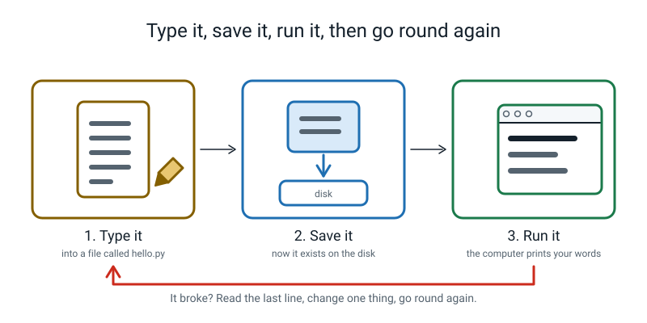
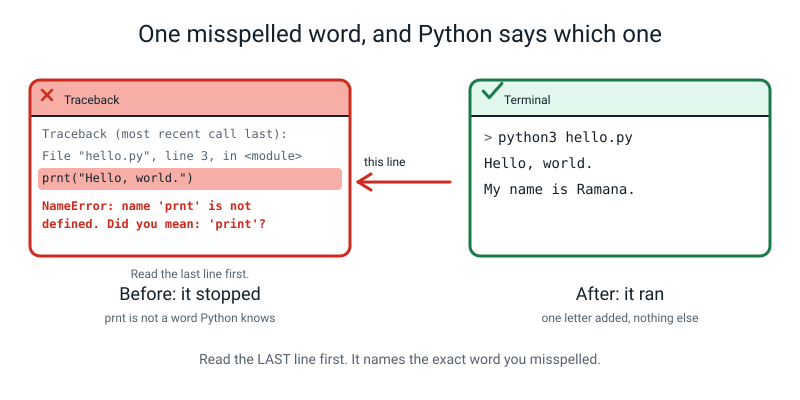
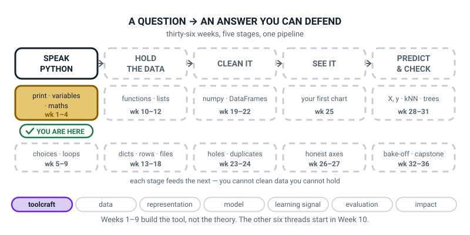
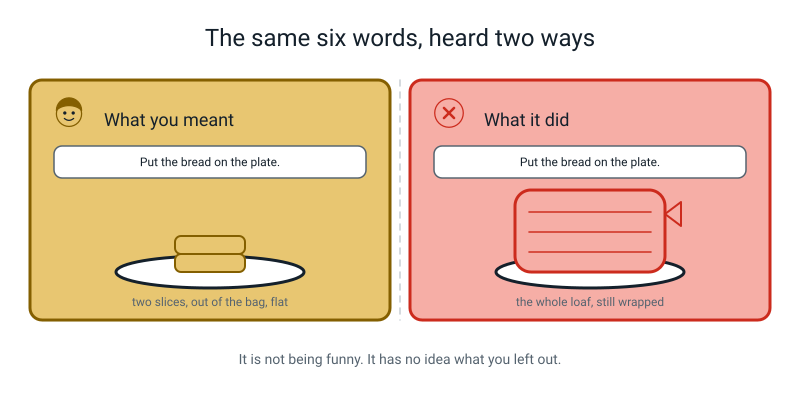
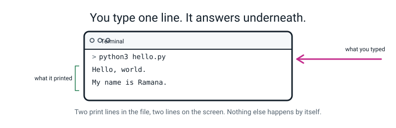

# Week 1 — Make the Computer Say Something

[⬅ Start Here](../README.md) · [Course Home](../README.md) · [Week 2 ➡](week-02.md) · [Student Guide](../student-guide/week-01.md) · [Workbook](../workbook/week-01.md)

---

## 📋 At a Glance

| | |
|---|---|
| **Duration** | 70 minutes |
| **Type** | 🟦 Teach — the very first line of code, and the very first error message |
| **Big idea** | A program is a list of instructions in a file, run top to bottom, and the computer does exactly what you typed — including the part you didn't mean. |
| **New vocabulary** | program · interpreter · print · comment · syntax |
| **New syntax** | `print("text")` · `# comment` · `+ - * /` · `print(a, b, c)` |
| **Materials** | Printed workbook (all of it, including the Answers section torn off or folded away) · pencil · **a loaf of bread, a plate and a knife** (or paper stand-ins) for the Hook · a blank sheet headed **BUG LOG** · sticky notes |
| **Tech needed** | One laptop with Python 3 installed and an editor open. **Do the install before today** — see [Orientation §4](00-orientation.md). |
| **Prep time** | 20 minutes the night before, 5 minutes on the day |

> **⚠️ Watch out:** the single most common way this week fails is an install that isn't finished. If `python3 --version` does not print a version number **before the student sits down**, do the paper fallback in the Prep Checklist and fix the install afterwards. Do not spend the lesson installing software while a 12-year-old watches.

---

## 🎯 Lesson Objectives

By the end of the lesson the student can:

1. **Run a `.py` file from the terminal** and read the output that appears underneath.
2. **Use `print()` to show text and the result of arithmetic**, and explain why `"7" * 6` is not the same as `7 * 6`.
3. **Explain in one sentence why the computer is literal rather than smart.**
4. **Read a `NameError` caused by a typo** and name the misspelled word from the message alone.

Observable evidence: two `.py` files that the student typed by hand and ran successfully, one deliberate misspelling whose traceback they read out loud last-line-first, and the first three rows of their Bug Log filled in.

---

## 🧑‍🏫 What YOU Need to Know First

> **📌 About the code blocks in this guide.** Outside the **🧰 Prep Checklist** and the **🔑 Answer Key**, the blocks are **illustrations, not files** — each one carries on from the one above it, so the `import` lines and the data are typed once, in the first block that needs them. **The complete runnable files are in the Prep Checklist and the Answer Key.** If you paste an illustration on its own and get `NameError`, that is why, and nothing is broken.

**You do not need to know Python to teach this lesson.** You need to know four things, and this section teaches you all four from scratch. Read it once, slowly, with the laptop open, and type the examples yourself. That is the whole prep.

### 1. What a program actually is

> **Program** — a list of instructions, written down in a file, that a computer performs one after another from the top of the file to the bottom.

That is the entire definition and there is nothing hidden behind it. A recipe is a program. A knitting pattern is a program. The difference is that a computer follows instructions with **no judgement at all**. A human cook reading "add the eggs" knows to crack them first. A computer does not know anything you did not write down.

This is the one idea the whole lesson exists to install, and it is worth being blunt about: **the computer is not clever and it is not stupid. It is literal.** Every confusing thing that happens for the next 36 weeks comes from that one fact.

### 2. What the interpreter is, and the two windows you will live in

A file full of Python is just text. Something has to *read* it and *do* it.

> **Interpreter** — the program, already on your computer, that reads your Python file and actually performs each instruction, top to bottom.

The interpreter is called `python3`. You will use it like this:

```bash
python3 hello.py
```

Read that out loud as: *"Python, take the file called hello dot py and do what it says."*

You will be moving between two windows all year, and it helps enormously to name them out loud for the student:

| Window | What it's for | What it looks like |
|---|---|---|
| **The editor** (VS Code) | Where you *write* instructions and save them | A page of text with a filename tab at the top |
| **The terminal** | Where you *run* the file and read what came out | A mostly-black rectangle where you type commands |


*Figure 1.1 — This loop is the whole of programming. You will go round it forty times today and about four thousand times this year.*

Two rules about this loop that will save you real pain:

- **Saving is not optional and it is not automatic.** If the student edits the file and runs it without saving, the terminal shows them the *old* output and they will conclude that Python is broken. In VS Code an unsaved file has a **filled dot** next to its name in the tab. Learn to spot that dot; you will point at it weekly.
- **Running does not change the file.** Nothing the terminal prints is stored anywhere. Output is a shout, not a note.

### 3. `print()` — the first instruction, taken apart

Here is the smallest complete Python program that does something visible.

```python
print("Hello, world.")
```

```text
Hello, world.
```

That one line has four separate parts, and every one of them is a rule the student will use for the rest of their life.

| Piece | What it is | The rule |
|---|---|---|
| `print` | The name of a built-in action: "show this on the screen" | Spelled exactly, all lowercase. `Print` is a different word and Python has never heard of it. |
| `(` and `)` | The brackets that mean "do it, using this" | Never optional. Every `(` needs its `)`. |
| `"` and `"` | Quote marks, which mean "the stuff between us is text" | Must match. Open with `"`, close with `"`. |
| `Hello, world.` | The text itself | Anything at all. Spaces, punctuation, emoji. |

> **print** — the instruction that puts something on the screen.

**The thing to say out loud:** the quotes are not decoration. They are the difference between *text* and *a name*. `print("Hello")` shows the five letters H-e-l-l-o. `print(Hello)` means "go and find the thing called Hello and show that", and since nothing called `Hello` exists, Python stops and complains. You will use this distinction in the Live-Code segment on purpose.

### 4. Arithmetic — and why `"7" * 6` is not `7 * 6`

Python does maths with the four symbols a 12-year-old already knows, plus one surprise.

```python
print(3 * 450)
print(1350 / 5)
print(8 - 3)
```

```text
1350
270.0
5
```

Stop on that middle line. **`270.0`, not `270`.** Every time you use `/`, Python hands back a number with a decimal point on it, even when the answer comes out exactly. That is deliberate: `/` means "share it out", and sharing can produce a fraction, so Python always leaves room for one. You do not need to explain floats today — Week 2 does that — but you **do** need to not be surprised by it, and to say "yes, that's normal, the slash always leaves a decimal point on the answer."

Now the surprise, and it is the best five minutes of the lesson.

```python
print("7" * 6)
print(7 * 6)
```

```text
777777
42
```

The same `*` did two completely different jobs.

- `7 * 6` — two **numbers**. Multiply them. Forty-two.
- `"7" * 6` — a piece of **text** and a number. There is no sensible way to multiply the letter seven, so `*` does the other thing it knows: it **repeats** the text six times. Six copies of the character `7`, stuck together, making the six-character text `777777`.

**Why this is worth twenty minutes and not two:** the student's instinct is that the quotes are just tidiness, like a hat on a word. This one example proves the quotes change what the whole line *means*. Once they have felt that, Week 2's types lesson is a formality instead of a fight.

Here is a comparison table you can put on the board. Have them predict the middle column before you reveal it.

| You type | It prints | Why |
|---|---|---|
| `print(2 + 2)` | `4` | Two numbers. Add them. |
| `print("2 + 2")` | `2 + 2` | Quotes. It's text. Just show the characters. |
| `print("2" + "2")` | `22` | Two texts. Stick them together. |
| `print("ab" * 3)` | `ababab` | Text and a number. Repeat it. |
| `print(3 * "ab")` | `ababab` | Same thing, either way round. |

### 5. Comments — notes for humans

> **Comment** — text in your file that Python skips over completely, written so a human can understand *why* the code does what it does.

Everything after a `#` on a line is ignored by the interpreter.

```python
# pizza_maths.py - four sums I am not going to do in my head.

print(3 * 450)        # 3 pizzas at 450 rupees each
print(1350 / 5)       # that total split between 5 friends
```

Two things to enforce from week one, because they are habits and habits are cheap now and expensive later:

- **Every file starts with a comment saying what the file is for.** One line. Filename, then a dash, then the purpose.
- **A good comment says *why*, not *what*.** `print(1350 / 5)  # divide 1350 by 5` is useless — anyone can read that off the line. `# that total split between 5 friends` is worth having.

### 6. Syntax, and the word you will use every week

> **Syntax** — the punctuation and spelling rules of a language. Get the syntax wrong and the sentence is not merely odd, it is not a sentence at all.

The English analogy that works: *"Dog the ate ."* is not a strange sentence, it is not a sentence. Python is far stricter than English about this, because it has no ability to guess.

### 7. Reading a traceback — the actual skill of the week

> **Traceback** — the block of text Python prints when it gives up, saying where it stopped and why.

When you misspell `print`, this is what really appears:

```text
Traceback (most recent call last):
  File "/Users/you/ai-academy/level2/oops.py", line 3, in <module>
    prnt("Hello, world.")
NameError: name 'prnt' is not defined. Did you mean: 'print'?
```

Four lines, and they must be read **from the bottom up**. Teach it as a fixed three-step ritual:

```
   ┌──────────────────────────────────────────────────────────────┐
   │  HOW TO READ A TRACEBACK                                     │
   │                                                              │
   │  1. LAST line  → what went wrong, in words                   │
   │     "NameError: name 'prnt' is not defined"                  │
   │                                                              │
   │  2. The "line N" bit → where to look                         │
   │     "line 3"                                                 │
   │                                                              │
   │  3. Go to that line. Fix ONE thing. Run it again.            │
   └──────────────────────────────────────────────────────────────┘
```


*Figure 1.2 — The last line is a sentence, not a wall of red. On Python 3.10 and newer it even guesses the fix.*

A `NameError` means one exact thing: **"you used a name and I have never heard of it."** Almost always a typo. Notice that modern Python adds `Did you mean: 'print'?` — that is a genuinely helpful feature and you should point at it and enjoy it.

**The reframe that matters, and please say this word for word:** *"An error message is not the computer telling you off. It is the computer telling you where it got stuck. It is the most helpful thing on the screen."* You will repeat this every week until week 36, and it is the difference between a student who debugs and a student who freezes.

### 8. The two misconceptions you will actually meet today

**Misconception 1 — "the computer knows what I meant."**

It arrives disguised as frustration: *"but it's obvious!"* The Hook exists entirely to demolish this, and it demolishes it with bread rather than with argument. When it resurfaces during the code (and it will, roughly when they misspell something), do not re-explain. Just say: **"whole loaf on the plate"** and let them laugh.

**Misconception 2 — "an error means I'm bad at this."**

This is the dangerous one, because it is silent. A student who believes it will stop typing and wait to be rescued. Head it off *before* it appears, which is why the lesson plan makes **you** misspell `print` in front of them, twice, deliberately, and why the homework is literally *"go and cause three error messages."* An error you caused on purpose cannot be evidence that you are bad at this.

There is a third thing that is not a misconception but a habit: some students will want to **paste** code. Don't let them, all year. Fingers have to learn where the brackets and colons live. It costs about fifteen extra minutes a week and it is the highest-return fifteen minutes in the course.

### 9. How deep to go, and where to stop

**Go this far:** a program is a file of instructions; the interpreter runs it top to bottom; `print()` shows things; quotes make text; `#` makes a comment; read the last line of a traceback first.

**Stop before:**

- **Variables.** No `name = value` today, at all. That is Week 2 and it is a big enough idea to own a whole lesson. If a student invents them (some do), say: *"You've just found next week. Write it in the margin with today's date."*
- **f-strings.** Do not use `f"..."`. Today you join things with commas inside `print()`, which is Week 1's tool: `print("Slices:", 16)`.
- **Types by name.** You will show that `"7" * 6` differs from `7 * 6`, and that is enough. Do not say the words `str` or `int` today; that is Week 2's vocabulary and the cap is five new words a week for a reason.
- **`input()`.** Week 4. If they ask how to make the program ask a question, the honest answer is "in three weeks, and it has a trap in it that we need Week 2 and 3 for first."
- **Explaining floats.** When `1350 / 5` prints `270.0`, say "the slash always leaves a decimal point" and move on. Week 2 names it.
- **The interactive shell (`>>>`).** Optional, and it costs a "which window am I in?" confusion for very little gain in week 1. Files only today.

---

### 10. 🧭 The Growing Map — how to use it, this week and every week

The student guide carries a figure called **Where This Fits**. It is the same picture every week with
one more piece filled in, and it is the only thing in this course that shows the learner the *shape* of
what they are building rather than this week's content.



*Figure 1.0 — Week 1's version. Five stages, ten tiles, and only the first tile gold. The seven-thread
strip along the bottom has **toolcraft** lit and nothing else.*

**What to do with it, in about two minutes at the end of the lesson:**

1. **Show it, don't explain it.** Ask *"which box did we do today?"* They will point at the gold tile.
   Pointing is the exercise.
2. **Then the better question:** *"why is nearly all of it dashed?"* You want *"because we haven't got
   there yet"* — which quietly tells them the year has a shape and they are standing inside it.
3. **Have them copy the five stage names into the inside cover of their notebook**, in pencil, with room
   underneath. They add to their own copy every week. By March it is the best revision aid they own.

> **🧑‍🏫 Why this is worth two minutes.** A learner who can see the map can tell the difference between
> *"I don't understand this week"* and *"I don't know where this week goes"* — and those need completely
> different help from you. Without the map, both come out of their mouth as "I don't get it."

**A note on the seventh thread.** The strip has **seven** pills, not six. Levels 1 and 3 use six — data,
representation, model, learning signal, evaluation, impact — and Level 2 adds **toolcraft** at the
front. That is deliberate and honest: weeks 1–9 teach programming as a craft and genuinely do not
advance any AI idea. Pretending `print()` is about "representation" would be a lie the learner would
eventually catch. Toolcraft is lit alone until Week 10, when they first hold a dataset and the six
restart.

> **⚠️ Watch out:** do not turn this into a quiz. The map is orientation, not assessment. If they cannot
> remember which thread this week was, that is fine and costs nothing.

---

## 🧰 Prep Checklist

### 20 minutes the night before

- [ ] **Open a terminal and type `python3 --version`.** You want to see `Python 3.9` or higher. **The exact error wording printed in this guide (`Did you mean`, `'(' was never closed`, `unterminated string literal`) is Python 3.10 and newer; on 3.9 the same mistakes give older messages such as `invalid syntax`, `unexpected EOF while parsing` or `EOL while scanning string literal`, so prefer 3.10+ for this week.** If it errors, go to [Orientation §4](00-orientation.md) and fix it tonight, not tomorrow.
- [ ] **Make the folder for the whole year**, if you haven't:
      ```bash
      mkdir -p ~/ai-academy/level2
      cd ~/ai-academy/level2
      ```
- [ ] **Run this code yourself first.** Create `hello.py` in that folder — type it, do not paste it, because you want to feel what the student will feel:
      ```python
      # hello.py - my first Python program.

      print("Hello, world.")
      print("My name is Ramana.")
      ```
      Then in the terminal:
      ```bash
      python3 hello.py
      ```
      You must see exactly:
      ```text
      Hello, world.
      My name is Ramana.
      ```
      If you see anything else, stop and fix it now. This is the one thing that must work tomorrow.
- [ ] **Now break it on purpose.** Change `print` on line 3 to `prnt`, save, run again. You should see:
      ```text
      Traceback (most recent call last):
        File "/Users/you/ai-academy/level2/hello.py", line 3, in <module>
          prnt("Hello, world.")
      NameError: name 'prnt' is not defined. Did you mean: 'print'?
      ```
      **Read the last line out loud to yourself.** Then fix it and run it again. You have now rehearsed the most important thirty seconds of the lesson.
- [ ] **Also run this second file**, `pizza_maths.py`, and check the output against what is printed here:
      ```python
      # pizza_maths.py - four sums I am not going to do in my head.

      print(3 * 450)        # 3 pizzas at 450 rupees each
      print(1350 / 5)       # that total split between 5 friends
      print(8 - 3)          # slices left after I eat 3
      print("7" * 6)        # NOT seven times six
      ```
      ```text
      1350
      270.0
      5
      777777
      ```
      **The `270.0` and the `777777` are the two lines you will be asked about.** Make sure you are not surprised by them in the room.
- [ ] Print the whole workbook, and fold the Answers section at the end out of sight (or print it without that last section).
- [ ] Read section 8 above (the two misconceptions) once more. It is where the lesson is won or lost.

### 5 minutes on the day

- [ ] **A loaf of bread on the table, still in its wrapper.** A plate. A butter knife. If you don't have bread, a stack of paper "slices" and a paper plate work exactly as well.
- [ ] Editor open, with the folder `~/ai-academy/level2` open in it (VS Code: File → Open Folder).
- [ ] Terminal open, already `cd`'d into that folder. Font size cranked up so the student can read it from where they sit.
- [ ] **Delete `hello.py`** so the student creates it themselves. (Keep your copy somewhere else if you like.)
- [ ] A blank sheet, landscape, with three columns ruled: **What I saw** · **What it meant** · **What I changed**. Write **BUG LOG** across the top. This sheet lives at the front of their folder all year.

### Fallback if the laptop or the install fails

| If this fails | Do this instead |
|---|---|
| `python3` not found, or the install is half-done | **Run the paper lesson.** The Hook is already paper. Then hand them the workbook and do the **Predict the Output** snippets and **Practice Set A** as "predict what this prints" on paper — that is a genuinely good 40-minute lesson and it is the *predicting* that carries most of the learning anyway. Fix the install afterwards, and do the typing at the start of Week 2. |
| Editor won't install | Use **TextEdit** (Mac: Format → Make Plain Text) or **Notepad** (Windows). Save as `hello.py`. Ugly, works fine. |
| The file saves as `hello.py.txt` | Run `ls` in the terminal to see the real name. In TextEdit, untick "If no extension is provided, use .txt" in Preferences. |
| No terminal access at all | [python.org/shell](https://www.python.org/shell/) runs Python in a browser. You lose the file-and-folder idea, which is a real loss, but you keep `print` and the traceback. |
| The student types very slowly | That is completely fine and it is one of the things this year fixes. Cut the Their Turn segment to one file instead of two. Never type for them. |

---

## ⏱️ The Lesson, Minute by Minute

| Segment | Minutes | Running total | What happens |
|---|---|---|---|
| 🪝 Hook — The Literal Robot | 7 | 7 | You follow their sandwich instructions absurdly literally |
| 🧠 Concept — A File of Instructions | 16 | 23 | Program, interpreter, `print`, quotes, comments |
| 💻 Live-Code Together — `hello.py` and `pizza_maths.py` | 18 | 41 | They type; you plant two bugs on purpose |
| 🎲 Their Turn — Your Own Two Files | 20 | 61 | They write `about_me.py` and break `print` themselves |
| 🔑 Wrap & Assign | 9 | 70 | Three checks, the takeaway, the Bug Log, homework |

---

### 🪝 Hook — The Literal Robot (7 minutes)

**Do this:** Loaf of bread on the table, still wrapped. Plate. Knife. Sit down and hand them a pencil and a blank sheet of paper (the sandwich instructions are written on this, not in the workbook).

**Say this:**

> "Before we touch the laptop, I want you to program me.
>
> I am a robot. I am a very, very good robot in one way: I will do **exactly** what you tell me, instantly, without complaining. And I am a terrible robot in one way: I do not know anything at all. I have never seen bread. I have no idea what a sandwich is. I have no common sense whatsoever.
>
> Write me six instructions for making a sandwich. Number them one to six. You've got two minutes. Go."

Let them write. Do not help. Do not hint. Two minutes, timed.

> "Right. Read me number one."

They will say something like *"Put the bread on the plate."*

**Do this:** Pick up the entire unopened loaf, wrapper and all, and place it carefully on the plate. Then stop, hands folded, and wait.

**Say this:**

> "Done. Number two?"

Keep going. Follow every instruction with cheerful, precise, catastrophic literalism.

| They say | You do |
|---|---|
| "Put the bread on the plate" | The whole loaf, still in the wrapper |
| "Cut the bread" | One single cut, straight through the wrapper, at a random angle |
| "Put butter on it" | Put the whole butter tub, unopened, on top |
| "Spread the butter" | Rub your hand across the closed tub |
| "Put the two slices together" | Pick up two slices, hold them next to each other, hold them there |
| "Eat it" | Pick up the plate and mime biting the plate |


*Figure 1.3 — The instruction was not wrong. It was incomplete, and a computer cannot complete it for you.*

Stop after four or five instructions, while it is still funny. Then:

> "Okay. I want to be really clear about something, because it matters for the whole year.
>
> **I wasn't being annoying. I was being accurate.** Every single thing I did was allowed by what you wrote. You said 'put the bread on the plate'. You didn't say *take two slices out of the bag*, because you didn't need to — any human would know that. I'm not a human.
>
> That is exactly what a computer is like. Not clever. Not stupid. **Literal.** It does precisely what you typed, in the order you typed it, and it fills in nothing.
>
> And here is the good news, which is genuinely good news: because it is literal, it is completely predictable. If you can work out what you actually said, you can always work out what it will do. There is no luck in this. Nothing here is magic and nothing here is unfair."

**Ask this:**

| Ask | Answer you want | If they say something else |
|---|---|---|
| "Which of your six instructions was wrong?" | None of them were wrong — they were **incomplete**. | If they say "number one was wrong", push back gently: "Was it wrong, or did it leave something out? Would another person have got it right?" The distinction matters. |
| "Rewrite instruction one so even I can't get it wrong." | Something like: "Open the bag. Take out two slices. Put them flat on the plate, not touching." | If they give one sentence, say "I'll do it as one action, then" and do it wrong once more. Three clauses is usually where they land. |
| "Is it possible to write instructions a robot can't get wrong?" | Yes, but they get long and fussy — and that fussiness is what code looks like. | If they say "no, never" — that's an interesting answer, not a wrong one. Reply: "Then how does any program ever work?" Let them chew it. |

---

### 🧠 Concept — A File of Instructions (16 minutes)

**Do this:** Push the bread aside. Turn the laptop so you can both see it, editor on one side, terminal on the other. Do not type yet.

**Say this — part 1, what a program is:**

> "So a program is just what you did on that piece of paper. **A list of instructions, written down, that get done one at a time from the top to the bottom.** Your sandwich instructions were a program. The difference is where they live: yours live on paper, and the ones we write today live in a file.
>
> A file of instructions has a name, and it ends in `.py`. That's it. That's what makes it a Python file."

Write on the board:

> **Program** — a list of instructions in a file, performed one at a time, from the top to the bottom.

**Say this — part 2, the interpreter and the two windows:**

> "Now, here's a thing that trips everybody up on day one, so let's get it straight before we type anything.
>
> A file with Python in it is just text. It doesn't *do* anything by sitting there. Something has to read it and carry out the instructions, the way I read your sandwich list and carried it out. That something is a program that's already on this laptop, and it's called `python3`. Its proper name is **the interpreter**.
>
> So there are two windows, and I want you to name them for me all year, out loud, because knowing which one you're in solves about a third of all confusion.
>
> **This** one is the **editor**. It's where you *write*. Nothing happens here. It's a page.
>
> **This** one is the **terminal**. It's where you *run*, and it's where the answers come out. Notice it's mostly black and it's got a little prompt sitting there waiting.
>
> And the loop is always the same three steps. Type it. Save it. Run it. Then look at what came out and go round again."

Write on the board:

> **Interpreter** — the program that reads your Python file and actually does what it says. On this laptop it's called `python3`.

Point at Figure 1.1 in this file if you want the picture. Then, importantly:

> "One warning about step two, and it will bite you today. **Saving is not automatic.** If you change the file and don't save it, then run it, you'll see the *old* answer and you'll think the computer is broken. Look at the tab up here — see this little dot next to the filename? That dot means 'not saved'. When the dot goes away, you're saved. Get in the habit of glancing at the dot."

**Say this — part 3, `print` and the quotes:**

> "Right. There is one instruction I want you to learn today, and it's the most useful one there is. It's called `print`, and it means **'put this on the screen.'**
>
> It looks like this."

Write it on the board by hand, big, and label the parts as you say them:

```
print("Hello, world.")
 ^^^^^ ^             ^ ^
   |   |             | |
 the   the quote      | the closing bracket
 name  starts text    the quote ends text
       the bracket says "do it, with this"
```

> "Four parts, and every one is a rule.
>
> `print` — spelled exactly like that, all small letters. Capital-P `Print` is a **different word**, and Python has never heard of it. It will stop and tell you so.
>
> The brackets — the round ones — mean 'do it, using this thing'. You never leave them out. Every open bracket needs its closing bracket.
>
> The quote marks — and this is the bit I really want you to hold on to. **Quotes mean 'the stuff between us is text.'** Not a name. Not a sum. Just characters, exactly as typed."

> **print** — the instruction that puts something on the screen.

**Say this — part 4, and this is the punchline of the whole concept:**

> "Here's why the quotes matter more than they look. I'm going to give you two lines that look almost identical and I want you to tell me what each one prints.
>
> Line one: `print(2 + 2)`.
>
> Line two: `print("2 + 2")`."

Let them answer. Then:

> "Yes. **Four**, and **2 plus 2**. Because with no quotes, Python sees a sum and works it out. With quotes, Python sees five characters — a two, a space, a plus, a space, a two — and just shows them to you. It doesn't even *look* at them as maths. It can't. They're in quotes.
>
> Now the one I actually want you to remember for a year. What does `print(7 * 6)` do?"

*Forty-two.*

> "Right. And `print("7" * 6)`?"

Let them guess. Almost everyone says 42.

> "Let's find out in about four minutes, because it is not 42, and when you see what it actually is you'll understand why the quotes are the most important punctuation in this whole course."

**Say this — part 5, comments:**

> "Last thing before we type. There's a symbol, `#`, the hash. Anything after a hash on a line, Python completely ignores. It's invisible to the computer.
>
> That sounds useless. It's the opposite. It's how you leave notes for the human who reads this later, and the human who reads this later is *you*, in two weeks, having forgotten everything.
>
> Two rules. **Every file starts with a comment saying what the file is for.** And a good comment says *why*, not *what*. Writing `# divide 1350 by 5` next to a line that divides 1350 by 5 is a waste of ink. Writing `# split the bill between the five of us` is worth having."

> **Comment** — a note in your file that Python skips over, written for humans.
>
> **Syntax** — the spelling and punctuation rules of a language. Break the syntax and you haven't written an odd sentence; you've written no sentence at all.

**Ask this:**

| Ask | Answer you want | If they say something else |
|---|---|---|
| "Which window do you write in? Which do you run in?" | Write in the editor. Run in the terminal. | If they mix them up, don't explain — point at each one and ask again in ten minutes. Repetition beats explanation here. |
| "What does `print("Hello")` show? What about `print(Hello)`?" | `Hello`, and then — an error, because Python looks for a *thing* called Hello and there isn't one. | If they say both print Hello, say: "Hold that. We're going to try it and I want you to remember you said that." Then actually try it in Live-Code. |
| "What does the hash do?" | Makes Python ignore the rest of the line. | If they say "it makes a title" — near enough, sharpen it: "It makes Python ignore it. Which is what lets it be a note for you." |
| "Why can't the computer just work out what I meant?" | Because it has no idea what you meant. It only has what you typed. | If they say "computers are stupid" — resist agreeing. "Not stupid. Literal. Stupid would mean it gets things wrong. It gets exactly what you said, right, every time." |

---

### 💻 Live-Code Together — `hello.py` and `pizza_maths.py` (18 minutes)

**The rule for this segment: the student's hands are on the keyboard. Yours are not.** You read the line out loud; they type it. If they mistype it, that is not a problem to prevent, it is the lesson arriving early.

#### File 1 — `hello.py` (7 minutes)

**Do this — exact keystroke sequence.** Say each step, wait for them to finish it, then say the next.

1. In VS Code: **File → New File**.
2. **File → Save As**, type `hello.py`, make sure it lands in `ai-academy/level2`, press Save.
3. Type this, one line at a time, reading each line aloud first:

```python
# hello.py - my first Python program.

print("Hello, world.")
print("My name is Ramana.")
```

(Have them put their own name in line 4. It matters more than you'd think.)

4. **Cmd-S** / **Ctrl-S** to save. Point at the tab: *"Dot gone? Good."*
5. In the terminal, type — do not paste:

```bash
python3 hello.py
```

6. Press Enter.

```text
Hello, world.
My name is Ramana.
```

**Say this:**

> "Look at that. You gave a computer an instruction and it obeyed. Two instructions, two lines out, in the order you wrote them. If you'd written them the other way round, they'd have come out the other way round. Top to bottom. Always."


*Figure 1.4 — What you type and what it prints. The prompt is not part of the answer.*

#### 🐞 Planted bug 1 — misspell `print` (4 minutes)

**Do this:** Ask for the keyboard for exactly twenty seconds. Change line 3's `print` to `prnt`. Save. Hand the keyboard back and have **them** run it.

**Say this:**

> "I've broken it on purpose and I'm not going to tell you how. Run it."

The screen fills with red-ish text. **This moment is the most important one in the lesson.** Do not explain. Do not touch anything.

**Say this:**

> "Right. Breathe. That is not a telling-off and it is not a disaster. That's the computer telling you exactly where it got stuck, and it's the most useful thing on this screen.
>
> Here's the rule, and it's a rule for the whole year: **read the LAST line first.** Everything above it is just the path it took to get there. Read me the last line."

> *"NameError: name 'prnt' is not defined. Did you mean: 'print'?"*

> "Perfect. Now translate it for me. In your own words, what is it saying?"

*It doesn't know what prnt is.*

> "Exactly right. `NameError` means one thing and one thing only: **'you used a name and I've never heard of it.'** And nine times out of ten that means a typo. It has even guessed the fix for you, look — 'did you mean print'. That's Python being kind.
>
> Now the second thing to read: find me the line number."

*Line 3.*

> "So: what's wrong is a name it doesn't know, and where is line 3. Go to line 3, change **one** thing, save, run again."

They fix it. It works. Then, immediately:

> "Get the Bug Log out. First row. Three columns: what I saw, what it meant, what I changed."

| What I saw | What it meant | What I changed |
|---|---|---|
| `NameError: name 'prnt' is not defined` | Python doesn't know a word called prnt — I spelled print wrong | Fixed the spelling on line 3 |

#### File 2 — `pizza_maths.py` (7 minutes)

**Do this:** New file, save as `pizza_maths.py`. **Before each line is run, they predict the output out loud.** Write their prediction down where they can see it. This is the single highest-value habit in the course.

Type it one line at a time:

```python
# pizza_maths.py - four sums I am not going to do in my head.

print(3 * 450)        # 3 pizzas at 450 rupees each
print(1350 / 5)       # that total split between 5 friends
print(8 - 3)          # slices left after I eat 3
print("7" * 6)        # NOT seven times six
```

Save, run:

```bash
python3 pizza_maths.py
```

```text
1350
270.0
5
777777
```

**Say this, on the `270.0`:**

> "You said 270 and it said 270 point zero. You were right — that *is* two hundred and seventy. The slash always leaves a decimal point on the answer, even when it comes out exactly, because sharing things out often makes a fraction and Python leaves room for one. It has a name and we'll learn it next week. Today: 'the slash leaves a dot'."

**Say this, on the `777777` — take your time here:**

> "Now. You predicted 42, and I would have too. Look what it actually did.
>
> Six sevens in a row. **Because of the quotes.** Those quotes mean 'this is text, not a number.' And there's no such thing as multiplying the *letter* seven, so the star does the other job it knows how to do with text: **it repeats it.** Six copies of the character 7, glued together.
>
> Same star. Two completely different jobs. And the only thing that decided which job was two little quote marks.
>
> That is why I said the quotes are the most important punctuation here. They don't decorate the seven. They change what the seven *is*."

#### 🐞 Planted bug 2 — take the quotes off (in front of them)

**Do this:** You type this time, on line 6, in front of them. Delete the quotes so it reads `print(Hello)` — no, better, add a new line at the bottom:

```python
print(Hello)
```

Save. Run. Real output:

```text
Traceback (most recent call last):
  File "/Users/you/ai-academy/level2/pizza_maths.py", line 7, in <module>
    print(Hello)
NameError: name 'Hello' is not defined
```

**Say this:**

> "Same error type as before, and this one is worth understanding rather than just fixing. Without quotes, `Hello` isn't text any more — it's a **name**. Python went looking for a thing called Hello, the way it would look for `print`, and there isn't one. So: `NameError`.
>
> Notice it didn't say 'did you mean' this time. There was nothing close enough to guess. And notice it's a completely different problem from a typo, but it produces the *same error type*, because from Python's side it's the same complaint: 'you used a name I don't know.'"

Delete that line. Save. Run. Clean output again. **Second Bug Log row.**

> **🧑‍🏫 If a student asks:** *"Why does the error say `<module>`?"* — Honest answer: it means "the main body of the file, not inside anything else." Later we'll write code inside named blocks and that word will change to the block's name. For now, ignore it; it is never the useful part.

---

### 🎲 Their Turn — Your Own Two Files (20 minutes)

Full instructions in the next section. In the lesson flow:

- **Minutes 0–10:** they write `about_me.py` from scratch — a new file, their own four facts, at least one line that's a sum and at least one comment. You do not touch the keyboard.
- **Minutes 10–15:** they break `print` **on purpose**, three different ways, and log each one.
- **Minutes 15–20:** the prediction game — you write four `print(...)` lines on paper, they predict, then they type and check.

---

## 🎲 The Activity, In Full

### Setup

**On the table:** the laptop, the workbook open at Build It, a pencil, and the BUG LOG sheet.

**On screen:** the editor with `~/ai-academy/level2` open, and the terminal in the same folder. Nothing else. Close the browser.

**Before they start, say this:**

> "Three rules for the next twenty minutes.
>
> One: **you type everything.** I will not touch the keyboard. If you get stuck I'll ask you a question, I won't fix it.
>
> Two: **before every single Run, tell me what you think it'll print.** Out loud or on paper, I don't care which, but say it before you press Enter. Being wrong is the useful part — a wrong guess shows us both what you believe, and then we can fix the belief instead of the line.
>
> Three: **every error goes in the Bug Log**, even the boring repeats. Especially the boring repeats."

### Part A — `about_me.py` (10 minutes)

**The brief, exactly as you give it:**

> "New file. Save it as `about_me.py`. It must have:
>
> - a comment on the very first line saying what the file is
> - four `print` lines about you
> - at least one line where the computer works out a **sum** for you — not a sum you did in your head
> - at least one line where you print some text **and** a number in the same `print`, using a comma
>
> Nothing else. Twenty minutes of work squeezed into ten, so start now."

A finished example, actually run:

```python
# about_me.py - four facts about me, printed by a computer.

print("My name is Ramana.")             # a line of text
print("I am in Year 7.")                # another line of text
print("Days I have been alive, roughly:", 12 * 365)   # text and a sum together
print("Hours of sleep this week:", 8 * 7)             # let the computer multiply
```

```text
My name is Ramana.
I am in Year 7.
Days I have been alive, roughly: 4380
Hours of sleep this week: 56
```

Point out — do not pre-empt, wait until they've got it running — that `print("...", 12 * 365)` puts a **space** between the two parts automatically. That is what the comma does: *"and also show this, with a space in between."*

**What "finished" looks like:**

- The file runs with no traceback.
- Line 1 is a comment and says what the file is for.
- At least one printed number was computed by Python, not typed by the student. (Check: is `4380` anywhere in the source? It should not be.)
- At least one line prints text and a number together with a comma.
- The filename is `about_me.py` — lowercase, one underscore, no spaces, no capital letters.

### Part B — Break it on purpose, three ways (5 minutes)

**Say this:**

> "Now I want you to break it. Three different ways, deliberately, one at a time. Run it after each one, read the last line out loud, log it, then put it back.
>
> Break 1: **misspell `print`.**
> Break 2: **delete a closing bracket.**
> Break 3: **delete one quote mark.**"

The three last lines they should get, so you can confirm — all three produced by really breaking `about_me.py` line 3, and all three listed in full in the Debugging Clinic below:

```text
NameError: name 'prnt' is not defined. Did you mean: 'print'?
SyntaxError: '(' was never closed
SyntaxError: unterminated string literal (detected at line 3)
```

**The thing worth noticing out loud:** the first one says `Traceback (most recent call last):` at the top and the other two don't. That is a real distinction and it is worth one sentence: a `SyntaxError` is found **before the program runs at all** — Python couldn't even read the file — whereas a `NameError` happens **while** it is running. You do not need to labour it. Say it once and move on.

### Part C — The prediction game (5 minutes)

**Do this:** Write these four lines on paper. They write their prediction next to each one. Then they type them into a scratch file and check.

| Line | Their guess | Real output |
|---|---|---|
| `print(4 + 3 * 2)` | | `10` |
| `print("ab" * 3)` | | `ababab` |
| `print(10 / 4)` | | `2.5` |
| `print(2 + 2, "2 + 2")` | | `4 2 + 2` |

The real output of all four, run together:

```text
10
ababab
2.5
4 2 + 2
```

**Say this on the first one:** *"Ten, not fourteen. Times comes before plus, exactly like in maths class. If you want the plus first you put brackets round it — `(4 + 3) * 2` is 14."* Have them try both.

**Say this on the last one:** *"One `print`, two things, a comma between them, and it printed a space where the comma was. That's the comma's whole job."*

### Variation — easier

- **Cut Part A to two `print` lines and no sum.** "Two facts about you, one comment." That is objective 1 and 2, complete.
- **Give the file skeleton** and have them fill in only the text inside the quotes:
  ```python
  # about_me.py - facts about me.

  print("_______________________")
  print("_______________________")
  ```
- **Do Part B with one break instead of three.** Misspelling `print` is the one that matters.
- Skip Part C entirely; do the prediction game orally as part of the wrap.
- If typing itself is the barrier, let them dictate and *you* type — but they must still press Enter to run, and they must still read the last line of every error out loud. The reading is the objective; the typing is the delivery.

### Variation — harder

1. **The order-of-operations hunt.** Give them `2 + 3 * 4 - 6 / 2` and have them predict before running. Real answer: `11.0`. Then ask *why* it ends in `.0` when nothing looked like a decimal. (Because a `/` happened anywhere in the sum.) Verified:
   ```python
   print(2 + 3 * 4 - 6 / 2)
   ```
   ```text
   11.0
   ```
2. **Make a rectangle out of print statements.** Print a 6×3 block of stars, first the long way (`print("******")` three times), then the good way:
   ```python
   print("*" * 6)
   print("*" * 6)
   print("*" * 6)
   ```
   ```text
   ******
   ******
   ******
   ```
   Ask: *"What would you change to make it 20 wide?"* One character, in three places. Then: *"What about 100 rows?"* — they can't, sensibly, and that is Week 7's loops arriving six weeks early. Write it in the margin with the date.
3. **Deliberately dishonest maths.** `print("My average is", 85)` when the average is nothing of the sort. Ask: *"Can the computer tell you're lying?"* It cannot. It only checks the syntax, never the truth. That is a genuinely important idea and it comes back in Week 27.
4. **Break `print` in a fourth way.** Ask them to find an error they haven't seen yet. Good discoveries: `print(2 +)` → `SyntaxError: invalid syntax`. `print(8 / 0)` → `ZeroDivisionError: division by zero`. A leading space before `print` → `IndentationError: unexpected indent`. All three are real and all three are in the Debugging Clinic below.

---

## 🐞 The Debugging Clinic

Every message below was produced by running a genuinely broken version of this week's code. Yours will show a longer file path; everything after the path is identical.

| What the student sees (real message) | What it means | Most likely cause | The fix |
|---|---|---|---|
| `NameError: name 'prnt' is not defined. Did you mean: 'print'?` | "You used a name I've never heard of." | `print` misspelled | Fix the spelling on the line number in the message. Python has already told you what it should be. |
| `NameError: name 'Print' is not defined. Did you mean: 'print'?` | Same complaint. | Capital P. Python is case-sensitive: `Print` and `print` are different words. | Make it lowercase. |
| `NameError: name 'Hello' is not defined` | Same complaint again. | The quotes are missing, so `Hello` was read as a *name* instead of as text. | Put the quotes back: `print("Hello")`. |
| `SyntaxError: '(' was never closed` (with a `^` under the `(`) | "I couldn't even read this file." | A missing `)` | Add the closing bracket. **Count them:** every `(` needs exactly one `)`. |
| `SyntaxError: unterminated string literal (detected at line 3)` | Same: unreadable. | A missing `"` | Add the closing quote. Quotes come in pairs, always. |
| `IndentationError: unexpected indent` | "This line starts with spaces and I wasn't expecting any." | A stray space or tab before `print` | Delete the spaces so the line starts hard against the left edge. |
| `SyntaxError: invalid syntax` (with `^` under a `)`) | "That isn't Python." | Something is missing next to the caret — e.g. `print(2 +)` | Look at the character the `^` points at, and the one just before it. Finish the sum. |
| `ZeroDivisionError: division by zero` | "You asked me to share something between zero people." | A `/ 0` somewhere | Change the zero. Unlike the others, this one is real maths, not a typo — you genuinely cannot do it. |
| `can't open file '/Users/you/helo.py': [Errno 2] No such file or directory` | "There is no file with that name here." | The filename was mistyped in the **terminal**, or you are in the wrong folder | Type `ls` (Mac/Linux) or `dir` (Windows) to see what is actually there, then retype the name. This error is not in your code at all. |
| Nothing happens, or you see the previous answer | Not an error. | **The file wasn't saved.** | Look for the dot next to the filename in the editor tab. Save, then run again. |

### How to teach debugging without giving the answer

The instinct to reach over and fix it is very strong and you must not do it. Every time you fix a bug for them, you take away the exact repetition they need. Use this ladder instead — go down one rung at a time, and only when they are genuinely stuck rather than merely thinking.

1. **"Read me the last line."** Out loud. That is all. Roughly half of all bugs die here.
2. **"What line number does it say?"** Then: *"Show me that line."*
3. **"What is it complaining about — a name, or the punctuation?"** `NameError` = a word. `SyntaxError` = punctuation.
4. **"Count the brackets on that line for me. Out loud."** Then the quotes.
5. **"Compare it, character by character, with the line above it."** Point at the *area*, never the character.
6. **"Change one thing, then run it again."** Only ever one thing. Two changes and you cannot tell which one worked.
7. Only now: *"Look very closely at the fourth character."*

The sentence to have ready when they are frustrated: **"You are not stuck. You are three seconds from the answer and it is written on the screen."**

---

## ❓ Questions Students Ask This Week

**"Why do I have to type it? Can't I just copy it?"**

Because your fingers are learning something your eyes can't. Where the brackets go, where the colon goes, that a quote has a partner — that knowledge lives in your hands after a few hundred lines, and it never arrives at all if you paste. It costs you about fifteen extra minutes a week and it is the reason you'll be able to write a file from a blank page in nine weeks instead of nine months. Also, honestly: pasting means you never make the typo, which means you never read the traceback, which means you never learn to debug.

**"Is `print` printing on paper?"**

No, and it's a genuinely bad name that we're stuck with for historical reasons. In the 1960s and 70s the computer's output really did come out on a roll of paper, on a machine called a teletype, and the instruction that sent text to it was called `print`. The paper went; the name stayed. Read it as "show" or "display" in your head.

**"What happens if I write the lines in a different order?"**

They come out in a different order. That's not a trick answer — it is the whole model. Python does line 1, then line 2, then line 3, always, with no exceptions until Week 5. Try it: swap two `print` lines in `hello.py`, save, run. That two-second experiment is worth more than my explanation.

**"Why is `1350 / 5` two hundred and seventy point zero, and not just two hundred and seventy?"**

Because `/` always hands you back a number with a decimal point on it, whether or not the answer needed one. The reason is that sharing things out usually *does* make a fraction — `10 / 4` really is `2.5` — and Python would rather always leave room for a fraction than sometimes surprise you. Next week we learn the two names for these two kinds of number, and in Week 3 we learn how to control how many decimals actually get shown, so `270.0` can be printed as `270` when you want it to be.

**"Why is `"7" * 6` not 42? Isn't that just wrong?"**

It isn't wrong, it's a different question. `"7"` in quotes isn't the number seven, it's the *character* seven — one symbol, like a letter. And multiplying a letter by six can't mean "do arithmetic", so Python does the only sensible thing you can do to a piece of text six times: it repeats it. Compare `"ab" * 3` giving `ababab` and it stops looking strange. The real lesson is that `*` decides what to do based on the *kinds of thing* on either side of it, which is Week 2's whole topic.

**"The computer told me off. Did I break it?"**

You cannot break anything with the kind of lines we type this week. Not once, not by trying. (Later code can delete files, and we will treat that with care when it arrives.) Python reads your file, decides it doesn't understand line 3, prints a message, and stops. Your file is fine, the laptop is fine, Python is fine. An error message costs nothing at all except the four seconds it takes to read it. This is genuinely one of the safest places in the world to be wrong, and you should take advantage of that shamelessly.

**"How does the computer actually understand English words like `print`?"**

It doesn't, and this is a good question with a longer answer than you'd think. The interpreter is itself a program, written by people, and inside it there is effectively an enormous list: *if you see the letters p-r-i-n-t followed by a bracket, do this specific thing.* There is no understanding anywhere. It is pattern-matching all the way down. Which is exactly why the spelling has to be perfect — `prnt` doesn't match the pattern, so nothing happens except a complaint.

**"Is Python the best programming language?"** *(Answer this one honestly: nobody agrees.)*

**Nobody agrees, and the disagreement is real rather than a matter of taste.** Python is unusually easy to read, it has the best free tools in the world for data and machine learning, and it is what most people doing this job actually use — those are facts, and they are why this course uses it. It is also genuinely slow compared with languages like C or Rust, which matters enormously if you're writing the software inside a car's brakes and matters not at all for what we're doing. Some people think that teaching Python first is a mistake, because it hides things — you never have to think about memory, and they argue that hiding makes for worse programmers later. Others think hiding is the entire point, because you get to the interesting ideas in week one instead of week thirty. Both camps contain people who are extremely good at this. What is *not* in dispute: the ideas you learn this year — instructions in order, decisions, repetition, tables of data, testing on data the model has not seen — are the same in every language there is. The spelling changes. The thinking does not.

---

## ⚠️ Where This Lesson Goes Wrong

| What happens | Why | What to do right now |
|---|---|---|
| The install isn't finished and you burn 25 minutes on it | It was going to be "quick" | Stop at five minutes. Switch to the paper fallback in the Prep Checklist and mean it — the Hook plus predict-the-output on paper is a real lesson. Fix the install tonight, alone, calmly. |
| They edit the file, run it, and see the old output — then conclude Python is broken | The file wasn't saved | Do not say "you didn't save it". Say: *"Look at the tab. What's that dot?"* Make finding the dot their job, and they will find it themselves for the rest of the year. |
| The first traceback appears and the student shuts down completely | A wall of red text reads as failure | Say nothing about the code for ten seconds. Say: *"That's the good bit. Read me the last line."* Your calm is the intervention, not your explanation. If they won't, you read it, slowly, and then ask them to translate it. |
| You reach over and fix it for them | Because it's one character and it's agony to watch | Sit on your hands. Literally. Use the escalation ladder in the Debugging Clinic. A bug they fixed is worth ten you fixed. |
| The file is saved as `hello.py.txt` and nothing runs | The editor added an extension you can't see | Run `ls` in the terminal, together, and look at the real name. Then rename it. Do this in front of them; it teaches that the terminal tells the truth about files. |
| They type `print` with a capital P and can't see the difference | Capitals are invisible when you're looking for a spelling mistake | Have them read the line aloud one character at a time: "capital-P, r, i, n, t". Saying "capital" out loud is what makes it visible. |
| They predict nothing and just run everything to see | Running is instant and thinking is work | Make it a physical gate: *"Say the number before you press Enter."* Do not let a Run happen without a prediction, all lesson. This is the single habit that most predicts whether Week 30 goes well. |
| Someone asks "what's the point of printing things?" | Fair question, and today genuinely is a small day | Honest answer: *"Almost none, today. `print` is how you check what the computer is actually holding, and from Week 5 onward it's how you'll find every bug you ever write. It's a torch, not a product."* |
| They finish `about_me.py` in four minutes and get bored | They are fast, and today is deliberately narrow | Go straight to Variation — harder, item 2 (the star rectangle). It is genuinely interesting and it dead-ends into Week 7's loops, which is a great place to leave a fast student. |

---

## 🧭 Differentiation

### If the student is struggling

**Cut:** Part C of the activity, and cut Part B to a single deliberate break. Keep the Hook, keep `hello.py`, keep one traceback read out loud. That is objectives 1, 3 and 4 delivered.

**Reteach:** if the trouble is the *editor and terminal* rather than Python, stop teaching Python. Spend ten minutes doing nothing but: make a file, type one word, save, run, see it. Three times, three different words. The two-window model is genuinely hard and no amount of `print` practice fixes it.

**The copy-this-exactly scaffold.** Give them this on paper, and have them type it character for character. Every space matters and saying so is fine.

```python
# hello.py - my first Python program.

print("Hello, world.")
print("My name is ____.")
```

Then, and only then, one change: put their name in the blank. Then one more: add a third line of their own. Building from a working thing beats building from nothing, always.

**Reduce the writing.** The Bug Log's third column ("what I changed") can be a drawing or one word. The reading of the last line is what counts; the handwriting is not.

**One thing you must not cut:** reading a traceback out loud. If the entire lesson collapses to the Hook plus one deliberate typo plus one last line read aloud, the week has worked.

### If the student is flying

All four of these use only `print`, arithmetic, and text repetition. Nothing here borrows from Week 2 or later.

1. **The star rectangle** (Variation — harder, item 2), then the follow-up about 100 rows.
2. **Draw something in stars** — a staircase, a triangle, their initial — using `"*" * n` with a different `n` per line:
   ```python
   print("*")
   print("**")
   print("***")
   print("****")
   ```
   ```text
   *
   **
   ***
   ****
   ```
3. **Order-of-operations detective.** Five sums to predict, then check. All real:
   ```python
   print(2 + 3 * 4)
   print((2 + 3) * 4)
   print(10 - 4 - 3)
   print(10 - (4 - 3))
   print(100 / 10 / 2)
   ```
   ```text
   14
   20
   3
   9
   5.0
   ```
   The last one is the interesting one: it goes left to right, so it's `(100/10)/2`, not `100/(10/2)`.
4. **Error taxonomy.** "Find me five different error *types*. Not five errors — five different words before the colon." Achievable today: `NameError`, `SyntaxError`, `IndentationError`, `ZeroDivisionError`, and `TypeError` (from `print("Slices: " + 16)`). Real:
   ```text
   TypeError: can only concatenate str (not "int") to str
   ```
   That last one is Week 2's entire lesson and finding it a week early is a genuine achievement. Write their name and the date next to it.

### If the student won't engage today

Do the Hook, and do it properly, and stop.

The Literal Robot is a complete, funny, satisfying fifteen-minute lesson on its own, and it delivers objective 3 by itself. Then extend it into a game rather than a lesson: **"Instruct the Robot."**

> They give you a one-sentence instruction; you perform it as catastrophically literally as you honestly can; they score you out of ten on how badly you did it. Then swap: *you* give the instruction and *they* have to be the literal robot. Being the robot is the version that actually teaches, because they have to hunt for the gap in your sentence themselves.

Good instructions to hand them: *"Close the door."* (Which door? How? With what?) *"Write your name."* (On what? Which name?) *"Give me half of that biscuit."* (Half by weight? By length? Measured how?)

Ten minutes of that game and objective 3 is done. The laptop is not going anywhere and `hello.py` takes eight minutes at the top of Week 2.

---

## ✅ Assessing Understanding

Three checks, five minutes, exact wording.

**Check 1 — the two windows (spoken, pointing)**

> "Point at the window you write in. Now point at the window where the answers come out. What's the name of each one?"

*Good answer:* points at the editor, then the terminal; says "editor" and "terminal". **What to catch:** hesitation is fine, a wrong point is fine. Getting the *names* is a bonus; getting the *jobs* right is the pass mark.

**Check 2 — the quotes (spoken)**

> "I'm going to say two lines. Tell me what each one prints. First: `print(3 * 4)`. Second: `print("3" * 4)`."

*Good answer:* `12`, and then `3333`. **What to catch:** if they say 12 both times, don't correct — ask *"Which one has quotes in it? What do quotes mean?"* If they say `3333` first, they've overcorrected; ask which one has the quotes.

**Check 3 — reading a traceback (written, on paper)**

Write this on a scrap of paper and hand it over:

```text
Traceback (most recent call last):
  File "sums.py", line 5, in <module>
    prit(24 * 7)
NameError: name 'prit' is not defined
```

> "Two questions. Which word is misspelled? And which line do I go and look at?"

*Good answer:* `prit`, and line 5. **What to catch:** if they say "print is misspelled", that's the right idea imprecisely stated — push for *"which word, as it appears on the screen?"* The skill being tested is reading the name **out of the message**, not guessing it.

### Mastery scale for this week

| Level | What it looks like |
|---|---|
| **1 — Not yet** | Cannot get a file to run without help. An error message stops all work. Believes the computer should have known what was meant. |
| **2 — Emerging** | Runs a file with prompting. Reads the last line of a traceback when told to. Still surprised that quotes change the meaning of a line. |
| **3 — Secure** | Types, saves and runs a file unaided. Reads the last line first, unprompted, and finds the line number. Explains that the computer is literal. Predicts the output of a `print` before running it. **This is the target.** |
| **4 — Strong** | Diagnoses a `NameError` and a `SyntaxError` apart *by what the message says*, not by trial and error. Explains `"7" * 6` in terms of the quotes making it text. Fixes exactly one thing and re-runs. |
| **5 — Exceptional** | Causes an error on purpose to test a theory. Recognises that a `SyntaxError` arrives before the program runs at all, and a `NameError` during. Notices independently that `print` with a comma inserts a space, and asks what else `print` can be told to do. |

---

## 📤 Homework to Assign

**Say this:**

> "Three files and a few pages, about an hour. And one rule that matters more than the work: **type everything by hand. Nothing gets pasted, all year.**
>
> **First, the three files.** They're in the **Build It** section of the workbook. `hello_you.py` — three facts about you. `sums.py` — five sums you'd rather not do in your head, one of them using a divide (that's the same file as Practice Set B, question B3, so if you've done it, tick it and move on). `literal.py` — three lines that prove the computer is literal, and one of those three has to use quotes round a number so it repeats instead of multiplying. Every file starts with a comment saying what it's for.
>
> **Second — and this is the part I actually care about — the Bug Log.** It's at the bottom of Build It. I want your first **three real error messages**. Not made up, not copied from this book: three errors that you personally caused, on your laptop, this week. Two of them are already in there from today, so you only need one more, and I'd like you to go and cause it deliberately.
>
> For each one: copy out the **last line, exactly, character for character.** Then write what it meant **in your own words** — not the words on the screen, yours. Then what you changed.
>
> **Third, Predict the Output.** Four snippets, twelve lines of output altogether. Write your guess down *before* you type any of them, then type them and write what really happened. And here's the thing: **I want you to get some of them wrong.** A wrong guess that you then corrected is worth more to me than twelve right ones, because it means you found out something you didn't know. If you get twelve out of twelve, the questions were too easy and I'll make them harder.
>
> **Fourth, Fix the Broken Program.** `party_bill.py` has three things wrong with it. Fix one at a time, run after each, and tell me which of the three was hardest to find."

**What the workbook contains, and how to split it.** The workbook has ten sections: ✅ Warm-Up · 🔎 Predict the Output · ✍️ Practice Set A (A1–A6) · ✍️ Practice Set B (B1–B5) · 🐞 Fix the Broken Program · 🧩 Puzzle of the Week (P1–P5) · 🤔 Think Deeper (T1–T2) · 🛠️ Build It (with its Results table and Bug Log) · 🎨 Draw It · 📊 Self-Check. There is far more here than one lesson and one evening can hold, so:

- **In class:** the **Warm-Up** only, as the first five minutes (it needs no laptop and it reminds them of Level 1 vocabulary). If you ran the paper fallback, add **Practice Set A** and **Predict the Output**, which need no laptop either.
- **At home, this week's core (about 60 minutes):** **Build It** (the three files, the Results table and the Bug Log) · **Predict the Output** · **Fix the Broken Program**.
- **Across the week, or as you choose:** **Practice Set A**, **Practice Set B**, the **Puzzle of the Week**, **Think Deeper**, **Draw It** and the **Self-Check**. B3 doubles as `sums.py`, and B5 (`party_planner.py`) is what sets up Week 2, so if you can only pick one extra, pick **B5** and its question (b).

**Expected time:** 35 min for Build It (three files and the Bug Log) · 10 min for Predict the Output · 15 min for Fix the Broken Program. About 60 minutes. Roughly 10 minutes each for Practice Set A, Practice Set B (B5 alone is 15), the Puzzle and Draw It; Think Deeper is 10 minutes a question.

---

## 🔑 Answer Key

Section order follows the workbook. Values are taken from the workbook's own Answers section, and every code block and output below was re-run on Python 3.10.

### ✅ Warm-Up

These five look back at Level 1, so the *idea* is what gets marked, not the wording.

**W1. Feature and label.** A **feature** is one measured description of one example (one column in the table). A **label** is the answer you are trying to predict (the column you cover up).

**W2. The banana.** It said **apple** or **orange**, confidently, and it was **the student's fault, not the machine's**: they gave it two classes and there is no banana box. A model can only answer with a class that was built into it.

**W3. Why hide some data and test on it?** A model can memorise the rows it trained on and look brilliant while learning nothing that transfers. Testing on rows it has never seen is the only way to find out whether it works on new cases, which is the only thing that matters.

**W4. Row and column.** A **row** is one example (one apple, one pupil, one match). A **column** is one thing measured about every example.

**W5. Wrong with nobody making a mistake.** Any one of: two examples genuinely overlap (a heavy apple weighs the same as a light orange); the measurement is imprecise; the training data had nothing like this new case; the world is not perfectly predictable. A hard job should produce some wrong answers.

### 🔎 Predict the Output

Four snippets, twelve lines of output. All real:

| Snippet | Real output | Why |
|---|---|---|
| **1** `print(6 * 7)` | `42` | Two numbers, so `*` multiplies. |
| `print("6" * 7)` | `6666666` | Quotes make the six *text*, so `*` repeats it seven times. **The line that surprises everybody.** |
| **2** `print(15 / 4)` | `3.75` | A genuine fraction. |
| `print(15 - 20)` | `-5` | Negative numbers are completely ordinary. |
| `print(15 / 5)` | `3.0` | Divides exactly and **still gets a dot**. `/` always leaves a decimal point. (Answer to "did the answer still get a dot?": **yes**.) |
| **3** `print("15 - 20")` | `15 - 20` | In quotes, so it is seven characters of text and never treated as a sum. |
| `print(3 * "ab")` | `ababab` | Works either way round: same as `"ab" * 3`. |
| `print("ab" * 3 + "!")` | `ababab!` | Repeat first, then `+` glues the `!` on the end. |
| **4** `print("Total:", 5 * 20)` | `Total: 100` | The comma prints a **space**; `5 * 20` is worked out. |
| `print("Total: 5 * 20")` | `Total: 5 * 20` | All inside quotes, so just characters. |
| `print()` | *(a completely blank line)* | Nothing in the brackets still produces a line. |
| `print("Total:", "5" * 2)` | `Total: 55` | `"5" * 2` is the text `55`, not `10`. |

**Questions in this section.** "Which line surprised you?" Mark honesty, not accuracy; `"6" * 7` is the usual answer and the right lesson is *"the quotes changed what the six was."* "How many lines came out altogether?" **Four** for snippet 4, one of which is blank. A student who says three forgot that `print()` makes a line.

**Score out of twelve.** 5 to 10 is exactly where a student should be after one lesson. **12 out of 12 means next week's set needs to be harder**, and you should say so out loud rather than praising the score. Otherwise they learn that the aim is to be right rather than to find out.

**Likely wrong answers.** `15 / 5` predicted as `3` (the dot). `"6" * 7` predicted as `42` (quotes ignored). Snippet 4 line 3 predicted as nothing, giving a count of three lines.

### ✍️ Practice Set A — Read It

**A1. Fill in the blanks.** **instructions · file · top · bottom**; **interpreter** (on the laptop, **`python3`**); **`#`** (hash); **text**; **syntax**.

**A2. (a)** **(b) `2 + 2`.** The quotes make it text, so Python shows the five characters and never treats it as a sum.
**(b)** **FALSE.** Python reads the file, finds a line it cannot understand, prints a message saying where and why, and stops. Nothing is damaged: not the file, not Python, not the laptop. An error message costs four seconds. It is a signpost, not a punishment.

**A3. Match the pairs.**

| Word | Letter | | | Meaning |
|---|---|---|---|---|
| program | **C** | | **A** | A note in your file that Python ignores completely |
| interpreter | **E** | | **B** | The instruction that puts something on the screen |
| print | **B** | | **C** | A list of instructions in a file, done top to bottom |
| comment | **A** | | **D** | The spelling and punctuation rules of a language |
| syntax | **D** | | **E** | The program that reads your file and does what it says |

**A4. Trace it.**

```text
Starter
Main
Pudding
```

After swapping the `Starter` and `Pudding` lines:

```text
Pudding
Main
Starter
```

**The rule:** Python does the lines in the order they appear, from top to bottom, always. Nothing else changed, only the order.

**A5. Spot the bug.**

| | What is wrong | Error type | Fix |
|---|---|---|---|
| **(a)** `print("Hello)` | The closing quote is missing. | `SyntaxError: unterminated string literal (detected at line 1)` | `print("Hello")` |
| **(b)** `Print("Hello")` | Capital `P`. Python is case-sensitive, so `Print` is a name it has never heard of. | `NameError: name 'Print' is not defined. Did you mean: 'print'?` | lowercase `print` |
| **(c)** `print(Cricket)` | The quotes are missing, so `Cricket` is read as a *name*, not text. | `NameError: name 'Cricket' is not defined` | `print("Cricket")` |

**The two that share a type: (b) and (c), both `NameError`.** One is a misspelling and one is missing quotes, but Python's single complaint is the same: *"you used a name and I have never heard of it."* (b) got a `Did you mean:` hint and (c) did not, because there was nothing close enough to guess.

**A6. Label the diagram.**

| Box | Label | Window |
|---|---|---|
| **A** | **Type it** | the **editor** |
| **B** | **Save it** (the dot in the tab disappears) | the **editor** |
| **C** | **Run it** (`python3 hello.py`) | the **terminal** |

**The curved arrow:** it broke, or it wasn't what you wanted, so change one thing and go round again. It is the normal path, not a failure arrow. **What to watch for:** A and B are both in the editor. Saving is a separate action from typing, and students often put B in the terminal.

### ✍️ Practice Set B — Write It

Mark every question here for **"was the answer computed or typed?"**

**B1.** Model answer:

```python
print("Age in days:", 12 * 365)
```

```text
Age in days: 4380
```

**Marking:** is `4380` anywhere in the file? It must not be. `print("Age in days: 4380")` gives identical output and scores zero, because the computer did no work. Their own age will give a different number; recompute it with `age * 365`.

**B2.** Model answer:

```python
# border.py - a heading with a line under it.

print("MY TOP SCORES")          # a heading, just text
print("-" * 20)                 # twenty dashes, made by repeating one character
```

```text
MY TOP SCORES
--------------------
```

**Marking:** exactly one `-` between the quotes. With `"-" * 20`, changing to thirty is one character and you can never miscount; typed by hand, students end up with nineteen or twenty-one and never notice.

**B3.** Model answer (this is also `sums.py` in Build It):

```python
# sums.py - five sums I did not do in my head.

print(24 * 7)          # hours in a week
print(365 * 24)        # hours in a year
print(100 / 7)         # a hundred split seven ways
print(2000 - 1547)     # how far off a target of 2000
print(12 + 12 + 12)    # three twelves, the long way
```

```text
168
8760
14.285714285714286
453
36
```

**Marking:** five lines, five numbers, at least one `/`, a comment per line saying *why*. **The ugliest answer is `14.285714285714286`.** It is honest: `100 / 7` is not a neat number, so Python shows every digit it has room for (seventeen). **Expect "how do I make it stop?"** The answer is Week 3, and it takes one extra piece of punctuation (`:.2f`). Being irritated now is the correct reaction.

**B4.** Model answer:

```python
# snack_stall.py - what the snack stall took on Friday.

print("--- FRIDAY SNACK STALL ---")        # a heading
print("Samosas sold at 25 each:", 18 * 25) # 18 samosas
print("Juices sold at 40 each:", 11 * 40)  # 11 juices
print("Everything:", 18 * 25 + 11 * 40)    # both lots added
print("Split between 3 helpers:", (18 * 25 + 11 * 40) / 3)  # brackets first
```

```text
--- FRIDAY SNACK STALL ---
Samosas sold at 25 each: 450
Juices sold at 40 each: 440
Everything: 890
Split between 3 helpers: 296.6666666666667
```

**The line that needs brackets is the last one.** Without them, `18 * 25 + 11 * 40 / 3` divides only the juice money (times and divide come before plus):

```python
print(18 * 25 + 11 * 40 / 3)
```

```text
596.6666666666666
```

`596.67` instead of `296.67`, with **no error message**, just a plausible wrong answer. It is the same kind of bug as bug 3 in Fix the Broken Program, and it is caught only by reading your own output and asking whether it makes sense.

**B5.** Model answer, fifteen lines including the comment and the blank line:

```python
# party_planner.py - everything my party needs, worked out by the computer.

print("=" * 28)                              # a border made of 28 equals signs
print("      PARTY PLANNER")                 # the title, pushed across a bit
print("=" * 28)                              # the same border again
print("Guests:", 12)                         # how many people are coming
print("Slices each:", 3)                     # how much pizza one person eats
print("Slices needed:", 12 * 3)              # guests times slices each
print("Pizzas needed:", 12 * 3 / 8)          # 8 slices in a pizza
print("Pizzas to order:", 5)                 # 4.5 is not orderable, so round up
print("Pizza cost:", 5 * 8.50)               # 5 pizzas at 8.50 each
print("Drinks cost:", 12 * 1.25)             # one drink per guest at 1.25
print("Everything:", 5 * 8.50 + 12 * 1.25)   # both lots added
print("Cost per guest:", (5 * 8.50 + 12 * 1.25) / 12)   # split it 12 ways
print("Candles on the cake:", "|" * 13)      # 13 candles, drawn with text
```

```text
============================
      PARTY PLANNER
============================
Guests: 12
Slices each: 3
Slices needed: 36
Pizzas needed: 4.5
Pizzas to order: 5
Pizza cost: 42.5
Drinks cost: 15.0
Everything: 57.5
Cost per guest: 4.791666666666667
Candles on the cake: |||||||||||||
```

**Checklist marking:** comment on line 1 · border by repetition top and bottom · title · at least six lines of text plus a computed number · one `/` · one bracketed sum before a divide · candles drawn with repeated text · a *why* comment on every sum line.

**(a) 4.5 pizzas.** You cannot order half a pizza, so round up to 5. The honest version prints **both** numbers so the reader sees the real figure and the decision. What is not honest is quietly printing `5`. Note that the `5` is typed, so the student, not the computer, did that rounding; the proper tool arrives in Week 3.

**(b) The number `12` is typed seven times, on six lines** (guests, slices needed, pizzas needed, drinks cost, everything, cost per guest, which uses it twice). A student's own count may differ with their own file; check it against *their* file. **One more guest means editing every one of those lines**, and everybody misses one. That is exactly the problem Week 2 fixes: give the number a name, write it once, and one more guest becomes a one-line edit.

### 🐞 Fix the Broken Program

| Bug | Line | Error | What is wrong | Fix |
|---|---|---|---|---|
| **1** | 3 | `SyntaxError: unterminated string literal (detected at line 3)` | closing quote missing | `print("=== PARTY BILL ===")` |
| **2** | 6 | `NameError: name 'prnt' is not defined. Did you mean: 'print'?` | `prnt` misspelled; the word as it appears on screen is **`prnt`** | put the `i` back |
| **3** | 9 | *(none)* | `"14" * 2` is text repeated, giving `1414` instead of **28** | `14 * 2` |

**Why nothing printed on Run 1:** a `SyntaxError` is found **before the program runs**. Python could not read the file, so it never started. Clue: there is no `Traceback (most recent call last):` heading.

**Run 2 (three lines printed first):** a `NameError` happens **while** the program is running, so everything above it had already happened. Compare: a `SyntaxError` happens before it starts, so nothing happens.

**Bug 3.** The wrong output line is `Party bags needed: 1414`; it should say `28`. The quotes made `"14"` text, so `*` repeated it. Python did exactly what it was told, so it did not complain.

Fully mended output:

```text
=== PARTY BILL ===
Guests: 14
Pizzas: 5
Pizza cost: 42.5
Drinks cost: 17.5
Everything: 60.0
Party bags needed: 28
==================
```

**The ranking:** easiest **bug 1** → **bug 2** → hardest **bug 3**. Bugs 1 and 2 gave a line number (and bug 2 the word and a guess at the fix). Bug 3 told nothing, because from Python's point of view nothing went wrong. **Only a human reading the output and asking "does that make sense?" catches a bug 3.** Accept a different order if the reason is sound, but a student who ranks bug 3 as easy has not understood the exercise.

**Common slip:** students type the line numbers on the left into the file. The file then fails with a `SyntaxError` on the first numbered line that has code on it; point at the Watch-out box.

### 🧩 Puzzle of the Week

**P1. Four.** Each `print` produces exactly one line, so four lines out means four `print` lines.

**P2.** Model answer:

```python
# mystery.py - four prints, four lines out.
print("Cricket")
print("Cricket")
print("Cricket")
print(2 + 3)
```

```text
Cricket
Cricket
Cricket
5
```

**P3. Two `print` lines.** The natural idea is `"Cricket" * 3`, but a repeated string comes out on **one line**, which is not the same output:

```python
print("Cricket" * 3)
print(2 + 3)
```

```text
CricketCricketCricket
5
```

**You cannot do it with what we know today.** (The missing tool is the newline character `\n`, which we have not met.) Full credit for a student who tries it, runs it, sees `CricketCricketCricket` and writes *"that's not the same, it's all on one line."* Finding out that the answer is "not yet" is a real result, not a failure.

**P4. Yes**, `print(5)` gives identical output to `print(2 + 3)`, and **you cannot tell from the output alone**. Output hides how it was made; this returns in Week 27 with charts that hide their arithmetic.

**P5. Yes**, `print("5")` also gives a bare `5`. **The screen cannot show the difference between the number 5 and the text "5"**, yet they behave completely differently (`7 * 6` is `42`, `"7" * 6` is `777777`). That is Week 2's whole problem. If a student gets here on their own, write their name and today's date in the margin.

### 🤔 Think Deeper

Open-ended. Mark against the criteria, not against a wording.

**T1. Why is an error message the most helpful thing on the screen?** *Full marks needs:* a **specific** error the student actually caused, and at least two things the message told them that they could not have worked out alone. The model answer uses `NameError: name 'prnt' is not defined. Did you mean: 'print'?`: it told them **what kind** of problem (a name, not punctuation), **where** (the line number, worth twenty minutes on a 200-line file), and **what it probably should say**. Closing idea: the message is the computer handing you what you need; the only mistake available is not reading it.

**T2. How much should a computer be allowed to guess?** *Full marks needs:* two situations with genuinely different stakes, and the recognition that what decides it is **how bad it is to be wrong and how quickly you would find out**, not which behaviour is cleverer. Model pair: autocorrect on a text message (cheap, instantly visible, so guess) against medicine dosage software (costly, invisible, so never guess). A bonus point for *"a machine that guesses should tell you it guessed."* Do not mark down a student who comes down firmly on either side; the workbook says nobody agrees.

### 🛠️ Build It

**Steps table.** Every box should be ticked. The two checks that matter: `ls` shows the Week 1 files in `ai-academy/level2`, and the three deliberate breaks were each logged.

**File 1: `hello_you.py`.** Model answer:

```python
# hello_you.py - three facts about me, printed.

print("My name is Ramana.")             # a line of text
print("I am in Year 7.")                # another line of text
print("My favourite number is", 7)      # text and a number, comma-separated
```

```text
My name is Ramana.
I am in Year 7.
My favourite number is 7
```

Mark for: a comment on line 1 · three `print` lines · at least one with text **and** a number with a comma · no traceback · filename exactly `hello_you.py` (lowercase, one underscore, no spaces).

**File 2: `sums.py`.** The same file as B3 above (five sums, one a divide); expect the `100 / 7` question described there.

**File 3: `literal.py`.** Model answer:

```python
# literal.py - three lines that prove the computer is literal, not clever.

print(2 + 2)          # arithmetic: the computer works it out
print("2 + 2")        # text: the computer just shows the characters
print("2" * 4)        # text repeated four times, NOT eight
```

```text
4
2 + 2
2222
```

Mark for the third line specifically: does one line put quotes round a number and get repetition instead of multiplication? `print("2" * 4)` giving `2222` rather than `8` is the evidence, and it is the whole objective.

**Results table.** Lines of output expected: `hello_you.py` 3 · `sums.py` 5 · `literal.py` 3 · `party_planner.py` 13 (counting the border and title lines) · `party_bill.py` (fixed) 8. All should be "ran with no error". The "surprised me" column is theirs; `14.285714285714286` and `1414` are the common answers.

**The Bug Log.** The student's three errors are their own; mark the **structure**. A full-credit row has all three columns, the last line copied **exactly**, and the middle column in the student's own words rather than the screen's. Model rows, using the three errors this week's work really produces:

| # | What I saw (last line, copied exactly) | What it meant (my words) | What I changed |
|---|---|---|---|
| 1 | `NameError: name 'prnt' is not defined. Did you mean: 'print'?` | It doesn't know a word called prnt. I spelled print wrong. It even guessed what I meant. | Put the `i` back in `print`, on line 3. |
| 2 | `SyntaxError: '(' was never closed` | I opened a bracket and never closed it, so Python couldn't finish reading the line. | Added `)` at the end of line 4. |
| 3 | `SyntaxError: unterminated string literal (detected at line 5)` | I opened a quote and never closed it. Python kept reading looking for the other one and ran out of line. | Added the closing `"` before the `)` on line 5. |

**(a) Which was found before the program ran?** The two `SyntaxError`s. You can tell because there is **no** `Traceback (most recent call last):` heading above them, and because no output appeared at all, not even from the good lines above the broken one. A `NameError`, by contrast, appears *while* the program runs, so earlier `print` lines have already printed.

**(b) Why copy it by hand?** So you recognise the exact wording instantly next time, and because "it said something about a name" is not searchable while `NameError: name 'prnt' is not defined` is.

**(c) Which took longest?** Any honest answer. The **misspelling** is usually fastest, because Python names the word and often guesses the fix. The **missing quote** is usually easy once they look at the `^`, which sits under the quote that was opened and never closed (the editor also colours the rest of the line as text, which is a clue). A string cannot run onto the next line, so Python reports it on the same line.

### 🎨 Draw It

There is no single right drawing. A strong answer has three things: **(1)** the instruction on the left is a real, ordinary sentence a person would actually say; **(2)** everything the robot does on the right is genuinely allowed by that sentence (random behaviour such as putting the bowl on its head is a *broken* robot, not a *literal* one, and loses the point); **(3)** the third box actually fixes it with *more words* (what to open, how many, where it ends up), not with "be more careful". The workbook's own example is "fill the cat's bowl", which ends up full of water or a cone of biscuits, with the fix *"with dry cat food, up to the line marked inside, then stop"*. Test: could a person read the left-hand sentence and honestly do the right-hand thing?

### 📊 Self-Check

No right answers. Read it for the two rows most often marked 😕: *"Say which window I write in and which window I run in"* and *"Read a `NameError` and name the misspelled word from the message alone"*. Whatever they write under "One thing I'd like explained again" is your opening question for Week 2.

### The Hook (sandwich, on paper, in class)

The sandwich activity is in the lesson plan, not in the workbook, so these answers are not workbook items. The student writes on plain paper.

**Which of your six instructions was wrong?** Full credit for: **none of them were wrong, they were incomplete.** The robot did what each one said. Partial credit for naming a specific instruction, provided the reason given is "it left something out" rather than "it was wrong".

**Rewrite instruction 1 so a literal robot cannot get it wrong.** Model: *"Open the bread bag. Take out two slices. Put them flat on the plate, not touching each other."* Mark for: what to open, how many, where they end up. Three clauses is typical; two is usually not enough.

**Why is a computer literal rather than clever?** Model: *"Because it only has the instructions I typed. It has no idea what I meant, so it cannot fill in anything I left out."*

### Vocabulary reference

These match Practice Set A, questions A1 and A3.

| Term | Answer |
|---|---|
| **program** | A list of instructions in a file, done one at a time from top to bottom. |
| **interpreter** | The program that reads your Python file and actually does what it says. Here it's called `python3`. |
| **print** | The instruction that puts something on the screen. |
| **comment** | A note in your file, after a `#`, that Python ignores completely. |
| **syntax** | The spelling and punctuation rules of a language. Get it wrong and Python can't read the line at all. |

### Answers to every question posed in the lesson

- *"Which of your six sandwich instructions was wrong?"* → None. They were **incomplete**. The robot did exactly what each one said.
- *"Is it possible to write instructions a robot can't get wrong?"* → Yes, but they become long and fussy — and that fussiness is what code looks like.
- *"Which window do you write in? Which do you run in?"* → Editor to write. Terminal to run.
- *"What does `print("Hello")` show? What about `print(Hello)`?"* → `Hello`; then `NameError: name 'Hello' is not defined`, because without quotes it's a *name*, not text.
- *"What does the hash do?"* → Makes Python ignore the rest of the line, so you can leave notes for humans.
- *"Why can't the computer work out what I meant?"* → It has nothing but what you typed. It cannot fill in anything you left out.
- *"What does `print(2 + 2)` print? And `print("2 + 2")`?"* → `4`; then `2 + 2`.
- *"What does `print("7" * 6)` print?"* → `777777`. The quotes make it text, so `*` repeats rather than multiplies.
- *"Why is `1350 / 5` printed as `270.0`?"* → `/` always leaves a decimal point on the answer, whether or not one was needed.
- *"Why does the error say `<module>`?"* → It means "the main body of the file, not inside anything else." It is never the useful part of the message.
- *Check 1:* editor to write, terminal to run.
- *Check 2:* `print(3 * 4)` → `12`. `print("3" * 4)` → `3333`.
- *Check 3:* the misspelled word is `prit`; go and look at **line 5**.

---

## 🔮 Next Week Preview

Week 2 fixes the thing that will already be annoying by the end of the homework: today, every number had to be typed out fresh every single time it was used, and if you wanted to change the price of a pizza you had to hunt through the file changing it in four places. Next week you get **variables** — a name stuck on a value, like a label on a box, so you write the number once and use the name forever after. And then the week takes a hard turn into the idea that today's `"7" * 6` was hiding: every value in Python has a **kind**, and the kind decides what `+` even means. Two numbers added is arithmetic; two pieces of text added is glue; one of each is a refusal, and we will read that refusal's traceback out loud and mend it two different ways.

**Prep early:** keep every file from today, in `~/ai-academy/level2` — the year's habit is that nothing gets deleted, because in Week 12 you will `import` a file you wrote in Week 11. Keep the Bug Log at the front of the folder; it grows all year and by Week 36 it is about forty entries long and is genuinely the most valuable thing the student owns. For next week you need **a real cardboard box, sticky notes, and slips of paper** — the sticky-note activity is the whole lesson and it does not work as well drawn on a whiteboard. And read Week 2's "What YOU Need to Know First" section a day early rather than an hour early: the `"5" + 5` collision at the end of it is the first place where a teacher who has never programmed can get genuinely caught out, and twenty minutes of quiet reading fixes that completely.

---

[⬅ Start Here](../README.md) · [Course Home](../README.md) · [Week 2 ➡](week-02.md) · [Student Guide](../student-guide/week-01.md) · [Workbook](../workbook/week-01.md) · [Orientation](00-orientation.md) · [Glossary](../../glossary.md)
