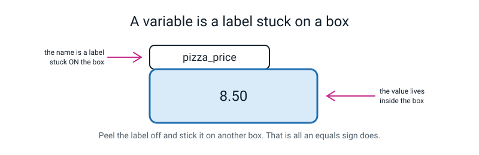
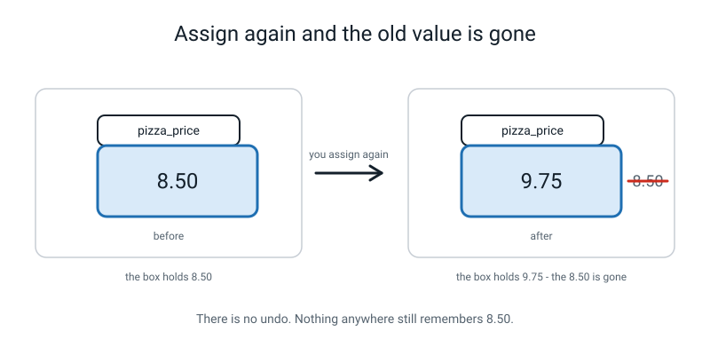
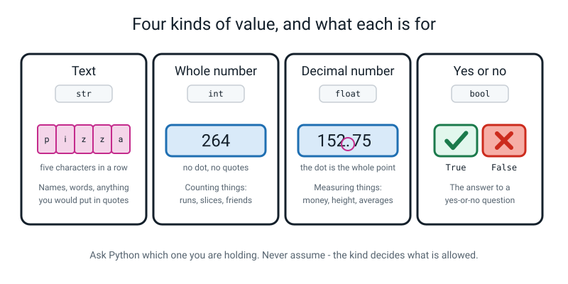
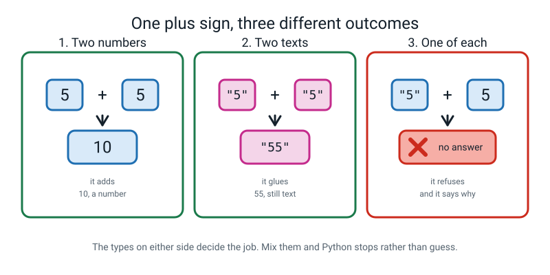
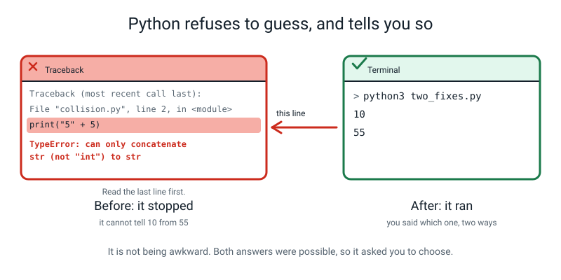
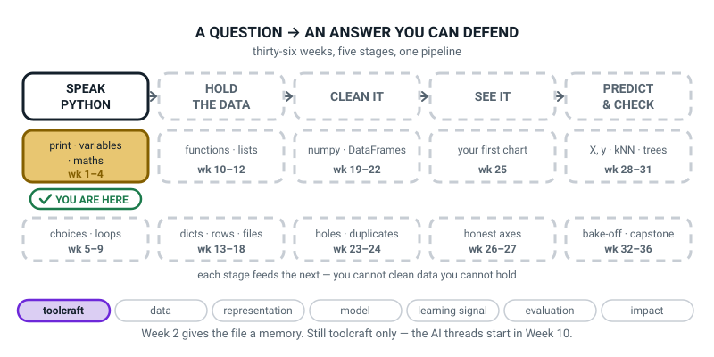

# Week 2 — Boxes With Names On: Variables and Types

[⬅ Week 1](week-01.md) · [Course Home](../README.md) · [Week 3 ➡](week-03.md) · [Student Guide](../student-guide/week-02.md) · [Workbook](../workbook/week-02.md)

---

## 📋 At a Glance

| | |
|---|---|
| **Duration** | 70 minutes |
| **Type** | 🟦 Teach — one new tool (the named box) and one new idea (the kind of thing inside it) |
| **Big idea** | A variable is a named box holding one value, and the value's type decides what `+` even means. |
| **New vocabulary** | variable · assignment · string · integer · float |
| **New syntax** | `name = value` · `type(x)` · `int("12")` · `float("3.5")` |
| **Materials** | Printed workbook pages 2.1–2.6 · pencil · **three real boxes or tubs** · **a pad of sticky notes** · slips of paper · the BUG LOG sheet from Week 1 |
| **Tech needed** | The laptop from Week 1, with `~/ai-academy/level2` open in the editor and a terminal in that folder |
| **Prep time** | 20 minutes the night before, 5 minutes on the day |

> **⚠️ Watch out:** the sticky-note demonstration is not decoration and it does not work as well drawn on a whiteboard. Peeling a physical label off one box and pressing it onto another is what makes *reassignment* obvious. Find three tubs. Any tubs.

---

## 🎯 Lesson Objectives

By the end of the lesson the student can:

1. **Store a value in a well-named variable** and reuse it later without retyping the value.
2. **Name the type of any value using `type()`**, and say what each of the four kinds is for.
3. **Predict whether `+` will add or glue**, given the types of the things on either side.
4. **Convert deliberately between text and numbers** with `int()` and `float()`, and read the `TypeError` that appears when you don't.

Observable evidence: a file in which every number appears exactly once and is used by name afterwards; a `type()` tour whose output the student predicted first; and a `TypeError` in the Bug Log, mended two different ways with both answers written down.

---

## 🧑‍🏫 What YOU Need to Know First

> **📌 About the code blocks in this guide.** Outside the **🧰 Prep Checklist** and the **🔑 Answer Key**, the blocks are **illustrations, not files** — each one carries on from the one above it, so the `import` lines and the data are typed once, in the first block that needs them. **The complete runnable files are in the Prep Checklist and the Answer Key.** If you paste an illustration on its own and get `NameError`, that is why, and nothing is broken.

Read this with the laptop open and type the examples. There are two ideas this week — one easy, one deceptive — and it is worth knowing which is which before you walk in.

### 1. The easy idea: a variable is a name stuck on a value

> **Variable** — a name you attach to a value so you can use the value later without typing it out again.

```python
pizza_price = 8.50
```

Read that out loud, always, as **"pizza_price *gets* 8.50."** Never as "pizza_price equals 8.50".

That habit matters more than it sounds, because `=` in Python is **not** the equals sign from maths. In maths, `x = 5` is a *statement about the world*: it claims something is true. In Python, `=` is an **instruction**: *put the thing on the right into the name on the left.* It is a verb, not a claim.

> **Assignment** — the act of putting a value into a name, using `=`.


*Figure 2.1 — The name is a label on the outside. The value is what's inside. They are two different things.*

The picture is the whole model, and it is worth being precise about which part is which:

- The **box** is a place in the computer's memory where one value sits.
- The **name** is a label stuck on the outside so you can find that box again.
- Asking for `pizza_price` means *"open the box with that label on it and give me whatever is in there right now."*

**Reassignment.** Assign to the same name a second time and the old value is simply gone.

```python
# boxes.py - one box, two different values in it.

pizza_price = 8.50            # put 8.50 into the box labelled pizza_price
print(pizza_price)            # look inside the box

pizza_price = 9.75            # the shop put the price up
print(pizza_price)            # same label, different contents
```

```text
8.5
9.75
```


*Figure 2.2 — There is no undo. After line 5, nothing anywhere still remembers 8.50.*

> **💡 Try this:** notice that `8.50` printed as `8.5`. Python does not remember that you typed a trailing zero — it stored the *number*, and the number eight-point-five has no trailing zero. That looks wrong on a price and it is Week 3's entire opening problem. Today, just say: *"Yes, that's the number. Making it look like money is next week, and it takes one character."*

**Naming.** There are rules Python enforces and rules only humans care about, and it is worth knowing both because you will be asked.

| Python enforces this | Good | Bad, and what happens |
|---|---|---|
| Start with a letter or `_` | `score2` | `2score` → `SyntaxError: invalid decimal literal` |
| Letters, digits and `_` only | `top_score` | `top-score` → `SyntaxError`; `top score` → `SyntaxError` |
| Capitals matter | `score` and `Score` are two different boxes | assuming they're the same → `NameError` |
| Not one of Python's own words | `class_size` | `class = 30` → `SyntaxError: invalid syntax` |

Only humans care about these, and they matter enormously anyway:

- **`snake_case`**: all lowercase, words joined with underscores. `pizza_price`, not `PizzaPrice` or `pp`.
- **Say what the thing *is***, not what type it is. `slice_count`, never `num1`.
- **A name is a promise.** If you call something `total` it had better be a total.

The sentence to say out loud: *"In two weeks you will be a stranger reading your own file. Name things for that stranger."*

### 2. The deceptive idea: every value has a kind, and the kind decides what happens

Week 1 already showed the student that `"7" * 6` gives `777777` while `7 * 6` gives `42`. This week names the reason.

> **Type** — the kind of thing a value is, which decides what you are allowed to do with it and what the operators mean.

The four kinds you need, with the plain-English name first and the Python name second:

| Plain English | Python name | Holds | Examples |
|---|---|---|---|
| Text | `str` (short for **string**) | Characters, always in quotes | `"pizza"`, `"264"`, `""` |
| Whole number | `int` (short for **integer**) | Whole numbers, no quotes, no dot | `264`, `0`, `-7` |
| Decimal number | `float` | Numbers with a decimal point | `152.75`, `8.5`, `-0.25` |
| Yes-or-no | `bool` | Exactly two possible values | `True`, `False` |

> **String** — a piece of text. It is called a string because it is a *string of characters*, threaded together like beads.
>
> **Integer** — a whole number, with no fractional part.
>
> **Float** — a number with a decimal point. (The full name is "floating-point number", which refers to how the computer stores it; the name is not worth explaining today.)


*Figure 2.3 — Text is a row of characters. A whole number has no dot. A decimal number has one, and the dot is the whole point.*

You ask Python which kind you're holding with `type()`:

```python
# types_tour.py - what kind of thing is each value?

player = "Rohit"                        # text, so it goes in quotes
print(player, type(player))             # print the value, then its type

runs = 264                              # a whole number, no quotes, no dot
print(runs, type(runs))

strike_rate = 152.75                    # a number with a decimal point
print(strike_rate, type(strike_rate))

is_captain = False                      # one of exactly two values
print(is_captain, type(is_captain))
```

```text
Rohit <class 'str'>
264 <class 'int'>
152.75 <class 'float'>
False <class 'bool'>
```

**Read `<class 'str'>` as "this is a string."** The word `class` is a Python thing we meet in Level 3 and it is safe to ignore completely. If a student asks, the honest answer is: *"`class` is the general word Python uses for 'kind of thing'. It's the wrong word to worry about today."*

Two type facts that will come up whether you plan for them or not:

- **`/` always gives a float.** `4 / 2` is `2.0`, not `2`. This is by design: division often produces a fraction, so Python always leaves room for one.
- **`bool` is not in this week's five vocabulary words**, on purpose — `True` and `False` get a whole lesson in Week 5. Today it is enough to say: *"there's a fourth kind that's just yes or no, and we'll use it properly in three weeks."* Do show it in the types tour, so the set of four feels complete.

### 3. Why `"5" + 5` is an error, and why that is good news

This is the centre of the lesson, so here it is in full.

`+` does two entirely different jobs depending on what is on either side of it:

```python
print(5 + 5)          # two numbers  -> arithmetic
print("5" + "5")      # two strings  -> glue them together
```

```text
10
55
```


*Figure 2.4 — Two numbers: it adds. Two texts: it glues. One of each: it stops.*

Now mix them:

```python
# collision.py
print("5" + 5)
```

```text
Traceback (most recent call last):
  File "/Users/you/ai-academy/level2/collision.py", line 2, in <module>
    print("5" + 5)
TypeError: can only concatenate str (not "int") to str
```

> **TypeError** — "the things on either side don't go together." Right names, wrong kinds of thing.

Translate the message for yourself before you translate it for a student. *"Can only concatenate str to str"* means: *"the glue-things-together job only works on text, and you handed me an int."*

**Here is the part that makes the lesson matter, and please say it out loud.** Python genuinely does not know which you meant:

- Did you want `10` — treat the text `"5"` as a number and add?
- Did you want `"55"` — treat the number `5` as text and glue?

Both are perfectly reasonable and they give completely different answers. So Python does the honest thing: **it stops and makes you say which.** Some other languages guess. Guessing is how a system ends up quietly charging someone `"100" + 50` = `10050` rupees and nobody notices for a month, because nothing crashed.

**A crash is a bug you find in four seconds. A guess is a bug you find in four weeks.** That sentence is the real lesson of Week 2.

You mend it by saying which you meant:

```python
# two_fixes.py - the same collision, mended two different ways.

print(int("5") + 5)      # make the text into a number, THEN add
print("5" + "5")         # make both sides text, THEN glue
```

```text
10
55
```


*Figure 2.5 — Both answers were available. That is exactly why Python would not choose for you.*

### 4. Converting on purpose: `int()` and `float()`

> **Converting** — turning a value of one kind into an equivalent value of another kind, deliberately.

```python
# convert.py - swapping a value from one type into another on purpose.

print(int("12"))         # text "12" -> the number 12
print(float("3.5"))      # text "3.5" -> the number 3.5
print(float(12))         # whole number 12 -> 12.0
print(int(3.9))          # 3.9 -> 3   (it CHOPS, it does not round)
print(type(int("12")))   # proof it really is an int now
```

```text
12
3.5
12.0
3
<class 'int'>
```

Three things to hold on to, all of which will be asked:

- **`int(3.9)` is `3`, not `4`.** `int()` **chops off** everything after the point; it does not round. Proper rounding exists and arrives in Week 4. If a student expects `4`, that is a completely reasonable expectation and the honest reply is: *"It throws away the decimal part rather than rounding. The rounding tool is two weeks away."*
- **`int("3.5")` fails.** It looks like it should work and it does not:
  ```text
  ValueError: invalid literal for int() with base 10: '3.5'
  ```
  Because `int()` will only accept text that spells out a *whole* number. Use `float("3.5")`.
- **`int("twelve")` fails too**, with the same error type:
  ```text
  ValueError: invalid literal for int() with base 10: 'twelve'
  ```

> **TypeError vs ValueError**, which is the distinction most likely to catch you out:
> `int("twelve")` is a **ValueError** — you gave `int()` the right *kind* of thing (text), but that particular *value* is impossible to convert.
> `"5" + 5` is a **TypeError** — the kinds themselves don't go together.

The one-line version for the student: *"ValueError means right kind, impossible value. TypeError means wrong kind entirely."*

### 5. The three misconceptions you will actually meet

**Misconception 1 — "`=` means equals."**

It leads directly to a student writing `8.50 = pizza_price`, which produces:

```text
SyntaxError: cannot assign to literal here. Maybe you meant '==' instead of '='?
```

The fix is not an explanation, it is a habit: **make them read every `=` out loud as "gets"**, all lesson, every time. The name always goes on the **left**. The value always comes from the **right**.

**Misconception 2 — "the quotes are just tidiness."**

Still the big one, and Week 1 only dented it. The demolition tool is `type()`: have them run `type(8.50)` and `type("8.50")` back to back and see `float` and `str`. Same characters on screen, different kind of thing, and therefore different behaviour. The screen cannot show you the difference. `type()` can.

**Misconception 3 — "an error means Python is being difficult."**

Reframe it every time it appears, in the same words: **"it refused because both answers were possible."** A student who ends the week believing that a `TypeError` is Python being *careful* rather than Python being *awkward* has got the lesson.

### 6. How deep to go, and where to stop

**Go this far:** `name = value` read as "gets"; reassignment loses the old value; four kinds of value; `type()` tells you which; `+` adds numbers and glues text; mixing them stops the program; `int()` and `float()` convert on purpose.

**Stop before:**

- **f-strings.** No `f"..."` today. Print with commas: `print("Price:", pizza_price)`. Week 3.
- **`str()`.** You can mend `"5" + 5` two ways *without* it — `int("5") + 5` and `"5" + "5"` — and that is the pair the workbook asks for. `str()` is Week 4's syntax; if a student invents it, congratulate them and let them use it.
- **`input()`.** Week 4. The trap in `input()` is exactly this week's TypeError, and having it land after this lesson is deliberate.
- **`round()`.** Week 4. Today `int()` chops and that is the whole story.
- **`bool` as a topic.** Show it, name it, move on. `True`/`False` and comparisons are Week 5.
- **Why floats are slightly inexact.** Do not open `0.1 + 0.2`. It is real, it is interesting, and it will eat twenty minutes you do not have. If a student stumbles on it, write it in the margin and say "that's a genuinely famous problem and we'll come back to it."
- **Memory, addresses, `id()`.** Not this year.

---

### 7. 🧭 The Growing Map — two minutes at the end of the lesson

The student guide carries the same figure every week — **Where This Fits** — with one more piece filled
in. It is the only thing in the course that shows the learner the *shape* of what they are building
instead of this week's content, and Week 2 is where the habit gets established.



*Figure 2.0 — Week 2's version. Identical to Week 1's, because Week 2 lives in the same tile. That
sameness is the message, not a mistake.*

**What to do with it, in about two minutes:**

1. **Show it before you explain it.** Ask: *"we just put `pocket_money` and `pizza_price` into boxes with
   names on — which box on this map was that?"* They point at the gold tile. Pointing is the exercise.
2. **Then ask why it is the same gold tile as last week.** You want something like *"because it's still
   just Python, we haven't got to the data yet."* That is exactly right, and it tells them a tile is a
   few weeks of work rather than one lesson.
3. **Then the dashes:** *"why is nearly all of it dotted?"* Answer wanted: *"because we haven't been there
   yet."* Quietly this says the year has a shape and they are standing inside it.
4. **Have them add to their own pencil copy** in the inside cover of the notebook — the one they started
   in Week 1. Two words under the first tile is plenty: *name* and *kind*.

> **🧑‍🏫 Why this is worth two minutes.** A learner who can see the map can tell the difference between
> *"I don't understand this week"* and *"I don't know where this week goes"* — and those two need
> completely different help from you. Without the map, both come out of their mouth as "I don't get it."

> **⚠️ Watch out:** do not let this become a quiz, and do not let a student who says "we did the yellow
> one" be corrected. The map is orientation, not assessment.

---

## 🧰 Prep Checklist

### 20 minutes the night before

- [ ] **Find three boxes or tubs** and a pad of sticky notes. Write nothing on them yet.
- [ ] **Run this code yourself first.** In `~/ai-academy/level2`, create `types_tour.py` and type it out:
      ```python
      # types_tour.py - what kind of thing is each value?

      player = "Rohit"                        # text, so it goes in quotes
      print(player, type(player))             # print the value, then its type

      runs = 264                              # a whole number, no quotes, no dot
      print(runs, type(runs))

      strike_rate = 152.75                    # a number with a decimal point
      print(strike_rate, type(strike_rate))

      is_captain = False                      # one of exactly two values
      print(is_captain, type(is_captain))
      ```
      ```bash
      python3 types_tour.py
      ```
      Expected, exactly:
      ```text
      Rohit <class 'str'>
      264 <class 'int'>
      152.75 <class 'float'>
      False <class 'bool'>
      ```
- [ ] **Now run the collision.** Create `collision.py` with one line, `print("5" + 5)`, and run it. You must see:
      ```text
      TypeError: can only concatenate str (not "int") to str
      ```
      **Read that last line out loud to yourself and translate it into plain English before you close the laptop.** "The glue job only works on text and you gave me a number." If you can say that without looking, you are ready.
- [ ] **Then run the two fixes**, `int("5") + 5` and `"5" + "5"`, and confirm `10` and `55`.
- [ ] **One more:** `print(8.50)` on its own. It prints `8.5`. Know that before a student asks.
- [ ] Print workbook pages 2.1–2.6.
- [ ] Reread §3 above (why `"5" + 5` is an error). It is the twenty minutes of the lesson that carry the year.

### 5 minutes on the day

- [ ] **Three tubs in a row on the table.** One sticky note with `pizza_price` written on it, stuck to the first tub. Inside it, a slip of paper reading `8.50`. A second slip reading `9.75` in your pocket.
- [ ] A blank sticky note and a pen within reach, for the student to make their own.
- [ ] Editor open on the folder; terminal open in the folder; font big.
- [ ] The Week 1 BUG LOG sheet on the table, with the three entries from last week visible. Today adds at least two.
- [ ] Write on the board, before they arrive: **`=` is not "equals". It is "gets".**

### Fallback if something fails

| If this fails | Do this instead |
|---|---|
| No boxes, no sticky notes | Three **envelopes** and folded paper labels work identically. In the very worst case, three upturned mugs and three labelled scraps of paper under them. What you need is something you can *physically move a label between*. |
| The laptop is unavailable | The whole of the Concept and the sticky-note activity is paper. Then do workbook page 2.2 (the nine naming-and-type exercises) as predict-on-paper. You lose the tracebacks, which is a real loss — do them at the start of Week 3. |
| The student can't remember Week 1 | Spend five minutes running `hello.py` again before starting. It is worth the five minutes. If the file is gone, retype it — that is not wasted time. |
| The `TypeError` doesn't appear because they typed `"5" + "5"` by accident | Perfect, that is one of the two fixes. Say: *"You've accidentally done the answer. Now do it the wrong way on purpose."* |
| The student already knows all this | Very possible if they've poked around. Go straight to the harder variations, especially "the same characters, two different kinds" (`"8.50"` vs `8.50`), and set them the naming-audit task: rename every variable in their Week 1 files so a stranger could read them. |

---

## ⏱️ The Lesson, Minute by Minute

| Segment | Minutes | Running total | What happens |
|---|---|---|---|
| 🪝 Hook — The Box With a Label On | 7 | 7 | A physical box, a sticky note, and a label that gets peeled off |
| 🧠 Concept — Names, Then Kinds | 16 | 23 | Assignment as "gets"; the four kinds; what `+` does to each |
| 💻 Live-Code Together — `types_tour.py` | 18 | 41 | They type; you plant two bugs on purpose |
| 🎲 Their Turn — Your Own Boxes, and the Collision | 20 | 61 | `pocket_money.py`, then `"5" + 5` mended two ways |
| 🔑 Wrap & Assign | 9 | 70 | Three checks, the takeaway, Bug Log, homework |

---

### 🪝 Hook — The Box With a Label On (7 minutes)

**Do this:** Three tubs on the table. The first has a sticky note on it reading `pizza_price` and a slip of paper inside reading `8.50`. Do not explain anything yet.

**Say this:**

> "Last week every single number you used, you had to type out fresh every time you wanted it. If you'd written a pizza bill and then the price went up, you'd have gone hunting through the file changing 8.50 in four different places, and you'd have missed one. Everyone misses one.
>
> Today we fix that, and the fix is sitting on the table."

**Do this:** Pick up the first tub. Show the label. Open it and show the slip.

**Say this:**

> "Here is a box. It's got a label on the outside that says `pizza_price`. And inside — look — there's a slip of paper with `8.50` on it.
>
> That's a variable. That's the whole idea. **A name, stuck on the outside of a place where one value lives.**
>
> When I say 'what's pizza_price?' you don't guess. You go and find the box with that label, open it, and read what's inside. Right now: eight pounds fifty."

**Ask this:** *"Which bit is the name, and which bit is the value?"* — The note on the outside is the name. The slip inside is the value. Make them point.

**Do this:** Now the important move. Take out the `8.50` slip, screw it up, drop it, and put the `9.75` slip in instead.

**Say this:**

> "The shop's put the price up. Same box, same label, different thing inside. What's `pizza_price` now?"

*9.75.*

> "Right. And here's the question I actually care about: **where's the 8.50?**"

Let them look at the screwed-up paper on the floor.

> "It's gone. On the floor. Nothing anywhere remembers it. There's no undo. When you put a new value into a box, the old one is simply not there any more, and that catches everybody at least once.
>
> Now the other move."

**Do this:** Peel the `pizza_price` note off the first tub and press it firmly onto the second, empty tub.

**Say this:**

> "What have I just done? I've taken the *name* and stuck it on a different box. The name isn't the box. The name is a **label**, and a label can be moved.
>
> So there are two things here and you must keep them apart in your head: **the name on the outside**, and **the value on the inside.** The rest of today is about the inside — because it turns out it matters enormously *what kind of thing* is on the slip of paper."

**Ask this:**

| Ask | Answer you want | If they say something else |
|---|---|---|
| "Where did the 8.50 go?" | Gone. Nothing remembers it. There's no undo. | If they say "it's still in the computer somewhere" — honest answer: "Not anywhere you can reach. As far as your program is concerned it never existed." |
| "Could two labels be on one box?" | Yes, actually — and that is a real Python thing. | This is a genuinely good question. Say: *"Yes, and it's a real thing we'll meet in Week 11 when boxes start holding lists. Park it."* Do not open it today. |
| "Is the box the name, or is the box the box?" | The box is the place. The name is the sticker. | If they conflate them, do the peel again, slowly, and ask again. The physical move does the teaching. |

---

### 🧠 Concept — Names, Then Kinds (16 minutes)

**Do this:** Laptop turned so you can both see. Do not type yet. The board says: **`=` is not "equals". It is "gets".**

**Say this — part 1, assignment:**

> "In Python, making that box looks like this."

Write it on the board, big:

```
pizza_price = 8.50
```

> "And I want you to read it out loud, right now, the way I'm about to, and then I want you to read it that way for the rest of your life.
>
> **'pizza_price *gets* 8.50.'**
>
> Not 'equals'. **Gets.** Because that equals sign is not the one from maths. In maths, `x = 5` is a claim — it says something is true about x. In Python, that sign is an **instruction**: *take the thing on the right, put it in the name on the left.* It's a verb. It does something.
>
> Which is why it only works one way round. The name goes on the left. Always. If you write it the other way round — `8.50 = pizza_price` — Python stops and says `cannot assign to literal`, which means 'you can't put something into the number 8.50, that's not a box, that's a value.'
>
> Read me these three out loud."

Write, and have them read each as "gets":

```
runs = 264
player = "Rohit"
total = runs + 100
```

> **Variable** — a name attached to a value, so you can use the value later without typing it again.
>
> **Assignment** — putting a value into a name, with `=`. Read it as "gets".

> "And the reason this is worth a whole lesson: **you write the number once.** If the price changes, you change one line and everything that used the name is instantly right. Last week you'd have changed four lines and missed one."

**Say this — part 2, the four kinds:**

> "Now the second half, and it's the bit that explains something you already saw last week and didn't have a word for.
>
> Remember `7 * 6` gave 42, and `"7" * 6` gave 777777? Same star, two different jobs. The reason is that every value in Python has a **kind**, and the kind decides what the operators mean.
>
> There are four kinds you need. I'll say the ordinary name first and Python's name second, because Python's names are all abbreviations."

Draw the four on the board as four boxes with a value in each:

| Ordinary name | Python calls it | Example |
|---|---|---|
| Text | `str`, short for **string** | `"pizza"` |
| Whole number | `int`, short for **integer** | `264` |
| Decimal number | `float` | `152.75` |
| Yes-or-no | `bool` | `False` |

> "**String** is text. It's called a string because it's a *string of characters*, threaded together like beads on a thread. Text always, always goes in quotes.
>
> **Integer** is a whole number. No quotes, no decimal point.
>
> **Float** is a number *with* a decimal point. 152.75. 8.5. The dot is the whole point — that dot is the only difference between a float and an int.
>
> And there's a fourth, **bool**, which is just yes or no — `True` or `False`, capital letters. We'll use it properly in three weeks; today I just want you to know it exists so the set feels complete."

> **String** — a piece of text; a string of characters.
> **Integer** — a whole number.
> **Float** — a number with a decimal point.

> "And you never have to guess which one you're holding, because there's an instruction that tells you. It's called `type`, and you use it exactly like `print`."

Write: `print(type(8.50))`

**Say this — part 3, the punchline:**

> "Here's the pair I want you to look at hardest. Two lines. Almost identical.
>
> `type(8.50)` — and — `type("8.50")`.
>
> Same four characters on the screen. What's the difference?"

*The quotes.*

> "Right. And the answer that comes back is completely different: one is a **float** and one is a **string**. Same-looking thing, different kind of thing, and therefore *different behaviour*. You cannot tell them apart by looking at the screen. That's the trap. `type()` is the torch you shine on it.
>
> Last thing before we type. Predict this for me. What does `5 + 5` give?"

*10.*

> "And `"5" + "5"` — both in quotes?"

Let them think. Some say 10, some say 55.

> "**55.** Two strings, so plus does the *other* job it knows: it sticks them together end to end. Five, then five. Fifty-five as characters, not as a number.
>
> So now: `"5" + 5`. One in quotes, one not. What happens?"

**Do not tell them.** Let them commit to an answer. Write it down. Then:

> "Hold that. We're going to run it in about ten minutes and it's the most interesting thing in the lesson."

**Ask this:**

| Ask | Answer you want | If they say something else |
|---|---|---|
| "Read me `runs = 264` out loud." | "runs gets 264." | If they say "equals", say "gets" and have them say it again. Do this every time, all lesson. It takes four repetitions and then it sticks. |
| "What's the difference between `8.50` and `"8.50"`?" | The quotes. One is a number, one is text. | If they say "nothing" — perfect, that's the honest answer from looking, and it's why `type()` exists. Say: *"From the screen, nothing. That's exactly the problem."* |
| "What's `"5" + "5"`?" | `55` — two texts, so it glues. | If they say 10, don't correct. Say: "Interesting. We'll run it." Then run it early and let the screen do the correcting. |
| "Why bother with `type()` at all?" | Because you can't see a kind. You can only see characters. | If they say "so you don't get errors" — sharpen it: "So you know *which* job the plus sign is about to do." |
| "Does `int` mean it can't be negative?" | No. `-7` is an int. Whole, not positive. | Good question and worth a fast check: `print(type(-7))` gives `<class 'int'>`. |

---

### 💻 Live-Code Together — `types_tour.py` (18 minutes)

**The rule: their hands on the keyboard, yours off it.** You read each line aloud; they type it.

#### File 1 — `types_tour.py` (9 minutes)

**Exact keystroke sequence:**

1. **File → New File**, then **File → Save As**, name it `types_tour.py`, in `ai-academy/level2`.
2. Type the file, one line at a time. **Before each `print`, they predict the type out loud.**

```python
# types_tour.py - what kind of thing is each value?

player = "Rohit"                        # text, so it goes in quotes
print(player, type(player))             # print the value, then its type

runs = 264                              # a whole number, no quotes, no dot
print(runs, type(runs))

strike_rate = 152.75                    # a number with a decimal point
print(strike_rate, type(strike_rate))

is_captain = False                      # one of exactly two values
print(is_captain, type(is_captain))
```

3. Save (watch for the dot disappearing). Run:

```bash
python3 types_tour.py
```

```text
Rohit <class 'str'>
264 <class 'int'>
152.75 <class 'float'>
False <class 'bool'>
```

**Say this:**

> "Four values, four kinds, and Python told you each one without you having to guess. Read `<class 'str'>` as 'this is a string'. The word `class` is Python's general word for 'kind of thing' and it is safe to completely ignore today.
>
> And notice `print` took **two** things this time, with a comma between them — the value, and then its type. Same comma trick as last week."

#### 🐞 Planted bug 1 — the case trap (4 minutes)

**Do this:** Ask for the keyboard for fifteen seconds. Change line 4 from `print(player, type(player))` to `print(Player, type(player))` — capital P on the first one only. Save. Hand it back. **They** run it.

```text
Traceback (most recent call last):
  File "/Users/you/ai-academy/level2/types_tour.py", line 4, in <module>
    print(Player, type(player))
NameError: name 'Player' is not defined. Did you mean: 'player'?
```

**Say this:**

> "Read me the last line. Now: is that a spelling mistake?"

They will hesitate, because it *is* spelled right.

> "Every letter is correct. The only thing wrong is that one of them is a **capital**. And to Python, `Player` and `player` are two completely different names — two completely different boxes, and only one of them exists.
>
> This is the single most annoying error in programming, because your eyes read the word, not the letters, and a capital P is basically invisible when you're hunting for a typo. The way to find it is to read the name out loud one character at a time: 'capital-P, l, a, y, e, r.' Saying 'capital' out loud is what makes you see it."

Fix it. Run. **Bug Log row.**

#### 🐞 Planted bug 2 — the collision (5 minutes)

**Do this:** Now the moment the lesson was built for. Have **them** add these two lines at the bottom of the file:

```python
print("5" + "5")
print("5" + 5)
```

Save. Run.

```text
Rohit <class 'str'>
264 <class 'int'>
152.75 <class 'float'>
False <class 'bool'>
55
Traceback (most recent call last):
  File "/Users/you/ai-academy/level2/types_tour.py", line 15, in <module>
    print("5" + 5)
TypeError: can only concatenate str (not "int") to str
```

**Say this:**

> "Two things happened. First, `"5" + "5"` printed **55** — you can see it, right there above the red. Two texts, glued. Second, `"5" + 5` stopped the program.
>
> Read me the last line."

> *"TypeError: can only concatenate str (not 'int') to str."*

> "Now translate it. 'Concatenate' is a big word for 'glue end to end'. So it's saying: **the glue job only works on text, and you handed me a number.**
>
> And now the question that matters. Why didn't Python just *sort it out*? It's obviously five and five."

Let them argue. Then:

> "Because there are **two** obvious answers and they're different.
>
> Maybe you wanted **10** — treat the text five as a number, and add.
>
> Or maybe you wanted **55** — treat the number five as text, and glue.
>
> Both are completely sensible. Python has no way to know which. So instead of picking one and being wrong half the time, it stops and makes you say.
>
> Some languages *do* guess. And here's what that costs. Imagine a shop's till where the price is text and the delivery charge is a number, and the language quietly glues them: a hundred pounds plus fifty pounds becomes **ten thousand and fifty pounds**, and nothing crashes, and nobody notices for a month.
>
> **A crash is a bug you find in four seconds. A guess is a bug you find in four weeks.** That's why this error message is good news."

Now mend it, both ways, with them typing:

```python
print(int("5") + 5)      # make the text into a number, THEN add
print("5" + "5")         # make both sides text, THEN glue
```

```text
10
55
```

> "Two fixes, two different right answers, and **you** chose which. That's the whole point. Python didn't take a decision away from you — it handed one to you."

**Bug Log row.** This one goes in with both fixes written in the third column.

> **🧑‍🏫 If a student asks:** *"Is there a way to turn a number into text?"* — Yes, `str()`, and it's Week 4's tool. Let them use it if they've found it; just don't require it, because `"5" + "5"` gets the same job done with this week's syntax.

---

### 🎲 Their Turn — Your Own Boxes, and the Collision (20 minutes)

Full instructions in the next section. In the lesson flow:

- **Minutes 0–10:** they write `pocket_money.py` from scratch — four named boxes, two computed values, every number typed exactly once.
- **Minutes 10–15:** the type quiz. Twelve values, predict the type, then check with `type()`.
- **Minutes 15–20:** the conversion drills, including two deliberate `ValueError`s.

---

## 🎲 The Activity, In Full

### Setup

**On the table:** the three tubs and sticky notes (leave them out — students refer back to them), workbook pages 2.2 and 2.3, a pencil, the BUG LOG.

**On screen:** editor and terminal on `~/ai-academy/level2`. Nothing else open.

**Say this before they start:**

> "Same three rules as last week, plus one new one.
>
> One: **you type everything.** Two: **predict before every Run.** Three: **every error goes in the Bug Log.**
>
> And the new one, which is today's whole discipline: **every number gets typed exactly once.** If a number appears twice in your file, you've done it wrong. Give it a name and use the name."

### Part A — `pocket_money.py` (10 minutes)

**The brief, exactly as you give it:**

> "New file, `pocket_money.py`. It needs:
>
> - a comment on line 1 saying what the file is
> - **at least three named boxes** holding your own real numbers
> - **at least two values the computer works out** from those boxes
> - **at least one `type()`** so you can see what kind of thing you ended up with
> - and no number typed twice, anywhere"

A finished example, actually run:

```python
# pocket_money.py - one week of pocket money, stored in named boxes.

weekly_money = 5.50               # pounds I get each week
weeks_saved = 6                   # how many weeks I have been saving
spent = 12.75                     # pounds I have already spent

saved = weekly_money * weeks_saved    # 5.50 * 6
left = saved - spent                  # what is actually still there

print("Saved so far:", saved)
print("Spent:", spent)
print("Left:", left)
print("Type of saved:", type(saved))
print("Type of weeks_saved:", type(weeks_saved))
```

```text
Saved so far: 33.0
Spent: 12.75
Left: 20.25
Type of saved: <class 'float'>
Type of weeks_saved: <class 'int'>
```

**Two things to point out once it runs — but only after it runs:**

- `saved` came out as `33.0`, a **float**, even though 5.50 × 6 is a whole number of pounds. Why? Because one of the two things being multiplied was a float, and **whenever a float touches an int in arithmetic, the answer is a float.** That is a genuinely useful rule and it is worth writing on the board.
- `weeks_saved` is an `int` and `saved` is a `float`, and the student can *see* both, in the same output. That is the objective, achieved and visible.

**What "finished" looks like:**

- The file runs with no traceback.
- Line 1 is a comment.
- Three or more `=` lines, each read aloud as "gets".
- At least two values derived by arithmetic, not typed.
- **No number appears twice in the file.** Check this by eye — it is the discipline of the week.
- At least one `type()` in the output.

### Part B — The type quiz (5 minutes)

**Do this:** They fill in the middle column on paper first, then type the file and check.

| Value | Their guess | Real type |
|---|---|---|
| `42` | | `int` |
| `42.0` | | `float` |
| `"42"` | | `str` |
| `True` | | `bool` |
| `4 + 2` | | `int` |
| `4 / 2` | | `float` |
| `"4" * 2` | | `str` |
| `8.50` | | `float` |
| `"8.50"` | | `str` |
| `-7` | | `int` |
| `0` | | `int` |
| `""` | | `str` |

The file, and its real output:

```python
# type_quiz.py - guess first, then check.

print(42, type(42))
print(42.0, type(42.0))
print("42", type("42"))
print(True, type(True))
print(4 + 2, type(4 + 2))
print(4 / 2, type(4 / 2))
print("4" * 2, type("4" * 2))
print(8.50, type(8.50))
print("8.50", type("8.50"))
print(-7, type(-7))
print(0, type(0))
print("", type(""))
```

```text
42 <class 'int'>
42.0 <class 'float'>
42 <class 'str'>
True <class 'bool'>
6 <class 'int'>
2.0 <class 'float'>
44 <class 'str'>
8.5 <class 'float'>
8.50 <class 'str'>
-7 <class 'int'>
0 <class 'int'>
 <class 'str'>
```

**The four that catch almost everyone**, and each is worth a sentence:

- `42.0` is a **float**, not an int. The `.0` is not decoration; it changes the kind.
- `4 / 2` is `2.0`, a **float**. Division always leaves a decimal point.
- `"4" * 2` is `"44"`, a **string** — not `8`. Week 1's `"7" * 6` all over again.
- `8.50` prints as `8.5` and is a float; `"8.50"` prints as `8.50` and is a string. **The string keeps the trailing zero and the number doesn't.** That is the single best illustration of the week and it is worth stopping on.

### Part C — Conversion drills (5 minutes)

**Do this:** They type these five lines, predicting each, then two more that fail on purpose.

```python
# convert.py - swapping a value from one type into another on purpose.

print(int("12"))         # text "12" -> the number 12
print(float("3.5"))      # text "3.5" -> the number 3.5
print(float(12))         # whole number 12 -> 12.0
print(int(3.9))          # 3.9 -> 3   (it CHOPS, it does not round)
print(type(int("12")))   # proof it really is an int now
```

```text
12
3.5
12.0
3
<class 'int'>
```

**Stop on `int(3.9)` giving `3`.** Almost every student predicts 4. Say: *"It doesn't round. It chops off everything after the point. There is a proper rounding tool and it's two weeks away."*

Then the two deliberate failures, one at a time:

```python
print(int("twelve"))
```

```text
ValueError: invalid literal for int() with base 10: 'twelve'
```

```python
print(int("3.5"))
```

```text
ValueError: invalid literal for int() with base 10: '3.5'
```

**Say this on the second one:**

> "That's the surprising one. `"3.5"` is a perfectly good number written down, and `int()` still refuses — because `int` means *whole* number, and 3.5 isn't one. Use `float("3.5")` instead, and it works.
>
> And notice this is a **ValueError**, not a TypeError. Different words for different problems. TypeError means 'wrong kind of thing entirely'. ValueError means 'right kind of thing, but that particular value is impossible.' You handed `int()` some text, which is exactly what it wants. It just couldn't do anything with *that* text."

Both go in the Bug Log.

### Variation — easier

- **Cut Part B to six values** instead of twelve. Keep `42`, `42.0`, `"42"`, `4 / 2`, `8.50`, `"8.50"`.
- **Cut Part C to two lines**: `int("12")` and `float("3.5")`. Skip the failures; the `TypeError` from the live-code segment is enough error work for one day.
- **Give the `pocket_money.py` skeleton**, so they only fill in the numbers and names:
  ```python
  # pocket_money.py - my pocket money in named boxes.

  weekly_money = ____
  weeks_saved = ____

  saved = weekly_money * weeks_saved

  print("Saved so far:", saved)
  print("Type:", type(saved))
  ```
- **Do the sticky notes again** if the box/label distinction hasn't landed. It is worth five minutes and it is worth more than any amount of extra typing.
- **One thing you must not cut:** running `"5" + 5`, reading the `TypeError` out loud, and mending it two ways. That is the week.

### Variation — harder

1. **The trailing-zero investigation.** Why does `print(8.50)` give `8.5` but `print("8.50")` give `8.50`? Real:
   ```python
   print(8.50)
   print("8.50")
   print(type(8.50), type("8.50"))
   ```
   ```text
   8.5
   8.50
   <class 'float'> <class 'str'>
   ```
   The answer: Python stored the *number* eight-point-five, which has no trailing zero — the zero was only ever in what you typed. The string, on the other hand, stored the four characters exactly. Then the follow-up: *"So how do you print a price properly?"* That is Week 3's opening line and this is a great way to arrive at it.
2. **Break `print` for real.** Have them run:
   ```python
   print = 5
   print("hi")
   ```
   ```text
   TypeError: 'int' object is not callable
   ```
   `print` is a name like any other, and they have just put the number 5 in that box, so the box no longer holds the printing machine. Genuinely illuminating, and it explains *why* "don't use Python's own words as names" is a rule. (Restart the file to recover; the damage is only inside that one run.)
3. **The naming audit.** Open their Week 1 files and rename every value into a well-named variable, so no number is typed twice. Then the test: *"Change the price of one pizza. How many lines did you have to edit?"* Should be one.
4. **Whole numbers that are floats.** Ask them to make a variable that holds a whole number but is a `float`, three different ways. All real:
   ```python
   print(type(12.0))
   print(type(float(12)))
   print(type(4 / 2))
   ```
   ```text
   <class 'float'>
   <class 'float'>
   <class 'float'>
   ```
   Then the good question: *"Which of those three would you actually write, and why?"* (`float(12)` when converting something; `4 / 2` by accident; `12.0` when you mean "this is a measurement, not a count".)

---

## 🐞 The Debugging Clinic

Every message below came from really running a broken version of this week's code.

| What the student sees (real message) | What it means | Most likely cause | The fix |
|---|---|---|---|
| `TypeError: can only concatenate str (not "int") to str` | "The glue-together job only works on text, and you gave me a number." | `"5" + 5` — text and a number on either side of a `+` | Decide which you meant. `int("5") + 5` gives `10`; `"5" + "5"` gives `55`. |
| `TypeError: unsupported operand type(s) for -: 'str' and 'int'` | "You cannot subtract a number from text at all." | `"5" - 5` | There is no "glue" version of minus, so the only fix is to make it a number: `int("5") - 5`. |
| `NameError: name 'Pizza_price' is not defined. Did you mean: 'pizza_price'?` | "I've never heard of that name." | A capital letter. `Pizza_price` and `pizza_price` are different boxes. | Match the case exactly. Read the name out loud one character at a time to spot it. |
| `NameError: name 'total' is not defined` | Same complaint, different cause. | The variable is used **above** the line that assigns it. Python runs top to bottom, so the box doesn't exist yet. | Move the `total = ...` line **above** the line that uses it. |
| `NameError: name 'false' is not defined. Did you mean: 'False'?` | Same complaint again. | Lowercase `false`. Python's yes-or-no values are `True` and `False`, with capitals. | Capitalise it. |
| `ValueError: invalid literal for int() with base 10: 'twelve'` | "Right kind of thing, but I can't turn *that* into a whole number." | `int("twelve")` | Nothing to fix in the code — that text genuinely isn't a number. If it should have been, fix the text. |
| `ValueError: invalid literal for int() with base 10: '3.5'` | Same, and more surprising. | `int("3.5")` — `int()` only accepts text spelling a *whole* number. | Use `float("3.5")`. |
| `SyntaxError: cannot assign to literal here. Maybe you meant '==' instead of '='?` | "You can't put something *into* a number." | Written backwards: `8.50 = pizza_price` | Swap the sides. The name always goes on the left. |
| `SyntaxError: invalid syntax` (caret under the second word) | "That isn't Python." | A space in the name: `pizza price = 8.50` | Join it with an underscore: `pizza_price`. |
| `SyntaxError: invalid decimal literal` | "A name can't start with a digit." | `2score = 5` | Rename it: `score2`. |
| `SyntaxError: invalid syntax. Perhaps you forgot a comma?` | "Two things next to each other with nothing joining them." | `print(type runs)` — the brackets round `runs` are missing | `print(type(runs))`. Every function call needs its own brackets. |
| `TypeError: 'int' object is not callable` | "You asked me to run something that isn't a machine." | `print` was used as a variable name: `print = 5` | Restart with a fresh run and never name a variable `print`, `type`, `int`, `float` or `str`. |

### How to teach debugging without giving the answer

Same ladder as Week 1, with two rungs added for this week's error family. Descend one rung at a time.

1. **"Read me the last line."**
2. **"What line number?"** Then: *"Show me that line."*
3. **New this week: "What kind of error is it — a name, the punctuation, or the types?"** `NameError` = a word. `SyntaxError` = punctuation. `TypeError`/`ValueError` = kinds of thing.
4. **New this week: "Put a `print(type(...))` above the broken line."** This is the single most useful debugging move in the whole language and this is the week to install it. If a `TypeError` says something is a `str` and the student is certain it's a number, `type()` settles it in four seconds.
5. **"Read every `=` on that line out loud as 'gets'."** Catches backwards assignment instantly.
6. **"Change one thing. Run again."**

The sentence for this week: **"Don't argue with it about what type something is. Ask it."**

---

## ❓ Questions Students Ask This Week

**"Why can't Python just work out that `"5" + 5` means ten?"**

Because it doesn't mean ten, necessarily. It might mean `"55"`. Both readings are completely reasonable, they give different answers, and Python has no way to know which you had in mind. So it does the honest thing: it stops and asks. Languages that guess are not being helpful — they are moving the mistake from a place where you'd notice it (a crash, now) to a place where you wouldn't (a wrong total, next month). A crash is a bug you find in four seconds; a guess is a bug you find in four weeks.

**"What's the difference between `8.5` and `"8.5"` if they look the same on screen?"**

Everything, and the screen is lying to you. `8.5` is a number: you can multiply it, add it, halve it. `"8.5"` is three characters: a digit, a dot, a digit. Try to halve it and you get a `TypeError`. They print identically, which is exactly why `type()` exists — it is the only way to see the difference. This is the single most common source of confusion for the next four weeks, so it is worth being annoyed about it now.

**"Why does `4 / 2` give `2.0` instead of `2`?"**

Because `/` always hands back a float, whether the answer needed one or not. Python's reasoning is consistency: `10 / 4` genuinely is `2.5`, and it would be strange for the same operator to sometimes give you whole numbers and sometimes not. So it always leaves room for a decimal. If you specifically want whole-number division, there is a separate operator for it — `//` — and that is Week 3.

**"Is `int(3.9)` a bug? Shouldn't it be 4?"**

Not a bug, but a genuinely reasonable expectation. `int()` **truncates**: it throws away everything after the decimal point, so `int(3.9)` is `3` and `int(-3.9)` is `-3`. It is doing "take the whole-number part", not "find the nearest whole number". Rounding is a different job and it has its own tool, `round()`, which arrives in Week 4. Until then, if you write `int()` on something with a fraction, expect it to chop.

**"Can I name a variable anything?"**

Nearly. Python enforces four rules: start with a letter or underscore, use only letters/digits/underscores, capitals matter, and you can't use one of Python's own thirty-odd reserved words like `class` or `if`. Everything else is legal — including `x`, `data2`, and `thing`, all of which are legal and all of which are bad. The rule that actually matters isn't Python's, it's this: in two weeks you will be a stranger reading your own file, so name things for that stranger.

**"What happens if I name a variable `print`?"**

Something genuinely instructive: it works, and then printing stops working. `print = 5` puts the number five in the box labelled `print`, and the printing machine that used to live there is gone. The very next `print("hi")` gives `TypeError: 'int' object is not callable` — "you asked me to run something that isn't a machine." Try it once, on purpose, then never do it again. It is the clearest possible demonstration of why "don't reuse Python's own names" is a rule rather than a suggestion.

**"How does the computer store a decimal number?"** *(Answer this honestly; the full answer is genuinely hard.)*

In binary, and not always exactly. This has a real and famous consequence: in Python, `0.1 + 0.2` does not equal `0.3` — it comes out as `0.30000000000000004`. That is not a Python bug; every language that stores decimals the standard way behaves the same. The reason is the same reason you cannot write one third exactly in decimal: `0.3333...` never ends, so if you have limited room you have to stop somewhere and be slightly wrong. Computers work in base 2 rather than base 10, and it turns out one tenth is one of the fractions that doesn't fit. **You will not meet this problem this year and you do not need to worry about it**, because when we print money we will always say how many decimals we want, which hides it completely. But if you go looking, you will find it, and it is real.

**"Which is the 'right' kind for money — int or float?"** *(Nobody fully agrees, and here's why.)*

**This is a genuine, live disagreement among professionals, and there are three camps.** Camp one says use a `float`: 8.50 is obviously a decimal number, floats are easy, and for anything at the scale of a pizza order the tiny inexactness above never shows up. Camp two says never use a float for money, ever — because those tiny inexactnesses *do* accumulate, and if you add up ten million transactions you can end up a few pence out, and being a few pence out is a very serious problem in a bank. Camp two's answer is to store money as an **integer number of pence** (850, not 8.50) and divide by 100 only at the moment of printing. Camp three says use a special decimal type built exactly for this, which Python has, and accept that it is slower and fiddlier. Real systems use all three. Banks and accounting software use camps two and three almost exclusively; a shop's website often uses camp one and gets away with it. What is not in dispute: **whichever you pick, pick it once and write it down**, because the actual disaster is a system where some parts think in pounds and other parts think in pence. This year we will use floats, because our sums are small and our purpose is learning — and now you know what we are choosing not to worry about.

---

## ⚠️ Where This Lesson Goes Wrong

| What happens | Why | What to do right now |
|---|---|---|
| The student reads `=` as "equals" all lesson and then writes it backwards | Six years of maths lessons say `=` means equals | Every single time, without exception, make them re-read the line as "gets". Four corrections and it sticks. Do not explain the difference again; just make them say the word. |
| They can say what a variable is but still retype numbers | Naming feels like extra work with no payoff yet | Make the payoff physical: *"Change the price of a pizza. Now count how many lines you had to edit."* Then have them do the same on the named version. One line. The lesson lands in ten seconds. |
| `type()` output confuses them because of the word `class` | It is a genuinely odd word to meet on day two | Say once: *"`class` is Python's general word for 'kind of thing'. Read `<class 'str'>` as 'this is a string' and ignore the rest."* Do not explain classes. Not this year. |
| The `TypeError` gets fixed by trial and error rather than read | Changing things at random sometimes works | Before any change: *"Read me the last line. Now tell me which side is the text and which side is the number."* Do not let a fix happen before that sentence has been said. |
| They fix `"5" + 5` one way and stop | One answer feels like enough | The two-way fix is the objective, not a bonus. Say: *"Right, that's ten. Now get me fifty-five, without deleting anything."* Both must end up in the Bug Log. |
| The trailing zero (`8.50` printing as `8.5`) derails everything | It looks like a bug and it looks urgent | Answer it in one sentence — *"the number 8.5 has no trailing zero; only your typing did"* — and promise Week 3. Then move. If you start explaining format specifiers today you will lose the types lesson. |
| A capital-letter `NameError` takes ten minutes to find | Eyes read words, not letters | Teach the trick and then make them use it: read the name aloud **one character at a time**, saying "capital" where there is one. It is the only reliable method and it takes four seconds. |
| They ask about `0.1 + 0.2` | Because someone always does, and it is genuinely fascinating | Do not open it. Say: *"That is a real and famous problem, it's about how computers store decimals, and it has never once broken anything you'll build this year. Write it in the margin with today's date."* Then keep going. |
| Everything works and the lesson finishes in 45 minutes | Variables really are the easy half | Go to Variation — harder, item 1 (the trailing zero) and item 3 (the naming audit of their Week 1 files). The audit is genuinely valuable and it makes Week 3 faster. |

---

## 🧭 Differentiation

### If the student is struggling

**Cut:** Part B down to six values and Part C down to two lines. Cut Part A's requirement from three boxes to two, and drop the "two derived values" to one.

**Reteach:** almost always the trouble is the **name-versus-value** distinction, not the types. Go back to the tubs and do it slowly, three times, with them doing the moving:

1. *"Put 8.50 in the box. Now show me the name. Now show me the value."*
2. *"Put 9.75 in. Where is 8.50 now?"*
3. *"Peel the label off. Stick it on the empty box. What's in `pizza_price` now?"* (Nothing — and that is a real Python situation, which produces a `NameError` if you look inside a name that was never filled.)

Only when the tubs are effortless do you go back to the keyboard.

**The copy-this-exactly scaffold.** Type this character for character, then change one number.

```python
# money.py - two boxes and one sum.

price = 8.50            # price gets 8.50
count = 3               # count gets 3

total = price * count   # total gets price times count

print("Total:", total)
print("Type:", type(total))
```

```text
Total: 25.5
Type: <class 'float'>
```

Then one single change: make `count` 4 instead of 3, and see `34.0`. **One edit, new answer.** That is the entire argument for variables and it is more convincing than any explanation.

**Reduce:** accept the plain-English names for the types — "text", "whole number", "decimal number" — without requiring `str`, `int`, `float`. The distinction is the objective; the abbreviations are labels for it and they can wait a week.

**One thing you must not cut:** running `"5" + 5`, reading the `TypeError` out loud, and mending it two ways.

### If the student is flying

All four extensions use only this week's syntax plus Week 1's.

1. **The trailing-zero investigation** (Variation — harder, item 1), ending at *"so how do you print a price properly?"* — which is exactly Week 3's opening question.
2. **Break `print` on purpose** (item 2). `TypeError: 'int' object is not callable` is a beautiful error and it explains a rule instead of just stating it.
3. **The naming audit** of their Week 1 files (item 3), with the "how many lines did you edit?" test at the end.
4. **The type-chain challenge.** *"Start with the text `"3.9"`. End with the whole number 3. Show me every step and the type at every step."* Real:
   ```python
   step1 = "3.9"
   print(step1, type(step1))
   step2 = float(step1)
   print(step2, type(step2))
   step3 = int(step2)
   print(step3, type(step3))
   ```
   ```text
   3.9 <class 'str'>
   3.9 <class 'float'>
   3 <class 'int'>
   ```
   Then the killer follow-up: *"Why can't you go straight from `"3.9"` to an int?"* (Because `int()` only accepts text that spells a whole number: `int("3.9")` is a `ValueError`.) A student who can explain that two-step conversion has genuinely understood types.

### If the student won't engage today

Do the tubs, and only the tubs.

The sticky-note demonstration is a complete fifteen-minute lesson and it delivers objective 1 on its own. Turn it into a game: **"What's In The Box?"**

> Three tubs, three labels, three slips of paper. You perform a sequence of moves — put this in, peel that label off, swap those slips — narrating each one as a line of Python ("`score gets 12`"), and after every move they have to say what is in each box. Then swap: they perform the moves and *you* have to say what's in each box, and you get it wrong on purpose about a third of the time so they have to catch you.
>
> Good sequences to run: `a gets 5`, `b gets 3`, `a gets b` (both hold 3 — and *"where's the 5?"*), `b gets 10` (a still holds 3 — *"did a change? why not?"*).

That last sequence is genuinely subtle and it is the thing that trips up adults, never mind twelve-year-olds. Fifteen minutes of it is worth more than a rushed hour at the keyboard, and `types_tour.py` takes nine minutes at the top of Week 3.

---

## ✅ Assessing Understanding

Three checks, five minutes, exact wording.

**Check 1 — assignment (spoken)**

> "Read me this line out loud, and then tell me what's in the box afterwards: `slices = 8`, then `slices = 16`."

*Good answer:* "slices gets 8", "slices gets 16", and afterwards the box holds **16**. **What to catch:** if they say "equals", correct the word and ask again. If they say the box holds both, go back to the tubs — this is the misconception that matters most.

**Check 2 — types and `+` (spoken)**

> "Three quick ones. What is `5 + 5`? What is `"5" + "5"`? What is `"5" + 5`?"

*Good answer:* `10`, `55`, and **an error — a TypeError**. Full marks needs the third one to be "it stops", not a number. **What to catch:** if they give a number for the third, ask *"which number — and could it have been the other one?"* The point is that both were possible.

**Check 3 — reading a TypeError (written, on paper)**

Hand them this on a scrap of paper:

```text
Traceback (most recent call last):
  File "bill.py", line 4, in <module>
    total = "12" + price
TypeError: can only concatenate str (not "float") to str
```

> "Two questions. Which of the two things is the text, and what are the two different ways to fix it?"

*Good answer:* `"12"` is the text (it's in quotes; also the message says the *other* one is a float). Fix one: make the text a number — `float("12") + price`, giving a number. Fix two: make both sides text — but that needs `str(price)`, which is next week, so the acceptable answer here is *"make them both the same kind, either both numbers or both text."*

**What to catch:** a student who says "just delete the quotes" has actually given a correct fix and should be told so — that is fix one, arrived at differently.

### Mastery scale for this week

| Level | What it looks like |
|---|---|
| **1 — Not yet** | Cannot assign a value and use it later. Reads `=` as "equals" and writes assignments backwards. Cannot say what `type()` is for. |
| **2 — Emerging** | Assigns and reuses a variable when the structure is given. Reads `=` as "gets" when reminded. Knows the four kinds exist but cannot predict which one a value is. |
| **3 — Secure** | Writes a file where every number is named once and reused. Predicts the type of a plain value correctly. Explains that `"5" + 5` stops because the kinds don't match, and mends it. **This is the target.** |
| **4 — Strong** | Predicts that `4 / 2` is a float and that `"4" * 2` is a string, and says why. Uses `print(type(...))` unprompted to diagnose a problem. Distinguishes `TypeError` from `ValueError` by what the message says. |
| **5 — Exceptional** | Explains *why* refusing to guess is safer than guessing, with a consequence attached. Notices unaided that `8.50` prints as `8.5` while `"8.50"` doesn't, and works out why. Chains `str → float → int` and explains why the middle step is unavoidable. |

---

## 📤 Homework to Assign

**Say this:**

> "Two pages, about an hour. Type everything; nothing gets pasted.
>
> **First, nine exercises on page 2.2.** The first four are about **names** — which ones Python will accept, which ones it will reject, and which ones are legal but bad. The last five are about **types** — for each value, write down which of the four kinds it is, *then* check with `type()` and write what really came back. Guess first. Always guess first.
>
> **Second — and this is the one I'll actually read — the `"5" + 5` write-up, page 2.5.** Not a copy of what I said. Yours. Three things have to be in it:
>
> One: **what Python refused to do**, and the exact last line of the error, copied character for character.
>
> Two: **why refusing is safer than guessing.** Give me a consequence. Something that goes wrong in the world if the computer guesses, not just 'it might be wrong'.
>
> Three: **both correct answers**, with the line of code that produces each one, and one sentence on which one you'd want if this were a real shopping bill.
>
> Five or six sentences. It's worth more than the nine exercises put together, because if you can explain why an error message is good news, you'll never be frightened of one again."

**Workbook pages:** 2.1, 2.3 and 2.4 in class; **2.2, 2.5, 2.6** at home.

**Expected time:** 20 min for the nine exercises · 20 min for the write-up · 10 min for the Bug Log · 10 min for vocabulary and self-check. About 60 minutes.

---

## 🔑 Answer Key

### Page 2.1 — Warm-Up (recall from Week 1)

**W1.** *What is a program?* → A list of instructions in a file, done one at a time from the top to the bottom.

**W2.** *What does `print("2 + 2")` show, and why?* → `2 + 2`. The quotes make it text, so Python shows the five characters and never treats them as a sum.

**W3.** *You get `NameError: name 'prit' is not defined` on line 5. What do you do?* → Go to line 5 and fix the spelling of `print`. `NameError` means "you used a name I've never heard of", and it is almost always a typo.

**W4.** *Which line of a traceback do you read first?* → The **last** one. It says what went wrong, in words. Everything above it is the path Python took to get there.

**W5.** *Why must you type code instead of pasting it?* → Because your fingers learn where the brackets and quotes go, and because pasting means you never make the typo, never read the traceback, and never learn to debug.

### Page 2.2 — Practice Set A: the nine naming-and-type exercises

**A1 — Will Python accept this name?** *(Answer yes/no, and if no, say what happens.)*

| # | Name | Accepted? | What happens / why |
|---|---|---|---|
| (a) | `pizza_price` | **Yes** | Letters and an underscore, starts with a letter. Also a good name. |
| (b) | `2score` | **No** | `SyntaxError: invalid decimal literal`. A name cannot start with a digit. Rename to `score2`. |
| (c) | `top-score` | **No** | `SyntaxError: cannot assign to expression here.` Python reads the hyphen as *minus*, so it sees "top take away score". Use `top_score`. |
| (d) | `class` | **No** | `SyntaxError: invalid syntax`. `class` is one of Python's own reserved words. Use `class_size`. |

**A2 — Legal but bad. For each, say why it's poor and give a better one.**

| Name | Why it's poor | Better |
|---|---|---|
| `x` | Says nothing about what it holds. Fine in maths, useless in a program. | `slice_count` |
| `num1` | Says what *type* it is, not what it *is*. And what is `num2`? | `pizza_count` |
| `TotalPrice` | Legal, but Python's convention is lowercase-with-underscores. Mixed case is a signal that means something else in Python. | `total_price` |
| `data` | True of literally everything. Tells the reader nothing at all. | `weekly_scores` |

**A3 — Read each line out loud as "gets", then say what's in each box at the end.**

```python
score = 12
bonus = 3
score = bonus
bonus = 10
```

→ "score gets 12." "bonus gets 3." "score gets bonus." "bonus gets 10."

At the end: **`score` holds 3** and **`bonus` holds 10**.

This is the one that catches people, so here is the reasoning line by line. After line 3, `score` holds 3, because it was given *whatever was in `bonus` at that moment*, which was 3. Line 4 then changes `bonus` to 10 — and `score` **does not follow**, because line 3 copied the *value*, not a permanent link to the box. Verified:

```python
score = 12
bonus = 3
score = bonus
bonus = 10
print(score, bonus)
```

```text
3 10
```

**A4 — What is the value of `total` after these three lines? And where did 5.50 go?**

```python
weekly = 5.50
weekly = 6.25
total = weekly * 4
```

→ `total` is **25.0**. The 5.50 is **gone** — line 2 overwrote it and nothing anywhere remembers it. Verified:

```python
weekly = 5.50
weekly = 6.25
total = weekly * 4
print(total)
```

```text
25.0
```

*(Note for marking: `6.25 * 4` is exactly 25, and it still prints as `25.0` because a float times an int gives a float.)*

**A5 to A9 — Name the type, then check it.**

| # | Value | Your guess should be | `type()` really returns |
|---|---|---|---|
| A5 | `42` | whole number | `<class 'int'>` |
| A6 | `42.0` | decimal number | `<class 'float'>` |
| A7 | `"42"` | text | `<class 'str'>` |
| A8 | `4 / 2` | decimal number | `<class 'float'>` |
| A9 | `"4" * 2` | text | `<class 'str'>` |

Run together:

```python
print(42, type(42))
print(42.0, type(42.0))
print("42", type("42"))
print(4 / 2, type(4 / 2))
print("4" * 2, type("4" * 2))
```

```text
42 <class 'int'>
42.0 <class 'float'>
42 <class 'str'>
2.0 <class 'float'>
44 <class 'str'>
```

**A8 and A9 are the two that matter.** `4 / 2` is `2.0`, a float, because `/` always leaves a decimal point. `"4" * 2` is `"44"`, a string, because the quotes make it text and `*` repeats text rather than multiplying it.

### Page 2.3 — Practice Set B (use it)

**B1. What does this print?**

```python
slices = 8
pizzas = 2
print(slices * pizzas)
print("slices * pizzas")
```

```text
16
slices * pizzas
```

The second line has quotes, so it is fourteen characters of text, not a sum. Python never even looks at the names.

**B2. Find the mistake without running it.**

```python
8.50 = pizza_price
```

→ Written backwards. `SyntaxError: cannot assign to literal here. Maybe you meant '==' instead of '='?` The name goes on the **left**: `pizza_price = 8.50`.

**B3. Find the mistake without running it.**

```python
print(total)
total = 17.0
```

→ `total` is used on line 1 but not assigned until line 2, and **Python runs top to bottom**, so at line 1 the box does not exist yet: `NameError: name 'total' is not defined`. Fix: swap the lines.

**B4. Predict, then run.**

| Line | Output |
|---|---|
| `print(int("12") + 1)` | `13` |
| `print("12" + "1")` | `121` |
| `print(float("12") + 1)` | `13.0` |
| `print(int(9.99))` | `9` |

```text
13
121
13.0
9
```

Notes: the third gives `13.0` rather than `13` because `float("12")` is a float and a float plus an int is a float. The fourth is `9`, not `10` — `int()` chops, it does not round.

**B5. Rewrite this so no number is typed twice.**

Before:

```python
print("Total:", 8.50 * 3)
print("Each of 5 pays:", 8.50 * 3 / 5)
```

After — model answer, run for real:

```python
# bill.py - one price, one count, no number typed twice.

pizza_price = 8.50           # price of one pizza
pizzas = 3                   # how many we ordered
friends = 5                  # how many are splitting it

total = pizza_price * pizzas     # 8.50 * 3
each = total / friends           # split it

print("Total:", total)
print("Each of", friends, "pays:", each)
```

```text
Total: 25.5
Each of 5 pays: 5.1
```

Mark for: does `8.50` appear exactly once? Does `5` appear exactly once, as a variable rather than inside the printed text? The second `print` using `friends` inside it rather than the literal `5` is the harder half and is worth pointing out.

### Page 2.4 — Puzzle of the Week: the same characters, different kinds

Here are five things that all show the characters `8` and `5` on the screen.

```python
a = 85
b = 8.5
c = "85"
d = "8.50"
e = 8.50
```

**P1. What type is each?**

```python
print(type(85))
print(type(8.5))
print(type("85"))
print(type("8.50"))
print(type(8.50))
```

```text
<class 'int'>
<class 'float'>
<class 'str'>
<class 'str'>
<class 'float'>
```

`a` = int · `b` = float · `c` = str · `d` = str · `e` = float.

**P2. Two of them print *exactly* the same thing. Which two, and what do they print?**

`b` and `e`. Both print `8.5`. Verified:

```python
print(8.5)
print(8.50)
```

```text
8.5
8.5
```

**Because `8.50` and `8.5` are the same number.** The trailing zero existed only in what you typed; Python stored the number, and the number has no trailing zero.

**P3. Which one keeps its trailing zero when printed, and why?**

`d`, the string `"8.50"`. Verified side by side:

```python
print("8.50")
print(8.50)
```

```text
8.50
8.5
```

**Because a string stores the characters exactly as typed**, and one of those characters is a zero. A float stores a *number*, and numbers do not have trailing zeros. This is the best single illustration of the week: two things that look identical in the file, and the difference only shows up when you print them.

**P4. Which pairs can you add together with `+`, and what do you get?**

| Pair | Works? | Result |
|---|---|---|
| `85 + 8.5` | yes | `93.5` (int + float → float) |
| `"85" + "8.5"` | yes | `858.5` — glued, not added |
| `85 + "85"` | **no** | `TypeError: unsupported operand type(s) for +: 'int' and 'str'` |
| `"85" + 85` | **no** | `TypeError: can only concatenate str (not "int") to str` |

Verified for the two that work:

```python
print(85 + 8.5)
print("85" + "8.5")
```

```text
93.5
858.5
```

**Notice the two error messages are different words for the same problem**, depending on which side the string is on. Both mean "these kinds don't go together."

**P5. You have the text `"8.50"` and you need a number you can multiply by 3. Show every step.**

```python
price_text = "8.50"                  # text, straight from a form
price = float(price_text)            # text -> number
print(price, type(price))
print(price * 3)
```

```text
8.5 <class 'float'>
25.5
```

**Why `float()` and not `int()`?** Because `int("8.50")` fails — `ValueError: invalid literal for int() with base 10: '8.50'` — since `int()` only accepts text that spells a *whole* number. There is a decimal point in there, so `float()` is the only door.

### Page 2.5 — Build It: the `"5" + 5` write-up

A full-credit write-up contains all three required parts. Model answer:

> **What Python refused to do.** I typed `print("5" + 5)` and it stopped straight away. The last line said:
>
> `TypeError: can only concatenate str (not "int") to str`
>
> "Concatenate" means glue two things end to end. So it was telling me that the glue job only works on text, and the second thing I gave it was a number. The `"5"` in quotes is text; the `5` without quotes is a number. They are not the same kind of thing, even though they look identical on the screen.
>
> **Why refusing is safer than guessing.** There were two completely sensible things it could have done. It could have turned the text into a number and got **10**. Or it could have turned the number into text and glued them into **55**. Both are reasonable and they are miles apart, so if it had picked one it would have been wrong about half the time — and it wouldn't have told me.
>
> Here is the consequence that convinced me. Imagine a shop's website where the price of a jumper is stored as text, `"100"`, and the delivery charge is stored as a number, `50`. If the language quietly glues them, the customer's total comes out as **10050** instead of **150**. Nothing crashes. No red text. The page looks completely normal. The first person to find out is somebody's parent looking at a bank statement three weeks later. A crash costs me four seconds. A silent wrong answer costs somebody a month.
>
> **The two correct answers.**
>
> ```python
> print(int("5") + 5)      # 10 - I turned the text into a number, then added
> print("5" + "5")         # 55 - I made both sides text, then glued them
> ```
>
> ```text
> 10
> 55
> ```
>
> If this were a real shopping bill I would want **10**, because the `"5"` was meant to be an amount of money that came in as text — probably typed into a box on a form — and money needs adding, not gluing. Gluing prices together would be a disaster in exactly the way described above.

**Marking:** all three parts present = full credit. The **consequence** in part two is the piece to be strict about: "it might be wrong" scores nothing; a specific bad outcome in the world scores full marks. Accept any domain — a bill, a score, a medicine dose, an exam total.

**2.5(b) Which of your two answers took more typing? Does that mean it's worse?**
`int("5") + 5` is longer. **No, longer is not worse.** The extra characters are you saying, on the record, which of the two possible meanings you intended. That is not overhead — it is the point.

**2.5(c) Add a third line to your file that causes a `ValueError` instead of a `TypeError`, and explain the difference.**

```python
print(int("five"))
```

```text
ValueError: invalid literal for int() with base 10: 'five'
```

The difference: **TypeError means the wrong *kind* of thing entirely** — you gave `+` a string and an int and they don't go together. **ValueError means the right kind of thing but an impossible *value*** — `int()` genuinely wants text, and it got text; it just cannot make a whole number out of the letters f-i-v-e.

### Page 2.6 — Think Deeper

**T1. Python refuses to guess what `"5" + 5` means. JavaScript happily answers `"55"`. Which behaviour is better?**

Model answer:

> It depends on what the program is for, and specifically on **what it costs to be wrong versus what it costs to stop.**
>
> If I'm writing a five-line script to count the files in a folder, and it crashes, I lose four seconds and I fix it. If it silently gives me a wrong count, I might not notice at all, but nothing bad happens — it's a number on my own screen. For that program, guessing is mildly convenient and refusing is mildly annoying, and neither matters much.
>
> Now imagine the software that works out how much medicine a patient gets. If it stops, a nurse sees an error, calls someone, and nobody is harmed — the cost of stopping is an inconvenience. If it guesses and gets it wrong, somebody could be given ten times the right dose and there is no red text anywhere to warn anyone. The cost of guessing is enormous and the cost of stopping is small.
>
> So "better" isn't a property of the language on its own. It's a property of the language **plus the stakes**. What is always true is that a program that stops tells you where the problem is, and a program that guesses hides it — so the more it matters, the more you want the one that stops.

**T2. Why does a variable need a *name* at all? Why not just remember where the value is?**

Model answer:

> Because names are for humans, not for the computer. The computer doesn't need `pizza_price` — internally it's perfectly happy with a numbered slot in memory, and that is genuinely how the very earliest programming worked: you'd remember that the price was in slot 47.
>
> That is unbearable for two reasons. First, you forget. By slot 200 you have no idea what's in slot 47 and neither does anybody else. Second, and worse, if you insert something in the middle, all the slot numbers shift and every line you already wrote is now pointing at the wrong thing.
>
> A name fixes both. It never shifts, and it tells you what's inside without opening the box. That is also why a **bad** name is worse than no name at all: `x = 8.50` and `data2 = 8.50` are labels that lie about being helpful. A name is a promise to the next person who reads the file, and in two weeks the next person is me.

### Page 2.6 — Vocabulary check

| Term | Answer |
|---|---|
| **variable** | A name attached to a value, so you can use the value later without typing it again. |
| **assignment** | Putting a value into a name, with `=`. Read it as "gets", never "equals". |
| **string** (`str`) | A piece of text — a string of characters, always in quotes. |
| **integer** (`int`) | A whole number, with no decimal point. |
| **float** | A number with a decimal point. |

### Answers to every question posed in the lesson

- *"Which bit is the name, which is the value?"* → The sticky note on the outside is the name. The slip inside is the value.
- *"Where did the 8.50 go?"* → Gone. Nothing remembers it. There is no undo.
- *"Could two labels be on one box?"* → Yes, and that is a real Python thing. It matters from Week 11 onward. Parked today.
- *"Read me `runs = 264` out loud."* → "runs **gets** 264."
- *"What's the difference between `8.50` and `"8.50"`?"* → The quotes. One is a float, one is a string. From the screen, nothing — which is exactly why `type()` exists.
- *"What's `"5" + "5"`?"* → `55`. Two texts, so `+` glues them.
- *"What's `"5" + 5`?"* → It stops: `TypeError: can only concatenate str (not "int") to str`.
- *"Why bother with `type()`?"* → Because you cannot see a kind, only characters. `type()` tells you which job an operator is about to do.
- *"Does `int` mean it can't be negative?"* → No. `-7` is an `int`. It means whole, not positive.
- *"Why didn't Python just sort it out?"* → Because both `10` and `55` were possible and it had no way to know which you meant.
- *"Is there a way to turn a number into text?"* → Yes, `str()`, and it's Week 4's tool.
- *Check 1:* "slices gets 8", "slices gets 16"; the box then holds **16**.
- *Check 2:* `10` · `55` · **an error, a TypeError**.
- *Check 3:* `"12"` is the text; fix it by making both sides the same kind — either both numbers or both text.

---

## 🔮 Next Week Preview

Week 3 is a lab, which means less talking and more building, and it opens with the thing that has been irritating everybody since about halfway through today: `8.50` prints as `8.5`, and no receipt in the world says `8.5`. The fix is a piece of syntax called an **f-string**, which lets you write a sentence once with blanks in it and have Python drop the values straight into the gaps — no more commas, no more gluing. Attached to that is a tiny instruction, `:.2f`, that says "show me exactly two decimal places", and it turns `1.0625` into `1.06` without changing the stored number at all. Then two new operators that answer the question a pizza actually raises: `//` for "how many whole ones each?" and `%` for "how many left over on the plate?". By the end of the hour the student will have built `receipt.py` from a blank file in four steps and read it out loud to check it sounds like a real receipt.

**Prep early:** nothing to buy, but there is something to do. **Run the four steps of `receipt.py` yourself before the lesson** — they are laid out in Week 3's Prep Checklist with the exact expected output at every stage, and the third step produces `1.0625`, which is the number the whole lab turns on. Keep today's `types_tour.py` and `pocket_money.py`; Week 3 opens by adding f-strings to a file the student already has, which is much faster than starting fresh. And keep the Bug Log within reach: Week 3 has a genuinely sneaky bug in it, where forgetting one single letter makes the program print `{runs / matches}` instead of an actual number — and it does not produce an error at all, which makes it the first bug of the year that a traceback will not find for you.

---

[⬅ Week 1](week-01.md) · [Course Home](../README.md) · [Week 3 ➡](week-03.md) · [Student Guide](../student-guide/week-02.md) · [Workbook](../workbook/week-02.md) · [Orientation](00-orientation.md) · [Glossary](../../glossary.md)
