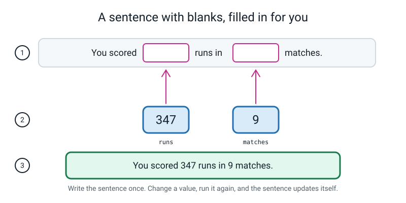
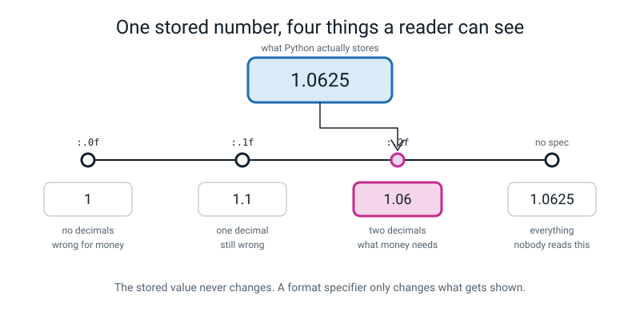
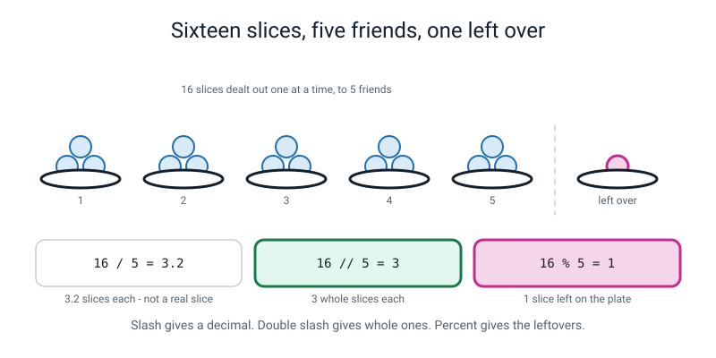
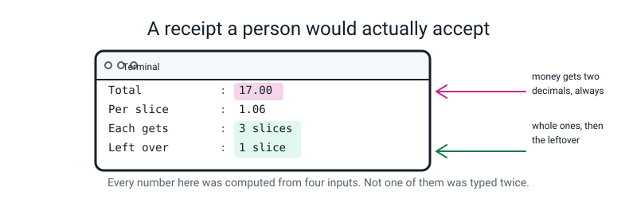
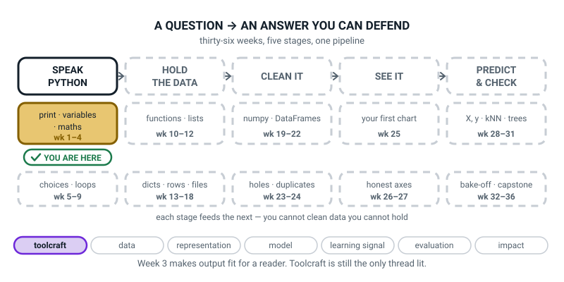

# Week 3 — Printing Like a Pro: f-strings and Real Maths

[⬅ Week 2](week-02.md) · [Course Home](../README.md) · [Week 4 ➡](week-04.md) · [Student Guide](../student-guide/week-03.md) · [Workbook](../workbook/week-03.md)

---

## 📋 At a Glance

This table gives the facts of the lesson on one screen: how long it is, what is new, and what to have ready.

| | |
|---|---|
| **Duration** | 70 minutes |
| **Type** | 🟩 Lab — less talking, more building. One file, `receipt.py`, built in four steps |
| **Big idea** | An f-string drops a value straight into a sentence, and `:.2f` decides how many decimals a reader gets to see. |
| **New vocabulary** | f-string · format specifier · integer division · remainder · exponent |
| **New syntax** | `f"..."` · `f"{x:.2f}"` · `//` and `%` · `**` |
| **Materials** | The printed workbook (Warm-Up, Predict the Output, Practice Sets A and B, Fix the Broken Program, Puzzle, Think Deeper, Build It, Draw It, Self-Check) · pencil · **16 paper "slices"** (or counters, or coins) and **6 paper plates** · a real till receipt if you have one in a drawer · the BUG LOG |
| **Tech needed** | The laptop, with `~/ai-academy/level2` open in the editor and a terminal in that folder |
| **Prep time** | 20 minutes the night before, 5 minutes on the day |

> **⚠️ Watch out:** this week contains the first bug of the year that produces **no error message at all**. Forget one letter and the program prints `{runs / matches}` on the screen instead of a number, cheerfully, with no traceback. If you do not know that in advance, you will lose ten minutes hunting a traceback that does not exist. It is in the Debugging Clinic, first row. Read it before class.

---

## 🎯 Lesson Objectives

These are the five things the student should be able to do when the lesson ends.

By the end of the lesson the student can:

1. **Build a sentence with an f-string** instead of gluing pieces together with `+` or commas.
2. **Control how many decimal places are shown** with a format specifier.
3. **Use `//` and `%`** to answer "how many whole ones, and how many left over?"
4. **Explain why a money figure must be shown to exactly two decimal places.**
5. **Build `receipt.py` end to end** so that it runs and reads correctly out loud.

Observable evidence: `receipt.py`, running, with a per-slice cost shown to exactly two decimals, a whole-slices-each count and a leftover count — and the student able to read the output aloud and say which line came from `//` and which from `%`.

---

## 🧑‍🏫 What YOU Need to Know First

> **📌 About the code blocks in this guide.** Outside the **🧰 Prep Checklist** and the **🔑 Answer Key**, the blocks are **illustrations, not files** — each one carries on from the one above it, so the `import` lines and the data are typed once, in the first block that needs them. **The complete runnable files are in the Prep Checklist and the Answer Key.** If you paste an illustration on its own and get `NameError`, that is why, and nothing is broken.

Four new pieces of syntax, and every one of them is small. Read this with the laptop open and type the examples; the whole section takes about twenty-five minutes and it is the entire prep.

### 1. The problem f-strings solve

Last week, printing a sentence with a value in it meant commas:

```python
total = 17.0
print("Total:", total)
```

```text
Total: 17.0
```

That works, and it has two annoyances that get worse fast:

- You cannot control the spacing. The comma always puts exactly one space, whether you wanted one or not.
- You cannot control how the number *looks*. `17.0` is a perfectly good number and a terrible price.

> **f-string** — a piece of text with an `f` in front of the opening quote, where anything inside `{curly braces}` gets replaced by the value of whatever is in the braces.

```python
name = "Ramana"
runs = 347
matches = 9
print(f"{name} scored {runs} runs in {matches} matches.")
```

```text
Ramana scored 347 runs in 9 matches.
```


*Figure 3.1 — Write the sentence once with blanks. Python fills the blanks from the boxes.*

**The mental model that works: it is a fill-in-the-blanks form.** You write the sentence one time, with gaps. Python drops the current value of each variable into its gap. Change a variable, run again, and the sentence fills itself in with the new value.

**The `f` is not optional and this is where the whole week's nastiest bug lives.** Leave it off and you get this:

```python
runs = 347
matches = 9
print("Average: {runs / matches}")
```

```text
Average: {runs / matches}
```

**No error. No traceback. No red text.** Without the `f`, the braces are just two ordinary characters and the whole thing is plain text, so Python does exactly what you asked and prints it.

It is the first bug this year where the computer does not help you at all. The only way to catch it is to *look at the output and ask whether it makes sense*. That is a habit, not a tool, and this is the week to start building it.

### 2. Format specifiers — controlling what the reader sees

Inside the braces you can put a colon and then an instruction about how to display the value.

> **Format specifier** — the part after the `:` inside an f-string's braces, which controls how the value is shown. `:.2f` means "show it as a decimal number with exactly two places."

```python
cost_per_slice = 1.0625

print(f"Cost per slice: {cost_per_slice}")        # raw
print(f"Cost per slice: {cost_per_slice:.2f}")    # 2 decimal places
print(f"Cost per slice: {cost_per_slice:.1f}")    # 1 decimal place
print(f"Cost per slice: {cost_per_slice:.0f}")    # no decimal places
print(f"Total: {17.0:.2f}")                       # money always gets 2
```

```text
Cost per slice: 1.0625
Cost per slice: 1.06
Cost per slice: 1.1
Cost per slice: 1
Total: 17.00
```


*Figure 3.2 — The stored value never changes. `:.2f` is a dial on the window, not on the number.*

**Read `:.2f` out loud as "dot two eff", and unpack it as: colon means 'here comes an instruction', `.2` means 'two places', `f` means 'as a decimal number'.** That is all three characters accounted for and it stops it looking like magic.

Three facts that will come up:

- **The stored value does not change.** `cost_per_slice` is still `1.0625` after all four of those lines. `:.2f` changes the *window*, not the number. This is the single most important sentence in the section and it is worth writing on the board.
- **`:.2f` on an int works.** `f"{8:.2f}"` gives `8.00`. Handy for money.
- **`:.2f` on a *string* fails**, and the message is unusual:
  ```text
  ValueError: Unknown format code 'f' for object of type 'str'
  ```
  Translated: *"you asked me to show this as a decimal number, and it's text."*

**Why money must be exactly two decimals**, since it is an objective: a price is not really a decimal number, it is a whole number of pennies. £17 is 1700 pennies, and 1700 pennies written in pounds is `17.00`. Printing `17.0` is not a rounding choice, it is a *wrong number of pennies* — it stops at tenths of a pound, so it cannot show pennies at all. Every pound-and-pence till receipt uses two places and it is not decoration.

Have the student find a real receipt if you have one; every single money figure on it has two decimals, including the whole-pound ones.

### 3. `//` and `%` — whole ones, and what's left over

These two answer the question a pizza actually raises. Sixteen slices, five friends.

> **Integer division** (`//`) — divide and throw away the fraction, keeping only the whole part. "How many whole ones each?"
>
> **Remainder** (`%`) — what is left over after taking out as many whole ones as you can. "How many are still on the plate?"

```python
slices = 16
friends = 5

print(slices / friends)      # true division
print(slices // friends)     # whole ones each
print(slices % friends)      # left over on the plate
```

```text
3.2
3
1
```


*Figure 3.3 — `3.2` slices is not a thing you can hand to a friend. `3` each and `1` on the plate is.*

**The check that makes it click, and do it out loud:** `3 × 5 + 1 = 16`. The whole ones times the number of people, plus the leftovers, gets you back to where you started. Always. If it doesn't, one of the two numbers is wrong.

`%` is called **modulo** if you meet the word elsewhere, but "remainder" is the word to teach, because it is what it means. It is one of the most useful operators there is, because it answers a family of questions:

| Question | The sum |
|---|---|
| How many whole hours in 7325 seconds? | `7325 // 3600` → `2` |
| And how many seconds are left after that? | `7325 % 3600` → `125` |
| How many whole tens in 47? | `47 // 10` → `4` |
| What's the units digit of 47? | `47 % 10` → `7` |

This worked example is the hardest sum in the week, so it is given in full. It turns a number of seconds into hours, minutes and seconds:

```python
total_seconds = 7325
hours = total_seconds // 3600        # 7325 / 3600 = 2 remainder 125
rest = total_seconds % 3600          # 125 seconds still to account for
minutes = rest // 60                 # 125 / 60 = 2 remainder 5
seconds = rest % 60                  # 5 seconds
print(f"{total_seconds} seconds = {hours} h {minutes} m {seconds} s")
```

```text
7325 seconds = 2 h 2 m 5 s
```

**The trap in that, and it catches everyone once:** you must take the remainder *after* removing the hours. Writing `minutes = total_seconds // 60` gives `122`, not `2`, because it counts *all* the minutes including the ones already inside the hours.

> **⚠️ Watch out:** dividing by zero with `//` or `%` fails, and the message is worded differently from ordinary division: `ZeroDivisionError: integer division or modulo by zero`. Same problem, different words. Do not let that different wording throw you.

### 4. `**` — to the power of

> **Exponent** — how many times a number is multiplied by itself. `5 ** 2` is five squared; `2 ** 3` is two cubed.

```python
print(5 ** 2)
print(2 ** 3)
print(2 ** 10)
print(10 ** 0)
```

```text
25
8
1024
1
```

It earns a place in a pizza lesson because of area. A pizza is a circle, and the area of a circle is π times the radius squared. Computing it settles the "is the big one better value?" argument with arithmetic instead of opinion.

This block finds the area of a pizza from its radius:

```python
radius_cm = 15
area = 3.14159 * radius_cm ** 2
print(f"{area:.2f}")
```

```text
706.86
```

**The two mistakes to expect:**

- **`*` instead of `**`.** `3.14159 * radius_cm * 2` gives `94.2477`, which is wrong and produces **no error at all**. Another silent one. The check: does the answer look like an area?
- **`**` on text.** `"15" ** 2` gives `TypeError: unsupported operand type(s) for ** or pow(): 'str' and 'int'` — which is last week's lesson wearing a new hat.

### 5. The lab itself: `receipt.py` in four steps

This is what the lesson builds. The numbers are chosen so that step 3 produces an ugly, obviously dishonest figure. Here is the whole thing, run, so you can check the student's screen at any point.

**Step 1 — the total.**

```python
# receipt.py - step 1: what did the pizza actually cost?

pizza_price = 8.50                     # price of one pizza, in pounds
pizzas = 2                             # how many we ordered
total = pizza_price * pizzas           # 8.50 * 2

print("Total:", total)                 # comma-separated, the Week 1 way
```

```text
Total: 17.0
```

**Step 2 — cost per slice, printed raw.** This is where the f-string arrives. *Added to the same file, below what is already there (and `slices_per_pizza = 8` goes up with the other inputs):*

```python
slices = pizzas * 8                    # each pizza is cut into 8 slices
cost_per_slice = total / slices        # 17.0 / 16

print(f"Slices: {slices}")
print(f"Cost per slice: {cost_per_slice}")
```

```text
Slices: 16
Cost per slice: 1.0625
```

**`1.0625` is the number the whole lab turns on.** It is not a price. Nobody has ever paid one pound and six hundred and twenty-five ten-thousandths. Stop here and let it be ugly.

**Step 3 — the same number, honestly displayed.** *Added to the same file:*

```python
print(f"Cost per slice: {cost_per_slice:.2f}")
print(f"Total: {total:.2f}")
```

```text
Cost per slice: 1.06
Total: 17.00
```

**Step 4 — whole slices each, and the leftover.** *Added to the same file:*

```python
friends = 5
each = slices // friends               # 16 // 5 = 3
left_over = slices % friends           # 16 % 5 = 1

print(f"Each gets    : {each} slices")
print(f"Left over    : {left_over} slice")
```

```text
Each gets    : 3 slices
Left over    : 1 slice
```

**The finished file**, which is also the homework, run in full:

```python
# receipt.py - a pizza receipt that reads like a real one.

pizza_price = 8.50                      # what one pizza costs, in pounds
pizzas = 2                              # how many pizzas we ordered
slices_per_pizza = 8                    # how many slices the shop cuts each into
friends = 5                             # how many people are sharing

total = pizza_price * pizzas            # 8.50 * 2 = 17.0
slices = pizzas * slices_per_pizza      # 2 * 8 = 16
cost_per_slice = total / slices         # 17.0 / 16 = 1.0625
each = slices // friends                # 16 // 5 = 3 whole slices each
left_over = slices % friends            # 16 % 5 = 1 slice left on the plate

print("----- PIZZA RECEIPT -----")
print(f"Pizzas       : {pizzas} at {pizza_price:.2f} each")
print(f"Total        : {total:.2f}")
print(f"Slices       : {slices}")
print(f"Per slice    : {cost_per_slice:.2f}")
print(f"Sharing      : {friends} friends")
print(f"Each gets    : {each} slices")
print(f"Left over    : {left_over} slice")
print("-------------------------")
```

```text
----- PIZZA RECEIPT -----
Pizzas       : 2 at 8.50 each
Total        : 17.00
Slices       : 16
Per slice    : 1.06
Sharing      : 5 friends
Each gets    : 3 slices
Left over    : 1 slice
-------------------------
```


*Figure 3.4 — Four inputs at the top of the file. Everything else was computed.*

### 6. The three misconceptions you will actually meet

**Misconception 1 — "`:.2f` rounds the number."**

It does not. It changes what is *displayed*. `cost_per_slice` is still `1.0625` in the box afterwards, and if you multiply it by 16 you get 17.0 back exactly, not 16.96. The distinction matters because next term the student will look at a chart and have to ask *"is this the number, or a picture of the number?"* This is where that question starts.

The demonstration that settles it, and it takes ten seconds:

```python
cost_per_slice = 1.0625
print(f"{cost_per_slice:.2f}")
print(cost_per_slice * 16)
```

```text
1.06
17.0
```

If `:.2f` had really rounded it, `1.06 × 16` would be `16.96`. It's `17.0`. The number never changed.

**Misconception 2 — "`//` is just `/` with the decimals cut off, so it's the same thing."**

Nearly true, and worth being precise about. For positive numbers, yes — `16 // 5` is `3`, which is `3.2` with the `.2` thrown away. But they mean different things and answer different questions. The honest framing: `/` answers *"share it out perfectly, even if that means cutting things up"*, and `//` answers *"how many whole ones can each person actually be handed?"* Those are different questions about the world, not two spellings of one sum.

(For negative numbers they genuinely diverge — `-7 // 2` is `-4`, not `-3` — but do not open that today; it is in the "flying" extensions.)

**Misconception 3 — "the braces are part of the text."**

This produces exactly the missing-`f` bug. The cure is not explanation, it is a ritual: **every time an f-string is typed, the student says "eff" out loud as they type the `f`.** It sounds silly and it works. Three lessons of it and they never forget the letter again.

### 7. How deep to go, and where to stop

**Go this far:** `f"..."` with values in braces; `:.2f` and its `.1f`/`.0f` cousins; `//` and `%` and the `whole × count + leftover = total` check; `**`; and the reflex of looking at output and asking whether it makes sense.

**Stop before:**

- **`round()`.** Week 4. Today, `:.2f` changes the display and nothing else, and keeping those two ideas separate for one more week is worth it.
- **`input()`.** Week 4. All four inputs to `receipt.py` are typed into the file today, which is why changing one is a one-line edit and worth pointing out.
- **`str()`.** Still Week 4. f-strings mean you no longer need it for printing, which is most of why f-strings exist.
- **Other format specifiers.** `{x:,}` for thousands separators, `{x:>10}` for alignment, `{x:.1%}` for percentages — all real, all useful, all *not this week*. The cap is four pieces of syntax and it is a cap for a reason. If a fast student finds `:.1%`, let them use it; do not teach it to everyone.
- **`divmod()`.** Does `//` and `%` in one go. Genuinely neat and genuinely unnecessary.
- **Negative-number floor division.** `-7 // 2` is `-4`. True, surprising, and a rabbit hole.
- **Why `f"{2.5:.0f}"` is `2` and not `3`.** It really is `2`, Python rounds halves to the nearest even number, and it will come up if anyone tests edge cases. There is an honest one-paragraph answer in the Questions section; do not build a lesson round it.

---

### 8. 🧭 The Growing Map — the two-minute close

**Where This Fits** is in the student guide again, and it will be every week for thirty-six weeks. Same
picture, one more piece filled in. It is the only page in the course that shows the *shape* of the year
rather than the content of the week.



*Figure 3.0 — Week 3's version. The gold tile has not moved since Week 1. **Toolcraft** is still the only
pill lit along the bottom.*

**How to spend the two minutes:**

1. **Point, don't lecture.** Ask: *"`receipt.py` printed `£3.50` instead of `3.5` — which box on the map
   were we in when we did that?"* A finger on the gold tile is the whole answer you need.
2. **Then a Week-3-specific one:** *"the map has a box called SEE IT, right over there, weeks 25 to 27.
   What do you think `:.2f` has to do with a chart?"* You are not after a correct answer. You are
   planting the idea that formatting numbers for a reader is a thing that comes back.
3. **Then the dashes:** *"why is most of this dotted?"* — *"because we haven't got there yet."* Thirty
   seconds, every week, in the same words.
4. **Pencil copies out.** They add one word under the first tile: *reader*. If a student has lost their
   copy, redrawing the five stage names takes ninety seconds and is not a punishment.

> **🧑‍🏫 Why this is worth two minutes.** Week 3 is the week the course can start to feel like an
> unconnected string of tricks — f-strings, `//`, `%`, `**`. The map is the antidote: it shows that all
> four of those live in one box, and that the box has a job.

> **⚠️ Watch out:** resist filling in the later tiles verbally. "Week 28 is where we do machine learning"
> sounds encouraging and reliably produces a student who decides weeks 4 to 27 are the boring bit.

---

## 🧰 Prep Checklist

This section lists what to do before class so nothing surprises you on the day.

### 20 minutes the night before

- [ ] **Run all four steps of `receipt.py` yourself**, in order, checking the output at each stage against §5 above. Do not skip to the finished file — the *sequence* is the lesson, and step 2's `1.0625` is the moment the lab hinges on.
      ```bash
      cd ~/ai-academy/level2
      python3 receipt.py
      ```
      After step 2 you must see:
      ```text
      Slices: 16
      Cost per slice: 1.0625
      ```
      After step 3:
      ```text
      Cost per slice: 1.06
      Total: 17.00
      ```
      After step 4:
      ```text
      Each gets    : 3 slices
      Left over    : 1 slice
      ```
- [ ] **Then break it on purpose, twice**, because these are the two you will stage in class:
      1. Delete the `f` from one f-string. Run it. Confirm that **no error appears** and the braces print literally. Sit with that for a moment; it is the surprise of the week.
      2. Change `cost_per_slice:.2f` to `cost_per_slice:2f` (dot removed). Run it. You get `1.062500` — six decimal places, no error. Another silent one.
- [ ] **Prove that `:.2f` does not change the number:**
      ```python
      cost_per_slice = 1.0625
      print(f"{cost_per_slice:.2f}")
      print(cost_per_slice * 16)
      ```
      ```text
      1.06
      17.0
      ```
      If you can explain why that second line is `17.0` and not `16.96`, you can teach this week.
- [ ] Print the whole workbook (Warm-Up through Self-Check).
- [ ] Cut out **16 paper slices** (any small squares) and find **6 plates or saucers**. Or use 16 coins and 6 pieces of paper.
- [ ] Go and find a **real till receipt** — a drawer, a coat pocket, a shopping bag. Any one will do. You are going to point at it.

### 5 minutes on the day

- [ ] The 16 paper slices in a pile, and the 6 plates in a row, five together and one set slightly apart.
- [ ] The real receipt on the table, face up.
- [ ] Editor and terminal open on `~/ai-academy/level2`. Last week's `types_tour.py` and `pocket_money.py` still there.
- [ ] The BUG LOG on the table.
- [ ] Write on the board, before they arrive: **`:.2f` changes what you SEE, not what it IS.**

### Fallback if something fails

| If this fails | Do this instead |
|---|---|
| No laptop | The whole of Concept, plus the 16-slices activity, plus workbook Practice Set B, B2 (`//` and `%` by hand) is a genuinely good 45-minute paper lesson. The f-string half needs the keyboard and moves to Week 4's opening. |
| No slices, no plates | Do it with fingers and hands: sixteen taps, dealt into five piles on the table. The physical dealing is what matters, not the props. |
| No receipt | Any price you can find written down with two decimals — a menu, a website, a price label. Point at the `.00` on a whole-pound price and ask *"why did they bother?"* |
| The student is still shaky on variables | Spend the first ten minutes re-running `pocket_money.py` and changing one number. Then cut this lesson to steps 1–3 of `receipt.py` and leave `//` and `%` for the top of Week 4. **f-strings are the priority; `//` and `%` can wait a week.** |
| They finish early | Variation — harder, item 1 (the pizza value comparison) is the best twenty minutes in this file, and it uses only `**` and `:.2f`. |

---

## ⏱️ The Lesson, Minute by Minute

This section gives the timed plan for the lesson and the words to say at each step.

| Segment | Minutes | Running total | What happens |
|---|---|---|---|
| 🪝 Hook — The Dishonest Price Tag | 7 | 7 | A real receipt, and a price nobody could pay |
| 🧠 Concept — Blanks, Dials, and Leftovers | 16 | 23 | f-strings, `:.2f`, `//` and `%`, `**` |
| 💻 Live-Code Together — `receipt.py` steps 1 and 2 | 18 | 41 | They type; you plant the missing-`f` bug |
| 🎲 Their Turn — steps 3 and 4, and read it out loud | 20 | 61 | `:.2f`, then `//` and `%`, then the read-aloud check |
| 🔑 Wrap & Assign | 9 | 70 | Three checks, the takeaway, Bug Log, homework |

---

### 🪝 Hook — The Dishonest Price Tag (7 minutes)

**Do this:** Real receipt on the table, face up. Nothing on screen yet.

**Say this:**

> "Have a look at this. It's a real receipt out of my pocket. I want you to find me every price on it and read the last two digits."

Let them. They will read `.99`, `.50`, `.00`, `.25`.

> "Notice something. **Every single one has two digits after the dot.** Even the ones that are whole pounds — look, that one's three pounds exactly and they've still printed `3.00`. Why bother? Why not just print `3`?"

Let them think. Answers you'll get: "it looks neater", "so it lines up".

> "Both true, and there's a better reason underneath. A price isn't really a decimal number at all. **It's a whole number of pennies.** Three pounds is three hundred pennies. And three hundred pennies, written in pounds, is `3.00`. Writing `3.0` stops at tenths of a pound, so it can't show pennies at all. Writing `3` doesn't say pennies either.
>
> So two decimal places on money isn't decoration. It's the number of pennies, and it's how you show you know what you're counting.
>
> Now. Last week, you printed a price."

**Do this:** Type this on the shared screen, live, and run it.

```python
print(8.50)
```

```text
8.5
```

> "Eight pounds fifty, and Python printed `8.5`. Would you accept that on a receipt?"

*No.*

> "Neither would I. And it gets worse. Watch."

Type and run:

```python
print(17.0 / 16)
```

```text
1.0625
```

> "That's the cost of one slice of pizza, if two pizzas cost seventeen pounds and each is cut into eight. One pound and six hundred and twenty-five ten-thousandths of a pound. **Nobody has ever paid that.** You couldn't. It doesn't exist as an amount of money.
>
> And here is the thing I actually want you to notice. That number isn't *wrong*. It's exactly right. It's the honest answer to the division. The problem is that it's **unreadable**, and a number nobody can read is a number nobody can check.
>
> Today you get two things. One that puts values into a proper sentence, and one tiny instruction — three characters — that turns `1.0625` into `1.06`. And then, because this is a pizza and not a maths exercise, two more that answer the question that actually comes up at the table: **how many whole slices does everybody get, and how many are left over?**"

**Ask this:**

| Ask | Answer you want | If they say something else |
|---|---|---|
| "Why does the receipt print `3.00` and not `3`?" | Because a price is a whole number of pennies, and `3.00` says "three hundred pennies". | "It looks neater" is a real answer, not a wrong one. Accept it and add the pennies version. |
| "Is `1.0625` wrong?" | No — it's exactly right and completely unreadable. | If they say "yes, wrong" — push gently: *"Is it the wrong answer to the sum, or the wrong thing to show a person?"* The distinction is the whole hook. |
| "Sixteen slices, five friends. How many each?" | Three each, one left over. | If they say `3.2`, that is the perfect answer to write down and come back to: *"Show me three-point-two of a slice."* |

---

### 🧠 Concept — Blanks, Dials, and Leftovers (16 minutes)

**Do this:** Board and paper. Do not type yet.

**Say this — part 1, f-strings:**

> "Last week you printed a sentence with a comma: `print("Total:", total)`. It works, and it has a limit: you can't control how the number looks and you can't control the spacing.
>
> Here's the better way, and there's one letter that makes it happen."

Write on the board, big, with the `f` in a different colour:

```text
print(f"Total: {total}")
 ▲▲▲▲▲ ▲
   |   this f is the whole trick
```

> "See that little `f` before the quote? That's what turns the quote marks into a **form**. Once the `f` is there, anything you put inside **curly braces** stops being text and becomes 'go and fetch the value of this'.
>
> So it's a fill-in-the-blanks sentence. You write it once, with gaps, and Python fills each gap from the box with that name on it."

> **f-string** — a piece of text with an `f` in front of the opening quote, where anything inside `{braces}` is replaced by its value.

> "And now the warning, and this is the most important thing I'll say today. **If you forget the `f`, you do not get an error.**"

Write both, side by side, and make them predict:

```text
print(f"Total: {total}")     ->  Total: 17.0
print("Total: {total}")      ->  Total: {total}
```

> "Look at the second one. Python printed the curly braces. As characters. Because without the `f`, that's all they are.
>
> **No red text. No traceback. Nothing telling you off.** Just a wrong-looking line on the screen. This is the first bug this year where the computer will not help you at all, and the only way to catch it is to look at your output and ask *does that make sense?*
>
> So from now on, every time you type an f-string, I want you to say the letter out loud as you type it. 'Eff, quote.' It sounds ridiculous. Do it anyway, for three weeks, and you'll never lose the letter again."

**Say this — part 2, the format specifier:**

> "Now the dial. Inside the braces, after the name, you can put a colon and then an instruction about how to *display* the value."

Write:

```text
{cost_per_slice:.2f}
                ▲▲▲
                colon: "here comes an instruction"
                 .2  : "two places"
                   f : "as a decimal number"
```

> "Read it as 'dot two eff'. Three characters, three jobs, and now it's not magic.
>
> And here is the sentence I want on the board all lesson, because you will get this wrong once and then never again: **it changes what you SEE, not what it IS.**
>
> The number in the box is still 1.0625. All of it. Every digit. `:.2f` is a window, and you just made the window smaller. Nothing happened to the number."

> **Format specifier** — the part after the `:` inside the braces, which controls how a value is displayed. `:.2f` means "as a decimal, with exactly two places".

> "Which means — and this is the honest bit that most people never get told — **you can use this to be misleading.** If you show somebody `1.06` when the number is really `1.0625`, you've told them something slightly untrue in a helpful way. That's usually fine, and it's what every receipt in the world does. But it is a choice you are making about what a reader is allowed to see, and in Week 27 we're going to spend a whole lesson on people who make that choice dishonestly."

**Say this — part 3, `//` and `%`, with the slices:**

**Do this:** Sixteen paper slices, five plates in a row, one plate set apart. Give the slices to the student.

> "Right. Sixteen slices. Five friends. Deal them out — one at a time, round the table, like cards."

Let them deal. They will end up with three on each plate and one slice in their hand.

> "How many did everyone get?"

*Three.*

> "And what's in your hand?"

*One.*

> "Put it on the spare plate. Now, those are **two different numbers** and Python has a separate operator for each of them."

Write:

```text
16 / 5   = 3.2    <- share it out perfectly, cutting slices up
16 // 5  = 3      <- how many WHOLE ones each
16 % 5   = 1      <- how many LEFT OVER
```

> "`16 / 5` is 3.2, and 3.2 is a perfectly correct answer to a sum you didn't ask. You can't hand somebody 0.2 of a slice.
>
> **Two slashes**, `//`, means 'how many whole ones each'. That's called **integer division** — integer as in whole number, same word as last week.
>
> **The percent sign**, `%`, means 'what's left over'. That's the **remainder**.
>
> And here's the check that proves you got both right. Three each, five people — that's fifteen. Plus the one on the plate. **Sixteen.** Back where we started. Whole ones times the number of people, plus the leftovers, always gets you back to the total. If it doesn't, one of your two numbers is wrong."

> **Integer division** (`//`) — divide and keep only the whole part.
> **Remainder** (`%`) — what is left over after taking out all the whole ones.

**Say this — part 4, `**`:**

> "One more, and it's quick. Two stars means 'to the power of'."

Write: `5 ** 2` is 25 · `2 ** 3` is 8 · `2 ** 10` is 1024

> "`5 ** 2` is five squared, twenty-five. `2 ** 3` is two cubed, eight.
>
> Why do we need it for pizza? Because a pizza is a **circle**, and the area of a circle is pi times the radius **squared**. Which means with two stars and a `.2f` you can settle the argument about whether the big pizza is actually better value — with arithmetic, instead of with opinions. That's the extension at the end if we get there."

> **Exponent** — how many times a number is multiplied by itself. `5 ** 2` is five squared.

> "One warning: **one star and two stars are completely different and neither one errors.** `3 * r * 2` and `3 * r ** 2` both run happily and give different answers. Count the stars."

**Ask this:**

| Ask | Answer you want | If they say something else |
|---|---|---|
| "What happens if you forget the `f`?" | It prints the braces as ordinary characters. **No error.** | If they say "an error" — that is the natural guess and it is wrong in an important way. Say: *"That's what I'd expect too. It's worse than an error. We'll do it in a minute."* |
| "Does `:.2f` change the number in the box?" | No. It changes what you see. | If they say yes, promise to prove it: *"Hold that. I'm going to show you it's still 1.0625 in about ten minutes."* Then actually do it. |
| "16 slices, 5 friends. Give me two numbers." | 3 each, 1 left over. | If they give only `3.2`, ask: *"Hand me 0.2 of a slice."* |
| "Check my answer for me: 3 each, 5 friends, 1 over. Does it add up?" | 3 × 5 + 1 = 16. Yes. | If they can't, do it with the actual slices on the table. Physical beats arithmetic here. |
| "What's the difference between `r * 2` and `r ** 2` when r is 5?" | `10` and `25`. | If they say they're the same, have them predict both and then run both. |

---

### 💻 Live-Code Together — `receipt.py` steps 1 and 2 (18 minutes)

**The rule: their hands on the keyboard.** You read the line, they type it, and they predict every output before pressing Enter.

#### Step 1 — the total (6 minutes)

1. **File → New File**, **Save As** `receipt.py`, in `ai-academy/level2`.
2. Type it, line by line, saying every `=` out loud as "gets":

```python
# receipt.py - step 1: what did the pizza actually cost?

pizza_price = 8.50                     # price of one pizza, in pounds
pizzas = 2                             # how many we ordered
total = pizza_price * pizzas           # 8.50 * 2

print("Total:", total)                 # comma-separated, the Week 1 way
```

3. Save. Run. **Predict first.**

```bash
python3 receipt.py
```

```text
Total: 17.0
```

**Say this:**

> "Seventeen point zero. Right number, wrong receipt. Hold that thought — we're going to fix exactly that in about twelve minutes. Notice I used the comma from Week 1 on purpose, so you can see the difference when we swap it."

#### Step 2 — cost per slice, and the f-string (7 minutes)

**Do this:** Have them **add** these lines to the same file — this is not a new file.

```python
slices = pizzas * slices_per_pizza     # 2 * 8 = 16
cost_per_slice = total / slices        # 17.0 / 16

print(f"Slices: {slices}")
print(f"Cost per slice: {cost_per_slice}")
```

They will need `slices_per_pizza` too, so have them add it up with the other inputs:

```python
slices_per_pizza = 8                   # how many slices the shop cuts each into
```

**Say the `f` out loud with them as they type it.** Save, predict, run:

```text
Total: 17.0
Slices: 16
Cost per slice: 1.0625
```

**Say this:**

> "Two things just happened and both matter.
>
> First: **that sentence came out with no comma anywhere.** You wrote 'Slices: ' and then a gap, and Python filled the gap. That's the f-string doing its job.
>
> Second: there it is. `1.0625`. The number from the hook, and now it's *your* number, computed from *your* four inputs. And it is not a price."

#### 🐞 Planted bug 1 — the missing `f` (5 minutes)

**Do this:** Ask for the keyboard for ten seconds. Delete the `f` from the last line only. Save. Hand it back. **They** run it.

```text
Total: 17.0
Slices: 16
Cost per slice: {cost_per_slice}
```

**Say this — and let the silence sit first:**

> "Right. What's wrong?"

*It printed the braces.*

> "It did. Now the question I actually care about: **where's the error message?**"

Let them look. There isn't one.

> "There **isn't one.** No red text, no traceback, no line number, nothing. The program ran perfectly and did exactly what I asked, which was 'print these characters'. Without the `f`, `{cost_per_slice}` is just sixteen ordinary characters (fourteen letters plus two braces) and Python printed all sixteen.
>
> This is the first bug this year that the computer will not find for you. Every other one so far, you read the last line and it told you where to look. This one has no last line. **The only thing that catches it is you looking at the output and asking: does that make sense?**
>
> That habit — read your own output and check it's sensible — is going to matter more and more every week from here. In Week 30 you'll train a model that reports 97% accuracy and you'll have to ask whether that number makes sense. Same habit. Starts today."

Have them fix it (put the `f` back), run, confirm. **Bug Log row** — and this one needs a note in the third column saying **"no error message"**, because that is the lesson.

| What I saw | What it meant | What I changed |
|---|---|---|
| `Cost per slice: {cost_per_slice}` — **and no error at all** | I forgot the `f` before the quote, so the braces were just characters | Put the `f` back. Nothing on screen told me; I had to notice the output was silly |

> **🧑‍🏫 If a student asks:** *"So how do I print an actual curly brace?"* — You double it: `f"{{"` prints one `{`. Genuine answer, genuinely rare, and not worth a minute today. Tell them and move on.

---

### 🎲 Their Turn — Steps 3 and 4, and the Read-Aloud (20 minutes)

Full instructions below. In the lesson flow:

- **Minutes 0–7:** step 3 — `:.2f` on the per-slice cost and on the total, plus the ten-second proof that the number did not change.
- **Minutes 7–15:** step 4 — `//` and `%`, with the `whole × friends + leftover = total` check done out loud.
- **Minutes 15–20:** finish the receipt, then **read it out loud** and change one input.

---

## 🎲 The Activity, In Full

This section gives the full instructions for the Their Turn segment: the setup, the three parts, and what finished looks like.

### Setup

**On the table:** the 16 paper slices and 6 plates (leave them out — students go back to them), the real till receipt, workbook Practice Set B (B2), a pencil, the BUG LOG.

**On screen:** `receipt.py` as it stands after step 2, running, printing `1.0625`.

**Say this before they start:**

> "You are going to finish this file, and then you are going to read it out loud to me and I'm going to decide whether it sounds like a real receipt. That's the actual test. Not whether it runs — whether a person would accept it."

### Part A — Step 3: the dial (7 minutes)

**They add these two lines**, predicting each first:

```python
print(f"Cost per slice: {cost_per_slice:.2f}")
print(f"Total: {total:.2f}")
```

```text
Cost per slice: 1.06
Total: 17.00
```

**Then, immediately, the proof.** Have them add one throwaway line at the bottom:

```python
print(cost_per_slice * 16)
```

```text
17.0
```

**Say this:**

> "Now think about what that means. If `:.2f` had really rounded the number down to 1.06, then 1.06 times sixteen would be **16.96** — we'd have lost four pence. It came out as exactly seventeen.
>
> So the number in the box is still all of `1.0625`. Every digit. **The `:.2f` only changed the window.** Delete that line now; it was just to prove a point."

**Then have them try the dial at other settings**, purely to see it move. *Three more throwaway lines at the bottom of the same file:*

```python
print(f"{cost_per_slice:.1f}")
print(f"{cost_per_slice:.0f}")
print(f"{cost_per_slice:.4f}")
```

```text
1.1
1
1.0625
```

**Ask:** *"Which of those four would you put on a receipt, and why?"* — `.2f`, because money is a whole number of pennies. `.0f` loses six pence a slice. `.4f` is honest and unreadable.

### Part B — Step 4: whole ones and leftovers (8 minutes)

**They add:**

```python
each = slices // friends               # 16 // 5 = 3 whole slices each
left_over = slices % friends           # 16 % 5 = 1 slice left on the plate

print(f"Each gets    : {each} slices")
print(f"Left over    : {left_over} slice")
```

They will need `friends = 5` up with the other inputs.

```text
Each gets    : 3 slices
Left over    : 1 slice
```

**Do this:** point at the plates on the table. Then make them do the check out loud:

> "Three each, five friends. Fifteen. Plus one on the plate. Sixteen. Does it match `slices`?"

**Then the test that catches the classic error.** Have them change `friends` to 6 and predict *before* running.

```text
Each gets    : 2 slices
Left over    : 4 slice
```

Check: 2 × 6 + 4 = 16. ✓ **And notice `4 slice` reads wrong** — the file says the word "slice" every time, and English wants "slices" here. Do not fix it: say *"you've found a real bug, and fixing it needs an `if`, which is Week 5. Write it in the margin."* Then `friends = 4`:

```text
Each gets    : 4 slices
Left over    : 0 slice
```

Check: 4 × 4 + 0 = 16. ✓

**Say this on that last one:**

> "Zero left over. Which means it divided perfectly, and the `%` told you so by giving you nothing. That's useful information, not a failure — 'is there anything left over?' is a question you'll ask constantly."

Then set `friends` back to 5.

### 🐞 Planted bug 2 — the dot goes missing (3 minutes)

**Do this:** Have **them** change `{total:.2f}` to `{total:2f}` — just delete the dot. Predict, then run.

```text
Total: 17.000000
```

**Say this:**

> "Six decimal places, and again **no error at all**. Without the dot, the `2` isn't 'two places' any more — it means something completely different about width, and the number of decimals falls back to Python's default, which is six.
>
> Two silent bugs in one lesson, and both of them only findable by looking. Are you starting to see why I keep asking you to predict the output first? If you'd predicted `17.00` and got `17.000000`, you'd have spotted it in half a second."

Fix it. **Bug Log row**, again noting **no error message**.

### Part C — Finish it, and read it out loud (2 minutes)

**They tidy the file** into the finished version (§5 above), then run it and **read the output aloud**, slowly, as if reading a receipt to a customer.

```text
----- PIZZA RECEIPT -----
Pizzas       : 2 at 8.50 each
Total        : 17.00
Slices       : 16
Per slice    : 1.06
Sharing      : 5 friends
Each gets    : 3 slices
Left over    : 1 slice
-------------------------
```

**Then the final move, which is the point of the whole file.** Say:

> "Change the price of a pizza to nine pounds fifty. How many lines do you have to edit?"

**One.** And every figure below it updates. Real output with `pizza_price = 9.50` (only the price, total and per-slice lines change):

```text
----- PIZZA RECEIPT -----
Pizzas       : 2 at 9.50 each
Total        : 19.00
Slices       : 16
Per slice    : 1.19
Sharing      : 5 friends
Each gets    : 3 slices
Left over    : 1 slice
-------------------------
```

> "One edit. Three numbers changed. **That** is what naming things is for, and now you can feel it instead of being told it."

### What "finished" looks like

- `receipt.py` runs with no traceback.
- Line 1 is a comment; the four inputs are at the top with a comment each.
- **Every printed line uses an f-string.** No commas left in the `print`s except in the two divider lines, which are pure text.
- The per-slice cost shows **exactly two decimals**, and so does the total.
- There is a whole-slices-each figure from `//` and a leftover figure from `%`.
- **No number is typed twice** anywhere in the file.
- The student can read the output aloud and say which line came from `//` and which from `%`.
- Two Bug Log rows, both marked "no error message".

### Variation — easier

- **Do steps 1, 2 and 3 only.** f-strings and `:.2f` are objectives 1, 2 and 4. `//` and `%` move to the top of Week 4 and nothing is lost.
- **Give the file with the f-strings already written and the braces empty**, so the only job is putting the right name in each gap:
  ```python
  print(f"Total: {______:.2f}")
  print(f"Slices: {______}")
  ```
- **Do `//` and `%` with the slices only**, on paper, no code. The physical dealing delivers the concept; the operators can arrive next week.
- **Give a smaller, cleaner set of numbers** if 1.0625 is overwhelming: one pizza at £8.00, 8 slices, 4 friends → `1.00` per slice, `2` each, `0` left over. Less dramatic, entirely workable, and the arithmetic is invisible.
- **One thing you must not cut:** the missing-`f` bug and the sentence *"there is no error message."* That is the idea this week contributes to the rest of the year.

### Variation — harder

1. **Is the big pizza better value?** Genuinely interesting and uses only `**` and `:.2f`. Real:
   ```python
   # area_compare.py - is the big pizza actually better value?

   small_radius = 15                # cm
   big_radius = 20                  # cm
   small_price = 8.50               # pounds
   big_price = 13.00                # pounds

   small_area = 3.14159 * small_radius ** 2
   big_area = 3.14159 * big_radius ** 2

   print(f"Small: {small_area:.2f} sq cm for {small_price:.2f}")
   print(f"Big  : {big_area:.2f} sq cm for {big_price:.2f}")
   print(f"Small: {small_area / small_price:.2f} sq cm per pound")
   print(f"Big  : {big_area / big_price:.2f} sq cm per pound")
   ```
   ```text
   Small: 706.86 sq cm for 8.50
   Big  : 1256.64 sq cm for 13.00
   Small: 83.16 sq cm per pound
   Big  : 96.66 sq cm per pound
   ```
   **The big one wins, by 16%** — and the reason is `** 2`: going from 15 cm to 20 cm is only a third bigger across, but it's nearly *twice* the area, because area grows with the square. That is a real and slightly surprising fact about the world, arrived at with two lines of code.
2. **The seconds decoder.** Turn a number of seconds into hours, minutes and seconds. It is the hardest `//`/`%` problem at this level because you have to take the remainder *before* the next division:
   ```python
   total_seconds = 7325
   hours = total_seconds // 3600        # 2
   rest = total_seconds % 3600          # 125
   minutes = rest // 60                 # 2
   seconds = rest % 60                  # 5
   print(f"{total_seconds} seconds = {hours} h {minutes} m {seconds} s")
   ```
   ```text
   7325 seconds = 2 h 2 m 5 s
   ```
   Then the test cases that catch off-by-ones: `59` → `0 h 0 m 59 s`; `3600` → `1 h 0 m 0 s`; `86399` → `23 h 59 m 59 s`.
3. **Find a fifth format specifier.** Let them explore. `f"{0.734:.1%}"` gives `73.4%` and is genuinely useful; `f"{1234567:,}"` gives `1,234,567`. Both are real and both are officially later weeks — so let them use it, note it in the margin, and don't teach it to the room.
4. **Negative floor division.** `print(-7 // 2)`. It is `-4`, not `-3`, and that surprises adults:
   ```text
   -4
   ```
   Because `//` rounds *down* (towards more negative), not towards zero. Check it with the rule: `-4 × 2 + 1 = -7`, and `-7 % 2` really is `1`. Verified:
   ```python
   print(-7 // 2, -7 % 2)
   ```
   ```text
   -4 1
   ```
   A student who works out why is doing genuinely good thinking.

---

## 🐞 The Debugging Clinic

This section lists the errors this week's code produces, what each one means, and how to fix it.

Every line below came from really running a broken version of this week's code. **The first three rows produce no error at all.** That is new this week and it is the point.

| What the student sees (real message) | What it means | Most likely cause | The fix |
|---|---|---|---|
| `Average: {runs / matches}` — **and no error** | Python printed the braces as ordinary characters, because they were. | **The `f` is missing** before the opening quote. | Add the `f`: `print(f"Average: {runs / matches}")`. Nothing on screen will tell you; you have to notice the output is silly. |
| `Total: 17.000000` — **and no error** | Six decimals instead of two. | The dot is missing: `{total:2f}` instead of `{total:.2f}`. Without the dot, the `2` means something about width, and the decimals fall back to the default of six. | Put the dot back. |
| `94.2477` where you expected `706.86` — **and no error** | The arithmetic ran, and it was the wrong arithmetic. | One star instead of two: `3.14159 * r * 2` rather than `3.14159 * r ** 2`. | Count the stars. Then check the answer looks like an area. |
| `NameError: name 'nme' is not defined. Did you mean: 'name'?` | "I've never heard of that name." | A typo **inside the braces**. The braces don't protect you — the name in there is a real name. | Fix the spelling. Python usually guesses it for you. |
| `ValueError: Unknown format code 'f' for object of type 'str'` | "You asked me to show this as a decimal number, and it's text." | `:.2f` applied to a string — e.g. `total = "17.0"` from somewhere. | Make it a number first: `float(total)`. Or work out why it was text in the first place, which is usually the real bug. |
| `SyntaxError: f-string: expecting '}'` | "I couldn't finish reading this f-string." | A missing `}`: `f"Total: {total:.2f"` | Close the brace. Braces come in pairs, like quotes and brackets. |
| `SyntaxError: f-string: invalid syntax` | "There is nonsense inside the braces." | Something malformed in the braces — a stray space between the slashes, `{slices / / 5}`, or an unfinished sum. | Read what's between the braces on its own, as if it were a line of its own. |
| `ZeroDivisionError: integer division or modulo by zero` | "You tried to share something between zero people." | `slices // 0` or `slices % 0` | Change the zero. **Note the different wording** from ordinary division, which says `division by zero`. Same problem, different sentence. (Newer Pythons say `integer modulo by zero` for `%`, and f-string `SyntaxError` wording also changed from 3.12; the meaning is the same.) |
| `TypeError: unsupported operand type(s) for ** or pow(): 'str' and 'int'` | "You cannot raise text to a power." | `radius_cm` is text, probably `"15"` with quotes on it. | Drop the quotes, or convert: `float(radius_cm) ** 2`. |

### How to teach debugging without giving the answer

Same ladder as before, with **one new rung at the top**, and this week it is the most important one in the file.

0. **New this week: "Read me your output. Does it make sense?"** Before anything else, before even asking whether there's an error. Three of this week's nine bugs produce no error at all, so "is there red text?" is no longer a sufficient first question. The new first question is *"is that a sensible number?"*
1. **"Read me the last line"** — if there is one.
2. **"What line number?"** Then: *"Show me that line."*
3. **"Read me only what's between the braces."** Isolating the inside of the braces finds most f-string bugs in about four seconds, because it lets them see the name and the specifier separately.
4. **"Count the characters in the specifier out loud."** "Colon. Dot. Two. Eff." Four things. Miss one and it goes quiet rather than loud.
5. **"Do the check: whole ones times people, plus leftovers. Does it come back to the total?"** For any `//` or `%` bug, this settles it.
6. **"Change one thing. Run again."**

The sentence for this week: **"Not every bug shouts. Some of them just sit there looking wrong."**

---

## ❓ Questions Students Ask This Week

This section gives honest answers to the questions this lesson tends to raise.

**"Why not just use commas? It worked last week."**

Commas still work and you can keep using them. They have two limits, and both bite quickly. First, a comma always puts exactly one space, so you can't write `Total:£17.00` with no gap, and you can't line a column up. Second, and much more important: with a comma you have no way to say *how* you want the number shown. `print("Total:", 17.0)` will always give you `17.0`. There is no place to put `:.2f`. The f-string exists precisely so that there is somewhere to put it.

**"Does `:.2f` round the number or cut it off?"**

It rounds, for display — `1.0625` shown to two places is `1.06`, and `1.0675` would show as `1.07`. But the crucial part is the words *for display*: the number in the box is untouched. You can prove it in one line — multiply the variable by 16 after showing it as `1.06`, and you get exactly `17.0`, not `16.96`. If it had really rounded, you'd have lost four pence.

**"So `:.2f` can be used to hide things?"**

Yes, and it is worth being clear-eyed about it. Every time you choose how many decimals to show, you are choosing what a reader is allowed to see. Usually that is a kindness — nobody wants `1.0625` on a receipt. Sometimes it is not: showing a test score as `71%` when it is `70.6%` is a different claim from showing `70.6%`, and if you are the person whose score it is you might care. The rule of thumb professionals use: **round for display, never for storage.** Keep every digit in the box; choose what to show at the last possible moment; and if the choice could matter to someone, say what you did. Week 27 is a whole lesson on this.

**"Why is `//` called integer division?"**

Because it gives you back an integer — a whole number, the word from Week 2. `16 / 5` gives a float, `3.2`. `16 // 5` gives an int, `3`. You can check it with `type()`, which is a satisfying loop back to last week: `type(16 / 5)` is `float` and `type(16 // 5)` is `int`.

**"When would I ever actually use `%`?"**

Constantly, because "how many left over?" turns out to be the same question as several others. Is a number even? `n % 2` is `0` if it is. What's the units digit of 47? `47 % 10` is `7`. It's second 7325 of the day — what minute are we in, and how many seconds past? `7325 % 60`. How do you make something happen every fifth time round a loop? `count % 5 == 0`. You will use `%` in Week 7, Week 8 and Week 20, and by the end of the year it will feel as ordinary as a plus sign.

**"Why does `2 ** 10` give 1024 and not 20?"**

Because two stars is not "times". `2 * 10` is twenty. `2 ** 10` is two multiplied by itself ten times: 2, 4, 8, 16, 32, 64, 128, 256, 512, 1024. That number will keep turning up all year — computers count in twos, so memory sizes come in lumps of 1024. People often call 1024 bytes a "kilobyte"; strictly a kilobyte is 1000 bytes and 1024 is a *kibibyte*. Do not get into it unless asked.

**"`f"{2.5:.0f}"` gives `2`. Shouldn't it be `3`?"** *(Genuinely surprising, and there is a real reason.)*

It really does give `2`, and `f"{1.5:.0f}"` gives `2` as well. That looks broken and it isn't. Python uses a rule called **round-half-to-even**: when a number is *exactly* halfway, it rounds to whichever neighbour is even. So 0.5 → 0, 1.5 → 2, 2.5 → 2, 3.5 → 4. The reason is that always rounding halves *up* introduces a tiny upward bias, and if you add up a million rounded numbers that bias becomes a real error. Rounding half to even cancels out over many numbers. It is the international standard for exactly this reason, and it is also why `f"{1.005:.2f}"` gives `1.00` rather than `1.01` — though that one is a different problem again, to do with `1.005` not being stored quite exactly in the first place. **None of this will affect anything you build this year.** But if a student tests edge cases and finds it, they have found something real, and the honest answer is better than "don't worry about it."

**"How many decimal places should a number have?"** *(Nobody fully agrees, and here's why.)*

**There is no universal answer, and the disagreement is genuine rather than a matter of taste.** For pounds and pence it is settled — two places, because that is how many pennies there are (other currencies differ; the yen has none). Everywhere else it is a judgement, and the professional principle is *"show as many digits as your measurement actually justifies, and not one more."* If you measured someone's height with a tape marked in centimetres, writing `1.6237 m` is a lie dressed as precision — you did not know that. `1.62 m` is honest. Scientists have a formal version of this called significant figures, and they argue about the edges of it constantly. The place it gets genuinely contentious is percentages: a survey of 500 people that reports `48.6%` support is claiming a precision it does not have, because with 500 people the honest margin of error is roughly four percentage points either way — so `49%` would be more truthful, and some statisticians will tell you flatly that the extra decimal is misleading. Others say the extra digit is harmless because a reader can see the sample size. Both camps contain serious people. What everyone agrees on: **never invent precision you did not measure**, and never let the format specifier be the place where a claim gets quietly upgraded.

---

## ⚠️ Where This Lesson Goes Wrong

This table lists the ways the lesson tends to stall, and what to do about each one.

| What happens | Why | What to do right now |
|---|---|---|
| Ten minutes are lost hunting a traceback that does not exist | The `f` is missing, so the output is wrong but nothing errored | This is why the new first rung of the ladder is *"read me your output — does it make sense?"* Ask it before you ask about errors. And if the braces are visible on screen, that is the answer. |
| They believe `:.2f` changed the number | Because it looks exactly like it did | Do not argue. Run the ten-second proof: show it as `1.06`, then print the variable times 16 and get `17.0`. The screen wins the argument in four seconds. |
| `//` and `%` get mixed up, repeatedly | Two new symbols in one lesson, both about division | Go back to the plates. Physically. *"Point at the three. Point at the one."* Then: two slashes = the pile in front of each person; percent = what's on the spare plate. The props are quicker than the explanation, every time. |
| `minutes = total_seconds // 60` gives 122 and nobody knows why | The remainder wasn't taken before the second division | Do not fix it. Ask: *"How many minutes are already inside the two hours?"* (120.) *"So how many are left over?"* (2.) They will find the missing `%` themselves. |
| The whole lesson turns into "make the receipt pretty" | Aligning columns is very satisfying and infinitely extensible | Cap it: *"Two minutes on the look, then we move."* The `//` and `%` half of the lesson is the half that is actually new maths and it is the half that gets sacrificed. |
| They keep the commas and never use f-strings | The commas already work and change is effort | Make it structural: *"Every printed line in this file must use an f-string. Show me one that doesn't."* The requirement is in the What-finished-looks-like list for exactly this reason. |
| A `ZeroDivisionError` from `%` confuses them because the wording is different | It says `integer division or modulo by zero`, not `division by zero` | One sentence: *"'Modulo' is the posh name for remainder. Same problem, different words."* Then move on. |
| `1.0625` overwhelms them and the lesson stalls at step 2 | It's a horrible number and it arrives early | Switch the inputs to the easy set: one pizza at £8.00, 8 slices, 4 friends → `1.00` per slice, 2 each, 0 over. You lose the drama and keep every objective. Do the ugly numbers as an extension later. |
| They forget the `f` again next week, and the week after | It is one letter and it is invisible | Keep the ritual going. Say "eff" out loud while typing it, for three full weeks. It genuinely works and it costs nothing. |

---

## 🧭 Differentiation

This section shows how to adjust the lesson for a student who is struggling, flying, or not engaging today.

### If the student is struggling

**Cut:** steps 3 and 4 down to step 3 only. f-strings plus `:.2f` is objectives 1, 2 and 4 — three of five, on the day's genuinely new syntax. `//` and `%` are a self-contained ten minutes and they slot into the top of Week 4 without any awkwardness.

**Reteach:** the sticking point is almost never the concept, it is the **punctuation density**. `f"{cost_per_slice:.2f}"` has an `f`, two quotes, two braces, a colon, a dot, a digit and a letter, in a fixed order, and that is a lot of characters to get right at once. Break it into three separate typing exercises, each of which runs:

```python
price = 1.0625
print(f"{price}")
```
```text
1.0625
```

```python
price = 1.0625
print(f"Price: {price}")
```
```text
Price: 1.0625
```

```python
price = 1.0625
print(f"Price: {price:.2f}")
```
```text
Price: 1.06
```

Three runs, one new thing each time. Do not go to step two until step one runs.

**The copy-this-exactly scaffold.** Character for character, then one change.

```python
# slice.py - one price, one count, printed properly.

total = 17.0            # what the pizzas cost altogether
slices = 16             # how many slices that bought

each = total / slices   # cost of one slice

print(f"Total: {total:.2f}")
print(f"Per slice: {each:.2f}")
```

```text
Total: 17.00
Per slice: 1.06
```

Then one change: make `slices` 8 instead of 16, and watch `Per slice` become `2.12`. Verified:

```text
Total: 17.00
Per slice: 2.12
```

> **🧑‍🏫 If a student asks** why `17.00 / 8` shows as `2.12` when the real answer is `2.125` and "point five rounds up" — they have found something real. Python rounds an *exact* half to the nearest **even** number, so `2.125` shows as `2.12` and `2.375` would show as `2.38`. There is a full honest answer in the Questions section; the one-liner is: *"always rounding halves up would drift the total upwards, so it alternates instead."*

**Reduce:** accept the receipt without column alignment. Lining things up is satisfying and is not an objective.

**One thing you must not cut:** the missing-`f` bug, and the sentence **"there was no error message."**

### If the student is flying

All four use only this week's syntax and Weeks 1–2.

1. **Is the big pizza better value?** (Variation — harder, item 1.) Best twenty minutes in the file, and the "area grows with the square" punchline is a genuinely surprising fact about the world.
2. **The seconds decoder** (item 2), with the four test cases. The `86399` case is the one that catches off-by-one errors.
3. **The dial hunt** (item 3). Let them find `:.1%` and `:,` on their own. Note in the margin that they arrived early.
4. **Build a change-giver.** Given a price and what the customer handed over, work out the change in whole coins. Uses `//` and `%` four times over and is a genuinely useful little program. Verified:
   ```python
   # change.py - what coins do I hand back?

   price_p = 1750               # price in pence
   paid_p = 2000                # what the customer handed over, in pence

   change_p = paid_p - price_p  # 250 pence

   pounds = change_p // 100     # 2 whole pounds
   rest = change_p % 100        # 50 pence left
   fifties = rest // 50         # 1 fifty-pence piece
   rest = rest % 50             # 0 left

   print(f"Change: {change_p / 100:.2f}")
   print(f"{pounds} pound coins, {fifties} fifty-pence, {rest} pence left")
   ```
   ```text
   Change: 2.50
   2 pound coins, 1 fifty-pence, 0 pence left
   ```
   Then the good question: *"Why is the price stored in pence rather than as 17.50?"* Because pence are whole numbers, and whole numbers never surprise you. That is a real professional practice and it links straight back to Week 2's money discussion.

### If the student won't engage today

Do the slices, and only the slices.

Sixteen paper slices and six plates is a complete, physical, satisfying fifteen-minute lesson that delivers objective 3 entirely. Turn it into a game: **"Deal and Declare."**

> You call out a number of slices and a number of friends. They deal the counters out and then *declare* two numbers: how many each, and how many left over. Then they do the check out loud — whole ones times friends, plus leftovers, back to the total. Then swap: they call the numbers and you deal, and you get it wrong on purpose about a third of the time so they have to catch you with the check.
>
> Good rounds to run: 12 and 4 (3 each, 0 over — *"zero is an answer"*). 7 and 10 (0 each, 7 over — *"nobody gets a whole one, and that's correct"*). 20 and 3 (6 each, 2 over). 5 and 5 (1 each, 0 over).

The `7 and 10` round is the one worth doing, because `0` whole ones each with `7` left over feels wrong and is exactly right — and it is precisely the case that breaks students' mental models later. Fifteen minutes of that is worth more than a rushed hour of f-strings, and `receipt.py` steps 1 and 2 take twelve minutes at the top of Week 4.

---

## ✅ Assessing Understanding

This section gives three spoken checks, about five minutes in all, with the exact wording to use.

**Check 1 — the missing letter (spoken)**

> "I run a program and it prints `Total: {total}` on the screen. There's no error message anywhere. What have I done wrong?"

*Good answer:* forgotten the `f` before the opening quote. **What to catch:** if they start hunting for a spelling mistake in `total`, prompt once: *"Look at the braces. Why are they on the screen?"* This is the check that matters most this week.

**Check 2 — display versus value (spoken)**

> "I've got a variable holding `1.0625` and I print it with `:.2f`, so `1.06` appears. What's in the variable now?"

*Good answer:* `1.0625`. All of it. Nothing changed. **What to catch:** if they say `1.06`, offer the proof rather than the correction: *"So if I multiply it by 16, what do I get?"* They will say `16.96`. Then run it and get `17.0`.

**Check 3 — whole ones and leftovers (spoken, with the props)**

> "Twenty slices, three friends. Give me both numbers, and then prove them."

*Good answer:* `6` each and `2` left over, proved by `6 × 3 + 2 = 20`. **What to catch:** a student who gives `6.66` has answered a different question — hand them the counters and say *"deal it."* A student who gives both numbers but cannot do the check has the operators and not the model; do one more round with the props.

### Mastery scale for this week

| Level | What it looks like |
|---|---|
| **1 — Not yet** | Cannot write a working f-string. Believes an error message will appear for any mistake. Cannot say what `//` gives that `/` does not. |
| **2 — Emerging** | Writes an f-string when copying the shape from an example. Uses `:.2f` when told to. Confuses `//` and `%`, and needs the props to sort them out. |
| **3 — Secure** | Writes an f-string from scratch, with a `:.2f` where money is printed. Uses `//` and `%` correctly and can do the `whole × count + leftover` check. Recognises the missing-`f` bug from the output alone. **This is the target.** |
| **4 — Strong** | Says without prompting that `:.2f` changes the display and not the value, and can prove it. Chains `//` and `%` correctly for a seconds-to-h/m/s conversion, taking the remainder before the second division. Predicts output before running, routinely. |
| **5 — Exceptional** | Spots that choosing decimal places is a choice about what a reader may see, and gives a case where it could mislead. Explains why area growing with `** 2` makes the big pizza better value. Notices a wrong-looking number with no error attached and investigates it unprompted. |

---

## 📤 Homework to Assign

This section gives the words to say when you set the homework, and the expected time.

**Say this:**

> "One file and two workbook sections, about an hour. Type everything.
>
> **The file is `receipt.py`, finished properly** — it's the **Build It** section. Same four inputs at the top, but this time **you** choose the number of friends, and it has to be your own real number. It must print: the total to two decimals, the number of slices, the cost per slice to **exactly** two decimals, how many whole slices each person gets, and how many are left on the plate. Fill in the Results table from your own run, and answer (a), (b) and (c) underneath it.
>
> Two rules on top of that. **Every printed line uses an f-string** — if I see a comma in a `print`, it comes back. And **every line has a comment**, and the comment says *why*, not *what*. `# 8.50 times 2` is a waste of ink. `# what two pizzas cost altogether` is worth having.
>
> Then the last thing, and it's the actual test: **read your receipt out loud.** Not to me — to yourself, or to whoever's in the room. Does it sound like a real receipt? If any line sounds odd, that's a bug, and it's a bug nothing on screen is going to tell you about.
>
> **Then Predict the Output and Practice Set B, question B2.** Predict the Output is four snippets, fourteen printed lines in all — guess first, write your guess in the left-hand column, then run it, then write what really happened. B2 is `//` and `%` by hand, ten pairs, and for every single one you write the check: whole ones times the count, plus the leftovers, back to the total. If the check doesn't come back to the total, one of your two numbers is wrong and you find it yourself.
>
> And one more Bug Log entry, minimum — it's at the bottom of Build It. If nothing breaks by accident, **break it on purpose** — take an `f` off and log a bug with no error message. That's the most interesting row on the page."

**Workbook sections:** **Warm-Up** and **Puzzle of the Week** in class (the Puzzle can be finished at home if the lab runs long); **Build It**, **Predict the Output** and **Practice Set B** (B2 as the required part) at home. The rest of the workbook — **Practice Set A**, B1 and B3–B5, **Fix the Broken Program**, **Think Deeper**, **Draw It** and the **Self-Check** — is this week's further practice, to be done before Week 4 as time allows. The Answer Key below follows the workbook's own order, so you can mark whichever sections come back.

**Expected time:** 20 min for `receipt.py` with full comments and the Results table · 15 min for Predict the Output · 15 min for B2 · 10 min for the Bug Log and the Self-Check. About 60 minutes. Practice Set A, the rest of Set B, Fix the Broken Program, Think Deeper and Draw It add roughly another hour in total.

---

## 🔑 Answer Key

This section gives the answers to the workbook, in the workbook's own order.

The key follows the workbook's own sections. The values are those in the workbook's Answers section; every program was re-run to confirm. Teacher notes are marked **Teacher:**.

### Warm-Up (5 min — recall from Week 2)

**W1.** *Read `pizza_price = 8.50` out loud.* → "pizza_price **gets** 8.50." Not "equals".

**W2.** *What type is `8.50`? What type is `"8.50"`?* → `float` and `str`. Same characters on screen, different kinds of thing.

**W3.** *Why does `print(8.50)` show `8.5`?* → Because `8.50` and `8.5` are the same number, and the number has no trailing zero. The zero existed only in what you typed; Python stored the number, not your typing.

**W4.** *What is `"5" + 5`, and why?* → An error: `TypeError: can only concatenate str (not "int") to str`. The kinds don't go together, and Python refuses to guess whether you meant `10` or `55`.

**W5.** *What does `type()` do, and when do you reach for it?* → Tells you what kind a value is. You reach for it whenever a `TypeError` appears and you are certain something is a number, because `type()` settles the argument in four seconds.

### Predict the Output

Four snippets, fourteen printed lines. Every output below was produced by running the snippet. **Teacher:** the left-hand "My prediction" column is what is being marked, not the right-hand one. A wrong prediction that is written down is worth more than a right one that was filled in after running.

**Snippet 1 — one letter** (`name = "Ramana"`, `runs = 347`, `matches = 9`)

```text
Ramana scored 347
{name} scored {runs}
```

Zero error messages, and there should not have been one. Without the `f`, `{name}` is six ordinary characters and Python printed them exactly as asked. This is the week's whole point: every bug in Weeks 1 and 2 shouted, and this one sits there looking wrong.

**Snippet 2 — the dial**

```text
38.55555555555556
38.56
38.6
39
```

`:.0f` gave `39` — it rounded **up**, because the digit after the point is a 5 followed by more. **Did `runs` change? No** — it is still `347`. But be careful what counts as proof: each line works out `runs / matches` afresh, so these four lines do not by themselves show that the dial leaves a *stored* number alone. The proof is the two-line experiment in Practice Set A, A2.

**Snippet 3 — whole ones and leftovers**

```text
38
5
3 and 1
0 and 6
```

Check: 38 × 9 + 5 = 347 ✓ and 3 × 2 + 1 = 7 ✓. **The last line, `0 and 6`:** six slices between eight friends. Nobody gets a whole one, so the whole-ones answer is `0` and all six are left over. Check: 0 × 8 + 6 = 6 ✓. It feels wrong because zero looks like a failure; it is the correct answer to "how many whole ones can each person be handed?" when the answer is none.

**Snippet 4 — stars and dots**

```text
1024
8.00
8.000000
10 and 25
```

`2 ** 10` is 1024, **not 20**. `f"{8:.2f}"` is `8.00` — the dial works on a whole number, which is what you want for money. **`f"{8:2f}"` is `8.000000` — the dot is missing.** Without it the `2` means *width*, not "two places", and the decimals fall back to Python's default of **six**. Python did not complain. `5 * 2` is `10` and `5 ** 2` is `25` — count the stars.

**Teacher:** the two silent bugs in this section are Snippet 1 line 2 and Snippet 4 line 3. If a student scores 14/14 on the "How many of the fourteen did you get right?" line, ask what they predicted for those two before they ran them.

### Practice Set A — Read It

**A1.** `f` · `{curly braces}` · **the braces themselves, as ordinary characters** · **no** (zero) error messages · "dot two eff" · "here comes an instruction about how to show this" · "two places" · "as a decimal number" · what you **see**, not what it **is** · "how many whole ones each?" · "how many are left over?" · **whole ones × how many people + leftovers = the total**.

**A2.** **A** = the **`f`** in front of the opening quote. **B** = the **gap**, the `{braces}`. **C** = the **format specifier**, `:.2f`, the dial. **D** = the **variable** (the box), `cost_per_slice`, holding `1.0625`.

After the sentence has been printed, **D still holds `1.0625` — all of it.** The dial is on the window, not on the number. The two-line experiment:

```python
cost_per_slice = 1.0625
print(f"{cost_per_slice:.2f}")
print(cost_per_slice * 16)
```

```text
1.06
17.0
```

If the number had really been changed to `1.06`, sixteen slices would come to `16.96`. It comes to exactly `17.0`.

**A3.** With `total = 17.0` the five lines print:

```text
Total: 17.0
Total: 17.00
Total: {total}
Total: 17
Total: 17.000000
```

**1 → D · 2 → A · 3 → B · 4 → E · 5 → C.** **The two bugs are 3 and 5.** Number 3 is **missing the `f`**, so the braces printed as characters. Number 5 is **missing the dot** in the specifier, so it fell back to six decimals. **The only thing that catches them:** reading your own output and asking whether it makes sense — neither errors, and neither will ever appear in a traceback.

**A4.**

| | What is wrong | Errors? | Fix |
|---|---|---|---|
| (a) | `rns` instead of `runs`, inside the braces | **Y** — `NameError: name 'rns' is not defined. Did you mean: 'runs'?` | Fix the spelling; Python has guessed it. |
| (b) | Missing closing `}` | **Y** — `SyntaxError: f-string: expecting '}'` | `print(f"Total: {total:.2f}")` |
| (c) | One star where there should be two | **N** | `radius_cm ** 2` |
| (d) | `:.2f` applied to text | **Y** — `ValueError: Unknown format code 'f' for object of type 'str'` | `float(total)` — or better, find out why it was text. |

**The silent one is (c), and only (c).** `3.14159 * 15 * 2` is `94.2477`, shown as `94.25`. **Why `94.25` is enough to know something is wrong:** a pizza 15 cm in radius is 30 cm across — a school ruler. Ninety-four square centimetres is a coaster. The number is the wrong size for the thing it describes, and you can tell without knowing anything about the bug. **Teacher:** the strong answer says "could that possibly be true?"; the weak one says "it didn't turn red".

**A5.** By hand: `hours` = **2** · `minutes` = **122** · `seconds` = **5**. It prints `2 h 122 m 5 s`. **`minutes` is badly wrong — 122 instead of 2, out by 120.** `total_seconds // 60` counts every minute in 7325 seconds, including the **120 already inside the two hours**. Those 120 minutes are the answer to "how many minutes are already inside the two hours?". The fix is to take the **remainder** before the second division:

```python
total_seconds = 7325
hours = total_seconds // 3600
rest = total_seconds % 3600
minutes = rest // 60
seconds = rest % 60
print(f"{total_seconds} seconds = {hours} h {minutes} m {seconds} s")
```

```text
7325 seconds = 2 h 2 m 5 s
```

(The workbook asks for the two corrected lines `rest = total_seconds % 3600` and `minutes = rest // 60`; `seconds` must then also use `rest`, as above.) **Teacher:** a student who writes `minutes = 122 - 120` has patched the number, not the idea; send them back to "take the remainder first".

**A6.**

| # | Operator | Why |
|---|---|---|
| (a) | `/` | An average is supposed to be a fraction. `38.56`. |
| (b) | `//` | Whole buses: `5`. |
| (c) | `%` | `2` left over. |
| (d) | `/` | Money divides into pennies, so a fraction is real. `5.40`. |
| (e) | `%` | `4718 % 2` is `0`, so yes, even. |
| (f) | `%` | `4718 % 10` is `8`. |

**Why (b) does not give the answer you want:** `47 // 9` is `5` — five buses go out completely full. But `47 % 9` is `2`, and **those two students are standing on the pavement**, so you must book six. `//` answered the question you asked; `%` tells you the question was not the whole story.

### Practice Set B — Write It

**B1.**

```python
print(f"{2 / 3:.2f}")
```

```text
0.67
```

The arithmetic can go **inside** the braces — no variable needed. It rounded up from `0.666...`. "Done" means one `print`, one `f`, one `:.2f`, and only the 2 and the 3 typed.

**B2.** The ten rows, with the checks:

| # | Sum | `//` | `%` | Check |
|---|---|---|---|---|
| (a) | 16 and 5 | `3` | `1` | 3 × 5 + 1 = 16 ✓ |
| (b) | 16 and 6 | `2` | `4` | 2 × 6 + 4 = 16 ✓ |
| (c) | 16 and 4 | `4` | `0` | 4 × 4 + 0 = 16 ✓ |
| (d) | 7 and 2 | `3` | `1` | 3 × 2 + 1 = 7 ✓ |
| (e) | 100 and 7 | `14` | `2` | 14 × 7 + 2 = 100 ✓ |
| (f) | 47 and 10 | `4` | `7` | 4 × 10 + 7 = 47 ✓ |
| (g) | 25 and 5 | `5` | `0` | 5 × 5 + 0 = 25 ✓ |
| (h) | 6 and 8 | `0` | `6` | 0 × 8 + 6 = 6 ✓ |
| (i) | 7325 and 3600 | `2` | `125` | 2 × 3600 + 125 = 7325 ✓ |
| (j) | 125 and 60 | `2` | `5` | 2 × 60 + 5 = 125 ✓ |

All ten verified by running them, in this week's syntax:

```python
print(f"{16 // 5} {16 % 5}")
print(f"{16 // 6} {16 % 6}")
print(f"{16 // 4} {16 % 4}")
print(f"{7 // 2} {7 % 2}")
print(f"{100 // 7} {100 % 7}")
print(f"{47 // 10} {47 % 10}")
print(f"{25 // 5} {25 % 5}")
print(f"{6 // 8} {6 % 8}")
print(f"{7325 // 3600} {7325 % 3600}")
print(f"{125 // 60} {125 % 60}")
```

```text
3 1
2 4
4 0
3 1
14 2
4 7
5 0
0 6
2 125
2 5
```

**(k) Rows (c) and (g)** have a remainder of `0`: the division came out **exactly**. That is information, not a failure — "is there anything left over?" is a question you will ask constantly, and `% == 0` is how you ask it.

**(l) Row (h)** has a `//` of `0`, and **no, it is not a mistake.** Six items between eight people: nobody gets a whole one, so the whole-ones answer is zero and all six are left over. Check: 0 × 8 + 6 = 6 ✓. **Teacher:** this is the row that catches people, because "zero each" feels like an error. If the check does not come back to the total, the student is to find which number is wrong — do not tell them.

**B3.** Model answer:

```python
# seconds.py - turn a number of seconds into hours, minutes and seconds.

total_seconds = 7325                 # the number we were handed
hours = total_seconds // 3600        # whole hours (3600 seconds in an hour)
rest = total_seconds % 3600          # seconds still unaccounted for
minutes = rest // 60                 # whole minutes out of what is LEFT
seconds = rest % 60                  # and finally the odd seconds

print(f"{total_seconds} seconds = {hours} h {minutes} m {seconds} s")
```

```text
7325 seconds = 2 h 2 m 5 s
```

| `total_seconds` | Output |
|---|---|
| 59 | `59 seconds = 0 h 0 m 59 s` |
| 3600 | `3600 seconds = 1 h 0 m 0 s` |
| 86399 | `86399 seconds = 23 h 59 m 59 s` |

`86399` is one second short of a day, so every figure is at its maximum; an off-by-one anywhere shows here. `59` proves that zero hours and zero minutes come out as zeros rather than nothing. **Teacher:** the common wrong answer is `minutes = total_seconds // 60` (the A5 bug again) — it fails on `3600`, printing `1 h 60 m 0 s`.

**B4.** Model answer:

```python
# area_compare.py - is the big pizza actually better value?

small_radius = 15                # cm
big_radius = 20                  # cm
small_price = 8.50               # pounds
big_price = 13.00                # pounds

small_area = 3.14159 * small_radius ** 2
big_area = 3.14159 * big_radius ** 2

print(f"Small: {small_area:.2f} sq cm for {small_price:.2f}")
print(f"Big  : {big_area:.2f} sq cm for {big_price:.2f}")
print(f"Small: {small_area / small_price:.2f} sq cm per pound")
print(f"Big  : {big_area / big_price:.2f} sq cm per pound")
```

```text
Small: 706.86 sq cm for 8.50
Big  : 1256.64 sq cm for 13.00
Small: 83.16 sq cm per pound
Big  : 96.66 sq cm per pound
```

**The big one is better value, by about 16%** (96.66 against 83.16). **Why a third bigger across is nearly twice the area:** area grows with the **square** of the radius — 20 ÷ 15 = 1.33, and 1.33 squared is about 1.78. **Breaking it on purpose:** with `3.14159 * small_radius * 2` the first line becomes `Small: 94.25 sq cm for 8.50` — **`94.25`, and Python did not complain.** Only asking whether 94 sq cm is plausible for a 30 cm pizza catches it.

**B5.** Model answer:

```python
# change.py - what coins do I hand back?

price_p = 1750               # price in whole pence
paid_p = 2000                # what the customer handed over, in whole pence

change_p = paid_p - price_p  # 250 pence to give back

pounds = change_p // 100     # whole pound coins
rest = change_p % 100        # pence still to hand over
fifties = rest // 50         # fifty-pence pieces out of what is left
rest = rest % 50             # and the loose pence after that

print(f"Change: {change_p / 100:.2f}")
print(f"{pounds} pound coins, {fifties} fifty-pence, {rest} pence left")
```

```text
Change: 2.50
2 pound coins, 1 fifty-pence, 0 pence left
```

With price `1235` and paid `2000`:

```text
Change: 7.65
7 pound coins, 1 fifty-pence, 15 pence left
```

Check: 7 × 100 + 1 × 50 + 15 = 765 pence = £7.65 ✓. **Why store the price in pence:** pence are whole numbers and whole numbers never surprise you; `17.50` is a stored decimal that can be a hair off (see Puzzle P4), and a million of those hairs can leave an account a few pence out. Banks do exactly this. The pounds appear **only in the printing**, in `change_p / 100` with `:.2f`.

### Fix the Broken Program

`cafe_bill.py` has three bugs, found one at a time.

**Bug 1 — line 16, the closing `}` is missing.** Run 1 is the `SyntaxError: f-string: expecting '}'` shown in the workbook. What Python could not finish reading: **the f-string's gap** — it found a `{`, reached the closing quote, and never found the `}`. **Nothing printed**, because a `SyntaxError` is found before the program runs. Fix: `{drinks_total:.2f}`.

**Bug 2 — line 15, `:.2f` applied to text.** `ValueError: Unknown format code 'f' for object of type 'str'`. In plain English: the `f` means "show this as a decimal number", and a piece of text has no decimal places. **Line 3** shows the type without running anything: the quotes round `"2.40"` make it a `str`. `--- CAFE BILL ---` printed this time because a `ValueError` happens **while** the program runs (line 14 had already done its job), whereas a `SyntaxError` happens **before** it starts. Two good fixes:

- **Fix 1:** `print(f"Price each : {float(drink_price):.2f}")`.
- **Fix 2:** `drink_price = 2.40`, quotes gone — then line 9's `float(...)` is unnecessary too.

**Fix 2 is the better choice:** fix 1 patches one symptom, and the problem returns the next time anyone uses `drink_price`; fix 2 removes the cause. (Fix 1 is still right when the text genuinely arrives from outside, as it does in Week 4.) Accept Fix 1 as the student's choice if the reason given is honest.

**Bug 3 — line 18, the `f` is missing.** No error. Run 3's wrong line is `Bill       : {bill:.2f}`. Fix: add the `f` before the opening quote. **How you would have known without the arithmetic:** curly braces on the screen — no real receipt has ever had curly braces on it. Also, every other line shows a number and this one does not.

Fully mended output:

```text
--- CAFE BILL ---
Price each : 2.40
Drinks     : 12.00
Cake       : 15.00
Bill       : 27.00
Each owes  : 5.40
```

**The last question — what to change about line 3:** take the quotes off, `drink_price = 2.40`. Then line 9 needs no `float(...)` and line 15 needs no conversion. One character of quoting was causing two problems in two places.

### Puzzle of the Week — the receipt that lies

**P1.** Three things wrong (any three):

1. `4.3` should be `4.30` — money needs two decimals.
2. `13.0` should be `13.00`, for the same reason.
3. Nothing is aligned and no currency is shown.
4. The big one, found in P3: **the total is wrong.**

**P2.** Model answer:

```python
items = 3                            # how many of the thing were bought
price_each = 4.30                    # what one of them costs
total = price_each * items           # what the customer actually owes

print(f"Items        : {items}")
print(f"Price each   : {price_each:.2f}")
print(f"Total        : {total:.2f}")
```

```text
Items        : 3
Price each   : 4.30
Total        : 12.90
```

The student's `Total` line says `12.90`; the shop said `13.0`. **They are not the same.** **Teacher:** if a student writes `total = 13.00` by hand instead of computing it, they will never find this — point that out.

**P3.** By hand: 4.30 × 3 = **12.90**. Python says `12.90` (formatted). The shop's total is not merely badly formatted — it is **wrong, by 10p**. This is the best thing on the page: computing the figure instead of copying it turned a formatting exercise into finding a real error.

**P4.** `print(4.30 * 3)` with no dial prints:

```text
12.899999999999999
```

Not a mistake in the code and not a bug in Python. Computers store decimals in base 2 and some fractions do not fit exactly, the way one third does not fit in base 10 (`0.3333...` never ends). `:.2f` hides it and gives `12.90`. You will rarely meet this problem this year, because every money figure printed has a `:.2f` (and keeping money in whole pence, as B5 does, avoids it). **Teacher:** if a student finds it themselves, they have found something real. The honest answer is better than a brush-off; write their name and today's date next to it.

**P5.** Because a crash announces itself and a wrong number does not. `13.0` looks completely normal; it goes on the receipt, into the till, into the day's takings, and the first person to notice is whoever counts the money at closing, if they notice at all. A crash costs four seconds. This is the same idea as the missing `f`, and why *"read your output and ask whether it makes sense"* is the habit of the week.

**P6.**

```python
items = 15
per_box = 4
print(f"{items // per_box} full boxes, {items % per_box} loose")
```

```text
3 full boxes, 3 loose
```

Check: 3 × 4 + 3 = 15 ✓

### Think Deeper

**T1. `:.2f` shows a number to two places without changing it. When is hiding digits a kindness, and when is it a lie?**

Model answer:

> It is a kindness when the hidden digits are not information. `1.0625` on a receipt is unreadable and it does not help anybody — nobody can pay a fraction of a penny, so `1.06` is the honest amount of money and the extra digits are noise. Every receipt does this and nobody objects.
>
> It becomes a lie in two situations. The first is when the hidden digits change the meaning: showing a test score as `71%` when it is really `70.6%` can move somebody from one side of a grade boundary to the other, and the person whose score it is would care very much about that digit. The second, and sneakier, is going the other way — showing **more** digits than you actually measured. If I measure a room with a tape marked in centimetres and write `4.2735 m`, I have invented two digits I never knew, and anybody reading it will believe I measured to a tenth of a millimetre.
>
> So the rule I would use is: **keep every digit in the box, decide what to show at the last possible moment, and never show more precision than you actually measured.** And if the choice could matter to somebody, say what you did.

**Marking:** full marks needs one clear case of each and a usable rule at the end. The strongest answers notice that showing **too many** digits is also dishonest, not just too few — most people only think of one direction.

**T2. Why does Python have three different division operators — `/`, `//` and `%`?**

Model answer:

> Because "divide" is three different questions, and the answers are not interchangeable.
>
> `16 / 5` answers *"if I could cut things up perfectly, how much each?"* — `3.2`. That is the right question for money, litres, distance, or an average like runs per match, where a fraction is a real thing. £27 between five friends genuinely is £5.40 each.
>
> `16 // 5` answers *"how many whole ones can I actually hand each person?"* — `3`. That is the right question for slices, seats, boxes, coins, eggs: things that do not survive being cut into fifths. Five minibuses of nine is five buses, not 5.2 buses.
>
> `16 % 5` answers *"what is still on the plate?"* — `1`. That is the right question when the leftovers matter, and they usually do: the spare slice, the two students standing on the pavement, the seconds that do not make a whole minute.
>
> `//` and `%` almost always come together because between them they account for the **whole** total, and one on its own is only half the story. `47 // 9` says five full buses, which is true and useless on its own — it does not tell you that two people are left behind. The check proves you have both right: whole ones times the count, plus the leftovers, equals what you started with.

**Marking:** full marks needs a real-world example for each of the three and the point that `//` and `%` together account for the whole total. "They give different answers" has not explained anything.

### Build It — `receipt.py`, finished properly

Model answer, actually run. The student's `friends` will differ; the structure is what is marked.

```python
# receipt.py - a pizza receipt that reads like a real one.

pizza_price = 8.50                      # what one pizza costs, in pounds
pizzas = 2                              # how many pizzas we ordered
slices_per_pizza = 8                    # how many slices the shop cuts each into
friends = 5                             # how many people are sharing

total = pizza_price * pizzas            # what the whole order came to
slices = pizzas * slices_per_pizza      # how much pizza there actually is
cost_per_slice = total / slices         # what one slice is worth
each = slices // friends                # whole slices a person can be handed
left_over = slices % friends            # what is still on the plate afterwards

print("----- PIZZA RECEIPT -----")
print(f"Pizzas       : {pizzas} at {pizza_price:.2f} each")
print(f"Total        : {total:.2f}")
print(f"Slices       : {slices}")
print(f"Per slice    : {cost_per_slice:.2f}")
print(f"Sharing      : {friends} friends")
print(f"Each gets    : {each} slices")
print(f"Left over    : {left_over} slice")
print("-------------------------")
```

```text
----- PIZZA RECEIPT -----
Pizzas       : 2 at 8.50 each
Total        : 17.00
Slices       : 16
Per slice    : 1.06
Sharing      : 5 friends
Each gets    : 3 slices
Left over    : 1 slice
-------------------------
```

**Marking checklist** (it mirrors the workbook's own checklist):

- [ ] Runs with no traceback.
- [ ] Line 1 is a comment naming the file and its purpose.
- [ ] Four inputs at the top, each with a comment saying **why**, not what.
- [ ] Every `print` that shows a value uses an f-string. (The two divider lines are pure text and may use a plain string.)
- [ ] `total` and `cost_per_slice` both shown with `:.2f`.
- [ ] `each` comes from `//` and `left_over` comes from `%`.
- [ ] **No number typed twice.** Does `8` appear only in `slices_per_pizza`? Does `2` appear only in `pizzas`?
- [ ] The check works: `each × friends + left_over` = `slices`. 3 × 5 + 1 = 16 ✓
- [ ] They read the output out loud.

**Results table** (for the model run above): Total `17.00`, from `pizza_price * pizzas` · Slices `16`, from `pizzas * slices_per_pizza` · Per slice `1.06`, from `total / slices` · Each gets `3`, from `//` · Left over `1`, from `%`. The check: 3 × 5 + 1 = 16, and `slices` is 16 ✓. **The raw per-slice figure**, printed without the dial, is `1.0625`.

**A second set of numbers**, for marking a student who chose different inputs — three pizzas at £7.25, 8 slices each, 7 friends. Real output from the file above with those four values changed:

```text
----- PIZZA RECEIPT -----
Pizzas       : 3 at 7.25 each
Total        : 21.75
Slices       : 24
Per slice    : 0.91
Sharing      : 7 friends
Each gets    : 3 slices
Left over    : 3 slice
-------------------------
```

Check: 3 × 7 + 3 = 24 ✓ The raw per-slice figure is `0.90625`, which `:.2f` shows as `0.91` — rounded up, correctly.

**(a) Change one input.** **One** line edited. Setting `pizza_price = 9.50` changes **three** printed figures:

```text
Pizzas       : 2 at 9.50 each
Total        : 19.00
Per slice    : 1.19
```

That is the entire argument for naming values instead of typing them, and it is much more convincing felt than explained.

**(b) Read it out loud.** The bug findable by ear: `Left over    : 1 slice` reads fine, but with `friends = 6` the file prints `Each gets    : 2 slices` and `Left over    : 4 slice` — **`4 slice` is wrong English**, and fixing it properly needs an `if`, which is Week 5. Noticing it now is the right answer; the honest reply is *"you've found next-to-next week."* The other thing students catch by ear: whether the per-slice figure is plausible. `0.91` for a `21.75` total over 24 slices sounds right; `9.06` would not. Mark the honesty.

**(c) A number that divides exactly.** With `friends = 4`: `Each gets    : 4 slices` and `Left over    : 0 slice`. **`0` is not a failure** — the pizza divided perfectly and `%` told you so. Check: 4 × 4 + 0 = 16 ✓

**The Bug Log.** Mark the structure, and be strict about the no-error row. Model rows:

| # | What I saw | What it meant | What I changed |
|---|---|---|---|
| 6 | `Per slice    : {cost_per_slice:.2f}` — **NO ERROR AT ALL** | I forgot the `f`, so the braces were just characters and Python printed them. | Put the `f` back. **How I noticed:** curly braces in the middle of a receipt, and no receipt has curly braces. |
| 7 | `SyntaxError: f-string: expecting '}'` | I opened a brace and never closed it. | Added the `}` before the closing quote. |

The "how I noticed" sentence is the whole point of row 6: every earlier entry was found *for* the student by a traceback; this is the first they found themselves.

### Draw It

There is no single right drawing. A strong answer does four things:

1. **The left-hand side shows the pile as one undivided heap**, with the total written next to it.
2. **The right-hand side shows equal groups, drawn as groups**, with the leftovers **separated by the dashed line**, not tucked into a group.
3. **The check appears on the page.** The workbook's example: 23 eggs into boxes of 6 — `3 × 6 + 5 = 23` ✓, with "3 full boxes (`23 // 6`)" and "5 loose (`23 % 6`)" in the bottom boxes.
4. **Nothing on the page is a fraction of a physical object.** `23 / 6 = 3.83` with three-and-a-bit boxes is the weak answer; there is no such thing as 0.83 of a box.

The three bottom boxes — how many altogether · how many each (`//`) · how many left (`%`) — must agree with the drawing and with the check.

### Self-Check

Not marked. Read the ticks against the work: a student who ticks 😀 on "Spot a bug that produces no error message" but missed Snippet 1 line 2 and Snippet 4 line 3 in Predict the Output has told you where to start next week. The "one thing I'd like explained again" line is the best five seconds of the week; read it.

### Teacher reference — vocabulary (not a workbook item)

The workbook has no vocabulary page; the five terms are in At a Glance and the student guide. If you want to check them:

| Term | Answer |
|---|---|
| **f-string** | A piece of text with an `f` in front of the opening quote, where anything in `{braces}` is replaced by its value. Forget the `f` and the braces print as ordinary characters, with no error. |
| **format specifier** | The bit after the `:` inside the braces, controlling how a value is shown. `:.2f` means "as a decimal number with exactly two places". |
| **integer division** (`//`) | Divide and keep only the whole part. "How many whole ones each?" |
| **remainder** (`%`) | What is left over after taking out all the whole ones. "How many still on the plate?" |
| **exponent** (`**`) | How many times a number is multiplied by itself. `5 ** 2` is five squared, 25. |

### Answers to every question posed in the lesson

- *"Why does the receipt print `3.00` and not `3`?"* → Because a price is a whole number of pennies, and `3.00` says three hundred pennies.
- *"Is `1.0625` wrong?"* → No. It is exactly right and completely unreadable, which is a different problem.
- *"Sixteen slices, five friends — how many each?"* → 3 each, 1 left over. `3.2` answers a question nobody asked.
- *"What happens if you forget the `f`?"* → The braces print as ordinary characters, and **no error appears**.
- *"Does `:.2f` change the number in the box?"* → No. It changes what you see. Proof: `1.0625` shown as `1.06`, times 16, is still `17.0` and not `16.96`.
- *"Check my answer: 3 each, 5 friends, 1 over."* → 3 × 5 + 1 = 16 ✓
- *"What's the difference between `r * 2` and `r ** 2` when r is 5?"* → `10` and `25`. Neither one errors, which is why you count the stars.
- *"Which of the four dial settings would you put on a receipt?"* → `.2f`. `.0f` loses six pence a slice; `.4f` is honest and unreadable.
- *"How many lines do you edit to change the pizza price?"* → One. Three printed figures change.
- *"So how do I print an actual curly brace?"* → Double it: `f"{{"` prints one `{`.
- *Check 1:* the `f` is missing before the opening quote.
- *Check 2:* the variable still holds `1.0625`, all of it.
- *Check 3:* 20 slices, 3 friends → `6` each, `2` over; proved by 6 × 3 + 2 = 20.

---

## 🔮 Next Week Preview

This section says what next week brings and what to prepare before it.

Week 4 is the term's first project and it turns the programs round the other way. So far every number has been typed **into** the file — change the pizza price and you edit line 3. Next week the program asks the *person at the keyboard*, using a new instruction called `input()`, and that changes everything, because `input()` has one trap in it and it is exactly the trap Week 2 spent an hour on: **whatever the human types, `input()` hands back text.** Type `12` and you get the two characters `"12"`, not the number twelve — so `age + 1` becomes a `TypeError`, and the fix is `int(input(...))`, converting the moment the value comes through the door.

The build is the **About-Me Bot**: six questions, two numbers the user never typed that the program works out for itself, and a formatted card with borders, every line commented. It is the first thing the student will have built that another person can sit down and use.

**Prep early:** three things. Make sure `receipt.py` survives the week — Week 4 opens by adding `input()` to a file the student already trusts, which is much less frightening than a blank page. Read Week 4's "What YOU Need to Know First" a day early rather than an hour early, because there is one genuinely counter-intuitive thing in it (`input()` returning text even when the human types digits) and it is the single most common place a beginner's program breaks all year. And have a plan for what happens when a student types `banana` into a question that wanted a number: it produces `ValueError: invalid literal for int() with base 10: 'banana'`, it cannot be *fixed* until Week 5 gives us `if`, and saying so honestly — *"you've found something we can't fix for two weeks, and it's a real problem"* — is much better than pretending it away.

---

[⬅ Week 2](week-02.md) · [Course Home](../README.md) · [Week 4 ➡](week-04.md) · [Student Guide](../student-guide/week-03.md) · [Workbook](../workbook/week-03.md) · [Orientation](00-orientation.md) · [Glossary](../../glossary.md)
