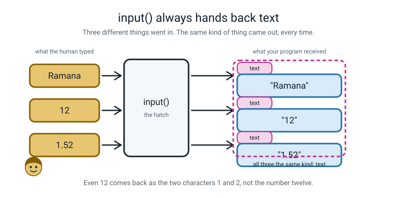
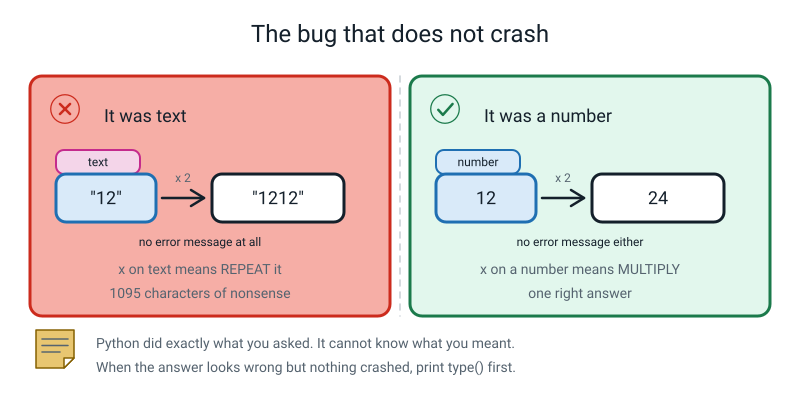
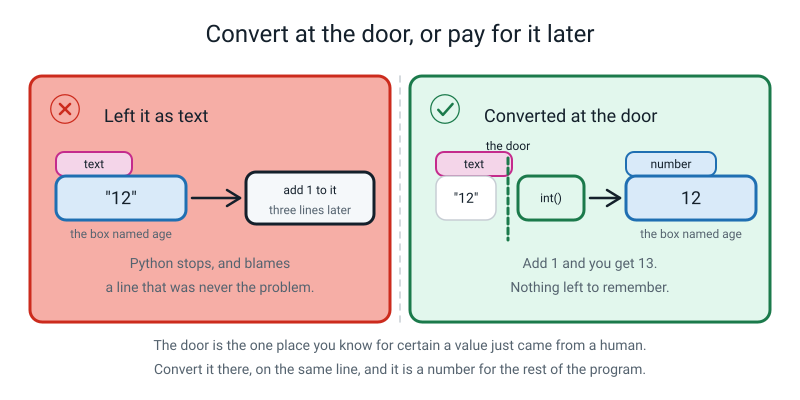
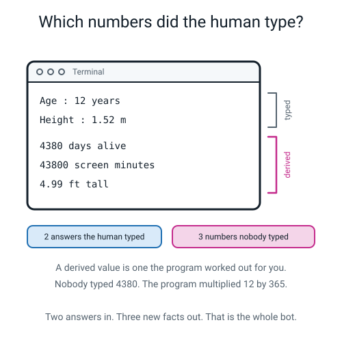
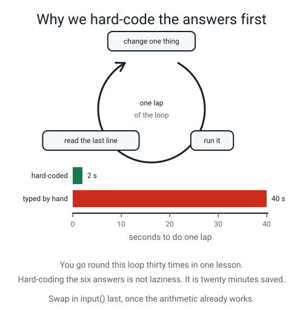
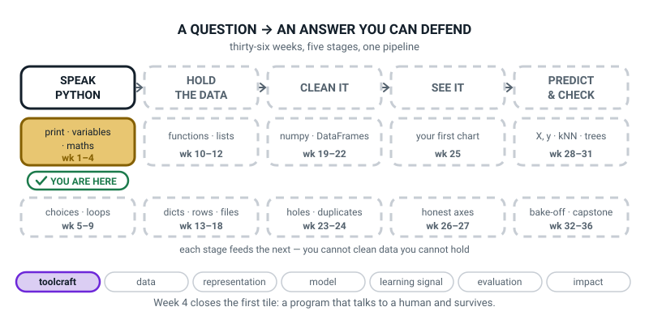

# Week 4 — The About-Me Bot

[⬅ Week 3](week-03.md) · [Course Home](../README.md) · [Week 5 ➡](week-05.md) · [Student Guide](../student-guide/week-04.md) · [Workbook](../workbook/week-04.md)

---

## 📋 At a Glance

| | |
|---|---|
| **Duration** | 70 minutes |
| **Type** | 🟨 Project — the first program that talks back |
| **Big idea** | `input()` always hands you text, so you must convert it yourself — and Python tells you exactly where you forgot. |
| **New vocabulary** | input · conversion · traceback · derived value · hard-coding |
| **New syntax** | `input("prompt")` · `int(input("Age? "))` · `str(x)` · `round(x, 2)` |
| **Materials** | Printed workbook (all of it, one file) · pencil · the student's notebook, open at the **Bug Log** page · a printed copy of `about_me.py` Stage 3 (the paper fallback) |
| **Tech needed** | One laptop, Python 3, a terminal open in `~/ai-academy/level2` with `(.venv)` showing, and an editor. **Nothing installed today** — standard library only. |
| **Prep time** | 20 minutes the night before, 5 minutes on the day |

> **⚠️ Watch out:** the single most common way this lesson goes wrong is the teacher letting the student put `input()` in on line 1. Do not. **Six typed answers per run turns a two-second test into a forty-second chore**, and a student who has to retype "Ramana / Bengaluru / 12 / 1.52 / 120 / 7" thirty times will stop testing. Hard-code first. `input()` does not go in until minute 38.

---

## 🎯 Lesson Objectives

By the end of the lesson the student can:

1. **Read a value from the human with `input()` and convert it in the same breath** — `int(input("Age? "))`, not two lines apart.
2. **Explain why `input()` returning text is a design choice, not a nuisance** — because the keyboard genuinely does send characters, and Python refuses to guess.
3. **Compute two derived numbers from raw answers and print them in a formatted card** — numbers nobody typed.
4. **Read and fix three real tracebacks without help, using the last line first.**
5. **Explain why hard-coding a value while debugging is faster than retyping six answers.**

Observable evidence: a running `about_me.py` that asks six questions and prints a card with at least two derived numbers; a comment on every line; and three real tracebacks pasted into the Bug Log with the fix written in the student's own words.

---

## 🧑‍🏫 What YOU Need to Know First

> **📌 About the code blocks in this guide.** Outside the **🧰 Prep Checklist** and the **🔑 Answer Key**, the blocks are **illustrations, not files** — each one carries on from the one above it, so the `import` lines and the data are typed once, in the first block that needs them. **The complete runnable files are in the Prep Checklist and the Answer Key.** If you paste an illustration on its own and get `NameError`, that is why, and nothing is broken.

You do not need to have programmed before. Everything below is written for someone who has not. Read it twice, then type the code yourself. Twenty minutes now buys you a lesson where you are never guessing.

### 1. What `input()` actually does

There are only three moving parts in this whole week, and this is the first.

`input()` is a built-in **function** — a named action Python already knows how to do, which you trigger by writing its name followed by round brackets. When Python reaches an `input()`, three things happen, in order:

1. It prints whatever text you put inside the brackets. That text is called the **prompt**.
2. It **stops the program dead** and waits. The cursor sits there blinking. Nothing else happens — no clock is ticking, nothing is timing out. It will wait all afternoon.
3. The moment the human presses Enter, it hands back everything they typed.

> **input** — a built-in function that shows a prompt, waits for the human to type something and press Enter, and hands back what they typed.

That is it. Write one line and try it:

```python
# hello_you.py - the smallest program that talks back.

name = input("What is your name? ")   # ask, wait, and put the answer in the box called name
print(f"Hello, {name}!")              # print a sentence with the answer dropped into it
```

A real run — the part after the question mark is what the human typed, and it appears on the same line because the terminal echoes your keystrokes as you type them:

```text
What is your name? Ramana
Hello, Ramana!
```

Two small habits worth having from day one:

- **Put a space at the end of the prompt.** `input("What is your name? ")` — the trailing space stops the typed answer from being jammed against the question mark. It costs one character and it makes every run look deliberate.
- **`input()` always needs the brackets**, even with nothing in them. `input` on its own is the name of the function; `input()` is you actually running it.

### 2. The one fact that this whole week rests on

**`input()` always hands back text. Always. No exceptions.** Even when the human types `12`.

Python's word for text is **`str`**, short for "string" — a string of characters. When you see `<class 'str'>` on the screen, Python is saying "this is text".

Run this. It is two lines and it is the most valuable two lines of the week:

```python
# type_test.py - two lines that show what input() really hands you.

age = input("Age? ")        # deliberately NOT converted
print(age, type(age))       # what is it, really?
print(age * 2)              # what does * 2 do to text?
print(int(age) * 2)         # and now the same thing, converted first
```

A real run, typing `12`:

```text
Age? 12
12 <class 'str'>
1212
24
```

Look at line 3 of the output. **`1212`.** Not 24. Because `age` is the *text* `"12"`, and in Python the `*` symbol does two completely different jobs depending on what is on its left:

| Left-hand side | `* 2` means | Result |
|---|---|---|
| a number, `12` | multiply | `24` |
| text, `"12"` | repeat it, twice over | `"1212"` |

That is not a bug in Python. `"ha" * 3` giving `"hahaha"` is genuinely useful, and you will use it in Week 7 to draw divider lines. But it means that **a forgotten conversion does not always crash. Sometimes it just quietly lies to you**, and that is the hardest kind of bug there is.


*Figure 4.1 — Three different answers went in. Three pieces of text came out. The tag on each card is the whole of this week.*


*Figure 4.2 — Same symbol, two jobs. Neither of these produced an error message.*

**Why does Python not just guess?** Because it cannot. Consider a program that collects postcodes. Somebody types `0121`. Is that the number one hundred and twenty-one? Is it text that happens to look numeric, where the leading zero matters enormously?

Python has no way to know, so it refuses to decide and hands you the characters exactly as typed. **The design choice is: the human who wrote the program knows what the answer means, so the human converts it.**

Some other languages guess. They are wrong more often than they are convenient, which is why `"5" + 5` returning `"55"` is one of the most famous complaints about JavaScript.

There is a second reason, and it is worth saying to a student who thinks the rule is arbitrary.

`input()` cannot know what you *want*. `int()` and `float()` and `str()` are all reasonable things to want from the characters `12`. If `input()` guessed `int`, the day someone types `1.52` your program would break and it would be `input()`'s fault, not yours.


*Figure 4.3 — Convert at the door, or spend the rest of the program remembering that you didn't.*

### 3. Conversion — the four functions, and where they go

> **conversion** (also called *casting*) — turning a value of one kind into the matching value of another kind, on purpose, using `int()`, `float()` or `str()`.

| You write | You get | Note |
|---|---|---|
| `int("12")` | `12` | text → whole number |
| `float("1.52")` | `1.52` | text → decimal number |
| `str(12)` | `"12"` | number → text |
| `int("1.52")` | **it stops** | `"1.52"` is not a whole number written down |
| `int(1.52)` | `1` | chops the decimal off — does **not** round |
| `round(1.52)` | `2` | rounds properly |
| `round(4.9868768, 2)` | `4.99` | rounds to 2 decimal places |

Two of those rows deserve a sentence each, because they catch everybody.

**`int()` on text with a decimal point fails.** `int("1.52")` does not give you 1; it stops the program. The reasoning is that `"1.52"` is not a whole number, and Python would rather refuse than throw away information you might have wanted. If you genuinely want the whole part of typed text, do it in two steps: `int(float("1.52"))`.

**`int()` on a number that already exists chops; `round()` rounds.** `int(3.9)` is `3`. `round(3.9)` is `4`. You will want `round()` far more often than you expect. `round(x, 2)` gives you two decimal places, which is what money and heights and averages look like on a page.

**Where the conversion goes.** This is the habit to install today, so be firm about it. You can write it in two lines:

```python
age_text = input("Age? ")     # this is text
age = int(age_text)           # and now it is a number
```

…or you can write it as one:

```python
age = int(input("Age? "))     # ask, and convert, in the same breath
```

Both work. **The one-line version is the one to teach**, because the two-line version means there is a moment in the program where a variable called `age` holds text, and that moment is exactly when someone forgets.

Read the one-liner from the inside out, which is the order Python does it in:

```text
        age = int( input("Age? ") )
                        └──────┘      1. ask the human, get back the text "12"
                   └──────────────┘   2. hand that text to int(), get back the number 12
        └────────────────────────┘    3. put the number 12 in the box called age
```

**Brackets close in the reverse order they opened.** `int(input("Age? "))` — the string's quotes close, then `input`'s bracket, then `int`'s bracket. Two closing brackets at the end, and a beginner will forget one. That is Debugging Clinic row 5.

### 4. Every line of this week's program, explained

This is the program the student will finish. Here it is with a plain-English gloss on every single line. **Type it yourself before the lesson.** Reading it is not the same thing.

```python
# about_me.py - the About-Me Bot. Six questions in, one profile card out.
# Every input() hands back TEXT, so numbers are converted the moment they arrive.

print("========================================")   # 40 equals signs, typed out
print("  ABOUT-ME BOT - six quick questions")
print("========================================")

# --- 1. the six answers ----------------------------------------------
name = input("1. Your name?                 ")                  # text, no conversion
city = input("2. Your city?                 ")                  # text, no conversion
age = int(input("3. Your age in years?         "))              # whole number -> int()
height_m = float(input("4. Your height in metres?     "))       # decimal -> float()
screen_minutes = int(input("5. Screen minutes per day?    "))    # whole number -> int()
fav_number = int(input("6. Your favourite number?     "))       # whole number -> int()

# --- 2. derived values: computed, never typed ------------------------
age_days = age * 365                        # rough days alive, ignoring leap years
screen_minutes_year = screen_minutes * 365  # minutes of screen time in one year
height_ft = round(height_m * 3.28084, 2)    # metres to feet, rounded to 2 decimals

# --- 3. the card -----------------------------------------------------
print("========================================")
print("             PROFILE CARD")
print("========================================")
print(f"  Name    : {name}")                # f before the quote turns on {}
print(f"  City    : {city}")
print(f"  Age     : {age} years")
print(f"  Height  : {height_m:.2f} m  ({height_ft:.2f} ft)")
print("----------------------------------------")
print("  THINGS YOU DID NOT TELL ME")
print(f"  You have been alive about {age_days} days.")
print(f"  Screens cost you {screen_minutes_year} minutes a year.")
print(f"  Your favourite number cubed is {fav_number ** 3}.")
print("========================================")
```

Line by line:

| Line | What it does |
|---|---|
| `# about_me.py - ...` | A **comment**. Anything after `#` is ignored by Python entirely. It is a note for a human. |
| `print("=====...")` | Prints forty equals signs. We type them out. In Week 7 you will learn `"=" * 40`, and this is the week that makes that feel like a gift. |
| `name = input("1. Your name?   ")` | Asks, waits, and puts the typed text in a box called `name`. No conversion — a name *is* text. |
| `age = int(input(...))` | Asks, gets text, hands it to `int()`, puts the resulting number in `age`. |
| `height_m = float(input(...))` | Same shape, but `float()` because a height has a decimal point. `float` is Python's word for a number with a decimal point. |
| `age_days = age * 365` | Multiplies. Works only because `age` is a number. If `int()` were missing, this line would silently produce 730 characters of nonsense (`"12"` repeated 365 times). |
| `height_ft = round(height_m * 3.28084, 2)` | One metre is 3.28084 feet. `round(…, 2)` trims the answer to two decimal places. |
| `print(f"  Name    : {name}")` | The `f` immediately before the opening quote is what makes `{name}` get replaced by the value. **Without the `f`, Python prints the literal characters `{name}`** — see Debugging Clinic row 8. |
| `{height_m:.2f}` | The `:` starts a formatting instruction. `.2f` means "show two digits after the point". |
| `{fav_number ** 3}` | `**` is "to the power of". You can do arithmetic *inside* the braces. |

The exact output of a full run, typing `Ramana`, `Bengaluru`, `12`, `1.52`, `120`, `7`:

```text
========================================
  ABOUT-ME BOT - six quick questions
========================================
1. Your name?                 Ramana
2. Your city?                 Bengaluru
3. Your age in years?         12
4. Your height in metres?     1.52
5. Screen minutes per day?    120
6. Your favourite number?     7
========================================
             PROFILE CARD
========================================
  Name    : Ramana
  City    : Bengaluru
  Age     : 12 years
  Height  : 1.52 m  (4.99 ft)
----------------------------------------
  THINGS YOU DID NOT TELL ME
  You have been alive about 4380 days.
  Screens cost you 43800 minutes a year.
  Your favourite number cubed is 343.
========================================
```

Check the arithmetic on paper, because you will need to be able to do it in front of them:
12 × 365 = 4,380 ✔ · 120 × 365 = 43,800 ✔ · 1.52 × 3.28084 = 4.9868… → 4.99 ✔ · 7 × 7 × 7 = 343 ✔.

### 5. Derived values — the actual point of the project

> **derived value** — a number the program worked out, which the human never typed.

This is the difference between a form and a program. A form collects six answers and shows you six answers. **A program collects six answers and tells you something you did not know.** "You have been alive about 4,380 days" is not one of the six answers. Nobody typed 4,380.


*Figure 4.4 — Two answers went in. Three facts came out. The three at the bottom are the whole reason the program exists.*

Say the phrase "things you did not tell me" out loud in the lesson. It is the moment a 12-year-old sees why any of this is worth doing.

### 6. Tracebacks — how to read them, in four steps

> **traceback** — the block of text Python prints when it gives up, saying where it stopped and why.

Every traceback has the same three parts, always in the same order:

```text
Traceback (most recent call last):
  File "about_me.py", line 4, in <module>          <-- (1) WHERE
    next_year = age + 1                            <-- (2) THE LINE ITSELF
TypeError: can only concatenate str (not "int") to str   <-- (3) WHAT AND WHY
```

**Read the last line first.** This is the single most useful debugging habit in the course and it is genuinely counter-intuitive, because English reads top to bottom. The stuff at the top is the route Python took to get there; the bottom line is what actually went wrong.

Four steps, in this order, every time:

1. **Last line.** Two halves, separated by a colon: the error *type* (`TypeError`) and the *message*.
2. **Line number.** `line 4`. Go there.
3. **Read the line above it too.** A mistake on one line is often *reported* on a later one (a missing bracket in older Pythons, a wrongly typed value in every version). Python 3.10 and later point an unclosed bracket back at the line where it opened, as in Break 3. The habit stays the same: read the line above as well.
4. **Change one thing. Run again.** One thing. Not three. If you change three things and it works, you have learned nothing and you still have two mysteries.

The five error types you will meet this week:

| Type | What Python means, in English |
|---|---|
| `SyntaxError` | "I could not even read this." Nothing ran at all. |
| `NameError` | "You used a name I have never seen." A typo, or used before it existed. |
| `TypeError` | "Right names, wrong kinds of thing." `"12" + 1`. |
| `ValueError` | "Right kind of thing, impossible value." `int("twelve")`. |
| `EOFError` | "You asked me to read input and there was nobody there." Usually means the program was run the wrong way. |

Note the difference between the middle two, because it trips up adults as well as children:

- `int("twelve")` → **`ValueError`**. You gave `int()` text, which is exactly the right *kind* of thing. It just cannot use *that* text.
- `"12" + 1` → **`TypeError`**. Text and a number are different kinds of thing, and `+` will not mix them.

**A traceback is a gift.** It contains the file, the line number, the exact line, the category of mistake and a sentence about it. Compare that with a program that produces `1212` and says nothing. Say this out loud in the lesson: *"the crashes are the easy ones."*

### 7. Hard-coding, and why we do it on purpose today

> **hard-coding** — writing a value straight into the program instead of asking for it.

Hard-coding is usually a criticism. Today it is a technique.

You will change this program and re-run it about thirty times in the lesson. Every single run with `input()` in place costs six typed answers — about forty seconds of typing and, worse, forty seconds of nothing to think about. Thirty runs is twenty minutes of the lesson, gone.

So: **Stages 1–3 hard-code all six answers. `input()` goes in at Stage 4, when the arithmetic and the card already work.** This is not a teaching trick; it is what a working programmer does. You shrink the loop.


*Figure 4.5 — The loop is the job. Everything you can do to make one lap faster, do.*

### 8. The three misconceptions you will actually meet

**Misconception 1 — "I converted it, so it's fine."** The student writes `int(input("Age? "))` on line 3, then two lines later writes `screen_minutes = input(...)` with no conversion, and is genuinely surprised. Conversion is per-value, not per-program. There is no global setting. The fix that sticks: **read the six input lines as a column and check that every numeric one has a conversion round it.** Make them point at each one with a finger.

**Misconception 2 — "The error is on the line the traceback says."** Often true, sometimes not. `line 4` means "line 4 is where Python gave up", which is not the same as "line 4 is wrong". With a wrongly-typed value (text where a number should be), the mistake is on the line that filled the variable and the complaint is about the line that used it. Teach step 3 of the four steps: *look at the line above as well.*

**Misconception 3 — "A program that runs is a program that works."** This is the big one and it is what the planted bug exists to break. The bug we plant today produces no error at all. It runs. It prints. It looks like a finished program. And the screen-time number is 1,095 characters of nonsense. **Running and working are different things, and only one of them is your job.**

### 9. How deep to go, and where to stop

**Go this far:** `input()` returns text · convert at the door with `int()` / `float()` · `str()` for going the other way · `round(x, 2)` · derived values · read a traceback last-line-first · `type()` as a diagnostic tool.

**Stop before all of these:**

- **Checking input before converting it.** If a student types `twelve` the program will stop with a `ValueError`, and today the correct response is "yes — that is what it does, and it is honest". Guarding against bad input needs `if`, which is next week, and `.isdigit()`, which is Week 6. Do not go there today.
- **Repeating the question until they get it right.** That needs a `while` loop. Week 8.
- **`try` / `except`.** Not in this course at all. It is not needed and it hides the tracebacks we are teaching them to read.
- **`"=" * 40`.** Very tempting, and it is Week 7. Type the forty equals signs out. When Week 7 arrives, the relief is the lesson.
- **Functions.** A student may well say "this is repetitive, can I make an ask-a-question thing?" That is a brilliant instinct and it is Week 9. Write their name and the date beside it in the margin and tell them they got there five weeks early.
- **f-string alignment like `{name:>10}`.** Optional, only for a student who is flying, and only if they ask.

---

### 10. 🧭 The Growing Map — closing the first tile

Same figure as every week, one more piece filled in. Week 4 is a milestone on it: this is the last week
of the first tile, so the gold is about to move for the first time all year. Say that out loud — it is
worth something to them.



*Figure 4.0 — Week 4's version. Still the first tile, but the last week of it. From Week 5 this tile goes
plain white and the one below it turns gold.*

**Two minutes, at the end:**

1. **Ask the week's own question:** *"the About-Me Bot used a file, named boxes, f-strings **and**
   `int()` — how many boxes on this map did we need for that?"* The answer is one, and it surprises them.
   Four weeks of tools, one tile.
2. **Then the milestone:** *"next week the gold moves down to the box underneath. What do you reckon
   `choices` means?"* Take any guess, agree it is interesting, and stop. Do not teach Week 5 today.
3. **Then the dashes**, in the usual words: *"why is the rest dotted?"* — *"we haven't got there yet."*
4. **Pencil copies.** A tick in the corner of the first tile. Four weeks, one box, finished — and a
   program that talks to a human and survives is a genuinely fair thing to be pleased about.

> **🧑‍🏫 Why this is worth two minutes.** Week 4 is the first week a student might privately think *"is
> this going anywhere?"* The map answers that without you having to make promises: they can see the
> fourteen boxes still to come, and they can see that the four weeks behind them added up to exactly one
> of them.

> **⚠️ Watch out:** if a student's bot still has a bug in it, do not use the map to imply they have
> "finished" the tile. Point at the gold and say *"this is where we all are"* — the map describes the
> class, not the individual.

---

## 🧰 Prep Checklist

This section lists what to do before the lesson, and what to do if the laptop fails.

### 20 minutes the night before

- [ ] **Print the workbook.** Also print the **Build It** section twice (its Part 2 is the Bug Log and it fills up fast). Keep the Answers section at the end back from the student; the Answer Key below follows the workbook's sections.
- [ ] **Type and run this yourself, from scratch, in a scratch file.** Do not copy-paste. Make the file `~/ai-academy/level2/teacher_scratch.py`, type this, and run `python3 teacher_scratch.py`:

  ```python
  # teacher_scratch.py - the three things I must be able to do cold.

  age = input("Age? ")            # deliberately not converted
  print(age, type(age))           # I should see: 12 <class 'str'>
  print(age * 2)                  # I should see: 1212
  print(int(age) * 2)             # I should see: 24
  print(round(1.52 * 3.28084, 2)) # I should see: 4.99
  ```

  Typing `12`, the exact expected output is:

  ```text
  Age? 12
  12 <class 'str'>
  1212
  24
  4.99
  ```

  **If you did not see `1212`, stop and find out why before the lesson.** That number is the lesson.

- [ ] **Trigger this week's planted bug yourself.** Save the full `about_me.py` from section 4, then delete the `int(` and the matching `)` from the `screen_minutes` line so it reads:

  ```python
  screen_minutes = input("5. Screen minutes per day?    ")          # BUG: no int() here
  ```

  Run it and answer `120` to question 5. You should get a card whose screen-time line is **1,095 characters** of `120120120…`. Look at it. That is what the student is about to see, and your reaction ("oh good, an error — except it isn't an error") sets the tone.
- [ ] **Do the arithmetic on paper:** 12 × 365, 120 × 365, 1.52 × 3.28084, 7³. You want to be able to say "that should be about four and a bit thousand" before the program says it.
- [ ] Read **section 6** (tracebacks) twice. You will use the four steps six times in the lesson.
- [ ] Say the big idea out loud, in your own words, once. Something like: *"the keyboard sends letters, so a number typed by a human is letters until you say otherwise."*

### 5 minutes on the day

- [ ] Terminal open, in `~/ai-academy/level2`, with `(.venv)` visible in the prompt.
- [ ] Editor open on the `level2` folder. Last week's file still runs — open it, run it, ten seconds.
- [ ] Notebook out, **open at the Bug Log page**. Today produces three entries.
- [ ] Workbook on the table, open at Warm-Up.
- [ ] **Laptop closed** for the first seven minutes. The Hook is screens-off.
- [ ] Your hands somewhere that is not the keyboard.

### Fallback if the laptop or the install fails

The whole lesson works on paper. It is less fun and it delivers four of the five objectives.

| If this fails | Do this instead |
|---|---|
| **No laptop at all** | Hand out the printed Stage 3 program (section 4, with the six answers hard-coded). The student is the computer: they read it line by line and write, on paper, what each `print` puts on the screen. Then you hand them a printed card reading `screen_minutes = "120"` and ask them to redo the screen-time line. They will produce `120120120…` by hand and run out of paper. That lands *harder* than the screen version. |
| **Python not installed / `command not found`** | Same paper version. Then use the 5-minute installer in Orientation §4 during the Their Turn slot, and move the coding to tomorrow. Do not spend lesson time on installation with a student watching. |
| **`(.venv)` is missing from the prompt** | It does not matter today. Nothing this week needs a library. Run `python3 about_me.py` anyway. Fix the venv later. |
| **The student cannot type fast enough to keep up** | Cut questions 5 and 6. Four questions and one derived number is a complete lesson. |
| **The editor keeps auto-completing brackets and confusing them** | Leave it on and teach them to *notice*: when they type `int(`, the editor puts `)` there for them, so the bracket they then type themselves makes `))`. Point at it once. This is a real skill, not a distraction. |

---

## ⏱️ The Lesson, Minute by Minute

This section is the lesson plan: the five segments in order, then a script for each one.

| Segment | Minutes | Running total | What happens |
|---|---|---|---|
| 🪝 Hook — My Bot Says You Watch 120120120 Minutes | 7 | 7 | A program that runs, prints, and is completely wrong |
| 🧠 Concept — Everything Comes In As Text | 16 | 23 | `input()`, `type()`, conversion at the door |
| 💻 Live-Code Together — Build the Bot in Four Stages | 18 | 41 | Hard-coded answers, derived numbers, the card. Two deliberate mistakes. |
| 🎲 Their Turn — Swap In `input()` and Break It | 20 | 61 | `input()` goes in, the planted bug appears, `type()` finds it |
| 🔑 Wrap & Assign | 9 | 70 | Three checks, Bug Log, homework |

---

### 🪝 Hook — My Bot Says You Watch 120120120 Minutes (7 minutes)

**Do this:** Laptop **closed**. Nothing on screen. Sit down with a piece of paper.

**Say this:**

> "I wrote you a program last night. Three lines. It asks how many minutes of screen time you get in a day, and then it tells you how many minutes that is in a whole year. That's it, that's the whole program.
>
> I'll be the program. Ready? *How many minutes of screen time a day?*"

Wait for a real answer. Whatever they say, use 120 for the demonstration — it is a round number and the arithmetic is clean.

> "Right — a hundred and twenty. Before I tell you what my program said, you tell me. What should the answer be? A hundred and twenty minutes a day, three hundred and sixty-five days. Roughly."

Let them do it. Roughly forty thousand. If they need help: 120 × 365 → 100 × 365 = 36,500, plus 20 × 365 = 7,300, so 43,800.

> "Forty-three thousand eight hundred. Good. That's what it *should* say."

Now open the laptop and run `hook.py` for real:

```python
# hook.py - a bot with exactly one thing wrong with it.

minutes = input("Minutes of screen time a day? ")   # ask the human
print("In a whole year that is:")                   # announce the answer
print(minutes * 365)                                # 365 days in a year
```

Type `120`. The real output — and this is genuinely what appears, I have run it:

```text
Minutes of screen time a day? 120
In a whole year that is:
120120120120120120120120120120120120120120120120120120120120120120120120120…
```

…and it keeps going for **1,095 characters**. Let it fill the screen. Scroll it if you have to. Do not explain anything yet.

**Say this:**

> "So. Three questions, and I want you to sit with each one.
>
> **One: did my program crash?** No. Look at it. It ran. It finished. It came back to the prompt quite happily. There is no red text anywhere on that screen.
>
> **Two: is the answer right?** No. It is not even nearly right. It's not off by a bit — it's not a number at all.
>
> **Three, and this is the one that matters: how would you ever have known?** If I hadn't asked you to work it out on paper first — if I'd just shown you the screen — would you have spotted it?"

Let that sit. Then:

> "Here's what I want you to hold onto for the next hour. **A program that runs is not the same thing as a program that works.** Today you are going to write a bot that interviews people, and by the end of today you'll have crashed it three times on purpose, and I promise you the crashes will be the *easy* problems. This one — the one that ran perfectly and lied to me — took me longest to find.
>
> And the reason it happened is one single fact about that middle line, which I'm going to show you next, and which is the whole of this week."

**Ask this:**

| Ask | Answer you want | If they say something else |
|---|---|---|
| "What should 120 minutes a day be, over a year?" | About 43,800 minutes. | If they cannot do it, do it with them out loud: 100 × 365 = 36,500, and 20 × 365 = 7,300. Do not skip this — the prediction is what makes the wrong answer visible. |
| "Did the program crash?" | No. It ran fine. | If they say "it must have" — point at the screen. There is a fresh prompt. Nothing crashed. That is exactly the point. |
| "How would you have known it was wrong?" | Because I worked out the answer first. | If they say "because it looks silly" — push: "it looks silly to you because it's absurdly long. What if it had printed 4,380 instead of 43,800? Would you have spotted *that*?" (No. That is the honest answer.) |
| "What do you think 120 × 365 has to do with `120120120…`?" | Something to do with it being repeated 365 times. | This is a great guess and it is exactly right. Do not confirm yet — say "hold that thought, you're going to be right in about four minutes." |

---

### 🧠 Concept — Everything Comes In As Text (16 minutes)

**Do this:** New file. **The student types.** You read the lines out loud, one at a time, no faster than they can type. Your hands are not on the keyboard at any point in this lesson.

**Say this — part 1, `input()`:**

> "Three things happen when Python hits an `input()`. I want you to be able to say all three.
>
> **One, it prints the question** — whatever you put inside the brackets. That's called the prompt.
>
> **Two, it stops.** Completely. The program is frozen. Nothing is counting down, nothing times out. If you go and make a cup of tea it will still be sitting there when you get back.
>
> **Three, when you press Enter, it hands back whatever you typed.** And that's where the whole of today lives, in the word *whatever*."

Have them type this, exactly:

```python
# type_test.py - two lines that show what input() really hands you.

age = input("Age? ")        # deliberately NOT converted
print(age, type(age))       # what is it, really?
print(age * 2)              # what does * 2 do to text?
print(int(age) * 2)         # and now the same thing, converted first
```

**Before they run it, ask for a prediction, out loud, for all three print lines.** Write their prediction on the paper. Then run it, typing `12`:

```text
Age? 12
12 <class 'str'>
1212
24
```

**Say this — part 2, what `str` means:**

> "`<class 'str'>` is Python saying **'this is text.'** `str` is short for string — a string of characters, like beads on a thread. The characters `1` and `2`, in that order.
>
> Not the number twelve. **The two symbols you'd write the number twelve with.** That is a genuinely different thing, and once you've seen it you can't unsee it.
>
> And now look at line three of the output. `1212`. Because the star symbol has two different jobs, and the thing on its left decides which one you get."

Draw this on paper, or show Figure 4.2:

```text
   12  * 2   →  24        the thing on the left is a NUMBER  → multiply
  "12" * 2   →  "1212"    the thing on the left is TEXT      → repeat it
```

> "That's the hook. That's the whole bug. My program had text, so `* 365` meant *say it 365 times*, and it did exactly that, three hundred and sixty-five times, and then it printed all of it, and it was pleased with itself.
>
> And here's the important bit: **Python was not wrong.** It did precisely what I asked. It cannot know what I meant. Only I know that."

**Say this — part 3, why on earth would Python do this:**

> "Now the fair question, and you should ask it. Why doesn't `input()` just notice that `12` looks like a number, and hand me a number?
>
> Because sometimes it isn't a number. Imagine a program that asks for a postcode and I type `0121`. If Python turns that into a number, the zero at the front vanishes — and for a postcode that zero is the whole point. Or a phone number. Or an account number.
>
> Python can't tell the difference between 'digits that are a quantity' and 'digits that are a name'. **You can.** So it hands you the characters, exactly as typed, and you say what they mean.
>
> Some other languages do guess. You may have heard people complain about JavaScript adding `"5"` and `5` and getting `"55"`. That's what guessing looks like from the inside. Python's answer is: I'd rather stop and ask."

**Say this — part 4, convert at the door:**

> "So you convert. Three tools, and you'll use them all today.
>
> **`int(...)`** — text into a whole number. Ages, minutes, favourite numbers.
> **`float(...)`** — text into a number with a decimal point. Heights, prices, hours.
> **`str(...)`** — the other direction, a number into text. You need it less often, but you need it.
>
> And there's a *place* these go, and it's not just anywhere. Look at these two."

Show them side by side on paper:

```text
  age_text = input("Age? ")      #  a box called age_text that holds TEXT
  age = int(age_text)            #  and now a box called age that holds a NUMBER

  age = int(input("Age? "))      #  the same two things, in one line
```

> "Both of those work. **The second one is the one I want you writing**, and here's the reason: in the first version, there's a moment — one line long — where a thing called `age_text` is sitting there holding text. And that moment is exactly where people forget.
>
> Do it at the door. The second you take the value off the human, convert it. Then for the rest of the program it is a number and you never have to think about it again."

Show Figure 4.3. Then have them add one line to `type_test.py` and run again:

```python
print(int("1.52"))     # add this at the bottom - watch what happens
```

The real output:

```text
Traceback (most recent call last):
  File "type_test.py", line 7, in <module>
    print(int("1.52"))
ValueError: invalid literal for int() with base 10: '1.52'
```

> "**Read the last line first.** Always the last line. `ValueError`. Python is saying: you handed me text, which is the right *kind* of thing — you didn't do anything mad — but I cannot turn *that* text into a whole number, because `1.52` isn't a whole number.
>
> What should we have used? `float`. Change it and run it."

`float("1.52")` gives `1.52`. Then delete both experiment lines.

**Ask this:**

| Ask | Answer you want | If they say something else |
|---|---|---|
| "Say the three things `input()` does." | Prints the prompt · stops and waits · hands back what was typed. | If they miss "stops and waits", show them: run a program with an `input()` and just sit in silence for fifteen seconds. Let it be slightly uncomfortable. |
| "What does `<class 'str'>` mean?" | It means text. | If they say "string" without meaning — press: "and what's a string?" Answer: a string of characters. |
| "So `"7" * 3` gives me what?" | `"777"`. | If they say 21, that is the expected wrong answer and it is a good one. Say "try it" and let the screen tell them. |
| "Why doesn't `input()` guess?" | Because digits aren't always a quantity — postcodes, phone numbers. | If they say "because Python is annoying", accept the joke and then give them the postcode example. It converts people. |
| "Which do I use for a height in metres — `int` or `float`?" | `float`, because it has a decimal point. | If they say `int`, ask "what does `int(1.52)` give?" (`1`.) "Would you like to lose the 52?" |
| "Where does the conversion go?" | Round the `input()`, on the same line. At the door. | If they want it on a later line, allow it but make them say what the variable holds in between. Usually they choose the one-liner themselves after that. |

---

### 💻 Live-Code Together — Build the Bot in Four Stages (18 minutes)

**Do this:** New file, `about_me.py`, in `~/ai-academy/level2`. **The student types every character.** You read lines out loud and point at the screen. Run after every stage — four runs minimum in this segment.

#### Stage 1 (4 min) — six answers, hard-coded

**Say this:**

> "We are building a bot that interviews people. Six questions. And the very first thing we're going to do is **not ask any questions at all.**
>
> Here's why. We're going to change this program about thirty times in the next half hour. Every time we change it, we run it. If it asks six questions, every single run costs you typing your name, your city, your age, your height, your screen time and your favourite number. That's forty seconds. Thirty times is twenty minutes of your life spent typing 'Ramana'.
>
> So we **hard-code** the answers — we write them straight into the program — and we swap in the real questions at the very end, once everything works. This isn't a shortcut. It's what people who do this for a living actually do."

Dictate:

```python
# about_me.py - the About-Me Bot.
# Stage 1: the six answers are hard-coded so we can run it after every change.

name = "Ramana"          # text, so it stays inside quotes
city = "Bengaluru"       # text
age = 12                 # a whole number, so an int
height_m = 1.52          # has a decimal point, so a float
screen_minutes = 120     # whole minutes of screen time per day, an int
fav_number = 7           # a whole number, an int

print("Name:", name)                        # print takes several things, comma separated
print("City:", city)
print("Age:", age)
print("Height in metres:", height_m)
print("Screen minutes per day:", screen_minutes)
print("Favourite number:", fav_number)
```

Run it. The real output:

```text
Name: Ramana
City: Bengaluru
Age: 12
Height in metres: 1.52
Screen minutes per day: 120
Favourite number: 7
```

> "Six lines out. Notice there are no quotes round the 12 or the 1.52 — those are numbers. Quotes round Ramana and Bengaluru, because those are text. That difference is going to matter in about six minutes."

#### Stage 2 (5 min) — ⚠️ **DELIBERATE MISTAKE #1** and the derived numbers

**Say this:**

> "Now the interesting part. Three numbers nobody typed."

Dictate the derived block — **and get `round` wrong on purpose.** Type a capital R:

```python
# --- derived values: computed, never typed ---------------------------
age_days = age * 365                        # rough days alive, ignoring leap years
screen_minutes_year = screen_minutes * 365  # minutes of screen time in one year
height_ft = Round(height_m * 3.28084, 2)    # metres to feet, rounded to 2 decimals

print("age in days:", age_days)
print("screen minutes per year:", screen_minutes_year)
print("height in feet:", height_ft)
```

Run it. The real traceback:

```text
Traceback (most recent call last):
  File "about_me.py", line 21, in <module>
    height_ft = Round(height_m * 3.28084, 2)
NameError: name 'Round' is not defined. Did you mean: 'round'?
```

**Do not fix it yet.** Say this instead:

> "Good. First traceback of the day. Now — **read me the last line.** Not the top. The bottom.
>
> `NameError`. That means: you used a name I've never heard of. And it even tells me which one — `Round`. And then, because Python is being genuinely kind here, it says *'Did you mean: round?'*
>
> Capital R. That's the entire problem. Python is case-sensitive, which means `Round` and `round` are two different words to it, as different as `dog` and `cat`. Fix the R and run it."

Fix it. The real output:

```text
age in days: 4380
screen minutes per year: 43800
height in feet: 4.99
```

> "Now check me. Twelve times three hundred and sixty-five — is 4,380 right? And 120 × 365 — is that the 43,800 you predicted at the start of the lesson? Yes. **The program agrees with your paper.** That's the only reason we trust it.
>
> And those three numbers are the point of the whole project. Nobody typed 4,380. Nobody typed 43,800. Those are **derived values** — the program worked them out. A form collects answers. A program tells you something you didn't know."

#### Stage 3 (6 min) — ⚠️ **DELIBERATE MISTAKE #2** and the card

**Say this:**

> "Now we make it look like something. Delete those three plain print lines at the bottom — we're replacing them with a card."

Dictate, and **leave the `f` off the first card line on purpose:**

```python
# --- the card --------------------------------------------------------
print("========================================")   # 40 equals signs, typed out
print("             PROFILE CARD")                  # spaces push the title along
print("========================================")
print("  Name    : {name}")                         # <-- the f is missing here
print(f"  City    : {city}")
print(f"  Age     : {age} years")
print(f"  Height  : {height_m:.2f} m  ({height_ft:.2f} ft)")
print("----------------------------------------")   # 40 hyphens, a divider
print("  THINGS YOU DID NOT TELL ME")
print(f"  You have been alive about {age_days} days.")
print(f"  Screens cost you {screen_minutes_year} minutes a year.")
print(f"  Your favourite number cubed is {fav_number ** 3}.")
print("========================================")
```

Run it. The real output — look at the Name line:

```text
========================================
             PROFILE CARD
========================================
  Name    : {name}
  City    : Bengaluru
  Age     : 12 years
  Height  : 1.52 m  (4.99 ft)
----------------------------------------
  THINGS YOU DID NOT TELL ME
  You have been alive about 4380 days.
  Screens cost you 43800 minutes a year.
  Your favourite number cubed is 343.
========================================
```

**Say this:**

> "Second bug. And notice: **no traceback.** It ran. It printed a card. One line of that card is wrong and Python said nothing at all.
>
> Compare the Name line with the City line. What's different? … Yes. There's no `f` before the quote on the Name line.
>
> That little `f` is the switch that turns the curly braces on. Without it, `{name}` is just six characters — a curly bracket, n, a, m, e, a curly bracket — and `print` printed exactly those characters, faithfully. With the `f`, Python looks inside the braces, finds the box called `name`, and drops its contents in.
>
> Add the `f`."

Fix it. Run again. Now the Name line reads `  Name    : Ramana`.

> "Two bugs so far. One crashed and told me exactly what was wrong. One didn't crash at all and I had to notice. Which was easier?"

Both go in the Bug Log — the student writes them, not you.

#### Stage 4 (3 min) — the maths is done, so now we can ask

**Say this:**

> "Right. The arithmetic works, the card looks like a card. **Now** we swap in the questions. This is the last thing we do, not the first."

Dictate the replacement for the six hard-coded lines — but **only do the first three now.** They will do the rest in Their Turn:

```python
# --- 1. the six answers ----------------------------------------------
name = input("1. Your name?                 ")                  # text, no conversion
city = input("2. Your city?                 ")                  # text, no conversion
age = int(input("3. Your age in years?         "))              # whole number -> int()
height_m = 1.52          # still hard-coded, for now
screen_minutes = 120     # still hard-coded, for now
fav_number = 7           # still hard-coded, for now
```

Run it. Answer `Ramana`, `Bengaluru`, `12`. It works, and the card is identical to before.

> "Three down, three to go. Notice what I did on the age line and *didn't* do on the name line: `int(` … `)` wrapped round the `input`. Name is text and stays text. Age is a number and gets converted at the door.
>
> Your turn for the last three. And one of them is going to bite you."

---

### 🎲 Their Turn — Swap In `input()` and Break It (20 minutes)

Full instructions in the next section. In the lesson flow:

- **Minutes 0–6:** the student converts the remaining three answers to `input()`. **You say nothing about `int()` on the screen-time line.** If they get it right, brilliant — then you introduce the bug yourself in minute 7 (see below).
- **Minutes 6–13:** the silent bug. Predict, run, find it with `type()`, fix it.
- **Minutes 13–20:** their own six questions and their own two derived numbers.

---

## 🎲 The Activity, In Full

This section gives the full instructions for the Their Turn segment, in three parts, plus what "finished" looks like and two variations.

### Setup

**On the table:** the laptop with `about_me.py` open · workbook **Build It** (Part 1 and Part 2, the Bug Log) · the notebook open at the Bug Log · a pencil.

**On the screen:** `about_me.py` as it stood at the end of Stage 4 — three `input()` lines and three hard-coded values.

### Part 1 — Finish the six (6 minutes)

The student replaces the last three hard-coded lines with `input()`, converting as they go. The target:

```python
height_m = float(input("4. Your height in metres?     "))       # decimal -> float()
screen_minutes = int(input("5. Screen minutes per day?    "))    # whole number -> int()
fav_number = int(input("6. Your favourite number?     "))       # whole number -> int()
```

**Say only this:** *"Three lines. Each one needs the right conversion round it, or none at all. Run it when you're done."*

Then be quiet. Sit on your hands. Whatever happens next is the lesson.

### Part 2 — The planted bug (7 minutes)

**If the student forgot an `int()`** — most do, and it is usually line 5 or 6 — you have your bug for free. Go straight to "Predict" below.

**If they got all three right** — say so, mean it, and then plant it yourself:

> "That's exactly right, all three. Which is annoying, because I wanted something to break. So I'm going to break it. Watch."

Delete the `int(` and the closing `)` from line 5, so it reads:

```python
screen_minutes = input("5. Screen minutes per day?    ")          # BUG: no int() here
```

**Predict first — this is the important bit.** Before running:

> "One conversion is gone. Before you run it: **is it going to crash, or is it going to run?** And if it runs, which line of the card will be wrong?"

Take their answer and write it down. Then run it, answering `Ramana`, `Bengaluru`, `12`, `1.52`, `120`, `7`. The real output — the screen-time line is 1,095 characters long:

```text
========================================
             PROFILE CARD
========================================
  Name    : Ramana
  City    : Bengaluru
  Age     : 12 years
  Height  : 1.52 m  (4.99 ft)
----------------------------------------
  THINGS YOU DID NOT TELL ME
  You have been alive about 4380 days.
  Screens cost you 120120120120120120120120120120120…120 minutes a year.
  Your favourite number cubed is 343.
========================================
```

**Say this:**

> "There's the Hook, back again, in your own program.
>
> Now — how do we *prove* what's wrong, instead of guessing? We ask Python what it thinks it's holding. Add one line, just above the derived block."

They add:

```python
print(type(screen_minutes))     # a temporary line, just to find the bug
```

Run again. Somewhere in the middle of the output:

```text
<class 'str'>
```

**Say this:**

> "There it is. **`str`.** Python is telling you, in three letters, that the thing it's about to multiply by 365 is text. That's not a guess and it's not a feeling — that's the answer.
>
> This is the most useful debugging trick you will learn this year and it is one line long: **when a number is behaving oddly, print its type.**
>
> Now put the `int()` back, run it, and check the number against 43,800."

They fix it. Then — and do not skip this — **they delete the `print(type(...))` line.** Diagnostic lines come out when the diagnosis is done.

Bug Log entry #3.

### Part 3 — Make it yours (7 minutes)

**Say this:**

> "Now it's your bot, not mine. Two jobs.
>
> **One: change the six questions to your six questions.** At least one has to accept a decimal, so at least one needs `float`.
>
> **Two: change one of the derived numbers to one of yours.** Something you'd actually want to know. Work out on paper what the answer should be *before* you run it."

Options to offer if they are stuck (the Build It section, Part 1, lists these too):

| Derived value | How |
|---|---|
| hours of screen time a year | `screen_minutes * 365 / 60` |
| how many 90-minute films that is | `screen_minutes * 365 / 90` |
| your age in hours | `age * 365 * 24` |
| your height in centimetres | `height_m * 100` |
| your favourite number squared and cubed | `fav_number ** 2` and `fav_number ** 3` |
| how many days until you are 18 | `(18 - age) * 365` |

### What "finished" looks like

- `about_me.py` runs from the terminal with `python3 about_me.py` and no traceback.
- It asks **six** questions.
- At least one answer is a decimal, handled with `float()`, and it does not break on `1.52`.
- At least **two** printed numbers are derived — nobody typed them.
- Every line has a comment saying *why*.
- The card has a top border, a middle divider and a bottom border.
- **Three entries in the Bug Log**, each with the real error text (or "no error — wrong answer") and the fix in the student's own words.
- Every derived number has been checked against paper arithmetic.

### Variation — easier

- **Four questions, not six.** Name, city, age, screen minutes. Drop height and favourite number, which removes `float()` and `**` entirely.
- **One derived value, not two.** `age_days = age * 365`. That is enough to make the point.
- **Give them the six hard-coded lines already typed.** They start at Stage 2. Typing is not the objective today; conversion is.
- **Do the card as three plain `print(a, b)` lines** instead of f-strings, and add the card only if there is time. `print("Age:", age)` needs no `f` and cannot go wrong the way Deliberate Mistake #2 does.
- **You hold the pencil for the Bug Log** and write what they dictate. The reading of the traceback is the skill; the handwriting is not.

### Variation — harder

1. **The seventh question.** Ask for a birth year and derive the age from it, *without* asking for the age. They will need a hard-coded current year (2026). Then the good follow-up question: "your program will be wrong on the 1st of January. Is that acceptable?" (It is a real engineering judgement, and the honest answer is "for this program, yes".)
2. **One place to change the look.** Put `card_width = 40` at the top and… discover you cannot use it yet, because repeating a character needs `"=" * card_width`, which is Week 7. **Let them hit that wall.** It is a genuinely valuable frustration and it makes Week 7 land. Have them write in the notebook: *"I want a way to repeat a character 40 times. Ask again in Week 7."*
3. **Round the honest way.** Have them compare `int(4.9868768)`, `round(4.9868768)` and `round(4.9868768, 2)` and write down what each one is for. Then the trap: `round(2.5)` is **2**, not 3. Run it. Then `round(3.5)` is **4**. Ask them to find the rule. (See the Questions section — this one is genuinely contested.)
4. **Two units on one line.** Print the height as `1.52 m (4.99 ft, 59.84 in)` on a single f-string line. Inches is `height_m * 39.3701`, and `round(1.52 * 39.3701, 2)` is `59.84`.
5. **Make the bot rude about the answer.** They will want an `if`. Tell them the truth: *"that is next week, and it is the whole of next week."*

---

## 🐞 The Debugging Clinic

Every traceback below was produced by running a genuinely broken version of this week's code. The path in the `File` line will show your own folder; everything else appears exactly as printed.

| What the student sees (real message) | What it means | Most likely cause | The fix |
|---|---|---|---|
| `ValueError: invalid literal for int() with base 10: 'twelve'` | "You gave `int()` the right kind of thing — text — but I cannot turn *that* text into a whole number." | The human typed a word where a number was wanted. | Nothing is wrong with the code. Run it again and type `12`. This is honest behaviour, not a bug. |
| `ValueError: invalid literal for int() with base 10: '12.5'` | Same message, different cause: `"12.5"` is not a whole number written down. | `int()` used where the answer can have a decimal point. | Change `int(input(...))` to `float(input(...))` on that line. Or, if you truly want the whole part, `int(float(input(...)))`. |
| `ValueError: invalid literal for int() with base 10: ''` | The empty quotes mean *nothing at all was typed*. | The human pressed Enter without typing. | Run again and type something. Guarding against this needs `if`, which is Week 5. |
| `ValueError: could not convert string to float: 'one point five'` | `float()` version of the same story. | Words typed where a decimal was wanted. | Run again with `1.5`. |
| `TypeError: can only concatenate str (not "int") to str` on `next_year = age + 1` | "The left-hand thing is text, so `+` means *join two pieces of text*, and I can't join a number onto text." | A missing `int()` on the `age` line. | Wrap it: `age = int(input("Age? "))`. Then check the other five input lines with your finger. |
| `TypeError: unsupported operand type(s) for /: 'str' and 'int'` on `screen_minutes * 365 / 60` | "You asked me to divide text. I cannot." | A missing `int()`, but this time division caught it. | Same fix. Note that `*` did **not** complain and `/` did — that is why the `*` version is the dangerous one. |
| `NameError: name 'nme' is not defined. Did you mean: 'name'?` | "I have never heard of `nme`." | A typo inside an f-string's braces. | Fix the spelling. Python even guessed it for you — believe the guess. |
| `NameError: name 'Round' is not defined. Did you mean: 'round'?` | Same thing, capital letter version. | Python is case-sensitive: `Round` and `round` are different words. | Lower-case `r`. Every built-in function in this course is all lower-case. |
| `SyntaxError: '(' was never closed` with a `^` under the `int(` | "I got to the end of the file still waiting for a closing bracket." | One `)` missing, usually on `int(input(...))`, which needs two. | Count the openers and the closers on that line. Some editors will highlight the unmatched one if you click on it. |
| `SyntaxError: unterminated string literal (detected at line 2)` | "A quote opened and never closed." | A missing `"` — often the closing one of an f-string. | Add the missing quote. **Check the line the caret points at *and* the one above it.** |
| `EOFError: EOF when reading a line` | "You asked me to read from the human and there was nobody there." | The file was run by a Run button that does not give it a keyboard, or input was piped in from a file. | Run it from the terminal instead: `python3 about_me.py`. |
| **No error at all, and the number is 1,095 characters long** | Nothing is wrong as far as Python is concerned. The `*` repeated some text. | A missing `int()` on a line whose only arithmetic is `*`. | Add `print(type(the_variable))` just above. If it says `<class 'str'>`, you have found it. Then delete the diagnostic line. |
| **No error at all, and one card line reads `{name}`** | `print` printed exactly the characters you gave it. | The `f` before the opening quote is missing. | Add the `f`. Compare with the line below, which works. |

### How to teach debugging without giving the answer

Four rules. They are hard for an adult to keep, and keeping them is most of your job today.

1. **Never touch the keyboard.** Point at the screen. Read the line aloud. Ask a question. If your hands are on the keyboard, the student is learning "I can't do this, someone else does it".
2. **Always ask for the last line first.** Not "what's wrong?" — *"read me the bottom line of that."* It is a question they can always answer, and it starts them in the right place. Do this every single time until they do it without being asked. That is the whole habit.
3. **Ask, do not tell.** In order: *"Read me the last line." → "Which line number?" → "Go to that line. Read it to me." → "What is `age` holding at that moment?" → "How could you find out?"* Five questions, and the student fixes their own bug. If you say "you forgot the int()", you have solved it and they have not.
4. **Then say "add it to the Bug Log."** Real error text on the left, what it meant in their own words on the right. By March that page is the most useful thing in the notebook, and — say this out loud — **the number of errors you hit is mostly a measure of how much code you wrote.** Somebody with no errors this week wrote nothing this week.

One extra rule for this week specifically: **when a number looks wrong and nothing crashed, the first move is always `print(type(x))`.** Say it three times today. It is the diagnostic that separates guessing from knowing.

---

## ❓ Questions Students Ask This Week

Use this section to prepare answers to the questions this lesson tends to raise.

**"Why doesn't `input()` just work out that `12` is a number? It's obviously a number."**

It looks obvious because you already know what the question was. Python doesn't.

Try this: a program asks for a postcode and someone types `0121`. If Python helpfully turned that into a number, the leading zero would vanish — and for a postcode, that zero is the whole point. Same for a phone number, a bank account, a house number like `07`.

Python genuinely cannot tell "digits that are a quantity" from "digits that are a name", and rather than guess wrong half the time it hands you exactly what was typed and lets you decide. You know what your question meant; it doesn't.

**"Why is `"12" * 2` allowed at all? It's a stupid thing to do."**

It isn't, though — it is genuinely useful, and you will use it in three weeks. `"=" * 40` gives you a forty-character divider line in one go, instead of the forty equals signs you typed by hand today. `"-" * 20`, `"* " * 5`. Once you have loops and lists it becomes something you reach for constantly.

The awkwardness isn't that repeating text is allowed; it's that `*` has two jobs and the *type* on its left decides which one, silently. That is a real design trade-off and Python chose convenience.

**"Do I have to convert every single time? Can't I just tell Python once?"**

No, and there is no setting for it. Conversion happens to one value, on one line.

This is annoying for about a week and then it becomes the thing that saves you: because conversion is explicit, you can always look at a line and know what type it produces without having to remember what happened earlier in the file. The habit that makes it painless is to read your input lines as a column and check each one has the right wrapper.

**"My program crashed. Does that mean I'm bad at this?"**

No — and honestly, closer to the opposite. The number of errors you hit is mostly a measure of how much code you wrote. Somebody who got no errors this week wrote nothing this week. Professional programmers see tracebacks all day, every day; the difference is that they read the last line, fix one thing, and run again, and the whole cycle takes eleven seconds.

That is what today is training. The bugs that should worry you are the ones like the `120120120…` — the ones that don't crash.

**"Why do we work the answer out on paper if the computer can do it?"**

So that you can tell when the computer is wrong. You predicted 43,800 before the program ran, and that prediction is the *only* reason you knew the answer was rubbish. Without it, `120120120…` is just a number you don't understand.

Do this forever: predict, then run. It is the single habit that separates people who debug in ten seconds from people who stare at the screen for an hour.

**"Is my program allowed to break if someone types something silly?"**

Today, yes, and it is worth being clear about it rather than apologetic. If someone types `twelve` your program stops with a `ValueError`, and that is honest — it did not pretend, it did not invent an answer, it said exactly what went wrong and where.

Next week you get `if`, and Week 8 gives you a loop that keeps asking until the answer is usable. Real programs do check.

But "crash loudly" is a much better behaviour than "carry on with nonsense", which is exactly what our screen-time bug did.

**"Why is `round(2.5)` equal to 2? Everyone taught me 2.5 rounds up to 3."** *(This one is genuinely contested — say so.)*

You are not wrong, and neither is Python; **people who do this for a living disagree about it**, and it is worth knowing why. Try it: `round(2.5)` is `2`, `round(3.5)` is `4`, `round(4.5)` is `4`. Python is using a rule called *round half to even* — when a number sits exactly on the boundary, go to the nearest even number.

The argument for it is that "always round .5 up" quietly pushes every total in your data slightly upwards. If you round a million measurements and add them up, you get an answer that is reliably too big. Rounding half up and half down cancels out. The argument against it is that it surprises absolutely everybody, which for a beginner language is a real cost.

School maths teaches "always up" because it is easy to remember and because you are usually rounding one number, not a million. Both rules are defensible; the important thing is knowing which one your tool uses.

There is a second, sharper trap underneath: `round(2.675, 2)` gives `2.67`, not `2.68`, because `2.675` cannot be stored exactly in a computer and what is actually in there is a hair *below* 2.675. That has nothing to do with which rounding rule you picked. It is about how decimals are stored, and it is Week 3's `f"{x:.2f}"` all over again.

**"Can I make the bot ask my friend's name and then say something rude?"**

Yes, and it is a good instinct — you want the program to *react*, not just report. What you're reaching for is a decision: *if* the name is this, print that. That is next week's entire lesson and it is the biggest single jump in the course.

Write the idea down in your notebook now so you can build it on the day.

---

## ⚠️ Where This Lesson Goes Wrong

Use this table to spot a lesson drifting off course and to decide what to do right away.

| What happens | Why | What to do right now |
|---|---|---|
| `input()` goes in at Stage 1 and the lesson slows to a crawl | It feels like the natural first step — the program is *about* asking questions | Stop and take it out. Hard-code the six values and say out loud why: "we're going to run this thirty times." If it has already happened, count the runs remaining out loud — 30 × 40 seconds — and let the arithmetic make the argument. |
| The student retypes the six answers for every run, then quietly stops running the program at all | Testing became expensive, so they stopped testing | This is the failure mode the hard-coding exists to prevent, and it is invisible until they have written twenty untested lines. If you see them typing for a long time before running, intervene immediately. |
| The silent `120120120…` bug is treated as "the program broke" and they start deleting lines | Any wrong output reads as generalised breakage | Slow it right down. "Did it crash? No. So Python thinks it did the right thing. Which line produced the wrong bit? What is that line multiplying?" Then `print(type(...))`. Never let them fix by deletion. |
| The traceback is read from the top, and they get lost in `File "..."` and `<module>` | English reads top-down, and the top line is the biggest | Physically cover the top of the traceback with your hand or a piece of paper. Leave only the last line showing. Do this every time until they stop needing it. |
| Two things get changed between runs, and now nobody knows which fixed it | Impatience, and it is completely natural | "Change one thing. Run. Change one thing. Run." Say it as a rhythm. If they have already changed three, put two of them back. |
| `int(input("Age? ")` — one closing bracket missing, and the `SyntaxError` names the line where the bracket opened (older Pythons blamed a later line) | `int(input(...))` needs two closing brackets and the editor may have supplied one already | Teach the count out loud: "two openers, so two closers." Then teach step 3 of reading a traceback: **look at the line above the one it blames.** |
| The card looks wrong because a `print` line has an `f` and its neighbour doesn't | The `f` is one character and invisible at a glance | Do not point at the broken line. Point at the *working* line next to it and say "compare these two." Finding the difference themselves is the skill. |
| They want to check the answer is a number before converting it, and get frustrated when they can't | It is the right instinct arriving four weeks early | Tell them the truth: "that needs `if`, which is next week, and a thing called `.isdigit()`, which is Week 6. Write it in the notebook." Do not improvise a solution — you will pull `if` into a lesson with no time for it. |
| The bot works, and the student is finished at minute 50 with nothing to do | They are quick, and the core is genuinely small | Go to Variation — harder. Item 2 (the one-place-to-change-the-look wall) is the best of them, because the frustration is the point and it sets up Week 7. |
| Nothing goes wrong all lesson and there is no bug to log | It happens, especially with a careful student | Then you plant it, as scripted in Activity Part 2. **A lesson with no traceback in it has failed at one of its five objectives.** Break it yourself and be cheerful about it. |

---

## 🧭 Differentiation

This section says what to cut, add or change when the student is struggling, flying or not engaging.

### If the student is struggling

**Cut, in this order:** the two extra questions (down to four) · the second derived value · the card (use plain `print("Age:", age)` lines instead of f-strings) · the `**` cube.

**What you must not cut:** the `type_test.py` experiment, and one traceback read out loud last-line-first. Those two are the week.

**Reteach the conversion idea physically.** Take two index cards. On the first write `"12"` with the quotes drawn big and heavy. On the second write `12`, no quotes. Now:

- Hold up the quoted card. "This is what `input()` gives you. Always this one. What does `× 2` do to it?" Write `"1212"` on a third card.
- Hold up the unquoted card. "This is what `int()` gives you back. What does `× 2` do to *this*?" Write `24`.
- Now lay all six input lines of the program out as six paper strips, and have them put a quoted or unquoted card next to each one. **The three numeric strips must all get the unquoted card, and to earn it they must have `int()` or `float()` written on them.** Any strip with a number-card but no conversion is the bug.

That takes four minutes and it fixes the misconception more reliably than any amount of explaining.

**The copy-this-exactly scaffold.** If they need something to type without deciding anything, give them this. It is the whole lesson at four questions and one derived value, and it runs:

```python
# about_me.py - the small version. Type it exactly, then run it.

name = input("Your name? ")                 # text, no conversion needed
city = input("Your city? ")                 # text, no conversion needed
age = int(input("Your age? "))              # a number, so int() at the door
minutes = int(input("Screen minutes a day? "))   # a number, so int() at the door

days_alive = age * 365                      # a derived value: nobody typed this
minutes_year = minutes * 365                # a second derived value

print("--------------------")
print(f"Name : {name}")                     # the f turns the braces on
print(f"City : {city}")
print(f"Age  : {age}")
print("--------------------")
print(f"You have been alive about {days_alive} days.")
print(f"You spend {minutes_year} minutes a year on a screen.")
print("--------------------")
```

Typing `Ramana`, `Bengaluru`, `12`, `120`, the real output is:

```text
Your name? Ramana
Your city? Bengaluru
Your age? 12
Screen minutes a day? 120
--------------------
Name : Ramana
City : Bengaluru
Age  : 12
--------------------
You have been alive about 4380 days.
You spend 43800 minutes a year on a screen.
--------------------
```

**Reduce the writing.** Accept a Bug Log with the error type and one word — `NameError, typo` — instead of a sentence. Reading the traceback is the objective; the prose is not.

### If the student is flying

None of these need syntax they have not met.

1. **Nine questions and four derived values**, with a rule: every derived value has to be something they would genuinely want to know. Making them justify it is the interesting half.
2. **The unit-converter card.** Height in metres, feet, inches and centimetres, all from the one answer, all rounded to two places. `1.52` → `4.99 ft`, `59.84 in`, `152.0 cm`. Have them check each one by hand.
3. **Find the limits of `int()` and `round()`.** Give them this list and have them predict every answer before running: `int(3.9)`, `int(-3.9)`, `round(3.9)`, `round(2.5)`, `round(3.5)`, `round(-2.5)`, `round(2.675, 2)`, `int("12")`, `int(" 12 ")`, `int("12.0")`. The real answers are `3`, `-3`, `4`, `2`, `4`, `-2`, `2.67`, `12`, `12`, and a `ValueError`. **Three of those surprise everybody.** Then the write-up: "which two of these would you warn a friend about?"
4. **Break it on purpose, five ways.** Their job is to produce, deliberately, a `ValueError`, a `NameError`, a `TypeError`, a `SyntaxError`, and one bug with no error message at all. Each one goes in the Bug Log with the real text. Doing this deliberately is a genuinely different skill from fixing them, and it is the fastest way to stop being frightened of errors.
5. **The honest-bot question.** "Your bot says 'you have been alive about 4,380 days'. How wrong is that, and where does the wrongness come from?" (Leap years: about three extra days by age 12. And they don't know the birthday, so it could be nearly a year out either way.) Then: "should the bot say so?" That is a real engineering conversation about honesty in output, and it connects straight back to Level 1's work on how confidently a system should state things.

### If the student won't engage today

Do the Hook, and then play **Text or Number** for ten minutes, on paper, no laptop.

You call out a thing; they say `text` or `number`, and then — this is where it gets good — **they say what would go wrong if you got it wrong.**

> Your name (text) · your age (number) · your phone number (**text** — the leading zero, and you never do arithmetic on it) · your height in metres (number, decimal) · your house number (arguable, and that is the interesting one) · today's date (text, or three numbers) · a postcode (text) · a price (number, decimal) · how many siblings you have (number, whole) · your favourite colour (text) · a shoe size (number, sometimes decimal — 7.5) · a bank card number (text, always) · the number of minutes you slept (number).

Then one question to finish: *"give me something where you genuinely can't decide, and say why."* Good answers: a house number (`221B` is not a number at all), a year (you might want `2026 - 1990`, so a number, but you'd never write `2,026`), a score written `7/10`.

That game delivers objective 2 completely, takes ten minutes, needs no laptop, and the bot survives to tomorrow perfectly well.

---

## ✅ Assessing Understanding

Three checks, five minutes, exact wording.

**Check 1 — the fact of the week (spoken)**

> "I run `age = input("Age? ")` and I type twelve. What is in the box called `age`?"

*Good answer:* the text `"12"` — two characters, not the number. Full marks needs the word "text" or "string". **What to catch:** "the number 12". If you hear it, do not correct it — say *"prove it"* and hand them the keyboard for `print(type(age))`.

**Check 2 — reading a traceback (written, on paper)**

Hand them this, printed:

```text
Traceback (most recent call last):
  File "about_me.py", line 9, in <module>
    total = minutes + 365
TypeError: can only concatenate str (not "int") to str
```

> "Three things: which line, what kind of mistake, and what one change would you make?"

*Good answer:* line 9 · a `TypeError`, meaning something is text that should be a number · put `int()` round the `input()` that filled `minutes`. **What to catch:** an answer that starts with the `File` line, or one that wants to change line 9 itself. Line 9 is where Python *gave up*; the mistake is on the line that filled `minutes`. This is the check that separates level 3 from level 4.

**Check 3 — derived values (spoken)**

> "Point at one number on your card that nobody typed, and tell me where it came from."

*Good answer:* points at `4380` and says "my age times 365". **What to catch:** pointing at their age, or their screen minutes. If they cannot find a derived value, the project's whole point has not landed — go back to Figure 4.4 and cover the bottom three lines with your hand: "which of these did you type?"

### Mastery scale for this week

| Level | What it looks like |
|---|---|
| **1 — Not yet** | Thinks `input()` gives back a number. Cannot say what a traceback's last line is for. Fixes errors by deleting lines. |
| **2 — Emerging** | Knows `input()` gives text when reminded. Converts on the lines they are told to. Reads the last line of a traceback with prompting. Needs the code dictated. |
| **3 — Secure** | Writes `int(input(...))` unprompted, and picks `float` for a decimal. Reads a traceback last-line-first without being told. Produces a working bot with six questions and two derived values, commented. **This is the target.** |
| **4 — Strong** | Finds a silent type bug by printing `type()`, on their own initiative. Explains *why* `input()` returning text is a design choice, with an example like a postcode. Can say why hard-coding while debugging is faster. |
| **5 — Exceptional** | Distinguishes `ValueError` from `TypeError` and can construct one of each on purpose. Predicts output before running, habitually, and notices when the program disagrees with the prediction. Realises that `int()` truncating and `round()` rounding are different tools for different jobs, and says which they want and why. |

---

## 📤 Homework to Assign

This section is a script for handing out the workbook, section by section, with the time it should take.

**Say this:**

> "About an hour and a quarter, and it is mostly finishing what you started. The workbook has named sections, so I'll go through them in order.
>
> **Warm-Up and Predict the Output.** The Warm-Up is five quick questions about last week. Then four little snippets: you write down what Python will print *before* you run anything, then run them and see how you did. Getting some wrong is the point; getting them all right means it was too easy.
>
> **Practice Set A and Practice Set B.** Set A is reading: tracing values, spotting a bug, matching code to output, and reading a traceback. Set B is writing, and it grows from a one-line answer to a fifteen-line book-reading bot. Every number that comes from `input()` and gets used in arithmetic needs a conversion round it, and work out your derived values on paper first.
>
> **Fix the Broken Program.** `screen_report.py` has three bugs: one that stops Python reading the file at all, one that stops it partway through, and one that gives no error whatsoever. Do them in order, and for each one **say what you expect before you fix it.** Predicting the error is a real skill and it's most of what this section is for.
>
> **Puzzle of the Week and Think Deeper.** Six outputs and a detective job, then two paragraphs. Take a side and be honest about what your side costs.
>
> **Build It — and the Bug Log is the part I'll be reading first.** Finish the bot properly. Six questions. At least one has to take a decimal. At least two numbers on the card that nobody typed. A comment on every single line saying *why* that line is there, not what it does. And check every derived number against paper before you believe it. Then three tracebacks that you actually caused. Not three you copied off a sheet. Real ones, from your own program, pasted in exactly as they appeared, and next to each one, in your own words, what Python was trying to tell you and what one thing you changed.
>
> And here's the part I really want. **One of your three has to be a bug with no error message at all.** Something that ran, printed, and was wrong. Go and cause one on purpose if you have to.
>
> Last two, both quick: **Draw It**, where you draw your own bot with only things nobody typed on the right, and **Self-Check** at the end."

**Workbook sections:** Warm-Up, Predict the Output and Practice Set A in class if there is time; Practice Set B, Fix the Broken Program, Puzzle of the Week, Think Deeper, **Build It (Parts 1 and 2)**, Draw It and Self-Check at home. (Build It is also the in-class Activity, so the student arrives at home with a start on it.)

**Expected time:** 10 min Warm-Up and Predict · 15 min Practice Set A · 15 min Practice Set B · 10 min Fix the Broken Program · 5 min Puzzle and Think Deeper · 20 min finishing the bot and the Bug Log. Draw It and Self-Check are extra. About 75 minutes.

---

## 🔑 Answer Key

Every answer below is in the order of the workbook, under the workbook's own section names and item labels (W1, P1, A1, B1, T1 and so on). The values are the ones in the workbook's own Answers section. The teacher-only notes (what students get wrong, how to mark) are added on top.

### Warm-Up — five questions about last week

**W1.** The `f` turns the curly braces **on**. With it, `{name}` is replaced by whatever is in the box called `name`. Without it, `print` puts the six literal characters `{name}` on the screen: no error, wrong answer. (This is the week's silent bug, seen one week early.)

**W2.** `4.99`. The `:.2f` means "show exactly two digits after the point", and it **rounds** to get there. `4.9868768` becomes `4.99`.

**W3.** `17 // 5` is **3** and `17 % 5` is **2**. `//` is "how many whole ones fit" and `%` is "what is left over". Check: 3 × 5 = 15, and 17 − 15 = 2.

**W4.** `2 ** 5` is **32** (2 × 2 × 2 × 2 × 2) and `7 ** 3` is **343** (7 × 7 × 7). The 343 is the same cube the bot prints for a favourite number of 7.

**W5.** `print(f"{8.50:.2f}")` prints `8.50`. The number 8.5 genuinely has no trailing zero; the format specifier is what puts one on the screen.

**What to watch for:** W1 and W5 are the two that students who skimmed Week 3 miss. If W5 is answered with `round(8.50, 2)`, show them that it still prints `8.5` (see P2).

### Predict the Output

The student writes a prediction, then runs the snippet. Real outputs:

| Snippet | Real output | Why |
|---|---|---|
| **P1** | `4545` then `90` | `minutes` is the **text** `"45"`, so `* 2` repeats it. `int(minutes)` is the number 45, and `45 * 2` really is 90. |
| **P2** | `8`, `8`, `8.5` | `int(8.5)` chops to 8. `round(8.5)` is **also 8** (round half to even, so `round(2.5)` is 2 and `round(3.5)` is 4). `round(8.4999, 2)` is the number `8.5`, which has no trailing zero. |
| **P3** | `71`, `8`, `81` | `"7" + "1"` glues text. `int("7") + 1` adds numbers. `str(8) + "1"` turns 8 back into text and glues. |
| **P4** | `3.04`, `4.99`, `1` | `1.52 × 2 = 3.04`. `1.52 × 3.28084 = 4.9868768`, rounded to 4.99. `int(float("1.52"))` is `1`, chopped, not rounded. |

The score line is "out of eleven" (2 + 3 + 3 + 3 lines). There is no single right score; a student who gets all eleven was not stretched.

**Most people miss:** P2's second line (`round(8.5)` being 8) and P2's third line (`8.5`, not `8.50`). If a student is upset about `round(8.5)`, use the round-half-to-even answer in "Questions Students Ask This Week" above. Nobody should be marked down for predicting 9 on that line.

### Practice Set A — Read It

**A1. Trace the value.** Real run, typing `20`: `print(answer, doubled, number, tripled, as_text)` shows `20 2020 20 60 60`.

| After this line | `answer` | `doubled` | `number` | `tripled` | `as_text` |
|---|---|---|---|---|---|
| line 1 | `"20"` (str) | — | — | — | — |
| line 2 | `"20"` (str) | `"2020"` (str) | — | — | — |
| line 3 | `"20"` (str) | `"2020"` (str) | `20` (int) | — | — |
| line 4 | `"20"` (str) | `"2020"` (str) | `20` (int) | `60` (int) | — |
| line 5 | `"20"` (str) | `"2020"` (str) | `20` (int) | `60` (int) | `"60"` (str) |

**The row to notice is the last one.** `tripled` and `as_text` both put `60` on the screen, one a number and one text. *Marking tip:* a student who writes the values but leaves out the types has done half the question. The types are what it is asking for.

**A2. Spot the bug.** **Line 3**: `int()` is wrong for a height in metres. Typing `1.52`:

```text
Traceback (most recent call last):
  File "a2.py", line 3, in <module>
    height_m = int(input("Height in metres? "))
ValueError: invalid literal for int() with base 10: '1.52'
```

The fix is `float()`. If the human types `1` instead, the program works and quietly loses everybody's decimal: a bug that only appears for some inputs is still a bug.

**A3. Match the code to the output.** a→**3** · b→**1** · c→**3** · d→**2** · e→**4**. Real outputs, in order a to e: `12`, `12.0`, `12`, `1212`, `24`.

**The two that print the same characters are (a) and (c).** `int("12")` is the number twelve; `"12"` is text. Tell them apart with `print(type(...))`, or by trying `* 2` on each: one gives `24`, the other gives `1212`.

*The one that catches people:* (b), because `float("12")` prints `12.0`. Once something is a float it keeps a decimal point even when the value is whole.

**A4. Label the diagram.** **A** = the human, typing · **B** = the prompt, and `input()` waiting for an answer · **C** = what `input()` hands back, **text**, always · **D** = the conversion, `int()`, at the door · **E** = the named box, holding a **number** now.

Without D, C is still text, so E would hold text too. The part to ring is **E**, because it is the one whose contents change depending on whether D is there. Ringing C is also worth part marks with a good explanation: C is *always* text, which is exactly why D has to exist.

**A5. Which need a conversion?**

| The question you are asking | Answer |
|---|---|
| your first name | **no conversion**, a name is text |
| your age in whole years | **`int()`** |
| your height in metres | **`float()`**, 1.52 has a dot in it |
| your favourite colour | **no conversion** |
| how many siblings you have | **`int()`**, you cannot have 2.5 siblings |
| a price in rupees and paise | **`float()`**, paise means a decimal point |
| your phone number | **no conversion** |
| a mark out of 100 | **`int()`** (`float()` is defensible if your school gives half marks; the student should say which they assumed) |

**The phone number row.** It looks exactly like a number and must never be treated as one. Two reasons: a leading zero would vanish the moment it became a number, and **you never do arithmetic on a phone number**. If you never need to add it, it does not need to be a number. Also acceptable as further examples in discussion: a postcode, a bank card number, a house number like `221B`, a version number like `3.10.2`.

**A6. Read the traceback.**

- **(a)** A **`TypeError`**: right names, wrong kinds of thing. *Concatenate* is a long word for "glue end to end", which is what `+` does to text. So Python is saying: the thing on the left of the `+` is text, so `+` means glue, and I cannot glue a number onto text. That tells you `minutes` is text, so a conversion is missing somewhere above.
- **(b)** Python gave up on **line 10**. **No, the mistake is not on line 10.** Line 10 is only where it *noticed*.
- **(c)** Put `int()` round the `input()` on the line that filled `minutes`, probably near the top of the file. Then read the other input lines as a column and check each one.

The workbook's own answer adds a real run, typing `120`, where `Reporting...` prints before the traceback. **That is how you tell this family of error from a `SyntaxError`, where nothing prints at all.**

*What students get wrong:* answering (b) with "yes" because the traceback points at the line. This is the key idea of the whole Fix the Broken Program section too.

### Practice Set B — Write It

**B1.** `price = float(input("Price in rupees? "))`. `float`, not `int`: with `int`, typing `49.50` gives `ValueError: invalid literal for int() with base 10: '49.50'`. Check: `price * 2` gives `99.0`.

**B2.** Two lines:

```python
minutes = int(input("Minutes? "))       # a whole number of minutes -> int()
print(f"That is {minutes / 60:.1f} hours.")   # 60 minutes in an hour
```

Typing `150`, the output is `That is 2.5 hours.` Doing the arithmetic inside the braces is fine, and so is a separate `hours = minutes / 60` line.

**B3.** Four lines and two derived values:

```python
slices = int(input("How many slices?        "))          # whole slices -> int()
slice_price = float(input("Price of one slice?     "))   # can have paise -> float()

total = slices * slice_price                             # derived: nobody typed this
half = total / 2                                         # derived: half a pizza

print(f"Total       : {total:.2f} rupees")
print(f"Half a pizza: {half:.2f} rupees")
```

Typing `8` and `45.50`: `Total       : 364.00 rupees` and `Half a pizza: 182.00 rupees`. Check on paper: 8 × 45.50 = 364, half of that is 182. `total` is the *number* 364.0; `:.2f` is what makes it read as money.

**B4.** Six lines:

```python
steps = int(input("Steps today? "))     # a whole number -> int(). Without this, * 7 repeats text.

steps_week = steps * 7                  # derived: seven days
steps_year = steps * 365                # derived: a whole year

print(f"Today   : {steps}")
print(f"A week  : {steps_week}")
print(f"A year  : {steps_year}")
```

Typing `8000`: `Today   : 8000`, `A week  : 56000`, `A year  : 2920000`. Check: 8,000 × 7 = 56,000 · 8,000 × 365 = 2,920,000.

**Without the `int()`:** no error at all. `A week` becomes `8000` written out seven times (28 characters) and `A year` becomes 1,460 characters of `8000800080008000…`. This is the week's bug in the student's own program. Give full marks for B4 only if the student can say what happens without `int()`.

**B5. The book-reading bot.** The student's questions are their own; mark against the "done looks like" line in the workbook (a comment on every line saying why, a conversion round every numeric `input()`, at least one `:.1f` or `:.2f`, both derived values worked out on paper first). The model answer:

```python
# book_bot.py - four questions in, one reading plan out.

name = input("Your name?                    ")               # text, no conversion needed
title = input("Book title?                   ")              # text, no conversion needed
pages = int(input("How many pages?               "))         # whole pages -> int()
pages_per_day = float(input("Pages per day (can be 12.5)?  "))  # decimal -> float()

days_needed = round(pages / pages_per_day, 1)                # derived: how long it will take
pages_in_a_week = pages_per_day * 7                          # derived: a week's reading
pages_left = round(pages - pages_in_a_week, 1)               # derived: what is still to go

print("========================================")
print(f"  READING PLAN FOR {name}")
print("========================================")
print(f"  Book          : {title}")
print(f"  Pages         : {pages}")
print(f"  Pages a day   : {pages_per_day:.1f}")
print("----------------------------------------")
print("  THINGS YOU DID NOT TELL ME")
print(f"  It will take about {days_needed:.1f} days.")
print(f"  In one week you will read {pages_in_a_week:.1f} pages.")
print(f"  That leaves {pages_left:.1f} pages to go.")
print("========================================")
```

Answering `Anika`, `The Hobbit`, `310`, `12.5`:

```text
Your name?                    Anika
Book title?                   The Hobbit
How many pages?               310
Pages per day (can be 12.5)?  12.5
========================================
  READING PLAN FOR Anika
========================================
  Book          : The Hobbit
  Pages         : 310
  Pages a day   : 12.5
----------------------------------------
  THINGS YOU DID NOT TELL ME
  It will take about 24.8 days.
  In one week you will read 87.5 pages.
  That leaves 222.5 pages to go.
========================================
```

Check on paper: 310 ÷ 12.5 = 24.8 · 12.5 × 7 = 87.5 · 310 − 87.5 = 222.5.

**Two honest limitations the workbook invites the student to notice.** "24.8 days" is a strange thing to say, since you cannot read for 0.8 of a day. And at 50 pages a day, `pages_left` comes out **negative**: `-40.0`. Both need the program to make a **decision**, which is next week.

### Fix the Broken Program

`screen_report.py`. Three bugs, to be fixed in this order.

**Bug 1, the syntax one.** `int(input(...))` opens **two** brackets and closes only one (`SyntaxError: '(' was never closed`, reported on line 5).

- *How many questions did it ask?* **Zero.** A `SyntaxError` means Python could not even read the file, so not one line ran, not even `Your name?`. If the very first question never appears, suspect a `SyntaxError`.
- *The fix:* `days = int(input("How many days to report?   "))   # how many days to add up`

**Bug 2, the runtime one.** `minutes` is still text, because its `input()` has no `int()` round it.

- *Is the mistake on line 8?* **No.** Line 8 is where Python *gave up*. The mistake is on **line 4**, the line that filled `minutes`.
- *The fix:* `minutes = int(input("Screen minutes a day?      "))  # minutes per day`
- **Bonus question.** Line 7 is `minutes * days`. With `minutes` as text, `*` means **repeat**, which is legal, so Python did it silently, producing 21 characters of `120120120…` (`"120"` written out 7 times). Line 8 then divides that text by 60, there is no "repeat" meaning for `/`, and Python has to complain. **`*` hides a missing conversion. `/` exposes it.** If line 8 hadn't existed, the program would have printed nonsense and never said a word.

**Bug 3, the silent one.** The Name line printed the literal characters `{name}`, because there is no `f` before its opening quote. *Why no error message?* Without the `f`, the braces are ordinary characters, and `print` printed them faithfully. *The fix:* `print(f"  Name  : {name}")`.

**Check your arithmetic.** 120 × 7 = **840**, and 840 ÷ 60 = **14.0** hours. Fully fixed, the output shows `Name  : Ramana`, `Days  : 7`, `Total : 840 minutes` and `= 14.0 hours`.

**Marking tip:** the order matters. The `SyntaxError` first, because nothing runs until it is gone. Then the `TypeError`, because the program stops there. Then the silent one, which you can only find by *reading the output*. A student who found bug 3 by reading the code, not the output, has still earned it; one who skipped bug 3 because "it ran" has met the week's lesson in person.

### Puzzle of the Week

Actually run: `print("2" * 3)`, `print(2 * 3)`, `print("ab" * 3)`, `print(1.5 * 3)`, `print("1.5" * 3)`, `print("0" * 3)`.

| | What printed | text or number? | and it was… |
|---|---|---|---|
| a | `222` | **either!** | `"2"` as text, **or** the number `74` |
| b | `6` | **number** | `2` |
| c | `ababab` | **text** | `"ab"` |
| d | `4.5` | **number** | `1.5` |
| e | `1.51.51.5` | **text** | `"1.5"` |
| f | `000` | **text** | `"0"` |

**P1.** Row **(a)**. It could be the text `"2"` repeated three times, or the number `74`, because 74 × 3 = 222. Both are correct, and you cannot tell from the screen.

**P2.** Row (f) must be text. If it were a number, `0 * 3` would be `0`, one character. `000` is three characters, so it can only be repetition.

**P3.** Row (b) must be a number, because no piece of text repeated three times gives one single character. Repetition always makes things longer. `6` is one character, so nothing was repeated.

**P4.** `print(type(mystery))`, which prints `<class 'str'>` or `<class 'int'>`.

**P5.** The screen only shows **characters**. The number 12 and the text `"12"` are drawn as the same two shapes, because printing a number means turning it into characters first. **A type is a fact about what is stored, not about what is displayed**, so you ask (`type()`) rather than look.

*What students get wrong:* answering (a) "text" and stopping. The row has two answers, and the puzzle is noticing that.

### Think Deeper

**T1. Which is better, Python refusing to guess `"5" + 5` or a language returning `"55"`?** A full-credit answer takes a side, names a **consequence in the world**, and is honest about what the side costs. Model answer:

> Python's way is better for anything where being wrong matters, and the reason is that guessing wrong is **silent**. If `"5" + 5` gives me `"55"`, my program keeps running and produces a wrong answer that I might not see for weeks. If it stops with a `TypeError`, I find out in eleven seconds, at the exact line, and the fix is one word long.
>
> Here is a consequence, not just a worry. A shop's website stores a jumper's price as the text `"100"` and the delivery charge as the number `50`. A guessing language glues them, and the customer's total comes out as `10050` instead of `150`. Nothing crashes. The page looks completely normal. The first person to find out is somebody's parent staring at a bank statement three weeks later.
>
> But the cost of Python's way is real and I shouldn't pretend otherwise: it is more typing, and for a beginner it feels like being told off for something obvious. For something quick and throwaway, a label on a web page where the worst outcome is a slightly odd word, the guessing version genuinely is more convenient.
>
> What tips it for me is the **direction** of the mistakes. Strict rules produce mistakes you find. Guessing produces mistakes you ship.

**T2. How wrong is "about 4,380 days", and should the bot say how unsure it is?** There are two sources of error, and they are very different sizes.

1. **Leap years.** `age * 365` ignores them, so a 12-year-old has had about three leap days and the true figure is nearer 4,383. That is about 0.07%, negligible.
2. **The birthday.** The bot only knows the age in whole years, so someone who is "12" might be 12 years and 1 day or 12 years and 364 days. That is up to 365 days out, about **8%**.

**The second problem is more than a hundred times bigger than the first**, and it is the one nobody thinks about. Should the bot say how unsure it is? Yes, and it already does, quietly, with the word "about". A stronger version would print a range ("between about 4,380 and 4,745 days"). This is the same idea as Level 1's work on how confidently a system should state things.

*Full marks for T2 needs:* both sources of error, a rough size for each, the observation that the birthday one is far larger, and a view on hedging.

**Optional talking point (not a workbook item):** *"Would you rather have a program that crashes or one that gives a wrong answer?"* Crashes, nearly always. A crash is loud, immediate, located, and comes with a category and a message. A wrong answer is silent, might be discovered months later by someone else, and gives you nothing to go on. The one real exception is a program that must not stop, such as a plane's controls or a heart monitor. **Notice that today's worst bug was the one that didn't crash.**

### Build It

#### Part 1 — Finish `about_me.py`

The student's questions and derived values are their own; mark against the workbook's checklist. The workbook also has two tables for the student to fill in: *the six questions and the conversion each one needs* (name and city: `none`; age, screen minutes and favourite number: `int()`; height: `float()`, if the student has used the model's questions) and *the derived values with the paper column filled in before running*. Mark the paper column: **a paper figure written after the run does not count**, and the "Same?" column should be honest, including an occasional "No".

Here is a complete, working model answer: the reference implementation, run exactly as printed.

```python
# about_me.py - the About-Me Bot. Six questions in, one profile card out.
# Every input() hands back TEXT, so numbers are converted the moment they arrive.

print("========================================")   # 40 equals signs, typed out
print("  ABOUT-ME BOT - six quick questions")
print("========================================")

# --- 1. the six answers ----------------------------------------------
name = input("1. Your name?                 ")                  # text, no conversion
city = input("2. Your city?                 ")                  # text, no conversion
age = int(input("3. Your age in years?         "))              # whole number -> int()
height_m = float(input("4. Your height in metres?     "))       # decimal -> float()
screen_minutes = int(input("5. Screen minutes per day?    "))    # whole number -> int()
fav_number = int(input("6. Your favourite number?     "))       # whole number -> int()

# --- 2. derived values: computed, never typed ------------------------
age_days = age * 365                        # rough days alive, ignoring leap years
screen_minutes_year = screen_minutes * 365  # minutes of screen time in one year
height_ft = round(height_m * 3.28084, 2)    # metres to feet, rounded to 2 decimals

# --- 3. the card -----------------------------------------------------
print("========================================")
print("             PROFILE CARD")
print("========================================")
print(f"  Name    : {name}")                # f before the quote turns on {}
print(f"  City    : {city}")
print(f"  Age     : {age} years")
print(f"  Height  : {height_m:.2f} m  ({height_ft:.2f} ft)")
print("----------------------------------------")
print("  THINGS YOU DID NOT TELL ME")
print(f"  You have been alive about {age_days} days.")
print(f"  Screens cost you {screen_minutes_year} minutes a year.")
print(f"  Your favourite number cubed is {fav_number ** 3}.")
print("========================================")
```

The real run, answering `Ramana`, `Bengaluru`, `12`, `1.52`, `120`, `7`:

```text
========================================
  ABOUT-ME BOT - six quick questions
========================================
1. Your name?                 Ramana
2. Your city?                 Bengaluru
3. Your age in years?         12
4. Your height in metres?     1.52
5. Screen minutes per day?    120
6. Your favourite number?     7
========================================
             PROFILE CARD
========================================
  Name    : Ramana
  City    : Bengaluru
  Age     : 12 years
  Height  : 1.52 m  (4.99 ft)
----------------------------------------
  THINGS YOU DID NOT TELL ME
  You have been alive about 4380 days.
  Screens cost you 43800 minutes a year.
  Your favourite number cubed is 343.
========================================
```

A second real run with different answers — `Meera`, `Pune`, `15`, `1.65`, `200`, `8`:

```text
========================================
  ABOUT-ME BOT - six quick questions
========================================
1. Your name?                 Meera
2. Your city?                 Pune
3. Your age in years?         15
4. Your height in metres?     1.65
5. Screen minutes per day?    200
6. Your favourite number?     8
========================================
             PROFILE CARD
========================================
  Name    : Meera
  City    : Pune
  Age     : 15 years
  Height  : 1.65 m  (5.41 ft)
----------------------------------------
  THINGS YOU DID NOT TELL ME
  You have been alive about 5475 days.
  Screens cost you 73000 minutes a year.
  Your favourite number cubed is 512.
========================================
```

Check the second run by hand: 15 × 365 = 5,475 ✔ · 200 × 365 = 73,000 ✔ · 1.65 × 3.28084 = 5.4133… → 5.41 ✔ · 8³ = 512 ✔.

**Marking checklist (the workbook's nine criteria), one mark each:**

| | Criterion |
|---|---|
| ☐ | Runs with `python3 about_me.py`, no traceback |
| ☐ | Exactly six questions |
| ☐ | At least one `float()`, and `1.52` does not break it |
| ☐ | At least two printed numbers are derived |
| ☐ | Every line commented, and the comments say *why* |
| ☐ | f-strings used, not `+` joining |
| ☐ | At least one number formatted with `:.2f` or `:.1f` |
| ☐ | Top border, middle divider, bottom border |
| ☐ | Every derived number checked against paper |

**(a) Which of your six answers needed no conversion, and why?**
The text ones, a name and a city. They are already text and text is what `input()` gives you, so there is nothing to convert. Converting them would be pointless work.

**(b) What happens if you put `int()` round your name?** A `ValueError`. Real traceback, typing `Ramana`:

```text
Traceback (most recent call last):
  File "about_me.py", line 9, in <module>
    name = int(input("1. Your name?                 "))
ValueError: invalid literal for int() with base 10: 'Ramana'
```

Right kind of thing (text), impossible value (there is no number called Ramana).

#### Part 2 — The Bug Log

The three entries are the student's own. Mark on **structure**, not on which bugs they found.

A full-credit entry has four parts: the real error text (or "no error"), the line number, what Python was trying to say **in their own words**, and the one thing they changed. **One of the three must be a bug with no error message.**

Three model entries:

| # | What I saw (real text) | What it meant, in my words | What I changed |
|---|---|---|---|
| 1 | `ValueError: invalid literal for int() with base 10: '1.52'` — line 12 | I asked for a whole number but a height has a decimal point in it. Python would rather stop than throw the .52 away. | `int` → `float` on the height line |
| 2 | `NameError: name 'agee' is not defined. Did you mean: 'age'?` — line 18 | I spelled the box's name wrong inside the braces, so Python went looking for a box that doesn't exist. It even guessed what I meant. | Deleted the extra `e` |
| 3 | **No error at all.** The screen-time line printed `120120120…` for about a thousand characters. | Nothing was wrong as far as Python was concerned. `screen_minutes` was still text, and `× 365` on text means *repeat it 365 times*. I found it with `print(type(screen_minutes))`, which said `<class 'str'>`. | Put `int(` and `)` round the `input()` on line 13 |

**(c) Which of your three was hardest to find, and why?**
Almost always the one with no error message. The honest reason: a traceback hands you the file, the line number, the category of mistake and a sentence about it. A silent wrong answer hands you nothing, so you have to notice, and to notice you must already know roughly what the right answer looks like. **Full credit for saying that the crashes were the easy ones.**

**(d) What is the one line you add when a number is behaving oddly and nothing has crashed?**
`print(type(the_variable))`. If it prints `<class 'str'>`, a conversion is missing. Delete the line once you have the answer.

**(e) Somebody says "I got no errors this week." What does that tell you?**
Almost certainly that they wrote very little code, or that they have a silent bug they haven't noticed. The number of errors you meet is mostly a measure of how much you built.

### Draw It

There is no single right drawing. The workbook's example is a sleep-tracker bot. A strong answer does three things:

1. **Everything on the right is something nobody typed.** If an answer the human gave appears on the right, the drawing has become a photocopier. (The commonest weak answer is putting *hours slept* on the right.)
2. **Each thing on the left is tagged with its conversion**: `none`, `int()` or `float()`. The `float()` ones are the ones with a decimal point in real life.
3. **The third box names a real line that would break**, with the reason. "It would crash" is not enough; "`"7.5" * 7` gives seven copies of the text, with no error" is.

Test: **cover the left-hand side. Is anything on the right still just a copy of something you covered up?** If so, move it back.

### Self-Check

The "I can…" ticks are the student's own; use them to pick what to reteach next. Then the true-or-false rows:

| Statement | Answer |
|---|---|
| `input()` sometimes gives back a number | **FALSE.** Always text. |
| `int()` and `round()` do the same thing | **FALSE.** `int(3.9)` is `3`, `round(3.9)` is `4`. |
| You should read a traceback from the top | **FALSE.** Last line first. |
| A program that runs is a program that works | **FALSE.** The whole lesson. |
| `"7" * 3` is `21` | **FALSE.** It is `"777"`. |
| A derived value is one the user typed | **FALSE.** It is one the program worked out. |
| Hard-coding is always bad practice | **FALSE.** While debugging it is the fastest thing you can do. |
| `float("12")` gives `12.0` | **TRUE.** Once it is a float it keeps a decimal point. |

### Lesson questions posed in the Say-this scripts

- *"What should 120 minutes a day be, over a year?"* → 43,800 minutes. (100 × 365 = 36,500, plus 20 × 365 = 7,300.)
- *"Did the program crash?"* → No. It ran, printed, and returned to the prompt. Nothing was wrong as far as Python was concerned.
- *"How would you have known it was wrong?"* → Because the answer was predicted on paper first. Without the prediction there was nothing to compare against.
- *"What does `120 × 365` have to do with `120120120…`?"* → `screen_minutes` was text, and `*` on text repeats it. The text `"120"` written out 365 times is 1,095 characters.
- *"Say the three things `input()` does."* → Prints the prompt · stops and waits · hands back what was typed, as text.
- *"What does `<class 'str'>` mean?"* → It is text. `str` is short for "string" — a string of characters.
- *"So `"7" * 3` gives me what?"* → `"777"`, not 21.
- *"Why doesn't `input()` guess?"* → Because digits are not always a quantity. `0121` as a postcode loses its leading zero the moment it becomes a number, and Python cannot tell which you meant.
- *"Which do I use for a height in metres — `int` or `float`?"* → `float`. `int(1.52)` would give `1` and throw the 52 away.
- *"Where does the conversion go?"* → Round the `input()`, on the same line. At the door.
- *"Read me the last line."* (on `Round`) → `NameError: name 'Round' is not defined. Did you mean: 'round'?` — Python is case-sensitive, and it guessed the fix.
- *"Twelve times three hundred and sixty-five — is 4,380 right?"* → Yes. 12 × 365 = 4,380. The program agreeing with the paper is the only reason to trust it.
- *"Compare the Name line with the City line. What's different?"* → The Name line has no `f` before its opening quote, so the braces were printed as literal characters.
- *"Two bugs so far. Which was easier?"* → The one that crashed. It named the file, the line, the category and the fix. The silent one gave nothing at all.
- *"Is it going to crash, or is it going to run?"* → Run. `*` on text is legal, so Python has no complaint. Only `/` or `+` would have crashed.
- *"How do we prove what's wrong instead of guessing?"* → `print(type(screen_minutes))` → `<class 'str'>`.

---

## 🔮 Next Week Preview

This section says what next week is about and what to prepare for it.

Week 5 is the biggest single jump in the course so far. It is the week your bot stops reporting and starts **deciding**.

Up to now every program has run every line, top to bottom, in order, every single time: a straight road with no turnings. Next week you get a fork in the road. A **comparison** is a question with a `True` or `False` answer, such as "is this age at least 13?" or "is this mark below the pass mark?". An `if` runs a block of code *only when* the answer is `True`.

For the first time, two people can run the same program and see different things happen. That is what makes a program feel alive.

One piece of punctuation will catch everybody at least once: in Python the **indentation is not decoration**. It decides which lines belong inside the `if` and which ones always run.

**Prep early.** Three practical things:

1. Get some **masking tape or two sheets of paper** for the Human if/else activity. You will tape a fork on the floor and the student physically walks the True branch or the False branch.
2. **Keep `about_me.py`.** It does not get replaced, and a student who finished early can spend Week 5 making their bot react to the answers instead of just printing them.
3. **Run `if age = 12:` on your own machine before the lesson** (one equals sign, deliberately) and read the `SyntaxError` it produces. Python names the fix in the message itself, and next week's planted bug is exactly that line. Knowing what it looks like cold will save you four minutes and a wobble.

---

[⬅ Week 3](week-03.md) · [Course Home](../README.md) · [Week 5 ➡](week-05.md) · [Student Guide](../student-guide/week-04.md) · [Workbook](../workbook/week-04.md) · [Orientation](00-orientation.md) · [Glossary](../../glossary.md)
