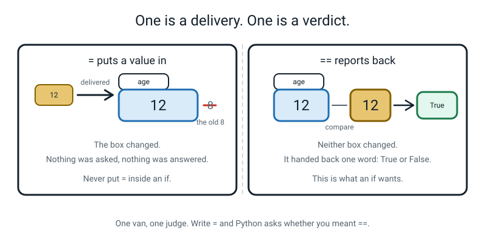
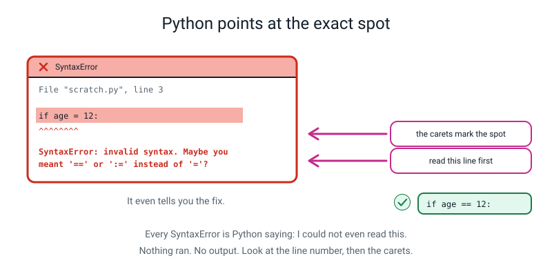
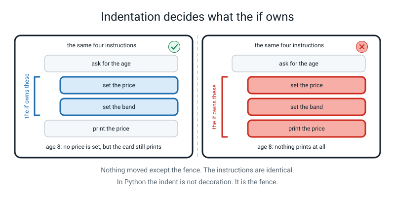
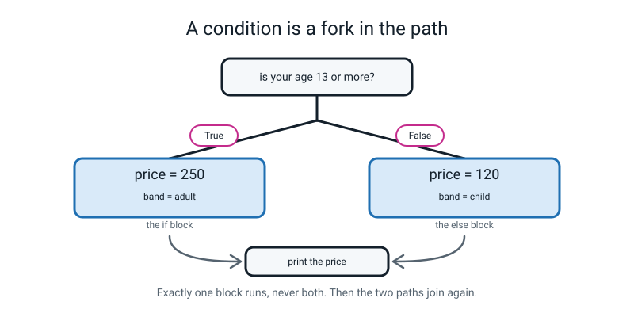
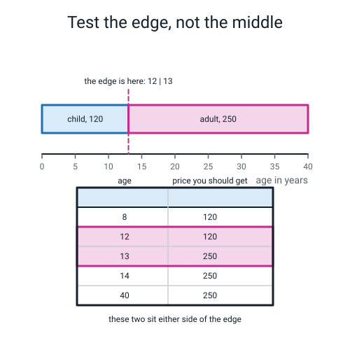
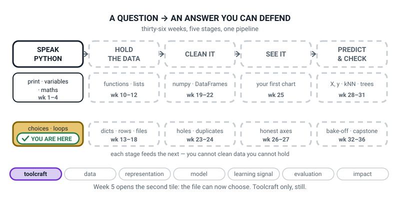

# Week 5 — Questions With Yes/No Answers

[⬅ Week 4](week-04.md) · [Course Home](../README.md) · [Week 6 ➡](week-06.md) · [Student Guide](../student-guide/week-05.md) · [Workbook](../workbook/week-05.md)

---

## 📋 At a Glance

| | |
|---|---|
| **Duration** | 70 minutes |
| **Type** | 🟦 Teach — one new idea (a program can choose) applied to one small program |
| **Big idea** | A comparison is a question whose answer is `True` or `False`; `if` runs a block only when the answer is `True`. |
| **New vocabulary** | boolean · condition · comparison operator · block · indentation |
| **New syntax** | `==` and `!=` · `<` `>` `<=` `>=` · `if condition:` · `else:` |
| **Materials** | The printed workbook (all sections, start to finish; the **Build It** test table prints best in landscape) · pencil · notebook open at the **Bug Log** · **masking tape, or two sheets of A4 and a marker**, for the fork on the floor · a printed copy of `ticket_price.py` (the paper fallback) |
| **Tech needed** | One laptop, Python 3, terminal open in `~/ai-academy/level2`, editor. Standard library only — **nothing to install**. |
| **Prep time** | 20 minutes the night before, 5 minutes on the day (plus 2 minutes taping the floor) |

> **⚠️ Watch out:** this is the first week where **whitespace changes what the program does**. A student who indents by three spaces on one line and four on the next will get an error that says nothing about spaces. Before the lesson, check that the editor is set to insert **4 spaces** when you press Tab. In VS Code the bottom bar says `Spaces: 4` — click it if it says `Tab Size: 4` with tabs. Two minutes now saves ten minutes of a genuinely baffling `IndentationError`.

---

## 🎯 Lesson Objectives

By the end of the lesson the student can:

1. **Write a comparison and predict `True` or `False` before running it** — eight out of eight on paper.
2. **Use `if` / `else` to choose between two blocks of code.**
3. **Explain what indentation does in Python, and why it is not decoration.**
4. **Tell `=` from `==` and say what each one is for.**
5. **Read the `SyntaxError` Python gives for `=` inside an `if`, and use its suggestion.**

Observable evidence: eight predicted booleans on paper, marked against a real run; a working `ticket_price.py` that gives two different prices to two different ages; and a five-row test table with the age in, the price out, and whether it matched the prediction.

---

## 🧑‍🏫 What YOU Need to Know First

> **📌 About the code blocks in this guide.** Outside the **🧰 Prep Checklist** and the **🔑 Answer Key**, the blocks are **illustrations, not files** — each one carries on from the one above it, so the `import` lines and the data are typed once, in the first block that needs them. **The complete runnable files are in the Prep Checklist and the Answer Key.** If you paste an illustration on its own and get `NameError`, that is why, and nothing is broken.

Everything below assumes you have not programmed. Read it twice and type the code. This week has one genuinely new mental model in it — the fork in the road — and one piece of Python that is unlike most other languages, which is that the *spaces at the front of a line are part of the language*.

### 1. A boolean is a value with exactly two possibilities

Your student met four kinds of value in Week 2: text, whole numbers, decimals, and one they were told to ignore. This is the week it stops being ignorable.

> **boolean** — a value that is either `True` or `False`. There is nothing else it can be.

Capital T, capital F. `true` with a small t is not a thing in Python and will give you a `NameError`.

You almost never type `True` yourself. You *produce* booleans by **comparing** two things.

> **comparison operator** — a symbol that compares two values and hands back `True` or `False`.

There are six, and your student has met all six in maths already:

| Operator | Read it as | Example | Answer |
|---|---|---|---|
| `==` | "is equal to" | `7 == 7` | `True` |
| `!=` | "is not equal to" | `7 != 3` | `True` |
| `<` | "is less than" | `3 < 5` | `True` |
| `>` | "is greater than" | `3 > 5` | `False` |
| `<=` | "is less than or equal to" | `5 <= 5` | `True` |
| `>=` | "is greater than or equal to" | `3 >= 5` | `False` |

The only two that need explaining are the double symbols. `!=` is "not equal" — the exclamation mark means "not", which is a convention borrowed from maths and used by nearly every programming language. And `==` is the one that matters.

Run this. It is the whole of section 1:

```python
# compare_drills.py - eight questions that have True or False answers.

my_age = 12          # the student's age
pass_mark = 35       # the school's pass mark, out of 100
mark = 42            # one student's mark

print(my_age >= 12)        # is 12 at least 12?
print(my_age > 12)         # is 12 bigger than 12?
print(mark >= pass_mark)   # did they pass?
print(mark == 42)          # is the mark exactly 42?
print(mark != 42)          # is the mark anything OTHER than 42?
print(mark < 35)           # did they fail?
print("apple" < "banana")  # does "apple" come first in the dictionary?
print("cat" == "Cat")      # is a capital C the same as a small c?
```

The real output:

```text
True
False
True
True
False
False
True
False
```

Three of those are worth a sentence.

**Line 2, `12 > 12` is `False`.** "Greater than" does not include equal. This is where nearly every off-by-one bug in the course will come from, and it is why `>=` exists.

**Line 7, `"apple" < "banana"` is `True`.** Comparisons work on text too, and they compare alphabetically — near enough. Strictly, Python compares character by character using each character's number in a big standard table, which means **all capital letters sort before all small letters**. So `"Zebra" < "apple"` is also `True`, which surprises people. Do not go into the table today; know the rule in case a student stumbles on it.

**Line 8, `"cat" == "Cat"` is `False`.** Case matters, always. This will bite in Week 6 when the student compares a typed day of the week against `"tuesday"` and the human typed `"Tuesday"`. Tools for fixing that (`.lower()`) arrive in Week 6; today, note the flaw and move on.

One more, which is a genuinely useful piece of trivia: `7 == 7.0` is `True`. A whole number and a decimal that mean the same amount compare equal, because Python compares the *value*, not the type. But `7 == "7"` is `False`, because a number and text are never equal, however similar they look on screen.

### 2. `=` and `==` are completely different, and this is the week to be firm about it

This is the single most common confusion in the whole of programming, and the reason is that maths uses one symbol for both jobs.

- `=` is a **delivery**. `age = 12` puts 12 into the box called `age`. It *changes* something. It hands back nothing.
- `==` is a **verdict**. `age == 12` looks in the box, looks at 12, and reports `True` or `False`. It changes *nothing*.


*Figure 5.1 — One van, one judge. Only one of them belongs inside an `if`.*

If you write `if age = 12:` — one equals sign — Python stops you. And it is worth telling the student that this is a **kindness**, not a rule for the sake of it. In some older languages that exact line is legal: it quietly sets `age` to 12 and then, because 12 counts as "yes", runs the branch every single time. That bug is famous, it has cost real money, and Python's designers decided to make it impossible.

Here is the real message, on Python 3.10 and later:

```text
  File "scratch.py", line 3
    if age = 12:
       ^^^^^^^^
SyntaxError: invalid syntax. Maybe you meant '==' or ':=' instead of '='?
```

**Python names the fix in the message.** Point at it. It says `'=='`. (It also mentions `':='`, which is a rarely-used operator this course never touches — tell the student to ignore that half. Being honest that you are ignoring it is better than pretending it isn't there.)


*Figure 5.2 — A `SyntaxError` means nothing ran at all. The carets mark the spot; the last line names the fix.*

### 3. `if` and the colon and the indent

Here is the shape. Three pieces of punctuation carry all the meaning.

```python
# fever.py - one question, one decision.

temperature = 38.0          # degrees Celsius

if temperature > 37.5:              # the condition, then a COLON
    print("You have a fever.")      # indented 4 spaces = inside the if
    print("Rest and drink water.")  # still indented = still inside
print("Report finished.")           # not indented = runs every time
```

The real output:

```text
You have a fever.
Rest and drink water.
Report finished.
```

Now change one character — `38.0` to `36.4` — and run it again. The real output:

```text
Report finished.
```

Two lines vanished. Nothing else changed.

The anatomy:

```
        if temperature > 37.5:
        ▲        ▲          ▲
        │        │          └── the COLON. It means "the block starts on the next line."
        │        └── the CONDITION. Anything that produces True or False.
        └── the keyword.

            print("You have a fever.")      ◄── 4 spaces in. INSIDE the if.
            print("Rest and drink water.")  ◄── still 4 spaces in. Still inside.
        print("Report finished.")           ◄── back to the margin. ALWAYS runs.
```

> **condition** — the `True`-or-`False` question an `if` asks.
> **block** — a group of lines that belong together, marked by all being indented the same amount.
> **indentation** — the spaces at the start of a line. In Python they are not decoration; they decide what belongs inside what.

**The thing to say out loud, more than once:** in most languages the indent is a courtesy to human readers and the computer ignores it. In Python **the indent is the syntax.** There are no curly brackets, no `end` keyword, no `begin`. The spaces are it.

Four spaces is the convention. Your editor will do it for you when you press Enter after a colon — let it. The rule the student needs is not "four spaces" but **"be consistent within a block."** Three spaces on one line and four on the next is an error, and the error message will not use the word "spaces".


*Figure 5.3 — Same four instructions, both times. Only the fence moved — and the right-hand version prints nothing at all for an eight-year-old.*

Figure 5.3 is worth dwelling on, because it contains a real bug that a student will produce this week. If the final `print` gets indented into the `if`, the program still runs, produces no error, and simply prints **nothing** when the condition is `False`. That is a silent bug caused entirely by whitespace, and it is the second half of last week's lesson: *running is not the same as working.*

### 4. `else`, and why both branches always exist

`else` means "and otherwise". It takes no condition of its own — it catches everything the `if` did not.

```python
if age >= 13:
    price = 250
else:
    price = 120
```

Exactly one of those two lines runs. Never both. Never neither.


*Figure 5.4 — Two branches, and they join again. The lines after the `if/else` run whichever way you went.*

Two points from Figure 5.4 that students miss:

1. **The paths rejoin.** After the `if/else` is finished, the program carries on down one road. Everything at the outer indentation runs regardless of which branch was taken. This is why `print(f"Price : {price}")` sits at the margin.
2. **Without an `else`, a variable may never get created.** This is a real trap and it produces a confusing error. Look:

   ```python
   age = int(input("How old are you? "))

   if age >= 13:
       price = 250

   print(f"Price : {price} rupees")
   ```

   Type `14` and it works. Type `8` and you get this real traceback:

   ```text
   How old are you? 8
   Traceback (most recent call last):
     File "ticket_price.py", line 6, in <module>
       print(f"Price : {price} rupees")
   NameError: name 'price' is not defined. Did you mean: 'print'?
   ```

   `price` was never created, because the only line that would have created it was inside a block that did not run. **The `NameError` is on line 6, and the mistake is the missing `else`.** This is Debugging Clinic row 6 and it is the best teaching traceback of the week.

### 5. Every line of this week's program, explained

This is the program the student builds. It is deliberately small — two prices, one question — because Week 6 is where it grows to four bands.

```python
# ticket_price.py - version 1. One question in, one price out.

child_price = 120        # rupees, for anyone under 13
adult_price = 250        # rupees, for 13 and over

age = int(input("How old are you? "))   # text arrives, int() turns it into a number

if age >= 13:                 # the condition - a question with a True/False answer
    price = adult_price       # these two lines only run when the answer is True
    band = "adult"
else:                         # everything the condition missed lands here
    price = child_price       # these two lines only run when the answer is False
    band = "child"

print(f"Band  : {band}")      # runs every time - it is not indented
print(f"Price : {price} rupees")
```

| Line | What it does |
|---|---|
| `child_price = 120` | A named number. Naming it means the price appears once in the file, so changing it is a one-line job. |
| `age = int(input(...))` | Last week's habit: ask, and convert at the door. **Without the `int()` this program crashes on the `if` line** — see Clinic row 5. |
| `if age >= 13:` | The condition. `>=` not `>`, because a 13-year-old is an adult here. The colon is compulsory. |
| `price = adult_price` | Indented four spaces, so it belongs to the `if`. |
| `band = "adult"` | Also indented four, so it is in the same block. Two lines, one block. |
| `else:` | No condition. A colon. Back at the margin, level with the `if`. |
| `print(f"Band  : {band}")` | At the margin, so it runs either way. |

Five real runs, which are also the homework's test table:

| Type this | Real output |
|---|---|
| `8` | `Band  : child` / `Price : 120 rupees` |
| `12` | `Band  : child` / `Price : 120 rupees` |
| `13` | `Band  : adult` / `Price : 250 rupees` |
| `14` | `Band  : adult` / `Price : 250 rupees` |
| `40` | `Band  : adult` / `Price : 250 rupees` |

Here is one of them exactly as it appears on screen:

```text
How old are you? 13
Band  : adult
Price : 250 rupees
```

### 6. Testing: the two values that matter, and the three that don't

The five test ages above are not five equally useful tests. **12 and 13 are the test. The other three are reassurance.**


*Figure 5.5 — An off-by-one always hides on the boundary. Test either side of it, every time.*

If the student wrote `age > 13` instead of `age >= 13`, then:

- `8` → child ✔ (looks fine)
- `40` → adult ✔ (looks fine)
- `14` → adult ✔ (looks fine)
- `13` → **child** ✘ — and there is the bug

Four of the five tests pass on a broken program. **Only the boundary finds it.** Teach the rule as a sentence: *"whenever you write a number in a condition, test that number and the one below it."*

This is the habit that Week 6 is built on and the reason Week 6's planted bug is findable at all. Install it now.

### 7. The three misconceptions you will actually meet

**Misconception 1 — "the indentation is just to make it look nice."** Almost every student arrives with this, because it is true in every other written thing they have ever done. The cure is not explanation, it is demonstration: take a working program, move the last `print` four spaces to the right, run it, and let them watch the output disappear. Ten seconds. Then move it back.

**Misconception 2 — "`=` and `==` are basically the same and Python is being fussy."** The cure is the story: in some languages `if age = 12:` is legal and always runs. Ask them what that program would do. (It sets the age to 12 and then always takes the branch — so every single person becomes 12 years old and gets the same price.) Once they see that Python is preventing a disaster rather than nagging, it lands.

**Misconception 3 — "`else` needs a condition too."** You will see `else age < 13:`. The reason is that "otherwise" feels incomplete without saying what it is otherwise-than. Say it as a sentence instead: *"`else` means 'everything I haven't already caught'. If you had to write its condition, you'd be writing the opposite of the `if`, and you'd have to keep them matching for ever. `else` means you never have to."* That is a genuine engineering argument and 12-year-olds accept it.

### 8. How deep to go, and where to stop

**Go this far:** the six comparison operators · booleans as values · `if` with a colon and an indented block · `else` · the paths rejoining · `=` versus `==` · reading `IndentationError` and `SyntaxError` · testing the boundary.

**Stop before all of these:**

- **`elif`.** That is next week's entire lesson, and a student who wants three prices will ask for it. The honest answer: "you can do it with two `if`s today, and next week you get the proper tool. Write the question down." **Do not teach `elif` early** — Week 6's whole lesson is the bug that `elif` ordering causes, and it needs `elif` to be new.
- **`and`, `or`, `not`.** Also Week 6. If a student needs "13 or over AND it's Tuesday", they can nest one `if` inside another — allow it, but do not build the lesson on it.
- **`.isdigit()` or any check that the input is a number.** Week 6. Today, typing `abc` crashes with a `ValueError`, and that is honest.
- **Truthiness** — the fact that `if "hello":` is `True` and `if 0:` is `False`. It is real, and it causes a famous bug that Week 6 covers. Do not raise it today.
- **`while`, or asking again until they get it right.** Week 8.
- **Chained comparisons like `13 <= age < 60`.** Genuinely lovely, and it belongs in Week 6 with the range logic. If a flying student invents it, celebrate it and let them use it.

---

### 9. 🧭 The Growing Map — the week the gold moves

The weekly **Where This Fits** figure changes shape properly for the first time today. The first tile
goes plain white with a solid outline — the course's symbol for *done* — and the gold drops to the tile
below it. Give it thirty extra seconds this week; the vocabulary is new.



*Figure 5.0 — Week 5's version. Three states now, not two: gold for this week, white-and-solid for
finished, dotted for not yet.*

**Two minutes:**

1. **Ask what moved.** *"Something on this picture is different from last week's. Who can find it?"* Let
   them hunt. Then name the states: gold is now, white is done, dotted is not yet.
2. **Anchor it in today:** *"`ticket_price.py` charged a 12-year-old and a 40-year-old different prices —
   which box was that?"* They point at the newly gold tile, *choices · loops*. If someone points at the
   white one, that is a useful mistake: today used Week 4's `int(input(...))`, so both boxes were involved.
3. **Then the dashes**, same words as always: *"why is the rest dotted?"* — *"we haven't got there yet."*
4. **Pencil copies.** They go over the first tile in pen, write *done* beside it, and start a fresh gold
   patch on the one below. Watching the pen travel is the entire value of them owning a copy.

> **🧑‍🏫 Why this is worth two minutes.** "Done" is the most motivating word on the page and this is the
> first week you get to use it. A learner who has seen one tile close believes the other nine can close
> too — which is a different kind of confidence from having enjoyed a lesson.

> **⚠️ Watch out:** do not let "done" be heard as "we will never mention `print()` again". Say plainly
> that a finished tile is a tool you now *carry*, not a topic you have left behind — Week 20 will ask this
> exact `>=` question of a thousand numbers at once.

---

## 🧰 Prep Checklist

### 20 minutes the night before

- [ ] **Print the whole workbook.** Its sections run Warm-Up, Predict the Output, Practice Set A, Practice Set B, Fix the Broken Program, Puzzle of the Week, Think Deeper, Build It, Draw It, Self-Check. The Build It test table (Part 1) prints better in landscape.
- [ ] **Check the editor's indent setting.** VS Code: look at the bottom-right of the window for `Spaces: 4`. If it says anything about tabs, click it and choose *Indent Using Spaces*, then *4*. This is the single highest-value two minutes of prep this week.
- [ ] **Type and run `compare_drills.py` yourself** (section 1) and check you get `True False True True False False True False`. Predict each one on paper first — you should get at least seven, and the one you are most likely to miss is `12 > 12`.
- [ ] **Trigger this week's planted bug yourself.** Make a scratch file containing exactly this and run it:

  ```python
  age = 12

  if age = 12:
      print("child")
  else:
      print("adult")
  ```

  The exact expected output:

  ```text
    File "/Users/you/ai-academy/level2/scratch.py", line 3
      if age = 12:
         ^^^^^^^^
  SyntaxError: invalid syntax. Maybe you meant '==' or ':=' instead of '='?
  ```

  **Notice that nothing else printed.** A `SyntaxError` means Python could not read the file, so no line of it ran. Being able to say that from memory is worth a lot in the lesson.
- [ ] **Trigger the indentation error too**, because you will meet it more often than the `=` one:

  ```python
  age = 12

  if age >= 13:
  print("adult")
  ```

  ```text
    File "/Users/you/ai-academy/level2/scratch2.py", line 4
      print("adult")
      ^
  IndentationError: expected an indented block after 'if' statement on line 3
  ```

- [ ] **Tape the fork on the floor**, or lay out two sheets of A4. Left = `True`, right = `False`. Write the words on them.
- [ ] Say the big idea out loud in your own words. Something like: *"a comparison is a question with a yes/no answer, and `if` is how you act on the answer."*

### 5 minutes on the day

- [ ] Terminal open in `~/ai-academy/level2`. Run last week's `about_me.py` once — ten seconds, and it proves the setup still works.
- [ ] Editor open, indent set to 4 spaces.
- [ ] Notebook open at the Bug Log.
- [ ] Fork taped on the floor, or the two sheets laid out. **Stand on it once yourself** to check there is room to walk.
- [ ] Workbook on the table, open at **Build It**. **Laptop closed** — the Hook is off-screen and on foot.

### Fallback if the laptop or the install fails

The Hook and the entire Concept segment need no computer at all. This is the most laptop-optional week of the term.

| If this fails | Do this instead |
|---|---|
| **No laptop** | Do the Human if/else for twelve minutes instead of seven — it delivers objectives 1, 2 and 3 completely on its own. Then hand out the printed `ticket_price.py` and have the student be the computer: you call out an age, they trace the program with a finger and say the price. Do the five-row test table entirely on paper. Only objective 5 (reading the real `SyntaxError`) is lost, and you can hand them a *printed* traceback to read instead, which delivers most of it. |
| **No masking tape** | Two sheets of paper, two chairs, or two corners of the room. Or the student's own hands: left hand up for `True`, right hand up for `False`. The physical commitment is what matters, not the tape. |
| **The `IndentationError` is baffling because the editor mixes tabs and spaces** | Stop and fix the editor setting. Then select all (`Ctrl-A` / `Cmd-A`) and use the editor's *Convert Indentation to Spaces* command. Do not try to fix it line by line with a student watching. |
| **The student cannot type the four spaces reliably** | Let the editor do it. After a colon, pressing Enter indents automatically in every editor worth using. The rule to teach is "press Enter after the colon and start typing" — not "count four spaces". |
| **Python not installed** | Paper version above, then install during the Their Turn slot and shift the coding to tomorrow. |

---

## ⏱️ The Lesson, Minute by Minute

| Segment | Minutes | Running total | What happens |
|---|---|---|---|
| 🪝 Hook — The Human if/else | 7 | 7 | Conditions called out; the student physically walks the branch |
| 🧠 Concept — Six Questions and a Fork | 16 | 23 | Comparisons, booleans, the colon, the indent, `else` |
| 💻 Live-Code Together — `ticket_price.py` v1 | 18 | 41 | Built in three passes. Two deliberate mistakes. |
| 🎲 Their Turn — Five Ages, One Table | 20 | 61 | Test the five ages, find the boundary bug, extend |
| 🔑 Wrap & Assign | 9 | 70 | Three checks, Bug Log, homework |

---

### 🪝 Hook — The Human if/else (7 minutes)

**Do this:** Laptop **closed**. Both of you standing. The tape (or the two sheets) on the floor: a single line coming towards you that splits into two, **left labelled `True`, right labelled `False`.** Stand the student at the bottom of the single path.

**Say this:**

> "New rule for the next five minutes: you are a program. I'm going to say a sentence, and the sentence is always a question with a yes-or-no answer. If the answer is yes — if it's **True** — you walk left. If it's no, if it's **False**, you walk right. You have to actually walk. No pointing.
>
> First one. **Your age is 12 or more.**"

They walk. Whichever way, do not comment. Just carry on.

> "Back to the start. **Your age is more than 12.**"

This is the good one. For a 12-year-old, the first is `True` and the second is `False`, and the same person just walked two different ways for what sounds like the same sentence. **Let them notice.** If they walk left again out of habit, do not correct them — say "read it again, out loud, slowly" and wait.

Then, quickly, six or seven more. Keep the pace up; this should feel like a game, not a test.

> "**Your name is Ramana.**" · "**Your name is not Ramana.**" · "**You have more than two siblings.**" · "**7 times 8 is 56.**" · "**7 times 8 is 54.**" · "**The word 'apple' comes before the word 'banana' in a dictionary.**" · "**It is raining.**"

Now stop, and sit down.

**Say this:**

> "Here's what just happened, and it's the whole of today.
>
> Every single thing I said had exactly **two** possible answers. Not three. Not 'maybe'. Not 'it depends'. Just yes or no — and in Python those two answers have names: **`True`** and **`False`**, with capital letters. A value that can only ever be one of those two has a name too. It's called a **boolean**.
>
> And the second thing. When you were standing on that fork, **you did different things depending on the answer.** Everything we have written all term has done exactly the same thing every single time you ran it. Last week's bot asks the same six questions and prints the same shaped card, always. Today your program grows a fork in it, and two different people running it will see two different things happen.
>
> That is a much bigger deal than it sounds. It's the difference between a machine that plays a recording and a machine that answers you."

Then the sting:

> "One last one, and it's a trap. **Your age is 12 or more.** Walk it."

They walk left (True, for a 12-year-old).

> "Now: **your age is 12.** Same walk?"

Yes, for a 12-year-old.

> "Right. Now here's the question I actually want. Those two sentences agreed this time. **Can you give me an age where they'd disagree?**"

(Any age above 12. A 15-year-old is "12 or more" — `True` — but is not "12" — `False`.)

> "Good. So 'or more' and 'is exactly' are different questions, and Python has a different symbol for each. It has six of them, and you already know all six from maths."

**Ask this:**

| Ask | Answer you want | If they say something else |
|---|---|---|
| "How many possible answers did every question have?" | Two. | If they say "yes, no, and maybe" — push back gently: "give me a maybe." Then narrow the sentence until it has two answers. That narrowing *is* what writing a condition is. |
| "'Your age is 12 or more' and 'your age is more than 12' — same question?" | No. For a 12-year-old the first is True and the second is False. | If they say "same", have them walk both again, slowly, out loud. Do not explain; let the walking do it. |
| "Give me an age where 'is 12 or more' and 'is exactly 12' disagree." | Anything above 12. | If stuck: "you're 12 now. What about your cousin who's 15? Is 15 twelve-or-more? Is 15 twelve?" |
| "What do we call a value that can only be True or False?" | A boolean. | Write it up. It is one of the five words of the week. |
| "Name something a computer decides for you that must work like this." | A password box · an age gate on a website · a ticket price · whether a game says you won. | Any answer with a two-way outcome is good. Push for the *condition*: "and what exactly is the question it's asking?" |

---

### 🧠 Concept — Six Questions and a Fork (16 minutes)

**Do this:** New file, `compare_drills.py`. **The student types every character.** Your hands stay off the keyboard for the whole lesson.

**Say this — part 1, the six operators:**

> "Six symbols. You know all six from maths, and two of them look slightly odd."

Write them up, big:

```
   ==   is equal to                 !=   is NOT equal to
   <    is less than                >    is greater than
   <=   is less than or equal to    >=   is greater than or equal to
```

> "The exclamation mark means 'not'. Nearly every programming language uses it that way, so `!=` is 'not equal'.
>
> And **`==`** — two equals signs — is 'is equal to'. Which raises the obvious question: why two? What's wrong with one? Hold that; it's the next thing."

Have them type this, then **predict all eight answers out loud before running it.** Write their predictions on paper so they can be marked.

```python
# compare_drills.py - eight questions that have True or False answers.

my_age = 12          # the student's age
pass_mark = 35       # the school's pass mark, out of 100
mark = 42            # one student's mark

print(my_age >= 12)        # is 12 at least 12?
print(my_age > 12)         # is 12 bigger than 12?
print(mark >= pass_mark)   # did they pass?
print(mark == 42)          # is the mark exactly 42?
print(mark != 42)          # is the mark anything OTHER than 42?
print(mark < 35)           # did they fail?
print("apple" < "banana")  # does "apple" come first in the dictionary?
print("cat" == "Cat")      # is a capital C the same as a small c?
```

Run it. The real output:

```text
True
False
True
True
False
False
True
False
```

Mark their eight. **Getting all eight right means the exercise was too easy** — say so, cheerfully. Then go straight to the two interesting ones:

> "Line two. `12 > 12` is **False**, and if you got that wrong you are in extremely good company, because that one mistake is behind more bugs than almost anything else in programming. 'Greater than' does not include equal. If you want 'greater than or the same as', you have to say `>=`.
>
> Line eight. `"cat" == "Cat"` is **False**. A capital C is a different character from a small c, full stop. Remember that, because in two weeks you're going to compare something a human typed against the word 'tuesday' and they're going to type 'Tuesday' with a capital T, and it is going to be baffling."

**Say this — part 2, `=` versus `==`:**

> "Now the two-equals question. Here's the difference, and I want you to be able to say it back to me.
>
> **One equals sign is a delivery.** `age = 12` picks up a 12 and puts it in the box called `age`. It changes the world. It doesn't answer anything.
>
> **Two equals signs is a verdict.** `age == 12` looks in the box, looks at the 12, and reports back: True or False. It changes nothing at all. It just tells you.
>
> One van, one judge."

Show Figure 5.1.

> "And here's why Python is strict about it. In some older languages, if you write `if age = 12:` with one equals sign, that's **legal**. It quietly sets the age to 12, and then — because 12 counts as a yes — it takes the branch. Every time. For everybody.
>
> Think about what that program does. What happens to a fifteen-year-old?"

(They get set to 12, and get the child price. Every single person becomes 12.)

> "That bug has cost real companies real money. Python's answer was to make that line impossible to write. So when it stops you, it's not being fussy — it's one of the languages that noticed."

**Say this — part 3, the colon and the indent:**

> "Right. New file. This one has a decision in it."

Have them type:

```python
# fever.py - one question, one decision.

temperature = 38.0          # degrees Celsius

if temperature > 37.5:              # the condition, then a COLON
    print("You have a fever.")      # indented 4 spaces = inside the if
    print("Rest and drink water.")  # still indented = still inside
print("Report finished.")           # not indented = runs every time
```

> "Three bits of punctuation are doing all the work here, and I want to name each one.
>
> **`if`** — the keyword.
> **The condition** — anything that produces True or False. Here it's `temperature > 37.5`.
> **The colon at the end** — that means 'the block starts on the next line'. Forget it and Python stops immediately.
> **The four spaces** — and this is the one that is going to catch you."

Run it. Real output:

```text
You have a fever.
Rest and drink water.
Report finished.
```

> "Three lines. Now change one number. Make the temperature 36.4 and run it again — and predict first. How many lines?"

Run. Real output:

```text
Report finished.
```

> "One line. Two of them vanished, and I didn't delete anything.
>
> Now the important bit, and this is what makes Python different from nearly every other language. **Those four spaces at the front are not to make it look nice. They are the language.** In most languages you'd put curly brackets round the block and the computer would ignore the spaces entirely. Python has no brackets. The spaces *are* the brackets.
>
> So: the two indented lines belong to the `if`. The un-indented line belongs to nobody, so it always runs."

Now do the demonstration that fixes Misconception 1. **You** ask, **they** type:

> "Take the last line — `print("Report finished.")` — and push it four spaces to the right, so it lines up with the other two. Don't change anything else. Predict what happens, then run it."

With `temperature = 36.4`, the real output is:

```text
```

Nothing. A completely blank result.

> "Nothing at all. No error. No output. The program ran perfectly and printed nothing, and the only thing I changed was four spaces.
>
> **That is why the indentation is not decoration.** Put it back."

Show Figure 5.3.

**Say this — part 4, `else`:**

> "Last piece. `else` means 'and otherwise'. It gets a colon, it gets its own indented block, and it does **not** get a condition of its own — because it means 'everything the `if` didn't catch'.
>
> Exactly one of the two blocks runs. Never both. Never neither. And then — look at Figure 5.4 — **the two paths join back up**, and whatever comes after runs either way."

Show Figure 5.4.

**Ask this:**

| Ask | Answer you want | If they say something else |
|---|---|---|
| "Why two equals signs?" | Because one already means "put this value in that box". | If they say "because Python is annoying" — accept the joke, then tell the `if age = 12:` story and ask what happens to a 15-year-old. |
| "What does the colon mean?" | The block starts on the next line. | If they don't know, delete a colon and run it: `SyntaxError: expected ':'`. Python says the answer out loud. |
| "`12 > 12` — True or False?" | False. | If they say True, ask "is twelve bigger than twelve?" in plain English. It usually lands immediately. |
| "I moved the last line four spaces right and the output vanished. Why?" | Because it is now inside the `if`, and the `if` was False. | If they say "you broke it" — press: "did Python complain?" No. "So whose rule did I break?" None. That is the point. |
| "Does `else` need a condition?" | No — it means everything the `if` missed. | If they write `else age < 13:`, let them run it and read the `SyntaxError`, then ask: "if you *had* to write a condition there, what would it be?" (The exact opposite of the `if`.) "And what happens when you change the `if` and forget to change that?" |
| "What is a boolean?" | A value that is either True or False. | Make them use the word. It is one of the week's five. |

---

### 💻 Live-Code Together — `ticket_price.py` v1 (18 minutes)

**Do this:** New file, `ticket_price.py`. **The student types.** Three passes, run after each.

#### Pass 1 (5 min) — one price, no decision yet

**Say this:**

> "We're building the pricing screen for a cinema. Two prices: a hundred and twenty rupees for a child, two hundred and fifty for an adult, and the line is at thirteen. Thirteen and over pays adult.
>
> Start with no decision at all, so we know the input half works."

```python
# ticket_price.py - version 1. One question in, one price out.

child_price = 120        # rupees, for anyone under 13
adult_price = 250        # rupees, for 13 and over

age = int(input("How old are you? "))   # text arrives, int() turns it into a number

print(f"You said you are {age}.")       # just checking the input half works
```

Run it, type `13`. Real output:

```text
How old are you? 13
You said you are 13.
```

> "Good. Notice the `int()` — that's last week, and it matters more than usual today. In a minute we're going to compare `age` with 13, and you cannot compare text with a number. Watch this later."

#### Pass 2 (7 min) — ⚠️ **DELIBERATE MISTAKE #1**, the planted bug

**Say this:**

> "Now the fork. Delete that last print line."

Dictate the `if` — **and use one equals sign on purpose.** Say the line out loud as "if age equals 13" so the mistake sounds natural, and do not add a comment to that line (you want the traceback to show the line bare):

```python
if age = 13:
    price = adult_price
    band = "adult"
else:
    price = child_price
    band = "child"

print(f"Band  : {band}")
print(f"Price : {price} rupees")
```

Run it. The real output — and this is the whole reason the mistake is planted:

```text
  File "ticket_price.py", line 8
    if age = 13:
       ^^^^^^^^
SyntaxError: invalid syntax. Maybe you meant '==' or ':=' instead of '='?
```

**Do not fix it. Ask three things, in this order:**

> "One. **Where's the 'How old are you?' question?** It didn't ask. It didn't run at all. Not one single line of that program executed.
>
> That's what a `SyntaxError` means: Python couldn't even *read* the file, so it never got as far as doing anything. Every other error you've seen this term happened partway through a running program. This one happens before the start.
>
> Two. **Read me the last line.**"

(`SyntaxError: invalid syntax. Maybe you meant '==' or ':=' instead of '='?`)

> "Three. **Python has just told you the fix.** It's in the message. It says two equals signs. Do it."

Then the honest footnote:

> "It also mentions `:=` — colon-equals. That's a real thing in Python and we are never going to use it in this course. Ignore that half of the sentence. I'm telling you it's there so it doesn't worry you, not so you learn it."

Fix it to `if age >= 13:` — **note we also change `= 13` to `>= 13`, because "thirteen and over" is what we actually want.** Say that out loud; it is two changes and the student should know they are two.

Run it five times. Real outputs:

```text
How old are you? 13
Band  : adult
Price : 250 rupees
```

```text
How old are you? 12
Band  : child
Price : 120 rupees
```

Bug Log entry #1.

#### Pass 3 (6 min) — ⚠️ **DELIBERATE MISTAKE #2**, the silent one

**Say this:**

> "Last thing, and it's a sneaky one. Take the two print lines at the bottom and push them four spaces to the right, so they line up with `price = child_price`. Predict what happens, then run it with 14, then with 8."

The real output with `14` — and this is the whole output, nothing is missing:

```text
How old are you? 14
```

It asked the question and then printed **nothing at all.** No error, no complaint, no card. The two print lines are inside the `else` block now, and `14 >= 13` was `True`, so the `else` never ran.

Then with `8`:

```text
How old are you? 8
Band  : child
Price : 120 rupees
```

**Say this:**

> "So: it works perfectly for eight-year-olds and prints absolutely nothing for everyone else. No error message. No complaint. The program is *broken for most of the human race* and Python is entirely happy about it.
>
> That's the second time in two weeks that the worst bug was the one that didn't crash. Move them back to the margin."

Fix it. Run `14` again — it works. Bug Log entry #2, and the entry says **"no error message"** in the left-hand column.

---

### 🎲 Their Turn — Five Ages, One Table (20 minutes)

Full instructions below. In the lesson flow:

- **Minutes 0–8:** run all five test ages and fill in the five-row table (workbook **Build It**, Part 1).
- **Minutes 8–14:** the boundary experiment — change `>=` to `>` and find out which of the five tests catches it.
- **Minutes 14–20:** their own two-way decision, from the list in workbook **Build It**, Part 3.

---

## 🎲 The Activity, In Full

### Setup

**On the table:** the laptop with `ticket_price.py` open · workbook **Build It** (Part 1, the five-row test table, landscape; Part 4, the Bug Log) · a pencil.

**On the floor:** leave the fork taped down. You will send them back to it.

### Part 1 — The five-row test table (8 minutes)

The student runs `python3 ticket_price.py` five times and fills in one row per run. **The prediction column is filled in before the run, not after.** That is the whole point of the table.

| Age I typed | Price I predicted | Price it printed | Same? |
|---|---|---|---|
| 8 | 120 | 120 | ✔ |
| 12 | 120 | 120 | ✔ |
| 13 | 250 | 250 | ✔ |
| 14 | 250 | 250 | ✔ |
| 40 | 250 | 250 | ✔ |

**Say only this:** *"Write the price you expect. Then run it. Then write what it actually said. Five times."*

If all five match, say so and move straight to Part 2 — because Part 2 is where the table earns its keep.

### Part 2 — The boundary experiment (6 minutes)

**Say this:**

> "Five out of five. So the program's right, yes? Let's find out how much that actually proves.
>
> Change one character. `age >= 13` becomes `age > 13` — delete the equals sign. Now — **before you run anything** — go through your five rows and tell me which of them will change."

Let them reason it out. The answer is **one row: age 13.**

Then run all five again. Real outputs:

| Age | With `>= 13` | With `> 13` |
|---|---|---|
| 8 | 120 | 120 |
| 12 | 120 | 120 |
| **13** | **250** | **120** ← the only change |
| 14 | 250 | 250 |
| 40 | 250 | 250 |

**Say this:**

> "Four of my five tests passed on a program that is wrong. **Four out of five.** If I'd only tested 8 and 40 — which honestly is what most people do, one small one and one big one — I'd have shipped it.
>
> So here's the rule, and it's worth writing in your notebook: **whenever you write a number in a condition, test that number and the one just below it.** Twelve and thirteen. Thirty-four and thirty-five. Not the middle. The edge.
>
> Everything in the middle is reassurance. The edge is the test."

Show Figure 5.5. Then put `>=` back and re-run age 13 to confirm.

### Part 3 — Their own decision (6 minutes)

**Say this:**

> "Now yours. One question, two outcomes, and it has to be something you'd actually care about the answer to."

Options in workbook **Build It**, Part 3, if they need one:

| Program | The condition | The two outcomes |
|---|---|---|
| Pass or fail | `mark >= 35` | `"Pass"` / `"Fail"` |
| Too hot for a jumper | `temperature > 25` | `"T-shirt"` / `"Jumper"` |
| Free delivery | `total >= 500` | `"Free delivery"` / `"Delivery: 40 rupees"` |
| Can you ride | `height_cm >= 140` | `"You can ride"` / `"Not tall enough"` |
| Enough sleep | `hours >= 8` | `"Well rested"` / `"Go to bed earlier"` |
| Even or odd | `number % 2 == 0` | `"Even"` / `"Odd"` |

That last one is worth pointing out to a student who is flying: `%` is Week 3's remainder, and `number % 2 == 0` is how everybody in the world checks whether a number is even. It is a genuinely famous line of code.

Here is `pass_or_fail.py` complete, actually run:

```python
# pass_fail.py - one mark in, one verdict out.

pass_mark = 35                              # the school's pass mark

mark = int(input("Mark out of 100? "))      # text arrives, int() makes it a number

if mark >= pass_mark:                       # the question: is it 35 or more?
    verdict = "Pass"                        # runs only when the answer is True
else:                                       # everything else
    verdict = "Fail"                        # runs only when the answer is False

print(f"Mark    : {mark}")                  # not indented, so it always runs
print(f"Verdict : {verdict}")
```

Four real runs:

```text
Mark out of 100? 34
Mark    : 34
Verdict : Fail
```

```text
Mark out of 100? 35
Mark    : 35
Verdict : Pass
```

```text
Mark out of 100? 100
Mark    : 100
Verdict : Pass
```

```text
Mark out of 100? 0
Mark    : 0
Verdict : Fail
```

Note the tests chosen: **34 and 35** — the boundary — then 100 and 0 as reassurance. That is the habit, applied.

### What "finished" looks like

- `ticket_price.py` runs and gives 120 to an age of 12 and 250 to an age of 13.
- The five-row table is filled in, with the **prediction column written before each run**.
- The student can say which single row caught the `>` versus `>=` bug, and why.
- One program of their own with a two-way decision, tested on the boundary and the value below it.
- **Two Bug Log entries**: the `SyntaxError` from `=`, and the silent no-output bug from over-indenting. The second one says "no error message" where the error text would go.
- Every line commented.

### Variation — easier

- **Skip `ticket_price.py` entirely and do `pass_fail.py`**, which has one number instead of two named prices.
- **Give them the whole program printed** and have them type it from paper. Typing from paper is a real skill and it removes all the decisions.
- **Two rows in the test table, not five** — the boundary pair only, 12 and 13. That is the entire lesson of Part 2 anyway.
- **Do the boundary experiment orally.** You change the character; they predict; you run.
- **Cut `band`** and set only `price`. One line per block instead of two.
- **Do not attempt Part 3.** Two of the three activity parts is a complete lesson.

### Variation — harder

1. **The nested fork.** "Children under 3 are free." They will want `elif`, which they do not have. They *can* do it by putting an `if` inside an `if`:

   ```python
   if age >= 13:
       price = 250
   else:
       if age < 3:              # an if INSIDE the else block, indented 4 more
           price = 0
       else:
           price = 120
   ```

   That works, and it is genuinely correct, and it is also ugly. Ask them: "how deep would this go if there were five prices?" (Five levels of indentation, marching off the right of the screen.) **That question is Week 6's hook, and they will have asked it themselves.** Let them feel it.
2. **Two conditions without `and`.** "Free entry if you are under 3 *and* it is Tuesday." Without `and` (next week), the only route is an `if` inside an `if`. Same lesson as above, arriving from a different direction.
3. **The text-comparison trap.** Have them predict, then run: `print("12" < "9")`. The real answer is **`True`**, because as *text* Python compares character by character and `"1"` comes before `"9"`. Then the follow-up in full, in the "flying" path below — a version of `ticket_price.py` that compares text with text runs perfectly and makes nine-year-olds adults. This is a superb bridge from Week 4.
4. **Even or odd.** `if number % 2 == 0:`. Then: "write the one for 'divisible by 3'." Then: "write the one for 'a leap year'" — and let them discover it needs three conditions, which is next week.
5. **Break it four ways on purpose.** Produce, deliberately, a `SyntaxError` from a missing colon, an `IndentationError` from a missing indent, a `TypeError` from comparing text with a number, and a `NameError` from a missing `else`. All four are real and all four appear in the Clinic below. Getting all four in the Bug Log in one sitting is a genuinely satisfying ten minutes.

---

## 🐞 The Debugging Clinic

Every message below came from running a real broken version of this week's code. Only the folder path in the `File` line will differ on your machine.

| What the student sees (real message) | What it means | Most likely cause | The fix |
|---|---|---|---|
| `SyntaxError: invalid syntax. Maybe you meant '==' or ':=' instead of '='?` with `^^^^^^^^` under `age = 12` | "I could not read this line. You wrote a delivery where a question belongs." | One `=` inside an `if`. | Two equals signs. **Python names the fix in the message.** Ignore the `:=` half — this course never uses it. |
| `SyntaxError: expected ':'` with a `^` at the end of the line | "This line needed a colon and didn't have one." | Missing `:` after the condition, or after `else`. | Add the colon. Note that Python points at exactly where it wanted it. |
| `IndentationError: expected an indented block after 'if' statement on line 3` | "You promised me a block and then didn't indent anything." | The line after the `if` starts at the margin. | Indent it four spaces. Easiest fix: put the cursor at the start of the line and press Tab once. |
| `IndentationError: unindent does not match any outer indentation level` pointing at `else:` | "This line's indentation doesn't line up with anything above it." | `else` indented by 2 spaces when the `if` was at 0, or a mix of tabs and spaces. | `else` must be at **exactly** the same indentation as its `if`. If it looks right but still fails, the file has mixed tabs and spaces — use the editor's *Convert Indentation to Spaces*. |
| `IndentationError: unexpected indent` | "This line is indented and there is nothing for it to be inside." | An extra space or two at the start of a line that should be at the margin. | Delete the leading spaces. |
| `TypeError: '>=' not supported between instances of 'str' and 'int'` | "You asked me to compare text with a number. Those don't have an order between them." | The `int()` is missing from the `input()` line. | `age = int(input("How old are you? "))`. This is Week 4's habit, and this week is where forgetting it becomes visible. |
| `NameError: name 'price' is not defined. Did you mean: 'print'?` on the final `print` | "You're asking me to print a box that was never created." | An `if` with no `else`, so on the False path nothing set `price`. | Add the `else`, or set a default value *before* the `if`. **The mistake is not on the line the error names.** |
| `SyntaxError: invalid syntax` with `^^^^` under `else:` | "An `else` turned up with no `if` above it." | The `if` was deleted, or the `else` is at the wrong indentation so Python cannot see the `if` it belongs to. | Check the `if` exists and sits at exactly the same indentation as the `else`. |
| `NameError: name 'true' is not defined. Did you mean: 'True'?` | "I've never heard of `true`." | Lower-case `t`. | `True` and `False` are capitalised in Python. Always. |
| **No error, no output at all** | Python is perfectly happy. Every `print` is inside a block that did not run. | The final `print` lines got indented into the `if` or the `else`. | Move them back to the margin. Look at the *left edge* of the file, not at the words. |
| **No error, and everybody gets the same price** | Python is perfectly happy. | The condition is always True or always False — e.g. `if 13 >= 13:` with the variable left out, or `if age >= 3:` when 3 was meant to be 13. | Print the condition itself on the line before: `print(age >= 13)`. Then you can see what Python sees. |
| **No error, and a 13-year-old is charged as a child** | Python is perfectly happy. | `>` where `>=` was meant. | One character. And notice it is *only* visible at the boundary. |

### How to teach debugging without giving the answer

Four rules, same as last week, plus one that is specific to indentation.

1. **Never touch the keyboard.** Point at the screen. Ask a question. Sit on your hands.
2. **Ask for the last line first.** Every time, until they do it unasked.
3. **Ask, do not tell.** In order: *"Read me the last line." → "What line number?" → "Read that line to me." → "What is `age` holding right then?" → "How could you find out?"*
4. **New this week: for an indentation error, stop reading the words and look at the left edge.** Literally. Cover the text with a piece of paper so only the first few characters of each line show. The problem becomes visible in about a second, and it is invisible while you are reading the code as English. Teach that as a move.
5. **Then log it.** Real text on the left, their own words on the right. This week has two entries and one of them says "no error message" — which is itself worth noticing out loud.

One more thing, specific to `SyntaxError`: **ask "did anything print?"** If nothing at all printed, not even the first line, it is a `SyntaxError` and the file was never read. That single question sorts errors into two very different families and it costs three seconds.

---

## ❓ Questions Students Ask This Week

**"Why does Python use spaces instead of brackets? Every other language uses brackets."**

Two honest halves. The argument for it: in a language with brackets, you can indent your code to say one thing and have the brackets say another, and then the code lies to you. Python makes that impossible — what you see is what runs, so a badly-laid-out Python program cannot pretend to be a well-laid-out one. The argument against it: whitespace is invisible, so an error can be caused by something you literally cannot see, and copying code off a web page sometimes breaks it in ways no other language suffers from. **Programmers argue about this genuinely and permanently.** Most people who use Python for a while stop minding, and quite a lot of them come to prefer it. Either way, it is the deal, and it is why your editor's indent setting matters.

**"How many spaces do I have to use? Is it always four?"**

Python only requires that every line in one block uses **the same** amount. One space would work. Eleven would work. Four is the convention that essentially all Python in the world uses, and following it means your code looks like everyone else's, which matters more than it sounds. Let your editor do it: press Enter after the colon and it indents for you.

**"Can I write `if` without an `else`?"**

Yes, and it is completely normal — "if there's a fever, print a warning" needs no otherwise. But be careful about the trap in section 4: if the only place a variable gets created is inside the `if`, then on the False path it does not exist, and you get a `NameError` on a line that looks innocent. The safe pattern when you are setting a value is either to have an `else`, or to set a default *before* the `if`.

**"What if I want three prices, not two?"**

That is exactly the right question and it is next week's whole lesson — a thing called `elif`. You *can* do it today by putting an `if` inside your `else`, and it works, and it gets ugly fast: five prices means five levels of indentation marching off the right-hand side of your screen. **Write the question in your notebook.** Next week's tool exists precisely because of the mess you would make this week.

**"Is `True` the same as the word true?"**

No — capital T. `true` with a small t gives you `NameError: name 'true' is not defined. Did you mean: 'True'?`. It is a small thing and it will catch you at least once. The same goes for `False`.

**"Why is `"cat" == "Cat"` False? It's the same word."**

It is the same word to you, and to Python it is a different sequence of characters, which is all Python is comparing. `C` and `c` are two different symbols with two different numbers in the big table computers use for characters. This is going to be a real nuisance the first time you compare something a human typed — they will type `Yes` and your program will be looking for `yes`. Week 6 gives you the tool for it (`.lower()`, which flattens everything to small letters before comparing).

**"My program works. Why do I have to test five ages?"**

Because "it works" is a statement about the runs you did, and nothing else. You just watched four out of five tests pass on a program that charged a 13-year-old the child price. **The runs you did not do are where the bugs live.** And there is a genuinely useful rule buried in it: the interesting tests are not scattered randomly, they are clustered at the boundaries. Every number you write in a condition creates an edge, and the two values either side of that edge are worth more than a hundred values in the middle.

**"Which is worse — a program that crashes or one that prints nothing?"** *(This one has no settled answer.)*

**Nobody fully agrees, and here is why it is a real disagreement rather than a dodge.** A crash is loud: you cannot miss it, it names a line, and it tells you a category of mistake. Printing nothing is silent, and silence is indistinguishable from "there was nothing to say" — which is sometimes a perfectly valid answer. So on the face of it, crashing wins. But it depends entirely on **who is on the other end.** If it is you, five seconds after typing the code, crashing is obviously better. If it is a stranger using your program, a crash may lose their work, while printing nothing at least leaves them able to try again. Real systems make different choices for different layers: the bit you are developing crashes loudly on purpose, and the bit the public touches is wrapped in something that refuses to crash and writes the problem down somewhere instead. The uncomfortable part, and the reason this is contested, is that "refuses to crash" is exactly how a system ends up quietly wrong for six months. There is no rule that gets you out of the trade-off; you have to decide what failure should look like, and that is a design decision, not a fact about Python.

---

## ⚠️ Where This Lesson Goes Wrong

| What happens | Why | What to do right now |
|---|---|---|
| An `IndentationError` appears and the student cannot see anything wrong, because the problem is invisible | Whitespace is, by definition, not visible | Cover the code with a sheet of paper so only the first four characters of each line show. Then it is obvious in a second. If it still looks right, the file has mixed tabs and spaces — fix the editor setting and run *Convert Indentation to Spaces* on the whole file. |
| The editor auto-indents, and now the student has eight spaces where they wanted four | The editor helpfully indents after a colon, and then they indent again themselves | Teach the move: press Enter after the colon and **start typing straight away**. Do not press Tab as well. If it is already wrong, use Shift-Tab to pull it back one level. |
| `if` and `else` are indented at different amounts and the error mentions neither | `IndentationError: unindent does not match any outer indentation level` is genuinely opaque | Say the rule as one sentence: "`else` sits at exactly the same distance from the left edge as its `if`." Then point at both left edges with two fingers. |
| The `=` versus `==` bug is fixed by copying your fix without understanding it | The fix is one character and the message hands it to you | Do not let it pass. Ask: "so what does one equals sign do?" and "what would that line have done in a language that allowed it?" If they cannot answer the second, retell the 15-year-old story. |
| The student writes `else age < 13:` | "Otherwise" feels incomplete without saying otherwise-than-what | Let it fail, read the `SyntaxError`, then ask what the condition would *have* to be. (The exact opposite of the `if`.) Then: "and if you changed the `if` later and forgot to change that, what would happen?" |
| Every test age gives the same price and there is no error | The condition is accidentally always True or always False | Have them print the condition itself on the line before the `if`: `print(age >= 13)`. Seeing `True` for every input ends the mystery immediately. This is the `print(type(x))` trick from Week 4, applied to booleans. |
| The five-row table gets filled in *after* all five runs, from memory | Predicting is effortful and running is fun | Enforce it physically: pencil down in the prediction column, then hands on the keyboard. If they have already done it backwards, do the `>` versus `>=` experiment — that one only works if predictions come first, and it makes the argument for you. |
| The student wants a third price and gets frustrated | They have run out of language, four days early | Show them the nested `if` from Variation — harder, item 1. Let it work. Then ask "how deep does this go with five prices?" and write their answer in the notebook. That is next week's hook and it is better coming from them. |
| The program crashes when they type `abc` and they think they have done something wrong | It is Week 4's honest `ValueError` | "That is exactly what it should do — it told you what went wrong instead of inventing an answer. Checking the input before converting it needs a tool you get in Week 6." Do not improvise a guard today. |
| Nothing breaks all lesson and there is nothing for the Bug Log | Careful student, small program | You break it, as scripted in Pass 2 and Pass 3. **A lesson with no traceback in it has failed at objective 5.** Be cheerful about it. |

---

## 🧭 Differentiation

### If the student is struggling

**Cut, in this order:** the `band` variable · `ticket_price.py` altogether in favour of `pass_fail.py` · three of the five table rows (keep 12 and 13) · Part 3 of the activity.

**What you must not cut:** the Human if/else on the floor, and the demonstration where you move one `print` four spaces right and the output vanishes. Those two deliver three of the five objectives between them and neither needs any typing.

**Reteach the indent physically.** Use the paper-strip trick. Write each line of `fever.py` on its own strip of paper. Now lay them out on the table, and use a **ruler or a pencil laid vertically** as the left margin. Strips that start at the ruler always run. Strips pushed to the right of the ruler only run if the condition is True. Now:

- "Slide the last strip to the right. Which strips run when the temperature is 36.4?" (None.)
- "Slide it back. Now which?" (Just that one.)

Sliding paper is easier to reason about than reading spaces, and it makes the fence in Figure 5.3 into something they have touched.

**Reteach `=` versus `==` with two objects.** A box and a card.
- `age = 12`: you physically put the card into the box. Ask: "what did that tell you?" (Nothing. It just changed the box.)
- `age == 12`: you hold the box and a second card up side by side and say "same" or "not same". Ask: "what did that change?" (Nothing. It just told you.)
Then: "which of those two can an `if` use?" Only a thing that tells you something.

**The copy-this-exactly scaffold.** Give them this to type from paper. It is the whole lesson at its smallest and it runs:

```python
# pass_fail.py - type this exactly, then run it four times.

mark = int(input("Mark out of 100? "))   # a number, so int() at the door

if mark >= 35:                # the question. Note the colon.
    verdict = "Pass"          # 4 spaces in, so this is inside the if
else:                         # no condition, just a colon
    verdict = "Fail"          # 4 spaces in, so this is inside the else

print(f"Mark    : {mark}")    # at the margin, so it always runs
print(f"Verdict : {verdict}")
```

Then have them run it with **34 and 35** — the boundary pair — and nothing else. Two runs. That is a complete, honest lesson.

**Reduce the writing.** A Bug Log entry of `SyntaxError — one = should be two` is full credit. The reading is the skill.

### If the student is flying

None of these need syntax they have not met.

1. **The nested-`if` pricing table** (Variation — harder, item 1), then the follow-up question about five prices. Have them write their own answer in the notebook and read it out next week.
2. **The text-comparison trap — the most instructive ten minutes available this week.** First, predict and run these four:

   ```python
   print("12" < "9")
   print("100" < "9")
   print("9" >= "13")
   print("2" >= "13")
   ```
   ```text
   True
   True
   True
   True
   ```

   All four `True`, and all four look wrong. Text is compared **one character at a time**, so `"9"` beats `"1"` on the very first character and nothing after that is even looked at.

   Now the payoff. Note first that simply deleting the `int()` does **not** do this — it gives a `TypeError`, because Python refuses to put text and a number in an order at all. To see the silent version you have to compare text *with text*:

   ```python
   age = input("How old are you? ")     # BUG: no int()

   if age >= "13":                      # comparing text with text - no crash
       print("adult, 250")
   else:
       print("child, 120")
   ```

   Six real runs:

   | Age typed | It says | Right? |
   |---|---|---|
   | 9 | `adult, 250` | ✘ |
   | 8 | `adult, 250` | ✘ |
   | 2 | `adult, 250` | ✘ |
   | 12 | `child, 120` | ✔ by luck |
   | 13 | `adult, 250` | ✔ |
   | 40 | `adult, 250` | ✔ |

   **Every single-digit age from 2 upwards is an adult**, and the three ages that happen to be right are right by accident. No error, no warning. Then the question worth ending on: *"which three of those six tests would have convinced you the program was fine?"* (12, 13 and 40 — and those are exactly the ages an adult would think to try.)
3. **Even, odd, and divisible by three.** `number % 2 == 0`, then `number % 3 == 0`. Then the hard one: "write the condition for 'this number is divisible by both 2 and 3'." Without `and` they must nest. Then: "write it for 'divisible by 2 **or** 3'." That one is genuinely awkward without `or`, and discovering that is the point.
4. **The condition-printing habit.** Have them add `print(age >= 13)` above the `if` in every program they write today, run it, then delete it. Then ask: "what other things could you print on that line to understand what your program sees?" (`age`, `type(age)`, the condition itself.) This is building a debugging toolkit rather than a program, and it pays for a year.
5. **Break it four ways on purpose** (Variation — harder, item 5). Four real tracebacks in the Bug Log in one sitting.
6. **The fairness question.** `ticket_price.py` decides what you pay from one number. Ask: "name a person for whom this rule gives an answer that feels wrong." (A 12-year-old who is taller than the ticket seller. Somebody's 13th birthday, which is today. A 12-year-old buying a ticket for a 3-hour film they cannot legally see.) This connects straight back to Level 1's work on how a rule that looks fair on paper meets people it was not designed for — and it is the same conversation that comes back in Week 30 about a model's errors.

### If the student won't engage today

Do the Hook and nothing else, and do it properly. Then turn it into a game.

**"Walk the Fork", best of fifteen.** You call the condition, they walk. Then swap: **they** call the conditions and **you** walk, and you get some wrong on purpose so they have to catch you. Being the one who marks the answers is a completely different relationship to the material and it often re-engages a student who has stopped.

Conditions worth using, in roughly increasing difficulty:

> your age is 12 or more · your age is more than 12 · your age is not 12 · 8 times 7 is 56 · 8 times 7 is 54 · 100 divided by 4 is more than 20 · the word "zebra" comes before the word "apple" in a dictionary · the word "Zebra" with a capital Z comes before the word "apple" *(True in Python — capitals sort first — and worth arguing about)* · your name has more than five letters · 0.1 plus 0.2 is exactly 0.3 *(False in Python, and a lovely thing to be told at this point)*

Then one question to finish: *"give me a sentence that genuinely has no True-or-False answer."* Good answers: "is this song good?", "is it warm?", "did I do well?" — and the follow-up that is the real lesson: **"could you turn it into one?"** ("Is it warmer than 25 degrees?" is answerable; "is it warm?" is not.) Turning a vague human question into a testable condition is what programming actually is, and that ten-minute conversation delivers objective 1 on its own.

---

## ✅ Assessing Understanding

Three checks, five minutes, exact wording.

**Check 1 — comparisons (spoken, fast)**

> "True or False, quickly: twelve is greater than twelve. Twelve is greater than or equal to twelve. `"cat"` equals `"Cat"`."

*Good answers:* False · True · False. **What to catch:** the first one. If they say True, ask it in plain English — "is twelve bigger than twelve?" — and they usually correct themselves instantly. That is a vocabulary problem, not a concept problem.

**Check 2 — indentation (written, on paper)**

Hand them this, printed:

```python
mark = 20

if mark >= 35:
    print("A")
    print("B")
print("C")
```

> "Which letters print? Now: move the `print("C")` line four spaces to the right. Now which letters print?"

*Good answers:* just `C` · then **nothing at all**. **What to catch:** an answer of "C prints both times" — that means the indent is still being read as decoration. Do not explain: run it in front of them, both ways, and let the blank output do the work.

**Check 3 — `=` versus `==` (spoken)**

> "I write `if age = 12:` and Python stops me. In one sentence, what did I do wrong — and what did Python's message tell me to do instead?"

*Good answer:* "I used the one that puts a value in a box, when I needed the one that asks a question — and it told me to use two equals signs." **What to catch:** an answer that only says "I need two equals signs". That is the fix without the reason. Prompt once: "and what does *one* equals sign do?"

### Mastery scale for this week

| Level | What it looks like |
|---|---|
| **1 — Not yet** | Cannot predict a comparison. Thinks indentation is for looks. Writes `if` without a colon and cannot say what the error means. |
| **2 — Emerging** | Gets five or six of eight booleans. Can write an `if/else` when the shape is dictated. Fixes an `IndentationError` by trial and error rather than by looking at the left edge. |
| **3 — Secure** | Predicts eight of eight, including `12 > 12`. Writes `if/else` unaided with correct colons and consistent indentation. Explains that the indent decides what is inside the block. Reads the `=` `SyntaxError` and uses its suggestion. **This is the target.** |
| **4 — Strong** | Tests the boundary without being told. Can say what a `SyntaxError` implies about whether anything ran. Spots a silent no-output bug and traces it to indentation. Explains `=` versus `==` in terms of what each one changes. |
| **5 — Exceptional** | Realises that comparing text and comparing numbers give different orderings, and can construct an example where forgetting `int()` produces a plausible-looking wrong answer. Invents the nested `if` for a third price and can articulate why it does not scale. Turns a vague question ("is it warm?") into a testable condition unprompted. |

---

## 📤 Homework to Assign

**Say this:**

> "About an hour. The workbook has a fixed order this week, and the first part is the one I care most about.
>
> **Warm-Up, five questions about last week** — quick, and they keep Week 4 alive.
>
> **Predict the Output — four little programs, P1 to P4. You write what each one prints on paper before you run anything.** Pencil first, keyboard second. Then run them and write down what really happened. And I want your score written at the bottom. **If you get every one right, tell me, because it means I made the page too easy** — I'd rather you got six and learnt two things. P4 has a trap in it.
>
> **Practice Set A — Read It, and Practice Set B — Write It.** A1 to A6 are reading and spotting. B1 to B5 are writing: a one-line condition, even-or-odd, a weather verdict, a bus fare and a library fine. For every one of B2 to B5, **test the two values either side of the boundary**, not just two comfortable ones.
>
> **Fix the Broken Program — `sleep_check.py`, which has three bugs.** One stops Python reading the file, one stops it partway, and one gives **no error at all.** Same rule as last week: find them one at a time, and write down what you expect before you run it.
>
> **Puzzle of the Week — `mystery.py`.** Four possible outputs and one of them is impossible. Find out which, and why. This one is allowed to take longer than you think.
>
> **Think Deeper, two questions, a paragraph each. Then Build It** — `ticket_price.py` with the five-row test table, the `>=` to `>` experiment, your own two-way program, and the Bug Log with two entries. One of them has to be a bug that gave **no error message at all**; you already know how to make one — indent a line that shouldn't be indented.
>
> **Draw It** is the fork with the join, and **Self-Check** is the tick-boxes and the true-or-false table at the end.
>
> Every line of your own code commented, saying *why*, not what."

**Workbook sections:** the **Warm-Up** and **Predict the Output** in class if there is time; everything else — **Practice Set A, Practice Set B, Fix the Broken Program, Puzzle of the Week, Think Deeper, Build It, Draw It and Self-Check** — at home. The 🔑 Answer Key below follows the workbook's own order.

**Expected time:** 5 min Warm-Up · 10 min Predict the Output · 15 min Practice Set A · 25 min Practice Set B · 10 min Fix the Broken Program · 10 min Puzzle · 10 min Think Deeper · 20 min Build It · 5 min Draw It and Self-Check. The whole workbook is more than an hour; **the Puzzle, Think Deeper and B4/B5 are the ones to let slide to next week if time is short.**

---

## 🔑 Answer Key

Everything here follows the workbook, section by section, in the workbook's order and with its labels (W1, P1, A1, B1 …). The workbook's own Answers section at the end is the student-facing version of the same values.

### Warm-Up — five questions about Week 4

| # | Answer | What to listen for |
|---|---|---|
| W1 | The **text** `"12"` — two characters, not the number twelve. | Needs the word "text" or "string". "A number" is the Week 4 misconception, back again. |
| W2 | `"120" * 2` prints `120120`; `120 * 2` prints `240`. | The type on the left decides what `*` does. |
| W3 | `height_m = float(input("Height in metres? "))` | `float`, because of the decimal point. `int()` would stop with a `ValueError` on 1.52. |
| W4 | `int(4.99)` is `4`; `round(4.99)` is `5`. `int()` chops at the dot; `round()` goes to the nearest whole number. | Anyone who says `int(4.99)` is 5 has rounded in their head. |
| W5 | The **last** line, because it names the error type and the message; the lines above are the route taken. | "The top line" is the usual wrong answer. |

### Predict the Output — P1 to P4

Run all four yourself if you have not; these are the real outputs.

| | Prints | Why |
|---|---|---|
| P1 | `False` / `True` / `False` | `35 > 35` is `False` (greater than excludes equal). `35 >= 35` is `True`. `35 != 35` is `False` because they are equal. |
| P2 | `C` | `20 >= 35` is `False`, so the whole block, both `A` and `B`, is skipped. `C` is at the margin and runs regardless. |
| P3 | `Not hot` / `Done` | **The trap is the `>`.** `30 > 30` is `False`, so exactly 30 is "not hot". `Done` is at the margin, so it prints on both paths. |
| P4 | `True` / `False` / `False` / `True` | `7 == 7.0` is `True` (value, not type). `"7" == 7` is `False` (text and number are never equal). **`"10" > "9"` is `False`**: as text, the first characters `1` and `9` are compared and `1` comes first. `10 > 9` is `True`. |

**Marking the score line.** The workbook asks "how many of the thirteen did you get right?" but the four programs contain only ten things to predict (3 + 1 + 2 + 4). **Do not mark anyone down for a total other than 13.** Have them count their own predictions and write the real total. Flag it to the student kindly; the slip is in the printed page, not in them.

**Wrong-answer map.** `True` for `"10" > "9"` means the student compared by size, the Week 4 text-versus-number confusion. `A B C` for P2 means they ignored the condition. `Hot` for P3 means they read `>` as "at least".

### Practice Set A — Read It

**A1. Trace the values.**

| Age typed | `age >= 13` | branch taken | `band` | `price` |
|---|---|---|---|---|
| 8 | `False` | the `else` | `"child"` | `120` |
| 12 | `False` | the `else` | `"child"` | `120` |
| 13 | `True` | the `if` | `"adult"` | `250` |
| 40 | `True` | the `if` | `"adult"` | `250` |

**A2. Spot the bug, no error message.** The two `print` lines have been indented into the `else` block. **Works for:** anyone under 13. **Fails for:** everyone 13 and over, who get the question and then **nothing at all**. For an age of 14 the complete output is just `How old are you? 14`. **The fix:** move both prints back to the left margin, level with the `if` and the `else`. This is this week's silent bug; the student should recognise it from the lesson.

**A3. Match code to output.** a → **2**, b → **3**, c → **1**, d → **2**, e → **1**. The real output is only four lines, `True False True False`, because (b) never runs. `print(5 = 5)` gives `SyntaxError: expression cannot contain assignment, perhaps you meant "=="?`, which is worded differently from the `if age = 12:` message in the lesson but gives the same suggestion. **Common error:** matching (c) to 2. `"5" == 5` is `False` because text is never equal to a number.

**A4. Label the diagram (Figure W5.1).** A = the keyword `if`; B = the condition `age >= 13`, the part that produces `True` or `False`; C = the colon, meaning "a block starts on the next line"; D = the `else`, which takes no condition and sits at the same indentation as its `if`; E = the line at the margin. **The line to ring is E**, because it belongs to no block and runs whichever branch was taken.

**A5. Words into Python.**

| Words | Python |
|---|---|
| is the mark at least 35? | `mark >= 35` |
| is the age under 13? | `age < 13` |
| is the answer exactly `"yes"`? | `answer == "yes"` |
| is the name anything other than `"Ramana"`? | `name != "Ramana"` |
| is the total no more than 500? | `total <= 500` |
| is the number even? | `number % 2 == 0` |

Expect `=` instead of `==` in row three; that is the week's main slip. Accept `mark > 34` for row one as correct but ask which they would rather read.

**A6. Which single test value catches each bug?**

| The mistake | The one value that catches it | Why 8 and 40 don't |
|---|---|---|
| `age > 13` instead of `age >= 13` | **13** | 8 is a child either way and 40 an adult either way; the two versions only disagree about 13 itself. |
| `mark > 35` instead of `mark >= 35` | **35** | Same shape: every mark except exactly 35 gets the same verdict from both versions. |
| `age >= 3` where 13 was meant | **any age from 3 to 12**, say **8** | Here 8 *does* catch it (8 would wrongly become an adult) but 40 does not. A different bug needs a different test. |

The third row is the one that teaches: test values come from the numbers **in the code**, not the numbers in your head. Full marks on a row needs the value and the reason.

### Practice Set B — Write It

Marked on structure and on whether the boundary pair was tested. Any correct variable names are fine.

**B1. One line.** `age >= 13`, and a different one: `age > 12` (or `not age < 13`, correct but unusual). **Preference:** `age >= 13` says the boundary out loud, so the code can be held next to the rule "13 and over"; `age > 12` needs a small piece of mental arithmetic every read. Either preference is acceptable if a reason is given.

**B2. Even or odd.**

```python
number = int(input("A whole number? "))     # a whole number -> int()

if number % 2 == 0:            # remainder 0 when divided by 2 means even
    print(f"{number} is even")
else:                          # anything else
    print(f"{number} is odd")
```

Real runs: `10` gives `10 is even`; `7` gives `7 is odd`; `0` gives `0 is even`; `-3` gives `-3 is odd`. **The two worth testing are `0` and `-3`.** Zero is even, which surprises people, and `-3 % 2` is `1` in Python, so negative odd numbers work too. Marks: `int()`, `% 2 == 0` (not `= 0`), an `else`, all four values tried.

**B3. Weather verdict.**

```python
temperature = float(input("Temperature in Celsius? "))   # can be 25.5, so float()

if temperature > 25:                 # the question
    advice = "T-shirt weather."       # runs only when True
else:                                 # everything else
    advice = "Take a jumper."         # runs only when False

print(f"It is {temperature:.1f} degrees.")
print(advice)
```

Real runs: `25` gives `It is 25.0 degrees.` / `Take a jumper.`; `25.1` gives `It is 25.1 degrees.` / `T-shirt weather.`; `31` gives T-shirt weather; `12` gives a jumper. **Watch for** `int()` instead of `float()`: it crashes on `25.1`, which the "done looks like" line tells them to test. With a `float`, "the value just below" does not exist, so test the boundary and a value just above, and decide whether 25 exactly should count.

**B4. Bus fare.** Model answer:

```python
# bus_fare.py - one distance in, one fare out.

short_fare = 15          # rupees, for a short trip
long_fare = 25           # rupees, for 5 km or more
long_from_km = 5         # the boundary, named once

distance_km = float(input("How far, in km? "))   # can be 4.5, so float()

if distance_km >= long_from_km:      # the question: is it 5 km or more?
    fare = long_fare                 # runs only when True
    band = "long"
else:                                # everything else
    fare = short_fare                # runs only when False
    band = "short"

print(f"Distance : {distance_km:.1f} km")   # at the margin, so it always runs
print(f"Band     : {band}")
print(f"Fare     : {fare} rupees")
```

Real runs: `4.9` gives short, 15; `5` gives `Distance : 5.0 km`, long, 25; `12` gives long, 25; `0.5` gives short, 15. The point of `long_from_km = 5` is that the comment, the condition and the number live in one place, so moving the boundary to 3 km is a one-line edit. **Check** that `5` and `25` do not appear a second time inside the `if`.

**B5. Library fine.** Model answer:

```python
# library_fine.py - how late is the book, and what does it cost?

fine_per_day = 5                                  # rupees for each day late
grace_days = 0                                    # no free days at this library

reader = input("Your name?          ")            # text, no conversion needed
days_late = int(input("How many days late? "))    # whole days -> int()

if days_late > grace_days:               # the question: is it late at all?
    fine = days_late * fine_per_day      # derived: nobody typed this
    verdict = "Late"
else:                                    # on time, or early
    fine = 0                             # nothing to pay
    verdict = "On time"

print("==============================")
print(f"  Reader    : {reader}")
print(f"  Days late : {days_late}")
print(f"  Verdict   : {verdict}")
print("------------------------------")
print(f"  Fine      : {fine} rupees")
print("==============================")
```

Boundary pair: `0` days gives `On time` and a fine of 0; `1` day gives `Late` and 5 rupees. Also `6` gives 30 and `20` gives 100. **The fine must be computed** (`days_late * fine_per_day`), not typed. The `if` branch does arithmetic, which is allowed. Someone who writes `>= 1` instead of `> 0` is correct for whole days.

### Fix the Broken Program — `sleep_check.py`

**Bug 1, the missing colon.** The carets sit under the comment because Python read `if hours >= target_hours`, expected a `:`, and the first thing that was *not* a colon was the `#`. The caret marks where Python got confused, not where to type. The colon goes **immediately after the condition, before the comment.** Fixed line:

```python
if hours >= target_hours:                           # the question
```

**Bug 2, the missing conversion.** The mistake is on **line 5**, the line that filled `hours`, even though the traceback names line 7. Fix: `hours = float(input("How many hours did you sleep? "))`. `float` is better than `int` because 7.5 hours is a real answer. **Why Python refuses:** it cannot know what you meant and guessing would be silent. `"10" > "9"` is `False` as text while `10 > 9` is `True`, so text and numbers sort differently; a crash is better than being quietly wrong for some inputs.

**Bug 3, the silent one.** `print(f"Hours   : {hours}")` was indented inside the `else`, so the 9-hour run prints one line and the 6-hour run prints two. No error, because an indented line inside a block is legal and Python cannot know you meant the margin. **Fix:** move that `print` to the left margin, below the whole `if`/`else`. After the fix, both runs show `Hours   : 9.0` or `Hours   : 6.0` followed by the verdict.

**The closing question.** If they ran it once, they would have run whichever value they thought of first; if that was `9` the output looks complete and the bug is invisible. **The bug is invisible from the branch that works**, which is why one run is never a test.

### Puzzle of the Week — `mystery.py`

Real runs: `40` prints `big` / `not seven`; `7` prints `small` / `seven`; `3` prints `small` / `not seven`.

**P1.**

| | First line | Second line | Answer |
|---|---|---|---|
| a | `big` | `not seven` | **40** (or any number over 10 other than 7, which is any number over 10) |
| b | `big` | `seven` | **impossible** |
| c | `small` | `not seven` | **3** (or any number 10 or under that is not 7) |
| d | `small` | `seven` | **7**, and only 7 |

**P2.** Row **(b)** is impossible: to print `seven` the number must be seven, and seven is not bigger than ten, so it can never also print `big`. The two decisions look independent but both ask about the same number. Accept any plain-language version of that.

**P3.** Change the `10` to something **below 7**, for example `if number > 5:`. Then 7 is both big and seven, so (b) is possible, but (d) becomes impossible: 7 is the only number that prints `seven` and it is now never small. So the impossible row moves rather than disappears. (Changing the `7` to a number above 10 works from the other side; see P5.)

**P4.** **Four** branches (two `if`/`else` pairs, two branches each). Four pairs of lines could come out in principle, but only **three** can. The gap between "outputs the code could produce" and "outputs reachable" is what makes testing hard.

**P5.** With `if number != 70:`:

| | First line | Second line | possible now? |
|---|---|---|---|
| a | `big` | `not seven` | **yes**, e.g. 40 |
| b | `big` | `seven` | **yes**, 70 and only 70 |
| c | `small` | `not seven` | **yes**, e.g. 3 |
| d | `small` | `seven` | **impossible**, 70 is never small |

The impossible row swaps places. Same shape, same branches, different reachable set, all from one number.

**P6.** You cannot test two decisions by testing each separately. Two decisions give four combinations; the interesting values sit on a boundary for **both** or prove a combination cannot happen. Three decisions give eight combinations, some unreachable. Testing means asking which combinations are *possible*, not only whether each branch works. Full marks for naming combinations, not just "test more values".

### Think Deeper

**T1. Is indentation a good idea?** A full-credit answer (4+ sentences) takes a side, names the cost of that side honestly, and uses the student's own silent bug as evidence. Model answer:

> I think it is a good idea, and the reason is that it makes the code unable to lie. In a language with brackets, you can lay the code out so that it *looks* like three lines are inside the `if` while the brackets say only one of them is, and then the shape on the page is telling you something false. In Python the shape on the page **is** the program, so a badly laid-out Python program cannot pretend to be a well laid-out one.
>
> The cost is real, though, and I hit it this week. The thing that decided my program's behaviour was a set of spaces I could not see. My bug produced no error and no output at all, and I only found it by covering the code with a sheet of paper and looking at the left edge. In a bracket language the brackets would at least have been visible on the screen.
>
> So it trades one invisible problem for another: brackets can disagree with the layout, and spaces can be invisible. I would rather have the version where the layout is always honest, but I understand why somebody who has been bitten by a pasted-in indent from a web page disagrees.

Either side scores if the cost is named. "It's easier" with no cost caps at half marks.

**T2. Who does `ticket_price.py` treat badly?** Full marks needs a **specific** person, the recognition that the rule is not thereby "wrong", and the insight that moving the boundary only changes who stands on it. Good examples: someone whose 13th birthday is today (child yesterday, adult today, nothing else changed); a 12-year-old taller than the ticket seller; a 30-year-old with no money beside a 12-year-old with plenty. A cinema has to draw a line somewhere, so no version with two prices avoids this. What a program can do is make the rule clear so a human can see the choice and argue with it. This echoes Level 1's work on fair-looking rules meeting people they were not designed for, and returns in Week 30. "Some people" with no specifics gets no more than half marks.

### Build It

**Part 1, the completed test table.**

| Age I typed | Price I predicted | Price it printed | Same? |
|---|---|---|---|
| 8 | 120 | 120 | ✔ |
| 12 | 120 | 120 | ✔ |
| 13 | 250 | 250 | ✔ |
| 14 | 250 | 250 | ✔ |
| 40 | 250 | 250 | ✔ |

The "predicted" column must have been filled **before** Enter; ask. A predicted column identical to the printed one in a different pen is a giveaway. The reference program is the one in section 5 of this guide (`ticket_price.py` v1).

**Part 2, the boundary experiment.** Only **age 13** changes, from 250 to 120. **One row** of five.

| Age | With `>= 13` | With `> 13` | Changed? |
|---|---|---|---|
| 8 | 120 | 120 | no |
| 12 | 120 | 120 | no |
| **13** | **250** | **120** | **yes** |
| 14 | 250 | 250 | no |
| 40 | 250 | 250 | no |

**(a)** No. 8 is a child and 40 an adult either way, so they would have shipped the bug. **(b) The rule:** whenever you write a number in a condition, test that number and the one just below it; a test that gives the same answer on the broken and the correct version tells you nothing. **(c)** The price appears exactly once, so a price rise is a one-line change with no chance of fixing one of two copies; it also gives the number a name, so the block reads `price = child_price` rather than an unexplained 120. Accept "changing it in one place" plus one of the other two benefits.

**Part 3, their own two-way decision.** Marked on structure, not subject, using the workbook's checklist, one mark each: runs with no traceback; exactly one `if` and one `else`, each with a colon; every line in each block indented the same amount; `int()` or `float()` on numeric input; at least one line at the margin that runs either way; tested on the boundary value **and** the one below it; every line commented with *why*. Check that "My boundary value is ___, so the two values I must test are ___ and ___" names a pair that really straddles the condition (for `>= 35`, that is 35 and 34). Model answer:

```python
# pass_fail.py - one mark in, one verdict out.

pass_mark = 35                              # the school's pass mark

mark = int(input("Mark out of 100? "))      # text arrives, int() makes it a number

if mark >= pass_mark:                       # the question: is it 35 or more?
    verdict = "Pass"                        # runs only when the answer is True
else:                                       # everything else
    verdict = "Fail"                        # runs only when the answer is False

print(f"Mark    : {mark}")                  # not indented, so it always runs
print(f"Verdict : {verdict}")
```

Real runs: `34` gives Fail, `35` gives Pass, `100` gives Pass, `0` gives Fail. **34 and 35 are the test; 100 and 0 are reassurance.**

**Part 4, the Bug Log.** Two entries, marked on structure: the real text (or "no error"), what it meant in their own words, and the one thing changed. One entry must be the no-error kind. Model entries:

| # | What I saw (real text) | What it meant, in my words | What I changed |
|---|---|---|---|
| 1 | `SyntaxError: invalid syntax. Maybe you meant '==' or ':=' instead of '='?` — line 8, carets under `age = 13` | I wrote the one that puts a value in a box where I needed the one that asks a question. Nothing ran at all — it didn't even ask me my age. | One `=` became two |
| 2 | **No error message.** The program asked my age and then printed nothing. | Both print lines had ended up indented inside the `else`, so when the condition was True nothing at all ran. Python had no complaint because I hadn't broken any rule. | Moved the two print lines back to the left margin |

**(d)** The one with **no message**, essentially always: a traceback gives file, line, category and a sentence, while silence gives nothing and you must already know what the program should have printed. **(e)** The **left edge** of the file, not the words. Cover the code so only the first four characters of each line show. **(f)** Ask whether **anything at all** printed. A `SyntaxError` means Python could not read the file, so not even the first `print` ran; every other error happens partway through a running program.

### Draw It

No single right drawing. The workbook's example is the "can I go to the park?" fork. A strong answer does three things:

1. **The condition is on the fork, not inside a branch.** The question is asked once, at the split.
2. **The two branches rejoin**, and the box below the join is labelled as running either way. Most people leave this out, and it is exactly what this week's silent bug attacks.
3. **Both branches set the same names.** If the True side sets `message` and the False side sets `reply`, whatever comes after the join cannot print reliably (the `NameError` from the lesson, drawn).

Test with one question: **cover one branch. Does the box below the join still have everything it needs?** A weak answer has two paths that never meet, each ending in its own `print`.

### Self-Check

The tick-box table is the student's own judgement, so there is no key; glance at the "not yet" column and start next week there. **The "one thing I'd like explained again" box is the most useful line on the page, so read it.** True or false:

| Statement | Answer |
|---|---|
| `12 > 12` is `True` | **False.** "Greater than" excludes equal. |
| `=` and `==` do the same job | **False.** One delivers, one judges. |
| Indentation in Python is only for readability | **False.** It is the syntax. |
| `else` needs a condition of its own | **False.** It catches everything the `if` missed. |
| A `SyntaxError` means part of the program ran | **False.** Nothing ran. Python never read the file. |
| `"cat" == "Cat"` is `True` | **False.** Case matters. |
| `7 == 7.0` is `True` | **True.** The values are equal; the types differ. |
| Testing five ages proves the program is right | **False.** Four of the five passed a broken program. |
| If a program prints nothing, something must have crashed | **False.** That was this week's silent bug. |

### Lesson questions posed in the Say-this scripts

- *"How many possible answers did every question have?"* → Two: `True` or `False`. A value like that is called a boolean.
- *"'Your age is 12 or more' and 'your age is more than 12' — same question?"* → No. For a 12-year-old the first is `True` and the second is `False`. That is `>=` versus `>`.
- *"Give me an age where 'is 12 or more' and 'is exactly 12' disagree."* → Any age above 12. A 15-year-old is 12-or-more but is not 12.
- *"What do we call a value that can only be True or False?"* → A boolean.
- *"Why two equals signs?"* → Because one equals sign is already taken — it means "put this value into that name".
- *"What would `if age = 12:` do in a language that allowed it?"* → Set `age` to 12, then take the branch every single time. Everybody becomes 12 and gets the child price.
- *"What does the colon mean?"* → The block starts on the next line. Leaving it out gives `SyntaxError: expected ':'`.
- *"`12 > 12` — True or False?"* → `False`.
- *"I moved the last line four spaces right and the output vanished. Why?"* → It is now inside the `if`, and the condition was `False`. No rule was broken, so Python did not complain.
- *"Does `else` need a condition?"* → No. It means everything the `if` did not catch, so you never have to keep an opposite condition in step with the original.
- *"Where's the 'How old are you?' question?"* (after the `SyntaxError`) → It never ran. A `SyntaxError` means Python could not read the file, so no line of it executed.
- *"Read me the last line."* → `SyntaxError: invalid syntax. Maybe you meant '==' or ':=' instead of '='?` — and the fix is named in the message.
- *"Which of your five rows will change when `>=` becomes `>`?"* → Only age 13. Four of the five tests pass on the broken version.
- *"So the program's right, yes?"* → No — only right for the five values tested, and four of those five would have passed a wrong program.

---

## 🔮 Next Week Preview

Week 6 takes the fork you built this week and turns it into a **whole column of forks**. Two prices is not how anything real works: a cinema has infants, children, teenagers, adults and seniors, and a school report has A, B, C, D and F. The tool for that is **`elif`** — short for "else, if" — which lets one program check a whole list of conditions in order and stop at the first one that says yes. That "stop at the first one" is the good news and it is also the trap, because a chain that looks perfectly reasonable can hand out the wrong answer to everybody without producing a single error message. Next week's lesson is built around exactly that bug: a grade program that gives a mark of 95 a grade of C, runs perfectly, and takes about ten minutes to disbelieve. Alongside it come three small words — `and`, `or` and `not` — which let one condition ask about two things at once.

**Prep early:** three things. First, if a student invented the nested `if` this week for a third price, **keep it** — next week opens by comparing it with `elif` and the comparison is much better when they wrote the ugly version themselves. Second, **run the broken grade chain on your own machine before the lesson** — put `if mark >= 60:` first and give it 95 — because your job next week is to look completely unbothered while the student refuses to believe the screen, and that is much easier if you have already seen it. Third, keep the five-row test table format from the workbook's **Build It**, Part 1: next week's proof of the fix is exactly the same table with marks instead of ages, and the habit is now three weeks old and starting to stick.

---

[⬅ Week 4](week-04.md) · [Course Home](../README.md) · [Week 6 ➡](week-06.md) · [Student Guide](../student-guide/week-05.md) · [Workbook](../workbook/week-05.md) · [Orientation](00-orientation.md) · [Glossary](../../glossary.md)
