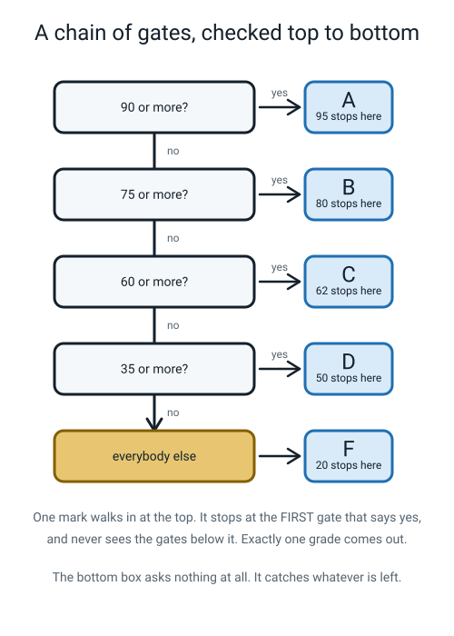
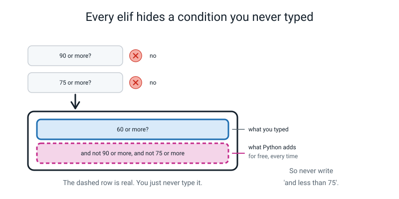
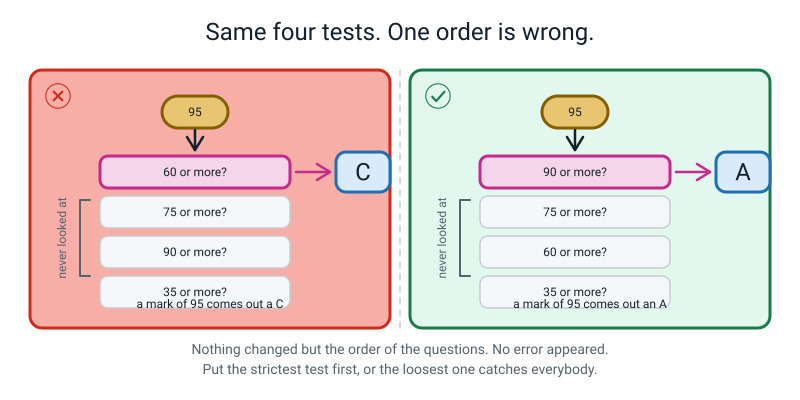
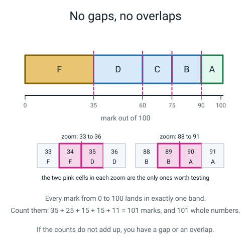
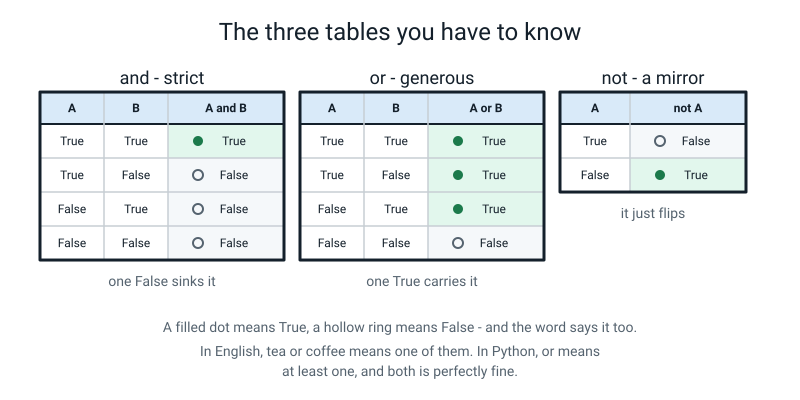
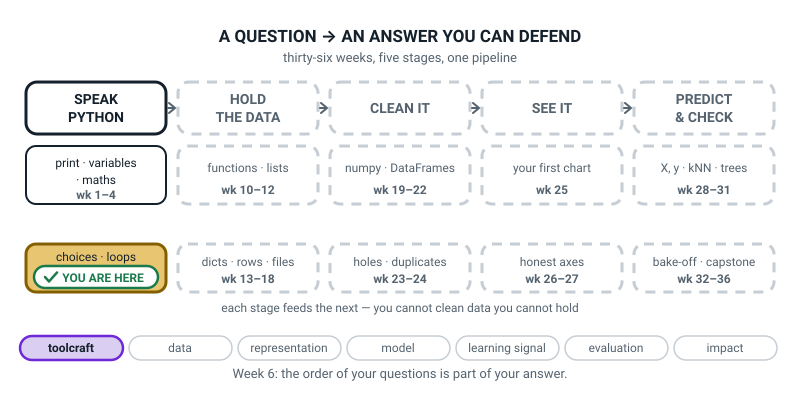

# Week 6 — More Than Two Doors: elif, and, or, not

[⬅ Week 5](week-05.md) · [Course Home](../README.md) · [Week 7 ➡](week-07.md) · [Student Guide](../student-guide/week-06.md) · [Workbook](../workbook/week-06.md)

---

## 📋 At a Glance

| | |
|---|---|
| **Duration** | 70 minutes |
| **Type** | 🟦 Teach — one new keyword, three new words, and the most instructive bug of the term |
| **Big idea** | An `if`/`elif`/`else` chain checks in order and stops at the first `True` — which is exactly how a correct-looking chain hides a wrong answer. |
| **New vocabulary** | elif · chain · logical operator · truth table · silent bug |
| **New syntax** | `elif condition:` · `and` · `or` · `not` |
| **Materials** | Printed workbook pages 6.1–6.6 · pencil · notebook open at the **Bug Log** · **five index cards** with 95, 80, 62, 50 and 20 written large · a printed copy of the broken `grade.py` (the paper fallback) |
| **Tech needed** | One laptop, Python 3, terminal in `~/ai-academy/level2`, editor with 4-space indent. Standard library only — **nothing to install**. |
| **Prep time** | 20 minutes the night before, 5 minutes on the day |

> **⚠️ Watch out:** the whole lesson turns on the student **not being told the answer.** They will run the broken grade program, see a 95 come out as a C, and their first instinct will be to assume the computer is broken or that they typed something wrong. **Your job for those four minutes is to look completely unbothered and ask questions.** If you point at line 5 and say "it's the order", you have thrown away the best twenty minutes in the term so far. Run it yourself the night before so that your calm is real.

---

## 🎯 Lesson Objectives

By the end of the lesson the student can:

1. **Build an `if`/`elif`/`else` chain with four branches.**
2. **Explain why reordering the branches changes the answer, with a worked example.**
3. **Combine two conditions with `and`, `or` and `not`, and predict the result.**
4. **Fill in the truth tables for `and` and `or` from scratch.**
5. **Find a chain that awards everyone the same grade, fix it, and prove the fix with test values.**

Observable evidence: a working four-branch chain; the `and` and `or` truth tables written from memory and then checked by running four one-line programs; and a five-row test table showing the broken chain's answers next to the fixed chain's, with the row that proves the fix circled.

---

## 🧑‍🏫 What YOU Need to Know First

> **📌 About the code blocks in this guide.** Outside the **🧰 Prep Checklist** and the **🔑 Answer Key**, the blocks are **illustrations, not files** — each one carries on from the one above it, so the `import` lines and the data are typed once, in the first block that needs them. **The complete runnable files are in the Prep Checklist and the Answer Key.** If you paste an illustration on its own and get `NameError`, that is why, and nothing is broken.

Read this twice and type the code. This week has one keyword and three small words in it, and a bug that is far more important than any of them.

### 1. `elif` — the chain

Last week's `if`/`else` gave you two doors. Two doors is not how anything real works. A cinema has infants, children, adults and seniors; a report card has A, B, C, D and F.

`elif` is short for **"else, if"**. It sits between the `if` and the `else`, you can have as many as you like, and each one gets its own condition and its own colon.

```python
if mark >= 90:
    grade = "A"
elif mark >= 75:
    grade = "B"
elif mark >= 60:
    grade = "C"
elif mark >= 35:
    grade = "D"
else:
    grade = "F"
```

> **elif** — short for "else, if". It adds another condition to a chain, checked only if everything above it was `False`.
> **chain** — a run of `if` / `elif` / `elif` / … / `else` that belongs together. Exactly one branch of it runs.

**The three rules of a chain, and they are the whole idea:**

1. **Python checks the conditions strictly from top to bottom.**
2. **The moment one is `True`, that branch runs and the whole rest of the chain is skipped.** Not "the best match" — the *first* match.
3. **Exactly one branch runs.** Never two. Never zero, if there is an `else` on the end.


*Figure 6.1 — One mark walks in at the top and stops at the first gate that says yes. It never sees the gates below.*

The analogy worth using out loud: **a queue of bouncers at one door.** Everybody walks up to bouncer number one. If bouncer one says yes, they go in, and the other bouncers never see them at all. Only if bouncer one says no do they move along to bouncer two.

Compare that with writing four separate `if` statements. Four separate `if`s are four separate doors with four separate bouncers, and one person can walk through all four of them. That is a genuinely different program, and it is a real bug people write. A chain guarantees "exactly one".

### 2. `elif` carries a condition you never type — and this is why chains are worth having

This is the piece that makes the whole thing click, and it is worth being slow about.

Trace `mark = 62` through the chain above:

- `62 >= 90`? No. Move on.
- `62 >= 75`? No. Move on.
- `62 >= 60`? **Yes.** → `grade = "C"`. **Stop.** The `>= 35` test and the `else` are never looked at.

Now notice what you did *not* have to write. You wrote `elif mark >= 60:`. You did **not** write `elif mark >= 60 and mark < 75:`. And yet the C branch correctly refuses to take a mark of 80.

Why? Because **you only ever reach line 5 if lines 1 and 3 both said no.** So by the time Python is asking `mark >= 60`, it already knows the mark is under 75 and under 90. Every `elif` silently carries **"…and nothing above me was true."**


*Figure 6.2 — The dashed row is real. Python adds it for free, every time. That is why you never write "and less than 75".*

This is the single best argument for a chain over four separate `if`s, and it is worth saying as a sentence: **a chain lets you write one boundary per branch instead of two, and a boundary you do not write is a boundary you cannot get wrong.**

### 3. The order-matters trap — the bug the lesson is built on

Here is the program. It has no error in it as far as Python is concerned. It runs perfectly. It is also wrong for everybody who passed.

```python
# grade.py - version 1. It runs without an error. It is also wrong.

mark = int(input("Mark out of 100? "))   # text in, whole number out

if mark >= 60:            # bouncer 1
    grade = "C"
elif mark >= 75:          # bouncer 2
    grade = "B"
elif mark >= 90:          # bouncer 3
    grade = "A"
elif mark >= 35:          # bouncer 4
    grade = "D"
else:                     # everybody else
    grade = "F"

print(f"Mark  : {mark}")
print(f"Grade : {grade}")
```

Five real runs:

```text
Mark out of 100? 95
Mark  : 95
Grade : C
```
```text
Mark out of 100? 80
Mark  : 80
Grade : C
```
```text
Mark out of 100? 62
Mark  : 62
Grade : C
```
```text
Mark out of 100? 50
Mark  : 50
Grade : D
```
```text
Mark out of 100? 20
Mark  : 20
Grade : F
```

**Every single mark from 60 to 100 gets a C.** A 95 gets a C. Nothing crashed. No warning appeared. The A and B branches are *dead code* — there is no possible input that reaches them, ever.

Why? Because `95 >= 60` is `True`, bouncer one said yes, and bouncers two, three and four never saw the mark.

> **silent bug** — a mistake that produces a wrong answer without producing any error message.


*Figure 6.3 — Nothing changed but the order of the questions. The three below the first one are never looked at.*

**The fix and the rule.** Move the strictest test to the top:

```python
# grade.py - version 2. Highest threshold first, so each mark meets the right bouncer.

mark = int(input("Mark out of 100? "))   # text in, whole number out

if mark >= 90:            # bouncer 1 - the strictest test goes first
    grade = "A"
elif mark >= 75:          # bouncer 2 - only sees marks under 90
    grade = "B"
elif mark >= 60:          # bouncer 3 - only sees marks under 75
    grade = "C"
elif mark >= 35:          # bouncer 4 - only sees marks under 60
    grade = "D"
else:                     # everybody who got under 35
    grade = "F"

print(f"Mark  : {mark}")
print(f"Grade : {grade}")
```

> **The rule, in one line: in a chain of overlapping conditions, order from most restrictive to least restrictive. For a chain of `>=` tests, that means highest threshold first.**

The same five marks, real runs, fixed version — the last line of each:

| Mark typed | Broken chain says | Fixed chain says |
|---|---|---|
| 95 | `Grade : C` | `Grade : A` |
| 80 | `Grade : C` | `Grade : B` |
| 62 | `Grade : C` | `Grade : C` |
| 50 | `Grade : D` | `Grade : D` |
| 20 | `Grade : F` | `Grade : F` |

**Look at the 62 row.** The broken and the fixed program agree. If the student had tested only 62 and 50, they would have concluded that the program was fine. That is last week's boundary lesson arriving from a new direction: **the test that finds the bug is not the test in the middle.**

### 4. Coverage: no gaps, no overlaps

Whenever you write a chain, check two things. It takes a minute and it catches nearly everything.

1. **No gaps.** Is every possible input handled? An `else` at the end guarantees this. Without one, some input falls off the end and no branch runs at all — and if that branch was the only place a variable got set, you get a `NameError` on a later line. (This is last week's trap, and it is Clinic row 7.)
2. **No wrong overlaps.** For each input, is the **first** matching branch the one you want?

Here is the coverage check for the fixed chain, done as a table. This is exactly the table on workbook page 6.4.

| Mark | `>=90`? | `>=75`? | `>=60`? | `>=35`? | Branch taken | Right? |
|---|---|---|---|---|---|---|
| 100 | ✓ | — | — | — | A | ✔ |
| 90 | ✓ | — | — | — | A | ✔ boundary |
| 89 | ✗ | ✓ | — | — | B | ✔ |
| 75 | ✗ | ✓ | — | — | B | ✔ boundary |
| 60 | ✗ | ✗ | ✓ | — | C | ✔ boundary |
| 35 | ✗ | ✗ | ✗ | ✓ | D | ✔ boundary |
| 34 | ✗ | ✗ | ✗ | ✗ | F | ✔ |
| 0 | ✗ | ✗ | ✗ | ✗ | F | ✔ |

A dash means "never even asked", because a branch above already matched. Getting a student to write the dashes rather than a tick or a cross is worth doing — it is the moment they see that most of the chain is skipped most of the time.


*Figure 6.4 — Five bands, four boundaries, and every mark from 0 to 100 in exactly one band. The values worth testing are the pairs either side of a boundary.*

### 5. `and`, `or`, `not` — the three logical operators

Real conditions are rarely one comparison. "Can I go out?" depends on the homework being done **and** it not raining.

> **logical operator** — a word (`and`, `or`, `not`) that combines or flips booleans.

| Operator | `True` when… | How to remember it |
|---|---|---|
| `A and B` | **both** are `True` | strict. Everything must pass. |
| `A or B` | **at least one** is `True` | generous. One is enough. |
| `not A` | `A` is `False` | a mirror. It flips. |

> **truth table** — a table listing every possible combination of inputs to an operator, and the answer for each.

These never change and are worth memorising. There are only six rows in the world:

| A | B | `A and B` | `A or B` |
|---|---|---|---|
| `True` | `True` | **`True`** | **`True`** |
| `True` | `False` | `False` | **`True`** |
| `False` | `True` | `False` | **`True`** |
| `False` | `False` | `False` | `False` |

| A | `not A` |
|---|---|
| `True` | `False` |
| `False` | `True` |


*Figure 6.5 — `and` says yes once out of four. `or` says yes three times out of four. `not` just flips.*

The analogies to use:

- **`and` is ordering a pizza for two picky people.** Both have to approve the topping. One veto kills it.
- **`or` is a cricket team with two selectors.** If *either* selector likes you, you are in.
- **`not` is a mirror.** Whatever you show it, it shows the opposite.

**One warning about `or` that matters.** In English, "you can have tea or coffee" usually means *one, not both*. In Python, `or` means "at least one, **and both is fine too**." `True or True` is `True`. Say that out loud; it is not obvious.

Run this. It is three one-line programs and it settles all six rows:

```python
print(True and True, True and False, False and True, False and False)
```
```text
True False False False
```

```python
print(True or True, True or False, False or True, False or False)
```
```text
True True True False
```

```python
print(not True, not False)
```
```text
False True
```

### 6. `and` with real conditions, and the precedence rule

Cricket team eligibility: a player must be **at least 13**, have played **at least 5 matches**, and **not** be injured.

```python
# team_check.py - three conditions joined into one answer.

age = 14           # how old the player is
matches = 7        # how many matches they have played
injured = False    # True if they are hurt right now

print(age >= 13)            # old enough?
print(matches >= 5)         # played enough?
print(not injured)          # not injured? (not flips True to False and back)
print(age >= 13 and matches >= 5 and not injured)   # all three at once
```

The real output:

```text
True
True
True
True
```

Now change one thing — the player twists an ankle:

```python
# team_check.py - same player, one twisted ankle.

age = 14
matches = 7
injured = True     # changed from False

print(age >= 13 and matches >= 5 and not injured)   # True and True and False
```

```text
False
```

**One `False` anywhere in an `and` chain sinks the whole thing.**

**Precedence — which happens first.** When you mix them, Python works in this order: **comparisons, then `not`, then `and`, then `or`.**

```python
print(True or False and False)
```
```text
True
```

Because `and` binds tighter, that is `True or (False and False)` = `True or False` = `True`. If you meant `(True or False) and False`, which is `False`, you have to write the brackets.

> **The rule for your own sanity, and teach it as a rule: whenever you mix `and` with `or`, put brackets in, even when you do not need them.**

### 7. The `or` trap that catches everybody exactly once

This one is worth knowing about before it happens, because it produces a `True`-looking answer that has nothing to do with your question.

```python
# or_trap.py - a bug that prints something instead of crashing.
answer = "maybe"

print(answer == "yes" or "y")       # WRONG - and it does not crash
print(answer == "yes" or answer == "y")   # RIGHT - both sides are full comparisons
```

The real output:

```text
y
False
```

The first line printed the **letter y**. You asked a yes/no question and got a letter back. Here is why: `answer == "yes"` is `False`. Then Python evaluates `False or "y"`. Python's `or` does not hand back `True` or `False` — it hands back **the first side that counts as a yes**, and any non-empty piece of text counts as a yes. So the whole expression *is* `"y"`.

And inside an `if`, `"y"` counts as a yes, so:

```python
answer = "maybe"

if answer == "yes" or "y":      # WRONG
    print("You said yes!")
else:
    print("Not a yes.")
```

```text
You said yes!
```

**The branch runs no matter what the user typed.** A silent bug, and a very good one.

> **The rule: every side of an `or` must be a complete comparison.** `answer == "yes" or answer == "y"`, spelled out in full, both times.

**How deep to go with this:** show it, name the rule, move on. The underlying idea — that Python treats empty things as "no" and everything else as "yes" — is real and it has a name (truthiness) and it is genuinely useful later. Today it only needs to be the reason for the rule.

### 8. The three misconceptions you will actually meet

**Misconception 1 — "Python picks the branch that fits best."** It does not. It picks the **first** one that is `True`, and it has no idea whether that is the one you wanted. This is the whole lesson, and the cure is the trace-with-a-finger exercise in the Activity: put a finger on the first condition, say the numbers out loud, and physically move down. A student who traces it by hand once never makes this mistake again.

**Misconception 2 — "the A branch isn't running, so there must be something wrong with the A branch."** They will edit the `elif mark >= 90:` line, which is completely correct, and leave the broken line untouched. The question that redirects them: *"before Python can even look at that line, what has to have happened?"* (Every line above it must have said no.) Then: *"did they?"*

**Misconception 3 — "`and` and `or` mean what they mean in English."** Two specific ways this bites. `or` in English usually means one-not-both; in Python both is fine. And "13 and over and under 60" in English becomes `age >= 13 and age < 60` in Python — you cannot write `age >= 13 and < 60`, because each side of an `and` has to be a complete comparison with both of its ends. That produces a `SyntaxError` and it is Clinic row 4.

### 9. How deep to go, and where to stop

**Go this far:** `elif` and the chain · first-true-wins · the ordering rule · the coverage check · `and`, `or`, `not` · both truth tables · precedence with brackets · the `or "y"` trap as a rule.

**Stop before all of these:**

- **Chained comparisons like `60 <= mark < 75`.** Genuinely lovely, genuinely Pythonic, and it is a distraction today because the entire lesson is *why you do not need the second half of that*. If a flying student invents it, praise it and let them use it — but do not teach it to the class. It is in the "flying" path below.
- **Truthiness in its own right.** Name it, use it to explain the `or "y"` trap, do not build on it.
- **`.lower()` and `.strip()`.** These appear in the harder variation for a reason: they are genuinely useful and they are also a whole new idea (a method, called with a dot). If you use them, use them as magic-for-today: *"`.lower()` flattens text to small letters so the comparison works."* Do not explain what a method is.
- **`match` / `case`.** Python has it. This course never uses it.
- **Loops.** A student who wants to test all five marks without running the program five times wants a loop, and that is next week. Say so.
- **`while` and re-asking on bad input.** Week 8.
- **Nesting more than one level deep.** If a student writes an `if` inside an `elif` inside an `else`, the answer is almost always "you want another `elif`". Say that; do not let it grow.

---

### 10. 🧭 The Growing Map — two minutes, and one forward pointer

**Where This Fits** is unchanged from last week: first tile white and done, second tile gold, everything
else dotted. That stillness is honest — *choices · loops* is a five-week tile and you are two weeks into
it. This week the map earns its keep by pointing at one specific box a long way to the right.



*Figure 6.0 — Week 6's version. Same as Week 5's, which is the point: one tile, several weeks.*

**Two minutes:**

1. **Start with today's bug.** *"The grade chain gave a 95 a C. Which box on this map did we break, and
   which box did we fix it in?"* Same box both times — the gold one. The lesson lands better when they
   notice that the bug and the fix live in the same tile.
2. **Then the forward pointer, and only this one:** *"PREDICT & CHECK, weeks 28 to 31, has something in it
   called a decision **tree**. Today we built a stack of yes/no questions asked in order. Anyone want to
   guess what a decision tree is?"* Somebody will get it. Let that land and move on.
3. **Then the dashes**, in the usual words: *"why is the rest dotted?"* — *"we haven't got there yet."*
4. **Pencil copies.** Under the gold tile they write *order matters* and underline it. It is the first bug
   this year that Python does not warn them about, and that deserves ink.

> **🧑‍🏫 Why this is worth two minutes.** Week 6 teaches a bug with **no error message**, which is a
> genuinely unsettling step up. The map reframes it as progress rather than as the course getting harder:
> silent wrongness is what the second half of the year is entirely about, and they have just met their
> first one.

> **⚠️ Watch out:** having made the decision-tree connection, do not extend it. "So machine learning is
> just if-statements" is a half-truth that costs you Week 30. Make the link, enjoy it, close it.

---

## 🧰 Prep Checklist

### 20 minutes the night before

- [ ] **Print workbook pages 6.1–6.6.** Page 6.4 (the coverage table) prints better in landscape.
- [ ] **Write five index cards**: 95, 80, 62, 50, 20. Big numbers, one per card. These are the test marks and they get physically handed to the student one at a time.
- [ ] **Type the broken `grade.py` yourself and run it with 95.** This is the most important two minutes of prep this term.

  ```python
  # grade.py - version 1. It runs without an error. It is also wrong.

  mark = int(input("Mark out of 100? "))   # text in, whole number out

  if mark >= 60:            # bouncer 1
      grade = "C"
  elif mark >= 75:          # bouncer 2
      grade = "B"
  elif mark >= 90:          # bouncer 3
      grade = "A"
  elif mark >= 35:          # bouncer 4
      grade = "D"
  else:                     # everybody else
      grade = "F"

  print(f"Mark  : {mark}")
  print(f"Grade : {grade}")
  ```

  The exact expected output:

  ```text
  Mark out of 100? 95
  Mark  : 95
  Grade : C
  ```

  **Sit with it for a second.** Notice that you slightly want it to be wrong, and it isn't — Python did precisely what the file said. That feeling is what the student is about to have, and your job is to have already had it.
- [ ] **Trace it on paper with a finger**, out loud, for 95. `95 >= 60`? Yes → C → stop. Do it aloud even though you know the answer; you are rehearsing the thing you will ask them to do.
- [ ] **Write the two truth tables from memory**, then check them against section 5. If you get `or` wrong it will be the `True or True` row — in English "tea or coffee" is one-not-both, and in Python it is at-least-one.
- [ ] **Run the three one-line truth-table programs** and check you get `True False False False`, `True True True False`, and `False True`.
- [ ] Say the big idea out loud: *"a chain stops at the first yes, which means a loose test at the top eats everybody."*

### 5 minutes on the day

- [ ] Terminal open in `~/ai-academy/level2`. Run last week's `ticket_price.py` once — ten seconds, and it proves the setup still works.
- [ ] Editor open, 4-space indent confirmed.
- [ ] **The broken `grade.py` already saved and on screen, but not run.** You want it there at minute zero, not typed during the lesson.
- [ ] The five index cards face down in a pile.
- [ ] Notebook open at the Bug Log. Workbook pages on the table.
- [ ] **Your hands off the keyboard, and your face neutral.** You are about to watch someone disbelieve a screen for four minutes and you must not rescue them.

### Fallback if the laptop or the install fails

This is the most paper-friendly week of the term, because the bug is a *reading* bug.

| If this fails | Do this instead |
|---|---|
| **No laptop** | Hand out the printed broken `grade.py`. The student is the computer: you hand them the 95 card, they put a finger on the first condition and walk down the chain out loud. They will produce `C` themselves, from the paper, and the disbelief is *identical*. Then they cross out and reorder the lines with a pencil and re-run all five cards by hand. **This version arguably teaches it better than the screen version** — the only thing lost is the real tracebacks in Part 3. Hand them printed tracebacks to read instead. |
| **Python not installed** | The paper version above is a complete 70-minute lesson. Do the install afterwards. |
| **The student has already seen the answer** (read ahead, or a sibling told them) | Excellent. Flip it: **they** teach *you*. Hand them the pencil, you play the confused student, and make them explain why the A branch never runs. Then go straight to the harder question: "reorder it the *other* way round — lowest first — and tell me what happens." (Everyone still gets one grade, and it is D for everybody who passed. The failure mode is the same shape.) |
| **The truth tables are just being memorised without meaning** | Do them physically. Two hands: left hand up = A is True, right hand up = B is True. "`and` — both hands up?" "`or` — at least one hand up?" Go through all four combinations with actual hands. Ninety seconds. |
| **No index cards** | Torn-up paper, or just say the numbers. The cards matter because handing over a physical thing makes the student commit to one value at a time, but any physical token works. |

---

## ⏱️ The Lesson, Minute by Minute

| Segment | Minutes | Running total | What happens |
|---|---|---|---|
| 🪝 Hook — A 95 Gets a C | 7 | 7 | The broken program, run in silence |
| 🧠 Concept — The Queue of Bouncers | 16 | 23 | `elif`, first-true-wins, the ordering rule |
| 💻 Live-Code Together — Fix It, Then Prove It | 18 | 41 | Reorder, coverage table, `and`/`or`/`not`. Two deliberate mistakes. |
| 🎲 Their Turn — The Broken Grade Chain, In Full | 20 | 61 | Trace, fix, prove with five values, then their own chain |
| 🔑 Wrap & Assign | 9 | 70 | Three checks, Bug Log, homework |

---

### 🪝 Hook — A 95 Gets a C (7 minutes)

**Do this:** The broken `grade.py` is already on the screen, **scrolled out of sight or minimised.** Only the terminal is visible. Sit down with the five index cards face down.

**Say this:**

> "I wrote you a grading program. You give it a mark out of a hundred and it gives you a letter grade. A is ninety and up, B is seventy-five, C is sixty, D is thirty-five, and below that is an F.
>
> Take a card."

Hand them the **95**.

> "Ninety-five. Before we run anything — what grade should that be?"

(An A. Obviously.)

> "An A. Right. Type ninety-five in."

They run it. The real output:

```text
Mark out of 100? 95
Mark  : 95
Grade : C
```

**Now say nothing at all.** Count to five in your head. Let them read it twice.

They will say some version of *"that's wrong"* or *"I typed it wrong"* or *"is it broken?"*. Whatever they say, answer only this:

> "Run it again."

They will get `C` again. Then:

> "Try eighty."

`C`. Then:

> "Try sixty-two."

`C`.

> "Try fifty."

`D` — and this is important, because it proves the program is not simply printing C for everything. Something in there *is* working.

> "Try twenty."

`F`.

Now sit back.

**Say this:**

> "So. Let's be precise about what we've got, because 'it's broken' isn't precise enough to fix anything.
>
> **Did it crash?** No. There's no red text anywhere. It ran five times, cleanly, and gave five answers.
>
> **Is it always printing C?** No — fifty got a D and twenty got an F. So parts of it are working.
>
> **Which marks are wrong?** Ninety-five should be an A. Eighty should be a B. Sixty-two genuinely should be a C, so that one's right. So: everybody who scored sixty or more gets a C, and nothing else does.
>
> And here's the thing I want to say out loud, because it has a name and you're going to meet it for the rest of your life. **This is a silent bug.** It's a mistake that produces a wrong answer without producing any error message at all. Python isn't confused, it isn't complaining, it isn't hiding anything. It did exactly what the file said. **The file says the wrong thing, and only a human can tell.**
>
> Nobody is going to tell you what's wrong with this program. You're going to find it. And the tool you're going to use is your finger."

**Ask this:**

| Ask | Answer you want | If they say something else |
|---|---|---|
| "What should 95 get?" | An A. | Nobody gets this wrong. It matters because they must be certain *before* they see the output. |
| "Did it crash?" | No. | If they say "it must be broken" — agree, and then insist on precision: "broken how? Give me a sentence that a person who can't see the screen would understand." |
| "Is it printing C for everything?" | No — 50 got D, 20 got F. | This is the key observation. If they miss it, run 20 again and put the two outputs side by side. It rules out "the whole thing is broken". |
| "Describe exactly which marks are wrong." | Everything 60 and above gets a C. 62 happens to be right by accident. | If they cannot narrow it, write the five results in a column on paper. The pattern is visible the moment they are stacked up. |
| "Which of those five results agree with a *correct* program?" | 50 → D, 20 → F, and 62 → C. Three of the five. | This one is worth pushing on. If they had only tested 62 and 50, they would have shipped it. That is last week's boundary lesson, arriving from a new direction. |

---

### 🧠 Concept — The Queue of Bouncers (16 minutes)

**Do this:** Bring the broken `grade.py` back on screen. **Do not fix it.** It is the worked example.

**Say this — part 1, what `elif` is:**

> "First, the new word, because you need it to talk about what you're looking at. **`elif`** — spelled e, l, i, f — is short for **'else, if'**. It goes between an `if` and an `else`, you can have as many as you like, and each one gets its own condition and its own colon.
>
> An `if` with a pile of `elif`s and an `else` on the end is called a **chain**. And a chain has exactly three rules. I want you to be able to say all three."

Write them up:

```
   1.  Python checks the conditions from TOP to BOTTOM.
   2.  The FIRST one that is True wins. Everything below it is skipped completely.
   3.  Exactly ONE branch runs. Never two. Never none, if there's an else.
```

> "Rule two is the one that matters, and I want to be really precise about the wording. Python does **not** pick the condition that fits best. Python has no idea what 'best' means. It picks the **first** one that says True, and then it stops looking. Full stop.
>
> Here's the picture I want in your head: **a queue of bouncers at one door.** Everybody who arrives walks up to bouncer number one. If bouncer one says yes, in you go — and bouncers two, three and four **never see you at all.** They don't get a vote. They don't know you existed."

Show Figure 6.1.

**Say this — part 2, the trace:**

> "Right. Look at the program on the screen and put your finger on the first condition. Not the second. The first. Read it out to me."

(`if mark >= 60:`)

> "Good. The mark is ninety-five. **Is ninety-five sixty or more?**"

(Yes.)

> "So what happens?"

(It sets the grade to C.)

> "And then?"

Wait. This is the moment. If they say "then it checks the next one", say: *"read rule two again."* Wait as long as it takes. **Do not say the answer.**

(It stops.)

> "It stops. So — does Python ever look at the line that says ninety or more?"

(No.)

> "Never. Not once. Not for any mark at all. Think about that: is there **any** number you could type that would reach that line?"

Let them work it. The answer is no — any mark of 90 or more is also 60 or more, so bouncer one always catches it first.

> "There is no such number. Those two lines — the B branch and the A branch — are code that can never, ever run. There's a name for that: **dead code**. It's sitting right there in the file, looking completely reasonable, and it is decoration.
>
> That is why this bug is so good. Nothing is *wrong* with the A line. The A line is perfect. **The problem is entirely in what order the lines are in**, and no amount of staring at any single line will show you that."

**Say this — part 3, the rule:**

> "So what's the fix? Say it as a rule, not as a change."

Steer them to it. The rule:

> **In a chain of overlapping conditions, put the most restrictive test first. For a chain of "greater than or equal to" tests, that means the highest threshold at the top.**

Show Figure 6.3 — the two orders side by side.

> "Ninety, then seventy-five, then sixty, then thirty-five. Strictest first.
>
> And now the beautiful bit, which is the reason chains are worth having at all. Once it's in the right order, look at the C branch. It says `mark >= 60`. That's it. It does **not** say 'sixty or more and less than seventy-five'. And yet it correctly refuses to give an eighty a C. Why?"

Let them get it: because to reach the C line, the 90 test and the 75 test must both already have said no.

> "Exactly. **Every single `elif` carries an invisible extra condition: 'and nothing above me was true.'** You never type it. Python adds it for free.
>
> That's worth a lot. It means you write **one** boundary per branch instead of two — and a boundary you don't have to write is a boundary you can't get wrong."

Show Figure 6.2.

**Say this — part 4, `and`, `or`, `not`:**

> "Last thing before we fix anything. Three small words, and they let one condition ask about two things at once.
>
> **`and`** is a pizza for two picky people. Both have to approve the topping. One veto and it's off.
> **`or`** is a cricket team with two selectors. If *either* one likes you, you're in.
> **`not`** is a mirror. Whatever you show it, it shows the opposite."

Have them type these three lines, **predicting each before running:**

```python
print(True and True, True and False, False and True, False and False)
```
```text
True False False False
```

```python
print(True or True, True or False, False or True, False or False)
```
```text
True True True False
```

```python
print(not True, not False)
```
```text
False True
```

> "Look at `and`: it says yes **once out of four**. It's strict. And `or` says yes **three times out of four**. It's generous. Those two lines are the whole of the truth tables and you should be able to write them from memory by Friday.
>
> And one thing that catches people. Look at the first answer on the `or` line: **`True or True` is `True`.** In English, 'you can have tea or coffee' means one, not both. In Python, `or` means *at least one, and both is absolutely fine.*"

Show Figure 6.5.

**Ask this:**

| Ask | Answer you want | If they say something else |
|---|---|---|
| "Say the three rules of a chain." | Top to bottom · first True wins and the rest are skipped · exactly one branch runs. | Make them say all three. Rule two is the one that matters and it is the one they will paraphrase into something vaguer, like "it picks the right one". Do not accept "the right one". |
| "Is there any mark that reaches the `>= 90` line?" | No. Any mark 90 or more is also 60 or more, so bouncer one always catches it. | If they say "95" — go back and trace 95 with a finger, out loud. |
| "What's wrong with the `elif mark >= 90:` line?" | Nothing at all. It is a correct line in the wrong place. | This is the misconception. If they want to edit that line, ask: "before Python can look at that line, what must have happened?" |
| "Why doesn't the C branch need 'and less than 75'?" | Because you only reach it if the 90 and 75 tests already said no. | If they cannot see it, trace 80 with a finger: it stops at bouncer two, so the C line is never asked. |
| "`True or True` — what does Python say?" | `True`. | If they say False because "you can't have both" — that is English `or`, and it is exactly the confusion to name. Point at the real output. |
| "How many of `and`'s four rows are True?" | One. | And `or`'s? Three. Framing them as "strict" and "generous" makes them memorable. |

---

### 💻 Live-Code Together — Fix It, Then Prove It (18 minutes)

**Do this:** The student types. Three passes.

#### Pass 1 (5 min) — reorder and prove

**Say this:**

> "Fix it. Move the whole `>= 90` branch to the top, then `>= 75`, then `>= 60`, then `>= 35`. Two lines move together each time — the condition and the line under it. **Move them; don't retype them.** Cut and paste, so you can be sure you haven't changed anything except the order."

The result:

```python
# grade.py - version 2. Highest threshold first, so each mark meets the right bouncer.

mark = int(input("Mark out of 100? "))   # text in, whole number out

if mark >= 90:            # bouncer 1 - the strictest test goes first
    grade = "A"
elif mark >= 75:          # bouncer 2 - only sees marks under 90
    grade = "B"
elif mark >= 60:          # bouncer 3 - only sees marks under 75
    grade = "C"
elif mark >= 35:          # bouncer 4 - only sees marks under 60
    grade = "D"
else:                     # everybody who got under 35
    grade = "F"

print(f"Mark  : {mark}")
print(f"Grade : {grade}")
```

Now run all five cards again. **Predict each one out loud first.** The real last lines:

```text
Mark out of 100? 95
Mark  : 95
Grade : A
```

and then, in turn: `80 → B`, `62 → C`, `50 → D`, `20 → F`.

> "Five out of five. And notice something about that test set: **62, 50 and 20 gave the same answer before and after.** Three of the five tests could not tell the two programs apart. Only 95 and 80 proved the fix. That's the thing to remember: a test that passes on both the broken and the fixed version has told you nothing."

#### Pass 2 (7 min) — ⚠️ **DELIBERATE MISTAKE #1**, the boundaries

**Say this:**

> "Now. Five out of five, so we're finished, yes? Let's check the edges, the same way we did last week. What are the four numbers where the grade changes?"

(90, 75, 60, 35.)

> "So the interesting tests are those four and the one below each: 89, 90, 74, 75, 59, 60, 34, 35. Let's do four of them. Predict first."

Real runs, last line of each:

| Mark | Grade |
|---|---|
| 90 | `A` |
| 89 | `B` |
| 35 | `D` |
| 34 | `F` |

> "All four right. Now let me break one on purpose, and I want you to predict which single test catches it."

Change the first line from `>= 90` to `> 90` — **the same one-character change as last week.**

> "Which of my eight boundary tests changes?"

(Only 90.) Run it:

```text
Mark out of 100? 90
Mark  : 90
Grade : B
```

> "Just one. A mark of exactly ninety gets a B. And **every other test I could possibly run still passes.** Put the equals sign back."

Bug Log entry #1 — and it is a silent one, so the "error" column says *no error message.*

#### Pass 3 (6 min) — ⚠️ **DELIBERATE MISTAKE #2**, `and` and the missing half

**Say this:**

> "Last thing. Let's add a second condition — a distinction. You get a star if you scored ninety or more **and** you handed the work in on time."

Dictate this at the bottom of the file, and **write the condition the way English says it, which is wrong.** Leave the second line bare — no comment on it, because you want the traceback to show the line by itself:

```python
on_time = True

if mark >= 90 and <= 100:
    print("Star!")
```

Run it. The real output:

```text
  File "grade.py", line 21
    if mark >= 90 and <= 100:
                      ^^
SyntaxError: invalid syntax
```

**Say this:**

> "Read me the last line. `SyntaxError` — Python couldn't even read it. And look where the carets are: under the `<=`.
>
> Here's the rule. **Each side of an `and` has to be a complete comparison, with both of its ends.** `<= 100` is only half a question — less than or equal to a hundred, but *what* is? Python has no idea. In English you're allowed to leave the subject out and everyone follows. Python isn't a person.
>
> Write it out in full."

Fix it to what we actually meant:

```python
on_time = True                      # did the work arrive on time?

if mark >= 90 and on_time:          # both must be true
    print("Star!")
```

Three real runs. With `on_time = True`, typing 95:

```text
Mark out of 100? 95
Mark  : 95
Grade : A
Star!
```

Now change the file to `on_time = False` and type 95 again:

```text
Mark out of 100? 95
Mark  : 95
Grade : A
```

No star. And back to `on_time = True`, typing 80:

```text
Mark out of 100? 80
Mark  : 80
Grade : B
```

No star either.

> "One `False` anywhere in an `and` sinks the whole thing. That's the strict one."

Bug Log entry #2.

---

### 🎲 Their Turn — The Broken Grade Chain, In Full (20 minutes)

Full instructions below. In the lesson flow:

- **Minutes 0–7:** the trace-and-prove table for all five marks, on paper, on the *broken* version.
- **Minutes 7–13:** truth tables from memory, then checked by running.
- **Minutes 13–20:** their own four-branch chain.

---

## 🎲 The Activity, In Full

### Setup

**On the table:** the laptop · workbook page 6.4 (the coverage table, landscape) · page 6.5 (Bug Log) · the five index cards · a pencil.

**On the screen:** save **both** versions — `grade_broken.py` and `grade.py`. The student will want to run them side by side, and keeping the broken one is the point of the whole activity. Do not delete it.

### Part 1 — Trace it with a finger, then prove it (7 minutes)

This is the part that must happen on paper, not on the screen.

**Say this:**

> "Open the broken one. Now: **finger on the first condition.** I'm going to give you a mark and you're going to walk down the chain out loud. Every line, in order, and you say the answer before you move your finger."

Hand them the **80** card. They should produce:

> "`80 >= 60`? Yes. So grade equals C. Stop."

Then the **50** card:

> "`50 >= 60`? No. `50 >= 75`? No. `50 >= 90`? No. `50 >= 35`? Yes. So grade equals D. Stop."

**Make them do all five out loud.** It takes three minutes and it is the single most valuable thing in the lesson. Then fill in the table on page 6.4:

| Mark | `>=60`? | `>=75`? | `>=90`? | `>=35`? | Branch taken | Should be | Right? |
|---|---|---|---|---|---|---|---|
| 95 | ✓ | — | — | — | C | A | ✘ |
| 80 | ✓ | — | — | — | C | B | ✘ |
| 62 | ✓ | — | — | — | C | C | ✔ by luck |
| 50 | ✗ | ✗ | ✗ | ✓ | D | D | ✔ |
| 20 | ✗ | ✗ | ✗ | ✗ | F (else) | F | ✔ |

**A dash means "Python never even asked."** Insist on the dashes rather than ticks or crosses — it is the moment the "skipped completely" rule becomes visible on paper.

Show Figure 6.4 alongside the table, so they can see the five bands the *fixed* chain will produce and where the four boundaries sit.

Then the two questions that make it land:

> "How many of the dashes are in the 95 row?" (Three.) "So how much of that chain did Python read?" (One line.)
>
> "And look at the 62 row. It says right — but is it right for the right reason?" (No. It got a C because it was the first branch, not because it deserved a C. **It would still say C if the mark were 100.**)

### Part 2 — Truth tables from memory (6 minutes)

**Say this:**

> "Close the laptop. Page 6.1. Fill in both tables from memory — `and` and `or`, four rows each. Don't guess: think about the pizza and the selectors."

Give them ninety seconds. Then:

> "Open it back up and check yourself with three one-line programs."

```python
print(True and True, True and False, False and True, False and False)
```
```text
True False False False
```
```python
print(True or True, True or False, False or True, False or False)
```
```text
True True True False
```
```python
print(not True, not False)
```
```text
False True
```

The row most people get wrong is `True or True`. If they wrote `False`, say the sentence: *"in English, tea or coffee means one. In Python, `or` means at least one — and both is fine."*

Then one extra, and predict first:

```python
print(True or False and False)
```
```text
True
```

> "Why? Because `and` is worked out before `or`, so that's `True or (False and False)`, which is `True or False`, which is `True`. If you meant the other one you have to write the brackets — and **from now on, whenever you mix `and` with `or`, write the brackets even when you don't need to.** Future-you will thank you."

```python
print((True or False) and False)
```
```text
False
```

### Part 3 — Their own four-branch chain (7 minutes)

**Say this:**

> "Now yours. Four branches at least, plus an `else`, and it has to be about something you actually care about. Then — and this is the marks — **prove it works with a test table that includes both sides of every boundary.**"

Options on page 6.4 if they need one:

| Program | The bands |
|---|---|
| Cinema ticket, four ages | under 3 free · under 13 is 120 · under 60 is 250 · else 150 |
| How long until the bus | under 2 min "run" · under 10 "walk" · under 30 "wait" · else "get a snack" |
| Sleep report | 9+ "great" · 8+ "fine" · 6+ "not enough" · else "go to bed" |
| Battery warning | 80+ "full" · 40+ "fine" · 15+ "charge soon" · else "charge now" |
| Cricket innings | 100+ "century" · 50+ "half century" · 25+ "solid" · else "early out" |

Here is the cinema one complete, actually run — it also shows `and` doing real work:

```python
# ticket_price.py - version 2. Four age bands instead of two, plus a discount day.

age = int(input("How old are you? "))          # whole number
day = input("Which day is it? (all small letters) ")   # text, exactly as typed

if age < 3:                    # bouncer 1 - the youngest band
    price = 0
    band = "infant"
elif age < 13:                 # bouncer 2 - only sees ages 3 and up
    price = 120
    band = "child"
elif age < 60:                 # bouncer 3 - only sees ages 13 and up
    price = 250
    band = "adult"
else:                          # everyone 60 and over
    price = 150
    band = "senior"

# Tuesday is discount day - but a free ticket cannot get cheaper.
if day == "tuesday" and price > 0:
    price = price - price * 0.30          # take 30% off
    print("Tuesday discount applied.")

print(f"Band  : {band}")
print(f"Price : {price:.0f} rupees")
```

Five real runs:

```text
How old are you? 1
Which day is it? (all small letters) monday
Band  : infant
Price : 0 rupees
```
```text
How old are you? 8
Which day is it? (all small letters) monday
Band  : child
Price : 120 rupees
```
```text
How old are you? 8
Which day is it? (all small letters) tuesday
Tuesday discount applied.
Band  : child
Price : 84 rupees
```
```text
How old are you? 30
Which day is it? (all small letters) tuesday
Tuesday discount applied.
Band  : adult
Price : 175 rupees
```
```text
How old are you? 70
Which day is it? (all small letters) monday
Band  : senior
Price : 150 rupees
```

Check by hand: 30% of 120 is 36, and 120 − 36 = 84 ✔. 30% of 250 is 75, and 250 − 75 = 175 ✔.

Note the `and` on the discount line: `day == "tuesday" and price > 0`. Without the `price > 0` half, an infant's free ticket would go through the discount arithmetic and print "Tuesday discount applied" for a zero-rupee ticket — technically harmless, visibly silly. **Run it with age 2 and Tuesday** and confirm no discount message appears. That is `and` earning its keep.

One honest limitation to point out, because a student will find it: type `Tuesday` with a capital T and the discount does not apply, because `"Tuesday" == "tuesday"` is `False`. The tool for that is `.lower()`, and it is in the harder variation below. **Say that the program has this flaw rather than pretending the prompt solves it.**

### What "finished" looks like

- Both `grade_broken.py` and `grade.py` exist, and the student can say in one sentence what the difference is.
- The five-row trace table on page 6.4 is filled in, **with dashes** where Python never asked.
- The student can say why the 62 row is right *by accident*.
- Both truth tables written from memory, then marked against a real run.
- One four-branch chain of their own, tested on both sides of every boundary.
- **Two Bug Log entries**: the `> 90` boundary bug (no error message) and the `and <= 100` `SyntaxError`.
- Every line commented.

### Variation — easier

- **Three branches, not four.** A / C / F, thresholds 90 and 35. The ordering bug works identically with three.
- **Do the whole trace on the printed program**, not the screen. Reading is the skill this week; typing is not.
- **Give them the reordered chain already typed** and have them only run the five cards and fill in the table.
- **Cut the truth tables to `and` only.** Four rows, one word. `or` can wait a week.
- **Skip Part 3 entirely.** Parts 1 and 2 are a complete lesson.
- **Drop `and`, `or` and `not` altogether** if the ordering bug has taken the whole lesson. It genuinely might, and that would be time well spent. Roll the three words into Week 7's warm-up.

### Variation — harder

1. **Break it the other way.** Reorder the chain lowest-threshold-first: 35, 60, 75, 90. Predict what everyone gets before running. (Everyone who passed gets a **D**, and now three branches are dead instead of two.) Then the question: *"is that the same bug or a different one?"* (Same bug, same shape, different letter — which is the useful realisation.)
2. **Find the dead code, in general.** Give them this and ask which branches can never run:

   ```python
   if mark >= 50:
       grade = "Pass"
   elif mark >= 80:
       grade = "Distinction"
   elif mark < 50:
       grade = "Fail"
   else:
       grade = "???"
   ```

   Answer: the Distinction branch is dead (anything 80+ is also 50+). And the `else` is *also* dead — `mark >= 50` and `mark < 50` between them cover every possible number, so nothing can reach the `else`. **Two pieces of dead code, and one of them is the safety net.** That is a genuinely satisfying puzzle.
3. **Chained comparisons.** Show them `print(60 <= 72 < 75)`, which is `True`, and `print(72 >= 60 and 72 < 75)`, which is also `True`. Python lets you write a range the way maths does. Then the question that matters: *"we're allowed this — so why did we not need it in the grade chain?"* (Because the chain supplies the upper bound for free.) Let them use it wherever they like from now on; it is genuinely better than the `and` version.
4. **The `or` trap, deliberately.** Have them write, run, and explain:

   ```python
   answer = "maybe"
   print(answer == "yes" or "y")
   ```
   ```text
   y
   ```

   Then put it inside an `if` and watch the branch run for every possible input. Then fix it. This is a superb Bug Log entry because the "error" column says *no error — it printed a letter*.
5. **Case-insensitive input.** Change the discount line to `if day.lower() == "tuesday" and price > 0:` and test `Tuesday`, `TUESDAY` and `tuesday`. Explain `.lower()` as *"it flattens text to small letters before comparing"* and nothing more — what a method actually is comes later. This fixes a real flaw in their own program, which is the best possible reason to learn anything.
6. **Leap years.** Write the condition for "is this year a leap year". The real rule needs all three of `and`, `or` and `not`, and brackets:

   ```python
   year = 2024
   leap = (year % 4 == 0 and year % 100 != 0) or (year % 400 == 0)
   print(leap)
   ```
   ```text
   True
   ```

   Test it on 2024 (`True`), 1900 (`False`), 2000 (`True`) and 2023 (`False`). Real outputs, checked. This is the hardest condition in the course so far and it is worth every minute — and it is exactly the case where the brackets rule saves you.

---

## 🐞 The Debugging Clinic

Every message below came from running a real broken version of this week's code. Only the folder path in the `File` line will differ on your machine.

| What the student sees (real message) | What it means | Most likely cause | The fix |
|---|---|---|---|
| `SyntaxError: invalid syntax` with `^^^^` under `elif` | "An `elif` turned up where I wasn't expecting one." | An `elif` placed **after** the `else`. The `else` must be last. | Move the `elif` above the `else`. There is nothing after an `else`. |
| `SyntaxError: invalid syntax` with `^^^^` under `elif` (again) | Same message, different cause. | An `elif` with no `if` above it — usually because the `if` was deleted or edited into something else while reordering. | Check there is an `if` at the top of the chain, at the same indentation. |
| `SyntaxError: invalid syntax` with `^` under `&&` | "`&&` is not a Python word." | `&&` copied from another language, or from a web search. | Python spells it `and`. Likewise `or`, not `\|\|`, and `not`, not `!`. |
| `SyntaxError: invalid syntax` with `^^` under `<=` in `if mark >= 60 and <= 74:` | "That's only half a comparison." | Writing the condition the way English says it, leaving the subject out of the second half. | Spell both sides out: `mark >= 60 and mark <= 74`. Or, better, use `60 <= mark <= 74`. |
| `SyntaxError: expected ':'` at the end of a long condition | The colon is missing. | A long `and`/`or` condition, and the colon fell off the end while editing. | Add the `:`. Python points at exactly the character where it wanted it. |
| `IndentationError: unindent does not match any outer indentation level` pointing at `elif` | "This `elif` doesn't line up with anything." | The `elif` is indented differently from its `if`. | **`if`, every `elif`, and the `else` must all sit at exactly the same distance from the left edge.** Look at the left edge, not the words. |
| `NameError: name 'grade' is not defined` on the final `print` | "You're printing a box that was never filled." | A chain with **no `else`**, and an input that matched none of the conditions. | Add an `else` on the end, always. A chain without an `else` has a gap in it by definition. |
| `SyntaxError: invalid syntax` on `elseif`, or `SyntaxError: expected ':'` on `else if` | Python's spelling is `elif`, one word. | `else if` (two words, from other languages) or `elseif`. | `elif`. One word, no space. |
| **No error, and everybody who passes gets a C** | Python is perfectly happy. It ran the first branch that said yes. | The loosest test is at the top of the chain. | Reorder: highest threshold first. **This is a silent bug and it is the whole lesson.** |
| **No error, and one branch never runs no matter what you type** | Python is perfectly happy. It is dead code. | A branch whose condition is fully covered by one above it. | Trace one value that *should* reach it, with a finger, and find which line catches it first. |
| **No error, and a mark of exactly 90 gets a B** | Python is perfectly happy. | `> 90` where `>= 90` was meant. | One character. And notice that *only* the value 90 reveals it. |
| **No error, and a branch runs whatever the user types** | Python is perfectly happy. `or` handed back a piece of text, and text counts as a yes. | `if answer == "yes" or "y":` — the right-hand side is not a comparison. | `if answer == "yes" or answer == "y":`. **Every side of an `or` must be a full comparison.** |
| **No error, and `Tuesday` does not get the discount** | Python is perfectly happy. `"Tuesday" == "tuesday"` is `False`. | Case. The human capitalised and the program did not expect it. | For today, tell them to type it in small letters and note the flaw. The real fix is `day.lower() == "tuesday"`. |

### How to teach debugging without giving the answer

The four rules from the last two weeks still stand: **hands off the keyboard · last line first · ask, do not tell · log it.** This week adds the one that matters most, because five of the thirteen rows above have no error message at all.

**5. When there is no error, the tool is not reading — it is tracing.**

Reading a chain does not find an ordering bug, because every individual line is correct. **Tracing** finds it. Teach tracing as a physical procedure with four steps, and make them do it out loud:

1. Put a **finger** on the first condition. Not the second. The first.
2. Say the condition **with the real number substituted in**: not "if mark is 60 or more" but "**is 95 sixty or more?**".
3. Say the answer, then move the finger — down to the next condition if it was no, **out of the chain entirely** if it was yes.
4. Whatever line the finger lands on, that is the answer, whether you like it or not.

Two things make this work. First, **out loud**: silent tracing lets the brain skip to what it expected. Second, **substituting the number**: "is mark 60 or more" is abstract enough that a student can nod at it and move on, whereas "is 95 sixty or more" cannot be nodded at.

And when they find it, the question to end on is the best question of the week: *"which of your five test marks proved the fix, and which ones would have passed either way?"* Three of five would have passed either way. That is the lesson that keeps paying — right through to Week 29, when the same idea comes back as "test on data the model has not seen."

---

## ❓ Questions Students Ask This Week

**"Why doesn't Python just work out which branch I meant?"**

Because it has no idea what you meant, and it would need to in order to guess. Look at the broken chain from Python's point of view: it is a perfectly sensible program that says "anyone with sixty or more gets a C". There is nothing in the file that says the A branch was supposed to be reachable. To spot the bug, Python would have to know that grades are meant to be ordered, that higher marks should get better letters, and that you did not intend two branches to be unreachable — and all three of those live in your head, not in the file. What Python *could* do, in principle, is warn you that a branch can never run. Some tools for other languages do exactly that. Python does not, mostly because in a language this flexible it is hard to be sure.

**"Can I just use four separate `if`s instead of a chain?"**

You can, and it is a different program, and the difference will bite you. Four separate `if`s are four separate doors: a mark of 95 goes through the `>= 90` door, and then the `>= 75` door, and then the `>= 60` door, and each one sets `grade`, so you end up with whatever the **last** one set. Try it — it is instructive. A chain guarantees "exactly one branch". Separate `if`s guarantee nothing, and you have to keep every condition mutually exclusive by hand, forever.

**"How many `elif`s am I allowed?"**

As many as you like. But there is a real judgement here rather than a limit: past about five or six, a long chain becomes hard to check for gaps and overlaps, and there is usually a better shape for the problem. In Week 13 you meet dictionaries, and quite a lot of long chains turn out to be a lookup table wearing a disguise. For now, four or five is comfortable.

**"Does the `else` need to be there?"**

Not required by Python, but **put one on anyway, every time.** Without an `else`, an input that matches nothing falls off the end of the chain and no branch runs — and if the only place a variable gets set is inside the chain, the next line that uses it gives you a `NameError` pointing at a completely innocent line. An `else` is a promise that the chain handles every possible input. It costs two lines. Even `else: grade = "???"` is better than nothing, because `???` in the output is a message from you to future-you.

**"Why is `or` True when both sides are True? That's not what 'or' means."**

It is not what "or" usually means in English, and you are right to notice. English `or` is often *exclusive* — "tea or coffee" means pick one. Python's `or` is *inclusive*: it means "at least one, and both is fine". The reason is that inclusive-or is what you almost always want in a program: "if it's raining **or** I'm late, take the bus" should certainly still take the bus when both are true. There is a symbol for exclusive-or in Python (`^`) and this course never uses it, because in ten years of ordinary programming you will want it about twice.

**"I fixed the order and my program still gives everyone a C. Why?"**

Nine times out of ten, you are running the wrong file, or you edited the file and did not save it. Check the top of the terminal: does the file name in your `python3 ...` command match the file you were typing in? And check the editor for a dot or a circle next to the filename, which means unsaved changes. This is not a Python problem and it happens to everybody, all week, forever.

**"Is a silent bug worse than a crash?"** *(Say yes, and then say why that answer is too easy.)*

Almost always yes, and the reason is simple: a crash tells you it happened. A silent bug does not, so it survives — into your homework, into the marks the program printed, into next term. The grade program is a good example: run it on a real class and you would hand out thirty wrong grades and never find out. But the "almost" is doing real work in that sentence, and it is worth being honest about. A crash in the wrong place is not a small thing either — a program that stops halfway through writing a file can leave the file destroyed, and there are systems where stopping is *the* dangerous outcome. What is true without qualification is this: **a silent bug is worse than a crash for the person who has to find it, and that person is usually you.** So while you are the one testing, make your program crash loudly and early. That is a choice you get to make.

**"How would I ever have found this on my own?"** *(This one has no clean answer, and that is worth admitting.)*

**Honestly: probably by having a wrong answer handed back to you by somebody who noticed, and there is no method that reliably avoids that.** But there are three habits that shorten the odds, and they are the three you have now been doing for three weeks. **Predict before you run** — you knew 95 should be an A before you saw the C, and that is the only reason you knew anything was wrong. **Test the boundaries** — the values either side of every number in your conditions. And **write a table**, because five results in a column show a pattern that five results seen one at a time do not. None of that is a guarantee. Professional teams add more: a second person reads the code, and the program gets a set of tests it must pass before anyone is allowed to change it. Even then things get through. The honest position is that finding silent bugs is a *practice*, not a procedure, and the people who are good at it are the ones who are in the habit of not trusting output they have not predicted.

---

## ⚠️ Where This Lesson Goes Wrong

| What happens | Why | What to do right now |
|---|---|---|
| You tell them the answer in the first two minutes | Watching someone be confused is genuinely uncomfortable, and you can see the bug | Prepare the four questions and use only those: *"Did it crash?" · "Is it C for everything?" · "Which marks are wrong?" · "Put your finger on the first condition."* If you feel the urge to point, put your hands behind your back. |
| The student edits the `elif mark >= 90:` line, which is correct, and cannot see why it does not help | Every individual line looks fine, so they debug the line that is failing to run | Ask: *"before Python can look at that line, what has to have happened?"* Then: *"did it?"* Do not say "order". |
| They conclude the computer or Python is broken | Nothing in their experience produces a confident wrong answer | Agree that it looks that way, then narrow it: *"if it were broken, would 50 have got a D?"* It did. Something in there is working, so it is not broken — it is doing something you did not intend. |
| Tracing is done silently and lands on the answer they expected | Silent reading lets the brain skip to the expected result | Insist on two things: **out loud**, and **with the number substituted in**. "Is 95 sixty or more?" cannot be skipped. "If mark is 60 or more" can. |
| The chain gets fixed by retyping it, and a typo arrives with the fix | Retyping five branches introduces new bugs on top of the old one | Cut and paste whole two-line blocks. Say why: "if you retype it and it still fails, you won't know which bug you're looking at." |
| The `if`, `elif`s and `else` end up at slightly different indentations | Cutting and pasting blocks drags leading spaces around | `IndentationError: unindent does not match any outer indentation level`. Cover the code so only the left edge shows. `if`, every `elif` and `else` must line up exactly. |
| The truth tables get memorised as four rows of noise | They are abstract and there is nothing to hold on to | Do them with hands. Left hand up = A True, right hand up = B True. Go through all four combinations physically. Then: "`and` — both hands?" "`or` — at least one?" |
| `and` and `or` get skipped because the ordering bug ate the lesson | The bug is genuinely worth twenty minutes and it will take them | **Let it.** The ordering bug is objectives 2 and 5, which are the heart of the week. Push `and`/`or`/`not` into next week's warm-up and say so out loud, so it feels like a decision and not a failure. |
| They test only 62 and 50, both pass, and declare it fixed | Those two marks give the same answer on the broken and fixed versions | This is the best teachable moment in the week. Do not correct it — hand them the 95 card. Then: "how many of your five tests could tell the two programs apart?" (Two.) |
| The `else` gets left off and a `NameError` appears three lines later | The chain looks complete without it | Point at the traceback: *"read the line it names. Is anything wrong with that line?"* No. *"So where did `grade` come from?"* Nowhere, for that input. |
| The student writes `if mark >= 90 and mark < 100:` on every branch | It feels safer to say both bounds | It works, so do not call it wrong — but trace 100 through it and watch a perfect score get an F. Then ask what the C branch would need. Then show that the chain gives the upper bound for free. **Working code that is more fragile than it needs to be is a real lesson.** |

---

## 🧭 Differentiation

### If the student is struggling

**Cut, in this order:** `not` · `or` · `and` entirely · Part 3 of the activity · two of the four branches (A / C / F is enough).

**What you must not cut:** the Hook, and the finger-trace of 95 through the broken chain. Those two deliver objectives 2 and 5 between them, and neither needs any typing at all.

**Reteach the chain physically — the queue of bouncers.** This takes four minutes and it works on essentially everybody.

Write each condition on its own index card and lay them out in a vertical column on the table, in the broken order:

```
   [ 60 or more? ]
   [ 75 or more? ]
   [ 90 or more? ]
   [ 35 or more? ]
   [ everybody else ]
```

Now give the student the **95** card and have them physically walk it down the column, touching each condition in turn. At the first one that says yes, **take the 95 card off the table.** Physically remove it.

> "It's gone. It's through the door. Can bouncer two see it?"

They cannot, because it is not on the table any more. Then:

> "Right — now find me a number that can get past the first bouncer to reach the ninety card."

They will try things. Nothing works. Let them try for a full minute; the failure is the lesson.

Then have them **physically reorder the index cards** and walk the 95 down again. Rearranging cards is the fix, and they did it with their hands rather than with a cursor.

**Reteach the truth tables with hands, not tables.** Left hand up means A is True; right hand up means B is True.
- "`and` — is it True? Only if **both** hands are up." Do all four combinations.
- "`or` — is it True? If **at least one** hand is up." Do all four.
Ninety seconds, and it sticks in a way a printed grid does not.

**The copy-this-exactly scaffold.** Three branches, correctly ordered, ready to type from paper:

```python
# grade.py - type this exactly, then run it four times.

mark = int(input("Mark out of 100? "))   # a number, so int() at the door

if mark >= 90:            # strictest test FIRST
    grade = "A"
elif mark >= 35:          # only sees marks under 90
    grade = "Pass"
else:                     # everybody under 35
    grade = "F"

print(f"Mark  : {mark}")  # at the margin, so it always runs
print(f"Grade : {grade}")
```

Then run it on exactly four marks: **90, 89, 35, 34.** Two boundary pairs. Real outputs: `A`, `Pass`, `Pass`, `F`. That is a complete, honest lesson in four runs.

**Reduce the writing.** A Bug Log entry of `no error — everyone got a C — wrong order` is full credit.

### If the student is flying

None of these need syntax they have not met, except item 5 which needs one word of magic.

1. **Break it the other way** (Variation — harder, item 1). Lowest threshold first, predict before running, then answer the good question: same bug or different?
2. **The double dead-code puzzle** (item 2). Two unreachable branches, one of which is the `else`. This is genuinely hard and genuinely satisfying.
3. **Chained comparisons** (item 3), and the question of why the chain made them unnecessary.
4. **The `or` trap** (item 4), deliberately caused, logged, and explained. Best Bug Log entry available this week.
5. **Leap years** (item 6). The hardest condition in the course so far, and the one that proves the brackets rule:

   ```python
   year = 2024
   leap = (year % 4 == 0 and year % 100 != 0) or (year % 400 == 0)
   print(leap)
   ```

   Real outputs: 2024 → `True`, 1900 → `False`, 2000 → `True`, 2023 → `False`. Then the question: *"remove the brackets. Does it still work?"* (It does, because of precedence — `and` before `or`. **So why keep them?** Because you should not have to know the precedence table to read your own program.)
6. **The fairness question, with numbers.** The grade chain draws four lines and every line has real people standing on it. Ask: *"a student got 89. Another got 90. How different is what they know?"* (Almost identically. One mark.) *"How different is what the report card says?"* (A whole grade.) *"Is there a way to write this program that doesn't have that problem?"* — and let them discover that there genuinely is not, as long as the output is a letter. **Any rule that turns a number into a category creates boundaries, and there are always people standing on them.** This is the same conversation as Level 1's work on rules meeting people they were not designed for, and it comes back in Week 30 as a confusion matrix, where you will see exactly *which* people a model gets wrong.

### If the student won't engage today

Do the Hook and nothing else, and then play **Bouncer**, which needs no computer at all.

Lay the four condition cards out on the table in whatever order you like — **and get to choose the order in secret while they look away.** Then hand them a mark and they have to tell you which grade comes out. They score a point for each correct answer. Then swap: **they** lay out the cards, secretly, and **you** have to work out the grade — and you get some wrong on purpose so they have to catch you.

Being the one who sets the trap is a completely different relationship to the material, and a student who has deliberately built a chain where everyone gets a D has understood the lesson more thoroughly than one who fixed yours.

Then one question to finish, which is the whole week in a sentence:

> *"Lay the cards out so that the D branch can never possibly run. Now tell me how somebody reading your program would spot that."*

The answer — that they would have to trace a value through it, because every individual line looks fine — **is objective 5**, and it arrived without a laptop.

---

## ✅ Assessing Understanding

Three checks, five minutes, exact wording.

**Check 1 — first true wins (spoken)**

> "In this chain, `if mark >= 60` comes first and `elif mark >= 90` comes third. I type ninety-five. Which branch runs, and does Python ever look at the third one?"

*Good answer:* the first branch, so `C`; and no, Python never looks at the third one, because it stopped as soon as the first said `True`. **What to catch:** "the third one, because 95 is closer to 90". That is Misconception 1 and it means the rule has not landed. Go back to the finger-trace, out loud, with the number substituted in.

**Check 2 — the truth tables (written, 30 seconds)**

> "Write me the `and` table and the `or` table. Four rows each."

*Good answer:* `and` is True in one row out of four; `or` is True in three out of four, including the both-True row. **What to catch:** `True or True` written as `False`. Say the sentence: "in English, tea or coffee means one. In Python, `or` means at least one — and both is fine."

**Check 3 — proving a fix (spoken)**

> "You reordered the chain and now all five of your test marks come out right. Which of those five marks actually *proved* the fix, and which would have passed either way?"

*Good answer:* 95 and 80 proved it. 62, 50 and 20 give the same answer on the broken and the fixed version, so they proved nothing. **What to catch:** "all five proved it". This is the check that separates level 3 from level 4, and it is the idea that pays off for the rest of the year. If they cannot do it from memory, put the two columns side by side on paper and ask which rows differ.

### Mastery scale for this week

| Level | What it looks like |
|---|---|
| **1 — Not yet** | Thinks Python picks the best-fitting branch. Cannot trace a value through a chain. Fills in the truth tables by guessing. |
| **2 — Emerging** | Writes a chain when the shape is dictated. Traces a value with prompting. Knows `and` is strict and `or` is generous but gets `True or True` wrong. |
| **3 — Secure** | Builds a four-branch chain unaided, correctly ordered, with an `else`. States the ordering rule in their own words. Fills in both truth tables from memory. Traces a value with a finger without being told to. **This is the target.** |
| **4 — Strong** | Finds the ordering bug unaided. Explains that every `elif` carries "and nothing above me was true", and uses it to avoid writing upper bounds. Says which of five test values proved the fix and which proved nothing. Adds an `else` habitually and can say what goes wrong without one. |
| **5 — Exceptional** | Spots dead code in an unfamiliar chain, including a dead `else`. Explains why Python cannot detect the ordering bug for you. Predicts the `or "y"` trap before running it, or explains it after. Sees that any rule turning a number into a category creates boundaries with real people on them. |

---

## 📤 Homework to Assign

**Say this:**

> "About an hour, and the first page is done with the laptop shut.
>
> **Page 6.1 — both truth tables, from memory, laptop closed.** `and` and `or`, four rows each, and `not`, two rows. Write them, *then* open the laptop and check yourself by running four one-line programs. Write your score at the top. **If you get the `True or True` row wrong you are in extremely normal company** — it's the one everybody misses, because English 'or' means something slightly different.
>
> **Pages 6.2 and 6.3 — the practice.** Page 6.3 has four broken chains. Same rule as always: **write down what you expect to happen before you run it** — and this week, some of them produce no error at all, so 'what do you expect to happen' means 'what will it print', not just 'which error'.
>
> **Page 6.4 — the big one. The grade chain.** Three jobs.
> **One:** trace all five marks through the *broken* version with your finger and fill in the table — and put a dash, not a cross, wherever Python never even asked the question.
> **Two:** reorder it, and run all five again.
> **Three, and this is the part I'm marking hardest:** put the two sets of answers side by side and **circle the rows that prove the fix.** Not all five of them do. Tell me which ones told you nothing, and why.
>
> **Page 6.5 — the Bug Log.** Two entries, and this week **both of them can be bugs with no error message.** One of them should be a silent one. You've seen two today.
>
> Every line commented, saying *why*."

**Workbook pages:** 6.1 in class if there is time; **6.2, 6.3, 6.4, 6.5 and 6.6** at home.

**Expected time:** 10 min truth tables · 15 min practice · 20 min the grade chain and the two tables · 10 min Bug Log · 5 min self-check. About 60 minutes.

---

## 🔑 Answer Key

### Page 6.1 — Warm-Up: the truth tables

**The two tables, from memory:**

| A | B | `A and B` | `A or B` |
|---|---|---|---|
| `True` | `True` | **`True`** | **`True`** |
| `True` | `False` | `False` | **`True`** |
| `False` | `True` | `False` | **`True`** |
| `False` | `False` | `False` | `False` |

| A | `not A` |
|---|---|
| `True` | `False` |
| `False` | `True` |

`and` is True in **one** row out of four. `or` is True in **three**. That pair of counts is the fastest way to check you have written them the right way round.

**Then check by running these:**

```python
# wb_6_1.py - predict each one on paper FIRST, then run this.
print(True and False)          # a
print(False or True)           # b
print(not True)                # c
print(7 > 3 and 2 > 5)         # d
print(7 > 3 or 2 > 5)          # e
print(not 7 > 3)               # f
print(True or False and False) # g
print((True or False) and False) # h
```

The real output:

```text
False
True
False
False
True
False
True
False
```

| # | Expression | Answer | Why |
|---|---|---|---|
| a | `True and False` | `False` | `and` needs both. |
| b | `False or True` | `True` | `or` needs one. |
| c | `not True` | `False` | It flips. |
| d | `7 > 3 and 2 > 5` | `False` | `True and False`. The second half sinks it. |
| e | `7 > 3 or 2 > 5` | `True` | `True or False`. The first half carries it. |
| f | `not 7 > 3` | `False` | Comparisons happen **before** `not`, so this is `not (7 > 3)` = `not True` = `False`. Not `(not 7) > 3`. |
| g | `True or False and False` | `True` | `and` binds tighter: `True or (False and False)` = `True or False` = `True`. |
| h | `(True or False) and False` | `False` | The brackets change it: `True and False` = `False`. |

**6.1(i) Which row of the `or` table did you get wrong, if any?**
Almost always `True or True`. English "or" is usually exclusive — "tea or coffee" means one. Python's `or` is inclusive: at least one, and both is fine.

**6.1(j) (g) and (h) have the same words in the same order and different answers. What is the difference?**
Only the brackets. Without them, Python works out `and` before `or`, so the expression is `True or (False and False)`. With the brackets round the `or`, it becomes `(True or False) and False`. **The rule: whenever you mix `and` with `or`, put the brackets in even when you do not need to** — not because Python needs them, but because a human reading your program should not have to know the precedence table.

**6.1(k) Write the condition for "old enough to play (13 or over) and has played at least 5 matches and is not injured."**
`age >= 13 and matches >= 5 and not injured`

Checked, with `age = 14`, `matches = 7`, `injured = False`:

```text
True
```

And with `injured = True`:

```text
False
```

One `False` anywhere in an `and` chain sinks the whole thing.

### Page 6.2 — Practice Set A: understand it

**6.2(a) What is `elif` short for, and where does it go?**
"Else, if". It goes between the `if` and the `else`, and you may have as many as you like. Each one gets its own condition and its own colon.

**6.2(b) State the three rules of a chain.**
1. Python checks the conditions from top to bottom.
2. The first one that is `True` wins, and everything below it is skipped completely.
3. Exactly one branch runs — never two, and never zero if there is an `else`.

**6.2(c) What is a silent bug?**
A mistake that produces a wrong answer without producing any error message. Python is entirely happy; only a human can tell that the answer is wrong.

**6.2(d) Trace `mark = 62` through this chain and say which branch runs.**

```python
if mark >= 90:
    grade = "A"
elif mark >= 75:
    grade = "B"
elif mark >= 60:
    grade = "C"
elif mark >= 35:
    grade = "D"
else:
    grade = "F"
```

`62 >= 90`? No. `62 >= 75`? No. `62 >= 60`? **Yes** → `grade = "C"` → stop. The `>= 35` test and the `else` are never asked.

**6.2(e) The C branch says only `mark >= 60`. Why does it not need "and less than 75"?**
Because you can only reach that line if the two tests above it both said no. So by the time Python asks `mark >= 60`, it already knows the mark is under 75 and under 90. **Every `elif` silently carries "and nothing above me was true."** You get the upper bound for free.

**6.2(f) Which branches in this chain can never run?**

```python
if mark >= 50:
    grade = "Pass"
elif mark >= 80:
    grade = "Distinction"
elif mark < 50:
    grade = "Fail"
else:
    grade = "???"
```

**Two of them.** The Distinction branch is dead: anything 80 or more is also 50 or more, so the first test always catches it. And the **`else` is also dead**: `mark >= 50` and `mark < 50` between them cover every possible number, so nothing can ever fall through to the `else`. Two pieces of dead code, and one of them is the safety net — which means this chain has no safety net at all, and looks like it has one.

**6.2(g) Complete the coverage table for the correctly ordered chain.** A dash means Python never asked.

| Mark | `>=90`? | `>=75`? | `>=60`? | `>=35`? | Branch | Right? |
|---|---|---|---|---|---|---|
| 100 | ✓ | — | — | — | A | ✔ |
| 90 | ✓ | — | — | — | A | ✔ boundary |
| 89 | ✗ | ✓ | — | — | B | ✔ |
| 75 | ✗ | ✓ | — | — | B | ✔ boundary |
| 74 | ✗ | ✗ | ✓ | — | C | ✔ |
| 60 | ✗ | ✗ | ✓ | — | C | ✔ boundary |
| 59 | ✗ | ✗ | ✗ | ✓ | D | ✔ |
| 35 | ✗ | ✗ | ✗ | ✓ | D | ✔ boundary |
| 34 | ✗ | ✗ | ✗ | ✗ | F | ✔ |
| 0 | ✗ | ✗ | ✗ | ✗ | F | ✔ |

**6.2(h) Why is `and` called strict and `or` called generous?**
`and` is `True` in only one of its four rows — everything has to pass. `or` is `True` in three of four — one is enough.

### Page 6.3 — Practice Set B: use it

**6.3(a)** What happens, and why?

```python
mark = 62

if mark >= 90:
    grade = "A"
else:
    grade = "F"
elif mark >= 75:
    grade = "B"
print(grade)
```

*Expected:* a `SyntaxError`.
*The real message:*

```text
  File "a.py", line 7
    elif mark >= 75:
    ^^^^
SyntaxError: invalid syntax
```

*The fix:* move the `elif` **above** the `else`. Nothing comes after an `else` — it is always last. Then `62` gives `F`… which is a second bug, and worth noticing: with only a 90 test and an `else`, a 62 genuinely does get an F. Adding the `elif mark >= 75:` back in the right place still gives `F` for 62, because there is no C branch at all. **This chain has a gap in its design, not just in its punctuation.**

**6.3(b)**

```python
age = 14
matches = 7

if age >= 13 && matches >= 5:
    print("in")
```

*Expected:* a `SyntaxError`.
*The real message:*

```text
  File "b.py", line 4
    if age >= 13 && matches >= 5:
                  ^
SyntaxError: invalid syntax
```

*The fix:* `and`, not `&&`. Output: `in`.
*Why:* `&&` is how several other languages spell it, and it is not a Python word. Likewise `or` not `||`, and `not` not `!`.

**6.3(c)**

```python
mark = 62

if mark >= 60 and <= 74:
    print("C")
```

*Expected:* a `SyntaxError`.
*The real message:*

```text
  File "c.py", line 3
    if mark >= 60 and <= 74:
                      ^^
SyntaxError: invalid syntax
```

*The fix:* `if mark >= 60 and mark <= 74:`. Output: `C`. Or, more neatly, `if 60 <= mark <= 74:`.
*Why:* each side of an `and` has to be a complete comparison with both of its ends. `<= 74` is missing its subject. English lets you drop it; Python does not.

**6.3(d)**

```python
mark = int(input("Mark out of 100? "))

if mark >= 90:
    grade = "A"
elif mark >= 75:
    grade = "B"

print(f"Grade : {grade}")
```

*Expected:* works for high marks, fails for low ones.
*Typing `62`, the real traceback:*

```text
Mark out of 100? 62
Traceback (most recent call last):
  File "d.py", line 8, in <module>
    print(f"Grade : {grade}")
NameError: name 'grade' is not defined
```

*The fix:* add an `else` on the end. Output for 62 becomes whatever the `else` sets.
*Why:* 62 matched neither condition, so no branch ran, so `grade` was never created. **The error is on line 8 and the mistake is the missing `else` — a chain without an `else` has a gap by definition.**

**6.3(e)** This one produces no error at all. What does it print, and why?

```python
mark = 62

if mark >= 60:
    grade = "C"
elif mark >= 60:      # a copy-paste of the line above
    grade = "B"
else:
    grade = "F"
print(grade)
```

*The real output:*

```text
C
```

*Why:* the two conditions are identical, so the first one always wins and the second is dead code. **No error, no warning.** Python has no objection to a branch that can never run. The fix depends on what you meant — probably `elif mark >= 75:` above the 60 test.

**6.3(f)** And this one. What does it print for `answer = "maybe"`?

```python
answer = "maybe"

if answer == "yes" or "y":
    print("You said yes!")
else:
    print("Not a yes.")
```

*The real output:*

```text
You said yes!
```

*Why:* `answer == "yes"` is `False`, so Python works out `False or "y"`. Python's `or` hands back the first side that counts as a yes, and any non-empty piece of text counts as a yes — so the whole expression is the letter `"y"`, which the `if` treats as a yes. **The branch runs for every possible input.**
*The fix:* `if answer == "yes" or answer == "y":`. Output becomes `Not a yes.`
*The rule:* every side of an `or` must be a complete comparison.

**6.3(g) Write the condition for each.**

| In words | Python |
|---|---|
| 13 or over **and** not injured | `age >= 13 and not injured` |
| Tuesday **and** the price is more than zero | `day == "tuesday" and price > 0` |
| the mark is between 60 and 74 inclusive | `60 <= mark <= 74` (or `mark >= 60 and mark <= 74`) |
| it is raining **or** you are late | `raining or late` |
| the number divides by both 2 and 3 | `number % 2 == 0 and number % 3 == 0` |
| the number divides by 2 **or** by 3 | `number % 2 == 0 or number % 3 == 0` |
| it is **not** the weekend | `not weekend` |

### Page 6.4 — Build It: the grade chain

**Job 1 — trace all five marks through the broken chain.**

```python
# grade.py - version 1. It runs without an error. It is also wrong.

mark = int(input("Mark out of 100? "))   # text in, whole number out

if mark >= 60:            # bouncer 1
    grade = "C"
elif mark >= 75:          # bouncer 2
    grade = "B"
elif mark >= 90:          # bouncer 3
    grade = "A"
elif mark >= 35:          # bouncer 4
    grade = "D"
else:                     # everybody else
    grade = "F"

print(f"Mark  : {mark}")
print(f"Grade : {grade}")
```

The completed trace table. **A dash means Python never asked.**

| Mark | `>=60`? | `>=75`? | `>=90`? | `>=35`? | Branch | Should be | Right? |
|---|---|---|---|---|---|---|---|
| 95 | ✓ | — | — | — | C | A | ✘ |
| 80 | ✓ | — | — | — | C | B | ✘ |
| 62 | ✓ | — | — | — | C | C | ✔ **by luck** |
| 50 | ✗ | ✗ | ✗ | ✓ | D | D | ✔ |
| 20 | ✗ | ✗ | ✗ | ✗ | F | F | ✔ |

The five real runs of the broken version, confirming the table:

```text
Mark out of 100? 95
Mark  : 95
Grade : C
```
```text
Mark out of 100? 80
Mark  : 80
Grade : C
```
```text
Mark out of 100? 62
Mark  : 62
Grade : C
```
```text
Mark out of 100? 50
Mark  : 50
Grade : D
```
```text
Mark out of 100? 20
Mark  : 20
Grade : F
```

**Job 2 — reorder it and run all five again.**

```python
# grade.py - version 2. Highest threshold first, so each mark meets the right bouncer.

mark = int(input("Mark out of 100? "))   # text in, whole number out

if mark >= 90:            # bouncer 1 - the strictest test goes first
    grade = "A"
elif mark >= 75:          # bouncer 2 - only sees marks under 90
    grade = "B"
elif mark >= 60:          # bouncer 3 - only sees marks under 75
    grade = "C"
elif mark >= 35:          # bouncer 4 - only sees marks under 60
    grade = "D"
else:                     # everybody who got under 35
    grade = "F"

print(f"Mark  : {mark}")
print(f"Grade : {grade}")
```

Real runs:

```text
Mark out of 100? 95
Mark  : 95
Grade : A
```
```text
Mark out of 100? 80
Mark  : 80
Grade : B
```
```text
Mark out of 100? 62
Mark  : 62
Grade : C
```
```text
Mark out of 100? 50
Mark  : 50
Grade : D
```
```text
Mark out of 100? 20
Mark  : 20
Grade : F
```

And the boundary values, all real runs, last line only:

| Mark | Grade | | Mark | Grade |
|---|---|---|---|---|
| 100 | `A` | | 60 | `C` |
| 90 | `A` | | 35 | `D` |
| 89 | `B` | | 34 | `F` |
| 75 | `B` | | 0 | `F` |

**Job 3 — which rows prove the fix?**

| Mark | Broken says | Fixed says | Different? | Proves the fix? |
|---|---|---|---|---|
| **95** | C | **A** | **yes** | **✔ yes** |
| **80** | C | **B** | **yes** | **✔ yes** |
| 62 | C | C | no | ✘ no |
| 50 | D | D | no | ✘ no |
| 20 | F | F | no | ✘ no |

**Only 95 and 80 prove anything.** The other three give identical answers on the broken and the fixed program, so running them tells you nothing at all about whether the fix worked. **A test that passes on both the broken and the correct version has told you nothing** — and that sentence is the one to carry forward. It comes back in Week 29 in a much bigger form.

**6.4(a) Why is the 62 row "right by luck"?**
Because it got a C for the wrong reason. In the broken chain, a C is what *everyone* 60-and-over gets, so 62 landing on C is a coincidence, not a correct decision. Proof: the broken chain gives 100 a C too.

**6.4(b) How much of the chain did Python read for a mark of 95?**
One line. `95 >= 60` was `True`, so it took that branch and skipped everything below — three conditions and the `else`, never looked at.

**6.4(c) State the ordering rule in your own words.**
In a chain where the conditions overlap, put the strictest test first. For a chain of "greater than or equal to" tests, that means the highest number at the top.

**6.4(d) Your own four-branch chain.** Marked on structure. Model answer, actually run:

```python
# ticket_price.py - version 2. Four age bands instead of two, plus a discount day.

age = int(input("How old are you? "))          # whole number
day = input("Which day is it? (all small letters) ")   # text, exactly as typed

if age < 3:                    # bouncer 1 - the youngest band
    price = 0
    band = "infant"
elif age < 13:                 # bouncer 2 - only sees ages 3 and up
    price = 120
    band = "child"
elif age < 60:                 # bouncer 3 - only sees ages 13 and up
    price = 250
    band = "adult"
else:                          # everyone 60 and over
    price = 150
    band = "senior"

# Tuesday is discount day - but a free ticket cannot get cheaper.
if day == "tuesday" and price > 0:
    price = price - price * 0.30          # take 30% off
    print("Tuesday discount applied.")

print(f"Band  : {band}")
print(f"Price : {price:.0f} rupees")
```

Real runs, including both sides of two boundaries:

```text
How old are you? 1
Which day is it? (all small letters) monday
Band  : infant
Price : 0 rupees
```
```text
How old are you? 8
Which day is it? (all small letters) monday
Band  : child
Price : 120 rupees
```
```text
How old are you? 8
Which day is it? (all small letters) tuesday
Tuesday discount applied.
Band  : child
Price : 84 rupees
```
```text
How old are you? 30
Which day is it? (all small letters) tuesday
Tuesday discount applied.
Band  : adult
Price : 175 rupees
```
```text
How old are you? 70
Which day is it? (all small letters) monday
Band  : senior
Price : 150 rupees
```

Arithmetic checked: 30% of 120 = 36, 120 − 36 = 84 ✔. 30% of 250 = 75, 250 − 75 = 175 ✔.

**Note this ordering is `<` not `>=`, so the rule flips:** with "less than" tests, the **lowest** threshold goes first. The rule is not "highest number at the top" — it is **"most restrictive first"**, and which number that is depends on the direction of the comparison. Worth asking a strong student to explain.

**Marking checklist — one mark each:**

| | Criterion |
|---|---|
| ☐ | Runs with no traceback |
| ☐ | At least four branches plus an `else` |
| ☐ | `if`, every `elif` and `else` all at the same indentation |
| ☐ | Conditions ordered most-restrictive-first |
| ☐ | No dead branches — every branch is reachable by some input |
| ☐ | Tested on **both sides of every boundary** |
| ☐ | The test table names which rows would have passed on a broken version |
| ☐ | Every line commented, saying *why* |

### Page 6.5 — Build It: the Bug Log

Two entries, and both may be silent this week.

| # | What I saw (real text) | What it meant, in my words | What I changed |
|---|---|---|---|
| 1 | **No error message.** A mark of 90 came out as a `B`. | I'd written `> 90` instead of `>= 90`, so a mark of exactly ninety fell through to the next bouncer. Every other test I ran still passed — only the number 90 itself showed it. | Put the `=` back: `>= 90` |
| 2 | `SyntaxError: invalid syntax` with `^^` under the `<=` in `if mark >= 90 and <= 100:` | Each side of an `and` has to be a whole question. `<= 100` doesn't say what is less than 100. English lets you leave it out; Python doesn't. | Wrote it out in full |

Also acceptable, and arguably better:

| # | What I saw | What it meant | What I changed |
|---|---|---|---|
| 3 | **No error message.** Everybody who passed got a C, including a 95. | The chain checks top to bottom and stops at the first yes, and I'd put the loosest test — 60 or more — at the top. So it caught everybody, and the A and B branches were dead code. | Moved the branches so the highest threshold is first |
| 4 | **No error message.** `if answer == "yes" or "y":` ran for every input, including "maybe". | `or` doesn't hand back True or False — it hands back the first side that counts as a yes, and the letter `"y"` always counts as a yes. So the condition was always the letter y, which an `if` treats as yes. | Spelled the second comparison out in full |

**6.5(a) How many of your bugs this week had no error message?**
Probably both, and this is the first week where that is true. Name it: `elif` bugs are almost always silent, because every individual line in a broken chain is a correct line.

**6.5(b) If reading the code does not find an ordering bug, what does?**
**Tracing.** Finger on the first condition, say it out loud with the real number substituted in — "is 95 sixty or more?" — say the answer, move the finger. Reading fails because there is nothing wrong with any line; tracing works because the bug is in the *route*, not in the lines.

**6.5(c) Why does substituting the number matter when you trace?**
Because "if mark is 60 or more" is vague enough to nod at and move past. "**Is 95 sixty or more?**" has an answer, and you cannot skip past it. Saying it out loud stops the brain from jumping to the result it expected.

### Page 6.6 — Think Deeper and Self-Check

**6.6(a) Should Python warn you that a branch can never run?**

A full-credit answer (4+ sentences) argues a side and names the cost. Model answer:

> I think it should, and today is the evidence. My chain had two branches that no possible input could ever reach, and that is not a matter of taste — it is a fact about the program that a tool could check without knowing anything about grades. A warning would have taken me straight to the bug instead of leaving me to disbelieve the screen for four minutes.
>
> The argument against it is that the check is harder than it looks. `mark >= 60` and `mark >= 90` are simple enough to compare, but conditions can call functions, read variables that change, and depend on things Python cannot see until the program runs. A tool that warns only about the easy cases teaches you to trust it, and then misses the hard ones — which might be worse than no warning at all.
>
> There is also a cost I noticed in myself. If a tool had told me, I would not have learnt to trace. The four uncomfortable minutes are where the skill came from. That is a real argument for *some* silence, though I do not think it is a good enough argument for silence forever.

**6.6(b) The grade chain draws four lines. A student got 89, another got 90. Comment.**
They know almost exactly the same amount — one mark apart out of a hundred — and the report card says something categorically different about them: a B and an A. That is not a bug in the program; it is what happens whenever you turn a number into a category. **Every boundary you draw has real people standing on it**, and moving the boundary does not fix it, it only changes who is standing there. There are only two honest responses: report the number as well as the letter, so the reader can see how close it was, or accept the boundary and say out loud that it is a choice rather than a discovery. This is the same idea as Level 1's work on rules meeting people they were not designed for, and it returns in Week 30 with numbers attached.

**6.6(c) Is a silent bug worse than a crash?**
Usually yes, and the reason is short: a crash announces itself, and a silent bug survives — into your homework, into the grades the program printed, into next term. If the broken grade chain had been used on a real class, thirty wrong grades would have gone out and nobody would have known. But the "usually" is honest: a crash halfway through writing a file can destroy the file, and there are systems where stopping is the dangerous outcome. What is true without qualification is that a silent bug is worse **for the person who has to find it**, and while you are testing, that person is you. So make your own programs fail loudly and early.

**6.6(d) You wrote `if mark >= 60 and mark < 75:` on every branch. It works. Why is the chain version better?**
Three reasons, in increasing order of importance. It is shorter. It cannot get out of step — with two bounds per branch there are eight numbers to keep consistent instead of four, and if you move the B boundary from 75 to 78 you have to change it in two places. And it cannot leave a gap: with the chain, the boundary between two branches is a single number that is either in one band or the other, whereas with two bounds per branch you can write `mark >= 60 and mark < 75` and `mark >= 76` and lose the number 75 entirely, silently. **A number you do not write is a number you cannot get wrong.**

**Self-check.**

| Statement | Answer |
|---|---|
| Python picks the branch that fits best | **False.** It picks the first one that is `True`. |
| A chain can run two branches | **False.** Exactly one. |
| A chain without an `else` always works | **False.** An input that matches nothing runs no branch at all. |
| `elif` is spelled `else if` | **False.** One word: `elif`. |
| `True or True` is `False` | **False.** It is `True`. `or` means at least one. |
| `and` is True in one row out of four | **True.** |
| `not 7 > 3` is `True` | **False.** Comparisons happen first, so it is `not True` = `False`. |
| `&&` works in Python | **False.** It is `and`. |
| Five passing tests prove a fix | **False.** Three of this week's five passed the broken version too. |
| A silent bug is one with a confusing error message | **False.** It has **no** error message. |

### Lesson questions posed in the Say-this scripts

- *"What should 95 get?"* → An A.
- *"Did it crash?"* → No. It ran five times cleanly and gave five answers.
- *"Is it printing C for everything?"* → No. 50 got a D and 20 got an F, so parts of the chain work.
- *"Describe exactly which marks are wrong."* → Everything 60 and above comes out as a C. 62 is right by accident.
- *"Which of those five results agree with a correct program?"* → 62, 50 and 20 — three of the five. Only 95 and 80 reveal the bug.
- *"Say the three rules of a chain."* → Top to bottom · the first `True` wins and everything below is skipped · exactly one branch runs.
- *"Is 95 sixty or more?"* → Yes → grade C → **stop.**
- *"And then?"* → Nothing. It stops. It does not check the rest.
- *"Is there any mark that reaches the `>= 90` line?"* → No. Any mark of 90 or more is also 60 or more, so bouncer one always catches it. Those two branches are dead code.
- *"What's wrong with the `elif mark >= 90:` line?"* → Nothing at all. It is a correct line in the wrong place.
- *"Why doesn't the C branch need 'and less than 75'?"* → Because you only reach it if the 90 and 75 tests already said no. Every `elif` carries "and nothing above me was true" for free.
- *"`True or True` — what does Python say?"* → `True`. English "or" often means one-not-both; Python's means at least one.
- *"How many of `and`'s four rows are True?"* → One. `or`'s? Three.
- *"Which of my eight boundary tests changes when `>= 90` becomes `> 90`?"* → Only the mark 90 itself. Every other test still passes.
- *"Read me the last line"* (on `and <= 100`) → `SyntaxError: invalid syntax`, with the carets under the `<=`. Each side of an `and` needs to be a complete comparison.
- *"How many of the dashes are in the 95 row?"* → Three. So Python read one line of a five-branch chain.
- *"Is the 62 row right for the right reason?"* → No. It got a C because C was the first branch, not because it deserved a C. The broken chain gives 100 a C too.
- *"Which of your five test marks proved the fix?"* → 95 and 80 only. The other three answer identically on both versions.

---

## 🔮 Next Week Preview

Week 7 is where programs stop being the same length as the job they do. Right now, if you wanted to grade thirty students you would run `grade.py` thirty times, and if you wanted the five-row test table you typed the same command five times over — which you have now done three weeks in a row and are probably beginning to resent. Next week you get the **`for` loop**, which is how you write "do this once for each of these" in two lines instead of thirty. Along with it comes `range()`, a counter that runs from 0 up to a number you choose and — a detail that catches absolutely everybody exactly once — **stops just before** it. And you finally get `"=" * 40`, which is the one-line version of the forty equals signs you typed out by hand in Week 4. That is deliberate: three weeks of typing borders by hand is what makes the loop feel like a gift rather than a rule.

**Prep early:** two things and a suggestion. First, **keep the five index cards** — next week's opening is running all five through a loop instead of by hand, and the contrast lands much harder if the cards are the same cards. Second, **keep both `grade_broken.py` and `grade.py`**; Week 7 uses the fixed one as the body of its first loop. And the suggestion: if the student found `and`, `or` and `not` heavy going, or if the ordering bug quite reasonably ate the whole lesson, **put the truth tables in next week's warm-up** rather than pushing on. They are five minutes of revision at the start of Week 7 and nothing later in the year breaks if they arrive a week late. The ordering rule and the tracing habit are the two things this week absolutely had to deliver.

---

[⬅ Week 5](week-05.md) · [Course Home](../README.md) · [Week 7 ➡](week-07.md) · [Student Guide](../student-guide/week-06.md) · [Workbook](../workbook/week-06.md) · [Orientation](00-orientation.md) · [Glossary](../../glossary.md)
