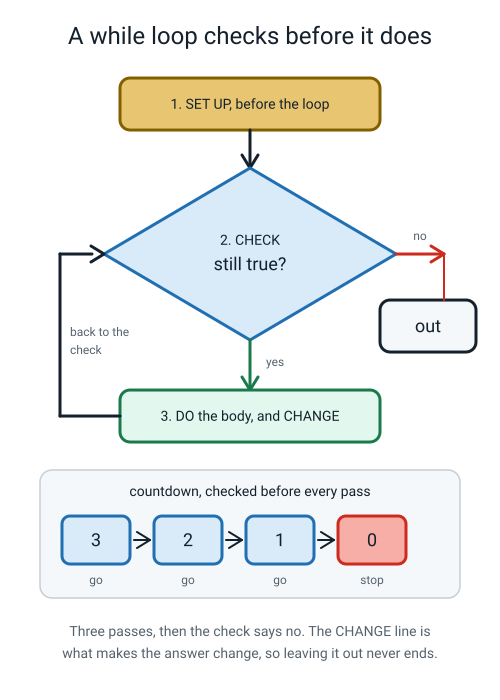
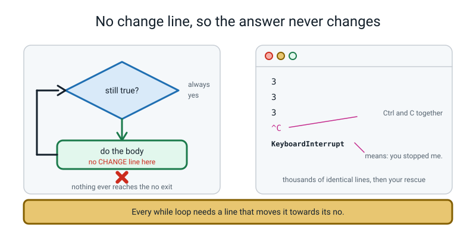
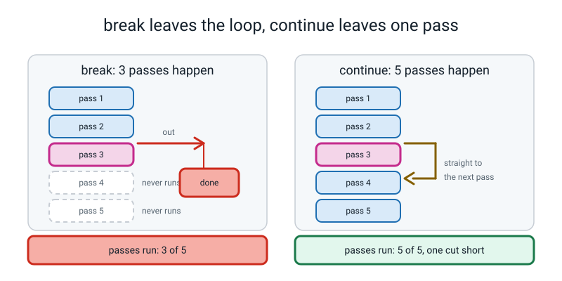
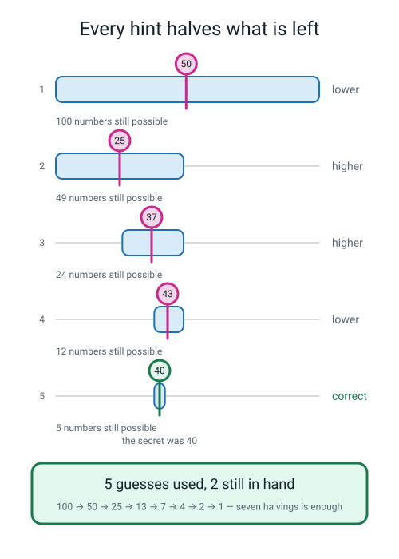
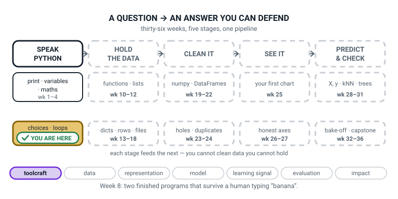

# Week 8 — Guess & Grade

[⬅ Week 7](week-07.md) · [Course Home](../README.md) · [Week 9 ➡](week-09.md) · [Student Guide](../student-guide/week-08.md) · [Workbook](../workbook/week-08.md)

---

## 📋 At a Glance

| | |
|---|---|
| **Duration** | 70 minutes |
| **Type** | 🟨 Project — two programs, one new loop, and a runaway loop stopped on purpose |
| **Big idea** | A `while` loop repeats until its condition goes `False`, which is how a program waits for a human to get it right. |
| **New vocabulary** | while loop · infinite loop · break · continue · input validation |
| **New syntax** | `while condition:` · `break` · `continue` · `random.randint(a, b)` |
| **Materials** | Printed workbook pages 8.1–8.6 · pencil · notebook open at the **Bug Log** · **last week's twelve-score index card** (88 92 70 65 100 54 78 81 47 90 62 73) · a scrap of paper for the Hook, folded, with a number on it |
| **Tech needed** | One laptop, Python 3, terminal in `~/ai-academy/level2`, editor with 4-space indent. `random` is in the standard library — **nothing to install**. |
| **Prep time** | 20 minutes the night before, 5 minutes on the day |

> **⚠️ Watch out:** you are going to write an **infinite loop on purpose** and stop it with Ctrl+C. Do this yourself, alone, the night before. It is completely safe — the loop prints text and nothing else — but the screen fills at forty thousand lines a second and it is genuinely startling the first time. **The whole point is that the student's first runaway loop happens while you are sitting next to them and nothing is at stake**, rather than at eleven o'clock at night the week their project is due. On a Mac it is **Ctrl**+C, not Command+C. Check that on their actual keyboard before the lesson.

---

## 🎯 Lesson Objectives

By the end of the lesson the student can:

1. **Write a `while` loop that stops when a condition becomes `False`**, and name its three parts: set up, check, change.
2. **Use `break` to leave a loop early and `continue` to skip one pass**, and say which one each is.
3. **Generate a random whole number in a chosen range** with `random.randint`, knowing that both ends are included.
4. **Reject bad input without the program crashing** — typing `banana` produces a message, not a traceback.
5. **Stop a runaway loop with Ctrl+C** and explain calmly why it happened.

Observable evidence: a working `guess.py` with higher/lower hints, a seven-try limit and a replay loop; a `grade.py` that reports total, average, highest and a letter grade; a written record of exactly what each program does when `banana` is typed at every single prompt; and a Bug Log entry containing a real `KeyboardInterrupt` traceback.

---

## 🧑‍🏫 What YOU Need to Know First

> **📌 About the code blocks in this guide.** Outside the **🧰 Prep Checklist** and the **🔑 Answer Key**, the blocks are **illustrations, not files** — each one carries on from the one above it, so the `import` lines and the data are typed once, in the first block that needs them. **The complete runnable files are in the Prep Checklist and the Answer Key.** If you paste an illustration on its own and get `NameError`, that is why, and nothing is broken.

**You do not need to have programmed before to teach this.** Read this once with the laptop open and type every program in it. About 30 minutes. This is a project week, which means less new material and more building — but the one new idea is a big one, and it is the first idea in this course that can make the computer misbehave.

### 1. Last week's loop counted. This week's loop waits.

A `for` loop knows how many passes it will do **before it starts the first one**. `for n in range(12)` is twelve passes, decided in advance, no matter what happens inside. That is why a `for` over a `range` can never run forever by accident.

This week's loop knows nothing of the kind.

> **while loop** — repeats a block for as long as a condition stays `True`, checking the condition **before** every pass.

```python
# countdown.py - a while loop, and the three parts every one of them needs.

countdown = 3                      # 1. SET UP  - before the loop

while countdown > 0:               # 2. CHECK   - asked BEFORE every pass
    print(countdown)
    countdown -= 1                 # 3. CHANGE  - this is what ends the loop

print("Liftoff!")                  # not indented, so it runs once, at the end
```

The real output:

```text
3
2
1
Liftoff!
```

**Trace it precisely.** This table is the whole concept, and it is worth drawing on paper with the student:

| Check number | `countdown` before the check | `countdown > 0`? | Prints | `countdown` after the pass |
|---|---|---|---|---|
| 1 | 3 | `True` | `3` | 2 |
| 2 | 2 | `True` | `2` | 1 |
| 3 | 1 | `True` | `1` | 0 |
| 4 | 0 | **`False`** | — | the loop ends |

Two things to notice, and both matter:

- **The check happens four times but the body runs three times.** The last check is the one that ends it. A `while` loop always does one more check than it does passes.
- **The condition is asked *before* the pass, never during it.** If `countdown` becomes 0 halfway through the body, the rest of the body still runs. Python does not interrupt a pass in the middle to re-check.


*Figure 8.1 — Set up, check, do-and-change, back to the check. The `no` exit is the only way out, and only the CHANGE step can get you there.*

### 2. Every `while` loop needs three things, and missing one is a bug

```text
   ┌──────────────────────────────────────────────┐
   │  1. SET UP    countdown = 3                  │   before the loop
   │  2. CHECK     while countdown > 0:           │   the condition
   │  3. CHANGE        countdown -= 1             │   inside the loop
   └──────────────────────────────────────────────┘
        Miss 1 → NameError.  Miss 3 → INFINITE LOOP.
```

- **Miss the set up** and you get `NameError: name 'countdown' is not defined` on the `while` line, because Python cannot check a box that does not exist.
- **Miss the change** and the condition's answer can never alter, so it stays `True` forever. That is the next section.
- The change does not have to be arithmetic. In `guess.py` the change is *a new guess arriving from the keyboard*, and in the replay loop it is *a flag being flipped from `True` to `False`*. What matters is that **something inside the body can move the condition towards `False`.**

### 3. `for` or `while`? One question decides it

**Can you say the number of repeats out loud before you start? If yes, `for`. If no, `while`.**

| Situation | Loop | Why |
|---|---|---|
| Print the 7 times table, 1 to 10 | `for` | Exactly ten rows, known in advance |
| Total up twelve scores off a card | `for` | Exactly twelve |
| Keep asking until the human types a number | `while` | **No idea** how many bad tries they will make |
| A guessing game until they win or run out | `while` | Depends entirely on their guesses |
| Print a 9 × 9 grid | `for` inside a `for` | 81, known in advance |

Everything in `guess.py` that waits for a human is a `while`. Everything that counts is a `for`. Both appear in this week's project and that is deliberate.

### 4. The infinite loop, and how to stop it

This is the section to read twice.

```python
# runaway.py - ON PURPOSE. The CHANGE line is missing, so this never stops.

countdown = 3

while countdown > 0:
    print(countdown)
    # the line that changes countdown is missing
```

`countdown` is 3 before the loop and it is still 3 after every pass, so `countdown > 0` is `True` forever. It prints `3` and then `3` and then `3`, as fast as the computer can manage. Measured on the machine this was written on, **redirected to a file it produced 40,960 lines in a quarter of a second.** On screen it is slower, because scrolling takes time, but it is still far too fast to read.

> **infinite loop** — a loop whose condition never becomes `False`, so it never ends on its own.

**To stop it: hold `Ctrl` and press `C` in the terminal window.** On macOS it is **Ctrl**, not Command — this is one of the few places where a Mac uses Ctrl, and it catches people. You will see something like this (the real traceback, from a real interrupted run):

```text
3
3
3
^C
Traceback (most recent call last):
  File "/Users/you/ai-academy/level2/runaway.py", line 6, in <module>
    print(countdown)
KeyboardInterrupt
```

**Read that traceback carefully, because it is a friendly one.**

- `^C` is the terminal showing you that it received your interrupt.
- The `File` and line number tell you **where the program was when you stopped it** — which is nearly always inside the runaway loop, and is therefore a genuine clue.
- `KeyboardInterrupt` is not a bug in the code. It means **"a human stopped me."** It is the one traceback in this entire course that means you did something right.


*Figure 8.2 — With nothing in the body moving the condition, the `no` exit can never be reached. Ctrl+C is a door in the wall.*

**Three things to tell the student, in this order:**

1. **It is not dangerous.** Nothing is broken, nothing is lost, no file is damaged. A loop printing text is the least harmful thing a computer can do.
2. **It is not rare.** Every programmer alive does this, and most of them still do it occasionally after twenty years.
3. **The fix is always the same question: what in the body was supposed to move the condition, and why didn't it?**

And one honest caution for you: if the terminal has scrolled thousands of lines, the useful output from *before* the loop is now far above. `Ctrl+L` clears the screen, or just close the terminal tab and open a new one. That is not a defeat; it is housekeeping.

### 5. `break` and `continue` — two words that change the flow

> **break** — leave the loop immediately. Skip every remaining pass.
> **continue** — skip the rest of *this* pass only, and go straight to the next check.

The distinction is the thing students get wrong, so here are both, run for real.

**`break` — stop as soon as you have found what you want:**

```python
for n in range(1, 100):
    if n * n > 500:
        print(f"the first square over 500 is {n} x {n} = {n * n}")
        break
```

```text
the first square over 500 is 23 x 23 = 529
```

Check it: 22 × 22 = 484, which is not over 500; 23 × 23 = 529, which is ✔. Without the `break` it would carry on to 99 and print seventy-six more lines, all of them useless.

**`continue` — skip the ones you do not care about:**

```python
for n in range(1, 11):
    if n % 2 == 0:
        continue              # even? skip the print, go to the next n
    print(n, end=" ")
print()
```

```text
1 3 5 7 9 
```

Ten passes happened. Five of them printed nothing. **`continue` does not reduce the number of passes; it cuts one pass short.**


*Figure 8.3 — `break` takes the whole loop off the table. `continue` throws away the rest of one pass and comes straight back for the next.*

The sentence worth memorising, and it is short: **`break` ends the loop. `continue` ends the pass.**

Two facts you will need:

- Both work in `for` loops and `while` loops, identically.
- Both must be **inside** a loop. `break` at the margin gives you `SyntaxError: 'break' outside loop`, which is Python telling you it has nothing to break out of.

### 6. `random.randint` — and why seven tries is exactly fair

```python
import random                     # the toolbox with the dice in it
print(random.randint(1, 6))
```

> **`random.randint(a, b)`** — hands back a whole number between `a` and `b`. **Both ends are included**, unlike `range`, which excludes the stop.

That inconsistency is genuinely annoying and worth saying out loud rather than hoping nobody notices: `range(1, 6)` gives 1–5, and `random.randint(1, 6)` gives 1–6. They are different tools written by different people at different times. **`randint` includes both ends. Say it, write it in the vocabulary box, move on.**

One real run of five dice rolls (yours will be different — that is the entire point of the tool):

```text
roll 1: 5
roll 2: 6
roll 3: 3
roll 4: 4
roll 5: 6
```

Two things to know before a student trips you:

- `random.randint(100, 1)` — the arguments backwards — is an error, and an ugly one. The real message ends `ValueError: empty range for randrange() (100, 2, -98)`. Explain it as "you asked for a number between 100 and 1, and there aren't any, because 100 is bigger."
- `import random` must be at the **top** of the file, and without it you get `NameError: name 'random' is not defined`. That is not the computer being fussy: `random` is not part of the language you have been using; it is a toolbox you have to ask for.

**Why seven tries?** Because if you always guess the middle of what is left, seven guesses always cover 1–100:

```text
   100 numbers → 50 → 25 → 12 → 6 → 3 → 1
     guess 1     2    3    4    5   6   7
```

Each guess halves the possibilities. Six halvings take 100 down to 1 possible number, and a seventh guess names it. **Seven is not a random choice of limit; it is exactly enough for a player who plays well, and not enough for a player who guesses randomly.** That makes the game fair and it makes the limit teachable.


*Figure 8.4 — Each hint does not just say higher or lower; it deletes half the remaining numbers. The window closes in.*

### 7. Input validation — the thing that makes it a real program

> **input validation** — checking what the user typed *before* using it, and refusing it politely if it is not usable.

Here is why it matters. This program is one line long and it crashes:

```python
score = int(input("Score? "))
print(score)
```

Type `banana`:

```text
Score? banana
Traceback (most recent call last):
  File "/Users/you/ai-academy/level2/b2.py", line 1, in <module>
    score = int(input("Score? "))
ValueError: invalid literal for int() with base 10: 'banana'
```

`ValueError` means: *the type was right (you gave me text, which is what `int` takes) but the value was wrong (that text isn't a number).* The program stops dead, mid-sentence, and the user sees five lines of red that mean nothing to them.

**The tool is `.isdigit()`.** It is a question you can ask a piece of text: *is every single character in you a digit from 0 to 9?* It hands back `True` or `False`, and it never crashes.

```python
typed = input("Guess? ").strip()
if not typed.isdigit():
    print("  Whole numbers only.")
```

Two supporting details, both one line each:

- **`.strip()`** removes spaces from both ends of what the user typed. It matters more than it sounds: `"  42  ".isdigit()` is **`False`**, because a space is not a digit, and a student who types a space before their number gets rejected for no visible reason. Real proof — run these three lines yourself:

  ```python
  messy = "  42  "                                        # what a real user types
  print("  without strip:", repr(messy), messy.isdigit())
  print("  with strip   :", repr(messy.strip()), messy.strip().isdigit())
  ```

  ```text
    without strip: '  42  ' False
    with strip   : '42' True
  ```

- **The pattern is always: keep it as text, check it, and only then convert.** `int()` goes *after* the check, never before. For anything typed on an ordinary keyboard, once `.isdigit()` has said `True`, `int()` will not fail. (Teacher only: a few exotic characters such as `²` are "digits" to `.isdigit()` but crash `int()`. A student will not meet them by accident.)

**And now the honest limitation, which you must not hide.** `.isdigit()` is `False` for `-5`, and `False` for `85.5`, because the minus sign and the dot are not digits. So a student typing `-5` gets the message "whole numbers only", which is slightly wrong and mildly confusing. **Tell them this is a real flaw in their program, not a mystery.** The proper fix needs tools this course meets later. What matters today is that the program **does not crash**, and a wrong-but-clear message beats a traceback every time.

### 8. Flags — a variable whose whole job is `True` or `False`

`guess.py` needs two of these and they will look strange the first time.

```python
# flag.py - a flag is a variable that holds True or False and steers a loop.

won = False                      # the flag starts False
tries = 0

while tries < 3 and not won:     # two conditions joined with and
    tries += 1
    print(f"try {tries}")
    if tries == 2:
        won = True               # flipping the flag is what ends the loop

print(f"finished after {tries} tries, won = {won}")
```

```text
try 1
try 2
finished after 2 tries, won = True
```

The loop had three tries available and used two, because setting `won = True` made the check fail. **A flag is a change step made of a decision instead of arithmetic.** In `guess.py`, `won` ends the current game and `playing` ends the whole session.

Say this to a student who asks why not just use `break`: **you could, and `break` would be fine here.** The flag has one advantage — the condition at the top of the loop tells you *both* reasons the loop can end, in one readable line: `while tries_used < MAX_TRIES and not won:`. With a `break` in the middle, one of the two reasons is hidden ten lines down. Both are correct; this course uses the flag for the game and `break` for the "stop as soon as you find it" jobs.

### 9. The three misconceptions you will actually meet

**Misconception 1 — "the loop checks the condition all the time."** A student believes that the moment `won` becomes `True`, the loop stops instantly, mid-body. It does not. **The check happens at the top, between passes, and nowhere else.** The fix: put a `print` after the line that flips the flag and watch it still run.

**Misconception 2 — "`continue` skips the next pass."** It skips the **rest of this** pass. The fix is a count: run the `continue` example, then ask how many passes happened. Ten. Five printed. `continue` did not remove any passes.

**Misconception 3 — "an infinite loop means the computer is broken."** It means one variable is not changing. The fix is to cause one on purpose, stop it with Ctrl+C, then find the missing line together — which is exactly what minute 24 of this lesson is for.

### 10. How deep to go, and where to stop

**Go this far:** `while` with its three parts · the trace table · `for` versus `while` as one question · causing and stopping an infinite loop · `break` versus `continue` in one sentence each · `random.randint` including both ends · `.isdigit()` and `.strip()` as tools · a flag as a change step · a nested loop where the outer one is the replay and the inner one is the game.

**Stop before:** `try` / `except` (that is the real fix for bad input and it is not in this course) · `while True:` with a `break` as the standard idiom (correct, common, and one abstraction too far today) · `random.choice`, `random.shuffle`, `random.seed` (all lovely, all Week 29 or later) · anything about how random numbers are actually generated — the honest answer is "they are not really random, and that is a genuinely interesting subject for another day."

**If a student asks whether the computer's number is really random:** the truthful answer in one sentence is *"no — it is calculated from a starting value, so it is predictable if you know that value, but it is unpredictable enough for a guessing game."* If they want more, that is Week 29's `random_state=42`, and telling them a real thing they will meet again in five months is much better than a fudge.

---

### 11. 🧭 The Growing Map — and why it has not moved

The student guide's **Where This Fits** figure appears every week with one more piece filled in. This
week it is *deliberately identical to last week's*, and that is the teaching point.



*Figure 8.0 — Week 8's version. Same gold tile as Week 7, because `choices · loops` covers Weeks 5–9.
Stage one's first tile stays white; everything from stage two onwards is still dashed.*

**How to run it, in about two minutes:**

1. **Show it and let someone notice.** Ask *"what's different from last week?"* The answer is
   **nothing**, and when somebody says so, agree loudly. Then: *"so what did we actually add today, if
   the box didn't move?"* — a loop that waits for a person instead of counting.
2. **Draw the distinction on the board in four words:** `for` counts · `while` waits. Ask which of the
   two the guessing game needed and why. That is the only thing from today worth checking.
3. **Two minutes of copying.** They add "waits" to their own pencil map. A five-week tile means five
   weeks of small additions to the same box, which is exactly how the year really feels.

> **🧑‍🏫 Why this is worth two minutes.** A map that sometimes does not change is more honest than one
> that always does, and it pre-empts the complaint that the course is "going slowly". One tile, five
> weeks, four genuinely different skills inside it. Saying that out loud once is worth a lot.

> **⚠️ Watch out:** resist the temptation to tint or badge anything extra to make the week feel
> productive. Dashed means **not yet** and nothing else, and the map only works because it never lies.

---

## 🧰 Prep Checklist

### 20 minutes the night before

- [ ] **Print workbook pages 8.1–8.6.**
- [ ] **Write a number between 1 and 100 on a scrap of paper and fold it.** This is the Hook. You will play the guessing game by hand before any code appears. Pick something that is not 50 and not a round number — 37, 63, 82.
- [ ] **Keep last week's twelve-score index card.** `grade.py` uses the same twelve numbers, and the fact that the total is still 900 and the average still 75 is a real check on a program that has changed shape completely.
- [ ] **Cause an infinite loop and stop it. This is the most important two minutes of prep this term.** Type this file exactly:

  ```python
  # runaway.py - ON PURPOSE. The CHANGE line is missing, so this never stops.

  countdown = 3

  while countdown > 0:
      print(countdown)
      # the line that changes countdown is missing
  ```

  Run it with `python3 runaway.py`. Watch the screen fill. **Count to three out loud, then hold Ctrl and press C.** The exact expected result (the path will be yours):

  ```text
  3
  3
  3
  ^C
  Traceback (most recent call last):
    File "/Users/you/ai-academy/level2/runaway.py", line 6, in <module>
      print(countdown)
  KeyboardInterrupt
  ```

  **Do it twice.** The second time, notice that your heart rate is normal. That is the state you need to be in when it happens to the student.
- [ ] **Confirm Ctrl+C on the student's actual keyboard**, on their actual machine. Mac, Windows and Linux all use Ctrl. If they are on a Mac and reach for Command+C, nothing will happen except a copy, and in a panic that feels like the machine has stopped responding.
- [ ] **Type and run the two-line countdown and the `break` and `continue` examples** from sections 1 and 5. Check you get `3 2 1 Liftoff!`, `the first square over 500 is 23 x 23 = 529`, and `1 3 5 7 9`.
- [ ] **Run the full `guess.py`** from the Activity section, once, and actually play it. Notice that you have to guess sensibly to win in seven. Then **type `banana` at a guess prompt** and confirm you get `Whole numbers only. That try was free.` and that the try counter did not move.
- [ ] Say the big idea out loud: *"a `for` loop counts; a `while` loop waits — and the thing inside it had better move the condition."*

### 5 minutes on the day

- [ ] Terminal open in `~/ai-academy/level2`. Run last week's `scores.py` once with four numbers — ten seconds, and it proves the setup still works.
- [ ] Editor open, 4-space indent confirmed.
- [ ] `runaway.py` **saved and ready but not run.** You want it there at minute 24, not typed under pressure.
- [ ] The folded paper with your secret number, on the table.
- [ ] Last week's index card, and the notebook open at the Bug Log.
- [ ] **Know where the terminal's "new tab" is.** After the runaway loop the scrollback will be full of threes.

### Fallback if the laptop or the install fails

| If this fails | Do this instead |
|---|---|
| **No laptop** | Play the whole of `guess.py` on paper, twice. **First:** you hold the number, they guess, and they write each guess in a column with the hint next to it and *how many numbers are still possible* — which is Figure 8.4, drawn by hand. **Then swap**: they hold the number and **you** are the program, and you follow the rules stupidly and literally, including asking for an eighth guess if the rule says `<=`. Playing the machine badly on purpose teaches the off-by-one better than a screen does. |
| **Python not installed** | The paper version above plus the trace tables on page 8.1 is a complete 70-minute lesson. Do the install afterwards. |
| **The student is frightened by the runaway loop** | Stop. Do it again, together, with your hand next to theirs on the Ctrl key, and this time **you** count the seconds out loud so they know when it will end. Then a third time where *they* choose when to stop it. Control is the cure for fear, and three goes is usually enough. |
| **Ctrl+C does not stop it** | Very occasionally the terminal is not listening. Close the terminal tab entirely — the program dies with it. Then check they are pressing Ctrl and not Command, and that the terminal window (not the editor) has focus. |
| **The whole thing is done in twenty minutes** | Go to the harder variations: the difficulty menu, the warmer/colder hint, and the histogram in `grade.py`. All three need only this week's syntax. |

---

## ⏱️ The Lesson, Minute by Minute

| Segment | Minutes | Running total | What happens |
|---|---|---|---|
| 🪝 Hook — I'm Thinking of a Number | 7 | 7 | The game played by hand, and the seven counted |
| 🧠 Concept — The Loop That Waits | 16 | 23 | `while`, the three parts, `break`, `continue`, `randint` |
| 💻 Live-Code Together — Build It, Break It, Cap It | 18 | 41 | Two deliberate mistakes: a runaway loop, then an eighth guess |
| 🎲 Their Turn — Finish It, Then Feed It a Banana | 20 | 61 | Validation, replay, and `grade.py` started |
| 🔑 Wrap & Assign | 9 | 70 | Three checks, Bug Log, homework |

---

### 🪝 Hook — I'm Thinking of a Number (7 minutes)

**Do this:** laptop closed. The folded paper in your hand.

**Say this:**

> "I've written a number on this paper. It's between one and a hundred, including both. You're going to guess it, and every time you guess I'll tell you 'higher' or 'lower'. **And I'm going to count your guesses.**
>
> Go."

Play it. Write each guess in a column on paper as they say it, with the hint beside it. Say nothing else — do not coach.

Most students will start at 50 whether or not they know why. Some will start at 1. Both are fine and both are instructive.

When they get it, unfold the paper and show them.

**Say this:**

> "How many did you take?"

(Five? Six?)

> "Right. Now the question I actually care about. **What is the largest number of guesses this game could ever need, if you play as well as it is possible to play?**"

Let them think. Push a little:

> "Start again. Suppose I said 'higher' to your fifty. How many numbers are still possible?"

(Fifty. 51 to 100.)

> "And if you now guess seventy-five and I say lower?"

(Twenty-four: 51 to 74. Close enough to half of fifty.)

> "So every good guess **halves** what's left. Watch."

Write this up:

```text
   100 numbers → 50 → 25 → 12 → 6 → 3 → 1
     guess 1     2    3    4    5   6   7
```

> "Seven. Six halvings take a hundred down to one possible number, and guess 7 names it, so a hundred numbers can *always* be caught in seven guesses. Never eight. Which is why the game you are about to write gives the player exactly seven — **enough if you're clever, not enough if you're careless.** That's what makes a game fair.
>
> Now here's the thing that stops us just using last week's loop. Last week every loop was `for something in range(...)`, and every one of those knew how many times it would go round *before it started*. Twelve scores: twelve passes. Nine rows: nine passes.
>
> How many passes does this game need?"

(You don't know. It depends.)

> "You have absolutely no idea. It might be one, if they're lucky. It might be seven. **You cannot write down the number of passes, because it doesn't exist yet — it depends on what a human does.** So you need a different kind of loop: one that doesn't count, but waits. That's today."

**Ask this:**

| Ask | Answer you want | If they say something else |
|---|---|---|
| "Why did you start at 50?" | Because it splits the range in half, whatever the answer is. | If they started at 1, ask "how many numbers did that rule out?" (One.) Then "and how many did 50 rule out?" (Fifty.) They will re-derive it themselves. |
| "How many numbers are left after 'higher than 50'?" | Fifty. | If they say 49 or 51, count the ends carefully together. It is 51 to 100, which is fifty numbers. Getting this right *is* the boundary practice from Week 5. |
| "What's the most guesses this game can need?" | Seven, playing well. | If they say a hundred — right, if you guess one at a time. Then ask what the *best* player would need. |
| "How many passes does the loop need?" | You cannot know in advance. | This is the whole point. If they name a number, ask "what if they get it first go?" |
| "What ends this game?" | Getting it right, **or** running out of tries. | Two ways out, and noticing that there are two is what makes the loop's condition make sense later. |

---

### 🧠 Concept — The Loop That Waits (16 minutes)

**Do this:** editor open, empty file called `countdown.py`.

**Say this — part 1, the shape:**

> "Here's the new loop, and it's three lines. Type it with me."

```python
countdown = 3                      # 1. SET UP  - before the loop

while countdown > 0:               # 2. CHECK   - asked BEFORE every pass
    print(countdown)
    countdown -= 1                 # 3. CHANGE  - this is what ends the loop

print("Liftoff!")                  # not indented, so it runs once, at the end
```

Run it:

```text
3
2
1
Liftoff!
```

> "Read the `while` line out loud as English. 'While countdown is greater than zero, do this.' That is genuinely what it means — there is no trick in the word.
>
> But I want you to be much more precise than that, because 'while' in English is vague and this is not. Python does this: **check the condition. If it's `True`, run the whole indented block. Then come back and check again.** Check, run, check, run, check — and the first time the check says `False`, it stops and carries on below.
>
> So let's count something. How many times did it print?"

(Three.)

> "How many times did it *check*?"

Let them work it out. The answer is four, and it is worth every second it takes.

> "Four. Three checks said yes and one said no, and the one that said no is the one that ended it. **A while loop always checks one more time than it runs.** Write that down."

Draw the trace table on paper, filling it in with them:

| Check | `countdown` before | `countdown > 0`? | Prints | after |
|---|---|---|---|---|
| 1 | 3 | `True` | `3` | 2 |
| 2 | 2 | `True` | `2` | 1 |
| 3 | 1 | `True` | `1` | 0 |
| 4 | 0 | **`False`** | — | ends |

Show Figure 8.1.

**Say this — part 2, the three parts and the danger:**

> "Every single `while` loop you will ever write has three parts, and if you miss one you have a bug. **Set up**, before the loop — the box has to exist. **Check** — the condition. And **change** — something in the body has to move that condition towards `False`.
>
> That third one is new and it is entirely your job. Python will not do it for you and it will not warn you. Look at my file: what's moving `countdown` towards zero?"

(The minus-one line.)

> "That line and nothing else. Take it out and the condition can never change, so it stays `True`, so the loop never ends. That's called an **infinite loop**, and I'm going to show it to you in about ten minutes because it is going to happen to you by accident and I would much rather it happened here first."

**Say this — part 3, `break` and `continue`:**

> "Two more words, and one sentence each. Type both of these."

```python
for n in range(1, 100):
    if n * n > 500:
        print(f"the first square over 500 is {n} x {n} = {n * n}")
        break
```

```text
the first square over 500 is 23 x 23 = 529
```

> "**`break` leaves the loop.** Immediately. That loop was set up to do ninety-nine passes and it did twenty-three, because as soon as it had the answer there was no reason to carry on. Without the `break` it would have printed seventy-six more lines, all of them useless."

```python
for n in range(1, 11):
    if n % 2 == 0:
        continue              # even? skip the print, go to the next n
    print(n, end=" ")
print()
```

```text
1 3 5 7 9 
```

> "**`continue` leaves the pass.** How many passes happened in that loop?"

(Ten.)

> "Ten. All ten. Five of them printed nothing, because `continue` threw away the rest of *that pass* and went straight back to the top. It didn't cancel any passes. Say the two sentences back to me."

(break ends the loop; continue ends the pass.)

Show Figure 8.3.

**Say this — part 4, the dice:**

> "Last thing. The computer needs to pick the secret number, and it has to be a number neither of us knows. That needs a tool that isn't part of the language you've been using, so we have to ask for it."

```python
import random
print(random.randint(1, 6))
```

Run it four or five times. Different numbers.

> "`import random` at the very top of the file. That's you saying 'I'd like the toolbox with the dice in it, please.' Forget it and you get `NameError: name 'random' is not defined` — which is the same message you get for a misspelled variable, because as far as Python is concerned that is exactly what `random` is until you import it.
>
> And one annoying thing that you should be annoyed about. `randint(1, 6)` gives you one to six — **both ends included.** But `range(1, 6)` gives you one to five. Two tools, two different rules, and there is no clever reason; they were written by different people at different times. **`randint` includes both ends.** Write it in your vocabulary box."

**Ask this:**

| Ask | Answer you want | If they say something else |
|---|---|---|
| "What are the three parts of a `while` loop?" | Set up before · check the condition · change something inside. | Make them say all three. Missing the third is *the* bug of the week. |
| "How many times does a `while` loop check, if it runs three passes?" | Four. | If they say three, walk the trace table again. The last check is the one that ends it. |
| "What ends the countdown loop?" | The `countdown -= 1` line, eventually making the check `False`. | If they say "the zero" — closer. Ask what put the zero there. |
| "`break` or `continue` — which one ends the loop?" | `break`. | If they mix them up, run both examples again and count the passes out loud. |
| "How many passes happened in the `continue` example?" | Ten. Five printed. | This is Misconception 2. Have them add a `print("pass")` at the top of the body and count. |
| "`random.randint(1, 6)` — can it give you 6?" | Yes. Both ends included. | If they say no, run it twenty times in a loop and watch a 6 appear. |

---

### 💻 Live-Code Together — Build It, Break It, Cap It (18 minutes)

**Do this:** the student types every character. Three passes, and **two deliberate mistakes you make and fix in front of them.**

#### Pass 1 (6 min) — ⚠️ **DELIBERATE MISTAKE #1**, the runaway loop

**Say this:**

> "New file, `guess.py`. We're going to write the guessing game, and I'm going to get it wrong the first time on purpose, because what happens next is something you need to have seen while I'm sitting here."

**Exact keystroke sequence.** Type these lines in this order, saying each out loud:

```python
# guess.py - version 1. This one has a bug in it on purpose.

import random

secret = random.randint(1, 100)        # the secret, chosen once, before the loop
guess = 0                              # 0 is not in 1-100, so the CHECK is True at first

while guess != secret:                 # CHECK: keep going while the guess is wrong
    if guess < secret:
        print("  Higher.")
    else:
        print("  Lower.")
```

Now, before running it, ask:

> "Before I press Enter. Where in that loop does `guess` change?"

Give them five seconds. Some students will spot it. Most will not.

> "Watch."

Run it. The screen fills with `  Higher.` at thousands of lines a second — `guess` is 0, the secret is at least 1, so `guess < secret` is `True` every single time.

**Say this — over the noise, calmly:**

> "That's an infinite loop. Nothing is broken. Nothing is lost. Watch me stop it: **Ctrl** — not Command — **and C.**"

Press Ctrl+C. The real result (thousands of lines, then):

```text
  Higher.
  Higher.
  Higher.
^C
Traceback (most recent call last):
  File "/Users/you/ai-academy/level2/guess.py", line 10, in <module>
    print("  Higher.")
KeyboardInterrupt
```

> "Right. Three things about what just happened, and then you're going to do it yourself.
>
> **One: `KeyboardInterrupt` means 'a human stopped me.'** It's the only message in this whole course that means you did something *right*. Python isn't complaining.
>
> **Two: the line number is a real clue.** It's telling you where the program was when I interrupted it — inside the loop, which is exactly where the problem is.
>
> **Three: why did it happen?** Say the three parts of a while loop."

(Set up, check, change.)

> "Which one is missing?"

(The change.)

> "The change. `guess` is zero before the loop and it is still zero after every pass, because nothing in the body touches it. So `guess != secret` is `True` forever. **Now you do it.** Run it, count to three, and stop it yourself."

**Have them cause it and stop it, themselves, at least once.** This is not optional. A student who has only watched you do it will panic the first time it happens alone.

Then fix it together — the input line goes *inside* the loop:

```python
# guess.py - version 2. Keep asking until the guess is right.

import random

secret = random.randint(1, 100)        # the secret, chosen once, before the loop
guess = 0                              # 0 is not in 1-100, so the CHECK is True at first

while guess != secret:                 # CHECK: keep going while the guess is wrong
    guess = int(input("Guess? "))      # CHANGE: a new guess every pass
    if guess < secret:
        print("  Higher.")
    elif guess > secret:
        print("  Lower.")

print(f"Correct. The number was {secret}.")
```

One real run (the secret is random, so yours will differ — this one happened to be 40):

```text
Guess? 50
  Lower.
Guess? 25
  Higher.
Guess? 37
  Higher.
Guess? 43
  Lower.
Guess? 40
Correct. The number was 40.
```

> "One line moved from nowhere to inside the loop, and now the loop can end. **That line is the change step.**"

#### Pass 2 (6 min) — ⚠️ **DELIBERATE MISTAKE #2**, the eighth guess

**Say this:**

> "Now the seven-try limit. And I'm going to make a mistake that has no error message at all, so you'll have to catch it by counting — which is exactly what you did last week."

Type this, with `<=`:

```python
import random
MAX_TRIES = 7
secret = random.randint(1, 100)
tries_used = 0

while tries_used <= MAX_TRIES:              # <-- the planted off-by-one
    guess = int(input(f"Guess {tries_used + 1}: "))
    tries_used += 1
    if guess == secret:
        print("  Correct.")
        break
    elif guess < secret:
        print("  Higher.")
    else:
        print("  Lower.")

print(f"Tries used: {tries_used}")
```

**Say this:**

> "Before we run it: how many prompts should appear if I guess wrong every single time?"

(Seven.)

> "Seven. Now type 1, 2, 3, 4, 5, 6, 7, 8 — deliberately wrong every time — and **count the prompts.**"

The real run:

```text
Guess 1:   Higher.
Guess 2:   Higher.
Guess 3:   Higher.
Guess 4:   Higher.
Guess 5:   Higher.
Guess 6:   Higher.
Guess 7:   Higher.
Guess 8:   Higher.
Tries used: 8
```

> "How many?"

(Eight.)

> "Eight. Nothing crashed. It even printed 'Tries used: 8' quite cheerfully. **Where's the extra one coming from?** Read the condition to me."

(While tries used is less than **or equal to** seven.)

> "So when `tries_used` is exactly seven, is the check true?"

(Yes.)

> "So it goes round again — an eighth time. `<=` means 'seven is still allowed', and it shouldn't be, because by then they have already had seven. One character."

Change `<=` to `<` and run it again with the same eight numbers:

```text
Guess 1:   Higher.
Guess 2:   Higher.
Guess 3:   Higher.
Guess 4:   Higher.
Guess 5:   Higher.
Guess 6:   Higher.
Guess 7:   Higher.
Tries used: 7
```

> "Seven. **And notice what found it: counting, not reading.** `while tries_used <= MAX_TRIES:` is a perfectly reasonable-looking line. There is nothing to *see*. There is only something to count."

#### Pass 3 (6 min) — the banana

**Say this:**

> "Last pass. Type `banana` at the prompt."

Do it. The real result:

```text
Guess 1: banana
Traceback (most recent call last):
  File "/Users/you/ai-academy/level2/guess.py", line 7, in <module>
    guess = int(input(f"Guess {tries_used + 1}: "))
ValueError: invalid literal for int() with base 10: 'banana'
```

> "Read the last line. `ValueError`. What's it telling you?"

(banana isn't a number.)

> "`ValueError` means the *kind* of thing was right — I gave `int` a piece of text, which is what it takes — but the *value* was wrong, because that text isn't a number. And the program stopped dead. A real person playing your game just got five lines of red and lost their game.
>
> The fix is a habit, and it's the same one every time: **keep it as text, check it, and only then convert.** Watch."

Type the hardened version:

```python
import random
MAX_TRIES = 7
secret = random.randint(1, 100)
tries_used = 0

while tries_used < MAX_TRIES:
    typed = input(f"Guess {tries_used + 1}: ").strip()   # keep it as text for now
    if not typed.isdigit():                              # every character a digit?
        print("  Whole numbers only. That try was free.")
        continue                                         # skip the rest of this pass
    guess = int(typed)                                   # safe now
    tries_used += 1
    if guess == secret:
        print("  Correct.")
        break
    elif guess < secret:
        print("  Higher.")
    else:
        print("  Lower.")

print(f"Tries used: {tries_used}")
```

Real run, typing `banana`, then `-5`, then playing properly (secret was 40):

```text
Guess 1: banana
  Whole numbers only. That try was free.
Guess 1: -5
  Whole numbers only. That try was free.
Guess 1: 50
  Lower.
Guess 2: 25
  Higher.
Guess 3: 37
  Higher.
Guess 4: 43
  Lower.
Guess 5: 40
  Correct.
Tries used: 5
```

**Say this:**

> "Three things to notice, and the third one is a confession.
>
> **One: the prompt stayed on 'Guess 1' for the first three lines.** That's the `continue` doing its job — the rest of that pass, including the `tries_used += 1`, got skipped. The bad input genuinely cost them nothing.
>
> **Two: it didn't crash.** A person typing nonsense gets a sentence, not a traceback.
>
> **Three, and this is a real flaw in our program, not a mystery:** look at what happened to `-5`. It said 'whole numbers only', which isn't quite true — minus five *is* a whole number. `.isdigit()` is only `True` when every single character is a digit from 0 to 9, and a minus sign isn't. So negative numbers get a slightly wrong message. **We are choosing to live with that today**, because the important thing is that it doesn't crash. Write that limitation in your Bug Log. Knowing where your program is weak is worth more than pretending it isn't."

---

### 🎲 Their Turn — Finish It, Then Feed It a Banana (20 minutes)

Full instructions in the next section. In the lesson flow:

- **Minutes 0–10:** finish `guess.py` — the win/lose report and the replay loop.
- **Minutes 10–15:** the banana test, at every prompt, written down.
- **Minutes 15–20:** start `grade.py` with last week's twelve scores.

---

### 🔑 Wrap & Assign (9 minutes)

**Do this:** laptops shut. Notebook open at the Bug Log.

**Say this:**

> "Bug Log first, two minutes, while it is fresh. And **one of your two entries has to be the `KeyboardInterrupt`** — copy the real traceback in, with the line number. Write next to it that the traceback was not a bug in your code; it was where the program happened to be when you stopped it. That distinction is the reason you will not panic next time."

Give them the two minutes in silence. Then the three checks from **✅ Assessing Understanding** below, word for word.

Then the homework, using the script in **📤 Homework to Assign**. Frame it in two sentences:

> "The build is the big part — `guess.py` finished, and `grade.py` tested on the twelve numbers off your card **first**, because you already know the answer is 900 and 75 and that means you cannot fool yourself.
>
> And one habit to take away. **Every time you finish writing a `while` line, say out loud 'and the thing that ends this loop is…' and point at the line.** If your finger hovers, you have just written an infinite loop and you know it before you press Enter. Two seconds, every time."

**Ask this, as they pack up:**

| Ask | Answer you want | If they say something else |
|---|---|---|
| "What are the three parts of a `while` loop?" | Set up · check · change. | Make them say all three. This is the last thing they should hear today. |
| "What key stops a runaway loop, and is it a bug?" | Ctrl+C, and no — `KeyboardInterrupt` means a human stopped it. | If they say Command+C, correct it now, not next week. |
| "Why does the check come before `int()`?" | Because `int()` is the thing that crashes. Once it has crashed there is nothing left to check. | If they hesitate, one word: `banana`. |

---

## 🎲 The Activity, In Full

### Setup

**On the table:** the laptop · workbook pages 8.4 and 8.5 · page 8.6 (Bug Log) · **last week's twelve-score index card** · a pencil.

**On the screen:** the hardened `guess.py` from the live-code, saved and working. They are about to finish it, not restart it.

### Part 1 — Finish `guess.py` (10 minutes)

Two things are missing: a proper ending, and a replay loop.

**Say this:**

> "Two jobs. First, the game needs to end properly — it should say whether they won, how many tries they took, and if they lost it should tell them the number, because a game that keeps a secret after it's over is just annoying. Second, it should offer another go.
>
> The replay is the interesting one. **A whole game is going to sit inside another loop.** The outer loop's condition is 'are we still playing?', and the inner loop's condition is 'does this game still have life in it?' Two loops, one inside the other, exactly like last week's grid — except these two wait instead of counting."

The complete file. This is what "finished" looks like:

```python
# guess.py - guess the secret number in 7 tries, then play again if you like.

import random                                  # the toolbox with the dice in it

LOW = 1                                        # the smallest number I might pick
HIGH = 100                                     # the largest number I might pick
MAX_TRIES = 7                                  # six halvings plus a final guess always cover 1 to 100

wins = 0                                       # accumulator: games won
games = 0                                      # accumulator: games played
playing = True                                 # the flag that keeps the outer loop going

print("=" * 40)
print("  GUESS THE NUMBER")
print(f"  I am thinking of a number from {LOW} to {HIGH}.")
print(f"  You get {MAX_TRIES} tries.")
print("=" * 40)

while playing:                                 # OUTER loop: one pass = one whole game
    secret = random.randint(LOW, HIGH)         # both ends included
    tries_used = 0                             # counter, reset for every new game
    won = False                                # flag: has this game been won yet?
    games += 1

    print(f"--- Game {games} ---")

    while tries_used < MAX_TRIES and not won:  # INNER loop: one pass = one guess
        left = MAX_TRIES - tries_used          # how many tries are still in hand
        typed = input(f"Guess ({left} left): ").strip()

        if not typed.isdigit():                # isdigit() is True only for 0-9
            print("  Whole numbers only. That try was free.")
            continue                           # skip the rest of THIS pass

        guess = int(typed)                     # safe now: every character is a digit

        if guess < LOW or guess > HIGH:
            print(f"  Stay between {LOW} and {HIGH}. That try was free.")
            continue

        tries_used += 1                        # only a real guess costs a try

        if guess == secret:
            won = True                         # this makes the CHECK say no next time
        elif guess < secret:
            print("  Higher.")
        else:
            print("  Lower.")

    if won:
        wins += 1
        print(f"Correct. The number was {secret}, in {tries_used} of {MAX_TRIES} tries.")
    else:
        print(f"Out of tries. The number was {secret}.")

    print(f"Record: {wins} won of {games} played")

    answer = ""                                # empty, so the check below is True once
    while answer != "yes" and answer != "no":  # keep asking until it is one of the two
        answer = input("Play again? (yes/no) ").strip().lower()
        if answer != "yes" and answer != "no":
            print("  Please type yes or no.")

    if answer == "no":
        playing = False                        # ends the OUTER loop

print(f"Final record: {wins} of {games}. Thanks for playing.")
```

One real run — typing `fifty`, then `500`, then playing properly, then `maybe`, then `no`. The secret happened to be 40:

```text
========================================
  GUESS THE NUMBER
  I am thinking of a number from 1 to 100.
  You get 7 tries.
========================================
--- Game 1 ---
Guess (7 left): fifty
  Whole numbers only. That try was free.
Guess (7 left): 500
  Stay between 1 and 100. That try was free.
Guess (7 left): 50
  Lower.
Guess (6 left): 25
  Higher.
Guess (5 left): 37
  Higher.
Guess (4 left): 43
  Lower.
Guess (3 left): 40
Correct. The number was 40, in 5 of 7 tries.
Record: 1 won of 1 played
Play again? (yes/no) maybe
  Please type yes or no.
Play again? (yes/no) no
Final record: 1 of 1. Thanks for playing.
```

**Four things to point at, in this order:**

1. **`(7 left)` stayed at 7 for the first three lines.** Two rejected inputs cost nothing. That is `continue`, visible.
2. **There are three `while` loops in this file.** The replay loop, the game loop, and the yes/no loop. Ask which one is the outer one and how they can tell. (Indentation.)
3. **`won = True` is a change step.** It is what makes the inner loop's check fail. There is no `break` in the game loop at all.
4. **`wins` and `games` are accumulators**, exactly like last week's `total`. Set up before the loop, updated inside, reported at the end.

> **💡 Try this:** delete `random.` from `random.randint` and run it. `NameError: name 'randint' is not defined`. Then delete the whole `import random` line and run it. `NameError: name 'random' is not defined`. Two different messages for two different mistakes, and reading them apart is a real skill.

### Part 2 — The banana test (5 minutes)

**Say this:**

> "Now the bit that makes this a real program instead of a demo. You are going to attack your own program. Type `banana` at **every single prompt**, one at a time, and write down exactly what happens each time. Not 'it worked' — what it *printed*."

Page 8.5 has the table. The honest, real answers:

| Prompt | Type `banana` | What actually happens | Is that acceptable? |
|---|---|---|---|
| `Guess (7 left):` | `banana` | `  Whole numbers only. That try was free.` and the prompt comes back still saying 7 left | Yes. No crash, no try lost. |
| `Play again? (yes/no)` | `banana` | `  Please type yes or no.` and it asks again | Yes. |
| `Play again? (yes/no)` | `BANANA` | Same message — `.lower()` flattens it to `banana` first | Yes, and worth noticing. |
| `Guess (7 left):` | `-5` | `  Whole numbers only. That try was free.` | **Working, but the message is wrong.** −5 *is* a whole number. This is `.isdigit()`'s limitation. |
| `Guess (7 left):` | `85.5` | `  Whole numbers only. That try was free.` | Working; the message is fair here. |
| `Guess (7 left):` | ` 42 ` (with spaces) | Accepted as 42 | Yes — that is `.strip()` earning its keep. Without it, `"  42  ".isdigit()` is `False`. |
| `Guess (7 left):` | banana forever | It asks forever, and never runs out of tries | **True, and it is a real design decision.** Free tries mean an infinite supply of them. Ask whether that is a bug. |

**That last row is the best question in the lesson.** Ask it:

> "If someone types `banana` a thousand times, your program will ask a thousand and one times. Is that a bug?"

There is no single right answer and the student should feel the tension. It is not a *crash*, and the rule "bad input is free" is one you chose deliberately. But it does mean the loop's ending depends entirely on the human eventually cooperating. **A professional answer would put a cap on rejected inputs too** — say, ten bad inputs and the program gives up politely. If a student wants to build that, it is three lines and another accumulator, and it is the best extension available this week.

### Part 3 — Start `grade.py` (5 minutes)

**Say this:**

> "Second program, and you already know most of it — it's last week's `scores.py` with this week's validation bolted on. Same twelve numbers off the same card, so you already know the answer: total nine hundred, average seventy-five. **If your program says anything else, your program is wrong, and that is a very comfortable position to be in.**"

The complete file is in the Answer Key (page 8.5). In class, get them as far as Step 3 — the validated reading loop — and leave the letter grade for homework.

The one structural thing to say out loud, because it is the interesting bit:

> "Look at the shape. Last week you counted twelve scores with a `for` loop, because you knew it was twelve. This week you cannot use a `for`, and here is why: **you do not know how many times you will have to ask.** Twelve scores might take twelve prompts, or fifteen if three of them are typed badly. So the loop counts *successes*, not *attempts* — `while scores_read < count`. The counter only goes up when a good score goes in."

### What "finished" looks like

- `guess.py` runs, picks a different number each game, gives correct higher/lower hints, stops at seven real tries, and offers a replay that only accepts `yes` or `no`.
- Typing `banana`, `-5`, `500` or `85.5` at any prompt produces a message and never a traceback.
- A rejected input does **not** consume a try — provable by watching the `(n left)` number stay put.
- The student has caused an infinite loop and stopped it with Ctrl+C **with their own hands**, at least once.
- The banana table on page 8.5 is filled in with what actually printed, including the `-5` row and its honest verdict.
- `grade.py` exists and reads validated scores. The letter grade may be homework.
- **Two Bug Log entries**, one of which is the `KeyboardInterrupt`.

### Variation — easier

- **Drop the replay loop entirely.** One game, then the program ends. The `while` lesson is complete without it, and nesting two waiting loops is genuinely the hardest thing in this week.
- **Drop the try limit.** `while guess != secret:` with a validated input inside is a complete, working, satisfying game. Add the seven-try cap next week as revision.
- **Range 1 to 20 instead of 1 to 100.** Five tries is then always enough (20 → 10 → 5 → 3 → 2 → 1), games are shorter, and more of them fit in the lesson.
- **Give them the validation lines already typed** on paper to copy. `.isdigit()` is a tool, not a concept, and copying it accurately is a fine way to meet it.
- **Do the banana test on one prompt only**, the guess prompt. That single row teaches the idea.
- **Skip `grade.py` in class.** It is homework, and it is mostly last week's program.

### Variation — harder

1. **A cap on rejected inputs.** Add a `bad_inputs` accumulator. After ten rejections, print `Too many bad inputs. Ending the game.` and `break`. This answers Part 2's open question and it is genuinely professional.
2. **A difficulty menu**, chosen with a validated `while` loop before each game: Easy (1–50, 8 tries), Normal (1–100, 7 tries), Hard (1–1000, 10 tries). Then the real question: **is ten tries enough for 1–1000?** Halve it: 1000 → 500 → 250 → 125 → 62 → 31 → 15 → 7 → 3 → 1. That is nine halvings plus one final guess to name the survivor, so ten tries is exactly enough — and working that out is better maths than the program.
3. **Warmer/colder.** Remember the previous guess, compare distances, and print `warmer` or `colder`. The first guess has no previous one, so it needs a flag or a sentinel — and finding that out is the lesson.
4. **A guess history that cannot repeat.** Reject a number the player has already guessed. With only this week's tools the honest answer is "you cannot do this properly yet" — you would need a list, which is Week 11. **Saying so is better than a bad workaround**, and it is a real reason to want lists.
5. **The histogram in `grade.py`.** After the report, one row per score with a bar of `#` characters, scaled so 100 marks is 40 characters: `bar = int(score / 100 * 40)` then `print(f"{score:>5} | {'#' * bar}")`. This is Week 7's `"=" * 20` doing real work, and it is the first chart in the course.
6. **The collatz staircase**, if they want a `while` loop with genuinely unknown length. Start with any number: if it is even, halve it; if it is odd, triple it and add one; stop at 1. For 6 the chain is `6 3 10 5 16 8 4 2 1`. Nobody has ever proved that every number reaches 1. **Put a safety valve in it** — `if steps > 1000: break` — so a typo cannot hang the machine, and let them explain why that valve is good engineering rather than cowardice.

---

## 🐞 The Debugging Clinic

Every message below came from running a real broken version of this week's code. Only the folder path in the `File` line will differ on your machine.

| What the student sees (real message) | What it means | Most likely cause | The fix |
|---|---|---|---|
| `SyntaxError: expected ':'` with `^` at the end of `while tries < 3` | "I read the whole line and found no colon." | The colon is missing from the `while` line. | Add the `:`. |
| **Nothing but the same line, forever** | The condition is still `True` and always will be. | **No change step in the body.** Nothing moves the condition towards `False`. | **Ctrl+C.** Then find the variable in the condition and ask what in the body was supposed to change it. |
| `KeyboardInterrupt` after a wall of output | "A human stopped me." | You pressed Ctrl+C, which is correct. | Nothing to fix in the message — it is the *reason* for the runaway that needs fixing. Read the line number; it tells you where the loop was. |
| `TypeError: '<' not supported between instances of 'str' and 'int'` on the `while` line | "You are comparing a piece of text with a number." | `count = input(...)` with no `int()`, then `while count < 1:`. Input is **always** text. | Either convert first — `count = int(...)` — or compare text with text. Do not mix. |
| `ValueError: invalid literal for int() with base 10: 'banana'` | "The kind of thing was right, the value was not — that text is not a number." | `int(input(...))` with no check first. | Keep it as text, check with `.isdigit()`, convert after. |
| `SyntaxError: 'break' outside loop` with `^^^^^` under `break` | "There is no loop here for me to break out of." | A `break` at the margin, or indented into an `if` that is not inside a loop. | Move it inside the loop's body. |
| `SyntaxError: 'continue' not properly in loop` | Same idea, different word. | A `continue` outside any loop. | Move it inside the loop. |
| `NameError: name 'random' is not defined` | "I have never heard of `random`." | `import random` is missing from the top of the file. | Add `import random` as the first line. |
| `NameError: name 'randint' is not defined` | "I have never heard of `randint` on its own." | `randint(1, 100)` without the `random.` in front. | `random.randint(1, 100)`. The toolbox's name comes first. |
| `AttributeError: module 'random' has no attribute 'randInt'. Did you mean: 'randint'?` | "There is no `randInt` in the random toolbox — but there is a `randint`." | A capital I. Python is case-sensitive, always. | `randint`, all lowercase. **And notice Python guessed correctly and told you.** |
| `ValueError: empty range for randrange() (100, 2, -98)` (Python 3.12 and newer: `empty range in randrange(100, 2)`) | "There are no numbers between 100 and 1." | `random.randint(100, 1)` — the arguments are the wrong way round. | `random.randint(1, 100)`. Small number first. |
| `NameError: name 'won' is not defined` on the `while` line | "You are checking a box that does not exist." | The flag was never set up before the loop. | `won = False` above the loop. **This is set-up, the first of the three parts.** |
| **No error, and the loop asks one time too many** | Python is perfectly happy. | `while tries_used <= MAX_TRIES:` where `<` was meant. | `<`. Then count the prompts to prove it: seven, not eight. |
| **No error, and `banana` is accepted as a guess** | Python is perfectly happy. `typed.isdigit` without brackets is not a question — it is the question itself, and Python treats it as a yes. | `if not typed.isdigit:` — the brackets are missing, so it never calls it. | `typed.isdigit()`. **Brackets mean "actually ask it".** |
| **No error, and the correct guess is never recognised** | Python is perfectly happy. Text is never equal to a number. | Comparing `typed == secret` — text against a number — instead of `int(typed) == secret`. Real output: `Not equal. You typed 40, the secret is 40.` | Convert before comparing. |
| **No error, and a rejected input still costs a try** | Python is perfectly happy. | `continue` is placed *after* `tries_used += 1`. | Move the `continue` above the counter, or the counter below the checks. Prove it by watching `(n left)`. |

### How to teach debugging without giving the answer

The five habits still stand: **hands off the keyboard · last line first · ask, do not tell · log it · count, do not read.** This week adds the one that keeps a runaway loop from becoming a crisis.

**6. When it runs away, the first move is your hand, not your brain.**

Ctrl+C first. Think second. A screen filling with output is not an emergency, and the calmer you are about it the calmer they will be. Then three questions, in this order and no other:

1. *"Which variable is in the condition?"* Name it out loud.
2. *"Where in the body does that variable change?"* Point at the line. If there is no line, that is the bug and they found it themselves.
3. *"Could it ever reach the value that ends the loop?"* Sometimes the change is there but goes the wrong way — a `-= 1` where `+= 1` was meant — and this is the question that catches that.

**And the habit to build, which prevents most of these before they happen:** every time a student finishes writing a `while` line, ask them to say out loud *"and the thing that ends this loop is …"* and point at the line. Two seconds. If they cannot point at a line, they have just written an infinite loop and they know it before they run it.

---

## ❓ Questions Students Ask This Week

**"Why not just use a `for` loop with `range(7)` for the seven tries?"**

You can, and for the tries alone it works. But watch what happens when they guess right on try three: a `for` loop is going to keep going to seven unless you `break`, and now you have a `for` loop with a `break` in it — which is fine, but the condition "still has tries **and** hasn't won" is no longer visible in one line at the top. The `while` version puts both reasons for stopping in the same place, where you can read them. **Both are correct; the `while` is more honest about what the loop is really for.** In real code you will see both constantly.

**"Should Python refuse to run a loop it can tell will never end?"** *(Nobody fully agrees, and here is why.)*

This is a genuinely famous question and the answer is that **it is provably impossible in general.** Not hard — impossible. In 1936 Alan Turing proved that no program can look at all programs and reliably decide whether they stop; the problem is called the halting problem, and it is one of the foundational results of computer science. So Python cannot do it, and neither can anything else, ever.

What Python *could* do is catch the easy cases — a loop whose condition mentions only variables that nothing in the body touches would be catchable, and today's `runaway.py` is exactly that shape. Some tools for some languages do warn about a few patterns like this. **The argument against is the one that always comes up with warnings: a checker that catches the easy cases and misses the hard ones teaches you to trust it, and then the hard one bites you.** And there is a second argument that matters more here: an infinite loop is sometimes exactly what you want. A program that runs a website waits forever on purpose. Python cannot tell your mistake from your intention, and it should not guess.

**"Is `break` bad style? Someone said I shouldn't use it."** *(Also genuinely contested.)*

This is a real argument among real programmers and it has been going for fifty years. The case against `break`: a loop whose exit conditions are all in the `while` line can be understood by reading one line; scatter three `break`s through a forty-line body and you have to read the whole thing to know when it stops. The case for: forcing every exit into the condition sometimes means inventing flag variables that exist only to please the rule, and that is *harder* to read, not easier. **The position most people land on, and the one this course takes: use `break` for "stop as soon as you find it", keep it near the top of the body where it is visible, and if you find yourself writing a third one in the same loop, that is a signal the loop is doing too much.** Do not let anyone tell you it is forbidden, and do not use it as a way to avoid thinking about your condition.

**"Is the computer's random number really random?"**

No, and this is worth knowing rather than glossing. `random.randint` calculates its numbers from a starting value, using a formula. Same starting value, same sequence of "random" numbers — every time, forever. It is called *pseudo*-random for exactly that reason. For a guessing game it is completely fine, because you do not know the starting value and could not usefully compute the sequence anyway. For things where it matters — passwords, keys, money — programmers use different tools built on genuinely unpredictable physical measurements. And here is the useful part: **that predictability is a feature you will use on purpose in Week 29**, when you need a program to make the same "random" split of data every time so that you can compare two runs fairly.

**"What if the player just types `banana` forever?"**

Then your program asks forever, and it is not a crash. That is a consequence of the rule you chose — bad input is free — and it is worth deciding on purpose rather than discovering. If you want a program that gives up, add a `bad_inputs` counter and `break` after ten. There is no universally right answer: a game should probably be patient, a cash machine definitely should not.

**"Why does `randint(1, 6)` include the 6 when `range(1, 6)` doesn't?"**

Because they were designed by different people for different jobs, and consistency lost. `range` excludes its stop so that counts are clean subtractions, which is worth a lot when you are looping. `randint` includes both ends because when you ask for "a number between 1 and 6" in English you mean six possible answers, and a dice-rolling function that could not roll a 6 would be absurd. **There is no deep principle here. It is two sensible choices that disagree, and you have to remember both.** If it helps: the function whose name contains "range" is the one that excludes.

**"My loop stopped but my program is still frozen."**

Almost always, it is sitting at an `input()` waiting for you and the prompt has scrolled off the top, or the prompt printed with no newline and is hidden at the end of a wall of text. Press Enter and see what happens. If it is genuinely stuck, Ctrl+C tells you where it was — and if the traceback points at a line containing `input()`, it was waiting for you, not looping.

**"Can I have a loop inside a loop inside a loop?"**

Yes, and `guess.py` has almost exactly that — the replay loop contains the game loop, and after the game loop there is the yes/no loop. There is no limit. What there is, is a limit on what a person can read: three levels of indentation is about where a program stops being followable at a glance. **If you get to four, the usual answer is that one of those loops wants to be a function** — which is next week.

---

## ⚠️ Where This Lesson Goes Wrong

| What happens | Why | What to do right now |
|---|---|---|
| The runaway loop frightens them and the lesson stalls | The screen goes berserk and nothing in their experience says "this is fine" | **Your calm is the entire intervention.** Say, flatly: "that's an infinite loop, nothing is broken, watch." Stop it. Then do it again *together*, then a third time where they choose the moment. Control cures fear. |
| Command+C is pressed instead of Ctrl+C | Mac muscle memory | Check the keyboard before the lesson. During: say "Control — the key that says ctrl — not Command." Point at it. |
| The scrollback is full of threes and the earlier output is lost | Forty thousand lines happened | `Ctrl+L`, or a new terminal tab. Say out loud that this is housekeeping, not damage. |
| The student writes `while` with no change step and does not see why | The three-part rule is new and the body looks busy | Ask them to point at the line that ends the loop. Not describe it — **point at it.** If the finger hovers, that is the answer. |
| `<=` versus `<` is fixed by guessing rather than counting | Both look plausible and one of them works | Do not accept a guess. Make them run it and count the prompts out loud. Eight is a fact; "I think it's `<`" is not. |
| The bad-input branch counts a try, and nobody notices | The `(n left)` number is small and easy to skim | Point at it and ask what it said last time. This is why the prompt shows the number at all. |
| Validation gets skipped because "I won't type banana" | It is their program and they know how to use it | Take the keyboard, type `banana`, and let the traceback make the argument. Then ask who is going to use the program at the science fair. |
| `.isdigit` gets written without brackets | It looks like the same thing | Silent bug: everything is accepted. Ask them to print `typed.isdigit` and then `typed.isdigit()` and read the difference. One is a thing; the other is an answer. |
| The replay loop swallows the whole lesson | Two nested waiting loops is genuinely hard | **Cut it.** One game is a complete lesson. Objectives 1 to 5 do not need the replay. Say the cut out loud so it feels like a decision. |
| The letter-grade chain is put in the wrong order again | It is three weeks since Week 6 | Do not re-teach it. Hand them a score of 95 and let the C tell them. Then ask what rule they wrote down in Week 6. |
| They test `grade.py` on new numbers and cannot tell if it is right | No independent source of truth | **The twelve-score card exists precisely for this.** Total 900, average 75. Insist they test on the card first and only then on numbers of their own. |
| A student reports `guess.py` "cheating" — the number changed | `random.randint` is called inside the outer loop, so a *new* game gets a *new* number. That is correct. | Ask them to move the `secret = ...` line above the outer `while` and play twice. Now the number is the same every game, which is a worse game. **They have just discovered why that line is where it is.** |

---

## 🧭 Differentiation

### If the student is struggling

**Cut, in this order:** the replay loop · the yes/no validation loop · the range check (`< LOW or > HIGH`) · the seven-try cap · `grade.py`.

**What you must not cut:** the countdown trace table, and causing and stopping one infinite loop with their own hands. Those two deliver objectives 1 and 5, and neither needs the game at all.

**Reteach `while` physically — the staircase.** Four minutes, works on nearly everybody.

Stand at the bottom of a staircase, or draw four steps on paper and use a coin.

> "The rule is: **while there are steps left, go up one.** Say the rule out loud before every move."

Have them say it every time: *"Are there steps left? Yes. Go up one."* Four steps, five checks — and the fifth check is where they say "no" and stop. **Then make it infinite:** change the rule to *"while there are steps left, look at the next step"* — no climbing — and let them say the sentence four or five times before they notice they will be there all day.

> "That's an infinite loop. And notice what's missing: **you never actually moved.** The check was fine. The problem was the body."

**Then reteach `break` and `continue` with the same staircase.** `break` = "get off the stairs entirely, right now." `continue` = "skip the rest of what you were going to do on this step, and go to the next one." Do both physically.

**The copy-this-exactly scaffold.** A complete, working, satisfying game in fourteen lines, with no cap and no replay:

```python
# guess.py - type this exactly. One game, no try limit, and banana-proof.

import random                                      # at the very top

secret = random.randint(1, 20)                     # 1 to 20, both ends included
guess = 0                                          # not in 1-20, so the check is True

while guess != secret:                             # CHECK
    typed = input("Guess (1-20)? ").strip()        # keep it as text
    if not typed.isdigit():                        # check before converting
        print("  Whole numbers only.")
        continue                                   # skip the rest of this pass
    guess = int(typed)                             # CHANGE - the new guess
    if guess < secret:
        print("  Higher.")
    elif guess > secret:
        print("  Lower.")

print(f"Got it. The number was {secret}.")
```

Then have them play it three times, and once with `banana` typed twice. Five tries always wins at 1–20 (20 → 10 → 5 → 3 → 2 → 1), which makes the game feel achievable rather than long.

**Reduce the writing.** A Bug Log entry of `KeyboardInterrupt — my loop never ended — no line to change the guess` is full credit.

### If the student is flying

None of these need syntax they have not met.

1. **The rejected-input cap** (Variation — harder, item 1). Ten bad inputs and the program gives up. This closes the honest hole in Part 2.
2. **The difficulty menu** (item 2), and then the arithmetic question that matters: is ten tries enough for 1–1000? Make them do the halving chain on paper. (Yes, exactly.)
3. **Warmer/colder** (item 3). The first-guess problem is the real lesson.
4. **The histogram** (item 5). The first chart in the course, made of `#` characters and Week 7's text multiplication.
5. **Collatz** (item 6), with the safety valve, and a conversation about why professionals put safety valves in loops they believe will terminate.
6. **The fairness question, with numbers.** `guess.py` gives seven tries because six halvings plus a final guess cover 1–100. Ask: *"a player who has never heard of halving guesses more or less at random. How likely are they to win in seven?"* Seven random guesses out of a hundred numbers is roughly a 7% chance — against a well-played 100%. **The same game is trivial for one player and nearly impossible for another, and nothing in the code changed.** That is a real conversation about what "fair" means, it is the same shape as Level 1's work on rules meeting people they were not designed for, and it returns in Week 30 when a model's accuracy turns out to depend enormously on who is being measured.

### If the student won't engage today

Do the Hook and then play **Bad Robot**, which needs no computer.

They hold the secret number. You are the program, and you follow your rules **stupidly and literally.** Announce your rules first: *"I will guess, you will say higher or lower, and I get seven tries — and my rule for counting tries is 'less than or equal to seven'."* Then take eight. When they object, say "my rule allowed it" and make them tell you exactly which character is wrong.

Then swap. **They** are the program, they announce their rules out loud, and you try to break them — type `banana` at them, guess 500, guess the same number twice, refuse to answer yes or no. Every time you get through, they have to patch the rule.

Being the one whose rules get attacked is a completely different relationship to the material than being the one who types. A student who has patched their own spoken rules four times has understood input validation better than one who copied `.isdigit()` off a page.

Finish with one question, which is the whole week in a sentence:

> *"Give me a rule for stopping the game that can never, ever fail to stop — no matter what the player types, including nonsense, forever."*

The answer is a cap on *attempts of any kind*, not just good guesses — **and it is objective 4**, arrived at without a laptop.

---

## ✅ Assessing Understanding

Three checks, five minutes, exact wording.

**Check 1 — the three parts (spoken)**

> "I write `while lives > 0:` and inside it I print a message. What have I forgotten, and what will happen?"

*Good answer:* the change step — nothing reduces `lives`, so the condition stays `True` and it is an infinite loop; you stop it with Ctrl+C. **What to catch:** "nothing, that's fine." Ask them to point at the line that ends the loop. There isn't one.

**Check 2 — `break` versus `continue` (spoken)**

> "A loop is set up to do five passes. On pass three it hits a `continue`. How many passes happen in total? Now the same question with a `break`."

*Good answer:* five with `continue` (pass three just gets cut short); three with `break` (passes four and five never happen). **What to catch:** any answer where `continue` reduces the number of passes. Run the example and count with them.

**Check 3 — validation (spoken)**

> "Why do we keep the input as text, check it, and only then convert it? Why not convert first and check afterwards?"

*Good answer:* because `int()` is the thing that crashes. Once it has crashed there is nothing left to check — the program is over. `.isdigit()` can be asked safely of any text at all, so it goes first. **What to catch:** "it doesn't matter which order." It matters completely, and one line of `banana` proves it.

### Mastery scale for this week

| Level | What it looks like |
|---|---|
| **1 — Not yet** | Cannot say what ends a `while` loop. Writes one with no change step and cannot see it. Panics at a runaway loop or reaches for Command+C. |
| **2 — Emerging** | Copies a working `while` loop and changes the numbers. Stops a runaway with a prompt. Knows `break` and `continue` are different but cannot say how. Converts input before checking it. |
| **3 — Secure** | Writes a `while` loop unaided with all three parts, and can **point at the line that ends it.** Causes and stops an infinite loop calmly. Uses `.isdigit()` before `int()` so that `banana` does not crash the program. Uses `random.randint` and knows both ends are included. **This is the target.** |
| **4 — Strong** | Chooses `for` or `while` correctly by asking whether the count is known in advance. Uses `break` for "stop when found" and `continue` for "this one doesn't count". Finds a `<=` off-by-one by counting prompts. Nests the game loop inside a replay loop and can say which is which. |
| **5 — Exceptional** | Notices that free tries mean unlimited tries, and caps rejected inputs on purpose. Explains that `.isdigit()` rejects `-5` and records it as a known limitation rather than a mystery. Works out from halving why seven tries fits 1–100 and ten fits 1–1000. Can say why the halting problem means no tool will ever catch every infinite loop. |

---

## 📤 Homework to Assign

**Say this:**

> "About an hour. This is a project week, so most of it is building rather than answering.
>
> **Page 8.1 — the trace tables, laptop closed.** Three `while` loops. For each one, fill in the table: the value before each check, whether the check is `True` or `False`, what gets printed, and the value after. **One of the three never ends** — when you get to it, write 'infinite' and say which line is missing.
>
> **Pages 8.2 and 8.3 — the practice.** Page 8.3 has six broken loops. Predict before running, as always — and this week **three of them have no error message at all**, so 'what do you expect' means 'exactly what will it print'.
>
> **Page 8.4 — finish `guess.py`.** Hints, the seven-try limit, the replay loop. It must give the number away when you lose, and it must never crash.
>
> **Page 8.5 — `grade.py`, and the banana record.** Total, average, highest, letter grade. **Test it on the twelve numbers off your card first** — if it doesn't say 900 and 75.00, it's wrong, and you'll know straight away. Then the record: type `banana` at **every single prompt in both programs** and write down what each one actually printed. Not 'it was fine' — the words on the screen. And where the message is not quite honest, say so.
>
> **Page 8.6 — Bug Log, Think Deeper, self-check.** Two Bug Log entries, and **one of them must be your `KeyboardInterrupt`** — copy the real traceback in, with the line number.
>
> Every line commented, saying *why*."

**Workbook pages:** 8.1 in class if there is time; **8.2, 8.3, 8.4, 8.5 and 8.6** at home.

**Expected time:** 10 min trace tables · 10 min practice · 20 min `guess.py` · 15 min `grade.py` · 5 min the banana record · 10 min Bug Log and Think Deeper. About 70 minutes, and this is the longest homework of the term.

---

## 🔑 Answer Key

### Page 8.1 — Warm-Up: trace three `while` loops

**8.1(a)**

```python
lives = 3
while lives > 0:
    print(f"lives left: {lives}")
    lives -= 1
print("game over")
```

| Check | `lives` before | `lives > 0`? | Prints | `lives` after |
|---|---|---|---|---|
| 1 | 3 | `True` | `lives left: 3` | 2 |
| 2 | 2 | `True` | `lives left: 2` | 1 |
| 3 | 1 | `True` | `lives left: 1` | 0 |
| 4 | 0 | **`False`** | — | ends |

Then `game over`. **Three passes, four checks.**

**8.1(b)**

```python
count = 0
while count < 3:
    print(f"count is {count}")
    count += 1
```

| Check | `count` before | `count < 3`? | Prints | after |
|---|---|---|---|---|
| 1 | 0 | `True` | `count is 0` | 1 |
| 2 | 1 | `True` | `count is 1` | 2 |
| 3 | 2 | `True` | `count is 2` | 3 |
| 4 | 3 | **`False`** | — | ends |

Three passes, and the numbers printed are **0, 1 and 2** — not 1, 2, 3. Starting a counter at 0 and testing `<` gives you exactly the same values `range(3)` would.

**8.1(c)**

```python
fuel = 5
while fuel > 0:
    print("still flying")
```

**Infinite.** Every check asks `5 > 0`, which is `True` forever, because **nothing in the body changes `fuel`.** The missing line is `fuel -= 1` inside the loop. Stop it with Ctrl+C, which gives:

```text
still flying
still flying
still flying
^C
Traceback (most recent call last):
  File "a.py", line 3, in <module>
    print("still flying")
KeyboardInterrupt
```

**8.1(d) In (a), why are there four checks but only three passes?**
Because the check happens *before* every pass, including the one that does not happen. Three checks said `True` and were followed by a pass; the fourth said `False` and ended the loop. A `while` loop always checks one more time than it runs.

**8.1(e) Change (b)'s condition to `count <= 3`. How many passes now, and which numbers print?**
Four passes: 0, 1, 2, 3. That extra pass is exactly the off-by-one from the lesson — `<=` lets the boundary value through one more time.

### Page 8.2 — Practice Set A: understand it

**8.2(a) What is the one question that decides between `for` and `while`?**
Can you say the number of repeats out loud before you start? Yes → `for`. No → `while`.

**8.2(b) Name the three parts of a `while` loop and say what goes wrong if each is missing.**
**Set up** (before the loop): missing it gives `NameError`, because the condition asks about a box that does not exist. **Check** (the condition): without it you have not written a `while` loop at all. **Change** (inside the body): missing it gives an infinite loop, with no error message until you press Ctrl+C.

**8.2(c) What does `KeyboardInterrupt` mean, and is it a bug in your code?**
It means a human pressed Ctrl+C and stopped the program. It is not a bug in the code — it is you taking control back. The bug is whatever made the loop refuse to end, and the traceback's line number tells you where the program was when you stopped it.

**8.2(d) `break` and `continue` — one sentence each.**
`break` ends the loop immediately, skipping every remaining pass. `continue` ends only the current pass and goes straight back to the check.

**8.2(e) A loop is set up for five passes. On pass two it hits `continue`; on pass four it hits `break`. How many passes run?**
Four. Pass two runs but is cut short; pass four runs as far as the `break`; pass five never happens.

**8.2(f) What does `random.randint(1, 6)` hand back, and how is that different from `range(1, 6)`?**
`randint(1, 6)` hands back one whole number from 1 to 6, **both ends included** — six possible answers. `range(1, 6)` hands out 1, 2, 3, 4, 5 — the stop is excluded. Two tools, two rules; the one with "range" in the name is the one that excludes.

**8.2(g) What is input validation, and why does the check come before the conversion?**
Checking what the user typed before using it, and refusing it politely if it is not usable. The check comes first because `int()` is the thing that crashes — once it has raised `ValueError` the program is over and there is nothing left to check. `.isdigit()` can be asked of any text at all and never crashes.

**8.2(h) What does `.strip()` do, and why does it matter for `.isdigit()`?**
It removes spaces from both ends of the text. It matters because `"  42  ".isdigit()` is `False` — a space is not a digit — so a user who types a space before their number would be rejected for no visible reason. Real proof: `'  42  '` → `False`; `'42'` → `True`.

**8.2(i) Why does `.isdigit()` reject `-5`, and is that a bug?**
Because the minus sign is not a digit from 0 to 9, and `.isdigit()` requires *every* character to be one. It is a **known limitation**, not a mystery: the program still refuses the input politely and does not crash, but the message "whole numbers only" is not quite honest, because −5 is a whole number. Record it rather than hide it.

**8.2(j) Why exactly seven tries for 1 to 100?**
Because a guess in the middle halves what is left: 100 → 50 → 25 → 12 → 6 → 3 → 1. That is six halvings plus one final guess to name the survivor, so seven guesses always suffice for a player who halves. With fewer, even a perfect player would sometimes lose; more would make it easy to win without being clever.

**8.2(k) What is a flag?**
A variable whose only job is to hold `True` or `False` and steer a loop. In `guess.py`, `won` ends one game and `playing` ends the whole session. Flipping a flag is a change step made out of a decision instead of arithmetic.

### Page 8.3 — Practice Set B: use it

**8.3(a)**

```python
tries = 0
while tries < 3
    tries += 1
```

*The real message:*

```text
  File "a.py", line 2
    while tries < 3
                   ^
SyntaxError: expected ':'
```

*The fix:* add the colon. Nothing ran at all — a `SyntaxError` means Python could not read the file.

**8.3(b)**

```python
count = input("How many? ")
while count < 1:
    print("again")
```

*The real message:*

```text
How many? 3
Traceback (most recent call last):
  File "b.py", line 2, in <module>
    while count < 1:
TypeError: '<' not supported between instances of 'str' and 'int'
```

*The fix:* `input()` always hands back text. Either convert — `count = int(input(...))` — or compare text with text. Note that it printed the prompt first, so the program *did* start; this is a runtime error, not a syntax one.

**8.3(c)**

```python
score = int(input("Score? "))
print(score)
```
…and the user types `banana`.

*The real message:*

```text
Score? banana
Traceback (most recent call last):
  File "c.py", line 1, in <module>
    score = int(input("Score? "))
ValueError: invalid literal for int() with base 10: 'banana'
```

*The fix:* keep it as text, `.strip()` it, check `.isdigit()`, and convert only after the check passes.

**8.3(d)**

```python
guess = 5
if guess == 5:
    break
```

*The real message:*

```text
  File "d.py", line 3
    break
    ^^^^^
SyntaxError: 'break' outside loop
```

*The fix:* `break` needs a loop to break out of. Either put it inside one or delete it. The `if` does not count — an `if` is not a loop.

**8.3(e)**

```python
secret = random.randint(1, 100)
print(secret)
```

*The real message:*

```text
Traceback (most recent call last):
  File "e.py", line 1, in <module>
    secret = random.randint(1, 100)
NameError: name 'random' is not defined
```

*The fix:* `import random` at the top. And note that if you write `randint(1, 100)` *with* the import but without the `random.`, you get a different message: `NameError: name 'randint' is not defined`. Two mistakes, two messages.

**8.3(f)**

```python
import random
secret = random.randInt(1, 100)
```

*The real message:*

```text
Traceback (most recent call last):
  File "f.py", line 2, in <module>
    secret = random.randInt(1, 100)
AttributeError: module 'random' has no attribute 'randInt'. Did you mean: 'randint'?
```

*The fix:* all lowercase — `randint`. **Python guessed what you meant and told you**, which is worth pointing out; not every message is this kind.

**8.3(g)**

```python
import random
secret = random.randint(100, 1)
```

*The real message:*

```text
Traceback (most recent call last):
  File "g.py", line 2, in <module>
    secret = random.randint(100, 1)
  File ".../random.py", line 370, in randint
    return self.randrange(a, b+1)
  File ".../random.py", line 353, in randrange
    raise ValueError("empty range for randrange() (%d, %d, %d)" % (istart, istop, width))
ValueError: empty range for randrange() (100, 2, -98)
```

*The fix:* small number first — `randint(1, 100)`. **Teaching point:** this traceback has *three* `File` lines, and the middle two are inside Python's own code. **Read from the bottom, and then find the last `File` line that names your own file.** Everything below that is Python's plumbing, not your problem.

**8.3(h)** No error. What happens, and why?

```python
typed = input("Guess? ")
if not typed.isdigit:
    print("  Whole numbers only.")
else:
    print("  That looked like a number.")
```
…and the user types `banana`.

*Real output:*

```text
Guess? banana
  That looked like a number.
```

*What is wrong:* the brackets are missing. `typed.isdigit` is the question *itself*, not the answer, and Python treats a thing-that-exists as a yes — so `not typed.isdigit` is always `False` and the complaint never fires. **Every input is accepted, including `banana`.** The fix is `typed.isdigit()`. **Brackets mean "actually ask it."**

**8.3(i)** No error. Why does it never say "Correct"?

```python
import random
secret = random.randint(1, 100)
typed = input("Guess? ")
if typed == secret:
    print("Correct.")
else:
    print(f"Not equal. You typed {typed}, the secret is {secret}.")
```

*Real output, when the secret was 40 and the user typed 40:*

```text
Guess? 40
Not equal. You typed 40, the secret is 40.
```

*What is wrong:* `typed` is the *text* `"40"` and `secret` is the *number* `40`, and text is never equal to a number, however identical they look on screen. **This is the single best silent bug of the week, because the output actively insists that two identical things are different.** The fix: `if int(typed) == secret:`.

**8.3(j)** No error, but a rejected input costs a try. Why?

```python
while tries_used < MAX_TRIES:
    typed = input("Guess? ").strip()
    tries_used += 1
    if not typed.isdigit():
        print("  Whole numbers only.")
        continue
```

*What is wrong:* `tries_used += 1` happens **before** the check, so a rejected input has already cost a try by the time `continue` runs. The fix is to move the counter below the checks — the last thing that happens once the input is known to be good.

### Page 8.4 — Build It: `guess.py`

The complete reference implementation is in the Activity section above and it is what full marks looks like. One real run is printed there too. Marking notes:

| Requirement | How to check it in ten seconds |
|---|---|
| Different number each game | Play twice in one session; the numbers differ. If they are the same, `secret = random.randint(...)` is above the outer loop instead of inside it. |
| Hints are the right way round | If the secret is 40 and you guess 25, it must say **Higher**. Guessing low and being told "lower" is a `<`/`>` swap and it is the most common wrong answer. |
| Exactly seven real tries | Guess wrong seven times and **count the prompts.** Seven, not eight. |
| Rejected input is free | Type `banana` twice; the `(n left)` number must not move. |
| Loss reveals the number | Lose on purpose. If it does not tell you, the program is annoying and loses a mark. |
| Replay works and only takes yes/no | Answer `maybe`, then `no`. It must complain, then exit cleanly. |
| `wins` and `games` are right | Play two games, win one. `Final record: 1 of 2`. |

**8.4(b) Why is `secret = random.randint(LOW, HIGH)` inside the outer loop and not above it?**
Because a new game needs a new number. Above the outer loop it is chosen once, so every game in the session has the same secret — and the second game is trivially easy. Inside, it is chosen once per game, which is what "one pass of the outer loop is one game" means.

**8.4(c) Why does the inner loop's condition have two parts?**
Because there are two different reasons for a game to end: the tries run out, or the player wins. `while tries_used < MAX_TRIES and not won:` puts both of them in one readable line. With a `break` instead of the flag, the second reason would be hidden in the middle of the body.

**8.4(d) How many `while` loops are in the finished file, and what does each one wait for?**
Three. The outer one waits for the player to say they have had enough (`playing`). The game loop waits for a correct guess or the tries to run out. The yes/no loop waits for an answer it recognises.

**8.4(e) The `(n left)` number is computed as `MAX_TRIES - tries_used`. Why not keep a separate variable?**
You could, but then there would be two numbers that have to agree, and every place you changed one you would have to remember the other. **Working it out from the counter means it cannot get out of step.** This is the same principle as Week 6's "a boundary you do not write is a boundary you cannot get wrong."

### Page 8.5 — Build It: `grade.py`, and the banana record

The complete program:

```python
# grade.py - read some scores, then report total, average, highest and a letter grade.

print("=" * 40)
print("  GRADE CALCULATOR")
print("=" * 40)

# ---- Step 1: how many scores? Keep asking until it is a whole number above 0. ----
count = 0                                        # 0 means "not a usable answer yet"
while count < 1:                                 # CHECK, before every pass
    typed = input("How many scores? ").strip()   # always text, whatever they type
    if not typed.isdigit():                      # "banana" and "-4" both fail this
        print("  Whole numbers only.")
    elif int(typed) < 1:
        print("  I need at least one score.")
    else:
        count = int(typed)                       # CHANGE - this is what ends the loop

# ---- Step 2: accumulators, set up BEFORE the loop that fills them ----
total = 0                                        # running sum
highest = -1                                     # lower than any real score
scores_read = 0                                  # counter: how many are safely in

# ---- Step 3: read exactly `count` good scores ----
while scores_read < count:
    typed = input(f"  Score {scores_read + 1} of {count}: ").strip()

    if not typed.isdigit():
        print("    Whole numbers 0 to 100 only.")
        continue                                 # nothing was read, so do not count it

    score = int(typed)

    if score > 100:
        print("    The most anyone can score is 100.")
        continue

    total += score                               # accumulate
    if score > highest:                          # a new champion?
        highest = score
    scores_read += 1                             # CHANGE - one more score safely in

# ---- Step 4: the numbers that come from the accumulators ----
average = total / count

# ---- Step 5: the letter grade. Highest threshold FIRST. ----
if average >= 90:
    letter = "A"
elif average >= 75:
    letter = "B"
elif average >= 60:
    letter = "C"
elif average >= 35:
    letter = "D"
else:
    letter = "F"

# ---- Step 6: the report ----
print("-" * 40)
print(f"  Scores entered : {count}")
print(f"  Total          : {total}")
print(f"  Average        : {average:.2f}")
print(f"  Highest        : {highest}")
print(f"  Letter grade   : {letter}")
print("-" * 40)
```

One real run, typing `four` (rejected), then `4`, then `88`, `120` (rejected), `92`, `banana` (rejected), `70`, `30`:

```text
========================================
  GRADE CALCULATOR
========================================
How many scores? four
  Whole numbers only.
How many scores? 4
  Score 1 of 4: 88
  Score 2 of 4: 120
    The most anyone can score is 100.
  Score 2 of 4: 92
  Score 3 of 4: banana
    Whole numbers 0 to 100 only.
  Score 3 of 4: 70
  Score 4 of 4: 30
----------------------------------------
  Scores entered : 4
  Total          : 280
  Average        : 70.00
  Highest        : 92
  Letter grade   : C
----------------------------------------
```

**Hand-check:** 88 + 92 = 180, + 70 = 250, + 30 = 280 ✔. 280 ÷ 4 = 70.00 ✔. Highest is 92 ✔. An average of 70 is not ≥ 90, not ≥ 75, but is ≥ 60, so **C** ✔

**And the test that matters — the twelve numbers off last week's card**, `88 92 70 65 100 54 78 81 47 90 62 73`, with `12` as the count:

```text
----------------------------------------
  Scores entered : 12
  Total          : 900
  Average        : 75.00
  Highest        : 100
  Letter grade   : B
----------------------------------------
```

Total 900 and average 75.00 — **the same answers last week's `scores.py` gave**, from a completely differently shaped program. That agreement is the point of keeping the card. An average of 75 is ≥ 75, so the grade is **B**, and that boundary is worth pointing at: exactly 75 gets a B because the test is `>=`.

**8.5(b) Why is the reading loop a `while` and not a `for`?**
Because you do not know how many prompts it will take. Twelve scores might need twelve prompts, or fifteen if three inputs are typed badly. The loop counts **successes**, not attempts: `while scores_read < count:`, and `scores_read` only goes up when a good score has gone in.

**8.5(c) Why does `highest` start at −1?**
Because it has to start lower than any possible score, and 0 is a possible score. Starting at 0 would happen to work most of the time, and would quietly report a highest of 0 for a class where everyone scored 0 — right by luck rather than by design.

**8.5(d) The banana record — the honest table.**

| Prompt | Typed | What actually printed | Verdict |
|---|---|---|---|
| `How many scores?` | `banana` | `  Whole numbers only.` then asks again | Good |
| `How many scores?` | `0` | `  I need at least one score.` then asks again | Good |
| `How many scores?` | `-4` | `  Whole numbers only.` | Works, message imprecise — `.isdigit()` rejects the minus sign, so it never reaches the "at least one" branch |
| `Score n of m:` | `banana` | `    Whole numbers 0 to 100 only.` and the prompt repeats with the **same** score number | Good — the `continue` means it was not counted |
| `Score n of m:` | `120` | `    The most anyone can score is 100.` | Good |
| `Score n of m:` | `85.5` | `    Whole numbers 0 to 100 only.` | Works; the message is accurate here |
| `Guess (7 left):` in `guess.py` | `banana` | `  Whole numbers only. That try was free.` and `(7 left)` does not move | Good |
| `Play again? (yes/no)` | `banana` | `  Please type yes or no.` | Good |
| `Play again? (yes/no)` | `BANANA` | Same complaint, because `.lower()` runs first | Good |
| Any prompt | `banana` a hundred times | Asks a hundred and one times. Never crashes, never ends. | **Not a crash, but a real design decision.** A cap on bad inputs would fix it. |

**8.5(e) Which of your messages are not quite honest, and what would you write on the box?**
The `-4` and `-5` rows. The program says "whole numbers only" when the real rule it is applying is "digits only, no minus sign, no decimal point". An honest message would be `Digits only please - no minus signs or decimal points.` **Naming the limitation precisely is worth more than pretending it does not exist**, and it is exactly what a Bug Log is for.

### Page 8.6 — Bug Log, Think Deeper and Self-Check

**The Bug Log.** Two entries, one of which must be the `KeyboardInterrupt`.

| # | What I saw (real text) | What it meant, in my words | What I changed |
|---|---|---|---|
| 1 | Thousands of identical `  Higher.` lines, then after Ctrl+C: `KeyboardInterrupt`, pointing at line 10, `print("  Higher.")` | My loop's condition was `guess != secret`, and nothing inside the loop ever changed `guess`, so the answer was `True` forever — and since `guess` was 0, the hint was always "Higher". The traceback is not a bug; it is just where the program happened to be when I stopped it. | Moved the `input()` line **inside** the loop, so `guess` gets a new value every pass |
| 2 | **No error message.** It let me have eight guesses when the game is supposed to allow seven. | `while tries_used <= MAX_TRIES:` — the `<=` means that when `tries_used` is exactly 7 the check still says yes, so it goes round one more time. I only found it by counting the prompts. | `<` instead of `<=` |

Also acceptable, and arguably better:

| # | What I saw | What it meant | What I changed |
|---|---|---|---|
| 3 | `ValueError: invalid literal for int() with base 10: 'banana'` | `int()` crashes when the text is not a number, and it crashes *before* any of my `if`s get a chance to look at it. The check has to come first. | Kept the input as text, checked `.isdigit()`, converted afterwards |
| 4 | **No error message.** `banana` was accepted as a guess. | I wrote `typed.isdigit` without the brackets. That is the question itself rather than the answer, and Python counts a thing-that-exists as a yes, so `not typed.isdigit` was always `False`. | Added the brackets: `typed.isdigit()` |
| 5 | **No error message.** `Not equal. You typed 40, the secret is 40.` | I was comparing text with a number. `"40"` and `40` are never equal, however identical they look. | `int(typed) == secret` |

**8.6(a) Should Python refuse to run a loop it can tell will never end?**

A full-credit answer (4+ sentences) argues a side and names a cost. Model answer:

> It cannot, and that is not a limitation someone will fix one day — it was proved impossible. Alan Turing showed in 1936 that no program can examine all programs and reliably say whether they stop; it is called the halting problem. So the strongest thing Python could offer is a warning about the easy cases, and today's runaway was an easy case: the condition mentioned `guess`, and nothing in the body touched `guess`.
>
> I think a warning for that specific shape would have helped me. It would have saved me the four minutes of `Lower.` filling my screen. But there are two real arguments against. First, a checker that catches easy cases and misses hard ones teaches me to trust it, and then the hard one bites me and I have stopped looking. Second, an infinite loop is sometimes exactly what somebody wants — a program running a website waits forever on purpose — and Python cannot tell my mistake from someone else's intention.
>
> There is also a cost I noticed in myself: if a tool had told me, I would not have learnt to ask "which line ends this loop?" before I press Enter. That question is now a habit, and the habit came from the four minutes.

**8.6(b) Is `break` bad style?**
There is a real fifty-year argument here and no settled answer. Against: a loop whose exits are all in the `while` line can be understood by reading one line, whereas three scattered `break`s mean reading the whole body to know when it stops. For: forcing every exit into the condition sometimes means inventing flag variables that exist only to satisfy the rule, and that is harder to read, not easier. **The workable position: use `break` for "stop as soon as you find it", keep it near the top of the body where it is visible, and treat a third `break` in one loop as a sign the loop is doing too much.**

**8.6(c) Your program gives seven tries. Is the game fair?**
Fair to whom is the real question. A player who halves the range wins every single time in at most seven. A player who has never met that idea and guesses more or less at random has roughly a 7% chance. **Nothing in the code is different for those two people; the difficulty lives entirely in what they already know.** That is worth noticing because it is exactly what happens with real systems: the same rule, applied identically, can be easy for one group and near-impossible for another. It is the same idea as Level 1's work on rules meeting people they were not designed for, and it comes back in Week 30 when a model's accuracy turns out to be very different for different groups of people.

**8.6(d) Typing `banana` forever means the program asks forever. Is that a bug?**
It is not a crash, and it follows exactly from the rule I chose: bad input is free. But it does mean the program can only end if the human eventually cooperates, and "the program ends when the user decides to be reasonable" is not a guarantee. **The professional answer is to cap attempts of every kind, not just good ones** — count rejected inputs, and after ten say so politely and stop. Whether you *should* depends on the program: a game can afford to be patient; a cash machine cannot.

**Self-check.**

| Statement | Answer |
|---|---|
| A `while` loop knows how many passes it will do before it starts | **False.** That is a `for` loop. |
| A `while` loop checks its condition before every pass | **True.** And once more, at the end, to find out that it should stop. |
| A `while` loop with three passes checks three times | **False.** Four. |
| Missing the change step gives you an error message | **False.** It gives you an infinite loop and no message at all until you press Ctrl+C. |
| `KeyboardInterrupt` means your code has a bug on that line | **False.** It means a human stopped the program while it was on that line. |
| `continue` reduces the number of passes | **False.** It cuts one pass short. The number of passes is unchanged. |
| `break` can be used outside a loop | **False.** `SyntaxError: 'break' outside loop`. |
| `random.randint(1, 6)` can return 6 | **True.** Both ends are included. |
| `range(1, 6)` can produce 6 | **False.** The stop is excluded. |
| `input()` sometimes hands back a number | **False.** Always text, every time, without exception. |
| `int()` is safe to call on anything | **False.** `ValueError` on any text that is not a whole number, such as `banana` or `4.2`. Check first. |
| `"42".isdigit()` is `True` | **True.** |
| `"-42".isdigit()` is `True` | **False.** The minus sign is not a digit. |
| `"  42  ".isdigit()` is `True` | **False.** A space is not a digit. Use `.strip()` first. |
| `typed.isdigit` and `typed.isdigit()` do the same thing | **False.** Without brackets you never ask the question, and the answer counts as a yes. |
| On a Mac you stop a runaway loop with Command+C | **False.** Ctrl+C, everywhere. |

### Lesson questions posed in the Say-this scripts

- *"Why did you start at 50?"* → Because it halves the range whatever the answer is.
- *"How many numbers are left after 'higher than 50'?"* → Fifty: 51 to 100.
- *"What's the most guesses this game can need?"* → Seven, playing well. 100 → 50 → 25 → 12 → 6 → 3 → 1, then the seventh guess names it.
- *"How many passes does the loop need?"* → Unknowable in advance; it depends on the human. That is why it cannot be a `for`.
- *"What ends this game?"* → Two things: a correct guess, or running out of tries.
- *"How many times did it print / how many times did it check?"* → Three prints, four checks.
- *"What's moving `countdown` towards zero?"* → The `countdown -= 1` line, and nothing else.
- *"How many passes happened in the `continue` example?"* → Ten. Five of them printed nothing.
- *"`break` or `continue` — which ends the loop?"* → `break`. `continue` ends only the pass.
- *"`random.randint(1, 6)` — can it give you 6?"* → Yes, both ends included.
- *"Where in that loop does `guess` change?"* (version 1) → Nowhere. That is the infinite loop.
- *"Which of the three parts is missing?"* → The change.
- *"How many prompts should appear if you guess wrong every time?"* → Seven. It printed eight, because of `<=`.
- *"Where's the extra one coming from?"* → When `tries_used` is exactly 7, `<=` still says yes, so it goes round again.
- *"Read the last line."* (banana) → `ValueError: invalid literal for int() with base 10: 'banana'` — the text is not a number.
- *"Why did the prompt stay on 'Guess 1'?"* → `continue` skipped the rest of the pass, including the line that counts the try.
- *"If someone types `banana` a thousand times, is that a bug?"* → Not a crash; a design decision. A cap on rejected inputs is the professional answer.
- *"Which loop is the outer one, and how can you tell?"* → The replay loop; by the indentation.

---

## 🔮 Next Week Preview

Week 9 is the Term 1 checkpoint, and it starts from something the student will already have noticed if they have been paying attention: **they keep typing the same five lines.** The banner at the top of `guess.py` is nearly the banner at the top of `grade.py`, which is nearly the one in `about_me.py` from Week 4. Next week they open their own files from weeks 1 to 8 side by side, find a block that has been pasted in three places, circle all three in the same colour, and then lift it out into a **function** — a named block you can run whenever you like. `def print_banner():` writes the recipe once; `print_banner()` cooks it. Then `return`, which is how a function hands an answer *back* instead of just printing it. The second half of the lesson is a timed repair round: **ten broken programs drawn from weeks 1 to 8**, with the Bug Log open, and no help. The output of the week is not a grade — it is a list of which weeks need revisiting, written by the student.

**Prep early:** three things, and the first one matters more than it sounds. **Make sure the student's weeks 1 to 8 files still exist**, in one folder, with the names they gave them. Next week's opening activity is opening three of their own files at once and finding the repetition, and it does not work with files that have been deleted or renamed to `test3.py`. If the folder is a mess, tidying it up is a legitimate and useful ten minutes this week. Second, **keep the Bug Log** — next week every entry in it gets read back and sorted into families, and a student with fifteen entries has a much better lesson than one with three. Third, if `guess.py` is unfinished, **finish it before next week rather than during it**; Week 9 uses it as source material for the repetition hunt, and a broken file is a distraction from a completely different lesson.

---

[⬅ Week 7](week-07.md) · [Course Home](../README.md) · [Week 9 ➡](week-09.md) · [Student Guide](../student-guide/week-08.md) · [Workbook](../workbook/week-08.md) · [Orientation](00-orientation.md) · [Glossary](../../glossary.md)
