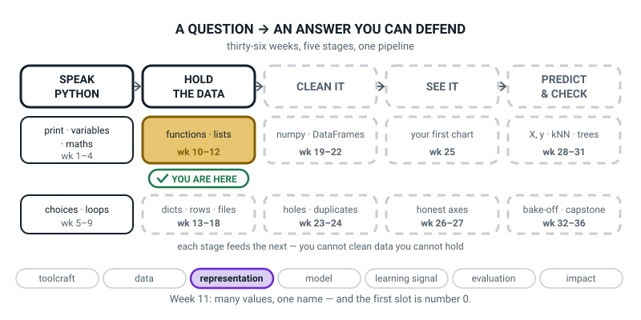

# Week 11 — Many Values, One Name: Lists

[⬅ Week 10](week-10.md) · [Course Home](../README.md) · [Week 12 ➡](week-12.md) · [Student Guide](../student-guide/week-11.md) · [Workbook](../workbook/week-11.md)

---

## 📋 At a Glance

| | |
|---|---|
| **Duration** | 70 minutes |
| **Type** | 🟦 Teach — one new container (the list), met with the hands before the keyboard |
| **Big idea** | A list is a row of numbered slots — and the first slot is number 0, not 1. |
| **New vocabulary** | list · index · element · append · `IndexError` |
| **New syntax** | `[1, 2, 3]` · `scores[0]` / `scores[-1]` · `len(scores)` · `scores.append(x)` |
| **Materials** | **Five index cards and a marker pen** · **a pink or red pen** (this matters — see the Hook) · the printed workbook (all of it, double-sided if you like) · the notebook, open at the Bug Log · pencil |
| **Tech needed** | Python 3, an editor, one terminal. **No libraries.** |
| **Prep time** | 15 minutes the night before, 5 minutes on the day |

> **⚠️ Watch out:** the temptation this week is to explain counting-from-zero and move on. Don't. The whole lesson is built so that the student *reaches for a card that isn't there* — physically, with their hand, before they ever see the word `IndexError`. That moment is worth more than any explanation, and it takes ninety seconds.

---

## 🎯 Lesson Objectives

By the end of the lesson the student can:

1. **Build a list** with square brackets and read any item out of it by its index.
2. **Use `-1` to reach the last item**, and explain why that is easier than counting.
3. **Count items with `len()`** and say why `len` is always one more than the last index.
4. **Add an item with `append()`** and describe exactly what changed and what did not.
5. **Cause an `IndexError` on purpose**, read the traceback, and say which slot did not exist.

Observable evidence: a file that prints the same list eight different ways; a Bug Log entry with a real `IndexError` traceback, the one-line fix, and one sentence explaining why counting from zero caused it.

---

## 🧑‍🏫 What YOU Need to Know First

> **📌 About the code blocks in this guide.** Outside the **🧰 Prep Checklist** and the **🔑 Answer Key**, the blocks are **illustrations, not files** — each one carries on from the one above it, so the `import` lines and the data are typed once, in the first block that needs them. **The complete runnable files are in the Prep Checklist and the Answer Key.** If you paste an illustration on its own and get `NameError`, that is why, and nothing is broken.

**You do not need to have programmed before to teach this.** Read this once — about 20 minutes — then do the Prep Checklist.

### 1. The problem a list solves

Last week the student wrote functions with two parameters. Fine. Now imagine a cricket season with twenty innings. Without lists, that is twenty variables:

```python
score1 = 45
score2 = 0
score3 = 112
# ... eighteen more lines ...
```

And then, to add them up, twenty more lines. And when a twenty-first innings happens, you edit the program. This is not a small inconvenience — it is a wall. Every interesting thing in this course, from a table of pizza orders to the 150 iris flowers in Week 29, needs *many values under one name*.

> **List** — an ordered collection of values stored in a single variable, written in square brackets with commas between the items.

```python
scores = [45, 0, 112, 67]              # four values, one name
players = ["Meera", "Kabir", "Nova"]   # lists can hold text too
empty = []                             # a list with nothing in it yet
```

> **Element** — one of the values inside a list. `scores` has four elements.

**Two things the student should notice immediately.** First, the whole list has *one* name. Second, printing it shows the brackets and commas, which is Python showing you the container and not just the contents:

```python
scores = [45, 0, 112, 67]
print(scores)
print(type(scores))
```

```text
[45, 0, 112, 67]
<class 'list'>
```

### 2. Indexing — and why on earth it starts at 0

> **Index** — a value's position in a list. The first position is 0.

```python
scores = [45, 0, 112, 67]

print(scores[0])        # 45  <- the FIRST one
print(scores[1])        # 0
print(scores[2])        # 112
print(scores[3])        # 67  <- the last one
```

```text
45
0
112
67
```

**This will annoy the student and it should.** Every human counting system starts at 1. So you need a reason, and there is a good one:

> **The index is not "which one". It is "how far from the start".**

The first item is **zero steps** from the beginning of the row. The second is one step along. The third is two steps along. Once you say it that way, `scores[0]` stops being a quirk and becomes the only sensible answer.

Say it out loud with your hand on the table. Put your finger on the first card and say "zero steps". Slide it one card and say "one step". That is the whole justification, and it takes four seconds.


*Figure 11.1 — Four values. The slot numbers are 0, 1, 2 and 3 — never 1, 2, 3, 4.*

### 3. Negative indexes — counting from the other end

```python
scores = [45, 0, 112, 67]

print(scores[-1])       # 67   <- the LAST one
print(scores[-2])       # 112  <- second from the end
print(scores[-4])       # 45   <- the first one, reached the long way round
```

```text
67
112
45
```

Notice the asymmetry: forward counting starts at **0**, backward counting starts at **-1**. That is not Python being inconsistent — there is no "minus zero", so the last item has to be −1.

**Why `-1` is genuinely useful and not just a shortcut:** `scores[-1]` means "the last one" *no matter how long the list is*. `scores[3]` means "the last one" only while the list happens to have exactly four items in it. The moment somebody appends a fifth score, `scores[3]` quietly starts pointing at the middle of the list and your program is wrong with no error message. **`scores[-1]` is the version that survives the list changing.**


*Figure 11.2 — `scores[3]` and `scores[-1]` open the same slot today. Only one of them still means "last" tomorrow.*

### 4. `len()` versus the last index — the fencepost

```python
scores = [45, 0, 112, 67]

print(len(scores))          # 4  <- how many
print(len(scores) - 1)      # 3  <- the highest slot number that exists
```

```text
4
3
```

`len()` **counts**: one, two, three, four. Indexes **number**: zero, one, two, three. So the two answers always differ by exactly one, and that difference is where nearly every list bug in this course will live.

**The picture that makes it stick** is the fencepost. Four fence panels standing in a row: the gaps between them, and the posts holding them up, are not the same count. Or more directly: **a list of four things has a slot numbered 3 and no slot numbered 4.**


*Figure 11.3 — Two true statements about the same four cards: there are four of them, and the highest number is three.*

**This is the figure to look at yourself before the lesson.** If you are only going to hold one idea in your head while you teach, hold this one: *`len` is a count, indexes are names, and the biggest name is one less than the count.*

### 5. `append()` — one more slot on the end

> **`append`** — a command that adds one item to the end of a list.

```python
scores = [45, 0, 112, 67]
print("before:", scores, "len", len(scores))

scores.append(89)                      # 89 goes on the END. Nothing else moves.
print("after :", scores, "len", len(scores))

print(scores[4])                       # slot 4 exists NOW
print(scores[-1])                      # and -1 points at the new one
```

```text
before: [45, 0, 112, 67] len 4
after : [45, 0, 112, 67, 89] len 5
89
89
```

Three things to make explicit, because students assume all three wrongly at some point:

1. **The dot is new and it matters.** `len(scores)` puts the list *inside* the brackets. `scores.append(89)` puts the list *before a dot*. The difference: `len` is a general-purpose tool that works on lots of things, while `append` is something a list knows how to do to itself. You do not need to explain the theory; just point at the two shapes and say "this one is a command the list itself carries."
2. **Nothing else moves.** Slots 0 to 3 hold exactly what they held before. Only a new slot 4 appeared.
3. **`append` adds *one* item.** `scores.append([112, 67])` puts a whole list inside your list as a single element, which is legal and almost never what a 12-year-old meant:

```python
scores = [45, 0]
scores.append([112, 67])
print(scores)
print(len(scores))
```

```text
[45, 0, [112, 67]]
3
```

Three elements, and the third one is itself a list. Worth showing once if it comes up; do not go looking for it.


*Figure 11.4 — Slots 0 to 3 did not move. One new slot appeared on the end.*

### 6. `IndexError`, which is this week's whole point

> **`IndexError`** — the error Python gives when you ask for a slot that does not exist.

```python
scores = [45, 0, 112, 67]              # four items, so slots 0, 1, 2 and 3
print(len(scores))                     # 4
print(scores[3])                       # fine -- slot 3 is the last one
print(scores[4])                       # there is no slot 4
```

```text
4
67
Traceback (most recent call last):
  File "/Users/you/ai-academy/level2/week11_indexerror.py", line 6, in <module>
    print(scores[4])                       # there is no slot 4
IndexError: list index out of range
```

Walk the traceback with the three questions from Week 1:

1. **What kind?** `IndexError`.
2. **Which thing?** `list index out of range` — "out of range" means past the end of the row.
3. **Which line?** Line 6. And notice line 5 worked perfectly, which is your evidence that the list itself is fine.

**The fix is never a bigger number.** The three honest fixes are: use `scores[3]`, use `scores[-1]`, or `append` another item so that slot 4 genuinely exists. A student who "fixes" it by changing 4 to 5 has not understood anything.


*Figure 11.5 — The empty dashed slot on the left and the traceback on the right are the same fact, told twice.*

**One extra case worth knowing about before a student finds it:** an empty list has *no* valid indexes at all.

```python
scores = []
print(len(scores))
print(scores[0])
```

```text
0
Traceback (most recent call last):
  File "/Users/you/ai-academy/level2/week11_empty.py", line 3, in <module>
    print(scores[0])
IndexError: list index out of range
```

`scores[0]` is not magically safe. If `len` is 0, there is no slot 0.

### 7. Walking a list this week — with `range(len(...))`

The student already has `for i in range(n):` from Week 7. Combine it with `len()` and you can visit every slot:

```python
scores = [45, 0, 112, 67]
for i in range(len(scores)):           # i counts 0, 1, 2, 3
    print(i, scores[i])
```

```text
0 45
1 0
2 112
3 67
```

Read `range(len(scores))` out loud as **"the numbers 0 up to but not including 4"** — that is exactly the set of valid slot numbers, which is a rather satisfying coincidence and is not a coincidence at all.

> **⚠️ Watch out:** there is a much nicer way to do this — `for score in scores:` — and it is **next week's** syntax, deliberately. Do not use it today. If a student finds it on the internet and asks, be honest: "That's the better way and it's next week. Can you tell me what it does?" Then let them keep using it if they want; do not un-teach something correct. But teach `range(len(...))` today, because the entire point of Week 12's version is that it removes a step, and you cannot remove a step nobody has taken.

### 8. The three misconceptions you will actually meet

**Misconception 1 — "`scores[1]` is the first one."** Universal, and it does not go away after one telling. The cure is physical: the cards on the table with the pink numbers *underneath* them, so the value and its slot number are visibly two different things in two different places. Keep asking "which one is that?" and "what's it *called*?" as separate questions.

**Misconception 2 — "`len(scores)` gives me the last slot number."** This produces the single most common bug in the course: `scores[len(scores)]`, which is always, in every list, one past the end.

```python
scores = [45, 0, 112, 67]
print(scores[len(scores)])
```

```text
Traceback (most recent call last):
  File "/Users/you/ai-academy/level2/week11_lastindex.py", line 2, in <module>
    print(scores[len(scores)])
IndexError: list index out of range
```

**Misconception 3 — "`append` gives me back the new list."** It does not. It changes the list and hands back `None` — which is last week's word, arriving right on cue.

```python
scores = [45, 0, 112, 67]
scores = scores.append(89)
print(len(scores))
```

```text
Traceback (most recent call last):
  File "/Users/you/ai-academy/level2/week11_append.py", line 3, in <module>
    print(len(scores))
TypeError: object of type 'NoneType' has no len()
```

That traceback is a gift, and Week 10 has already taught them how to read it: **`NoneType` means something handed back nothing.** The rule to write down: **`append` changes the list in place. Never put `scores.append(...)` on the right of an equals sign.**

### 9. How deep to go, and where to stop

**Go this far:** make a list, read any slot, `-1` for the last, `len()`, the last index being `len - 1`, `append`, and a deliberate `IndexError` read out loud.

**Stop before:**

- **Slicing** (`scores[1:4]`). It is next week and it deserves its own lesson, because the stop value being excluded is a second off-by-one and two at once is too many.
- **`sorted()` and `.sort()`.** Next week.
- **`for score in scores:`.** Next week, deliberately (see section 7).
- **`insert`, `remove`, `pop`, `del`.** All useful, none needed. `remove(0)` removes the *value* 0, not the item at *position* 0, and that confusion costs everybody an afternoon once — but it does not have to be this afternoon.
- **`in` and `.index()`.** Week 13 and beyond.
- **`b = a` making a second label on the same list.** This is a genuinely important trap and it belongs in Week 12, next to `sorted()` versus `.sort()`, where the whole conversation is about copies.
- **Strings being sequences too.** `"hello"[0]` is `"h"`, which is true and delightful and a distraction today. If a student discovers it, say "yes — and that's a whole idea we'll come back to."
- **Changing a slot** (`scores[0] = 50`). Legal, easy, and one more thing. Mention it only if asked, and then only once.

---

### 10. 🧭 The Growing Map — same tile, different thread

**Where This Fits** is the student guide's one structural figure: the whole pipeline, with one more
piece filled in each week. The box has not moved since last week, but the bottom strip has.



*Figure 11.0 — Week 11's version. Stage one stays white, `functions · lists` stays gold, and the single
lit pill at the bottom is **representation** — toolcraft has gone dark.*

**How to run it, in about two minutes:**

1. **Show it and ask:** *"we put twenty scores under one name today — which box are we in, and which
   stage is that box in?"* You want `functions · lists`, inside **hold the data**. Then the follow-up
   worth having: *"why is a list a 'holding the data' idea rather than a 'speak Python' one?"*
2. **Point at the strip.** Only representation is lit. Say why in one sentence: choosing one list over
   twenty variable names is a decision about **how the data is shaped**, not a new piece of syntax —
   and that is the thread that runs all the way to Week 21's columns.
3. **Copy time.** On their own map, five numbered boxes and `len = 5` under the gold tile. That drawing
   is the fix for almost every list bug they will hit between now and March.

> **🧑‍🏫 Why this is worth two minutes.** Lists feel like syntax to a learner — brackets, commas,
> square-bracket numbers — and the reason they are on the map at all is that they are the first
> *structure*. Showing it inside "hold the data" is what makes the next ten weeks make sense.

> **⚠️ Watch out:** the dashed boxes are a promise, not a syllabus to preview. If somebody asks what
> `numpy · DataFrames` means, "a table you can do maths on, in February" is the right length of answer.

---

## 🧰 Prep Checklist

### 15 minutes the night before

- [ ] **Print the Week 11 workbook.** The section that gets written on in class is 🛠️ Build It (the twelve drills table, with a prediction box beside each drill).
- [ ] **Make the cards.** This is the most important five minutes of prep this week.
  - Take **five** index cards. On four of them, write one number each, big and dark, on the front: **45**, **0**, **112**, **67**.
  - Leave the fifth card **blank on both sides** and keep it in your pocket. It becomes the appended 89 at minute 5.
  - On a **separate strip of paper**, in the **pink or red pen**, write `0   1   2   3` spaced so that each number sits under the middle of a card when the four cards are laid out in a row. *Do not write the slot numbers on the cards themselves.* The whole point is that a value and its slot number are two different things in two different places.
- [ ] **Run this code yourself first.** Make `week11_list_surgery.py` in `~/ai-academy/level2` and type this exactly:

```python
# week11_list_surgery.py
# A list is a row of numbered slots. The first slot is number 0.

# ---- Step 1: make a list ----
scores = [45, 0, 112, 67]              # four values, one name, square brackets
print(scores)                          # printing the whole list shows the brackets
print(len(scores))                     # how many values are in it

# ---- Step 2: open one slot ----
print(scores[0])                       # slot 0 -- the FIRST one
print(scores[1])                       # slot 1 -- the second one
print(scores[2])                       # slot 2 -- the third one
print(scores[3])                       # slot 3 -- the fourth and last one

# ---- Step 3: count from the other end ----
print(scores[-1])                      # the LAST slot, without counting first
print(scores[-2])                      # second from the end

# ---- Step 4: len is a count, not a slot number ----
print(len(scores) - 1)                 # 3 -- the highest slot number that exists

# ---- Step 5: add one more slot on the end ----
scores.append(89)                      # 89 goes on the END. Nothing else moves.
print(scores)
print(len(scores))
print(scores[4])                       # slot 4 exists NOW
print(scores[-1])                      # and -1 means the new one
```

Run `python3 week11_list_surgery.py`. You must see **exactly** this:

```text
[45, 0, 112, 67]
4
45
0
112
67
67
112
3
[45, 0, 112, 67, 89]
5
89
89
```

- [ ] **Then break it, so you have met the error before they do.** Add these two lines at the bottom and run again:

```python
# ---- Step 6: break it on purpose ----
print(scores[5])                       # there is no slot 5
```

```text
Traceback (most recent call last):
  File "/Users/you/ai-academy/level2/week11_list_surgery.py", line 30, in <module>
    print(scores[5])                       # there is no slot 5
IndexError: list index out of range
```

*(Your filename and path will be your own. The path is never the interesting part.)*

- [ ] **Read section 4 (`len` versus the last index) twice.** It is the section every question this week comes back to.

### 5 minutes on the day

- [ ] Four cards face-down in a stack, the pink number strip out of sight, the blank fifth card in your pocket.
- [ ] Terminal open, `cd`-ed into `~/ai-academy/level2`.
- [ ] Editor open on a new empty file. `week11_list_surgery.py` from your prep run **closed and out of sight** — they type it from blank.
- [ ] Notebook open at the Bug Log.
- [ ] Screen font at about 18pt. This lesson is entirely about single characters inside square brackets.

### Fallback if something fails

| If this fails | Do this instead |
|---|---|
| The laptop dies | **This is the most unplugged-friendly lesson of the term.** The cards *are* the lesson. Do the Hook, then run the whole activity on the table: you read out a drill (`scores[2]`, `len(scores)`, `scores[-1]`, `scores[4]`) and they pick up the card, or count, or say "there isn't one". Twelve drills on cards takes about fifteen minutes and delivers all five objectives. Homework becomes "type these twelve in and check I was right." |
| You have no index cards | Anything you can lay in a row and pick up: playing cards with sticky notes on them, small pieces of paper, coasters, four books. The physical *picking up* is what matters, not the stationery. |
| You have no pink pen | Use anything visibly different from the card numbers — pencil, blue biro, a different-coloured sticky note. The values and the slot numbers must not look the same. |
| Every line is an `IndentationError` | There is no indentation at all in this week's file. If you are getting `IndentationError`, a stray space has crept in at the start of a line. Delete leading spaces on the flagged line. |
| The student already knows lists from somewhere | Skip to the twelve drills and give them the hard version from Differentiation → flying: the fencepost audit, plus the `scores = scores.append(89)` bug to diagnose cold. |
| Running short at minute 55 | Cut drills 10 and 11 (the loop and the accumulator). **Never** cut the deliberate `IndexError` and the Bug Log entry. |

---

## ⏱️ The Lesson, Minute by Minute

| Segment | Minutes | Running total | What happens |
|---|---|---|---|
| 🪝 Hook — Pick Up Card Number Two | 7 | 7 | Cards on the table, pink numbers underneath, and a card that isn't there |
| 🧠 Concept — List, Element, Index, `len` | 16 | 23 | Why zero. Why `len` is one more than the last index. |
| 💻 Live-Code Together — `week11_list_surgery.py` | 18 | 41 | They type it. Two deliberate mistakes, fixed in front of them. |
| 🎲 Their Turn — Twelve Drills, Then Break It | 20 | 61 | The drills at the keyboard, then a deliberate `IndexError` into the Bug Log |
| 🔑 Wrap & Assign | 9 | 70 | Three checks, the vocabulary, homework step one |

---

### 🪝 Hook — Pick Up Card Number Two (7 minutes)

**Do this:** Lids down. Lay the four cards in a row, left to right, face up: `45`, `0`, `112`, `67`. Do **not** put the pink number strip out yet.

**Say this:**

> "Four cricket scores from four innings. Forty-five, then a duck, then a hundred and twelve, then sixty-seven.
>
> Last week we would have needed four variables for this — four boxes with four names. Today we give the whole row one name. This row is called `scores`, and in Python we would write it exactly like it looks: square bracket, forty-five, comma, zero, comma, one-one-two, comma, sixty-seven, square bracket. The brackets are how Python knows it's a row and not one enormous number.
>
> Now. To get one score out of the row, I have to say which one. So let's number them."

*(Now slide the pink strip under the cards, so `0 1 2 3` sits under the four cards.)*

> "There. And yes, I know. It starts at zero. Hold your objection for about ninety seconds and then I'll give you a proper reason.
>
> Right — hands up when you're ready. **Pick up `scores[2]`.**"

They will almost certainly hand you `0`, the second card. Take it, look at it, and say nothing unkind:

> "That's what nearly everybody does the first time. Put it back. Read the pink number under the card you gave me."

*(It says 1.)*

> "Right. So that card is `scores[1]`. Try again: **`scores[2]`**."

They hand you `112`.

> "Yes. Now, **`scores[-1]`**."

They hand you `67` — most students get this one right immediately, which is worth noticing out loud.

> "Interesting, isn't it? You got minus-one right straight away and you got two wrong. Minus one means 'the last one', and 'the last one' is something your brain already knows how to do.
>
> Last one. **`scores[4]`**."

*(Wait. Let the silence happen. Do not rescue them.)*

> "There isn't one, is there. There are four cards on this table and there is no card with a pink four under it.
>
> So what should the computer do? Should it guess? Give me the last one? Give me zero? Make a new card up?
>
> It stops. It stops immediately and tells you exactly what you asked for and why it couldn't. That message has a name — **`IndexError`** — and you're going to make one happen on purpose in about forty minutes, and you're going to write it in your Bug Log, because a programmer who can't read an error message can't program."

**Ask this:**

| Ask | Answer you want | If they say something else |
|---|---|---|
| "Pick up `scores[2]`." | The `112` card. | They will hand you `0`. Do not correct — ask them to read the pink number under the card they chose. The strip does the teaching. |
| "Pick up `scores[-1]`." | The `67` card. | If they hand you `45`, ask: "which end is the *end*?" Nearly everyone gets this one. |
| "Pick up `scores[4]`." | Nothing. There is no such card. | If they hand you `67` "because it's the closest", that is a lovely, wrong, human answer. Reply: "That would be a guess. Would you want your bank guessing?" |
| "How many cards are there, and what's the biggest pink number?" | Four cards. Biggest number three. | If they say "four and four", point at the strip and count out loud together. This is the fencepost and it is the whole week. |

---

### 🧠 Concept — List, Element, Index, `len` (16 minutes)

**Do this:** Lids still down. Cards and strip still on the table. Notebook open. You will write four things and nothing else.

**Say this — part 1, the words:**

> "Three words, and then the reason I promised you.
>
> The whole row has a name: `scores`. The row is a **list**. Write it down: *a list is many values under one name, in order, in square brackets.*
>
> Each card in the row is an **element**. This list has four elements.
>
> The pink number under a card is its **index** — its position in the row. And here is the reason it starts at zero, and it's a good one, so listen for it.
>
> **The index isn't 'which one'. It's 'how far from the start'.**"

*(Put your finger on the `45` card.)*

> "This one is at the start. How far along is it? Not at all. **Zero steps.** So its index is zero."

*(Slide one card right.)*

> "One step along. Index one. Two steps along, index two. Three steps, index three.
>
> Once you say it as *distance* instead of *position*, zero is the only answer that makes sense. And it isn't just a Python quirk — it's how most of the languages you'll meet - Python, C, Java, JavaScript - count, for exactly this reason. A few others start at 1, and we'll meet them later."

Write into the notebook:

> **list** — many values under one name, in order. `[45, 0, 112, 67]`
> **element** — one of the values in a list.
> **index** — a value's position, counting **how far from the start**. The first is 0.

**Say this — part 2, `len` and the last index. This is the part to go slowly on:**

> "Now the thing that catches everybody, including people who've been paid to do this for twenty years.
>
> How many cards on the table? Four. In Python, `len(scores)` — l, e, n — gives you four. `len` is short for length and it **counts**.
>
> What's the biggest pink number under a card? Three.
>
> So: four cards, biggest number three. Both of those statements are true at the same time about the same four cards, and if you ever mix them up you will write `scores[4]`, which is one past the end, every single time.
>
> Here's the picture I want in your head. Fence panels. If I put up four fence panels in a row, how many posts do I need? Not four. And that's why builders and programmers make the same mistake for the same reason. It even has a name — the *fencepost problem*.
>
> So, the sentence, and write this one down word for word: **`len` is a count. An index is a name. The biggest name is one less than the count.**"

Write into the notebook:

> **`len(scores)`** — how many elements. A **count**.
> **Last index** = `len(scores) - 1`. An index is a **name**, not a count.

**Say this — part 3, `append`:**

> "Last thing before the keyboard. What if there's a fifth innings?"

*(Produce the blank fifth card, write `89` on it in front of them, and place it on the right-hand end.)*

> "In Python that's `scores.append(89)` — note the dot; we'll come back to the dot. Now look at the row and tell me two things.
>
> One: what changed?
>
> Two — and this is the interesting one — **what didn't change?**"

Let them work it out. The answer is that slots 0 to 3 hold exactly the same cards in exactly the same places. Only a new slot 4 appeared, and `len` went from 4 to 5.

> "And notice what just happened to two of the things you can say. `scores[3]` used to mean 'the last one'. It doesn't any more — it means the middle-ish one now. But `scores[-1]` still means the last one, because it always did. **That's why `-1` is worth learning properly and not just as a shortcut.**"

Write into the notebook:

> **`scores.append(89)`** — adds one element on the **end**. Nothing else moves. `len` goes up by one.

**Ask this:**

| Ask | Answer you want | If they say something else |
|---|---|---|
| "Why does counting start at zero?" | Because the index is how far from the start, and the first item is zero steps along. | If they say "because computers are weird", give the finger-on-the-card demonstration again and ask them to say the distance out loud. |
| "Four cards. What's `len`? What's the biggest index?" | 4 and 3. | If they say 4 and 4, count the pink strip out loud together, pointing. Then ask the fence question. |
| "After the append, what is `scores[3]`?" | 67 — the same as before. | If they say 89, they think append pushes things along. Point at the cards; nothing moved. |
| "After the append, what is `scores[-1]`?" | 89. | If they say 67, they are reading the old row. Ask "which is the last card *now*?" |
| "Give me two different ways to ask for the last score." | `scores[4]` and `scores[-1]`. | If they only give one, prompt: "one of them needs you to know how long the list is. Which?" |
| "Which of those two would you rather write, and why?" | `-1`, because it keeps working when the list grows. | Any argued answer is good. Push for the reason, not the choice. |

---

### 💻 Live-Code Together — `week11_list_surgery.py` (18 minutes)

**Do this:** Lids up. **The student types every character. You never touch the keyboard.** Before every Run, they predict.

**Say this to start:**

> "New file, called `week11_list_surgery.py`. Save it before you type anything in it."

**Step 1 (2 min).** "Two comments, then the list itself. Square bracket — that's the one above the square bracket on most keyboards, next to the letter P. Then the four numbers with commas. Then close the bracket."

```python
# week11_list_surgery.py
# A list is a row of numbered slots. The first slot is number 0.

# ---- Step 1: make a list ----
scores = [45, 0, 112, 67]              # four values, one name, square brackets
print(scores)                          # printing the whole list shows the brackets
print(len(scores))                     # how many values are in it
```

Predict, then **Run.**

```text
[45, 0, 112, 67]
4
```

> **💡 Try this:** point at the output and ask "why did Python print the brackets?" *(Because it is showing you the list, not the numbers. The brackets are part of the answer.)*

### ⛔ Deliberate mistake number one — the bracket you didn't close

**Do this, at about minute 4.** "Go up to line 5 and delete the closing square bracket. Just that one character. Run it."

```python
scores = [45, 0, 112, 67              # four values, one name, square brackets
```

```text
  File "/Users/you/ai-academy/level2/week11_list_surgery.py", line 5
    scores = [45, 0, 112, 67              # four values, one name, square brackets
             ^
SyntaxError: '[' was never closed
```

**Say this:**

> "Read the last line out loud. — 'SyntaxError: open square bracket was never closed.' And look where the little arrow is pointing: at the bracket you *opened*, not at the end of the line. Python is telling you where the problem *started*.
>
> Two things worth knowing about this one. First, nothing ran — no list, no four. A SyntaxError means Python couldn't even finish reading your file. Second, this is the friendliest error message you will get all year, and it is friendly because brackets are so easy to lose. Every editor will try to close them for you and every editor will occasionally get it wrong.
>
> Put it back."

**Ask this:** "The arrow points at line 5, character 10. Is that where you made the mistake, or where Python noticed?" *(Where it started. The character it wanted is missing at the end.)*

**Step 2 (4 min).** *Add to the bottom of the same file.* "Now open the slots, one at a time. Type these four lines."

```python
# ---- Step 2: open one slot ----
print(scores[0])                       # slot 0 -- the FIRST one
print(scores[1])                       # slot 1 -- the second one
print(scores[2])                       # slot 2 -- the third one
print(scores[3])                       # slot 3 -- the fourth and last one
```

Have them predict all four **before** running. **Run.**

```text
[45, 0, 112, 67]
4
45
0
112
67
```

**Step 3 (3 min).** *Add to the bottom of the same file.* "Now from the other end."

```python
# ---- Step 3: count from the other end ----
print(scores[-1])                      # the LAST slot, without counting first
print(scores[-2])                      # second from the end
```

Predict — **ask specifically whether `-2` will be `0` or `112`.** This is the one people get wrong. **Run.**

```text
67
112
```

**Step 4 (2 min).** *Add to the bottom of the same file.* "And the fencepost, in code."

```python
# ---- Step 4: len is a count, not a slot number ----
print(len(scores) - 1)                 # 3 -- the highest slot number that exists
```

**Run.** It prints `3`.

**Step 5 (3 min).** *Add to the bottom of the same file.* "Now add a fifth score, exactly like the card."

```python
# ---- Step 5: add one more slot on the end ----
scores.append(89)                      # 89 goes on the END. Nothing else moves.
print(scores)
print(len(scores))
print(scores[4])                       # slot 4 exists NOW
print(scores[-1])                      # and -1 means the new one
```

Predict all four. **Run.** The full output is now:

```text
[45, 0, 112, 67]
4
45
0
112
67
67
112
3
[45, 0, 112, 67, 89]
5
89
89
```

> **🧑‍🏫 If a student asks** *"why do the top lines still say four and sixty-seven when the list has five things in it now?"* — genuinely good question. "Because Python runs your file from the top downwards. When line 9 ran, the append hadn't happened yet. Those lines are a photograph of an earlier moment."

### ⛔ Deliberate mistake number two — the one that matters

**Do this, at about minute 15.** "One more change. It looks completely reasonable. On the append line, put `scores =` in front of it — like we do with everything else."

```python
scores = scores.append(89)             # WRONG: append gives back None
```

Predict first — most students expect the same output. **Run.**

```text
[45, 0, 112, 67]
4
45
0
112
67
67
112
3
None
Traceback (most recent call last):
  File "/Users/you/ai-academy/level2/week11_list_surgery.py", line 25, in <module>
    print(len(scores))
TypeError: object of type 'NoneType' has no len()
```

**Say this:**

> "Two words in that message you met last week. **`NoneType`.** What did we say `NoneType` in a traceback always means?"

*(Wait for it: something handed back nothing, and then we tried to use it.)*

> "Exactly. And look one line up — it printed `None` where the list should have been. So `scores` isn't a list any more. It's nothing.
>
> Here's why. `append` doesn't *give you back* a new list. It **changes the list you already have**, right where it is, and hands back nothing at all. So when you wrote `scores = scores.append(89)`, you appended 89 to your list perfectly — and then you threw the whole list away and put `None` in the box instead.
>
> So write this down, and it's the rule that will save you the most time this month: **never put `.append` on the right-hand side of an equals sign.**
>
> Take the `scores =` off and run it again."

Bug Log entry, one line: **"`TypeError: object of type 'NoneType' has no len()` → I wrote `scores = scores.append(89)`. `.append` changes the list and returns `None`. Fix: just `scores.append(89)`."**

---

### 🎲 Their Turn — Twelve Drills, Then Break It (20 minutes)

Full instructions in the next section. In the lesson flow:

- **Minutes 0–15:** workbook 🛠️ Build It, Part 1. The twelve list-surgery drills, in a new file. They must **write their prediction on the page before running each one.**
- **Minutes 15–20:** drill 12 (Build It Part 2) — cause an `IndexError` on purpose, paste the real traceback into the Bug Log, and write the one-line fix plus one sentence on why counting from zero caused it.

You should be nearly silent. Use the escalation ladder; do not type.

---

## 🐞 The Debugging Clinic

Every traceback below came from actually running a broken version of this week's code.

| What the student sees (real message) | What it means | Most likely cause | The fix |
|---|---|---|---|
| `IndexError: list index out of range` | You asked for a slot that does not exist. | `scores[4]` on a four-item list. The classic off-by-one. | The highest valid index is `len(scores) - 1`. Use `scores[3]`, or `scores[-1]` for "the last one". **Not** a bigger number. |
| `IndexError: list index out of range`, on a line inside a loop, after some output already appeared | The loop went one trip too far. | `for i in range(len(scores) + 1):` — that `+ 1` visits a slot that isn't there. | Delete the `+ 1`. `range(len(scores))` already gives exactly the valid slot numbers. |
| `IndexError: list index out of range` from `scores[len(scores)]` | `len` is a count, not a slot number. | Believing `len(scores)` is the last index. | `scores[len(scores) - 1]`, or far better, `scores[-1]`. |
| `IndexError: list index out of range` on an empty list | There are no valid slots at all. | `scores = []` and then `scores[0]`. | Check `len(scores)` first, or append something before you read it. An empty list has no slot 0. |
| `TypeError: object of type 'NoneType' has no len()` | Your list variable is not a list any more; it is `None`. | `scores = scores.append(89)`. | Just `scores.append(89)` on its own line. Never assign the result of `.append`. |
| `TypeError: list indices must be integers or slices, not float` | The number inside the brackets is a decimal. | `middle = len(scores) / 2` then `scores[middle]`. A single `/` always makes a decimal. | Use `//` for whole-number division: `middle = len(scores) // 2`. |
| `AttributeError: 'list' object has no attribute 'add'` | Lists do not have a command called `add`. | Guessing the name. `add` is right in some other languages. | It is `append`. The message is worth reading as "I looked for `add` on your list and there isn't one." |
| `TypeError: can only concatenate list (not "int") to list` | You tried to `+` a number onto a list. | `scores + 89`, meaning "add 89 to the end". | `scores.append(89)`. (`+` between two *lists* does work, and that is not this week.) |
| `TypeError: list.append() takes exactly one argument (2 given)` | `append` adds one item, not several. | `scores.append(89, 90)`. | Two separate calls, one per item. |
| `TypeError: 'list' object is not callable` | You used round brackets where square ones belong. | `scores(2)` instead of `scores[2]`. | Square brackets to open a slot. Round brackets mean "call a function", and a list is not a function. |
| `SyntaxError: '[' was never closed` | Python read to the end of the file still waiting for a `]`. | A missing closing square bracket, usually on the list-building line. | Close the bracket. The arrow points at where the bracket *opened*, not where it should have ended. |
| The list prints as `[45, 0, [112, 67]]` and `len` says 3 | You appended a whole list as a single element. | `scores.append([112, 67])`. | Two separate appends. `append` adds exactly one element, whatever that element is. |

### How to teach debugging without giving the answer

You can see that they wrote `scores[4]`. Do not point at it. Work down this ladder and stop the moment they take over:

1. **"Read the last line out loud."**
2. **"What kind of error?"** — `IndexError`.
3. **"What does it say after the colon?"** — "out of range". Then: **"out of range of what?"**
4. **"Which line number?"**
5. **"How many things are in the list right now? Print `len` on the line above and find out."** This is the specific move for this week, and it is a good one: an `IndexError` argument is *always* settled by `len`.
6. **"So what's the biggest index you're allowed?"** They subtract one themselves, out loud, and that is the moment the fencepost lands.
7. Only now: **"So what should that number be?"**

**Never let a student fix an `IndexError` by changing the number until it stops crashing.** That produces code that works by accident. The question to ask instead is always: **"Which slot did you actually mean?"** If they meant the last one, the answer is `-1`, and it will still be right next month.

---

## 🎲 The Activity, In Full

### Setup


*Figure 11.6 — The table at the start of the Hook: four cards in a row, slot numbers on a separate pink strip underneath.*

**On the table:** the four cards, the pink `0 1 2 3` strip, the blank fifth card, workbook 🛠️ Build It Part 1 (twelve drills, with a prediction box beside each), the notebook open at the Bug Log, a pencil.

**On the screen:** a new empty file, `week11_drills.py`.

**The data:** one week of step counts, typed out in the file. Nothing is loaded from anywhere.

```python
steps = [4200, 9100, 6350, 12040, 3300, 8700, 15200]   # Mon..Sun, slots 0..6
```

**The one rule, said once and enforced:** *write your prediction in the box, then run it, then tick or fix.* A student who runs first has turned a thinking exercise into a typing exercise.

### The twelve drills

| # | Do this | Uses |
|---|---|---|
| 1 | Print the whole list. | `print(steps)` |
| 2 | Print how many days are in it. | `len` |
| 3 | Print Monday's steps. | `[0]` |
| 4 | Print the **third** day's steps. | `[2]` — and the trap is in the word "third" |
| 5 | Print Sunday's steps **two different ways.** | `[6]` and `[-1]` |
| 6 | Print the second-from-last day. | `[-2]` |
| 7 | Print the highest slot number that exists. | `len - 1` |
| 8 | Add today's 7,700 steps on the end, then print the list and the new length. | `append`, `len` |
| 9 | Print the new last item — without using the number 7. | `[-1]` |
| 10 | Print every slot number next to its value. | `for i in range(len(steps)):` |
| 11 | Add all the steps up, and print the total and the average. | `+=`, `len`, `f"{x:.1f}"` |
| 12 | **Break it on purpose.** Ask for a slot that does not exist. Paste the real traceback into the Bug Log. | `IndexError` |

The complete finished file, which is also the answer key:

```python
# week11_drills.py — twelve list-surgery drills on one week of step counts.

steps = [4200, 9100, 6350, 12040, 3300, 8700, 15200]   # Mon..Sun, slots 0..6

# 1. the whole list
print("1.", steps)

# 2. how many
print("2.", len(steps))

# 3. the first day
print("3.", steps[0])

# 4. the THIRD day -- third means slot 2, because counting starts at 0
print("4.", steps[2])

# 5. the last day, two ways
print("5.", steps[6], steps[-1])

# 6. the second-from-last day
print("6.", steps[-2])

# 7. the highest slot number that exists
print("7.", len(steps) - 1)

# 8. add today's steps on the end
steps.append(7700)
print("8.", steps, "len", len(steps))

# 9. the new last item
print("9.", steps[-1])

# 10. every slot number with its value
for i in range(len(steps)):            # i counts 0, 1, 2 ... up to len-1
    print("10.", i, steps[i])

# 11. total and average, using an accumulator
total = 0                              # start the running total at zero
for i in range(len(steps)):
    total += steps[i]                  # add this slot onto the total
print("11. total", total)
print("11. average", total / len(steps))
print("11. average to 1 dp", f"{total / len(steps):.1f}")

# 12. break it on purpose -- there is no slot 8
print("12.", steps[8])
```

```text
1. [4200, 9100, 6350, 12040, 3300, 8700, 15200]
2. 7
3. 4200
4. 6350
5. 15200 15200
6. 8700
7. 6
8. [4200, 9100, 6350, 12040, 3300, 8700, 15200, 7700] len 8
9. 7700
10. 0 4200
10. 1 9100
10. 2 6350
10. 3 12040
10. 4 3300
10. 5 8700
10. 6 15200
10. 7 7700
11. total 66590
11. average 8323.75
11. average to 1 dp 8323.8
Traceback (most recent call last):
  File "/Users/you/ai-academy/level2/week11_drills.py", line 46, in <module>
    print("12.", steps[8])
IndexError: list index out of range
```

### What "finished" looks like

- Twelve drills, in order, each with a **written prediction** and a tick or a correction beside it.
- Drill 5 done **two ways**, and drill 9 done **without the number 7**.
- The `IndexError` traceback in the Bug Log, copied character for character — not summarised.
- Beside it: the one-line fix, and **one sentence saying why counting from zero caused it.** That sentence is the marks.
- Drill 11's average hand-checked in the back of the notebook. 66,590 ÷ 8 = 8,323.75 ✔

### Variation — easier

- **Six drills, not twelve:** 1, 2, 3, 5, 8 and 12. That is build, count, index, last-item, append and `IndexError` — every objective, half the typing.
- **Cut drills 10 and 11.** They need `range(len(...))` and an accumulator from Week 7, which is a second thing to remember on top of a new one.
- **Do it on cards first, then at the keyboard.** Run all six drills physically, with them picking cards up, then type the same six. The typing becomes a transcription of something they have already done, which is a completely legitimate way in.
- **Pre-write the `print("1.", ...)` scaffolding** on paper so they only fill in what goes inside the brackets. The thing being learned is inside the brackets.
- **The one thing you must not cut:** drill 12. Causing the `IndexError` deliberately and reading it is the week.

### Variation — harder

None of these needs any syntax beyond this week's four items.

1. **The fencepost audit.** Give them this and ask for the answer *before* running: for a list of `n` items, write down (a) the first index, (b) the last index, (c) how many valid indexes there are, (d) the most negative valid index. *(0 · n−1 · n · −n.)* Then check all four on a 7-item list and again on an empty list, where the honest answer is "there are none at all".
2. **The two-way table.** For the 8-item list, write out every slot twice — once with its positive index and once with its negative one. Then the question that makes it a lesson: **"For a list of `n` items, by how much do the positive and negative index of the same slot always differ?"** *(By `n`: slot `i` is also `i - n`. Worth checking on two lists before believing it.)*
3. **Diagnose it cold.** Hand them `scores = scores.append(89)` in a file they have not seen, with no hint, and time how long it takes. Then: "Which word in the error message was the clue, and where did you meet it before?" *(`NoneType`, last week.)*
4. **Find the day of the biggest total** without using anything from next week. This needs an accumulator that remembers a *position*:
   ```python
   best_i = 0                          # assume Monday is the best so far
   for i in range(len(steps)):
       if steps[i] > steps[best_i]:    # found a bigger day?
           best_i = i                  # remember WHERE it was
   print("biggest day was slot", best_i, "with", steps[best_i], "steps")
   ```
   ```text
   biggest day was slot 6 with 15200 steps
   ```
   Then the real question: **"Slot 6. Which day of the week is that, and what did you have to add?"** *(Sunday, the seventh day — you have to add one to translate a slot number into a human count. That translation is a permanent part of programming and should always be written down explicitly.)*
5. **What would break?** "Somebody appends an eighth day to `steps`. Go through your twelve drills and list every single one whose answer changes." *(Printed answers change in 1, 2, 5, 6, 7, 8, 9, 10 and 11, and drill 12 stops crashing because slot 8 now exists; only 3 and 4 are untouched. The useful distinction is which answers become *wrong*: `steps[6]` in drill 5 quietly stops meaning "the last day", while `steps[-1]` and `steps[-2]` still mean what they say. That is the argument for `-1`, made by the student instead of by you.)*

---

## ❓ Questions Students Ask This Week

**"Why does counting start at 0? It's stupid."** *(Answer this one honestly: people who do this for a living have argued about it for fifty years.)*

**Nobody fully agrees, and here is why it is not a dodge.** The good reason, the one we teach, is real: the index is the *distance* from the start, so the first item is zero steps along, and all the arithmetic comes out cleaner — the last index is `len - 1`, a slice of `a[0:3]` has exactly 3 items, and you never need a `+1` or a `−1` sprinkled through your loops. A famous computer scientist called Edsger Dijkstra wrote a short, slightly grumpy note in 1982 arguing exactly this, and most languages since have agreed with him.

But it is genuinely a *choice*, not a law, and serious languages have chosen otherwise. In MATLAB, in R, in Lua, in Fortran, in Julia — all of them used by professionals doing real work — the first item is number 1, because those languages were designed for people who think in ordinary counting. Their users find zero-based indexing baffling for exactly as long as our students do. And there are real bugs that only exist because of zero-based counting, and real bugs that only exist because of one-based counting, and no honest person can tell you which pile is bigger.

So the truthful answer is: **Python chose zero, the choice has a good reason behind it, and reasonable people picked differently.** What you cannot do is argue with the language you are typing into.

**"Is `scores[-1]` slower, because it has to count backwards?"**

No — and this is a nice question because the answer is not obvious. A list knows how long it is at all times, so `scores[-1]` is worked out instantly as "length minus one" and jumps straight there. Nothing walks along the row. Reading any slot of a list takes the same amount of time, whether it is the first, the last, or the middle of a list with a million things in it.

**"What if I want to add something at the *front*?"**

There is a way, and it is not `append` — `append` only ever goes on the end. The front version exists and we are not doing it this week, partly because you do not need it yet and partly because it forces every other item to shuffle along by one, which changes every single index. That is worth knowing as a general truth: **adding on the end is cheap and changes nothing; adding at the front changes every index in the list.**

**"Can a list hold different kinds of things at once?"**

Yes. `[45, "Meera", 3.5, True]` is a perfectly legal list. Python will not stop you. It is also almost always a sign that something has gone wrong in your thinking, because the first thing you will want to do is add the numbers up, and you cannot add a name. **A list is usually a list of one kind of thing**, and when it isn't, you probably wanted the thing we meet in Week 13.

**"What happens if two items are the same?"**

Nothing special. `[7, 7, 7]` is a list of three elements that happen to be equal, `len` is 3, and `scores[0]`, `scores[1]` and `scores[2]` are three different slots that each hold 7. A list is a row of *positions*, not a collection of *distinct values* — positions are what make it a list.

**"Why is it `len(scores)` but `scores.append(89)`? Why does one go in front and one behind a dot?"**

Because they are two different kinds of thing, and noticing the difference is a real observation. `len` is a general-purpose tool that works on all sorts of containers, so you hand the container to it. `append` is a command that a *list itself* knows how to carry out, so you name the list, then a dot, then what you want it to do. You will see both shapes constantly from now on — `len(df)` and `df.head()` in Week 21 are exactly the same pair — and by then this will feel obvious.

**"If `append` changes the list, does that mean a list is different from a number?"**

Yes, and you have spotted something genuinely important about three weeks early. A number cannot be changed — you can only put a *different* number in the box. A list can be changed while staying the same list, which is what `append` does. The consequences of that are not small, and they are the whole first half of next week's lesson about copies. Write your name and today's date next to that question.

**"Can I have a list inside a list?"**

You can, and you already made one by accident if you typed `scores.append([112, 67])`. It is genuinely useful later — a table is a list of rows, and each row is a list — and it turns up properly in Week 19. For now, if `len` says 3 when you expected 4, look for a bracket where you did not mean one.

---

## ⚠️ Where This Lesson Goes Wrong

| What happens | Why | What to do right now |
|---|---|---|
| Counting from zero is explained, agreed to, and then immediately forgotten | Agreeing is not the same as believing, and twelve years of counting from 1 does not switch off | Never explain it twice. Instead, keep the cards and the pink strip on the table for the whole lesson, and every time an index comes up, make them point at the strip. The physical separation of *value* from *slot number* does what words cannot. |
| The student fixes an `IndexError` by trying bigger and smaller numbers until it stops crashing | It works, and it is fast | Stop them and ask one question: **"Which slot did you actually mean?"** Then: "print `len` and tell me the biggest index you're allowed." Code that works by accident is the thing this course exists to prevent. |
| `scores = scores.append(89)` and the student concludes `append` is broken | It looks exactly like every other assignment they have written since Week 2 | Do not explain. Have them print `scores` on the line straight after the append. Seeing the word `None` sitting where a list should be does the whole job. Then the rule: never put `.append` on the right of an `=`. |
| The list is built, and then the student edits the values by retyping the whole line | They have not internalised that the list is a *thing* that can be changed | Fine for today — editing lists in place is next week's material. But do point at `append` and say "that one changed the list without retyping it. There are more like it, next week." |
| Everything works but the student cannot say what `len` is | It is the least visual of the four constructs | Two spoken questions, every few minutes: "How many?" and "What's the biggest number?" The gap between those two answers *is* `len` versus last index, and it needs asking about ten times before it sticks. |
| A student uses `for score in scores:` — found online — and it works | It is genuinely the better way, and the internet is full of it | Do not un-teach correct code. Say: "That's right, and it's next week's lesson, and it's better. Can you tell me what it does?" Then: "Now do it with `range(len(...))` as well, because next week I'm going to ask you why the shorter one is safer, and you need to have felt the longer one." |
| Drill 10 prints nothing, or one line | The loop body is not indented, or `range` got the wrong argument | If nothing printed, `range` was probably given 0 — check `len`. If one line printed, the `print` is outside the loop. Both are visible in the indentation. |
| The average comes out `8323.75` and the student thinks the `.75` is a bug | Dividing with `/` always gives a decimal | Two true things: `/` always produces a decimal on purpose, and `f"{x:.1f}"` from Week 3 controls what a *reader* sees. Both are in drill 11 side by side for exactly this reason. |
| The cards get put away before the drills start | They look like a warm-up, not a tool | Leave them out until the very end of the lesson. When a student is stuck on `steps[8]`, the single best intervention is "show me that on the cards." |

---

## 🧭 Differentiation

### If the student is struggling

**Cut** to six drills: 1, 2, 3, 5, 8, 12. Build, count, index, last item, append, `IndexError`. All five objectives, half the typing.

**Reteach** with the cards and nothing else. Do not go back to the screen. The specific move that works: hand *them* the pink strip and make them the librarian. You ask for `scores[2]`; they have to find it and hand it over. Then swap — you be the librarian and *deliberately* get one wrong, and let them catch you. Being the one who spots the error is worth ten times being the one who is corrected.

**A copy-this-exactly scaffold.** Give them this on paper and let them fill in only the underlined parts:

```python
steps = [4200, 9100, 6350, 12040, 3300, 8700, 15200]

print(steps)                 # the whole row
print(len(steps))            # how many
print(steps[__])             # the first one
print(steps[-1])             # the last one
steps.append(7700)           # one more on the end
print(len(steps))            # how many now
```

**Reduce** the prediction requirement to drills 3, 5 and 12 only. Predicting is valuable and it is also tiring; three good predictions beat twelve rushed ones.

**One thing you must not cut:** reaching for a card that isn't there, and then producing the same error on the screen with their own hands.

### If the student is flying

1. **The fencepost audit** (Variation — harder, item 1), including the empty-list case, where the honest answer is "there are no valid indexes at all". Then have them prove it: `scores = []` and `scores[0]` gives the same `IndexError` as `scores[4]` did.
2. **The two-way table** (item 2) and the relationship between positive and negative indexes. Make them test the rule on two lists of different lengths before they believe it.
3. **Find the biggest day and its position** (item 4). This is the first algorithm in the course that has to remember *where* something was rather than *what* it was, and the `best_i` pattern comes straight back in Week 20.
4. **"What would break?"** (item 5). Going back through their own twelve answers and marking which ones an eighth day would change is the best possible argument for `-1`, because they make it themselves.
5. **Write the drill sheet for somebody else.** Twelve drills of their own, on their own list, with an answer key — and one drill that is *deliberately impossible*, with a note explaining which error it will produce and why. Writing an exercise you know the answer key to is a completely different and harder skill from doing one.

### If the student won't engage today

Do the Hook and nothing else, and do it properly. It takes seven minutes and it delivers objectives 1, 2, 3 and 5 without a keyboard.

Then play **Librarian**, which is the Hook turned into a game and takes about ten minutes. The cards are on the table with the pink strip. You call, they fetch. Keep score out of ten.

> "`scores[0]`" · "`scores[-1]`" · "the third one" · "`scores[3]`" · "how many?" · "the biggest slot number?" · "`scores[-3]`" · "`scores[4]`" *(there isn't one — do they say so, or do they guess?)* · "the last one, using a minus" · "the last one, without using a minus"

Then reverse it: **you** fetch and they call. Ask them to make you produce an `IndexError` on purpose. Students enjoy that more than is entirely reasonable, and it is exactly the skill in objective 5.

Ten minutes, no screen, five words used correctly a dozen times each. The drills survive to tomorrow perfectly well.

---

## ✅ Assessing Understanding

Three checks, five minutes, exact wording.

**Check 1 — the fencepost (spoken)**

> "I've got a list with ten things in it. What does `len` give me? And what's the biggest index I'm allowed to use?"

*Good answer:* 10 and 9. Both halves needed, and quickly. **What to catch:** "10 and 10". That is the misconception this whole week exists to fix; go back to the cards and count the pink strip out loud together.

**Check 2 — reading a slot (spoken, with the cards)**

> *(Cards and strip on the table.)* "Point at `scores[2]`. Now point at `scores[-1]`. Now point at `scores[4]`."

*Good answer:* `112`, then `67`, then a shrug or "there isn't one". **The third one is the check.** A student who points anywhere for `scores[4]` has not got it. A student who says "there's no card there, that's an `IndexError`" is at level 3 or above.

**Check 3 — why (written, one sentence)**

> "Write me one sentence. Why does a list of four things have no slot number 4?"

*Good answer:* because the numbering starts at 0, so four things are numbered 0, 1, 2, 3 and the biggest number is 3. Full marks needs **starting at zero** *and* **one less than the count**. "Because Python is weird" is a level 1 answer, and it is honest, and it is not a pass.

### Mastery scale for this week

| Level | What it looks like |
|---|---|
| **1 — Not yet** | Can type a list but reads `scores[1]` as the first item. Cannot say what `len` gives. Treats an `IndexError` as the program being broken rather than as a message. |
| **2 — Emerging** | Reads a slot correctly when counting out loud from zero with a finger. Uses `-1` as a memorised trick. Says `len(scores)` is the last index. Needs prompting to find the cause of an `IndexError`. |
| **3 — Secure** | Builds a list, reads any slot including `-1` and `-2`, states `len` and the last index correctly, appends and says what did and did not change, and causes and explains an `IndexError`. **This is the target.** |
| **4 — Strong** | Predicts before running and is usually right. Prefers `-1` to `[3]` *and can say why* — because it survives the list growing. Diagnoses `scores = scores.append(...)` from the `NoneType` message alone, connecting it to Week 10. |
| **5 — Exceptional** | Writes the general rule for a list of `n` items (first 0, last `n-1`, most negative `-n`) and tests it on the empty list. Explains why zero-based counting makes the arithmetic cleaner *and* accepts that other languages chose otherwise. Uses a `best_i` accumulator to find *where* the biggest item is, and remembers to translate slot 6 into "the seventh day". |

---

## 📤 Homework to Assign

**Say this:**

> "One main section, about an hour, and there's a written bit at the end that matters as much as the code.
>
> **Build It.** Same list of step counts as in class. **Part 1 is the twelve drills.** Same rule as in class: **write your prediction in the box first, then run it.** If you run it first you've turned a thinking exercise into a typing exercise and you've wasted your own evening. I will be able to tell, because the interesting ones are drills 4, 5, 6 and 7 and nobody gets all four right first time.
>
> **Drill 12 is the one I'll read first.** That's Part 2: cause an `IndexError` on purpose. Then three things in the Bug Log, which is Part 4:
>
> One: the **real traceback**, copied character for character. Not 'it said index error'. The actual four lines.
>
> Two: the **one-line fix.**
>
> Three — and this is the marks — **one sentence saying why counting from zero caused it.** Something like: 'there are eight items, so the slot numbers go 0 to 7, and I asked for 8, which is one past the end.'
>
> **Then Part 3 of Build It**, which is six predictions with no code to write. Answer them from your head, then check them. Two of the six are designed to catch you.
>
> Before you start, do the **Warm-Up**, five quick questions about last week. When you've finished, tick the **Self-Check** honestly. And keep your four cards somewhere safe — you'll want them next week, and again in week 13, and again in week 29 when we cut a deck of cards to split a dataset."

**Workbook sections.** The Week 11 workbook has these sections, in this order: ✅ Warm-Up (W1–W5) · 🔎 Predict the Output (P1–P4) · ✍️ Practice Set A — Read It (A1–A6) · ✍️ Practice Set B — Write It (B1–B5) · 🐞 Fix the Broken Program · 🧩 Puzzle of the Week (Parts A and B) · 🤔 Think Deeper (T1, T2) · 🛠️ Build It (Parts 1–4) · 🎨 Draw It · 📊 Self-Check. The student also has the workbook's own Answers section at the back, so tell them to check **after** they have written, not before.

**In class:** 🛠️ Build It **Part 1** (the twelve drills) and **Part 2** (the deliberate `IndexError`), in the "Their Turn" block.

**Core homework (about an hour):** finish Build It Part 1 · Part 2 if it was not finished in class · **Part 3** (six predictions) · **Part 4** (the Bug Log) · ✅ Warm-Up · 📊 Self-Check.

**The rest of the workbook** (🔎 Predict the Output, ✍️ Practice Sets A and B, 🐞 Fix the Broken Program, 🧩 Puzzle of the Week, 🤔 Think Deeper, 🎨 Draw It) is extra practice for the rest of the week. Pick what suits the student; Predict the Output, Practice Set A and the Fix the Broken Program are the three that most directly reinforce the fencepost. Everything is marked from the key below.

**Expected time (core):** 5 min Warm-Up · 30 min for the twelve drills with predictions · 10 min for the `IndexError` write-up and Bug Log · 10 min for the six predictions · 5 min Self-Check. **About 60 minutes.** Predict the Output ~10 min, Practice Set A ~20, Practice Set B ~25, Fix the Broken Program ~15, Puzzle ~15, Think Deeper ~15 and Draw It ~10 are on top of that.

---

## 🔑 Answer Key

The key follows the workbook's own sections and item labels, in workbook order. The values are taken from the workbook's Answers section, which a student can read for themselves; **the wrong-answer maps and marking tips are for you only.**

### ✅ Warm-Up (W1–W5) — last week, Week 10

| # | Answer | Marking note |
|---|---|---|
| **W1** | The **parameter** is the name written in the definition; the **argument** is the value handed over at the call. Same box, two moments. | Wrong answer to watch for: using the two words as if they meant the same thing. |
| **W2** | A **default value.** It sits inside the parameter `slices` and is used only when the caller supplies nothing. A definition contains no arguments at all. | The question warns "it is not an argument", so "an argument" is the one wrong answer. |
| **W3** | The function **prints** its answer instead of **returning** it, so nothing comes back and `total` holds `None`. One-word fix: change `print` to `return` on its last line. | Both halves needed: what is wrong, and the fix. |
| **W4** | *"Something handed back nothing, and then I tried to use it."* | Same sentence as in the lesson script. |
| **W5** | **No** — a `NameError`. A name made inside a function exists only while the call is running. The **value** can get out through `return`; the **name** never does. | "Yes" is the wrong answer. Look for *why*, not just the no. |

### 🔎 Predict the Output (P1–P4)

Eleven answers in all (3 + 3 + 2 + 3). The "How many of the eleven did you get right?" box is the student's own score. The workbook says one of the four crashes (P3) and that two catch nearly everybody; the likely two are P2 (the 89 answer) and P3 (the −5 crash).

**P1** — `scores = [45, 0, 112, 67]`:

```text
0
45
4
```

Line 1's answer is **not nothing — it is the number zero.** Slot 1 really does hold 0. `scores[-4]` is the first item reached the long way round (67 is −1, 112 is −2, 0 is −3, **45 is −4**).

**P2** — after `scores.append(89)`:

```text
67
89
4
```

`scores[3]` is **still 67**: `append` put 89 in a brand-new slot 4 and moved nothing. `scores[-1]` is 89 because −1 always means "the last one". `len(scores) - 1` is 4: five items, biggest name four. **Wrong answer to watch for: 89 on the first line** — "Why is it not 89?" is answered by "append moves nothing". The pair to remember: `[3]` used to be "the last one" and quietly stopped being it; `[-1]` never stopped.

**P3:**

```text
45
Traceback (most recent call last):
  File "/Users/you/ai-academy/level2/hw11_predict.py", line 3, in <module>
    print(scores[-5])
IndexError: list index out of range
```

**Negative indexes run out too.** On a four-item list the valid ones are −1 to −4. *How far back can they go?* → −4, which is `-len`.

**P4** — `scores = [45, 0]`, then `scores.append([112, 67])`:

```text
[45, 0, [112, 67]]
3
[112, 67]
```

**Three elements, not four**, and the third is itself a whole list. The single character that caused `len` to be one less than expected is the **`[`** inside the brackets of `append`. `append` adds exactly **one** item. If `len` ever says one less than you expected, look for a bracket you did not mean to type.

### ✍️ Practice Set A — Read It (A1–A6)

**A1.** Given `players = ["Meera", "Kabir", "Nova", "Asha"]`:

| # | Answer | Note |
|---|---|---|
| a | `Meera` | Zero steps from the start. |
| b | `Nova` | Two steps along. **Not `Kabir`.** |
| c | `Asha` | The last one, whatever the length. |
| d | `Kabir` | Three back from the end: Asha, Nova, Kabir. |
| e | `4` | A count. |
| f | `3` | `len - 1`. |
| g | **`IndexError: list index out of range`** | There is no slot 4. |
| h | **`IndexError: list index out of range`** | Negative indexes run out too. Valid ones are −1 to −4. |
| i | `2` or `-2` | Both correct — every slot has two names. Worth accepting both. |

Verified:

```python
players = ["Meera", "Kabir", "Nova", "Asha"]
print(players[0])
print(players[-1])
print(len(players))
players.append("Dev")
print(players)
print(len(players))
```

```text
Meera
Asha
4
['Meera', 'Kabir', 'Nova', 'Asha', 'Dev']
5
```

**A1(j)** Nova is the third player. Why is her index 2? Because the index counts **how far from the start** she is, not which one she is. She is two steps along from Meera. Numbering starts at 0, so the third thing is number 2.

**A1(k)** After `players.append("Dev")`: `players[3]` is still **`Asha`**; `players[-1]` is now **`Dev`**. `append` put Dev in a brand-new slot 4 and moved nothing.

**A2 (i)**

```text
fig
apple
3
```

**A2 (ii)**

```text
[10, 20, 30, 40, 50]
5
50
```

The shorter line: **`print(nums[-1])`**. Same answer, fewer characters, and it cannot be got wrong by one.

**A2 (iii)**

```text
3
7 7 7
7
```

**Three elements**, not one. A list is a row of **positions**, not a collection of distinct values. Slots 0, 1 and 2 each happen to hold 7, and `len` is 3.

**A2 (iv)**

```text
1
5
5
Traceback (most recent call last):
  File "/Users/you/ai-academy/level2/a2iv.py", line 5, in <module>
    print(nums[1])
IndexError: list index out of range
```

A one-item list has **two** valid indexes, `0` and `-1`, and both open the same slot. `nums[1]` is one past the end.

**A3** — `temps[len(temps)]`:

```text
Traceback (most recent call last):
  File "/Users/you/ai-academy/level2/a3.py", line 2, in <module>
    print("the last temperature was", temps[len(temps)])
IndexError: list index out of range
```

**Why it is wrong for every list:** `len` is the **count** and the last index is one **less** than the count, so `len(temps)` is *always* exactly one past the end — for a list of five, of five hundred, or of zero (where it is `temps[0]`). The two fixes:

```python
print("the last temperature was", temps[len(temps) - 1])
```

```python
print("the last temperature was", temps[-1])
```

**Keep `temps[-1]`.** It is shorter, it cannot be got wrong by one, and it keeps meaning "the last one" after somebody appends. Accept either as "two fixes"; the *reason* for the choice is what is marked.

**A4** — `nums = [3, 8, 1, 9, 6]`:

| Line | Answer |
|---|---|
| `print(nums[1])` | **D** 8 |
| `print(nums[-2])` | **E** 9 |
| `print(len(nums))` | **B** 5 |
| `print(len(nums) - 1)` | **A** 4 |
| `print(nums[len(nums) - 1])` | **C** 6 |

The two lines whose numbers are not in the list are `len(nums)` → 5 and `len(nums) - 1` → 4. **Those are not values, they are facts about the row itself**: how many slots there are, and the biggest slot number.

**A5** — the slots hold `4200`, `9100`, `6350`, `12040`, `3300`.

- Forward indexes: **0  1  2  3  4**
- `len(steps)` is **5** · the biggest valid index is **4** · `steps[-1]` is **3300**
- Backward indexes: **-5  -4  -3  -2  -1**

The two rows read in opposite directions: slot 0 is also −5, slot 4 is also −1.

**A6**

| A list with… | `len` is | First index | Last index | Most negative index | How many valid indexes |
|---|---|---|---|---|---|
| 1 item | 1 | 0 | 0 | −1 | 1 |
| 4 items | 4 | 0 | 3 | −4 | 4 |
| 7 items | 7 | 0 | 6 | −7 | 7 |
| 20 items | 20 | 0 | 19 | −20 | 20 |
| 100 items | 100 | 0 | 99 | −100 | 100 |
| 0 items | 0 | — | — | — | **0 — there are none** |
| `n` items | `n` | 0 | `n - 1` | `-n` | `n` |

**(a)** The empty-list row is different because there are **no slots at all**, so there is no first and no last. `len([])` is 0 and **every** index is out of range, including 0. Verified:

```python
scores = []
print(len(scores))
print(scores[0])
```

```text
0
Traceback (most recent call last):
  File "/Users/you/ai-academy/level2/week11_empty.py", line 3, in <module>
    print(scores[0])
IndexError: list index out of range
```

**(b) `2n`.** There are `n` valid positive indexes and `n` valid negative ones, so there are `2n` ways to name `n` slots — every slot has exactly two names.

### ✍️ Practice Set B — Write It (B1–B5)

**B1–B3** — the student's snacks are their own. A worked version so you can check the *shape*:

```python
snacks = ["samosa", "vada pav", "chai", "lassi", "thali"]
print(snacks[0], snacks[-1])
print(len(snacks), len(snacks) - 1)

snacks.append("ice cream")
print(snacks)
print(len(snacks))
print(snacks[2])
print(snacks[-1])
```

```text
samosa thali
5 4
['samosa', 'vada pav', 'chai', 'lassi', 'thali', 'ice cream']
6
chai
ice cream
```

**B2 — why is typing the literal number a miss?** Because `4` is only right while the list has exactly five items. `len(snacks) - 1` is right **for ever**, including after B3's append. A right answer that stops being right is a bug with a delay on it. **This is the same marking point as drill 7 in Build It.**

**B3 — slot 2 before the append: `chai`. After: `chai`.** Identical, and `len` went from 5 to 6. `append` never pushes anything along.

**B4 — the complete file:**

```python
# bus_stops.py - one list of how many people got on at each stop.

boarded = [4, 0, 11, 7, 2, 9]          # six stops, slots 0 to 5

print("stops         :", len(boarded))
print("first stop    :", boarded[0])
print("last stop     :", boarded[-1])
print("biggest slot  :", len(boarded) - 1)
print("empty stop    :", boarded[1])   # a real zero, not a missing value

boarded.append(6)                      # one more stop was added to the route
print("after append  :", boarded)
print("stops now     :", len(boarded))

# every slot with its value
for i in range(len(boarded)):
    print("  stop", i, "->", boarded[i], "people")

total = 0                              # accumulator
for i in range(len(boarded)):
    total += boarded[i]
print("total people  :", total)
print("average/stop  :", f"{total / len(boarded):.1f}")
```

```text
stops         : 6
first stop    : 4
last stop     : 9
biggest slot  : 5
empty stop    : 0
after append  : [4, 0, 11, 7, 2, 9, 6]
stops now     : 7
  stop 0 -> 4 people
  stop 1 -> 0 people
  stop 2 -> 11 people
  stop 3 -> 7 people
  stop 4 -> 2 people
  stop 5 -> 9 people
  stop 6 -> 6 people
total people  : 39
average/stop  : 5.6
```

Hand-check:

```text
4 + 0  = 4
  + 11 = 15
  + 7  = 22
  + 2  = 24
  + 9  = 33
  + 6  = 39     ✔
39 / 7 = 5.571428...
to 1 dp = 5.6   ✔
```

**Why seven lines from the loop?** The `append` happened **before** the loop, and Python runs a file top to bottom, so `len(boarded)` was 7 when the loop started. The loop is looking at the list as it is *at that moment*. And `boarded[1]` is `0`: nobody got on at stop 1. That is a **real measurement**, not a missing value; telling those apart comes back hard in Week 23.

**B5 — three acceptable answers**, all verified. Run them one at a time, because the first crash ends the program:

```python
scores = []
print(scores[0])                # an empty list has no slots at all
```

```python
steps = [4200, 9100, 6350, 12040, 3300, 8700, 15200, 7700]
print(steps[-9])                # only -1 to -8 exist on an 8-item list
```

```python
steps = [4200, 9100, 6350, 12040, 3300, 8700, 15200, 7700]
print(steps[len(steps)])        # len is always one past the end
```

All three give `IndexError: list index out of range`. Full marks for a cause that is genuinely different, not just a different number.

### 🐞 Fix the Broken Program

**Bug 1** — **Family 1, never started.** None of it ran: no output at all before the message. *Why does the arrow point at the opening bracket?* Python read to the end of the file still waiting for a `]`, gave up, and reported **where the waiting started.** The arrow shows where Python noticed, not where the student typed wrong. The fix:

```python
steps = [4200, 9100, 6350, 12040, 3300, 8700, 15200]  # bug 1 lives on this line
```

**Bug 2**

- **(a)** Seven valid indexes: **0, 1, 2, 3, 4, 5 and 6.** Seven days, biggest name six.
- **(b)** **Yes**, Sunday is in the list — it is the last item, **slot 6**. The list is fine; the request was wrong.
- **(c)** The two fixes, and keep the second:

```python
print("Sunday        :", steps[6])
```

```python
print("Sunday        :", steps[-1])
```

  If an eighth day is ever appended, `steps[6]` quietly starts meaning Saturday and nothing warns you; `steps[-1]` still means "the last day recorded".
- **(d)** The same `IndexError`, further past the end. They are treating the error as a number to be tuned rather than a message to be read. The right question is never "what number stops the crash?" but **"which slot did I actually mean?"**

**Bug 3**

- **(e)** `steps[3]` gave **12040**, which is **Thursday**, the fourth day. Monday is slot 0, Tuesday 1, Wednesday 2, **Thursday 3.**
- **(f)** The fix:

```python
print("the third day :", steps[2])                # bug 3 lives on this line
```

- **(g)** Because nothing impossible happened. `steps[3]` is a perfectly valid slot holding a perfectly plausible number; Python has no idea the label says "third". **Family 3, finished and lied.**
- **(h)** Hand-check:

```text
4200 + 9100  = 13300
     + 6350  = 19650
     + 12040 = 31690
     + 3300  = 34990
     + 8700  = 43690
     + 15200 = 58890   ✔

58890 / 7 = 8412.857142...   which to 1 dp is 8412.9   ✔
```

  Full output after all three fixes:

```text
days recorded : 7
Monday        : 4200
the third day : 6350
Sunday        : 15200
total steps   : 58890
average       : 8412.9
```

- **(i)** **Bug 3 was hardest**, and it is not a close contest. Bug 1 stopped the file dead; bug 2 crashed and printed a line number; bug 3 printed a real number from a real day, and only somebody who checked against the list would notice. Accept any answer that names the plausible number as the reason.

### 🧩 Puzzle of the Week

**Part A — the secret word.** `row = ["A", "C", "D", "E", "I", "N", "X"]`, seven letters, slots 0 to 6.

| Clue | Which slot | Letter |
|---|---|---|
| `row[4]` | 4 | **I** |
| `row[-2]` | 5 | **N** |
| `row[2]` | 2 | **D** |
| `row[-4]` | 3 | **E** |
| `row[-1]` | 6 | **X** |

**The secret word is INDEX.** After `row.append("Y")` the list has eight letters:

| Clue | Which slot now | Letter |
|---|---|---|
| `row[4]` | 4 | **I** |
| `row[-2]` | 6 | **X** |
| `row[2]` | 2 | **D** |
| `row[-4]` | 4 | **I** |
| `row[-1]` | 7 | **Y** |

The word now reads **I X D I Y**. Verified:

```text
I N D E X
I X D I Y
```

- **(a) The rule:** the **positive** clues (`row[4]`, `row[2]`) still open the same slots. **Every negative clue moved**, because a negative index is measured from the **end**, and the end just moved one place to the right.
- **(b)** **Positive indexes.** This is the opposite of the advice about "the last item", and it is not a contradiction: count from the end when you mean "the last one"; count from the start when you mean "that particular one". Say what you actually mean.
- **(c)** The student's own clues. Anything that spells a real five-letter word from A, C, D, E, I, N, X (each letter once, because each sits in one slot) counts — `DANCE`, `INDEX`. At least one clue must be negative. **Check every clue by running it**, not by counting in your head.

**Part B — three ways to break it.** Three genuinely different causes:

| # | The line | Why it fails |
|---|---|---|
| 1 | `print(steps[8])` on an 8-item list | The index is past the **end**. Valid: 0 to 7. |
| 2 | `print(steps[-9])` on an 8-item list | The index is past the **front**. Valid: −1 to −8. |
| 3 | `print(steps[len(steps)])` | `len` is a **count**, so it is always exactly one past the end. |
| also | `empty = []` then `print(empty[0])` | There are **no slots at all**, so even 0 is out of range. |

**Which would still be an error with a hundred items?** **Number 3, always.** Numbers 1 and 2 would both be valid on a hundred-item list. Number 3 is not a wrong number, it is a wrong idea.

### 🤔 Think Deeper

These are paragraphs, so mark the reasoning, not the wording.

**T1 — model answer.** `scores[3]` and `scores[-1]` give the same answer today and mean two different things: `scores[3]` means "the fourth slot", `scores[-1]` means "the last one". Append a fifth score and they part company: `scores[-1]` gives the new score, still "the last one", while `scores[3]` still gives 67, now the fourth of five. **Neither produces an error.** No traceback, no warning; the program just quietly reports the wrong innings as "the latest". That is **family three, finished and lied**, which is the expensive family because the wrong answer survives. So for a program somebody else will keep using, `scores[-1]` — not because it is shorter, but because it says what is actually meant. *Full marks needs:* what happens to each after the append, **no error**, and the family. **What to catch:** "`[-1]` because it is shorter" with no mention of the list growing.

**T2 — model answer.**

- **The best argument for zero:** the index is the *distance* from the start, so the arithmetic comes out clean. The last index is `len - 1`, `range(4)` gives exactly the four valid slots, and no stray `+1` or `−1` is scattered through loops. (Dijkstra wrote a short note on this in 1982.)
- **The best argument for one:** humans count from one; nobody says "the zeroth day of the week". In MATLAB, R, Lua and Julia the first item really is number 1.
- **A bug that only exists because of zero:** `scores[len(scores)]` — the natural-looking way to say "the last one" is exactly one past the end. (In a 1-based language `x[len(x)]` *is* the last item.)
- **Bugs that would only exist with 1-based counting:** anything that translates between a position and a count of steps — "how many items between slot 3 and slot 7?" is `7 - 3` from zero and needs care from one; and a slice from 1 to 3 would hold two or three items depending on the convention, which is the argument next week.
- **Honest conclusion:** neither pile is obviously bigger, and the only thing you cannot do is argue with the language you are typing into. The student is allowed to end up unsure; **being unsure with reasons is the answer.**

### 🛠️ Build It

**Part 1 — the twelve drills.** The complete working file, actually run, with its real output (the same file as in the Activity section above, which has the same values):

```python
# week11_drills.py — twelve list-surgery drills on one week of step counts.

steps = [4200, 9100, 6350, 12040, 3300, 8700, 15200]   # Mon..Sun, slots 0..6

# 1. the whole list
print("1.", steps)

# 2. how many
print("2.", len(steps))

# 3. the first day
print("3.", steps[0])

# 4. the THIRD day -- third means slot 2, because counting starts at 0
print("4.", steps[2])

# 5. the last day, two ways
print("5.", steps[6], steps[-1])

# 6. the second-from-last day
print("6.", steps[-2])

# 7. the highest slot number that exists
print("7.", len(steps) - 1)

# 8. add today's steps on the end
steps.append(7700)
print("8.", steps, "len", len(steps))

# 9. the new last item
print("9.", steps[-1])

# 10. every slot number with its value
for i in range(len(steps)):            # i counts 0, 1, 2 ... up to len-1
    print("10.", i, steps[i])

# 11. total and average, using an accumulator
total = 0                              # start the running total at zero
for i in range(len(steps)):
    total += steps[i]                  # add this slot onto the total
print("11. total", total)
print("11. average", total / len(steps))
print("11. average to 1 dp", f"{total / len(steps):.1f}")

# 12. break it on purpose -- there is no slot 8
print("12.", steps[8])
```

```text
1. [4200, 9100, 6350, 12040, 3300, 8700, 15200]
2. 7
3. 4200
4. 6350
5. 15200 15200
6. 8700
7. 6
8. [4200, 9100, 6350, 12040, 3300, 8700, 15200, 7700] len 8
9. 7700
10. 0 4200
10. 1 9100
10. 2 6350
10. 3 12040
10. 4 3300
10. 5 8700
10. 6 15200
10. 7 7700
11. total 66590
11. average 8323.75
11. average to 1 dp 8323.8
Traceback (most recent call last):
  File "/Users/you/ai-academy/level2/week11_drills.py", line 46, in <module>
    print("12.", steps[8])
IndexError: list index out of range
```

| # | Answer | The thing to check when marking |
|---|---|---|
| 1 | `[4200, 9100, 6350, 12040, 3300, 8700, 15200]` | The brackets and commas are part of the answer. |
| 2 | `7` | A count. |
| 3 | `4200` | `steps[0]`, not `steps[1]`. |
| 4 | `6350` | **`steps[2]`.** If they wrote `steps[3]` and got `12040`, they read "third" as slot 3. This is the drill that catches most people. |
| 5 | `15200 15200` | Both `steps[6]` **and** `steps[-1]`. If only one is there, the drill is not done. |
| 6 | `8700` | `steps[-2]`. A common wrong answer is `9100` — counting back from the wrong end. |
| 7 | `6` | `len(steps) - 1`. Typing the literal `6` is a miss: the point is to compute it. |
| 8 | `[4200, 9100, 6350, 12040, 3300, 8700, 15200, 7700] len 8` | 7,700 on the **end**, and `len` up by exactly one. |
| 9 | `7700` | Must be `steps[-1]`. `steps[7]` is right and misses the point of the drill (the workbook says "without using the number 7"). |
| 10 | eight lines, `0 4200` through `7 7700` | Eight lines, not seven — the append already happened. Slot numbers run 0 to 7. |
| 11 | `total 66590`, `average 8323.75`, `average to 1 dp 8323.8` | The average being a decimal is correct, not a bug. |
| 12 | a real `IndexError` traceback | See Part 2. |

- **(a)** Drill 10 printed eight lines because drill 8 appended today's steps **before** drill 10 ran, and Python runs the file top to bottom. The list has eight elements by the time the loop starts. A student who noticed this unprompted noticed something real.
- **(b)** `range(8)` produces 0, 1, 2, 3, 4, 5, 6, 7 — it stops **before** 8 — and those are precisely the valid slot numbers for an eight-item list. The stop-before rule and the count-from-zero rule fit together exactly; that is not a coincidence.
- **(c)** Drill 5's **first half** (`steps[6]`) and drill 7. Drill 5's second half, drill 6 and drill 9 use negative indexes and need no knowledge of the length at all.
- **(d)** Hand-check, to be done in the back of the notebook:

```text
4200 + 9100  = 13300
     + 6350  = 19650
     + 12040 = 31690
     + 3300  = 34990
     + 8700  = 43690
     + 15200 = 58890
     + 7700  = 66590   ✔

66590 / 8 = 8323.75      ✔
to 1 dp   = 8323.8   (the 5 rounds up)   ✔
```

  The two lines the student copies into the workbook are `66590 / 8 = 8323.75` and `to 1 dp = 8323.8`.

**Part 2 — the deliberate `IndexError`.**

- **(a) The real traceback.**

```text
Traceback (most recent call last):
  File "/Users/you/ai-academy/level2/week11_drills.py", line 46, in <module>
    print("12.", steps[8])
IndexError: list index out of range
```

  Any deliberate out-of-range index is acceptable, as long as the traceback is real and copied exactly — including the `Traceback (most recent call last):` line and the `File` line. A summary is not a pass.
- **(b) The three questions.** **What kind?** `IndexError`. **Which thing?** `list index out of range` — the index asked for is past the end of the list. **Which line?** Line 46, the last `File` line.
- **(c) The one-line fix.** `print("12.", steps[7])` — or better, `print("12.", steps[-1])`, which cannot be got wrong when the list changes length again.
- **(d) One sentence: why did counting from zero cause it?** Model answer: *"The list has eight items, so the slot numbers run 0 to 7, and 8 is one past the end — the count is eight but the biggest name is seven."* Accept any sentence containing **both** halves: the numbering starts at 0, **and** the biggest index is one less than the count. Do not accept "because I typed the wrong number" — that says what happened, not why it was easy to do.
- **(e)** A classmate makes the number bigger (`steps[9]`): the same `IndexError`, because 9 is even further past the end. They are treating the error as a number to be tuned rather than a message to be read. The right question is **"which slot did I actually mean?"**
- **(f)** A second `IndexError`, from a different cause. Any of these works (see also Puzzle Part B). **Try them one at a time**, added to the end of `week11_drills.py`; the first one crashes, so the ones below it would never run:

```python
print(steps[len(steps)])        # len is always one past the end
```

```python
print(steps[-9])                # only -1 to -8 exist on an 8-item list
```

```python
empty = []
print(empty[0])                 # an empty list has no slots at all
```

  All three give `IndexError: list index out of range`. Full marks for a second one that is genuinely a different *cause*, not just a different number.

**Part 3 — six predictions.** `scores = [45, 0, 112, 67]` throughout.

- **(a) `0`.** The second slot really does hold zero. Students often assume they have got an error because the answer looks like nothing. Zero is a value.
- **(b) `45`.** The first item, reached the long way round. Valid negatives on a four-item list are −1 to −4.
- **(c) `IndexError: list index out of range`.** Verified:

```text
Traceback (most recent call last):
  File "/Users/you/ai-academy/level2/hw11_predict.py", line 4, in <module>
    print(scores[-5])
IndexError: list index out of range
```

  Negative indexes run out too. This is the first of the two designed catches.
- **(d) Nothing. Still `67`.** `append` adds a new slot 4 and moves nothing. This is the second designed catch: most students say 89.
- **(e)** `scores = scores.append(89)` then `print(len(scores))`:

```text
Traceback (most recent call last):
  File "/Users/you/ai-academy/level2/week11_append.py", line 3, in <module>
    print(len(scores))
TypeError: object of type 'NoneType' has no len()
```

  `append` changes the list in place and hands back `None`, so the assignment throws the list away and puts `None` in `scores`. The word `NoneType` is the clue, and it is last week's word. **Never put `.append` on the right of an equals sign.**
- **(f) Three**, not four:

```text
[45, 0, [112, 67]]
3
```

  `append` adds exactly one element, and this time that element happens to be a whole list.
- **(g) Which two surprised you?** Mark the honesty, not the accuracy. The two designed catches are **(c)**, because negative indexes feel unlimited, and **(d)**, because `append` feels like it should shuffle things along. A good answer names the belief: "I thought minus numbers could go on for ever" or "I thought appending pushed everything up one."

**Part 4 — the Bug Log entry.** A complete entry has all three parts:

| | |
|---|---|
| **The real message** | `IndexError: list index out of range`, from `print("12.", steps[8])` on line 46 |
| **Why counting from zero caused it** | The list has eight items, so the slot numbers run 0 to 7. The count is eight but the biggest *name* is seven, and I asked for 8. |
| **The fix** | `steps[7]`, or better `steps[-1]`, which still means "the last one" if the list grows again. |

### 🎨 Draw It

There is no single right drawing: six things of the student's own, as a row of numbered slots. A strong one has all five of these:

1. **One name for the whole row**, not a name per slot.
2. **Values inside the slots, indexes underneath** — in two different colours, and never in the same box.
3. **Both index rows**: forward 0…5 and backward −6…−1, reading in opposite directions.
4. **A bracket above the row labelled `len = 6`**, so `len` looks like a length rather than a last index — plus a separate box saying **biggest index = 5**.
5. **The after-append version**, with the first six slots traced identically and a note that nothing moved, and two arrows showing that `[5]` stopped meaning "last" while `[-1]` did not.

The commonest weak drawing puts the index inside the slot next to the value. If the value and its index share a box, the two ideas of the week have merged back together.

### 📊 Self-Check

The "I can…" grid is the student's own rating; mark honesty, not the ticks. Look at the "One thing I'd like explained again" line and use it to choose what to reteach. **True or false:**

| Statement | Answer |
|---|---|
| `scores[1]` is the first item | **FALSE** — it is the second. The first is `scores[0]`. |
| An index is how far from the start, not which one | **TRUE** |
| `scores[-1]` is the last item | **TRUE** |
| Backward counting starts at −0 | **FALSE** — there is no minus zero, so it starts at −1. |
| `len(scores)` is the last valid index | **FALSE** — it is the **count**. The last index is `len - 1`. |
| A list of four things has a slot numbered 4 | **FALSE** — slots 0, 1, 2, 3. |
| `scores[len(scores)]` works on long lists but not short ones | **FALSE** — it is wrong for **every** list, of every length. |
| An empty list has a valid slot 0 | **FALSE** — it has no slots at all. |
| Negative indexes can go back for ever | **FALSE** — they stop at `-n`. |
| `append` puts the new item on the end | **TRUE** |
| `append` pushes the other items along by one | **FALSE** — nothing moves. |
| `scores = scores.append(89)` leaves `scores` as a list | **FALSE** — `scores` becomes `None`. |
| `append` adds exactly one element, whatever it is | **TRUE** — even if that element is a whole list. |
| Lists can hold text as well as numbers | **TRUE** |
| `scores(2)` opens slot 2 | **FALSE** — `TypeError: 'list' object is not callable`. Square brackets. |
| The fix for an `IndexError` is a bigger number | **FALSE** — the fix is to work out which slot you meant. |
| `range(len(scores))` gives exactly the valid slot numbers | **TRUE** |

### Teacher-only: the five words, in the student's own words

The workbook has no separate vocabulary page, so use this as the oral check when you go over the work. Accept any wording that is correct and theirs.

| Term | A good answer contains | A wrong answer to watch for |
|---|---|---|
| **list** | Many values under one name, in order, in square brackets. | "A group of numbers" — misses *in order*, and lists hold anything. |
| **index** | A slot's position, counting how far from the start, first is 0. | "The number in the list" — that's the element. |
| **element** | One of the values inside the list. | Confusing it with the index. |
| **append** | Adds one item onto the end; changes the list; returns nothing. | "Adds to a list" without *the end* or *one item*. |
| **`IndexError`** | The error you get for asking for a slot that doesn't exist. | "When the list is broken." The list is fine; the request wasn't. |

| Syntax | What it does |
|---|---|
| `[1, 2, 3]` | Builds a list of three elements. |
| `scores[0]` / `scores[-1]` | Opens the first slot / the last slot. |
| `len(scores)` | How many elements. One **more** than the last index. |
| `scores.append(x)` | Puts `x` in a new slot on the end. Nothing else moves. |

### Answers to the questions posed in the lesson scripts

- *"Pick up `scores[2]`."* → the `112` card. Slot 2 is the third card, because slot 0 is the first.
- *"Pick up `scores[-1]`."* → the `67` card, the last one.
- *"Pick up `scores[4]`."* → nothing. There is no such card. That absence is an `IndexError`.
- *"How many cards, and what's the biggest pink number?"* → four cards, biggest number three. Both true at once.
- *"Why does counting start at zero?"* → because an index is how far from the start you are, and the first item is zero steps along.
- *"After the append, what is `scores[3]`?"* → 67, unchanged. `append` moved nothing.
- *"After the append, what is `scores[-1]`?"* → 89, the new one.
- *"Two ways to ask for the last score?"* → `scores[4]` and `scores[-1]`.
- *"Which would you rather write, and why?"* → `-1`, because it still means "the last one" after the list grows.
- *"Why did Python print the brackets?"* → because it is showing you the list itself, not just its contents.
- *"The arrow points at line 5, character 10. Is that where you made the mistake, or where Python noticed?"* → where the bracket was *opened*. Python read to the end of the file still waiting to close it, so it reports where the waiting started.
- *"Why do the top lines still say 4 and 67 when the list has five things in it?"* → because Python runs the file top to bottom, and the append had not happened yet. Those lines are a photograph of an earlier moment.
- *"What does `NoneType` in a traceback always mean?"* → something handed back nothing, and then we tried to use it.

---

## 🔮 Next Week Preview

Week 12 is a lab, and it is the week the student's own library is born. They will take five functions — mean, median, minimum, maximum and range — put them in a file called `stats.py`, and then write a *completely separate* file, `main.py`, that says `import stats` and reports on twenty cricket scores. The moment the import works, we delete a function out of `stats.py` and watch `main.py` fall over, because that is the only convincing proof that the two files are genuinely joined together. Along the way they get slicing (where the stop number is *not* included — a second off-by-one, met deliberately a week after the first), `sorted()` (which builds a new list and leaves yours alone), and `for score in scores:`, which finally lets them walk the items instead of the numbers. Median is written last and tested on five scores and then six, because the even case has no single middle and has to average the two in the middle — and doing that arithmetic by hand, on paper, before trusting the code, is the homework.

**Prep early:** keep this week's four index cards and the pink strip — the slot numbers get used again for slicing, where you will need to lay a pencil *between* two cards to show that the stop number is a fence and not a card. Have the notebook's hand-arithmetic section ready, because Week 12 asks for the median of six numbers worked out by hand twice. And check now that the student's Week 10 file `week10_toolkit.py` still exists in `~/ai-academy/level2`: `stats.py` is a straight sequel to that spec sheet, and in Week 33 they will import Week 12's `stats.py` to sanity-check pandas. Files that get deleted in November cost real time in June.

---

[⬅ Week 10](week-10.md) · [Course Home](../README.md) · [Week 12 ➡](week-12.md) · [Student Guide](../student-guide/week-11.md) · [Workbook](../workbook/week-11.md) · [Orientation](00-orientation.md) · [Glossary](../../glossary.md)
