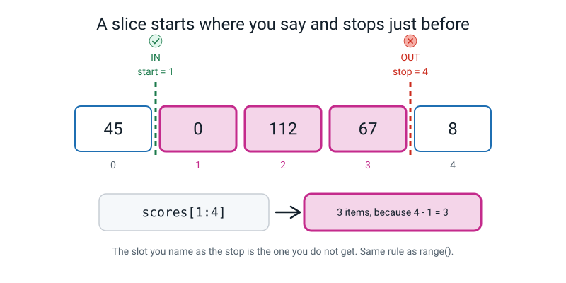
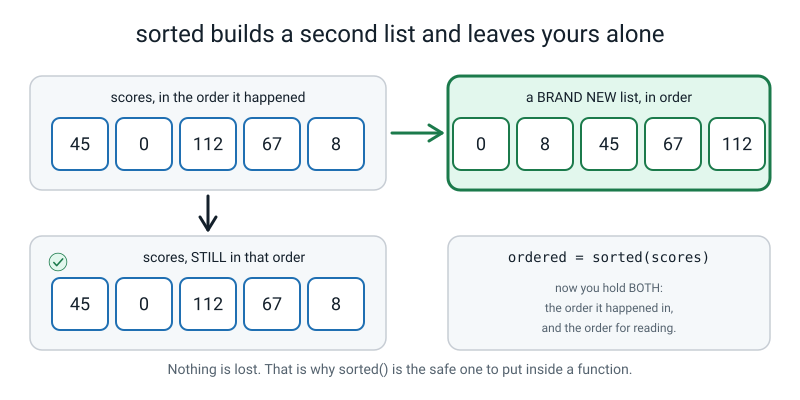
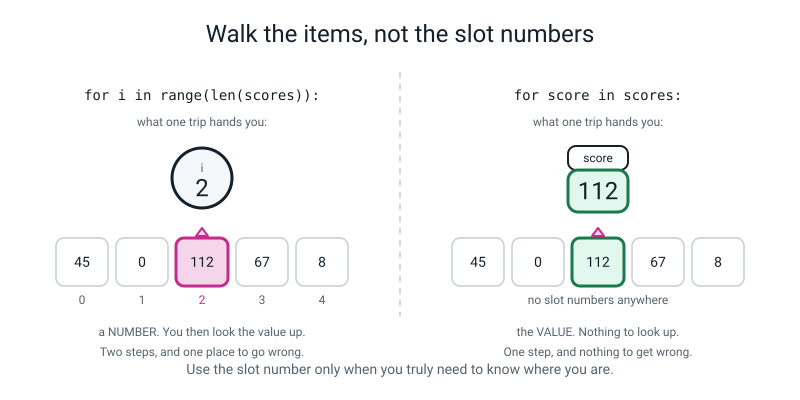
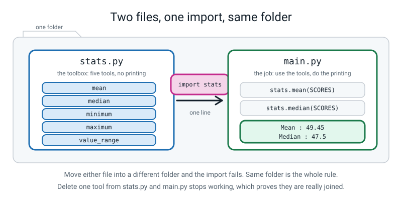
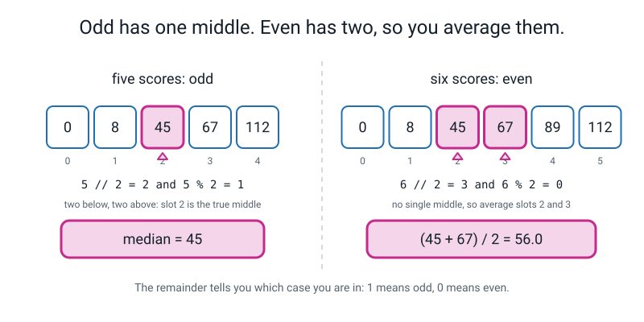
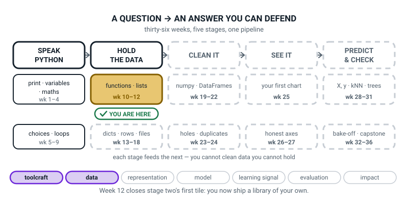

# Week 12 — Your Own Stats Toolkit

[⬅ Week 11](week-11.md) · [Course Home](../README.md) · [Week 13 ➡](week-13.md) · [Student Guide](../student-guide/week-12.md) · [Workbook](../workbook/week-12.md)

---

## 📋 At a Glance

| | |
|---|---|
| **Duration** | 70 minutes |
| **Type** | 🟩 Lab 🧰 — the week the student's own library is born. Two files, one `import`, and it runs by the end of class. |
| **Big idea** | Once your functions live in their own file you can `import` them into any program you write, forever. |
| **New vocabulary** | slice · `sorted` · module · `import` · median |
| **New syntax** | `scores[1:4]` · `sorted(scores)` · `for score in scores:` · `import stats` / `from stats import mean` |
| **Materials** | **A small tin, pencil case or toolbox with three or four real tools in it** (ruler, sharpener, rubber) for the Hook · **the four index cards and the pink number strip from Week 11**, plus **a pencil to lay between two cards** · the printed workbook (Build It, Parts 1 to 5, is the hand-in work; the median proof in Part 3 needs room for handwritten arithmetic) · the notebook, open at both the Bug Log and the hand-arithmetic section |
| **Tech needed** | Python 3, an editor, one terminal. **No libraries.** Both files must sit in the *same folder*. |
| **Prep time** | 20 minutes the night before, 5 minutes on the day |

> **⚠️ Watch out — the one thing that will break this lesson:** `stats.py` and `main.py` **must be in the same folder**, and the terminal must be `cd`-ed into that folder. Nine out of ten `ModuleNotFoundError` messages this week are that and nothing else. Check it in your prep and check it again before minute 25.

---

## 🎯 Lesson Objectives

By the end of the lesson the student can:

1. **Take a slice** of a list and explain why the stop number is *not* included.
2. **Sort a list without changing the original**, and say how `sorted()` differs from `.sort()`.
3. **Loop over the items of a list** instead of over the numbers 0, 1, 2.
4. **Import a function from a file they wrote themselves** and use it in a different file.
5. **Prove `median()` is correct** for an odd-length list *and* an even-length list, with the hand arithmetic written out for both.

Observable evidence: two files, `stats.py` and `main.py`; `python3 main.py` printing a full season report; and a written median proof for 5 scores and for 6 scores with the arithmetic shown on paper, not just the code output.

---

## 🧑‍🏫 What YOU Need to Know First

> **📌 About the code blocks in this guide.** Outside the **🧰 Prep Checklist** and the **🔑 Answer Key**, the blocks are **illustrations, not files** — each one carries on from the one above it, so the `import` lines and the data are typed once, in the first block that needs them. **The complete runnable files are in the Prep Checklist and the Answer Key.** If you paste an illustration on its own and get `NameError`, that is why, and nothing is broken.

**You do not need to have programmed before to teach this.** Read this once — about 25 minutes, including running the code — then do the Prep Checklist. This is a lab week, so most of the class is building; your job is to be confident about four small ideas.

### 1. Where this week sits, and why it matters more than it looks

The student has written the same three or four lines several times now: start a total at zero, walk the list, add each item, divide by the length. It has appeared in Week 7, in Week 11's drill 11, and it will appear again every single time they want an average — which, in a course about data, is roughly every week until June.

This week those lines move **out of the program and into a file of their own**. That file is a *module*, and once it exists, every program the student ever writes can borrow from it.

This is not a convenience feature. It is how all software is built. In Week 21 they will type `import pandas as pd` and get 300,000 lines written by strangers. **The only thing separating `import stats` from `import pandas` is who wrote the file**, and a student who has built their own module understands the second one in a way that no explanation can produce.

> **Module** — any `.py` file. You import it by its filename with the `.py` left off, and you get everything defined inside it.

### 2. Slicing — and the second off-by-one of the term

> **Slice** — a new list made from part of an existing list, written `list[start:stop]`. The start is included; **the stop is not**.

```python
scores = [45, 0, 112, 67, 8]           # slots 0, 1, 2, 3, 4

print(scores[1:4])                     # slots 1, 2, 3 -- NOT 4
print(scores[0:2])                     # slots 0, 1
print(scores[:3])                      # leave the start out: from the beginning
print(scores[2:])                      # leave the stop out: to the very end
print(scores[-2:])                     # the last two
print(scores[:])                       # a copy of the whole thing
print(scores[3:3])                     # start and stop the same -> nothing at all
print(scores[2:99])                    # a stop past the end does NOT crash
print(len(scores[1:4]), "items, because 4 - 1 = 3")
print(scores)                          # the original list is untouched
```

```text
[0, 112, 67]
[45, 0]
[45, 0, 112]
[112, 67, 8]
[67, 8]
[45, 0, 112, 67, 8]
[]
[112, 67, 8]
3 items, because 4 - 1 = 3
[45, 0, 112, 67, 8]
```

Last week's off-by-one was "the last index is one less than the count". This week's is "the stop is not included". **Two different off-by-ones, a week apart, deliberately** — meeting them together is what makes students give up.

**Why the stop is excluded, and you will be asked.** Three real reasons, in increasing order of persuasiveness:

1. **The length falls out for free.** `scores[1:4]` has `4 − 1 = 3` items. Always, inside the list. No thinking required. If the stop were included you would have to remember a `+1` every single time.
2. **Slices join up perfectly.** `scores[:3]` and `scores[3:]` between them give you the whole list, with nothing missing and nothing counted twice. The number 3 appears once in each and the two halves fit together like tiles. Try that with an inclusive stop and you need `[:3]` and `[4:]`, and one day you will write `[3:]` and silently duplicate an item.
3. **It is the same rule as `range()`**, which they have used since Week 7. `range(4)` gives 0, 1, 2, 3 and stops before 4. `scores[0:4]` gives slots 0, 1, 2, 3 and stops before 4. **One rule, two places** — and it is worth saying out loud that this is a mercy, not a coincidence.

The physical demonstration, and it is the best thirty seconds of the lesson: lay the four index cards from Week 11 out with the pink number strip. Then lay a **pencil across the strip between two cards.** The pencil is the stop. **A slice takes the cards up to the pencil, and the pencil is not a card.**


*Figure 12.1 — The start is a card you take. The stop is a fence you stop at.*

Two more things worth knowing before a student finds them:

- **`scores[3:3]` gives `[]`** — an empty list, no error. Start and stop in the same place means zero items, which is exactly `3 − 3`.
- **`scores[2:99]` does not crash.** A *slice* with a stop past the end quietly gives you what there is. A single *index* past the end is an `IndexError`. That asymmetry surprises people, and the reason is that a slice is a request for a range while an index is a request for one specific thing.

### 3. `sorted()` builds a new list. `.sort()` changes yours.

```python
scores = [45, 0, 112, 67, 8]

ordered = sorted(scores)               # a brand-new list, in order
print("ordered :", ordered)
print("original:", scores)             # unchanged -- this is the whole point

print("biggest first:", sorted(scores, reverse=True))
print("original again:", scores)
```

```text
ordered : [0, 8, 45, 67, 112]
original: [45, 0, 112, 67, 8]
biggest first: [112, 67, 45, 8, 0]
original again: [45, 0, 112, 67, 8]
```

*(`reverse=True` is a keyword argument, which is Week 10's syntax being reused rather than a new construct. Point that out; it is a nice moment.)*

There is also `.sort()`, which rearranges the list you already have and hands back nothing. It is genuinely useful and it is **the trap of the week**, because it looks like `sorted()`:

```python
scores = [45, 0, 112, 67, 8]
ordered = scores.sort()
print(ordered)
print(ordered[0])
```

```text
None
Traceback (most recent call last):
  File "/Users/you/ai-academy/level2/week12_sort_trap.py", line 4, in <module>
    print(ordered[0])
TypeError: 'NoneType' object is not subscriptable
```

`None` again. Exactly the same shape as last week's `scores = scores.append(89)`, and for exactly the same reason: **a command that changes a list in place hands back nothing.** The rule the student should end the week with:

> **Use `sorted()` when you want a new list. Use `.sort()` only when you truly want to rearrange the one you have — and never put either on the right of an `=` expecting a list back from `.sort()`.**

**Why this matters inside a function specifically:** `median()` has to put the numbers in order to find the middle. If it used `.sort()`, it would silently reorder *the caller's* list. Somebody asks for the median of their innings, in the order they happened, and gets the median — plus their season quietly re-sorted, which they did not ask for and will not notice until something else breaks. That is called a **side effect**, and side effects in a function whose job is "just tell me a number" are how trust dies. `sorted()` costs one extra list and buys you a function nobody has to be afraid of.


*Figure 12.2 — Nothing is lost. You end the line holding both orders.*

### 4. `for score in scores:` — walking the items

Last week they walked a list like this:

```python
scores = [45, 0, 112, 67, 8]
for i in range(len(scores)):           # i is 0, 1, 2, 3, 4
    print(i, scores[i])
```

```text
0 45
1 0
2 112
3 67
4 8
```

This week, the version they will use for the rest of their lives:

```python
for score in scores:                   # score IS the value, no brackets needed
    print(score)
```

```text
45
0
112
67
8
```

**The difference in one sentence:** the first version hands you a *slot number* and you have to look the value up; the second hands you *the value*. One step instead of two, and one fewer place to write an off-by-one.

The word `score` is a name you chose, exactly like a parameter name. `for s in scores:` works identically. Choose the singular of the list's name and the loop reads like English: *for score in scores*, *for player in players*, *for row in rows*.

**When you still want `range(len(...))`:** only when you genuinely need to know *where* you are — "which innings was the best?" needs a position, not just a value. That case is rarer than students expect, and there is a nicer tool for it in Week 14.


*Figure 12.3 — The left version hands you a number and makes you fetch. The right version hands you the value.*

> **⚠️ Watch out:** the classic confusion, and it produces a real crash. A student mixes the two and writes `for score in scores:` then `print(scores[score])`. Now `score` holds 45 and they are asking for slot 45. Real output:
>
> ```text
> Traceback (most recent call last):
>   File "/Users/you/ai-academy/level2/week12_loop_trap.py", line 3, in <module>
>     print(scores[score])
> IndexError: list index out of range
> ```
>
> The fix is to delete the brackets. The diagnosis is "you already have the value; stop looking it up."

### 5. Two files and one `import`

Two files, in the **same folder**. `stats.py` holds the tools and does nothing else:

```python
def mean(scores):
    total = 0
    for score in scores:
        total += score
    return total / len(scores)
```

`main.py` borrows them:

```python
import stats                           # no .py, no quotes

print(stats.mean([45, 0, 112, 67, 8]))
```

```text
46.4
```

Four things to be solid on, because each of them causes a real error this week:

**(a) No `.py` and no quotes.** `import stats`, not `import stats.py` and not `import "stats"`. The name after `import` is a *module name*, and the module name is the filename with the extension removed.

```text
ModuleNotFoundError: No module named 'stats.py'; 'stats' is not a package
```

**(b) `stats.` in front of every borrowed function.** `stats.mean(...)`, not `mean(...)`. The prefix is a good thing: six months later you can see at a glance where every function came from. There is a shorter style:

```python
from stats import mean, median         # take just these two, by name

print(mean([45, 0, 112, 67, 8]))
print(median([45, 0, 112, 67, 8]))
```

```text
46.4
45
```

Teach `import stats` as the default and show `from stats import mean` once, because the syntax ladder lists both. In a big program the first is clearer; the second is shorter.

**(c) Same folder, and the terminal has to be there.** If `main.py` cannot see `stats.py`, you get:

```text
Traceback (most recent call last):
  File "/Users/you/ai-academy/level2/lonely_main.py", line 3, in <module>
    import stats                           # my own file, sitting right next to this one
ModuleNotFoundError: No module named 'stats'
```

**(d) Running `stats.py` on its own produces nothing at all, and that is correct.**

```text
```

Zero lines. No error. Exit code 0. This will worry the student, so get in first: **`stats.py` is a toolbox. Opening a toolbox does not build anything.** It only contains `def`s, and a `def` that is never called does nothing — which is Week 9's lesson arriving again in a new costume.


*Figure 12.4 — The toolbox does the working out. The job file does the printing.*

**The file-name trap, and it is worth ninety seconds.** `stats.py` is a *safe* name because there is no built-in Python module called `stats`. `statistics.py` is a *dangerous* name, because there is. If a student names their file `statistics.py`, Python finds theirs instead of the real one and the errors are baffling. Two files, in one folder — first, the badly named one:

```python
# statistics.py -- a BAD file name.
def mean(scores):
    total = 0
    for score in scores:
        total += score
    return total / len(scores)
```

Then a program that tries to use the *real* `statistics` library, which genuinely does contain a `median`:

```python
# uses_stats.py
import statistics
print(statistics.mean([1, 2, 3]))
print(statistics.median([1, 2, 3]))
```

```text
2.0
Traceback (most recent call last):
  File "/Users/you/ai-academy/level2/uses_stats.py", line 4, in <module>
    print(statistics.median([1, 2, 3]))
AttributeError: module 'statistics' has no attribute 'median'. Did you mean: 'mean'?
```

The real `statistics` module absolutely has a `median`. Python never looked at it. **Never name a file after a library.** The banned list for this course: `random.py`, `math.py`, `csv.py`, `statistics.py`, `numpy.py`, `pandas.py`, `sklearn.py`, `matplotlib.py`.

**And one harmless thing that will appear and alarm somebody:** after the first successful import, a folder called `__pycache__` shows up next to your files, containing something like `stats.cpython-310.pyc`. It is Python caching a pre-chewed copy of your module so the next import is quicker. It is not yours to edit, it is safe to delete, and it will come straight back.

### 6. Median — the algorithm, and why the two cases

> **Median** — the middle value once the numbers are put in order.

Why bother, when we already have the mean? Take five monthly pocket-money amounts: 200, 250, 300, 250 and 12,000, because one child's grandmother visited.

- **Mean:** 13,000 ÷ 5 = **2,600**. Nobody gets 2,600.
- **Median:** in order that is 200, 250, **250**, 300, 12,000. The middle is **250**, which describes four of the five children.

**One extreme value drags the mean and leaves the median alone.** That single sentence is why every honest data report in this course prints both, and it comes back hard in Week 24 and again in the capstone.

The algorithm, in four steps:

1. Sort a **copy** (never wreck the caller's list).
2. Let `n` be how many there are.
3. If `n` is **odd**, the answer is the single middle item, at index `n // 2`.
4. If `n` is **even**, average the two middle items, at `n // 2 - 1` and `n // 2`.

**Why `n // 2` finds the middle when `n` is odd.** `//` is whole-number division, from Week 3. For 5 items in slots 0–4: `5 // 2` is 2, and slot 2 has two slots below it and two above. Genuinely the middle. For 7 items: `7 // 2` is 3, with three below and three above. It works because throwing away the half is exactly the right thing to throw away.

**Why an even count needs two.** For 6 items in slots 0–5 there is no single middle — slots 2 and 3 are equally central. `6 // 2` is 3, the upper middle; `6 // 2 - 1` is 2, the lower one. Average them.

**How the code knows which case it is in:** `n % 2`, the remainder, also from Week 3. An odd count leaves 1; an even count leaves 0.


*Figure 12.5 — The remainder tells you which case you are in: 1 means odd, 0 means even.*

**Write `median` last.** Not because it is hard to type — it is nine lines — but because it is the only function in the toolkit with two cases, and the student needs to have got the easy four working and imported before they meet a function that has to make a decision about itself.

### 7. The three misconceptions you will actually meet

**Misconception 1 — "`scores[1:4]` gives me four items."** Or three items ending at 4, or items 1 to 4 inclusive. All variations of the same thing. The cure is arithmetic, not explanation: make them write `4 - 1 = 3` next to every single slice they take, on paper, for the whole lesson. After about six of those it becomes automatic.

**Misconception 2 — "`sorted(scores)` sorts `scores`."** They write `sorted(scores)` on a line of its own, then print `scores`, and are baffled that nothing happened. The demonstration is two lines and settles it. The rule: **`sorted()` gives you something; you have to catch it.**

**Misconception 3 — "importing runs the other file."** It does, in a sense — Python reads `stats.py` top to bottom — but since `stats.py` contains only `def`s, reading it produces no visible effect at all. The student's mental model should be: *importing hands you the tools; it does not use them.* If they put a stray `print` in `stats.py`, it will fire on every import, which is a good accident to have once.

### 8. How deep to go, and where to stop

**Go this far:** slices with both ends, one end, and negative ends; `sorted()` and why it copies; `for x in list:`; `import` and `from ... import`; median for both cases; and the delete-a-function experiment.

**Stop before:**

- **`if __name__ == "__main__":`.** This is the standard way to give a module self-tests, and it is genuinely useful, and it is a magic incantation with four underscores in it. Not this week. Our `stats.py` contains only `def`s, so there is nothing to guard, and that is a cleaner story. (Week 16 is early enough.)
- **`assert`.** A lovely way to write tests. New construct, and print-and-look does the job today.
- **The step in a slice** (`scores[::2]`, `scores[::-1]`). Delightful and it is a third number in the brackets. If a student finds `[::-1]` and reverses a list, be pleased and move on.
- **`.sort(key=...)` and `sorted(rows, key=...)`.** Week 15.
- **`sum()`, `min()`, `max()` as built-ins.** This is the important one. **They exist, and they do in one word what the student is about to write in five lines.** Do not use them this week — Week 14 and Week 20 introduce them on purpose, *after* the student has built their own. If a student finds `sum(scores)`, the honest answer is: "Yes. That's real and it works, and the reason we're writing it out by hand is that in about six weeks you'll meet a thing there is no built-in for — and you'll know what to do, because you built this one."
- **`b = a` putting a second label on the same list.** This *does* belong this week if there is time, because it is the same idea as `sorted()` versus `.sort()`. It is in the harder variation, not the main lesson.
- **Docstrings and type hints.** Still no.

---

### 9. 🧭 The Growing Map — how to use it, this week and every week

The student guide carries one figure that is not about this week's content. It is the same pipeline
every week with one more piece filled in, and it is the only place either book shows the learner the
*shape* of what they are building rather than the topic in front of them.



*Figure 12.0 — Week 12's version. Stage two, HOLD THE DATA, is solid for the first time, and its
`functions · lists` tile is gold — the tile this week closes. Two threads lit: toolcraft and data.*

**What to do with it, in about two minutes at the end of the lesson:**

1. **Show it, don't explain it.** Ask *"which box did we shut today?"* You want a finger on the gold
   `functions · lists` tile. If someone says *"the import one"* — accept it warmly and say the sentence
   back: **`stats.py` is what finished that tile.** Pointing is the whole exercise.
2. **Then the better question:** *"why is everything from CLEAN IT rightwards still dashed?"* Anything
   that means *we have not got there yet* is right. Then push once: *"what would you need before you
   could clean a table?"* — you are fishing for **a table**, which is exactly the next six weeks.
3. **Have them update their own copy** in the inside cover of their notebook: shade the tile they just
   finished, and write `stats.py` underneath it in pencil. The copy they draw is worth more than mine.

> **🧑‍🏫 Why this is worth two minutes.** Week 12 is the first week a learner can honestly say *"I have a
> library"*, and that sentence is a large part of why anyone sticks with programming. The map is what
> turns it from *"we did some list stuff"* into *"we finished a box."* It also separates two very
> different problems for you: *"I don't understand this week"* and *"I don't know where this week
> goes."* Without the map, both arrive at your desk as "I don't get it."

---

## 🧰 Prep Checklist

### 20 minutes the night before

- [ ] **Print the whole workbook** (Warm-Up through Self-Check). Build It Part 3 (the median proof) needs room for handwritten arithmetic — print it single-sided.
- [ ] **Find the tin.** Any small box or pencil case with three or four real tools in it: a ruler, a sharpener, a rubber, a pair of scissors. It is the Hook and it takes ten seconds to use.
- [ ] **Find Week 11's four index cards and the pink number strip**, and put a pencil with them. You will lay the pencil *between* two cards to show what a slice's stop number is.
- [ ] **Make the folder and check where you are.** In a terminal:

```
cd ~/ai-academy/level2
ls
```

You should see the student's earlier files. **Both of this week's files go here.**

- [ ] **Run this code yourself first — file one.** Make `stats.py` and type exactly this:

```python
# stats.py — my own statistics toolkit.
# Every function in here RETURNS a number. Not one of them prints.
# This file is a TOOLBOX. Running it on its own does nothing, and that is correct.

def mean(scores):
    # Give back the average: the total shared out equally.
    if len(scores) == 0:               # guard: there is no average of nothing
        return None
    total = 0                          # start the running total at zero
    for score in scores:               # walk through the items themselves
        total += score                 # add this one onto the total
    return total / len(scores)         # share the total between all of them

def minimum(scores):
    # Give back the smallest value in the list.
    if len(scores) == 0:
        return None
    smallest = scores[0]               # assume the first one is the smallest
    for score in scores:               # then check every single one
        if score < smallest:           # found something smaller?
            smallest = score           # it is the new champion
    return smallest

def maximum(scores):
    # Give back the largest value in the list.
    if len(scores) == 0:
        return None
    largest = scores[0]                # assume the first one is the largest
    for score in scores:
        if score > largest:
            largest = score
    return largest

def value_range(scores):
    # Give back the spread: largest minus smallest.
    if len(scores) == 0:
        return None
    return maximum(scores) - minimum(scores)      # reuse our own two functions

def median(scores):
    # Give back the middle value once the numbers are put in order.
    if len(scores) == 0:
        return None
    ordered = sorted(scores)           # a NEW sorted list; the caller's list is untouched
    n = len(ordered)                   # how many numbers there are
    middle = n // 2                    # whole-number divide: the upper middle slot
    if n % 2 == 1:                     # odd count -> there is one true middle
        return ordered[middle]
    else:                              # even count -> average the two middles
        return (ordered[middle - 1] + ordered[middle]) / 2
```

Now run `python3 stats.py`. You must see **exactly nothing**:

```text
```

**That blank block is the expected output.** If you see an error, you have a typo; if you see numbers, you have a stray `print`.

- [ ] **Run this code yourself first — file two.** In the *same folder*, make `main.py`:

```python
# main.py — a season report on 20 cricket scores, built from my own toolkit.

import stats                             # my own file, sitting right next to this one

SCORES = [45, 0, 112, 67, 8, 89, 34, 101, 23, 56,
          77, 4, 90, 19, 63, 38, 72, 15, 50, 26]     # 20 innings

print("=" * 46)
print("  SEASON REPORT - 20 INNINGS")
print("=" * 46)

print("  As played :", SCORES)           # the order the innings happened in
print("  In order  :", sorted(SCORES))   # a NEW sorted list, just for reading
print("-" * 46)

# ---- the five toolkit numbers ----
print("  Innings   :", len(SCORES))
print("  Mean      :", f"{stats.mean(SCORES):.2f}")
print("  Median    :", stats.median(SCORES))
print("  Lowest    :", stats.minimum(SCORES))
print("  Highest   :", stats.maximum(SCORES))
print("  Range     :", stats.value_range(SCORES))
print("-" * 46)

# ---- slices: pull out part of the row ----
print("  First 3   :", SCORES[0:3])      # slots 0, 1, 2 -- NOT slot 3
print("  Last 3    :", SCORES[-3:])      # the last three, however long the list is
print("  Worst 3   :", sorted(SCORES)[0:3])
print("  Best 3    :", sorted(SCORES)[-3:])
print("-" * 46)

# ---- did the season get better or worse? two halves, one slice each ----
print("  First half mean  :", f"{stats.mean(SCORES[:10]):.2f}")
print("  Second half mean :", f"{stats.mean(SCORES[10:]):.2f}")
print("-" * 46)

# ---- counting with a for-each loop ----
fifties = 0                              # start the counter at zero
for score in SCORES:                     # walk the items themselves
    if score >= 50:
        fifties += 1                     # one more fifty
print("  Fifty-plus:", fifties)

ducks = 0
for score in SCORES:
    if score == 0:
        ducks += 1
print("  Ducks     :", ducks)
print("-" * 46)

# ---- proof that sorted() did not wreck the original ----
print("  Still as played:", SCORES[0], SCORES[1], SCORES[2])
print("=" * 46)
```

Run `python3 main.py`. You must see **exactly** this:

```text
==============================================
  SEASON REPORT - 20 INNINGS
==============================================
  As played : [45, 0, 112, 67, 8, 89, 34, 101, 23, 56, 77, 4, 90, 19, 63, 38, 72, 15, 50, 26]
  In order  : [0, 4, 8, 15, 19, 23, 26, 34, 38, 45, 50, 56, 63, 67, 72, 77, 89, 90, 101, 112]
----------------------------------------------
  Innings   : 20
  Mean      : 49.45
  Median    : 47.5
  Lowest    : 0
  Highest   : 112
  Range     : 112
----------------------------------------------
  First 3   : [45, 0, 112]
  Last 3    : [15, 50, 26]
  Worst 3   : [0, 4, 8]
  Best 3    : [90, 101, 112]
----------------------------------------------
  First half mean  : 53.50
  Second half mean : 45.40
----------------------------------------------
  Fifty-plus: 10
  Ducks     : 1
----------------------------------------------
  Still as played: 45 0 112
==============================================
```

- [ ] **Do the delete experiment yourself.** Cut the whole `median` function out of `stats.py`, save, and run `main.py` again. You must get:

```text
Traceback (most recent call last):
  File "/Users/you/ai-academy/level2/main.py", line 19, in <module>
    print("  Median    :", stats.median(SCORES))
AttributeError: module 'stats' has no attribute 'median'. Did you mean: 'mean'?
```

**Put it back.** That message is the centrepiece of the lesson and you need to have seen it before they do.

- [ ] **Read section 6 (median) once with a pencil.** Work out `20 // 2`, `20 % 2`, `19 // 2` and `19 % 2` on paper. Four seconds each and it is the arithmetic the homework is built on.

### 5 minutes on the day

- [ ] Tin on the table, closed.
- [ ] Four index cards, pink strip and a pencil beside them.
- [ ] Terminal open, **already `cd`-ed into `~/ai-academy/level2`**, and run `ls` once so the folder contents are on the screen where everybody can see them.
- [ ] Your own `stats.py` and `main.py` **closed, and moved somewhere else or renamed** so they cannot be opened by accident. The student types both from blank.
- [ ] Notebook open at the Bug Log *and* at the hand-arithmetic section.
- [ ] Screen font about 18pt.

### Fallback if something fails

| If this fails | Do this instead |
|---|---|
| The laptop dies | The slicing and median halves work completely on paper. Cards plus pencil for slices. For median: write the twenty scores on paper, sort them by hand, count in from both ends to the middle two, and average them. That is genuinely the whole algorithm and it is *better* done by hand first. The two-file part cannot be done unplugged — hold it over, and use the tin to explain what will happen next time. |
| `ModuleNotFoundError: No module named 'stats'` | Almost always the folder. In the terminal, `ls` and check both `.py` files are listed. If they are not, you are in the wrong directory: `cd ~/ai-academy/level2`. Check for `stats.py.txt` too — some editors add an extension. |
| The editor saved `stats.py` somewhere odd (Documents, Desktop, a project folder) | Use *File → Save As* and navigate to the folder deliberately. Then `ls` in the terminal to confirm both files are side by side. Do this before writing a single line of `main.py`. |
| Some earlier file in the folder is called `statistics.py` or `random.py` | Rename it now, and delete the `__pycache__` folder beside it. Then explain why in one sentence: Python found their file instead of the library. |
| Running short at minute 55 with median not written | **Stop and hand median over as homework** — the workbook's Build It Part 3 is designed to be doable alone, and the hand arithmetic is the part that matters anyway. Do not skip the delete experiment to buy time; skip a couple of the slice lines in `main.py` instead. |
| The student already knows imports | Give them the harder variation: a third file, `test_stats.py`, that imports `stats` and checks fifteen cases including empty lists, one-item lists and negative numbers. |

---

## ⏱️ The Lesson, Minute by Minute

| Segment | Minutes | Running total | What happens |
|---|---|---|---|
| 🪝 Hook — You Don't Carve a New Ruler | 7 | 7 | A tin of tools, and four programs that each carved their own |
| 🧠 Concept — Slice, Copy, and Walk the Items | 16 | 23 | Pencil between the cards; `sorted()` copies; `for score in scores:` |
| 💻 Live-Code Together — `stats.py` then `main.py` | 18 | 41 | Four functions, then the import. Two deliberate mistakes. Then delete a function and watch it break. |
| 🎲 Their Turn — Median, Odd Then Even | 20 | 61 | Write median last, prove it on 5 scores and on 6, by hand and in code |
| 🔑 Wrap & Assign | 9 | 70 | Three checks, the vocabulary, homework step one |

---

### 🪝 Hook — You Don't Carve a New Ruler (7 minutes)

**Do this:** Lids down. Put the closed tin on the table. Open it and take the tools out one at a time — ruler, sharpener, rubber — and lay them in a row.

**Say this:**

> "Ruler. Sharpener. Rubber. Three tools.
>
> Question. Tomorrow, when you need to draw a straight line — are you going to carve a new ruler?"

*(Let them enjoy that.)*

> "Of course not. You open the tin. The ruler doesn't belong to one drawing. It belongs to the tin, and every drawing you ever do can borrow it.
>
> Now let me show you something slightly embarrassing about your own code."

*(Bring up their folder listing, or just say it.)*

> "In week 7 you wrote four lines to work out an average: start a total at zero, go along, add each one, divide by how many. In week 11, drill eleven — same four lines. And you'll want them again next week, and the week after, and honestly every single week between now and June, because this is a course about data and data has averages in it.
>
> Every one of those programs carved its own ruler.
>
> So here's what we're doing today. We're building the tin. It's a file, and we're going to call it `stats.py`, and it will contain five tools: mean, median, lowest, highest and the spread between them. And then — this is the bit — we're going to write a *completely separate program*, in a *different file*, that opens the tin and uses them. One line: `import stats`. That's it.
>
> And here's why that one line matters more than it looks. In about nine weeks you're going to type `import pandas`, and you'll get three hundred thousand lines of code written by hundreds of strangers over fifteen years, and you will use it without reading any of it. **The only difference between `import pandas` and `import stats` is who wrote the file.** So today you find out what's actually happening when you do that, by being the stranger."

*(Now pick up the ruler and hold it out, then pull it back.)*

> "One more thing, and then we start. Later on I'm going to reach into your tin and **take the ruler out.** Not because I'm mean. Because when your program stops working the second I do that, you'll know — really know, not just believe — that the two files are genuinely joined together."

**Ask this:**

| Ask | Answer you want | If they say something else |
|---|---|---|
| "Why don't you carve a new ruler every day?" | Because you already have one and it works. | Any version of this is fine. Push once for "and if you fixed the ruler, every drawing gets the better ruler." |
| "How many times have you written an average loop this term?" | Two or three, and they can name where. | If they cannot remember, that is itself the point: "You've written it twice and you don't remember. That's exactly the problem." |
| "If we find a mistake in our average, how many files do we fix?" | One — the tin. | If they say "all of them", that is the *before* answer, and you should say so: "That's how it is right now. By the end of today it's one." |
| "What's the difference between `import stats` and `import pandas`?" | Who wrote the file. | If they say "pandas is bigger" — true, and not the interesting difference. Reply: "Bigger, yes. Different in kind? No." |

---

### 🧠 Concept — Slice, Copy, and Walk the Items (16 minutes)

**Do this:** Lids still down. Cards and pink strip out. Pencil in hand. Notebook open.

**Say this — part 1, slices (6 minutes):**

> "Three small things and then we build. First one, and last week's cards are back for it.
>
> Four cards. Pink numbers zero, one, two, three. Last week you learned to take out *one* card. Today: how do you take out *some* of them?
>
> You say where to start and where to stop, with a colon between them. `scores[1:4]`. Start at one. Stop at four.
>
> Before I tell you what that gives, predict it. How many cards do I get?"

Let them guess. Most say four, or "one to four so that's four cards". Then:

> "Watch."

*(Lay the pencil across the strip **between** the card at 3 and where a card at 4 would be.)*

> "**The pencil is the stop. And the pencil is not a card.**
>
> I start at slot one and I take cards until I hit the pencil. One, two, three. **Three cards.** And look at the arithmetic — four minus one is three. The number of cards you get is the stop minus the start (as long as the slice sits inside the list). You never have to think about it.
>
> And here's why Python does it that way, because 'the stop isn't included' sounds like a nuisance until you see this."

*(Move the pencil to sit between slot 2 and slot 3.)*

> "`scores[:3]` — no start, so from the beginning — gives me cards zero, one, two. And `scores[3:]` — no stop, so to the end — gives me card three. Put those two together and I've got the whole row back. Nothing missing, nothing counted twice, and the number **three** appears in both of them.
>
> If the stop were included, I'd need `[:3]` and then `[4:]`, and one day I'd write `[3:]` by mistake and get card three twice and never notice.
>
> One more thing, and this one is a relief: **you have seen this rule before.** `range(4)` gives you nought, one, two, three, and stops before four. Same rule. One rule, two places. That's not a coincidence, that's a mercy."

Write into the notebook:

> **slice** — `scores[start:stop]`. Start **in**, stop **out**. Inside the list you get `stop - start` items.
> `scores[:3]` from the beginning · `scores[3:]` to the end · `scores[-3:]` the last three

**Say this — part 2, `sorted()` (5 minutes):**

> "Second thing. To find a median I have to put the numbers in order. So — careful now — do I want to *rearrange* the season, or do I want *a second copy* that happens to be in order?"

Let them think about it.

> "Think about what the season is. It's the order the innings actually happened in. If I sort it, I've destroyed that. I can't tell you the first innings any more, or whether they got better over the year.
>
> So Python gives you both, and you have to know which is which.
>
> `sorted(scores)` **hands you back a brand-new list**, in order, and doesn't touch yours. That's the safe one and it's the one we'll use.
>
> There's another one, `scores.sort()` with a dot, and that one rearranges the list you already have, right where it sits. It is genuinely useful and it is also this week's trap, because — do you remember what happened last week when you wrote `scores = scores.append(89)`?"

*(Wait for `None`.)*

> "Exactly the same thing happens here. Anything with a dot that *changes* a list hands back nothing. So `ordered = scores.sort()` puts `None` in `ordered`, and your list is sorted but your variable is empty.
>
> The rule: **`sorted()` gives you a new list, and you have to catch it. `.sort()` changes yours, and gives you nothing.**"

Write into the notebook:

> **`sorted(scores)`** — a NEW sorted list. The original is untouched. You must catch it.
> **`scores.sort()`** — rearranges the original. Returns `None`. Careful.

**Say this — part 3, `for score in scores:` (5 minutes):**

> "Last thing before the keyboard, and it's a small gift.
>
> Last week, to go along a list, you wrote `for i in range(len(scores))`, and then inside the loop you wrote `scores[i]` to get the actual value. Two steps: get a number, then look the value up.
>
> This week: `for score in scores:` — and `score` **is the value.** No brackets. No looking up.
>
> Say it out loud: *for score in scores*. It reads like English, because `score` is the singular of `scores`, and you get to choose that word yourself just like a parameter name.
>
> One trap, and it's a good one to know about in advance. If you write `for score in scores:` and then *also* write `scores[score]` inside the loop, you're asking for slot forty-five, and you'll get an `IndexError`. **You already have the value. Stop looking it up.**"

Write into the notebook:

> **`for score in scores:`** — hands you each **value**, one at a time. No slot numbers.
> Use `range(len(...))` only when you need to know **where** you are.

**Ask this:**

| Ask | Answer you want | If they say something else |
|---|---|---|
| "How many items in `scores[1:4]`?" | Three. Four minus one. | If they say four, put the pencil back on the strip and count out loud. Then have them write `4 - 1 = 3` in the margin. |
| "What does `scores[:3]` give?" | Slots 0, 1, 2 — the first three. | If stuck, prompt: "no start number means start where?" |
| "`scores[:3]` and `scores[3:]` — is anything missing? Is anything in both?" | Nothing missing, nothing repeated. | This is the persuasive one. If they are unsure, do it with the cards physically and count. |
| "Why does `sorted()` make a copy instead of just sorting?" | So you keep the original order, which is real information. | If they say "to be annoying" — fair. Ask: "What was the first innings of the season? Now sort the list and ask me again." |
| "`ordered = scores.sort()` — what's in `ordered`?" | `None`. | If they say "the sorted list", promise a demonstration and do it in ninety seconds at the keyboard. |
| "In `for score in scores:`, what's in `score` on the third trip round?" | 112 — the third value, not the number 2. | If they say 2, they are still thinking in slot numbers. "That's last week's loop. This one hands you the card, not the number under it." |

---

### 💻 Live-Code Together — `stats.py` then `main.py` (18 minutes)

**Do this:** Lids up. **The student types every character.** Predict before every Run. This is the longest live-code of the term so keep the pace up and do not editorialise.

**Say this to start:**

> "Two files today. The tin first, then the program that opens it. And they have to be in the same folder, so before you type anything: run `ls` and tell me what's in this folder."

**Step 1 (2 min) — start the tin.** "New file. `stats.py`. Save it in this folder *first*. Three comment lines, then two blank lines."

```python
# stats.py — my own statistics toolkit.
# Every function in here RETURNS a number. Not one of them prints.
# This file is a TOOLBOX. Running it on its own does nothing, and that is correct.
```

**Step 2 (4 min) — `mean`, the first tool.** *Add to the bottom of `stats.py`.*

```python
def mean(scores):
    # Give back the average: the total shared out equally.
    if len(scores) == 0:               # guard: there is no average of nothing
        return None
    total = 0                          # start the running total at zero
    for score in scores:               # walk through the items themselves
        total += score                 # add this one onto the total
    return total / len(scores)         # share the total between all of them
```

Point at three things as they type: the guard on line 3 (`None` from Week 10, used on purpose), `for score in scores:` (this week's new loop, in its first real job), and the fact that **nothing in here prints.**

Now: "Save it. Run it. `python3 stats.py`. What do you predict?"

They will predict something. **Run.**

```text
```

### ⛔ Deliberate confusion number one — nothing happened

**Say this:**

> "Nothing. Not a blank line — *nothing*. No error either. Is it broken?"

Let them argue about it for thirty seconds. Then:

> "It's perfect. **It's a toolbox.** What happens when you open a toolbox? Nothing gets built. There's a ruler in there and nobody's drawing with it.
>
> And you already know why, because it's week nine's lesson again: a `def` that never gets called does nothing. This whole file is `def`s. So running it does nothing, forever, no matter how many tools we put in it.
>
> That's the first thing that makes this file different from every file you've written so far. It isn't a program. **It's a thing programs use.**"

**Step 3 (4 min) — three more tools.** *Add to the bottom of `stats.py`.* "Now three more, and they're all the same shape: assume the first one wins, then check everybody."

```python
def minimum(scores):
    # Give back the smallest value in the list.
    if len(scores) == 0:
        return None
    smallest = scores[0]               # assume the first one is the smallest
    for score in scores:               # then check every single one
        if score < smallest:           # found something smaller?
            smallest = score           # it is the new champion
    return smallest

def maximum(scores):
    # Give back the largest value in the list.
    if len(scores) == 0:
        return None
    largest = scores[0]                # assume the first one is the largest
    for score in scores:
        if score > largest:
            largest = score
    return largest

def value_range(scores):
    # Give back the spread: largest minus smallest.
    if len(scores) == 0:
        return None
    return maximum(scores) - minimum(scores)      # reuse our own two functions
```

> **💡 Try this:** stop on `value_range` for ten seconds. "Look at that last line. It calls two functions we wrote ourselves, six lines up. Your toolbox is already using its own tools." That is the first time in the course a student's function calls their own function, and it is worth noticing out loud.

Run `python3 stats.py` again. Still nothing. **This is now expected rather than alarming, which is the point.**

**Step 4 (3 min) — the second file, and the import.** "New file. `main.py`. Same folder. Save it first."

```python
# main.py — a season report on 20 cricket scores, built from my own toolkit.

import stats                             # my own file, sitting right next to this one

SCORES = [45, 0, 112, 67, 8, 89, 34, 101, 23, 56,
          77, 4, 90, 19, 63, 38, 72, 15, 50, 26]     # 20 innings

print("  Innings   :", len(SCORES))
print("  Mean      :", f"{stats.mean(SCORES):.2f}")
print("  Lowest    :", stats.minimum(SCORES))
print("  Highest   :", stats.maximum(SCORES))
print("  Range     :", stats.value_range(SCORES))
```

**Run `python3 main.py`.**

```text
  Innings   : 20
  Mean      : 49.45
  Lowest    : 0
  Highest   : 112
  Range     : 112
```

**Say this, and let it land:**

> "Stop. Look at what just happened. There is not one line of arithmetic in this file. Not one loop. The word `total` doesn't appear anywhere. And it just told you the mean of twenty innings to two decimal places.
>
> All the working out happened in the other file. This file only asked."

### ⛔ Deliberate mistake number two — `import stats.py`

**Do this.** "Change line 3 to `import stats.py` — put the `.py` on, like the filename. Run it."

```text
Traceback (most recent call last):
  File "/Users/you/ai-academy/level2/main.py", line 3, in <module>
    import stats.py                             # my own file, sitting right next to this one
ModuleNotFoundError: No module named 'stats.py'; 'stats' is not a package
```

**Say this:**

> "Read the last line. 'No module named stats dot py.'
>
> The thing after `import` isn't a filename, it's a **module name**, and the module name is the filename with the `.py` taken off. Python adds it back on when it goes looking.
>
> Take the `.py` off and run it again."

Then, while you are there, show the other shape once:

```python
from stats import mean, median         # take just these two, by name
```

"With that line you write `mean(SCORES)` instead of `stats.mean(SCORES)` — shorter, but now a reader can't tell where `mean` came from. We'll use `import stats` because in six months you'll be glad you can see it."

### ⛔ The experiment — take the ruler out of the tin

**Do this, at about minute 16. This is the moment of the lesson.**

Say: "Right. I said I'd reach into your tin. Add this line to `main.py` first."

```python
print("  Median    :", stats.median(SCORES))
```

Run it. It fails — because `median` does not exist yet:

```text
AttributeError: module 'stats' has no attribute 'median'. Did you mean: 'mean'?
```

**Say this:**

> "Read it out loud. 'Module stats has no attribute median.' And look — it's even guessing what you meant: 'did you mean mean?'
>
> Now here's the thing I want you to notice, and it's the whole reason we did this. **I never touched `main.py`.** That file is exactly as you typed it. It broke because of what is or isn't in a *completely different file.*
>
> That is your proof. These two files aren't two files sitting near each other. They're genuinely joined. And in twenty minutes' time, when you write `median` in the tin, this line will start working without you touching `main.py` at all."

Bug Log entry: **"`AttributeError: module 'stats' has no attribute 'median'` → the function isn't in the tin yet. Fix: write it in `stats.py`. `main.py` doesn't change."**

> **🧑‍🏫 If a student asks** *"what's this `__pycache__` folder that just appeared?"* — "Python chewing your module up in advance so the next import is faster. Not yours, safe to delete, and it'll come straight back."

---

### 🎲 Their Turn — Median, Odd Then Even (20 minutes)

Full instructions in the next section. In the lesson flow:

- **Minutes 0–5:** workbook Build It Part 3 (the median proof), **on paper, before any code.** Five scores: sort them by hand, ring the middle, write it down. Then six scores: sort them, discover there are *two* in the middle, average them by hand.
- **Minutes 5–13:** write `median` into `stats.py`. Then run `main.py` — which starts working with no changes at all.
- **Minutes 13–20:** finish `main.py`: the slices, the two halves, and the two counting loops.

Be nearly silent. Do not type.

---

## 🐞 The Debugging Clinic

Every traceback below came from actually running a broken version of this week's code.

| What the student sees (real message) | What it means | Most likely cause | The fix |
|---|---|---|---|
| `ModuleNotFoundError: No module named 'stats'` | Python looked for `stats.py` and could not find it. | The two files are in different folders, or the terminal is somewhere else. | `ls` in the terminal. If `stats.py` isn't listed, `cd` to the folder that has it. Watch for `stats.py.txt` from an editor that added an extension. |
| `ModuleNotFoundError: No module named 'stats.py'; 'stats' is not a package` | You gave a filename where a module name belongs. | `import stats.py`. | `import stats`. No extension, no quotes. |
| `ModuleNotFoundError: No module named 'Stats'` | Capital letters matter. | `import Stats` for a file called `stats.py`. | Match the filename exactly, including case. |
| `ImportError: cannot import name 'average' from 'stats'` | The module was found; the function inside it was not. | `from stats import average` when the function is called `mean`. | Open `stats.py` and read the `def` lines. Use the name that is actually there. |
| `AttributeError: module 'stats' has no attribute 'median'. Did you mean: 'mean'?` | The module loaded but does not contain that function. | Not written yet, misspelled, or deleted. | Write it, or fix the spelling. The "did you mean" suggestion is usually right. |
| `AttributeError: module 'statistics' has no attribute 'median'` — **when you know it does** | Python imported *your* file instead of the real library. | A file named after a library: `statistics.py`, `random.py`, `csv.py`. | Rename your file and delete the `__pycache__` folder next to it. |
| `ZeroDivisionError: division by zero`, pointing inside `mean` | Divided by a length of zero. | `mean([])` on an empty list, with no guard. | Add `if len(scores) == 0: return None` as the first line. This is why the guard is in the version we type. |
| `IndexError: list index out of range`, pointing at `smallest = scores[0]` | The list is empty, so there is no slot 0. | `minimum([])` with no guard. | Same guard. Every function in the toolkit needs one, for this reason. |
| `TypeError: 'NoneType' object is not subscriptable` | You tried to index something that is `None`. | `ordered = scores.sort()` and then `ordered[0]`. | `ordered = sorted(scores)`. `.sort()` returns nothing. |
| `TypeError: slice indices must be integers or None or have an __index__ method` | The number in the slice is a decimal. | `scores[1:len(scores)/2]` — a single `/` always makes a decimal. | Use `//`: `scores[1:len(scores)//2]`. |
| `IndexError: list index out of range` inside `for score in scores:` | You are using the value as if it were a slot number. | `for score in scores:` and then `scores[score]`. | Delete the brackets. `score` already **is** the value. |
| `TypeError: mean() takes 1 positional argument but 3 were given` | You passed loose numbers instead of one list. | `stats.mean(45, 0, 112)`. | `stats.mean([45, 0, 112])` — one argument, and it is a list. |
| `TypeError: object of type 'int' has no len()` | The function was handed a single number, not a list. | `stats.mean(45)`. | Put it in a list: `stats.mean([45])`. |
| **`python3 stats.py` prints nothing at all.** Exit code 0. | The file ran perfectly and was asked to do nothing. | It contains only `def`s. **This is correct.** | Nothing to fix. Run `main.py` instead. |

### How to teach debugging without giving the answer

This week the errors cluster into two families, and the diagnostic question is different for each.

**Family one — "Python can't find it."** `ModuleNotFoundError`, `ImportError`, `AttributeError`. The question is always about *where things are*, and the tool is always the same:

1. **"Read the last line out loud."**
2. **"Is it complaining about the file, or about something inside the file?"** `ModuleNotFoundError` is the file. `ImportError` and `AttributeError` mean it found the file.
3. If the file: **"Run `ls`. Read me what's in this folder."** The answer is nearly always visible in that listing.
4. If inside the file: **"Open `stats.py` and read me the `def` lines."** Then: "Is the name you asked for one of those?"

**Family two — "something is `None` or empty."** `ZeroDivisionError`, `IndexError` on slot 0, `'NoneType' object is not subscriptable`. The question is always *what did you actually hand this thing*:

1. **"Read the last line."**
2. **"Which line in `stats.py` did it fail on?"** — the bottom `File` line.
3. **"What was in `scores` when that line ran? Print it on the line above and find out."**
4. **"How long is it?"** `len` settles more arguments this term than anything else.

**One thing to be firm about:** when `python3 stats.py` prints nothing, do not let a student "fix" it by adding prints to `stats.py`. Every print they add will fire on every import, in every program, forever. Say it once, clearly: **the toolbox does not talk. `main.py` does the talking.**

---

## 🎲 The Activity, In Full

### Setup


*Figure 12.6 — What you are building: a toolbox that does the working out, and a job file that does the printing.*

**On the table:** workbook Build It Part 3 (the median proof, with room for handwritten arithmetic), Part 4 (the delete experiment), the notebook open at the hand-arithmetic section, a pencil, a calculator.

**On the screen:** `stats.py` with four functions in it, and `main.py` with the import working — both from the live-code segment.

**The rule of this activity:** **paper first, code second.** The median gets worked out by hand on both lists before a line of `median` gets typed. A student who codes first has no way of knowing whether their code is right, and "it printed a number" is not a check.

### Step 1 — The odd case, on paper (3 minutes)

Five scores: `45, 0, 112, 67, 8`.

```
As typed :  45   0   112   67   8
Sorted   :   0   8    45   67  112
Slots    :   0   1     2    3    4
                       ^
                two below, two above
```

**How many?** 5. **`5 // 2` =** 2. **`5 % 2` =** 1, so it is odd, so there is one true middle.
**Median = 45.**

Sanity check out loud: 0 and 8 are below it, 67 and 112 are above it. Two each side. Genuinely the middle.

### Step 2 — The even case, on paper (3 minutes)

Now add one more innings: `45, 0, 112, 67, 8, 89`.

```
Sorted   :   0   8    45   67   89  112
Slots    :   0   1     2    3    4    5
                       ^    ^
                    two middles, not one
```

**How many?** 6. **`6 // 2` =** 3 — the upper middle. **`6 // 2 - 1` =** 2 — the lower middle. **`6 % 2` =** 0, so it is even.

**By hand:** (45 + 67) ÷ 2 = 112 ÷ 2 = **56.0**

**The question to ask here, and to insist on an answer to:** *"Why can't we just pick one of them?"* Because there is no reason to prefer 45 over 67 — they are equally central, and picking either would make the answer depend on a coin flip. Averaging them is the only choice that treats both middles the same.

### Step 3 — Write `median` (8 minutes)

Add to the bottom of `stats.py`:

```python
def median(scores):
    # Give back the middle value once the numbers are put in order.
    if len(scores) == 0:
        return None
    ordered = sorted(scores)           # a NEW sorted list; the caller's list is untouched
    n = len(ordered)                   # how many numbers there are
    middle = n // 2                    # whole-number divide: the upper middle slot
    if n % 2 == 1:                     # odd count -> there is one true middle
        return ordered[middle]
    else:                              # even count -> average the two middles
        return (ordered[middle - 1] + ordered[middle]) / 2
```

Then **run `main.py` without changing a single character of it.** The `Median` line that was crashing five minutes ago now works. Say so out loud; it is the pay-off of the whole lesson.

Then prove it, in a third small file — `median_proof.py`, in the same folder:

```python
# median_proof.py — prove median() twice: once on 5 scores, once on 6.

import stats

five = [45, 0, 112, 67, 8]                     # ODD count
six  = [45, 0, 112, 67, 8, 89]                 # EVEN count -- one more score

print("FIVE SCORES (odd)")
print("  as typed :", five)
print("  in order :", sorted(five))
print("  how many :", len(five))
print("  middle slot: 5 // 2 =", 5 // 2)
print("  5 % 2 =", 5 % 2, "-> odd -> take ONE middle value")
print("  median   :", stats.median(five))
print()
print("SIX SCORES (even)")
print("  as typed :", six)
print("  in order :", sorted(six))
print("  how many :", len(six))
print("  middle slot: 6 // 2 =", 6 // 2)
print("  6 % 2 =", 6 % 2, "-> even -> average slots 2 and 3")
print("  slot 2 is", sorted(six)[2], "and slot 3 is", sorted(six)[3])
print("  (45 + 67) / 2 =", (45 + 67) / 2)
print("  median   :", stats.median(six))
print()
print("MORE CHECKS")
print("  one score  [7]        ->", stats.median([7]))
print("  two scores [4, 8]     ->", stats.median([4, 8]))
print("  all equal  [5,5,5,5]  ->", stats.median([5, 5, 5, 5]))
print("  the caller's list is untouched:", five)
```

```text
FIVE SCORES (odd)
  as typed : [45, 0, 112, 67, 8]
  in order : [0, 8, 45, 67, 112]
  how many : 5
  middle slot: 5 // 2 = 2
  5 % 2 = 1 -> odd -> take ONE middle value
  median   : 45

SIX SCORES (even)
  as typed : [45, 0, 112, 67, 8, 89]
  in order : [0, 8, 45, 67, 89, 112]
  how many : 6
  middle slot: 6 // 2 = 3
  6 % 2 = 0 -> even -> average slots 2 and 3
  slot 2 is 45 and slot 3 is 67
  (45 + 67) / 2 = 56.0
  median   : 56.0

MORE CHECKS
  one score  [7]        -> 7
  two scores [4, 8]     -> 6.0
  all equal  [5,5,5,5]  -> 5.0
  the caller's list is untouched: [45, 0, 112, 67, 8]
```

**Point at the last line.** `five` is still in the order it was typed. That is `sorted()` earning its keep: if `median` had used `.sort()`, the student's season would have been quietly rearranged by a function whose job was to hand back one number.

### Step 4 — Finish `main.py` (6 minutes)

Add the slices, the two halves, and the counting loops — the full listing is in the Prep Checklist above, and the expected output is there too.

The two lines worth stopping on, both from `main.py`:

```python
print("  First half mean  :", f"{stats.mean(SCORES[:10]):.2f}")
print("  Second half mean :", f"{stats.mean(SCORES[10:]):.2f}")
```

```text
  First half mean  : 53.50
  Second half mean : 45.40
```

**Say this:** "Look at what those two lines are made of. A slice from this week, a function from your own file, and an f-string from week three. And they answer a real question: *did the season get worse?* First ten innings averaged 53.5. Last ten averaged 45.4. That's a genuine finding, and you got it out of your own toolbox in two lines."

Hand-check it: first half sums to 535, ÷ 10 = 53.5 ✔ · the whole season is 989, so the second half is 989 − 535 = 454, ÷ 10 = 45.4 ✔

### What "finished" looks like

- `stats.py` with **five** functions, every one returning, none printing, each with an empty-list guard.
- `python3 stats.py` printing **nothing at all**, and the student able to say why that is correct.
- `python3 main.py` printing the full report, with the median line working.
- The median proof written on **paper** for both 5 scores and 6 scores, with the sorted rows, the `//` and `%` arithmetic, and the `(45 + 67) / 2` shown.
- A Bug Log entry containing the real `AttributeError` from the delete experiment.
- Both files in the **same folder**, and neither of them called `statistics.py`.

### Variation — easier

- **Three tools, not five:** `mean`, `minimum`, `maximum`. Then `main.py` with three lines. That is objective 4 delivered — the import works — which is the objective that matters most this week.
- **Skip the guards.** Write `mean` without the `if len(scores) == 0` line. Then, if there is time, break it on purpose with `mean([])` and *add* the guard as the fix. That is a better lesson than typing the guard in from the start, and it is shorter.
- **Give them `median` typed out** on paper to copy, and spend the saved time on the hand arithmetic instead. **The hand arithmetic is the objective; typing the nine lines is not.**
- **Cut the slices in `main.py`** down to `First 3` and `Last 3`. Two slices with the `stop - start` arithmetic written beside each is worth more than six copied ones.
- **The one thing you must not cut:** deleting a function from `stats.py` and watching `main.py` break. Without it, the two files are just two files.

### Variation — harder

1. **A third file: `test_stats.py`.** Import `stats` and check fifteen cases with printed comparisons: empty lists, one-item lists, two-item lists, all-identical lists, negative numbers, decimals. Print a tick or a cross per case and a final tally. **A toolkit you have not tried to break is a toolkit you do not yet trust.**
2. **The copy trap**, which is `sorted()` versus `.sort()` wearing a different hat:
   ```python
   a = [1, 2, 3]
   b = a                # NOT a copy -- b is a second label on the SAME list
   c = a[:]             # a slice of everything IS a copy
   b.append(999)
   print("a =", a)
   print("b =", b)
   print("c =", c)
   ```
   ```text
   a = [1, 2, 3, 999]
   b = [1, 2, 3, 999]
   c = [1, 2, 3]
   ```
   Then the question: **"Why did `a` change when you never mentioned `a`?"** *(Because `b = a` never made a second list. There was only ever one list, with two labels on it. `a[:]` is the cheapest possible copy and it is a slice, which is why this belongs in this week and not another.)*
3. **`mode`, without any library.** The most common value, and if several tie, the smallest of them. It needs a counting loop and `sorted()` for the tie rule, and no new syntax. Then the honest follow-up: "Your version looks at the whole list once per value. For twenty scores that's four hundred tiny steps and you'll never notice. For a million values it would be unusable. There is a fast way and it needs next week's lesson."
4. **A text histogram in `main.py`**, using `"#" * n` from Week 7:
   ```
     0 |
     4 | #
     8 | ##
    ...
   112 | ########################################
   ```
   Scale so the biggest score fills forty characters: `bars = int(score / stats.maximum(SCORES) * 40)`. Then: "Which is more honest for showing a season — this, or the five numbers?" There is no right answer and the argument is the point.
5. **The empty-list design decision.** Our functions return `None` for an empty list. Ask them to argue the other side: *should it crash instead?* Then give them the two scenarios in the Questions section below and see whether their answer changes. It should.
6. **Fix a bug once, fix it everywhere.** Deliberately introduce a bug into `mean` — say, `total / (len(scores) - 1)`. Have them run `main.py` and count how many printed numbers went wrong. *(Three: the mean, and both half-season means.)* Then fix it in one place and watch all three come right. **That is what the tin buys you**, and it is worth saying out loud, because it is the actual reason professionals write modules.

---

## ❓ Questions Students Ask This Week

**"Why isn't the stop number included in a slice? That's just confusing."**

It is confusing for about a day and then it is a relief, for three reasons. Inside the list, the number of items you get is `stop - start`, so you never have to think about it. Two slices that share a number fit together exactly — `scores[:3]` and `scores[3:]` give you the whole list back with nothing missing and nothing doubled. And it is the same rule as `range()`, which you have used since Week 7, so it is one rule instead of two. Every one of those becomes worth more, not less, as your programs get bigger.

**"Isn't `sorted()` wasteful? It builds a whole second list."**

Yes, and that is a genuine trade rather than a mistake. `sorted()` uses memory for a second copy; `.sort()` does not. For twenty cricket scores the second copy is invisible. For a million numbers it is real, and that is exactly why Python offers both. The rule that survives: **use `sorted()` by default, because a surprise costs more than a copy — and reach for `.sort()` when the data is big and you are certain nobody else needs the original order.**

**"Why `import stats` and not `import stats.py`?"**

Because the thing after `import` is a *module name*, not a filename, and Python puts the `.py` back on itself when it goes looking. It is a small piece of tidiness that pays off later: the same `import` line will one day find a module that is a whole folder of files, and there is no single filename to write.

**"Why does running `stats.py` print nothing? Is it broken?"**

No — it is a toolbox, and opening a toolbox does not build anything. The file contains nothing but `def`s, and Week 9 already taught you that a `def` you never call does nothing. This is the first file you have written that isn't a program; it is a thing that programs use. And it is worth *keeping* it silent: if you put a `print` in there, it will fire every single time anybody imports it, in every program, forever.

**"Should `median([])` return `None`, or should it crash?"** *(Answer this one honestly: this is a real design argument and professionals land on both sides.)*

**Nobody fully agrees, and here is why it isn't a dodge.** Picture `median()` buried inside a bigger program that works out a class average and emails it to parents. If the list is empty because a data-loading bug ate the file, which do you want: an email saying "class median: None", an email saying "class median: 0", or a loud crash *before* any email goes out? Almost everybody chooses the crash, and the argument is that returning `None` lets a broken value travel a long way from the place it broke before anyone notices.

Now picture the same function in a quick script you are running yourself, over thirty class lists, one of which happens to be empty. Do you want the whole run to stop dead on list seventeen? Almost everybody says no, and now `None` is obviously right.

Notice the answer flipped, and nothing about the function changed — only who is going to read the result and what happens next. Real teams argue about this constantly, and there is a third camp who say the function should return nothing at all and instead *hand back a reason*, so the caller can decide. **What everybody agrees on is the half that matters: `mean([])` must not silently return 0, because 0 is a real average and "there wasn't any data" is not.** We chose `None` for this course because it is honest and it never stops a lesson dead. That is a choice, and you are allowed to make a different one — as long as you write down which one you made.

**"Can I put `stats.py` in a folder to keep things tidy?"**

Not this year, and the honest reason is that it needs machinery we are not doing. Python looks for `stats.py` next to the file that is running, so everything in this course lives in one folder. It is not elegant and it removes an entire category of baffling error from your life for the next six months.

**"Why did we write `mean` by hand when Python can add up a list in one word?"**

Because in about eight weeks you are going to want a number Python has no built-in word for, and at that moment the only thing that helps is having built one before. There is a built-in — you will meet it in Week 14, on purpose, once you know exactly what it is doing. Students who meet it first tend to treat every summary as magic, and then stall completely the first time they need something the magic does not cover.

**"What if two of my functions have the same name in the two files?"**

With `import stats` there is no clash at all: `stats.mean` and your own `mean` are two different names, which is exactly what the `stats.` prefix is for. The trouble comes with `from stats import mean`: then `mean` is one name, and whichever of the `from` line or your own `def mean` comes *later* in the file quietly replaces the other — no error, no warning. It is the same rule as defining a function twice in one file. It is worth trying once, because the symptom is a function behaving like a completely different function, which is baffling if you have never seen the cause.

**"Can `stats.py` import something too?"**

Yes, and that is exactly how real libraries are built — modules importing modules, all the way down. We are not doing it this week because two files is already a new idea. But it is worth knowing that the thing you built today is the same *kind* of thing as pandas, only smaller.

---

## ⚠️ Where This Lesson Goes Wrong

| What happens | Why | What to do right now |
|---|---|---|
| Twenty minutes are lost to `ModuleNotFoundError` | The two files are not in the same folder, or the terminal is somewhere else | **Prevent it, do not debug it.** Before a single line of `main.py` is typed, run `ls` and read the folder contents out loud together. If `stats.py` is not in that listing, stop and fix it. This one check is worth more than any amount of troubleshooting later. |
| The student adds `print` lines to `stats.py` to check it is working | It is the only debugging tool they have, and running the file gives nothing | Say it once, firmly: **the toolbox does not talk.** Then give them the legitimate version — a separate `median_proof.py` that imports `stats` and prints. Testing a module from *outside* is a real, professional habit and it starts here. |
| Every slice is off by one | Two off-by-one rules in two weeks | Make them write the arithmetic beside every slice, on paper: `scores[1:4]` → `4 - 1 = 3`. Six of those and it becomes automatic. Then the pencil-between-the-cards picture, again, physically. |
| `sorted(scores)` is written on its own line and nothing happens | They think it sorts `scores` | Do not explain. Have them print `scores` on the next line. Then: "`sorted` gives you something. You didn't catch it." |
| `ordered = scores.sort()` and then a `NoneType` crash | It looks exactly like `sorted()` | Ask what `NoneType` always means. They have met it twice now — Week 10's missing `return`, Week 11's `append`. Third time, it should be a reflex: **something handed back nothing.** |
| `median` is written first, before the import works | It is the interesting one | Insist on the order: four easy tools, then the import, *then* median. The import working is the objective of the week; median is the objective of the homework. A student stuck on the even case with no working import has nothing to show. |
| The median code is written before the paper arithmetic | Typing feels like progress | Turn the laptop screen away for three minutes. The paper version is what lets them tell whether the code is right; without it, "it printed a number" is the only check they have, and that is not a check. |
| The even case gets "solved" by picking one of the two middles | It is simpler, and it looks fine on one example | Ask which one and why. There is no good answer — 45 and 67 are equally central. Then try `[4, 8]`: a rule that always takes the upper middle says 8, one that always takes the lower says 4, and the honest centre is 6.0 — their rule leans the same way every time. (Python's own `statistics` module does offer `median_low` and `median_high` for people who really want a value from the list, but the standard median averages the two.) |
| `main.py` grows a copy of the average loop anyway | Habit, and the toolbox feels like extra work | Point at the line. "You've got a `mean` in the tin. Delete these four lines and call it." Then the deeper version from harder-variation 6: break `mean` on purpose and count how many report lines go wrong. Three. Fixed in one place. |
| A file in the folder is called `statistics.py` or `random.py` and everything is deranged | Perfectly reasonable naming | Rename it and delete the `__pycache__` folder beside it. Then one sentence of explanation: Python found their file instead of the library. The banned list is in section 5. |

---

## 🧭 Differentiation

### If the student is struggling

**Cut** to three tools — `mean`, `minimum`, `maximum` — and a four-line `main.py`. The import working is the objective; five tools is decoration. Then do the delete experiment on `minimum`, which is just as convincing as doing it on `median`.

**Reteach** the import with the tin, physically, and be very literal about it. Put the ruler in the tin. Close the tin. Put the tin on one side of the table and a blank sheet of paper on the other. Say: "The paper is `main.py`. It has no ruler. The word `import` is you reaching over and opening the tin." Then take the ruler *out of the tin* and ask them to draw a straight line on the paper — and refuse to help. That is the `AttributeError`, in cardboard.

**A copy-this-exactly scaffold** for the median, with only the decisions left blank:

```python
def median(scores):
    ordered = sorted(scores)      # a NEW sorted list
    n = len(________)             # how many
    middle = n // ___             # the upper middle slot
    if n % 2 == ___:              # 1 means odd
        return ordered[________]
    else:
        return (ordered[middle - ___] + ordered[________]) / 2
```

**Reduce** the median homework to the odd case only, done properly by hand, plus one sentence saying what would be different with six scores. Understanding *why* there are two cases matters more than coding both tonight.

**One thing you must not cut:** `import stats` working, and then a function being deleted so it stops working.

### If the student is flying

1. **`test_stats.py`** (Variation — harder, item 1). Fifteen checks, a tick or cross each, a final tally. Then: "Which of your fifteen tests would have caught a bug that swapped `<` for `>` in `minimum`?" *(Only the ones where the answer isn't the first item in the list — which is a genuinely uncomfortable thing to discover about your own tests.)*
2. **The copy trap** (item 2). `b = a` versus `c = a[:]`. It is the same idea as `sorted()` versus `.sort()` and it uses this week's slice syntax to make the copy, which is why it belongs here.
3. **`mode` from scratch** (item 3), including the tie rule and the honest efficiency note.
4. **Fix a bug once, fix it everywhere** (item 6). Break `mean` in one place, count the wrong numbers in the report, fix it in one place, watch three lines come right. This is the clearest possible demonstration of why modules exist and a student can run the whole experiment alone in ten minutes.
5. **The season question.** Their `main.py` already shows the first half averaging 53.5 and the second half 45.4. Ask: **"Did the season get worse, or is ten innings just not many?"** Then the follow-up that has no easy answer: "What would convince you either way?" This is the first genuinely statistical question in the course and it is worth ten minutes of argument. There is no answer at Week 12; the tools to think about it properly arrive in Term 3, and a student who is left *wanting* them is in exactly the right place.

### If the student won't engage today

Do the Hook with the tin, then do the **median by hand and nothing else.** It takes fifteen minutes, needs no keyboard, and delivers objective 5 completely.

Write ten numbers on paper. Sort them together. Count in from both ends at the same time — one finger from each end, moving inwards — until the fingers meet or cross. **With an odd count the fingers land on the same number; with an even count they cross over two.** That physical action *is* the algorithm, and it is a better mental model than `n // 2` will ever be.

Then play **Median or Mean**, best of eight. You describe a situation; they say which number is the honest one and why.

> Five children's pocket money, one of whom has a generous grandmother · the height of everyone in the class · house prices on one street where one house is a mansion · time taken to walk to school · marks out of ten on an easy test · the number of goals scored by a team over a season · the ages of people in a park at 3pm on a Tuesday · how long twelve people waited in a hospital queue.

*(The last one is the interesting one, and it goes the other way: the median hides exactly the people the report exists to find. Two people who waited fourteen hours are the whole point, and the median makes them disappear. **Sometimes the outlier is the story.**)*

Fifteen minutes, no screen, and the vocabulary word *median* used correctly a dozen times. The two files survive to tomorrow.

---

## ✅ Assessing Understanding

Three checks, five minutes, exact wording.

**Check 1 — the slice (spoken, with the cards)**

> "Here are the four cards, numbered 0 to 3. How many cards does `scores[1:3]` give me, and which ones?"

*Good answer:* two cards — slots 1 and 2 — because 3 − 1 = 2 and the stop is not included. Full marks needs the count *and* the reason. **What to catch:** three cards, or slots 1, 2, 3. Put the pencil back on the strip and count.

**Check 2 — the two files (spoken)**

> "I've just deleted `maximum` out of your `stats.py`. I haven't touched `main.py` at all. What happens when you run `main.py`, and why?"

*Good answer:* it crashes with an `AttributeError` saying the module has no attribute `maximum`, because `main.py` doesn't contain that function — it borrows it, and it isn't there any more. **This is the check that proves objective 4.** If they say "nothing, because `main.py` is fine", the import has not landed as a real connection and it is worth doing the delete experiment again.

**Check 3 — the median (spoken, then written)**

> "Give me the median of 3, 9, 1, 8. Show me how you got it."

*Good answer:* sort → 1, 3, 8, 9. Four numbers, so no single middle. Average the two middles: (3 + 8) ÷ 2 = **5.5**. Full marks needs the **sort**, the observation that there are **two** middles, and the average. **What to catch:** an answer of 3 or 8 (picked one), or an answer of 1 (took the first without sorting), or forgetting to sort at all and averaging the two middle items as typed, 9 and 1, which gives 5.0 instead of 5.5.

### Mastery scale for this week

| Level | What it looks like |
|---|---|
| **1 — Not yet** | Cannot get the import to work without help and does not know where to look. Slices are guessed at. Thinks `sorted(scores)` sorts `scores`. Finds a median by taking the middle of the *unsorted* list. |
| **2 — Emerging** | Gets the import working when the folder is checked for them. Takes a slice correctly if reminded that the stop is excluded. Writes `median` for the odd case. Uses `for score in scores:` but occasionally still writes `scores[score]` inside it. |
| **3 — Secure** | Two files, import working, five tools, report runs. Explains why the stop is excluded. Says how `sorted()` differs from `.sort()`. Proves `median` for both an odd and an even list with the hand arithmetic shown. **This is the target.** |
| **4 — Strong** | Diagnoses `ModuleNotFoundError` and `AttributeError` without help, and can say which one means "wrong file" and which means "wrong thing inside the file". Explains why `median` must use `sorted()` and not `.sort()`, in terms of what the caller would lose. Tests the empty list and the one-item list without being asked. |
| **5 — Exceptional** | Writes a separate test file and can say which of their own tests would have missed a real bug. Explains the `b = a` copy trap using slice syntax. Argues both sides of "should `median([])` crash", and notices that the answer depends on who reads the result. Breaks `mean` on purpose, predicts *how many* report lines will go wrong, and is right. |

---

## 📤 Homework to Assign

**Say this:**

> "Two things, about an hour, and one of them is on paper.
>
> **First, the practice sections.** Everything in Practice Set A and Practice Set B that we didn't finish in class, plus Predict the Output, the Fix the Broken Program page, and the Puzzle of the Week. Predict first, *then* run. On Fix the Broken Program there are three bugs, one from each family, and I want the real message written down for each.
>
> **Second, finish the toolkit — Build It, Parts 1 and 2.** `stats.py` with all five functions — mean, median, lowest, highest, range — every one of them returning, none of them printing, and every one with the empty-list guard. Then `main.py` finished: the slices, the two half-season means, and the two counting loops. When you run `main.py` you should get the whole report, and when you run `stats.py` you should get **absolutely nothing** — and if you get nothing, that's a pass, not a failure.
>
> **Third — and this is the one I'll read first — Build It, Part 3, the median proof.** Two lists. The twenty scores you've got, which is an even count. And the same list with the last innings dropped, which is nineteen and therefore odd.
>
> For **each** of them I want, in this order, **on paper, in pencil, before you run anything:**
>
> One: the scores written out **in order**.
> Two: how many there are.
> Three: the `//` and the `%` worked out — so for twenty, `20 // 2` and `20 % 2`.
> Four: which slot or slots are in the middle, and the values in them.
> Five: the arithmetic. For the even one that means writing out the addition and the division.
> Six: **then** run it and check your code agrees with your paper.
>
> If they disagree, do not assume the code is right. Find out which one is wrong. That is the actual skill and it is why the paper comes first.
>
> **Then Part 4 and Part 5:** the write-up of the delete experiment. What you deleted, the real error message copied character for character, one sentence on what that error proves about the two files, and the Bug Log entry.
>
> **Last, Think Deeper, Draw It and the Self-Check.** Think Deeper is two short written answers. Draw It is your own toolbox and the program that opens it. The Self-Check is the faces and the true-or-false.
>
> And keep both files. In week thirty-three you are going to import this `stats.py` to check whether pandas is telling you the truth."

**Workbook sections:** slice drills (A1) and `sorted()` versus the original (A6) in class; **everything else at home** — the rest of the Warm-Up and Practice Set A, Practice Set B, Fix the Broken Program, Puzzle of the Week, Think Deeper, **Build It (Parts 1 to 5)**, Draw It and Self-Check. If time is short, protect **Build It Part 3** first, then Parts 1 and 2, then Part 4; everything else can shrink.

**Expected time:** 20 min for the practice sections, Fix the Broken Program and the Puzzle · 20 min to finish `stats.py` and `main.py` · 25 min for the median proof, both cases, on paper and then in code · 10 min for the delete write-up and Bug Log · 10 min for Think Deeper, Draw It and Self-Check. **About 85 minutes in total**, so tell the student they may spread it over two evenings.

---

## 🔑 Answer Key

*How this key is organised.* The key follows the workbook's own sections, in the workbook's order, and every item the workbook asks has its answer here. Earlier drafts of this guide called the workbook "pages 12.1 to 12.6"; the workbook has no such pages. If you meet an old label, this is where it lives:

| Old label | Where it is in the workbook | Where it is below |
|---|---|---|
| Page 12.1 | Practice Set A, A1 (slice drills) | Practice Set A, A1 |
| Page 12.2 | Practice Set A, A6 (`sorted()` versus the original) | Practice Set A, A6 |
| Page 12.3 | Build It, Part 1 (`stats.py`) | Build It, Part 1 |
| Page 12.4 | Build It, Part 2 (`main.py`) | Build It, Part 2 |
| Page 12.5 | Build It, Part 3 (the median proof) | Build It, Part 3 |
| Page 12.6 | Build It, Part 4 (the delete experiment) and Part 5 (the Bug Log) | Build It, Part 4 and Part 5 |

Item labels (P1, A3, B2, bugs 1 to 3, T1, parts A to D and so on) are the workbook's own. The values are taken from the workbook's Answers section, which has been checked by running the code; the teacher-only notes (marking points, wrong-answer watch-fors) are added on top.

### Warm-Up (W1 to W5)

**W1.** `len` is **10**. The biggest valid index is **9**.

**W2.** Because `len` is a **count** and the last index is one **less** than the count. So `len(scores)` is *always* exactly one past the end — for a list of five, of five hundred, or of zero.

**W3.** **Nothing.** `append` puts the new item in a brand-new slot on the end and moves nothing. `scores[3]` holds exactly what it held before.

**W4.** `.append` changes the list **in place** and hands back `None`, so the assignment throws the list away and puts `None` in `scores`. The message is `TypeError: object of type 'NoneType' has no len()`.

**W5.** **None at all** — zero valid indexes. **Including 0**: `scores[0]` on an empty list is an `IndexError` too.

### Predict the Output (P1 to P4)

**P1.**

```text
[70, 88]
[]
3
[55, 70, 88, 91, 64]
```

- `marks[1:3]` → slots 1 and 2, because 3 − 1 = 2 items ✔
- `marks[3:3]` → **`[]`**, and **not an error**, because 3 − 3 = 0. Start and stop in the same place means zero items. **A slice asks for a range, and an empty range is a perfectly good answer.**
- `len(marks[1:4])` → 3, because 4 − 1 = 3
- `marks` → completely unchanged. **A slice never alters the original; it builds a new list.**

**P2.**

```text
None
[55, 64, 70, 88, 91]
Traceback (most recent call last):
  File "/Users/you/ai-academy/level2/p2.py", line 5, in <module>
    print(ordered[0])
TypeError: 'NoneType' object is not subscriptable
```

**Did the sorting happen? Yes — look at line 2 of the output.** `marks` really is in order now. `.sort()` did its job perfectly. What it did **not** do is hand anything back, so `ordered` holds `None`.

**The clue word is `NoneType`, and you have met it twice before** — Week 10's function that printed instead of returning, and Week 11's `scores = scores.append(89)`. **Third time: it should be a reflex. Something handed back nothing.**

*("Not subscriptable" means "you put square brackets after something that has no slots.")*

**P3.**

```text
55
70
88
0
1
2
```

**Both loops go round three times.** The first hands you **the value** — 55, then 70, then 88. The second hands you **the slot number** — 0, 1, 2 — and if you want the value you have to go and fetch it with `marks[i]`.

**One step instead of two, and one fewer place to write an off-by-one.**

**P4.**

```text
[91, 64]
[55, 70]
[88, 91, 64]
2 + 3 = 5
```

**Why is `marks[3:99]` not an `IndexError`?** Because a **slice** is a request for a **range**, and Python hands you whatever part of that range exists. A single **index** is a request for one **specific** thing, and if it is not there the honest answer is an error. **Two different kinds of question.**

**Lines 2 and 3: nothing is missing and nothing is in both.** `marks[:2]` gives slots 0 and 1; `marks[2:]` gives slots 2, 3, 4. **The number 2 appears in both and means the same fence** — it is the stop of the first (so *excluded*) and the start of the second (so *included*). **That only works because the stop is excluded, and it is the best single argument for the rule.**

### Practice Set A

#### A1 — Slice drills

Given `scores = [45, 0, 112, 67, 8]` — slots 0, 1, 2, 3, 4. All values verified by running:

```python
scores = [45, 0, 112, 67, 8]

print(scores[1:4])
print(scores[0:2])
print(scores[:3])
print(scores[2:])
print(scores[-2:])
print(scores[:])
print(scores[3:3])
print(scores[2:99])
print(len(scores[1:4]), "items, because 4 - 1 = 3")
print(scores)
```

```text
[0, 112, 67]
[45, 0]
[45, 0, 112]
[112, 67, 8]
[67, 8]
[45, 0, 112, 67, 8]
[]
[112, 67, 8]
3 items, because 4 - 1 = 3
[45, 0, 112, 67, 8]
```

| # | Slice | Result | How many, and why |
|---|---|---|---|
| a | `scores[1:4]` | `[0, 112, 67]` | 3, because 4 − 1 = 3. Slot 4 is the fence, not a card. |
| b | `scores[0:2]` | `[45, 0]` | 2, because 2 − 0 = 2. |
| c | `scores[:3]` | `[45, 0, 112]` | 3. No start means "from the beginning", i.e. 0. |
| d | `scores[2:]` | `[112, 67, 8]` | 3. No stop means "to the very end". |
| e | `scores[-2:]` | `[67, 8]` | 2. The last two, whatever the length. |
| f | `scores[:]` | `[45, 0, 112, 67, 8]` | 5 — the whole thing, **as a new list**. This is a copy. |
| g | `scores[3:3]` | `[]` | 0, because 3 − 3 = 0. Empty list, **no error**. |
| h | `scores[2:99]` | `[112, 67, 8]` | 3 — and it does **not** crash, even though there is no slot 99. |
| i | `scores` at the end | `[45, 0, 112, 67, 8]` | Unchanged. A slice never alters the original. |

**A1 (j) Why does `scores[2:99]` not crash, when `scores[99]` would?**
Because a slice is a request for a *range*, and Python gives you whatever part of that range exists. A single index is a request for one *specific* slot, and if it is not there the honest answer is an error. The two are different kinds of question and get different treatment.

**A1 (k) `scores[:3]` and `scores[3:]`. Is anything missing? Is anything in both?**
Nothing missing, nothing in both. `[:3]` gives slots 0, 1, 2 and `[3:]` gives slots 3, 4, so together they are the whole list exactly once. **The number 3 appears in both slices and refers to the same fence.** This only works because the stop is excluded, and it is the best single argument for the rule.

**A1 (l) Write the general rule for how many items `scores[a:b]` gives.**
`b - a` items, as long as both are inside the list. If `b` is bigger than the length you get however many exist; if `b` is less than or equal to `a` you get none at all.

**A2 (i).**

```text
[29, 36, 30]
[31, 34]
[28, 33]
[33]
[]
```

**`temps[-1:]` gives a list; `temps[-1]` gives a number.** A **slice** always hands back a **list**, even a list of one thing. An **index** hands back the thing itself. Two different kinds of request, two different kinds of answer.

**A2 (ii).**

```text
one
two
three
four
4
```

**Four times**, and you know because `len(words)` is 4 — a for-each loop goes round exactly once per element, **without you having to say so.**

**A2 (iii).**

```text
[2, 7, 9]
[9, 2, 7]
9 7
```

`best[-1]` is the last item of the **sorted** list, which is the biggest, **9**. `nums[-1]` is the last item of the **original** list, which is just whatever happened to be typed last, **7**. **Same slice, two different lists — because `sorted()` made a second one and left the first alone.**

**A2 (iv).**

```text
Traceback (most recent call last):
  File "/Users/you/ai-academy/level2/week12_loop_trap.py", line 3, in <module>
    print(scores[score])
IndexError: list index out of range
```

On the first trip, `score` holds **45**, so it asked for **slot 45**. There is no slot 45.

**The two characters to delete: the square brackets** — `print(score)`. **You already have the value. Stop looking it up.**

**A3.**

It printed **8** and **67**. It should have printed **6.0** and **56.0**.

**The missing case is the even one.** With `n = 2`, `n // 2` is 1, so it returned `ordered[1]` — the **upper** middle — and ignored the lower one entirely. With `n = 6` it returned slot 3, which is 67, instead of averaging slots 2 and 3.

**How you could tell from the code alone:** there is no `if` and no `%` anywhere in it. **A function with two cases must have a branch, and this one has none** — so it can only be handling one case.

The missing part:

```python
    if n % 2 == 1:
        return ordered[middle]
    else:
        return (ordered[middle - 1] + ordered[middle]) / 2
```

**Is there an error message?** No. **Which family?** **Family 3 — finished and lied.** It hands back a real number from the list, and only somebody who checked would notice it is the wrong one.

Verified with the correct version:

```text
6.0
56.0
```

**A4.**

| Line | Answer |
|---|---|
| `print(row[1:3])` | **C** `[20, 30]` |
| `print(row[:2])` | **A** `[10, 20]` |
| `print(row[3:])` | **D** `[40, 50]` |
| `print(row[-3:])` | **E** `[30, 40, 50]` |
| `print(row[2:2])` | **B** `[]` |

**The three with the same number of items:** `row[1:3]`, `row[:2]` and `row[3:]` — **two items each.** (3 − 1 = 2, 2 − 0 = 2 and 5 − 3 = 2.) The other two give 3 items (`row[-3:]`) and 0 items (`row[2:2]`).

**A5.**

The figure shows **`scores[1:4]`** over five slots holding 45, 0, 112, 67 and 8.

**It takes slots 1, 2 and 3** — the values `0`, `112` and `67`.

**Three items, because 4 − 1 = 3.**

**The dashed line is a fence, not a card.** It marks where the taking stops.

**Just past the dashed line is slot 4, holding `8`, and the slice does not include it.** That is the whole point of the figure: the stop number names the fence you stop at, not the last card you take.

#### A6 — `sorted()` versus the original

```python
scores = [45, 0, 112, 67, 8]

ordered = sorted(scores)
print("ordered :", ordered)
print("original:", scores)

print("biggest first:", sorted(scores, reverse=True))
print("original again:", scores)
```

```text
ordered : [0, 8, 45, 67, 112]
original: [45, 0, 112, 67, 8]
biggest first: [112, 67, 45, 8, 0]
original again: [45, 0, 112, 67, 8]
```

**A6 (a) After `ordered = sorted(scores)`, what is in `scores`?**
Exactly what was there before: `[45, 0, 112, 67, 8]`. `sorted()` built a second list and left the first alone.

**A6 (b) What does `ordered = scores.sort()` put in `ordered`, and why?**

```text
None
Traceback (most recent call last):
  File "/Users/you/ai-academy/level2/week12_sort_trap.py", line 4, in <module>
    print(ordered[0])
TypeError: 'NoneType' object is not subscriptable
```

`None`. `.sort()` rearranges the list you already have and hands back nothing at all — exactly like `.append` did last week. Anything with a dot that *changes* a list returns `None`.

**A6 (c) Why must `median()` use `sorted()` and not `.sort()`?**
Because `.sort()` would silently rearrange **the caller's** list. Somebody asks for one number and gets their season reordered as well, without being told. That is a *side effect*, and a function whose job is "just tell me a number" must not have one. `sorted()` costs one extra list and buys a function nobody has to be careful around.

**A6 (d) When would `.sort()` be the right choice?**
When the list is genuinely large enough that a second copy costs real memory, **and** you are certain nobody needs the original order. Both halves have to be true. Below that, `sorted()`, always.

**A6 (e)** A **keyword argument** — an argument that names the box it goes into. Week 10's syntax, turning up inside somebody else's function.

### Practice Set B

**B1.**

```python
temps = [31, 34, 29, 36, 30, 28, 33]
print(temps[0:3], temps[-2:])
```

```text
[31, 34, 29] [28, 33]
```

Arithmetic: first three → **3 − 0 = 3** · last two → **`[-2:]`, and the count is 2 because it starts two back from the end.**

*(`temps[:3]` is equally correct and one character shorter.)*

**B2.**

```python
ordered = sorted(temps)
print("ordered :", ordered)
print("original:", temps)
```

```text
ordered : [28, 29, 30, 31, 33, 34, 36]
original: [31, 34, 29, 36, 30, 28, 33]
```

**The second line is in the order it was typed.** That is `sorted()` doing its job.

**B3.**

```python
hot = 0
for temp in temps:
    if temp >= 32:
        hot += 1
print("hot days:", hot)
```

```text
hot days: 3
```

Check by eye: 34, 36 and 33 are the three that are 32 or more. ✔

**Why can a slice not answer this?** Because a slice picks by **position**, and "32 degrees or hotter" is a question about **value**. The hot days are at slots 1, 3 and 6 — scattered — and no single `[start:stop]` can pick those three and nothing else. **Filtering by value needs a loop** (and gets a proper tool in Week 15).

**B4 — the sixth tool.** *Add to the bottom of `stats.py`:*

```python
def above(scores, limit=50):
    # Give back how many scores are at least as big as the limit.
    count = 0                          # start the counter at zero
    for score in scores:               # walk the values themselves
        if score >= limit:
            count += 1                 # one more
    return count
```

*And `above_report.py`, in the same folder:*

```python
# above_report.py - a sixth tool, borrowed from my own toolbox.

import stats

SCORES = [45, 0, 112, 67, 8, 89, 34, 101, 23, 56]

print("scores      :", SCORES)
print("50 or more  :", stats.above(SCORES))          # no limit given -> uses 50
print("100 or more :", stats.above(SCORES, 100))
print("0 or more   :", stats.above(SCORES, 0))       # awkward: everything counts
print("mean        :", stats.mean(SCORES))
print("median      :", stats.median(SCORES))
```

```text
scores      : [45, 0, 112, 67, 8, 89, 34, 101, 23, 56]
50 or more  : 5
100 or more : 2
0 or more   : 10
mean        : 53.5
median      : 50.5
```

**Hand-check.** 50 or more: 112, 67, 89, 101, 56 → **5** ✔ 100 or more: 112, 101 → **2** ✔ 0 or more: everything, including the 0, because the test is `>= 0` → **10** ✔ Total = 535, ÷ 10 = **53.5** ✔ Sorted = `[0, 8, 23, 34, 45, 56, 67, 89, 101, 112]`; ten items so average slots 4 and 5 = 45 and 56 → (45 + 56) ÷ 2 = **50.5** ✔

**Why is the "0 or more" test worth doing?** Two reasons. It proves the default is being **replaced** rather than ignored — if it printed 5 you would know `limit` was still 50. And it proves the boundary is `>=` and not `>`, because the score of **0** is counted.

**B5 — the delete experiment.** Deleting the whole `median` function from `stats.py` and running `main.py` unchanged:

```text
Traceback (most recent call last):
  File "/Users/you/ai-academy/level2/main.py", line 19, in <module>
    print("  Median    :", stats.median(SCORES))
AttributeError: module 'stats' has no attribute 'median'. Did you mean: 'mean'?
```

Any function counts, as long as the traceback is real and copied exactly.

**Putting it back and running again:** the report works, **and you did not touch `main.py` once.**

**What it proves:** *"`main.py` broke without being edited at all, which proves it doesn't contain those functions — it borrows them from `stats.py` every time it runs."*

### Fix the Broken Program

**Bug 1.** **Family 1 — never started.** **None of it ran.**

**Why did lines 7 to 12 not print?** Because a `SyntaxError` means Python could not even finish **reading** the file. It reads the whole thing before running any of it, and it never got to the running stage. **A file with a syntax error anywhere in it runs nowhere.** This is worth knowing: the bug being at the bottom does not mean the top gets a turn.

The fix:

```python
for score in SCORES:                           # bug 1 lives on this line
```

**Bug 2.**

(a) **Something inside the file.** `AttributeError: module 'stats' has no attribute ...` means Python **found and loaded `stats.py` perfectly well** — it just could not find that name inside it. If the file had been missing you would have got `ModuleNotFoundError` instead, on the `import` line.

(b) **No, the suggestion is wrong** — Python compared `medain` against the names it found and `mean` was the closest, but the function you actually wanted is **`median`**. **The suggestion is usually right and it is not always right.** The real fix is a spelling correction: `medain` → `median`.

(c) `ModuleNotFoundError: No module named 'stats'`.

The fix:

```python
print("median    :", stats.median(SCORES))     # bug 2 lives on this line
```

**Bug 3.**

(d) `first 3` printed **four** items: `[45, 0, 112, 67]`. It should print **three**.

(e) **4 − 0 = 4.** The arithmetic gives it away instantly, which is exactly why you write it down beside every slice.

(f) The fix:

```python
print("first 3   :", SCORES[0:3])              # bug 3 lives on this line
```

(g) **Because nothing impossible happened.** `SCORES[0:4]` is a perfectly legal slice of a six-item list, and it produced a perfectly good list. **Python has no idea the label says "3".** Family 3 — finished and lied.

(h) **Hand-check:**

```text
Sorted   :   0   8   45   67   89  112
Slots    :   0   1    2    3    4    5

Total    = 0 + 8 + 45 + 67 + 89 + 112 = 321
Mean     = 321 / 6 = 53.5   -> printed as 53.50
6 // 2   = 3        6 % 2 = 0  -> EVEN, so two middles
slot 2 = 45   and   slot 3 = 67
(45 + 67) / 2 = 112 / 2 = 56.0    ✔
```

Full output after all three fixes:

```text
scores    : [45, 0, 112, 67, 8, 89]
how many  : 6
first 3   : [45, 0, 112]
last 3    : [67, 8, 89]
mean      : 53.50
median    : 56.0
fifties   : 3
```

*(`fifties` is 3: 112, 67 and 89 are the three scores of 50 or more.)*

(i) **Bug 3 was hardest.** Bug 1 stopped the file dead before anything ran. Bug 2 crashed and Python even guessed at the fix. **Bug 3 printed a real slice of real scores under a label that was almost right**, and only counting the items gives it away.

### Puzzle of the Week

**Part A — the shortest slice.** All verified:

```python
row = [10, 20, 30, 40, 50]
print(row[1:3], row[:2], row[3:], row[-3:], row[2:2])
```

```text
[20, 30] [10, 20] [40, 50] [30, 40, 50] []
```

| # | Target | Shortest slice |
|---|---|---|
| 1 | `[20, 30]` | `row[1:3]` |
| 2 | `[10, 20]` | `row[:2]` |
| 3 | `[40, 50]` | `row[3:]` — or `row[-2:]`, same length |
| 4 | `[30, 40, 50]` | `row[2:]` — or `row[-3:]`, same length |
| 5 | `[]` | `row[2:2]` — or any `[n:n]`, or `row[3:1]` |
| 6 | a copy of the whole row | `row[:]` |
| 7 | `[50]`, surviving an append | **`row[-1:]`** |

**(a)** Every slice with a **positive** number in it that was chosen to reach the end: `row[3:]` and `row[2:]` still give you "everything from slot 3 / slot 2 onwards", which now includes the 60 — so **they change**. `row[-2:]` and `row[-3:]` also change, but they keep *meaning* "the last two / the last three". `row[1:3]` and `row[:2]` are untouched. **And `row[:]` still copies everything, which is now six items.**

**The precise version: nothing "stops being a slice", but three of them stop giving the answer you wanted.**

**(b)** Row 7's two obvious answers are `row[4:5]` and `row[-1:]`. **`row[4:5]` means "slot 4", which after the append is still the 50 — but it is no longer the last item, so it has stopped doing the job.** `row[-1:]` means "the last one", which is now the 60, and that is exactly what row 7 asked for. **So which survives depends on what you meant**: for "that particular number" the positive one survives; for "the last one", the negative one does. Row 7 asked for the last one. **Say what you mean and the right index picks itself.**

**(c) Three tiling pairs:**

| Pair | First slice | Second slice | Lengths |
|---|---|---|---|
| 1 | `row[:2]` | `row[2:]` | 2 + 3 = 5 |
| 2 | `row[:3]` | `row[3:]` | 3 + 2 = 5 |
| 3 | `row[:1]` | `row[1:]` | 1 + 4 = 5 |

*(`row[:0]` and `row[0:]` also works: 0 + 5 = 5.)*

**(d)** The same number is the **fence**. In the first slice it is the **stop**, so it is **excluded**; in the second it is the **start**, so it is **included**. **Each item lands in exactly one of the two slices, and the number appearing twice is what guarantees it.** That is the whole argument for excluding the stop.

**Part B — the copy trap.**

```text
a = [1, 2, 3, 999]
b = [1, 2, 3, 999]
c = [1, 2, 3]
```

**(a)** **`b = a` never made a second list.** It put a second *name* on the list that was already there. So `b.append(999)` changed the one and only list, and `a` — which is another name for the very same list — shows the change too.

**(b)** **There are two lists** (the original, and the copy `c` points at) **and three names.** `a` and `b` are two names for one list.

**(c)** Because `a[:]` is a **slice**, and **a slice always builds a new list** — you proved that in A1(i), where the original was unchanged after every slice. `a[:]` is the slice that happens to take everything, so it is the cheapest possible copy. `b = a` is not a slice at all; it is just a name.

**(d)** **`sorted()` versus `.sort()`** — the same idea wearing a different hat. `sorted()` builds a new list, like `a[:]`. `.sort()` changes the one you have, and if two names point at it, **both** names see the change. **That is exactly why `median` must use `sorted()`.**

### Think Deeper

**T1 — model answer.**

Picture `median()` inside a program that emails a class average to parents. If the list is empty because a data-loading bug ate the file, returning `None` means the email says "class median: None" — or, worse, some later line turns it into 0 and the email says "class median: 0", **which is a real-looking number that is completely false.** Almost everybody wants a **crash** here, and the argument is that `None` lets a broken value travel a long way from the place it broke before anybody notices.

Now the same function in a script I am running myself, over thirty class lists, one of which happens to be empty. **Stopping dead on list seventeen is useless** — I would rather see `None` on one row and get the other twenty-nine.

**Notice the answer flipped and nothing about the function changed.** What changed is **who reads the result and what happens next.** Real teams argue about this constantly, and there is a third camp who say the function should hand back a *reason* so the caller can decide.

**What nobody argues about:** `mean([])` must not silently return **0**, because **0 is a real average** — it means "everybody scored nothing" — and "there wasn't any data" is a completely different statement. Returning 0 turns "I don't know" into a confident lie, and there is no way for anybody downstream to tell them apart.

We chose `None` for this course because it is honest and it never stops a lesson dead. **That is a choice, and you are allowed to make a different one — as long as you write down which one you made.**

**T2 — model answer.**

A built-in does exist, and I will meet it in Week 14 on purpose.

**What I know now that I would not know otherwise:** exactly what `mean` does, line by line — that it starts a total at zero, walks the values, adds each one, and divides by how many. And, more usefully, **exactly what it does with an empty list**, because I had to decide that myself. Somebody who has only used the built-in has no idea what it does with an empty list until it happens to them, and then they have to go and look it up.

**And the real reason:** in about eight weeks I will want a number Python has no built-in word for. At that moment the only thing that helps is having built one before. Students who meet the built-in first tend to treat every summary as magic — **and then stall completely the first time the magic does not cover what they need.** Writing `mean` by hand once buys the ability to write the twentieth one, which nobody has written for me.

### Build It

#### Part 1 — `stats.py`

The complete file, actually run. It is reproduced in full in the Prep Checklist above; the marking points are what matters here.

`python3 stats.py` output:

```text
```

**Nothing. That is the correct output** and a student who reports "it didn't work" should be asked what they expected a toolbox to do.

| Function | Marking points |
|---|---|
| `mean` | Guard first (`if len(scores) == 0: return None`) — without it, `mean([])` raises `ZeroDivisionError`. Accumulator starting at 0. `for score in scores:` and **not** `range(len(...))` — this week's loop. Divides by `len(scores)`, not by a hard-coded number. Returns; does not print. |
| `minimum` | Guard. `smallest = scores[0]` as the starting assumption — **not** 0 and not some huge number, both of which break on lists that are all negative or all huge. Strict `<`. Returns. |
| `maximum` | Mirror image of `minimum` with `>`. Accept a copy-paste with the comparison flipped; that is what a professional would do. |
| `value_range` | Must **call `maximum` and `minimum`**, not recompute them. This is the first function in the course that uses the student's own other functions, and it is the marking point. |
| `median` | Guard. `sorted()` and **not** `.sort()`. `n // 2` with a double slash. `n % 2 == 1` to detect odd. Even branch averages `ordered[middle - 1]` and `ordered[middle]`. |

**Part 1 (a) Why does every function start with the same three lines?**
Because every one of them fails on an empty list, and each fails differently: `mean` divides by zero, `minimum` and `maximum` ask for slot 0 of nothing, `median` sorts nothing and then indexes it. Verified:

```text
Traceback (most recent call last):
  File "/Users/you/ai-academy/level2/hw12_empty.py", line 3, in <module>
    print(stats.mean([]))
  File "/Users/you/ai-academy/level2/stats.py", line 11, in mean
    return total / len(scores)         # share the total between all of them
ZeroDivisionError: division by zero
```

```text
Traceback (most recent call last):
  File "/Users/you/ai-academy/level2/hw12_empty.py", line 3, in <module>
    print(stats.minimum([]))
  File "/Users/you/ai-academy/level2/stats.py", line 16, in minimum
    smallest = scores[0]               # assume the first one is the smallest
IndexError: list index out of range
```

With the guards in place, all five functions hand back `None`:

```text
None
None
None
None
None
```

**Part 1 (b) Why is `smallest = scores[0]` a better start than `smallest = 0`?**
Because a list can be entirely made of numbers bigger than 0, in which case starting at 0 means nothing is ever smaller and the function returns 0 — a number that was never in the list. For example `minimum([5, 9, 12])` would return **0**. Starting from an actual member of the list is the only safe assumption. (The same argument, mirrored, applies to `maximum` and negative numbers.)

**Part 1 (c) `value_range` calls two other functions. What did that buy you, and what did it cost?**
It bought correctness for free — fix a bug in `minimum` and `value_range` is fixed too. It cost a little speed: the list gets walked twice instead of once. For twenty scores that is invisible, and clarity is worth far more than the saving.

#### Part 2 — `main.py`

Complete file in the Prep Checklist; real output:

```text
==============================================
  SEASON REPORT - 20 INNINGS
==============================================
  As played : [45, 0, 112, 67, 8, 89, 34, 101, 23, 56, 77, 4, 90, 19, 63, 38, 72, 15, 50, 26]
  In order  : [0, 4, 8, 15, 19, 23, 26, 34, 38, 45, 50, 56, 63, 67, 72, 77, 89, 90, 101, 112]
----------------------------------------------
  Innings   : 20
  Mean      : 49.45
  Median    : 47.5
  Lowest    : 0
  Highest   : 112
  Range     : 112
----------------------------------------------
  First 3   : [45, 0, 112]
  Last 3    : [15, 50, 26]
  Worst 3   : [0, 4, 8]
  Best 3    : [90, 101, 112]
----------------------------------------------
  First half mean  : 53.50
  Second half mean : 45.40
----------------------------------------------
  Fifty-plus: 10
  Ducks     : 1
----------------------------------------------
  Still as played: 45 0 112
==============================================
```

**Every number checked by hand.** Sorted, the twenty scores are:

```
0, 4, 8, 15, 19, 23, 26, 34, 38, 45, 50, 56, 63, 67, 72, 77, 89, 90, 101, 112
```

- **Total** — add in pairs from the ends: (0+112) + (4+101) + (8+90) + (15+89) + (19+77) + (23+72) + (26+67) + (34+63) + (38+56) + (45+50) = 112 + 105 + 98 + 104 + 96 + 95 + 93 + 97 + 94 + 95 = **989** ✔
- **Mean** — 989 ÷ 20 = **49.45** ✔
- **Median** — 20 items, so `20 // 2 = 10`; average slots 9 and 10, which are 45 and 50 → (45 + 50) ÷ 2 = **47.5** ✔
- **Lowest / Highest / Range** — 0, 112, and 112 − 0 = **112** ✔
- **Worst 3** — `sorted(SCORES)[0:3]` = the three smallest = **[0, 4, 8]** ✔
- **Best 3** — `sorted(SCORES)[-3:]` = the three largest = **[90, 101, 112]** ✔
- **First half mean** — 45+0+112+67+8+89+34+101+23+56 = **535**, ÷ 10 = **53.5** ✔
- **Second half mean** — 989 − 535 = **454**, ÷ 10 = **45.4** ✔
- **Fifty-plus** — 112, 67, 89, 101, 56, 77, 90, 63, 72, 50 = **10** ✔ (50 counts, because the test is `>= 50`)
- **Ducks** — one score of 0 = **1** ✔

**Part 2 (a) `First 3` gives `[45, 0, 112]` but `Worst 3` gives `[0, 4, 8]`. Why are they different?**
`SCORES[0:3]` takes the first three innings **in the order they were played**. `sorted(SCORES)[0:3]` sorts first, so it takes the three lowest scores of the season. Same slice, two different lists. This is a good place to point out that a slice always means "these positions", and the positions only mean something once you know what order the list is in.

**Part 2 (b) Why is `Last 3` written `SCORES[-3:]` and not `SCORES[17:20]`?**
Both work today. `[-3:]` still means "the last three" if a twenty-first innings gets appended; `[17:20]` quietly starts meaning something else. Same argument as `scores[-1]` from last week.

**Part 2 (c) First half 53.50, second half 45.40. Did the season get worse?**
The numbers say the second ten innings averaged about eight runs lower. Whether that is a real decline or just what ten innings look like is a genuinely open question and the honest answer at Week 12 is **"this is a hint, not a finding."** Ten innings is very few, one score of 112 in the first half holds the average up by more than 11 compared with a score of 0 in its place, and nothing here rules out coincidence. Mark generously any answer that notices the sample is small. A student who says "yes, it got worse" with no hedge should be asked what a single lucky century would have done to the first number.

**Part 2 (d) `Fifty-plus` is 10 out of 20. Which loop found that, and could you have used a slice?**
The `for score in SCORES:` loop with a counter. A slice could not do it: a slice picks by *position*, and "at least fifty" is a question about *value*. Filtering by value is Week 15.

#### Part 3 — the median proof

**Part 1 — the even case: all 20 scores.**

On paper first:

```
In order :  0   4   8  15  19  23  26  34  38  45  50  56  63  67  72  77  89  90 101 112
Slots    :  0   1   2   3   4   5   6   7   8   9  10  11  12  13  14  15  16  17  18  19
                                                ^   ^
                                          two middles
How many : 20
20 // 2  = 10    (the upper middle slot)
20 % 2   = 0     -> even -> there is no single middle
slot 9   = 45
slot 10  = 50
(45 + 50) = 95
95 / 2    = 47.5
MEDIAN   = 47.5
```

**Part 2 — the odd case: the same list with the last innings (26) dropped, leaving 19.**

```
In order :  0   4   8  15  19  23  34  38  45  50  56  63  67  72  77  89  90 101 112
Slots    :  0   1   2   3   4   5   6   7   8   9  10  11  12  13  14  15  16  17  18
                                                ^
                                          one true middle
How many : 19
19 // 2  = 9     (the one true middle slot)
19 % 2   = 1     -> odd -> take a single value
slot 9   = 50
MEDIAN   = 50
```

*(Note that 26 has vanished from the sorted row. That is correct — it was the innings that got dropped.)*

Then check it in code:

```python
# hw_median_proof.py — prove median() on the 20 scores (even) and on 19 (odd).

import stats

TWENTY = [45, 0, 112, 67, 8, 89, 34, 101, 23, 56,
          77, 4, 90, 19, 63, 38, 72, 15, 50, 26]

NINETEEN = [45, 0, 112, 67, 8, 89, 34, 101, 23, 56,
            77, 4, 90, 19, 63, 38, 72, 15, 50]      # the last innings dropped

print("EVEN CASE - 20 scores")
print("  in order   :", sorted(TWENTY))
print("  how many   :", len(TWENTY))
print("  20 // 2    =", 20 // 2, "(the upper middle slot)")
print("  20 % 2     =", 20 % 2, "-> even")
print("  slot 9     =", sorted(TWENTY)[9])
print("  slot 10    =", sorted(TWENTY)[10])
print("  (45+50)/2  =", (45 + 50) / 2)
print("  median()   :", stats.median(TWENTY))
print()
print("ODD CASE - 19 scores")
print("  in order   :", sorted(NINETEEN))
print("  how many   :", len(NINETEEN))
print("  19 // 2    =", 19 // 2, "(the one true middle slot)")
print("  19 % 2     =", 19 % 2, "-> odd")
print("  slot 9     =", sorted(NINETEEN)[9])
print("  median()   :", stats.median(NINETEEN))
print()
print("  nine scores below it:", sorted(NINETEEN)[0:9])
print("  nine scores above it:", sorted(NINETEEN)[10:])
```

```text
EVEN CASE - 20 scores
  in order   : [0, 4, 8, 15, 19, 23, 26, 34, 38, 45, 50, 56, 63, 67, 72, 77, 89, 90, 101, 112]
  how many   : 20
  20 // 2    = 10 (the upper middle slot)
  20 % 2     = 0 -> even
  slot 9     = 45
  slot 10    = 50
  (45+50)/2  = 47.5
  median()   : 47.5

ODD CASE - 19 scores
  in order   : [0, 4, 8, 15, 19, 23, 34, 38, 45, 50, 56, 63, 67, 72, 77, 89, 90, 101, 112]
  how many   : 19
  19 // 2    = 9 (the one true middle slot)
  19 % 2     = 1 -> odd
  slot 9     = 50
  median()   : 50

  nine scores below it: [0, 4, 8, 15, 19, 23, 34, 38, 45]
  nine scores above it: [56, 63, 67, 72, 77, 89, 90, 101, 112]
```

**Part 3 (a) For the odd case, prove slot 9 really is the middle.**
Nine scores below it and nine above it — the last two printed lines are the proof, and both slices have length 9. That is what "middle" means, and the code says the same thing the paper said.

**Part 3 (b) Why does the even case give a decimal when the odd case gives a whole number?**
Because the even case divides by 2, and `/` always produces a decimal in Python. `(45 + 50) / 2` is `47.5`, which genuinely is not a whole number. The odd case returns a value straight out of the list, untouched, so it stays whatever it was.

**Part 3 (c) Is 47.5 a score anybody actually got?**
No — nobody scored 47.5. This is worth a sentence in the write-up: for an even-length list the median is a *constructed* number, halfway between the two central values, and it may not appear in the data at all. That is normal and it is honest, and it is the same reason a mean of 49.45 is not an innings anybody played.

**Part 3 (d) Dropping one score changed the median from 47.5 to 50. Did the season get better?**
No. Nothing about the season changed — one innings was removed from the *calculation*. Removing the 26 took a below-median score out of the list, so the middle shifted upward. This is worth noticing hard: **a summary number can move because of what you left out, not because of what happened.** That idea comes straight back in Term 3.

**Part 3 (e) Check the three edge cases and say why each answer is right.**

```text
  one score  [7]        -> 7
  two scores [4, 8]     -> 6.0
  all equal  [5,5,5,5]  -> 5.0
```

- `[7]` — n = 1, `1 // 2` is 0, `1 % 2` is 1 so odd, so `ordered[0]` = **7**. The middle of one thing is itself.
- `[4, 8]` — n = 2, `2 // 2` is 1, even, so average slots 0 and 1: (4 + 8) ÷ 2 = **6.0**.
- `[5, 5, 5, 5]` — n = 4, even, average slots 1 and 2, both 5: (5 + 5) ÷ 2 = **5.0**. The `.0` is the division, not a mistake.

**Part 3 (f) Prove `median()` did not reorder your list.**

```text
  the caller's list is untouched: [45, 0, 112, 67, 8]
```

Still in the order it was typed. That is `sorted()` doing its job. Had `median` used `.sort()`, this line would read `[0, 8, 45, 67, 112]` and the season order would be gone for good.

#### Part 4 — the delete experiment

**Part 4 (a) What did you delete, and what was the exact error?**

Deleting the whole `median` function from `stats.py` and running `main.py` unchanged:

```text
Traceback (most recent call last):
  File "/Users/you/ai-academy/level2/main.py", line 19, in <module>
    print("  Median    :", stats.median(SCORES))
AttributeError: module 'stats' has no attribute 'median'. Did you mean: 'mean'?
```

Accept any function deleted, as long as the traceback is real and copied exactly.

**Part 4 (b) One sentence: what does that error prove about the two files?**

Model answer: *"`main.py` broke without being edited at all, which proves it doesn't contain those functions — it borrows them from `stats.py` every time it runs."*

Accept any sentence containing both halves: **`main.py` was not changed**, and **it depends on what is in the other file.**

**Part 4 (c) You deleted `median` and got an `AttributeError`. What error would you get if you deleted the whole `stats.py` file instead?**

```text
ModuleNotFoundError: No module named 'stats'
```

And the distinction is the point: `ModuleNotFoundError` means **the file** is missing; `AttributeError` means the file was found but **the thing inside it** is missing. Being able to tell those two apart saves a great deal of time.

**Part 4 (d) With `from stats import mean, median`, what error do you get when `median` is missing?**

```text
Traceback (most recent call last):
  File "/Users/you/ai-academy/level2/hw12_import.py", line 1, in <module>
    from stats import mean, median         # take just these two, by name
ImportError: cannot import name 'median' from 'stats' (/Users/you/ai-academy/level2/stats.py)
```

An `ImportError`, and it happens on **line 1**, before any of your program runs. That is arguably better than the `AttributeError`, which waits until the moment you use it — a real argument in favour of the `from ... import` style.

#### Teacher extra — vocabulary check (not a workbook item)

Use this if you want a two-minute oral check at the end. The workbook does not ask for it.

| Term | A good answer contains | A wrong answer to watch for |
|---|---|---|
| **slice** | Part of a list, `[start:stop]`, start in and stop out; gives a new list. | "Cutting a list up" without mentioning that the original survives. |
| **`sorted`** | Hands back a **new** list in order; leaves the original alone. | "Puts the list in order" — that's `.sort()`. |
| **module** | Any `.py` file you can import for its functions. | "A folder" or "a library you download". |
| **`import`** | Brings another file's functions into this one. | "Copies the code in." Nothing is copied; it is borrowed at run time. |
| **median** | The middle value once sorted; average the two middles if there is an even count. | "The middle number" without *sorted first* — that is the commonest miss. |

| Syntax | What it does |
|---|---|
| `scores[1:4]` | Slots 1, 2 and 3. Three items, because 4 − 1 = 3. The stop is not included. |
| `sorted(scores)` | A new list, in order. `scores` is untouched. You must catch the result. |
| `for score in scores:` | Hands you each value in turn, with no slot numbers involved. |
| `import stats` / `from stats import mean` | Use functions from a file you wrote. Same folder, no `.py`. |

#### Part 5 — the Bug Log entry

| | |
|---|---|
| **The real message** | `AttributeError: module 'stats' has no attribute 'median'. Did you mean: 'mean'?` on line 19 of `main.py` |
| **What it proves about the two files** | `main.py` broke without being edited, so it does not contain those functions — it borrows them from `stats.py` every time it runs |
| **The fix** | Write `median` in `stats.py`. **`main.py` does not change** |

### Draw It

There is no single right drawing. A strong one has all five of these:

1. **A dashed boundary labelled "one folder"** round both files — the requirement everybody forgets.
2. **The tin with named tools inside it**, each drawn as a hopper-and-chute machine, and a badge saying **"prints nothing"**.
3. **A terminal panel under the tin showing an empty result** and the caption *"correct — you opened a toolbox"*.
4. **The `import` line as an arrow going INTO the tin**, with no arithmetic anywhere on the job sheet.
5. **The delete experiment in red**: one tool crossed out and the `AttributeError` written beside it.

**The commonest weak drawing** shows the code being **copied** from the tin into the report. **Nothing is copied.** The report borrows the tools every time it runs — which is exactly why deleting one breaks a file you never edited.

### Self-Check answers

**True or false:**

| Statement | Answer |
|---|---|
| `scores[1:4]` gives four items | **FALSE** — three. 4 − 1 = 3 |
| `scores[a:b]` gives `b - a` items (when both numbers are inside the list) | **TRUE** |
| A slice changes the original list | **FALSE** — it builds a new one |
| `scores[3:3]` is an error | **FALSE** — it is `[]`, because 3 − 3 = 0 |
| `scores[2:99]` is an error | **FALSE** — a slice gives you whatever part of the range exists |
| `scores[99]` is an error | **TRUE** — a single index asks for one specific slot |
| `scores[:3]` and `scores[3:]` together give the whole list | **TRUE** — nothing missing, nothing twice |
| `range(4)` and `scores[0:4]` follow the same stop rule | **TRUE** — both stop before 4 |
| `sorted(scores)` rearranges `scores` | **FALSE** — it builds a new list and leaves yours alone |
| `sorted(scores)` on its own line does nothing useful | **TRUE** — it hands something back and nobody catches it |
| `.sort()` hands back the sorted list | **FALSE** — it hands back `None` |
| `median` should use `.sort()` because it is faster | **FALSE** — it would silently reorder the caller's list. That is a side effect |
| `for score in scores:` hands you the value | **TRUE** |
| `import stats.py` is the right way to import `stats.py` | **FALSE** — `import stats`. The word after `import` is a module name |
| `stats.py` and `main.py` may be in different folders | **FALSE** — not this year, and it is nine out of ten problems |
| `python3 stats.py` printing nothing means it is broken | **FALSE** — it is a toolbox. That is correct |
| `ModuleNotFoundError` means the file is missing | **TRUE** |
| `AttributeError` means the file was found but the function was not | **TRUE** |
| Naming your file `statistics.py` is fine | **FALSE** — Python would find yours instead of the real library |
| The median of an even-length list may not be in the list at all | **TRUE** — it is halfway between the two middles |

### Answers to the questions posed in the lesson scripts

- *"Are you going to carve a new ruler tomorrow?"* → No. You open the tin. And if you improve the ruler, every future drawing gets the better one.
- *"How many times have you written an average loop this term?"* → At least twice: Week 7, and Week 11 drill 11.
- *"If we find a mistake in our average, how many files do we fix?"* → One, once `stats.py` exists. Before that, all of them.
- *"What's the difference between `import stats` and `import pandas`?"* → Who wrote the file. Nothing else about the mechanism.
- *"How many items in `scores[1:4]`?"* → Three. 4 − 1 = 3. The stop is a fence, not a card.
- *"What does `scores[:3]` give?"* → Slots 0, 1, 2 — no start means "from the beginning".
- *"`scores[:3]` and `scores[3:]` — anything missing? Anything in both?"* → Neither. They tile the list exactly, and that only works because the stop is excluded.
- *"Why does `sorted()` make a copy instead of just sorting?"* → So you keep the order things actually happened in, which is real information you would otherwise destroy.
- *"`ordered = scores.sort()` — what's in `ordered`?"* → `None`. `.sort()` changes the list and hands back nothing.
- *"In `for score in scores:`, what's in `score` on the third trip?"* → 112 — the value, not the number 2.
- *"`python3 stats.py` printed nothing. Is it broken?"* → No. It is a toolbox with nothing but `def`s in it, and a `def` you never call does nothing. Opening a toolbox builds nothing.
- *"Why `import stats` and not `import stats.py`?"* → The word after `import` is a module name, not a filename. Python adds the `.py` back itself.
- *"What does this `__pycache__` folder do?"* → Python's pre-chewed copy of your module, so the next import is faster. Not yours, safe to delete, comes straight back.
- *"Why can't we just pick one of the two middles?"* → Because there is no reason to prefer either — they are equally central — so the answer would depend on nothing. Averaging treats them the same.
- *"Did the season get worse?"* → The second half averaged about eight runs lower, which is a hint and not a finding. Ten innings is very few and one century moves the first number a long way.

---

## 🔮 Next Week Preview

Week 13 fixes something the student has probably already been annoyed by. Their toolkit handles a *list of scores* beautifully — but a cricket innings is not just a number. It has a player, a ground, an over count, a date. Right now the only way to keep those together is one list per field and a promise that slot 3 of every list refers to the same innings, which works right up until somebody sorts one of them. Next week they meet the **dictionary**: a thing that looks values up **by name** instead of by position, so `player["runs"]` replaces `runs[3]` and the promise is no longer needed. They will build five player dictionaries with the same five keys, cause a `KeyError` on purpose, read it, and fix it two different ways — including with `.get()`, which hands back a fallback instead of crashing. The index cards come out again, but this time each card is one *player* with several things written on it, which is exactly the picture of a row in a table.

**Prep early:** you need **five index cards** again, and this time they get written on properly — one card per player, with five labelled fields each. Have the Week 11 pink number strip to hand as well, because the single best moment of Week 13 is putting the strip away: dictionaries do not have slot numbers, and seeing the numbers physically removed from the table is what makes that land. Keep `stats.py` exactly where it is; nothing next week touches it, but Week 33 does.

---

[⬅ Week 11](week-11.md) · [Course Home](../README.md) · [Week 13 ➡](week-13.md) · [Student Guide](../student-guide/week-12.md) · [Workbook](../workbook/week-12.md) · [Orientation](00-orientation.md) · [Glossary](../../glossary.md)
