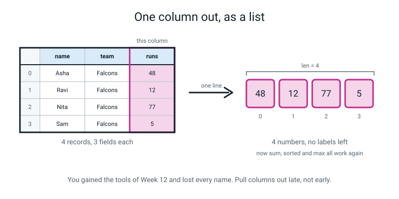
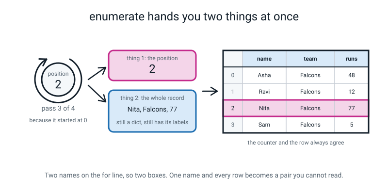
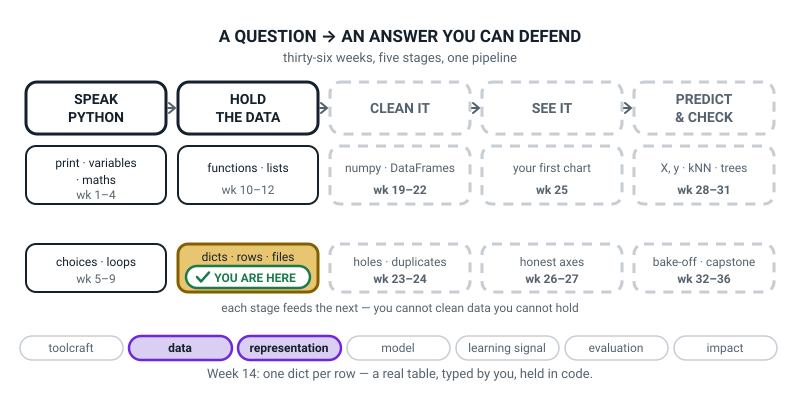
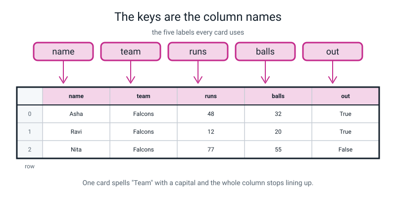
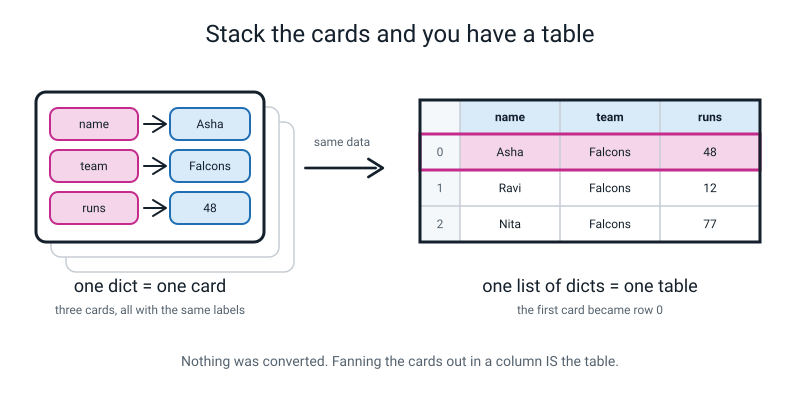

# Week 14 — One Dict Per Row: Your First Dataset in Code

[⬅ Week 13](week-13.md) · [Course Home](../README.md) · [Week 15 ➡](week-15.md) · [Student Guide](../student-guide/week-14.md) · [Workbook](../workbook/week-14.md)

---

## 📋 At a Glance

| | |
|---|---|
| **Duration** | 70 minutes |
| **Type** | 🟦 Teach — one idea (a list of dicts is a table) and four small tools to work it |
| **Big idea** | A list of dictionaries **is** a table: one dict is a row, and the keys are the column names. |
| **New vocabulary** | record · list-of-dicts · field · list comprehension · `enumerate` |
| **New syntax** | `player.items()` · `"age" in player` · `[r["score"] for r in rows]` · `enumerate(rows)` · `sum(numbers)` / `max(numbers)` |
| **Materials** | Last week's five index cards · **seven more blank cards** · a pen · printed workbook pages 14.1–14.6 · the Bug Log · the Level 1 "one row is one thing" sheet if you still have it |
| **Tech needed** | Laptop with Python 3 and the editor. Still nothing installed — no numpy, no pandas. Paper fallback in the Prep Checklist. |
| **Prep time** | 15 minutes the night before · 5 minutes on the day |

> **⚠️ Watch out:** the two most common wrecks this week are both about *shape*, not syntax. `squad[0]["runs"]` needs the list index **first** and the dictionary key **second**, and `for position, player in enumerate(squad)` needs **two** names on the `for` line. Both are covered below with the real error messages they produce.

---

## 🎯 Lesson Objectives

By the end of the lesson the student can:

1. **Build a list of dictionaries** and explain out loud why it is a table — naming which part is the row and which part is the column names.
2. **Loop over records and read the same field from each one**, using `for player in squad:` and `player["runs"]`.
3. **Test whether a key exists** with `"runs" in player`, before reaching for it.
4. **Write a one-line list comprehension** that pulls one column out of the records as a plain list.
5. **Print an aligned table** with a position number beside every row, using `enumerate()` and f-string widths.

Observable evidence: a twelve-row table on screen with a numbered header that lines up in columns; a spoken answer to "what does one row of your table represent?"; and a `KeyError` or `TypeError` from this week's list, read from the last line up and logged.

---

## 🧑‍🏫 What YOU Need to Know First

> **📌 About the code blocks in this guide.** Outside the **🧰 Prep Checklist** and the **🔑 Answer Key**, the blocks are **illustrations, not files** — each one carries on from the one above it, so the `import` lines and the data are typed once, in the first block that needs them. **The complete runnable files are in the Prep Checklist and the Answer Key.** If you paste an illustration on its own and get `NameError`, that is why, and nothing is broken.

**No Python needed to start.** Read this once and type the Prep code once.

### 1. The idea, in one paragraph

Last week the student wrote five dictionaries: `asha`, `ravi`, `nita`, `kabir`, `meera`. Five separate boxes, five separate names. Every question they wanted to ask meant naming a player by hand: `print(asha["runs"])`, then `print(ravi["runs"])`, and so on, forever.

This week those five dictionaries go **inside one list**. That is all that happens. And the moment they do, something arrives for free:

> **A list of dictionaries, all using the same keys, is a table.** One dictionary is one row. The keys are the column names. Nothing was converted; it just *is* a table, and you can see it if you lay the cards out in a column.

This matters more than it sounds. Every dataset in the rest of Level 2 — the CSV in Week 16, the DataFrame in Week 21, the `X` and `y` fed to a model in Week 28 — is this shape or a repackaging of it. The student is not learning a container this week. They are learning what a dataset *is*.

### 2. The Level 1 connection — say it out loud

In Level 1 the student spent a term on tables: rows, columns, features, labels, and one rule drilled into them harder than any other — **one row is one thing.** One fruit per row. One student per row. Not one fruit split over two rows, and not two fruits crammed into one.

That rule is exactly the rule that makes this week work. Every dictionary describes **one** player. If a card described two players, or if one player's facts were split across two cards, none of the code below would work. Pin the Level 1 sheet next to the cards and say the connection out loud; the student will recognise it immediately, and recognising your own old idea in new clothes is one of the better feelings available in a classroom.

### 3. Every line of this week's first program, explained

```python
# squad.py - twelve cricketers, one dictionary per player

# One dict = one row. The five keys = the five column names.
squad = [
    {"name": "Asha",  "team": "Falcons", "runs": 48,  "balls": 32, "out": True},
    {"name": "Ravi",  "team": "Falcons", "runs": 12,  "balls": 20, "out": True},
    {"name": "Nita",  "team": "Falcons", "runs": 77,  "balls": 55, "out": False},
]

print("rows   :", len(squad))         # 3 players  -> 3 rows
print("columns:", len(squad[0]))      # 5 keys     -> 5 columns
print("row 0  :", squad[0])           # one whole record
print("one cell:", squad[0]["runs"])  # list index FIRST, then dict key
```

**The outer `[` and `]`.** Square brackets make a **list**, which the student built in Week 11. Nothing new about the brackets.

**What is inside the list.** Three dictionaries, separated by commas. Each one is exactly what they typed last week. The trailing comma after the last one is legal and conventional — it means you can add a fourth row without editing the third line.

**The line breaks and the indentation.** Python normally cares enormously about indentation, but **not inside brackets**. Once you have opened a `[`, you can spread the contents over as many lines as you like and line them up however you please. That is the only reason this reads like a table. Say this explicitly, because a student who has been burned by indentation errors will be nervous about it.

> **Record** — one dictionary describing one thing. Same as one row of a table.
> **List-of-dicts** — a list whose elements are all records using the same keys. Same as a table.
> **Field** — one labelled piece of a record. Same as one cell of a table. `"runs": 48` is a field.

**`len(squad)`** → `3`. The number of **rows**.
**`len(squad[0])`** → `5`. The number of **fields in the first record**, which — if every record has the same keys — is the number of **columns**. Two different `len` calls on two different things. Worth pausing on.

**`squad[0]`** → the whole first dictionary:

```text
{'name': 'Asha', 'team': 'Falcons', 'runs': 48, 'balls': 32, 'out': True}
```

**`squad[0]["runs"]`** → `48`. **This is the line that trips everybody**, so read it strictly left to right, like a sentence:

```
squad                 →  the whole list (the table)
squad[0]              →  one record  (a dict)          {'name': 'Asha', ...}
squad[0]["runs"]      →  one field   (a value)         48
```

Two lookups, in order, and each one narrows what you are holding. **The list index comes first because the list is the outer container.** You cannot reach a field until you are holding a record. If a student writes `squad["runs"][0]` they get `TypeError: list indices must be integers or slices, not str` — Python is saying "you asked the *list* for a label, and lists don't have labels".

### 4. Looping over the rows

```python
for player in squad:
    print(f"{player['name']:<7}{player['runs']:>4} runs")
```

Real output for the full twelve-row squad:

```text
Asha     48 runs
Ravi     12 runs
Nita     77 runs
Sam       5 runs
Kabir    63 runs
Meera    30 runs
Dev       0 runs
Zara     41 runs
Iqbal    55 runs
Lena     22 runs
Omar     90 runs
Priya   104 runs
```

The `for` loop is Week 12's, unchanged: it hands you one item at a time. What is new is that the item is a whole dictionary, so `player` is a card, and `player["runs"]` reads one field off whichever card is in your hand right now.

**The variable name matters for comprehension, not for Python.** `for player in squad` reads like English. `for p in squad` runs identically and teaches nothing. Insist on the long name.

### 5. f-string widths — the other half of Week 3's tool

Week 3 taught `f"{x:.2f}"` — the bit after the colon controls how the number is *shown*. This week uses the rest of that mini-language, and it is worth two minutes because it is what makes a table look like a table.

| You write | It means |
|---|---|
| `{name:<7}` | put `name` in a space **7 characters wide**, pushed **left**, padded with spaces |
| `{runs:>4}` | put `runs` in a space **4 characters wide**, pushed **right** |
| `{rate:>6.1f}` | 6 characters wide, right-aligned, and 1 decimal place |

Two things to know and say:

- **Left for words, right for numbers.** Words read better lined up on the left. Numbers line up on the right so the units, tens and hundreds sit in columns — which is why `104` and `5` end up under each other above.
- **The header must use the same widths as the rows, or nothing lines up.** This is the whole trick, and it is where a student's table goes crooked. If the data row says `:<7` then the header must say `:<7` too.

### 6. `.items()` — walking through one record

```python
for field, value in squad[0].items():        # field is the key, value is the value
    print(f"  {field:<6} {value}")
```

```text
  name   Asha
  team   Falcons
  runs   48
  balls  32
  out    True
```

`.items()` hands you **both** the key and the value on each turn round the loop, which is why there are **two** names on the `for` line. If you write only one name you get a *pair* — an object holding two things — and then `field["name"]` fails.

Note carefully what this loops over: **the fields of one record**, not the rows of the table. `squad.items()` would be an error, because `squad` is a list and lists have no keys. Students mix these up. Say the difference out loud:

- `for player in squad:` → once per **row**. Twelve turns.
- `for field, value in squad[0].items():` → once per **field of one row**. Five turns.

### 7. `"runs" in player` — asking before you look

```python
print('"runs"    in squad[0]:', "runs" in squad[0])
print('"catches" in squad[0]:', "catches" in squad[0])
```

```text
"runs"    in squad[0]: True
"catches" in squad[0]: False
```

`in` asks a yes/no question and hands back `True` or `False`, which the student has been using since Week 5. Two things to nail down:

- **`in` checks the KEYS, not the values.** `"Asha" in squad[0]` is `False`, even though Asha is right there — because `Asha` is a value, not a label. This surprises people. Demonstrate it.
- **`in` on a dictionary and `in` on a `for` line are different uses of the same word.** `for player in squad` is not a question; it is a loop. `"runs" in player` is a question. English does this too ("in" in *"put it in the box"* versus *"is it in the box?"*) and nobody minds.

The student met `in` once last week, in the homework, copied off the page. Today it gets its explanation.

### 8. The list comprehension — one column, one line

```python
all_runs = [r["runs"] for r in squad]
print(all_runs)
print("total runs:", sum(all_runs))
print("highest   :", max(all_runs))
```

```text
[48, 12, 77, 5, 63, 30, 0, 41, 55, 22, 90, 104]
total runs: 547
highest   : 104
```

> **List comprehension** — a one-line way of building a new list by doing the same thing to every item of an old one.

Read it **right to left, then left**:

```
[ r["runs"]        for r in squad ]
  └──── 3 ────┘    └───── 1,2 ────┘

1. for r in squad   ->  "go through the records one at a time, calling each one r"
2. (implicitly)     ->  "for each one..."
3. r["runs"]        ->  "...take this, and put it in the new list"
```

The student saw this shape in Week 12 for numbers. What is new is only that the thing being taken out is a *field of a dict* rather than a number.

**Say the trade-off out loud, because it is a real idea:** the comprehension gives you back the tools of Week 12 — `sum`, `max`, `sorted`, the whole stats toolkit — but it **throws away every label**. `[48, 12, 77, ...]` no longer knows who scored what. So you pull a column out **late**, when you are about to do arithmetic on it, and not before.


*Figure 14.1 — Pulling one column out gives you numbers you can add up, and loses every name.*

### 9. `enumerate()` — a position and a record, together

```python
for position, player in enumerate(squad):
    print(position, player["name"])
```

```text
0 Asha
1 Ravi
2 Nita
...
```

> **`enumerate`** — wraps a list so that each turn round the loop gives you **two** things: the position, and the item at that position.

Three facts to have ready:

1. **It starts at 0**, because that is where list positions start. `squad[0]` is Asha and `enumerate` calls Asha position 0. **They always agree**, and that agreement is the whole reason to use `enumerate` instead of counting yourself with a variable.
2. **Two names on the `for` line**, in that order: position first, item second. One name gets you a pair you cannot index by key.
3. If you want the printed numbers to start at 1 for a human reader, `enumerate(squad, start=1)`. That is a keyword argument from Week 10. But be clear about what it does: it changes the *number printed*, not the position in the list. Row `1` is still `squad[0]`.


*Figure 14.2 — The counter and the row always agree, which is exactly why you let `enumerate` do the counting.*

### 10. The three misconceptions you will actually meet

**Misconception 1 — "`squad["runs"]` should give me the runs column."**
It gives `TypeError: list indices must be integers or slices, not str`. This is a *reasonable* mistake and it is worth taking seriously, because in Week 21 `df["runs"]` will do exactly that with a pandas DataFrame. The honest answer: "That is the thing you want, and it is the reason pandas exists, and it is Week 21. Today the list doesn't know about columns — only the dictionaries inside it do. So you go through the rows and take one field from each, which is exactly what the comprehension does."

**Misconception 2 — "a table needs a header row, and my list doesn't have one."**
The keys *are* the header. There is no separate header row in a list-of-dicts, because every single record carries its own labels. That is why one card with `Team` instead of `team` is so damaging: there is no single header to correct, so the wrong label travels with the row.

**Misconception 3 — "`enumerate` numbers the rows for me, so row 1 is the first row."**
No: row **0** is the first row. Every off-by-one bug in the next twenty weeks lives here. The fix is not a rule to memorise, it is the picture in Figure 14.2: the counter and the slot agree, and the first slot is 0.

### 11. How deep to go, and where to stop

**Go this far:** build a list of dicts; `len()` of the list and of a record; two-step indexing; loop over rows; `.items()` on one record; `in` to test a key; one comprehension pulling one column; `enumerate` and an aligned printed table.

**Stop before:**

| Do not teach today | Where it lives |
|---|---|
| Filtering (`[r for r in rows if ...]`) and grouping/counting | **Week 15.** This is the big temptation, because the comprehension is *right there*. Resist it. |
| `sorted(rows, key=...)` | **Week 15** |
| Saving to CSV | **Week 16** |
| pandas, `df["runs"]`, DataFrames | **Week 21.** Name it as a promise, do not show it. |
| A dict of lists (columns instead of rows) | Mention only if a student invents it — see the Questions section |
| Nested records (a dict inside a record) | Not in this course |

If a student writes a filter today because they worked out the shape themselves — let them, praise it, and do **not** teach it to the room. Next week needs the discovery.

---

### 12. 🧭 The Growing Map — the two minutes that place the week

The student guide carries one figure that is not about this week's content: the whole pipeline, with one
more piece filled in each week. It is the only place either book shows the learner the *shape* of what
they are building rather than the thing in front of them today.



*Figure 14.0 — Week 14's version. The gold tile has deliberately not moved: `dicts · rows · files`,
weeks 13 to 18, second week in. Two threads lit: data and representation.*

**What to do with it, in about two minutes at the end of the lesson:**

1. **Show it and ask the odd question:** *"the gold box did not move this week — why not?"* You want
   *"because we are still holding data"* or *"because a row is still a dictionary"*. Then name it
   yourself: **twelve dictionaries in a list is a dataset, and the box is called `rows` for a reason.**
2. **Then the better question:** point at CLEAN IT and ask *"what do you think is in there, and why
   could we not have done it first?"* Accept anything. Then say the line in the figure out loud: you
   cannot clean data you cannot hold — and they held some today.
3. **Have them add one thing to their own copy**: the two numbers from their squad table, *12 rows, 5
   columns*, written under the gold tile. Week 17 calls that pair the shape, and they will recognise it.

> **🧑‍🏫 Why this is worth two minutes.** This is the week the course stops being about Python and starts
> being about data, and almost no learner notices at the time. The map is where they can see it: the
> **data** pill lights up beside representation, three weeks before anyone says the word "pandas". When
> a student asks in March *"when did we first make a dataset?"*, this figure is the answer.

---

## 🧰 Prep Checklist

### 15 minutes the night before

- [ ] **Print workbook pages 14.1–14.6.**
- [ ] **Find last week's five index cards.** Check the labels on all five: same words, same capitals. **If one says `Team` instead of `team`, leave it.** It is a gift; the loop will find it in front of the student and that is a better lesson than you could plan.
- [ ] **Cut seven more blank cards.** Twelve total.
- [ ] **Type and run this yourself.** Make `squad.py` and put in exactly this:

```python
# squad.py - three cricketers, one dictionary per player

squad = [
    {"name": "Asha", "team": "Falcons", "runs": 48, "balls": 32, "out": True},
    {"name": "Ravi", "team": "Falcons", "runs": 12, "balls": 20, "out": True},
    {"name": "Nita", "team": "Falcons", "runs": 77, "balls": 55, "out": False},
]

print("rows   :", len(squad))
print("columns:", len(squad[0]))
print("row 0  :", squad[0])
print("one cell:", squad[0]["runs"])
```

Run `python3 squad.py`. You must see **exactly**:

```text
rows   : 3
columns: 5
row 0  : {'name': 'Asha', 'team': 'Falcons', 'runs': 48, 'balls': 32, 'out': True}
one cell: 48
```

- [ ] **Break it twice, on purpose.** First change the last line to `print(squad["runs"])` and run it — you should get `TypeError: list indices must be integers`. Then change it back and add `for row in enumerate(squad): print(row["name"])` — you should get `TypeError: tuple indices must be integers`. **Read both messages. You will meet both in the lesson.**
- [ ] **Read §3 (two-step indexing) and §9 (`enumerate`) above.** Those two are what you will be asked about.
- [ ] Optional but good: dig out the Level 1 "one row is one thing" sheet and put it on the wall.

### 5 minutes on the day

- [ ] Editor open on the course folder; terminal in the same folder.
- [ ] Twelve cards and a pen on the table. Last week's five on top of the pile.
- [ ] `scorecard.py` from last week open in a second tab — today's file starts by copying those dictionaries.
- [ ] Your own `squad.py` **deleted or renamed.** They type it.
- [ ] Workbook 14.1–14.3 out, 14.4–14.6 held back.

### Fallback if the laptop or the install fails

The card version of this lesson is genuinely excellent, because the whole idea *is* physical.

1. Lay the five cards out **stacked**, overlapping, so only the top one is readable. "How many players? You can't tell."
2. Now **fan them out into a column** so every card's five labels line up vertically. Stop and let them look. **That alignment is the table.** Nothing was converted; you moved some cardboard.
3. Write seven more cards. Twelve rows.
4. Rule up a sheet of paper by hand: one header row with the five labels, then twelve rows, then number the rows down the left **starting at 0**. That single act delivers objectives 1 and 5.
5. The `.items()` idea: hold up one card and read it out field by field — *"name: Asha. team: Falcons. runs: 48…"*. That is `.items()`, out loud.
6. The `in` idea: *"Does this card have a field called catches? No."* That is `"catches" in player` → `False`.

| If this fails | Do this instead |
|---|---|
| No laptop | The card and ruled-paper version above. Set the typing as homework. |
| The list literal will not run and the error mentions a comma | Almost certainly a missing comma between two records. Count: twelve records need eleven commas between them. Python highlights the record that is *missing* its comma (the one just before the gap), not the record after it, so look at the end of the highlighted record. |
| The columns come out crooked | Header widths do not match data widths. Line up one column at a time, and check the header specifier against the row specifier character by character. |
| Their file is called `list.py` or `dict.py` | Rename it and delete `__pycache__`. Standing rule all year. |
| Twelve records is too much typing and they are flagging | Six is a legitimate table. Cut Sam, Dev, Zara, Lena, Omar, Priya. Keep at least one team with only one member — that is next week's whole punchline. |

---

## ⏱️ The Lesson, Minute by Minute

| Segment | Minutes | Running total | What happens |
|---|---|---|---|
| 🪝 Hook — Fan the Cards Out | 7 | 7 | Five cards stacked, then fanned into a column. That is a table. |
| 🧠 Concept — One Dict Is One Row | 16 | 23 | Records, fields, two-step indexing, the keys as column names |
| 💻 Live-Code Together — `squad.py` | 18 | 41 | They type it. Two deliberate mistakes, both fixed in front of them |
| 🎲 Their Turn — Twelve Rows, Numbered | 20 | 61 | Seven more records, then the aligned table with `enumerate` |
| 🔑 Wrap & Assign | 9 | 70 | Three checks, the takeaway, homework |

---

### 🪝 Hook — Fan the Cards Out (7 minutes)

**Do this:** Have the five cards from last week in a neat **stack**, squared up, so only the top one can be read. Put the stack in the middle of the table. Say nothing about lists.

**Say this:**

> "Here are your five cards from last week. Look at the stack. **How many runs did Nita score?**"

They will reach for the stack. Stop them.

> "No — without touching it. Just looking at what's on the table.
>
> You can't. And it's not because the information's gone — it's all right there. It's because a stack only shows you one thing at a time. To answer any question about *all five players* you have to pick the whole pile up and go through it."

**Do this:** Now fan the cards out into a **vertical column**, each one shifted down so all five sets of labels are visible, one under the other. Take your time. Line them up properly.

> "Now look again."

Let them look. Do not talk over this.

> "What just happened? I didn't write anything. I didn't copy anything out. I moved some cardboard about six centimetres.
>
> But look at what's appeared. Every card's `name` is in a line. Every card's `runs` is in a line. Every card's `team` is in a line. **Five rows, five columns**, and the columns have names on them, and the names are the labels you wrote last week."

**Do this:** Point at the Level 1 sheet if you have it, or just say it.

> "You spent half of last year on tables. Rows, columns, and one rule I bet you can still say: **one row is one thing.** One fruit per row. One student per row.
>
> That rule is why this works. Every card describes exactly one player. Five cards, five players, five rows. If one card had two players on it, this whole thing falls over.
>
> So here's today. You already have the rows — you wrote them last week. What you don't have yet is a way to hold them all in **one** name, so you can ask a question about all twelve at once instead of naming every player by hand. And the container you need is one you already know: a **list**."

**Ask this:**

| Ask | Answer you want | If they say something else |
|---|---|---|
| "How many runs did Nita score? Stack only, no touching." | You can't tell. | If they remember from last week, laugh and say "fine — how would somebody who wasn't here find out?" |
| "What appeared when I fanned them out?" | Columns. The labels lined up. | If they say "I can see all of them now" — true, and push once: "look down the page. What lines up?" |
| "What's the rule from Level 1 that makes this work?" | One row is one thing. | If they cannot recall it, say it and then ask them to test it: "is that true of these five cards?" |
| "What would break if one card had a different label?" | That column wouldn't line up. | Excellent if they get there. Hold up the offending card if you have one. Do not fix it yet. |

---

### 🧠 Concept — One Dict Is One Row (16 minutes)

**Do this:** Leave the fanned cards where they are. Write on the board as you go.

**Say this — part 1, the three words:**

> "Three words and then we type.
>
> One card is a **record**. That's the proper name for one dictionary that describes one thing. One record, one row — the same thing said twice.
>
> One line on the card is a **field**. `runs: 48` is a field. A field is one cell of the table.
>
> And all twelve records in a list is a **list-of-dicts**, which is an ugly name for the most important shape in this whole course."

Write the three definitions up and leave them:

> **record** — one dictionary describing one thing. One row.
> **field** — one labelled piece of a record. One cell.
> **list-of-dicts** — a list whose items are all records with the same keys. A table.

**Say this — part 2, what the keys become:**

> "Now the bit I want you to say back to me. Where does the header row of the table live?"

Let them think. It is a genuinely good question and the answer is surprising.

> "There isn't one. There's no header row anywhere. **Every single record carries its own labels.** So the column names aren't stored once at the top — they're stored twelve times, once per card.
>
> Which is brilliant, because a row can never get separated from its labels. And it is also dangerous, because if one card says `Team` with a capital T, there's no single header to go and correct. That wrong label is stuck to that row and it travels with it."


*Figure 14.3 — There is no separate header row. The keys of every record are the column names, stored once per row.*

**Say this — part 3, two brackets, in order:**

> "Here's the one bit of new grammar today, and it's the bit everybody gets wrong once. To reach one cell you need **two** lookups, and the order matters.
>
> Say it as a sentence: **'the whole table — then row zero — then, in that row, the runs.'**"

Write this on the board and leave it up all lesson:

```
squad                 ->  the whole list  (the table)
squad[0]              ->  one record      (a dict)
squad[0]["runs"]      ->  one field       (48)
```

> "Left to right, and each step narrows what you're holding. The **number comes first** because the list is on the outside. You can't ask for the runs until you're holding a card.
>
> So — what happens if you do it the other way round, and write `squad["runs"]`?"

Let them guess. Then:

> "You get an error, and it's a very clear one. Python says: *list indices must be integers*. In English: 'you asked the *list* for a label. Lists don't have labels — only the dictionaries inside it do.'
>
> And I want to be honest with you about that, because you've had a good idea. `squad["runs"]` is *exactly* the thing you want — give me the whole runs column. It doesn't work today. In Week 21 you'll meet a thing called a DataFrame where that line works perfectly, and the reason DataFrames exist is that everybody wanted what you just tried to type."

**Say this — part 4, two lengths:**

> "Two questions, both answered with `len`, and they mean different things.
>
> `len(squad)` — how many records. That's **rows**.
> `len(squad[0])` — how many fields on the first card. That's **columns**, *if* every card has the same labels.
>
> Notice the 'if'. Twelve times five is sixty facts. `len` can only ever check one card. Making sure all twelve match is your job, not Python's."

**Ask this:**

| Ask | Answer you want | If they say something else |
|---|---|---|
| "Where's the header row of this table?" | There isn't one — every record carries its own labels. | If they point at the top card, say: "So if I shuffle the pile, does the table lose its column names?" No. Because the labels are on every card. |
| "`squad[0]["runs"]` — read it as a sentence." | The table, then row 0, then the runs of that row. | If they read it backwards, put a finger over the `["runs"]` and ask what is left. Then uncover it. |
| "What would `squad["runs"]` do?" | Fail — a list has no labels. | Do not just tell them. "Try it in five minutes and read the message." |
| "`len(squad)` is 12 and `len(squad[0])` is 5. Which is rows and which is columns?" | 12 rows, 5 columns. | If they swap them, count the fanned cards, then count the labels on one card. |
| "If one card said `Team` with a capital T, what would `len(squad[0])` say?" | Still 5 — the count is right, the *label* is wrong. | This is a subtle and excellent question. If they get it, that student is at mastery 5. |

---

### 💻 Live-Code Together — `squad.py` (18 minutes)

**You never touch the keyboard.** Read a line, they type it, ask for a prediction before every run.

**Step 1 (4 min).** New file `squad.py`. Dictate the three-record list. Say the punctuation.

```python
# squad.py - cricketers, one dictionary per player

squad = [
    {"name": "Asha", "team": "Falcons", "runs": 48, "balls": 32, "out": True},
    {"name": "Ravi", "team": "Falcons", "runs": 12, "balls": 20, "out": True},
    {"name": "Nita", "team": "Falcons", "runs": 77, "balls": 55, "out": False},
]

print("rows   :", len(squad))
print("columns:", len(squad[0]))
print("row 0  :", squad[0])
print("one cell:", squad[0]["runs"])
```

> **Say this while they type:** "Open square bracket, then Enter, then Tab. Now — Python usually goes mad about indentation, but **not inside brackets.** Once you've opened that `[`, you can line the records up however you like and it won't complain. That's the only reason this looks like a table."

**Ask before running:** "Four lines of output. Tell me all four before we run it."
Hoped-for: 3, 5, the whole first dictionary, 48.

Run it. Real output:

```text
rows   : 3
columns: 5
row 0  : {'name': 'Asha', 'team': 'Falcons', 'runs': 48, 'balls': 32, 'out': True}
one cell: 48
```

**Step 2 — ⚠️ FIRST DELIBERATE MISTAKE (4 min).** Planned. Do not warn them.

> **Say this:** "Right, I want the whole runs column. That should be `squad["runs"]`, shouldn't it. Add that line."

```python
print(squad["runs"])
```

Run it. Real output:

```text
Traceback (most recent call last):
  File "squad.py", line 13, in <module>
    print(squad["runs"])
          ~~~~~^^^^^^^^
TypeError: list indices must be integers or slices, not str
```

> **Say this:** "Oh good, an error. Last line first — read it to me.
>
> *`TypeError: list indices must be integers or slices, not str`*
>
> Take it apart. `list indices` — the things you put in brackets after a list. `must be integers` — must be whole numbers. `not str` — and you gave me text. So Python is saying: **you asked the list for a label, and lists don't do labels. Lists count.**
>
> And notice which container it is complaining about. Not the dictionary — the *list*. `squad` is a list. Its items happen to be dictionaries, but `squad` itself has never heard of `runs`.
>
> Now — your idea was good. You wanted a whole column in one go. Hold on to it; in about ten minutes we'll get it with one line, and in Week 21 you'll get a container where `squad["runs"]` works exactly as you just typed it."

Delete that line. Add the working version:

```python
print(squad[0]["runs"])
print(squad[1]["runs"])
print(squad[2]["runs"])
```

Real output: `48`, `12`, `77`. Then say the obvious thing:

> "That works, and it's horrible. Three lines for three players. Twelve players is twelve lines, and if I add a thirteenth I have to remember to add a line. What did you learn in Week 12 for exactly this feeling?"

A loop.

**Step 3 (3 min).** The loop, with widths.

```python
for player in squad:
    print(f"{player['name']:<7}{player['runs']:>4} runs")
```

**Ask before running:** "What comes out, and why is there a colon and a less-than sign in the middle of my f-string?"

Run it. Real output (three records so far):

```text
Asha     48 runs
Ravi     12 runs
Nita     77 runs
```

> **Say this:** "The `:<7` means 'put this in a space seven characters wide, pushed left'. The `:>4` means four wide, pushed right. Left for words, right for numbers — that's why the 48 and the 12 have their units sitting under each other. It's the same colon you used in Week 3 for `:.2f`; you're just using a different part of it.
>
> And note the quotes. My f-string uses **double** quotes, so inside the curly braces the key has to use **single** quotes: `player['name']`. Get that the wrong way round and older Pythons stop dead. Newer ones let it through, which is worse, because your file will then break on somebody else's computer."

**Step 4 (3 min).** `.items()` and `in`.

```python
for field, value in squad[0].items():
    print(f"  {field:<6} {value}")

print("runs in row 0?   ", "runs" in squad[0])
print("catches in row 0?", "catches" in squad[0])
print("Asha in row 0?   ", "Asha" in squad[0])
```

**Ask before running:** "Third one's a trap. Asha is definitely in that record. What will it say?"

Run it. Real output:

```text
  name   Asha
  team   Falcons
  runs   48
  balls  32
  out    True
runs in row 0?    True
catches in row 0? False
Asha in row 0?    False
```

> **Say this:** "`False` for Asha. Because **`in` checks the labels, not the facts.** `Asha` is a value; there is no *label* called Asha. If you want to know whether Asha is in there you have to go looking at the values, and we're not doing that today.
>
> And look at the `for` line for `.items()`: **two** names, `field` and `value`, because `.items()` hands you both. Also notice what it's looping over — the five fields of **one** card. Not the twelve rows. Those are two different loops and mixing them up is the most confusing bug you'll write this month."

**Step 5 — ⚠️ SECOND DELIBERATE MISTAKE (4 min).** Planned.

> **Say this:** "Last new thing. I want a row number beside every row. There's a tool called `enumerate` that does the counting for me. Type this."

```python
for row in enumerate(squad):
    print(row["name"])
```

Run it. Real output:

```text
Traceback (most recent call last):
  File "squad.py", line 28, in <module>
    print(row["name"])
          ~~~^^^^^^^^
TypeError: tuple indices must be integers or slices, not str
```

> **Say this:** "Last line: *tuple indices must be integers*. What's a tuple? It's a little bundle of things — here it's a bundle of two: the position, and the record. `enumerate` doesn't hand you the record, it hands you a **pair**.
>
> And a pair, like a list, is counted, not labelled. So `row["name"]` fails for exactly the same reason `squad["runs"]` failed ten minutes ago. Same lesson, second time round: **you asked a counted thing for a label.**
>
> The fix is to catch the two things separately. **Two names on the `for` line.**"

```python
for position, player in enumerate(squad):
    print(position, player["name"])
```

Real output:

```text
0 Asha
1 Ravi
2 Nita
```

> **Say this:** "Zero, one, two. Not one, two, three. `enumerate` starts at 0 because `squad[0]` is Asha, and the whole reason to use `enumerate` instead of counting yourself is that the number it gives you and the slot in the list **always agree**. The moment you start counting by hand, they can drift apart, and then you have a bug that only shows up on row seven."

Bug Log both errors now, while they are warm. Same three columns: the message, what it meant in their words, what fixed it. Both of today's errors have the same *shape* — a counted thing asked for a label — and noticing that is worth writing down.

---

### 🎲 Their Turn — Twelve Rows, Numbered (20 minutes)

Full instructions in the next section. In the lesson flow:

- **Minutes 0–4:** write the seven new cards by hand.
- **Minutes 4–13:** type all twelve records into the list.
- **Minutes 13–18:** the header row and the aligned table with `enumerate`.
- **Minutes 18–20:** pull the runs column out with a comprehension, and total it.

---

## 🎲 The Activity, In Full

### Setup

**On the table:** the five cards from last week, seven blank ones, a pen, the laptop, workbook page 14.2, the Bug Log.


*Figure 14.4 — The setup. Fan the cards out into a column and the columns appear; nothing has been converted.*

### Step 1 — Seven more cards (4 minutes)

Same five labels, same spelling, same order. Twelve players in four teams.

| # | name | team | runs | balls | out |
|---|---|---|---|---|---|
| 0 | Asha | Falcons | 48 | 32 | True |
| 1 | Ravi | Falcons | 12 | 20 | True |
| 2 | Nita | Falcons | 77 | 55 | False |
| 3 | Sam | Falcons | 5 | 9 | True |
| 4 | Kabir | Tigers | 63 | 41 | True |
| 5 | Meera | Tigers | 30 | 28 | False |
| 6 | Dev | Tigers | 0 | 3 | True |
| 7 | Zara | Tigers | 41 | 39 | True |
| 8 | Iqbal | Hawks | 55 | 44 | True |
| 9 | Lena | Hawks | 22 | 18 | True |
| 10 | Omar | Hawks | 90 | 61 | False |
| 11 | Priya | Owls | 104 | 70 | False |

> **🧑‍🏫 Do not change these numbers.** Three of them are load-bearing. **Dev scored 0** — a real zero, measured, not missing, and next week the student has to tell it apart from a hole. **Priya is the only Owl** — that is next week's entire punchline. And **the Owls team has one member on purpose**, so the counts are 4, 4, 3, 1. If you tidy that up you remove Week 15's best moment.

Lay all twelve out in a column and count them out loud. Twelve rows. Five columns. Sixty facts.

### Step 2 — Type all twelve (9 minutes)

Copy the five from `scorecard.py` into a list, then add seven. The complete list:

```python
# squad.py - twelve cricketers, one dictionary per player

# One dict = one row. The five keys = the five column names.
squad = [
    {"name": "Asha",  "team": "Falcons", "runs": 48,  "balls": 32, "out": True},
    {"name": "Ravi",  "team": "Falcons", "runs": 12,  "balls": 20, "out": True},
    {"name": "Nita",  "team": "Falcons", "runs": 77,  "balls": 55, "out": False},
    {"name": "Sam",   "team": "Falcons", "runs": 5,   "balls": 9,  "out": True},
    {"name": "Kabir", "team": "Tigers",  "runs": 63,  "balls": 41, "out": True},
    {"name": "Meera", "team": "Tigers",  "runs": 30,  "balls": 28, "out": False},
    {"name": "Dev",   "team": "Tigers",  "runs": 0,   "balls": 3,  "out": True},
    {"name": "Zara",  "team": "Tigers",  "runs": 41,  "balls": 39, "out": True},
    {"name": "Iqbal", "team": "Hawks",   "runs": 55,  "balls": 44, "out": True},
    {"name": "Lena",  "team": "Hawks",   "runs": 22,  "balls": 18, "out": True},
    {"name": "Omar",  "team": "Hawks",   "runs": 90,  "balls": 61, "out": False},
    {"name": "Priya", "team": "Owls",    "runs": 104, "balls": 70, "out": False},
]

print("rows   :", len(squad))         # 12 players  -> 12 rows
print("columns:", len(squad[0]))      # 5 keys      -> 5 columns
print("row 0  :", squad[0])           # one whole record
print("one cell:", squad[0]["runs"])  # list index FIRST, then dict key
```

Real output:

```text
rows   : 12
columns: 5
row 0  : {'name': 'Asha', 'team': 'Falcons', 'runs': 48, 'balls': 32, 'out': True}
one cell: 48
```

> **💡 Try this:** have them line the values up in columns *in the source code*, using extra spaces as above. It is not required, Python does not care, and it makes a wrong entry visible from across the room. This is a real professional habit and it takes ten seconds.

### Step 3 — The aligned table with row numbers (5 minutes)

Add to the same file:

```python
FIELDS = ["name", "team", "runs", "balls", "out"]   # the column order we chose

# The header row. Same widths as the data rows below, or nothing lines up.
print(f"{'#':>2}  {'NAME':<7}{'TEAM':<9}{'RUNS':>5}{'BALLS':>6}  {'OUT':<5}")
print("-" * 38)

# enumerate hands you TWO things each turn: the position, and the record.
for position, player in enumerate(squad):
    print(f"{position:>2}  {player['name']:<7}{player['team']:<9}"
          f"{player['runs']:>5}{player['balls']:>6}  {player['out']}")

print("-" * 38)
print(f"{len(squad)} rows x {len(FIELDS)} columns")
```

Real output:

```text
 #  NAME   TEAM      RUNS BALLS  OUT  
--------------------------------------
 0  Asha   Falcons     48    32  True
 1  Ravi   Falcons     12    20  True
 2  Nita   Falcons     77    55  False
 3  Sam    Falcons      5     9  True
 4  Kabir  Tigers      63    41  True
 5  Meera  Tigers      30    28  False
 6  Dev    Tigers       0     3  True
 7  Zara   Tigers      41    39  True
 8  Iqbal  Hawks       55    44  True
 9  Lena   Hawks       22    18  True
10  Omar   Hawks       90    61  False
11  Priya  Owls       104    70  False
--------------------------------------
12 rows x 5 columns
```

Three things to point at when it appears, because this is the moment the week pays off:

1. **The header uses the same width numbers as the rows.** `:<7` above and `:<7` below. That is the whole trick and it is why the columns are straight.
2. **The two-line f-string.** The `for` body has one `print` split over two lines, because the line was too long. Two f-strings sitting next to each other inside one `print` get glued together. Say that plainly — it looks like magic otherwise.
3. **The row numbers run 0 to 11, not 1 to 12.** Ask: "which row is Priya?" *Row 11.* "And `squad[11]` is?" *Priya.* They agree. That agreement is the point of `enumerate`.

### Step 4 — One column out (2 minutes)

```python
all_runs = [r["runs"] for r in squad]        # a list comprehension
print(all_runs)
print("total runs:", sum(all_runs))
print("highest   :", max(all_runs))
```

Real output:

```text
[48, 12, 77, 5, 63, 30, 0, 41, 55, 22, 90, 104]
total runs: 547
highest   : 104
```

> **Say this:** "There's the column you tried to get with `squad["runs"]` half an hour ago. One line. And now `sum` and `max` work again, because it's a plain list of numbers — your Week 12 toolkit is back in business.
>
> But look what you paid. Twelve numbers and **not one name**. Which of those is Priya's 104? You can't tell from this list. So pull a column out **just before** you do arithmetic on it, and never earlier."

### What "finished" looks like

- Twelve cards on the table, all with the same five labels.
- `squad.py` prints the twelve-row table with a header, straight columns, and row numbers 0–11.
- The comprehension prints the runs column and the total 547.
- At least one real `TypeError` in the Bug Log with the fix in the student's own words.
- The student can answer "what does one row of your table represent?" in one sentence: *one player's innings in one match.*

### Variation — easier

- **Six records, not twelve.** Asha, Ravi, Nita, Kabir, Meera, Priya. Keep Priya — she is the only Owl and next week needs her.
- **Three columns, not five.** `name`, `team`, `runs`. Drop the widths too: `print(position, player["name"], player["runs"])` is a legitimate table for today.
- **Give them the header line to copy exactly** and have them build only the data line by pattern-matching it.
- **Skip `.items()` entirely.** It is the least important of the four tools this week and the only one you can drop without hurting Week 15.
- **Do the alignment on paper first.** Rule a sheet into five columns, write the twelve rows in by hand, then match the code to the paper. Students who cannot see why widths matter can always see a crooked column.

### Variation — harder

1. **Find the ragged record.** Hand them a twelve-record list where one record is missing the `balls` key and one has `Team` with a capital T. Their job: find both, using only `len()` and `in`, without reading all sixty values. *(The route: loop over records, print `len(r)` for each — the missing key shows up as a 4. Then loop and print `"team" in r` — the capital shows up as `False`.)*
2. **A right-aligned name column.** Change `:<7` to `:>7` on the names and look at it. Then argue which is better and why. *(Left, for words. The eye finds the start of a word much faster than the end.)*
3. **Their own denominator.** "Add a sixth field to every record called `strike_rate`, worked out as `runs / balls * 100`, and print it to one decimal place." They will have to loop and assign — `player["strike_rate"] = ...` — which is Week 13's *add a key* applied to twelve records at once. Watch for Dev: 0 runs off 3 balls is a strike rate of 0.0, which is correct and looks broken.
4. **Two loops, one table.** "Print the table twice: once looping over the rows, and once looping over the fields of one record with `.items()`. Then write one sentence on what each loop is *for*."
5. **The Level 1 callback.** "In Level 1 language: which of your five columns are features and which is the label, if the question is *'did this player get out?'*" *(Features: runs, balls, maybe team. Label: `out`. And `name` is neither — it is an identifier, and using it as a feature would only let a model memorise who is who rather than learn anything general. That last part is a genuinely sophisticated answer.)*

---

## 🐞 The Debugging Clinic

Every message below came from running a broken version of this week's actual code.

| What the student sees (real message) | What it means | Most likely cause | The fix |
|---|---|---|---|
| `TypeError: list indices must be integers or slices, not str` | "You asked a **list** for a label. Lists count; they don't label." | `squad["runs"]` instead of `squad[0]["runs"]`. Reaching for a column that a plain list does not have. | Two lookups, in order: list index first, dict key second. The column version arrives in Week 21. |
| `TypeError: tuple indices must be integers or slices, not str` | "You asked a **pair** for a label." | `for row in enumerate(squad)` with one name. `enumerate` hands you a two-thing bundle, not a record. | Two names: `for position, player in enumerate(squad):` |
| `TypeError: string indices must be integers, not 'str'` | "You asked a piece of **text** for a label." | Looping over one record instead of the list: `for player in squad[0]:` — that walks the *keys*, so `player` is the word `"name"`. | `for player in squad:` — no index. Check what you are looping over. |
| `KeyError: 'team'` after some rows have already printed | "Row *n* has no key called `team`." | One record was typed with `Team`, or the key was left out of one record. | Count the lines that printed successfully — that is the row number that broke. Go to that record and compare its keys to the one above it. |
| `KeyError: 'runs'` pointing at a line inside `[...]` | Same thing, but inside a comprehension. | One record is missing `runs`, so the comprehension dies partway through building the list. | Fix the record. Or, if the hole is legitimate, `[r.get("runs", 0) for r in squad]` — and then say out loud what that zero claims. |
| `IndexError: list index out of range` | "There is no row with that number." | `squad[12]` on a twelve-row list. Rows are 0 to 11. | `len(squad)` is 12 and the last row is `squad[11]`. Or `squad[-1]`, from Week 11. |
| `SyntaxError: invalid syntax. Perhaps you forgot a comma?` | Python could not read the list at all. | A missing comma between two records. Python highlights the record that is **missing** its comma (the whole record, from its `{` to its `}`), so look at the end of the highlighted line for the absent comma. | One comma after every record's closing `}`. Twelve records need eleven, and a trailing twelfth is fine. |
| `SyntaxError: f-string: unmatched '['` | Python got lost inside your f-string. | Double quotes inside a double-quoted f-string: `f"{player["name"]}"`. | Single quotes inside: `f"{player['name']}"`. Python 3.12+ allows the double version — teach single anyway, or the file breaks on another machine. |
| `ValueError: Unknown format code 'f' for object of type 'str'` | "You asked me to print text as a decimal number." | `f"{player['name']:>6.1f}"` — the `f` code on a word. | `.1f` is for numbers only. Words get `:<7` or `:>7` and nothing else. |
| **No error, but the columns are crooked** | Nothing is wrong as far as Python is concerned. | The header widths do not match the row widths. | Put the header f-string directly above the row f-string and compare the numbers character by character. |
| **No error, but the table has 11 rows** | Nothing is wrong as far as Python is concerned. | Two records got merged when a comma and a brace went missing, or one record was overwritten during copy-paste. | `print(len(squad))` **every time you add rows.** It should say 12. This one habit catches most silent data damage. |

### How to teach debugging without giving the answer

The four moves are unchanged from last week — read the last line, find the line number, say the complaint in your own words, and only then compare characters. This week adds one move that is specific to loops:

5. **"How many lines printed before it stopped?"** A `KeyError` in the middle of a loop over twelve records prints the good rows first and then dies. If four rows printed, row 4 (counting from 0) is the broken one. **The output is a clue, not just wreckage.** This is a genuinely powerful habit and almost no beginner discovers it alone.

And a sentence worth saying twice this week, because two of today's errors are the same error wearing different clothes:

> **"`list indices must be integers` and `tuple indices must be integers` are the same complaint. You asked a counted thing for a label. Lists and pairs count. Only dictionaries label."**

---

## ❓ Questions Students Ask This Week

**"Why not one dictionary with the names as the keys? `{"Asha": 48, "Ravi": 12}`?"**

Because it only holds one fact per player. The moment you want their team *and* their balls faced, you are stuck — the value would have to be another dictionary, and then you have containers inside containers and every lookup takes two steps. Also, names are not unique: two Ashas and one of them silently disappears, because a dictionary cannot hold the same label twice. A list of records has no such problem: two Ashas are two rows, which is the truth.

**"Do the keys have to be in the same order on every card?"**

No, and this surprises people. `{"name": "Asha", "runs": 48}` and `{"runs": 12, "name": "Ravi"}` are both fine, and `player["runs"]` works on both, because you are reading a *label*, not counting to a position. What matters is that the keys are the same *set* of words. The order only matters for one thing: what `print(record)` looks like, and what order `.items()` walks in. Keeping them in the same order is a kindness to humans, not a requirement.

**"Why does `enumerate` start at 0? Nobody numbers a list from zero."**

Because the *list* starts at 0, and `enumerate`'s job is to agree with the list. `squad[0]` is Asha, so `enumerate` calls Asha 0. If it started at 1 you would have two different numbering systems in the same program and a bug waiting on row seven. If you want 1 for a human reader, `enumerate(squad, start=1)` gives it to you — but be clear that it changed the number *printed*, not the row's position. Row 1 is still `squad[0]`.

**"Is a list comprehension faster than a `for` loop?"**

A little, usually, and never enough to matter for anything you will write this year. The real reason to use it is that it says one thing in one line: *take this from every row.* A four-line loop that builds a list is doing the same job with more places to make a mistake. Use whichever you can read back correctly, and prefer the comprehension when it fits on one line without squinting.

**"What if one record is missing a field?"**

Then the loop crashes with a `KeyError` at that row, which is usually what you want — a ragged table is a real problem and you should hear about it. If the hole is genuine and expected, `r.get("balls", 0)` will keep going. But say out loud what that zero claims: *this player faced zero deliveries*, which is impossible for someone who batted. Last week's honesty rule stands: a fallback is fine when it is a fact and a lie when it is a guess.

**"Can I have twelve *different* kinds of card in one list?"**

Python will let you. A list is perfectly happy holding a player, a pizza order and a bus timetable. But then it is not a table any more — it is a bag — and no loop that reads a field can work, because different items have different fields. The rule that makes a list-of-dicts useful is boring and absolute: **every record uses the same keys.** Break it and you have to special-case something forever.

**"Should a table be rows-of-dicts or columns-of-lists?"** *(Nobody fully agrees, and here is why.)*

**This is a real, live, unsettled argument in professional data work, and it is worth being honest about.** There are two ways to store the same table:

*Rows of dicts* — what we did. `[{"name": "Asha", "runs": 48}, {"name": "Ravi", "runs": 12}]`. One record per thing.

*Columns of lists* — the other way round. `{"name": ["Asha", "Ravi"], "runs": [48, 12]}`. One list per column.

Neither is correct. They are good at different jobs. **Rows win when you handle one thing at a time** — adding a new player, deleting a row, sending one record somewhere, checking that one thing is complete. **Columns win when you do arithmetic on a whole column** — averaging all the runs, or scaling every value, because the numbers are already sitting together in one list and you do not have to go and collect them from twelve separate places.

Which is why the professional world uses **both, deliberately**. Databases that record things as they happen are usually row-oriented. Systems built for analysing millions of rows are usually column-oriented, and the reason is exactly the reason above. And pandas — which the student meets in Week 21 — is *column*-oriented underneath while pretending to be a row-and-column grid on the surface, which is precisely why `df["runs"]` works there and `squad["runs"]` fails here.

The honest summary: **the shape you choose should match the question you ask most often.** We chose rows this week because we are collecting things one at a time, on cards, by hand. That is genuinely the right choice for the job we are doing, and it will be the wrong choice in Week 21, and neither of those facts is a mistake.

---

## ⚠️ Where This Lesson Goes Wrong

| What happens | Why | What to do right now |
|---|---|---|
| Twelve records of typing takes 25 minutes and the lesson dies | Sixty facts is a lot of keystrokes for a 12-year-old | Cut to six records **before** you start, not halfway through. Six rows teaches everything. Keep Priya. If they are already drowning, let them copy-paste one record and edit the values — the lesson is the shape, not the typing stamina. |
| `squad["runs"]` is written, corrected by you, and the idea is lost | It is the natural thing to type, and it is *nearly* right | Do not correct it. Run it. Read the message. Then say the true and generous thing: "that is the right instinct and it is why pandas exists — Week 21." A student whose good idea gets acknowledged will remember the error message. |
| The columns come out crooked and they start adding spaces by hand inside the strings | Hand-tuning looks like it is working, for about four rows | Stop it immediately, and show why: change one name to `Rutherford` and watch the hand-tuned version collapse. Then match the header specifier to the row specifier and change nothing else. |
| `enumerate` gets replaced by a hand-rolled counter | Because it works: `n = 0` … `n = n + 1` | Let it work. Then ask them to insert a new row in the middle and watch what happens if the `n = n + 1` ends up in the wrong place. The argument for `enumerate` is that the number *cannot* drift out of step with the row. |
| A `KeyError` mid-loop is treated as "the whole program is broken" | Half the output appeared, so it looks like chaos | Use it. "How many rows printed? Four. So which row is broken?" Row 4. This is the single most useful debugging habit in the week and it only exists because the loop failed partway. |
| They loop over `squad[0]` instead of `squad` and get `TypeError: string indices must be integers` | An easy slip, and the message mentions strings, which seems to come from nowhere | Walk it: "what does `for x in squad[0]` hand you each turn?" *The keys.* "So what is `x`?" *The word `"name"`.* "And what is `"name"["name"]`?" Nonsense. Now the message makes sense. |
| Everything works and the table appears at minute 45 | Because the lesson was efficient | Do not fill the time with more typing. Go to Variation-harder item 1 (find the ragged record) or item 5 (the Level 1 features-and-label callback). Both are thinking, not typing. |
| They start filtering (`if r["runs"] > 50`) because they can see how | Because they can, and it is genuinely the obvious next thought | Praise it loudly, write their name and the date in the margin, and *do not teach it to the room.* That discovery is Week 15's opening five minutes and it is much better if it is theirs. |
| One card has a different label and nobody notices, because the offending column was never printed | The table only shows what you ask it to show | Add `print(len(record))` to the loop for one run, or `print("team" in record)`. A five that comes out as a four is the fastest ragged-record detector there is. |

---

## 🧭 Differentiation

### If the student is struggling

**Cut:** `.items()`. It is the least load-bearing of this week's four tools; nothing in Week 15 needs it.

**Cut:** the f-string widths. `print(position, player["name"], player["runs"])` produces a perfectly honest table with wonky columns, and delivers objectives 2 and 5. Straightness is a nicety.

**Cut:** six of the twelve records.

**Reteach — with the cards and a ruled sheet.** The whole of this week can be taught with cardboard, and for a student who is lost on screen it usually should be. Fan the cards. Rule a sheet into five columns. Write in the header row. Number the rows down the left starting at 0. Then say, pointing: *"the sheet is `squad`. Row 3 is `squad[3]`. That cell is `squad[3]["runs"]`."* Say it as one sentence, three times, pointing each time. Then go back to the keyboard and type those exact three things.

**The copy-this-exactly scaffold.** This runs. Have them type it character for character, then change only the names and numbers:

```python
squad = [
    {"name": "Asha", "team": "Falcons", "runs": 48},
    {"name": "Ravi", "team": "Falcons", "runs": 12},
    {"name": "Nita", "team": "Falcons", "runs": 77},
]

print(len(squad))

for player in squad:
    print(player["name"], player["runs"])
```

```text
3
Asha 48
Ravi 12
Nita 77
```

Three records, three keys, one loop, no widths, no `enumerate`. **A student who can build this and read it back has met objectives 1 and 2, and that is a good lesson.** Add `enumerate` only if there is time and appetite.

**One thing you must not cut:** the sentence *"one dictionary is one row, and the keys are the column names."* If the lesson collapses to a single idea, make it that one. Everything from here to Week 36 sits on it.

### If the student is flying

None of these need new syntax.

1. **Find the ragged record** (Variation-harder 1). Give them a broken list and only `len()` and `in` to find both defects.
2. **Add a computed field.** `player["strike_rate"] = player["runs"] / player["balls"] * 100` for all twelve, then print it to one decimal place. Watch Dev: `0 / 3 * 100` is `0.0`, which is right and looks wrong.
3. **Two ways to total.** Total the runs with a `for` loop and an accumulator (Week 7), then with `sum()` on a comprehension. Prove both give 547. Then: "which will still be right if I add a thirteenth player, and which will I have to remember to change?" *(Both are fine — and that is the interesting answer. The accumulator is fine because the loop covers the list; a hand-typed `48 + 12 + 77 + ...` is what breaks.)*
4. **Features and label** (Variation-harder 5). Which columns predict `out`, and why is `name` neither a feature nor a label? Straight Level 1 thinking, in code.
5. **Print it sideways.** "Print the table with one *column* per line instead of one row per line — the name of the field, then all twelve values." They will need a loop over `FIELDS` on the outside and a loop over `squad` on the inside, and the result is the columns-of-lists shape from the Questions section. That is a genuinely advanced piece of work and it sets Week 21 up beautifully.

### If the student won't engage today

**Cards and a ruled sheet. Close the laptop.**

Fan the twelve cards into a column. Rule a sheet of paper into five columns and twelve rows, write the header, and number the rows down the left **starting at 0**. Then play **"Coordinates"**: you name a cell — *"row 4, runs"* — and they read it off. Then swap, and they name cells for you. Then start asking for the impossible ones: *"row 12, runs"* (there is no row 12; rows go 0 to 11), *"row 3, catches"* (there is no catches column).

That game delivers objectives 1 and 5 completely, produces both of this week's error messages in English out of the student's own mouth, takes fifteen minutes, and needs no electricity. The ruled sheet is also a perfectly good artefact to bring to Week 15, which is a lab and will need a table to work on.

---

## ✅ Assessing Understanding

Three checks, five minutes, exact wording.

**Check 1 — the shape (spoken)**

> "Point at your table on screen. Tell me which part is a row, which part is a column name, and how many of each you have."

*Good answer:* "Each dictionary is a row — I've got twelve. The keys are the column names — I've got five." **What to catch:** calling the whole list a row, or looking for a header row that does not exist. If they hunt for a header, that is the answer to reteach: *every record carries its own labels.*

**Check 2 — two lookups (on paper, 60 seconds)**

> "Write me the one line that prints Priya's runs. She's the last row."

*Good answer:* `print(squad[11]["runs"])` — or `print(squad[-1]["runs"])`, which is better and worth praising out loud.

**What to catch:** `squad["runs"][11]` (asking the list for a label — the exact `TypeError` from the lesson); `squad[12]` (an off-by-one, and worth running so they see `IndexError`); `squad["Priya"]` (treating the list like a dictionary).

**Check 3 — what is a row? (spoken, and it is the important one)**

> "One row of your table. What does it represent — in words, no code."

*Good answer:* "One player's innings in one match." Anything that names **one** of **one kind of thing** is full marks.

**What to catch:** "a player" is close but sloppy — press once: "the same player next Saturday. Same row or a new one?" *(A new row. The row is an innings, not a person.)* That distinction is Level 1's *"one row is one thing"* being genuinely understood rather than recited, and it is the difference between mastery 3 and mastery 4.

### Mastery scale for this week

| Level | What it looks like |
|---|---|
| **1 — Not yet** | Cannot build the list without copying. Writes `squad["runs"]` and cannot say why it failed. Looks for a header row. |
| **2 — Emerging** | Builds the list with the first record given. Reaches one cell with prompting on the order. Loops over rows but needs help reading a field. Reads `enumerate` output as 1, 2, 3. |
| **3 — Secure** | Builds a twelve-record list with identical keys. Reaches a cell with two lookups in the right order, unaided. Loops over records and reads a field. Uses `enumerate` and knows it starts at 0. Prints an aligned table. **This is the target.** |
| **4 — Strong** | Writes a comprehension to pull a column and says what it loses. Uses `in` to test a key and knows it checks labels not values. Reads a mid-loop `KeyError` and uses the printed line count to find the broken row. Says a row is an *innings*, not a *player*. |
| **5 — Exceptional** | Explains why there is no header row, and what that costs. Finds a ragged record using only `len()` and `in`. Sees that the same table could be stored as columns-of-lists and can say which jobs each shape is better at. Spots that pulling a column early throws away the labels, before being told. |

---

## 📤 Homework to Assign

**Say this:**

> "One dataset, one table, one sentence. About an hour.
>
> **First, your own twelve records.** Page 14.4. Not cricketers — **your** thing. Twelve songs, twelve bus journeys, twelve dinners, twelve matches, twelve books. Five keys per record, and the rules are: **at least two of the five must be numbers**, and **one must be a repeating category** — something like genre or team or day-of-the-week where the same handful of values come round again. Three to five different values in that column, and every record has all five keys, spelled identically. That last rule is the one I will actually check.
>
> **Second, print it as a table.** Page 14.5. A header row, straight columns, and a row number down the left from `enumerate`. Same widths in the header as in the rows or it will come out crooked — and if it comes out crooked, **leave it crooked and bring it in**, because how you fixed it is more interesting than the table.
>
> **Third — and this is the marked bit — one sentence.** Page 14.6. *What does one row of your table represent?* One sentence. Not 'songs'. Something like 'one song in my playlist' or 'one journey to school on one day'. If your sentence has the word 'and' in it, you have probably got two things in one row, and that is exactly the mistake I want you to catch tonight rather than in Week 34.
>
> **And pull one column out** with a comprehension, and print its total. One line, and it should be one of your number columns."

**Workbook pages:** 14.1, 14.2, 14.3 in class · **14.4, 14.5, 14.6** at home.

**Expected time:** 10 min choosing the theme and the five keys · 20 min typing twelve records · 15 min on the aligned table · 10 min on the comprehension and total · 5 min on the sentence. **About 60 minutes.**

> **🧑‍🏫 Why the repeating-category rule matters:** next week's whole lab is grouping and counting, and it needs a column with repeated values. A student who gives all twelve records a unique category will get twelve groups of one, which produces nothing to talk about. **Check that column when you mark it, tonight, not next Monday.** If it is all unique, the fix is one minute of editing.

---

## 🔑 Answer Key

Every question restated, so you can mark from this page alone.

### Page 14.1 — Rows, columns, cells

*Given `squad` with twelve records of five keys, what does each expression give you?*

| # | Expression | Answer | What kind of thing it is |
|---|---|---|---|
| (a) | `len(squad)` | `12` | the number of rows |
| (b) | `len(squad[0])` | `5` | the number of fields in row 0 — so the number of columns |
| (c) | `squad[0]` | `{'name': 'Asha', 'team': 'Falcons', 'runs': 48, 'balls': 32, 'out': True}` | one record (a dict) |
| (d) | `squad[0]["runs"]` | `48` | one field (a value) |
| (e) | `squad[11]["name"]` | `Priya` | one field |
| (f) | `squad[-1]["team"]` | `Owls` | one field — `-1` is the last row, from Week 11 |

**14.1(g) Why does `len(squad[0])` tell you the number of columns, and when would it lie?**
Because every record's keys are the column names, so counting one record's fields counts the columns. It **lies the moment the records are ragged.** If eleven records have five keys and one has four, `len(squad[0])` still says 5 and the table is still broken. `len` can only look at the record you point it at; checking all twelve match is your job.

**14.1(h) Where is the header row of this table stored?**
There is no header row. Every record carries its own labels, so the column names are stored twelve times — once per row. That is why a row can never lose its labels, and also why one mis-typed label cannot be fixed in a single place.

### Page 14.2 — Two lookups, in order

**14.2(a) Write the line that prints Kabir's balls faced. He is row 4.**

```python
print(squad[4]["balls"])
```

```text
41
```

**14.2(b) Predict, then run: `print(squad["runs"])`.**

```text
Traceback (most recent call last):
  File "page14_2.py", line 4, in <module>
    print(squad["runs"])
          ~~~~~^^^^^^^^
TypeError: list indices must be integers or slices, not str
```

Because `squad` is a **list** and lists are counted, not labelled. Only the dictionaries inside it have labels.

**14.2(c) Predict, then run: `print(squad[12]["name"])`.**

```text
Traceback (most recent call last):
  File "page14_2.py", line 3, in <module>
    print(squad[12]["name"])
          ~~~~~^^^^
IndexError: list index out of range
```

Twelve rows are numbered 0 to 11. There is no row 12. Note *which* lookup failed: the `^^^^` marks sit under `[12]`, not under `["name"]`.

**14.2(d) In one sentence: why does the list index come first?**
Because the list is the outer container — you have to be holding a record before you can read a field off it. `squad[0]["runs"]` is "the table, then row 0, then that row's runs", read strictly left to right.

### Page 14.3 — `.items()` and `in`

**14.3(a) Print every field of row 0, one per line, using `.items()`.**

```python
for field, value in squad[0].items():        # field is the key, value is the value
    print(f"  {field:<6} {value}")
```

```text
  name   Asha
  team   Falcons
  runs   48
  balls  32
  out    True
```

**Mark:** **two** names on the `for` line. One name is the defect, and it produces `TypeError: tuple indices must be integers` as soon as you index it.

**14.3(b) Predict all three, then run.**

```python
print('"runs"    in squad[0]:', "runs" in squad[0])
print('"catches" in squad[0]:', "catches" in squad[0])
print('"Asha"    in squad[0]:', "Asha" in squad[0])
```

```text
"runs"    in squad[0]: True
"catches" in squad[0]: False
"Asha"    in squad[0]: False
```

**14.3(c) Why is `"Asha" in squad[0]` False when Asha is obviously in there?**
Because `in` checks the **keys**, not the values. `Asha` is a value stored under the label `name`; there is no label called `Asha`. This is the single most surprising thing about `in` on a dictionary and it is worth demonstrating rather than explaining.

**14.3(d) What is the difference between `for player in squad:` and `for field, value in squad[0].items():`?**
The first goes round **once per row** — twelve turns, and each turn hands you a whole record. The second goes round **once per field of one record** — five turns, and each turn hands you a label and a value. They loop over different things, and confusing them is the most disorienting bug of the week.

### Page 14.4 — Your own twelve records

The student's dataset is theirs. Mark the **structure**, not the content. Model answer, using a playlist:

```python
# playlist.py - Week 14 homework, model answer: 12 records, 5 keys each

playlist = [
    {"title": "Blue Lights",   "artist": "Nova",  "genre": "pop",  "minutes": 3.5, "plays": 120},
    {"title": "Rain Check",    "artist": "Kabir", "genre": "rock", "minutes": 4.2, "plays": 45},
    {"title": "Ghost Town",    "artist": "Nova",  "genre": "pop",  "minutes": 2.8, "plays": 300},
    {"title": "Slow Train",    "artist": "Meera", "genre": "folk", "minutes": 5.1, "plays": 60},
    {"title": "Neon Streets",  "artist": "Kabir", "genre": "rock", "minutes": 3.9, "plays": 210},
    {"title": "Paper Boats",   "artist": "Nova",  "genre": "pop",  "minutes": 3.3, "plays": 95},
    {"title": "Late Bus",      "artist": "Ravi",  "genre": "pop",  "minutes": 2.9, "plays": 180},
    {"title": "Monsoon",       "artist": "Meera", "genre": "folk", "minutes": 4.6, "plays": 75},
    {"title": "Static",        "artist": "Kabir", "genre": "rock", "minutes": 3.1, "plays": 130},
    {"title": "Corner Shop",   "artist": "Ravi",  "genre": "pop",  "minutes": 3.7, "plays": 220},
    {"title": "Long Way Home", "artist": "Meera", "genre": "folk", "minutes": 5.4, "plays": 40},
    {"title": "Kite Season",   "artist": "Nova",  "genre": "indie", "minutes": 4.0, "plays": 65},
]

FIELDS = ["title", "artist", "genre", "minutes", "plays"]
```

**The five things to check, in this order:**

1. **Exactly twelve records.** `print(len(playlist))` must say 12.
2. **All five keys on every record, spelled identically.** This is the one to check properly — read down the keys of all twelve. A stray capital or plural here will cost them twenty minutes next week.
3. **At least two numeric columns.** Here, `minutes` and `plays`.
4. **A repeating category with 3–5 distinct values.** Here, `genre` — pop, rock, folk, indie. **If every value in that column is unique, send it back tonight.** Next week's lab has nothing to do otherwise. **And make sure exactly one value appears only once** — `indie` here, with a single song. Next week's whole punchline is an average computed from one row, and this column is where it comes from.
5. **Plausible, varied numbers**, with a couple of extremes on purpose. `plays` runs from 40 to 300 here, and that spread is what makes next week's averages interesting.

### Page 14.5 — Print it as a numbered table

```python
print(f"{'#':>2}  {'TITLE':<15}{'ARTIST':<8}{'GENRE':<6}{'MINS':>5}{'PLAYS':>7}")
print("-" * 45)
for position, song in enumerate(playlist):
    print(f"{position:>2}  {song['title']:<15}{song['artist']:<8}{song['genre']:<6}"
          f"{song['minutes']:>5.1f}{song['plays']:>7}")
print("-" * 45)
print(f"{len(playlist)} rows x {len(FIELDS)} columns")
```

Real output:

```text
 #  TITLE          ARTIST  GENRE  MINS  PLAYS
---------------------------------------------
 0  Blue Lights    Nova    pop     3.5    120
 1  Rain Check     Kabir   rock    4.2     45
 2  Ghost Town     Nova    pop     2.8    300
 3  Slow Train     Meera   folk    5.1     60
 4  Neon Streets   Kabir   rock    3.9    210
 5  Paper Boats    Nova    pop     3.3     95
 6  Late Bus       Ravi    pop     2.9    180
 7  Monsoon        Meera   folk    4.6     75
 8  Static         Kabir   rock    3.1    130
 9  Corner Shop    Ravi    pop     3.7    220
10  Long Way Home  Meera   folk    5.4     40
11  Kite Season    Nova    indie   4.0     65
---------------------------------------------
12 rows x 5 columns
```

**Mark:** the header widths match the row widths; the row numbers start at 0; the columns are straight. Note that `minutes` uses `:>5.1f` because it is a decimal — a plain `:>5` would print `3.5` and `4.0` inconsistently once a value like `4` sneaks in.

**14.5(a) Why must the header use the same width numbers as the rows?**
Because the width is what makes the column, and a column is only straight if every line in it — header included — reserves exactly the same number of characters. Change `:<15` to `:<12` in the header only and the whole table skews from that column rightwards.

**14.5(b) Your row numbers run 0 to 11. Row 11 is which record, and what is `playlist[11]`?**
Row 11 is *Kite Season*, and `playlist[11]` is the same record. **They agree** — and that agreement, guaranteed, is the entire reason to let `enumerate` do the counting instead of a variable you maintain by hand.

**14.5(c) The `print` inside the loop is split over two lines. Why does that work?**
Because two f-strings written next to each other inside the same brackets get glued together into one string before printing. The line was too long to read, so it was broken in a place where no space was needed. There is no comma between them — a comma would print a space and turn one column into two.

### Page 14.6 — One column, and one sentence

**14.6(a) Pull one numeric column out with a comprehension and print its total.**

```python
all_plays = [s["plays"] for s in playlist]
print("plays column:", all_plays)
print("total plays :", sum(all_plays))
```

```text
plays column: [120, 45, 300, 60, 210, 95, 180, 75, 130, 220, 40, 65]
total plays : 1540
```

**Hand check:** 120 + 45 = 165 · +300 = 465 · +60 = 525 · +210 = 735 · +95 = 830 · +180 = 1010 · +75 = 1085 · +130 = 1215 · +220 = 1435 · +40 = 1475 · +65 = **1540** ✔

**14.6(b) What did the comprehension throw away?**
Every label. `[120, 45, 300, ...]` is twelve numbers with no idea which song each belongs to, and no way to get back. Which is why you pull a column out immediately before doing arithmetic on it, and not one line earlier.

**14.6(c) One sentence: what does one row of your table represent?**

Full marks — each names **one** of **one kind of thing**:

> *"One song in my playlist."*
> *"One journey to school on one day."*
> *"One meal I ate, on one date."*

Not full marks, and worth a conversation:

> *"Songs."* — plural. A row is not the collection; it is one member of it.
> *"My playlist."* — that is the whole table, not a row.
> *"A song and how many times I played it."* — the word "and" is the tell. Press: "if you played it ten more times tonight, is that a new row or the same row?" *(The same row, with a bigger number — so the row is the song, and plays is one of its fields.)*
> *"A day."* — ambiguous, and the interesting kind. Press: "if you took two journeys on Tuesday, how many rows?" *(Two. So a row is a journey, not a day.)*

**This single sentence is the most valuable thing on the page.** A student who can say what one row is will build a clean dataset in Week 34. A student who cannot will build one with two things per row and lose a weekend to it.

### Answers to every question posed in the lesson

- *"How many runs did Nita score, from the stack, without touching it?"* → You cannot tell. A stack shows one card at a time.
- *"What appeared when I fanned them out?"* → Columns. The five labels lined up down the page, and that alignment is what a table is.
- *"Which rule from Level 1 makes this work?"* → One row is one thing. Every card describes exactly one player.
- *"What would break if one card had a different label?"* → That column would not line up, and there is no single header to correct — the wrong label is stuck to that row.
- *"Where is the header row?"* → There is not one. Every record carries its own labels.
- *"Read `squad[0]["runs"]` as a sentence."* → The table, then row 0, then that row's runs.
- *"What would `squad["runs"]` do?"* → `TypeError: list indices must be integers or slices, not str`. You asked a list for a label.
- *"`len(squad)` is 12, `len(squad[0])` is 5 — which is which?"* → 12 rows, 5 columns.
- *"If one card said `Team`, what would `len(squad[0])` say?"* → Still 5. The count is right and the label is wrong, which is why `len` cannot find this bug.
- *"Four lines of output — predict them."* → `3`, `5`, the whole first dictionary, `48`.
- *"Why a colon and a less-than sign inside the f-string?"* → `:<7` means seven characters wide, pushed left. Same colon as Week 3's `:.2f`, different part of the language.
- *"`"Asha" in squad[0]` — Asha is definitely in there. What will it say?"* → `False`. `in` checks labels, not values.
- *"What does `enumerate` hand you if you catch it with one name?"* → A pair — a two-thing bundle. Indexing it by label gives `TypeError: tuple indices must be integers`.
- *"Zero, one, two — why not one, two, three?"* → Because `squad[0]` is Asha. The counter and the slot agree, and that agreement is the whole point.
- *"How many lines printed before it crashed?"* → However many rows were fine. The count tells you which row is broken — the output is a clue, not wreckage.
- *"Which of those twelve numbers is Priya's 104?"* → You cannot tell from the list. That is the price of pulling the column out.
- *"What does one row represent?"* → One player's innings in one match. Not "a player" — the same player next Saturday is a new row.

---

## 🔮 Next Week Preview

Next week is a lab, and it is the week the table starts answering questions. Two moves, and between them they cover most of what anybody ever does with data. **Filtering** keeps only the rows that pass a test — *show me the players who scored more than fifty* — and what comes out is still rows, with all their labels, just fewer of them. **Grouping** puts every row into a bucket by the value of one field and counts the buckets — *how many players per team* — and the counts must add up to the number of rows or you have dropped something. The student will write both as reusable functions, `filter_by()` and `group_count()`, that work on any table and not just this one, which is Week 12's lesson arriving one level up. And then the sting: the Owls have exactly one member, so "the Owls average 104 runs" is really "Priya scored 104" wearing a statistician's hat. The student has to decide, out loud, whether to report it at all — which is Level 1's *"out of how many?"* coming back with a keyboard attached.

**Prep early:** three things. **Keep `squad.py` exactly as it is** — next week starts by importing those twelve records into a new file, so if it runs today it will save fifteen minutes on Monday. **Check the homework's category column tonight**, not next week: if all twelve of the student's values in that column are different, grouping will produce twelve buckets of one and there will be nothing to discuss. One minute of editing now fixes it. And **keep the twelve cards**, because next week's activity starts by physically sorting them into piles by team and counting each pile — grouping done with hands before it is done with code.

---

[⬅ Week 13](week-13.md) · [Course Home](../README.md) · [Week 15 ➡](week-15.md) · [Student Guide](../student-guide/week-14.md) · [Workbook](../workbook/week-14.md) · [Orientation](00-orientation.md) · [Glossary](../../glossary.md)
