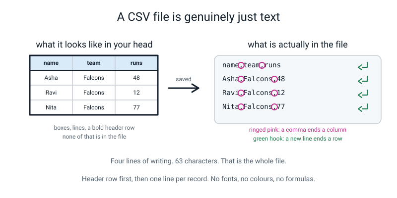
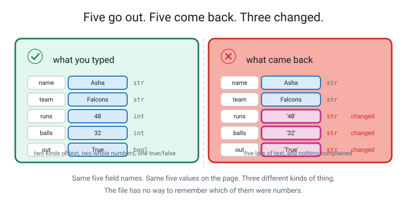
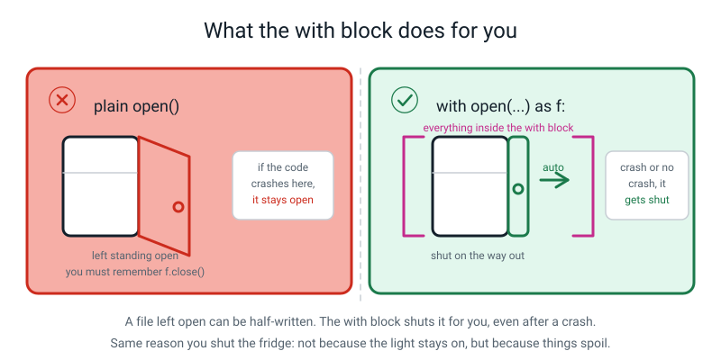
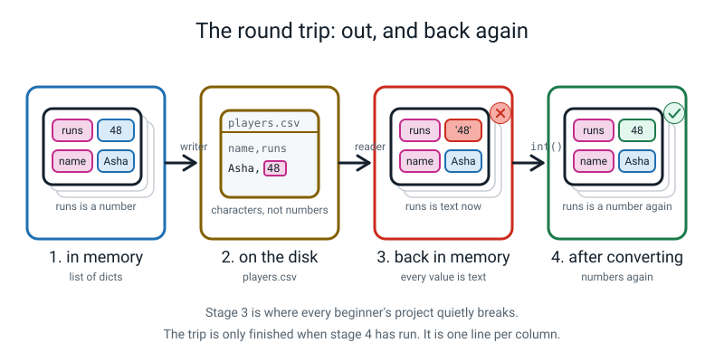
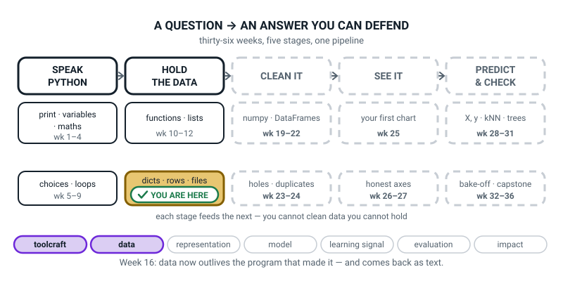

# Week 16 — The Record Store: Save It and Load It Back

[⬅ Week 15](week-15.md) · [Course Home](../README.md) · [Week 17 ➡](week-17.md) · [Student Guide](../student-guide/week-16.md) · [Workbook](../workbook/week-16.md)

---

## 📋 At a Glance

| | |
|---|---|
| **Duration** | 70 minutes |
| **Type** | 🟨 Project — the dataset leaves the program and comes back, and the coming back is the lesson |
| **Big idea** | A CSV is your dataset written out as plain text — and **everything read back from one is text** until you convert it. |
| **New vocabulary** | CSV · header row · DictWriter · DictReader · round trip |
| **New syntax** | `import csv` · `with open(path, "w", newline="") as f:` · `csv.DictWriter(f, fieldnames=...)` · `csv.DictReader(f)` |
| **Materials** | The twelve index cards from Week 14 · a postcard (a real one, or a rectangle of card) · a pen · the printed Week 16 workbook (Warm-Up through Self-Check) · the Bug Log |
| **Tech needed** | Laptop with Python 3 and the editor. `records.py` and `squad_data.py` from Week 15 must exist and run. **A text editor that can open a `.csv` file** — the same editor they write Python in is perfect. A spreadsheet (Sheets, Excel, Numbers) if you have one; nice, not required. Still nothing to install. |
| **Prep time** | 15 minutes the night before · 5 minutes on the day |

> **⚠️ Watch out:** the punchline of this project is that `max()` on the loaded data says the highest score in the squad is **90**, when it is really **104**. It does not crash. It does not warn. Do not fix the loader before the student has seen that line printed and believed it for a few seconds. That wrong `90` is the whole week.

---

## 🎯 Lesson Objectives

By the end of the lesson the student can:

1. **Write a list of dictionaries out to a CSV file** with a header row, using `csv.DictWriter`.
2. **Read that file back in** with `csv.DictReader` and get dictionaries again, with the same keys.
3. **Prove, by printing `type()`**, that every value came back as text — including the ones that went out as numbers.
4. **Convert the numeric fields back** and show the round trip is now complete: `loaded == original` prints `True`.
5. **Explain what `with open(...)` does for you** that a plain `open()` does not.

Observable evidence: a `players.csv` file with 13 lines, opened and read in a text editor; a printed table showing the type of all five fields before and after; the wrong `90` and the right `104` both printed; and `round trip identical? True` on the screen.

---

## 🧑‍🏫 What YOU Need to Know First

> **📌 About the code blocks in this guide.** Outside the **🧰 Prep Checklist** and the **🔑 Answer Key**, the blocks are **illustrations, not files** — each one carries on from the one above it, so the `import` lines and the data are typed once, in the first block that needs them. **The complete runnable files are in the Prep Checklist and the Answer Key.** If you paste an illustration on its own and get `NameError`, that is why, and nothing is broken.

**No Python needed to start.** This week has one idea in it, and it is a physical idea about writing things down.

### 1. What a CSV file actually is

Your student has built a twelve-record dataset. It lives inside a running program. Close the program and it is gone. Every morning they would have to type it again. That is not a dataset, that is a chore.

So we write it to a file. And the format we use is the one every table in the world uses.

> **CSV** — *comma-separated values*. A plain text file where the first line names the columns and every line after it is one row, with commas between the fields.

Here is the entire file this week produces. Not a picture of it — this is the file:

```text
name,team,runs,balls,out
Asha,Falcons,48,32,True
Ravi,Falcons,12,20,True
Nita,Falcons,77,55,False
Sam,Falcons,5,9,True
Kabir,Tigers,63,41,True
Meera,Tigers,30,28,False
Dev,Tigers,0,3,True
Zara,Tigers,41,39,True
Iqbal,Hawks,55,44,True
Lena,Hawks,22,18,True
Omar,Hawks,90,61,False
Priya,Owls,104,70,False
```

Thirteen lines. One header line, twelve record lines. **There is nothing else in there.** No fonts. No colours. No cell borders. No formulas. No hidden "this column is numbers" flag. If you could see the bytes on the disk you would see exactly the characters above and nothing more.

That last sentence is the whole lesson, and it is worth sitting with for a moment, because the consequence is not obvious and it catches every beginner.


*Figure 16.1 — On the left, what a table looks like in your head. On the right, what is actually in the file. The boxes and the bold header are things your eye adds.*

> **Header row** — the first line of the file, which gives the column names and holds no data.

Why does everyone use this? Because it is the lowest common denominator. Every spreadsheet on Earth opens a CSV. Every programming language reads one. `pandas` — which arrives in Week 21 — reads one in a single line. It has survived fifty years precisely because it is too simple to break.

### 2. The consequence: a file cannot remember what kind of thing something was

In the program, `48` is a **number**. You can add one to it and get 49.

In the file, `48` is the character `4` followed by the character `8`. That is all it can be, because a text file holds characters and nothing else.

So when you read the file back, Python has to hand you something — and the only honest thing it can hand you is the characters it found. It gives you the text `'48'`.

**It does not guess.** And it is right not to guess, because guessing would be worse. Consider a column of house numbers where one house is `007`. Guess it into a number and you have destroyed the leading zeros. Consider a column of phone numbers. Consider a column where somebody typed `N/A`. Any rule Python invented would be wrong somewhere, so Python invents nothing and hands the job to you.


*Figure 16.2 — The five values look identical on the page. Three of them are a different kind of thing on the way back.*

Notice `out` in that figure. It went out as `True`, a genuine true-or-false. It comes back as the four characters `T`, `r`, `u`, `e`. And there is a trap waiting there that we will come to in §6.

### 3. Writing the file, line by line

Here is the function the student writes. Every line explained for somebody who has never programmed.

```python
import csv

def save_csv(rows, path, fieldnames):
    """Write the rows out as a CSV file: one header line, then one line per row."""
    with open(path, "w", newline="", encoding="utf-8") as f:   # open for WRITING
        writer = csv.DictWriter(f, fieldnames=fieldnames)      # it needs the column order
        writer.writeheader()                                   # line 1: the column names
        writer.writerows(rows)                                 # then one line per dict
    return len(rows)
```

| The bit | What it does, in plain words |
|---|---|
| `import csv` | Fetch Python's built-in CSV toolkit. It ships with Python; nothing to install. Same shape as `import stats` in Week 12, except somebody else wrote this one. |
| `open(path, "w")` | Open the file named by `path` for **w**riting. **If a file of that name already exists it is wiped, instantly, with no question asked.** Say this out loud to the student once. |
| `newline=""` | Stops Windows putting a blank line between every row. Harmless on a Mac, essential on Windows. **Always include it with `csv`.** File it under "seatbelt" and move on. |
| `encoding="utf-8"` | Lets names with accents, or in scripts other than English, save correctly. Also just "always include it". |
| `with ... as f:` | Opens the file, runs the indented lines, and **closes the file afterwards whatever happens** — including if the code inside crashes. `f` is the name of the open file while you are inside the block. |
| `csv.DictWriter(f, fieldnames=...)` | Make a writer that turns dictionaries into lines. `fieldnames` does two jobs: it fixes the **order** of the columns, and it lists the **keys that are allowed** (a record with an extra key is refused with a `ValueError`). |
| `.writeheader()` | Writes line 1 — the column names. **Forget it and there is no header at all**, which causes the silent bug in §5. |
| `.writerows(rows)` | Writes one line per dictionary. (`.writerow(one_dict)` writes a single one.) |
| `return len(rows)` | Hand back how many were written, so the caller can print it and check. |

> **DictWriter** — a helper that takes dictionaries and writes each one out as a line of comma-separated text.

### 4. What `with` is really for

This is worth its own section because it is the one piece of this week's syntax that is not about CSV at all, and the student will use it for the rest of their life.

Without `with`, opening a file looks like this:

```python
f = open("players.csv", "w")
# ... write things ...
f.close()          # and you had better not forget this
```

The problem is not forgetfulness. The problem is **crashes**. If something goes wrong between the `open` and the `close`, the `close` never runs. The file is left open, and — this is the part that matters — a file that is open for writing may be **half written**. Python holds some of your text in a buffer and only flushes it to the disk when the file is closed. An unclosed file can be a truncated file if the program is killed or the power goes (after an ordinary error, Python usually flushes on the way out, so do not promise the student an empty file after a plain crash).

`with` fixes this by making the closing automatic and unskippable:

```python
with open("players.csv", "w", newline="", encoding="utf-8") as f:
    f.write("name,team,runs\n")      # whatever writing you do goes in here
# the file is closed HERE, whether the block finished or blew up
```


*Figure 16.3 — The fridge analogy is exact: you do not shut the fridge because of the light, you shut it because things spoil.*

> **The rule to teach, in one line:** *if you opened it, `with` shuts it — even if your program falls over.*

One practical consequence the student will hit: **the file is only usable inside the block.** Outside it, `f` is closed, and touching the reader gives `ValueError: I/O operation on closed file.` That error is in the Debugging Clinic and it is a good one, because the fix teaches the shape: do the work inside the block, or turn the reader into a real list before you leave.

### 5. Reading the file back, line by line

```python
def load_csv(path):
    """Read a CSV back in. WARNING: every value comes back as text."""
    with open(path, "r", newline="", encoding="utf-8") as f:   # open for READING
        reader = csv.DictReader(f)                             # first line = the keys
        return list(reader)                                    # turn it into a real list
```

| The bit | What it does |
|---|---|
| `open(path, "r")` | Open for **r**eading. Nothing is wiped. If the file is not there you get `FileNotFoundError`. |
| `csv.DictReader(f)` | Reads the **header line** and uses those names as the dictionary keys. That is the whole point of the "Dict" in the name. |
| `list(reader)` | A `DictReader` is a *one-pass* thing — it walks the file once and is then exhausted. `list()` walks it once and keeps the results, which is what you actually want. |

> **DictReader** — a helper that reads a CSV and hands back one dictionary per line, using the header row as the keys.

**The `writeheader()` bug, which you are going to plant on purpose.** If the header line is missing, `DictReader` does not complain — it cannot tell. It takes the *first data line* and uses that as the column names. So Asha becomes a column name, and you get eleven rows instead of twelve:

```text
rows written: 12
rows loaded : 11
row 0       : {'Asha': 'Ravi', 'Falcons': 'Falcons', '48': '12', '32': '20', 'True': 'True'}
```

`12` out, `11` in. **That one-line disagreement is the cheapest bug detector in the whole week**, and it is the same discipline as Week 15's "do the buckets add up?". Print both counts, every time.

### 6. Where it goes silently wrong — and this is the point of the lesson

Two demonstrations. Run both yourself before class.

**The crash.** This one is loud and honest:

```python
print("from file:", loaded[0]["runs"] + 1)
```

```text
Traceback (most recent call last):
  File "store16.py", line 23, in <module>
    print("from file:", loaded[0]["runs"] + 1)
                        ~~~~~~~~~~~~~~~~~~^~~
TypeError: can only concatenate str (not "int") to str
```

Python is saying: *you gave me text on the left and a number on the right, and `+` cannot join those two things.* It is the exact `"5" + 5` error from Week 2, arriving by post. Fine. A crash is a gift.

**The silent one.** This is the one that matters:

```python
print("highest score in memory:", max(column(squad, "runs")))
print("highest score from file:", max(column(raw, "runs")))
```

```text
highest score in memory: 104
highest score from file: 90
```

**No error. No warning. A confident wrong answer.**

Why 90? Because `max` on text compares **character by character**, the way a dictionary orders words. It looks at `'90'` and `'104'` and compares the first characters: `9` against `1`. `9` is later than `1`, so `'90'` wins and nothing else is even looked at. Priya's 104 is invisible.

Say the consequence out loud, because a 12-year-old will feel it: **a program that reports the wrong best player, and never once says it is unsure.** That is not a bug you find by running the code. It is a bug you find by knowing what the right answer is.

And there is a second silent one hiding in the `out` column, which you should keep in your pocket:

```python
print(bool("True"))     # True
print(bool("False"))    # True   <-- !
print(bool(""))         # False
```

`bool()` on a piece of text asks *"is there anything in it?"*, not *"does it say true?"*. `"False"` has five characters in it, so it is "something", so it is `True`. Converting the `out` column with `bool(row["out"])` turns every single player into "out", and the round trip fails on Nita. The right conversion is a comparison:

```python
row["out"] = (row["out"] == "True")
```

### 7. Closing the round trip

> **Round trip** — save the data to a file, read it back, and check you got exactly what you started with. If the round trip fails, the file is not really your data.

The fix is a **typed loader**: a load function that states, in code, what each column is supposed to be.

```python
def load_players(path):
    """Read players.csv and put every field back to the type it went in as."""
    records = []                                               # the list we hand back
    with open(path, "r", newline="", encoding="utf-8") as f:
        for row in csv.DictReader(f):                          # one dict per line
            row["runs"] = int(row["runs"])                     # text -> whole number
            row["balls"] = int(row["balls"])                   # text -> whole number
            row["out"] = (row["out"] == "True")                # text -> True or False
            records.append(row)
    return records
```

Note what is **not** converted: `name` and `team` were text going out and are text coming back, so they need nothing. **You only convert the columns that were not text.**

And then the one line that proves the whole week:

```python
print("round trip identical?", load_players("players.csv") == squad)
```

```text
round trip identical? True
```

That `True` means: every record, every key and every value matches what went out. (`==` does not compare types as such: `48.0 == 48` and `True == 1` are both `True`. Here it works as a type check only because text never equals a number.) Nothing was lost, nothing was quietly changed.


*Figure 16.4 — Four stages. Stage 3 is where every beginner's project quietly breaks, and stage 4 is one line per column.*

### 8. The three misconceptions you will actually meet

**Misconception 1 — "the file remembers it was a number."**
It cannot. There is no room in a text file for that information. The student will half-believe this even after seeing `type()` print `str`, because the character `48` *looks* like a number on the screen. The cure is not explanation, it is `loaded[0]["runs"] + "1"` printing `481`. Text glued to text.

**Misconception 2 — "it printed something, so it worked."**
The `90` is the antidote and there is no other. Make them read `90` out loud, then read the twelve scores off the cards, then find the 104.

**Misconception 3 — "`bool()` turns 'False' into False."**
It is the most reasonable wrong guess in the whole course. `bool()` means "is there anything here?", and `"False"` is definitely something. Run it in front of them; do not just say it.

### 9. How deep to go, and where to stop

**Go this far:** `import csv`; `save_csv` with `with open(..., "w", newline="")`, `DictWriter`, `writeheader`, `writerows`; opening the file in a text editor and reading it aloud; `load_csv` with `DictReader` and `list()`; `type()` printed for all five fields; the `+ "1"` proof; the silent `max` bug; a typed loader; `loaded == original` printing `True`.

**Stop before:**

| Do not teach today | Where it lives |
|---|---|
| `pd.read_csv()` — one line that does all of today's work | **Week 23.** And it *guesses* the types for you, which is exactly why today comes first. A student who has never been burned by `'104'` will never check what pandas guessed. |
| Numbers that are decimals in a CSV (`float`) | Fine to mention — the homework needs `float()` if the student's data has a decimal column. Do not build the lesson on it. |
| `try` / `except` around a bad conversion | Not in this course. If a conversion fails, the crash is telling you something true about your data. |
| Quoting, escaping, commas inside a field | Only if a student's data hits it. The `csv` module handles it correctly and automatically; that is why we use the module instead of splitting on commas ourselves. Worth one sentence: *"this is why we don't just chop on commas."* |
| `json` as an alternative format | One sentence if asked. JSON does keep types, and it is not a table, and spreadsheets do not open it. |
| `os.path`, folders, absolute paths | Keep everything in one folder all year. |
| Reading somebody else's downloaded CSV | **Week 23–24.** Today they read a file they wrote themselves, which means when it is wrong they know it was their fault, and that is a much better first experience. |

The line to hold in your head all lesson: **today is the week the student learns that a file cannot remember what kind of thing something was.** Everything else is two functions.

---

### 10. 🧭 The Growing Map — two minutes on the word `files`

The student guide carries one figure that is not about this week's content: the same pipeline every
week, one more piece filled in. It is the only place either book shows the learner the *shape* of what
they are building rather than this week's topic.



*Figure 16.0 — Week 16's version. Fourth week inside the `dicts · rows · files` tile, weeks 13 to 18 —
and this is the week that earns its third word. Two threads lit: data and toolcraft.*

**What to do with it, in about two minutes at the end of the lesson:**

1. **Show it and point at the gold tile's three words.** Ask *"which of those three did we do today?"*
   You want a finger on **files**. Follow it with the sentence that matters: *and what came back out of
   the file — numbers, or text?* **Text.** Say it, do not explain it again.
2. **Then the better question:** *"the box did not move — but something changed that the picture cannot
   show. What?"* You are fishing for *"the data is still there when the program stops"*. That is worth
   the whole two minutes on its own.
3. **Have them add the round trip to their own copy**: a small arrow out of the gold tile and straight
   back in, labelled *out as text, back as text.* It is the only annotation this term that is a loop.

> **🧑‍🏫 Why this is worth two minutes.** From Week 23 every dataset in this course arrives as a file
> somebody else wrote, and the learners who cope with that are the ones who already know what is
> physically in a file. The map makes today feel like a small step inside a familiar box rather than a
> new topic — which is honest, and it is also why the `90 > 104` surprise lands as a rule about files
> instead of a weird Python quirk.

---

## 🧰 Prep Checklist

### 15 minutes the night before

- [ ] **Print the Week 16 workbook**, all sections (Warm-Up through Self-Check), and the Build It pages separately so they can be held back.
- [ ] **Find `records.py` and `squad_data.py` from Week 15** and run last week's file once to be sure the folder still works. If `squad_data.py` is missing, you will lose fifteen minutes today.
- [ ] **Find a postcard.** A real one is better. A rectangle of card with "POSTCARD" written on it is fine. You will use it in the Hook.
- [ ] **Work out how to open a `.csv` file as text on your machine.** In VS Code: right-click the file → *Open With* → *Text Editor*, or just click it (VS Code shows CSVs as text by default). On a Mac without VS Code: right-click → *Open With* → *TextEdit*. **Do not let it open in a spreadsheet the first time** — the whole point is to see the commas.
- [ ] **Type and run the code yourself.** Two files, in the Week 15 folder.

Add these two functions to the bottom of `records.py`, and `import csv` at the top:

```python
"""records.py - tools that work on ANY list of dictionaries, not just cricketers."""

import csv

def save_csv(rows, path, fieldnames):
    """Write the rows out as a CSV file: one header line, then one line per row."""
    with open(path, "w", newline="", encoding="utf-8") as f:   # open for WRITING
        writer = csv.DictWriter(f, fieldnames=fieldnames)      # it needs the column order
        writer.writeheader()                                   # line 1: the column names
        writer.writerows(rows)                                 # then one line per dict
    return len(rows)

def load_csv(path):
    """Read a CSV back in. WARNING: every value comes back as text."""
    with open(path, "r", newline="", encoding="utf-8") as f:   # open for READING
        reader = csv.DictReader(f)                             # first line = the keys
        return list(reader)                                    # turn it into a real list

def load_players(path):
    """Read players.csv and put every field back to the type it went in as."""
    records = []                                               # the list we hand back
    with open(path, "r", newline="", encoding="utf-8") as f:
        for row in csv.DictReader(f):                          # one dict per line
            row["runs"] = int(row["runs"])                     # text -> whole number
            row["balls"] = int(row["balls"])                   # text -> whole number
            row["out"] = (row["out"] == "True")                # text -> True or False
            records.append(row)
    return records
```

Then a smoke test, `check.py`:

```python
from records import save_csv, load_csv, load_players
from squad_data import squad

FIELDS = ["name", "team", "runs", "balls", "out"]

save_csv(squad, "players.csv", FIELDS)
raw = load_csv("players.csv")
fixed = load_players("players.csv")

print(len(raw), "rows read back")
print("runs came back as", type(raw[0]["runs"]).__name__)
print("round trip identical?", fixed == squad)
```

Run `python3 check.py`. You must see **exactly**:

```text
12 rows read back
runs came back as str
round trip identical? True
```

- [ ] **Open `players.csv` in your text editor and read it.** Count the lines: 13. Find the commas. This is thirty seconds and it is what you are going to ask the student to do.
- [ ] **Break it on purpose, twice.**
  1. Delete the `writer.writeheader()` line and re-run. You must see `12` written and **`11`** read back, with `Asha` as a key. Put the line back.
  2. Add `print(raw[0]["runs"] + 1)` and get the `TypeError`. Read it. Delete it.
- [ ] **Run the two `max` lines yourself** and see `104` and `90`. If you are not slightly annoyed by the `90`, read it again — that is the feeling you want in the room.
- [ ] **Run the three `bool()` lines** from §6. `bool("False")` being `True` is the single most surprising thing in this week and you want to have already been surprised by it.
- [ ] **Delete `check.py`.** They write the functions.

### 5 minutes on the day

- [ ] Editor open with `records.py` and `squad_data.py`. Terminal in the same folder.
- [ ] `players.csv` **deleted**, so it appears in front of them.
- [ ] The twelve index cards in a pile. The postcard beside them.
- [ ] Workbook out: Warm-Up, Predict the Output and Practice Set A. Build It (the project) held back for the homework hand-out; Practice Set B, Fix the Broken Program, Puzzle and Think Deeper held back as optional.
- [ ] A blank sheet for the Bug Log, headed **"errors with no error message"**. There are two of those today.

### Fallback if the laptop or the install fails

**This week has a genuinely excellent paper version, because writing a CSV out by hand is exactly what the computer does.**

1. Give them a blank sheet and the twelve cards. **"Write these twelve cards down as text. One line each. Commas between the fields. And put the field names on the top line so somebody else knows what the columns are."** They will produce a CSV. That is `DictWriter`, done by hand, and it takes six minutes.
2. Now take the cards away and hand the sheet to a second person (you). **"Read me row three."** They read `Nita,Falcons,77,55,False`. Ask: *"is that 77 a number or is it two characters?"* Sit in the silence.
3. Ask them to find the highest score **by comparing the text letter by letter, like alphabetical order, which is all a computer can do with letters.** They will get to 90 before 104. That is the punchline, delivered on paper, and it lands harder than on screen.
4. Then: **"what would you have to write next to each column so a reader knows to turn it back into a number?"** They invent the typed loader. Write it as a two-line note at the top of the sheet: `runs = whole number, balls = whole number, out = true/false`.
5. Set the coding as the homework.

| If this fails | Do this instead |
|---|---|
| `records.py` or `squad_data.py` from Week 15 is missing | Retype six records into `squad_data.py`. Six is enough for everything today. Keep Priya on 104 and Omar on 90 — those two numbers are the lesson. |
| `ModuleNotFoundError: No module named 'records'` | The terminal is in a different folder from the files. `cd` to the folder holding both. Week 12's lesson, third appearance. |
| They named a file `csv.py` | **This one really breaks.** `import csv` then finds *their* file instead of Python's. Rename it immediately. Standing rule all year: never name a file after a library. |
| The CSV opens in a spreadsheet and they see a grid | Close it and open it again as text. Then open it in the spreadsheet **afterwards**, deliberately, as the reward. Order matters: text first, grid second. |
| `players.csv` appears somewhere they cannot find | The file lands in whatever folder the terminal is in. Have them run `import os; print(os.getcwd())` once, read the path out loud, and go and look. One minute, and it demystifies files permanently. |
| Windows: a blank line between every row in the file | `newline=""` is missing from the `open` call. |

---

## ⏱️ The Lesson, Minute by Minute

| Segment | Minutes | Running total | What happens |
|---|---|---|---|
| 🪝 Hook — You Cannot Post a Lego Brick | 7 | 7 | The postcard. Twelve cards written out as one line each, by hand. |
| 🧠 Concept — Out as Text, Back as Text | 16 | 23 | CSV; the header row; `with`; and the type table predicted before it is printed |
| 💻 Live-Code Together — `save_csv` and `load_csv` | 18 | 41 | Both functions typed. Two deliberate mistakes: one silent, one loud |
| 🎲 Their Turn — Prove the Round Trip | 20 | 61 | The type table, the `90`, the typed loader, and `True` |
| 🔑 Wrap & Assign | 9 | 70 | Three checks, the takeaway, the Record Store project |

---

### 🪝 Hook — You Cannot Post a Lego Brick (7 minutes)

**Do this:** Twelve cards in a pile. Hold up the postcard. Nothing on the screen.

**Say this:**

> "I want to send Asha's card to somebody who lives a long way away. I've got one postcard. Here it is.
>
> Look at the card in my hand — Asha, Falcons, 48 runs, 32 balls, out. Five things. I want the person at the other end to have all five.
>
> So: **write it on the postcard.** How would you do it? Say it out loud."

Let them describe it. Almost everyone says something like *"Asha, Falcons, 48, 32, out"*. Write exactly what they say on the postcard.

> "Good. Now — the person at the other end gets this postcard. They read `48`. **Is that a number, or is it two shapes I drew with a pen?**"

Let that sit. It is a genuinely strange question and it should feel strange.

> "It's two shapes. A four and an eight. It **means** forty-eight to you, because you know how to read. But the postcard hasn't got a number on it. A postcard can only carry handwriting. **You can't post a Lego brick.** You can post a *drawing* of a Lego brick, and it's the person at the other end who has to turn the drawing back into a brick in their head.
>
> That's this whole lesson. Hold on to it."

**Do this:** Hand them a blank sheet.

> "Now do all twelve. One line per card. Commas between the fields. Go."

Let them write. It takes four or five minutes and it is worth every second — this is `DictWriter`, done with a pen. Circulate. Almost every student, unprompted, will start writing the twelve lines and nothing else.

> "Stop. I'm going to read your sheet. Line one, please."

They read `Asha,Falcons,48,32,True` or similar.

> "Right. And what's 48?"

*Runs.*

> "How do I know? I'm the person at the other end. I've never seen your cards. **Where on this sheet does it say that the third thing is runs?**"

It doesn't. Let them find that out.

> "So add a line. At the very top. Before any of the players. What goes on it?"

*The names of the columns.*

> "Do it."

**Do this:** Wait for them to write `name,team,runs,balls,out` at the top. Then:

> "That top line has a name. It's called the **header row**, and it is the difference between a pile of text and a table. You've just invented the format that every spreadsheet in the world uses. It's called a **CSV** — comma-separated values — and it is exactly what you've got on that sheet. Thirteen lines. One header, twelve players."

**Ask this:**

| Ask | Answer you want | If they say something else |
|---|---|---|
| "Is the `48` on the postcard a number?" | No — it's two characters, and I read them as a number. | If they insist it's a number, ask: "could I post you a `48`? Or only a picture of one?" |
| "How does the reader know the third field is runs?" | Because of the header line. | If they say "you just know", cover the header and hand them the sheet. |
| "How many lines are on your sheet?" | 13 — one header plus twelve players. | If they say 12, count with them. The off-by-one here matters later; the file always has one extra line. |
| "What's the very first thing you'd check if somebody sent you this file?" | That the number of lines matches the number of records I expected. | Any check is a good answer. Praise it and write it up: *count what went out, count what came back.* |

---

### 🧠 Concept — Out as Text, Back as Text (16 minutes)

**Do this:** Leave their handwritten CSV on the table. Write on the board as you go.

**Say this — part 1, the two definitions:**

> "Two words, then one warning, and the warning is the lesson."

Write them up and leave them:

> **CSV** — a table written as plain text. One line per row, commas between the fields.
> **Header row** — the first line, which names the columns and holds no data.

> "The thing to be clear about is what's *not* in that file. Look at your sheet. There are no boxes. There are no colours. Nothing is in bold. And — this is the one — **nowhere does it say which columns are numbers.**"

**Say this — part 2, the warning, and get a prediction first:**

> "Here's what we're going to do in ten minutes. We're going to write your twelve cards into a real file, and then read them straight back in.
>
> Before we do — predict. When `runs` comes back out of the file, what kind of thing will it be? A number, or text?"

Most students say number. Let them.

> "Write your prediction down. All five fields. `name`, `team`, `runs`, `balls`, `out` — number, text, or true/false. I'll wait."

**Do this:** Have them write the five predictions on a scrap of paper (the workbook has no five-field prediction grid; its Predict the Output section, P1–P4, is a separate exercise for after the reveal). Do not comment. This prediction is the reason the reveal works.

> "Keep that. We'll check it against the screen, and I want you to be able to see whether you were right."

**Say this — part 3, `with`:**

> "One more piece of new writing before we type, and it isn't about tables at all. It's this:
>
> `with open("players.csv", "w") as f:`
>
> Three ideas in one line. `open` — get me the file. `"w"` — I want to write to it, and **I should warn you that if there's already a file with that name, it gets wiped.** Not moved to the bin. Wiped. And `as f` — while I'm inside this block, the open file's name is `f`.
>
> And the `with` at the front? That's the interesting one. **`with` promises to shut the file afterwards.** Even if the code inside crashes."

Show them the figure or draw the fridge.

> "Why does that matter? Because a file that's open for writing might only be *half* written. The computer holds some of your text in its hand and only puts it on the disk when the file gets shut. If your program falls over with the fridge door open, some of your data is still in the computer's hand and it never makes it to the disk.
>
> So: **if you opened it, `with` shuts it.** You will write `with open` for the rest of your life and you should know what it's for."

**Say this — part 4, the trap, without giving it away:**

> "Last thing. When we read the file back, I'm going to ask you to look at one line of output very carefully, and I'm not going to tell you what's wrong with it. There's a wrong answer coming and it isn't going to crash. Watch for it."

**Ask this:**

| Ask | Answer you want | If they say something else |
|---|---|---|
| "What does the header row actually do?" | Names the columns, so the reader knows what each field is. | If they say "it's the title", show them the file: it is one line, and every name in it matches a field. |
| "What does `"w"` do to a file that already exists?" | Wipes it. | If they don't know, do not skip this. It is the one destructive thing in this week. |
| "Why use `with` instead of `open` and `close`?" | Because `with` closes it even if the code crashes. | If they say "it's shorter" — true, and not the reason. Push once: "what happens if the code in the middle blows up?" |
| "Predict: does `runs` come back as a number?" | *(No — but do not correct them yet.)* | Take every prediction, write nothing on your face, move on. The reveal is worth more than the correction. |
| "How many lines will the file have?" | 13. | If they say 12, remind them of the header. This number is a real check they will use. |

---

### 💻 Live-Code Together — `save_csv` and `load_csv` (18 minutes)

**You never touch the keyboard.** Predictions before every run.

**Step 1 (2 min).** Open last week's `records.py`. At the very top, above the first function:

```python
import csv
```

> **Say this:** "One line. `csv` is a toolkit that comes with Python — nothing to install, it's already on your machine. Same shape as `import stats` in Week 12, except somebody else wrote this one and it is very well tested."

**Step 2 — ⚠️ FIRST DELIBERATE MISTAKE (6 min).** Planned, and it is the natural mistake. Dictate this into the bottom of `records.py` — **note there is no `writeheader()` line, and do not point that out**:

```python
def save_csv(rows, path, fieldnames):
    """Write the rows out as a CSV file: one header line, then one line per row."""
    with open(path, "w", newline="", encoding="utf-8") as f:   # open for WRITING
        writer = csv.DictWriter(f, fieldnames=fieldnames)      # it needs the column order
        writer.writerows(rows)                                 # one line per dict
    return len(rows)

def load_csv(path):
    """Read a CSV back in. WARNING: every value comes back as text."""
    with open(path, "r", newline="", encoding="utf-8") as f:   # open for READING
        reader = csv.DictReader(f)                             # first line = the keys
        return list(reader)                                    # turn it into a real list
```

New file, `store16.py`:

```python
"""store16.py - the twelve records, out to a file and back again."""

from records import save_csv, load_csv
from squad_data import squad

FIELDS = ["name", "team", "runs", "balls", "out"]

written = save_csv(squad, "players.csv", FIELDS)
print("rows written:", written)

loaded = load_csv("players.csv")
print("rows loaded :", len(loaded))
print("row 0       :", loaded[0])
```

**Ask before running:** "Three lines out. What are they?" *Most students say 12, 12, and Asha's record. Write that prediction on the board — it is about to be wrong in a useful way.*

Run it. Real output:

```text
rows written: 12
rows loaded : 11
row 0       : {'Asha': 'Ravi', 'Falcons': 'Falcons', '48': '12', '32': '20', 'True': 'True'}
```

> **Say this:** "Read me the first two numbers."

*Twelve written. Eleven loaded.*

> "Twelve out, eleven back. **We lost a player and nothing complained.** Which player, do you think?"

Let them look at row 0.

> "And look at row zero. The keys are supposed to be `name`, `team`, `runs`. What are they?"

*Asha. Falcons. 48.*

> "Asha has become a **column name**. Open `players.csv` in the editor and read me line one."

They read `Asha,Falcons,48,32,True`.

> "There's no header row in the file. And `DictReader` can't tell — it just takes the first line and assumes those are the column names, because that's the only thing a first line can be. So Asha got eaten to make the header, and the other eleven became rows.
>
> One missing line of code. `writeheader()`. Add it."

**Add this line to `save_csv` in `records.py`, immediately above the `writerows` line** (both lines are shown so the indentation is unambiguous):

```python
        writer.writeheader()                                   # line 1: the column names
        writer.writerows(rows)                                 # then one line per dict
```

Run it again. Real output:

```text
rows written: 12
rows loaded : 12
row 0       : {'name': 'Asha', 'team': 'Falcons', 'runs': '48', 'balls': '32', 'out': 'True'}
```

> **Say this:** "Twelve and twelve. And here is the rule, and it is the same rule as last week's buckets adding up: **print what went out and print what came back, on adjacent lines, every single time you save anything.** It costs one line and it caught this in three seconds."

**Bug Log it now**, under the heading *errors with no error message*.

**Step 3 — the reveal (4 min).** This is the moment the lesson is built around. Do not rush it.

> **Say this:** "Now get your prediction sheet out. Look at row 0 on the screen and read me the `runs` value, character for character."

*Quote, four, eight, quote.*

> "There are quote marks round it. Why?"

Let them get there, or nearly.

> "Because it's **text**. Python prints text with quotes round it so you can tell. Let's prove it properly."

Add to `store16.py`:

```python
print("field      in memory        from the file")
print("-" * 46)
for field in FIELDS:
    before = squad[0][field]
    after = loaded[0][field]
    print(f"{field:<10} {str(before):<8} {type(before).__name__:<7} {str(after):<8} {type(after).__name__}")
```

Real output:

```text
field      in memory        from the file
----------------------------------------------
name       Asha     str     Asha     str
team       Falcons  str     Falcons  str
runs       48       int     48       str
balls      32       int     32       str
out        True     bool    True     str
```

> **Say this:** "Five fields went out. Five came back. **Three of them changed kind** and nothing warned us. Tick your predictions. Who got `runs` right?
>
> And look at the middle two columns. `48` and `48`. **They look identical on the screen.** They are not the same thing at all, and the only way you found out was by asking `type()`."

**Step 4 — ⚠️ SECOND DELIBERATE MISTAKE (4 min).** One crash, then one silent wrong answer.

> **Say this:** "Prove it hurts. Add one runs to Asha's score. Twice — once in memory, once from the file."

```python
print("in memory:", squad[0]["runs"] + 1)
print("from file:", loaded[0]["runs"] + 1)
```

Run it. Real output:

```text
in memory: 49
Traceback (most recent call last):
  File "store16.py", line 23, in <module>
    print("from file:", loaded[0]["runs"] + 1)
                        ~~~~~~~~~~~~~~~~~~^~~
TypeError: can only concatenate str (not "int") to str
```

> **Say this:** "Read the last line. *Can only concatenate str to str.* 'Concatenate' means glue-end-to-end, which is what `+` does to text. Python is saying: you gave me writing on the left and a number on the right, and I can glue writing to writing, but I can't glue a number onto writing.
>
> You met this in Week 2. It's `'5' + 5`. Same error, arriving by post.
>
> Now change the `1` to `"1"` — with quotes — and see what it does instead of crashing."

```python
print("from file:", loaded[0]["runs"] + "1")
```

```text
in memory: 49
from file: 481
```

> "**481.** Four hundred and eighty-one. It didn't add anything — it glued a `1` onto the end of `48`, because that's what `+` does to text. That's your proof. Not an argument, a number on the screen."

Now the silent one:

```python
from records import column
print("highest score in memory:", max(column(squad, "runs")))
print("highest score from file:", max(column(loaded, "runs")))
```

Have them predict both. Then run:

```text
highest score in memory: 104
highest score from file: 90
```

> **Say this:** *(say nothing for a moment)* "Read me both numbers."

*104 and 90.*

> "Which is right?"

*104.*

> "So the second line is wrong. Did anything crash?"

*No.*

> "Did anything warn us?"

*No.*

> "**Ninety.** Our program, given the file we just wrote ourselves, reports that the best batter in the squad scored 90. That's Omar. Priya scored 104 and the program can't see her.
>
> Why? Because `max` on text compares it like alphabetical order — character by character. It looks at `'90'` and `'104'`, compares the first characters — nine against one — and nine is later, so ninety wins. It never looks at the rest.
>
> This is the worst kind of bug there is, and it's the reason this week exists. **It ran. It printed. It was confidently wrong.** The only way you caught it was that you already knew the answer."

**Bug Log this too**, as its own entry. Two silent bugs in one lesson.

**Step 5 (2 min).** Close it.

> **Say this:** "So we do the job the file can't do for us. We say, in code, what each column is meant to be."

```python
def load_players(path):
    """Read players.csv and put every field back to the type it went in as."""
    records = []                                               # the list we hand back
    with open(path, "r", newline="", encoding="utf-8") as f:
        for row in csv.DictReader(f):                          # one dict per line
            row["runs"] = int(row["runs"])                     # text -> whole number
            row["balls"] = int(row["balls"])                   # text -> whole number
            row["out"] = (row["out"] == "True")                # text -> True or False
            records.append(row)
    return records
```

> "Notice what is **not** in there. `name` and `team`. They were text going out and they're text coming back, so there's nothing to fix. **You only convert the columns that weren't text.**"

---

### 🎲 Their Turn — Prove the Round Trip (20 minutes)

Full instructions in the next section. In the lesson flow:

- **Minutes 0–8:** finish `store16.py` — the type table, the two proofs, the typed loader.
- **Minutes 8–13:** `loaded == squad` printing `True`, and the mismatch finder run once on purpose with a broken converter.
- **Minutes 13–17:** open `players.csv` in a text editor, count the lines out loud, then open it in a spreadsheet as the reward.
- **Minutes 17–20:** the `bool("False")` surprise, and the Bug Log.

---

## 🎲 The Activity, In Full

### Setup

**On the table:** the twelve index cards, their handwritten CSV sheet from the Hook, workbook Practice Set A, question A4 (the round-trip diagram, Figure W16.1), the Bug Log with its *errors with no error message* heading.

**On the screen:** `records.py` with the three new functions, and `store16.py` open.

### The rules

1. **Every save prints two numbers**: how many went out, how many came back. On adjacent lines.
2. **No value is trusted until `type()` has been printed for it.** Not "it looks like 48". `int`, or `str`.
3. **The round trip is not finished until `loaded == squad` prints `True`.** Nothing else counts as done.
4. **Every wrong answer with no error message goes in the Bug Log**, with the word *silent* in the entry.

### The full file

The complete `store16.py`, assembled from the pieces they typed in the live-code:

```python
"""store16.py - write the squad out, read it back, and prove the round trip closed."""

from records import save_csv, load_csv, load_players, column
from squad_data import squad

FIELDS = ["name", "team", "runs", "balls", "out"]
PATH = "players.csv"

# --- 1. out to the file -----------------------------------------------------
print("=" * 52)
written = save_csv(squad, PATH, FIELDS)
print(f"wrote {written} rows to {PATH} (plus 1 header line)")

# --- 2. back in, raw --------------------------------------------------------
raw = load_csv(PATH)
print(f"read  {len(raw)} rows back")

# --- 3. the type table, field by field, for row 0 ---------------------------
print("=" * 52)
print(f"{'field':<8}{'went in as':<14}{'came back as':<16}{'same?'}")
print("-" * 52)
for field in FIELDS:
    before = squad[0][field]
    after = raw[0][field]
    same = "yes" if type(before) is type(after) else "NO"
    print(f"{field:<8}{type(before).__name__:<14}{type(after).__name__:<16}{same}")

# --- 4. the two proofs ------------------------------------------------------
print("=" * 52)
print("in memory, runs + 1 :", squad[0]["runs"] + 1)
print("from file, runs + '1':", raw[0]["runs"] + "1")
print("highest score in memory:", max(column(squad, "runs")))
print("highest score from file:", max(column(raw, "runs")), "<-- WRONG, and silent")

# --- 5. convert, and close the round trip -----------------------------------
print("=" * 52)
fixed = load_players(PATH)
print("row 0 in memory:", squad[0])
print("row 0 converted:", fixed[0])
print("round trip identical?", fixed == squad)
print("highest score, converted:", max(column(fixed, "runs")))
print("=" * 52)
```

Real output:

```text
====================================================
wrote 12 rows to players.csv (plus 1 header line)
read  12 rows back
====================================================
field   went in as    came back as    same?
----------------------------------------------------
name    str           str             yes
team    str           str             yes
runs    int           str             NO
balls   int           str             NO
out     bool          str             NO
====================================================
in memory, runs + 1 : 49
from file, runs + '1': 481
highest score in memory: 104
highest score from file: 90 <-- WRONG, and silent
====================================================
row 0 in memory: {'name': 'Asha', 'team': 'Falcons', 'runs': 48, 'balls': 32, 'out': True}
row 0 converted: {'name': 'Asha', 'team': 'Falcons', 'runs': 48, 'balls': 32, 'out': True}
round trip identical? True
highest score, converted: 104
====================================================
```

### The `bool` surprise (3 minutes, and do not skip it)

**Do this:** After `True` appears, ask one more question.

> "Your loader converts `out` with `row["out"] == "True"`. That looks like a lot of typing. Python has a thing called `bool()` that turns something into a true-or-false. Why didn't we use `bool(row["out"])`?"

Let them argue that we should have. Then have them type it, as a separate file `mismatch.py`:

```python
"""mismatch.py - the round trip fails. Find the FIRST difference instead of guessing."""

import csv
from squad_data import squad

PATH = "players.csv"

def load_with_bool(path):
    """A loader with ONE wrong converter in it: bool() on the out column."""
    records = []
    with open(path, "r", newline="", encoding="utf-8") as f:
        for row in csv.DictReader(f):
            row["runs"] = int(row["runs"])
            row["balls"] = int(row["balls"])
            row["out"] = bool(row["out"])        # looks right. Is not.
            records.append(row)
    return records

loaded = load_with_bool(PATH)

print("rows out:", len(squad), " rows in:", len(loaded))
print("round trip identical?", loaded == squad)

if loaded != squad:
    for i in range(len(squad)):                  # Week 7's counting loop
        original = squad[i]                      # the record we wrote out
        back = loaded[i]                         # the record that came back
        if original != back:
            print("first mismatch at row", i)
            print("  original:", original)
            print("  loaded  :", back)
            for field in original:
                if original[field] != back[field]:
                    print(f"  field '{field}': {original[field]!r} became {back[field]!r}")
            break
```

Real output:

```text
rows out: 12  rows in: 12
round trip identical? False
first mismatch at row 2
  original: {'name': 'Nita', 'team': 'Falcons', 'runs': 77, 'balls': 55, 'out': False}
  loaded  : {'name': 'Nita', 'team': 'Falcons', 'runs': 77, 'balls': 55, 'out': True}
  field 'out': False became True
```

> **Say this:** "Row 2 is Nita, and Nita wasn't out. The loader says she was. Why?"

Then run the three lines that explain it:

```python
print("bool('True')  ->", bool("True"))
print("bool('False') ->", bool("False"))
print("bool('')      ->", bool(""))
```

```text
bool('True')  -> True
bool('False') -> True
bool('')      -> False
```

> "`bool()` doesn't ask *'does this say true?'*. It asks *'is there anything here at all?'* And `"False"` has five characters in it, so there's definitely something there, so it's `True`. Every player in your squad just got marked out.
>
> And notice what the mismatch finder gave you: not 'something's wrong', but **row 2, field `out`, `False` became `True`**. That's a program that helps you. Write it once and keep it forever."

### Read the file. Actually read it. (4 minutes)

**Do this:** Open `players.csv` in the text editor. Not the spreadsheet. Put it on the shared screen.

> "Read me line one. Line two. How many lines altogether?"

*13.*

> "One header, twelve players. **This is your whole dataset.** Everything you typed in Week 14 is in this file, and it is 300-odd characters of writing. You could read it down a telephone. You could write it on a postcard, if you had a big postcard.
>
> Now — the reward."

**Do this:** *Now* open it in a spreadsheet, if you have one. Sheets, Excel, Numbers, any.

> "Same file. The spreadsheet drew the boxes for you, and it put your header row in bold, and it lined the numbers up on the right. **None of that is in the file.** The spreadsheet made it up, because it guessed the third column was numbers.
>
> Remember that it guessed. In Week 23 you'll meet a Python tool that guesses too, and you'll be the person who checks."

### What "finished" looks like

- `records.py` holds `save_csv`, `load_csv` and `load_players`, and `import csv` at the top.
- `players.csv` exists, has **13 lines**, and has been opened and read in a text editor.
- The type table printed, with `NO` against three of the five fields.
- `481` printed, and `90` printed, and both explained out loud.
- `round trip identical? True` on the screen.
- Two entries in the Bug Log with the word *silent* in them.

### Variation — easier

- **Three fields, not five.** `name`, `team`, `runs`. Drop `balls` and `out` from `FIELDS` entirely. The lesson is identical and there is a third less typing. (`DictWriter` will complain about the extra keys — see the Debugging Clinic — so also drop them from the records, or use six freshly typed three-key records.)
- **Skip the `bool` surprise.** It is the richest thing in the week and it is also the fourth idea, and three is plenty. Keep it in your pocket for a fast student.
- **Give them `load_csv` finished** and have them only write `save_csv`. Writing is the easier half and the reveal does not depend on who typed the reader.
- **Do the whole thing on paper** from the Fallback section, and set only `save_csv` as the coding. A student who leaves the room able to say *"a file can't remember it was a number"* has had a completely successful lesson.
- **Six records instead of twelve.** Keep Omar on 90 and Priya on 104 — the whole punchline is those two numbers.

### Variation — harder

1. **A converters dictionary.** Instead of hard-coding three conversions, pass them in: `load_csv(path, converters={"runs": int, "balls": int})`, and inside, loop over `converters.items()` and apply each one. This is Week 13's `.items()` doing real work, and it makes the loader reusable for *any* table — which is the argument for it. *(The `out` column still needs its own comparison, and noticing that is worth a tick.)*
2. **Make the round trip fail on purpose, four different ways**, and use the mismatch finder to identify each: add 1 to `runs` by mistake inside the loader; forget to convert `balls`; use `bool` on `out`; add a stray space to one name in `squad_data.py`. Each one produces a different first-mismatch line, and reading them is the skill.
3. **What happens if a name contains a comma?** Add a record for `{"name": "Ali, Jr", ...}`, save it, and open the file. The `csv` module writes `"Ali, Jr"` **with quote marks round it**, and reads it back correctly. Then have them try splitting the line on commas by hand and watch it break. This is the whole reason we use the module instead of doing it ourselves.
4. **Save the answers, not just the data.** Take last week's six answers and write *them* to a second CSV — one row per answer, with columns `question`, `answer`, `row_count`. Suddenly the row count is a column in a table, which is exactly what a real results file looks like.
5. **The leading-zero question.** Add a `shirt` column where one player wears `007`. Save, load, convert with `int`, save again. The `007` is now `7` and it will never come back. Then the question: *should `shirt` be a number at all?* (No. It is an identifier, not a quantity. You never do arithmetic on it. Leave it as text.) This is a genuinely professional distinction arriving early.
6. **Two files, one folder.** Write the squad to `players.csv` and the Week 15 playlist to `songs.csv`, using **the same `save_csv` function** with different `FIELDS`. Then: "how many lines are in each file, and why?" The point is that the function knew nothing about cricket or music.

---

## 🐞 The Debugging Clinic

Every message below came from running a broken version of this week's actual code.

> **🧑‍🏫 If a student asks:** Python 3.11 and newer draw little `~~~^^^` arrows under the exact part of the line that failed. Older Pythons don't. Both are saying the same thing; the arrows are just a newer Python being helpful.

| What the student sees (real message) | What it means | Most likely cause | The fix |
|---|---|---|---|
| `TypeError: can only concatenate str (not "int") to str` | "You asked me to glue a number onto some writing." | Doing arithmetic on a value straight from a CSV: `loaded[0]["runs"] + 1`. It is text. | Convert it: `int(loaded[0]["runs"])`, or better, convert the whole column in the loader. |
| `FileNotFoundError: [Errno 2] No such file or directory: 'player.csv'` | "There is no file with that name where I'm looking." | A typo in the filename (`player` for `players`), or the terminal is in a different folder from the file. | Check the spelling, then check the folder. `import os; print(os.getcwd())` prints where Python thinks it is. |
| `ValueError: dict contains fields not in fieldnames: 'nickname'` | "One of your records has a key I wasn't told about." | A record has an extra key that is not in `FIELDS`. `DictWriter` refuses rather than silently dropping it. | Either add the key to `FIELDS`, or remove it from the record. **Do not** silence it with `extrasaction="ignore"` unless you mean to throw that column away. |
| `ValueError: invalid literal for int() with base 10: 'Asha'` | "You asked me to turn the word Asha into a whole number." | The converter is pointed at the wrong column — `int(row["name"])`. | Convert only the columns that hold numbers. Read the value in the error message; it tells you which column you hit. |
| `ValueError: invalid literal for int() with base 10: ''` | "You asked me to turn nothing into a whole number." | A gap in the file — a row with a missing value, so the field is the empty text. | Find the row in the file and fix it. (Filling holes properly is Week 23. Today, a hole means you typed a record wrong.) |
| `ValueError: I/O operation on closed file.` | "You're trying to read a file I already shut." | The `list(reader)` is **outside** the `with` block, so the file was closed before anything was read. | Move the reading inside the block. The rule: turn the reader into a real list *before* the `with` block ends. |
| `KeyError: 'run'` | "There's no column with that name." | A misspelled field name — `row["run"]` for `row["runs"]` — or the header row in the file is spelled differently from the code. | `print(loaded[0].keys())` and read the real names off the screen. |
| `TypeError: object of type 'DictReader' has no len()` | "I can't count that; it isn't a list yet." | `len(reader)` on a `DictReader`. It is a one-pass reader, not a collection. | `rows = list(reader)` first, then `len(rows)`. |
| `TypeError: DictWriter.__init__() missing 1 required positional argument: 'fieldnames'` | "You didn't tell me what the columns are." | `csv.DictWriter(f)` with no `fieldnames=`. | `csv.DictWriter(f, fieldnames=FIELDS)`. It cannot guess the column order and will not try. |
| `AttributeError: module 'csv' has no attribute 'DictWriter'` | "The thing I imported as `csv` hasn't got a `DictWriter` in it." | **The student has a file called `csv.py` in the folder**, so `import csv` found theirs instead of Python's. | Rename their file. Standing rule all year: never name a file after a library. |
| **No error, `rows written: 12` and `rows loaded : 11`** | Nothing is wrong as far as Python is concerned. | `writeheader()` was never called, so `DictReader` ate the first data row and used it as the header. | Add `writer.writeheader()` before `writerows`. And print both counts every time, which is how you caught it. |
| **No error, `max()` says the top score is `90`** | Nothing is wrong as far as Python is concerned. | Comparing text, not numbers. `'90'` beats `'104'` because `9` beats `1` on the first character. | Convert the column in the loader. And check every answer against something you already know. |
| **No error, every player is marked out** | Nothing is wrong as far as Python is concerned. | `bool(row["out"])`. `bool()` asks "is there anything here?", and `"False"` is five characters of something. | `row["out"] = (row["out"] == "True")`. |
| **No error, a blank line between every row in the file** | Windows only, and Python thinks it did what you asked. | `newline=""` is missing from the `open()` call. | Add it. Always include it with `csv`, on every machine. |

### How to teach debugging without giving the answer

The four moves stand — read the last line, find the line number, say the complaint in your own words, then compare characters. Week 15 added *"which `File` line is the last one?"*. This week adds two more, and they are both about the errors that do not exist:

7. **"How many went out, and how many came back?"** Two numbers on adjacent lines. It caught the missing header in three seconds and it will catch a hundred things over the rest of the year.
8. **"What does `type()` say?"** Not "what does it look like". `48` and `'48'` are identical on the screen and different in every way that matters. This is the single most useful question in the whole of Level 2 and it is one word.

And the sentence for this week:

> **"Three of the four things that went wrong today produced no error message at all. Two of them printed a number that was simply false. The check is not 'did it run?' — it is 'do the counts match, and does `type()` say what I think it says?'"**

---

## ❓ Questions Students Ask This Week

**"Why doesn't Python just remember that runs was a number?"**

Because the *file* cannot remember, and Python only has the file. A text file holds characters. There is no room in it for a note saying "column three is whole numbers" — that would be a different, more complicated format. When Python reads `48`, the only completely honest thing it can hand you is the characters it found, and that is what it does.

It could have guessed. It deliberately does not, and it is right not to. Consider a column of shirt numbers where one player wears `007`. Guess it into a number and the zeros are gone forever. Consider a phone number starting with `0`. Consider a column where somebody typed `N/A` in one cell. Any guessing rule is wrong somewhere, so Python makes no rule and hands the decision to the only person who knows: you. **In Week 23 you will meet `pandas`, which does guess, and being the person who checks the guess is a real job.**

**"Can I open a CSV in Excel and edit it there?"**

Yes, and it is genuinely useful. Two warnings, and the second one is serious.

First, a spreadsheet will *offer* to save your file as a spreadsheet (`.xlsx`) and you must say no. That is a completely different, much more complicated file that Python's `csv` module cannot read.

Second — and this has caused real damage in real science — **spreadsheets silently reformat things they think they recognise.** Excel has famously turned gene names like `SEPT2` into the date `2-Sep`, and it has done it to published research. It will turn `007` into `7`. If your CSV is data you care about, either open it read-only, or open it in a text editor. A text editor changes nothing, ever, which is exactly its virtue.

**"What if one of my values has a comma in it?"**

The `csv` module handles it correctly and automatically: it puts quote marks round the field when it writes, and it strips them when it reads. Try it — add a player called `Ali, Jr` and look at the file.

This is precisely why we use the module instead of doing it ourselves. Splitting a line on every comma is the obvious thing to write, it works for weeks, and then somebody's name has a comma in it and every column after it shifts by one and your whole table is wrong. **Somebody else already got this right; use their work.**

**"Is `True` in the file a true-or-false, or is it a word?"**

A word. Four characters: `T`, `r`, `u`, `e`. The file has no way to hold a true-or-false any more than it can hold a number. And this one is nastier than the numbers, because `bool("False")` is `True` — so the obvious conversion breaks silently and marks every player out. The conversion that works is a comparison: `row["out"] == "True"`.

**"Should I save a shirt number as a number?"**

No, and this is a real distinction that professionals get wrong. Ask one question: **would you ever add two of them together?** You might add two scores. You would never add two shirt numbers, or two phone numbers, or two postcodes. Those are *identifiers* — labels that happen to be written with digits. Store them as text, keep the leading zeros, and you never have to explain where `007` went.

**"My file has 13 lines but I only typed 12 records. Did I do something wrong?"**

No — that is exactly right, and it is worth checking every time. Line 1 is the header row. So the rule is: **lines in the file = records + 1.** If you have 30 records the file has 31 lines. If it has 30, you forgot `writeheader()` and something is about to go quietly wrong.

**"Which is the best format for saving data?"** *(Nobody fully agrees, and here is why.)*

**There is no best one, and the reason is interesting.** CSV wins on being readable and universal, and loses on being unable to remember types. Every other format trades those in a different direction, and which trade you want depends on who is going to open the file next — which you usually do not know.

*CSV.* Any human can read it, any program can read it, it will still open in fifty years. It cannot store types, it cannot store anything nested, and there is no such thing as a truly standard CSV — programs disagree about quoting, about line endings, and about what to do with an empty field. Half the world's data lives in CSV anyway, because the readability is worth more than the precision.

*JSON.* Keeps types — a number stays a number, a true stays a true — and can hold nested things like Week 14's dictionaries-inside-dictionaries. It is also readable by a human, just less pleasantly. But it is not a table, so a spreadsheet cannot open it, and a file of 30 records is about three times the size. This is what web programs mostly use.

*A database, or a binary format like Parquet.* Fast, exact, keeps every type perfectly, handles millions of rows. And you cannot read one with your eyes, ever. You need the right program installed, and if that program stops existing your data becomes a puzzle.

The honest professional answer is *"CSV for anything a human might need to read or a spreadsheet might need to open; something stricter for anything a program needs to read exactly."* And people argue about the boundary constantly, because most files turn out to be both. What is **not** arguable is the discipline this week teaches: whatever format you pick, **save it, load it back, and check that what came back is what went out.** That check is free and it is what tells you the file is really your data.

---

## ⚠️ Where This Lesson Goes Wrong

| What happens | Why | What to do right now |
|---|---|---|
| The `90` is shrugged off — "it's only a bit wrong" | It looks like a rounding problem rather than a category error | Make it concrete and personal. "Your school prints the top scorer's name in the newsletter. Your program says Omar. Priya scored fourteen more runs than Omar and she isn't mentioned. Would you print that newsletter?" |
| They "fix" the `90` by sorting differently, or by hand | Because the error looks like it's in `max` | Stop it. `max` is not broken — it did exactly the right thing to the data it was given. **The data is the wrong kind.** Fix it at the door, in the loader, once. This distinction is the whole lesson. |
| `players.csv` is opened in a spreadsheet first, and the whole point evaporates | The operating system helpfully associates `.csv` with Excel | Text editor first. Always. The grid is the reward, and it is only a reward once they know it was invented by the spreadsheet. |
| The missing-`writeheader` bug is accepted because row 0 "looked fine" | 11 versus 12 is easy to miss when you are watching the record print | Put the two counts on **adjacent lines** so the eye compares them. If they missed it, hand it back and say "read the first two lines". |
| A file called `csv.py` appears in the folder | Because it is a completely reasonable name for today's file | Rename it before anything else; the error (`module 'csv' has no attribute 'DictWriter'`) is baffling if you don't know the cause. Then say the standing rule out loud again: never name a file after a library. |
| The typed loader converts every column, including the names | Because "convert on load" gets remembered as "convert everything" | `int(row["name"])` gives `ValueError: invalid literal for int() with base 10: 'Asha'`, which is a good error. Then the rule: **convert only the columns that weren't text.** |
| `loaded == squad` prints `False` and they start changing things at random | Because a `False` gives you nothing to go on | This is what the mismatch finder is for. Run it. It says *row 2, field `out`, `False` became `True`*. Never guess at a failing comparison when eight lines of code will tell you exactly where. |
| The activity runs long and the round trip never closes | There are three new things and a file system in one lesson | **Cut the `bool` surprise and the spreadsheet.** Never cut `round trip identical? True`. That one line is the objective; everything else is scenery. |
| The student is nervous about `"w"` wiping a file | Because you told them it does, which was correct | Reassure with a fact: the only file they name is `players.csv`, and the program rewrites it every run on purpose. Then make it a habit worth having: **never point `"w"` at a file you cannot recreate.** |
| The 30-record project gets started in class and eats the lesson | Because it is the fun part | The project is homework. In class, twelve records is plenty — the reveal works identically at twelve and takes a fifth of the typing. |

---

## 🧭 Differentiation

### If the student is struggling

**Cut:** the `bool` surprise, the mismatch finder, and the spreadsheet. Three ideas is already a lot.

**Cut:** `balls` and `out` from the dataset. Three fields — `name`, `team`, `runs` — deliver every objective, and the reveal is *better* with fewer rows to read.

**Give them `save_csv` and `load_csv` finished.** The understanding this week is not in the typing; it is in the type table and the `90`. Hand them working functions, and spend the whole lesson on what comes back out.

**Reteach — with the postcard and the pen.** The Hook is the entire lesson and it needs no computer. Write the twelve cards out as thirteen lines of text. Take the cards away. Hand the sheet to a second reader and ask them for the highest score, **comparing letter by letter the way an alphabetical list works.** They will reach 90. Then ask: *"what would you have to write at the top of this sheet so the reader knows to turn column three back into a number?"* They invent the typed loader in their own words. That is objectives 1, 3 and 4 done, on paper, in fifteen minutes.

**The copy-this-exactly scaffold.** Two files. This runs:

`saveit.py`:

```python
import csv

FIELDS = ["name", "team", "runs"]

squad = [
    {"name": "Asha", "team": "Falcons", "runs": 48},
    {"name": "Omar", "team": "Hawks", "runs": 90},
    {"name": "Priya", "team": "Owls", "runs": 104},
]

with open("mini.csv", "w", newline="", encoding="utf-8") as f:
    writer = csv.DictWriter(f, fieldnames=FIELDS)
    writer.writeheader()
    writer.writerows(squad)

print("wrote", len(squad), "rows")
```

`loadit.py`:

```python
import csv

with open("mini.csv", "r", newline="", encoding="utf-8") as f:
    loaded = list(csv.DictReader(f))

print("read", len(loaded), "rows")
print(loaded[0])
print("runs came back as", type(loaded[0]["runs"]).__name__)
print("highest score, as text   :", max([r["runs"] for r in loaded]))
print("highest score, as numbers:", max([int(r["runs"]) for r in loaded]))
```

```text
read 3 rows
{'name': 'Asha', 'team': 'Falcons', 'runs': '48'}
runs came back as str
highest score, as text   : 90
highest score, as numbers: 104
```

Those last two lines are the entire week, on three records.

**One thing you must not cut:** the two `max` lines. If this lesson collapses to a single sentence, make it *"a file cannot remember what kind of thing something was, so it hands everything back as writing — and writing sorts alphabetically."*

### If the student is flying

None of these need syntax from a later week.

1. **The converters dictionary** (Variation-harder 1). `load_csv(path, converters={"runs": int})`, looping over `converters.items()`. Then the question: *"what does this buy you that three hard-coded lines don't?"* (It works on any table, including next week's.)
2. **Break the round trip four ways and identify each from the mismatch output** (Variation-harder 2). This is real debugging practice and it is fun.
3. **The comma in a name** (Variation-harder 3). Then have them write their own line-splitter, watch it break, and explain why the module exists.
4. **The `007` question** (Variation-harder 5). Numbers you would add versus numbers you would never add. This is a genuine data-modelling distinction and a bright 12-year-old can absolutely hold it.
5. **Round-trip the answers, not the data** (Variation-harder 4). A results CSV with a `row_count` column, which is Week 15's discipline turning into a file format.
6. **How big is the file, and how big is the data?** Have them find the file size on disk (`import os; print(os.path.getsize("players.csv"))` → `316`: 303 characters plus the two-byte `\r\n` that `csv` ends each of the 13 lines with) and compare it to what a spreadsheet version of the same twelve rows takes. The ratio is startling and it is the reason CSV refuses to die.

### If the student won't engage today

**The postcard, the twelve cards, and a pen. Close the laptop.**

> "Write these twelve cards on this sheet so a stranger could rebuild them. One line each. You decide how."

They will invent CSV. They may not put a header on; let them not, and then read line 3 back and ask what the third number is. They will add the header themselves.

Then one question, and let the silence do the work:

> **"Find me the highest score — but you're only allowed to compare the writing, letter by letter, like an alphabetical list."**

They will say 90. Then hand them the cards back and let them find 104.

That is the entire lesson. It takes twelve minutes, it delivers objectives 1, 3 and 4, and the typing survives perfectly well to next week — Week 17 needs a working folder, and this file will get written either way.

---

## ✅ Assessing Understanding

Three checks, five minutes, exact wording.

**Check 1 — the type question (spoken, 30 seconds)**

> "You saved `runs: 48` to a CSV and read it straight back. What kind of thing is it now, and how would you find out for certain?"

*Good answer:* "Text — a `str`. I'd print `type(loaded[0]["runs"])`." **Full marks needs both halves**: the answer, and the way to check. A student who says "text, probably" and cannot name the check has half of it.

**Check 2 — the silent wrong answer (spoken, 90 seconds)**

> "`max()` on the loaded data said the top score was 90. The real top score is 104. What did `max` actually do, and why was there no error?"

*Good answer:* "It compared the scores as writing, letter by letter, so `'90'` beat `'104'` because 9 beats 1 on the first character. There was no error because comparing writing is a perfectly legal thing to do — it just wasn't what I meant."

**What to catch:** "because it's a string" is a level-2 answer. Push once: *"and what does comparing two strings actually do?"* A student who then reaches "letter by letter, like alphabetical order" has understood it.

**Check 3 — the round trip (on paper, 2 minutes)**

> "Write me the one line that proves the round trip worked, and tell me what would have to be true for it to print `True`."

*Good answer:*

```python
print(loaded == squad)
```

"It prints `True` only if every record, every key and every value matches what went out — so a column left as text makes it `False`."

**What to catch:** a student who says "if the numbers are the same" has missed the types, which is exactly the thing this week is about. Ask: *"would it print `True` if `runs` came back as `'48'` instead of `48`?"* (No.)

### Mastery scale for this week

| Level | What it looks like |
|---|---|
| **1 — Not yet** | Cannot save a file without copying. Believes the values come back as numbers even after seeing `str` printed. Reads `90` as correct. |
| **2 — Emerging** | Saves and loads with the functions given. Can say "it comes back as text" when prompted. Converts columns when told which ones. Does not check that the counts match. |
| **3 — Secure** | Writes `save_csv` and `load_csv` unaided, with `writeheader()` and `with open`. Prints `type()` to check rather than guessing. Converts the numeric columns and gets `round trip identical? True`. Prints how many went out and how many came back. **This is the target.** |
| **4 — Strong** | Explains *why* a file cannot remember a type, not just that it does not. Explains the `90` in terms of character-by-character comparison. Says what `with` does that `open` does not, including the crash case. Uses the mismatch finder instead of guessing at a `False`. |
| **5 — Exceptional** | Predicts the `bool("False")` trap before running it, or diagnoses it from the mismatch output alone. Argues that a shirt number should be text because you would never add two of them. Writes a converters dictionary and explains what it buys. Notices that the spreadsheet also guessed, and says that this is the same problem they just fixed by hand. |

---

## 📤 Homework to Assign

**Say this:**

> "This is a project, not an exercise. **The Record Store.** Thirty records of your own, written to a file, loaded back, and proved. About an hour, and most of that is typing the data.
>
> **First, the data.** Build It, Part 1 in the workbook. **Thirty records, five keys each.** Pick one theme and stick to it — songs, students, matches, bus journeys, whatever you like. The rules that make the rest of it work: every record has all five keys spelled *identically*; at least **two** of your keys hold numbers; at least **one** holds a category with three to five repeating values, like genre or house, because that's what you'll group by later. Copy-paste your first record as a template for the other twenty-nine, and change the values. That is not cheating, that is what everybody does.
>
> **Second, save it.** Build It, Part 2. Use the same `save_csv` you wrote today — **don't write a new one.** Then open the file in a text editor and count the lines. **You should have 31.** Thirty records plus the header. If you have 30, you forgot `writeheader()` and I want you to notice that yourself.
>
> **Third — and this is the bit I'm marking — prove the round trip.** Parts 3 and 4. Load the file back and print, **for row 1, field by field**: what the value is, and what `type()` says it is, **before** you convert and **after**. Five fields, two states each, ten lines. Then convert your number columns and print `loaded == records`.
>
> **I want to see `True` on that line.** If it says `False`, don't guess — use the mismatch finder from today and it will tell you exactly which row and which field went wrong.
>
> **And one sentence at the bottom.** Part 5. Which of your five columns needed converting, which didn't, and why? If you can write that sentence you have understood this week completely."

**Workbook split.** The workbook has no numbered pages; it runs in sections: Warm-Up · Predict the Output (P1–P4) · Practice Set A (A1–A6) · Practice Set B (B1–B5) · Fix the Broken Program · Puzzle of the Week · Think Deeper (T1–T2) · Build It (Parts 1–6) · Draw It · Self-Check.

- **In class:** Warm-Up (the five questions are about last week, so it works as the opener), **Predict the Output** after the reveal, and **Practice Set A**, with A4 (the round-trip diagram) and A5 (read the file, not the table) done at the table during the lesson.
- **At home, required:** **Build It, Parts 1–6**, the project described above. Then **Draw It** and **Self-Check**, about 10 minutes between them.
- **Optional, for a fast student or next week's warm-up:** Practice Set B, Fix the Broken Program, Puzzle of the Week, Think Deeper. Do not add them to the required homework; the Build It project is already an hour.

**Expected time:** 30 min typing the thirty records (Part 1) · 10 min saving and counting the lines (Part 2) · 15 min on the proof sheet and the round trip (Parts 3–4) · 5 min on the sentence (Part 5) · a few minutes on the Bug Log (Part 6). **About 60 minutes**, plus about 10 for Draw It and Self-Check.

> **🧑‍🏫 What to look for when you mark it:** three things, in this order. **One — does `loaded == records` print `True`?** That is the objective and it is binary. **Two — is the proof sheet field by field, with `type()` for all five, before and after?** A student who only checked `runs` has done a fifth of the work. **Three — is the file 31 lines?** (Part 2 asks the student to write the count down, so you can check it on the page.) If it is 30, the header is missing and something is quietly broken; that is worth catching now rather than in Week 21, when pandas will read the file and put one of their records in the column headings.

---


## 🔑 Answer Key

Organised by the sections of the student workbook, in workbook order, with every item (W1–W5, P1–P4, A1–A6, B1–B5, the three bugs, the Puzzle parts, T1–T2, Build It Parts 1–6, Draw It, Self-Check) answered. The values are those in the workbook's own Answers section, and the runnable ones were re-run while this key was being aligned. Teacher-only notes (wrong-answer maps, marking tips) are marked in blockquotes.

### Warm-Up

| # | Answer |
|---|---|
| **W1** | Add the buckets up: `print(sum(counts.values()), "of", len(squad))`. It must come to **12**: 4 + 4 + 3 + 1 = 12. If it comes to 11, a row went missing and nothing else would ever have told you. |
| **W2** | `max(counts)` gives **`'Tigers'`**, the biggest **key** judged as text, last in the alphabet of those four words. It never looks at the counts at all. It is dangerous because it returns something plausible and never complains. |
| **W3** | `print(max(counts, key=counts.get))` |
| **W4** | **Twelve.** `filter_by` builds a **new** list and hands it back; it never touches the original. |
| **W5** | It came from **one row**: it is Priya's own score, not a summary of anything. An average of one thing is just that thing wearing a hat. Print the **row count** beside every average: `104.00 from 1 player`. |

> **🧑‍🏫 Marking note:** W3 is a tie (Falcons and Tigers both have 4), so the line prints `Falcons`, the first one it meets. Do not mark a student wrong for noticing the tie and asking which to print. W2 is the common wrong answer: "`4`". That is `max(counts.values())`, a different line.

### Predict the Output

**P1**

```text
481
49
True
False
```

`+` on two pieces of text **glues them end to end**; `+` on two numbers adds. `"48" < "9"` compares `4` against `9` character by character, so it is `True`; `48 < 9` compares numbers, so it is `False`. Same two values, two different questions. The kind of thing decides which question is asked, and nothing on the screen says which happened.

**P2**

```text
90
1000
['1000', '104', '9', '90']
```

As text, `'90'` wins because `9` beats every other first character. As numbers, `1000` wins. In the sorted list `'1000'` comes first and `'9'` third: that is alphabetical order applied to digits, not a bug. A longer text does not win for being longer; length only breaks a tie when one text is the start of the other (`'1'` before `'10'`). **Only line 2 belongs in a newsletter.**

**P3**

```text
True True False True
False
```

`bool()` is asking **"is there anything here at all?"**, not "does this say true?". Only empty text is `False`. `"False" == "True"` is `False`, which is why `row["out"] == "True"` is the conversion that works.

**P4**

```text
48
3.5
Traceback (most recent call last):
  File "p4.py", line 3, in <module>
    print(int("3.5"))
          ~~~^^^^^^^
ValueError: invalid literal for int() with base 10: '3.5'
```

**Two lines print and the third crashes.** `int(" 48 ")` works because `int` ignores spaces at the ends; `float("3.5")` works; `int("3.5")` refuses rather than throw away the `.5` quietly. Use `float()` for a decimal column.

> **🧑‍🏫 Marking note:** the sheet asks "how many of the fourteen answers did you get right?" and I count 4 + 3 + 5 + 3 = 15 predictions across P1–P4, not 14. Do not mark a student down for a tally that does not reach 14; what matters is that they wrote a prediction before running anything and can say which one surprised them. The commonest surprises are P1 line 3 (`True`) and P3 (`True True False True`).

### Practice Set A

**A1**

| # | Expression | What it gives | Kind |
|---|---|---|---|
| a | `squad[0]["runs"]` | `48` | `int` |
| b | `raw[0]["runs"]` | `'48'` | `str`, it came from a file |
| c | `raw[0]` | `{'name': 'Asha', 'team': 'Falcons', 'runs': '48', 'balls': '32', 'out': 'True'}` | `dict`, one record |
| d | `len(raw)` | `12` | `int`, the number of records |
| e | `raw[0]["out"]` | `'True'` | `str`, **not** `bool` |
| f | `int(raw[0]["runs"]) + 1` | `49` | `int` |
| g | `raw[0]["runs"] + "1"` | `'481'` | `str`, glued not added |
| h | `list(raw[0].keys())` | `['name', 'team', 'runs', 'balls', 'out']` | `list` |

> **🧑‍🏫 Watch for:** (b) and (e) answered as `int` / `bool` is the week's central misconception. (g) answered `49` means `+` is still read as arithmetic whatever the kind.

**A2** The missing line is `writer.writeheader()`. It goes **above `writerows`**, inside the `with` block at the same indent as the other writer lines. Without it the first record **becomes the header row**: `DictReader` has no way to know it is data, so Asha's five values become the five column names. You get eleven records back instead of twelve, with keys like `'Asha'` and `'48'`, and nothing complains.

**A3** **i → R** (`9`) · **ii → Q** (`100`) · **iii → S** (`['10', '100', '9']`) · **iv → P** (`910`)

```text
9
100
['10', '100', '9']
910
```

**A4** (Figure W16.1, the round-trip diagram)

| Box | Phrase |
|---|---|
| **A** | whole number (stage 1, in memory, an `int`) |
| **B** | characters on a disk (stage 2, writing and nothing else) |
| **C** | text (stage 3, straight out of `DictReader`, a `str`) |
| **D** | whole number again (stage 4, after `int()`) |
| **E** | between stages 1 and 2 |

**Point of E:** what was lost between stages 1 and 2 is **not the value**, since the characters `4` and `8` are still there. It is **the kind of thing it was**. The file remembers what it says and forgets what it means.

> **🧑‍🏫 Teacher-only, for the discussion around A4.** *Which stage do people forget?* **Stage 4.** Skip it and everything still runs; arithmetic crashes with a `TypeError` if you are lucky and gives a wrong answer with no message if not, like `max()` reporting 90. *The one line that proves stage 4 worked:*
>
> ```python
> print(load_players("players.csv") == squad)
> ```
>
> ```text
> True
> ```
>
> *If it prints `False`:* run the mismatch finder, which prints the first differing row, both versions and the field. Do **not** start changing converters at random. Example of what it prints:
>
> ```text
> first mismatch at row 2
>   original: {'name': 'Nita', 'team': 'Falcons', 'runs': 77, 'balls': 55, 'out': False}
>   loaded  : {'name': 'Nita', 'team': 'Falcons', 'runs': 77, 'balls': 55, 'out': True}
>   field 'out': False became True
> ```

**A5** (Read the file, not the table)

| # | Answer |
|---|---|
| a | **4** lines |
| b | **3** records. Line 1 is the header and is not a record |
| c | **5** columns: `name`, `team`, `runs`, `balls`, `out` |
| d | **4** commas. Five fields need four separators, always one fewer |
| e | **Line 1**, the header row. Nothing else in the file says so |
| f | Record 3 is Nita, so the fourth field is **`55`**. Careful: record 3 is **line 4** |
| g | **No.** It is two characters, `4` and `8`. You read it as a number; the file cannot store one |
| h | **31.** Records plus one for the header |

**A5(i)** One of two things. Either **there is no header row**, so the first record is about to be eaten and used as the column names, or there really are only **29** records. Either way **lines should be records + 1**, and a mismatch means something is wrong before you have read a single value.

> **🧑‍🏫 Watch for:** (f) answered `32` or `20`: they counted the header as a record, or counted a line number as a record number. (a) answered `3`: same slip.

**A6** Go to **line 8**. In your own words: "You asked me to turn the word Asha into a whole number, and I can't." The column is **`name`**, because the error quotes the offending value `'Asha'` straight back. The fix: **delete that line**. `name` was text going out and text coming back, so there is nothing to convert. You only convert the columns that were not text.

### Practice Set B

**B1**

```python
raw = load_csv("players.csv")
print(type(raw[0]["runs"]).__name__)
```

```text
str
```

`type(x)` gives the kind and `.__name__` pulls out the short name. Without it you get `<class 'str'>`.

**B2**

```python
"""b2.py - three snacks, saved, with the line count checked."""

import csv

FIELDS = ["snack", "price", "spicy"]
snacks = [
    {"snack": "Samosa",   "price": 15, "spicy": True},
    {"snack": "Cupcake",  "price": 60, "spicy": False},
    {"snack": "Chips",    "price": 20, "spicy": True},
]

with open("snacks.csv", "w", newline="", encoding="utf-8") as f:
    writer = csv.DictWriter(f, fieldnames=FIELDS)
    writer.writeheader()
    writer.writerows(snacks)

with open("snacks.csv", "r", encoding="utf-8") as f:
    lines = f.readlines()

print("records:", len(snacks))
print("lines  :", len(lines))
print("records + 1 == lines?", len(snacks) + 1 == len(lines))
for line in lines:
    print("  ", line.strip())
```

```text
records: 3
lines  : 4
records + 1 == lines? True
   snack,price,spicy
   Samosa,15,True
   Cupcake,60,False
   Chips,20,True
```

`.readlines()` gives a list of lines, so its `len()` is the line count; `.strip()` removes the newline so the printing does not double-space. Their snacks will differ; mark the shape.

**B3**

```python
"""b3.py - a typed loader for a table with an int, a float and a bool column."""

import csv


def load_snacks(path):
    """Read snacks.csv and put every column back to the type it went in as."""
    records = []
    with open(path, "r", newline="", encoding="utf-8") as f:
        for row in csv.DictReader(f):
            row["price"] = int(row["price"])              # whole number
            row["spicy"] = (row["spicy"] == "True")       # true or false
            records.append(row)
    return records


loaded = load_snacks("snacks.csv")
print(loaded[0])
for field in ["snack", "price", "spicy"]:
    print(f"  {field:<7}{str(loaded[0][field]):<9}{type(loaded[0][field]).__name__}")
```

```text
{'snack': 'Samosa', 'price': 15, 'spicy': True}
  snack  Samosa   str
  price  15       int
  spicy  True     bool
```

`snack` still says `str` because it was text all along. **Wrong-answer map:** `bool(row["spicy"])` makes every snack spicy (see P3); `int(row["snack"])` crashes as in A6.

**B4**

```python
"""b4.py - one tool that answers 'is my file the right length?'"""


def lines_in(path):
    """How many lines are in the file at path?"""
    with open(path, "r", encoding="utf-8") as f:
        return len(f.readlines())


def check_length(path, record_count):
    """A CSV should have one more line than it has records."""
    found = lines_in(path)
    expected = record_count + 1
    print(f"{path}: {found} lines, expected {expected}")
    if found == expected:
        print("  looks right - 1 header +", record_count, "records")
    else:
        print("  PROBLEM - is writeheader() missing?")
    return found == expected


check_length("snacks.csv", 3)
check_length("snacks.csv", 4)
```

```text
snacks.csv: 4 lines, expected 4
  looks right - 1 header + 3 records
snacks.csv: 4 lines, expected 5
  PROBLEM - is writeheader() missing?
```

`return len(f.readlines())` must be **inside** the `with` block; outside it gives `ValueError: I/O operation on closed file.`

**B5**

```python
"""b5.py - five bus journeys: out to a CSV, back in, and the round trip proved."""

import csv

FIELDS = ["route", "stop", "minutes", "on_time"]
PATH = "buses.csv"

journeys = [
    {"route": "12A", "stop": "Market",   "minutes": 14.5, "on_time": True},
    {"route": "12A", "stop": "Hospital", "minutes": 9.0,  "on_time": False},
    {"route": "7",   "stop": "Market",   "minutes": 22.5, "on_time": True},
    {"route": "7",   "stop": "School",   "minutes": 6.5,  "on_time": True},
    {"route": "103", "stop": "Station",  "minutes": 31.0, "on_time": False},
]

with open(PATH, "w", newline="", encoding="utf-8") as f:                 # save
    writer = csv.DictWriter(f, fieldnames=FIELDS)
    writer.writeheader()
    writer.writerows(journeys)

with open(PATH, "r", newline="", encoding="utf-8") as f:                 # load raw
    raw = list(csv.DictReader(f))

print("rows out:", len(journeys), " rows in:", len(raw))                 # the count check
print("longest journey, from the file:", max([r["minutes"] for r in raw]), "<-- WRONG")

loaded = []
with open(PATH, "r", newline="", encoding="utf-8") as f:                 # load typed
    for row in csv.DictReader(f):
        row["minutes"] = float(row["minutes"])                           # a decimal
        row["on_time"] = (row["on_time"] == "True")                      # true or false
        loaded.append(row)                        # route and stop stay as text

print("longest journey, converted   :", max([r["minutes"] for r in loaded]))
print("round trip identical?", loaded == journeys)
```

```text
rows out: 5  rows in: 5
longest journey, from the file: 9.0 <-- WRONG
longest journey, converted   : 31.0
round trip identical? True
```

The raw answer is `9.0` because, as text, `'9.0'` beats `'31.0'`, `'22.5'`, `'14.5'` and `'6.5'`: `9` is the highest first character in the column. **`route` is not converted**: `int("12A")` would crash, and `103` is an identifier, not a quantity. Converting `route` would make the round trip print `False`.

### Fix the Broken Program

**Bug 1, the syntax error.** A **`SyntaxError`**, and **none of the program ran**: Python could not finish reading the file, which is why there is no `Traceback`. Fix: a **comma** at the end of line 8 after the closing `}`.

```python
    {"item": "Notebook", "shelf": "A", "price": 45,  "in_stock": True},
```

**Bug 2, the runtime error.** Python is saying "you didn't tell me what the columns are". Fix:

```python
    writer = csv.DictWriter(f, fieldnames=FIELDS)
```

It cannot work the names out from the first record because the file also needs an **order**, the same for every row, and different records could have their keys in different orders. `fieldnames` fixes the order and the allowed keys.

**Bug 3, the silent one.** The prices are 45, 10, 120, 5 and 95, so the dearest is the **Backpack at 120**. The program said 95 because everything out of the file is **text** and `max` compares text character by character; `'95'` beats `'120'` because `9` beats `1`. Fix: convert on load, straight after reading.

```python
with open("shop.csv", "r", newline="", encoding="utf-8") as f:
    loaded = list(csv.DictReader(f))

for row in loaded:                                   # <- add these three lines
    row["price"] = int(row["price"])
    row["in_stock"] = (row["in_stock"] == "True")
```

```text
rows written: 5
rows loaded : 5
the dearest item costs: 120
```

**The three-second check:** `print(type(loaded[0]["price"]).__name__)` prints `str`. Not "does it look plausible?", because 95 does. `item` and `shelf` are left alone: `shelf` is a category, not a quantity.

> **🧑‍🏫 Watch for:** a student who fixes Bug 3 with `max(..., key=int)` has the right answer and the wrong habit (the data is still text everywhere else). Accept it, then ask about `in_stock`.

### Puzzle of the Week

**Part 1**

- **(a)** Number order: `1, 7, 9, 10, 70, 100`
- **(b)** Text order: `'1', '10', '100', '7', '70', '9'`
- **(c)** Biggest as text: `'9'`. Biggest as a number: `100`.
- **(d)** Sorted as text, 1 to 30 begins `1, 10, 11, 12, ...`. Only **1** ends up where it started.

```text
text order  : ['1', '10', '100', '7', '70', '9']
number order: [1, 7, 9, 10, 70, 100]
```

```python
numbers = list(range(1, 31))
by_text = sorted(numbers, key=str)
print(by_text[:10])
same = [n for i, n in enumerate(numbers) if by_text[i] == n]
print("stay in place:", same)
```

```text
[1, 10, 11, 12, 13, 14, 15, 16, 17, 18]
stay in place: [1]
```

- **(e)** A text comparison stops at the **first character that differs** and never compares lengths. `'9'` against `'100'`: `9` against `1`, decided, stop. Length only breaks a tie when one text is the start of the other (`'1'` before `'10'`).

**Part 2**

- **(a)** Accept any prediction. Most say **three**, then are surprised.
- **(b)** The `csv` module **put quote marks round the name**, `"Ali, Jr"`, unasked, so the comma inside the name is not mistaken for one between fields. On reading it strips them and returns `'Ali, Jr'` in one piece.

```text
name,team,runs
"Ali, Jr",Hawks,55
Asha,Falcons,48
```

```text
csv module gives 3 fields: {'name': 'Ali, Jr', 'team': 'Hawks', 'runs': '55'}
```

- **(c)**

```text
naive split gives 4 fields: ['"Ali', ' Jr"', 'Hawks', '55']
```

- **(d)** **Four** fields where there are three. Every column after the name shifts along by one: `team` becomes `' Jr"'` and `runs` becomes `'Hawks'`.
- **(e)** Splitting on commas works for weeks, then one name has a comma and the table silently shifts sideways. The `csv` module already handles quoting, escaping and line endings correctly.

### Think Deeper

Open-ended, so there is no single key. Mark against these.

**T1 (full marks needs all four).** Two situations where guessing destroys information, for example a shirt number `007` guessed as the number `7` (gone for good), or a phone number / postcode with a leading zero. One situation where not guessing is genuinely annoying, for example every numeric column of a big file needing its own conversion line. And the hard part answered: **the person who used the tool has to notice**, and would find out only by checking something independent of the tool, such as a count, a `type()` or a known value. Weak answer: "the computer should be more careful", with no one named.

**T2 (full marks needs all four).** The two things that had to be true: the answer was **plausible** (90 is a believable score) and **nothing was checking**. A real example from their own life. What they would need alongside the number: a count, a range, or how it was worked out. A view on the uncomfortable question: a good answer says you cannot audit every number, but you can expect a check wherever a wrong number costs something, and a program that prints the row count beside the average is cheap to trust. Either side of the argument earns the mark if it is reasoned.

### Build It — The Record Store

The data is the student's own, so there is no single right answer; mark the shape. Model project below.

#### Part 1 — Thirty records of your own


The student's dataset is theirs. Model answer — a thirty-song playlist, five keys, four genres:

```python
"""playlist_data.py - thirty songs, five keys each. Typed by hand."""

playlist = [
    {"title": "Blue Lights",   "artist": "Nova",  "genre": "pop",   "minutes": 3.5, "plays": 120},
    {"title": "Rain Check",    "artist": "Kabir", "genre": "rock",  "minutes": 4.2, "plays": 45},
    {"title": "Ghost Town",    "artist": "Nova",  "genre": "pop",   "minutes": 2.8, "plays": 300},
    {"title": "Slow Train",    "artist": "Meera", "genre": "folk",  "minutes": 5.1, "plays": 60},
    {"title": "Neon Streets",  "artist": "Kabir", "genre": "rock",  "minutes": 3.9, "plays": 210},
    {"title": "Paper Boats",   "artist": "Nova",  "genre": "pop",   "minutes": 3.3, "plays": 95},
    {"title": "Late Bus",      "artist": "Asha",  "genre": "pop",   "minutes": 3.1, "plays": 180},
    {"title": "Corner Shop",   "artist": "Asha",  "genre": "pop",   "minutes": 2.6, "plays": 220},
    {"title": "Cold Kitchen",  "artist": "Meera", "genre": "folk",  "minutes": 4.7, "plays": 75},
    {"title": "Dust Road",     "artist": "Meera", "genre": "folk",  "minutes": 6.0, "plays": 40},
    {"title": "Kite Season",   "artist": "Omar",  "genre": "indie", "minutes": 3.8, "plays": 65},
    {"title": "Ten Past Nine", "artist": "Kabir", "genre": "rock",  "minutes": 4.4, "plays": 130},
    {"title": "Salt Air",      "artist": "Nova",  "genre": "pop",   "minutes": 3.0, "plays": 155},
    {"title": "Brick Lane",    "artist": "Omar",  "genre": "indie", "minutes": 4.1, "plays": 88},
    {"title": "Half Light",    "artist": "Asha",  "genre": "indie", "minutes": 3.6, "plays": 112},
    {"title": "Green Bottle",  "artist": "Lena",  "genre": "rock",  "minutes": 3.4, "plays": 27},
    {"title": "Two Kettles",   "artist": "Lena",  "genre": "folk",  "minutes": 5.5, "plays": 52},
    {"title": "Radio Static",  "artist": "Kabir", "genre": "rock",  "minutes": 2.9, "plays": 168},
    {"title": "Window Seat",   "artist": "Meera", "genre": "folk",  "minutes": 4.9, "plays": 91},
    {"title": "Copper Coins",  "artist": "Omar",  "genre": "indie", "minutes": 3.2, "plays": 143},
    {"title": "First Frost",   "artist": "Lena",  "genre": "folk",  "minutes": 5.8, "plays": 33},
    {"title": "Loud Shirt",    "artist": "Asha",  "genre": "pop",   "minutes": 2.5, "plays": 264},
    {"title": "Tin Roof",      "artist": "Nova",  "genre": "pop",   "minutes": 3.7, "plays": 199},
    {"title": "Night Shift",   "artist": "Omar",  "genre": "rock",  "minutes": 4.6, "plays": 76},
    {"title": "Yellow Chair",  "artist": "Lena",  "genre": "indie", "minutes": 3.9, "plays": 58},
    {"title": "Old Cassette",  "artist": "Kabir", "genre": "rock",  "minutes": 5.2, "plays": 104},
    {"title": "Rooftop Rain",  "artist": "Meera", "genre": "folk",  "minutes": 4.3, "plays": 67},
    {"title": "Blue Lamps",    "artist": "Nova",  "genre": "pop",   "minutes": 3.5, "plays": 121},
    {"title": "Sixth Form",    "artist": "Asha",  "genre": "indie", "minutes": 3.0, "plays": 84},
    {"title": "Last Platform", "artist": "Omar",  "genre": "indie", "minutes": 4.8, "plays": 149},
]
```

**Mark:** exactly 30 records; identical five keys on every one; at least two numeric columns (`minutes` and `plays`); one categorical column with 3–5 repeating values (`genre`, with four). The `validate` function in Part 2's program below is worth writing before anything else, because finding a typo now costs a minute and finding it in the CSV costs an hour.

The small table in Part 1 (key / number or text / conversion) for the model playlist: `title`, `artist`, `genre` are text and need nothing; `minutes` is a number and needs `float()`; `plays` is a number and needs `int()`.

#### Part 2 — Save it, and count the lines

The workbook's Part 2 table for the model data: records typed **30**, lines in the file **31**, records + 1 = lines **yes**, line 1 `title,artist,genre,minutes,plays`, line 2 `Blue Lights,Nova,pop,3.5,120`. If a student has 30 lines, the missing thing is **`writeheader()`**.

The whole model program follows. It also produces the output used for Parts 3 and 4.


```python
"""store.py - the Record Store: 30 records out to CSV, back in, round trip proved."""

import csv

from records import save_csv, load_csv, group_count, column
from playlist_data import playlist

FIELDS = ["title", "artist", "genre", "minutes", "plays"]
PATH = "store.csv"

def validate(records, fields):
    """Shout if any record has the wrong set of keys. Cheap now, expensive later."""
    for i, r in enumerate(records):
        if set(r.keys()) != set(fields):
            missing = set(fields) - set(r.keys())
            extra = set(r.keys()) - set(fields)
            raise ValueError(f"record {i} has bad keys - missing {missing}, extra {extra}")
    return True

def load_playlist(path):
    """Read store.csv and put the two number columns back to being numbers."""
    records = []
    with open(path, "r", newline="", encoding="utf-8") as f:
        for row in csv.DictReader(f):
            row["minutes"] = float(row["minutes"])   # text -> decimal number
            row["plays"] = int(row["plays"])         # text -> whole number
            records.append(row)
    return records

# --- 1. check the data before touching the disk ------------------------------
print("all 30 records have the right 5 keys?", validate(playlist, FIELDS))
print("rows:", len(playlist), " keys per row:", len(playlist[0]))

# --- 2. save ----------------------------------------------------------------
save_csv(playlist, PATH, FIELDS)
with open(PATH, "r", encoding="utf-8") as f:
    lines = f.readlines()
print(f"{PATH} has {len(lines)} lines: 1 header + {len(lines) - 1} records")
print("line 1:", lines[0].strip())
print("line 2:", lines[1].strip())

# --- 3. load raw, and show the damage ---------------------------------------
raw = load_csv(PATH)
print()
print("BEFORE converting")
for field in FIELDS:
    print(f"  {field:<9}{str(raw[0][field]):<14}{type(raw[0][field]).__name__}")
print("  highest plays (raw):", max(column(raw, "plays")), "<-- text comparison, wrong")

# --- 4. load converted, and close the round trip ----------------------------
loaded = load_playlist(PATH)
print()
print("AFTER converting")
for field in FIELDS:
    print(f"  {field:<9}{str(loaded[0][field]):<14}{type(loaded[0][field]).__name__}")
print("  highest plays (fixed):", max(column(loaded, "plays")))

print()
print("rows out:", len(playlist), " rows in:", len(loaded))
print("round trip identical?", loaded == playlist)

if loaded != playlist:
    for i in range(len(playlist)):               # Week 7's counting loop
        original = playlist[i]                   # the record we wrote out
        back = loaded[i]                         # the record that came back
        if original != back:
            print("first mismatch at row", i)
            print("  original:", original)
            print("  loaded  :", back)
            break

# --- 5. one question, answered from the LOADED data -------------------------
print()
counts = group_count(loaded, "genre")
print("songs per genre:", counts)
print("rows accounted for:", sum(counts.values()), "of", len(loaded))
```

Real output:

```text
all 30 records have the right 5 keys? True
rows: 30  keys per row: 5
store.csv has 31 lines: 1 header + 30 records
line 1: title,artist,genre,minutes,plays
line 2: Blue Lights,Nova,pop,3.5,120

BEFORE converting
  title    Blue Lights   str
  artist   Nova          str
  genre    pop           str
  minutes  3.5           str
  plays    120           str
  highest plays (raw): 95 <-- text comparison, wrong

AFTER converting
  title    Blue Lights   str
  artist   Nova          str
  genre    pop           str
  minutes  3.5           float
  plays    120           int
  highest plays (fixed): 300

rows out: 30  rows in: 30
round trip identical? True

songs per genre: {'pop': 9, 'rock': 7, 'folk': 7, 'indie': 7}
rows accounted for: 30 of 30
```

**Three things to mark here, in this order:**

1. **`round trip identical? True`.** Binary. If it is `False`, the project is not finished, and the mismatch finder tells them exactly why.
2. **`store.csv has 31 lines`.** Thirty records plus the header. A 30-line file means `writeheader()` is missing.
3. **`highest plays (raw): 95`.** Ninety-five, on a playlist whose top song has 300 plays. This is the same bug as the class's `90`, on their own data, and a student who prints it and can explain it has understood the week. *(Why 95? Because text is compared character by character, and `9` is the highest first character in the whole column — no value starting with `1`, `2`, `3`, `4`, `6`, `7` or `8` can beat it, and a `5` followed by anything is at most `59`, however many digits it has.)*

**Extra (not a workbook item), why does `sum(counts.values())` come to 30?**
Because grouping puts every row in exactly one bucket and throws nothing away. 9 + 7 + 7 + 7 = 30 = `len(loaded)`. If it came to 29, one row went into a bucket you did not notice — most likely a genre with a stray space or a different capital letter.

**Extra (not a workbook item), which questions could you answer from `raw`, and which need `loaded`?**
Anything that only *counts* rows or compares text works fine on `raw` — `group_count(raw, "genre")` gives exactly the same answer. Anything involving **arithmetic or ordering of numbers** needs `loaded`: averages, totals, maximums, "how many songs are over 4 minutes". The rule of thumb: **if a number is going to be added, divided or compared, it must be a number first.**

#### Part 3 — The proof sheet


Model answer for the playlist above:

| Field | Before: value | Before: type | Needs converting? | After: value | After: type |
|---|---|---|---|---|---|
| `title` | `'Blue Lights'` | `str` | no — it was always text | `'Blue Lights'` | `str` |
| `artist` | `'Nova'` | `str` | no — it was always text | `'Nova'` | `str` |
| `genre` | `'pop'` | `str` | no — it was always text | `'pop'` | `str` |
| `minutes` | `'3.5'` | `str` | **yes** — `float()`, it has a decimal point | `3.5` | `float` |
| `plays` | `'120'` | `str` | **yes** — `int()`, it is a whole number | `120` | `int` |

#### Part 4 — The round trip, and one wrong answer

For the model data: rows out / rows in **30 / 30**; wrong answer from the raw data **95** (`highest plays (raw)`); right answer converted **300**; why the wrong one is wrong: the plays were still text, compared character by character, and `9` beats every other first character; `round trip identical?` **`True`**. If a student's prints `False`, the named row / field / change comes from the mismatch finder (see the example under A4).

#### Part 5 — The sentence


**Which of your columns needed converting, which didn't, and why?**

Model answer:

> *"Three of my five columns needed nothing: `title`, `artist` and `genre` were text when I typed them and text is exactly what a CSV file stores, so nothing had to be given up. The other two were numbers, and a file can't hold a number — it can only hold the characters you would write it with. So `minutes` and `plays` came back as text and I had to say what they should be: `float` for `minutes` because it has a decimal point, and `int` for `plays` because a play count is a whole number."*

**Full marks needs three things:** which columns, which conversion, and **the reason** — that a text file can only store characters. An answer that lists the columns correctly but explains nothing has two of the three; ask for the third out loud.

**Extra (not a workbook item), what would happen if you used `int()` on `minutes`?**
`int("3.5")` gives `ValueError: invalid literal for int() with base 10: '3.5'`. `int()` will convert `"3"` but not `"3.5"` — it refuses to throw away the half rather than doing it quietly, which is the right behaviour. Use `float()`.

**Extra (not a workbook item), your file is 30 lines, not 31. What did you forget, and what will go wrong?**
`writer.writeheader()`. What goes wrong: `DictReader` will take your **first song** and use its values as the column names, so you will get 29 records back instead of 30, with keys like `'Blue Lights'` and `'120'`. The tell is that the two counts disagree — 30 out, 29 back.

#### Part 6 — The Bug Log

Two entries minimum, at least one containing the word **silent**. Model entries from this week:

| What happened | Was there an error message? | What fixed it | What I will check next time |
|---|---|---|---|
| `max` on the plays said 95 when the top song had 300 (**silent**) | No | Converted `plays` with `int()` on load | Print `type()` of a number column straight after loading |
| The loaded file had 29 records back from 30, or 30 lines instead of 31 (**silent**) | No | Added `writer.writeheader()` | Print records out and records in, and check lines = records + 1 |

Accept any two honest entries. An entry with no "what I will check next time" has described the bug but not learned from it.

### Draw It

There is no single right drawing. A good one has **five rows**, one per column of the student's data: the "convert with" box says *nothing* for the text columns and names a real function for the number ones, and the bottom three boxes hold the line count, whether it is records + 1, and `True`. Model for the playlist: `title`, `artist`, `genre`: text, text, nothing. `minutes`: decimal, text, `float()`. `plays`: whole number, text, `int()`. Bottom boxes: **31** · **yes, 30 records + 1 header** · **True**.

**The tell:** the "convert with" column is **not** the same on every row. A weak answer has `int()` on all five, which means "convert on load" was remembered as "convert everything" (and `int(row["title"])` would give a `ValueError`). Ask of each column: *would I ever add two of these together?*

### Self-Check

The "I can..." grid is the student's own rating; do not mark it, read it for 😕 ticks and pick one to re-teach.

| Statement | Answer | Why |
|---|---|---|
| A CSV file stores which columns are numbers | **FALSE** | There is nowhere in a text file to keep that. It is the whole lesson |
| A CSV with 12 records has 12 lines | **FALSE** | **13.** Lines = records + 1, because of the header |
| `raw[0]["runs"]` is an `int` | **FALSE** | It is a `str`. Everything out of a CSV is text |
| `"48" + "1"` is `49` | **FALSE** | `'481'`. `+` glues writing end to end |
| `bool("False")` is `False` | **FALSE** | It is `True`. `bool()` asks "is there anything here?" |
| `"w"` wipes an existing file with no warning | **TRUE** | Instantly, and it does not go to the bin |
| `with` closes the file even if the code inside crashes | **TRUE** | That is the entire reason it exists |
| You should convert every column on load | **FALSE** | Only the ones that were not text. `int(row["name"])` crashes |
| `int("3.5")` gives `3` | **FALSE** | It raises `ValueError`. It refuses to throw the half away quietly |
| A shirt number written `007` should be stored as a number | **FALSE** | It is an identifier. You would never add two of them, and `int("007")` is `7` forever |
| If `DictReader` gives back 11 rows from a 12-record file, Python will warn you | **FALSE** | It cannot tell. That is why you print both counts yourself |


### Answers to every question posed in the lesson

- *"Is the 48 on the postcard a number?"* → No. It is two characters that you read as a number. A postcard can only carry writing.
- *"How does the reader know the third field is runs?"* → Because of the header row. Nothing else in the file says so.
- *"How many lines are on your sheet?"* → 13. One header plus twelve players. Lines = records + 1, always.
- *"What's the first thing you'd check if somebody sent you this file?"* → That the number of records matches what you expected. Count what goes out, count what comes back.
- *"What does the header row actually do?"* → Names the columns. It is the difference between a pile of text and a table.
- *"What does `"w"` do to a file that already exists?"* → Wipes it, immediately, with no warning.
- *"Why `with` instead of `open` and `close`?"* → Because `with` closes the file even if the code inside crashes — and a file left open for writing may only be half written.
- *"Predict: does `runs` come back as a number?"* → No. It comes back as text, and so do `balls` and `out`.
- *"How many lines will the file have?"* → 13.
- *"Read me the first two numbers"* (after the missing header) → 12 written, 11 loaded. A row went missing and nothing complained.
- *"Which player did we lose, and where did she go?"* → Asha. She became the header row, so her values are now the column names.
- *"Why are there quote marks round the 48?"* → Because Python prints text with quotes, so you can tell it from a number.
- *"What is `loaded[0]["runs"] + "1"`?"* → `'481'`. Not 49. `+` glues writing end to end.
- *"`max` says 90. Which is right?"* → 104. The 90 is wrong, and nothing crashed or warned.
- *"Why 90?"* → Because comparing text works character by character, like alphabetical order. `9` beats `1`, so `'90'` beats `'104'` and the rest is never looked at.
- *"Why didn't we use `bool(row["out"])`?"* → Because `bool("False")` is `True`. `bool()` asks "is there anything here?", and `"False"` is five characters of something.
- *"Row 2 is Nita, and Nita wasn't out. Why does the loader say she was?"* → Same reason: `bool("False")` is `True`, so every player got marked out.
- *"How many lines in `players.csv`?"* → 13.
- *"What did the spreadsheet make up?"* → The boxes, the bold header, and the right-alignment of the numbers. None of that is in the file. It guessed that column three was numbers — which is the same guess you just did by hand, and the same guess pandas will make in Week 23.

---

## 🔮 Next Week Preview

Next week the data stops being words. Your student has spent six weeks building tables where every row carries its labels — `{"name": "Asha", "runs": 48}` — and that has been exactly right, because a row without labels is a row you can misread. Week 17 takes the labels away on purpose. If you rub out the names and keep only the numbers, you get a **numpy array**: a block of numbers that knows its own shape and its own kind, and can do arithmetic to all of its numbers at once. It is the first thing all year that has to be installed, it is the shape every model in this course will eat, and the whole lesson is two things you can print — `.shape` and `.dtype`. The activity is a prediction game: write down what shape and what kind six arrays will be **before** running anything, then check all six, and write one sentence about every one you got wrong. There is a planted surprise waiting in `np.array([1, 2, "three"])`, and it is the same lesson as this week's `'104'` wearing different clothes.

**Prep early:** three things, and the first one is the one that can eat a lesson. **Install numpy tonight, on the machine the student will actually use**, and check it with `python3 -c "import numpy; print(numpy.__version__)"`. If you get a version number, you are done; if you get `ModuleNotFoundError`, you have a whole evening to solve it instead of fifteen minutes of a lesson — try `pip3 install numpy`, then `python3 -m pip install numpy`. **Keep this week's folder exactly as it is**, because Week 17 imports `records.py` and `squad_data.py` to turn a column of the squad into its first array. And **find a sheet of graph paper**, or draw a grid: the Hook is drawing the twelve-record table by hand and then rubbing out the names, and it works far better on squared paper where the rows and columns are already there.

---

[⬅ Week 15](week-15.md) · [Course Home](../README.md) · [Week 17 ➡](week-17.md) · [Student Guide](../student-guide/week-16.md) · [Workbook](../workbook/week-16.md) · [Orientation](00-orientation.md) · [Glossary](../../glossary.md)
