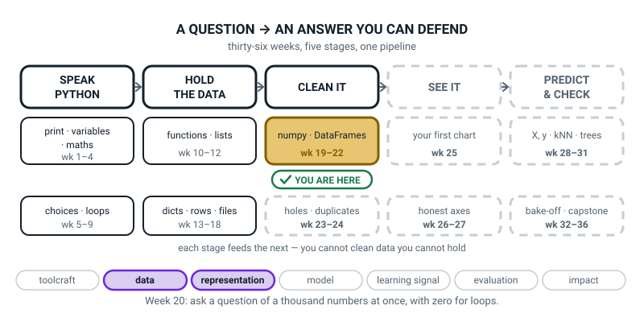

# Week 20 — The Vectorized Gradebook

[⬅ Week 19](week-19.md) · [Course Home](../README.md) · [Week 21 ➡](week-21.md) · [Student Guide](../student-guide/week-20.md) · [Workbook](../workbook/week-20.md)

---

## 📋 At a Glance

| | |
|---|---|
| **Duration** | 70 minutes |
| **Type** | 🟨 Lab — build a real tool, and meet the yes/no array that everything else is built on |
| **Big idea** | A **boolean mask** is a yes/no array you use to pull out only the values you care about. |
| **New vocabulary** | boolean mask · selection · normalization · min-max · vectorized gradebook |
| **New syntax** | `arr > 50` · `arr[mask]` · `arr.min()` / `arr.max()` · `np.round(arr, 2)` |
| **Materials** | **The 10×5 score grid printed on paper, one copy each** · **a highlighter** — this is the Hook and there is no substitute · printed workbook pages 20.1–20.6 · last week's rainfall grid, still on the table · the Bug Log |
| **Tech needed** | Laptop with Python 3 and numpy working. Nothing new to install. `gradebook.py` is typed from scratch. |
| **Prep time** | 20 minutes the night before (5 of them are printing and finding a highlighter) · 5 minutes on the day |

> **⚠️ Watch out:** the planted problem this week is one score typed as **950** instead of 95. It does not crash. The per-student average for that one student goes obviously silly — but the **0-to-1 normalization silently squashes every other student into the bottom twelfth of the scale**, and the output still looks like a tidy grid of decimals. Do not warn them. The check that catches it is a range check, and they will build it themselves in the last three minutes.

---

## 🎯 Lesson Objectives

By the end of the lesson the student can:

1. **Build a boolean mask from a comparison** and read it as an array of `True` and `False`, the same shape as the data.
2. **Use a mask to select** only the values they want, and say why the answer is shorter than the question.
3. **Find the minimum and maximum** of a whole array, or of one axis of it.
4. **Normalize a row to 0–1 by hand** and match it, digit for digit, to what the code says.
5. **Build a complete gradebook** in which no `for` loop does any arithmetic — the loops, if any, only print.

Observable evidence: `gradebook.py`, which prints per-student means, per-test means, the hardest test looked up by name, a pass/fail mask, pass counts in both directions that agree, and a 0-to-1 normalized grid; a workbook page with one row normalized in pen before the code ran; and one written sentence about what the 950 typo did to everybody else.

---

## 🧑‍🏫 What YOU Need to Know First

> **📌 About the code blocks in this guide.** Outside the **🧰 Prep Checklist** and the **🔑 Answer Key**, the blocks are **illustrations, not files** — each one carries on from the one above it, so the `import` lines and the data are typed once, in the first block that needs them. **The complete runnable files are in the Prep Checklist and the Answer Key.** If you paste an illustration on its own and get `NameError`, that is why, and nothing is broken.

**You do not need to know any numpy to teach this.** There is one new idea and it is a highlighter. Read this section once — about fifteen minutes — and you are ahead of the student all lesson.

### 1. What a mask is, before any code

> **boolean mask** — an array of `True` and `False`, the same shape as your data, made by comparing your data with something. You use it to pick out cells.

Here is the whole idea with no computer in it. Print the score grid on paper. Take a highlighter. Go along every row and highlight every score above 50.

**The pattern of highlighter marks on the page is the mask.**

That is not an analogy — it is exactly what it is. One mark or no mark, per cell. The marks are not the scores and they are not a shorter list of scores; they are a *second grid the same size as the first*, made of yes and no.

In Python:

```python
above_50 = scores > 50
```

`scores` is a grid of ten students by five tests. `above_50` is a grid of ten by five made of `True` and `False`. Same shape. Different kind of thing in every cell.


*Figure 20.1 — A mask is a yes/no array, cell for cell. Same shape as the data; a different kind in every cell.*

**Why this matters more than it looks.** Most beginners are taught masks as *a step inside filtering* — as something that happens on the way to getting a shorter list. That framing makes them invisible, and then everything built on them is mysterious. Masks are their own thing, and once a student can see them, five separate ideas collapse into one:

| What you want | What you write |
|---|---|
| the values that pass | `scores[mask]` |
| how many pass | `mask.sum()` |
| how many pass per student | `mask.sum(axis=1)` |
| how many pass per test | `mask.sum(axis=0)` |
| the names of students who passed everything | `names[mask.sum(axis=1) == 5]` |

**So: print the mask, look at the mask, highlight the mask on paper. Do not rush past it to the filtering.** That is the design of this lesson and it is the reason the highlighter is on the materials list.

### 2. `True` counts as 1, and that is why `.sum()` counts things

This surprises people and it is worth thirty seconds.

```python
print(above_50.sum())
```

```text
44
```

`.sum()` on a grid of `True` and `False` adds them up, and Python treats `True` as **1** and `False` as **0**. So adding up a mask **counts the Trues**. Forty-four of the fifty scores are above 50.

Combine that with last week and you get something genuinely powerful for free:

```python
print(passed.sum(axis=1))    # passes per student -> 10 answers
print(passed.sum(axis=0))    # passes per test    -> 5 answers
```

```text
[4 5 2 5 3 5 5 1 5 4]
[ 8  7  5 10  9]
```

Ten numbers and five numbers. Both are counts of the *same* Trues, sliced two different ways — so **they must add up to the same total.** `4+5+2+5+3+5+5+1+5+4 = 39` and `8+7+5+10+9 = 39`. That is this week's corner check, and it catches a wrong axis instantly.

### 3. `arr[mask]` — and the shape changes, which is the first surprise

```python
print(scores[above_50])
```

```text
[72 65 58 88 70 90 84 77 95 92 55 70 61 83 79 66 91 85 61 57 52 80 68 95
 92 88 99 97 78 70 63 85 74 62 88 81 72 93 89 67 60 55 76 71]
```

```python
print(scores[above_50].shape)
```

```text
(44,)
```

Fifty cells went in. **Forty-four came out, in one long row, with the grid completely gone.**


*Figure 20.2 — Five cells in, three cells out. The answer is not the shape of the question.*

Two things to say out loud about that, because both get asked:

**"Why isn't the grid still a grid?"** Because a grid has to be a rectangle, and the surviving cells are not a rectangle — Chen has three survivors and Hugo has one. There is no rectangle that holds them. So numpy does the only thing it can: hands them to you in a single row.

**"Where did the Falses go?"** They are **not there.** They did not become zeros — that would be a different and much worse answer, because a zero score and a missing score are not the same thing. They are simply absent. This matters: if the student later divides by "how many scores", they need to know whether they mean 50 or 44.

### 4. The boundary, and it is a real bug source

`>` means **strictly greater than**. So `50 > 50` is `False`.

Look at Hugo's row: `45, 38, 30, 62, 50`. His final score is exactly 50, and the mask `scores > 50` says `False` for it. That is correct and it is also exactly the sort of thing that gets an entire class's grades wrong in real life.

There are four comparisons and the student has had all of them since Week 5:

| Written | Means | `50` against `50` |
|---|---|---|
| `> 50` | strictly more than 50 | `False` |
| `>= 50` | 50 or more | `True` |
| `< 50` | strictly less than 50 | `False` |
| `<= 50` | 50 or less | `True` |

**The teaching move:** do not explain the boundary. Let the highlighter find it. In the Hook, some students will highlight Hugo's 50 and some will not, and *that disagreement is the lesson.* Then ask: "which of you is right?" — and the honest answer is "whoever said what the rule said, and the rule is a decision somebody has to make on purpose."

This is why the pass mask in the gradebook uses `>=`:

```python
passed = scores >= 60      # "sixty or more is a pass"
```

Because a school that says "60 is a pass" means 60 passes. If you write `> 60`, everyone on exactly 60 fails, and nobody will notice until a parent phones.

### 5. `.min()` and `.max()` — with and without an axis

Nothing new in the idea; it is last week's axis rule again, on two more verbs.

```python
print(scores.max())          # the biggest number anywhere
print(scores.min())          # the smallest number anywhere
print(scores.max(axis=0))    # the best score on each test  -> 5 answers
print(scores.min(axis=0))    # the worst score on each test -> 5 answers
```

```text
99
30
[95 92 88 99 97]
[45 38 30 62 50]
```

Say the sentence again: **the axis you name is the axis that gets eaten.** `axis=0` names the rows, the ten students get squashed, five answers come out — one per test.

**And here is the pretty move of the week**, which needs no new syntax at all. How do you find out which test was *hardest* — that is, which one has the lowest average?

```python
test_mean = scores.mean(axis=0)
print(test_mean.min())
print(tests[test_mean == test_mean.min()])
```

```text
60.1
['Midterm']
```

Read the second line inside-out and it is entirely made of things they already have:

1. `test_mean.min()` — the smallest of the five averages. `60.1`.
2. `test_mean == test_mean.min()` — a **mask** over the five tests: `False False True False False`.
3. `tests[...]` — use that mask to pick out of the *names* array.

**A mask over one array used to pick out of another.** That is the move that turns a number back into a name, and it is the single most useful pattern in the whole lesson. There is a dedicated numpy function for this (`argmin`) and **you should not teach it** — it is a second idea that answers a question the mask already answers, and this lesson does not have room.

### 6. Normalization — the arithmetic, worked out by hand

> **normalization** — rescaling numbers so they all sit between 0 and 1.
>
> **min-max normalization** — the particular way of doing it that puts the smallest value at exactly 0 and the largest at exactly 1.

The formula, and it is the only formula this week:

```text
scaled = (value - smallest) / (largest - smallest)
```

Work through it on Aarav's row — `72, 65, 58, 88, 70` — because you will be asked to.

Smallest is **58**. Largest is **88**. The gap between them is **30**.

| Score | Subtract 58 | Divide by 30 | Rounded |
|---|---|---|---|
| 72 | 14 | 14/30 = 0.4666… | **0.47** |
| 65 | 7 | 7/30 = 0.2333… | **0.23** |
| 58 | 0 | 0/30 = 0 | **0.00** |
| 88 | 30 | 30/30 = 1 | **1.00** |
| 70 | 12 | 12/30 = 0.4 | **0.40** |


*Figure 20.3 — Subtract the smallest, then divide by the gap. The smallest lands on 0, the largest on 1.*

**Two sanity checks you should build in, because they are free:**

- The smallest value **must** come out as exactly `0.0`. It is `(58 - 58) / 30`.
- The largest **must** come out as exactly `1.0`. It is `(88 - 58) / 30 = 30 / 30`.

So `scaled.min()` is 0.0 and `scaled.max()` is 1.0, always. If they are not, the formula is wrong.

**Why anybody does this at all** — and a 12-year-old will ask, so have the answer:

> "Suppose one column is test scores out of 100 and another is minutes of revision, which might be 300. If you compare them, the minutes drown out the scores just by being bigger numbers — not by mattering more. Normalizing puts them on the same ruler so 'big' means the same thing in both. **You will need this badly in Week 30**, where a model measures the distance between two students, and a column with big numbers would decide everything on its own."

### 7. `np.round` — and the one thing to say about it

```python
print(np.round(scaled, 2))
```

The `2` is how many digits after the decimal point. Leave it out and you get whole numbers, which for a 0-to-1 grid is a disaster:

```python
print(np.round(scaled))
```

```text
[[1. 1. 0. 1. 1.]
 [1. 1. 1. 1. 1.]
 [0. 0. 0. 1. 0.]]
```

Everything has become 0 or 1 and all the information is gone. Worth showing once, quickly, as a warning.

And one honest sentence: **rounding is for printing, not for storing.** Round when you show a number to a person. Do not round and then do more arithmetic with it, or the small errors pile up. This is Week 3's `f"{x:.2f}"` idea arriving for a whole grid at once.

### 8. The planted problem: one extra zero

This is the part of the lesson that will stay with them, so here it is in full so you can run it confidently.

Farah's Quiz1 score is 95. Somebody types **950**.

```python
scores[5, 0] = 950
```

Here is what changes, and the order matters:

| Quantity | Correct | With the typo | Would you notice? |
|---|---|---|---|
| the biggest score | 99 | **950** | Yes, if you print it |
| Farah's mean | 94.2 | **265.2** | Probably — it is over 100 |
| Quiz1's mean | 73.4 | **158.9** | Probably |
| the class mean | 72.1 | **89.2** | **No.** 89.2 is a completely believable class average |
| Aarav's first scaled score | 0.61 | **0.05** | **No, and this is the disaster** |

The normalization is the one that hurts. The gap between smallest and largest was 99 − 30 = 69. Now it is 950 − 30 = 920, more than thirteen times wider. Every real score is squashed into the bottom slice of the ruler:

```text
[[0.05 0.04 0.03 0.06 0.04]
 [0.07 0.06 0.05 0.07 0.07]
 [0.03 0.02 0.01 0.04 0.03]
 [0.06 0.05 0.04 0.07 0.06]
 [0.03 0.03 0.02 0.05 0.04]
 [1.   0.07 0.06 0.08 0.07]
 [0.05 0.04 0.04 0.06 0.05]
 [0.02 0.01 0.   0.03 0.02]
 [0.06 0.06 0.05 0.07 0.06]
 [0.04 0.03 0.03 0.05 0.04]]
```


*Figure 20.4 — The scale is set by the biggest and smallest value, so one wrong value sets it for everybody.*

Look at it as a teacher for a second. **It is still a perfectly tidy grid of two-decimal numbers.** Every value is between 0 and 1, exactly as promised. Nothing is out of range. Bela is still ahead of Chen. The *ordering* survives completely — which is precisely why nobody notices.

What has died is the **spread**. Every genuine difference between students has been compressed into a range of about 0.07, and if you fed this to a model it would conclude that all ten students are essentially identical, apart from one.

**The check that catches it, and it is one line with a mask in it:**

```python
print("anything above 100?", scores[scores > 100])
```

```text
anything above 100? [950]
```

> **This is the lesson to say out loud:** "A range check is you writing down what you already know. You know a test score can't be over 100. You know a step count can't be negative. You know a person's age can't be 900. **The computer doesn't know any of that, and it never will unless you tell it.** One line, once, at the top of the file."

### 9. The "zero for loops" rule, and how strict to be about it

The rule for this file is: **no `for` loop does any arithmetic on the scores.** Every number in the report comes out of an array operation.

Are printing loops allowed? Take this position, and say it out loud: **printing is not computing.** A loop that walks along `names` and prints a line each is fine — it is doing the job the array cannot do, which is putting the labels back on. A loop that adds scores up is not fine, because one axis does it better.

For this week's homework the honest strictest version is best, and it is achievable: **print the arrays whole.** `print(student_mean)` gives all ten averages at once, and `print(names)` gives all ten names. Lined up, they read fine, and the file then genuinely contains no `for` at all. If a student wants a prettier report with a printing loop, that is a good instinct and you should allow it — but ask them to say which of their loops compute and which only print. The ones that compute have to go.

**Why bother with the rule at all?** Two honest reasons and only one of them is speed:

1. A one-line array operation is **easier to check**. `scores.mean(axis=1)` either has the right axis or it does not, and the count tells you. A four-line loop has an index, a counter, an accumulator and a division, and each of those is somewhere a mistake can hide.
2. It is how every model in Weeks 28–33, and every model in Level 3, actually does its arithmetic. **A student who thinks in whole arrays will find scikit-learn obvious.** A student who thinks in loops will find it magic.

### 10. The three misconceptions you will actually meet

**Misconception 1 — "a mask is a filter."**
It is *used* for filtering. It is not a filter. A filter gives you a shorter thing; a mask is the *same shape* as your data. A student who conflates them cannot understand `mask.sum(axis=1)`, because you cannot count per-row on something that has lost its rows. Cure: the highlighter. Marks on a page, one per cell.

**Misconception 2 — "normalizing changes the data."**
It changes the *scale*, not the order and not the relationships. Nobody moves past anybody. The cure is Figure 20.3: the dots stay in the same left-to-right order on both rulers; only the numbers printed under them change.

**Misconception 3 — "the numbers all looked fine, so it worked."**
The 950 grid looks completely fine: fifty numbers, all between 0 and 1, two decimal places, correct ordering. This is Week 19's lesson getting harder — last week the wrong answer was *plausible*; this week the wrong answer is *beautiful.* Cure: the range check, run before anything else.

### 11. How deep to go, and where to stop

**Go this far:** `scores > 50` and reading the mask as an array; `mask.sum()` and `mask.sum(axis=...)`; `scores[mask]` and noticing the shape changed; a mask over one array used to index another (`tests[test_mean == test_mean.min()]`); `.min()` and `.max()` with and without an axis; min-max normalization, hand-checked on one row; `np.round(arr, 2)`; the 950 typo and a range check.

**Stop before:**

| Do not teach today | Where it lives |
|---|---|
| `&`, `\|`, `~` — combining two conditions | **Not this term.** It needs brackets round every comparison and produces a baffling error when you forget them. Today's questions all need one condition. If a student needs two, do it in two steps with two named masks. |
| `and` / `or` on arrays | Never — it does not work. It raises `ValueError: The truth value of an array... is ambiguous`. It is in the Debugging Clinic because they *will* try it. |
| `np.where` | Not this term. It is an if/else for arrays and it is genuinely useful, and it is a third idea in a lesson that already has two. |
| `argmin` / `argmax` | Not in this course as syntax. The mask lookup in §5 answers the same question with tools they already own. |
| `.std()`, z-scores | Level 3, and Week 30 will call it `StandardScaler` and let scikit-learn do it. Min-max is enough to make the point. |
| Per-column normalization with broadcasting | **Tempting and genuinely useful — and it is a Variation-harder, not core.** It needs `axis=0` aggregates broadcast back against the grid, which is two ideas at once. Do the whole-grid version first. |
| `mask.any()` / `mask.all()` | Fine to mention to a fast student: "was there at least one?" and "were they all?" Neither is needed, and `sum(axis=1) == 5` does the job with tools already on the ladder. |
| `.copy()` | Not needed. When they break the grid with 950, they fix it by typing 95 back in — which makes them look at the number, which is where the mistake was. |

The line to hold in your head all lesson: **today the student learns that a mask is a thing you can look at.** Everything else in the lesson is a use of it.

---

### 12. 🧭 The Growing Map — two minutes on the highlighter

The student guide carries one figure that is not about this week's content: the same pipeline every
week, with one more piece filled in. It is the only place either book shows the learner the *shape* of
the year rather than the week.



*Figure 20.0 — Week 20's version. Second week inside the `numpy · DataFrames` tile, weeks 19 to 22. Two
threads lit: representation and data.*

**What to do with it, in about two minutes at the end of the lesson:**

1. **Show it and anchor on the Hook.** Ask *"we are in the same box as last week — so what did the
   highlighter do that `axis=0` could not?"* You want something like *"it picked out the actual scores,
   not an average of them."* That is the whole distinction between summarising a grid and selecting from
   it, and they found it with a pen before they typed anything.
2. **Then the question the `950` sets up:** *"find me the box on this map whose job is catching a typo
   like 950."* They will land on `holes · duplicates`, weeks 23 to 24 — **dashed**. So who caught it
   today? They did, with a range check they wrote themselves. A dashed box doing useful work in a
   discussion is the map earning its keep.
3. **Have them draw one arrow on their own copy:** from the gold tile to that dashed `holes · duplicates`
   box, labelled *the 950*. In three weeks they will be standing in that box and the arrow will already
   be there waiting.

> **🧑‍🏫 Why this is worth two minutes.** Lab weeks are where learners most easily mistake *typing a lot*
> for *learning something*. Two minutes on the map turns a two-hundred-line gradebook into one
> transferable sentence — **a mask is a question you can look at** — and it puts the `950` where it
> belongs: not a silly slip they made, but a category of problem this course has a whole tile reserved
> for.

> **⚠️ Watch out:** do not let that arrow become a promise that Week 23 makes bad data somebody else's
> problem. The range check they wrote today is the habit; pandas only makes it shorter.

---

## 🧰 Prep Checklist

### 20 minutes the night before

- [ ] **Print the score grid on paper, one copy for the student and one for you.** Ten names down, five test names across, fifty numbers. Figure 20.5 is exactly this. **The Hook does not work without it.**
- [ ] **Find a highlighter.** A coloured pencil works. A pen does not — you need the numbers still readable underneath, because the whole point is that the mask sits *on top of* the data without replacing it.
- [ ] **Print workbook pages 20.1–20.6.**
- [ ] **Prove numpy still works:** `python3 -c "import numpy; print(numpy.__version__)"` → a version number.
- [ ] **Type and run the code yourself.** One file, `gradebook.py`. Type it out; do not paste.

```python
"""gradebook.py - a whole gradebook with no for loop doing any arithmetic."""

import numpy as np

names = np.array(["Aarav", "Bela", "Chen", "Divya", "Emeka",
                  "Farah", "Gita", "Hugo", "Ivy", "Jai"])
tests = np.array(["Quiz1", "Quiz2", "Midterm", "Project", "Final"])

scores = np.array([
    [72, 65, 58, 88, 70],     # Aarav
    [90, 84, 77, 95, 92],     # Bela
    [55, 48, 40, 70, 61],     # Chen
    [83, 79, 66, 91, 85],     # Divya
    [61, 57, 52, 80, 68],     # Emeka
    [95, 92, 88, 99, 97],     # Farah
    [78, 70, 63, 85, 74],     # Gita
    [45, 38, 30, 62, 50],     # Hugo
    [88, 81, 72, 93, 89],     # Ivy
    [67, 60, 55, 76, 71],     # Jai
])

print("scores :", scores.shape, scores.dtype)
print("names  :", names.shape, "  tests:", tests.shape)

above_50 = scores > 50                    # one True or False per cell
print()
print(above_50)
print("mask shape:", above_50.shape, " dtype:", above_50.dtype)

print()
print("the scores above 50:", scores[above_50])
print("how many           :", scores[above_50].shape)
print("how many True      :", above_50.sum())

passed = scores >= 60                     # passing is 60 or more
print()
print("passes per student:", passed.sum(axis=1))
print("passes per test   :", passed.sum(axis=0))
print("both ways add to  :", passed.sum(axis=1).sum(), passed.sum(axis=0).sum())
print("passed everything :", names[passed.sum(axis=1) == 5])

print()
print("highest score anywhere:", scores.max())
print("lowest  score anywhere:", scores.min())
print("best on each test :", scores.max(axis=0))
print("worst on each test:", scores.min(axis=0))
print("lowest test mean  :", scores.mean(axis=0).min())
print("hardest test      :", tests[scores.mean(axis=0) == scores.mean(axis=0).min()])

low = scores.min()
high = scores.max()
scaled = (scores - low) / (high - low)
print()
print(np.round(scaled, 2))
print("scaled min:", scaled.min(), " scaled max:", scaled.max())
```

Run `python3 gradebook.py`. You must see **exactly** this:

```text
scores : (10, 5) int64
names  : (10,)   tests: (5,)

[[ True  True  True  True  True]
 [ True  True  True  True  True]
 [ True False False  True  True]
 [ True  True  True  True  True]
 [ True  True  True  True  True]
 [ True  True  True  True  True]
 [ True  True  True  True  True]
 [False False False  True False]
 [ True  True  True  True  True]
 [ True  True  True  True  True]]
mask shape: (10, 5)  dtype: bool

the scores above 50: [72 65 58 88 70 90 84 77 95 92 55 70 61 83 79 66 91 85 61 57 52 80 68 95
 92 88 99 97 78 70 63 85 74 62 88 81 72 93 89 67 60 55 76 71]
how many           : (44,)
how many True      : 44

passes per student: [4 5 2 5 3 5 5 1 5 4]
passes per test   : [ 8  7  5 10  9]
both ways add to  : 39 39
passed everything : ['Bela' 'Divya' 'Farah' 'Gita' 'Ivy']

highest score anywhere: 99
lowest  score anywhere: 30
best on each test : [95 92 88 99 97]
worst on each test: [45 38 30 62 50]
lowest test mean  : 60.1
hardest test      : ['Midterm']

[[0.61 0.51 0.41 0.84 0.58]
 [0.87 0.78 0.68 0.94 0.9 ]
 [0.36 0.26 0.14 0.58 0.45]
 [0.77 0.71 0.52 0.88 0.8 ]
 [0.45 0.39 0.32 0.72 0.55]
 [0.94 0.9  0.84 1.   0.97]
 [0.7  0.58 0.48 0.8  0.64]
 [0.22 0.12 0.   0.46 0.29]
 [0.84 0.74 0.61 0.91 0.86]
 [0.54 0.43 0.36 0.67 0.59]]
scaled min: 0.0  scaled max: 1.0
```

- [ ] **Break it on purpose, twice.**
  1. Change `names[passed.sum(axis=1) == 5]` to `names[passed]`. You must get `IndexError: too many indices for array: array is 1-dimensional, but 2 were indexed`. This is the loud mistake you will do in front of them.
  2. Add `scores[5, 0] = 950` just before the normalization block and run again. **Nothing will crash.** Look at the scaled grid. That is the lesson.
- [ ] **Highlight your own paper grid.** Every score above 50. It takes ninety seconds and you should feel how it feels, because the thing you are about to ask a 12-year-old to do only works if you can see the pattern of marks *as a pattern* rather than as a chore.
- [ ] **Look hard at Hugo's row.** `45, 38, 30, 62, 50`. Did you highlight the 50? Whichever you did, know why. This is the boundary and it is the best question in the Hook.
- [ ] **Do the Aarav hand-normalization yourself, in pen.** `58` and `88`, gap `30`, then `0.47, 0.23, 0.00, 1.00, 0.40`. You will be marking this and it takes about two minutes with a calculator.

### 5 minutes on the day

- [ ] Editor open, terminal in the same folder. `gradebook.py` **deleted or renamed** — they type it.
- [ ] **Paper grid and highlighter on the table before they sit down.** Calculator too.
- [ ] Last week's rainfall grid still visible. The lesson opens by pointing at it.
- [ ] Workbook 20.1–20.3 out. **20.3's hand-normalization must be done in pen before any code runs.**
- [ ] Bug Log out. Two entries today: one loud, one silent.
- [ ] Read the marks from Week 19's hand-check pages. If the pencil work was skipped last week, say something about it *before* today's hand-check rather than after.

### Fallback if the laptop or the install fails

**The mask half of this lesson is genuinely better on paper.** The gradebook half is not, and there is no honest paper version of it — so if there is no computer, do the mask work properly and move the gradebook to next week's warm-up.

1. **The highlighter mask** (the Hook, extended to fifteen minutes). Highlight every score above 50. Then, on a *second* copy, highlight every score of 60 or more. Two masks, same grid. Ask what changed and where.
2. **Count the marks two ways.** Along each row: how many highlights per student? Write the ten numbers down the right margin. Down each column: how many per test? Write the five numbers along the bottom. **Add both margins.** They must agree — 39 both ways. That is `mask.sum(axis=1)` and `mask.sum(axis=0)` and the corner check, all on paper, and it is objectives 1 and 3.
3. **Write out the highlighted values on a separate line.** All of them, in reading order. Count them: 39. Then ask the killer question: *"how many cells are on the page?"* Fifty. *"So why does your line have thirty-nine things on it?"* **That is `arr[mask]` and the shape change, on paper.**
4. **Normalize Aarav's row by hand.** Smallest 58, largest 88, gap 30. Five divisions with a calculator. Then check: the smallest came out 0, the largest came out 1. **Objective 4, done, no computer.**
5. **The 950, on paper.** Cross out Farah's 95 and write 950. Now ask: *"what is the biggest number on the page? What's the gap between biggest and smallest now?"* 920. *"So what does 72 become?"* `(72-30)/920 = 0.0457`. Have them do two or three by hand and watch them all come out tiny. **This lands harder with a calculator than on a screen**, because they feel the division being by a silly number.

| If this fails | Do this instead |
|---|---|
| numpy is missing | Do the paper version above in full — it delivers objectives 1, 3 and 4 and most of 2 — and fix the install before Week 21, which needs a *new* install (pandas) and cannot afford to also be fixing numpy. |
| No highlighter, no coloured pencil | Circle the values with a pen. It is worse, because circles are slower and messier, but the pattern still shows. Do **not** cross out the non-passes — that destroys the "same shape" idea, which is the whole point. |
| The printed grid is missing | They can copy fifty numbers in four minutes, and copying them is not wasted — a student who has written the grid out knows Hugo's row is bad before you get there. |
| The gradebook is only half-finished at the end of the lesson | Completely normal and fine. The lesson's target is **the mask**, and the gradebook is the homework. Make sure the mask, the two pass counts and one hand-normalization are done in class; the rest can go home. |
| A student's pass counts disagree between the two margins | **Best thing that can happen.** Do not fix it for them. Ask: "which of the two do you trust more, and how could you check?" Then count one row and one column by hand. |

---

## ⏱️ The Lesson, Minute by Minute

| Segment | Minutes | Running total | What happens |
|---|---|---|---|
| 🪝 Hook — Highlight Every Pass | 7 | 7 | Fifty numbers, one highlighter, and a disagreement about Hugo's 50 |
| 🧠 Concept — The Mask Is a Thing | 16 | 23 | Masks as arrays; True is 1; selecting; min/max; the formula |
| 💻 Live-Code Together — `gradebook.py` | 18 | 41 | Mask, counts, names. Two deliberate mistakes: one loud, one silent |
| 🎲 Their Turn — The Vectorized Gradebook | 20 | 61 | Normalize, hand-check one row, then the 950 |
| 🔑 Wrap & Assign | 9 | 70 | Three checks, the takeaway, homework |

---

### 🪝 Hook — Highlight Every Pass (7 minutes)

**Do this:** Nothing on the screen. The printed grid and a highlighter in front of them. Last week's rainfall grid still on the table beside it.

**Say this:**

> "Same shape of thing as last week — a grid with names down the side and names across the top. This time it's ten students and five tests, and the numbers are scores out of a hundred.
>
> Here's a highlighter. **Go through the whole grid and highlight every score above 50.** Don't add anything up, don't work anything out. Just mark them. Ninety seconds."

**Do this:** Let them do it. Watch what they do at Hugo's row — `45, 38, 30, 62, 50` — and at the 50 in particular. Do not comment.

When they finish, take the highlighter off them and hold up the page.

> "Right. Look at what you've made. Don't look at the scores — look at the **marks.** Just the pattern of yellow.
>
> How many marks are there?"

*(They will not know, and that is fine.)*

> "How many **cells** are there?"

*Fifty. Ten times five.*

> "Fifty. And how many marks *could* there be, at most?"

*Fifty.*

> "Fifty. Every single cell either got a mark or didn't. So what you've made isn't a list of the good scores. **It's a whole second grid, the same size as the first one, made of yes and no.**
>
> That thing has a name. It's called a **mask**, and it is the idea for today. And you just made one with a highlighter before you wrote a single line of Python."

**Do this:** Write on the board and leave it up:

> **mask** — a grid of yes and no, the same shape as your data, made by comparing your data with something.

> "Now — a question, and I want you to be honest.
>
> **Look at Hugo's last score. It's exactly 50. Did you highlight it?**"

**Do this:** This is the best moment in the lesson. Some will say yes, some no, some will have hesitated and guessed. Let them all answer before you say anything.

> "So we disagree. Which of us is right?"

Let them argue for thirty seconds.

> "Here's the answer, and it's not satisfying: **it depends what I asked for, and I asked for 'above 50'.** Is 50 above 50?"

*No.*

> "No. Fifty is *equal* to fifty. So a 50 does **not** get highlighted, and anyone who highlighted it followed a rule I didn't give.
>
> And notice how easy that was to get wrong, on one cell, in ninety seconds, with a highlighter in your hand. Now imagine the rule is 'sixty is a pass' and you write 'above sixty' in your code. **Every single student who got exactly sixty just failed**, and nobody will find out until somebody's parent phones the school."

**Ask this:**

| Ask | Answer you want | If they say something else |
|---|---|---|
| "How many marks could there be, at most?" | Fifty — one per cell. | If they say "however many pass", point out that they marked cells, not values. Every cell got a decision. |
| "Is your highlighted page a list of good scores, or something else?" | Something else — a yes/no for every cell, same shape as the grid. | If they say "a list", ask: "then where are the bad scores gone? They're still on the page, aren't they?" |
| "Did you highlight the 50?" | Either — the point is the disagreement. | Whatever they say, ask "why?" A student who says "because I wasn't sure" has given the most useful answer in the room. |
| "Is 50 above 50?" | No. | If they say yes, write `50 > 50` on the board and ask them to read it out loud as a sentence. "Fifty is greater than fifty." Is that true? |
| "Where would this mistake actually hurt?" | Anywhere with a pass mark, an age limit, a price cap. | Any real example is a good answer. Push for one from their own life. |
| "What was on the table last week that this reminds you of?" | The rainfall grid — rows, columns, two directions. | If they do not see it, put the two sheets side by side. Today's mask has an `axis=0` and an `axis=1` too, and that is coming in ten minutes. |

---

### 🧠 Concept — The Mask Is a Thing (16 minutes)

**Do this:** Highlighted page still in view. Board work. Nothing typed yet.

**Say this — part 1, from highlighter to code:**

> "One line of Python makes what you just made by hand."

Write on the board: `above_50 = scores > 50`

> "Read it: **'above_50 is scores greater than fifty.'**
>
> Now — what kind of thing is `above_50`? What's in it?"

*True and False.*

> "True and False, one per cell. **Same shape as `scores`.** Ten by five. Fifty of them.
>
> This is the bit I want you to be careful about, because most people skip it. `above_50` is **not a shorter list of the good scores.** It's the same size as everything, and it's made of yes and no. It is the highlighter marks. Nothing else."

**Say this — part 2, True is one:**

> "Now something small and rather nice. What do you get if you **add up** a grid of True and False?"

Let them guess.

> "Python treats `True` as **1** and `False` as **0**. It's been doing that since before you were born. So adding up a mask **counts the yeses.**"

Write on the board:

```text
mask.sum()          ->  how many yeses altogether
mask.sum(axis=1)    ->  how many yeses per ROW      (per student)
mask.sum(axis=0)    ->  how many yeses per COLUMN   (per test)
```

> "Look at those last two. **That's last week.** Same rule, no exceptions: *the axis you name is the axis that gets eaten.* Ten students down, so `axis=1` eats the five tests and gives me ten numbers. Five tests across, so `axis=0` eats the ten students and gives me five.
>
> How many numbers from `mask.sum(axis=1)`?"

*Ten.*

> "And `axis=0`?"

*Five.*

> "And here's the free check, which is the same corner check as last week wearing different clothes. Those ten numbers and those five numbers are counting **the same yeses**, just sliced differently. So if you add up the ten and add up the five — "

*They should be the same.*

> "They must be. And if they aren't, one of your axes is wrong."

**Say this — part 3, using the mask:**

> "So that's the mask itself. Now what do you do with it? You put it in square brackets."

Write: `scores[above_50]`

> "Read that as **'the scores where the mask says yes'.**
>
> Predict something for me. Fifty cells go in, and forty-four of them say True. **How many numbers come out?**"

*Forty-four.*

> "Forty-four. And here's the thing I want you to expect *before* you see it: **it will not be a grid.** It'll be one long row of forty-four numbers.
>
> Why can't it be a grid?"

Let them work at it. Prompt: *"look at Chen's row and then Hugo's row. How many survive in each?"*

*Three and one.*

> "Three and one. A grid has to be a rectangle, and three-then-one isn't a rectangle. So there's no grid that fits, and numpy hands you one long row instead. **The answer isn't the shape of the question.**
>
> And one more thing. The Falses — the scores that didn't pass — did they turn into zeros?"

*No.*

> "They're just **not there**. Which matters, because a zero and a missing thing are not the same, and if you ever divide by 'how many scores' you need to know whether you mean fifty or forty-four."

**Say this — part 4, min and max, and turning a number into a name:**

> "Two more small things and then you type. Biggest and smallest."

Write:

```text
scores.max()          ->  the biggest number anywhere
scores.max(axis=0)    ->  the best score on each test    (5 answers)
scores.min(axis=1)    ->  each student's worst score     (10 answers)
```

> "Same axis rule. Nothing new.
>
> But here's a lovely one. Say I want to know **which test was hardest.** I can get the five test averages easily — `scores.mean(axis=0)`. And I can get the smallest of those five — `.min()`. But that gives me a *number*, `60.1`. I want a **name.**
>
> Watch this. Build a mask over the five averages."

Write, one piece at a time, saying each out loud:

```text
test_mean == test_mean.min()      ->  False False True False False
tests[ that ]                     ->  ['Midterm']
```

> "**A mask made from one array, used to pick out of a different one.** That is the trick of the week and you'll use it constantly. The mask is five long, the names are five long, so they line up, and the one True picks out the one name."

**Say this — part 5, the formula, and page 20.3 in pen:**

> "Last piece before you type. **Normalizing.** It means squashing numbers so they sit between 0 and 1."

Write the formula and box it:

```text
scaled = (value - smallest) / (largest - smallest)
```

> "Why would anybody want that? Because numbers being *bigger* isn't the same as numbers *mattering more*. If one column is scores out of a hundred and another is minutes of revision out of three hundred, then the minutes will boss any comparison around just by being bigger numbers. Squash both onto 0 to 1 and 'big' means the same thing in both. **You'll need this badly in Week 30.**
>
> Now, **page 20.3, in pen, before we touch a keyboard.** Aarav's row: 72, 65, 58, 88, 70.
>
> Find the smallest. Find the largest. Work out the gap. Then do all five divisions with the calculator and write them to two decimal places.
>
> And before you start — two things you already know about the answer. **The smallest one is going to come out as exactly zero.** And the biggest one is going to come out as exactly one. If they don't, you've got the formula wrong. Five minutes. Go."

**Do this:** Circulate. Confirm nothing. If someone asks "is 0.47 right?", say "check it against the two things you already know" and move on.

**Ask this:**

| Ask | Answer you want | If they say something else |
|---|---|---|
| "What kind of thing is `above_50`?" | An array of True and False, the same shape as scores. | If they say "the good scores", point at the highlighted page: "are the bad scores gone off that page?" |
| "What shape is the mask?" | `(10, 5)` — the same as the data. | If they say `(44,)`, they have jumped ahead to the selection. Separate the two: "that's what comes out *after* you use it." |
| "What does adding up a mask give you?" | A count of the Trues, because True is 1. | If they are unsure, write `True + True + False` on the board and ask what it comes to. |
| "How many numbers from `mask.sum(axis=0)`?" | Five — one per test. | Back to last week's sentence: the axis you name gets eaten. Then draw the arrows. |
| "Fifty cells, forty-four Trues — how many come out of `scores[mask]`?" | Forty-four, in one long row. | If they say "a grid with gaps", ask how wide a row with a gap in it is. |
| "Why can't the answer be a grid?" | Because different rows have different numbers of survivors, so it isn't a rectangle. | If stuck, count survivors in Chen's row and Hugo's row out loud. |
| "`test_mean.min()` gives 60.1. How do I get the *name*?" | Make a mask from `== 60.1` and use it on `tests`. | If they suggest counting along by hand, accept it and then show that the mask does it without you having to count. |
| "Before you divide anything — what must the smallest value come out as?" | Zero. | If they do not know, walk it: "what's 58 minus 58? And zero divided by anything?" |

---

### 💻 Live-Code Together — `gradebook.py` (18 minutes)

**You never touch the keyboard.** Predictions before every run — *what shape, and how many?*

**Step 1 (4 min).** New file, `gradebook.py`. The data and the labels.

```python
"""gradebook.py - a whole gradebook with no for loop doing any arithmetic."""

import numpy as np

names = np.array(["Aarav", "Bela", "Chen", "Divya", "Emeka",
                  "Farah", "Gita", "Hugo", "Ivy", "Jai"])
tests = np.array(["Quiz1", "Quiz2", "Midterm", "Project", "Final"])

scores = np.array([
    [72, 65, 58, 88, 70],     # Aarav
    [90, 84, 77, 95, 92],     # Bela
    [55, 48, 40, 70, 61],     # Chen
    [83, 79, 66, 91, 85],     # Divya
    [61, 57, 52, 80, 68],     # Emeka
    [95, 92, 88, 99, 97],     # Farah
    [78, 70, 63, 85, 74],     # Gita
    [45, 38, 30, 62, 50],     # Hugo
    [88, 81, 72, 93, 89],     # Ivy
    [67, 60, 55, 76, 71],     # Jai
])

print("scores :", scores.shape, scores.dtype)
print("names  :", names.shape, "  tests:", tests.shape)
```

Run it. Real output:

```text
scores : (10, 5) int64
names  : (10,)   tests: (5,)
```

> **Say this:** "One row per student, a comment with the name on it. Same rule as always: **the shape of the code is the shape of the data.**
>
> And look at those two print lines together. Ten in the first slot of the scores shape, ten names. Five in the second slot, five tests. **Those aren't decoration — that's a check.** If you fat-finger a row and type six scores instead of five, this is where you find out, and you find out on line 20 instead of on line 90 with a wrong answer in your hand."

**Step 2 (4 min).** The mask, and looking at it.

```python
above_50 = scores > 50                    # one True or False per cell
print()
print(above_50)
print("mask shape:", above_50.shape, " dtype:", above_50.dtype)
```

**Ask before running:** "What shape will it be? And what dtype?"

Run it. Real output:

```text

[[ True  True  True  True  True]
 [ True  True  True  True  True]
 [ True False False  True  True]
 [ True  True  True  True  True]
 [ True  True  True  True  True]
 [ True  True  True  True  True]
 [ True  True  True  True  True]
 [False False False  True False]
 [ True  True  True  True  True]
 [ True  True  True  True  True]]
mask shape: (10, 5)  dtype: bool
```

**Do this:** Put the printed paper grid next to the screen. Line them up.

> **Say this:** "Hold your highlighted page up beside the screen. **The Falses are exactly where you didn't put a mark.** Row 3 — Chen — two Falses. Row 8 — Hugo — four.
>
> Now go and look at Hugo's last one on the screen."

*False.*

> "False. The score is exactly 50, and 50 is not *above* 50. If you highlighted it, the computer just disagreed with you, and the computer is right — because I asked for 'above'.
>
> And read the dtype: **`bool`.** That's the third dtype you've met, after `int64` and `float64`. A `bool` cell holds one of exactly two things, and nothing else."

**Step 3 (3 min).** Using it, and the shape change.

```python
print()
print("the scores above 50:", scores[above_50])
print("how many           :", scores[above_50].shape)
print("how many True      :", above_50.sum())
```

**Ask before running:** "How many numbers come out, and what shape?"

Run it. Real output:

```text

the scores above 50: [72 65 58 88 70 90 84 77 95 92 55 70 61 83 79 66 91 85 61 57 52 80 68 95
 92 88 99 97 78 70 63 85 74 62 88 81 72 93 89 67 60 55 76 71]
how many           : (44,)
how many True      : 44
```

> **Say this:** "Forty-four, in one long row. Fifty went in. **The grid is gone**, because three survivors in one row and one in another isn't a rectangle.
>
> And look at the last line. `above_50.sum()` is also 44. Adding up the yeses counts them, because True is one. Two different routes to the same number, and they agree, which is exactly the kind of thing you want in a file."

**Step 4 — ⚠️ FIRST DELIBERATE MISTAKE (4 min).** This one is loud and it is a completely natural mistake.

> **Say this:** "Now the useful question: **which students passed everything?** Passing is 60 or more. So first, a pass mask. Then — I want the names. Type this."

```python
passed = scores >= 60                     # passing is 60 or more
print()
print("passed everything :", names[passed])
```

**Ask before running:** "Will that work?" *(Most say yes.)*

Run it. Real output:

```text
Traceback (most recent call last):
  File "gradebook.py", line 37, in <module>
    print("passed everything :", names[passed])
IndexError: too many indices for array: array is 1-dimensional, but 2 were indexed
```

> **Say this:** "Read the last line and put it in your own words."

*names is one-dimensional but I gave it a two-dimensional thing.*

> "Exactly right, and this is a really good error. `names` is a **row** — ten names, one direction. `passed` is a **grid** — ten by five, two directions. numpy is saying: *you've handed me a two-directional mask to index a one-directional list, and I can't line those up.*
>
> Which makes sense if you think about what you asked. `passed` has fifty answers in it. There are only ten names. **Fifty into ten doesn't go.**
>
> So — how do I get from fifty answers down to ten? One per student?"

Let them find it. It is last week.

*Add them up along the row. axis=1.*

> "`axis=1`. Which gives ten numbers — how many tests each student passed. And then a student who passed **everything** is one whose count is...?"

*Five.*

```python
print("passes per student:", passed.sum(axis=1))
print("passes per test   :", passed.sum(axis=0))
print("both ways add to  :", passed.sum(axis=1).sum(), passed.sum(axis=0).sum())
print("passed everything :", names[passed.sum(axis=1) == 5])
```

Run it. Real output:

```text
passes per student: [4 5 2 5 3 5 5 1 5 4]
passes per test   : [ 8  7  5 10  9]
both ways add to  : 39 39
passed everything : ['Bela' 'Divya' 'Farah' 'Gita' 'Ivy']
```

> **Say this:** "Five names. And the two counts both come to 39, which is the corner check from last week, and it means neither axis is wrong.
>
> Now watch what happens if I get the axis wrong here — because it does **not** stay quiet this time."

Change `axis=1` to `axis=0` in the last line only, and run:

```text
Traceback (most recent call last):
  File "gradebook.py", line 40, in <module>
    print("passed everything :", names[passed.sum(axis=0) == 5])
IndexError: boolean index did not match indexed array along dimension 0; dimension is 10 but corresponding boolean dimension is 5
```

> **Say this:** "Read it. **'Dimension is 10 but corresponding boolean dimension is 5.'** There are ten names and my mask is five long. numpy has caught the wrong axis for me — because I was indexing something with the wrong-sized mask.
>
> That is genuinely lucky, and I want you to notice why. Last week the wrong axis was **silent**, because it just printed some numbers. This week it's **loud**, because I tried to use it on the names — and the names knew how many they were.
>
> **Labels catch mistakes.** Hold on to that. It's most of what Week 21 is about."

Put `axis=1` back.

**Bug Log both of these**, and note the difference between them: one says "too many indices" (wrong number of directions), the other says "did not match" (right number of directions, wrong length).

**Step 5 (3 min).** Biggest, smallest, and turning a number into a name.

```python
print()
print("highest score anywhere:", scores.max())
print("lowest  score anywhere:", scores.min())
print("best on each test :", scores.max(axis=0))
print("worst on each test:", scores.min(axis=0))
print("lowest test mean  :", scores.mean(axis=0).min())
print("hardest test      :", tests[scores.mean(axis=0) == scores.mean(axis=0).min()])
```

**Ask before running:** "How many numbers from `scores.max(axis=0)`?" *Five.*

Run it. Real output:

```text

highest score anywhere: 99
lowest  score anywhere: 30
best on each test : [95 92 88 99 97]
worst on each test: [45 38 30 62 50]
lowest test mean  : 60.1
hardest test      : ['Midterm']
```

> **Say this:** "The last line is the good one and I want you to read it inside-out.
>
> Innermost: `scores.mean(axis=0)` — five test averages. Then `.min()` of those — the smallest average, 60.1. Then the comparison — **a mask, five long, with exactly one True in it.** Then `tests[...]` — that mask, used on the names.
>
> **Midterm.** The hardest test, by name, not by number. And I never had to count along the array with my finger.
>
> One honest note: it came out as `['Midterm']` with brackets round it, because a mask always gives you back a *collection* — it doesn't know there's only one. And if two tests tied for hardest, you'd get both names, which is correct and is why it works this way."

---

### 🎲 Their Turn — The Vectorized Gradebook (20 minutes)

Full instructions in the next section. In the lesson flow:

- **Minutes 0–3:** page 20.3's hand-normalization of Aarav's row gets checked against the code. In pen, done first.
- **Minutes 3–10:** the normalization block goes into `gradebook.py`, plus the two sanity checks.
- **Minutes 10–16:** **the 950.** One character. Run everything again. Find what changed.
- **Minutes 16–20:** the range check gets written, and the sentence for 20.5 gets started out loud.

---

## 🎲 The Activity, In Full

### Setup

**On the table:** the printed 10×5 grid, already highlighted from the Hook; a **second, clean copy** of the grid; a highlighter; a **calculator**; workbook page 20.3 with Aarav's row normalized **in pen**; the Bug Log.

**On the screen:** `gradebook.py` from the live-code, with room at the bottom.


*Figure 20.5 — Ten students down, five tests across, and one margin per direction. The corner is the cross-check.*

**The one rule that makes this work:** *the pencil goes first.* Aarav's five scaled values are written in pen before the code runs, and they may not be edited.

### Part 1 — the hand-check, matched (3 minutes)

They should already have this from the Concept segment:

```text
Aarav: 72  65  58  88  70
smallest 58, largest 88, gap 30

(72 - 58) / 30 = 14 / 30 = 0.4666...  -> 0.47
(65 - 58) / 30 =  7 / 30 = 0.2333...  -> 0.23
(58 - 58) / 30 =  0 / 30 = 0          -> 0.00
(88 - 58) / 30 = 30 / 30 = 1          -> 1.00
(70 - 58) / 30 = 12 / 30 = 0.4        -> 0.40
```

Now the code, added to the file:

```python
row = scores[0, :]                        # Aarav's row
print()
print("Aarav's row      :", row)
print("its low and high :", row.min(), row.max())
print("scaled by ITS own low and high:",
      np.round((row - row.min()) / (row.max() - row.min()), 2))
```

Real output:

```text

Aarav's row      : [72 65 58 88 70]
its low and high : 58 88
scaled by ITS own low and high: [0.47 0.23 0.   1.   0.4 ]
```

> **Say this:** "Five for five. And notice the two you *knew* in advance: a zero where the 58 was, a one where the 88 was. Those two weren't a guess, they were arithmetic — and they're a check you get for free every single time you normalize anything."

### Part 2 — normalize the whole grid (7 minutes)

The important thing here is that **the whole grid uses one pair of numbers**, not one pair per row.

```python
low = scores.min()
high = scores.max()
scaled = (scores - low) / (high - low)
print()
print("low:", low, " high:", high, " gap:", high - low)
print(np.round(scaled, 2))
print("scaled min:", scaled.min(), " scaled max:", scaled.max())
```

Real output:

```text

low: 30  high: 99  gap: 69
[[0.61 0.51 0.41 0.84 0.58]
 [0.87 0.78 0.68 0.94 0.9 ]
 [0.36 0.26 0.14 0.58 0.45]
 [0.77 0.71 0.52 0.88 0.8 ]
 [0.45 0.39 0.32 0.72 0.55]
 [0.94 0.9  0.84 1.   0.97]
 [0.7  0.58 0.48 0.8  0.64]
 [0.22 0.12 0.   0.46 0.29]
 [0.84 0.74 0.61 0.91 0.86]
 [0.54 0.43 0.36 0.67 0.59]]
scaled min: 0.0  scaled max: 1.0
```

Three things to draw out:

1. **Aarav's first score is 0.61 here, but was 0.47 a moment ago.** Same score, two different scaled values — because the first used *Aarav's own* low and high and this one uses the *whole grid's*. Ask which is the right one. **Both, for different questions:** "how did Aarav do compared with himself" versus "how big is this score on the whole class's scale". Say that out loud; it is not a trick.
2. **`scaled.min()` is exactly 0.0 and `scaled.max()` is exactly 1.0.** That check is now on the whole grid.
3. **The 0.0 is Hugo's Midterm and the 1.0 is Farah's Project.** Have them find both on the paper grid. It makes "smallest goes to zero" concrete.

### Part 3 — the 950 (6 minutes, and this is the point of the week)

> **Say this:** "One last thing, and it's a typo. Somebody typing Farah's Quiz1 score of 95 leaned on the zero key. Put this line in, just above the `low = scores.min()` line."

```python
scores[5, 0] = 950                        # Farah's Quiz1: 95 typed as 950
```

**Ask before running:** "What do you think breaks?"

Take answers. Most will say "Farah's average". Then run the whole file.

Real output, the parts that changed:

```text
highest score anywhere: 950
lowest  score anywhere: 30
low: 30  high: 950  gap: 920
[[0.05 0.04 0.03 0.06 0.04]
 [0.07 0.06 0.05 0.07 0.07]
 [0.03 0.02 0.01 0.04 0.03]
 [0.06 0.05 0.04 0.07 0.06]
 [0.03 0.03 0.02 0.05 0.04]
 [1.   0.07 0.06 0.08 0.07]
 [0.05 0.04 0.04 0.06 0.05]
 [0.02 0.01 0.   0.03 0.02]
 [0.06 0.06 0.05 0.07 0.06]
 [0.04 0.03 0.03 0.05 0.04]]
scaled min: 0.0  scaled max: 1.0
```

**Do this:** Say nothing. Let them look at the grid for ten seconds.

> **Say this:** "Tell me what's wrong with that grid."

*All the numbers are tiny.*

> "All the numbers are tiny. Aarav's first score was 0.61 and now it's 0.05. **And he didn't do anything.** His score is still 72. Nobody touched Aarav.
>
> Why?"

Let them get there. Prompt: *"look at the gap."*

*The gap went from 69 to 920.*

> "The gap was 69. Now it's 920 — more than thirteen times wider. So every real score, all of which are between 30 and 99, gets divided by 920 and lands in the bottom twelfth of the ruler.
>
> Now the important bit. **Look at what's still correct about that grid.**"

Let them look. Push if needed: *"is Bela still ahead of Chen? Is the min still 0? Is the max still 1?"*

*Everything's still in the right order. The min and max are still right.*

> "Everything is still in the right order. The smallest is still exactly 0. The largest is still exactly 1. Every value is between 0 and 1, exactly as promised. **All fifty numbers still have two decimal places and the grid is still beautifully lined up.**
>
> So both of the checks we built — 'does it come out 0 and 1' — **passed.** They passed and the answer is ruined. That's why one check is never enough.
>
> What has died is the **spread**. Every real difference between these ten students has been squashed into about seven-hundredths. If you handed this to a model — and in Week 30 you will hand exactly this sort of thing to a model — it would decide that all ten students are basically identical, apart from one weird one."

> **Say this:** "So. What single check would have caught it? Not a clever one. Something you already know about test scores."

*They can't be over 100.*

```python
print()
print("--- the range check ---")
print("anything above 100?", scores[scores > 100])
print("how many          ?", scores[scores > 100].shape)
```

Real output:

```text

--- the range check ---
anything above 100? [950]
how many          ? (1,)
```

> **Say this:** "One line, one mask, and it hands you the culprit. `[950]`.
>
> **A range check is you writing down what you already know.** You know a test score can't be over 100. You know a step count can't be negative. You know nobody is 900 years old. The computer knows none of that and it never will, unless you put it in the file. **One line, at the top, once.**
>
> Now fix the typo."

```python
scores[5, 0] = 95                         # put it back
print("anything above 100?", scores[scores > 100])
```

```text
anything above 100? []
```

> "Empty brackets. Nothing above 100. **An empty answer is a passed check**, and you should get used to being pleased to see it."

**Bug Log this**, under *errors with no error message*. In the "what the student sees" column: *"every scaled score between 0.00 and 0.08."*


*Figure 20.6 — What finished looks like. Both margins filled, and the corner agrees whichever way you get to it.*

### What "finished" looks like

- `gradebook.py` prints: the shape and the label counts; the mask, in full, with its shape and dtype; the selected values and their new shape; pass counts in both directions **that add to the same number**; the names of students who passed everything; the min and max of the whole grid and of one axis; the hardest test **by name**; and the 0-to-1 grid rounded to 2 decimals.
- **No `for` loop does any arithmetic.** Ideally there is no `for` at all.
- Aarav's row is normalized **in pen on paper** and matches `[0.47 0.23 0. 1. 0.4]`.
- The 950 has been put in, looked at, discussed, caught with a range check, and taken out.
- Both of today's bugs are in the Bug Log — the loud one (`too many indices`) and the silent one (everything squashed).
- The student can say what a mask is without using the word "filter".

### Variation — easier

- **Cut the grid to four students.** Aarav, Chen, Hugo, Jai — those four give a nicely mixed mask, including Hugo's 50. Every idea survives; the printout fits on one screen.
- **Do the mask and stop.** Objectives 1 and 2 are the lesson. Normalization is genuinely a second idea and it can be next week's warm-up without any loss.
- **Skip `.min(axis=...)` and `.max(axis=...)`.** Whole-grid `.min()` and `.max()` are all the normalization needs.
- **Skip the hardest-test lookup.** It is three ideas nested inside each other and it is the most impressive line in the file, which makes it the most tempting to skip and the most tempting to keep. If they are struggling, skip it and come back to it as an extension.
- **Give them the data block already typed.** Fifty numbers is a lot of typing and none of the learning is in it. Have them add the mask lines only.
- **Normalize on paper only.** Five divisions with a calculator, and the two free checks. That is objective 4 with no computer at all.

### Variation — harder

None of these need syntax from a later week.

1. **Normalize per test instead of per grid.** `(scores - scores.min(axis=0)) / (scores.max(axis=0) - scores.min(axis=0))` — the `axis=0` aggregates are five numbers, and they broadcast back across the ten rows, which is Week 18's idea meeting Week 19's. Then prove it: `.min(axis=0)` on the result is `[0. 0. 0. 0. 0.]` and `.max(axis=0)` is `[1. 1. 1. 1. 1.]`. Then the real question: *"when would you want this instead of the whole-grid version?"* (When you want "how did this student do **relative to everyone else on this test**", which is a fairer question when one test was much harder.)
2. **Which test had the widest spread?** `scores.max(axis=0) - scores.min(axis=0)` gives `[50 54 58 37 47]`, so Midterm, with 58. Then look it up by name with a mask, exactly as with the hardest test. Then: *"is the hardest test the same as the most spread-out test?"* (Here, yes — both Midterm. That is not always true, and asking why is a good five minutes.)
3. **Who was above the class average, on average?** `names[scores.mean(axis=1) > scores.mean()]` — one mask, built from two different aggregations of the same array. Answer: `['Bela' 'Divya' 'Farah' 'Gita' 'Ivy']`. Five of ten — and note that Aarav, on 70.6, does **not** make it, which is worth predicting before you run it.
4. **Two masks, two steps.** *"Who scored more than 60 on the Midterm but less than 80 on the Final?"* Without `&`, this needs two named masks and a bit of thought about how to combine them — which is a genuinely good puzzle, and the honest answer at this stage is "you can do each half easily, and putting them together needs one more piece of syntax we haven't got yet." Let them feel the gap; it makes Week 22's filtering land.
5. **Make the 950 *harder* to find.** Change it to 99 instead of 950 — a typo that is still in range. Now the range check does not catch it, and neither does anything else. Then the question: *"what would catch this one?"* (Almost nothing, from inside the file. You would need the original paper mark sheet. **Some mistakes are not findable from the data**, and knowing that is worth more than any technique.)
6. **What can this grid not know?** Written, three things, no code. Who was ill on Midterm day. Whether the Project was done in a group. Whether Hugo has ever been taught the thing the Midterm asked about. **Every one of those changes what the numbers mean**, and none of them is in the array.

---

## 🐞 The Debugging Clinic

Every message below came from running a broken version of this week's actual code.

> **🧑‍🏫 If a student asks:** several of this week's errors are about *shapes not lining up.* The fastest route to all of them is the same: print the shape of both things. `print(names.shape, passed.shape)` answers most of this table before you have finished reading the traceback.

| What the student sees (real message) | What it means | Most likely cause | The fix |
|---|---|---|---|
| `IndexError: too many indices for array: array is 1-dimensional, but 2 were indexed` | "You used a two-directional mask on a one-directional list." | `names[passed]` — the mask is `(10, 5)` and names is `(10,)`. Fifty answers, ten names. | Collapse the mask with an axis first: `names[passed.sum(axis=1) == 5]`. |
| `IndexError: boolean index did not match indexed array along dimension 0; dimension is 10 but corresponding boolean dimension is 5` | "Right number of directions, wrong length." | The **wrong axis**: `passed.sum(axis=0)` gives five numbers, and there are ten names. | `axis=1`. And notice: the labels caught the axis mistake that numbers alone could not. |
| `ValueError: The truth value of an array with more than one element is ambiguous. Use a.any() or a.all()` | "You asked me for one yes-or-no and I've got fifty." | `scores[scores > 50 and scores < 90]`. Python's `and` wants a single True or False. | Not this term. Use one condition, or build two masks and use them one at a time. `and` never works on arrays. |
| `numpy.core._exceptions._UFuncNoLoopError: ufunc 'greater' did not contain a loop with signature matching types ...` | "You compared numbers with writing." | `scores > "50"` — quote marks round the 50. | `scores > 50`. No quotes; it is a number. |
| ``IndexError: only integers, slices (`:`), ellipsis (`...`), numpy.newaxis (`None`) and integer or boolean arrays are valid indices`` | "That's not a position and it's not a mask." | `tests[test_mean.min()]` — using the *value* 60.1 as an index. | Make a mask: `tests[test_mean == test_mean.min()]`. |
| `numpy.exceptions.AxisError: axis 1 is out of bounds for array of dimension 1` | "There's no second direction left." | `scores[scores > 50].mean(axis=1)`. The selection is already one long row — the grid went when you used the mask. | Take the mean of the whole selection: `scores[scores > 50].mean()`. |
| `TypeError: 'str' object cannot be interpreted as an integer` | "The number of decimal places has to be a number." | `np.round(arr, "2")` — quotes round the 2. | `np.round(arr, 2)`. |
| `RuntimeWarning: invalid value encountered in divide` followed by `[nan nan nan]` | "You divided by zero and I made a not-a-number." | Normalizing a row where every value is the same, so `max - min` is 0. | Nothing is broken in the formula. **A row with no spread cannot be spread out.** Check for it, or leave it alone. |
| **No error, `scores.min` printed something odd** — `<built-in method min of numpy.ndarray object at 0x104d758f0>` | "You asked me for the *method* rather than calling it." | Forgetting the brackets: `scores.min` instead of `scores.min()`. | `scores.min()`. Contrast with `.shape`, which is a fact and takes **no** brackets. The rule: verbs take brackets, facts don't. |
| **No error, `np.round(scaled)` turned everything into 0 and 1** | Nothing is wrong. Rounding a 0-to-1 grid to whole numbers gives 0s and 1s. | The `2` was left out. | `np.round(scaled, 2)`. |
| **No error, every scaled score is between 0.00 and 0.08** | Nothing is wrong as far as numpy is concerned. Every value is legally between 0 and 1. | **One value is far too big**, so the gap between smallest and largest is enormous. | Range-check first: `scores[scores > 100]`. This is the week's headline bug and it has no message. |
| **No error, the two pass counts disagree** | Nothing is wrong as far as numpy is concerned. | One of the two `.sum()` calls has the wrong axis. | Compare `passed.sum(axis=1).sum()` and `passed.sum(axis=0).sum()`. They must be equal, and if not, count one row by hand. |

### How to teach debugging without giving the answer

All the old moves stand: read the last line, find *your* file's line number, say the complaint in your own words, print `.shape` and `.dtype`, count the answers. This week adds one, and it is specific and cheap:

11. **"Print the shape of both things."**

Almost every error above is two shapes that do not line up, and the traceback is telling you both of them if you read carefully. Getting the student to type `print(a.shape, b.shape)` turns a paragraph of numpy prose into two tuples they can compare with their eyes.

And the sentence for this week:

> **"Before you use a mask, look at it. Before you trust a scaled number, check the range of what went in."**

---

## ❓ Questions Students Ask This Week

**"Why does the mask have to be the same shape? Why not just give me the good ones?"**

Because "just give me the good ones" throws away *where they were*, and where they were is often the thing you want.

With a full-shape mask you can ask **per student** (`axis=1`) and **per test** (`axis=0`), because the rows and columns are still there. Once you have collapsed it to "the good ones", those questions are unanswerable — you have forty-four numbers and no idea whose they are.

So the mask keeps the shape, and *then* you choose: count it along a direction, or use it to select. Two different jobs, one mask. **Selecting is the destructive one, and you do it last.**

**"Is `True` really the number 1?"**

For arithmetic, yes. `True + True` is `2` in Python and always has been. It is not a numpy thing.

Whether that is *good design* is genuinely debated — some languages refuse to let you add yes and no together, on the grounds that it invites confusion. Python allows it, and the pay-off is exactly what you used today: `mask.sum()` counts things, with no extra function to learn. Take the pay-off; just know that `True` and `1` are not quite the same kind of thing even though they add up like it.

**"Why is it `['Midterm']` with brackets, and not just `Midterm`?"**

Because a mask always hands back a **collection**, and it has no idea how many Trues you happened to have. If two tests tied for lowest average you would get two names — and that is the correct behaviour, not a bug.

If you genuinely only ever want the first one, `[0]` on the end gives you the bare name. Do not bother today. Seeing the brackets is a useful reminder that the answer *could* have been two things, and code that quietly assumes there is exactly one is code that breaks the day there are two.

**"Which normalization is right — the whole grid or one row at a time?"**

Both, for different questions, and this genuinely matters.

- **Whole grid:** "how big is this score on the class's overall scale?" Aarav's 72 becomes 0.61. Comparable across every student and every test.
- **One row (one student):** "how did Aarav do compared with himself?" His 72 becomes 0.47, because his own best was 88. His best test is 1.0 and his worst is 0.0, whatever the numbers were.
- **One column (one test):** "how did this student do compared with everyone else on this test?" Fairest when one test was much harder than the others.

Three different questions, three different right answers, same formula. **The formula is not the decision — choosing what "smallest" and "largest" mean is the decision**, and that is a human choice that no amount of code will make for you.

**"If I round to 2 decimals, have I lost information?"**

Yes, and that is fine **as long as you only do it for printing.**

The dangerous version is rounding and then doing more arithmetic with the rounded numbers, because small errors add up. If you scale, round to two places, and then average a hundred of them, your average is slightly wrong for no reason.

The habit: keep the full-precision array, and round **inside the print** — `print(np.round(scaled, 2))` rather than `scaled = np.round(scaled, 2)`. Rounding is a way of talking to a person, not a way of storing a number.

**"Why did the 950 wreck the normalization but not the ordering?"**

Because min-max normalization is a **stretch and a slide**, and neither of those reorders anything. You subtract the same number from everything (a slide) and divide everything by the same number (a stretch). Sliding and stretching cannot make one number overtake another.

So the order is completely safe and the *spacing* is not. The 950 pushed the far end of the ruler out to 950 while every real score stayed between 30 and 99, so all the real differences got compressed into a tiny stretch of the scale. **Order survived; distance did not.**

That distinction is worth flagging as a preview: a model that only cares about ranking would barely notice. A model that measures **distance** between rows — which is exactly what Week 29's nearest-neighbour model does — would be ruined by it.

**"How much cleaning is enough before you trust the data?"** *(Nobody fully agrees, and here is why.)*

**There is no agreed answer and people argue about it professionally, in meetings, at length.** It is worth being straight about that rather than pretending there is a checklist.

**What everybody agrees on:** range checks are cheap and you should always do them. Every column has limits you already know — a test score is 0 to 100, a step count is 0 to maybe 50,000, an age is 0 to about 110. Writing those down as one line of mask each is nearly free and catches a real share of genuine mistakes. Nobody argues against this.

**Where it splits.** One camp says: **hunt for outliers and investigate every one**, because a value that looks odd usually *is* odd, and the odd ones are where the interesting errors live. The other camp says: **that way lies madness and, worse, cheating** — because "this value looks wrong to me" is uncomfortably close to "this value disagrees with what I expected", and a person who removes surprising data until the answer looks nice has stopped doing measurement and started doing decoration. Both camps have watched the other camp get it badly wrong.

**And there is a third position that is harder and probably the most honest:** the question is not "is the data clean" but "**would I be able to tell?**" A range check that runs every time the file runs is worth more than an afternoon of eyeballing done once in March, because it is still checking in June when you have forgotten the file exists. And a **written record of every change you made** matters more than the changes themselves — because the next person (which is usually you, later) needs to know that the 950 became 95 and who decided that.

What to tell a 12-year-old, out loud: **"Check the things you already know. Write down every change you make and why. And be suspicious of yourself when a value you didn't like turns out to be easy to delete."** Week 24 is entirely about this, and it has a name for the written record: a cleaning log.

---

## ⚠️ Where This Lesson Goes Wrong

| What happens | Why | What to do right now |
|---|---|---|
| **The mask gets treated as a filter and never looked at** | It is what most tutorials do, and `scores[scores > 50]` is one satisfying line | Make them print the mask on its own, and hold the highlighted paper up next to the screen. If the mask never appears on screen by itself, the week has not happened. |
| The 50 boundary gets waved away as "close enough" | Because it is one cell out of fifty | Do not let it go. Ask what would happen if the rule were "60 is a pass" and the code said `> 60`. Everyone on exactly 60 fails. That is a real thing that happens to real schools. |
| **`scores[mask]` returning 44 numbers is read as a bug** | Fifty went in, so fifty should come out | Do not explain — count. Chen's row has three survivors, Hugo's has one. Ask how wide a rectangle with rows of 3 and 1 is. There isn't one. |
| The 950 experiment gets a shrug — "so the max is wrong, who cares" | Because Farah's silly average is the obvious damage and it is easy to dismiss | Point at **Aarav's** first scaled number. 0.61 became 0.05 and nobody touched Aarav. The damage is not to the wrong value; it is to everybody else. |
| The two built-in checks pass and are taken as proof | `scaled.min()` is 0.0 and `scaled.max()` is 1.0 even with the 950 in | Say this out loud: **both checks passed and the answer is ruined.** That is the most valuable sentence of the day. One check is never enough, and a check that cannot fail is not a check. |
| The hand-normalization gets done after the code | A calculator is slower than a keyboard | Pen for the hand-check column, and collect it before anybody runs anything if you have to. Then say why: *"you already know two of the five answers before you divide anything — the smallest is zero and the biggest is one. That's what a check feels like."* |
| A `for` loop appears and does arithmetic | Four weeks of retiring loops does not delete four weeks of writing them | Do not delete it for them. Ask one question: *"is this loop computing, or printing?"* If it computes, ask which axis would do it, and let them replace it. |
| `.min` and `.max` get written without brackets | `.shape` and `.dtype` don't take brackets, so why should these? | Give the rule once and make it theirs: **a verb takes brackets, a fact doesn't.** `.min()` is something the array *does*. `.shape` is something the array *is*. |
| Someone writes `scores > 50 and scores < 90` | It is the obvious thing to write and they have had `and` since Week 6 | Let it error — `ValueError: The truth value of an array... is ambiguous` — and translate it: *"`and` wants one yes or no. You gave it fifty."* Then say honestly: "there is a way to do this and we haven't got it yet." Do not teach `&` today. |
| The lesson runs out of time with the gradebook half-built | It is a lab and there is a lot in it | **Completely fine and expected.** The in-class target is: the mask printed and looked at, both pass counts agreeing, and one row hand-normalized. Everything else is homework and it is designed to be. |
| Normalization is described as "making the numbers smaller" | Because they got smaller | Push once: *"did anybody move past anybody?"* No. Nothing was reordered. The scale changed, not the data. Figure 20.3 is the picture. |
| A fast student finds `argmax` online and uses it | It is everywhere and it is genuinely the standard tool | Let them use it, then ask them to write the mask version underneath and check the two agree. Both are correct; the mask version uses only what they own; and a student who can do it both ways understands it better than a student who can only call the function. |

---

## 🧭 Differentiation

### If the student is struggling

**Cut:** normalization entirely. Objectives 1, 2 and 3 — mask, selection, min/max — are a complete lesson and they are the ones the rest of the course depends on. Normalization can be next week's ten-minute warm-up with no loss.

**Cut:** the grid to four students. Aarav (all pass), Chen (mixed), Hugo (mostly fail, plus the 50 boundary) and Jai (mixed). Twenty numbers, one screen, every idea intact.

**Cut:** the hardest-test lookup. It is three ideas nested inside each other. Come back to it as an extension when the mask itself is solid.

**Reteach — with the highlighter and nothing else.** This is the whole lesson on paper:

1. Printed grid, highlighter. Highlight every score above 50.
2. *"How many cells are on this page?"* Fifty. *"How many got a decision?"* All fifty. **That is the mask.**
3. Count marks along each row, write ten numbers down the right margin. **That is `axis=1`.**
4. Count marks down each column, write five numbers along the bottom. **That is `axis=0`.**
5. Add both margins. They must agree. **That is the corner check.**
6. On a separate line, copy out the highlighted *values*. Count them: 39. *"But there are fifty cells. Why is this line shorter?"* **That is `arr[mask]`, and the shape change.**

A student who leaves the room able to say *"the mask is the same size as the data, and using it makes the answer smaller"* has succeeded, whether or not any Python ran.

**The copy-this-exactly scaffold.** One file, eight lines. This runs:

```python
import numpy as np

chen = np.array([55, 48, 40, 70, 61])       # Chen's five scores

above_50 = chen > 50                        # a comparison on a whole array
print("chen     :", chen)
print("above_50 :", above_50)
print("picked   :", chen[above_50])
print("counted  :", above_50.sum())
```

```text
chen     : [55 48 40 70 61]
above_50 : [ True False False  True  True]
picked   : [55 70 61]
counted  : 3
```

Then two questions and nothing else: **"how many things in the mask, and how many in the picked line?"** Five and three. **"Why is the second one shorter?"** Because two said False. That is objectives 1 and 2, done.

**One thing you must not cut:** printing the mask on its own before using it. If the whole lesson collapses to one sentence, make it *"look at the mask before you use it."*

### If the student is flying

None of these need syntax from a later week.

1. **Per-test normalization with broadcasting** (Variation-harder 1), with the `[0. 0. 0. 0. 0.]` and `[1. 1. 1. 1. 1.]` proof, and a written sentence on when you would want it.
2. **Widest spread** (Variation-harder 2): `scores.max(axis=0) - scores.min(axis=0)` gives `[50 54 58 37 47]`. Look up the name with a mask.
3. **Above the class average** (Variation-harder 3): `names[scores.mean(axis=1) > scores.mean()]`, which is one mask built from two aggregations of the same array. Five names come back, and Aarav's 70.6 just misses the class mean of 72.1.
4. **The two-condition wall** (Variation-harder 4). Let them hit `and`, read the error, and feel the missing piece. Then have them do it in two steps and write down why the two-step version is more annoying. **Feeling a gap is how syntax stops seeming arbitrary.**
5. **The typo that stays in range** (Variation-harder 5): 99 instead of 950. Nothing catches it. Then the honest conversation about what data cannot tell you about itself.
6. **The three things this array does not know** (Variation-harder 6), written down, no code. Then the harder follow-up: *"which of your three would change the hardest test?"*

### If the student won't engage today

**Close the laptop. Paper grid, highlighter.**

Or better: **let them choose the grid.** Goals by five players over four matches. Minutes on four apps over five days. Marks in four subjects for five friends with made-up names. Anything with rows, columns and numbers in it, invented by them.

Then one instruction:

> **"Highlight everything above ___."** *(Let them pick the number.)*

Then three questions, slowly, with silence in between:

> **"How many cells did you make a decision about?"** *(All of them.)*
>
> **"How many marks per row? Write them down the side."**
>
> **"How many per column? Write them along the bottom. Now add both — do they agree?"**

That is objectives 1 and 3, delivered in ten minutes with a highlighter, and it is the half of the lesson everything else is built on. The typing survives to next week, which is a new library and starts fresh anyway.

---

## ✅ Assessing Understanding

Three checks, five minutes, exact wording.

**Check 1 — what a mask is (spoken, 45 seconds)**

> "I've got a grid of scores, ten by five. I write `scores > 70`. **What shape is the answer, and what's in it?**"

*Good answer:* "Ten by five — the same shape. And it's `True` and `False`, one per cell."

**What to catch:** any answer that describes a shorter list of scores. Push once: *"is it a list of the high scores, or something else?"* If they still say a list, go back to the highlighted paper.

**Check 2 — the shape change (spoken, 60 seconds)**

> "Now I write `scores[scores > 70]` and get back **27 numbers.** There were fifty cells. **Where did the other twenty-three go, and why isn't the answer still a grid?**"

*Good answer:* "The twenty-three were False, so they're just not in the answer — they didn't become zeros. And it can't be a grid because different students have different numbers of high scores, so it isn't a rectangle."

**Full marks needs both halves.** "They were removed" is a level-3 answer; push for *"they aren't zeros"* and *"it isn't a rectangle"*.

**Check 3 — the silent bug (spoken, 90 seconds)**

> "Somebody normalized this gradebook and every single number came out between 0.00 and 0.08 — except one, which was 1.00. **Nothing crashed and the minimum was exactly 0 and the maximum was exactly 1. What happened, and what one line would have caught it?**"

*Good answer:* "One score is far too big, so the gap between smallest and largest is huge and everything real gets squashed into the bottom of the scale. `scores[scores > 100]` would have found it, because a test score can't be over 100."

**What to catch:** a student who says "the code was wrong". The code was right. **The data was wrong and the code was fine**, and that distinction is most of what data work is.

### Mastery scale for this week

| Level | What it looks like |
|---|---|
| **1 — Not yet** | Cannot write a comparison on an array. Describes a mask as "the good ones". Cannot say what shape a mask is. |
| **2 — Emerging** | Writes `arr > 50` when shown the pattern. Uses `arr[mask]` but is surprised by the shorter answer. Reads min and max off the screen. |
| **3 — Secure** | Builds a mask unaided and **prints it before using it.** Says the mask is the same shape as the data. Explains why the selection is shorter. Uses `.min()` and `.max()`, with and without an axis. Normalizes one row by hand and matches it to the code. **This is the target.** |
| **4 — Strong** | Uses `mask.sum(axis=...)` in both directions and checks the two totals agree. Turns a number back into a name with a mask over a second array. Explains what the 950 did to everybody else, not just to Farah. Writes a range check without being asked. |
| **5 — Exceptional** | Says unprompted that the min-and-max checks *passed* while the answer was ruined, and draws the right conclusion about checks. Distinguishes order surviving from spacing dying, and connects it forward to distance-based models. Argues both sides of how much cleaning is enough, and lands on "would I be able to tell?" rather than a rule. |

---

## 📤 Homework to Assign

**Say this:**

> "About an hour, and it's a build. You're finishing the gradebook.
>
> **First, page 20.4 — the whole gradebook, and the rule is zero `for` loops.** Not 'no loops doing maths' — **none at all.** Print the arrays whole: `print(student_mean)` gives you all ten at once. Eight things to answer and they're listed on the page. Every single one is one line.
>
> **Second, page 20.3's hand-normalization — in pen, before you run anything, for a row that isn't Aarav's.** Chen's row: 55, 48, 40, 70, 61. Find the smallest, find the largest, work out the gap, do five divisions, two decimal places. **You already know two of your five answers before you start** — the smallest comes out 0 and the biggest comes out 1. Then run it and see if the other three match.
>
> **Third, page 20.5 — the 950.** Put the typo in, run everything, and write down **four things that changed and one thing that didn't.** Then the sentence I'm actually marking: **what did the 950 do to everybody else?** One sentence. Not 'it made the max wrong'. What happened to *Aarav*, who didn't do anything.
>
> **Fourth, page 20.6 — the range check, and three things this array doesn't know.** The range check is one line with a mask in it. The three things are written in English, no code, and I want them to be about these actual students."

**Workbook pages:** 20.1, 20.2, 20.3 in class · **20.4, 20.5, 20.6** at home.

**Expected time:** 25 min on the gradebook · 10 min on the hand-normalization in pen · 15 min on the 950 experiment and its sentence · 10 min on the range check and the three things. **About 60 minutes.**

> **🧑‍🏫 What to look for when you mark it:** three things, and the third is the real one. **One — search the file for `for`.** There should be none. If there is one, ask whether it computes or prints. **Two — is the hand-normalization in pen, with the divisions shown?** `0.27` on its own is not evidence; `8 / 30 = 0.2666 -> 0.27` is. **Three — does the 950 sentence talk about somebody other than Farah?** The good sentence is something like *"it made the gap between smallest and largest thirteen times bigger, so everyone else's score got squashed into the bottom twelfth of the scale even though nobody else's score changed."* A sentence about Farah's average has spotted the loud damage and missed the quiet damage, which is the whole point of the week.

---

## 🔑 Answer Key

Every question restated, so you can mark from this page alone.

### Page 20.1 — Read the mask (paper, no computer)

*Four students' rows. For each cell, write `T` if the score is above 50 and `F` if it is not.*

| Student | Scores | `> 50` mask |
|---|---|---|
| Aarav | 72, 65, 58, 88, 70 | `T T T T T` |
| Chen | 55, 48, 40, 70, 61 | `T F F T T` |
| Hugo | 45, 38, 30, 62, 50 | `F F F T F` |
| Jai | 67, 60, 55, 76, 71 | `T T T T T` |

**20.1(a) How many cells are in this table, and how many letters did you write?**
**Twenty cells, twenty letters.** Every single cell gets a decision. That is what makes it a mask and not a list.

**20.1(b) Hugo's last score is 50. What did you write, and why?**
**`F`.** The rule is `> 50`, which means *strictly* more than 50, and 50 is equal to 50, not more than it.

**20.1(c) What would change if the rule were `>= 50`?**
Only Hugo's last cell: it becomes `T`. Nineteen of the twenty cells are unaffected. **One character in the code, one cell in the answer** — and that one cell is a person's grade.

**20.1(d) Count your `T`s along each row.**
Aarav 5, Chen 3, Hugo 1, Jai 5. *(This is `mask.sum(axis=1)`.)*

**20.1(e) Count your `T`s down each column.**
Quiz1 3, Quiz2 2, Midterm 2, Project 4, Final 3. *(This is `mask.sum(axis=0)`.)*

**20.1(f) Add up your row counts. Add up your column counts. Do they agree?**
`5 + 3 + 1 + 5 = 14` and `3 + 2 + 2 + 4 + 3 = 14`. **Yes — 14 both ways.** They must, because both are counting the same `T`s.

**20.1(g) Now write out only the highlighted *values*, in reading order. How many are there?**
`72, 65, 58, 88, 70, 55, 70, 61, 62, 67, 60, 55, 76, 71` — **fourteen numbers.**

**20.1(h) There are twenty cells and fourteen numbers on that line. Why is the line shorter?**
Because six cells said `F` and those values are **not in the answer at all.** They did not become zeros; they are simply absent. *(And this is why the answer cannot be a grid: Aarav's row keeps five and Hugo's keeps one, and there is no rectangle shaped like that.)*

### Page 20.2 — Predict the shape (in pen, before running)

*The full ten-by-five grid. For each line, what shape comes out, and how many numbers?*

| # | The line | Shape | How many | Why |
|---|---|---|---|---|
| (a) | `scores.shape` | — | 2 numbers | `(10, 5)`. Rows first. |
| (b) | `scores > 50` | `(10, 5)` | **50** | A mask is the **same shape as the data**. One answer per cell. |
| (c) | `(scores > 50).sum()` | — | **1** | One number: how many Trues. It is 44. |
| (d) | `(scores > 50).sum(axis=1)` | `(10,)` | **10** | Names axis 1, so the five tests are eaten. One per student. |
| (e) | `(scores > 50).sum(axis=0)` | `(5,)` | **5** | Names axis 0, so the ten students are eaten. One per test. |
| (f) | `scores[scores > 50]` | `(44,)` | **44** | Only the Trues survive, in one long row. The grid is gone. |
| (g) | `scores.max()` | — | **1** | The biggest number anywhere: 99. |
| (h) | `scores.max(axis=0)` | `(5,)` | **5** | The best score on each test. |
| (i) | `np.round(scores.mean(axis=1), 2)` | `(10,)` | **10** | Rounding does not change the shape — one per student. |

**20.2(j) Which two of these give the same number of answers but mean different things?**
**(d) and (i)** both give ten. (d) is *how many tests each student passed* — a count, 0 to 5. (i) is *each student's average score* — a mark, roughly 45 to 95. **Same count, completely different meaning and completely different range.** *(Also acceptable: (e) and (h) both give five.)*

**20.2(k) Which line's answer is a different dtype from all the others?**
**(b).** Its dtype is `bool`. Everything else is `int64` or `float64`.

**20.2(l) You expected 50 numbers from (f) and got 44. Is that a bug?**
No. Fifty **cells** were tested; forty-four **passed**. The mask has fifty answers; the selection has forty-four values. Those are two different counts of two different things.

### Page 20.3 — Normalize one row by hand (in pen, before any code)

**Part 1 — Aarav: 72, 65, 58, 88, 70** *(done in class)*

| Step | Working |
|---|---|
| smallest | **58** |
| largest | **88** |
| gap (largest − smallest) | 88 − 58 = **30** |
| 72 | (72 − 58) / 30 = 14 / 30 = 0.4666… → **0.47** |
| 65 | (65 − 58) / 30 = 7 / 30 = 0.2333… → **0.23** |
| 58 | (58 − 58) / 30 = 0 / 30 = **0.00** |
| 88 | (88 − 58) / 30 = 30 / 30 = **1.00** |
| 70 | (70 − 58) / 30 = 12 / 30 = 0.4 → **0.40** |

Code check:

```python
row = scores[0, :]
print(row.min(), row.max())
print(np.round((row - row.min()) / (row.max() - row.min()), 2))
```

```text
58 88
[0.47 0.23 0.   1.   0.4 ]
```

**Part 2 — Chen: 55, 48, 40, 70, 61** *(homework)*

| Step | Working |
|---|---|
| smallest | **40** |
| largest | **70** |
| gap | 70 − 40 = **30** |
| 55 | 15 / 30 = **0.50** |
| 48 | 8 / 30 = 0.2666… → **0.27** |
| 40 | 0 / 30 = **0.00** |
| 70 | 30 / 30 = **1.00** |
| 61 | 21 / 30 = **0.70** |

Code check:

```python
chen = scores[2, :]
print(chen.min(), chen.max())
print(np.round((chen - chen.min()) / (chen.max() - chen.min()), 2))
```

```text
40 70
[0.5  0.27 0.   1.   0.7 ]
```

**20.3(a) Which two of your five answers did you know before you did any dividing?**
**The 0.00 and the 1.00.** The smallest value always lands on 0, because you subtract it from itself. The largest always lands on 1, because the top of the fraction becomes the same as the bottom.

**20.3(b) Aarav's 72 scaled to 0.47 here, but to 0.61 when the whole grid was normalized. Both correct?**
**Yes, and they answer different questions.** 0.47 uses Aarav's own smallest and largest, so it says *"a bit under halfway between his worst and his best."* 0.61 uses the whole class's 30 and 99, so it says *"about three-fifths of the way up the class's scale."* Same score, two rulers.

**20.3(c) What would happen if every score in a row were the same — say 70, 70, 70, 70, 70?**
The gap would be 0 and you would be dividing by zero.

```python
row = np.array([70, 70, 70])
print((row - row.min()) / (row.max() - row.min()))
```

```text
RuntimeWarning: invalid value encountered in divide
[nan nan nan]
```

`nan` means "not a number". **It is not a bug in the formula** — a row with no spread genuinely cannot be spread out over 0 to 1, and there is no sensible answer. Worth knowing before it happens.

**20.3(d) Does normalizing change who did best?**
No. Subtracting the same number from everything and dividing everything by the same number cannot reorder anything. **The order is safe; only the spacing changes.**

### Page 20.4 — The Vectorized Gradebook

Complete working code, actually run, with zero `for` loops:

```python
"""hw20.py - the Vectorized Gradebook. No loops anywhere in this file."""

import numpy as np

names = np.array(["Aarav", "Bela", "Chen", "Divya", "Emeka",
                  "Farah", "Gita", "Hugo", "Ivy", "Jai"])
tests = np.array(["Quiz1", "Quiz2", "Midterm", "Project", "Final"])

scores = np.array([
    [72, 65, 58, 88, 70],     # Aarav
    [90, 84, 77, 95, 92],     # Bela
    [55, 48, 40, 70, 61],     # Chen
    [83, 79, 66, 91, 85],     # Divya
    [61, 57, 52, 80, 68],     # Emeka
    [95, 92, 88, 99, 97],     # Farah
    [78, 70, 63, 85, 74],     # Gita
    [45, 38, 30, 62, 50],     # Hugo
    [88, 81, 72, 93, 89],     # Ivy
    [67, 60, 55, 76, 71],     # Jai
])

# --- 1. do the labels match the grid? -------------------------------------
print("scores :", scores.shape, scores.dtype)
print("names  :", names.shape, "  tests:", tests.shape)

# --- 2. one mean per student: eat the columns, axis=1 ---------------------
student_mean = scores.mean(axis=1)
print()
print("names        :", names)
print("student means:", student_mean)
print("count        :", student_mean.shape, "- one per student")

# --- 3. one mean per test: eat the rows, axis=0 ---------------------------
test_mean = scores.mean(axis=0)
print()
print("tests     :", tests)
print("test means:", test_mean)
print("count     :", test_mean.shape, "- one per test")

# --- 4. biggest and smallest, anywhere ------------------------------------
print()
print("highest score:", scores.max())
print("lowest  score:", scores.min())
print("best  on each test:", scores.max(axis=0))
print("worst on each test:", scores.min(axis=0))

# --- 5. the hardest test = the lowest test mean, looked up by mask --------
print()
print("lowest test mean:", test_mean.min())
print("hardest test    :", tests[test_mean == test_mean.min()])
print("easiest test    :", tests[test_mean == test_mean.max()])

# --- 6. the pass mask. Passing is 60 or more -----------------------------
passed = scores >= 60
print()
print("mask shape:", passed.shape, " dtype:", passed.dtype)
print(passed)
print("passes per student:", passed.sum(axis=1))
print("passes per test   :", passed.sum(axis=0))
print("passes, both ways :", passed.sum(axis=1).sum(), passed.sum(axis=0).sum())
print("passed everything :", names[passed.sum(axis=1) == 5])
print("passed nothing    :", names[passed.sum(axis=1) == 0])

# --- 7. use the mask to pull the passing scores out ----------------------
print()
print("the passing scores:", scores[passed])
print("how many          :", scores[passed].shape)
print("their mean        :", np.round(scores[passed].mean(), 2))
print("everybody's mean  :", np.round(scores.mean(), 2))

# --- 8. squash the whole grid onto 0 to 1 -------------------------------
low = scores.min()
high = scores.max()
scaled = np.round((scores - low) / (high - low), 2)
print()
print("scaled to 0-1, 2 decimals:")
print(scaled)
print("scaled min:", scaled.min(), " scaled max:", scaled.max())

# --- 9. hand-check, Aarav's row -----------------------------------------
# By pencil: Aarav's five scores are 72 65 58 88 70.
#   lowest 58, highest 88, so the gap is 30.
#   (72-58)/30 = 14/30 = 0.4666..  -> 0.47
#   (65-58)/30 =  7/30 = 0.2333..  -> 0.23
#   (58-58)/30 =  0/30 = 0.0
#   (88-58)/30 = 30/30 = 1.0
#   (70-58)/30 = 12/30 = 0.4
row = scores[0, :]
print()
print("Aarav's row      :", row)
print("its low and high :", row.min(), row.max())
print("scaled by ITS own low and high:",
      np.round((row - row.min()) / (row.max() - row.min()), 2))

# --- 10. WHAT THIS ARRAY DOESN'T KNOW -----------------------------------
# 1. Who was ill on Midterm day.
# 2. Which of these tests actually mattered to anybody.
# 3. Whether Hugo has ever been taught the thing the Midterm asked about.
```

Real output:

```text
scores : (10, 5) int64
names  : (10,)   tests: (5,)

names        : ['Aarav' 'Bela' 'Chen' 'Divya' 'Emeka' 'Farah' 'Gita' 'Hugo' 'Ivy' 'Jai']
student means: [70.6 87.6 54.8 80.8 63.6 94.2 74.  45.  84.6 65.8]
count        : (10,) - one per student

tests     : ['Quiz1' 'Quiz2' 'Midterm' 'Project' 'Final']
test means: [73.4 67.4 60.1 83.9 75.7]
count     : (5,) - one per test

highest score: 99
lowest  score: 30
best  on each test: [95 92 88 99 97]
worst on each test: [45 38 30 62 50]

lowest test mean: 60.1
hardest test    : ['Midterm']
easiest test    : ['Project']

mask shape: (10, 5)  dtype: bool
[[ True  True False  True  True]
 [ True  True  True  True  True]
 [False False False  True  True]
 [ True  True  True  True  True]
 [ True False False  True  True]
 [ True  True  True  True  True]
 [ True  True  True  True  True]
 [False False False  True False]
 [ True  True  True  True  True]
 [ True  True False  True  True]]
passes per student: [4 5 2 5 3 5 5 1 5 4]
passes per test   : [ 8  7  5 10  9]
passes, both ways : 39 39
passed everything : ['Bela' 'Divya' 'Farah' 'Gita' 'Ivy']
passed nothing    : []

the passing scores: [72 65 88 70 90 84 77 95 92 70 61 83 79 66 91 85 61 80 68 95 92 88 99 97
 78 70 63 85 74 62 88 81 72 93 89 67 60 76 71]
how many          : (39,)
their mean        : 78.9
everybody's mean  : 72.1

scaled to 0-1, 2 decimals:
[[0.61 0.51 0.41 0.84 0.58]
 [0.87 0.78 0.68 0.94 0.9 ]
 [0.36 0.26 0.14 0.58 0.45]
 [0.77 0.71 0.52 0.88 0.8 ]
 [0.45 0.39 0.32 0.72 0.55]
 [0.94 0.9  0.84 1.   0.97]
 [0.7  0.58 0.48 0.8  0.64]
 [0.22 0.12 0.   0.46 0.29]
 [0.84 0.74 0.61 0.91 0.86]
 [0.54 0.43 0.36 0.67 0.59]]
scaled min: 0.0  scaled max: 1.0

Aarav's row      : [72 65 58 88 70]
its low and high : 58 88
scaled by ITS own low and high: [0.47 0.23 0.   1.   0.4 ]
```

**The cross-check table. Every value must match:**

| Quantity | Value |
|---|---|
| `scores.shape` | `(10, 5)` |
| Aarav's mean | `70.6` — because 72 + 65 + 58 + 88 + 70 = 353, and 353 / 5 = 70.6 |
| Quiz1's mean | `73.4` — because the column sums to 734, and 734 / 10 = 73.4 |
| all student means | `[70.6 87.6 54.8 80.8 63.6 94.2 74. 45. 84.6 65.8]` |
| all test means | `[73.4 67.4 60.1 83.9 75.7]` |
| hardest test | `Midterm` (60.1) |
| easiest test | `Project` (83.9) |
| highest / lowest score | `99` / `30` |
| class mean | `72.1` |
| passes per student | `[4 5 2 5 3 5 5 1 5 4]` |
| passes per test | `[8 7 5 10 9]` |
| both add to | `39` |
| passed everything | `Bela, Divya, Farah, Gita, Ivy` |
| mean of just the passes | `78.9` |

**20.4(a) The two pass counts both add to 39. Why must they?**
Because both are counting **the same 39 Trues** — once along the rows and once down the columns. Adding a table up in two directions cannot change how many things are in it. If they disagree, one of the two used the wrong axis.

**20.4(b) Why is the mean of the passing scores (78.9) higher than everybody's mean (72.1)?**
Because the failing scores were thrown away, and they were the low ones. **This is not a discovery, it is arithmetic** — and it is exactly how a misleading statistic gets made. "Our students average 78.9" is true and dishonest if you deleted everyone under 60 first.

**20.4(c) Hugo has one pass. Which test, and how do you know from the mask?**
The **Project** — the fourth column, which is the only `True` in his row (`[False False False True False]`). His Project score is 62, and 62 is the only one of his five that is 60 or more.

**20.4(d) `passed nothing` printed as `[]`. Is that a bug?**
No. It means **nobody** failed everything, so the mask picked out no names. An empty answer is a real answer, and here it is good news.

**20.4(e) Search your file for `for`. How many did you find?**
**Zero.** Every number in the report came out of an array operation, and the labels were printed as whole arrays alongside the numbers.

### Page 20.5 — The 950 experiment

```python
scores[5, 0] = 950                       # Farah's Quiz1: 95 typed as 950
```

Real output, before and after:

```text
--- BEFORE the typo ---
max              : 99
class mean       : 72.1
Quiz1 mean       : 73.4
Farah's mean     : 94.2
scaled, first row: [0.61 0.51 0.41 0.84 0.58]

--- AFTER the typo ---
max              : 950
class mean       : 89.2
Quiz1 mean       : 158.9
Farah's mean     : 265.2
scaled, first row: [0.05 0.04 0.03 0.06 0.04]
```

**(a) Four things that changed.** *(Any four of these.)*

| Thing | Before | After |
|---|---|---|
| highest score | 99 | **950** |
| Farah's mean | 94.2 | **265.2** |
| Quiz1's mean | 73.4 | **158.9** |
| class mean | 72.1 | **89.2** |
| Aarav's first scaled score | 0.61 | **0.05** |
| the gap used for scaling | 69 | **920** |

**(b) One thing that didn't change.**
Several, and any of them earns the mark: **the order** — Bela is still ahead of Chen, and every student is still in the same position relative to the others. **`scaled.min()` is still exactly 0.0 and `scaled.max()` is still exactly 1.0.** Every scaled value is still legally between 0 and 1. Hugo's row still contains the grid's smallest value. **Nobody else's actual score changed at all.**

**(c) The sentence: what did the 950 do to everybody else?**

Model answer:

> *"It made the gap between the smallest and the largest score go from 69 to 920, so every real score got divided by a number thirteen times too big and everybody landed between 0.00 and 0.08 — even though nobody except Farah had their score changed at all."*

**Mark for the second half.** A sentence about Farah's average has spotted the loud damage. A sentence about Aarav has spotted the quiet damage, which is the objective.

**(d) Which of the checks you had built already would have caught it?**

**None of them.** `scaled.min()` was still 0.0 and `scaled.max()` was still 1.0, so both checks **passed** while the answer was ruined. This is the most important thing on the page: *a check that cannot fail is not a check.*

**(e) The range check.**

```python
print("anything above 100?", scores[scores > 100])
print("how many          ?", scores[scores > 100].shape)
```

```text
anything above 100? [950]
how many          ? (1,)
```

And after fixing it:

```text
anything above 100? []
```

**(f) Why is a range check different in kind from the min/max check?**

Because a range check uses knowledge that is **not in the data.** `scaled.min() == 0` is something the formula guarantees, so it can never disagree with the formula. "A test score cannot be above 100" comes from outside — from knowing what the numbers *are*. **Only a check that carries outside knowledge can catch data that is wrong.**

**(g) Write two more range checks for this gradebook.**

```python
print("below zero?", scores[scores < 0])
print("above 100? ", scores[scores > 100])
```

Both should print `[]`. *(Also acceptable and good: checking that `names` has as many entries as `scores` has rows, and that `tests` has as many as it has columns — a check on the labels rather than the values.)*

### Page 20.6 — What this array doesn't know

*Three things about these students that no score in this grid can capture. Written in English, about these actual students.*

Model answers — any three of this kind:

1. **Who was ill on Midterm day.** The Midterm is the hardest test by average, 60.1, and five of the ten failed it. That could be a hard paper, or a bad week, or a teacher who had not covered the topic. **The grid cannot tell those apart.**
2. **Whether the Project was done in a group.** The Project is the easiest test by a mile — 83.9, and all ten passed it. If it was a group task, the number is partly somebody else's.
3. **Whether Hugo has ever been taught the thing the Midterm asked about.** Hugo scored 30. That is the lowest number in the whole grid, and the array offers no distinction between "did not understand it", "did not revise", "was not there", and "was never taught it".
4. **What any of these tests was out of, or what they were for.** We have been assuming 100. Nothing in the array says so — the range check we wrote is *our* knowledge, typed in by hand.
5. **Whether the same person marked them all.**

**20.6(a) Which of your three would most change the answer to "which test was hardest"?**
Usually the first. If three of the five students who failed the Midterm were off ill, then "the Midterm is hard" might just be "three people missed it", and the 60.1 is measuring attendance rather than difficulty. **The number would not change; what it means would change completely.**

**20.6(b) Two weeks ago you wrote that an array costs you the labels. What does it cost you here?**
Everything except the numbers. Nothing in `scores` says these are people, that the columns are tests, that the scale is 0 to 100, or which term this was. **The `names` and `tests` arrays are separate objects that happen to be the right length**, and if the two got out of step nothing would complain. *(That is precisely the gap Week 21 closes.)*

### Answers to every question posed in the lesson

- *"How many marks could there be, at most?"* → Fifty. One per cell.
- *"Is your highlighted page a list of good scores?"* → No — a yes/no for every cell, the same shape as the grid.
- *"Did you highlight the 50?"* → Either; the disagreement is the point. The correct answer for `> 50` is **no**.
- *"Is 50 above 50?"* → No. 50 is equal to 50.
- *"What kind of thing is `above_50`?"* → An array of True and False, shape `(10, 5)`, dtype `bool`.
- *"What do you get if you add up a mask?"* → A count of the Trues, because True is 1.
- *"How many numbers from `mask.sum(axis=1)`? And `axis=0`?"* → Ten, then five.
- *"Do the two counts have to agree when added up?"* → Yes — 39 both ways. They count the same Trues.
- *"Fifty cells, forty-four Trues — how many come out of `scores[mask]`?"* → Forty-four, in one long row.
- *"Why can't the answer be a grid?"* → Because Chen keeps three and Hugo keeps one, and that is not a rectangle.
- *"Did the Falses become zeros?"* → No. They are not there at all.
- *"`test_mean.min()` gives 60.1 — how do I get the name?"* → Make a mask, `test_mean == test_mean.min()`, and use it on `tests`. `['Midterm']`.
- *"What must the smallest value scale to?"* → Exactly 0. And the largest to exactly 1.
- *"Will `names[passed]` work?"* → No. `IndexError: too many indices for array: array is 1-dimensional, but 2 were indexed`.
- *"How do I get from fifty answers down to ten?"* → `passed.sum(axis=1)`.
- *"A student who passed everything has a count of...?"* → Five.
- *"What happens with `axis=0` there instead?"* → A loud `IndexError` — ten names, five-long mask. **The labels caught the wrong axis.**
- *"What do you think the 950 breaks?"* → Most say Farah's average. It also wrecks the normalization for everybody.
- *"Tell me what's wrong with that grid."* → Every number is tiny; Aarav went from 0.61 to 0.05 without anything of his changing.
- *"Why?"* → The gap went from 69 to 920, so every real score lands in the bottom twelfth of the ruler.
- *"What's still correct about it?"* → The order, and the min of 0.0 and the max of 1.0. **Both built-in checks passed.**
- *"What single check would have caught it?"* → A range check: a test score cannot be above 100. `scores[scores > 100]` → `[950]`.
- *"Why be pleased to see `[]`?"* → An empty answer is a passed check.
- *"Aarav's 72 was 0.47 and then 0.61. Which is right?"* → Both. One uses his own low and high; the other uses the whole class's.

---

## 🔮 Next Week Preview

Next week the labels come back, and it is the best moment of Term 3. For four weeks the student has been paying a price on purpose: an array is fast and shapely and it has **no idea what its columns are called.** They have had to keep a separate `names` array and a separate `tests` array and hope the lengths stayed in step, and this week they saw what happens when they don't — a loud `IndexError` if you are lucky, a silent wrong column if you are not. Week 21 introduces the **DataFrame**: a grid where the columns have names and the rows have an **index**, so `df["runs"]` replaces "column 2, I think". The opening move is deliberately anticlimactic and very satisfying — take Week 14's list of twelve dictionaries, hand it to `pd.DataFrame()`, and watch the neatly aligned table they spent a whole lesson formatting by hand appear for free, in one call.

Then the two things to read on every new table: `df.head()`, which shows the first five rows, and `df.info()`, which is a twelve-line health report — how many rows, what every column is called, what kind of thing is in it, and **how many of its cells actually have something in them.** That last number is the new idea. Put a single `None` into a column of whole numbers and watch `12` turn into `12.0`, the dtype turn from `int64` into `float64`, and the count drop from twelve to eleven — one hole, and the whole column changes kind. That is `NaN`, and it is the beginning of everything Week 23 does.

**Prep early:** three things, and the first one is the only thing that can eat the lesson. **Install pandas the night before, on the machine the student will actually use** — `pip install pandas`, then prove it with `python3 -c "import pandas; print(pandas.__version__)"`. It is a bigger install than numpy and it is the second and last thing this course asks you to install, so get it done and do not discover it at minute three. **Find `squad_data.py` from Week 14 or 15** — the twelve cricketers — because next week opens by handing exactly that list to pandas, and the "I wrote thirty lines to do that" moment is much stronger with their own file than with a fresh one. And **have Week 14's hand-formatted table printout to hand**, on paper if you still have it, because putting it beside pandas's output is the whole Hook and it takes ten seconds if you prepared and four minutes if you did not.

---

[⬅ Week 19](week-19.md) · [Course Home](../README.md) · [Week 21 ➡](week-21.md) · [Student Guide](../student-guide/week-20.md) · [Workbook](../workbook/week-20.md) · [Orientation](00-orientation.md) · [Glossary](../../glossary.md)
