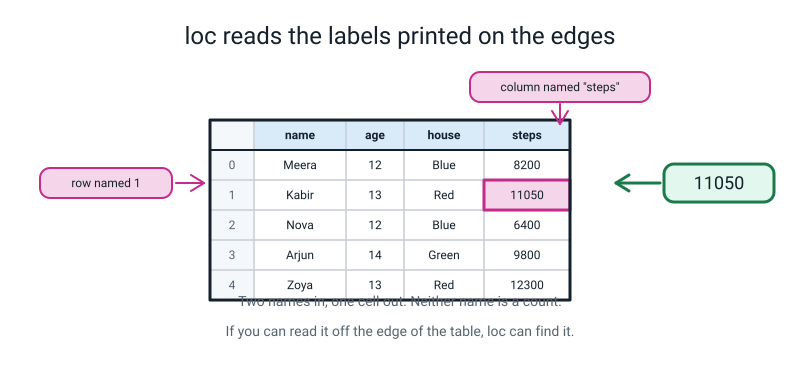
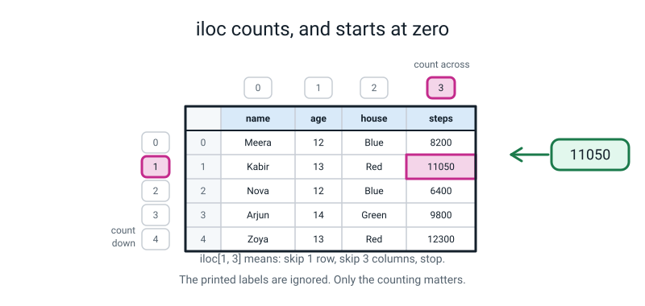
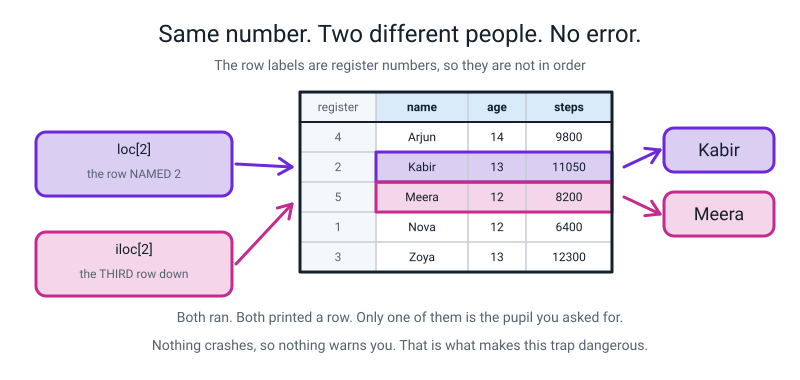
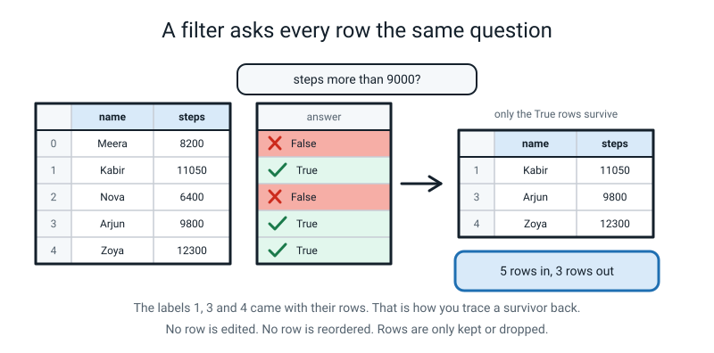
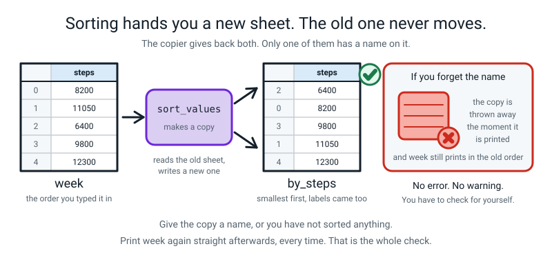

# Week 22 — Picking Rows and Columns Without Guessing

[⬅ Week 21](week-21.md) · [Course Home](../README.md) · [Week 23 ➡](week-23.md) · [Student Guide](../student-guide/week-22.md) · [Workbook](../workbook/week-22.md)

---

## 📋 At a Glance

| | |
|---|---|
| **Duration** | 70 minutes |
| **Type** | 🟦 Teach — three ways of pointing at part of a table, and the one that lies to you |
| **Big idea** | `loc` picks by **name**, `iloc` picks by **position**, and a boolean filter picks by **asking a question**. On a plain table two of them look identical. On a real table they are not. |
| **New vocabulary** | loc · iloc · label · position · boolean filter |
| **New syntax** | `df.loc[1, "age"]` · `df.iloc[1, 2]` · `df[df["age"] > 12]` · `df.sort_values("col")` |
| **Materials** | Printed workbook pages 22.1–22.10 · **the register card** (one index card, see Prep) · the Bug Log · a pen the student can write a full sentence with |
| **Tech needed** | Laptop with Python 3 and **pandas working** (it was working last week). One file, `steps.py`, in the same folder as last week's work. A paper fallback exists — see Prep. |
| **Prep time** | 15 minutes the night before · 5 minutes on the day |

> **⚠️ Watch out:** the centrepiece of this lesson is a bug that **produces no error message**. `loc[2]` and `iloc[2]` both run, both print a row, and on a re-numbered table they print **two different people**. Do not warn the student in advance. Let them predict, let them be wrong, and make them write the explanation down before they touch the keyboard again.

---

## 🎯 Lesson Objectives

By the end of the lesson the student can:

1. **Select one value by label** with `df.loc[row_label, "column_name"]`.
2. **Select one value by position** with `df.iloc[row_number, column_number]`, counting from zero.
3. **Explain, in their own written words, why `loc` and `iloc` give different answers** on a table whose row labels are not `0, 1, 2, …`.
4. **Keep only the rows that answer True** to a question, with `df[df["column"] > value]`.
5. **Sort a table by one column** and say whether the original table changed.

Observable evidence: ten selection drills answered on paper with the *tool named* before the code is typed; two different printed rows from `loc[2]` and `iloc[2]` on the same table; a written explanation of why; and the sentence *"sorting gave me a copy — `week` did not change"* said out loud or written down.

---

## 🧑‍🏫 What YOU Need to Know First

> **📌 About the code blocks in this guide.** Outside the **🧰 Prep Checklist** and the **🔑 Answer Key**, the blocks are **illustrations, not files** — each one carries on from the one above it, so the `import` lines and the data are typed once, in the first block that needs them. **The complete runnable files are in the Prep Checklist and the Answer Key.** If you paste an illustration on its own and get `NameError`, that is why, and nothing is broken.

**Read this once, slowly. It is about 20 minutes and it is the whole lesson.** You do not need to have programmed before. Everything below is explained from nothing.

### 1. Where the student is, in one paragraph

Last week the student met the **DataFrame** — a table in Python with names along the top (the *column names*) and labels down the left (the *index*). They can build one, print it, and print one column. What they cannot yet do is point at a *part* of it: one cell, one row, or "only the rows that matter". That is this week. Nothing about how the table is built changes. Only the pointing.

### 2. The three questions a table gets asked

There are exactly three, and a 12-year-old already asks all three in real life. Do not lead with syntax. Lead with these:

| The question, in English | The tool | The Python |
|---|---|---|
| "Give me **Meera's** step count." | `loc` — you know the name | `week.loc[0, "steps"]` |
| "Give me the **third row down**, whoever it is." | `iloc` — you are counting | `week.iloc[2]` |
| "Give me **everyone who walked over 9000**." | a boolean filter — you have a question, not a name | `week[week["steps"] > 9000]` |

**The skill this week is choosing between these three, not typing them.** That is why the in-class drills are called out as English questions and the student has to pick the tool. If you hand them the syntax and ask them to fill in the blanks, they will pass the lesson and fail Week 24.

### 3. The table we use all week

Type this out once. Every example in this file uses it, so if you run it now you can follow along with everything below.

```python
import pandas as pd                      # bring in pandas, nicknamed pd

week = pd.DataFrame({                     # build a table from a dictionary
    "name":  ["Meera", "Kabir", "Nova", "Arjun", "Zoya"],   # column 1
    "age":   [12, 13, 12, 14, 13],                          # column 2
    "house": ["Blue", "Red", "Blue", "Green", "Red"],       # column 3
    "steps": [8200, 11050, 6400, 9800, 12300],              # column 4
})
print(week)                               # show the whole table
```

```text
    name  age  house  steps
0  Meera   12   Blue   8200
1  Kabir   13    Red  11050
2   Nova   12   Blue   6400
3  Arjun   14  Green   9800
4   Zoya   13    Red  12300
```

**Line by line, for someone who has never programmed:**

- `import pandas as pd` — fetch the pandas toolbox and give it the short nickname `pd`. Every pandas line starts with `pd.` or acts on something pandas made.
- `week = pd.DataFrame({ ... })` — `week` is the *name* we are giving this table. `pd.DataFrame(...)` is the machine that builds tables. The `{ }` inside is a dictionary: each `"name": [list]` pair becomes one column, keys along the top, list going down.
- `print(week)` — show it.
- The `0 1 2 3 4` down the left is **not a column**. It is the row labels — the **index**. Pandas made them up for us because we did not supply any. That fact is the whole trap later.

### 4. `loc` — reading the labels printed on the edges

> **label** — a name written on the edge of the table. The column names along the top are labels. The `0 1 2 3 4` down the left are labels too.

> **`loc`** — pick by label. Say the row's name and the column's name, in that order.

```python
print(week.loc[1, "steps"])
```

```text
11050
```

**Every character of that line, explained:**

- `week` — the table.
- `.loc` — "I am about to give you names, not counts." It is not a function you call with round brackets; it takes **square** brackets, like a list.
- `[1, "steps"]` — two things inside one pair of square brackets, separated by a comma. **Row first, column second.** Always. `1` is the row *labelled* 1. `"steps"` is the column *named* steps.
- The answer is one number: the cell where row 1 and column steps cross.

Leave the column off and you get the whole row:

```python
print(week.loc[1])
```

```text
name     Kabir
age         13
house      Red
steps    11050
Name: 1, dtype: object
```

**This printout confuses everybody the first time, including adults.** It is one row, printed *sideways*, one column per line. `Name: 1` at the bottom means "this row's label is 1" — it is not saying somebody is called 1. And `dtype: object` means "this row holds a mixture of words and numbers", so pandas has given up on describing it as one kind of thing. Say both of those out loud when it first appears. If you skip it the student will quietly believe something wrong for three weeks.


*Figure 22.1 — Two names in, one cell out. Neither name is a count.*

### 5. `iloc` — counting, and starting at zero

> **position** — how far along something is. First, second, third. In Python, counting positions starts at **0**.

> **`iloc`** — pick by position. The `i` stands for *integer*: whole-number counting.

```python
print(week.iloc[1, 3])
```

```text
11050
```

- `.iloc` — "I am about to give you counts, not names."
- `[1, 3]` — row first, column second, same as `loc`. `1` means **skip one row and stop** — the second row down. `3` means **skip three columns and stop** — the fourth column across.
- Count the columns yourself: `name` is 0, `age` is 1, `house` is 2, `steps` is 3. So `iloc[1, 3]` and `loc[1, "steps"]` land on the same cell — 11050.

**The `i` is worth naming out loud.** `loc` takes names. `iloc` takes integers. The single letter *is* the difference, and it is the reason the two get confused: they are one character apart on the page and worlds apart in behaviour.

There is one genuinely nice thing `iloc` does that `loc` cannot:

```python
print(week.iloc[-1])
```

```text
name      Zoya
age         13
house      Red
steps    12300
Name: 4, dtype: object
```

`-1` means "the last one", exactly as it did on lists back in Week 11. It works because `iloc` counts, and you can count backwards.


*Figure 22.2 — The printed labels are ignored. Only the counting matters.*

### 6. Why they look identical — and why that is the danger

On our table, `week.loc[2]` and `week.iloc[2]` both give Nova. So does `week.loc[0]` and `week.iloc[0]`. **Every single one agrees.**

That is not a happy coincidence. It is because pandas invented the labels `0, 1, 2, 3, 4` for us, in order, and *the label happens to equal the position for every row*. Two completely different questions have the same answer, so a student can use the wrong tool all lesson and never find out.

Then the table gets re-numbered — and every real table eventually does. It gets read from a file with register numbers in it. It gets filtered. It gets sorted. The moment the labels stop matching the positions, the two tools split apart, and **nothing warns you**.

### 7. The trap, staged on purpose

Here is the second table of the lesson. It is the same five children, in alphabetical order, with their **register numbers** as row labels instead of `0 1 2 3 4`.

```python
import pandas as pd

register = pd.DataFrame({
    "name":  ["Arjun", "Kabir", "Meera", "Nova", "Zoya"],
    "age":   [14, 13, 12, 12, 13],
    "house": ["Green", "Red", "Blue", "Blue", "Red"],
    "steps": [9800, 11050, 8200, 6400, 12300],
}, index=[4, 2, 5, 1, 3])          # <-- the register numbers, NOT in order
print(register)
```

```text
    name  age  house  steps
4  Arjun   14  Green   9800
2  Kabir   13    Red  11050
5  Meera   12   Blue   8200
1   Nova   12   Blue   6400
3   Zoya   13    Red  12300
```

`index=[4, 2, 5, 1, 3]` is the only new thing: it tells `pd.DataFrame` "do not invent row labels, use these". The labels are now register numbers, and they are not in order — because a register is alphabetical by surname, and nobody's register number matches their place in the alphabet.

Now the two lines that matter, and they are the reason this week exists:

```python
print(register.loc[2])
```

```text
name     Kabir
age         13
house      Red
steps    11050
Name: 2, dtype: object
```

```python
print(register.iloc[2])
```

```text
name     Meera
age         12
house     Blue
steps     8200
Name: 5, dtype: object
```

**Two commands, one character apart. Two different children. No error.**

- `loc[2]` went looking for the row *labelled* 2. That is register number 2, Kabir.
- `iloc[2]` counted two rows down from the top and stopped. Row 0 is Arjun, row 1 is Kabir, row 2 is Meera.

Look at the last line of each printout. The first says `Name: 2`, the second says `Name: 5`. **The printout tells you which row you got, every single time, and almost nobody reads it.** Teach that: the `Name:` line at the bottom of a single row is the row's label, and it is your receipt.


*Figure 22.3 — Both ran. Both printed a row. Only one of them is the pupil you asked for.*

**Why this matters beyond today.** In four weeks the student will be reporting one child's score to the class. If they used `iloc` when they meant `loc`, they will report the wrong child's score, confidently, with clean code and no error message. That is the single most common way real data work goes wrong, and it is why the rule below exists.

> **The rule, and say it in these words: use `loc` unless you genuinely mean "the first one" or "the last one".** Names survive sorting, filtering and re-numbering. Positions do not.

### 8. The boolean filter — one question, asked of every row

> **boolean** — a value that is only ever `True` or `False`. The student met these in Week 5.

Start with the question on its own, *before* you use it to pick anything. This intermediate step is the one teachers skip, and skipping it is why students think filtering is magic.

```python
print(week["steps"] > 9000)
```

```text
0    False
1     True
2    False
3     True
4     True
Name: steps, dtype: bool
```

`week["steps"]` is the steps column — five numbers. `> 9000` asks each of them the same question. Out comes **five answers**, one per row, each `True` or `False`, with the row labels still attached. Nothing has been picked yet. This is a column of yes/no.

> **boolean filter** — using a column of True/False answers to keep only the True rows.

```python
print(week[week["steps"] > 9000])
```

```text
    name  age  house  steps
1  Kabir   13    Red  11050
3  Arjun   14  Green   9800
4   Zoya   13    Red  12300
```

**Read the brackets from the inside out**, and say it this way to the student:

1. `week["steps"]` — the steps column.
2. `week["steps"] > 9000` — five True/False answers.
3. `week[ ... ]` — hand that column of answers back to the table, and the table keeps the True rows.

The double `week` looks redundant and is not. The inner one *builds the question*; the outer one *does the keeping*.

**Now the detail that makes filtering trustworthy: look at the row labels.** They are `1, 3, 4`. Not `0, 1, 2`. The surviving rows kept their original labels, so you can always trace a survivor back to where it came from. Say this out loud, because it is also the thing that arms the `loc`/`iloc` trap: **the moment you filter a table, its labels stop matching its positions.**

Two more facts worth having ready:

- **No row is edited and no row is reordered.** Filtering only keeps or drops.
- `week` itself is untouched. The filter handed you a new, smaller table.


*Figure 22.4 — Five rows in, three rows out. The labels 1, 3 and 4 came with their rows.*

### 9. `sort_values` — and the copy nobody catches

```python
print(week.sort_values("steps"))
```

```text
    name  age  house  steps
2   Nova   12   Blue   6400
0  Meera   12   Blue   8200
3  Arjun   14  Green   9800
1  Kabir   13    Red  11050
4   Zoya   13    Red  12300
```

- `.sort_values("steps")` — put the rows in order of the steps column, smallest first.
- `ascending=False` gets you biggest first: `week.sort_values("steps", ascending=False)`.
- The labels are now `2, 0, 3, 1, 4`. **The rows moved and each row took its label with it.** That is the same fact as in the filter, and now it is unmissable: label 2 is at position 0.

And now the silent one. Run this immediately afterwards:

```python
print(week)
```

```text
    name  age  house  steps
0  Meera   12   Blue   8200
1  Kabir   13    Red  11050
2   Nova   12   Blue   6400
3  Arjun   14  Green   9800
4   Zoya   13    Red  12300
```

**`week` did not change.** Sorting did not rearrange your table; it handed you a *new, sorted copy* and threw it away as soon as it was printed. If you want to keep it, catch it in a name:

```python
by_steps = week.sort_values("steps", ascending=False)
print(by_steps.iloc[0])
```

```text
name      Zoya
age         13
house      Red
steps    12300
Name: 4, dtype: object
```

That is also the honest use of `iloc`: "sort by steps, then give me *the first row*, whoever it is" — you genuinely mean a position, so `iloc` is right.


*Figure 22.5 — Give the copy a name, or you have not sorted anything.*

### 10. The three misconceptions you will actually meet

**Misconception 1: "`loc` and `iloc` are the same, one is just shorter to type."**
It is a completely reasonable conclusion from the evidence they have. Every example on a fresh table agrees. **Do not argue them out of it — show them.** That is what the register card and the trap are for. After the trap, they will never say it again.

**Misconception 2: "the row labels are row numbers."**
They aren't. They are names that *happen to be* numbers, the way a bus route called 42 is not the forty-second bus. The clean test question: "if the label 2 is a row number, how can label 2 be at position 0 after we sorted?" Let them sit with it.

**Misconception 3: "`week[week["steps"] > 9000]` is a typing mistake — why is `week` there twice?"**
This is a *good* question and deserves a real answer, not "that's just how you write it". The inner `week["steps"] > 9000` produces a column of five True/False answers — a thing in its own right, which you can print on its own. The outer `week[...]` is the part that keeps rows. Two jobs, two mentions. Print the inner part alone; the question answers itself.

### 11. How deep to go, and where to stop

**Go this deep:**
- Row first, column second, in both `loc` and `iloc`.
- Labels are not positions, and after any sort or filter they disagree.
- Read the `Name:` line at the bottom of a single row. It is your receipt.
- Print the question on its own before you filter with it.
- Sorting gives you a copy.

**Stop before all of this. If a student asks, answer honestly and move on:**
- **Slicing differences.** `loc["a":"c"]` includes the end and `iloc[1:3]` excludes it. It is real, it is a classic exam question, and it is not needed today. If it comes up: *"loc includes the last one because you named it, iloc excludes it because you counted. Try both next week."*
- **Combining two conditions** with `&`. It works — `week[(week["age"] == 13) & (week["steps"] > 11000)]` — but every comparison must be wrapped in its own round brackets, and using the word `and` instead of `&` produces a wall of text. It is in the "flying" path, not the main lesson.
- **`.at`, `.iat`, `.query()`, `.filter()`.** Other ways to do the same jobs. Not now, possibly never in this course.
- **Changing a value** with `week.loc[0, "steps"] = 9000`. It works, it is genuinely useful, and it opens a whole conversation about editing data that belongs in Week 23 with the cleaning log. Not today.

---

## 🧰 Prep Checklist

### 15 minutes the night before

**1. Make the register card (2 minutes).** One index card, written by hand, big enough to read across a table:

```
        REGISTER
   4  Arjun
   2  Kabir
   5  Meera
   1  Nova
   3  Zoya
```

That card is the whole trap, in physical form. You will hold it up in the Hook and point at it again in the Wrap.

**2. Run this yourself first (8 minutes).** Create a file called `steps.py` in the student's folder and type in exactly this. **Type it, do not copy it** — you want to have made at least one of the mistakes yourself before the student makes it.

```python
# steps.py - Week 22. Pointing at part of a table.
import pandas as pd

week = pd.DataFrame({
    "name":  ["Meera", "Kabir", "Nova", "Arjun", "Zoya"],
    "age":   [12, 13, 12, 14, 13],
    "house": ["Blue", "Red", "Blue", "Green", "Red"],
    "steps": [8200, 11050, 6400, 9800, 12300],
})

print("--- the whole table")
print(week)

print("--- Meera's steps, by name")
print(week.loc[0, "steps"])

print("--- the third row down, whoever it is")
print(week.iloc[2])

print("--- everyone over 9000 steps")
print(week[week["steps"] > 9000])

print("--- sorted, biggest first")
print(week.sort_values("steps", ascending=False))

print("--- and the original, straight afterwards")
print(week)
```

Run it with `python3 steps.py`. **This is the exact output you must see.** If yours differs anywhere, stop and find out why before class.

```text
--- the whole table
    name  age  house  steps
0  Meera   12   Blue   8200
1  Kabir   13    Red  11050
2   Nova   12   Blue   6400
3  Arjun   14  Green   9800
4   Zoya   13    Red  12300
--- Meera's steps, by name
8200
--- the third row down, whoever it is
name     Nova
age        12
house    Blue
steps    6400
Name: 2, dtype: object
--- everyone over 9000 steps
    name  age  house  steps
1  Kabir   13    Red  11050
3  Arjun   14  Green   9800
4   Zoya   13    Red  12300
--- sorted, biggest first
    name  age  house  steps
4   Zoya   13    Red  12300
1  Kabir   13    Red  11050
3  Arjun   14  Green   9800
0  Meera   12   Blue   8200
2   Nova   12   Blue   6400
--- and the original, straight afterwards
    name  age  house  steps
0  Meera   12   Blue   8200
1  Kabir   13    Red  11050
2   Nova   12   Blue   6400
3  Arjun   14  Green   9800
4   Zoya   13    Red  12300
```

**3. Run the trap yourself (3 minutes).** Add this to the bottom of `steps.py`, run it, see the two different children with your own eyes, then **delete those lines again** so the student meets it fresh in class.

```python
register = pd.DataFrame({
    "name":  ["Arjun", "Kabir", "Meera", "Nova", "Zoya"],
    "age":   [14, 13, 12, 12, 13],
    "house": ["Green", "Red", "Blue", "Blue", "Red"],
    "steps": [9800, 11050, 8200, 6400, 12300],
}, index=[4, 2, 5, 1, 3])
print(register.loc[2])
print(register.iloc[2])
```

```text
name     Kabir
age         13
house      Red
steps    11050
Name: 2, dtype: object
name     Meera
age         12
house     Blue
steps     8200
Name: 5, dtype: object
```

**4. Print (2 minutes).** Workbook pages 22.1–22.10. Have the Bug Log to hand.

### 5 minutes on the day

- Open a terminal in the student's folder. Check `python3 -c "import pandas"` prints nothing at all. Nothing printed = it works.
- Open `steps.py` in the editor, scrolled to the top.
- Register card face down beside the laptop.
- Write on the board, before they arrive, and leave it up all lesson:

```
loc  = by NAME      (labels on the edges)
iloc = by COUNTING  (starts at 0)
filter = by QUESTION
```

### Fallback if the laptop or the install fails

**This lesson has a complete paper version and it teaches the hard part just as well.**

Print the five-row table twice, big. On copy A the left-hand labels are `0 1 2 3 4`. On copy B they are the register numbers `4 2 5 1 3`, with the names in alphabetical order. Then run the drills verbally: you say the English question, the student **points at the cell with a finger and says which tool they used**. Call out `loc[2]` and `iloc[2]` on copy B and have them point twice. Two different fingers, two different children, on paper. Then have them write the explanation in the workbook, which is the graded part anyway.

Do the typing next lesson as a fifteen-minute warm-up. Nothing later in the course breaks.

---

## ⏱️ The Lesson, Minute by Minute

| Segment | Minutes | Running total | What happens |
|---|---|---|---|
| 🪝 Hook — Two Ways to Say Which One | 7 | 7 | The register card. "Row 2" means two different children. |
| 🧠 Concept — Names, Counts and Questions | 16 | 23 | loc, iloc, the boolean column, the copy |
| 💻 Live-Code Together — Six Drills and Two Mistakes | 18 | 41 | Teacher types, student types along. Two deliberate errors |
| 🎲 Their Turn — Ten Drills, Then the Trap | 20 | 61 | The drills, then the staged trap, then the written explanation |
| 🔑 Wrap & Assign | 9 | 70 | Three checks, the rule, homework |

---

### 🪝 Hook — Two Ways to Say Which One (7 minutes)

**Do this:** Nothing on the screen. Register card face down. Board shows the three-line summary you wrote in prep.

**Say this:**

> "I want to ask you something that has nothing to do with computers yet.
>
> Imagine our class is lined up along the wall, in alphabetical order. I say: **'row two, come here.'** Who comes?"

Let them answer. They will say the second person, or the third if they are being careful about counting from zero. Either is fine.

> "Right. Now imagine every one of you has a register number — the number next to your name in the register. Mine's not in alphabetical order; nobody's is. And I say the exact same thing: **'row two, come here.'** Who comes now?"

Let them work it out. You want them to reach: *it depends what you meant.*

> "So 'row two' means two completely different people, and which one you get depends on whether I meant **the second one along** or **the one whose number is 2**. Same words. Different person.
>
> Let me show you the register."

**Do this:** Turn the register card over. Put it where they can read it. Point at it while you talk.

```
        REGISTER
   4  Arjun
   2  Kabir
   5  Meera
   1  Nova
   3  Zoya
```

> "Read it with me. If 'row two' means **the one numbered 2**, who is it?"

*Kabir.*

> "And if 'row two' means **the second one along**?"

*Kabir again — no, hang on.* Let them stumble. Counting from zero, position 2 is Meera. Counting from one, position 2 is Kabir. Do not resolve it for them yet — the ambiguity *is* the hook.

> "Look at that. Even *we* can't agree, and we're both looking at the same card. So here's the thing about today: Python has **two different commands** for this, because there genuinely are two different questions. One asks by name. One asks by counting.
>
> They are one letter apart on the keyboard. And when you get them the wrong way round, Python does not tell you. It gives you an answer. A perfectly sensible-looking answer, about the wrong person."

**Ask this:**

| Ask | Answer you want | If they say something else |
|---|---|---|
| "'Row two, come here' — who comes?" | Any answer, with a reason. | If they refuse to choose, that is the best possible answer. Say so: "you're right, it's not answerable." |
| "Does the register number match the place in the line?" | No. | If they say yes, point at Arjun: number 4, first in the line. |
| "Which of the two would you rather Python used?" | Usually "the name" — good. | If they say counting, ask what happens after you sort the table. Park it; the answer arrives in 20 minutes. |
| "If Python picks the wrong one, how would you find out?" | Uneasy silence, or "it would look wrong". | This is the point. Say: **"you wouldn't. That's today."** |

---

### 🧠 Concept — Names, Counts and Questions (16 minutes)

**Do this:** Open `steps.py` on the shared screen and run it once so the whole table is on screen. Leave the output up.

```text
    name  age  house  steps
0  Meera   12   Blue   8200
1  Kabir   13    Red  11050
2   Nova   12   Blue   6400
3  Arjun   14  Green   9800
4   Zoya   13    Red  12300
```

**Say this — part 1, the two edges:**

> "Everything you can point at on this table has a **name written on an edge**. The columns have names along the top — `name`, `age`, `house`, `steps`. And the rows have names down the left: 0, 1, 2, 3, 4.
>
> That is a word worth having." *(write it up)*

> **label** — a name printed on the edge of the table.

> "Those `0 1 2 3 4` on the left are labels. They are **not** a column of data — nobody's step count is 3. And they are **not** row numbers either, even though right now they look exactly like row numbers. Pandas invented them for us, in order, because we didn't say what to call the rows. Hold on to that. It matters in about ten minutes."

**Say this — part 2, loc:**

> "Tool number one. If you can read it off the edge, this finds it."

Write on the board:

```
week.loc[ row label , "column label" ]
```

> "**Row first, column second.** Always that order, in every command today, so learn it once. And it's square brackets, not round ones — `loc` isn't a machine you feed, it's more like a way of pointing.
>
> Give me Meera's step count. Meera's row is labelled 0. The column is called steps."

**Do this:** Type it live, in the terminal or a new line of the file:

```python
print(week.loc[0, "steps"])
```

```text
8200
```

> "One number. The cell where row 0 and column steps cross.
>
> Now leave the column out and just ask for the row."

```python
print(week.loc[0])
```

```text
name     Meera
age         12
house     Blue
steps     8200
Name: 0, dtype: object
```

> "That's one row, printed **sideways** — one column per line, because that fits on a screen better. Two things at the bottom you need to be able to read.
>
> `Name: 0` — that's the row's **label**. Not somebody called zero. That line is your receipt: it tells you which row you actually got. Nearly everybody ignores it, and later today you'll see why that's a mistake.
>
> `dtype: object` — this row has words in it *and* numbers in it, so pandas won't claim it's all one kind of thing. `object` is pandas's word for 'mixed, or writing'."

**Say this — part 3, iloc:**

> "Tool number two. Same shape, one extra letter."

```
week.iloc[ row number , column number ]
```

> "The `i` stands for **integer** — whole-number counting. `iloc` ignores every label on the table and just counts. And it counts from **zero**, like everything else in Python since Week 7.
>
> Count the columns with me. `name` is —"

*Zero.*

> "`age`?"

*One.*

> "`house` two, `steps` three. So if I want Kabir's steps by counting: down one, across three."

```python
print(week.iloc[1, 3])
```

```text
11050
```

> "Same cell. And here's the thing that is about to cause you trouble: **`loc[1, "steps"]` and `iloc[1, 3]` gave the same answer.** They agree on this table. They agree on every row of this table. Which makes it feel like they're two spellings of the same command.
>
> They are not. Park that."

**Say this — part 4, the question:**

> "Tool number three, and it answers a different shape of question. Not 'which one' — but 'all of them that…'.
>
> Everyone who walked more than 9000 steps. I don't know their names. I don't know their positions. I only know the question."

**Do this:** Type this first, on its own. **This intermediate step is the whole explanation — do not skip it.**

```python
print(week["steps"] > 9000)
```

```text
0    False
1     True
2    False
3     True
4     True
Name: steps, dtype: bool
```

> "Look what came back. Not rows — **answers.** Five of them, one per row, each one True or False, with the row labels still attached. I've asked every row the same question and written down its answer. Nothing has been picked yet.
>
> `dtype: bool` — a column of True/False. And now I hand that column of answers back to the table, and the table keeps the Trues."

```python
print(week[week["steps"] > 9000])
```

```text
    name  age  house  steps
1  Kabir   13    Red  11050
3  Arjun   14  Green   9800
4   Zoya   13    Red  12300
```

> **boolean filter** — using a column of True/False answers to keep only the True rows.

> "Yes, `week` is in there twice, and that is not a typo. The inner one **builds the question**. The outer one **does the keeping**. Two jobs, two mentions.
>
> Now look at the labels on the left. 1, 3, 4."

Let that land. Wait for it.

> "**Not 0, 1, 2.** The rows that survived kept their own labels. Which is brilliant — I can always trace Kabir's row back to where it came from.
>
> And it is also the moment the trap gets set. Because in this new table, **the label 1 is at position 0**. Labels and positions have come apart. That happened the instant I filtered."

**Ask this:**

| Ask | Answer you want | If they say something else |
|---|---|---|
| "Is `2` on the left a piece of data?" | No, it's the row's label. | If they say yes, ask whose step count is 2. |
| "Which comes first inside the brackets, row or column?" | Row. | Point at the board. Make them say it back. This one is worth drilling. |
| "What does the `i` in `iloc` stand for?" | Integer — counting. | "Index" is close enough to accept, then give them "integer" as the memory hook. |
| "What comes back from `week["steps"] > 9000` on its own?" | Five True/False answers. | If they say "three rows", run it. The intermediate step is the fix for this. |
| "Why is `week` written twice in the filter?" | Inner builds the question, outer keeps rows. | If stuck, print the inner part alone again. Never answer "that's just the syntax." |
| "After filtering, what are the row labels?" | 1, 3, 4 — the originals. | If they expected 0, 1, 2, ask them which is more useful and why. |

---

### 💻 Live-Code Together — Six Drills and Two Mistakes (18 minutes)

**Do this:** The student types in their own `steps.py`. You type on the shared screen. **Same keystrokes, same time.** Six drills. You will get two of them deliberately wrong.

Read each drill out as an **English question first**, and make the student say which of the three tools before either of you types.

---

**Drill 1 — "Give me Arjun's house."** *(a name → `loc`)*

Keystrokes: `print(week.loc[3, "house"])` then Enter, save, run.

```text
Green
```

---

**Drill 2 — "Give me the very first row, whoever it is."** *(a position → `iloc`)*

```python
print(week.iloc[0])
```

```text
name     Meera
age         12
house     Blue
steps     8200
Name: 0, dtype: object
```

> "Check the receipt at the bottom. `Name: 0`. That's the row I got."

---

**Drill 3 — DELIBERATE MISTAKE ONE. "Give me Kabir's step count."**

**Type this, exactly, including the typo. Do not flag it.**

```python
print(week.loc[1, "step"])
```

Run it. You get a long, ugly error. Let the student read the screen for a moment before you say anything.

```text
Traceback (most recent call last):
  ...
KeyError: 'step'
```

**Say this:**

> "Right. That's a lot of text. What did I say in Week 16 about a wall of red?"

*Read the last line first.*

> "Last line. Out loud."

*KeyError: 'step'*

> "So there are two words there. `KeyError` means **'you gave me a name and I have not got anything by that name.'** And then it tells you which name it couldn't find, in quotes: `'step'`.
>
> Where do I go looking?"

*The column names.*

> "Look at the table. What's the column actually called?"

*steps.*

> "One letter. And notice pandas didn't guess. It didn't think 'oh, they probably meant steps'. It has no idea what I meant, so it stopped. That is the good kind of error — **loud, immediate, and it tells you the missing name.**"

Fix it in front of them — add the `s` — and re-run.

```text
11050
```

---

**Drill 4 — "Give me everyone in Blue."** *(a question → filter)*

Before typing, ask: *"is `house` a number?"* No. So the question uses `==`, not `>`.

```python
print(week[week["house"] == "Blue"])
```

```text
    name  age house  steps
0  Meera   12  Blue   8200
2   Nova   12  Blue   6400
```

> "Labels 0 and 2. Row 1 has gone and nothing was renumbered."

---

**Drill 5 — "Put the table in order of steps, biggest first."**

```python
print(week.sort_values("steps", ascending=False))
```

```text
    name  age  house  steps
4   Zoya   13    Red  12300
1  Kabir   13    Red  11050
3  Arjun   14  Green   9800
0  Meera   12   Blue   8200
2   Nova   12   Blue   6400
```

> "Labels down the left: 4, 1, 3, 0, 2. **Every row took its label with it.** Zoya is still labelled 4 even though she's at the top now.
>
> So — is our table sorted now?"

Most students say yes. Let them.

---

**Drill 6 — DELIBERATE MISTAKE TWO. The silent one. This is the most important 90 seconds of the lesson.**

**Say this:**

> "You said the table is sorted. Prove it. Print `week`."

```python
print(week)
```

```text
    name  age  house  steps
0  Meera   12   Blue   8200
1  Kabir   13    Red  11050
2   Nova   12   Blue   6400
3  Arjun   14  Green   9800
4   Zoya   13    Red  12300
```

Say nothing for five seconds. Let them find it.

> "What happened?"

*It's back to normal. It didn't sort.*

> "It never sorted. `sort_values` doesn't rearrange your table — it **makes a sorted copy and hands it to you.** I printed the copy, admired it, and then threw it away. `week` was never touched.
>
> And notice: **no error.** Nothing went red. If I'd typed `sort_values` and then gone on to use `week` for the rest of the lesson, every answer after this line would be about an unsorted table, and nothing on my screen would have hinted at it.
>
> To keep a copy, you have to give it a name."

```python
by_steps = week.sort_values("steps", ascending=False)
print(by_steps.iloc[0])
```

```text
name      Zoya
age         13
house      Red
steps    12300
Name: 4, dtype: object
```

> "`by_steps` is a whole new table with a name on it, so it sticks around. And that `iloc[0]` is the honest use of `iloc` — I genuinely mean **the first row of the sorted table**, whoever that turns out to be. I don't know her name in advance. That's what counting is for.
>
> Add that to the Bug Log, right now: **'sort_values gives you a copy. Catch it in a name or you lose it.'**"

---

### 🎲 Their Turn — Ten Drills, Then the Trap (20 minutes)

Full instructions in the next section. In outline: ten English questions, the student names the tool before typing (12 minutes); then you hand them the register frame and stage the trap (8 minutes), and they write the explanation before touching the keyboard again.

---

### 🔑 Wrap & Assign (9 minutes)

**Do this:** Close the laptop lid. Put the register card back on the table.

**Say this:**

> "Three tools, and the whole skill is choosing. Tell me which one, for each of these. Don't tell me the code."

- *"Zoya's house."* → loc. A name.
- *"The last row of the table."* → iloc. A position.
- *"Everybody aged 12."* → filter. A question.

> "Now the thing I want you to carry out of the room. Two commands, one letter apart, ran on the same table and gave us two different children. **And nothing went wrong.** No red text. Both answers looked completely fine.
>
> That is the shape of the worst bugs in data work. Not a crash — **a confident wrong answer.** And the only defence is knowing which question you actually asked.
>
> So here is the rule, and I want it in the Bug Log in your handwriting:"

Write it on the board:

```
Use loc unless you really mean "the first" or "the last".
Names survive sorting and filtering. Positions do not.
```

> "And one more line under it: **sorting gives you a copy.** Print the original straight afterwards, every time, and you'll never be fooled by it."

**Do this:** Run the three quick checks from "Assessing Understanding". Assign the homework. Hand over workbook pages 22.1–22.10.

---

## 🐞 The Debugging Clinic

Every message below came from running a broken version of **this week's actual code**, on Python 3.10 and pandas 1.5.3. Tracebacks are shown with the middle trimmed — the first and last lines are the ones that matter and they are exact.

| What the student sees (real message) | What it means | Most likely cause | The fix |
|---|---|---|---|
| `KeyError: 'step'` | "You gave me a name and I have nothing called that." | A column name misspelled or missing its `s` — `"step"` for `"steps"`, `"nam"` for `"name"`. | Print `week` and read the header row. Compare letter by letter. Pandas will not guess. |
| `KeyError: ('name', 'steps')` | "I looked for one column called `name, steps` and there isn't one." | `week["name", "steps"]` — asking for two columns with one pair of brackets. | `week[["name", "steps"]]`. Two brackets: the outer one selects, the inner one is a **list** of names. |
| `KeyError: 1` (on a re-numbered table) | "There is no row *labelled* 1." | `loc` used on a table whose labels are register numbers or student IDs like 101–105. | Print the table and read the left edge. If you meant "the second row", you wanted `iloc[1]`. |
| `KeyError: 'Meera'` | "There is no row labelled Meera." | `week.loc["Meera"]` — using a *value from inside the table* as a row label. | Names live in the `name` column, not on the edge. Use a filter: `week[week["name"] == "Meera"]`. |
| `IndexError: single positional indexer is out-of-bounds` | "You counted past the end." | `week.iloc[5]` on a five-row table. Positions are 0–4. | Count again. Five rows means the last position is 4. Or use `iloc[-1]` for "the last one". |
| `IndexError: index 4 is out of bounds for axis 0 with size 4` | "You counted past the last column." | `week.iloc[1, 4]` — four columns means positions 0–3. | `week.iloc[1, 3]`. Or stop counting columns and use `loc[1, "steps"]`, which is what names are for. |
| `ValueError: Location based indexing can only have [integer, integer slice (START point is INCLUDED, END point is EXCLUDED), listlike of integers, boolean array] types` | "`iloc` takes numbers. That was a name." | `week.iloc[1, "steps"]` — the two tools mixed in one line. | Pick one. `week.loc[1, "steps"]` or `week.iloc[1, 3]`. Never one of each. |
| `TypeError: Cannot index by location index with a non-integer key` | Same complaint, shorter, about the row. | `week.iloc["0"]` — a number typed inside quotes is writing, not a number. | Drop the quotes: `week.iloc[0]`. |
| `TypeError: Invalid comparison between dtype=int64 and str` | "You asked me to compare a number with a piece of writing." | `week[week["steps"] > "9000"]` — quotes round the 9000. | Remove the quotes. Quotes make it text, and text cannot be bigger than a number. |
| `TypeError: DataFrame.sort_values() missing 1 required positional argument: 'by'` | "Sort by *what*?" | `week.sort_values()` with empty brackets. | Name the column: `week.sort_values("steps")`. |
| `TypeError: _LocationIndexer.__call__() takes from 1 to 2 positional arguments but 3 were given` | "You called `loc` like a machine. It isn't one." | Round brackets: `week.loc(1, "steps")`. | Square brackets: `week.loc[1, "steps"]`. `loc` is pointing, not calling. |
| `ValueError: The truth value of a Series is ambiguous. Use a.empty, a.bool(), a.item(), a.any() or a.all().` | "You gave me a whole column of True/False where I expected one True or False." | Using the word `and` between two conditions, or forgetting the round brackets round each one. | Use `&`, and bracket each comparison: `week[(week["age"] == 13) & (week["steps"] > 11000)]`. |
| **No error, `loc[2]` and `iloc[2]` gave different rows** | Nothing is wrong as far as pandas is concerned. Both questions were valid. | The labels are not `0, 1, 2, …`, so label 2 and position 2 are different rows. | Read the `Name:` line at the bottom of the printed row. Then decide which question you meant. |
| **No error, the table did not sort** | Nothing is wrong. Sorting returns a copy. | `week.sort_values("steps")` with nothing catching the result. | `by_steps = week.sort_values("steps")`, then use `by_steps`. |
| **No error, the filter returned an empty table** | Nothing matched. That is an answer. | A spelling or capital-letter mismatch: `"blue"` where the data says `"Blue"`. | `print(week["house"])` and read the real spellings. This becomes an entire lesson in Week 24. |

### How to teach debugging without giving the answer

The moves from Term 1 and 2 all still work: read the last line first; find the line number; say the complaint in your own words; compare characters one at a time. This week adds two, and both are questions, not answers.

11. **"Which row did you actually get? Read the `Name:` line."** A single row's printout ends with its own label. The student who reads it catches the `loc`/`iloc` mix-up in four seconds. The student who doesn't will argue with you for ten minutes.

12. **"Print the question on its own."** When a filter gives a surprising result, delete the outer `week[...]` and print just `week["steps"] > 9000`. Five True/False answers appear, and the surprise usually explains itself: too many Trues, too few, or all False because of a capital letter.

And the sentence for this week:

> **"Pandas answers the question you typed, not the question you meant. When two commands can both run and only one is right, your job is to be able to say which question you asked."**

---

## 🎲 The Activity, In Full

### Part A — Ten Drills, Tool First (12 minutes)

**Setup.** Student at the keyboard with `steps.py` open. Workbook page 22.4 in front of them with the ten questions printed and a blank box beside each for the tool name. You read the questions aloud, in order.

**The rule that makes this activity work:** before typing anything, the student must **say or write which of the three tools** — loc, iloc, or filter — and *why*. If they type first, stop them, undo it, and ask again. The typing is not the skill being practised here.

**The ten questions, with the tool and the code:**

| # | The question, out loud | Tool | The code | The answer |
|---|---|---|---|---|
| 1 | "Give me Meera's step count." | loc | `week.loc[0, "steps"]` | `8200` |
| 2 | "Give me Arjun's whole row." | loc | `week.loc[3]` | Arjun, 14, Green, 9800 |
| 3 | "Give me the third row down, whoever it is." | iloc | `week.iloc[2]` | Nova, 12, Blue, 6400 |
| 4 | "Give me everyone's steps." | column | `week["steps"]` | five numbers |
| 5 | "Give me just the names and the steps." | columns | `week[["name", "steps"]]` | a two-column table |
| 6 | "Give me the value in the very top-left corner." | iloc | `week.iloc[0, 0]` | `Meera` |
| 7 | "Give me the last row." | iloc | `week.iloc[-1]` | Zoya, 13, Red, 12300 |
| 8 | "Give me everyone who walked more than 9000." | filter | `week[week["steps"] > 9000]` | Kabir, Arjun, Zoya |
| 9 | "Give me the 12-year-olds." | filter | `week[week["age"] == 12]` | Meera, Nova |
| 10 | "Give me the table in order of steps, biggest first." | sort | `week.sort_values("steps", ascending=False)` | Zoya at the top |

**Questions 4 and 5 are there on purpose.** They are last week's syntax, and the student will reach for `loc`. Selecting a whole column needs no tool at all — just `week["steps"]`. Let them try `loc` and hit the wall; then show them the plain version. Knowing which jobs need no tool is part of choosing the tool.

**What "finished" looks like for Part A:** ten filled-in tool boxes, ten runs that printed something, and — the actual bar — **the student says the tool before their hands move**, at least on the last four.

### Part B — The Trap, Staged (8 minutes)

**Setup.** Register card visible. You dictate the new table; the student types it at the bottom of `steps.py`. Dictating it rather than pasting it is deliberate: they need to see the `index=[4, 2, 5, 1, 3]` go in with their own fingers.

```python
register = pd.DataFrame({
    "name":  ["Arjun", "Kabir", "Meera", "Nova", "Zoya"],
    "age":   [14, 13, 12, 12, 13],
    "house": ["Green", "Red", "Blue", "Blue", "Red"],
    "steps": [9800, 11050, 8200, 6400, 12300],
}, index=[4, 2, 5, 1, 3])
print(register)
```

```text
    name  age  house  steps
4  Arjun   14  Green   9800
2  Kabir   13    Red  11050
5  Meera   12   Blue   8200
1   Nova   12   Blue   6400
3   Zoya   13    Red  12300
```

**Step 1 — the prediction, in writing, before anything runs.** On workbook page 22.6, two boxes:

- *"`register.loc[2]` will print the row for __________."*
- *"`register.iloc[2]` will print the row for __________."*

They must fill in **both** in pen before running either. Most students write the same name twice. That is exactly what you want on the page.

**Step 2 — run them, one at a time.**

```python
print(register.loc[2])
```

```text
name     Kabir
age         13
house      Red
steps    11050
Name: 2, dtype: object
```

```python
print(register.iloc[2])
```

```text
name     Meera
age         12
house     Blue
steps     8200
Name: 5, dtype: object
```

**Step 3 — the pause. Do not explain it.** Ask exactly three questions and wait for each:

1. *"How many errors did you get?"* → none.
2. *"Which child did each one give you?"* → Kabir; Meera.
3. *"Read the bottom line of each printout."* → `Name: 2` and `Name: 5`.

**Step 4 — the written explanation. This is the graded item of the week.** Workbook page 22.6, four ruled lines:

> *In your own words: why did `loc[2]` and `iloc[2]` give two different children?*

They may not touch the keyboard until it is written. A good answer contains both halves — that `loc` looked for the row **labelled** 2 and `iloc` counted **two rows down**. One half only is a re-teach, not a pass. See the Answer Key for the model answer and for three real partial answers with what to say to each.

**Step 5 — the fix, and it is a sentence not a command.** Ask: *"you want Kabir. Which one do you type?"* → `register.loc[2]`. Then: *"you want whoever is third on the list. Which one?"* → `register.iloc[2]`. Both are correct code. The bug was never in the typing.

### Variation — easier

Cut Part A to six drills: 1, 3, 4, 8, 9, 10. Drop the two-column one. In Part B, give them the register card on the table and have them **point with a finger** at each answer on the printed table before typing — physically walking down two rows for `iloc`, and hunting for the number 2 for `loc`. The finger does the explaining.

If the written explanation stalls, offer this frame to complete rather than a blank:

> *"`loc[2]` gave me ________ because it looked for the row whose ________ is 2. `iloc[2]` gave me ________ because it counted ________ rows down from the top."*

### Variation — harder

1. **Break it on purpose.** *"Change the index so that `loc[2]` and `iloc[2]` give the SAME child, without putting the labels back in order."* (Any index whose third entry is 2 works — for example `index=[4, 1, 2, 5, 3]`, where position 2 is labelled 2.) Predict, then check.
2. **Two questions at once.** Show them `&`, once, with the bracket rule stated firmly: `week[(week["age"] == 13) & (week["steps"] > 11000)]` gives Kabir and Zoya. Then let them find out what happens with the word `and` instead — the `ValueError: The truth value of a Series is ambiguous` is a good thing to have met early.
3. **Sort, then point.** *"Who has the third-highest step count?"* This needs both tools in one breath: sort into a named copy, then `iloc[2]` on the copy. `by_steps.iloc[2]` → Arjun, 9800. Ask them why `loc[2]` would be wrong here.

---

## ❓ Questions Students Ask This Week

**"Why does `iloc` even exist, if `loc` is safer?"**

Because sometimes "the first one" is genuinely the question you have. *"Who walked the most?"* is answered by sorting and taking the top row — and you do not know that person's name in advance, which is the whole point of asking. Positions are the right tool when your question is about **order**. They are the wrong tool when your question is about **a particular person**.

**"Why does counting start at zero? It's annoying."**

It is annoying, it has been annoying since Week 7, and it is not going to change. The honest reason is historical: the first row sits *zero rows* from the start, and that made the arithmetic simpler for the people who built the first programming languages. Every language that followed copied it. The useful fact is not the reason but the consequence: **five rows means the last position is 4, never 5**, and that is where `IndexError` comes from.

**"Can I just always use `iloc` and count carefully?"**

You can, and it will work right up until it doesn't. The problem is that positions change and labels don't. Sort the table and every position means someone new. Filter it and everyone moves up. If your code says `iloc[3]` and someone adds a row above, your code now quietly reports a different person, and it will not error. Code that says `loc[3]` still means register number 3, whatever happened to the table.

**"Is `week[week["steps"] > 9000]` really the normal way to write that? It looks awful."**

It looks awful, yes, and it really is the normal way. Every professional who uses pandas writes it dozens of times a day. There *are* tidier-looking alternatives — `week.query("steps > 9000")` is one — and they are not taught in this course because the bracket version is what you will meet in every book, every answer online, and every piece of code you ever inherit. Learn to read the ugly one first.

**"What if two people have the same label?"**

Then `loc` gives you **both** rows, and it does not warn you. This happens for real, all the time, when tables get glued together. It is one of the reasons Week 24 is about duplicates. If you want to see it now: build a table with `index=[1, 1, 2]` and ask for `loc[1]`.

**"Does the order inside the brackets matter? Could I write `week.loc["steps", 1]`?"**

No, and it will not politely correct you. `loc` takes the row first and the column second, always, and swapping them gives you a `KeyError` about a row labelled `"steps"`. Row, then column. It is the same order as reading a spreadsheet reference out loud.

**"If I filter a table, then filter the result, does that work?"**

Yes, and it is a good instinct. `blues = week[week["house"] == "Blue"]` and then `blues[blues["steps"] > 7000]` gives one row — Meera. Each filter hands back a smaller table, and a smaller table is still a table, so everything you know still applies to it. Watch the labels: Meera stays labelled 0 through both filters.

**"Should the row labels be renumbered after you filter? Nobody seems to agree."**

**This one genuinely divides people, and it is worth being honest about.** Pandas keeps the original labels, and the argument for that is traceability: label 3 in your filtered table is still register number 3, so you can go back to the raw data and check. The argument against is that it is confusing — your three-row table has labels 1, 3, 4, and now `iloc[0]` and `loc[0]` are not just different, `loc[0]` is an error.

There is a command that renumbers them, `reset_index(drop=True)`, and experienced people disagree about when to use it. Some renumber immediately after every filter so positions and labels can never drift apart. Others consider that throwing away evidence. **Both are defensible.** This course keeps the original labels, because being able to trace a row back to where it came from is the habit Weeks 23 and 24 are built on. But if a student says "that's confusing", they are not wrong, and you should say so.

---

## ⚠️ Where This Lesson Goes Wrong

| What happens | Why | What to do right now |
|---|---|---|
| The student uses `loc` for everything and gets every drill right. | On a default table `loc` works for all ten. Nothing has been tested. | Skip ahead to Part B early. The trap is the assessment; the drills are just warm-up. Ten minutes of trap beats twenty of drills. |
| The student predicts the same child for both `loc[2]` and `iloc[2]`, and then feels stupid. | The prediction was reasonable given every example so far. | Say this out loud, immediately: **"That's what almost everyone writes, including people who do this for a living. That's why we did it on purpose."** Then keep the wrong prediction on the page. It is evidence, not shame. |
| The written explanation is *"because they're different"*. | They have seen the effect and not the cause. | Do not accept it, and do not supply the answer. Ask: "different **how**? What did `loc` go looking for?" Then: "and what did `iloc` do instead of looking?" Two questions usually get there. |
| They copy the register table with the index in order — `index=[1, 2, 3, 4, 5]`. | Reasonable typing, and it half-defuses the trap: `loc[2]` gives Kabir, `iloc[2]` gives Meera, but the numbers look tidy so it feels like a coincidence. | Have them print the table and read the left edge aloud. Then fix it to `[4, 2, 5, 1, 3]` and re-run. The out-of-order version is what makes it undeniable. |
| The sideways single-row printout derails everything for five minutes. | It genuinely looks like four rows of two columns, and `dtype: object` looks like an error. | Deal with it the first time it appears, in the Concept segment, not later. Point at `Name: 0`, name it "the receipt", name `object` as "mixed". Thirty seconds spent there saves ten minutes. |
| `week.sort_values(...)` runs and the student believes the table is sorted for the rest of the lesson. | Nothing errors, and the printed copy looks exactly like a sorted table. | This is Deliberate Mistake Two and it must not be skipped for time. Print `week` immediately after. If you are running short, cut two drills from Part A instead. |
| The filter returns an empty table and the student thinks the code is broken. | Almost always a capital letter: `"blue"` typed where the data says `"Blue"`. | `print(week["house"])` and read the real spellings. Then say: "hold that thought, it is most of Week 24." |
| They write `week.loc(1, "steps")` with round brackets and get a baffling `__call__` error. | Everything else in Python so far has used round brackets. | Board note: **`loc` and `iloc` are the only two things this year that use square brackets after a dot.** Point at it rather than re-explaining. |

---

## 🧭 Differentiation

### If the student is struggling

**Cut, in this order:** the two-column drill (Part A #5), then drills 6 and 7, then `sort_values` entirely. **Never cut Part B.** A student who leaves understanding only the `loc`/`iloc` distinction has had a successful lesson. A student who did all ten drills and missed the trap has not.

**Reteach with fingers and paper, not the screen.** Print the table big. Then:

1. *"Put your finger on the label 3."* — they slide down the left edge, hunting. **That is `loc`.**
2. *"Now start at the top and count down three rows."* — they move one row at a time. **That is `iloc`.**
3. On the default table those two fingers land in the same place. On the register table they don't.

The physical difference between *hunting for a number* and *counting rows* is the whole concept, and hands teach it better than a screen.

**The copy-this-exactly scaffold.** Give them this file with the four blanks, and nothing else to decide:

```python
# drills.py - fill in the four blanks. Nothing else needs changing.
import pandas as pd

week = pd.DataFrame({
    "name":  ["Meera", "Kabir", "Nova", "Arjun", "Zoya"],
    "age":   [12, 13, 12, 14, 13],
    "house": ["Blue", "Red", "Blue", "Green", "Red"],
    "steps": [8200, 11050, 6400, 9800, 12300],
})

# 1. Nova's steps. Nova's row is labelled 2. The column is called "steps".
print(week.loc[___, "___"])

# 2. The second row down, whoever it is. Counting starts at 0.
print(week.iloc[___])

# 3. Everyone with more than 10000 steps.
print(week[week["steps"] > _____])
```

Answers: `2, "steps"` → `11050`; `1` → Kabir's row; `10000` → Kabir and Zoya.

**One sentence to leave them with, and drill it until it is automatic:** *"`loc` reads. `iloc` counts."*

### If the student is flying

None of these need any syntax beyond this week's.

1. **The two-tool question.** *"Who has the third-highest step count?"* Sort into a named copy, then `iloc[2]`. Answer: `by_steps.iloc[2]` → Arjun, 9800. Then ask why `loc[2]` gives Nova and why that is not an error but is wrong.
2. **Filter the filter.** `blues = week[week["house"] == "Blue"]`, then `blues[blues["steps"] > 7000]`. One row, Meera, still labelled 0. Ask: *"why is she still 0 and not the only row 0 by accident?"*
3. **Build the trap yourself.** *"Give me an index where `loc[3]` and `iloc[3]` are the same person, and `loc[2]` and `iloc[2]` are not."* Any index whose fourth entry is 3 and third entry isn't 2 — `[5, 1, 4, 3, 2]` does it. Predict on paper, then check.
4. **Two conditions.** Introduce `&` with the bracket rule: `week[(week["age"] == 13) & (week["steps"] > 11000)]` → Kabir and Zoya. Then have them deliberately write it with `and`, read the `ValueError`, and add it to the Bug Log.
5. **The receipt hunt.** Give them five printouts of single rows with the `Name:` line covered up, and the register table. *"Which row is each one? Prove it."*

### If the student won't engage today

**The register card is the way in, because it is not about code.** Put it on the table and argue about it as a real-life problem: *"the teacher says 'number two, come here' — who stands up? Whose fault is it if the wrong person stands up?"* Two minutes of that and they are doing the lesson without a laptop being open.

**If that doesn't land, make it about them.** Type a five-row table of *their* things — five songs and their play counts, five matches and the runs scored. Then ask questions about it that they actually care about the answer to. The mechanics are identical.

**The minimum viable lesson, if the day is a write-off:** the trap, on paper, with a finger. Two minutes. *"Point at row 2. Now count to row 2. Different person. That's the whole lesson."* Then have them write the one-sentence explanation and stop. Everything else can be picked up in the Week 23 warm-up, because Week 23 does not depend on `iloc` at all.

---

## ✅ Assessing Understanding

Run all three in the last five minutes. Say them exactly as written.

**Check 1 — the choice, not the code.** *"I'm going to say three things I want from the table. Don't give me code — give me the tool. One: Zoya's house. Two: the last row. Three: everybody aged 12."*

> **A good answer:** "loc, iloc, filter." Rapid, and with a reason if you push — "loc because I know her name", "iloc because I don't know who's last", "filter because it's a question". Hesitating on the first two is fine. Reaching for `loc` on the third is a re-teach: ask *"do you know their names in advance?"*

**Check 2 — the trap, explained without the code in front of them.** *"On the register table, `loc[2]` gave us Kabir and `iloc[2]` gave us Meera. Explain that to somebody who wasn't here."*

> **A good answer** has both halves: `loc` looked for the row **named** 2, which is Kabir's register number; `iloc` **counted** two rows down from the top and landed on Meera. Bonus, and worth praising loudly: *"and neither one was an error."* One half only means they have the effect and not the cause — go back to the finger demonstration on paper.

**Check 3 — the silent one.** *"I typed `week.sort_values("steps")` and it printed a sorted table. Is `week` sorted now?"*

> **A good answer:** "No — that was a copy. `week` is unchanged. You have to catch it in a name." A good student will add the check: *"print `week` straight afterwards and you'd see."* If they say yes, do not correct them with words. Run it. Two lines, five seconds, and it lands permanently.

### Mastery scale for this week

| Level | What it looks like |
|---|---|
| **1 — Not yet** | Cannot select one cell without copying an example. Types `loc` and `iloc` interchangeably. Cannot say what the numbers down the left of the table are. |
| **2 — Emerging** | Gets `loc[row, "col"]` right with a printed example beside them. Still guesses between `loc` and `iloc`. Can run a filter that was written for them but cannot build one from a question. |
| **3 — Secure** | Selects by label and by position correctly, unprompted, and gets row-before-column right. Writes a filter from an English question. Knows the trap exists, even if the written explanation is rough. |
| **4 — Fluent** | Names the tool before typing, every time. Explains the trap in writing with both halves. Reads the `Name:` line to check which row they got. States that sorting returns a copy without being asked. |
| **5 — Extending** | Chains a sort and an `iloc` to answer "who is third-highest". Constructs an index that makes `loc` and `iloc` agree, or disagree, on purpose. Can argue both sides of whether filtering should renumber the rows. |

**Where to draw the line:** Level 3 is a pass for Week 22. Level 4 on the *written trap explanation* specifically is what Week 24 needs, so if the writing is weak, spend five minutes on it in next week's warm-up rather than moving on.

---

## 📤 Homework to Assign

**Say this:**

> "Two things, about an hour altogether.
>
> First, ten more questions like today's — but on a **playlist** table, not the step counts. Same rules as in class: **write the tool in the box before you write any code.** If the box is empty I'll know you typed first, and typing first is the habit that gets you the wrong child's step count.
>
> Second, and this is the one I'll actually read: **do the trap yourself.** You re-number the table with track numbers, you run both commands, you write down the two different songs you got, and then you explain in your own words why. Not 'because they're different' — *why*. Both halves: what did `loc` go looking for, and what did `iloc` do instead?
>
> One more thing. Every time you use `sort_values` this week, print the original table straight afterwards. Every time. I want that to become a reflex before Week 24, when you'll be sorting tables of forty rows and won't be able to see the whole thing at once."

**Workbook pages: 22.1 to 22.10.**

| Page | What it is | Time |
|---|---|---|
| 22.1 | Warm-Up — name the tool for six English questions | 5 min |
| 22.2 | Predict the Output — six printouts to predict before running | 8 min |
| 22.3 | Practice Set A — Read It — six reading questions on a printed table | 8 min |
| 22.4 | Practice Set B — Write It — the ten selection drills on the playlist table | 15 min |
| 22.5 | Fix the Broken Program — four bugs in `playlist_report.py` | 8 min |
| 22.6 | Build It — the loc/iloc trap, with the written explanation | 10 min |
| 22.7 | Puzzle of the Week — the index that makes them agree | 5 min |
| 22.8 | Think Deeper — three written questions | 5 min |
| 22.9 | Draw It — label the two edges of a table | 3 min |
| 22.10 | Self-Check — five statements, tick or cross | 3 min |

**Total: about 60 minutes.** If it is running long, cut 22.7 and 22.9. **Never cut 22.6.**

---

## 🔑 Answer Key

Every line of code below was run on Python 3.10 with pandas 1.5.3, and every output block is copied from the real run.

### The homework table

Every page from 22.2 onwards uses this table. It is printed at the top of the workbook.

```python
import pandas as pd

songs = pd.DataFrame({
    "title":   ["Kite", "Monsoon", "Bicycle", "Neon", "Paper Boat", "Late Bus"],
    "artist":  ["Ravi", "Mira", "Ravi", "Suki", "Mira", "Dee"],
    "minutes": [3.5, 4.2, 2.8, 5.1, 3.0, 4.7],
    "plays":   [120, 340, 95, 480, 210, 60],
})
print(songs)
```

```text
        title artist  minutes  plays
0        Kite   Ravi      3.5    120
1     Monsoon   Mira      4.2    340
2     Bicycle   Ravi      2.8     95
3        Neon   Suki      5.1    480
4  Paper Boat   Mira      3.0    210
5    Late Bus    Dee      4.7     60
```

Column positions, for every `iloc` answer below: `title` 0, `artist` 1, `minutes` 2, `plays` 3.

### Page 22.1 — Warm-Up: name the tool

| # | Question | Answer | Why |
|---|---|---|---|
| 1 | "How many plays did *Neon* get?" | **loc** | You know the row by name (label 3). |
| 2 | "What is in the fourth row?" | **iloc** | "Fourth" is a position. Position 3, counting from 0. |
| 3 | "Which songs got more than 200 plays?" | **filter** | A question, not a name or a place. |
| 4 | "What is the very last row?" | **iloc** | `iloc[-1]`. You do not know its name. |
| 5 | "Give me everything Mira made." | **filter** | `songs[songs["artist"] == "Mira"]`. Two rows, and you did not name them. |
| 6 | "Give me the whole `plays` column." | **no tool needed** | `songs["plays"]`. This is last week's syntax. |

Question 6 is the trick and it is deliberate. Accept "loc" as a near-miss (`songs.loc[:, "plays"]` does work) but show them the plain version.

### Page 22.2 — Predict the Output

| # | The code | The real output | The point |
|---|---|---|---|
| 1 | `print(songs.loc[2, "plays"])` | `95` | Row labelled 2, column named plays. |
| 2 | `print(songs.iloc[0, 0])` | `Kite` | Top-left. Both counts are zero. |
| 3 | `print(songs.loc[4])` | see below | One row, printed sideways, ending `Name: 4`. |
| 4 | `print(songs["plays"] > 200)` | see below | **Six True/False answers, not rows.** This is the one most students get wrong. |
| 5 | `print(songs[songs["artist"] == "Ravi"])` | see below | Two rows, keeping labels 0 and 2. |
| 6 | `print(songs.iloc[6])` | `IndexError` | Six rows means the last position is 5. |

Item 3:

```text
title      Paper Boat
artist           Mira
minutes           3.0
plays             210
Name: 4, dtype: object
```

Item 4 — accept "six Trues and Falses" as correct even without the exact layout:

```text
0    False
1     True
2    False
3     True
4     True
5    False
Name: plays, dtype: bool
```

Item 5:

```text
     title artist  minutes  plays
0     Kite   Ravi      3.5    120
2  Bicycle   Ravi      2.8     95
```

Item 6 — the exact message:

```text
IndexError: single positional indexer is out-of-bounds
```

### Page 22.3 — Practice Set A: Read It

1. **"What are the row labels of this table?"** — `0, 1, 2, 3, 4, 5`. They are labels, not a column of data, and pandas invented them because we did not supply any.
2. **"What is the position number of the `minutes` column?"** — 2. Counting across from zero: title 0, artist 1, minutes 2, plays 3.
3. **"`songs.loc[1, "artist"]` — what comes back?"** — `Mira`. One value, not a row and not a table.
4. **"`songs.iloc[1, 1]` — same answer or different?"** — The same, `Mira`. On this table every label equals its position, so the two tools agree everywhere. **That is exactly what makes them dangerous.**
5. **"After `songs[songs["plays"] > 200]`, what are the row labels of the result?"** — `1, 3, 4`. The surviving rows kept their original labels, so you can trace each one back.
6. **"`songs.sort_values("minutes")` — which song is at the top, and is `songs` now sorted?"** — *Bicycle* (2.8 minutes) is at the top of the printed result. **`songs` is not sorted.** Sorting returned a copy; nothing caught it.

```text
        title artist  minutes  plays
2     Bicycle   Ravi      2.8     95
4  Paper Boat   Mira      3.0    210
0        Kite   Ravi      3.5    120
1     Monsoon   Mira      4.2    340
5    Late Bus    Dee      4.7     60
3        Neon   Suki      5.1    480
```

### Page 22.4 — Practice Set B: the ten drills

Complete working file, run end to end:

```python
# playlist_drills.py - Week 22 homework, ten drills.
import pandas as pd

songs = pd.DataFrame({
    "title":   ["Kite", "Monsoon", "Bicycle", "Neon", "Paper Boat", "Late Bus"],
    "artist":  ["Ravi", "Mira", "Ravi", "Suki", "Mira", "Dee"],
    "minutes": [3.5, 4.2, 2.8, 5.1, 3.0, 4.7],
    "plays":   [120, 340, 95, 480, 210, 60],
})

print("1 -", songs.loc[2, "plays"])          # loc: Bicycle is labelled 2
print("2 -")
print(songs.loc[4])                          # loc: Paper Boat's whole row
print("3 -", songs.iloc[0, 0])               # iloc: top-left corner
print("4 -")
print(songs.iloc[3])                         # iloc: the fourth row down
print("5 -")
print(songs["minutes"])                      # no tool needed: one column
print("6 -")
print(songs[["title", "plays"]])             # two columns, two brackets
print("7 -")
print(songs[songs["plays"] > 200])           # filter: a question
print("8 -")
print(songs[songs["artist"] == "Ravi"])      # filter: text needs ==
print("9 -")
print(songs.sort_values("plays", ascending=False))   # sort: a copy!
print("10 -")
print(songs.iloc[-1])                        # iloc: the last row
```

Real output:

```text
1 - 95
2 -
title      Paper Boat
artist           Mira
minutes           3.0
plays             210
Name: 4, dtype: object
3 - Kite
4 -
title      Neon
artist     Suki
minutes     5.1
plays       480
Name: 3, dtype: object
5 -
0    3.5
1    4.2
2    2.8
3    5.1
4    3.0
5    4.7
Name: minutes, dtype: float64
6 -
        title  plays
0        Kite    120
1     Monsoon    340
2     Bicycle     95
3        Neon    480
4  Paper Boat    210
5    Late Bus     60
7 -
        title artist  minutes  plays
1     Monsoon   Mira      4.2    340
3        Neon   Suki      5.1    480
4  Paper Boat   Mira      3.0    210
8 -
     title artist  minutes  plays
0     Kite   Ravi      3.5    120
2  Bicycle   Ravi      2.8     95
9 -
        title artist  minutes  plays
3        Neon   Suki      5.1    480
1     Monsoon   Mira      4.2    340
4  Paper Boat   Mira      3.0    210
0        Kite   Ravi      3.5    120
2     Bicycle   Ravi      2.8     95
5    Late Bus    Dee      4.7     60
10 -
title      Late Bus
artist          Dee
minutes         4.7
plays            60
Name: 5, dtype: object
```

**The tool boxes, marked:** 1 loc · 2 loc · 3 iloc · 4 iloc · 5 none needed · 6 none needed · 7 filter · 8 filter · 9 sort · 10 iloc.

### Page 22.5 — Fix the Broken Program

The broken file as printed in the workbook:

```python
# playlist_report.py - four bugs.
import pandas as pd

songs = pd.DataFrame({
    "title":   ["Kite", "Monsoon", "Bicycle", "Neon", "Paper Boat", "Late Bus"],
    "artist":  ["Ravi", "Mira", "Ravi", "Suki", "Mira", "Dee"],
    "minutes": [3.5, 4.2, 2.8, 5.1, 3.0, 4.7],
    "plays":   [120, 340, 95, 480, 210, 60],
})

print(songs.loc[3, "play"])                # BUG 1
print(songs["title", "plays"])             # BUG 2
print(songs[songs["plays"] > "200"])       # BUG 3
songs.sort_values("plays")                 # BUG 4
print(songs)
```

**Bug 1.** `KeyError: 'play'`. The column is `plays`, with an `s`. Fix: `songs.loc[3, "plays"]` → `480`.

**Bug 2.** `KeyError: ('title', 'plays')`. Two column names inside one pair of brackets makes pandas hunt for a single column called `title, plays`. Two columns need a **list** inside the brackets. Fix: `songs[["title", "plays"]]`.

**Bug 3.** `TypeError: Invalid comparison between dtype=int64 and str`. `"200"` in quotes is writing, and a number cannot be "greater than" a piece of writing. Fix: `songs[songs["plays"] > 200]`.

**Bug 4 — the silent one, and the one to praise loudly if they find it.** No error at all. `sort_values` returned a sorted copy and nothing caught it, so `songs` prints in its original order. Fix: give the copy a name.

The whole corrected file:

```python
# playlist_report.py - all four bugs fixed.
import pandas as pd

songs = pd.DataFrame({
    "title":   ["Kite", "Monsoon", "Bicycle", "Neon", "Paper Boat", "Late Bus"],
    "artist":  ["Ravi", "Mira", "Ravi", "Suki", "Mira", "Dee"],
    "minutes": [3.5, 4.2, 2.8, 5.1, 3.0, 4.7],
    "plays":   [120, 340, 95, 480, 210, 60],
})

print(songs.loc[3, "plays"])               # FIXED 1: "plays", with the s
print(songs[["title", "plays"]])           # FIXED 2: two brackets for two columns
print(songs[songs["plays"] > 200])         # FIXED 3: no quotes round the 200
by_plays = songs.sort_values("plays")      # FIXED 4: catch the copy in a name
print(by_plays)
```

```text
480
        title  plays
0        Kite    120
1     Monsoon    340
2     Bicycle     95
3        Neon    480
4  Paper Boat    210
5    Late Bus     60
        title artist  minutes  plays
1     Monsoon   Mira      4.2    340
3        Neon   Suki      5.1    480
4  Paper Boat   Mira      3.0    210
        title artist  minutes  plays
5    Late Bus    Dee      4.7     60
2     Bicycle   Ravi      2.8     95
0        Kite   Ravi      3.5    120
4  Paper Boat   Mira      3.0    210
1     Monsoon   Mira      4.2    340
3        Neon   Suki      5.1    480
```

### Page 22.6 — Build It: the loc/iloc trap

The homework version re-labels the playlist with **track numbers** from a mixtape, which are not in playlist order.

```python
# trap.py - Week 22 homework, the loc/iloc trap.
import pandas as pd

playlist = pd.DataFrame({
    "title":   ["Kite", "Monsoon", "Bicycle", "Neon", "Paper Boat", "Late Bus"],
    "artist":  ["Ravi", "Mira", "Ravi", "Suki", "Mira", "Dee"],
    "minutes": [3.5, 4.2, 2.8, 5.1, 3.0, 4.7],
    "plays":   [120, 340, 95, 480, 210, 60],
}, index=[6, 3, 1, 5, 2, 4])          # track numbers on the mixtape

print(playlist)
print("--- loc[3]")
print(playlist.loc[3])
print("--- iloc[3]")
print(playlist.iloc[3])
```

Real output:

```text
        title artist  minutes  plays
6        Kite   Ravi      3.5    120
3     Monsoon   Mira      4.2    340
1     Bicycle   Ravi      2.8     95
5        Neon   Suki      5.1    480
2  Paper Boat   Mira      3.0    210
4    Late Bus    Dee      4.7     60
--- loc[3]
title      Monsoon
artist        Mira
minutes        4.2
plays          340
Name: 3, dtype: object
--- iloc[3]
title      Neon
artist     Suki
minutes     5.1
plays       480
Name: 5, dtype: object
```

**The two songs to record:** `loc[3]` → **Monsoon**. `iloc[3]` → **Neon**.

**Model written explanation (full marks):**

> *`loc[3]` gave me Monsoon because `loc` goes hunting down the left edge for the row **named** 3, and Monsoon's track number is 3. `iloc[3]` gave me Neon because `iloc` ignores the track numbers completely and just **counts** — Kite is 0, Monsoon is 1, Bicycle is 2, so three rows down is Neon. Neither one was an error. Both printed a proper row. The only way to tell which one I got is to read the `Name:` line at the bottom: one says `Name: 3` and the other says `Name: 5`.*

**Three real partial answers, and what to say to each:**

| What they wrote | What is missing | Say this |
|---|---|---|
| *"Because loc and iloc are different."* | Everything. This is the effect restated. | "Different **how**? What did `loc` go looking for, exactly?" |
| *"Because iloc starts at 0."* | Half. True, and not the reason on its own — `loc` also has a row labelled 0 on a normal table and they still agree there. | "Good, that's half. Now: what would `loc[3]` do if the labels were in order 0 to 5?" (They'd agree.) "So what's the *other* thing that changed?" |
| *"Because the index is shuffled."* | Half, from the other side. Names the cause, not the mechanism. | "Right. So spell out what each command actually **did** with that shuffled index. One of them read it. What did the other one do?" |

**The bonus question:** *"What would `playlist.loc[0]` do?"*

```text
KeyError: 0
```

There is no track numbered 0. This is the good outcome, and it is worth saying so: when there is genuinely no such label, `loc` **crashes rather than guessing**. The dangerous case is not the crash — it is when the label exists and belongs to somebody else.

### Page 22.7 — Puzzle of the Week

> *"Find an index for the six songs where `loc[2]` and `iloc[2]` give the SAME song — without putting the numbers in order 0 to 5."*

Any index whose **third entry** (position 2) is the number `2`. For example `index=[6, 3, 2, 5, 1, 4]`:

```python
puzzle = pd.DataFrame({
    "title": ["Kite", "Monsoon", "Bicycle", "Neon", "Paper Boat", "Late Bus"],
    "plays": [120, 340, 95, 480, 210, 60],
}, index=[6, 3, 2, 5, 1, 4])
print(puzzle.loc[2, "title"], "|", puzzle.iloc[2, 0])
```

```text
Bicycle | Bicycle
```

**The follow-up, and it is the real question:** *"So does the fact that they agree prove you used the right one?"* **No.** They agree here by coincidence, exactly as they agreed all through Part A. Agreement is never evidence.

### Page 22.8 — Think Deeper

**1. "Why do you think pandas keeps the old row labels after filtering, instead of renumbering 0, 1, 2?"**

So you can trace a row back to where it came from. If your filtered table has label 3 in it, you can go to the raw table, look at row 3, and check it. Renumbering would throw that away — you would know you had three songs, but not *which* three in the original. A full answer might also notice the cost: after filtering, `loc[0]` may not exist at all, and `iloc[0]` is a different row from `loc[0]`, which is confusing. **Both halves are worth marks.** Reasonable people disagree about this, and a student who says "it's confusing and they should renumber" has an argument, not a mistake.

**2. "You used `iloc[-1]` to get the last row. Why is there no `loc[-1]`?"**

Because `-1` means "one from the end", and that is a *counting* idea. `loc` does not count — it reads labels. If a table happened to have a row **labelled** `-1`, then `loc[-1]` would fetch that row, and it would have nothing to do with the end of the table. There is no way to say "the last one" by name, because "last" is a fact about order, not a name.

**3. "Name a job where using `iloc` instead of `loc` would matter in real life."**

Any answer where a row means a person or a record and the table can be reordered. Good ones students actually write: *reporting one pupil's exam mark* — sort the class by name and `iloc[7]` is now a different child; *a hospital reading off patient 4's dose*; *a shop looking up order number 1002*. The strongest answers add the sting: **it would not produce an error, so nobody would find out.**

### Page 22.9 — Draw It

The student is given a blank six-row grid and asked to label four things. Correct labelling:

1. **Along the top:** the four column labels — `title`, `artist`, `minutes`, `plays`. Marked as *labels*, i.e. names.
2. **Down the left:** the row labels. Marked *labels*, **not** "row numbers".
3. **An arrow from outside the left edge, pointing in, labelled `loc` — "reads the edge".**
4. **A set of counting tabs starting at 0 outside the same edge, labelled `iloc` — "ignores the edge, counts".**

Full marks require the row labels being called labels rather than numbers, and the `iloc` tabs starting at **0**. Compare with Figures 22.1 and 22.2 in this chapter.

### Page 22.10 — Self-Check

| # | Statement | Tick or cross | Why |
|---|---|---|---|
| 1 | "`loc` and `iloc` always give the same answer." | ✗ | Only when the labels happen to match the positions. Any sort, filter or custom index breaks that. |
| 2 | "Inside `loc` and `iloc`, the row comes first." | ✓ | `df.loc[row, "column"]`. Always. |
| 3 | "`df["plays"] > 200` gives you the rows with over 200 plays." | ✗ | It gives you a column of True/False answers, one per row. The rows come from `df[ ... ]` round the outside. |
| 4 | "`sort_values` puts your table in order." | ✗ | It hands you a sorted **copy**. Your table is unchanged unless you catch the copy in a name. |
| 5 | "After you filter a table, the surviving rows keep their original labels." | ✓ | That is how you trace a survivor back — and it is why labels and positions come apart. |

### Answers to every question posed in the lesson

**Hook.** *"'Row two, come here' — who comes?"* — unanswerable, and that is the point; it depends whether "row two" means the second in line or the one numbered 2. *"Does the register number match the place in the line?"* — no; Arjun is number 4 and stands first. *"If Python picks the wrong one, how would you find out?"* — **you wouldn't**, which is why the lesson exists.

**Concept.** *"Is `2` on the left a piece of data?"* — no, it is the row's label; nobody's step count is 2. *"Which comes first inside the brackets?"* — the row. *"What does the `i` in `iloc` stand for?"* — integer, i.e. whole-number counting. *"What comes back from `week["steps"] > 9000` on its own?"* — five True/False answers with their labels, `dtype: bool`. *"Why is `week` written twice?"* — the inner one builds the question, the outer one keeps the rows. *"After filtering, what are the row labels?"* — 1, 3, 4.

**Live-code.** Drill 1 → `Green`. Drill 2 → Meera's row, `Name: 0`. Drill 3 → `KeyError: 'step'`, because the column is `steps`; pandas does not guess. Drill 4 → Meera and Nova, labels 0 and 2. Drill 5 → Zoya at the top, labels 4, 1, 3, 0, 2. Drill 6 → `week` **unchanged**; sorting returned a copy; `by_steps.iloc[0]` is Zoya with 12300.

**Activity Part A.** All ten answers are in the table in "The Activity, In Full". The two that need care: #4 and #5 need no `loc` or `iloc` at all, and #7 is `iloc[-1]` because "last" is a position.

**Activity Part B.** `register.loc[2]` → Kabir, `Name: 2`. `register.iloc[2]` → Meera, `Name: 5`. Zero errors. Model explanation and the three partial answers are under Page 22.6.

**Harder variation.** An index whose third entry is 2 makes `loc[2]` and `iloc[2]` agree — `[4, 1, 2, 5, 3]` works. `week[(week["age"] == 13) & (week["steps"] > 11000)]` gives Kabir and Zoya:

```text
    name  age house  steps
1  Kabir   13   Red  11050
4   Zoya   13   Red  12300
```

`by_steps.iloc[2]` for third-highest steps:

```text
name     Arjun
age         14
house    Green
steps     9800
Name: 3, dtype: object
```

**Wrap.** Zoya's house → loc. The last row → iloc. Everybody aged 12 → filter.

---

## 🔮 Next Week Preview

Next week the data stops being polite. Everything so far has been a table you typed yourself, so every age was a number, every house was spelled the same way, and every cell had something in it. **Week 23 opens a real file** — a twelve-row club register saved as a CSV — and finds it broken in four predictable ways: holes where nobody filled the form in, a column of ages that pandas insists is *writing* because three rows say `unknown`, the same pupil entered twice, and one house spelled four different ways. The student learns to count the holes, name what is blocking a column from being numbers, and repair both. And then the real lesson: the repair is a **decision**, not a fix, so it goes in a written **cleaning log** with a reason beside it — because "fill the three unknown ages with 13" and "drop those three rows" are both defensible, and they give answers five whole marks apart.

**Prep early, this is worth ten minutes now:** run the Week 23 prep script before the weekend so `club_raw.csv` exists on the machine and you have seen `df.info()` say `object` where you expected a number. Also, if the student's written trap explanation from page 22.6 was thin, do **not** let it slide — Week 23's argument about filling versus dropping needs a student who can already write two sentences about why two commands disagreed.
