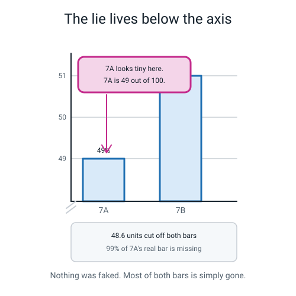
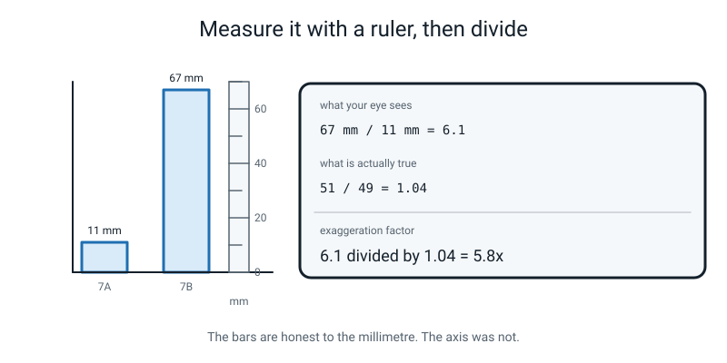
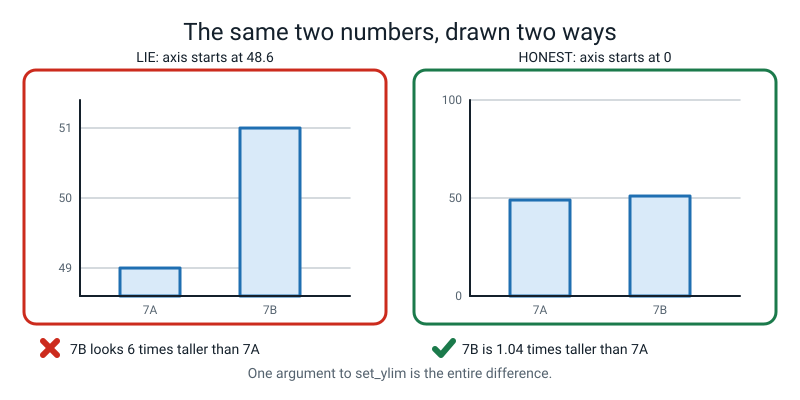
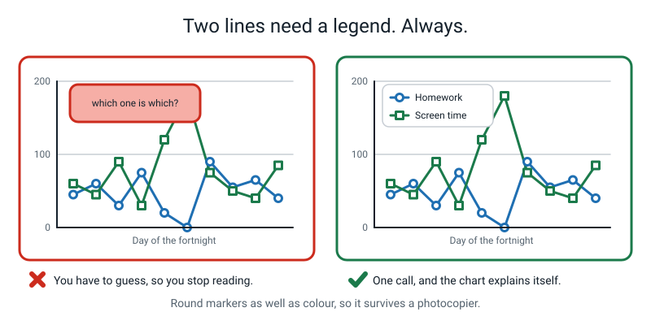
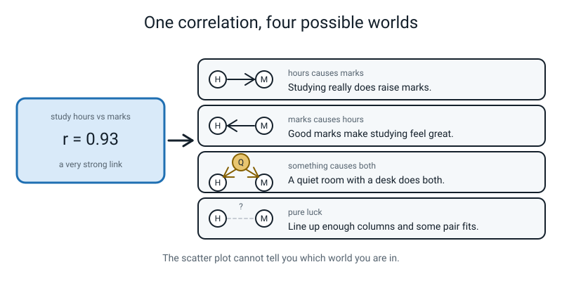

# Week 27 — Term 3 Checkpoint: Build a Lie, Then Confess

[⬅ Week 26](week-26.md) · [Course Home](../README.md) · [Week 28 ➡](week-28.md) · [Student Guide](../student-guide/week-27.md) · [Workbook](../workbook/week-27.md)

---

## 📋 At a Glance

| | |
|---|---|
| **Duration** | 70 minutes |
| **Type** | 🟪 Review — Term 3 checkpoint, taught by building one dishonest chart on purpose |
| **Big idea** | You can make a 2% difference look enormous without changing a single number — just by starting the y-axis somewhere else. |
| **New vocabulary** | truncated axis · exaggeration factor · legend · correlation · causation |
| **New syntax** | `ax.set_ylim(bottom, top)` · `fig, axes = plt.subplots(1, 2)` · `ax.legend()` · `df["a"].corr(df["b"])` |
| **Materials** | Printed workbook pages 27.1–27.6 · **a ruler with millimetres on it** (a real one — this is not a metaphor) · **one printed copy of `lie.png`** (see Prep) · a pencil · a calculator |
| **Tech needed** | The `level2` folder, venv active, matplotlib and pandas. `students.py` and `myweek.py` from earlier weeks. **A working printer**, or a way to view the chart at a fixed size. |
| **Prep time** | 20 minutes the night before, 5 minutes on the day |

> **⚠️ Watch out:** the measuring must happen **on paper**, not on a screen. On a screen the student can zoom, and zooming changes both bars together so the trick stops feeling real. A printed page has one fixed size, a ruler fits on it, and the number that comes out is theirs.

---

## 🎯 Lesson Objectives

By the end of the lesson the student can:

1. **Exaggerate a 2% difference with `set_ylim`** and compute how many times bigger it has been made to look.
2. **Put the misleading chart and the honest one side by side in one figure**, using `plt.subplots(1, 2)` and `axes[0]` / `axes[1]`.
3. **Add a legend as soon as there are two series**, by giving each `plot` call a `label=`.
4. **Compute a correlation and refuse, in writing, to call it a cause** — including naming a plausible third thing that could be causing both.
5. **Produce a list of the Term 3 weeks that need revisiting**, with a reason for each.

Observable evidence: a saved two-panel PNG with the lie on the left and the fix on the right; two bar measurements in millimetres with the ratio and the exaggeration factor worked out on paper; a written sentence about `r = 0.93` that contains no causal verb; and a completed Term 3 reflection sheet naming at least two weeks to revisit.

---

## 🧑‍🏫 What YOU Need to Know First

This is a review week, and review weeks are the easiest ones to teach badly. The temptation is to go back over weeks 19 to 26 in order. Do not. **The whole of Term 3 gets revised by being used**, inside one 70-minute build, and the build is deliberately dishonest, which is why students remember it.

Read all of this section. §2 is arithmetic you must be able to do at the whiteboard, and §5 is the bit that will get you asked a hard question.

### 1. What Term 3 actually was, so you know what you are checkpointing

| Week | What it added | Where it shows up today |
|---|---|---|
| 19 | `axis=0` down the columns, `axis=1` across the rows | not directly — flag it on the reflection sheet |
| 20 | boolean masks, `arr > 50`, `arr[mask]` | not directly — flag it |
| 21 | `pd.DataFrame`, `df.head()`, `df["col"]` | every chart today reads a column |
| 22 | `.loc`, `.iloc`, `df[df["age"] > 12]`, `sort_values` | `sort_values` in the data story |
| 23 | `read_csv` / `to_csv`, `isna`, `fillna`, `astype` | flag it |
| 24 | `drop_duplicates`, `.str` methods, `groupby(...).mean()` | the club and house averages |
| 25 | figure, axes, labels, markers, `savefig` | all of it |
| 26 | bar, histogram, scatter, `value_counts` | all of it |

The reflection sheet on page 27.6 walks the student through all eight. Your job in the lesson is the *build*; the reflection is homework.

### 2. The truncated axis, with the arithmetic done in full

> **Truncated axis** — an axis that starts somewhere other than zero, so small differences look enormous.

Here is the whole trick. Two classes hand in homework: **7A gets 49% in on time, 7B gets 51%.** A two-point gap. Nothing.

**Honest chart, y from 0 to 100.** The bars are 49 and 51 units tall.

- 7B's bar ÷ 7A's bar = 51 ÷ 49 = **1.0408**. 7B's bar is about 4% taller. They look nearly identical, *because they nearly are*.

**Dishonest chart, y from 48.6 to 51.4.** Now each bar only shows the part *above* 48.6.

- 7A's visible bar = 49 − 48.6 = **0.4 units**
- 7B's visible bar = 51 − 48.6 = **2.4 units**
- 7B's bar ÷ 7A's bar = 2.4 ÷ 0.4 = **6.00**

**7B's bar is now six times taller than 7A's.** Every number printed on the chart is correct. Nothing was faked. 48.6 units of length were quietly deleted from the bottom of both bars.

> **Exaggeration factor** — how many times bigger the difference has been made to look: the truncated bar-length ratio divided by the honest one.

6.00 ÷ 1.0408 = **5.76**. Call it "about six times".


*Figure 27.1 — The grey block is the 48.6 units cut off both bars. 99% of 7A's real bar is not on the page.*

**And now the millimetres, which is the part students actually believe.** The chart is drawn 6 × 4 inches at 120 dots per inch. matplotlib gives the drawing frame 3.08 of those 4 inches, and that frame holds 2.8 percentage points (48.6 to 51.4). So:

- 3.08 inches × 25.4 = 78.2 mm of frame ÷ 2.8 points = **27.9 mm per percentage point**
- 7A's bar: 0.4 × 27.9 = **11 mm**
- 7B's bar: 2.4 × 27.9 = **67 mm**

Put a ruler on the printed page and that is what you will measure. 67 ÷ 11 = **6.1** — the same ratio, arrived at by hand, by a 12-year-old, with a ruler. That is why this lesson works.


*Figure 27.2 — 67 mm against 11 mm. The bars are honest to the millimetre. The axis was not.*

> **⚠️ Watch out:** if your printer scales the page to fit, **both** bars shrink by the same amount, so the millimetre readings change but **the ratio does not**. If a student measures 9 mm and 54 mm, they have not made a mistake — 54 ÷ 9 = 6.0. Say this before they measure, or you will spend three minutes reassuring them.

### 3. Why 48.6 is such a strange number, and why that is the lesson

A student will ask where 48.6 came from. The honest answer is the most useful sentence in the week:

> **"I fiddled with it until the chart looked how I wanted it to look."**

That is exactly what the person who made the chart on your phone did. Nobody derives a truncated axis; they nudge it. 48.6 gives a clean 6× because 49 − 48.6 = 0.4 and 51 − 48.6 = 2.4, and 2.4 ÷ 0.4 is 6 — and I chose it *after* deciding I wanted six. Push the floor to 48.9 and the ratio becomes 21. Push it to 48.99 and it becomes 201. **There is no limit**, which is worth showing: the closer the floor creeps to the smaller bar, the bigger the lie, and it is one keystroke each time.

### 4. `ax.set_ylim(bottom, top)` — and the honest rule

```python
ax.set_ylim(48.6, 51.4)      # the trick
ax.set_ylim(0, 100)          # the fix
```

Two numbers: where the axis starts, where it stops. **That is the whole call, and it is the whole lie.** One argument to one function is the entire difference between an honest chart and a dishonest one, which is a genuinely unsettling thing for a 12-year-old to learn and it should be said out loud.

Two things it does silently, and both are Clinic rows:

- `ax.set_ylim(48.6)` — **one** argument. No error. It sets the bottom and lets matplotlib pick the top. The chart is different from the one you intended and nothing tells you.
- `ax.set_ylim(51.4, 48.6)` — backwards. No error. The chart is drawn **upside down**, bars hanging from the top. It looks like a bug in matplotlib. It is not.

**The rule, and it has two halves:**

| Chart type | Must the axis start at zero? | Why |
|---|---|---|
| **bar** | **Yes. Always.** | A bar asks your eye to compare **lengths**. Delete length from the bottom and the reader has no way to add it back. |
| **line** | Not necessarily — but say so if it does not | A line asks you to follow a **shape**. A body-temperature chart starting at 0 °C would be a flat line squashed against the top of the frame, telling you nothing. |

If you truncate a line chart, the honest thing is to shout about it in the label: `"Temperature (°C) — note: axis starts at 20"`. **Hiding it is the dishonest part; the choice itself can be defensible.**

### 5. `fig, axes = plt.subplots(1, 2)` — one sheet, two frames

Week 25's `plt.subplots()` gave you one frame. Give it two numbers and it gives you a grid:

```python
fig, axes = plt.subplots(1, 2, figsize=(10, 4))   # 1 row, 2 columns
```

- `1, 2` — one row of two frames. `2, 2` would give four in a square.
- `axes` is now **a box holding both frames**, numbered from 0 like a list (Week 11). `axes[0]` is the left one, `axes[1]` is the right one.
- Every call from Week 25 and 26 still works — you just say *which frame* first: `axes[0].bar(...)`, `axes[1].set_title(...)`.
- `figsize=(10, 4)` — wider than usual, because you are fitting two frames on one sheet.

Two errors here, both worth meeting:

- `axes.bar(...)` — forgetting the number. Gives `AttributeError: 'numpy.ndarray' object has no attribute 'bar'. Did you mean: 'var'?` Translate it: *"`axes` is a box of frames, not a frame. Which one did you mean?"*
- `axes[2]` — there are only two, numbered 0 and 1. Gives `IndexError: index 2 is out of bounds for axis 0 with size 2`. This is the same off-by-one they met in Week 11, in new clothing.

**One bonus call, worth typing but not worth teaching:** `fig.suptitle("...")` puts a title across the **whole sheet**, above both frames. Each frame already has its own `set_title`; the suptitle is the headline over both. If a student asks, that is the answer. Do not build anything on it.


*Figure 27.3 — Left panel, right panel, one sheet. The reader can compare the framing instead of trusting it.*

### 6. `ax.legend()` and why it needs `label=`

The moment there are two lines on one frame, the reader has to guess which is which, and readers who have to guess stop reading.

```python
ax.plot(df["day"], df["homework_min"], marker="o", label="Homework")
ax.plot(df["day"], df["screen_min"], marker="s", label="Screen time")
ax.legend()
```

`ax.legend()` does not invent names. It goes round every line already drawn on the frame and prints whatever `label=` each one was given. Forget the labels and you get a warning, not an error:

```text
No artists with labels found to put in legend.  Note that artists whose label start with an underscore are ignored when legend() is called with no argument.
```

"Artists" is matplotlib's word for anything drawn. The chart still saves; it just has no legend.

**Two cues, not one.** Notice `marker="o"` on the first line and `marker="s"` (a square) on the second. Colour alone is not enough — the chart will be photocopied, printed in black and white, or read by somebody who cannot distinguish those two colours. Different **shapes** as well as different colours costs nothing and is simply what a careful person does.


*Figure 27.4 — Round markers and square markers, so it survives a photocopier.*

### 7. Correlation: what `r` is, and the four worlds

> **Correlation** — one number saying how strongly two columns move together, from −1 (perfect opposites) through 0 (no relationship) to +1 (perfectly together).

```python
r = df["hours"].corr(df["score"])     # 0.925
```

For our 38 students, study hours and score give **r = 0.925**. That is very strong. The scatter plot is a tidy band of dots rising to the right.

**Three things about `r` that you should be ready for:**

1. **It is not a percentage.** `r = 0.93` does not mean "93% of the score comes from studying". It is a number on a scale from −1 to +1 and that is all it is. Students will want it to be a percentage. It is not.
2. **A negative `r` is not a weak `r`.** `df["age"].corr(df["hours"])` gives **−0.572** in this table — older students report fewer hours. The minus sign means "as one goes up the other goes down". It is a *direction*, not a grade.
3. **It only works on numbers.** `df["club"].corr(df["score"])` fails with `TypeError: unsupported operand type(s) for /: 'str' and 'int'` — Clinic row 4. You cannot average the word "chess".

**And now the thing this whole term has been building to.** `r = 0.93` between hours and score is consistent with **four different worlds**, and no scatter plot on earth can tell you which one you are in:


*Figure 27.5 — Four stories, one number. The picture is identical in all four.*

| World | What is actually happening | Plausible here? |
|---|---|---|
| **A causes B** | Studying really does raise marks | Yes |
| **B causes A** | Doing well makes studying feel rewarding, so you do more | Also yes |
| **C causes both** | A quiet home with a desk causes more study hours **and** higher marks | Also yes — this is the **confounder** |
| **Coincidence** | Line up enough columns and some pair fits by luck | Very common, especially in small tables |

> **Causation** — one thing actually making the other happen.
> **Confounder** — a hidden third thing causing both of the things you measured, making them look connected to each other.

🍕 **The analogy that always lands.** Ice cream sales and drownings rise and fall together almost perfectly. Ice cream does not cause drowning. **Hot weather** causes both — people buy ice cream *and* people go swimming. The numbers, verified in the lesson:

```text
ice creams vs drownings  : r = 0.997
temperature vs ice creams: r = 0.987
temperature vs drownings : r = 0.989
```

The first line is the *strongest of the three* and it is the one that is causally nonsense. **There is nothing visible in a correlation, or in a scatter plot, that distinguishes "A causes B" from "C causes both".** The distinction lives entirely outside the data, in what you know about the world.

**How to talk about a scatter honestly.** Say *"students who studied more tended to score higher"* — a description. Do not say *"studying raised their scores"* — a claim about cause, which needs an **experiment** (randomly make some students study more and see what happens), not a chart.

### 8. The ethics question, and how to run it

The last ten minutes of the lesson ask: **who gets hurt if a school acts on that chart?**

Trace the chain out loud. Somebody sees `r = 0.93`, concludes "more hours → higher marks", and mandates two extra study hours for everybody. Now look at *who* is at the bottom of that scatter. In our table the five students studying an hour or less are **Hugo (14), Sami (14), Greta (14), Omar (14) and Bruno (13)** — every single one is 13 or 14. The six studying five hours or more are mostly **12**.

Then ask the question that matters: **why might a 14-year-old be studying half an hour a week?** A job. A younger sibling to look after. No quiet room. A long commute. None of those are on the chart, and none of them are fixed by being told to study more — they are *punished* by it.

**This is not a bolt-on.** It is the point of the whole term: a chart is an argument, an argument leads to a decision, and a decision lands on a person. Give it the time.

### 9. The three misconceptions you will meet

**Misconception 1 — "so truncating an axis is always cheating."** No, and over-correcting here is a real risk after a lesson this vivid. For **bars**, yes, always start at zero. For **lines**, a truncated axis is often the only readable choice — nobody charts body temperature from absolute zero. The dishonest part is *not saying so*. Keep the two halves separate.

**Misconception 2 — "r = 0.93 means 93 percent."** It does not mean anything as a percentage. Cure it with the negative one: "`r` between age and hours is minus nought point five seven two. What is minus fifty-seven percent of a study hour?" Nothing. It is a number on a scale, not a proportion.

**Misconception 3 — "if the correlation is strong enough, it must be cause."** This is the deepest one and the hardest to shift, because strong correlations *feel* like proof. The cure is the ice cream numbers, because there the strongest correlation of the three is the absurd one. Say it plainly: **strength is not evidence of direction.** A perfect correlation between two things can still have a third thing causing both.

### 10. How deep to go, and where to stop

**Go this far:** `set_ylim` and the bar-chart rule; the exaggeration arithmetic in millimetres; two panels with `subplots(1, 2)`; a legend with `label=`; `corr` and the refusal to say "causes"; and a Term 3 reflection.

**Stop before:**
- **Any formula for `r`.** It involves squares and square roots over both columns and it teaches nothing at this stage. `df["a"].corr(df["b"])` gives you the number. That is enough.
- **r-squared.** Week 32, and it needs regression first.
- **The other visual lies** — 3-D pie charts, dual y-axes, cherry-picked date ranges. Mention them by name in the wrap if there is time; do not build them. The truncated axis is the one they will meet weekly for the rest of their lives.
- **Statistical significance, p-values, confidence intervals.** Not this year, and possibly not this level.
- **Fitting a trend line to the scatter.** Week 32. A line drawn by eye looks exactly as authoritative as a calculated one and carries none of the information.
- **`plt.style.use(...)`, colour palettes, annotations.** Fun, endless, not the point.

---

## 🧰 Prep Checklist

### 20 minutes the night before

- [ ] **Print workbook pages 27.1–27.6.**
- [ ] **Find a ruler with millimetres on it.** A real one. The whole hook depends on it. A second ruler is better, so you can measure alongside rather than over their shoulder.
- [ ] **Build and print the lie.** In `~/ai-academy/level2`, create `week27_lie.py` with the code from the Answer Key, and run it:

  ```bash
  python week27_lie.py
  ```

  Expected, exactly:

  ```text
  saved lie.png
  7A: 49%  -> visible bar = 0.4 units
  7B: 51%  -> visible bar = 2.4 units
  looks-like ratio  7B / 7A = 6.00 times taller
  honest ratio      7B / 7A = 1.0408 times taller
  exaggeration factor       = 5.76
  the drawing frame is 3.08 inches tall
  that is 27.9 mm per percentage point
  7A bar should measure 11 mm
  7B bar should measure 67 mm
  ```

  Now **print `lie.png`** — and print it **twice**, one for you and one for them. Then **measure both bars yourself with the ruler.** You want to have done this before the lesson, because the number you get depends on how your printer scaled the page and you should know it in advance. If you measure 9 and 54, that is fine — the *ratio* is what matters.
- [ ] **Cover up the numbers.** The printed chart has `Homework on time (%)` on the y axis and tick numbers 49, 50, 51. **Fold or tape over the y-axis tick numbers** on the copy you hand them. They must measure the bars *before* they can read the values. The whole hook collapses if they see "49" and "51" first.
- [ ] **Check `students.py` and `myweek.py` are in the folder.** Both are in the Answer Key if either has gone missing.
- [ ] **Run `week27_corr.py`** and check you get `r = 0.925`, and the three ice-cream numbers.
- [ ] **Read §7 and §8 above twice.** The correlation-is-not-cause conversation is the hardest thing you will do this term, and it goes much better if you already know which five students sit at the bottom of the scatter.

### 5 minutes on the day

- [ ] Terminal in `~/ai-academy/level2`, venv active. Folder window visible.
- [ ] The printed `lie.png` face down, **with the y-axis numbers covered**.
- [ ] Two rulers on the table. Calculator on the table.
- [ ] Workbook page 27.1 (the measuring sheet) on top of the pile.
- [ ] If you found a misleading chart in the wild — a news site, an advert, a battery graph — have it ready for the wrap.

### Fallback if a laptop or the printer fails

| If this fails | Do this instead |
|---|---|
| **The printer** | Draw the lie by hand on squared paper. Two bars, one 11 squares tall and one 67 squares tall, labelled 7A and 7B, with the y axis numbered 48.6 at the bottom and 51.4 at the top. It works exactly as well, and honestly the hand-drawn version is *more* convincing, because it obviously was not produced by a machine that might have made a mistake. |
| **No laptop at all** | The entire lesson runs on squared paper. Draw both versions of the chart by hand — the truncated one and the zero-based one — measure both, do the division, and then have the correlation conversation using the printed ice-cream table on page 27.5. Objectives 1, 4 and 5 land in full; objectives 2 and 3 become "describe what the code would be", which is a fair substitute for a review week. |
| **`students.py` is missing** | The full file is in the Week 26 Answer Key. Two minutes to drop in. Or run the whole lesson on the two typed-in numbers 49 and 51, which need no table at all. |
| **A chart looks upside down** | `set_ylim` was given its two numbers backwards. No error is produced. See Clinic row 7. |
| **The student measures 9 mm and 54 mm, not 11 and 67** | Nothing is wrong. The printer scaled the page. Both bars shrank together, so the ratio survived: 54 ÷ 9 = 6.0. **Say this before they measure.** |
| **The student says "so all charts are lies"** | Do not let this stand — it is the failure mode of the lesson. Point at the honest right-hand panel: same numbers, zero-based axis, ratio 1.04, and it is a perfectly good chart. The point is not that charts lie; it is that **a chart is an argument, so you check the framing**. |

---

## ⏱️ The Lesson, Minute by Minute

| Segment | Minutes | Running total | What happens |
|---|---|---|---|
| 🪝 Hook — Measure Both Bars | 7 | 7 | A ruler, two bars, and a ratio of six |
| 🧠 Concept — Where the Lie Lives | 16 | 23 | `set_ylim`, the arithmetic, and the zero rule |
| 💻 Live-Code Together — Build the Lie, Then the Pair | 18 | 41 | Two deliberate mistakes, both silent |
| 🎲 Their Turn — Legend, Correlation, and Who Gets Hurt | 20 | 61 | Two lines with a legend; r = 0.93; the ethics question |
| 🔑 Wrap & Assign | 9 | 70 | Three checks, the Term 3 reflection, homework |

---

### 🪝 Hook — Measure Both Bars (7 minutes)

**Do this:** Put the printed `lie.png` on the table — **with the y-axis numbers covered.** Put a ruler next to it. Say nothing about what it is.

**Say this:**

> "Two classes. 7A and 7B. This chart is about how much homework each class hands in on time. I didn't make up any numbers; every number on this chart is real.
>
> I want you to do something physical. Take the ruler. **Measure how tall each bar is, in millimetres.** Write both numbers on page 27.1."

Let them measure. It takes about forty seconds. They will get roughly 11 mm and 67 mm.

> "Read me the two numbers."

Whatever they got, write both on paper.

> "Right. Now divide the big one by the small one. Use the calculator."

67 ÷ 11 = **6.09**.

> "About six. So according to this chart, **7B is about six times better at homework than 7A.** Six times. If you were 7A's teacher you'd be in trouble. If you were 7A, you'd feel awful.
>
> Now let me uncover the y axis."

**Do this:** Peel off the cover. Reveal the tick numbers: 49, 50, 51.

Let them look. Then:

> "7A got **forty-nine percent.** 7B got **fifty-one percent.**
>
> Two points apart. Out of a hundred. Say it out loud: how much better is 7B than 7A?"

> "Two percent. Basically nothing. Fifty-one over forty-nine is one point oh four — 7B is four percent better, and four percent of anything is a rounding error.
>
> And you measured, with a ruler, that it looks **six times** bigger.
>
> Nobody lied to you. There is not one false number on this page. **I moved where the axis starts.** That's it. That's the whole trick, and it's one line of code, and you're going to write it yourself in about fifteen minutes."

**Ask this:**

| Ask | Answer you want | If they say something else |
|---|---|---|
| "Measure both bars in millimetres." | About 11 and 67. | If the printer scaled the page they might get 9 and 54, or 14 and 85. Fine. Say: "The ratio is what matters — divide them." |
| "Divide the big one by the small one." | About 6. | If they get 6.09 or 5.8, that is correct; the rounding is in the measuring. Do not tidy it. |
| "How much better is 7B, really?" | Two percentage points. About 4% taller. | If they say "two percent better", that is close enough — 51/49 is 1.04, so 4% relatively. Do the division with them; it is a good fractions moment. |
| "Which number did I fake?" | None of them. | If they insist something must be wrong with the data, hand them the ruler and the numbers and let them check. Nothing is wrong. That is the point. |
| "So how did I do it?" | You changed where the y axis starts. | If they cannot see it, point at the bottom tick: "What number is at the bottom of this axis? What number *should* be at the bottom of a bar chart?" |

---

### 🧠 Concept — Where the Lie Lives (16 minutes)

**Do this:** Have Figure 27.1 visible. Keep the printed chart and the ruler on the table.

**Say this — part 1, what actually happened:**

> "Look at Figure 27.1. See the grey block underneath the axis? That's what got deleted.
>
> The axis starts at forty-eight point six. So 7A's bar — which is really forty-nine units tall — only gets to show forty-nine minus forty-eight point six. That's **nought point four**. And 7B shows fifty-one minus forty-eight point six, which is **two point four**.
>
> Two point four divided by nought point four is **six**. There's your six. It came out of the subtraction.
>
> And here's the sentence I want you to remember: **forty-eight point six units of length were deleted from the bottom of both bars, and the reader has no way to put them back.**"

**Say this — part 2, why bars in particular:**

> "Now, why is this so bad for a bar chart specifically? Because of what a bar chart asks your eye to do.
>
> A bar chart says: *compare these lengths.* That's the whole deal. Long bar, big number. Your eye is doing arithmetic with length — and it can only do that arithmetic if the bars start from the same place, and that place has to be zero.
>
> Chop the bottom off and your eye is still doing the arithmetic. It just can't tell that the numbers have been messed with. That's why it works, and that's why it's dishonest. **Bar charts start at zero. Always. No exceptions.**"

**Say this — part 3, the honest exception, because it matters:**

> "But — and I want to be careful here, because it would be easy to walk out of this lesson thinking every chart is a lie — **line charts are different.**
>
> Imagine a chart of your body temperature over a week. Thirty-six point eight, thirty-seven, thirty-six point nine, thirty-nine when you were ill. If I started that axis at zero, all five points would be squashed into a flat line right at the top of the chart and you'd learn nothing. And zero degrees isn't a meaningful floor for a human being anyway. So a temperature chart starting at thirty-five is the *right* chart.
>
> The difference is what the chart asks your eye to do. A bar asks you to compare *lengths*. A line asks you to follow a *shape*. Shapes survive a moved floor; lengths don't.
>
> And the honest rule for a truncated line chart: **say so, loudly, in the label.** Write `Temperature in degrees C, note axis starts at 35`. **Hiding it is the dishonest bit, not the choosing.**"

**Say this — part 4, one line of code:**

> "The whole thing is one function with two numbers:
>
> `ax.set_ylim(48.6, 51.4)` — where the axis starts, where it stops. That's the lie.
>
> `ax.set_ylim(0, 100)` — that's the fix.
>
> One argument. That's the entire distance between an honest chart and a dishonest one, and I want that to bother you slightly, because it should."

**Say this — part 5, and where 48.6 came from:**

> "One more thing, and it's my favourite bit. Somebody's going to ask where forty-eight point six came from. Here's the honest answer: **I fiddled with it until the chart looked how I wanted it to look.**
>
> That's it. There's no maths behind it. I decided I wanted about six times, and I moved the floor until I got six times. And if I'd wanted twenty-one times, I'd have used forty-eight point nine. If I'd wanted two hundred times, forty-eight point nine nine.
>
> **There's no limit.** The closer the floor creeps up to the smaller bar, the bigger the lie, and it's one keystroke every time. That's what the person who made the chart you saw on your phone last week was doing."

**Ask this:**

| Ask | Answer you want | If they say something else |
|---|---|---|
| "Where did the six come from, in arithmetic?" | 2.4 ÷ 0.4, the two visible bar lengths. | If stuck, do the two subtractions on paper with them: 49 − 48.6 and 51 − 48.6. |
| "Why is this worse for bars than for lines?" | A bar asks you to compare lengths; a line asks you to follow a shape. | If they say "it isn't", offer the body-temperature chart starting at zero and ask what they'd learn from it. |
| "What ylim would make it look TWENTY times bigger?" | Something near 48.9: (51 − 48.9) ÷ (49 − 48.9) = 21. | Brilliant question to let them work out with a calculator. It takes 90 seconds and it is worth every one. |
| "Is a truncated line chart always dishonest?" | No — but not saying so is. | If they say yes, give them the temperature example and let them argue against it. |
| "Where did 48.6 come from?" | I fiddled until it looked right. | If they assume there is a formula, say plainly that there is not, and that assuming there is one is exactly how people get fooled. |

---

### 💻 Live-Code Together — Build the Lie, Then the Pair (18 minutes)

You type; the student types along. **Two deliberate mistakes, marked 🐞, and both of them are silent** — no error, no warning, just a chart that is not the chart you meant. That is the theme of Term 3 and this is the last chance to hammer it.

#### Step 1 — build the lie, and print the arithmetic (8 min)

**Do this:** New file, `week27_lie.py`.

```python
# week27_lie.py -- build the lie on purpose. Two true numbers, one dishonest axis.
import matplotlib.pyplot as plt

classes = ["7A", "7B"]                 # the two categories
on_time = [49, 51]                     # % of homework handed in on time. Both TRUE.

fig, ax = plt.subplots(figsize=(6, 4))
ax.bar(classes, on_time)

bottom, top = 48.6, 51.4               # THE TRICK: the axis does not start at zero
ax.set_ylim(bottom, top)

ax.set_title("7B is MILES ahead of 7A on homework")   # a title doing the lying too
ax.set_xlabel("Class")
ax.set_ylabel("Homework on time (%)")

fig.savefig("lie.png", dpi=120, bbox_inches="tight")
print("saved lie.png")
```

**Say this:**

> "Notice `bottom, top = 48.6, 51.4` — two names, one equals, same trick as `fig, ax`. And notice the title. **The title is lying too.** 'Miles ahead' is a claim, and it isn't true, and a title that overclaims is the second-cheapest lie in this subject after the axis."

🐞 **Now make the first mistake.** Change the ylim line to:

```python
ax.set_ylim(bottom)
```

Run it. **No error.**

```text
saved lie.png
```

Open the PNG. The bars are still there but the top of the axis has moved — matplotlib picked its own top, so the chart is not the one you designed.

> "No error. No warning. A perfectly saved chart that isn't the chart I wrote. `set_ylim` wants **two** numbers, and if you give it one it takes it as the bottom and makes up the top. This is the Term 3 lesson again, for about the fifth time: **the dangerous failure is the one that doesn't complain.**"

Fix it back to `ax.set_ylim(bottom, top)` and add the arithmetic:

```python
# --- the arithmetic that proves it is a lie ---------------------------------
visible_a = on_time[0] - bottom        # how much of 7A's bar sits above the floor
visible_b = on_time[1] - bottom        # same for 7B
print(f"7A: {on_time[0]}%  -> visible bar = {visible_a:.1f} units")
print(f"7B: {on_time[1]}%  -> visible bar = {visible_b:.1f} units")
print(f"looks-like ratio  7B / 7A = {visible_b / visible_a:.2f} times taller")
print(f"honest ratio      7B / 7A = {on_time[1] / on_time[0]:.4f} times taller")
print(f"exaggeration factor       = {(visible_b / visible_a) / (on_time[1] / on_time[0]):.2f}")

# --- and the millimetres, so a ruler can check us --------------------------
axes_height_inches = ax.get_position().height * fig.get_figheight()
mm_per_unit = axes_height_inches * 25.4 / (top - bottom)
print(f"the drawing frame is {axes_height_inches:.2f} inches tall")
print(f"that is {mm_per_unit:.1f} mm per percentage point")
print(f"7A bar should measure {visible_a * mm_per_unit:.0f} mm")
print(f"7B bar should measure {visible_b * mm_per_unit:.0f} mm")
```

```text
saved lie.png
7A: 49%  -> visible bar = 0.4 units
7B: 51%  -> visible bar = 2.4 units
looks-like ratio  7B / 7A = 6.00 times taller
honest ratio      7B / 7A = 1.0408 times taller
exaggeration factor       = 5.76
the drawing frame is 3.08 inches tall
that is 27.9 mm per percentage point
7A bar should measure 11 mm
7B bar should measure 67 mm
```

**Do this:** Put the ruler back on the printed chart and point at the last two lines.

> "Eleven millimetres and sixty-seven millimetres. **That's what you measured with a ruler, twenty minutes ago, before I told you anything.** The program predicted your ruler.
>
> Those last four lines are doing something clever, by the way, and you can just copy them: they ask matplotlib how tall the drawing frame actually is in inches, turn that into millimetres, and divide by how many percentage points the axis covers. That gives millimetres per point. Then the bar lengths fall out."

#### Step 2 — the honest version beside it, and 🐞 mistake #2 (10 min)

**Do this:** New file, `week27_pair.py`.

```python
# week27_pair.py -- the lie and the fix, in ONE figure, side by side.
import matplotlib.pyplot as plt

classes = ["7A", "7B"]
on_time = [49, 51]

# subplots(1, 2) = one row, two frames. axes holds BOTH frames, numbered 0 and 1.
fig, axes = plt.subplots(1, 2, figsize=(10, 4))
print("how many frames?", len(axes))
```

Run it:

```text
how many frames? 2
```

> "Two frames. One sheet. And `axes` isn't a frame — it's a **box holding two frames**, numbered from zero, exactly like a list. `axes[0]` is the left one. `axes[1]` is the right one."

🐞 **Now the second mistake.** Type:

```python
axes.bar(classes, on_time)
```

Run it:

```text
how many frames? 2
Traceback (most recent call last):
  File "/Users/you/ai-academy/level2/week27_pair.py", line 11, in <module>
    axes.bar(classes, on_time)
AttributeError: 'numpy.ndarray' object has no attribute 'bar'. Did you mean: 'var'?
```

> "Read the last line."

Let them read it.

> "`'numpy.ndarray' object has no attribute 'bar'`. Translate it: **'`axes` is a box, not a frame. Which frame did you mean?'**
>
> And ignore the 'did you mean var' bit — Python's guessing, and this time it's guessing badly. `var` is a numpy thing about variance and it has nothing to do with what I want. **Python's suggestions are hints, not answers.** That's worth knowing."

Fix it and finish both panels:

```python
# ---- LEFT frame: the lie --------------------------------------------------
axes[0].bar(classes, on_time)
axes[0].set_ylim(48.6, 51.4)                     # the trick
axes[0].set_title("LIE: y-axis starts at 48.6")
axes[0].set_xlabel("Class")
axes[0].set_ylabel("Homework on time (%)")

# ---- RIGHT frame: the honest version -------------------------------------
axes[1].bar(classes, on_time)
axes[1].set_ylim(0, 100)                         # the fix. One argument.
axes[1].set_title("HONEST: y-axis starts at 0")
axes[1].set_xlabel("Class")
axes[1].set_ylabel("Homework on time (%)")

fig.suptitle("The same two numbers: 49% and 51%")
fig.savefig("lie_and_fix.png", dpi=120, bbox_inches="tight")
print("saved lie_and_fix.png")
```

```text
how many frames? 2
saved lie_and_fix.png
```

**Do this:** Open it. Look at both panels together, then measure the right-hand panel's two bars with the ruler as well.

> "Measure the honest ones. Go on."

They will get something like 47 mm and 49 mm — nearly identical, ratio about 1.04.

> "Forty-seven and forty-nine. Ratio one point oh four. **Which is the truth.**
>
> And notice what putting them side by side does. On its own, the left panel is convincing. Next to the right panel it's obviously a stunt. **The best defence against a misleading chart is another chart.**
>
> Oh — and `fig.suptitle`. Each frame has its own title, and that one is the headline across the whole sheet. You don't need it; it's just tidy."

**Ask this:**

| Ask | Answer you want | If they say something else |
|---|---|---|
| "How many frames does `subplots(1, 2)` make, and what are they called?" | Two: `axes[0]` and `axes[1]`. | If they say `axes[1]` and `axes[2]`, that is the Week 11 off-by-one. Let them try `axes[2]` and read the `IndexError`. |
| "Read the last line of that AttributeError." | `'numpy.ndarray' object has no attribute 'bar'` | If they get stuck on 'ndarray', say: "It's numpy's word for a box of things. From Week 17." |
| "Python suggested `var`. Should you use it?" | No. The suggestion is wrong this time. | Important check. If they say yes, let them try it and read the next error. |
| "Now measure the honest bars. What's the ratio?" | About 1.04. | If they measure identical lengths, that is fine and it is the point — 49 and 51 are nearly the same. |
| "Which panel would you put on a poster, if you wanted 7A to get in trouble?" | The left one. | Let them enjoy the answer, then: "So what will you look at first, next time somebody shows you a bar chart?" |

---

### 🎲 Their Turn — Legend, Correlation, and Who Gets Hurt (20 minutes)

Student on the keyboard. Full instructions in the next section.

- **Minutes 0–6:** two lines on one frame, with a legend.
- **Minutes 6–12:** compute `r` for hours vs score, and the three ice-cream correlations.
- **Minutes 12–20:** the ethics question, written down, and the start of the Term 3 reflection sheet.

---

## 🎲 The Activity, In Full

### Setup

**On the table:** workbook pages 27.2 (legend), 27.3 (correlation), 27.4 (the ethics page) and 27.6 (Term 3 reflection). Ruler, pencil, calculator.

**On the machine:** `level2` folder, venv active, `students.py` and `myweek.py` present.

### Part A — Two lines, one legend (6 minutes)

```python
# week27_legend.py -- two lines on one frame, so a legend becomes compulsory.
import matplotlib.pyplot as plt
from myweek import build_my_week

df = build_my_week()

fig, ax = plt.subplots(figsize=(6, 4))

# Each plot call gets its own label=... . That text is what the legend prints.
ax.plot(df["day"], df["homework_min"], marker="o", label="Homework")
ax.plot(df["day"], df["screen_min"], marker="s", label="Screen time")

ax.set_title("Screen time and homework crossed over at the weekend")
ax.set_xlabel("Day of the fortnight (day 1 = first Monday)")
ax.set_ylabel("Minutes")
ax.set_ylim(0, 200)
ax.legend()                          # reads the labels you already gave

fig.savefig("two_lines.png", dpi=120, bbox_inches="tight")
print("saved two_lines.png")
```

```text
saved two_lines.png
```

> **💡 Try this:** have them delete both `label="..."` bits and run it again. No error — just a warning, and a chart with no legend:
>
> ```text
> No artists with labels found to put in legend.  Note that artists whose label start with an underscore are ignored when legend() is called with no argument.
> ```
>
> "'Artists' is matplotlib's word for anything you drew. It's saying: *you asked me to name the lines and none of them have names.*"

Then the point about markers:

> **🧑‍🏫 If a student asks:** *"Why is one marker a circle and one a square? The colours are already different."* — Because this chart will be photocopied, printed in black and white, or read by somebody who cannot tell those two colours apart, and in every one of those cases the colour is gone and the shapes are not. Two cues instead of one costs nothing. It is simply what a careful person does.

### Part B — Correlation, and the three numbers that ruin it (6 minutes)

```python
# week27_corr.py -- one number for "do these two move together?"
import pandas as pd
from students import build_students

df = build_students()

r_hours_score = df["hours"].corr(df["score"])     # -1 .. 0 .. +1
print(f"study hours vs score : r = {r_hours_score:.3f}")

r_age_hours = df["age"].corr(df["hours"])
print(f"age vs study hours   : r = {r_age_hours:.3f}")

# Six months of a seaside town. Two of these columns rise together almost perfectly.
town = pd.DataFrame({
    "month":      ["Jan", "Mar", "May", "Jul", "Sep", "Nov"],
    "ice_creams": [200, 400, 800, 1400, 900, 300],
    "drownings":  [1, 2, 5, 9, 6, 2],
    "temp_c":     [12, 16, 25, 32, 26, 15],
})

print()
print(f"ice creams vs drownings  : r = {town['ice_creams'].corr(town['drownings']):.3f}")
print(f"temperature vs ice creams: r = {town['temp_c'].corr(town['ice_creams']):.3f}")
print(f"temperature vs drownings : r = {town['temp_c'].corr(town['drownings']):.3f}")
```

```text
study hours vs score : r = 0.925
age vs study hours   : r = -0.572

ice creams vs drownings  : r = 0.997
temperature vs ice creams: r = 0.987
temperature vs drownings : r = 0.989
```

**The three questions to ask, in this order:**

1. *"Ice cream and drowning: nought point nine nine seven. Almost perfect. Should we ban ice cream?"* — obviously not.
2. *"So what's really going on?"* — hot weather. People buy ice cream **and** people swim. **Hot weather is the confounder.**
3. *"Now look at all three numbers. Which is the biggest?"* — the ice cream one, **0.997**, the one that is causally absurd. That is the whole point: **strength tells you nothing about direction.**

> **⚠️ Watch out:** somebody will try `df["club"].corr(df["score"])`. It fails, and the last line is `TypeError: unsupported operand type(s) for /: 'str' and 'int'`. Translate it: *"you asked me to divide the word 'chess' by a number."* Correlation is for numbers only.

### Part C — Who gets hurt? (8 minutes)

**Do this:** Put page 27.4 in front of them. Have `hours_vs_score.png` from Week 26 open on screen.

**Say this:**

> "Study hours and marks: nought point nine two five. Really strong. Now imagine a head teacher sees this chart and does the obvious thing: **everybody does two extra hours of study a week.**
>
> Before you decide whether that's a good idea, I want you to find out **who is actually at the bottom of that scatter.** Print them."

```python
# week27_who.py -- who is at the bottom of the scatter?
from students import build_students

df = build_students()

print("studying an hour or less:")
print(df[df["hours"] <= 1.0][["name", "age", "house", "club", "hours", "score"]].to_string(index=False))
print()
print("studying five hours or more:")
print(df[df["hours"] >= 5.0][["name", "age", "club", "hours", "score"]].to_string(index=False))
```

```text
studying an hour or less:
       name  age house  club  hours  score
 Hugo Silva   14   Red music    0.5     45
Omar Haddad   14  Blue music    1.0     52
  Sami Aden   14 Green   art    0.5     48
Bruno Costa   13 Green   art    1.0     50
 Greta Hahn   14  Blue music    0.5     42

studying five hours or more:
       name  age  club  hours  score
   Bela Roy   14 music    5.0     90
 Farah Aziz   12 chess    6.0     95
 Liam Byrne   13 music    5.5     81
 Tara Joshi   12 chess    5.0     97
Anika Verma   12 music    5.0     93
  Hana Sato   12   art    5.5     91
```

> "Look at the ages. Every single student studying an hour or less is thirteen or fourteen. Four of the six studying five hours or more are twelve.
>
> Now the question that matters, and I want it written on the page: **why might a fourteen-year-old be studying half an hour a week?**"

Take every answer they offer. The good ones: a job. A younger brother or sister to look after. No quiet room. A long journey to school. Illness. Something going on at home.

> "None of those are on the chart. Not one. And **none of them are fixed by being told to study more** — they're *punished* by it. Hugo gets a detention for a bus timetable.
>
> So write the honest sentence, on page 27.4. Here's mine, and yours can be better:
>
> *'In this table, students who studied more hours tended to score higher (r = 0.93). I do not know whether studying caused the higher marks. A quiet room at home could be causing both, and that would mean the students at the bottom of this chart are being blamed for something the chart never measured.'*
>
> Read it back. **Notice there is no word in it that means 'caused'.** That's the discipline."

### What "finished" looks like

- `two_lines.png` saved, with a legend naming both series and two different marker shapes.
- `r = 0.925` and the three ice-cream numbers printed and written on page 27.3.
- A written sentence on page 27.4 about `r = 0.93` that contains **no causal verb**, plus a named plausible confounder.
- At least three specific reasons a student might study very little, none of which are on the chart.
- The Term 3 reflection sheet started, with at least two weeks named.

### Variation — easier

- **Cut Part A.** The legend is one call and can be shown in ninety seconds rather than built.
- **Cut the ice-cream table.** Just do `r = 0.925` and the ethics question. Objective 4 is met by the *refusal*, not by the arithmetic.
- **Do the ethics question out loud, and write only one sentence.** The talking is the learning; the writing is the record.
- **Give them the sentence with three blanks:**

  > "In this table, students who ______ tended to ______. I do **not** know whether ______ caused ______, because ______ could be causing both."

**One thing you must not cut:** the ruler. Physically measuring two bars and getting six is the memory that survives the year.

### Variation — harder

1. **Push the lie as far as it will go.** "Find the `set_ylim` bottom that makes 7B look **fifty** times taller than 7A." It is real algebra, of the kind they have had for a year: (51 − b) ÷ (49 − b) = 50, so 51 − b = 2450 − 50b, so 49b = 2399, so **b = 48.9592**. Then build it and measure it. And notice how sharp the edge is: rounding the bottom to 48.96 gives **51×**, not 50×. A hundredth of a percentage point changes the lie by a factor of one.
2. **Truncate a line chart honestly.** Take the `sleep_hours` column (7.0 to 9.5) and chart it twice: once from 0, once from 6.5. The zero version is a flat line at the top and useless. Then write the label that makes the truncated one honest.
3. **A 2×2 grid.** `fig, axes = plt.subplots(2, 2, figsize=(10, 8))`. Now `axes` is a box of boxes and you index it `axes[0][0]`, `axes[0][1]`, `axes[1][0]`, `axes[1][1]`. Four of their Term 3 charts on one sheet. No new function, just one more index.
4. **Invent a confounder.** "Give me a pair of columns from this table with a strong correlation, and a third thing — not in the table — that could be causing both." Good answers involve `age` and `hours` with "how much homework the school sets by year group" as the confounder.
5. **Catch one in the wild.** Find a real misleading chart — a news site, an advert, a phone's battery graph, a shop's "our prices vs theirs" poster. Name the trick, and if the numbers are printed, compute the exaggeration factor. Bring it in.

---

## 🐞 The Debugging Clinic

Every message below came from running a genuinely broken version of this week's code.

| What the student sees (real message) | What it means | Most likely cause | The fix |
|---|---|---|---|
| `AttributeError: 'numpy.ndarray' object has no attribute 'bar'. Did you mean: 'var'?` | "`axes` is a box of frames, not a frame. Which one did you mean?" | `axes.bar(...)` after `plt.subplots(1, 2)`. Forgot the index. **Ignore the `var` suggestion — it is wrong here.** | `axes[0].bar(...)` or `axes[1].bar(...)`. |
| `AttributeError: 'numpy.ndarray' object has no attribute 'set_title'` | Same thing, on a different call. | `fig, ax = plt.subplots(1, 2)` and then `ax.set_title(...)`. The name `ax` is misleading — with two frames it is a box. | Index it, and rename it `axes` so the plural reminds you. |
| `IndexError: index 2 is out of bounds for axis 0 with size 2` | "There are two frames and you asked for the third." | `axes[2]`. Frames are numbered 0 and 1, exactly like list slots in Week 11. | `axes[0]` and `axes[1]`. |
| `TypeError: unsupported operand type(s) for /: 'str' and 'int'` (after ~10 lines of pandas and numpy) | "You asked me to divide a word by a number." | `df["club"].corr(df["score"])` — correlation on a text column. | Correlation is for numbers only. Pick two number columns. *(On pandas 2.x the message is `ValueError: could not convert string to float: 'chess'` — same cause.)* |
| `TypeError: Series.corr() missing 1 required positional argument: 'other'` | "You asked for a correlation between one thing and nothing." | `df["hours"].corr()` — forgot the second column. | `df["hours"].corr(df["score"])`. |
| `No artists with labels found to put in legend.` *(a warning, not an error — the chart still saves)* | "You asked me to name the lines and none of them have names." | `ax.legend()` with no `label="..."` on any `plot` call. | Add `label="Homework"` and `label="Screen time"` to the two `plot` calls. |
| **No error. The chart is upside down, bars hanging from the top.** | Nothing. You told it the axis runs downwards. | `ax.set_ylim(51.4, 48.6)` — the two numbers the wrong way round. | Smaller number first: `ax.set_ylim(48.6, 51.4)`. |
| **No error. The chart saves, but the top of the axis is not where you put it.** | Nothing. You gave it a bottom and let it choose a top. | `ax.set_ylim(48.6)` — one argument instead of two. | Give it both: `ax.set_ylim(48.6, 51.4)`. |
| **No error. A bar chart that looks dramatic and is not.** | Nothing at all. This is the *deliberate* bug of the week. | `set_ylim` left out entirely, so matplotlib auto-scaled and quietly truncated for you. | `ax.set_ylim(0, top)` on **every** bar chart, forever. matplotlib will truncate your bars for you if you let it. |
| `ValueError: x and y must have same first dimension, but have shapes (10,) and (12,)` | "Ten of one, twelve of the other." | Two series of different lengths on one frame — usually one column from `myweek` (10 rows) and one from somewhere else. | `print(len(a), len(b))` and find the mismatch. |

### How to teach debugging without giving the answer

The ladder is unchanged — **read the last line, name the line number, say what you expected, print the thing just before** — but this week adds a rule that is worth stating explicitly, because it comes straight out of Live-Code Step 2:

> **Python's "Did you mean…?" suggestions are hints, not answers.**

`'numpy.ndarray' object has no attribute 'bar'. Did you mean: 'var'?` — the suggestion is *wrong*. `var` is a numpy function about variance and has nothing to do with drawing a bar. Python matched the letters, not the meaning. A student who follows every suggestion blindly will fix three errors and then be badly lost on the fourth. **Read the suggestion, then decide.**

And the other rule, four times over in the table above: **four of the ten rows produce no error at all.** So the first question is never "what does the error say?" It is:

> **"Is that the chart you meant to make?"**

---

## ❓ Questions Students Ask This Week

**"Isn't it fine if the numbers are printed on the chart? Then nobody's lying."**

It is better, and it is not enough, and the reason is worth understanding. People read charts with their eyes before they read them with their brain — the shape lands in about a quarter of a second, the numbers take two or three seconds, and most people never get to the numbers at all. A truncated bar chart with correct numbers printed on it will still leave nearly every reader believing the wrong thing. The numbers are your defence in an argument afterwards. They are not a defence against the impression the chart made.

**"So is every chart a lie?"**

No, and this is the trap of a lesson this vivid. Look at the right-hand panel: same two numbers, axis from zero, ratio 1.04, and it is a completely honest chart that tells you the truth in half a second. The lesson is not "charts lie". It is: **a chart is an argument, and you check an argument's framing before you accept it.** Same as you would with a sentence.

**"Who decides what's misleading? Isn't it just an opinion?"**

Partly, and the honest answer has two halves. Some of it is not opinion at all: a bar chart with a truncated axis deletes length that the reader's eye is being asked to measure, and you can compute the exaggeration factor as an actual number — that is arithmetic, not taste. The rest genuinely is judgement: whether *this* chart, for *this* audience, making *this* decision, hides something that would change the decision. Two careful people can disagree about that. What is not a matter of opinion is the procedure: **state where your axis starts, and say what your chart hides.** Do those two things and nobody can accuse you of hiding anything.

**"Why do we use `r` and not a percentage?"**

Because `r` is not a proportion of anything. It is a position on a scale from −1 through 0 to +1. Try turning it into a percentage and it falls apart immediately: `r` between age and hours is **−0.572**, and "minus fifty-seven percent of a study hour" means nothing at all. There *is* a related number that behaves a bit more like a percentage — R², which you meet in Week 32 — and even that one is misread constantly by people who should know better.

**"If the correlation was 1.0 — perfect — would that prove cause?"**

No, and this is the best question anybody asks this week. A perfect correlation is *still* consistent with all four worlds. Suppose you measured the same thing twice with two instruments: perfect correlation, and neither one causes the other. Or suppose one thing genuinely causes both perfectly. **Strength tells you how tightly two columns move together. It tells you nothing about which way the arrow points, or whether there is an arrow at all.** Our own numbers make it: the *strongest* of the three correlations, 0.997, is the ice cream one, and that one is nonsense.

**"How would you ever prove that studying causes higher marks, then?"**

You would need an **experiment**, not a chart. Take a large group, split them **randomly** into two halves — randomly is the whole trick, because it means the two halves have similar homes, similar sleep, similar everything — then ask one half to study two extra hours and leave the other half alone, and compare the results afterwards. Because the split was random, any difference is much more likely to be the studying. That is genuinely how it is done, and it is why medical trials work the way they do. And notice: an experiment on schoolchildren's study time raises real questions about fairness, which is exactly why this stuff is hard and not just fiddly.

**"Is a truncated y-axis ever actually the right choice?"** *(Genuinely contested. Say so.)*

**Nobody fully agrees, and here is why it is not a dodge.** For **bars**, essentially everybody agrees: start at zero, no exceptions, because the eye is comparing lengths and you cannot un-delete length.

For **lines**, it is a real, live argument. One camp says: a line chart shows change, so scale the axis to the change — a body-temperature chart from absolute zero is not more honest, it is just useless. The other camp says: readers are trained by bar charts to treat height as amount, they do not check axes, and a truncated line chart of a company's income will be screenshotted into a group chat where it will fool everybody. Both camps have a point, and both include people who do this for a living.

The rule most careful people converge on, and it is worth writing down: *does the value zero mean anything for this quantity, and is the reader comparing lengths or following a shape?* Body temperature: zero is meaningless, and you are following a shape — truncate. Homework percentages: zero means something real, and you are comparing lengths — do not.

And the half everybody agrees on: **if you truncate, say so in the label, loudly.** The disagreement is about the choice. There is no disagreement about hiding it.

---

## ⚠️ Where This Lesson Goes Wrong

| What happens | Why | What to do right now |
|---|---|---|
| The student sees the y-axis numbers before measuring | The chart is right there and the numbers are printed on it | **Cover them physically** before the lesson. Fold the paper or tape over them. Once "49" and "51" have been read, the ruler moment is gone and cannot be got back. |
| The measuring happens on screen | It is right there and nobody has to fetch paper | Do not allow it. On a screen they can zoom, both bars change together, and the number stops being *theirs*. A printed page has one size and a ruler fits on it. |
| The student measures 9 mm and 54 mm and thinks they got it wrong | The printer scaled the page | Say it **before** they measure: "Your printer may have shrunk this. Both bars shrink together, so the ratio is what counts." Then 54 ÷ 9 = 6.0 and everyone is happy. |
| The lesson lands as "all charts are lies" | It is a vivid lesson and cynicism is the easy conclusion | Finish on the honest panel every single time. Same numbers, axis from zero, ratio 1.04, and it is a good chart. Say the sentence: **"A chart is an argument. Check the framing."** |
| "48.6" gets treated as a magic number | It looks derived, because numbers in lessons usually are | Tell the truth: you fiddled with it. Then get them to find the bottom that gives 20×. The absence of a formula *is* the lesson. |
| The correlation section turns into a maths lesson about how `r` is calculated | Somebody asks, and it feels rude not to answer | "It's squares and square roots over both columns, and knowing the formula would not help you at all today. What matters is what it can and cannot tell you." Then straight back to the four worlds. |
| The ethics question gets a shrug — "it's just a chart" | It is abstract until it has a name in it | Print the two lists. Hugo, Sami, Greta, Omar, Bruno. Then: "Hugo gets a detention. Why is Hugo studying half an hour a week?" A name changes the conversation completely. |
| `axes` vs `axes[0]` causes twenty minutes of confusion | The name looks like one thing and is a box of things | Rename it out loud: "It is called `axes` because it is **plural**." Then have them `print(len(axes))` — it prints `2` — and the plural becomes concrete. |
| A bar chart gets drawn with no `set_ylim` at all and looks dramatic | matplotlib auto-truncates when the values are close together | This is the punchline and it is worth catching: **matplotlib will truncate your bars for you if you do not stop it.** From today, every bar chart gets `ax.set_ylim(0, top)`. |
| The reflection sheet gets "all fine" written on it | It is the last thing, everybody is tired, and admitting confusion feels bad | Make it structurally impossible: "Name **two** weeks you'd want to do again, with a reason. Everybody has two. I have two, and I wrote this." |

---

## 🧭 Differentiation

### If the student is struggling

**Cut:** Part A (the legend) and the ice-cream table. Keep the ruler, the two panels, and `r = 0.925` with the ethics question.

**Reteach:** the sticking point is nearly always `axes[0]` versus `axes`. Do it on paper. Draw one big rectangle — that is the **figure**, the sheet. Rule it down the middle into two boxes. **Number them 0 and 1, in pen.** Now point at the sheet and say "this is `fig`". Point at the pair of boxes and say "these two together are `axes`". Point at the left box: "`axes[0]`". Point at the right: "`axes[1]`". Then the killer question: **"Where is `axes[2]`?"** There isn't one, and that is the `IndexError` they saw. Ninety seconds.

**Copy-this-exactly scaffold** — runs on its own, nothing else needed in the folder:

```python
# week27_scaffold.py -- copy this exactly, then change only the two ylim numbers.
import matplotlib.pyplot as plt

classes = ["7A", "7B"]
on_time = [49, 51]

fig, axes = plt.subplots(1, 2, figsize=(10, 4))

axes[0].bar(classes, on_time)
axes[0].set_ylim(48.6, 51.4)          # <-- the LIE. Try 48.9. Then try 48.99.
axes[0].set_title("LIE")
axes[0].set_xlabel("Class")
axes[0].set_ylabel("Homework on time (%)")

axes[1].bar(classes, on_time)
axes[1].set_ylim(0, 100)              # <-- the FIX. Never change this one.
axes[1].set_title("HONEST")
axes[1].set_xlabel("Class")
axes[1].set_ylabel("Homework on time (%)")

fig.savefig("my_lie_and_fix.png", dpi=120, bbox_inches="tight")
print("saved my_lie_and_fix.png")
print("left panel ratio :", round((51 - 48.6) / (49 - 48.6), 2), "times taller")
print("right panel ratio:", round(51 / 49, 4), "times taller")
```

```text
saved my_lie_and_fix.png
left panel ratio : 6.0 times taller
right panel ratio: 1.0408 times taller
```

Changing one number and watching 6.0 become 21.0 is a complete, honest version of objective 1.

**Reduce:** accept the ethics answer spoken rather than written, and accept one reason instead of three.

**One thing you must not cut:** the ruler. If everything else goes, "I measured two bars and one was six times the other, and the real difference was two percent" is the memory that lasts.

### If the student is flying

1. **Solve for the exaggeration.** "What `set_ylim` bottom makes it look exactly 50 times bigger?" It is real algebra: (51 − b) ÷ (49 − b) = 50 → 51 − b = 2450 − 50b → 49b = 2399 → **b = 48.9592**. Build it, print it, measure it.
2. **A 2×2 grid.** `plt.subplots(2, 2, figsize=(10, 8))`, indexed `axes[0][0]` through `axes[1][1]`. Put four Term 3 charts on one sheet. No new function; one more index.
3. **Honestly truncate a line chart.** Chart `sleep_hours` from 0 and from 6.5. The first is useless. Then write the axis label that makes the second one honest, and defend it.
4. **The confounder hunt in their own data.** "Find two columns in `myweek` that correlate, and name a third thing not in the table that could cause both." Strong answer: `homework_min` and `sleep_hours` correlate negatively, and the confounder is "how much work the school set that day".
5. **Catch one in the wild and do the arithmetic.** A real chart, the trick named, and the exaggeration factor computed as a number. This is the highest-value extension in the term.
6. **The one that has no answer.** "Somebody shows you a bar chart with the axis starting at zero and correct labels. What can still be wrong with it?" Good answers: which categories were left out; how many rows each bar came from; whether the *categories* were chosen to flatter; whether the question was the right question. Let this one run.

### If the student won't engage today

Do the Hook, and stop.

Seven minutes: measure two bars, divide, get six, then uncover the axis and find out the real difference is two percent. That is a complete lesson with an actual gasp in it, and it needs no computer.

Then make it a game: **"Spot the Floor."** You show them a bar chart — on paper, on a phone, in a newspaper — and they get one point for saying where the y axis starts before you tell them. Ten rounds. You are allowed to include zero-based charts to keep them honest. Battery graphs, "our broadband vs theirs" adverts and sports statistics are a rich seam.

That game delivers objective 1 completely, and it is genuinely the habit you most want them to leave the term with. The `subplots(1, 2)` code will still be there tomorrow.

---

## ✅ Assessing Understanding

Three checks, five minutes, exact wording.

**Check 1 — the exaggeration (spoken, with a calculator allowed)**

> "Two bars, 49 and 51. I start the axis at 48. How many times taller does the second bar look, and how many times taller is it really?"

*Good answer:* looks (51 − 48) ÷ (49 − 48) = **3 times**; really 51 ÷ 49 = **1.04 times**. Full marks needs both numbers. **What to catch:** only computing one of them. The pair is the point — a single number is not an exaggeration factor.

**Check 2 — the zero rule (spoken)**

> "Name one chart where the y axis must start at zero, and one where it doesn't have to. Say why for each."

*Good answer:* a bar chart must (the eye compares lengths); a line chart of something like body temperature need not (the eye follows a shape, and zero is not meaningful). **What to catch:** "all of them" or "none of them". Both are over-corrections. Give them the temperature example and ask them to argue.

**Check 3 — correlation and cause (spoken)**

> "Ice cream sales and drownings correlate at 0.997. Give me the reason that isn't 'ice cream causes drowning'."

*Good answer:* hot weather causes both — people buy ice cream and people swim. Full marks needs the *third thing* named, not just "it's a coincidence". **What to catch:** "it's just a coincidence". Reply: "It happens every single summer. Coincidences don't repeat. What repeats every summer?"

### Mastery scale for this week

| Level | What it looks like |
|---|---|
| **1 — Not yet** | Cannot say where a chart's axis starts. Believes a chart because it looks dramatic. Reads a strong correlation as proof of cause. |
| **2 — Emerging** | Can point at a truncated axis when told to look. Changes a `set_ylim` number in a scaffold. Says "correlation isn't causation" as a slogan without being able to give the third thing. |
| **3 — Secure** | Builds a truncated bar chart and its honest twin in one two-panel figure, unaided. Computes the exaggeration factor from the two bar lengths. Adds a legend with `label=`. Writes a sentence about `r` with no causal verb and names a plausible confounder. **This is the target.** |
| **4 — Strong** | Explains why the zero rule is strict for bars and negotiable for lines. Notices that the strongest of the three ice-cream correlations is the absurd one. Names three specific, non-blaming reasons a student might study very little. Spots a silent `set_ylim` mistake without an error message. |
| **5 — Exceptional** | Solves for the `set_ylim` bottom that produces a chosen exaggeration factor. Catches a misleading chart in the wild and computes its exaggeration factor. Argues both sides of the truncated-line-chart question and lands somewhere defensible. Traces a chart to a decision to a named person who gets hurt. |

---

## 📤 Homework to Assign

**Say this:**

> "Three pieces, about an hour and a bit. This one is the end of the term, so it is worth doing properly.
>
> **First, page 27.5 — the lie and the fix, with the arithmetic.** Take **one** of your own charts from Week 26 — the house averages is the easiest one to sabotage — and build a two-panel figure: the lie on the left, the honest version on the right. Then print the arithmetic: what the ratio *looks like*, what it *really is*, and the exaggeration factor. And then, and this is the bit I want, **print the two panels and measure the bars with a ruler, in millimetres.** Write both measurements and the division on the page. If your printer shrinks the page, that's fine — the ratio survives.
>
> **Second, page 27.6 — the Five-Chart Data Story.** Five charts from your cleaned table, arranged so they read **in order, like a story**: context, then the baseline, then the main finding, then a chart that *challenges* your finding, then the caveat. One captioned sentence under each. Read the five captions on their own, out loud — they should make sense as a paragraph with no charts at all. If they don't, the order is wrong.
>
> **Third, the Term 3 reflection sheet.** Eight weeks, nineteen to twenty-six. For each one: a tick if you could teach it to somebody else, a question mark if you'd want to look at it again. And then name **two** weeks you actually want to revisit, with a reason. Not 'it was hard'. Something like 'I still can't tell `loc` from `iloc` when the index isn't 0, 1, 2'. Everybody has two. I have two."

**Workbook pages:** 27.1–27.4 in class; **27.5, 27.6** and the reflection sheet at home.

**Expected time:** 20 min for the lie-and-fix with the measuring · 40 min for the Five-Chart Data Story · 10 min for the reflection. About 70 minutes — slightly over, because it is the end of the term.

---

## 🔑 Answer Key

### Page 27.1 — The measuring sheet (in class)

| # | Measurement | Answer |
|---|---|---|
| (a) | 7A's bar, in mm | **about 11 mm** (9–14 depending on printer scaling) |
| (b) | 7B's bar, in mm | **about 67 mm** (54–85, scaled the same way) |
| (c) | (b) ÷ (a) | **about 6.1** — this is what the chart makes you believe |
| (d) | 7A's real value | **49%** |
| (e) | 7B's real value | **51%** |
| (f) | (e) ÷ (d) | 51 ÷ 49 = **1.0408** — 7B is about 4% better |
| (g) | Exaggeration factor, (c) ÷ (f) | 6.1 ÷ 1.04 = **about 5.8** |

**27.1(h) Which number on the chart was faked?**
**None of them.** Both bar heights are the true values and the tick numbers are correct. The only thing that changed was where the axis starts.

**27.1(i) If your millimetre readings were different from 11 and 67, were you wrong?**
No. Your printer scaled the page, so **both** bars shrank or grew by the same amount and the ratio in (c) is unaffected. That is the reason the ratio is the answer and not the raw millimetres.

### Page 27.2 — Two lines, one legend (in class)

Full file and output in The Activity, Part A. `saved two_lines.png`.

**27.2(a) What happens if you call `ax.legend()` but never pass any `label=`?**
You get a **warning**, not an error, and the chart still saves — with no legend on it:

```text
No artists with labels found to put in legend.  Note that artists whose label start with an underscore are ignored when legend() is called with no argument.
```

"Artists" is matplotlib's word for anything drawn on a frame. The message means: *you asked me to name the lines, and none of them have names.*

**27.2(b) Why does one line use `marker="o"` and the other `marker="s"`?**
So the two lines can be told apart when the colour is gone — photocopied, printed in black and white, or read by somebody who cannot distinguish those two colours. **Two cues instead of one**, and it costs nothing.

**27.2(c) When do you NOT need a legend?**
When there is exactly one series, because the title and the y-axis label already name it. Adding a legend to a one-line chart just uses up space.

### Page 27.3 — Correlation (in class)

Full file and output in The Activity, Part B.

| Pair | `r` |
|---|---|
| study hours vs score | **0.925** |
| age vs study hours | **−0.572** |
| ice creams vs drownings | **0.997** |
| temperature vs ice creams | **0.987** |
| temperature vs drownings | **0.989** |

**27.3(a) Which of the five is the strongest, and which is the most ridiculous?**
They are the same one: **ice creams vs drownings, 0.997.** That is the whole point. **Strength tells you nothing about whether there is a cause.**

**27.3(b) What is the confounder in the ice-cream case, and how do you know?**
**Temperature.** You know because temperature correlates almost as strongly with *both* of the other columns (0.987 and 0.989), and because there is a mechanism you can say out loud: hot weather makes people buy ice cream, and hot weather makes people swim, and swimming is what creates the drowning risk.

**27.3(c) What does the minus sign in −0.572 mean?**
That the two move in **opposite** directions: as age goes up, reported study hours go down. It is a direction, not a grade. A correlation of −0.9 is *stronger* than one of +0.3.

**27.3(d) Why does `df["club"].corr(df["score"])` fail?**
Because correlation is arithmetic and you cannot do arithmetic on the word "chess". The last line is `TypeError: unsupported operand type(s) for /: 'str' and 'int'` — Python got as far as trying to divide a string by a number. *(pandas 2.x says `ValueError: could not convert string to float: 'chess'` instead. Same cause.)*

### Page 27.4 — Who gets hurt? (in class)

```python
# week27_who.py -- who is at the bottom of the scatter?
from students import build_students

df = build_students()

print("studying an hour or less:")
print(df[df["hours"] <= 1.0][["name", "age", "house", "club", "hours", "score"]].to_string(index=False))
print()
print("studying five hours or more:")
print(df[df["hours"] >= 5.0][["name", "age", "club", "hours", "score"]].to_string(index=False))
```

```text
studying an hour or less:
       name  age house  club  hours  score
 Hugo Silva   14   Red music    0.5     45
Omar Haddad   14  Blue music    1.0     52
  Sami Aden   14 Green   art    0.5     48
Bruno Costa   13 Green   art    1.0     50
 Greta Hahn   14  Blue music    0.5     42

studying five hours or more:
       name  age  club  hours  score
   Bela Roy   14 music    5.0     90
 Farah Aziz   12 chess    6.0     95
 Liam Byrne   13 music    5.5     81
 Tara Joshi   12 chess    5.0     97
Anika Verma   12 music    5.0     93
  Hana Sato   12   art    5.5     91
```

**27.4(a) What do the five students at the bottom have in common?**
Every one of them is **13 or 14** — four are 14. Four of the six at the top are **12**. So "hours" and "age" are tangled together in this table, and the chart of hours-vs-score never mentions age at all.

**27.4(b) Give three reasons a 14-year-old might study half an hour a week that the chart cannot see.**
A part-time job. A younger sibling to look after. No quiet room or desk at home. A long journey to and from school. Illness, their own or somebody else's. Something difficult going on at home. **None of them appear anywhere in the table, and none of them are fixed by being told to study more.**

**27.4(c) The honest sentence about `r = 0.93`.** A full-credit answer contains four things: the description, the refusal, a named alternative cause, and who it lands on.

> In this table, students who studied more hours tended to score higher (r = 0.93). I do **not** know whether studying caused the higher marks. A quiet room with a desk could be causing both — it would give somebody more hours *and* better conditions to learn in — and if the school acts on this chart by making everybody do two extra hours, the five students at the bottom get blamed for something the chart never measured. Four of those five are fourteen, and I do not know why they study so little.

**Marking note:** the single thing to check is that **no word in it means "caused"**, other than in a sentence explicitly denying it. Words to strike out: *causes, makes, leads to, improves, boosts, results in, so you should*.

**27.4(d) What would you need in order to actually test whether studying raises marks?**
An **experiment**, not a chart: take a large group, split it **randomly** in half, ask one half to study two extra hours, leave the other half alone, and compare afterwards. The randomness is the point — it makes the two halves similar in everything you did not measure, including the quiet room. And note that running that experiment on real children raises fairness questions of its own, which is why this is genuinely hard.

### Page 27.5 — The lie and the fix, with the arithmetic (homework)

Sabotaging the Week 26 house-averages chart is the easy route; this model answer sabotages the club averages, which has a bigger gap and so a slightly less dramatic factor. Either is full marks.

```python
# story_lie.py -- sabotage chart 3, then repair it, side by side.
import matplotlib.pyplot as plt
from students import build_students

df = build_students()
means = df.groupby("club")["score"].mean().sort_values(ascending=False)
print(means.round(2))

bottom = 66                                  # the dishonest floor I picked on purpose

fig, axes = plt.subplots(1, 2, figsize=(10, 4))

axes[0].bar(means.index, means.values)
axes[0].set_ylim(bottom, 78)
axes[0].set_title("LIE: axis from 66, no units on y")
axes[0].set_xlabel("Club")
axes[0].set_ylabel("Score")                  # second trick: no units

axes[1].bar(means.index, means.values)
axes[1].set_ylim(0, 100)
axes[1].set_title("HONEST: axis from 0, units stated")
axes[1].set_xlabel("Club")
axes[1].set_ylabel("Mean score (points out of 100)")

fig.suptitle("The same three club averages, drawn two ways")
fig.savefig("story_lie_and_fix.png", dpi=120, bbox_inches="tight")
print("saved story_lie_and_fix.png")

chess, art = means["chess"], means["art"]
honest = chess / art
looks = (chess - bottom) / (art - bottom)
print(f"chess = {chess:.2f}, art = {art:.2f}, real gap = {chess - art:.2f} points")
print(f"honest ratio chess/art     = {honest:.2f} times taller")
print(f"truncated ratio chess/art  = {looks:.2f} times taller")
print(f"exaggeration factor        = {looks / honest:.2f}")

axes_height_inches = axes[0].get_position().height * fig.get_figheight()
mm_per_point = axes_height_inches * 25.4 / (78 - bottom)
print(f"lie panel: {mm_per_point:.1f} mm per point")
print(f"  art bar   should measure {(art - bottom) * mm_per_point:.0f} mm")
print(f"  chess bar should measure {(chess - bottom) * mm_per_point:.0f} mm")
```

```text
club
chess    76.07
music    71.83
art      67.83
Name: score, dtype: float64
saved story_lie_and_fix.png
chess = 76.07, art = 67.83, real gap = 8.24 points
honest ratio chess/art     = 1.12 times taller
truncated ratio chess/art  = 5.49 times taller
exaggeration factor        = 4.90
lie panel: 6.5 mm per point
  art bar   should measure 12 mm
  chess bar should measure 66 mm
```

**The written confession, which is what earns the marks:**

> Chess averages 76.07 and art averages 67.83 — a real gap of 8.24 points, which makes chess about 12% higher. Drawn honestly from zero, the chess bar is **1.12×** the art bar: visible, modest, and about right. Truncating the axis at 66 makes the chess bar **5.49×** the art bar, an exaggeration of roughly **4.9×**. I measured them on the printout: 12 mm and 66 mm, and 66 ÷ 12 = 5.5, which matches. I also used a second trick — I removed the units from the y-axis label, so it just says "Score". Without "out of 100" the reader cannot tell whether 8 points is a landslide or a rounding error. **Neither trick changed a single number.**

**27.5(a) You used two tricks. Which is worse?**
The truncated axis, because it works on the reader **before** they read anything — the shape lands in a quarter of a second. The missing units are worse in a different way: they remove the reader's ability to check, so the two together are much worse than either alone.

**27.5(b) Your measured ratio and your computed ratio probably differ slightly. Why?**
Rounding, in three places: the ruler is only good to about half a millimetre, the printer may have scaled the page, and the bar tops are drawn with a line that has its own thickness. Measured 5.5 against computed 5.49 is agreement, not disagreement.

### Page 27.6 — The Five-Chart Data Story (homework)

**The question:** *which club should the school buy equipment for next year?*
**The decision behind it:** there is money for exactly one club. A question with no decision behind it produces charts with no point.

**The story order, which is what is being marked:** context → baseline → the main finding → a challenge to the finding → the caveat. A story that only shows the flattering chart is an advertisement, not an analysis.

```python
# story.py -- the Five-Chart Data Story.
# QUESTION: which club should the school buy equipment for next year?
# DECISION: there is money for exactly one club.
import matplotlib.pyplot as plt
from students import build_students

df = build_students()


def chart1_club_sizes():
    """CONTEXT -- how many people would each choice affect?"""
    counts = df["club"].value_counts()
    print("1)", list(counts.index), list(counts.values))
    fig, ax = plt.subplots(figsize=(6, 4))
    ax.bar(counts.index, counts.values)
    ax.set_ylim(0, 16)
    ax.set_title("Chess is the biggest club: 14 of 38 students")
    ax.set_xlabel("Club")
    ax.set_ylabel("Number of students (count)")
    fig.savefig("story_1_sizes.png", dpi=120, bbox_inches="tight")
    plt.close(fig)


def chart2_all_scores():
    """BASELINE -- what does the whole school look like before we split it up?"""
    print("2) mean", round(df["score"].mean(), 1), "median", df["score"].median())
    fig, ax = plt.subplots(figsize=(6, 4))
    counts, edges, bars = ax.hist(df["score"], bins=8, edgecolor="white")
    print("   counts", counts)
    ax.set_title("Scores run from 42 to 97 with no single peak")
    ax.set_xlabel("Score (points out of 100)")
    ax.set_ylabel("Number of students (count)")
    fig.savefig("story_2_all_scores.png", dpi=120, bbox_inches="tight")
    plt.close(fig)


def chart3_score_by_club():
    """THE FINDING -- the chart the argument rests on."""
    means = df.groupby("club")["score"].mean().sort_values(ascending=False)
    print("3)", means.round(2).to_dict())
    fig, ax = plt.subplots(figsize=(6, 4))
    ax.bar(means.index, means.values)
    ax.set_ylim(0, 100)
    ax.set_title("Chess averages 76, art averages 68 -- an 8-point gap")
    ax.set_xlabel("Club")
    ax.set_ylabel("Mean score (points out of 100)")
    fig.savefig("story_3_score_by_club.png", dpi=120, bbox_inches="tight")
    plt.close(fig)
    return means


def chart4_hours_vs_score():
    """THE CHALLENGE -- maybe it is not the club at all."""
    r = df["hours"].corr(df["score"])
    print("4) r =", round(r, 3))
    fig, ax = plt.subplots(figsize=(6, 4))
    ax.scatter(df["hours"], df["score"])
    ax.set_title(f"Hours studied tracks score closely (r = {r:.2f})")
    ax.set_xlabel("Study hours per week")
    ax.set_ylabel("Score (points out of 100)")
    fig.savefig("story_4_hours_vs_score.png", dpi=120, bbox_inches="tight")
    plt.close(fig)
    return r


def chart5_hours_by_club():
    """THE CAVEAT -- the thing that might be doing the real work."""
    means = df.groupby("club")["hours"].mean().sort_values(ascending=False)
    print("5)", means.round(2).to_dict())
    fig, ax = plt.subplots(figsize=(6, 4))
    ax.bar(means.index, means.values)
    ax.set_ylim(0, 6)
    ax.set_title("Chess students also study the most hours")
    ax.set_xlabel("Club")
    ax.set_ylabel("Mean study hours per week")
    fig.savefig("story_5_hours_by_club.png", dpi=120, bbox_inches="tight")
    plt.close(fig)
    return means


chart1_club_sizes()
chart2_all_scores()
score_means = chart3_score_by_club()
r = chart4_hours_vs_score()
hours_means = chart5_hours_by_club()
print()
print(df.groupby("club")["score"].agg(["count", "mean", "min", "max"]).round(2))
```

```text
1) ['chess', 'music', 'art'] [14, 12, 12]
2) mean 72.1 median 72.5
   counts [3. 4. 4. 5. 6. 5. 6. 5.]
3) {'chess': 76.07, 'music': 71.83, 'art': 67.83}
4) r = 0.925
5) {'chess': 3.39, 'music': 3.17, 'art': 2.54}

       count   mean  min  max
club                         
art       12  67.83   48   91
chess     14  76.07   55   97
music     12  71.83   42   93
```

> **💡 Try this:** `plt.close(fig)` at the end of each function throws the finished figure away once it is saved. You do not need it for five charts, but if you ever loop over fifty, matplotlib will warn you that too many figures are open. One line, and now you know what it is for.

**The five captions, which must read as one paragraph on their own:**

1. Chess is the biggest club, with 14 of our 38 students, so it affects the most people.
2. Across the whole school scores run from 42 to 97 with no single peak, so there is no "normal" student to compare a club against.
3. Chess averages 76.1 and art averages 67.8 — an 8-point gap, which is real but modest.
4. Study hours track scores very closely (r = 0.93), so the club gap might not be about the club at all.
5. Chess students also study the most hours on average (3.4 against art's 2.5), which means the two explanations are tangled and this data cannot separate them.

Read together: *Chess is the biggest club. There is no normal student. Chess scores about 8 points higher than art. But hours track scores closely. And chess students also study the most, so we cannot tell which is doing the work.* That is a paragraph, and it is honest.

**The verdict, three to five sentences, including one honest uncertainty:**

> On this data I would spend the money on **chess**, mainly because it affects 14 students rather than 12, and its 8-point score advantage is at least consistent with the club being good for people. **I am not confident that the club is causing the higher scores**, because chess students also study 0.85 hours a week more than art students on average, and study hours correlate with score at 0.93 — so the club may simply be where the students who already study a lot happen to go. All three clubs have fewer than 15 members, which is far too few to be sure of anything. If I could collect one more thing it would be scores from *before* students joined a club, because that would let me look at the change rather than the level.

**27.6(a) Why is chart 5 in the story at all? It weakens your own argument.**
Because leaving it out would make the story an advertisement. A five-chart story that only shows the flattering charts is not an analysis, and anybody who later found chart 5 would stop believing chart 3 as well. **Showing the caveat yourself is what makes the rest credible.**

**27.6(b) Which of your five charts would you sabotage most easily, and how?**
Chart 3, the club means, by truncating its axis to `set_ylim(66, 78)` — see page 27.5. It is the easiest because the three values are close together, and truncation is most powerful exactly when the real difference is smallest.

**27.6(c) Every bar chart here has `set_ylim(0, ...)`. Why, when matplotlib would have picked something?**
Because what matplotlib picks is a **truncated axis**. Left alone with values of 76.07, 71.83 and 67.83, it starts the axis near 66 to fill the frame — producing the lie by default. Setting the bottom to zero explicitly is how you stop your own tool from misleading people on your behalf.

### The Term 3 reflection sheet

For each week: **✓** I could teach this to somebody else · **?** I want to look at this again.

| Week | The one thing it was about | Check yourself with this |
|---|---|---|
| 19 | `axis=0` goes down the columns, `axis=1` goes across the rows | Without running it: for a 3×4 grid, what shape does `arr.mean(axis=0)` come back as? *(4 numbers — one per column.)* |
| 20 | A boolean mask is a yes/no array you use to pull out values | What does `arr[arr > 50]` give you — the values, or where they are? *(The values.)* |
| 21 | A DataFrame is a table whose columns have names | What are the two things `df.info()` tells you that `df.head()` does not? *(How many non-missing values per column, and each column's type.)* |
| 22 | `loc` picks by name, `iloc` picks by position | On a table indexed 10, 11, 12, what does `df.loc[10]` give, and what does `df.iloc[10]`? *(Row named 10; and an `IndexError`, because there is no eleventh row.)* |
| 23 | Real data arrives broken in four predictable ways | Name the two calls you use for holes, and the one for text-that-should-be-numbers. *(`isna`, `fillna`; `astype`.)* |
| 24 | `groupby` answers "what's the average per group?" and hides the row counts | What must you always print alongside a `groupby` mean? *(The count.)* |
| 25 | The labels are what turn a chart into evidence | Which four of a chart's five parts are words you type? *(Title, x label, y label, and the marks via `plot`.)* |
| 26 | The question picks the chart shape | Gaps between the bars: bar chart or histogram? *(Bar chart.)* |

**Then, in writing: name two weeks you want to revisit, with a reason that is specific.**

Model answers, to show what "specific" means:

- *"Week 22. I still can't tell `loc` from `iloc` the moment the index isn't 0, 1, 2 — I get it right by luck."*
- *"Week 19. I can type `axis=0` but I work out which one it is by trying both and seeing which shape comes back, and that means I don't actually know."*

**Marking note:** *"it was hard"* and *"all fine"* are both non-answers. Everybody has two. Require two.

### Lesson questions posed in the Say-this scripts

- *"Measure both bars in millimetres."* → About 11 mm and 67 mm, depending on printer scaling.
- *"Divide the big one by the small one."* → About 6.1.
- *"How much better is 7B, really?"* → Two percentage points; 51 ÷ 49 = 1.04, so about 4% taller.
- *"Which number did I fake?"* → None. Every number on the chart is true.
- *"So how did I do it?"* → Moved the bottom of the y axis from 0 to 48.6.
- *"Where did the six come from, in arithmetic?"* → (51 − 48.6) ÷ (49 − 48.6) = 2.4 ÷ 0.4 = 6.
- *"Why is this worse for bars than for lines?"* → A bar asks the eye to compare lengths; a line asks it to follow a shape. Deleted length cannot be recovered; a shape survives.
- *"What ylim would make it look twenty times bigger?"* → About 48.9: (51 − 48.9) ÷ (49 − 48.9) = 2.1 ÷ 0.1 = 21.
- *"Is a truncated line chart always dishonest?"* → No. Not *saying* you truncated it is the dishonest part.
- *"Where did 48.6 come from?"* → I fiddled with it until the chart looked how I wanted. There is no formula, and assuming there is one is how people get fooled.
- *"How many frames does `subplots(1, 2)` make, and what are they called?"* → Two: `axes[0]` and `axes[1]`. There is no `axes[2]`.
- *"Python suggested `var`. Should you use it?"* → No. The suggestion matched the letters, not the meaning. Suggestions are hints.
- *"Now measure the honest bars. What's the ratio?"* → About 1.04. Which is the truth.
- *"Which panel would you put on a poster if you wanted 7A in trouble?"* → The left one — and that is exactly why you check the axis on every bar chart you are shown.
- *"Ice cream and drowning: 0.997. Ban ice cream?"* → No. Hot weather causes both.
- *"Which of the three correlations is biggest?"* → The ice cream one, 0.997 — the absurd one. Strength says nothing about cause.
- *"Why might a 14-year-old study half an hour a week?"* → A job, a sibling to look after, no quiet room, a long commute, illness, something at home. None of it is on the chart, and none of it is fixed by ordering more study.

---

## 🔮 Next Week Preview

Term 4 starts, and it is the term the whole year has been walking towards: the student trains models. Week 28 does the piece of translation that makes it possible — taking a table with names on the columns and splitting it into **`X`**, everything you measured, and **`y`**, the one thing you want the machine to give back. Those two letters are Level 1's *features* and *label*, finally written down in code. It is a quiet week with only one big idea in it, and the big idea is a shape: `X` is a grid with one row per example, `y` is a single column with one answer per row, and they must have the same number of rows or nothing works. The week finishes with the student computing the distance between two flowers by hand on paper, then in numpy, and getting the same number to two decimal places — which is the last thing they will ever have to trust on faith, because from Week 29 the computer does it a thousand times a second.

**Prep early:** three things. **Keep every chart from Term 3** — the capstone in Week 34 reuses them, and the student will want to see how much better their charts got. **Check `scikit-learn` still imports** tonight, because Week 28 is the first week that needs it and you do not want to discover an install problem in a lesson: `python -c "from sklearn.datasets import load_iris; print(load_iris().data.shape)"` should print `(150, 4)`. And if you have five spare minutes, go and look at a real iris flower, or a picture of one, and find the petal and the sepal — Week 28 measures both, and a student who has never noticed that a flower has two different kinds of leaf spends the whole lesson quietly confused about what a "sepal" is.

---

[⬅ Week 26](week-26.md) · [Course Home](../README.md) · [Week 28 ➡](week-28.md) · [Student Guide](../student-guide/week-27.md) · [Workbook](../workbook/week-27.md) · [Orientation](00-orientation.md) · [Glossary](../../glossary.md)
