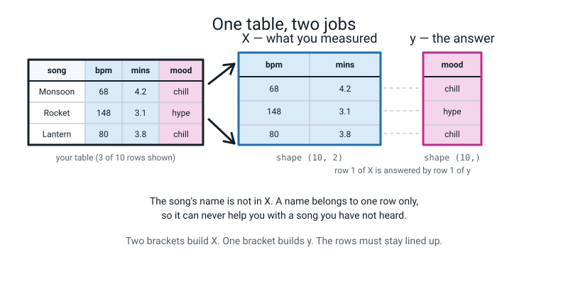
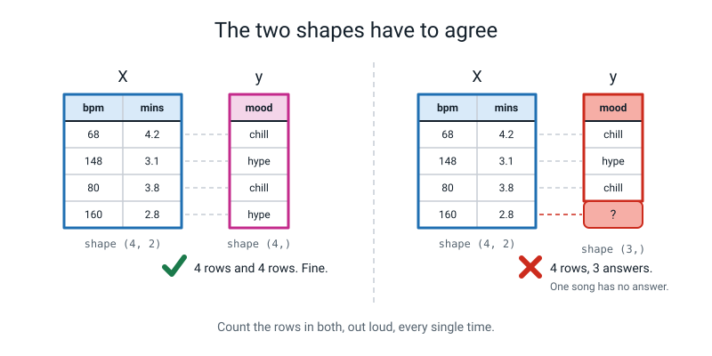
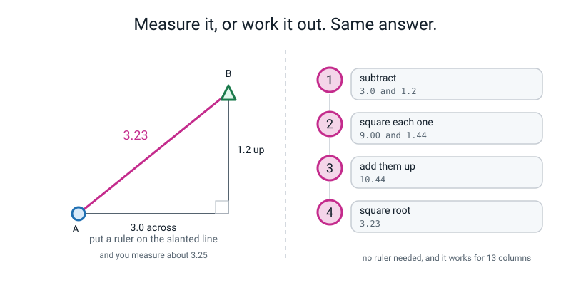
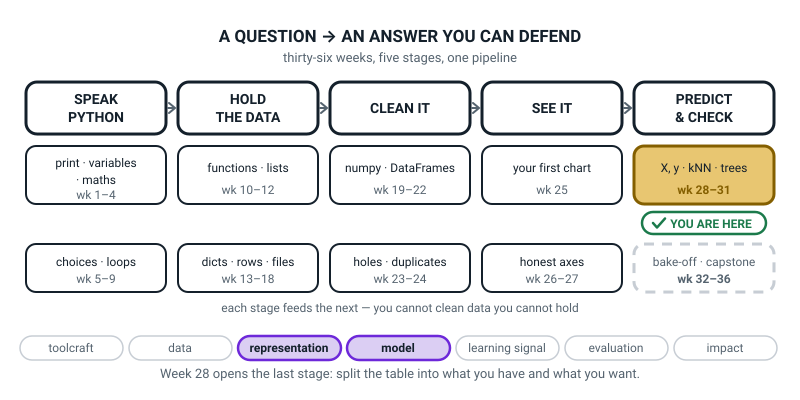
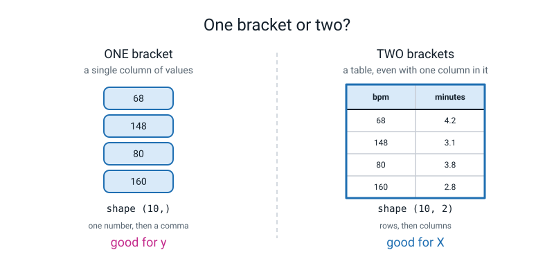
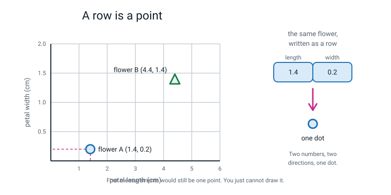

# Week 28 — X and y: Turning Your Table Into a Question

[⬅ Week 27](week-27.md) · [Course Home](../README.md) · [Week 29 ➡](week-29.md) · [Student Guide](../student-guide/week-28.md) · [Workbook](../workbook/week-28.md)

---

## 📋 At a Glance

| | |
|---|---|
| **Duration** | 70 minutes |
| **Type** | 🟦 Teach — the first week of Term 4, and the week Level 1's vocabulary finally becomes code |
| **Big idea** | Every model needs the table split into `X` (what you measured) and `y` (what you want back) — Level 1's *features* and *label*, finally spelled out in code. |
| **New vocabulary** | `X` · `y` · feature matrix · target · Euclidean distance |
| **New syntax** | `from sklearn.datasets import load_iris` · `X = df[["a", "b"]]` (two brackets) · `np.sqrt(x)` · `((row_a - row_b) ** 2).sum()` |
| **Materials** | Printed workbook (`workbook/week-28.md`), especially the Build It pages (the ten-song playlist is in Part 1) and the Draw It page · **squared / graph paper, two sheets** · a ruler with millimetres · a pencil · a calculator · **the sheet from Week 1 of Level 1** where the student wrote what a feature and a label are |
| **Tech needed** | One laptop with Python 3, numpy, pandas, matplotlib **and scikit-learn**. Scikit-learn is new this term — install it *before* the lesson (see Prep). |
| **Prep time** | 20 minutes the night before (15 of which is running the code yourself), 5 minutes on the day |

> **⚠️ Watch out:** the install is the only thing in this week that can eat your lesson. `pip install scikit-learn` downloads about 30 MB and takes a couple of minutes on a good connection. **Do it the night before, and run the smoke test.** If it fails on the day you still have a complete paper lesson — see the Prep Checklist fallback.

---

## 🎯 Lesson Objectives

By the end of the lesson the student can:

1. **Split a table into `X` and `y`** and state the shape of each one out loud.
2. **Explain why `X` needs two sets of brackets and `y` needs one**, in terms of *table* versus *column*.
3. **Load a dataset that ships inside scikit-learn** and print its shape.
4. **Compute the distance between two feature rows by hand on paper**, showing all four steps.
5. **Match the hand-computed distance to numpy's answer to two decimal places.**

Observable evidence: a workbook Build It page with `X.shape` and `y.shape` written in ink, a sheet of graph paper with two points, a right-angled triangle and a ruler measurement on it, and a terminal showing `3.23` next to a hand-written `3.23`.

---

## 🧑‍🏫 What YOU Need to Know First

> **📌 About the code blocks in this guide.** Outside the **🧰 Prep Checklist** and the **🔑 Answer Key**, the blocks are **illustrations, not files** — each one carries on from the one above it, so the `import` lines and the data are typed once, in the first block that needs them. **The complete runnable files are in the Prep Checklist and the Answer Key.** If you paste an illustration on its own and get `NameError`, that is why, and nothing is broken.

**Read this section even if you skip everything else.** It is written for somebody who has never programmed and has never met machine learning. It takes about twenty minutes and it will make you genuinely able to answer "but why?" in class.

### 1. What this term is actually about, in one paragraph

For twenty-seven weeks the student has been *describing* data: putting it in tables, cleaning it, drawing it. This term they start *predicting* with it. A prediction machine — a **model** — is a thing you show a pile of examples with the answers filled in, and which then produces an answer for an example it has never seen.

Every such machine (every *supervised* model, which is every model in this course) wants the data handed to it in exactly two pieces. Not one, not three. Two. This week is about those two pieces and nothing else. **We do not train a model this week.** That is next week. This week we lay the table.

### 2. The two pieces, and why they have such odd names

> **`X`** — the table of measurements. One **row per example**, one **column per measurement**.
> **`y`** — the answers. One value per row, lined up with `X` row for row.

The names come from school algebra, where `y = f(x)` means "y depends on x". A capital `X` because it is a *table* (many rows, many columns), a small `y` because it is a *single column*. Everybody in the world uses these two letters, so the student may as well meet them now. **They are the only two single-letter variable names allowed in this whole course**, and it is worth saying that out loud, because Weeks 1–27 banned them.

The student already knows both of these ideas under different names. In Level 1 they called them **features** and the **label**. Nothing new is being taught here except the spelling.

| Level 1 word | This week's word | What it is |
|---|---|---|
| feature | a column of `X` | one thing you measured |
| the features, all of them | `X`, the **feature matrix** | the whole block of measurements |
| label | `y`, the **target** | the answer you want back |

> **Feature matrix** — a rectangle of numbers: every row is one example, every column is one measurement. "Matrix" is just the maths word for "rectangle of numbers".
> **Target** — the column you are trying to predict. Also called the label.


*Figure 28.1 — One table splits into two. The measurements go into `X`. The answer goes into `y`. The song's name goes into neither.*

### 3. The rule that breaks things silently: rows must stay lined up

This is the one thing in this section that will actually bite you.

`X` and `y` are two separate objects. Nothing inside Python is watching to make sure row 4 of `X` still belongs to answer 4 of `y`. If the student sorts one and not the other, or filters one and not the other, **Python will not complain**. The model will train happily on scrambled data and produce a score that looks plausible and means nothing.

So the habit, and please enforce it out loud every week from now on:

> **Do all your filtering and sorting on the whole table. Pull out `X` and `y` last, and never touch them again.**


*Figure 28.2 — Count the rows in both, every time. Four rows of measurements need four answers, and nothing in Python will tell you when they do not.*

### 4. The brackets. This is the confusing bit, and here is the whole of it

The student has been using `df["column"]` since Week 21. This week they meet `df[["a", "b"]]` and the extra brackets look like a typo. They are not.

```python
one = playlist["bpm"]          # ONE bracket  -> a single column
two = playlist[["bpm"]]        # TWO brackets -> a table that has one column in it
```

Here is the thing that makes it click, and it is worth drawing on paper:

- **The inner brackets are a list.** `["bpm", "minutes"]` is a list of two column names — the same kind of list they built in Week 11.
- **The outer brackets are "look this up in the table."**

So `playlist[["bpm", "minutes"]]` reads as: *look up, in the table, this list of two names.* Ask for a list of names, get a table back. Ask for one name, get one column back.

And that maps exactly onto what we need:

| We want | Brackets | What comes back | Its shape |
|---|---|---|---|
| `X` — a table of measurements | two | a table | `(10, 2)` |
| `y` — one column of answers | one | a column | `(10,)` |

**That shape `(10,)` is not a typo either.** It means "ten things, in a single line". Python writes a one-item description with a trailing comma so you can tell `(10,)` — ten things in a row — from `(10, 1)` — ten rows of one column each. A model wants `y` as `(10,)`. If a student hands it `(10, 1)` they will get a warning, and next week they will meet it.

### 5. Euclidean distance: it is Pythagoras, and it is not new maths

Next week's model works by asking "which known examples is this new one *closest* to?" So we need to be able to say how far apart two rows are. Here is the entire idea.

Walk 3 metres east and 4 metres north. How far are you from where you started? **Not 7.** You went diagonally. The straight-line distance is √(3² + 4²) = √25 = **5**. That is Pythagoras' theorem, which the student may or may not have met in maths yet — it does not matter, because we are going to do it as four counting steps rather than as a theorem.

> **Euclidean distance** — straight-line distance. Subtract, square, add up, square-root.

Say it as a four-step recipe and never as a formula:

1. **Subtract**, column by column. You get one gap per column.
2. **Square** each gap. (Squaring throws the minus signs away, which is exactly what you want — a gap of −3 is just as big as a gap of +3.)
3. **Add** the squares up. One number now.
4. **Square root** it.

Two flowers, using petal length and petal width:

```
flower A = (1.4, 0.2)        flower B = (4.4, 1.4)

step 1  subtract :   1.4 − 4.4 = −3.0      0.2 − 1.4 = −1.2
step 2  square   :   (−3.0)² = 9.00        (−1.2)² = 1.44
step 3  add      :   9.00 + 1.44 = 10.44
step 4  root     :   √10.44 = 3.23
```


*Figure 28.3 — Plot the two flowers, and the distance is a line you can measure with a ruler. The four steps give the same number without the ruler.*

**Why bother with the four steps if you can use a ruler?** Because iris has four measurements per flower, not two, and the wine dataset next fortnight has thirteen. You cannot draw thirteen directions on a sheet of paper. But you can still subtract thirteen times, square thirteen times, add them up and take a root. **The arithmetic works in as many columns as you like; the picture only works in two.** That sentence is the whole reason the four steps exist, and it is worth saying to the student word for word.

### 6. Every line of this week's code, explained to somebody who has never programmed

Here is the complete new syntax for the week. Four things.

```python
from sklearn.datasets import load_iris
```

`sklearn` is the library. `sklearn.datasets` is a room inside it that holds a few small, famous datasets. `load_iris` is a function in that room. This line says: *go into that room and fetch me the thing called `load_iris`, so I can use its name directly.* The student has done this since Week 12 with their own files (`from stats import mean`), so the shape is familiar; only the names are new.

> **⚠️ Watch out:** the thing you install is called **scikit-learn** and the thing you import is called **sklearn**. Two different names for one library. This is genuinely annoying and it is nobody's fault; it is a historical accident. Expect to say it three times.

```python
iris = load_iris()
```

The round brackets *run* the function. Without them you have not fetched the data, you have fetched the machine that fetches the data — and the error message you get later will be confusing. `iris` now holds a bundle: `iris.data` is the table of measurements, `iris.target` is the answers, `iris.feature_names` is the list of column names, `iris.target_names` is the list of flower names.

```python
X = playlist[["bpm", "minutes"]]
y = playlist["mood"]
```

Covered in section 4. Two brackets for the table, one for the column.

```python
gaps = flower_a - flower_b
```

If `flower_a` and `flower_b` are **numpy arrays** (Week 17), this subtracts them column by column and hands back an array of gaps. If they are plain Python **lists**, it crashes — you cannot subtract one list from another. That crash is in the Debugging Clinic and it is a good one to meet.

```python
squares = gaps ** 2
```

`**` is "to the power of" (Week 3). On a numpy array it squares *every* number at once, with no loop. This is the whole point of Weeks 17–20 paying off.

```python
total = squares.sum()
```

Adds every number in the array up (Week 18). Note the brackets — `squares.sum` without them gives you the machine rather than the answer, and produces a genuinely baffling error message. It is in the Clinic.

```python
distance = np.sqrt(total)
```

Square root. That is all `np.sqrt` does.

And the whole thing on one line, which is what the syntax ladder calls for:

```python
distance = np.sqrt(((flower_a - flower_b) ** 2).sum())
```

**Read it from the inside out**, and teach the student to do the same: innermost brackets first (subtract), then square, then `.sum()`, then `np.sqrt`. Four steps, written right to left. If a student finds the one-liner unreadable, let them keep the four separate lines forever. **The four-line version is not the beginner version; it is the readable version.**

### 7. The three misconceptions you will actually meet

**Misconception 1 — "`X` is the answer, because x is what you solve for in maths."**

Very common, and it comes from algebra lessons where `x` is the unknown. Here it is the opposite: `X` is everything you already know, and `y` is the unknown. The fix that works: point at the table and say *"`X` is what you can measure with a ruler. `y` is what you have to be told."* Then have them say which is which for three examples out loud.

**Misconception 2 — "the more columns in `X`, the better."**

They met the truth in Level 1 (a useless column lands exactly on the baseline; a leaky column is worse than useless) and they will meet it again in Week 31. This week the specific instance is the `song` column. A song's *name* appears in exactly one row. A model can only memorise "Rocket → hype", which tells it nothing about a song it has not heard. **Names, IDs and row numbers never go in `X`.** If a student wants to include `song`, do not just say no — ask "what would the model do with the name of a song it has never seen?" and wait.

**Misconception 3 — "the distance number means something on its own."**

It does not. A distance of 12.01 between two songs sounds big; a distance of 3.23 between two flowers sounds small. But the songs were measured in beats per minute (numbers in the hundreds) and the flowers in centimetres (numbers under seven). **A distance is only ever meaningful compared to other distances in the same table.** This is the seed of Week 30's whole lesson, and if a student notices it this week, write their name next to it in the margin and tell them they are two weeks early.

### 8. How deep to go, and where to stop

**Go this far:** `X` and `y`, both shapes, the bracket rule, loading iris, the four distance steps, matching hand arithmetic to numpy.

**Stop before:**
- **Training anything.** No `fit`, no `predict`, no model of any kind. That is Week 29 and it is the whole of Week 29. If a student asks "so how do we actually guess?", the honest answer is *"next week, and it is three lines"* — and then do not spoil it.
- **Scaling.** You will be tempted, because `bpm` in the hundreds against `minutes` under six is an obvious problem and the student may well spot it. If they do: brilliant, write it on the wall, it is Week 30's entire lesson. Do not teach it today.
- **train/test splitting.** Week 29.
- **Any other distance.** There are others (Manhattan, cosine). Not this year.
- **`.values` and numpy-vs-pandas conversions.** Keep `X` as a DataFrame this week. Sklearn accepts DataFrames perfectly happily. Adding `.values` adds a concept and buys nothing today.

---

### 9. 🧭 The Growing Map — two minutes on the stage that just opened

The student guide carries one figure each week that is deliberately not about the week's topic: the
same five-stage pipeline, one more piece filled in. It is the only place either book shows the learner
the shape of the whole year. This week's is the biggest single change it has made since Week 10.



*Figure 28.0 — Week 28's version. The last stage, `PREDICT & CHECK`, goes solid and the gold badge
lands on its first tile, weeks 28 to 31. One dashed box left on the map. Two threads lit:
representation and model.*

**What to do with it, in about two minutes at the end of the lesson:**

1. **Show it and read the three things written in the gold tile — `X, y`, `kNN`, `trees`.** Ask
   *"which of those three did we actually do today?"* You want a finger on **`X, y`** and nothing else.
   Then push once: *"and what is X?"* The answer you are listening for is **the measurements**, or
   the four flower columns, or *the table without the answer column* — any of those is right. If they
   say "the data", ask which part.
2. **Then the question about the shape of the map:** *"count the solid stages — four and a bit out of
   five. So why are we not nearly finished?"* Let it sit. The honest answer is that the last box is
   five weeks long and holds the whole of the capstone, and hearing that now prevents the
   *"we've basically done it"* slump that arrives around Week 32.
3. **Have them ink their own copy** and write their two shapes — `(150, 4)` and `(150,)` — inside the
   tile. Insist on the trailing comma in the second one. It is the entire difference between a table
   and a column, and they have now met it in three different notations.

> **🧑‍🏫 Why this is worth two minutes.** This is a week of two letters and some brackets, and from the
> inside it can feel like the smallest lesson of the term. The map is what tells them otherwise: a
> stage that has been dashed since September is now solid, and it went solid because they can name what
> goes in and what comes out. That is genuinely the whole of the term's setup, and a learner who sees
> it as an arrival rather than a bracket rule types `df[["a", "b"]]` with intent next week.

---

## 🧰 Prep Checklist

### 20 minutes the night before

- [ ] **Install scikit-learn, and do it tonight.** In the terminal, inside the project folder and with the virtual environment active:

  ```bash
  pip install scikit-learn
  ```

  It will print a lot of lines and finish with something like `Successfully installed scikit-learn-1.7.1`. The exact version number does not matter as long as it is 1.0 or higher.

- [ ] **Run the smoke test yourself.** Create a file called `sklearn_check.py` and type this in:

  ```python
  # sklearn_check.py
  # Check that the four libraries are installed and can be imported.

  import numpy as np                      # numbers in arrays (week 17)
  import pandas as pd                     # tables with names on (week 21)
  import matplotlib                       # charts (week 25)
  import sklearn                          # the new one: machine learning

  print("numpy      ", np.__version__)    # print the version of each library
  print("pandas     ", pd.__version__)
  print("matplotlib ", matplotlib.__version__)
  print("scikit-learn", sklearn.__version__)
  print("All four libraries are here.")
  ```

  Run it with `python3 sklearn_check.py`. You should see four version numbers and the last line. Yours will differ from mine; that is fine.

  ```text
  numpy       1.26.4
  pandas      1.5.3
  matplotlib  3.7.1
  scikit-learn 1.7.1
  All four libraries are here.
  ```

  > **🐞 If you see this error:** `ModuleNotFoundError: No module named 'sklearn'` — the install did not land in the Python you are running. Check the virtual environment is active (your prompt should show its name) and try `python3 -m pip install scikit-learn`.

- [ ] **Run the iris loader yourself**, so nothing surprises you on the shared screen. Create `iris_shapes.py`:

  ```python
  # iris_shapes.py
  # A real dataset that comes free inside scikit-learn: 150 iris flowers.

  import numpy as np
  import pandas as pd
  from sklearn.datasets import load_iris   # the new import this week

  iris = load_iris()                       # load it. No file, no download.

  print("X shape:", iris.data.shape)       # the measurements
  print("y shape:", iris.target.shape)     # the answers
  print()
  print("the four things measured:")
  for name in iris.feature_names:          # loop over the column names
      print("   ", name)
  print()
  print("the three kinds of flower:", iris.target_names)
  print("how many of each:", np.bincount(iris.target))
  print()

  # Put it in a DataFrame so week 21-24 skills still work.
  flowers = pd.DataFrame(iris.data, columns=iris.feature_names)
  flowers["species"] = iris.target_names[iris.target]

  # Show just the two petal columns and the answer, so it fits the screen.
  print(flowers[["petal length (cm)", "petal width (cm)", "species"]].head(3))
  ```

  Expected output, exactly:

  ```text
  X shape: (150, 4)
  y shape: (150,)

  the four things measured:
      sepal length (cm)
      sepal width (cm)
      petal length (cm)
      petal width (cm)

  the three kinds of flower: ['setosa' 'versicolor' 'virginica']
  how many of each: [50 50 50]

     petal length (cm)  petal width (cm) species
  0                1.4               0.2  setosa
  1                1.4               0.2  setosa
  2                1.3               0.2  setosa
  ```

- [ ] **Do the distance by hand yourself, with a pencil.** √10.44 = 3.23. Two minutes. It buys you fifteen minutes of confidence.
- [ ] Print the workbook (`workbook/week-28.md`), or at least the Build It and Draw It pages.
- [ ] **Find the Level 1 Week 1 sheet** where the student wrote, in their own words, what a feature is and what a label is. This is the emotional centre of the lesson. If it is genuinely lost, the fallback is below.
- [ ] Read section 4 (the brackets) twice. It is the thing you will be asked about most.

### 5 minutes on the day

- [ ] Laptop on, terminal open, virtual environment active, editor open on an empty file.
- [ ] Run `sklearn_check.py` once, now, before the student arrives. If it works now it will work in ten minutes.
- [ ] Two sheets of graph paper and a millimetre ruler on the table.
- [ ] The Week 1 sheet, face down, where the student cannot see it.
- [ ] A blank sheet headed **SHAPES** in big letters, landscape. Every shape found today gets written on it.

### Fallback if a laptop or an install fails

| If this fails | Do this instead |
|---|---|
| **scikit-learn will not install** | The whole lesson runs on paper and one graph. The iris numbers you need for the activity are just two rows, flower A and flower B, which you write on the board; the workbook's Puzzle of the Week prints four more real rows and Build It Part 4 adds flower C. Do the split, the shapes and the distance by hand; type the code next week when the install is fixed. **You lose nothing today except the printout of `(150, 4)`.** |
| **No laptop at all** | Same as above. This is the most paper-friendly week of Term 4, deliberately, because the term's install lands here. |
| **The student cannot find their Week 1 sheet** | Ask them to write the two definitions again, right now, from memory, before you say anything else about the lesson. Then keep that sheet. It works nearly as well and it is a fair test. |
| **No graph paper** | Any lined paper turned sideways, or draw a 10×10 grid with a ruler. Or use the pre-drawn frame on the workbook's Draw It page. |
| **The student read ahead and already knows about kNN** | Excellent. Hand them the keyboard and make *them* explain to you why `X` needs two brackets. Then give them the harder distance question from Differentiation → flying. Do **not** let them train a model today; hold that line, because next week's lesson is built on the anticipation. |

---

## ⏱️ The Lesson, Minute by Minute

| Segment | Minutes | Running total | What happens |
|---|---|---|---|
| 🪝 Hook — Read Your Own Handwriting From Six Months Ago | 7 | 7 | The Week 1 sheet comes back out |
| 🧠 Concept — Two Pieces, Two Shapes, Two Brackets | 16 | 23 | `X`, `y`, and why the brackets differ |
| 💻 Live-Code Together — Split a Table, Load Iris | 18 | 41 | Both of you typing; two deliberate mistakes |
| 🎲 Their Turn — Ruler, Pythagoras, numpy | 20 | 61 | Three routes to 3.23, and they must agree |
| 🔑 Wrap & Assign | 9 | 70 | Three checks, the takeaway, homework |

---

### 🪝 Hook — Read Your Own Handwriting From Six Months Ago (7 minutes)

**Do this:** Sit down with the Week 1 sheet still face down. Do not open the laptop yet.

**Say this:**

> "Before we start anything today, I want you to read something out loud. It's not mine. You wrote it."

*(Turn the sheet over and slide it across.)*

> "Somewhere on there you wrote down, in your own words, what a **feature** is and what a **label** is. Read me both of them, exactly as you wrote them."

Let them read it. Let it be a bit awkward or a bit funny or a bit wrong. Do not correct anything.

> "Right. Now — was that hard to read back? Do you still agree with it?"

*(However they answer.)*

> "Here's why I dug that out. You have been ready for today's lesson for **six months**. You already know what a feature is. You already know what a label is. You know features go in and the label comes out. You know a name column is useless because it only shows up once. You know all of it.
>
> What you haven't had, until today, is the **spelling**. And that's genuinely all today is. The whole world of machine learning agrees on two letters for those two things, and they are `X` and `y`. Capital X. Small y.
>
> `X` is your features. All of them, in a block. `y` is your label, in a single column.
>
> And I want to be honest about the size of today's lesson, because it's smaller than it looks. We are not going to make anything predict anything today. Not one guess. Today we lay the table. Next week we eat."

**Do this:** Write on the SHAPES sheet, big:

```
X  =  what you measured        (a TABLE)
y  =  what you want back       (one COLUMN)
```

**Ask this:**

| Ask | Answer you want | If they say something else |
|---|---|---|
| "In the fruit-bowl table from Level 1 — colour, mass, length, and then apple/orange/banana — what's `X` and what's `y`?" | `X` = colour, mass, length. `y` = the fruit name. | If they put the fruit name in `X`, say: "If you already know it's an apple, what are you predicting?" and wait. |
| "Guessing which club someone joins from their age and their practice hours. `X`? `y`?" | `X` = age and hours. `y` = the club. | If they hesitate, ask the two questions in order: "What can you measure?" then "What has to be told to you?" |
| "Why do you reckon everybody uses two letters instead of proper names?" | Because it's the same two things every single time, in every problem. | If they say "because programmers are lazy" — fair, and half right. Add: "and because it's the *only* place in this course where a one-letter name is allowed." |
| "Anything on your Week 1 sheet you'd change now?" | Anything. This is a free question. | If they say no, that is a fine answer. If they spot something wrong, that is a better one. Either way, keep the sheet. |

---

### 🧠 Concept — Two Pieces, Two Shapes, Two Brackets (16 minutes)

**Do this:** Put the workbook's Build It page between you — the ten-song playlist table printed in Part 1. Nothing on the laptop yet.

| song | bpm | minutes | **mood** |
|---|---|---|---|
| Monsoon | 68 | 4.2 | **chill** |
| Rocket | 148 | 3.1 | **hype** |
| Lantern | 80 | 3.8 | **chill** |
| Corridor | 160 | 2.8 | **hype** |
| Firecracker | 152 | 3.4 | **hype** |
| Slow Bus | 72 | 5.1 | **chill** |
| Neon | 168 | 2.6 | **hype** |
| Paper Boat | 76 | 4.6 | **chill** |
| Stadium | 140 | 3.0 | **hype** |
| Rooftop | 84 | 5.4 | **chill** |

**Say this — part 1, the split:**

> "Ten songs off a playlist. For each one somebody measured two things: the **beats per minute**, which is how fast it feels, and how many **minutes** long it is. And then somebody listened to it and wrote down whether it's a chill song or a hype song.
>
> Point at the columns that go into `X`."

Let them point. `bpm` and `minutes`.

> "Point at the column that is `y`."

`mood`.

> "And what happens to `song`?"

Wait for it. If they say "it goes in X", ask the question: *"What would a machine do with the name of a song it has never heard?"*

> "Nothing. It goes in neither. A song's name shows up in exactly one row of this table. A machine can memorise 'Rocket is hype' and that helps it precisely never, because next time you'll hand it something called 'Umbrella' and it has learnt nothing at all.
>
> **Names, ID numbers and row numbers never go in `X`.** Not because it's a rule somebody made up — because there's nothing in there to learn."

**Say this — part 2, the shapes:**

> "Now the bit I actually want you to be able to say out loud, because I'm going to ask you for it every week for the rest of the year. **The shape.**
>
> `X` is ten rows and two columns. So we write its shape as `(10, 2)`. Rows first, columns second. Always in that order.
>
> `y` is ten answers, in one line. And here's where Python does something that looks like a typo. It writes that shape as `(10,)`. Ten, comma, nothing.
>
> Say it: 'ten comma nothing'."

Have them say it. It sounds ridiculous, which is why it sticks.

> "That trailing comma is Python telling you, on purpose: *this is a single line of ten things, not a table.* Because there's another shape it could have been — `(10, 1)`, which means ten rows of one column each. A skinny table. And a model wants `y` as a single line, not a skinny table. So the comma matters."

**Do this:** Write on the SHAPES sheet:

```
X.shape  =  (10, 2)     rows, then columns
y.shape  =  (10,)       ten comma nothing
```

**Say this — part 3, the brackets:**

> "Last thing before we type. How do we get those two pieces out of the table?
>
> You already know how to get one column. You've been doing it since Week 21: `playlist["mood"]`. One bracket, one name, one column back. That's `y`, done.
>
> For `X` we need **two** columns, and Python does something that looks like a mistake:

```
playlist[["bpm", "minutes"]]
```

> Two square brackets on each side. And it is not a typo. Look at what's actually happening. What's `["bpm", "minutes"]` on its own?"

Wait. They know this. It is a list — Week 11.

> "It's a **list**. A list of two column names. So the inner brackets are just a list, exactly the same as `[1, 2, 3]`. And the outer brackets are the normal 'look this up in the table' brackets.
>
> So the whole thing reads: **look up, in the table, this list of names.** Ask for a *list* of names, get a *table* back. Ask for *one* name, get *one column* back.
>
> One bracket, a column. Two brackets, a table. `y` wants a column. `X` wants a table."


*Figure 28.4 — Ask for one name and you get a column. Ask for a list of names and you get a table. `y` wants the first. `X` wants the second.*

**Ask this:**

| Ask | Answer you want | If they say something else |
|---|---|---|
| "`X` has shape `(10, 2)`. What's the 10 and what's the 2?" | 10 songs, 2 measurements. Rows then columns. | If they swap them, point at the table and count out loud together. Then write "rows, then columns" on the SHAPES sheet and underline it twice. |
| "Why not put `song` in `X`?" | It's unique to one row; there's nothing to learn from it. | If they say "because it's words not numbers" — that's a real and different objection, and worth crediting. Reply: "Good, that's true too. But `mood` is words as well and it's fine. The killer is that a name never repeats." |
| "What's the shape of `y`?" | `(10,)`. | If they say `(10, 1)`, say: "Close, and it's a real shape — but it means a skinny table. We want a single line." |
| "If I added a third measurement — how loud it is — what changes?" | `X.shape` becomes `(10, 3)`. `y` doesn't change at all. | If they change `y` too, go back to the table and count the answers. Adding a column never adds an answer. |
| "How many brackets for a table? How many for a column?" | Two. One. | Drill this until it's instant. It is the most-typed mistake of the term. |

---

### 💻 Live-Code Together — Split a Table, Load Iris (18 minutes)

**Two chairs, one keyboard, and the student types.** You dictate; they type; you both read the output before moving on. If you have two machines, type in parallel — but you still read every output out loud before continuing.

**Do this:** New file, saved as `x_and_y.py` in the project folder.

**Keystroke sequence — part 1, build the table (4 minutes).**

Dictate exactly this. The comments are part of the dictation; do not skip them.

```python
# x_and_y.py
# Split one table into X (what we measured) and y (what we want back).

import pandas as pd

playlist = pd.DataFrame({
    "song":    ["Monsoon", "Rocket", "Lantern", "Corridor", "Firecracker",
                "Slow Bus", "Neon", "Paper Boat", "Stadium", "Rooftop"],
    "bpm":     [68, 148, 80, 160, 152, 72, 168, 76, 140, 84],
    "minutes": [4.2, 3.1, 3.8, 2.8, 3.4, 5.1, 2.6, 4.6, 3.0, 5.4],
    "mood":    ["chill", "hype", "chill", "hype", "hype",
                "chill", "hype", "chill", "hype", "chill"],
})

print(playlist)
```

Run it:

```text
          song  bpm  minutes   mood
0      Monsoon   68      4.2  chill
1       Rocket  148      3.1   hype
2      Lantern   80      3.8  chill
3     Corridor  160      2.8   hype
4  Firecracker  152      3.4   hype
5     Slow Bus   72      5.1  chill
6         Neon  168      2.6   hype
7   Paper Boat   76      4.6  chill
8      Stadium  140      3.0   hype
9      Rooftop   84      5.4  chill
```

Ten seconds of "yes, that's the table on the page", and move on.

**Keystroke sequence — part 2, ⚠️ DELIBERATE MISTAKE NUMBER ONE (5 minutes).**

**Do this:** Delete the `print(playlist)` line. Now type this, deliberately wrong, with one bracket:

```python
X = playlist["bpm", "minutes"]
print(X)
```

**Say this before you run it:**

> "Now. I'm going to get this wrong on purpose, because I want you to see the error *before* you make it yourself at ten o'clock tonight with nobody to ask. I've used one bracket where I need two. Watch."

Run it. You get this — and it is long:

```text
Traceback (most recent call last):
  File ".../pandas/core/indexes/base.py", line 3802, in get_loc
    return self._engine.get_loc(casted_key)
  ...
KeyError: ('bpm', 'minutes')

The above exception was the direct cause of the following exception:

Traceback (most recent call last):
  File "/Users/you/project/x_and_y.py", line 15, in <module>
    X = playlist["bpm", "minutes"]
  File ".../pandas/core/frame.py", line 3807, in __getitem__
    indexer = self.columns.get_loc(key)
  File ".../pandas/core/indexes/base.py", line 3804, in get_loc
    raise KeyError(key) from err
KeyError: ('bpm', 'minutes')
```

**Say this:**

> "Right. That is a *wall* of text and I want to teach you how to not be frightened of it. Same rule as always: **read the last line first.**
>
> `KeyError: ('bpm', 'minutes')`
>
> `KeyError` means 'I looked for a name and there is no column with that name.' And look what it says it went looking for: `('bpm', 'minutes')` — both of them, joined together, as one single name. Because with one bracket, that's what pandas thinks I asked for. One column, whose name is the pair 'bpm-and-minutes'. There isn't one. So: KeyError.
>
> And ignore everything in the middle. All those lines about `base.py` and `frame.py` are pandas showing you its own insides. **The line you care about is the one with your own filename in it**, which is line 15, which is the line I just typed."

Now fix it in front of them — add the second bracket:

```python
X = playlist[["bpm", "minutes"]]
print(X)
```

Run. The two-column table appears. Say: *"One character. That's the whole bug."*

**Keystroke sequence — part 3, the shapes (4 minutes).**

Replace the `print(X)` line and add:

```python
X = playlist[["bpm", "minutes"]]        # TWO brackets -> a table of features
y = playlist["mood"]                    # ONE bracket  -> a single column

print("X is a", type(X).__name__)       # what kind of thing did we get?
print("y is a", type(y).__name__)
print()
print("X.shape:", X.shape)              # (rows, columns)
print("y.shape:", y.shape)              # (rows,)  <- one number, then a comma
print()
print("first three rows of X:")
print(X.head(3))
print()
print("first three labels:")
print(y.head(3))
```

Run it:

```text
X is a DataFrame
y is a Series

X.shape: (10, 2)
y.shape: (10,)

first three rows of X:
   bpm  minutes
0   68      4.2
1  148      3.1
2   80      3.8

first three labels:
0    chill
1     hype
2    chill
Name: mood, dtype: object
```

**Say this:**

> "There it is. `X` is a **DataFrame** — that's pandas' word for a table. `y` is a **Series** — pandas' word for a single column. Two brackets gave a table, one bracket gave a column, exactly as advertised.
>
> And read me the two shapes."

Have them read `(10, 2)` and `(10,)` out loud. Have them write both on the SHAPES sheet themselves.

**Keystroke sequence — part 4, iris (5 minutes).**

**Do this:** New file, `iris_shapes.py`. Dictate the file from the Prep Checklist above, exactly as printed there. Run it. The output is in the Prep Checklist and should match line for line.

**Say this:**

> "Hundred and fifty flowers. Four measurements each. Somebody actually went out and measured a hundred and fifty irises with a ruler, back in the 1930s, and it is still the first dataset everybody learns on. You did not download anything — it came inside the library.
>
> `X shape: (150, 4)`. A hundred and fifty rows, four columns. `y shape: (150,)`. A hundred and fifty answers, ten comma nothing style. Same two shapes as our playlist, just bigger.
>
> Fifty of each flower, look — `[50 50 50]`. Perfectly balanced, which is unusual and convenient and we will come back to why that matters."

**Ask this:**

| Ask | Answer you want | If they say something else |
|---|---|---|
| "The traceback was fifteen lines. Which line mattered?" | The last one, and the one with our filename in it. | If they say "all of them", say: "Read me the third line." Then: "What did that tell you about your bug?" Nothing. That's the point. |
| "`KeyError: ('bpm', 'minutes')` — what did pandas think I wanted?" | One column with a weird two-part name. | If they can't say it, point at the brackets in the error and the brackets in the code side by side. |
| "iris `X` is `(150, 4)`. How many flowers, how many measurements?" | 150 flowers, 4 measurements. | If reversed, ask "would somebody measure four flowers a hundred and fifty times?" |
| "Where's the file the iris data came from?" | There isn't one — it's inside the library. | This surprises them. Worth a sentence: "Somebody put it in the box for you." |

---

### 🎲 Their Turn — Ruler, Pythagoras, numpy (20 minutes)

Full instructions in the next section. In the lesson flow:

- **Minutes 0–7:** plot the two flowers on graph paper, draw the triangle, measure the slanted line with a ruler.
- **Minutes 7–13:** the four steps with a pencil. √10.44.
- **Minutes 13–20:** the same thing in numpy, including ⚠️ **deliberate mistake number two**. All three answers must agree to 2 dp.

---

## 🐞 The Debugging Clinic

Every error below was produced by actually running a broken version of this week's code. The messages are copied out verbatim; the long middle sections of the tracebacks are trimmed with `...` where they only show the library's own insides.

| What the student sees (real message) | What it means | Most likely cause | The fix |
|---|---|---|---|
| `KeyError: ('bpm', 'minutes')` | "I went looking for a column whose name is that whole pair, and there isn't one." | `playlist["bpm", "minutes"]` — one bracket where two are needed. | Add the inner brackets: `playlist[["bpm", "minutes"]]`. |
| `KeyError: "['minute'] not in index"` | "One of the names on your list is not a column in this table." Note it names the culprit. | A typo in a column name — `minute` for `minutes`. | Fix the spelling. `print(playlist.columns)` shows the exact names, including any stray spaces. |
| `TypeError: unsupported operand type(s) for -: 'list' and 'list'` | "You cannot subtract one list from another. Lists are not numbers." | `flower_a = [1.4, 0.2]` instead of `np.array([1.4, 0.2])`. | Wrap both in `np.array(...)`. Only numpy arrays subtract column by column. |
| `AttributeError: 'function' object has no attribute 'data'` | "The thing you're asking for `.data` from is a machine, not data." | `iris = load_iris` — the brackets were left off, so `iris` holds the function itself. | `iris = load_iris()`. The brackets are what run it. |
| `TypeError: 'tuple' object is not callable` | "You put brackets after something that isn't a function." | `iris.data.shape()` — `shape` is already the answer; it is not a machine you run. | Drop the brackets: `iris.data.shape`. (Compare `.sum()`, which *is* a machine and does need them.) |
| `TypeError: loop of ufunc does not support argument 0 of type builtin_function_or_method which has no callable sqrt method` | "You asked me for the square root of a machine instead of a number." | `total = (gaps ** 2).sum` — the brackets after `sum` were forgotten. | `total = (gaps ** 2).sum()`. |
| `ImportError: cannot import name 'load_irs' from 'sklearn.datasets'` | "That room exists, but there is nothing in it with that name." | Typo in the function name: `load_irs` for `load_iris`. | Fix the spelling. |
| `ModuleNotFoundError: No module named 'sklearn'` | "There is no library by that name in the Python I am running." | scikit-learn is not installed, or is installed in a different Python. | `pip install scikit-learn` with the virtual environment active. Remember: install **scikit-learn**, import **sklearn**. |
| `SyntaxError: invalid syntax` pointing at `import scikit-learn` | "The hyphen is a minus sign to me, and this is not arithmetic." | The student typed the *install* name into an `import` line. | `import sklearn`. Say it out loud: "install scikit-learn, import sklearn." |

### How to teach debugging without giving the answer

The escalation ladder, in order. Do not skip a rung, and count to ten in your head between rungs.

1. **"Read me the last line."** Out loud. Nothing else. Half of all bugs die here.
2. **"Which line of *your* file is it pointing at?"** Teach them to scan the traceback for their own filename and ignore everything else.
3. **"What was Python looking for, and what did it find?"** Every error message names both. `KeyError: ('bpm', 'minutes')` tells you exactly what it went hunting for.
4. **"What did you change since it last worked?"** If the answer is "loads", that is the real lesson: run it more often.
5. **Point at the line. Say nothing.** Just your finger on the screen.
6. **Point at the character.**
7. **Only now, tell them.** And when you do, say what the *class* of mistake was, not just the fix: "that's a brackets-versus-no-brackets one, and you'll meet it again."

> **🧑‍🏫 If a student asks:** *"Why is the error so long when the mistake is one character?"* — because the error is a *route map*. Python is showing you every room it walked through on its way to the crash. The first rooms are pandas' rooms and you did not write them. The last line is the crash, and the line with your filename is where you sent it in the wrong direction. Reading a traceback is a skill, and being able to ignore 80% of it is most of the skill.

---

## 🎲 The Activity, In Full

### Two Flowers, Three Ways to the Same Number

The point of this activity is not the arithmetic. It is the **agreement**. The student measures a length with a ruler, computes it with a pencil, and computes it with numpy, and all three come out at 3.23. When the same number arrives by three completely different routes, it stops being a formula you were told and becomes a fact about the world.

### Setup

**On the table:** graph paper, a millimetre ruler, a pencil, a calculator, the workbook's Draw It page (the pre-drawn frame, as backup), the laptop with the editor open.

**On the board or SHAPES sheet, written before you start:**

```
flower A  =  (1.4, 0.2)
flower B  =  (4.4, 1.4)
```

Tell them where those numbers came from: they are rows 0 and 65 of the real iris table, using **petal length** and **petal width** only. Flower A is a *setosa*; flower B is a *versicolor*. Two of the four measurements, because two is all you can draw.

### Step 1 — Plot them (7 minutes)

1. Draw two axes in the bottom-left corner of the graph paper. Across the bottom: **petal length, in cm, 0 to 6**. Up the side: **petal width, in cm, 0 to 2**.
2. **Agree the scale out loud and write it on the sheet: 1 cm on the paper = 0.5 cm of flower.** So one unit of flower is two centimetres of paper. This matters — if they use a different scale on each axis the triangle will be the wrong shape and the ruler answer will be wrong.
3. Mark flower A at (1.4, 0.2). Mark flower B at (4.4, 1.4). Use a **circle** for A and a **triangle** for B — different shapes, not just different colours, so it still reads in pencil.
4. Join A to B with a straight line.
5. Now complete the right-angled triangle: from A, go straight across to sit underneath B; then straight up to B.


*Figure 28.5 — Two numbers become one dot. The two dots become a triangle, and the distance is the slanted side.*

### Step 2 — Measure it, then work it out (6 minutes)

**Measure first.** Put the ruler on the slanted line. It should read about **6.5 cm on the paper**. Divide by 2 (because 2 cm of paper = 1 unit of flower) and you get **≈ 3.25**.

**Say this:**

> "Write that down and put a box round it. That is a measurement, so it's allowed to be a bit off. Rulers and pencils are not exact. We're going to see how close we got."

**Now the four steps, with a pencil.** Have them write all four lines out; do not let them do it in their head.

```
step 1   subtract      1.4 − 4.4 = −3.0        0.2 − 1.4 = −1.2
step 2   square        (−3.0)² = 9.00          (−1.2)² = 1.44
step 3   add up        9.00 + 1.44 = 10.44
step 4   square root   √10.44 = 3.2310988...
                                = 3.23  (2 dp)
```

**Ask, before they take the root:** *"Is your answer going to be bigger or smaller than 10.44?"* The answer is smaller, and a surprising number of people have to think about it. Square roots of numbers above 1 always come down.

### Step 3 — And now numpy (7 minutes)

**Do this:** New file, `distance_by_hand.py`. **⚠️ Deliberate mistake number two goes here.** Dictate this first, with plain lists:

```python
import numpy as np
flower_a = [1.4, 0.2]
flower_b = [4.4, 1.4]
gaps = flower_a - flower_b
print(gaps)
```

Run it:

```text
Traceback (most recent call last):
  File "/Users/you/project/distance_by_hand.py", line 4, in <module>
    gaps = flower_a - flower_b
TypeError: unsupported operand type(s) for -: 'list' and 'list'
```

**Say this:**

> "Last line. `TypeError: unsupported operand type(s) for -: 'list' and 'list'`. Unpack that. `operand` means 'a thing an operator works on'. The operator is the minus sign. And it's telling me the two things I gave it are both **lists**.
>
> You cannot subtract one list from another. A list is a row of boxes; it isn't a number. Back in Week 11 you found that adding two lists glues them together instead of adding them up — this is the same family of surprise.
>
> **numpy arrays** are the things that subtract column by column. That's exactly what we built them for in Week 17. One word each side and we're fixed."

Fix it in front of them:

```python
flower_a = np.array([1.4, 0.2])
flower_b = np.array([4.4, 1.4])
```

Run again: `[-3.  -1.2]`. **The same two gaps they wrote in pencil.** Stop and point at that. Then dictate the rest:

```python
# distance_by_hand.py
# The distance between two flowers, one step at a time.

import numpy as np
from sklearn.datasets import load_iris

iris = load_iris()

# Columns 2 and 3 are petal length and petal width. 2:4 means "columns 2 and 3".
flower_a = iris.data[0, 2:4]             # row 0, the two petal columns
flower_b = iris.data[65, 2:4]            # row 65, the two petal columns

print("flower A:", flower_a, iris.target_names[iris.target[0]])
print("flower B:", flower_b, iris.target_names[iris.target[65]])
print()

gaps = flower_a - flower_b               # step 1: subtract, column by column
print("step 1  subtract   :", gaps)

squares = gaps ** 2                      # step 2: square each gap
print("step 2  square     :", squares)

total = squares.sum()                    # step 3: add the squares up
print("step 3  add up     :", total)

distance = np.sqrt(total)                # step 4: square root of the total
print("step 4  square root:", distance)
print()
print("distance rounded to 2 dp:", round(distance, 2))
print()
print("all four steps in one line:", np.sqrt(((flower_a - flower_b) ** 2).sum()))
```

Real output:

```text
flower A: [1.4 0.2] setosa
flower B: [4.4 1.4] versicolor

step 1  subtract   : [-3.  -1.2]
step 2  square     : [9.   1.44]
step 3  add up     : 10.440000000000003
step 4  square root: 3.2310988842807027

distance rounded to 2 dp: 3.23

all four steps in one line: 3.2310988842807027
```

> **🧑‍🏫 If a student asks:** *"Why does it say `10.440000000000003`? We got 10.44."* — **You are both right, and the computer is the one being slightly odd.** Computers store decimals in binary, the way we store thirds in decimal. One third is 0.3333… forever; you have to stop somewhere, and where you stop is a tiny error. `1.4` and `4.4` are numbers that do not fit exactly in binary, so the first gap really comes out as `-3.0000000000000004` (print `gaps[0]` with `repr` to see it) — a hair off. Squaring carries the hair into the total, fifteen decimal places down. It makes no difference to anything you will ever do — and it is why we round before we report. This is not a bug in Python. Every programming language on earth does this, and every professional has met it.

**Now the agreement.** Write all three on the SHAPES sheet, side by side:

```
ruler        ≈  3.25       (a measurement, allowed to be a bit off)
pencil          3.23       (exact arithmetic, rounded)
numpy           3.23       (exact arithmetic, rounded)
```

**Say this:**

> "Two of those agree to the last digit, and the third one agrees as well as a pencil line and a plastic ruler can. You did not take my word for anything today. You measured it, you worked it out, and you got the machine to work it out, and all three came back with the same answer.
>
> And here's the sentence I actually want you to leave with. The ruler only worked because there were **two** measurements. Iris has four. Next fortnight we'll use a wine dataset with **thirteen**. You cannot draw thirteen directions on a piece of paper — but you can still subtract thirteen times, square thirteen times, add them up and take one root. **The arithmetic goes as far as you like. The picture stops at two.**"

### What "finished" looks like

- A sheet of graph paper with two labelled axes, a written scale, two differently-shaped points, and a right-angled triangle.
- A ruler measurement, in a box, written down **before** the arithmetic was done.
- Four lines of pencil arithmetic, one per step, with `10.44` and `3.23` visible.
- A terminal showing `3.23`.
- All three numbers written next to each other, and the student able to say why the ruler one is slightly different.

### Variation — easier

- **Use nicer numbers.** Do the plain 3-and-4 version first: two points 3 units apart across and 4 up. √(9 + 16) = √25 = **exactly 5**, and the ruler agrees beautifully. Then, and only then, do the real flowers.
- **Pre-draw the axes** on the graph paper before class, with the scale already written on.
- **Do steps 1 and 2 orally together** and let them write only steps 3 and 4.
- **Drop the numpy part entirely** and finish with the ruler-and-pencil agreement. That delivers objectives 1, 4 and 5 completely. Type the code next lesson.

### Variation — harder

1. **A third flower.** Row 100 of iris is a *virginica* with petals `(6.0, 2.5)`. Compute A-to-C and B-to-C as well. Then the question: **"Which of the three pairs is closest together, and does that match which two are the same species?"** *(A–B = 3.23, A–C = 5.14, B–C = 1.94. The closest pair is B–C, and they are* different *species — versicolor and virginica. That is a genuinely interesting failure, and it is why next week's model asks several neighbours to vote instead of trusting the closest one.)*
2. **All four columns.** Do the distance between rows 0 and 65 using all four measurements instead of two. Four subtractions, four squares, one root. `iris.data[0]` and `iris.data[65]` with no slicing. **Ask them to predict, before computing, whether the answer will be bigger or smaller than 3.23.** *(Bigger — 3.63. Adding more columns can only add more squares, and squares are never negative, so a distance never shrinks when you add a column.)*
3. **Break the line-up on purpose.** Sort `X` by `bpm` but leave `y` alone. Print them side by side and find the row where the mood no longer matches the song. Then write one sentence on why Python did not warn you.
4. **Zero distance.** Find two rows of iris whose petal distance is exactly 0.00 *(rows 0 and 1 — both `(1.4, 0.2)`)*. Then: "Are they the same flower?" *(No. They are two different flowers with identical petals. Same point, different plant. This matters next week when a model has to choose between them.)*

---

## ❓ Questions Students Ask This Week

**"Why capital X and small y? Is that just to be annoying?"**

There is an actual reason. A capital letter is the convention for a *table* — many rows, many columns. A small letter is the convention for a single line of values. So `X` is capital because it is a rectangle and `y` is small because it is a line. It comes from maths notation that is older than computers, and the whole world now agrees on it, so you will see the same two letters in every book, every tutorial and every library. It is one of the very few things in this field that nobody argues about.

**"Can `y` be a number instead of a category?"**

Yes, and that is a genuinely different kind of problem. If `y` is chill-or-hype, you are picking from a short list, and a guess is simply right or wrong. If `y` is *how many minutes long the song is*, you are predicting a number, and a guess can be *nearly* right — 3.1 when the truth was 3.2 is a good guess, not a wrong one. Level 1 called these two things classification and regression. We do the first kind for the next four weeks and the number kind in Week 32.

**"What if two columns are measured in totally different sizes? `bpm` is in the hundreds and `minutes` is under six."**

**That is the best question anybody can ask this week, and you have just found Week 30's entire lesson two weeks early.** The honest answer: it is a real and serious problem, it will wreck a model that measures distance, and there is a standard fix. Do not let me explain it today — write it on the wall with your name and the date, and hold me to it in a fortnight. *(Teacher: mean it. Write it on the wall. This is the single best moment in the week if it happens.)*

**"Why is the iris dataset flowers? Nobody cares about flowers."**

Fair. It is flowers because a statistician called Ronald Fisher published an analysis of it in 1936 (the flowers were measured by Edgar Anderson), and it stuck — the way "hello, world" stuck. What makes it useful is not the flowers: it is that it is small enough to print, it has three classes rather than two, and two of the three classes genuinely overlap, so a model *cannot* get 100% and you get to see honest mistakes. A dataset where everything works is a bad teaching dataset. There is also a real problem with its history worth knowing: Fisher was a prominent eugenicist, and some people now avoid the dataset for that reason and use others instead. Both positions are held by serious people.

**"Does the order of the columns in `X` matter?"**

No, and yes. **For the arithmetic, no**: swap `bpm` and `minutes` and every distance comes out identical, because addition does not care what order you add things in. **For your sanity, yes**: `model.coef_` in Week 32 and `feature_importances_` in Week 31 hand you back a list of numbers *in the order of your columns*, with no names attached. If you shuffle the columns between two runs and forget, you will read the wrong number as the wrong feature. So pick an order and keep it.

**"How far apart do two things have to be before they count as 'far'?"** *(Answer honestly: nobody has a general answer.)*

**Nobody agrees on this, and it is not a dodge — it is a real open question in how these systems get used.** A distance of 3.23 is meaningless on its own. It is not big or small; it is 3.23 *of whatever units the columns happened to be in.* Change centimetres to millimetres and the same two flowers are 32.3 apart, without a single flower moving. So the only honest use of a distance is **comparing it with other distances in the same table**: this flower is closer to that one than to the third one. Where people genuinely disagree is what to do when the columns are in different units — how much to squash the big ones, whether to squash them at all, whether some columns *deserve* more say than others. There is a standard default (Week 30's), it is a good default, and it is a choice rather than a fact. Practitioners argue about it constantly.

**"Could I just include the song name and let the machine sort it out?"**

You can put it in, and something worse than an error will happen: it will appear to work brilliantly and be worthless. Every name is unique, so a model can look up "Rocket → hype" perfectly and score 100% on the songs it has already seen. Then the first new song arrives, its name has never appeared before, and the model has nothing at all. Level 1 had a word for a column that scores perfectly and helps never — a **leak**. The three-second test still applies: *at the moment I need the answer, does this value tell me anything about a case I have not seen?* A name never does.

---

## ⚠️ Where This Lesson Goes Wrong

| What happens | Why | What to do right now |
|---|---|---|
| scikit-learn is not installed and the lesson stalls in minute 2 | The install was left to the day | Switch to the paper version immediately — the activity needs only two iris rows (A and B), and the Puzzle of the Week prints four more. Do not spend lesson time on pip. Fix the install afterwards, alone. |
| The student writes `X` as one bracket every single time | Two brackets look like a typo, and the brain corrects typos | Do not just correct it. Make them say the sentence out loud each time: **"a list of names, so a table comes back."** Three or four repetitions and it lands. |
| Shapes get read backwards — `(150, 4)` as four flowers | Nothing in the notation says which is which | Enforce the phrase **"rows, then columns"** every single time a shape is spoken, all term. Write it on the SHAPES sheet and point at it rather than saying it. |
| The `(10,)` trailing comma is dismissed as a typo | It looks exactly like a typo | Show them `(10, 1)` next to `(10,)` and ask which is the skinny table. The comma is doing a job: it says "there is no second number". |
| The ruler answer disagrees with the arithmetic by a lot | Different scale on the two axes, so the triangle is the wrong shape | Check the scale first, before anything else. Write it on the paper: **1 cm of paper = 0.5 cm of flower**, on *both* axes. |
| The student uses their head for step 2 and gets 1.44 wrong | Squaring a decimal is genuinely fiddly | Insist all four steps are written on paper, one line each. And a calculator is fine — this is not an arithmetic test. |
| A minus sign survives into step 2 | They wrote `−3.0² = −9` | Say it in words: "minus three, times minus three." Two negatives. Then have them do `(−1.2)²` out loud the same way. A squared number can never come out negative. |
| The output shows `10.440000000000003` and confidence collapses | It looks like the whole method just failed | Have the "if a student asks" answer ready and treat it as interesting rather than embarrassing. It is a real fact about computers and it is worth two honest minutes. |
| The student tries to train something | The whole term has been advertised as "make it predict" | Hold the line kindly: "Next week, and it's three lines of code, and you'll be ready for it. Today we lay the table." Then give them a harder-variation task so the energy has somewhere to go. |
| Fifteen minutes disappear into what "matrix" means | It is a scary word and it is on the page | One sentence and move on: "a rectangle of numbers." Nothing else about matrices is needed this year. |

---

## 🧭 Differentiation

### If the student is struggling

**Cut:** iris. Do the whole lesson on the ten-song playlist. Ten rows you can see beats a hundred and fifty you cannot, and every objective except number 3 is fully deliverable on the playlist alone.

**Cut:** the one-line version of the distance. Four separate lines, forever, with four `print`s. It is not the beginner version — it is the readable version, and plenty of professionals write it that way.

**Reteach the shapes physically.** Cut the ten-song table into ten paper strips. Then cut each strip in two: the `bpm`/`minutes` end and the `mood` end. Put all ten measurement-halves in one pile and all ten answer-halves in another, **keeping them in order**. Count each pile out loud. "Ten rows and two columns." "Ten answers." Then deliberately shuffle one pile and ask what has just been broken. Physically sorting objects makes the line-up rule obvious in a way that no amount of explanation does.

**Copy-this-exactly scaffold.** Give them this and nothing else. Every line already correct, only the blanks to fill:

```python
import numpy as np

flower_a = np.array([1.4, 0.2])          # petal length, petal width
flower_b = np.array([4.4, 1.4])

gaps = flower_a - flower_b               # step 1
print("gaps:", gaps)                     # you should see [-3.  -1.2]

squares = gaps ** 2                      # step 2
print("squares:", squares)               # you should see [9.   1.44]

total = squares.sum()                     # step 3
print("total:", total)                    # you should see about 10.44

distance = np.sqrt(total)                 # step 4
print("distance:", round(distance, 2))    # you should see 3.23
```

Each `print` carries the answer it should produce. They fix the first line that disagrees and no others. This is a real professional technique, not a crutch — say so.

**The one thing you must not cut:** the ruler-and-pencil agreement. If the lesson collapses to one idea, make it *"a row of numbers is a point, and the distance between two points is something you can measure."*

### If the student is flying

Everything here uses only syntax they already have. Nothing new.

1. **The third flower** (Variation — harder, item 1). B and C are the closest pair and they are different species. Let that sit unresolved; it is Week 30.
2. **Four columns instead of two** (item 2), with the prediction made first. 3.63.
3. **Distance from one row to every row, with no loop.** They have broadcasting from Week 18 and `axis=1` from Week 19. This is the real payoff:

   ```python
   # distance_to_all.py
   # One mystery flower against six known ones, and no loop for the arithmetic.

   import numpy as np

   # Six real rows copied out of the iris table: petal length, petal width.
   six = np.array([[1.4, 0.2],              # rows 0-2 of iris: all setosa
                   [1.4, 0.2],
                   [1.3, 0.2],
                   [4.7, 1.4],              # rows 50-52 of iris: all versicolor
                   [4.5, 1.5],
                   [4.9, 1.5]])
   names = ["setosa", "setosa", "setosa",
            "versicolor", "versicolor", "versicolor"]

   mystery = np.array([3.0, 1.0])           # a flower somebody handed us

   print("the six known flowers:")
   print(six)
   print("shape:", six.shape)
   print()
   print("mystery flower:", mystery)
   print()

   gaps = six - mystery                     # broadcasting: one row against six rows
   squares = gaps ** 2                      # square every number in the block
   totals = squares.sum(axis=1)             # axis=1 -> add across each row
   distances = np.sqrt(totals)              # square root of each total

   print("distance to each of the six:", np.round(distances, 2))
   print()

   closest = distances.min()                # the smallest distance in the array
   for i in range(6):                       # walk the six and print them tidily
       mark = "  <- closest" if distances[i] == closest else ""
       print(f"  {names[i]:<11} distance {distances[i]:.2f}{mark}")
   ```

   ```text
   the six known flowers:
   [[1.4 0.2]
    [1.4 0.2]
    [1.3 0.2]
    [4.7 1.4]
    [4.5 1.5]
    [4.9 1.5]]
   shape: (6, 2)

   mystery flower: [3. 1.]

   distance to each of the six: [1.79 1.79 1.88 1.75 1.58 1.96]

     setosa      distance 1.79
     setosa      distance 1.79
     setosa      distance 1.88
     versicolor  distance 1.75
     versicolor  distance 1.58  <- closest
     versicolor  distance 1.96
   ```

   Then the question that sets up next week: **"The closest one is a versicolor. But look at the whole list — how confident are you?"** *(Not very. 1.58, 1.75, 1.79, 1.79 — the top four are almost tied and they are not all the same species. Next week's model asks several of them to vote instead of trusting the single closest, and this is exactly why.)*

4. **Break the line-up on purpose** (item 3), then write the one-sentence explanation of why Python said nothing.
5. **Design the leak.** "Invent a column for the playlist table that would score perfectly and be useless. Make it subtle enough that I might not notice." Good answers: `times_i_skipped_it`, `which_workout_playlist_it_is_on`, `the_filename`.

### If the student won't engage today

Do the Hook and the graph paper, and stop.

The Week 1 sheet is a genuinely good moment even on a bad day — it costs nothing and it is about them rather than about Python. Then go straight to the graph paper and make it a game rather than a lesson: **"Guess The Distance."** You name two points, they eyeball the distance, then you both measure with the ruler. Best of ten. Keep score.

> (0,0) and (3,4) → 5 · (1,1) and (4,5) → 5 · (0,0) and (5,0) → 5 · (2,3) and (2,8) → 5 · (0,0) and (1,1) → 1.41 · (0,0) and (2,2) → 2.83 · (1,2) and (4,6) → 5 · (0,5) and (5,0) → 7.07 · (3,3) and (6,7) → 5 · (0,0) and (6,8) → 10

Six of those are 5, which is a nice trap and provokes the right question. That game delivers objectives 4 and 5 completely and takes twelve minutes. The code survives to next lesson perfectly well; Week 29 opens with a recap anyway.

---

## ✅ Assessing Understanding

Three checks, five minutes, exact wording.

**Check 1 — the split (spoken, with a table in front of them)**

> "Here's a table: five columns — pupil name, hours of sleep, minutes of exercise, screen time, and then whether they felt tired the next day. Tell me `X`, tell me `y`, and tell me what happens to the leftover column."

*Good answer:* `X` = sleep, exercise, screen time. `y` = tired-or-not. The name goes in neither, because a name only ever appears once. **What to catch:** putting `tired` into `X` (they have not separated the question from the evidence), or putting `name` into `X` (they have not internalised the leak). Full marks needs all three parts.

**Check 2 — the shapes (spoken)**

> "That table has forty rows. What's the shape of `X`? What's the shape of `y`?"

*Good answer:* `X` is `(40, 3)`. `y` is `(40,)`. **What to catch:** `(3, 40)` — they have reversed rows and columns; go back to the SHAPES sheet and read the phrase off it. Also catch `(40, 1)` for `y`, which is close and worth a nudge: "that's a skinny table; we want a single line."

**Check 3 — the distance (written, 90 seconds)**

> "Two points. Point one is at (2, 1). Point two is at (5, 5). Write me all four steps and the answer."

*Good answer:*

```
step 1   2 − 5 = −3        1 − 5 = −4
step 2   (−3)² = 9         (−4)² = 16
step 3   9 + 16 = 25
step 4   √25 = 5
```

Full marks needs all four lines written down, not just the 5. **What to catch:** an answer of 7 (they added the gaps instead of the squares) — draw the triangle and ask which is longer, the two straight sides or the slanted one. Also catch a negative answer at step 2.

### Mastery scale for this week

| Level | What it looks like |
|---|---|
| **1 — Not yet** | Cannot say which column is `y`. Puts the answer column inside `X`. Cannot state a shape at all. |
| **2 — Emerging** | Splits the table correctly when prompted. Reads shapes but reverses rows and columns. Does the distance with the four steps written out for them. |
| **3 — Secure** | Splits a fresh table into `X` and `y` unaided, states both shapes correctly and in the right order, uses two brackets for `X` without being told, and computes a distance by hand in four steps that matches numpy to 2 dp. **This is the target.** |
| **4 — Strong** | Explains *why* two brackets give a table (a list of names goes in, a table comes out). Explains why a name column is excluded, using Level 1's leak language. Predicts, before computing, that adding a column can only make a distance bigger. |
| **5 — Exceptional** | Notices unprompted that `bpm` in the hundreds will swamp `minutes` under six, and can say *why* using the squares. Sees that a distance is only meaningful relative to other distances in the same table. Spots that two flowers can sit at distance 0.00 and still be two different flowers. |

---

## 📤 Homework to Assign

**Say this:**

> "Two things, about an hour altogether, and the second one is the one that matters.
>
> **First, Build It, Parts 1 and 2 — build `X` and `y` from your own table.** Use the table you have been carrying since Week 21. Write down `X.shape` and `y.shape` in ink, and next to each one write, in words, what the numbers mean: 'ten rows, meaning ten songs' — not just the digits. If your own table has gone walkabout, the ten-song playlist is printed in Part 1 and you can use that.
>
> **Second, one distance, twice, and they must match.** Pick any two rows of your table. Compute the distance between them **on paper**, all four steps, each on its own line — subtract, square, add, root. Then compute the same distance in numpy. Then write both numbers next to each other, rounded to two decimal places, and they had better be the same.
>
> And one thing I want you to notice while you do it, and write one sentence about, which is **Part 3: look at which column made the biggest contribution at step 2.** Not step 4. Step 2, where the squares are. One of your columns is going to be doing nearly all the work, and I want you to notice which and say how much. That sentence is worth more marks than the distance is."

**Workbook sections** (`workbook/week-28.md`): the **Draw It** page is used **in class**, during the activity. **Build It, Parts 1–3** are the core **homework**. The workbook's older "page 28.5 / 28.6" labels inside Build It are just Parts 1 and 2.

**The rest of the workbook** is for the week around the lesson, in this order of priority: **Warm-Up** and **Predict the Output** (short; good to open the next sitting), **Practice Set A** and **Fix the Broken Program** (the two that catch misunderstandings), then **Practice Set B**, **Puzzle of the Week**, **Think Deeper**, **Build It Part 4** (the extension, optional) and **Part 5** (Bug Log), and **Self-Check** last. Nothing in the workbook has to be finished before Week 29 except Build It Parts 1–3.

**Expected time:** 20 min for Build It Part 1 (`X` and `y` and the shapes) · 25 min for Part 2 (the distance done twice) · 15 min for Part 3 (shares and the sentence). About 60 minutes for the core. Allow roughly another 90 minutes across the week if the rest is set.

---

## 🔑 Answer Key

This key follows the workbook section by section, with every item answered, in the same order the student meets them. The values are the ones in the workbook's own Answers section, which has been checked; the distances, shares and shapes were recomputed for this guide and agree. Every code block below was run before it was pasted here, and the outputs are real.

### Warm-Up — W1 to W5

*Teacher note: these five are Week 27 recall and worth two minutes, not ten. Accept any wording that carries the idea. The usual wrong answer to W3 is "error" — the test is that there is no `Traceback` and the program carries on.*

**W1.** **No error.** It sets the **bottom** of the axis to 48.6 and leaves the top exactly where matplotlib had already put it. One of Week 27's silent bugs: it invents half of what you did not say.

**W2.** `axes[0]` and `axes[1]`. **Not** `axes[1]` and `axes[2]` — `axes` is a numpy array with two slots, numbered from zero.

**W3.** A **warning**, not an error: *"No artists with labels found to put in legend."* The program carries on, the file gets saved, and there is no legend on it. You can tell it is a warning because there is no `Traceback` and the next `print` still runs.

**W4.** Any of: it is **not a percentage** · not a slope · not a proof of cause · not "93% of the score comes from studying". It is a position on a scale from −1 through 0 to +1.

**W5.** **Hot weather.** The word is **confounder** — a hidden third thing causing both of the things you measured.

### Predict the Output — P1 to P4

*Teacher note: mark the written prediction, not whether it was right. A wrong prediction that was committed to in ink is worth more than a right one made after running the code.*

**P1** — real output:

```text
Series (3,)
DataFrame (3, 1)
False
```

**What is different?** Both asked for `bpm`. One bracket gave a **Series** — a single column, one direction, shape `(3,)`. Two brackets gave a **DataFrame** — a table, two directions, shape `(3, 1)`. **Same numbers inside; different kind of container.**

The inner brackets in `playlist[["bpm"]]` are a **list**, and asking a table for a *list of names* gets you a *table* back — even when the list has only one name in it.

**Which for `X`, which for `y`?** `X` wants the **DataFrame** (two brackets). `y` wants the **Series** (one bracket).

**P2** — real output:

```text
-4.2
10.44
3.2310988842807022
3.23
```

**Line 1 skipped step 2, the squaring.** `-3.0 + -1.2 = -4.2`. And notice it came out **negative**, which no distance ever can — that is the clearest possible sign a step is missing. Squaring exists partly to make the minus signs go away.

**Which would you write in a report?** **3.23.** Seventeen digits of precision on a flower somebody measured with a ruler in the 1930s is not honesty, it is noise. **Round when you report; never round in the middle of the arithmetic.**

**P3** — real output:

```text
[-3. -4.]
[3. 4.]
5.0
5.0
```

**Which step made lines 3 and 4 the same?** **Step 2, squaring.** `(-3)² = 9` and `3² = 9`. The minus signs disappear, so it stops mattering which way round you subtracted.

**Does the order matter?** **No.** The distance from A to B is always the distance from B to A. Which is a good sanity check: if swapping your two rows changes your answer, you have made an arithmetic slip.

*(And notice the answer is 5.0, not 7. Three across and four up gets you five away. It is the Week 28 trick in miniature.)*

**P4** — real output:

```text
4
0 1 2
versicolor
(4,)
```

**Line 2 — what are those numbers?** They are **codes**, not names. scikit-learn stores the answers as `0`, `1` and `2`, and keeps the names in a separate list called `target_names`. So flower 0 is species 0, flower 75 is species 1, flower 149 is species 2 — and because the file is sorted by species, those three happen to give you one of each.

**Line 3** is how you turn a code back into a name: `iris.target_names[1]` is `'versicolor'`.

**Line 4 — what is `iris.data[0]`?** **One row**, on its own — a single line of four numbers, shape `(4,)`. Not a table with one row in it, which would be `(1, 4)`. That difference is going to matter next week when `predict` insists on a table.

### Practice Set A — Read It (A1 to A6)

*Teacher note: in A3 the usual wrong answer is to match (b) `playlist[["mood"]]` with the Series because "it is one column". Point at the inner brackets: a list of names comes in, so a table comes back. In A1 credit the student who argues about repeating dates or shops (see the notes under A1).*

**A1.**

| # | `X` | `y` | In neither, and why |
|---|---|---|---|
| a | bpm, minutes | mood | `song` — a name appears in exactly one row, so there is nothing in it that transfers to a new song |
| b | the four measurements | species | `flower id` — a row number. It says nothing about the plant |
| c | hours slept, minutes of exercise, screen hours | felt tired | `pupil name` — unique per row |
| d | temperature, cloud cover, wind speed | rained today | `date` — every date appears once |
| e | price, distance, rating | would order again | `shop` — a name |

*(On (d): if you argued that a date could become `month` or `day_of_week`, which **do** repeat, you are right and those are perfectly good features. The **raw** date is not. On (e): if you argued that the same shop can appear twice, you have made a genuinely good point — but the moment a new shop appears you are stuck again, and you cannot tell in advance which shops will repeat. So the rule stays.)*

**A1(f).** The model would score **100%** and be worthless. `mood` **is** the answer, so you would be handing over the answer and asking for it back. Level 1 called it a **leak**. The test: at the moment you actually need the prediction, do you have this value? For a brand-new song you do not — that is the whole reason you wanted a prediction.

**A1(g).** Because a row number describes **where the row sits in your file**, not the thing the row is about. Sort the file differently and every row number changes while nothing about any song changes. **A feature has to be a property of the thing.**

**A2.**

| # | `X.shape` | `y.shape` |
|---|---|---|
| a | `(10, 2)` | `(10,)` |
| b | `(150, 4)` | `(150,)` |
| c | `(40, 3)` | `(40,)` |
| d | `(178, 13)` | `(178,)` |
| e | `(6, 2)` | `(6,)` |
| f | `(1, 4)` | — there is no `y` |

**A2(g).** It means **"there is no second number."** It marks the shape as a single line of ten values rather than a table. Without it, `(10)` would just be the number ten in brackets. Compare `(10, 1)`, which is ten rows of one column — a skinny table, not a line.

**A2(h).** `X.shape` becomes `(40, 4)`. `y.shape` stays `(40,)`. **Adding a column never adds an answer.**

**A2(i).** `X.shape` = `(35, 3)` and `y.shape` = `(35,)`. **Both change, together, always.** Which is exactly why you delete rows from the whole table *before* you pull `X` and `y` out — then it is impossible to get wrong.

**A2(j).** Because you do not know it. That single flower is the thing you want the model to tell you about. **`y` is what you are asking for, so of course it is missing.**

**A3.**

| # | The code | Answer |
|---|---|---|
| a | `playlist["mood"]` | **ii** — a Series, `(10,)` |
| b | `playlist[["mood"]]` | **iv** — a DataFrame, `(10, 1)` |
| c | `playlist[["bpm", "minutes"]]` | **i** — a DataFrame, `(10, 2)` |
| d | `playlist["bpm", "minutes"]` | **iii** — a `KeyError` |

**A3(e).** **(c) and (d).** The difference is **one character**: the inner `[`. Without it, pandas thinks you are asking for a single column whose name is the pair `('bpm', 'minutes')`, and there is no such column.

**A3(f).** *"A list of names, so a table comes back."* Say it every single time you type two brackets. Three or four repetitions and your fingers will do it without you.

**A4.**

| # | The fix |
|---|---|
| a | `X = playlist[["bpm", "minutes"]]` — add the inner brackets |
| b | Take `"mood"` out of `X`. It is the answer; it cannot also be evidence |
| c | `print(X.shape)` — `.shape` is a **fact**, not a machine. No brackets |
| d | `total = squares.sum()` — `.sum()` **is** a machine, so it does need them |
| e | Wrap both in `np.array(...)`. Plain lists do not subtract |
| f | `iris = load_iris()` — the brackets are what **run** it |
| g | Take `"song"` out. A name appears once, so there is nothing to learn |
| h | `distance = np.sqrt(squares.sum())` — step 4 is a square **root**, not a square |

**A4(i).** **(b).** *(Strictly, (b), (g) and (h) all run without an error at that line. (g) and the words-in-`X` version of (b) will be refused by scikit-learn later, because it cannot turn `chill` or a song title into a number. (h) runs but gives a wrong number, which an attentive student will catch. (b) is the answer the question wants because, once the answer column is stored as numbers such as 0 and 1, it never crashes and never looks wrong.)*

**A4(j).** Because it produces a model that scores **100%**, which looks like the best possible outcome, so nobody goes looking. **A bug that lowers your score gets found. A bug that raises it gets shipped.**

**A5.**

| Slot | Answer |
|---|---|
| **Top box** | `X` — the measurements: `bpm` and `minutes` |
| **Bottom box** | `y` — the answer: `mood` |
| **Both shapes** | `X.shape = (10, 2)` and `y.shape = (10,)` |

**A5(a).** `song`. It went **nowhere** — not into `X`, not into `y`. A song name appears in exactly one row.

**A5(b).** Top: **two.** Bottom: **one.**

**A6.**

- **Which line first?** The **last** one, always: `KeyError: ('bpm', 'minutes')`.
- **Which line is about you?** The one with **your own filename** in it: `File "/Users/you/project/x_and_y.py", line 15`.
- **`KeyError` means** *"I went looking for a column with that name and there isn't one."*
- **Why the pair?** Because with **one** bracket, `playlist["bpm", "minutes"]` asks for a single column whose name is the whole pair. That is a legitimate thing to ask a pandas table (some tables really do have paired column names) — so pandas took you at your word, looked for it, and did not find it.
- **How many lines are yours?** **One.** Everything else is pandas showing you its own insides.

*(Worth meeting the friendlier cousin on purpose: `playlist[["bpm", "minute"]]` — `minutes` misspelled — gives `KeyError: "['minute'] not in index"`, which **names the culprit**. And `print(playlist.columns)` shows you the exact spellings, including any stray spaces.)*

### Practice Set B — Write It (B1 to B5)

**B1.**

```python
print("X.shape:", X.shape, "  y.shape:", y.shape)
```

```text
X.shape: (10, 2)   y.shape: (10,)
```

**The three numbers:** 10 songs · 2 measurements each · 10 answers.

**B2.**

```python
# cricket_x_and_y.py
# Six players, split into what we measured and what we want back.

import pandas as pd

team = pd.DataFrame({
    "player":  ["Asha", "Ravi", "Meera", "Karan", "Divya", "Sanjay"],
    "runs":    [312, 41, 288, 27, 350, 19],
    "wickets": [1, 14, 0, 17, 2, 21],
    "role":    ["batter", "bowler", "batter", "bowler", "batter", "bowler"],
})

X = team[["runs", "wickets"]]            # two brackets -> a table
y = team["role"]                         # one bracket  -> a column

print("X.shape:", X.shape, "-> 6 players, 2 measurements each")
print("y.shape:", y.shape, "-> 6 answers, in one line")
print("the column in neither:", "player")
```

```text
X.shape: (6, 2) -> 6 players, 2 measurements each
y.shape: (6,) -> 6 answers, in one line
the column in neither: player
```

**B3.**

```python
# one_distance.py
# Asha against Ravi, all four steps on four lines.

import numpy as np

asha = np.array([312.0, 1.0])            # runs, wickets
ravi = np.array([41.0, 14.0])

gaps = asha - ravi                       # step 1  subtract
squares = gaps ** 2                      # step 2  square
total = squares.sum()                    # step 3  add up
distance = np.sqrt(total)                # step 4  square root

print("step 1  subtract   :", gaps)
print("step 2  square     :", squares)
print("step 3  add up     :", total)
print("step 4  square root:", distance)
print("2 dp               :", round(float(distance), 2))
```

```text
step 1  subtract   : [271. -13.]
step 2  square     : [73441.   169.]
step 3  add up     : 73610.0
step 4  square root: 271.31162894354526
2 dp               : 271.31
```

**And the thing worth noticing:** `runs` contributed 73441 of 73610 — **99.77%**. `wickets` contributed 0.23%. A model using this distance is sorting cricketers by run count and almost ignoring their wickets. Hold that thought; it is Week 30's whole lesson.

**B4.**

```python
# iris_shapes.py
# A real dataset that comes free inside scikit-learn.

import numpy as np
from sklearn.datasets import load_iris

iris = load_iris()                       # the () is what RUNS it

print("X shape:", iris.data.shape)
print("y shape:", iris.target.shape)
print("the four things measured:")
for name in iris.feature_names:
    print("   ", name)
print("the three kinds of flower:", iris.target_names)
print("how many of each:", np.bincount(iris.target))
```

```text
X shape: (150, 4)
y shape: (150,)
the four things measured:
    sepal length (cm)
    sepal width (cm)
    petal length (cm)
    petal width (cm)
the three kinds of flower: ['setosa' 'versicolor' 'virginica']
how many of each: [50 50 50]
```

**Fifty of each**, which is unusually tidy and one of the reasons iris is the dataset everybody learns on. Real tables are almost never balanced like that.

**B5.**

```python
# nearest_song.py
# Which known song is the mystery song most like?

import numpy as np

known = np.array([[68.0, 4.2],
                  [148.0, 3.1],
                  [80.0, 3.8],
                  [160.0, 2.8],
                  [152.0, 3.4],
                  [72.0, 5.1]])
names = ["Monsoon", "Rocket", "Lantern", "Corridor", "Firecracker", "Slow Bus"]
moods = ["chill", "hype", "chill", "hype", "hype", "chill"]

mystery = np.array([100.0, 4.0])
print("mystery song: bpm 100, 4.0 minutes")
print()

results = []                             # collect (distance, name, mood) tuples
for i in range(len(known)):
    gaps = known[i] - mystery            # step 1
    squares = gaps ** 2                  # step 2
    total = squares.sum()                # step 3
    distance = np.sqrt(total)            # step 4
    results.append((distance, names[i], moods[i]))

for distance, name, mood in sorted(results):     # sorted by the FIRST item
    print(f"{distance:7.2f}   {name:12s} {mood}")
print()
print("nearest is", sorted(results)[0][1], "->", sorted(results)[0][2])
```

```text
mystery song: bpm 100, 4.0 minutes

  20.00   Lantern      chill
  28.02   Slow Bus     chill
  32.00   Monsoon      chill
  48.01   Rocket       hype
  52.00   Firecracker  hype
  60.01   Corridor     hype

nearest is Lantern -> chill
```

**Two things worth noticing.** The three chill songs are all closer than all three hype songs — **the distances have sorted themselves into the two moods**, with no model involved at all. That is the whole reason next week's model works.

And look at the decimals: `20.00`, `28.02`, `32.00`. The lengths are barely moving the numbers. **Nearly all of every one of those distances is bpm.**

### Fix the Broken Program — Bugs 1 to 3

*Teacher note: students nearly always find Bugs 1 and 2 and miss Bug 3, because it prints no error. If stuck, ask only: "How many columns should `X` have, and how many does it have?" Do not name the line.*

**Bug 1 — the syntax error.**

**Did any of it run?** **No.** Two tells, both instant: there is **no `Traceback`**, and nothing at all got printed. Python never started the program — it could not finish reading the file.

**Why does the arrow point at the opening `(`?** Because an open bracket is a perfectly legal way to **continue onto the next line** — that is how the `train_test_split` calls get split across lines next week. So Python keeps reading, hoping for a `)`, until it runs out of file. Then it reports the place where the bracket was **opened**, because that is the last spot it was certain about.

**The fix:**

```python
print("X.shape:", X.shape)
```

**Bug 2 — the runtime error.**

**Which two lines are yours?** The line naming your own file (`line 18`) and the last line (`KeyError`). The rest is pandas.

**What did pandas think you wanted?** A single column named `('hours_slept', 'revision_mins')` — both names joined into one. That is what one bracket around two names asks for.

**The fix:**

```python
tara = np.array(pupils[["hours_slept", "revision_mins"]].iloc[0])
```

**Bug 3 — the silent one.**

**`X.shape` should have been `(5, 2)`.** It came out `(5, 3)` because there are three names in the list.

**Which line:**

```python
X = pupils[["hours_slept", "revision_mins", "passed"]]
```

`"passed"` is in `X` **and** it is `y`.

**What would happen if you trained on it?** The model would score **100%**, or extremely close to it, on any test you gave it — because one of its input columns *is* the answer. (As written, `passed` holds the words `yes` and `no`, so scikit-learn would actually refuse it; the leak only stays silent once the words are stored as numbers such as 1 and 0.) It would look like the best model anybody had ever built. And the first time you handed it a real new pupil, you would have nothing to put in that column, because whether they passed is exactly what you were trying to find out.

**What Level 1 called it:** a **leak**.

**The fix:**

```python
X = pupils[["hours_slept", "revision_mins"]]
```

**The three-second test:** *at the moment I actually need the prediction, do I already have this value?* If yes, it does not belong in `X`.

**The shares.** Total = 12.25 + 4900 = 4912.25.

- `hours_slept`: 12.25 ÷ 4912.25 × 100 = **0.25 %**
- `revision_mins`: 4900 ÷ 4912.25 × 100 = **99.75 %**

Confirmed by a real run:

```python
import numpy as np
squares = np.array([12.25, 4900.0])
total = squares.sum()
print("total:", total)
print("hours_slept  :", round(float(100 * squares[0] / total), 2), "%")
print("revision_mins:", round(float(100 * squares[1] / total), 2), "%")
```

```text
total: 4912.25
hours_slept  : 0.25 %
revision_mins: 99.75 %
```

### Puzzle of the Week — Parts 1 and 2, (a) to (k)

**Part 1 — Two flowers, wrong species, wrong distance**

**(a)**

| pair | step 1 (gaps) | step 2 (squares) | step 3 (total) | step 4 |
|---|---|---|---|---|
| 52 – 101 | −0.2, −0.4 | 0.04, 0.16 | 0.20 | √0.20 = **0.45** |
| 100 – 101 | 0.9, 0.6 | 0.81, 0.36 | 1.17 | √1.17 = **1.08** |
| 100 – 103 | 0.4, 0.7 | 0.16, 0.49 | 0.65 | √0.65 = **0.81** |

Confirmed in code:

```python
# puzzle_28.py
import numpy as np
from sklearn.datasets import load_iris

iris = load_iris()
for i, j in [(52, 101), (100, 101), (100, 103)]:
    a = iris.data[i, 2:4]                 # petal length and width
    b = iris.data[j, 2:4]
    gaps = a - b
    squares = gaps ** 2
    print(f"rows {i:3d} and {j:3d}:  gaps {np.round(gaps, 2)}"
          f"  squares {np.round(squares, 2)}"
          f"  total {round(float(squares.sum()), 2)}"
          f"  distance {round(float(np.sqrt(squares.sum())), 2)}")
```

```text
rows  52 and 101:  gaps [-0.2 -0.4]  squares [0.04 0.16]  total 0.2  distance 0.45
rows 100 and 101:  gaps [0.9 0.6]  squares [0.81 0.36]  total 1.17  distance 1.08
rows 100 and 103:  gaps [0.4 0.7]  squares [0.16 0.49]  total 0.65  distance 0.81
```

**(b)** **The two flowers of different species are closer together than the two flowers of the same species.** Row 52 is a versicolor and row 101 is a virginica, and they sit **0.45** apart. Rows 100 and 101 are *both* virginica and they sit **1.08** apart — more than twice as far.

**(c)** **0.45 < 0.81 < 1.08.** And the smallest one is the cross-species pair.

**(d)** A model that decides species by finding the single nearest flower, and has only these four rows to go on, will get row 101 **wrong** — it will look around, find a versicolor closer than any of its own kind, and call it versicolor. **The species overlap, so "nearest" and "same kind" are not the same thing.**

**(e)** Several good answers, all of which are worth credit:

- **More columns.** We are only using two of the four measurements. The sepal columns might separate these two rows.
- **More neighbours.** Ask the nearest *five* instead of the nearest one, so a single close-but-wrong flower cannot decide the answer on its own. **That is exactly what next week's `k` is for**, and if you wrote this, you have invented Week 29 a week early.
- **Honesty.** Have the model say "I am not sure" when the nearest two disagree and are nearly tied.

**Part 2 — The unit that flips the answer**

**(f)** Length in **minutes**. Monsoon `(68, 4.2)`, Lantern `(80, 3.8)`.

| | gap | squared | share |
|---|---|---|---|
| bpm | −12 | 144 | **99.89 %** |
| minutes | 0.4 | 0.16 | **0.11 %** |
| | | total: **144.16** | distance: **12.01** |

**(g)** Length in **seconds**. Monsoon `(68, 252)`, Lantern `(80, 228)`.

| | gap | squared | share |
|---|---|---|---|
| bpm | −12 | 144 | **20.00 %** |
| seconds | 24 | 576 | **80.00 %** |
| | | total: **720** | distance: **26.83** |

Confirmed:

```python
# units_flip.py
import numpy as np

for unit, a, b in [("minutes", np.array([68.0, 4.2]), np.array([80.0, 3.8])),
                   ("seconds", np.array([68.0, 252.0]), np.array([80.0, 228.0]))]:
    squares = (a - b) ** 2
    total = squares.sum()
    print(f"length in {unit}:")
    print(f"   bpm share    : {100 * squares[0] / total:.2f} %")
    print(f"   length share : {100 * squares[1] / total:.2f} %")
    print(f"   distance     : {np.sqrt(total):.2f}")
```

```text
length in minutes:
   bpm share    : 99.89 %
   length share : 0.11 %
   distance     : 12.01
length in seconds:
   bpm share    : 20.00 %
   length share : 80.00 %
   distance     : 26.83
```

**(h)**

| length measured in… | bpm's share | length's share |
|---|---|---|
| minutes | 99.89 % | 0.11 % |
| seconds | 20.00 % | 80.00 % |

**(i)** **Zero songs changed. Zero notes were re-recorded.**

**(j)** Something with this shape:

> Nothing about the two songs changed — only the word at the top of a column — and yet which measurement did nearly all the work flipped completely over, from bpm doing 99.89% to length doing 80%. **So a distance is not a fact about the songs. It is a fact about the songs *and* the units somebody happened to choose.**

**(k)** Write bpm in **beats per second** instead — divide by 60. Then the bpm gap becomes 12 ÷ 60 = 0.2, squared 0.04, against the minutes gap's 0.16. Length would now be doing about **80%** of the work with lengths in minutes. *(Any unit that shrinks the bpm numbers works: beats per second, or bpm as a fraction of the fastest song, or anything similar. The point is that you can put whichever column you like in charge, just by choosing units — which is precisely why nobody should be allowed to.)*

### Think Deeper — T1 and T2

**T1.** Model answer:

> *`days_in_recovery_ward` must not go in `X`. Run the three-second test: at the moment I actually need the prediction — before the operation — do I have this value? No. Nobody has spent any days in a recovery ward yet, because the surgery has not happened. The column can only be filled in afterwards.*
>
> *If I leave it in, my model will score close to 100%, because almost everybody with a non-zero recovery-ward count had surgery and almost everybody with zero did not. It will look like the best model in the hospital. And the first time somebody uses it on a real new patient, they will have nothing to put in that column, so they will type a zero — and the model will confidently say "no surgery needed" for every single patient, including the ones who need it most urgently.*
>
> *The chapter's rules do not ban it, and that is the interesting part. It is not a name and not a row number. **The rule it breaks is about time.** A feature has to be something you would genuinely know *before* the answer exists. `days_in_recovery_ward` is a consequence of the answer, not evidence for it, and a column that is a consequence of the answer is the answer wearing a disguise.*
>
> *In a table like this I would also be suspicious of anything named like `discharge_date`, `anaesthetist_assigned`, `surgeon_name`, or `theatre_booked` — all of them describe things that only happen because the decision was already made.*

**Marking note:** full marks needs (1) the three-second test applied explicitly, (2) a specific prediction about the score **and** about what happens on a new patient, (3) the timing rule named as something the chapter's rules do not cover, and (4) one plausible extra column.

**T2.** Model answer:

> *For thirteen columns the arithmetic is: **thirteen subtractions**, then **thirteen squarings**, then **one addition of thirteen numbers**, then **one square root**. Exactly the same four steps as two columns; only the middle two get longer. Nothing about the method cares how many columns there are, which is why numpy can do it in one line whether it is 2 columns or 200.*
>
> *But I cannot draw it, so I cannot look at it and see whether it is sensible — and that is a genuine loss. What I can do instead is **check it against something I already know.** I know the species of every iris flower. So a thirteen-column distance is behaving sensibly if flowers of the **same** species come out closer together, on average, than flowers of **different** species. I could compute the distance between every pair, split the pairs into "same species" and "different species", and compare the two averages. If the same-species average is smaller, the distance is measuring something real about the flowers. If they are about the same, my distance is measuring nothing at all — and I would never have found that out by staring at the formula.*
>
> *What I have given up is the ability to see **why** a particular answer came out. On a two-column plot I can point at the dot and say "it's near those two, look". With thirteen columns I can only report the number and trust the arithmetic — so I need checks like the one above to stand in for the eyes I no longer have.*

**Marking note:** full marks needs (1) the correct counts — 13, 13, 1, 1 — (2) a **checkable** proposal using only same-species versus different-species distances, and (3) an honest statement of what is lost, not just a claim that everything is fine.

### Build It — Parts 1 to 5

*Teacher note: mark the structure, not the choice of table. A student who used their own Week 21 table will not match the model answer below, and should not. Part 5 (the Bug Log) has no model answer; it is full marks if at least one real error from the week is recorded with what fixed it.*

**Part 1 — model answer**, using the ten-song playlist:

```python
# my_x_and_y.py
# Build X and y from my own table, and state both shapes.

import pandas as pd

playlist = pd.DataFrame({
    "song":    ["Monsoon", "Rocket", "Lantern", "Corridor", "Firecracker",
                "Slow Bus", "Neon", "Paper Boat", "Stadium", "Rooftop"],
    "bpm":     [68, 148, 80, 160, 152, 72, 168, 76, 140, 84],
    "minutes": [4.2, 3.1, 3.8, 2.8, 3.4, 5.1, 2.6, 4.6, 3.0, 5.4],
    "mood":    ["chill", "hype", "chill", "hype", "hype",
                "chill", "hype", "chill", "hype", "chill"],
})

X = playlist[["bpm", "minutes"]]        # two brackets, so a table comes back
y = playlist["mood"]                    # one bracket, so a column comes back

print("X.shape:", X.shape, "-> 10 songs, 2 measurements each")
print("y.shape:", y.shape, "-> 10 answers, in one line")
print()
print(X.head(3))
print()
print(y.head(3))
```

```text
X.shape: (10, 2) -> 10 songs, 2 measurements each
y.shape: (10,) -> 10 answers, in one line

   bpm  minutes
0   68      4.2
1  148      3.1
2   80      3.8

0    chill
1     hype
2    chill
Name: mood, dtype: object
```

**In words:** the 10 is how many songs there are, one row per song. The 2 is how many things were measured about each song. **Rows first, columns second.** And `(10,)` is ten answers in a single line — *"ten comma nothing"*.

**The column in neither:** `song`. Every song name appears in exactly one row, so a model could only memorise it, and memorising a name tells you nothing about a song you have not heard.

**Part 2 — model answer**, Monsoon against Lantern (both chill songs):

**On paper:**

```text
Monsoon = (68, 4.2)        Lantern = (80, 3.8)

step 1   subtract      68 − 80 = −12          4.2 − 3.8 = 0.4
step 2   square        (−12)² = 144           0.4² = 0.16
step 3   add up        144 + 0.16 = 144.16
step 4   square root   √144.16 = 12.0066...   = 12.01
```

**In numpy:**

```python
# one_distance_twice.py
# The distance between two songs, on paper and in numpy.

import numpy as np

monsoon = np.array([68.0, 4.2])          # bpm, minutes
lantern = np.array([80.0, 3.8])

gaps = monsoon - lantern
squares = gaps ** 2
total = squares.sum()
distance = np.sqrt(total)

print("gaps    :", gaps)
print("squares :", squares)
print("total   :", total)
print("distance:", distance)
print("2 dp    :", round(distance, 2))
```

```text
gaps    : [-12.    0.4]
squares : [144.     0.16]
total   : 144.16
distance: 12.006664815842907
2 dp    : 12.01
```

**Paper: 12.01. numpy: 12.01. They match.** ✅

**Part 3 — the shares, and the sentence.**

| column | its square | its share |
|---|---|---|
| `bpm` | 144 | **99.89 %** |
| `minutes` | 0.16 | **0.11 %** |

Full-credit sentence:

> Nearly all of the distance — **99.89% of it** — came from the beats per minute, and only 0.11% from the length. So if I used this distance to decide which songs are similar, I would basically be sorting by bpm and ignoring the length completely. And it is not because length does not matter: it is because **bpm happens to be written in numbers in the hundreds while length is written in numbers under six**, and squaring makes that difference enormous.

**Marking note:** full marks needs the number, the named column, **and** the words "because of the units" or an equivalent. A sentence that says only "bpm mattered most" is missing the point of the exercise.

**And the prediction to date:** fixing it would have to make the two columns **comparable somehow** — divide each gap by something that describes how much that column normally varies, so a gap counts as big when it is big *for its own column*. *(That is standardisation, it is Week 30, and a student who writes anything like it here has arrived early.)*

**Part 4 — the extension.**

| pair | distance |
|---|---|
| A – B | **3.23** |
| A – C | **5.14** |
| B – C | **1.94** |

```python
# three_flowers.py
import numpy as np
from sklearn.datasets import load_iris

iris = load_iris()
a = iris.data[0, 2:4]                    # (1.4, 0.2) setosa
b = iris.data[65, 2:4]                   # (4.4, 1.4) versicolor
c = iris.data[100, 2:4]                  # (6.0, 2.5) virginica

for name, p, q in [("A-B", a, b), ("A-C", a, c), ("B-C", b, c)]:
    print(name, round(float(np.sqrt(((p - q) ** 2).sum())), 2))
```

```text
A-B 3.23
A-C 5.14
B-C 1.94
```

**Closest pair: B–C at 1.94.** And they are **different** species — versicolor and virginica.

> That is interesting rather than a mistake because it tells me something true about the flowers: versicolor and virginica genuinely overlap, and setosa genuinely does not. So a model that trusts the single closest flower will be excellent at setosa and will make its mistakes between the other two — which is a prediction I can write down now and check in a fortnight.

### Draw It

*Teacher note: this is the drawing from the in-class activity ("Two Flowers, Three Ways to the Same Number"). The ruler and pencil checks below belong to that activity and are not workbook items.*

**Ruler measurement.** About 6.5 cm of paper, which at 2 cm of paper per unit is roughly 3.25. Anything from 3.1 to 3.4 is a correct measurement. Mark the honesty of writing it down before doing the arithmetic, not the accuracy. The four steps are `−3.0` and `−1.2`, then `9.00` and `1.44`, then `10.44`, then **3.23**.

**Why doesn't the ruler give exactly 3.23?** A pencil line has width, a point is a blob a millimetre across, and nobody reads a ruler to better than half a millimetre by eye. The right conclusion is not "the ruler is wrong" but that measurements carry uncertainty and calculations do not.

**Which step throws away the minus signs, and why is that fine?** Step 2, squaring. A gap of −3 and a gap of +3 are the same size of gap. It is also necessary: without it, +3 in one column and −3 in another would cancel and two very different rows would come out at distance 0.

There is no single right drawing. A good one has **the scale written on the sheet**, both short sides of the triangle labelled with their lengths, and the four steps written out beside the picture rather than done in somebody's head.

The tell that it is right: the slanted side is labelled with a number **smaller than the two short sides added together** — 3.23 against 3.0 + 1.2 = 4.2. If the slanted side is labelled 4.2, step 2 got skipped.

The tell that it is *good* rather than merely correct: an annotation about why the squaring is there. Anybody can do the arithmetic. Explaining what step 2 is *for* is the thing.

### Self-Check — the true-or-false table

| Statement | Answer | Why |
|---|---|---|
| `X` is the unknown you solve for | **FALSE** | The exact opposite. `X` is everything you already know; `y` is the unknown |
| `(10,)` is a typo for `(10, 1)` | **FALSE** | The comma means "there is no second number". `(10, 1)` is a skinny table |
| `playlist[["bpm"]]` and `playlist["bpm"]` give the same thing | **FALSE** | A DataFrame `(10, 1)` and a Series `(10,)`. Same numbers, different container |
| A name column can safely go in `X` if some names repeat | **FALSE** | The moment a new name appears you are stuck, and you cannot tell in advance which will repeat |
| Adding a column to `X` changes `y.shape` | **FALSE** | Adding a column never adds an answer |
| `X.shape` needs brackets after it | **FALSE** | `.shape` is a fact. `X.shape()` gives `TypeError: 'tuple' object is not callable` |
| `squares.sum` gives you the total | **FALSE** | That is the machine, not the answer. `.sum()` **does** need its brackets |
| The distance from A to B equals the distance from B to A | **TRUE** | Squaring kills the minus signs, so the order stops mattering |
| You can skip the squaring if all the gaps are positive | **FALSE** | You would get 3 + 4 = 7 instead of 5. Squaring is not only about the signs |
| A distance of 271 is bigger than 3.23, so those rows are more different | **FALSE** | Different tables, different units. **A distance only means something next to other distances from the same table** |
| `load_iris` and `load_iris()` are the same thing | **FALSE** | One is the machine, one is the machine having been run. `iris.data` on the first gives `AttributeError: 'function' object has no attribute 'data'` |
| `10.440000000000003` means something went wrong | **FALSE** | Binary cannot store numbers like 1.4 and 4.4 exactly, the way decimal cannot store a third, so the gap comes out a hair off. Fifteen decimal places down, and it is why you round before you report |

### Lesson questions posed in the Say-this scripts

- *"Fruit bowl: what's `X` and `y`?"* → `X` = colour, mass, length. `y` = the fruit name.
- *"Age and practice hours predicting a club: `X`? `y`?"* → `X` = age, hours. `y` = club.
- *"Why two letters instead of proper names?"* → Because it is the same two objects in every single problem, so the world agreed on two symbols. The only single-letter names allowed in this course.
- *"What happens to the `song` column?"* → Neither `X` nor `y`. A name appears in one row only, so there is nothing in it that transfers.
- *"`(10, 2)` — what's the 10 and what's the 2?"* → 10 songs, 2 measurements. Rows, then columns.
- *"What's the shape of `y`?"* → `(10,)` — ten comma nothing. A single line, not a skinny table.
- *"Add a third measurement — what changes?"* → `X.shape` becomes `(10, 3)`; `y` unchanged.
- *"How many brackets for a table, how many for a column?"* → Two, and one.
- *"The traceback was fifteen lines. Which line mattered?"* → The last one, plus the one naming your own file.
- *"`KeyError: ('bpm', 'minutes')` — what did pandas think you wanted?"* → A single column whose name was that whole pair.
- *"iris `X` is `(150, 4)` — how many flowers?"* → 150 flowers, 4 measurements each.
- *"Where's the file the iris data came from?"* → There is no file. It ships inside the library.
- *"Is √10.44 going to be bigger or smaller than 10.44?"* → Smaller. Square roots of numbers above 1 always come down.
- *"Why doesn't the ruler give exactly 3.23?"* → Pencil lines have width and eyes read rulers to about half a millimetre. Measurements carry uncertainty; arithmetic does not.
- *"Six flowers, closest is versicolor — how confident are you?"* → Not very: 1.58, 1.75, 1.79, 1.79 are nearly tied and not all the same species. Which is exactly why next week's model asks several neighbours to vote.

---

## 🔮 Next Week Preview

Week 29 is the one the whole level has been walking towards: **the student trains a model.** It takes three lines. You make a `KNeighborsClassifier`, you call `.fit()` on it with the `X` and `y` you built this week, and you call `.predict()` — and something that has never seen a flower before names one correctly. The idea underneath is the one they already used in the canteen on their first day at a new school: look at the handful of examples nearest to the new one and go with the majority. That is genuinely the entire algorithm, and it is a real one that real systems run on today. The second half of the week is the discipline that makes the first half mean anything: **hide 20% of your rows before you start, and never let the model see them until the very end.** Level 1 did this with a sealed envelope; next week the envelope comes back, the student signs across the flap, and then does the same cut in one line of code.

**Prep early:** three things. **One — a real deck of playing cards and an envelope** the student can sign across the flap; the physical version of the split is the moment the lesson lands, and a photocopied paper deck does not have the same weight. **Two — keep this week's `x_and_y.py` and `iris_shapes.py` files;** Week 29 opens by adding to them rather than starting fresh, and re-typing the DataFrame eats eight minutes. **Three — keep the SHAPES sheet on the wall.** From next week there are four shapes on it instead of two — `X_train`, `X_test`, `y_train`, `y_test` — and the fact that the row counts have to add up is how the student will catch their own mistakes for the rest of the year.

---

[⬅ Week 27](week-27.md) · [Course Home](../README.md) · [Week 29 ➡](week-29.md) · [Student Guide](../student-guide/week-28.md) · [Workbook](../workbook/week-28.md) · [Orientation](00-orientation.md) · [Glossary](../../glossary.md)
