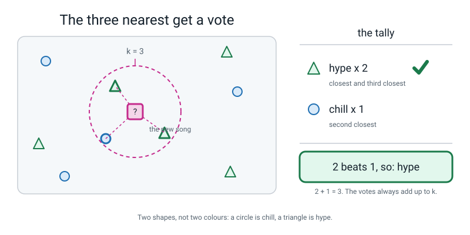
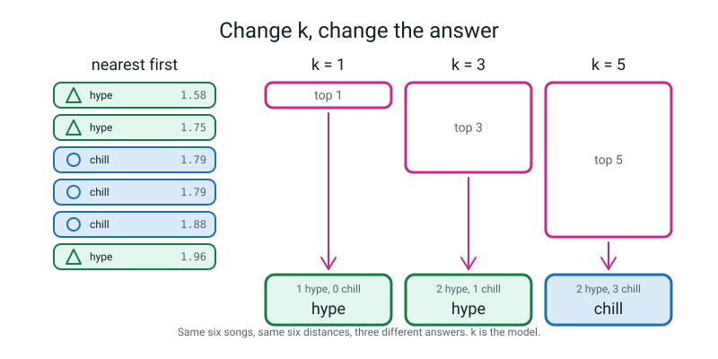
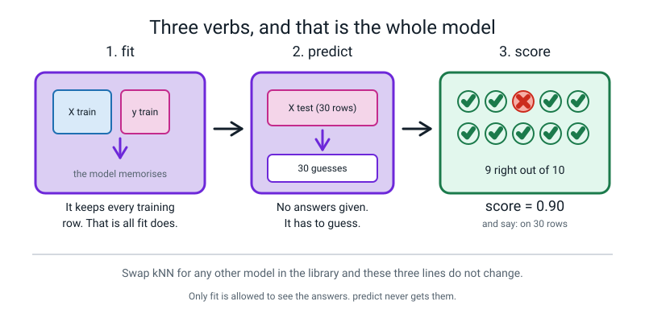
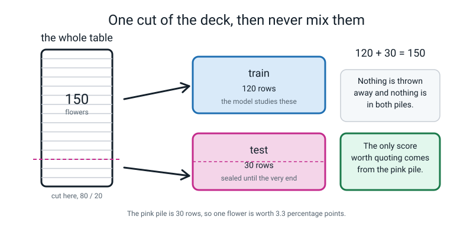
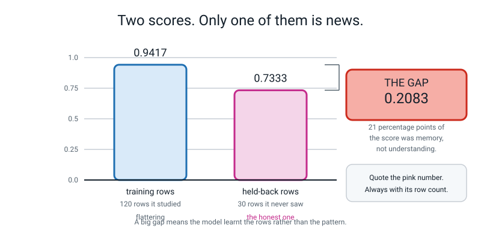
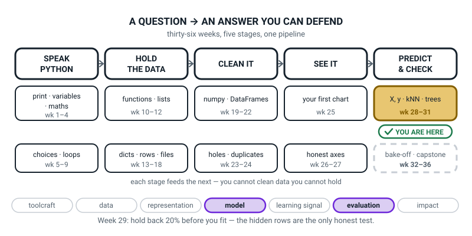

# Week 29 — Nearest Neighbours, and the 20% You Must Hide

[⬅ Week 28](week-28.md) · [Course Home](../README.md) · [Week 30 ➡](week-30.md) · [Student Guide](../student-guide/week-29.md) · [Workbook](../workbook/week-29.md)

---

## 📋 At a Glance

| | |
|---|---|
| **Duration** | 70 minutes |
| **Type** | 🟦⚡ Teach — **this is the week the student trains a real model.** Mark it in the diary. |
| **Big idea** | kNN guesses by letting the `k` closest examples vote — and the score only means anything on rows the model never saw. |
| **New vocabulary** | k-nearest neighbours · majority vote · fit · predict · train/test split |
| **New syntax** | `KNeighborsClassifier(n_neighbors=k)` · `model.fit(X_train, y_train)` · `model.predict(X_test)` · `train_test_split(X, y, test_size=0.2, random_state=42)` |
| **Materials** | Printed workbook pages 29.1–29.6 · **a real deck of playing cards** · **one envelope the student can sign across the flap** · a pen (not pencil) for the signature · last week's `x_and_y.py` and `iris_shapes.py` · the SHAPES sheet from Week 28 · a calculator |
| **Tech needed** | The Week 28 setup: Python 3 with numpy, pandas, matplotlib and scikit-learn. Nothing new to install. |
| **Prep time** | 15 minutes the night before, 5 minutes on the day |

> **⚠️ Watch out:** use a **real** deck of cards and a **real** envelope, and let the student sign the flap with a pen. This looks like decoration and it is not. The physical act of sealing 20% of the data away, with their own name across the seal, is the thing they will remember in Week 33 when the same idea has to catch a model cheating. A photocopied paper deck does not carry the same weight. Level 1 used a sealed envelope for exactly this and it is deliberately the same prop.

---

## 🎯 Lesson Objectives

By the end of the lesson the student can:

1. **Explain kNN as a majority vote of the `k` nearest rows**, in their own words, without using the word "algorithm".
2. **Make, fit and use a model in three lines of code.**
3. **Split data with `train_test_split`** and say what `random_state` is for.
4. **Report the score on the training rows and on the held-back rows separately**, with the row count next to the second one.
5. **Explain in one sentence why the held-back score is the honest one.**

Observable evidence: a signed, sealed envelope on the table; a terminal showing two different scores printed one under the other; and a number written on the board labelled THE GAP that the student can explain without prompting.

---

## 🧑‍🏫 What YOU Need to Know First

> **📌 About the code blocks in this guide.** Outside the **🧰 Prep Checklist** and the **🔑 Answer Key**, the blocks are **illustrations, not files** — each one carries on from the one above it, so the `import` lines and the data are typed once, in the first block that needs them. **The complete runnable files are in the Prep Checklist and the Answer Key.** If you paste an illustration on its own and get `NameError`, that is why, and nothing is broken.

This is the most important section in the file. Read all of it. There is one genuinely hard idea in this week and it is not the code.

### 1. What kNN actually is — the whole algorithm, in four lines

You move to a new school and sit down in the canteen. You do not know anybody. You want to guess which club the person opposite you is in. You do not run a statistical analysis. You look at the **four people sitting nearest to them**. Three of the four are wearing chess-club badges. You guess: chess.

That is the entire algorithm. It has a name and a three-line implementation and it is used in production systems today.

> **k-nearest neighbours (kNN)** — to label something new, find the `k` known examples closest to it and take a vote.
> **majority vote** — whichever label appears most often among those `k` wins.


*Figure 29.1 — Three neighbours inside the ring get a vote. The six outside get nothing. The tally always adds up to `k`.*

There is no equation to solve and nothing to work out. Here is the part that surprises people, and it is worth knowing before a student asks:

**kNN does not really "learn" anything.** When you call `fit`, it writes the training table down and stops. All the actual work happens later, at `predict` time, when it measures the distance from the new row to *every single row it wrote down*, sorts them, and counts the votes.

This has three consequences you should be able to state:

- **`fit` is instantaneous and `predict` is slow.** The opposite of most models. With 120 training rows nobody notices; with 14 million you would.
- **The model *is* the data.** There are no learned rules inside it. If you email somebody a trained kNN model, you have emailed them your training rows. (There is a privacy question hiding in there, and it is in the Questions section.)
- **The score on the training rows with `k = 1` is exactly 1.0 whenever no two training rows have identical measurements but different labels** (true for all four iris columns; not true for the two-sepal version in Part 3, where it is 0.9417). Every row's own nearest neighbour is itself, at distance zero. This is not a triumph. It is arithmetic.

### 2. What `k` does, and why it is not a detail

`k` is how many neighbours you ask. It is the size of the committee.

| `k` | Behaviour | How it fails |
|---|---|---|
| 1 | Copy whatever the single closest example says | One weird neighbour ruins the answer. Very jumpy. |
| 5–15 | A small committee. Sensible. | Usually where the good answers live. |
| = number of training rows | Everybody votes, so the answer is always the commonest class | It has stopped looking at the input at all |

Here is a real example the student built last week: six known flowers, using petal length and petal width, and one mystery flower at `(3.0, 1.0)`. The six distances, sorted nearest-first, are:

```
1.58  versicolor      <- closest
1.75  versicolor
1.79  setosa
1.79  setosa
1.88  setosa
1.96  versicolor
```

- **k = 1** → versicolor. **1 vote to 0.**
- **k = 3** → versicolor, versicolor, setosa → **2 to 1** → versicolor.
- **k = 5** → versicolor, versicolor, setosa, setosa, setosa → **3 to 2** → **setosa.**

**Same data. Same six distances. Not one number changed. Three different answers.** `k` is not a setting you tune at the end. It *is* the model.


*Figure 29.2 — Six known flowers, sorted nearest first. Take the top 1, the top 3 or the top 5, and the vote flips.*

> **💡 Try this:** use an **odd** `k` when there are two classes. With `k = 4` you can get a 2–2 tie, and sklearn breaks ties by picking whichever class comes first in sorted order — which is a rule, not a principle. With three classes ties are still possible; odd just makes them rarer.

### 3. The three verbs. Learn them once, use them for the rest of your life

Every one of the two hundred-odd models in scikit-learn speaks exactly the same three words.

| Verb | What it does | The code |
|---|---|---|
| **fit** | Learn from `X` and `y` | `model.fit(X_train, y_train)` |
| **predict** | Guess a label for every row of some new `X` | `model.predict(X_test)` |
| **score** | What fraction of those guesses were right | `model.score(X_test, y_test)` |

That is the whole interface. Swap `KNeighborsClassifier` for a decision tree in Week 31 or a straight line in Week 32 and **those three lines do not change one character.** Tell the student that. It is the single highest-value thing they will learn this year, and it is why the library is worth the trouble of installing.


*Figure 29.3 — `fit` gets the answers. `predict` does not. `score` marks the guesses.*

Two details about the code that will trip somebody up:

```python
model = KNeighborsClassifier(n_neighbors=3)
```

This line **makes** a model; it does not train one. Nothing has happened yet. The model at this point is an empty machine with a dial set to 3. It is `n_neighbors` — American spelling, no `u`. A student who types `n_neighbours` gets a `TypeError`, and it is in the Clinic.

```python
model.predict([[3.0, 1.0]])
```

**Double brackets, even for one row.** `predict` always wants a *table* of rows, because it is built to answer thousands of questions at once and one question is just a table with one row in it. Single brackets give the most-quoted error message in this whole level: `ValueError: Expected 2D array, got 1D array instead`. You will meet it, so meet it on purpose.

### 4. The hard idea: a score on the training rows is not a score

This is the one thing in the week that matters more than everything else, and it is genuinely counter-intuitive.

🍕 **The analogy that works.** Your teacher hands you a hundred practice questions **with the answers printed underneath**. You study them until you can recite every one. Then the exam is… those exact hundred questions. You score 100%.

Did you learn the subject, or did you learn the answer sheet? **Nobody can tell. Including you.**

That is exactly what happens when you score a model on the rows it trained on. Here is the demonstration, and it is worth running in front of the student because the number is absurd:

```python
model = KNeighborsClassifier(n_neighbors=1)
model.fit(X, y)                          # learn from ALL 150 flowers
print(model.score(X, y))                 # and then test on all 150
```

```text
1.0
```

**A hundred percent. Perfect. Ship it.** No. With `k = 1`, the nearest neighbour of every training flower is *that flower*, at distance nought. We asked the model to recite a list we had just given it. That number is worth exactly nothing — and versions of it appear in real press releases every month.

The fix is one rule, and it is worth more than every algorithm in this book:

> **Hide some of your rows before you start, and do not let the model see them until the very end.**

> **Training set** — the rows the model is allowed to learn from.
> **Test set** — rows you lock in a drawer and look at **once**, at the end, to find out how the model does on things it has never seen.
> **Train/test split** — the single cut that makes those two piles.


*Figure 29.4 — One cut. 120 rows to study, 30 sealed. The counts have to add back up to 150.*

### 5. Every line of `train_test_split`, explained

```python
X_train, X_test, y_train, y_test = train_test_split(
    X, y,                 # the table and the answers, in that order
    test_size=0.2,        # 0.2 means 20% of the rows go into the test pile
    random_state=42,      # fixes the shuffle so we get the same cut every run
)
```

**Four names on the left, in that exact order.** `train_test_split` hands back four things, always, in the order X-train, X-test, y-train, y-test. Get the order wrong and nothing crashes — you just quietly train on your test set. Write the order on the SHAPES sheet.

> **⚠️ Watch out:** it is `X_train, X_test, y_train, y_test`. **Not** `X_train, y_train, X_test, y_test`, which is the order most people's brains want. Both X's first, then both y's.

**`test_size=0.2`** — a fraction, so 20%. `0.2` and `0.25` are the usual choices. There is nothing magic about 20%; it is a trade-off. A bigger test set gives you a more reliable score but leaves fewer rows to learn from.

**`random_state=42`** — this is the one worth understanding properly, because it looks like noise and it is not.

`train_test_split` **shuffles the rows before it cuts**, which it must do — the iris file is sorted by species, so cutting the last 20% without shuffling would hand you a test set of nothing but virginica. Shuffling needs randomness. And randomness means that **without** `random_state`, every single run gives you a different split and therefore a different score.

That is a disaster for learning anything. You change one thing, the score goes up, and you have no idea whether your change helped or whether you just got a friendlier shuffle. Setting `random_state` to any fixed whole number nails the shuffle down.

> **Reproducible** — running the same code again gives the same answer, so any difference you see was caused by your change and nothing else.

42 is traditional (it is a joke from a book). 0 and 7 and 31 are equally fine. **The number does not matter. Fixing it does.**

Here is how much it matters, measured. Same data, same model, only the seed changing — this is iris using just the two sepal columns:

```text
random_state=0   test score = 0.6667
random_state=1   test score = 0.8667
random_state=2   test score = 0.7333
random_state=3   test score = 0.7333
random_state=4   test score = 0.9000
random_state=5   test score = 0.8667
random_state=6   test score = 0.7333
random_state=7   test score = 0.6333
random_state=8   test score = 0.6333
random_state=9   test score = 0.8333

lowest : 0.6333
highest: 0.9
spread : 0.2667
```

**Twenty-seven percentage points of spread**, and nothing changed except where the deck was cut. If somebody quotes you a single accuracy with no test-set size and no seed, that table is what they are not telling you.

### 6. The gap, and the sentence to write on the board

When you score both piles you get two numbers, and the difference between them is the most informative thing on the screen.

```text
score on the TRAINING rows : 0.9417 on 120 rows
score on the HELD-BACK rows: 0.7333 on 30 rows

THE GAP: 0.2083
that is 20.83 percentage points
```


*Figure 29.5 — The blue bar flatters. The pink bar is the one you are allowed to quote.*

**How to read a gap:**

| What you see | What it means |
|---|---|
| Both high, close together | Healthy. This is what you want. |
| Train high, test much lower | The model memorised. A big gap is the symptom. **Week 33's whole lesson.** |
| Both low | The model is not good enough, or the features do not carry the answer. |
| Test *higher* than train | It happens, especially on small test sets. It means the 30 rows you hid happened to be easy ones. It is not a triumph, it is a reminder that 30 rows is a short ruler. |

That last row will happen in this lesson. With all four iris columns and `k = 5`, the split at `random_state=42` gives train 0.9667 and test **1.0000** — the test score is *higher*. **Do not hide this. Explain it.** With 30 test flowers, each flower is worth 3.3 percentage points, so a gap of one or two flowers is noise, not evidence. Then switch to the two-sepal-column version, where the gap is a genuine 21 points, and put *that* number on the board.

### 7. The two misconceptions you will actually meet

**Misconception 1 — "the test set is a second thing to train on."**

Deeply common. The student sees four variables and assumes all four are used the same way. They are not. `X_train` and `y_train` go into `fit`. `X_test` goes into `predict`. **`y_test` is only ever used to mark the answers** — the model never sees it, not once, not ever. The envelope image is what fixes this: `y_test` is the answer sheet inside the sealed envelope.

**Misconception 2 — "hiding 20% of the data is wasteful."**

It sounds like throwing away learning material. Two answers. First, 120 rows and 150 rows produce almost identical models — the last 30 rows add very little. Second, and this is the real one: **a model whose accuracy you cannot honestly measure is worth nothing at all, however well it was trained.** You are not spending 30 rows on nothing. You are spending them on the only number anybody should believe.

### 8. How deep to go, and where to stop

**Go this far:** the vote, `k`, the three verbs, the split, `random_state`, two scores, the gap.

**Stop before:**
- **`stratify=y`.** Next week. If a student's test set comes out lopsided and they notice, that is excellent — write it on the wall and hold it for a week.
- **Scaling.** Next week, and it is next week's whole point. This week's iris model works fine unscaled, which is convenient and slightly lucky.
- **`accuracy_score` and the confusion matrix.** Next week. Use `model.score()` this week; it computes the same number.
- **Pipelines.** Not this year at all.
- **Choosing `k` by looking at the test scores.** Next week, and next week you will also teach why doing it is slightly dishonest.
- **Cross-validation.** Level 3.
- **Naming the failure.** The word for a big gap is *overfitting* and it belongs to Week 33. You can absolutely say "the model memorised". Do not hand over the word yet — Week 33 needs it to arrive as a name for something they have already felt.

---

### 9. 🧭 The Growing Map — two minutes on a box that does not move

Every week the student guide carries the same pipeline figure with one more piece filled in. It is the
only place either book shows the learner the shape of the year instead of the content of the lesson,
and this week the useful thing about it is precisely that **nothing on it changed.**



*Figure 29.0 — Week 29's version. Still the `X, y · kNN · trees` tile, weeks 28 to 31 — second week
inside it, and this is the one that earns the middle word. Two threads lit: model and evaluation.*

**What to do with it, in about two minutes at the end of the lesson:**

1. **Show it and put a finger on the middle word of the gold tile.** Ask *"we did `kNN` today — so how
   many of the four steps happened before the model ever saw a single row?"* The answer is **one**, and
   it is the split. Make them say the four words in order, out loud, in the right order: *split, fit,
   predict, score.* If the order comes out wrong, that is the most useful thing you will learn all
   lesson, and it takes ten seconds to catch here.
2. **Then the question the picture is actually good for:** *"the box did not move this week — but you
   trained a model. Why has the map not changed?"* You are fishing for *because it is the same tile*
   or *because it takes four weeks*. Either is fine. What you are teaching is that this last stage is
   wide, not that the day was small.
3. **Have them copy the map and add THE GAP** in the space under the gold tile, with today's two
   scores on either side of it. Tell them to leave room: the same spot gets a second entry next week
   and a name in Week 33.

> **🧑‍🏫 Why this is worth two minutes.** The temptation this week is to treat training a model as the
> finish line, and the map quietly refuses to agree — three tiles of this stage are still ahead, and
> one whole box is still dashed. That framing is what keeps the held-back 20% feeling like a
> permanent habit rather than a one-off exercise. It also gives you somewhere physical to put the gap,
> which matters: Week 33 needs them to have *felt* a gap before it hands over the word overfitting.

---

## 🧰 Prep Checklist

### 15 minutes the night before

- [ ] **Find a deck of cards and an envelope.** Any envelope the student can write across the flap. Any deck; it does not have to be 52 cards, it just has to be a real physical pile.
- [ ] **Check last week's files are still there:** `x_and_y.py` and `iris_shapes.py`. If they have gone, re-type `iris_shapes.py` tonight so you are not doing it in class.
- [ ] **Run the three-line model yourself.** Create `first_model.py`:

  ```python
  # first_model.py
  # Three lines of scikit-learn do what we just did by hand.

  import numpy as np
  from sklearn.neighbors import KNeighborsClassifier    # the model, imported

  six = np.array([[1.4, 0.2],
                  [1.4, 0.2],
                  [1.3, 0.2],
                  [4.7, 1.4],
                  [4.5, 1.5],
                  [4.9, 1.5]])
  names = np.array(["setosa", "setosa", "setosa",
                    "versicolor", "versicolor", "versicolor"])

  model = KNeighborsClassifier(n_neighbors=3)   # 1. make it. Committee of 3.
  model.fit(six, names)                         # 2. fit it. Show it the answers.
  guess = model.predict([[3.0, 1.0]])           # 3. predict. Note DOUBLE brackets.

  print("the model guesses:", guess)
  print()

  # Try the same mystery flower with three different committee sizes.
  for k in [1, 3, 5]:
      m = KNeighborsClassifier(n_neighbors=k)
      m.fit(six, names)
      print(f"k = {k}  ->", m.predict([[3.0, 1.0]]))
  ```

  Expected output, exactly:

  ```text
  the model guesses: ['versicolor']

  k = 1  -> ['versicolor']
  k = 3  -> ['versicolor']
  k = 5  -> ['setosa']
  ```

- [ ] **Run the full cycle yourself.** Create `full_cycle.py`:

  ```python
  # full_cycle.py
  # The whole thing: split, fit, predict, and TWO scores.

  from sklearn.datasets import load_iris
  from sklearn.model_selection import train_test_split
  from sklearn.neighbors import KNeighborsClassifier

  iris = load_iris()
  X = iris.data
  y = iris.target

  # 1. Cut the deck BEFORE the model sees anything.
  X_train, X_test, y_train, y_test = train_test_split(
      X, y, test_size=0.2, random_state=42
  )

  # 2. Make the model and fit it on the training pile only.
  model = KNeighborsClassifier(n_neighbors=5)
  model.fit(X_train, y_train)

  # 3. Predict the held-back rows.
  predictions = model.predict(X_test)

  print("first 10 predictions:", predictions[:10])
  print("first 10 real answers:", y_test[:10])
  print()

  train_score = model.score(X_train, y_train)   # score on rows it studied
  test_score = model.score(X_test, y_test)      # score on rows it never saw

  print("score on the TRAINING rows:", round(train_score, 4), " (", len(X_train), "rows )")
  print("score on the HELD-BACK rows:", round(test_score, 4), " (", len(X_test), "rows )")
  print()
  print("the gap:", round(train_score - test_score, 4))
  ```

  Expected output, exactly:

  ```text
  first 10 predictions: [1 0 2 1 1 0 1 2 1 1]
  first 10 real answers: [1 0 2 1 1 0 1 2 1 1]

  score on the TRAINING rows: 0.9667  ( 120 rows )
  score on the HELD-BACK rows: 1.0  ( 30 rows )

  the gap: -0.0333
  ```

  **Read that carefully now, before class.** The gap is *negative* — the held-back score came out higher. That is real, it is fine, and section 6 above tells you how to explain it. The lesson then switches to two columns instead of four, where the gap is a genuine 21 points.

- [ ] Print workbook pages 29.1–29.6.
- [ ] Read section 4 (why a training score is not a score) twice. It is the whole week.
- [ ] Put the SHAPES sheet from Week 28 back on the wall.

### 5 minutes on the day

- [ ] Deck of cards, envelope and a **pen** on the table.
- [ ] Laptop on, terminal open, `first_model.py` and `full_cycle.py` **deleted or moved out of the way** — the student is going to type them, and having yesterday's copy sitting there is a temptation for both of you.
- [ ] Board or big sheet with room for one number, headed **THE GAP**. Leave it blank.
- [ ] Run `iris_shapes.py` once, now, to prove the install still works.

### Fallback if a laptop or an install fails

| If this fails | Do this instead |
|---|---|
| **No laptop today** | The deck, the envelope and workbook page 29.3 give you a complete lesson. Page 29.3 has twelve iris rows and one mystery flower printed; the student computes all twelve distances with a calculator, sorts them, and does the vote for `k = 1, 3, 5` by hand. That delivers objectives 1, 4 and 5 in full. Type the code next lesson — the concept is the hard part and it is entirely doable on paper. |
| **scikit-learn broke since last week** | Same as above. Do not spend class time on pip. |
| **No deck of cards** | Any pile of 20-ish identical objects: cut playing-card-sized rectangles from paper, use dominoes, use Lego bricks, use coins. **The envelope is the part you must not skip.** |
| **The student wants to skip the paper part and just type** | Do not let them. The whole point of this week is a discipline, and the discipline is physical before it is code. Say so, honestly: "The code takes four minutes. The habit takes twenty. We're here for the habit." |
| **The student read ahead and knows about scaling** | Superb. Write "SCALING — <their name>, <today's date>" on the wall and tell them Week 30 is theirs. Then, today, hand them the Differentiation → flying tasks. |

---

## ⏱️ The Lesson, Minute by Minute

| Segment | Minutes | Running total | What happens |
|---|---|---|---|
| 🪝 Hook — I Can Teach You a Real Model in One Sentence | 7 | 7 | The canteen, and then the 100% catch |
| 🧠 Concept — The Vote, and the Three Verbs | 16 | 23 | kNN by hand; `k` flips the answer; fit/predict/score |
| 💻 Live-Code Together — Three Lines, and Then the Lie | 18 | 41 | A working model; then 1.0 on purpose; two deliberate mistakes |
| 🎲 Their Turn — Cut the Deck, Sign the Envelope, Find the Gap | 20 | 61 | The physical split, then the same cut in code, then two scores |
| 🔑 Wrap & Assign | 9 | 70 | Three checks, the gap on the board, homework |

---

### 🪝 Hook — I Can Teach You a Real Model in One Sentence (7 minutes)

**Do this:** Laptop closed. Deck of cards visible but untouched on the table.

**Say this:**

> "I'm going to teach you a real machine learning model. Not a toy one — one that real companies actually run. And I'm going to do it in one sentence, and then we're done with the theory for the day.
>
> Here's the sentence. Picture your first day at a new school. You sit down in the canteen and you don't know a single person. You want to guess which club the girl opposite you is in. What do you do?"

Let them answer. Most people say something like "look at who she's sitting with".

> "Exactly. You look at the four people **nearest** to her. Three of the four have chess club badges on. You guess: chess.
>
> That's it. That is the whole model. It's called **k-nearest neighbours**, and the `k` is just how many neighbours you decided to ask. You asked four, so k was four.
>
> No equations. Nothing to solve. You find the closest examples you already know the answers for, and you let them vote."

Write on the board:

> **k-nearest neighbours** — to label something new, find the `k` closest examples you know the answer for, and take a vote.

> "And you already have everything you need to build it. Last week you learnt how to measure the distance between two rows. That was the hard part, and you've done it. This week it's three lines of code."

**Now the catch.** Change your tone.

> "But before we build anything, I want to show you how to break it, because that turns out to be the important half of today.
>
> Suppose I build this thing, and then I check how good it is by asking it about the **exact same** hundred and fifty flowers it learnt from. What do you reckon it scores?"

Let them guess. Let them be uncertain.

> "A hundred percent. Every single time. And here's why, and it's almost funny. If I ask it 'what's this flower?' and hand it a flower that's already in its notes — what's the nearest example to that flower?"

Wait for it. **It's itself.**

> "Itself. Distance zero. Nothing is closer to a thing than the thing. So it looks up the flower, finds the flower, reads off the answer, and gets it right. A hundred out of a hundred.
>
> Now — does that machine understand flowers?"

**Ask this:**

| Ask | Answer you want | If they say something else |
|---|---|---|
| "Does a machine that scores 100% by looking itself up understand flowers?" | No. It memorised the list. | If they say "kind of", push: "What would it do with a flower that isn't in its notes? It has no idea, and the 100% didn't tell you that." |
| "Where have you met a perfect score that meant nothing before?" | Level 1, the wet umbrella / the sticker on the fruit. | If they don't get it, name it: "The sticker that said APPLE. Twelve out of twelve, and worthless." |
| "So how would you catch it out?" | Test it on flowers it has never seen. | This is the answer to the whole week. If they get there, stop and say so: "That's the rule this whole lesson is built on, and you just invented it." |
| "How much of the data would you hide?" | Anything sensible. 10%, 20%, a quarter. | Any argued number is right. Reply: "Twenty percent is what most people use. Why not ninety?" *(Because then there's nothing left to learn from.)* |

---

### 🧠 Concept — The Vote, and the Three Verbs (16 minutes)

**Do this:** Workbook page 29.2 between you. It has last week's six flowers and their six distances already computed.

**Say this — part 1, the vote, by hand:**

> "These are the six flowers you measured last week, and the mystery flower at (3.0, 1.0). And these are the six distances you worked out. I've sorted them, nearest at the top."

```
1.58  versicolor      <- closest
1.75  versicolor
1.79  setosa
1.79  setosa
1.88  setosa
1.96  versicolor
```

> "Right. If k is one — if I only ask the single closest neighbour — what's the answer?"

Versicolor.

> "If k is three — the top three vote. Read them to me."

Versicolor, versicolor, setosa. Two to one.

> "So k equals three says versicolor as well. Now k equals five. Top five. Count them for me."

Versicolor, versicolor, setosa, setosa, setosa. **Three setosa, two versicolor.**

> "**Setosa.** The answer just changed. And I want you to notice exactly what changed to make that happen. Did any distance change?"

No.

> "Did any flower move? Did I remeasure anything? Did I fix a bug?"

No, no, no.

> "I turned one dial. And the answer flipped. So `k` is not a little setting you fiddle with at the end. **`k` is the model.** Two people can run the same code on the same data with different k and get different answers, and neither of them is wrong."

**Say this — part 2, the three verbs:**

> "Now here's the bit that pays you back for the rest of your life. Every single model in this library — and there are about two hundred of them — speaks exactly three words. Three. And they never change.
>
> **fit.** You hand it `X` and `y` — the measurements and the answers — and it learns. For kNN, 'learns' literally means 'writes the table down'. That's all it does.
>
> **predict.** You hand it a new `X` with no answers, and it gives you a guess for every row.
>
> **score.** You hand it an `X` *and* the real `y`, and it tells you what fraction it got right.
>
> Write those three words down, because in Week 31 we swap kNN for a decision tree and in Week 32 we swap it for a straight line, and those three lines of code will not change by one character."

**Do this:** Write on the SHAPES sheet, under the shapes:

```
fit(X_train, y_train)     learn from these
predict(X_test)           guess these.  NO answers given
score(X_test, y_test)     mark the guesses
```

**Say this — part 3, the split, and the envelope:**

> "And now the rule that makes all of it mean something.
>
> Imagine I give you a hundred practice questions with the answers printed underneath. You study them until you can recite the lot. Then I set the exam — and the exam is those exact hundred questions. You get a hundred percent.
>
> Did you learn maths, or did you learn the answer sheet?"

Let them sit with it.

> "You can't tell. **I** can't tell. And *you* can't tell either, and that's the worst part.
>
> So: before we train anything, we cut the data in two. Eighty percent the model studies. Twenty percent we seal in an envelope and do not open until the very end.
>
> Two names, and they matter:
>
> The **training set** — the rows the model is allowed to learn from.
> The **test set** — the rows in the envelope. We look at them once. Once."

**Ask this:**

| Ask | Answer you want | If they say something else |
|---|---|---|
| "Why did k = 5 give a different answer from k = 3?" | Because two more setosa got votes and outnumbered the versicolors. | If they say "because 5 is bigger", push for the actual count: "Read me the top five and tally them." |
| "Which of the three verbs gets to see the answers?" | Only `fit`. And `score`, to do the marking. | **The one that matters.** If they say `predict` sees answers, go back to the envelope: "If it saw the answers, what would it be predicting?" |
| "Why not just train on all 150 and be done?" | Because then you have no honest way to check it. | If they say "it'd be better", agree partly: "Slightly better, yes. And completely unmeasurable. Which would you rather ship?" |
| "How many rows in the envelope if we have 150 and hide 20%?" | 30. And 120 to train on. | If they struggle, do it out loud: 10% of 150 is 15, so 20% is 30. |
| "What's `y_test` actually for?" | Marking. The model never sees it. | This is the check that separates secure from emerging. If they're unsure, hold up the sealed envelope: "It's the answer sheet in here." |

---

### 💻 Live-Code Together — Three Lines, and Then the Lie (18 minutes)

**Two chairs, one keyboard, and the student types.**

**Keystroke sequence — part 1, a working model (6 minutes).**

New file, `first_model.py`. Dictate the file exactly as printed in the Prep Checklist. Then, before running it, stop:

**Say this:**

> "Before we run this — three lines do the whole job and I want you to name them. Line one makes the model. What has it learnt at that point?"

Nothing.

> "Nothing. It's an empty machine with a dial set to 3. Line two is `fit`, and that's where it learns — which for kNN means it writes down the six flowers. Line three is `predict`, and that's where all the actual work happens: it measures six distances, sorts them, and counts three votes. Run it."

```text
the model guesses: ['versicolor']

k = 1  -> ['versicolor']
k = 3  -> ['versicolor']
k = 5  -> ['setosa']
```

**Say this, and take your time:**

> "Look at those three lines at the bottom, and then look at the page in front of you where you did it by hand.
>
> Versicolor. Versicolor. Setosa.
>
> **Identical.** The library and your pencil agree on all three. You didn't take my word for what kNN does — you did it yourself first, and then the machine confirmed you. That's the right order and I'd like you to keep doing it that way all year."

**Keystroke sequence — part 2, ⚠️ DELIBERATE MISTAKE NUMBER ONE (4 minutes).**

**Do this:** Change the predict line to single brackets, on purpose:

```python
guess = model.predict([3.0, 1.0])
```

**Say this:**

> "Now I'm going to make the single most common mistake in this entire library, deliberately, so you meet it here with me instead of alone tonight. I'm taking out one pair of brackets."

Run it. Long traceback, ending:

```text
  File "/Users/you/project/first_model.py", line 15, in <module>
    guess = model.predict([3.0, 1.0])
  ...
ValueError: Expected 2D array, got 1D array instead:
array=[3. 1.].
Reshape your data either using array.reshape(-1, 1) if your data has a single feature or array.reshape(1, -1) if it contains a single sample.
```

**Say this:**

> "Last line first — except this time the last three lines are all one message. `Expected 2D array, got 1D array instead.`
>
> **2D means a table.** Rows and columns. **1D means a single line.** I gave it a single line and it wanted a table.
>
> And why does it want a table for one flower? Because `predict` is built to answer thousands of questions in one go. It doesn't have a special mode for one. So one question is a table that happens to have one row in it. Hence two brackets: the outer ones say 'here is a table', the inner ones say 'here is the one row in it'.
>
> Ignore the advice about `reshape`. It's correct and it's for grown-up situations. Ours is: **put the brackets back.**"

Fix it. Run. It works.

**Keystroke sequence — part 3, the dishonest 100% (5 minutes).**

New file, `dishonest.py`:

```python
# dishonest.py
# The wrong thing, done on purpose, so you recognise it later.

from sklearn.datasets import load_iris
from sklearn.neighbors import KNeighborsClassifier

iris = load_iris()
X = iris.data                            # all 150 rows, all 4 measurements
y = iris.target                          # all 150 answers

model = KNeighborsClassifier(n_neighbors=1)
model.fit(X, y)                          # learn from ALL 150 flowers

print("score on the very same 150 flowers:", model.score(X, y))
```

**Before running, ask them to predict the number and write it down.** Then run:

```text
score on the very same 150 flowers: 1.0
```

**Say this:**

> "One point nought. A hundred percent. Hundred and fifty out of a hundred and fifty.
>
> Now: put that in a press release. 'Our new flower identification system is one hundred percent accurate.' It's not a lie, is it? That is genuinely the number that came out.
>
> And it is completely worthless, and you can say exactly why in one sentence."

Let them say it. *Every flower's nearest neighbour is itself.*

> "So I want you to be suspicious of a number like that for the rest of your life. Level 1 taught you this with a sticker that said APPLE on it. Same shape of mistake, different clothes. **A perfect score is not a triumph. It's the first symptom that something has leaked.**"

**Keystroke sequence — part 4, ⚠️ DELIBERATE MISTAKE NUMBER TWO, and the split (3 minutes).**

New file, `split_it.py`. Type this, deliberately wrong — **two** names on the left instead of four:

```python
from sklearn.datasets import load_iris
from sklearn.model_selection import train_test_split

iris = load_iris()
X_train, X_test = train_test_split(iris.data, iris.target, test_size=0.2, random_state=42)
```

Run:

```text
Traceback (most recent call last):
  File "/Users/you/project/split_it.py", line 5, in <module>
    X_train, X_test = train_test_split(iris.data, iris.target, test_size=0.2, random_state=42)
ValueError: too many values to unpack (expected 2)
```

**Say this:**

> "`too many values to unpack (expected 2)`. Unpack is a nice word for it — imagine a parcel with four things in it and you've only put out two boxes to catch them.
>
> `train_test_split` always hands back **four** things, in one fixed order, and you have to catch all four:
>
> **X_train, X_test, y_train, y_test.**
>
> Both X's first, then both y's. And I'll be honest, that's not the order most brains want — most people want to pair them up, X-train-y-train. It isn't that. Learn the order, because if you get it wrong Python won't always tell you. Here it did, because we gave it two names. If you give it four names in the wrong order it will happily hand you your test set to train on and say nothing at all."

Fix it, and complete the file:

```python
# split_it.py
# Cut the deck: 80% to learn from, 20% locked away.

from sklearn.datasets import load_iris
from sklearn.model_selection import train_test_split   # the new import

iris = load_iris()
X = iris.data
y = iris.target

X_train, X_test, y_train, y_test = train_test_split(
    X, y,                 # the table and the answers, in that order
    test_size=0.2,        # 0.2 means 20% of the rows go into the test pile
    random_state=42,      # fixes the shuffle so we get the same cut every run
)

print("whole table :", X.shape)
print("train pile  :", X_train.shape, " answers:", y_train.shape)
print("test pile   :", X_test.shape, " answers:", y_test.shape)
print()
print("len(X_train) =", len(X_train))
print("len(X_test)  =", len(X_test))
print("120 + 30 =", len(X_train) + len(X_test))
```

```text
whole table : (150, 4)
train pile  : (120, 4)  answers: (120,)
test pile   : (30, 4)  answers: (30,)

len(X_train) = 120
len(X_test)  = 30
120 + 30 = 150
```

**Do this:** Add all four shapes to the SHAPES sheet. Make the student read them out and confirm the row counts add up. **This addition is the check that catches most of their own mistakes for the rest of the year** — say so.

**Ask this:**

| Ask | Answer you want | If they say something else |
|---|---|---|
| "2D array means what, in plain English?" | A table. Rows and columns. | If stuck: "How many directions does a table have? Two. That's the D." |
| "Why does `predict` want a table for one flower?" | Because it's built for thousands at once; one is just a table with one row. | If they say "because it's fussy", accept the frustration, then give the reason. |
| "Why did the 100% happen?" | Every flower's nearest neighbour is itself, distance 0. | Non-negotiable. If they can't say it, walk them to it with "what's the closest flower to flower number 7?" |
| "`train_test_split` gives back how many things, in what order?" | Four. X_train, X_test, y_train, y_test. | Drill it. Have them say it three times. Write it on the sheet. |
| "120 and 30. Should they add to 150?" | Yes, always. | If they say no, ask where the missing rows would have gone. Nowhere. Nothing is thrown away and nothing is in both piles. |

---

### 🎲 Their Turn — Cut the Deck, Sign the Envelope, Find the Gap (20 minutes)

Full instructions in the next section. In the lesson flow:

- **Minutes 0–6:** the deck, the cut, the signature, the sealed envelope. Physical only. No laptop.
- **Minutes 6–13:** the full cycle in code — `full_cycle.py`, both scores printed.
- **Minutes 13–20:** the two-column version, `the_gap.py`, and the number goes on the board.

---

## 🐞 The Debugging Clinic

Every message below came out of a real run of a deliberately broken version of this week's code. Long middle sections are trimmed with `...` where they only show the library's own insides.

| What the student sees (real message) | What it means | Most likely cause | The fix |
|---|---|---|---|
| `ValueError: Expected 2D array, got 1D array instead:` `array=[3. 1.].` | "You gave me a single line and I need a table." | Single brackets: `model.predict([3.0, 1.0])`. | Double brackets: `model.predict([[3.0, 1.0]])`. One row is still a table. |
| `sklearn.exceptions.NotFittedError: This KNeighborsClassifier instance is not fitted yet. Call 'fit' with appropriate arguments before using this estimator.` | "You asked me to guess before I'd been shown anything." | The `model.fit(...)` line is missing, misspelled, or below the `predict` line. | Put `model.fit(X_train, y_train)` in, above the `predict`. Order matters: make, fit, predict. |
| `ValueError: too many values to unpack (expected 2)` | "I handed you four things and you only put out two boxes." | `X_train, X_test = train_test_split(...)`. | Catch all four: `X_train, X_test, y_train, y_test = train_test_split(...)`. |
| `TypeError: KNeighborsClassifier.__init__() got an unexpected keyword argument 'n_neighbours'` | "There is no setting by that name." | British spelling. The library says `n_neighbors`, no `u`. | `KNeighborsClassifier(n_neighbors=5)`. Annoying, and permanent. |
| `ValueError: Found input variables with inconsistent numbers of samples: [120, 30]` | "You gave me 120 rows of measurements and 30 answers. Which 90 rows have no answer?" | `model.fit(X_train, y_test)` — the wrong `y`. Nearly always caused by the four-name order. | `model.fit(X_train, y_train)`. Then re-read the four names left to right and check they are in order. |
| `ValueError: Expected n_neighbors <= n_samples_fit, but n_neighbors = 10, n_samples_fit = 6, n_samples = 1` | "You asked ten neighbours to vote and I only know six examples." | `k` is bigger than the training set. Common on the six-flower toy example. | Make `k` smaller than the number of training rows. |
| `ImportError: cannot import name 'KNeighborsClassifier' from 'sklearn'` | "That name isn't in that room." | Import path too short: `from sklearn import KNeighborsClassifier`. | `from sklearn.neighbors import KNeighborsClassifier`. Models live in rooms: `.neighbors`, `.tree`, `.linear_model`. |
| `ImportError: cannot import name 'train_test_split' from 'sklearn.datasets'` | Right function, wrong room. | It is in `sklearn.model_selection`, not `sklearn.datasets`. | `from sklearn.model_selection import train_test_split`. |
| **No error at all**, and the accuracy changes every single time you run the file | Nothing is broken. The shuffle is different every run. | `random_state` is missing from `train_test_split`. | Add `random_state=42`. Any fixed whole number. |

### How to teach debugging without giving the answer

Same ladder as every week, but this week add one rung at the top, because sklearn's messages are unusually chatty:

0. **"Find the line with *your* filename on it."** Sklearn tracebacks are fifteen lines of library internals. Teach the student to scan for their own file first, then read the last line. Two lines out of fifteen are theirs.
1. **"Read me the last line."**
2. **"What was it expecting, and what did it get?"** Sklearn is unusually good at telling you both. `[120, 30]` is the whole bug, right there in the message.
3. **"What did you change since it last worked?"**
4. **Point at the line. Say nothing.**
5. **Point at the character.**
6. **Tell them — and name the family:** "that's a shapes-don't-match one", "that's a brackets one", "that's an order-of-the-four-names one."

> **🧑‍🏫 If a student asks:** *"Why doesn't it just fix the brackets for me? It clearly knows what I meant."* — Honest answer: it does not know. `[3.0, 1.0]` could sensibly mean one flower with two measurements, or two flowers with one measurement each. Both are real situations, and guessing wrong would give you a plausible answer that was silently wrong — which is far worse than an error. **A library that refuses to guess is doing you a favour**, and the `reshape(-1, 1)` / `reshape(1, -1)` advice in that message is it offering you both options rather than choosing.

---

## 🎲 The Activity, In Full

### Cut the Deck, Sign the Envelope, Find the Gap

Three parts, in this order, and the order is the point. Physical first, then code, then the number that makes it matter.

### Setup

**On the table:** the deck of cards, the envelope, a pen, workbook pages 29.3 and 29.4, the laptop.

**On the board:** a blank space headed **THE GAP**.

### Part 1 — The deck and the envelope (6 minutes, no laptop)

1. **Count out 100 cards** — or however many the deck has; say the number out loud and write it down. If it is a standard 52-card deck, use 50 for easy arithmetic and put two aside.
2. **Shuffle properly.** Say why while you do it: *"The iris file is sorted — the first fifty rows are all setosa. If I cut it without shuffling, my test set is thirty virginica and nothing else, and my score tells me nothing about the other two species. Shuffling isn't tidiness. It's necessary."*
3. **Ask the student to work out 20% of the number of cards.** For 50, that is 10. Have them say it before you cut.
4. **Cut off that many cards.** Deal them into a small pile. Count them out loud, one at a time, into the pile. Then count the big pile.
5. **Write the two numbers on the envelope** — `TEST: 10 rows` — along with today's date.
6. **Put the small pile in the envelope. Seal it.**
7. **Hand the student the pen.** *"Sign across the flap. Right across it, so you'd be able to tell if it had been opened."*
8. Put the envelope in the middle of the table, where it stays, visible, for the rest of the lesson.

**Say this:**

> "Right. That envelope has ten rows in it and nobody knows what they are. Not you and not me. And from this second on there is exactly one thing we're allowed to do with it: at the very end, open it once, and check.
>
> Not open it, have a look, tweak the model, and check again. **Once.** Because the moment you look at it twice, and change something in between, it stops being data you've never seen — and it goes back to being a practice paper with the answers on it.
>
> That signature is you promising yourself. Level 1 did this with an envelope too, and it was the same promise then."

### Part 2 — The same cut, in one line (7 minutes)

**Do this:** The student types `full_cycle.py`, dictated as printed in the Prep Checklist. Run it.

```text
first 10 predictions: [1 0 2 1 1 0 1 2 1 1]
first 10 real answers: [1 0 2 1 1 0 1 2 1 1]

score on the TRAINING rows: 0.9667  ( 120 rows )
score on the HELD-BACK rows: 1.0  ( 30 rows )

the gap: -0.0333
```

**Say this:**

> "Two things to look at. First, the predictions and the real answers, side by side, and the first ten match exactly. That's a real model doing real work on flowers it has never seen — and you built it three minutes ago.
>
> Second — and this is the interesting one — look at the two scores. The held-back score is **higher** than the training score. It got everything right on the sealed pile.
>
> Now. Is that a triumph?"

Let them decide. Then:

> "No. And here's the honest reason. There are **thirty** flowers in that test pile. So each single flower is worth three point three percentage points. One flower being lucky or unlucky moves the number by three points. The gap here is one flower's worth.
>
> Which means: **the score didn't go up. It just didn't go anywhere, and thirty is too short a ruler to tell the difference.** That's why, from today, every accuracy you ever report gets its row count written next to it. Every single time. `1.0000 on 30 rows` is honest. `100%` on its own is showing off."

### Part 3 — Make it harder, and find the real gap (7 minutes)

**Say this:**

> "Iris with all four measurements is a bit too easy — it's the sort of problem where everything works and you learn nothing. So we're going to make it harder in the meanest possible way: we'll throw away the two best measurements and keep only the two worst.
>
> Last week you noticed the petals separate the species nicely. So: petals out. We'll use only the two **sepal** measurements, and we'll set k to 1, so the model just copies its nearest neighbour."

**Do this:** New file, `the_gap.py`:

```python
# the_gap.py
# The same cycle, but using only the two SEPAL columns, with k = 1.

from sklearn.datasets import load_iris
from sklearn.model_selection import train_test_split
from sklearn.neighbors import KNeighborsClassifier

iris = load_iris()
X = iris.data[:, 0:2]                    # columns 0 and 1: the two sepal columns
y = iris.target

print("X shape now:", X.shape)           # 150 rows, only 2 columns

X_train, X_test, y_train, y_test = train_test_split(
    X, y, test_size=0.2, random_state=42
)

model = KNeighborsClassifier(n_neighbors=1)   # k = 1: copy the single closest
model.fit(X_train, y_train)

train_score = model.score(X_train, y_train)
test_score = model.score(X_test, y_test)

print()
print("score on the TRAINING rows :", round(train_score, 4), "on", len(X_train), "rows")
print("score on the HELD-BACK rows:", round(test_score, 4), "on", len(X_test), "rows")
print()
print("THE GAP:", round(train_score - test_score, 4))
print("that is", round((train_score - test_score) * 100, 2), "percentage points")
```

```text
X shape now: (150, 2)

score on the TRAINING rows : 0.9417 on 120 rows
score on the HELD-BACK rows: 0.7333 on 30 rows

THE GAP: 0.2083
that is 20.83 percentage points
```

**Do this:** Write on the board, big, and **leave it there for the rest of the term**:

```
  THE GAP        0.9417  on the rows it studied
                 0.7333  on the rows it had never seen
                 --------
                 0.2083   =  21 percentage points of flattery
```

**Say this:**

> "There it is. Ninety-four percent on the homework it had the answers to. Seventy-three percent on the exam.
>
> Twenty-one points of that first number was **memory**. Not skill. Memory. And if I'd only ever shown you the ninety-four — which is exactly what a lot of people do — you'd have believed it, and so would I.
>
> That number stays on the board until the end of term. There's a lesson coming in a few weeks that is entirely about that gap, and when we get there I want you to be able to point at it and say 'we saw that in Week 29'."

### What "finished" looks like

- A sealed envelope on the table with a signature across the flap, a date, and a row count written on it.
- A terminal showing two scores printed one under the other, each with its row count.
- `0.2083` on the board, labelled, with both scores above it.
- The student able to answer, unprompted: **"which of those two numbers would you tell somebody, and why?"**

### Variation — easier

- **Do the whole thing on paper.** Workbook page 29.3 prints twelve iris rows and one mystery flower. The student computes twelve distances with a calculator, sorts them, and votes for `k = 1, 3, 5`. That is objectives 1, 4 and 5 completely, with no laptop.
- **Skip Part 3.** The envelope plus one working `full_cycle.py` is a complete and satisfying lesson. Put the gap from `full_cycle.py` on the board and be honest that it is small.
- **Give them `full_cycle.py` already typed** and have them change only `n_neighbors` and `random_state`, predicting each result before they run it. Reading and editing working code is a real skill and a legitimate substitute for typing it from scratch.
- **Drop the six-flower hand vote** and go straight to the code if the arithmetic is the blocker. The concept survives.

### Variation — harder

All of these use only syntax they already have.

1. **Three personalities of `k`.** Predict, in writing, what happens at `k = 1`, `k = 5` and `k = 120` (every training row voting), *before* running it. Then:

   ```python
   # three_personalities.py
   # Three sizes of committee, three completely different personalities.

   from sklearn.datasets import load_iris
   from sklearn.model_selection import train_test_split
   from sklearn.neighbors import KNeighborsClassifier

   iris = load_iris()
   X = iris.data
   y = iris.target

   X_train, X_test, y_train, y_test = train_test_split(
       X, y, test_size=0.2, random_state=42
   )

   for k in [1, 5, 120]:                    # 120 = every training row votes
       model = KNeighborsClassifier(n_neighbors=k)
       model.fit(X_train, y_train)
       train = model.score(X_train, y_train)
       test = model.score(X_test, y_test)
       print(f"k = {k:3d}   train = {train:.4f}   test = {test:.4f}")
   ```

   ```text
   k =   1   train = 1.0000   test = 1.0000
   k =   5   train = 0.9667   test = 1.0000
   k = 120   train = 0.3417   test = 0.3000
   ```

   Three questions worth asking about that: **Why is `k = 1`'s train score exactly 1.0000?** *(Every row is its own nearest neighbour.)* **Why did `k = 120` collapse to about a third?** *(Every training row votes on every prediction, so the answer is always the commonest class — and there are three roughly equal classes, so it is right about a third of the time. It has stopped looking at the flower entirely.)* **Which of the three is a healthy model?** *(k = 5: both scores high and close together.)*

2. **Does `random_state` change the story?** Loop the seed 0 to 9 on the two-sepal-column problem and collect the ten test scores:

   ```python
   # random_state_matters.py
   # Change where you cut the deck and the score changes. Same model, same data.

   from sklearn.datasets import load_iris
   from sklearn.model_selection import train_test_split
   from sklearn.neighbors import KNeighborsClassifier

   iris = load_iris()
   X = iris.data[:, 0:2]                    # the two sepal columns again
   y = iris.target

   scores = []                              # collect the ten test scores
   for seed in range(10):                   # ten different cuts of the same deck
       X_train, X_test, y_train, y_test = train_test_split(
           X, y, test_size=0.2, random_state=seed
       )
       model = KNeighborsClassifier(n_neighbors=5)
       model.fit(X_train, y_train)
       score = model.score(X_test, y_test)
       scores.append(score)
       print(f"random_state={seed}   test score = {score:.4f}")

   print()
   print("lowest :", round(min(scores), 4))
   print("highest:", round(max(scores), 4))
   print("spread :", round(max(scores) - min(scores), 4))
   ```

   ```text
   random_state=0   test score = 0.6667
   random_state=1   test score = 0.8667
   random_state=2   test score = 0.7333
   random_state=3   test score = 0.7333
   random_state=4   test score = 0.9000
   random_state=5   test score = 0.8667
   random_state=6   test score = 0.7333
   random_state=7   test score = 0.6333
   random_state=8   test score = 0.6333
   random_state=9   test score = 0.8333

   lowest : 0.6333
   highest: 0.9
   spread : 0.2667
   ```

   Then the question: **"If I picked which seed to report, what could I claim?"** *(Anything from 63% to 90%. Which is why you fix the seed before you look, not after — and why quoting one number without the test size is meaningless.)*

3. **Find a flower the model gets wrong**, and print its four measurements next to the true answer and the guess. Then say, in one sentence, why it is a hard flower. *(It will almost always be a versicolor/virginica near the boundary.)*
4. **Two columns of your choice.** Which *pair* of iris columns gives the best held-back score? There are six pairs. Try all six and rank them — then predict, before you look, which pair wins. *(The two petal columns. Last week's plot already showed why.)*

---

## ❓ Questions Students Ask This Week

**"Where is the model? What does it actually look like inside?"**

For kNN, genuinely: it is the training table. That is all. There are no rules and no learned numbers — `fit` copies `X_train` and `y_train` into the object and stops. That makes kNN unusual and a bit disappointing to look inside, and it also makes it the easiest model in the world to explain, which is why it is first. In Week 31 you will meet a decision tree, which throws the data away and keeps only a short list of yes/no questions, and you will be able to print those questions out and read them aloud.

**"Why 20%? Why not 10% or half?"**

It is a trade-off with no correct answer. A bigger test set gives you a more trustworthy score but leaves fewer rows to learn from; a smaller one leaves more to learn from but the score gets noisy — with only 15 test flowers, one flower is worth nearly 7 percentage points. Twenty percent and twenty-five percent are the common defaults because they sit in a reasonable middle for datasets of a few hundred rows. With a million rows people often hold back 1%, because 10,000 test examples is plenty. **The real answer is "enough test rows that one row doesn't move your number much" — and 30, which is what we have today, is honestly not enough.** Say that out loud.

**"Is 42 special?"**

No. It is a joke — it is "the answer to life, the universe and everything" from *The Hitchhiker's Guide to the Galaxy* — and it became a habit. `random_state=0`, `=1`, `=7`, `=31` are all exactly as good. What matters is that it is **fixed**, so your result is reproducible, and that you chose it **before** you looked at the scores rather than after. Choosing the seed after you have seen the scores has a name in the trade and the name is not polite.

**"Does the model get better if I run it again?"**

No, and this is a genuinely important thing to get straight early. Running the file again does exactly the same arithmetic and produces exactly the same model. There is no gradual improvement, no practising, nothing that accumulates. The model is a function of the training data and the settings, full stop. If the score *does* change between runs, something is unfixed — almost always a missing `random_state`. Some models in Level 3 do improve over repeated passes; kNN is not one of them, and neither are trees or straight lines.

**"kNN keeps every training row forever. Isn't that a privacy problem?"** *(This one deserves a real answer.)*

Yes, and it is not a small one. A decision tree throws the data away and keeps only rules. kNN keeps **the actual rows**. So if you train a kNN model on medical records and then send that trained model to a hospital, you have not sent them a summary — you have sent them the records. And it is worse than that: somebody who can only *query* the model, without seeing inside it, can feed it carefully chosen inputs and work backwards towards what the training rows must have been. Which raises a hard question that Level 1's privacy lesson set up: if a person asks you to delete their data, is deleting the row enough, when their row is baked into a model you have already given to fifty people? People do not agree on the answer, and the law in most countries has not caught up.

**"Can I look at the test set just once, then change something, then look again?"**

Technically yes; honestly no. The instant you *change something because of what you saw*, the test set has helped you make a decision — which means it has taught you something, which means it is no longer data your process has never seen. Your score becomes a little optimistic and you cannot tell by how much. **Next week you are going to break this rule on purpose**, by trying 25 values of `k` and picking the best, and the deal will be that you write a sentence admitting it. That is the honest way to break it. Doing it quietly is not.

**"What if the vote is a tie?"**

With two classes and an even `k` it happens easily — 2-2 with `k = 4`. Scikit-learn breaks the tie by choosing whichever class comes first in sorted order, which is a rule rather than a principle: nothing about your data made that choice. So use an odd `k` when you have two classes. With three classes you can still tie (1-1-1 with `k = 3`) and the same arbitrary rule applies. It is not a scandal, but you should know that a tied prediction is essentially a coin flip that Python is pretending was a decision.

**"Which is better, a high training score or a high test score?"** *(Careful — this is a trap question and worth walking into.)*

Only the test score is a *score*. The training score is not really a measure of quality at all; it is a measure of how much the model memorised. It is still worth printing, but only as a companion to the test score, because the **gap** between them is the diagnosis. Train 0.94 / test 0.73 says "memorised". Train 0.82 / test 0.80 says "healthy but limited". Train 0.34 / test 0.30 says "this model has given up". **One number tells you nothing; the pair tells you what kind of trouble you are in.**

---

## ⚠️ Where This Lesson Goes Wrong

| What happens | Why | What to do right now |
|---|---|---|
| The student trains on the test set by mistake, and nothing crashes | The four names came back in the wrong order, or `fit(X_train, y_test)` slipped through | This is the silent bug of the week. Build the habit now: **after every `train_test_split`, print all four shapes and read them out loud.** A wrong order shows up instantly as a shape that makes no sense. |
| The 100% from `dishonest.py` is taken as success | It genuinely looks like success and the hook was fifteen minutes ago | Do not explain. Ask the one question and wait in silence: *"What is the nearest flower to flower number 7?"* The realisation has to be theirs. |
| The held-back score comes out *higher* and the lesson seems to have failed | It does come out higher on this split, and it is real | Have the answer ready and treat it as a feature of the lesson, not an accident. One flower is 3.3 points. Then do Part 3, where the gap is real. **Never fudge a number to make a lesson tidier.** |
| The envelope gets opened "just to check" | Curiosity, and it is only cards | Stop everything and make it the lesson. *"You've just done exactly the thing this whole week is about. Now we can't use those cards as a test set again — and that is a real thing that happens to real projects."* Then reseal with fresh cards. It costs three minutes and it lands harder than any explanation. |
| `n_neighbours` typed with a `u`, three times running | It is the correct English spelling | Sympathise, do not correct silently. Write `n_neighbors` on the SHAPES sheet and point at it. It is a genuinely irritating wart in the library. |
| The score changes every run and confidence collapses | `random_state` was forgotten | Excellent teaching moment — do not just fix it. Run the file four times, write the four different numbers down, and *then* add the seed. Seeing the wobble is worth more than being told about it. |
| Twenty minutes vanish into "so how does it know which is closest?" | It is a fair question and last week's answer has faded | One sentence and a pointer: *"It does exactly what you did last week — subtract, square, add, root — once for every training row."* Then move on. If they want the detail, that is the Differentiation → flying route. |
| `predict` gets called before `fit` | The lines got typed in the order the student was thinking, not the order they run in | The `NotFittedError` message is unusually helpful — read it out loud together. Then write **make → fit → predict** on the sheet. |
| The student wants to "improve" the model by trying every `k` and keeping the best | It is the obvious next move, and it is next week's lab | Say yes, and say when: *"That's exactly what we do next week, and there's a catch in it that you'll spot before I tell you."* Do not let them do it today; the honesty lesson attached to it needs its own airtime. |
| "Memorising" gets called "overfitting" because they read it somewhere | Word is everywhere on the internet | Credit it and hold the line: *"That's the right word and it's Week 33's word. For now say 'it memorised' — and in Week 33 you get to be the one who already knew."* |

---

## 🧭 Differentiation

### If the student is struggling

**Cut:** Part 3 of the activity. The envelope and one working `full_cycle.py` is a complete lesson and hits four of the five objectives.

**Cut:** the six-flower hand vote if the arithmetic is the blocker. Give them the sorted distance list already computed on page 29.2 and have them do only the counting. **The counting is the concept; the subtracting is last week's homework.**

**Reteach the split physically, twice.** Do the deck-and-envelope with cards, and then do it again with the twelve paper strips from Week 28. Put ten strips in one pile, two in an envelope. Then ask, pointing at the envelope: *"To mark this model, what do I need out of here?"* — the answers. *"And does the model get to see them?"* — no. Repeat that exchange, out loud, three times over the lesson. It is the single hardest idea of the week and it is a two-sentence exchange.

**Copy-this-exactly scaffold.** Every line correct, every expected output written in as a comment:

```python
# my_first_model.py
from sklearn.datasets import load_iris
from sklearn.model_selection import train_test_split
from sklearn.neighbors import KNeighborsClassifier

iris = load_iris()
X = iris.data
y = iris.target

X_train, X_test, y_train, y_test = train_test_split(
    X, y, test_size=0.2, random_state=42
)
print(X_train.shape)      # you should see (120, 4)
print(X_test.shape)       # you should see (30, 4)

model = KNeighborsClassifier(n_neighbors=5)
model.fit(X_train, y_train)

print(model.score(X_train, y_train))    # you should see 0.9666666666666667
print(model.score(X_test, y_test))      # you should see 1.0
print(len(X_test))                      # you should see 30
```

They fix the first line whose output disagrees, and no others.

**The one thing you must not cut:** the envelope, and the sentence that goes with it. If the whole lesson collapses to one idea, make it *"you only find out if something works by testing it on things it has never seen."*

### If the student is flying

1. **Three personalities of `k`** (Variation — harder, item 1), with the predictions written down first. The `k = 120` collapse to 0.30 is the best number in the week.
2. **The `random_state` sweep** (item 2), then the killer question: *"If I got to choose which seed to publish, what could I claim?"*
3. **Find a flower it gets wrong** (item 3) and print its measurements. Then: *"Look at the numbers. Would you have got that one right?"*
4. **All six pairs of columns** (item 4), ranked, with the winner predicted in advance.
5. **Write kNN yourself, with no library.** They have everything they need: broadcasting (Week 18), `axis=1` (Week 19), `sorted` (Week 12), loops and `if` (Weeks 5–7). Compute the distance from one test flower to all 120 training flowers, sort, take the top 5, count the votes, and check the answer against `model.predict`. **This is a genuinely impressive thing for a 12-year-old to have done**, and if they get it working, that is the achievement of the term so far.
6. **The honest question, in writing:** *"You have a model with a training score of 1.0000. Write me three sentences on what you would need to know before believing it is any good."*

### If the student won't engage today

Do the deck and the envelope, and nothing else.

Then play **"Would You Believe It?"** — you read out a claim, they say believe or don't-believe, and *why*. Best of ten, keep score, no writing.

> "My spam filter is 99% accurate." *(Don't believe — what fraction of email is spam? If 99% is not spam, a machine that says 'not spam' to everything scores 99% and has never read an email.)* · "My model got 100% on the data it was trained on." *(Don't believe — it memorised.)* · "My model got 88% on 4,000 examples it had never seen." *(Believe — the honest shape of a claim: a number, and how many rows.)* · "My model got 100% on 3 examples it had never seen." *(Don't believe — three rows is not a test.)* · "I tried 40 settings and I'm reporting the best score." *(Don't believe, or at least discount it — the test set helped choose.)* · "My model is better than last week's because the score went up 2%." *(Don't believe without knowing the test size and whether the split was the same.)* · "I hid 20% of the rows before I started and only looked at them once." *(Believe.)* · "The score is different every time I run it." *(Don't believe any single one of them — nothing is fixed.)* · "My model scored 51% on a two-choice question." *(Don't believe it's learnt anything — a coin does that.)* · "I fixed the random seed after seeing which one gave the best score." *(Don't believe — that is choosing your test.)*

That game delivers objectives 4 and 5 completely, takes twelve minutes, and is genuinely fun. The code survives to next lesson; Week 30 opens by re-typing the split anyway.

---

## ✅ Assessing Understanding

Three checks, five minutes, exact wording.

**Check 1 — the vote (spoken)**

> "Five nearest neighbours to a new song. Nearest first: hype, chill, chill, hype, chill. What does the model predict with k equal to 3? And with k equal to 5?"

*Good answer:* k = 3 → hype, chill, chill → **chill** (2–1). k = 5 → hype, chill, chill, hype, chill → **chill** (3–2). **What to catch:** taking the nearest one and stopping (that is k = 1), or counting all five when asked for three. Have them read out only the top three, aloud, and tally on fingers.

**Check 2 — the three verbs (spoken)**

> "Which of `fit`, `predict` and `score` are allowed to see the right answers? Say why for each one."

*Good answer:* `fit` sees them, because that is how it learns. `score` sees them, because it has to mark the guesses. **`predict` does not** — if it did, there would be nothing to predict. Full marks needs `predict` correctly excluded **with the reason**. This is the check that separates level 3 from level 2 on the mastery scale.

**Check 3 — the two scores (written, 60 seconds)**

> "A model scores 0.98 on the rows it trained on and 0.71 on 40 rows it had never seen. Write down which number you'd put in a report, the gap, and one sentence saying what the gap tells you."

*Good answer:* Report **0.71, on 40 rows**. The gap is **0.27**, or 27 percentage points. One sentence: *the model did much better on the rows it had already seen, which means a lot of that 0.98 was memory rather than skill, so it will do about 0.71 on new data.* **What to catch:** reporting 0.98 (the whole week has failed), or getting the gap right but reading it backwards as "the test rows were harder". They were not harder; they were unseen.

### Mastery scale for this week

| Level | What it looks like |
|---|---|
| **1 — Not yet** | Cannot do the vote by hand. Thinks a training score is a score. Cannot say what `fit` does. |
| **2 — Emerging** | Does the vote when the distances are pre-sorted. Types the three lines from a model. Splits the data when reminded, but reports whichever score is higher. |
| **3 — Secure** | Explains kNN as a vote of the `k` nearest. Writes make/fit/predict unaided. Splits with `train_test_split`, reports **both** scores with the test row count, and says why the held-back one is the honest one. **This is the target.** |
| **4 — Strong** | Says what `random_state` is for without prompting. Explains why `k = 1` gives a training score of exactly 1.0. Reads a gap as a diagnosis rather than as two facts. Excludes `predict` from seeing answers, with the reason. |
| **5 — Exceptional** | Works out unprompted that `k` = the number of training rows makes the model ignore its input, and can say what it will score. Notices that 30 test rows makes each row worth 3.3 points, and therefore that small gaps are noise. Sees that a kNN model *is* its training data, and asks what that means for privacy. |

---

## 📤 Homework to Assign

**Say this:**

> "One program and one paragraph, about an hour.
>
> **The program — pages 29.5 and 29.6.** Run the full cycle on iris, start to finish, from a blank file: load it, split it 80/20 with `random_state=42`, make a kNN with k equal to 5, fit it, and then print **two** scores. The score on the training rows, and the score on the held-back rows. And next to the second one, print `len(X_test)`, so the number of rows is right there beside the accuracy. I want to see that on screen, not implied.
>
> **The paragraph — two sentences, and this is the bit I'm actually marking.** Look at your two scores. Write down the gap. Then two sentences: what the gap means, and which of the two numbers you would tell somebody if they asked how good your model is. Two sentences. Not four. Making it short is part of the work.
>
> And one thing extra for anyone who wants it: run the same file again with `random_state=7` instead of 42, and write down what happened. Don't change anything else. One line about what that tells you."

**Workbook pages:** 29.1, 29.2, 29.3 and 29.4 in class; **29.5 and 29.6** at home.

**Expected time:** 20 min for the program · 15 min for the two sentences (they will rewrite them, and should) · 10 min for the `random_state` extra · 15 min for page 29.6's short questions. About 60 minutes.

---

## 🔑 Answer Key

Every code block was run before it was pasted, and every output is real.

### Page 29.1 — The vote, on paper

For each list of nearest neighbours (nearest first), give the prediction for `k = 1`, `k = 3` and `k = 5`.

| # | Neighbours, nearest first | k = 1 | k = 3 | k = 5 |
|---|---|---|---|---|
| (a) | chess, chess, art, chess, art | chess | **chess** (2–1) | **chess** (3–2) |
| (b) | art, chess, chess, chess, art | art | **chess** (2–1) | **chess** (3–2) |
| (c) | hype, chill, chill, chill, hype | hype | **chill** (2–1) | **chill** (3–2) |
| (d) | setosa, versicolor, versicolor, setosa, setosa | setosa | **versicolor** (2–1) | **setosa** (3–2) |
| (e) | chill, chill, hype, hype, hype | chill | **chill** (2–1) | **hype** (3–2) |

**29.1(f) Which rows change their answer as `k` grows, and what do those rows have in common?**
Rows (b), (c), (d) and (e); only (a) stays the same. In (b), (c) and (d) the closest neighbour is the odd one out — a single example of one class sitting nearest, with the other class in the majority just behind it. **That is exactly the situation a bigger `k` exists to protect you from:** one strange near neighbour should not be allowed to decide the answer on its own. Row (e) is the reverse: the two nearest agree, and going from `k = 3` to `k = 5` lets three farther neighbours outvote them — a reminder that a bigger `k` is not automatically wiser.

**29.1(g) In (d), which answer would you trust, and why?**
Honest answer: **setosa**, the `k = 5` answer, because three of the five nearest are setosa (including the very closest). But the fuller answer is worth writing: the 2nd and 3rd nearest are both versicolor, which is why `k = 3` says versicolor, so 3–2 is a genuinely close call and the right conclusion is *"this one is uncertain"* rather than *"this one is setosa"*. A model that reports a confident answer here is overstating what it knows.

**29.1(h) What happens with `k = 4` and neighbours chess, chess, art, art?**
A **2–2 tie.** Scikit-learn breaks it by picking whichever class name comes first in sorted order — `art` before `chess`, so it says art. **Nothing about the data chose that.** Use an odd `k` with two classes.

### Page 29.2 — Six flowers, one mystery

The pre-computed distances from the mystery flower `(3.0, 1.0)`:

```
1.58  versicolor
1.75  versicolor
1.79  setosa
1.79  setosa
1.88  setosa
1.96  versicolor
```

**29.2(a) k = 1, 3, 5.** versicolor · versicolor · **setosa**.

**29.2(b) How many distances did the model measure to answer one question?**
Six — one to every training flower. It measures the distance to **every** stored row, every single time, and then sorts. That is why `fit` is instant and `predict` is the slow part.

**29.2(c) Confirm it in code.**

```python
# check_page_292.py
import numpy as np
from sklearn.neighbors import KNeighborsClassifier

six = np.array([[1.4, 0.2], [1.4, 0.2], [1.3, 0.2],
                [4.7, 1.4], [4.5, 1.5], [4.9, 1.5]])
names = np.array(["setosa", "setosa", "setosa",
                  "versicolor", "versicolor", "versicolor"])

for k in [1, 3, 5]:
    model = KNeighborsClassifier(n_neighbors=k)
    model.fit(six, names)
    print(f"k = {k}  ->", model.predict([[3.0, 1.0]]))
```

```text
k = 1  -> ['versicolor']
k = 3  -> ['versicolor']
k = 5  -> ['setosa']
```

Matches the hand vote on all three. ✅

**29.2(d) Two of the six distances are identical (1.79 and 1.79). Are they the same flower?**
No. They are two different flowers that happen to sit the same distance away — rows 0 and 1 of iris have identical petal measurements `(1.4, 0.2)` but they are two separate plants. **Two rows can be the same point without being the same thing.** It matters here because with `k = 3` the third place is shared by these two equidistant flowers, so the model has to pick one of them (harmless here, since both are setosa) — two flowers it genuinely cannot tell apart.

### Page 29.3 — The deck and the envelope

**29.3(a) 50 cards, 20% held back. How many in the envelope? How many to train on?**
10 in the envelope, 40 to train on. 40 + 10 = 50.

**29.3(b) Why shuffle before cutting?**
Because the data may be sorted. The iris file has all fifty setosa first, then all fifty versicolor, then all fifty virginica. Cut the last 20% off *that* without shuffling and your test set is thirty virginica and nothing else — so your score tells you how the model handles virginica and nothing whatsoever about the other two species. Shuffling is not tidiness; it is what makes the test pile representative.

**29.3(c) What is written on the envelope, and why the signature?**
The row count and the date. The signature is across the flap so that opening it leaves evidence. **The person the signature is protecting you from is yourself** — nobody else wants to peek.

**29.3(d) Somebody opens the envelope, looks, changes the model, and reseals it. What have they lost?**
The only honest number they had. Those ten cards are no longer data the process has never seen — they influenced a decision, so they have taught the model something. Whatever score they now produce is optimistic, and by an unknown amount. **The damage is not that the score is wrong. It is that you no longer know how wrong.**

### Page 29.4 — Four shapes that must add up

| # | Whole table | `X_train.shape` | `X_test.shape` | `y_train.shape` | `y_test.shape` |
|---|---|---|---|---|---|
| (a) | 150 rows, 4 columns, 20% test | `(120, 4)` | `(30, 4)` | `(120,)` | `(30,)` |
| (b) | 178 rows, 13 columns, 20% test | `(142, 13)` | `(36, 13)` | `(142,)` | `(36,)` |
| (c) | 10 rows, 2 columns, 20% test | `(8, 2)` | `(2, 2)` | `(8,)` | `(2,)` |
| (d) | 569 rows, 30 columns, 20% test | `(455, 30)` | `(114, 30)` | `(455,)` | `(114,)` |
| (e) | 40 rows, 3 columns, 25% test | `(30, 3)` | `(10, 3)` | `(30,)` | `(10,)` |

*(Note on (b): 20% of 178 is 35.6, and sklearn rounds the test set **up** to 36. And on (d): 20% of 569 is 113.8, rounded up to 114. If a student computes 35 or 113 and is puzzled, that is the reason — always check with `len()` rather than trusting your arithmetic.)*

**29.4(f) Which two shapes must have the same first number, and why?**
`X_train` and `y_train` (both 120), and `X_test` and `y_test` (both 30). Because every row of measurements needs exactly one answer. If those numbers ever differ, `fit` will refuse with `Found input variables with inconsistent numbers of samples`.

**29.4(g) Which number never appears in `y`'s shapes at all?**
The number of columns. `y` has no columns — it is a single line of answers. That is what the lonely comma in `(120,)` is telling you.

### Page 29.5 — The full cycle on iris

```python
# iris_full_cycle.py
# Load it, split it, fit it, and report BOTH scores honestly.

from sklearn.datasets import load_iris
from sklearn.model_selection import train_test_split
from sklearn.neighbors import KNeighborsClassifier

iris = load_iris()
X = iris.data                            # (150, 4)
y = iris.target                          # (150,)

X_train, X_test, y_train, y_test = train_test_split(
    X, y, test_size=0.2, random_state=42
)

model = KNeighborsClassifier(n_neighbors=5)
model.fit(X_train, y_train)              # only the training pile

train_score = model.score(X_train, y_train)
test_score = model.score(X_test, y_test)

print("train score:", round(train_score, 4), "on", len(X_train), "rows")
print("test  score:", round(test_score, 4), "on", len(X_test), "rows")
print("len(X_test) =", len(X_test))
print("the gap    :", round(train_score - test_score, 4))
```

```text
train score: 0.9667 on 120 rows
test  score: 1.0 on 30 rows
len(X_test) = 30
the gap    : -0.0333
```

**Mark for:** both scores printed, `len(X_test)` printed, `random_state=42` present, `fit` called on the training pile only. A student whose numbers differ has almost certainly forgotten `random_state` — that is the first thing to check.

### Page 29.6 — Explain the gap

**29.6(a) Two sentences on the gap.** Full-credit model answer:

> The gap is −0.0333: the model actually scored *higher* on the thirty flowers it had never seen than on the hundred and twenty it studied, which sounds impossible but only means the thirty it was given happened to be easy ones. With only thirty test flowers each one is worth 3.3 percentage points, so a gap this size is one flower's worth of luck rather than evidence of anything.

**29.6(b) Which number would you tell somebody?**

> The test score — 1.0000 on 30 rows — and I would always say "on 30 rows" out loud, because 100% on thirty flowers is a much smaller claim than 100% on thirty thousand.

Mark this one hard on the row count. A student who writes "100%" with no denominator has missed the point of the whole week.

**29.6(c) The `random_state=7` extra.**

```python
# seed_change.py
# The same file, one number changed.

from sklearn.datasets import load_iris
from sklearn.model_selection import train_test_split
from sklearn.neighbors import KNeighborsClassifier

iris = load_iris()
X = iris.data
y = iris.target

for seed in [42, 7]:
    X_train, X_test, y_train, y_test = train_test_split(
        X, y, test_size=0.2, random_state=seed
    )
    model = KNeighborsClassifier(n_neighbors=5)
    model.fit(X_train, y_train)
    print(f"random_state={seed}:  train {model.score(X_train, y_train):.4f}"
          f"   test {model.score(X_test, y_test):.4f}   on {len(X_test)} rows")
```

```text
random_state=42:  train 0.9667   test 1.0000   on 30 rows
random_state=7:  train 0.9833   test 0.9000   on 30 rows
```

Expected one-liner:

> Changing nothing except where the deck was cut moved the test score from 1.0000 to 0.9000 — ten percentage points, which is three flowers — so a single accuracy from a single split is a much shakier number than it looks.

**29.6(d) Short questions.**

| # | Question | Answer |
|---|---|---|
| i | What does `fit` do for a kNN model? | Writes the training table down. That is genuinely all — there is nothing else inside a fitted kNN. |
| ii | What does `predict` get given? | An `X` only. No answers. |
| iii | What is `y_test` used for? | Marking the guesses. The model never sees it. |
| iv | What does `random_state` do? | Fixes the shuffle, so the same cut happens every run and your result is reproducible. |
| v | Why is a training score of 1.0 with `k = 1` not impressive? | Every training row's nearest neighbour is itself, at distance zero. It is arithmetic, not skill. |
| vi | What happens if `k` equals the number of training rows? | Every row votes on every prediction, so the model always says the commonest class and has stopped looking at its input. On iris that scores about 0.30. |
| vii | Why print `len(X_test)` next to the accuracy? | Because 100% on 30 rows and 100% on 30,000 rows are different claims wearing the same clothes. |
| viii | The four names, in order. | `X_train, X_test, y_train, y_test`. Both X's, then both y's. |

### Lesson questions posed in the Say-this scripts

- *"Does a machine that scores 100% by looking itself up understand flowers?"* → No. It memorised the list, and the 100% is what memorising looks like.
- *"Where have you met a worthless perfect score before?"* → Level 1: the sticker that said APPLE, and the wet umbrella.
- *"So how would you catch it out?"* → Test it on rows it has never seen. That is the whole rule.
- *"How much would you hide?"* → 20% is the usual choice. Not 90%, because then there is nothing left to learn from.
- *"Why did k = 5 change the answer from k = 3?"* → Two more setosa got votes and outnumbered the versicolors, 3–2. No distance changed.
- *"Which of the three verbs sees the answers?"* → `fit` (to learn) and `score` (to mark). Never `predict`.
- *"Why not train on all 150?"* → Because you would then have no honest way of measuring it. Slightly better and completely unmeasurable.
- *"150 rows, hide 20% — how many each side?"* → 120 and 30.
- *"What is `y_test` for?"* → Marking. It is the answer sheet inside the sealed envelope.
- *"2D array means what?"* → A table: rows and columns. 1D means a single line.
- *"Why does `predict` want a table for one flower?"* → It is built to answer thousands at once; one question is a table with one row in it.
- *"Why did the 100% happen?"* → Every flower's nearest neighbour is itself, at distance 0.
- *"How many things does `train_test_split` give back, in what order?"* → Four: `X_train, X_test, y_train, y_test`.
- *"Should 120 and 30 add to 150?"* → Yes, always. Nothing is discarded and nothing is in both piles.
- *"The held-back score came out higher. Is that a triumph?"* → No. One flower out of thirty is worth 3.3 points, so a gap that small is noise. Thirty is a short ruler.
- *"Which of the two scores would you tell somebody?"* → The held-back one, always, with its row count attached.

---

## 🔮 Next Week Preview

Week 30 is a lab, and it opens with something that looks like a bug. The student runs kNN on a real table of 178 Italian wines with thirteen chemical measurements each, and it scores about **78%** — respectable, and much worse than iris. Then they change nothing about the model, put every column onto the same footing, and run it again: **94%**. Sixteen points, for free, with no new features and no tuning. The reason is the thing they may already have spotted in Week 28: one of those thirteen columns, `proline`, is measured in the high hundreds while `hue` sits under two, and in a distance calculation the big column drowns out all twelve others. They will see the arithmetic that proves it — one column contributing 99.999956% of a distance. Then two more tools: `accuracy_score`, and the **confusion matrix**, which is Level 1's grid of what-got-mistaken-for-what, printed by the library, and which will show that the wine model is fine at two of the three grape types and nearly blind to the third. And there is a planted bug waiting in the second half: fit the rescaler on *all* the data before splitting, and the score goes **up**. The student's job is to explain why a higher score is the bad news.

**Prep early:** three things. **One — run `wine_choose_k.py` yourself before the lesson.** It is the longest-running file of the term (it trains fifty models) and it takes a few seconds on a slow laptop; you want to know that before twenty-five lines of output arrive on the shared screen. **Two — leave `THE GAP 0.2083` on the board.** Week 30 adds a second number under it. **Three — check that saving a PNG still works** (`fig.savefig(...)` from Week 25); the lab produces a chart and a broken save at minute 55 is a bad way to end a lab.

---

[⬅ Week 28](week-28.md) · [Course Home](../README.md) · [Week 30 ➡](week-30.md) · [Student Guide](../student-guide/week-29.md) · [Workbook](../workbook/week-29.md) · [Orientation](00-orientation.md) · [Glossary](../../glossary.md)
