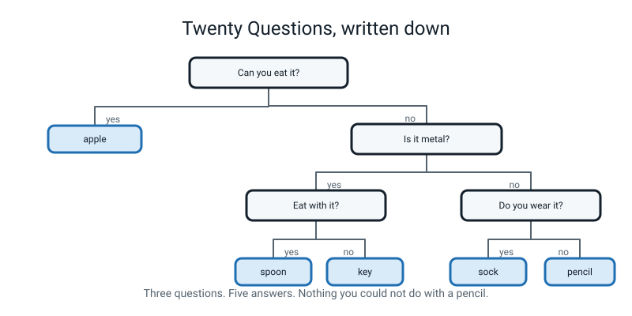
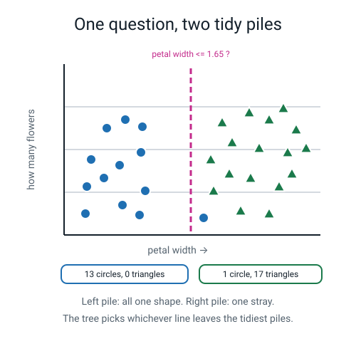
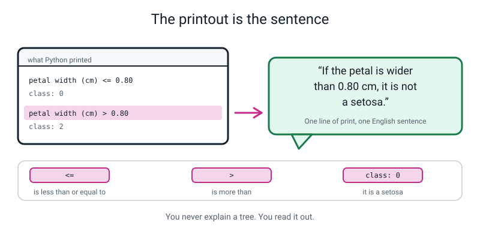
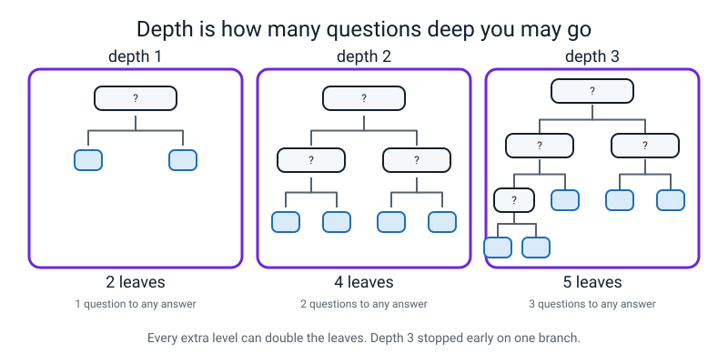
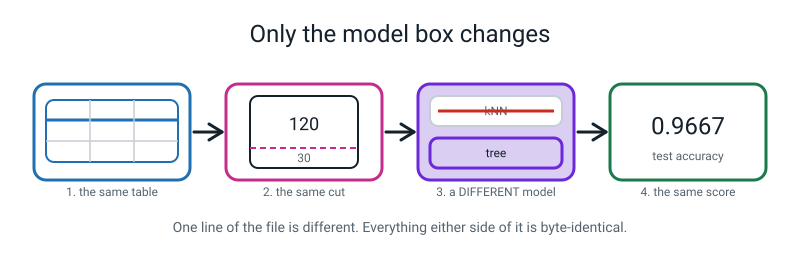
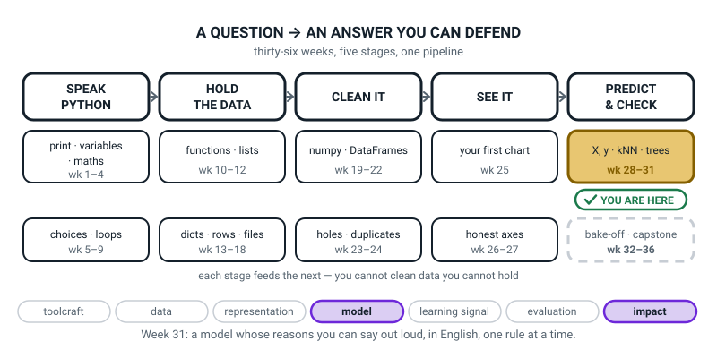

# Week 31 — Trees You Can Read Out Loud

[⬅ Week 30](week-30.md) · [Course Home](../README.md) · [Week 32 ➡](week-32.md) · [Student Guide](../student-guide/week-31.md) · [Workbook](../workbook/week-31.md)

---

## 📋 At a Glance

| | |
|---|---|
| **Duration** | 70 minutes |
| **Type** | 🟦 Teach — one new model, swapped in by changing one line |
| **Big idea** | A decision tree is a stack of yes/no questions, and you can print the exact rules it learned. |
| **New vocabulary** | decision tree · split · depth · leaf · feature importance |
| **New syntax** | `DecisionTreeClassifier(max_depth=3)` · `export_text(tree, feature_names=[...])` · `tree.feature_importances_` · `plot_tree(tree, ...)` |
| **Materials** | Printed workbook (Practice Set A for class; Build It for homework) · pencil · **five ordinary objects from the room** for the Hook (see the Activity) · a big blank sheet or whiteboard · the student's Week 29 and Week 30 Python files · the Bug Log |
| **Tech needed** | Python 3 with scikit-learn and matplotlib. No new install. No internet. |
| **Prep time** | 20 minutes the night before, 5 minutes on the day |

> **⚠️ Watch out:** the single most important thing this week is that the student changes **one line** of last week's working file. Do not let them start a fresh empty file. The whole emotional point of the lesson — *"models are interchangeable parts"* — lives in the fact that everything above and below that line stays byte-for-byte identical.

---

## 🎯 Lesson Objectives

By the end of the lesson the student can:

1. **Explain a decision tree** as a stack of yes/no questions with a limit on how many questions deep it may go.
2. **Train a tree with `max_depth`** and swap it in for last week's kNN by changing one line of code.
3. **Print the tree's learned rules** with `export_text` and read them out as English sentences.
4. **Say which features the tree actually used**, and which it ignored, using `feature_importances_`.
5. **Find one row the tree got wrong** and name the rule that caught it.

Observable evidence: a hand-drawn question tree from the Hook; a file that differs from last week's by exactly one line; `export_text` output on screen; four English sentences written in the workbook; and one wrong flower identified by number, with the rule that caught it named.

---

## 🧑‍🏫 What YOU Need to Know First

> **📌 About the code blocks in this guide.** Outside the **🧰 Prep Checklist** and the **🔑 Answer Key**, the blocks are **illustrations, not files** — each one carries on from the one above it, so the `import` lines and the data are typed once, in the first block that needs them. **The complete runnable files are in the Prep Checklist and the Answer Key.** If you paste an illustration on its own and get `NameError`, that is why, and nothing is broken.

You do not need to know any machine learning to teach this week. You need to know four things: what a tree *is*, what the printout *says*, why the word `depth` matters, and what to do when Python shouts. All four are below, in full, with every line of this week's code explained.

### 1. The one-sentence version

A **decision tree** is a flowchart of yes/no questions that the computer wrote by itself.

That is the whole model. Not a metaphor — literally that. At the end of this lesson your screen will show a list of questions like *"is the petal narrower than 0.8 cm?"*, and following those questions with a pencil will give the same answers the computer gives. There is no hidden extra step.

This matters because it is the **only** model in the whole year that you can read. Last week's kNN worked by remembering 120 flowers and comparing new ones to the nearest five. You cannot print that as a sentence; the reasoning *is* the 120 flowers. A tree hands you four sentences.


*Figure 31.1 — Twenty Questions, written down. Three questions is enough to tell five things apart.*

### 2. The four words, in the order you will need them

Say each one out loud once before class. They are all ordinary English used precisely.

> **Decision tree** — a model that asks a series of yes/no questions about the measurements, following branches until it reaches an answer.
>
> **Split** — one of those yes/no questions. Always the same shape: *is this measurement less than or equal to this number?*
>
> **Depth** — how many questions deep the tree is allowed to go before it must give an answer. This is the dial you turn.
>
> **Leaf** — the end of a branch, where the answer lives. No more questions after a leaf.

The fifth word arrives at the end of the lesson:

> **Feature importance** — a number, per measurement, saying how much of the tree's work that measurement did. The four numbers add up to 1.

Two things students reliably muddle:

- **A split is a question. A leaf is an answer.** In the printout, questions have a `<=` and a number in them. Leaves say `class:` and nothing else. If they can sort the lines into those two piles, they have understood the tree.
- **Depth is a limit, not a promise.** `max_depth=3` means *"you may ask up to three questions"*, not *"you must ask three"*. Our tree stops after one question on the setosa branch, because after that one question the group is already all one kind. This is exactly like Twenty Questions: if the first answer settles it, you stop.

### 3. How the computer picks a question — and how deep to go on this

The honest, complete-enough answer: **it tries every measurement and every sensible cut-off, and keeps the one that leaves the two resulting piles tidiest.**

"Tidiest" means *closest to being all one kind*. Picture the flowers laid out along a ruler by petal width, with two shapes for two species. A good cut-off puts almost all the circles on one side and almost all the triangles on the other.


*Figure 31.2 — One question, two tidy piles. The tree tries every possible cut and keeps the tidiest one.*

**This is deep enough. Stop here.** Do not go further today, for two reasons.

First, the real measure of tidiness has a name — *Gini impurity* — and a formula, and it is not in this week's vocabulary. **You will see the word `gini` in the tree picture** you draw at the end of the Live-Code segment. If the student asks, say exactly this: *"That's the mixed-ness score. Zero means the pile is all one kind. It's how the computer measures 'tidy'. We don't need the formula."* That is true and sufficient. Do not compute it.

Second, and more usefully: the *mechanism* is not the lesson. The lesson is that the result is **readable**. A student who can read the rules and spot the one flower they fail on has got everything this week is for, whether or not they can define Gini.

### 4. Every line of this week's code, explained

Here is the file the student will end up with. Then every line, in order. This is last week's Week 29 file with **one line changed** and a printing section added at the bottom.

```python
# week31_tree_iris.py
# Last week's kNN file with ONE line changed.

from sklearn.datasets import load_iris                        # the 150-flower table
from sklearn.model_selection import train_test_split          # cuts the deck
from sklearn.tree import DecisionTreeClassifier, export_text  # NEW this week
from sklearn.metrics import accuracy_score                    # from week 30

iris = load_iris()      # load the flower table that ships with scikit-learn
X = iris.data           # the four measurements: 150 rows, 4 columns
y = iris.target         # the answer for each flower: 0, 1 or 2

# Cut the deck once. Same seed as week 29, so the same 30 flowers are hidden.
X_train, X_test, y_train, y_test = train_test_split(
    X, y, test_size=0.2, random_state=42, stratify=y)

# vvv THE ONE LINE THAT CHANGED vvv
model = DecisionTreeClassifier(max_depth=3, random_state=0)
# ^^^ last week it said KNeighborsClassifier(n_neighbors=5) ^^^

model.fit(X_train, y_train)          # let it work out its own questions
guesses = model.predict(X_test)      # ask it about the 30 hidden flowers

print("train accuracy:", round(model.score(X_train, y_train), 4))
print("test  accuracy:", round(accuracy_score(y_test, guesses), 4))

print()
print("THE RULES THE TREE LEARNED")
print(export_text(model, feature_names=list(iris.feature_names)))

print("WHICH FEATURES DID IT ACTUALLY USE?")
for i, name in enumerate(iris.feature_names):      # enumerate, from Week 14
    importance = model.feature_importances_[i]
    print(f"  {name:20s} {importance:.3f}")

print()
print("ROWS THE TREE GOT WRONG")
for i in range(len(y_test)):                 # walk the 30 hidden flowers
    if guesses[i] != y_test[i]:              # only print the misses
        print("  hidden flower number", i)
        print("    petal length:", X_test[i][2], "cm")
        print("    petal width :", X_test[i][3], "cm")
        print("    tree said   :", iris.target_names[guesses[i]])
        print("    truth was   :", iris.target_names[y_test[i]])
```

**Line by line.**

- `from sklearn.tree import DecisionTreeClassifier, export_text` — go to the `tree` department of the scikit-learn toolbox and fetch two things: the tree-builder, and the tool that prints a tree as text. One `import` line can fetch several names, separated by commas. **This is the line the deliberate bug lives in** — see the Live-Code segment.
- `iris = load_iris()` — hand over the built-in 150-flower table. Nothing is downloaded; it ships inside scikit-learn.
- `X = iris.data` — `X` is always the measurements, laid out as a table: one row per flower, one column per measurement. 150 rows, 4 columns.
- `y = iris.target` — `y` is always the answer column. Here it holds `0`, `1` or `2` — the three species, written as numbers.
- `train_test_split(..., test_size=0.2, random_state=42, stratify=y)` — cut the 150 flowers into 120 to learn from and 30 to be tested on. `random_state=42` makes the cut identical every run and identical to Week 29's. `stratify=y` makes sure all three species appear in the same proportions in both piles, which here means exactly 10 of each in the test pile.
- `model = DecisionTreeClassifier(max_depth=3, random_state=0)` — **the one changed line.** Build an untrained tree that may ask at most three questions. `random_state=0` settles ties: if two cut-offs are equally tidy, this makes the choice repeatable, so your screen matches the printed output in this guide.
- `model.fit(X_train, y_train)` — go and find the questions. This is where all the work happens, and it takes a few thousandths of a second.
- `model.predict(X_test)` — run each of the 30 hidden flowers down the questions and collect the answers.
- `model.score(X_train, y_train)` — the fraction it gets right on the flowers it learned from.
- `accuracy_score(y_test, guesses)` — the fraction it gets right on the flowers it never saw. **This is the number that counts.** Truth first, guess second — that order matters for some metrics, so build the habit now.
- `export_text(model, feature_names=list(iris.feature_names))` — print the whole tree as indented text. `feature_names` replaces "column 3" with "petal width (cm)", which is the difference between a printout you can read aloud and one you cannot. `list(...)` is there because `export_text` insists on a plain list.
- `for i, name in enumerate(iris.feature_names):` — `enumerate` from Week 14 gives you the position **and** the name, so `model.feature_importances_[i]` fetches the matching number. Two lists walked side by side with nothing new to learn.
- `model.feature_importances_` — the trailing underscore is scikit-learn's way of saying *"this only exists after `fit` has run"*. Forgetting the underscore is the single most common typo of the week and Python is helpful about it.
- `f"  {name:20s} {importance:.3f}"` — an f-string from Week 3. `:20s` pads the name to 20 characters so the numbers line up; `:.3f` shows three decimal places.
- `for i in range(len(y_test)):` … `if guesses[i] != y_test[i]:` — walk the 30 test flowers by position, and print only the ones where the guess and the truth disagree. `!=` means "is not equal to", from Week 5.

### 5. The real output, so you can check their screen in four seconds

```text
train accuracy: 0.9833
test  accuracy: 0.9667

THE RULES THE TREE LEARNED
|--- petal width (cm) <= 0.80
|   |--- class: 0
|--- petal width (cm) >  0.80
|   |--- petal width (cm) <= 1.65
|   |   |--- petal length (cm) <= 4.95
|   |   |   |--- class: 1
|   |   |--- petal length (cm) >  4.95
|   |   |   |--- class: 2
|   |--- petal width (cm) >  1.65
|   |   |--- petal length (cm) <= 4.85
|   |   |   |--- class: 2
|   |   |--- petal length (cm) >  4.85
|   |   |   |--- class: 2

WHICH FEATURES DID IT ACTUALLY USE?
  sepal length (cm)    0.000
  sepal width (cm)     0.000
  petal length (cm)    0.061
  petal width (cm)     0.939

ROWS THE TREE GOT WRONG
  hidden flower number 25
    petal length: 5.0 cm
    petal width : 1.7 cm
    tree said   : virginica
    truth was   : versicolor
```

### 6. How to read that printout — the part you must be able to do live

The indentation is the whole trick. **Each `|   ` is one level deeper into the questions.** A line at the same indentation as the line above is the *other* answer to the same question.

Read it as four sentences, using `0 = setosa`, `1 = versicolor`, `2 = virginica`:

1. *"If the petal is 0.80 cm wide or narrower — it's a **setosa**."* (One question. Done.)
2. *"Otherwise, if the petal is 1.65 cm wide or narrower **and** 4.95 cm long or shorter — **versicolor**."*
3. *"Otherwise, if the petal is 1.65 cm wide or narrower but longer than 4.95 cm — **virginica**."*
4. *"If the petal is wider than 1.65 cm — **virginica**, whatever the length."*


*Figure 31.3 — The printout is the sentence. `<=` reads "is less than or equal to"; a line saying `class:` is an answer, not a question.*

**Two things in that printout are gold, and you should have both ready.**

**Gold 1 — the split that does nothing.** Look at the last question, `petal length (cm) <= 4.85`. Both of its branches say `class: 2`. Whichever way you go, the answer is virginica. That question is **pure decoration.** The tree asked it because it made the piles very slightly tidier on the training flowers, not because it changes any answer. This is a tiny, visible piece of a model fussing over detail instead of pattern — and you can only see it *because a tree explains itself*. Week 33 gives that behaviour a name.

**Gold 2 — two of the four measurements were never used.** `sepal length` and `sepal width` both score **0.000**. The tree looked at them, did not need them for this job, and never asked about them once. Out of four measurements, two carry everything. That is a genuine discovery about irises, handed to you free by a model you can read.

### 7. Depth: the dial, and what it does


*Figure 31.4 — Depth is how many questions deep you may go. Every extra level can double the leaves.*

`max_depth=1` gives at most 2 leaves — two possible answers, full stop. `max_depth=2` gives at most 4. `max_depth=3` gives at most 8. Our tree has **5** leaves, not 8, because two branches settled early.

Here is the same iris tree at five settings. You can run this yourself in the Prep step, and it is the extension for a student who is flying:

```text
  max_depth=1     leaves=  2 real_depth=1 train=0.6667 test=0.6667
  max_depth=2     leaves=  3 real_depth=2 train=0.9667 test=0.9333
  max_depth=3     leaves=  5 real_depth=3 train=0.9833 test=0.9667
  max_depth=4     leaves=  7 real_depth=4 train=0.9917 test=0.9333
  max_depth=5     leaves=  8 real_depth=5 train=1.0000 test=0.9667
  max_depth=None  leaves=  8 real_depth=5 train=1.0000 test=0.9667
```

Three things to notice, and you should notice them *before* a student does:

- **Depth 1 is hopeless.** One question can only ever give two answers, and there are three species. 0.6667 is the best a two-answer model can do here.
- **Train never goes down as depth goes up.** 0.6667 → 0.9667 → 0.9833 → 0.9917 → 1.0000. More questions is always better on the flowers it learned from. Always. By construction.
- **Test does not behave.** It goes 0.6667 → 0.9333 → 0.9667 → **0.9333** → 0.9667. It went *down* at depth 4. On 30 test flowers, one flower is 3.3 percentage points, so these wobbles are one or two flowers and you must not over-read them. **This is Week 33's entire lesson arriving early.** If a student spots it, write their name and today's date beside it and tell them so.

> **🧑‍🏫 If a student asks:** *"Why not just set the depth really high and get 100%?"* — say: *"Try it. Set it to 20."* They will get train 1.0000 and test 0.9667, and the tree will stop at real depth 5 on its own because there is nothing impure left to split. Then say: *"Hold that question. It is the biggest question in this term, and it has a whole lesson — Week 33."* Do not answer it today.

### 8. Trees do not need scaling — and that is worth one sentence out loud

Week 30 was spent learning that kNN needs `StandardScaler`, because a measurement in thousands drowns out a measurement in ones. **A tree does not need it, ever.** A split asks `petal width <= 1.65` — one column, compared with one number. Multiply that whole column by a thousand and the tree just learns `<= 1650` instead. Nothing changes.

So there is no `StandardScaler` anywhere in this week's file, and that is not an oversight. Say it out loud, because a student who worked hard last week will notice it is missing and wonder if they have forgotten something.

### 9. The three misconceptions you will actually meet

**Misconception 1 — "the tree wrote those questions because a person told it to."**

No. Nobody typed `petal width <= 0.80` anywhere. The number `0.80` was *found*, by trying cut-offs and keeping the tidiest. The fix is a question: *"Show me where in our file anybody typed 0.80."* They will hunt, and fail, and that is the moment it lands.

**Misconception 2 — "`class: 0` means zero, or none, or nothing."**

`0`, `1` and `2` are name-tags, not amounts. Species number 2 is not twice species number 1. Fix it immediately by printing the names:

```python
print(iris.target_names)
```

```text
['setosa' 'versicolor' 'virginica']
```

Position 0 is setosa, position 1 is versicolor, position 2 is virginica. From then on, insist they read the rules with the real names.

**Misconception 3 — "importance 0.000 means the measurement is useless."**

It means **this tree, at this depth, on this training data, did not need it.** Sepal width is a perfectly real, perfectly measurable thing about a flower. It is simply that petal width already separates the species so well that there was no job left for sepal width to do. Give the tree only the two sepal columns and it will use them, and score 0.6667 instead of 0.9667. The sentence to use: *"Not useless. Just not needed here."*

### 10. Where to stop

**Go this far:** a tree is stacked yes/no questions; depth is the dial; leaves hold the answers; `export_text` prints the rules; importances say who did the work; find the one row it fails on and name the rule.

**Stop before:**

- **Gini impurity arithmetic.** Name it if the word appears on screen. Do not compute it.
- **Overfitting.** The words *overfit* and *memorise* belong to Week 33. If a student invents the idea, celebrate loudly, write it on the wall, and move on. Do not teach it today — Week 33 needs them to still be a bit proud of their score.
- **Random forests.** Somebody will have heard of them. Honest answer: *"It's hundreds of trees voting. It scores better and you can't read it any more. That's Level 3."*
- **Regression trees.** A tree can also predict a number. Next week is about predicting numbers, and Week 33 uses a `DecisionTreeRegressor`. Not today.


*Figure 31.5 — Only the model box changes. This is the picture to hold in your head all lesson.*

---

### 11. 🧭 The Growing Map — two minutes on the third word in the tile

The student guide carries one figure a week that is not about the week's content: the same pipeline,
one more piece filled in, so the learner can see the shape of the year. This week it closes a tile —
and the fact that it looks unchanged from last week is exactly the thing to point at.



*Figure 31.0 — Week 31's version. Fourth and final week inside the `X, y · kNN · trees` tile, weeks 28
to 31 — this is the week that earns its last word. Two threads lit: model and impact.*

**What to do with it, in about two minutes at the end of the lesson:**

1. **Show it and put a finger on the three words in the gold tile.** Ask *"we have now done all
   three — so which one did today add, and how many lines of the file did it take?"* You want
   **`trees`** and **one**. Then the sentence that is really the lesson: *and what can this model do
   that last week's could not?* You are listening for **tell you why** or **print its rules** — not
   *"be more accurate"*, which is not reliably true and is not the point.
2. **Then the map question:** *"the picture is identical to last week's. Two different models, same
   box. What does that tell you about the box?"* You want something like *the steps are the same
   whatever model you put in.* That sentence is the whole of Week 33 in advance, and hearing it from
   them now is worth more than hearing it from you then.
3. **Have them ink the tile in on their own copy** — all four weeks of it — and write one of their own
   `export_text` rules, in English, underneath. Initials after it. It is the only line on anybody's
   map that a stranger could check.

> **🧑‍🏫 Why this is worth two minutes.** The emotional payload of this week is *models are
> interchangeable parts*, and no amount of explaining lands it as well as two identical maps side by
> side. It also quietly prepares the one thing Term 4 needs: from Week 33 onwards they will be choosing
> between models, and a learner who already knows that the surrounding four steps do not change will
> compare the models rather than restarting from scratch each time. The impact thread is lit for a
> real reason, not a tidy one — explainability is a legal requirement in several of the places these
> models get used, and a twelve-year-old can understand why.

---

## 🧰 Prep Checklist

Use this section to get the room, the files and your own confidence ready before class.

### 20 minutes the night before

- [ ] **Print the workbook.** Practice Set A, question A2 (the rule-tracing grid for flowers P, Q and R), is worth printing twice.
- [ ] **Find last week's file.** Open `~/ai-academy/level2/` and confirm `week29_knn_iris.py` (or whatever the student named it) is there and still runs. If it has vanished, the Fallback table below tells you what to do — do not discover this in class.
- [ ] **Run the code yourself. This is the step that buys your confidence.** In a terminal:

  ```bash
  cd ~/ai-academy/level2
  source .venv/bin/activate        # macOS / Linux
  .venv\Scripts\activate           # Windows PowerShell
  ```

  Create `week31_tree_iris.py`, type in the file from section 4 above, and run it:

  ```bash
  python3 week31_tree_iris.py
  ```

  You must see exactly the output printed in section 5. **Check three things:** `test accuracy: 0.9667`, `petal width (cm) <= 0.80` as the very first rule, and `hidden flower number 25` at the bottom. If all three match, your machine and this guide agree and you can trust everything else in here.

- [ ] **Break it on purpose, once.** Change `max_depth=3` to `depth=3`, run it, and read the error:

  ```text
  TypeError: DecisionTreeClassifier.__init__() got an unexpected keyword argument 'depth'
  ```

  Change it back. You will be staging this exact mistake in front of the student, and it is much calmer if you have seen it once already.

- [ ] **Read the four sentences in section 6 out loud.** Actually out loud. You are going to say them in class and they are harder to say than to read.
- [ ] **Choose your five Hook objects** (see the Activity, In Full). Put them in a bag or under a cloth.

### 5 minutes on the day

- [ ] Terminal open, virtual environment activated, `(.venv)` visible in the prompt.
- [ ] Last week's file open in one editor tab. A blank `week31_tree_iris.py` in another. Do not pre-type anything.
- [ ] The five objects hidden but reachable.
- [ ] The big blank sheet, landscape, blank — you will draw the question tree on it live.
- [ ] Bug Log open at the next clean page.

### Fallback if something fails

| If this fails | Do this instead |
|---|---|
| **Last week's file is gone** | Type this week's file from scratch. It is 30 lines and takes 8 minutes. You lose the "one line changed" drama, so recover it by writing both model lines on the board side by side and physically covering one with your hand. |
| **scikit-learn will not import** | `ModuleNotFoundError` is almost always the virtual environment. Check for `(.venv)` in the prompt; if it is missing, re-run the activate line. Full table in Section 4 of the orientation. |
| **No laptop at all today** | The paper version is a complete lesson. Print the `export_text` output from section 5, print the workbook, and run Practice Set A (A1 and A2) entirely by hand: the student traces flowers through the printed rules with a pencil. That delivers objectives 1, 3 and 5 in full. Objectives 2 and 4 wait for the next session. |
| **`plot_tree` produces no window** | Expected on many setups, and harmless. The script calls `fig.savefig(...)`, so open `week31_tree.png` from the folder instead. Every chart in this course saves to a file for exactly this reason. |
| **The student's numbers differ from this guide** | Check `random_state=42` in the split and `random_state=0` in the tree. One of the two is almost always missing or different. |
| **Everything runs and there are 25 minutes left** | Go to the Differentiation "flying" path, item 1: the depth sweep. It is the best 15 minutes available and it plants Week 33. |

---

## ⏱️ The Lesson, Minute by Minute

This section gives the plan for the whole lesson, one segment at a time.

| Segment | Minutes | Running total | What happens |
|---|---|---|---|
| 🪝 Hook — Twenty Questions with five objects | 7 | 7 | The student invents a decision tree before hearing the word |
| 🧠 Concept — splits, depth, leaves | 16 | 23 | Name what they just drew; introduce the depth dial |
| 💻 Live-Code Together — change one line | 18 | 41 | Swap kNN for a tree; two staged bugs; print the rules |
| 🎲 Their Turn — read the rules, find the miss | 20 | 61 | Read all four rules aloud; trace flowers; find flower 25 |
| 🔑 Wrap & Assign | 9 | 70 | Three checks, the takeaway, homework |

---

### 🪝 Hook — Twenty Questions with five objects (7 minutes)

**Do this:** Put the five objects on the table where the student can see them. Take the big blank sheet and a pen. Sit back.

**Say this:**

> "Five things on the table. In a second I'm going to think of one of them, and you have to work out which — but you're only allowed to ask questions I can answer with yes or no. No pointing. No 'which one is it'. Yes or no only.
>
> Here's the extra rule, and it's the whole lesson: **every question you ask, I write down.** Not the answer. The question."

Think of one. Let them ask. Write each question on the sheet as a box, and draw the branches as you go — yes going one way, no going the other. Do not tidy it. A messy hand-drawn tree is exactly right.

When they get it, do it again with a different object. The second run is where the shape appears, because their first question is usually the same one and the top of the drawing gets reused.

**Say this:**

> "Look at what we've made. Not a list — a *shape*. Every box is a question. Every line coming out of a box is an answer, yes or no. And down at the bottom, where there's nothing left to ask, there's a name.
>
> Count the questions on the longest path from the top to a name. Three? Right — so with three questions you separated five things.
>
> Now the bit I want you to sit with for a second. **Nobody taught you those questions.** I didn't give you a list. You worked out, on the fly, which question would cut the pile down fastest. You asked 'is it metal?' instead of 'is it the spoon?' because 'is it metal?' halves the table and 'is it the spoon?' probably doesn't.
>
> Today the computer does that. Exactly that. Same shape, same yes/no questions, worked out by itself from the numbers. And unlike last week's model, **you'll be able to print the questions out and read them.**"

**Ask this:**

| Ask | Answer you want | If they say something else |
|---|---|---|
| "Why 'is it metal?' and not 'is it the key?'" | Because it splits the group nearly in half; naming one object only helps if you're right. | If they say "just a guess" — push once: "Which question would you *never* ask first? Why not?" They will land on it. |
| "How many questions did you need, worst case?" | Three (count the longest path on the sheet). | If they count boxes instead of the longest path, trace the path with your finger: top box, next box, next box, name. |
| "Could you sort ten objects with three questions?" | Maybe — three questions gives at most eight endings, so eight is the limit; ten needs four. | If they say yes, ask them to try it on the sheet. Running out of endings is a great discovery and it is exactly what `depth` means. |
| "What's at the very bottom of every path?" | A name — an answer, not a question. | If they say "the last question", correct gently: after the last question there is still a name. That name is the thing the model gives you. |

---

### 🧠 Concept — splits, depth, leaves (16 minutes)

**Do this:** Keep the hand-drawn sheet in front of you. You are going to write four words onto it, on top of the drawing they made. Do not start a clean diagram — labelling *their* drawing is what makes the vocabulary feel like naming rather than teaching.

**Say this — part 1, the four words:**

> "Four words, and you've already built all four. I'm just going to write them on your drawing.
>
> The whole shape has a name. It's a **decision tree**." *(Write it at the top.)* "A model that asks yes/no questions about the measurements until it reaches an answer. It's called a tree because it branches, and it's drawn upside down, which nobody has ever apologised for.
>
> Each box — each question — is a **split**." *(Label one box.)* "Because it splits the group in two. And when the computer does this, every split has exactly the same shape: **is this measurement less than or equal to this number?** That's it. That's the only kind of question it can ask. `petal width <= 0.8`. Never 'is it pretty', never two things at once.
>
> The names at the bottom, where the questions stop — those are **leaves**." *(Label two.)* "A leaf is where the answer lives. Nothing comes after a leaf.
>
> And the number of questions on the longest path from the top to a leaf — that's the **depth**." *(Write `depth = 3` on the sheet.)* "Three, on yours."

**Say this — part 2, the depth dial:**

> "Depth is the one thing we get to choose, and it's the interesting one.
>
> If I only let you ask **one** question, how many different answers could you possibly give me?" *(Wait. Two.)* "Two. One question, two answers, that's all there is. So a one-question tree can never tell three kinds of thing apart. Never. However clever the question is.
>
> Two questions?" *(Wait.)* "Four. Three questions, eight. It doubles.
>
> So depth is a budget. It's the number of questions the tree is *allowed* to spend. And here's the thing that catches everybody: it's a **limit, not an order**. If I say 'you may ask three questions' and your first answer settles it completely, you stop. You don't ask two pointless extra questions to use up the budget.
>
> Watch for that in a minute, because our tree is allowed three questions and it will settle one whole branch with just one."

Draw the depth ladder on the sheet, or point at Figure 31.4 if you have it printed:

```text
 depth 1  →  at most 2 leaves      2 possible answers
 depth 2  →  at most 4 leaves      4 possible answers
 depth 3  →  at most 8 leaves      8 possible answers
```

**Say this — part 3, how the computer chooses:**

> "Last question before we type. How does the computer decide which question to ask, when nobody's told it?
>
> Same way you did. It tries them. All of them. Every measurement, every sensible cut-off number, and it keeps whichever one leaves the two piles **tidiest** — meaning closest to being all one kind.
>
> That's it. It's not clever, it's just fast. Where you tried three questions in your head, it tries a few hundred in a thousandth of a second."

**Ask this:**

| Ask | Answer you want | If they say something else |
|---|---|---|
| "What's the biggest number of answers a depth-2 tree can give?" | Four. | If they say two, walk it: one question splits into two, each of those splits into two, that's four. Draw it. |
| "So what's the fewest questions to tell three species apart?" | Two. | If they say three, point out that two questions give four possible answers, and three species needs at least three answers. Two is enough. |
| "If depth 3 is allowed, must every path be three long?" | No — a path stops as soon as the group is all one kind. | This is the one to press on, because it is the misconception that will bite in five minutes. Point at their own drawing: is every path the same length? |
| "How does it decide which measurement to ask about?" | It tries them all and keeps the tidiest split. | If they say "the most important one" — good instinct, wrong order. Say: "It doesn't know which is important yet. Trying them all is *how* it finds out. And at the end it'll tell us." |
| "Which of last week's steps do you think changes today?" | Only the model line. | If they say "all of it", that is worth two minutes: walk through the file with them naming each step. The point of the next segment is that only one line moves. |

---

### 💻 Live-Code Together — change one line (18 minutes)

**You type on the shared screen. The student types the same thing on their own machine.** Nobody pastes. Both mistakes below are staged on purpose — do not skip them, and do not warn the student first.

**Say this:**

> "Open last week's file. Now do **File → Save As** and call it `week31_tree_iris.py`. We're not starting a new file. We're editing last week's, because almost none of it is going to change."

**Step 1 (2 min) — the file, saved under a new name.** Confirm the student's file matches yours down to the imports. Read the top four lines aloud together.

**Step 2 (3 min) — 🐞 STAGED MISTAKE ONE: the changed line, typed wrong.**

Say: *"Find the line that says `model = KNeighborsClassifier(n_neighbors=5)`. We're replacing it. Type this."*

Type, deliberately wrong:

```python
model = DecisionTreeClassifier(depth=3, random_state=0)
```

Also change the import line — and here, deliberately, leave `export_text` out:

```python
from sklearn.tree import DecisionTreeClassifier
```

Delete the old `from sklearn.neighbors import ...` line. Run it:

```bash
python3 week31_tree_iris.py
```

```text
Traceback (most recent call last):
  File "week31_tree_iris.py", line 15, in <module>
    model = DecisionTreeClassifier(depth=3, random_state=0)
TypeError: DecisionTreeClassifier.__init__() got an unexpected keyword argument 'depth'
```

**Say this:**

> "Right. Read me the last line."

Make them read it out loud. Then:

> "`unexpected keyword argument 'depth'`. A keyword argument is a setting you pass by name — `depth=3`. Python is saying: *I know how to build a tree, but nobody who wrote this tool has ever heard of a setting called `depth`.*
>
> So the setting exists, I just called it the wrong thing. What do you reckon it's actually called?"

Let them guess. `max_depth` — *maximum* depth, because it is a limit, not an order. Fix it:

```python
model = DecisionTreeClassifier(max_depth=3, random_state=0)
```

Run again. It works, and prints last week's two accuracy lines with new numbers:

```text
train accuracy: 0.9833
test  accuracy: 0.9667
```

**Say this:**

> "Stop. Look at what just happened. We changed **one line** of last week's file and we have a completely different kind of model — one that asks questions instead of remembering neighbours — and it scores 0.9667 on the hidden flowers. Last week's kNN scored well too.
>
> That is not a coincidence and it is not a small thing. Everything either side of that line — loading the table, cutting the deck, fitting, predicting, scoring — is *identical* for every model in the world. Once you know the shape, swapping models costs you one line."

**Step 3 (4 min) — 🐞 STAGED MISTAKE TWO: print the rules, forget the import.**

Say: *"Now the good bit. Add these three lines at the bottom."*

```python
print()
print("THE RULES THE TREE LEARNED")
print(export_text(model, feature_names=list(iris.feature_names)))
```

Run it:

```text
Traceback (most recent call last):
  File "week31_tree_iris.py", line 25, in <module>
    print(export_text(model, feature_names=list(iris.feature_names)))
NameError: name 'export_text' is not defined
```

**Say this:**

> "Read the last line. `NameError: name 'export_text' is not defined.`
>
> `NameError` always means the same thing: **you used a name Python has never been given.** Same error you got in Week 2 when you typed a variable name wrong. Here it isn't a typo — it's that we never asked for the tool. Scroll up. What does our import line say?"

Point at `from sklearn.tree import DecisionTreeClassifier`. Then fix it:

```python
from sklearn.tree import DecisionTreeClassifier, export_text
```

> "One import line can fetch as many tools as you like, separated by commas. Run it."

```text
THE RULES THE TREE LEARNED
|--- petal width (cm) <= 0.80
|   |--- class: 0
|--- petal width (cm) >  0.80
|   |--- petal width (cm) <= 1.65
|   |   |--- petal length (cm) <= 4.95
|   |   |   |--- class: 1
|   |   |--- petal length (cm) >  4.95
|   |   |   |--- class: 2
|   |--- petal width (cm) >  1.65
|   |   |--- petal length (cm) <= 4.85
|   |   |   |--- class: 2
|   |   |--- petal length (cm) >  4.85
|   |   |   |--- class: 2
```

**Say this — and slow right down here, this is the summit of the lesson:**

> "There it is. That is the model. Not a description of the model — **the model itself**, written out.
>
> Read me the first line."
>
> *(They read: petal width less than or equal to 0.80.)*
>
> "And the line under it, one level in?"
>
> *(`class: 0`.)*
>
> "So put those two together in English. 'If the petal is 0.80 centimetres wide or narrower, then… species zero.' Which is setosa — let's prove it."

Type, live:

```python
print(iris.target_names)
```

```text
['setosa' 'versicolor' 'virginica']
```

> "Position zero is setosa. So sentence one is: **'If the petal is 0.8 cm wide or narrower, it's a setosa.'** One question and you're done. A person with a ruler and no computer could use that in a field.
>
> And now find me the number 0.80 anywhere in the code we typed."

Let them look. Let it take a moment.

> "It isn't there. Nobody typed it. The computer *found* 0.80 by trying cut-offs and keeping the tidiest. That's what `.fit()` did."

**Step 4 (4 min) — who did the work.** Add:

```python
print("WHICH FEATURES DID IT ACTUALLY USE?")
for i, name in enumerate(iris.feature_names):      # enumerate, from Week 14
    importance = model.feature_importances_[i]
    print(f"  {name:20s} {importance:.3f}")
```

```text
WHICH FEATURES DID IT ACTUALLY USE?
  sepal length (cm)    0.000
  sepal width (cm)     0.000
  petal length (cm)    0.061
  petal width (cm)     0.939
```

**Say this:**

> "**Feature importance** — a number per measurement saying how much of the work it did. They add up to one; check it: 0.000 plus 0.000 plus 0.061 plus 0.939 is 1.000.
>
> Petal width did ninety-four percent of the job. And look at the top two. **Zero. Zero.** The tree looked at sepal length and sepal width and never asked about them once. We gave it four measurements and it needed two — really, mostly one.
>
> That is a real fact about irises, and we didn't go looking for it. It fell out of a model we could read. Last week's kNN used all four columns equally and could never have told us that."

**Step 5 (3 min) — find the one it gets wrong.** Add:

```python
print()
print("ROWS THE TREE GOT WRONG")
for i in range(len(y_test)):
    if guesses[i] != y_test[i]:
        print("  hidden flower number", i)
        print("    petal length:", X_test[i][2], "cm")
        print("    petal width :", X_test[i][3], "cm")
        print("    tree said   :", iris.target_names[guesses[i]])
        print("    truth was   :", iris.target_names[y_test[i]])
```

```text
ROWS THE TREE GOT WRONG
  hidden flower number 25
    petal length: 5.0 cm
    petal width : 1.7 cm
    tree said   : virginica
    truth was   : versicolor
```

**Say this:**

> "One flower out of thirty. Number 25. Petal width 1.7, petal length 5.0. The tree said virginica. It was actually a versicolor.
>
> Now — and this is the thing you can only do with a tree — **go and find the rule that caught it.** Take the printed rules and walk 1.7 down them with your finger. Is 1.7 less than or equal to 0.80? No. Is 1.7 less than or equal to 1.65?"

*(No — 1.7 is bigger than 1.65. Only just.)*

> "So it went right, into rule four: **'petal wider than 1.65 → virginica, whatever the length.'** And this flower was 1.7. It was over the cut-off by five hundredths of a centimetre — half a millimetre — and that sent it down the virginica side.
>
> The tree isn't broken. There genuinely are versicolors with unusually wide petals, and no single cut-off can be right about all of them. But notice what we just did: **we found the exact reason for the exact mistake, and said it in one sentence.** You could not do that last week."

**Step 6 (2 min) — the picture.** New file, `week31_tree_picture.py`:

```python
# week31_tree_picture.py  -  draw the same tree as a picture
from sklearn.datasets import load_iris
from sklearn.model_selection import train_test_split
from sklearn.tree import DecisionTreeClassifier, plot_tree
import matplotlib.pyplot as plt              # charts, from week 25

iris = load_iris()
X_train, X_test, y_train, y_test = train_test_split(
    iris.data, iris.target, test_size=0.2, random_state=42, stratify=iris.target)

model = DecisionTreeClassifier(max_depth=3, random_state=0)
model.fit(X_train, y_train)

fig, ax = plt.subplots(figsize=(12, 6))      # a wide canvas, from week 25
plot_tree(model,                             # NEW: draw the tree
          feature_names=iris.feature_names,  # put real names on the questions
          class_names=list(iris.target_names),   # put real names on the answers
          filled=True,                       # colour each box by its answer
          rounded=True,                       # soft corners
          fontsize=8,                         # small enough to fit
          ax=ax)
ax.set_title("The tree we just trained, max_depth=3")
fig.savefig("week31_tree.png", dpi=120, bbox_inches="tight")
print("saved week31_tree.png")
print("leaves:", model.get_n_leaves())
print("depth :", model.get_depth())
```

```text
saved week31_tree.png
leaves: 5
depth : 3
```

Open the PNG. Five leaves, three deep — the same tree as the text, drawn.

> **⚠️ Watch out:** every box in that picture also shows `gini = 0.667`, `samples = 120`, `value = [40, 40, 40]`. Do not open the Gini conversation. If asked: *"That's the mixed-ness score. Zero means the pile is all one kind. It's how the computer measures 'tidy'. We don't need the formula today."* `samples` and `value` **are** worth a sentence: 120 training flowers at the top, 40 of each species. That is the deck we cut.

---

### 🎲 Their Turn — read the rules, find the miss (20 minutes)

Full instructions in the Activity section below. In the lesson flow:

- **Minutes 0–8:** workbook Practice Set A, A1 (sort the printout lines into questions and answers), then read all four iris rules as English sentences, out loud, then written down on scrap paper (the written version in the workbook is Build It, Part 3, set as homework).
- **Minutes 8–15:** workbook Practice Set A, A2 — trace the three named flowers P, Q and R down the printed rules by hand, with the pencil, no computer.
- **Minutes 15–20:** find the useless split, and re-check flower 25 against the hand-drawn tree from the Hook.

---

### 🔑 Wrap & Assign (9 minutes)

**Say this:**

> "Three things to take away.
>
> **One.** A decision tree is a stack of yes/no questions the computer wrote itself, and you can print them out and read them to somebody who has never seen a computer. No other model this year does that.
>
> **Two.** We changed **one line** of last week's file. That's the shape of everything from here on: load, split, fit, score. The model is a part you swap.
>
> **Three.** Because we could read the rules, we could find not just *that* the tree got flower 25 wrong, but *why* — a petal width of 1.7 against a cut-off of 1.65. Half a millimetre. When you can read a model, you can argue with it."

Run the three checks in **Assessing Understanding**, then assign the homework. Have them paste both of today's tracebacks into the Bug Log before they close the laptop — the `TypeError` about `depth` and the `NameError` about `export_text`.

---

## 🐞 The Debugging Clinic

Every message below was produced by running a broken version of this week's actual code. Line numbers on the student's machine will differ; everything after the file name will not.

| What the student sees (real message) | What it means | Most likely cause | The fix |
|---|---|---|---|
| `TypeError: DecisionTreeClassifier.__init__() got an unexpected keyword argument 'depth'` | You passed a setting by a name this tool does not have. | Typed `depth=3` instead of `max_depth=3`. | Rename it to `max_depth=3`. It is *max* because depth is a limit, not an order. |
| `NameError: name 'export_text' is not defined` | You used a name Python was never given. | `export_text` is missing from the import line. | `from sklearn.tree import DecisionTreeClassifier, export_text` |
| `ImportError: cannot import name 'DecisionTreeClassifer' from 'sklearn.tree'` | The department exists; that tool does not. | Spelling. `Classifer` is missing its second `i`. | `DecisionTreeClassifier`. Read the name in the error against the name in your file, character by character. |
| `ModuleNotFoundError: No module named 'sklearn.trees'` | The whole department name is wrong. | Typed `sklearn.trees`, plural. | `from sklearn.tree import ...` — singular. `ModuleNotFound` = the address is wrong; `ImportError` = the address is right, the item is not there. |
| `AttributeError: 'DecisionTreeClassifier' object has no attribute 'feature_importances'. Did you mean: 'feature_importances_'?` | You asked the model for something by nearly the right name. | Missing the trailing underscore. | `model.feature_importances_`. The underscore means "this only exists after `fit`". Python even suggests it — read the whole message. |
| `sklearn.exceptions.NotFittedError: This DecisionTreeClassifier instance is not fitted yet. Call 'fit' with appropriate arguments before using this estimator.` | You asked an untrained model to do something. | `export_text` or `predict` runs before `model.fit(...)`, or the `fit` line was deleted. | Put `model.fit(X_train, y_train)` above it. An untrained tree has no questions to print. |
| `ValueError: feature_names must contain 4 elements, got 2` | The list of names does not match the number of columns. | Typed only two names into `feature_names=[...]`. | Give one name per column — four, in the same order as the columns. Or use `list(iris.feature_names)`. |
| `IndentationError: expected an indented block after 'for' statement on line 6` | You opened a loop and then did not indent its body. | The `print` under the `for` is hard against the left margin. | Indent it by four spaces. The colon promises an indented block; Python holds you to it. |
| `ValueError: Expected 2D array, got 1D array instead:` `array=[5.9 3. 5.1 1.8].` | `predict` wants a **table** of flowers, not one flower. | `model.predict([5.9, 3.0, 5.1, 1.8])` — one set of square brackets. | Two sets: `model.predict([[5.9, 3.0, 5.1, 1.8]])`. Outer brackets = the table, inner = one row. |

### How to teach debugging without giving the answer

Same three moves, every time, all year:

1. **"Read me the last line, out loud."** Not the wall of red. The last line. It is a sentence in English and it names the problem.
2. **"Which line number does it say?"** Then go there — and only there. The traceback prints the file and line above the message.
3. **"What is the difference between the name in the error and the name in your file?"** For `NameError`, `AttributeError` and `ImportError`, that question solves it about four times out of five, and the student solves it, which is the point.

Only after all three have been tried do you point. And when you point, point at the *line*, never at the character. Let them find the character.

> **🐞 If you see this error:** an error with **no line number** and words like `SyntaxError: invalid syntax` usually means the real problem is on the line *above* the one named — an unclosed bracket runs on. Check the line before.

---

## 🎲 The Activity, In Full

This section gives the full setup for the Hook activity, so you can run it without improvising.

### Part A — Twenty Questions with five objects (the Hook, 7 minutes)

**Setup.** Five ordinary objects from the room, on the table, visible. Choose things that differ in obvious yes/no ways. A set that works well:

| Object | Edible? | Metal? | Wearable? | Write with it? |
|---|---|---|---|---|
| an apple | yes | no | no | no |
| a spoon | no | yes | no | no |
| a key | no | yes | no | no |
| a sock | no | no | yes | no |
| a pencil | no | no | no | yes |

Any five will do, as long as no two are alike in every respect. **Do not buy anything.**

**Rules.**

1. You think of one object. The student asks yes/no questions only.
2. **You write down every question, as a box, and draw the branches.** They watch the drawing grow.
3. No "is it the spoon?" as a first question — well, allow it once, and let them feel it waste a turn. That failure teaches more than the rule would.
4. Do it twice, with two different objects, so the top of the tree gets reused.

**What "finished" looks like:** a hand-drawn tree on the big sheet with question boxes, yes/no on every branch, object names at the bottom, and the longest path counted out loud. Keep this sheet on the table for the whole lesson — you will compare it to the computer's tree in Part B.


*Figure 31.6 — What a finished Hook sheet looks like. Messier than this is fine. The yes/no labels are not optional.*

### Part B — Read the computer's rules (Their Turn, 20 minutes)

**Setup.** On the table: the printed `export_text` output (or the screen), workbook Practice Set A (A1 and A2), a pencil, and the hand-drawn sheet from Part A.

**Step 1 (8 minutes) — four sentences.** The student writes each of the four iris rules as one English sentence a non-programmer could follow, then reads all four out loud. Insist on species *names*, not `class: 0`. Insist on the units — "0.8 centimetres", not "0.8".

Model answers are in the Answer Key. What you are marking is whether each sentence stands alone: could a person with a ruler and no computer use it?

**Step 2 (7 minutes) — trace three flowers by hand.** Workbook A2 gives three flowers, P, Q and R. For each one the student writes down every question they hit, the yes/no answer, and the final species. **Pencil only. The laptop stays shut for this step.**

| Flower | sepal length | sepal width | petal length | petal width |
|---|---|---|---|---|
| P | 4.9 | 3.1 | 1.5 | 0.1 |
| Q | 5.7 | 2.8 | 4.1 | 1.3 |
| R | 6.3 | 2.9 | 5.6 | 1.8 |

None of these three is the computer's mistake. For Step 3, add one more flower on the board, **flower C**: sepals 6.7 / 3.0, petal length 5.0, petal width 1.7. It is the one the computer got wrong. Do not tell them that yet; have them trace it as a fourth pencil trace (its trace is in the Answer Key, under Practice Set A).

**Step 3 (5 minutes) — the two discoveries.**

- **Find the split that does nothing.** *"Somewhere in those rules there's a question where both answers are the same. Find it."* (It is `petal length (cm) <= 4.85`.) Then ask why the tree bothered. Honest answer: it made the training piles very slightly tidier; it changes no prediction. It is the tree fussing.
- **Compare flower C to the computer's mistake.** Now reveal that flower C *is* hidden flower 25 — and it is really a versicolor. Their hand-trace said virginica. So did the computer's. *"You and the computer made the identical mistake, for the identical reason. Name the reason."* (Petal width 1.7 is just over the 1.65 cut-off.)

**What "finished" looks like:**

- Four sentences written out, in species names, with units.
- Three completed traces, each showing the questions hit — not just the answer.
- The useless split circled on the printout.
- One sentence in the student's own words naming the rule that caught flower C.

### Variation — easier

- **Cut to depth 2.** Change one number in the file: `max_depth=2`. The rules become three lines and two sentences, and the whole reading exercise fits in six minutes:

  ```text
  |--- petal width (cm) <= 0.80
  |   |--- class: 0
  |--- petal width (cm) >  0.80
  |   |--- petal width (cm) <= 1.65
  |   |   |--- class: 1
  |   |--- petal width (cm) >  1.65
  |   |   |--- class: 2
  ```

  Three sentences, one measurement, test accuracy 0.9333. Objectives 1, 3 and 5 all survive intact.
- **Trace one flower, not three.** Flower P in workbook A2, which needs a single question. Getting one trace completely right beats three half-done.
- **Pre-write the sentence frames** in the workbook: *"If the petal is ______ or narrower, it is a ______."* They fill the blanks.
- **Do not touch `plot_tree`.** The picture is the first thing to cut; the text version teaches more.

### Variation — harder

1. **Turn the dial and watch.** Run the file five times with `max_depth` at 1, 2, 3, 4 and 5, writing down leaves, train and test each time. The table is in section 7 above. Then the question: *"Train goes up every single time. Test goes down at depth 4. Which of those two numbers would you trust, and why?"* This is Week 33 arriving two weeks early, and it is the best extension available.
2. **Starve it.** Give the tree only the two sepal columns — `X = iris.data[:, [0, 1]]` — and see what happens. Train 0.8583, test **0.6667** — no better than the depth-1 tree. Then the point: *"Sepal width scored 0.000 importance. Was it useless, or just not needed?"*
3. **Beat the tree by hand.** *"Write me a two-question rule, in English, that gets 28 or more of the 30 hidden flowers right."* They will end up rediscovering roughly the tree's own rules, which is the best possible way to believe them.
4. **Break the readability.** Set `max_depth=8`, print the rules, and count the lines. The model gets no better and the printout becomes unreadable. *"You've just traded the one thing this model was good for. Was it worth it?"*

---

## ❓ Questions Students Ask This Week

These are the questions this lesson tends to prompt, each with an answer you can say aloud.

**"Who decided 0.80? Did you type that number somewhere?"**

No, and this is the best question of the week. Search the file — the number is not in it. `.fit()` found it. The tree tried lots of cut-offs on petal width (and on the other three measurements), scored each one by how tidy the two resulting piles were, and kept 0.80 because it was the tidiest available. Change the training flowers and you get a different number.

**"Which is better, the tree or last week's kNN?"**

On these flowers, on this split, they score about the same — 0.9667 for the tree. So "better" has to mean something other than the score, and here it means: *the tree can be read and the kNN cannot.* If you have to explain a decision to somebody, or check it for something unfair, the tree wins outright. If you just need the number and nobody will ever ask why, it is a coin flip. Ranking models by score alone is a habit worth not forming.

**"Why does the picture say `gini`? What is it?"**

It is the tidiness score — the "mixed-ness" of a pile. Zero means the pile is all one kind. Bigger means more mixed. It is how the computer measures the thing you and I called "tidiest". There is a small formula and you do not need it this year; what you need is that the tree keeps whichever question drives that number down the most.

**"If it got flower 25 wrong, can we fix the rule so it gets it right?"**

Moving only the width cut-off from 1.65 to 1.75 does *not* fix it: the flower then reaches the `petal length <= 4.95` question and, at 5.0 cm, is called virginica again (it is over that cut-off by 0.05 too), while a genuine virginica with a 1.7 cm petal becomes wrong. Move both (1.75 and 5.05) and flower 25 is right, but the 120 training flowers go from 2 wrong to 4 wrong. Try it by hand-coding the rules. Moving a cut-off does not remove a mistake, it relocates it — because real versicolors and real virginicas genuinely overlap around 1.7 cm, and no single number can separate things that overlap. That is not a flaw in the tree. It is a fact about irises.

**"Two measurements got 0.000. Should we just throw them away?"**

For this tree, on this data, yes — you would lose nothing. But be careful about the sentence you say next. "Sepal width is useless" is false; "this tree didn't need sepal width" is true. Give the tree *only* the sepal measurements and it will use them and still get two in three right (0.6667). Importance is a report on what this model did, not a verdict on the world.

**"Could I just write the rules out myself and never run Python again?"**

Yes. Genuinely. Copy the four sentences onto a card, take a ruler into a garden, and you have a working iris identifier that agrees with the computer on 29 out of 30 flowers. That is not a trick — it is the actual reason people still use trees when better-scoring models exist. Try saying that about last week's kNN: you would have to carry 120 flowers around with you.

**"How deep should a tree be?"** *(Answer this one honestly: nobody fully agrees.)*

**Nobody has a universal answer, and the disagreement is real rather than a gap in your knowledge.** Here is why. Deeper trees always score better on the rows they learned from — always, with no exceptions — so that number cannot settle it. On the rows they have never seen, the score climbs for a while and then falls, and *where* it falls depends on how many rows you have, how noisy they are, and how much the world you collected them from has moved on since. Our little iris table wobbles by a whole flower between depth 3 and depth 4, and a single flower is 3.3% of the test pile, so the "best" depth here is genuinely inside the noise. Then there is a second, non-mathematical argument: a depth-3 tree can be read aloud in four sentences and a depth-8 tree cannot, so some people cap the depth for readability even when a deeper one would score a fraction higher — and other people think that is sentimental. Practitioners argue about the trade-off constantly. What everyone *does* agree on is the method: try a range of depths, look at the score on rows the model never saw, and never choose a depth by looking at the training score. Week 33 is that method, done properly, with a picture.

**"Can a tree predict a number instead of a species?"**

Yes — the leaves hold an average instead of a name. That is next week's territory (predicting numbers) and Week 33's (a tree that predicts numbers). Hold the question; you will use it in a fortnight.

---

## ⚠️ Where This Lesson Goes Wrong

Use this table when the lesson stalls: find what you see, then do the action in the last column.

| What happens | Why | What to do right now |
|---|---|---|
| The student starts a brand-new empty file | It feels tidier, and new lessons usually mean new files | Stop and go back. **Save As** from last week's file. The "one line changed" realisation is the whole point of the week, and it cannot be recovered by explaining it. |
| `class: 0` gets read as a quantity — "zero of them" | `0` looks like a number because it is one | Type `print(iris.target_names)` immediately. Then insist on species names in every sentence for the rest of the lesson. |
| The indentation of `export_text` is read as random decoration | It looks like formatting, not meaning | Trace it with a finger while reading aloud. Each `\|   ` is one question deeper. Same indentation as the line above means "the other answer to the same question". |
| The lesson turns into a Gini lecture | It is on the screen in the tree picture and it looks important | Have the one sentence ready and use it verbatim: *"Mixed-ness score. Zero means all one kind. We don't need the formula."* Then move your finger back to the rules. |
| Depth is heard as "must ask exactly this many questions" | "Depth 3" sounds like an instruction | Point at their own Hook drawing: is every path the same length? No. Then point at `class: 0` sitting one level down from the first question — one question, done. |
| The tree gets blamed for flower 25 — "it's broken" | A wrong answer feels like a fault | Have them try to fix it by moving the width cut-off to 1.75 (flower 25 is still wrong, because its length 5.0 is also just over the 4.95 cut-off) and then the length cut-off to 5.05 as well (flower 25 is right, but more training flowers break). Real versicolors and virginicas overlap around 1.7 cm; the mistake is *in the flowers*, not in the code. |
| The 0.9667 gets celebrated as "nearly perfect, we're finished" | It is a good score and it feels like an ending | Do not spoil Week 33, and do not dampen it either. Say: *"Good score. Write it big somewhere you'll still see it in three weeks."* Then leave it. Week 33 needs that pride intact to knock down. |
| `plot_tree` eats eight minutes on a window that will not appear | Charts fail differently on every machine | Do not debug the window. The script already calls `savefig`. Open `week31_tree.png` from the folder and move on. |
| Two students (or two runs) get different rules | A missing `random_state` | Check both: `random_state=42` in the split, `random_state=0` in the tree. Without them, ties between equally tidy questions break at random. |

---

## 🧭 Differentiation

This section covers how to adjust the lesson for a student who is struggling and for one who is flying.

### If the student is struggling

**Cut:** `plot_tree` entirely, and `feature_importances_` if you have to. Keep the tree, the printed rules, and one hand-trace. That is objectives 1, 2, 3 and 5 — four out of five, and the four that matter.

**Reteach — do it on paper, not on screen.** The sticking point is almost always *reading the indentation*, not the concept. Physically cut the `export_text` output into strips, one line per strip. Then lay them out on the table as a shape: the two lines with no indentation go at the top, side by side. The lines indented once go under whichever one they belong to. Building the tree out of paper strips takes four minutes and makes the indentation obvious instead of explained.

**A copy-this-exactly scaffold.** If the typing itself is defeating them, give them this — the smallest complete file that still delivers the week. Every line, exactly as printed:

```python
# week31_small.py
from sklearn.datasets import load_iris
from sklearn.tree import DecisionTreeClassifier, export_text

iris = load_iris()

tree = DecisionTreeClassifier(max_depth=2, random_state=0)
tree.fit(iris.data, iris.target)

print(export_text(tree, feature_names=list(iris.feature_names)))
print(iris.target_names)
```

```text
|--- petal width (cm) <= 0.80
|   |--- class: 0
|--- petal width (cm) >  0.80
|   |--- petal width (cm) <= 1.75
|   |   |--- class: 1
|   |--- petal width (cm) >  1.75
|   |   |--- class: 2

['setosa' 'versicolor' 'virginica']
```

Nine lines, no split, three sentences to read. Then the only task is: write those three sentences in English. That is a complete, honest lesson.

> **⚠️ Watch out:** this cut-down file trains on **all 150** flowers with no train/test split, so its second cut-off is **1.75**, not the 1.65 you get from the 120 training flowers in the main file. If you use the scaffold, use its numbers, not the main file's.

**One thing you must not cut:** reading at least one rule aloud as an English sentence. If the whole week collapses to a single moment, make it *"the computer wrote this sentence and I can read it."*

### If the student is flying

None of these need any syntax they have not already got.

1. **The depth sweep** (Variation — harder, item 1). Run `max_depth` 1 through 5, tabulate leaves, train and test. Then: *"Train rises every time. Test drops at depth 4. Which number is evidence?"* This is the single best extension in the week and it seeds Week 33.
2. **Starve the tree** (item 2). `X = iris.data[:, [0, 1]]` — sepals only. Train falls to 0.8583 and test to **0.6667**. The lesson: importance 0.000 means "not needed here", not "useless".
3. **Write the model on a card.** Four sentences, no code, handed to somebody in the house who has never programmed. Can they identify a flower from a table of measurements using only the card? If yes, they have proved something real about what a tree is.
4. **Hunt the useless split at other depths.** At depth 3 the tree makes one question that changes no answer. Set `max_depth=4` and `5` and count how many there are. Then ask why a model would ask questions that change nothing. (Because it is chasing tidiness in the training rows, not correctness on new ones. Do not name it yet.)
5. **Predict before you print.** *"Before you run it: which of the four measurements do you think the tree will use most? Write it down."* Almost everybody guesses petal length. It is petal width. A wrong prediction, written down, is worth more than a right one.

### If the student won't engage today

Do the Hook, and only the Hook, and do it properly.

Twenty Questions with real objects is a complete and satisfying fifteen-minute lesson about decision trees, with no computer involved. Extend it into a proper game:

> **"Beat my tree."** You hold the hand-drawn tree from round one. They think of an object; you identify it using only the questions already on the paper. Then swap: *they* hold the paper and identify your object. Then the challenge — *"add one object to the table without adding more than one question to the tree."*

That last move delivers objectives 1 and 5 completely, because adding a sixth object either fits an existing leaf (fine) or forces a new question (which is what depth costs). It takes ten minutes, needs nothing but a pen, and it is genuinely a good game.

The code survives to next session perfectly well. Last week's file is not going anywhere and neither are the flowers.

---

## ✅ Assessing Understanding

Three checks, five minutes, exact wording.

**Check 1 — the shape of a tree (spoken)**

> "In one sentence: what is a decision tree?"

*Good answer:* "A stack of yes/no questions the computer worked out for itself, ending in an answer." Full marks needs **yes/no questions** and **the computer chose them**. **What to catch:** "a way of sorting things" — too vague; prompt once with "sorting them how?" If they say "a chart", ask where the questions are.

**Check 2 — read a rule (written, 60 seconds)**

Hand them this printout, which they have not seen:

```text
|--- rain_chance_pct <= 45.00
|   |--- class: no umbrella
|--- rain_chance_pct >  45.00
|   |--- has_hood <= 0.50
|   |   |--- class: umbrella
|   |--- has_hood >  0.50
|   |   |--- class: no umbrella
```

> "Write the third rule as an English sentence. Then tell me what this tree says for a day with a 60% chance of rain when you're wearing a hooded coat."

*Good answer:* "If the chance of rain is more than 45% and you have no hood, take an umbrella." Then: **no umbrella** — 60 is more than 45, so go right; `has_hood` is 1, which is more than 0.5, so go right again. Full marks needs the trace, not just the answer. **What to catch:** a student who answers "umbrella" has stopped at the first branch. Ask them to say the second question out loud.

**Check 3 — name the rule that caught it (spoken)**

> "Our tree got one hidden flower wrong. Which rule caught it, and why?"

*Good answer:* "Rule four — petal wider than 1.65 means virginica. Its petal was 1.7, just over the line, so it got called virginica when it was really a versicolor." Full marks needs **the rule** and **the number it just missed by**. **What to catch:** "the tree was wrong" with no rule named. Hand them the printout and say: "Walk 1.7 down it with your finger."

### Mastery scale for this week

| Level | What it looks like |
|---|---|
| **1 — Not yet** | Cannot say what a tree is without prompting. Reads `class: 0` as a quantity. Cannot follow a path through a printed tree. |
| **2 — Emerging** | Describes a tree as yes/no questions. Traces a path when the questions are read to them. Confuses splits with leaves in the printout. |
| **3 — Secure** | Changes the one line and runs it. Prints the rules and reads at least one aloud as a correct English sentence with units and a species name. Says which measurements the tree used. **This is the target.** |
| **4 — Strong** | Reads all four rules unaided. Traces an unseen flower by hand and gets it right. Finds the misclassified row and names the rule that caught it, with the number. Explains that importance 0.000 means "not needed here", not "useless". |
| **5 — Exceptional** | Finds the split where both branches give the same answer and explains why the tree made it anyway. Notices that the train score rises with depth while the test score does not, and says which one is evidence. Argues for a shallower tree on readability grounds, on purpose. |

---

## 📤 Homework to Assign

Use this section to set the homework: what to say, which workbook sections to use, and how long they take.

**Say this:**

> "The workbook is called *Trees You Can Read Out Loud*, and the part that matters most is the **Build It** section at the back. That is tonight's hour. Three parts of it are the heart.
>
> **First, Build It Parts 1 to 3 — the build.** Before you run anything, write your prediction in Part 1: which of the four measurements will the tree lean on most? Then train a depth-3 tree on the flowers, exactly like today, and print the rules. Fill in the little table. Then write out **every** rule as an English sentence a person who has never seen a computer could follow. Species names, not `class: 2`. Units on every number — '0.8 centimetres', not '0.8'. Four sentences. Read them out loud to somebody in the house before you write them down; if they don't understand a sentence, it isn't finished.
>
> **Second, Build It Part 4 — the one it gets wrong.** Find the hidden flower the tree fails on. Write down its number, its petal length and its petal width. Then — and this is the part that gets the marks — **name the rule that caught it** and say why. Not 'the tree was wrong'. Something like: 'rule four says wider than 1.65 means virginica, and this flower was 1.7, so it lost by half a millimetre.' Then try to fix it by moving the cut-off, and tell me whether you removed the mistake or moved it.
>
> **Third, Build It Parts 5 and 6 — the importances and the Bug Log.** Write down the four importance numbers and answer this: two of them are 0.000. Does that mean those two measurements are useless? Answer in two sentences, then test it. The two errors from today (`depth` and `export_text`) go in the Bug Log, with the real message copied out and the fix in your own words.
>
> One more thing. Part 1 is written **before** you run anything. **I would quite like you to be wrong** — being wrong there is worth more than being right."

**Workbook sections.** The workbook has no page numbers; it is laid out in sections. This is the split:

| When | Workbook section | What it is | Answered in the key under |
|---|---|---|---|
| **In class** (Their Turn) | **Practice Set A**, A1 and A2 | Sort the printout lines into questions and answers; trace flowers P, Q, R by hand | Practice Set A |
| **Homework — the main hour** | **Build It**, Parts 1–6 | Predict, train and print the rules, four sentences, the row it gets wrong, importances, Bug Log | Build It |
| **Homework — next-session opener** | **Warm-Up** (5 min) and **Predict the Output** P1–P4 | Last week's recall; four short predict-then-check items | Warm-Up; Predict the Output |
| **Homework — pick from, over the week** | **Practice Set A** A3–A6, **Practice Set B** B1–B5, **Fix the Broken Program**, **Puzzle of the Week**, **Think Deeper**, **Draw It**, **Self-Check** | Reading, writing and extension work | One heading each below |

**Expected time:** about 60 minutes for Build It — 20 min for Parts 1 to 3, 20 min for Part 4, 20 min for Parts 5 and 6. The Warm-Up and Predict the Output add about 20 minutes. Everything else in the table is a menu: set what the student's week has room for, and say which sections you are marking. The workbook's own **Answers** section at the end is the student-facing key; the one below carries the same values plus the marking notes.

---

## 🔑 Answer Key

This section is teacher-only. Do not hand it to the student.

Every section of the workbook has an entry below, in workbook order. Item labels (W1, P1, A3, B2, T1) are the workbook's own. All values were taken from the workbook's Answers section and re-checked by running the code (seeds `random_state=42` in the split, `random_state=0` in the tree).

### Warm-Up

These are recall questions about **last week** (kNN). A student who cannot answer them is not behind on trees; they are behind on Week 30, and that is worth knowing.

- **W1.** Because kNN works out **distances across all the columns at once**. A column measured in thousands contributes thousands to every distance while a column in single units contributes almost nothing, so the big column decides every answer. Scaling puts every column on the same footing first.
- **W2.** **Truth first**, guesses second: `confusion_matrix(y_test, predictions)`. Swapped, the grid is **flipped along the diagonal** — rows become guesses and columns become truths. The diagonal is unchanged, so the accuracy looks identical, and **every mistake reads backwards.**
- **W3.** Quote **0.9444**, the one where the scaler saw only the training rows. The higher number, 0.9722, came from **leakage**: the scaler saw the test rows while working out its averages. A leak always flatters you.
- **W4.** `stratify=y` forces each class to keep the **same share in both halves** of the split. It is `y` (the labels) because the class mix is what you are protecting. `stratify=X` asks it to preserve the mix of the measurements, which is not a mix of anything, and gives a confusing error.
- **W5.** A **plateau**. It is more trustworthy because the answer does not depend on getting `k` exactly right; a lonely spike with dips either side is usually luck.

### Predict the Output

Marking tip: the point of this section is the *why* after each prediction. A correct number with no reason scores half.

**P1** — expected output:

```text
5
9
32
```

Trained on all 150 flowers with no split, a depth-5 tree reaches a real depth of 5 and grows 9 leaves. **9 is how many leaves the tree actually grew; 32 is the most it could have had** (2 × 2 × 2 × 2 × 2). Most branches stopped early because their piles were already all one kind. **Would `max_depth=20` change line 1? No.** It prints `20 -> depth 5 leaves 9`, identical to `max_depth=5` and to no limit at all. `max_depth` is a ceiling; once there are no impure leaves left to split, raising it changes nothing.

**P2** — expected output:

```text
4
1.0
[0. 0. 0. 1.]
```

Line 1 is **4**: one importance per column, used or not. Line 2 is **1.0**: importances are shares of the work and always total 1. Petal length is 0.000 here and 0.061 in the chapter because this tree has `max_depth=2` (not 3) and was fitted on all 150 flowers (not the 120 training ones); at depth 2 two questions about petal width are enough. **Importances are a report on one particular tree on one particular pile of rows, not a fact about irises.**

**P3** — expected output:

```text
0 1 2
virginica
True
False
```

Lines 3 and 4 disagree and both are right. Line 3 compares the **numbers** (`2 > 1`, `True`, because `iris.target` holds integers). Line 4 compares the **words** (`'versicolor' > 'virginica'` is `False`, because strings compare alphabetically and `'e'` comes before `'i'`). Does `True` mean virginica is "more" than versicolor? **No.** The numbers are **name-tags**; the comparison is arithmetically correct and completely meaningless. Bus 8 is not twice bus 4.

**P4** — expected output:

```text
|--- hours <= 5.50
|   |--- class: no
|--- hours >  5.50
|   |--- class: yes

['no']
['no']
['yes']
```

**5.50** is halfway between the two nearest values either side of the gap, 3 and 8: (3 + 8) ÷ 2. A tree always cuts halfway between the nearest values it can see, which is why cut-offs so often end in `.5` or `.05`. **`predict([[5.5]])` goes left, to `no`**, because the symbol is `<=`: equal goes with the left branch, always. **100 hours:** the tree does not object, and arguably it should. Nobody in the training data revised more than 10 hours, so 100 is far outside the evidence, yet the tree answers `yes` with total confidence. A tree does not extrapolate the way a line does (every leaf is a flat answer), but it will confidently apply a rule to a row from a world it has never seen. Write down the range the model was built from.

### Practice Set A

**A1.** In order: **Q, A, Q, Q, Q, A, Q, A, Q, Q, A, Q, A.** (Wrong-answer map: a student who marks the `>` lines as answers has read "greater than" as a result. Re-teach with Figure 31.3: a line is an answer only if it says `class:`.)

- **A1(a).** **Five** A lines.
- **A1(b).** `model.get_n_leaves()`, which prints `5`.
- **A1(c).** A **`<=` or `>` with a number after it**. Questions compare a measurement with a number; answers say `class:` and stop.

**A2.** The three traces, using flowers P, Q and R from the workbook table.

**Flower P** — petal width 0.1

```text
petal width <= 0.80?   0.1 <= 0.80?   YES  -> class 0
                                            -> SETOSA
```

One question. Correct: a real setosa.

**Flower Q** — petal width 1.3, petal length 4.1

```text
petal width  <= 0.80?  1.3 <= 0.80?   NO   -> go right
petal width  <= 1.65?  1.3 <= 1.65?   YES  -> go left
petal length <= 4.95?  4.1 <= 4.95?   YES  -> class 1
                                            -> VERSICOLOR
```

**Flower R** — petal width 1.8, petal length 5.6

```text
petal width  <= 0.80?  1.8 <= 0.80?   NO   -> go right
petal width  <= 1.65?  1.8 <= 1.65?   NO   -> go right
petal length <= 4.85?  5.6 <= 4.85?   NO   -> class 2
                                            -> VIRGINICA
```

Marking: full marks need **every question hit**, its yes/no, and the species name. The final species alone is half marks, because the point is the path.

- **A2(a).** **Flower P**, one question. Setosas have very narrow petals (under 0.8 cm) and nothing else does, so one question settles it every time. That is why the tree spent its first question there.
- **A2(b).** Because **both branches of `petal length <= 4.85` say `class: 2`**. Whichever way R went, the answer was already virginica; its fate was sealed by the second question. This is the "split that does nothing" the lesson asks the student to find.

**Extra trace for the lesson (teacher only — flower 25).** The lesson's Step 3 reveals that one flower from the hidden set is the tree's one miss. It is **not** in the workbook's A2 table; it is the hidden flower of Build It Part 4. Sepals 6.7 / 3.0, petal length 5.0, petal width 1.7:

```text
petal width  <= 0.80?  1.7 <= 0.80?   NO   -> go right
petal width  <= 1.65?  1.7 <= 1.65?   NO   -> go right
petal length <= 4.85?  5.0 <= 4.85?   NO   -> class 2
                                            -> VIRGINICA   (wrong: it is really a versicolor)
```

The question that did the damage is `petal width <= 1.65`: 1.7 fails it by 0.05 cm, half a millimetre. The third question is irrelevant, because both its branches say virginica.

**A3.** Filled-in table:

| After this line | What does `model` hold? | What can you ask it for yet? |
|---|---|---|
| `model = DecisionTreeClassifier(...)` | An **empty, untrained** tree. It knows its settings (`max_depth=3`) and nothing else. | Its settings only. Not the rules, not the importances, not a prediction. |
| `model.fit(X_train, y_train)` | A **trained** tree: the questions and cut-offs found from 120 flowers. | Everything: `export_text`, `feature_importances_`, `get_n_leaves()`, `predict`, `score`. |
| `guesses = model.predict(X_test)` | Unchanged. `predict` only asks the tree; it does not change it. | The same as before. |

**A3(a).** It starts working at the **second** line, `model.fit(...)`. Before that:

```text
sklearn.exceptions.NotFittedError: This DecisionTreeClassifier instance is not fitted yet. Call 'fit' with appropriate arguments before using this estimator.
```

That is what the trailing underscore in `feature_importances_` is warning about.

**A4.** The fixes:

| # | The fix |
|---|---|
| a | `DecisionTreeClassifier(max_depth=3)` — **max**_depth. `TypeError: ... unexpected keyword argument 'depth'` |
| b | `from sklearn.tree import ...` — **singular**. The plural gives `ModuleNotFoundError`. |
| c | `model.feature_importances_` — trailing underscore. Python even suggests it. |
| d | **One name per column**, four of them in column order, or `feature_names=list(iris.feature_names)`. Two names gives `ValueError: feature_names must contain 4 elements, got 2`. |
| e | `model.predict([[5.9, 3.0, 5.1, 1.8]])` — **two** sets of brackets: outer = the table, inner = the one row. |
| f | Move `model.fit(X_train, y_train)` **above** it. An untrained tree has no rules to print. |
| g | Delete it. A split compares one column with one number, so rescaling the column just rescales the cut-off. (This is also the answer to "why is there no `StandardScaler` in the tree file?" — kNN needs scaling because it measures distances across all four columns at once; a tree never does.) |
| h | Delete the claim. `0`, `1` and `2` are **name-tags**, not amounts. Print `iris.target_names` and use the names. |

**A4(i).** **(g)**: fitting a `StandardScaler` before a tree runs happily with no error. What is wrong is that it is pointless, makes the file longer, and teaches a habit the student will later apply where it does harm. *(Also arguable: **(h)** produces no error either, being only a print, and it is the worse of the two because it puts a false sentence into a report. Accept either with a reason.)*

**A5.** **1 → C · 2 → E · 3 → F · 4 → D · 5 → B · 6 → A**

**A5(a).** `get_depth()` gives **3** and `get_n_leaves()` gives **5**, and these two get muddled because both feel like "how big is the tree". **`get_depth()` counts questions on the longest path. `get_n_leaves()` counts answers.** The third easy confusion is `len(feature_importances_)` = **4**, which counts columns and has nothing to do with either.

**A6.** **A** = split · **B** = leaf · **C** = decision tree · **D** = 2 · **E** = 3. (A is the top question box; B a shaded end box; C names the whole shape; D is the longest path in questions, width <= 0.80 then width <= 1.65, so two; E is the number of shaded boxes: setosa, versicolor, virginica.)

- **A6(f).** **Eight** (2 × 2 × 2).
- **A6(g).** Because the setosa branch **stopped after one question**: its pile was already all one kind, so there was nothing left to split. Depth is a ceiling, not an order.

### Practice Set B

**B1.** `print("leaves:", tree.get_n_leaves())` prints `leaves: 5`. **Why not 8?** Two branches settled after fewer than three questions; eight is the maximum, not the promise. (Accept `print(tree.get_n_leaves())`. The workbook's Answers section gives the full stand-alone file.)

**B2.** Depth-1 tree. Expected output:

```text
test accuracy: 0.6667
leaves       : 2
|--- petal width (cm) <= 0.80
|   |--- class: 0
|--- petal width (cm) >  0.80
|   |--- class: 1
```

The sentence: one question gives exactly **two** possible answers and there are **three** species, so two species must share an answer and one is wrong every time. Two thirds is the ceiling. The confusion matrix shows it: all 10 setosas right, all 10 versicolors right, and all 10 virginicas called versicolor. 20 out of 30 is 0.6667.

```text
[[10  0  0]
 [ 0 10  0]
 [ 0 10  0]]
```

**B3.** The importances for the **depth-3** tree (not B2's depth-1 one):

```text
  sepal length (cm)    0.000
  sepal width (cm)     0.000
  petal length (cm)    0.061
  petal width (cm)     0.939
```

They add to 1.000. Wrong-answer map: a student who gets `0.000 / 0.000 / 0.000 / 1.000` has used the depth-1 tree from B2.

**B4.** The eight snacks. Expected output:

```text
|--- salt_g <= 2.50
|   |--- class: sweet
|--- salt_g >  2.50
|   |--- class: savoury

leaves: 2  depth: 1
  sugar_g   0.000
  salt_g    1.000
a snack with 12 g sugar and 2 g salt -> ['sweet']
```

**Why one question when it was allowed two?** After `salt_g <= 2.50` both piles were already all one kind, so there was nothing impure left to split. **Depth is a ceiling, not an order.** **Why does `sugar_g` score 0.000 without being "useless"?** Salt did the whole job on its own, so no work was left over for sugar. Sugar is a real and relevant fact about a snack; it was simply not *needed here*, by this tree, on these eight rows. The cut-off 2.50 is halfway between the salt values 1 and 4.

**B5.** The depth sweep. Expected output:

```text
max_depth  leaves  real_depth   train    test
        1       2           1  0.6667  0.6667
        2       3           2  0.9667  0.9333
        3       5           3  0.9833  0.9667
        4       7           4  0.9917  0.9333
        5       8           5  1.0000  0.9667
```

The sentence about `train`: *"It goes up at every single step (0.6667, 0.9667, 0.9833, 0.9917, 1.0000) and never once down. More questions is always better on the flowers the tree learned from."* A student who also notices that `test` dipped at depth 4 has arrived at Week 33's whole lesson two weeks early: praise it, and hold it.

### Fix the Broken Program

**Bug 1 — the unclosed bracket.** **Did any of it run?** No, not one line: there is no output above the message, and the message says `SyntaxError`, which happens while Python is still *reading* the file. The missing `)` belongs at the **end of line 9**, after `stratify=iris.target`. Python reports line 8 because that is where the bracket was **opened**; it read on past line 9 and the blank line before giving up. General shape: Python names the line where the bracket opened; the character you need is further down.

```python
X_train, X_test, y_train, y_test = train_test_split(
    iris.data, iris.target, test_size=0.2, random_state=42, stratify=iris.target)
```

**Bug 2 — `export_text` never imported.** One line ran first, which tells you that Python runs a file top to bottom and stops only at the trouble, so you must read the output *above* a traceback as well. **`NameError` always means "you used a name Python was never given."** The fix is to change the existing import line:

```python
from sklearn.tree import DecisionTreeClassifier, export_text
```

**Bug 3 — the silent one.** The line is labelled `"test accuracy:"` but computes `tree.score(X_train, y_train)`, the score on the rows the tree learned from. Wrong number, right-sounding label, no error of any kind. The fix:

```python
print("test accuracy:", round(tree.score(X_test, y_test), 4))
```

The first line then reads `test accuracy: 0.9333`. **Which is honest? 0.9333.** The 0.9667 was measured on the 120 flowers the tree had already been shown, which is a memory test; only 0.9333 says anything about a flower that has not happened yet. The check that catches this whole family: **look at what is inside the brackets, not at the label outside them.**

### Puzzle of the Week

**(a)** Eight different rows, one per snack; any assignment is fine as long as **no two rows are identical**. One valid table:

| snack | sweet? | crunchy? | wrapper? |
|---|---|---|---|
| chocolate biscuit | 1 | 1 | 1 |
| apple | 1 | 1 | 0 |
| toffee | 1 | 0 | 1 |
| banana | 1 | 0 | 0 |
| crisps | 0 | 1 | 1 |
| carrot stick | 0 | 1 | 0 |
| cheese slice | 0 | 0 | 1 |
| boiled egg | 0 | 0 | 0 |

(Do not let the student argue for ten minutes about whether toffee is crunchy. The puzzle is about the table having eight different rows.)

**(b)** 2 × 2 × 2 = **8**. Each question doubles the number of possible answer-patterns.

**(c)** **Eight.** Three yes/no questions can never separate nine things.

**(d)** Typed into the tree (depth 3, `random_state=0`), the result is **leaves: 8 · depth: 3 · score: 1.0**: every snack at its own leaf. The tree chose `crunchy` first; with eight perfectly balanced rows all three questions are equally good and `random_state=0` settles the tie. Do not mark down a student whose first question differs if they changed the seed.

**(e)** Adding a pear with the apple's answers, `[1, 1, 0]`:

```text
leaves: 8   score: 0.8889
predicted for the apple's answers: ['apple']
```

**leaves: 8** (unchanged), **score: 0.8889**, eight right out of nine.

**(f)** **Why:** the pear and the apple have **identical answers to all three questions**, so no tree that asks only those three can tell them apart; they reach the same leaf and a leaf holds one name. Eight out of nine is the best any model could do. **What would fix it:** a fourth question (*"is it green?"*), which means **measuring something new**. The fix is in the table, not in the tree, the depth or the code.

**(g)**

| Questions allowed | Most possible answers |
|---|---|
| 1 | 2 |
| 2 | 4 |
| 3 | 8 |
| 4 | 16 |
| 5 | 32 |

**(h)** **Four.** Three questions give only 8 endings and ten are needed.

**(i)** **Seven.** 2, 4, 8, 16, 32, 64, **128**: six questions give 64 endings, not enough for a hundred; seven give 128.

### Think Deeper

These are paragraph answers. Mark the reasoning, not the wording.

**T1 — the tree is better, without mentioning the score.** A full-credit paragraph makes at least two of these points. The tree hands over **four sentences** that can be written on a card and used with a ruler and no computer, by somebody who has never programmed. That means the model can be **checked** by a person who is not the author (a botanist can read rule 4 and argue about 1.65) and **audited** if its decisions ever mattered. Last week's kNN cannot do this: its reasoning *is* 120 flowers, and the only explanation it can give is "because of those, over there". And the tree volunteered a finding nobody asked for, that it never asked about sepals, which only arrived because the model was readable. **Zero marks for any sentence containing 0.9667 or "more accurate".**

**T2 — Ines and Jai.** Full credit: they have **identical measurements and opposite results, so as far as the table is concerned they are the same pupil**. No model, however good, can get both right; identical rows take identical paths to the same leaf, and a leaf holds one answer. The best possible score on that table is eleven out of twelve, and the tree achieved it, so **the mistake is in the table, not the code**. What to do about it: **add a column** (a previous test score, how confident each pupil felt, how many practice questions were done), re-run, and see whether the new column earns a non-zero importance; and write the limitation down next to the result. A student who proposes "try a deeper tree" or "try a different model" has missed the point.

### Build It

**Part 1 — the prediction.** Mark the honesty, not the accuracy. Most students write **petal length**; the answer is **petal width** (0.939). A student who predicted wrong and says so understood the exercise better than one who happened to be right. It must be written **before** the code runs.

**Part 2 — train it and print the rules.** The complete working file:

```python
# week31_hw_rules.py
from sklearn.datasets import load_iris
from sklearn.model_selection import train_test_split
from sklearn.tree import DecisionTreeClassifier, export_text

iris = load_iris()
X = iris.data
y = iris.target

X_train, X_test, y_train, y_test = train_test_split(
    X, y, test_size=0.2, random_state=42, stratify=y)

tree = DecisionTreeClassifier(max_depth=3, random_state=0)
tree.fit(X_train, y_train)

print("train accuracy:", round(tree.score(X_train, y_train), 4))
print("test  accuracy:", round(tree.score(X_test, y_test), 4))
print("leaves         :", tree.get_n_leaves())
print("names          :", iris.target_names)
print()
print(export_text(tree, feature_names=list(iris.feature_names)))
```

Real output:

```text
train accuracy: 0.9833
test  accuracy: 0.9667
leaves         : 5
names          : ['setosa' 'versicolor' 'virginica']

|--- petal width (cm) <= 0.80
|   |--- class: 0
|--- petal width (cm) >  0.80
|   |--- petal width (cm) <= 1.65
|   |   |--- petal length (cm) <= 4.95
|   |   |   |--- class: 1
|   |   |--- petal length (cm) >  4.95
|   |   |   |--- class: 2
|   |--- petal width (cm) >  1.65
|   |   |--- petal length (cm) <= 4.85
|   |   |   |--- class: 2
|   |   |--- petal length (cm) >  4.85
|   |   |   |--- class: 2
```

The table to fill in: train accuracy **0.9833**, test accuracy **0.9667**, leaves **5**, species names **setosa, versicolor, virginica**. There is no `StandardScaler` in this file for the reason given at A4(g).

**Part 3 — the four sentences.**

1. *"If the petal is **0.80 centimetres** wide or narrower, it is a **setosa**."*
2. *"Otherwise, if the petal is **1.65 cm** wide or narrower **and 4.95 cm** long or shorter, it is a **versicolor**."*
3. *"Otherwise, if the petal is **1.65 cm** wide or narrower but **longer than 4.95 cm**, it is a **virginica**."*
4. *"If the petal is **wider than 1.65 cm**, it is a **virginica**, whatever its length."*

Accept any wording that keeps the numbers, the units, the species names and the *order*. **Marking, one mark each:** the numbers · the units · the species name instead of the class number · keeping the order (each rule applies only when the ones above it have failed). A sentence that says "class 2" scores one out of four however confidently it is written, because a non-programmer must be able to use it. The read-aloud lines ("who did you read them to", "did they understand") are marked for being filled in honestly; if a listener did not understand a sentence, the rewrite is the learning. For a ruler-and-no-computer version of rule 4: *"Measure the petal across at its widest. More than 1.65 cm? It's a virginica. You don't need to measure anything else."*

**Part 4 — the row it gets wrong.**

```python
# week31_hw_wrong.py
from sklearn.datasets import load_iris
from sklearn.model_selection import train_test_split
from sklearn.tree import DecisionTreeClassifier

iris = load_iris()
X_train, X_test, y_train, y_test = train_test_split(
    iris.data, iris.target, test_size=0.2, random_state=42, stratify=iris.target)

tree = DecisionTreeClassifier(max_depth=3, random_state=0)
tree.fit(X_train, y_train)
guesses = tree.predict(X_test)

print("wrong out of", len(y_test), ":", (guesses != y_test).sum())
for i in range(len(y_test)):
    if guesses[i] != y_test[i]:
        print("flower", i, "measurements:", X_test[i])
        print("  tree said:", iris.target_names[guesses[i]],
              " truth:", iris.target_names[y_test[i]])
```

Real output:

```text
wrong out of 30 : 1
flower 25 measurements: [6.7 3.  5.  1.7]
  tree said: virginica  truth: versicolor
```

The table: how many wrong **1** · hidden flower number **25** · petal length **5.0 cm** · petal width **1.7 cm** · the tree said **virginica** · the truth was **versicolor**. The rule that caught it is **rule four** (petal wider than 1.65 cm, so virginica). It missed the cut-off by **0.05 cm**, half a millimetre.

**Full-credit answer:**

> The tree gets **one** of the 30 hidden flowers wrong: **number 25**. Its measurements are sepal length 6.7, sepal width 3.0, **petal length 5.0** and **petal width 1.7**.
>
> The rule that caught it is **rule four: "if the petal is wider than 1.65 cm, it is a virginica."** Its petal is 1.7 cm wide, over the cut-off by 0.05 cm, so the tree sent it down the virginica side.
>
> It is really a **versicolor** with an unusually wide petal. The tree is not broken: versicolors and virginicas genuinely overlap in petal width around 1.7 cm, so no single cut-off can be right about all of them.

**"Now try to fix it" (1.65 to 1.75).** On its own this does **not** rescue flower 25: it then meets `petal length <= 4.95`, and 5.0 is over that too, so it is still virginica. Move the length cut-off to about 5.05 as well and it comes out versicolor, correctly. But a genuine virginica with a petal 1.66 to 1.75 cm wide and a short petal now comes out versicolor; on the 120 training flowers the two moves together turn 2 wrong into 4 wrong. **Answer to "removed or moved": moved.** The species overlap around 1.7 cm, and no single number separates things that overlap.

Teacher extras. Flower 25's path ends at `petal length <= 4.85`, where **both branches say virginica**, so its third question changed nothing; that is the useless split from Practice Set A (A2(b)), met from the other direction. The tree also gets **2 of the 120 training flowers** wrong (hence train 0.9833): both are versicolors with wide petals, `[5.9 3.2 4.8 1.8]` and `[6.0 2.7 5.1 1.6]`, both called virginica, for the same overlap reason. The useless split exists because it made the training piles very slightly tidier (3 flowers on one side, 35 on the other); it is the tree fussing, and a shallower tree would not make it.

**Part 5 — the importances.**

| measurement | importance |
|---|---|
| sepal length (cm) | **0.000** |
| sepal width (cm) | **0.000** |
| petal length (cm) | **0.061** |
| petal width (cm) | **0.939** |
| **total** | **1.000** |

**Was the Part 1 prediction right?** See Part 1: petal width, not petal length. The total is exactly 1 because importances are **shares** of the work, not scores out of 10. They are also relative: 0.939 says "most of the work here", not "petal width is 93.9% accurate".

**Two sentences on the 0.000s (model answer):**

> No. It means *this* tree, at depth 3, on *these* 120 training flowers, never needed those two, because petal width alone already separates the species so well that there was no job left over. "Not needed by this model" and "useless" are different claims, and a 0.000 supports only the first.

**Now test it** (sepals only, `X = iris.data[:, [0, 1]]`): **train 0.8583, test 0.6667.** Two flowers out of three from the two "useless" columns alone, which supports **"not needed here"**, not "useless". Teacher aside: the tree used two measurements out of four, which is good news twice over. A working identifier needs only two measurements in the field, and the model handed over that discovery free because it is a model you can read.

**Part 6 — the Bug Log.** Two entries, full credit for the real message copied exactly plus the fix in the student's own words.

| What happened | The real message | What fixed it | What I will check next time |
|---|---|---|---|
| Typed `depth=3` on the tree | `TypeError: DecisionTreeClassifier.__init__() got an unexpected keyword argument 'depth'` | Renamed it `max_depth=3`. The setting exists; I called it the wrong thing. It is **max** because depth is a ceiling. | Say "max" out loud while typing it. |
| Used `export_text` without importing it | `NameError: name 'export_text' is not defined` | Added it to the import: `from sklearn.tree import DecisionTreeClassifier, export_text`. One import line can fetch several tools, comma-separated. | When I see `NameError`, scroll to the imports **first**. |

What the two messages mean, if the student's own words are vague: the `TypeError` says the tree tool has no setting by that name; the `NameError` says Python was never given the name `export_text`.

### Draw It

Marked on four things, not artistic quality:

1. **Every box is a genuine yes/no question.** "What colour is it?" is not a split.
2. **Every branch is labelled yes or no.** The part people leave out; without it nobody else can read the drawing.
3. **The leaves are rung**, and there are as many as there are objects (or the student can explain why not).
4. **A reason is written down for the first question.** A first question that halves the pile is good; one that names a single object is a gamble.

A depth of 3 for five objects is normal and 4 is fine. If the first question was "is it the mug?" and it took four more, the student should write that down too: a bad first question is exactly what the computer avoids by trying every cut-off.

### Self-Check

The "I can" grid is self-rated; do not mark it, but read it against the assessment above. **True or false:**

| Statement | Answer | Why |
|---|---|---|
| `max_depth=3` means the tree asks exactly three questions | **FALSE** | A ceiling, not an order. The setosa branch stops after one. |
| A depth-3 tree can have at most 8 leaves | **TRUE** | 2 × 2 × 2. Ours has 5. |
| `class: 0` means none of them | **FALSE** | A name-tag. Position 0 is setosa. |
| The number 0.80 appears somewhere in our code | **FALSE** | `.fit()` found it. Search the file. |
| A split can ask about two measurements at once | **FALSE** | One column, one number, one comparison. |
| Every line of an `export_text` printout is a question | **FALSE** | Five of our thirteen lines are answers. |
| The four feature importances add up to 1 | **TRUE** | They are shares of the work. |
| Importance 0.000 proves a measurement is worthless | **FALSE** | Sepals alone still score 0.6667. "Not needed here." |
| A tree needs `StandardScaler` just like kNN does | **FALSE** | A split compares one column with one number; rescaling just rescales the cut-off. |
| A tree can ask a question whose two answers are the same | **TRUE** | `petal length <= 4.85`: both branches say virginica. |
| `feature_importances` works before you call `fit` | **FALSE** | Two things wrong: the missing underscore, and no `fit`. |
| `from sklearn.trees import ...` is the correct import | **FALSE** | `sklearn.tree`, singular. |
| Moving a cut-off can remove a mistake completely | **FALSE** | Moving one cut-off alone usually trades one mistake for another (here it does not even rescue flower 25). |
| You can write a tree's rules on a card and use them with no computer | **TRUE** | Four sentences, a ruler, and you agree with the computer 29 times out of 30. |

### Lesson questions posed in the Say-this scripts

- *"Why 'is it metal?' and not 'is it the key?'"* → Because a question that halves the group makes progress whatever the answer; naming one object only helps if you happen to be right.
- *"Could you sort ten objects with three questions?"* → No. Three questions give at most eight endings. Ten objects need at least four questions. That limit is exactly what `depth` means.
- *"What's at the very bottom of every path?"* → An answer — a leaf. Never a question.
- *"How many answers can a depth-1 tree give?"* → Two. Which is why it can only score 0.6667 on three species.
- *"If depth 3 is allowed, must every path be three long?"* → No. A path stops the moment its group is all one kind. The setosa branch stops after one question.
- *"How does it decide which measurement to ask about?"* → It tries them all, with many cut-offs each, and keeps the split that leaves the tidiest piles.
- *"Find the number 0.80 in the code."* → It is not there. `.fit()` found it from the training flowers.
- *"Which rule caught flower 25, and by how much?"* → Rule four, petal wider than 1.65 → virginica. Its petal was 1.7, over by 0.05 cm.
- *"Why is there no StandardScaler?"* → A split compares one column with one number, so rescaling that column just rescales the cut-off. Trees never need it.
- *"Why not set the depth really high and get 100%?"* → You will get train 1.0000 and test 0.9667, and the tree stops at real depth 5 by itself. Hold the question — it is Week 33's whole lesson.

---

## 🔮 Next Week Preview

Week 32 changes the question rather than the model. Everything so far has asked *"which one?"* — setosa, versicolor or virginica, right or wrong, no middle ground. Next week the answer column holds a **number** instead: how many marks somebody scored, how long a delivery took, how wide a petal is. That single change breaks accuracy completely, because a guess of 63 when the truth is 65 is not "wrong" in the way that calling a setosa a virginica is wrong — it is *off by two*, and being off by two is very different from being off by forty. So the model changes to a straight line laid through the dots, and the score changes to a number in real units: *"on average I'm off by about three marks."* Along the way the student reads a slope out loud with its unit attached, which is the single most useful sentence in this whole term.

**Prep early:** find **graph paper** (5 mm squares) and a **ruler with millimetres** — both are in the year-0 box list, and Week 32 genuinely needs them, because the student fits the first line by hand with a ruler before scikit-learn is allowed anywhere near it. Two sheets is plenty. Also keep this week's `export_text` printout: Week 33 puts a tree and a line side by side on the same data, and it is much better if the tree's rules are still on the table rather than in a folder.

---

[⬅ Week 30](week-30.md) · [Course Home](../README.md) · [Week 32 ➡](week-32.md) · [Student Guide](../student-guide/week-31.md) · [Workbook](../workbook/week-31.md) · [Orientation](00-orientation.md) · [Glossary](../../glossary.md)
