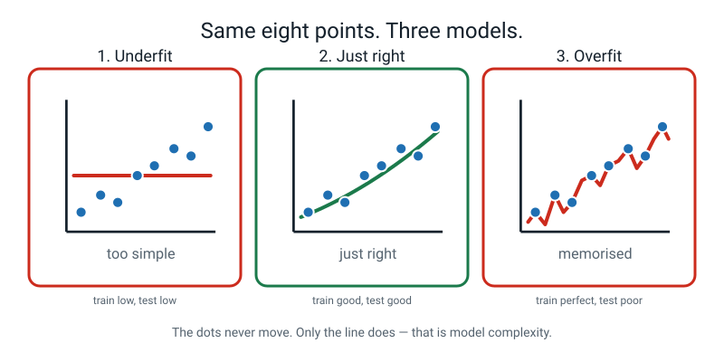
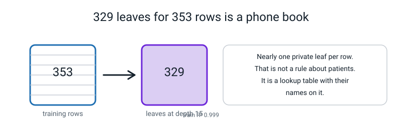
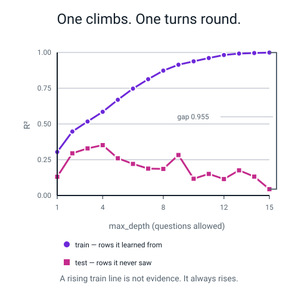
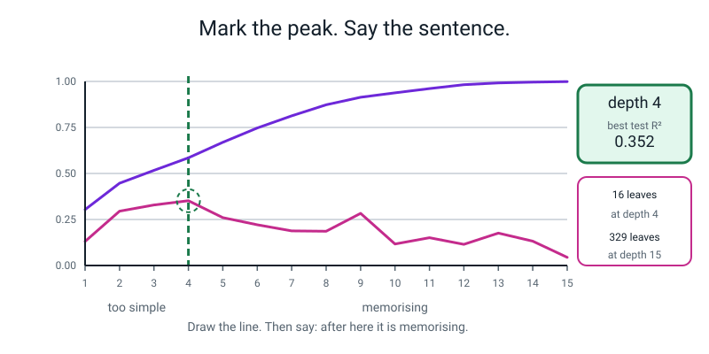
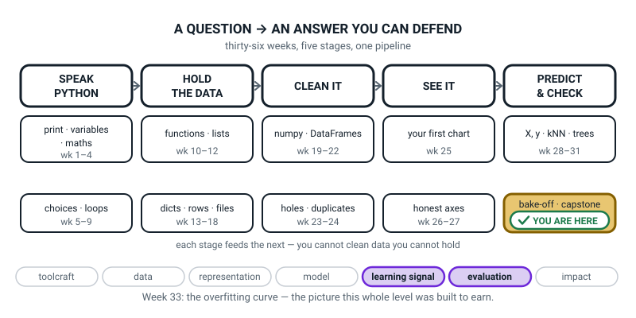
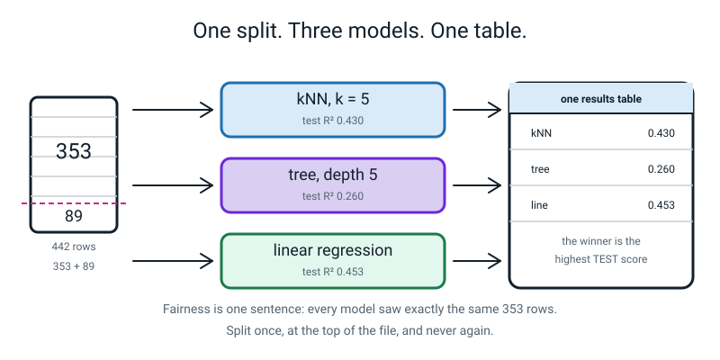

# Week 33 — Model Bake-Off and the Overfitting Cliff

[⬅ Week 32](week-32.md) · [Course Home](../README.md) · [Week 34 ➡](week-34.md) · [Student Guide](../student-guide/week-33.md) · [Workbook](../workbook/week-33.md)

---

## 📋 At a Glance

| | |
|---|---|
| **Duration** | 70 minutes |
| **Type** | 🟩 Lab — one split, three models, one table, one picture. **The most important lesson in Level 2.** |
| **Big idea** | A training score that climbs while the test score falls is memorising, not learning — and it has a picture. |
| **New vocabulary** | overfitting · underfitting · train/test gap · RMSE · model complexity |
| **New syntax** | `DecisionTreeRegressor(max_depth=d)` · `np.sqrt(mean_squared_error(y_true, y_pred))` · `ax.axvline(x, linestyle="--")` · `load_diabetes()` |
| **Materials** | The printed workbook (Warm-Up, Predict the Output, Practice Sets A and B, Fix the Broken Program, Puzzle, Think Deeper, Build It, Draw It, Self-Check) · graph paper · a ruler · **4 coloured pens or highlighters** · a calculator · **whatever the student wrote in Week 29 about the gap between their train and test scores** · `week31_tree_iris.py` and `week32_study_line.py` · the Bug Log |
| **Tech needed** | Python 3 with scikit-learn, numpy and matplotlib. No new install. No internet. |
| **Prep time** | 25 minutes the night before, 5 minutes on the day |

> **⚠️ Watch out:** this lesson only bites if the student is still a little proud of a score. That is why the course puts four weeks between Week 29 and today. **Do not soften the punchline** — one row of today's table shows a model that is *perfect* on the rows it learned from and *no better than guessing the average* on rows it has never seen. Let that land hard. And go and find the Week 29 numbers before class; the lesson ends by walking back to them.

---

## 🎯 Lesson Objectives

By the end of the lesson the student can:

1. **Run three different models on one fixed split**, changing one line each time.
2. **Compute RMSE** and explain why it punishes big misses harder than MAE does.
3. **Plot train score and test score against depth 1 to 15** on one pair of axes.
4. **Mark the point where the two lines part company** and name it out loud.
5. **State which model they would ship**, and defend the choice with the numbers.

Observable evidence: a five-row results table with MAE, RMSE, test R² and train R² for every entry; a two-line depth curve with a vertical line drawn at the peak of the test line; the sentence *"after here it is memorising"* written under it; and one named model with a written reason that cites at least two numbers.

---

## 🧑‍🏫 What YOU Need to Know First

> **📌 About the code blocks in this guide.** Outside the **🧰 Prep Checklist** and the **🔑 Answer Key**, the blocks are **illustrations, not files** — each one carries on from the one above it, so the `import` lines and the data are typed once, in the first block that needs them. **The complete runnable files are in the Prep Checklist and the Answer Key.** If you paste an illustration on its own and get `NameError`, that is why, and nothing is broken.

There are two ideas this week and one of them is the whole point of the year. Take the twenty-five minutes; you will teach it far better for having felt the numbers once yourself.

### 1. The idea, in one table

Compute two scores — one on the rows the model learned from, one on rows it has never seen — then look up your row.

| Train score | Test score | What it is called | What is happening | What to do |
|---|---|---|---|---|
| Low | Low | **Underfitting** | Too simple to catch the pattern | Give it more room: deeper tree, more features |
| High | High | **Just right** | It learned the pattern | Ship it (and check your split is honest) |
| **High** | **Low** | **Overfitting** | It memorised the training rows, noise and all | Give it less room: shallower tree, more data |
| Low | High | Something is broken | Nearly always a bug or a freak tiny test set | Go and read your code |

> **Underfitting** — the model is too simple. It gets things wrong on the rows it learned from *and* on new rows, in the same way.
>
> **Overfitting** — the model is too complicated. It has learned details of the specific training rows that do not carry over, so it does brilliantly on them and badly on everything else.
>
> **Train/test gap** — train score minus test score. A small gap means it generalises. A big gap means it is memorising.

🍕 **The analogy to use out loud. Use exactly this one; it is the best one there is.** Three students prepare for a maths test.

- **Ravi** skims the chapter headings. He can't do the practice questions *or* the test. That is **underfitting** — he never learned the pattern.
- **Priya** learns the method. She does well on practice and well on the test. **Just right.**
- **Sam** memorises all 200 practice questions and their answers, word for word. He scores 200 out of 200 on practice. On the test, where the numbers are different, he falls apart. That is **overfitting** — he learned the *questions*, not the *maths*.

**Sam's practice score is not a lie.** He really did get 200 out of 200. It is just not evidence of anything.


*Figure 33.1 — Same eight points, three models. The dots never move. Only the line does.*

### 2. Model complexity: the dial every model has

> **Model complexity** — how much freedom a model has to bend itself around the data. Every model has a dial that sets it.

| Model | The dial | Simple end | Complex end |
|---|---|---|---|
| Decision tree | `max_depth` | 1 | no limit |
| kNN | `n_neighbors` | large `k` | `k = 1` |
| Linear regression | number of features | 1 feature | many features |

Note that kNN's dial runs **backwards**: `k = 1` is the *most* complex setting, because a single nearest neighbour can carve any shape at all, and a huge `k` is the simplest. If the student remembers `k = 1` scoring a perfect 1.0000 on training data back in Week 30, that was the overfitting end of the dial all along, and nobody said so at the time.

`max_depth` is the dial you will turn today, because a tree's is the easiest to see. Crank it up and the tree gets to ask more questions, cut the training rows into more and more leaves, and eventually give nearly every single row its own private leaf.

```
 depth 1  →    2 leaves     one question, two answers
 depth 4  →   16 leaves     sixteen sensible bands
 depth 8  →  128 leaves     each leaf holds two or three patients
 depth 15 →  329 leaves     329 leaves for 353 patients. Memorised.
```


*Figure 33.2 — 329 leaves for 353 rows is a phone book. This is the picture of memorising.*

**That last line is the mechanism, and it is worth having ready as a sentence:** with 353 training patients and 329 leaves, the tree has essentially written down a lookup table. It has not learned anything about diabetes. It has written down these 353 people. Ask it about a 354th person and it has nothing.

### 3. RMSE — and be honest about what it does

Last week gave you MAE: add up the sizes of the misses, divide by how many. This week adds a second one.

> **RMSE (root mean squared error)** — square every miss, average the squares, then take the square root. Also in the units of the thing you are predicting, but it punishes big misses much harder than small ones.

```
RMSE = √( (miss₁² + miss₂² + ... + missₙ²) ÷ n )
```

**RMSE is always greater than or equal to MAE.** The gap between them tells you about the *shape* of your errors: if RMSE is barely above MAE, your misses are all much the same size. If RMSE is a lot bigger, a few large ones are dominating.

**The two-model demonstration that makes it obvious.** Ten true values. Two models.

- **Model A** is off by exactly 1 on every single prediction.
- **Model B** is *perfect* on nine of them and off by 10 on the tenth.

```text
Model A: errors [1 1 1 1 1 1 1 1 1 1]  MAE 1.0000  RMSE 1.0000
Model B: errors [ 0  0  0  0  0  0  0  0  0 10]  MAE 1.0000  RMSE 3.1623
```

**Identical MAE. RMSE differs by more than three times.** By hand:

- Model A: every size is 1, so MAE = 10 ÷ 10 = 1.0. Every square is 1, so the mean square is 1.0 and RMSE = √1 = 1.0.
- Model B: nine sizes of 0 and one of 10, so MAE = 10 ÷ 10 = 1.0 — identical. But squared: nine 0s and one **100**, so the mean square is 100 ÷ 10 = 10, and RMSE = √10 = **3.1623**.

Which model is better? **It depends entirely on what a big miss costs.** Nine perfect delivery times and one catastrophe is probably worse than ten slightly-late ones. Nine perfect grocery-bill estimates and one wrong week is probably better than being wrong every single week. **The metric encodes what you think "bad" means, so choose it on purpose.**

> **⚠️ Watch out — do not overclaim.** It is tempting to say "RMSE tells you the worst miss". It does not, and today's real numbers will catch you out if you say it. On our data, linear regression has a **worse single worst miss** than kNN (154 against 139) and yet a **lower RMSE** (53.85 against 54.95) — because kNN has nine misses over 100 and linear has only five. RMSE is about the *whole tail of big misses*, not one champion. The honest sentence is: *"RMSE goes up faster than MAE when there are big misses."* Say that and nothing more.

The habit to teach, and it costs nothing: **print MAE, RMSE and the worst single miss.** Three numbers, and it becomes very hard for anybody, including you, to be fooled.

### 4. The dataset, and why we changed it

`load_diabetes()` ships inside scikit-learn. **442 real patients**, 10 measurements each — age, sex, body mass index, blood pressure and six blood measurements — and the answer column is *how far the illness had progressed one year later*, on a scale running from 25 to 346.

Three things to know before you meet it:

- **It is real, and real data is much noisier than flowers.** The best R² anybody gets on it today is about **0.45**. Iris gave you 0.9667 accuracy. This is what actual data looks like, and the drop is the point rather than a disappointment.
- **The measurements are already scaled**, by whoever prepared the dataset. So there is no `StandardScaler` in today's file even though we are using kNN, and that is not an oversight. If a student remembers Week 30 and asks, that is a *good* catch — tell them the dataset arrived pre-scaled and they were right to check.
- **The answer has no everyday unit.** It is "progression points". So an MAE of 42.77 cannot be translated into anything a person feels, which is honestly a bit of a shame after last week's "off by three marks". Say so. The comparison that saves it is the lazy baseline: guessing the average is off by 64.01, so 42.77 is *a third better than not bothering*.

### 5. Every line of the bake-off file, explained

```python
# week33_bakeoff.py  -  three models, ONE split, one table.

import numpy as np
from sklearn.datasets import load_diabetes                # NEW: 442 real patients
from sklearn.model_selection import train_test_split
from sklearn.neighbors import KNeighborsRegressor         # week 29's kNN, for numbers
from sklearn.tree import DecisionTreeRegressor            # week 31's tree, for numbers
from sklearn.linear_model import LinearRegression         # week 32's line
from sklearn.metrics import mean_absolute_error, mean_squared_error, r2_score

data = load_diabetes()
X = data.data                 # 10 measurements per patient
y = data.target               # how much the illness advanced in a year
print("rows and columns:", X.shape)
print("the answer runs from", y.min(), "to", y.max())

# ---- ONE split. Made once, here, at the top. Never made again. ----------
X_train, X_test, y_train, y_test = train_test_split(
    X, y, test_size=0.2, random_state=42)
print("train rows:", len(X_train), " test rows:", len(X_test))
print()

def report(name, model):
    """Fit a model on the SAME train rows, score it on the SAME test rows."""
    model.fit(X_train, y_train)
    guesses = model.predict(X_test)
    mae = mean_absolute_error(y_test, guesses)
    rmse = np.sqrt(mean_squared_error(y_test, guesses))   # NEW: root of the mean square
    print(f"{name:22s} {mae:7.2f} {rmse:7.2f} "
          f"{r2_score(y_test, guesses):9.3f} {model.score(X_train, y_train):10.3f}")

print(f"{'model':22s} {'MAE':>7s} {'RMSE':>7s} {'test R2':>9s} {'train R2':>10s}")

# the laziest model there is: ignore all 10 columns, always say the training mean
lazy = np.zeros(len(y_test)) + y_train.mean()
print(f"{'always guess the mean':22s} "
      f"{mean_absolute_error(y_test, lazy):7.2f} "
      f"{np.sqrt(mean_squared_error(y_test, lazy)):7.2f} "
      f"{r2_score(y_test, lazy):9.3f} {0.0:10.3f}")

report("kNN, k = 5", KNeighborsRegressor(n_neighbors=5))
report("tree, max_depth=5", DecisionTreeRegressor(max_depth=5, random_state=0))
report("tree, no limit", DecisionTreeRegressor(random_state=0))
report("linear regression", LinearRegression())
```

**Line by line, for the parts that are new.**

- `from sklearn.neighbors import KNeighborsRegressor` — the same tool as Week 29's `KNeighborsClassifier`, with `Regressor` on the end because the answer is a number now. Instead of the five nearest neighbours *voting* on a species, they *average* their numbers.
- `from sklearn.tree import DecisionTreeRegressor` — same again for Week 31's tree. Identical yes/no questions; each leaf holds the **average** of the training rows that landed there instead of a species name. That is why a tree's predictions come in a fixed set of steps — one value per leaf — and why a tree can never draw a smooth diagonal.
- `X_train, X_test, y_train, y_test = train_test_split(...)` — **this line runs exactly once, at the top of the file.** Everything below shares those same 353 training and 89 test patients. That one fact is the entire fairness of a bake-off, and it is worth saying in a comment.
- `def report(name, model):` — a function, from Weeks 9 and 10. One function means it is *impossible* to score two models differently by accident. If you compute the numbers separately for each model, sooner or later you will use `y_train` where you meant `y_test` in one of them and never notice.
- `model.fit(X_train, y_train)` inside `report` — every model is fitted fresh, on the same rows.
- `np.sqrt(mean_squared_error(y_test, guesses))` — `mean_squared_error` gives the average of the squares; `np.sqrt` (Week 28) takes the square root to bring it back into the answer's units. **There used to be a `squared=False` shortcut and it has been removed from modern scikit-learn** — see the Debugging Clinic, because a student who searches the internet will find it and it will fail.
- `np.zeros(len(y_test)) + y_train.mean()` — the lazy baseline. `np.zeros` (Week 18) makes 89 zeros, and adding a single number to an array adds it to every slot (Week 18 again). So this is "guess 153.74 for all 89 patients". Note it is the **training** mean — using the test mean would be peeking.
- `f"{mae:7.2f}"` — an f-string from Week 3, with a width of 7 and 2 decimals so the columns line up.

**The real output:**

```text
rows and columns: (442, 10)
the answer runs from 25.0 to 346.0
train rows: 353  test rows: 89

model                      MAE    RMSE   test R2   train R2
always guess the mean    64.01   73.22    -0.012      0.000
kNN, k = 5               42.77   54.95     0.430      0.584
tree, max_depth=5        48.15   62.60     0.260      0.669
tree, no limit           56.57   72.90    -0.003      1.000
linear regression        42.79   53.85     0.453      0.528
```

### 6. How to read that table — the four things to point at

**Point 1 — the row that is the whole lesson.**

```
tree, no limit           56.57   72.90    -0.003      1.000
```

**Train R² 1.000. Perfect.** Not 0.99. Perfect. On the 353 patients it learned from, this tree is never wrong, not once.

**Test R² −0.003.** Negative. Strictly, R² below 0 means *worse than guessing the average of the test rows*. Look up the baseline row — R² −0.012 (it guesses the training average) — and the unlimited tree is essentially level with it: it is NOT worse than the lazy model here (its MAE 56.57 and RMSE 72.90 are even slightly better than 64.01 and 73.22). The honest line is *no better than ignoring all ten measurements*.

A perfect score and a worthless model, in the same row, on the same data. That is Sam and his 200 practice questions, in numbers you generated yourself.

**Point 2 — the baseline row is what makes every other number mean something.** MAE 64.01 by guessing the average. So kNN's 42.77 is not "off by 42.77", it is "**a third less wrong than not bothering**". Without the baseline, 42.77 is a number with nothing to stand on. This is Level 1's Week 12 lesson — compute the baseline first — arriving in code.

**Point 3 — MAE and RMSE disagree, and that is the interesting bit.**

| | MAE | RMSE |
|---|---|---|
| kNN, k = 5 | **42.77** | 54.95 |
| linear regression | 42.79 | **53.85** |

On MAE they are a dead heat — 42.77 against 42.79, a difference of two hundredths on a scale running to 346. On RMSE, linear wins. Why? Because kNN has **nine** misses over 100 and linear has only **five**. RMSE squares the misses, so those extra big ones weigh heavily. Typical performance: identical. Big-miss behaviour: linear is better. **That is a real difference that MAE cannot see, and it is why we compute both.**

**Point 4 — the depth-5 tree is worse than both, and that is honest.** Test R² 0.260 against 0.453 for the line. Trees are not the best tool for everything, and this dataset — probably, though we did not test it: smooth medical measurements, no sharp thresholds — is exactly the shape a straight line handles well and a staircase handles badly. Do not hide that. The tree's advantage was always *readability*, and this week is the week it costs you.

### 7. The depth curve — the most useful picture in the subject

**The recipe, and step 1 is not optional:**

1. Fix **one** train/test split, before the loop. Never re-split inside it, or you are measuring shuffling luck instead of depth.
2. For each depth, fit a **fresh** model.
3. Record **both** the train score and the test score.
4. Plot both against depth.
5. The depth with the highest **test** score is your answer.

```python
# week33_depth_curve.py  -  turn the depth dial 1 to 15 and watch both scores.

import numpy as np
import matplotlib.pyplot as plt
from sklearn.datasets import load_diabetes
from sklearn.model_selection import train_test_split
from sklearn.tree import DecisionTreeRegressor

data = load_diabetes()
X = data.data
y = data.target

# ONE split, made BEFORE the loop. If you split inside the loop you are
# measuring shuffling luck, not depth.
X_train, X_test, y_train, y_test = train_test_split(
    X, y, test_size=0.2, random_state=42)

depths = []          # the dial setting
train_scores = []    # score on rows it learned from
test_scores = []     # score on rows it has never seen
leaf_counts = []     # how many final answers the tree has

for depth in range(1, 16):                    # 1, 2, 3 ... 15
    tree = DecisionTreeRegressor(max_depth=depth, random_state=0)
    tree.fit(X_train, y_train)                # a FRESH tree every time round
    depths.append(depth)
    train_scores.append(tree.score(X_train, y_train))
    test_scores.append(tree.score(X_test, y_test))
    leaf_counts.append(tree.get_n_leaves())

print(f"{'depth':>5} {'leaves':>7} {'train R2':>9} {'test R2':>8} {'gap':>7}")
for i in range(len(depths)):
    gap = train_scores[i] - test_scores[i]
    print(f"{depths[i]:5d} {leaf_counts[i]:7d} {train_scores[i]:9.3f} "
          f"{test_scores[i]:8.3f} {gap:7.3f}")

best_depth = depths[int(np.argmax(test_scores))]     # the PEAK of the test line
print()
print("best test R2 was", round(max(test_scores), 3), "at max_depth =", best_depth)
print("training rows:", len(X_train), " leaves at depth 15:", leaf_counts[-1])

fig, ax = plt.subplots(figsize=(8, 5))
ax.plot(depths, train_scores, marker="o", label="train R2 (rows it learned from)")
ax.plot(depths, test_scores, marker="s", label="test R2 (rows it never saw)")
ax.axvline(best_depth, linestyle="--", color="green")     # NEW: mark the peak
ax.set_title("After depth 4 the tree is memorising, not learning")
ax.set_xlabel("max_depth (how many questions the tree may ask)")
ax.set_ylabel("R2  (1.0 = perfect, 0.0 = no better than the mean)")
ax.set_ylim(-0.2, 1.05)
ax.legend()
fig.savefig("week33_depth_curve.png", dpi=120, bbox_inches="tight")
print("saved week33_depth_curve.png")
```

Two lines are new; everything else is Weeks 7, 25 and 31.

- `for depth in range(1, 16):` — 1 up to and including 15. `range` stops one short, from Week 7.
- `DecisionTreeRegressor(max_depth=depth, random_state=0)` — **inside** the loop, so a brand-new tree is built at each setting. Building it outside the loop is a real and common mistake.
- `tree.get_n_leaves()` — how many final answers this tree has. This column is the *mechanism*, and it is the column that makes the lesson concrete.
- `int(np.argmax(test_scores))` — `argmax` gives the *position* of the biggest number in a list, not the number itself. Position 3 is depth 4, because positions start at 0.
- `ax.axvline(best_depth, linestyle="--", color="green")` — a vertical line right across the chart at that x value. `linestyle="--"` makes it dashed so it never gets mistaken for data.

**The real output:**

```text
depth  leaves  train R2  test R2     gap
    1       2     0.304    0.131   0.174
    2       4     0.447    0.295   0.152
    3       8     0.517    0.329   0.188
    4      16     0.585    0.352   0.233
    5      31     0.669    0.260   0.408
    6      55     0.747    0.221   0.526
    7      91     0.813    0.188   0.624
    8     128     0.873    0.186   0.688
    9     176     0.914    0.283   0.631
   10     221     0.938    0.117   0.821
   11     255     0.961    0.151   0.810
   12     280     0.982    0.115   0.866
   13     298     0.992    0.176   0.816
   14     314     0.996    0.132   0.864
   15     329     0.999    0.044   0.955

best test R2 was 0.352 at max_depth = 4
training rows: 353  leaves at depth 15: 329
```


*Figure 33.3 — One climbs. One turns round. A rising train line is not evidence; it always rises.*

### 8. Reading the table, column by column — this is what you say in class

**`train R2` never once goes down.** 0.304 → 0.999, fifteen steps, every one of them upward. More depth is always better on the rows the tree learned from, *by construction* — a deeper tree can always do at least as well as a shallower one on those rows, because it can just ignore its extra freedom. **This column is not evidence of anything.** It is arithmetic dressed up as achievement.

**`test R2` rises to a peak at depth 4 (0.352), then falls apart** — down to 0.044 by depth 15. Depths 1 to 3 are **underfitting**: too few questions to describe 442 patients. Depths 5 to 15 are **overfitting**.

**The `gap` column tells the story in one number.** 0.152 at depth 2. **0.955** at depth 15. That 0.955 is exactly how much of the tree's apparent "performance" is memorisation and nothing else.

**The `leaves` column is the mechanism.** 2 leaves at depth 1. **329 leaves at depth 15, for 353 training patients.** Almost every patient has their own private leaf with their own private answer. The tree has not learned anything about diabetes; it has written down a phone book.

> **⚠️ Watch out — the wobbles are real and you must not over-read them.** The test line does not fall smoothly. It goes 0.352, 0.260, 0.221, 0.188, 0.186, then jumps back up to **0.283** at depth 9, then drops to 0.117. With 89 test patients, one patient is worth roughly 0.01 of R², so a jump of 0.1 is about ten patients — noticeable, but nothing like the 0.2 fall from the peak. If a student says "but depth 9 is better than depth 6, so the line doesn't really go down", they have made a sharp observation and the answer is: *"You're right that it's bumpy. Look at the trend over fifteen steps, not the step-to-step wobble. And notice the gap column never gets smaller again."*


*Figure 33.4 — Mark the peak. Then say it out loud: after here it is memorising.*

**The paragraph the student should be able to write by the end** — this is the target for workbook Build It, Part 5, and it is worth reading once yourself:

> *As `max_depth` grows the tree may ask more questions, so it cuts the 353 training patients into more and more leaves. Early on each new question captures something real, so both scores rise together. Past depth 4 the questions stop describing patients in general and start describing the particular quirks of these 353. Those quirks are different in the 89 test patients, so memorising them actively hurts: train R² climbs to 0.999 while test R² sinks from 0.352 to 0.044. The gap grows from 0.152 to 0.955, and by depth 15 the tree has 329 leaves for 353 patients. Depth 4 is where it stopped learning and started memorising.*

### 9. The honesty caveat — and do not skip it

Choosing depth 4 by looking at the test scores means **the test set influenced a decision**. So the score at depth 4 is a little optimistic: you looked at those 89 patients fifteen times and picked the best-looking answer.

This is not a reason to avoid the method — it is the best method available with 442 rows. It is a reason to **write the caveat down next to the number**. The sentence to teach, verbatim:

> *"I chose the depth by looking at the test curve, so this score is slightly optimistic."*

The professional fix is called cross-validation and it is waiting in Level 3. Today, honesty in writing is the fix.

### 10. The three misconceptions you will actually meet

**Misconception 1 — "the unlimited tree is broken."**

It is working perfectly. It did exactly what it was asked: split until every leaf is pure. Nothing failed, nothing errored, and it got 1.000 on the rows it learned from. **The failure is not in the code, it is in what we asked for.** That distinction is the reason this lesson exists.

**Misconception 2 — "so deeper is bad; use depth 1."**

No. Depth 1 scores 0.131 on the test rows — barely better than guessing the average. Depth 1 and depth 15 are both wrong, **for opposite reasons**: depth 1 has not learned enough, depth 15 has learned things that were never true in general. The answer is in the middle and you find it by looking. If you only ever remember one thing from this table, make it *"both ends are wrong"*.

**Misconception 3 — "the training score is useless, so don't compute it."**

Compute it always. It is useless *on its own*, as evidence of quality. It is essential as **half of the gap**, and the gap is your diagnosis. Train high and test low means overfitting; train low and test low means underfitting; you cannot tell those apart without the training number. One score tells you nothing. Two scores tell you which of four situations you are in.

### 11. Where to stop

**Go this far:** the four-row diagnosis table; the dial; RMSE and why it differs from MAE; the depth curve; the peak marked and named; the honesty sentence.

**Stop before:**

- **Cross-validation.** Level 3. Name it once, in the honesty caveat, and move on.
- **Regularisation, pruning, `min_samples_leaf`.** All real, all next year.
- **Random forests.** *"Hundreds of trees voting. Better scores, unreadable. Level 3."*
- **The bias–variance decomposition.** The words are not needed and the algebra actively gets in the way at this age.
- **Explaining the depth-9 bump properly.** It is noise on 89 patients. "Bumpy, look at the trend" is the correct and complete answer.

---

### 12. 🧭 The Growing Map — two minutes on the curve, and a map that does not move

Each week the student guide carries the same pipeline with one more piece filled in, so the learner can
see the year's shape rather than only this week's content. This week the picture is unchanged from last
week's, which is useful: the thing that moved today was not the map, it was what they can now *see*
inside one box.



*Figure 33.0 — Week 33's version. Second week inside `bake-off · capstone`, weeks 32 to 36, and nothing
has moved. Two threads lit: learning signal and evaluation.*

**What to do with it, in about two minutes at the end of the lesson:**

1. **Show it and ask what today added, given that the map is identical:** *"same box as last week — so
   what have we got now that we did not have at four o'clock yesterday?"* You want **a second score**,
   or **the training score as well as the test score**. Then the harder half: *"and which of the two
   numbers in the 1.000 / −0.003 row was the honest one?"* They will point at the negative. Let it land.
2. **Then the dial question, with a finger on the peak:** *"the two lines split apart after depth 4.
   Which way do you turn the dial — up or down?"* **Down.** This is the counter-intuitive instinct of
   the whole level, and a learner who can say *turn it down* while pointing at a picture has it in a way
   that no definition of overfitting supplies.
3. **Have them ink the tile again and draw the curve thumb-sized beside it** — two lines, peak circled,
   the word *memorising* after the peak. Small on purpose. Gate 6 of the Level 3 check in Week 36 is
   exactly this drawing, on a napkin, from memory.

> **🧑‍🏫 Why this is worth two minutes.** The bake-off produces a lot of numbers, and the risk of today
> is that they remember "kNN won" instead of "one score is not a result". The map is where you make the
> *method* the memory: same box, same four steps, two numbers instead of one. It also sets up the honest
> caveat so it does not feel like a technicality — 329 leaves for 353 patients is a phone book, and the
> next three weeks are graded on whether they can say something that plain about their own model.

---

## 🧰 Prep Checklist

### 25 minutes the night before

- [ ] **Print the whole workbook.** The **Draw It** page (the blank depth-curve grid) should be printed **twice**, so there is a spare.
- [ ] **Go and find the Week 29 numbers.** Whatever the student wrote down four weeks ago about their training score and their held-back score. A photo, a notebook page, a wiped whiteboard you have to reconstruct — get it now. The lesson ends there and it is much weaker without it.
- [ ] **Run the bake-off yourself.**

  ```
  cd ~/ai-academy/level2
  source .venv/bin/activate        # macOS / Linux
  .venv\Scripts\activate           # Windows PowerShell
  ```

  Type `week33_bakeoff.py` from section 5 and run it. **Check one row above all others:**

  ```
  tree, no limit           56.57   72.90    -0.003      1.000
  ```

  If you see `1.000` and `-0.003` on the same line, your machine agrees with this guide and the lesson will work.

- [ ] **Run the depth curve.** Type `week33_depth_curve.py` from section 7 and run it. Check `best test R2 was 0.352 at max_depth = 4` and `leaves at depth 15: 329`. Then **open `week33_depth_curve.png` and look at it.** You need to have seen the shape before you ask a 12-year-old to find it.
- [ ] **Break it on purpose, twice.**

  First, the one a student will hit from searching online. Replace the RMSE line with `mean_squared_error(y_test, guesses, squared=False)`:

  ```text
  TypeError: got an unexpected keyword argument 'squared'
  ```

  Second, delete `tree.fit(X_train, y_train)` from inside the loop:

  ```text
  sklearn.exceptions.NotFittedError: This DecisionTreeRegressor instance is not fitted yet. Call 'fit' with appropriate arguments before using this estimator.
  ```

  Put both back. You are staging both live.

- [ ] **Read the Sam analogy in section 1 out loud once.** You are going to tell it as a story, not read it, and it needs to be yours.
- [ ] **Read section 3's warning about RMSE.** It is the one place in this week where the obvious thing to say is not quite true, and a sharp student can catch you.

### 5 minutes on the day

- [ ] Terminal open, environment activated, `(.venv)` visible.
- [ ] `week31_tree_iris.py` and `week32_study_line.py` open in tabs. You will point at them, not run them.
- [ ] The Week 29 numbers on a card, face down, on the table. Do not show them yet.
- [ ] Graph paper, ruler, **four coloured pens**.
- [ ] Bug Log open at a clean page.

### Fallback if something fails

| If this fails | Do this instead |
|---|---|
| **No laptop today** | This lesson survives on paper better than you would think. Print the two output blocks from sections 5 and 7. The student plots the depth curve **by hand** from the printed table onto graph paper — fifteen points, two colours — draws the vertical line at the peak, and writes the paragraph. That delivers objectives 3, 4 and 5, which are the three that matter most. Objectives 1 and 2 wait one session. |
| **`matplotlib` will not show a window** | Expected, and irrelevant. The script calls `fig.savefig(...)`; open `week33_depth_curve.png` from the folder. |
| **The loop takes a noticeable time** | It should not — the whole thing is well under a second. If it hangs, you have almost certainly put `range(1, 16)` inside another loop by accident. |
| **The student's numbers differ** | Check `random_state=42` in the split and `random_state=0` in every tree. Then check the split is **outside** the loop. Those two things account for nearly every discrepancy. |
| **The depth-9 bump derails everything** | Do not improvise. Use the prepared answer: *"It's bumpy because 89 test patients is not many — one patient is worth about 0.01. Look at the trend across fifteen steps, and look at the gap column, which never shrinks again."* |
| **Running long and the plot is not done** | Cut the plot, keep the table. Have them highlight the peak of the `test R2` column with a coloured pen and write the sentence next to it. The picture is lovely; the table is the lesson. |
| **The student is upset that the tree "lost"** | Genuinely happens after two weeks of enjoying trees. Say: *"It lost on score and it still wins on being readable. Which one you need depends on the job."* Then show them the line's coefficients and ask which they would rather explain to a doctor. |

---

## ⏱️ The Lesson, Minute by Minute

| Segment | Minutes | Running total | What happens |
|---|---|---|---|
| 🪝 Hook — Sam got 200 out of 200 | 7 | 7 | A perfect practice score that means nothing |
| 🧠 Concept — the four-row diagnosis, and RMSE | 16 | 23 | Underfit / just right / overfit / broken; MAE vs RMSE by hand |
| 💻 Live-Code Together — the bake-off | 18 | 41 | One split, four entries, two staged bugs, the 1.000 / −0.003 row |
| 🎲 Their Turn — the depth curve | 20 | 61 | The loop, the table, the plot, the axvline, the sentence |
| 🔑 Wrap & Assign | 9 | 70 | Back to Week 29's board; three checks; homework |

---

### 🪝 Hook — Sam got 200 out of 200 (7 minutes)

**Do this:** Laptop closed. Tell it as a story, not as a lesson.

**Say this:**

> "Three people in a class, all doing the same maths test on Friday. The teacher gives out a booklet of 200 practice questions on Monday, with the answers in the back.
>
> **Ravi** flicks through the chapter headings on Thursday night. He can't do the practice questions and he can't do the test. Fair enough — he never learned it.
>
> **Priya** works through the practice questions properly, gets stuck, works out the method. She does well on the practice and she does well on the test.
>
> **Sam** does something different. Sam memorises all 200 practice questions and their answers. Word for word. Question 47, answer 12. Question 48, answer minus 3. All of them.
>
> On the practice booklet, Sam scores **200 out of 200**. Perfect. Better than Priya.
>
> Friday comes, and the test has different numbers in it.
>
> What happens to Sam?"

Let them answer. Then:

> "He falls apart. And here's what I want you to hold onto, because it's not obvious.
>
> **Sam's 200 out of 200 was not a lie.** He didn't cheat. He really did get every single practice question right. That number is completely true.
>
> **It just isn't evidence of anything.**
>
> Today you're going to build Sam. In code. On purpose. And you're going to watch a model score a *perfect* one point zero zero zero on the questions it studied, and then do no better than guessing the average on questions it hasn't seen. And then you're going to draw the picture of it happening."

**Ask this:**

| Ask | Answer you want | If they say something else |
|---|---|---|
| "What did Sam learn?" | The questions, not the maths. | If they say "nothing", push gently: he learned 200 question-answer pairs. That is real learning of the wrong thing. |
| "Was Sam's 200/200 a lie?" | No. It was true and useless. | If they say "yes, he cheated" — worth two minutes. He didn't cheat; he was given the answers and he memorised them. The problem is what we concluded from the score. |
| "How would you catch Sam on Monday, before Friday?" | Give him a question that isn't in the booklet. | This is the whole idea of a test set, arrived at by them. If they say it, stop and say so: "That's what `train_test_split` has been doing since Week 29." |
| "Could a computer do what Sam did?" | Yes — memorise the training rows instead of the pattern. | If they say no, promise them the row: "Give me fifteen minutes and I'll show you a perfect 1.000 that's worthless." |

---

### 🧠 Concept — the four-row diagnosis, and RMSE (16 minutes)

**Do this:** Write the four-row table on the big sheet as you talk it. Get the four coloured pens out.

**Say this — part 1, the diagnosis table:**

> "You've been computing two scores since Week 29 — one on the rows the model learned from, one on the rows you hid. Today those two numbers finally earn their keep, because **together** they diagnose your model. Separately, neither does.
>
> Four possibilities, and that's all there are."

Write it as you go:

```
   train    test     what it is
   ------   ------   -------------------------------------
   low      low      UNDERFITTING   - too simple  (Ravi)
   high     high     JUST RIGHT     - it learned  (Priya)
   high     LOW      OVERFITTING    - memorised   (Sam)
   low      high     something's broken - go and read your code
```

> "Ravi, Priya, Sam. And the fourth row is a bug — if you're doing better on rows you've never seen than on rows you studied, something has gone wrong in your code, or your test set is tiny and you got lucky.
>
> And the difference between the two numbers has a name. **Train score minus test score is the gap.** Small gap, it generalises. Big gap, it's memorising. **The gap is the size of the Sam problem.**"

**Say this — part 2, the dial:**

> "Now — what made Sam Sam? He had too much *room*. He had enough memory to store 200 answers, so he did.
>
> Every model has a dial that controls how much room it's got. And you already know the tree's one: **`max_depth`.**
>
> Depth 1, the tree can ask one question, so it can only give two different answers. Not much room. Depth 15? It can ask fifteen questions in a row, which means up to thirty-two *thousand* different endings. If you've only got 353 patients, it can give nearly every single one their own private answer.
>
> That's Sam. Not a metaphor — that is literally writing down 353 answers instead of learning a pattern.
>
> That dial has a name: **model complexity**. How much freedom the model has to bend around your data."

**Say this — part 3, RMSE, and do the arithmetic together:**

> "One new score today, and it exists because MAE can't see something important.
>
> Two models, ten predictions each.
>
> **Model A** is off by exactly one, every single time. Ten misses of 1.
> **Model B** is *perfect* nine times and then off by ten once.
>
> Work out MAE for both."

Do it out loud together.

```
   Model A:  (1+1+1+1+1+1+1+1+1+1) ÷ 10 = 10 ÷ 10 = 1.0
   Model B:  (0+0+0+0+0+0+0+0+0+10) ÷ 10 = 10 ÷ 10 = 1.0
```

> "**Identical.** MAE says these two models are exactly as good as each other. Does that feel right to you?"

Let them object. Then:

> "So here's the other way. **Square every miss first**, then average, then square-root at the end to get back into the right units. It's called **RMSE** — root mean squared error, and you read it backwards: square the errors, take the mean, take the root."

```
   Model A:  squares are 1,1,1,1,1,1,1,1,1,1  → mean 1   → √1  = 1.000
   Model B:  squares are 0,0,0,0,0,0,0,0,0,100 → mean 10 → √10 = 3.162
```

> "Same MAE. RMSE more than three times apart. **Squaring makes a big miss count much more than several small ones** — because 10 squared is 100, and ten separate 1s only add up to 10.
>
> Which model is better? **It depends on what a big miss costs you.** Nine perfect deliveries and one disaster, or ten slightly-late ones? For a pizza, ten slightly-late is fine. For a hospital, one disaster is not.
>
> So you don't pick the metric because it's the nice one. You pick it because of what you're afraid of."

> **⚠️ Watch out:** do not say "RMSE tells you the worst miss". It does not, and today's own numbers will contradict you inside twenty minutes. Say: *"RMSE goes up faster than MAE when there are big misses."*

**Ask this:**

| Ask | Answer you want | If they say something else |
|---|---|---|
| "Train 0.99, test 0.62. Which row?" | Overfitting. Big gap. | If they say "good, 0.99 is great", point at the 0.62 and at Sam. |
| "Train 0.31, test 0.28. Which row?" | Underfitting. Both low, tiny gap. | If they say overfitting, ask which number is high. Neither. Underfitting is the *only* row where nothing is high. |
| "Which is worse, Ravi or Sam?" | Sam, usually — because Ravi's bad score tells you he's bad, and Sam's good score tells you he's good when he isn't. | Any argued answer earns credit. Push for the reason. The killer point: an underfit model is honest about being bad. |
| "Model A and Model B have the same MAE. Which would you rather have for a hospital's medicine dose?" | Model A — small consistent errors beat one catastrophe. | If they say B, ask what happens to the one patient. Then agree that for a *grocery bill* B is better, and that is the point. |
| "So should we always use RMSE?" | No — pick it based on what a big miss costs. Report both. | If they want one rule, give them the habit instead: print MAE, RMSE and the worst single miss. Three numbers, no rule needed. |

---

### 💻 Live-Code Together — the bake-off (18 minutes)

**You type, the student types.** Both bugs are staged.

**Step 1 (4 min) — one split, and the fairness comment.** New file, `week33_bakeoff.py`:

```python
import numpy as np
from sklearn.datasets import load_diabetes
from sklearn.model_selection import train_test_split

data = load_diabetes()
X = data.data
y = data.target
print("rows and columns:", X.shape)
print("the answer runs from", y.min(), "to", y.max())

# ---- ONE split. Made once, here, at the top. Never made again. ----------
X_train, X_test, y_train, y_test = train_test_split(
    X, y, test_size=0.2, random_state=42)
print("train rows:", len(X_train), " test rows:", len(X_test))
```

```text
rows and columns: (442, 10)
the answer runs from 25.0 to 346.0
train rows: 353  test rows: 89
```

**Say this:**

> "New dataset, and it's not flowers. **442 real diabetes patients**, ten measurements each — age, body mass index, blood pressure, six blood tests — and the answer is how far the illness had moved on a year later. A number from 25 to 346.
>
> Two warnings. First, **real data is much noisier than flowers.** The best score anybody gets today is about 0.45, not 0.97. That's not us being bad at this. That's what actual data looks like.
>
> Second, look at that comment I made you type. **One split, at the top, never again.** Every model below sees the same 353 patients to learn from and the same 89 to be tested on. That sentence being true is the *entire* fairness of a bake-off. If I re-split for each model, one of them gets an easier test and I'd never know."

> **🧑‍🏫 If a student asks:** *"Where's the `StandardScaler`? Week 30 said kNN needs it."* — that is an excellent catch and you should say so. Answer: *"You're right to check. This dataset arrived already scaled — whoever prepared it did it for us. If it hadn't been, kNN would need it and the tree wouldn't."*

**Step 2 (4 min) — 🐞 STAGED MISTAKE ONE: the RMSE shortcut that no longer exists.** Add:

```python
from sklearn.metrics import mean_absolute_error, mean_squared_error, r2_score
from sklearn.linear_model import LinearRegression

model = LinearRegression().fit(X_train, y_train)
guesses = model.predict(X_test)
print("MAE :", round(mean_absolute_error(y_test, guesses), 2))
print("RMSE:", round(mean_squared_error(y_test, guesses, squared=False), 2))
```

```text
Traceback (most recent call last):
  File "week33_bakeoff.py", line 19, in <module>
    print("RMSE:", round(mean_squared_error(y_test, guesses, squared=False), 2))
  ...
TypeError: got an unexpected keyword argument 'squared'
```

**Say this:**

> "Read the last line. `unexpected keyword argument 'squared'`.
>
> Now — I did that on purpose, and not to be annoying. If you search the internet for 'how do I get RMSE in scikit-learn', that `squared=False` is what you'll find, in about a thousand places. It **used** to work. It was removed.
>
> That's a thing that will happen to you for the rest of your life with code: the internet is full of instructions that were true once. And the error message is how you find out. **The error is more up to date than the tutorial.**
>
> So we do it the way that will always work: get the mean of the squares, then take the square root ourselves."

```python
print("RMSE:", round(np.sqrt(mean_squared_error(y_test, guesses)), 2))
```

```text
MAE : 42.79
RMSE: 53.85
```

> "`mean_squared_error` gives you the average of the squared misses. `np.sqrt` — Week 28 — takes the square root and brings it back into the right units. Read the name backwards: **root, of the mean, of the squared errors.**"

**Step 3 (5 min) — one function, four entries.** Say: *"Now we could copy-paste that for each model. Don't. Here's why."*

Rewrite as a function:

```python
def report(name, model):
    """Fit a model on the SAME train rows, score it on the SAME test rows."""
    model.fit(X_train, y_train)
    guesses = model.predict(X_test)
    mae = mean_absolute_error(y_test, guesses)
    rmse = np.sqrt(mean_squared_error(y_test, guesses))
    print(f"{name:22s} {mae:7.2f} {rmse:7.2f} "
          f"{r2_score(y_test, guesses):9.3f} {model.score(X_train, y_train):10.3f}")
```

**Say this:**

> "One function, used for every model. Why does that matter?
>
> Because if you write the scoring out four separate times, sooner or later you'll type `y_train` where you meant `y_test` in exactly one of them — and it won't error. It'll just print a nicer number for that one model, and you'll believe it. **A single function makes it impossible to score two models differently by accident.** That's not tidiness. That's fairness."

Now the header, the lazy baseline, and the models:

```python
print(f"{'model':22s} {'MAE':>7s} {'RMSE':>7s} {'test R2':>9s} {'train R2':>10s}")

# the laziest model there is: ignore all 10 columns, always say the training mean
lazy = np.zeros(len(y_test)) + y_train.mean()
print(f"{'always guess the mean':22s} "
      f"{mean_absolute_error(y_test, lazy):7.2f} "
      f"{np.sqrt(mean_squared_error(y_test, lazy)):7.2f} "
      f"{r2_score(y_test, lazy):9.3f} {0.0:10.3f}")

report("kNN, k = 5", KNeighborsRegressor(n_neighbors=5))
report("tree, max_depth=5", DecisionTreeRegressor(max_depth=5, random_state=0))
report("tree, no limit", DecisionTreeRegressor(random_state=0))
report("linear regression", LinearRegression())
```

And the two imports at the top:

```python
from sklearn.neighbors import KNeighborsRegressor
from sklearn.tree import DecisionTreeRegressor
```

> "Notice those two names. `KNeighborsRegressor` and `DecisionTreeRegressor` — the exact tools from Weeks 29 and 31, with **`Regressor`** on the end instead of `Classifier`, because the answer is a number now. Same tool, different answer type. That naming rule is worth remembering; it saves you looking things up.
>
> And the baseline. **Always compute the laziest possible model.** This one ignores all ten measurements and says the average, every time, for all 89 patients. Without it, none of the other numbers means anything."

Run it:

```text
model                      MAE    RMSE   test R2   train R2
always guess the mean    64.01   73.22    -0.012      0.000
kNN, k = 5               42.77   54.95     0.430      0.584
tree, max_depth=5        48.15   62.60     0.260      0.669
tree, no limit           56.57   72.90    -0.003      1.000
linear regression        42.79   53.85     0.453      0.528
```

**Step 4 (5 min) — the row. Slow down. This is the summit of the term.**

**Say this:**

> "Right. Put your finger on the row that says `tree, no limit`, and read me the last two numbers."

Wait. Let them say it.

> "**Train R² one point zero zero zero.** Not 0.99. *Perfect.* On the 353 patients it learned from, that tree is never wrong. Not once. Out of 353.
>
> And **test R² minus nought point nought nought three.** Negative.
>
> What does a negative R² mean? Look up at the baseline row. R² of zero means 'no better than ignoring everything and guessing the average'. So negative means…"

Let them get there.

> "**Worse than guessing the test rows' average — or, near zero, no better than it.** A model with ten measurements, hundreds of learned rules, a perfect score on its homework — and on new patients it is *no better than a machine that ignores every measurement and says 153 every single time* (that machine scored −0.012; the tree −0.003).
>
> That is Sam. That's Sam in numbers you just generated, on your own laptop, in a tenth of a second.
>
> Now look at the two trees together." *(Point.)* "Depth 5: train 0.669, test 0.260. No limit: train 1.000, test −0.003. **We made the training score better and the model worse.** Every single time you turn that dial up, the training score improves. And past a point, the model gets worse.
>
> Which is why — say it with me — **the training score is not evidence.**"

Then one more pass, and this one is quieter but it matters:

> "Two more things in this table.
>
> Compare kNN and the line on **MAE**: 42.77 and 42.79. That's a dead heat — two hundredths apart, on a scale that goes to 346. Now compare them on **RMSE**: 54.95 and 53.85. The line wins. Why?
>
> Because kNN has nine misses bigger than 100 and the line has only five. Typical performance, identical. Big-miss behaviour, the line's better. **MAE couldn't see that. RMSE could.** That's why you print both.
>
> And the last thing, which is a bit of a blow after the last two weeks: **the tree lost.** 0.260 against the line's 0.453. Trees aren't the best tool for everything. My best guess, and we haven't tested it, is that these are smooth medical measurements with no sudden cut-offs in them, which is exactly the shape a line handles well and a staircase handles badly. The tree still wins on one thing — you can read it — and this week is the week you find out what that costs."

---

### 🎲 Their Turn — the depth curve (20 minutes)

Full instructions in the Activity section. In the lesson flow:

- **Minutes 0–7:** type the loop (with staged bug two), get the table printed.
- **Minutes 7–12:** highlight the table with coloured pens — train column, test column, gap column, leaves column.
- **Minutes 12–17:** the plot, the `axvline`, and open the PNG.
- **Minutes 17–20:** draw the vertical line on the printed graph paper too, label it, and say the sentence out loud.

---

### 🔑 Wrap & Assign (9 minutes)

**Do this first — and this is the part you prepared for.** Turn over the card with the Week 29 numbers on it.

**Say this:**

> "Four weeks ago you trained your first model and you wrote down two numbers: how it did on the rows it learned from, and how it did on the rows you hid. Here they are.
>
> Look at the gap between them. You wrote that gap down four weeks ago and I told you we'd come back to it.
>
> **That gap has a name now.** It's the train/test gap, and it's the size of the memorising. Four weeks ago it was just an odd thing you noticed. Today you can name it, you can draw it, and you know which way to turn the dial."

Then the three takeaways:

> "**One.** The training score always goes up when you give a model more room. Always. So it is arithmetic, not evidence. Only the test score — rows the model has never seen — tells you anything.
>
> **Two.** Both ends of the dial are wrong, and they're wrong for opposite reasons. Depth 1 hasn't learned enough. Depth 15 has learned things that were never true. The answer's in the middle and you find it by drawing the picture.
>
> **Three.** And write this down word for word, because it's the honest bit: **'I chose the depth by looking at the test curve, so this score is slightly optimistic.'** You looked at those 89 patients fifteen times and picked the best-looking answer. There's a proper fix for that and it's next year. This year, the fix is saying so."

Run the three checks in **Assessing Understanding**, then set the homework. Both tracebacks into the Bug Log before the laptop closes.

---

## 🐞 The Debugging Clinic

Every message below came from running a broken version of this week's actual code.

| What the student sees (real message) | What it means | Most likely cause | The fix |
|---|---|---|---|
| `TypeError: got an unexpected keyword argument 'squared'` | That setting no longer exists. | `mean_squared_error(..., squared=False)`, copied from an out-of-date tutorial. | `np.sqrt(mean_squared_error(y_true, y_pred))`. The error is more current than the tutorial. |
| `sklearn.exceptions.NotFittedError: This DecisionTreeRegressor instance is not fitted yet. Call 'fit' with appropriate arguments before using this estimator.` | You scored a model that never learned anything. | `tree.fit(X_train, y_train)` is missing from inside the loop. | Put it in, above the two `.score()` calls. A fresh model each time round means a fresh `fit` each time round. |
| `NameError: name 'd' is not defined. Did you mean: 'id'?` | You used a loop variable that does not exist. | The loop says `for depth in range(1, 16):` but the model says `max_depth=d`. | Make them match. Pick one name and use it in both places. |
| `NameError: name 'DecisionTreeRegressor' is not defined` | The tool was never imported. | Only `DecisionTreeClassifier` is on the import line, from Week 31. | `from sklearn.tree import DecisionTreeRegressor` — or list both, comma-separated. |
| `AttributeError: 'tuple' object has no attribute 'plot'` | You are calling `.plot` on a pair of things, not on the axes. | `ax = plt.subplots(...)` instead of `fig, ax = plt.subplots(...)`. | `fig, ax = plt.subplots(figsize=(8, 5))`. `subplots` always hands back two things. |
| `AttributeError: 'list' object has no attribute 'mean'` | Plain Python lists cannot do maths on themselves. | `y_train` got turned into a list somewhere, then `.mean()` was called on it. | Keep it as a numpy array, or use `sum(y_train) / len(y_train)`. |
| `ValueError: 'dashed--' is not a valid value for ls; supported values are '-', '--', '-.', ':', 'None', ' ', '', 'solid', 'dashed', 'dashdot', 'dotted'` | matplotlib does not recognise that line style. | Typed `linestyle="dashed--"`, mixing the two spellings. | Pick one: `linestyle="--"` **or** `linestyle="dashed"`. The error helpfully lists every legal value. |
| `ImportError: cannot import name 'load_diabetis' from 'sklearn.datasets'` | The department is right, the dataset name is not. | Spelling — `diabetis`. | `load_diabetes`. |
| `TypeError: missing a required argument: 'y_pred'` | A scoring function needs two lists and got one. | `mean_squared_error(y_test)` — the guesses were left out. | `mean_squared_error(y_test, guesses)`. Truth first, guesses second. |

### The two bugs that do **not** raise an error — and are far worse

Both of these run cleanly and print a plausible wrong answer. Teach the student to look for them, because Python will not help.

**1. Re-splitting inside the loop.**

```python
for depth in range(1, 16):
    X_train, X_test, y_train, y_test = train_test_split(X, y, test_size=0.2)   # ← WRONG
    tree = DecisionTreeRegressor(max_depth=depth, random_state=0).fit(X_train, y_train)
```

No error. It just measures how lucky each shuffle was, rather than what depth does, and the curve comes out as a jagged mess with no shape. **The check:** the split must be *above* the `for`, and there must be exactly one `train_test_split` in the whole file. Have them count.

**2. Arguments the wrong way round in `r2_score`.**

```python
r2_score(guesses, y_train)   # wrong order
r2_score(y_train, guesses)   # right order
```

Real numbers from this week's tree: **0.504** the wrong way round, **0.669** the right way round. Both look perfectly believable and only one is the model's R². **The check:** truth first, guess second, in every metric, every time.

### How to teach debugging without giving the answer

1. **"Read me the last line, out loud."** Every time. It is a sentence.
2. **"Does the message list the legal options?"** This week, twice, it does — the `linestyle` error prints every valid value. Students skip that because the block looks like noise.
3. **"Count your `train_test_split` lines."** For the silent bugs, counting beats reading. There must be exactly one, and it must be above the loop.

---

## 🎲 The Activity, In Full

### Setup

**On the table:** graph paper, a ruler, **four coloured pens**, the workbook open at **Build It** (Parts 1 to 4) and **Draw It**, a calculator. Laptop open with `week33_bakeoff.py` already working.

### Step 1 — type the loop, and 🐞 STAGED BUG TWO (7 minutes)

New file, `week33_depth_curve.py`. Have them type it with `tree.fit(...)` deliberately left out:

```python
import numpy as np
import matplotlib.pyplot as plt
from sklearn.datasets import load_diabetes
from sklearn.model_selection import train_test_split
from sklearn.tree import DecisionTreeRegressor

data = load_diabetes()
X = data.data
y = data.target

# ONE split, made BEFORE the loop.
X_train, X_test, y_train, y_test = train_test_split(
    X, y, test_size=0.2, random_state=42)

depths = []
train_scores = []
test_scores = []
leaf_counts = []

for depth in range(1, 16):
    tree = DecisionTreeRegressor(max_depth=depth, random_state=0)
    depths.append(depth)
    train_scores.append(tree.score(X_train, y_train))
```

```text
Traceback (most recent call last):
  File "week33_depth_curve.py", line 22, in <module>
    train_scores.append(tree.score(X_train, y_train))
  ...
sklearn.exceptions.NotFittedError: This DecisionTreeRegressor instance is not fitted yet. Call 'fit' with appropriate arguments before using this estimator.
```

**Say this:**

> "`not fitted yet`. I built a brand-new tree and asked it how it did — before it had learned anything.
>
> And here's the important bit, and it's why I made you get this error: **we build a brand-new tree every single time round this loop.** Fifteen trees. Which means fifteen separate `fit` calls. If you build the tree once *outside* the loop and only change the depth, you don't get fifteen trees — you get one tree, fifteen times, and your curve is flat."

Add the fit, and the rest:

```python
    tree.fit(X_train, y_train)                # a FRESH tree every time round
    test_scores.append(tree.score(X_test, y_test))
    leaf_counts.append(tree.get_n_leaves())
```

Then the printing block from section 7. Run it. The table appears.

### Step 2 — mark up the table with four pens (5 minutes)

This is the part that makes the numbers speak, and it takes coloured pens rather than code.

| Pen | What to mark | What they should say when they finish |
|---|---|---|
| Pen 1 | The whole **`train R2`** column, top to bottom | "It never goes down. Not once, in fifteen steps." |
| Pen 2 | The single biggest number in **`test R2`** | "0.352, at depth 4." |
| Pen 3 | The **first** and **last** numbers in the **`gap`** column | "0.174 up to 0.955." |
| Pen 4 | The **last** number in **`leaves`**, and the printed `training rows: 353` | "329 leaves for 353 patients." |

Then, out loud, in this order: *"Train always rises. Test peaks at depth 4. The gap grows from 0.17 to 0.96. And by the end there are almost as many leaves as patients."*

### Step 3 — plot it (5 minutes)

```python
fig, ax = plt.subplots(figsize=(8, 5))
ax.plot(depths, train_scores, marker="o", label="train R2 (rows it learned from)")
ax.plot(depths, test_scores, marker="s", label="test R2 (rows it never saw)")
ax.axvline(best_depth, linestyle="--", color="green")
ax.set_title("After depth 4 the tree is memorising, not learning")
ax.set_xlabel("max_depth (how many questions the tree may ask)")
ax.set_ylabel("R2  (1.0 = perfect, 0.0 = no better than the mean)")
ax.set_ylim(-0.2, 1.05)
ax.legend()
fig.savefig("week33_depth_curve.png", dpi=120, bbox_inches="tight")
```

Week 25's rules hold in full: title, both axis labels, a legend because there are two series, and `set_ylim` so the reader can see how far from 1.0 things are.

> **💡 Try this:** `ax.set_ylim(-0.2, 1.05)` matters more than it looks. Without it matplotlib zooms to fit, the test line fills the frame, and the *distance* between the two lines stops being visible. The gap is the story; do not let the axes hide it.

`ax.axvline(4, linestyle="--")` draws one vertical line straight across the chart at x = 4. Dashed, so nobody mistakes it for data.

### Step 4 — draw it by hand, and say the sentence (3 minutes)

**Do this on paper as well as on screen.** Hand them the graph paper.

Two colours, fifteen points each, plotted from the printed table. Then the ruler, straight down at depth 4, and next to it, in their own handwriting:

```
   after here it is memorising
```

**Then they say it out loud.** Not read it — say it, pointing at the line.

This is not a decoration. It is the single sentence this whole term has been building towards, and writing it in their own hand next to a line they drew themselves is what makes it stick.

### What "finished" looks like

- A results table with **five** entries, including the lazy baseline, with MAE, RMSE, test R² and train R² for each.
- The `tree, no limit` row circled, with `1.000` and `-0.003` both marked.
- The depth table printed and marked up in four colours.
- A two-line chart, saved as a PNG, fully labelled, with a dashed vertical line at depth 4.
- The same curve drawn by hand on graph paper, with the line and the sentence.
- One model named as "the one I would ship", with a written reason citing at least two numbers.


*Figure 33.5 — One split, three models, one table. Fairness is one sentence: every model saw the same 353 rows.*

### Variation — easier

- **Cut the bake-off to three rows:** the lazy baseline, `tree, no limit`, and `linear regression`. That is enough to show a perfect training score next to a test score no better than guessing, which is the whole lesson.
- **Shorten the loop to `range(1, 11)`.** Ten points instead of fifteen. The peak is still at depth 4 and the shape is identical.
- **Skip the code for the curve entirely.** Hand them the printed table from section 7 and have them plot it by hand on graph paper. **Plotting it by hand is arguably the better exercise** — it takes ten minutes and every single point has to pass through their eyes.
- **Do the marking-up in two colours, not four:** train and test only.
- **Give them the sentence to copy**, rather than asking them to compose it. Copying it in their own handwriting under a line they drew is still worth a great deal.

### Variation — harder

1. **Find the depth where train first hits 1.000.** On this data the tree with no limit reaches a real depth of 19 with 346 leaves. Run `DecisionTreeRegressor(random_state=0)` and print `get_depth()` and `get_n_leaves()`. Then the question: *"You set `max_depth=25`. Why does `get_depth()` say 19?"* (Because `max_depth` is a **ceiling, not a target** — the tree stops when there is nothing impure left to split.)
2. **Turn the kNN dial instead.** Loop `n_neighbors` from 1 to 25, recording train and test R². The curve runs **backwards**, because `k = 1` is the complex end. At `k = 1` the train score is a perfect 1.000 — every point is its own nearest neighbour. *"You've just found Sam again, in a different model."*
3. **Explain the depth-9 bump.** Test R² jumps from 0.186 to 0.283 and then falls to 0.117. *"Is depth 9 genuinely better than depth 6? How would you find out?"* (One test patient is worth about 0.01 of R², so 0.1 is about ten patients. Re-run with a different `random_state` on the split and watch the bump move or vanish (and notice the peak depth moves too: with `random_state=1` it is depth 2, so "depth 4" belongs to this split). That is the honest answer, and it is a real technique.)
4. **Argue the shipping decision properly.** The line wins on test R² (0.453) and RMSE (53.85). The depth-4 tree scores 0.352 — but it can be printed as rules a doctor could read. *"Which do you ship, and to whom?"* Insist on numbers *and* a named audience in the answer. There is no single right answer and the reasoning is the marks.
5. **Break the fairness on purpose.** Move `train_test_split` inside the loop and remove `random_state` from it. Run it. The curve becomes a jagged mess with no shape at all. *"Nothing errored. What exactly is this chart measuring?"* (Shuffle luck.) A student who has seen a silent bug produce a confident wrong picture will check for it forever.

---

## ❓ Questions Students Ask This Week

**"How can a score be negative? I thought 0 was the worst."**

R² is not a percentage, so 0 is not a floor. R² of 0 means "exactly as good as ignoring every measurement and guessing the average". You can absolutely be *worse* than that: predict wildly, and your squared errors come out bigger than the average-guesser's, and R² goes below zero. The unlimited tree lands right at that level (−0.003 against the baseline's −0.012). Negative R² is not a bug; it is a model telling you it has actively hurt you.

**"Why does the training score always go up? Couldn't a deeper tree be worse on training?"**

No, and this is worth understanding rather than believing. A deeper tree can always do *at least* as well on the training rows as a shallower one, because it can simply choose not to use its extra questions — it has every option the shallow tree had, plus more. So its training score can never be lower. That is why the column climbs with mathematical certainty and why it is not evidence: a number that can only go up cannot tell you whether you improved anything.

**"Which one should we actually use?"**

On these numbers, linear regression: best test R² (0.453), best RMSE (53.85), MAE level with kNN, and a small gap between train and test (0.528 versus 0.453) so it is not memorising. But notice what "should" is doing in that question. If a doctor had to explain a prediction to a patient, the depth-4 tree might win despite scoring lower, because you can print its rules and read them aloud. **The highest-scoring model is not automatically the one you ship**, and being able to say why is worth more than picking right.

**"Is depth 4 the answer for all trees, always?"**

No, and there is no such number. It depends on how many rows you have, how noisy they are, how many features there are, and how much the world has changed since you collected them. Depth 4 is the answer *for this dataset, on this split*. On the iris flowers, depth 3 was fine. The transferable thing is not the number 4; it is the **method** — turn the dial, plot both scores, look at the peak.

**"Our tree's test score jumped back up at depth 9. Doesn't that break the story?"**

It is a genuinely sharp observation and the honest answer is: the curve is bumpy because 89 test patients is not very many. One patient is worth about 0.01 of R², so a jump of 0.1 is about ten patients changing sides. Look at the trend across all fifteen steps rather than step to step — and look at the `gap` column, which grows almost monotonically from 0.17 to 0.96 and never recovers. If you want to test it properly, re-run with a different `random_state` on the split and watch whether the bump survives. With `random_state=1` it does not, and the whole curve shifts too: the test peak moves to depth 2 (0.232) and R² goes negative from depth 5, so the peak depth is split-dependent.

**"If the training score is useless, why compute it at all?"**

Because it is useless *on its own* and essential as half of the gap. Test score low, on its own, could be underfitting or overfitting — two opposite problems with opposite fixes. Add the training score and you know instantly: train also low means underfitting, turn the dial *up*; train high means overfitting, turn it *down*. One number is a mystery. Two numbers are a diagnosis.

**"Should I report MAE or RMSE?"** *(Answer this one honestly: nobody fully agrees.)*

**People genuinely disagree about this, and it is not a gap in your knowledge — it is a real argument with two defensible sides.** MAE asks *"how wrong am I on a typical day?"* RMSE asks *"how bad does it get?"* Our Model A and Model B have **identical** MAE and RMSE values three times apart, so the choice of metric decides which model wins — and that means choosing the metric is really choosing which question your project is about. One camp says report MAE, because it is the honest description of the typical case and it is the one you can say out loud to a non-technical person; RMSE, they argue, lets a single freak outlier dominate a headline number and makes models look worse than they are in daily use. The other camp says report RMSE, because in most real deployments the disasters are what hurt you, and a metric that treats one enormous mistake the same as ten small ones is hiding the thing you should be afraid of. There is also a third, less romantic reason RMSE is everywhere: it is the thing most models are actually *fitted* to minimise, so reporting it is consistent with how the model was built. The practical position that most working people land on is: **report both, plus the worst single error.** Three numbers cost nothing to compute and make it impossible for a reader — or for you — to be fooled by an average that looks fine because the disasters are rare.

**"We picked depth 4 by looking at the test scores. Isn't that cheating?"**

It is not cheating, but you are right that it costs something, and noticing that is a genuinely advanced thought. You looked at those 89 patients fifteen times and picked the best-looking result, so the score at depth 4 is a bit flattering — some of that 0.352 is you having got lucky on those particular 89. The professional fix is called cross-validation and it is next year. This year, the fix is to write the sentence down: *"I chose the depth by looking at the test curve, so this estimate is optimistic."* Honesty in writing genuinely is the answer when you only have 442 rows and cannot afford a third pile.

**"The tree lost. Was Week 31 a waste of time?"**

No — and the way to see that is to ask what each model can *give* you. The line's answer is ten coefficients; the depth-4 tree's answer is sixteen rules you can print on a page and hand to somebody who has never seen a computer. On this dataset the line predicts better. On a dataset with a sharp threshold in it — "anything within 1.5 km of the school costs more" — the tree would win outright, because a threshold *is* a split and a straight line can only smear it. Different tools, different shapes. The bake-off is how you find out which shape your data has.

---

## ⚠️ Where This Lesson Goes Wrong

| What happens | Why | What to do right now |
|---|---|---|
| The `1.000` gets celebrated | It is a perfect score, and perfect scores have meant good news all year | Do not explain. Ask one question and then wait, in silence: *"What did it score on the patients it had never seen?"* The realisation has to be theirs. |
| "So deeper is bad" — the student swings to depth 1 | Overcorrection is the natural response to being tricked | Point at depth 1: test R² 0.131, barely above the baseline. Both ends are wrong, for opposite reasons. Say those exact words and make them repeat the reasons back. |
| `train_test_split` ends up inside the loop | It looks like extra rigour, and it produces no error | The curve becomes a shapeless mess. Have them count the `train_test_split` lines in the file. There must be exactly one, above the `for`. |
| The depth-9 bump destroys their confidence in the whole idea | The curve genuinely is not smooth, and they were promised a shape | Have the answer ready and be brief: 89 patients, one patient ≈ 0.01, look at the trend and at the gap column. Then move on; do not spiral. |
| The plot is skipped because time ran out | The code is at the end and the table came first | Do it on paper from the printed table. **Never cut the moment where they draw the vertical line and say the sentence.** That is the lesson; the PNG is not. |
| MAE and RMSE get treated as "two names for the same thing" | They are similar numbers in the same units | Go back to Model A and Model B: identical MAE, RMSE three times apart. Two numbers, one difference, thirty seconds. |
| RMSE gets described as "the worst miss" | It is the obvious shorthand, and it is wrong | Correct yourself out loud if you said it. Point at the real numbers: the line has a **worse** single worst miss than kNN and a **lower** RMSE. RMSE is about the whole tail of big misses. |
| The student is deflated that the tree lost | Two weeks of enjoying trees, and then this | Reframe within a minute: it lost on score, it still wins on readability, and which matters depends on the job. Then ask which they would rather hand a doctor. |
| The Week 29 callback is skipped because the numbers are lost | Four weeks is a long time and whiteboards get wiped | This is why it is a prep item. If it truly is lost, reconstruct it: re-run their Week 29 file. The callback is worth five minutes of setup. |
| The honesty sentence is treated as optional politeness | It sounds like a disclaimer rather than a result | Make it a marked item on the homework. "I chose the depth by looking at the test curve, so this estimate is optimistic" is a *finding*, not an apology, and Week 35's capstone marks it. |

---

## 🧭 Differentiation

### If the student is struggling

**Cut:** the bake-off down to three rows (baseline, unlimited tree, linear regression), the loop down to `range(1, 11)`, and RMSE entirely if you must. Keep the perfect-training-score row, the depth table, and the vertical line at the peak. That is objectives 3, 4 and 5 — and 4 is the one the whole year points at.

**Reteach — do it with index cards, no computer.** The sticking point is almost always *why memorising fails*, and it is much easier to feel than to hear.

Write ten simple sums on ten cards, answers on the back. Have the student memorise all ten card-by-card — not the method, the pairs. Test them on the same ten cards: **10 out of 10.** Then produce **three new cards** they have not seen, with different numbers. They get those wrong, or have to actually do the arithmetic.

Then say it: *"Ten out of ten on the cards you studied. That number was completely true and it told me nothing about the three new ones. That is what the computer did with 353 patients."*

Five minutes, no laptop, and it lands harder than the table does.

**A copy-this-exactly scaffold.** The smallest complete file that still shows the whole lesson:

```python
# week33_small.py
from sklearn.datasets import load_diabetes
from sklearn.model_selection import train_test_split
from sklearn.tree import DecisionTreeRegressor

data = load_diabetes()
X_train, X_test, y_train, y_test = train_test_split(
    data.data, data.target, test_size=0.2, random_state=42)

for depth in [1, 4, 15]:
    tree = DecisionTreeRegressor(max_depth=depth, random_state=0)
    tree.fit(X_train, y_train)
    print("depth", depth,
          " train:", round(tree.score(X_train, y_train), 3),
          " test:", round(tree.score(X_test, y_test), 3),
          " leaves:", tree.get_n_leaves())
```

```text
depth 1  train: 0.304  test: 0.131  leaves: 2
depth 4  train: 0.585  test: 0.352  leaves: 16
depth 15  train: 0.999  test: 0.044  leaves: 329
```

Three lines of output and the entire lesson is in them: train 0.304 → 0.999 while test goes 0.131 → 0.352 → 0.044, and leaves go 2 → 329. Then the only task is to say which of the three you would ship, and why.

**One thing you must not cut:** the sentence. *"After here it is memorising."* Written in their own hand, next to a line they drew.

### If the student is flying

None of these need syntax they do not already have.

1. **`max_depth` is a ceiling, not a target** (Variation — harder, item 1). `DecisionTreeRegressor(random_state=0)` reaches a real depth of **19** with **346** leaves. Set `max_depth=25` and it still says 19. Why? Because it ran out of impure leaves to split.
2. **The kNN dial, backwards** (item 2). Loop `n_neighbors` 1 to 25. At `k = 1` the train R² is a perfect 1.000, because every training point is its own nearest neighbour. *"You have found Sam in a completely different model. What's the dial, and which end is complex?"*
3. **Test the depth-9 bump** (item 3). Re-run the whole depth loop with `random_state=1` on the split instead of 42 and see whether the bump survives. With `random_state=1` the bump goes away, but so does more: the whole curve moves, the test peak lands at depth 2 (0.232) instead of depth 4, and test R² goes negative from depth 5. So the bump is noise, and the best depth itself belongs to this split, not to the dataset. That is how you tell a real effect from noise, and it is a real technique rather than an exercise.
4. **The shipping argument** (item 4). Write 100 words naming a model, citing at least two numbers, *and* naming who the prediction is for. Then argue the opposite case with equal seriousness.
5. **Break the fairness on purpose** (item 5). Move the split inside the loop, drop `random_state`, and look at the resulting mess. Nothing errors. *"What is this chart measuring?"*
6. **Add the worst single miss to the report function.** One line — `np.abs(y_test - guesses).max()` — and it turns the MAE/RMSE conversation from a rule into an observation. Real values: kNN 138.80, tree depth 5 201.00, linear 154.49. Then the puzzle: *"The line has the worse single miss and the better RMSE. How?"* (Nine kNN misses over 100 against the line's five.)

### If the student won't engage today

Do the Hook, then the index cards, and stop.

The Sam story plus the ten-card demonstration is a complete, honest, fifteen-minute lesson on overfitting with no computer in the room. Then extend it into a game:

> **"Learned it or memorised it?"** You describe a situation and they say which. Best of ten.
>
> Somebody who can recite every capital city but can't find one on a map *(memorised)* · somebody who can spell a word they have never seen by knowing the pattern *(learned)* · a friend who beats you at a game only on the one board they have played a hundred times *(memorised)* · a friend who beats you on any board *(learned)* · a model that scores 1.000 on its training rows *(memorised, almost certainly)* · a model that scores 0.53 on training and 0.45 on test *(learned — small gap)* · somebody who can do the homework questions but not the exam *(memorised)* · a chatbot that answers a question perfectly if you phrase it exactly one way *(memorised)* · a batter who scores runs on every ground *(learned)* · a batter who only scores at home *(memorised the ground)*.

The last four are the good ones because they are about the *gap*, not the score, and a student who can sort those has objective 4 completely.

The code survives to next session. But do come back to it — this is the one lesson in Level 2 you should not leave undone, because Weeks 34 to 36 assume it.

---

## ✅ Assessing Understanding

Three checks, five minutes, exact wording.

**Check 1 — diagnose from two numbers (spoken)**

> "Three models. Tell me what's happening in each, in one word. One: train 0.98, test 0.61. Two: train 0.30, test 0.28. Three: train 0.55, test 0.52."

*Good answer:* overfitting · underfitting · just right. Full marks needs the reason attached to at least one — "big gap" or "both low". **What to catch:** a student who says the second is overfitting. Ask which number is high. Neither.

**Check 2 — the killer row (spoken)**

> "One of our models scored a perfect 1.000 on the rows it learned from. Would you ship it? Say why in two sentences."

*Good answer:* "No. It scored −0.003 on rows it had never seen, which is no better than just guessing the average (the baseline row scores −0.012), so the perfect score only means it memorised the 353 training patients." Full marks needs **both** numbers and the word memorised. **What to catch:** hesitation, or "yes because 1.000 is perfect". Point at the test column and wait.

**Check 3 — the peak, and the honesty (written, 60 seconds)**

> "Write the sentence that goes next to the vertical line on your chart. Then write the sentence about how you chose depth 4."

*Good answer:* "After here it is memorising." And: "I chose the depth by looking at the test curve, so this score is slightly optimistic." Full marks needs both. **What to catch:** the second one being skipped — it is the one that feels optional and is not. If it is missing, ask: *"How many times did you look at the test scores before you picked?"*

### Mastery scale for this week

| Level | What it looks like |
|---|---|
| **1 — Not yet** | Reads a high training score as good news. Cannot say what the two scores are for. Thinks the unlimited tree is broken. |
| **2 — Emerging** | Names overfitting when shown a big gap. Runs the loop with help. Reads the peak off the table when prompted. |
| **3 — Secure** | Runs three models on one split and produces the table. Computes RMSE with `np.sqrt`. Plots both curves, draws the vertical line at the peak, and says "after here it is memorising". **This is the target.** |
| **4 — Strong** | Explains why the train score *must* rise, so it cannot be evidence. Explains why depth 1 and depth 15 are wrong for opposite reasons. Names a model to ship and defends it with at least two numbers. Writes the honesty sentence unprompted. |
| **5 — Exceptional** | Explains why identical MAE can hide very different RMSE, and refuses to call RMSE "the worst miss". Spots that re-splitting inside the loop would measure shuffle luck. Treats the depth-9 bump as noise and proposes re-running with a different split to test it. Recognises that choosing depth from the test curve has cost something, and says what. |

---

## 📤 Homework to Assign

**Say this:**

> "Today's workbook is the one I care most about all year. Open it and we'll go through what's done in class and what's yours to take home.
>
> **In class we've done:** the **Warm-Up**, **Predict the Output** (P1 to P4) and **Practice Set A** (A1 to A6), plus **Build It, Part 1**: the bake-off. That Part 1 table needs MAE, RMSE, test R² and train R² for every single row, and — this is a marked item — **the row counts written at the top**: 353 training, 89 test. A table of bare numbers with no row counts and no metric names in the headers is not a result, it's a pile of digits.
>
> **At home, first, finish Build It.** **Part 2** is the depth curve: the loop from 1 to 15, the full table with the gap column. **Part 3** is the four coloured pens. **Part 4** is the chart, twice, once with `set_ylim` and once without. **Part 5** is the **three sentences**: what the train line does and why it can only go up; where the test line peaks and how many leaves the tree has there; and what the gap is measuring, in plain words. Three sentences. Not one, not eight.
>
> **Part 6** is the decision and the honesty. Name the model you'd actually ship and defend it with **at least two numbers from your table**. Then the honesty section, three bullets: how big your test set is and what one row is worth in R²; the sentence 'I chose the depth by looking at the test curve, so this estimate is optimistic'; and one thing about this dataset that makes it easier than real life. **Part 7** is back to Week 29. **Part 8** is the Bug Log: both of today's errors, real message, fix in your own words.
>
> Then **Draw It**, by hand, on the printed grid, and fill in the **Self-Check**.
>
> **Practice Set B**, **Fix the Broken Program**, the **Puzzle of the Week** and **Think Deeper** are the rest of the workbook. Do them across the week as you get to them and bring them next time.
>
> And one last thing. Go and find what you wrote in Week 29 about the gap between your two scores. Write today's date next to it and one sentence saying what you now know that you didn't then. That's not busywork. **That's the whole term, in one line.**"

**Workbook sections:** Warm-Up, Predict the Output, Practice Set A and Build It Part 1 in class; **Build It Parts 2 to 8, Draw It and Self-Check** at home. **Practice Set B, Fix the Broken Program, Puzzle of the Week and Think Deeper** over the week. Build It Part 7 is the Week 29 reflection.

**Expected time:** about 60 minutes for the core at-home work: 20 min for Parts 2 to 4 (the curve table and chart), 15 min for Part 5 (the three sentences) and Draw It, 15 min for Parts 6 to 8 (the decision, honesty bullets and Bug Log), 10 min for Self-Check and the Week 29 line. Practice Set B, the broken program, the puzzle and Think Deeper are extra, roughly another 60 to 75 minutes spread over the week.

---

## 🔑 Answer Key

This key follows the workbook section by section and item by item, using the workbook's own Answers section for every value. The teacher notes in the shaded quotes are for you only: what the student is likely to get wrong, and what to mark. **Never hand this file to the student.**

### Warm-Up

**W1.** **Look at the answer column.** A short fixed list → classification. Any number → regression. And scikit-learn names its tools after it: `Classifier` versus `Regressor`.

**W2.** *"Each extra hour of revision a week **goes with** about **3.6 more marks** out of 100."* The banned word is **"causes"**.

**W3.** Because a best-fit line always **balances** — as much above as below — so the signed misses add to zero. Averaging them would say the model was perfect no matter how bad it was. Dropping the signs is what makes MAE mean something.

**W4.** **MAE (2.67 marks) is the one for a person**, because it is in the units of the thing itself. **R² (0.804) is for comparing models**, because it has no units at all.

**W5.** **Not a bug.** It is **extrapolation** — predicting outside the range of x you have data for. Nobody in the six revised more than 6 hours, and a straight line has never heard of a maximum mark.

---

### Predict the Output

#### P1

```text
[2 2 0 0]
1.0
2.0
1.4142
```

**MAE by hand:** `(2 + 2 + 0 + 0) ÷ 4 = 4 ÷ 4 = 1.0`

**MSE by hand:** squares are 4, 4, 0, 0. `(4 + 4 + 0 + 0) ÷ 4 = 8 ÷ 4 = 2.0`. Then `RMSE = √2 = 1.4142`.

**When would lines 2 and 4 have been equal?** **When every miss is exactly the same size.** Squaring only pulls the average up when the sizes differ, so RMSE equals MAE only for perfectly even errors — like Model A in the chapter, off by exactly 1 every time.

**The unit problem.** If truth and guess are in **minutes**, then MSE is in **minutes squared**, which is not a thing anybody can picture. **That is exactly why RMSE takes the square root** — to get back into minutes. Never report an MSE to a person.

#### P2

```text
19
346
353
1.0
-0.003
```

**We asked for 25 and got 19.** Because **`max_depth` is a ceiling, not a target.** By depth 19 there was nothing impure left to split — every remaining leaf already held rows that agreed with each other — so the tree stopped on its own and the ceiling was never touched.

**Lines 2 and 3 compared:** **346 leaves for 353 training rows.** Nearly every patient has their own private leaf with their own private answer. **The tree has not learned anything about the illness; it has written down a lookup table of these 353 people.**

**Which row of the diagnosis table?** **Overfitting.** Train perfect (1.000), test no better than guessing the average (−0.003, level with the baseline's −0.012), gap **1.003**. This is Sam.

#### P3

```text
0.944
0.9276
0.0
-3.0
```

**Lines 1 and 2 differ because R² is not symmetrical.** It divides by *"how much the first argument varies around its own mean"*, and the two lists do not vary by the same amount. So which one you call "the truth" changes the denominator, and therefore the answer.

**Would `mean_absolute_error` have changed if you swapped its arguments?** **No** — it averages the sizes of the differences, and `|a − b|` is the same as `|b − a|`.

**The habit, and why build it where it is free.** **Truth first, guess second, in every metric, every time.** MAE forgives you and `r2_score` does not, so you build the habit on the forgiving one — because you will not remember to be careful only on the days it matters.

**Line 4 — the four true values in exactly the wrong order — scores −3.0.** Every value present, every value in the wrong place, and R² says *"four times the squared error of not bothering"* (R² = 1 − 4 = −3). Getting the *set* of answers right counts for nothing; R² only cares whether the right answer went to the right row.

#### P4

```text
1 0.295 4
2 0.295 4
3 0.295 4
4 0.295 4
```

**Did Python raise an error?** **No.** This is a silent bug.

**Why only the first column changes.** Because the tree was built **once, above the loop**, with `max_depth=2` baked into it. The loop variable `depth` is printed, and it is never used for anything else — so all four rows are the *same depth-2 tree*, refitted four times to the same data.

**What has to move, and where:** the whole `tree = DecisionTreeRegressor(...)` line must move **inside** the loop, and `max_depth=2` must become `max_depth=depth`.

**What shape would the curve be?** **Perfectly flat** — a horizontal line at 0.295, with a confident-looking title on it. Which is the danger: nothing errored, and the chart looks respectable.

---

### Practice Set A

**A1.**

| # | train | test | gap | Diagnosis | Reason |
|---|---|---|---|---|---|
| a | 0.98 | 0.61 | 0.37 | **Overfitting** | Train high, test much lower — a big gap |
| b | 0.30 | 0.28 | 0.02 | **Underfitting** | **Nothing is high**, and the gap is tiny |
| c | 0.55 | 0.52 | 0.03 | **Just right** | Both reasonable, gap small |
| d | 1.000 | −0.003 | 1.003 | **Overfitting** | Perfect on studied rows, no better than the average-guesser on new ones |
| e | 0.48 | 0.61 | −0.13 | **Something's broken** | Better on rows it never saw than on rows it studied |
| f | 0.304 | 0.131 | 0.174 | **Underfitting** | Depth 1 — both low |
| g | 0.585 | 0.352 | 0.233 | **Just right** *(the best available on this data)* | Highest test score; the gap is real but not runaway |

**A1(h).** Row **(b)**, and people call it **overfitting**. The question that fixes it: **"which number is high?"** Neither. Underfitting is the only row where *nothing* is high.

**A1(i).** Two things that produce row (e): **a bug** — most often the arguments swapped somewhere, or the two scores computed on the wrong piles — or **a tiny test set** where a handful of easy rows happened to land. Our own Worked Example 2 produced a negative gap on a five-row test set, and nothing was broken; the test pile was simply too small to trust.

> **Teacher note — what to watch for.** The usual wrong answer to A1(b) is "overfitting", because the student sees a low test score and stops there. Do not tell them; ask *"which number is high?"* until they say "neither". Row (g) is "just right" only in the sense of best available: its gap is 0.233 and its test R² is only 0.352, and on real data "just right" is often not very good. That is honest, not a failure of the method.

**A2(a).** `tree, no limit`. Train R² **1.000**, test R² **−0.003** — perfect on the 353 it learned from, no better than guessing the average on the 89 it had not seen.

**A2(b).** Because **without it, no other number means anything.** MAE 42.77 sounds like nothing until you know that ignoring all ten measurements and guessing the average is off by **64.01**. Then 42.77 becomes *"a third less wrong than not bothering"*. It is the ruler you measure the other numbers against.

**A2(c).** **The line.** MAE is a dead heat — 42.77 against 42.79, two hundredths apart on a scale running to 346 — and the column that separates them is **RMSE**: 53.85 against 54.95. A lower RMSE at equal MAE means fewer or smaller **big** misses. Counting confirms it: kNN has nine misses over 100, the line has five.

> **Teacher note — the surprise to expect on A2(c).** Students pick kNN because its MAE is two hundredths lower, or call it a tie. A tie on MAE is exactly why the second column exists. Counting the misses over 100 (nine against five) is the evidence that settles it, and it is what B3 asks them to compute.

> **Teacher note — the missing `StandardScaler`.** A good student asks where it is, since Week 30 said kNN needs one. This dataset arrives already centred and scaled, so kNN does not need one here. With raw columns (blood sugar in the hundreds, a body-mass index near 25) kNN would need scaling and the tree would not.

**A2(d).**

| model | gap |
|---|---|
| always guess the mean | 0.000 − (−0.012) = **0.012** |
| kNN, k = 5 | 0.584 − 0.430 = **0.154** |
| tree, max_depth=5 | 0.669 − 0.260 = **0.409** |
| tree, no limit | 1.000 − (−0.003) = **1.003** |
| linear regression | 0.528 − 0.453 = **0.075** |

**A2(e).** Ranked smallest gap first: baseline (0.012), linear (0.075), kNN (0.154), depth-5 tree (0.409), unlimited tree (1.003).

The gap ranking tells you **how much of each model's apparent skill is memorising**, which the test-R² ranking does not. Linear regression wins on *both* — best test score **and** almost no gap — which is a much stronger case than winning on the score alone. And notice the baseline has the smallest gap of all: it memorises nothing, because it does not look at anything. **A small gap on its own is not a virtue.** You need a good test score *and* a small gap.

**A2(f).** Turning `max_depth` from 5 to unlimited pushed **train** from 0.669 up to **1.000** — an apparent triumph — and pushed **test** from 0.260 down to **−0.003** — an actual disaster. **We made the training score better and the model worse**, which is the single clearest reason a training score is not evidence.

**A3.**

| # | Metric that separates them | Which model, and why |
|---|---|---|
| a | **RMSE** | Whichever you prefer — but only RMSE can *see* the difference, so compute it. |
| b | **RMSE** | Model A, small consistent errors. One huge dose error can be dangerous; ten small ones get noticed and corrected. |
| c | **MAE** | Model B. Nine right weeks out of ten feels trustworthy; the birthday-party week explains itself. |
| d | **RMSE** | Model A. A single 30-minute failure costs you the exam; being three minutes out every day does not. |
| e | **MAE** | It is in the units of the thing itself — minutes, marks, rupees — so you can say it out loud. |

**A3(f).** *"RMSE goes up faster than MAE when **there are big misses**."*

**A3(g).** **Must not say:** *"RMSE tells you the worst miss."*

> **Teacher note — Model A and Model B from the chapter.** Ten true values, two models: A is off by exactly +1 every time, B is exact nine times and off by +10 once. Both have MAE 1.0000; A has RMSE 1.0000 and B has RMSE 3.1623 (MSE 10.0, root of 10). That is the cleanest demonstration that equal MAE does not mean equal models, and it is the example behind the Self-Check row "MAE and RMSE are two names for the same thing". Confirmed by running:

```python
import numpy as np
from sklearn.metrics import mean_absolute_error, mean_squared_error

y_true = np.array([10, 12, 11, 13, 12, 11, 10, 12, 11, 13])
pred_a = y_true + 1                    # off by +1 every time
pred_b = y_true.copy()
pred_b[9] = y_true[9] + 10             # perfect nine times, +10 once

for name, p in [("Model A", pred_a), ("Model B", pred_b)]:
    errors = np.abs(y_true - p)
    print(f"{name}: errors {errors}  "
          f"MAE {mean_absolute_error(y_true, p):.4f}  "
          f"RMSE {np.sqrt(mean_squared_error(y_true, p)):.4f}")
```

```text
Model A: errors [1 1 1 1 1 1 1 1 1 1]  MAE 1.0000  RMSE 1.0000
Model B: errors [ 0  0  0  0  0  0  0  0  0 10]  MAE 1.0000  RMSE 3.1623
```

> **Teacher note — A3(f)/(g) in the lesson.** If the student offers a scenario of their own for A3(b)-(c), accept it when the metric they pick matches what they are afraid of: RMSE when the worry is a catastrophe, MAE when the worry is the typical case. The strongest habit to leave them with is to report both, plus the worst single error.

**Disproved by:** linear regression has a **worse** single worst miss than kNN — **154.49 against 138.80** — and yet a **lower** RMSE, **53.85 against 54.95**. RMSE is about the whole **tail** of big misses (kNN nine over 100, the line five), not one champion.

**A4.**

| # | The fix |
|---|---|
| a | `np.sqrt(mean_squared_error(y_test, guesses))`. `squared=False` was removed from modern scikit-learn. |
| b | `max_depth=depth` — match the loop variable. Otherwise `NameError: name 'd' is not defined`. |
| c | `fig, ax = plt.subplots(...)`. `subplots` always hands back **two** things. |
| d | `linestyle="--"` **or** `linestyle="dashed"`. Not both spellings mashed together. |
| e | Move it **above** the loop, and give it `random_state=42`. |
| f | `r2_score(y_train, guesses)` — **truth first**. |
| g | `y_train.mean()`. Using the test mean is peeking at the answers. |
| h | `from sklearn.tree import DecisionTreeRegressor` — or list both, comma-separated. |
| i | Add `ax.set_ylim(-0.2, 1.05)`, or matplotlib zooms to fit and the gap between the two lines stops being visible. |

**A4(j).** **(e), (f), (g) and (i)** produce no error at all. (e) gives a shapeless curve, (f) gives a plausible wrong number — 0.504 instead of 0.669 on our depth-5 tree — (g) quietly peeks at the test answers, and (i) gives a chart that hides the very thing it was drawn to show. **All four are worse than the ones that crash.**

**A4(k).** **Count the `train_test_split` lines in the file.** There must be exactly **one**, and it must be **above** the `for`.

**A4(l).** **Leakage** — letting information from the test rows into something that was supposed to be built from the training rows only. Same family as Week 30's scaler fitted on everything.

**A5.** 1 → **E** · 2 → **A** · 3 → **C** · 4 → **G** · 5 → **B** · 6 → **F** · 7 → **D**

**A5(a).** `argmax` gives you the **position** of the biggest number in a list, not the number itself. The biggest test score sits at **position 3**, and `depths[3]` is **4**, because positions start at 0 and our depths start at 1. If you print `np.argmax(test_scores)` you get 3; if you print `depths[3]` you get 4. **Never quote the position as if it were the depth.**

> **Teacher note.** A5 has one correct pairing per item and the answer line above is the whole key. The common slip is quoting the argmax position (3) as the depth; A5(a) is there to catch it.

**A6.** **A** = train R² (rows it studied) · **B** = test R² (rows it never saw) · **C** = 4 · **D** = underfitting · **E** = overfitting

**A6(f).** **The round-marker line never once goes down.** That is the give-away, and it is not a coincidence — a training score *cannot* fall as you give the model more room, because a more complex model has every option the simpler one had plus more. **Any line that rises monotonically for fifteen steps is the training score.**

**A6(g).** *"After here it is memorising."*

> **Teacher note — depth 9.** Students often circle the test bump at depth 9 (0.283 against 0.221 at depth 6) as a discovery. With 89 test patients one patient is worth about 0.01 of R², so a 0.06 difference is roughly six patients changing sides, which is real but inside the wobble. Read the trend over fifteen steps and the gap column, which grows from 0.174 to 0.955 and never recovers. To check properly, re-run with a different `random_state` on the split; the bump does not survive. (The Differentiation section has the real numbers for `random_state=1`.)

---

### Practice Set B

**B1.**

```python
print("RMSE:", round(np.sqrt(mean_squared_error(y_test, guesses)), 2))
```

```text
RMSE: 53.85
```

**Why no `squared=False`:** it was removed from scikit-learn. Roughly a thousand tutorials still show it and they are all out of date. **The error message is more current than the tutorial.**

**B2.**

```python
lazy = np.zeros(len(y_test)) + y_train.mean()
print("baseline MAE :", round(mean_absolute_error(y_test, lazy), 2))
print("baseline RMSE:", round(np.sqrt(mean_squared_error(y_test, lazy)), 2))
print("baseline R2  :", round(r2_score(y_test, lazy), 3))
```

```text
baseline MAE : 64.01
baseline RMSE: 73.22
baseline R2  : -0.012
```

**Why `y_train.mean()` and not `y_test.mean()`:** using the test mean would mean the baseline had **looked at the answers it was about to be tested on**. That is leakage, and it would make the baseline unfairly good.

**Why R² is −0.012 and not exactly 0.000:** because R² is defined against the **test set's own** mean, and we guessed the **training** mean instead. The two means are close but not identical, so our honest baseline lands a whisker below zero. If you had cheated and used `y_test.mean()`, you would get exactly 0.000 — **and that exact zero would be the tell-tale sign of the cheat.**

**B3.**

```python
for name, model in [("kNN, k = 5", KNeighborsRegressor(n_neighbors=5)),
                    ("linear regression", LinearRegression())]:
    model.fit(X_train, y_train)
    errors = np.abs(y_test - model.predict(X_test))
    print(f"{name:20s} worst {errors.max():7.2f}   over 100: {(errors > 100).sum()}")
```

```text
kNN, k = 5           worst  138.80   over 100: 9
linear regression    worst  154.49   over 100: 5
```

**How the line manages a worse worst miss and a better RMSE:** because RMSE averages **all** the squared misses, not just the biggest one. The line has one spectacular failure at 154.49 and then only four more over 100. kNN's biggest is smaller, but it has **nine** over 100. Nine large squares outweigh five slightly larger ones. **RMSE is about the whole tail, not the champion.**

**B4.**

```python
# wb4_k_dial.py  -  turn kNN's dial. It runs BACKWARDS.
import numpy as np
from sklearn.datasets import load_diabetes
from sklearn.model_selection import train_test_split
from sklearn.neighbors import KNeighborsRegressor

data = load_diabetes()
X_train, X_test, y_train, y_test = train_test_split(
    data.data, data.target, test_size=0.2, random_state=42)

print(f"{'k':>3} {'train R2':>9} {'test R2':>8} {'gap':>7}")
best_k, best_score = 0, -99
for k in [1, 2, 3, 5, 8, 12, 20, 30, 50]:
    knn = KNeighborsRegressor(n_neighbors=k)
    knn.fit(X_train, y_train)
    train_r2 = knn.score(X_train, y_train)
    test_r2 = knn.score(X_test, y_test)
    print(f"{k:3d} {train_r2:9.3f} {test_r2:8.3f} {train_r2 - test_r2:7.3f}")
    if test_r2 > best_score:
        best_k, best_score = k, test_r2
print()
print("best test R2", round(best_score, 3), "at k =", best_k)
```

```text
  k  train R2  test R2     gap
  1     1.000    0.020   0.980
  2     0.744    0.332   0.411
  3     0.636    0.365   0.271
  5     0.584    0.430   0.154
  8     0.540    0.439   0.101
 12     0.516    0.427   0.089
 20     0.489    0.424   0.065
 30     0.470    0.411   0.059
 50     0.447    0.430   0.017

best test R2 0.439 at k = 8
```

**The sentence about `k = 1`:** *"With `k = 1` the train R² is a perfect 1.000 and the test R² is 0.020 — a gap of 0.980 — because every training patient is **its own nearest neighbour**, so asked about a row it has already seen the model finds that exact row at distance zero and reports its answer back. It is a lookup table with extra steps. **That is Sam, in a completely different model.**"*

**And notice the dial runs backwards.** For a tree, small `max_depth` is simple. For kNN, **large `k` is simple** and `k = 1` is the most complex setting there is. The gap column shrinks steadily as `k` grows, which is exactly what "less room to bend" looks like.

**B5.**

```python
# wb5_bakeoff_plus.py  -  the bake-off with the worst single miss added
import numpy as np
from sklearn.datasets import load_diabetes
from sklearn.model_selection import train_test_split
from sklearn.neighbors import KNeighborsRegressor
from sklearn.tree import DecisionTreeRegressor
from sklearn.linear_model import LinearRegression
from sklearn.metrics import mean_absolute_error, mean_squared_error, r2_score

data = load_diabetes()
X_train, X_test, y_train, y_test = train_test_split(
    data.data, data.target, test_size=0.2, random_state=42)
print("train rows:", len(X_train), " test rows:", len(X_test))
print()


def report(name, model):
    model.fit(X_train, y_train)
    guesses = model.predict(X_test)
    errors = np.abs(y_test - guesses)
    print(f"{name:22s} {mean_absolute_error(y_test, guesses):7.2f} "
          f"{np.sqrt(mean_squared_error(y_test, guesses)):7.2f} "
          f"{errors.max():7.2f} {(errors > 100).sum():9d} "
          f"{r2_score(y_test, guesses):9.3f}")


print(f"{'model':22s} {'MAE':>7s} {'RMSE':>7s} {'worst':>7s} {'over 100':>9s} {'test R2':>9s}")
lazy = np.zeros(len(y_test)) + y_train.mean()
lazy_err = np.abs(y_test - lazy)
print(f"{'always guess the mean':22s} {mean_absolute_error(y_test, lazy):7.2f} "
      f"{np.sqrt(mean_squared_error(y_test, lazy)):7.2f} {lazy_err.max():7.2f} "
      f"{(lazy_err > 100).sum():9d} {r2_score(y_test, lazy):9.3f}")
report("kNN, k = 5", KNeighborsRegressor(n_neighbors=5))
report("tree, max_depth=4", DecisionTreeRegressor(max_depth=4, random_state=0))
report("tree, no limit", DecisionTreeRegressor(random_state=0))
report("linear regression", LinearRegression())
```

```text
train rows: 353  test rows: 89

model                      MAE    RMSE   worst  over 100   test R2
always guess the mean    64.01   73.22  156.26        15    -0.012
kNN, k = 5               42.77   54.95  138.80         9     0.430
tree, max_depth=4        46.44   58.60  147.50         8     0.352
tree, no limit           56.57   72.90  201.00        14    -0.003
linear regression        42.79   53.85  154.49         5     0.453
```

**Which model I would ship, with two numbers:**

> **Linear regression.** Best test R² in the table (**0.453**, against 0.430 for kNN and 0.352 for the best tree), best RMSE (**53.85**), and only **five** misses over 100 where kNN has nine and the unlimited tree has fourteen. Its train R² is 0.528 against a test of 0.453, so the gap is only **0.075** and it is clearly not memorising.

*(Note the depth-4 tree has fewer misses over 100 than kNN — eight against nine — even though its MAE and RMSE are worse, a point in its favour that MAE and RMSE both hide. Real tables have arguments in them, and pointing that out is worth marks.)*

---

### Fix the Broken Program

**Bug 1 — the missing colon.**

**Why it is the friendliest error in the year:** because it says **exactly what is missing** — `expected ':'` — and points a caret at **exactly where it goes.** Most errors describe a symptom; this one names the character. There is nothing to work out.

**The fix:**

```python
for depth in range(1, 9):
```

**Bug 2 — the tuple.**

**What a tuple is, in plain words:** **several things wrapped up as one**, and it cannot be changed afterwards. You have printed one every time you printed a `.shape` — `(6, 1)` is a tuple of two numbers. The round brackets and comma are the give-away.

**How many things `plt.subplots(...)` hands back:** **two.** The **figure** (the whole sheet of paper you save) and the **axes** (the frame you draw inside). Assigning both of them to a single name gives you the pair, and a pair has no `.plot`.

**The fix:**

```python
fig, ax = plt.subplots(figsize=(8, 5))
```

**Bug 3 — the silent one.**

**The bug:** `train_test_split` is **inside** the loop, with no `random_state`. So every depth is trained and tested on a **different random split** of the patients.

**Which line, and where it should be:** line 15. It must move **above** the `for`, and it needs `random_state=42` so it is repeatable.

**What the chart is actually measuring, as it stands:** **how lucky each shuffle happened to be.** The depth is changing at the same time as the split is changing, so you cannot tell which of the two caused any difference — and the biggest changes are coming from the shuffle. Nothing errors, and the chart looks perfectly respectable.

**The fix — both changed lines:**

```python
# ONE split, made BEFORE the loop, with a fixed random_state.
X_train, X_test, y_train, y_test = train_test_split(
    X, y, test_size=0.2, random_state=42)

for depth in range(1, 9):
    tree = DecisionTreeRegressor(max_depth=depth, random_state=0)
```

**The fixed output, and it is identical every run:**

| depth | train R² | test R² |
|---|---|---|
| 1 | 0.304 | 0.131 |
| 2 | 0.447 | 0.295 |
| 3 | 0.517 | 0.329 |
| 4 | 0.585 | 0.352 |
| 5 | 0.669 | 0.26 |
| 6 | 0.747 | 0.221 |
| 7 | 0.813 | 0.188 |
| 8 | 0.873 | 0.186 |

**Did the two runs match?** **Yes.** The word that guarantees it is **`random_state`** — a fixed seed makes the shuffle identical every time. Without it, `train_test_split` uses a fresh random shuffle on every run.

**The counting check:** **there must be exactly one `train_test_split` in the whole file, and it must be above the loop.** Count them with your finger. For silent bugs, counting beats reading.

> **Teacher note — why `linestyle="--"` on the vertical line.** So nobody mistakes it for data: every solid line on the chart is a series of measurements, and the dashed one is an annotation the author added. Keeping those visually different is part of not lying with a chart (Week 27). Bug 1 is the friendliest error of the year (it names the missing character); Bug 2's `AttributeError` on a tuple is the one students need a hint for.

---

### Puzzle of the Week

**Part 1.**

**(a)**

| the five misses | MAE | MSE | RMSE |
|---|---|---|---|
| 4, 4, 4, 4, 4 | 4.00 | 16.00 | **4.000** |
| 2, 3, 4, 5, 6 | 4.00 | 18.00 | **4.243** |
| 0, 2, 4, 6, 8 | 4.00 | 24.00 | **4.899** |
| 0, 0, 5, 5, 10 | 4.00 | 30.00 | **5.477** |
| 0, 0, 0, 5, 15 | 4.00 | 50.00 | **7.071** |
| 0, 0, 0, 0, 20 | 4.00 | 80.00 | **8.944** |

Confirmed in code:

```python
import numpy as np
arrangements = {
    "4 4 4 4 4":  [4, 4, 4, 4, 4],
    "2 3 4 5 6":  [2, 3, 4, 5, 6],
    "0 2 4 6 8":  [0, 2, 4, 6, 8],
    "0 0 5 5 10": [0, 0, 5, 5, 10],
    "0 0 0 5 15": [0, 0, 0, 5, 15],
    "0 0 0 0 20": [0, 0, 0, 0, 20],
}
print(f"{'misses':14s} {'MAE':>6s} {'MSE':>8s} {'RMSE':>7s}")
for name, m in arrangements.items():
    m = np.array(m, dtype=float)
    print(f"{name:14s} {m.mean():6.2f} {(m ** 2).mean():8.2f} "
          f"{np.sqrt((m ** 2).mean()):7.3f}")
```

```text
misses            MAE      MSE    RMSE
4 4 4 4 4        4.00    16.00   4.000
2 3 4 5 6        4.00    18.00   4.243
0 2 4 6 8        4.00    24.00   4.899
0 0 5 5 10       4.00    30.00   5.477
0 0 0 5 15       4.00    50.00   7.071
0 0 0 0 20       4.00    80.00   8.944
```

**(b)** Every MAE is 4.00. **The RMSE more than doubles**, from 4.000 to 8.944.

**(c)** **4, 4, 4, 4, 4** gives the smallest RMSE — exactly **4.000**, equal to the MAE. What is special: **every miss is the same size**, so squaring cannot favour any of them.

**(d)** **0, 0, 0, 0, 20** gives the largest, **8.944**. What is special: **the entire error is concentrated in one prediction.** 20 squared is 400, and 400 dwarfs anything you could get by spreading the same total across five slots.

**(e)** *"For a fixed MAE, RMSE is smallest when the misses are all **the same size**, and largest when the misses are all **piled up** in one place."*

**(f)** **No — RMSE can never be smaller than MAE.** The best you can do is make them equal, which happens exactly when every miss is identical. Squaring stretches anything above the average size more than it shrinks anything below it, so the average of the squares is always pulled up, and taking the root afterwards never quite undoes that pull. **RMSE ≥ MAE, always.** That is why "RMSE is bigger than MAE" tells you nothing on its own — the useful question is **how much** bigger.

**(g)** **Order from firm A** — every delivery is four minutes out, which is annoying and completely predictable, and you can plan round it. **Never let firm B deliver a birthday cake** — four times out of five it is exactly on time, and the fifth time it is **twenty minutes late**, which is the one occasion where the timing was the entire point.

**Part 2.**

**(h)**

| depth | most leaves possible |
|---|---|
| 1 | 2 |
| 2 | 4 |
| 4 | 16 |
| 8 | 256 |
| 9 | 512 |
| 10 | 1024 |

**(i)** **Depth 9.** Depth 8 gives at most 256 leaves and we have 353 patients, so 8 is not enough. Depth 9 gives 512, which is more than enough.

**(j)** Because **most branches run out of work long before they run out of depth.** A branch stops the moment its pile of patients all agree closely enough, and there is nothing left to split. The maximum assumes every branch splits every time, all the way down, which never happens on real data. 176 out of a possible 512 is normal.

**(k)** Because a branch stops as soon as every patient in it has the **same answer**, not only when they have the same measurements. All 353 training patients have different measurements, but some pairs happen to share the same progression number (for example two patients both at 178), so they can sit together in one pure leaf and there is nothing left to split. *(That is different from Ines and Jai in Week 31, who looked identical to the model but had different answers.)*

**(l)** **"`max_depth` is a ceiling, not a target — once a tree has run out of impure leaves to split, raising the ceiling changes nothing at all."**

> **Teacher note — Puzzle Part 2.** Real values to have to hand: the unlimited tree reaches a real depth of 19 with 346 leaves on 353 training rows, and the depth-15 tree has 329 leaves. Setting `max_depth` to 20, 25 or 100 changes nothing, because there is nothing impure left to split.

---

### Think Deeper

**T1 — why 1.000 is not good news.**

> Imagine somebody hands you a booklet of 200 practice questions with the answers printed in the back, and you memorise all 200 question-answer pairs word for word. On the practice booklet you score 200 out of 200. That number is completely true — you did not cheat, you really did get every one right. But it tells nobody anything about Friday's test, because Friday's test has different numbers in it.
>
> A model that scores 1.000 on the rows it was trained on has done exactly that. Our unlimited tree grew **346 leaves for 353 training patients**, which means it gave nearly every patient a private answer. It did not learn anything about the illness; it wrote down a phone book. And when we showed it 89 patients it had never seen, it scored **−0.003** — which is no better than a machine that ignores all ten measurements and says the average every single time.
>
> So the number I would ask for is **the score on rows the model has never seen**, and I would want to know **how many rows that was**. Then I would ask for both numbers together, because train and test *together* are a diagnosis and neither alone is anything. If both are low, it is too simple. If train is high and test is low, it memorised. The difference between the two has a name — the **train/test gap** — and it is the size of the memorising.

**T2 — what choosing depth 4 cost us.**

> We ran the loop fifteen times, looked at the test score each time, and picked the best-looking one. That means **the 89 test patients influenced a decision**, and once they have influenced a decision they are no longer completely fresh. Some of the 0.352 at depth 4 is real signal, and some of it is us having got lucky on those particular 89 people. So the number is a little **optimistic** — if we found another 89 patients tomorrow, we would probably score slightly worse.
>
> We did it anyway because with 442 rows it is the best method available. We cannot afford to carve off a third pile of patients to make the choice with and still have a test set worth having, and choosing a depth *without* looking at any unseen score would be pure guesswork. The proper fix is called **cross-validation**, which reuses the training rows cleverly instead of spending fresh ones, and that is next year.
>
> So the fix this year is writing it down. Next to the number I will write, word for word: **"I chose the depth by looking at the test curve, so this estimate is slightly optimistic."** And I will add the size of the test set — **89 rows, so one row is worth about 0.01 of R²** — because that tells the reader that any difference smaller than about 0.03 between two models is inside the noise and should not be claimed as a win. That sentence is a **finding**, not an apology.

---

### Build It

**Part 1 — the bake-off.** Training rows **353**, test rows **89**.

```text
model                      MAE    RMSE   test R2   train R2
always guess the mean    64.01   73.22    -0.012      0.000
kNN, k = 5               42.77   54.95     0.430      0.584
tree, max_depth=5        48.15   62.60     0.260      0.669
tree, no limit           56.57   72.90    -0.003      1.000
linear regression        42.79   53.85     0.453      0.528
```

Gaps: baseline 0.012 · kNN 0.154 · depth-5 tree 0.409 · unlimited tree **1.003** · linear **0.075**.

> **train R² 1.000** means: on the 353 patients it learned from, this tree is **never wrong. Not once.**
>
> **test R² −0.003** means: on the 89 patients it had never seen, it is **no better than a machine that ignores all ten measurements and guesses the average** (that machine scores −0.012).

> **Teacher note — worst single miss, depth-5 tree version.** If the student adds the worst-miss column to this five-row table, the real values are: baseline 156.26, kNN 138.80, tree max_depth=5 201.00, tree no limit 201.00, linear 154.49. The line has a worse worst miss than kNN and still a lower RMSE, which is why "RMSE tells you the worst error" is a tempting sentence that is not true. (Practice Set B5 gives the same column for the max_depth=4 tree.)
> **Marking Part 1 as a marked item:** the row counts (353 training, 89 test) and the metric names in the column headers must be written on the page. A table of bare numbers is not a result.

**Part 2 — the depth curve.**

```text
depth  leaves  train R2  test R2     gap
    1       2     0.304    0.131   0.174
    2       4     0.447    0.295   0.152
    3       8     0.517    0.329   0.188
    4      16     0.585    0.352   0.233
    5      31     0.669    0.260   0.408
    6      55     0.747    0.221   0.526
    7      91     0.813    0.188   0.624
    8     128     0.873    0.186   0.688
    9     176     0.914    0.283   0.631
   10     221     0.938    0.117   0.821
   11     255     0.961    0.151   0.810
   12     280     0.982    0.115   0.866
   13     298     0.992    0.176   0.816
   14     314     0.996    0.132   0.864
   15     329     0.999    0.044   0.955

best test R2 was 0.352 at max_depth = 4
training rows: 353  leaves at depth 15: 329
```

**Part 3 — the four pens.**

- **Pen 1:** *"It never goes down. Not once, in fifteen steps — 0.304 up to 0.999."*
- **Pen 2:** *"0.352, at depth 4."*
- **Pen 3:** *"0.174 at depth 1, up to 0.955 at depth 15."*
- **Pen 4:** *"329 leaves for 353 patients."*

**Part 4 — taking `set_ylim` out.** Matplotlib zooms to fit whatever it is given. Without the fixed limits, the axis shrinks to roughly the range of the data, the test line fills the frame and looks dramatic, and **the vertical distance between the two lines stops being visible.** The gap is the entire story of the chart, so hiding it is not a cosmetic problem — **it is the chart failing to say the thing it was drawn to say.** Week 27's lesson, in a new costume.

**Part 5 — the three sentences.**

> **Sentence one — the train line.** The train R² rises at every single depth, from 0.304 to 0.999, and it **can only** go up: a deeper tree has every question a shallower one had plus more, so it can never do worse on the rows it learned from. That makes the train column arithmetic, not evidence.
>
> **Sentence two — the test peak.** The test R² peaks at **0.352 at max_depth 4**, where the tree has **16 leaves**, and then falls all the way to 0.044 by depth 15, where it has **329 leaves for 353 training patients** — almost one private leaf per person.
>
> **Sentence three — the gap.** The gap is train minus test, and it measures **how much of the model's apparent skill is really just memorising these particular 353 patients**; it grows from 0.174 at depth 1 to 0.955 at depth 15, which means that by the end almost all of that perfect-looking training score is memorisation and none of it carries over.

**Marking, one mark each:** the direction of the train line · the reason it cannot fall · the peak depth · the leaf count at the peak · the leaf count at the end against the row count · a plain-words definition of the gap. **Six marks.** Saying "the gap is the difference between the scores" without saying what it *measures* scores five.

> **Teacher note — Part 5 in class.** This three-sentence paragraph is the target set out in section 8 of this guide. Make the student write it rather than say it; "the gap is the difference between the scores" is the usual five-out-of-six answer.

**Part 6 — the decision and the honesty.**

A full-credit answer names one model and cites at least two numbers. The strongest case:

> I would ship **linear regression**. It has the best test R² in the table (**0.453**, against 0.430 for kNN and 0.352 for the best tree), the best RMSE (**53.85**), and an MAE of 42.79 — a third better than the **64.01** you get from ignoring every measurement and guessing the average. Its train R² is 0.528 against a test of 0.453, so the gap is only **0.075** and it is clearly not memorising. It also has the fewest big surprises: **five** misses over 100 points where kNN has nine.

An answer arguing the other way is worth **just as much** if the numbers are there:

> I would ship the **depth-4 tree**, even though it scores lower (0.352 against 0.453), because its answer is **16 rules** I can print on one page and read out to a doctor, and a prediction about somebody's illness that nobody can explain is not much use however accurate it is. I am giving up about **0.1 of R²** to get an explanation, and I would report both scores side by side so that cost is written down.

**Not creditable:** naming a model with no numbers, or naming the unlimited tree because it scored 1.000.

**The three honesty bullets:**

> - **My test set is 89 rows**, so one row is worth roughly **0.01** of R², which means any difference smaller than about **0.03** between two models is inside the noise and I should not claim it. The 0.023 between kNN (0.430) and the line (0.453) sits right on that boundary — so *"the line is better"* is a weak claim on test R² alone, and it is the RMSE and the big-miss count that make it strong.
> - **"I chose the depth by looking at the test curve, so this estimate is optimistic."** I looked at those 89 patients fifteen times and picked the best-looking answer. The proper fix is cross-validation, next year.
> - **One thing that makes this easier than real life:** the dataset arrived clean, complete and already scaled. Nothing missing, nothing misspelled, no duplicates, no units to reconcile. Real data would have cost me most of a week before any of this started — as Weeks 23 and 24 showed.

**Part 7 — back to Week 29.** This is your own record, so what is marked is the **reflection**, not the numbers. A full-credit sentence names the phenomenon and the fix:

> In Week 29 I wrote down that my model got more right on the flowers it had learned from than on the flowers I hid, and I did not know why. Now I know that difference is called the **train/test gap**, that it measures how much the model is memorising rather than learning, and that the way to shrink it is to give the model **less room** — a smaller `max_depth`, or a bigger `k`.

**Part 8 — the Bug Log.**

| What happened | The real message | What fixed it | What I will check next time |
|---|---|---|---|
| Copied `squared=False` from a tutorial | `TypeError: got an unexpected keyword argument 'squared'` | Did the root myself: `np.sqrt(mean_squared_error(y_true, y_pred))`. That setting has been removed. **The error is more up to date than the tutorial.** | Trust the error over the web page. |
| Left `fit` out of the loop | `sklearn.exceptions.NotFittedError: This DecisionTreeRegressor instance is not fitted yet. Call 'fit' with appropriate arguments before using this estimator.` | Put `tree.fit(X_train, y_train)` inside the loop, above both `.score()` calls. A fresh model each time round needs a fresh fit each time round. | If I build a model inside a loop, the fit goes inside too. |

**The silent bug:**

| What it looked like | Why nothing errored | How I would catch it |
|---|---|---|
| `train_test_split` inside the loop, with no `random_state`. The curve came out as a jagged mess with no shape, and two runs of the same file gave completely different numbers. | It is perfectly valid Python and perfectly valid scikit-learn. Every line does exactly what it says. It just measures **shuffle luck** instead of depth. | **Count the `train_test_split` lines.** There must be exactly **one**, and it must be **above** the loop. And run the file twice: if the numbers change, something is unseeded. |

*(A second silent bug worth logging: swapping the arguments in `r2_score`. The right way round our depth-5 tree scores **0.669** on its training rows; the wrong way round it prints **0.504**. Both look believable. Truth first, guesses second, always.)*

> **Teacher note — Part 8 and the silent bug.** Both of today's Bug Log entries are real messages the student will have met on the day; mark that they copied the real text and wrote the fix in their own words. For the bonus silent bug, the two to accept are re-splitting inside the loop and swapping the arguments to `r2_score`.

---

### Draw It

Marked on five things:

1. **Two colours or two clearly different marker shapes**, so the series can be told apart.
2. **A y axis running from about −0.2 to 1.05**, so the vertical distance between the lines is visible. This is the one that separates a good answer from a weak one.
3. **A dashed vertical line at the peak of the unseen-rows line** — dashed, so it does not read as data.
4. **The sentence in the student's own handwriting**, next to the line.
5. **At least one annotation of their own**: the gap arrowed and labelled, the underfitting region bracketed, or the depth-9 bump circled with a note that it is probably noise.

The best answers treat the depth-9 bump honestly rather than ignoring it or panicking about it: *"about ten patients, not a discovery — I'd re-run with a different split to check."*

---

### Self-Check answers

**True or false:**

| Statement | Answer | Why |
|---|---|---|
| A train R² of 1.000 is good news | **FALSE** | It is not news at all. Ask what it scored on unseen rows. |
| The train score can go down when you increase `max_depth` | **FALSE** | It cannot. A deeper tree has every option the shallower one had, plus more. |
| A test R² below zero is impossible | **FALSE** | −0.003 for the unlimited tree. Zero is not a floor. |
| RMSE tells you your single worst miss | **FALSE** | The line has a worse worst miss (154.49 vs 138.80) and a **lower** RMSE. |
| RMSE is always greater than or equal to MAE | **TRUE** | Equal only when every miss is exactly the same size. |
| MAE and RMSE are two names for the same thing | **FALSE** | Model A and Model B: identical MAE, RMSE three times apart. |
| `mean_squared_error(..., squared=False)` still works | **FALSE** | Removed. Use `np.sqrt(...)`. |
| Both ends of the complexity dial are wrong | **TRUE** | Depth 1 test 0.131; depth 15 test 0.044. Opposite reasons. |
| For kNN, `k = 1` is the simplest setting | **FALSE** | It is the **most complex**. kNN's dial runs backwards. |
| Re-splitting inside the loop raises an error | **FALSE** | It runs cleanly and produces a confident, meaningless chart. |
| The baseline should use `y_train.mean()`, not `y_test.mean()` | **TRUE** | Using the test mean is peeking at the answers. |
| Depth 4 is the right answer for every tree on every dataset | **FALSE** | It is the answer for *this* dataset on *this* split. The transferable thing is the method. |
| The highest-scoring model is always the one you ship | **FALSE** | Readability, speed and who has to explain it all count too. |
| `max_depth` is a target the tree tries to reach | **FALSE** | A ceiling. `max_depth=25` still gave depth 19. |
| Choosing the depth from the test curve costs you nothing | **FALSE** | It makes the score slightly optimistic. Write the sentence. |

---

### Lesson questions posed in the Say-this scripts

- *"What did Sam learn?"* → The 200 questions and their answers — not the maths.
- *"Was Sam's 200/200 a lie?"* → No. It was completely true and completely useless as evidence.
- *"How would you catch Sam on Monday?"* → Give him a question that isn't in the booklet. That is exactly what a test set is.
- *"Train 0.99, test 0.62 — which row?"* → Overfitting. Large gap.
- *"Train 0.31, test 0.28 — which row?"* → Underfitting. Nothing is high; the gap is tiny.
- *"Which is worse, Ravi or Sam?"* → Usually Sam: an underfit model is honest about being bad, while a memoriser's good score makes you trust something broken.
- *"Model A and Model B have the same MAE — which for a medicine dose?"* → Model A. Small consistent errors beat one catastrophe. For a grocery bill, the opposite.
- *"Should we always use RMSE?"* → No. Pick according to what a big miss costs, and report both plus the worst single error.
- *"What did `tree, no limit` score on the patients it had never seen?"* → −0.003. No better than guessing the average, alongside a perfect 1.000 on training.
- *"We made the training score better and the model worse — so what is the training score?"* → Not evidence.
- *"Why does the line beat kNN on RMSE when their MAE is level?"* → kNN has nine misses over 100; the line has five. RMSE squares the misses, so the big ones dominate.
- *"Where's the `StandardScaler`?"* → This dataset arrived pre-scaled. Good catch, and worth checking every time.
- *"How many times did you look at the test scores before picking depth 4?"* → Fifteen. Which is why the honesty sentence is not optional.

---

## 🔮 Next Week Preview

Week 34 is the start of the capstone, and it is the week the training wheels come off. There is no new syntax — that is deliberate and it is the point. Instead the student picks **their own question**, one they could genuinely turn out to be wrong about, writes it down in a single sentence, and then goes and collects **at least 100 rows of their own data** to answer it. Step counts, bus arrival times, how long homework actually took against how long it was supposed to take, pocket money against what got spent — anything real, measured by them, over enough days to be worth analysing. Then the raw file gets saved once and never touched again, a copy gets cleaned, and every repair goes into a numbered cleaning log with a *reason* beside it. Everything from Weeks 21 to 33 gets used, in their own hands, on data nobody has tidied for them.

**Prep early, and start now rather than next week.** Two things. **First: the data collection has to begin immediately** — if the student needs a week of step counts, that week starts the day you set Week 34, not the day they sit down to analyse. Have the conversation about what they might measure *before* Week 34 begins, and get them writing numbers down. **Second: dig out the two poster sheets** from the year-0 box; Weeks 34 to 36 build towards Showcase Day and the poster is easier to plan from the start than to retro-fit. Also worth doing now, while today is fresh: get them to write today's depth curve conclusion onto a card and pin it above the desk. Every model in the capstone gets scored on one fixed split, with both numbers reported, and the honesty sentence written underneath. That is not a rule you will have to enforce if the card is on the wall.

---

[⬅ Week 32](week-32.md) · [Course Home](../README.md) · [Week 34 ➡](week-34.md) · [Student Guide](../student-guide/week-33.md) · [Workbook](../workbook/week-33.md) · [Orientation](00-orientation.md) · [Glossary](../../glossary.md)
