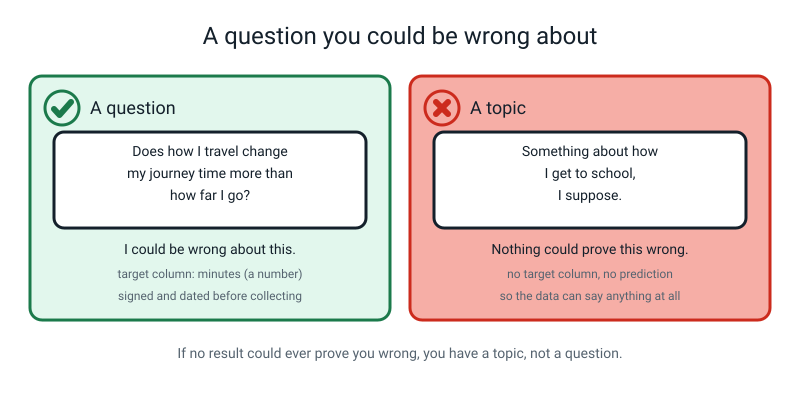
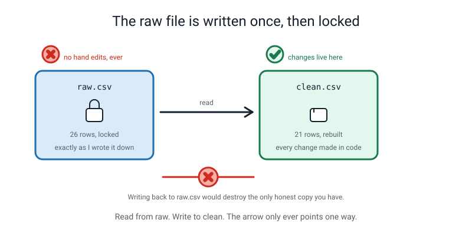
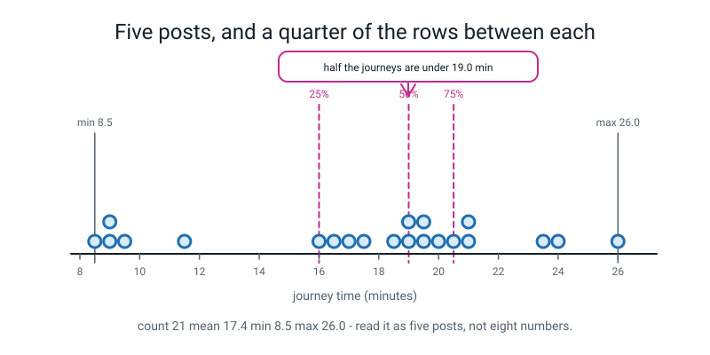
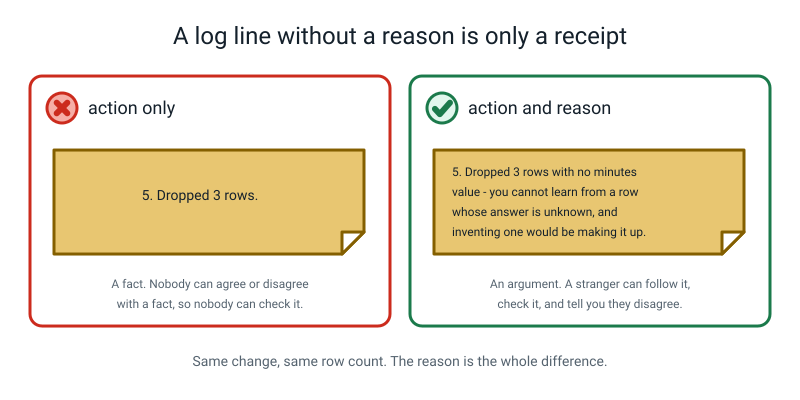
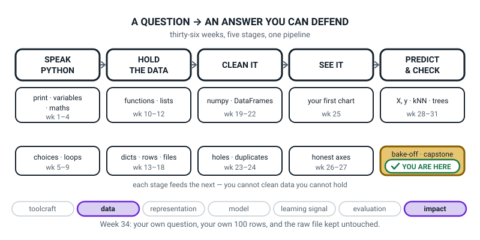

# Week 34 — Data Detective, Part 1: Your Question and Your 100 Rows

[⬅ Week 33](week-33.md) · [Course Home](../README.md) · [Week 35 ➡](week-35.md) · [Student Guide](../student-guide/week-34.md) · [Workbook](../workbook/week-34.md)

---

## 📋 At a Glance

| | |
|---|---|
| **Duration** | 70 minutes |
| **Type** | 🎪 Capstone — Part 1 of 2. No new ideas. One new habit: writing down *why*. |
| **Big idea** | A data project starts with a question you could be wrong about, and 100 rows you collected yourself. |
| **New vocabulary** | research question · raw data · describe · provenance · sample |
| **New syntax** | `df.describe()` — and that is genuinely all |
| **Materials** | Printed workbook pages 34.1–34.6 · the student's course notebook · a pen they are willing to sign with · a printed copy of the syntax ladder from Week 18 (optional) |
| **Tech needed** | Laptop with Python 3, pandas installed. A terminal. A folder they can create files in. |
| **Prep time** | 20 minutes the night before, 5 minutes on the day |

> **⚠️ Watch out:** this week is the one where a well-meaning adult can accidentally do the whole project. Your job today is almost entirely to ask **"and why?"** after every single thing the student writes. Say very little else. The lesson works if you are bored.

---

## 🎯 Lesson Objectives

By the end of the lesson the student can:

1. **Write a research question in one sentence, ending in a question mark**, that names a target column and that data could show to be wrong.
2. **Sign and date that question**, and explain out loud why signing it matters.
3. **Save a raw data file and make it read-only**, then explain what would be lost if they edited it by hand.
4. **Read `df.describe()` out loud** — count, mean, min, the three quartiles, max — as a sentence about the real world.
5. **Write a numbered cleaning-log line that contains a reason**, not only an action.
6. **State in writing one thing their data cannot show**, whatever the answer turns out to be.

Observable evidence: a signed and dated question in the notebook; `data/raw.csv` on disk with read-only permissions; a `describe()` output the student can narrate without hesitating; and at least two cleaning-log lines where the text after the dash explains the decision.

---

## 🧑‍🏫 What YOU Need to Know First

> **📌 About the code blocks in this guide.** Outside the **🧰 Prep Checklist** and the **🔑 Answer Key**, the blocks are **illustrations, not files** — each one carries on from the one above it, so the `import` lines and the data are typed once, in the first block that needs them. **The complete runnable files are in the Prep Checklist and the Answer Key.** If you paste an illustration on its own and get `NameError`, that is why, and nothing is broken.

You do not need to know anything new about Python for this week. You need to know one small function and one large idea.

### 1. What this week actually is

The student has spent 33 weeks learning pieces. This week and next week are the assembly. The whole capstone is:

> **A question. A hundred rows you collected. A cleaning log with reasons. Five charts. Three models on one split. And a page called "what I got wrong".**

Week 34 covers the first three. Week 35 covers the last three. Week 36 is the showcase and the written assessment.

Here is the professional truth underneath it, and it is worth saying to the student out loud, today: **the model is a small part of the work.** The question, the collecting, the cleaning log and the honesty are most of the rest, and practitioners commonly say so. Not many courses teach them. That is what these three weeks are.

### 2. A research question, and the four tests it has to pass

> **Research question** — one sentence, ending in a question mark, that data could answer and that you could turn out to be wrong about.

That last clause is the whole thing. "Something about my journey to school" is not a question. It cannot be wrong, so it cannot be checked, so no amount of data will settle it.


*Figure 34.1 — A question names a target column and could turn out wrong. A topic can quietly become whatever the data happens to say.*

Four tests. Make the student write each answer down; do not accept them spoken.

| Test | The question you ask | A pass | A fail |
|---|---|---|---|
| **Care** | Will you still want the answer in four weeks? | "How much of my day actually goes on homework versus screens?" | "Something about the weather I guess." |
| **100 rows** | Can you honestly get 100+ rows in about two hours, without permission you cannot get? | 100 videos from your own watch history | 100 classmates' exam marks |
| **Target** | Is there **one** column you would like to predict from the others? | `minutes` (a number) · `late` / `on-time` (a category) | "I just want to explore" |
| **Honest feature** | Could you know every other column **before** the target happened? | predicting journey time from distance, mode, rain | predicting journey time from "what time I arrived" |

The fourth test is the one that sinks projects, and the student has met it before: it is **leakage**, from Week 29. A leaky feature feels wonderful while it is happening — the model scores brilliantly and everyone feels clever — and then you notice one of the columns already contains the answer.

**Strongly recommend a number target.** All three models the course has taught — kNN, decision tree, linear regression — work on numbers, and all three metrics (MAE, RMSE, R²) apply. A category target is allowed but linear regression cannot do it, and the workaround is fiddly.

### 3. Why the question gets signed

This is the bit that looks like theatre and is not.

Without a signature, here is what happens, every single time. The student collects data. They look at it. Distance turns out to be boring and mode turns out to be interesting. And by Week 35 the question has quietly become *"does the mode of travel matter?"* — which is exactly what the data said. They have discovered their own dataset, and learned nothing.

Scientists call the fix **pre-registration**: writing down what you expect *before* you look. It is the cheapest honesty upgrade that exists, and a 12-year-old can do it perfectly. So the student writes:

- the question, with a question mark
- their **prediction** — which feature they think will win, and roughly how wrong the model will be
- the date
- their name

And then they cannot un-write it. Next week, when the prediction turns out to be wrong, that is a *result* and it goes in the write-up. A prediction made afterwards is not a prediction.

### 4. Raw data, and the one mistake you cannot undo

> **Raw data** — the file exactly as you first wrote it down, before any repair. It is evidence, not a draft.
> **Provenance** — where the data came from: who collected it, when, how, and who is in it.

The rule is absolute and the student will want to break it within ten minutes:

> **Every repair happens in Python, in a cell, with a log line. Never in the file.**

Why so strict? Because the moment you "just fix that typo in the spreadsheet", the fix exists nowhere in your code. Nobody — including you, in three weeks — can rerun your work and land on the same table. Your results stop being reproducible, silently, and you will not notice.


*Figure 34.2 — Read from raw, write to clean. If the arrow ever points backwards, the only honest copy of your data is gone.*

The physical enforcement is one terminal command:

```bash
chmod 444 data/raw.csv
```

That marks the file read-only. `444` means "everyone may read, nobody may write". After that, if the student's code tries to write to `raw.csv`, Python stops them with a `PermissionError` — which is exactly what you want. The computer is now enforcing the rule so you do not have to.

> **🧑‍🏫 If a student asks:** *"What if I genuinely wrote a row down wrong?"* Then the raw file keeps the wrong value, and a cleaning-log line in the code says `"Row 14: I wrote 210 minutes; my diary says 21.0. Fixed in code, not in the file."` The mistake is part of the record. That is what makes it a record.

### 5. `describe()` — the one new function, line by line

This is the entire new syntax for the week.

```python
import pandas as pd                      # the table library, as always

df = pd.read_csv("data/raw.csv")         # read the file into a table called df
print(df.describe())                     # print a summary of every NUMBER column
```

Line by line, for someone who has never programmed:

- `import pandas as pd` — fetch the table toolkit, and give it the short nickname `pd`. Every line that starts `pd.` is asking that toolkit to do something.
- `pd.read_csv("data/raw.csv")` — open that file, read the commas, and build a table in memory. The `data/` part means "inside the folder called data".
- `df = ...` — put the table in a box labelled `df`. From now on, `df` means "my table".
- `df.describe()` — ask the table for a summary. It hands back eight numbers **for every column that holds numbers**.
- `print(...)` — show the result on screen. Without `print`, a `.py` file computes the summary and throws it away.

Here are the eight numbers, and what each one actually means:

| Row | Plain meaning | The question it answers |
|---|---|---|
| `count` | how many rows have a real value in this column | how much data do I actually have? |
| `mean` | the average | what is typical? |
| `std` | standard deviation — roughly, the usual distance from the mean | are the values bunched or spread? |
| `min` | the smallest | what is the extreme low end? |
| `25%` | a quarter of the rows are below this | where does the bottom quarter stop? |
| `50%` | half the rows are below this — the **median** | what is the middle row? |
| `75%` | three quarters of the rows are below this | where does the top quarter start? |
| `max` | the largest | what is the extreme high end? |

**Only `std` needs care, and the honest thing is not to explain it fully.** Say: *"it is roughly how far a typical row sits from the average. Big std means spread out, small std means bunched up."* That is enough for Level 2, and it is true.

The four you actually read out loud are `count`, `min`, `50%` and `max`. Those four are a sentence about the world.


*Figure 34.3 — min, 25%, 50%, 75% and max are five fence posts. Roughly a quarter of your rows sit in each gap.*

Read the demo output in that figure aloud, exactly like this: *"Twenty-one journeys. The quickest took 8.5 minutes and the slowest 26. Half of them were under 19 minutes. A quarter were under 16."* That is a description of a real morning, not a table of numbers.

### 6. The single most useful thing `describe()` does — it leaves things out

Here is the demo output from the messy raw file you will build in the lesson:

```text
       distance_km       rain
count    25.000000  26.000000
mean      2.436000   0.269231
std       0.998699   0.452344
min       1.200000   0.000000
25%       1.200000   0.000000
50%       2.100000   0.000000
75%       3.400000   0.750000
max       3.400000   1.000000
```

There are five columns in that table. `describe()` shows two. **`minutes` — the column the whole project is about — is not there.**

That is not a bug. `describe()` only summarises columns pandas believes hold numbers. One row of that log says `about 20` instead of a number, so pandas decided the whole column is text. And a column pandas thinks is text cannot be averaged, plotted or predicted.

> **The habit to install today: run `describe()`, then check that your target column appears in it. If it is missing, stop and find out why.** That single check catches the most expensive bug in the whole capstone.

### 7. A cleaning log, and why the reason beats the action

> **Cleaning log** — a numbered list of every change you made to the raw data, each with a reason, kept in the code so it ships with the results.

Compare:

| Log line | What a reader can do with it |
|---|---|
| `5. Dropped 3 rows.` | Nothing. It is a receipt. They can neither agree nor disagree. |
| `5. Dropped 3 rows with no minutes value — you cannot learn from a row whose answer is unknown, and inventing one would be making data up.` | Follow it, check it, and say "I would have kept those and filled them, and here is why." |


*Figure 34.4 — The action is a fact. The reason is an argument. Only arguments can be checked.*

The reason turns a fact into an argument, and arguments can be checked, disagreed with and improved. That is the difference between a school project and a piece of work.

**The log lives in the code.** It is a Python list, built by a tiny function, printed at the end. That way it cannot drift out of date, and a reader sees the log and the code that produced it in the same file.

### 8. The three misconceptions you will actually meet

**Misconception 1 — "the question is the easy bit, let's get to the code."**

It is the opposite. Two hours of collecting the wrong data cannot be rescued by four hours of good modelling. Budget the time honestly: the plan and the question are 45 minutes of real work, and the student will want to spend five.

The line that lands: *"You are about to spend two hours of your life collecting this. Which question do you want to be holding at the end of it?"*

**Misconception 2 — "more rows of the same thing counts."**

One hundred identical walks teach nothing. If `mode` is always `walk`, the model cannot learn anything about mode. If every distance is between 2.0 and 2.3 km, distance cannot explain anything. The student needs **variety in every feature**, and it has to be planned before collecting, not discovered afterwards.

The check: *every category value should appear at least ten times, and every number column should genuinely spread out.*

**Misconception 3 — "cleaning means deleting the weird rows."**

No. The weird rows are often the most valuable ones — the day it poured, the journey that took twice as long. What gets removed is only what is **unusable**: a missing answer, an impossible value, a duplicate. And every removal is counted and justified.

Watch for the phrase *"I just dropped the odd ones"*. Every "just" is a decision the student skipped explaining. The word `just` is banned in this project for exactly that reason.

### 9. How deep to go, and where to stop

**Go this far:** the question and its four tests · signing and dating it · raw versus clean · `describe()` and reading the quartiles · the numbered log with reasons · one thing the data cannot show.

**Stop before:**

- **Any charts.** That is next week. A student who starts plotting today will not finish the log.
- **Any models.** Definitely next week. If they ask "which model should I use?", the answer is: "all three, next week, on one split — and you cannot choose until the table is clean."
- **`groupby`, correlations, or anything that answers the question.** Today is *description*, not analysis. Describe the table; do not interrogate it.
- **Standard deviation properly.** "Roughly the usual distance from the average" is the ceiling.

---

### 10. 🧭 The Growing Map — two minutes on a gold tile that no longer tells you where the work is

The student guide carries one figure a week that is not about the week's content: the five-stage
pipeline, one more piece inked in. This week it earns its keep in an unusual way — the gold tile sits in
`PREDICT & CHECK`, and almost nothing you did today happened there.



*Figure 34.0 — Week 34's version. Third week inside `bake-off · capstone`, weeks 32 to 36. The capstone
sits in the last tile but re-walks every earlier stage. Two threads lit: data and impact.*

**What to do with it, in about two minutes at the end of the lesson:**

1. **Show it and ask the honest question:** *"the gold box is over on the right, under `PREDICT &
   CHECK`. Which boxes did we actually work in today?"* You want fingers on **HOLD THE DATA** and
   **CLEAN IT** — collecting rows, `info()`, `describe()`, the log. Then say the thing out loud: a
   capstone does not live in one box, it walks the whole row, which is why it takes three weeks.
2. **Then the question that is really today's lesson:** *"we wrote no model, no chart and no new
   function. So what did we make?"* You are listening for **a question**, **a raw file** and **a log
   with reasons in it**. If somebody says "we didn't really do anything", that is the moment to point at
   the four gates the question had to pass — a question is a deliverable, and theirs is signed.
3. **Have them ink the tile and write their research question inside it**, one sentence, signed and
   dated. Nothing else in the tile. If they cannot fit it on one line, the question is still too big and
   you have just diagnosed that for free.

> **🧑‍🏫 Why this is worth two minutes.** Weeks with no new syntax feel to a twelve-year-old like weeks
> where nothing happened, and this one has the most fragile deliverable of the year: a question narrow
> enough to answer and a raw file nobody has edited. Putting the question *on the map* makes it a piece
> of work rather than admin. It also quietly buys you next week — the learner who can see that their
> hundred rows have to travel through three more boxes will not arrive in Week 35 expecting to be
> finished by the bell.

---

## 🧰 Prep Checklist

**20 minutes the night before**

- [ ] Print workbook pages 34.1–34.6. Page 34.2 (the plan template) will be written on, signed, and kept — print it on the nicest paper you have. That matters more than it sounds.
- [ ] **Run the three demo files yourself.** This is the non-negotiable prep. Make a scratch folder, create a `data` folder inside it, and type all three files below. Confirm you get the exact outputs shown. It takes twelve minutes and it is what lets you teach with your hands in your pockets.

```bash
mkdir -p week34-demo/data
cd week34-demo
```

Then create `make_raw.py`, `look.py` and `clean.py` from the **Live-Code Together** section, run them in that order, and check you see:

```text
26 rows written to data/raw.csv
```

then

```text
shape: (26, 5)
```

and, at the end of `clean.py`:

```text
shape before: (26, 5)   after: (21, 5)
```

- [ ] **Run the read-only command and then deliberately break it**, so you have seen the error before a student does:

```bash
chmod 444 data/raw.csv
python3 make_raw.py
```

You should get:

```text
Traceback (most recent call last):
  File "/private/tmp/demo/week34-demo/make_raw.py", line 35, in <module>
    with open("data/raw.csv", "w", newline="") as f:          # "w" = write a new file
PermissionError: [Errno 13] Permission denied: 'data/raw.csv'
```

That is the computer enforcing the rule. Undo it afterwards with `chmod 644 data/raw.csv` if you want to re-run the file.

- [ ] Read section 6 above once more. The "`describe()` left my target column out" moment is the best thing in the lesson and you have to spot it before the student does.
- [ ] Decide **your** answer to "what should I do my project on?" — not to hand over, but so you have three concrete alternatives ready if they freeze. Journey to school · minutes spent on a video versus its length · how long a chore takes · runs in an innings from your own scorebook · cost of a shop trip.

**5 minutes on the day**

- [ ] Terminal open, in a folder the student can write to.
- [ ] Page 34.2 on the table, with a pen next to it. Not a pencil. **A pen.** You are going to ask them to sign something.
- [ ] A clock or timer visible. The Their Turn segment is 20 minutes and it will overrun if nobody is watching it.

**Fallback if the laptop or the install fails**

| If this fails | Do this instead |
|---|---|
| Python or pandas will not run | The whole lesson works on paper. Page 34.2 (the plan) and page 34.3 (the log) need no computer at all. For `describe()`, hand-compute the five posts from the twenty-one printed values on page 34.4 — sort them, take the middle one, then the middle of each half. That gets you close to what pandas prints (pandas interpolates between neighbouring values, so it can differ slightly). |
| No terminal, or `chmod` is unavailable | Right-click the file → Get Info / Properties → tick "read only". Same effect. Or put `raw.csv` in a folder called `DO_NOT_EDIT` and say so out loud. |
| The student has no data idea at all | Give them the journeys project. It is the demo, it collects itself in a week, and 100 rows is one week of a whole family logging trips. Do not spend twenty minutes brainstorming; a working question beats a beautiful one. |
| The student has already collected data and wants to skip ahead | Excellent. Have them run the four tests on the question they *actually* answered, in writing. Half the time they discover their target column is a leak, and that discovery is worth the whole lesson. |
| They cannot get to 100 rows | Coarsen the row. One row per **day** instead of per journey. Or widen the window. Or add people. Do not let them submit 60 rows: with a 20% test set that is 12 test rows, and one row would be worth 8 percentage points. |

---

## ⏱️ The Lesson, Minute by Minute

| Segment | Minutes | Running total | What happens |
|---|---|---|---|
| 🪝 Hook — The Question That Moved | 7 | 7 | A project that "found" exactly what its author already believed |
| 🧠 Concept — Four Tests, One Signature | 16 | 23 | The four tests, in writing; then sign and date it |
| 💻 Live-Code Together — Raw, Locked, Described | 18 | 41 | Build raw.csv, lock it, read describe() out loud, start the log |
| ✍️ Their Turn — Their Own Plan and Their Own Log | 20 | 61 | They write their plan, their prediction, and their first log lines |
| 🔑 Wrap & Assign | 9 | 70 | Three checks, the takeaway, the two-hour collection job |

---

### 🪝 Hook — The Question That Moved (7 minutes)

**Do this:** Sit down with nothing open. No laptop. Look slightly embarrassed.

**Say this:**

> "I want to tell you about a project I saw, and I want you to tell me what went wrong with it, because I could not put my finger on it for about a week.
>
> Someone set out to answer this: **does practising more make you better at free throws in basketball?** Good question. They collected data on themselves for a month — how many minutes they practised each day, and how many free throws out of ten they scored the next morning. Sixty rows. Real effort.
>
> Then they looked at the data. And practice minutes turned out to be… nothing. Flat. No pattern at all.
>
> But they noticed something else. On days when they had slept more than eight hours, they scored much better. Really clearly better. So the write-up said: **'I investigated what makes free throws better, and I found that sleep is the strongest driver.'** And it was a nice write-up. It had a chart and everything."

Pause. Let it sit.

> "So. What is wrong with that?"

Let them work. They usually get to "they changed the question" within a minute. If they do not, prompt with: *"What question did they set out to answer? What question did they end up answering?"*

> "Yes. **The question moved.** They set out to test practice, practice failed, and the question quietly became 'what in this data looks interesting?' — and the answer to that question is always yes, because something always looks interesting in sixty rows.
>
> Here is the part that matters. They were not cheating. They did not lie about a single number. Every value in that table was honest. The dishonest thing was **the order** — they let the data choose the question, after the fact.
>
> So today, before you collect anything, you are going to write your question down in pen. And then you are going to sign it and date it. Not because I do not trust you. Because in three weeks, when your best feature turns out to be boring and something else looks brilliant, that signature is the only thing standing between you and a project that discovered whatever you already believed."

**Ask this:**

| Ask | Answer you want | If they say something else |
|---|---|---|
| "What was wrong with the basketball project?" | The question changed after they saw the data. | If they say "sixty rows is too few" — true, and a great point, and park it: "Yes, and we will nail that down next week. But there is something wrong even with a million rows." |
| "Was any number in it a lie?" | No. Every measurement was honest. | If they say "probably" — push: "Which one? Name the number you think was faked." They can't, and that is the point. |
| "So what stops it happening to you?" | Writing the question down first, and signing it. | If they say "just remember it" — reply: "Remember it against what? In three weeks your memory of the question will be the question the data answered. That is how memory works." |
| "Is 'sleep matters' a useless finding then?" | No — it is a good finding for the *next* project, honestly labelled as something you noticed rather than something you tested. | This is the sophisticated answer. If they get there, say so out loud. |

---

### 🧠 Concept — Four Tests, One Signature (16 minutes)

**Do this:** Put workbook page 34.2 between you, and the pen on top of it. Do not open the laptop yet.

**Say this — part 1, the question:**

> "A **research question** is one sentence, it ends in a question mark, and — this is the bit everyone misses — **you could turn out to be wrong about it.**
>
> That last part is the test. 'Something about my journey to school' is not a question. It cannot be wrong. So nothing you collect can ever settle it, and it will quietly become whatever the data says. 'Does how I travel change my journey time more than how far I go?' ��� that one can be wrong. I can imagine the answer being no. That makes it a question."

Write both on the page, side by side, and put a tick and a cross next to them.

**Say this — part 2, the four tests:**

> "Four tests. And I want them answered in writing, on this page, not out loud, because out loud you can be vague and in writing you cannot.
>
> **Test one, care.** Will you still want the answer in four weeks? Because that is roughly how long you are going to be holding this.
>
> **Test two, a hundred rows.** Can you honestly get a hundred rows or more, in about two hours, without needing permission you cannot get? A hundred videos from your own watch history: fine. A hundred classmates' exam marks: not fine, and not just because it is hard.
>
> **Test three, the target.** Is there exactly **one** column you would like to predict from the others? Name it. If your answer is 'I just want to explore', you have a chart project, not a model project, and next week is going to be very short for you.
>
> **Test four, and this is the one that kills projects.** Could you know every other column **before** the target happened? Predicting my journey time from distance, mode and rain — yes, I know all three when I leave the house. Predicting my journey time from *what time I arrived* — that IS the answer. You have met this. What is it called?"

They should say **leakage** (Week 29). If they do not, remind them and move on quickly.

**Say this — part 3, the prediction and the signature:**

> "Now the strange bit. Before you collect anything, you are going to write down **what you expect to find.** Which feature you think will win. And roughly how wrong you think the model will be — a real number, with units. 'I think it'll be off by about five minutes on average.'
>
> Why? Because you cannot un-see a result. Once you have looked at the data, whatever it says will feel like what you expected all along. That is not you being dishonest; that is how brains work. Writing it down first is the only defence, and it costs you thirty seconds.
>
> Scientists call this **pre-registration**. You are going to call it 'the thing I signed.'
>
> And then the last line on the page: **one thing this data cannot show, however it turns out.** For the journeys project, mine is: 'this cannot show anything about anyone who is not me — I walk at my speed, and my little brother walks about a third slower.' Write yours now, because in three weeks you will not want to."

Hand them the pen. Have them sign and date it. Do it properly — this is a ritual and rituals work.

**Ask this:**

| Ask | Answer you want | If they say something else |
|---|---|---|
| "Read me your question. Where's the question mark?" | They read it; it ends in `?`. | If there is no question mark, do not explain — just point at the end of the sentence and wait. They fix it themselves in about four seconds. |
| "Which column is the target? Point at it." | They point at exactly one column and say whether it is a number or a category. | If they name two, ask: "Which one would you rather be able to predict?" Then delete the other from the target row; it can stay as a feature. |
| "Could you know [feature] before [target] happened?" | Yes, for every feature. | If no for one of them, do not delete it for them. Ask: "So when do you find that out?" Let them reach "after" themselves, then cross it out together. |
| "How wrong do you think the model will be?" | A number with units — "about 5 minutes". | If they say "not very" — reply: "Not very is not a number. Give me minutes." Any number is fine; the point is that it is checkable. |
| "What is one thing this data cannot show?" | Anything specific: "not about other people", "not about winter", "not about days I was ill". | If they say "nothing, it shows everything" — offer one: "Does it show anything about February? When did you collect?" |

---

### 💻 Live-Code Together — Raw, Locked, Described (18 minutes)

You type. They type along, on their own laptop, in their own folder. **Two places below are marked 🐞 — you make the mistake on purpose and fix it in front of them.** Modelling debugging is the point of the segment, not a bonus.

We use a small demo log — twenty-six journeys — so that everyone has the same file and the same output. Their own data arrives as homework.

**Step 1 — make the folders (1 minute).** In the terminal:

```bash
mkdir -p week34-demo/data
cd week34-demo
```

**Say this:**

> "One folder for the project, one folder called `data` inside it. Everything about your data lives in that folder and nowhere else. If you cannot say which folder a file is in, you will lose an hour to it later, and I have."

**Step 2 — type `make_raw.py` (5 minutes).** Exact keystrokes, in order. Talk while you type.

```python
# make_raw.py - write the journey log I collected on paper into one CSV file.
# I type each row EXACTLY as it appears in my paper log. Mistakes included.

import csv                                    # the standard-library CSV tool

rows = [                                      # one dict = one journey = one row
    {"day": "Mon", "distance_km": 1.2, "mode": "walk",  "rain": 0, "minutes": 17.5},
    {"day": "Mon", "distance_km": 3.4, "mode": "bus",   "rain": 1, "minutes": 21.0},
    {"day": "Tue", "distance_km": 1.2, "mode": "Walk",  "rain": 0, "minutes": 16.0},
    {"day": "Tue", "distance_km": 3.4, "mode": "bus",   "rain": 0, "minutes": 19.5},
    {"day": "Wed", "distance_km": 2.1, "mode": "cycle", "rain": 0, "minutes": 9.0},
    {"day": "Wed", "distance_km": 3.4, "mode": "bus",   "rain": 1, "minutes": 24.0},
    {"day": "Thu", "distance_km": 1.2, "mode": "walk ", "rain": 1, "minutes": 19.0},
    {"day": "Thu", "distance_km": 3.4, "mode": "bus",   "rain": 0, "minutes": 20.0},
    {"day": "Fri", "distance_km": 2.1, "mode": "cycle", "rain": 0, "minutes": 8.5},
    {"day": "Fri", "distance_km": 3.4, "mode": "bus",   "rain": 0, "minutes": 18.5},
    {"day": "Mon", "distance_km": 1.2, "mode": "walk",  "rain": 0, "minutes": 17.0},
    {"day": "Mon", "distance_km": 3.4, "mode": "bus",   "rain": 0, "minutes": 19.0},
    {"day": "Tue", "distance_km": 2.1, "mode": "cycle", "rain": 1, "minutes": 11.5},
    {"day": "Tue", "distance_km": 3.4, "mode": "bus",   "rain": 1, "minutes": 26.0},
    {"day": "Wed", "distance_km": 1.2, "mode": "walk",  "rain": 0, "minutes": "about 20"},
    {"day": "Wed", "distance_km": 3.4, "mode": "bus",   "rain": 0, "minutes": 19.5},
    {"day": "Thu", "distance_km": 2.1, "mode": "cycle", "rain": 0, "minutes": 9.5},
    {"day": "Thu", "distance_km": 3.4, "mode": "bus",   "rain": 0, "minutes": 0},
    {"day": "Fri", "distance_km": 1.2, "mode": "walk",  "rain": 1, "minutes": 21.0},
    {"day": "Fri", "distance_km": "",  "mode": "bus",   "rain": 0, "minutes": 20.5},
    {"day": "Mon", "distance_km": 2.1, "mode": "cycle", "rain": 0, "minutes": 9.0},
    {"day": "Mon", "distance_km": 3.4, "mode": "bus",   "rain": 1, "minutes": 23.5},
    {"day": "Tue", "distance_km": 1.2, "mode": "walk",  "rain": 0, "minutes": 16.5},
    {"day": "Tue", "distance_km": 3.4, "mode": "bus",   "rain": 0, "minutes": ""},
    {"day": "Mon", "distance_km": 1.2, "mode": "walk",  "rain": 0, "minutes": 17.0},
    {"day": "Wed", "distance_km": 3.4, "mode": "bus",   "rain": 0, "minutes": 19.5},
]

with open("data/raw.csv", "w", newline="") as f:          # "w" = write a new file
    writer = csv.DictWriter(f, fieldnames=list(rows[0].keys()))
    writer.writeheader()                                  # the column names line
    writer.writerows(rows)

print(len(rows), "rows written to data/raw.csv")
```

Run it:

```bash
python3 make_raw.py
```

```text
26 rows written to data/raw.csv
```

**Say this while typing:**

> "Look at what I am typing and do not correct me. Row three says `Walk` with a capital W. Row seven says `walk` with a space after it. Row fifteen says `about 20` instead of a number. Row eighteen says zero minutes, which is not a journey, it is a teleport. Row twenty has no distance at all.
>
> Every one of those is in my paper log. So every one of those goes in the file. **The raw file is not a tidy file. It is an honest one.**"

> **🐞 Deliberate mistake 1 — the missing folder.** *Before* running `make_raw.py`, delete the `data` folder (or pretend you forgot to make it) and run anyway. You get:
>
> ```text
> Traceback (most recent call last):
>   File "/private/tmp/demo/week34-demo/make_raw.py", line 35, in <module>
>     with open("data/raw.csv", "w", newline="") as f:          # "w" = write a new file
> FileNotFoundError: [Errno 2] No such file or directory: 'data/raw.csv'
> ```
>
> Say: *"Read the last line first. It says it cannot find `data/raw.csv`. Now — is it the file that is missing, or the folder? Python will happily create a file. It will never create a folder for you."* Then `mkdir data` and run again. Twenty seconds, and the student has learned the single most common Week 34 error.

**Step 3 — lock the raw file (2 minutes).**

```bash
chmod 444 data/raw.csv
```

**Say this:**

> "That command means: everyone can read this, nobody can write to it. Including me. Including you. Especially you at eleven o'clock at night when you notice a typo.
>
> Watch what happens now if I try to write to it again."

```bash
python3 make_raw.py
```

```text
Traceback (most recent call last):
  File "/private/tmp/demo/week34-demo/make_raw.py", line 35, in <module>
    with open("data/raw.csv", "w", newline="") as f:          # "w" = write a new file
PermissionError: [Errno 13] Permission denied: 'data/raw.csv'
```

> "Permission denied. The computer is now enforcing the rule for you. That error is not a problem — **that error is a feature you switched on deliberately.** From here on, every repair happens in Python, in a cell, with a reason next to it."

**Step 4 — look at the table (5 minutes).** New file, `look.py`:

```python
# look.py - look at the raw table before changing anything at all.
import pandas as pd

df = pd.read_csv("data/raw.csv")      # always read the RAW file, never the clean one

print("shape:", df.shape)             # (rows, columns)
print()
print(df.head())                      # the first five rows
print()
df.info()                             # what type is every column?
print()
print(df.describe())                  # the numbers, summarised
```

```bash
python3 look.py
```

```text
shape: (26, 5)

   day  distance_km   mode  rain minutes
0  Mon          1.2   walk     0    17.5
1  Mon          3.4    bus     1    21.0
2  Tue          1.2   Walk     0    16.0
3  Tue          3.4    bus     0    19.5
4  Wed          2.1  cycle     0     9.0

<class 'pandas.core.frame.DataFrame'>
RangeIndex: 26 entries, 0 to 25
Data columns (total 5 columns):
 #   Column       Non-Null Count  Dtype  
---  ------       --------------  -----  
 0   day          26 non-null     object 
 1   distance_km  25 non-null     float64
 2   mode         26 non-null     object 
 3   rain         26 non-null     int64  
 4   minutes      25 non-null     object 
dtypes: float64(1), int64(1), object(3)
memory usage: 1.1+ KB

       distance_km       rain
count    25.000000  26.000000
mean      2.436000   0.269231
std       0.998699   0.452344
min       1.200000   0.000000
25%       1.200000   0.000000
50%       2.100000   0.000000
75%       3.400000   0.750000
max       3.400000   1.000000
```

**Now stop.** This is the best moment in the lesson. Do not rush it.

**Ask this, and wait:**

> "There are five columns in my table. How many columns are in that last block?"

Two. Let them count.

> "So which columns are missing?"

`day`, `mode`, and — the important one — **`minutes`**.

> "Right. `day` and `mode` are words, so there is nothing to average. Fine. But `minutes` is the whole point of the project, and it is not there. Look at `info()`. What does it say `minutes` is?"

`object`. Which, in pandas, means text.

> "One row of twenty-six said `about 20`. And because a column can only be **one** type, that single row turned the entire `minutes` column into text. Text cannot be averaged, cannot be plotted, and cannot be predicted.
>
> So here is the habit, and I want it for life: **run `describe()`, then check your target column is in it.** If it is missing, stop and find out why, before you do anything else."

**Step 5 — the log begins (5 minutes).** New file, `clean.py`. Type the top of it together:

```python
# clean.py - clean the raw table, and write down WHY for every single change.
import pandas as pd

df = pd.read_csv("data/raw.csv")          # always start from raw
before = df.shape                         # remember the size before we touch it

CLEANING_LOG = []                         # the log lives in the code, not my head

def log(action, reason):                  # one small function, used six times
    """Add one numbered line to the cleaning log."""
    number = len(CLEANING_LOG) + 1        # 1, then 2, then 3...
    CLEANING_LOG.append(f"{number}. {action}  -  {reason}")

# --- 1. exact duplicate rows -------------------------------------------------
dupes = df.duplicated().sum()             # how many rows are copies of another row?
df = df.drop_duplicates()
log(f"Dropped {dupes} exact duplicate row(s)",
    "My phone re-synced on Monday and logged two journeys twice. Same day, same mode, same minutes.")

after = df.shape
print(f"shape before: {before}   after: {after}")
print()
for line in CLEANING_LOG:
    print(line)
```

```text
shape before: (26, 5)   after: (24, 5)

1. Dropped 2 exact duplicate row(s)  -  My phone re-synced on Monday and logged two journeys twice. Same day, same mode, same minutes.
```

> **🐞 Deliberate mistake 2 — the log line with no reason.** Type the first version like this, out loud:
>
> ```python
> log(f"Dropped {dupes} exact duplicate row(s)", "they were duplicates")
> ```
>
> Run it. It works perfectly. Then say: *"That ran. Nothing is broken. And it is still wrong, and no error message will ever tell me so. Read it back to me: 'Dropped 2 exact duplicate rows, because they were duplicates.' What have I actually told you?"*
>
> Nothing. Then fix it to the real reason — the phone re-syncing — and read both aloud. *"The second one, you could argue with. You could say 'I would have kept one of them and flagged it'. That is what a reason is for."*
>
> This is the most important twenty seconds of the lesson. **A silent wrong answer is more dangerous than a traceback**, and this is a silent wrong answer they can see.

**Ask this:**

| Ask | Answer you want | If they say something else |
|---|---|---|
| "Why do I read `raw.csv` at the top and not `clean.csv`?" | So the whole cleaning happens in code, every time, from the original. | If they say "because clean.csv doesn't exist yet" — true today, and ask: "And next week, when it does exist? Which one do you read?" Answer: still raw. |
| "`describe()` shows two columns. My table has five. Which is the problem?" | `minutes` — the target — is missing because one row is text. | If they say `day` and `mode` — accept, then push: "Those are words, so fair enough. What about the one that should be numbers?" |
| "Is the `PermissionError` a problem?" | No. It is the rule working. | If they want to undo it permanently, ask: "So what stops you editing raw.csv at midnight?" |
| "Read me line 1 of the log. Is that a reason?" | The re-sync version is; "they were duplicates" is not. | If they cannot tell, read it back to them as a sentence with "because" in the middle. It becomes obvious out loud. |

---

### ✍️ Their Turn — Their Own Plan and Their Own Log (20 minutes)

This is the segment that matters, and your job in it is almost silence. Full instructions are in **🎲 The Activity, In Full** below. In the lesson flow:

- **Minutes 0–10:** they fill in page 34.2 — the question, the four tests, the columns table with units and *how I will measure it*, the target, the prediction, the data card, and one thing the data cannot show. Then they sign it.
- **Minutes 10–15:** they set up the folders on their own laptop and create an empty `data` folder, plus a `notes/collection-diary.md`.
- **Minutes 15–20:** they write their **first three cleaning-log lines in advance** — the problems they already know they will hit. ("I know I will have some days missing." "I know I wrote two Tuesdays as 'Tues'.") Predicting your own mess is a real skill and it makes the homework enormously faster.

**The only thing you say, over and over:** *"And why?"*

---

## 🐞 The Debugging Clinic

Every one of these came from actually running a broken version of this week's code. pandas tracebacks are long; **the last line is the one that matters**, so that is what the table quotes.

| What the student sees (real message) | What it means | Most likely cause | The fix |
|---|---|---|---|
| `FileNotFoundError: [Errno 2] No such file or directory: 'data/raw.csv'` | Python looked where you told it and found nothing. | The `data` folder does not exist, or the terminal is in the wrong folder. Python creates files, never folders. | `mkdir data`, or `cd` into the project folder. Check with `ls` that you can see `data` before you run anything. |
| `FileNotFoundError: [Errno 2] No such file or directory: 'raw.csv'` | Same error, different path. | The code says `read_csv("raw.csv")` but the file is inside `data/`. | Use the full path from where you are running: `read_csv("data/raw.csv")`. |
| `PermissionError: [Errno 13] Permission denied: 'data/raw.csv'` | The file is read-only and something tried to write to it. | Either the rule working correctly, or the student re-ran `make_raw.py` after locking. | If it is a repair: **do not unlock.** Do it in `clean.py` with a log line. If they genuinely need to rebuild raw: `chmod 644 data/raw.csv`, rebuild, then `chmod 444` again. |
| `KeyError: 'Minutes'` | There is no column with that exact name. | Capital letter, trailing space, or a plural. Column names are case-sensitive, always. | `print(df.columns)` and copy the name character for character. `minutes`, not `Minutes`. |
| `TypeError: Could not convert 17.521.0about 209 to numeric` (from `df["minutes"].mean()`; pandas 1.5 wording, newer versions say `Could not convert string '...' to numeric`) | pandas tried to add up the column, found it was text, and glued the values together instead. | The column is `object` dtype because at least one row is not a number — here, `about 20`. | `df["minutes"] = pd.to_numeric(df["minutes"], errors="coerce")` first, then log why. |
| `AttributeError: 'Series' object has no attribute 'strip'` | A whole column does not have text methods; individual strings do. | They wrote `df["mode"].strip()` instead of `df["mode"].str.strip()`. | Add `.str`: `df["mode"].str.strip().str.lower()`. The `.str` means "do this to every value". |
| `ValueError: invalid literal for int() with base 10: 'about 20'` | The right *kind* of conversion on an impossible *value*. | Trying `int()` on a note rather than a number. | Do not convert by hand. Use `pd.to_numeric(..., errors="coerce")`, which turns the unconvertible into empty instead of crashing, and then log that you did. |
| `OSError: Cannot save file into a non-existent directory: 'output'` | `to_csv` will not invent a folder either. | Saving to `output/clean.csv` when there is no `output` folder. | Save into `data/`, which you already made: `df.to_csv("data/clean.csv", index=False)`. |
| **No error at all.** `describe()` prints, and the target column is absent. | The silent one, and the dangerous one. | The target column is `object` dtype. | Run `df.info()`. Any column that should be numbers and says `object` is a bug. This is why the habit is "describe, then check the target is in it". |

### How to teach debugging without giving the answer

Four sentences, in this order. Do not skip to sentence four.

1. **"Read me the last line out loud."** Ninety per cent of the time they solve it while reading. The error message is not decoration; it is a sentence in English.
2. **"What does it say it could not find / could not do?"** Make them name the thing. `data/raw.csv`. `'Minutes'`. `'strip'`.
3. **"So show me that thing."** `ls data`. `print(df.columns)`. The gap between what they believe and what is on disk is where every bug lives.
4. Only now: **"What is one thing you could change?"** One. Then run it. Changing three things at once and running is how a twenty-second bug becomes a twenty-minute bug.

And the rule for you: **never take the keyboard.** Point at the screen with a finger if you must. The student who fixes it with their own hands remembers it; the student who watches you fix it does not.

---

## 🎲 The Activity, In Full

### What it is

The student produces the three things the capstone cannot start without: a **signed plan**, an **empty but correct folder structure**, and their **first log lines written in advance**.

### Setup

**On the table:** workbook page 34.2 (the plan template), page 34.3 (the log sheet), a **pen**, their course notebook.
**On the laptop:** a terminal, in a folder they own.

They are building the structure in **Figure 34.2** — two data files, one of them locked. Exactly this:

```text
data-detective/
├── data/                  <- empty for now. raw.csv lands here tonight.
├── notes/
│   ├── plan.md            <- page 34.2, typed up or photographed
│   └── collection-diary.md
├── make_raw.py
├── look.py
└── clean.py
```

### Step 1 — the plan (10 minutes)

Page 34.2 has eight boxes. They fill in all eight. In pen.

```text
1. THE QUESTION      ______________________________________________ ?
2. THE FOUR TESTS    care ___ / 100 rows ___ / target ___ / honest ___
3. ONE ROW IS ONE    ______________________________________________
4. THE COLUMNS       name | type | units | how I will measure it
                     (four features and one target, minimum)
5. THE TARGET        ____________________  number / category
6. MY PREDICTION     I expect __________ to matter most, because ______.
                     I expect the model to be off by about ____ ______.
7. DATA CARD         collected by · between __ and __ · how · who is in it
                     · permission asked of ____ on ____ · what is NOT in it
8. WHAT THIS CANNOT SHOW ______________________________________________

Signed ____________________   Date ____________
```

**Your only job here is box 4 and the word "why".** For every column they write, ask *"and how, exactly, will you measure that?"* "Roughly how long it felt" is not a measurement. "Minutes on my phone clock, from front door to school gate" is.

### Step 2 — the folders (5 minutes)

```bash
mkdir -p data-detective/data data-detective/notes
cd data-detective
```

Then they create `notes/collection-diary.md` and type the header into it:

```text
COLLECTION DIARY - one line every time something goes wrong.

date     what happened                            what I did about it
-------  ---------------------------------------  ------------------------
```

**Say this:**

> "That is the least glamorous file in the whole project and it is the one that makes Week 35 easy. Every line you write in it becomes a sentence in 'what I got wrong'. Write in it while you collect, not afterwards. Afterwards you will remember that everything went fine."

### Step 3 — three log lines, written in advance (5 minutes)

On page 34.3, they predict their own mess. Three lines, each with a reason, each about a problem they have not hit yet.

Model answers are in the Answer Key, page 34.3.

### What "finished" looks like

- A signed and dated question with a question mark at the end.
- All four tests answered **in writing**, with the honest-feature test applied to every column by name.
- Five or more columns with units and a stated measurement method — not "roughly".
- A written prediction containing a number with units.
- One sentence naming something the data cannot show.
- The folder structure on disk, with an empty `data/` folder and a diary file that has a header in it.
- Three log lines with reasons.

### Variation — easier

- **Give them the question.** Hand over the journeys project wholesale: `minutes` from `distance_km`, `mode`, `rain`, `depart_hour`. Their creative work becomes *the measurement method* and *the data card*, which is plenty.
- **Coarsen the row** so 100 rows is reachable: one row per day, not per event.
- Drop the prediction's number and accept "which feature will win" alone.
- Do box 4 as a conversation while you write it down for them, then have them copy it. The thinking is the lesson; the handwriting is not.

### Variation — harder

1. **Break your own question.** "Give me a feature that would make your model score brilliantly and be completely useless. Then explain when that value actually becomes known." This is the leak test, on their own project, and it is worth more than any extension.
2. **Design the variety check before collecting.** "Write down, now, the minimum number of times each category value must appear. Then plan your collection so it happens." Ten each is the working rule.
3. **The second batch.** "Plan a second collection, thirty rows, two weeks after the first — a different week, ideally a different person. Do not merge it. Next week you will test the frozen model on it." This is drift, measured, and almost nobody their age has done it.
4. **Write the data card as if you were handing the data to a stranger** who will use it to decide something, and then list the three questions they would ask you that you cannot currently answer.

---

## ❓ Questions Students Ask This Week

**"Why 100 rows? Why not 50?"**

Do the arithmetic with them, because it is the honest answer. With 100 rows and a 20% test set you keep 20 rows back. One row is then worth 5 percentage points of an accuracy score. With 50 rows you keep 10, and one row is worth 10 points — so a gap of 5 points is just one row going the other way, indistinguishable from luck, and almost every interesting comparison becomes unsayable. 100 is not a magic number; it is the smallest number where the sentences you want to write in Week 35 are allowed to be true.

**"Can I download a dataset instead? There are thousands online."**

You can, and you will learn about a tenth as much, so no for this project. The entire value of collecting it yourself is that you know what every row means, because you were there when it happened. When your model gets a row badly wrong, you will be able to say *"oh, that was the day it poured"* — and nobody with a downloaded file can ever say that. One exception: a genuinely public table, like a published league table or a government open-data file, is fine **if you do the collecting and cleaning yourself.**

**"What if my prediction turns out to be wrong?"**

Then you write that down and it is one of the best lines in your project. "I predicted distance would matter most. It did not; mode did, by a mile." A student who reports a wrong prediction has demonstrated something a student who was right cannot: that the prediction was real. The only bad outcome is a prediction that was never written down.

**"Can I predict something about other people — like who will win a race, or who is best at maths?"**

No, and this is a hard rule rather than a preference. Three reasons, all of which you already met in Level 1. You cannot collect a fair sample of humans. The labels are usually opinions dressed as measurements. And when the model is wrong, a real person carries the cost. Predict *things*, *events* and *your own behaviour*. If a row is about a person who is not you, they have to know, and they have to be able to ask you to remove it — which means you have to know which rows are theirs.

**"Do I have to write a reason for every single change? Even the obvious ones?"**

Yes, and the obvious ones are where it matters most, because "obvious" is a feeling and feelings do not survive being written down. Try it: write "dropped the weird rows" and read it back. How many rows? Weird how? Would you drop them again next week by the same rule? Once the reason exists, you can be argued with — and being argued with is how the work gets better.

**"How much cleaning is too much cleaning?"** *(Answer this one honestly: nobody fully agrees.)*

**This is a genuine open argument among people who do this for a living, and here is why.** Every cleaning decision trades two risks against each other. Leave a strange value in, and it may be a real measurement that your model needs to see — the day it poured, the journey that genuinely took an hour. Take it out, and you may have removed a typo that would have wrecked everything. There is no rule that tells you which, because the answer depends on knowing your own data, which is exactly what a rule cannot do for you.

What people *do* agree on is much narrower, and you should hold onto it: rows with no answer cannot be used; exact duplicates are not extra evidence; the same word spelled three ways is one thing; and **every decision must be written down with its reason so somebody else can disagree with it.** The disagreement is allowed. The silence is not. Some very serious researchers argue for cleaning almost nothing and reporting everything; others clean hard and document it. Both are defensible. Neither is allowed to be quiet about it.

**"Can I change my question later if it turns out to be boring?"**

You can start a new project with a new signed question, dated. What you cannot do is edit the old one and pretend that was always the plan. If you change course, the write-up says so: "I set out to test X. X was flat. I then looked at Y, which I had not predicted, and here is what I found — treating it as something I noticed, not something I tested." That paragraph is honest and it is worth marks. The dishonest version is the one where the signature quietly changes.

---

## ⚠️ Where This Lesson Goes Wrong

| What happens | Why | What to do right now |
|---|---|---|
| The question stays a topic — no question mark, no target | Topics are comfortable; questions can fail | Do not explain. Point at the end of their sentence and wait for the question mark. Then: "Which single column would you like to predict? Point at it in box 4." Nothing else proceeds until box 5 has one name in it. |
| They plan a project that needs 100 other people's data | It sounds impressive and they have not thought about consent | Ask one question: "Who has to say yes, and have you asked them?" Then offer the swap: the same question about *themselves*, or about *things*, over a longer window. Do this in Week 34, not Week 35. |
| A feature contains the answer, and they love it | Leaky features feel like winning | Do not delete it. Ask: "Stand at the moment you need the prediction. Do you have this value yet?" Wait. The realisation has to be theirs. They met this in Week 29 and they will get there. |
| They hand-edit the CSV within ten minutes | It is one keystroke and pandas feels like effort | Lock the file with `chmod 444` *in the lesson*, in front of them, and show the `PermissionError`. A rule you can feel is worth ten rules you were told. |
| The log becomes a list of actions with no reasons | Reasons are slow and actions are fast | Read one of their lines back to them out loud with "because" inserted in the middle. "Dropped four rows, because… ?" The silence does the teaching. Then ask "and why?" after every subsequent line, all lesson, until it becomes irritating. |
| `describe()` runs and they say "great" without noticing the target is missing | The output is a wall of numbers and it looks fine | Ask them to count the columns in the output and count the columns in their table. Make them say the two numbers out loud. Then: "Which one is missing, and is it important?" |
| They start making charts | Charts are fun and cleaning is not | "Which mode is fastest — walk, Walk, or walk-with-a-space? Because right now your chart will show three." Clean first, every time. Next week is entirely charts and they will not be short of them. |
| Twenty minutes vanish choosing between three good questions | Choosing feels like progress | Give it four minutes, then decide for them by coin flip and say so: "Both pass all four tests. A working question beats a beautiful one. Flip." The one they did not choose is next year's project. |
| They set the target to something they cannot measure consistently | "Was it a good day?" feels measurable | Ask: "Would you measure that the same way on a Friday as on a Tuesday?" If no, the target column is noise and nothing built on it can work. Swap it for something with a unit. |

---

## 🧭 Differentiation

### If the student is struggling

**Cut:** the free choice of question. Hand them the journeys project, or the video-length project, complete with columns. Choosing a research question is genuinely hard and it is not what this week is assessing.

**Cut:** the prediction's number. "Which feature will win" is enough.

**Reteach:** the reason, physically. Take one action — "dropped four rows" — and make them finish the sentence out loud five different ways: "…because they had no answer." "…because they were duplicates." "…because I made them up." Then ask which of those five they would want a stranger to know. Reasons become obvious once you hear several wrong ones.

**Copy-this-exactly scaffold.** Hand this over verbatim and let them fill the blanks. It produces a complete, passing Milestone 1:

```text
QUESTION:  Does ______________ change ______________ more than
           ______________ does?

ONE ROW IS ONE:  ______________

COLUMNS:
   distance_km    number   km       measured on a map, door to gate
   mode           text     -        walk / cycle / bus, written down at the time
   rain           0 or 1   -        1 if it rained at all on the way
   depart_hour    number   hour     the hour on my phone when I left
   minutes        number   minutes  phone clock, door to gate     <- TARGET

PREDICTION:  I expect ______________ to matter most.

CANNOT SHOW:  anything about anyone who is not me.
```

**One thing you must not cut:** the signature. If the whole lesson collapses to one idea, make it *"write the question down before you look, and put your name on it."*

### If the student is flying

Every extension here uses only syntax they already have.

1. **The variety plan.** Before collecting a single row, write the minimum count for every category value and the required spread for every number column. Then design the collection so it happens rather than hoping. Ten of each is the working rule.
2. **The leak hunt on their own project.** Invent three features that would score brilliantly and be worthless, and say for each one exactly when the value becomes known. Then defend the four real features against the same test.
3. **Hand-compute the quartiles.** Take twenty-one numbers on paper, sort them, and find the middle one, then the middle of each half. Compare with `describe()`. They match or come very close (pandas interpolates between neighbouring values, so small differences are normal) — and the student now knows roughly what pandas is doing.
4. **Write the data card for a hostile reader.** Someone who wants to use this to make a decision and is looking for holes. Then list the three questions they would ask that you cannot currently answer, and say how you would change the collection to answer them.
5. **Plan the second batch** (thirty rows, two weeks later, ideally a different person) for a drift test in Week 35. Write down now what you predict will happen to the score.

### If the student won't engage today

Do the Hook and box 1 only, and do them properly.

The basketball story plus "write one question with a question mark on it" is a complete, satisfying twenty-minute lesson. Then turn the rest into a game: **"Question or Topic?"** You say something, they call it. Best of ten.

> *"Do people who walk to school arrive later than people who cycle?"* (question) · *"Stuff about school transport."* (topic) · *"Does rain make my journey longer?"* (question) · *"An investigation into weather."* (topic) · *"Which of my two routes is faster?"* (question) · *"Traffic."* (topic) · *"Do longer videos get fewer views?"* (question) · *"YouTube."* (topic) · *"Does my phone battery last less on days I game?"* (question) · *"Battery life stuff."* (topic)

Then a harder round: **"Could you be wrong?"** They must say what result would prove them wrong. If they cannot, it is a topic wearing a question mark.

The collection can start tomorrow. The signed question cannot start after the data — so if you get only one thing today, get that.

---

## ✅ Assessing Understanding

Three checks, five minutes, exact wording.

**Check 1 — the question (spoken, with the page covered)**

> "Say your question to me, out loud, in one sentence. Then tell me one result that would prove you wrong."

*Good answer:* a single sentence ending in a question mark, plus a concrete falsifying result — "if the walking journeys took about the same as the cycling ones, I would be wrong." **What to catch:** an answer with no possible wrong outcome. That is a topic. Ask "what would surprise you?" and rebuild from the answer.

**Check 2 — reading `describe()` (spoken, pointing at the demo output)**

> "Here is `describe()` for the twenty-one clean journeys. Tell me about my mornings in three sentences. Do not read me the numbers — tell me what happened."

*Good answer:* "You made twenty-one journeys. The quickest was 8.5 minutes and the slowest 26. Half of them were under 19 minutes." Full marks needs `count`, the two extremes, and the median read as *the middle*, not as "fifty per cent". **What to catch:** reading `50%` as "half the time it takes 19 minutes". It means half the journeys were *under* 19.

**Check 3 — the reason (written, thirty seconds)**

> "Write me a log line for this: you had three rows where you never wrote down the minutes. One line. It must contain a reason."

*Good answer:* `1. Dropped 3 rows with no minutes value — you cannot learn from a row whose answer is unknown, and inventing one would be making data up.` Full marks needs the **count**, the **action** and a reason that could be **disagreed with**. **What to catch:** "dropped 3 rows because they were empty" — that is the action twice. Ask: "Why does empty mean you have to drop it? Why not fill it in?"

### Mastery scale for this week

| Level | What it looks like |
|---|---|
| **1 — Not yet** | Writes a topic, not a question. No named target. Wants to edit the CSV. Log is a list of actions. |
| **2 — Emerging** | Writes a question when reminded about the question mark. Names a target. Applies the four tests with prompting. Gives a reason when asked for one. |
| **3 — Secure** | Signed and dated question with a named target and units on every column. Raw file saved and locked. Reads `describe()` as a sentence about the world. Every log line has a reason. **This is the target.** |
| **4 — Strong** | Applies the honest-feature test unprompted to every column and rejects one. States something the data cannot show without being asked. Notices that the target column is missing from `describe()` and diagnoses why. Predicts their own cleaning problems in advance. |
| **5 — Exceptional** | Writes a prediction with a number and units and welcomes being wrong. Plans variety quantitatively before collecting. Names the alternatives they rejected inside a log line ("median not mean, because of my one 4.5 km outlier"). Identifies a group their sample under-represents and predicts the direction of the resulting error. |

---

## 📤 Homework to Assign

**Say this:**

> "This is the biggest homework of the year and it is also the most fun, so do not leave it to the last night. Three jobs, just under three hours in total, and it does **not** all happen in one sitting.
>
> **Job one, tonight, fifteen minutes.** Finish page 34.2 if it is not finished, and type it up as `notes/plan.md`. Signed and dated. If your question changed while you were writing the columns, that is fine — but sign the final one and date it *today*, before you have any data.
>
> **Job two, across the week, about two hours. Collect at least 100 rows — aim for 120.** Collect them **as they happen**, not from memory on Sunday night. Every time something goes wrong, write one line in `notes/collection-diary.md`. Aim for variety: every category value at least ten times, and your number columns genuinely spread out. And no invented rows, ever — **missing is better than made up.**
>
> When you are done: write them into `data/raw.csv` with the DictWriter code from today, then run `chmod 444 data/raw.csv` and never touch the file again.
>
> **Job three, about forty minutes, only after job two.** Run `look.py` on your own file. Check that your target column appears in `describe()` — if it does not, that is your first log line. Then write `clean.py`: fix duplicates, spellings, wrong types, impossible values and missing rows, with a **numbered log line and a reason for every single one**, print the before and after shape, and save `data/clean.csv`.
>
> Bring next week: `raw.csv`, `clean.csv`, the log printed out, and the diary. Without a clean table you cannot do next week's lesson, so this one is not optional."

**Workbook pages:** 34.1, 34.2 and 34.3 in class; **34.4, 34.5 and 34.6** at home.

**Expected time:** 15 min for the plan · 120 min for the collection, spread over the week · 40 min for the cleaning and the log. About 2 h 55 min in total, which is why it is spread across seven days.

---

## 🔑 Answer Key

### Page 34.1 — Question or topic?

| # | Given | Verdict | Why |
|---|---|---|---|
| (a) | "Stuff about how long homework takes." | ❌ topic | No question mark, no target, and no result could prove it wrong. |
| (b) | "Do longer videos get fewer views than shorter ones?" | ✅ question | Target `views`, and "no difference" would prove it wrong. |
| (c) | "An investigation into my sleep." | ❌ topic | Becomes whatever the data says. Fix: "Does screen-off time change how many hours I sleep?" |
| (d) | "How many runs will an innings score, given the overs faced?" | ✅ question | Target `runs`, a number, and the features are known before the innings ends. |
| (e) | "Which of my two walking routes is faster?" | ✅ question | Target `minutes`; two clear outcomes, one of which would surprise you. |
| (f) | "Who in my class is best at maths?" | ❌ not allowed | Not a topic — a *rule break*. It is about other people, the label is an opinion, and a wrong answer costs a real person something. |

**34.1(g) What do all three topics have in common?**
None of them names a target column, and none of them can turn out wrong — so the data cannot settle them, and the question will silently become whatever the data happened to say.

**34.1(h) Rewrite (a) as a question.**
Model answer: *"Does the subject of my homework change how many minutes it takes more than the number of questions does?"* Target: `minutes`. Features: subject, number of questions, day, time started.

### Page 34.2 — The plan (model answer, journeys project)

```text
1. THE QUESTION
   Does how I travel change my journey time more than how far I go?

2. THE FOUR TESTS
   care     yes - I am late twice a week and I want to know why
   100 rows yes - about 5 journeys a day if the whole family logs, so 100 in a month
   target   yes - minutes, a number
   honest   yes - distance, mode, rain and departure hour are all known at the front door

3. ONE ROW IS ONE
   one person's one-way journey to or from school.

4. THE COLUMNS
   distance_km   number   km        measured on a map, front door to school gate
   mode          text     -         walk / cycle / bus, written down at the time
   rain          0 or 1   -         1 if it rained at all during the journey
   depart_hour   number   hour      the hour shown on my phone when I left
   minutes       number   minutes   phone clock, door to gate            <- TARGET

5. THE TARGET
   minutes  -  a number.

6. MY PREDICTION (written 12 May, before collecting anything)
   I expect distance_km to matter most, because obviously further is longer.
   I expect the model to be off by about 5 minutes on average.

7. DATA CARD
   Collected by: me and my two brothers.
   Between: 12 May and 9 June.
   How: written on a sheet on the fridge, immediately after each journey.
   Who is in it: three people in one family, one school, one town.
   Permission: I asked both brothers on 11 May and they said yes.
   What is NOT in it: winter, anybody's journey but ours, any journey by car.

8. WHAT THIS CANNOT SHOW
   Anything about people who are not us. I walk at my speed; my youngest
   brother walks about a third slower, so any minutes-per-km the model
   learns is ours and nobody else's.

Signed  R. Kamma        Date  12 May
```

**Marking:** boxes 1, 5, 6 and 8 are the ones that carry the marks. A plan with a beautiful column table and no prediction is a 2. A plan with a scruffy table, a real prediction with a number in it, and a specific "cannot show" line is a 3.

### Page 34.3 — Three log lines written in advance

Full marks requires three lines, each with an **action** and a **reason that could be disagreed with**. Model answers:

```text
1. I will probably miss a day or two  -  I will leave those rows out rather
   than guess, because a guessed target is fabrication, not data.
2. I will probably write "Tues" some days and "Tuesday" others  -  I will
   lower-case and strip every text column, because those are one day and
   value_counts() would otherwise show me two.
3. I will probably measure one distance off a map rather than the route I
   actually walked  -  I will write it in the data card as a known
   measurement error instead of pretending the number is exact.
```

**Common wrong answer:** "1. I will clean the data — because it will be messy." Action and reason are the same sentence twice. Ask: *"Clean what? And what will you do to it?"*

### Page 34.4 — Reading `describe()`

Given this real output from the twenty-one clean demo journeys:

```text
count    21.000000
mean     17.428571
std       5.160634
min       8.500000
25%      16.000000
50%      19.000000
75%      20.500000
max      26.000000
Name: minutes, dtype: float64
```

| # | Question | Answer |
|---|---|---|
| (a) | How many journeys have a minutes value? | **21.** |
| (b) | What was the quickest journey? | **8.5 minutes.** |
| (c) | What was the slowest? | **26.0 minutes.** |
| (d) | Half the journeys took less than how long? | **19.0 minutes** — that is the median, the middle row. |
| (e) | A quarter of the journeys took less than how long? | **16.0 minutes.** |
| (f) | How many journeys fell between 16.0 and 20.5 minutes? | **About half of them** — roughly 10 or 11. That gap runs from the 25% post to the 75% post, which is half the rows by definition. |
| (g) | The mean is 17.43 and the median is 19.0. Which is bigger, and what does that tell you? | The **median** is bigger. That means the low end is stretched further from the middle than the high end is: there is a bunch of quick cycle journeys down at 8.5–11.5 pulling the average down. When the mean and median disagree, the difference is telling you the shape is lopsided. |
| (h) | Write one sentence about these mornings that does not contain a number. | Model answer: *"Most journeys were fairly similar, with a handful of much quicker ones dragging the average down."* |

**34.4(i) Why does `describe()` on the raw file not show `minutes` at all?**
Because one row said `about 20` instead of a number, so pandas typed the whole column as `object` — text. `describe()` only summarises number columns. The fix is `pd.to_numeric(df["minutes"], errors="coerce")`, plus a log line saying so.

**34.4(j) What is the one check you must run after every `describe()`?**
That the **target column is in the output.** If it is not, stop and run `df.info()` to find out which type it got.

### Page 34.5 — Their own collection (marking guidance)

There is no single right answer; mark the structure and the honesty.

| Look for | Full marks | Half marks | No marks |
|---|---|---|---|
| Row count | 100+, and `df.shape` printed as evidence | 60–99 | under 60, or rows recalled from memory |
| Variety | every category value 10+ times; number columns genuinely spread | one category dominates | 100 near-identical rows |
| `raw.csv` | exists, read-only, and demonstrably never hand-edited | exists but writable | edited by hand, or does not exist |
| Diary | a line for each thing that went wrong | one or two lines | absent |

> **Teacher note, important.** If a student proudly reports that nothing went wrong while collecting, the diary is empty and *that is the finding*. Say this out loud: **"Nothing going wrong means either you got lucky or you were not looking. Which do you think it was?"** Then go through their table with them and find the two rows they rounded. There always are two.

### Page 34.6 — The cleaning log (model answer, demo data)

This is the complete, actually-run demo. Their version has their own reasons.

```python
# clean.py - clean the raw table, and write down WHY for every single change.
import pandas as pd

df = pd.read_csv("data/raw.csv")          # always start from raw
before = df.shape                         # remember the size before we touch it

CLEANING_LOG = []                         # the log lives in the code, not my head

def log(action, reason):                  # one small function, used six times
    """Add one numbered line to the cleaning log."""
    number = len(CLEANING_LOG) + 1        # 1, then 2, then 3...
    CLEANING_LOG.append(f"{number}. {action}  -  {reason}")

# --- 1. exact duplicate rows -------------------------------------------------
dupes = df.duplicated().sum()             # how many rows are copies of another row?
df = df.drop_duplicates()
log(f"Dropped {dupes} exact duplicate row(s)",
    "My phone re-synced on Monday and logged two journeys twice. Same day, same mode, same minutes.")

# --- 2. the same word spelled three ways -------------------------------------
df["mode"] = df["mode"].str.strip().str.lower()
log("Stripped spaces and lower-cased 'mode'",
    "value_counts() showed 'walk', 'Walk' and 'walk ' as three groups. They are one thing.")

# --- 3. a number that arrived as text ----------------------------------------
df["minutes"] = pd.to_numeric(df["minutes"], errors="coerce")
log("Converted 'minutes' to numbers, bad values became empty",
    "One row said 'about 20'. I cannot use a guess as a measurement, so it became empty.")

# --- 4. impossible values ----------------------------------------------------
impossible = (df["minutes"] <= 0) | (df["minutes"] > 90)
df.loc[impossible, "minutes"] = None
log(f"Marked {impossible.sum()} row(s) with minutes outside 0-90 as empty",
    "A 0-minute journey to a school 3.4 km away is a typo, not a journey.")

# --- 5. rows with no answer at all -------------------------------------------
no_target = df["minutes"].isna().sum()
df = df.dropna(subset=["minutes"])
log(f"Dropped {no_target} row(s) with no minutes value",
    "You cannot learn from a row whose answer is unknown, and inventing one would be making data up.")

# --- 6. one missing feature --------------------------------------------------
middle = df["distance_km"].median()
n_filled = df["distance_km"].isna().sum()
df["distance_km"] = df["distance_km"].fillna(middle)
log(f"Filled {n_filled} missing distance value(s) with the median ({middle} km)",
    "Only one row, and the median is the middle distance so it does not drag the average about.")

after = df.shape
print(f"shape before: {before}   after: {after}")
print()
for line in CLEANING_LOG:                 # print the log so it ships with the results
    print(line)
print()
print(df.describe())
df.to_csv("data/clean.csv", index=False)  # index=False: do not save the row numbers
print()
print("saved data/clean.csv")
```

Real output, from actually running it:

```text
shape before: (26, 5)   after: (21, 5)

1. Dropped 2 exact duplicate row(s)  -  My phone re-synced on Monday and logged two journeys twice. Same day, same mode, same minutes.
2. Stripped spaces and lower-cased 'mode'  -  value_counts() showed 'walk', 'Walk' and 'walk ' as three groups. They are one thing.
3. Converted 'minutes' to numbers, bad values became empty  -  One row said 'about 20'. I cannot use a guess as a measurement, so it became empty.
4. Marked 1 row(s) with minutes outside 0-90 as empty  -  A 0-minute journey to a school 3.4 km away is a typo, not a journey.
5. Dropped 3 row(s) with no minutes value  -  You cannot learn from a row whose answer is unknown, and inventing one would be making data up.
6. Filled 1 missing distance value(s) with the median (2.1 km)  -  Only one row, and the median is the middle distance so it does not drag the average about.

       distance_km       rain    minutes
count    21.000000  21.000000  21.000000
mean      2.400000   0.333333  17.428571
std       0.953415   0.483046   5.160634
min       1.200000   0.000000   8.500000
25%       1.200000   0.000000  16.000000
50%       2.100000   0.000000  19.000000
75%       3.400000   1.000000  20.500000
max       3.400000   1.000000  26.000000

saved data/clean.csv
```

**Two things to point out when marking this.**

First: `minutes` is now **in** `describe()`. That is the check from section 6 passing.

Second: 26 rows went in and 21 came out. Five rows were lost, every one of them counted and justified. A student whose before-and-after shapes are identical either had immaculate data or did not look.

**Supporting output worth showing them — `df["mode"].value_counts()` before step 2 reads `bus 13 / walk 6 / cycle 5 / Walk 1 / walk 1`.** Point at the second line and the last line: `walk` and `walk ` look identical on screen, because the difference is a trailing space. **That is why you cannot eyeball a column; you have to count it.** After step 2 there are three groups — `bus 12 / walk 7 / cycle 5` — not five.

> **🧑‍🏫 If a student does the arithmetic and objects:** they are right to. Merging the five raw groups by hand gives 13 bus and 8 walk, totalling 26. The printed numbers are 12 and 7, totalling 24. Nothing is wrong — **step 1 ran before step 2.** Dropping the two duplicate rows removed one bus journey and one walk journey, so both counts arrive at step 2 already one lower. This is worth thirty seconds out loud, because it is the first time they see that **the order of the cleaning steps changes the numbers**, which is exactly why the log is numbered.

### Lesson questions posed in the Say-this scripts

- *"What was wrong with the basketball project?"* → The question moved after the data was seen. No number was faked; the *order* was dishonest.
- *"Was any number in it a lie?"* → No. Every measurement was honest, which is what makes the example useful.
- *"So what stops it happening to you?"* → Writing the question down first, signing it, and dating it.
- *"Is 'sleep matters' a useless finding?"* → No — it is a good finding for the *next* project, honestly labelled as noticed rather than tested.
- *"Where's the question mark?"* → At the end, or it is not a question.
- *"Which column is the target?"* → Exactly one, named, with its type stated.
- *"Could you know this feature before the target happened?"* → Yes for every feature, or it is a leak and it goes.
- *"How wrong do you think the model will be?"* → A number with units. "About 5 minutes."
- *"What is one thing this data cannot show?"* → Something specific: not other people, not winter, not car journeys.
- *"Why read raw.csv and not clean.csv?"* → So the whole cleaning runs in code, from the original, every time.
- *"describe() shows two columns; my table has five. Which is the problem?"* → `minutes`, the target, missing because one row is text.
- *"Is the PermissionError a problem?"* → No. It is the rule you switched on, working.
- *"Read me line 1 of the log. Is that a reason?"* → Only if you could disagree with it.

---

## 🔮 Next Week Preview

Week 35 is the other half of the capstone, and it introduces **no new Python at all** — which is deliberate, because everything in it is something they can already do. They will build five charts and put them in the order that tells one story, then read the five captions aloud as a single paragraph. They will make **one** train/test split, run three models plus a baseline through **one** scoring function, and put the results in one table where every number carries its metric, its units and its row count. Then comes the Score Audit, which is the most important twenty minutes of the whole capstone: for every number in that table, the student traces it back to the exact line that produced it and says which split it came from. Anything computed from the training rows gets crossed out in red and recomputed. Finally they write the page called "what I got wrong", which is the page an adult will take most seriously.

**Prep early:** the student must arrive next week with a working `data/clean.csv`. Check in mid-week — a quick message asking "how many rows so far?" is worth twenty minutes of rescue on the day. If a student is clearly not going to make 100 rows, tell them **before** the weekend to coarsen the row or widen the window, because there is no fixing it on Tuesday. Also have the demo `clean.csv` from this week to hand: next week's live-code needs a table with 100+ rows in it, and any student without one will need to borrow the demo to follow along.

---

[⬅ Week 33](week-33.md) · [Course Home](../README.md) · [Week 35 ➡](week-35.md) · [Student Guide](../student-guide/week-34.md) · [Workbook](../workbook/week-34.md) · [Orientation](00-orientation.md) · [Glossary](../../glossary.md)
