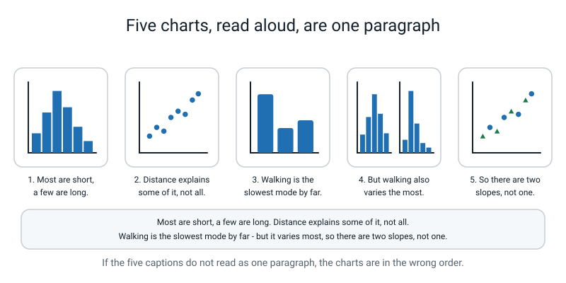
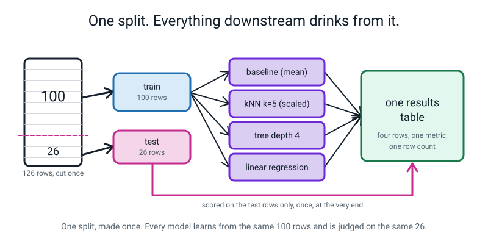
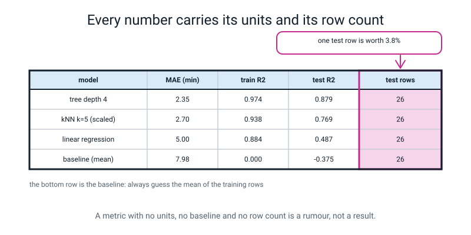
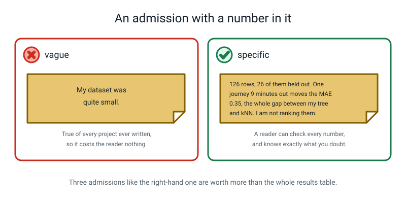
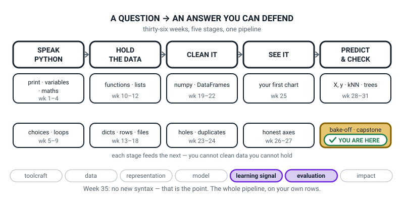

# Week 35 — Data Detective, Part 2: Charts, Models, and What I Got Wrong

[⬅ Week 34](week-34.md) · [Course Home](../README.md) · [Week 36 ➡](week-36.md) · [Student Guide](../student-guide/week-35.md) · [Workbook](../workbook/week-35.md)

---

## 📋 At a Glance

| | |
|---|---|
| **Duration** | 70 minutes |
| **Type** | 🎪 Capstone — Part 2 of 2. Assembly and audit. |
| **Big idea** | The most valuable page in any data project is the one titled "what I got wrong". |
| **New vocabulary** | narrative order · results table · held-out score · limitation · write-up |
| **New syntax** | **None.** Everything this week uses syntax from Weeks 21–33. That is deliberate. |
| **Materials** | Printed workbook pages 35.1–35.6 · a **red pen** (this is not optional — the Score Audit needs it) · the student's `data/clean.csv` from last week · their collection diary |
| **Tech needed** | Laptop with pandas, matplotlib and scikit-learn. Their own `clean.csv`, or the demo one. |
| **Prep time** | 25 minutes the night before, 5 minutes on the day |

> **⚠️ Watch out:** the student must arrive with a working `data/clean.csv`. If they have not got one, hand them the demo file from the Prep Checklist and let them do the whole lesson on it — do **not** spend the lesson rescuing their data. The audit skill transfers; the lesson time does not come back.

---

## 🎯 Lesson Objectives

By the end of the lesson the student can:

1. **Put five captioned charts in narrative order** and read the five captions aloud as one paragraph.
2. **Make one train/test split, once**, with `random_state` set, and name every later line that uses it.
3. **Run three models plus a baseline through one scoring function** and put them in one results table.
4. **Report every score with its metric, its units, its row count, and which split it came from.**
5. **Run a Score Audit**: trace each number in the table back to the line that produced it and cross out in red anything computed from the training rows.
6. **Write one "what I got wrong" admission that contains numbers** and names a real mistake.

Observable evidence: five captions that read as a paragraph; exactly one `train_test_split` call in the file; a results table whose headers carry units and whose rows carry a row count; and at least one number crossed out in red and recomputed during the audit.

---

## 🧑‍🏫 What YOU Need to Know First

> **📌 About the code blocks in this guide.** Outside the **🧰 Prep Checklist** and the **🔑 Answer Key**, the blocks are **illustrations, not files** — each one carries on from the one above it, so the `import` lines and the data are typed once, in the first block that needs them. **The complete runnable files are in the Prep Checklist and the Answer Key.** If you paste an illustration on its own and get `NameError`, that is why, and nothing is broken.

There is no new Python this week. There are three ideas, and the third one is the one that matters.

### 1. Narrative order — five charts that argue

> **Narrative order** — arranging charts so that each one raises the question the next one answers.

Most students make five charts in whatever order they thought of them. The fix is a fixed recipe, and it works on almost any project:

| # | The chart | The question it answers | The chart type |
|---|---|---|---|
| 1 | the shape of the target | What is typical? What is the spread? | histogram |
| 2 | the strongest numeric driver | Does the obvious explanation work? | scatter |
| 3 | the categories | Does the category matter more? | bar chart of the mean per category |
| 4 | inside the categories | What did the bar chart hide? | two histograms side by side |
| 5 | your own choice | Answer the question charts 2–4 raised | whatever fits |

And then the test that decides whether the order is right:

> **The five-caption test.** Copy the five captions into a plain text file with nothing else in it. Read it aloud. If it reads as a paragraph that answers the question, the order is right. If it reads as five unrelated sentences, reorder the charts.


*Figure 35.1 — Each caption states a finding and sets up the next chart. Together they are one paragraph.*

A caption states a **finding**, not a topic. Compare:

| ❌ Topic caption | ✅ Finding caption |
|---|---|
| "Distance vs time." | "Longer journeys take longer, but the dots fan out badly — distance alone explains about 41% of the variation." |
| "Journey times by mode." | "Walking averages 31.9 minutes against cycling's 12.6, so mode matters more than distance does." |

Titles work the same way. `ax.set_title("Chart")` is worth zero marks; `ax.set_title("Walking averages 31.9 min against cycling's 12.6")` is worth full marks. And every axis label carries **units**: `"journey time (minutes)"`, never `"minutes"` on its own and certainly never `"y"`.

### 2. One split, made once — and every line that reads from it

The student has done this since Week 29. What is new is the discipline of it at project scale.


*Figure 35.2 — One cut. Four models learn from the same 100 rows and are judged on the same 26.*

```python
X_train, X_test, y_train, y_test = train_test_split(
    X, y, test_size=0.2, random_state=42)
```

Line by line, for someone who has never programmed:

- `train_test_split(...)` shuffles the rows and cuts them into two piles.
- `test_size=0.2` means the second pile gets 20% of the rows. With 126 rows that is 26.
- `random_state=42` fixes the shuffle, so **the same 26 rows land in the test pile every single time you run the file.** Without it, every run gives a different answer and nothing can be compared. The number 42 is arbitrary; any number works, as long as it never changes.
- The four names on the left are four boxes: features-to-learn-from, features-to-be-tested-on, answers-to-learn-from, answers-to-be-tested-on.

**The rule, and it is checkable:** search the whole file for the string `train_test_split(` with its opening bracket, so the `import` line does not count. If the call appears twice, that is a bug. Every model reads the same four variables.

> **🧑‍🏫 If a student asks:** *"why is it `KNeighborsRegressor` and not `KNeighborsClassifier`?"* Because the target is a number, not a category. It is the same idea as Week 29 — find the five most similar rows — but instead of the five *voting* on a label, it *averages* their five answers. Same with `DecisionTreeRegressor` against Week 31's classifier: the leaf holds an average instead of a winner.

### 3. The results table — and why row count is a column

> **Results table** — one row per model, with the metric named and its units in the column header, and both a train score and a test score.
> **Held-out score** — a score measured on rows the model never learned from.


*Figure 35.3 — A metric with no units, no baseline and no row count is a rumour, not a result.*

Four things a good results table has, and each one is a mark:

1. **The metric name and its units in the header.** `MAE (min)`, not `score`.
2. **Both a train score and a test score for every model.** The gap between them is the Week 33 story, on their own data.
3. **A baseline row.** Without it, "MAE 2.35" is a number floating in space. With it, you can say *"guessing the average is off by 7.98 minutes; my model gets that down to 2.35, so the model buys me about five and a half minutes of accuracy."*
4. **The test row count**, so a reader can work out what one row is worth. With 26 test rows, one row is worth 3.8% of an accuracy score, and for an MAE in minutes it moves the average by that journey's error ÷ 26. That single fact stops the student ranking two models that differ by less than a row's worth.

**The baseline can be written by hand, and it is better if it is.** scikit-learn has a `DummyRegressor`, but the student does not need it and has not met it. "Always guess the mean of the training answers" is two lines they can read:

```python
guess = y_train.mean()                      # one number: the average of the 100 training answers
baseline_test = np.zeros(len(y_test)) + guess   # that same number, once per test row
```

`np.zeros(len(y_test))` makes 26 zeros; adding `guess` to an array adds it to every slot (Week 18 broadcasting). The result is 26 copies of the same guess. That is genuinely all a baseline is.

### 4. The Score Audit — the twenty most important minutes of the capstone

Here is the bug that ruins projects, and it produces **no error message at all.**

```python
guess = tree.predict(X_train)                      # <-- X_train
print("MAE:", round(mean_absolute_error(y_train, guess), 2), "minutes")
```

```text
MAE: 1.71 minutes
```

Beautiful number. Completely worthless — it measures how well the model remembers rows it already learned from. Change two names:

```python
guess = tree.predict(X_test)                       # <-- X_test
print("MAE:", round(mean_absolute_error(y_test, guess), 2), "minutes on", len(y_test), "held-out rows")
```

```text
MAE: 2.35 minutes on 26 held-out rows
```

**The honest number is worse. That is the normal, healthy direction.** If a student's score goes *up* after they fix an evaluation bug, something else is wrong and they should look again.

So the audit is mechanical, and the student does it themselves:

> For every number in your results table, find the exact line that produced it. Read that line out loud. If the words `_train` appear on the right-hand side of it and you are calling the result a result — **cross the number out in red** and recompute it from the test rows.

The red pen matters. A number crossed out in red and rewritten is a thing the student remembers; a number quietly corrected is not.

### 5. "What I got wrong" — weak versus strong

> **Limitation** — something your project cannot tell you, stated before anyone asks.
> **Write-up** — the notebook read as a document: markdown above every code cell, saying why the cell exists.


*Figure 35.4 — An admission a reader can check is worth ten that they cannot.*

| ❌ Weak | ✅ Strong |
|---|---|
| "My dataset was quite small." | "126 rows, 26 held out. One journey 9 minutes out would move my MAE by 0.35, so the 0.35-minute gap between my tree and my kNN is too small to trust. I am not ranking them." |
| "There might be some bias." | "Every row is one of three people in one family. The model has learned *our* walking speed. My youngest brother walks about a third slower, so I would expect it to under-predict him by roughly 4 minutes per km." |
| "The model wasn't perfect." | "Linear regression predicted **1.7 minutes** for a 0.6 km bus journey that actually took 11.3. It has one minutes-per-km number for every mode, and a bus has a six-minute wait before it moves at all." |
| "I chose the best model." | "I picked depth 4 by looking at the test scores, which means my reported test MAE is optimistic. An honest number needs a third split I do not have." |

Three specific, numeric admissions is the target. The words that mark an admission as content-free: *more data would help* · *there might be some bias* · *it could be improved* · *quite small*.

### 6. What the demo project actually shows, in full

You should have run this before the lesson (see Prep). Here is what it produces and, more importantly, what it *means*, because you will be asked.

```text
                           model  MAE (min)  RMSE (min)  train R2  test R2  test rows
                    tree depth=4       2.35        2.82     0.974    0.879         26
                kNN k=5 (scaled)       2.70        3.91     0.938    0.769         26
               linear regression       5.00        5.82     0.884    0.487         26
baseline (always guess the mean)       7.98        9.53     0.000   -0.375         26
```

**Finding 1 — the baseline gives every other number its meaning.** Always guessing 21.3 minutes is off by 7.98 minutes on average. The best model is off by 2.35. So the model buys about **5.6 minutes of accuracy**. Without the bottom row, 2.35 means nothing.

**Finding 2 — R² can go negative, and the baseline shows why.** The baseline's test R² is **−0.375**. Negative R² means "worse than guessing the mean of the *test* rows" — and the baseline is guessing the mean of the *train* rows, which is slightly different. If a real model of theirs goes negative, something is badly wrong.

**Finding 3 — every model beats the baseline, and the gaps between them are not all real.** Tree 2.35 versus kNN 2.70 is a gap of 0.35 minutes on 26 rows. That is what one journey 9 minutes out would cause (and on 20 different splits the tree beat the kNN on only 11), so it is not a real gap. Tree 2.35 versus linear regression 5.00 is not.

**Finding 4 — and this is the best paragraph in the whole notebook — look at *why* the line loses.** Its coefficients:

```text
 distance_km   +7.056
        rain   +4.660
 depart_hour   -0.287
     is_walk  +16.581
    is_cycle   -2.301
   intercept   -0.279
```

In plain English: *every extra kilometre adds 7.06 minutes; rain adds 4.66; walking adds a flat 16.58 minutes on top.* And there is the bug in the model's thinking. It has **one** minutes-per-kilometre number for walking, cycling and the bus alike. But a kilometre on foot really costs about 11.8 minutes and a kilometre on wheels about 3.9. A straight line cannot hold two slopes at once. A tree can, because it splits on `is_walk` first and then asks about distance separately.

You can see it in the five worst predictions:

```text
    distance_km   mode  rain  depart_hour  actual  predicted  error
0          0.60   walk     1            7    11.1       23.2  -12.1
45         0.98   walk     1            9    15.4       25.3   -9.9
11         0.60    bus     0            8    11.3        1.7    9.6
10         4.40  cycle     1            9    21.3       30.5   -9.2
31         4.02  cycle     0            9    15.8       23.2   -7.4
```

Row 11 is the one to point at. **The line predicts 1.7 minutes for a bus journey.** That is not merely wrong, it is impossible — you cannot get on a bus in 1.7 minutes. A student who finds a physically impossible prediction in their own table has found something real, and it goes straight into "what I got wrong".

### 7. The three misconceptions you will actually meet

**Misconception 1 — "the model with the best score is the one I should use."**

Not automatically. On the demo data the tree wins by 0.35 minutes on 26 test rows, where one journey 9 minutes out would cause the whole gap (0.35 × 26 = 9.1), and on 20 different splits the tree beat the kNN on only 11. That gap is too small to call. So the choice gets made on other grounds: the tree prints as a handful of if-then rules you can read out loud to your mum, and kNN can only say "the five most similar journeys took about this long". Saying *"I would use the tree, and here is a reason that is not the score"* is worth more than the score itself.

**Misconception 2 — "a perfect score means I did well."**

It means the answer is hiding in the features, or the score came from the training rows. The student met leakage in Week 30 and it is the single most likely reason for a suspiciously good capstone result. **A high score is a thing to investigate, not a thing to celebrate.**

**Misconception 3 — "'what I got wrong' will lose me marks."**

The opposite, and this is worth saying flatly: it is the section that earns the most. Anyone can produce a table of numbers. Almost nobody your age can say *which number in their own table they do not believe, and why.* That sentence is the entire difference between a school project and a piece of work.

### 8. How deep to go, and where to stop

**Go this far:** narrative order and the five-caption test · one split used by everything · one scoring function · the results table with units and row counts · the Score Audit · three numeric admissions.

**Stop before:**

- **Cross-validation.** It is the right answer to "26 test rows is not many" and it is Level 3. If a student asks, say: "Yes, there is a proper fix for that, and it is the first thing Level 3 teaches you."
- **Hyperparameter search.** They may try two or three depths by hand, but then they must write the honesty sentence: "I chose the depth by looking at the test score, so this number is optimistic."
- **New model types.** Three models plus a baseline. Adding a fourth model does not improve the project; auditing the four they have does.
- **Making the charts prettier.** Every year somebody spends five hours on colours and twenty minutes on the split. The rubric weights honesty above polish, deliberately.

---

### 9. 🧭 The Growing Map — two minutes on the week the whole map runs at once

Each week's student guide carries the same pipeline with one more piece filled in. For thirty-four weeks
it has been showing them where one lesson sits. Today it does something different: it is the
**contents page of their own notebook**, in order, left to right.



*Figure 35.0 — Week 35's version. Fourth week inside `bake-off · capstone`, weeks 32 to 36, with every
stage solid and all five of them working on the learner's own rows. Two threads lit: evaluation and
learning signal.*

**What to do with it, in about two minutes at the end of the lesson:**

1. **Show it and walk the row with them:** *"point at the box each part of today came from."* Rows and
   `head()` → HOLD THE DATA. The log and the text-to-numbers conversion → CLEAN IT. The five charts →
   SEE IT. The split, the four models, the table → PREDICT & CHECK. Then the punchline: *"and how many
   new things did you learn today?"* **None.** That is the answer you want, said with some pride.
2. **Then the question that separates the good projects from the tidy ones:** *"which box does 'what I
   got wrong' belong in?"* There is no single right answer, and the argument is the point — most land on
   `PREDICT & CHECK`, some on `CLEAN IT`, the sharpest say *all of them*, because an admission about
   your rows is as valuable as one about your model. Accept any answer they can justify with a number.
3. **Have them ink the tile and write one line under each stage box** on their own copy — question, row
   count, one log line, one chart caption, one score with units. Five lines. Read one learner's five out
   loud. That is their showcase, drafted, a week early.

> **🧑‍🏫 Why this is worth two minutes.** This is the week the course's structure and the learner's own
> project become the same object, and saying so costs nothing while the map is on screen. It also
> defuses the most common Week 35 complaint — *"we didn't learn anything new"* — by turning it into the
> claim it actually is: every box on this map is now something you can do on data nobody prepared for
> you. Keep the five-line exercise; students who write those lines arrive at the showcase with an
> argument instead of a scroll.

---

## 🧰 Prep Checklist

**25 minutes the night before**

- [ ] Print workbook pages 35.1–35.6. Page 35.4 (the Score Audit sheet) needs to be printed on its own — it gets written on in red.
- [ ] **Find a red pen.** Genuinely. The audit does not work in pencil.
- [ ] **Run the four demo files yourself, in this order.** All four are in the Answer Key, complete. Make a folder, put `data/` and `figures/` inside it, and run:

```bash
python3 make_stand_in.py     ->  126 rows written to data/clean.csv
python3 charts.py            ->  five PNGs in figures/, plus printed findings
python3 models.py            ->  the results table
python3 audit_before.py      ->  MAE: 1.71 minutes        (the dishonest one)
python3 audit_after.py       ->  MAE: 2.35 minutes on 26 held-out rows
```

- [ ] Confirm you get **exactly** `MAE: 1.71 minutes` and then `MAE: 2.35 minutes on 26 held-out rows`. Those two numbers are the spine of the lesson. If yours differ, check `random_state=42` is on the split and `random_state=0` on the tree.
- [ ] Open the five PNGs and read the five titles aloud, in order, as one paragraph. You will be asking the student to do exactly this, and it feels odd the first time.
- [ ] Read section 6 above twice. The "1.7 minutes for a bus journey" line is the best moment in the lesson and you need to be ready to spot the equivalent in the student's own worst-five table.
- [ ] **Check in with the student mid-week.** "How many rows so far?" If the answer is under 60 on Friday, they are using the demo file on Tuesday and that is fine — but decide it in advance, not in the lesson.

**5 minutes on the day**

- [ ] Their `clean.csv` on their laptop, and the demo `clean.csv` on a memory stick or in a shared folder as a fallback.
- [ ] Page 35.4 and the red pen on the table.
- [ ] Timer visible. Their Turn is 20 minutes and the audit is the part that must not be cut.

**Fallback if something fails**

| If this fails | Do this instead |
|---|---|
| The student has no `clean.csv` | Give them the demo file. They do the entire lesson on it, and the homework on their own data afterwards. Do not debug their collection in the lesson. |
| scikit-learn will not import | Do the Score Audit **on paper**, on page 35.4, using the printed demo table. Tracing a number back to the line that made it needs no computer, and it is the objective that matters most. |
| matplotlib will not draw | Skip the charts entirely in class; they are homework. Do the five-caption test on the *captions only*, written on paper. That is the part that carries the marks anyway. |
| Their model scores suspiciously well (R² above 0.98) | Stop everything and hunt the leak. Ask, of every feature: "could you know this before the target happened?" Nine times out of ten one column is the answer in disguise. This is a better lesson than any chart. |
| Their table has fewer than 100 rows | Let it run. Then make them compute what one test row is worth — with 60 rows it is 8.3% — and write that sentence into their limitations. The small table becomes the finding. |

---

## ⏱️ The Lesson, Minute by Minute

| Segment | Minutes | Running total | What happens |
|---|---|---|---|
| 🪝 Hook — The Score I Would Like You to Trust | 7 | 7 | A lovely MAE that turns out to be a memory test |
| 🧠 Concept — Five Charts, One Split, One Table | 16 | 23 | Narrative order, the five-caption test, why row count is a column |
| 💻 Live-Code Together — Four Models, One Function | 18 | 41 | Build the split, the report function, the table; two deliberate bugs |
| ✍️ Their Turn — Read It Aloud, Then Audit It | 20 | 61 | Assemble the notebook, read it as a story, then the Score Audit in red |
| 🔑 Wrap & Assign | 9 | 70 | Three checks, the takeaway, milestones 4–6 |

---

### 🪝 Hook — The Score I Would Like You to Trust (7 minutes)

**Do this:** Have `audit_before.py` already run, with only this on the shared screen:

```text
MAE: 1.71 minutes
```

**Say this:**

> "I have built a model that predicts how long a journey to school takes. It is off by **1.71 minutes** on average. I am quite pleased with that. If I tell you I will be at your house in twenty minutes, I will be there between eighteen and twenty-two.
>
> I would like you to believe that number. What do you want to ask me before you do?"

Take everything they offer. Steer towards: *how many rows? which rows? did the model see them?*

> "Good. Here is the line that produced it."

Show it:

```python
guess = tree.predict(X_train)
print("MAE:", round(mean_absolute_error(y_train, guess), 2), "minutes")
```

> "`X_train`. The hundred rows the model learned from. So what I have actually measured is **how well my model remembers homework it has already done.** Of course it is good at that. It has seen every one of those journeys.
>
> Now I change two words. `X_train` becomes `X_test`, and `y_train` becomes `y_test`. Nothing else. Same model, same data, same everything."

```text
MAE: 2.35 minutes on 26 held-out rows
```

> "2.35. My model just got worse and I have not touched it. **That is the honest number**, and honest numbers are usually worse — that is how you know they are honest. If your score goes *up* after you fix a bug like this, look again, because something else is wrong.
>
> Now the thing I actually want you to take away. Did the broken version crash? Did it warn me? Did it print anything at all suspicious?
>
> No. It printed a lovely number, in a nice font, and it would have printed it every day for a year. **The most dangerous bugs in this whole subject do not produce error messages.** So today, in the last twenty minutes, you are going to take every number in your own results table and prove where it came from. With a red pen. That is called a **Score Audit** and it is the most valuable thing in this project."

**Ask this:**

| Ask | Answer you want | If they say something else |
|---|---|---|
| "What do you want to ask before you trust 1.71?" | Which rows was it measured on? Had the model seen them? | If they ask "is that good?" — brilliant question, and the answer is "compared to what?" Park it; the baseline row is fifteen minutes away. |
| "Why did the honest number come out worse?" | Because the model had never seen those 26 rows. | If they say "the test rows were harder" — possible, and testable: "How would you check?" (Different `random_state`, see if the story holds.) |
| "Did the broken version give any sign it was broken?" | No. It ran perfectly and printed a plausible number. | If they say "the number was too good" — good instinct, and push: "1.71 versus 2.35. Would you have noticed that difference without seeing both?" |
| "So how would you catch this in your own project?" | Check which split each reported number came from. | This is the whole activity. If they say it, tell them they just designed the last twenty minutes of the lesson. |

---

### 🧠 Concept — Five Charts, One Split, One Table (16 minutes)

**Do this:** Print the five demo charts and put them face down in a shuffled pile. Hand them over.

**Say this — part 1, narrative order (6 minutes):**

> "Five charts. Put them in an order that tells one story. Not the order you made them in — the order somebody who has never seen your project should read them in."

Let them try for two minutes before you say anything. Then:

> "Here is the recipe that works on almost every project. **One:** what does the answer column even look like? That is a histogram. **Two:** does the obvious explanation work? That is a scatter of the target against your best number. **Three:** does the category matter more? A bar chart of the mean per category. **Four:** what did that bar chart hide? Because a bar chart shows one number per group and hides everything about the spread. **Five:** your own choice, answering whatever the first four made you wonder.
>
> Now read me the five titles, in that order, out loud, as if they were sentences in a paragraph."

Have them actually do it. The demo titles read:

> *"Half the journeys are under 17 minutes, but the tail reaches 58.6. Longer journeys take longer, but the dots fan out. Walking averages 31.9 minutes against cycling's 12.6. Walk runs from 6.3 to 58.6 minutes; cycle only from 4.0 to 22.6. Two slopes: a walked kilometre costs 11.8 minutes, a wheeled one 3.9."*

> "That is a paragraph. It has a beginning, it raises a question in the middle, and it lands somewhere. **If your five captions do not do that, your charts are in the wrong order** — and that is a five-minute fix, not a five-hour one."

**Say this — part 2, one split (5 minutes):**

> "Now the models. And the first thing is not a model at all — it is one line, and it has to happen once."

Draw or show Figure 35.2.

> "126 rows. One cut. A hundred rows the models learn from, and twenty-six they never see until the very end. `random_state=42` means the same twenty-six every time, so that when you compare two models you know they were judged on the same test.
>
> Here is the rule, and you can check it with your eyes: **search your file for `train_test_split(` with the bracket. The call should appear exactly once.** If it appears twice, one of your models was judged on a different exam paper, and your table is comparing nothing to nothing.
>
> And from the moment you make that split, those twenty-six rows are radioactive. Nothing fits on them. No scaler learns their average. Nothing computes a median from them. They exist to be scored, at the end, once."

**Say this — part 3, the results table (5 minutes):**

Show Figure 35.3, or the real demo table.

> "Four things this table has that a bad one does not.
>
> **The units are in the header.** `MAE (min)`. Not `score`. A number without units is a rumour.
>
> **Both a train score and a test score, for every model.** Look at the tree: 0.974 on train, 0.879 on test. That gap is the thing you learned about in Week 33, showing up in your own project. It is not a problem to hide; it is data.
>
> **A baseline row.** The bottom one. It does not look at any feature at all — it just guesses the average, 21.3 minutes, every single time. And it is off by 7.98 minutes. That row is what makes 2.35 mean something. Without it, is 2.35 good? You cannot possibly know.
>
> **The number of test rows.** Twenty-six. So one row is worth 3.8% of an accuracy figure, and for an MAE in minutes it is that journey's error divided by 26. Which means — and this is the sentence I most want out of you today — the gap between the tree at 2.35 and the kNN at 2.70 is **0.35 minutes on twenty-six rows**, which a single journey 9 minutes out would cause all by itself. You are not allowed to say the tree is better. You are allowed to say they are indistinguishable and you would pick the tree because you can read its rules out loud."

**Ask this:**

| Ask | Answer you want | If they say something else |
|---|---|---|
| "Why does chart 4 exist at all, if chart 3 already showed the modes?" | Because a bar of means hides the spread. Walk runs 6.3 to 58.6; cycle only 4.0 to 22.6. | If they say "it looks nicer" — reply: "Give me one number chart 4 tells me that chart 3 cannot." Then supply it if they can't. |
| "How many times should `train_test_split` appear in your file?" | Once. | If they say "once per model" — show them: two splits means two different exams, so the two scores cannot be compared at all. |
| "Is a test R² of 2.35 good?" | It is a trap — 2.35 is the MAE in minutes, and R² has no units. | Catching the deliberate mix-up is the point. If they miss it, say the sentence again slowly and watch them wince. |
| "The tree gets 2.35 and the kNN gets 2.70. Which is better?" | Indistinguishable on this evidence: 0.35 minutes on 26 rows is one journey 9 minutes out (the tree won only 11 of 20 other splits). | If they say "the tree" — ask "by how much, and how much is one row worth?" Make them do the arithmetic out loud. |
| "What is the baseline row for?" | To make every other number mean something. | If they say "to fill the table" — remove it and ask again whether 2.35 is good. |

---

### 💻 Live-Code Together — Four Models, One Function (18 minutes)

You type, they type along, on their own `clean.csv` if they have one and the demo if not. **Two places are marked 🐞 — make the mistake on purpose.**

**Step 1 — text into numbers, by hand (4 minutes).** Start `models.py`:

```python
# models.py - ONE split, four models, ONE results table.
import numpy as np
import pandas as pd
from sklearn.model_selection import train_test_split
from sklearn.neighbors import KNeighborsRegressor
from sklearn.tree import DecisionTreeRegressor
from sklearn.linear_model import LinearRegression
from sklearn.preprocessing import StandardScaler
from sklearn.metrics import mean_absolute_error, mean_squared_error, r2_score

df = pd.read_csv("data/clean.csv")

FEATURES = ["distance_km", "rain", "depart_hour"]
TARGET   = "minutes"

X = df[FEATURES]
y = df[TARGET]
print("X shape:", X.shape, "  y shape:", y.shape)
```

> **🐞 Deliberate mistake 1 — put `"mode"` in the FEATURES list.** Change the line to `FEATURES = ["distance_km", "mode", "rain", "depart_hour"]`, add a `DecisionTreeRegressor().fit(X, y)` under it, and run. You get, at the end of a long traceback:
>
> ```text
> ValueError: could not convert string to float: 'walk'
> ```
>
> Say: *"Read the last line. It could not convert `'walk'` into a number. scikit-learn only eats numbers — that has been true since Week 28 and it is still true. So what do I do with a column that says `walk`, `cycle`, `bus`?"*
>
> Let them get to "turn it into numbers". Then reject the obvious wrong answer before they suggest it: *"Not walk=0, cycle=1, bus=2. That tells the model bus is twice cycle and three times nothing, which is nonsense. Instead, one yes/no column per mode."*

Now add, above the `FEATURES` line:

```python
# --- text into numbers, by hand so you can see it happen ---------------------
df["is_walk"]  = (df["mode"] == "walk").astype(int)    # 1 if walk, else 0
df["is_cycle"] = (df["mode"] == "cycle").astype(int)   # 1 if cycle, else 0
# bus needs no column: is_walk 0 and is_cycle 0 already means "bus"
```

and change `FEATURES` to include them:

```python
FEATURES = ["distance_km", "rain", "depart_hour", "is_walk", "is_cycle"]
```

```text
X shape: (126, 5)   y shape: (126,)
```

**Say this:**

> "`df["mode"] == "walk"` gives you a column of True and False — that is Week 22. `.astype(int)` turns True into 1 and False into 0 — Week 23. Two lines, and you can look at the table and see the new columns appear.
>
> And notice there is no `is_bus` column. If both switches are off, it was a bus. Two columns hold three modes, and the model can still tell them apart."

**Step 2 — the split, once (3 minutes).**

```python
# --- THE split. One call. Once. ---------------------------------------------
X_train, X_test, y_train, y_test = train_test_split(
    X, y, test_size=0.2, random_state=42)

print("train rows:", len(y_train), "  test rows:", len(y_test))
print(f"one test row is worth {100 / len(y_test):.1f}% of an accuracy score")
```

```text
train rows: 100   test rows: 26
one test row is worth 3.8% of an accuracy score
```

> "Print that second line in your own notebook. Every time you are tempted to say one model beat another, that number is sitting there telling you how big a difference has to be before you are allowed to say it."

**Step 3 — one scoring function, used by everybody (4 minutes).**

```python
# --- one scoring function, used by every model -------------------------------
def report(name, train_guess, test_guess):
    """Turn one model's guesses into one row of the results table."""
    return {
        "model": name,
        "MAE (min)":  round(mean_absolute_error(y_test, test_guess), 2),
        "RMSE (min)": round(np.sqrt(mean_squared_error(y_test, test_guess)), 2),
        "train R2":   round(r2_score(y_train, train_guess), 3),
        "test R2":    round(r2_score(y_test, test_guess), 3),
        "test rows":  len(y_test),
    }

rows = []
```

> "One function. Four models. That is what makes the comparison fair — you cannot accidentally score two models differently, because there is only one piece of scoring code in the whole file. If you write four scoring blocks by hand, one of them will quietly differ, and you will never find it."

**Step 4 — the four models (5 minutes).**

```python
# --- baseline: always guess the average of the TRAINING answers --------------
guess = y_train.mean()
rows.append(report("baseline (always guess the mean)",
                   np.zeros(len(y_train)) + guess,
                   np.zeros(len(y_test)) + guess))
print(f"the baseline always guesses {guess:.1f} minutes")

# --- kNN, k=5, on scaled features -------------------------------------------
scaler = StandardScaler().fit(X_train)         # learn the means from TRAIN only
X_train_scaled = scaler.transform(X_train)
X_test_scaled  = scaler.transform(X_test)
knn = KNeighborsRegressor(n_neighbors=5).fit(X_train_scaled, y_train)
rows.append(report("kNN k=5 (scaled)",
                   knn.predict(X_train_scaled), knn.predict(X_test_scaled)))

# --- decision tree, depth 4 -------------------------------------------------
tree = DecisionTreeRegressor(max_depth=4, random_state=0).fit(X_train, y_train)
rows.append(report("tree depth=4", tree.predict(X_train), tree.predict(X_test)))

# --- linear regression ------------------------------------------------------
line = LinearRegression().fit(X_train, y_train)
rows.append(report("linear regression", line.predict(X_train), line.predict(X_test)))

results = pd.DataFrame(rows).sort_values("MAE (min)")
print()
print(results.to_string(index=False))
```

```text
the baseline always guesses 21.3 minutes

                           model  MAE (min)  RMSE (min)  train R2  test R2  test rows
                    tree depth=4       2.35        2.82     0.974    0.879         26
                kNN k=5 (scaled)       2.70        3.91     0.938    0.769         26
               linear regression       5.00        5.82     0.884    0.487         26
baseline (always guess the mean)       7.98        9.53     0.000   -0.375         26
```

> **🐞 Deliberate mistake 2 — fit the scaler before the split.** Move `StandardScaler().fit(X)` up above the `train_test_split` line, transform all of `X`, and re-run. The kNN row's scores change slightly and **nothing warns you.**
>
> Say: *"That ran. No error. And it is the bug you met in Week 30 — what is it called?"* (**Leakage.**) *"Fitting the scaler on everything means it computed its averages using the twenty-six test rows too. Those rows have now influenced how the training data was rescaled, so they are not unseen any more. And it can flatter the score (it does not always: on this demo the kNN's MAE goes from 2.70 to 2.92, slightly worse), which is exactly what makes it dangerous."*
>
> Move it back below the split, and point at the comment: `# learn the means from TRAIN only`. Comments like that one are why you write comments.

**Ask this:**

| Ask | Answer you want | If they say something else |
|---|---|---|
| "Why is there no `is_bus` column?" | Both switches off already means bus. | If they insist on adding it, let them — nothing breaks — and then ask "what does that third column tell the model that the first two didn't?" |
| "The baseline's test R² is −0.375. Can R² be negative?" | Yes. It means worse than guessing the mean of the test rows. | If they think it is a bug, have them read the baseline's train R² — exactly 0.000 — and work out why the two differ. |
| "Why one `report` function and not four print statements?" | So all four models are scored by identical code. | If they say "less typing" — true, and secondary. Ask: "What would go wrong with four hand-written versions?" |
| "Which model would you actually use?" | Either the tree or the kNN, and the reason must not be the score. | If they say "the tree, it scored best" — reply: "By 0.35 minutes on 26 rows. Give me a reason that survives one row moving." |

---

### ✍️ Their Turn — Read It Aloud, Then Audit It (20 minutes)

Full instructions in **🎲 The Activity, In Full**. In the lesson flow:

- **Minutes 0–8:** assemble the notebook in the seven-section order and **read it out loud** to you, top to bottom. You mark every place you got confused. Each chart has to earn its place; if the student cannot say what question it answers, it goes.
- **Minutes 8–20:** the **Score Audit**, on page 35.4, in red. Every number in the results table gets traced to the line that produced it, and the split it came from gets written next to it. Anything from `_train` gets crossed out and recomputed.

**Your only job:** after every number, ask *"and which split did that come from?"* Nothing else.

---

## 🐞 The Debugging Clinic

All of these came from actually running broken versions of this week's code. scikit-learn tracebacks are long; **the last line is the one that matters.**

| What the student sees (real message) | What it means | Most likely cause | The fix |
|---|---|---|---|
| `ValueError: could not convert string to float: 'walk'` | scikit-learn was handed text where it needs numbers. | A text column (`mode`, `day`) is still in `FEATURES`. | Make 0/1 columns first: `df["is_walk"] = (df["mode"] == "walk").astype(int)`, and put those in `FEATURES` instead. |
| `ValueError: Found input variables with inconsistent numbers of samples: [26, 100]` | Two things of different lengths were compared. | Scoring `y_test` (26) against a prediction made from `X_train` (100). | Make the two halves match: `mean_absolute_error(y_test, model.predict(X_test))`. Read the two numbers in the message — they tell you which side is which. |
| `sklearn.exceptions.NotFittedError: This LinearRegression instance is not fitted yet. Call 'fit' with appropriate arguments before using this estimator.` | You asked a model to predict before it learned anything. | `LinearRegression()` was created but `.fit(...)` was never called, or the `.fit` line is below the `.predict` line. | Fit first: `line = LinearRegression().fit(X_train, y_train)`. Chaining them on one line makes it impossible to forget. |
| `ValueError: The feature names should match those that were passed during fit.` `Feature names seen at fit time, yet now missing:` `- is_walk` | The model learned from a different set of columns than it is now being given. | Fitting on all five features and predicting on a subset (or vice versa). | Use the same `FEATURES` list on both sides. Never hand-type a column list twice. |
| `KeyError: "['distance-km'] not in index"` | No column has that exact name. | A hyphen instead of an underscore, or a capital letter. | `print(df.columns)` and copy the name character for character. |
| `AttributeError: 'Axes' object has no attribute 'set_titel'. Did you mean: 'set_title'?` | A typo in a method name. Python is being helpful. | `set_titel`, `set_xlable`, `savefigure`. | Do what the message suggests. When Python says "did you mean", it is right. |
| `TypeError: 'value' must be an instance of str or bytes, not a float` (from `ax.hist(...)`) | matplotlib was handed a column with mixed text and numbers. | Charting straight from `raw.csv` instead of `clean.csv`, so the target column is still `object`. | Chart from the clean table. If it is already clean, run `df.info()` — the dtype will tell you which column lied. |
| `No artists with labels found to put in legend.` (a warning, not an error — the chart still saves) | `ax.legend()` was called but nothing was labelled. | The `label="walk"` argument is missing from the plotting call. | Add `label=` to each series, then call `ax.legend()`. |
| **No error at all.** `MAE: 1.71 minutes`. | The silent one, and the one that ruins projects. | The score was computed from `X_train` / `y_train`. | The Score Audit. Trace every number to its line; anything with `_train` on the right-hand side is not a result. |
| **No error at all.** kNN's scores shift slightly after you move one line. | Leakage. | `StandardScaler` was fitted before the split. | Fit the scaler on `X_train` only, then `transform` both halves. |

### How to teach debugging without giving the answer

The four sentences, in order — and this week there is a fifth for the silent bugs.

1. **"Read me the last line out loud."**
2. **"What does it say it could not do?"** Make them name it: `'walk'`. `is_walk`. `[26, 100]`.
3. **"So show me that thing."** `print(df.dtypes)`. `print(X_train.shape)`. `print(FEATURES)`.
4. **"What is one thing you could change?"** One. Then run.
5. **And when there is no error:** *"Which split did that number come from?"* This is the only question that finds a silent evaluation bug, and it is why the audit exists.

**Never take the keyboard.** Point with a finger. The student who fixes it themselves remembers it.

---

## 🎲 The Activity, In Full

### Part A — Read it out loud (8 minutes)

**Setup:** the student's notebook or scripts on screen, arranged into the seven sections:

```text
1. THE QUESTION      one sentence + the dated prediction
2. THE DATA          data card, raw load, shape, head()
3. THE CLEANING      the numbered log + before/after shape
4. THE CHARTS        five figures, five captions, in narrative order
5. THE MODELS        one split, four models, one results table
6. WHAT I GOT WRONG  three numeric admissions + the worst-five table
7. WHOSE DATA & COST the ethics paragraph
```

**The rules:**

1. They read it **out loud**, top to bottom, to a real human. Not silently.
2. You say nothing except *"I didn't follow that"* — and you mark the spot.
3. **Every chart must earn its place.** For each one, they answer: *"What question does this chart answer, and which chart raised it?"* A chart with no answer gets deleted. Deleting a chart is a pass, not a failure.
4. Then the five-caption test: read only the five captions, in order, with the charts hidden. If it is not a paragraph, reorder.

**What "finished" looks like:** five captions that read as a paragraph, and no chart the student cannot justify in one sentence.

### Part B — The Score Audit (12 minutes)

This is the most important part of the whole capstone. Page 35.4, in red pen.

**Setup:** the printed results table on the left, the code file open on the right, page 35.4 between them.

Page 35.4 is a five-column grid:

```text
| the number | the line that made it | which split? | honest? | corrected |
|------------|-----------------------|--------------|---------|-----------|
|            |                       |              |         |           |
```

**The rules:**

1. **Every number in the results table gets a row.** Four models, five numbers each. Twenty rows. Yes, really.
2. For each one they write **the actual line of code** that produced it — not "the report function", the line.
3. In column 3 they write `train` or `test`, from reading that line.
4. Column 4 is `yes` or `no`. A number is honest if it is labelled as a test score **and** it came from the test rows, or labelled as a train score and came from the train rows.
5. **Any `no` gets the original number crossed out in red**, recomputed, and the new value written in column 5.

**Worked example — one row of the sheet, filled in:**

```text
| the number   | the line that made it                           | split | honest? | corrected |
|--------------|-------------------------------------------------|-------|---------|-----------|
| MAE 1.71 min | mean_absolute_error(y_train, tree.predict(X_train)) | train | NO      | 2.35 min  |
```

**Then three questions they answer in writing on the same page:**

- How many times does `train_test_split` appear in my file? *(Must be 1.)*
- Is any scaler fitted before the split? *(Must be no.)*
- Could I know every feature before the target happened? *(Must be yes, for every one.)*

**What "finished" looks like:** twenty audited numbers, at least one `no` found and corrected in red, and the three questions answered. A student who finds nothing wrong has almost certainly not read the lines — send them back with: *"Show me the line that produced the train R² column."*

### Variation — easier

- Audit **five numbers, not twenty**: the MAE and the test R² of the two best models, plus the baseline's MAE. Same skill, a quarter of the writing.
- Do the audit on the **demo** table, which has a known planted bug (`audit_before.py`), so they get the satisfaction of finding one.
- Skip Part A's reordering. Just do the five-caption read-aloud and let them hear it.
- Accept three charts instead of five, and say so: "three charts that argue beat five that do not."

### Variation — harder

1. **Plant a bug for a partner.** Two students swap files; each secretly breaks the other's evaluation in one place, and the owner has to find it with the audit. This is exactly how real code review feels.
2. **The impossible prediction hunt.** Look through the worst-five table for a prediction that is *physically impossible* — a negative time, a 1.7-minute bus ride. Then explain the mechanism. On the demo data this is the best paragraph in the notebook.
3. **The complexity curve on their own data.** Loop `max_depth` from 1 to 12, record train and test scores, plot both lines, and mark the peak with `ax.axvline`. Week 33's headline graph, on data they collected. Then the honesty sentence: "I chose this depth by looking at the test curve, so my reported score is optimistic."
4. **The drift test.** If they collected a second batch (Week 34's harder variation), score the frozen model on it and put the two numbers side by side. Expect it to get worse. The amount tells you whether they built a model of the world or of one fortnight.

---

## ❓ Questions Students Ask This Week

**"Why is the honest score always worse? That feels like a punishment for being careful."**

It is not always worse, but it usually is, and there is a reason. A model that has seen a row can lean on the details of that specific row — including the parts that are just noise. On rows it has never seen, that leaning does not help. So the test score measures the part of what the model learned that actually transfers, which is always less than everything it learned. The honest score being lower is evidence the split is doing its job. If yours goes *up*, look for a bug.

**"Can I run the split again if I don't like the twenty-six rows I got?"**

No, and this is the sharpest line in the whole project. Trying `random_state` values until the score looks good is choosing your own exam questions. If you want to know how much the split matters — and that is a genuinely good question — run five different `random_state` values, report **all five scores**, and say how much they wander. That is honest and it is more interesting than one number.

**"My best model got R² of 0.99. Is that good?"**

It is a warning light, not a trophy. On data you collected yourself, 0.99 nearly always means one of your features contains the answer. Go through them one at a time and ask: *could I know this before the target happened?* On the demo journeys, if `minutes` is left among the features, predicting `late = minutes > 25` scores exactly 1.000 (with only the honest features it scores about 0.96) — because `late` is defined *from* `minutes`. That is the shape of the bug and it is always something like that.

**"Three models is a lot. Can I just use the best one?"**

You can only know which is best by running three, so no. But there is a better reason. The three models fail in *different ways*, and comparing the failures is where the understanding is. On the demo data the straight line fails on short walks and short bus rides, because it has one minutes-per-kilometre number and reality has two. The tree does not have that problem. You could not have discovered that from the tree alone.

**"Does the 'what I got wrong' section actually get marks? It feels like admitting defeat."**

It gets the most marks of any section, and here is the honest reason: anyone can produce a table of numbers, and almost nobody your age can say which number in their own table they do not believe and why. That is the skill adults get paid for. "Three specific numeric admissions" is the target — and the word *specific* is doing all the work. "My dataset was small" is worth nothing. "126 rows, 26 held out, one row worth 3.8%, so a 0.35-minute gap is not a ranking" is worth everything.

**"How many rows do I need before I'm allowed to say one model is better?"** *(Answer this honestly: nobody agrees on a number.)*

**There is no agreed answer, and pretending otherwise would be lying to you.** Here is what is genuinely true and what is genuinely argued about.

True: with 26 test rows, one row moves an accuracy score by 3.8 points (and an MAE by that journey's error ÷ 26), so two models within about one row of each other are indistinguishable — you can compute that yourself and nobody disputes it.

Argued about: everything past that. Some people would say you need a proper statistical test before claiming any difference at all. Some would say you need cross-validation, so that every row gets to be a test row in turn — that is the right answer and it is the first thing Level 3 teaches. Some would say that for a decision with real money attached you need a fresh dataset collected after you finished choosing. All three are defensible; they answer slightly different questions, and which one you need depends on what the answer will be used for.

What everybody agrees on is the bit you must do: **state your test-set size, state what one row is worth, and do not rank models whose gap is smaller than that.** Do those three things and no reasonable adult can accuse you of overclaiming.

**"Should I make my charts look nicer?"**

Only after everything else is finished. Every year somebody spends five hours on colours and twenty minutes on the split, and the split is what the marks are for. If your captions state findings, your axes carry units, and your bars start at zero, your charts are already good. The next hour is better spent on the audit.

---

## ⚠️ Where This Lesson Goes Wrong

| What happens | Why | What to do right now |
|---|---|---|
| The Score Audit gets cut for time | It is last, and it looks like admin next to charts and models | Protect it physically: start it at minute 49 whatever state the notebook is in. If something has to go, cut Part A's reordering, not the audit. The audit is the objective. |
| They audit twenty numbers and find nothing wrong | They read the report function once and assumed the rest | Ask for one thing: "Show me the line that produced the `train R2` column." Then: "And the `test R2` column. Read both out loud." The difference is where the learning is. |
| `train_test_split` appears twice | A model block got copy-pasted and the split came with it | Search the file for the string in front of them. Delete the second one and re-run. Then ask what would have gone wrong: two models judged on two different exams. |
| A scaler is fitted before the split | It reads like a cleaning step, so it drifts up into section 3 | Move it below the split, fit on `X_train`, transform both. Then ask them to name the bug. They met it in Week 30 and the word is **leakage**. |
| Five beautiful charts, no captions | The chart "obviously" shows the thing | Cover the chart and ask what it showed. Whatever they say *is* the caption — write it down. Without one, the reader invents their own conclusion and it will not be theirs. |
| The results table has only test scores | Train scores feel like a confession | Add the train column in front of them and look at the gap. On the demo tree it is 0.974 versus 0.879. Say: "That gap is a finding, not an embarrassment." |
| "What I got wrong" says "more data would help" | It is true of every project ever, so it feels safe | It is also content-free. Ask for a number, then another number, then a name: how many rows, how many test rows, and who is missing from them. Three numbers and it becomes a real admission. |
| Their model scores 0.99 and they are delighted | Leakage feels exactly like success | Do not tell them. Ask of each feature: "could you know this before the target happened?" Wait. When they find it, that discovery is worth more than the rest of the lesson. |
| They run out of time and have three charts | The five-chart target is genuinely a lot | Three charts with findings-captions in narrative order beat five without. Take the three, insist on the captions, and put the other two in the homework. |

---

## 🧭 Differentiation

### If the student is struggling

**Cut:** their own data. Use the demo `clean.csv` for the whole lesson. Everything transfers.

**Cut:** two models. A baseline plus a tree plus a line is enough to build a results table and audit it.

**Cut:** the audit from twenty numbers to five.

**Reteach:** the train/test idea physically. Deal 26 playing cards face down and 100 face up. The model may look at the 100 for as long as it likes. Then turn over the 26, one at a time, and score. Ask: "what would happen if I let you look at the 26 first?" That is the whole idea, and it needs no computer.

**Copy-this-exactly scaffold.** This produces a complete, correct, auditable results table. Hand it over verbatim and change only the column names:

```python
# --- fill in these four lines and change nothing else ------------------------
CSV      = "data/clean.csv"
TARGET   = "minutes"                                  # your answer column
NUMBERS  = ["distance_km", "rain", "depart_hour"]     # your number columns
CATEGORY = "mode"                                     # your one text column
```

Then the rest of `models.py` from the Answer Key runs unchanged, with the two `is_...` lines rewritten for their own category values.

**One thing you must not cut:** the question *"which split did that number come from?"* If the lesson collapses to one idea, make it that.

### If the student is flying

All of these use syntax they already have.

1. **Five splits, five scores.** Run `random_state` at 0, 1, 2, 3, 42 and report all five test MAEs. How much do they wander? That range is the honest uncertainty on their headline number, and almost no school project has one.
2. **The complexity curve on their own data.** `max_depth` from 1 to 12, both scores plotted, the peak marked with `ax.axvline`. Then the honesty sentence about having chosen the depth by looking.
3. **Invent a feature and measure it.** `minutes_per_km`? `is_weekend`? On the demo data, `distance × is_walk` is exactly what the straight line is missing. Predict *before* building it whether it will help and by how much, then rerun the identical bake-off on the identical split and put the before and after side by side. Half of your ideas will do nothing — that is the lesson.
4. **Translate a tree rule into English.** `export_text` from Week 31, then read one path out loud as a sentence about the real world: "if it is a walk and it is further than 2.5 km, expect more than half an hour."
5. **The one-page printout.** The question, one chart, the headline number with its baseline and units, the limitation, and the recommendation — no code. Hand it to the actual person who would decide, and note every place they frown. That list is the most useful feedback in the project.

### If the student won't engage today

Do the Hook and the audit, and nothing else.

The 1.71-versus-2.35 reveal plus twenty minutes of red pen on the demo table is a complete, satisfying lesson and it hits the most important objective in the week. Then turn it into a game: **"Train or Test?"** You read a line of code aloud, they call it.

> `model.fit(X_train, y_train)` (train, correct) · `model.score(X_train, y_train)` (train — not a result) · `mean_absolute_error(y_test, pred)` (test, correct) · `scaler.fit(X)` (both — that is leakage) · `y_train.mean()` (train, and correct for a baseline) · `r2_score(y_train, train_guess)` (train, and fine *if* the column is labelled train) · `model.predict(X_test)` (test) · `df["minutes"].median()` before the split (both — leakage if you use it as a fill value).

Best of ten. That game delivers objectives 4 and 5 completely and takes ten minutes. The charts survive to tomorrow.

---

## ✅ Assessing Understanding

Three checks, five minutes, exact wording.

**Check 1 — the row count (spoken)**

> "Your table says one model gets 2.35 minutes and another gets 2.70. How many test rows have you got, and are you allowed to say the first one is better?"

*Good answer:* "26 rows, so one journey 9 minutes out would move the MAE by 0.35 on its own — so no, they are indistinguishable." Full marks needs the row count, the worth of one row, and the refusal. **What to catch:** "yes, 2.35 is lower." Reply: "By how much? And how much is one row worth?"

**Check 2 — the audit (spoken, pointing at one number)**

> "Point at any number in your results table. Now show me the line of code that made it, and tell me which split it came from."

*Good answer:* they find the line, read it, and say `test` or `train` correctly. **What to catch:** pointing at the `report` function rather than the line. Push: "Which argument? Read it out."

**Check 3 — the admission (written, one minute)**

> "Write me one 'what I got wrong' sentence about your own project. It must contain at least two numbers."

*Good answer:* anything with a row count and a magnitude in it. "126 rows, 26 held out, and my worst error was 12.1 minutes on a short walk." **What to catch:** "my dataset was small" — no numbers, no marks. Ask for the row count, then the test count, then read it back.

### Mastery scale for this week

| Level | What it looks like |
|---|---|
| **1 — Not yet** | Reports a training score as a result. Splits more than once. No baseline. Charts with no captions. |
| **2 — Emerging** | One split, but no `random_state`. Test scores only. Captions describe the topic rather than the finding. Admissions are vague. |
| **3 — Secure** | One split with `random_state`, one scoring function, a baseline plus three models, units in every header, both scores reported, five captions in narrative order, and the audit completed. **This is the target.** |
| **4 — Strong** | States the test-set size and the worth of one row unprompted, and refuses to rank models inside that margin. Finds and corrects a real evaluation bug in the audit. Inspects the five worst predictions and proposes a mechanism. |
| **5 — Exceptional** | Chooses a model against the highest-scoring one on grounds other than score, and defends it. Translates a coefficient or a tree rule into a sentence about the real world. Traces a limitation back to a specific decision made in Week 34. Finds a physically impossible prediction and explains it. |

---

## 📤 Homework to Assign

**Say this:**

> "Milestones four, five and six. About three hours, and it does not go in one sitting.
>
> **Job one, about an hour.** Five charts, in narrative order. Histogram of your target; scatter against your best number; bar chart of the mean per category; two histograms side by side showing the spread the bar chart hid; and one of your own choosing that answers whatever the first four made you wonder. Every chart: a title that states a **finding**, axis labels **with units**, bars starting at zero. And a one-sentence caption under each.
>
> Then do the five-caption test. Copy the five captions into a plain text file with nothing else in it. Read it aloud. If it is not a paragraph, reorder the charts and try again.
>
> **Job two, about an hour.** One split, `random_state` set, four models — baseline, kNN, tree, line — through one `report` function, into one results table. Units in every header. A train score and a test score for every model. The test row count as a column.
>
> **Job three, about forty minutes, and this is the one I will read first.** Complete the Score Audit on page 35.4 for **every** number in your table. Then write 'What I got wrong': three admissions, each with a number in it, plus your five worst predictions with a guess at *why* the model missed those particular rows. Look for a prediction that is physically impossible — a negative time, a bus ride that takes two minutes. If you find one, that is your best paragraph.
>
> **And last, twenty minutes:** restart everything and run the whole thing from top to bottom, in order, on a fresh start. Fix whatever breaks. Then write one line at the end: 'Ran clean, top to bottom, on [today's date].' That line is a claim, so make it true."

**Workbook pages:** 35.1, 35.2 and 35.4 in class; **35.3, 35.5 and 35.6** at home.

**Expected time:** 60 min charts · 60 min models · 40 min audit and admissions · 20 min the clean run-through. About 3 hours across the week.

---

## 🔑 Answer Key

### Page 35.1 — Put these five captions in order

Given, shuffled:

```text
A. Walking averages 31.9 min against cycling's 12.6.
B. Two slopes: a walked km costs 11.8 min, a wheeled km 3.9.
C. Half the journeys are under 17 min, but the tail reaches 58.6.
D. Longer journeys take longer (r = 0.64), but the dots fan out.
E. Walk runs 6.3 to 58.6 min; cycle only 4.0 to 22.6.
```

**Correct order: C, D, A, E, B.**

Read aloud: *"Half the journeys are under 17 minutes, but the tail reaches 58.6. Longer journeys take longer, but the dots fan out. Walking averages 31.9 minutes against cycling's 12.6. Walk runs 6.3 to 58.6 minutes; cycle only 4.0 to 22.6. Two slopes: a walked kilometre costs 11.8 minutes, a wheeled one 3.9."*

**Why that order and no other:** C establishes the thing being explained. D tries the obvious explanation and it half works — that "fan out" is the question the rest of the paragraph answers. A offers a better explanation. E shows that A is not the whole story either, because walking varies enormously. B resolves it: there are two different slopes, which is why one straight line could never work. Every sentence is answering the previous one.

**35.1(f) Which caption could not be first, and why?** **B.** It is a conclusion — "two slopes" only means something once the reader knows there was a fan-out to explain.

**35.1(g) Rewrite caption A as a topic caption, and say what is lost.**
Topic version: *"Journey times by mode."* What is lost: the finding, the numbers, and the setup for E. A reader now has to work out the conclusion themselves, and they will reach a different one.

### Page 35.2 — Which split did it come from?

| # | The line | Split | Is it a result? |
|---|---|---|---|
| (a) | `model.fit(X_train, y_train)` | train | Not a score at all — this is learning. Correct. |
| (b) | `model.score(X_train, y_train)` | train | Only if you label the column `train R2`. Never as *the* result. |
| (c) | `mean_absolute_error(y_test, model.predict(X_test))` | test | Yes. This is the honest one. |
| (d) | `scaler.fit(X)` | **both** | No — this is leakage. Fit on `X_train`. |
| (e) | `y_train.mean()` | train | Yes, and correct: a baseline must be built from the training answers only. |
| (f) | `r2_score(y_train, train_guess)` | train | Yes, in the `train R2` column. The gap to `test R2` is the finding. |
| (g) | `df["minutes"].median()` used to fill missing values, before the split | **both** | No — the median was computed using the test rows. Leakage, subtle version. |
| (h) | `mean_absolute_error(y_test, model.predict(X_train))` | mismatched | Neither — it crashes: `ValueError: Found input variables with inconsistent numbers of samples: [26, 100]`. |

**35.2(i) What do (d) and (g) have in common?**
Both compute a *statistic* from all the rows — a mean, a standard deviation, a median — before the split, so the test rows helped shape how the training data was prepared. The test set is no longer unseen, and the reported score can come out too high (or just different) without any warning.

### Page 35.3 — The four demo files, complete and actually run

**File 1 — `make_stand_in.py`.** A stand-in table so the lesson runs on any laptop. The student deletes this and reads their own `clean.csv` instead.

```python
# make_stand_in.py - builds a stand-in clean.csv so the lesson runs on any laptop.
# YOUR VERSION: delete this file. You already have data/clean.csv from Week 34.
import csv

modes  = ["walk", "cycle", "bus"]                   # 3 modes
speeds = {"walk": 5.0, "cycle": 14.0, "bus": 18.0}  # km per hour
hours  = [7, 8, 8, 9, 8, 7, 8]                      # 7 departure hours
wobble = [0.4, -0.9, 1.3, -0.2, 0.7, -1.4, 0.1,
          1.0, -0.6, 0.3, -1.1, 0.8, -0.4]          # 13 "everything else" nudges

rows = []
for i in range(126):                                # 126 journeys
    mode     = modes[i % 3]
    distance = round(0.6 + (i % 11) * 0.38, 2)      # 0.60 km up to 4.40 km
    rain     = 1 if i % 5 == 0 else 0               # rain on every 5th journey
    hour     = hours[i % 7]

    minutes = distance / speeds[mode] * 60          # the physics: time = distance / speed
    if mode == "bus":
        minutes = minutes + 6.0                     # waiting at the stop
    minutes = minutes + rain * 3.5                  # rain slows everything
    if hour == 8:
        minutes = minutes + 2.5                     # the 8 a.m. crush
    minutes = minutes + wobble[i % 13]              # everything I did not measure

    rows.append({"distance_km": distance, "mode": mode, "rain": rain,
                 "depart_hour": hour, "minutes": round(minutes, 1)})

with open("data/clean.csv", "w", newline="") as f:
    writer = csv.DictWriter(f, fieldnames=list(rows[0].keys()))
    writer.writeheader()
    writer.writerows(rows)

print(len(rows), "rows written to data/clean.csv")
```

```text
126 rows written to data/clean.csv
```

> **Why the odd numbers 3, 11, 5, 7 and 13?** They share no factors, so the mode, the distance, the rain and the hour never fall into step with each other. Use 3 and 3 instead and every walk gets the same distance, which would make the whole project meaningless. That is a real trap in generated data and worth a sentence to a strong student.

**File 2 — `charts.py`.** Five charts in narrative order.

```python
# charts.py - five charts, in the order they tell the story.
import pandas as pd
import matplotlib.pyplot as plt
from sklearn.linear_model import LinearRegression

df = pd.read_csv("data/clean.csv")

# --- Chart 1: what does the answer column even look like? --------------------
fig, ax = plt.subplots(figsize=(6, 4))
ax.hist(df["minutes"], bins=12, edgecolor="black")
ax.set_title("Half the journeys are under 17 min, but the tail reaches 58.6")
ax.set_xlabel("journey time (minutes)")
ax.set_ylabel("number of journeys")
fig.savefig("figures/01_target_shape.png", dpi=120, bbox_inches="tight")

# --- Chart 2: what drives it most? ------------------------------------------
fig, ax = plt.subplots(figsize=(6, 4))
ax.scatter(df["distance_km"], df["minutes"])
ax.set_title("Longer journeys take longer (r = 0.64), but the dots fan out")
ax.set_xlabel("distance (km)")
ax.set_ylabel("journey time (minutes)")
fig.savefig("figures/02_strongest_driver.png", dpi=120, bbox_inches="tight")
print("distance vs minutes correlation:", round(df["distance_km"].corr(df["minutes"]), 3))

# --- Chart 3: does the fan-out come from the mode? --------------------------
means  = df.groupby("mode")["minutes"].mean()
counts = df["mode"].value_counts()
print()
print(means.round(1))
print()
print(counts)
fig, ax = plt.subplots(figsize=(6, 4))
ax.bar(means.index, means.values)
ax.set_title("Walking averages 31.9 min against cycling's 12.6")
ax.set_xlabel("mode of travel")
ax.set_ylabel("mean journey time (minutes)")
ax.set_ylim(0, 40)                      # bars start at zero, always
fig.savefig("figures/03_mean_by_mode.png", dpi=120, bbox_inches="tight")

# --- Chart 4: what did the bar chart hide? ----------------------------------
walks  = df[df["mode"] == "walk"]["minutes"]
cycles = df[df["mode"] == "cycle"]["minutes"]
fig, axes = plt.subplots(1, 2, figsize=(9, 4))
axes[0].hist(walks, bins=8, edgecolor="black")
axes[0].set_title(f"walk: {walks.min()} to {walks.max()} min")
axes[0].set_xlabel("journey time (minutes)")
axes[0].set_ylabel("number of journeys")
axes[0].set_xlim(0, 60)                 # same x range on both, or you cannot compare
axes[1].hist(cycles, bins=8, edgecolor="black")
axes[1].set_title(f"cycle: {cycles.min()} to {cycles.max()} min")
axes[1].set_xlabel("journey time (minutes)")
axes[1].set_xlim(0, 60)
fig.savefig("figures/04_spread_inside_mode.png", dpi=120, bbox_inches="tight")
print()
print("walk  spread:", walks.min(), "to", walks.max())
print("cycle spread:", cycles.min(), "to", cycles.max())

# --- Chart 5: the question charts 2-4 raised --------------------------------
walk_rows  = df[df["mode"] == "walk"]
other_rows = df[df["mode"] != "walk"]
fig, ax = plt.subplots(figsize=(6, 4))
ax.scatter(walk_rows["distance_km"], walk_rows["minutes"],
           marker="o", label="walk")
ax.scatter(other_rows["distance_km"], other_rows["minutes"],
           marker="^", label="cycle or bus")
ax.set_title("Two slopes: a walked km costs 11.8 min, a wheeled km 3.9")
ax.set_xlabel("distance (km)")
ax.set_ylabel("journey time (minutes)")
ax.legend()
fig.savefig("figures/05_two_slopes.png", dpi=120, bbox_inches="tight")

print()
for label, part in [("walk", walk_rows), ("cycle or bus", other_rows)]:
    slope = LinearRegression().fit(part[["distance_km"]], part["minutes"]).coef_[0]
    print(f"{label:>12}: {slope:.2f} minutes per km")
print()
print("five charts saved in figures/")
```

Real output:

```text
distance vs minutes correlation: 0.642

mode
bus      16.3
cycle    12.6
walk     31.9
Name: minutes, dtype: float64

walk     42
cycle    42
bus      42
Name: mode, dtype: int64

walk  spread: 6.3 to 58.6
cycle spread: 4.0 to 22.6

        walk: 11.83 minutes per km
cycle or bus: 3.93 minutes per km

five charts saved in figures/
```

Note two deliberate details worth pointing out when marking. `ax.set_ylim(0, 40)` on chart 3, because a bar chart's meaning is its height from zero. And `set_xlim(0, 60)` on **both** halves of chart 4, because two histograms on different x ranges cannot be compared by eye and the reader will not notice.

**File 3 — `models.py`.** One split, four models, one table.

```python
# models.py - ONE split, four models, ONE results table.
import numpy as np
import pandas as pd
from sklearn.model_selection import train_test_split
from sklearn.neighbors import KNeighborsRegressor
from sklearn.tree import DecisionTreeRegressor
from sklearn.linear_model import LinearRegression
from sklearn.preprocessing import StandardScaler
from sklearn.metrics import mean_absolute_error, mean_squared_error, r2_score

df = pd.read_csv("data/clean.csv")

# --- 1. text into numbers, by hand so you can see it happen -------------------
df["is_walk"]  = (df["mode"] == "walk").astype(int)    # 1 if walk, else 0
df["is_cycle"] = (df["mode"] == "cycle").astype(int)   # 1 if cycle, else 0
# bus needs no column: is_walk 0 and is_cycle 0 already means "bus"

FEATURES = ["distance_km", "rain", "depart_hour", "is_walk", "is_cycle"]
TARGET   = "minutes"

X = df[FEATURES]
y = df[TARGET]
print("X shape:", X.shape, "  y shape:", y.shape)

# --- 2. THE split. One call. Once. -------------------------------------------
X_train, X_test, y_train, y_test = train_test_split(
    X, y, test_size=0.2, random_state=42)

print("train rows:", len(y_train), "  test rows:", len(y_test))
print(f"one test row is worth {100 / len(y_test):.1f}% of an accuracy score")

# --- 3. one scoring function, used by every model ----------------------------
def report(name, train_guess, test_guess):
    """Turn one model's guesses into one row of the results table."""
    return {
        "model": name,
        "MAE (min)":  round(mean_absolute_error(y_test, test_guess), 2),
        "RMSE (min)": round(np.sqrt(mean_squared_error(y_test, test_guess)), 2),
        "train R2":   round(r2_score(y_train, train_guess), 3),
        "test R2":    round(r2_score(y_test, test_guess), 3),
        "test rows":  len(y_test),
    }

rows = []

# --- 4a. baseline: always guess the average of the TRAINING minutes ----------
guess = y_train.mean()
rows.append(report("baseline (always guess the mean)",
                   np.zeros(len(y_train)) + guess,
                   np.zeros(len(y_test)) + guess))
print(f"the baseline always guesses {guess:.1f} minutes")

# --- 4b. kNN, k=5, on scaled features ---------------------------------------
scaler = StandardScaler().fit(X_train)         # learn the means from TRAIN only
X_train_scaled = scaler.transform(X_train)
X_test_scaled  = scaler.transform(X_test)
knn = KNeighborsRegressor(n_neighbors=5).fit(X_train_scaled, y_train)
rows.append(report("kNN k=5 (scaled)",
                   knn.predict(X_train_scaled), knn.predict(X_test_scaled)))

# --- 4c. decision tree, depth 4 ---------------------------------------------
tree = DecisionTreeRegressor(max_depth=4, random_state=0).fit(X_train, y_train)
rows.append(report("tree depth=4",
                   tree.predict(X_train), tree.predict(X_test)))

# --- 4d. linear regression ---------------------------------------------------
line = LinearRegression().fit(X_train, y_train)
rows.append(report("linear regression",
                   line.predict(X_train), line.predict(X_test)))

results = pd.DataFrame(rows).sort_values("MAE (min)")
print()
print(results.to_string(index=False))

print()
for i in range(len(FEATURES)):                 # one line per feature
    print(f"{FEATURES[i]:>12}  {line.coef_[i]:+7.3f}")
print(f"{'intercept':>12}  {line.intercept_:+7.3f}")

# --- 5. the five worst test predictions -------------------------------------
worst = df.loc[X_test.index, ["distance_km", "mode", "rain", "depart_hour"]].copy()
worst["actual"]    = y_test
worst["predicted"] = np.round(line.predict(X_test), 1)
worst["error"]     = np.round(y_test - line.predict(X_test), 1)
worst = worst.loc[worst["error"].abs().sort_values(ascending=False).index]
print()
print(worst.head(5).to_string())
```

Real output:

```text
X shape: (126, 5)   y shape: (126,)
train rows: 100   test rows: 26
one test row is worth 3.8% of an accuracy score
the baseline always guesses 21.3 minutes

                           model  MAE (min)  RMSE (min)  train R2  test R2  test rows
                    tree depth=4       2.35        2.82     0.974    0.879         26
                kNN k=5 (scaled)       2.70        3.91     0.938    0.769         26
               linear regression       5.00        5.82     0.884    0.487         26
baseline (always guess the mean)       7.98        9.53     0.000   -0.375         26

 distance_km   +7.056
        rain   +4.660
 depart_hour   -0.287
     is_walk  +16.581
    is_cycle   -2.301
   intercept   -0.279

    distance_km   mode  rain  depart_hour  actual  predicted  error
0          0.60   walk     1            7    11.1       23.2  -12.1
45         0.98   walk     1            9    15.4       25.3   -9.9
11         0.60    bus     0            8    11.3        1.7    9.6
10         4.40  cycle     1            9    21.3       30.5   -9.2
31         4.02  cycle     0            9    15.8       23.2   -7.4
```

**Files 4 and 5 — the audit pair.** `audit_before.py` is identical to `audit_after.py` except for two names:

```python
# audit_before.py - the version that fails the Score Audit. Do not copy this.
guess = tree.predict(X_train)                      # <-- X_train
print("MAE:", round(mean_absolute_error(y_train, guess), 2), "minutes")
```

```text
MAE: 1.71 minutes
```

```python
# audit_after.py - the honest version.
guess = tree.predict(X_test)                       # <-- X_test
print("MAE:", round(mean_absolute_error(y_test, guess), 2), "minutes on",
      len(y_test), "held-out rows")
```

```text
MAE: 2.35 minutes on 26 held-out rows
```

**35.3(a) Why is the honest number bigger?** Because the model had never seen those 26 rows. The 1.71 measured memory; the 2.35 measures prediction.

**35.3(b) An unlimited tree — worth showing a strong student.** Replacing `max_depth=4` with no limit gives, on this data: **train R² 0.999, test R² 0.913, MAE 1.70 minutes.** Point out both things honestly. The train score of 0.999 is the model memorising 100 rows almost exactly — that is the Week 33 picture. And yet its test score is *better* than the depth-4 tree's, because this stand-in table was built from a formula with very little noise in it. On real collected data, expect the deep tree's test score to fall. The gap between the two scores is what you report either way, and the honest sentence is: *"the deep tree memorised the training rows — 0.999 — and on this dataset it still generalised, which I did not expect."*

### Page 35.4 — The Score Audit (completed model answer)

Twenty numbers, but here are the five that carry the marks, filled in for the demo project:

```text
| the number      | the line that made it                                    | split | honest? | corrected |
|-----------------|----------------------------------------------------------|-------|---------|-----------|
| MAE 1.71 min    | mean_absolute_error(y_train, tree.predict(X_train))      | train | NO      | 2.35 min  |
| MAE 2.35 min    | mean_absolute_error(y_test, tree.predict(X_test))        | test  | yes     | -         |
| train R2 0.974  | r2_score(y_train, tree.predict(X_train))                 | train | yes*    | -         |
| test R2 0.879   | r2_score(y_test, tree.predict(X_test))                   | test  | yes     | -         |
| baseline 7.98   | mean_absolute_error(y_test, zeros + y_train.mean())      | test  | yes     | -         |
```

`yes*` means: honest **because the column is labelled `train R2`**. The same number in a column labelled `test R2` would be a `NO`.

**The three questions:**

- *How many times does `train_test_split` appear in my file?* **Once**, at line 26 of `models.py`.
- *Is any scaler fitted before the split?* **No.** `StandardScaler().fit(X_train)` sits below the split and takes `X_train`, not `X`.
- *Could I know every feature before the target happened?* **Yes.** Distance, mode, rain and departure hour are all known at the front door; `minutes` is measured at the school gate.

### Page 35.5 — "What I got wrong" (model answer, demo project)

Full marks needs **three admissions, each with a number.** Model answer:

> **1.** 126 rows, 26 of them held out. One journey 9 minutes out would move my MAE by 0.35, so the 0.35-minute gap between my tree (2.35) and my kNN (2.70) is too small to trust. I am not claiming the tree is better; I am claiming they are indistinguishable and the tree is easier to read out loud.
>
> **2.** Linear regression predicted **1.7 minutes** for a 0.6 km bus journey that actually took 11.3. That is not just wrong, it is impossible — you cannot board a bus in 1.7 minutes. The reason is in its coefficients: it has one "minutes per kilometre" number, +7.06, that it applies to walking, cycling and the bus alike. A walked kilometre really costs 11.8 minutes and a wheeled one 3.9. A straight line cannot hold two slopes, so it splits the difference and gets both ends wrong. My tree can, because it asks about `is_walk` first.
>
> **3.** Every one of my 126 rows is one of three people in one family, one school, one town, over four weeks in May. So the model has learned *our* walking speed, not walking speed. My youngest brother walks about a third slower than I do, and I would expect it to under-predict him by roughly 4 minutes per kilometre — which is exactly the group the decision would be about.
>
> **And the honesty line:** I tried `max_depth` of 3, 4 and 6 and kept the one with the best test score. That means my reported test MAE of 2.35 minutes is optimistic, because I chose the depth by looking at the number I am now reporting. An honest estimate would need a third split I do not have.

**35.5 marking notes.** Admission 1 must contain the test-set size and the worth of one row. Admission 2 must name a *mechanism*, not just an error. Admission 3 must name a group and predict the **direction** of the error for them. The honesty line is required only if they tuned anything — and almost everybody does.

### Page 35.6 — Whose data, and what it costs

Four questions, all four answered:

> **Whose data is this?** Three people: me and my two brothers. I asked both of them on 11 May and they said yes. I know which rows are theirs, because there is a column for it, so if either of them asked me to remove their rows I could.
>
> **What is the worst wrong answer in my test set?** Not the average — the worst single one. My tree's biggest miss was 6.3 minutes; the straight line's was 12.1 minutes, on a short walk in the rain.
>
> **Who pays for that mistake?** The person who leaves the house at 8:05 believing they have eleven minutes, and arrives at 8:23. On the long walks the model under-predicts, and long walks are exactly the journeys that make people late — which is the thing the decision is about.
>
> **Would I let someone else decide something with this?** No, not yet. To change my answer I would need journeys from at least three people outside my family, and a second batch collected in a different month, because right now I cannot tell whether I have built a model of journeys or a model of us in May.

### Lesson questions posed in the Say-this scripts

- *"What do you want to ask before you trust 1.71?"* → Which rows was it measured on, and had the model seen them?
- *"Why did the honest number come out worse?"* → Because the 26 rows were unseen. The broken version measured memory.
- *"Did the broken version give any sign?"* → None. It printed a plausible number with no warning, which is what makes silent bugs the dangerous kind.
- *"Why does chart 4 exist if chart 3 showed the modes?"* → A bar of means hides the spread. Walk runs 6.3–58.6; cycle only 4.0–22.6.
- *"How many times should `train_test_split` appear?"* → Exactly once.
- *"Is a test R² of 2.35 good?"* → Trap. 2.35 is the MAE in minutes; R² has no units.
- *"Tree 2.35 versus kNN 2.70 — which is better?"* → Indistinguishable. 0.35 minutes on 26 rows is what one journey 9 minutes out would cause.
- *"What is the baseline row for?"* → To make every other number mean something.
- *"Why no `is_bus` column?"* → Both switches off already means bus.
- *"Can R² be negative?"* → Yes: worse than guessing the mean of the test rows.
- *"Why one `report` function?"* → So all four models are scored by identical code and cannot quietly differ.
- *"Which model would you use?"* → Either, with a reason that is not the score.

---

## 🔮 Next Week Preview

Week 36 is Showcase Day, and it is the only week of the year with an audience. The student reads their notebook out loud, top to bottom, in eight minutes, to a real adult who is allowed to interrupt — and the word "magic" is banned, along with "pretty accurate" and "just". Then six questions from the question bank, including the two hard ones: *isn't 126 rows really quite small?* and *should anyone actually decide anything with this?* After that comes the written assessment, closed book: twenty multiple choice, eight short answers and four debug problems, covering the whole year. Then the debug round, laptops open, four broken programs diagnosed out loud. The lesson finishes with the year's syntax ladder printed out and every rung ticked off, and the Level 3 gate — six honest self-checks that decide whether they are ready.

**Prep early:** find the audience. A grandparent, a neighbour, an older sibling, anyone who does not code. Ask them now, not on the day, and tell them two things: they may interrupt, and they should say "I don't understand" out loud whenever it is true. Print the assessment (workbook pages 36.1–36.3) and the syntax ladder before the day, and have the student's four debug files ready on the laptop so the debug round starts instantly. And read the rubric with the student **before** the showcase, not after — they should know exactly what they are being judged on while they are still able to change it.

---

[⬅ Week 34](week-34.md) · [Course Home](../README.md) · [Week 36 ➡](week-36.md) · [Student Guide](../student-guide/week-35.md) · [Workbook](../workbook/week-35.md) · [Orientation](00-orientation.md) · [Glossary](../../glossary.md)
