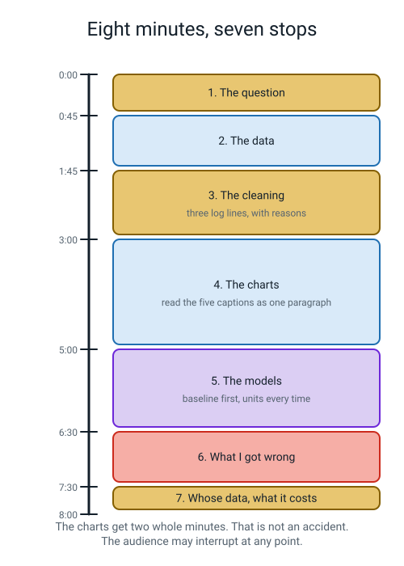
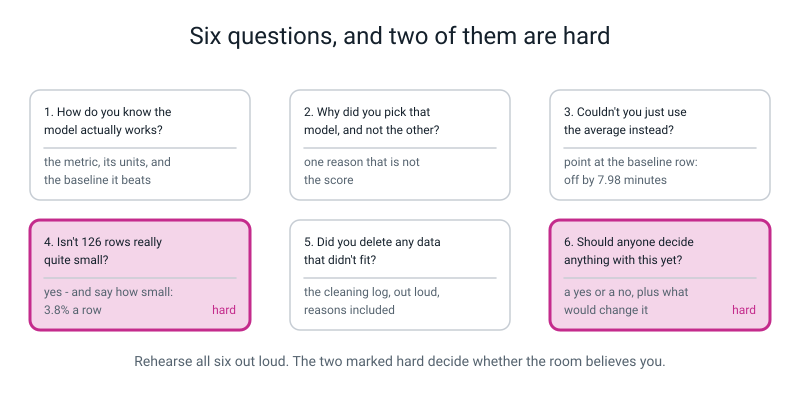
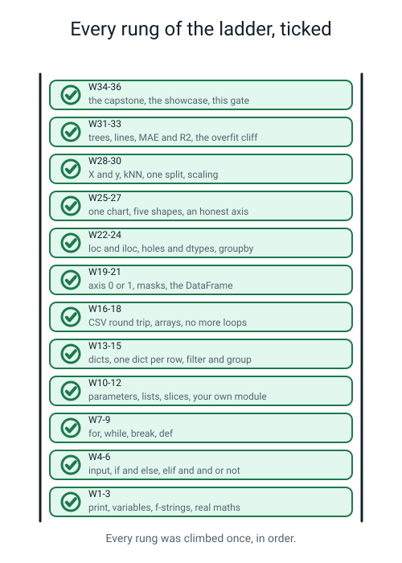
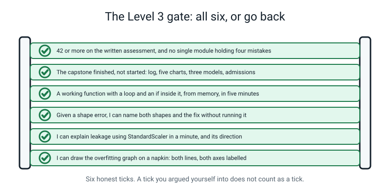
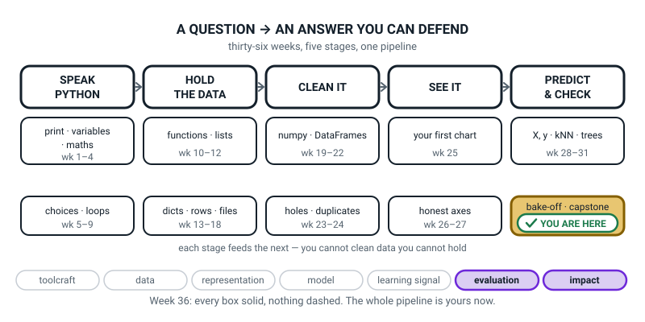

# Week 36 — Showcase Day: Read Your Notebook Out Loud

[⬅ Week 35](week-35.md) · [Course Home](../README.md) · [Course Home ➡](../README.md) · [Student Guide](../student-guide/week-36.md) · [Workbook](../workbook/week-36.md)

---

## 📋 At a Glance

| | |
|---|---|
| **Duration** | 70 minutes for the lesson · **plus a separate ~90-minute closed-book written assessment** (same day after a break, or the next day) |
| **Type** | 🟥 Assessment — showcase, question bank, debug round, written paper, Level 3 gate |
| **Big idea** | You can take a question, a messy table and a keyboard, and produce an answer you are willing to defend. |
| **New vocabulary** | showcase · defence · limitation · gate check |
| **New syntax** | **None.** Everything today is something they already have. |
| **Materials** | Printed workbook pages 36.1–36.6 (36.1–36.3 are the written paper — print them, do not show them early) · the printed syntax ladder · a pen · a red pen · **a real audience who does not code** |
| **Tech needed** | Laptop for the showcase and the debug round. The written paper is pen-and-paper, no laptop. |
| **Prep time** | 30 minutes the night before, 10 minutes on the day |

> **⚠️ Watch out:** the single thing that makes or breaks this week is **finding an audience in advance.** A grandparent, a neighbour, an older sibling, a colleague on a video call. Somebody who does not code and is willing to say "I don't understand" out loud. Ask them days ago, not on the morning.

---

## 🎯 Lesson Objectives

By the end of the day the student can:

1. **Read their notebook aloud to a real adult in eight minutes** without once saying "magic", "pretty accurate" or "just".
2. **Answer six questions from the question bank**, including the two hard ones, with a number in every answer.
3. **Complete the written assessment** — 20 multiple choice, 8 short answers, 4 debug problems — closed book.
4. **Diagnose four broken programs out loud**, answering three questions about each: what kind of problem, which thing is wrong, which line.
5. **Name the single biggest limitation of their own project, unprompted.**
6. **Complete the Level 3 gate self-check honestly**, including the ticks they cannot give themselves.

Observable evidence: an eight-minute walkthrough delivered to a person who is not you; six answered questions with numbers in them; a marked written paper with a per-week breakdown of wrong answers; four diagnoses; and a gate sheet with at least one honest blank on it.

---

## 🧑‍🏫 What YOU Need to Know First

> **📌 About the code blocks in this guide.** Outside the **🧰 Prep Checklist** and the **🔑 Answer Key**, the blocks are **illustrations, not files** — each one carries on from the one above it, so the `import` lines and the data are typed once, in the first block that needs them. **The complete runnable files are in the Prep Checklist and the Answer Key.** If you paste an illustration on its own and get `NameError`, that is why, and nothing is broken.

You are not teaching anything new today. You are running four things, and each has a trick to it.

### 1. What a showcase actually is, and what it is not

> **Showcase** — scrolling one notebook, top to bottom, out loud, to a person who has not seen it. Not slides. Not a talk *about* the project.
> **Defence** — answering questions about your own work with numbers, including "I don't know" when that is the true answer.

The running order is fixed, and the proportions matter more than they look.


*Figure 36.1 — The charts get two whole minutes and the cleaning gets seventy-five seconds. That is deliberate.*

| Time | Section | What they actually say |
|---|---|---|
| 0:00 | The question (45 s) | Say it. Then say who would care about the answer. Then read the dated prediction — **including the bit they got wrong.** Starting with being wrong buys trust for the whole eight minutes. |
| 0:45 | The data (60 s) | "One row is one ______. I collected 126 of them between 12 May and 9 June, by ______." Show `head()` and `shape`. |
| 1:45 | The cleaning (75 s) | Read **three log lines out loud, including the reasons.** "131 rows in, 126 out. Here is every row I lost and why." Nobody expects this bit to be good; that is why it lands. |
| 3:00 | The charts (2 min) | Read the five captions in order, as a paragraph. Do **not** describe the axes — the labels do that. Say the finding. |
| 5:00 | The models (90 s) | **Baseline first, always.** "Guessing the average is off by 7.98 minutes." Then the table. Name the metric and the units every single time a number leaves their mouth. |
| 6:30 | What I got wrong (60 s) | Three admissions with numbers. Show the worst-five table and explain the pattern in it. This is the bit that wins the room. |
| 7:30 | Whose data, what it costs (30 s) | Who is in it, who would pay for a wrong answer — by role, not "users" — and whether they would let anyone decide anything with it yet. |

**The banned words.** Write these up before the student starts:

```text
magic  ·  the AI figured it out  ·  pretty accurate  ·  it's smart
basically perfect  ·  the data speaks for itself  ·  obviously  ·  just
```

`just` is on that list on purpose. *"I just dropped the weird rows"* is where projects go to die — every "just" is a decision they skipped explaining. If they say a banned word, do not stop them; make a tally mark and show them at the end.

### 2. The question bank, and the two hard ones


*Figure 36.2 — The two marked hard are the two that decide whether the room believes them.*

| They are asked | The shape of a good answer |
|---|---|
| *"How do you know the model actually works?"* | "I don't, fully. I know it was off by 2.35 minutes on 26 journeys it had never seen. Guessing the average is off by 7.98. That is the comparison." |
| *"Why did you pick that model?"* | Name the metric, then give a reason that is **not** the score. "The tree is 0.35 minutes better, which one journey 9 minutes out could cause on 26 rows — but I can read its rules out loud." |
| *"Couldn't you just use the average?"* | "That is my baseline row, and it is off by 7.98 minutes. The model gets that to 2.35." Point at the row. Always have a baseline row. |
| **"Isn't 126 rows really quite small?"** ← hard | "Yes. Here is exactly how small: 26 in the test set, so one row is 3.8% of the test set, and one journey 9 minutes out would move my MAE by 0.35. I cannot separate two models that close, which is why I am not claiming a winner among the top two." |
| *"Did you delete data that didn't fit?"* | Point at the cleaning log. Every dropped row, counted, with a reason. Say the before and after shape out loud. |
| **"Should anyone actually decide anything with this?"** ← hard | A yes or a no, with a number attached, plus what would have to change. "Not yet. It under-predicts long walks by up to 8 minutes, and long walks are exactly the kids who arrive late." |

**Why those two are the hard ones.** Both invite a defensive answer, and the defensive answer is the wrong one. "126 is loads actually" fails. "Yes it's small, and here is precisely how small" passes. The skill being tested is whether the student can agree with a criticism and then be *more* precise than the person criticising them. That is the whole of professional honesty in one move.

### 3. The written assessment — how to run it and how to read it

Three parts, 60 points, about ninety minutes. It goes in its own sitting, closed book.

| Part | Items | Points each | Total | What it checks |
|---|:--:|:--:|:--:|---|
| A — Multiple choice | 20 | 1 | 20 | Do you know what the code does? |
| B — Short answer | 8 | 3 | 24 | Can you explain *why*, in words? |
| C — Debug | 4 | 4 | 16 | Can you find and fix a real bug? |
| | | | **60** | |

**Rules of engagement, read out before they start:**

- �� Paper and pen for working out. The glossary, if a word blanks on them.
- ❌ **No running the code.** Predicting the output in their head is the actual skill being tested.
- ❌ No looking at the answers until they have written something for **every** item, including the guesses. A wrong written answer teaches more than a blank.
- Afterwards, they run the four debug problems. Watching your own fix work is half the point.

**The band table, and what to do with each:**

| Band | Score | What it means | What to do |
|---|:--:|---|---|
| 🔴 Rebuild | 0–29 | The vocabulary is there, the mechanics are not | Redo the Week 4, 8 and 16 projects from a blank file, without looking. Then re-sit. |
| 🟠 Patch | 30–41 | Solid in places, two or three real gaps | Use the week tags on the items they missed. Reread just those weeks. Re-sit those items. |
| 🟡 Ready | 42–52 | Ready for Level 3 | Reread the one week their wrong answers cluster in. Go. |
| 🟢 Fluent | 53–60 | Could teach Weeks 1–27 | Go, and take one of the capstone's stretch directions with you. |

> **The diagnostic that matters more than the total: count the wrong answers by week tag.** Four wrong in one week is a real gap. Four wrong spread across eight weeks is a tired afternoon. Do not let a total of 38 send a student back over the whole year when the truth is that they never got `axis` straight.

### 4. The debug round — three questions, every time

Open laptop, four broken programs, and for each one the student answers three questions **out loud, before touching the keyboard**:

1. **What kind of problem is it?** A crash with a traceback, or a silent wrong answer?
2. **Which thing is wrong?** Name it. `total`. The `score` column's dtype. `X_train`.
3. **Which line?** Point at it.

Only then do they type. The three questions are the whole discipline: a student who types first and thinks second turns a twenty-second bug into a twenty-minute one.

**And the crucial distinction they must state for each of the four:**

| Problem | Kind | Why that matters |
|---|---|---|
| D1 — the average that isn't | **silent** | It prints a number. The number is wrong. Nothing warns you. |
| D2 — the top scorer who isn't | **silent** (on pandas 1.x) | Text sorted alphabetically looks like numbers sorted numerically, until it doesn't. |
| D3 — the score that lies | **silent** | Three separate bugs, no error from any of them. The most dangerous problem in the whole course. |
| D4 — the chart that argues dishonestly | **silent** | It produces a perfectly valid picture that tells a lie. |

**All four are silent.** That is not a coincidence, and it is the last thing you should say to them about programming this year: *the errors that stop your program are the easy ones.*

### 5. The syntax ladder, and why you print it


*Figure 36.3 — Twelve rungs, thirty-six weeks, and nothing skipped.*

Print it and hand it over. Then the student ticks each rung, out loud, saying **one thing they can do with it.** Not "I did for loops" — "I can add up a list without typing every number." It takes six minutes and it is the only time all year they will see the whole thing at once.

Thirty-six weeks ago they could not print "hello". That sentence is worth saying out loud.

### 6. The Level 3 gate — and the point of an honest blank


*Figure 36.4 — Six honest ticks. A tick you argued yourself into does not count.*

| # | The gate | What it means |
|---|---|---|
| 1 | **42 or more** on the written assessment, with no single week holding four of the mistakes | Coverage, not just a total |
| 2 | The capstone **finished** — log, five charts, three models on one split, and numeric admissions | Not started. Finished. |
| 3 | A working function with a loop and an `if` inside it, from memory, in under five minutes, no copying | Typing fluency, which only comes from typing |
| 4 | Given a numpy shape error, name both shapes and the fix **without running it** | Reading, not guessing |
| 5 | Explain leakage using `StandardScaler`, in under a minute, and say which direction it moves the score | The idea that Level 3 assumes |
| 6 | Draw the overfitting graph on a napkin — both lines, both axes labelled — and say what the gap means | The picture behind everything |

**The blank is the point.** A student who ticks all six on a day when three are not true has learned nothing, and Level 3 will not slow down for them. A student who leaves gate 3 blank and writes "I need ten days of fifteen-minute exercises" has done the assessment correctly. Say so, out loud, before they fill it in: **"I am marking the honesty of this sheet, not the number of ticks."**

If they are missing one:

| Missing | The cheapest fix |
|---|---|
| Gate 1 (score) | Reread the week their wrong answers cluster in, redo its practice, re-sit those items. Half a day. |
| Gate 2 (capstone) | No shortcut exists. Level 3 assumes you have suffered through one end-to-end project by hand. |
| Gate 3 (fluency) | Ten days, one fifteen-minute exercise each: fizzbuzz, a temperature converter, a list-max function, a word counter. Each from nothing. |
| Gate 4 (shapes) | Redo Week 19's practice, and print `.shape` after **every** array operation for a week. |
| Gate 5 (leakage) | Reread Week 30 and explain it out loud to a person. The question they ask that you cannot answer is the hole. |
| Gate 6 (the graph) | Rerun Week 33's depth curve on `load_diabetes()` and draw the result by hand *before* plotting it. |

### 7. The two misconceptions you will meet today

**Misconception 1 — "the assessment decides whether I'm any good."**

It decides which weeks to reread. That is all it does. Say the sentence from the source material and mean it: **this is not a test you can fail, it is a map of your holes** — and holes are much cheaper to find now than in the middle of Level 3.

**Misconception 2 — "I should defend my project."**

No. They should *describe* it, including the parts that do not work. The student who says "yes, that's a real weakness, and here is the number" is believed. The student who explains why every criticism is unfair is not. If they get defensive during the question bank, stop and say: "You are allowed to agree with me. Try agreeing and then being more precise than I was."

### 8. How deep to go, and where to stop

**Go this far:** the showcase · six questions with numbers in the answers · the full written paper · four diagnoses · the ladder · the gate.

**Stop before:** grading the capstone in front of them (do that afterwards, in writing, against the rubric) · promising them Level 3 is easy · and any new Python at all. Today is the day the year gets read back, not extended.

---

### 9. 🧭 The Growing Map — two minutes to close it, and it is the last figure of the level

Thirty-six weeks ago this figure was one gold tile in a field of dashed boxes. Today it is finished, and
for once the map is not a footnote to the lesson — it is the lesson's structure, because the five stage
names are the running order of the showcase they have just given.



*Figure 36.0 — Week 36's version. Every box solid, nothing dashed, the last tile closed. Two threads
lit: impact and evaluation.*

**What to do with it, in about two minutes — and do it after the showcases, not before:**

1. **Show it and ask which box today was:** *"which one did we do this morning?"* Let the wrong answers
   run for a moment, then take the right one — **all five**. Today they walked the whole row out loud in
   eight minutes: the question, the rows, the log, the captions, the baseline before the models. Point
   at each stage box as you name the stop it corresponds to; that is the two minutes, and it is the
   cleanest summary of the year available to you.
2. **Then the only question left worth asking:** *"nothing is dashed. So what is Level 3?"* You want
   *the same boxes, harder* — not *more boxes*. Say it plainly: same five stages, the maths underneath
   the models, and questions that are harder to defend. And point at gate 6 on the sheet they have just
   filled in — the napkin drawing from Week 33 lives in the box on the far right, and it is the one
   picture Level 3 assumes you already own.
3. **Have them finish their own copy** — ink the last tile, write the date across the bottom, and put it
   inside the front cover of whatever notebook they will use next. The map they inked themselves, week
   by week, is the single most durable artefact of this course; make sure it does not end up in a bin
   with the worksheets.

> **🧑‍🏫 Why this is worth two minutes.** A year ends badly when it ends with a mark. Ending it with a
> finished picture, in their own handwriting, is the difference between *"I did Python"* and *"I can take
> a question, a messy table and a keyboard and defend an answer"* — and the second sentence is the one
> that gets them through the first hard week of Level 3. Say the five stage names out loud one last
> time, in order, and let the last thing they hear this year be the thing they can do rather than the
> thing they scored.

---

## 🧰 Prep Checklist

**30 minutes the night before**

- [ ] **Confirm the audience.** Message them. Tell them two things: *you may interrupt*, and *say "I don't understand" out loud whenever it is true, because that is the most useful thing you can do.*
- [ ] Print workbook pages 36.1–36.6. **Keep 36.1–36.3 face down** — that is the written paper and it is closed book.
- [ ] Print the syntax ladder (Figure 36.3) at a readable size, and the Level 3 gate (Figure 36.4).
- [ ] **Put the four debug files on the laptop, ready to run.** They are in the Answer Key, complete. Name them `d1.py`, `d2.py`, `d3.py`, `d4.py` so the debug round starts in four seconds instead of four minutes.
- [ ] **Run all four yourself, broken and fixed.** Confirm you get:

```text
d1 broken -> Average: 17.8          d1 fixed -> Average: 62.6
d2 broken -> Average:   227144525.0 d2 fixed -> Average:   88.25
d3 broken -> R2: 0.93 (different every run)   d3 fixed -> train R2: 0.938 / test R2: 0.769
d4 broken -> a chart with a stump   d4 fixed -> three bars of similar height
```

- [ ] **Read the rubric with the student before the showcase, not after.** They should know what they are being judged on while they can still change it. It is in the capstone brief; the eight rows are question and data design · collection · cleaning and the log · charts · modelling honesty · results and interpretation · what I got wrong · whose data and what it costs.
- [ ] Read section 4 above. The "all four bugs are silent" point is the last big idea of the year and it deserves to be said properly.

**10 minutes on the day**

- [ ] Banned-words list written up where the student can see it. A tally sheet next to it.
- [ ] Timer visible. Eight minutes means eight minutes; a showcase that runs to fifteen has stopped being a showcase.
- [ ] Audience seated where they can see the screen, with the instruction to interrupt already given.
- [ ] Written paper face down. Red pen for the debug round.

**Fallback if something fails**

| If this fails | Do this instead |
|---|---|
| No audience available | You are the audience, and you play it properly: sit somewhere different, and pretend you have never seen the project. Say "I don't understand" at least three times. It is worse than a real stranger but far better than nothing. |
| The laptop dies | The showcase works from printouts — five charts, the results table, the log, the admissions. The debug round works on paper: they diagnose from the listing without running anything, which is the harder version. |
| They freeze in the showcase | Ask the first question of the running order out loud — "what was your question, and who would care?" — and let it become an interview. Same content, less terror. Do not rescue them by narrating for them. |
| The capstone is not finished | Run the showcase on whatever exists, honestly labelled: "this is where I got to, and here is what is missing." Then sit the written paper, which is independent of the capstone. Gate 2 stays blank, and that is the correct outcome. |
| The paper takes far longer than 90 minutes | Split it: Part A and Part B in one sitting, Part C in another. Do not let them rush Part C — it carries the skill that transfers furthest. |
| They score below 30 and are crushed | Show them the by-week breakdown immediately. Almost always the wrong answers cluster in one or two weeks. "You do not need to redo the year. You need to redo Week 19." That sentence changes the afternoon. |

---

## ⏱️ The Lesson, Minute by Minute

*(This is the 70-minute lesson. The written paper is a separate sitting — see **🎲 The Activity, In Full**, Sitting 2.)*

| Segment | Minutes | Running total | What happens |
|---|---|---|---|
| 🪝 Hook — The Banned Words | 7 | 7 | Why "magic" and "just" are not allowed to leave their mouth |
| 🧠 Concept — What You Are Being Judged On | 16 | 23 | The running order, the rubric, and the two hard questions |
| 💻 Live-Code Together — The Debug Round | 18 | 41 | Four broken programs, three questions each, out loud first |
| ✍️ Their Turn — The Eight-Minute Showcase | 20 | 61 | Eight minutes to a real audience, then the six questions |
| 🔑 Wrap & Assign — The Ladder and the Gate | 9 | 70 | Tick every rung, fill in the gate honestly, set the letter |

---

### 🪝 Hook — The Banned Words (7 minutes)

**Do this:** Write the eight banned words up where they can be seen. Do not explain them yet.

**Say this:**

> "Eight words and phrases. From now until the end of today, none of them is allowed out of your mouth. Here they are.
>
> *Magic. The AI figured it out. Pretty accurate. It's smart. Basically perfect. The data speaks for itself. Obviously. Just.*
>
> Seven of those are on the list for the same reason: they are ways of saying a number without saying a number. 'Pretty accurate' — how accurate? Compared to what? On how many rows? Every one of those phrases is a place where you *had* a number and chose a feeling instead.
>
> But the eighth one is the interesting one. **Just.** Why do you think 'just' is banned?"

Let them try. The answer is worth waiting for.

> "Because of sentences like this: *'I just dropped the weird rows.'* Listen to what that sentence does. There were rows. You made a decision about them. You had a reason — or you did not, which is worse. And the word 'just' takes all of that and hides it, so nobody asks. **Every 'just' is a decision you skipped explaining.**
>
> Same with 'obviously'. If it were obvious you would not need to say it. 'Obviously' means 'please do not ask me about this bit'.
>
> Here is what I am actually asking of you today, and it is harder than it sounds. Somebody who does not code is going to sit here while you read your notebook out loud. They are allowed to interrupt. And every single time you say a number, you say its **units** and what you are comparing it to. 'Off by 2.35 minutes, against a baseline of 7.98 minutes, on 26 rows the model had never seen.'
>
> That sentence takes six seconds and it is the difference between being believed and being nodded at."

**Do this:** Put the tally sheet under the list.

> "I am going to put a mark here every time one of those words gets out. I will not stop you. You will just see the marks at the end."

**Ask this:**

| Ask | Answer you want | If they say something else |
|---|---|---|
| "Why is 'just' banned?" | Because it hides a decision that had a reason. | If they say "it's lazy" — close, and sharpen it: "Lazy how? What does it stop the listener from asking?" |
| "What is wrong with 'pretty accurate'?" | No number, no units, no comparison. | If they say "it's vague" — ask them to fix it out loud for their own project. |
| "What could you say instead of 'the model is smart'?" | Something with a metric and a baseline in it. | If they cannot, give them the frame: "off by ___ [units], against a baseline of ___, on ___ unseen rows." Have them fill it in for their own project right now. |
| "Is 'I don't know' allowed?" | Yes — and it is one of the strongest answers there is, when it is followed by what you *do* know. | Worth saying explicitly. Students think "I don't know" loses marks. It is the honest answer to "how do you know it works?" |

---

### 🧠 Concept — What You Are Being Judged On (16 minutes)

**Do this:** Put the running order (Figure 36.1) and the eight-row rubric on the table together.

**Say this — part 1, the running order (6 minutes):**

> "Eight minutes. Seven stops. And look at the shape of it, because the proportions are the lesson.
>
> The question gets forty-five seconds. The models get ninety. And **the charts get two whole minutes** — a quarter of your entire showcase — because your five captions read as a paragraph and that paragraph is your argument.
>
> The cleaning gets seventy-five seconds, and this is the bit nobody expects to be good. You are going to read three log lines out loud, with the reasons in them, and say 'a hundred and thirty-one rows went in and a hundred and twenty-six came out; here is every row I lost and why.' Adults find that startling. They have never seen anyone do it.
>
> And start with being wrong. Stop number one includes reading your dated prediction — the one from Week 34 — including the bit you got wrong. Leading with a mistake you found yourself buys you trust for the remaining seven and a half minutes, and it costs you nothing, because you were going to be wrong about something anyway."

**Say this — part 2, the rubric (5 minutes):**

> "Eight things I am marking, and I am telling you all eight before you start, because a rubric you find out about afterwards is a trap and I am not interested in trapping you.
>
> Your question and how you designed the columns. Your collection — a hundred rows or more, with real variety. Your cleaning log, and whether every line has a reason. Your five charts, and whether the captions state findings. Your **modelling honesty** — one split, made once, `random_state` set, a baseline in the table. Your results and how you interpret them. Your 'what I got wrong'. And whose data it is and what a wrong answer would cost a real person.
>
> Notice what is not on that list. Nowhere does it say 'the model scored well.' You can get top marks with a model that is barely better than guessing, as long as you say so with a number. And you can lose marks with a model that scores 0.99, because 0.99 on data you collected yourself is a warning light."

**Say this — part 3, the two hard questions (5 minutes):**

Show Figure 36.2.

> "Six questions. Two of them are hard, and they are hard in the same way. Here is the first: **isn't a hundred and twenty-six rows really quite small?**
>
> Now — the answer that fails is 'no, that's loads actually.' Do you see why? You have just told the person asking that you have not thought about it.
>
> The answer that works starts with the word **yes**. 'Yes. And here is exactly how small: twenty-six in the test set, so one row is three point eight percent of the test set, and one journey nine minutes out would move my MAE by 0.35. I cannot separate two models that close, which is why I am not claiming a winner among my top two.'
>
> Look at what happened there. You agreed with the criticism and then you were **more precise about it than they were.** That is the single most useful move in this entire subject, and you can practise it right now.
>
> Second hard one: **should anyone actually decide anything with this?** The answer is a yes or a no — pick one — with a number attached, and then what would have to change. 'Not yet. It under-predicts long walks by up to eight minutes, and long walks are exactly the kids who arrive late, who are the ones the decision is about. I would need journeys from three people outside my family before I'd say yes.'"

**Ask this:**

| Ask | Answer you want | If they say something else |
|---|---|---|
| "Why do the charts get two minutes?" | Because the five captions are the argument. | If they say "charts take longer to explain" — reframe: "You are not explaining them. You are reading five sentences. Why do five sentences take two minutes?" (Because they are the whole story.) |
| "Isn't 126 rows really quite small?" | "Yes, and here is how small: 26 test rows, 3.8% each." | If they say "no it's fine" — say the failing answer back to them in their own voice and let them hear it. Then give them the word "yes" and make them start again. |
| "What is not on the rubric?" | Whether the model scored well. | If they cannot spot it, read the eight rows aloud and ask after each: "does this one mention the score?" |
| "Should anyone decide with your project?" | A yes or a no, with a number, plus what would change it. | If they say "I don't know" — that is the one place it is not enough. Reply: "Pick one, and I will accept either. What would have to be true for the other answer?" |
| "Why start with the bit you got wrong?" | It buys trust, and you were going to be wrong about something anyway. | If they resist, ask: "Which do you trust more — someone who says everything worked, or someone who tells you the one thing that didn't?" |

---

### 💻 Live-Code Together — The Debug Round (18 minutes)

Laptops open. Four files, already on the machine. For each one, **the three questions get answered out loud before a single key is pressed.**

**The three questions, on the wall:**

```text
1. WHAT KIND?   a crash with a traceback, or a silent wrong answer?
2. WHICH THING? name it.
3. WHICH LINE?  point at it.
```

**Problem 1 — `d1.py`, the average that isn't (5 minutes).** Run it first.

```python
scores = [45, 0, 112, 67, 89]

total = 0
for i in range(1, len(scores)):
    total = scores[i]

print("Average:", total / len(scores))
```

```text
Average: 17.8
```

**Say this:**

> "It ran. No traceback. So question one: what kind of problem? **Silent.** That is the dangerous kind and it is the kind you will meet most.
>
> Now hand-check it. Add those five numbers up for me. Forty-five, nought, a hundred and twelve, sixty-seven, eighty-nine."

313. Divided by five is 62.6. The program said 17.8.

> "So where did 17.8 come from? Look at the loop body. `total = scores[i]`. Not `+=`. **`=`.** So every time round the loop it *throws away* what it had and keeps the newest one. At the end, `total` is just the last score — eighty-nine. And eighty-nine divided by five is seventeen point eight.
>
> That is bug one. There is a second one. Where does the loop start?"

`range(1, len(scores))` — so index 0, the 45, is never visited.

> **🐞 Deliberate mistake — fix only one bug.** Change `total =` to `total +=` and leave the range alone. Run it.
>
> ```text
> Average: 53.6
> ```
>
> *"Better. Still wrong. 268 over 5 instead of 313 over 5 — I am missing the forty-five. **Fixing one of two bugs gives you a wrong answer that looks much more believable than before**, and that is why you hand-check the answer instead of eyeballing the code."*

Now the real fix:

```python
scores = [45, 0, 112, 67, 89]

total = 0
for score in scores:          # loop over the VALUES - no index, no off-by-one
    total += score            # += accumulates instead of replacing

print("Average:", total / len(scores))
```

```text
Average: 62.6
```

> "Two habits worth stealing. Loop over the items, not the indices, when you do not need the position — that deletes the whole class of off-by-one bugs. And use `+=` for anything you have called `total`."

**Problem 2 — `d2.py`, the top scorer who isn't (4 minutes).**

```python
import pandas as pd

df = pd.DataFrame({
    "name":  ["Aarav", "Bela", "Chen", "Divya"],
    "score": ["90", "85", "78", "100"],
})

print("Top score:", df["score"].max())
print("Average:  ", df["score"].mean())
print(df.sort_values("score", ascending=False))
```

```text
Top score: 90
Average:   227144525.0
    name score
0  Aarav    90
1   Bela    85
2   Chen    78
3  Divya   100
```

**Ask this before explaining anything:** "Divya scored 100. Where is she in that sorted list?"

Last.

> "One root cause, three wrong answers. Look at the DataFrame. `"90"`, `"85"`, `"78"`, `"100"` — **quotes.** That column is text.
>
> So `.max()` compares them alphabetically, character by character: `'9'` comes after `'1'`, so `"90"` beats `"100"` and it stops there. `.sort_values()` does the same, which is why Divya sinks to the bottom. And `.mean()` on a text column glues the strings together — ninety, eighty-five, seventy-eight, one hundred becomes the string `908578100` — and divides that by four.
>
> The one-line diagnosis you should run after every single `read_csv`, for the rest of your life:"

```python
print(df.dtypes)
```

```text
name     object
score    object
dtype: object
```

**`score` says `object`, and that is the bug** — a column of numbers that pandas is holding as text.

Then the fix, and the check. **Replace the three print lines in `d2.py` with these five** — everything above them stays exactly as it was:

```python
# add this to d2.py, in place of the three print lines
df["score"] = pd.to_numeric(df["score"], errors="coerce")
print(df.dtypes)
print("Top score:", df["score"].max())
print("Average:  ", df["score"].mean())
print(df.sort_values("score", ascending=False).to_string(index=False))
```

```text
name     object
score     int64
dtype: object
Top score: 100
Average:   88.25
 name  score
Divya    100
Aarav     90
 Bela     85
 Chen     78
```

Hand-check: 90 + 85 + 78 + 100 = 353, over 4 = 88.25. ✅

**Problem 3 — `d3.py`, the score that lies (6 minutes).** This is the one that matters most; give it the time.

```python
# d3.py - the score that lies. Three separate bugs, no error message.
import pandas as pd
from sklearn.preprocessing import StandardScaler
from sklearn.neighbors import KNeighborsRegressor
from sklearn.model_selection import train_test_split

df = pd.read_csv("data/clean.csv")
df["is_walk"]  = (df["mode"] == "walk").astype(int)
df["is_cycle"] = (df["mode"] == "cycle").astype(int)
X = df[["distance_km", "rain", "depart_hour", "is_walk", "is_cycle"]]
y = df["minutes"]

scaler = StandardScaler()                                   # line 12
X_scaled = scaler.fit_transform(X)                          # line 13

X_train, X_test, y_train, y_test = train_test_split(        # line 15
    X_scaled, y, test_size=0.2)                             # line 16

knn = KNeighborsRegressor(n_neighbors=5)                    # line 18
knn.fit(X_train, y_train)                                   # line 19

print("R2:", knn.score(X_train, y_train))                   # line 21
```

Run it three times in front of them:

```text
R2: 0.9279865978428445
R2: 0.9352927574986454
R2: 0.9386630917616082
```

**Ask this:** "I ran the same file three times and changed nothing. Why are the numbers different?"

No `random_state`. That is bug three, and it is the one you can *see*.

> "Three separate problems, and I want them ranked worst first.
>
> **Worst: line 21.** `knn.score(X_train, y_train)`. That measures how well the model does on rows it learned from. It is a memory test, not a result. This is the worst because it invalidates the entire output — everything else could be perfect and the number would still mean nothing.
>
> **Second: line 13.** `scaler.fit_transform(X)` runs *before* the split, so the column averages were computed using the test rows too. That is leakage, and it inflates the score even after you fix bug one.
>
> **Third: line 16.** No `random_state`, so every run gives a different split and a different number. Not reproducible, so nothing can be compared to anything."

The fix:

```python
# 1. SPLIT FIRST. Nothing has touched the data yet.
X_train, X_test, y_train, y_test = train_test_split(
    X, y, test_size=0.2, random_state=42)      # fix 3: the same split every run

# 2. Fit the scaler on the TRAINING rows only, then apply it to both. (fix 2)
scaler = StandardScaler().fit(X_train)
X_train_scaled = scaler.transform(X_train)
X_test_scaled  = scaler.transform(X_test)

knn = KNeighborsRegressor(n_neighbors=5).fit(X_train_scaled, y_train)

# 3. Report BOTH scores. The gap between them is the story. (fix 1)
print(f"train R2: {knn.score(X_train_scaled, y_train):.3f}")
print(f"test  R2: {knn.score(X_test_scaled,  y_test):.3f}")
print(f"test rows: {len(y_test)}  ·  one row is worth {100 / len(y_test):.1f}%")
```

```text
train R2: 0.938
test  R2: 0.769
test rows: 26  ·  one row is worth 3.8%
```

> "0.769. The honest number is **lower** than the broken one, and it is the same every time I run it. That is the normal, healthy direction. If a score goes *up* after you fix an evaluation bug, look again — something else is wrong.
>
> And the rule of thumb to carry into Level 3: **if a scoring line has `_train` on the right-hand side and you are calling the result a result, stop.**"

**Problem 4 — `d4.py`, the chart that argues dishonestly (3 minutes).** Show the picture, not the code, first.

```python
import matplotlib.pyplot as plt

houses = ["Red", "Blue", "Green"]
means  = [72.4, 71.9, 65.1]

plt.bar(houses, means)
plt.ylim(64, 73)
plt.title("Chart")
plt.savefig("houses.png")
```

**Ask this:** "Look at the picture. Roughly how much worse is Green than Red?"

They will say something like "loads" or "about three-quarters".

> "Green scored 65.1. Red scored 72.4. Out of a hundred. The real gap is **7.3 points**, which is about a tenth. But on that axis Red's bar is 8.4 units tall and Green's is 1.1, so Green *looks* about eighty-seven percent smaller. **An eight-times exaggeration, and not one number was faked.** The lie lives entirely in `plt.ylim(64, 73)`.
>
> Four things wrong: the truncated axis; no axis labels at all, so nobody knows if these are marks, percentages or points; a title that is a topic — `'Chart'` — instead of a finding; and no group sizes, so Green might be forty students or two."

The fix, with all four repaired:

```python
import matplotlib.pyplot as plt

houses = ["Red", "Blue", "Green"]
means  = [72.4, 71.9, 65.1]
counts = [14, 13, 11]                       # never plot a mean without its n

fig, ax = plt.subplots(figsize=(6, 4))
bars = ax.bar(houses, means)

ax.set_ylim(0, 100)                         # FIX 1: bars start at zero
ax.set_title("Green averages 7.3 points below Red - the houses are close")  # FIX 3
ax.set_xlabel("house")                                                      # FIX 2
ax.set_ylabel("mean end-of-term score (points out of 100)")                  # FIX 2, with units

for i, bar in enumerate(bars):
    mean = means[i]
    n = counts[i]
    ax.text(bar.get_x() + bar.get_width() / 2, mean + 2,
            f"{mean:.1f} (n={n})", ha="center", fontsize=9)                  # FIX 4

fig.savefig("houses_fixed.png", dpi=120, bbox_inches="tight")
```

> "Three bars of almost the same height — because that is the truth. Same data. Same numbers. **The most effective visual lies never touch the numbers at all.**
>
> And now the last thing I want to say about programming this year. Look back at all four of those problems. How many of them printed an error message?
>
> **None.** All four ran perfectly and gave you a wrong answer with a straight face. The errors that stop your program are the easy ones. The ones that don't stop it are the reason you hand-check, print your dtypes, and audit which split your number came from."

---

### ✍️ Their Turn — The Eight-Minute Showcase (20 minutes)

Full protocol in **🎲 The Activity, In Full**. In the lesson flow:

- **Minutes 0–2:** audience seated, timer set, banned-words tally in view. Remind the audience: interrupt, and say "I don't understand" out loud.
- **Minutes 2–10:** the eight-minute showcase. You do not speak. You tally banned words and note every place the audience frowns.
- **Minutes 10–17:** the six questions from the bank, including both hard ones. The audience asks at least two of them.
- **Minutes 17–20:** one question you keep for last, always: **"What is the single biggest limitation of this project?"** Unprompted, no hints. This is objective 5 and it is worth more than the rest of the questions combined.

---

## 🐞 The Debugging Clinic

Showcase day produces its own errors, because code that has not been run from a clean start for a week always breaks. Every message below came from a real run.

| What the student sees (real message) | What it means | Most likely cause | The fix |
|---|---|---|---|
| `NameError: name 'df' is not defined` | Python has never heard of that name. | Cells run out of order, or a restart that lost everything above. This is *the* showcase-day error. | Run the file from the top. If it is a notebook: Restart, then Run All. Never present from a session you have not restarted. |
| `ModuleNotFoundError: No module named 'panda'` | Python cannot find that library. | A typo — `panda`, `numpi`, `sklean`. Or the wrong environment. | Read the name in the message character by character. `pandas`, with an s. If the spelling is right, the virtual environment is not active. |
| `ImportError: cannot import name 'DecisionTreeRegresser' from 'sklearn.tree'` | The library exists; that name inside it does not. | Misspelling the class. `Regresser` for `Regressor`. | Fix the spelling. If unsure, `print(dir(sklearn.tree))` lists the names that do exist; the file path in the message is just the module it searched. |
| `IndentationError: expected an indented block after function definition on line 1` | The spaces at the front of a line are wrong. | A `def` or `if` line whose body was not indented. | Indent the body by four spaces. Python uses indentation the way other languages use braces — it is grammar, not decoration. |
| `SyntaxError: expected ':'` | Python got to the end of a line that needed a colon. | A missing `:` after `for`, `if`, `while` or `def`. | Add the colon. The caret in the message points at exactly where it expected one. |
| `TypeError: can only concatenate str (not "int") to str` | You tried to glue a number onto text with `+`. | `"I collected " + rows + " rows"`. | Use an f-string: `f"I collected {rows} rows"`. That is what f-strings are for. |
| `IndexError: list index out of range` | You asked for a slot that does not exist. | `for i in range(1, 6)` over a five-item list — index 5 does not exist, because they run 0 to 4. | `for item in captions:` if you do not need the position, or `range(len(captions))` if you do. |
| `ZeroDivisionError: division by zero` | Something you divided by was zero. | `100 / len(y_test)` when `y_test` is empty — which `train_test_split` itself never produces (it raises a `ValueError` first), so it means `y_test` was filtered or built by hand. | Print `len(y_test)` first. If it is 0, the real problem is upstream — the test rows were filtered away or the split was not done with `train_test_split`. |
| `FileNotFoundError: [Errno 2] No such file or directory: 'data/clean.csv'` | The path is wrong from where the file is being run. | Presenting from a different folder than the one it was written in. | `cd` into the project folder first. Check with `ls data` before you present. |
| **No error at all**, and a number that is wrong | The silent kind. All four debug problems are this kind. | Wrong split, wrong dtype, wrong operator, truncated axis. | Hand-check one value. Print `df.dtypes`. Ask which split the number came from. |

### How to teach debugging without giving the answer

Today, hand the four sentences to the *student* and make them run the process on themselves. That is the whole difference between Week 1 and Week 36.

1. **"Read me the last line out loud."**
2. **"What does it say it could not find or could not do?"** Name it.
3. **"So show me that thing."** `ls`. `print(df.dtypes)`. `print(df.columns)`.
4. **"What is one thing you could change?"** One. Then run.
5. **And when there is no error at all:** "Hand-check one number. Then tell me which split it came from."

**Never take the keyboard, today least of all.** Today is the day they prove they can do it without you.

---

## 🎲 The Activity, In Full

### Sitting 1 — The Showcase (inside the 70-minute lesson)

**Setup.** Notebook or scripts open, scrolled to the top. Charts saved as PNGs so nothing has to render live. Audience seated where they can see. Timer at 8:00. Banned-words list and tally in view.

**The audience's instructions**, given out loud before the student starts:

```text
1. You may interrupt at any time.
2. Say "I don't understand" out loud whenever it is true.
   That is the most useful thing you can do today.
3. Do not be kind about numbers. If a number has no units,
   ask what the units are.
4. At the end you get to ask three questions.
```

**The rules for the student:**

1. **Eight minutes.** The timer is visible. If they hit 8:00 mid-chart, they stop.
2. **Scroll one notebook, top to bottom.** No slides, no jumping about.
3. **Every number gets its units and a comparison.** Every time.
4. **Baseline first**, before any model score leaves their mouth.
5. **No banned words.**

**Then the six questions.** The audience asks at least two, including one hard one. Every answer must contain a number.

**And the last question, always:**

> "What is the single biggest limitation of this project?"

No hints, no prompting, no multiple choice. A good answer names something specific and says how big it is: *"every row is one of three people in one family, so the model has learned our walking speed and nobody else's."* A weak answer is "I could have collected more data."

**What "finished" looks like:** eight minutes delivered; six questions answered with numbers; the biggest limitation named unprompted; and — the real measure — **the audience can say back what the project found and how sure they should be about it.** Ask them. Their answer is the actual grade.

### Sitting 2 — The Written Assessment (separate, ~90 minutes)

**Setup.** Pages 36.1, 36.2 and 36.3. Pen. Paper for working out. The glossary. **No laptop.** A clock.

**Timing:** Part A 25 minutes · Part B 35 minutes · Part C 30 minutes. Tell them the splits in advance so they do not spend forty minutes on the multiple choice.

**Read the rules of engagement out loud** (section 3 above) and then leave them alone.

**Afterwards, in this order:**

1. They mark it themselves against the Answer Key, writing a short note on every wrong one saying *what they now think*.
2. They fill in the **by-week table**: which weeks their wrong answers came from. This matters more than the total.
3. **Then, and only then, they run the four debug problems** and watch their own fixes work.

### Sitting 3 — The Ladder and the Gate (the last 9 minutes of the lesson)

**Setup.** The printed syntax ladder (Figure 36.3) and the printed gate (Figure 36.4).

**The ladder.** They tick each of the twelve rungs and say **one thing they can do with it**, out loud. Not the name of the feature — a thing they can do.

> ✅ W1–3 — *"I can make the computer print a sentence with a number worked out inside it."*
> ✅ W7–9 — *"I can add up a hundred numbers without typing a hundred lines."*
> ✅ W16–18 — *"I can save a table to a file and get it back tomorrow."*
> ✅ W22–24 — *"I can find every hole in a table and say what I did about each one."*
> ✅ W31–33 — *"I can tell whether a model learned a rule or just memorised the answers."*

**Then say this, and mean it:**

> "Thirty-six weeks ago you could not print 'hello'. That is not a joke and it is not me being nice. Look at that ladder. Every rung on it is something you can do from a blank file. Almost nobody your age can do any of it."

**The gate.** Before they fill it in:

> "Six boxes. I am marking the **honesty** of this sheet, not the number of ticks on it. A blank with a plan next to it is a better answer than a tick you argued yourself into — because Level 3 will not slow down for a tick that is not true, and you are the only person who can possibly know."

They fill it in. For every blank, they write the cheapest fix next to it, from the table in section 6.

### Variation — easier

- **The showcase becomes an interview.** You ask the seven running-order questions in turn and they answer. Same content, far less terror, and the audience still hears the project.
- **Four questions from the bank, not six** — but keep both hard ones. They are the objective.
- **Split the written paper across three sittings.** Part A, then Part B, then Part C, on different days.
- **The ladder in two halves.** Weeks 1–18 today, Weeks 19–36 tomorrow.

### Variation — harder

1. **A hostile audience.** Brief the adult to push back on every number: "how do you know?", "compared to what?", "so should we do it or not?" The student is allowed to say "I don't know" but must then say what they *do* know.
2. **The two-minute version.** Deliver the whole project in two minutes to somebody with no time. This is brutal and it is the real-world skill: the question, the headline number with its baseline and units, the biggest limitation, the recommendation. Nothing else fits.
3. **The one-page printout, tested.** Give an adult a single page with no code on it and watch them read it without you speaking. Note every frown, every question, every number they misread. That list is the most useful feedback in the whole capstone, because a result nobody can act on is a result that did not happen.
4. **Mark somebody else's project against the rubric**, all eight rows, in writing, with a reason per score. Marking is the fastest way to see your own gaps.

---

## ❓ Questions Students Ask This Week

**"What if the audience asks something I can't answer?"**

Say "I don't know" and then say what you *do* know. That is not a failure; it is the correct answer to most hard questions about data. "I don't know whether it would work for other people — every row in my table is one of three people in one family, so I genuinely cannot tell you." That answer is better than a confident guess, and any adult worth presenting to will recognise it immediately.

**"Is the assessment going to decide whether I can do Level 3?"**

Partly, and not in the way you think. The score matters less than **where** the wrong answers cluster. Thirty-eight with everything spread out means you were tired. Thirty-eight with four wrong in Week 19 means you never got `axis` straight, and that one afternoon of rereading fixes it. Gate 1 is 42 with no single week holding four mistakes — the second half of that sentence is the important half.

**"Why can't I run the code during the paper?"**

Because predicting what code will do, in your head, before you run it, is the actual skill. It is what lets you spot a bug in ten seconds instead of ten minutes, and it is what you were building for thirty-six weeks. Running the code afterwards and watching your prediction come true is the reward. Running it during would tell you the answer and teach you nothing.

**"My project isn't finished. Should I still do the showcase?"**

Yes, and label it honestly: "this is where I got to, and here is what is missing." An honest unfinished project presented well is far better than a finished one that hides things. Then leave Gate 2 blank, because it is not true yet, and write next to it what you need to do. That is the assessment working correctly.

**"Do I have to say the bit I got wrong out loud? To an actual person?"**

Yes, and it is the part that will surprise you. Adults are so used to being sold things that somebody voluntarily saying "here is the weakness in my own work" is genuinely startling. It makes everything else you said more believable, because they now know you would have told them. This is not a trick — it is why honesty is the professional standard rather than just a nice idea.

**"Is Level 3 harder?"**

Yes, and differently. Level 2 was about breadth — nine or ten different tools, one after another. Level 3 goes downwards instead: it opens the boxes you have been using. `LinearRegression()` becomes gradient descent, which you write yourself and watch converge on a plot. `fit()` becomes a loop over a loss function. And then the same idea stacked into layers becomes a neural network — first in raw numpy so you can see every multiplication, then in PyTorch so you can make it big. None of it will feel like magic, because you will have built the floor it stands on.

**"When am I allowed to say a model 'works'?"** *(Answer this one honestly: nobody agrees.)*

**There is no agreed answer, and this is one of the genuinely unsettled questions in the field.** Everybody agrees on the floor: a model that cannot beat the baseline does not work, full stop. Past that, people disagree, and they disagree because "works" is not a property of the model at all — it is a property of the model *plus what you are going to do with it*.

A model that suggests which song to play next can be barely better than guessing and still be useful, because the cost of a bad suggestion is that you press skip. A model that helps decide whether somebody gets a loan needs to be far better than the baseline before anyone should switch it on — and "far better" still does not tell you how much better, because the real question is what it costs the person who is refused unfairly. Serious researchers argue about the thresholds constantly, and about whether accuracy is even the right thing to measure for problems where being wrong hurts different groups differently.

So the honest position is: *"works" is a judgement about consequences, not a fact about mathematics.* What you can always do — and what today is assessing — is state the number, state its units, state the baseline, state how many rows it was measured on, and say who would pay if it were wrong. Do those five things and you have said everything that is actually knowable.

---

## ⚠️ Where This Lesson Goes Wrong

| What happens | Why | What to do right now |
|---|---|---|
| No audience, so the showcase becomes a chat with you | It was not arranged in advance | Play the role properly: sit somewhere different, say "I don't understand" three times, ask for units. If you can get someone on a video call in five minutes, do that instead. |
| The showcase runs to fifteen minutes | Everything feels essential | The timer is visible and it is honoured. Stopping mid-sentence at 8:00 teaches more than finishing does. Then ask: "what would you cut?" |
| Banned words everywhere, especially "just" | They are thirty-six weeks of habit | Do not interrupt. Tally silently, then show the sheet. Then have them redo the worst sixty seconds with the tally in view. The second attempt is transformed. |
| They get defensive at the two hard questions | Being criticised feels like failing | Stop and reset it in one sentence: "You are allowed to agree with me. Try agreeing, and then being more precise than I was." Then re-ask the same question. |
| The paper takes two and a half hours and morale collapses | Ninety minutes is an estimate, not a promise | Split it. Part A and B today, Part C tomorrow. A rushed Part C is worse than a delayed one, because Part C is the bit that transfers. |
| They mark themselves too generously on Part B | 3-point answers are fuzzy and they know what they meant | Every short answer has a "full marks needs" line in the key. Make them point at each ingredient in their own words. Missing ingredient, missing mark. |
| They tick all six gates in eleven seconds | Ticks feel like the point | Pick the one you least believe and test it on the spot. "Gate 3. Blank file. A function with a loop and an `if` in it. Five minutes. Go." One test recalibrates the whole sheet. |
| Total score becomes the whole conversation | It is a single number and single numbers are easy to fixate on | Do the by-week breakdown *before* you say the total out loud. "You got four wrong, and three of them are Week 19" is a plan. "You got 38" is a mood. |
| The notebook will not run from the top | It has been working off a session that is a week old | Restart and Run All *before* the audience arrives, not in front of them. Add it to the on-the-day checklist and never skip it. |

---

## 🧭 Differentiation

### If the student is struggling

**Cut:** the showcase length. Four minutes, three stops: the question, the headline number with its baseline, and the biggest limitation. That is a complete honest presentation.

**Cut:** the question bank to four, keeping both hard ones.

**Cut:** the paper into three sittings, and allow the glossary throughout.

**Reteach:** the "yes, and here is how small" move, because it is the highest-value thing in the day and it is a *script*. Practise it three times on three different criticisms until it is automatic:

```text
"Isn't that a small sample?"   -> "Yes. 26 test rows, so one row is 3.8%."
"Isn't that only your data?"   -> "Yes. Three people, one family, one town."
"Didn't you pick the depth?"   -> "Yes. So my test score is optimistic."
```

**Copy-this-exactly scaffold** for the showcase — read it out and fill the blanks:

```text
My question was: ______________________________________?
I thought ______________ would matter most. I was ______.
One row is one ______________. I collected ______ of them, between
______ and ______, by ______________.
______ rows went in and ______ came out. Here are three things I
changed and why: ...
My five charts say: [read the five captions]
Guessing the average is off by ______ ______. My best model is off
by ______ ______, on ______ rows it had never seen.
Three things I got wrong: ...
Whose data: ______________. Who pays if it is wrong: ______________.
Would I let someone decide with this yet? ______, because ______.
```

**One thing you must not cut:** the gate self-check, done honestly. If the day collapses to one thing, make it *"which of these six is not true for me yet, and what is the cheapest way to fix it?"*

### If the student is flying

1. **The hostile audience** (harder variation 1). Brief the adult properly. Push on every number.
2. **The two-minute version** (harder variation 2). Then the thirty-second version. Then one sentence. Compression is where understanding shows.
3. **Mark somebody else's project** against all eight rubric rows, with a written reason per score. Then compare with your mark of their project and argue.
4. **Write the Level 3 preface.** One page: "here is what I think gradient descent is, before anybody tells me." Then keep it and read it after Level 3 Module 1. Nothing teaches faster than a wrong prediction you wrote down yourself.
5. **The re-sit that is not a re-sit.** Take the four debug problems and write four *new* ones, each with a silent bug, and hand them to somebody else. Writing a good bug is harder than finding one.

### If the student won't engage today

Do the ladder and nothing else.

Print it, put it on the table, and go up it rung by rung with them: *"tell me one thing you can do with that."* Twelve rungs, six minutes, and it is the only moment all year when the whole thing is visible at once. Students who will not engage on showcase day are almost always students who cannot see how far they have come, and the ladder is the only cure for that.

Then the letter (see Homework), which needs no audience, no laptop and no marking:

> **"Write a letter to yourself. What do you want to build next, and why?"**

Both of those together take twenty minutes, need nothing from anybody, and deliver the part of today that actually lasts. The showcase and the paper will still be there on Thursday.

---

## ✅ Assessing Understanding

Three checks, five minutes, exact wording.

**Check 1 — the honest number (spoken)**

> "In one sentence, tell me how well your model works. I am going to count the numbers in your answer."

*Good answer:* three numbers minimum — the score with units, the baseline, and the row count. "It was off by 2.35 minutes on 26 rows it had never seen, against 7.98 minutes for guessing the average." **What to catch:** any answer with no units, or with the word "pretty".

**Check 2 — the hard question (spoken)**

> "Isn't a hundred and twenty-six rows really quite small?"

*Good answer:* starts with **yes**, then gets more precise than you did — 26 test rows, 3.8% of the test set each, so a 0.35-minute gap (one journey 9 minutes out) is not a ranking. **What to catch:** "no, it's fine." Give them the word "yes" and ask again.

**Check 3 — the limitation (spoken, unprompted)**

> "What is the single biggest limitation of this project?"

*Good answer:* something specific, with a magnitude or a group named. **What to catch:** "I could have collected more data" — true of everything ever, so it says nothing. Ask: "More of what, specifically, and what would it let you find out?"

### Mastery scale for this week

| Level | What it looks like |
|---|---|
| **1 — Not yet** | Cannot present without reading code aloud. Says "magic" or "pretty accurate". Under 30 on the paper. Ticks gates that are not true. |
| **2 — Emerging** | Presents with prompting. Some numbers have units. 30–41 on the paper. Names a limitation when asked. |
| **3 — Secure** | Delivers eight minutes unaided, banned words absent, every number with units and a baseline. 42+ on the paper. Answers all six bank questions with numbers. Fills the gate honestly. **This is the target.** |
| **4 — Strong** | Answers the two hard questions by agreeing and then being more precise. Names the biggest limitation unprompted. Diagnoses all four debug problems correctly, including saying that all four are silent. 53+ on the paper. |
| **5 — Exceptional** | Handles a hostile audience without defensiveness and without overclaiming. Says "I don't know" and then says what they do know. Traces a limitation back to a decision made in Week 34. Leaves a gate blank and writes the fix next to it. Explains to the audience why a perfect score would have worried them. |

---

## 📤 Homework to Assign

**Say this:**

> "No new work. Two things, and neither of them is for me.
>
> **First, the Level 3 gate self-check.** Page 36.5, and I want it honest rather than full. Six boxes. For every one you cannot tick, write next to it the cheapest thing that would fix it — and there is a table of those in the student guide, so you are not guessing. A blank with a plan beside it is a better answer than a tick you talked yourself into, because Level 3 will not slow down for a tick that is not true and nobody but you can possibly know which ones are.
>
> **Second, page 36.6. Write a letter to yourself.** Not to me. Seal it if you want. Three things in it.
>
> One: the hardest moment of this year, and what you did about it. Not the hardest topic — the hardest *moment*. The evening something would not run.
>
> Two: one thing you can do now that you genuinely could not do in September. Be specific enough that September-you would not believe it.
>
> Three: what you want to build next, and why. Not what you want to learn. What you want to **build**. Something that does not exist yet that you would like to exist.
>
> Then put a date on it and put it somewhere you will find it at the end of Level 3. That letter is the only piece of work this year that is entirely for you, and it is the one I would bet on you still having in ten years."

**Workbook pages:** 36.1, 36.2 and 36.3 are the written paper (closed book, separate sitting); **36.4** is the showcase self-record, completed in class; **36.5** and **36.6** at home.

**Expected time:** 15 min for the gate check · 25 min for the letter. About 40 minutes, and no marking.

---

## 🔑 Answer Key

### Page 36.1 — Part A, Multiple Choice (20 × 1 point)

Week tags tell the student which week to reread.

**A1 `[W3]`** `print(type(7 / 2))` prints — **`<class 'float'>`**. In Python 3, `/` is always true division and always returns a float, even when it divides evenly: `6 / 2` is `3.0`. `//` is the one that gives an int. `3.5` is the *value*; `type()` reports the category.

**A2 `[W2]`** The only line that runs without error — **`age = "12"; print(int(age) + 1)`**, printing `13`. `age = "12"; print(age + 1)` raises `TypeError: can only concatenate str (not "int") to str`. `int("twelve")` raises `ValueError: invalid literal for int() with base 10: 'twelve'` — right *kind* of operation, impossible *value*, and that distinction between TypeError and ValueError is worth learning cold. `age = 12; print(age + "1")` is the same refusal in the other order.

**A3 `[W7]`** `range(1, 10, 2)` produces — **5** numbers: 1, 3, 5, 7, 9. It starts at `start`, adds `step`, and stops *before* `stop`. Nine is included because 9 < 10.

**A4 `[W6]`** With `mark = 92`, an `if mark >= 35 / elif mark >= 90 / else` chain leaves `grade` as — **`"Pass"`**. The chain checks top to bottom and stops at the first true condition. `92 >= 35` is true, so the `elif` is never looked at. Two true conditions is perfectly legal, which is exactly why this bug is so quiet. Fix: put the narrowest condition first.

**A5 `[W10]`** A function that prints `n * 2` but has no `return`, assigned to `result`, prints — **`10` then `None`**. The print happens as a side effect; with no `return` the function hands back `None`. The rule: functions that compute should `return`; functions that display should `print`.

**A6 `[W12]`** `scores = [10, 20, 30, 40, 50]`; `scores[1:4]` is — **`[20, 30, 40]`**. A slice includes `start` and excludes `stop`. Useful shortcut: the length of a slice is `stop − start` = 3.

**A7 `[W13]`** To get `0` instead of crashing on a missing key — **`player.get("wickets", 0)`**. Square brackets on a missing key raise `KeyError`. `.get()` with no fallback returns `None`, and `None + 5` is a `TypeError` three lines later. Dot access on a dict raises `AttributeError`.

**A8 `[W16]`** Write `{"title": "Blue Lights", "plays": 120}` with `csv.DictWriter`, read it back with `csv.DictReader`, and `row["plays"]` is — **`'120'`, a `str`**. A CSV is plain text; there is nowhere in the file to record that 120 was a number. Convert on load, from a written-down schema.

**A9 `[W18]`** Adding `np.array([[1,2,3],[4,5,6]])` and `np.array([10,20,30])` gives — **`[[11 22 33]` / ` [14 25 36]]`**. Broadcasting: compare shapes right to left, `(2,3)` and `(3,)`; the last dimensions match and the missing one is stretched, so the small array is treated as if it were repeated down both rows.

**A10 `[W19]`** For `scores` of shape `(10, 5)` — 10 students down, 5 tests across — each student's average is **`scores.mean(axis=1)`**. `axis` names the direction you *collapse*: axis 1 is the column direction, so you collapse the 5 columns and are left with 10 numbers. `axis=0` gives one number per test. `axis=2` raises an `AxisError`.

**A11 `[W20]`** `temps = np.array([28,33,30,35,27])`; `temps[temps > 30]` prints — **`[33 35]`**. Two steps: the comparison builds a boolean mask `[False True False True False]`, then the mask selects the True positions. The mask itself is what `print(temps > 30)` would show.

**A12 `[W22]`** With index `["a","b","c"]`, the true statement is — **`df.loc["b"]` and `df.iloc[1]` return the same row**. `.loc` selects by label, `.iloc` by position from 0. They agree here by coincidence of this index, not by rule. `df.loc[1]` raises `KeyError: 1` — there is no row *labelled* 1.

**A13 `[W23]`** A `score` column with dtype `object` when every value looks numeric means — **at least one value is text**, something like `"unknown"`, `"12 "` with a trailing space, or an empty string. A column has one dtype for all its values, so one bad value demotes the lot. Diagnose and fix with `pd.to_numeric(df["score"], errors="coerce")` then count the NaNs.

**A14 `[W24]`** `df.groupby("house")["score"].mean()` returns — **one mean score per house**, as a Series indexed by house name. Split, apply, combine. And the hidden danger: that clean three-row output says nothing about whether one house has 40 students or 2, so always print the counts alongside.

**A15 `[W26]`** For *"how are my 120 journey times spread out — what's typical, is there a long tail?"* the chart is a — **histogram**. One number column, and the question is about its shape. A line chart is for a value moving over time; bars compare categories; a scatter needs two numbers.

**A16 `[W27]`** A bar chart of 72.4, 71.9 and 65.1 drawn with `ax.set_ylim(64, 73)` — **exaggerates the differences.** Red's bar is 8.4 units tall and Green's is 1.1, so Green looks about 87% smaller when the real gap is 7.3 points out of about 72 — roughly an eight-times exaggeration. Zooming is sometimes fine for a line chart; it is never fine for bars, because a bar's meaning is its height from zero.

**A17 `[W30]`** Features must usually be scaled before kNN because — **a feature with a large numeric range dominates the distance calculation**, so small-range features are effectively ignored. If one column runs 200–1700 and another runs 0.5–1.7, a typical difference of 500 squared is 250,000 against 0.16. sklearn will happily fit unscaled data; it just gives you a worse model, silently.

**A18 `[W30]`** The leakage is — **`scaler.fit_transform(X)` on all the data, and *then* splitting.** `fit` computes each column's mean and standard deviation; computing them from all rows means the test rows helped decide the centring, so the test set is no longer unseen and the score comes out too high. Splitting first and fitting on `X_train` only is correct.

**A19 `[W33]`** R² = 1.000 on train and 0.71 on test is — **overfitting.** The model has grown enough freedom to make a leaf for nearly every training row: it memorised the answer key. The train/test gap is 0.29. Leakage usually makes the *test* score suspiciously high, not low.

**A20 `[W33]`** Two models with the same MAE of 4.0, one with RMSE 4.2 and one with RMSE 9.5 — **model B makes a few very large errors while A's are all about the same size.** MAE averages the sizes; RMSE squares first, so it punishes big misses much harder. RMSE is always ≥ MAE, and the gap between them measures how uneven the errors are. Errors of `1,1,1,1` give MAE 1.0 and RMSE 1.00; errors of `0,0,0,4` give MAE 1.0 and RMSE 2.00.

### Page 36.2 — Part B, Short Answer (8 × 3 points)

Award **3** for a full answer, **2** for correct but missing a number or an example, **1** for a partly-right idea, **0** for blank or wrong.

**B1 `[W10]` — `print` versus `return`.**
`print` sends text to the screen for a human; `return` hands a **value** back to the code that called the function. A function with no `return` gives back `None`. So `total = show_mean(scores)` puts `None` into `total` if `show_mean` only prints, and `None * 2` raises a `TypeError`. You cannot store, test, chain or do arithmetic with something that was printed, because printing produces no value — only pixels.
*Full marks needs:* the word `None`, and a concrete example of the breakage further down.

**B2 `[W32]` — explaining MAE to an adult.**
Model sentence: *"On the 26 journeys the model had never seen, its guesses were off by about **2.35 minutes** on average — compared with **7.98 minutes** if you just always guessed the overall average time."*
*Full marks needs three things:* the **units** ("minutes"), the **baseline** ("7.98 if you just guessed the mean"), and **unseen data** ("had never seen"). Bonus for the test-set size. **Zero** for "it's 97% accurate" — MAE is not a percentage and accuracy is not a regression metric.

**B3 `[W24]` — the cleaning log.**
A cleaning log is a numbered list of every change made to the raw data, each with a reason, kept in the code so it ships with the results. The *action* alone ("dropped 3 rows") is a receipt: it tells a reader what happened but gives them nothing to agree or disagree with. The *reason* turns it into an argument that can be checked, challenged and improved.
Example line: `5. Dropped 3 rows with no minutes value — you cannot learn from a row whose answer is unknown, and inventing one would be making data up.`
*Full marks needs:* a real example line with a real reason, and the point that reasons are checkable while actions are not.

**B4 `[W18]` — broadcasting.**
Broadcasting is numpy stretching a smaller array to fit a bigger one without copying memory. Compare shapes **right to left**; each pair of dimensions must either match or be 1.
```text
scores.shape = (3, 4)        bonus.shape = (4,)
[[80 60 90 70]               [0 5 0 10]  stretched to all 3 rows
 [45 75 55 65]
 [90 88 92 79]]
row 1 becomes 80+0=80, 60+5=65, 90+0=90, 70+10=80
```
A pair that will **not** broadcast: `(3, 4)` and `(3,)`. Right to left, 4 against 3 — neither matches nor is 1 — so numpy raises `ValueError: operands could not be broadcast together`. To add one value per *row* you must reshape to `(3, 1)`.
*Full marks needs:* real arithmetic on real numbers, plus a failing pair with the reason.

**B5 `[W30]` — leakage.**
Leakage is information from the test set reaching the model during training, so the reported score is better than the model's real ability.
Specific example: you call `scaler.fit_transform(X)` on all 126 rows and *then* split. `fit` computed each column's mean and standard deviation using all 126 — including the 26 test rows. Those rows have now influenced how the training data was rescaled, so the test set is not unseen.
Direction: it makes the reported score **too high**. The model looks better in your notebook than it will ever be in the world, which is the most expensive kind of wrong.
Fix: split first, then `StandardScaler().fit(X_train)`, then `transform` both halves with those training statistics.
*Full marks needs:* the direction of the bias (too high) and a concrete fix.

**B6 `[W27]` — the truncated axis.**
The trick is a **truncated y-axis** — starting at 92% instead of 0, so a tiny real difference fills the picture. If the bars are 94%, 96% and 98%, the real spread is 4 percentage points, but on a 92–100 axis the tallest bar is three times the height of the shortest.
Two repairs: (1) `ax.set_ylim(0, 100)` — bars must start at zero, because a bar's meaning is carried by its height from the baseline; (2) add a caption stating the real difference in its own units: *"Pass rates differ by 4 percentage points (94% to 98%)."*
A good third: if the zoom is genuinely needed, switch to a dot plot, or a line chart with the break clearly marked and labelled.

**B7 `[W33]` — the complexity curve.**
As `max_depth` rises from 1 to 15: the **training score rises, always**, and eventually reaches 1.000, because a deeper tree can carve the training rows into ever-finer boxes until each leaf holds one row. The **test score rises, peaks, then falls or flattens** — early depth buys real structure, and past the peak the extra depth is fitting the noise in *these particular* rows, which does not transfer.
The **widening gap** measures how much of the model's performance is memorisation rather than learning.
At the peak: stop, set `max_depth` to that value, refit — and then add the honesty sentence: *"I chose this depth by looking at the test curve, so my reported test score is slightly optimistic."*
*Full marks needs:* "training score can only go up", the peak-then-fall shape, and the gap-as-memorisation reading.

**B8 `[W29]` `[W35]` — is kNN better?**
You collected 126 rows and used `test_size=0.2`. kNN scores **0.923** accuracy; the decision tree scores **0.885**. Can you say kNN is better?
**No.** 126 × 0.2 = 25.2, and sklearn rounds the test set up, so the test set holds **26 rows**. One row is therefore worth 1 ÷ 26 = **3.8 percentage points**.
Now the arithmetic: 0.923 × 26 = **24 rows correct**. 0.885 × 26 = **23 rows correct**. The entire difference between the two models is **one single test journey.** Change `random_state` and that one row can move, and the ranking can easily flip.
What you *can* honestly say: both are far above the baseline, they are indistinguishable at this sample size, so choose between them on other grounds — interpretability, speed, robustness — and say so out loud.
*Full marks needs:* the test-set size (26), the value of one row (3.8 points), and the conclusion that a one-row gap is not a ranking.

### Page 36.3 — Part C, Debug (4 × 4 points)

For each: **(a)** what is wrong, **(b)** what the broken code prints, **(c)** the fixed code, **(d)** what the fixed code prints. All outputs below are from real runs.

---

**C1 `[W7]` `[W11]` — the average that isn't. Two bugs.**

```python
scores = [45, 0, 112, 67, 89]

total = 0
for i in range(1, len(scores)):
    total = scores[i]

print("Average:", total / len(scores))
```

**(a) The two bugs**

| # | Line | Bug | Why it happens |
|:--:|---|---|---|
| 1 | `for i in range(1, len(scores))` | Starts at **1**, so `scores[0]` — the 45 — is never visited | People count from 1 in real life; Python indexes from 0 |
| 2 | `total = scores[i]` | Plain assignment **replaces** `total` each pass instead of adding to it | `=` and `+=` look almost identical at speed |

Bug 2 is the fatal one: after the loop `total` holds only `scores[4]`, i.e. `89`. Bug 1 is invisible while bug 2 exists.

**(b) What the broken code prints**

```text
Average: 17.8
```

(`89 / 5` = 17.8.)

**(c) The fix**

```python
scores = [45, 0, 112, 67, 89]

total = 0
for score in scores:          # loop over the VALUES - no index, no off-by-one
    total += score            # += accumulates instead of replacing

print("Average:", total / len(scores))
```

**(d) What the fixed code prints**

```text
Average: 62.6
```

Hand-check: 45 + 0 + 112 + 67 + 89 = 313, and 313 ÷ 5 = 62.6. ✅

**Worth showing them: the half-fix.** Change `total =` to `total +=` and leave the range alone:

```text
Average: 53.6
```

268 ÷ 5 — the 45 is still missing. **A partly-fixed bug gives a more believable wrong answer than the original**, which is exactly why you hand-check the number instead of eyeballing the code. And once you trust it: `print("Average:", sum(scores) / len(scores))`.

---

**C2 `[W23]` — the top scorer who isn't. One root cause, three wrong answers.**

```python
import pandas as pd

df = pd.DataFrame({
    "name":  ["Aarav", "Bela", "Chen", "Divya"],
    "score": ["90", "85", "78", "100"],
})

print("Top score:", df["score"].max())
print("Average:  ", df["score"].mean())
print(df.sort_values("score", ascending=False))
```

**(a) The root cause**

The `score` column is **text, not numbers** — the quotes make the dtype `object`. Every operation then does the *string* version of what was meant:

- `.max()` compares strings **alphabetically**, character by character. `'9'` comes after `'1'`, so `"90"` beats `"100"` — the comparison stops at the first character.
- `.mean()` on object dtype glues the strings together — `"90"+"85"+"78"+"100"` = `"908578100"` — and divides that by 4.
- `.sort_values()` sorts alphabetically too, so `"100"` sinks to the bottom.

The one-line diagnosis to run after every `read_csv`:

```python
print(df.dtypes)
```
```text
name     object
score    object
dtype: object
```

**`score` says `object`, and that is the bug** — a column of numbers that pandas is holding as text.

**(b) What the broken code prints**

```text
Top score: 90
Average:   227144525.0
    name score
0  Aarav    90
1   Bela    85
2   Chen    78
3  Divya   100
```

`227144525.0` is `908578100 / 4`. Note that Divya, the actual top scorer with 100, is sorted **last**.

> **Version note:** on some newer pandas versions the `.mean()` line raises `TypeError` instead of returning nonsense. The silent-wrong-answer version is the more dangerous one, which is why it is the version shown.

**(c) The fix**

```python
import pandas as pd

df = pd.DataFrame({
    "name":  ["Aarav", "Bela", "Chen", "Divya"],
    "score": ["90", "85", "78", "100"],
})

# Convert once, as early as possible. errors="coerce" turns anything
# unconvertible (like "tbd") into NaN instead of crashing the whole script.
df["score"] = pd.to_numeric(df["score"], errors="coerce")

print(df.dtypes)                      # verify BEFORE trusting any number
print("Top score:", df["score"].max())
print("Average:  ", df["score"].mean())
print(df.sort_values("score", ascending=False).to_string(index=False))
```

**(d) What the fixed code prints**

```text
name     object
score     int64
dtype: object
Top score: 100
Average:   88.25
 name  score
Divya    100
Aarav     90
 Bela     85
 Chen     78
```

Hand-check: (90 + 85 + 78 + 100) ÷ 4 = 353 ÷ 4 = 88.25. ✅

**The habit this teaches:** run `df.info()` or `df.dtypes` immediately after every `read_csv`, before computing anything. Week 16 warned that CSV gives everything back as text; this is that warning arriving with consequences.

---

**C3 `[W30]` `[W33]` — the score that lies. Three problems, ranked worst first.**

```python
# d3.py - the score that lies. Three separate bugs, no error message.
import pandas as pd
from sklearn.preprocessing import StandardScaler
from sklearn.neighbors import KNeighborsRegressor
from sklearn.model_selection import train_test_split

df = pd.read_csv("data/clean.csv")
df["is_walk"]  = (df["mode"] == "walk").astype(int)
df["is_cycle"] = (df["mode"] == "cycle").astype(int)
X = df[["distance_km", "rain", "depart_hour", "is_walk", "is_cycle"]]
y = df["minutes"]

scaler = StandardScaler()                                   # line 12
X_scaled = scaler.fit_transform(X)                          # line 13

X_train, X_test, y_train, y_test = train_test_split(        # line 15
    X_scaled, y, test_size=0.2)                             # line 16

knn = KNeighborsRegressor(n_neighbors=5)                    # line 18
knn.fit(X_train, y_train)                                   # line 19

print("R2:", knn.score(X_train, y_train))                   # line 21
```

**(a) Three problems, worst first**

| Rank | Line | Problem | Effect |
|:--:|:--:|---|---|
| **1** | 21 | **Scored on the training data.** `knn.score(X_train, y_train)` measures how well the model does on rows it learned from. That is a memory test, not a result. | The reported number is meaningless. Worst, because it invalidates the entire output. |
| **2** | 13 | **Leakage.** `fit_transform(X)` runs before the split, so the column means and standard deviations were computed using the test rows too. | Even after fixing problem 1, the test score is inflated. |
| **3** | 16 | **No `random_state`.** Every run produces a different split and a different score. | Not reproducible. You cannot compare two models, or today's result with tomorrow's. |

**(b) What the broken code prints** — three consecutive real runs of the same unchanged file:

```text
R2: 0.9279865978428445
R2: 0.9352927574986454
R2: 0.9386630917616082
```

High, plausible, and different every time. **None of the three bugs raises an error.** Broken evaluation code is silent, which is why it is the most dangerous kind.

**(c) The fix**

```python
# d3_fixed.py - the honest version. Same model, same data, three repairs.
import pandas as pd
from sklearn.preprocessing import StandardScaler
from sklearn.neighbors import KNeighborsRegressor
from sklearn.model_selection import train_test_split

df = pd.read_csv("data/clean.csv")
df["is_walk"]  = (df["mode"] == "walk").astype(int)
df["is_cycle"] = (df["mode"] == "cycle").astype(int)
X = df[["distance_km", "rain", "depart_hour", "is_walk", "is_cycle"]]
y = df["minutes"]

# 1. SPLIT FIRST. Nothing has touched the data yet.
X_train, X_test, y_train, y_test = train_test_split(
    X, y, test_size=0.2, random_state=42)      # fix 3: the same split every run

# 2. Fit the scaler on the TRAINING rows only, then apply it to both. (fix 2)
scaler = StandardScaler().fit(X_train)
X_train_scaled = scaler.transform(X_train)
X_test_scaled  = scaler.transform(X_test)

knn = KNeighborsRegressor(n_neighbors=5).fit(X_train_scaled, y_train)

# 3. Report BOTH scores. The gap between them is the story. (fix 1)
print(f"train R2: {knn.score(X_train_scaled, y_train):.3f}")
print(f"test  R2: {knn.score(X_test_scaled,  y_test):.3f}")
print(f"test rows: {len(y_test)}  ·  one row is worth {100 / len(y_test):.1f}%")
```

**(d) What the fixed code prints** (on the Week 35 journeys table, 126 rows):

```text
train R2: 0.938
test  R2: 0.769
test rows: 26  ·  one row is worth 3.8%
```

Identical on every run. The honest number, 0.769, is **lower** than the broken one — the normal, healthy direction. If a score goes *up* after you fix an evaluation bug, look again.

> **The rule of thumb:** if a scoring line has `_train` on the right-hand side and you are calling the result a result, stop. Report both, always, and treat the gap as data.

---

**C4 `[W25]` `[W26]` `[W27]` — the chart that argues dishonestly. Four faults.**

```python
import matplotlib.pyplot as plt

houses = ["Red", "Blue", "Green"]
means  = [72.4, 71.9, 65.1]

plt.bar(houses, means)
plt.ylim(64, 73)
plt.title("Chart")
plt.savefig("houses.png")
```

**(a) Four things wrong**

| # | Problem | Why it matters |
|:--:|---|---|
| 1 | **`plt.ylim(64, 73)` truncates the y-axis** | Green's real score is 65.1 against Red's 72.4 — about a tenth lower. On this axis Red's bar is 8.4 units tall and Green's is 1.1, so Green *looks* 87% smaller. Roughly an eight-times exaggeration. |
| 2 | **No axis labels** | A reader cannot tell whether these are marks out of 100, percentages, or points. Units are not optional. |
| 3 | **The title is a topic, not a finding** | `"Chart"` tells nobody anything. A title should state the takeaway. |
| 4 | **No caption and no `n` per house** | Green might be 40 students or 2. A mean over 2 students is not a fact about a house. |

Two more for extra credit: `savefig` without `bbox_inches="tight"` will clip long labels, and using the `plt.` interface instead of `fig, ax` makes the figure hard to reuse or place in a grid.

**(b) What the broken code produces**

A PNG in which Blue and Red look roughly level and Green looks like a stump — visually implying Green scored close to nothing, when it actually scored 65.1 out of about 72. Checked numerically: Red's bar is 72.4 − 64 = **8.4** units above the axis floor and Green's is 65.1 − 64 = **1.1**, so Green renders **87% shorter** while the true gap is **7.3 points out of 100**.

**(c) The fix**

```python
import matplotlib.pyplot as plt

houses = ["Red", "Blue", "Green"]
means  = [72.4, 71.9, 65.1]
counts = [14, 13, 11]                       # never plot a mean without its n

fig, ax = plt.subplots(figsize=(6, 4))      # explicit figure and axes
bars = ax.bar(houses, means)

ax.set_ylim(0, 100)                         # FIX 1: bars start at zero
ax.set_title("Green averages 7.3 points below Red - the houses are close")  # FIX 3
ax.set_xlabel("house")                                                      # FIX 2
ax.set_ylabel("mean end-of-term score (points out of 100)")                  # FIX 2, with units

# print the value and the group size on each bar
for i, bar in enumerate(bars):
    mean = means[i]
    n = counts[i]
    ax.text(bar.get_x() + bar.get_width() / 2, mean + 2,
            f"{mean:.1f} (n={n})", ha="center", fontsize=9)                  # FIX 4

fig.savefig("houses_fixed.png", dpi=120, bbox_inches="tight")
```

**(d) What the fixed chart shows**

Three bars of almost the same height — because that is the truth. The gap between Red (72.4) and Green (65.1) is **7.3 points out of 100**: visible but modest. Each bar prints its own value and its group size.

Caption to go under it:

> *"Red and Blue are effectively tied (72.4 and 71.9); Green sits 7.3 points lower. With 11–14 students per house, a gap this size is worth noticing but not worth acting on yet."*

**The lesson:** the dishonest chart and the honest chart are drawn from **identical data.** Nothing was faked. The lie lived entirely in `set_ylim`.

### Page 36.4 — The showcase self-record (marking guidance)

Completed in class, immediately after presenting. Mark the honesty, not the performance.

| Box | Full marks looks like |
|---|---|
| Banned words I said | An honest number, matching your tally. A student who writes 0 when you counted 4 gets 0 for the box. |
| Where my audience looked confused | At least one specific place, quoted. "They didn't know what R² was." |
| The question I answered worst | Named, with what they would say next time. |
| My biggest limitation | Specific, with a magnitude or a group. |
| What I would do differently in Week 34 | Traced back to a real decision — a column they should have measured differently, a row unit they chose wrongly. This is the hardest box and the most valuable. |

**And the box that matters most, filled in by the audience, not the student:**

> *"In one sentence: what did this project find, and how sure should I be about it?"*

If the audience can answer that, the showcase worked, whatever the tally says. If they cannot, it did not — and that is the feedback, not a mark.

### Page 36.5 — The Level 3 gate self-check

There is no right answer; there is only an honest one. Mark the honesty.

| Gate | A tick requires | A common false tick |
|---|---|---|
| 1 — score 42+ | 42 or more, **and** no single week holding four of the mistakes | Ticking on the total while ignoring four wrong answers in Week 19 |
| 2 — capstone finished | Log **and** five charts **and** three models on one split **and** numeric admissions | Ticking with a notebook that has models but no cleaning log |
| 3 — blank-file fluency | Actually done it, timed, from nothing, no copying | Ticking because they could do it *with the notes open* |
| 4 — shape errors | Naming both shapes and the fix **without running it** | Ticking because they can fix shape errors by trial and error |
| 5 — leakage | Explaining it out loud to a real person in under a minute, including the direction | Ticking because they can define the word |
| 6 — the graph | Drawing both lines with both axes labelled, and saying what the gap means | Drawing one line |

**What to say when you hand it back:** name the one gate you least believe and test it on the spot. One test recalibrates the whole sheet, and the student learns more from failing one honest test than from six easy ticks.

### Page 36.6 — The letter to yourself

Not marked. Read only if the student offers it.

What a full one contains: the hardest **moment** (an evening, not a topic) and what they did about it; one specific thing they can do now that they could not in September; and something they want to **build** — not learn. Dated, and put somewhere they will find it after Level 3.

If a student is stuck on the third part, three prompts that work: *what is annoying in your house that a table of numbers could settle?* · *what would you like to know about something you do every day?* · *what does a program you use every day get wrong about you?*

### Lesson questions posed in the Say-this scripts

- *"Why is 'just' banned?"* → Every "just" hides a decision that had a reason, and stops the listener asking about it.
- *"What is wrong with 'pretty accurate'?"* → No number, no units, no comparison. You had a number and chose a feeling.
- *"Is 'I don't know' allowed?"* → Yes, and it is strong — when followed by what you *do* know.
- *"Why do the charts get two minutes?"* → Because the five captions are the argument, not decoration.
- *"What is not on the rubric?"* → Whether the model scored well.
- *"Isn't 126 rows really quite small?"* → "Yes — 26 test rows, 3.8% each, and one journey 9 minutes out moves the MAE by 0.35, so gaps that small are not rankings."
- *"Should anyone decide with your project?"* → A yes or a no, with a number, plus what would change it.
- *"Why start with the bit you got wrong?"* → It buys trust, and costs nothing, because you were going to be wrong about something.
- *"C1: what kind of problem is it?"* → Silent. It prints a number and the number is wrong.
- *"Where did 17.8 come from?"* → `total =` replaces instead of accumulating, so `total` is the last score, 89.
- *"C2: where is Divya in the sorted list?"* → Last, because the column is text and `"100"` sorts before `"90"`.
- *"C3: why is the number different every run?"* → No `random_state`, so the split changes each time.
- *"C4: how much worse is Green than Red?"* → 7.3 points out of 100 — about a tenth — not the 87% the picture implies.
- *"How many of the four printed an error?"* → **None.** All four are silent. The errors that stop your program are the easy ones.

---

## 🔮 Next Week Preview

There is no next week. This is the last one.

What happens next is **[Level 3 — Engineer](../../../level-3-engineer/)**, and it goes downwards rather than sideways: instead of adding a tenth tool, it opens the boxes already in use. `LinearRegression()` stops being a black box and becomes **gradient descent**, written by hand and watched converging on a plot, step by step. `fit()` becomes a loop over a **loss function** you can differentiate. `X` of shape `(n, d)` becomes the design matrix, and matrix maths becomes something with a picture attached. The train/test gap becomes **regularisation and cross-validation** — the proper answer to "26 test rows is not many". And a tree of if-then questions becomes **layers of neurons doing the same job with numbers instead of questions**: first in raw numpy so every multiplication is visible, then in PyTorch so it can be made big. None of it will feel like magic, because the floor it stands on is the floor built over these thirty-six weeks.

**Prep early, and this is the last checklist of the year.** Do not delete the course folder — Level 3 Module 1 rebuilds this year's capstone as a reusable pipeline object, and it is far more satisfying with the original notebook open beside it. Keep `data/raw.csv`, `data/clean.csv`, the cleaning log, the five charts and the results table. Keep the letter somewhere findable. And before starting Level 3, close every gate that is still blank — the fixes in section 6 are all half a day or less, and Level 3 genuinely will not slow down for a missing one.

Thirty-six weeks ago they could not print "hello". Say it once more, out loud, and then let them go.

---

[⬅ Week 35](week-35.md) · [Course Home](../README.md) · [Course Home ➡](../README.md) · [Student Guide](../student-guide/week-36.md) · [Workbook](../workbook/week-36.md) · [Orientation](00-orientation.md) · [Glossary](../../glossary.md)
