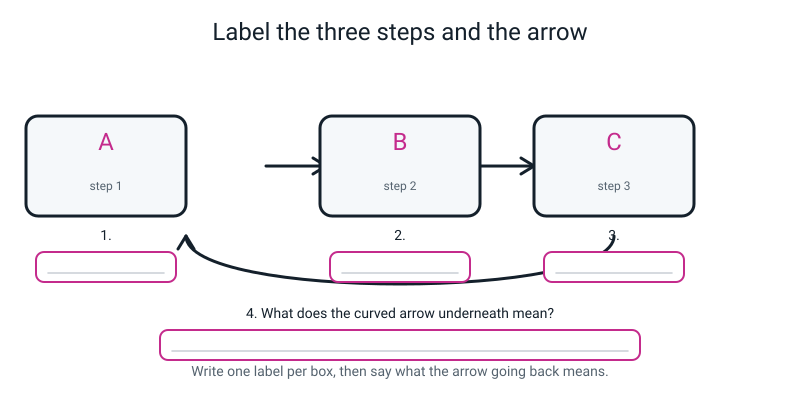
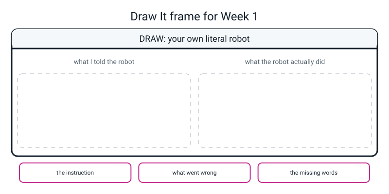

# Workbook — Week 1: Make the Computer Say Something

**Name:** ________________________________  **Date:** ______________

[📖 Read the chapter first](../student-guide/week-01.md) · [Course Home](../README.md) · [🧑‍🏫 Teacher guide](../teacher-guide/week-01.md) · [Next ➡](week-02.md)

---

> **How to use this page.** Everything gets **typed by hand**. Nothing gets pasted, this week or any week. Where a question says *predict first*, write your guess down before you touch the keyboard — a wrong guess you then corrected is worth more than a right one you never thought about.
>
> **You will need:** the laptop, a pencil, and the **BUG LOG** sheet with its three columns.

---

## ✅ Warm-Up (5 min)

Five quick questions about **last year** — Level 1. No laptop needed.

**W1.** What is a **feature**, and what is a **label**? One line each.

Feature: ________________________________________________________

Label: __________________________________________________________

**W2.** You trained a Teachable Machine model on 30 photos of apples and 30 of oranges. Then you showed it a **banana**. What did it say, and whose fault was that?

________________________________________________________________

**W3.** Why do you hide some of your data and test on that, instead of testing on the rows you trained with?

________________________________________________________________

**W4.** Data as a table: what is in a **row**, and what is in a **column**?

Row: ____________________________  Column: ____________________________

**W5.** Give one reason a model can be **wrong** even though nobody made a mistake.

________________________________________________________________

---

## 🔎 Predict the Output

**Four snippets. Write your prediction in the left-hand box BEFORE you run anything.** Then type each one into a scratch file, run it, and write what really happened. If your two columns differ, that difference is the most valuable thing on this page — circle it.

> **💡 Try this:** make one file called `predict.py`, put snippet 1 in it, run it, then delete it and put snippet 2 in. You do not need four files.

---

**Snippet 1**

```python
print(6 * 7)
print("6" * 7)
```

| My prediction | What really happened |
|---|---|
| ________________________ | ________________________ |
| ________________________ | ________________________ |

Which line surprised you, and why? ________________________________

---

**Snippet 2**

```python
print(15 / 4)
print(15 - 20)
print(15 / 5)
```

| My prediction | What really happened |
|---|---|
| ________________________ | ________________________ |
| ________________________ | ________________________ |
| ________________________ | ________________________ |

Line 3 divides exactly. Did the answer still get a dot on it? ______

---

**Snippet 3**

```python
print("15 - 20")
print(3 * "ab")
print("ab" * 3 + "!")
```

| My prediction | What really happened |
|---|---|
| ________________________ | ________________________ |
| ________________________ | ________________________ |
| ________________________ | ________________________ |

---

**Snippet 4**

```python
print("Total:", 5 * 20)
print("Total: 5 * 20")
print()
print("Total:", "5" * 2)
```

| My prediction | What really happened |
|---|---|
| ________________________ | ________________________ |
| ________________________ | ________________________ |
| ________________________ | ________________________ |
| ________________________ | ________________________ |

How many lines came out altogether? ______ (Careful — count again.)

**How many did you get right out of twelve?** ______

Anything from 5 to 10 is exactly where you should be after one lesson. **Twelve out of twelve means next week's are too easy**, and I will make them harder.

---

## ✍️ Practice Set A — Read It

**A1. Fill in the blanks.**

A **program** is a list of ____________________ in a ____________________, done from the ____________________ to the ____________________.

The ____________________ is the thing that reads your file and does what it says. On your laptop it is called ____________________.

Anything after a ____________________ on a line is ignored by Python.

Quote marks mean "the stuff between us is ____________________".

The spelling and punctuation rules of a language are called its ____________________.

---

**A2. Circle the right answer, then answer the true-or-false.**

(a) What does `print("2 + 2")` show?

&nbsp;&nbsp;&nbsp;(a) `4` &nbsp;&nbsp;&nbsp; (b) `2 + 2` &nbsp;&nbsp;&nbsp; (c) an error &nbsp;&nbsp;&nbsp; (d) `22`

Why? ____________________________________________________________

(b) **True or false:** *"An error message means you have broken the computer."*

Circle one: **TRUE** / **FALSE**

Explain in two sentences: ________________________________________

________________________________________________________________

---

**A3. Match the pairs.**

| Word | Letter | | | Meaning |
|---|---|---|---|---|
| program | ______ | | **A** | A note in your file that Python ignores completely |
| interpreter | ______ | | **B** | The instruction that puts something on the screen |
| print | ______ | | **C** | A list of instructions in a file, done top to bottom |
| comment | ______ | | **D** | The spelling and punctuation rules of a language |
| syntax | ______ | | **E** | The program that reads your file and does what it says |

---

**A4. Trace it.** Here is a file. Write exactly what it prints, line by line.

```python
# order.py - the order things come out in.
print("Starter")
print("Main")
print("Pudding")
```

```
________________________
________________________
________________________
```

Now **swap line 2 and line 4** (the `Starter` line and the `Pudding` line). What does it print now?

```
________________________
________________________
________________________
```

In one sentence, what rule did that prove? ______________________________

________________________________________________________________

---

**A5. Spot the bug.** Three broken lines. For each: say what is wrong, write the **error type** you expect, and write the fix. Do not run them yet — answer first, *then* check.

(a)
```python
print("Hello)
```

What's wrong: ____________________________________________________

Error type I expect: ____________________  Fix: ____________________

(b)
```python
Print("Hello")
```

What's wrong: ____________________________________________________

Error type I expect: ____________________  Fix: ____________________

(c)
```python
print(Cricket)
```

What's wrong: ____________________________________________________

Error type I expect: ____________________  Fix: ____________________

Two of those three give the **same** error type from **completely different** causes. Which two, and what is the one complaint Python is making in both? 

________________________________________________________________

---

**A6. Label the diagram.**

Three boxes and an arrow that curls back underneath. Write one label per box, then say what the curved arrow means.


*Figure W1.1 — The loop you will go round about four thousand times this year.*

Next to each box, also write **which window** you are in — the editor or the terminal.

Box **A** = ____________________  Window: ____________________

Box **B** = ____________________  Window: ____________________

Box **C** = ____________________  Window: ____________________

The curved arrow means: __________________________________________

---

## ✍️ Practice Set B — Write It

Now you write the code. Every file starts with a comment on line 1 saying what the file is for.

---

**B1. One line.** Print your age in days, **without typing the answer**.

Your line:

```python
________________________________________________________________
```

**Expected output** (yours will differ — use your own age):

```text
Age in days: 4380
```

**"Done" looks like:** the number in the output does **not** appear anywhere in your code. If you typed `4380`, the computer did no work and this question scores zero however right the arithmetic is.

---

**B2. Two lines and a border.** Print a heading, then a line of exactly **twenty dashes** underneath it — and make the computer produce the dashes rather than you typing twenty of them.

Your file:

```python
________________________________________________________________

________________________________________________________________

________________________________________________________________
```

**Expected output:**

```text
MY TOP SCORES
--------------------
```

**"Done" looks like:** there is exactly one `-` character between the quotes in your file.

---

**B3. Five sums.** Write `sums.py` — five sums you would rather not do in your head. **At least one must use `/`.** One comment per line, and the comment says *why*, not *what*.

Write the five sums you chose:

1. ____________________________  2. ____________________________

3. ____________________________  4. ____________________________

5. ____________________________

**"Done" looks like:** five lines of output, five numbers, and at least one of them has a decimal point on it that you did not type.

Which of your five answers came out ugliest? ______________________

Write it out exactly: ____________________________________________

*(That ugliness is real, it is honest, and it takes one character to fix in Week 3.)*

---

**B4. A stall takings sheet.** Write `snack_stall.py`. It must print a heading, two lines that each show some text **and** a number the computer worked out, a total, and the total split three ways. Use brackets where you need the adding to happen before the dividing.

**Expected output** (use these numbers so you can check yourself: 18 samosas at 25, 11 juices at 40, 3 helpers):

```text
--- FRIDAY SNACK STALL ---
Samosas sold at 25 each: 450
Juices sold at 40 each: 440
Everything: 890
Split between 3 helpers: 296.6666666666667
```

**"Done" looks like:** none of `450`, `440`, `890` or the long ugly number appears in your file. Every one of them was computed.

One line needs brackets or it gives the wrong answer. Which, and what goes wrong without them?

________________________________________________________________

---

**B5. The Party Planner — the big one.** Write `party_planner.py`: **fifteen lines**, including the comment on line 1.

It must have:

- [ ] line 1 — a comment saying what the file is
- [ ] a border made by **repeating one character**, at the top and again at the bottom
- [ ] a title line
- [ ] **at least six** lines that show some text and a number the computer worked out
- [ ] one line using `/`
- [ ] one line using brackets to force the adding before the dividing
- [ ] one line that draws something with **repeated text** rather than a number
- [ ] a comment on every line that does a sum, saying *why*

Use these facts so your output can be checked: **12 guests · 3 slices each · 8 slices in a pizza · pizzas cost 8.50 · drinks cost 1.25 each · 13 candles.**

**Expected output:**

```text
============================
      PARTY PLANNER
============================
Guests: 12
Slices each: 3
Slices needed: 36
Pizzas needed: 4.5
Pizzas to order: 5
Pizza cost: 42.5
Drinks cost: 15.0
Everything: 57.5
Cost per guest: 4.791666666666667
Candles on the cake: |||||||||||||
```

Two questions once it runs:

(a) `Pizzas needed` came out as `4.5`. Can you order 4.5 pizzas? What did you do about it, and is that honest?

________________________________________________________________

(b) **Count how many times you typed the number `12` in this file.** ______

Now imagine one more guest turns up. **How many lines would you have to edit?** ______

________________________________________________________________

*(Hold that number. It is the entire reason Week 2 exists.)*

---

## 🐞 Fix the Broken Program

Here is `party_bill.py`. It has **three** things wrong with it: one that stops Python reading the file at all, one that stops it halfway through, and one that does not produce an error message of any kind and is therefore the nastiest of the three.

```python
 1  # party_bill.py - what my party costs. THREE THINGS ARE WRONG.
 2
 3  print("=== PARTY BILL ===)
 4  print("Guests:", 14)
 5  print("Pizzas:", 5)
 6  prnt("Pizza cost:", 5 * 8.50)
 7  print("Drinks cost:", 14 * 1.25)
 8  print("Everything:", 5 * 8.50 + 14 * 1.25)
 9  print("Party bags needed:", "14" * 2)
10  print("=" * 18)
```

**Type it in with the bugs**, save it as `party_bill.py`, and run it. Fix **one** thing at a time and run again after each fix.

> **⚠️ Watch out:** the numbers down the left-hand side are **line numbers**, not part of the program. Do not type them. They are there so we can talk about "line 6".

**Run 1 — this is what really appears:**

```text
  File "/Users/you/ai-academy/level2/party_bill.py", line 3
    print("=== PARTY BILL ===)
          ^
SyntaxError: unterminated string literal (detected at line 3)
```

**Bug 1.** Which line? ______ What is missing? ____________________

Notice: **nothing at all printed**, not even line 4, which is perfect. Why not?

________________________________________________________________

Your fix: ________________________________________________________

**Run 2 — after fixing bug 1, this is what really appears:**

```text
=== PARTY BILL ===
Guests: 14
Pizzas: 5
Traceback (most recent call last):
  File "/Users/you/ai-academy/level2/party_bill.py", line 6, in <module>
    prnt("Pizza cost:", 5 * 8.50)
NameError: name 'prnt' is not defined. Did you mean: 'print'?
```

**Bug 2.** Which line? ______ Which word is misspelled, **exactly as it appears on screen**? ____________________

This time three lines *did* print before it stopped. What does that tell you about **when** this kind of error is found, compared with bug 1?

________________________________________________________________

Your fix: ________________________________________________________

**Run 3 — after fixing bug 2, this is what really appears:**

```text
=== PARTY BILL ===
Guests: 14
Pizzas: 5
Pizza cost: 42.5
Drinks cost: 17.5
Everything: 60.0
Party bags needed: 1414
==================
```

**Bug 3.** No error message. Nothing is red. The program ran perfectly.

Which line of the **output** is wrong? ____________________________

Fourteen guests need two party bags each. What should that line say? ______

Which line of the **file** caused it, and what exactly did Python do?

________________________________________________________________

Your fix: ________________________________________________________

**Now the question that matters most on this page.** Rank the three bugs from *easiest to find* to *hardest to find*, and say why the order came out that way.

Easiest ____________ → ____________ → hardest ____________

Because: ________________________________________________________

________________________________________________________________

---

## 🧩 Puzzle of the Week

### The Four-Line Mystery

A student ran a file and got exactly this on the screen:

```text
Cricket
Cricket
Cricket
5
```

You never get to see their file. You only get the output.

**P1.** How many `print` lines were in the file (not counting comments)? ______

How do you know? ______________________________________________

**P2.** Write a file that produces exactly that output, using **four** `print` lines. The last line must be a **sum**, not a typed number.

```python
________________________________________________________________

________________________________________________________________

________________________________________________________________

________________________________________________________________

________________________________________________________________
```

**P3.** Now try to produce the **same** output using only **two** `print` lines. Have a real go, run whatever you come up with, and write down what actually happened.

What I tried: ____________________________________________________

What really came out: ____________________________________________

Is it the same output? ______ Why / why not? ____________________

________________________________________________________________

**P4.** Could the last line of the mystery file have been `print(5)` instead of a sum? ______

Can you tell, from the output alone? ______ What does that tell you about output in general?

________________________________________________________________

**P5.** Could the last line have been `print("5")` — with quotes? ______

Run both and compare. What do you see, and why is that slightly alarming?

________________________________________________________________

________________________________________________________________

---

## 🤔 Think Deeper

**T1.** In the chapter there is a claim that sounds backwards: *"an error message is the most helpful thing on the screen."*

Write a paragraph on why. Use one of the errors you personally caused this week as your example, and say what the message told you that you could not have worked out on your own.

________________________________________________________________

________________________________________________________________

________________________________________________________________

________________________________________________________________

________________________________________________________________

________________________________________________________________

---

**T2.** **How much should a computer be allowed to guess what you meant?**

Your phone's autocorrect guesses constantly. Python guesses nothing at all — `print(Hello)` does not become `print("Hello")`, it stops. **Nobody agrees on where the line should be**, and it is a real argument, not a matter of taste.

Write about **two** situations where the answer is different: one where you want the machine to guess, and one where you very much do not. Say what actually decides it.

________________________________________________________________

________________________________________________________________

________________________________________________________________

________________________________________________________________

________________________________________________________________

________________________________________________________________

---

## 🛠️ Build It

### Three files, typed by hand

Three small files, then the Bug Log. About 35 minutes.

| ☐ | Step |
|---|---|
| ☐ | Make sure you are in `ai-academy/level2`. Type `ls` in the terminal and check your Week 1 files are there. |
| ☐ | **`hello_you.py`** — three facts about you. At least one line prints text **and** a number with a comma. |
| ☐ | Run it. No traceback. |
| ☐ | **`sums.py`** — five sums (this is Practice B3; if you have done it, tick and move on). |
| ☐ | Run it. Check at least one answer has a dot on it. |
| ☐ | **`literal.py`** — three lines that *prove* the computer is literal. One of the three must put **quotes round a number** so it repeats instead of multiplying. |
| ☐ | Run it. |
| ☐ | **Break something on purpose**, three times, one at a time, running after each. Log each one. |
| ☐ | Put the Bug Log at the front of your folder. It stays there all year. |

### Results table — fill this in as you go

| File | Ran with no error? | How many lines of output? | One thing that surprised me |
|---|---|---|---|
| `hello_you.py` | ☐ yes ☐ no | ______ | ______________________________ |
| `sums.py` | ☐ yes ☐ no | ______ | ______________________________ |
| `literal.py` | ☐ yes ☐ no | ______ | ______________________________ |
| `party_planner.py` | ☐ yes ☐ no | ______ | ______________________________ |
| `party_bill.py` (fixed) | ☐ yes ☐ no | ______ | ______________________________ |

### The Bug Log — your first three rows

Copy the **last line** of each error out **exactly, character for character**. Then say what it meant **in your own words** — not the words on the screen, yours.

| # | What I saw (last line, copied exactly) | What it meant (my words) | What I changed |
|---|---|---|---|
| 1 | ________________________________ | ________________________ | ________________ |
| 2 | ________________________________ | ________________________ | ________________ |
| 3 | ________________________________ | ________________________ | ________________ |

**(a)** Which of your three was found **before** the program ran at all? ______

How can you tell, just by looking at the message? ________________

________________________________________________________________

**(b)** Why copy the last line out by hand instead of just describing it?

________________________________________________________________

**(c)** Which took longest to find, and why? ____________________

________________________________________________________________

---

## 🎨 Draw It

Invent **your own** literal robot — not the sandwich one. Pick any everyday job (feeding a cat, brushing teeth, packing a bag), write **one** instruction for it, and draw what a completely literal machine would do.


*Figure W1.2 — Your page.*

Fill in the three boxes underneath: **the instruction** · **what went wrong** · **the missing words**.

> **What a good answer might look like:** the job is **"fill the cat's bowl"**.
>
> On the **left** (what I told the robot): the words *fill the cat's bowl*, written on a card.
>
> On the **right** (what the robot did): the bowl filled to the brim — with **water**, because nobody said food. Or filled with cat food *and* the empty tin on top, because nobody said take the tin off. Or the bowl filled so high it is a cone of biscuits spilling onto the floor, because nobody said how much.
>
> Bottom boxes: *fill the cat's bowl* · *it used water, and it never stopped* · *"with dry cat food, up to the line marked inside, then stop"*.
>
> **What a weak answer looks like:** drawing the robot doing something *random* — putting the bowl on its head, throwing it out of the window. That is a broken robot, not a literal one. **Everything the robot does must be genuinely allowed by the sentence you wrote.** That is the whole point: it was not being silly, it was being accurate.

---

## 📊 Self-Check

| I can… | 😀 got it | 🙂 nearly | 😕 not yet |
|---|---|---|---|
| Type, save and run a `.py` file and read the output underneath | ☐ | ☐ | ☐ |
| Use `print()` to show text, and to show the answer to a sum | ☐ | ☐ | ☐ |
| Explain why `"7" * 6` is not the same as `7 * 6` | ☐ | ☐ | ☐ |
| Say in one sentence why the computer is literal rather than smart | ☐ | ☐ | ☐ |
| Read a `NameError` and name the misspelled word from the message alone | ☐ | ☐ | ☐ |
| Say which window I write in and which window I run in | ☐ | ☐ | ☐ |

One thing I'd like explained again:

________________________________________________________________

---

## ✅ Answers

<details>
<summary>Check your answers</summary>

### Warm-Up

**W1.** A **feature** is one measured description of one example — one column in your table. A **label** is the answer you are trying to predict — the column you cover up.

**W2.** It said **apple** or **orange**, confidently. **Your fault, not the machine's** — you gave it two classes and there is no banana box. A model can only ever answer with a class you built.

**W3.** Because a model can memorise the rows it was trained on and look brilliant while having learned nothing that transfers. Testing on hidden rows is the only way to find out whether it works on something it has never seen — which is the only thing you actually care about.

**W4.** A **row** is one example — one apple, one pupil, one match. A **column** is one thing measured about every example.

**W5.** Any of: two examples genuinely overlap (a heavy apple weighs the same as a light orange); the measurement is imprecise; the training data did not contain anything like this new case; the world itself is not perfectly predictable. **A hard job should produce some wrong answers.**

---

### Predict the Output

**Snippet 1** — real output:

```text
42
6666666
```

`6 * 7` is two numbers, so `*` multiplies: **42**. `"6" * 7` has **quotes**, so the six is *text*, and there is no way to multiply the letter six — so `*` does its other job and **repeats** it seven times. Seven copies of the character `6`.

**The one that surprises everybody is line 2**, and the lesson is that the quotes did not decorate the six, they changed what the six *was*.

**Snippet 2** — real output:

```text
3.75
-5
3.0
```

`15 / 4` is a genuine fraction: `3.75`. `15 - 20` is `-5`, and negative numbers are completely ordinary. And line 3 is the interesting one: **`15 / 5` printed `3.0`, not `3`.** It divided exactly and *still* got a dot. `/` always leaves a decimal point on the answer, whether one was needed or not.

**Snippet 3** — real output:

```text
15 - 20
ababab
ababab!
```

Line 1 is in quotes, so it is six characters of text and Python never looks at it as a sum. Line 2: text and a number, so it repeats — and note it works **either way round**, `3 * "ab"` is the same as `"ab" * 3`. Line 3: the repeating happens first, then `+` glues the `!` on the end.

**Snippet 4** — real output:

```text
Total: 100
Total: 5 * 20
(a blank line)
Total: 55
```

Four lines out. Line 1: the comma printed a **space**, and `5 * 20` was worked out. Line 2: all inside quotes, so it is characters. Line 3: `print()` with nothing in it gives a **completely blank line** — easy to miss when you count. Line 4: `"5" * 2` is `55` as *text*, not `10`.

**Count check:** four lines, one of which is blank. If you said three, you forgot `print()` produces a line.

---

### Practice Set A

**A1.** instructions · file · top · bottom · **interpreter** · **`python3`** · **`#`** (hash) · **text** · **syntax**.

**A2.**

(a) **(b) `2 + 2`.** The quotes make it text, so Python shows the five characters and never treats it as a sum. It does not even *look* at them as maths — it cannot, they are in quotes.

(b) **FALSE.** Python reads your file, finds a line it cannot understand, prints a message saying where and why, and stops. Nothing is damaged — not the file, not Python, not the laptop. **You cannot break a computer by typing a wrong instruction.** An error message costs you four seconds and it is a signpost, not a punishment.

**A3.** program = **C** · interpreter = **E** · print = **B** · comment = **A** · syntax = **D**.

**A4.** Real output:

```text
Starter
Main
Pudding
```

After swapping:

```text
Pudding
Main
Starter
```

**The rule it proves: Python does the lines in the order they appear, from the top to the bottom, always.** Nothing else changed — same three instructions, different order, different output. That is the whole model, and it holds with no exceptions until Week 5.

**A5.**

(a) The **closing quote** is missing. Real message:

```text
  File "/Users/you/ai-academy/level2/oops.py", line 1
    print("Hello)
          ^
SyntaxError: unterminated string literal (detected at line 1)
```

Fix: `print("Hello")`. Python opened a quote, kept reading looking for its partner, and ran out of line.

(b) **Capital `P`.** Python is case-sensitive, so `Print` and `print` are two different words and only one of them exists. Real message:

```text
Traceback (most recent call last):
  File "/Users/you/ai-academy/level2/oops.py", line 1, in <module>
    Print("Hello")
NameError: name 'Print' is not defined. Did you mean: 'print'?
```

Fix: make it lowercase.

(c) **The quotes are missing**, so `Cricket` is read as a **name** rather than as text — Python goes looking for a thing called `Cricket` and there isn't one. Real message:

```text
Traceback (most recent call last):
  File "/Users/you/ai-academy/level2/oops.py", line 1, in <module>
    print(Cricket)
NameError: name 'Cricket' is not defined
```

Fix: `print("Cricket")`.

**The two that share an error type: (b) and (c), both `NameError`.** One is a misspelling and one is missing quotes — completely different mistakes. But from Python's side it is the **same single complaint**: *"you used a name and I have never heard of it."* Notice (b) got a `Did you mean:` hint and (c) did not, because in (c) there was nothing close enough to guess.

**A6.**

| Box | Label | Window |
|---|---|---|
| **A** | **Type it** — write the instructions | the **editor** |
| **B** | **Save it** — the filled dot in the tab disappears | the **editor** |
| **C** | **Run it** — `python3 hello.py` | the **terminal** |

**The curved arrow means: it broke, or it wasn't what you wanted — change one thing and go round again.** It is not a failure arrow. It is the normal path, and you take it far more often than you go straight through.

*(Note that A and B are both in the editor. That catches people: saving is a separate action from typing, and it is the one the computer can actually see.)*

---

### Practice Set B

**B1.** Model answer, run for real:

```python
print("Age in days:", 12 * 365)
```

```text
Age in days: 4380
```

**Marking:** is `4380` anywhere in the file? It must not be. `print("Age in days: 4380")` produces identical output and scores zero, because the computer did no work — and the whole point of having a computer is that it does the work.

**B2.** Model answer:

```python
# border.py - a heading with a line under it.

print("MY TOP SCORES")          # a heading, just text
print("-" * 20)                 # twenty dashes, made by repeating one character
```

```text
MY TOP SCORES
--------------------
```

The point of `"-" * 20` rather than twenty typed dashes: to change it to thirty you edit **one character**, and you can never miscount. Typing twenty dashes by hand, you will end up with nineteen or twenty-one and never notice.

**B3.** Model answer:

```python
# sums.py - five sums I did not do in my head.

print(24 * 7)          # hours in a week
print(365 * 24)        # hours in a year
print(100 / 7)         # a hundred split seven ways
print(2000 - 1547)     # how far off a target of 2000
print(12 + 12 + 12)    # three twelves, the long way
```

```text
168
8760
14.285714285714286
453
36
```

**The ugliest answer is `14.285714285714286`**, and it is completely honest: `100 / 7` is not a neat number, so Python shows every digit it has room for. Seventeen of them. It looks absurd and it is exactly right.

**"How do I make it stop?"** — Week 3, and it takes one extra piece of punctuation. Being irritated by it now is the correct reaction and it is why Week 3 exists.

**B4.** Model answer:

```python
# snack_stall.py - what the snack stall took on Friday.

print("--- FRIDAY SNACK STALL ---")        # a heading
print("Samosas sold at 25 each:", 18 * 25) # 18 samosas
print("Juices sold at 40 each:", 11 * 40)  # 11 juices
print("Everything:", 18 * 25 + 11 * 40)    # both lots added
print("Split between 3 helpers:", (18 * 25 + 11 * 40) / 3)  # brackets first
```

```text
--- FRIDAY SNACK STALL ---
Samosas sold at 25 each: 450
Juices sold at 40 each: 440
Everything: 890
Split between 3 helpers: 296.6666666666667
```

**The line that needs brackets is the last one.** Without them, `18 * 25 + 11 * 40 / 3` does the times and the divide **before** the plus — exactly as in maths class — so only the juice money gets divided. Real output of the broken version:

```python
print(18 * 25 + 11 * 40 / 3)
```

```text
596.6666666666666
```

`596.67` instead of `296.67`. **No error message. Just a wrong answer that looks perfectly plausible.** This is the same shape of problem as bug 3 in the Fix-It section, and it is the kind you have to catch by *reading your own output and asking whether it makes sense*.

**B5.** Model answer — fifteen lines, run for real:

```python
# party_planner.py - everything my party needs, worked out by the computer.

print("=" * 28)                              # a border made of 28 equals signs
print("      PARTY PLANNER")                 # the title, pushed across a bit
print("=" * 28)                              # the same border again
print("Guests:", 12)                         # how many people are coming
print("Slices each:", 3)                     # how much pizza one person eats
print("Slices needed:", 12 * 3)              # guests times slices each
print("Pizzas needed:", 12 * 3 / 8)          # 8 slices in a pizza
print("Pizzas to order:", 5)                 # 4.5 is not orderable, so round up
print("Pizza cost:", 5 * 8.50)               # 5 pizzas at 8.50 each
print("Drinks cost:", 12 * 1.25)             # one drink per guest at 1.25
print("Everything:", 5 * 8.50 + 12 * 1.25)   # both lots added
print("Cost per guest:", (5 * 8.50 + 12 * 1.25) / 12)   # split it 12 ways
print("Candles on the cake:", "|" * 13)      # 13 candles, drawn with text
```

```text
============================
      PARTY PLANNER
============================
Guests: 12
Slices each: 3
Slices needed: 36
Pizzas needed: 4.5
Pizzas to order: 5
Pizza cost: 42.5
Drinks cost: 15.0
Everything: 57.5
Cost per guest: 4.791666666666667
Candles on the cake: |||||||||||||
```

**(a) `4.5` pizzas.** You cannot order half a pizza, so you round up to 5 — and the honest thing to do is what this file does: print **both** numbers, so a reader can see the real figure and the decision you made about it. What is **not** honest is quietly printing `5` and letting the reader think the sum came out at 5. Right now you have to type the 5 yourself, which means the computer is not doing that rounding — you are. There is a proper tool for it and it arrives in Week 3.

**(b) The number `12` is typed five times** (guests, slices needed, pizzas needed, drinks cost, everything, cost per guest — count them on your own file; in the model answer above it appears on six lines).

**One more guest means editing every single one of those lines.** And you will miss one. Everybody misses one — that is not carelessness, it is what happens to human beings asked to keep six copies of a fact in step.

**That is exactly the problem Week 2 fixes**, with one idea: give the number a name, write it once, and use the name everywhere else. Then one more guest is a **one-line** edit.

---

### Fix the Broken Program

**Bug 1 — line 3, the closing quote is missing.** Real message:

```text
  File "/Users/you/ai-academy/level2/party_bill.py", line 3
    print("=== PARTY BILL ===)
          ^
SyntaxError: unterminated string literal (detected at line 3)
```

**Nothing printed at all**, not even line 4, because a `SyntaxError` is found **before the program runs**. Python could not *read* the file, so it never started it. Notice what is missing from the top of the message: there is no `Traceback (most recent call last):`. That absence is a real, useful clue.

Fix: `print("=== PARTY BILL ===")`.

**Bug 2 — line 6, `prnt` should be `print`.** Real message after fixing bug 1:

```text
=== PARTY BILL ===
Guests: 14
Pizzas: 5
Traceback (most recent call last):
  File "/Users/you/ai-academy/level2/party_bill.py", line 6, in <module>
    prnt("Pizza cost:", 5 * 8.50)
NameError: name 'prnt' is not defined. Did you mean: 'print'?
```

**This time three lines printed first.** That is the whole difference: a `NameError` happens **while** the program is running, so everything above the problem had already happened. A `SyntaxError` happens **before** it starts, so nothing at all happens.

The misspelled word, exactly as it appears on screen, is **`prnt`** — and Python has already guessed the fix for you.

Fix: put the `i` back.

**Bug 3 — line 9, `"14" * 2` should be `14 * 2`.** Real output after fixing bugs 1 and 2:

```text
=== PARTY BILL ===
Guests: 14
Pizzas: 5
Pizza cost: 42.5
Drinks cost: 17.5
Everything: 60.0
Party bags needed: 1414
==================
```

`Party bags needed: 1414` is wrong. It should be **28** — fourteen guests, two bags each.

What Python did: the quotes made `"14"` **text**, so `*` repeated it twice, giving the four characters `1414`. Python did exactly what it was told. There is nothing to complain about, so it did not complain.

Fix: remove the quotes. Real output of the fully mended file:

```text
=== PARTY BILL ===
Guests: 14
Pizzas: 5
Pizza cost: 42.5
Drinks cost: 17.5
Everything: 60.0
Party bags needed: 28
==================
```

**The ranking, and the point of the whole exercise:**

**Easiest: bug 1** → **bug 2** → **hardest: bug 3.**

Bugs 1 and 2 both told you the line number and, in bug 2's case, the actual word. Bug 3 told you nothing, because from Python's point of view nothing went wrong. **The only thing that catches a bug 3 is a human reading the output and asking "does that make sense?"**

That habit — read your own output, check it is sensible — matters more every single week from here. In Week 3 you meet a bug where forgetting one letter prints curly braces instead of a number, silently. In Week 30 you will train a model that reports 97% accuracy and you will have to ask whether that number makes sense. Same habit. It starts on this page.

---

### Puzzle of the Week

**P1. Four.** Each `print` produces exactly one line of output, so four lines out means four `print` lines.

**P2.** Model answer, run for real:

```python
# mystery.py - four prints, four lines out.
print("Cricket")
print("Cricket")
print("Cricket")
print(2 + 3)
```

```text
Cricket
Cricket
Cricket
5
```

**P3.** The natural idea is `"Cricket" * 3`, because `*` repeats text. Try it:

```python
print("Cricket" * 3)
print(2 + 3)
```

```text
CricketCricketCricket
5
```

**That is not the same output.** All three Crickets came out on **one line**, glued together. Repeating text does not create new lines — it makes one longer piece of text.

**So the honest answer is: you cannot do it with what you know today.** Getting three separate lines out of a single `print` needs something we have not met.

**If you tried it, ran it, saw `CricketCricketCricket` and wrote "that's not the same, it's all on one line" — that is full marks.** That is exactly the right kind of thinking, and finding out that the answer is "not yet" is a real result, not a failure.

**P4. Yes, it could have been `print(5)`.** `print(5)` and `print(2 + 3)` produce output that is character-for-character identical.

**And no, you cannot tell from the output.** Which is a genuinely important idea: **output hides how it was made.** Looking at a `5` on a screen, you have no way to know whether a computer worked it out or a human typed it. This comes back in Week 27, when we look at charts that hide their arithmetic.

**P5. Yes — and this is the sting.** Run both:

```python
print(5)
print("5")
```

```text
5
5
```

**Identical.** The screen cannot show you the difference between the number 5 and the text `"5"`.

Why that is alarming: those two things **behave completely differently**. You already know it — `7 * 6` is `42` and `"7" * 6` is `777777`. So here are two values that print exactly the same and do totally different things when you use them, and **there is nothing on the screen that tells them apart.**

That is Week 2's entire problem, and Week 2 gives you a torch for it. If you got here on your own, write your name and today's date in the margin.

---

### Think Deeper

**T1. Model answer:**

> I misspelled `print` as `prnt` on line 3 and got `NameError: name 'prnt' is not defined. Did you mean: 'print'?`
>
> At first it looked like a telling-off, because it is a block of text that appears when something has gone wrong. But when I actually read it, it had done three separate favours for me. It told me **what** kind of problem it was — a name it did not recognise, not a punctuation problem. It told me **where** — line 3, so I did not have to search. And it even told me **what it should probably say**, because modern Python guesses.
>
> The thing I could not have worked out on my own is the line number. My file was only four lines, so it did not matter much, but the same message on a two-hundred-line file would have saved me twenty minutes of hunting. And I could not have known it was a *name* problem rather than a bracket problem without being told — I would have started counting brackets, which would have been the wrong search entirely.
>
> So the message was not the computer complaining about me. It was the computer handing me the three things I needed. The only mistake available was not reading it.

*Full marks needs:* a **specific** error the student actually caused, and at least two things the message told them that they could not have worked out themselves.

**T2. Model answer:**

> **When I want the machine to guess:** typing a message to a friend. If I type `teh`, I want autocorrect to fix it silently and let me keep going. If it stopped and said `SpellingError: 'teh' is not a word` and refused to send the message until I fixed it, texting would be unbearable. The cost of a wrong guess is tiny — my friend reads a slightly odd word and works it out, or I notice and retype it. And I would find out about it immediately, because the message is right there on my screen.
>
> **When I very much do not want it to guess:** a program working out how much medicine somebody gets. If it stops and says "these two numbers don't go together", a nurse sees the error, checks it, and nobody is harmed — the cost is a delay. If it guesses and gets it wrong, somebody could be given ten times the right dose, and there is nothing at all on the screen to warn anyone.
>
> **What actually decides it: how bad it is to be wrong, and how quickly you would find out.** Autocorrect is guessing about something cheap and instantly visible. Medicine software is guessing about something expensive and invisible. So it isn't that guessing is good or bad — it depends entirely on what happens next.
>
> One thing I think is true either way: **a machine that guesses should tell you it guessed.** Autocorrect underlines the word it changed. The dangerous version is the one that guesses silently.

*Full marks needs:* two situations with genuinely different stakes, and the recognition that what decides it is **consequences and visibility**, not which behaviour is cleverer.

---

### Build It

**`hello_you.py`** — model answer, run for real:

```python
# hello_you.py - three facts about me, printed.

print("My name is Ramana.")             # a line of text
print("I am in Year 7.")                # another line of text
print("My favourite number is", 7)      # text and a number, comma-separated
```

```text
My name is Ramana.
I am in Year 7.
My favourite number is 7
```

Mark for: a comment on line 1 · three `print` lines · no traceback · the filename exactly `hello_you.py` — lowercase, one underscore, no spaces.

**`literal.py`** — model answer, run for real:

```python
# literal.py - three lines that prove the computer is literal, not clever.

print(2 + 2)          # arithmetic: the computer works it out
print("2 + 2")        # text: the computer just shows the characters
print("2" * 4)        # text repeated four times, NOT eight
```

```text
4
2 + 2
2222
```

Mark for the third line specifically: **does one line put quotes round a number and get repetition instead of multiplication?** `print("2" * 4)` giving `2222` rather than `8` is the evidence, and it is the whole objective.

**The Bug Log.** Your three errors are your own — what is being marked is the **structure**. A full-credit row has all three columns, the last line copied **exactly**, and the middle column in **your** words rather than the screen's.

Model rows, using the three errors this week's work really produces:

| # | What I saw (last line, copied exactly) | What it meant (my words) | What I changed |
|---|---|---|---|
| 1 | `NameError: name 'prnt' is not defined. Did you mean: 'print'?` | It doesn't know a word called prnt. I spelled print wrong. It even guessed what I meant. | Put the `i` back in `print`, on line 3. |
| 2 | `SyntaxError: '(' was never closed` | I opened a bracket and never closed it, so Python couldn't finish reading the line. | Added `)` at the end of line 4. |
| 3 | `SyntaxError: unterminated string literal (detected at line 5)` | I opened a quote and never closed it. Python kept reading looking for the other one and ran out of line. | Added the closing `"` before the `)` on line 5. |

**(a) Which was found before the program ran?** The two **`SyntaxError`**s.

**How you can tell, from the message alone:** there is **no** `Traceback (most recent call last):` heading above them. That heading only appears for errors that happen *while* the program is running. Also, no output at all appeared — not even from the perfectly good lines above the broken one.

**(b) Why copy it out by hand?** Because next time you see it you want to recognise it **instantly**, and you only recognise exact wording if you have written exact wording. Also: *"it said something about a name"* is not searchable, and `NameError: name 'prnt' is not defined` is.

**(c) Which took longest?** Any honest answer. The pattern worth knowing: the **misspelling** is usually fastest, because Python names the word and often guesses the fix. The **missing quote** is usually slowest, because the `^` marker can point at a line that looks completely fine — Python carried on reading past the end of your text, so the complaint surfaces *later* than the mistake.

---

### Draw It

There is no single right drawing. A strong answer does three things:

1. **The instruction on the left is a real, ordinary sentence** — something a human would actually say, not a deliberately silly one. The whole force of the idea comes from the sentence being perfectly reasonable.
2. **Everything the robot does on the right is genuinely allowed by that sentence.** If the robot does something the words do not permit, you have drawn a broken robot instead of a literal one, and the point is lost.
3. **The third box actually fixes it.** "Be more careful" is not a fix. The fix is *more words* — usually two or three extra clauses saying what to open, how many, and where it ends up.

Test your own drawing with one question: **could a person read your left-hand sentence and honestly do the right-hand thing?** If not, redraw the right-hand side until they could.

</details>

---

[📖 Week 1 chapter](../student-guide/week-01.md) · [Course Home](../README.md) · [Week 2 workbook ➡](week-02.md) · [Glossary](../../glossary.md)
