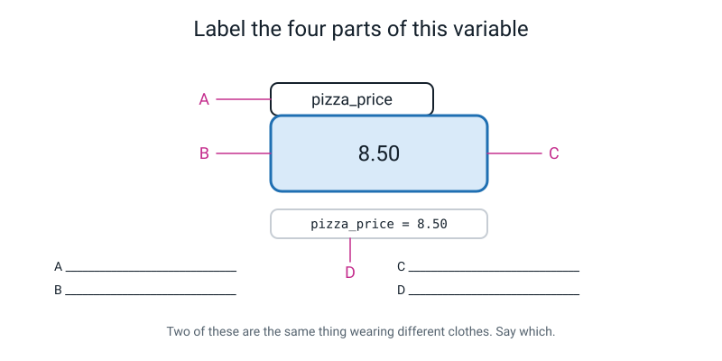
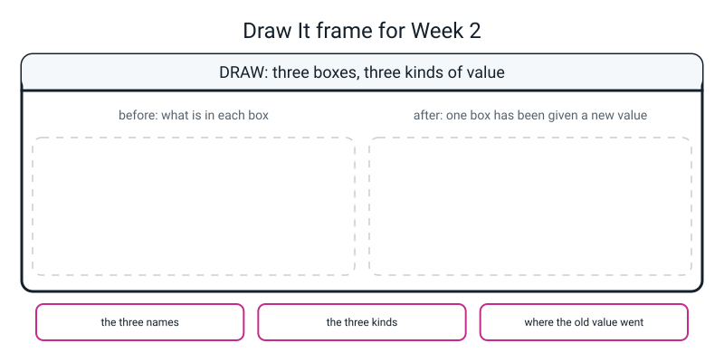

# Workbook — Week 2: Boxes With Names On: Variables and Types

**Name:** ________________________________  **Date:** ______________

[⬅ Week 01](week-01.md) · [📖 Read the chapter first](../student-guide/week-02.md) · [Course Home](../README.md) · [🧑‍🏫 Teacher guide](../teacher-guide/week-02.md) · [Next ➡](week-03.md)

---

> **How to use this page.** Type everything. Nothing gets pasted, all year. Read every `=` out loud as **"gets"** — every single time, until it feels normal. And where a question says *predict first*, write your guess down before you touch the keyboard.
>
> **You will need:** the laptop, a pencil, and the **BUG LOG** from Week 1. Today adds at least two rows to it.

---

## ✅ Warm-Up (5 min)

Five quick questions about **Week 1**. No laptop.

**W1.** What is a **program**?

________________________________________________________________

**W2.** What does `print("2 + 2")` show, and why?

________________________________________________________________

**W3.** You get `NameError: name 'prit' is not defined` on line 5. What do you do, in order?

________________________________________________________________

**W4.** Which line of a traceback do you read first, and what is on it?

________________________________________________________________

**W5.** Why must you type code instead of pasting it? Give the *sneaky* reason, not just the obvious one.

________________________________________________________________

---

## 🔎 Predict the Output

**Four snippets. Fill in the prediction column BEFORE you run anything.** Then type each one into a scratch file, run it, and write down the truth.

Some of these are deliberately mean. **Being wrong here is the useful part** — a wrong guess shows you what you *believe*, and then you can fix the belief instead of the line.

---

**Snippet 1 — the one that catches adults**

```python
score = 12
bonus = 3
score = bonus
bonus = 10
print(score, bonus)
```

My prediction: `score` is ________ and `bonus` is ________

What really happened: ____________________________________________

If you got this wrong, write out what line 3 actually **handed over**:

________________________________________________________________

---

**Snippet 2 — the trailing zero**

```python
print(8.50)
print("8.50")
print(8.50 * 2)
print("8.50" * 2)
```

| My prediction | What really happened |
|---|---|
| ________________________ | ________________________ |
| ________________________ | ________________________ |
| ________________________ | ________________________ |
| ________________________ | ________________________ |

Two of those four lines start from characters that look identical in the file. What made them behave differently?

________________________________________________________________

---

**Snippet 3 — converting**

```python
print(int("12") + 1)
print("12" + "1")
print(float("12") + 1)
print(int(9.99))
```

| My prediction | What really happened |
|---|---|
| ________________________ | ________________________ |
| ________________________ | ________________________ |
| ________________________ | ________________________ |
| ________________________ | ________________________ |

Line 4 is the one almost everybody gets wrong. Why is it **not** `10`?

________________________________________________________________

---

**Snippet 4 — reassignment and types**

```python
weekly = 5.50
weekly = 6.25
total = weekly * 4
print(total)
print(type(total))
```

My prediction: `total` prints as ____________ and its type is ____________

What really happened: ____________________________________________

`6.25 × 4` is exactly 25. So why did it print with a `.0` on the end?

________________________________________________________________

**How many of the twelve did you get right?** ______

---

## ✍️ Practice Set A — Read It

**A1. Will Python accept this name?** Answer yes or no. If no, say what happens.

| # | Name | Accepted? | What happens / why |
|---|---|---|---|
| (a) | `pizza_price` | ______ | ______________________________ |
| (b) | `2score` | ______ | ______________________________ |
| (c) | `top-score` | ______ | ______________________________ |
| (d) | `class` | ______ | ______________________________ |
| (e) | `total price` | ______ | ______________________________ |

---

**A2. Legal but bad.** All four of these are names Python will happily accept. For each, say why it is a poor name and give a better one.

| Name | Why it's poor | Better |
|---|---|---|
| `x` | ______________________________ | ______________ |
| `num1` | ______________________________ | ______________ |
| `TotalPrice` | ______________________________ | ______________ |
| `data` | ______________________________ | ______________ |

**The sentence to remember:** in two weeks you will be a ______________ reading your own file.

---

**A3. Trace it.** Read each line out loud as "gets". Then write what is in each box after each line.

```python
weekly = 5.50
weekly = 6.25
total = weekly * 4
```

| After line | `weekly` holds | `total` holds |
|---|---|---|
| 1 | ______________ | ______________ |
| 2 | ______________ | ______________ |
| 3 | ______________ | ______________ |

Where did `5.50` go? ______________________________________________

---

**A4. Spot the bug.** Four broken pieces of code. Say what is wrong, name the error type you expect, and give the fix. Answer first, *then* check.

(a)
```python
8.50 = pizza_price
```
Wrong: ______________________  Error: ______________  Fix: ______________

(b)
```python
pizza_price = 8.50
print(Pizza_price)
```
Wrong: ______________________  Error: ______________  Fix: ______________

(c)
```python
print(total)
total = 17.0
```
Wrong: ______________________  Error: ______________  Fix: ______________

(d)
```python
print(false)
```
Wrong: ______________________  Error: ______________  Fix: ______________

**All four produce either a `SyntaxError` or a `NameError`, and not one of them is a spelling mistake in the ordinary sense.** What is the one thing (b), (c) and (d) have in common, from Python's point of view?

________________________________________________________________

---

**A5. Label the diagram.**


*Figure W2.1 — Four labels, three different things.*

**A** = ________________________  **B** = ________________________

**C** = ________________________  **D** = ________________________

**Two of these are the same thing wearing different clothes. Which two, and what is the thing?**

________________________________________________________________

Also: how would you read **D** out loud? ________________________

---

**A6. Name the type, then check it.** Fill in your guess. *Then* run the checking line and write what really came back.

| # | Value | My guess | `type()` really returns |
|---|---|---|---|
| (a) | `42` | ____________ | ____________________ |
| (b) | `42.0` | ____________ | ____________________ |
| (c) | `"42"` | ____________ | ____________________ |
| (d) | `4 / 2` | ____________ | ____________________ |
| (e) | `"4" * 2` | ____________ | ____________________ |
| (f) | `-7` | ____________ | ____________________ |
| (g) | `""` | ____________ | ____________________ |
| (h) | `True` | ____________ | ____________________ |

The checking line looks like this — one per value:

```python
print(42, type(42))
```

Which two surprised you most? ______ and ______

---

## ✍️ Practice Set B — Write It

Every file starts with a comment on line 1. Read every `=` out loud as "gets".

---

**B1. One line.** Print the **value** of `4 / 2` and its **type**, in one `print`.

```python
________________________________________________________________
```

**Expected output:**

```text
2.0 <class 'float'>
```

**"Done" looks like:** one line of code, two things separated by a comma inside the brackets.

---

**B2. Two boxes and one sum.** Write `money.py`: a price, a count, a total the computer works out, and the type of the total.

```python
________________________________________________________________

________________________________________________________________

________________________________________________________________

________________________________________________________________

________________________________________________________________

________________________________________________________________
```

**Expected output** (use price `8.50` and count `3` so you can check yourself):

```text
Total: 25.5
Type: <class 'float'>
```

**Then the payoff test.** Change `count` to 4. How many lines did you edit? ______

New output: ____________________________________________________

---

**B3. Marks that arrived as text.** Three exam marks have come off a form, so they are **text**: `"78"`, `"84"`, `"71"`. Write `marks.py` which converts them, adds them, and prints the total and the average. Then add **one more line** that glues the three pieces of text together instead, so you can see the difference.

**Expected output:**

```text
Total  : 233
Average: 77.66666666666667
Glued instead of added: 788471
```

Which conversion did you use — `int()` or `float()`? ______ Why?

________________________________________________________________

The last line did **not** crash. Why does Python allow three strings to be added together, when it refused `"5" + 5`?

________________________________________________________________

---

**B4. Rewrite it so no number is typed twice.** Here is a working file with a problem:

```python
print("Total:", 8.50 * 3)
print("Each of 5 pays:", 8.50 * 3 / 5)
```

```text
Total: 25.5
Each of 5 pays: 5.1
```

It works. It is also horrible: `8.50` appears twice, `3` appears twice, and `5` appears twice — once as a number and once **buried inside a piece of text**.

Rewrite it as `bill.py` so that **every number appears exactly once**, and the output is the same.

```python
________________________________________________________________

________________________________________________________________

________________________________________________________________

________________________________________________________________

________________________________________________________________

________________________________________________________________

________________________________________________________________

________________________________________________________________
```

**"Done" looks like:** the `5` in `"Each of 5 pays:"` is **not** typed either. It comes out of the variable. (That is the hard half of this question.)

Now change the number of friends to 4. How many lines did you edit? ______

---

**B5. The type chain.** Start with the text `"3.9"`. End with the whole number `3`. Print the value **and** its type at every step, so there are three steps and three lines of output.

```python
________________________________________________________________

________________________________________________________________

________________________________________________________________

________________________________________________________________

________________________________________________________________

________________________________________________________________
```

**Expected output:**

```text
3.9 <class 'str'>
3.9 <class 'float'>
3 <class 'int'>
```

**Now the important question. Why can't you go straight from `"3.9"` to an int in one step?** Try it, write down the real error, and explain it.

The error I got: __________________________________________________

Why: ____________________________________________________________

---

## 🐞 Fix the Broken Program

Here is `tuck_shop.py`. **Three** things are wrong: one stops Python reading the file at all, one stops it partway through, and one produces no error whatsoever and simply tells you something untrue.

```python
 1  # tuck_shop.py - what the tuck shop took today. THREE THINGS ARE WRONG.
 2
 3  bars sold = "25"                          # bars sold, written down off a tally sheet
 4  bar_price = 0.75                          # pounds for one chocolate bar
 5  juices_sold = 14                          # juice cartons sold today
 6  juice_price = 1.20                        # pounds for one juice
 7
 8  bar_money = bars_sold * bar_price         # what the bars brought in
 9  juice_money = juices_sold * juice_price   # what the juice brought in
10
11  print("Bar money  :", bar_money)
12  print("Juice money:", juice_money)
13  print("Everything :", bar_money + juice_money)
14  print("Juice money to the nearest pound:", int(juice_money))
```

Type it in **with the bugs**, save it as `tuck_shop.py`, and fix **one thing at a time**, running after each fix.

> **⚠️ Watch out:** the numbers down the left-hand side are **line numbers**, not part of the program. Do not type them.

**Run 1 — this is what really appears:**

```text
  File "/Users/you/ai-academy/level2/tuck_shop.py", line 3
    bars sold = "25"                          # bars sold, written down off a tally sheet
         ^^^^
SyntaxError: invalid syntax
```

**Bug 1.** Which line? ______ What is actually wrong with it?

________________________________________________________________

The `^^^^` points at `sold`. Why *there* rather than at the space?

________________________________________________________________

Your fix: ________________________________________________________

**Run 2 — after fixing bug 1, this is what really appears:**

```text
Traceback (most recent call last):
  File "/Users/you/ai-academy/level2/tuck_shop.py", line 8, in <module>
    bar_money = bars_sold * bar_price         # what the bars brought in
TypeError: can't multiply sequence by non-int of type 'float'
```

**Bug 2.** Which line? ______

"Sequence" is Python's general word for *a row of things*, and a piece of text is a row of characters. So translate the message into plain English:

________________________________________________________________

Which of the two things on line 8 is the text, and how can you tell **from line 3** without running anything?

________________________________________________________________

Notice: **nothing printed at all this time either**, even though lines 11 and 12 are fine. Why not?

________________________________________________________________

Your fix (there is more than one — write the one you chose and say why):

________________________________________________________________

**Run 3 — after fixing bug 2, this is what really appears:**

```text
Bar money  : 18.75
Juice money: 16.8
Everything : 35.55
Juice money to the nearest pound: 16
```

**Bug 3.** No error. Nothing red. Every number was computed.

Which printed line is telling you something untrue? ______________

What is £16.80 to the nearest pound? ______  What did the program say? ______

Which line of the file caused it, and what exactly did `int()` do?

________________________________________________________________

**This bug has two possible fixes and only one of them is available to you this week.** Write both down.

Fix I can do today: ______________________________________________

Fix that needs a tool we haven't met: ____________________________

**Last question, and it is the one that matters.** Bugs 1 and 2 cost you about ten seconds each. Bug 3 could have gone into a school newsletter. Why?

________________________________________________________________

________________________________________________________________

---

## 🧩 Puzzle of the Week

### The Same Characters, Different Kinds

Here are five things. Every one of them shows only the characters `8`, `5`, and possibly a `.` and a `0`.

```python
a = 85
b = 8.5
c = "85"
d = "8.50"
e = 8.50
```

**P1.** What type is each? Guess first, then check with `type()`.

`a` = ____________ `b` = ____________ `c` = ____________ `d` = ____________ `e` = ____________

**P2.** Two of them print **exactly** the same thing. Which two, and what do they print?

Which two: ____________ and ____________  They print: ____________

Why? ____________________________________________________________

**P3.** One of them keeps a trailing zero when printed and the others don't. Which, and why?

Which: ____________  Why: ______________________________________

________________________________________________________________

**P4.** Which of these pairs can you join with `+`? Fill in the table. For the two that fail, write the **real** error message.

| Pair | Works? | Result, or the error |
|---|---|---|
| `85 + 8.5` | ______ | ______________________________________ |
| `"85" + "8.5"` | ______ | ______________________________________ |
| `85 + "85"` | ______ | ______________________________________ |
| `"85" + 85` | ______ | ______________________________________ |

**The last two are the same problem.** Are the error messages identical? ______

What does that tell you about how carefully you have to read them?

________________________________________________________________

**P5.** You have been handed the text `"8.50"` — it came off a form. You need a number you can multiply by 3. Show **every step**, with the type printed at the step that matters.

```python
________________________________________________________________

________________________________________________________________

________________________________________________________________

________________________________________________________________
```

**Expected output:**

```text
8.5 <class 'float'>
25.5
```

Why `float()` and not `int()` here? Try `int("8.50")` and write the real error.

________________________________________________________________

---

## 🤔 Think Deeper

**T1.** Python refuses to guess what `"5" + 5` means and stops. Some other languages happily answer `"55"` and carry on.

**Which behaviour is better?** Write a paragraph. Do not just pick a side — say what it *depends on*, and give two examples with genuinely different stakes.

________________________________________________________________

________________________________________________________________

________________________________________________________________

________________________________________________________________

________________________________________________________________

________________________________________________________________

---

**T2.** Why does a variable need a **name** at all? The computer does not need one — it could just remember that the price is in slot 47, and the very earliest programming really did work that way.

Write a paragraph on why names exist. Then answer the follow-up: **why is a bad name worse than no name at all?**

________________________________________________________________

________________________________________________________________

________________________________________________________________

________________________________________________________________

________________________________________________________________

________________________________________________________________

---

## 🛠️ Build It

### Part 1 — The `"5" + 5` write-up

**This is the part I will actually read.** Not a copy of what the chapter said. Yours.

Three things have to be in it:

| ☐ | What |
|---|---|
| ☐ | **What Python refused to do** — with the **exact last line** of the error, copied character for character |
| ☐ | **Why refusing is safer than guessing** — and I want a **consequence**. Something that goes wrong in the world. "It might be wrong" scores nothing |
| ☐ | **Both correct answers**, with the line of code that produces each, plus one sentence on which you'd want if this were a real shopping bill |

Five or six sentences. Write it here:

________________________________________________________________

________________________________________________________________

________________________________________________________________

________________________________________________________________

________________________________________________________________

________________________________________________________________

________________________________________________________________

________________________________________________________________

**(a)** Which of your two answers took more typing? ____________________

**Does that make it worse?** ______ Why?

________________________________________________________________

**(b)** Add a third line to your file that causes a **`ValueError`** instead of a `TypeError`. Write the line and the real message.

Line: __________________________  Message: __________________________

In one sentence: what is the difference between the two error types?

________________________________________________________________

---

### Part 2 — `my_kit.py`

About fifteen lines. Something you actually want and cannot yet afford — a football kit, a bike, a set of headphones, art materials.

| ☐ | Step |
|---|---|
| ☐ | Line 1 is a comment saying what the file is for |
| ☐ | **At least five named boxes** holding your own real numbers |
| ☐ | **At least three values the computer works out** from those boxes |
| ☐ | One of the computed values must be *"how many weeks of saving until I can pay for it"* |
| ☐ | **At least two `type()` lines**, one showing a `float` and one showing an `int` |
| ☐ | **No number is typed twice, anywhere.** Check by eye — this is the discipline of the week |
| ☐ | Every `=` read out loud as "gets" while you type it |

**Results table — fill this in as you go**

| | Value | Type |
|---|---|---|
| Cheapest item | ________________ | ________________ |
| The whole thing | ________________ | ________________ |
| Weeks of saving | ________________ | ________________ |
| A count (not money) | ________________ | ________________ |

**Then the test that proves the point.** Change **one** number — buy one more of something, or save a bit more each week.

Lines edited: ______  Printed figures that changed: ______

**And the honesty question:** did any figure come out with a horrible tail of digits, like `8.863636363636363`?

Write it out: ____________________________________________________

*(That is honest, correct and unreadable. Week 3 fixes it, and it takes four characters.)*

### The Bug Log — at least two new rows

| # | What I saw (last line, copied exactly) | What it meant (my words) | What I changed |
|---|---|---|---|
| 4 | ________________________________ | ________________________ | ________________ |
| 5 | ________________________________ | ________________________ | ________________ |

**One row must be a `TypeError`, and its third column must contain BOTH fixes** — because both were correct and choosing between them was your job, not Python's.

---

## 🎨 Draw It

Draw **three boxes** holding **three different kinds of value**, then show what happens when one of them is given something new.


*Figure W2.2 — Your page.*

Fill in the three boxes underneath: **the three names** · **the three kinds** · **where the old value went**.

> **What a good answer might look like:** three boxes labelled `player`, `runs` and `strike_rate`.
>
> On the **before** side: `player` holds a slip reading `Rohit` with little quote marks drawn round it; `runs` holds `264` with no quotes and no dot; `strike_rate` holds `152.75` with the decimal point circled.
>
> On the **after** side: `runs` now holds `301`, and the old `264` is drawn **outside** the box, screwed up, with a red line through it.
>
> Bottom boxes: *player, runs, strike_rate* · *str, int, float* · *on the floor — nothing anywhere remembers it, there is no undo.*
>
> **What a weak answer looks like:** drawing the old value still inside the box, or drawn faintly next to it as if the computer half-remembers it. It does not. **The old value is completely gone**, and drawing it hanging around is exactly the misunderstanding this figure exists to kill.
>
> **A really strong answer** does one extra thing: it draws the quote marks *as part of the slip* for the string and *absent* for the two numbers — because that is the only visible difference between `8.50` and `"8.50"`, and it lives in the file, not on the screen.

---

## 📊 Self-Check

| I can… | 😀 got it | 🙂 nearly | 😕 not yet |
|---|---|---|---|
| Store a value in a well-named variable and reuse it without retyping it | ☐ | ☐ | ☐ |
| Read `=` out loud as "gets", and put the name on the left every time | ☐ | ☐ | ☐ |
| Name the type of a value with `type()`, and say what each of the four kinds is for | ☐ | ☐ | ☐ |
| Predict whether `+` will add or glue, from the types on either side | ☐ | ☐ | ☐ |
| Convert on purpose with `int()` and `float()`, and read the `TypeError` when I don't | ☐ | ☐ | ☐ |
| Explain why refusing to guess is safer than guessing, with a consequence | ☐ | ☐ | ☐ |

One thing I'd like explained again:

________________________________________________________________

---

## ✅ Answers

<details>
<summary>Check your answers</summary>

### Warm-Up

**W1.** A list of instructions in a file, done one at a time from the top to the bottom.

**W2.** `2 + 2`. The quotes make it text, so Python shows the five characters and never treats them as a sum. It cannot — they are in quotes.

**W3.** Go to **line 5** and fix the spelling of `print`. `NameError` means "you used a name I have never heard of", and it is almost always a typo. Change **one** thing, then run again.

**W4.** The **last** line. It says what went wrong, in words. Everything above it is just the path Python took to get there.

**W5.** The obvious reason: your fingers learn where the brackets and quotes live. **The sneaky reason, which is the real one:** if you paste, you never make the typo — so you never read the traceback, so you **never learn to debug**.

---

### Predict the Output

**Snippet 1** — real output:

```text
3 10
```

`score` holds **3** and `bonus` holds **10**. This one catches adults, so here it is line by line.

- Line 1: "score gets 12." → `score` = 12
- Line 2: "bonus gets 3." → `bonus` = 3
- Line 3: "score gets bonus." → `score` = **3**, because it was handed *whatever was in `bonus` at that moment*. And where is the 12? **Gone.**
- Line 4: "bonus gets 10." → `bonus` = 10, and **`score` does not follow.**

**What line 3 gave `score` was the value 3, not a permanent link to `bonus`.** Once `score` holds 3, re-pointing `bonus` later does not move `score`. (Lists, in Week 11, behave differently.)

**Snippet 2** — real output:

```text
8.5
8.50
17.0
8.508.50
```

Line 1: `8.50` is a **float**, and the number eight-point-five has no trailing zero. The zero existed only in your typing.

Line 2: `"8.50"` is a **string**, and a string stores the characters **exactly as typed** — including the zero.

Line 3: a float times 2 is arithmetic. `17.0`.

Line 4: a string times 2 **repeats** it. `8.508.50`.

**Lines 1 and 2 start from identical-looking characters in the file. The quotes made them different kinds of thing**, and everything else follows from that.

**Snippet 3** — real output:

```text
13
121
13.0
9
```

Line 1: `int("12")` is the number 12, so `+` adds. `13`.

Line 2: two strings, so `+` glues. `121` — one hundred and twenty-one to look at, but it is really the three characters `1`, `2`, `1`.

Line 3: `13.0`, not `13`, because `float("12")` is a float and **a float plus an int is a float**.

Line 4: **`9`, not `10`.** `int()` does not round — it **chops off** everything after the decimal point. `int(9.99)` is `9`. `int(-3.9)` is `-3`. It is doing "take the whole-number part", not "find the nearest whole number". The proper rounding tool is `round()`, and it arrives in Week 4.

**Snippet 4** — real output:

```text
25.0
<class 'float'>
```

`total` prints as `25.0` and its type is `float`.

`weekly` ends up holding `6.25` — line 2 overwrote line 1 and the `5.50` is gone. `6.25 × 4` is exactly 25, **and it still printed `25.0`**, because `weekly` is a float and **whenever a float touches an int in arithmetic, the answer is a float.** Python does not go back and demote it just because the fraction came out empty.

---

### Practice Set A

**A1.**

| # | Name | Accepted? | What happens / why |
|---|---|---|---|
| (a) | `pizza_price` | **Yes** | Letters and an underscore, starts with a letter. Also a *good* name. |
| (b) | `2score` | **No** | `SyntaxError: invalid decimal literal`. A name cannot start with a digit — Python starts reading `2` as a number. Rename to `score2`. |
| (c) | `top-score` | **No** | `SyntaxError: cannot assign to expression here. Maybe you meant '==' instead of '='?` Python reads the hyphen as **minus**, so it sees "top take away score". Use `top_score`. |
| (d) | `class` | **No** | `SyntaxError: invalid syntax`. `class` is one of Python's own reserved words. Use `class_size`. |
| (e) | `total price` | **No** | `SyntaxError: invalid syntax`. A space splits it into two things with nothing joining them. Use `total_price`. |

**A2.**

| Name | Why it's poor | Better |
|---|---|---|
| `x` | Says nothing about what it holds. Fine in maths, useless in a program. | `slice_count` |
| `num1` | Says what *type* it is, not what it *is*. And what on earth is `num2`? | `pizza_count` |
| `TotalPrice` | Legal, but Python's convention is lowercase-with-underscores. Mixed case means something else in Python and using it here misleads a reader. | `total_price` |
| `data` | True of literally everything. Tells the reader nothing at all. | `weekly_scores` |

**The sentence:** in two weeks you will be a **stranger** reading your own file. Name things for that stranger.

**A3.**

| After line | `weekly` holds | `total` holds |
|---|---|---|
| 1 | `5.50` | *doesn't exist yet* |
| 2 | `6.25` | *doesn't exist yet* |
| 3 | `6.25` | `25.0` |

Verified:

```python
weekly = 5.50
weekly = 6.25
total = weekly * 4
print(weekly, total)
```

```text
6.25 25.0
```

**Where did `5.50` go?** Gone. Line 2 overwrote it and nothing anywhere remembers it. There is no undo.

*(Note that `total` genuinely does not exist until line 3 runs. Asking for it before then gives a `NameError` — that is question A4(c).)*

**A4.**

**(a)** Written **backwards**. Real message:

```text
  File "/Users/you/ai-academy/level2/oops.py", line 1
    8.50 = pizza_price
    ^^^^
SyntaxError: cannot assign to literal here. Maybe you meant '==' instead of '='?
```

*"You can't put something **into** the number 8.50 — that isn't a box, it's a value."* Fix: swap the sides. **The name always goes on the left.**

**(b)** A **capital letter**. Real message:

```text
Traceback (most recent call last):
  File "/Users/you/ai-academy/level2/oops.py", line 2, in <module>
    print(Pizza_price)
NameError: name 'Pizza_price' is not defined. Did you mean: 'pizza_price'?
```

`Pizza_price` and `pizza_price` are **two different boxes** and only one of them was ever filled. Fix: match the case exactly. To find one of these, read the name out loud **one character at a time**, saying "capital" where there is one.

**(c)** Used **above** the line that assigns it. Real message:

```text
Traceback (most recent call last):
  File "/Users/you/ai-academy/level2/oops.py", line 1, in <module>
    print(total)
NameError: name 'total' is not defined
```

**Python runs top to bottom**, so on line 1 the box genuinely does not exist yet — it gets made on line 2, one instant too late. No `Did you mean:` this time, because there was nothing close enough to guess. Fix: swap the lines.

**(d)** Lowercase `false`. Real message:

```text
Traceback (most recent call last):
  File "/Users/you/ai-academy/level2/oops.py", line 1, in <module>
    print(false)
NameError: name 'false' is not defined. Did you mean: 'False'?
```

Python's yes-or-no values are `True` and `False`, **with capitals**. Fix: capitalise it.

**What (b), (c) and (d) have in common:** all three are the **same single complaint** — *"you used a name and I have never heard of it."* Three completely different mistakes (a capital, an ordering problem, a missing capital) all arrive as `NameError`, because from Python's side there is only one thing wrong: it looked for a box and there wasn't one.

**A5.**

**A** = the **name** — a label stuck on the outside so you can find this box again.

**B** = the **value** — `8.50`, the one thing that is actually inside the box.

**C** = the **box** — a place in the computer's memory where one value sits.

**D** = the **name again** — `pizza_price` written at the start of the line of code. (The line of code is the picture written down: the `=` after it is the instruction *"take the thing on the right and put it in the name on the left."*)

**The two that are the same thing wearing different clothes: A and D.** In the picture, `pizza_price` appears twice — once as the tag on the box and once written at the start of the line of code. **They are the same name.** The line of code *is* the picture, written down.

**Reading the line of code out loud:** "pizza_price **gets** 8.50." Never "equals".

**A6.** Real output of all eight checking lines:

```text
42 <class 'int'>
42.0 <class 'float'>
42 <class 'str'>
2.0 <class 'float'>
44 <class 'str'>
-7 <class 'int'>
 <class 'str'>
True <class 'bool'>
```

| # | Value | Type | Why |
|---|---|---|---|
| (a) | `42` | `int` | Whole, no quotes, no dot. |
| (b) | `42.0` | **`float`** | The `.0` is **not decoration** — it changes the kind. |
| (c) | `"42"` | `str` | Quotes. It prints as `42` and it is text. |
| (d) | `4 / 2` | **`float`** | `2.0`. `/` **always** leaves a decimal point. |
| (e) | `"4" * 2` | **`str`** | `44`, not `8`. Week 1's `"7" * 6` all over again. |
| (f) | `-7` | `int` | `int` means **whole**, not *positive*. |
| (g) | `""` | `str` | Empty text is still text. It prints as nothing at all. |
| (h) | `True` | `bool` | Capital T. One of exactly two possible values. |

**The two that surprise most people are (b) and (d)** — and (e) if you weren't paying attention last week. (g) is the sneaky one: notice the output line for it looks blank, because it *is* blank, followed by a space and then the type.

---

### Practice Set B

**B1.**

```python
print(4 / 2, type(4 / 2))
```

```text
2.0 <class 'float'>
```

**B2.** Model answer:

```python
# money.py - two boxes and one sum.

price = 8.50            # price gets 8.50
count = 3               # count gets 3

total = price * count   # total gets price times count

print("Total:", total)
print("Type:", type(total))
```

```text
Total: 25.5
Type: <class 'float'>
```

**The payoff test:** changing `count` to 4 is **one edit**, and the answer follows:

```text
Total: 34.0
Type: <class 'float'>
```

**One edit, new answer.** That is the entire argument for variables, and it is more convincing felt than explained.

*(Notice `34.0` and not `34`. A float times an int is a float, every time.)*

**B3.** Model answer:

```python
# marks.py - three marks that arrived as text, turned into numbers.

maths_text = "78"                  # text, exactly as it came off a form
science_text = "84"
english_text = "71"

maths = int(maths_text)            # text -> whole number
science = int(science_text)
english = int(english_text)

total = maths + science + english  # now + really adds
average = total / 3                # three subjects

print("Total  :", total)
print("Average:", average)
print("Glued instead of added:", maths_text + science_text + english_text)
```

```text
Total  : 233
Average: 77.66666666666667
Glued instead of added: 788471
```

**`int()`, not `float()`**, because exam marks are whole numbers — there is no such thing as 78.5 out of 100 on this paper. Using `float()` would also work and would print `233.0`, which looks slightly wrong for a count of marks. Choosing the type that matches the *thing* is part of the job.

**Why three strings adding is allowed:** because there is nothing to guess. `"78" + "84" + "71"` has one obvious meaning — glue them — and Python does it. `"5" + 5` has **two** obvious meanings, `10` and `55`, and *that* is what Python refuses. **It is not refusing text; it is refusing to choose.**

And notice `788471` did not crash. **A wrong number that does not crash is exactly the danger** the whole week is about.

**B4.** Model answer:

```python
# bill.py - one price, one count, no number typed twice.

pizza_price = 8.50           # price of one pizza
pizzas = 3                   # how many we ordered
friends = 5                  # how many are splitting it

total = pizza_price * pizzas     # 8.50 * 3
each = total / friends           # split it

print("Total:", total)
print("Each of", friends, "pays:", each)
```

```text
Total: 25.5
Each of 5 pays: 5.1
```

**The hard half is the last line.** `print("Each of 5 pays:", each)` still has a `5` typed in it — hidden inside a piece of text, where it is easy to miss and impossible for Python to keep in step. The model answer breaks the sentence into three pieces and lets `friends` supply the number, so **changing `friends` changes the sentence too.**

Changing friends to 4: **one edit.** Real output:

```text
Total: 25.5
Each of 4 pays: 6.375
```

Both the wording and the figure updated. If you had typed the `5` into the text, the line would now say "Each of 5 pays: 6.375", which is a sentence that lies about itself.

**B5.** Model answer:

```python
step1 = "3.9"
print(step1, type(step1))
step2 = float(step1)
print(step2, type(step2))
step3 = int(step2)
print(step3, type(step3))
```

```text
3.9 <class 'str'>
3.9 <class 'float'>
3 <class 'int'>
```

**Look at the first two output lines.** They print **identical characters**, `3.9`. Only the type differs. That is the whole problem with types in one place: the screen cannot show you the difference, and `type()` is the only torch you have.

**Why you cannot do it in one step.** Real error:

```text
ValueError: invalid literal for int() with base 10: '3.9'
```

Because **`int()` will only accept text that spells out a *whole* number.** There is a decimal point in `"3.9"`, so `int()` refuses. You have to go through `float()` first — text to decimal number, then decimal number to whole number. Two doors, in that order.

Note the error type: **`ValueError`, not `TypeError`.** You gave `int()` the right *kind* of thing (text). It just could not do anything with *that particular* text.

---

### Fix the Broken Program

**Bug 1 — line 3: there is a space in the variable name.** Real message:

```text
  File "/Users/you/ai-academy/level2/tuck_shop.py", line 3
    bars sold = "25"                          # bars sold, written down off a tally sheet
         ^^^^
SyntaxError: invalid syntax
```

**Why the caret points at `sold`:** Python read `bars` and was perfectly happy — that is a legal name. Then it found `sold` sitting right next to it with nothing joining them, and *that* is the point where the line stopped making sense. **The caret marks where Python gave up, not where you went wrong.** Those are often one or two words apart, and knowing that saves a lot of staring.

**Nothing printed at all**, because a `SyntaxError` is found *before* the program runs. Python could not read the file, so it never started it. Notice there is no `Traceback (most recent call last):` heading.

Fix: `bars_sold = "25"`.

**Bug 2 — line 8: `bars_sold` is text, so `*` cannot multiply it by a decimal.** Real message:

```text
Traceback (most recent call last):
  File "/Users/you/ai-academy/level2/tuck_shop.py", line 8, in <module>
    bar_money = bars_sold * bar_price         # what the bars brought in
TypeError: can't multiply sequence by non-int of type 'float'
```

**In plain English:** *"You gave me a row of things and a decimal number and asked me to multiply them. I can repeat a row of things a whole number of times — `"ab" * 3` — but I have no idea what it would mean to repeat something 0.75 times."*

**Which one is the text, and how you can tell from line 3:** `bars_sold`, because line 3 has **quotes** round the `"25"`. You do not have to run anything; the quotes are right there in the file. (And if you were not sure, `print(type(bars_sold))` above line 8 settles it in four seconds. That is the single most useful debugging move in the language.)

**Nothing printed this time either**, even though lines 11 and 12 are fine — because line 8 is *above* them and Python stopped the instant it got stuck. Everything below the problem simply never happened.

**The fix, and there is more than one.** The best one is to convert at the point where the number arrives:

```python
bar_money = int(bars_sold) * bar_price
```

Also correct: take the quotes off line 3 so it reads `bars_sold = 25`. That is arguably better still, because it fixes the *cause* rather than the symptom — the tally sheet gave you a count, and a count is a number. Either answer is right, and being able to say why you chose one is the actual skill.

**Bug 3 — line 14: `int()` chops, so 16.8 becomes 16.** Real output of the mended file:

```text
Bar money  : 18.75
Juice money: 16.8
Everything : 35.55
Juice money to the nearest pound: 16
```

£16.80 **to the nearest pound is £17.** The program said **16**.

What `int()` did: exactly what it always does — **threw away everything after the decimal point.** It never looked at whether `.8` was closer to 1 than to 0. It does not round; it truncates.

**The two fixes:**

- **Available today:** change the **label** so it stops lying. `print("Juice money, whole pounds only:", int(juice_money))` is completely honest, and `16` is the correct answer to *that* question. Fixing a label is a real fix, not a cop-out.
- **Needs a tool we haven't met:** `round(juice_money)`, which gives `17`. `round()` is Week 4.

**Why bug 3 could have gone into a school newsletter:** because it does not announce itself. Bugs 1 and 2 stopped the program dead and told you the line number. Bug 3 produced a clean, tidy, plausible-looking figure that happens to be wrong by a pound, and there is **nothing on the screen** to suggest anything is amiss. Somebody would have to know that 16.8 rounds to 17 and bother to check.

**A crash is a bug you find in four seconds. A wrong number that nobody spots costs whatever it costs, for as long as nobody spots it.**

---

### Puzzle of the Week

**P1.** Real output:

```text
<class 'int'>
<class 'float'>
<class 'str'>
<class 'str'>
<class 'float'>
```

`a` = **int** · `b` = **float** · `c` = **str** · `d` = **str** · `e` = **float**

**P2. `b` and `e`. Both print `8.5`.** Verified:

```python
print(8.5)
print(8.50)
```

```text
8.5
8.5
```

**Because `8.50` and `8.5` are the same number.** The trailing zero existed only in what you typed. Python stored the *number*, and the number has no trailing zero — there is nowhere for it to live.

**P3. `d`, the string `"8.50"`.** Verified side by side:

```python
print("8.50")
print(8.50)
```

```text
8.50
8.5
```

**Because a string stores the characters exactly as typed**, and one of those characters is a `0`. A float stores a *number*, and numbers do not have trailing zeros.

This is the single best illustration of the week: two things that look **identical in the file** and whose difference only shows up when you print them.

**P4.**

| Pair | Works? | Result, or the error |
|---|---|---|
| `85 + 8.5` | **yes** | `93.5` — int + float → float |
| `"85" + "8.5"` | **yes** | `858.5` — **glued**, not added |
| `85 + "85"` | **no** | `TypeError: unsupported operand type(s) for +: 'int' and 'str'` |
| `"85" + 85` | **no** | `TypeError: can only concatenate str (not "int") to str` |

Verified for the two that work:

```python
print(85 + 8.5)
print("85" + "8.5")
```

```text
93.5
858.5
```

**Are the last two messages identical? No.** They are **different words for the same problem**, and which one you get depends on which side the string is on. When the *left* side is the string, Python talks about concatenating. When the left side is a number, it talks about unsupported operands.

**What that tells you about reading error messages:** the wording is not a fixed label you memorise — it is Python describing the situation from the point of view of whatever it tried first. So **read the message, don't pattern-match the message.** Both of those say "these kinds don't go together", and if you had only memorised one shape you would not recognise the other.

**P5.** Model answer:

```python
price_text = "8.50"                  # text, straight off a form
price = float(price_text)            # text -> number
print(price, type(price))
print(price * 3)
```

```text
8.5 <class 'float'>
25.5
```

**Why `float()` and not `int()`.** Real error from trying `int()`:

```text
ValueError: invalid literal for int() with base 10: '8.50'
```

`int()` only accepts text that spells out a *whole* number, and there is a decimal point in there. `float()` is the only door.

*(And note that `price` prints as `8.5`, having lost the trailing zero the moment it stopped being text. Making it look like money again is next week.)*

---

### Think Deeper

**T1. Model answer:**

> It depends on what the program is for, and specifically on **what it costs to be wrong versus what it costs to stop.**
>
> If I am writing a five-line script to count the files in a folder and it crashes, I lose four seconds and I fix it. If it silently gives me a wrong count, I might not notice — but it is a number on my own screen and nothing bad happens. For that program, guessing is mildly convenient and refusing is mildly annoying, and neither matters much.
>
> Now imagine the software that works out how much medicine a patient gets. If it stops, a nurse sees an error, calls somebody, and nobody is harmed — the cost of stopping is an inconvenience. If it guesses and gets it wrong, somebody could be given ten times the right dose, and there is no red text anywhere to warn anyone. The cost of guessing is enormous and the cost of stopping is small.
>
> So "better" is not a property of the language on its own. It is a property of the language **plus the stakes**. What is always true is that a program that stops tells you where the problem is, and a program that guesses hides it — so the more it matters, the more you want the one that stops.

*Full marks needs:* two situations with genuinely different stakes, and the recognition that what decides it is **consequences**, not which behaviour is cleverer.

**T2. Model answer:**

> Names are for humans, not for the computer. The computer does not need `pizza_price` — internally it is perfectly happy with a numbered slot in memory, and that really is how the earliest programming worked: you remembered that the price was in slot 47.
>
> That is unbearable for two reasons. First, you forget. By slot 200 you have no idea what is in slot 47 and neither does anybody else. Second, and worse: if you insert something in the middle, all the slot numbers shift, and every line you have already written is now pointing at the wrong thing.
>
> A name fixes both. It never shifts, and it tells you what is inside **without opening the box**.
>
> **Why a bad name is worse than no name:** because it is a label that *lies about being helpful*. If I see slot 47 I know I have to go and find out what is in it. If I see `data2 = 8.50` I think I have been told something, and I haven't — I have been told nothing while being given the feeling of having been told. `x`, `thing` and `num1` all do that. **A name is a promise to the next person who reads the file, and in two weeks the next person is me.**

*Full marks needs:* names are for humans; the two problems with slot numbers; and the point that a misleading name is worse than an obviously empty one.

---

### Build It

**Part 1 — the `"5" + 5` write-up.** A full-credit write-up has all three parts. Model answer:

> **What Python refused to do.** I typed `print("5" + 5)` and it stopped straight away. The last line said:
>
> `TypeError: can only concatenate str (not "int") to str`
>
> "Concatenate" means glue two things end to end. So it was telling me that the glue job only works on text, and the second thing I gave it was a number. The `"5"` in quotes is text; the `5` without quotes is a number. They are not the same kind of thing, even though they look identical on the screen.
>
> **Why refusing is safer than guessing.** There were two completely sensible things it could have done. It could have turned the text into a number and got **10**. Or it could have turned the number into text and glued them into **55**. Both are reasonable and they are miles apart, so if it had picked one it would have been wrong about half the time — and it would not have told me.
>
> Here is the consequence that convinced me. Imagine a shop's website where the price of a jumper is stored as text, `"100"`, and the delivery charge is stored as a number, `50`. If the language quietly glues them, the customer's total comes out as **10050** instead of **150**. Nothing crashes. No red text. The page looks completely normal. The first person to find out is somebody's parent looking at a bank statement three weeks later. A crash costs me four seconds. A silent wrong answer costs somebody a month.
>
> **The two correct answers.**
>
> ```python
> print(int("5") + 5)      # 10 - I turned the text into a number, then added
> print("5" + "5")         # 55 - I made both sides text, then glued them
> ```
>
> ```text
> 10
> 55
> ```
>
> If this were a real shopping bill I would want **10**, because the `"5"` was meant to be an amount of money that came in as text — probably typed into a box on a form — and money needs adding, not gluing.

**Marking:** all three parts present = full credit. **Be strict about the consequence.** "It might be wrong" scores nothing; a specific bad outcome in the world scores full marks. Any domain is fine — a bill, a score, a medicine dose, an exam total.

**(a)** `int("5") + 5` is longer. **No, longer is not worse.** Those extra characters are you saying, on the record, which of the two possible meanings you intended. That is not overhead — it is the entire point.

**(b)** Model answer:

```python
print(int("five"))
```

```text
ValueError: invalid literal for int() with base 10: 'five'
```

**The difference in one sentence: `TypeError` means the wrong *kind* of thing entirely; `ValueError` means the right kind of thing but an impossible *value*.** `int()` genuinely wants text and it got text — it just cannot make a whole number out of the letters f-i-v-e.

**Part 2 — `my_kit.py`.** Model answer, run for real:

```python
# my_kit.py - what my football kit costs, in named boxes.

shirt_price = 22.50           # pounds for one shirt
shorts_price = 12.00          # pounds for one pair of shorts
socks_price = 4.75            # pounds for one pair of socks
sock_pairs = 3                # three pairs, because they get muddy
saved_per_week = 5.50         # pocket money I put aside each week

socks_total = socks_price * sock_pairs                 # all the socks together
kit_total = shirt_price + shorts_price + socks_total   # the whole kit
weeks_needed = kit_total / saved_per_week              # weeks until I can pay

print("Socks        :", socks_total)
print("Whole kit    :", kit_total)
print("Weeks to save:", weeks_needed)
print("Type of kit_total :", type(kit_total))
print("Type of sock_pairs:", type(sock_pairs))
```

```text
Socks        : 14.25
Whole kit    : 48.75
Weeks to save: 8.863636363636363
Type of kit_total : <class 'float'>
Type of sock_pairs: <class 'int'>
```

**Marking checklist:**

- [ ] Runs with no traceback.
- [ ] Line 1 is a comment naming the file and its purpose.
- [ ] Five or more `=` lines, each with a comment saying **why**, not what.
- [ ] Three or more values derived by arithmetic rather than typed.
- [ ] One of them is a "weeks of saving" figure, which necessarily involves `/`.
- [ ] Two `type()` lines, one showing `float` and one showing `int`.
- [ ] **No number appears twice.** Check by eye: does `4.75` appear only once? Does `3` appear only once?

**The one-edit test.** Changing `sock_pairs` to 4 is **one edit** and **three printed figures change**:

```text
Socks        : 19.0
Whole kit    : 53.5
Weeks to save: 9.727272727272727
Type of kit_total : <class 'float'>
Type of sock_pairs: <class 'int'>
```

**The honesty question.** Yes — `8.863636363636363`. Fifteen digits, describing a number of weeks. It is completely correct and completely unusable; nobody says "I need eight point eight six three six weeks". Next week that becomes `8.86` with four extra characters, and the week after you will be able to say "nine weeks" honestly.

*(Also worth noticing: `19.0` rather than `19`. `4.75 × 4` is exactly nineteen pounds, and it still carries a `.0` because a float touched it.)*

**The Bug Log.** Mark the **structure**, not the choice of errors. The `TypeError` row must have **both** fixes in the third column:

| # | What I saw (last line, copied exactly) | What it meant (my words) | What I changed |
|---|---|---|---|
| 4 | `NameError: name 'Player' is not defined. Did you mean: 'player'?` | Every letter was right. One was a capital, and a capital makes it a different box. | Made the P lowercase on line 4. |
| 5 | `TypeError: can only concatenate str (not "int") to str` | The glue job only works on text and I handed it a number. Both answers were possible so it made me choose. | **Two fixes:** `int("5") + 5` gives 10 · `"5" + "5"` gives 55. I wanted 10. |

---

### Draw It

There is no single right drawing. A strong answer does four things:

1. **The name is drawn on the outside and the value on the inside.** If they are drawn in the same place, the whole model has collapsed into one idea and the reassignment half will not make sense.
2. **The three boxes hold three genuinely different kinds** — some text, a whole number, a decimal number — and the drawing shows *how you can tell*: quotes on the text, a visible dot on the float, neither on the int.
3. **On the "after" side, the old value is outside the box and crossed out.** Not faded, not next to it, not in brackets. **Gone.**
4. **The bottom-right box says something like "nothing anywhere remembers it — there is no undo."**

Test your own drawing with one question: **could somebody who missed the lesson look at your page and say where the 264 went?** If not, the crossing-out is not clear enough.

</details>

---

[⬅ Week 1 workbook](week-01.md) · [📖 Week 2 chapter](../student-guide/week-02.md) · [Course Home](../README.md) · [Week 3 workbook ➡](week-03.md) · [Glossary](../../glossary.md)
