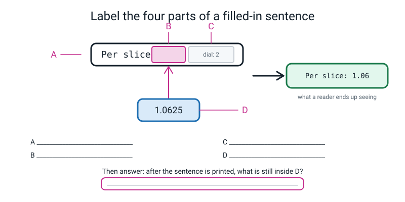
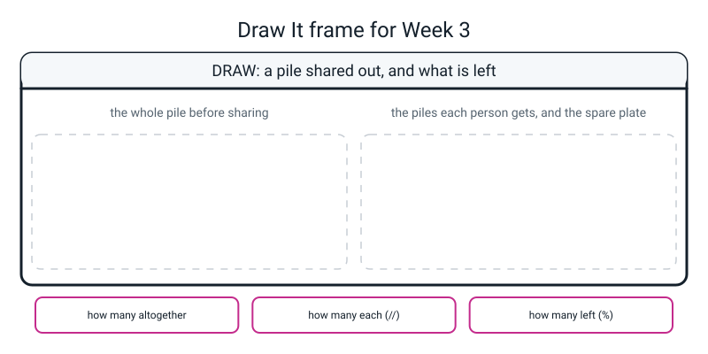

# Workbook — Week 3: Printing Like a Pro: f-strings and Real Maths

**Name:** ________________________________  **Date:** ______________

[⬅ Week 02](week-02.md) · [📖 Read the chapter first](../student-guide/week-03.md) · [Course Home](../README.md) · [🧑‍🏫 Teacher guide](../teacher-guide/week-03.md) · [Next ➡](week-04.md)

---

> **How to use this page.** Type everything. Say **"eff"** out loud as you type the letter, every single time, for the next three weeks.
>
> **New rule this week, and it is the most important one on the page: read your output and ask whether it makes sense — BEFORE you ask whether there is an error.** Three of this week's bugs produce no error at all. "Is there red text?" is no longer a good enough first question.
>
> **You will need:** the laptop, a pencil, the **BUG LOG**, and sixteen counters or coins.

---

## ✅ Warm-Up (5 min)

Five quick questions about **Week 2**. No laptop.

**W1.** Read `pizza_price = 8.50` out loud. Write down exactly what you said.

________________________________________________________________

**W2.** What type is `8.50`? What type is `"8.50"`?

`8.50` = ____________________  `"8.50"` = ____________________

**W3.** Why does `print(8.50)` show `8.5`?

________________________________________________________________

**W4.** What is `"5" + 5`, and why?

________________________________________________________________

**W5.** What does `type()` do, and when do you reach for it?

________________________________________________________________

---

## 🔎 Predict the Output

**Four snippets. Fill in the prediction column BEFORE you run anything.**

This is the week where predicting stops being a school ritual and becomes a **tool**. Two of these snippets contain a bug that produces no error message — and if you have written down what you expected, you spot it in half a second instead of never.

---

**Snippet 1 — one letter**

```python
name = "Ramana"
runs = 347
matches = 9
print(f"{name} scored {runs}")
print("{name} scored {runs}")
```

| My prediction | What really happened |
|---|---|
| ________________________ | ________________________ |
| ________________________ | ________________________ |

How many error messages did you get? ______ Should there have been one?

________________________________________________________________

---

**Snippet 2 — the dial**

```python
runs = 347
matches = 9
print(f"{runs / matches}")
print(f"{runs / matches:.2f}")
print(f"{runs / matches:.1f}")
print(f"{runs / matches:.0f}")
```

| My prediction | What really happened |
|---|---|
| ________________________ | ________________________ |
| ________________________ | ________________________ |
| ________________________ | ________________________ |
| ________________________ | ________________________ |

The last one rounded **up**. Did the value in `runs` change? ______ How do you know?

________________________________________________________________

---

**Snippet 3 — whole ones and leftovers**

```python
runs = 347
matches = 9
print(f"{runs // matches}")
print(f"{runs % matches}")
print(f"{7 // 2} and {7 % 2}")
print(f"{6 // 8} and {6 % 8}")
```

| My prediction | What really happened |
|---|---|
| ________________________ | ________________________ |
| ________________________ | ________________________ |
| ________________________ | ________________________ |
| ________________________ | ________________________ |

The last line looks wrong and is completely right. Explain it in one sentence:

________________________________________________________________

---

**Snippet 4 — stars and dots**

```python
print(f"{2 ** 10}")
print(f"{8:.2f}")
print(f"{8:2f}")
print(f"{5 * 2} and {5 ** 2}")
```

| My prediction | What really happened |
|---|---|
| ________________________ | ________________________ |
| ________________________ | ________________________ |
| ________________________ | ________________________ |
| ________________________ | ________________________ |

Line 3 is missing something tiny. What, and did Python complain? ______

________________________________________________________________

**How many of the fourteen did you get right?** ______

---

## ✍️ Practice Set A — Read It

**A1. Fill in the blanks.**

An **f-string** is a piece of text with an ______ in front of the opening quote, where anything inside ____________________ gets replaced by its value.

If you forget that letter, Python prints ____________________ and gives you ____________________ error messages.

`:.2f` reads out loud as ____________________. The colon means ____________________, the `.2` means ____________________, and the `f` means ____________________.

`:.2f` changes what you ____________________, not what it ____________________.

`//` answers the question ____________________________________________.

`%` answers the question ____________________________________________.

The check that proves you got both right: ______________ × ______________ + ______________ = ______________.

---

**A2. Label the diagram.**


*Figure W3.1 — Four parts of one printed sentence.*

**A** = ________________________  **B** = ________________________

**C** = ________________________  **D** = ________________________

**Then the question that matters: after the sentence has been printed, what is still inside D?**

________________________________________________________________

How do you know? Describe a two-line experiment that proves it:

________________________________________________________________

---

**A3. Match the code to the output.** Assume `total = 17.0`. Draw a line from each line of code to what it really prints. **Two of them are bugs.**

| | Code | | Output |
|---|---|---|---|
| 1 | `print(f"Total: {total}")` | **A** | `Total: 17.00` |
| 2 | `print(f"Total: {total:.2f}")` | **B** | `Total: {total}` |
| 3 | `print("Total: {total}")` | **C** | `Total: 17.000000` |
| 4 | `print(f"Total: {total:.0f}")` | **D** | `Total: 17.0` |
| 5 | `print(f"Total: {total:2f}")` | **E** | `Total: 17` |

1 → ______  2 → ______  3 → ______  4 → ______  5 → ______

Which two are bugs, and what is missing from each?

________________________________________________________________

Neither of those two produced an error. **What is the only thing that catches them?**

________________________________________________________________

---

**A4. Spot the bug.** Four broken pieces. Say what is wrong and give the fix. **Exactly one of these produces no error at all**, and it is the most dangerous of the four — mark which.

(a)
```python
runs = 347
print(f"{rns}")
```
Wrong: ____________________  Errors? Y / N  Fix: ____________________

(b)
```python
total = 17.0
print(f"Total: {total:.2f")
```
Wrong: ____________________  Errors? Y / N  Fix: ____________________

(c)
```python
radius_cm = 15
print(f"{3.14159 * radius_cm * 2:.2f}")
```
Wrong: ____________________  Errors? Y / N  Fix: ____________________

(d)
```python
total = "17.0"
print(f"Total: {total:.2f}")
```
Wrong: ____________________  Errors? Y / N  Fix: ____________________

For (c), the answer that comes out is `94.25`. **Why is looking at that number enough to know something is wrong**, even if you had no idea what the bug was?

________________________________________________________________

---

**A5. Trace it.** Somebody wants to turn 7325 seconds into hours, minutes and seconds. Here is their attempt:

```python
total_seconds = 7325
hours = total_seconds // 3600
minutes = total_seconds // 60
seconds = total_seconds % 60
print(f"{hours} h {minutes} m {seconds} s")
```

Work out each value by hand **before** you run it.

`hours` = ______  `minutes` = ______  `seconds` = ______

What it prints: ____________________________________________

**One of those three numbers is badly wrong.** Which, and by how much?

________________________________________________________________

How many minutes are already inside the two hours? ______

So the fix is: take the ____________________ **before** the second division. Write the corrected two lines:

```python
________________________________________________________________

________________________________________________________________
```

Corrected output: ____________________________________________

---

**A6. Which operator?** For each real question, circle the one you would use: `/` · `//` · `%`

| # | The question | `/` | `//` | `%` |
|---|---|---|---|---|
| (a) | What is a batting average, from 347 runs in 9 matches? | ☐ | ☐ | ☐ |
| (b) | How many whole minibuses of 9 do I need for 47 students? | ☐ | ☐ | ☐ |
| (c) | How many students are left over after those buses are full? | ☐ | ☐ | ☐ |
| (d) | Split £27.00 between five friends. | ☐ | ☐ | ☐ |
| (e) | Is 4718 an even number? | ☐ | ☐ | ☐ |
| (f) | What is the units digit of 4718? | ☐ | ☐ | ☐ |

For **(b)**, `47 // 9` gives `5`. But you actually need **six** buses. Why does the operator not give you the answer you want, and what does the `%` tell you that makes it obvious?

________________________________________________________________

________________________________________________________________

---

## ✍️ Practice Set B — Write It

---

**B1. One line.** Print two-thirds to exactly two decimal places, using an f-string.

```python
________________________________________________________________
```

**Expected output:**

```text
0.67
```

**"Done" looks like:** one `print`, one `f`, one `:.2f`, and no number typed by you except the 2 and the 3.

---

**B2. Ten pairs, and the check every time.** For each row, work out `//` and `%` **by hand first**, then write the check, then verify with a line of code.

| # | The sum | `//` | `%` | Check: `//` × count + `%` = total |
|---|---|---|---|---|
| (a) | 16 and 5 | ______ | ______ | ______ × 5 + ______ = ______ |
| (b) | 16 and 6 | ______ | ______ | ______ × 6 + ______ = ______ |
| (c) | 16 and 4 | ______ | ______ | ______ × 4 + ______ = ______ |
| (d) | 7 and 2 | ______ | ______ | ______ × 2 + ______ = ______ |
| (e) | 100 and 7 | ______ | ______ | ______ × 7 + ______ = ______ |
| (f) | 47 and 10 | ______ | ______ | ______ × 10 + ______ = ______ |
| (g) | 25 and 5 | ______ | ______ | ______ × 5 + ______ = ______ |
| (h) | 6 and 8 | ______ | ______ | ______ × 8 + ______ = ______ |
| (i) | 7325 and 3600 | ______ | ______ | ______ × 3600 + ______ = ______ |
| (j) | 125 and 60 | ______ | ______ | ______ × 60 + ______ = ______ |

The checking line for row (a) looks like this. Write ten of them in one file:

```python
print(f"{16 // 5} {16 % 5}")
```

**If a check does not come back to the total, one of your two numbers is wrong — and you get to find it yourself.** That is the whole reason the check exists.

**(k)** Two rows have a remainder of `0`. Which, and what does that tell you?

________________________________________________________________

**(l)** One row has a `//` answer of `0`. Is that a mistake? ______ Explain it:

________________________________________________________________

---

**B3. The seconds decoder.** Write `seconds.py`: turn a number of seconds into hours, minutes and seconds, printed in one f-string. Take the remainder before the second division.

```python
________________________________________________________________

________________________________________________________________

________________________________________________________________

________________________________________________________________

________________________________________________________________

________________________________________________________________
```

**Expected output for `total_seconds = 7325`:**

```text
7325 seconds = 2 h 2 m 5 s
```

**Now test it on the three numbers that catch off-by-one mistakes.** Change one line each time and record the real output.

| `total_seconds` | Output |
|---|---|
| 59 | ______________________________________ |
| 3600 | ______________________________________ |
| 86399 | ______________________________________ |

**"Done" looks like:** all three of those come out exactly right without you touching anything except the first number.

---

**B4. Is the big pizza better value?** Write `area_compare.py`. A small pizza has a radius of 15 cm and costs £8.50. A big one has a radius of 20 cm and costs £13.00.

Use `** 2` for the squaring and π as `3.14159`. Print each area to two decimals, then each pizza's **square centimetres per pound**.

**Expected output:**

```text
Small: 706.86 sq cm for 8.50
Big  : 1256.64 sq cm for 13.00
Small: 83.16 sq cm per pound
Big  : 96.66 sq cm per pound
```

**Which is better value?** ____________________  By roughly what percentage? ______

**Here is the interesting bit.** The big pizza is only **a third** bigger across (20 cm instead of 15 cm). But it is nearly **twice** the area. Why?

________________________________________________________________

Now break it on purpose: change one `**` to a single `*` and write down what you get.

The wrong answer: ______________  Did Python complain? ______

________________________________________________________________

---

**B5. The change-giver.** A shop needs to know what coins to hand back. Write `change.py`. Store the price and the amount paid **in whole pence**, work out the change, then split it into pound coins, fifty-pence pieces and loose pence — using `//` and `%` four times.

```python
________________________________________________________________

________________________________________________________________

________________________________________________________________

________________________________________________________________

________________________________________________________________

________________________________________________________________

________________________________________________________________

________________________________________________________________

________________________________________________________________

________________________________________________________________

________________________________________________________________

________________________________________________________________
```

**Expected output** (price 1750p, paid 2000p):

```text
Change: 2.50
2 pound coins, 1 fifty-pence, 0 pence left
```

**Then test it** with price 1235p and paid 2000p. Real output: ____________________

________________________________________________________________

**And the good question: why store the price as `1750` pence instead of `17.50` pounds?**

________________________________________________________________

________________________________________________________________

---

## 🐞 Fix the Broken Program

Here is `cafe_bill.py`. **Three** things are wrong: one stops Python reading the file at all, one stops it partway through, and one produces **no error whatsoever**.

```python
 1  # cafe_bill.py - a cafe bill for five friends. THREE THINGS ARE WRONG.
 2
 3  drink_price = "2.40"                  # price off the menu board, written as text
 4  drinks = 5                            # hot chocolates ordered
 5  cake_price = 3.75                     # price of one slice of cake
 6  cakes = 4                             # slices ordered
 7  friends = 5                           # how many are splitting the bill
 8
 9  drinks_total = float(drink_price) * drinks   # what the drinks came to
10  cakes_total = cake_price * cakes             # what the cake came to
11  bill = drinks_total + cakes_total            # the whole bill
12  each = bill / friends                        # what one person owes
13
14  print("--- CAFE BILL ---")
15  print(f"Price each : {drink_price:.2f}")
16  print(f"Drinks     : {drinks_total:.2f")
17  print(f"Cake       : {cakes_total:.2f}")
18  print("Bill       : {bill:.2f}")
19  print(f"Each owes  : {each:.2f}")
```

Type it in **with the bugs**. Fix one thing at a time and run after each fix.

> **⚠️ Watch out:** the numbers down the left-hand side are **line numbers**, not part of the program. Do not type them.

**Run 1 — this is what really appears:**

```text
  File "/Users/you/ai-academy/level2/cafe_bill.py", line 16
    print(f"Drinks     : {drinks_total:.2f")
                                           ^
SyntaxError: f-string: expecting '}'
```

**Bug 1.** Which line? ______ What is missing? ______

Read the message out loud. Python is telling you it could not finish reading something. Finish reading *what*?

________________________________________________________________

Your fix: ________________________________________________________

**Run 2 — after fixing bug 1, this is what really appears:**

```text
--- CAFE BILL ---
Traceback (most recent call last):
  File "/Users/you/ai-academy/level2/cafe_bill.py", line 15, in <module>
    print(f"Price each : {drink_price:.2f}")
ValueError: Unknown format code 'f' for object of type 'str'
```

**Bug 2.** Which line? ______

Translate the message into plain English — the `f` in `:.2f` means "as a decimal number", so what is Python objecting to?

________________________________________________________________

Look at **line 3**. What type is `drink_price`, and how can you tell without running anything?

________________________________________________________________

Notice that `--- CAFE BILL ---` **did** print this time, unlike in Run 1. Why?

________________________________________________________________

**There are two good fixes.** Write both, then say which you would choose and why.

Fix 1: ________________________________________________________

Fix 2: ________________________________________________________

I would choose ______ because ____________________________________

**Run 3 — after fixing bug 2, this is what really appears:**

```text
--- CAFE BILL ---
Price each : 2.40
Drinks     : 12.00
Cake       : 15.00
Bill       : {bill:.2f}
Each owes  : 5.40
```

**Bug 3.** No error. Nothing red. The program ran to the end.

Which line of the output is wrong? ____________________________

Which line of the **file**? ______ What is missing? ______

**Now the question this whole page exists for.** You had already worked out, by hand, that the bill should be £27.00. If you had *not* — if you had just glanced at the screen — how would you have known anything was wrong?

________________________________________________________________

Your fix: ________________________________________________________

**Fully mended output** — check yours matches, character for character:

```text
--- CAFE BILL ---
Price each : 2.40
Drinks     : 12.00
Cake       : 15.00
Bill       : 27.00
Each owes  : 5.40
```

**Last thing.** Look at line 9. It uses `float(drink_price)`, and line 15 needed the same conversion. **What would you change about line 3 to make both problems disappear at once?**

________________________________________________________________

---

## 🧩 Puzzle of the Week

### The Receipt That Lies

A shop's till prints this:

```text
Items        : 3
Price each   : 4.3
Total        : 13.0
```

**P1.** Name **three** things wrong with how this is printed.

1. ______________________________________________________________

2. ______________________________________________________________

3. ______________________________________________________________

**P2.** Write the code that would print it properly. Three inputs, one computed total, three f-strings.

```python
________________________________________________________________

________________________________________________________________

________________________________________________________________

________________________________________________________________

________________________________________________________________

________________________________________________________________
```

Run it. What did your `Total` line say? ____________________

**Is that the same as the shop's total?** ______

**P3.** Does `4.30 × 3` really come to `13.00`? Work it out by hand, then in Python.

By hand: ____________________  Python said: ____________________

**So what have you just discovered about the shop's receipt?**

________________________________________________________________

**P4.** Print `4.30 * 3` **without** any `:.2f` on it. Write down exactly what appears.

________________________________________________________________

That is not a mistake in your code and it is not a bug in Python. Have a guess at what is going on:

________________________________________________________________

**P5.** Why is a wrongly-**printed** number more dangerous than a program that crashes?

________________________________________________________________

________________________________________________________________

**P6.** The shop also wants to know how many whole boxes of 4 it can make from 15 items, and how many are loose. Write it in three lines, with the check.

```python
________________________________________________________________

________________________________________________________________

________________________________________________________________
```

Output: ____________________  Check: ______ × 4 + ______ = ______

---

## 🤔 Think Deeper

**T1.** `:.2f` shows a number to two places without changing it. **When is hiding digits a kindness, and when is it a lie?**

Write a paragraph. Give one clear example of each, and end with a rule you would actually follow.

________________________________________________________________

________________________________________________________________

________________________________________________________________

________________________________________________________________

________________________________________________________________

________________________________________________________________

---

**T2.** Why does Python have **three** different division operators — `/`, `//` and `%`?

Do not answer "so you have a choice". Say what **question** each one answers, and give a real thing in the world that needs each. Then explain why `//` and `%` almost always turn up **together**.

________________________________________________________________

________________________________________________________________

________________________________________________________________

________________________________________________________________

________________________________________________________________

________________________________________________________________

---

## 🛠️ Build It

### `receipt.py`, finished properly

The four inputs stay at the top. **You choose the number of friends, and it has to be your own real number** — how many people you would actually share a pizza with.

| ☐ | Step |
|---|---|
| ☐ | Line 1 is a comment naming the file and saying what it is for |
| ☐ | **Four inputs at the top**, each with a comment that says **why**, not what |
| ☐ | Five computed values: total, slices, cost per slice, whole slices each, leftover |
| ☐ | **Every printed line that shows a value uses an f-string.** A comma inside a `print` sends it back |
| ☐ | The total **and** the per-slice cost both use `:.2f` |
| ☐ | `each` comes from `//` and `left_over` comes from `%` |
| ☐ | **No number is typed twice anywhere.** Check by eye |
| ☐ | Run it. No traceback |
| ☐ | **Read the output out loud**, slowly, as if reading a receipt to a customer |

### Results table — fill this in from your own run

| Line | What mine says | Where the number came from |
|---|---|---|
| Total | ________________ | ________________________ |
| Slices | ________________ | ________________________ |
| Per slice | ________________ | ________________________ |
| Each gets | ________________ | `//` |
| Left over | ________________ | `%` |

**The check, written out:** ______ × ______ + ______ = ______ , and `slices` is ______ ✓

**The raw per-slice figure**, printed once without the dial, is: ____________________

**(a) Change one input** — the price of a pizza. How many lines did you edit? ______

How many printed figures changed? ______

**(b) Read it out loud. Did anything sound wrong?** Even slightly?

________________________________________________________________

*(There is a real bug findable by ear in this file. If you found it, write it down — and note that fixing it properly needs something we meet in Week 5.)*

**(c)** Now set `friends` to a number that divides your slice count **exactly**. What does the `Left over` line say, and is that a failure?

________________________________________________________________

### The Bug Log — at least one new row

**And it must be a bug with no error message.** If nothing breaks by accident, break it on purpose: take an `f` off a line, run it, and log what you saw.

| # | What I saw (last line, copied exactly — or "NO ERROR AT ALL") | What it meant (my words) | What I changed |
|---|---|---|---|
| 6 | ________________________________ | ________________________ | ________________ |
| 7 | ________________________________ | ________________________ | ________________ |

**In the third column of the no-error row, also write how you noticed.** That sentence is the most valuable thing on this page.

________________________________________________________________

---

## 🎨 Draw It

Draw a **pile of something shared out**, and what is left over. Not pizza — pick your own: sweets, cards, seats on a coach, eggs into boxes.


*Figure W3.2 — Your page.*

Fill in the three boxes underneath: **how many altogether** · **how many each (`//`)** · **how many left (`%`)**.

> **What a good answer might look like:** the pile is **23 eggs**, going into **boxes of 6**.
>
> On the **left** (the whole pile before sharing): 23 eggs drawn in a heap, with `23` written next to it.
>
> On the **right**: **three full boxes of six**, drawn as three neat 2×3 grids — and then, beyond the dashed line, **five loose eggs** sitting on the counter with no box.
>
> Bottom boxes: *23 altogether* · *3 full boxes (`23 // 6`)* · *5 loose (`23 % 6`)*.
>
> **A really strong answer writes the check on the page:** `3 × 6 + 5 = 23` ✓ — and adds the sentence a real kitchen would care about: *"so I need a fourth box, for five eggs."* That is `%` doing something useful rather than being tidy arithmetic.
>
> **What a weak answer looks like:** writing `23 / 6 = 3.83` and drawing three and a bit boxes. **There is no such thing as 0.83 of a box.** If your drawing contains a fraction of a physical object, you have used the wrong operator, and the drawing is the proof.

---

## 📊 Self-Check

| I can… | 😀 got it | 🙂 nearly | 😕 not yet |
|---|---|---|---|
| Build a sentence with an f-string instead of gluing pieces together | ☐ | ☐ | ☐ |
| Control how many decimals are shown, with `:.2f` and its cousins | ☐ | ☐ | ☐ |
| Use `//` and `%` to answer "how many whole ones, and how many left over?" | ☐ | ☐ | ☐ |
| Do the check — whole ones × count + leftovers = the total | ☐ | ☐ | ☐ |
| Explain why a money figure must show exactly two decimal places | ☐ | ☐ | ☐ |
| Spot a bug that produces **no error message**, by reading my own output | ☐ | ☐ | ☐ |
| Build `receipt.py` so it runs and reads correctly out loud | ☐ | ☐ | ☐ |

One thing I'd like explained again:

________________________________________________________________

---

## ✅ Answers

<details>
<summary>Check your answers</summary>

### Warm-Up

**W1.** "pizza_price **gets** 8.50." Not "equals".

**W2.** `8.50` is a **`float`**. `"8.50"` is a **`str`**. Same characters on the screen, different kinds of thing.

**W3.** Because `8.50` and `8.5` are **the same number**, and the number eight-point-five has no trailing zero. The zero existed only in what you typed. Python stored the number, not your typing.

**W4.** An error: `TypeError: can only concatenate str (not "int") to str`. The kinds do not go together, and Python refuses to guess whether you meant `10` or `55`.

**W5.** It tells you what **kind** a value is. You reach for it whenever a `TypeError` appears and you are certain something is a number — because `type()` settles the argument in four seconds. **Don't argue with Python about what type something is. Ask it.**

---

### Predict the Output

**Snippet 1** — real output:

```text
Ramana scored 347
{name} scored {runs}
```

**Zero error messages, and there should not have been one.** Without the `f`, `{name}` is just six ordinary characters, and Python printed them exactly as asked. The program is perfectly correct Python doing exactly the wrong thing.

**This is the whole point of the week.** Every bug in Weeks 1 and 2 shouted. This one sits there looking wrong.

**Snippet 2** — real output:

```text
38.55555555555556
38.56
38.6
39
```

The dial at four settings. `:.0f` gave `39` — it rounded **up**, because the digit after the point is a 5 followed by more.

**Did `runs` change? No.** How you know: line 3 printed the raw figure *before* any of the dials were applied, and the raw figure is still there in the box for line 4, line 5 and line 6 to use. If `:.2f` had really changed the number, line 5 could not have got `38.6` out of `38.56`.

The two-line proof from the chapter: print it as `1.06`, then print the variable times 16 and get `17.0` rather than `16.96`.

**Snippet 3** — real output:

```text
38
5
3 and 1
0 and 6
```

`347 // 9` is 38 whole runs a match, with 5 left over. Check: 38 × 9 + 5 = 347 ✓

`7 // 2` and `7 % 2` are `3` and `1`. Check: 3 × 2 + 1 = 7 ✓

**The last line: `0 and 6`.** Six slices between eight friends. **Nobody gets a whole one**, so the whole-ones answer is `0`, and all six are left over. Check: 0 × 8 + 6 = 6 ✓

It feels wrong because zero looks like a failure. It is not — it is the correct answer to "how many whole ones can each person be handed?" when the answer is none.

**Snippet 4** — real output:

```text
1024
8.00
8.000000
10 and 25
```

`2 ** 10` is two multiplied by itself ten times: 1024. **Not 20.**

`f"{8:.2f}"` is `8.00` — the dial works perfectly well on a whole number, which is exactly what you want for money.

**`f"{8:2f}"` is `8.000000` — the dot is missing.** Without it, the `2` is not "two places" any more; it means something completely different about *width*, and the number of decimals falls back to Python's default, which is **six**.

**And no, Python did not complain.** That is silent bug number two in one snippet. If you had written `8.00` in the prediction column, you would have caught it instantly.

`5 * 2` is `10` and `5 ** 2` is `25`. **Count the stars.**

---

### Practice Set A

**A1.** `f` · `{curly braces}` · **the braces themselves, as ordinary characters** · **no** (zero) error messages · "dot two eff" · "here comes an instruction about how to show this" · "two places" · "as a decimal number" · **see**, not what it **is** · "how many whole ones each?" · "how many are left over?" · **whole ones × how many people + leftovers = the total**.

**A2.**

**A** = the **`f`** — the letter in front of the opening quote that turns the quotes into a fill-in-the-blanks form. Without it none of the rest means anything.

**B** = the **gap**, the `{braces}` — "fetch the value of what's in here and drop it in".

**C** = the **format specifier**, `:.2f` — the dial that decides how many decimals a reader sees.

**D** = the **variable** (the box), `cost_per_slice`, holding `1.0625`.

**After the sentence has been printed, D still holds `1.0625`. All of it. Every digit.** Nothing was rounded, nothing was thrown away. The dial is on the window, not on the number.

**The two-line experiment that proves it:**

```python
cost_per_slice = 1.0625
print(f"{cost_per_slice:.2f}")
print(cost_per_slice * 16)
```

```text
1.06
17.0
```

If the number had really been changed to `1.06`, sixteen slices would come to `16.96` and four pence would have gone missing. It comes to exactly `17.0`.

**A3.** Real output of all five lines:

```text
Total: 17.0
Total: 17.00
Total: {total}
Total: 17
Total: 17.000000
```

**1 → D · 2 → A · 3 → B · 4 → E · 5 → C**

**The two bugs are 3 and 5.** Number 3 is **missing the `f`** before the opening quote, so the braces printed as characters. Number 5 is **missing the dot** in the specifier, so it fell back to six decimal places.

**The only thing that catches them: reading your own output and asking whether it makes sense.** Neither produced an error, neither has a line number attached, and neither will ever appear in a traceback. A prediction written down beforehand turns both into half-second catches.

**A4.**

**(a)** A typo **inside the braces** — `rns` instead of `runs`. **It does error.** Real message:

```text
Traceback (most recent call last):
  File "/Users/you/ai-academy/level2/oops.py", line 2, in <module>
    print(f"{rns}")
NameError: name 'rns' is not defined. Did you mean: 'runs'?
```

**The braces do not protect the name inside them.** Fix the spelling; Python has already guessed it.

**(b)** A **missing `}`**. **It does error.** Real message:

```text
  File "/Users/you/ai-academy/level2/oops.py", line 2
    print(f"Total: {total:.2f")
                              ^
SyntaxError: f-string: expecting '}'
```

Fix: `print(f"Total: {total:.2f}")`. Braces come in pairs, like quotes and brackets.

**(c)** One star where there should be two. **NO ERROR.** `3.14159 * 15 * 2` is `94.2477`, shown as `94.25`. Fix: `radius_cm ** 2`.

**(d)** `:.2f` on **text**. **It does error.** Real message:

```text
Traceback (most recent call last):
  File "/Users/you/ai-academy/level2/oops.py", line 2, in <module>
    print(f"Total: {total:.2f}")
ValueError: Unknown format code 'f' for object of type 'str'
```

*"You asked me to show this as a decimal number, and it's text."* Fix: `float(total)` — or better, find out why it was text in the first place, which is usually the real bug.

**The silent one is (c), and only (c).** (a), (b) and (d) all shout, each with a different error type — `NameError`, `SyntaxError`, `ValueError` — which is itself worth noticing: three completely different messages from three small mistakes in what looks like the same kind of line.

**Why `94.25` is enough to know something is wrong:** a pizza 15 cm in radius is 30 cm across — about the width of a school ruler. Ninety-four square centimetres is roughly the area of a large postage stamp. **The number is the wrong size for the thing it claims to describe**, and you can tell that without knowing anything about the bug. That is the whole skill: not "is there red text?" but "could that possibly be true?"

**A5.** By hand:

`hours` = **2** · `minutes` = **122** · `seconds` = **5**

Real output:

```text
2 h 122 m 5 s
```

**`minutes` is badly wrong — 122 instead of 2, so it is out by 120.**

`total_seconds // 60` counts **every** minute inside 7325 seconds, including the **120 minutes already inside the two hours**. It has counted them twice: once as hours and once as minutes.

**The fix: take the remainder before the second division.**

```python
rest = total_seconds % 3600          # 125 seconds still to account for
minutes = rest // 60                 # 125 / 60 = 2
```

Full corrected version and its real output:

```python
total_seconds = 7325
hours = total_seconds // 3600
rest = total_seconds % 3600
minutes = rest // 60
seconds = rest % 60
print(f"{total_seconds} seconds = {hours} h {minutes} m {seconds} s")
```

```text
7325 seconds = 2 h 2 m 5 s
```

**A6.**

| # | The question | Answer | Why |
|---|---|---|---|
| (a) | Batting average from 347 runs in 9 matches | **`/`** | An average is *supposed* to be a fraction. `38.56` is right. |
| (b) | Whole minibuses of 9 for 47 students | **`//`** | You want whole buses. `5`. |
| (c) | Students left over after those buses are full | **`%`** | `2`. |
| (d) | Split £27.00 between five friends | **`/`** | Money divides into pennies, so a fraction is real. `5.40`. |
| (e) | Is 4718 even? | **`%`** | `4718 % 2` is `0`, so yes. |
| (f) | Units digit of 4718 | **`%`** | `4718 % 10` is `8`. |

**Why (b) does not give you the answer you want.** `47 // 9` is `5`, and five buses is genuinely how many go out **completely full**. But `47 % 9` is `2`, and **those two students are standing on the pavement.** So the number of buses you actually have to book is six — five full ones and one carrying two people.

`//` answered the question you asked. **`%` is what tells you the question was not the whole story.** That is why the two almost always turn up together.

---

### Practice Set B

**B1.**

```python
print(f"{2 / 3:.2f}")
```

```text
0.67
```

Note that the arithmetic can go **inside** the braces — you do not need a variable first. And it rounded up from `0.666...`.

**B2.** All ten verified by running them:

```python
print(f"{16 // 5} {16 % 5}")
print(f"{16 // 6} {16 % 6}")
print(f"{16 // 4} {16 % 4}")
print(f"{7 // 2} {7 % 2}")
print(f"{100 // 7} {100 % 7}")
print(f"{47 // 10} {47 % 10}")
print(f"{25 // 5} {25 % 5}")
print(f"{6 // 8} {6 % 8}")
print(f"{7325 // 3600} {7325 % 3600}")
print(f"{125 // 60} {125 % 60}")
```

```text
3 1
2 4
4 0
3 1
14 2
4 7
5 0
0 6
2 125
2 5
```

| # | Sum | `//` | `%` | Check |
|---|---|---|---|---|
| (a) | 16 and 5 | `3` | `1` | 3 × 5 + 1 = 16 ✓ |
| (b) | 16 and 6 | `2` | `4` | 2 × 6 + 4 = 16 ✓ |
| (c) | 16 and 4 | `4` | `0` | 4 × 4 + 0 = 16 ✓ |
| (d) | 7 and 2 | `3` | `1` | 3 × 2 + 1 = 7 ✓ |
| (e) | 100 and 7 | `14` | `2` | 14 × 7 + 2 = 100 ✓ |
| (f) | 47 and 10 | `4` | `7` | 4 × 10 + 7 = 47 ✓ |
| (g) | 25 and 5 | `5` | `0` | 5 × 5 + 0 = 25 ✓ |
| (h) | 6 and 8 | `0` | `6` | 0 × 8 + 6 = 6 ✓ |
| (i) | 7325 and 3600 | `2` | `125` | 2 × 3600 + 125 = 7325 ✓ |
| (j) | 125 and 60 | `2` | `5` | 2 × 60 + 5 = 125 ✓ |

**(k) Rows (c) and (g)** have a remainder of `0`. It means the division came out **exactly** — there is genuinely nothing left over. **That is information, not a failure.** "Is there anything left over?" is a question you will ask constantly, and `% == 0` is how you ask it.

**(l) Row (h)** has `//` of `0`, and **no, it is not a mistake.** Six items between eight people: **nobody gets a whole one**, so the whole-ones answer is zero, and all six are left over. The check confirms it: 0 × 8 + 6 = 6 ✓

This is the row that catches everybody, because "zero each" feels like an error. It is exactly right, and it is the case that breaks people's mental models later on.

**B3.** Model answer:

```python
# seconds.py - turn a number of seconds into hours, minutes and seconds.

total_seconds = 7325                 # the number we were handed
hours = total_seconds // 3600        # whole hours (3600 seconds in an hour)
rest = total_seconds % 3600          # seconds still unaccounted for
minutes = rest // 60                 # whole minutes out of what is LEFT
seconds = rest % 60                  # and finally the odd seconds

print(f"{total_seconds} seconds = {hours} h {minutes} m {seconds} s")
```

```text
7325 seconds = 2 h 2 m 5 s
```

The three test cases, all run for real:

| `total_seconds` | Output |
|---|---|
| 59 | `59 seconds = 0 h 0 m 59 s` |
| 3600 | `3600 seconds = 1 h 0 m 0 s` |
| 86399 | `86399 seconds = 23 h 59 m 59 s` |

**Why `86399` is the one worth running.** It is one second short of a full day, so every single figure is at its maximum. If you had an off-by-one anywhere — using 60 where you needed 3600, or forgetting a remainder — this is the case that shows it. `59` catches the opposite mistake: it proves that zero hours and zero minutes come out as zeros rather than as nothing at all.

**B4.** Model answer:

```python
# area_compare.py - is the big pizza actually better value?

small_radius = 15                # cm
big_radius = 20                  # cm
small_price = 8.50               # pounds
big_price = 13.00                # pounds

small_area = 3.14159 * small_radius ** 2
big_area = 3.14159 * big_radius ** 2

print(f"Small: {small_area:.2f} sq cm for {small_price:.2f}")
print(f"Big  : {big_area:.2f} sq cm for {big_price:.2f}")
print(f"Small: {small_area / small_price:.2f} sq cm per pound")
print(f"Big  : {big_area / big_price:.2f} sq cm per pound")
```

```text
Small: 706.86 sq cm for 8.50
Big  : 1256.64 sq cm for 13.00
Small: 83.16 sq cm per pound
Big  : 96.66 sq cm per pound
```

**The big one is better value, by about 16%** (96.66 against 83.16).

**Why a third bigger across is nearly twice the area:** because **area grows with the square of the radius**. Going from 15 to 20 multiplies the radius by 20 ÷ 15 = 1.33, and the area by 1.33 **squared**, which is about 1.78 — nearly double. That is the `** 2` doing the work, and it is a genuinely surprising fact about the world that two lines of code settle for good.

**Breaking it on purpose.** With `3.14159 * small_radius * 2`:

```text
Small: 94.25 sq cm for 8.50
```

**`94.25`, and Python did not complain at all.** One star and two stars are completely different operations and neither one errors. The only thing that catches it is asking whether 94 square centimetres is a plausible size for a 30 cm pizza. (It is not — that's about a large postage stamp.)

**B5.** Model answer:

```python
# change.py - what coins do I hand back?

price_p = 1750               # price in whole pence
paid_p = 2000                # what the customer handed over, in whole pence

change_p = paid_p - price_p  # 250 pence to give back

pounds = change_p // 100     # whole pound coins
rest = change_p % 100        # pence still to hand over
fifties = rest // 50         # fifty-pence pieces out of what is left
rest = rest % 50             # and the loose pence after that

print(f"Change: {change_p / 100:.2f}")
print(f"{pounds} pound coins, {fifties} fifty-pence, {rest} pence left")
```

```text
Change: 2.50
2 pound coins, 1 fifty-pence, 0 pence left
```

With price `1235` and paid `2000`:

```text
Change: 7.65
7 pound coins, 1 fifty-pence, 15 pence left
```

Check: 7 × 100 + 1 × 50 + 15 = 765 pence = £7.65 ✓

**Why store the price in pence.** Because **pence are whole numbers, and whole numbers never surprise you.** `1750` is exactly 1750, always. `17.50` is stored as a decimal, and decimals in a computer are occasionally a tiny fraction off — you will see that happen in the Puzzle below. If you add up a million transactions in pounds, those tiny fractions can leave you a few pence out; if you add them up in pence, they cannot, because there is nothing after the point to be wrong about.

**This is a real professional practice**, not a school exercise. Banks and accounting systems do exactly this. And notice where the pounds appear: **only in the printing**, in `change_p / 100` with a `:.2f` on it. Keep money in whole units, divide at the last possible moment.

---

### Fix the Broken Program

**Bug 1 — line 16, the closing `}` is missing.** Real message:

```text
  File "/Users/you/ai-academy/level2/cafe_bill.py", line 16
    print(f"Drinks     : {drinks_total:.2f")
                                           ^
SyntaxError: f-string: expecting '}'
```

**What Python could not finish reading: the f-string's gap.** It found a `{`, started collecting what was inside, hit the closing quote, and had still not found the `}`. Braces come in pairs exactly like quotes and brackets, and this message is Python saying "I ran out of line looking for the partner."

**Nothing printed at all**, because a `SyntaxError` is found before the program runs. Fix: `{drinks_total:.2f}`.

**Bug 2 — line 15, `:.2f` applied to text.** Real message:

```text
--- CAFE BILL ---
Traceback (most recent call last):
  File "/Users/you/ai-academy/level2/cafe_bill.py", line 15, in <module>
    print(f"Price each : {drink_price:.2f}")
ValueError: Unknown format code 'f' for object of type 'str'
```

**In plain English:** *"The `f` in your specifier means 'show this as a decimal number'. What you handed me is a piece of text, and text does not have decimal places."*

**Line 3 tells you the type without running anything: there are quotes round `"2.40"`.** So `drink_price` is a `str`. (If you weren't sure, `print(type(drink_price))` above line 15 settles it in four seconds.)

**Why `--- CAFE BILL ---` printed this time but nothing printed in Run 1.** Because a `ValueError` happens **while** the program is running, so line 14 had already done its job before line 15 got stuck. A `SyntaxError` happens **before** the program starts at all, so not a single line runs. That difference in the output is itself a clue about which kind of problem you have.

**The two good fixes:**

- **Fix 1 — convert at the point of printing:** `print(f"Price each : {float(drink_price):.2f}")`.
- **Fix 2 — fix line 3 so the price is a number in the first place:** `drink_price = 2.40`, with the quotes gone. Then line 9's `float(...)` becomes unnecessary too.

**Fix 2 is better**, and it is worth being able to say why: fix 1 patches the symptom in one place, and the same problem will come back the next time anybody uses `drink_price`. Fix 2 removes the cause. **A price is a number, so store it as one.** (Fix 1 is still the right answer when the text genuinely arrives from outside your control — from a form, or a file — which is exactly what happens in Week 4.)

**Bug 3 — line 18, the `f` is missing.** Real output after fixing bugs 1 and 2:

```text
--- CAFE BILL ---
Price each : 2.40
Drinks     : 12.00
Cake       : 15.00
Bill       : {bill:.2f}
Each owes  : 5.40
```

`Bill       : {bill:.2f}` is wrong. Fix: add the `f` before the opening quote.

**How you would have known without doing the arithmetic:** there are curly braces on the screen. **No real receipt has ever had curly braces on it.** That is the point of the habit — you do not need to know the right answer to know that the output is not a receipt. Two other things would also have caught it: every other line in the block shows a number and this one does not; and `12.00 + 15.00` is obviously not `{bill:.2f}`.

**Fully mended output:**

```text
--- CAFE BILL ---
Price each : 2.40
Drinks     : 12.00
Cake       : 15.00
Bill       : 27.00
Each owes  : 5.40
```

**The last question — what to change about line 3.** Take the quotes off: `drink_price = 2.40`. Then line 9 becomes `drinks_total = drink_price * drinks` with no conversion at all, and line 15 works without one. **One character of quoting was causing two separate problems in two different places**, which is very typical: a value of the wrong type does not cause one bug, it causes a bug everywhere it is used.

---

### Puzzle of the Week

**P1.** Three things wrong (any three of these):

1. **`4.3` should be `4.30`** — money needs two decimals, because it is a whole number of pennies.
2. **`13.0` should be `13.00`**, for exactly the same reason.
3. **Nothing is aligned and no currency is shown at all.** Is that pounds, dollars, rupees?
4. And the big one, which you find in P3: **the total is wrong.**

**P2.** Model answer:

```python
items = 3                            # how many of the thing were bought
price_each = 4.30                    # what one of them costs
total = price_each * items           # what the customer actually owes

print(f"Items        : {items}")
print(f"Price each   : {price_each:.2f}")
print(f"Total        : {total:.2f}")
```

```text
Items        : 3
Price each   : 4.30
Total        : 12.90
```

**Your `Total` line says `12.90`. The shop said `13.0`. They are not the same.**

**P3.** By hand: 4.30 × 3 = **12.90**. Python agrees: `12.90`.

**So the shop's total is not merely badly formatted — it is wrong, by 10p.** Somebody typed the total in by hand instead of computing it, and got it wrong, and nothing anywhere caught it.

**This is the best thing on the page.** If you had written `total = 13.00` yourself instead of `total = price_each * items`, you would never have found it. **Computing a figure instead of copying it is what turned a formatting exercise into finding a real error.**

**P4.** Real output of `print(4.30 * 3)` with no dial on it:

```text
12.899999999999999
```

**That is not a mistake in your code and it is not a bug in Python.** Computers store decimals in base 2, and some fractions do not fit exactly — in the same way that one third does not fit exactly in base 10, because `0.3333...` never ends. So the stored value is a hair under 12.9, and printing every digit shows you the hair.

`:.2f` hides it completely and gives the right answer, `12.90`. **You will not have to deal with this problem this year**, because every money figure you print will have a `:.2f` on it. But it is real, and it is the reason the change-giver in B5 stores prices in whole pence.

**P5. Because a crash announces itself and a wrong number does not.**

`13.0` looks completely normal. It goes on the receipt, into the till, into the day's takings, and the first person to notice is whoever counts the money at closing time — **if they notice at all.** A crash costs four seconds. A wrong number that nobody spots costs whatever it costs, for as long as nobody spots it.

This is the same idea as the missing `f`, and it is why *"read your output and ask whether it makes sense"* is the habit of the week.

**P6.**

```python
items = 15
per_box = 4
print(f"{items // per_box} full boxes, {items % per_box} loose")
```

```text
3 full boxes, 3 loose
```

Check: 3 × 4 + 3 = 15 ✓

---

### Think Deeper

**T1. Model answer:**

> It is a kindness when the hidden digits are not information. `1.0625` on a receipt is unreadable and it does not help anybody — nobody can pay a fraction of a penny, so `1.06` is the honest amount of money and the extra digits are noise. Every receipt in the world does this and nobody objects.
>
> It becomes a lie in two situations. The first is when the hidden digits **change the meaning**: showing a test score as `71%` when it is really `70.6%` can move somebody from one side of a grade boundary to the other, and the person whose score it is would care very much about that digit. The second, and sneakier, is going the other way — showing **more** digits than you actually measured. If I measure a room with a tape marked in centimetres and write `4.2735 m`, I have invented three digits I never knew, and anybody reading it will believe I measured to a tenth of a millimetre.
>
> So the rule I would use is: **keep every digit in the box, decide what to show at the last possible moment, and never show more precision than you actually measured.** And if the choice could matter to somebody, say what you did.

*Full marks needs:* one clear case of each, and a rule at the end that is actually usable. The strongest answers notice that **showing too many digits is also dishonest**, not just too few — most people only think of one direction.

**T2. Model answer:**

> Because "divide" is three different questions, and the answers are not interchangeable.
>
> **`16 / 5` answers "if I could cut things up perfectly, how much each?"** — `3.2`. That is the right question for money, or litres, or distance, or a batting average, where a fraction is a real thing. £27 between five friends genuinely is £5.40 each.
>
> **`16 // 5` answers "how many whole ones can I actually hand each person?"** — `3`. That is the right question for slices, seats, boxes, coins, eggs: things that do not survive being cut into fifths. Five minibuses of nine is five buses, not 5.2 buses.
>
> **`16 % 5` answers "what is still on the plate?"** — `1`. That is the right question when the leftovers matter, and they usually do: the spare slice, the two students standing on the pavement, the seconds that do not make a whole minute.
>
> **Why `//` and `%` almost always come together:** because between them they account for the **whole** total, and one on its own is only half the story. `47 // 9` says five full buses, which is true and useless on its own — it does not tell you that two people are left behind. You need both numbers, and the check proves you have got them right: whole ones times the count, plus the leftovers, equals what you started with.

*Full marks needs:* a real-world example for each of the three, and the point that `//` and `%` together account for the whole total. An answer that only says "they give different answers" has not explained anything.

---

### Build It

**Model answer.** The student's `friends` will differ; the **structure** is what is marked.

```python
# receipt.py - a pizza receipt that reads like a real one.

pizza_price = 8.50                      # what one pizza costs, in pounds
pizzas = 2                              # how many pizzas we ordered
slices_per_pizza = 8                    # how many slices the shop cuts each into
friends = 5                             # how many people are sharing

total = pizza_price * pizzas            # what the whole order came to
slices = pizzas * slices_per_pizza      # how much pizza there actually is
cost_per_slice = total / slices         # what one slice is worth
each = slices // friends                # whole slices a person can be handed
left_over = slices % friends            # what is still on the plate afterwards

print("----- PIZZA RECEIPT -----")
print(f"Pizzas       : {pizzas} at {pizza_price:.2f} each")
print(f"Total        : {total:.2f}")
print(f"Slices       : {slices}")
print(f"Per slice    : {cost_per_slice:.2f}")
print(f"Sharing      : {friends} friends")
print(f"Each gets    : {each} slices")
print(f"Left over    : {left_over} slice")
print("-------------------------")
```

```text
----- PIZZA RECEIPT -----
Pizzas       : 2 at 8.50 each
Total        : 17.00
Slices       : 16
Per slice    : 1.06
Sharing      : 5 friends
Each gets    : 3 slices
Left over    : 1 slice
-------------------------
```

**Marking checklist:**

- [ ] Runs with no traceback.
- [ ] Line 1 is a comment naming the file and its purpose.
- [ ] Four inputs at the top, each with a comment saying **why**, not what.
- [ ] Every `print` that shows a value uses an f-string. (The two divider lines are pure text and may use a plain string.)
- [ ] `total` and `cost_per_slice` both shown with `:.2f`.
- [ ] `each` comes from `//` and `left_over` comes from `%`.
- [ ] **No number typed twice.** Check by eye: does `8` appear only in `slices_per_pizza`? Does `2` appear only in `pizzas`?
- [ ] The check works: `each × friends + left_over` = `slices`. **3 × 5 + 1 = 16 ✓**

**The raw per-slice figure**, printed without the dial, is `1.0625`.

**A second set of numbers**, for marking a different choice of inputs — three pizzas at £7.25, 8 slices each, 7 friends. Real output:

```text
----- PIZZA RECEIPT -----
Pizzas       : 3 at 7.25 each
Total        : 21.75
Slices       : 24
Per slice    : 0.91
Sharing      : 7 friends
Each gets    : 3 slices
Left over    : 3 slice
-------------------------
```

Check: 3 × 7 + 3 = 24 ✓ And the raw per-slice figure here is `0.90625`, which `:.2f` shows as `0.91` — rounded **up**, correctly.

**(a) One line.** Setting `pizza_price = 9.50` is a single edit, and **six printed figures change.** Real output:

```text
----- PIZZA RECEIPT -----
Pizzas       : 2 at 9.50 each
Total        : 19.00
Slices       : 16
Per slice    : 1.19
Sharing      : 5 friends
Each gets    : 3 slices
Left over    : 1 slice
-------------------------
```

That is the entire argument for naming values instead of typing them, and it is much more convincing felt than explained.

**(b) The bug findable by ear.** `Left over    : 1 slice` reads perfectly. But set `friends = 6` and you get:

```text
Each gets    : 2 slices
Left over    : 4 slice
```

**`4 slice` is wrong English.** The file says the word "slice" every time, and English wants "slices" whenever the number is not 1. You have found a real bug that no error message will ever tell you about, and **fixing it properly needs an `if`, which is Week 5.** Noticing it now is the right answer.

The other thing students catch by ear: whether the per-slice figure sounds **plausible**. `0.91` when the total is `21.75` for 24 slices sounds about right. `9.06` would not — and that is the sanity check doing its job.

**(c) A number that divides exactly.** With `friends = 4`:

```text
Each gets    : 4 slices
Left over    : 0 slice
```

**`0` is not a failure.** It means the pizza divided **perfectly**, and `%` told you so by handing you nothing. "Is there anything left over?" is a question you will ask constantly, and a zero is a real, useful answer to it. Check: 4 × 4 + 0 = 16 ✓

**The Bug Log.** Mark the **structure**, and be strict about the no-error row. Model rows:

| # | What I saw (last line, copied exactly — or "NO ERROR AT ALL") | What it meant (my words) | What I changed |
|---|---|---|---|
| 6 | `Per slice    : {cost_per_slice:.2f}` — **NO ERROR AT ALL** | I forgot the `f`, so the braces were just characters and Python printed them. It did exactly what I asked. | Put the `f` back. **How I noticed:** there were curly braces in the middle of a receipt, and no receipt has curly braces. |
| 7 | `SyntaxError: f-string: expecting '}'` | I opened a brace and never closed it, so Python couldn't finish reading the f-string. | Added the `}` before the closing quote. |

**The "how I noticed" sentence is the whole point of row 6.** Every previous entry in this log was found *for* the student by a traceback. This is the first one they found themselves, and that is a genuinely different skill.

---

### Draw It

There is no single right drawing. A strong answer does four things:

1. **The left-hand side shows the pile as one undivided heap**, with the total written next to it. If the pile is already in groups, the drawing has skipped the interesting part.
2. **The right-hand side shows equal groups, drawn as groups** — three boxes of six, five plates of three — and the leftovers **separated by the dashed line**, not tucked into a group to make it look tidy.
3. **The check appears somewhere on the page.** `3 × 6 + 5 = 23` ✓ A drawing without the check is a picture; a drawing with it is an argument.
4. **Nothing on the page is a fraction of a physical object.** No 0.83 of a box, no 3.2 slices, no 5.2 buses.

Test your own drawing with one question: **could somebody read your page and tell me both numbers without being told which operator is which?** If the leftovers are visually separate from the groups, they can.

</details>

---

[⬅ Week 2 workbook](week-02.md) · [📖 Week 3 chapter](../student-guide/week-03.md) · [Course Home](../README.md) · [Week 4 workbook ➡](week-04.md) · [Glossary](../../glossary.md)
