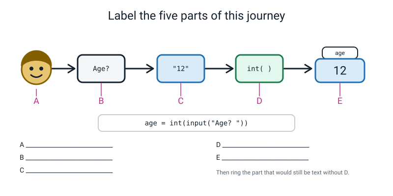
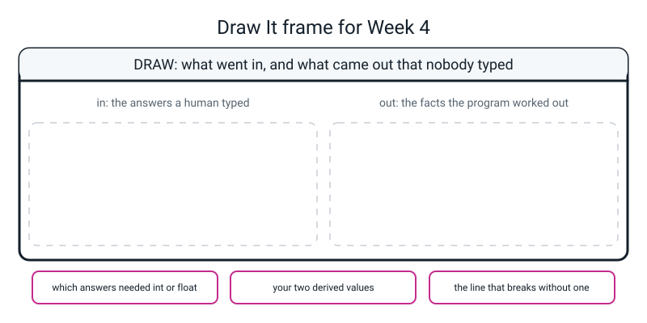

# Workbook — Week 4: The About-Me Bot

**Name:** ________________________________  **Date:** ______________

[⬅ Week 03](week-03.md) · [📖 Read the chapter first](../student-guide/week-04.md) · [Course Home](../README.md) · [🧑‍🏫 Teacher guide](../teacher-guide/week-04.md) · [Next ➡](week-05.md)

---

## ✅ Warm-Up (5 min)

Five quick questions about **last week**.

**W1.** What does the little `f` immediately before an opening quote actually do?

________________________________________________________________

**W2.** `print(f"{4.9868768:.2f}")` — what exactly appears on the screen?

________________________________________________________________

**W3.** Fill both in. `17 // 5` is ______ and `17 % 5` is ______. Say in one sentence what each symbol is for.

________________________________________________________________

**W4.** `2 ** 5` is ______. And `7 ** 3` is ______.

**W5.** `print(8.50)` puts `8.5` on the screen. Write the line that makes it show as `8.50`.

________________________________________________________________

---

## 🔎 Predict the Output

For each snippet: **write what you think Python prints, before you run it.** Then run it and write down what really happened. Getting some wrong is the whole point — a prediction you got wrong teaches you more than three you got right.

### P1

```python
minutes = "45"
print(minutes * 2)
print(int(minutes) * 2)
```

**I predict:**

Line 1: ________________________  Line 2: ________________________

**It really printed:**

Line 1: ________________________  Line 2: ________________________

### P2

```python
price = 8.5
print(int(price))
print(round(price))
print(round(8.4999, 2))
```

**I predict:** ______________  ______________  ______________

**It really printed:** ______________  ______________  ______________

### P3

```python
score = "7"
print(score + "1")
print(int(score) + 1)
print(str(int(score) + 1) + "1")
```

**I predict:** ______________  ______________  ______________

**It really printed:** ______________  ______________  ______________

### P4

```python
height_text = "1.52"
print(float(height_text) * 2)
print(round(float(height_text) * 3.28084, 2))
print(int(float(height_text)))
```

**I predict:** ______________  ______________  ______________

**It really printed:** ______________  ______________  ______________

**How many of the eleven did you get right?** ______ / 11

**Which one surprised you most, and why?**

________________________________________________________________

---

## ✍️ Practice Set A — Read It

**A1. Trace the value.** Write what is in each box after each line runs, and write the **type** as well as the value. Use quotes where the value is text.

```python
answer = input("How many? ")      # the human types 20
doubled = answer * 2
number = int(answer)
tripled = number * 3
as_text = str(tripled)
```

| After this line | `answer` | `doubled` | `number` | `tripled` | `as_text` |
|---|---|---|---|---|---|
| line 1 | | — | — | — | — |
| line 2 | | | — | — | — |
| line 3 | | | | — | — |
| line 4 | | | | | — |
| line 5 | | | | | |

**A2. Spot the bug.** One of these six lines is wrong. Which one, and what happens when you run the program?

```python
name = input("Name? ")
age = int(input("Age? "))
height_m = int(input("Height in metres? "))
screen = int(input("Screen minutes? "))
print(f"{name} is {age}")
print(f"and {height_m} metres tall")
```

Line number: ______  What happens: ______________________________________

________________________________________________________________

**A3. Match the code to the output.** Draw a line from each snippet to what it prints. **Two of them print the same characters** — say which, and say how you would tell them apart.

| | Snippet | | | Output |
|---|---|---|---|---|
| a | `print(int("12"))` | ______ | **1** | `12.0` |
| b | `print(float("12"))` | ______ | **2** | `1212` |
| c | `print("12")` | ______ | **3** | `12` |
| d | `print("12" * 2)` | ______ | **4** | `24` |
| e | `print(int("12") * 2)` | ______ | | |

The two that print the same characters: ______ and ______

How would you tell them apart? ______________________________________

**A4. Label the diagram.** Five parts of one journey. Write what each letter is.


*Figure W4.1 — One value's journey, from a human's fingers into a named box.*

A ____________________  B ____________________  C ____________________

D ____________________  E ____________________

**Then ring the part that would still be text without D.** Which is it? ____________________

**A5. Which of these need a conversion, and which one?** Tick the right column.

| The question you are asking | no conversion | `int()` | `float()` |
|---|---|---|---|
| your first name | ☐ | ☐ | ☐ |
| your age in whole years | ☐ | ☐ | ☐ |
| your height in metres | ☐ | ☐ | ☐ |
| your favourite colour | ☐ | ☐ | ☐ |
| how many siblings you have | ☐ | ☐ | ☐ |
| a price in rupees and paise | ☐ | ☐ | ☐ |
| your phone number | ☐ | ☐ | ☐ |
| a mark out of 100 | ☐ | ☐ | ☐ |

The phone number row is the interesting one. **Why?**

________________________________________________________________

**A6. Read the traceback.** Three questions about this, and none of the answers is "line 10".

```text
Traceback (most recent call last):
  File "about_me.py", line 10, in <module>
    total = minutes + 365
TypeError: can only concatenate str (not "int") to str
```

(a) Which **kind** of mistake is this, and what does the message mean in your own words?

________________________________________________________________

(b) Which line number did Python **give up** on? ______ Is the mistake on that line? ______

(c) What one change would you make, and where?

________________________________________________________________

---

## ✍️ Practice Set B — Write It

**B1. One line.** Write the line that asks for a price in rupees and paise and stores it as a number in a box called `price`.

```python
________________________________________________________________
```

*Done looks like:* typing `49.50` does not break it, and `price * 2` gives `99.0`.

**B2. Two lines.** Ask for a number of minutes, and print how many hours that is, to one decimal place.

```python
________________________________________________________________

________________________________________________________________
```

*Expected output* when the human types `150`:

```text
Minutes? 150
That is 2.5 hours.
```

**B3. Four lines and two derived values.** Ask for a number of pizza slices and the price of one slice (which can have paise in it). Print the total, formatted to two decimal places, **and** the price of half a pizza.

```python
________________________________________________________________

________________________________________________________________

________________________________________________________________

________________________________________________________________
```

*Done looks like:* typing `8` and `45.50` prints a total of `364.00`.

**B4. Six lines, and a bug you have to avoid.** Ask for a number of steps walked today, then print: the steps, the steps in a week, and the steps in a year. Every printed number must be a **number**, not repeated text.

```python
________________________________________________________________

________________________________________________________________

________________________________________________________________

________________________________________________________________

________________________________________________________________

________________________________________________________________
```

*Expected output* when the human types `8000`:

```text
Steps today? 8000
Today   : 8000
A week  : 56000
A year  : 2920000
```

**B5. About fifteen lines — a book-reading bot.** Ask four questions: the reader's name, the book's title, how many pages the book has (a whole number), and how many pages they read per day on average (which can be a decimal, like `12.5`).

Print a card with a top border, a bottom border, and **at least two derived values**: how many days the book will take, and how many pages are left after one week.

```python
________________________________________________________________

________________________________________________________________

________________________________________________________________

________________________________________________________________

________________________________________________________________

________________________________________________________________

________________________________________________________________

________________________________________________________________

________________________________________________________________

________________________________________________________________

________________________________________________________________

________________________________________________________________

________________________________________________________________

________________________________________________________________

________________________________________________________________
```

*Done looks like:* every line has a comment saying **why**; every number that came from `input()` and is used in arithmetic has a conversion round it; at least one number is printed with `:.1f` or `:.2f`; and **you worked out both derived values on paper first.**

---

## 🐞 Fix the Broken Program

Here is `screen_report.py`. It has **three** bugs in it: one that stops Python reading the file at all, one that stops it partway through, and one that produces no error whatsoever.

```python
# screen_report.py - it has three bugs in it. Find them one at a time.

name = input("Your name?                 ")        # text, no conversion needed
minutes = input("Screen minutes a day?      ")     # minutes per day
days = int(input("How many days to report?   ")    # how many days to add up

total_minutes = minutes * days                     # derived: minutes over the whole period
total_hours = round(total_minutes / 60, 2)         # derived: the same thing in hours

print("----------------------------------------")
print("  SCREEN TIME REPORT")
print("  Name  : {name}")
print(f"  Days  : {days}")
print(f"  Total : {total_minutes} minutes")
print(f"        = {total_hours} hours")
print("----------------------------------------")
```

**Bug 1.** Run it as it is. Here is the real message:

```text
  File "screen_report.py", line 5
    days = int(input("How many days to report?   ")    # how many days to add up
              ^
SyntaxError: '(' was never closed
```

Before you fix it, answer this: **how many questions did the program ask you?** ______ Why?

________________________________________________________________

The fix — write the whole corrected line:

```python
________________________________________________________________
```

**Bug 2.** Now run it again and answer `Ramana`, `120`, `7`. The real message:

```text
Your name?                 Ramana
Screen minutes a day?      120
How many days to report?   7
Traceback (most recent call last):
  File "screen_report.py", line 8, in <module>
    total_hours = round(total_minutes / 60, 2)         # derived: the same thing in hours
TypeError: unsupported operand type(s) for /: 'str' and 'int'
```

The traceback names **line 8**. Is the mistake on line 8? ______

Which line is the mistake actually on? ______  The fix:

```python
________________________________________________________________
```

**Bonus question, and it matters.** Line 7 is `total_minutes = minutes * days`. That line ran **without complaining**, using the same broken value. Why did `*` let it through when `/` did not?

________________________________________________________________

________________________________________________________________

**Bug 3.** Now it runs all the way through. Here is the real output:

```text
Your name?                 Ramana
Screen minutes a day?      120
How many days to report?   7
----------------------------------------
  SCREEN TIME REPORT
  Name  : {name}
  Days  : 7
  Total : 840 minutes
        = 14.0 hours
----------------------------------------
```

What is wrong? ______________________________________

Why was there no error message? ______________________________________

The fix:

```python
________________________________________________________________
```

**Check your arithmetic.** 120 × 7 = ______ and that ÷ 60 = ______ hours. Does the program agree with your paper? ______

---

## 🧩 Puzzle of the Week

### Six outputs, and a detective job

Somebody ran six lines that all looked like `print(mystery * 3)`. Here is what came out. Your job: for each one, say whether the thing on the left of the `*` was **text** or a **number**, and what it was.

| | What printed | text or number? | and it was… |
|---|---|---|---|
| a | `222` | ______________ | ______________ |
| b | `6` | ______________ | ______________ |
| c | `ababab` | ______________ | ______________ |
| d | `4.5` | ______________ | ______________ |
| e | `1.51.51.5` | ______________ | ______________ |
| f | `000` | ______________ | ______________ |

**P1.** One row has **two** possible answers, and both of them are completely correct. Which row, and what are the two answers?

________________________________________________________________

________________________________________________________________

**P2.** Row (f) can only have been one thing. How do you know?

________________________________________________________________

**P3.** Row (b) can only have been one thing too. How do you know?

________________________________________________________________

**P4.** Write the one line you would add to each of those six programs to settle the question for certain.

```python
________________________________________________________________
```

**P5.** The big one. Explain in two sentences why looking at the screen can never tell you a type.

________________________________________________________________

________________________________________________________________

---

## 🤔 Think Deeper

**T1.** Python refuses to guess what `"5" + 5` means and stops. Some other languages happily hand back `"55"`. **Which behaviour is better?**

Write a paragraph. Take a side, and be honest about what your side costs. A full answer names a **consequence in the world**, not just "it might be wrong".

________________________________________________________________

________________________________________________________________

________________________________________________________________

________________________________________________________________

________________________________________________________________

________________________________________________________________

**T2.** Your bot says *"You have been alive about 4,380 days."* **How wrong is that, and where does the wrongness come from?**

There are **two** separate sources of error and they are very different sizes. Find both, work out roughly how big each one is, and then answer this: should the bot say how unsure it is?

________________________________________________________________

________________________________________________________________

________________________________________________________________

________________________________________________________________

________________________________________________________________

________________________________________________________________

---

## 🛠️ Build It

### Part 1 — Finish `about_me.py`

**The checklist. Tick each one only when you have actually checked it.**

| | Criterion |
|---|---|
| ☐ | It runs with `python3 about_me.py` and no traceback |
| ☐ | It asks **exactly six** questions |
| ☐ | At least one answer takes a decimal, using `float()`, and typing `1.52` does not break it |
| ☐ | At least **two** printed numbers are derived — nobody typed them |
| ☐ | Every line has a comment saying *why*, not what |
| ☐ | f-strings are used, not `+` gluing |
| ☐ | At least one number is formatted with `:.2f` or `:.1f` |
| ☐ | The card has a top border, a middle divider and a bottom border |
| ☐ | Every derived number has been checked against paper arithmetic |

**Your six questions, and the conversion each one needs:**

| # | The question | Conversion (`none` / `int()` / `float()`) | Why |
|---|---|---|---|
| 1 | | | |
| 2 | | | |
| 3 | | | |
| 4 | | | |
| 5 | | | |
| 6 | | | |

**Your derived values — and fill in the paper column BEFORE you run the program:**

| Derived value | The arithmetic | On paper I get | The program printed | Same? |
|---|---|---|---|---|
| | | | | |
| | | | | |
| | | | | |

**(a) Which of your six answers needed no conversion, and why?**

________________________________________________________________

**(b) What happens if you put `int()` round your name? Try it. Write the real last line of the traceback.**

________________________________________________________________

### Part 2 — The Bug Log

**Three entries. They must be bugs you actually caused in your own program.** And **one of the three has to have no error message at all.**

| # | What I saw (the real text, or "no error") | What it meant, in my own words | What one thing I changed |
|---|---|---|---|
| 1 | | | |
| 2 | | | |
| 3 | | | |

**(c) Which of your three was hardest to find, and why?**

________________________________________________________________

________________________________________________________________

**(d) What is the one line you add when a number is behaving oddly and nothing has crashed?**

________________________________________________________________

**(e) Somebody says "I got no errors this week." What does that tell you?**

________________________________________________________________

---

## 🎨 Draw It

Draw **your own bot** as a picture: what went in on the left, what came out on the right — and the right-hand side must only contain things **nobody typed**.


*Figure W4.2 — Your page.*

> **What a good answer might look like:** the bot is a **sleep tracker**. On the **left**, the four things the human typed: their name (text) · what time they went to bed (text, because `10:30` is not a number at all) · hours slept last night (a decimal, so `float`) · how many nights a week they sleep that badly (a whole number, so `int`).
>
> On the **right**, only things nobody typed: hours slept in a week · how many whole nights of sleep they have lost this month · what percentage of a recommended nine hours they actually got · the same thing for a year.
>
> The three bottom boxes: *the two `float`s and the two `int`s* · *"hours in a year" and "% of nine hours"* · *"hours × 7 breaks without `float()`, because `"7.5" * 7` is seven copies of the text"*.
>
> **What a weak answer looks like:** putting *hours slept* on the right-hand side. That is an answer the human typed — copying it across is what a **form** does. The right-hand side is only for numbers the program worked out.

---

## 📊 Self-Check

| I can… | 😀 got it | 🙂 nearly | 😕 not yet |
|---|---|---|---|
| Read a value with `input()` and convert it on the same line | ☐ | ☐ | ☐ |
| Say why `input()` giving back text is a design choice, with an example | ☐ | ☐ | ☐ |
| Compute two derived numbers and print them in a formatted card | ☐ | ☐ | ☐ |
| Read a traceback by starting at the last line, and fix it | ☐ | ☐ | ☐ |
| Say why hard-coding a value while debugging is faster | ☐ | ☐ | ☐ |
| Find a silent type bug using `print(type(x))` | ☐ | ☐ | ☐ |

**True or false?** Circle one on each row.

| Statement | | |
|---|---|---|
| `input()` sometimes gives back a number | TRUE | FALSE |
| `int()` and `round()` do the same thing | TRUE | FALSE |
| You should read a traceback from the top | TRUE | FALSE |
| A program that runs is a program that works | TRUE | FALSE |
| `"7" * 3` is `21` | TRUE | FALSE |
| A derived value is one the user typed | TRUE | FALSE |
| Hard-coding is always bad practice | TRUE | FALSE |
| `float("12")` gives `12.0` | TRUE | FALSE |

One thing I'd like explained again:

________________________________________________________________

---

## ✅ Answers

<details>
<summary>Check your answers</summary>

### Warm-Up

**W1.** The `f` turns the curly braces **on**. With it, `{name}` is replaced by whatever is in the box called `name`. Without it, `print` puts the six literal characters `{name}` on the screen — no error, wrong answer.

**W2.** `4.99`. The `:.2f` means "show exactly two digits after the point", and it **rounds** to get there.

**W3.** `17 // 5` is **3** and `17 % 5` is **2**. `//` is "how many whole ones fit" and `%` is "what is left over". Check: 3 × 5 = 15, and 17 − 15 = 2 ✔.

**W4.** `2 ** 5` is **32** (2 × 2 × 2 × 2 × 2) and `7 ** 3` is **343** (7 × 7 × 7).

**W5.** `print(f"{8.50:.2f}")` → `8.50`. The number 8.5 genuinely has no trailing zero; the format specifier is what puts one on the screen.

---

### Predict the Output

**P1** — real output:

```text
4545
90
```

`minutes` holds the **text** `"45"`, so `* 2` **repeats** it: `4545`. Then `int(minutes)` is the number 45, and `45 * 2` really is 90. Same characters in the file, two completely different jobs.

**P2** — real output:

```text
8
8
8.5
```

Three surprises in three lines. `int(8.5)` is `8` because `int()` **chops** at the dot. `round(8.5)` is **also 8** — Python rounds a value sitting exactly on the boundary to the nearest **even** number, which is why `round(2.5)` is 2 and `round(3.5)` is 4. And `round(8.4999, 2)` is `8.5`, not `8.50`: rounding gives you the *number* 8.5, and the number eight-and-a-half has no trailing zero. Only `f"{x:.2f}"` puts one on the screen.

**P3** — real output:

```text
71
8
81
```

`"7" + "1"` glues two pieces of text into `71`. `int("7") + 1` adds two numbers and gives `8`. Then `str(8) + "1"` turns the number 8 back into text and glues `1` onto it: `81`. **`str()` is how you go back the other way.**

**P4** — real output:

```text
3.04
4.99
1
```

`float("1.52") * 2` is 3.04 ✔. `1.52 × 3.28084 = 4.9868768`, rounded to 2 places = `4.99` ✔. And `int(float("1.52"))` is `1` — two steps, because `int("1.52")` on its own would stop with a `ValueError`. The `.52` is thrown away, not rounded.

**Most people miss:** P2's second line (`round(8.5)` being 8) and P2's third line (`8.5`, not `8.50`).

---

### Practice Set A

**A1.** Real run, typing `20`:

```python
answer = input("How many? ")      # the human types 20
doubled = answer * 2
number = int(answer)
tripled = number * 3
as_text = str(tripled)
print(answer, doubled, number, tripled, as_text)
```

```text
How many? 20
20 2020 20 60 60
```

| After this line | `answer` | `doubled` | `number` | `tripled` | `as_text` |
|---|---|---|---|---|---|
| line 1 | `"20"` (str) | — | — | — | — |
| line 2 | `"20"` (str) | `"2020"` (str) | — | — | — |
| line 3 | `"20"` (str) | `"2020"` (str) | `20` (int) | — | — |
| line 4 | `"20"` (str) | `"2020"` (str) | `20` (int) | `60` (int) | — |
| line 5 | `"20"` (str) | `"2020"` (str) | `20` (int) | `60` (int) | `"60"` (str) |

**The row to notice is the last one.** `tripled` and `as_text` both put `60` on the screen. One is a number and one is text. **The screen cannot show you a type; only `type()` can.**

**A2.** **Line 3.** `int()` is wrong for a height in metres. Real traceback, typing `1.52`:

```text
Traceback (most recent call last):
  File "a2.py", line 3, in <module>
    height_m = int(input("Height in metres? "))
ValueError: invalid literal for int() with base 10: '1.52'
```

The fix is `float()`. And notice what happens if the human types `1` instead — the program works, and quietly loses everybody's decimal. **A bug that only appears for some inputs is still a bug.**

**A3.** a→**3** · b→**1** · c→**3** · d→**2** · e→**4**

Real outputs:

```text
12
12.0
12
1212
24
```

**The two that print the same characters are (a) and (c)** — both put `12` on the screen. `int("12")` is the *number* twelve; `"12"` is *text*. Tell them apart with `print(type(...))`, or by trying `* 2` on each: one gives `24`, the other gives `1212`.

**A4.** **A** = the human, typing · **B** = the prompt, and `input()` waiting for an answer · **C** = what `input()` hands back — **text**, always · **D** = the conversion, `int()`, at the door · **E** = the named box, holding a **number** now.

**Without D, part C is still text — so E would hold text too.** So the part to ring is **E**: it is the one whose contents change depending on whether D is there. (Ringing C is also worth part marks with a good explanation: C is *always* text, which is exactly why D has to exist.)

**A5.**

| The question you are asking | Answer |
|---|---|
| your first name | **no conversion** — a name is text |
| your age in whole years | **`int()`** |
| your height in metres | **`float()`** — 1.52 has a dot in it |
| your favourite colour | **no conversion** |
| how many siblings you have | **`int()`** — you cannot have 2.5 siblings |
| a price in rupees and paise | **`float()`** — paise means a decimal point |
| your phone number | **no conversion** |
| a mark out of 100 | **`int()`** (`float()` is defensible if your school gives half marks — say which you assumed) |

**The phone number row.** It looks exactly like a number and must never be treated as one. Two reasons: a leading zero would vanish the moment it became a number, and **you never do arithmetic on a phone number** — adding two together is meaningless. If you never need to add it, it does not need to be a number.

**A6.**
(a) A **`TypeError`** — "right names, wrong kinds of thing". The word **concatenate** is a long word for "glue end to end", which is what `+` does to text. So Python is saying: *the thing on the left of the `+` is text, so `+` means glue, and I cannot glue a number onto text.* Which tells you something important — `minutes` is text, so a conversion is missing somewhere above.
(b) Python gave up on **line 10**. **No, the mistake is not on line 10.** Line 10 is only where it *noticed*.
(c) Put `int()` round the `input()` on the line that filled `minutes` — probably near the top of the file. Then read the other input lines as a column and check each one.

Real traceback from a real run, typing `120`:

```text
Screen minutes a day? 120
Reporting...
Traceback (most recent call last):
  File "about_me.py", line 10, in <module>
    total = minutes + 365
TypeError: can only concatenate str (not "int") to str
```

**And notice what printed before the traceback.** `Reporting...` came out fine. The program was **running** — it got nine lines in before it hit trouble. That is how you tell this family of error from a `SyntaxError`, where nothing prints at all.

---

### Practice Set B

**B1.**

```python
price = float(input("Price in rupees? "))    # float, because paise means a decimal point
```

`float`, not `int`. With `int`, typing `49.50` gives `ValueError: invalid literal for int() with base 10: '49.50'`.

**B2.**

```python
minutes = int(input("Minutes? "))       # a whole number of minutes -> int()
print(f"That is {minutes / 60:.1f} hours.")   # 60 minutes in an hour
```

```text
Minutes? 150
That is 2.5 hours.
```

You can do arithmetic **inside** the braces of an f-string, which saves a line here. Both versions are fine.

**B3.**

```python
slices = int(input("How many slices?        "))          # whole slices -> int()
slice_price = float(input("Price of one slice?     "))   # can have paise -> float()

total = slices * slice_price                             # derived: nobody typed this
half = total / 2                                         # derived: half a pizza

print(f"Total       : {total:.2f} rupees")
print(f"Half a pizza: {half:.2f} rupees")
```

```text
How many slices?        8
Price of one slice?     45.50
Total       : 364.00 rupees
Half a pizza: 182.00 rupees
```

Check on paper: 8 × 45.50 = 364 ✔, and half of that is 182 ✔. Note that `total` is the *number* 364.0, and `:.2f` is what makes it read as money.

**B4.**

```python
steps = int(input("Steps today? "))     # a whole number -> int(). Without this, * 7 repeats text.

steps_week = steps * 7                  # derived: seven days
steps_year = steps * 365                # derived: a whole year

print(f"Today   : {steps}")
print(f"A week  : {steps_week}")
print(f"A year  : {steps_year}")
```

```text
Steps today? 8000
Today   : 8000
A week  : 56000
A year  : 2920000
```

Check: 8,000 × 7 = 56,000 ✔ · 8,000 × 365 = 2,920,000 ✔.

**What happens without the `int()`?** No error at all. `A week` becomes `8000` written out seven times — 28 characters — and `A year` becomes 1,460 characters of `8000800080008000…`. **This is the week's bug, in your own program.**

**B5.** One complete model answer, actually run:

```python
# book_bot.py - four questions in, one reading plan out.

name = input("Your name?                    ")               # text, no conversion needed
title = input("Book title?                   ")              # text, no conversion needed
pages = int(input("How many pages?               "))         # whole pages -> int()
pages_per_day = float(input("Pages per day (can be 12.5)?  "))  # decimal -> float()

days_needed = round(pages / pages_per_day, 1)                # derived: how long it will take
pages_in_a_week = pages_per_day * 7                          # derived: a week's reading
pages_left = round(pages - pages_in_a_week, 1)               # derived: what is still to go

print("========================================")
print(f"  READING PLAN FOR {name}")
print("========================================")
print(f"  Book          : {title}")
print(f"  Pages         : {pages}")
print(f"  Pages a day   : {pages_per_day:.1f}")
print("----------------------------------------")
print("  THINGS YOU DID NOT TELL ME")
print(f"  It will take about {days_needed:.1f} days.")
print(f"  In one week you will read {pages_in_a_week:.1f} pages.")
print(f"  That leaves {pages_left:.1f} pages to go.")
print("========================================")
```

Answering `Anika`, `The Hobbit`, `310`, `12.5`:

```text
Your name?                    Anika
Book title?                   The Hobbit
How many pages?               310
Pages per day (can be 12.5)?  12.5
========================================
  READING PLAN FOR Anika
========================================
  Book          : The Hobbit
  Pages         : 310
  Pages a day   : 12.5
----------------------------------------
  THINGS YOU DID NOT TELL ME
  It will take about 24.8 days.
  In one week you will read 87.5 pages.
  That leaves 222.5 pages to go.
========================================
```

Check on paper: 310 ÷ 12.5 = 24.8 ✔ · 12.5 × 7 = 87.5 ✔ · 310 − 87.5 = 222.5 ✔.

**Two honest limitations worth writing on your own page.** "24.8 days" is a strange thing to say — you cannot read for 0.8 of a day, and rounding it *up* to 25 would be more useful. And if somebody reads 50 pages a day, `pages_left` comes out **negative**: `-40.0`. Both of those need the program to make a **decision**, which is next week.

---

### Fix the Broken Program

**Bug 1 — the syntax one.** `int(input(...))` opens **two** brackets and closes only one.

**How many questions did it ask? Zero.** A `SyntaxError` means Python could not even read the file, so **not one line ran** — not even the `Your name?` question. That is a quick test: if the very first question never appears, suspect a `SyntaxError`.

The fix:

```python
days = int(input("How many days to report?   "))   # how many days to add up
```

**Bug 2 — the runtime one.** `minutes` is still text, because its `input()` has no `int()` round it.

**Is the mistake on line 8? No.** Line 8 is where Python *gave up*. The mistake is on **line 4**, the line that filled `minutes`.

```python
minutes = int(input("Screen minutes a day?      "))  # minutes per day
```

**The bonus question, and this is the most important thing on the page.** Line 7 is `minutes * days`. With `minutes` as text, `*` means **repeat**, which is a perfectly legal thing to do — so Python did it, silently, producing 21 characters of `120120120…` (`"120"` written out 7 times). Then line 8 asked Python to **divide** that text by 60, and there is no "repeat" meaning for `/`, so it had to complain.

**`*` hides a missing conversion. `/` exposes it.** If line 8 hadn't existed, this program would have printed nonsense and never said a word.

**Bug 3 — the silent one.** The Name line printed the literal characters `{name}`, because there is no `f` before its opening quote. **No error, wrong answer.** Compare it with the line below, which works.

```python
print(f"  Name  : {name}")
```

**The arithmetic.** 120 × 7 = **840** ✔, and 840 ÷ 60 = **14.0** hours ✔. The fully fixed program, run for real:

```text
Your name?                 Ramana
Screen minutes a day?      120
How many days to report?   7
----------------------------------------
  SCREEN TIME REPORT
  Name  : Ramana
  Days  : 7
  Total : 840 minutes
        = 14.0 hours
----------------------------------------
```

**Notice the order you had to fix them in.** The `SyntaxError` first, because nothing runs until it is gone. Then the `TypeError`, because the program stops there. Then the silent one, which you can only find by *reading the output*. Real debugging is nearly always this shape.

---

### Puzzle of the Week

All six, actually run:

```python
print("2" * 3)
print(2 * 3)
print("ab" * 3)
print(1.5 * 3)
print("1.5" * 3)
print("0" * 3)
```

```text
222
6
ababab
4.5
1.51.51.5
000
```

| | What printed | text or number? | and it was… |
|---|---|---|---|
| a | `222` | **either!** | `"2"` as text, **or** the number `74` |
| b | `6` | **number** | `2` |
| c | `ababab` | **text** | `"ab"` |
| d | `4.5` | **number** | `1.5` |
| e | `1.51.51.5` | **text** | `"1.5"` |
| f | `000` | **text** | `"0"` |

**P1.** Row **(a)**. It could be the text `"2"` repeated three times → `222`. **Or** it could be the number `74`, because 74 × 3 = 222. Both are completely correct, and **you cannot tell from the screen.** That is the whole puzzle. (`print(74 * 3)` really does print `222` — try it.)

**P2.** Row (f) must be text. If it were a number, `0 * 3` would be `0` — one character. `000` is three characters, so it can only be repetition. And notice: **as a number, `000` is not even a thing you can write** — `print(000)` gives `0`.

**P3.** Row (b) must be a number, because there is no piece of text that repeated three times gives one single character. Repetition always makes things **longer** (or, with an empty string, exactly as long). `6` is one character, so nothing was repeated.

**P4.**

```python
print(type(mystery))     # <class 'str'> or <class 'int'> - it settles it in four seconds
```

**P5.** The screen only shows you **characters**. Both the number 12 and the text `"12"` are drawn on the screen as the same two shapes, because printing a number means turning it into characters first. **A type is a fact about what is stored, not about what is displayed** — so you have to ask (`type()`) rather than look.

---

### Think Deeper

**T1. Model answer:**

> Python's way is better for anything where being wrong matters, and the reason is that guessing wrong is **silent**. If `"5" + 5` gives me `"55"`, my program keeps running and produces a wrong answer that I might not see for weeks. If it stops with a `TypeError`, I find out in eleven seconds, at the exact line, and the fix is one word long.
>
> Here is a consequence, not just a worry. A shop's website stores a jumper's price as the text `"100"` and the delivery charge as the number `50`. A guessing language glues them, and the customer's total comes out as `10050` instead of `150`. Nothing crashes. The page looks completely normal. The first person to find out is somebody's parent staring at a bank statement three weeks later.
>
> But the cost of Python's way is real and I shouldn't pretend otherwise: it is more typing, and for a beginner it feels like being told off for something obvious. For something quick and throwaway — a label on a web page where the worst outcome is a slightly odd word — the guessing version genuinely is more convenient.
>
> What tips it for me is the **direction** of the mistakes. Strict rules produce mistakes you find. Guessing produces mistakes you ship.

*Full marks needs:* a side taken · a consequence in the world · and an honest admission of what your side costs.

**T2. Model answer:**

> There are two sources of error and they are wildly different sizes.
>
> **Leap years.** `age * 365` ignores them. A 12-year-old has lived through about three leap days, so the true figure is nearer 4,383 than 4,380. That is an error of about 0.07% — three days in twelve years. Negligible.
>
> **The birthday.** The bot only knows the age in whole years. Somebody who says "12" might be 12 years and 1 day, or 12 years and 364 days. So the answer could be up to 365 days out, which is about **8%**.
>
> **The second problem is more than a hundred times bigger than the first**, and it is the one nobody thinks about — everybody reaches for leap years because leap years feel like the clever answer.
>
> Should the bot say how unsure it is? Yes, and it already does, quietly, with the word **"about"**. That one word is doing real work: without it, `4380` reads as a fact, and it isn't one. A stronger version would print a range — "between about 4,380 and 4,745 days" — which costs one line and is honest. A number printed with no hedge reads as certain, and this one is not.

*Full marks needs:* **both** sources of error, a rough size for each, the observation that the birthday one is far larger, and a view on hedging.

---

### Build It

**(a)** The **text** ones — a name and a city. They are already text, and text is what `input()` hands you, so there is nothing to convert. Converting them would be pointless work.

**(b)** A `ValueError`. Real traceback, typing `Ramana`:

```text
Traceback (most recent call last):
  File "about_me.py", line 9, in <module>
    name = int(input("1. Your name?                 "))
ValueError: invalid literal for int() with base 10: 'Ramana'
```

Right *kind* of thing (text), impossible *value* — there is no number called Ramana.

**The reference bot**, run twice with completely different answers, is in the chapter. Both runs check out against paper: 12 × 365 = 4,380 · 120 × 365 = 43,800 · 1.52 × 3.28084 → 4.99 · 7³ = 343. And for the second run: 15 × 365 = 5,475 · 200 × 365 = 73,000 · 1.65 × 3.28084 → 5.41 · 8³ = 512.

**The Bug Log — three model entries.** Yours will be different; what is being marked is the **structure**: real text (or "no error"), the line number, what it meant in your own words, and the **one** thing you changed.

| # | What I saw (real text) | What it meant, in my words | What I changed |
|---|---|---|---|
| 1 | `ValueError: invalid literal for int() with base 10: '1.52'` — line 12 | I asked for a whole number but a height has a decimal point in it. Python would rather stop than throw the .52 away. | `int` → `float` on the height line |
| 2 | `NameError: name 'agee' is not defined. Did you mean: 'age'?` — line 18 | I spelled the box's name wrong inside the braces, so Python went looking for a box that doesn't exist. It even guessed what I meant. | Deleted the extra `e` |
| 3 | **No error at all.** The screen-time line printed `120120120…` for about a thousand characters. | Nothing was wrong as far as Python was concerned. `screen_minutes` was still text, and `× 365` on text means *repeat it 365 times*. I found it with `print(type(screen_minutes))`, which said `<class 'str'>`. | Put `int(` and `)` round the `input()` on line 13 |

**(c)** Almost always the one with **no error message**. The honest reason: a traceback hands you the file, the line number, the category of mistake and a sentence about it. A silent wrong answer hands you nothing, so you have to *notice* — and to notice, you must already know roughly what the right answer looks like. **Full credit for saying the crashes were the easy ones.**

**(d)** `print(type(the_variable))`. If it prints `<class 'str'>`, a conversion is missing. **Delete the line once you have your answer.**

**(e)** Almost certainly that they wrote very little code — or that they have a silent bug they haven't noticed yet. **The number of errors you meet is mostly a measure of how much you built.**

---

### Draw It

There is no single right drawing. A strong answer does three things:

1. **Everything on the right is something nobody typed.** If an answer the human gave appears on the right, the drawing has become a photocopier.
2. **Each thing on the left is tagged with its conversion** — `none`, `int()` or `float()` — and the `float()` ones are the ones with a decimal point in real life.
3. **The third box names a real line that would break**, with the reason. "It would crash" is not enough; "`"7.5" * 7` gives seven copies of the text, with no error" is.

Test your own drawing with one question: **cover the left-hand side. Is anything on the right still just a copy of something you covered up?** If so, move it back.

---

### Self-Check answers

| Statement | Answer |
|---|---|
| `input()` sometimes gives back a number | **FALSE.** Always text. |
| `int()` and `round()` do the same thing | **FALSE.** `int(3.9)` is `3`, `round(3.9)` is `4`. |
| You should read a traceback from the top | **FALSE.** Last line first. |
| A program that runs is a program that works | **FALSE.** The whole lesson. |
| `"7" * 3` is `21` | **FALSE.** It is `"777"`. |
| A derived value is one the user typed | **FALSE.** It is one the program worked out. |
| Hard-coding is always bad practice | **FALSE.** While debugging, it is the fastest thing you can do. |
| `float("12")` gives `12.0` | **TRUE.** Once it is a float it keeps a decimal point. |

</details>

---

[⬅ Week 3 workbook](week-03.md) · [📖 Week 4 chapter](../student-guide/week-04.md) · [Course Home](../README.md) · [Week 5 workbook ➡](week-05.md) · [Glossary](../../glossary.md)
