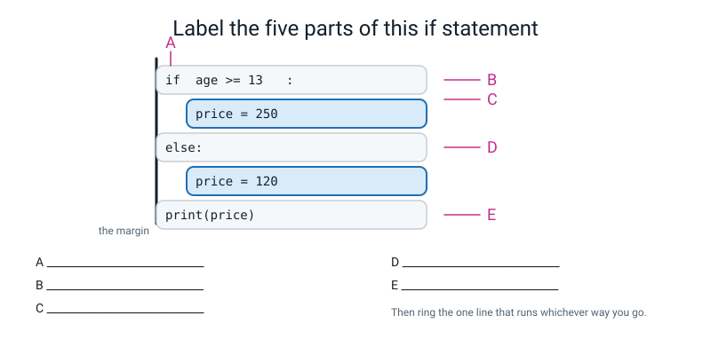
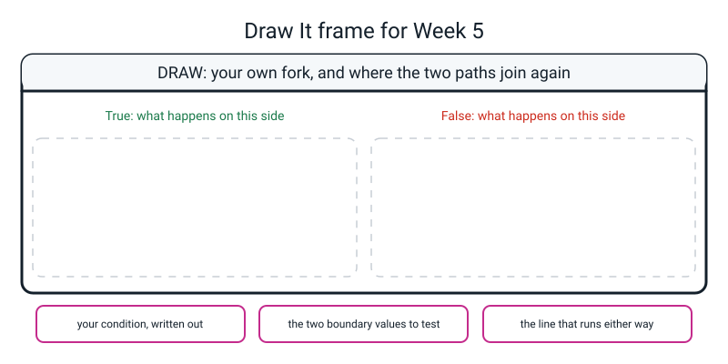

# Workbook — Week 5: Questions With Yes/No Answers

**Name:** ________________________________  **Date:** ______________

[⬅ Week 04](week-04.md) · [📖 Read the chapter first](../student-guide/week-05.md) · [Course Home](../README.md) · [🧑‍🏫 Teacher guide](../teacher-guide/week-05.md) · [Next ➡](week-06.md)

---

## ✅ Warm-Up (5 min)

Five quick questions about **last week**.

**W1.** I run `age = input("Age? ")` and type `12`. What exactly is in the box called `age`? Use the right word.

________________________________________________________________

**W2.** `print("120" * 2)` prints ______________ and `print(120 * 2)` prints ______________.

**W3.** Write the line that asks for a height in metres and stores it as a number that can have a decimal point.

________________________________________________________________

**W4.** `int(4.99)` is ______ and `round(4.99)` is ______. Say in one sentence what the difference is.

________________________________________________________________

**W5.** Which line of a traceback do you read first, and why is that not the top line?

________________________________________________________________

---

## 🔎 Predict the Output

**Write your prediction before you run anything.** Then run it and record the truth. A prediction you got wrong is worth three you got right.

### P1

```python
score = 35
print(score > 35)
print(score >= 35)
print(score != 35)
```

**I predict:** ______________  ______________  ______________

**It really printed:** ______________  ______________  ______________

### P2

```python
mark = 20

if mark >= 35:
    print("A")
    print("B")
print("C")
```

**I predict — write every line it prints, or "nothing":**

________________________________________________________________

**It really printed:**

________________________________________________________________

### P3

```python
temperature = 30

if temperature > 30:
    print("Hot")
else:
    print("Not hot")
print("Done")
```

**I predict:**

________________________________________________________________

**It really printed:**

________________________________________________________________

### P4

```python
print(7 == 7.0)
print("7" == 7)
print("10" > "9")
print(10 > 9)
```

**I predict:** ______  ______  ______  ______

**It really printed:** ______  ______  ______  ______

**How many of the thirteen did you get right?** ______ / 13

**Which one surprised you most, and why?**

________________________________________________________________

---

## ✍️ Practice Set A — Read It

**A1. Trace the values.** For each age, say `True` or `False` for the condition, then which branch runs, then what gets printed.

```python
child_price = 120
adult_price = 250

age = int(input("How old are you? "))

if age >= 13:
    price = adult_price
    band = "adult"
else:
    price = child_price
    band = "child"

print(f"Band  : {band}")
print(f"Price : {price} rupees")
```

| Age typed | `age >= 13` | branch taken | `band` | `price` |
|---|---|---|---|---|
| 8 | | | | |
| 12 | | | | |
| 13 | | | | |
| 40 | | | | |

**A2. Spot the bug — there is no error message.** This program is broken for most people. Say who it works for, who it fails for, and what the fix is.

```python
age = int(input("How old are you? "))

if age >= 13:
    price = 250
    band = "adult"
else:
    price = 120
    band = "child"

    print(f"Band  : {band}")
    print(f"Price : {price} rupees")
```

Works for: ____________________  Fails for: ____________________

What does the failure look like on the screen? ______________________________

The fix: ______________________________________

**A3. Match the code to the output.** One of the five prints **nothing at all**.

| | Snippet | | | Output |
|---|---|---|---|---|
| a | `print(5 == 5)` | ______ | **1** | `False` |
| b | `print(5 = 5)` | ______ | **2** | `True` |
| c | `print("5" == 5)` | ______ | **3** | *nothing — a `SyntaxError`, so nothing runs* |
| d | `print(5 >= 5)` | ______ | | |
| e | `print(5 > 5)` | ______ | | |

**A4. Label the diagram.** Five parts of one `if`/`else`. Write what each letter is.


*Figure W5.1 — One decision, taken apart.*

A ____________________  B ____________________  C ____________________

D ____________________  E ____________________

**Then ring the one line that runs whichever way you go.** Which letter is it? ______

**A5. Words into Python.** Fill in the right-hand column.

| Words | Python |
|---|---|
| is the mark at least 35? | ____________________ |
| is the age under 13? | ____________________ |
| is the answer exactly `"yes"`? | ____________________ |
| is the name anything other than `"Ramana"`? | ____________________ |
| is the total no more than 500? | ____________________ |
| is the number even? | ____________________ |

**A6. Which single test value would catch each bug?** For each mistake, name **one** age or mark that reveals it — and say why the obvious tests would not.

| The mistake | The one value that catches it | Why 8 and 40 don't |
|---|---|---|
| `age > 13` instead of `age >= 13` | | |
| `mark > 35` instead of `mark >= 35` | | |
| `age >= 3` where 13 was meant | | |

---

## ✍️ Practice Set B — Write It

**B1. One line.** Write the condition (just the condition, no `if`) that is `True` for a 13-year-old and `False` for a 12-year-old.

```python
________________________________________________________________
```

Now write a **different** condition that does exactly the same job:

```python
________________________________________________________________
```

Which do you prefer, and why? ______________________________________

**B2. Six lines — even or odd.** Ask for a whole number. Print whether it is even or odd. (`%` is Week 3's remainder.)

```python
________________________________________________________________

________________________________________________________________

________________________________________________________________

________________________________________________________________

________________________________________________________________

________________________________________________________________
```

*Expected output:*

```text
A whole number? 10
10 is even
```

*Done looks like:* it is also right for `7`, for `0`, and for `-3`. **Test all four.**

**B3. Eight lines — a weather verdict.** Ask for a temperature in Celsius, which can have a decimal point. Above 25 it is T-shirt weather; otherwise take a jumper. Print the temperature to one decimal place, then the advice.

```python
________________________________________________________________

________________________________________________________________

________________________________________________________________

________________________________________________________________

________________________________________________________________

________________________________________________________________

________________________________________________________________

________________________________________________________________
```

*Done looks like:* you tested **25 and 25.1** — the boundary pair — and not just 31 and 12.

**B4. About twelve lines — a bus fare.** Two fares: 15 rupees for a short trip, 25 rupees for 5 km or more. The distance can be a decimal. Name both fares **and the boundary** at the top of the file, so each number appears exactly once.

```python
________________________________________________________________

________________________________________________________________

________________________________________________________________

________________________________________________________________

________________________________________________________________

________________________________________________________________

________________________________________________________________

________________________________________________________________

________________________________________________________________

________________________________________________________________

________________________________________________________________

________________________________________________________________
```

*Done looks like:* changing the boundary from 5 km to 3 km is a **one-line** edit, and you tested 4.9 and 5.0.

**B5. About eighteen lines — a library fine.** Ask for a reader's name and how many days late their book is. If it is late at all, the fine is 5 rupees per day; if it is not late, there is no fine. Print a card with borders showing the name, the days late, a verdict, and the fine.

**The fine must be a derived value** — computed, not typed.

```python
________________________________________________________________

________________________________________________________________

________________________________________________________________

________________________________________________________________

________________________________________________________________

________________________________________________________________

________________________________________________________________

________________________________________________________________

________________________________________________________________

________________________________________________________________

________________________________________________________________

________________________________________________________________

________________________________________________________________

________________________________________________________________

________________________________________________________________

________________________________________________________________

________________________________________________________________

________________________________________________________________
```

*Done looks like:* every line commented with **why**; `int()` on the numeric input; the fine per day named once at the top; and **tested on 0 and 1** — the boundary pair — as well as on a big number.

---

## 🐞 Fix the Broken Program

Here is `sleep_check.py`. It has **three** bugs: one that stops Python reading the file, one that stops it partway through, and one that produces no error at all.

```python
# sleep_check.py - it has three bugs in it. Find them one at a time.

target_hours = 8                                    # hours of sleep we are aiming for

hours = input("How many hours did you sleep? ")     # the answer arrives from the human

if hours >= target_hours                            # the question
    verdict = "Well rested"
else:
    verdict = "Go to bed earlier"
    print(f"Hours   : {hours}")

print(f"Verdict : {verdict}")
```

**Bug 1.** Run it as it is. The real message:

```text
  File "sleep_check.py", line 7
    if hours >= target_hours                            # the question
                                                        ^^^^^^^^^^^^^^
SyntaxError: expected ':'
```

**Look where the carets are.** They are sitting under the **comment**, not under the condition. Why did Python point there, and what does that tell you about where the missing character should go?

________________________________________________________________

________________________________________________________________

The fix — write the whole corrected line:

```python
________________________________________________________________
```

**Bug 2.** Now run it and type `9`. The real message:

```text
How many hours did you sleep? 9
Traceback (most recent call last):
  File "sleep_check.py", line 7, in <module>
    if hours >= target_hours:                           # the question
TypeError: '>=' not supported between instances of 'str' and 'int'
```

Which line is the mistake actually on? ______

The fix:

```python
________________________________________________________________
```

Why does Python refuse this, instead of just deciding that `"9"` and `9` are near enough?

________________________________________________________________

**Bug 3.** Now it runs. Here are **two** real runs — 9 hours, then 6 hours:

```text
How many hours did you sleep? 9
Verdict : Well rested
```

```text
How many hours did you sleep? 6
Hours   : 6.0
Verdict : Go to bed earlier
```

What is inconsistent between those two runs?

________________________________________________________________

Why did no error appear? ______________________________________

The fix (say what you moved, and where to):

________________________________________________________________

**And a question worth more than the three fixes.** Bug 3 changed the number of lines printed depending on the answer. Which run would you have looked at if you only ran the program **once**, and would you have noticed?

________________________________________________________________

---

## 🧩 Puzzle of the Week

### Four outputs, and one of them is impossible

Here is `mystery.py`. It has **two** decisions in it, one after the other.

```python
# mystery.py - two decisions, one number.

number = int(input("A number? "))

if number > 10:
    print("big")
else:
    print("small")

if number != 7:
    print("not seven")
else:
    print("seven")
```

**P1.** The program always prints exactly two lines. Here are the four combinations it *could* print. For each one, find a number that produces it — **or say why no number can.**

| | First line | Second line | A number that does it, or "impossible" |
|---|---|---|---|
| a | `big` | `not seven` | ____________________ |
| b | `big` | `seven` | ____________________ |
| c | `small` | `not seven` | ____________________ |
| d | `small` | `seven` | ____________________ |

**P2.** One row is impossible. Which one, and explain it in one sentence a person who has never seen Python would understand.

________________________________________________________________

________________________________________________________________

**P3.** Change **one number** in the program so that all four combinations become possible. Which number, and what do you change it to?

________________________________________________________________

**P4.** Now the interesting one. **How many separate branches does this program have altogether?** Count carefully — there are two `if`/`else` pairs.

______ branches. And how many different **pairs of lines** can come out? ______

**P5.** Suppose you replaced the second `if number != 7:` with `if number != 70:`. Which of the four rows would become possible and which impossible? Fill the table in again.

| | First line | Second line | possible now? |
|---|---|---|---|
| a | `big` | `not seven` | ______ |
| b | `big` | `seven` | ______ |
| c | `small` | `not seven` | ______ |
| d | `small` | `seven` | ______ |

**P6.** What does this puzzle tell you about writing test values for a program with two decisions in it?

________________________________________________________________

---

## 🤔 Think Deeper

**T1.** Python uses **indentation** where most other languages use curly brackets. **Is that a good idea?**

Write a paragraph. Take a side, and name the cost of your side honestly — you produced a real example of that cost this week.

________________________________________________________________

________________________________________________________________

________________________________________________________________

________________________________________________________________

________________________________________________________________

________________________________________________________________

**T2.** `ticket_price.py` decides what a person pays from one number. **Name somebody the rule treats badly**, and then say whether that means the rule is wrong.

Be specific — a real person in a real situation, not "some people". Then answer the hard part: a cinema has to draw a line **somewhere**. So what exactly is the problem, and is there any version of this program that doesn't have it?

________________________________________________________________

________________________________________________________________

________________________________________________________________

________________________________________________________________

________________________________________________________________

________________________________________________________________

---

## 🛠️ Build It

### Part 1 — `ticket_price.py` and the test table

**Fill the "predicted" column in BEFORE you press Enter.** That is the whole point of the table.

| Age I typed | Price I predicted | Price it printed | Same? |
|---|---|---|---|
| 8 | | | |
| 12 | | | |
| 13 | | | |
| 14 | | | |
| 40 | | | |

### Part 2 — The boundary experiment

Now change **one character**: `age >= 13` becomes `age > 13`.

**Before you run anything**, predict which rows will change:

I think these rows will change: ____________________________________

Now run all five again:

| Age | With `>= 13` | With `> 13` | Changed? |
|---|---|---|---|
| 8 | | | |
| 12 | | | |
| 13 | | | |
| 14 | | | |
| 40 | | | |

**How many rows changed?** ______

**(a) If you had only tested 8 and 40, would you have found this bug?** ______

**(b) Write the testing rule in your own words.**

________________________________________________________________

**(c) Why is `child_price = 120` at the top of the file instead of `120` being written inside the `if`?**

________________________________________________________________

### Part 3 — Your own two-way decision

One question, two outcomes, and it has to be something you would actually care about the answer to. Some to steal if you're stuck: pass or fail · too hot for a jumper · free delivery · tall enough to ride · enough sleep · even or odd.

**My program is called:** ____________________

**My condition is:** ____________________

**The two outcomes are:** ____________________ and ____________________

**My boundary value is** ______ **, so the two values I must test are** ______ **and** ______ .

| Value I typed | What I predicted | What it printed | Same? |
|---|---|---|---|
| | | | |
| | | | |
| | | | |
| | | | |

**The checklist:**

| | Criterion |
|---|---|
| ☐ | Runs with `python3 <file>.py`, no traceback |
| ☐ | Exactly one `if` and one `else`, each with a colon |
| ☐ | Every line in each block indented the same amount |
| ☐ | `int()` or `float()` on any numeric input |
| ☐ | At least one line at the margin that runs either way |
| ☐ | Tested on the boundary value **and** the one below it |
| ☐ | Every line commented, saying *why* |

### Part 4 — The Bug Log

**Two entries, and one of them must be a bug with no error message at all.** You already know how to make one of those: indent a line that shouldn't be indented.

| # | What I saw (real text, or "no error") | What it meant, in my own words | What one thing I changed |
|---|---|---|---|
| 1 | | | |
| 2 | | | |

**(d) Which of your two was harder to find?**

________________________________________________________________

**(e) When nothing prints and there is no error, what do you look at first?**

________________________________________________________________

**(f) How can you tell a `SyntaxError` from every other kind of error, in three seconds?**

________________________________________________________________

---

## 🎨 Draw It

Draw **your own fork**: the condition on a signpost, the two branches, and — the bit everybody forgets — **where the two paths join again.**


*Figure W5.2 — Your page.*

> **What a good answer might look like:** the question is **"can I go to the park?"** and the signpost reads `homework_done == True`.
>
> On the **True** side: two boxes, `message = "Go on then"` and `minutes_allowed = 60`. On the **False** side: two boxes, `message = "Finish your maths first"` and `minutes_allowed = 0`.
>
> Then — and this is the part that earns the marks — **both arrows curve back and meet a single box at the bottom of the page** that reads `print(message)` and `print(minutes_allowed)`, with a note beside it: *"this runs whichever way you went, because it is at the margin."*
>
> The three bottom boxes: *`homework_done == True`* · *the boundary is a yes/no, so the two values to test are `True` and `False`* · *`print(message)` — at the margin.*
>
> **What a weak answer looks like:** two separate paths that never meet, each ending in its own `print`. That is drawable, and it is a **different program** — and it is also exactly how this week's silent bug happens, because if you forget one of those two prints, one kind of person gets no output at all.

---

## 📊 Self-Check

| I can… | 😀 got it | 🙂 nearly | 😕 not yet |
|---|---|---|---|
| Write a comparison and predict `True` or `False` before running it | ☐ | ☐ | ☐ |
| Use `if`/`else` to choose between two blocks of code | ☐ | ☐ | ☐ |
| Explain what indentation does, and why it is not decoration | ☐ | ☐ | ☐ |
| Tell `=` from `==` and say what each one is for | ☐ | ☐ | ☐ |
| Read the `SyntaxError` for `=` inside an `if` and use its suggestion | ☐ | ☐ | ☐ |
| Test the boundary value and the one below it, without being told | ☐ | ☐ | ☐ |

**True or false?** Circle one on each row.

| Statement | | |
|---|---|---|
| `12 > 12` is `True` | TRUE | FALSE |
| `=` and `==` do the same job | TRUE | FALSE |
| Indentation in Python is only for readability | TRUE | FALSE |
| `else` needs a condition of its own | TRUE | FALSE |
| A `SyntaxError` means part of the program ran | TRUE | FALSE |
| `"cat" == "Cat"` is `True` | TRUE | FALSE |
| `7 == 7.0` is `True` | TRUE | FALSE |
| Testing five ages proves the program is right | TRUE | FALSE |
| If a program prints nothing, something must have crashed | TRUE | FALSE |

One thing I'd like explained again:

________________________________________________________________

---

## ✅ Answers

<details>
<summary>Check your answers</summary>

### Warm-Up

**W1.** The **text** `"12"` — two characters, not the number twelve. `input()` always hands back text. Full marks needs the word "text" or "string".

**W2.** `"120" * 2` prints **`120120`** (repeated text). `120 * 2` prints **`240`** (multiplication). Same symbol, and the *type* on the left decides which job it does.

**W3.** `height_m = float(input("Height in metres? "))` — `float`, because 1.52 has a decimal point in it. With `int()` it would stop with a `ValueError`.

**W4.** `int(4.99)` is **4** and `round(4.99)` is **5**. `int()` **chops** at the dot and throws the rest away; `round()` goes to the **nearest** whole number.

**W5.** The **last** line, because that is the one that says what actually went wrong — the error type and the message. Everything above it is the route Python took to get there, which is much less useful when the program is only a dozen lines long.

---

### Predict the Output

**P1** — real output:

```text
False
True
False
```

`35 > 35` is `False` — "greater than" does **not** include equal. `35 >= 35` is `True` — that is exactly what the extra `=` buys you. And `35 != 35` is `False`, because they *are* equal, so "not equal" is false.

**P2** — real output:

```text
C
```

`20 >= 35` is `False`, so the whole block belonging to the `if` — **both** `A` and `B` — is skipped. `C` sits at the margin, so it belongs to nobody and runs regardless.

**P3** — real output:

```text
Not hot
Done
```

**The trap is line 3.** `30 > 30` is `False`, so a temperature of exactly 30 is "not hot". If you wanted 30 to count as hot, you needed `>=`. And `Done` is at the margin, so it prints either way — the two paths joined back up.

**P4** — real output:

```text
True
False
False
True
```

The third one is the interesting one. **`"10" > "9"` is `False`** — but `10 > 9` is `True`. As *text*, Python compares character by character, and the very first characters are `1` and `9`. `1` comes before `9`, so `"10"` sorts *before* `"9"` and nothing after the first character is even looked at. **This is what a forgotten `int()` can do to a comparison** — no error, plausible-looking, completely wrong.

---

### Practice Set A

**A1.** Real runs:

| Age typed | `age >= 13` | branch taken | `band` | `price` |
|---|---|---|---|---|
| 8 | `False` | the `else` | `"child"` | `120` |
| 12 | `False` | the `else` | `"child"` | `120` |
| 13 | `True` | the `if` | `"adult"` | `250` |
| 40 | `True` | the `if` | `"adult"` | `250` |

```text
How old are you? 13
Band  : adult
Price : 250 rupees
```

**A2.** The two `print` lines have been indented **into the `else` block**.

**Works for:** anyone **under 13**. **Fails for:** everyone **13 and over**.

**What the failure looks like:** it asks the question and then prints **absolutely nothing.** Here is the complete real output for an age of 14:

```text
How old are you? 14
```

No error. No card. Python is perfectly happy — the `else` didn't run, and both print lines live inside it.

**The fix:** move both print lines back to the **left margin**, level with the `if` and the `else`.

**A3.** a→**2** · b→**3** · c→**1** · d→**2** · e→**1**

Real outputs:

```text
True
False
True
False
```

…which is only four lines for five snippets, because **(b) never runs at all.** `print(5 = 5)` gives:

```text
  File "a3.py", line 1
    print(5 = 5)
          ^^^
SyntaxError: expression cannot contain assignment, perhaps you meant "=="?
```

You cannot put a value *into* the number 5. One equals sign is a delivery, and there is nothing there to deliver to. Notice that Python's wording is slightly different from the message you got inside an `if` — *"expression cannot contain assignment"* rather than *"invalid syntax"* — but the suggestion at the end is the same one, and it is the one to believe.

**A4.** **A** = the keyword `if` · **B** = the condition, `age >= 13` — the part that produces `True` or `False` · **C** = the colon, which means "a block starts on the next line" · **D** = the `else`, which takes no condition of its own and sits at exactly the same indentation as its `if` · **E** = the line at the margin, which runs whichever branch was taken.

**The line to ring is E.** It belongs to no block, so nothing can stop it running. (If it had been indented, you would get this week's silent bug.)

**A5.**

| Words | Python |
|---|---|
| is the mark at least 35? | `mark >= 35` |
| is the age under 13? | `age < 13` |
| is the answer exactly `"yes"`? | `answer == "yes"` |
| is the name anything other than `"Ramana"`? | `name != "Ramana"` |
| is the total no more than 500? | `total <= 500` |
| is the number even? | `number % 2 == 0` |

That last one is worth knowing by heart. **`number % 2 == 0` is how everybody in the world checks whether a number is even** — the remainder after dividing by 2 is 0. It is a genuinely famous line of code.

**A6.**

| The mistake | The one value that catches it | Why 8 and 40 don't |
|---|---|---|
| `age > 13` instead of `age >= 13` | **13** | 8 is a child either way; 40 is an adult either way. The two versions only ever disagree about 13 itself |
| `mark > 35` instead of `mark >= 35` | **35** | Same shape. Every mark except exactly 35 gets the same verdict from both versions |
| `age >= 3` where 13 was meant | **any age from 3 to 12** — say **8** | Here 8 *does* catch it (8 would wrongly become an adult), but 40 does not. **A different bug needs a different test**, which is why you test the boundary you *wrote*, not a boundary you remember |

The third row is the one that teaches something: your test values have to come from the numbers **in your code**, not from the numbers in your head.

---

### Practice Set B

**B1.** `age >= 13`. A different condition doing the same job: `age > 12`.

Both are correct and they are the same test written two ways. **`age >= 13` is usually preferable**, because it says the boundary out loud — you can hold the code next to the rule ("13 and over") and check them word for word. With `age > 12` you have to do a small piece of mental arithmetic every time you read it, and small pieces of mental arithmetic are where bugs live.

**B2.**

```python
number = int(input("A whole number? "))     # a whole number -> int()

if number % 2 == 0:            # remainder 0 when divided by 2 means even
    print(f"{number} is even")
else:                          # anything else
    print(f"{number} is odd")
```

All four real runs:

```text
A whole number? 10
10 is even
```
```text
A whole number? 7
7 is odd
```
```text
A whole number? 0
0 is even
```
```text
A whole number? -3
-3 is odd
```

**The two worth testing are `0` and `-3`.** Zero divides by two exactly, so it is even — which surprises people. And `-3 % 2` is `1` in Python, so negative odd numbers work correctly too. Neither of those is obvious, and neither would have been found by testing 10 and 7.

**B3.**

```python
temperature = float(input("Temperature in Celsius? "))   # can be 25.5, so float()

if temperature > 25:                 # the question
    advice = "T-shirt weather."       # runs only when True
else:                                 # everything else
    advice = "Take a jumper."         # runs only when False

print(f"It is {temperature:.1f} degrees.")
print(advice)
```

The boundary pair first:

```text
Temperature in Celsius? 25
It is 25.0 degrees.
Take a jumper.
```
```text
Temperature in Celsius? 25.1
It is 25.1 degrees.
T-shirt weather.
```

And two more for reassurance:

```text
Temperature in Celsius? 31
It is 31.0 degrees.
T-shirt weather.
```
```text
Temperature in Celsius? 12
It is 12.0 degrees.
Take a jumper.
```

**Notice something awkward about a `float` boundary.** With whole numbers, "the value below the boundary" is obvious — 12 is below 13. With decimals there is no such thing as "the next number down": 25.0, 25.01, 25.0001 are all below 25.1. So for a decimal, **test the boundary itself and a value just above it**, and be clear in your own head whether 25 exactly should count.

**B4.**

```python
# bus_fare.py - one distance in, one fare out.

short_fare = 15          # rupees, for a short trip
long_fare = 25           # rupees, for 5 km or more
long_from_km = 5         # the boundary, named once

distance_km = float(input("How far, in km? "))   # can be 4.5, so float()

if distance_km >= long_from_km:      # the question: is it 5 km or more?
    fare = long_fare                 # runs only when True
    band = "long"
else:                                # everything else
    fare = short_fare                # runs only when False
    band = "short"

print(f"Distance : {distance_km:.1f} km")   # at the margin, so it always runs
print(f"Band     : {band}")
print(f"Fare     : {fare} rupees")
```

The boundary pair, then reassurance:

```text
Distance : 4.9 km
Band     : short
Fare     : 15 rupees
```
```text
Distance : 5.0 km
Band     : long
Fare     : 25 rupees
```
```text
Distance : 12.0 km
Band     : long
Fare     : 25 rupees
```
```text
Distance : 0.5 km
Band     : short
Fare     : 15 rupees
```

**Why name the boundary as `long_from_km = 5`?** Because then the sentence in the comment, the condition, and the number are all in **one place**. Change the rule to 3 km and it is a one-line edit — and it is impossible to change the number and forget the comment, because they are next to each other.

**B5.**

```python
# library_fine.py - how late is the book, and what does it cost?

fine_per_day = 5                                  # rupees for each day late
grace_days = 0                                    # no free days at this library

reader = input("Your name?          ")            # text, no conversion needed
days_late = int(input("How many days late? "))    # whole days -> int()

if days_late > grace_days:               # the question: is it late at all?
    fine = days_late * fine_per_day      # derived: nobody typed this
    verdict = "Late"
else:                                    # on time, or early
    fine = 0                             # nothing to pay
    verdict = "On time"

print("==============================")
print(f"  Reader    : {reader}")
print(f"  Days late : {days_late}")
print(f"  Verdict   : {verdict}")
print("------------------------------")
print(f"  Fine      : {fine} rupees")
print("==============================")
```

The boundary pair — 0 days and 1 day:

```text
==============================
  Reader    : Anika
  Days late : 0
  Verdict   : On time
------------------------------
  Fine      : 0 rupees
==============================
```
```text
==============================
  Reader    : Anika
  Days late : 1
  Verdict   : Late
------------------------------
  Fine      : 5 rupees
==============================
```

And two more:

```text
  Days late : 6
  Verdict   : Late
------------------------------
  Fine      : 30 rupees
```
```text
  Days late : 20
  Verdict   : Late
------------------------------
  Fine      : 100 rupees
```

Check on paper: 6 × 5 = 30 ✔ and 20 × 5 = 100 ✔.

**Two things worth noticing.** The `if` branch does **arithmetic**, not just an assignment — a branch is allowed to compute. And `grace_days = 0` looks pointless right now, because `days_late > 0` would do. It is not pointless: it means "this library has no grace period" is written down as a **decision** rather than hidden inside a comparison, and if the library ever allows three free days it is a one-line change.

---

### Fix the Broken Program

**Bug 1 — the missing colon.**

**Why the carets landed on the comment.** Python read `if hours >= target_hours`, expected a `:` next, and found a `#` instead. So it points at the first thing that was *not* what it wanted — which happens to be your comment. **The colon belongs immediately after the condition, before the comment.**

```python
if hours >= target_hours:                           # the question
```

That is a genuinely useful thing to have seen once: **the caret points at where Python got confused, not at where you should type.** Sometimes they are the same place. Here they are not.

**Bug 2 — the missing conversion.** `hours` is text, and you cannot put text and a number in an order.

**The mistake is on line 5**, the line that filled `hours` — even though the traceback names line 7.

```python
hours = float(input("How many hours did you sleep? "))   # the answer arrives as text
```

`float`, not `int`, because you might have slept 7.5 hours. (`int` would also fix the crash, and would then break the day somebody types `7.5`. Fixing the error you can see while creating one you can't is very easy to do.)

**Why won't Python just decide `"9"` and `9` are near enough?** Because it cannot know what you meant, and getting it wrong is silent. `"10" > "9"` is `True` as text and `False`… no — it is `False` as text and `True` as numbers. **Text and numbers sort differently**, so if Python guessed, your program would work for most inputs and be quietly wrong for some. A crash is better than that.

**Bug 3 — the silent one.** `print(f"Hours   : {hours}")` has been indented **inside the `else`**, so it only appears when you slept badly. Somebody who slept 9 hours gets one line of output; somebody who slept 6 gets two.

**Why no error?** Because nothing is wrong. An indented line inside a block is perfectly legal — Python has no way to know you meant it to be at the margin.

**The fix:** move that `print` out to the left margin, below the whole `if`/`else`. The fixed program, run for real:

```text
How many hours did you sleep? 9
Hours   : 9.0
Verdict : Well rested
```
```text
How many hours did you sleep? 6
Hours   : 6.0
Verdict : Go to bed earlier
```

**And the question worth more than the fixes.** If you had run it once with `6`, you would have seen both lines and concluded it was fine. **The bug is invisible from the branch that works.** That is why one test run is never a test.

---

### Puzzle of the Week

**P1 and P2.** Real runs:

```text
A number? 40
big
not seven
```
```text
A number? 7
small
seven
```
```text
A number? 3
small
not seven
```

| | First line | Second line | Answer |
|---|---|---|---|
| a | `big` | `not seven` | **40** (or any number over 10 that isn't 7) |
| b | `big` | `seven` | **impossible** |
| c | `small` | `not seven` | **3** (or any number 10 or under that isn't 7) |
| d | `small` | `seven` | **7** — and only 7 |

**P2.** Row **(b)** is impossible. In plain words: **to print `seven`, the number has to be seven — and seven is not bigger than ten**, so it can never also print `big`. The two decisions look independent, but they are both asking about the same number, and one answer rules out the other.

**P3.** Change the `10` to something **below 7** — for example `if number > 5:`. Then 7 is "big" *and* "seven", and all four combinations become reachable. (Changing the `7` to something above 10, like `70`, does the same job from the other direction — see P5.)

**P4.** **Four branches** — two `if`/`else` pairs, two branches each. And **four different pairs of lines** could in principle come out, of which **three** actually can. That gap between "how many outputs the code can produce" and "how many are reachable" is exactly what makes testing hard.

**P5.** With `if number != 70:`, the number 70 is both **over 10** and **equal to 70**:

| | First line | Second line | possible now? |
|---|---|---|---|
| a | `big` | `not seven` | **yes** — e.g. 40 |
| b | `big` | `seven` | **yes** — 70, and only 70 |
| c | `small` | `not seven` | **yes** — e.g. 3 |
| d | `small` | `seven` | **impossible** — 70 is never "small" |

**The impossible row swapped places.** Same shape of program, same number of branches, and a completely different set of reachable answers — all from changing one number.

**P6.** That **you cannot test two decisions by testing each one separately.** With two decisions there are four combinations, and the interesting values are the ones that sit on a boundary for **both** — or that prove a combination cannot happen at all. A program with three decisions has eight combinations, and some of those will be unreachable too. Real testing means asking *which combinations are possible*, not just *does each branch work*.

---

### Think Deeper

**T1. Model answer:**

> I think it is a good idea, and the reason is that it makes the code unable to lie. In a language with brackets, you can lay the code out so that it *looks* like three lines are inside the `if` while the brackets say only one of them is — and then the shape on the page is telling you something false. In Python the shape on the page **is** the program, so a badly laid-out Python program cannot pretend to be a well laid-out one.
>
> The cost is real, though, and I hit it this week. The thing that decided my program's behaviour was a set of spaces I could not see. My bug produced no error and no output at all, and I only found it by covering the code with a sheet of paper and looking at the left edge. In a bracket language the brackets would at least have been visible on the screen.
>
> So it trades one invisible problem for another: brackets can disagree with the layout, and spaces can be invisible. I would rather have the version where the layout is always honest — but I understand why somebody who has been bitten by a pasted-in indent from a web page disagrees.

*Full marks needs:* a side taken · the "code cannot lie" argument or the "invisible" argument · and an honest naming of what your own side costs.

**T2. Model answer:**

> The person the rule treats worst is somebody whose **thirteenth birthday is today**. Yesterday they were a child and paid 120; today the same person, who has not changed in any way that matters, pays 250. Nothing about them is different. A date changed.
>
> Other good answers: a 12-year-old taller than the ticket seller. A 30-year-old with no money and a 12-year-old with plenty. A 12-year-old buying a ticket for a three-hour film they are not allowed to watch.
>
> Does that mean the rule is wrong? **No — and this is the part that took me a while.** A cinema has to draw a line somewhere, and every possible line has somebody standing on it. Moving the boundary from 13 to 14 does not fix anything; it just changes *who* is standing there. There is no version of this program that avoids the problem **as long as the output is one of two prices.**
>
> So the honest position is: the boundary is a **choice**, not a discovery, and the people it treats oddly are a cost of having a simple rule at all. What a program can do is be clear about the rule so that a human can see the choice and argue with it — which is much better than hiding it.

*Full marks needs:* a **specific** person · the recognition that the rule is not thereby "wrong" · and the insight that moving the boundary only changes who stands on it.

---

### Build It

**Part 1 — the completed test table:**

| Age I typed | Price I predicted | Price it printed | Same? |
|---|---|---|---|
| 8 | 120 | 120 | ✔ |
| 12 | 120 | 120 | ✔ |
| 13 | 250 | 250 | ✔ |
| 14 | 250 | 250 | ✔ |
| 40 | 250 | 250 | ✔ |

**Part 2 — the boundary experiment.** Real runs with `> 13`:

| Age | With `>= 13` | With `> 13` | Changed? |
|---|---|---|---|
| 8 | 120 | 120 | no |
| 12 | 120 | 120 | no |
| **13** | **250** | **120** | **yes** |
| 14 | 250 | 250 | no |
| 40 | 250 | 250 | no |

**One row changed** out of five.

**(a) No.** 8 is a child either way and 40 is an adult either way. You would have shipped it.

**(b) The rule:** whenever you write a number in a condition, **test that number and the one just below it.** Everything in the middle is reassurance; the edge is the test. Or, put another way: a test that gives the same answer on the broken and the correct version has told you nothing.

**(c)** Because the price now appears exactly **once** in the file. When the cinema puts prices up you change one line, with no chance of changing one of two places and leaving the other. It also gives the number a name, so the block reads `price = child_price` rather than an unexplained `120` — the code says *why*, not just *what*.

**Part 3 — a model answer** (`pass_fail.py`, actually run):

```python
# pass_fail.py - one mark in, one verdict out.

pass_mark = 35                              # the school's pass mark

mark = int(input("Mark out of 100? "))      # text arrives, int() makes it a number

if mark >= pass_mark:                       # the question: is it 35 or more?
    verdict = "Pass"                        # runs only when the answer is True
else:                                       # everything else
    verdict = "Fail"                        # runs only when the answer is False

print(f"Mark    : {mark}")                  # not indented, so it always runs
print(f"Verdict : {verdict}")
```

```text
Mark out of 100? 34
Mark    : 34
Verdict : Fail
```
```text
Mark out of 100? 35
Mark    : 35
Verdict : Pass
```
```text
Mark out of 100? 100
Mark    : 100
Verdict : Pass
```
```text
Mark out of 100? 0
Mark    : 0
Verdict : Fail
```

**34 and 35 are the test. 100 and 0 are reassurance.**

**Part 4 — two model Bug Log entries.** Yours will differ; the **structure** is what is marked.

| # | What I saw (real text) | What it meant, in my words | What I changed |
|---|---|---|---|
| 1 | `SyntaxError: invalid syntax. Maybe you meant '==' or ':=' instead of '='?` — line 8, carets under `age = 13` | I wrote the one that puts a value in a box where I needed the one that asks a question. Nothing ran at all — it didn't even ask me my age. | One `=` became two |
| 2 | **No error message.** The program asked my age and then printed nothing. | Both print lines had ended up indented inside the `else`, so when the condition was `True` nothing at all ran. Python had no complaint because I hadn't broken any rule. | Moved the two print lines back to the left margin |

**(d)** The one with **no message**, essentially always. A traceback gives you the file, the line, a category and a sentence. Silence gives you nothing, and to even *notice* you have to already know what the program should have printed.

**(e)** The **left edge** of the file, not the words. Cover the code so only the first four characters of each line show. An over-indented `print` is invisible when you read the code as English and obvious when you look at the margin.

**(f)** Ask whether **anything at all** printed. A `SyntaxError` means Python could not read the file, so not one line ran — not even the first `print`. Every other error happens partway through a program that was already running.

---

### Draw It

There is no single right drawing. A strong answer does three things:

1. **The condition is on the fork, not inside a branch.** The question is asked once, at the split.
2. **The two branches rejoin**, and the box below the join is labelled as running either way. This is the part most people leave out, and it is exactly the part this week's silent bug attacks.
3. **Both branches set the same names.** If the True side sets `message` and the False side sets `reply`, then whatever comes after the join cannot print reliably — which is the `NameError` from section 4 of the chapter, drawn.

Test your own drawing with one question: **cover one branch. Does the box below the join still have everything it needs?** If not, that branch was doing work that the other one wasn't, and one kind of person is going to get a broken program.

---

### Self-Check answers

| Statement | Answer |
|---|---|
| `12 > 12` is `True` | **FALSE.** "Greater than" excludes equal. |
| `=` and `==` do the same job | **FALSE.** One delivers, one judges. |
| Indentation in Python is only for readability | **FALSE.** It is the syntax. |
| `else` needs a condition of its own | **FALSE.** It catches everything the `if` missed. |
| A `SyntaxError` means part of the program ran | **FALSE.** Nothing ran. Python never read the file. |
| `"cat" == "Cat"` is `True` | **FALSE.** Case matters. |
| `7 == 7.0` is `True` | **TRUE.** The values are equal; the types differ. |
| Testing five ages proves the program is right | **FALSE.** Four of the five passed a broken program. |
| If a program prints nothing, something must have crashed | **FALSE.** That was this week's silent bug. |

</details>

---

[⬅ Week 4 workbook](week-04.md) · [📖 Week 5 chapter](../student-guide/week-05.md) · [Course Home](../README.md) · [Week 6 workbook ➡](week-06.md) · [Glossary](../../glossary.md)
