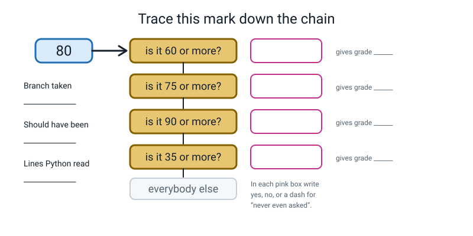
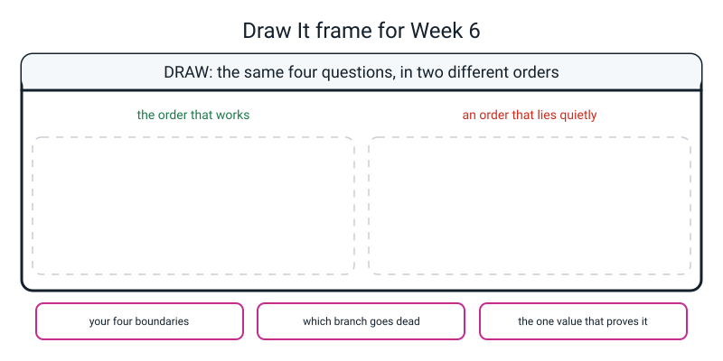

# Workbook — Week 6: More Than Two Doors: elif, and, or, not

**Name:** ________________________________  **Date:** ______________

[⬅ Week 05](week-05.md) · [📖 Read the chapter first](../student-guide/week-06.md) · [Course Home](../README.md) · [🧑‍🏫 Teacher guide](../teacher-guide/week-06.md) · [Next ➡](week-07.md)

---

## ✅ Warm-Up (5 min)

Five quick questions about **last week**.

**W1.** True or False, quickly: `12 > 12` is ______ · `12 >= 12` is ______ · `"cat" == "Cat"` is ______

**W2.** In one sentence each: what does `=` do, and what does `==` do?

________________________________________________________________

________________________________________________________________

**W3.** What does the colon at the end of an `if` line mean?

________________________________________________________________

**W4.** Which lines print, and why?

```python
mark = 20

if mark >= 35:
    print("A")
    print("B")
print("C")
```

________________________________________________________________

**W5.** You wrote `age >= 13` in a condition. Which **two** ages must you test, and why not 8 and 40?

________________________________________________________________

---

## 🔎 Predict the Output

In this section you predict what four short programs print, then run them to check.

**Write your prediction before you run anything.** This week, some snippets produce **no error at all** — so "what do you expect" means "what will it print", not just "which error".

### P1

```python
mark = 88

if mark >= 60:
    print("C")
elif mark >= 75:
    print("B")
elif mark >= 90:
    print("A")
```

**I predict:** ________________________

**It really printed:** ________________________

### P2

```python
print(True or True)
print(not False or False)
print(True and not True)
```

**I predict:** ______________  ______________  ______________

**It really printed:** ______________  ______________  ______________

### P3

```python
age = 15

if age >= 13:
    print("teen")
if age >= 5:
    print("child")
```

**I predict — write every line, or "nothing":**

________________________________________________________________

**It really printed:**

________________________________________________________________

**Now the important bit:** what would this print if the second `if` were an `elif`?

________________________________________________________________

### P4

```python
answer = "no"

if answer == "yes" or "y":
    print("yes branch")
else:
    print("no branch")
```

**I predict:** ________________________

**It really printed:** ________________________

**How many of the nine did you get right?** ______ / 9

**Which one surprised you most, and why?**

________________________________________________________________

---

## ✍️ Practice Set A — Read It

In this set you read chains and conditions and say what Python does with them. Write your answers before you run anything.

**A1. Trace it with your finger.** Say `yes`, `no`, or a **dash** for "Python never even asked".

```python
if mark >= 90:
    grade = "A"
elif mark >= 75:
    grade = "B"
elif mark >= 60:
    grade = "C"
elif mark >= 35:
    grade = "D"
else:
    grade = "F"
```

| Mark | `>=90`? | `>=75`? | `>=60`? | `>=35`? | Branch taken | Lines Python read |
|---|---|---|---|---|---|---|
| 100 | | | | | | |
| 75 | | | | | | |
| 62 | | | | | | |
| 34 | | | | | | |

**A2. Find the dead code.** Which branches in this chain can **never** run, whatever mark you type? There is more than one.

```python
if mark >= 50:
    grade = "Pass"
elif mark >= 80:
    grade = "Distinction"
elif mark < 50:
    grade = "Fail"
else:
    grade = "???"
```

Dead branches: ______________________________________

**And the sting:** one of the dead ones is the safety net. Which, and why does that matter?

________________________________________________________________

**A3. Match the code to the output.** All four run without any error.

| | Snippet | | | Output |
|---|---|---|---|---|
| a | `print(7 > 3 and 2 > 5)` | ______ | **1** | `True` |
| b | `print(7 > 3 or 2 > 5)` | ______ | **2** | `False` |
| c | `print(not 7 > 3)` | ______ | | |
| d | `print(True or False and False)` | ______ | | |

Which of those four would change if you added brackets, and where would you put them?

________________________________________________________________

**A4. Label the diagram.** A mark of 80 walks into the **broken** chain. Fill in every pink box with `yes`, `no` or a dash — and then fill in the three boxes down the left-hand side.


*Figure W6.1 — One mark, one chain, and most of the questions never asked.*

Branch taken: ____________________

Should have been: ____________________

Lines Python read: ____________________

**A5. Why doesn't the C branch need an upper bound?** The chain in A1 has `elif mark >= 60:` and nothing else. Explain, in your own words, why that branch correctly refuses to take a mark of 80.

________________________________________________________________

________________________________________________________________

**A6. Which is `and` and which is `or`?** For each sentence, write the Python condition.

| In words | Python |
|---|---|
| 13 or over **and** not injured | ____________________ |
| it is Tuesday **and** the price is more than zero | ____________________ |
| the mark is between 60 and 74 inclusive | ____________________ |
| it is raining **or** you are late | ____________________ |
| the number divides by both 2 and 3 | ____________________ |
| the number divides by 2 **or** by 3 | ____________________ |
| it is **not** the weekend | ____________________ |

---

## ✍️ Practice Set B — Write It

In this set you write your own chains and conditions, then test them at the boundaries. Fill in each table before you run the program.

**B1. One line.** Write the condition for *"old enough to play (13 or over), has played at least 5 matches, and is not injured."*

```python
________________________________________________________________
```

Now say what happens to the whole condition if **only** the injury part is `True`-in-the-wrong-direction (that is, the player *is* injured):

________________________________________________________________

**B2. Ten lines — a three-branch chain.** Ask for a mark out of 100. Print `A` for 90 and over, `Pass` for 35 to 89, and `F` below 35.

```python
________________________________________________________________

________________________________________________________________

________________________________________________________________

________________________________________________________________

________________________________________________________________

________________________________________________________________

________________________________________________________________

________________________________________________________________

________________________________________________________________

________________________________________________________________
```

*Done looks like:* you tested **exactly four** marks — 90, 89, 35, 34 — because those are the two boundary pairs and nothing else proves anything.

**B3. Four lines — the three words on their own.** Set up two yes/no variables (`raining` and `late`), then print four things: `raining or late`, `raining and late`, `not raining`, and one condition of your own that **mixes `and` with `or`** and uses brackets.

```python
________________________________________________________________

________________________________________________________________

________________________________________________________________

________________________________________________________________
```

*Done looks like:* you predicted all four before running, and the mixed one has brackets even though Python would cope without them.

**B4. About sixteen lines — a battery warning.** Four bands off one number: 80% and over is "full", 40% and over is "fine", 15% and over is "low", and anything below that is "critical". Each band prints a different piece of advice.

```python
________________________________________________________________

________________________________________________________________

________________________________________________________________

________________________________________________________________

________________________________________________________________

________________________________________________________________

________________________________________________________________

________________________________________________________________

________________________________________________________________

________________________________________________________________

________________________________________________________________

________________________________________________________________

________________________________________________________________

________________________________________________________________

________________________________________________________________

________________________________________________________________
```

**Fill in the test table before you run it.** There are three boundaries, so there are six values worth testing.

| Percent | I predict | It printed | Same? |
|---|---|---|---|
| 80 | | | |
| 79 | | | |
| 40 | | | |
| 39 | | | |
| 15 | | | |
| 14 | | | |

**B5. About twenty lines — a four-band chain of your own, with an `and` in it.**

Rules: at least **four** branches plus an `else` · at least one `and` doing real work · and a test table covering **both sides of every boundary**.

Some to steal if you're stuck: race medals by time · how long until the bus (run / walk / wait / get a snack) · sleep report · cricket innings · pizza size for a number of people.

```python
________________________________________________________________

________________________________________________________________

________________________________________________________________

________________________________________________________________

________________________________________________________________

________________________________________________________________

________________________________________________________________

________________________________________________________________

________________________________________________________________

________________________________________________________________

________________________________________________________________

________________________________________________________________

________________________________________________________________

________________________________________________________________

________________________________________________________________

________________________________________________________________

________________________________________________________________

________________________________________________________________

________________________________________________________________

________________________________________________________________
```

**My boundaries are:** ______  ______  ______

| Value I typed | I predict | It printed | Same? |
|---|---|---|---|
| | | | |
| | | | |
| | | | |
| | | | |
| | | | |
| | | | |

**What does my `and` protect against?** (What silly thing would happen without it?)

________________________________________________________________

---

## 🐞 Fix the Broken Program

In this section you find and fix bugs in a program that was broken on purpose.

Here is `fine.py`, a library fine calculator. It has **three** bugs: one that stops Python reading the file, one that stops it partway through, and one that produces **no error at all**.

```python
# fine.py - a library fine calculator. It has three bugs in it.

days_late = input("How many days late? ")        # how late the book is

if days_late >= 1:                               # the first bouncer
    fine = 5
elif days_late >= 7:
    fine = 40
elif days_late >= 14:
    fine = 100
else:
    fine = 0

if days_late >= 14 and <= 30:                    # a warning for very late books
    print("The book is now counted as lost.")

print(f"Days late : {days_late}")
print(f"Fine      : {fine} rupees")
```

**Bug 1.** Run it as it is. The real message:

```text
  File "fine.py", line 14
    if days_late >= 14 and <= 30:                    # a warning for very late books
                           ^^
SyntaxError: invalid syntax
```

What is wrong with that condition, in words a person would understand?

________________________________________________________________

The fix — write the whole corrected line:

```python
________________________________________________________________
```

**Bug 2.** Now run it and type `20`. The real message:

```text
How many days late? 20
Traceback (most recent call last):
  File "fine.py", line 5, in <module>
    if days_late >= 1:                               # the first bouncer
TypeError: '>=' not supported between instances of 'str' and 'int'
```

Which line is the mistake actually on? ______  The fix:

```python
________________________________________________________________
```

**Bug 3.** Now it runs all the way through. Two real runs — 20 days late, then 3 days late:

```text
How many days late? 20
The book is now counted as lost.
Days late : 20
Fine      : 5 rupees
```

```text
How many days late? 3
Days late : 3
Fine      : 5 rupees
```

**Look at the 20-day run.** The book is counted as lost, and the fine is 5 rupees.

(a) What should a 20-day fine be? ______  What did it say? ______

(b) Try 3 days, 8 days, and 30 days. What fine does every late book get? ______

(c) **Which branches of that chain can never run?** ______________________________

(d) Why was there no error message at all?

________________________________________________________________

(e) Write out the fixed chain — the whole thing, in the right order:

```python
________________________________________________________________

________________________________________________________________

________________________________________________________________

________________________________________________________________

________________________________________________________________

________________________________________________________________

________________________________________________________________

________________________________________________________________
```

(f) **Which single test value proves your fix?** And which values would have passed on the broken version too?

________________________________________________________________

---

## 🧩 Puzzle of the Week

A puzzle with four condition cards and one `else` card.

### Bouncer Roulette

You have **four condition cards** and one `else` card. The four cards are:

```text
   [ 90 or more?  -> A ]     [ 75 or more?  -> B ]
   [ 60 or more?  -> C ]     [ 35 or more?  -> D ]     [ else -> F ]
```

You may lay the four cards in any order you like. The `else` card is always last.

**P1.** Lay them out so the program is **correct** — every mark gets the grade it should. Write the order:

________________________________________________________________

**P2.** Now lay them out so that **everybody who passes gets a D.** Write the order, then say what a mark of 95 comes out as, and what a mark of 34 comes out as.

Order: ____________________  95 → ______  34 → ______

How many branches are dead in that order? ______  Which ones? ____________________

**P3.** Which single card **must** be first if the A branch is to be reachable at all? Say why in one sentence.

________________________________________________________________

**P4.** The hard one. **Can you lay the cards out so that the D branch is dead?** Try. Then either write the order that does it, or **prove that it is impossible.**

________________________________________________________________

________________________________________________________________

________________________________________________________________

**P5.** Fill this in for three different orders. Predict every cell first, then check by running.

| Order (top to bottom) | 95 gets | 80 gets | 62 gets | 50 gets | 20 gets | dead branches |
|---|---|---|---|---|---|---|
| 90, 75, 60, 35 | | | | | | |
| 60, 75, 90, 35 | | | | | | |
| 35, 60, 75, 90 | | | | | | |

**P6.** Look down the `20 gets` column. **Every order gives the same answer.** Why — and what does that tell you about choosing test values?

________________________________________________________________

________________________________________________________________

---

## 🤔 Think Deeper

Two questions with no single right answer. Take a side and give your reasons.

**T1.** Your chain had two branches that no possible input could ever reach. **Should Python warn you about that?**

Write a paragraph. Take a side, name the cost of your side, and — if you can — find the argument that cuts *against* the thing you would personally prefer.

________________________________________________________________

________________________________________________________________

________________________________________________________________

________________________________________________________________

________________________________________________________________

________________________________________________________________

**T2.** The grade chain draws four lines. One student got **89**. Another got **90**.

How different is what those two people know? How different is what the report card says about them? Is there a way to write this program that doesn't have that problem — **as long as the output is a letter?**

Then say what a program *could* honestly do instead.

________________________________________________________________

________________________________________________________________

________________________________________________________________

________________________________________________________________

________________________________________________________________

________________________________________________________________

---

## 🛠️ Build It

Five parts that use `grade_broken.py` and your fixed chain. Work through them in order, with the tables filled in by hand.

### Part 1 — Trace the broken chain on paper

Open `grade_broken.py`. **Do not fix it yet.** Finger on the first condition, out loud, with the real number substituted in.

**A dash means "Python never even asked."** Insist on dashes; they are the lesson.

| Mark | `>=60`? | `>=75`? | `>=90`? | `>=35`? | Branch | Should be | Right? |
|---|---|---|---|---|---|---|---|
| 95 | | | | | | | |
| 80 | | | | | | | |
| 62 | | | | | | | |
| 50 | | | | | | | |
| 20 | | | | | | | |

**(a) How many dashes are in the 95 row?** ______ **So how much of that five-branch chain did Python read?** ______

**(b) The 62 row says "right". Is it right for the *right reason*?** Explain.

________________________________________________________________

________________________________________________________________

### Part 2 — Reorder it and run all five again

**Move the branches; don't retype them.** Cut and paste whole two-line blocks, so you can be certain nothing changed except the order.

| Mark | Broken says | Fixed says | Different? | **Proves the fix?** |
|---|---|---|---|---|
| 95 | | | | |
| 80 | | | | |
| 62 | | | | |
| 50 | | | | |
| 20 | | | | |

**(c) Circle the rows that prove the fix.** How many are there? ______

**(d) Which rows told you nothing at all, and why?**

________________________________________________________________

**(e) State the ordering rule in your own words.**

________________________________________________________________

### Part 3 — The boundaries

There are four boundaries in the fixed chain. Write the eight values worth testing, then test four of them.

The eight values: ______________________________________________

| Mark | I predict | It printed | Same? |
|---|---|---|---|
| 90 | | | |
| 89 | | | |
| 35 | | | |
| 34 | | | |

Now break it on purpose: change `>= 90` to `> 90`.

**Which of your eight boundary values changes?** ______  Check it. Were you right? ______

### Part 4 — Truth tables, laptop **closed**

Fill both in from memory. Think about the pizza and the two selectors.

| A | B | `A and B` | `A or B` |
|---|---|---|---|
| `True` | `True` | | |
| `True` | `False` | | |
| `False` | `True` | | |
| `False` | `False` | | |

| A | `not A` |
|---|---|
| `True` | |
| `False` | |

Now open the laptop and check yourself by running:

```python
print(True and True, True and False, False and True, False and False)
print(True or True, True or False, False or True, False or False)
print(not True, not False)
```

**My score:** ______ / 10

**How many of `and`'s four rows are `True`?** ______  **And `or`'s?** ______

**Which row did you get wrong, if any?** ____________________

### Part 5 — The Bug Log

**Two entries, and this week both of them may be silent.** At least one must have **no error message**.

| # | What I saw (real text, or "no error") | What it meant, in my own words | What one thing I changed |
|---|---|---|---|
| 1 | | | |
| 2 | | | |

**(f) How many of your bugs this week had no error message?** ______

**(g) If reading the code does not find an ordering bug, what does?** Describe the procedure in four steps.

________________________________________________________________

________________________________________________________________

**(h) Why does substituting the real number matter when you trace?**

________________________________________________________________

---

## 🎨 Draw It

In this section you show the week's idea as a picture instead of in words.

Draw **the same four questions in two different orders**: one order that works, and one order that lies quietly.


*Figure W6.2 — Your page.*

> **What a good answer might look like:** the subject is **how long until the bus**, with four bands: under 2 minutes "run", under 10 "walk", under 30 "wait", else "get a snack".
>
> On the **left**, the four questions stacked in the order that works — **under 2** at the top, then under 10, then under 30 — with a `7` dropping in at the top, sliding past the first gate with a "no", and exiting at "walk". Three gates drawn, one exit taken, and the fourth gate greyed out and labelled *never asked*.
>
> On the **right**, the same four gates with **under 30** at the top. The same `7` drops in and stops at the very first gate, exits at "wait", and the two gates below are shaded out with a brace labelled **dead code — no input can reach these**.
>
> The three bottom boxes: *2, 10, 30* · *"run" and "walk" both go dead in the right-hand version* · *"a wait of 1 minute — because 1 comes out as 'wait' on the right and 'run' on the left, and 40 comes out the same on both."*
>
> **What a weak answer looks like:** drawing the wrong-order version with the arrow still going all the way to the bottom gate. That is the misunderstanding, drawn: **the mark never gets past the first yes.** If the arrow visits every gate, the picture is showing four separate `if`s, not a chain.

---

## 📊 Self-Check

Tick the face that matches how you feel about each skill. Then answer the true-or-false rows.

| I can… | 😀 got it | 🙂 nearly | 😕 not yet |
|---|---|---|---|
| Build an `if`/`elif`/`else` chain with four branches | ☐ | ☐ | ☐ |
| Explain why reordering the branches changes the answer | ☐ | ☐ | ☐ |
| Combine conditions with `and`, `or` and `not`, and predict the result | ☐ | ☐ | ☐ |
| Fill in the truth tables for `and` and `or` from scratch | ☐ | ☐ | ☐ |
| Find a chain that gives everyone the same grade, fix it, and **prove** the fix | ☐ | ☐ | ☐ |
| Trace a value down a chain with my finger, out loud | ☐ | ☐ | ☐ |

**True or false?** Circle one on each row.

| Statement | | |
|---|---|---|
| Python picks the branch that fits best | TRUE | FALSE |
| A chain can run two branches | TRUE | FALSE |
| A chain without an `else` always works | TRUE | FALSE |
| `elif` is spelled `else if` | TRUE | FALSE |
| `True or True` is `False` | TRUE | FALSE |
| `and` is `True` in one row out of four | TRUE | FALSE |
| `not 7 > 3` is `True` | TRUE | FALSE |
| `&&` works in Python | TRUE | FALSE |
| Five passing tests prove a fix | TRUE | FALSE |
| A silent bug is one with a confusing error message | TRUE | FALSE |

One thing I'd like explained again:

________________________________________________________________

---

## ✅ Answers

Finish the whole workbook first. Then open the box below and mark your work.

<details>
<summary>Check your answers</summary>

### Warm-Up

**W1.** `12 > 12` is **False** · `12 >= 12` is **True** · `"cat" == "Cat"` is **False**.

**W2.** `=` puts a value into a name — it **changes** something and answers nothing. `==` compares two values and hands back `True` or `False` — it **answers** something and changes nothing.

**W3.** "The block starts on the next line." Leave it out and Python stops with `SyntaxError: expected ':'`.

**W4.** Only **`C`**. `20 >= 35` is `False`, so the whole block belonging to the `if` — both `A` and `B` — is skipped. `C` is at the margin, so it belongs to nobody and runs regardless.

**W5.** **12 and 13** — the boundary and the value just below it. 8 is a child and 40 is an adult under *both* `>` and `>=`, so neither of them can tell a correct program from a broken one.

---

### Predict the Output

**P1** — real output:

```text
C
```

`88 >= 60` is `True`, so the first branch runs and **everything below is skipped**. The `>= 75` line, which is the one that should have caught 88, is never even looked at. This is the whole week in five lines.

**P2** — real output:

```text
True
True
False
```

`True or True` is **`True`** — the row everybody gets wrong, because English "or" usually means one-not-both. `not False or False` is `not False` first (comparisons and `not` before `or`), so `True or False` = `True`. And `True and not True` is `True and False` = `False`.

**P3** — real output:

```text
teen
child
```

**Both lines print.** These are two **separate** `if` statements, not a chain — two doors, and 15 walks through both. If the second `if` were an `elif`, it would become one chain, `age >= 13` would win, and only `teen` would print. **That one keyword is the difference between "check everything" and "stop at the first yes".**

**P4** — real output:

```text
yes branch
```

The branch runs even though the answer was `no`. `answer == "yes"` is `False`, so Python works out `False or "y"` — and `or` hands back **the first side that counts as a yes**, which is the text `"y"`. Any non-empty text counts as a yes inside an `if`.

**So the condition is always the letter y, and the branch always runs, for every possible input.** The fix is `answer == "yes" or answer == "y"`.

---

### Practice Set A

**A1.**

| Mark | `>=90`? | `>=75`? | `>=60`? | `>=35`? | Branch taken | Lines Python read |
|---|---|---|---|---|---|---|
| 100 | yes | — | — | — | A | 1 |
| 75 | no | yes | — | — | B | 2 |
| 62 | no | no | yes | — | C | 3 |
| 34 | no | no | no | no | F (the `else`) | 4, plus the `else` |

**The dashes are the point.** For a mark of 100, Python read **one** condition out of four and then left the chain entirely.

**A2.** **Two branches are dead.**

- **Distinction is dead:** anything 80 or more is *also* 50 or more, so the first test always catches it. Real proof — typing `95` gives `Pass`, and typing `80` gives `Pass`.
- **The `else` is also dead:** `mark >= 50` and `mark < 50` between them cover **every possible number**, so nothing can ever fall through to the `else`.

Real runs:

```text
95 -> Pass
80 -> Pass
50 -> Pass
49 -> Fail
0  -> Fail
```

**The sting.** The dead `else` is the safety net — the branch that is supposed to catch anything you didn't think of. So this chain **looks** as if it has a safety net and actually has none. If you later changed `mark < 50` to `mark < 40`, marks of 40 to 49 would fall through, and the `else` you thought would catch them is only reachable *because* of that change.

Dead code is not just useless; it is misleading.

**A3.** a→**2** · b→**1** · c→**2** · d→**1**

Real output:

```text
False
True
False
True
```

(c) is worth a sentence: **comparisons happen before `not`**, so `not 7 > 3` means `not (7 > 3)` = `not True` = `False`. It does **not** mean `(not 7) > 3`.

**Which changes with brackets? (d).** `True or False and False` is `True or (False and False)` = `True`. Put the brackets round the `or` instead — `(True or False) and False` — and it becomes `True and False` = **`False`**. Same words, same order, opposite answer. **That is why you write the brackets whenever you mix `and` with `or`.**

**A4.** The mark is 80. Real run of the broken chain:

```text
Mark out of 100? 80
Mark  : 80
Grade : C
```

| Question | What goes in the box |
|---|---|
| is it 60 or more? | **yes** |
| is it 75 or more? | **dash** — never asked |
| is it 90 or more? | **dash** — never asked |
| is it 35 or more? | **dash** — never asked |

**Branch taken:** C · **Should have been:** B · **Lines Python read:** **one.**

**A5.** Because you can only *reach* that line if the two tests above it both said no. By the time Python asks `mark >= 60`, it already knows the mark is under 75 and under 90 — otherwise it would have stopped higher up.

**Every `elif` silently carries "and nothing above me was true", and Python adds it for free.** So the upper bound is a boundary you never have to write, which means it is a boundary you cannot get wrong.

**A6.**

| In words | Python |
|---|---|
| 13 or over **and** not injured | `age >= 13 and not injured` |
| it is Tuesday **and** the price is more than zero | `day == "tuesday" and price > 0` |
| the mark is between 60 and 74 inclusive | `60 <= mark <= 74` (or `mark >= 60 and mark <= 74`) |
| it is raining **or** you are late | `raining or late` |
| the number divides by both 2 and 3 | `number % 2 == 0 and number % 3 == 0` |
| the number divides by 2 **or** by 3 | `number % 2 == 0 or number % 3 == 0` |
| it is **not** the weekend | `not weekend` |

Notice the last three: **every side of an `and` or an `or` is a complete comparison.** `number % 2 == 0 or % 3 == 0` is a `SyntaxError`.

---

### Practice Set B

**B1.**

```python
age >= 13 and matches >= 5 and not injured
```

Checked, with `age = 14`, `matches = 7`, `injured = False`:

```text
True
```

And with `injured = True`:

```text
False
```

**If the player is injured, the whole condition becomes `False`** — even though the age and the matches are both fine. **One `False` anywhere in an `and` chain sinks the whole thing.** That is what "strict" means.

**B2.**

```python
mark = int(input("Mark out of 100? "))   # a number, so int() at the door

if mark >= 90:            # strictest test FIRST
    grade = "A"
elif mark >= 35:          # only sees marks under 90
    grade = "Pass"
else:                     # everybody under 35
    grade = "F"

print(f"Mark  : {mark}")  # at the margin, so it always runs
print(f"Grade : {grade}")
```

Four real runs — two boundary pairs and nothing else:

```text
90 -> Grade : A
89 -> Grade : Pass
35 -> Grade : Pass
34 -> Grade : F
```

**Two boundaries, four tests, complete coverage.** Adding 100 and 0 would feel thorough and prove nothing new.

**B3.** One model answer:

```python
raining = True             # is it raining right now?
late = False               # am I running late?

print(raining or late)                  # generous: one is enough
print(raining and late)                 # strict: both must be true
print(not raining)                      # a mirror
print((raining or late) and not late)   # brackets, because and is mixed with or
```

```text
True
False
False
True
```

The last line, worked through: `(True or False)` is `True`; `not late` is `not False` = `True`; `True and True` = `True`. **The brackets are not needed here** — `and` binds tighter than `or` anyway — and they are still the right thing to write, because a reader shouldn't have to know that to follow your program.

**B4.**

```python
# battery.py - one percentage in, one warning out.

percent = int(input("Battery percent? "))    # a whole number -> int()

if percent >= 80:             # strictest test first
    state = "full"
    advice = "Nothing to do."
elif percent >= 40:           # only sees under 80
    state = "fine"
    advice = "Carry on."
elif percent >= 15:           # only sees under 40
    state = "low"
    advice = "Charge it soon."
else:                         # everybody under 15
    state = "critical"
    advice = "Charge it NOW."

print(f"Battery : {percent}%")
print(f"State   : {state}")
print(advice)
```

All eight real runs, `state` only:

| Percent | State |
|---|---|
| 100 | `full` |
| 80 | `full` |
| 79 | `fine` |
| 40 | `fine` |
| 39 | `low` |
| 15 | `low` |
| 14 | `critical` |
| 0 | `critical` |

**Three boundaries, six values worth testing** — 80/79, 40/39, 15/14. The 100 and the 0 are reassurance.

**B5.** One complete model answer, actually run. **Note the `<` tests — so the rule flips and the *lowest* threshold goes first.**

```python
# medal.py - one race time in, one medal out. Note the < tests: LOWEST threshold first.

gold_under = 13.0                                  # seconds. Under this is gold.
silver_under = 14.0                                # under this is silver
bronze_under = 15.0                                # under this is bronze

runner = input("Runner's name?           ")        # text, no conversion needed
seconds = float(input("Time in seconds?         "))  # 13.4 is a real time -> float()
personal_best = input("A personal best? (yes/no) ")  # text, exactly as typed

if seconds < gold_under:            # bouncer 1 - the strictest test comes FIRST
    medal = "gold"
elif seconds < silver_under:        # only sees times of 13.0 and over
    medal = "silver"
elif seconds < bronze_under:        # only sees times of 14.0 and over
    medal = "bronze"
else:                               # everybody 15.0 and over
    medal = "no medal"

# A gold that is also a personal best is worth saying out loud - both halves must be true.
if medal == "gold" and personal_best == "yes":
    print("*** GOLD AND A PERSONAL BEST ***")

print("========================================")
print(f"  Runner : {runner}")
print(f"  Time   : {seconds:.2f} seconds")
print(f"  Result : {medal}")
print("========================================")
```

Both sides of two boundaries, plus the last band:

```text
*** GOLD AND A PERSONAL BEST ***
========================================
  Runner : Anika
  Time   : 12.80 seconds
  Result : gold
========================================
```

```text
========================================
  Runner : Anika
  Time   : 13.00 seconds
  Result : silver
========================================
```

```text
========================================
  Runner : Rohit
  Time   : 13.90 seconds
  Result : silver
========================================
```

```text
========================================
  Runner : Rohit
  Time   : 14.00 seconds
  Result : bronze
========================================
```

```text
========================================
  Runner : Meera
  Time   : 15.00 seconds
  Result : no medal
========================================
```

**Two things worth marks.**

**The rule is not "highest number at the top".** It is **"most restrictive first"** — and with `<` tests, the most restrictive test is the *smallest* number. Getting this right shows you understood the rule rather than memorising the shape.

**What the `and` protects against:** without the `medal == "gold"` half, every personal best of any speed gets a "GOLD" banner. Without the `personal_best == "yes"` half, every gold gets one whether it was a best or not. Both halves are doing real work — and the boundary run at exactly 13.00 shows the gold branch correctly *not* firing.

---

### Fix the Broken Program

**Bug 1 — half a comparison.** `<= 30` does not say *what* is less than or equal to 30. In English you are allowed to drop the subject and everybody follows along; Python is not a person. **Each side of an `and` has to be a whole question with both of its ends.**

```python
if days_late >= 14 and days_late <= 30:          # a warning for very late books
```

(Or, more neatly, `if 14 <= days_late <= 30:`.)

**Bug 2 — the missing conversion.** The mistake is on **line 3**, the line that filled `days_late`, even though the traceback names line 5.

```python
days_late = int(input("How many days late? "))   # how late the book is
```

**Bug 3 — the order trap.**

(a) A 20-day fine should be **100** rupees. It said **5**.

(b) **Every late book, however late, gets a 5-rupee fine.** 3 days → 5. 8 days → 5. 30 days → 5.

(c) The **40-rupee** and **100-rupee** branches are both dead. Anything 7 or more is also 1 or more, and anything 14 or more is also 1 or more, so the first bouncer catches every late book.

(d) **Because nothing is wrong.** The file says "anything one day or more late costs 5 rupees", and that is exactly what Python did. Every individual line in the chain is a correct line. Only a human knows the fines were meant to be ordered.

(e) The fixed chain — **highest threshold first:**

```python
if days_late >= 14:                              # strictest test first
    fine = 100
elif days_late >= 7:                             # only sees under 14 days
    fine = 40
elif days_late >= 1:                             # only sees under 7 days
    fine = 5
else:                                            # not late at all
    fine = 0
```

The whole fixed program, run on both sides of all three boundaries:

| Days late | Fine | |
|---|---|---|
| 0 | 0 | |
| 1 | 5 | boundary |
| 6 | 5 | |
| 7 | 40 | boundary |
| 13 | 40 | |
| 14 | 100 | boundary, and the "lost" warning appears |
| 20 | 100 | |
| 31 | 100 | |

Two of those exactly as they appear:

```text
How many days late? 7
Days late : 7
Fine      : 40 rupees
```

```text
How many days late? 14
The book is now counted as lost.
Days late : 14
Fine      : 100 rupees
```

(f) **Any value of 7 or more proves the fix** — 7, 8, 14, 20, 30 all change from 5 to something else. **Values of 0 to 6 prove nothing**, because they give exactly the same answer on the broken and the fixed version. So if you had tested 0 and 3 you would have shipped it.

**And notice the order you had to fix them in.** The `SyntaxError` first, because nothing runs at all until it is gone. Then the `TypeError`. Then the silent one — which you could only find by knowing what a 20-day fine *should* be.

---

### Puzzle of the Week

**P1.** **90, 75, 60, 35.** Highest threshold first. Real runs: 95 → `A`, 80 → `B`, 62 → `C`, 50 → `D`, 20 → `F`.

**P2.** Put the **35** card first: **35, 60, 75, 90.** Real runs:

```text
95 -> Grade : D
62 -> Grade : D
34 -> Grade : F
```

95 → **D** and 34 → **F**. **Three branches are dead:** C, B and A. Anything 35 or more is caught by the first bouncer, so the only reachable branches are D and the `else`.

**P3.** The **90** card. Every mark of 90 or more is also 75 or more, 60 or more and 35 or more — so **whichever of the other three cards you put above it will catch every A candidate first.** The A branch is reachable only when nothing is above it.

**P4.** **It is impossible, and here is the proof.**

The D branch catches any mark of 35 or more that nothing above it caught. Whatever you put above D, it can only be some of the cards `>= 60`, `>= 75`, `>= 90` — and the **most** those three can catch between them is every mark of 60 or more.

So marks of **35 to 59** are caught by none of them. Those marks reach D. **Therefore D always runs for some input, in every possible order.**

That is worth noticing as a general fact: **the card with the lowest threshold can never be made dead.** It is the branch that is safe from this bug — and it is exactly the branch nobody worries about.

**P5.** All predicted, then run:

| Order (top to bottom) | 95 gets | 80 gets | 62 gets | 50 gets | 20 gets | dead branches |
|---|---|---|---|---|---|---|
| 90, 75, 60, 35 | `A` | `B` | `C` | `D` | `F` | **none** |
| 60, 75, 90, 35 | `C` | `C` | `C` | `D` | `F` | **2** — B and A |
| 35, 60, 75, 90 | `D` | `D` | `D` | `D` | `F` | **3** — C, B and A |

**P6.** Every order gives `F` for 20, because **20 is below every threshold on every card**, so it always falls off the end into the `else` no matter what order the cards are in.

Which means: **a mark of 20 can never tell one order from another.** It is a test that cannot fail, and a test that cannot fail proves nothing. The values that discriminate between these three programs are the **high** ones — 95 and 80 — because those are the ones whose answer depends on which bouncer they meet first.

**Choose test values that could come out differently.** If you cannot imagine a version of your program where a test gives a different answer, that test is not testing anything.

---

### Think Deeper

**T1. Model answer:**

> I think it should, and this week is the evidence. My chain had two branches that no possible input could ever reach, and that is not a matter of taste — it is a **fact about the program** that a tool could check without knowing anything at all about grades. A warning would have taken me straight to the bug instead of leaving me to disbelieve the screen for four minutes.
>
> The argument against it is that the check is harder than it looks. `mark >= 60` and `mark >= 90` are simple enough to compare, but real conditions can call functions, read variables that change while the program runs, and depend on things Python cannot know until it gets there. A tool that warns only about the easy cases teaches you to **trust** it — and then misses a hard one, which might be worse than no warning at all.
>
> And there is a cost I noticed in myself, which cuts against what I would prefer. If a tool had simply told me, **I would not have learnt to trace.** The four uncomfortable minutes are where the skill came from. That is a real argument for *some* silence — though not, I think, for silence forever.

*Full marks needs:* a side taken · the "it's a checkable fact" argument or the "conditions can be complicated" argument · and an honest cost.

**T2. Model answer:**

> The two students know almost exactly the same amount — one mark apart out of a hundred, which is well inside the range that a different marker, or a different day, would have changed. But the report card says something **categorically** different about them: a B and an A.
>
> That is not a bug in the program. It is what happens whenever you turn a number into a category. **Every boundary you draw has real people standing on it**, and moving the boundary from 90 to 88 does not fix anything — it only changes who is standing there. As long as the output is a single letter, there is no version of this program that avoids the problem. The problem is the letter, not the code.
>
> There are two honest things a program could do instead. It could **report the number as well as the letter**, so the reader can see for themselves how close it was — which costs one line. Or it could say out loud that the boundary is a **choice** rather than a discovery, so that a human can argue with it. What it should not do is print a bare `A` and let it read like a fact about a person.

*Full marks needs:* the observation that they know nearly the same amount · the insight that moving the boundary only moves *who* · and at least one honest alternative.

---

### Build It

**Part 1 — the completed trace table.** A dash means Python never asked.

| Mark | `>=60`? | `>=75`? | `>=90`? | `>=35`? | Branch | Should be | Right? |
|---|---|---|---|---|---|---|---|
| 95 | ✓ | — | — | — | C | A | ✘ |
| 80 | ✓ | — | — | — | C | B | ✘ |
| 62 | ✓ | — | — | — | C | C | ✔ **by luck** |
| 50 | ✗ | ✗ | ✗ | ✓ | D | D | ✔ |
| 20 | ✗ | ✗ | ✗ | ✗ | F | F | ✔ |

**(a)** **Three** dashes in the 95 row, so Python read **one line** of a five-branch chain.

**(b)** It is right for the **wrong reason**. In the broken chain, a C is what *everyone* 60-and-over gets, so 62 landing on C is a coincidence, not a correct decision. **Proof: the broken chain gives 100 a C too.** A right answer for the wrong reason is not a working program; it is a program that has not been caught yet.

**Part 2 — which rows prove the fix:**

| Mark | Broken says | Fixed says | Different? | Proves the fix? |
|---|---|---|---|---|
| **95** | C | **A** | **yes** | **✔ yes** |
| **80** | C | **B** | **yes** | **✔ yes** |
| 62 | C | C | no | ✘ no |
| 50 | D | D | no | ✘ no |
| 20 | F | F | no | ✘ no |

**(c) Two.**

**(d)** 62, 50 and 20 give **identical** answers on the broken and the fixed program, so running them tells you nothing at all about whether the fix worked. **A test that passes on both the broken and the correct version has told you nothing.**

**(e)** In a chain where the conditions overlap, put the **most restrictive** test first. For a chain of "greater than or equal to" tests, that means the **highest number at the top**. (And for a chain of "less than" tests it flips: the lowest number at the top.)

**Part 3 — the boundaries.** The four boundaries are 90, 75, 60 and 35, so the eight values worth testing are **89, 90, 74, 75, 59, 60, 34, 35.**

| Mark | It printed |
|---|---|
| 90 | `A` |
| 89 | `B` |
| 35 | `D` |
| 34 | `F` |

With `>= 90` changed to `> 90`, **only the mark 90 changes** — it becomes a `B`:

```text
Mark out of 100? 90
Mark  : 90
Grade : B
```

Every other test you could possibly run still passes. **One value out of a hundred and one reveals the bug.**

**Part 4 — the truth tables:**

| A | B | `A and B` | `A or B` |
|---|---|---|---|
| `True` | `True` | **`True`** | **`True`** |
| `True` | `False` | `False` | **`True`** |
| `False` | `True` | `False` | **`True`** |
| `False` | `False` | `False` | `False` |

| A | `not A` |
|---|---|
| `True` | `False` |
| `False` | `True` |

Checked by running:

```text
True False False False
True True True False
False True
```

**`and` is `True` in one row out of four. `or` is `True` in three.** That pair of counts — one and three — is the fastest way to check you have written them the right way round.

**The row nearly everybody gets wrong is `True or True`.** In English, "tea or coffee" means one. In Python, `or` means at least one — **and both is fine.**

**Part 5 — two model Bug Log entries:**

| # | What I saw (real text) | What it meant, in my words | What I changed |
|---|---|---|---|
| 1 | **No error message.** A mark of 90 came out as a `B`. | I'd written `> 90` instead of `>= 90`, so a mark of exactly ninety fell through to the next bouncer. Every other test I ran still passed — only the number 90 itself showed it. | Put the `=` back: `>= 90` |
| 2 | `SyntaxError: invalid syntax` with `^^` under the `<=` in `if mark >= 90 and <= 100:` | Each side of an `and` has to be a whole question. `<= 100` doesn't say what is less than 100. English lets you leave it out; Python doesn't. | Wrote it out in full |

Also excellent, and arguably better:

| # | What I saw | What it meant | What I changed |
|---|---|---|---|
| 3 | **No error message.** Everybody who passed got a C, including a 95. | The chain checks top to bottom and stops at the first yes, and I'd put the loosest test — 60 or more — at the top. So it caught everybody, and the A and B branches were dead code. | Moved the branches so the highest threshold is first |
| 4 | **No error message.** `if answer == "yes" or "y":` ran for every input, including "maybe". | `or` doesn't hand back True or False — it hands back the first side that counts as a yes, and the letter `"y"` always counts. So the condition was always the letter y. | Spelled the second comparison out in full |

**(f)** Probably **both**, and this is the first week where that is true. `elif` bugs are almost always silent, because every individual line in a broken chain is a correct line.

**(g) Tracing.** Four steps:

1. **Finger** on the first condition. Not the second. The first.
2. Say the condition **out loud with the real number substituted in** — "is 95 sixty or more?"
3. Say the answer, then move the finger: down one if it was no, **out of the chain entirely** if it was yes.
4. Whatever line the finger lands on, that is the answer, whether you like it or not.

Reading fails because there is nothing wrong with any single line.

Tracing works because the bug is in the **route**, not in the lines.

**(h)** Because *"if mark is 60 or more"* is vague enough to nod at and move past. **"Is 95 sixty or more?"** has an answer, and you cannot skip it. Saying it out loud stops your brain jumping to the result it expected — which is exactly what happens when you trace silently.

---

### Draw It

There is no single right drawing. A strong answer does three things:

1. **The arrow stops at the first yes.** If the arrow visits every gate, the picture is of four separate `if`s, not a chain — and that misunderstanding is the whole week.
2. **The unreachable branches are marked as unreachable**, with a reason. "Greyed out" is not enough; a brace labelled *no input can reach these* is.
3. **The third box names one specific value that tells the two orders apart**, and one that doesn't. A drawing that says "test it" hasn't finished the thinking.

Test your own drawing with one question: **cover the left-hand version. Can somebody looking only at the right-hand one see that it is wrong?** If not, add the thing that makes it visible — usually a value dropping in and coming out with the wrong label on it.

---

### Self-Check answers

| Statement | Answer |
|---|---|
| Python picks the branch that fits best | **FALSE.** It picks the first one that is `True`. |
| A chain can run two branches | **FALSE.** Exactly one. |
| A chain without an `else` always works | **FALSE.** An input that matches nothing runs no branch at all. |
| `elif` is spelled `else if` | **FALSE.** One word: `elif`. |
| `True or True` is `False` | **FALSE.** It is `True`. `or` means at least one. |
| `and` is `True` in one row out of four | **TRUE.** |
| `not 7 > 3` is `True` | **FALSE.** Comparisons happen first, so it is `not True` = `False`. |
| `&&` works in Python | **FALSE.** It is `and`. |
| Five passing tests prove a fix | **FALSE.** Three of this week's five passed the broken version too. |
| A silent bug is one with a confusing error message | **FALSE.** It has **no** error message. |

</details>

---

[⬅ Week 5 workbook](week-05.md) · [📖 Week 6 chapter](../student-guide/week-06.md) · [Course Home](../README.md) · [Week 7 workbook ➡](week-07.md) · [Glossary](../../glossary.md)
