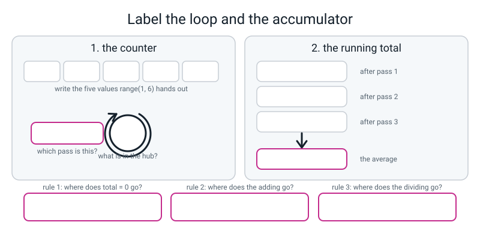
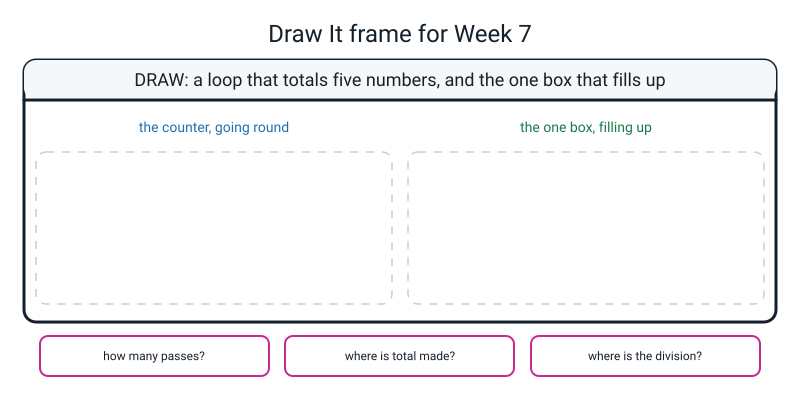

# Workbook — Week 7: Doing It 100 Times Without Typing It 100 Times

**Name:** ________________________________  **Date:** ______________

[⬅ Week 06](week-06.md) · [📖 Read the chapter first](../student-guide/week-07.md) · [Course Home](../README.md) · [🧑‍🏫 Teacher guide](../teacher-guide/week-07.md) · [Next ➡](week-08.md)

---

## ✅ Warm-Up (5 min)

Five quick questions about **last week**.

**W1.** In one sentence: what does `elif` mean, and where in a chain does it go?

________________________________________________________________

**W2.** A chain checks its conditions from top to bottom. What happens the moment one of them is `True`?

________________________________________________________________

**W3.** Fill these in from memory. `and` is `True` in ______ row out of four. `or` is `True` in ______ rows out of four. `not True` is ______.

**W4.** What does this print, and why is that a problem?

```python
mark = 95

if mark >= 60:
    grade = "C"
elif mark >= 90:
    grade = "A"

print(grade)
```

________________________________________________________________

**W5.** What is a **silent bug**? Give one example from your own Bug Log.

________________________________________________________________

---

## 🔎 Predict the Output

**Write your prediction before you run anything.** This week, **two of the four have no error at all** — so "what do you expect" means "what will it print, exactly, including the spaces".

### P1

```python
for n in range(3):
    print(n, end=" ")
print()
for n in range(1, 3):
    print(n, end=" ")
print()
```

**I predict — write both lines:**

________________________________________________________________

**It really printed:**

________________________________________________________________

**How many values does each `range` hand out?** first ______ second ______

### P2

```python
total = 0
for n in range(1, 4):
    total += n
print(total)
print(n)
```

**I predict:** first line ______________  second line ______________

**It really printed:** first line ______________  second line ______________

**The second line is the surprising one. Why is `n` still usable after the loop?**

________________________________________________________________

### P3

Look at the **indentation** very carefully before you answer.

```python
for row in range(1, 3):
    for col in range(1, 4):
        print(row * col, end=" ")
print()
```

**I predict — how many lines of output, and what is on them?**

________________________________________________________________

**It really printed:**

________________________________________________________________

**Now: what would change if the bare `print()` were indented to line up with the inner `for`?**

________________________________________________________________

### P4

```python
total = 0
for n in range(1, 5):
    total = n
print(total)
```

**I predict:** ________________________

**It really printed:** ________________________

**One character is wrong. Which one, and what should it be?**

________________________________________________________________

**How many of the eight answers did you get right?** ______ / 8

**Which one surprised you most, and why?**

________________________________________________________________

---

## ✍️ Practice Set A — Read It

**A1. How many values, and what is the last one?** Two separate questions with two different answers. Fill in every cell **without running anything**, then check.

| `range(...)` | Values it hands out | How many | Last one | Working |
|---|---|---|---|---|
| `range(10)` | | | | |
| `range(1, 5)` | | | | |
| `range(3, 20)` | | | | |
| `range(1, 13)` | | | | |
| `range(0, 101, 10)` | | | | |
| `range(5, 5)` | | | | |
| `range(10, 1)` | | | | |

**Two of those hand out nothing at all. Which two, and how could you have known without running them?**

________________________________________________________________

________________________________________________________________

**A2. Trace the accumulator.** Fill in the box's contents after every single pass.

```python
total = 0
for n in range(2, 11, 2):
    total += n
    print(total)
```

| Pass | `n` is | `total` before | `total` after |
|---|---|---|---|
| 1 | | | |
| 2 | | | |
| 3 | | | |
| 4 | | | |
| 5 | | | |

**How many boxes called `total` are there in that program?** ______

**A3. Match the code to the output.** All four run without any error. Watch the trailing spaces.

| | Snippet | | | Output |
|---|---|---|---|---|
| a | `for n in range(3): print(n, end=" ")` | ______ | **1** | `1 2 ` |
| b | `for n in range(1, 3): print(n, end=" ")` | ______ | **2** | `0 1 2 ` |
| c | `for n in range(3, 0, -1): print(n, end=" ")` | ______ | **3** | `0 2 ` |
| d | `for n in range(0, 4, 2): print(n, end=" ")` | ______ | **4** | `3 2 1 ` |

**A4. Spot the bug — three programs, and each one is broken in a different way.** For each: does it produce an error message, and what is actually wrong?

**(i)**
```python
total = 0
for n in range(1, 6):
    total = 0
    total += n
print(total)
```
Error message? ______  What's wrong: ______________________________

**(ii)**
```python
for n in range(1, 6):
    total += n
print(total)
```
Error message? ______  What's wrong: ______________________________

**(iii)**
```python
total = 0
for n in range(1, 6):
    total += n
    average = total / 5
    print(average)
```
Error message? ______  What's wrong: ______________________________

**A5. Label the diagram.** The loop is `for n in range(1, 6):` with an accumulator inside it. Fill in **every** blank box, including the three rule boxes along the bottom.


*Figure W7.1 — The counter on the left, the one box that fills up on the right.*

Values `range(1, 6)` hands out: ____________________

What is in the hub on pass 3: ______  Which pass is this: ______

Running totals after passes 1, 2, 3: ______  ______  ______

The average at the end: ____________________

**A6. In your own words, and one sentence each.**

(a) Who puts a value in the loop's counter?

________________________________________________________________

(b) Why does `range` stop *before* the number you give it? Give the **argument**, not the rule.

________________________________________________________________

(c) In a loop inside a loop, `range(1, 5)` on the outside and `range(1, 4)` inside — how many times does the innermost line run, and why?

________________________________________________________________

(d) Why can reading the code not find an off-by-one bug, and what does find it?

________________________________________________________________

---

## ✍️ Practice Set B — Write It

**B1. One line.** Print exactly twenty dashes, using text multiplication.

```python
________________________________________________________________
```

**Expected output:**

```text
--------------------
```

**Done looks like:** twenty characters on one line, and you typed the dash **once**.

**B2. Three lines.** Print the whole twelve times table, from `12 x 1 = 12` to `12 x 12 = 144`.

```python
________________________________________________________________

________________________________________________________________

________________________________________________________________
```

**Expected output — the first and last lines:**

```text
12 x 1 = 12
...
12 x 12 = 144
```

**Done looks like:** exactly **twelve** rows. Count them. If you have eleven, your stop value is one too small.

**B3. Four lines.** Use an accumulator to add up every whole number from 1 to 20, then print the total in a sentence.

```python
________________________________________________________________

________________________________________________________________

________________________________________________________________

________________________________________________________________
```

**Expected output:**

```text
1 to 20 adds up to 210
```

**Done looks like:** `total = 0` **above** the `for`, the adding **inside** it, and the `print` **after** it, at the margin. Check your answer by hand: 20 × 21 ÷ 2 = 210.

**B4. Three lines.** Print the multiples of 5 from 5 to 50 on **one** line, separated by spaces. Use a step.

```python
________________________________________________________________

________________________________________________________________

________________________________________________________________
```

**Expected output:**

```text
5 10 15 20 25 30 35 40 45 50 
```

**Done looks like:** ten numbers on one line, with `50` present. If your last number is 45, your stop value is one step too small.

**B5. About fifteen lines.** A pocket-money week. Read five daily amounts, print the running total after each one, then report the total and the average to two decimal places, with a border.

```python
________________________________________________________________

________________________________________________________________

________________________________________________________________

________________________________________________________________

________________________________________________________________

________________________________________________________________

________________________________________________________________

________________________________________________________________

________________________________________________________________

________________________________________________________________

________________________________________________________________

________________________________________________________________

________________________________________________________________

________________________________________________________________

________________________________________________________________
```

**Expected output** when you type 40, 25, 60, 15, 30:

```text
============================
  POCKET MONEY WEEK
============================
Day 1 of 5: rupees spent? 40
   running total: 40 rupees
Day 2 of 5: rupees spent? 25
   running total: 65 rupees
Day 3 of 5: rupees spent? 60
   running total: 125 rupees
Day 4 of 5: rupees spent? 15
   running total: 140 rupees
Day 5 of 5: rupees spent? 30
   running total: 170 rupees
----------------------------
  Total   : 170 rupees
  Average : 34.00 rupees a day
----------------------------
```

**Done looks like:** five prompts (count them) · a running total on every pass · **one** average, printed after the loop · and a hand-check on paper showing 170 ÷ 5 = 34.

---

## 🐞 Fix the Broken Program

Here is `steps.py`, which is supposed to total a week of step counts and average them. It has **three** bugs: one that stops Python reading the file at all, one that stops it partway through, and one that produces **no error message whatsoever**.

```python
# steps.py - total and average a week of step counts. It has three bugs.

DAYS = 7                                    # seven days in the week

print("=" * 26)
print("  STEP COUNTER")
print("=" * 26)

for day in range(1, DAYS)
    steps = int(input(f"Day {day} of {DAYS}: steps? "))
    total += steps
    print(f"   running total: {total}")

average = total / DAYS

print("-" * 26)
print(f"  Total   : {total}")
print(f"  Average : {average:.2f}")
print("-" * 26)
```

**Test it with these seven days:** 8200 · 9100 · 7400 · 10500 · 6800 · 9500 · 11500

**Bug 1.** Run it as it is. The real message:

```text
  File "steps.py", line 9
    for day in range(1, DAYS)
                             ^
SyntaxError: expected ':'
```

Which family of trouble is this — did any of the program run? ______________

What is wrong, in words a person would understand?

________________________________________________________________

The fix — write the whole corrected line:

```python
________________________________________________________________
```

**Bug 2.** Now run it and type `8200` at the first prompt. The real message:

```text
==========================
  STEP COUNTER
==========================
Day 1 of 7: steps? 8200
Traceback (most recent call last):
  File "steps.py", line 11, in <module>
    total += steps
NameError: name 'total' is not defined
```

The error is on line 11. **Is that where the mistake is?** ______  Where does the missing line go, and what is it?

```python
________________________________________________________________
```

Which of the three accumulator rules did this break? ______________

**Bug 3.** Now it runs all the way through. The real output, with all seven days typed in:

```text
==========================
  STEP COUNTER
==========================
Day 1 of 7: steps? 8200
   running total: 8200
Day 2 of 7: steps? 9100
   running total: 17300
Day 3 of 7: steps? 7400
   running total: 24700
Day 4 of 7: steps? 10500
   running total: 35200
Day 5 of 7: steps? 6800
   running total: 42000
Day 6 of 7: steps? 9500
   running total: 51500
--------------------------
  Total   : 51500
  Average : 7357.14
--------------------------
```

(a) **How many days are on the list?** ______ **How many prompts appeared?** Count them. ______

(b) Which number never got typed in? ______

(c) Why is there **no error message** for this one?

________________________________________________________________

(d) The fix — write the whole corrected line:

```python
________________________________________________________________
```

(e) Run it again with all seven. What are the total and the average now? ______________ and ______________

(f) **Hand-check the new average on paper. Show the division, not the answer.**

```text


```

(g) **Which single test would have caught bug 3, and which tests would have missed it?**

________________________________________________________________

---

## 🧩 Puzzle of the Week

### The Range Detective

Every one of these is a `range`. Your job is to work out what comes out **without running anything**, then check.

**P1.** Write the values and the count for each.

| `range(...)` | Values | Count |
|---|---|---|
| `range(1, 6)` | | |
| `range(0, 10, 2)` | | |
| `range(10, 0, -2)` | | |
| `range(5, 51, 5)` | | |
| `range(7, 8)` | | |
| `range(4, 4)` | | |
| `range(9, 2)` | | |
| `range(2, 3, 5)` | | |

**P2.** Two of those hand out **nothing**. Which two? ______________ And what do they have in common?

________________________________________________________________

**P3.** One of them hands out **exactly one** value even though its step is 5. Which one, and why does the step not matter?

________________________________________________________________

**P4.** Now the other way round. **You** write the `range` for each target.

| I want | The range |
|---|---|
| 1, 2, 3, 4, 5, 6, 7, 8, 9, 10 | `range(________________)` |
| 0, 1, 2 … 99 (one hundred values) | `range(________________)` |
| 12, 14, 16, 18, 20 | `range(________________)` |
| 100, 90, 80 … 10 | `range(________________)` |
| the twelve numbers 1 to 12 | `range(________________)` |
| exactly one value: 50 | `range(________________)` |
| nothing at all, using two numbers that are both 6 | `range(________________)` |

**P5.** The nesting arithmetic, without running it. How many lines does each print?

| Outer | Inner | Lines of output |
|---|---|---|
| `range(1, 5)` | `range(1, 4)` | |
| `range(1, 10)` | `range(1, 10)` | |
| `range(2, 11, 2)` | `range(1, 13)` | |
| `range(3, 3)` | `range(1, 100)` | |

**That last row is the good one.** Explain your answer in one sentence.

________________________________________________________________

**P6.** The impossible request. **Can you write a single `range` that hands out 3, 7, 8 and 100?** Try. Then either write it, or explain in one sentence why it cannot be done.

________________________________________________________________

________________________________________________________________

---

## 🤔 Think Deeper

**T1.** A loop is **not** faster to run than typing the lines out. Ten `print` lines and a loop that prints ten lines finish in about the same fraction of a second.

**So what is a loop actually for?** Write a paragraph. Name at least two things it gives you that have nothing to do with speed, and describe one moment from this week's work where you actually felt the benefit.

________________________________________________________________

________________________________________________________________

________________________________________________________________

________________________________________________________________

________________________________________________________________

________________________________________________________________

**T2.** Your program printed `Scores added : 12` while it was actually reading eleven.

**Whose fault is that, and how would you stop it happening again?** Then the harder half: **could a computer have caught the off-by-one for you?** Take a side, and name what your side costs.

________________________________________________________________

________________________________________________________________

________________________________________________________________

________________________________________________________________

________________________________________________________________

________________________________________________________________

---

## 🛠️ Build It

### Part 1 — the stepped grid

Print the **even** times tables — 2, 4, 6, 8 and 10 — times 1 to 12, using a `range` with a **step** for the rows. The columns must line up.

**Before you write a line of it, answer this:** how many rows will `range(2, 11, 2)` give you? ______ And what would `range(2, 10, 2)` give you? ______ Which one do you want, and why?

________________________________________________________________

**Checklist:**

- [ ] A header row of column numbers 1 to 12, right-aligned
- [ ] A dashed divider under the header
- [ ] Five rows: 2, 4, 6, 8, 10 — **count them**
- [ ] Every number right-aligned in four characters with `:>4`
- [ ] One `print` doing the numbers, not sixty
- [ ] Every line commented, saying *why*

**Fill in what you actually got:**

| Check | Wanted | Got |
|---|---|---|
| Number of table rows | 5 | |
| First row's label | 2 | |
| Last row's label | 10 | |
| Rightmost number on the last row | 120 | |
| Total numbers printed | 60 | |
| Number of `print` statements doing the numbers | 1 | |

### Part 2 — the twelve scores

Run `scores.py` with the twelve numbers off your card, **ticking each one off with a pencil as you type it**: 88 92 70 65 100 54 78 81 47 90 62 73

Fill in the running total column from the screen:

| Pass | Score in | Running total |
|---|---|---|
| 1 | 88 | |
| 2 | 92 | |
| 3 | 70 | |
| 4 | 65 | |
| 5 | 100 | |
| 6 | 54 | |
| 7 | 78 | |
| 8 | 81 | |
| 9 | 47 | |
| 10 | 90 | |
| 11 | 62 | |
| 12 | 73 | |

Total: ______________  Average: ______________

### Part 3 — the hand-check, laptop shut

**Full credit needs the working, not the answer.** I want to see the multiplication, the remainder, and where the last digit comes from.

```text


```

**(a) What does agreement between your paper and the program prove?**

________________________________________________________________

**(b) What does it *not* prove?**

________________________________________________________________

### Part 4 — break it on purpose

Change `range(1, HOW_MANY + 1)` to `range(1, HOW_MANY)`. Run it again with the same twelve numbers off the card, ticking as you go.

| | Before | After |
|---|---|---|
| Prompts that appeared | | |
| Numbers left un-ticked on the card | | |
| Total reported | | |
| Average reported | | |
| `Scores added` line said | | |
| Error message | | |

**(c) The `Scores added` line still says 12. Why is that not Python lying to you?**

________________________________________________________________

**(d) Which of the two numbers on that report is honest, and which is not?**

________________________________________________________________

### Part 5 — the Bug Log

**Two entries, and at least one must have no error message.** You have seen two of those this week.

| # | What I saw (real text, or "no error") | What it meant, in my own words | What one thing I changed |
|---|---|---|---|
| 1 | | | |
| 2 | | | |

**(e) How many of your bugs this week had no error message?** ______

**(f) If reading the code does not find an off-by-one, what does? Describe it as two numbers.**

________________________________________________________________

**(g) Why did ticking the numbers off the card matter?**

________________________________________________________________

---

## 🎨 Draw It

Draw **a loop that totals five numbers** — the counter going round on the left, and the one box that fills up on the right. Use your own subject: overs bowled, days of screen time, pages read, anything you actually count.


*Figure W7.2 — Your page.*

> **What a good answer might look like:** the subject is **five days of screen time in minutes** — 45, 60, 30, 90, 25.
>
> On the **left**, a ring with an arrow going clockwise and a hub circle holding `3`. Around the outside, five small boxes holding 45, 60, 30, 90, 25 — the first two shaded *used*, the third ringed and labelled *this pass*, the last two blank and labelled *has not happened yet*. Under the hub: *pass 3 of 5*. And one arrow leaving the ring at the bottom, labelled *out, when the values run out*.
>
> On the **right**, one box labelled `total`, drawn **five times down the page** so you can see the same box changing: 0 before the loop, then 45, then 105, then 135, then 225, then 250. Each step has a small card dropping in with the day's number on it. An arrow leaves the last box into a separate box labelled *250 ÷ 5 = 50*.
>
> The three bottom boxes: *five passes, because 6 − 1 = 5* · *`total = 0` goes above the `for`, at the margin* · *the division goes after the loop, also at the margin*.
>
> **What a weak answer looks like:** drawing **five separate boxes** called `total` side by side. That is the misunderstanding, drawn — it looks like five totals when there is only ever one. If your picture has more than one box labelled `total` at the same moment, redraw it as one box changing.

---

## 📊 Self-Check

| I can… | 😀 got it | 🙂 nearly | 😕 not yet |
|---|---|---|---|
| Write a `for` loop over `range()` and predict how many times it runs **before** running it | ☐ | ☐ | ☐ |
| Explain why `range(4)` gives 0, 1, 2, 3 and not 1, 2, 3, 4 | ☐ | ☐ | ☐ |
| Build an accumulator that totals numbers, then divide to get an average | ☐ | ☐ | ☐ |
| Hand-check that average on paper, showing the division | ☐ | ☐ | ☐ |
| Find an off-by-one bug by counting output lines against input items | ☐ | ☐ | ☐ |
| Say the three accumulator rules from memory | ☐ | ☐ | ☐ |

**True or false?** Circle one on each row.

| Statement | | |
|---|---|---|
| `range(5)` hands out 1, 2, 3, 4, 5 | TRUE | FALSE |
| `range(5)` hands out five values | TRUE | FALSE |
| You must set the loop counter yourself before the loop | TRUE | FALSE |
| `range(3, 3)` causes an error | TRUE | FALSE |
| `total += n` is different from `total = total + n` | TRUE | FALSE |
| An accumulator should be created inside the loop | TRUE | FALSE |
| The average should be worked out inside the loop | TRUE | FALSE |
| `"=" * 20` prints twenty equals signs | TRUE | FALSE |
| `"=" * "20"` prints twenty equals signs | TRUE | FALSE |
| An off-by-one bug usually has a clear error message | TRUE | FALSE |
| In a nested loop, the inner loop finishes completely on every pass of the outer one | TRUE | FALSE |
| Loops make a program run faster | TRUE | FALSE |

One thing I'd like explained again:

________________________________________________________________

---

## ✅ Answers

<details>
<summary>Check your answers</summary>

### Warm-Up

**W1.** `elif` is short for "else, if". It adds another condition to a chain, and it goes **between** the `if` and the `else` — you can have as many as you like, and nothing comes after the `else`.

**W2.** That branch runs and **the whole rest of the chain is skipped.** Not the best match — the **first** match.

**W3.** `and` is `True` in **one** row out of four. `or` is `True` in **three** rows out of four. `not True` is **`False`**.

**W4.** It prints **`C`**. `95 >= 60` is `True`, so the C branch runs and the `>= 90` line is never even looked at — it is dead code. The problem is that the answer is confidently wrong and there is **no error message at all.** The fix is to put the highest threshold first.

**W5.** A **silent bug** is a mistake that produces a wrong answer with no error message. Any honest example counts — a 95 coming out as a `C`, a mark of exactly 90 getting a B because `>` was written instead of `>=`, or a branch that runs whatever the user types because an `or` handed back a piece of text.

---

### Predict the Output

**P1.**

```text
0 1 2 
1 2 
```

`range(3)` hands out **three** values starting at 0. `range(1, 3)` hands out `3 - 1 =` **two** values, 1 and 2. Note the trailing space on each line — `end=" "` puts a space after *every* number, including the last one.

**P2.**

```text
6
3
```

The first line is the accumulator: 1 + 2 + 3 = 6 ✔ The second line is the surprising one. **After a loop finishes, the counter still holds whatever went in last** — `range(1, 4)` handed out 1, 2, 3, so `n` is 3. The box was never emptied; the loop simply stopped refilling it. This is occasionally useful and often confusing, and it is a good reason not to use `n` for anything else afterwards.

**P3.**

```text
1 2 3 2 4 6 
```

**One line of output.** Look at the indentation: the bare `print()` is at the **margin**, so it is not part of either loop — it runs **once**, after everything. So all six numbers go on one line: the outer loop's first pass prints 1, 2, 3 and the second prints 2, 4, 6.

**If the bare `print()` were indented to line up with the inner `for`**, it would belong to the outer loop and run once per row, giving two lines:

```text
1 2 3 
2 4 6 
```

**P4.**

```text
4
```

The line says `total = n`, not `total += n`. So instead of *adding* each value it **replaces** the whole total every pass, and the box ends up holding the last value, 4. **One character missing — the `+` — and no error message at all.** The correct line is `total += n`, which gives 1 + 2 + 3 + 4 = 10.

---

### Practice Set A

**A1.**

| `range(...)` | Values | How many | Last one | Working |
|---|---|---|---|---|
| `range(10)` | 0 1 2 … 9 | **10** | **9** | 10 − 0 |
| `range(1, 5)` | 1 2 3 4 | **4** | **4** | 5 − 1 |
| `range(3, 20)` | 3 4 5 … 19 | **17** | **19** | 20 − 3 |
| `range(1, 13)` | 1 2 3 … 12 | **12** | **12** | 13 − 1 |
| `range(0, 101, 10)` | 0 10 20 … 100 | **11** | **100** | ten steps of 10, **plus the starting 0** |
| `range(5, 5)` | nothing | **0** | — | 5 − 5 |
| `range(10, 1)` | nothing | **0** | — | 1 − 10 is negative |

The `range(0, 101, 10)` row is the interesting one: **eleven numbers, not ten.** When there is a step, count the numbers rather than trusting the plain subtraction.

**The two that hand out nothing** are `range(5, 5)` and `range(10, 1)`. What they have in common: **the count `stop - start` is zero or negative.** You can know that without running anything — do the subtraction first. A loop with zero passes runs its body zero times, which is not an error, just silence.

**A2.** `range(2, 11, 2)` hands out 2, 4, 6, 8, 10 — five values.

| Pass | `n` is | `total` before | `total` after |
|---|---|---|---|
| 1 | 2 | 0 | **2** |
| 2 | 4 | 2 | **6** |
| 3 | 6 | 6 | **12** |
| 4 | 8 | 12 | **20** |
| 5 | 10 | 20 | **30** |

Real output:

```text
2
6
12
20
30
```

Check by hand: 2 + 4 + 6 + 8 + 10 = 30 ✔

**How many boxes called `total`?** **One.** It changes five times. There is never more than one.

**A3.** a → **2** · b → **1** · c → **4** · d → **3**

The four real outputs:

```text
0 1 2 
1 2 
3 2 1 
0 2 
```

`range(0, 4, 2)` gives 0 and 2 — the next would be 4, which is the stop, so it stops. **Two values, not three.**

**A4.**

**(i) No error message.** It prints **`5`**. `total = 0` is *inside* the loop, so every pass wipes the running total before adding. The box ends up holding only the last value. Fix: move `total = 0` above the `for`, at the margin. **This breaks accumulator rule one.**

**(ii) There is an error message:**

```text
Traceback (most recent call last):
  File "b.py", line 2, in <module>
    total += n
NameError: name 'total' is not defined
```

`+=` means "add to what is **already** there", and on the first pass there was nothing there because the box was never made. Fix: `total = 0` above the loop.

**(iii) No error message.** It prints **five** averages:

```text
0.2
0.6
1.2
2.0
3.0
```

Only the last one means anything — the other four divided before the adding had finished. Fix: move the division and the print below the loop, at the margin. **This breaks accumulator rule three.**

**Notice: two out of three had no error message.** That is what loop bugs are like.

**A5.** Values `range(1, 6)` hands out: **1, 2, 3, 4, 5**

Hub on pass 3: **3** · Which pass: **pass 3 of 5**

Running totals after passes 1, 2, 3: **1 · 3 · 6**

The average at the end: **15 ÷ 5 = 3.0**

The three rule boxes: **rule 1 — `total = 0` goes above the `for`, at the margin** · **rule 2 — the adding goes inside the loop, in the indent** · **rule 3 — the dividing goes after the loop, at the margin.**

**A6.**

(a) **Python does**, through the `for` line, taking one value per pass from whatever `range` hands out. You never assign to it yourself.

(b) **So the count is a plain subtraction.** `range(a, b)` hands out exactly `b - a` values, always, with no plus-one to remember. If the stop were included, every count in every program would be "the difference plus one", and *that* plus-one would be the thing everybody got wrong instead.

(c) **Twelve.** The inner loop runs all the way through — three passes — for each of the outer loop's four passes. 4 × 3 = 12. Real proof:

```python
lines = 0
for row in range(1, 5):
    for col in range(1, 4):
        lines += 1
print(lines)
```

```text
12
```

(d) Because **every individual line is correct Python.** `for i in range(1, 12):` is a perfectly good, ordinary, useful line, and thousands of programs mean exactly that. What finds it is **counting**: how many things went in, and how many lines came out. If those two numbers differ, you have the bug's fingerprint before you have the bug.

---

### Practice Set B

**B1.**

```python
print("-" * 20)
```

```text
--------------------
```

**B2.**

```python
for n in range(1, 13):             # 1, 2, 3 ... 12  (13 - 1 = twelve values)
    print(f"12 x {n} = {12 * n}")  # one row per pass
```

```text
12 x 1 = 12
12 x 2 = 24
12 x 3 = 36
12 x 4 = 48
12 x 5 = 60
12 x 6 = 72
12 x 7 = 84
12 x 8 = 96
12 x 9 = 108
12 x 10 = 120
12 x 11 = 132
12 x 12 = 144
```

**Twelve rows.** If you wrote `range(1, 12)` you get eleven and lose the `12 x 12` row — the off-by-one, arriving exactly where you were warned it would.

**B3.**

```python
total = 0                          # the accumulator, BEFORE the loop
for n in range(1, 21):             # 1, 2, 3 ... 20  (21 - 1 = twenty values)
    total += n                     # add this n, INSIDE the loop
print(f"1 to 20 adds up to {total}")   # use it AFTER the loop, at the margin
```

```text
1 to 20 adds up to 210
```

Check it two ways: the loop says 210, and the formula a mathematician would use — 20 × 21 ÷ 2 — also says 210 ✔ **Two completely different methods, same answer. That is what a correct program feels like.**

**B4.**

```python
for n in range(5, 51, 5):          # 5, 10, 15 ... 50  (stops before 51)
    print(n, end=" ")              # end=" " keeps it on one line
print()                            # a bare print() ends the line
```

```text
5 10 15 20 25 30 35 40 45 50 
```

**Why 51 and not 50?** Because you want 50 in the list, and `range` stops **before** its stop number. `range(5, 50, 5)` would give you 5 up to 45 and quietly lose the last one.

**B5.**

```python
# pocket.py - five days of pocket money spent, totalled and averaged.

DAYS = 5                                        # five school days

print("=" * 28)
print("  POCKET MONEY WEEK")
print("=" * 28)

spent = 0                                       # the accumulator, BEFORE the loop

for day in range(1, DAYS + 1):                  # 1, 2, 3, 4, 5
    amount = int(input(f"Day {day} of {DAYS}: rupees spent? "))
    spent += amount                             # add today to the running total
    print(f"   running total: {spent} rupees")

average = spent / DAYS                          # divide AFTER the loop

print("-" * 28)
print(f"  Total   : {spent} rupees")
print(f"  Average : {average:.2f} rupees a day")
print("-" * 28)
```

Real run with 40, 25, 60, 15, 30:

```text
============================
  POCKET MONEY WEEK
============================
Day 1 of 5: rupees spent? 40
   running total: 40 rupees
Day 2 of 5: rupees spent? 25
   running total: 65 rupees
Day 3 of 5: rupees spent? 60
   running total: 125 rupees
Day 4 of 5: rupees spent? 15
   running total: 140 rupees
Day 5 of 5: rupees spent? 30
   running total: 170 rupees
----------------------------
  Total   : 170 rupees
  Average : 34.00 rupees a day
----------------------------
```

**Hand-check:** 40 + 25 = 65, + 60 = 125, + 15 = 140, + 30 = 170 ✔ And 170 ÷ 5: 5 × 34 = 170 exactly, so **34.00** ✔

**Why `DAYS + 1`?** You want five passes labelled 1 to 5, and `range(a, b)` gives `b - a` values, so you need `range(1, 6)` — which is `range(1, DAYS + 1)`.

---

### Fix the Broken Program

**Bug 1 — family 1, it never started.** No output at all, so nothing ran. The colon is missing from the end of the `for` line, and the `^` points at the exact character position where Python wanted it. Python read the whole line, reached the end, and found no colon.

```python
for day in range(1, DAYS):
```

**Bug 2 — family 2, it started then stopped.** The error is reported on line 11, but **the mistake is not on line 11.** Line 11 is `total += steps`, which is a perfectly good line — the problem is that nothing above it ever made the box. `+=` means "add to what is already there", and there was nothing there.

The missing line goes **above the `for`, at the margin**:

```python
total = 0                                   # the accumulator
```

**This breaks accumulator rule one: set it up before the loop.**

**Bug 3 — family 3, it finished and lied.**

(a) **Seven** days on the list. **Six** prompts appeared. Count them: Day 1 through Day 6.

(b) **11500** — the last one. It was never asked for.

(c) Because `range(1, DAYS)` is a completely ordinary, correct line of Python. `range(1, 7)` hands out 1 to 6, which is exactly what it is supposed to do. **The number seven exists only in the programmer's head.** Python has no way to know you wanted seven, so there is nothing for it to complain about.

(d) The fix:

```python
for day in range(1, DAYS + 1):
```

(e) Total **63000**, average **9000.00**. The real output:

```text
==========================
  STEP COUNTER
==========================
Day 1 of 7: steps? 8200
   running total: 8200
Day 2 of 7: steps? 9100
   running total: 17300
Day 3 of 7: steps? 7400
   running total: 24700
Day 4 of 7: steps? 10500
   running total: 35200
Day 5 of 7: steps? 6800
   running total: 42000
Day 6 of 7: steps? 9500
   running total: 51500
Day 7 of 7: steps? 11500
   running total: 63000
--------------------------
  Total   : 63000
  Average : 9000.00
--------------------------
```

(f) The hand-check:

```text
  63000 ÷ 7

  7 × 9000 = 63000       exactly
  so the answer is 9000  ✔

  Check the total too:
  8200 + 9100  = 17300
  17300 + 7400 = 24700
  24700 + 10500 = 35200
  35200 + 6800 = 42000
  42000 + 9500 = 51500
  51500 + 11500 = 63000  ✔
```

(g) **The only test that catches it is counting the prompts against the list.** Six prompts for seven numbers. Nothing else works: the total is a plausible number, the average is a plausible number, the program does not crash, and if you had not written down the seven days beforehand you would have no way to know. **A test that only checks "did it produce a number" would have missed this completely.**

---

### Puzzle of the Week

**P1.** Real output for all eight:

| `range(...)` | Values | Count |
|---|---|---|
| `range(1, 6)` | 1 2 3 4 5 | **5** |
| `range(0, 10, 2)` | 0 2 4 6 8 | **5** |
| `range(10, 0, -2)` | 10 8 6 4 2 | **5** |
| `range(5, 51, 5)` | 5 10 15 20 25 30 35 40 45 50 | **10** |
| `range(7, 8)` | 7 | **1** |
| `range(4, 4)` | nothing | **0** |
| `range(9, 2)` | nothing | **0** |
| `range(2, 3, 5)` | 2 | **1** |

**P2.** `range(4, 4)` and `range(9, 2)`. **What they have in common: `stop - start` is zero or negative, with a positive step.** There is nowhere to go, so there are no passes — and no error either.

**P3.** `range(2, 3, 5)`. It hands out just `2`. The step says "jump five each time", but after 2 the next value would be 7, which is past the stop of 3, so it stops. **The step controls the size of the jumps, not whether the first value appears** — the start value is always handed out if it is below the stop.

**P4.**

| I want | The range |
|---|---|
| 1 … 10 | `range(1, 11)` |
| 0 … 99 (one hundred values) | `range(100)` — or `range(0, 100)` |
| 12, 14, 16, 18, 20 | `range(12, 21, 2)` |
| 100, 90, 80 … 10 | `range(100, 0, -10)` |
| the twelve numbers 1 to 12 | `range(1, 13)` |
| exactly one value: 50 | `range(50, 51)` |
| nothing at all, using two 6s | `range(6, 6)` |

**Every stop is one past the last value you want.** That is the whole trick, and once you see it in seven rows in a column it stops being surprising.

**P5.**

| Outer | Inner | Lines | Working |
|---|---|---|---|
| `range(1, 5)` | `range(1, 4)` | **12** | 4 × 3 |
| `range(1, 10)` | `range(1, 10)` | **81** | 9 × 9 — the times-table grid |
| `range(2, 11, 2)` | `range(1, 13)` | **60** | 5 × 12 — the homework grid |
| `range(3, 3)` | `range(1, 100)` | **0** | 0 × 99 |

**The last row.** The outer loop runs **zero** passes, so the inner loop never starts at all — not even once. Zero times ninety-nine is zero. **An outer loop with no passes makes everything inside it disappear**, however big the inner loop looks.

**P6.** **It cannot be done.** `range` only makes **evenly spaced** numbers — a start, a stop and a fixed step. The gaps between 3, 7, 8 and 100 are 4, 1 and 92, which is not one fixed step, so no single `range` can produce them.

**And you have spotted a real limitation, not a trick question.** What you want is a **list**, and it arrives in Week 11 — you will write `for score in [3, 7, 8, 100]:` and it will do exactly what you expect. Everything you have built this week with an accumulator will still work; it will just have better data going into it.

---

### Think Deeper

**T1.** A full-credit answer names something other than speed. Model answer:

> Ten `print` lines and a loop that prints ten lines take about the same time to run, so speed is not the point at all. What the loop gives me is **one place to change things.** When I turned the seven times table into the thirteen times table I edited one character; by hand I would have had to edit ten lines, and if I had missed one the program would have printed a wrong row and not complained about it.
>
> The second thing it gives me is a program whose **length does not depend on how much work it does.** My loop is three lines whether it prints ten rows or ten thousand. That means I can *think* about ten thousand rows, which I could not do if I had to type them.
>
> The moment I felt it was the grid. Eighty-one numbers came out of one `print`, and when I moved the row-ending `print()` one level deeper I got eighty-one lines instead of nine rows — so I could see that the *shape* of the output was controlled by four spaces, not by eighty-one decisions.
>
> So loops save mistakes, not milliseconds — and they let me write down a **pattern** instead of a list.

**T2.** Model answer:

> It is my fault, not Python's. That line prints `HOW_MANY`, which is a number **I** typed, so it reports what I *intended* rather than what happened. The program never counted what it actually read, because nobody asked it to.
>
> The fix is a second accumulator: a counter that goes up by one every pass, and a report that prints the counter instead of the plan. Then a mismatch between "asked for" and "read" shows up **on the screen** instead of hiding. Here it is, with the bug deliberately left in:
>
> ```python
> HOW_MANY = 12
> total = 0
> scores_read = 0                                   # count what actually happened
>
> for i in range(1, HOW_MANY):                      # the bug, left in on purpose
>     score = int(input(f"Score {i} of {HOW_MANY}: "))
>     total += score
>     scores_read += 1                              # one more, really read
>
> print(f"asked for : {HOW_MANY}")
> print(f"read      : {scores_read}")
> print(f"average   : {total / scores_read:.2f}")
> ```
>
> With the twelve card scores typed in, the real output ends:
>
> ```text
> asked for : 12
> read      : 11
> average   : 75.18
> ```
>
> **Two numbers that disagree, printed side by side** — and an average that is now right for the eleven scores it actually saw (827 ÷ 11 = 75.18). The bug is still there and the program is telling me about it, which is worth more than quietly fixing it. **The general principle: make the program report what it actually did, not what it was told to do.**
>
> **Could a computer have caught it?** No, and this is not something a better tool will fix one day. `range(1, 12)` is a completely ordinary, correct thing to write, and thousands of programs mean exactly that. The number twelve existed only in my head and on an index card. For Python to warn me it would have to know my **intention**, and my intention is not in the file. This is the same shape as Week 6's ordering bug: a perfectly good program that is not the program I meant.
>
> What *can* be automated is the check I did by hand — a program that reads a file of twelve numbers could compare "how many I read" with "how many were in the file" and complain. **But somebody has to decide to write that check, and the cost of relying on tools instead is that I would never have built the counting habit at all.**

---

### Build It

**Part 1 — the stepped grid.**

`range(2, 11, 2)` gives **2, 4, 6, 8, 10 — five rows.** `range(2, 10, 2)` gives **2, 4, 6, 8 — four rows**, and loses the ten times table. You want the first one, because you want the 10 row and `range` stops before its stop number.

```python
# grid_step.py - the even times tables, 2 to 10, times 1 to 12.
# The outer loop uses range with a STEP of 2, so it visits 2, 4, 6, 8, 10.

print("     ", end="")                       # 5 spaces to clear the row label
for col in range(1, 13):                     # 1..12 across the top
    print(f"{col:>4}", end="")
print()

print("    +" + "-" * 48)                    # 12 columns x 4 characters = 48

for row in range(2, 11, 2):                  # OUTER: 2, 4, 6, 8, 10 (step 2)
    print(f"{row:>3} |", end="")             # the row label
    for col in range(1, 13):                 # INNER: 12 passes per row
        print(f"{row * col:>4}", end="")
    print()
```

The real output:

```text
        1   2   3   4   5   6   7   8   9  10  11  12
    +------------------------------------------------
  2 |   2   4   6   8  10  12  14  16  18  20  22  24
  4 |   4   8  12  16  20  24  28  32  36  40  44  48
  6 |   6  12  18  24  30  36  42  48  54  60  66  72
  8 |   8  16  24  32  40  48  56  64  72  80  88  96
 10 |  10  20  30  40  50  60  70  80  90 100 110 120
```

| Check | Wanted | Got |
|---|---|---|
| Number of table rows | 5 | **5** |
| First row's label | 2 | **2** |
| Last row's label | 10 | **10** |
| Rightmost number on the last row | 120 | **120** |
| Total numbers printed | 60 | **60** — 5 × 12 |
| Number of `print` statements doing the numbers | 1 | **1** |

**Part 2 — the twelve scores.**

| Pass | Score in | Running total |
|---|---|---|
| 1 | 88 | **88** |
| 2 | 92 | **180** |
| 3 | 70 | **250** |
| 4 | 65 | **315** |
| 5 | 100 | **415** |
| 6 | 54 | **469** |
| 7 | 78 | **547** |
| 8 | 81 | **628** |
| 9 | 47 | **675** |
| 10 | 90 | **765** |
| 11 | 62 | **827** |
| 12 | 73 | **900** |

Total **900**, average **75.00**.

**Part 3 — the hand-check.** Full credit requires the working:

```text
  900 ÷ 12

  12 × 70 = 840          70 is close but too small
  900 − 840 = 60         sixty left over
  60 ÷ 12 = 5            five more
  70 + 5 = 75            ✔

  Check backwards:  12 × 75 = 840 + 60 = 900  ✔
```

And the program says `75.00`. They agree.

**(a)** It proves the program is right **on these twelve numbers.** That is real and it is worth having.

**(b)** It does **not** prove the program is right in general. The eleven-prompt version would also have agreed with a hand-check of *eleven* numbers. What the hand-check gives you is an **independent source of truth** — the only reason you can ever catch a program that is confidently wrong.

**Part 4 — break it on purpose.**

| | Before | After |
|---|---|---|
| Prompts that appeared | **12** | **11** |
| Numbers left un-ticked on the card | **0** | **1 (73)** |
| Total reported | **900** | **827** |
| Average reported | **75.00** | **68.92** |
| `Scores added` line said | **12** | **12** |
| Error message | **none** | **none** |

Check the arithmetic: 827 ÷ 12 = 68.9166…, shown as `68.92` by `:.2f` ✔

**(c)** Because that line just prints `HOW_MANY`, and `HOW_MANY` is still 12 — nobody changed it. **The program genuinely does not know how many scores it read.** It is reporting a number *you* typed, not something it measured. It is not lying on purpose; it has never been asked to count.

**(d)** `Total : 827` is **honest** — that really is the sum of the eleven scores it saw. `Scores added : 12` is **not** — it is a plan, printed as if it were a measurement. And the average is dishonest by consequence: it divides an honest total by a dishonest count.

**Part 5 — the Bug Log.** Two entries, at least one with no error message:

| # | What I saw (real text) | What it meant, in my words | What I changed |
|---|---|---|---|
| 1 | `SyntaxError: expected ':'` with the `^` at the end of `for n in range(1, 11)` | Python read the whole line, got to the end, and there was no colon. It never ran the file at all — no output, nothing. | Added the `:` |
| 2 | **No error message.** It asked for eleven scores when I had twelve on the card, and the average came out as 68.92 instead of 75. | `range(1, 12)` hands out 1 to 11, because range stops *before* the number you give it. The version that reads correctly in English is the wrong one. I only found it because I was ticking numbers off the card and had one left. | `range(1, 13)` |

Also acceptable, and arguably better:

| # | What I saw | What it meant | What I changed |
|---|---|---|---|
| 3 | **No error message.** My total came out as 73 — the last score — instead of 900. | I had `total = 0` inside the loop, so every pass wiped the running total before adding to it. There is only one box called `total`, and I was emptying it twelve times. | Moved `total = 0` above the `for` |
| 4 | `NameError: name 'total' is not defined` on the line `total += score` | `+=` means "add to what is already in there", and there was nothing in there because I never made the box. | Added `total = 0` before the loop |

**(e)** Probably one or both. **Name the pattern: loop bugs are usually silent**, because a loop that runs the wrong number of times is still a perfectly legal loop.

**(f)** **Counting.** Two numbers: how many things went in, and how many lines came out. If they differ you have the fingerprint before you have the bug — and *then* you look at the `range`.

**(g)** Because it turned "how many did it ask for?" into a **physical fact**. Without the ticks, the eleventh prompt looks exactly like the twelfth, and you would have typed eleven numbers and stopped without ever noticing. **The tick is the count.**

---

### Draw It

There is no single right drawing. A strong answer has **exactly one box labelled `total`** in each snapshot, redrawn as it changes, and a hub that holds **one** value at a time. If the picture shows five `total` boxes side by side, or a counter holding two numbers at once, the mental model has slipped — and redrawing it as one box changing is the whole exercise.

The other thing to check: **does an arrow leave the ring?** A loop that has no exit drawn is next week's problem arriving early, and a drawing that shows the values running out is a drawing that understands why a `for` loop can never run forever.

---

### Self-Check answers

| Statement | Answer |
|---|---|
| `range(5)` hands out 1, 2, 3, 4, 5 | **False.** 0, 1, 2, 3, 4 |
| `range(5)` hands out five values | **True.** The last one is 4 |
| You must set the loop counter yourself before the loop | **False.** Python fills it from `range`, once per pass |
| `range(3, 3)` causes an error | **False.** It runs zero passes and prints nothing |
| `total += n` is different from `total = total + n` | **False.** Identical |
| An accumulator should be created inside the loop | **False.** Before it, or it gets wiped every pass |
| The average should be worked out inside the loop | **False.** After it, when the adding has finished |
| `"=" * 20` prints twenty equals signs | **True** |
| `"=" * "20"` prints twenty equals signs | **False.** `TypeError` — the count must be a number |
| An off-by-one bug usually has a clear error message | **False.** It usually has none at all |
| In a nested loop, the inner loop finishes completely on every pass of the outer one | **True.** That is why 4 outer × 3 inner = 12 |
| Loops make a program run faster | **False.** They make it shorter, easier to change, and harder to get wrong in ten places at once |

</details>

---

[⬅ Week 6 workbook](week-06.md) · [📖 Week 7 chapter](../student-guide/week-07.md) · [Course Home](../README.md) · [Week 8 workbook ➡](week-08.md)
