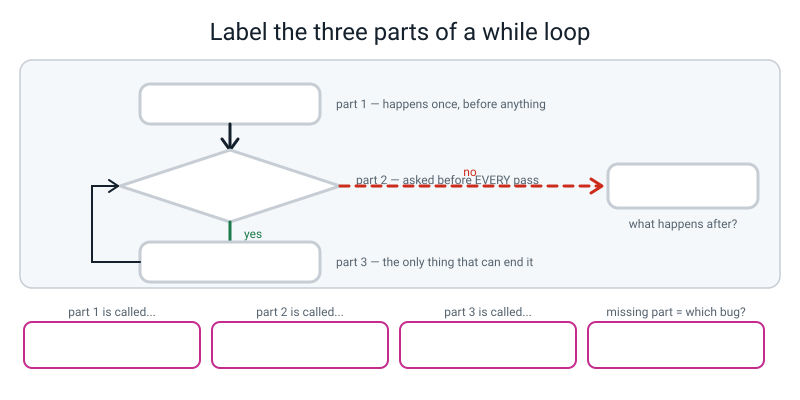
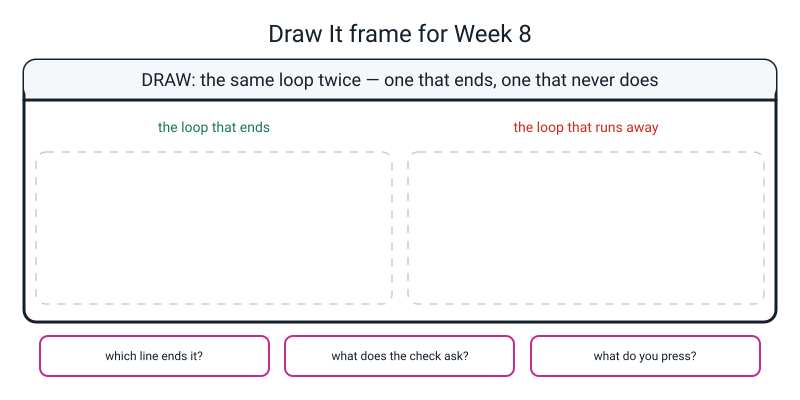

# Workbook — Week 8: Guess & Grade

**Name:** ________________________________  **Date:** ______________

[⬅ Week 07](week-07.md) · [📖 Read the chapter first](../student-guide/week-08.md) · [Course Home](../README.md) · [🧑‍🏫 Teacher guide](../teacher-guide/week-08.md) · [Next ➡](week-09.md)

---

## ✅ Warm-Up (5 min)

Five quick questions about **last week**.

**W1.** How many values does each of these hand out? `range(4)` ______ · `range(1, 11)` ______ · `range(3, 20)` ______ · `range(5, 5)` ______

**W2.** Say the three accumulator rules from memory.

________________________________________________________________

**W3.** What does this print, and why is it not fifteen?

```python
total = 0
for n in range(1, 6):
    total = 0
    total += n
print(total)
```

________________________________________________________________

**W4.** `"=" * 20` prints twenty equals signs. What does `"=" * "20"` do, and why?

________________________________________________________________

**W5.** Twelve numbers went in and eleven prompts appeared. **What do you do first**, and what are you looking for?

________________________________________________________________

---

## 🔎 Predict the Output

**Write your prediction before you run anything.** **P2 is the one almost everybody gets wrong** — read the question at the end of it before you commit.

### P1

```python
count = 0
while count < 3:
    print(count)
    count += 1
print("done", count)
```

**I predict — write every line:**

________________________________________________________________

**It really printed:**

________________________________________________________________

**How many times did the loop *check* the condition?** ______ **How many times did it print inside the loop?** ______

### P2

```python
passes = 0
for n in range(1, 6):
    passes += 1
    if n == 3:
        continue
    print(n, end=" ")
print()
print("passes:", passes)
```

**I predict:** first line ________________  second line ________________

**It really printed:** first line ________________  second line ________________

**The `passes` number is the whole question. Did `continue` remove a pass, or shorten one?**

________________________________________________________________

### P3

```python
for n in range(1, 6):
    if n == 3:
        break
    print(n, end=" ")
print()
print("n is", n)
```

**I predict:** first line ________________  second line ________________

**It really printed:** first line ________________  second line ________________

**Why is `n` 3 and not 2 or 5?**

________________________________________________________________

### P4

```python
print("42".isdigit(), "-42".isdigit(), " 42 ".isdigit(), "4.2".isdigit())
```

**I predict:** ______ ______ ______ ______

**It really printed:** ______ ______ ______ ______

**Two of those four are `False` for reasons that will annoy a real user. Which two, and what would you write on the box?**

________________________________________________________________

**How many of the ten answers did you get right?** ______ / 10

**Which one surprised you most, and why?**

________________________________________________________________

---

## ✍️ Practice Set A — Read It

**A1. Trace three `while` loops.** Fill in every cell. **Remember: a `while` loop checks one more time than it runs.**

**(i)**
```python
lives = 3
while lives > 0:
    print(f"lives left: {lives}")
    lives -= 1
print("game over")
```

| Check | `lives` before | `lives > 0`? | Prints | `lives` after |
|---|---|---|---|---|
| 1 | | | | |
| 2 | | | | |
| 3 | | | | |
| 4 | | | | |

Passes: ______  Checks: ______

**(ii)**
```python
count = 0
while count < 3:
    print(f"count is {count}")
    count += 1
```

| Check | `count` before | `count < 3`? | Prints | after |
|---|---|---|---|---|
| 1 | | | | |
| 2 | | | | |
| 3 | | | | |
| 4 | | | | |

Which numbers get printed? ____________________ **Not** 1, 2, 3 — why not?

________________________________________________________________

**(iii)**
```python
fuel = 5
while fuel > 0:
    print("still flying")
```

What happens? ______________________________________________

Which of the three parts is missing? ______________  Write the missing line:

```python
________________________________________________________________
```

**A2. In (i), why are there four checks but only three passes?**

________________________________________________________________

**A3. Match the code to the output.** All four run cleanly. Watch the trailing spaces.

| | Snippet | | | Output |
|---|---|---|---|---|
| a | `for n in range(1,6):`<br>`    if n == 3: break`<br>`    print(n, end=" ")` | ______ | **1** | `1 2 3 4 ` |
| b | `for n in range(1,6):`<br>`    if n == 3: continue`<br>`    print(n, end=" ")` | ______ | **2** | `1 2 ` |
| c | `n = 1`<br>`while n < 4:`<br>`    print(n, end=" ")`<br>`    n += 1` | ______ | **3** | `1 2 4 5 ` |
| d | `n = 1`<br>`while n <= 4:`<br>`    print(n, end=" ")`<br>`    n += 1` | ______ | **4** | `1 2 3 ` |

**Which two differ by exactly one character, and which character?**

________________________________________________________________

**A4. Spot the bug — four programs, four different kinds of trouble.** For each: is there an error message, and what is actually wrong?

**(i)**
```python
tries = 0
while tries < 3
    tries += 1
```
Error message? ______  What's wrong: ______________________________

**(ii)**
```python
count = input("How many? ")
while count < 1:
    print("again")
```
Error message? ______  What's wrong: ______________________________

**(iii)**
```python
typed = input("Guess? ")
if not typed.isdigit:
    print("  Whole numbers only.")
else:
    print("  That looked like a number.")
```
Error message? ______  What's wrong: ______________________________

**(iv)**
```python
lives = 3
while lives > 0:
    print(lives)
    lives += 1
```
Error message? ______  What's wrong: ______________________________

**A5. Label the diagram.** Fill in every blank box, including the four caption boxes along the bottom.


*Figure W8.1 — One cycle, three parts, and one exit.*

Part 1 is called: ____________________  Example line: ____________________

Part 2 is called: ____________________  Example line: ____________________

Part 3 is called: ____________________  Example line: ____________________

Missing part 3 gives you: ____________________  Missing part 1 gives you: ____________________

**A6. In your own words, one sentence each.**

(a) What is the one question that decides between `for` and `while`?

________________________________________________________________

(b) `break` and `continue` — one sentence for each.

________________________________________________________________

(c) What does `random.randint(1, 6)` hand back, and how is that different from `range(1, 6)`?

________________________________________________________________

(d) Why does the `.isdigit()` check have to come **before** the `int()`?

________________________________________________________________

(e) What does `KeyboardInterrupt` mean, and is it a bug in your code?

________________________________________________________________

(f) Why exactly seven tries for 1 to 100?

________________________________________________________________

---

## ✍️ Practice Set B — Write It

**B1. Two lines.** Roll one dice — a random whole number from 1 to 6 — and print it.

```python
________________________________________________________________

________________________________________________________________
```

**Expected output:** one whole number between 1 and 6. **It will be different every run** — that is the point.

**Done looks like:** `import random` on the first line, and running it five times gives you at least three different numbers, including sometimes a 6.

**B2. Six lines.** Count down from 5 to 1 on **one** line using a `while` loop, then print `Go!` underneath.

```python
________________________________________________________________

________________________________________________________________

________________________________________________________________

________________________________________________________________

________________________________________________________________

________________________________________________________________
```

**Expected output:**

```text
5 4 3 2 1 
Go!
```

**Done looks like:** all three parts present, and you can **point at the line that ends it**.

**B3. Five lines.** Keep asking `Ready? (yes/no)` until the answer is one of those two words, then print what they said. Accept `YES` and `No` too.

```python
________________________________________________________________

________________________________________________________________

________________________________________________________________

________________________________________________________________

________________________________________________________________
```

**Expected output** when you type `maybe` then `YES`:

```text
Ready? (yes/no) maybe
  Please type yes or no.
Ready? (yes/no) YES
You said yes.
```

**Done looks like:** typing `maybe` twenty times asks twenty-one times and never crashes.

**B4. Ten lines.** Keep asking for a number and adding it to a total until the total passes 100. Reject anything that is not digits. Report how many numbers it took.

```python
________________________________________________________________

________________________________________________________________

________________________________________________________________

________________________________________________________________

________________________________________________________________

________________________________________________________________

________________________________________________________________

________________________________________________________________

________________________________________________________________

________________________________________________________________
```

**Expected output** when you type 30, `banana`, 45, 40:

```text
Add a number (total 0)? 30
Add a number (total 30)? banana
  Whole numbers only.
Add a number (total 30)? 45
Add a number (total 75)? 40
Passed 100 after 3 numbers. Total is 115.
```

**Done looks like:** the rejected input **does not** count towards the three, and the total in the prompt does not move when the input is rejected.

**B5. About eighteen lines.** A door lock. Three tries at a four-digit PIN, `break`-or-flag out on success, and it must survive `banana`. A rejected input must be **free** — it does not cost a try.

```python
________________________________________________________________

________________________________________________________________

________________________________________________________________

________________________________________________________________

________________________________________________________________

________________________________________________________________

________________________________________________________________

________________________________________________________________

________________________________________________________________

________________________________________________________________

________________________________________________________________

________________________________________________________________

________________________________________________________________

________________________________________________________________

________________________________________________________________

________________________________________________________________

________________________________________________________________

________________________________________________________________
```

**Expected output** when you type `banana`, `1111`, `1234` — with the PIN set to 1234:

```text
PIN (try 1 of 3)? banana
  Digits only. That try was free.
PIN (try 1 of 3)? 1111
  Wrong PIN.
PIN (try 2 of 3)? 1234
Unlocked in 2 of 3 tries.
```

**Done looks like:** the try number **stayed at 1** after `banana` · exactly **three** real attempts are allowed, no more · and getting it wrong three times says something other than "unlocked".

---

## 🐞 Fix the Broken Program

Here is `lock.py`, which is supposed to give you three tries at a PIN. It has **three** bugs: one that stops Python reading the file, one that crashes it partway through, and one that produces **no error message at all**.

```python
# lock.py - three tries to type the right PIN. It has three bugs in it.

PIN = 1234                                        # the correct PIN
tries = 0                                         # SET UP: no tries used yet

print("=" * 30)
print("  DOOR LOCK")
print("=" * 30)

while tries <= 3
    typed = int(input(f"PIN (try {tries + 1} of 3)? "))
    tries += 1                                    # CHANGE: one more try used
    if typed == PIN:
        print("  Unlocked.")
        break
    print("  Wrong PIN.")

print("-" * 30)
print(f"Tries used: {tries}")
```

**Bug 1.** Run it as it is. The real message:

```text
  File "lock.py", line 10
    while tries <= 3
                    ^
SyntaxError: expected ':'
```

Which family of trouble is this — **did any of the program run?** ______________

The fix — write the whole corrected line:

```python
________________________________________________________________
```

**Bug 2.** Now run it and type `banana`. The real message:

```text
==============================
  DOOR LOCK
==============================
PIN (try 1 of 3)? banana
Traceback (most recent call last):
  File "lock.py", line 11, in <module>
    typed = int(input(f"PIN (try {tries + 1} of 3)? "))
ValueError: invalid literal for int() with base 10: 'banana'
```

What does `ValueError` mean, in words a person would understand?

________________________________________________________________

**Why can't you fix this with an `if` placed *after* the `int(...)` line?**

________________________________________________________________

Write the three lines that replace that one line. Remember the order: **keep it as text · check it · convert it.**

```python
________________________________________________________________

________________________________________________________________

________________________________________________________________
```

**Bug 3.** Now it runs all the way through. Type four wrong PINs — 1111, 2222, 3333, 4444. The real output:

```text
==============================
  DOOR LOCK
==============================
PIN (try 1 of 3)? 1111
  Wrong PIN.
PIN (try 2 of 3)? 2222
  Wrong PIN.
PIN (try 3 of 3)? 3333
  Wrong PIN.
PIN (try 4 of 3)? 4444
  Wrong PIN.
------------------------------
Tries used: 4
```

(a) **Look at the fourth prompt.** Write out exactly what it says: ______________________

(b) How many tries should there have been? ______  How many were there? ______

(c) Read the `while` condition out loud with the numbers in it. When `tries` is exactly 3, what does the check answer?

________________________________________________________________

(d) The fix — one character. Write the whole corrected line:

```python
________________________________________________________________
```

(e) **Why was there no error message?**

________________________________________________________________

(f) **What found this bug — reading or counting?** And what exactly did you count?

________________________________________________________________

---

## 🧩 Puzzle of the Week

### The Loop That Won't Stop

**P1.** Five loops. For each one: does it end, and if not, **write the one line that would fix it** (and say where it goes).

**(i)**
```python
n = 10
while n > 0:
    print(n)
    n -= 2
```
Ends? ______  Fix if needed: ____________________  How many passes? ______

**(ii)**
```python
n = 1
while n < 100:
    print(n)
    n = n * 2
```
Ends? ______  Fix if needed: ____________________  How many passes? ______

**(iii)**
```python
n = 5
while n > 0:
    print(n)
```
Ends? ______  Fix if needed: ____________________

**(iv)**
```python
n = 1
while n > 0:
    print(n)
    n += 1
```
Ends? ______  Fix if needed: ____________________

**(v)**
```python
answer = ""
while answer != "yes":
    answer = "no"
    print("asking again")
```
Ends? ______  Fix if needed: ____________________

**P2.** Loop (iv) has a **change step** and still never ends. **Why?** This is the cleverest trap on the page.

________________________________________________________________

________________________________________________________________

**P3.** Loop (v) has a change step too, and the variable really does change. Why does it still never end?

________________________________________________________________

**P4.** The halving arithmetic. For each range of numbers, work out the chain and the number of guesses a perfect player needs. **Each guess leaves you at most half of what was still possible.**

| Numbers | The chain | Guesses needed |
|---|---|---|
| 1 to 20 | 20 → ______ → ______ → ______ → 1 | |
| 1 to 50 | 50 → ______ → ______ → ______ → ______ → 1 | |
| 1 to 100 | 100 → 50 → ______ → ______ → ______ → ______ → 1 | |
| 1 to 1000 | 1000 → 500 → 250 → 125 → ______ → ______ → ______ → ______ → ______ → 1 | |

**P5.** Your game gives seven tries for 1 to 100. **Is ten tries enough for 1 to 1000?** ______ Show it from your chain.

________________________________________________________________

**P6.** The unfair-game question, with numbers. A player who halves wins **every time** in at most seven. A player who guesses more or less at random has roughly a 7% chance in seven guesses.

**Nothing in the code is different for those two people. So where does the difficulty live?**

________________________________________________________________

________________________________________________________________

---

## 🤔 Think Deeper

**T1.** Should Python refuse to run a loop it can tell will never end?

Write a paragraph. Start from the fact that this is **provably impossible in general** — Turing proved it in 1936 — then argue about the easy cases, which *are* catchable. Take a side, name what your side costs, and if you can, find the argument that cuts against the thing you would personally prefer.

________________________________________________________________

________________________________________________________________

________________________________________________________________

________________________________________________________________

________________________________________________________________

________________________________________________________________

**T2.** Typing `banana` forever means your program asks forever.

**Is that a bug?** Decide, then say what rule of yours produced it, then say what a cash machine should do differently from a game — and why.

________________________________________________________________

________________________________________________________________

________________________________________________________________

________________________________________________________________

________________________________________________________________

________________________________________________________________

---

## 🛠️ Build It

### Part 1 — cause an infinite loop, and stop it

**Do this first, on purpose, while you are calm.**

Type `runaway.py` exactly:

```python
# runaway.py - ON PURPOSE. The CHANGE line is missing, so this never stops.

countdown = 3

while countdown > 0:
    print(countdown)
    # the line that changes countdown is missing
```

Run it. Count to three out loud. **Hold Ctrl and press C.** Then do it **twice more**.

| | Answer |
|---|---|
| What key combination stopped it? | |
| Was it Ctrl or Command? | |
| What was the last line of the traceback? | |
| What line number did it name? | |
| Is that line the bug? | |
| Which of the three parts is missing? | |
| Was your heart rate different on the third go? | |

**Write the missing line, and say where it goes:**

```python
________________________________________________________________
```

### Part 2 — finish `guess.py`

**Checklist:**

- [ ] A different secret number every game
- [ ] Correct `higher` / `lower` hints
- [ ] Exactly **seven** real tries — count the prompts
- [ ] `banana` gets a message and **does not cost a try**
- [ ] A guess outside 1–100 gets a message and does not cost a try
- [ ] Losing tells you the number
- [ ] A replay loop that only accepts `yes` or `no`
- [ ] `wins` and `games` reported at the end
- [ ] Every line commented, saying *why*

**Test it and fill this in:**

| Test | How to do it | What happened |
|---|---|---|
| Different number each game | Play twice in one session | |
| Hints the right way round | Secret 40, guess 25 → should say **Higher** | |
| Exactly seven real tries | Guess wrong seven times, count the prompts | |
| Rejected input is free | Type `banana` twice; watch the `(n left)` number | |
| Losing reveals the number | Lose on purpose | |
| Replay takes only yes/no | Answer `maybe`, then `no` | |
| Record is right | Play two games, win one | |

**(a) Why is `secret = random.randint(LOW, HIGH)` inside the outer loop and not above it?** Try moving it above and playing twice.

________________________________________________________________

**(b) How many `while` loops are in your finished file, and what does each one wait for?**

________________________________________________________________

________________________________________________________________

**(c) Why does the inner loop's condition have two parts?**

________________________________________________________________

### Part 3 — `grade.py`

**Test it on the twelve numbers off your card FIRST**, before any numbers of your own: 88 92 70 65 100 54 78 81 47 90 62 73

| Check | Wanted | Got |
|---|---|---|
| Scores entered | 12 | |
| Total | 900 | |
| Average | 75.00 | |
| Highest | 100 | |
| Letter grade | ? | |

**(d) Why does the card matter more than testing it on numbers you made up?**

________________________________________________________________

**(e) An average of exactly 75 gets which letter, and which comparison decides it?**

________________________________________________________________

**(f) Why is the reading loop a `while` and not a `for`?**

________________________________________________________________

**(g) Why does `highest` start at −1 rather than 0?**

________________________________________________________________

### Part 4 — the banana record

**Attack your own programs.** Type each of these at each prompt and write down **what actually printed** — not "it worked".

| Prompt | Typed | What actually printed | Acceptable? |
|---|---|---|---|
| `Guess (7 left):` | `banana` | | |
| `Guess (7 left):` | `-5` | | |
| `Guess (7 left):` | `85.5` | | |
| `Guess (7 left):` | ` 42 ` (with spaces) | | |
| `Guess (7 left):` | `500` | | |
| `Play again? (yes/no)` | `banana` | | |
| `Play again? (yes/no)` | `BANANA` | | |
| `How many scores?` | `banana` | | |
| `How many scores?` | `0` | | |
| `Score n of m:` | `120` | | |

**(h) Which of your messages is not quite honest?** And what would you write instead?

________________________________________________________________

**(i) If someone types `banana` a hundred times, how many times does your program ask?** ______ **Is that a crash?** ______ **Is it a bug?**

________________________________________________________________

### Part 5 — the Bug Log

**Two entries, and one of them must be the `KeyboardInterrupt`.** Copy in the real traceback, with the line number.

| # | What I saw (real text, or "no error") | What it meant, in my own words | What one thing I changed |
|---|---|---|---|
| 1 | | | |
| 2 | | | |

**(j) Next to the `KeyboardInterrupt` entry, write why that traceback was not a bug in your code.**

________________________________________________________________

________________________________________________________________

---

## 🎨 Draw It

Draw **the same loop twice** — one version that ends, and one that runs away. Use your own subject: a bus you are waiting for, lives in a game, minutes of practice, anything with a countdown or a target.


*Figure W8.2 — Your page.*

> **What a good answer might look like:** the subject is **filling a water bottle**, and the rule is *"while the bottle is not full, pour some in."*
>
> On the **left**, the version that ends. A set-up box at the top: *bottle holds 0 ml*. Below it a diamond: *is it under 500 ml?* The **yes** arrow goes down to a box holding two things — *pour 100 ml in* and, underlined, *bottle now holds 100 more* — and then curls back up to the diamond. The **no** arrow goes off to the right into a box marked *stop, put the lid on*. Along the bottom of that half, a little trace: 0 → 100 → 200 → 300 → 400 → 500, with **six checks and five pours** written underneath, and the sixth check circled and labelled *this is the one that ends it*.
>
> On the **right**, the runaway. Exactly the same diagram, except the box in the body just says *look at the bottle* — no pouring. The **no** arrow is drawn with a big cross through it and labelled *nothing can ever reach this*. In the corner, a small terminal panel with three identical lines in it, then `^C`, then the word `KeyboardInterrupt`, labelled *this means a human stopped it, not that the code is broken*.
>
> The three bottom boxes: *the pour line ends it — point at it* · *"is it under 500 ml?", asked before every pour* · *Ctrl and C, in the terminal window.*
>
> **What a weak answer looks like:** drawing the runaway version with the **no** arrow still going somewhere. That is the misunderstanding, drawn: an infinite loop does not take a different exit — **it never reaches the exit at all.** If both your pictures look the same, the difference you are being asked to draw is the *body*, not the shape.

---

## 📊 Self-Check

| I can… | 😀 got it | 🙂 nearly | 😕 not yet |
|---|---|---|---|
| Write a `while` loop that stops when a condition becomes `False`, and name its three parts | ☐ | ☐ | ☐ |
| Use `break` to leave a loop early and `continue` to skip one pass | ☐ | ☐ | ☐ |
| Generate a random whole number in a chosen range | ☐ | ☐ | ☐ |
| Reject bad input without the program crashing | ☐ | ☐ | ☐ |
| Stop a runaway loop with Ctrl+C and explain calmly why it happened | ☐ | ☐ | ☐ |
| Point at the line that ends any `while` loop I have written | ☐ | ☐ | ☐ |

**True or false?** Circle one on each row.

| Statement | | |
|---|---|---|
| A `while` loop knows how many passes it will do before it starts | TRUE | FALSE |
| A `while` loop checks its condition before every pass | TRUE | FALSE |
| A `while` loop with three passes checks three times | TRUE | FALSE |
| Missing the change step gives you an error message | TRUE | FALSE |
| `KeyboardInterrupt` means your code has a bug on that line | TRUE | FALSE |
| `continue` reduces the number of passes | TRUE | FALSE |
| `break` can be used outside a loop | TRUE | FALSE |
| `random.randint(1, 6)` can return 6 | TRUE | FALSE |
| `range(1, 6)` can produce 6 | TRUE | FALSE |
| `input()` sometimes hands back a number | TRUE | FALSE |
| `int()` is safe to call on anything | TRUE | FALSE |
| `"-42".isdigit()` is `True` | TRUE | FALSE |
| `"  42  ".isdigit()` is `True` | TRUE | FALSE |
| `typed.isdigit` and `typed.isdigit()` do the same thing | TRUE | FALSE |
| On a Mac you stop a runaway loop with Command+C | TRUE | FALSE |

One thing I'd like explained again:

________________________________________________________________

---

## ✅ Answers

<details>
<summary>Check your answers</summary>

### Warm-Up

**W1.** `range(4)` → **4** · `range(1, 11)` → **10** · `range(3, 20)` → **17** · `range(5, 5)` → **0**. Every one of them is `stop - start`.

**W2.** **Set it up before the loop** (at the margin) · **update it inside the loop** (in the indent) · **use it after the loop** (at the margin).

**W3.** It prints **`5`**. `total = 0` is *inside* the loop, so every pass wipes the running total before adding, and the box ends up holding only the last value. **No error message at all.** Fix: move that line above the `for`.

**W4.** It is a `TypeError`:

```text
TypeError: can't multiply sequence by non-int of type 'str'
```

You cannot repeat a piece of text a *text* number of times. The count has to be a number, so take the quotes off the 20.

**W5.** **Count.** Two numbers: how many things went in (twelve) and how many lines came out (eleven). If they differ you have the bug's fingerprint before you have the bug — and *then* you look at the `range` boundary. Reading the code will not find it, because every line in it is correct.

---

### Predict the Output

**P1.**

```text
0
1
2
done 3
```

**Three prints inside the loop, four checks.** The loop printed 0, 1 and 2 — a counter starting at 0 with a `<` test gives you exactly what `range(3)` would give you. Then the fourth check asked `3 < 3`, got `False`, and ended the loop, which is why the last line says `done 3`.

**P2.**

```text
1 2 4 5 
passes: 5
```

**Five passes happened. All five.** `continue` on pass three threw away the rest of *that pass* — the `print` — and went straight back to the check. It did **not** remove a pass, which is why `passes` reached 5. The `passes += 1` line is above the `continue`, so it ran on every single pass including the third.

**This is the trick of the week.** If you predicted `passes: 4`, you are in very normal company, and the cure is a count rather than an explanation.

**P3.**

```text
1 2 
n is 3
```

`break` on pass three left the loop **immediately**, so 3, 4 and 5 were never printed and passes four and five never happened at all. But `n` had already been given the value 3 by the `for` line before the `if` ran — so after the loop it still holds 3. **The counter keeps whatever went in last, and with a `break` the last value is the one that triggered it.**

**P4.**

```text
True False False False
```

`"42"` is all digits ✔ `"-42"` is `False` because **a minus sign is not a digit.** `" 42 "` is `False` because **a space is not a digit** — which is exactly why `.strip()` exists. `"4.2"` is `False` because a dot is not a digit either.

**The two that will annoy a real user are `-42` and `" 42 "`.** The spaces one you can fix today with `.strip()`. The minus sign one you cannot fix with this week's tools, so **write it on the box**: an honest message would be `Digits only please - no minus signs or decimal points`, not "whole numbers only", because −42 *is* a whole number.

---

### Practice Set A

**A1(i).**

| Check | `lives` before | `lives > 0`? | Prints | `lives` after |
|---|---|---|---|---|
| 1 | 3 | `True` | `lives left: 3` | 2 |
| 2 | 2 | `True` | `lives left: 2` | 1 |
| 3 | 1 | `True` | `lives left: 1` | 0 |
| 4 | 0 | **`False`** | — | the loop ends |

Then `game over`. **Three passes, four checks.** Real output:

```text
lives left: 3
lives left: 2
lives left: 1
game over
```

**A1(ii).**

| Check | `count` before | `count < 3`? | Prints | after |
|---|---|---|---|---|
| 1 | 0 | `True` | `count is 0` | 1 |
| 2 | 1 | `True` | `count is 1` | 2 |
| 3 | 2 | `True` | `count is 2` | 3 |
| 4 | 3 | **`False`** | — | ends |

```text
count is 0
count is 1
count is 2
```

**The numbers printed are 0, 1 and 2 — not 1, 2, 3.** Because the counter *starts* at 0 and the printing happens **before** the `+= 1`. Starting a counter at 0 and testing `<` gives you exactly the same values `range(3)` would.

**A1(iii). Infinite.** Every check asks `5 > 0`, which is `True` forever, because **nothing in the body changes `fuel`.** The missing part is the **change**. Stop it with Ctrl+C:

```text
still flying
still flying
still flying
^C
Traceback (most recent call last):
  File "a.py", line 3, in <module>
    print("still flying")
KeyboardInterrupt
```

```python
    fuel -= 1                  # inside the loop, in the indent
```

**A2.** Because the check happens **before** every pass, **including the one that does not happen.** Three checks said `True` and were each followed by a pass; the fourth said `False` and ended the loop instead. A `while` loop always checks one more time than it runs.

**A3.** a → **2** · b → **3** · c → **4** · d → **1**

The four real outputs:

```text
1 2 
1 2 4 5 
1 2 3 
1 2 3 4 
```

**c and d differ by exactly one character: the `=` in `<=`.** `while n < 4:` gives three numbers; `while n <= 4:` gives four. That is the same one-character off-by-one as the eighth guess in `guess.py`.

**A4.**

**(i) There is an error message:**

```text
  File "a.py", line 2
    while tries < 3
                   ^
SyntaxError: expected ':'
```

The colon is missing. **Family 1 — nothing ran at all.**

**(ii) There is an error message:**

```text
How many? 3
Traceback (most recent call last):
  File "b.py", line 2, in <module>
    while count < 1:
TypeError: '<' not supported between instances of 'str' and 'int'
```

`input()` always hands back **text**, and you cannot compare text with a number. Note that the prompt printed first, so the program **did** start — this is family 2, not family 1. Fix: `count = int(input(...))`, or compare text with text. Do not mix.

**(iii) No error message at all**, and it prints the wrong thing for **every** input:

```text
Guess? banana
  That looked like a number.
```

The **brackets are missing.** `typed.isdigit` is the question itself, not the answer, and Python counts a thing-that-exists as a yes — so `not typed.isdigit` is always `False` and the complaint never fires. Fix: `typed.isdigit()`. **Brackets mean "actually ask it."**

**(iv) No error message**, and it never ends. The change step is there, but it goes the **wrong way**: `lives += 1` makes `lives` bigger, so `lives > 0` gets *more* true, not less. Real output starts:

```text
3
4
5
6
```

…and keeps going. Fix: `lives -= 1`. **Having a change step is not enough — it has to move the condition towards `False`.**

**A5.** Part 1 is **set up**, e.g. `countdown = 3`, and it goes **before** the loop.

Part 2 is the **check** (the condition), e.g. `while countdown > 0:`, asked **before every pass**.

Part 3 is the **change**, e.g. `countdown -= 1`, and it goes **inside** the loop.

**Missing part 3 gives you an infinite loop** — no error message at all until you press Ctrl+C. **Missing part 1 gives you `NameError`** on the `while` line, because Python cannot check a box that does not exist.

The box after the `no` exit is whatever comes **after** the loop, at the margin — `print("Liftoff!")`.

**A6.**

(a) **Can you say the number of repeats out loud before you start?** Yes → `for`. No → `while`.

(b) **`break` ends the loop** immediately, skipping every remaining pass. **`continue` ends only the current pass** and goes straight back to the check.

(c) `randint(1, 6)` hands back one whole number from 1 to 6, **both ends included** — six possible answers. `range(1, 6)` hands out 1, 2, 3, 4, 5 — the stop is excluded. Two tools, two rules; **the one with "range" in its name is the one that excludes.**

(d) Because **`int()` is the thing that crashes.** Once it has raised `ValueError` the program is over and there is nothing left to check. `.isdigit()` can be asked of any text at all and never crashes, so it goes first.

(e) It means **a human pressed Ctrl+C and stopped the program.** It is not a bug in the code — it is you taking control back. The bug is whatever made the loop refuse to end, and the traceback's line number tells you where the program was standing when you stopped it.

(f) Because each good guess **halves** what is left: 100 → 50 → 25 → 12 → 6 → 3 → 1. That is six halvings plus one final guess to name the survivor, so seven guesses always suffice for a player who halves. With fewer, even a perfect player would sometimes lose; more would make it easy to win without being clever.

---

### Practice Set B

**B1.**

```python
import random                      # at the very top of the file
print(random.randint(1, 6))        # 1 to 6, BOTH ends included
```

One real run printed `2`. **Yours will be different, and running it again will give a different answer again** — which is the entire point of the tool. Run it twenty times and you will see a 6, because `randint` includes both ends.

**B2.**

```python
countdown = 5                      # 1. SET UP
while countdown > 0:               # 2. CHECK
    print(countdown, end=" ")      # end=" " keeps it on one line
    countdown -= 1                 # 3. CHANGE - the line that ends the loop
print()                            # a bare print() ends the line
print("Go!")
```

```text
5 4 3 2 1 
Go!
```

**Five passes, six checks.** The sixth check asked `0 > 0`, got `False`, and let the program out.

**B3.**

```python
answer = ""                                     # empty, so the CHECK is True once
while answer != "yes" and answer != "no":       # CHECK before every pass
    answer = input("Ready? (yes/no) ").strip().lower()
    if answer != "yes" and answer != "no":
        print("  Please type yes or no.")
print(f"You said {answer}.")
```

```text
Ready? (yes/no) maybe
  Please type yes or no.
Ready? (yes/no) YES
You said yes.
```

**Two things worth noticing.** `.lower()` is what makes `YES` work — it flattens the text to small letters *before* the comparison, so you only have to write the two words once. And **each side of the `and` is a complete comparison** — `answer != "yes" and answer != "no"`, spelled out in full both times, which is Week 6's rule still doing work.

**B4.**

```python
total = 0                                       # SET UP the accumulator
turns = 0                                       # SET UP the counter

while total <= 100:                             # CHECK: still 100 or under?
    typed = input(f"Add a number (total {total})? ").strip()
    if not typed.isdigit():                     # check BEFORE converting
        print("  Whole numbers only.")
        continue                                # ends this pass, not the loop
    total += int(typed)                         # CHANGE: this moves the total up
    turns += 1                                  # only a real number counts

print(f"Passed 100 after {turns} numbers. Total is {total}.")
```

```text
Add a number (total 0)? 30
Add a number (total 30)? banana
  Whole numbers only.
Add a number (total 30)? 45
Add a number (total 75)? 40
Passed 100 after 3 numbers. Total is 115.
```

**Hand-check:** 30 + 45 + 40 = 115 ✔ And the prompt stayed on `total 30` after `banana`, because `continue` skipped both the adding *and* the counting.

**B5.**

```python
# pinlock.py - three tries at the PIN, and it survives "banana".

PIN = 1234                                      # the correct PIN
MAX_TRIES = 3                                   # three goes and no more
tries = 0                                       # SET UP
unlocked = False                                # the flag

while tries < MAX_TRIES and not unlocked:       # CHECK: tries left AND still locked
    typed = input(f"PIN (try {tries + 1} of {MAX_TRIES})? ").strip()
    if not typed.isdigit():                     # check BEFORE converting
        print("  Digits only. That try was free.")
        continue                                # ends this pass, not the loop
    tries += 1                                  # only a real attempt costs a try
    if int(typed) == PIN:
        unlocked = True                         # CHANGE: this ends the loop
    else:
        print("  Wrong PIN.")

if unlocked:
    print(f"Unlocked in {tries} of {MAX_TRIES} tries.")
else:
    print("Locked out. Go and find a grown-up.")
```

Typing `banana`, `1111`, `1234`:

```text
PIN (try 1 of 3)? banana
  Digits only. That try was free.
PIN (try 1 of 3)? 1111
  Wrong PIN.
PIN (try 2 of 3)? 1234
Unlocked in 2 of 3 tries.
```

And three wrong PINs:

```text
PIN (try 1 of 3)? 1111
  Wrong PIN.
PIN (try 2 of 3)? 2222
  Wrong PIN.
PIN (try 3 of 3)? 3333
  Wrong PIN.
Locked out. Go and find a grown-up.
```

**Three things to check in your own version.** The try number **stayed at 1** after `banana` — that is `continue` placed *above* `tries += 1`. The condition has **two parts**, so both reasons to stop are readable in one line. And `int(typed)` happens **after** `.isdigit()`, never before.

---

### Fix the Broken Program

**Bug 1 — family 1, it never started.** No output at all, so nothing ran. The colon is missing from the `while` line.

```python
while tries <= 3:
```

**Bug 2 — family 2, it started then stopped.** `ValueError` means: **the kind of thing was right — `int` takes text, and you gave it text — but the value was wrong, because that text is not a number.**

**Why an `if` after the `int(...)` cannot work:** `int()` is the line that crashes. By the time the `if` would run, the program is already over. **There is nothing left to check.**

The three lines:

```python
    text = input(f"PIN (try {tries + 1} of 3)? ").strip()   # keep it as TEXT
    if not text.isdigit():                                  # CHECK - brackets required
        print("  Digits only.")
        continue                                            # this pass is over
    typed = int(text)                                       # CONVERT, safely
```

(That is four lines including the `continue`, and four is the right answer — the check needs somewhere to go when it fails.)

**Bug 3 — family 3, it finished and lied.**

(a) `PIN (try 4 of 3)?` — **and that is the tell.** The program is announcing the bug in its own prompt.

(b) There should have been **3**. There were **4**.

(c) *"While tries is less than **or equal to** three."* When `tries` is exactly 3 — meaning three goes have already been used — the check answers **`True`**, so it goes round a fourth time.

(d) One character:

```python
while tries < 3:
```

(e) Because `while tries <= 3:` is a completely ordinary, correct line of Python. **There is nothing wrong with it as a line** — thousands of programs mean exactly that. The number three is a rule in the programmer's head; Python has no way to know that the fourth go was not allowed.

(f) **Counting.** Specifically: counting the **prompts** against the number in the rule. Four prompts for a three-try lock. Reading the condition does not help until you already suspect it — and the prompt saying `try 4 of 3` is the count doing the work for you.

---

### Puzzle of the Week

**P1.**

**(i) Ends.** `n` goes 10, 8, 6, 4, 2, then 0 fails the check. **Five passes.** No fix needed.

**(ii) Ends.** `n` goes 1, 2, 4, 8, 16, 32, 64, then 128 fails the check. **Seven passes.** No fix needed. (Doubling is a perfectly good change step — a change step does not have to be `+= 1`.)

**(iii) Never ends.** No change step at all. Fix: `n -= 1` **inside** the loop.

**(iv) Never ends** — and this is the clever one. Fix: `n -= 1` instead of `n += 1`.

**(v) Never ends.** Fix: the change has to be able to *reach* the value that ends the loop. `answer = input("yes or no? ")` inside the loop would do it.

**P2.** Loop (iv) has a change step and it changes `n` on every single pass — but it changes it in the **wrong direction.** The condition is `n > 0`, and `n += 1` makes `n` *bigger*, so the condition gets more true, not less. **Having a change step is not enough. It has to move the condition towards `False`.**

That is why the third of the three debugging questions is *"could it ever reach the value that ends the loop?"* — because questions one and two both pass here.

**P3.** Because `answer = "no"` sets the variable to a value that **is not** `"yes"`, every single pass, forever. The variable genuinely changes on pass one (from `""` to `"no"`) and then never changes again. **The change step has to be able to produce the value that ends the loop, and this one never can.**

**P4.** Each guess leaves you at most half of what was still possible:

| Numbers | The chain | Guesses needed |
|---|---|---|
| 1 to 20 | 20 → **10** → **5** → **2** → 1 | **5** |
| 1 to 50 | 50 → **25** → **12** → **6** → **3** → 1 | **6** |
| 1 to 100 | 100 → 50 → **25** → **12** → **6** → **3** → 1 | **7** |
| 1 to 1000 | 1000 → 500 → 250 → 125 → **62** → **31** → **15** → **7** → **3** → 1 | **10** |

**Read the guess count as "the number of halvings, plus one final guess to name the survivor."** Four halvings for 1–20, plus one guess: five. Nine halvings for 1–1000, plus one: ten.

**P5. Yes — exactly.** Nine halvings takes 1000 down to 1, and one more guess names it. **Ten tries is precisely enough for 1 to 1000**, in the same way seven is precisely enough for 1 to 100. That is not a coincidence: each extra try roughly **doubles** the range you can cover.

**P6.** **The difficulty lives entirely in what the player already knows.** The code is identical for both of them; the halving idea is not in the program at all, it is in one player's head and not the other's.

That is worth sitting with, because it is exactly what happens with real systems: **the same rule, applied identically to everybody, can be easy for one group and nearly impossible for another** — and nothing in the rule looks unfair when you read it. It is the same idea as Level 1's work on rules meeting people they were not designed for, and it comes back in Week 30 when a model's accuracy turns out to be very different for different groups of people.

---

### Think Deeper

**T1.** A full-credit answer (4+ sentences) argues a side and names a cost. Model answer:

> It cannot, and that is not a limitation someone will fix one day — it was **proved impossible.** Alan Turing showed in 1936 that no program can examine all programs and reliably say whether they stop; it is called the halting problem. So the strongest thing Python could offer is a warning about the **easy** cases, and today's runaway was an easy case: the condition mentioned `guess`, and nothing in the body touched `guess`.
>
> I think a warning for that specific shape would have helped me. It would have saved me four minutes of `Lower.` filling my screen. But there are two real arguments against. First, **a checker that catches the easy cases and misses the hard ones teaches me to trust it** — and then the hard one bites me and I have stopped looking. Second, **an infinite loop is sometimes exactly what somebody wants**: a program running a website waits forever on purpose. Python cannot tell my mistake from someone else's intention, and it should not guess.
>
> There is also a cost I noticed in myself. If a tool had told me, I would never have learnt to ask *"which line ends this loop?"* before pressing Enter. That question is now a habit, and the habit came from the four minutes.

**T2.** Model answer:

> It is **not a crash**, and it follows exactly from a rule I chose on purpose: bad input is free. So it is a consequence, not an accident.
>
> But it does mean the program can only ever end if the human eventually **cooperates**, and "the program ends when the user decides to be reasonable" is not a guarantee. My loop's exit depends on somebody else's behaviour, which is not something I control.
>
> The professional answer is to cap attempts of **every** kind, not just good ones — count rejected inputs, and after ten say so politely and stop. That is three lines and another accumulator.
>
> **Whether I should depends entirely on the program.** A game can afford to be patient: the worst outcome of asking a hundred and one times is a bored player. A **cash machine** absolutely cannot: an unlimited number of free attempts at a PIN is not patience, it is a security hole, and after three tries it should keep the card. Same loop shape, opposite decision, and the difference is not in the code — it is in what happens if somebody is attacking it rather than fumbling.

---

### Build It

**Part 1 — the infinite loop.**

| | Answer |
|---|---|
| What key combination stopped it? | **Ctrl+C** |
| Was it Ctrl or Command? | **Ctrl**, on every machine including a Mac |
| What was the last line of the traceback? | **`KeyboardInterrupt`** |
| What line number did it name? | **Line 6** — the `print(countdown)` line |
| Is that line the bug? | **No.** It is just where the program was standing when you stopped it |
| Which of the three parts is missing? | **The change** |
| Was your heart rate different on the third go? | It should have been. That is the whole reason for doing it three times |

```python
    countdown -= 1              # inside the loop, in the indent
```

**Part 2 — `guess.py`.** The complete reference version is in the chapter, in **💻 Type This, Step 5**. Marking notes:

| Test | What proves it |
|---|---|
| Different number each game | Play twice; the numbers differ. If they are the same, `secret = random.randint(...)` is **above** the outer loop instead of inside it |
| Hints the right way round | Secret 40, guess 25 → **Higher**. Being told "lower" when you guessed low is a `<`/`>` swap, and it is the commonest wrong answer |
| Exactly seven real tries | Guess wrong seven times and **count the prompts.** Seven, not eight |
| Rejected input is free | Type `banana` twice; the `(n left)` number must not move |
| Losing reveals the number | Lose on purpose. A game that keeps its secret afterwards is just annoying |
| Replay takes only yes/no | Answer `maybe`, then `no`. It must complain, then exit cleanly |
| Record is right | Play two games, win one: `Final record: 1 of 2` |

**(a)** Because **a new game needs a new number.** Above the outer loop it is chosen once, so every game in the session has the same secret — and the second game is trivially easy. Inside, it is chosen once per game, which is what "one pass of the outer loop is one game" means. **If you move it and play twice, you discover why the line is where it is.**

**(b)** **Three.** The **outer** one waits for the player to say they have had enough (the `playing` flag). The **game** loop waits for a correct guess or the tries to run out. The **yes/no** loop waits for an answer it recognises. You can tell which is the outer one from the **indentation**, and only from that.

**(c)** Because there are **two different reasons for a game to end**: the tries run out, or the player wins. `while tries_used < MAX_TRIES and not won:` puts both of them in one readable line. With a `break` instead of the flag, the second reason would be hidden in the middle of the body.

**Part 3 — `grade.py`.** The complete reference version is in the chapter, in **💻 Type This, Step 6**. On the twelve card scores:

| Check | Wanted | Got |
|---|---|---|
| Scores entered | 12 | **12** |
| Total | 900 | **900** |
| Average | 75.00 | **75.00** |
| Highest | 100 | **100** |
| Letter grade | ? | **B** |

The real output:

```text
----------------------------------------
  Scores entered : 12
  Total          : 900
  Average        : 75.00
  Highest        : 100
  Letter grade   : B
----------------------------------------
```

**(d)** Because with the card **you already know the answer**, which means you cannot fool yourself. If the program says 900 and 75, it agrees with two earlier programs of completely different shapes. If it says anything else, the program is wrong — full stop, no argument. With numbers you made up you would have nothing to hold it to, and a confidently wrong program wins every argument.

**(e)** **B**, and the comparison that decides it is `average >= 75`. Exactly 75 is not *more* than 75, but it **is** "75 or more", so the `>=` lets it through. Change that one character to `>` and a class average of exactly 75 drops to a C — which is Week 5's boundary rule, still true four weeks later.

**(f)** Because **you do not know how many prompts it will take.** Twelve scores might need twelve prompts, or fifteen if three inputs are typed badly. The loop counts **successes, not attempts**: `while scores_read < count:`, and `scores_read` only goes up when a good score has gone in.

**(g)** Because it has to start **lower than any possible score**, and **0 is a possible score.** Starting at 0 would happen to work most of the time, and would quietly report a highest of 0 for a class where everybody scored 0 — right by luck rather than by design. Start below every possible value and you never have to be lucky.

**Part 4 — the banana record.** The honest answers:

| Prompt | Typed | What actually printed | Acceptable? |
|---|---|---|---|
| `Guess (7 left):` | `banana` | `  Whole numbers only. That try was free.` and the prompt returns still saying 7 left | **Yes** |
| `Guess (7 left):` | `-5` | `  Whole numbers only. That try was free.` | **Works, message wrong.** −5 *is* a whole number |
| `Guess (7 left):` | `85.5` | `  Whole numbers only. That try was free.` | Yes, and the message is fair here |
| `Guess (7 left):` | ` 42 ` | Accepted as 42 | **Yes — `.strip()` earning its keep** |
| `Guess (7 left):` | `500` | `  Stay between 1 and 100. That try was free.` | Yes |
| `Play again? (yes/no)` | `banana` | `  Please type yes or no.` and it asks again | Yes |
| `Play again? (yes/no)` | `BANANA` | The same message — `.lower()` runs first | Yes, and worth noticing |
| `How many scores?` | `banana` | `  Whole numbers only.` then asks again | Yes |
| `How many scores?` | `0` | `  I need at least one score.` then asks again | Yes |
| `Score n of m:` | `120` | `    The most anyone can score is 100.` and the **same** score number repeats | Yes — the `continue` means it was not counted |

**(h)** The `-5` and `-4` rows. The program says "whole numbers only" when the rule it is actually applying is **"digits only — no minus signs, no decimal points."** An honest message would be `Digits only please - no minus signs or decimal points.` **Naming the limitation precisely is worth more than pretending it does not exist**, and it is exactly what a Bug Log is for.

**(i)** It asks **a hundred and one** times. **Not a crash.** And whether it is a bug is a genuine design question with no single answer — see T2. It is not a *crash*, and it follows from a rule you chose; but it does mean the loop's ending depends on the human eventually cooperating.

**Part 5 — the Bug Log.**

| # | What I saw (real text) | What it meant, in my words | What I changed |
|---|---|---|---|
| 1 | Thousands of identical `  Higher.` lines, then after Ctrl+C: `KeyboardInterrupt`, pointing at line 10, `print("  Higher.")` | My loop's condition was `guess != secret`, and nothing inside the loop ever changed `guess`, so the answer was `True` forever — and since `guess` was 0, the hint was always "Higher". | Moved the `input()` line **inside** the loop, so `guess` gets a new value every pass |
| 2 | **No error message.** It let me have eight guesses when the game is supposed to allow seven. | `while tries_used <= MAX_TRIES:` — the `<=` means that when `tries_used` is exactly 7 the check still says yes, so it goes round one more time. I only found it by counting the prompts. | `<` instead of `<=` |

Also acceptable, and arguably better:

| # | What I saw | What it meant | What I changed |
|---|---|---|---|
| 3 | `ValueError: invalid literal for int() with base 10: 'banana'` | `int()` crashes when the text is not a number, and it crashes *before* any of my `if`s get a chance to look at it. The check has to come first. | Kept the input as text, checked `.isdigit()`, converted afterwards |
| 4 | **No error message.** `banana` was accepted as a guess. | I wrote `typed.isdigit` without the brackets. That is the question itself rather than the answer, and Python counts a thing-that-exists as a yes. | Added the brackets: `typed.isdigit()` |

**(j)** Model answer:

> The traceback was not a bug in my code. `KeyboardInterrupt` means **a human stopped the program**, and the human was me. The line it named — `print("  Higher.")` — is a perfectly correct line; it is simply where the program happened to be standing at the moment I pressed Ctrl+C. If I had waited another second it would have named the same line again, because that is where the loop spends all its time.
>
> **The bug is the missing change step, and no traceback will ever point at a missing line.** That is why the fix comes from a question, not from the message: *which variable is in the condition, and where in the body does it change?*

---

### Draw It

There is no single right drawing. A strong answer has, on the runaway side, **the `no` exit either crossed out or drawn with nothing reaching it** — because that is the actual difference. An infinite loop does not take a different exit; it never gets to the exit at all.

Two other things to check. **Is there a line in the body of the good version that you can point at and say "this is what ends it"?** If not, both your loops are runaways. And **does the trace along the bottom have one more check than it has passes?** Six checks, five pours. That is the fact from section 1, drawn.

---

### Self-Check answers

| Statement | Answer |
|---|---|
| A `while` loop knows how many passes it will do before it starts | **False.** That is a `for` loop |
| A `while` loop checks its condition before every pass | **True.** And once more, at the end, to find out it should stop |
| A `while` loop with three passes checks three times | **False.** Four |
| Missing the change step gives you an error message | **False.** It gives you an infinite loop and no message at all until you press Ctrl+C |
| `KeyboardInterrupt` means your code has a bug on that line | **False.** It means a human stopped the program while it was on that line |
| `continue` reduces the number of passes | **False.** It cuts one pass short. The number of passes is unchanged |
| `break` can be used outside a loop | **False.** `SyntaxError: 'break' outside loop` |
| `random.randint(1, 6)` can return 6 | **True.** Both ends are included |
| `range(1, 6)` can produce 6 | **False.** The stop is excluded |
| `input()` sometimes hands back a number | **False.** Always text, every time, without exception |
| `int()` is safe to call on anything | **False.** `ValueError` on any text that is not a whole number, such as `banana` or `4.2`. Check first |
| `"-42".isdigit()` is `True` | **False.** The minus sign is not a digit |
| `"  42  ".isdigit()` is `True` | **False.** A space is not a digit. Use `.strip()` first |
| `typed.isdigit` and `typed.isdigit()` do the same thing | **False.** Without brackets you never ask the question, and the answer counts as a yes |
| On a Mac you stop a runaway loop with Command+C | **False.** Ctrl+C, everywhere |

</details>

---

[⬅ Week 7 workbook](week-07.md) · [📖 Week 8 chapter](../student-guide/week-08.md) · [Course Home](../README.md) · [Week 9 workbook ➡](week-09.md)
