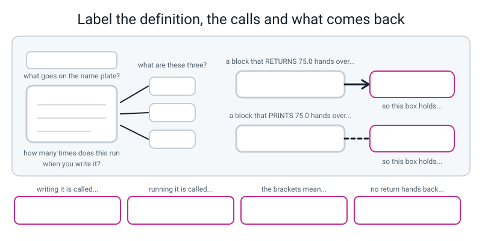
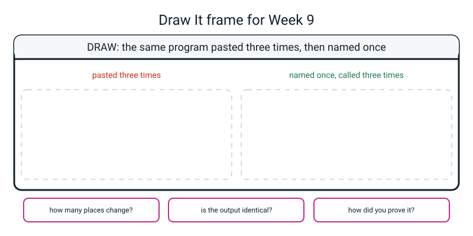

# Workbook — Week 9: Term 1 Checkpoint — You Keep Typing the Same Five Lines

**Name:** ________________________________  **Date:** ______________

[⬅ Week 08](week-08.md) · [📖 Read the chapter first](../student-guide/week-09.md) · [Course Home](../README.md) · [🧑‍🏫 Teacher guide](../teacher-guide/week-09.md) · [Next ➡](week-10.md)

---

> **There is no mark on this page and there is not going to be one.** What comes out at the end is a **list of weeks to revisit**. Getting four of the ten repairs and finding out exactly which four is a **better** outcome than getting nine and learning nothing. **Do not try to look good. Try to find out.**

---

## ✅ Warm-Up (5 min)

This warm-up brings back last week's loops before the checkpoint. Answer the five questions about **last week**.

**W1.** Name the three parts of a `while` loop, and say what goes wrong if each one is missing.

________________________________________________________________

________________________________________________________________

**W2.** `break` and `continue` — one sentence each.

________________________________________________________________

**W3.** A loop is set up for five passes. On pass two it hits `continue`; on pass four it hits `break`. **How many passes run?** ______

**W4.** Why does the `.isdigit()` check have to come **before** the `int()`, and not after?

________________________________________________________________

**W5.** What does `KeyboardInterrupt` mean, and is it a bug in your code?

________________________________________________________________

---

## 🔎 Predict the Output

This section is for predicting what Python will do before you run it. **Write your prediction before you run anything.**

One of these four prints nothing at all, and one crashes before it can print anything. Saying *why* is the whole question.

### P1

```python
def say_hi():
    print("hi")

say_hi
```

**I predict:** ________________________

**It really printed:** ________________________

**One character is missing. Which one, and where?**

________________________________________________________________

### P2

```python
def give_five():
    return 5

def show_five():
    print(5)

print(give_five())
print(show_five())
```

**I predict — write all three lines:**

________________________________________________________________

**It really printed:**

________________________________________________________________

**Why are the last two lines different, when both functions "have a 5 in them"?**

________________________________________________________________

### P3

```python
def total_it():
    total = 0
    for n in range(1, 4):
        total += n
    return total
    print("done")

print(total_it())
```

**I predict:** ________________________

**It really printed:** ________________________

**Does `done` appear? Why not — and is there any warning about it?**

________________________________________________________________

### P4

```python
greet()

def greet():
    print("hello")
```

**I predict — an error, or nothing, or `hello`?**

________________________________________________________________

**It really printed:**

________________________________________________________________

**The function is clearly right there, three lines below. So why doesn't Python find it?**

________________________________________________________________

**How many of the seven answers did you get right?** ______ / 7

**Which one surprised you most, and why?**

________________________________________________________________

---

## ✍️ Practice Set A — Read It

This set is for reading error messages and programs without running them. Each question says what to write.

**A1. Name the family from the message alone.** Write **1** (never started), **2** (started then stopped) or **3** (finished and lied), and then say **what you would look at first.** Do not look at any code — the message is all you get.

| # | The message | Family | What I'd look at first |
|---|---|---|---|
| a | `SyntaxError: expected ':'` | | |
| b | `NameError: name 'total' is not defined` | | |
| c | `IndentationError: expected an indented block after 'for' statement on line 4` | | |
| d | `TypeError: can only concatenate str (not "int") to str` | | |
| e | `ValueError: invalid literal for int() with base 10: 'banana'` | | |
| f | "It printed `{total}` with the curly brackets still showing" | | |
| g | `KeyboardInterrupt` | | |
| h | "A mark of 95 came out as a C, no error" | | |
| i | `ZeroDivisionError: division by zero` | | |
| j | "It asked for eleven scores when I had twelve" | | |
| k | `SyntaxError: 'break' outside loop` | | |
| l | `TypeError: unsupported operand type(s) for +: 'NoneType' and 'int'` | | |

**(m) Which family is the friendliest, and why?**

________________________________________________________________

**(n) Which family is the most expensive, and why?**

________________________________________________________________

**(o) Which family gives you the most help, and what exactly is the help?**

________________________________________________________________

**A2. Trace it.** For each program, say what appears on the screen. **Three of them show nothing.**

**(i)**

```python
def print_line():
    print("-" * 6)

print_line()
print_line()
print("end")
```

Output: ______________________________________________

**(ii)**

```python
def print_line():
    print("-" * 6)
```

Output: ______________________________________________

**(iii)**

```python
def print_line():
    print("-" * 6)

print_line
```

Output: ______________________________________________

**(iv)**

```python
def six():
    return 6

six()
```

Output: ______________________________________________

**In (ii), (iii) and (iv), is anything wrong with the definition itself?** ______  So what is wrong?

________________________________________________________________

**A3. Match the code to the output.** All four run cleanly. One of them produces nothing at all.

| | Snippet | | | Output |
|---|---|---|---|---|
| a | `def f():`<br>`    print("A")`<br>`f()`<br>`f()` | ______ | **1** | `A` |
| b | `def f():`<br>`    return "A"`<br>`print(f())` | ______ | **2** | `A`<br>`A` |
| c | `def f():`<br>`    print("A")`<br>`x = f()`<br>`print(x)` | ______ | **3** | (nothing at all) |
| d | `def f():`<br>`    return "A"`<br>`f()` | ______ | **4** | `A`<br>`None` |

**Where does the `None` in output 4 come from?**

________________________________________________________________

**A4. Spot the bug — four programs, and three of them have no error message.**

**(i)**

```python
def print_header():
    print("=" * 20)

print_header
print("body")
```

Error message? ______  What's wrong: ______________________________

**(ii)**

```python
def average():
    print(75.0)

result = average()
print(f"{result:.2f}")
```

Error message? ______  What's wrong: ______________________________

**(iii)**

```python
def give_ten():
    return 10
    print("about to return ten")

print(give_ten())
```

Error message? ______  What's wrong: ______________________________

**(iv)**

```python
def banner():
    print("*" * 10)

banner()
print("welcome")
banner()
```

Error message? ______  What's wrong: ______________________________

**A5. Label the diagram.** Fill in every blank box, including the four caption boxes along the bottom.


*Figure W9.1 — One definition, three calls, and two very different things coming back.*

Name plate: ____________________  How many times does the block run when you *write* it? ______

The three things pointing at the card are called: ____________________

A block that RETURNS 75.0 hands over: ____________________ so the box holds: ____________________

A block that PRINTS 75.0 hands over: ____________________ so the box holds: ____________________

Writing it is called ____________________ · Running it is called ____________________

The brackets mean ____________________ · No `return` hands back ____________________

**A6. In your own words, one sentence each.**

(a) What is a function?

________________________________________________________________

(b) What is the difference between defining and calling?

________________________________________________________________

(c) What is the difference between `print_header` and `print_header()`?

________________________________________________________________

(d) What punctuation does `def` need, and **where have you seen those rules before?**

________________________________________________________________

(e) What does a function with no `return` hand back?

________________________________________________________________

(f) Why can you not do maths with a printed answer?

________________________________________________________________

(g) What does `NoneType` in a `TypeError` almost always mean?

________________________________________________________________

(h) Why does calling a function **above** its `def` fail?

________________________________________________________________

---

## ✍️ Practice Set B — Write It

This set is for writing functions of your own. Write each answer on the lines, then run it and compare it with the expected output.

**B1. Three lines.** Define a function called `print_line` that prints twenty dashes, then call it once.

```python
________________________________________________________________

________________________________________________________________

________________________________________________________________
```

**Expected output:**

```text
--------------------
```

**Done looks like:** a colon on the `def` line, the body **indented**, and a call at the **margin**. Then delete the call, run it again, and confirm you get **nothing and no error**.

**B2. Seven lines.** Define a function that prints a three-line banner, then call it twice with one line of text between the calls.

```python
________________________________________________________________

________________________________________________________________

________________________________________________________________

________________________________________________________________

________________________________________________________________

________________________________________________________________

________________________________________________________________
```

**Expected output:**

```text
************************
   MY PROGRAMS
************************
week 7: loops
************************
   MY PROGRAMS
************************
```

**Done looks like:** the banner text is written down in **exactly one place** in your file. Count them.

**B3. Four lines.** Define a function that **returns** 12 × 12, then print it, and then print it with 6 added.

```python
________________________________________________________________

________________________________________________________________

________________________________________________________________

________________________________________________________________
```

**Expected output:**

```text
144
150
```

**Done looks like:** `return`, not `print`, inside the function — and the second line proves it, because you cannot add 6 to something that was only printed.

**B4. Nine lines.** A function that reads three numbers with an accumulator and **returns** their average. The main program prints it to two places, and then prints double it.

```python
________________________________________________________________

________________________________________________________________

________________________________________________________________

________________________________________________________________

________________________________________________________________

________________________________________________________________

________________________________________________________________

________________________________________________________________

________________________________________________________________
```

**Expected output** when you type 12, 15, 18:

```text
Number 1 of 3: 12
Number 2 of 3: 15
Number 3 of 3: 18
Average : 15.00
Doubled : 30.00
```

**Done looks like:** Week 7's accumulator, living **inside** the function · `return`, not `print` · and a hand-check on paper: 12 + 15 + 18 = 45, and 45 ÷ 3 = 15.

**B5. About fifteen lines.** A match report with two functions: one that prints a banner (called twice) and one that reads four overs with an accumulator and **returns** the total.

```python
________________________________________________________________

________________________________________________________________

________________________________________________________________

________________________________________________________________

________________________________________________________________

________________________________________________________________

________________________________________________________________

________________________________________________________________

________________________________________________________________

________________________________________________________________

________________________________________________________________

________________________________________________________________

________________________________________________________________

________________________________________________________________

________________________________________________________________
```

**Expected output** when you type 8, 12, 6, 10:

```text
==============================
   MATCH REPORT
==============================
Over 1 of 4: runs? 8
Over 2 of 4: runs? 12
Over 3 of 4: runs? 6
Over 4 of 4: runs? 10
Runs in 4 overs : 36
Runs per over   : 9.00
==============================
   MATCH REPORT
==============================
```

**Done looks like:** two `def`s at the top, all calls below them · the banner written once · the runs-per-over line calculated from the **returned** total · and a hand-check: 8 + 12 + 6 + 10 = 36, and 36 ÷ 4 = 9.

---

## 🐞 Fix the Broken Program

This section is for finding and fixing bugs in one program, one at a time.

Here is `card.py`, which is supposed to print a name card and work out an age in months. It has **three** bugs: one that stops Python reading the file, one that crashes it partway through, and one that produces **no error message at all**.

```python
# card.py - print a name card and work out an age in months. It has three bugs.

def print_edge()                              # bug 1 lives on this line
    print("*" * 26)

def months_old():
    years = int(input("Age in years? "))
    print(years * 12)                         # bug 2 lives on this line

print_edge()
print("  NAME  : Ramana")
print("  CLASS : 7")
print_edge                                    # bug 3 lives on this line

months = months_old()
print(f"  That is {months} months,")
print(f"  which is {months / 12:.1f} years.")
```

**Bug 1.** Run it as it is. This is the real message:

```text
  File "card.py", line 3
    def print_edge()                              # bug 1 lives on this line
                                                  ^^^^^^^^^^^^^^^^^^^^^^^^^^
SyntaxError: expected ':'
```

Which family? ______  **Did any of it run?** ______

**The carets are under the comment, not under the brackets. Why?**

________________________________________________________________

The fix — write the whole corrected line:

```python
________________________________________________________________
```

**Bug 2.** Now run it and type `12`. This is the real output and message:

```text
**************************
  NAME  : Ramana
  CLASS : 7
Age in years? 12
144
  That is None months,
Traceback (most recent call last):
  File "card.py", line 17, in <module>
    print(f"  which is {months / 12:.1f} years.")
TypeError: unsupported operand type(s) for /: 'NoneType' and 'int'
```

(a) **Look at the line that begins `That is`.** What does it say, and why is that already wrong even before the crash?

________________________________________________________________

(b) The word `NoneType` is the clue. **What does it tell you?**

________________________________________________________________

(c) The error is on line 17. **Is that where the mistake is?** ______ Where is it, and what is the fix?

```python
________________________________________________________________
```

**Bug 3.** Now it runs all the way through. This is the real output when you type `12`:

```text
**************************
  NAME  : Ramana
  CLASS : 7
Age in years? 12
  That is 144 months,
  which is 12.0 years.
```

(d) **Count the rows of stars.** How many are there? ______ How many should there be? ______

(e) There is a `print_edge` on line 13 and it is spelled perfectly. **So why did nothing happen?**

________________________________________________________________

(f) The fix — write the whole corrected line:

```python
________________________________________________________________
```

(g) **Why is there no error message for this one?**

________________________________________________________________

(h) **Which of the three bugs was hardest to find, and why?** Think about which one *showed you a correct answer*.

________________________________________________________________

________________________________________________________________

---

## 🧩 Puzzle of the Week

This section has two puzzles: sorting messages into families, and counting the lines a function saves.

### Part A — Name That Family, against the clock

Twelve messages. Write **1**, **2** or **3** beside each. **Two minutes. From the message alone.**

| You read | Family |
|---|---|
| `SyntaxError: unterminated string literal` | |
| `NameError: name 'Hello' is not defined` | |
| "It printed nine numbers when I wanted ten" | |
| `IndentationError: unindent does not match any outer indentation level` | |
| `TypeError: unsupported format string passed to NoneType.__format__` | |
| "No output at all, and no error either" | |
| `ValueError: empty range for randrange() (100, 2, -98)` | |
| "Everybody who passed got a C" | |
| `SyntaxError: 'return' outside function` | |
| `AttributeError: module 'random' has no attribute 'randInt'` | |
| "It accepted `banana` as a number" | |
| `ZeroDivisionError: division by zero` | |

**Score:** ______ / 12

**One of those twelve does not fit the three families cleanly. Which one, and why?**

________________________________________________________________

### Part B — Count the savings honestly

A banner block is **five lines**. Pasting it `n` times costs `5 × n` lines. Naming it costs **six** lines for the definition (the `def` line plus five body lines) plus **one line per call**.

| Banners | Pasted (5n) | Named (6 + n) | Lines saved |
|---|---|---|---|
| 1 | | | |
| 2 | | | |
| 3 | | | |
| 5 | | | |
| 10 | | | |
| 14 | | | |

**(a) At how many banners does the function version first become shorter?** ______

**(b) With exactly ONE banner, which version is shorter?** ______ **By how much?** ______

**(c) So with one banner, is it still worth writing the function? Argue it.**

________________________________________________________________

________________________________________________________________

**(d) How many banners before you save fifty lines?** ______

**(e) Your real files were 25 lines and 18 lines — seven saved. Now the actual question: was it worth doing for seven lines?** Say yes or no, and give a reason that is **not about lines.**

________________________________________________________________

________________________________________________________________

---

## 🤔 Think Deeper

These two questions ask for a written paragraph each, in your own words.

**T1.** Should every repeated block become a function?

Write a paragraph. There are two real camps — *never write the same thing twice* and *wait until the third copy* — and neither is silly. Set out both, then name the thing **neither camp can know**, then give the rule you are personally going to use.

________________________________________________________________

________________________________________________________________

________________________________________________________________

________________________________________________________________

________________________________________________________________

________________________________________________________________

**T2.** Why does Python need `def` at all? Couldn't it work out which lines belong together?

Look at five consecutive lines of your own code before you answer. Then say what `def` actually gives Python that it could not have got any other way — and why that makes the function's **name** matter more than almost anything else about it.

________________________________________________________________

________________________________________________________________

________________________________________________________________

________________________________________________________________

________________________________________________________________

________________________________________________________________

---

## 🛠️ Build It

This section is the checkpoint itself. You repair ten old bugs, build functions from your own files, and finish with a list of weeks to revisit.

### Part 1 — the ten repairs

Ten broken programs, all from weeks 1–8. For each one write **the family**, **what's wrong in one sentence**, and **the fix**.

If you are stuck for more than ninety seconds, **write down which week it came from and move on.** Getting stuck is information.

**Bug 1** — from Week 1

```python
print("Hello, world!)
```

Family: ______  Wrong: ______________________________  Fix: ______________________

**Bug 2** — from Week 1

```python
print(Hello)
```

Family: ______  Wrong: ______________________________  Fix: ______________________

**Bug 3** — from Week 2

```python
age = "12"
print(age + 1)
```

Family: ______  Wrong: ______________________________  Fix: ______________________

**Bug 4** — from Week 3

```python
total = 900
print("The total is {total}")
```

Family: ______  Wrong: ______________________________  Fix: ______________________

**Bug 5** — from Week 4 (the user types `twelve`)

```python
age = int(input("How old are you? "))
print(age)
```

Family: ______  Wrong: ______________________________  Fix: ______________________

**Bug 6** — from Week 5

```python
score = 90
if score = 90:
    print("Full marks")
```

Family: ______  Wrong: ______________________________  Fix: ______________________

**Bug 7** — from Week 5

```python
score = 90
if score >= 50:
print("Pass")
```

Family: ______  Wrong: ______________________________  Fix: ______________________

**Bug 8** — from Week 6

```python
mark = 95

if mark >= 60:
    grade = "C"
elif mark >= 75:
    grade = "B"
elif mark >= 90:
    grade = "A"
else:
    grade = "F"

print(f"Mark {mark} gets grade {grade}")
```

Family: ______  Wrong: ______________________________  Fix: ______________________

**Bug 9** — from Week 7

```python
# Goal: print the numbers 1 to 10.
for n in range(1, 10):
    print(n, end=" ")
print()
```

Family: ______  Wrong: ______________________________  Fix: ______________________

**Bug 10** — from Week 8

```python
# Goal: count down from 3 and then say Liftoff.
countdown = 3

while countdown > 0:
    print(countdown)

print("Liftoff!")
```

Family: ______  Wrong: ______________________________  Fix: ______________________

**(a) How many of the ten had no error message at all?** ______ Which ones? ______________

**(b) Sort them by family and count each.** Family 1: ______ Family 2: ______ Family 3: ______

**(c) Which one did you find fastest, and what does that tell you?**

________________________________________________________________

________________________________________________________________

### Part 2 — three repeated blocks, three functions

Go through your **own** weeks 1–8 files and find **three** blocks that appear more than once. Turn each one into a function.

**The requirement I am marking hardest: the output has to be byte-identical to what it was before.** Not nearly. Identical.

Copy the blocks; do not retype them.

**Checklist:**

- [ ] Three `def`s, all at the **top** of the file, below any `import`
- [ ] Every one of them **called** at least once
- [ ] Names that say what the function does
- [ ] The blocks were **copied**, not retyped
- [ ] Output saved before and after, and compared
- [ ] Every line commented, saying *why*

**Write down what you found:**

| # | The block | Which of my files it was in | Lines in it |
|---|---|---|---|
| 1 | | | |
| 2 | | | |
| 3 | | | |

**The proof:**

| Check | Answer |
|---|---|
| How did you compare the before and after output? | |
| Was it identical? | |
| Lines in the file before | |
| Lines in the file after | |
| Lines saved | |
| Places the banner text is now written down | |

**(d) How many lines did you save, and was that the point?**

________________________________________________________________

**(e) Why must you copy the block rather than retype it?**

________________________________________________________________

**(f) Did any of your functions call another function? What does that show?**

________________________________________________________________

### Part 3 — Week 7's average, as a returning function

Rewrite last week's totaller so the accumulator lives **inside** a function that **returns** the average. Test it on the twelve card scores: 88 92 70 65 100 54 78 81 47 90 62 73.

| Check | Wanted | Got |
|---|---|---|
| Average printed | 75.00 | |
| Doubled printed | 150.00 | |
| Does it agree with Week 7's `scores.py`? | yes | |
| Does it agree with Week 8's `grade.py`? | yes | |

**(g) Three differently shaped programs all say 75. Why does that matter?**

________________________________________________________________

**(h) The honest criticism.** That function both **fetches** the twelve numbers *and* **works out** the average. Why is that awkward, and what would you need to fix it?

________________________________________________________________

________________________________________________________________

### Part 4 — sort the whole Bug Log

Go back to page one of your Bug Log and label **every single entry** 1, 2 or 3.

| | Answer |
|---|---|
| Total entries in my Bug Log | |
| Family 1 (never started) | |
| Family 2 (started, then stopped) | |
| **Family 3 (finished and lied)** | |
| Which week do my family 3s cluster in? | |

**(i) Is your total number of entries honest?** If you have three entries for eight weeks, say so — **that goes on the revision list as a habit, not a topic.**

________________________________________________________________

### Part 5 — the Term 1 reflection sheet

**There are no right answers on this page and there is no mark.**

**(j) Which single thing from Term 1 do you now use without thinking about it?**

________________________________________________________________

**(k) Which week's idea took longest to land, and what finally made it land?**

________________________________________________________________

________________________________________________________________

**(l) Which mistake have you made more than three times?**

________________________________________________________________

**(m) One thing you can do now that you could not do in Week 1** — and try to make it something other than a piece of syntax.

________________________________________________________________

### Part 6 — the revision list

Fill in the table with weeks, specifics, and how you will know. The third column is the one that makes this useful. *"Revise Week 6"* is a wish. *"Write a five-branch chain and test both sides of every boundary"* is a plan.

| Week | What specifically | How I'll know I've got it |
|---|---|---|
| | | |
| | | |
| | | |
| | | |
| | | |

**A habit is a legitimate row** — leave the week blank if the finding is about how you work rather than what you know.

### Part 7 — the Bug Log

**Two entries, and at least one must be a function bug** — either the one where you forgot to call it, or the `NoneType` one.

| # | What I saw (real text, or "no error") | What it meant, in my own words | What one thing I changed |
|---|---|---|---|
| 1 | | | |
| 2 | | | |

**(n) Both of this week's bugs were silent-ish. Which was worse, and why?**

________________________________________________________________

---

## 🎨 Draw It

This section is for drawing the idea of a function instead of writing it.

Draw **the same program twice** — once with a block pasted three times, once with it named and called three times. Use your own subject: a scoreboard, a menu, a report card, a games night scoresheet.


*Figure W9.2 — Your page.*

> **What a good answer might look like:** the subject is a **games-night scoresheet** with a five-line header — a row of stars, the words `GAMES NIGHT`, another row of stars, the date, and a blank line.
>
> On the **left**, one long page drawn as a tall rectangle. The header block is drawn out **three times** down the page, and all three are **ringed in the same colour**. Beside them, three short unringed blocks: *round 1 scores*, *round 2 scores*, *final totals*. Down the side, a bracket covering all three rings with the note **15 lines, one idea**. And in the margin, a pencil with three arrows pointing at the three rings and the words *change the date and you change it here, and here, and here — and nothing tells you if you miss one.*
>
> On the **right**, the same page, shorter. At the top, **one** box drawn as a recipe card with a name plate on it reading `print_header`, and the five lines inside it — ringed once. Below it, three small buttons labelled `print_header()`, each with an arrow going **back up** to the card, and the three score blocks beside them. Down the side, a bracket with the note **1 definition + 3 calls**. And in the margin, the same pencil with **one** arrow, and the words *one edit, and there is nothing left to miss.*
>
> The three bottom boxes: *three places before, one place after* · *identical — `diff` printed nothing* · *saved the output to two files and compared them.*
>
> **What a weak answer looks like:** drawing three recipe cards on the right-hand side. That is the misunderstanding, drawn — three calls do **not** make three copies of the block. If your picture has more than one card, the arrows are going the wrong way: they should all point *back to the same card*.

---

## 📊 Self-Check

This section is for ticking how sure you are about each skill, then testing yourself on true or false.

| I can… | 😀 got it | 🙂 nearly | 😕 not yet |
|---|---|---|---|
| Repair broken programs from weeks 1–8 without help | ☐ | ☐ | ☐ |
| Name the error family for any traceback from the message alone | ☐ | ☐ | ☐ |
| Define a function with `def` and call it by name | ☐ | ☐ | ☐ |
| Explain why defining a function is not the same as running it | ☐ | ☐ | ☐ |
| Explain what `return` hands back, and what happens with no `return` | ☐ | ☐ | ☐ |
| Produce a specific list of weeks to revisit, with a check for each one | ☐ | ☐ | ☐ |

**True or false?** Circle one on each row.

| Statement | | |
|---|---|---|
| Defining a function runs it | TRUE | FALSE |
| A function defined and never called causes an error | TRUE | FALSE |
| `print_header` and `print_header()` do the same thing | TRUE | FALSE |
| `def name():` needs a colon | TRUE | FALSE |
| `def name:` without brackets is fine | TRUE | FALSE |
| A function with no `return` hands back `None` | TRUE | FALSE |
| `return` prints the value | TRUE | FALSE |
| Lines after a `return` still run | TRUE | FALSE |
| You can do maths with a returned value | TRUE | FALSE |
| You can do maths with a printed value | TRUE | FALSE |
| `NoneType` in a `TypeError` usually means a missing `return` | TRUE | FALSE |
| A call above the `def` works fine | TRUE | FALSE |
| A function may call another function | TRUE | FALSE |
| A `SyntaxError` means part of your program ran | TRUE | FALSE |
| A `Traceback` with a line number means the program started | TRUE | FALSE |
| The most dangerous bugs give the clearest messages | TRUE | FALSE |

One thing I'd like explained again:

________________________________________________________________

---

## ✅ Answers

This section is for checking your work after you have finished every page. Open it only when you are done.

<details>
<summary>Check your answers</summary>

### Warm-Up

**W1.** **Set up** (before the loop): missing it gives `NameError`, because the condition asks about a box that does not exist. **Check** (the condition): without it you have not written a `while` loop at all. **Change** (inside the body): missing it gives an **infinite loop**, with no error message until you press Ctrl+C.

**W2.** **`break`** ends the loop immediately, skipping every remaining pass. **`continue`** ends only the current pass and goes straight back to the check.

**W3.** **Four.** Pass two runs but is cut short; pass three runs in full; pass four runs as far as the `break`; pass five never happens.

**W4.** Because **`int()` is the thing that crashes.** Once it has raised `ValueError` the program is over and there is nothing left to check. `.isdigit()` can be asked of any text at all and never crashes, so it goes first.

**W5.** It means **a human pressed Ctrl+C and stopped the program.** It is not a bug in your code. The bug is whatever made the loop refuse to end; the traceback's line number just tells you where the program was standing when you stopped it.

---

### Predict the Output

**P1.**

```text
```

**Nothing at all, and no error.** `say_hi` without brackets is the function's **name** — a reference to the recipe. It is a completely legal thing to write, it does nothing, and Python does not complain.

The missing character is a pair of them: **the brackets.** `say_hi()`.

**P2.**

```text
5
5
None
```

`print(give_five())` prints **5** — the function handed the value back, and `print` displayed it. Then `print(show_five())` produces **two** lines: the function's own `print(5)` gives the `5`, and then `print(...)` displays what the function handed back, which is **`None`**.

**Both functions "have a 5 in them", and that is exactly the trap.** One hands the 5 over; the other shouts it at the screen and hands over nothing.

**P3.**

```text
6
```

**`done` does not appear**, and there is no warning about it. **`return` ends the function immediately** — the `print("done")` line is unreachable and simply never runs. Python does not mention it.

Check the accumulator: 1 + 2 + 3 = 6 ✔

**P4.**

```text
Traceback (most recent call last):
  File "p4.py", line 1, in <module>
    greet()
NameError: name 'greet' is not defined
```

**Python reads a file from top to bottom.** At the moment it reached line 1, it had not read the `def` yet, so the name `greet` genuinely did not exist. The function being visible to *you*, three lines below, is irrelevant — Python was not there yet.

**Fix: definitions first, calls after.** Put all your `def`s at the top and this never happens again.

---

### Practice Set A

**A1.**

| # | The message | Family | What I'd look at first |
|---|---|---|---|
| a | `SyntaxError: expected ':'` | **1** | The `^`. It points at the exact character. Nothing ran, so no output on screen means anything |
| b | `NameError: name 'total' is not defined` | **2** | The line number. Either the name is misspelled, or the box was never made — and if it is `total`, probably an accumulator with no set-up line |
| c | `IndentationError: expected an indented block after 'for' statement on line 4` | **1** | Indent the line under the `for`. Python has told you which construct you failed to fill in |
| d | `TypeError: can only concatenate str (not "int") to str` | **2** | The line number, then the `+`. One side is text and one is a number |
| e | `ValueError: invalid literal for int() with base 10: 'banana'` | **2** | The `int(...)`. The value handed to it was not a number. Check before converting |
| f | Braces still showing | **3** | A missing `f` before the opening quote. **No message will ever appear for this** |
| g | `KeyboardInterrupt` | **2** | Nothing is wrong with the line it names. Find the variable in the condition and ask what was supposed to change it |
| h | 95 came out as a C | **3** | Count and compare. Trace one value down the chain with a finger. The branches are in the wrong order |
| i | `ZeroDivisionError: division by zero` | **2** | The line, then ask what the divisor was. Often a count that turned out to be 0 |
| j | Eleven scores for twelve | **3** | Count what went in against what came out. Then look at the `range` boundary |
| k | `SyntaxError: 'break' outside loop` | **1** | Find the `break` and put it inside a loop, or delete it. An `if` is not a loop |
| l | `NoneType` in a `TypeError` | **2** | The word `NoneType`: a function you called printed instead of returning |

**(m) Family 1.** You find out **instantly**, and nothing has happened yet — no file was written, no number was reported, **nobody was told anything untrue.** It is the cheapest possible kind of mistake.

**(n) Family 3.** It **survives**, because nothing announces it. It goes into your homework, into the answers your program printed, into next term. The Week 6 grade chain would have handed thirty students a wrong grade and nobody would ever have found out.

**(o) Family 2.** It gives you a **line number you can trust**, and the nouns in the message — `str`, `int`, `NoneType` — tell you what *kind* of thing surprised Python.

**A2.**

**(i)**

```text
------
------
end
```

**(ii)** Nothing at all, and no error. **The function was defined and never called.**

**(iii)** Nothing at all, and no error. **The brackets are missing**, so that line names the function instead of running it.

**(iv)** Nothing at all, and no error. This one is different from (ii) and (iii): the function **was** called and it **did** run — but it `return`s a value and nobody printed it. **Returning is not showing.** `print(six())` would give you `6`.

**In all three, there is nothing wrong with the definition.** In (ii) nobody called it. In (iii) the call is missing its brackets. In (iv) the call is fine and the *caller* threw the answer away. **Three different causes, one identical silence** — which is why "did you call it?" is the first question and "did you print what came back?" is the second.

**A3.** a → **2** · b → **1** · c → **4** · d → **3**

The real outputs:

```text
A
A
```

```text
A
```

```text
A
None
```

```text
```

**The `None` in output 4** comes from the second `print`. The function's own `print("A")` produced the `A`; then `x = f()` put the function's **return value** into `x`, and since the function has no `return`, that value is `None`. `print(x)` displays it.

**A4.**

**(i) No error message.** Output is just `body` — **no stars.** The brackets are missing from `print_header`, so it names the function instead of running it. Fix: `print_header()`.

**(ii) There is an error message:**

```text
75.0
Traceback (most recent call last):
  File "b.py", line 5, in <module>
    print(f"{result:.2f}")
TypeError: unsupported format string passed to NoneType.__format__
```

**And the right answer, `75.0`, is on the screen just above the crash** — which is what makes this one nasty. The function **printed** instead of **returning**, so `result` holds `None`, and you cannot format nothing to two decimal places. Fix: `return 75.0`.

**(iii) No error message.** It prints **`10`**. The `print("about to return ten")` line is **after** the `return`, so it never runs — `return` ends the function immediately. Fix: move it above the `return`, or delete it. **Nothing warns you about unreachable code.**

**(iv) No error message, and nothing is wrong.** This one is correct:

```text
**********
welcome
**********
```

**That is on the page deliberately.** Three of four programs being broken does not mean all four are — and a habit of finding a fault in every program you are shown is its own kind of bug.

**A5.** Name plate: **`print_header`** (or whatever the function is called). How many times does the block run when you write it? **Zero.**

The three things pointing at the card are **calls** — `print_header()`, three times.

A block that RETURNS 75.0 hands over **the value 75.0**, so the box holds **75.0**.

A block that PRINTS 75.0 hands over **nothing**, so the box holds **`None`**.

Writing it is called **defining** · Running it is called **calling**.

The brackets mean **"actually do it"** · No `return` hands back **`None`**.

**A6.**

(a) A **named block of code you write once and run whenever you like.**

(b) **Defining** (`def name():`) writes the block down under a name and **runs nothing.** **Calling** (`name()`) runs it, top to bottom. You define once; you call as often as you like.

(c) `print_header` is the function's **name** — a reference to the recipe. `print_header()` is an instruction to **run** it. Writing the name on its own is legal, does nothing, and produces no error. **The brackets mean "actually do it"** — exactly like `.isdigit()` versus `.isdigit` last week.

(d) **Empty brackets and a colon** on the `def` line, then an **indented block.** Both rules are the same as `if` and `for`: the colon means "the indented block below belongs to me", and the indent *is* the block. **There is no new punctuation this week.**

(e) **`None`** — Python's word for "no value at all". Printing it shows the word `None`.

(f) Because printing **sends the characters to the screen and keeps nothing.** There is nothing left to add to. You can always print a returned value; you can never recover a printed one.

(g) That a function you called **printed** instead of **returning**, so the value you are working with is `None`.

(h) Because **Python reads the file from top to bottom**, and at the moment it reaches the call it has not read the definition yet, so the name does not exist. The message is `NameError`. **Definitions first, calls after.**

---

### Practice Set B

**B1.**

```python
def print_line():                  # DEFINE - nothing runs yet
    print("-" * 20)                # the indent IS the block

print_line()                       # CALL - the brackets mean "do it"
```

```text
--------------------
```

**With the call deleted:**

```text
```

Nothing, and **exit code 0** — no error. Python filed the recipe and reached the end of the file.

**B2.**

```python
def print_banner():                # DEFINE once - the text lives in ONE place
    print("*" * 24)
    print("   MY PROGRAMS")
    print("*" * 24)

print_banner()                     # CALL
print("week 7: loops")
print_banner()                     # CALL again - no retyping
```

```text
************************
   MY PROGRAMS
************************
week 7: loops
************************
   MY PROGRAMS
************************
```

**The words `MY PROGRAMS` appear exactly once in the file** and twice in the output. That is the whole point.

**B3.**

```python
def twelve_squared():              # DEFINE
    return 12 * 12                 # RETURN, not print

print(twelve_squared())            # CALL and print what comes back
print(twelve_squared() + 6)        # and you can do maths with it
```

```text
144
150
```

**The second line is the proof.** If the function had used `print(12 * 12)` instead, that line would be `TypeError: unsupported operand type(s) for +: 'NoneType' and 'int'`.

**B4.**

```python
def average_of_three():                     # DEFINE - no input, one number out
    total = 0                               # the accumulator
    for i in range(1, 4):                   # 1, 2, 3
        total += int(input(f"Number {i} of 3: "))
    return total / 3                        # RETURN, do not print

average = average_of_three()                # CALL and catch it
print(f"Average : {average:.2f}")
print(f"Doubled : {average * 2:.2f}")
```

```text
Number 1 of 3: 12
Number 2 of 3: 15
Number 3 of 3: 18
Average : 15.00
Doubled : 30.00
```

**Hand-check:** 12 + 15 + 18 = 45 ✔ 45 ÷ 3 = 15 ✔ 15 × 2 = 30 ✔

**Why `range(1, 4)`?** Three passes labelled 1, 2, 3 — and `range(a, b)` hands out `b - a` values, so 4 − 1 = 3.

**B5.**

```python
# two_sections.py - one banner function, one returning function, two sections.

def print_banner():                          # the block that was pasted twice
    print("=" * 30)
    print("   MATCH REPORT")
    print("=" * 30)

def total_runs():                            # this one hands a number back
    total = 0                                # accumulator, before the loop
    for over in range(1, 5):                 # four overs
        total += int(input(f"Over {over} of 4: runs? "))
    return total                             # RETURN

print_banner()                               # CALL
runs = total_runs()                          # CALL and catch
print(f"Runs in 4 overs : {runs}")
print(f"Runs per over   : {runs / 4:.2f}")
print_banner()                               # CALL again
```

```text
==============================
   MATCH REPORT
==============================
Over 1 of 4: runs? 8
Over 2 of 4: runs? 12
Over 3 of 4: runs? 6
Over 4 of 4: runs? 10
Runs in 4 overs : 36
Runs per over   : 9.00
==============================
   MATCH REPORT
==============================
```

**Hand-check:** 8 + 12 = 20, + 6 = 26, + 10 = 36 ✔ 36 ÷ 4 = 9 ✔

**And notice the division happens in the main program, not in the function.** The function's job is "give me the total"; deciding to show runs-per-over is a separate decision. That separation is what returning buys you.

---

### Fix the Broken Program

**Bug 1 — family 1, it never started.** No output at all, so nothing ran.

**Why are the carets under the comment?** Because Python read the whole line looking for a colon, ran off the end of the code and into the comment, and marked the region where it gave up. **The `^^^^` shows you where Python's patience ran out, not where the missing character belongs** — and in this case they are on the same line, which is all you need. The colon goes right after the `()`.

```python
def print_edge():                             # bug 1 FIXED
```

**Bug 2 — family 2, it started then stopped.**

(a) It says **`  That is None months,`**. That line is **already wrong before the crash** — and it did not crash, because an f-string is perfectly happy to display the word `None`. **A silent wrong answer, printed one line before a loud one.** If the program had ended there, you would have shipped `None` to a human.

(b) `NoneType` tells you the value is **`None`**, and `None` is what a function hands back when it has **no `return`.** So a function you called printed instead of returning.

(c) **No.** Line 17 is a perfectly correct line — it is the *victim*, not the culprit. The mistake is on **line 8**, inside `months_old`:

```python
    return years * 12                         # bug 2 FIXED
```

**Bug 3 — family 3, it finished and lied.**

(d) There is **one** row of stars. There should be **two** — one above the name and one below it.

(e) Because `print_edge` on line 13 has **no brackets.** It is the function's *name*, not an instruction to run it. Python looked at the name, found it, thought about it, and moved on.

(f) The fix:

```python
print_edge()                                  # bug 3 FIXED
```

(g) Because `print_edge` on its own is a **completely legal thing to write.** It is a reference to a real object that really exists. Python has no reason to think you meant to call it — you might be about to hand it to something else. **There is nothing for Python to complain about.**

(h) **Bug 2 was hardest**, and the reason is the `That is` line. It printed `That is None months,` — a wrong answer, in a full sentence, with no error — and *then* crashed on the following line. So the traceback points at line 17 while the mistake is on line 8, and the first wrong thing on screen is not the traceback at all.

Bug 3 is a close second, for the opposite reason: **nothing at all appeared.** A missing row of stars is very easy to skim past.

**The general lesson: the loudest message is rarely nearest the mistake.**

---

### Puzzle of the Week

**Part A.**

| You read | Family |
|---|---|
| `SyntaxError: unterminated string literal` | **1** |
| `NameError: name 'Hello' is not defined` | **2** |
| Nine numbers where ten were wanted | **3** |
| `IndentationError: unindent does not match any outer indentation level` | **1** |
| `TypeError: unsupported format string passed to NoneType.__format__` | **2** |
| No output at all, and no error either | **3** — see below |
| `ValueError: empty range for randrange() (100, 2, -98)` | **2** |
| Everybody who passed got a C | **3** |
| `SyntaxError: 'return' outside function` | **1** |
| `AttributeError: module 'random' has no attribute 'randInt'` | **2** |
| It accepted `banana` as a number | **3** |
| `ZeroDivisionError: division by zero` | **2** |

**The one that does not fit cleanly is "no output at all, and no error either."** It has family 1's *symptom* — no output — and family 3's *nature*: the program ran to the end, perfectly happily, and did the wrong thing without saying so.

**It is family 3**, and the tell is that the program **exited normally**. A family 1 error never runs; this one ran completely and produced nothing, which is a confident wrong answer whose content happens to be empty. **This is the uncalled function, and it is why "did you call it?" is a reflex rather than a deduction.**

(An acceptable second answer: `KeyboardInterrupt` is a bit of an odd one too, since left alone the runaway loop reports nothing at all and belongs to no family — it only becomes family 2 because *you* interrupted it.)

**Part B.**

| Banners | Pasted (5n) | Named (6 + n) | Lines saved |
|---|---|---|---|
| 1 | 5 | 7 | **−2** |
| 2 | 10 | 8 | **2** |
| 3 | 15 | 9 | **6** |
| 5 | 25 | 11 | **14** |
| 10 | 50 | 16 | **34** |
| 14 | 70 | 20 | **50** |

**(a) At two banners.** One banner is the only case where the function version is longer.

**(b) With one banner the pasted version is shorter — by two lines.**

**(c)** Model answer:

> Yes, and the reason has nothing to do with the two lines. Even with one banner, the function gives it a **name**, and the name says what the block is *for* — `print_header` tells the next reader in one word what five lines of `print` statements do not. It also means that when the second banner arrives — and it will — I do not have to notice, remember and copy anything. **I am paying two lines now to avoid a decision later.**
>
> The honest counter-argument is real, though: if there is genuinely only ever going to be one banner, the `def` is a layer of indirection for no benefit, and somebody reading it has to jump up the file to find out what happens. **That is why the rule of thumb is "two copies, notice it; three copies, extract it"** rather than "always extract everything".

**(d) Fourteen banners** to save fifty lines. Each extra banner costs 5 lines pasted versus 1 line called, so you gain 4 lines per extra banner after the definition has paid for itself.

**(e)** Model answer:

> Yes, and it was never really about the seven lines. It was about the fact that **the heading is now written down in exactly one place.** Before, changing `AI ACADEMY` to `LEVEL 2` meant three edits and no way to be certain I had got them all — and I genuinely could not tell whether my three copies were identical without reading every character. Now there is one line to change and **nothing left to miss.**
>
> The seven lines are a nice side effect of a change that was really about **certainty**.

---

### Think Deeper

**T1.** A full-credit answer (4+ sentences) argues a side and names the cost of being wrong. Model answer:

> There are two real camps and I do not think either one is silly. One says **never write the same thing twice**, because every duplicate is a future inconsistency waiting to happen — and today proved that, because I could not tell whether my three banners were identical without reading every character.
>
> The other camp says **wait until the third copy**, and their argument is better than it first sounds. Two blocks that look identical today are sometimes two different ideas that happen to coincide, and if I merge them and then one of them needs to change, I end up with a single function trying to serve two masters. That usually grows extra options and flags, and ends up harder to read than the duplication was.
>
> What I notice is that the disagreement is really about something **neither side can know**: whether those two blocks will change *together* or *separately* in future. So the rule I am going to use is: **two copies, notice it and leave it; three copies, extract it.** And one thing that settles it either way — **if I have already had to change the same thing in two places on the same day, extract it now**, because that is no longer a prediction, it is evidence.

**T2.** Model answer:

> No, because there is nothing **in** five consecutive lines that says whether they are one idea or five unrelated things that happen to be next to each other. I looked at five lines in the middle of my `grade.py` and they were three prints and two `if`s — a person can see they belong together, but only because a person knows what a grade *is*. Python does not.
>
> Grouping is a fact about my **intention**, and my intention is not in the file until I put it there. `def` is exactly how I put it there: it says *these lines are one idea, and the idea has a name.*
>
> Which is why the name matters more than almost anything else about a function. **The name is the only place my intention gets written down.** And that makes a *wrong* name worse than no name at all — duplicated code merely repeats itself, but a function called `do_stuff` that prints a banner actively misleads the next person who reads it. The next person is usually me, in March.

---

### Build It

**Part 1 — the ten repairs.** Every message below came from a real run.

**Bug 1 — Week 1.**

```text
  File "bug01.py", line 1
    print("Hello, world!)
          ^
SyntaxError: unterminated string literal (detected at line 1)
```

**Family 1.** The closing quote is missing, so as far as Python is concerned the text never ends. The `^` points at the quote that opened it. **Fix:** `print("Hello, world!")`.

**Bug 2 — Week 1.**

```text
Traceback (most recent call last):
  File "bug02.py", line 1, in <module>
    print(Hello)
NameError: name 'Hello' is not defined
```

**Family 2.** Without quotes, `Hello` is a **name**, and Python has never heard of it. **Fix:** `print("Hello")`. The quotes are what turn a name into text.

**Bug 3 — Week 2.**

```text
Traceback (most recent call last):
  File "bug03.py", line 2, in <module>
    print(age + 1)
TypeError: can only concatenate str (not "int") to str
```

**Family 2.** `age` holds the *text* `"12"`, not the number 12, and `+` cannot glue a number onto text. **Fix:** either `age = 12`, or `print(int(age) + 1)`. Note that `"12" + "1"` would also "work" and give `121` — which would be family **3**.

**Bug 4 — Week 3.**

```text
The total is {total}
```

**Family 3 — it finished and lied.** No error at all. The **`f` is missing** before the opening quote, so the braces are just characters. **Fix:** `print(f"The total is {total}")`. **Tell:** curly brackets in the output.

**Bug 5 — Week 4**, typing `twelve`.

```text
How old are you? twelve
Traceback (most recent call last):
  File "bug05.py", line 1, in <module>
    age = int(input("How old are you? "))
ValueError: invalid literal for int() with base 10: 'twelve'
```

**Family 2.** `int()` can only convert text that *looks like* a number. **Fix (Week 8's tool):** keep it as text, `.strip()`, check `.isdigit()`, and convert only after the check passes.

**Bug 6 — Week 5.**

```text
  File "bug06.py", line 2
    if score = 90:
       ^^^^^^^^^^
SyntaxError: invalid syntax. Maybe you meant '==' or ':=' instead of '='?
```

**Family 1.** One `=` means "put this in the box"; two `==` means "are these equal?" **Fix:** `if score == 90:`. **And notice Python guessed correctly and told you** — read the whole message, not just the first three words.

**Bug 7 — Week 5.**

```text
  File "bug07.py", line 3
    print("Pass")
    ^
IndentationError: expected an indented block after 'if' statement on line 2
```

**Family 1.** The `if` promised an indented block and did not get one. **Fix:** indent `print("Pass")` four spaces.

**Bug 8 — Week 6.**

```text
Mark 95 gets grade C
```

**Family 3.** No error whatsoever. The chain checks top to bottom and stops at the first `True`, and `95 >= 60` is `True`, so the A and B branches are **unreachable — dead code.** **Fix:** highest threshold first: 90, then 75, then 60. **Tell:** the answer is confidently wrong and every individual line is a correct line. Reading will not find it; tracing a value with a finger will.

**Bug 9 — Week 7.**

```text
1 2 3 4 5 6 7 8 9 
```

**Family 3.** Nine numbers where ten were wanted. `range` stops **before** its second number. **Fix:** `range(1, 11)`. **Tell:** count the output against what you asked for — and the only reason you can tell at all is that the goal was written in a comment.

**Bug 10 — Week 8.** It prints `3` forever. After Ctrl+C:

```text
3
3
3
^C
Traceback (most recent call last):
  File "bug10.py", line 5, in <module>
    print(countdown)
KeyboardInterrupt
```

**Family 2 — but only because you interrupted it.** Left alone it never ends and never reports anything, which makes it the one bug that belongs to two families at once. **The missing part is the CHANGE step:** nothing in the body moves `countdown` towards 0. **Fix:** add `countdown -= 1` inside the loop. Then the output is `3 2 1 Liftoff!`.

**(a) Three** had no error message: bugs **4, 8 and 9.** All three printed a complete, confident, wrong answer.

**(b)** Family 1: bugs **1, 6, 7** — **three.** Family 2: bugs **2, 3, 5, 10** — **four.** Family 3: bugs **4, 8, 9** — **three.**

**(c)** Almost always one of the family-one errors, because the `^` points straight at the character. **What it tells you: the errors that feel worst are the easiest, and the ones that feel like nothing are the expensive ones.** If you got all seven noisy ones and none of the three silent ones, you have learnt something very specific about what to work on — and that is exactly what this page is for.

**Part 2 — three repeated blocks, three functions.** A model answer:

```python
# three_functions.py - three blocks that were pasted more than once, each given a name.

def print_banner():                      # was at the top of about_me.py AND grade.py
    print("=" * 34)
    print("   AI ACADEMY  -  LEVEL 2")
    print("=" * 34)

def print_divider():                     # was between every section of every report
    print("-" * 34)

def print_goodbye():                     # was at the bottom of guess.py AND grade.py
    print_divider()                      # a function may call another function
    print("  Thanks for using this program.")
    print("=" * 34)

print_banner()
print("Name  : Ramana")
print("Class : 7")
print_divider()
print("Total   : 900")
print("Average : 75.00")
print_goodbye()
```

The real output:

```text
==================================
   AI ACADEMY  -  LEVEL 2
==================================
Name  : Ramana
Class : 7
----------------------------------
Total   : 900
Average : 75.00
----------------------------------
  Thanks for using this program.
==================================
```

**How to mark it, in this order:**

1. **Is the output identical to the original?** That is the requirement. The proof:

   ```text
   $ python3 report_long.py > long.txt
   $ python3 report_short.py > short.txt
   $ diff long.txt short.txt
   $ 
   ```

   **`diff` printing nothing means the two are identical.** If it prints anything at all, the block was retyped rather than copied — usually a different number of equals signs, or a lost blank line.
2. **Are all three functions actually called?** A defined-and-never-called function produces no output and no error, so a missing banner is the tell.
3. **Are the `def`s above the calls?** If not, `NameError`.
4. **Do the names say what the functions do?** `print_banner` is good. `banner` is acceptable. `do_stuff` deserves a conversation.

**(d)** For the model answer, `report_long.py` is **25** lines and `report_short.py` is **18** — **seven lines.** And **no, that was not the point.** The point is that the heading is now written down in exactly one place, so changing it is one edit and it is **impossible to miss a copy, because there are none.**

**(e)** Because if you retype it and the output changes, **you will not know whether the change came from the function or from your typing.** Copying makes the extraction the only variable — which is exactly how you test one change at a time.

**(f)** `print_divider()` inside `print_goodbye()` shows that **a function can call another function, and there is no special rule for it** — it is an ordinary call that happens to sit inside a `def`. The only requirement is that `print_divider` exists by the time `print_goodbye` is actually called, which it does if all the `def`s are at the top. **And it means the divider's width is written down once, so changing 34 to 40 changes both dividers together.**

**Part 3 — the returning average.**

```python
# average_fn.py - a function that hands a number back.

def average_of_twelve():                   # DEFINE - no input, one answer out
    total = 0                              # week 7's accumulator, now living inside
    for i in range(1, 13):                 # 1, 2, 3 ... 12
        total += int(input(f"Score {i} of 12: "))
    return total / 12                      # RETURN - hand the answer back

average = average_of_twelve()              # CALL - and catch what comes back
print(f"Average : {average:.2f}")
print(f"Doubled : {average * 2:.2f}")      # you can do maths with a returned value
```

With the twelve card numbers, the last two lines of real output:

```text
Average : 75.00
Doubled : 150.00
```

| Check | Wanted | Got |
|---|---|---|
| Average printed | 75.00 | **75.00** |
| Doubled printed | 150.00 | **150.00** |
| Agrees with Week 7's `scores.py`? | yes | **yes** |
| Agrees with Week 8's `grade.py`? | yes | **yes** |

**(g)** Because **three programs with completely different shapes** — a `for` loop, a validated `while` loop, and a function that returns — all agree on the same twelve numbers. Any one of them could be wrong on its own; all three being wrong in exactly the same way is much less likely. **That agreement is an independent check, and it is the checkpoint doing its job.**

**(h)** That function both **fetches** the data *and* **works it out**, which means **you cannot test it without typing twelve numbers by hand.** Every single time. To check whether the arithmetic is right you have to do twelve keystrokes of setup, which is exactly the kind of friction that stops people testing at all.

Fixing it needs a way to hand the numbers **in** to the function rather than having the function go and get them — which is **parameters**, and which is next week. **If you felt that itch, you are ready for Week 10.**

**Part 4 — sorting the Bug Log.** There is no right answer here, only an honest one. What a healthy Term 1 looks like: **around fifteen entries, of which four or five are family 3.**

Three entries for eight weeks does **not** mean you had only three bugs. It means the log is not being kept, and **that goes on the revision list as a habit rather than a topic.** If that is you, build ten entries now from the ten repair programs — the habit can start this week.

**Where family 3 clusters: weeks 6 and 7**, nearly always. That is not a coincidence — `elif` chains and `range` boundaries are exactly where silence lives, because every individual line in both is a correct line.

**Parts 5 and 6 — the reflection sheet and the revision list.** **There are no right answers and there is no mark.** What follows is what a good, honest sheet looks like — use it to judge whether you are being **specific**, not whether you agree.

**(j)** > Probably `f"..."`. In Week 3 I had to stop and remember the `f` every time, and now my hands just do it. Second would be `int(input(...))` — I no longer have to be told that input is text.

**(k)** > Week 6, the ordering bug. What made it land was not the explanation, it was tracing 95 down the chain with my finger and having to say *"is 95 sixty or more?"* out loud. When I read it silently I kept skipping to the answer I expected.

**(l)** > Forgetting the colon. And off-by-one on `range`, which I have now done in weeks 7, 8 and 9.

**(m)** > I can read the last line of a traceback and know roughly where to look before I even open the file.

**The revision list:**

| Week | What specifically | How I'll know I've got it |
|---|---|---|
| 3 | I keep forgetting the `f`, so my braces print | Write five f-strings from memory with no example in front of me; check all five print values, not braces |
| 6 | I got bug 8 wrong — I looked at the `>= 90` line instead of the **order** of the branches | Write a five-branch chain from scratch and test 95, 80, 62, 50, 20; then say which two of those five actually prove the fix |
| 7 | `range` off-by-one. I said `range(1, 10)` gives ten numbers | For one week, say out loud how many values every `range` I write hands out, **before** I run it |
| 8 | I converted with `int()` before checking with `.isdigit()` | Take one of my own programs and make it survive `banana` at every single prompt |
| — | Bug Log has six entries for eight weeks | One entry every time something breaks, even when the fix took ten seconds |

**What full credit looks like:** at least three rows, every row naming a **specific thing** rather than a week, and every row's third column being something you could actually **check on a Saturday.** *"Revise Week 6"* is not a plan. *"Write a five-branch chain and test both sides of every boundary"* is.

**Notice the last row has no week in it.** A habit is a legitimate finding and it belongs on the list.

**Part 7 — the Bug Log.**

| # | What I saw (real text) | What it meant, in my words | What I changed |
|---|---|---|---|
| 1 | **No output at all and no error message.** The banner code was in the file and correct. | I defined the function and never called it. Python read the recipe, wrote it down, and got to the end of the file with nothing to do. **Defining is not running.** | Added `print_header()` at the margin, three times |
| 2 | `TypeError: unsupported format string passed to NoneType.__format__` — **and the number 75.0 was on the screen just above it** | My function used `print` where it should have used `return`, so it showed me the answer and handed back nothing. `average` held `None`, and you cannot format nothing to two decimal places. **`NoneType` in a `TypeError` means a missing `return`.** | `return total / 12` instead of `print(total / 12)` |

Also acceptable, and arguably better:

| # | What I saw | What it meant | What I changed |
|---|---|---|---|
| 3 | **No output and no error**, with the call clearly there on the last line | I wrote `print_header` without brackets. That is the function's *name*, not an instruction to run it — and Python was perfectly happy to think about it and move on. Same trap as `.isdigit` last week. | Added the brackets |
| 4 | `NameError: name 'print_header' is not defined`, on a line where the function obviously existed twenty lines below | Python reads top to bottom. When it reached my call it had not read the `def` yet, so the name did not exist. | Moved all the `def`s to the top |

**(n)** The **`print`-instead-of-`return`** one was worse, and the reason is counter-intuitive: **the right answer was on the screen.** `75.0` printed correctly, one line before the crash. Anything that shows you a correct-looking answer makes you look somewhere else for the problem, and I spent longer on it than on the silent one.

Accept the other answer with a reason. What matters is noticing that the answer being **visible** made it *harder*, not easier — and that the traceback's line number pointed at line 17 while the mistake was on line 8.

---

### Draw It

There is no single right drawing. A strong answer has **exactly one recipe card** on the right-hand side, with all three call arrows pointing **back to it**. If the picture shows three cards, the misunderstanding is drawn: three calls do not make three copies of the block.

Two other things to check. **Is the pasted side's pencil drawn with three arrows and the named side's with one?** That contrast is the actual lesson, and it is about certainty rather than length. And **does the drawing say how the two outputs were compared?** "It looked the same" is not the answer; `diff` printing nothing is.

---

### Self-Check answers

| Statement | Answer |
|---|---|
| Defining a function runs it | **False.** Defining files the recipe. Calling runs it |
| A function defined and never called causes an error | **False.** No output, no error, exit code 0 |
| `print_header` and `print_header()` do the same thing | **False.** Without brackets nothing runs, and nothing complains |
| `def name():` needs a colon | **True.** Same rule as `if` and `for` |
| `def name:` without brackets is fine | **False.** `SyntaxError`. The empty brackets are required |
| A function with no `return` hands back `None` | **True** |
| `return` prints the value | **False.** It hands it back. If you want to see it, print it yourself |
| Lines after a `return` still run | **False.** `return` ends the function immediately |
| You can do maths with a returned value | **True.** That is the main reason to return |
| You can do maths with a printed value | **False.** Printing keeps nothing |
| `NoneType` in a `TypeError` usually means a missing `return` | **True** |
| A call above the `def` works fine | **False.** `NameError` — Python reads top to bottom |
| A function may call another function | **True.** It is an ordinary call that happens to sit inside a `def` |
| A `SyntaxError` means part of your program ran | **False.** None of it ran |
| A `Traceback` with a line number means the program started | **True.** That is family two |
| The most dangerous bugs give the clearest messages | **False.** The most dangerous ones give no message at all |

</details>

---

[⬅ Week 8 workbook](week-08.md) · [📖 Week 9 chapter](../student-guide/week-09.md) · [Course Home](../README.md) · [Week 10 workbook ➡](week-10.md)
