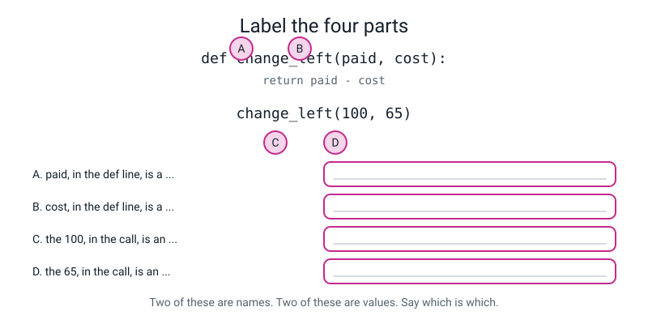
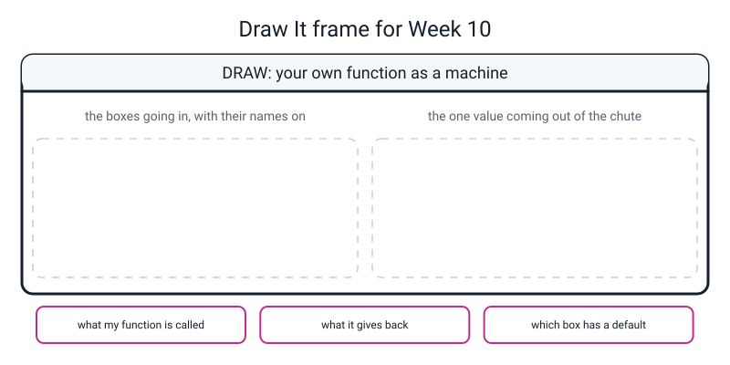

# Workbook — Week 10: Functions That Take Something and Give Something Back

**Name:** ________________________________  **Date:** ______________

[⬅ Week 09](week-09.md) · [📖 Read the chapter first](../student-guide/week-10.md) · [Course Home](../README.md) · [🧑‍🏫 Teacher guide](../teacher-guide/week-10.md) · [Next ➡](week-11.md)

---

> **The rule for this whole page: every function you write must `return`.** Not one of them prints anything inside itself. If a function has an answer, it hands the answer back — and the `print` happens outside, where a human is reading.

---

## ✅ Warm-Up (5 min)

Five quick questions to bring last week back before you start. Answer each in your own words.

**W1.** What is the difference between **defining** a function and **calling** it?

________________________________________________________________

**W2.** You write a `def`, run the file, and get **no output and no error message.** What is the first question to ask?

________________________________________________________________

**W3.** `print_header` and `print_header()` — one of these runs the function. **Which, and what is the difference?**

________________________________________________________________

**W4.** A function has no `return` at all. What does it hand back? ______________

**W5.** You see `TypeError: unsupported operand type(s) for +: 'NoneType' and 'int'`. In one sentence, what has probably happened?

________________________________________________________________

---

## 🔎 Predict the Output

Each program below is short. Write your prediction before you run anything. **One of these four hands back `None`**, and saying *why* is the whole question.

### P1

```python
def double(number):
    print(number * 2)

answer = double(5)
print(answer)
```

**I predict — write both lines:**

________________________________________________________________

**It really printed:**

________________________________________________________________

**The first line is correct. So why is the second line what it is?**

________________________________________________________________

### P2

```python
def add_tax(price, rate=5):
    return price + price * rate / 100

print(add_tax(200))
print(add_tax(200, 0))
print(add_tax(rate=10, price=200))
```

**I predict — all three lines:**

________________________________________________________________

**It really printed:**

________________________________________________________________

**Line 2 passes `0`. Is that the same as saying nothing? Explain.**

________________________________________________________________

**Line 3 puts the arguments in the "wrong" order. Why does it still work?**

________________________________________________________________

### P3

```python
def change_left(paid, cost):
    return paid - cost

print(change_left(60, 95))
print(change_left(95, 60))
```

**I predict:** ________________________

**It really printed:** ________________________

**Neither line produced an error. Which of the two answers is the one somebody actually wanted, and how would Python know?**

________________________________________________________________

### P4

```python
total = 5

def grow():
    total = 100
    return total

print(grow())
print(total)
```

**I predict — both lines:** ________________________

**It really printed:** ________________________

**The word `total` appears four times. How many boxes are there really?** ______

________________________________________________________________

**How many of the nine answers did you get right?** ______ / 9

**Which one surprised you most, and what did you believe before?**

________________________________________________________________

---

## ✍️ Practice Set A — Read It

This set is for reading function code and saying what each part is and what it does.

**A1. Parameter or argument?** For each line, name what is **underlined**. Two of these are neither, so read carefully.

| # | The line | Underlined | Parameter / argument / something else |
|---|---|---|---|
| a | `def double(number):` | `number` | ____________________ |
| b | `print(double(6))` | `6` | ____________________ |
| c | `def change_left(paid, cost):` | `cost` | ____________________ |
| d | `change_left(100, 65)` | `100` | ____________________ |
| e | `def slice_cost(pizza_price, slices=8):` | `8` | ____________________ |
| f | `slice_cost(400, slices=16)` | `slices=16` | ____________________ |
| g | `pizza_price = 400` then `slice_cost(pizza_price)` | `pizza_price` at the call | ____________________ |

**(h) In one sentence, what is the difference between a parameter and an argument?**

________________________________________________________________

**(i) Can a parameter and an argument have the same name? Does it change anything?**

________________________________________________________________

**A2. Trace it.** Say exactly what appears on the screen. **One of these prints `None`.**

**(i)** Trace this code.

```python
def triple(number):
    return number * 3

print(triple(4))
print(triple(triple(1)))
```

Output: ______________________________________________

**How did the second line get its answer? Write the two steps.**

________________________________________________________________

**(ii)** Trace this code.

```python
def shout(word):
    print(word)

box = shout("hi")
print(box)
```

Output: ______________________________________________

**(iii)** Trace this code.

```python
def fare(km, rate=8):
    return km * rate

print(fare(3))
print(fare(3, 10))
print(fare(rate=10, km=3))
```

Output: ______________________________________________

**Two of those three lines give the same answer. Which two, and why?**

________________________________________________________________

**(iv)** Trace this code.

```python
def best(a, b):
    if a > b:
        return a
    return b

print(best(4, 9))
print(best(9, 4))
print(best(5, 5))
```

Output: ______________________________________________

**There is no `else` in that function. Why does it still work?**

________________________________________________________________

**A3. Spot the bug.** This is supposed to give the average of two numbers.

```python
def average_two(a, b):
    return a + b / 2

print(average_two(10, 20))
```

It printed: ______________  It should have printed: ______________

**What is wrong, and what is the two-character fix?**

________________________________________________________________

**Is there an error message? ______ Which family of trouble is this (never started / started then stopped / finished and lied)?** ______________

**A4. Match code to output.** Three functions, all with the same shape and the same default.

```python
def f1(a, b=2):
    return a * b

def f2(a, b=2):
    return a + b

def f3(a, b=2):
    return a - b
```

Match each call to its answer. Draw a line, or write the letter.

| Call | | Answer |
|---|---|---|
| `f1(6)` | | **A** 4 |
| `f1(6, 3)` | | **B** 8 |
| `f2(6)` | | **C** 12 |
| `f3(6)` | | **D** 18 |

**Which of those four calls does *not* use the default value?** ______________

**A5. Label the diagram.** Write what each pink letter is pointing at. Use the words **parameter** and **argument** — two of each.


*Figure W10.1 — Four things to name.*

**A** = ____________________  **B** = ____________________

**C** = ____________________  **D** = ____________________

**Which of A, B, C and D would still be there if nobody ever called the function?** ______________

**A6. Read the traceback.** This is the real message from a real run.

```text
55
Traceback (most recent call last):
  File "week10_broken.py", line 22, in <module>
    print("left each week:", rupees(left_each_week))
  File "week10_broken.py", line 17, in rupees
    return f"Rs {amount:.2f}"
TypeError: unsupported format string passed to NoneType.__format__
```

(a) **What kind of error?** ______________

(b) **There are two `File` lines. Which one is nearer the cause — the top one or the bottom one?**

________________________________________________________________

(c) **`55` printed before the crash. What does that tell you?**

________________________________________________________________

(d) **The crash happened inside `rupees`. Is `rupees` the guilty function?** ______ Why?

________________________________________________________________

---

## ✍️ Practice Set B — Write It

This set is for writing your own functions and testing them.

**Every one of these must `return`. Test each on three inputs, and make one of the three awkward.**

**B1.** *(one line)* Write `half`, which takes one number and gives back half of it. Test it on `10`, `7` and `0`.

**Done looks like:** three answers printed, and the third one is `0.0` and not `0`.

```python
def ________________________________
    ________________________________

print(________, ________, ________)
```

**Your output:** ______________________________________________

**B2.** Write `tip`, which takes a **bill** and a **percent**, where the percent is **10 if the caller does not say.** It gives back the tip amount — not the total.

Test it on `500` alone, on `500` with 20 percent, and on `500` with **0** percent.

```python
def ________________________________
    ________________________________

print(________________________________)
```

**Your output:** ______________________________________________

**Why is the 0-percent test the one worth doing?**

________________________________________________________________

**B3.** Write `is_multiple`, which takes **two** numbers and gives back `True` if the first divides by the second with nothing left over. Test it on `(12, 3)`, `(13, 3)` and `(0, 3)`.

**Done looks like:** the body is **one line** and there is no `if` in it.

```python
def ________________________________
    ________________________________
```

**Your output:** ______________________________________________

**What did you predict for `(0, 3)`, and were you right?**

________________________________________________________________

**B4.** *(about 15 lines)* Write `walk_planner.py` — three tools for planning a walk to school.

| Function | Takes | Gives back |
|---|---|---|
| `minutes` | a distance in km, and a speed in km/h — **4 if not told** | how many minutes the walk takes |
| `leave_by` | a time to arrive (in minutes past midnight) and a travel time in minutes | the latest minute you may leave |
| `as_clock` | minutes past midnight | text like `8 h 30 min` |

Then use them: a 2 km walk at the default speed, the same walk at 6 km/h, the same walk at 2 km/h, and the latest time to leave if school starts at 08:30.

**Done looks like:** every function returns, `as_clock` uses `//` and `%`, and the last line reads `leave by    : 8 h 0 min`.

**Your output:**

```text
________________________________________________________________

________________________________________________________________

________________________________________________________________

________________________________________________________________

________________________________________________________________
```

**B5.** Here is a function that prints. **Turn it into a function that returns**, then use the answer twice — once formatted to two decimal places and once doubled.

```python
def water_bottles(litres_needed):
    print(litres_needed / 0.75)          # bottles hold 0.75 litres
```

```python
def ________________________________
    ________________________________

bottles = ________________________________
print(f"____________________")
print(________________________________)
```

**Your output:** ______________________________________________

**Write one sentence: what became possible the moment you changed `print` to `return`?**

________________________________________________________________

---

## 🐞 Fix the Broken Program

Here is `pocket.py`. It is supposed to work out weekly pocket money, what is left after spending, and a bus fare.

It has **three** bugs. One stops Python reading the file. One crashes it partway through. One produces **no error message at all**.

```python
# pocket.py - work out weekly pocket money and what is left. It has three bugs.

def weekly(monthly, weeks=4)              # bug 1 lives on this line
    return monthly / weeks


def left_over(pocket, spent):
    # Should give back what is left after spending.
    print(pocket - spent)                 # bug 2 lives on this line


def bus_fare(age):
    if age < 18:                          # bug 3 lives on this line
        return 15
    elif age < 5:
        return 0
    else:
        return 30


week_money = weekly(400)
print("each week :", week_money)
print("left over :", f"Rs {left_over(week_money, 60):.2f}")
print("fare at 4 :", bus_fare(4))
print("fare at 12:", bus_fare(12))
print("fare at 40:", bus_fare(40))
```

**Bug 1.** Run it as it is. This is the real message:

```text
  File "pocket.py", line 3
    def weekly(monthly, weeks=4)              # bug 1 lives on this line
                                              ^^^^^^^^^^^^^^^^^^^^^^^^^^
SyntaxError: expected ':'
```

Which family? ______  **Did any of it run?** ______

**The carets are under the comment, not under the brackets. Why?**

________________________________________________________________

Write the whole corrected line:

```python
________________________________________________________________
```

**Bug 2.** Now run it. The real output and message:

```text
each week : 100.0
40.0
Traceback (most recent call last):
  File "pocket.py", line 23, in <module>
    print("left over :", f"Rs {left_over(week_money, 60):.2f}")
TypeError: unsupported format string passed to NoneType.__format__
```

(a) **Look at the second line of output — a bare `40.0` with no label.** Where did it come from, and why has it got no label?

________________________________________________________________

(b) The word `NoneType` is the clue. **What does it tell you?**

________________________________________________________________

(c) The error is on line 23. **Is that where the mistake is?** ______ Where is it, and what is the fix?

```python
________________________________________________________________
```

**Bug 3.** Now it runs all the way through. This is the real output:

```text
each week : 100.0
left over : Rs 40.00
fare at 4 : 15
fare at 12: 15
fare at 40: 30
```

(d) **Look at the fare for a four-year-old.** What does it say? ______  What should it say? ______

(e) `bus_fare` contains `elif age < 5: return 0`, spelled perfectly. **So why did that branch never run?**

________________________________________________________________

(f) The fix — write the whole corrected function:

```python
________________________________________________________________

________________________________________________________________

________________________________________________________________

________________________________________________________________

________________________________________________________________

________________________________________________________________
```

(g) **Why is there no error message for this one?**

________________________________________________________________

(h) **Which of the three bugs was hardest to find, and why?** Think about which one showed you a *plausible* answer.

________________________________________________________________

---

## 🧩 Puzzle of the Week

Two puzzles that use parameters, defaults and `return`. Use a pencil for both.

### Part A — The Black Box

Three mystery functions. **You cannot see the bodies.** All you get is what went in and what came out. Work out each body. Every one is a single `return` line.

**Mystery A** — two parameters:

| Call | Gives back |
|---|---|
| `mystery_a(4, 5)` | 16 |
| `mystery_a(2, 2)` | 2 |
| `mystery_a(10, 1)` | 0 |

```python
def mystery_a(a, b):
    return ________________________________
```

**Mystery B** — one parameter and one **default**:

| Call | Gives back |
|---|---|
| `mystery_b(5)` | 15 |
| `mystery_b(5, 4)` | 20 |
| `mystery_b(0)` | 0 |

```python
def mystery_b(n, k=____):
    return ________________________________
```

**What is the default, and which of the three calls proves it?**

________________________________________________________________

**Mystery C** — two parameters, and it gives back `True` or `False`:

| Call | Gives back |
|---|---|
| `mystery_c(7, 3)` | `True` |
| `mystery_c(3, 7)` | `False` |
| `mystery_c(5, 5)` | `False` |

```python
def mystery_c(a, b):
    return ________________________________
```

**The third row is the important one. What would the answer be if the body used `>=` instead?** ______________

### Part B — The Chain

Two tiny functions, both with defaults:

```python
def add(a, b=1):
    return a + b

def times(a, b=2):
    return a * b
```

**Work out all six answers with a pencil first. Then run them.** Work from the inside out.

| # | Call | My answer | Real answer |
|---|---|---|---|
| 1 | `add(3)` | ______ | ______ |
| 2 | `times(3)` | ______ | ______ |
| 3 | `add(times(3))` | ______ | ______ |
| 4 | `times(add(3))` | ______ | ______ |
| 5 | `add(times(add(1)))` | ______ | ______ |
| 6 | `times(3, add(3))` | ______ | ______ |

**Score:** ______ / 6

**Rows 3 and 4 use the same two functions and give different answers. Why?**

________________________________________________________________

**Row 6 passes a function call as an argument. In your own words, what must happen first?**

________________________________________________________________

---

## 🤔 Think Deeper

Two questions that need a written paragraph each. Give your reasons.

**T1. A default value can hide a missing number.** Somebody adds `def bus_fare(age=30):` so that `bus_fare()` gives the adult fare. Later, a program loses somebody's age by accident and calls `bus_fare()` with nothing.

**What happens? Would anybody find out? And would you rather have had a crash?** Write a paragraph. Say what you would decide and *why* — there is a real argument on both sides, and the marks are for the reasoning, not the side.

________________________________________________________________

________________________________________________________________

________________________________________________________________

________________________________________________________________

________________________________________________________________

**T2. Why can a function not see the names inside another function?**

Imagine Python worked the other way: any function could read and change any variable anywhere. **Write a paragraph about what would go wrong.** Think about `model.fit(...)` in Week 29 — thousands of lines written by strangers, which you will call without reading. What exactly is the promise that makes that safe?

________________________________________________________________

________________________________________________________________

________________________________________________________________

________________________________________________________________

________________________________________________________________

---

## 🛠️ Build It

In this section you build a five-function toolkit and test it. You then run a program with a bug in it, try four scope cases, and write a Bug Log entry.

### Part 1 — the spec sheet

Build `week10_toolkit.py`. Five functions, from the spec sheet. It says what each function must **do**, never how.

| # | Name | Takes | Gives back | Test on these three |
|---|---|---|---|---|
| 1 | `double` | one number | that number times two | `6` · `0` · `-3` |
| 2 | `change_left` | money paid, then the cost | how much is left | `(100, 65)` · `(100, 100)` · `(50, 65)` |
| 3 | `slice_cost` | the pizza price, and how many slices — **8 if not told** | the cost of one slice | `(400)` · `(400, 4)` · `(400, 1)` |
| 4 | `is_even` | one whole number | `True` if it divides by 2 exactly, else `False` | `10` · `7` · `0` |
| 5 | `bus_fare` | an age | free under 5, ₹15 under 18, ₹30 under 60, ₹10 for 60 and over | `4` · `12` · `60` |

**The rule, and it is not optional: write one function, test it on three inputs, run it, and only then start the next one.** Five errors at once is five puzzles. One error at a time is one puzzle.

Tick as you go:

- [ ] `double` written, three tests run
- [ ] `change_left` written, three tests run
- [ ] `slice_cost` written **with a default of 8 in the definition**, three tests run
- [ ] `is_even` written, and its body is **one line**
- [ ] `bus_fare` written, four bands, three tests run
- [ ] Not one function contains `print`
- [ ] All five test lines at the bottom of the file

### Part 2 — the test table

**Fill in your prediction column BEFORE you run anything.** Then run, and fill in the real column.

| Function | Test 1 | I predict | Real | Test 2 | I predict | Real | Test 3 (awkward) | I predict | Real |
|---|---|---|---|---|---|---|---|---|---|
| `double` | `6` | ______ | ______ | `0` | ______ | ______ | `-3` | ______ | ______ |
| `change_left` | `(100, 65)` | ______ | ______ | `(100, 100)` | ______ | ______ | `(50, 65)` | ______ | ______ |
| `slice_cost` | `(400)` | ______ | ______ | `(400, 4)` | ______ | ______ | `(400, 1)` | ______ | ______ |
| `is_even` | `10` | ______ | ______ | `7` | ______ | ______ | `0` | ______ | ______ |
| `bus_fare` | `4` | ______ | ______ | `12` | ______ | ______ | `60` | ______ | ______ |

**(a) Which prediction did you get wrong, and why?**

________________________________________________________________

**(b) `slice_cost(400)` gave `50.0`, not `50`. Is that a bug?** ______ Explain.

________________________________________________________________

**(c) Why is the third test in every row awkward? Write one line per row.**

| Function | Why test 3 is awkward |
|---|---|
| `double` | ____________________________________________ |
| `change_left` | ____________________________________________ |
| `slice_cost` | ____________________________________________ |
| `is_even` | ____________________________________________ |
| `bus_fare` | ____________________________________________ |

### Part 3 — the bug hunt

Type `week10_broken.py` exactly as printed, then **run it before you read it.**

```python
# week10_broken.py — GIVEN TO YOU WITH A BUG IN IT.
# Three functions. Two are fine. One prints when it should return.
# Do NOT guess. Run it, read the last line, then follow the trail.

def weekly_saving(pocket_money, spent):
    # Should give back how much is left over each week.
    print(pocket_money - spent)


def yearly_saving(weekly, weeks=52):
    # Should give back the saving for a whole year.
    return weekly * weeks


def rupees(amount):
    # Should give back the amount as a tidy piece of text.
    return f"Rs {amount:.2f}"


# ---- the report ----
left_each_week = weekly_saving(200, 145)
print("left each week:", rupees(left_each_week))
print("saved in a year:", rupees(yearly_saving(left_each_week)))
```

**(a) Copy the real error message, character for character, into your Bug Log and here:**

```text
________________________________________________________________

________________________________________________________________

________________________________________________________________

________________________________________________________________

________________________________________________________________
```

**(b) Which function is guilty, and how do you know?** Write the whole chain, bottom `File` line upwards. Naming the function alone is half marks.

1. ________________________________________________________________
2. ________________________________________________________________
3. ________________________________________________________________
4. ________________________________________________________________
5. ________________________________________________________________

**(c) Why did the bug look correct? One sentence.** *(This is where the marks are. "Because I typed the wrong word" says what happened, not why it was invisible.)*

________________________________________________________________

**(d) The fix is one word. Write the corrected line, and then the output afterwards.**

```python
________________________________________________________________
```

```text
________________________________________________________________

________________________________________________________________
```

**Hand-check it:** 200 − 145 = ______ · ______ × 52 = ______

**(e) How could you have found it in two lines instead of by reading the whole file?** Write the two lines.

```python
________________________________________________________________
________________________________________________________________
```

**(f) `yearly_saving` has a default of `52`. Was it used?** ______ How can you tell from the call?

________________________________________________________________

### Part 4 — scope predictions

**Write your answer down first. Then run each one.** Three of the four surprise somebody.

**(a)** Predict, then run this code.

```python
def bus_fare(age):
    fare = 15
    return fare

print(bus_fare(12))
print(fare)
```

**I predict:** ____________________  **Really:** ____________________

**(b)** Predict, then run this code.

```python
pocket_money = 200

def spend_it_all():
    pocket_money = 0
    print("inside the function :", pocket_money)

spend_it_all()
print("after the function   :", pocket_money)
```

**I predict:** ____________________  **Really:** ____________________

**(c)** Predict, then run this code.

```python
PASS_MARK = 35

def has_passed(mark):
    return mark >= PASS_MARK

print(has_passed(40))
print(has_passed(30))
```

**I predict:** ____________________  **Really:** ____________________

**(d)** Predict, then run this code.

```python
score_total = 0

def add_one():
    score_total = score_total + 1
    return score_total

print(add_one())
```

**I predict:** ____________________  **Really:** ____________________

**(e) Which of the four surprised you, and what did you believe before?**

________________________________________________________________

**(f) Rewrite (d) so it works, without using the word `global`.**

```python
________________________________________________________________
________________________________________________________________
________________________________________________________________
________________________________________________________________
________________________________________________________________
```

### Part 5 — the Bug Log

One entry, and it needs all three parts.

| | |
|---|---|
| **The real message** | ________________________________________________ |
| **Why it looked correct** | ________________________________________________ |
| **The fix** | ________________________________________________ |

---

## 🎨 Draw It

Draw **your own function as a machine.** Pick anything: a bus-fare machine, a pizza-slice calculator, a strike-rate machine, a marks-to-grade machine.

Show the boxes going **in** on top, with the parameter **names** on them and the argument **values** dropping into them. Show the one value coming **out** of the bottom. And show — somehow — that the mess inside is invisible from outside.


*Figure W10.2 — Your page.*

> **What a good answer might look like:** the machine is a **bus-fare machine**, drawn as a box with a name plate on the front reading `bus_fare`.
>
> On the **top**, one hopper with a luggage-label tag on it reading `age`. That is the parameter — it is drawn as a *label*, stuck on an *empty* box. Above the hopper, three little cards floating down towards it: `4`, `12` and `60`. Those are three different arguments on three different calls, and the drawing makes clear that only one falls in at a time.
>
> **Inside** the machine — and this is the part that earns the marks — a dashed wall right round the workings, with a small box drawn inside it labelled `fare` and the note **this name does not exist outside**. The workings themselves are just a scribble; that is correct, because the caller cannot see them.
>
> Out of the **bottom**, a chute with one card coming out: `0`. Beside it, a hand catching the card, and the words **`fare = bus_fare(4)`** with an arrow to the hand.
>
> Down the side, a second smaller machine drawn in red with a cross beside it: same hopper, same workings, but instead of a chute there is a **loudspeaker** pointing at a screen, and the hand underneath is **empty**, with the word `None` written in it. Caption: *this one printed. The answer went on the glass.*
>
> The three bottom boxes: *parameter = the label on the box* · *argument = the card that fell in* · *the walls are why it is safe to use somebody else's function.*
>
> **What a weak answer looks like:** drawing the value `4` written *on* the hopper. That is the misunderstanding, drawn — the hopper is labelled `age`, not `4`. If your picture has a number where the parameter name should be, you have merged the two ideas this week exists to separate.

---

## 📊 Self-Check

Tick the face that fits each row, then answer the true-or-false table.

| I can… | 😀 got it | 🙂 nearly | 😕 not yet |
|---|---|---|---|
| Write a function with two parameters and call it with two arguments, in order | ☐ | ☐ | ☐ |
| Say the difference between a parameter and an argument, out loud, correctly | ☐ | ☐ | ☐ |
| Give a parameter a default value and explain when the default is used | ☐ | ☐ | ☐ |
| Explain why a variable made inside a function does not exist outside it | ☐ | ☐ | ☐ |
| Find a function that prints the right answer but returns `None`, and fix it | ☐ | ☐ | ☐ |
| Read a traceback with two `File` lines and say which one is nearer the cause | ☐ | ☐ | ☐ |

**True or false?** Circle one on each row.

| Statement | | |
|---|---|---|
| A parameter is a name; an argument is a value | TRUE | FALSE |
| The argument must have the same name as the parameter | TRUE | FALSE |
| Python checks that you got the order of the arguments right | TRUE | FALSE |
| `change_left(50, 65)` giving −15 is a bug | TRUE | FALSE |
| A function with no `return` hands back `None` | TRUE | FALSE |
| `None` is the same as 0 | TRUE | FALSE |
| You can always print a value that was returned | TRUE | FALSE |
| You can get back a value that was only printed | TRUE | FALSE |
| `8` in `def f(a, b=8):` is an argument | TRUE | FALSE |
| A parameter with a default may come before one without | TRUE | FALSE |
| Passing `0` is the same as passing nothing | TRUE | FALSE |
| `f(b=3)` names the box, so the order cannot be got wrong | TRUE | FALSE |
| A variable made inside a function can be printed outside it | TRUE | FALSE |
| Setting `x = 0` inside a function changes an outer `x` | TRUE | FALSE |
| *Reading* an outer variable from inside a function is allowed | TRUE | FALSE |
| The line a traceback points at is always the line that is wrong | TRUE | FALSE |

One thing I'd like explained again:

________________________________________________________________

---

## ✅ Answers

Open this only after you have finished the whole page. Check your own work against it.

<details>
<summary>Check your answers</summary>

### Warm-Up

**W1.** **Defining** (`def name():`) writes the block down and gives it a name. **Nothing runs.** **Calling** (`name()`) runs the block, top to bottom, as often as you like.

**W2.** **"Did I call it?"** A function defined and never called produces no output and no error — the recipe was written and nobody cooked it.

**W3.** `print_header()` **with brackets** runs it. `print_header` without brackets is just the *name* of the function — a completely legal thing to write, which does nothing and produces no error.

**W4.** **`None`** — Python's word for "no value at all".

**W5.** A function you called **printed its answer instead of returning it**, so the value you were handed was `None`, and you then tried to do maths with nothing.

---

### Predict the Output

**P1.**

```text
10
None
```

The function did the maths perfectly and put `10` on the screen. Then `answer = double(5)` caught **what came back** — and nothing came back, because the function has no `return`. **The right answer being visible is exactly what makes this bug hard to see.**

**P2.**

```text
210.0
200.0
220.0
```

- `add_tax(200)` → no rate given, so the default 5 is used. 5% of 200 is 10, so 210.0 ✔
- `add_tax(200, 0)` → the rate given is 0, which **replaces** the default. 0% of 200 is 0, so 200.0 ✔
- `add_tax(rate=10, price=200)` → both boxes named, so the order does not matter. 10% of 200 is 20, so 220.0 ✔

**Is passing `0` the same as saying nothing?** **No, and this is the whole point.** Saying nothing means "use the 5". Passing 0 means "use 0". They give different answers, and if you only ever test by saying nothing you never find out whether the default is actually being replaced.

**Why does the third line work?** Because a **keyword argument** names its box. Position stops mattering once every value says which box it is going into.

**P3.**

```text
-35
35
```

`change_left(60, 95)` means "I paid 60 and it cost 95", which is −35. `change_left(95, 60)` means "I paid 95 and it cost 60", which is 35.

**Which one did somebody want, and how would Python know?** Only the person who wrote the call knows. **Python cannot know**, because both boxes take numbers and it has no idea what money is. This is the promise the caller makes and the computer does not check. `change_left(paid=95, cost=60)` is how you make the promise unbreakable.

**P4.**

```text
100
5
```

**Two boxes**, not one — they just happen to share the word `total`. Assigning `total = 100` inside the function made a brand-new **local** box. The outer `total` was never touched, so it is still 5.

*(The `total` name appears four times in the text of the program and refers to two different boxes: the outer one on lines 1 and 8, the inner one on lines 4 and 5.)*

---

### Practice Set A

**A1.**

| # | Answer | Why |
|---|---|---|
| a | **Parameter** | A name in the definition |
| b | **Argument** | A value at the call |
| c | **Parameter** — the second one | Still in the definition |
| d | **Argument** | It goes into `paid`, because it is first |
| e | **Neither — it is a default value** | It is what is already sitting inside the parameter `slices`. A definition contains no arguments at all |
| f | **A keyword argument** | An argument that names the box it is going into |
| g | **Argument** | It confusingly has the same name as the parameter, and that changes nothing whatsoever |

**(h)** The parameter is the name written in the definition; the argument is the value handed over at the call. **Same box, two moments.**

**(i)** Yes, and it is common, and it means nothing special. One is a label inside the function, the other is a value outside it. Renaming the parameter would not break the call.

**A2 (i).**

```text
12
9
```

**The two steps for line 2:** `triple(1)` runs first and hands back **3**. That 3 then becomes the argument to the outer `triple`, which hands back **9**. **Work from the inside out.**

**A2 (ii).**

```text
hi
None
```

`shout` printed `hi` and handed nothing back, so `box` holds `None`.

**A2 (iii).**

```text
24
30
30
```

3 × 8 = 24 ✔ · 3 × 10 = 30 ✔ · 3 × 10 = 30 ✔

**Lines 2 and 3 give the same answer**, because `fare(3, 10)` and `fare(rate=10, km=3)` put the same two values in the same two boxes. The second one just says which is which out loud.

**A2 (iv).**

```text
9
9
5
```

**Why does it work with no `else`?** Because `return` **ends the function immediately.** If `a > b` the function returns `a` and never reaches the last line. If it does not, the `if` body is skipped and the last line runs. `best(5, 5)` gives 5 because `5 > 5` is False, so it falls to `return b` — and both are 5 anyway.

**A3.**

It printed **20.0**. It should have printed **15.0**.

`a + b / 2` divides **only `b`** by 2, then adds `a`: 10 + 10 = 20. Python does the division before the addition, exactly like in maths.

**The two-character fix:** brackets. `return (a + b) / 2` → 15.0 ✔

**Is there an error message?** No. **Which family?** **Finished and lied** — a complete, confident, wrong answer with nothing at all to notice.

**A4.**

| Call | Answer |
|---|---|
| `f1(6)` | **C** 12 (6 × 2, default used) |
| `f1(6, 3)` | **D** 18 (6 × 3) |
| `f2(6)` | **B** 8 (6 + 2, default used) |
| `f3(6)` | **A** 4 (6 − 2, default used) |

**Which call does not use the default?** `f1(6, 3)`. It supplies its own `b`.

**A5.**

**A** = `paid` — a **parameter** · **B** = `cost` — a **parameter** · **C** = `100` — an **argument** · **D** = `65` — an **argument**

**Which would still be there if nobody called the function?** **A and B — the parameters.** They are part of the definition, which exists whether or not anybody calls it. Arguments only come into existence at a call.

**A6.**

(a) **`TypeError`.**

(b) **The bottom one is nearer the crash; the top one is nearer the cause.** Read `File` lines from the bottom upwards: the bottom is *where* it broke, the ones above are *who asked for it*.

(c) That **something worked.** The correct answer 55 was worked out and printed, which is exactly why this bug is hard to spot — it looks like a working function.

(d) **No.** `rupees` is innocent. It was handed a `None` and did the best it could with it. The guilty function is `weekly_saving`, which used `print` where it should have used `return`. **The line that breaks is almost never the line that is wrong.**

---

### Practice Set B

**B1.**

```python
def half(number):
    return number / 2

print(half(10), half(7), half(0))
```

```text
5.0 3.5 0.0
```

`0.0` and not `0`, because `/` in Python **always** produces a decimal, even when the answer is exact.

**B2.**

```python
def tip(bill, percent=10):
    return bill * percent / 100

print(tip(500), tip(500, 20), tip(500, 0))
```

```text
50.0 100.0 0.0
```

10% of 500 = 50 ✔ · 20% of 500 = 100 ✔ · 0% of 500 = 0 ✔

**Why is the 0-percent test worth doing?** Because it is the only one that proves the default is being **replaced** rather than added to. If the code were wrong in a way that always applied 10%, tests one and two might still look plausible — but `tip(500, 0)` would come out as 50 instead of 0 and give the bug away.

**B3.**

```python
def is_multiple(number, of):
    return number % of == 0

print(is_multiple(12, 3), is_multiple(13, 3), is_multiple(0, 3))
```

```text
True False True
```

**One line, no `if`, because a comparison is already `True` or `False`.** `12 % 3` is 0 and `0 == 0` is True. `13 % 3` is 1 and `1 == 0` is False.

**`(0, 3)` is `True`**, and most people predict False. 0 ÷ 3 = 0 with nothing left over, so zero really is a multiple of three.

**B4.**

```python
# walk_planner.py - three tools for planning a walk to school.

def minutes(distance_km, speed_kmh=4):     # 4 km/h is an ordinary walking speed
    # Give back how many minutes the walk takes.
    return distance_km / speed_kmh * 60


def leave_by(arrive_at, travel_minutes):   # both in minutes past midnight
    # Give back the latest minute you can leave.
    return arrive_at - travel_minutes


def as_clock(minutes_past_midnight):
    # Give back the time as text, like "8 h 30 min".
    hours = minutes_past_midnight // 60    # whole hours
    mins = minutes_past_midnight % 60      # minutes left over
    return f"{hours} h {mins} min"


walk = minutes(2)                          # 2 km at the default speed
print("walk (min)  :", walk)
print("fast walker :", minutes(2, 6))      # 6 km/h
print("a stroll    :", minutes(2, 2))      # awkward: half speed

school_starts = 8 * 60 + 30                # 08:30, in minutes past midnight
leave = leave_by(school_starts, walk)
print("school at   :", as_clock(school_starts))
print("leave by    :", as_clock(round(leave)))
```

```text
walk (min)  : 30.0
fast walker : 20.0
a stroll    : 60.0
school at   : 8 h 30 min
leave by    : 8 h 0 min
```

**Hand-check.** 2 km ÷ 4 km/h = 0.5 hours, × 60 = 30 minutes ✔ · 2 ÷ 6 = 0.333…, × 60 = 20 ✔ · 2 ÷ 2 = 1 hour, × 60 = 60 ✔ · 08:30 is 8 × 60 + 30 = 510 minutes past midnight ✔ · 510 − 30 = 480, and 480 ÷ 60 = 8 with 0 left over ✔

**Why `round(leave)`?** Because `minutes` returns a decimal (`30.0`), so `leave` is `480.0`, and `//` and `%` on a decimal give decimals — you would get `8.0 h 0.0 min`. Rounding to a whole number of minutes first is the caller's decision, made where the human is reading.

**B5.**

```python
def water_bottles(litres_needed):
    return litres_needed / 0.75          # bottles hold 0.75 litres


bottles = water_bottles(6)
print(f"bottles needed : {bottles:.2f}")
print("for two days   :", bottles * 2)
```

```text
bottles needed : 8.00
for two days   : 16.0
```

Hand-check: 6 ÷ 0.75 = 8 ✔ · 8 × 2 = 16 ✔

**What became possible?** **Keeping the answer.** Once it is returned it lives in a box called `bottles`, so it can be formatted, doubled, compared, saved, or passed into another function. A printed answer can only be looked at.

---

### Fix the Broken Program

**Bug 1.** **Family 1 — never started.** **None of it ran** — no output at all before the message.

**Why are the carets under the comment?** Because Python reached the end of `def weekly(monthly, weeks=4)` still waiting for a colon, and marked everything from there to the end of the line as "the place I wanted one". The comment just happens to be sitting in that space. **The carets show where Python noticed, not what you typed wrong.**

The fix:

```python
def weekly(monthly, weeks=4):             # bug 1 lives on this line
```

**Bug 2.**

(a) The bare `40.0` came from **inside `left_over`**, which printed instead of returning. It has no label because the label lives in the `print` on line 23 — and that line never got as far as printing anything, because the f-string crashed while trying to format the `None` that came back.

(b) `NoneType` means **something handed back nothing, and then we tried to use it.**

(c) **No.** Line 23 is where the damage showed up. The mistake is on line 9, inside `left_over`. The fix:

```python
    return pocket - spent                 # bug 2 lives on this line
```

**Bug 3.**

(d) It says **15**. It should say **0** — under fives travel free.

(e) Because **`if age < 18` is checked first, and 4 is less than 18**, so it returns 15 and the function ends. `return` stops everything. The `elif age < 5` branch is unreachable for every age it was meant to catch: any age under 5 is also under 18. **The order of an `if`/`elif` chain is the logic, not just the layout.**

(f) The fix — put the narrowest test first:

```python
def bus_fare(age):
    if age < 5:
        return 0
    elif age < 18:
        return 15
    else:
        return 30
```

Full output after all three fixes:

```text
each week : 100.0
left over : Rs 40.00
fare at 4 : 0
fare at 12: 15
fare at 40: 30
```

Hand-check: 400 ÷ 4 = 100 ✔ · 100 − 60 = 40 ✔

(g) **Because nothing impossible happened.** `bus_fare(4)` returned 15, which is a perfectly good number of rupees. Python has no idea what the fare *should* be. **Family 3 — finished and lied.**

(h) **Bug 3 was hardest**, and the reason is that it showed a *plausible* answer. Bug 1 stopped the program dead; bug 2 crashed and pointed at a line. Bug 3 printed `fare at 4 : 15` and looked completely ordinary. **Only somebody who knew that under-fives travel free would ever notice.**

---

### Puzzle of the Week

**Part A — Mystery A.**

```python
def mystery_a(a, b):
    return a * b - a
```

Check all three: 4 × 5 − 4 = 16 ✔ · 2 × 2 − 2 = 2 ✔ · 10 × 1 − 10 = 0 ✔

*(Checking every row matters: `a * b - b` fits row 2 (2 × 2 − 2 = 2) but gives 4 × 5 − 5 = 15, not 16, and 10 × 1 − 1 = 9, not 0. Always check every row.)*

**Mystery B.**

```python
def mystery_b(n, k=3):
    return n * k
```

15 = 5 × 3 ✔ · 20 = 5 × 4 ✔ · 0 × 3 = 0 ✔

**The default is 3, and `mystery_b(5)` proves it** — the caller said nothing about `k` and the answer came out three times bigger than `n`. `mystery_b(5, 4)` tells you nothing about the default, because the caller supplied a value.

**Mystery C.**

```python
def mystery_c(a, b):
    return a > b
```

7 > 3 is True ✔ · 3 > 7 is False ✔ · 5 > 5 is **False** ✔

**With `>=` instead**, `mystery_c(5, 5)` would be **`True`** — and that third row is the *only* one of the three that can tell `>` and `>=` apart. **That is what a boundary test is for.**

**Part B — The Chain.**

| # | Call | Answer | Working |
|---|---|---|---|
| 1 | `add(3)` | **4** | 3 + 1, default `b=1` |
| 2 | `times(3)` | **6** | 3 × 2, default `b=2` |
| 3 | `add(times(3))` | **7** | inner gives 6, then 6 + 1 |
| 4 | `times(add(3))` | **8** | inner gives 4, then 4 × 2 |
| 5 | `add(times(add(1)))` | **5** | `add(1)` → 2, `times(2)` → 4, `add(4)` → 5 |
| 6 | `times(3, add(3))` | **12** | `add(3)` → 4, then 3 × 4 |

Verified:

```text
1: 4
2: 6
3: 7
4: 8
5: 5
6: 12
```

**Why do rows 3 and 4 differ?** Because the order in which they happen is different. In row 3 the multiplying happens first and the adding second; in row 4 the adding happens first. **Inside out, always** — Python cannot pass a value to a function until it has that value.

**Row 6:** `add(3)` must be worked out **first**, because its answer is the argument. Python cannot fill the second box of `times` until it knows what goes in it. A function call used as an argument is just a value that has not been worked out yet.

---

### Think Deeper

**T1 — model answer.**

With `def bus_fare(age=30):`, a program that loses somebody's age and calls `bus_fare()` gets **₹30 back, and no error at all.** Nothing anywhere says "there was no age". The number 30 looks exactly as trustworthy as a real fare, so it goes into the report, and into the total, and nobody finds out — possibly ever.

A crash would be loud and immediate and would point at the line where the age went missing. It would be annoying and it would be *findable*.

The honest answer is that it depends on what happens next. If the fare is going into a bill that gets sent to somebody, a crash is far better than a wrong bill. If it is a quick script you are running yourself over thirty journeys, stopping dead on journey seventeen is a nuisance.

What everybody agrees on: **a default that quietly covers up a missing value is one of the main ways bad data gets into real systems.** A default should be a *sensible usual answer*, not a *repair for something that went wrong.* "The fare for nobody" is not a sensible usual answer, so this particular default is a bad idea whichever way you argue it.

**T2 — model answer.**

If any function could read and change any variable, then to understand what a function does you would have to read **every** function, because any of them might have changed anything. There would be no such thing as "the input" to a function — its answer would depend on whatever happened to have run before it, so you could not test it, and two runs of the same program could give different answers for reasons nobody could trace.

The specific promise that makes `model.fit(...)` safe in Week 29 is: **it can only see what you handed it through its brackets, and it cannot reach out and rewrite your other variables by name.** (It *can* change the object you hand it — `model.fit` fills in the model you give it — but only that object.) Thousands of lines written by strangers cannot rummage through the rest of your program. That is why you can call it without reading it.

Scope is not Python being fussy. **It is the wall that makes other people's code usable.**

---

### Build It

**Part 1 — the complete file.**

```python
# week10_toolkit.py — five tiny functions, built from the spec sheet.
# Every one of them RETURNS. Not one of them prints.

def double(number):
    # Give back the number multiplied by two.
    return number * 2


def change_left(paid, cost):
    # Give back how much money is left after paying.
    return paid - cost


def slice_cost(pizza_price, slices=8):
    # Give back the cost of one slice. A whole pizza is 8 slices unless told otherwise.
    return pizza_price / slices


def is_even(number):
    # Give back True if the number divides by 2 with nothing left over.
    return number % 2 == 0


def bus_fare(age):
    # Give back the fare in rupees for someone of this age.
    if age < 5:
        return 0                   # under 5 travels free
    elif age < 18:
        return 15                  # child fare
    elif age < 60:
        return 30                  # adult fare
    else:
        return 10                  # senior fare


# ---- three tests each, and one of the three is awkward on purpose ----
print("double        :", double(6), double(0), double(-3))
print("change_left   :", change_left(100, 65), change_left(100, 100), change_left(50, 65))
print("slice_cost    :", slice_cost(400), slice_cost(400, 4), slice_cost(400, 1))
print("is_even       :", is_even(10), is_even(7), is_even(0))
print("bus_fare      :", bus_fare(4), bus_fare(12), bus_fare(60))
```

```text
double        : 12 0 -6
change_left   : 35 0 -15
slice_cost    : 50.0 100.0 400.0
is_even       : True False True
bus_fare      : 0 15 10
```

**Part 2 — the test table.**

| Function | Test 1 | Test 2 | Test 3 (awkward) |
|---|---|---|---|
| `double` | `6` → **12** | `0` → **0** | `-3` → **-6** |
| `change_left` | `(100, 65)` → **35** | `(100, 100)` → **0** | `(50, 65)` → **-15** |
| `slice_cost` | `(400)` → **50.0** | `(400, 4)` → **100.0** | `(400, 1)` → **400.0** |
| `is_even` | `10` → **True** | `7` → **False** | `0` → **True** |
| `bus_fare` | `4` → **0** | `12` → **15** | `60` → **10** |

**(a)** The two that catch almost everybody are **`is_even(0)` → `True`** and **`bus_fare(60)` → `10`**. Mark yourself on honesty, not accuracy: a wrong prediction you then explained is worth more than a blank box filled in after running.

**(b) No, `50.0` is not a bug.** Dividing with `/` in Python **always** produces a decimal, even when the answer is exact. If you want a reader to see `50.00`, that is the caller's job: `f"{slice_cost(400):.2f}"`. **The function hands back the true number; whoever prints it decides how it looks.**

**(c) Why each third test is awkward:**

| Function | Why test 3 is awkward |
|---|---|
| `double` | Negatives are the case people forget to try — and they need no special code at all |
| `change_left` | A negative answer is a **real** answer, not an error. You spent more than you had |
| `slice_cost` | One slice means the whole pizza, which proves the division is real division |
| `is_even` | Nearly everybody predicts `False` for zero. Zero divides by two exactly |
| `bus_fare` | 60 sits **exactly** on a boundary, and `60 < 60` is False, so it falls to the `else` |

**Part 3 — the bug hunt.**

**(a) The real message:**

```text
55
Traceback (most recent call last):
  File "/Users/you/ai-academy/level2/week10_broken.py", line 22, in <module>
    print("left each week:", rupees(left_each_week))
  File "/Users/you/ai-academy/level2/week10_broken.py", line 17, in rupees
    return f"Rs {amount:.2f}"
TypeError: unsupported format string passed to NoneType.__format__
```

*(Your file path will be your own folder. The path is never the interesting part.)*

**(b) `weekly_saving` is guilty. The chain:**

1. The last line says **`NoneType`** — so something handed back nothing.
2. The bottom `File` line points at line 17, inside `rupees` — but that is only where the damage **showed up**. `rupees` was handed a `None` and did the best it could.
3. The `File` line **above** it points at line 22 — that is who called `rupees`, and what it passed in was `left_each_week`.
4. `left_each_week` was set on line 21, from `weekly_saving(200, 145)`.
5. `weekly_saving` ends with **`print`, not `return`**. Guilty.

**(c) Why it looked correct — model answer:** *"It printed 55, and 55 was the right answer, so the function looked like it worked — the mistake only showed up when the answer had to be used somewhere instead of just read."*

Any sentence containing both halves counts: **the right answer appeared**, and **nothing came back.**

**(d) The fix, one word:**

```python
    return pocket_money - spent
```

```text
left each week: Rs 55.00
saved in a year: Rs 2860.00
```

**Hand-check:** 200 − 145 = **55** ✔ · **55** × 52 = **2,860** ✔ · `Rs 2860.00` because `:.2f` always shows two decimal places.

**(e) The two lines:**

```python
came_back = weekly_saving(200, 145)
print("what came back was:", came_back, type(came_back))
```

```text
55
what came back was: None <class 'NoneType'>
```

**Two lines and the invisible becomes visible.** This is the most transferable trick of the week.

**(f) Yes, the default was used.** `yearly_saving(left_each_week)` supplies only **one** argument, and the function has two parameters — so `weeks` fell back on its default of 52. `yearly_saving(55, 12)` would give 660: a year of *monthly* saving instead of weekly.

**Part 4 — scope predictions.**

**(a)**

```text
15
Traceback (most recent call last):
  File "/Users/you/ai-academy/level2/week10_scope.py", line 6, in <module>
    print(fare)
NameError: name 'fare' is not defined
```

**Why:** `fare` was created inside `bus_fare`, so it only existed while the call was running. **The value 15 escaped through the `return`. The name never left the room.**

**(b)**

```text
inside the function : 0
after the function   : 200
```

**Why:** two different boxes that happen to share a word. Assigning to `pocket_money` inside the function made a brand-new local box; the outer one was never touched. **Same word, different rooms.**

**(c)**

```text
True
False
```

**Why:** *reading* an outside variable from inside a function **is** allowed. This is the one that goes the way people expect. (Whether it is a good idea is another matter — a function that reads things from outside itself is harder to test, which is the whole argument in T2.)

**(d)**

```text
Traceback (most recent call last):
  File "/Users/you/ai-academy/level2/err_unbound.py", line 7, in <module>
    print(add_one())
  File "/Users/you/ai-academy/level2/err_unbound.py", line 4, in add_one
    score_total = score_total + 1
UnboundLocalError: local variable 'score_total' referenced before assignment
```

**Why, and this is the subtle one:** because there is an **assignment** to `score_total` somewhere in the function, Python decides the name is local for the *whole* function — before it runs a single line. Then the very first thing that line does is **read** it, and the local box is still empty. Hence "referenced before assignment".

*(On Python 3.12 and later the wording is "cannot access local variable 'score_total' where it is not associated with a value". Same error, same reason, same fix.)*

**(e)** The two that surprise most people are **(a)**, because the value 15 clearly existed, and **(d)**, because the outer variable is right there on the screen. A good answer names the belief: *"I thought a variable was a variable and anything could see it."*

**(f) The fix, and it is not `global`** — take the value in and hand the new one back:

```python
score_total = 0

def add_one(current):
    return current + 1

score_total = add_one(score_total)
score_total = add_one(score_total)
print(score_total)
```

```text
2
```

**Part 5 — the Bug Log entry.**

| | |
|---|---|
| **The real message** | `TypeError: unsupported format string passed to NoneType.__format__` — and `55` was on the screen just above it |
| **Why it looked correct** | It printed 55, which was the right answer, so nothing looked wrong until the answer had to be *used* instead of just read |
| **The fix** | `weekly_saving` used `print` where it should have used `return`. One word: `return pocket_money - spent` |

---

### Draw It

There is no single right drawing. A strong one has all four of these:

1. **The parameter drawn as a *label* on an *empty* box**, not as a number.
2. **The argument drawn as a separate card falling in**, with at least two different arguments shown for the same parameter.
3. **A wall round the workings**, with a local name inside it and a note that it does not exist outside.
4. **One value coming out of the bottom, into a hand** — and ideally the red version beside it, where the answer goes on the glass and the hand holds `None`.

**The commonest weak drawing** writes the value on the hopper instead of the parameter name. If your picture has a number where the label should be, the two ideas of the week have merged back together.

---

### Self-Check answers

**True or false:**

| Statement | Answer |
|---|---|
| A parameter is a name; an argument is a value | **TRUE** |
| The argument must have the same name as the parameter | **FALSE** — the parameter name is private to the function |
| Python checks that you got the order of the arguments right | **FALSE** — it only checks *how many* arrived |
| `change_left(50, 65)` giving −15 is a bug | **FALSE** — it is correct. You spent more than you had |
| A function with no `return` hands back `None` | **TRUE** |
| `None` is the same as 0 | **FALSE** — `0 * 2` is 0; `None * 2` crashes |
| You can always print a value that was returned | **TRUE** |
| You can get back a value that was only printed | **FALSE** — it is gone |
| `8` in `def f(a, b=8):` is an argument | **FALSE** — it is a **default value**. Definitions contain no arguments |
| A parameter with a default may come before one without | **FALSE** — `SyntaxError`, and the file never starts |
| Passing `0` is the same as passing nothing | **FALSE** — 0 replaces the default; nothing uses it |
| `f(b=3)` names the box, so the order cannot be got wrong | **TRUE** |
| A variable made inside a function can be printed outside it | **FALSE** — `NameError`. Values get out, names do not |
| Setting `x = 0` inside a function changes an outer `x` | **FALSE** — it makes a brand-new local box |
| *Reading* an outer variable from inside a function is allowed | **TRUE** |
| The line a traceback points at is always the line that is wrong | **FALSE** — it is where the damage showed up. Read the `File` lines upwards |

</details>
