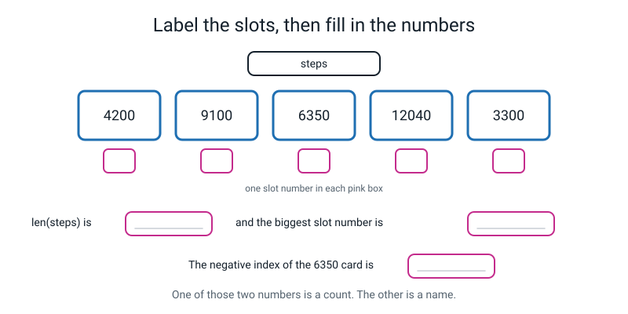
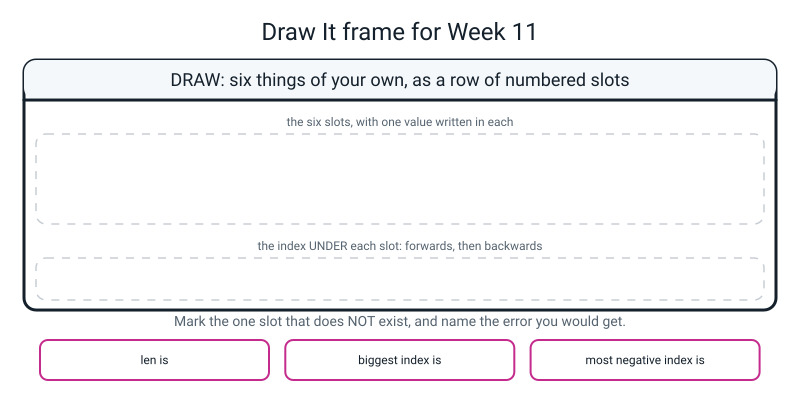

# Workbook — Week 11: Many Values, One Name — Lists

**Name:** ________________________________  **Date:** ______________

[⬅ Week 10](week-10.md) · [📖 Read the chapter first](../student-guide/week-11.md) · [Course Home](../README.md) · [🧑‍🏫 Teacher guide](../teacher-guide/week-11.md) · [Next ➡](week-12.md)

---

> **One rule on this page and it is not optional: write your prediction in the box BEFORE you run anything.** If you run first, you have turned a thinking exercise into a typing exercise. It will be obvious which you did, because the interesting drills are 4, 5, 6 and 7, and **nobody gets all four right first time.**

---

## ✅ Warm-Up (5 min)

Five quick questions about **last week**.

**W1.** What is the difference between a **parameter** and an **argument**? One sentence.

________________________________________________________________

**W2.** `def slice_cost(pizza_price, slices=8):` — what is the `8`? It is not an argument.

________________________________________________________________

**W3.** A function prints the right answer every time you test it, but `total = my_function(5)` gives `None`. **What is wrong, and what is the one-word fix?**

________________________________________________________________

**W4.** You see `NoneType` in a traceback. Say the sentence.

________________________________________________________________

**W5.** A variable is made inside a function. Can you print it after the function finishes? ______ Why?

________________________________________________________________

---

## 🔎 Predict the Output

**Write your prediction before you run anything.** **One of these four crashes**, and two of them catch nearly everybody.

### P1

```python
scores = [45, 0, 112, 67]
print(scores[1])
print(scores[-4])
print(len(scores))
```

**I predict — all three lines:**

________________________________________________________________

**It really printed:**

________________________________________________________________

**Line 1's answer looks like nothing. Is it nothing?**

________________________________________________________________

### P2

```python
scores = [45, 0, 112, 67]
scores.append(89)
print(scores[3])
print(scores[-1])
print(len(scores) - 1)
```

**I predict — all three lines:**

________________________________________________________________

**It really printed:**

________________________________________________________________

**Most people predict `89` for the first line. Why is it not 89?**

________________________________________________________________

### P3

```python
scores = [45, 0, 112, 67]
print(scores[-4])
print(scores[-5])
```

**I predict — both lines:**

________________________________________________________________

**It really printed:**

________________________________________________________________

**Negative indexes feel like they could go on for ever. How far back can they actually go on a four-item list?**

________________________________________________________________

### P4

```python
scores = [45, 0]
scores.append([112, 67])
print(scores)
print(len(scores))
print(scores[2])
```

**I predict — all three lines:**

________________________________________________________________

**It really printed:**

________________________________________________________________

**`len` says one less than you probably expected. What single character caused that?**

________________________________________________________________

**How many of the eleven answers did you get right?** ______ / 11

**Which one surprised you most, and what did you believe before?**

________________________________________________________________

---

## ✍️ Practice Set A — Read It

**A1. Read the row.** Given `players = ["Meera", "Kabir", "Nova", "Asha"]`:

| # | Question | Answer |
|---|---|---|
| a | `players[0]` | ____________________ |
| b | `players[2]` | ____________________ |
| c | `players[-1]` | ____________________ |
| d | `players[-3]` | ____________________ |
| e | `len(players)` | ____________________ |
| f | The biggest valid index | ____________________ |
| g | `players[4]` | ____________________ |
| h | `players[-5]` | ____________________ |
| i | Which slot holds `"Nova"`? **Give two answers** | ____________________ |

**(j) Nova is the third player. Why is her index 2?**

________________________________________________________________

**(k) After `players.append("Dev")`, what is `players[3]`?** ______________ And `players[-1]`? ______________

**A2. Trace it.** Say exactly what appears on the screen. **One of these crashes.**

**(i)**
```python
fruit = ["fig", "plum", "apple"]
print(fruit[0])
print(fruit[-1])
print(len(fruit))
```
Output: ______________________________________________

**(ii)**
```python
nums = [10, 20, 30]
nums.append(40)
nums.append(50)
print(nums)
print(len(nums))
print(nums[len(nums) - 1])
```
Output: ______________________________________________

**The last line looks clumsy. Write a shorter line that does the same job.**

```python
________________________________________________________________
```

**(iii)**
```python
nums = [7, 7, 7]
print(len(nums))
print(nums[0], nums[1], nums[2])
print(nums[-3])
```
Output: ______________________________________________

**Three equal values. Are they three elements or one?** ______________ Why?

________________________________________________________________

**(iv)**
```python
nums = [5]
print(len(nums))
print(nums[0])
print(nums[-1])
print(nums[1])
```
Output: ______________________________________________

**A one-item list has how many valid indexes, counting both directions?** ______

**A3. Spot the bug.** This is supposed to print the last temperature.

```python
temps = [31, 34, 29, 36, 30]
print("the last temperature was", temps[len(temps)])
```

**What happens?**

________________________________________________________________

**Why is `temps[len(temps)]` wrong for *every* list, not just this one?**

________________________________________________________________

**Write two different fixes, and say which one you would keep and why.**

```python
________________________________________________________________
```
```python
________________________________________________________________
```

I would keep ____________________ because ____________________________________

**A4. Match code to output.** Given `nums = [3, 8, 1, 9, 6]`:

| Line | | Answer |
|---|---|---|
| `print(nums[1])` | | **A** 4 |
| `print(nums[-2])` | | **B** 5 |
| `print(len(nums))` | | **C** 6 |
| `print(len(nums) - 1)` | | **D** 8 |
| `print(nums[len(nums) - 1])` | | **E** 9 |

**Two of those five lines give a number that is *not* in the list at all. Which two, and what are those numbers about?**

________________________________________________________________

**A5. Label the diagram.** Fill in the index under each slot, then answer the three boxes underneath.


*Figure W11.1 — Five slots, waiting for their numbers.*

Write the index under each slot: ______  ______  ______  ______  ______

**`len(steps)` is** ______  **The biggest valid index is** ______  **`steps[-1]` is** ______________

**Now write the *negative* index for each slot as well:** ______  ______  ______  ______  ______

**A6. `len` versus the last index.** Fill in the whole table. The last row is the general rule.

| A list with… | `len` is | First index | Last index | Most negative index | How many valid indexes |
|---|---|---|---|---|---|
| 1 item | ______ | ______ | ______ | ______ | ______ |
| 4 items | ______ | ______ | ______ | ______ | ______ |
| 7 items | ______ | ______ | ______ | ______ | ______ |
| 20 items | ______ | ______ | ______ | ______ | ______ |
| 100 items | ______ | ______ | ______ | ______ | ______ |
| 0 items | ______ | ______ | ______ | ______ | ______ |
| `n` items | ______ | ______ | ______ | ______ | ______ |

**(a) The empty-list row is different from all the others. Why?**

________________________________________________________________

**(b) Every slot has exactly two names. So how many ways are there to name the slots of a list of `n` items?** ______

---

## ✍️ Practice Set B — Write It

**B1.** *(one line each)* Build a list called `snacks` holding five things you would actually buy. Then print the **first** one and the **last** one, using `-1` for the last.

```python
snacks = ________________________________________________
print(________, ________)
```

**Your output:** ______________________________________________

**B2.** Using your `snacks` list, print **how many** there are and **the biggest valid index** — and you must **work the second one out**, not type the number.

```python
print(________________, ________________)
```

**Your output:** ______________________________________________

**Why is typing the literal number a miss, even though the answer is right?**

________________________________________________________________

**B3.** Append a sixth snack. Then **prove nothing moved**: print the new list, the new length, slot 2 before and after (write down what slot 2 was), and `[-1]`.

```python
________________________________________________________________
________________________________________________________________
________________________________________________________________
```

**Slot 2 before the append:** ______________  **after:** ______________

**Done looks like:** the two answers are the same, and `len` went up by exactly one.

**B4.** *(about 15 lines)* Write `bus_stops.py`. The data is one list of how many people got on at each stop:

```python
boarded = [4, 0, 11, 7, 2, 9]          # six stops, slots 0 to 5
```

Then, in this order:

1. how many stops there are
2. the first stop, and the last stop using `-1`
3. the biggest valid index, **worked out**
4. the stop where **nobody** got on — reach it by its index, and say in a comment that a real zero is not a missing value
5. append a seventh stop where 6 people got on, then print the list and the new count
6. a `for i in range(len(boarded)):` loop printing every slot number with its value
7. the total, using an accumulator, and the average to one decimal place

**Done looks like:** seven lines from the loop (not six), and the last line reads `average/stop  : 5.6`.

**Your output:**

```text
________________________________________________________________

________________________________________________________________

________________________________________________________________

________________________________________________________________

________________________________________________________________

________________________________________________________________
```

**Why did the loop print seven lines when the list started with six items?**

________________________________________________________________

**B5.** Cause an `IndexError` **on purpose**, in a way that is not just "a number that is too big". Pick one of these three ideas — or invent your own — and paste the real traceback.

- an **empty** list, and then slot 0
- a negative index that has run out
- `something[len(something)]`

```python
________________________________________________________________
________________________________________________________________
```

**The real traceback:**

```text
________________________________________________________________

________________________________________________________________

________________________________________________________________
```

**Say in one sentence why *your* version failed.**

________________________________________________________________

---

## 🐞 Fix the Broken Program

Here is `steps_report.py`, which is supposed to report on one week of step counts. It has **three** bugs: one that stops Python reading the file, one that crashes it partway through, and one that produces **no error message at all**.

```python
# steps_report.py - report on one week of step counts. It has three bugs.

steps = [4200, 9100, 6350, 12040, 3300, 8700, 15200   # bug 1 lives on this line

print("days recorded :", len(steps))
print("Monday        :", steps[0])
print("the third day :", steps[3])                # bug 3 lives on this line
print("Sunday        :", steps[7])                # bug 2 lives on this line

total = 0
for i in range(len(steps)):
    total += steps[i]
print("total steps   :", total)
print("average       :", f"{total / len(steps):.1f}")
```

**Bug 1.** Run it as it is. The real message:

```text
  File "steps_report.py", line 3
    steps = [4200, 9100, 6350, 12040, 3300, 8700, 15200   # bug 1 lives on this line
            ^
SyntaxError: '[' was never closed
```

Which family? ______  **Did any of it run?** ______

**The arrow points at the bracket you *opened*, at the start of the line. Why there, and not at the end where the missing `]` should be?**

________________________________________________________________

The fix — write the whole corrected line:

```python
________________________________________________________________
```

**Bug 2.** Now run it. The real output and message:

```text
days recorded : 7
Monday        : 4200
the third day : 12040
Traceback (most recent call last):
  File "steps_report.py", line 8, in <module>
    print("Sunday        :", steps[7])                # bug 2 lives on this line
IndexError: list index out of range
```

(a) **`days recorded : 7` printed. So how many valid indexes are there, and what are they?**

________________________________________________________________

(b) **`steps[7]` was meant to be Sunday. Is Sunday in the list at all?** ______ Which slot is it?  ______

(c) **Write two fixes. Then say which you would keep and why.**

```python
________________________________________________________________
```
```python
________________________________________________________________
```

I would keep ____________________ because ____________________________________

(d) **A classmate "fixes" it by changing 7 to 8. What happens, and what have they misunderstood?**

________________________________________________________________

**Bug 3.** Now it runs all the way through. The real output:

```text
days recorded : 7
Monday        : 4200
the third day : 6350
Sunday        : 15200
total steps   : 58890
average       : 8412.9
```

Wait — that is the output **after** bug 3 is fixed. **Before** the fix, the third line read:

```text
the third day : 12040
```

(e) **The label says "the third day". Which day did `steps[3]` actually give?** ______________

(f) The fix — write the whole corrected line:

```python
________________________________________________________________
```

(g) **Why is there no error message for this one?**

________________________________________________________________

(h) **Hand-check the total and the average.** Add the seven numbers in the back of your book.

```text
4200 + 9100 = ________
     + 6350 = ________
     + 12040 = ________
     + 3300 = ________
     + 8700 = ________
     + 15200 = ________

________ / 7 = ________________  which to 1 dp is ________
```

(i) **Which of the three bugs was hardest to find, and why?** Think about which one gave you a *plausible* number.

________________________________________________________________

---

## 🧩 Puzzle of the Week

### Part A — The Secret Word

Here is a row of seven letters:

```python
row = ["A", "C", "D", "E", "I", "N", "X"]
```

Each clue below names one slot. **Write the letter it opens, then read the word downwards.**

| Clue | Letter |
|---|---|
| `row[4]` | ______ |
| `row[-2]` | ______ |
| `row[2]` | ______ |
| `row[-4]` | ______ |
| `row[-1]` | ______ |

**The secret word is:** ________________

**Now the twist.** Somebody runs `row.append("Y")` and then reads the same five clues again.

| Clue | Letter after the append |
|---|---|
| `row[4]` | ______ |
| `row[-2]` | ______ |
| `row[2]` | ______ |
| `row[-4]` | ______ |
| `row[-1]` | ______ |

**The word now reads:** ________________

**(a) Which clues changed, and which did not?** Write the rule you have just discovered.

________________________________________________________________

**(b) So if you wanted a set of clues that still worked after somebody appended a letter, which kind of index would you use?**

________________________________________________________________

**(c) Now write your own five clues that spell a word of your choice out of the same seven letters.** Use at least one negative index.

| My clue | Letter |
|---|---|
| `row[____]` | ______ |
| `row[____]` | ______ |
| `row[____]` | ______ |
| `row[____]` | ______ |
| `row[____]` | ______ |

**My word:** ________________

### Part B — Three Ways to Break It

Make an `IndexError` happen **three times, from three genuinely different causes** — not three different numbers. Fill in the table. **Try them one at a time**, because the first crash stops the program.

| # | The line | Why it fails | Real error (yes/no) |
|---|---|---|---|
| 1 | ________________________________ | ________________________________ | ______ |
| 2 | ________________________________ | ________________________________ | ______ |
| 3 | ________________________________ | ________________________________ | ______ |

**Which of your three would still be an error if the list had a hundred items in it?**

________________________________________________________________

---

## 🤔 Think Deeper

**T1. `scores[3]` and `scores[-1]` open the same slot today.** Write a paragraph about which one you would put in a program that somebody else is going to keep using for a year, and why.

Say what happens to **each** of them when a fifth score is appended. Then say the important bit: **does either of them produce an error when it starts being wrong?** Which family of trouble is that, and why does that make your answer matter more, not less?

________________________________________________________________

________________________________________________________________

________________________________________________________________

________________________________________________________________

________________________________________________________________

**T2. Counting from zero is a choice, not a law.** Some serious languages — MATLAB, R, Lua, Julia — number the first item **1**.

Write a paragraph. What is the best argument for zero? What is the best argument for one? And then the honest part: **can you think of a bug that only exists because of zero-based counting, and a bug that would only exist if counting started at 1?** You are allowed to end up unsure. Being unsure with reasons is the answer here.

________________________________________________________________

________________________________________________________________

________________________________________________________________

________________________________________________________________

________________________________________________________________

---

## 🛠️ Build It

### Part 1 — the twelve drills

New file, `week11_drills.py`. The data is typed straight into it — nothing is loaded from anywhere:

```python
steps = [4200, 9100, 6350, 12040, 3300, 8700, 15200]   # Mon..Sun, slots 0..6
```

**Prediction in the box first. Then run. Then tick or fix.**

| # | Do this | Uses | I predict | Real | ✓ |
|---|---|---|---|---|---|
| 1 | Print the whole list | `print(steps)` | ____________ | ____________ | ☐ |
| 2 | Print how many days are in it | `len` | ____________ | ____________ | ☐ |
| 3 | Print Monday's steps | `[0]` | ____________ | ____________ | ☐ |
| 4 | Print the **third** day's steps | `[2]` | ____________ | ____________ | ☐ |
| 5 | Print Sunday's steps **two different ways** | `[6]` and `[-1]` | ____________ | ____________ | ☐ |
| 6 | Print the second-from-last day | `[-2]` | ____________ | ____________ | ☐ |
| 7 | Print the highest slot number that exists | `len - 1` | ____________ | ____________ | ☐ |
| 8 | Append today's 7,700, then print the list and the new length | `append`, `len` | ____________ | ____________ | ☐ |
| 9 | Print the new last item — **without using the number 7** | `[-1]` | ____________ | ____________ | ☐ |
| 10 | Print every slot number next to its value | `for i in range(len(steps)):` | ____________ | ____________ | ☐ |
| 11 | Print the total and the average | `+=`, `len`, `f"{x:.1f}"` | ____________ | ____________ | ☐ |
| 12 | **Break it on purpose.** Ask for a slot that does not exist | `IndexError` | ____________ | ____________ | ☐ |

**Score:** ______ / 12 predictions right

**(a) Drill 10 printed eight lines, but there were only seven days. Why?**

________________________________________________________________

**(b) In drill 10, why does `range(len(steps))` give exactly the right numbers and not one too many?**

________________________________________________________________

**(c) Which drills could you not answer at all without knowing how long the list is?**

________________________________________________________________

**(d) Hand-check drill 11 in the back of your notebook, then copy the last two lines here:**

```text
________ / 8 = ________________

to 1 dp = ________
```

### Part 2 — the deliberate `IndexError`

**(a) Paste the real traceback, character for character.** Not "it said index error" — the actual lines.

```text
________________________________________________________________

________________________________________________________________

________________________________________________________________

________________________________________________________________
```

**(b) The three questions.**

1. **What kind?** ____________________
2. **Which thing?** ____________________
3. **Which line?** ____________________

**(c) The one-line fix:**

```python
________________________________________________________________
```

**(d) One sentence: why did counting from zero cause it?** *(This is where the marks are. "Because I typed the wrong number" says what happened, not why it was easy to do.)*

________________________________________________________________

**(e) A classmate "fixes" it by making the number bigger. What happens, and what have they misunderstood?**

________________________________________________________________

**(f) Make an `IndexError` happen a second time, in a completely different way.** *(Cross-reference Puzzle Part B — one of your three counts.)*

```python
________________________________________________________________
```

### Part 3 — six predictions, no code to write

Answer from your head **first**, then check each one.

**(a)** `scores = [45, 0, 112, 67]` — what does `print(scores[1])` give?  **I say:** ______  **Really:** ______

**(b)** What does `print(scores[-4])` give?  **I say:** ______  **Really:** ______

**(c)** What does `print(scores[-5])` give?  **I say:** ______  **Really:** ______

**(d)** `scores.append(89)` then `print(scores[3])` — what changed?  **I say:** ______  **Really:** ______

**(e)** `scores = scores.append(89)` then `print(len(scores))` — what happens?

**I say:** ____________________  **Really:** ____________________

**(f)** `scores = [45, 0]` then `scores.append([112, 67])` — what is `len(scores)`?  **I say:** ______  **Really:** ______

**(g) Which two surprised you, and what did you believe before?**

________________________________________________________________

### Part 4 — the Bug Log

One entry, and it needs all three parts.

| | |
|---|---|
| **The real message** | ________________________________________________ |
| **Why counting from zero caused it** | ________________________________________________ |
| **The fix** | ________________________________________________ |

---

## 🎨 Draw It

Draw **six things of your own as a row of numbered slots.** Anything: six songs, six snacks, six players, six days of weather.

Show the **name of the whole row** once, on the left. Show the **values in the slots**. Show the **forward indexes underneath in one colour** and the **backward indexes in another**. And somewhere on the page, show what happens when somebody appends a seventh thing.


*Figure W11.2 — Your page.*

> **What a good answer might look like:** the subject is **six songs in a playlist.**
>
> Down the left, one name plate reading `playlist`, with a bracket that covers the whole row — because the *whole row* has one name, not each slot.
>
> Six slots in a row, each with a song title written inside it. Under each slot, a **pink** tag: `0 1 2 3 4 5`. Under *those*, a **second row of tags in blue**: `-6 -5 -4 -3 -2 -1`. Beside them, a note: **every slot has two names.**
>
> Above the row, a bracket spanning all six slots labelled **`len = 6`**, and beside it, in a box, **biggest index = 5**. The bracket makes `len` look like a length rather than a last index, which is the whole point of drawing it above.
>
> To the right of the last slot, a **dashed empty slot** with a pink `6` under it and a cross through it, labelled `playlist[6] → IndexError`.
>
> Then, underneath, the same row drawn again after `playlist.append("...")`: **the first six slots are traced identically, with a note "nothing moved"**, and one new solid slot on the end with `6` and `-1` under it. Two arrows: one from `playlist[5]` pointing at the note *"used to be the last one — isn't any more"*, and one from `playlist[-1]` pointing at the new slot with *"still means the last one"*.
>
> The three bottom boxes: *len = 6, biggest index = 5* · *`append` adds one, on the end* · *`-1` survives the list growing.*
>
> **What a weak answer looks like:** writing the index numbers **inside** the slots, next to the values. That is the misunderstanding, drawn. The value and its slot number are two different things in two different places, and if they share a box you have merged the idea this week exists to separate.

---

## 📊 Self-Check

| I can… | 😀 got it | 🙂 nearly | 😕 not yet |
|---|---|---|---|
| Build a list and read any item by its index | ☐ | ☐ | ☐ |
| Use `-1` to reach the last item, and say why that is easier than counting | ☐ | ☐ | ☐ |
| Count items with `len()` and say why `len` is one more than the last index | ☐ | ☐ | ☐ |
| Add an item with `append()` and describe what changed and what did not | ☐ | ☐ | ☐ |
| Cause an `IndexError` on purpose and say which slot did not exist | ☐ | ☐ | ☐ |
| Explain why `scores[len(scores)]` is wrong for every list | ☐ | ☐ | ☐ |

**True or false?** Circle one on each row.

| Statement | | |
|---|---|---|
| `scores[1]` is the first item | TRUE | FALSE |
| An index is how far from the start, not which one | TRUE | FALSE |
| `scores[-1]` is the last item | TRUE | FALSE |
| Backward counting starts at −0 | TRUE | FALSE |
| `len(scores)` is the last valid index | TRUE | FALSE |
| A list of four things has a slot numbered 4 | TRUE | FALSE |
| `scores[len(scores)]` works on long lists but not short ones | TRUE | FALSE |
| An empty list has a valid slot 0 | TRUE | FALSE |
| Negative indexes can go back for ever | TRUE | FALSE |
| `append` puts the new item on the end | TRUE | FALSE |
| `append` pushes the other items along by one | TRUE | FALSE |
| `scores = scores.append(89)` leaves `scores` as a list | TRUE | FALSE |
| `append` adds exactly one element, whatever it is | TRUE | FALSE |
| Lists can hold text as well as numbers | TRUE | FALSE |
| `scores(2)` opens slot 2 | TRUE | FALSE |
| The fix for an `IndexError` is a bigger number | TRUE | FALSE |
| `range(len(scores))` gives exactly the valid slot numbers | TRUE | FALSE |

One thing I'd like explained again:

________________________________________________________________

---

## ✅ Answers

<details>
<summary>Check your answers</summary>

### Warm-Up

**W1.** The **parameter** is the name written in the definition; the **argument** is the value handed over at the call. Same box, two moments.

**W2.** A **default value.** It is what is already sitting inside the parameter `slices`, and it is used only when the caller does not supply anything. A definition contains no arguments at all.

**W3.** The function **prints** its answer instead of **returning** it, so nothing comes back and `total` holds `None`. The one-word fix: change `print` to `return` on its last line.

**W4.** *"Something handed back nothing, and then I tried to use it."*

**W5.** **No** — you get a `NameError`. A name made inside a function exists only while the call is running. The **value** can get out through `return`; the **name** never does.

---

### Predict the Output

**P1.**

```text
0
45
4
```

**Line 1's answer is not nothing — it is the number zero.** Slot 1 really does hold 0, because that innings was a duck. Zero is a value, and people mistake it for "empty" surprisingly often.

`scores[-4]` is the first item reached the long way round: counting back from the end — 67 is −1, 112 is −2, 0 is −3, **45 is −4** ✔

**P2.**

```text
67
89
4
```

**`scores[3]` is still 67.** `append` did **not** push anything along — it put 89 in a brand-new slot 4 and left slots 0 to 3 exactly as they were.

`scores[-1]` is 89, because −1 always means "the last one", and the last one has changed. **`len(scores) - 1)` is 4**: five items, biggest name four.

**This is the pair to remember: `[3]` used to be "the last one" and quietly stopped being it. `[-1]` never stopped.**

**P3.**

```text
45
Traceback (most recent call last):
  File "/Users/you/ai-academy/level2/hw11_predict.py", line 3, in <module>
    print(scores[-5])
IndexError: list index out of range
```

**Negative indexes run out too.** On a four-item list the valid ones are **−1, −2, −3, −4** and that is all. −5 is one step past the front, exactly the way 4 is one step past the back.

**P4.**

```text
[45, 0, [112, 67]]
3
[112, 67]
```

**Three elements, not four**, and the third one is itself a whole list. The single character that caused it is the **`[`** inside the brackets of `append`. `append` adds exactly **one** item — and this time that one item happened to be a list.

**If `len` ever says one less than you expected, look for a bracket you did not mean to type.**

---

### Practice Set A

**A1.**

| # | Answer | Note |
|---|---|---|
| a | `Meera` | Zero steps from the start |
| b | `Nova` | Two steps along. **Not `Kabir`** |
| c | `Asha` | The last one, whatever the length |
| d | `Kabir` | Three back from the end: Asha, Nova, Kabir |
| e | `4` | A count |
| f | `3` | `len - 1` |
| g | **`IndexError: list index out of range`** | There is no slot 4 |
| h | **`IndexError: list index out of range`** | Negatives run out too. Valid: −1 to −4 |
| i | **`2` or `-2`** | Both correct — every slot has two names |

Verified:

```python
players = ["Meera", "Kabir", "Nova", "Asha"]
print(players[0])
print(players[-1])
print(len(players))
players.append("Dev")
print(players)
print(len(players))
```

```text
Meera
Asha
4
['Meera', 'Kabir', 'Nova', 'Asha', 'Dev']
5
```

**(j)** Because the index counts **how far from the start** she is, not which one she is. She is two steps along from Meera. Numbering starts at 0, so the third thing is number 2.

**(k)** `players[3]` is still **`Asha`**. `players[-1]` is now **`Dev`**. `append` put Dev in a brand-new slot 4 and moved nothing.

**A2 (i).**

```text
fig
apple
3
```

**A2 (ii).**

```text
[10, 20, 30, 40, 50]
5
50
```

The shorter line: **`print(nums[-1])`**. Same answer, four characters, and it cannot be got wrong by one.

**A2 (iii).**

```text
3
7 7 7
7
```

**Three elements**, not one. A list is a row of **positions**, not a collection of distinct values. Slots 0, 1 and 2 are three different slots that each happen to hold 7, and `len` is 3.

**A2 (iv).**

```text
1
5
5
Traceback (most recent call last):
  File "/Users/you/ai-academy/level2/a2iv.py", line 5, in <module>
    print(nums[1])
IndexError: list index out of range
```

A one-item list has **two** valid indexes: `0` and `-1`. Both open the same slot. `nums[1]` is one past the end.

**A3.**

```text
Traceback (most recent call last):
  File "/Users/you/ai-academy/level2/a3.py", line 2, in <module>
    print("the last temperature was", temps[len(temps)])
IndexError: list index out of range
```

**Why it is wrong for every list:** `len` is the **count** and the last index is one **less** than the count. So `len(temps)` is *always* exactly one past the end — for a list of five, of five hundred, or of zero. **It is the most reliable way ever invented to produce an `IndexError`.**

The two fixes:

```python
print("the last temperature was", temps[len(temps) - 1])
```
```python
print("the last temperature was", temps[-1])
```

**Keep `temps[-1]`.** It is shorter, it cannot be got wrong by one, and it still means "the last one" after somebody appends a sixth temperature.

**A4.**

| Line | Answer |
|---|---|
| `print(nums[1])` | **D** 8 |
| `print(nums[-2])` | **E** 9 |
| `print(len(nums))` | **B** 5 |
| `print(len(nums) - 1)` | **A** 4 |
| `print(nums[len(nums) - 1])` | **C** 6 |

**The two lines whose answers are not in the list** are `len(nums)` → 5 and `len(nums) - 1` → 4. **Those are not values, they are facts about the row itself**: how many slots there are, and the biggest slot number. (5 and 4 do not appear anywhere in `[3, 8, 1, 9, 6]`, which is a useful accident.)

**A5.**

The slots hold `4200`, `9100`, `6350`, `12040`, `3300`.

Forward indexes: **0  1  2  3  4**

`len(steps)` is **5** · the biggest valid index is **4** · `steps[-1]` is **3300**

Backward indexes: **-5  -4  -3  -2  -1**

*(Notice the two rows read in opposite directions. Slot 0 is also `-5`; slot 4 is also `-1`.)*

**A6.**

| A list with… | `len` is | First index | Last index | Most negative index | How many valid indexes |
|---|---|---|---|---|---|
| 1 item | 1 | 0 | 0 | −1 | 1 |
| 4 items | 4 | 0 | 3 | −4 | 4 |
| 7 items | 7 | 0 | 6 | −7 | 7 |
| 20 items | 20 | 0 | 19 | −20 | 20 |
| 100 items | 100 | 0 | 99 | −100 | 100 |
| 0 items | 0 | — | — | — | **0 — there are none** |
| `n` items | `n` | 0 | `n - 1` | `-n` | `n` |

**(a)** Because there are **no slots at all**, so there is no first and no last. `len([])` is 0 and **every** index is out of range, including 0. Verified:

```python
scores = []
print(len(scores))
print(scores[0])
```

```text
0
Traceback (most recent call last):
  File "/Users/you/ai-academy/level2/week11_empty.py", line 3, in <module>
    print(scores[0])
IndexError: list index out of range
```

**(b) `2n`.** There are `n` valid positive indexes and `n` valid negative ones, so there are `2n` ways to name `n` slots — **every slot has exactly two names.**

---

### Practice Set B

**B1–B3** — your snacks will be your own. Here is a worked version so you can check the *shape*:

```python
snacks = ["samosa", "vada pav", "chai", "lassi", "thali"]
print(snacks[0], snacks[-1])
print(len(snacks), len(snacks) - 1)

snacks.append("ice cream")
print(snacks)
print(len(snacks))
print(snacks[2])
print(snacks[-1])
```

```text
samosa thali
5 4
['samosa', 'vada pav', 'chai', 'lassi', 'thali', 'ice cream']
6
chai
ice cream
```

**B2 — why is typing the literal number a miss?** Because the number `4` is only right while the list has exactly five items. `len(snacks) - 1` is right **for ever**, including after B3's append. **A right answer that stops being right is a bug with a delay on it.**

**B3 — slot 2 before the append: `chai`. After: `chai`.** Identical, and `len` went from 5 to 6. **`append` never pushes anything along.**

**B4 — the complete file.**

```python
# bus_stops.py - one list of how many people got on at each stop.

boarded = [4, 0, 11, 7, 2, 9]          # six stops, slots 0 to 5

print("stops         :", len(boarded))
print("first stop    :", boarded[0])
print("last stop     :", boarded[-1])
print("biggest slot  :", len(boarded) - 1)
print("empty stop    :", boarded[1])   # a real zero, not a missing value

boarded.append(6)                      # one more stop was added to the route
print("after append  :", boarded)
print("stops now     :", len(boarded))

# every slot with its value
for i in range(len(boarded)):
    print("  stop", i, "->", boarded[i], "people")

total = 0                              # accumulator
for i in range(len(boarded)):
    total += boarded[i]
print("total people  :", total)
print("average/stop  :", f"{total / len(boarded):.1f}")
```

```text
stops         : 6
first stop    : 4
last stop     : 9
biggest slot  : 5
empty stop    : 0
after append  : [4, 0, 11, 7, 2, 9, 6]
stops now     : 7
  stop 0 -> 4 people
  stop 1 -> 0 people
  stop 2 -> 11 people
  stop 3 -> 7 people
  stop 4 -> 2 people
  stop 5 -> 9 people
  stop 6 -> 6 people
total people  : 39
average/stop  : 5.6
```

**Hand-check:**

```text
4 + 0  = 4
  + 11 = 15
  + 7  = 22
  + 2  = 24
  + 9  = 33
  + 6  = 39     ✔
39 / 7 = 5.571428...
to 1 dp = 5.6   ✔
```

**Why seven lines from the loop?** Because the `append` happened **before** the loop, and Python runs a file top to bottom. By the time the loop started, `len(boarded)` was 7. **The loop is not looking at the list you typed; it is looking at the list as it is at that moment.**

**And notice `boarded[1]` is `0`.** Nobody got on at stop 1. That is a **real measurement**, not a missing value, and telling those two apart is a genuinely important idea that comes back hard in Week 23.

**B5 — three acceptable answers**, all verified. **Run them one at a time**, because the first crash ends the program:

```python
scores = []
print(scores[0])                # an empty list has no slots at all
```

```python
steps = [4200, 9100, 6350, 12040, 3300, 8700, 15200, 7700]
print(steps[-9])                # only -1 to -8 exist on an 8-item list
```

```python
steps = [4200, 9100, 6350, 12040, 3300, 8700, 15200, 7700]
print(steps[len(steps)])        # len is always one past the end
```

All three give `IndexError: list index out of range`. **Full marks for a cause that is genuinely different, not just a different number.**

---

### Fix the Broken Program

**Bug 1.** **Family 1 — never started.** **None of it ran** — no output at all before the message.

**Why does the arrow point at the opening bracket?** Because Python read all the way to the end of the file still waiting for a `]`, gave up, and reported **where the waiting started.** It cannot know where you *meant* to close it, so it tells you where you opened it. **The arrow shows where Python noticed, not where you typed wrong.**

The fix:

```python
steps = [4200, 9100, 6350, 12040, 3300, 8700, 15200]  # bug 1 lives on this line
```

**Bug 2.**

(a) **Seven valid indexes: 0, 1, 2, 3, 4, 5 and 6.** Seven days, biggest name six.

(b) **Yes, Sunday is in the list** — it is the last item, in **slot 6**. The list is fine; the request was wrong.

(c) The two fixes:

```python
print("Sunday        :", steps[6])
```
```python
print("Sunday        :", steps[-1])
```

**Keep `steps[-1]`.** If an eighth day is ever appended, `steps[6]` quietly starts meaning Saturday and nothing warns you. `steps[-1]` still means "the last day recorded".

(d) **The same `IndexError`, further past the end.** They are treating the error as a number to be tuned rather than a message to be read. **The right question is never "what number stops the crash?" but "which slot did I actually mean?"**

**Bug 3.**

(e) `steps[3]` gave **12040**, which is **Thursday** — the fourth day. Monday is slot 0, Tuesday 1, Wednesday 2, **Thursday 3.**

(f) The fix:

```python
print("the third day :", steps[2])                # bug 3 lives on this line
```

(g) **Because nothing impossible happened.** `steps[3]` is a perfectly valid slot holding a perfectly plausible number of steps. Python has no idea that the label says "third". **Family 3 — finished and lied.**

(h) **Hand-check:**

```text
4200 + 9100  = 13300
     + 6350  = 19650
     + 12040 = 31690
     + 3300  = 34990
     + 8700  = 43690
     + 15200 = 58890   ✔

58890 / 7 = 8412.857142...   which to 1 dp is 8412.9   ✔
```

Full output after all three fixes:

```text
days recorded : 7
Monday        : 4200
the third day : 6350
Sunday        : 15200
total steps   : 58890
average       : 8412.9
```

(i) **Bug 3 was hardest**, and it is not a close contest. Bug 1 stopped the file dead. Bug 2 crashed and printed a line number. **Bug 3 printed `the third day : 12040`, which is a real number of steps from a real day, and only somebody who checked against the list would ever notice.**

---

### Puzzle of the Week

**Part A — the secret word.**

`row = ["A", "C", "D", "E", "I", "N", "X"]` — seven letters, slots 0 to 6.

| Clue | Which slot | Letter |
|---|---|---|
| `row[4]` | 4 | **I** |
| `row[-2]` | 5 | **N** |
| `row[2]` | 2 | **D** |
| `row[-4]` | 3 | **E** |
| `row[-1]` | 6 | **X** |

**The secret word is INDEX.** ✔ *(Which is, of course, this week's word.)*

**After `row.append("Y")`** the list is `["A", "C", "D", "E", "I", "N", "X", "Y"]` — eight letters now.

| Clue | Which slot now | Letter |
|---|---|---|
| `row[4]` | 4 | **I** |
| `row[-2]` | 6 | **X** |
| `row[2]` | 2 | **D** |
| `row[-4]` | 4 | **I** |
| `row[-1]` | 7 | **Y** |

**The word now reads I X D I Y.** Verified:

```text
I N D E X
I X D I Y
```

**(a) The rule:** the **positive** clues (`row[4]`, `row[2]`) still open exactly the same slots. **Every negative clue moved**, because a negative index is measured from the **end**, and the end just moved one place to the right.

**(b)** **Positive indexes** — if you want clues that survive an append, count from the start.

**And notice this is the exact opposite of the advice about "the last item".** That is not a contradiction, and it is worth being precise about: **count from the end when you mean "the last one"; count from the start when you mean "that particular one".** The rule is *say what you actually mean*, and then the index that survives is whichever one matches your meaning.

**(c)** Your own clues will be your own. Anything that spells a real five-letter word out of A, C, D, E, I, N, X (each letter can be used once, because each sits in one slot) counts — `DANCE`, `INDEX`. Check every clue by running it, not by counting in your head.

**Part B — three ways to break it.** Three genuinely different causes:

| # | The line | Why it fails |
|---|---|---|
| 1 | `print(steps[8])` on an 8-item list | The index is past the **end**. Valid: 0 to 7 |
| 2 | `print(steps[-9])` on an 8-item list | The index is past the **front**. Valid: −1 to −8 |
| 3 | `print(steps[len(steps)])` | `len` is a **count**, so it is always exactly one past the end |
| also | `empty = []` then `print(empty[0])` | There are **no slots at all**, so even 0 is out of range |

**Which would still be an error with a hundred items?** **Number 3, always** — `scores[len(scores)]` is one past the end for every list of every length. Numbers 1 and 2 would both be perfectly valid on a hundred-item list. **That is what makes number 3 the interesting one: it is not a wrong number, it is a wrong idea.**

---

### Think Deeper

**T1 — model answer.**

`scores[3]` and `scores[-1]` give the same answer today, and they mean two different things. `scores[3]` means "the fourth slot". `scores[-1]` means "the last one".

Append a fifth score and they part company. `scores[-1]` now gives the new score, which is still "the last one" — it is doing exactly what it always did. `scores[3]` still gives 67, which is now the fourth of five, somewhere in the middle. **Neither of them produces an error.** No traceback, no warning, no line number. The program just quietly starts reporting the wrong innings as "the latest".

That is **family three — finished and lied**, and it is the expensive family, because the wrong answer survives. It goes into the report, and into next term, and nobody ever finds out.

So for a program somebody else will keep using for a year, `scores[-1]` — **not because it is shorter, but because it says what I actually mean.** And that is the general rule: *write the index that matches your intention*, because an index that happens to be right today is a bug with a delay on it.

**T2 — model answer.**

**The best argument for zero:** the index is the *distance* from the start, so the arithmetic comes out clean. The last index is `len - 1`, `range(4)` gives exactly the four valid slots of a four-item list, and you never need a stray `+1` or `−1` scattered through your loops. Edsger Dijkstra wrote a famous short note in 1982 arguing exactly this, and most languages since have agreed.

**The best argument for one:** humans count from one. Nobody says "the zeroth day of the week". If the language matches the way people talk, there is one fewer translation to get wrong — and in MATLAB, R, Lua and Julia, all used daily by professionals, the first item really is number 1.

**A bug that only exists because of zero:** `scores[len(scores)]` — the natural-looking way to say "the last one" is exactly one past the end. (In a 1-based language `x[len(x)]` *is* the last item.) The loop that goes one trip too far is a fencepost error in either convention.

**Bugs that would only exist with 1-based counting:** anything where you have to translate between a position and a *count of steps* — "how many items between slot 3 and slot 7?" is `7 - 3` when you count from zero and needs care when you count from one. And a slice from 1 to 3 would contain either two items or three depending on which convention the language chose, which is exactly the argument you meet next week.

**Honest conclusion:** neither pile is obviously bigger, both choices are defensible, and the only thing you cannot do is argue with the language you are typing into.

---

### Build It

**Part 1 — the complete file.**

```python
# week11_drills.py — twelve list-surgery drills on one week of step counts.

steps = [4200, 9100, 6350, 12040, 3300, 8700, 15200]   # Mon..Sun, slots 0..6

# 1. the whole list
print("1.", steps)

# 2. how many
print("2.", len(steps))

# 3. the first day
print("3.", steps[0])

# 4. the THIRD day -- third means slot 2, because counting starts at 0
print("4.", steps[2])

# 5. the last day, two ways
print("5.", steps[6], steps[-1])

# 6. the second-from-last day
print("6.", steps[-2])

# 7. the highest slot number that exists
print("7.", len(steps) - 1)

# 8. add today's steps on the end
steps.append(7700)
print("8.", steps, "len", len(steps))

# 9. the new last item
print("9.", steps[-1])

# 10. every slot number with its value
for i in range(len(steps)):            # i counts 0, 1, 2 ... up to len-1
    print("10.", i, steps[i])

# 11. total and average, using an accumulator
total = 0                              # start the running total at zero
for i in range(len(steps)):
    total += steps[i]                  # add this slot onto the total
print("11. total", total)
print("11. average", total / len(steps))
print("11. average to 1 dp", f"{total / len(steps):.1f}")

# 12. break it on purpose -- there is no slot 8
print("12.", steps[8])
```

```text
1. [4200, 9100, 6350, 12040, 3300, 8700, 15200]
2. 7
3. 4200
4. 6350
5. 15200 15200
6. 8700
7. 6
8. [4200, 9100, 6350, 12040, 3300, 8700, 15200, 7700] len 8
9. 7700
10. 0 4200
10. 1 9100
10. 2 6350
10. 3 12040
10. 4 3300
10. 5 8700
10. 6 15200
10. 7 7700
11. total 66590
11. average 8323.75
11. average to 1 dp 8323.8
Traceback (most recent call last):
  File "/Users/you/ai-academy/level2/week11_drills.py", line 46, in <module>
    print("12.", steps[8])
IndexError: list index out of range
```

**Drill by drill, and what to check:**

| # | Answer | The thing to check |
|---|---|---|
| 1 | `[4200, 9100, 6350, 12040, 3300, 8700, 15200]` | The brackets and commas are part of the answer |
| 2 | `7` | A count |
| 3 | `4200` | `steps[0]`, not `steps[1]` |
| 4 | `6350` | **`steps[2]`.** If you wrote `steps[3]` and got `12040`, you read "third" as slot 3. **This is the drill that catches most people** |
| 5 | `15200 15200` | Both `steps[6]` **and** `steps[-1]`. If only one is there, the drill is not done |
| 6 | `8700` | `steps[-2]`. A common wrong answer is `9100` — counting back from the wrong end |
| 7 | `6` | `len(steps) - 1`. **Typing the literal `6` is a miss** — the point is to compute it |
| 8 | `... 7700] len 8` | 7,700 on the **end**, and `len` up by exactly one |
| 9 | `7700` | Must be `steps[-1]`. `steps[7]` is right and misses the point of the drill |
| 10 | eight lines, `0 4200` to `7 7700` | **Eight, not seven** — the append already happened. Slots 0 to 7 |
| 11 | `total 66590`, `average 8323.75`, `8323.8` | The average being a decimal is correct, not a bug |
| 12 | a real `IndexError` | See Part 2 |

**(a)** Because drill 8 appended today's steps **before** drill 10 ran, and Python runs the file top to bottom. The list has eight elements by the time the loop starts. **If you noticed this on your own, you noticed something real.**

**(b)** Because `range(8)` produces 0, 1, 2, 3, 4, 5, 6, 7 — it stops **before** 8 — and those are precisely the valid slot numbers for an eight-item list. **The stop-before rule and the count-from-zero rule fit together exactly, and that is not a coincidence.**

**(c)** Drill 5's **first half** (`steps[6]`) and drill 7. Drill 5's second half, drill 6 and drill 9 all use negative indexes and need no knowledge of the length at all.

**(d) Hand-check:**

```text
4200 + 9100  = 13300
     + 6350  = 19650
     + 12040 = 31690
     + 3300  = 34990
     + 8700  = 43690
     + 15200 = 58890
     + 7700  = 66590   ✔

66590 / 8 = 8323.75      ✔
to 1 dp   = 8323.8   (the 5 rounds up)   ✔
```

**Part 2 — the deliberate `IndexError`.**

**(a)**

```text
Traceback (most recent call last):
  File "/Users/you/ai-academy/level2/week11_drills.py", line 46, in <module>
    print("12.", steps[8])
IndexError: list index out of range
```

Any deliberately out-of-range index is acceptable, **as long as the traceback is real and copied exactly** — including the `Traceback (most recent call last):` line and the `File` line. A summary is not a pass.

**(b)** **What kind?** `IndexError`. **Which thing?** `list index out of range` — the index asked for is past the end of the list. **Which line?** Line 46, from the last `File` line.

**(c)** `print("12.", steps[7])` — or better, `print("12.", steps[-1])`, which cannot be got wrong when the list changes length again.

**(d)** Model answer: *"The list has eight items, so the slot numbers run 0 to 7, and 8 is one past the end — the count is eight but the biggest name is seven."*

Accept any sentence with **both** halves: the numbering starts at 0, **and** the biggest index is one less than the count. **Do not accept "because I typed the wrong number"** — that says what happened, not why it was easy to do.

**(e)** The same `IndexError`, because 9 is even further past the end. **They are treating the error as a number to be tuned rather than a message to be read.**

**(f)** See Puzzle Part B. All of these work: `steps[len(steps)]` · `steps[-9]` · an empty list and then `empty[0]`.

**Part 3 — six predictions.**

**(a) `0`.** The second slot really does hold zero. Zero is a value, not an absence.

**(b) `45`.** The first item, reached the long way round. Valid negatives on a four-item list are −1 to −4.

**(c) `IndexError: list index out of range`.** Verified:

```text
Traceback (most recent call last):
  File "/Users/you/ai-academy/level2/hw11_predict.py", line 4, in <module>
    print(scores[-5])
IndexError: list index out of range
```

**Negative indexes run out too.** This is the first of the two designed catches.

**(d) Nothing. Still `67`.** `append` adds a new slot 4 and moves nothing. **This is the second designed catch: most people say 89.**

**(e)**

```text
Traceback (most recent call last):
  File "/Users/you/ai-academy/level2/week11_append.py", line 3, in <module>
    print(len(scores))
TypeError: object of type 'NoneType' has no len()
```

`.append` changes the list **in place** and hands back `None`, so the assignment throws the list away and puts `None` in `scores`. **The word `NoneType` is the clue, and it is last week's word.** Never put `.append` on the right of an equals sign.

**(f) Three**, not four:

```text
[45, 0, [112, 67]]
3
```

`append` adds exactly one element, and this time that element happened to be a whole list.

**(g)** The two designed catches are **(c)** — because negative indexes feel unlimited — and **(d)**, because `append` feels like it should shuffle things along. A good answer names the belief: *"I thought minus numbers could go on for ever"* or *"I thought appending pushed everything up one."*

**Part 4 — the Bug Log entry.**

| | |
|---|---|
| **The real message** | `IndexError: list index out of range`, from `print("12.", steps[8])` on line 46 |
| **Why counting from zero caused it** | The list has eight items, so the slot numbers run 0 to 7. The count is eight but the biggest *name* is seven, and I asked for 8 |
| **The fix** | `steps[7]`, or better `steps[-1]`, which still means "the last one" if the list grows again |

---

### Draw It

There is no single right drawing. A strong one has all five of these:

1. **One name for the whole row**, not a name per slot.
2. **Values inside the slots, indexes underneath** — in two different colours, and never in the same box.
3. **Both index rows**: forward 0…5 and backward −6…−1, reading in opposite directions.
4. **A bracket above the row labelled `len = 6`**, so `len` looks like a length rather than a last index — plus a separate box saying **biggest index = 5**.
5. **The after-append version**, with the first six slots traced identically and a note that nothing moved, and the two arrows showing that `[5]` stopped meaning "last" while `[-1]` did not.

**The commonest weak drawing** puts the index inside the slot next to the value. If your picture has them sharing a box, the two ideas of the week have merged back together.

---

### Self-Check answers

**True or false:**

| Statement | Answer |
|---|---|
| `scores[1]` is the first item | **FALSE** — it is the second. The first is `scores[0]` |
| An index is how far from the start, not which one | **TRUE** |
| `scores[-1]` is the last item | **TRUE** |
| Backward counting starts at −0 | **FALSE** — there is no minus zero, so it starts at −1 |
| `len(scores)` is the last valid index | **FALSE** — it is the **count**. The last index is `len - 1` |
| A list of four things has a slot numbered 4 | **FALSE** — slots 0, 1, 2, 3 |
| `scores[len(scores)]` works on long lists but not short ones | **FALSE** — it is wrong for **every** list, of every length |
| An empty list has a valid slot 0 | **FALSE** — it has no slots at all |
| Negative indexes can go back for ever | **FALSE** — they stop at `-n` |
| `append` puts the new item on the end | **TRUE** |
| `append` pushes the other items along by one | **FALSE** — nothing moves |
| `scores = scores.append(89)` leaves `scores` as a list | **FALSE** — `scores` becomes `None` |
| `append` adds exactly one element, whatever it is | **TRUE** — even if that element is a whole list |
| Lists can hold text as well as numbers | **TRUE** |
| `scores(2)` opens slot 2 | **FALSE** — `TypeError: 'list' object is not callable`. Square brackets |
| The fix for an `IndexError` is a bigger number | **FALSE** — the fix is to work out which slot you meant |
| `range(len(scores))` gives exactly the valid slot numbers | **TRUE** |

</details>
