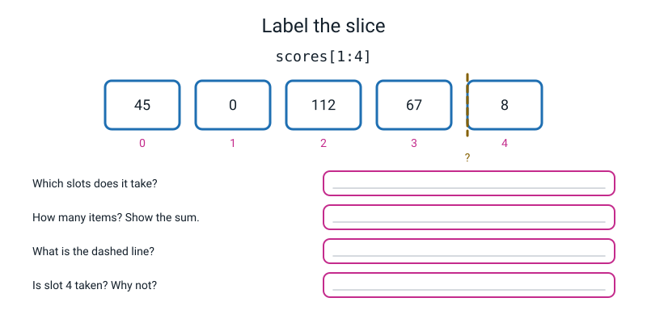
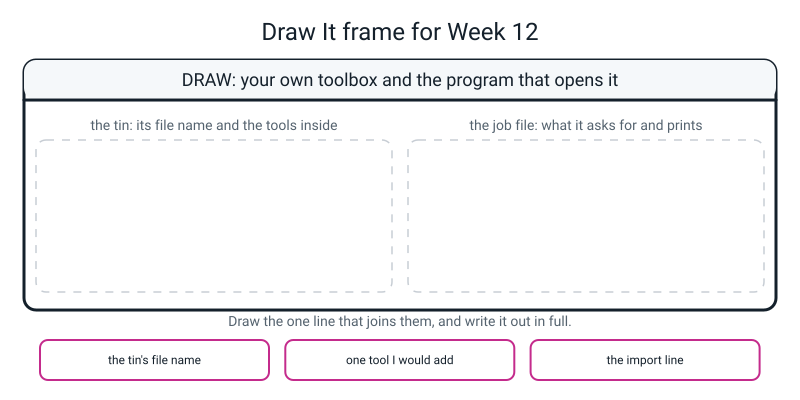

# Workbook — Week 12: Your Own Stats Toolkit

**Name:** ________________________________  **Date:** ______________

[⬅ Week 11](week-11.md) · [📖 Read the chapter first](../student-guide/week-12.md) · [Course Home](../README.md) · [🧑‍🏫 Teacher guide](../teacher-guide/week-12.md) · [Next ➡](week-13.md)

---

> **Before you write a single line: run `ls` in your terminal and check that `stats.py` and `main.py` are both listed.** Nine out of ten problems this week are the two files being in different folders, and this one check prevents all of them.
>
> **And the rule for the median proof: paper first, code second.** A number your code printed is not a check. A number you worked out by hand *and then* your code agreed with — that is a check.

---

## ✅ Warm-Up (5 min)

Five quick questions about **last week**.

**W1.** A list has ten items. What is `len`? ______ What is the biggest valid index? ______

**W2.** Why is `scores[len(scores)]` wrong for **every** list, of every length?

________________________________________________________________

**W3.** After `scores.append(89)`, what happened to `scores[3]`?

________________________________________________________________

**W4.** What goes wrong with `scores = scores.append(89)`, and what is the error message?

________________________________________________________________

**W5.** How many valid indexes does an **empty** list have? ______ Including 0? ______

---

## 🔎 Predict the Output

**Write your prediction before you run anything.** Two of these are about slices and two are about `None`.

### P1

```python
marks = [55, 70, 88, 91, 64]
print(marks[1:3])
print(marks[3:3])
print(len(marks[1:4]))
print(marks)
```

**I predict — all four lines:**

________________________________________________________________

**It really printed:**

________________________________________________________________

**Line 2 is not an error. Why not, and what does `3 − 3` have to do with it?**

________________________________________________________________

**Line 4 shows the original list. What does that prove about slicing?**

________________________________________________________________

### P2

```python
marks = [55, 70, 88, 91, 64]
ordered = marks.sort()
print(ordered)
print(marks)
print(ordered[0])
```

**I predict — write everything, including any error:**

________________________________________________________________

**It really printed:**

________________________________________________________________

**Line 2 of the output is interesting. Did the sorting happen at all?**

________________________________________________________________

**One word in the error message is the clue. Which word, and where have you met it before?**

________________________________________________________________

### P3

```python
marks = [55, 70, 88]
for mark in marks:
    print(mark)
for i in range(len(marks)):
    print(i)
```

**I predict — all six lines:**

________________________________________________________________

**It really printed:**

________________________________________________________________

**Both loops go round three times. What is the difference between what they hand you?**

________________________________________________________________

### P4

```python
marks = [55, 70, 88, 91, 64]
print(marks[3:99])
print(marks[:2])
print(marks[2:])
print(len(marks[:2]), "+", len(marks[2:]), "=", len(marks))
```

**I predict — all four lines:**

________________________________________________________________

**It really printed:**

________________________________________________________________

**Line 1 asks for slot 99, which does not exist. Why is that not an `IndexError`?**

________________________________________________________________

**Lines 2 and 3 both mention the number 2. Is anything missing between them? Is anything in both?**

________________________________________________________________

**How many of the fourteen answers did you get right?** ______ / 14

**Which one surprised you most, and why?**

________________________________________________________________

---

## ✍️ Practice Set A — Read It

**A1. Slice drills.** Given `scores = [45, 0, 112, 67, 8]` — slots 0, 1, 2, 3, 4. **Write the arithmetic in the last column every single time.**

| # | Slice | Result | How many, and why |
|---|---|---|---|
| a | `scores[1:4]` | ____________________ | ______ because ______ − ______ = ______ |
| b | `scores[0:2]` | ____________________ | ______ because ______ − ______ = ______ |
| c | `scores[:3]` | ____________________ | ______ · no start means ____________ |
| d | `scores[2:]` | ____________________ | ______ · no stop means ____________ |
| e | `scores[-2:]` | ____________________ | ______ |
| f | `scores[:]` | ____________________ | ______ · and this one is a ____________ |
| g | `scores[3:3]` | ____________________ | ______ because ______ − ______ = ______ |
| h | `scores[2:99]` | ____________________ | ______ · and it does **not** ____________ |
| i | `scores` at the very end | ____________________ | ____________________ |

**(j) Why does `scores[2:99]` not crash, when `scores[99]` would?**

________________________________________________________________

**(k) `scores[:3]` and `scores[3:]`. Is anything missing? Is anything in both?** Explain what the number 3 is doing in each.

________________________________________________________________

**(l) Write the general rule: `scores[a:b]` gives how many items?**

________________________________________________________________

**A2. Trace it.** Say exactly what appears on the screen. **One of these crashes.**

**(i)**
```python
temps = [31, 34, 29, 36, 30, 28, 33]
print(temps[2:5])
print(temps[:2])
print(temps[5:])
print(temps[-1:])
print(temps[0:0])
```
Output:

```text
________________________________________________________________

________________________________________________________________
```

**`temps[-1:]` gives a list, but `temps[-1]` gives a number. Why?**

________________________________________________________________

**(ii)**
```python
words = ["one", "two", "three", "four"]
for word in words:
    print(word)
print(len(words))
```
Output: ______________________________________________

**How many times did the loop go round, and how do you know without counting the output?**

________________________________________________________________

**(iii)**
```python
nums = [9, 2, 7]
best = sorted(nums)
print(best)
print(nums)
print(best[-1], nums[-1])
```
Output: ______________________________________________

**The last line prints two different numbers. Explain why in one sentence.**

________________________________________________________________

**(iv)**
```python
scores = [45, 0, 112, 67, 8]
for score in scores:
    print(scores[score])
```
Output: ______________________________________________

**What is `score` holding on the very first trip round?** ______  **So which slot was asked for?** ______

**The fix is to delete two characters. Which two?**

________________________________________________________________

**A3. Spot the bug.** Somebody wrote a `median` that only handles one case.

```python
def median(scores):
    ordered = sorted(scores)
    n = len(ordered)
    middle = n // 2
    return ordered[middle]

print(median([4, 8]))
print(median([45, 0, 112, 67, 8, 89]))
```

It printed: ______________ and ______________

It should have printed: ______________ and ______________

**What case is missing, and how would you know from the code alone that something was wrong?**

________________________________________________________________

**Write the missing part:**

```python
    if ________________________:
        return ________________________
    else:
        return ________________________
```

**Is there an error message? ______ Which family of trouble is this?** ______________

**A4. Match code to output.** Given `row = [10, 20, 30, 40, 50]`:

| Line | | Answer |
|---|---|---|
| `print(row[1:3])` | | **A** `[10, 20]` |
| `print(row[:2])` | | **B** `[]` |
| `print(row[3:])` | | **C** `[20, 30]` |
| `print(row[-3:])` | | **D** `[40, 50]` |
| `print(row[2:2])` | | **E** `[30, 40, 50]` |

**Two of those five slices give the same *number of items*. Which two?** ______________

**A5. Label the slice.** Fill in the boxes on the figure, then answer the questions.


*Figure W12.1 — One slice, waiting to be labelled.*

**The slice shown is** `scores[____:____]`

**Which slots does it take?** ______  ______  ______

**How many items? ______ because ______ − ______ = ______**

**Is the dashed line a card, or a fence?** ____________________

**What is in the slot just past the dashed line, and does the slice include it?**

________________________________________________________________

**A6. `sorted()` versus the original.** Read this and answer the four questions.

```python
scores = [45, 0, 112, 67, 8]

ordered = sorted(scores)
print("ordered :", ordered)
print("original:", scores)

print("biggest first:", sorted(scores, reverse=True))
print("original again:", scores)
```

```text
ordered : [0, 8, 45, 67, 112]
original: [45, 0, 112, 67, 8]
biggest first: [112, 67, 45, 8, 0]
original again: [45, 0, 112, 67, 8]
```

**(a) After `ordered = sorted(scores)`, what is in `scores`?**

________________________________________________________________

**(b) What does `ordered = scores.sort()` put in `ordered`, and why?**

________________________________________________________________

**(c) Why must `median()` use `sorted()` and not `.sort()`?** Say what the caller would lose.

________________________________________________________________

**(d) When would `.sort()` be the right choice?** Both halves of the answer are needed.

________________________________________________________________

**(e) `reverse=True` is not new syntax. What was it called in Week 10?**

________________________________________________________________

---

## ✍️ Practice Set B — Write It

**Your two files must be in the same folder. Check with `ls` before you start.**

**B1.** *(one line)* Given `temps = [31, 34, 29, 36, 30, 28, 33]`, print the **first three** temperatures and the **last two**, in one `print`.

```python
temps = [31, 34, 29, 36, 30, 28, 33]
print(________________, ________________)
```

**Your output:** ______________________________________________

**Write the arithmetic for each slice:** first three → ______ − ______ = ______ · last two → ______

**B2.** Prove `sorted()` does not wreck the original. Three lines: build a sorted copy, print it, print the original.

```python
ordered = ________________________
print("ordered :", ________)
print("original:", ________)
```

**Your output:**

```text
________________________________________________________________

________________________________________________________________
```

**Done looks like:** the second line is in the order you typed it.

**B3.** Using a **for-each** loop — no `range`, no square brackets — count how many days were 32 degrees or hotter.

```python
hot = ____
for ________ in ________:
    if ________________:
        ________________
print("hot days:", hot)
```

**Your output:** ______________________________________________

**Why can a slice not answer this question?**

________________________________________________________________

**B4.** *(about 15 lines, across two files)* Add a **sixth tool** to `stats.py` and use it from a new file.

The tool is called `above`. It takes a list and a **limit**, where the limit is **50 if the caller does not say**, and gives back **how many scores are at least as big as the limit.**

Then write `above_report.py`, in the same folder, which imports `stats` and reports on these ten scores:

```python
SCORES = [45, 0, 112, 67, 8, 89, 34, 101, 23, 56]
```

Print: the scores · how many are 50 or more (**using the default**) · how many are 100 or more · how many are 0 or more · the mean · the median.

**Done looks like:** `above` has a default value in its definition, uses a for-each loop, **returns** a count and prints nothing; and the third answer is `10`.

**Your output:**

```text
________________________________________________________________

________________________________________________________________

________________________________________________________________

________________________________________________________________

________________________________________________________________

________________________________________________________________
```

**Why is the "0 or more" test worth doing?**

________________________________________________________________

**B5.** **The delete experiment.** Delete one whole function out of `stats.py`. **Do not touch `above_report.py` or `main.py` at all.** Run one of them.

**Which function did you delete?** ____________________

**The real error message:**

```text
________________________________________________________________

________________________________________________________________

________________________________________________________________
```

**Now put the function back and run it again. What happened?**

________________________________________________________________

**One sentence: what does that error prove about the two files?**

________________________________________________________________

---

## 🐞 Fix the Broken Program

Here is `report.py`, which is supposed to report on six scores using your own toolkit. It has **three** bugs: one that stops Python reading the file, one that crashes it partway through, and one that produces **no error message at all**.

```python
# report.py - a report on six scores, built from my own toolkit. It has three bugs.

import stats

SCORES = [45, 0, 112, 67, 8, 89]

print("scores    :", SCORES)
print("how many  :", len(SCORES))
print("first 3   :", SCORES[0:4])              # bug 3 lives on this line
print("last 3    :", SCORES[-3:])
print("mean      :", f"{stats.mean(SCORES):.2f}")
print("median    :", stats.medain(SCORES))     # bug 2 lives on this line

fifties = 0
for score in SCORES                            # bug 1 lives on this line
    if score >= 50:
        fifties += 1
print("fifties   :", fifties)
```

**Bug 1.** Run it as it is. The real message:

```text
  File "report.py", line 15
    for score in SCORES                            # bug 1 lives on this line
                                                   ^^^^^^^^^^^^^^^^^^^^^^^^^^
SyntaxError: expected ':'
```

Which family? ______  **Did any of it run?** ______

**The bug is on line 15, near the bottom of the file. Why did lines 7 to 12 not print first?**

________________________________________________________________

The fix — write the whole corrected line:

```python
________________________________________________________________
```

**Bug 2.** Now run it. The real output and message:

```text
scores    : [45, 0, 112, 67, 8, 89]
how many  : 6
first 3   : [45, 0, 112, 67]
last 3    : [67, 8, 89]
mean      : 53.50
Traceback (most recent call last):
  File "report.py", line 12, in <module>
    print("median    :", stats.medain(SCORES))     # bug 2 lives on this line
AttributeError: module 'stats' has no attribute 'medain'. Did you mean: 'mean'?
```

(a) **Which is missing — the file, or something inside the file?** How do you know from the message alone?

________________________________________________________________

(b) **Python suggested `'mean'`. Is that the right suggestion?** ______ What is the real fix?

________________________________________________________________

(c) **If the whole `stats.py` file had been missing instead, what error would you have got?**

________________________________________________________________

The fix — write the whole corrected line:

```python
________________________________________________________________
```

**Bug 3.** Now it runs all the way through:

```text
scores    : [45, 0, 112, 67, 8, 89]
how many  : 6
first 3   : [45, 0, 112, 67]
last 3    : [67, 8, 89]
mean      : 53.50
median    : 56.0
fifties   : 3
```

(d) **Look at the `first 3` line. Count the items.** How many are there? ______ How many should there be? ______

(e) **The slice is `SCORES[0:4]`. Write the arithmetic that gives it away.** ______ − ______ = ______

(f) The fix — write the whole corrected line:

```python
________________________________________________________________
```

(g) **Why is there no error message for this one?**

________________________________________________________________

(h) **Hand-check the mean and the median of the six scores.**

```text
Sorted   : ______ ______ ______ ______ ______ ______
Slots    :   0      1      2      3      4      5

Total    = ________     Mean = ________ / 6 = ________
6 // 2   = ______       6 % 2 = ______  -> ____________
slot ____ = ______   and   slot ____ = ______
( ______ + ______ ) / 2 = ________
```

(i) **Which of the three bugs was hardest to find, and why?**

________________________________________________________________

---

## 🧩 Puzzle of the Week

### Part A — The Shortest Slice

Here is a row:

```python
row = [10, 20, 30, 40, 50]
```

For each **target**, write the **shortest slice** that produces it. Some have two answers; write the shorter one, and if they are the same length, write both.

| # | Target | Shortest slice |
|---|---|---|
| 1 | `[20, 30]` | `row[________]` |
| 2 | `[10, 20]` | `row[________]` |
| 3 | `[40, 50]` | `row[________]` |
| 4 | `[30, 40, 50]` | `row[________]` |
| 5 | `[]` | `row[________]` |
| 6 | a copy of the whole row | `row[________]` |
| 7 | `[50]` — **and it must still work if a sixth number is added** | `row[________]` |

**(a) Which of your seven answers would stop being right if somebody appended a `60`?**

________________________________________________________________

**(b) Row 7 has two obvious answers and only one of them survives the append. Explain.**

________________________________________________________________

**(c) Now find a pair of slices that between them give the whole row, with nothing missing and nothing in both.** Give **three different pairs.**

| Pair | First slice | Second slice | Lengths add to |
|---|---|---|---|
| 1 | `row[________]` | `row[________]` | ______ + ______ = 5 |
| 2 | `row[________]` | `row[________]` | ______ + ______ = 5 |
| 3 | `row[________]` | `row[________]` | ______ + ______ = 5 |

**(d) In every pair you found, the same number appears in both slices. What is that number doing?**

________________________________________________________________

### Part B — The Copy Trap

Predict all three lines **before** you run this. It is short and it catches nearly everybody.

```python
a = [1, 2, 3]
b = a                # is this a copy?
c = a[:]             # is this a copy?
b.append(999)
print("a =", a)
print("b =", b)
print("c =", c)
```

**I predict:**

```text
a = ________________________
b = ________________________
c = ________________________
```

**It really printed:**

```text
a = ________________________
b = ________________________
c = ________________________
```

**(a) `a` changed and you never mentioned `a`. What happened?**

________________________________________________________________

**(b) How many lists are there in that program?** ______ **How many names?** ______

**(c) `c = a[:]` is a slice of everything. Why does that make a copy when `b = a` does not?**

________________________________________________________________

**(d) This is the same idea as one of this week's other lessons wearing a different hat. Which one?**

________________________________________________________________

---

## 🤔 Think Deeper

**T1. Should `median([])` return `None`, or should it crash?**

Write a paragraph. **Argue both sides properly before you pick one.**

Picture `median()` buried inside a bigger program that works out a class average and **emails it to parents.** The list is empty because a data-loading bug ate the file. What do you want to happen? Now picture the same function in a quick script you are running yourself over thirty class lists, one of which happens to be empty. **Does your answer change?** If it does, say exactly *what* changed, because it was not the function.

And then the one thing nobody argues about: why must `mean([])` **not** silently return 0?

________________________________________________________________

________________________________________________________________

________________________________________________________________

________________________________________________________________

________________________________________________________________

**T2. Why did we write `mean` by hand when Python can add up a list in one word?**

Write a paragraph. It is genuinely true that a built-in exists — you meet it in Week 15, on purpose. So: what do you know about `mean` now that you would not know if you had only ever used the built-in? (Think about the empty list.)

Then the part that matters: **what happens in about eight weeks when you want a number Python has no built-in word for?**

________________________________________________________________

________________________________________________________________

________________________________________________________________

________________________________________________________________

________________________________________________________________

---

## 🛠️ Build It

### Part 1 — finish `stats.py`

Five functions, every one of them returning, none of them printing, every one with an empty-list guard.

- [ ] `mean` — guard, accumulator starting at 0, **`for score in scores:`** (not `range(len(...))`), divide by `len(scores)`
- [ ] `minimum` — guard, `smallest = scores[0]` as the starting assumption, strict `<`
- [ ] `maximum` — the mirror image, with `>`
- [ ] `value_range` — **calls `maximum` and `minimum`**, does not recompute them
- [ ] `median` — guard, **`sorted()` and not `.sort()`**, `n // 2`, `n % 2 == 1` to detect odd, and the even branch averaging two slots
- [ ] **Not one `print` anywhere in the file**

**Now run `python3 stats.py`. Write down exactly what appeared:**

```text
________________________________________________________________
```

**Is that correct?** ______ **Explain in one sentence why a toolbox prints nothing.**

________________________________________________________________

**(a) Why does every function start with the same three lines?** Say what each one would do differently on an empty list.

| Function | What goes wrong without the guard |
|---|---|
| `mean` | ____________________________________________ |
| `minimum` | ____________________________________________ |
| `maximum` | ____________________________________________ |
| `median` | ____________________________________________ |

**(b) Why is `smallest = scores[0]` a better start than `smallest = 0`?** Give a list that proves it.

________________________________________________________________

**(c) `value_range` calls two other functions. What did that buy you, and what did it cost?**

________________________________________________________________

### Part 2 — finish `main.py`

- [ ] `import stats` at the top — no `.py`, no quotes
- [ ] The 20 scores, typed out
- [ ] The five toolkit numbers, with the mean to two decimal places
- [ ] Four slices: first 3, last 3, worst 3, best 3
- [ ] The two half-season means, using `SCORES[:10]` and `SCORES[10:]`
- [ ] Two counting loops, using `for score in SCORES:`
- [ ] A last line proving `sorted()` did not wreck the original

**Copy the five toolkit numbers your run produced:**

| | Your value |
|---|---|
| Innings | ______ |
| Mean | ______ |
| Median | ______ |
| Lowest | ______ |
| Highest | ______ |
| Range | ______ |

**(a) `First 3` gives `[45, 0, 112]` but `Worst 3` gives `[0, 4, 8]`. Why are they different, when the slice is the same?**

________________________________________________________________

**(b) Why is `Last 3` written `SCORES[-3:]` and not `SCORES[17:20]`?**

________________________________________________________________

**(c) First half 53.50, second half 45.40. Did the season get worse?** Be careful.

________________________________________________________________

________________________________________________________________

**(d) `Fifty-plus` is 10 out of 20. Which loop found that, and could a slice have done it?**

________________________________________________________________

### Part 3 — the median proof

**Paper first. Pencil. Before you run anything.**

**Part A — the EVEN case: all 20 scores.**

```text
In order :  ____ ____ ____ ____ ____ ____ ____ ____ ____ ____ ____ ____ ____ ____ ____ ____ ____ ____ ____ ____
Slots    :   0    1    2    3    4    5    6    7    8    9   10   11   12   13   14   15   16   17   18   19

How many : ______
20 // 2  = ______      (which slot is that?)
20 % 2   = ______      -> odd or even? ____________
slot ____ = ______
slot ____ = ______
( ______ + ______ ) = ______
______ / 2 = ______

MEDIAN   = ______
```

**Part B — the ODD case: the same list with the last innings (26) dropped, leaving 19.**

```text
In order :  ____ ____ ____ ____ ____ ____ ____ ____ ____ ____ ____ ____ ____ ____ ____ ____ ____ ____ ____
Slots    :   0    1    2    3    4    5    6    7    8    9   10   11   12   13   14   15   16   17   18

How many : ______
19 // 2  = ______
19 % 2   = ______      -> odd or even? ____________
slot ____ = ______

MEDIAN   = ______
```

**Now — and only now — run it.** Write a file called `hw_median_proof.py` that imports `stats` and prints the working for both cases.

**Do your paper answers and your code answers agree?** ______

**If they disagree, which was wrong, and how did you find out?**

________________________________________________________________

**(a) For the odd case, prove slot 9 really is the middle.** Print the scores below it and above it.

**Below:** ______________________________________________  **How many?** ______

**Above:** ______________________________________________  **How many?** ______

**(b) Why does the even case give a decimal when the odd case gives a whole number?**

________________________________________________________________

**(c) Is 47.5 a score anybody actually got?** ______ Is that a problem?

________________________________________________________________

**(d) Dropping one score changed the median from 47.5 to 50. Did the season get better?**

________________________________________________________________

**(e) Check the three edge cases and say why each answer is right.**

| Call | Answer | Why |
|---|---|---|
| `stats.median([7])` | ______ | ____________________________________ |
| `stats.median([4, 8])` | ______ | ____________________________________ |
| `stats.median([5, 5, 5, 5])` | ______ | ____________________________________ |

**(f) Prove `median()` did not reorder your list.** Print the list after calling it.

________________________________________________________________

### Part 4 — the delete experiment write-up

**(a) What did you delete, and what was the exact error?**

```text
________________________________________________________________

________________________________________________________________

________________________________________________________________
```

**(b) One sentence: what does that error prove about the two files?**

________________________________________________________________

**(c) You deleted a function and got an `AttributeError`. What error would you get if you deleted the whole `stats.py` file instead?**

________________________________________________________________

**(d) With `from stats import mean, median`, what error do you get when `median` is missing — and on which line?**

________________________________________________________________

### Part 5 — the Bug Log

| | |
|---|---|
| **The real message** | ________________________________________________ |
| **What it proves about the two files** | ________________________________________________ |
| **The fix** | ________________________________________________ |

---

## 🎨 Draw It

Draw **your own toolbox, and the program that opens it.** Pick a subject: a weather kit, a marks kit, a money kit, a cricket kit.

Show the **tin on one side** with named tools inside it, the **job file on the other side**, and the `import` as the thing that joins them. And show — somehow — that the tin does not print and the job file does.


*Figure W12.2 — Your page.*

> **What a good answer might look like:** the subject is a **weather kit.**
>
> Round the whole drawing, a **dashed rectangle labelled `one folder`**, because that is the requirement everybody forgets.
>
> On the **left**, a tin drawn as an open box with a name plate on the front reading **`weather.py`**. Inside it, five labelled tools — `hottest`, `coldest`, `average`, `spread`, `middle` — each drawn as a little machine with a hopper on top and a chute underneath, because that is what a function is. Across the front of the tin, a badge: **"prints nothing"**, with a loudspeaker drawn beside it and a cross through the loudspeaker.
>
> Underneath the tin, a small terminal panel showing `> python3 weather.py` and then **nothing at all**, with the caption *"correct — you opened a toolbox"*.
>
> On the **right**, a sheet of paper labelled **`report.py`**. At the top of it, one line in a pink box: **`import stats`**, with an arrow going **left, into the tin**. Then a list of the things the report prints, and — importantly — **no arithmetic anywhere on the sheet.** A note in the margin: *"not one loop in this file."*
>
> Two more arrows: one from the `average` tool in the tin **rightwards** to the report line that uses it, labelled *"borrowed, not copied"*; and one drawn in red, from the tin to the report, **with the `middle` tool crossed out** and the label `AttributeError: no attribute 'middle'` — the delete experiment, drawn.
>
> The three bottom boxes: *same folder, no `.py` in the import* · *the toolbox does not talk* · *fix the tool once, every report gets the fix.*
>
> **What a weak answer looks like:** drawing arrows going **out** of the tin into the report as if the code were *copied* across. Nothing is copied. The report **borrows** the tools every time it runs — which is exactly why deleting one breaks a file you never edited.

---

## 📊 Self-Check

| I can… | 😀 got it | 🙂 nearly | 😕 not yet |
|---|---|---|---|
| Take a slice and explain why the stop number is not included | ☐ | ☐ | ☐ |
| Sort a list without changing the original, and say how `sorted()` differs from `.sort()` | ☐ | ☐ | ☐ |
| Loop over the items of a list instead of over 0, 1, 2 | ☐ | ☐ | ☐ |
| Import a function from a file I wrote myself and use it in another file | ☐ | ☐ | ☐ |
| Prove `median()` is right for an odd-length AND an even-length list | ☐ | ☐ | ☐ |
| Tell `ModuleNotFoundError` and `AttributeError` apart, and say what each one means | ☐ | ☐ | ☐ |

**True or false?** Circle one on each row.

| Statement | | |
|---|---|---|
| `scores[1:4]` gives four items | TRUE | FALSE |
| `scores[a:b]` gives `b - a` items | TRUE | FALSE |
| A slice changes the original list | TRUE | FALSE |
| `scores[3:3]` is an error | TRUE | FALSE |
| `scores[2:99]` is an error | TRUE | FALSE |
| `scores[99]` is an error | TRUE | FALSE |
| `scores[:3]` and `scores[3:]` together give the whole list | TRUE | FALSE |
| `range(4)` and `scores[0:4]` follow the same stop rule | TRUE | FALSE |
| `sorted(scores)` rearranges `scores` | TRUE | FALSE |
| `sorted(scores)` on its own line does nothing useful | TRUE | FALSE |
| `.sort()` hands back the sorted list | TRUE | FALSE |
| `median` should use `.sort()` because it is faster | TRUE | FALSE |
| `for score in scores:` hands you the value | TRUE | FALSE |
| `import stats.py` is the right way to import `stats.py` | TRUE | FALSE |
| `stats.py` and `main.py` may be in different folders | TRUE | FALSE |
| `python3 stats.py` printing nothing means it is broken | TRUE | FALSE |
| `ModuleNotFoundError` means the file is missing | TRUE | FALSE |
| `AttributeError` means the file was found but the function was not | TRUE | FALSE |
| Naming your file `statistics.py` is fine | TRUE | FALSE |
| The median of an even-length list may not be in the list at all | TRUE | FALSE |

One thing I'd like explained again:

________________________________________________________________

---

## ✅ Answers

<details>
<summary>Check your answers</summary>

### Warm-Up

**W1.** `len` is **10**. The biggest valid index is **9**.

**W2.** Because `len` is a **count** and the last index is one **less** than the count. So `len(scores)` is *always* exactly one past the end — for a list of five, of five hundred, or of zero.

**W3.** **Nothing.** `append` puts the new item in a brand-new slot on the end and moves nothing. `scores[3]` holds exactly what it held before.

**W4.** `.append` changes the list **in place** and hands back `None`, so the assignment throws the list away and puts `None` in `scores`. The message is `TypeError: object of type 'NoneType' has no len()`.

**W5.** **None at all** — zero valid indexes. **Including 0**: `scores[0]` on an empty list is an `IndexError` too.

---

### Predict the Output

**P1.**

```text
[70, 88]
[]
3
[55, 70, 88, 91, 64]
```

- `marks[1:3]` → slots 1 and 2, because 3 − 1 = 2 items ✔
- `marks[3:3]` → **`[]`**, and **not an error**, because 3 − 3 = 0. Start and stop in the same place means zero items. **A slice asks for a range, and an empty range is a perfectly good answer.**
- `len(marks[1:4])` → 3, because 4 − 1 = 3
- `marks` → completely unchanged. **A slice never alters the original; it builds a new list.**

**P2.**

```text
None
[55, 64, 70, 88, 91]
Traceback (most recent call last):
  File "/Users/you/ai-academy/level2/p2.py", line 5, in <module>
    print(ordered[0])
TypeError: 'NoneType' object is not subscriptable
```

**Did the sorting happen? Yes — look at line 2 of the output.** `marks` really is in order now. `.sort()` did its job perfectly. What it did **not** do is hand anything back, so `ordered` holds `None`.

**The clue word is `NoneType`, and you have met it twice before** — Week 10's function that printed instead of returning, and Week 11's `scores = scores.append(89)`. **Third time: it should be a reflex. Something handed back nothing.**

*("Not subscriptable" means "you put square brackets after something that has no slots.")*

**P3.**

```text
55
70
88
0
1
2
```

**Both loops go round three times.** The first hands you **the value** — 55, then 70, then 88. The second hands you **the slot number** — 0, 1, 2 — and if you want the value you have to go and fetch it with `marks[i]`.

**One step instead of two, and one fewer place to write an off-by-one.**

**P4.**

```text
[91, 64]
[55, 70]
[88, 91, 64]
2 + 3 = 5
```

**Why is `marks[3:99]` not an `IndexError`?** Because a **slice** is a request for a **range**, and Python hands you whatever part of that range exists. A single **index** is a request for one **specific** thing, and if it is not there the honest answer is an error. **Two different kinds of question.**

**Lines 2 and 3: nothing is missing and nothing is in both.** `marks[:2]` gives slots 0 and 1; `marks[2:]` gives slots 2, 3, 4. **The number 2 appears in both and means the same fence** — it is the stop of the first (so *excluded*) and the start of the second (so *included*). **That only works because the stop is excluded, and it is the best single argument for the rule.**

---

### Practice Set A

**A1.** Verified by running:

```python
scores = [45, 0, 112, 67, 8]

print(scores[1:4])
print(scores[0:2])
print(scores[:3])
print(scores[2:])
print(scores[-2:])
print(scores[:])
print(scores[3:3])
print(scores[2:99])
print(len(scores[1:4]), "items, because 4 - 1 = 3")
print(scores)
```

```text
[0, 112, 67]
[45, 0]
[45, 0, 112]
[112, 67, 8]
[67, 8]
[45, 0, 112, 67, 8]
[]
[112, 67, 8]
3 items, because 4 - 1 = 3
[45, 0, 112, 67, 8]
```

| # | Slice | Result | How many, and why |
|---|---|---|---|
| a | `scores[1:4]` | `[0, 112, 67]` | 3, because 4 − 1 = 3. Slot 4 is the fence, not a card |
| b | `scores[0:2]` | `[45, 0]` | 2, because 2 − 0 = 2 |
| c | `scores[:3]` | `[45, 0, 112]` | 3. No start means "from the beginning", i.e. 0 |
| d | `scores[2:]` | `[112, 67, 8]` | 3. No stop means "to the very end" |
| e | `scores[-2:]` | `[67, 8]` | 2. The last two, whatever the length |
| f | `scores[:]` | `[45, 0, 112, 67, 8]` | 5 — the whole thing, **as a new list**. This is a **copy** |
| g | `scores[3:3]` | `[]` | 0, because 3 − 3 = 0. Empty list, **no error** |
| h | `scores[2:99]` | `[112, 67, 8]` | 3 — and it does **not crash**, even though there is no slot 99 |
| i | `scores` at the end | `[45, 0, 112, 67, 8]` | **Unchanged.** A slice never alters the original |

**(j)** Because a slice is a request for a **range**, and Python gives you whatever part of that range exists. A single index is a request for one **specific** slot, and if it is not there the honest answer is an error.

**(k)** **Nothing missing, nothing in both.** `[:3]` gives slots 0, 1, 2 and `[3:]` gives slots 3, 4, so together they are the whole list exactly once. **The number 3 appears in both and refers to the same fence** — the stop of the first, the start of the second. This only works because the stop is excluded.

**(l)** **`b - a` items**, as long as both are inside the list. If `b` is bigger than the length you get however many exist. If `b` is less than or equal to `a` you get none at all.

**A2 (i).**

```text
[29, 36, 30]
[31, 34]
[28, 33]
[33]
[]
```

**`temps[-1:]` gives a list; `temps[-1]` gives a number.** A **slice** always hands back a **list**, even a list of one thing. An **index** hands back the thing itself. Two different kinds of request, two different kinds of answer.

**A2 (ii).**

```text
one
two
three
four
4
```

**Four times**, and you know because `len(words)` is 4 — a for-each loop goes round exactly once per element, **without you having to say so.**

**A2 (iii).**

```text
[2, 7, 9]
[9, 2, 7]
9 7
```

`best[-1]` is the last item of the **sorted** list, which is the biggest, **9**. `nums[-1]` is the last item of the **original** list, which is just whatever happened to be typed last, **7**. **Same slice, two different lists — because `sorted()` made a second one and left the first alone.**

**A2 (iv).**

```text
Traceback (most recent call last):
  File "/Users/you/ai-academy/level2/week12_loop_trap.py", line 3, in <module>
    print(scores[score])
IndexError: list index out of range
```

On the first trip, `score` holds **45**, so it asked for **slot 45**. There is no slot 45.

**The two characters to delete: the square brackets** — `print(score)`. **You already have the value. Stop looking it up.**

**A3.**

It printed **8** and **67**. It should have printed **6.0** and **56.0**.

**The missing case is the even one.** With `n = 2`, `n // 2` is 1, so it returned `ordered[1]` — the **upper** middle — and ignored the lower one entirely. With `n = 6` it returned slot 3, which is 67, instead of averaging slots 2 and 3.

**How you could tell from the code alone:** there is no `if` and no `%` anywhere in it. **A function with two cases must have a branch, and this one has none** — so it can only be handling one case.

The missing part:

```python
    if n % 2 == 1:
        return ordered[middle]
    else:
        return (ordered[middle - 1] + ordered[middle]) / 2
```

**Is there an error message?** No. **Which family?** **Family 3 — finished and lied.** It hands back a real number from the list, and only somebody who checked would notice it is the wrong one.

Verified with the correct version:

```text
6.0
56.0
```

**A4.**

| Line | Answer |
|---|---|
| `print(row[1:3])` | **C** `[20, 30]` |
| `print(row[:2])` | **A** `[10, 20]` |
| `print(row[3:])` | **D** `[40, 50]` |
| `print(row[-3:])` | **E** `[30, 40, 50]` |
| `print(row[2:2])` | **B** `[]` |

**The two with the same number of items:** `row[1:3]` and `row[:2]` — **two items each.** (3 − 1 = 2 and 2 − 0 = 2.)

**A5.**

The figure shows **`scores[1:4]`** over five slots holding 45, 0, 112, 67 and 8.

**It takes slots 1, 2 and 3** — the values `0`, `112` and `67`.

**Three items, because 4 − 1 = 3.**

**The dashed line is a fence, not a card.** It marks where the taking stops.

**Just past the dashed line is slot 4, holding `8`, and the slice does not include it.** That is the whole point of the figure: the stop number names the fence you stop at, not the last card you take.

**A6.**

**(a)** Exactly what was there before: `[45, 0, 112, 67, 8]`. `sorted()` built a **second** list and left the first alone.

**(b)** **`None`.** `.sort()` rearranges the list you already have and hands back nothing at all — exactly like `.append` last week. **Anything with a dot that *changes* a list returns `None`.**

**(c)** Because `.sort()` would silently rearrange **the caller's** list. Somebody asks for one number and gets their season reordered as well, without being told. That is a **side effect**, and a function whose job is "just tell me a number" must not have one. **The caller would lose the order the innings actually happened in — which is real information they can never get back.**

**(d)** When the list is genuinely large enough that a second copy costs real memory, **and** you are certain nobody needs the original order. **Both halves have to be true.** Below that, `sorted()`, always.

**(e)** A **keyword argument** — an argument that names the box it goes into. Week 10's syntax, turning up inside somebody else's function.

---

### Practice Set B

**B1.**

```python
temps = [31, 34, 29, 36, 30, 28, 33]
print(temps[0:3], temps[-2:])
```

```text
[31, 34, 29] [28, 33]
```

Arithmetic: first three → **3 − 0 = 3** · last two → **`[-2:]`, and the count is 2 because it starts two back from the end.**

*(`temps[:3]` is equally correct and one character shorter.)*

**B2.**

```python
ordered = sorted(temps)
print("ordered :", ordered)
print("original:", temps)
```

```text
ordered : [28, 29, 30, 31, 33, 34, 36]
original: [31, 34, 29, 36, 30, 28, 33]
```

**The second line is in the order it was typed.** That is `sorted()` doing its job.

**B3.**

```python
hot = 0
for temp in temps:
    if temp >= 32:
        hot += 1
print("hot days:", hot)
```

```text
hot days: 3
```

Check by eye: 34, 36 and 33 are the three that are 32 or more. ✔

**Why can a slice not answer this?** Because a slice picks by **position**, and "32 degrees or hotter" is a question about **value**. The hot days are at slots 1, 3 and 6 — scattered — and no single `[start:stop]` can pick those three and nothing else. **Filtering by value needs a loop** (and gets a proper tool in Week 15).

**B4 — the sixth tool.** *Add to the bottom of `stats.py`:*

```python
def above(scores, limit=50):
    # Give back how many scores are at least as big as the limit.
    count = 0                          # start the counter at zero
    for score in scores:               # walk the values themselves
        if score >= limit:
            count += 1                 # one more
    return count
```

*And `above_report.py`, in the same folder:*

```python
# above_report.py - a sixth tool, borrowed from my own toolbox.

import stats

SCORES = [45, 0, 112, 67, 8, 89, 34, 101, 23, 56]

print("scores      :", SCORES)
print("50 or more  :", stats.above(SCORES))          # no limit given -> uses 50
print("100 or more :", stats.above(SCORES, 100))
print("0 or more   :", stats.above(SCORES, 0))       # awkward: everything counts
print("mean        :", stats.mean(SCORES))
print("median      :", stats.median(SCORES))
```

```text
scores      : [45, 0, 112, 67, 8, 89, 34, 101, 23, 56]
50 or more  : 5
100 or more : 2
0 or more   : 10
mean        : 53.5
median      : 50.5
```

**Hand-check.** 50 or more: 112, 67, 89, 101, 56 → **5** ✔ 100 or more: 112, 101 → **2** ✔ 0 or more: everything, including the 0, because the test is `>= 0` → **10** ✔ Total = 535, ÷ 10 = **53.5** ✔ Sorted = `[0, 8, 23, 34, 45, 56, 67, 89, 101, 112]`; ten items so average slots 4 and 5 = 45 and 56 → (45 + 56) ÷ 2 = **50.5** ✔

**Why is the "0 or more" test worth doing?** Two reasons. It proves the default is being **replaced** rather than ignored — if it printed 5 you would know `limit` was still 50. And it proves the boundary is `>=` and not `>`, because the score of **0** is counted.

**B5 — the delete experiment.** Deleting the whole `median` function from `stats.py` and running `main.py` unchanged:

```text
Traceback (most recent call last):
  File "/Users/you/ai-academy/level2/main.py", line 19, in <module>
    print("  Median    :", stats.median(SCORES))
AttributeError: module 'stats' has no attribute 'median'. Did you mean: 'mean'?
```

Any function counts, as long as the traceback is real and copied exactly.

**Putting it back and running again:** the report works, **and you did not touch `main.py` once.**

**What it proves:** *"`main.py` broke without being edited at all, which proves it doesn't contain those functions — it borrows them from `stats.py` every time it runs."*

---

### Fix the Broken Program

**Bug 1.** **Family 1 — never started.** **None of it ran.**

**Why did lines 7 to 12 not print?** Because a `SyntaxError` means Python could not even finish **reading** the file. It reads the whole thing before running any of it, and it never got to the running stage. **A file with a syntax error anywhere in it runs nowhere.** This is worth knowing: the bug being at the bottom does not mean the top gets a turn.

The fix:

```python
for score in SCORES:                           # bug 1 lives on this line
```

**Bug 2.**

(a) **Something inside the file.** `AttributeError: module 'stats' has no attribute ...` means Python **found and loaded `stats.py` perfectly well** — it just could not find that name inside it. If the file had been missing you would have got `ModuleNotFoundError` instead, on the `import` line.

(b) **No, the suggestion is wrong** — Python compared `medain` against the names it found and `mean` was the closest, but the function you actually wanted is **`median`**. **The suggestion is usually right and it is not always right.** The real fix is a spelling correction: `medain` → `median`.

(c) `ModuleNotFoundError: No module named 'stats'`.

The fix:

```python
print("median    :", stats.median(SCORES))     # bug 2 lives on this line
```

**Bug 3.**

(d) `first 3` printed **four** items: `[45, 0, 112, 67]`. It should print **three**.

(e) **4 − 0 = 4.** The arithmetic gives it away instantly, which is exactly why you write it down beside every slice.

(f) The fix:

```python
print("first 3   :", SCORES[0:3])              # bug 3 lives on this line
```

(g) **Because nothing impossible happened.** `SCORES[0:4]` is a perfectly legal slice of a six-item list, and it produced a perfectly good list. **Python has no idea the label says "3".** Family 3 — finished and lied.

(h) **Hand-check:**

```text
Sorted   :   0   8   45   67   89  112
Slots    :   0   1    2    3    4    5

Total    = 0 + 8 + 45 + 67 + 89 + 112 = 321
Mean     = 321 / 6 = 53.5   -> printed as 53.50
6 // 2   = 3        6 % 2 = 0  -> EVEN, so two middles
slot 2 = 45   and   slot 3 = 67
(45 + 67) / 2 = 112 / 2 = 56.0    ✔
```

Full output after all three fixes:

```text
scores    : [45, 0, 112, 67, 8, 89]
how many  : 6
first 3   : [45, 0, 112]
last 3    : [67, 8, 89]
mean      : 53.50
median    : 56.0
fifties   : 3
```

*(`fifties` is 3: 112, 67 and 89 are the three scores of 50 or more.)*

(i) **Bug 3 was hardest.** Bug 1 stopped the file dead before anything ran. Bug 2 crashed and Python even guessed at the fix. **Bug 3 printed a real slice of real scores under a label that was almost right**, and only counting the items gives it away.

---

### Puzzle of the Week

**Part A — the shortest slice.** All verified:

```python
row = [10, 20, 30, 40, 50]
print(row[1:3], row[:2], row[3:], row[-3:], row[2:2])
```

```text
[20, 30] [10, 20] [40, 50] [30, 40, 50] []
```

| # | Target | Shortest slice |
|---|---|---|
| 1 | `[20, 30]` | `row[1:3]` |
| 2 | `[10, 20]` | `row[:2]` |
| 3 | `[40, 50]` | `row[3:]` — or `row[-2:]`, same length |
| 4 | `[30, 40, 50]` | `row[2:]` — or `row[-3:]`, same length |
| 5 | `[]` | `row[2:2]` — or any `[n:n]`, or `row[3:1]` |
| 6 | a copy of the whole row | `row[:]` |
| 7 | `[50]`, surviving an append | **`row[-1:]`** |

**(a)** Every slice with a **positive** number in it that was chosen to reach the end: `row[3:]` and `row[2:]` still give you "everything from slot 3 / slot 2 onwards", which now includes the 60 — so **they change**. `row[-2:]` and `row[-3:]` also change, but they keep *meaning* "the last two / the last three". `row[1:3]` and `row[:2]` are untouched. **And `row[:]` still copies everything, which is now six items.**

**The precise version: nothing "stops being a slice", but three of them stop giving the answer you wanted.**

**(b)** Row 7's two obvious answers are `row[4:5]` and `row[-1:]`. **`row[4:5]` means "slot 4", which after the append is the 50 — but it is no longer the last item.** `row[-1:]` means "the last one", which is now the 60. **So which survives depends on what you meant**: if you meant "that particular number", the positive one survives; if you meant "the last one", the negative one does. **Say what you mean and the right index picks itself.**

**(c) Three tiling pairs:**

| Pair | First slice | Second slice | Lengths |
|---|---|---|---|
| 1 | `row[:2]` | `row[2:]` | 2 + 3 = 5 |
| 2 | `row[:3]` | `row[3:]` | 3 + 2 = 5 |
| 3 | `row[:1]` | `row[1:]` | 1 + 4 = 5 |

*(`row[:0]` and `row[0:]` also works: 0 + 5 = 5.)*

**(d)** The same number is the **fence**. In the first slice it is the **stop**, so it is **excluded**; in the second it is the **start**, so it is **included**. **Each item lands in exactly one of the two slices, and the number appearing twice is what guarantees it.** That is the whole argument for excluding the stop.

**Part B — the copy trap.**

```text
a = [1, 2, 3, 999]
b = [1, 2, 3, 999]
c = [1, 2, 3]
```

**(a)** **`b = a` never made a second list.** It put a second *name* on the list that was already there. So `b.append(999)` changed the one and only list, and `a` — which is another name for the very same list — shows the change too.

**(b)** **There are two lists** (the original, and the copy `c` points at) **and three names.** `a` and `b` are two names for one list.

**(c)** Because `a[:]` is a **slice**, and **a slice always builds a new list** — you proved that in A1(i), where the original was unchanged after every slice. `a[:]` is the slice that happens to take everything, so it is the cheapest possible copy. `b = a` is not a slice at all; it is just a name.

**(d)** **`sorted()` versus `.sort()`** — the same idea wearing a different hat. `sorted()` builds a new list, like `a[:]`. `.sort()` changes the one you have, and if two names point at it, **both** names see the change. **That is exactly why `median` must use `sorted()`.**

---

### Think Deeper

**T1 — model answer.**

Picture `median()` inside a program that emails a class average to parents. If the list is empty because a data-loading bug ate the file, returning `None` means the email says "class median: None" — or, worse, some later line turns it into 0 and the email says "class median: 0", **which is a real-looking number that is completely false.** Almost everybody wants a **crash** here, and the argument is that `None` lets a broken value travel a long way from the place it broke before anybody notices.

Now the same function in a script I am running myself, over thirty class lists, one of which happens to be empty. **Stopping dead on list seventeen is useless** — I would rather see `None` on one row and get the other twenty-nine.

**Notice the answer flipped and nothing about the function changed.** What changed is **who reads the result and what happens next.** Real teams argue about this constantly, and there is a third camp who say the function should hand back a *reason* so the caller can decide.

**What nobody argues about:** `mean([])` must not silently return **0**, because **0 is a real average** — it means "everybody scored nothing" — and "there wasn't any data" is a completely different statement. Returning 0 turns "I don't know" into a confident lie, and there is no way for anybody downstream to tell them apart.

We chose `None` for this course because it is honest and it never stops a lesson dead. **That is a choice, and you are allowed to make a different one — as long as you write down which one you made.**

**T2 — model answer.**

A built-in does exist, and I will meet it in Week 15 on purpose.

**What I know now that I would not know otherwise:** exactly what `mean` does, line by line — that it starts a total at zero, walks the values, adds each one, and divides by how many. And, more usefully, **exactly what it does with an empty list**, because I had to decide that myself. Somebody who has only used the built-in has no idea what it does with an empty list until it happens to them, and then they have to go and look it up.

**And the real reason:** in about eight weeks I will want a number Python has no built-in word for. At that moment the only thing that helps is having built one before. Students who meet the built-in first tend to treat every summary as magic — **and then stall completely the first time the magic does not cover what they need.** Writing `mean` by hand once buys the ability to write the twentieth one, which nobody has written for me.

---

### Build It

**Part 1 — `stats.py`.** The complete file:

```python
# stats.py — my own statistics toolkit.
# Every function in here RETURNS a number. Not one of them prints.
# This file is a TOOLBOX. Running it on its own does nothing, and that is correct.


def mean(scores):
    # Give back the average: the total shared out equally.
    if len(scores) == 0:               # guard: there is no average of nothing
        return None
    total = 0                          # start the running total at zero
    for score in scores:               # walk through the items themselves
        total += score                 # add this one onto the total
    return total / len(scores)         # share the total between all of them


def minimum(scores):
    # Give back the smallest value in the list.
    if len(scores) == 0:
        return None
    smallest = scores[0]               # assume the first one is the smallest
    for score in scores:               # then check every single one
        if score < smallest:           # found something smaller?
            smallest = score           # it is the new champion
    return smallest


def maximum(scores):
    # Give back the largest value in the list.
    if len(scores) == 0:
        return None
    largest = scores[0]                # assume the first one is the largest
    for score in scores:
        if score > largest:
            largest = score
    return largest


def value_range(scores):
    # Give back the spread: largest minus smallest.
    if len(scores) == 0:
        return None
    return maximum(scores) - minimum(scores)      # reuse our own two functions


def median(scores):
    # Give back the middle value once the numbers are put in order.
    if len(scores) == 0:
        return None
    ordered = sorted(scores)           # a NEW sorted list; the caller's list is untouched
    n = len(ordered)                   # how many numbers there are
    middle = n // 2                    # whole-number divide: the upper middle slot
    if n % 2 == 1:                     # odd count -> there is one true middle
        return ordered[middle]
    else:                              # even count -> average the two middles
        return (ordered[middle - 1] + ordered[middle]) / 2
```

`python3 stats.py` output:

```text
```

**Nothing. That is the correct output**, and it is a pass, not a failure. **A toolbox contains only `def`s, and a `def` you never call does nothing** — which is Week 9's lesson again. Opening a toolbox builds nothing.

**(a) Why the guards, function by function** — and every one of these was actually run:

| Function | Without the guard |
|---|---|
| `mean` | Divides by a length of zero: `ZeroDivisionError: division by zero` |
| `minimum` | Asks for slot 0 of an empty list: `IndexError: list index out of range` |
| `maximum` | The same `IndexError`, from `largest = scores[0]` |
| `median` | Sorts nothing, then indexes it: `IndexError` |

The real tracebacks:

```text
Traceback (most recent call last):
  File "/Users/you/ai-academy/level2/hw12_empty.py", line 3, in <module>
    print(stats.mean([]))
  File "/Users/you/ai-academy/level2/stats.py", line 11, in mean
    return total / len(scores)         # share the total between all of them
ZeroDivisionError: division by zero
```

```text
Traceback (most recent call last):
  File "/Users/you/ai-academy/level2/hw12_empty2.py", line 3, in <module>
    print(stats.minimum([]))
  File "/Users/you/ai-academy/level2/stats.py", line 16, in minimum
    smallest = scores[0]               # assume the first one is the smallest
IndexError: list index out of range
```

With the guards in place, all five hand back `None`:

```text
None
None
None
None
None
```

**(b)** Because a list can be made **entirely of numbers bigger than 0**, in which case nothing is ever smaller than 0 and the function hands back **a number that was never in the list.** For example `minimum([5, 9, 12])` would return **0**, which is not a member of the list and is not the smallest thing in it. **Starting from an actual member of the list is the only safe assumption.** (The same argument, mirrored, applies to `maximum` and a list of negatives.)

**(c)** It **bought** correctness for free — fix a bug in `minimum` and `value_range` is fixed too, without you touching it. It **cost** a little speed: the list gets walked twice instead of once. **For twenty scores that is invisible, and clarity is worth far more than the saving.**

**Part 2 — `main.py`.** The five numbers:

| | Value |
|---|---|
| Innings | 20 |
| Mean | 49.45 |
| Median | 47.5 |
| Lowest | 0 |
| Highest | 112 |
| Range | 112 |

**Hand-checked.** Sorted, the twenty scores are `0, 4, 8, 15, 19, 23, 26, 34, 38, 45, 50, 56, 63, 67, 72, 77, 89, 90, 101, 112`. Total in pairs from the ends: 112 + 105 + 98 + 104 + 96 + 95 + 93 + 97 + 94 + 95 = **989** ✔ Mean 989 ÷ 20 = **49.45** ✔ Median: `20 // 2 = 10`, average slots 9 and 10 = 45 and 50 → **47.5** ✔ Range 112 − 0 = **112** ✔

**(a)** `SCORES[0:3]` takes the **first three innings, in the order they were played.** `sorted(SCORES)[0:3]` sorts first, so it takes **the three lowest scores of the season.** **Same slice, two different lists** — a slice always means "these positions", and positions only mean something once you know what order the list is in.

**(b)** Both work today. **`[-3:]` still means "the last three" if a twenty-first innings gets appended; `[17:20]` quietly starts meaning something else.** Same argument as `scores[-1]` from last week.

**(c)** The numbers say the second ten innings averaged about eight runs lower. **Whether that is a real decline or just what ten innings look like is genuinely open, and the honest answer at Week 12 is "this is a hint, not a finding."** Ten innings is very few; **one score of 112 in the first half moves that average by more than 11 on its own**; and nothing here rules out coincidence. Any answer that notices the sample is small is a good answer. "Yes, it got worse" with no hedge is not.

**(d)** The `for score in SCORES:` loop with a counter. **A slice could not do it:** a slice picks by *position*, and "at least fifty" is a question about *value*. The fifties are scattered through the list. Filtering by value is Week 15.

**Part 3 — the median proof.**

**Part A — the EVEN case, all 20 scores:**

```text
In order :  0   4   8  15  19  23  26  34  38  45  50  56  63  67  72  77  89  90 101 112
Slots    :  0   1   2   3   4   5   6   7   8   9  10  11  12  13  14  15  16  17  18  19
                                                ^   ^
                                          two middles

How many : 20
20 // 2  = 10    (the upper middle slot)
20 % 2   = 0     -> even -> there is no single middle
slot 9   = 45
slot 10  = 50
(45 + 50) = 95
95 / 2    = 47.5
MEDIAN   = 47.5
```

**Part B — the ODD case, 19 scores (26 dropped):**

```text
In order :  0   4   8  15  19  23  34  38  45  50  56  63  67  72  77  89  90 101 112
Slots    :  0   1   2   3   4   5   6   7   8   9  10  11  12  13  14  15  16  17  18
                                                ^
                                          one true middle

How many : 19
19 // 2  = 9     (the one true middle slot)
19 % 2   = 1     -> odd -> take a single value
slot 9   = 50
MEDIAN   = 50
```

*(Note that 26 has vanished from the sorted row. That is correct — it was the innings that got dropped.)*

The code check:

```python
# hw_median_proof.py — prove median() on the 20 scores (even) and on 19 (odd).

import stats

TWENTY = [45, 0, 112, 67, 8, 89, 34, 101, 23, 56,
          77, 4, 90, 19, 63, 38, 72, 15, 50, 26]

NINETEEN = [45, 0, 112, 67, 8, 89, 34, 101, 23, 56,
            77, 4, 90, 19, 63, 38, 72, 15, 50]      # the last innings dropped

print("EVEN CASE - 20 scores")
print("  in order   :", sorted(TWENTY))
print("  how many   :", len(TWENTY))
print("  20 // 2    =", 20 // 2, "(the upper middle slot)")
print("  20 % 2     =", 20 % 2, "-> even")
print("  slot 9     =", sorted(TWENTY)[9])
print("  slot 10    =", sorted(TWENTY)[10])
print("  (45+50)/2  =", (45 + 50) / 2)
print("  median()   :", stats.median(TWENTY))
print()
print("ODD CASE - 19 scores")
print("  in order   :", sorted(NINETEEN))
print("  how many   :", len(NINETEEN))
print("  19 // 2    =", 19 // 2, "(the one true middle slot)")
print("  19 % 2     =", 19 % 2, "-> odd")
print("  slot 9     =", sorted(NINETEEN)[9])
print("  median()   :", stats.median(NINETEEN))
print()
print("  nine scores below it:", sorted(NINETEEN)[0:9])
print("  nine scores above it:", sorted(NINETEEN)[10:])
```

```text
EVEN CASE - 20 scores
  in order   : [0, 4, 8, 15, 19, 23, 26, 34, 38, 45, 50, 56, 63, 67, 72, 77, 89, 90, 101, 112]
  how many   : 20
  20 // 2    = 10 (the upper middle slot)
  20 % 2     = 0 -> even
  slot 9     = 45
  slot 10    = 50
  (45+50)/2  = 47.5
  median()   : 47.5

ODD CASE - 19 scores
  in order   : [0, 4, 8, 15, 19, 23, 34, 38, 45, 50, 56, 63, 67, 72, 77, 89, 90, 101, 112]
  how many   : 19
  19 // 2    = 9 (the one true middle slot)
  19 % 2     = 1 -> odd
  slot 9     = 50
  median()   : 50

  nine scores below it: [0, 4, 8, 15, 19, 23, 34, 38, 45]
  nine scores above it: [56, 63, 67, 72, 77, 89, 90, 101, 112]
```

**(a)** **Below:** `[0, 4, 8, 15, 19, 23, 34, 38, 45]` — **nine.** **Above:** `[56, 63, 67, 72, 77, 89, 90, 101, 112]` — **nine.** Both slices have length 9, and that is what "middle" means. **The code says the same thing the paper said.**

*(Notice the two slices: `[0:9]` gives 9 − 0 = 9 items, and `[10:]` gives everything from slot 10 on, which is 19 − 10 = 9 items. Slot 9 itself is in neither — it is the median.)*

**(b)** Because the even case **divides by 2**, and `/` always produces a decimal in Python. `(45 + 50) / 2` is `47.5`, which genuinely is not a whole number. **The odd case returns a value straight out of the list, untouched, so it stays whatever it was.**

**(c)** **No — nobody scored 47.5.** For an even-length list the median is a **constructed** number, halfway between the two central values, and it may not appear in the data at all. **That is normal and honest**, and it is the same reason a mean of 49.45 is not an innings anybody played.

**(d)** **No.** Nothing about the season changed — **one innings was removed from the calculation.** Removing the 26 took a below-median score out of the list, so the middle shifted upward. **A summary number can move because of what you left out, not because of what happened.** That idea comes straight back in Term 3.

**(e)**

| Call | Answer | Why |
|---|---|---|
| `stats.median([7])` | **7** | n = 1, `1 // 2` is 0, `1 % 2` is 1 so odd → `ordered[0]`. **The middle of one thing is itself** |
| `stats.median([4, 8])` | **6.0** | n = 2, `2 // 2` is 1, even → average slots 0 and 1: (4 + 8) ÷ 2 |
| `stats.median([5, 5, 5, 5])` | **5.0** | n = 4, even → average slots 1 and 2, both 5. **The `.0` is the division, not a mistake** |

**(f)**

```text
  the caller's list is untouched: [45, 0, 112, 67, 8]
```

Still in the order it was typed. **That is `sorted()` doing its job.** Had `median` used `.sort()`, this line would read `[0, 8, 45, 67, 112]` and the season order would be gone for good.

**Part 4 — the delete experiment.**

**(a)** Deleting the whole `median` function from `stats.py` and running `main.py` unchanged:

```text
Traceback (most recent call last):
  File "/Users/you/ai-academy/level2/main.py", line 19, in <module>
    print("  Median    :", stats.median(SCORES))
AttributeError: module 'stats' has no attribute 'median'. Did you mean: 'mean'?
```

Accept any function deleted, as long as the traceback is real and copied exactly.

**(b)** Model answer: *"`main.py` broke without being edited at all, which proves it doesn't contain those functions — it borrows them from `stats.py` every time it runs."*

Both halves are needed: **`main.py` was not changed**, and **it depends on what is in the other file.**

**(c)**

```text
ModuleNotFoundError: No module named 'stats'
```

**And the distinction is the point:** `ModuleNotFoundError` means **the file** is missing; `AttributeError` means the file was found but **the thing inside it** is missing. Telling those two apart saves a great deal of time.

**(d)**

```text
Traceback (most recent call last):
  File "/Users/you/ai-academy/level2/hw12_import.py", line 1, in <module>
    from stats import mean, median         # take just these two, by name
ImportError: cannot import name 'median' from 'stats' (/Users/you/ai-academy/level2/stats.py)
```

An **`ImportError`**, and it happens on **line 1**, before any of your program runs. **That is arguably better than the `AttributeError`, which waits until the moment you use the function** — a real argument in favour of the `from ... import` style.

**Part 5 — the Bug Log entry.**

| | |
|---|---|
| **The real message** | `AttributeError: module 'stats' has no attribute 'median'. Did you mean: 'mean'?` on line 19 of `main.py` |
| **What it proves about the two files** | `main.py` broke without being edited, so it does not contain those functions — it borrows them from `stats.py` every time it runs |
| **The fix** | Write `median` in `stats.py`. **`main.py` does not change** |

---

### Draw It

There is no single right drawing. A strong one has all five of these:

1. **A dashed boundary labelled "one folder"** round both files — the requirement everybody forgets.
2. **The tin with named tools inside it**, each drawn as a hopper-and-chute machine, and a badge saying **"prints nothing"**.
3. **A terminal panel under the tin showing an empty result** and the caption *"correct — you opened a toolbox"*.
4. **The `import` line as an arrow going INTO the tin**, with no arithmetic anywhere on the job sheet.
5. **The delete experiment in red**: one tool crossed out and the `AttributeError` written beside it.

**The commonest weak drawing** shows the code being **copied** from the tin into the report. **Nothing is copied.** The report borrows the tools every time it runs — which is exactly why deleting one breaks a file you never edited.

---

### Self-Check answers

**True or false:**

| Statement | Answer |
|---|---|
| `scores[1:4]` gives four items | **FALSE** — three. 4 − 1 = 3 |
| `scores[a:b]` gives `b - a` items | **TRUE** |
| A slice changes the original list | **FALSE** — it builds a new one |
| `scores[3:3]` is an error | **FALSE** — it is `[]`, because 3 − 3 = 0 |
| `scores[2:99]` is an error | **FALSE** — a slice gives you whatever part of the range exists |
| `scores[99]` is an error | **TRUE** — a single index asks for one specific slot |
| `scores[:3]` and `scores[3:]` together give the whole list | **TRUE** — nothing missing, nothing twice |
| `range(4)` and `scores[0:4]` follow the same stop rule | **TRUE** — both stop before 4 |
| `sorted(scores)` rearranges `scores` | **FALSE** — it builds a new list and leaves yours alone |
| `sorted(scores)` on its own line does nothing useful | **TRUE** — it hands something back and nobody catches it |
| `.sort()` hands back the sorted list | **FALSE** — it hands back `None` |
| `median` should use `.sort()` because it is faster | **FALSE** — it would silently reorder the caller's list. That is a side effect |
| `for score in scores:` hands you the value | **TRUE** |
| `import stats.py` is the right way to import `stats.py` | **FALSE** — `import stats`. The word after `import` is a module name |
| `stats.py` and `main.py` may be in different folders | **FALSE** — not this year, and it is nine out of ten problems |
| `python3 stats.py` printing nothing means it is broken | **FALSE** — it is a toolbox. That is correct |
| `ModuleNotFoundError` means the file is missing | **TRUE** |
| `AttributeError` means the file was found but the function was not | **TRUE** |
| Naming your file `statistics.py` is fine | **FALSE** — Python would find yours instead of the real library |
| The median of an even-length list may not be in the list at all | **TRUE** — it is halfway between the two middles |

</details>
