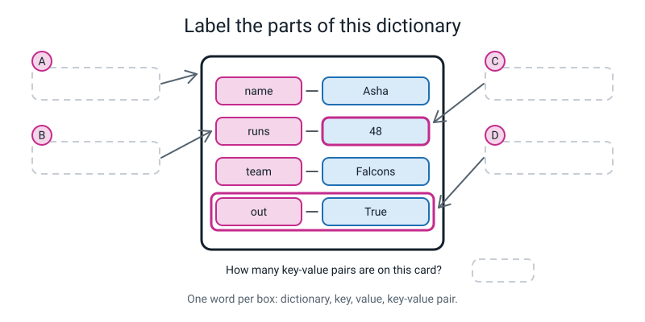
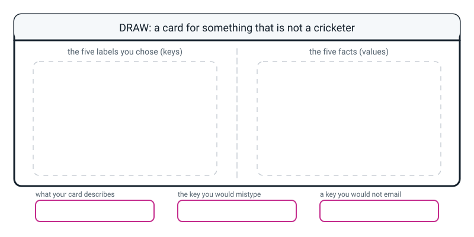

# Workbook — Week 13: Labels Instead of Numbers: Dictionaries

**Name:** ________________________________  **Date:** ______________

[⬅ Week 12](week-12.md) · [📖 Read the chapter first](../student-guide/week-13.md) · [Course Home](../README.md) · [🧑‍🏫 Teacher guide](../teacher-guide/week-13.md) · [Next ➡](week-14.md)

---

## ✅ Warm-Up (5 min)

Five quick questions about **last week**.

**W1.** `scores = [45, 0, 112, 67, 8]`. What does `scores[1:4]` give you, and how many items is that?

________________________________________________________________

**W2.** In one sentence each: what does `scores.sort()` do, and what does `sorted(scores)` do?

________________________________________________________________

________________________________________________________________

**W3.** In `for score in scores:`, what is sitting in `score` on the **first** trip round the loop?

________________________________________________________________

**W4.** What is the median of `[3, 9, 4, 1]`, and why do you have to sort it first?

________________________________________________________________

**W5.** You wrote a file called `stats.py` with a function called `mean` in it. Write the one line that lets `report.py` use it.

```python
________________________________________________________________
```

---

## 🔎 Predict the Output

**Write your prediction before you run anything.** Three of these four produce **no error at all**, so "what do you expect" means "what will it print".

### P1

```python
card = {"runs": 48, "balls": 32, "runs": 51}
print(card)
print(len(card))
```

**I predict:** ________________________  and ________________________

**It really printed:** ________________________  and ________________________

### P2

```python
card = {"name": "Dev", "runs": 0}
print(card.get("runs", 5))
print(card.get("catches", 5))
print(card.get("catches"))
```

**I predict:** ____________  ____________  ____________

**It really printed:** ____________  ____________  ____________

### P3

```python
card = {"runs": 48}
card["Runs"] = 51
print(card["runs"])
print(len(card))
print(card)
```

**I predict — all three lines, or "error":**

________________________________________________________________

**It really printed:**

________________________________________________________________

### P4

```python
card = {"name": "Meera", "runs": 30}
print(card["name"], "scored", card["runs"])
print(card[0])
```

**I predict — how much prints before anything goes wrong, and what is the last line?**

________________________________________________________________

**It really printed:**

________________________________________________________________

**How many of the nine answers did you get right?** ______ / 9

**Which one surprised you most, and why?**

________________________________________________________________

---

## ✍️ Practice Set A — Read It

This set is for reading dictionary code and saying what it does. Write your answers in the spaces.

**A1. Trace the card.** Here is one song's card. Work down the eight lines in order, writing what each one prints, and what the card holds afterwards.

```python
card = {"title": "Late Bus", "artist": "Ravi", "minutes": 2.9, "plays": 180}
print(card["artist"])
print(len(card))
print(card.get("album", "unknown"))
print(card.get("plays", 0))
card["plays"] = 181
card["album"] = "Corner Shop"
print(len(card))
print(card)
```

| Line | What it prints | Did the card change? |
|---|---|---|
| `print(card["artist"])` | | |
| `print(len(card))` | | |
| `print(card.get("album", "unknown"))` | | |
| `print(card.get("plays", 0))` | | |
| `card["plays"] = 181` | *(prints nothing)* | |
| `card["album"] = "Corner Shop"` | *(prints nothing)* | |
| `print(len(card))` | | |

**Two of those seven lines changed the card. Which two, and which one of them *added* rather than *changed*?**

________________________________________________________________

**A2. Spot the bug.** This will not run. What is wrong, and what is the real message?

```python
pizza = {"size" : "large", "price" = 8.5}
print(pizza)
```

What is wrong, in words a person would understand:

________________________________________________________________

The fixed line:

```python
________________________________________________________________
```

**A3. Match the code to the output.** All four use the same card. All four run without any error.

```python
card = {"a": 1, "b": 2, "c": 3}
```

| | Snippet | | | Output |
|---|---|---|---|---|
| a | `print(len(card))` | ______ | **1** | `2` |
| b | `print(card["b"])` | ______ | **2** | `3` |
| c | `print(card.get("d", 0))` | ______ | **3** | `0` |
| d | `print(card.get("d"))` | ______ | **4** | `None` |

**Two of those four ask for a key that is not there. Why does neither of them crash?**

________________________________________________________________

**A4. Label the diagram.** Fill in the four dashed boxes A to D with the right word from this week's vocabulary, and then answer the question underneath.


*Figure W13.1 — One card, four things to name.*

A: ____________________  B: ____________________

C: ____________________  D: ____________________

How many key-value pairs are on that card? ______  So what does `len()` say? ______

**A5. Which bracket job?** For each expression, write **count** (a list index) or **label** (a dictionary key) — and then say what it gives you or what error it raises. Assume `scores = [45, 12, 88]` and `asha = {"name": "Asha", "runs": 48}`.

| Expression | count or label? | What happens |
|---|---|---|
| `scores[2]` | | |
| `asha["runs"]` | | |
| `asha[0]` | | |
| `scores["two"]` | | |
| `asha["Runs"]` | | |
| `asha.get("Runs", 0)` | | |

**A6. Fact or guess?** For each missing field, is filling it with `0` reporting a fact, or inventing one?

| The missing field | Fact or guess? | One-line reason |
|---|---|---|
| `catches` — nobody watched the fielders | | |
| `runs` — the scorer's pen died | | |
| `balls` — the counter was on somebody's phone | | |
| `stars` — the song has never been rated | | |

---

## ✍️ Practice Set B — Write It

This set is for writing dictionary code of your own. Type each answer and run it.

**B1. One line, then one more.** Build a dictionary called `pizza` with three keys — `size`, `toppings` and `price` — then print just the price.

```python
________________________________________________________________

________________________________________________________________
```

*Done looks like:* curly braces, a colon in every pair, a comma between pairs, and quotes on all three keys.

**B2. Two lines — one f-string.** Given a five-key player card, print one line that reads like a sentence: *"Zara of the Tigers made 41 off 39"*. Use an f-string with **single** quotes inside the braces.

```python
player = {"name": "Zara", "runs": 41, "balls": 39, "team": "Tigers", "out": True}

________________________________________________________________
```

*Done looks like:* the whole sentence comes out of one `print`, and you did not glue anything together with `+`.

**B3. Five lines — add and change.** Starting from that same `player` card: print how many fields there are, change `runs` to 44, add a `ground` of `"Nagpur"`, then print how many fields there are now, and print the whole card.

```python
________________________________________________________________

________________________________________________________________

________________________________________________________________

________________________________________________________________

________________________________________________________________
```

*Done looks like:* the two counts are **different**, and you can say which of your two assignments made the count go up and why.

Before count: ______  After count: ______

**B4. Six lines — the same hole, two different fixes.** Here is a bus journey card with no `fare` field on it.

```python
bus = {"route": 42, "from": "Kothrud", "to": "Camp", "minutes": 25, "crowded": True}
```

**Fix one — `.get()` with a fallback:**

```python
________________________________________________________________
```

**Fix two — ask first.** `in` is next week's tool arriving early. **Copy these four lines exactly** and they will work:

```python
if "fare" in bus:                    # is there a key called "fare"?
    print("Fare:", bus["fare"])
else:
    print("Fare: not recorded")
```

Run both. What did each one print?

Fix one printed: ____________________  Fix two printed: ____________________

**Which would you use here, and why?** (Your reason has to be about what somebody **reading the output** would think happened.)

________________________________________________________________

________________________________________________________________

**B5. About fifteen lines — five cards of your own.** Five dictionaries, five keys each, **the same five keys on all five cards** — same words, same capitals, same order. Not cricketers: pick your own thing. Songs, bus journeys, dinners, matches, books.

Rules:

- **At least two of your five keys must hold numbers.**
- Every card has all five keys.
- Then print three specific facts, one `len()`, and one `.get()` with a fallback you can defend.

```python
________________________________________________________________

________________________________________________________________

________________________________________________________________

________________________________________________________________

________________________________________________________________

________________________________________________________________

________________________________________________________________

________________________________________________________________

________________________________________________________________

________________________________________________________________

________________________________________________________________

________________________________________________________________

________________________________________________________________

________________________________________________________________

________________________________________________________________
```

**My five keys are:** ______________ ______________ ______________ ______________ ______________

**My `.get()` fallback is** ______________ **and it is honest because** ______________________________

*Done looks like:* you read down the five cards and checked the keys **character by character**. One card with a capital letter in a label is the defect to catch, and it will cost you dearly next week if it survives tonight.

---

## 🐞 Fix the Broken Program

Here is `snack.py`, a snack-order card. It has **three** bugs: one that stops Python reading the file at all, one that stops it partway through, and one that produces **no error whatsoever**.

```python
# snack.py - one snack order. It has three bugs in it.

order = {"item": "samosa", "count" = 3, "price_each": 12, "paid": False}

order["Count"] = 5                        # the customer wants five now

total = order["count"] * order["price_each"]

print("Item      :", order["item"])
print("Count     :", order["count"])
print("Total     :", total, "rupees")
print("Paid yet? :", order["Paid"])
```

**Bug 1.** Run it as it is. The real message:

```text
  File "snack.py", line 3
    order = {"item": "samosa", "count" = 3, "price_each": 12, "paid": False}
                                     ^
SyntaxError: ':' expected after dictionary key
```

What is wrong with that pair, in words a person would understand?

________________________________________________________________

The fix — write the whole corrected line:

```python
________________________________________________________________
```

**Bug 2.** Now run it again. Three lines print, and then:

```text
Item      : samosa
Count     : 3
Total     : 36 rupees
Traceback (most recent call last):
  File "snack.py", line 12, in <module>
    print("Paid yet? :", order["Paid"])
                         ~~~~~^^^^^^^^
KeyError: 'Paid'
```

(a) Which key could Python not find? ______________

(b) Which of the three usual causes was it? ______________

(c) The fix:

```python
________________________________________________________________
```

**Bug 3.** Now it runs all the way through:

```text
Item      : samosa
Count     : 3
Total     : 36 rupees
Paid yet? : False
```

**The customer asked for five samosas at 12 rupees each.**

(a) What should the total be? ______  What did it say? ______

(b) What does `Count` say, and what *should* it say? ______  ______

(c) Add these two lines at the bottom and run it again:

```python
print("Fields    :", len(order))
print(order)
```

Write what they printed:

________________________________________________________________

________________________________________________________________

(d) **Now say what happened.** Which line created the problem, and what did it actually do?

________________________________________________________________

________________________________________________________________

(e) Why was there no error message at all?

________________________________________________________________

(f) The fix — one character:

```python
________________________________________________________________
```

(g) **Which of the three bugs was the hardest to find, and why?**

________________________________________________________________

---

## 🧩 Puzzle of the Week

This puzzle is for practising how to read cards, labels and lookups. Work through Parts A to D in order.

### Card Detective

**Part A — guess the thing from its labels.** For each set of five keys, write down what one card describes. There is a sensible answer to each.

| # | The five keys | What one card describes |
|---|---|---|
| 1 | `depart` `platform` `minutes` `to` `late` | ____________________ |
| 2 | `title` `author` `pages` `borrowed_by` `due` | ____________________ |
| 3 | `size` `base` `toppings` `price` `delivered` | ____________________ |
| 4 | `name` `runs` `balls` `team` `out` | ____________________ |
| 5 | `date` `steps` `minutes_active` `sleep_hours` `weekday` | ____________________ |

**Part B — which of these six crash?** Here is card 1, in full:

```python
train = {"depart": "07:42", "platform": 3, "minutes": 55, "to": "Nagpur", "late": False}
```

For each line, write **prints** (and what) or **crashes** (and the exact last line of the traceback).

| Line | prints / crashes | What exactly |
|---|---|---|
| `print(train["to"])` | | |
| `print(train["Platform"])` | | |
| `print(train[0])` | | |
| `print(len(train))` | | |
| `print(train["arrive"])` | | |
| `print(train.get("arrive", "unknown"))` | | |

How many of the six crash? ______

**Part C — the silent sixth field.** Somebody typed this:

```python
train["Minutes"] = 31
```

They meant to change the journey time from 55 minutes to 31 minutes.

(a) What does `train["minutes"]` say afterwards? ______

(b) What does `len(train)` say afterwards? ______

(c) Write the **two** lines you would run to find out what they actually did:

```python
________________________________________________________________

________________________________________________________________
```

**Part D — the impossible one.** Two cards. On the first, `late` is `False` because the guard checked and the train was on time. On the second, the `late` field was **missing**, and somebody wrote `train.get("late", False)`.

Both cards now say `late: False`. **Can you tell which is which, afterwards, from the cards alone?**

________________________________________________________________

**And the question that matters: what should the person have done instead?**

________________________________________________________________

________________________________________________________________

---

## 🤔 Think Deeper

These two questions have no single right answer. Write a paragraph for each.

**T1.** `asha["Runs"] = 51` gives you a wrong answer with **no error message**, because it makes a new field instead of changing an old one. **Should Python warn you when you create a key that differs from an existing one only by a capital letter?**

Write a paragraph. Take a side, name the cost of your side, and — if you can — find the argument that cuts *against* the thing you would personally prefer.

________________________________________________________________

________________________________________________________________

________________________________________________________________

________________________________________________________________

________________________________________________________________

________________________________________________________________

**T2.** A player's `runs` field is missing because the scorer's pen died. **What should you fill it with?**

There are three answers that people who do this for a living genuinely argue about: fill it with `0`, leave it as nothing, or refuse to run the program at all until somebody fixes the data. Take each one in turn, say what it costs, and then say what it **depends on**.

________________________________________________________________

________________________________________________________________

________________________________________________________________

________________________________________________________________

________________________________________________________________

________________________________________________________________

---

## 🛠️ Build It

This is the homework page. Work through the five parts and tick each box as you finish it.

### Part 1 — Five cards in code

This part is for writing your five cards as code. **Every card gets exactly the same five keys.**

Type them, do not copy-paste and edit — the typing is where the punctuation gets into your fingers. Tick each box as you finish it.

- [ ] File saved as `hw13.py` in the course folder
- [ ] Five dictionaries, five keys each
- [ ] At least two keys hold numbers
- [ ] Read down all five and checked the keys **character by character**
- [ ] Three facts printed, each one a lookup by label
- [ ] `len()` printed for one card

**My five keys:** ______________ ______________ ______________ ______________ ______________

| Card | The three facts I printed | What came out |
|---|---|---|
| 1 | | |
| 2 | | |
| 3 | | |

**What does `len()` say for each of your five cards?**

______  ______  ______  ______  ______

**If they are not all the same number, stop and fix it now.** What did you find?

________________________________________________________________

### Part 2 — Break it on purpose

Ask one of your cards for a field that is not on it.

The line I wrote:

```python
________________________________________________________________
```

**Copy the whole traceback here — every line of it, not just the last one:**

```text
________________________________________________________________

________________________________________________________________

________________________________________________________________

________________________________________________________________
```

**In my own words, what Python was telling me:**

________________________________________________________________

________________________________________________________________

**Which of the three usual causes was it?** (typo · plural · capital letter) ______________

### Part 3 — Fix it two different ways

**Fix one — `.get()` with a fallback:**

```python
________________________________________________________________
```

It printed: ____________________

**Fix two — ask first with `in`** (copy it exactly; it is next week's tool arriving early):

```python
if "________" in ________:
    print(________________________)
else:
    print(________________________)
```

It printed: ____________________

**One sentence: which would you use, and why?** Your reason must say what somebody **reading your output** would think happened.

________________________________________________________________

________________________________________________________________

### Part 4 — The honesty page

Four missing fields. For each, decide whether filling it with `0` is a **fact** or a **guess**, and say why in one line.

| # | The missing field | Fact / guess | Why |
|---|---|---|---|
| a | `catches` — nobody watched the fielders | | |
| b | `runs` — the scorer's pen died | | |
| c | `balls` — the counter was on somebody's phone | | |
| d | `out` — the match is still going | | |

**One of those four is genuinely arguable. Which, and what is the argument on *each* side?**

For zero: ________________________________________________________

Against zero: ____________________________________________________

**Now the sentence.** Write the one sentence you would put next to an average worked out from a table with holes in it. It must contain **the number**, **how many rows it came from**, and **what was left out**.

________________________________________________________________

________________________________________________________________

### Part 5 — The Bug Log

**Two entries.** At least one must be a real traceback you produced yourself.

| # | What I saw (real text, or "no error") | What it meant, in my own words | What one thing I changed |
|---|---|---|---|
| 1 | | | |
| 2 | | | |

**Did either of your bugs have no error message?** ______ If so, how did you find it?

________________________________________________________________

---

## 🎨 Draw It

Draw **a card for something that is not a cricketer**. Five labels down the left, five facts down the right. Then mark one field you would be uncomfortable emailing to a stranger.


*Figure W13.2 — Your page.*

> **What a good answer might look like:** the subject is **one bus journey**. Five labels down the left in pink boxes — `route`, `from`, `to`, `minutes`, `crowded` — and five facts in blue boxes on the right: `42`, `Kothrud`, `Camp`, `25`, `True`. Between each pair, a short one-way arrow, pointing **from the label to the fact**, because that is the direction a lookup goes.
>
> A ring round the whole thing labelled *one dictionary · 5 key-value pairs · len = 5*.
>
> Then a **sixth, dashed** box at the bottom, empty, labelled `fare`, with a note beside it: *not recorded — `.get("fare", 0)` would say the journey was free, and it wasn't.*
>
> The three bottom boxes: *`route`, `from`, `to`, `minutes`, `crowded`* · *`bus["minutes"]` gives 25* · *`from` and `to` together say where somebody was and when — that is the field I would not email.*
>
> **What a weak answer looks like:** drawing the five facts in a row of numbered boxes with 0, 1, 2, 3, 4 underneath them. That is a **list**, and the whole point of this week is that a dictionary has no numbers in it. If your drawing has index numbers, you have drawn last week.

---

## 📊 Self-Check

Use this page to see what you know and what you want explained again. Tick one box in each row.

| I can… | 😀 got it | 🙂 nearly | 😕 not yet |
|---|---|---|---|
| Build a dictionary with five keys and read a value back out by its key | ☐ | ☐ | ☐ |
| Add a new key and overwrite an existing one, and say why they are the same keystroke | ☐ | ☐ | ☐ |
| Use `.get()` with a fallback so a missing key does not stop the program | ☐ | ☐ | ☐ |
| Read a `KeyError` and name the three usual causes | ☐ | ☐ | ☐ |
| Say when filling a missing number with `0` is a quiet lie | ☐ | ☐ | ☐ |
| Say what is different about the brackets in `scores[2]` and `asha["runs"]` | ☐ | ☐ | ☐ |

**True or false?** Circle one on each row.

| Statement | | |
|---|---|---|
| A dictionary keeps its pairs in alphabetical order | TRUE | FALSE |
| `len()` on a five-pair dictionary says 10 | TRUE | FALSE |
| `asha[0]` gives you the first pair | TRUE | FALSE |
| In this course, keys always need quotes | TRUE | FALSE |
| `asha["Runs"] = 51` changes Asha's runs | TRUE | FALSE |
| `.get()` fixes a missing key | TRUE | FALSE |
| `{"runs": 48, "runs": 51}` holds two pairs | TRUE | FALSE |
| `KeyError` tells you the exact key it could not find | TRUE | FALSE |
| Taking the quotes off a key gives you a `KeyError` | TRUE | FALSE |
| An invented zero can move an average without any warning | TRUE | FALSE |

One thing I'd like explained again:

________________________________________________________________

---

## ✅ Answers

This section is for checking your work after you have finished. Open it only when you have tried every page above.

<details>
<summary>Check your answers</summary>

### Warm-Up

**W1.** `[0, 112, 67]` — **three** items. A slice stops **before** the number after the colon, so `1:4` takes slots 1, 2 and 3. Checked:

```python
scores = [45, 0, 112, 67, 8]
print(scores[1:4])
```

```text
[0, 112, 67]
```

**W2.** `scores.sort()` rearranges **the original list** and hands back **nothing** (`None`). `sorted(scores)` builds a **new** sorted list and leaves the original exactly as it was. Checked:

```python
scores = [45, 0, 112, 67, 8]
print(sorted(scores))
print(scores)
```

```text
[0, 8, 45, 67, 112]
[45, 0, 112, 67, 8]
```

The original is untouched, which is the whole reason to prefer `sorted`.

**W3.** `45` — the **value** in the first slot, not the number 0. `for score in scores` hands you the things, not their positions.

**W4.** **3.5.** Sorted, `[3, 9, 4, 1]` is `[1, 3, 4, 9]`; there are four values, so the median is the average of the middle two: `(3 + 4) / 2 = 3.5`. You must sort first because "the middle one" only means anything once they are in order — the middle of the unsorted list would be 9 and 4, which is nonsense.

**W5.** Either of these:

```python
from stats import mean
```

```python
import stats        # then call it as stats.mean(...)
```

---

### Predict the Output

**P1** — real output:

```text
{'runs': 51, 'balls': 32}
2
```

**Three pairs typed, two pairs stored.** A dictionary cannot hold the same label twice, so the later `"runs": 51` **replaced** the earlier `"runs": 48` and the 48 vanished with no error. Notice also that `runs` kept its **original position** — first — even though the value came from the third pair you typed.

**P2** — real output:

```text
0
5
None
```

The first one is the trap, and it is the best question on this page. `card.get("runs", 5)` gives **`0`, not `5`** — because the key `runs` **is** there, and its value happens to be zero.

The fallback is only used when the **key** is missing, never when the value merely looks empty. `catches` is genuinely missing, so the second line gives the fallback `5` and the third, with no fallback, gives `None`.

**P3** — real output:

```text
48
2
{'runs': 48, 'Runs': 51}
```

`card["Runs"] = 51` did **not** change the runs. `Runs` and `runs` are two different labels, so Python did the only sensible thing and made a **new** pair. The count went from 1 to 2, and the card now carries two nearly identical labels. **No error, no warning** — and the only clue you get is that count.

**P4** — real output:

```text
Meera scored 30
Traceback (most recent call last):
  File "p4.py", line 3, in <module>
    print(card[0])
          ~~~~^^^
KeyError: 0
```

**The first line printed fine.** A crash does not undo what already happened — everything above the broken line ran normally. Then `card[0]` asked for a key called `0`, and there is no such label, so `KeyError: 0`. A dictionary has labels, not positions.

---

### Practice Set A

**A1.** Real output of the whole thing:

```text
Ravi
4
unknown
180
5
{'title': 'Late Bus', 'artist': 'Ravi', 'minutes': 2.9, 'plays': 181, 'album': 'Corner Shop'}
```

| Line | What it prints | Did the card change? |
|---|---|---|
| `print(card["artist"])` | `Ravi` | no |
| `print(len(card))` | `4` | no |
| `print(card.get("album", "unknown"))` | `unknown` | **no** — `.get` never adds a key |
| `print(card.get("plays", 0))` | `180` | no |
| `card["plays"] = 181` | *(nothing)* | **yes — changed** |
| `card["album"] = "Corner Shop"` | *(nothing)* | **yes — added** |
| `print(len(card))` | `5` | no |

**The two that changed the card are the two with an `=` in them.** `plays` already existed, so that one **changed** a value and the count stayed at 4. `album` was new, so that one **added** a pair and the count went up to 5.

The one worth a second look is `card.get("album", "unknown")`. It printed `unknown`, and a lot of people expect the card to now have an `album` field. **It does not.** `.get` only reads; it never writes.

**A2.** The pair `"price" = 8.5` uses an **equals sign** where a **colon** belongs. Inside curly braces, a pair is always `key: value`. The `=` sign is for naming a box *outside* the braces — `pizza = {...}`. Real message:

```text
  File "a2.py", line 1
    pizza = {"size" : "large", "price" = 8.5}
                                     ^
SyntaxError: ':' expected after dictionary key
```

Python is being unusually helpful here: it has told you exactly which character it wanted. The fix:

```python
pizza = {"size": "large", "price": 8.5}
```

```text
{'size': 'large', 'price': 8.5}
```

**A3.** a→**2** · b→**1** · c→**3** · d→**4**

Real outputs, in order: `3`, `2`, `0`, `None`.

**Why don't (c) and (d) crash?** Because `.get` is the polite version. It asks whether the key is there and hands back something either way — your fallback if you gave one, `None` if you did not. `card["d"]` **would** crash, with `KeyError: 'd'`. Same missing key, two completely different behaviours, and which one you get is your choice.

**A4.**

- **A** — **dictionary** (the whole card)
- **B** — **key** (the label box, e.g. `runs`)
- **C** — **value** (the box holding `48`)
- **D** — **key-value pair** (one whole row: label *and* fact together)

There are **four** key-value pairs on that card, so `len()` says **`4`**.

**Mark yourself strictly on D.** A pair is the label **and** the fact. If you wrote "a row" that is right in spirit; the word we want is *key-value pair*, because `len` counts those.

**A5.**

| Expression | count or label? | What happens |
|---|---|---|
| `scores[2]` | **count** | `88` — the third slot of the list |
| `asha["runs"]` | **label** | `48` |
| `asha[0]` | **label** (that is the problem) | `KeyError: 0` — there is no label called `0` |
| `scores["two"]` | **count** (that is the problem) | `TypeError: list indices must be integers or slices, not str` |
| `asha["Runs"]` | **label** | `KeyError: 'Runs'` — capital R is a different label |
| `asha.get("Runs", 0)` | **label** | `0` — no crash, and **no warning that you spelled it wrong** |

**The last row is the dangerous one.** `.get` turned a spelling mistake into a confident zero. That is why `.get` needs a reason, not just a fallback.

**A6.**

| The missing field | Fact or guess? | Reason |
|---|---|---|
| `catches` — nobody watched the fielders | **arguable, leaning fact** | A catch is a visible, memorable event. If nobody recorded one, probably none happened. It is still an **inference**, and it should be written down as one |
| `runs` — the scorer's pen died | **guess** | They batted. They scored **something**. `0` is a number you invented, and it drags every average down |
| `balls` — the counter was on somebody's phone | **guess**, and an impossible one | They faced deliveries. `0` balls faced is impossible for somebody who batted, and it makes the strike rate divide by zero |
| `stars` — the song has never been rated | **fact-ish, but say which** | "Zero stars" and "not yet rated" are different things. If your program treats them the same, an unrated song looks like a hated one |

---

### Practice Set B

**B1.**

```python
pizza = {"size": "large", "toppings": 3, "price": 8.5}
print(pizza["price"])
```

```text
8.5
```

**Mark:** curly braces (square brackets would make a list, and a list has no labels); a colon in every pair; quotes on all three keys. A trailing comma after the last pair is **legal**, so do not mark it wrong.

**B2.**

```python
player = {"name": "Zara", "runs": 41, "balls": 39, "team": "Tigers", "out": True}
print(f"{player['name']} of the {player['team']} made {player['runs']} off {player['balls']}")
```

```text
Zara of the Tigers made 41 off 39
```

**Mark:** the f-string is in **double** quotes and the keys inside the braces are in **single** quotes. Getting that the wrong way round is the number one typo of the month.

Note there is no `+` anywhere — `+` would have given you `TypeError: can only concatenate str (not "int") to str` the moment it met the 41.

**B3.**

```python
player = {"name": "Zara", "runs": 41, "balls": 39, "team": "Tigers", "out": True}
print("before:", len(player))
player["runs"] = 44                # the key EXISTS -> changes it
player["ground"] = "Nagpur"        # the key is NEW -> adds a sixth pair
print("after :", len(player))
print(player)
```

```text
before: 5
after : 6
{'name': 'Zara', 'runs': 44, 'balls': 39, 'team': 'Tigers', 'out': True, 'ground': 'Nagpur'}
```

**Before 5, after 6.** The `runs` line changed a value and left the count alone; the `ground` line added a pair and pushed it up by one. **Two lines written identically, two different effects, and Python worked out which by looking at whether the key was already there.**

**B4.** Both fixes, run:

```python
bus = {"route": 42, "from": "Kothrud", "to": "Camp", "minutes": 25, "crowded": True}

print(bus.get("fare", 0))

if "fare" in bus:
    print("Fare:", bus["fare"])
else:
    print("Fare: not recorded")
```

```text
0
Fare: not recorded
```

**There is no correct answer to "which would you use", only correct reasoning.** Both of these are full marks:

> *"I'd use `.get()` because it is one short line and it keeps the program going, and if I am only adding fares up then a missing one contributing nothing is fine."*

> *"I'd use the `in` version, because it can print **not recorded**, which is the truth. `.get()` has to make something up, and `0` looks exactly like a real fare of nought rupees — so anybody reading my output would think this bus was free."*

**Zero marks** for *"the second one, because it's longer"* or anything that does not mention what the **reader** of the output would conclude.

**B5.** One complete model answer, actually run:

```python
# five_cards.py - five songs, five identical keys each

blue   = {"title": "Blue Lights",  "artist": "Nova",  "genre": "pop",  "minutes": 3.5, "plays": 120}
rain   = {"title": "Rain Check",   "artist": "Kabir", "genre": "rock", "minutes": 4.2, "plays": 45}
ghost  = {"title": "Ghost Town",   "artist": "Nova",  "genre": "pop",  "minutes": 2.8, "plays": 300}
train  = {"title": "Slow Train",   "artist": "Meera", "genre": "folk", "minutes": 5.1, "plays": 60}
static = {"title": "Static",       "artist": "Kabir", "genre": "rock", "minutes": 3.1, "plays": 130}

print(blue["title"], "by", blue["artist"])
print(ghost["title"], "has", ghost["plays"], "plays")
print(train["title"], "is", train["minutes"], "minutes long")
print("Fields on every card:", len(static))
print("Star rating for Static:", static.get("stars", 0))
```

```text
Blue Lights by Nova
Ghost Town has 300 plays
Slow Train is 5.1 minutes long
Fields on every card: 5
Star rating for Static: 0
```

**Mark hard on one thing only: are the five keys spelled identically on all five cards?** Same words, same capitals. A `Genre` on card three is the defect to catch. Everything else — the theme, the names, the numbers, the spacing, which order the cards are in — is theirs.

**And one honest note about that last line.** `static.get("stars", 0)` printed `0`, which reads like *"this song was rated zero stars"*. It was not — it has never been rated. If that is going into a chart, `.get("stars", 0)` is a lie and `"not rated"` is the truth.

---

### Fix the Broken Program

**Bug 1 — an `=` where a `:` belongs.**

Inside curly braces every pair is `key: value`. The `=` sign belongs **outside** the braces, on the line where you name the box: `order = {...}`. Python's message names the exact character it wanted: `':' expected after dictionary key`.

```python
order = {"item": "samosa", "count": 3, "price_each": 12, "paid": False}
```

**Bug 2 — a capital letter.**

(a) `Paid`. (b) **A capital letter** — the card says `paid`, small p. (c) The fix:

```python
print("Paid yet? :", order["paid"])
```

**Bug 3 — the silent one.**

(a) The total should be **60** (5 × 12). It said **36** (3 × 12).

(b) `Count` said **3**. It should have said **5**.

(c) With the two extra lines:

```text
Item      : samosa
Count     : 3
Total     : 36 rupees
Paid yet? : False
Fields    : 5
{'item': 'samosa', 'count': 3, 'price_each': 12, 'paid': False, 'Count': 5}
```

(d) The line `order["Count"] = 5` — with a **capital C**. It did not change `count`. It quietly **added a fifth field** called `Count`, holding 5, while `count` still said 3. The total was worked out from `count`, so it used the old number.

(e) **Because nothing is wrong as far as Python is concerned.** `Count` is a perfectly legal key. Python has no way to know you meant the other one. Assigning to a key that does not exist is *supposed* to create it — that is how you add fields — so there is nothing here for Python to complain about.

(f) One character:

```python
order["count"] = 5                        # the key already exists -> this CHANGES it
```

The whole thing fixed, run:

```text
Item      : samosa
Count     : 5
Total     : 60 rupees
Paid yet? : False
Fields    : 4
```

**Four fields, not five.** That is the tell you were missing all along.

(g) **Bug 3, by miles.** Bugs 1 and 2 both stopped the program and told you the exact character or the exact key. Bug 3 produced a complete, tidy, confident receipt with the wrong number on it. **The error message is not the enemy. The silent wrong answer is.**

And notice the **order** you had to fix them in: the `SyntaxError` first, because nothing at all runs until it is gone; then the `KeyError`; and only then the silent one — which you could only find by knowing what five samosas at twelve rupees **should** cost.

---

### Puzzle of the Week

**Part A.** 1 — one **train departure** (one train, one journey). 2 — one **library book on loan**. 3 — one **pizza order**. 4 — one **cricketer's innings**. 5 — one **day** of activity from a fitness tracker.

Accept anything specific and singular. **Reject plurals** — "trains", "books", "pizzas". One card is one **thing**, and that habit is exactly what next week is built on.

**Part B.**

```python
train = {"depart": "07:42", "platform": 3, "minutes": 55, "to": "Nagpur", "late": False}
```

| Line | prints / crashes | What exactly |
|---|---|---|
| `print(train["to"])` | prints | `Nagpur` |
| `print(train["Platform"])` | **crashes** | `KeyError: 'Platform'` — a capital letter |
| `print(train[0])` | **crashes** | `KeyError: 0` — a dictionary has no positions |
| `print(len(train))` | prints | `5` |
| `print(train["arrive"])` | **crashes** | `KeyError: 'arrive'` — there is genuinely no such field |
| `print(train.get("arrive", "unknown"))` | prints | `unknown` |

**Three of the six crash.**

Notice that the last two rows ask for **exactly the same missing key** and behave completely differently. That is the whole of `.get()` in two lines.

**Part C.**

(a) `train["minutes"]` still says **`55`**. Nothing changed it.

(b) `len(train)` says **`6`**.

(c) The two lines:

```python
train = {"depart": "07:42", "platform": 3, "minutes": 55, "to": "Nagpur", "late": False}
train["Minutes"] = 31            # the mistake somebody made

print(train)
print(len(train))
```

Real output:

```text
{'depart': '07:42', 'platform': 3, 'minutes': 55, 'to': 'Nagpur', 'late': False, 'Minutes': 31}
6
```

Printing the whole card shows you **every label you actually have** — and there they are, `minutes` and `Minutes`, sitting side by side. Printing the length tells you **how many**: it went from 5 to 6 when it should have stayed at 5.

A count that went up when you expected it to stay put is a new field you did not mean to make. Those two lines find nearly every silent dictionary bug there is.

**Part D. No. You cannot tell, ever, from the cards alone.**

Both cards now hold `late: False`, and there is nothing on either of them that records **where that False came from**. One is a measurement — a guard looked, the train was on time. The other is a value somebody typed because the field was empty. Once the fallback is written down, the difference is gone and no amount of clever code afterwards can recover it.

**What they should have done instead**, and any of these is a good answer:

- Leave the field **missing**, and count how many are missing. `"3 of the 12 trains had no punctuality record"` is honest and useful.
- Use a **third value** that means "not known" — `train.get("late", "unknown")` — so the card says what it does not know.
- Keep a second field alongside it, `late_source`, saying whether the value was measured or filled in.

The general rule, and it is the one to carry: **the moment you fill a hole, write down that you filled it, and how many.** That habit is the whole of Weeks 23 and 24, and it starts here.

---

### Think Deeper

**T1. Model answer:**

> I think it should, at least as a warning. A card that has both `runs` and `Runs` on it is almost certainly a mistake, and Python could see that without knowing the first thing about cricket — it is a **fact about the dictionary**, not an opinion about my program. And the cost of missing it is horrible: I got a tidy receipt with a wrong total on it and nothing anywhere told me. A crash would have taken four seconds to fix.
>
> The argument against is that Python genuinely cannot know. Somebody could have a program where `id` and `ID` are two different, deliberate fields, and a warning that fires when you did mean it is a nuisance. Worse than a nuisance, actually: **a warning that is often wrong is a warning people learn to click past**, and then it stops protecting anybody at all. I have done that with pop-ups on my own laptop.
>
> The bit that cuts against what I would prefer is this. If Python had warned me, I would not have learned to check `len()` after changing a card — and that check catches a whole family of problems, not just this one. Being told the answer would have cost me the habit. I still think a warning is worth having; I just do not think it would have taught me as much.

*Full marks needs:* a side taken · the "it is a checkable fact" argument **or** the "capitals can be deliberate" argument · and an honest cost of the writer's own position.

**T2. Model answer:**

> **Fill it with `0`.** Everything downstream keeps working — sums, averages, charts, none of them have to cope with a hole. The cost is that I have invented a fact. Sam's missing runs become "Sam scored 0", the Falcons' average drops from 45.67 to 34.25, and nothing anywhere warns anybody. I checked those two numbers and the gap is 11.42 runs, which is almost as big as Ravi's whole innings of 12.
>
> **Leave it as nothing.** Now I have told the truth: the value is unknown. The cost is that every piece of code that touches that field has to cope with a hole, and if I forget one it will crash — possibly months later, on somebody else's machine.
>
> **Refuse to run until somebody fixes the data.** The purest option and the least useful, because real data always has holes. A program that refuses to run on imperfect data refuses to run.
>
> What it depends on is **what the number is and what happens if I am wrong.** A missing catches count filled with zero is probably harmless. A missing rainfall reading filled with zero says "it did not rain", which I do not know, and could end up in a flood model. A missing test score filled with zero says a child failed. Same keystroke, wildly different consequences.
>
> And there is one thing that is right in all three cases: **whatever I fill in, I write down that I filled it in, and how many.** "Average 45.67 runs, from 3 of the 4 players — Sam's card was blank" is honest. The same number with no note is not.

*Full marks needs:* all three options with a cost each · the observation that it depends on the consequence of being wrong · and the "say what you filled in, and how many" rule.

---

### Build It

**Part 1.** All five `len()` values must be **the same number**. If one card comes out at 4 or 6, that card has a key missing or an extra one — go and compare its labels with the card above it, word by word.

The commonest three defects, in order of how often they happen:

1. **A capital letter on one label.** `Genre` on card three. `len` is still 5, so the count check will **not** find this one — you have to read the labels.
2. **A plural on one label.** `minute` instead of `minutes`.
3. **A missing pair**, usually on the last card, because that is where concentration runs out. This one `len` **does** find.

**Part 2.** A model traceback, from a real run:

```python
meera = {"name": "Meera", "runs": 30, "balls": 28, "team": "Tigers", "out": False}
print(meera["catches"])
```

```text
Traceback (most recent call last):
  File "hw13_crash.py", line 2, in <module>
    print(meera["catches"])
          ~~~~~^^^^^^^^^^^
KeyError: 'catches'
```

*(On Python 3.10 or older the `~~~^^^` line is absent. Everything else is identical and nothing is wrong.)*

**In your own words** — a model answer:

> *"It's telling me I asked the dictionary for a label called `catches`, and there is no label called `catches` on Meera's card, so it had nothing to hand back and it stopped. It wasn't a typo and it wasn't a capital letter — I asked for a field that genuinely does not exist on any of my cards."*

Accept **any** wording that contains the **name of the key** and the idea that **it is not there**. Reject *"it broke"* and *"the dictionary is wrong"*.

**Part 3.** Both fixes, run:

```python
meera = {"name": "Meera", "runs": 30, "balls": 28, "team": "Tigers", "out": False}

# --- FIX ONE - .get() with a fallback ---------------------------------------
print("Meera's catches (fallback):", meera.get("catches", 0))

# --- FIX TWO - ask first, then look ----------------------------------------
if "catches" in meera:                      # is there a key called "catches"?
    print("Meera's catches (checked):", meera["catches"])
else:
    print("Meera's catches (checked): not recorded")
```

```text
Meera's catches (fallback): 0
Meera's catches (checked): not recorded
```

**Part 4.**

| # | The missing field | Verdict | Why |
|---|---|---|---|
| a | `catches` — nobody watched the fielders | **arguable, leaning fact** | A catch is visible and memorable, so if nobody recorded one, almost certainly none happened. It is still an inference and it should be noted as one |
| b | `runs` — the scorer's pen died | **guess** | They batted, so they scored something. `0` is invented, and it drags every average down |
| c | `balls` — the counter was on a phone | **guess** | They faced deliveries. `0` balls faced is **impossible** for someone who batted, and it makes the strike rate divide by zero |
| d | `out` — the match is still going | **neither — the question is wrong** | `out` is not a number. Filling it with `0` says "not out", which is true *right now* and may be false in four minutes. The honest value is "we do not know yet" |

**The arguable one is (a), `catches`.**

*For zero:* a catch is a visible, memorable event; if nobody wrote one down, it is very likely none happened, so `0` is probably the true value.

*Against zero:* nobody was watching, so there is no evidence either way — and writing `0` turns **"no evidence"** into **"evidence of none"**. If ten players' catches are all filled with `0` and one of them actually took three, the fielding statistics are now quietly wrong and nothing will ever flag it.

**Full marks needs both sides.** One side is half an answer.

**The sentence.** A model answer:

> *"Falcons average 45.67 runs, from 3 of the 4 players — Sam's card had no runs on it, so he is not in this number."*

The three things that must be there: **the number**, **how many rows it came from**, and **what was left out**. This sentence is the habit the whole rest of the year is built on.

**Part 5.** Two model Bug Log entries:

| # | What I saw (real text) | What it meant, in my words | What I changed |
|---|---|---|---|
| 1 | `KeyError: 'catches'` | I asked Meera's card for a label that isn't on it. There is no `catches` field on any of my five cards. | Used `.get("catches", 0)` — and wrote a note saying the 0 is mine, not a measurement |
| 2 | **No error message.** The total came out 36 when it should have been 60. | I'd typed `order["Count"] = 5` with a capital C, so instead of changing `count` it made a **new** field, and the total was worked out from the old 3. `len` went from 4 to 5, which was the only clue. | Changed the C to a c |

**Also excellent:**

| # | What I saw | What it meant | What I changed |
|---|---|---|---|
| 3 | `NameError: name 'runs' is not defined. Did you mean: 'round'?` | I took the quotes off the key, so Python went looking for a **variable** called `runs` instead of a label. There isn't one. And its suggestion, `round`, was nonsense. | Put the quotes back |

---

### Draw It

There is no single right drawing. A strong answer does four things:

1. **Labels on one side, facts on the other**, in two visually different kinds of box. If both columns look the same, the drawing has not shown the thing that matters.
2. **The arrows point from label to fact**, one way only. A lookup goes *label → fact*, never the other way. You can hand a card the word `runs` and get `48` back; you cannot hand it `48` and get `runs` back.
3. **No index numbers anywhere.** If there are 0, 1, 2, 3, 4 under the boxes, that is a list and it is last week's picture.
4. **One field marked as a hole**, with what a fallback would claim about it. *"`.get("fare", 0)` would say the journey was free, and it wasn't"* is the sentence that shows the idea landed.

Test your own drawing with one question: **cover the labels. Can you still tell which fact is which?** If you can, you have drawn a list. If you cannot, you have drawn a dictionary — and that helplessness is exactly the point.

---

### Self-Check answers

| Statement | Answer |
|---|---|
| A dictionary keeps its pairs in alphabetical order | **FALSE.** It keeps them in the order you typed them |
| `len()` on a five-pair dictionary says 10 | **FALSE.** It says 5. `len` counts pairs |
| `asha[0]` gives you the first pair | **FALSE.** `KeyError: 0`. There are no positions |
| In this course, keys always need quotes | **TRUE.** In this course, always |
| `asha["Runs"] = 51` changes Asha's runs | **FALSE.** It adds a **new** field called `Runs`, silently |
| `.get()` fixes a missing key | **FALSE.** It decides what to say about one. It is a decision, not a repair |
| `{"runs": 48, "runs": 51}` holds two pairs | **FALSE.** One pair, `runs: 51`. The later one wins and the earlier one vanishes |
| `KeyError` tells you the exact key it could not find | **TRUE.** It is on the last line, in quotes |
| Taking the quotes off a key gives you a `KeyError` | **FALSE.** It gives you a `NameError` — Python looks for a **variable**, not a label |
| An invented zero can move an average without any warning | **TRUE.** 45.67 became 34.25. Eleven and a half runs, in silence |

</details>

---

[⬅ Week 12 workbook](week-12.md) · [📖 Week 13 chapter](../student-guide/week-13.md) · [Course Home](../README.md) · [Week 14 workbook ➡](week-14.md) · [Glossary](../../glossary.md)
