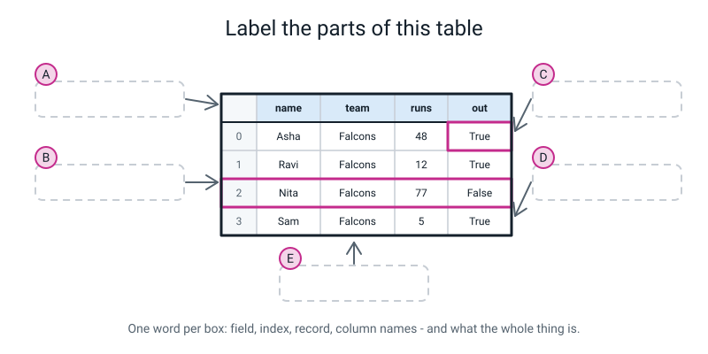
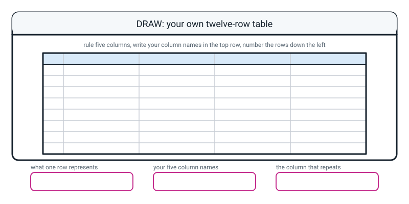

# Workbook — Week 14: One Dict Per Row: Your First Dataset in Code

**Name:** ________________________________  **Date:** ______________

[⬅ Week 13](week-13.md) · [📖 Read the chapter first](../student-guide/week-14.md) · [Course Home](../README.md) · [🧑‍🏫 Teacher guide](../teacher-guide/week-14.md) · [Next ➡](week-15.md)

---

## ✅ Warm-Up (5 min)

Five quick questions about **last week**.

**W1.** `card = {"name": "Asha", "runs": 48, "team": "Falcons"}`. What does `len(card)` say, and **what is it counting?**

________________________________________________________________

**W2.** What error do you get from `card["Runs"]`, and what are the **three usual causes** of it?

________________________________________________________________

________________________________________________________________

**W3.** The key `catches` is not on that card. What does `card["catches"]` do, and what does `card.get("catches", 0)` do?

________________________________________________________________

**W4.** You type `card["Runs"] = 51`. Does anything go wrong? What does `len(card)` say afterwards?

________________________________________________________________

**W5.** In `"team": "Falcons"`, which is the key and which is the value — and why does `48` have no quotes round it?

________________________________________________________________

---

## 🔎 Predict the Output

**Write your prediction before you run anything.** One of these looks as if it must crash, and does not.

All four use this table:

```python
rows = [
    {"city": "Pune",   "pop": 3.1, "state": "MH"},
    {"city": "Indore", "pop": 2.0, "state": "MP"},
    {"city": "Kochi",  "pop": 0.7, "state": "KL"},
]
```

### P1

```python
print(len(rows))
print(len(rows[0]))
print(rows[-1]["city"])
```

**I predict:** ____________  ____________  ____________

**It really printed:** ____________  ____________  ____________

**And the interesting bit:** the first two answers are the same number. Is that a coincidence? ______________

### P2

```python
pops = [r["pop"] for r in rows]
print(pops)
print(sum(pops))
print(len(pops))
```

**I predict:**

________________________________________________________________

**It really printed:**

________________________________________________________________

### P3

```python
for row in enumerate(rows):
    print(row)
```

**I predict — does this crash? If not, what comes out?**

________________________________________________________________

________________________________________________________________

**It really printed:**

________________________________________________________________

________________________________________________________________

### P4

```python
row = {"city": "Pune", "pop": 3.1, "state": "MH"}
print("city" in row)
print("Pune" in row)
print("pop" in row, "POP" in row)
```

**I predict:** ______  ______  ______  ______

**It really printed:** ______  ______  ______  ______

**How many of the twelve answers did you get right?** ______ / 12

**Which one surprised you most, and why?**

________________________________________________________________

---

## ✍️ Practice Set A — Read It

For A1 to A5, use the twelve-record `squad` from the chapter.

**A1. What does each expression give you, and what *kind* of thing is it?** The kinds are: **the whole table**, **one record**, **one value**, **a plain list**.

| # | Expression | What it gives | What kind of thing |
|---|---|---|---|
| a | `len(squad)` | | |
| b | `len(squad[0])` | | |
| c | `squad[4]["balls"]` | | |
| d | `squad[11]["name"]` | | |
| e | `squad[-1]["team"]` | | |
| f | `squad[0]` | | |
| g | `[r["team"] for r in squad]` | | |

**A2. Spot the bug.** This crashes. Why, and what is the exact last line of the traceback?

```python
for row in enumerate(squad):
    print(row["name"])
```

Why it fails:

________________________________________________________________

The last line of the traceback:

________________________________________________________________

The fix — write the corrected `for` line:

```python
________________________________________________________________
```

**A3. Match the code to the output.** All four run without any error.

| | Snippet | | | Output |
|---|---|---|---|---|
| a | `print([r["balls"] for r in squad][:4])` | ______ | **1** | `5` |
| b | `print(len(squad[0]))` | ______ | **2** | `Priya` |
| c | `print(squad[-1]["name"])` | ______ | **3** | `[32, 20, 55, 9]` |
| d | `print("balls" in squad[0], "Balls" in squad[0])` | ______ | **4** | `True False` |

**Snippet (d) asks about the same word twice and gets two different answers. Why?**

________________________________________________________________

**A4. Label the diagram.** Fill in the five dashed boxes A to E with the right word or phrase.


*Figure W14.1 — One table, five things to name.*

A: ____________________  B: ____________________

C: ____________________  D: ____________________

E: ____________________

**And one extra:** what is `squad[2]["runs"]` on that four-row table? ______

**A5. How many turns?** For each loop, say how many times the body runs, and what is sitting in the loop variable on the **first** turn.

| Loop | How many turns | First turn: the variable holds… |
|---|---|---|
| `for player in squad:` | | |
| `for field, value in squad[0].items():` | | |
| `for key in squad[0]:` | | |
| `for position, player in enumerate(squad):` | | |

**Two of those four loop over the same thing. Which two, and what is different about what they hand you?**

________________________________________________________________

**A6. What does one row represent?** Somebody has built a table of school bus journeys with the keys `route`, `day`, `pupils`, `minutes`, `late`. Mark each sentence **good** or **not good enough**, and say why for the ones you reject.

| Sentence | good / not good enough | Why |
|---|---|---|
| "Bus journeys." | | |
| "One journey on one route on one day." | | |
| "The school bus timetable." | | |
| "A route and how many pupils were on it." | | |
| "A day." | | |

---

## ✍️ Practice Set B — Write It

Use the twelve-record `squad` for B1 to B4.

**B1. One line, then one more.** Pull the **balls** column out with a comprehension and print its total.

```python
________________________________________________________________

________________________________________________________________
```

*Done looks like:* the whole column comes out in one line, and you did not write a `for` loop over four lines to do it.

Total balls faced: ______

**B2. Two lines.** Print every player's name and runs, one player per line, with no widths and no numbering.

```python
________________________________________________________________

________________________________________________________________
```

*Done looks like:* twelve lines out, and Dev's line reads `Dev 0` — a **measured** zero, not a missing one.

**B3. About six lines — a two-column table.** A header row saying `NAME` and `RUNS`, a dashed divider, then twelve straight rows, then another divider. Names left, numbers right.

```python
________________________________________________________________

________________________________________________________________

________________________________________________________________

________________________________________________________________

________________________________________________________________

________________________________________________________________
```

**My widths are:** name `____`  runs `____`

*Done looks like:* the `104` and the `5` have their units sitting under each other, and the header uses **exactly** the same width numbers as the rows.

**B4. About five lines — numbers that start at 1.** Print the twelve players numbered `1.` to `12.`, with the name and team beside each, then print how many rows there are.

```python
________________________________________________________________

________________________________________________________________

________________________________________________________________

________________________________________________________________

________________________________________________________________
```

**Row `1` in your printed table is which record — `squad[0]` or `squad[1]`?** ______________

**And say why in one sentence:**

________________________________________________________________

**B5. About fifteen lines — your own twelve-record dataset.** Not cricketers. Songs, journeys, dinners, matches, books, days of steps — your choice.

The rules, and I will check all four:

- **Exactly twelve records**, and `print(len(...))` must say 12
- **Five keys on every record**, spelled identically — same words, same capitals
- **At least two keys hold numbers**
- **One key is a repeating category** — 3 to 5 different values, coming round again. **And make one of those values appear exactly once.**

```python
________________________________________________________________

________________________________________________________________

________________________________________________________________

________________________________________________________________

________________________________________________________________

________________________________________________________________

________________________________________________________________

________________________________________________________________

________________________________________________________________

________________________________________________________________

________________________________________________________________

________________________________________________________________

________________________________________________________________

________________________________________________________________

________________________________________________________________
```

**My five keys:** ______________ ______________ ______________ ______________ ______________

**My two number keys:** ______________ ______________

**My repeating category is** ______________ **and its values are** ______________________________

**The value that appears only once is** ______________

---

## 🐞 Fix the Broken Program

Here is `roster.py`, which is supposed to print a numbered table of five club members. It has **three** bugs: one that stops Python reading the file at all, one that stops it partway through, and one that produces **no error whatsoever**.

```python
# roster.py - print a numbered table of five club members. Three bugs.

members = [
    {"name": "Asha",  "club": "Chess",    "years": 3}
    {"name": "Ravi",  "club": "Chess",    "years": 1},
    {"name": "Nita",  "club": "Robotics", "years": 4},
    {"name": "Kabir", "club": "Drama",    "years": 2},
    {"name": "Meera", "club": "Drama",    "years": 5},
]

print(f"{'#':>2}  {'NAME':<7}{'CLUB':<10}{'YEARS':>6}")
print("-" * 27)

for position in range(1, len(members)):
    member = members[position]
    print(f"{position:>2}  {member['name']:<7}{member['club']:<10}{member['Years']:>6}")

print("-" * 27)
print(len(members), "rows x", len(members[0]), "columns")
```

**Bug 1.** Run it as it is. The real message:

```text
  File "roster.py", line 4
    {"name": "Asha",  "club": "Chess",    "years": 3}
    ^^^^^^^^^^^^^^^^^^^^^^^^^^^^^^^^^^^^^^^^^^^^^^^^^
SyntaxError: invalid syntax. Perhaps you forgot a comma?
```

(a) Python's carets are under **line 4**, the Asha record. Is that where the mistake is? ______

(b) What is actually missing, and where?

________________________________________________________________

(c) Write the corrected line:

```python
________________________________________________________________
```

(d) **Why does Python point at the line it points at?** (One sentence.)

________________________________________________________________

**Bug 2.** Now run it again. The header prints and then:

```text
 #  NAME   CLUB       YEARS
---------------------------
Traceback (most recent call last):
  File "roster.py", line 16, in <module>
    print(f"{position:>2}  {member['name']:<7}{member['club']:<10}{member['Years']:>6}")
                                                                   ~~~~~~^^^^^^^^^
KeyError: 'Years'
```

(a) Which key could Python not find? ______________

(b) Which of last week's three usual causes was it? ______________

(c) **How many data rows printed before it stopped, and what does that tell you?**

________________________________________________________________

(d) The fix:

```python
________________________________________________________________
```

**Bug 3.** Now it runs all the way through:

```text
 #  NAME   CLUB       YEARS
---------------------------
 1  Ravi   Chess          1
 2  Nita   Robotics       4
 3  Kabir  Drama          2
 4  Meera  Drama          5
---------------------------
5 rows x 3 columns
```

**Read that output very carefully before you answer.**

(a) The last line says **5 rows**. How many rows actually printed? ______

(b) **Who is missing?** ______________

(c) Which line caused it, and what exactly is wrong with it?

________________________________________________________________

________________________________________________________________

(d) Why was there no error message at all?

________________________________________________________________

(e) **Fix it using `enumerate`** — replace the two lines at the top of the loop with one:

```python
________________________________________________________________
```

(f) Now the numbers run `0` to `4`. **Is that better or worse than `1` to `5` for a human reader — and which one agrees with `members[0]`?**

________________________________________________________________

(g) **Which of the three bugs was the hardest to find, and why?**

________________________________________________________________

---

## 🧩 Puzzle of the Week

### Coordinates

Here is the twelve-row table, printed:

```text
 #  NAME   TEAM      RUNS BALLS  OUT  
--------------------------------------
 0  Asha   Falcons     48    32  True
 1  Ravi   Falcons     12    20  True
 2  Nita   Falcons     77    55  False
 3  Sam    Falcons      5     9  True
 4  Kabir  Tigers      63    41  True
 5  Meera  Tigers      30    28  False
 6  Dev    Tigers       0     3  True
 7  Zara   Tigers      41    39  True
 8  Iqbal  Hawks       55    44  True
 9  Lena   Hawks       22    18  True
10  Omar   Hawks       90    61  False
11  Priya  Owls       104    70  False
--------------------------------------
12 rows x 5 columns
```

**Part A — write the expression.** For each cell, write the Python that gets it. There is more than one right answer for two of them.

| The cell | The expression |
|---|---|
| Nita's balls | |
| Priya's runs | |
| Dev's team | |
| The last row's name, **without using the number 11** | |
| Whether Lena was out | |

**Part B — the impossible ones.** For each, say what Python does. If it crashes, give the last line of the traceback.

| Expression | What happens |
|---|---|
| `squad[12]["name"]` | |
| `squad[3]["catches"]` | |
| `squad["Priya"]` | |
| `squad["runs"][11]` | |
| `squad[3].get("catches", 0)` | |

**Part C — what kind of thing came back?** For each expression, write **list**, **dict**, or **int**, and how long it is (if that means anything).

| Expression | Kind | Length |
|---|---|---|
| `squad` | | |
| `squad[4]` | | |
| `squad[4]["runs"]` | | |
| `[r["team"] for r in squad]` | | |

**Part D — the ragged record hunt.** Somebody hands you a **four**-record table. One record has `Team` with a capital T. One record is missing `balls` altogether. You are not allowed to read all twenty values.

Here is the one loop you are allowed to run:

```python
for position, player in enumerate(squad):
    print(position, len(player), "team" in player)
```

It prints:

```text
0 5 True
1 5 True
2 5 False
3 4 True
```

(a) Which row has the capital `Team`? ______ **How do you know?**

________________________________________________________________

(b) Which row is missing `balls`? ______ **How do you know?**

________________________________________________________________

(c) **One of those two defects would never have shown up in a printed table. Which, and why?**

________________________________________________________________

________________________________________________________________

---

## 🤔 Think Deeper

**T1.** There is **no header row.** Every record carries its own five labels, so the column names are stored twelve times instead of once. **Is that a good design or a bad one?**

Write a paragraph. Name at least two things it buys you and at least one thing it costs, and then answer the hard question: **who is supposed to notice when the twelve records stop agreeing with each other?**

________________________________________________________________

________________________________________________________________

________________________________________________________________

________________________________________________________________

________________________________________________________________

________________________________________________________________

**T2.** The same table can be stored the other way up. Instead of **rows of dicts**:

```python
squad = [{"name": "Asha", "runs": 48}, {"name": "Ravi", "runs": 12}]
```

you could store **columns of lists**:

```python
squad = {"name": ["Asha", "Ravi"], "runs": [48, 12]}
```

Neither is correct. They are good at different jobs. **Name one job each shape is better at, and say why.** Then say which one you would pick for the dataset you built tonight, and what made you pick it.

________________________________________________________________

________________________________________________________________

________________________________________________________________

________________________________________________________________

________________________________________________________________

________________________________________________________________

---

## 🛠️ Build It

### Part 1 — Twelve records of your own

- [ ] File saved as something sensible — **not** `list.py` and **not** `dict.py`
- [ ] Exactly twelve records in one list
- [ ] Five keys on every record, spelled identically
- [ ] At least two number columns
- [ ] One repeating category with 3–5 values, **one of which appears exactly once**
- [ ] Values lined up in columns **in the source code**, so a wrong entry is visible
- [ ] `print(len(...))` says 12 — checked **after** typing every batch of records

**My theme:** ______________________________

| | The key | Number or text? | Repeating category? |
|---|---|---|---|
| 1 | | | |
| 2 | | | |
| 3 | | | |
| 4 | | | |
| 5 | | | |

**`len(my_table)` says** ______  **`len(my_table[0])` says** ______

**Now check every record, not just the first one.** Run this once and write what it printed:

```python
for position, row in enumerate(my_table):
    print(position, len(row))
```

________________________________________________________________

**Were all twelve the same number?** ______ If not, which row, and what was wrong with it?

________________________________________________________________

### Part 2 — Print it as a numbered table

- [ ] A header row with all five column names
- [ ] A dashed divider above and below
- [ ] Row numbers down the left, from `enumerate`
- [ ] The header widths **match** the row widths
- [ ] A last line saying how many rows by how many columns

**Paste or copy out your first three lines of output:**

```text
________________________________________________________________

________________________________________________________________

________________________________________________________________
```

**Did it come out straight first time?** ______

**If not — which column skewed, and what did you compare to find it?**

________________________________________________________________

### Part 3 — One column out

Pull one of your **number** columns out with a comprehension and print the column, its total, and its biggest value.

```python
________________________________________________________________

________________________________________________________________

________________________________________________________________
```

| | Answer |
|---|---|
| The column | |
| Total | |
| Biggest | |
| **How many rows it came from** | |

**And the honest question: looking at your printed column of numbers, can you tell which row each number came from?** ______

**So when should you pull a column out?**

________________________________________________________________

### Part 4 — The sentence

**What does one row of your table represent?** One sentence.

________________________________________________________________

**Now check it three ways:**

(a) Is it **singular**? (Not "songs", not "journeys".) ______

(b) Does it contain the word **"and"**? ______ If yes, you probably have two things in one row. Rewrite it:

________________________________________________________________

(c) **The change test.** Name something that could change about one of your things. Would that be a **new row**, or the **same row with a different value**?

________________________________________________________________

### Part 5 — The Bug Log

**Two entries.** At least one must be a real traceback you produced yourself.

| # | What I saw (real text, or "no error") | What it meant, in my own words | What one thing I changed |
|---|---|---|---|
| 1 | | | |
| 2 | | | |

**Bonus entry — the shape two of this week's errors share.** Write the sentence:

________________________________________________________________

---

## 🎨 Draw It

Draw **your own twelve-row table**. Rule five columns, write your column names in the top row, and number the rows down the left — **starting at 0**.


*Figure W14.2 — Your page.*

> **What a good answer might look like:** the subject is **a playlist**. Five column names written into the tinted header row: `title`, `artist`, `genre`, `minutes`, `plays`. Eight of the twelve rows filled in, with the row numbers **0, 1, 2, 3, 4, 5, 6, 7** written down the left in a narrow strip outside the grid.
>
> One whole row ringed and labelled *one record — one dict*. One single cell ringed and labelled *one field*. And a bracket over the header row labelled *these are the keys, stored once per row, not once at the top*.
>
> Then a small note beside the `genre` column: *pop ×5, rock ×3, folk ×3, indie ×1 — and indie only has one*.
>
> The three bottom boxes: *one song in my playlist* · *title, artist, genre, minutes, plays* · *genre*.
>
> **What a weak answer looks like:** numbering the rows 1 to 12. That is the whole misunderstanding, drawn — because then the number next to a row **is not** the number you would use to fetch it, and every off-by-one bug in the next twenty weeks starts exactly there. If your first row is labelled 1, go back and change it.

---

## 📊 Self-Check

| I can… | 😀 got it | 🙂 nearly | 😕 not yet |
|---|---|---|---|
| Build a list of dictionaries and explain out loud why it is a table | ☐ | ☐ | ☐ |
| Loop over the records and read the same field from each one | ☐ | ☐ | ☐ |
| Test whether a key exists with `in` before using it | ☐ | ☐ | ☐ |
| Write a one-line comprehension that pulls one column out | ☐ | ☐ | ☐ |
| Print an aligned table with a position number beside every row | ☐ | ☐ | ☐ |
| Reach one cell with two lookups in the right order | ☐ | ☐ | ☐ |
| Say in one sentence what one row of my own table represents | ☐ | ☐ | ☐ |

**True or false?** Circle one on each row.

| Statement | | |
|---|---|---|
| A list-of-dicts has a header row at the top | TRUE | FALSE |
| `len(squad)` is the number of columns | TRUE | FALSE |
| `squad["runs"]` gives you the runs column | TRUE | FALSE |
| `squad[0]["runs"]` and `squad["runs"][0]` do the same thing | TRUE | FALSE |
| `"Asha" in squad[0]` is `True` | TRUE | FALSE |
| `enumerate` starts at 1 | TRUE | FALSE |
| `enumerate` needs two names on the `for` line | TRUE | FALSE |
| A comprehension keeps the labels | TRUE | FALSE |
| `list indices must be integers` and `tuple indices must be integers` are the same complaint | TRUE | FALSE |
| If the table prints straight, the twelve records must all match | TRUE | FALSE |

One thing I'd like explained again:

________________________________________________________________

---

## ✅ Answers

<details>
<summary>Check your answers</summary>

### Warm-Up

**W1.** `3`. It counts **key-value pairs** — three labels, three facts, three pairs. Not 6.

**W2.** `KeyError: 'Runs'`. The three usual causes are **a typo**, **a plural**, and **a capital letter** — and this one is a capital letter.

**W3.** `card["catches"]` **stops the program** with `KeyError: 'catches'`. `card.get("catches", 0)` hands back `0` and keeps going. Same missing key, and which behaviour you get is your choice.

**W4.** **Nothing goes wrong** as far as Python is concerned, and that is the problem. `Runs` and `runs` are different labels, so a **new** pair is created and `runs` is untouched. `len(card)` goes from 3 to **4** — and that count is the only clue you get.

**W5.** `team` is the **key**, `Falcons` is the **value**. `48` has no quotes because it is a **number**; quotes would make it the *text* four-eight, which you cannot add up.

---

### Predict the Output

**P1** — real output:

```text
3
3
Kochi
```

**Yes, it is a coincidence.** `len(rows)` is 3 because there are three **records**; `len(rows[0])` is 3 because the first record has three **fields**. The two numbers happen to match here and they mean completely different things. Add a fourth city and the first becomes 4 while the second stays 3 — which is a very good way to check you understand it. And `rows[-1]` is the last row, from Week 11.

**P2** — real output:

```text
[3.1, 2.0, 0.7]
5.8
3
```

The comprehension gives you a plain list of three numbers, so `sum` and `len` work again. **And notice what is gone:** nothing in `[3.1, 2.0, 0.7]` says which city each number belongs to.

**P3** — real output, and **it does not crash**:

```text
(0, {'city': 'Pune', 'pop': 3.1, 'state': 'MH'})
(1, {'city': 'Indore', 'pop': 2.0, 'state': 'MP'})
(2, {'city': 'Kochi', 'pop': 0.7, 'state': 'KL'})
```

**This is the most useful snippet on the page.** With one name on the `for` line, `enumerate` hands you the whole **bundle** — round brackets, a number, a comma, a record — and printing it is perfectly legal. It only breaks the moment you try `row["city"]`, because a bundle is counted, not labelled.

**So: when you do not understand what something is, print it.** That habit is worth more than any error message.

**P4** — real output:

```text
True
False
True False
```

`"Pune" in row` is **`False`**, even though Pune is right there. **`in` checks the KEYS, not the values.** `Pune` is a value stored under the label `city`; there is no label called `Pune`. And `"POP"` is a different label from `"pop"` — capital letters count everywhere.

---

### Practice Set A

**A1.** Real output of all seven:

```text
12
5
41
Priya
Owls
{'name': 'Asha', 'team': 'Falcons', 'runs': 48, 'balls': 32, 'out': True}
['Falcons', 'Falcons', 'Falcons', 'Falcons', 'Tigers', 'Tigers', 'Tigers', 'Tigers', 'Hawks', 'Hawks', 'Hawks', 'Owls']
```

| # | Expression | What it gives | What kind of thing |
|---|---|---|---|
| a | `len(squad)` | `12` | a count of **rows** |
| b | `len(squad[0])` | `5` | a count of **columns** (fields in row 0) |
| c | `squad[4]["balls"]` | `41` | **one value** |
| d | `squad[11]["name"]` | `Priya` | **one value** |
| e | `squad[-1]["team"]` | `Owls` | **one value** — `-1` is the last row |
| f | `squad[0]` | the whole first dictionary | **one record** |
| g | `[r["team"] for r in squad]` | twelve team names | **a plain list** |

**Mark (g) properly.** It has twelve items and **not one of them knows whose team it is.** `Falcons` appears four times and you cannot tell Asha's from Sam's.

**A2.** Real traceback:

```text
Traceback (most recent call last):
  File "squad.py", line 20, in <module>
    print(row["name"])
          ~~~^^^^^^^^
TypeError: tuple indices must be integers or slices, not str
```

**Why it fails:** `enumerate` hands you a **pair** — a bundle of the position and the record — not the record itself. A pair, like a list, is **counted, not labelled**, so asking it for `["name"]` is meaningless.

The fix:

```python
for position, player in enumerate(squad):
```

**A3.** a→**3** · b→**1** · c→**2** · d→**4**

Real output, in order: `[32, 20, 55, 9]`, `5`, `Priya`, `True False`.

**Why (d) gives two different answers for the same word:** because they are **not** the same word. `balls` and `Balls` are two different labels, and capital letters count. `in` is doing exactly what it is told, twice, and getting a different answer each time because it was asked about two different things.

**A4.**

- **A** — the **header row** / **the column names** (which are the keys)
- **B** — the **index column** / **the row numbers** (0, 1, 2, 3)
- **C** — **one field** (the single ringed cell)
- **D** — **one record** (the whole ringed row)
- **E** — the **list-of-dicts** / **the table**

**And the extra:** `squad[2]["runs"]` on that four-row table is **`77`** — row 2 is Nita, and Nita made 77. If you said 12, you counted from 1.

**A5.**

| Loop | How many turns | First turn: the variable holds… |
|---|---|---|
| `for player in squad:` | **12** | the whole first **record** (a dict) |
| `for field, value in squad[0].items():` | **5** | `field` = `"name"`, `value` = `"Asha"` |
| `for key in squad[0]:` | **5** | the word `"name"` — just the **key** |
| `for position, player in enumerate(squad):` | **12** | `position` = `0`, `player` = the first record |

Checked by counting:

```text
loop over squad      : 12 turns
loop over squad[0]   : 5 turns
loop over squad[0] raw: 5 turns
```

**The two that loop over the same thing are rows 2 and 3** — both go over one record, five turns each. The difference is what they hand you: `.items()` gives you **the label and the value**; looping over a dictionary bare gives you **only the label**, and you then have to fetch the value yourself. Which is why `for player in squad[0]:` gives that baffling `string indices must be integers` message — `player` is the word `"name"`.

**A6.**

| Sentence | Verdict | Why |
|---|---|---|
| "Bus journeys." | **not good enough** | Plural. A row is not the collection; it is **one member** of it |
| "One journey on one route on one day." | **good** | Singular, and it names exactly what makes one row different from another |
| "The school bus timetable." | **not good enough** | That is the **whole table**, not a row |
| "A route and how many pupils were on it." | **not good enough** | The word **"and"** is the tell. Press it: if forty pupils get on tomorrow, is that a new row or the same row? *(A new row — so the row is a journey, and pupils is one of its fields.)* |
| "A day." | **not good enough, and interestingly so** | If two buses run on Tuesday, how many rows? *(Two. So a row is a journey, not a day.)* |

---

### Practice Set B

**B1.**

```python
all_balls = [r["balls"] for r in squad]
print(all_balls)
print("total balls faced:", sum(all_balls))
```

```text
[32, 20, 55, 9, 41, 28, 3, 39, 44, 18, 61, 70]
total balls faced: 420
```

**Hand check:** 32 + 20 = 52 · +55 = 107 · +9 = 116 · +41 = 157 · +28 = 185 · +3 = 188 · +39 = 227 · +44 = 271 · +18 = 289 · +61 = 350 · +70 = **420** ✔

**B2.**

```python
for player in squad:
    print(player["name"], player["runs"])
```

```text
Asha 48
Ravi 12
Nita 77
Sam 5
Kabir 63
Meera 30
Dev 0
Zara 41
Iqbal 55
Lena 22
Omar 90
Priya 104
```

**Look at Dev's line: `Dev 0`.** That zero is a **measurement** — he faced three balls and was out without scoring. Next week you will have to tell that apart from a zero somebody typed in because a field was missing, and once they are both printed as `0` you cannot.

**B3.**

```python
print(f"{'NAME':<7}{'RUNS':>5}")
print("-" * 12)
for player in squad:
    print(f"{player['name']:<7}{player['runs']:>5}")
print("-" * 12)
```

```text
NAME    RUNS
------------
Asha      48
Ravi      12
Nita      77
Sam        5
Kabir     63
Meera     30
Dev        0
Zara      41
Iqbal     55
Lena      22
Omar      90
Priya    104
------------
```

**Mark:** the header uses `:<7` and `:>5`, **exactly** what the rows use. The divider is 7 + 5 = **12** characters. And the `104`, the `5` and the `0` all have their units in the same column, because numbers are pushed **right**.

`:<7` is wide enough because the longest name here is `Kabir` — five characters — with room to spare. **The width has to fit your longest value**, and you pick it by looking at your own data.

**B4.**

```python
for position, player in enumerate(squad, start=1):
    print(f"{position:>2}. {player['name']:<7}{player['team']:<9}")
print("rows:", len(squad))
print("row 1 is", squad[0]["name"], "- the printed number is not the position")
```

```text
 1. Asha   Falcons  
 2. Ravi   Falcons  
 3. Nita   Falcons  
 4. Sam    Falcons  
 5. Kabir  Tigers   
 6. Meera  Tigers   
 7. Dev    Tigers   
 8. Zara   Tigers   
 9. Iqbal  Hawks    
10. Lena   Hawks    
11. Omar   Hawks    
12. Priya  Owls     
rows: 12
row 1 is Asha - the printed number is not the position
```

**Row `1` is `squad[0]`.** `start=1` changed **the number that gets printed**, not the position in the list. Priya is printed as `12` and she is still `squad[11]`. If you ever use `start=1` and then use the printed number to fetch a row, you will be exactly one row out on every single one of them.

**B5.** One complete model answer, actually run:

```python
# playlist.py - twelve songs, five keys each, printed as a numbered table

playlist = [
    {"title": "Blue Lights",   "artist": "Nova",  "genre": "pop",   "minutes": 3.5, "plays": 120},
    {"title": "Rain Check",    "artist": "Kabir", "genre": "rock",  "minutes": 4.2, "plays": 45},
    {"title": "Ghost Town",    "artist": "Nova",  "genre": "pop",   "minutes": 2.8, "plays": 300},
    {"title": "Slow Train",    "artist": "Meera", "genre": "folk",  "minutes": 5.1, "plays": 60},
    {"title": "Neon Streets",  "artist": "Kabir", "genre": "rock",  "minutes": 3.9, "plays": 210},
    {"title": "Paper Boats",   "artist": "Nova",  "genre": "pop",   "minutes": 3.3, "plays": 95},
    {"title": "Late Bus",      "artist": "Ravi",  "genre": "pop",   "minutes": 2.9, "plays": 180},
    {"title": "Monsoon",       "artist": "Meera", "genre": "folk",  "minutes": 4.6, "plays": 75},
    {"title": "Static",        "artist": "Kabir", "genre": "rock",  "minutes": 3.1, "plays": 130},
    {"title": "Corner Shop",   "artist": "Ravi",  "genre": "pop",   "minutes": 3.7, "plays": 220},
    {"title": "Long Way Home", "artist": "Meera", "genre": "folk",  "minutes": 5.4, "plays": 40},
    {"title": "Kite Season",   "artist": "Nova",  "genre": "indie", "minutes": 4.0, "plays": 65},
]

FIELDS = ["title", "artist", "genre", "minutes", "plays"]

print("rows   :", len(playlist))
print("columns:", len(playlist[0]))
print()

print(f"{'#':>2}  {'TITLE':<15}{'ARTIST':<8}{'GENRE':<6}{'MINS':>5}{'PLAYS':>7}")
print("-" * 45)
for position, song in enumerate(playlist):
    print(f"{position:>2}  {song['title']:<15}{song['artist']:<8}{song['genre']:<6}"
          f"{song['minutes']:>5.1f}{song['plays']:>7}")
print("-" * 45)
print(f"{len(playlist)} rows x {len(FIELDS)} columns")

all_plays = [s["plays"] for s in playlist]
print()
print("plays column:", all_plays)
print("total plays :", sum(all_plays))
print("most played :", max(all_plays))
```

```text
rows   : 12
columns: 5

 #  TITLE          ARTIST  GENRE  MINS  PLAYS
---------------------------------------------
 0  Blue Lights    Nova    pop     3.5    120
 1  Rain Check     Kabir   rock    4.2     45
 2  Ghost Town     Nova    pop     2.8    300
 3  Slow Train     Meera   folk    5.1     60
 4  Neon Streets   Kabir   rock    3.9    210
 5  Paper Boats    Nova    pop     3.3     95
 6  Late Bus       Ravi    pop     2.9    180
 7  Monsoon        Meera   folk    4.6     75
 8  Static         Kabir   rock    3.1    130
 9  Corner Shop    Ravi    pop     3.7    220
10  Long Way Home  Meera   folk    5.4     40
11  Kite Season    Nova    indie   4.0     65
---------------------------------------------
12 rows x 5 columns

plays column: [120, 45, 300, 60, 210, 95, 180, 75, 130, 220, 40, 65]
total plays : 1540
most played : 300
```

**Hand check on the total:** 120 + 45 = 165 · +300 = 465 · +60 = 525 · +210 = 735 · +95 = 830 · +180 = 1010 · +75 = 1085 · +130 = 1215 · +220 = 1435 · +40 = 1475 · +65 = **1540** ✔

**The five things to check, in this order:**

1. **Exactly twelve records.** `print(len(playlist))` says 12.
2. **All five keys on every record, spelled identically.** Read **down** the keys of all twelve, not across one. A stray capital here costs twenty minutes next week.
3. **At least two numeric columns.** Here, `minutes` and `plays`.
4. **A repeating category with 3–5 values, one of which appears once.** Here `genre`: pop ×5, rock ×3, folk ×3, **indie ×1**. If every value in that column is unique, the whole of next week has nothing to work on.
5. **`minutes` uses `:>5.1f`, not `:>5`.** A plain `:>5` would print a whole number like `4` as `4` and the column would go ragged. The `.1f` forces one decimal place on every value.

---

### Fix the Broken Program

**Bug 1 — a missing comma.**

(a) **No.** The mistake is not on line 4.

(b) A **comma** is missing after the closing `}` of the **Asha** record. Twelve records need eleven commas between them; five records need four.

(c)

```python
    {"name": "Asha",  "club": "Chess",    "years": 3},
```

(d) Python only notices when it reads the **next** thing and finds a `{` where it expected a comma or a `]`. So the carets land on the record **before** the one it choked on. **When a `SyntaxError` points at something that looks fine, look at the end of the line above.**

**Bug 2 — a capital letter.**

(a) `Years`. (b) **A capital letter** — the records say `years`, small y.

(c) **Zero data rows printed.** The header and the divider printed, then it died on the very first trip round the loop. **That tells you the problem is in every row, not in one bad record** — if only row 3 were broken, three rows would have printed first. The count is a clue.

(d)

```python
    print(f"{position:>2}  {member['name']:<7}{member['club']:<10}{member['years']:>6}")
```

**Bug 3 — the silent one.**

(a) **Four** data rows printed. The last line claims **5 rows**.

(b) **Asha.** Row 0.

(c) The line `for position in range(1, len(members)):`. `range(1, 5)` gives `1, 2, 3, 4` — it **starts at 1**, so `members[0]` is never fetched. Somebody wanted the printed numbers to start at 1 and changed the wrong thing: they moved the **start of the range** instead of the **number printed**.

(d) **Because nothing is wrong as far as Python is concerned.** `range(1, 5)` is a perfectly legal range, `members[1]` is a perfectly legal row, and every line that printed is correct. The mistake is not in any line — it is in **which rows the program decided to visit**, and only a human who knows Asha exists can see that.

(e)

```python
for position, member in enumerate(members):
```

The whole thing fixed, run:

```text
 #  NAME   CLUB       YEARS
---------------------------
 0  Asha   Chess          3
 1  Ravi   Chess          1
 2  Nita   Robotics       4
 3  Kabir  Drama          2
 4  Meera  Drama          5
---------------------------
5 rows x 3 columns
```

**Five rows, and the last line says five.** They agree now.

(f) `1` to `5` is friendlier for a human reader, and `0` to `4` is the one that **agrees with `members[0]`**. If you want both, use `enumerate(members, start=1)` — that changes the number printed and leaves the position alone. What you must never do is change which rows you visit in order to make the numbers look nicer, which is exactly what bug 3 was.

(g) **Bug 3, and it is not close.** Bugs 1 and 2 stopped the program and named the exact line or the exact key. Bug 3 printed a complete, straight, confident table with a person missing from it, and even told you the wrong row count in its own summary. **The error message is not the enemy. The silent wrong answer is.**

---

### Puzzle of the Week

**Part A.**

| The cell | The expression |
|---|---|
| Nita's balls | `squad[2]["balls"]` → `55` |
| Priya's runs | `squad[11]["runs"]` → `104` |
| Dev's team | `squad[6]["team"]` → `Tigers` |
| The last row's name, without using 11 | `squad[-1]["name"]` → `Priya`. Also fine: `squad[len(squad) - 1]["name"]` |
| Whether Lena was out | `squad[9]["out"]` → `True` |

`squad[-1]` is the better answer for the fourth one and worth saying why: it stays correct when you add a thirteenth player. `squad[11]` does not.

**Part B.**

| Expression | What happens |
|---|---|
| `squad[12]["name"]` | **crashes** — `IndexError: list index out of range`. Twelve rows are numbered 0 to 11 |
| `squad[3]["catches"]` | **crashes** — `KeyError: 'catches'`. There is no such field |
| `squad["Priya"]` | **crashes** — `TypeError: list indices must be integers or slices, not str`. You treated the list like a dictionary |
| `squad["runs"][11]` | **crashes** — same `TypeError`. It fails on the **first** bracket and never reaches the `[11]` |
| `squad[3].get("catches", 0)` | **prints `0`** — `.get` on a record with a fallback. No crash |

The real traceback for the first one:

```text
Traceback (most recent call last):
  File "squad.py", line 16, in <module>
    print(squad[12]["name"])
          ~~~~~^^^^
IndexError: list index out of range
```

**Note where the carets are:** under `[12]`, not under `["name"]`. Python tells you **which of the two lookups** failed, which saves you guessing.

**Part C.** Real output:

```text
list 12
dict 5
int 63
list 12
```

| Expression | Kind | Length |
|---|---|---|
| `squad` | **list** | 12 — the rows |
| `squad[4]` | **dict** | 5 — the fields of one record |
| `squad[4]["runs"]` | **int** | length means nothing for a number |
| `[r["team"] for r in squad]` | **list** | 12 — one team name per row, and no names attached |

**The pattern worth seeing:** you started with a list, one lookup gave you a dict, and a second lookup gave you a plain number. **Each lookup takes you one layer in**, and each layer is a different kind of thing.

**Part D.**

(a) **Row 2.** Its `len` is 5, so it has all five fields — but `"team" in player` came back **`False`**, which means one of its five labels is not `team`. It is `Team`.

(b) **Row 3.** Its `len` is **4**, not 5, so a whole pair is missing. And `"team" in player` is `True`, so the missing one is not `team` — it is `balls`.

(c) **The capital `Team` on row 2 would never have shown up in a printed table** — as long as you never printed the team column. `len` still says 5, so the count check misses it too; the only thing that finds it is asking about the **label** itself.

Row 3's missing `balls` is much safer, oddly, because it is **loud**: `len` is 4, and the moment anything asks for `player["balls"]` it crashes with a `KeyError` that names the field.

**Which gives you the rule:** a bug that crashes is a bug you will fix today. A bug that quietly changes a label is a bug you fix in Week 34, at midnight, when the numbers do not add up and you have no idea why.

---

### Think Deeper

**T1. Model answer:**

> It buys three things and I think all three are real. **A row can never lose its column names**, because they are stuck to it — I can pull one record out, hand it to somebody, print it on its own, and it still means something. **I can shuffle the rows and lose nothing**, because there is no top row that has to stay at the top. And **I can add a field to one record** without touching the other eleven, which is exactly what I did when I added `strike_rate`.
>
> What it costs is that the five labels are stored twelve times, so **there is no single place to correct a typo**. If one card says `Team`, I cannot fix the header, because there is no header. I have to find that one record. And storing the same five words twelve times is genuinely wasteful — with a hundred thousand rows it would be the biggest thing in the file.
>
> The hard question is the interesting one: **nobody is supposed to notice.** There is nothing anywhere in the data that says *"these are the five columns"* — only twelve records that happen to agree, and Python will not complain the day one of them stops agreeing. `len(squad[0])` cannot help, because it only looks at row 0. So the checking has to be **mine**, deliberately, in a loop — `len(row)` and `"team" in row` on every record — and it has to be a habit rather than something I remember when I am suspicious. That is uncomfortable, and I think it is the honest answer.

*Full marks needs:* at least two benefits · at least one cost · and the recognition that **the consistency is not enforced by anything**, so a person has to check it.

**T2. Model answer:**

> **Rows of dicts win when I am handling one thing at a time.** Adding a new song is one line at the bottom. Deleting one is one row gone. Checking whether one record is complete is one `len`. And if I want to send one song's details somewhere, it is already a self-contained package with its labels on.
>
> **Columns of lists win when I am doing arithmetic on a whole column.** All the play counts are already sitting together in one list, so `sum(playlist["plays"])` works immediately — I do not have to go and collect twelve numbers out of twelve separate places first. That is exactly what my comprehension was doing, and with columns-of-lists the comprehension is not needed at all.
>
> I would pick **rows of dicts** for the playlist I built tonight, because I typed it one song at a time, by hand, and I will add songs to it one at a time. The shape matched the job. But if the job were "average the play counts of ten thousand songs", columns would clearly be better — the numbers would already be together.
>
> And I think that is the actual answer to the question: **the shape should match the question you ask most often**, which means it can be right today and wrong in a month, and neither of those is a mistake.

*Full marks needs:* one genuine job for each shape · the reason (one-thing-at-a-time versus whole-column arithmetic) · and a choice with a reason rather than a preference.

**Worth knowing, and a fair thing to add:** professional systems use **both, deliberately**. Databases that record things as they happen tend to be row-oriented; systems built for analysing millions of rows tend to be column-oriented. And pandas, which arrives in Week 21, is **column**-oriented underneath while pretending to be a row-and-column grid on the surface — which is precisely why `df["runs"]` works there and `squad["runs"]` fails here.

---

### Build It

**Part 1.** All twelve `len(row)` values must be **the same number**. Run the check loop; do not eyeball it. The three commonest defects, in order of how often they happen:

1. **A capital letter on one label.** `Genre` on record three. **`len` will not find this** — it is still 5. Only `"genre" in row` finds it.
2. **A plural on one label.** `minute` instead of `minutes`. Same story.
3. **A missing pair**, almost always on record eleven or twelve, because that is where concentration runs out. This one `len` **does** find.

And a fourth that is worse than all three: **two records merged into one** because a `},` went missing while typing. Then `len(my_table)` says 11 and you have lost a whole row. **That is why you print the row count after every batch.**

**Part 2.** If it came out crooked, the fix is never to add spaces by hand inside the strings. Hand-tuning looks like it is working for about four rows and then collapses the moment one value is longer than the others. **Put the header f-string directly above the row f-string and compare the width numbers character by character.** They must match exactly.

**Part 3.** Model answers, on the playlist above:

```python
all_plays = [s["plays"] for s in playlist]
print("plays column:", all_plays)
print("total plays :", sum(all_plays))
print("most played :", max(all_plays))
```

```text
plays column: [120, 45, 300, 60, 210, 95, 180, 75, 130, 220, 40, 65]
total plays : 1540
most played : 300
```

| | Answer |
|---|---|
| The column | `[120, 45, 300, 60, 210, 95, 180, 75, 130, 220, 40, 65]` |
| Total | `1540` |
| Biggest | `300` |
| **How many rows it came from** | **12** |

**No, you cannot tell which row each number came from.** `300` is Ghost Town only because you can count to the third item; nothing in the list says so, and if you sorted it you would have no idea at all.

**So pull a column out late** — immediately before you do arithmetic on it, and not one line earlier. Everything you want to *say about a row* has to be said while you are still holding the row.

**Part 4.** Full marks — each names **one** of **one kind of thing**:

> *"One song in my playlist."*
> *"One journey to school on one day."*
> *"One meal I ate, on one date."*
> *"One match my team played."*

Not full marks, and each one is worth a conversation:

> *"Songs."* — plural. A row is not the collection.
> *"My playlist."* — that is the whole table.
> *"A song and how many times I played it."* — the **"and"** is the tell. Press: *"if you play it ten more times tonight, is that a new row or the same row?"* (The same row with a bigger number — so the row is the **song**, and plays is one of its fields.)
> *"A day."* — ambiguous, and the interesting kind. Press: *"if you took two journeys on Tuesday, how many rows?"* (Two. So a row is a **journey**, not a day.)

**This single sentence is the most valuable thing on the page.** A student who can say what one row is will build a clean dataset in Week 34. A student who cannot will build one with two things per row and lose a weekend to it.

**Part 5.** Two model Bug Log entries:

| # | What I saw (real text) | What it meant, in my words | What I changed |
|---|---|---|---|
| 1 | `TypeError: list indices must be integers or slices, not str` | I asked the **list** for a label. `squad` is a list and its brackets want a number; only the dictionaries inside it have labels. | `squad[0]["runs"]` — index first, key second |
| 2 | `TypeError: tuple indices must be integers or slices, not str` | `enumerate` handed me a **pair**, not a record, and a pair is counted rather than labelled. Printing it showed me: `(0, {...})`. | Two names on the `for` line: `for position, player in enumerate(squad):` |

**The bonus entry — the shape they share:**

> *"`list indices must be integers` and `tuple indices must be integers` are the same complaint. I asked a **counted** thing for a **label**. Lists and pairs count. Only dictionaries label."*

Noticing that two error messages are one idea is worth more than either fix, because next time you will recognise the family before you read the details.

---

### Draw It

There is no single right drawing. A strong answer does four things:

1. **The row numbers start at 0.** If the first row is labelled 1, the drawing has the misunderstanding in it, and every off-by-one bug for the next twenty weeks starts there.
2. **One whole row is ringed and named a record**, and **one single cell is ringed and named a field.** Two different rings, two different labels. If only one thing is ringed, the drawing has not distinguished them.
3. **The header row is labelled as the keys, stored once per row.** A bracket and a note. Drawing a header row and *not* saying that is drawing a spreadsheet, which is close but is not what you built.
4. **The repeating category is marked**, with its counts, and the value that appears only once called out. That is next week's punchline sitting in your own data, and spotting it a week early is genuinely good work.

Test your own drawing with one question: **cover the header row. Can somebody still tell what the third column means?** In a spreadsheet, no. In your list-of-dicts, **yes** — because every record carries its own labels. If your drawing does not show that, it is missing the one thing that makes this shape different.

---

### Self-Check answers

| Statement | Answer |
|---|---|
| A list-of-dicts has a header row at the top | **FALSE.** There is no header row. Every record carries its own labels |
| `len(squad)` is the number of columns | **FALSE.** Rows. `len(squad[0])` is columns |
| `squad["runs"]` gives you the runs column | **FALSE.** `TypeError` — lists count, they do not label. That arrives in Week 21 |
| `squad[0]["runs"]` and `squad["runs"][0]` do the same thing | **FALSE.** The second one fails on the first bracket. The list index comes first |
| `"Asha" in squad[0]` is `True` | **FALSE.** `in` checks the keys. `Asha` is a value |
| `enumerate` starts at 1 | **FALSE.** It starts at 0, so that it agrees with `squad[0]` |
| `enumerate` needs two names on the `for` line | **TRUE.** One name gets you a pair you cannot index by label |
| A comprehension keeps the labels | **FALSE.** It throws every one of them away |
| `list indices must be integers` and `tuple indices must be integers` are the same complaint | **TRUE.** A counted thing was asked for a label |
| If the table prints straight, the twelve records must all match | **FALSE.** The table only shows what you asked it to show. A capital `Team` prints perfectly if you never print that column |

</details>

---

[⬅ Week 13 workbook](week-13.md) · [📖 Week 14 chapter](../student-guide/week-14.md) · [Course Home](../README.md) · [Week 15 workbook ➡](week-15.md) · [Glossary](../../glossary.md)
