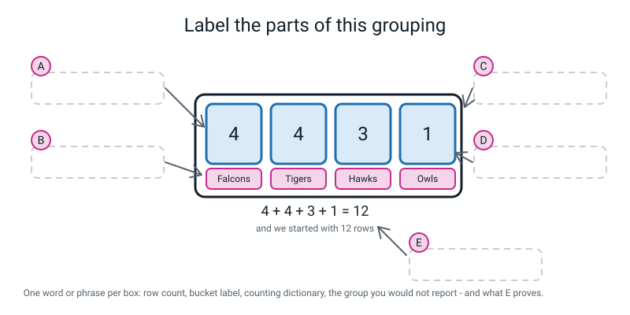
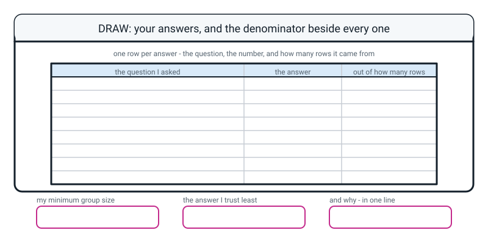

# Workbook — Week 15: Filter It, Group It, Count It

**Name:** ________________________________  **Date:** ______________

[⬅ Week 14](week-14.md) · [📖 Read the chapter first](../student-guide/week-15.md) · [Course Home](../README.md) · [🧑‍🏫 Teacher guide](../teacher-guide/week-15.md) · [Next ➡](week-16.md)

---

## ✅ Warm-Up (5 min)

Five quick questions about **last week**.

**W1.** `squad` is a list of twelve dictionaries with five keys each. What does `len(squad)` say, and what does `len(squad[0])` say?

________________________________________________________________

**W2.** Write the line that prints the runs of the **last** row, without using the number 11.

```python
________________________________________________________________
```

**W3.** `"Asha" in squad[0]` is `False`, even though Asha is in that record. Why?

________________________________________________________________

**W4.** Write the one-line comprehension that pulls the `runs` column out as a plain list. **And say what it throws away.**

```python
________________________________________________________________
```

It throws away: ________________________________________________

**W5.** `for row in enumerate(squad):` with **one** name on the `for` line. What is `row` on the first turn, and what error do you get if you write `row["name"]`?

________________________________________________________________

---

## 🔎 Predict the Output

**Write your prediction before you run anything.** Two of these four give you a **wrong answer with no error message at all**, so "what do you expect" is not the same as "will it crash".

### P1

```python
songs = [
    {"title": "Blue Lights", "genre": "pop"},
    {"title": "Rain Check",  "genre": "rock"},
    {"title": "Ghost Town",  "genre": "pop"},
    {"title": "Static",      "genre": "rock"},
    {"title": "Late Bus",    "genre": "pop"},
]

counts = {}
for song in songs:
    bucket = song["genre"]
    counts[bucket] = counts.get(bucket, 0) + 1

print(counts)
print(sum(counts.values()), "of", len(songs))
```

**I predict:**

________________________________________________________________

**It really printed:**

________________________________________________________________

### P2

```python
counts = {"apple": 5, "banana": 9, "cherry": 2}
print(max(counts))
print(max(counts, key=counts.get))
print(max(counts.values()))
```

**I predict:** ____________  ____________  ____________

**It really printed:** ____________  ____________  ____________

**Three lines that all look like "the biggest". Say in one sentence what each one is actually the biggest *of*.**

________________________________________________________________

________________________________________________________________

### P3

```python
rows = [
    {"name": "Asha", "runs": 48},
    {"name": "Dev",  "runs": 0},
    {"name": "Omar", "runs": 90},
]
big = [r for r in rows if r["runs"] > 40]
print(len(big))
print(len(rows))
print([r["name"] for r in big])
```

**I predict:** ____________  ____________  ____________

**It really printed:** ____________  ____________  ____________

### P4

```python
counts = {}
for team in ["Falcons", "Falcons", "Tigers"]:
    counts[team] = counts.get(team) + 1
print(counts)
```

**Look very carefully at that fourth line. I predict:**

________________________________________________________________

**It really printed:**

________________________________________________________________

**How many of the nine answers did you get right?** ______ / 9

**Which one surprised you most, and why?**

________________________________________________________________

---

## ✍️ Practice Set A — Read It

**A1. Filter or group?** For each question, say which it is and what **shape** the answer has.

| # | Question | filter or group? | What comes back |
|---|---|---|---|
| a | "Show me the Tigers." | | |
| b | "How many players per team?" | | |
| c | "Who scored more than 50?" | | |
| d | "How many got out, and how many didn't?" | | |
| e | "What's the Hawks' average?" | | |
| f | "Which team is biggest?" | | |

**A1(g) What is the one thing a filter changes, and the one thing it never changes?**

________________________________________________________________

**A1(h) After `tigers = filter_by(squad, "team", "Tigers")`, what does `len(squad)` say?** ______  **Why?**

________________________________________________________________

**A2. Spot the bug.** This crashes on the very first row.

```python
rows = [{"team": "Falcons"}, {"team": "Falcons"}, {"team": "Tigers"}]
counts = {}
for r in rows:
    counts[r["team"]] += 1
print(counts)
```

The exact last line of the traceback:

________________________________________________________________

**Why does it fail on the *first* row rather than later?**

________________________________________________________________

The fix — write the corrected line:

```python
________________________________________________________________
```

**A3. Match the code to the output.** All four use this four-row table:

```python
rows = [
    {"name": "Asha", "team": "Falcons", "runs": 48},
    {"name": "Dev",  "team": "Tigers",  "runs": 0},
    {"name": "Omar", "team": "Hawks",   "runs": 90},
    {"name": "Zara", "team": "Tigers",  "runs": 41},
]
```

| | Snippet | | | Output |
|---|---|---|---|---|
| a | `print(len([r for r in rows if r["runs"] > 40]))` | ______ | **1** | `{'Falcons': 1, 'Tigers': 2, 'Hawks': 1}` |
| b | `print(sum([r["runs"] for r in rows]))` | ______ | **2** | `Tigers` |
| c | a `group_count` on `"team"` | ______ | **3** | `3` |
| d | `max(counts, key=counts.get)` on that result | ______ | **4** | `179` |

**Do the counts in (c) add up to the number of rows?** ______ **Check it:** ______ + ______ + ______ = ______

**A4. Label the diagram.** Fill in the five dashed boxes A to E.


*Figure W15.1 — One grouping, five things to name.*

A: ____________________  B: ____________________

C: ____________________  D: ____________________

E: ____________________

**And one extra: which of the four buckets would you refuse to report an average for, and why?**

________________________________________________________________

**A5. Trace the counting dictionary.** Do `group_count(squad, "team")` by hand for the first six records. **Fill in every cell.**

| Turn | record | `bucket` | `counts.get(bucket, 0)` | `counts` afterwards |
|---|---|---|---|---|
| 1 | Asha | | | |
| 2 | Ravi | | | |
| 3 | Nita | | | |
| 4 | Sam | | | |
| 5 | Kabir | | | |
| 6 | Meera | | | |

**After all twelve:** ______________________________________________

**Add the four counts up.** ______ + ______ + ______ + ______ = ______

**And `len(squad)` is** ______. **Why does it matter that those two match?**

________________________________________________________________

**A6. Every answer needs its denominator.** Each of these is a real sentence somebody might write. Mark it **honest** or **not honest enough**, and fix the ones that need it.

| The sentence | honest? | The fix |
|---|---|---|
| "The Owls average 104 runs." | | |
| "Five of the twelve players scored more than fifty." | | |
| "Falcons are the biggest team." | | |
| "The Hawks average 55.67 runs, from 3 players." | | |
| "Average spend is 41.67 rupees a day." | | |

---

## ✍️ Practice Set B — Write It

Use the twelve-record `squad` for B1 to B4.

**B1. Two lines.** Print the names of everybody who faced **more than 40 balls**, and how many of them there are out of how many.

```python
________________________________________________________________

________________________________________________________________
```

*Done looks like:* the second line says `___ of 12`, not just a bare number.

Names: ______________________________________  Count: ______ of ______

**B2. Three lines — write `filter_by` yourself.** The key **and** the value both come in as arguments, so the same function works on any table.

```python
def filter_by(________, ________, ________):
    """________________________________________________"""
    return ________________________________________________
```

**Now prove it is a tool and not an answer.** Write two calls that use it on **completely different** tables:

```python
________________________________________________________________

________________________________________________________________
```

**B3. Six lines — write `group_count` yourself.** From memory if you can.

```python
def group_count(________, ________):
    """________________________________________________"""
    ________________________________________________

    for ________ in ________:
        ________________________________________________
        ________________________________________________

    return ________
```

**Then the check, on the line after you call it:**

```python
________________________________________________________________
```

*Done looks like:* the key is an **argument**, `.get(bucket, 0)` is in there, and you printed the sum check without being asked twice.

**B4. About six lines — a key function and a top three.** Rank the twelve players by **balls faced**, biggest first, and print the top three with a position number.

```python
def ________(________):
    """________________________________________________"""
    return ________________________________________________


ranked = ________________________________________________
for ________, ________ in ________________________________:
    ________________________________________________
```

**And one line to prove `sorted` did not disturb the original:**

```python
________________________________________________________________
```

My top three: 1. ____________  2. ____________  3. ____________

**B5. About fifteen lines — averages per group, with the honest guard.** On your **own** twelve records from last week.

Rules: a `MIN_GROUP` value written **before** you look at the answers · one line per group · every line carries its row count · groups under `MIN_GROUP` say so out loud.

```python
________________________________________________________________

________________________________________________________________

________________________________________________________________

________________________________________________________________

________________________________________________________________

________________________________________________________________

________________________________________________________________

________________________________________________________________

________________________________________________________________

________________________________________________________________

________________________________________________________________

________________________________________________________________

________________________________________________________________

________________________________________________________________

________________________________________________________________
```

**My `MIN_GROUP` is** ______ **and I chose it before I saw the answers:** ☐ yes ☐ no *(be honest)*

| My groups | The average | Row count | Flagged? |
|---|---|---|---|
| | | | |
| | | | |
| | | | |
| | | | |
| | | | |

---

## 🐞 Fix the Broken Program

Here is `canteen.py`, which is supposed to say how much each form spends at the canteen. It has **three** bugs: one that stops Python reading the file at all, one that stops it partway through, and one that produces **no error whatsoever**.

```python
# canteen.py - what each form spends at the canteen. Three bugs.

orders = [
    {"pupil": "Asha",  "form": "7A", "spend": 40},
    {"pupil": "Ravi",  "form": "7A", "spend": 25},
    {"pupil": "Nita",  "form": "7B", "spend": 60},
    {"pupil": "Sam",   "form": "7B", "spend": 15},
    {"pupil": "Kabir", "form": "7B", "spend": 30},
    {"pupil": "Priya", "form": "7C", "spend": 120},
]

counts = {}
for order in orders:
    bucket = order["form"]
    counts[bucket] += 1

print("orders per form:", counts)
print("biggest form   :", max(counts))

for form in counts:
    rows = [r for r in orders if r["form"] = form]
    spends = [r["spend"] for r in rows]
    print(form, sum(spends) / len(spends))
```

**Bug 1.** Run it as it is. The real message:

```text
  File "canteen.py", line 21
    rows = [r for r in orders if r["form"] = form]
                                           ^
SyntaxError: invalid syntax
```

(a) What is wrong with that condition, in words a person would understand?

________________________________________________________________

(b) The fix — write the whole corrected line:

```python
________________________________________________________________
```

(c) **Why did nothing at all print, even though the mistake is on line 21?**

________________________________________________________________

**Bug 2.** Now run it again:

```text
Traceback (most recent call last):
  File "canteen.py", line 15, in <module>
    counts[bucket] += 1
    ~~~~~~^^^^^^^^
KeyError: '7A'
```

(a) What does `+=` mean, in words? ______________________________________

(b) On the very first order, what is in the `7A` bucket? ______________

(c) The fix:

```python
________________________________________________________________
```

(d) **This traceback has only one `File` line. Why — and what would have made it two?**

________________________________________________________________

**Bug 3.** Now it runs all the way through:

```text
orders per form: {'7A': 2, '7B': 3, '7C': 1}
biggest form   : 7C
7A 32.5
7B 35.0
7C 120.0
```

**Read the counts and then read the second line.**

(a) Which form has the most orders? ______  What did the program say? ______

(b) What did `max(counts)` actually compare?

________________________________________________________________

(c) Why was there no error message at all?

________________________________________________________________

(d) The fix — one line:

```python
________________________________________________________________
```

**And now two more things are wrong with that output, and neither of them is a bug.**

(e) `7C 120.0` is the biggest average on the sheet. **How many orders is it from?** ______  **Should it be printed next to the others?** Say what you would do:

________________________________________________________________

(f) Add the **sum check** and make every average carry its row count. Write the two changes:

```python
________________________________________________________________

________________________________________________________________
```

(g) **Which of the three bugs was the hardest to find, and why?**

________________________________________________________________

---

## 🧩 Puzzle of the Week

### The Tally Detective

**Part A — work backwards.** Somebody hands you only this:

```text
{'pop': 5, 'rock': 3, 'folk': 3, 'indie': 1}
```

(a) How many rows were in the table? ______  **How do you know?**

________________________________________________________________

(b) How many different values were in that column? ______

(c) `max(counts)` on this dictionary. What does it hand back? ______  **Why?**

________________________________________________________________

(d) `max(counts, key=counts.get)`? ______  `max(counts.values())`? ______

(e) One of those genres should not have an average reported for it. Which, and why?

________________________________________________________________

**Part B — the case of the missing Tiger.** A twelve-record squad is grouped by team. The output:

```text
{'Falcons': 4, 'Tigers': 3, 'Tigers ': 1, 'Hawks': 3, 'Owls': 1}
rows accounted for: 12 of 12
Tigers bucket says: 3
```

(a) **Do the buckets add up?** ______ **So did the sum check pass?** ______

(b) How many buckets did you expect? ______  How many are there? ______

(c) **What is wrong with the data?** Look at the keys very carefully.

________________________________________________________________

(d) **This is the important question.** The sum check passed and the data is wrong. **So what does the sum check actually catch, and what does it miss?**

Catches: ________________________________________________________

Misses: _________________________________________________________

(e) Write the **second** check you now know you need, in words:

________________________________________________________________

**Part C — which answer is most fragile?** Suppose exactly one card in the twelve has a typo in its `runs`.

| The answer | How much could one wrong row move it? | Why |
|---|---|---|
| Owls average (1 row) | | |
| Falcons average (4 rows) | | |
| "5 of 12 scored over 50" | | |
| Total runs (547) | | |

**Which answer is the most fragile, and what is the general rule you have just discovered?**

________________________________________________________________

________________________________________________________________

**Part D — make a group of one, on purpose.** In your own twelve records, find the category value that appears **exactly once**.

My one-row group is: ______________  Its average is: ______________

**Now write the three sentences a professional could honestly write about it.** All three are allowed.

1. ______________________________________________________________

2. ______________________________________________________________

3. ______________________________________________________________

**And one sentence that is not allowed. Write it, so you can recognise it.**

________________________________________________________________

---

## 🤔 Think Deeper

**T1.** **How many rows do you need before an average means anything?**

There is no single number, and anybody who gives you one without asking questions first is guessing. Write a paragraph. Say what everybody **does** agree on, then name the three things it depends on, and finish with the one thing you can **always** do regardless.

________________________________________________________________

________________________________________________________________

________________________________________________________________

________________________________________________________________

________________________________________________________________

________________________________________________________________

**T2.** `max(counts, key=counts.get)` said `Falcons`. Falcons and Tigers both have four. **The program gave one answer to a question with two answers. Is that a bug?**

Take a side. Say whose job it is to notice, and whether you would fix it in code or with your eyes — and then say which of those two would still be working in Week 34 with a hundred rows and a deadline.

________________________________________________________________

________________________________________________________________

________________________________________________________________

________________________________________________________________

________________________________________________________________

________________________________________________________________

---

## 🛠️ Build It

### Part 1 — Your two tools

Write `filter_by()` and `group_count()` into your **own** `records.py`, in the same folder as your twelve records from last week.

- [ ] `records.py` exists, next to my data file
- [ ] `filter_by(rows, key, value)` — **the key is an argument**
- [ ] `group_count(rows, key)` — **the key is an argument**
- [ ] `group_count` uses `.get(bucket, 0)`
- [ ] Neither function mentions the name of any of my columns
- [ ] Neither function mentions the name of my topic

**Read your two functions and answer honestly: could I point them at somebody else's completely different table tomorrow?** ______

**If not, what is stopping them?**

________________________________________________________________

> **⚠️ Watch out:** if you get `ModuleNotFoundError: No module named 'records'`, your terminal is in a different folder from your files, or the file name is misspelled. Same lesson as Week 12.

### Part 2 — Six questions, six row counts

Point your tools at your own twelve records.

| Q | The question | My answer | **Row count** |
|---|---|---|---|
| 1 | How many rows in each category? | | |
| 2 | Which category has the most rows? | | |
| 3 | How many rows are above a number I choose? | | |
| 4 | The average of one number column, for one category | | |
| 5 | That same average, for **every** category | *(fill the table below)* | |
| 6 | My top three rows, sorted by one number column | | |

**Q5 in full — one line per category, every line with its row count:**

| Category | Average | Row count | Flagged (under `MIN_GROUP`)? |
|---|---|---|---|
| | | | |
| | | | |
| | | | |
| | | | |
| | | | |

**The sum check.** Write what your program printed:

________________________________________________________________

**Did the buckets add up to your row count?** ______

**How many buckets did you expect, and how many did you get?** ______ / ______

**And for Q2 — is it a tie?** ______ If it is, write the honest answer, the one your program cannot say:

________________________________________________________________

### Part 3 — Hand-check one answer

Pick **one** average and work it out on paper with a calculator. Show the working.

```
________________________________________________________________

________________________________________________________________

________________________________________________________________
```

**Did it match the code?** ______

**Why is it worth doing this at all, even when the code is right?**

________________________________________________________________

### Part 4 — The answer you trust least

**Which of your six answers do you trust least?** ______________________________

**Why?** Your answer needs **three** things: which answer, **its row count**, and **what a reader would wrongly conclude**.

________________________________________________________________

________________________________________________________________

________________________________________________________________

**What would you do about it?** (Any of the three defensible options — or a fourth one, if you have found it.)

________________________________________________________________

**And the sentence you would put at the top of all six answers:**

________________________________________________________________

________________________________________________________________

### Part 5 — The Bug Log

**Two entries, and this week at least one must have no error message at all.**

| # | What I saw (real text, or "no error") | What it meant, in my own words | What one thing I changed |
|---|---|---|---|
| 1 | | | |
| 2 | | | |

**The two-`File`-line rule, in your own words:**

________________________________________________________________

---

## 🎨 Draw It

Draw **your six answers, with the denominator beside every single one.** Three columns: the question, the answer, and how many rows it came from.


*Figure W15.2 — Your page.*

> **What a good answer might look like:** the subject is **a playlist of twelve songs**, and the three columns are filled in as *"songs per genre" · "pop 5, rock 3, folk 3, indie 1" · "12 of 12"* · *"biggest genre" · "pop" · "5 of 12"* · *"more than 150 plays" · "4 songs" · "4 of 12"* · *"average plays, pop" · "183.00" · "from 5 songs"* · *"average plays, indie" · "65.00" · "from 1 song"* · *"top three by plays" · "Ghost Town, Corner Shop, Neon Streets" · "3 of 12"*.
>
> The **indie** row is ringed, with a note beside it: *one song — this is Kite Season's play count with a division by one applied to it.*
>
> The three bottom boxes: *`MIN_GROUP = 3`, chosen before I looked* · *the indie average* · *"it looks like a genre nobody likes, and I have exactly one of them."*
>
> **What a weak answer looks like:** a neat two-column table of questions and answers with the third column left blank because *"the numbers speak for themselves"*. They do not. `104.00` and `35.50` next to each other, with no counts, tell a reader something completely untrue — and you will not have written a single false number to do it. **If your third column is empty, the drawing is the mistake, not the answer to it.**

---

## 📊 Self-Check

| I can… | 😀 got it | 🙂 nearly | 😕 not yet |
|---|---|---|---|
| Filter records with a comprehension and report how many survived | ☐ | ☐ | ☐ |
| Count records into a grouping dictionary, one bucket per value | ☐ | ☐ | ☐ |
| Check that the bucket counts add up to the row count | ☐ | ☐ | ☐ |
| Sort a list of records by one field, with a named key function | ☐ | ☐ | ☐ |
| Find the key with the biggest value, and say what happens on a tie | ☐ | ☐ | ☐ |
| Report every group answer with its row count, and say why it matters | ☐ | ☐ | ☐ |
| Read a traceback with two `File` lines and go to the right file first | ☐ | ☐ | ☐ |

**True or false?** Circle one on each row.

| Statement | | |
|---|---|---|
| Filtering deletes rows from the original table | TRUE | FALSE |
| What comes out of a filter is still records, with all their labels | TRUE | FALSE |
| Grouping throws some rows away | TRUE | FALSE |
| `counts[bucket] += 1` works the first time you meet a bucket | TRUE | FALSE |
| `max(counts)` gives you the biggest count | TRUE | FALSE |
| `max` tells you when there is a tie | TRUE | FALSE |
| `key=runs_of()` is the right way to pass a key function | TRUE | FALSE |
| `sorted` moves whole records, not just values | TRUE | FALSE |
| The first `File` line in a traceback is where the program broke | TRUE | FALSE |
| An average of 104 from one row is arithmetically wrong | TRUE | FALSE |
| If the buckets add up, the grouping must be correct | TRUE | FALSE |

One thing I'd like explained again:

________________________________________________________________

---

## ✅ Answers

<details>
<summary>Check your answers</summary>

### Warm-Up

**W1.** `len(squad)` says **12** — the number of **rows**. `len(squad[0])` says **5** — the number of **fields in the first record**, which is the number of **columns** *if every record has the same keys*.

**W2.**

```python
print(squad[-1]["runs"])
```

`-1` is the last slot, from Week 11. It is better than `squad[11]` because it stays correct when you add a thirteenth player.

**W3.** Because **`in` checks the KEYS, not the values.** `Asha` is a value stored under the label `name`; there is no *label* called `Asha`.

**W4.**

```python
all_runs = [r["runs"] for r in squad]
```

It throws away **every label**. `[48, 12, 77, ...]` is twelve numbers with no idea which player each belongs to, and no way back.

**W5.** `row` is a **pair** — a bundle of two things, `(0, {...})` — the position and the record. `row["name"]` gives `TypeError: tuple indices must be integers or slices, not str`, because a pair is counted, not labelled.

---

### Predict the Output

**P1** — real output:

```text
{'pop': 3, 'rock': 2}
5 of 5
```

Three pop, two rock, and **3 + 2 = 5 = the number of rows**. The sum check passes, so no song fell on the floor. Notice the buckets came out in the order the genres were **first met** — `pop` before `rock`, because Blue Lights came first.

**P2** — real output:

```text
cherry
banana
9
```

**Three lines, three completely different questions.**

- `max(counts)` → **`cherry`**. The biggest **key**, judged as text: apple, banana, cherry, and `cherry` is last alphabetically. The numbers are never looked at.
- `max(counts, key=counts.get)` → **`banana`**. The key with the biggest **count**. This is almost always the one you meant.
- `max(counts.values())` → **`9`**. The biggest **count itself**, with no idea which key it belonged to.

Say which one you want out loud before you type it, because two of the three will run happily and answer the wrong question.

**P3** — real output:

```text
2
3
['Asha', 'Omar']
```

Two rows passed the test. **And `len(rows)` is still 3** — filtering built a new list and left the original completely alone. Dev's `0` did not pass, which is correct: 0 is not more than 40.

**P4** — real output:

```text
Traceback (most recent call last):
  File "p4.py", line 3, in <module>
    counts[team] = counts.get(team) + 1
                   ~~~~~~~~~~~~~~~~~^~~
TypeError: unsupported operand type(s) for +: 'NoneType' and 'int'
```

**The `0` is missing from the `.get`.** `counts.get(team)` with no fallback hands back `None` the first time, and `None + 1` is meaningless.

This is the most useful near-miss in the week: the line **looks** right, it has `.get` in it, and it is one character away from correct. `counts.get(team, 0) + 1`.

---

### Practice Set A

**A1.**

| # | Question | filter or group? | What comes back |
|---|---|---|---|
| a | "Show me the Tigers." | **filter** | a smaller list of records — 4 of them |
| b | "How many players per team?" | **group** | a dictionary, one key per team |
| c | "Who scored more than 50?" | **filter** | a smaller list of records — 5 of them |
| d | "How many got out, and how many didn't?" | **group** | a dictionary with two keys, `True` and `False` |
| e | "What's the Hawks' average?" | **filter, then arithmetic** | one number — and it needs its row count |
| f | "Which team is biggest?" | **group, then `max`** | one key — and it cannot express a tie |

**(g)** It changes **how many rows** you have. It never changes **what a row is** — every record that comes out still has all of its labels and all of its fields. Five cards out of twelve are still cards.

**(h)** `12`. Still twelve. `filter_by` builds a **new** list; it does not touch the original. Worth running rather than believing — people who think filtering is destructive get nervous about running things twice, and a nervous student stops experimenting.

**A2.** Real traceback:

```text
Traceback (most recent call last):
  File "a2.py", line 4, in <module>
    counts[r["team"]] += 1
    ~~~~~~^^^^^^^^^^^
KeyError: 'Falcons'
```

**Why it fails on the first row:** `+=` means *take what is there and add one*. On the **very first** Falcon there is nothing there — `counts` is completely empty — so there is nothing to take. It never gets as far as a second row.

The fix:

```python
    counts[r["team"]] = counts.get(r["team"], 0) + 1
```

**A3.** a→**3** · b→**4** · c→**1** · d→**2**

Real output:

```text
a: 3
b: 179
c: {'Falcons': 1, 'Tigers': 2, 'Hawks': 1}
d: Tigers
```

**Yes, the counts add up:** 1 + 2 + 1 = **4** = the number of rows. ✔

**Hand check on (b):** 48 + 0 = 48 · +90 = 138 · +41 = **179** ✔ — and note that **Dev's 0 is in that total**, contributing nothing but being counted as a row, which is exactly right for a measured zero.

And (a) is `3`, not `2`: Asha's 48, Omar's 90 **and** Zara's 41 are all above 40. Dev's 0 is not.

**A4.**

- **A** — the **row count** for that bucket (how many rows are in it)
- **B** — the **bucket label** / the **key** of the counting dictionary
- **C** — the **counting dictionary** (the whole set of buckets)
- **D** — the **group you would not report an average for** (the one-row group)
- **E** — the **sum check** — proof that every row went into exactly one bucket and none was dropped

**The extra:** the **Owls**, because there is only one row in it. An average is a summary of several things; with one thing there is nothing to summarise, and 104 ÷ 1 is just Priya's score with a division applied to it.

**A5.**

| Turn | record | `bucket` | `counts.get(bucket, 0)` | `counts` afterwards |
|---|---|---|---|---|
| 1 | Asha | `Falcons` | `0` — never seen it | `{'Falcons': 1}` |
| 2 | Ravi | `Falcons` | `1` | `{'Falcons': 2}` |
| 3 | Nita | `Falcons` | `2` | `{'Falcons': 3}` |
| 4 | Sam | `Falcons` | `3` | `{'Falcons': 4}` |
| 5 | Kabir | `Tigers` | `0` — never seen it | `{'Falcons': 4, 'Tigers': 1}` |
| 6 | Meera | `Tigers` | `1` | `{'Falcons': 4, 'Tigers': 2}` |

**After all twelve:** `{'Falcons': 4, 'Tigers': 4, 'Hawks': 3, 'Owls': 1}`

**4 + 4 + 3 + 1 = 12**, and `len(squad)` is **12**.

**Why it matters:** grouping is supposed to put **every** row into **exactly one** bucket. If the total came to 11, a row was dropped and went into no bucket at all. (A stray space or a different capital does not change the total — it makes an extra bucket, and the total is still 12. Noticing that needs a different check: count the buckets.) It is one line of code and it is the cheapest correctness check in the whole course.

**A6.**

| The sentence | Verdict | The fix |
|---|---|---|
| "The Owls average 104 runs." | **not honest enough** | *"The Owls average 104 runs — from one player, so it is not really an average at all."* |
| "Five of the twelve players scored more than fifty." | **honest** | Nothing to fix. The number **and** the denominator are both there |
| "Falcons are the biggest team." | **not honest enough** | *"Falcons and Tigers are tied on four players each, out of twelve."* The tie is the missing bit |
| "The Hawks average 55.67 runs, from 3 players." | **honest** | Nothing to fix — though *"and Omar's 90 pulls it up a long way"* would be even better |
| "Average spend is 41.67 rupees a day." | **not honest enough** | *"Monday's average spend is 41.67 rupees, from 3 orders."* Which day? How many orders? |

---

### Practice Set B

**B1.**

```python
big = [r for r in squad if r["balls"] > 40]
print([r["name"] for r in big])
print(len(big), "of", len(squad))
```

```text
['Nita', 'Kabir', 'Iqbal', 'Omar', 'Priya']
5 of 12
```

Five players: Nita 55, Kabir 41, Iqbal 44, Omar 61, Priya 70. **Kabir's 41 counts** because 41 is more than 40 — that is exactly the sort of boundary worth checking, and it is Week 5's lesson turning up again.

**B2.**

```python
def filter_by(rows, key, value):
    """Keep only the rows where rows[key] equals value."""
    return [r for r in rows if r[key] == value]
```

Two calls on completely different tables:

```python
print(len(filter_by(squad, "team", "Tigers")), "of", len(squad))
print(len(filter_by(playlist, "genre", "pop")), "of", len(playlist))
```

**The mark is entirely on one thing: are `key` and `value` arguments?** A function with `"team"` written inside its body is an **answer**, not a tool, and next week it will break — because Week 16 points these same functions at data loaded from a file.

**B3.**

```python
def group_count(rows, key):
    """Count how many rows share each value of key. One bucket per value."""
    counts = {}                                     # start with no buckets at all

    for r in rows:                                  # look at every row once
        bucket = r[key]                             # which bucket does this row go in?
        counts[bucket] = counts.get(bucket, 0) + 1  # count so far (0 if new) plus one

    return counts
```

And the check, immediately after you call it:

```python
print(sum(counts.values()), "of", len(rows))
```

**A four-line `if bucket in counts: ... else: ...` version is completely correct and gets full marks.** It does exactly the same thing:

```python
if bucket in counts:
    counts[bucket] = counts[bucket] + 1
else:
    counts[bucket] = 1
```

Write it that way if it reads more clearly to you. **But now you know why `.get()` exists** — it collapses those four lines into one, and that is the job it was made for.

**B4.**

```python
def balls_of(player):
    """Key function: given one player, hand back the number to sort on."""
    return player["balls"]


ranked = sorted(squad, key=balls_of, reverse=True)
for position, player in enumerate(ranked[:3], start=1):
    print(f"{position}. {player['name']:<7}{player['balls']:>4} balls")
print("rows in squad still:", len(squad))
```

```text
1. Priya    70 balls
2. Omar     61 balls
3. Nita     55 balls
rows in squad still: 12
```

**Mark three things.** `key=balls_of` with **no brackets** — that is the one everybody gets wrong once. `reverse=True`, because you were asked for biggest first. And **the original is untouched**: `sorted` built a new list, so `squad` still has its twelve records in the order you typed them.

**B5.** One complete model answer, on the twelve-song playlist:

```python
"""hw15.py - averages per group, with the honest guard."""

from records import filter_by, group_count, column
from playlist_data import playlist

MIN_GROUP = 3        # decided BEFORE looking at the answers

genre_counts = group_count(playlist, "genre")
print("songs per genre   :", genre_counts)
print("rows accounted for:", sum(genre_counts.values()), "of", len(playlist))

print()
print("average plays per genre")
print("-" * 56)
for genre in genre_counts:
    rows = filter_by(playlist, "genre", genre)
    plays = column(rows, "plays")
    average = sum(plays) / len(plays)
    if len(rows) < MIN_GROUP:
        print(f"{genre:<7}{average:8.2f} plays   from {len(rows)} song(s)  <-- too few to average")
    else:
        print(f"{genre:<7}{average:8.2f} plays   from {len(rows)} song(s)")
print("-" * 56)
print(f"minimum group size agreed first: {MIN_GROUP}")
```

Its real output, on the twelve songs from the Week 14 answers:

```text
songs per genre   : {'pop': 5, 'rock': 3, 'folk': 3, 'indie': 1}
rows accounted for: 12 of 12

average plays per genre
--------------------------------------------------------
pop      183.00 plays   from 5 song(s)
rock     128.33 plays   from 3 song(s)
folk      58.33 plays   from 3 song(s)
indie     65.00 plays   from 1 song(s)  <-- too few to average
--------------------------------------------------------
minimum group size agreed first: 3
```

**Hand checks:**

```
pop:    120 + 300 = 420 · +95 = 515 · +180 = 695 · +220 = 915 · 915 / 5 = 183.0   ✔
rock:   45 + 210 = 255 · +130 = 385 · 385 / 3 = 128.333... = 128.33               ✔
folk:   60 + 75 = 135 · +40 = 175 · 175 / 3 = 58.333... = 58.33                   ✔
indie:  65 / 1 = 65.0                                                             ✔
Counts: 5 + 3 + 3 + 1 = 12 = len(playlist)                                        ✔
```

**Mark:** `MIN_GROUP` is a **named value** at the top, not a `3` buried in the `if`. The sum check is printed. Every line carries its row count. And the one-row group **says so out loud** rather than being quietly dropped.

---

### Fix the Broken Program

**Bug 1 — one equals sign.**

(a) `r["form"] = form` is an **assignment**, not a question. One equals sign means *"put this in that"*; two mean *"is this the same as that?"*. Inside an `if` you are asking a question, so it must be `==`. Week 5, coming back for a visit.

(b)

```python
    rows = [r for r in orders if r["form"] == form]
```

(c) **Because a `SyntaxError` means Python could not read the file at all.** It reads the whole thing before it runs a single line, so nothing above the mistake gets a chance to happen. That is why syntax errors always have to be fixed first — the program is not "partly working", it has not started.

**Bug 2 — `+=` on an empty bucket.**

(a) *"Take what is there and add one."*

(b) **Nothing.** There is no key called `7A` yet — `counts` is completely empty.

(c)

```python
    counts[bucket] = counts.get(bucket, 0) + 1
```

(d) There is only one `File` line because **the counting loop is in the same file as the call.** If `group_count` had been a function living in `records.py` and called from `canteen.py`, you would get two — one for the caller and one for the crash. **And you read the last one.**

**Bug 3 — the silent one.**

(a) **7B**, with three orders. The program said **7C**.

(b) `max(counts)` compared the **form names as text** — `"7A"`, `"7B"`, `"7C"` — and handed back the one that comes last, which is `"7C"`. **It never looked at the counts at all.**

(c) **Because nothing is wrong as far as Python is concerned.** Comparing text is a perfectly legal thing to do, and `"7C"` really does come after `"7B"`. Python has no way of knowing you meant the numbers. **The program did exactly what you said, and what you said was not what you meant** — and no error message will ever save you from that.

(d)

```python
print("biggest form   :", max(counts, key=counts.get))
```

(e) `7C 120.0` is from **one** order — Priya's. What to do, and all three are defensible: **print it with the count next to it** and let the reader judge; **print it with a warning** on it; or **do not print the average at all** and say *"7C: 1 order, not enough to average"*. What is not allowed is `7C 120.0` sitting under `7A 32.5` with nothing else, because a reader will conclude 7C are the big spenders — and they will be reasoning correctly from what you showed them.

(f)

```python
print("rows accounted:", sum(counts.values()), "of", len(orders))
```

```python
    print(f"{form}  {sum(spends) / len(spends):7.2f}   from {len(rows)} order(s)")
```

The whole thing fixed, run:

```text
orders per form: {'7A': 2, '7B': 3, '7C': 1}
rows accounted: 6 of 6
biggest form   : 7B
7A    32.50   from 2 order(s)
7B    35.00   from 3 order(s)
7C   120.00   from 1 order(s)
```

**Hand check:** 7A is 40 + 25 = 65, ÷ 2 = **32.50** ✔. 7B is 60 + 15 + 30 = 105, ÷ 3 = **35.00** ✔.

(g) **Bug 3, and it is not close.** Bug 1 refused to run at all and pointed at the exact character. Bug 2 stopped and named the exact bucket. Bug 3 printed a complete, tidy, confident report **with the wrong form named as the biggest**, and would have gone into a school newsletter.

> **The error message is not the enemy. The silent wrong answer is.**

---

### Puzzle of the Week

**Part A.**

(a) **12 rows.** Because grouping puts every row in exactly one bucket, so the counts must add up to the number of rows: 5 + 3 + 3 + 1 = **12**.

(b) **Four** different values — `pop`, `rock`, `folk`, `indie`. One bucket per distinct value.

(c) `max(counts)` → **`rock`**. It compares the **keys as words**: `folk`, `indie`, `pop`, `rock` — and `rock` is last alphabetically. **The counts are never consulted.**

(d) `max(counts, key=counts.get)` → **`pop`** (5, the biggest count). `max(counts.values())` → **`5`** (the count itself, with no idea which genre).

(e) **`indie`**, with one row. One song is not an average — it is that song's play count with a division by one applied to it. Printed next to pop's figure from five songs, it invites the reader to compare two things that are not comparable.

**Part B.**

(a) **Yes:** 4 + 3 + 1 + 3 + 1 = **12**, and there are twelve rows. **The sum check passed.**

(b) You expected **four** buckets. There are **five**.

(c) One record's team was typed as **`"Tigers "`** — with a **trailing space.** `"Tigers "` and `"Tigers"` are two completely different pieces of text, so they are two completely different buckets. The Tigers have quietly lost a player to a bucket that is invisible unless you read the keys character by character.

(d) **This is the important part of the whole puzzle.**

- **The sum check catches dropped rows.** If a row went nowhere at all, the total comes out short and you know instantly.
- **The sum check misses a row that went into the *wrong* bucket** — because that row is still counted, just somewhere else. Every row is accounted for. The total is perfect. And the answer is wrong.

(e) **Count the buckets, and compare it with the number of buckets you expected.** Or, said as code: `print(len(counts), "buckets")` and read the keys. Five where you expected four is the tell. (Cleaning up stray spaces and capitals properly is Week 24. **Noticing** them is this week.)

**Part C.**

| The answer | How much could one wrong row move it? | Why |
|---|---|---|
| Owls average (1 row) | **completely** — any amount at all | The one row **is** 100% of the group. Change 104 to 14 and the answer changes by 90 |
| Falcons average (4 rows) | by **one quarter** of the error | One row is a quarter of the group, so a 40-run typo moves the average by 10 |
| "5 of 12 scored over 50" | by **at most 1** | A wrong runs value can only push one player across the fifty line or back. `5` becomes `4` or `6` |
| Total runs (547) | by exactly the size of the error | A 40-run typo makes it 587 or 507. It moves, but it does not change the *shape* of any conclusion |

**The most fragile is the Owls average, and the general rule is:**

> **The smaller the group, the more one row can move its answer.** With one row, one mistake is the entire answer. That is the same fact that makes a one-row average untrustworthy, said the other way round — and it is why the row count is the first thing to look at, not the last.

**Part D.** Model answers for a playlist whose `indie` genre has one song:

1. *"Indie averages 65 plays, from 1 song."* — the count is printed; the reader can judge.
2. *"Indie averages 65 plays, from 1 song — too few to call this an average."* — the count **and** a warning.
3. *"Indie: 1 song, not enough to average."* — no number reported at all.

**And the one that is not allowed:**

> *"Indie averages 65 plays."*

It is arithmetically perfect and it tells a reader something completely untrue. **You would have misled somebody without writing a single false number.**

*(There is a fourth answer some people find, and it is often the genuinely right one: **collect more indie songs.** The problem is not the arithmetic and no amount of clever code will fix it — there is simply not enough data yet. Full credit for that.)*

---

### Think Deeper

**T1. Model answer:**

> Everybody agrees on one thing: **one row is not an average**, and it should never be printed next to real averages without a warning. Two is barely better. Past that, the honest answer is *it depends*, on three things.
>
> **How spread out the values are.** If every Falcon scored between 34 and 36, three of them tell me a great deal, because the next Falcon is very likely to be near there too. If they scored 5, 12, 48 and 77, then four of them barely tell me anything, because the next one could be anywhere. **Spread matters as much as count in deciding how much I know** — which I did not expect, and it is the bit that changed my mind.
>
> **What the answer will be used for.** An average deciding which snack to buy for a party can rest on very little. An average deciding who gets picked for a team, or who gets extra help in maths, needs far more — **not because the maths changes, but because the cost of being wrong lands on a person.**
>
> **Whether the rows were picked fairly.** A hundred rows chosen badly can be worse than five chosen well. If all my Falcons happen to be the four who bat first, my average tells me about opening batters, not about Falcons — and adding more opening batters does not fix it.
>
> And the thing I can **always** do, whatever the answer: **print the row count next to the number, and decide the minimum before I look at the results.** Then the reader gets to make the judgement too, which is the most honest thing available to me.

*Full marks needs:* "one row is not an average" · at least two of the three dependencies · and the always-do-this rule at the end.

**T2. Model answer:**

> I do not think it is a bug in `max`. `max` did exactly what it is defined to do, and it never claimed to be able to report a tie — I never asked it to. The bug is in the **gap between the question I asked out loud and the question I typed.** I said "which team is biggest?" and I typed "hand me the one key with the highest count", and those are different questions the moment two counts are equal.
>
> Whose job is it to notice? **Mine.** And I can do it two ways. **With my eyes**, by reading the printed counts every time — which is what most people actually do, and it works fine for four teams. **Or in code**, by finding the biggest count first and then keeping every key whose count equals it, which is two lines and needs nothing I have not already learned:
>
> ```python
> best = max(counts.values())
> winners = [k for k in counts if counts[k] == best]
> ```
>
> I ran it and it printed `['Falcons', 'Tigers']`, which is the truth.
>
> The question about Week 34 answers itself. **With four buckets I can check by eye. With a hundred rows and thirty buckets and a deadline, I will not** — I will glance at the answer, it will look plausible, and I will ship it. So the eye version is not really a method, it is a habit that only works when nothing is at stake. **The two-line version keeps working when I am tired**, and that is the argument for writing the check into the program rather than carrying it in my head.

*Full marks needs:* a side taken · the observation that `max` is doing what it is defined to do · and a real answer to the Week 34 question rather than "I'll be careful".

**Verified:** the two-line tie fix, run on the twelve records:

```text
counts : {'Falcons': 4, 'Tigers': 4, 'Hawks': 3, 'Owls': 1}
biggest count: 4
winners: ['Falcons', 'Tigers']
```

---

### Build It

**Part 1.** The one thing that decides this section: **is the key an argument?**

```python
def group_count(rows, key):          # ✅ a tool - works on any table
def group_count(rows):               # ❌ an answer - the key is hidden inside
```

If `"genre"` or `"team"` appears **inside** the body of your function, send yourself back. Next week these same two functions get pointed at records loaded from a file on disk, and a hard-coded key will break the whole thing.

The second check: **does `group_count` use `.get(bucket, 0)`?** A four-line `if`/`else` version is completely correct and gets full marks — but you should be able to say why the one-line version exists.

**Part 2.** The three things to look at in your own output, in this order:

1. **Does every answer carry a row count?** Read down your six answers. If one of them is a bare number, add the denominator now.
2. **Does the sum check pass?** `sum(counts.values())` must equal `len(rows)`.
3. **Are there the number of buckets you expected?** This is the check the sum test cannot do. Five where you expected four means a stray space or a capital letter — see Puzzle Part B.

**And on the tie:** if two of your categories are level at the top, `max(counts, key=counts.get)` will hand back whichever was typed first and say nothing about it. That is not a lie, but the honest sentence is *"X and Y, tied on N each"* — and you have to write that yourself.

**Part 3.** A model hand-check, on the pop songs:

```
120 + 300 = 420
420 + 95  = 515
515 + 180 = 695
695 + 220 = 915
915 / 5   = 183.0
```

Matched. **And here is why it is worth doing even when the code is right:** now you know what the right answer *looks like*. If the code ever disagrees with you, one of you is wrong and you will know to go and check — instead of believing the screen because it is a screen.

**Part 4.** A model answer, for the playlist:

> *"Q5's indie line. It says indie songs average 65 plays, but there is only one indie song in my playlist, so that is just Kite Season's play count divided by one. Next to pop's 183 from five songs it makes indie look unpopular, and I have no idea whether indie songs are unpopular — I have one of them."*

**Full marks needs three things:** **which** answer · **the row count** · and **what a reader would wrongly conclude.** An answer that says only *"the indie one, because it's small"* has two of the three. Say the third out loud.

**What you would do about it:** any of the three defensible options, stated clearly. **Extra credit for the fourth**: *collect more indie songs.* That is often the genuinely right answer — the problem is not the arithmetic, it is that there is not enough data yet, and no amount of clever code fixes that.

**The sentence at the top.** A model answer:

> *"All of these come from 12 songs, and every average below has the number of songs it came from printed next to it — the indie figure comes from a single song and should not be compared with the others."*

**This sentence is the whole point of the week.** A student who can write it will produce an honest capstone in Week 35.

**Part 5.** Two model Bug Log entries, and note that the second one has **no error message**:

| # | What I saw (real text) | What it meant, in my words | What I changed |
|---|---|---|---|
| 1 | `KeyError: 'Falcons'`, with **two** `File` lines — `lab15.py` line 10 and `records.py` line 19 | `+=` means "take what's there and add one", and the first time round there is nothing in the Falcons bucket to take. The **last** `File` line is where it actually broke; the one above was just who called it. | `counts[bucket] = counts.get(bucket, 0) + 1` |
| 2 | **No error message at all.** `max(counts)` printed `Tigers`, and the counts were Falcons 4, Tigers 4, Hawks 3, Owls 1. | `max` compared the **team names as words** and handed back the last one alphabetically. It never looked at the numbers, and it never said so. | `max(counts, key=counts.get)` — and I now read the answer against the printed counts every time |

**The two-`File`-line rule, in your own words:**

> *"The **last** `File` line is where the program broke. The ones above it are the trail of who called who, read from the bottom up. If I go to the first one I will be looking at a line that is completely fine."*

---

### Draw It

There is no single right drawing. A strong answer does four things:

1. **The third column is filled in for every single row.** If one denominator is missing, the drawing has the mistake in it rather than the fix.
2. **The one-row group is ringed and explained**, not quietly left out. *"One song — this is Kite Season's play count with a division by one applied to it"* is the sentence that shows the idea landed.
3. **`MIN_GROUP` appears, with a note that it was chosen first.** A rule chosen afterwards is a rule chosen to get the answer you already wanted, and the drawing should show that you know that.
4. **One box says what a reader would wrongly conclude.** Not just *"I don't trust it"* — **why somebody sensible would be misled**, which is a different and harder thing to write.

Test your own drawing with one question: **cover the third column. Does the second column now tell a lie?** If it does — and with a one-row group it almost always does — then that third column is not decoration. It is the only thing stopping your own page from misleading somebody.

---

### Self-Check answers

| Statement | Answer |
|---|---|
| Filtering deletes rows from the original table | **FALSE.** It builds a new list. The original still has all its rows |
| What comes out of a filter is still records, with all their labels | **TRUE.** Fewer rows, same shape |
| Grouping throws some rows away | **FALSE.** Nothing is thrown away — that is why the buckets add up |
| `counts[bucket] += 1` works the first time you meet a bucket | **FALSE.** `KeyError` — there is nothing there to add one to |
| `max(counts)` gives you the biggest count | **FALSE.** The biggest **key**, judged as text. The counts are never looked at |
| `max` tells you when there is a tie | **FALSE.** It hands back the first one it met and says nothing |
| `key=runs_of()` is the right way to pass a key function | **FALSE.** No brackets. You hand over the tool, not the result |
| `sorted` moves whole records, not just values | **TRUE.** Every field travels with its row — and the original is untouched |
| The first `File` line in a traceback is where the program broke | **FALSE.** The **last** one. The rest is the trail of who called who |
| An average of 104 from one row is arithmetically wrong | **FALSE.** It is arithmetically perfect. **Reporting it without its row count** is what is wrong |
| If the buckets add up, the grouping must be correct | **FALSE.** The sum check catches dropped rows. A row in the **wrong** bucket is still counted |

</details>

---

[⬅ Week 14 workbook](week-14.md) · [📖 Week 15 chapter](../student-guide/week-15.md) · [Course Home](../README.md) · [Week 16 workbook ➡](week-16.md) · [Glossary](../../glossary.md)
