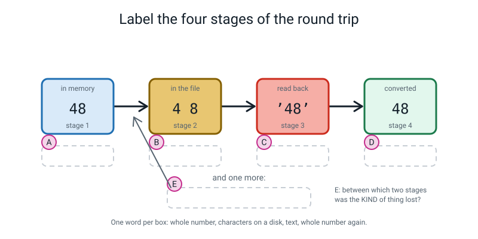
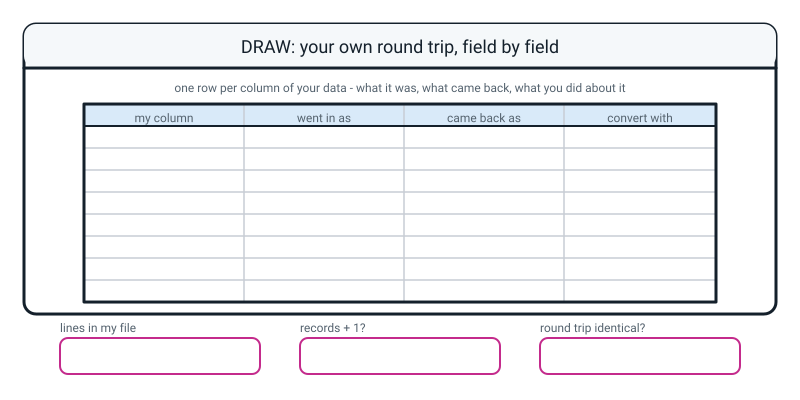

# Workbook — Week 16: The Record Store: Save It and Load It Back

**Name:** ________________________________  **Date:** ______________

[⬅ Week 15](week-15.md) · [📖 Read the chapter first](../student-guide/week-16.md) · [Course Home](../README.md) · [🧑‍🏫 Teacher guide](../teacher-guide/week-16.md) · [Next ➡](week-17.md)

---

## ✅ Warm-Up (5 min)

Five quick questions about **last week**.

**W1.** `counts = group_count(squad, "team")` gives `{'Falcons': 4, 'Tigers': 4, 'Hawks': 3, 'Owls': 1}`. What check do you run on that dictionary before you believe it, and what number should it come to?

________________________________________________________________

**W2.** What does `max(counts)` give you, and why is it almost never what you wanted?

________________________________________________________________

________________________________________________________________

**W3.** Write the line that gives you the **team with the most players**.

________________________________________________________________

**W4.** `filter_by(squad, "team", "Tigers")` gives you 4 records. How many records are in `squad` afterwards, and why?

________________________________________________________________

**W5.** The Owls average 104.00 runs. Why is that number nearly useless, and what one extra thing must you always print beside an average?

________________________________________________________________

---

## 🔎 Predict the Output

**Write your prediction before you run anything.** Two of these four print a wrong answer and do not crash.

### P1

Read this code, then write your prediction for each of the four lines.

```python
print("48" + "1")
print(48 + 1)
print("48" < "9")
print(48 < 9)
```

**I predict:** ________  ________  ________  ________

**It really printed:** ________  ________  ________  ________

**Question:** lines 3 and 4 ask the same question about the same two values and give **different answers**. Why?

________________________________________________________________

### P2

Read this code, then write your prediction for each of the three lines.

```python
scores = ["104", "90", "9", "1000"]
print(max(scores))
print(max([int(s) for s in scores]))
print(sorted(scores))
```

**I predict:**

________________________________________________________________

**It really printed:**

________________________________________________________________

**Which of those three lines would you be happy to put in a school newsletter?** ____________

### P3

Read this code, then write your prediction for each value.

```python
print(bool("False"), bool("0"), bool(""), bool("no"))
print("False" == "True")
```

**I predict:** ______  ______  ______  ______  and then ______

**It really printed:** ______  ______  ______  ______  and then ______

**In one line: what question is `bool()` actually asking?**

________________________________________________________________

### P4

Read this code, then write your prediction for each of the three lines.

```python
print(int(" 48 "))
print(float("3.5"))
print(int("3.5"))
```

**I predict — how many of these three lines print something, and what does the last one do?**

________________________________________________________________

**It really printed:**

________________________________________________________________

________________________________________________________________

**How many of the fifteen answers on this page did you get right?** ______ / 15

**Which one surprised you most, and why?**

________________________________________________________________

---

## ✍️ Practice Set A — Read It

This set is for reading code, files and error messages. You do not need to write a program.

**A1. For each expression, say what it gives you and what *kind* of thing it is.** `raw` came from `load_csv("players.csv")`; `squad` is the twelve records in memory.

| # | Expression | What it gives | What kind of thing (`int`, `str`, `bool`, `list`, `dict`) |
|---|---|---|---|
| a | `squad[0]["runs"]` | | |
| b | `raw[0]["runs"]` | | |
| c | `raw[0]` | | |
| d | `len(raw)` | | |
| e | `raw[0]["out"]` | | |
| f | `int(raw[0]["runs"]) + 1` | | |
| g | `raw[0]["runs"] + "1"` | | |
| h | `list(raw[0].keys())` | | |

**A2. Spot the bug.** This `save_csv` runs without any error at all, and then the loader gives back one record fewer than went in. Circle the missing line and write what it should be.

```python
def save_csv(rows, path, fieldnames):
    with open(path, "w", newline="", encoding="utf-8") as f:
        writer = csv.DictWriter(f, fieldnames=fieldnames)
        writer.writerows(rows)
    return len(rows)
```

**The missing line is:** ________________________________________________

**And it goes:** ☐ above `writerows`  ☐ below `writerows`  ☐ outside the `with` block

**What happens to the first record if you leave it out?**

________________________________________________________________

**A3. Match each line of code to its output.** Draw a line between them. There are four of each, and no output is used twice.

| | Code |
|---|---|
| i | `print(max(["9", "10", "100"]))` |
| ii | `print(max([9, 10, 100]))` |
| iii | `print(sorted(["9", "10", "100"]))` |
| iv | `print("9" + "10")` |

| | Output |
|---|---|
| P | `910` |
| Q | `100` |
| R | `9` |
| S | `['10', '100', '9']` |

**i → ______   ii → ______   iii → ______   iv → ______**

**A4. Label the diagram.** Write one short phrase in each of the five dashed boxes.


*Figure W16.1 — Follow one value all the way round.*

The five phrases to choose from, in the wrong order: **text · characters on a disk · whole number · whole number again · between stages 1 and 2**

**A** ______________________  **B** ______________________

**C** ______________________  **D** ______________________

**E** ______________________

**A5. Read the file, not the table.** Here is a CSV. Answer from the file alone.

```text
name,team,runs,balls,out
Asha,Falcons,48,32,True
Ravi,Falcons,12,20,True
Nita,Falcons,77,55,False
```

| # | Question | Your answer |
|---|---|---|
| a | How many **lines** are in this file? | |
| b | How many **records**? | |
| c | How many **columns**? | |
| d | How many **commas** are on line 2? | |
| e | Which line tells you the third field is `runs`? | |
| f | What is the **fourth field of the third record**? | |
| g | Is the `48` on line 2 a number? | |
| h | If this file had 30 records, how many lines? | |

**A5(i).** Somebody sends you a CSV with 30 lines and says it has 30 records. What is wrong?

________________________________________________________________

________________________________________________________________

**A6. Read the traceback.** Which line do you go to, and what do you change?

```text
Traceback (most recent call last):
  File "wrongcol.py", line 8, in <module>
    row["name"] = int(row["name"])       # name is not a number
                  ~~~^^^^^^^^^^^^^
ValueError: invalid literal for int() with base 10: 'Asha'
```

**The line number to go to:** ________

**In your own words, what Python is complaining about:**

________________________________________________________________

**The value in the message tells you which column you got wrong. Which column is it?** ____________

**The fix:**

________________________________________________________________

---

## ✍️ Practice Set B — Write It

This set is for writing your own short programs. Each one has an expected output shape to compare with.

### B1 — one line

Write the single line that prints the **kind of thing** the `runs` field of the first loaded record is (as a short name, so `str` and not `<class 'str'>`).

```python
raw = load_csv("players.csv")
# your line here:
```

**Expected output:**

```text
str
```

**Done looks like:** one line, and it prints `str` and not `<class 'str'>`.

### B2 — save three records and check the line count

Type out **three** records of your own about snacks, with the keys `snack`, `price` and `spicy`. Save them to `snacks.csv` with a header row. Then read the file back as **plain lines** and print how many there are, and whether that is `records + 1`.

**Expected output shape** (your snacks will differ):

```text
records: 3
lines  : 4
records + 1 == lines? True
```

**Done looks like:** `True` on the last line, and four lines printed out, the first of which is your header.

### B3 — a typed loader

Write `load_snacks(path)` that reads `snacks.csv` back and puts **only the columns that need it** back to the right kind. Then print the type of all three fields of row 0.

**Expected output shape:**

```text
  snack  Samosa   str
  price  15       int
  spicy  True     bool
```

**Done looks like:** three lines, and `snack` still says `str` because you left it alone.

### B4 — a tool that checks a file's length

Write two functions:

- `lines_in(path)` — hands back how many lines are in the file.
- `check_length(path, record_count)` — prints how many lines were found, how many were expected, and a message saying whether it looks right. Hands back `True` or `False`.

Then call it **twice** on the same file: once with the right record count, and once with a wrong one, so you can see both messages.

**Expected output shape:**

```text
snacks.csv: 4 lines, expected 4
  looks right - 1 header + 3 records
snacks.csv: 4 lines, expected 5
  PROBLEM - is writeheader() missing?
```

**Done looks like:** both branches printed, from one function, called twice.

### B5 — the full round trip, about 15 lines

Five bus journeys. Keys: `route` (text — a route can be `12A`), `stop` (text), `minutes` (a **decimal**), `on_time` (true/false). Save them, load them raw, print the counts, print the wrong answer that the raw data gives, then load them typed and prove the round trip.

**Expected output shape:**

```text
rows out: 5  rows in: 5
longest journey, from the file: 9.0 <-- WRONG
longest journey, converted   : 31.0
round trip identical? True
```

**Done looks like:** four things on the page — the two counts matching, a wrong answer you can explain, the right answer, and `True`.

> **⚠️ Watch out:** `route` is `12A` and `103`. Do **not** convert it. It has a letter in one of them and a leading digit that means nothing arithmetically — it is a name, not a quantity.

---

## 🐞 Fix the Broken Program

Here is `shop.py`, which is supposed to save five stock items, load them back, and report the dearest one. It has **three** bugs: one that stops Python reading the file at all, one that stops it partway through, and one that produces **no error whatsoever**.

```python
# shop.py - save five stock items, load them back, report the dearest. Three bugs.

import csv

FIELDS = ["item", "shelf", "price", "in_stock"]

stock = [
    {"item": "Notebook", "shelf": "A", "price": 45,  "in_stock": True}
    {"item": "Pencil",   "shelf": "A", "price": 10,  "in_stock": True},
    {"item": "Backpack", "shelf": "C", "price": 120, "in_stock": False},
    {"item": "Eraser",   "shelf": "B", "price": 5,   "in_stock": True},
    {"item": "Ruler",    "shelf": "B", "price": 95,  "in_stock": True},
]

with open("shop.csv", "w", newline="", encoding="utf-8") as f:
    writer = csv.DictWriter(f)
    writer.writeheader()
    writer.writerows(stock)
print("rows written:", len(stock))

with open("shop.csv", "r", newline="", encoding="utf-8") as f:
    loaded = list(csv.DictReader(f))
print("rows loaded :", len(loaded))

print("the dearest item costs:", max([r["price"] for r in loaded]))
```

**Bug 1.** Run it as it is. The real message:

```text
  File "shop.py", line 8
    {"item": "Notebook", "shelf": "A", "price": 45,  "in_stock": True}
    ^^^^^^^^^^^^^^^^^^^^^^^^^^^^^^^^^^^^^^^^^^^^^^^^^^^^^^^^^^^^^^^^^^
SyntaxError: invalid syntax. Perhaps you forgot a comma?
```

**What kind of error is this, and did any of the program run?**

________________________________________________________________

**The fix:**

________________________________________________________________

**Bug 2.** Fix bug 1 and run again. The real message:

```text
Traceback (most recent call last):
  File "shop.py", line 16, in <module>
    writer = csv.DictWriter(f)
TypeError: DictWriter.__init__() missing 1 required positional argument: 'fieldnames'
```

**What is Python asking you for, in your own words?**

________________________________________________________________

**The fix:**

________________________________________________________________

**Why can't `DictWriter` just work it out from the first record?**

________________________________________________________________

**Bug 3.** Fix bug 2 and run again. Now there is **no error at all**:

```text
rows written: 5
rows loaded : 5
the dearest item costs: 95
```

**Look at the five prices. Which is really the dearest?** ____________

**So why did the program say 95?**

________________________________________________________________

________________________________________________________________

**The fix — write the lines you would add, and say where they go:**

________________________________________________________________

________________________________________________________________

**And the check that would have caught it in three seconds:**

________________________________________________________________

---

## 🧩 Puzzle of the Week

Two puzzles to work out on paper first, then check by running code.

### Part 1 — The alphabetical number line

Six shirt numbers, written down as text: `"7"`, `"10"`, `"9"`, `"100"`, `"70"`, `"1"`.

**(a)** Put them in **number** order, smallest first.

________________________________________________________________

**(b)** Put them in **text** order — the way an alphabetical list works, character by character, left to right.

________________________________________________________________

**(c)** Which number is **biggest as text**? ____________  **Biggest as a number**? ____________

**(d)** This one is harder. Sort the numbers **1 to 30** as text. Which is the only one that ends up in the same position it would have had in number order?

________________________________________________________________

**(e)** In one sentence: **why does a longer text not win just for being longer** when text is compared?

________________________________________________________________

### Part 2 — The comma inside the name

A new player joins: `{"name": "Ali, Jr", "team": "Hawks", "runs": 55}`. There is a comma **inside** the name.

**(a)** Before you run anything: how many commas do you think will be on that line of the file?

________________________________________________________________

**(b)** Save it with `csv.DictWriter` and look at the file. Here is what really comes out:

```text
name,team,runs
"Ali, Jr",Hawks,55
Asha,Falcons,48
```

**What did the `csv` module do that you did not ask it to?**

________________________________________________________________

**(c)** Now imagine you had written your own loader that just chops the line on every comma. Run this and record the answer:

```python
line = '"Ali, Jr",Hawks,55'
print("naive split gives", len(line.split(",")), "fields:", line.split(","))
```

**It printed:**

________________________________________________________________

**(d)** So: **how many fields did the naive splitter find, and what happened to every column after the name?**

________________________________________________________________

**(e)** One sentence: **why do we use the `csv` module instead of splitting on commas ourselves?**

________________________________________________________________

---

## 🤔 Think Deeper

These two questions are for slow thinking and a written paragraph each. There is no code to run.

**T1.** Python's `csv` module deliberately does **not** guess that `48` is a number. The tool you meet in Week 23 deliberately **does**.

Write a paragraph. Name at least two situations where guessing would destroy real information, and at least one situation where not guessing is genuinely annoying. Then answer the hard part: **when a tool guesses for you, whose job is it to notice that the guess was wrong — and how would that person even find out?**

________________________________________________________________

________________________________________________________________

________________________________________________________________

________________________________________________________________

________________________________________________________________

________________________________________________________________

**T2.** Your program reported that the best batter in the squad scored 90. It did not crash. It did not warn. It printed a perfectly believable number.

Write a paragraph about **what makes a wrong answer survive.** Start with the two things that had to be true here (the answer was plausible, and nothing was checking).

Then think of one place in your own life where a number was printed for you by somebody's program — a step count, a mark, a "top song of the year", a price. **What would you have to be given, alongside the number, to be able to check it?** And the uncomfortable question: is it reasonable to expect that of every number, or does that make software impossible to use?

________________________________________________________________

________________________________________________________________

________________________________________________________________

________________________________________________________________

________________________________________________________________

________________________________________________________________

---

## 🛠️ Build It — The Record Store

This section is the project: you build a record store of your own and prove it saves and loads correctly. Most of the hour is typing your own data, and that is normal.

### Part 1 — Thirty records of your own

Pick **one** theme and stick to it: songs, students, matches, bus journeys, biscuits, whatever you like.

- [ ] File saved as something sensible — **not** `csv.py`, and not `data.py`
- [ ] **Exactly 30 records** in one list
- [ ] **Five keys** on every record, spelled **identically** on all thirty
- [ ] At least **two keys that hold numbers**
- [ ] At least **one key holding a category** with 3–5 repeating values (like genre, or house)
- [ ] Values lined up in columns **in the source code**, so a wrong entry is visible
- [ ] `print(len(...))` says **30** — checked after every batch of ten

**My theme:** ______________________________

| | The key | Number or text? | Which conversion will it need on load? |
|---|---|---|---|
| 1 | | | |
| 2 | | | |
| 3 | | | |
| 4 | | | |
| 5 | | | |

> **💡 Try this:** copy-paste your first record twenty-nine times and change the values. That is not cheating; that is what everybody does, and it is why all thirty end up with identical key spellings.

### Part 2 — Save it, and count the lines

- [ ] Used **the same `save_csv`** you wrote in class — did **not** write a new one
- [ ] Opened the file in a **text editor** (not a spreadsheet) and read it
- [ ] Counted the lines

| | |
|---|---|
| Records I typed | ______ |
| Lines in the file | ______ |
| Records + 1 = lines? | ______ |
| Line 1 of my file (write it out) | ________________________________ |
| Line 2 of my file | ________________________________ |

**If your file has 30 lines and not 31, stop and fix it now.** What is missing? ____________________

### Part 3 — The proof sheet (this is the bit being marked)

Load the file back **twice** — once raw, once typed — and fill this in **for row 1 of your own data**.

| Field | Before: value | Before: type | Needs converting? | After: value | After: type |
|---|---|---|---|---|---|
| | | | | | |
| | | | | | |
| | | | | | |
| | | | | | |
| | | | | | |

### Part 4 — The round trip, and one wrong answer

- [ ] Printed `rows out:` and `rows in:` on adjacent lines, and they match
- [ ] Printed **one answer from the raw data that is wrong** (a `max` or a `min` on a number column) and can explain it
- [ ] Printed the same answer from the **converted** data
- [ ] `round trip identical?` printed **`True`**

| | |
|---|---|
| Rows out / rows in | ______ / ______ |
| My wrong answer from the raw data | ______________ |
| The right answer, converted | ______________ |
| Why the wrong one is wrong, in one line | ________________________________ |
| `round trip identical?` | ______________ |

**If it printed `False`:** do not guess. Run the mismatch finder from the chapter and write down what it said.

**Row it named:** ______  **Field it named:** ______________  **What changed:** ______________

### Part 5 — The sentence

**Which of your five columns needed converting, which did not, and why?**

________________________________________________________________

________________________________________________________________

________________________________________________________________

**Full marks needs three things:** which columns, which conversion, and **the reason** — that a text file can only store characters.

### Part 6 — The Bug Log

Two entries minimum, and at least one must have the word **silent** in it.

| What happened | Was there an error message? | What fixed it | What I will check next time |
|---|---|---|---|
| | | | |
| | | | |

---

## 🎨 Draw It

Draw **your own round trip**, one row per column of your data.


*Figure W16.2 — Your page.*

> **What a good answer might look like:** the subject is **a thirty-song playlist**. Five rows filled in, one per column.
>
> `title` — went in as *text* — came back as *text* — convert with *nothing*.
> `artist` — *text* — *text* — *nothing*.
> `genre` — *text* — *text* — *nothing*.
> `minutes` — *decimal* — *text* — `float()`.
> `plays` — *whole number* — *text* — `int()`.
>
> The bottom three boxes: **31** · **yes — 30 records + 1 header** · **True**.
>
> And two annotations that show real understanding. A bracket drawn round the top three rows labelled *these were always text, so nothing was lost*. And an arrow beside the `minutes` row saying *`int("3.5")` refuses — it will not throw the half away for me*.
>
> **What a weak answer looks like:** a "convert with" column that says `int()` on all five rows. That is the misunderstanding drawn out — it means "convert on load" has been remembered as "convert everything", and `int(row["title"])` gives `ValueError: invalid literal for int() with base 10: 'Blue Lights'`. If your first three rows say `int()`, go back and ask of each column: *would I ever add two of these together?*

---

## 📊 Self-Check

Use this page to tell yourself honestly what you can do and what needs another look.

| I can… | 😀 got it | 🙂 nearly | 😕 not yet |
|---|---|---|---|
| Write a list of dictionaries out to a CSV with a header row | ☐ | ☐ | ☐ |
| Read it back with `DictReader` and get dictionaries again | ☐ | ☐ | ☐ |
| Prove with `type()` that every value came back as text | ☐ | ☐ | ☐ |
| Convert the number columns back, and leave the text ones alone | ☐ | ☐ | ☐ |
| Get `round trip identical?` to print `True` | ☐ | ☐ | ☐ |
| Say what `with open(...)` does that a plain `open()` does not | ☐ | ☐ | ☐ |
| Explain why `max()` said the top score was 90 | ☐ | ☐ | ☐ |
| Check that the lines in a file are records + 1 | ☐ | ☐ | ☐ |

**True or false?** Circle one on each row.

| Statement | | |
|---|---|---|
| A CSV file stores which columns are numbers | TRUE | FALSE |
| A CSV with 12 records has 12 lines | TRUE | FALSE |
| `raw[0]["runs"]` is an `int` | TRUE | FALSE |
| `"48" + "1"` is `49` | TRUE | FALSE |
| `bool("False")` is `False` | TRUE | FALSE |
| `"w"` wipes an existing file with no warning | TRUE | FALSE |
| `with` closes the file even if the code inside crashes | TRUE | FALSE |
| You should convert every column on load | TRUE | FALSE |
| `int("3.5")` gives `3` | TRUE | FALSE |
| A shirt number written `007` should be stored as a number | TRUE | FALSE |
| If `DictReader` gives back 11 rows from a 12-record file, Python will warn you | TRUE | FALSE |

One thing I'd like explained again:

________________________________________________________________

---

## ✅ Answers

Only open this after you have tried every page. Click the arrow to check your work.

<details>
<summary>Check your answers</summary>

### Warm-Up

**W1.** Add the buckets up: `print(sum(counts.values()), "of", len(squad))`. It must come to **12** — the number of rows you started with. 4 + 4 + 3 + 1 = 12. If it comes to 11, a row went missing and nothing else would ever have told you.

**W2.** `max(counts)` gives **`'Tigers'`** — the biggest **key**, judged as text, last in the alphabet of those four words. It never looks at the counts at all. It is dangerous precisely because it returns something plausible and never complains.

**W3.**

```python
print(max(counts, key=counts.get))
```

**W4.** **Twelve.** `filter_by` builds a **new** list and hands it back; it never touches the original. You can run it as many times as you like.

**W5.** Because it came from **one row** — it is Priya's own score, not a summary of anything. An average of one thing is just that thing wearing a hat. The extra thing to print is the **row count**: not `104.00`, but `104.00 from 1 player`.

---

### Predict the Output

**P1** — real output:

```text
481
49
True
False
```

Line 1: `+` on two pieces of text **glues them end to end**. Line 2: `+` on two numbers adds them.

Lines 3 and 4 are the interesting pair. `"48" < "9"` compares **character by character**: `4` against `9`. `4` comes before `9`, so `"48"` is "less than" `"9"` and the answer is `True`. `48 < 9` compares two numbers, and forty-eight is not less than nine, so it is `False`.

**Same two values, two different questions.** The kind of thing decides which question gets asked, and nothing on the screen tells you which one happened.

**P2** — real output:

```text
90
1000
['1000', '104', '9', '90']
```

Line 1: as text, `'90'` wins, because `9` beats every other first character. Line 2: as numbers, `1000` wins, correctly. Line 3 is the one worth staring at — **`'1000'` sorts first and `'9'` sorts third.** That is not broken; that is what alphabetical order does to digits. `1` before `9`. A longer text does not win for being longer; length only matters as a tie-break when one text is the start of the other (`'1'` sorts before `'10'`).

Only line 2 belongs in a newsletter.

**P3** — real output:

```text
True True False True
False
```

`bool()` is not asking *"does this say true?"*. It is asking **"is there anything here at all?"** `"False"` has five characters in it, `"0"` has one, `"no"` has two — all of them are "something", so all of them are `True`. The only text that is `False` is **empty** text.

And `"False" == "True"` is `False`, which is exactly why the comparison `row["out"] == "True"` is the conversion that works.

**P4** — real output:

```text
48
3.5
Traceback (most recent call last):
  File "p4.py", line 3, in <module>
    print(int("3.5"))
          ~~~^^^^^^^
ValueError: invalid literal for int() with base 10: '3.5'
```

**Two lines print, and the third one crashes.** `int(" 48 ")` works — `int` quietly ignores spaces at the ends, which is genuinely helpful. `float("3.5")` works. `int("3.5")` **refuses**, and it is right to refuse: it will not throw away the `.5` quietly. If a column has decimal points in it, use `float()`.

---

### Practice Set A

**A1.**

| # | Expression | What it gives | Kind |
|---|---|---|---|
| a | `squad[0]["runs"]` | `48` | `int` |
| b | `raw[0]["runs"]` | `'48'` | `str` — it came from a file |
| c | `raw[0]` | `{'name': 'Asha', 'team': 'Falcons', 'runs': '48', 'balls': '32', 'out': 'True'}` | `dict` — one record |
| d | `len(raw)` | `12` | `int` — the number of records |
| e | `raw[0]["out"]` | `'True'` | `str` — **not** `bool` |
| f | `int(raw[0]["runs"]) + 1` | `49` | `int` |
| g | `raw[0]["runs"] + "1"` | `'481'` | `str` — glued, not added |
| h | `list(raw[0].keys())` | `['name', 'team', 'runs', 'balls', 'out']` | `list` |

**A2.** The missing line is:

```python
        writer.writeheader()
```

It goes **above `writerows`** — it has to write line 1 before anything else goes in the file. And it is **inside** the `with` block, at the same indent as the other two writer lines.

What happens to the first record if you leave it out: **it becomes the header row.** `DictReader` reads the first line of the file and has no way of knowing it is data, so Asha's five values become the five column names. You get eleven records back instead of twelve, with keys like `'Asha'` and `'48'`, and **nothing complains.**

**A3.** **i → R** (`9`) · **ii → Q** (`100`) · **iii → S** (`['10', '100', '9']`) · **iv → P** (`910`)

Real output, all four together:

```text
9
100
['10', '100', '9']
910
```

**A4.**

| Box | Phrase |
|---|---|
| **A** | whole number *(stage 1 — in memory, an `int`)* |
| **B** | characters on a disk *(stage 2 — writing, and nothing else)* |
| **C** | text *(stage 3 — straight out of `DictReader`, a `str`)* |
| **D** | whole number again *(stage 4 — after `int()`)* |
| **E** | between stages 1 and 2 |

**And the point of E:** what was lost between stages 1 and 2 is **not the value** — the characters `4` and `8` are still there, perfectly. What was lost is **the kind of thing it was.** The file remembers what it says and forgets what it means.

**A5.**

| # | Answer |
|---|---|
| a | **4** lines |
| b | **3** records. Line 1 is the header and is not a record |
| c | **5** columns — `name`, `team`, `runs`, `balls`, `out` |
| d | **4** commas. Five fields need four separators — always one fewer |
| e | **Line 1**, the header row. Nothing else in the file says so |
| f | Record 3 is Nita, so the fourth field is **`55`**. Careful: record 3 is **line 4** |
| g | **No.** It is two characters, `4` and `8`. You read it as a number; the file cannot store one |
| h | **31.** Records plus one for the header |

**A5(i).** One of two things is wrong. Either **there is no header row** — in which case the first record is about to be eaten and used as the column names — or there really are only **29** records. Either way: **lines should be records + 1**, and a mismatch means something is wrong before you have read a single value.

**A6.** Go to **line 8**.

In your own words: *"You asked me to turn the word Asha into a whole number, and I can't."*

The column you got wrong is **`name`** — and you know that because the error quotes the offending value, `'Asha'`, straight back at you. Read the value in the message and it names the column for you.

The fix: **delete that line.** `name` was text going out and text coming back, so nothing was lost and there is nothing to convert. **You only convert the columns that were not text.**

---

### Practice Set B

**B1.**

```python
raw = load_csv("players.csv")
print(type(raw[0]["runs"]).__name__)
```

```text
str
```

`type(x)` gives you the kind; `.__name__` pulls the short name out of it. Without `.__name__` you get `<class 'str'>`, which is the same answer wearing more clothes.

**B2.** Full program:

```python
"""b2.py - three snacks, saved, with the line count checked."""

import csv

FIELDS = ["snack", "price", "spicy"]
snacks = [
    {"snack": "Samosa",   "price": 15, "spicy": True},
    {"snack": "Cupcake",  "price": 60, "spicy": False},
    {"snack": "Chips",    "price": 20, "spicy": True},
]

with open("snacks.csv", "w", newline="", encoding="utf-8") as f:
    writer = csv.DictWriter(f, fieldnames=FIELDS)
    writer.writeheader()
    writer.writerows(snacks)

with open("snacks.csv", "r", encoding="utf-8") as f:
    lines = f.readlines()

print("records:", len(snacks))
print("lines  :", len(lines))
print("records + 1 == lines?", len(snacks) + 1 == len(lines))
for line in lines:
    print("  ", line.strip())
```

Real output:

```text
records: 3
lines  : 4
records + 1 == lines? True
   snack,price,spicy
   Samosa,15,True
   Cupcake,60,False
   Chips,20,True
```

`.readlines()` hands you a list of the lines, so `len()` of it is the line count. `.strip()` takes the newline off the end so the printing does not double-space.

**B3.**

```python
"""b3.py - a typed loader for a table with an int, a float and a bool column."""

import csv


def load_snacks(path):
    """Read snacks.csv and put every column back to the type it went in as."""
    records = []
    with open(path, "r", newline="", encoding="utf-8") as f:
        for row in csv.DictReader(f):
            row["price"] = int(row["price"])              # whole number
            row["spicy"] = (row["spicy"] == "True")       # true or false
            records.append(row)
    return records


loaded = load_snacks("snacks.csv")
print(loaded[0])
for field in ["snack", "price", "spicy"]:
    print(f"  {field:<7}{str(loaded[0][field]):<9}{type(loaded[0][field]).__name__}")
```

Real output:

```text
{'snack': 'Samosa', 'price': 15, 'spicy': True}
  snack  Samosa   str
  price  15       int
  spicy  True     bool
```

**Why `snack` still says `str`:** because it was text all along. Nothing was lost, so there is nothing to put back.

**B4.**

```python
"""b4.py - one tool that answers 'is my file the right length?'"""


def lines_in(path):
    """How many lines are in the file at path?"""
    with open(path, "r", encoding="utf-8") as f:
        return len(f.readlines())


def check_length(path, record_count):
    """A CSV should have one more line than it has records."""
    found = lines_in(path)
    expected = record_count + 1
    print(f"{path}: {found} lines, expected {expected}")
    if found == expected:
        print("  looks right - 1 header +", record_count, "records")
    else:
        print("  PROBLEM - is writeheader() missing?")
    return found == expected


check_length("snacks.csv", 3)
check_length("snacks.csv", 4)
```

Real output:

```text
snacks.csv: 4 lines, expected 4
  looks right - 1 header + 3 records
snacks.csv: 4 lines, expected 5
  PROBLEM - is writeheader() missing?
```

Note that `return len(f.readlines())` is **inside** the `with` block. Put it outside and you get `ValueError: I/O operation on closed file.` — the file is shut the instant the block ends.

**B5.**

```python
"""b5.py - five bus journeys: out to a CSV, back in, and the round trip proved."""

import csv

FIELDS = ["route", "stop", "minutes", "on_time"]
PATH = "buses.csv"

journeys = [
    {"route": "12A", "stop": "Market",   "minutes": 14.5, "on_time": True},
    {"route": "12A", "stop": "Hospital", "minutes": 9.0,  "on_time": False},
    {"route": "7",   "stop": "Market",   "minutes": 22.5, "on_time": True},
    {"route": "7",   "stop": "School",   "minutes": 6.5,  "on_time": True},
    {"route": "103", "stop": "Station",  "minutes": 31.0, "on_time": False},
]

with open(PATH, "w", newline="", encoding="utf-8") as f:                 # save
    writer = csv.DictWriter(f, fieldnames=FIELDS)
    writer.writeheader()
    writer.writerows(journeys)

with open(PATH, "r", newline="", encoding="utf-8") as f:                 # load raw
    raw = list(csv.DictReader(f))

print("rows out:", len(journeys), " rows in:", len(raw))                 # the count check
print("longest journey, from the file:", max([r["minutes"] for r in raw]), "<-- WRONG")

loaded = []
with open(PATH, "r", newline="", encoding="utf-8") as f:                 # load typed
    for row in csv.DictReader(f):
        row["minutes"] = float(row["minutes"])                           # a decimal
        row["on_time"] = (row["on_time"] == "True")                      # true or false
        loaded.append(row)                        # route and stop stay as text

print("longest journey, converted   :", max([r["minutes"] for r in loaded]))
print("round trip identical?", loaded == journeys)
```

Real output:

```text
rows out: 5  rows in: 5
longest journey, from the file: 9.0 <-- WRONG
longest journey, converted   : 31.0
round trip identical? True
```

**Why the raw answer is `9.0`.** Compared as text, `'9.0'` beats `'31.0'`, `'22.5'`, `'14.5'` and `'6.5'` — because `9` is the highest first character in the column, and nothing that starts with `1`, `2`, `3` or `6` can beat it however long it is.

**Why `route` was not converted.** `12A` has a letter in it, so `int("12A")` would crash outright. And `103` *could* be turned into a number — but you would never add two route numbers together, so it is an **identifier**, not a quantity. Leave it as text. If you had converted it, the round trip would have printed `False`.

---

### Fix the Broken Program

**Bug 1 — the syntax error.**

It is a **`SyntaxError`**, and **none of the program ran at all.** Python could not even finish reading the file, which is why the message has no `Traceback` above it — there was no running program to trace.

The fix: a **comma** at the end of line 8, after the closing `}`.

```python
    {"item": "Notebook", "shelf": "A", "price": 45,  "in_stock": True},
```

Python's guess is exactly right this time — *"Perhaps you forgot a comma?"* — because two dictionaries sitting next to each other with nothing between them is not a thing that means anything.

**Bug 2 — the runtime error.**

Python is asking you: *"you didn't tell me what the columns are."* `DictWriter` has one thing it cannot do without, and that is the list of column names.

The fix:

```python
    writer = csv.DictWriter(f, fieldnames=FIELDS)
```

Why can't it work it out from the first record? Because a dictionary's keys would give it the **names** but the *file* also needs an **order**, and it needs the same order for all five records (different records could even have their keys in different orders). `fieldnames` fixes that order and names the keys that are allowed, so it asks you instead of guessing.

**Bug 3 — the silent one.**

The five prices are 45, 10, 120, 5 and 95. The dearest is the **Backpack at 120**.

The program said 95 because every value that came out of the file is **text**, and `max` on text compares character by character. `'95'` beats `'5'`, `'45'`, `'120'` and `'10'` because `9` is the highest first character in the column — and `'120'` never had a chance, because it starts with a `1`.

The fix — convert on load, immediately after reading, before anything looks at the numbers:

```python
with open("shop.csv", "r", newline="", encoding="utf-8") as f:
    loaded = list(csv.DictReader(f))

for row in loaded:                                   # <- add these three lines
    row["price"] = int(row["price"])
    row["in_stock"] = (row["in_stock"] == "True")
```

Real output after all three fixes:

```text
rows written: 5
rows loaded : 5
the dearest item costs: 120
```

**The check that would have caught it in three seconds:**

```python
print(type(loaded[0]["price"]).__name__)     # -> str
```

Not "does the answer look plausible?" — 95 looks entirely plausible. **`type()`.** One word.

*(And note `item` and `shelf` are left alone. `shelf` is `"A"`, `"B"`, `"C"` — a category, not a quantity.)*

---

### Puzzle of the Week

**Part 1**

**(a)** Number order: `1, 7, 9, 10, 70, 100`

**(b)** Text order: `'1', '10', '100', '7', '70', '9'`

Real output:

```text
text order  : ['1', '10', '100', '7', '70', '9']
number order: [1, 7, 9, 10, 70, 100]
```

**(c)** Biggest **as text**: `'9'`. Biggest **as a number**: `100`.

*(And notice the smallest is `1` either way, which is a coincidence and not a rule.)*

**(d)** Sorted as text, 1 to 30 begins `1, 10, 11, 12, 13, 14, 15, 16, 17, 18, ...`. Only **1** ends up where it started. Everything else moves.

```python
numbers = list(range(1, 31))
by_text = sorted(numbers, key=str)
print(by_text[:10])
same = [n for i, n in enumerate(numbers) if by_text[i] == n]
print("stay in place:", same)
```

```text
[1, 10, 11, 12, 13, 14, 15, 16, 17, 18]
stay in place: [1]
```

**(e)** Because a text comparison stops at the **first character that differs**, and it does not compare how many characters there are. `'9'` versus `'100'`: it looks at `9` against `1`, decides, and stops. The other two characters of `'100'` are never looked at, so its extra length buys it nothing. (Length only matters as a tie-break when one text is the start of the other: `'1'` comes before `'10'`.)

**Part 2**

**(a)** Accept any prediction. Most people say **three**, because there are three fields, and are then surprised.

**(b)** The `csv` module **put quote marks round the name**: `"Ali, Jr"`. It did that without being asked, because otherwise the comma inside the name would look exactly like a comma between fields. And when it reads the line back, it strips the quotes again and hands you `'Ali, Jr'` in one piece.

Real output of saving and loading it back:

```text
name,team,runs
"Ali, Jr",Hawks,55
Asha,Falcons,48
```

```text
csv module gives 3 fields: {'name': 'Ali, Jr', 'team': 'Hawks', 'runs': '55'}
```

**(c)** Real output:

```text
naive split gives 4 fields: ['"Ali', ' Jr"', 'Hawks', '55']
```

**(d)** The naive splitter found **four** fields where there are only three. And look at what happened after the name: `'Hawks'` is now in the **third** slot instead of the second, and `'55'` is in the fourth. **Every column after the name has shifted along by one.** If you were reading by position, `team` would now be `' Jr"'` and `runs` would be `'Hawks'`.

**(e)** Because somebody else already got the fiddly parts right. Splitting on every comma is the obvious thing to write, it works for weeks, and then one name has a comma in it and your whole table silently shifts sideways. The `csv` module handles quoting, escaping and line endings correctly and automatically — **use their work.**

---

### Build It — The Record Store

The data is yours, so there is no single right answer. Here is a complete model project — a thirty-song playlist — with its real output, so you can check the *shape* of yours against it.

`playlist_data.py` holds thirty records with five keys: `title`, `artist`, `genre` (four repeating values), `minutes` (decimals) and `plays` (whole numbers).

```python
"""store.py - the Record Store: 30 records out to CSV, back in, round trip proved."""

import csv

from records import save_csv, load_csv, group_count, column
from playlist_data import playlist

FIELDS = ["title", "artist", "genre", "minutes", "plays"]
PATH = "store.csv"


def validate(records, fields):
    """Shout if any record has the wrong set of keys. Cheap now, expensive later."""
    for i, r in enumerate(records):
        if set(r.keys()) != set(fields):
            missing = set(fields) - set(r.keys())
            extra = set(r.keys()) - set(fields)
            raise ValueError(f"record {i} has bad keys - missing {missing}, extra {extra}")
    return True


def load_playlist(path):
    """Read store.csv and put the two number columns back to being numbers."""
    records = []
    with open(path, "r", newline="", encoding="utf-8") as f:
        for row in csv.DictReader(f):
            row["minutes"] = float(row["minutes"])   # text -> decimal number
            row["plays"] = int(row["plays"])         # text -> whole number
            records.append(row)
    return records


# --- 1. check the data before touching the disk ------------------------------
print("all 30 records have the right 5 keys?", validate(playlist, FIELDS))
print("rows:", len(playlist), " keys per row:", len(playlist[0]))

# --- 2. save ----------------------------------------------------------------
save_csv(playlist, PATH, FIELDS)
with open(PATH, "r", encoding="utf-8") as f:
    lines = f.readlines()
print(f"{PATH} has {len(lines)} lines: 1 header + {len(lines) - 1} records")
print("line 1:", lines[0].strip())
print("line 2:", lines[1].strip())

# --- 3. load raw, and show the damage ---------------------------------------
raw = load_csv(PATH)
print()
print("BEFORE converting")
for field in FIELDS:
    print(f"  {field:<9}{str(raw[0][field]):<14}{type(raw[0][field]).__name__}")
print("  highest plays (raw):", max(column(raw, "plays")), "<-- text comparison, wrong")

# --- 4. load converted, and close the round trip ----------------------------
loaded = load_playlist(PATH)
print()
print("AFTER converting")
for field in FIELDS:
    print(f"  {field:<9}{str(loaded[0][field]):<14}{type(loaded[0][field]).__name__}")
print("  highest plays (fixed):", max(column(loaded, "plays")))

print()
print("rows out:", len(playlist), " rows in:", len(loaded))
print("round trip identical?", loaded == playlist)

if loaded != playlist:
    for i in range(len(playlist)):               # Week 7's counting loop
        original = playlist[i]                   # the record we wrote out
        back = loaded[i]                         # the record that came back
        if original != back:
            print("first mismatch at row", i)
            print("  original:", original)
            print("  loaded  :", back)
            break

# --- 5. one question, answered from the LOADED data -------------------------
print()
counts = group_count(loaded, "genre")
print("songs per genre:", counts)
print("rows accounted for:", sum(counts.values()), "of", len(loaded))
```

Real output:

```text
all 30 records have the right 5 keys? True
rows: 30  keys per row: 5
store.csv has 31 lines: 1 header + 30 records
line 1: title,artist,genre,minutes,plays
line 2: Blue Lights,Nova,pop,3.5,120

BEFORE converting
  title    Blue Lights   str
  artist   Nova          str
  genre    pop           str
  minutes  3.5           str
  plays    120           str
  highest plays (raw): 95 <-- text comparison, wrong

AFTER converting
  title    Blue Lights   str
  artist   Nova          str
  genre    pop           str
  minutes  3.5           float
  plays    120           int
  highest plays (fixed): 300

rows out: 30  rows in: 30
round trip identical? True

songs per genre: {'pop': 9, 'rock': 7, 'folk': 7, 'indie': 7}
rows accounted for: 30 of 30
```

**Part 3 — the proof sheet, filled in for row 1 of this data:**

| Field | Before: value | Before: type | Needs converting? | After: value | After: type |
|---|---|---|---|---|---|
| `title` | `'Blue Lights'` | `str` | no — it was always text | `'Blue Lights'` | `str` |
| `artist` | `'Nova'` | `str` | no — it was always text | `'Nova'` | `str` |
| `genre` | `'pop'` | `str` | no — it was always text | `'pop'` | `str` |
| `minutes` | `'3.5'` | `str` | **yes** — `float()`, it has a decimal point | `3.5` | `float` |
| `plays` | `'120'` | `str` | **yes** — `int()`, a play count is whole | `120` | `int` |

**Part 4 — the three numbers to check:**

1. **`round trip identical? True`.** Binary. If it says `False`, the project is not finished, and the mismatch finder tells you exactly which row and field.
2. **31 lines.** Thirty records plus the header. A 30-line file means `writeheader()` is missing.
3. **`highest plays (raw): 95`.** Ninety-five, on a playlist whose top song has **300** plays. Same bug as the class's `90`, on your own data. Why 95? Because `9` is the highest first character anywhere in that column, so nothing starting with `1`, `2`, `3` or `4` can beat it however many digits it has.

**Part 5 — the sentence.** Model answer:

> *"Three of my five columns needed nothing: `title`, `artist` and `genre` were text when I typed them, and text is exactly what a CSV file stores, so nothing had to be given up. The other two were numbers, and a file cannot hold a number — it can only hold the characters you would write it with. So `minutes` and `plays` came back as text and I had to say what they should be: `float` for `minutes` because it has a decimal point, and `int` for `plays` because a play count is a whole number."*

**Full marks needs three things:** which columns, which conversion, and **the reason**.

**Two extra questions worth answering:**

*Why does `sum(counts.values())` come to 30?* Because grouping puts every row in exactly one bucket and throws nothing away. 9 + 7 + 7 + 7 = 30 = `len(loaded)`. If it came to 29, one row went into a bucket you did not notice — most likely a genre with a stray space or a different capital letter.

*Which questions could you answer from `raw`, and which need `loaded`?* Anything that only **counts** rows or compares text works fine on `raw` — `group_count(raw, "genre")` gives exactly the same answer. Anything involving **arithmetic or the ordering of numbers** needs `loaded`: averages, totals, maximums, "how many songs are over four minutes". The rule of thumb: **if a number is going to be added, divided or compared, it must be a number first.**

*What if you used `int()` on `minutes`?* `int("3.5")` gives `ValueError: invalid literal for int() with base 10: '3.5'`. Use `float()`.

---

### Draw It

There is no single right drawing. A good one has **five rows** — one per column of your own data — with the "convert with" box saying *nothing* for the text columns and naming a real function for the number ones, plus the three bottom boxes filled in with your line count, whether that is records + 1, and `True`.

The tell that it is right: the *convert with* column is **not** the same on every row. If it is, go back and ask of each column: *would I ever add two of these together?*

---

### Self-Check answers

| Statement | Answer | Why |
|---|---|---|
| A CSV file stores which columns are numbers | **FALSE** | There is nowhere in a text file to keep that. It is the whole lesson |
| A CSV with 12 records has 12 lines | **FALSE** | **13.** Lines = records + 1, because of the header |
| `raw[0]["runs"]` is an `int` | **FALSE** | It is a `str`. Everything out of a CSV is text |
| `"48" + "1"` is `49` | **FALSE** | `'481'`. `+` glues writing end to end |
| `bool("False")` is `False` | **FALSE** | It is `True`. `bool()` asks "is there anything here?" |
| `"w"` wipes an existing file with no warning | **TRUE** | Instantly, and it does not go to the bin |
| `with` closes the file even if the code inside crashes | **TRUE** | That is the entire reason it exists |
| You should convert every column on load | **FALSE** | Only the ones that were not text. `int(row["name"])` crashes |
| `int("3.5")` gives `3` | **FALSE** | It raises `ValueError`. It refuses to throw the half away quietly |
| A shirt number written `007` should be stored as a number | **FALSE** | It is an identifier. You would never add two of them, and `int("007")` is `7` forever |
| If `DictReader` gives back 11 rows from a 12-record file, Python will warn you | **FALSE** | It cannot tell. That is why you print both counts yourself |

</details>

---

[⬅ Week 15 Workbook](week-15.md) · [📖 Week 16 Chapter](../student-guide/week-16.md) · [Course Home](../README.md) · [Week 17 Workbook ➡](week-17.md)
