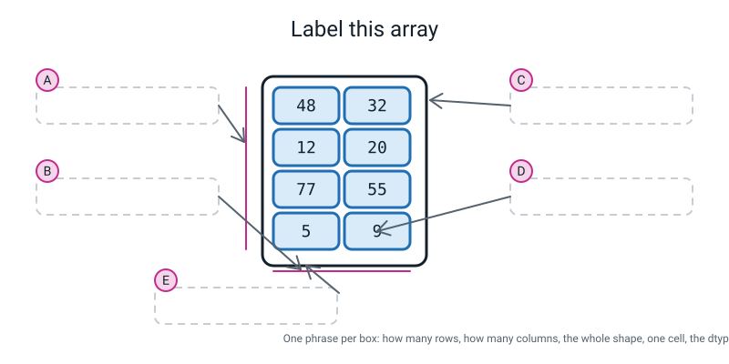
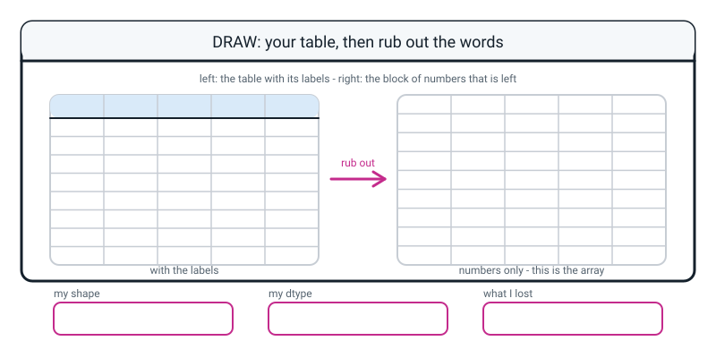

# Workbook — Week 17: One Number for Every Score: NumPy Arrays

**Name:** ________________________________  **Date:** ______________

[⬅ Week 16](week-16.md) · [📖 Read the chapter first](../student-guide/week-17.md) · [Course Home](../README.md) · [🧑‍🏫 Teacher guide](../teacher-guide/week-17.md) · [Next ➡](week-18.md)

---

## ✅ Warm-Up (5 min)

Five quick questions about **last week**.

**W1.** You saved 30 records to a CSV. How many **lines** should the file have, and why?

________________________________________________________________

**W2.** `raw = load_csv("players.csv")`. What kind of thing is `raw[0]["runs"]`, and how would you find out for certain?

________________________________________________________________

**W3.** `max()` on the loaded data said the top score was `90`. The real answer is `104`. What did `max` actually do?

________________________________________________________________

________________________________________________________________

**W4.** Why is `bool(row["out"])` the wrong way to convert the `out` column, and what is the right way?

________________________________________________________________

**W5.** Which of these five columns need converting on load, and to what? `name` · `team` · `runs` · `balls` · `out`

________________________________________________________________

---

## 🔎 Predict the Output

**Write your prediction before you run anything.** Every snippet starts with `import numpy as np`.

### P1 — shapes

```python
print(np.array([1, 2, 3]).shape)
print(np.array([[1, 2, 3]]).shape)
print(np.array([[1], [2], [3]]).shape)
print(np.array([5]).shape)
```

**I predict:** __________  __________  __________  __________

**It really printed:** __________  __________  __________  __________

**And the interesting bit:** the first three all hold the same three numbers. How many **different arrays** is that?  ______

### P2 — dtypes

```python
print(np.array([1, 2, 3]).dtype)
print(np.array([1, 2, 3.0]).dtype)
print(np.array([True, False]).dtype)
print(np.array([1, 2, "3"]).dtype)
```

**I predict:** __________  __________  __________  __________

**It really printed:** __________  __________  __________  __________

**One sentence: what single rule explains lines 2 and 4?**

________________________________________________________________

### P3 — the quiet one

```python
runs = np.array([48, 12, 77, 5])
print(runs)
print(list(runs))
runs[0] = 99.9
print(runs)
```

**I predict — three lines. Does anything crash?**

________________________________________________________________

**It really printed:**

________________________________________________________________

________________________________________________________________

**What happened to the `.9`?** ______________________________________

### P4 — list or array?

```python
scores = [48, 12, 77]
print(len(scores))
arr = np.array(scores)
print(len(arr))
print(arr.shape)
print(scores.shape)
```

**I predict — how many of these five lines print something?** ______

**It really printed:**

________________________________________________________________

________________________________________________________________

**Why is that last error actually useful to you?**

________________________________________________________________

**How many of the fifteen answers on this page did you get right?** ______ / 15

**Which one surprised you most, and why?**

________________________________________________________________

---

## ✍️ Practice Set A — Read It

**A1. List or array?** For each statement, tick which it is true of. Some are true of both.

| # | Statement | List | Array |
|---|---|---|---|
| a | Can hold `[1, "cat", 3.5, True]` all at once | ☐ | ☐ |
| b | Knows how many rows and columns it has | ☐ | ☐ |
| c | Prints with commas between the values | ☐ | ☐ |
| d | You can `.append` to it | ☐ | ☐ |
| e | Has a `.dtype` | ☐ | ☐ |
| f | Comes with Python; nothing to install | ☐ | ☐ |
| g | Holds its values end to end with nothing in between | ☐ | ☐ |
| h | You build it with square brackets | ☐ | ☐ |

**A1(i).** In one sentence, what does an array **cost** you that a list of dictionaries does not?

________________________________________________________________

**A1(j).** In one sentence, what does an array **give** you that a list cannot?

________________________________________________________________

**A1(k).** You need to collect numbers one at a time as a program runs, then do maths to all of them. Which do you use, and **when do you switch**?

________________________________________________________________

**A2. Predict the shape.** No computer. Write the shape, and say how many rows and how many columns.

| # | The array | Shape | Rows | Columns |
|---|---|---|---|---|
| a | `np.array([10, 20, 30])` | | | |
| b | `np.array([[1, 2, 3], [4, 5, 6]])` | | | |
| c | `np.array([2.5, 3.5, 4.5, 5.5])` | | | |
| d | `np.array([1, 2, 3.0])` | | | |
| e | `np.array([[7], [8], [9]])` | | | |
| f | `np.array([True, False, True])` | | | |

**A2(g).** Which of the six did you find hardest, and why?

________________________________________________________________

**A2(h).** How many numbers are in an array with shape `(3, 1)`? And in one with shape `(1, 3)`?

________________________________________________________________

**A2(i).** Write out, in brackets, the list-of-lists you would type to get shape `(2, 4)`.

```python
np.array(
```

**A3. Predict the dtype.**

| # | The array | Dtype |
|---|---|---|
| a | `np.array([10, 20, 30])` | |
| b | `np.array([[1, 2, 3], [4, 5, 6]])` | |
| c | `np.array([2.5, 3.5, 4.5, 5.5])` | |
| d | `np.array([1, 2, 3.0])` | |
| e | `np.array([[7], [8], [9]])` | |
| f | `np.array([True, False, True])` | |
| g | `np.array([1, 2, "three"])` | |

**A3(h).** State the rule that explains both **(d)** and **(g)** in one sentence.

________________________________________________________________

**A3(i).** In (g), what happened to the `1` and the `2`?

________________________________________________________________

**A3(j).** Where have you seen this exact failure before? Name the week.

________________________________________________________________

**A3(k).** Why is the `float64` in (d) **not** a bug, when the text in (g) is?

________________________________________________________________

**A4. Spot the bug.** Each of these lines is wrong. Write the fix.

| # | The line | The fix |
|---|---|---|
| a | `runs = np.array(48, 12, 77, 5)` | |
| b | `print(runs.shape())` | |
| c | `print(runs.Shape)` | |
| d | `print(np.Array([1, 2, 3]))` | |
| e | `print(scores.shape)` where `scores = [1, 2, 3]` | |
| f | `block = np.array([[1, 2, 3], [4, 5]])` | |

**A5. Label the diagram.** Write one short phrase in each of the five dashed boxes.


*Figure W17.1 — Everything you can say about one array.*

The five phrases, in the wrong order: **the dtype: int64 · one cell, one value · how many columns: 2 · the whole shape: (4, 2) · how many rows: 4**

**A** ______________________  **B** ______________________

**C** ______________________  **D** ______________________

**E** ______________________

**A6. Read the traceback.** Translate it, then fix it.

```text
Traceback (most recent call last):
  File "arrays.py", line 3, in <module>
    ragged = np.array([[1, 2, 3],
ValueError: setting an array element with a sequence. The requested array has an inhomogeneous shape after 1 dimensions. The detected shape was (2,) + inhomogeneous part.
```

**`inhomogeneous` means:** ______________________________________

**`dimensions` means:** ______________________________________

**Say the whole message in your own words:**

________________________________________________________________

________________________________________________________________

**What did numpy get right before it gave up?** ______________________

**Is this good news or bad news? Why?**

________________________________________________________________

---

## ✍️ Practice Set B — Write It

### B1 — one line

You have `steps = [8421, 10233, 6890, 12004, 9317]`, a plain list. Write the **single line** that prints its shape as an array.

```python
steps = [8421, 10233, 6890, 12004, 9317]
# your line here:
```

**Expected output:**

```text
(5,)
```

**Done looks like:** one line, and it prints `(5,)` — with the comma.

### B2 — an array with shape `(3, 4)`

Build a 2-D array of twelve whole numbers with shape `(3, 4)`, laid out **one inner list per line**. Then print the array, its shape, how many rows, how many columns, and its dtype.

**Expected output:**

```text
[[ 1  2  3  4]
 [ 5  6  7  8]
 [ 9 10 11 12]]
shape : (3, 4)
rows  : 3
columns: 4
dtype : int64
```

**Done looks like:** the shape says `(3, 4)` and the rows and columns are pulled **out of the shape**, not typed in by hand.

> **💡 Try this:** `shape[0]` and `shape[1]` are Week 11's indexing, used on the shape. Slot 0 is the rows, slot 1 is the columns.

### B3 — one array of each dtype, on purpose

Build four arrays — one that comes out `int64`, one `float64`, one `bool`, one text. Then print all four in a table, and write a comment beside each one saying **why numpy had no other choice.**

**Expected output shape** (your values will differ, and so may the number after the `<U`):

```text
whole    (3,)    int64
decimal  (3,)    float64
truth    (4,)    bool
words    (3,)    <U9
```

**Done looks like:** four different dtypes, and four comments that each say *why*.

### B4 — an array out of your own table

Use `column()` from your own `records.py` to pull one number column out of `squad`, turn it into an array, and print the list, the array, the length of the list, the shape of the array, and the dtype.

**Expected output:**

```text
as a list : [32, 20, 55, 9, 41, 28, 3, 39, 44, 18, 61, 70]
as an array: [32 20 55  9 41 28  3 39 44 18 61 70]
len of the list : 12
shape of the array: (12,)
dtype: int64
```

**Done looks like:** you reused your own tool from Week 15 instead of retyping the numbers — and you can say what the difference is between the two printed lines.

### B5 — predict six, then check six, about 15 lines

Write six arrays of your own choosing that between them cover: a plain row of whole numbers, a `(1, 3)`, a `(3, 1)`, one that comes out `float64` because of a single decimal, one that comes out `bool`, and one that comes out text because of a single typo. Then print them all in one table.

**Predict every shape and every dtype in the boxes below BEFORE you run it.**

| # | Predicted shape | Actual shape | ✔/✘ | Predicted dtype | Actual dtype | ✔/✘ |
|---|---|---|---|---|---|---|
| a | | | | | | |
| b | | | | | | |
| c | | | | | | |
| d | | | | | | |
| e | | | | | | |
| f | | | | | | |

**Expected output shape:**

```text
array   shape     dtype
----------------------------
a       (3,)      int64
b       (1, 3)    int64
c       (3, 1)    int64
d       (3,)      float64
e       (4,)      bool
f       (3,)      <U21
```

**Done looks like:** six rows of output, twelve predictions ticked or crossed, and **a sentence for every cross.**

---

## 🐞 Fix the Broken Program

Here is `grid.py`, which is supposed to hold four cities' rainfall for three months and print the shape and the dtype. It has **three** bugs: one that stops Python reading the file at all, one that stops it partway through, and one that produces **no error whatsoever**.

```python
# grid.py - four cities, three months of rainfall. Print the shape and the dtype. Three bugs.

import numpy as np

CITIES = ["Pune", "Kochi", "Delhi", "Leh"]

rain = np.array([
    [104, 88, 132],
    [230, 410, 388],
    [65, 40, "31"],
    [12, 9, 14],

print("rain:")
print(rain)
print("cities:", len(CITIES))
print("shape :", rain.shape())
print("dtype :", rain.dtype)
```

**Bug 1.** Run it as it is. The real message:

```text
  File "grid.py", line 7
    rain = np.array([
                    ^
SyntaxError: '[' was never closed
```

**What kind of error is this, and did any of the program run?**

________________________________________________________________

**Python points at line 7. Is the mistake on line 7?**

________________________________________________________________

**The fix — write exactly what you add and where:**

________________________________________________________________

**Bug 2.** Fix bug 1 and run again. The real message:

```text
Traceback (most recent call last):
  File "grid.py", line 17, in <module>
    print("shape :", rain.shape())
TypeError: 'tuple' object is not callable
```

**What does "callable" mean?** ______________________________________

**The fix:**

________________________________________________________________

**The question that fixes this permanently: is the shape something the array *does*, or something the array *is*?**

________________________________________________________________

**Bug 3.** Fix bug 2 and run again. Now there is **no error at all**:

```text
rain:
[['104' '88' '132']
 ['230' '410' '388']
 ['65' '40' '31']
 ['12' '9' '14']]
cities: 4
shape : (4, 3)
dtype : <U21
```

**Is the shape correct?** ____________  **Are all twelve numbers present?** ____________

**So what is wrong, and which single line of output told you?**

________________________________________________________________

________________________________________________________________

**Find the typo in the program.** It is one character, twice. Circle it, and write what it did:

________________________________________________________________

**The fix, and the output after it:**

________________________________________________________________

________________________________________________________________

**And the check that catches this whole family of bug:**

________________________________________________________________

---

## 🧩 Puzzle of the Week

### Part 1 — Five shapes, twelve numbers

Here are the twelve squad scores: `48, 12, 77, 5, 63, 30, 0, 41, 55, 22, 90, 104`.

Build **five** arrays from exactly those twelve numbers, with these five shapes: `(12,)`, `(2, 6)`, `(6, 2)`, `(1, 12)`, `(12, 1)`.

**(a)** Fill in the table. *(`.size` is a bonus fact, not part of this week: it is how many numbers there are altogether.)*

| Name | Shape you typed for | Actual shape | `.size` |
|---|---|---|---|
| `flat` | `(12,)` | | |
| `two_by_six` | `(2, 6)` | | |
| `six_by_two` | `(6, 2)` | | |
| `one_row` | `(1, 12)` | | |
| `one_col` | `(12, 1)` | | |

**(b)** How many numbers does each one hold? ____________

**(c)** So what does the **shape** tell you that `.size` does not?

________________________________________________________________

**(d)** Here is the hard question. Only **one** of those five is *actually* "the twelve scores". Which one, and what are the other four?

________________________________________________________________

________________________________________________________________

**(e)** One sentence: **shape is meaning, not just size.** Explain what that means using two of your five arrays.

________________________________________________________________

________________________________________________________________

### Part 2 — Bracket detective

For each printed array below, write the **exact brackets** you would type to produce it. Then write its shape.

**(i)**

```text
[1 2 3 4]
```

`np.array(` ______________________________ `)`   shape: __________

**(ii)**

```text
[[1 2]
 [3 4]]
```

`np.array(` ______________________________ `)`   shape: __________

**(iii)**

```text
[[1]
 [2]
 [3]
 [4]]
```

`np.array(` ______________________________ `)`   shape: __________

**(iv)**

```text
[[1 2 3 4]]
```

`np.array(` ______________________________ `)`   shape: __________

**(v)** All four hold the numbers 1, 2, 3 and 4. **Which two would you struggle to tell apart from the printed output alone, and what is the tell?**

________________________________________________________________

________________________________________________________________

---

## 🤔 Think Deeper

**T1.** numpy converts `[1, 2, 3.0]` to decimals, and it converts `[1, 2, "three"]` to text. It is following **one rule** — *pick the kind that can hold everything* — and the rule has a harmless result the first time and a damaging result the second time.

Write a paragraph. Explain why numpy cannot tell those two cases apart from the outside. Then argue for **one** of these two designs, and say honestly what your choice costs: (a) convert, always, silently, as it does now; (b) refuse whenever the values are not already all the same kind. Finish with the practical question: **if numpy is not going to change, what has to change instead?**

________________________________________________________________

________________________________________________________________

________________________________________________________________

________________________________________________________________

________________________________________________________________

________________________________________________________________

**T2.** In the hook you rubbed out real work — the header row, the names, the teams — to make an array.

Write a paragraph about **what that trade actually costs.** Name one question you could answer from the twelve records that you now cannot answer at all, and say why the array cannot help with it. Then the sharper half: with a dictionary, asking for a field that is not there gives you a **loud** `KeyError`; with an array, taking the wrong column gives you a **number**, and the number is wrong, and nothing tells you. **Does that make arrays more dangerous than dictionaries, or just differently dangerous?** And if you could only keep one of the two for the rest of the year, which would you keep, and what would you do about the other?

________________________________________________________________

________________________________________________________________

________________________________________________________________

________________________________________________________________

________________________________________________________________

________________________________________________________________

---

## 🛠️ Build It — Predict Six, Check Six

**This is the whole assignment, and the marking is nearly all in one column.**

### Part 1 — The predictions. In pen. Before you touch a computer.

Here are the six arrays. **Do not run them yet.**

```python
a = np.array([7, 7, 7, 7, 7, 7])
b = np.array([[1.5, 2.5],
              [3.5, 4.5],
              [5.5, 6.5]])
c = np.array([0])
d = np.array([[1, 2, 3, 4]])
e = np.array([100, 200, 300.0, 400])
f = np.array(["pop", "rock", "folk"])
```

- [ ] Predictions written **in pen**
- [ ] All twelve boxes filled in — six shapes and six dtypes
- [ ] Nothing rubbed out or tidied up afterwards

| # | Predicted shape | Predicted dtype |
|---|---|---|
| `a` | | |
| `b` | | |
| `c` | | |
| `d` | | |
| `e` | | |
| `f` | | |

### Part 2 — Check all six

Type them into a file called `hw17.py`, print the shape and dtype of each, and tick or cross **every one of your twelve guesses**.

- [ ] File saved as `hw17.py` — **not** `numpy.py`
- [ ] All six built and printed in one table
- [ ] Every guess ticked or crossed

| # | Actual shape | ✔/✘ | Actual dtype | ✔/✘ |
|---|---|---|---|---|
| `a` | | | | |
| `b` | | | | |
| `c` | | | | |
| `d` | | | | |
| `e` | | | | |
| `f` | | | | |

| | |
|---|---|
| Ticks out of 12 | ______ |
| Crosses out of 12 | ______ |

### Part 3 — One sentence for every cross. **This is the bit being marked.**

Not "I got it wrong". A sentence that says **what you thought** and **what is actually true.**

**Cross 1:**

________________________________________________________________

________________________________________________________________

**Cross 2:**

________________________________________________________________

________________________________________________________________

**Cross 3:**

________________________________________________________________

________________________________________________________________

**Cross 4:**

________________________________________________________________

________________________________________________________________

> **⚠️ Watch out:** if you have **no** crosses, either you wrote your predictions after running the code, or these were too easy for you. Say which, honestly. If it was the second one, ask for harder ones.

### Part 4 — Three arrays of your own

- [ ] One **1-D** array, from your own data
- [ ] One **2-D** array, laid out one inner list per line, with a comment naming each row
- [ ] One array that you **expect** to come out `float64`, and it does
- [ ] Shape and dtype printed for all three
- [ ] The shape predicted **before** it was printed, for all three

| | Predicted shape | Actual shape | Predicted dtype | Actual dtype |
|---|---|---|---|---|
| 1-D | | | | |
| 2-D | | | | |
| float | | | | |

**For my 2-D array, what does each of the two numbers in the shape mean, for my data?**

________________________________________________________________

________________________________________________________________

**What is NOT in my 2-D array that was in the original records?**

________________________________________________________________

### Part 5 — One line about your Week 16 dataset

Look at the five columns of the dataset you built last week. **Which could go into a numeric array on its own, and which could not?**

| Column | Into a numeric array? | Why |
|---|---|---|
| | | |
| | | |
| | | |
| | | |
| | | |

**One sentence explaining the pattern:**

________________________________________________________________

________________________________________________________________

### Part 6 — The Bug Log

| What happened | Was there an error message? | What fixed it | What I will check next time |
|---|---|---|---|
| | | | |
| | | | |

---

## 🎨 Draw It

Draw **your own table, twice** — once with its labels, once with the words rubbed out.


*Figure W17.2 — Your page.*

> **What a good answer might look like:** the subject is **a thirty-song playlist**, cut down to eight rows so it fits.
>
> On the left, five column headings written into the tinted header row — `title`, `artist`, `genre`, `minutes`, `plays` — and eight rows filled in.
>
> On the right, **only two columns of numbers**, eight rows deep, with the other three columns left blank and a note beside them saying *these three were words, so they could not come*.
>
> The three bottom boxes: **(8, 2)** · **float64** *(because `minutes` has decimals in it and one decimal decides it for the whole array)* · **the titles, the artists and the genres — and all five column names**.
>
> And two annotations that show real understanding. An arrow pointing at the second column of the right-hand grid, labelled *this is `plays`, and only my own arrow says so*. And a note under the right-hand grid: *if I had kept the genre column I would have got a text array (`<U32`, because `minutes` has decimals) and every play count would be writing*.
>
> **What a weak answer looks like:** a right-hand grid that still has the header row in it, or that has all five columns. That is the whole misunderstanding drawn out — the point of the exercise is that **the words cannot come with you**, and if any word survived on the right-hand side then that grid is not an array, it is still a table.

---

## 📊 Self-Check

| I can… | 😀 got it | 🙂 nearly | 😕 not yet |
|---|---|---|---|
| Write `import numpy as np` and say what the `np` is for | ☐ | ☐ | ☐ |
| Build a 1-D array from a list of numbers | ☐ | ☐ | ☐ |
| Build a 2-D array from a list of lists, one row per line | ☐ | ☐ | ☐ |
| Read `.shape` and say what each number in it means | ☐ | ☐ | ☐ |
| Read `.dtype` and say why an array holds only one kind | ☐ | ☐ | ☐ |
| Predict a shape before running the code | ☐ | ☐ | ☐ |
| Translate the ragged-block `ValueError` into my own words | ☐ | ☐ | ☐ |
| Say what an array costs me | ☐ | ☐ | ☐ |

**True or false?** Circle one on each row.

| Statement | | |
|---|---|---|
| `(4,)` is a typo | TRUE | FALSE |
| In `(12, 3)` the 12 is the number of columns | TRUE | FALSE |
| `np.array(1, 2, 3)` builds an array of three numbers | TRUE | FALSE |
| `np.array([[7], [8], [9]])` has shape `(3,)` | TRUE | FALSE |
| `np.array([1, 2, 3.0])` has dtype `int64` | TRUE | FALSE |
| `np.array([1, 2, "three"])` raises an error | TRUE | FALSE |
| `.shape` needs brackets after it | TRUE | FALSE |
| An array can hold a name and a number at the same time | TRUE | FALSE |
| You can `.append` to an array | TRUE | FALSE |
| A printed array has commas between the values | TRUE | FALSE |
| `type()` and `.dtype` ask the same question | TRUE | FALSE |
| If the shape is right, the array must be right | TRUE | FALSE |

One thing I'd like explained again:

________________________________________________________________

---

## ✅ Answers

<details>
<summary>Check your answers</summary>

### Warm-Up

**W1.** **31 lines.** Records plus one, because line 1 is the header row. If it has 30, `writeheader()` is missing and something is already quietly broken.

**W2.** It is **text — a `str`** — even though it went out as a number. You find out for certain with `print(type(raw[0]["runs"]))`, or the short version, `print(type(raw[0]["runs"]).__name__)`. **Full marks needs both halves:** the answer, and the way to check.

**W3.** It compared the scores **as writing, character by character**, the way an alphabetical list works. It looked at `'90'` and `'104'`, compared `9` against `1`, and `9` comes later, so `'90'` won. It never looked at the rest of either value. There was no error because comparing two pieces of writing is a perfectly legal thing to do — it just was not what you meant.

**W4.** Because `bool()` asks *"is there anything here at all?"*, not *"does it say true?"* — and `"False"` has five characters in it, so it is "something", so it is `True`. Every player gets marked out. The right way is a **comparison**: `row["out"] == "True"`.

**W5.** `name` — nothing, it was always text. `team` — nothing, same reason. `runs` — `int()`. `balls` — `int()`. `out` — `row["out"] == "True"`. **You only convert the columns that were not text.**

---

### Predict the Output

**P1** — real output:

```text
(3,)
(1, 3)
(3, 1)
(1,)
```

The first three all hold the same three numbers, and they are **three different arrays.** One pair of brackets means one direction. Brackets round the whole lot make it *one row of three*. Brackets round each number make it *three rows of one*.

And `(1,)` is a perfectly ordinary shape. One number in a list is still an array; its shape is `(1,)` — not `1`, and not `()`.

**P2** — real output:

```text
int64
float64
bool
<U21
```

The single rule that explains lines 2 and 4: **numpy picks the one kind that can hold every value without losing anything.** A whole-number box cannot hold `3.0`'s decimal point, so line 2 goes decimal. Nothing numeric can hold the characters `3` as a word *and* stay a number, and text can hold `1` as the character `1`, so line 4 goes text.

The difference between them is what the conversion **cost**. Line 2 lost nothing — `1` stored as `1.0` is the same number written differently. Line 4 lost everything — you cannot add one to `'1'`.

**P3** — real output:

```text
[48 12 77  5]
[48, 12, 77, 5]
[99 12 77  5]
```

**Nothing crashes.** Three things to see.

Line 1 is the array: **spaces**, and the `5` padded so it lines up under the `77`. Line 2 is `list(runs)` — the same four numbers as a plain list, printed with **commas**. Same numbers, two containers, two ways of showing themselves.

And line 3 is the quiet one. You put **`99.9`** into slot 0 and **`99`** came out. The array is `int64`, and a whole-number box has nowhere to put a decimal, so the `.9` is **gone, silently, with no warning.** If your data has decimals in it, say so when you build the array: `np.array([48, 12, 77, 5], dtype=float)`.

**P4** — real output:

```text
3
3
(3,)
Traceback (most recent call last):
  File "p4.py", line 8, in <module>
    print(scores.shape)
AttributeError: 'list' object has no attribute 'shape'
```

**Four lines print** (three answers plus the traceback); the fifth crashes.

`len()` works on both — a list knows its length and so does an array. But **only the array has a `.shape`.**

And that error is genuinely useful: it is Python telling you **which of the two things you are holding.** If you write `.shape` and get an `AttributeError`, you forgot the `np.array()` on the line above. That is a much better outcome than the alternative you will meet next week, where forgetting `np.array()` gives you a wrong answer instead of an error.

---

### Practice Set A

**A1.**

| # | Statement | Answer |
|---|---|---|
| a | Can hold `[1, "cat", 3.5, True]` all at once | **list** only — an array gets one kind |
| b | Knows how many rows and columns it has | **array** only — a list knows only a length |
| c | Prints with commas between the values | **list** only — an array prints with spaces |
| d | You can `.append` to it | **list** only — an array is a fixed size |
| e | Has a `.dtype` | **array** only |
| f | Comes with Python; nothing to install | **list** only — numpy is installed separately |
| g | Holds its values end to end with nothing in between | **array** only |
| h | You build it with square brackets | **both** — but the array goes through `np.array([...])` |

**A1(i).** **The labels.** An array is only numbers, so nothing in it says which column is which or whose row is whose — and if you take the wrong column you get a wrong number rather than an error.

**A1(j).** It knows its own **shape**, every value is the same **kind**, and (from next week) it can do arithmetic to all of its numbers in one line.

**A1(k).** Collect into a **list**, because a list grows and an array does not. Then `np.array(...)` it **once**, at the end, when the collecting is finished. This is exactly what `np.array(column(squad, "runs"))` does.

**A2.**

| # | Shape | Rows | Columns |
|---|---|---|---|
| a | `(3,)` | — | there is only one direction |
| b | `(2, 3)` | 2 | 3 |
| c | `(4,)` | — | one direction |
| d | `(3,)` | — | one direction |
| e | `(3, 1)` ← **the miss** | 3 | 1 |
| f | `(3,)` | — | one direction |

*(For a 1-D array, "how many rows" is not really a question — there is one direction and it has that many slots in it. Saying "one row of three" is a reasonable answer as long as you also know its shape is `(3,)` and not `(1, 3)`.)*

**A2(g).** Almost always **(e)**. The expected wrong answer is `(3,)`, on the grounds that there are three numbers. The truth: each number is inside **its own inner list**, and an inner list is a **row**. So it is three rows of one column each — `(3, 1)`. A column, standing up.

**A2(h).** **Three, both times.** Same numbers, different arrangement. One is a column, the other is a row. They are not the same array, and next week that difference will produce nine numbers where you wanted three.

**A2(i).**

```python
np.array([[1, 2, 3, 4],
          [5, 6, 7, 8]])
```

Two inner lists (two rows), four numbers in each (four columns).

**A3.**

| # | Dtype |
|---|---|
| a | `int64` |
| b | `int64` |
| c | `float64` |
| d | `float64` ← **the miss** |
| e | `int64` |
| f | `bool` |
| g | `<U21` ← **the other miss** |

**A3(h).** **numpy picks the one kind that can hold every value without losing anything.** A whole-number box cannot hold `3.0`'s decimal point, so (d) becomes decimals. Nothing numeric can hold the word `three`, and text can hold `1` as the character `1`, so (g) becomes text.

**A3(i).** They became **text**: `'1'` and `'2'`. The printed output is `['1' '2' 'three']` — note the quote marks. They are no longer numbers, and arithmetic on them will either crash or glue characters together.

**A3(j).** **Week 16.** `48` was written to a CSV and came back as `'48'`. Same failure: a container that can only hold one kind of thing turned the numbers into writing and said nothing about it. Same check, too — read the type.

**A3(k).** Because **nothing was lost.** `1` stored as `1.0` is the same number written differently, and you can still add one to it. Compare it with (g), where `1` stored as `'1'` genuinely **is** a loss — `'1' + 1` will not even run.

**A4.**

| # | The line | The fix |
|---|---|---|
| a | `np.array(48, 12, 77, 5)` | `np.array([48, 12, 77, 5])` — the numbers go in **one list** |
| b | `runs.shape()` | `runs.shape` — no brackets. `TypeError: 'tuple' object is not callable` |
| c | `runs.Shape` | `runs.shape` — lower case. Python even says *"Did you mean: 'shape'?"* |
| d | `np.Array([1, 2, 3])` | `np.array([1, 2, 3])` — small a |
| e | `scores.shape` on a list | `np.array(scores).shape`. A list has no shape |
| f | `np.array([[1, 2, 3], [4, 5]])` | Make the rows the same length — add the missing number, or take one out |

**A5.**

| Box | Phrase |
|---|---|
| **A** | how many rows: 4 |
| **B** | how many columns: 2 |
| **C** | the whole shape: (4, 2) |
| **D** | one cell, one value |
| **E** | the dtype: int64 |

**And the point of it:** A and B are the two numbers, C is them together as one thing, D is what one square holds, and E is what **every** square holds. `.shape` answers A, B and C in one word; `.dtype` answers E. Nothing answers "which column is balls?" — only your comment does.

**A6.**

- **`inhomogeneous`** means **not all the same**. It is a long word and that is all it means.
- **`dimensions`** means **directions** — rows and columns.

In your own words: *"I got as far as counting the rows. There are two, so the first number is 2. Then I tried to count the columns and I found three in one row and two in the other, and there is no number that is both three and two. A block with ragged rows has no shape, so I stopped."*

**What numpy got right before it gave up:** the **rows**. It printed `The detected shape was (2,)`, which tells you it counted two rows correctly and then failed on the columns. That narrows down where to look.

**Good news or bad news? Good news.** Look at what numpy *could* have done instead: stuck a zero on the end of the short row and carried on, leaving a made-up number in your data forever with nothing to tell you. **An error you can read beats a wrong answer you cannot see.**

---

### Practice Set B

**B1.**

```python
steps = [8421, 10233, 6890, 12004, 9317]
print(np.array(steps).shape)
```

```text
(5,)
```

Note the comma. Five slots, one direction.

**B2.**

```python
"""b2.py - an array with shape (3, 4), and the proof."""

import numpy as np

block = np.array([
    [1, 2, 3, 4],                        # row 0
    [5, 6, 7, 8],                        # row 1
    [9, 10, 11, 12],                     # row 2
])

print(block)
print("shape :", block.shape)
print("rows  :", block.shape[0])
print("columns:", block.shape[1])
print("dtype :", block.dtype)
```

Real output:

```text
[[ 1  2  3  4]
 [ 5  6  7  8]
 [ 9 10 11 12]]
shape : (3, 4)
rows  : 3
columns: 4
dtype : int64
```

**Three inner lists, four numbers in each.** And notice the printing: numpy padded the single-digit numbers with a space so the columns line up under `10`, `11` and `12`.

**B3.**

```python
"""b3.py - one array of each of the four dtypes, on purpose."""

import numpy as np

whole = np.array([3, 6, 9])                     # nothing but whole numbers
decimal = np.array([3.0, 6.5, 9.25])            # every one has a decimal point
truth = np.array([True, False, True, True])     # nothing but true/false
words = np.array(["Mon", "Tue", "Wednesday"])   # nothing but text

for name, arr in [("whole", whole), ("decimal", decimal),
                  ("truth", truth), ("words", words)]:
    print(f"{name:<9}{str(arr.shape):<8}{arr.dtype}")
```

Real output:

```text
whole    (3,)    int64
decimal  (3,)    float64
truth    (4,)    bool
words    (3,)    <U9
```

Why numpy had no other choice, one line each:

- `whole` — every value is a whole number, and `int64` holds all three with nothing left over.
- `decimal` — `6.5` cannot go in a whole-number box, so the whole array has to be decimals.
- `truth` — nothing but `True` and `False`, and `bool` holds exactly those two things.
- `words` — text, and **`<U9` because `"Wednesday"` is nine characters**, the longest it saw. Change `"Wednesday"` to `"Wed"` and it becomes `<U3`.

**B4.**

```python
"""b4.py - one column of my own table, turned into an array."""

import numpy as np

from records import column
from squad_data import squad

balls_list = column(squad, "balls")      # a plain Python list, from Week 15
balls = np.array(balls_list)             # the same numbers, as an array

print("as a list :", balls_list)
print("as an array:", balls)
print("len of the list :", len(balls_list))
print("shape of the array:", balls.shape)
print("dtype:", balls.dtype)
```

Real output:

```text
as a list : [32, 20, 55, 9, 41, 28, 3, 39, 44, 18, 61, 70]
as an array: [32 20 55  9 41 28  3 39 44 18 61 70]
len of the list : 12
shape of the array: (12,)
dtype: int64
```

**The difference between those two printed lines** is the fastest test there is. The list has **commas**. The array has **spaces**, and the single-digit numbers are padded so the columns line up. Same twelve numbers.

**B5.**

```python
"""b5.py - predict six, then check six. Write your predictions down FIRST."""

import numpy as np

# --- the six arrays --------------------------------------------------------
a = np.array([15, 30, 45])                        # three whole numbers
b = np.array([[15, 30, 45]])                      # ONE row of three
c = np.array([[15], [30], [45]])                  # three rows of ONE
d = np.array([15, 30, 45.0])                      # one decimal in the list
e = np.array([True, True, False, True])           # true/false only
f = np.array([15, 30, "45"])                      # one number typed as a word

# --- print the table -------------------------------------------------------
print(f"{'array':<8}{'shape':<10}{'dtype'}")
print("-" * 28)
for name, arr in [("a", a), ("b", b), ("c", c), ("d", d), ("e", e), ("f", f)]:
    print(f"{name:<8}{str(arr.shape):<10}{arr.dtype}")

# --- and how many numbers each one holds ----------------------------------
print()
print("a, b and c all hold the same three numbers. Look at their shapes.")
print("a:", a)
print("b:", b)
print("c:")
print(c)
```

Real output:

```text
array   shape     dtype
----------------------------
a       (3,)      int64
b       (1, 3)    int64
c       (3, 1)    int64
d       (3,)      float64
e       (4,)      bool
f       (3,)      <U21

a, b and c all hold the same three numbers. Look at their shapes.
a: [15 30 45]
b: [[15 30 45]]
c:
[[15]
 [30]
 [45]]
```

**Look at `a`, `b` and `c`.** Fifteen, thirty and forty-five, three times over. Three shapes. And you can tell them apart from the printed output too — count the square brackets at the start of the line. One bracket is 1-D. Two brackets is 2-D.

---

### Fix the Broken Program

**Bug 1 — the syntax error.**

It is a **`SyntaxError`**, and **none of the program ran at all.** There is no `Traceback` above it, because there was no running program to trace — Python could not even finish reading the file.

**Is the mistake on line 7?** No, and this is the useful part. Line 7 is where the `[` was **opened**, and Python is telling you it was never closed. The actual mistake is at the **bottom** of the list, five lines later, where the `])` is missing. Python points at the opening bracket because that is the last place it was certain about.

The fix — add `])` on its own line, after the last inner list:

```python
    [12, 9, 14],
])
```

**Bug 2 — the runtime error.**

**"Callable"** means *something you can call* — something you can put brackets after and run. `rain.shape` is not that; it is already the answer.

The fix: take the brackets off.

```python
print("shape :", rain.shape)
```

**Is the shape something the array *does*, or something the array *is*?** It is something it **is**, like your height. You do not call your height. Same for `.dtype`.

**Bug 3 — the silent one.**

**Is the shape correct?** Yes — `(4, 3)`, four cities and three months, exactly right. **Are all twelve numbers present?** Yes, every one of them.

So what is wrong: **the dtype is `<U21`.** Every number in that grid is now **text**. The only line of output that told you is the last one. Look at the printed array again and you can see the quote marks — but the shape did not move, nothing crashed, and all twelve values are there and correct-looking.

**The typo** is a pair of **quote marks** round the `31` on the fourth line of the array:

```python
    [65, 40, "31"],
```

What it did: **one value in text made numpy convert all twelve.** An array holds one kind, and text is the only kind that can hold both `104` and the characters `31`. So text is what it picked, for the whole thing, silently.

The fix, and the real output after it:

```python
    [65, 40, 31],
```

```text
rain:
[[104  88 132]
 [230 410 388]
 [ 65  40  31]
 [ 12   9  14]]
cities: 4
shape : (4, 3)
dtype : int64
```

**And the check that catches this whole family:** print `.dtype` on every array you build, and read it. Not "does the output look right" — the output looked *completely* right. `.shape` and `.dtype` are **two different facts**, and one of them cannot catch the other's mistakes.

---

### Puzzle of the Week

**Part 1**

```python
import numpy as np

flat = np.array([48, 12, 77, 5, 63, 30, 0, 41, 55, 22, 90, 104])
two_by_six = np.array([[48, 12, 77, 5, 63, 30],
                       [0, 41, 55, 22, 90, 104]])
six_by_two = np.array([[48, 12], [77, 5], [63, 30],
                       [0, 41], [55, 22], [90, 104]])
one_row = np.array([[48, 12, 77, 5, 63, 30, 0, 41, 55, 22, 90, 104]])
one_col = np.array([[48], [12], [77], [5], [63], [30],
                    [0], [41], [55], [22], [90], [104]])

for name, arr in [("flat", flat), ("two_by_six", two_by_six), ("six_by_two", six_by_two),
                  ("one_row", one_row), ("one_col", one_col)]:
    print(f"{name:<12}{str(arr.shape):<10}{arr.size} numbers")
```

Real output:

```text
flat        (12,)     12 numbers
two_by_six  (2, 6)    12 numbers
six_by_two  (6, 2)    12 numbers
one_row     (1, 12)   12 numbers
one_col     (12, 1)   12 numbers
```

**(b)** **Twelve, all five times.**

**(c)** `.size` tells you **how many** numbers there are. The **shape** tells you **how they are arranged** — and the arrangement is what carries the meaning. Five arrays, one size, five different things.

**(d)** Only **`flat`**, with shape `(12,)`, is "the twelve scores". It is one score per slot, twelve slots, one direction. That is exactly what the data is.

The other four are all *something else* pretending to be the same thing:

- `two_by_six` says *two groups of six*. There are no such groups. It is a made-up split.
- `six_by_two` says *six rows of two*, which would mean the scores come in pairs. They do not.
- `one_row` says *one thing with twelve numbers in it* — a table with one row.
- `one_col` says *twelve things with one number each* — a table with one column.

**(e)** Model answer:

> *"`flat` and `one_col` hold exactly the same twelve numbers in the same order, and they are not the same thing. `flat` is `(12,)` — a plain row of twelve scores, which is what I actually measured. `one_col` is `(12, 1)` — a table with twelve rows and one column, which would mean I had twelve players and one fact about each, arranged as a grid. Same numbers, different claim about what the data is."*

**Part 2**

**(i)** `np.array([1, 2, 3, 4])` — shape **`(4,)`**

**(ii)** `np.array([[1, 2], [3, 4]])` — shape **`(2, 2)`**

**(iii)** `np.array([[1], [2], [3], [4]])` — shape **`(4, 1)`**

**(iv)** `np.array([[1, 2, 3, 4]])` — shape **`(1, 4)`**

**(v)** **(i) and (iv).** They print as `[1 2 3 4]` and `[[1 2 3 4]]`, which look almost identical if you are skimming.

**The tell is the number of opening square brackets.** One bracket at the start means one direction — 1-D, shape `(4,)`. Two brackets means two directions — 2-D, shape `(1, 4)`. Count the brackets, not the numbers.

*(And if you would rather not count brackets: print the shape. That is the whole point of the week.)*

---

### Build It — Predict Six, Check Six

The six homework arrays and their real output:

```python
"""hw17.py - the six homework arrays. Predict shape and dtype FIRST."""

import numpy as np

a = np.array([7, 7, 7, 7, 7, 7])
b = np.array([[1.5, 2.5],
              [3.5, 4.5],
              [5.5, 6.5]])
c = np.array([0])
d = np.array([[1, 2, 3, 4]])
e = np.array([100, 200, 300.0, 400])
f = np.array(["pop", "rock", "folk"])

print(f"{'array':<8}{'shape':<10}{'dtype':<10}{'ndim'}")
print("-" * 34)
for name, arr in [("a", a), ("b", b), ("c", c), ("d", d), ("e", e), ("f", f)]:
    print(f"{name:<8}{str(arr.shape):<10}{str(arr.dtype):<10}{arr.ndim}")
```

Real output:

```text
array   shape     dtype     ndim
----------------------------------
a       (6,)      int64     1
b       (3, 2)    float64   2
c       (1,)      int64     1
d       (1, 4)    int64     2
e       (4,)      float64   1
f       (3,)      <U4       1
```

**The answer table, and what each one is teaching:**

| # | Shape | Dtype | What this one is teaching |
|---|---|---|---|
| `a` | `(6,)` | `int64` | The easy one. Six whole numbers, one direction. Repeated values change nothing |
| `b` | `(3, 2)` | `float64` | Three inner lists, two numbers each. **Rows first.** Every value has a decimal point, so `float64` is no surprise |
| `c` | `(1,)` | `int64` | **A common miss.** One number in a list is still an array, and its shape is `(1,)` — not `1`, and not `()`. One slot, one direction |
| `d` | `(1, 4)` | `int64` | **A common miss.** The double brackets make it *one row of four*, which is a different thing from `np.array([1, 2, 3, 4])` with shape `(4,)` |
| `e` | `(4,)` | `float64` | **The designed miss.** Three whole numbers and one `300.0`, and the single decimal decides it for all four |
| `f` | `(3,)` | `<U4` | Text on purpose, so it is not a mistake. `<U4` because `"rock"` and `"folk"` are the longest at four characters |

**Compare `c` and `a`.** Both are 1-D — both shapes have one number in them, so both are a single row. `a` has six slots, `c` has one. `(1,)` is a perfectly ordinary array that happens to hold one number.

**Compare `d` with `np.array([1, 2, 3, 4])`.** **Same four numbers, different shape.** `d` is `(1, 4)`: one row, four columns, two directions. The other is `(4,)`: four numbers, one direction. **The extra pair of brackets is the whole difference.** It does nothing today and it matters enormously in Week 19.

**Model sentences for the three designed misses.** These are the shape your own sentences should take:

> *"I said `c` would have shape `1`. It's `(1,)`, because a shape is always a collection of sizes — one per direction — even when there is only one direction and only one number in it."*

> *"I said `d` would be `(4,)`. It's `(1, 4)`, because there are two sets of brackets: the outer one is the array and the inner one is a row. So it's one row of four, not four numbers on their own."*

> *"I said `e` would be int64 because three of the four numbers are whole. It's float64, because the array only gets one kind and it has to be able to hold `300.0` without throwing the decimal away."*

**Mark the sentences, not the ticks.** Full marks needs *what I thought* and *what is true*, both present, in every single one.

**Part 4 — three arrays of your own.** Model answer, using the twelve records from Week 14:

```python
"""mine17.py - three arrays of my own, from my own data."""

import numpy as np

from records import column
from squad_data import squad

# 1-D: one column of the table
runs = np.array(column(squad, "runs"))
print("runs :", runs)
print("shape:", runs.shape, " dtype:", runs.dtype)

# 2-D: two columns, one row per player
tall = np.array([[r["runs"], r["balls"]] for r in squad])
print("tall shape:", tall.shape, " dtype:", tall.dtype)

# a float64 one on purpose: overs bowled are decimals, so store decimals
overs = np.array([3.2, 4.0, 5.5, 6.1])
print("overs:", overs)
print("shape:", overs.shape, " dtype:", overs.dtype)
```

Real output:

```text
runs : [ 48  12  77   5  63  30   0  41  55  22  90 104]
shape: (12,)  dtype: int64
tall shape: (12, 2)  dtype: int64
overs: [3.2 4.  5.5 6.1]
shape: (4,)  dtype: float64
```

*(Your shapes will be your own numbers. Check the first number of your 2-D shape against how many records **you** have, not against this page.)*

**What each of the two numbers means, for this data:** *"`(12, 2)` — twelve rows because there are twelve players, and two columns because I put runs and balls in each row."* The word **"because"**, twice, is what is being marked.

**What is not in the 2-D array that was in the records:** the **names**, the **teams** and the **out** column — everything that was words. And all five **column headings**. Nothing in the array says the second column is balls; only a comment does.

**Part 5 — which columns could be an array.** Model answer, for a thirty-song playlist:

| Column | Into a numeric array? | Why |
|---|---|---|
| `title` | no | words — it would give a `<U` text array, and there is no arithmetic to do on it |
| `artist` | no | words, and a **category** — this is what you group by, which arrays cannot do |
| `genre` | no | words, and a category |
| `minutes` | **yes** | decimal numbers — `float64` |
| `plays` | **yes** | whole numbers — `int64` |

**One sentence explaining the pattern:**

> *"The columns that can go into a numeric array are the ones I would do arithmetic on — add up, average, compare. The ones that can't are words, and the words are exactly the ones I need for grouping and for knowing which row is which."*

**And could you put all five into one array?** Only by turning everything into text, which would make `plays` unusable — the text-array problem (`<U32` here, because of the decimals), deliberately, across the whole table. **So no, not usefully.** Which is exactly the gap `pandas` fills in Week 21: a table where one column can be words and another can be numbers.

---

### Draw It

There is no single right drawing. A good one has a **left grid with a header row and words in it**, and a **right grid with nothing but numbers** — and **fewer columns on the right than on the left**, because the word columns could not come.

The tell that it is right: the shape written in the bottom box has **two numbers**, the first of which is how many rows you drew, and the "what I lost" box names both the values *and* the column headings.

---

### Self-Check answers

| Statement | Answer | Why |
|---|---|---|
| `(4,)` is a typo | **FALSE** | It is a collection with one item in it. The comma is load-bearing |
| In `(12, 3)` the 12 is the number of columns | **FALSE** | Rows first, always. Twelve rows, three columns |
| `np.array(1, 2, 3)` builds an array of three numbers | **FALSE** | `TypeError`. It takes one list, not three numbers |
| `np.array([[7], [8], [9]])` has shape `(3,)` | **FALSE** | `(3, 1)`. Each number is in its own inner list, and an inner list is a row |
| `np.array([1, 2, 3.0])` has dtype `int64` | **FALSE** | `float64`. numpy picks the kind that can hold everything |
| `np.array([1, 2, "three"])` raises an error | **FALSE** | It gives `['1' '2' 'three']` with dtype `<U21`, silently. That is the danger |
| `.shape` needs brackets after it | **FALSE** | It is a fact about the array, not something it does |
| An array can hold a name and a number at the same time | **FALSE** | One kind only. Try it and the number becomes text |
| You can `.append` to an array | **FALSE** | Fixed size. Collect in a list, convert once at the end |
| A printed array has commas between the values | **FALSE** | Spaces. Commas mean you are looking at a list |
| `type()` and `.dtype` ask the same question | **FALSE** | `type()` asks about **one** value; `.dtype` asks about **all** of them at once |
| If the shape is right, the array must be right | **FALSE** | The shape says nothing about the kind. One typo turned fifteen numbers into text and the shape never moved |

</details>

---

[⬅ Week 16 Workbook](week-16.md) · [📖 Week 17 Chapter](../student-guide/week-17.md) · [Course Home](../README.md) · [Week 18 Workbook ➡](week-18.md)
