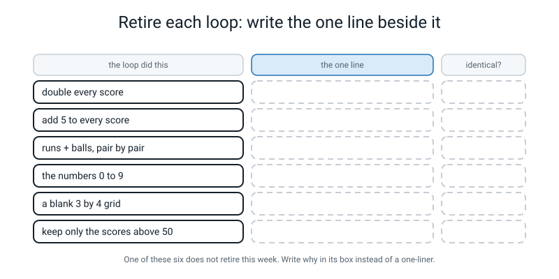
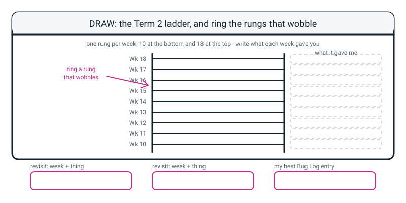

# Workbook — Week 18: Term 2 Checkpoint — Eight Loops You Never Have to Write Again

**Name:** ________________________________  **Date:** ______________

[⬅ Week 17](week-17.md) · [📖 Read the chapter first](../student-guide/week-18.md) · [Course Home](../README.md) · [🧑‍🏫 Teacher guide](../teacher-guide/week-18.md) · [Next ➡](week-19.md)

---

## ✅ Warm-Up (5 min)

Five quick questions about **last week**.

**W1.** An array has shape `(5, 3)`. How many rows, how many columns, and how many numbers altogether?

________________________________________________________________

**W2.** `np.array([1, 2, 3.0])` has dtype `float64`, not `int64`. Why does **one** decimal decide it for all three?

________________________________________________________________

________________________________________________________________

**W3.** Write the shape and the dtype of `np.array([[7], [8], [9]])`, without running it.

**shape:** ____________  **dtype:** ____________

**W4.** What is wrong with `print(runs.shape())`, and what is the question that fixes it permanently?

________________________________________________________________

**W5.** You print an array's shape and it is exactly what you expected. Name one thing that could still be badly wrong with it.

________________________________________________________________

---

## 🔎 Predict the Output

**Write your prediction before you run anything.** Every snippet starts with `import numpy as np`. **Two of these four are silent** — they run, they print, and something is wrong.

### P1 — the most common numpy mistake in the world

```python
scores = [48, 12, 77]
print(scores * 2)
print(np.array(scores) * 2)
print(len(scores * 2))
print(len(np.array(scores) * 2))
```

**I predict:**

________________________________________________________________

________________________________________________________________

**It really printed:**

________________________________________________________________

________________________________________________________________

**Did anything crash?** ____________  **Which two lines disagree, and by how many numbers?** ____________

### P2 — is it the same answer?

```python
loop = [96, 24, 154]
line = np.array([48, 12, 77]) * 2
print(loop)
print(line)
print(line == loop)
print(list(line) == loop)
```

**I predict — four lines. What does line 3 give you?**

________________________________________________________________

**It really printed:**

________________________________________________________________

________________________________________________________________

**Lines 3 and 4 look like the same question. What is the difference?**

________________________________________________________________

### P3 — off by one, again

```python
print(np.arange(6))
print(len(np.arange(6)))
print(np.arange(6)[-1])
print(np.zeros(3))
```

**I predict:** ______________  ______  ______  ______________

**It really printed:** ______________  ______  ______  ______________

**How many numbers, and what is the last one?** ______ and ______

**Why does the last line have dots in it?** ______________________________

### P4 — three plus three

```python
a = np.array([1, 2, 3])
b = np.array([[10], [20], [30]])
print((a + b).shape)
print(a + b)
print(sum(a + b))
```

**I predict — three numbers plus three numbers. How many numbers come out?** ______

**It really printed:**

________________________________________________________________

________________________________________________________________

________________________________________________________________

**Which three numbers did you actually want, and where are they?**

________________________________________________________________

**How many of the sixteen answers on this page did you get right?** ______ / 16

**Which one surprised you most, and why?**

________________________________________________________________

---

## ✍️ Practice Set A — Read It

**A1. Loop or one-liner?** For each loop, say whether it **retires today**, **needs something you have not learned yet**, or **will never retire to array arithmetic** (`*` `+` `/`) — and give the one line, or the reason.

| # | The loop does this | Verdict | The one line, or why not |
|---|---|---|---|
| a | doubles every score | | |
| b | adds two columns pair by pair | | |
| c | builds the numbers 0 to 19 | | |
| d | totals a column | | |
| e | makes a blank 5 by 3 grid | | |
| f | squares every score | | |
| g | keeps only the scores above 50 | | |
| h | counts how many players per team | | |
| i | asks for a guess until the user gets it right | | |
| j | prints one formatted table row per record | | |

**A1(k).** State the rule in one sentence.

________________________________________________________________

**A1(l).** What is different about **(g)** from all the ones that retire?

________________________________________________________________

**A1(m).** Is **(h)** numpy's failure, or the wrong tool? Say why.

________________________________________________________________

**A2. Shapes that work and shapes that do not.** For each pair, will it work? If so, what shape comes out?

| # | Shapes | Works? | Result shape | Why |
|---|---|---|---|---|
| a | `(6,)` and `(6,)` | | | |
| b | `(6,)` and one number | | | |
| c | `(6,)` and `(4,)` | | | |
| d | `(3,)` and `(3, 1)` | | | |
| e | `(2, 3)` and `(3,)` | | | |
| f | `(3, 1)` and `(3, 1)` | | | |
| g | `(2, 3)` and `(2,)` | | | |

**A2(h).** Which of these seven is the **dangerous** one, and why?

________________________________________________________________

________________________________________________________________

**A2(i).** Which are **good news**, and why?

________________________________________________________________

________________________________________________________________

**A2(j).** For the dangerous one, how do you fix it?

________________________________________________________________

**A2(k).** What is the one check that would have caught it?

________________________________________________________________

**A3. Trace the loop.** Fill in the value of `total` after each pass.

```python
scores = [48, 12, 77]
total = 0
for s in scores:
    total += s
print(total)
```

| After pass | `s` is | `total` is |
|---|---|---|
| start | — | |
| 1 | | |
| 2 | | |
| 3 | | |

**And the one line that replaces the whole thing:** ______________________________

**Why is this loop different from the eight in the chapter?**

________________________________________________________________

**A4. Match each line of code to its output.** There are five of each, and no output is used twice.

| | Code |
|---|---|
| i | `print([2, 4] * 2)` |
| ii | `print(np.array([2, 4]) * 2)` |
| iii | `print(np.arange(4))` |
| iv | `print(np.zeros(2))` |
| v | `print(np.zeros((2, 2)))` |

| | Output |
|---|---|
| P | `[4 8]` |
| Q | `[0. 0.]` |
| R | `[2, 4, 2, 4]` |
| S | `[[0. 0.]`<br>` [0. 0.]]` |
| T | `[0 1 2 3]` |

**i → ______   ii → ______   iii → ______   iv → ______   v → ______**

**A5. Fill in the worksheet.** Write the one line beside each loop, and what `identical?` should print.


*Figure W18.1 — Five of these retire today. One does not.*

| The loop did this | The one line | `identical?` |
|---|---|---|
| double every score | | |
| add 5 to every score | | |
| runs + balls, pair by pair | | |
| the numbers 0 to 9 | | |
| a blank 3 by 4 grid | | |
| keep only the scores above 50 | | |

**Which one does not retire, and what is coming that will retire it?**

________________________________________________________________

**A6. Read the traceback.**

```text
Traceback (most recent call last):
  File "shapes.py", line 5, in <module>
    print(a + b)
ValueError: operands could not be broadcast together with shapes (6,) (4,) 
```

**What is numpy refusing to do?**

________________________________________________________________

**numpy printed both shapes at you. Why is that helpful?**

________________________________________________________________

**Is this good news or bad news? Name the two things numpy could have done instead.**

________________________________________________________________

________________________________________________________________

---

## ✍️ Practice Set B — Write It

### B1 — one line

Retire this loop in a single line. `scores` is a plain Python list.

```python
scores = [48, 12, 77, 5, 63, 30]
result = []
for s in scores:
    result.append(s + 10)
```

```python
# your line here:
```

**Expected output:**

```text
[58 22 87 15 73 40]
```

**Done looks like:** one line, and the `np.array(...)` is in it — because `scores` is a list.

### B2 — two loops retired, both proved

Take five prices of your own. Retire two loops: one that **halves** every price, one that **squares** every price. Print both the loop version and the one-liner for each, and print `identical?` for both.

**Expected output shape:**

```text
A loop: [22.5, 5.0, 60.0, 2.5, 47.5]
A line: [22.5  5.  60.   2.5 47.5]
A identical? True
B loop: [2025, 100, 14400, 25, 9025]
B line: [ 2025   100 14400    25  9025]
B identical? True
```

**Done looks like:** two `True`s, from `list(...) == ...` and **not** from looking at the two printed lines.

### B3 — two arrays built without typing any numbers

Build the counting numbers 0 to 19 with `np.arange`, and a blank 5-row, 3-column grid with `np.zeros`. For the counting numbers print how many there are, what the last one is, the shape and the dtype. For the grid print it, its shape and its dtype.

**Expected output:**

```text
counting: [ 0  1  2  3  4  5  6  7  8  9 10 11 12 13 14 15 16 17 18 19]
how many numbers: 20
the last one    : 19
shape           : (20,)
dtype           : int64
blank:
[[0. 0. 0.]
 [0. 0. 0.]
 [0. 0. 0.]
 [0. 0. 0.]
 [0. 0. 0.]]
shape: (5, 3)
dtype: float64
```

**Done looks like:** twenty numbers whose last one is **19**, and a `(5, 3)` grid whose dtype is `float64` — and you can say why both of those are what they are.

### B4 — one formula, four operations, one line

Six prices. The shop's rule: **take 10% off, then add a 20 rupee delivery charge, then add 5% tax to the lot.** Write it as a loop, then as one line, then prove they are identical.

**Expected output:**

```text
loop: [257.25, 191.1, 323.4, 209.06, 422.62, 162.75]
line: [257.25 191.1  323.4  209.06 422.62 162.75]
identical? True
```

**Done looks like:** the one line reads like the shop's rule read out loud, in the same order, with brackets where the order matters.

### B5 — five broadcasts, about 15 lines

Build five arrays with shapes `(6,)`, `(4,)`, `(3,)`, `(3, 1)` and `(2, 3)`. Print all five shapes. Then add four safe pairs and print the result shape of each. Leave the fifth pair **commented out**, and uncomment it last so you can read the error on purpose.

**Predict the five result shapes here, before you run it:**

| Pair | I predict | Actual |
|---|---|---|
| `six + six` | | |
| `six + 5` | | |
| `row + column` | | |
| `block + row` | | |
| `six + four` | | |

**Expected output shape:**

```text
the shapes we are working with:
  six     (6,)
  four    (4,)
  row     (3,)
  column  (3, 1)
  block   (2, 3)

six + six    -> (6,) [ 2  4  6  8 10 12]
six + 5      -> (6,) [ 6  7  8  9 10 11]
row + column -> (3, 3)
[[11 12 13]
 [21 22 23]
 [31 32 33]]
block + row  -> (2, 3)
[[2 4 6]
 [5 7 9]]
```

**Done looks like:** four shapes printed, one error read on purpose, and **five predictions ticked or crossed.**

---

## 🐞 Fix the Broken Program

Here is `report.py`, which is supposed to retire three loops on six scores. It has **three** bugs: one that stops Python reading the file at all, one that stops it partway through, and one that produces **no error whatsoever**.

```python
# report.py - retire three loops on six scores. Three bugs.

import numpy as np

scores = [48, 12, 77, 5, 63, 30]
balls = [32, 20, 55, 9, 41, 28]

score_arr = np.array(scores)
balls_arr = np.array(balls)

# 1  double every score
print("doubled:", scores * 2)

# 2  runs + balls, pair by pair
loop = []
for i in range(len(scores))
    loop.append(scores[i] + balls[i])
print("loop   :", loop)
print("line   :", score_arr + balls_arr)

# 3  a blank 2-row, 3-column sheet
print("blank  :")
print(np.zeros(2, 3))
```

**Bug 1.** Run it as it is. The real message:

```text
  File "report.py", line 16
    for i in range(len(scores))
                               ^
SyntaxError: expected ':'
```

**What kind of error is this, and did any of the program run?**

________________________________________________________________

**Python is very specific this time. What exactly does it want?**

________________________________________________________________

**The fix:**

________________________________________________________________

**Bug 2.** Fix bug 1 and run again. The real message:

```text
doubled: [48, 12, 77, 5, 63, 30, 48, 12, 77, 5, 63, 30]
loop   : [80, 32, 132, 14, 104, 58]
line   : [ 80  32 132  14 104  58]
blank  :
Traceback (most recent call last):
  File "report.py", line 23, in <module>
    print(np.zeros(2, 3))
TypeError: Cannot interpret '3' as a data type
```

**You never typed the words "data type". So where did the `3` go?**

________________________________________________________________

**The fix:**

________________________________________________________________

**And the general lesson: when a message mentions something you never typed, what has probably happened?**

________________________________________________________________

**Bug 3.** Fix bug 2 and run again. Now there is **no error at all**:

```text
doubled: [48, 12, 77, 5, 63, 30, 48, 12, 77, 5, 63, 30]
loop   : [80, 32, 132, 14, 104, 58]
line   : [ 80  32 132  14 104  58]
blank  :
[[0. 0. 0.]
 [0. 0. 0.]]
```

**Look at the first line of output. How many numbers went in?** ______  **How many came out?** ______

**Is a single one of them doubled?** ____________

**Why did this happen? Be precise about which line the mistake is on:**

________________________________________________________________

________________________________________________________________

**The fix:**

________________________________________________________________

**Write out the first line of output after the fix:**

________________________________________________________________

**And the check that catches this whole family of bug, in one short question:**

________________________________________________________________

---

## 🧩 Puzzle of the Week

### Part 1 — The sorting office

Here are nine loops. Sort them into **three piles**: retires today · needs something coming later · will never retire.

| # | The loop |
|---|---|
| 1 | turns every temperature from celsius into fahrenheit |
| 2 | builds a list of the numbers 0 to 99 |
| 3 | keeps only the songs longer than four minutes |
| 4 | asks the user for their name until they type something |
| 5 | works out each player's strike rate from runs and balls |
| 6 | counts how many songs there are of each genre |
| 7 | makes an empty 10 by 4 sheet to fill in later |
| 8 | prints a numbered table, one line per record |
| 9 | adds up every play count into one total |

**Retires today:** ______________________________________________

**Needs something coming later:** ____________________________

**Will never retire:** ________________________________________

**(a)** What do all the "retires today" ones have in common? Say it in one sentence.

________________________________________________________________

**(b)** What do all the "will never retire" ones have in common?

________________________________________________________________

**(c)** One of the nine is in the middle pile. What is it about that one, and which week is coming to rescue it?

________________________________________________________________

### Part 2 — How wrong is wrong?

Somebody added a `(3,)` to a `(3, 1)` by accident, got a `(3, 3)` back, and then — without ever printing the array — totalled it up and put the total in a report.

**(a)** Here is the wrong answer and the right answer. Total both.

```python
wrong = np.array([[49, 13, 78],
                  [50, 14, 79],
                  [51, 15, 80]])
right = np.array([49, 14, 80])
print("total of the wrong answer:", sum(wrong))
print("total of the right answer:", sum(right))
```

**It printed:**

________________________________________________________________

**(b)** The wrong total is not even the same *kind* of thing as the right total. What is it?

________________________________________________________________

**(c)** Would you have noticed, if the report only ever showed you the total?

________________________________________________________________

**(d)** So: what would you have to print, and at what point, to catch this?

________________________________________________________________

**(e)** Here is the puzzle proper. The three numbers you wanted — 49, 14 and 80 — really are inside that grid. **Where exactly?** Describe the pattern in words, and then say why the other six numbers are meaningless.

________________________________________________________________

________________________________________________________________

________________________________________________________________

---

## 🤔 Think Deeper

**T1.** Broadcasting is the feature that makes numpy pleasant to write, and it is also the feature that produced nine numbers instead of three without a word of warning.

Write a paragraph. Start with what code would look like **without** broadcasting — write out what `celsius * 9 / 5 + 32` would have to become. Then make the case against, using the `(3,)` + `(3, 1)` bug. Then land somewhere: **not** "broadcasting is good" or "broadcasting is bad", but a **habit** you would tell a new programmer to adopt. Finish by answering this: newer array libraries have tightened some of the edges around broadcasting because of bugs like this one, and **not one of them has removed it.** Why do you think that is?

________________________________________________________________

________________________________________________________________

________________________________________________________________

________________________________________________________________

________________________________________________________________

________________________________________________________________

**T2.** Term 2 had **four** bugs that produced no error message at all: `max()` reporting 90 from a CSV, a dtype of `<U21` from one typo, a list repeated instead of doubled, and three plus three giving nine.

Write a paragraph about what those four have in common. Go past "they were silent" — look at *why* each one survived. Then answer the hard question: **what is the difference between "it ran" and "it's right", and whose job is that difference?** And the honest follow-up: you now know four checks that catch these (count what goes in and what comes out · print `type()` · print `.shape` and `.dtype` · check the answer against something you already know). **All four are boring.** Is that a coincidence?

________________________________________________________________

________________________________________________________________

________________________________________________________________

________________________________________________________________

________________________________________________________________

________________________________________________________________

---

## 🛠️ Build It

Two halves, and **both** halves are marked.

### Half 1, Part 1 — Find eight of your own loops

Go into your own files from Weeks 7 to 15 and find eight loops. **Your own.** You have written dozens.

- [ ] Eight loops found, in my own files
- [ ] The week each one came from written down
- [ ] Each one's job written in plain words, before any code

| # | Which file / week | What the loop does, in words |
|---|---|---|
| 1 | | |
| 2 | | |
| 3 | | |
| 4 | | |
| 5 | | |
| 6 | | |
| 7 | | |
| 8 | | |

### Half 1, Part 2 — Retire all eight, and prove it

For each one: write the loop version, run it, **write the answer down.** Then write the one line, run it, and print `identical?` with the `list(...) == ...` check.

- [ ] Loop version run first, every time, and its answer written down
- [ ] One line written for each
- [ ] `identical?` printed using `list(...) == ...` — **not** compared by eye
- [ ] **Eight `True`s**

| # | The one line | Loop's first number | Line's first number | `identical?` |
|---|---|---|---|---|
| 1 | | | | |
| 2 | | | | |
| 3 | | | | |
| 4 | | | | |
| 5 | | | | |
| 6 | | | | |
| 7 | | | | |
| 8 | | | | |

**Hand-check two of them on paper**, with a pencil, one number at a time:

________________________________________________________________

________________________________________________________________

**Which was the most satisfying to retire, and why?**

________________________________________________________________

________________________________________________________________

**Did any refuse to retire? Which, and why do you think it won't?**

________________________________________________________________

________________________________________________________________

> **⚠️ Watch out:** if a loop will not retire, **do not force it.** If your reason is *"it only does something to some of the numbers"*, you have found Week 20 two weeks early and you should say so.

### Half 2, Part 1 — The Term 2 reflection

One word for each week: **solid**, **shaky**, or **lost**. Nobody marks the words. Be honest.

| Week | What it was | My word |
|---|---|---|
| 10 | Functions with parameters, `return`, defaults | |
| 11 | Lists, index from 0, `append` | |
| 12 | Slicing, `sorted`, importing your own file | |
| 13 | Dictionaries, `.get()` with a fallback | |
| 14 | A list of dicts is a table | |
| 15 | Filter, group, and the row count | |
| 16 | CSV out, CSV back, convert on load | |
| 17 | Arrays, `.shape`, `.dtype` | |

**(a)** Which week of Term 2 made the most sense, **and why**?

________________________________________________________________

________________________________________________________________

**(b)** Which one would you **least** like to be tested on tomorrow?

________________________________________________________________

**(c)** Name one thing you can do now that you could not do in Week 9.

________________________________________________________________

________________________________________________________________

**(d)** In Week 9 you turned repeated **blocks** into functions. What did Term 2 turn repeated **work** into?

________________________________________________________________

________________________________________________________________

### Half 2, Part 2 — The revisit list

**At least two lines, and each line names a week AND a thing.**

1. ______________________________________________________________

2. ______________________________________________________________

3. ______________________________________________________________

> **💡 Try this:** read your two lines back and ask "could somebody else help me with this from what I've written?" *"Week 15, the comprehension with the `if` in it"* — yes. *"Loops"* — no.

### Half 2, Part 3 — Your three best Bug Log entries

Read your Bug Log from Week 10 all the way to today. Pick the **three entries that were worth the most**, and one sentence each on why.

| # | The bug | Week | Why it was worth so much |
|---|---|---|---|
| 1 | | | |
| 2 | | | |
| 3 | | | |

**Is at least one of your three an error with NO error message?** ____________

**If not, go back and look again.** There are four of them in Term 2.

### Half 2, Part 4 — Two sentences

**(a) What is the one check that would have caught three of Term 2's silent bugs?** Six words will do.

________________________________________________________________

**(b) What is the difference between "it ran" and "it's right"?**

________________________________________________________________

________________________________________________________________

---

## 🎨 Draw It

Draw **the Term 2 ladder**, one rung per week, and ring the rungs that wobble.


*Figure W18.2 — Your page.*

> **What a good answer might look like:** nine rungs filled in, Week 10 at the bottom, Week 18 at the top, each with a short phrase in the box beside it — *"functions that hand something back"*, *"a list is numbered slots"*, *"my own toolkit file"*, *"labels instead of numbers"*, *"one dict per row is a table"*, *"filter, group, and the row count"*, *"a file forgets what kind of thing it was"*, *"shape and dtype"*, *"one line instead of a loop"*.
>
> Then **two rungs ringed**, with a short note on each: a ring round Week 15 labelled *the comprehension with the `if` in it — I can read it but not write it*, and a ring round Week 17 labelled *(3,) versus (3, 1) — got it wrong twice*.
>
> The three bottom boxes: **Week 7 — `range(6)` stops at 5** · **Week 15 — comprehensions with a condition** · **`max()` said 90 — a wrong answer with no error at all**.
>
> And one annotation that shows real understanding: an arrow drawn from the Week 17 rung **up** to the Week 18 rung, labelled *this is why printing the shape mattered — 17 gave me the habit and 18 gave me the reason*.
>
> **What a weak answer looks like:** every rung labelled with a word like "numpy" or "dictionaries", and nothing ringed. A ladder with no rings on it is not a diagnosis — and remember the safety net: **everybody has a week they would least like to be tested on tomorrow, including the teacher.** If you genuinely retired all eight loops, ring that week instead.

---

## 📊 Self-Check

| I can… | 😀 got it | 🙂 nearly | 😕 not yet |
|---|---|---|---|
| Rewrite a `for` loop as one line of array maths | ☐ | ☐ | ☐ |
| Prove the two versions are identical with `list(arr) == loop` | ☐ | ☐ | ☐ |
| Add two arrays elementwise and say what must be true of their shapes | ☐ | ☐ | ☐ |
| Explain broadcasting with the shop-sign idea | ☐ | ☐ | ☐ |
| Build arrays with `np.arange` and `np.zeros` | ☐ | ☐ | ☐ |
| Spot a `(3, 3)` where I wanted a `(3,)`, and fix it | ☐ | ☐ | ☐ |
| Say which loops will never retire, and why | ☐ | ☐ | ☐ |
| Name a specific week and a specific thing I need to go back over | ☐ | ☐ | ☐ |

**True or false?** Circle one on each row.

| Statement | | |
|---|---|---|
| `scores * 2` doubles a plain Python list | TRUE | FALSE |
| `[48, 12] * 2` raises an error | TRUE | FALSE |
| `[48, 12] + 5` raises an error | TRUE | FALSE |
| `[96, 24, 154]` and `[ 96  24 154]` are different answers | TRUE | FALSE |
| `arr == my_list` gives you `True` or `False` | TRUE | FALSE |
| Two arrays being added must have shapes that line up | TRUE | FALSE |
| `(3,)` + `(3, 1)` raises an error | TRUE | FALSE |
| `np.arange(6)` includes 6 | TRUE | FALSE |
| `np.zeros(2, 3)` makes a 2 by 3 grid | TRUE | FALSE |
| `np.zeros((2, 3))` gives whole numbers | TRUE | FALSE |
| `sum(arr)` works on a numpy array | TRUE | FALSE |
| Array maths can retire a loop that counts players per team | TRUE | FALSE |
| If code runs with no error, the shapes must have been right | TRUE | FALSE |

One thing I'd like explained again:

________________________________________________________________

---

## ✅ Answers

<details>
<summary>Check your answers</summary>

### Warm-Up

**W1.** **Five rows, three columns, fifteen numbers.** Rows first, always. *(If you said three rows and five columns, that is the one to fix before Week 19 — put it on your revisit list now.)*

**W2.** Because an array only gets **one** kind for all of it, and numpy picks the kind that can hold **every** value without losing anything. A whole-number box has nowhere to put `3.0`'s decimal point. A decimal box holds `1` perfectly well, as `1.0`. So it picks decimals — the kind that loses nothing, not the kind most of the values already are.

**W3.** **shape `(3, 1)`, dtype `int64`.** Each number is inside its own inner list, and an inner list is a **row** — so three rows of one column.

**W4.** `.shape` is not a function, so it has nothing to call. You get `TypeError: 'tuple' object is not callable`. **The question that fixes it permanently: is the shape something the array *does*, or something the array *is*?** It is something it **is**, like your height. You do not call your height.

**W5.** The **dtype**. A single typo can turn every number in the array into text and **the shape does not move.** `(5, 3)` and `(5, 3)`, one usable and one useless. Two facts, two prints.

---

### Predict the Output

**P1** — real output:

```text
[48, 12, 77, 48, 12, 77]
[ 96  24 154]
6
3
```

**Nothing crashed.** That is the whole problem.

Line 1 is `* 2` on a plain **list**, and on a list `* 2` means *the list, repeated*. Same rule as `"=" * 20` from Week 3. **Six numbers came out and not one of them is doubled.**

Line 2 is the same numbers as an **array**, and `* 2` on an array multiplies every one of them.

Lines 3 and 4 are the check: **six versus three.** Three went in. One version gave three back and the other gave six. **That count is how you catch it**, and it is the same question that caught the missing CSV header in Week 16.

And the reason this bug is so hard to see: **there is nothing wrong with the line you are looking at.** The mistake is on the line above, where `np.array()` is missing.

**P2** — real output:

```text
[96, 24, 154]
[ 96  24 154]
[ True  True  True]
True
```

Lines 1 and 2 are the printing trap: a **list** prints with commas, an **array** prints with spaces and pads the numbers so the columns line up. **Same three numbers.**

Lines 3 and 4 look like the same question and are not. `line == loop` is **elementwise**, exactly like `+` — it compares position by position and hands you **one answer per position**, which is why you get three `True`s in an array. `list(line) == loop` turns the array back into a plain list first, so Python compares two lists and gives you **one** answer.

Both are useful. Only the second one is a yes-or-no.

**P3** — real output:

```text
[0 1 2 3 4 5]
6
5
[0. 0. 0.]
```

**Six numbers, and the last one is 5.** `np.arange` starts at 0 and stops **before** the number you gave it — exactly the same off-by-one as Week 7's `range`. Answer both halves every time.

`[-1]` is Week 11's negative index, working perfectly on an array: the last slot.

And the dots: `np.zeros` gives you **`float64`** by default, so every zero is a decimal zero. The reasoning is that a blank you are about to fill with real measurements is far more often decimals than whole numbers. If you genuinely need whole numbers: `np.zeros(3, dtype=int)`.

**P4** — real output:

```text
(3, 3)
[[11 12 13]
 [21 22 23]
 [31 32 33]]
[63 66 69]
```

**Nine numbers.** Three plus three gave nine, and nothing crashed and nothing warned.

The three you wanted are `1 + 10 = 11`, `2 + 20 = 22` and `3 + 30 = 33` — **on the diagonal**, top left to bottom right. The other six are somebody's number plus somebody else's, which is not a thing anybody asked for.

And look at the third line. `sum` of the wrong answer gives **three numbers**, `[63 66 69]`, when the right answer's total would have been `11 + 22 + 33 = 66`. **The wrong total is not even the same kind of thing as the right total** — and if the only thing your program printed was the total, you would have had no way of knowing.

---

### Practice Set A

**A1.**

| # | Verdict | The one line, or why not |
|---|---|---|
| a | **retires** | `arr * 2` |
| b | **retires** | `arr1 + arr2` |
| c | **retires** | `np.arange(20)` |
| d | **retires** | `sum(arr)` — Python's own `sum`, from Week 12 |
| e | **retires** | `np.zeros((5, 3))` |
| f | **retires** | `arr ** 2` |
| g | **not yet** | needs a **boolean mask** — Week 20 |
| h | **never** | needs the team **names**, and array arithmetic has none. This belongs to a dictionary for now |
| i | **never** | a `while` loop waiting on a person. Arrays have nothing to say about people |
| j | **never** | that is output, not arithmetic |

**A1(k).** **Array maths retires loops that do the same arithmetic to every number.** It cannot help with loops that make decisions about text, wait for a person, or produce printed output.

**A1(l).** It does something to **some** of the numbers and not others, and array maths does the same thing to **all** of them. That is not a permanent limit — a boolean mask in Week 20 is precisely the tool for *"only the ones where…"*, and it is one line as well.

**A1(m).** **The wrong tool.** Counting per team needs the team names, and an array cannot hold names alongside numbers — that was Week 17's whole trade. This is not something numpy should be better at; it is something a dictionary already does perfectly. **From Week 21, pandas does both at once, which is exactly what it is for.**

**A2.**

| # | Shapes | Works? | Result shape | Why |
|---|---|---|---|---|
| a | `(6,)` and `(6,)` | yes | `(6,)` | they line up exactly — six pairs, six answers |
| b | `(6,)` and one number | yes | `(6,)` | broadcasting reuses the single number six times |
| c | `(6,)` and `(4,)` | **no** | — | `ValueError`. Six and four cannot pair up, and numpy will not guess |
| d | `(3,)` and `(3, 1)` | yes — **the trap** | `(3, 3)` | one is a row and one is a column; both get stretched into a grid |
| e | `(2, 3)` and `(3,)` | yes | `(2, 3)` | the row of three is reused for each of the two rows |
| f | `(3, 1)` and `(3, 1)` | yes | `(3, 1)` | identical shapes, three pairs |
| g | `(2, 3)` and `(2,)` | **no** | — | line them up from the right: 3 against 2. Not equal, neither is 1. Refused |

Real output, checked:

```text
six + six             -> (6,)
six + 5               -> (6,)
row + column          -> (3, 3)
block + row           -> (2, 3)
(3,1) + (3,1)         -> (3, 1)
(6,) + (4,)           -> ValueError: operands could not be broadcast together with shapes (6,) (4,)
(2,3) + (2,)          -> ValueError: operands could not be broadcast together with shapes (2,3) (2,)
```

**A2(h).** **(d).** It is the only one that **works** while almost certainly being a mistake. Nobody deliberately adds a row of three to a column of three. It produces nine numbers instead of three, does not complain, and hides the three answers you wanted on the diagonal.

**A2(i).** **(c) and (g).** They **stop you.** numpy could have paired up as many as it could and handed you a short answer, or padded the gap with zeros — and then you would have made-up numbers in your data with nothing to tell you. **An error you can read beats a wrong answer you cannot see.**

**A2(j).** Retype the brackets so the column becomes a row: `np.array([1, 2, 3])` instead of `np.array([[1], [2], [3]])`. **One set of brackets, not two.**

**A2(k).** **Printing the shape of the answer.** `(3, 3)` where you expected `(3,)`. There is no other signal — no error, no warning, and all three of the numbers you wanted are present.

**A3.**

| After pass | `s` is | `total` is |
|---|---|---|
| start | — | `0` |
| 1 | `48` | `48` |
| 2 | `12` | `60` |
| 3 | `77` | `137` |

`print(total)` gives **`137`**.

**The one line:** `sum(np.array(scores))` — or, since Python's `sum` works on a plain list too, just `sum(scores)`.

**Why this loop is different from the eight in the chapter:** it is an **accumulator** loop. It gives you **one number**, not a list of numbers. So the one-liner is `sum(...)`, not `arr` something — and there is no `identical?` list check to do, just one number against one number.

**A4.** **i → R** · **ii → P** · **iii → T** · **iv → Q** · **v → S**

Real output, all five:

```text
[2, 4, 2, 4]
[4 8]
[0 1 2 3]
[0. 0.]
[[0. 0.]
 [0. 0.]]
```

The pair worth staring at is **i and ii**: the same two numbers, the same `* 2`, and one of them repeats while the other doubles. The only difference is `np.array`.

**A5.**

| The loop did this | The one line | `identical?` |
|---|---|---|
| double every score | `score_arr * 2` | `True` |
| add 5 to every score | `score_arr + 5` | `True` |
| runs + balls, pair by pair | `score_arr + balls_arr` | `True` |
| the numbers 0 to 9 | `np.arange(10)` | `True` |
| a blank 3 by 4 grid | `np.zeros((3, 4))` | `True` |
| keep only the scores above 50 | **does not retire today** | — |

**The one that does not retire** is *keep only the scores above 50*, because it does something to **some** of the numbers and not others. **Week 20** brings the tool: a boolean mask, and it is one line too.

**A6.** numpy is refusing to **add two arrays whose shapes do not line up** — six numbers and four numbers. There is no honest pairing.

**Why printing both shapes is helpful:** it tells you *exactly* what to go and look at. You do not have to guess which of the two lists is wrong — you know one has six values and one has four, so go and count. Usually one list has a value missing or an extra one.

**Good news.** The two things numpy could have done instead: **stop at the fourth pair** and hand you a four-number answer that looks fine, or **pad the missing two with zeros** and hand you two made-up numbers. Either way you would have wrong data and no warning. **It refused, and refusing is kinder.**

---

### Practice Set B

**B1.**

```python
import numpy as np

scores = [48, 12, 77, 5, 63, 30]
print(np.array(scores) + 10)
```

```text
[58 22 87 15 73 40]
```

The `np.array(...)` is not optional. `scores + 10` on a plain list gives `TypeError: can only concatenate list (not "int") to list`.

**B2.**

```python
"""b2.py - two loops retired, and both proved identical."""

import numpy as np

prices = [45, 10, 120, 5, 95]
price_arr = np.array(prices)

# loop A: halve every price
loop_a = []
for p in prices:
    loop_a.append(p / 2)
line_a = price_arr / 2
print("A loop:", loop_a)
print("A line:", line_a)
print("A identical?", list(line_a) == loop_a)

# loop B: square every price
loop_b = []
for p in prices:
    loop_b.append(p ** 2)
line_b = price_arr ** 2
print("B loop:", loop_b)
print("B line:", line_b)
print("B identical?", list(line_b) == loop_b)
```

Real output:

```text
A loop: [22.5, 5.0, 60.0, 2.5, 47.5]
A line: [22.5  5.  60.   2.5 47.5]
A identical? True
B loop: [2025, 100, 14400, 25, 9025]
B line: [ 2025   100 14400    25  9025]
B identical? True
```

Look at loop A's printing: `5.0` in the list and `5.` in the array. **Same number, two ways of writing it**, and `==` knows.

**B3.**

```python
"""b3.py - two arrays built without typing any numbers."""

import numpy as np

counting = np.arange(20)
print("counting:", counting)
print("how many numbers:", len(counting))
print("the last one    :", counting[-1])
print("shape           :", counting.shape)
print("dtype           :", counting.dtype)

blank = np.zeros((5, 3))
print("blank:")
print(blank)
print("shape:", blank.shape)
print("dtype:", blank.dtype)
```

Real output:

```text
counting: [ 0  1  2  3  4  5  6  7  8  9 10 11 12 13 14 15 16 17 18 19]
how many numbers: 20
the last one    : 19
shape           : (20,)
dtype           : int64
blank:
[[0. 0. 0.]
 [0. 0. 0.]
 [0. 0. 0.]
 [0. 0. 0.]
 [0. 0. 0.]]
shape: (5, 3)
dtype: float64
```

**Twenty numbers, last one 19** — `np.arange` stops **before** the number you gave it. **`float64`** on the blank grid — `np.zeros` gives decimals by default, and you would only know that by printing `.dtype` or spotting a dot you did not type.

**B4.**

```python
"""b4.py - one formula, four operations, one line."""

import numpy as np

prices = [250, 180, 320, 199, 425, 150]
price_arr = np.array(prices)

loop = []
for p in prices:
    loop.append((p * 0.9 + 20) * 1.05)

line = (price_arr * 0.9 + 20) * 1.05

print("loop:", [round(x, 2) for x in loop])
print("line:", np.round(line, 2))
print("identical?", list(line) == loop)
```

Real output:

```text
loop: [257.25, 191.1, 323.4, 209.06, 422.62, 162.75]
line: [257.25 191.1  323.4  209.06 422.62 162.75]
identical? True
```

**The brackets matter, and they matter for the same reason they do in ordinary arithmetic.** `(price * 0.9 + 20) * 1.05` takes the discount, adds the delivery, and then taxes **the whole lot**. Without the brackets — `price * 0.9 + 20 * 1.05` — you would tax only the delivery charge, which is a different shop's rule and a wrong answer with no error.

**B5.**

```python
"""b5.py - five broadcasts. Predict each one BEFORE you run it."""

import numpy as np

six = np.array([1, 2, 3, 4, 5, 6])               # shape (6,)
four = np.array([1, 2, 3, 4])                    # shape (4,)
row = np.array([1, 2, 3])                        # shape (3,)
column = np.array([[10], [20], [30]])            # shape (3, 1)
block = np.array([[1, 2, 3],
                  [4, 5, 6]])                    # shape (2, 3)

print("the shapes we are working with:")
for name, arr in [("six", six), ("four", four), ("row", row),
                  ("column", column), ("block", block)]:
    print(f"  {name:<8}{arr.shape}")

print()
print("six + six    ->", (six + six).shape, (six + six))
print("six + 5      ->", (six + 5).shape, (six + 5))
print("row + column ->", (row + column).shape)
print(row + column)
print("block + row  ->", (block + row).shape)
print(block + row)

# print("six + four   ->", six + four)     # <-- uncomment this one LAST
```

Real output:

```text
the shapes we are working with:
  six     (6,)
  four    (4,)
  row     (3,)
  column  (3, 1)
  block   (2, 3)

six + six    -> (6,) [ 2  4  6  8 10 12]
six + 5      -> (6,) [ 6  7  8  9 10 11]
row + column -> (3, 3)
[[11 12 13]
 [21 22 23]
 [31 32 33]]
block + row  -> (2, 3)
[[2 4 6]
 [5 7 9]]
```

And the commented line, uncommented:

```text
Traceback (most recent call last):
  File "b5err.py", line 5, in <module>
    print("six + four   ->", six + four)
ValueError: operands could not be broadcast together with shapes (6,) (4,)
```

**The two to notice.** `row + column` is the trap — three plus three, nine out. And `block + row` is the everyday useful case: a row of three reused for each of the two rows of the block, which is exactly the shop-sign idea on a 2-D array.

---

### Fix the Broken Program

**Bug 1 — the syntax error.**

It is a **`SyntaxError`**, and **none of the program ran at all.** There is no `Traceback` above the message, because there was no running program to trace.

**What Python wants is very specific:** it says `expected ':'` and puts the caret at the exact character where the colon should be. Python is rarely this helpful; when it is, believe it.

The fix — a colon at the end of the `for` line:

```python
for i in range(len(scores)):
```

**Bug 2 — the runtime error.**

`np.zeros` has **two slots**: slot one is the **shape**, slot two is the **dtype**. You handed it a `2` and a `3`, so the `2` went into the shape slot and the `3` went into the dtype slot — and there is no kind of number called three. **The number in the message is always the second one you typed.**

The fix — give the shape its own brackets, because the shape is *one thing*, a pair of numbers:

```python
print(np.zeros((2, 3)))
```

**The general lesson: when a message mentions something you never typed, you have probably put a value in the wrong slot.** That is a Week 10 idea — parameters, in order — and it will happen to you all year.

**Bug 3 — the silent one.**

**Six numbers went in. Twelve came out.** And **not one of them is doubled.**

Why: `scores` is a plain **list**, not an array, and `* 2` on a list means *the list, repeated* — the same rule as `"=" * 20` from Week 3. Python asks the thing on the **left** what `*` means, and a list's answer is "give me copies of myself".

**Be precise about which line the mistake is on.** It is **not** on the `print("doubled:", scores * 2)` line — there is nothing wrong with that line. The mistake is that the program made `score_arr` and then never used it. The fix is to use it:

```python
print("doubled:", score_arr * 2)
```

Real output after all three fixes:

```text
doubled: [ 96  24 154  10 126  60]
loop   : [80, 32, 132, 14, 104, 58]
line   : [ 80  32 132  14 104  58]
blank  :
[[0. 0. 0.]
 [0. 0. 0.]]
```

**The check that catches this whole family, in one short question:**

> **How many numbers went in, and how many came out?**

Six and twelve. Not "does it look right" — a **count**. That single question caught the missing CSV header in Week 16, it caught this today, and it caught nine-instead-of-three today as well. **Three bugs, three weeks, one question.**

---

### Puzzle of the Week

**Part 1 — the three piles**

**Retires today: 1, 2, 5, 7, 9.**

- 1 (celsius to fahrenheit) → `celsius_arr * 9 / 5 + 32`
- 2 (the numbers 0 to 99) → `np.arange(100)`
- 5 (strike rate from two columns) → `runs_arr / balls_arr * 100`
- 7 (an empty 10 by 4 sheet) → `np.zeros((10, 4))`
- 9 (add up every play count) → `sum(plays_arr)`

**Needs something coming later: 3.**

**Will never retire: 4, 6, 8.**

**(a)** They all do **the same arithmetic to every number.** No decisions, no text, no waiting, no printing — just a formula applied to everything. *(Note that 9 is slightly different from the other four: it gives **one number** out rather than a list, so its one-liner is `sum(...)`. It still retires.)*

**(b)** None of them is arithmetic. **4** waits for a person. **6** needs the genre **names**, and an array has no names. **8** produces printed output. **Loops are for people and words; arrays are for numbers.**

**(c)** **3** — *keep only the songs longer than four minutes.* It does something to **some** of the numbers and not others, and array maths does the same thing to all of them. **Week 20** brings the tool: a boolean mask, and it is one line as well.

**Part 2 — how wrong is wrong?**

**(a)** Real output:

```text
total of the wrong answer: [150  42 237]
total of the right answer: 143
```

**(b)** The wrong total is **three numbers, not one** — an array of totals, one per column of the grid. It is not even the same *kind* of thing as the right answer. *(The right total, 143, is 49 + 14 + 80.)*

**(c)** Honestly? Possibly not. If the report printed the total inside a sentence, or into a chart, or into another calculation, three numbers where one was expected can travel a surprisingly long way before anything breaks. And if the shapes had happened to work out differently, the wrong total could easily have been a single plausible number.

**(d)** **Print the shape of the answer, at the moment the answer is made** — not at the end. `(3, 3)` where you expected `(3,)`. Three numbers in should not give nine out.

**(e)** The three numbers you wanted are on the **diagonal**: top-left, then one step right and one step down, then again. `49` at row 0 column 0, `14` at row 1 column 1, `80` at row 2 column 2.

**Why they are there:** broadcasting built a grid where **every row is the three scores plus one of the bonuses.** Row 0 is the scores plus bonus 1, row 1 is the scores plus bonus 2, row 2 is the scores plus bonus 3. The answer you wanted — *the first score plus the first bonus* — is therefore in row 0, column 0. The second is in row 1, column 1. And so on down the diagonal.

**Why the other six are meaningless:** every off-diagonal cell is **one player's score plus a different player's bonus.** `13` in row 0 is the second player's 12 plus the first player's bonus of 1. Nobody asked for that, and no report should ever contain it.

---

### Build It

**Half 1 — the eight loops.** They are yours, so there is no single right answer. Here is a complete model, using an eight-song playlist, with its real output.

```python
"""hw18.py - eight loops from my own weeks 7-15 files, retired. Both versions, then the proof."""

import numpy as np

plays = [120, 45, 300, 60, 210, 95, 180, 220]      # eight songs from Week 14
minutes = [3.5, 4.2, 2.8, 5.1, 3.9, 3.3, 3.1, 2.6]

plays_arr = np.array(plays)
minutes_arr = np.array(minutes)

checks = []

# 1  Week 7: print every play count doubled
loop = []
for pl in plays:
    loop.append(pl * 2)
line = plays_arr * 2
print("1  double every play count")
print("   loop:", loop)
print("   line:", line)
checks.append(("1", list(line) == loop))

# 2  Week 7: add 10 plays to everything
loop = []
for pl in plays:
    loop.append(pl + 10)
line = plays_arr + 10
print("2  add 10 plays to every song")
print("   loop:", loop)
print("   line:", line)
checks.append(("2", list(line) == loop))

# 3  Week 7: total seconds instead of minutes
loop = []
for m in minutes:
    loop.append(m * 60)
line = minutes_arr * 60
print("3  minutes to seconds")
print("   loop:", loop)
print("   line:", line)
checks.append(("3", list(line) == loop))

# 4  Week 12: plays per minute for each song
loop = []
for i in range(len(plays)):
    loop.append(plays[i] / minutes[i])
line = plays_arr / minutes_arr
print("4  plays per minute")
print("   loop:", [round(x, 2) for x in loop])
print("   line:", np.round(line, 2))
checks.append(("4", list(line) == loop))

# 5  Week 12: total plays
loop_total = 0
for pl in plays:
    loop_total += pl
line_total = sum(plays_arr)
print("5  total plays")
print("   loop:", loop_total)
print("   line:", line_total)
checks.append(("5", line_total == loop_total))

# 6  Week 15: each song's share of the total, as a percentage
loop = []
for pl in plays:
    loop.append(pl / loop_total * 100)
line = plays_arr / line_total * 100
print("6  each song's share of all plays, as a percentage")
print("   loop:", [round(x, 2) for x in loop])
print("   line:", np.round(line, 2))
checks.append(("6", list(line) == loop))

# 7  Week 7: the track numbers 0 to 7
loop = []
for i in range(8):
    loop.append(i)
line = np.arange(8)
print("7  track numbers 0 to 7")
print("   loop:", loop)
print("   line:", line)
checks.append(("7", list(line) == loop))

# 8  Week 11: a blank 8-row, 3-column sheet to fill in later
loop = []
for row in range(8):
    loop.append([0.0, 0.0, 0.0])
line = np.zeros((8, 3))
print("8  a blank 8 by 3 sheet")
print("   loop rows:", len(loop), " loop columns:", len(loop[0]))
print("   line shape:", line.shape)
checks.append(("8", [list(r) for r in line] == loop))

print()
labels = [f"{pair[0]}:{pair[1]}" for pair in checks]     # a list comprehension, Week 14
print("identical?", ", ".join(labels))
answers = [pair[1] for pair in checks]                   # just the True/False column
print("all eight identical?", answers.count(True) == len(answers))
```

Real output:

```text
1  double every play count
   loop: [240, 90, 600, 120, 420, 190, 360, 440]
   line: [240  90 600 120 420 190 360 440]
2  add 10 plays to every song
   loop: [130, 55, 310, 70, 220, 105, 190, 230]
   line: [130  55 310  70 220 105 190 230]
3  minutes to seconds
   loop: [210.0, 252.0, 168.0, 306.0, 234.0, 198.0, 186.0, 156.0]
   line: [210. 252. 168. 306. 234. 198. 186. 156.]
4  plays per minute
   loop: [34.29, 10.71, 107.14, 11.76, 53.85, 28.79, 58.06, 84.62]
   line: [ 34.29  10.71 107.14  11.76  53.85  28.79  58.06  84.62]
5  total plays
   loop: 1230
   line: 1230
6  each song's share of all plays, as a percentage
   loop: [9.76, 3.66, 24.39, 4.88, 17.07, 7.72, 14.63, 17.89]
   line: [ 9.76  3.66 24.39  4.88 17.07  7.72 14.63 17.89]
7  track numbers 0 to 7
   loop: [0, 1, 2, 3, 4, 5, 6, 7]
   line: [0 1 2 3 4 5 6 7]
8  a blank 8 by 3 sheet
   loop rows: 8  loop columns: 3
   line shape: (8, 3)

identical? 1:True, 2:True, 3:True, 4:True, 5:True, 6:True, 7:True, 8:True
all eight identical? True
```

**The two hand-checks, done with a pencil:**

```text
card 1:  120 x 2 = 240   ✔      45 x 2 = 90    ✔
card 4:  120 / 3.5 = 34.2857... = 34.29  ✔
card 5:  120+45=165 · +300=465 · +60=525 · +210=735 · +95=830 · +180=1010 · +220=1230  ✔
card 6:  120 / 1230 x 100 = 9.756... = 9.76  ✔   and all eight shares add to 100
```

**That last line is a free cross-check worth knowing:** the eight percentages must add up to **100**. If they do not, the total is wrong.

**Three things to check in your own eight, in this order:**

1. **Eight `True`s.** Binary.
2. **Did you use `list(...) == ...`?** If you compared by eye and wrote "same", you have not done the check.
3. **Is one of your eight an accumulator?** Card 5 is different from the other seven — it gives **one number** out, not a list, so the one-liner is `sum(arr)`. Noticing that is worth a tick.

**Most satisfying to retire.** Usually card 4 or 6 — anything with `range(len(...))` and indexes in it. Model answer:

> *"The plays-per-minute one, because the loop version had `plays[i]` and `minutes[i]` in it and I always have to check I have got the `i`s in the right places. The one line just says plays divided by minutes."*

**Any that refused?** The two expected ones: a loop with an `if` in it (needs Week 20's mask) and a loop building a counting dictionary (needs names, so array arithmetic cannot retire it). **If you correctly identified the `if` loop as "not yet, and I think there's a tool coming", that is genuinely impressive.**

---

**Half 2 — the reflection.** There are no right answers to the eight words. Here is what good content looks like in the four questions.

**(a) Which week made the most sense, and why?** Any answer with a **reason** is a good answer. The most common are Week 11 (lists feel concrete) and Week 14 (a table is a familiar thing). Watch for Week 16 — somebody who says the CSV week made the most sense usually means *"I finally saw why any of this was for anything"*, which is worth writing down.

**(b) Which would you least like to be tested on?** The most common honest answers are Week 15 (comprehensions with conditions) and Week 17 (`(3, 1)` versus `(3,)`). Both are correct diagnoses of genuinely hard things. **Whatever you said goes straight onto the revisit list.**

**(c) One thing you can do now that you could not do in Week 9.** Model answers, in rough order of depth: *"put my data in a file and get it back"* · *"answer a question about a table without counting by hand"* · *"look at an error and know which line to go to"* · *"tell whether something is text or a number, and **check** rather than assume."* That last one is the best available answer.

**(d) Week 9 turned repeated blocks into functions. What did Term 2 turn repeated work into?** Two good answers, and both are right. **Tools** — `records.py`, `filter_by`, `group_count`, `save_csv`: written once, pointed at anything. And **one-liners** — array maths, which retires the loop entirely. The pattern across the whole term is the same: **stop typing the machinery; name it once and reuse it.**

**The revisit list.** What a **good** one looks like:

> *"Week 7 — `range(6)` stops at 5, and I keep thinking it stops at 6."*
> *"Week 15 — the comprehension with the `if` in the middle. I can read it but I can't write it."*
> *"Week 17 — telling `(3,)` from `(3, 1)`. I got that one wrong today and I got it wrong in the homework too."*

What an **unusable** one looks like: *"loops"* · *"numpy"* · *"most of it"* · *"nothing"*.

**Your three best Bug Log entries.** The four silent bugs of Term 2, which is what you are hoping to pick from:

| The bug | Week | Why it is the best kind of entry |
|---|---|---|
| `max()` said the top score was `90` | 16 | The answer was wrong, plausible, and produced no error at all |
| `dtype` came out `<U21` from one typo | 17 | One word in a list turned every number into writing, silently |
| `scores * 2` gave twelve numbers | 18 | The line you are looking at is fine. The mistake is the line above |
| three plus three gave nine | 18 | The right answers were *present*, on the diagonal, surrounded by nonsense |

And the loud ones worth keeping: the two-`File` `KeyError` from Week 15 (read the **last** `File` line); `TypeError: can only concatenate str (not "int") to str` from Week 16; the ragged-block `ValueError` from Week 17.

**If all three of your picks are crashes**, ask yourself one question: *which of this term's bugs did **not** crash?* You will find four.

**(a) The one check that would have caught three of Term 2's silent bugs.** Model answer:

> *"Count how many things went in and how many came out."*

Twelve rows written, eleven loaded — Week 16. Six numbers in, twelve out — this week. Three plus three, nine out — this week. **One question, three bugs, three different weeks.** And its close relative, which catches the fourth: *print the shape and the dtype.*

**(b) The difference between "it ran" and "it's right".** Model answer:

> *"'It ran' means Python understood me. 'It's right' means I asked for the thing I actually wanted — and Python has no way of knowing the difference, so that part is my job."*

**That sentence is the whole of Term 2.**

---

### Draw It

There is no single right drawing. A good ladder has **nine rungs**, each with a short phrase — not a single word — and **at least one ring** on it.

The tell that it is a real diagnosis rather than a form filled in: the ringed rung has a **reason** written beside it, and the reason names a specific thing rather than a topic. *"Week 15 — the comprehension with the `if` in it"* is a diagnosis. *"Week 15 — hard"* is not.

And if you honestly retired all eight loops and nothing wobbles, ring the week you would **least like to be tested on tomorrow.** Everybody has one.

---

### Self-Check answers

| Statement | Answer | Why |
|---|---|---|
| `scores * 2` doubles a plain Python list | **FALSE** | It repeats it. Six in, twelve out, no error |
| `[48, 12] * 2` raises an error | **FALSE** | It works, and that is the danger. `[48, 12, 48, 12]` |
| `[48, 12] + 5` raises an error | **TRUE** | `TypeError: can only concatenate list (not "int") to list`. A small mercy |
| `[96, 24, 154]` and `[ 96  24 154]` are different answers | **FALSE** | Same numbers. A list prints with commas, an array with spaces |
| `arr == my_list` gives you `True` or `False` | **FALSE** | It gives one answer **per position** — `[ True True True ]`. Use `list(arr) == my_list` |
| Two arrays being added must have shapes that line up | **TRUE** | And when they cannot, numpy refuses rather than guessing |
| `(3,)` + `(3, 1)` raises an error | **FALSE** | It gives you nine numbers and says nothing. The worst outcome available |
| `np.arange(6)` includes 6 | **FALSE** | Six numbers, 0 to 5. Same off-by-one as Week 7's `range` |
| `np.zeros(2, 3)` makes a 2 by 3 grid | **FALSE** | `TypeError: Cannot interpret '3' as a data type`. The shape needs its own brackets |
| `np.zeros((2, 3))` gives whole numbers | **FALSE** | `float64`. Every zero has a dot after it |
| `sum(arr)` works on a numpy array | **TRUE** | Python's own `sum` from Week 12, and it hands back one number |
| Array maths can retire a loop that counts players per team | **FALSE** | That needs the team **names**, and array arithmetic has none. It belongs to a dictionary for now |
| If code runs with no error, the shapes must have been right | **FALSE** | The whole point of this week. Print the shape of the answer |

</details>

---

[⬅ Week 17 Workbook](week-17.md) · [📖 Week 18 Chapter](../student-guide/week-18.md) · [Course Home](../README.md) · [Week 19 Workbook ➡](week-19.md)
