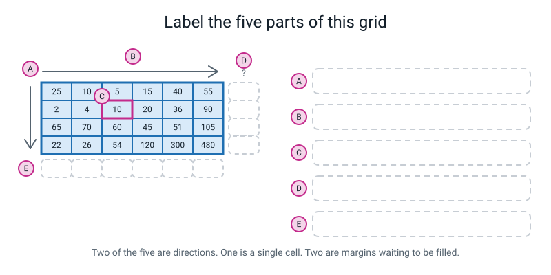
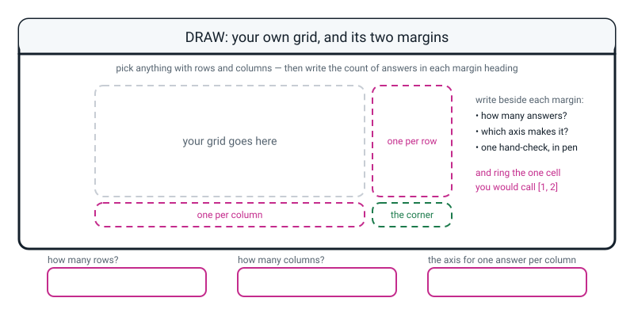

# Workbook — Week 19: Down the Columns or Across the Rows?

**Name:** ________________________________  **Date:** ______________

[⬅ Week 18](week-18.md) · [📖 Read the chapter first](../student-guide/week-19.md) · [Course Home](../README.md) · [🧑‍🏫 Teacher guide](../teacher-guide/week-19.md) · [Next ➡](week-20.md)

---

## ✅ Warm-Up (5 min)

Five quick questions about **last week**.

**W1.** Write what each of these prints. They are not the same and the difference is the whole of Week 18.

```python
print([3, 8] * 2)
print(np.array([3, 8]) * 2)
```

**line 1:** ____________________  **line 2:** ____________________

**W2.** What does `np.arange(6)` give you? How many numbers, and what is the **last** one?

**the array:** ____________________  **how many:** ______  **last:** ______

**W3.** `np.zeros((2, 3))` prints with dots in it — `0.` rather than `0`. What is the dot telling you?

________________________________________________________________

**W4.** You add an array of shape `(6,)` to an array of shape `(4,)`. What happens, and is that good news or bad news?

________________________________________________________________

**W5.** You retired eight loops last week. Name one kind of loop that will **never** retire, and say why.

________________________________________________________________

---

## 🔎 Predict the Output

**Write your prediction in pen before you run anything.** Every snippet starts with `import numpy as np`. **Two of these four run cleanly and give a wrong answer to the question in the comment.**

### P1 — the question in the comment

```python
rain = np.array([[ 25,  10,   5,  15,  40,  55],
                 [  2,   4,  10,  20,  36,  90],
                 [ 65,  70,  60,  45,  51, 105],
                 [ 22,  26,  54, 120, 300, 480]])
# I want the average rainfall in each MONTH.
print(rain.mean(axis=1))
print(rain.mean(axis=1).shape)
```

**I predict — how many numbers, and what are they?**

________________________________________________________________

**It really printed:**

________________________________________________________________

**How many months are there?** ______  **How many numbers came out?** ______

**Did anything crash?** ____________  **Is the answer right?** ____________

**What is the first number actually the average of?** ______________________________

### P2 — three ways to index, and one of them is a twin

```python
grid = np.array([[1, 2, 3], [4, 5, 6]])
print(grid[1])
print(grid[1, :])
print(grid[:, 1])
print(grid[1, 1])
```

**I predict:**

**line 1:** ____________  **line 2:** ____________  **line 3:** ____________  **line 4:** ____________

**It really printed:**

**line 1:** ____________  **line 2:** ____________  **line 3:** ____________  **line 4:** ____________

**Two of those four lines print exactly the same thing. Which two, and why?**

________________________________________________________________

**Which of the four is the one you should prefer while you are learning, and why?**

________________________________________________________________

### P3 — the two ones that mean different things

```python
arr = np.array([[10, 20], [30, 40], [50, 60]])
print(arr.shape)
print(arr.sum(axis=0))
print(arr.sum(axis=1))
print(arr.sum(axis=1)[2])
print(arr.sum())
```

**I predict — say the counts out loud first. Line 2 gives ______ numbers, line 3 gives ______ numbers.**

**It really printed:**

________________________________________________________________

________________________________________________________________

**Line 4 has two numbers in it — a `1` and a `2`. What does each one do?**

**the `axis=1`:** ______________________________

**the `[2]`:** ______________________________

### P4 — the one where counting cannot save you

```python
sq = np.array([[  1,   2,   3],
               [ 10,  20,  30],
               [100, 200, 300]])
print(sq.mean(axis=0))
print(sq.mean(axis=1))
print(sq.mean(axis=0).shape, sq.mean(axis=1).shape)
```

**I predict:**

________________________________________________________________

**It really printed:**

________________________________________________________________

________________________________________________________________

**How many numbers came out of each of the first two lines?** ______ and ______

**So if you had used the wrong axis here, would counting the answers have caught it?** ____________

**Then what would? Write one sentence.**

________________________________________________________________

**How many of the answers on this page did you get right?** ______ / 14

**Which one surprised you most, and why?**

________________________________________________________________

---

## ✍️ Practice Set A — Read It

**A1. Fill in the whole table without running anything.** The grid is:

```python
runs = np.array([[ 34,  12,  58,  41,  25],
                 [  8,  22,  15,  30,   5],
                 [ 77,  45,  60,  33,  55],
                 [ 21,   5,  47,  12,  15]])
```

| # | The line | How many numbers come out? | What is the answer *about*? |
|---|---|---|---|
| a | `runs.shape` | | |
| b | `runs[2, 1]` | | |
| c | `runs[2, :]` | | |
| d | `runs[:, 1]` | | |
| e | `runs.mean(axis=0)` | | |
| f | `runs.mean(axis=1)` | | |
| g | `runs.mean()` | | |
| h | `runs.sum(axis=1).sum()` | | |

**A1(i).** Two of those eight give the **same count** of answers. Which two, and do they mean the same thing?

________________________________________________________________

**A1(j).** Which one of the eight would you use to answer *"which match was the low-scoring one?"* Say why in one sentence.

________________________________________________________________

**A2. Trace the value.** For each expression, write the single number it gives. The grid is the rainfall grid from the chapter:

```text
             Jan   Feb   Mar   Apr   May   Jun
row 0        25    10     5    15    40    55
row 1         2     4    10    20    36    90
row 2        65    70    60    45    51   105
row 3        22    26    54   120   300   480
```

| Expression | Value | Which cell is that, in words? |
|---|---|---|
| `rain[2, 3]` | | |
| `rain[3, 0]` | | |
| `rain[0, 5]` | | |
| `rain[3, 4]` | | |
| `rain[1, :][2]` | | |
| `rain[:, 5][3]` | | |

**A2(g).** `rain[1, :][2]` and `rain[1, 2]` give the same number. Which is easier to read, and which would you write?

________________________________________________________________

**A3. Spot the bug.** Each line runs, or nearly runs, and each is wrong. Say what is wrong and write the fix.

| # | The line, with its comment | What is wrong | The fix |
|---|---|---|---|
| a | `print(rain.shape())` | | |
| b | `print(rain[1, 6])   # June for Pune` | | |
| c | `print(rain[, 0])    # January everywhere` | | |
| d | `print(rain.mean(axis=2))` | | |
| e | `month_mean = rain.mean(axis=1)  # one per month` | | |
| f | `print(rain[:, "Jan"])` | | |

**A3(g).** Only **one** of those six produces **no error message at all.** Which one, and what does that tell you about how you have to find it?

________________________________________________________________

________________________________________________________________

**A4. Match the code to the output.** Five of each, and no output is used twice. The grid is `steps = np.array([[6200, 8100, 4300], [11200, 9800, 6600]])`.

| | Code |
|---|---|
| i | `print(steps.shape)` |
| ii | `print(steps[1, 0])` |
| iii | `print(steps[:, 2])` |
| iv | `print(steps.sum(axis=1))` |
| v | `print(steps.sum(axis=0))` |

| | Output |
|---|---|
| P | `[17400 17900 10900]` |
| Q | `[ 4300  6600]` |
| R | `(2, 3)` |
| S | `[18600 27600]` |
| T | `11200` |

**Your answers:** i → ______  ii → ______  iii → ______  iv → ______  v → ______

**A4(f).** `P` and `Q` both have three... no, count them again. How many numbers are in `P`, and how many in `Q`? ______ and ______  **What tells you which one is a per-column answer?**

________________________________________________________________

**A5. Label the diagram.** Write what each badge is pointing at.


*Figure W19.1 — Five things to name. Two of them are directions, one is a cell, and two are margins.*

**A** = ________________________________________________________

**B** = ________________________________________________________

**C** = ________________________________________________________

**D** = ________________________________________________________

**E** = ________________________________________________________

**A5(f).** How many boxes are in margin **D**, and how many in margin **E**? ______ and ______

**A5(g).** Which axis number fills margin **D**? ______  **Which fills margin E?** ______

**A6. Say the sentence.** Finish each one so it is true and complete. A half-sentence gets no marks.

**a)** `axis=0` names the ______________, so the ______________ get eaten, so I get one answer per ______________.

**b)** `axis=1` names the ______________, so the ______________ get eaten, so I get one answer per ______________.

**c)** A colon in the brackets means ______________________________.

**d)** Before I press run on any line with an axis in it, I say ______________________________ out loud.

**e)** The count of answers is never a mystery, because ______________________________.

---

## ✍️ Practice Set B — Write It

Every one of these uses the rainfall grid:

```python
import numpy as np

rain = np.array([
    [ 25,  10,   5,  15,  40,  55],         # row 0 - Chennai
    [  2,   4,  10,  20,  36,  90],         # row 1 - Pune
    [ 65,  70,  60,  45,  51, 105],         # row 2 - Shimla
    [ 22,  26,  54, 120, 300, 480],         # row 3 - Kochi
])
cities = np.array(["Chennai", "Pune", "Shimla", "Kochi"])
months = np.array(["Jan", "Feb", "Mar", "Apr", "May", "Jun"])
```

### B1 — one line

**Task:** print January's rainfall for every city, using a colon.

**Expected output:**

```text
[25  2 65 22]
```

**Done looks like:** one line, one pair of brackets, one comma, one colon.

```python
# your line here:
________________________________________________________________
```

### B2 — two axis lines, each with its count printed underneath

**Task:** print the mean per month and the mean per city, and **under each one** print how many answers came out and how many there should be.

**Expected output:**

```text
per month : [ 28.5   27.5   32.25  50.   106.75 182.5 ]
how many? : (6,) - should be 6, one per month
per city  : [ 25.  27.  66. 167.]
how many? : (4,) - should be 4, one per city
```

**Done looks like:** four lines. The count line sits **under each** axis line, not once at the bottom.

```python
________________________________________________________________

________________________________________________________________

________________________________________________________________

________________________________________________________________
```

### B3 — the corner check, in one line

**Task:** print the grand total three ways — by adding the city totals, by adding the month totals, and by adding the whole grid at once.

**Expected output:**

```text
1710 1710 1710
```

**Done looks like:** one `print`, three things inside it, and all three numbers identical.

```python
________________________________________________________________
```

### B4 — a hand-check written into the file

**Task:** put your pencil working for **row 1** into the file as a printed line, then print what the code says, so the two sit next to each other.

**Expected output:**

```text
row 1 by hand : 162 / 6 = 27.0
row 1 by code : 162 / 6 = 27.0
```

**Done looks like:** two lines. The first one is text you typed from your paper. The second one is computed.

```python
________________________________________________________________

________________________________________________________________
```

### B5 — a whole program of your own, about 15 lines

**Task:** three friends down, five days across, step counts. Write `steps19.py` from scratch. It must:

1. build the grid with **one row of code per friend** and a comment naming each one
2. print the shape, and the count of friend names and day names beside it
3. print one cell, one whole row, and one whole column
4. print the mean **per day** with its count underneath
5. print the mean **per friend** with its count underneath
6. print the corner check

Use these numbers:

```text
              Mon    Tue    Wed    Thu    Fri
Ana          6200   8100   4300   7700   3900
Bilal       11200   9800   6600   7400   5100
Cleo         3100   4200   2800   5000   4400
```

**Expected output:**

```text
shape  : (3, 5)
friends: 3  days: 5
steps[1, 2] = 6600
steps[2, :] = [3100 4200 2800 5000 4400]
steps[:, 0] = [ 6200 11200  3100]
per day    : [6833.33333333 7366.66666667 4566.66666667 6700.         4466.66666667]
how many?  : (5,) - should be 5, one per day
per friend : [6040. 8020. 3900.]
how many?  : (3,) - should be 3, one per friend
corner check: 89800 89800 89800
```

**Done looks like:** the counts are **5 and 3 here, not 6 and 4** — because the shape is `(3, 5)`, not `(4, 6)`. If you copied "should be 6" from B2, that is the mistake this question is looking for.

**B5(a).** **Hand-check Cleo's row before you run it.** Show the working.

`____ + ____ + ____ + ____ + ____ = ________`, then `________ / ____ = ________`

**B5(b).** Which of your two count lines would have caught it if you had typed `axis=0` where you meant `axis=1`?

________________________________________________________________

---

## 🐞 Fix the Broken Program

This program has **three** bugs: one **syntax**, one **runtime**, one **logic**. The real error messages are below, in the order you will meet them.

```python
"""temps.py - three cities down, four months across. Three bugs."""

import numpy as np

#                 Jan  Apr  Jul  Oct
temps = np.array([
    [ 21,  30,  35,  28],           # row 0 - Delhi
    [ 24,  28,  27,  27],           # row 1 - Mumbai
    [  9,  20,  25,  17],           # row 2 - Srinagar
])
cities = np.array(["Delhi", "Mumbai", "Srinagar"])
months = np.array(["Jan", "Apr", "Jul", "Oct"])

print("cities:", len(cities), " months:", len(months))
print("shape :", temps.shape)

print("October everywhere:", temps[, 3])

print("July in Delhi     :", temps[0, 4])

month_mean = temps.mean(axis=1)
print("mean per month    :", month_mean)
print("how many?         :", month_mean.shape)
```

**Run 1 — nothing prints at all:**

```text
  File "temps.py", line 17
    print("October everywhere:", temps[, 3])
                                       ^
SyntaxError: invalid syntax
```

**Bug 1.** Which line? ______  **What kind of bug?** ______________

**Why did nothing else print, not even the `cities:` line?**

________________________________________________________________

**The fix:** ______________________________

**Run 2 — after fixing bug 1:**

```text
cities: 3  months: 4
shape : (3, 4)
October everywhere: [28 27 17]
Traceback (most recent call last):
  File "temps.py", line 19, in <module>
    print("July in Delhi     :", temps[0, 4])
IndexError: index 4 is out of bounds for axis 1 with size 4
```

**Bug 2.** Which line? ______  **What kind of bug?** ______________

**The message says "for axis 1". What is numpy telling you by naming the axis?**

________________________________________________________________

**The fix:** ______________________________

**Run 3 — after fixing bug 2. It runs all the way through with no error:**

```text
cities: 3  months: 4
shape : (3, 4)
October everywhere: [28 27 17]
July in Delhi     : 35
mean per month    : [28.5  26.5  17.75]
how many?         : (3,)
```

**Bug 3.** Which line? ______  **What kind of bug?** ______________

**Nothing crashed. What exactly is wrong? Point at a number in the output.**

________________________________________________________________

**The fix:** ______________________________

**Write the fully fixed output:**

```text
________________________________________________________________
________________________________________________________________
```

**And one more:** the `how many?` line was already in the file and it did **not** stop the bug reaching you. What would you have to add to that line to make bug 3 impossible to miss?

________________________________________________________________

---

## 🧩 Puzzle of the Week

### Part 1 — The margin detective

Somebody has thrown away a 2-row, 3-column grid and left only its margins and two cells. Rebuild the grid.

**What you know:**

```text
the grid is 2 rows by 3 columns

mean of each ROW    (one per row)    ->  10.0   14.0
mean of each COLUMN (one per column) ->   6.0   12.0   18.0

cell [0, 0] = 4
cell [0, 1] = 10
```

Fill in the grid:

```text
        col 0    col 1    col 2       row mean
row 0   [ 4  ]  [ 10 ]  [____]          10.0
row 1   [____]  [____]  [____]          14.0

col     6.0     12.0     18.0
mean
```

**Show your working. Do the column-0 one first — it is the easiest.**

________________________________________________________________

________________________________________________________________

________________________________________________________________

**Part 1(a).** How did you get `cell[1, 0]` from the column mean? Say it as a sentence.

________________________________________________________________

**Part 1(b).** What is the grand mean of the whole grid, and can you get it **two** different ways from the margins alone?

________________________________________________________________

### Part 2 — The impossible margins

Here is a different set of margins for a 2-by-3 grid. **No grid on Earth can produce them.** Prove it.

```text
mean of each ROW    ->  10.0   20.0
mean of each COLUMN ->   5.0   10.0   20.0
```

**Turn each set of means into a set of sums, then add each set up.**

**row sums:** ______ and ______  **their total:** ________

**column sums:** ______, ______ and ______  **their total:** ________

**So?**

________________________________________________________________

**Part 2(a).** Which check from this week is that, and where does it live in a real file?

________________________________________________________________

**Part 2(b).** If you had been given only the row means, could you have spotted the problem? Why not?

________________________________________________________________

---

## 🤔 Think Deeper

**T1.** Last week, almost every mistake you made stopped the program and printed a traceback. This week's headline mistake prints a tidy answer and says nothing at all. **Write a paragraph about what changes for you now.** What does "my code ran" prove, and what does it not prove? What do you have to do differently from today?

________________________________________________________________

________________________________________________________________

________________________________________________________________

________________________________________________________________

________________________________________________________________

**T2.** The rainfall grid has no year in it, no units, and no note saying which numbers are cities and which are months. All of that lives in your comments and in your head. **Write a paragraph** about whose job it is to record what a table of numbers means, what could go wrong if nobody does, and what you would actually write down so that *you*, in March, are not guessing.

________________________________________________________________

________________________________________________________________

________________________________________________________________

________________________________________________________________

________________________________________________________________

---

## 🛠️ Build It — The Rainfall Grid, Properly

**Order matters. The pen work comes first, and it is a third of the marks.**

### Step checklist

- [ ] **1.** On paper, draw the 4-by-6 rainfall grid with an **empty margin column** down the right and an **empty margin row** along the bottom, plus a corner box.
- [ ] **2.** **In pen, before any code:** how many boxes go in the side margin? How many in the bottom margin? Write both numbers down.
- [ ] **3.** **In pen, with a calculator:** work out **row 1's** mean. Show the addition and the division. Do not round.
- [ ] **4.** **In pen:** work out **column 1's** mean the same way.
- [ ] **5.** Now open `rainfall.py`. Print the shape, and the counts of `cities` and `months` beside it.
- [ ] **6.** Print one cell, one whole row, one whole column.
- [ ] **7.** Print the mean per month, with a count line **directly underneath it** saying how many there should be.
- [ ] **8.** Print the mean per city, with its own count line underneath.
- [ ] **9.** Print the corner check: three routes, one number.
- [ ] **10.** Print your two pen answers next to the code's two answers and compare them.
- [ ] **11.** Write the one sentence: **how does the number of answers tell you which axis you used?**

### The pen work — fill this in first

**How many answers in the side margin?** ______  **In the bottom margin?** ______

**Row 1 is ______________** *(careful — row 0 is Chennai)*

```text
____ + ____ + ____ + ____ + ____ + ____ = ________

________  /  ____  =  ________
```

**Column 1 is ______________** *(careful — column 0 is January)*

```text
____ + ____ + ____ + ____ = ________

________  /  ____  =  ________
```

### The results table — fill this in from the code

| What you asked for | The line you wrote | How many answers came out | Should be | ✔ / ✘ |
|---|---|---|---|---|
| the shape | `rain.shape` | | 2 numbers | |
| one cell | | 1 | 1 | |
| one whole row | | | | |
| one whole column | | | | |
| mean per **month** | | | | |
| mean per **city** | | | | |
| the whole-grid mean | | 1 | 1 | |

### The hand-check comparison

| | By pen | By code | Agree? |
|---|---|---|---|
| **row 1** mean | | | |
| **column 1** mean | | | |

**If they disagreed, what did you do about it?** *(And note: "trusted the code" is not an answer.)*

________________________________________________________________

### The corner check

| Route | The line | The number |
|---|---|---|
| add the city totals | | |
| add the month totals | | |
| add the whole grid | | |

**All three the same?** ____________

### The sentence being marked

**How does the number of answers tell you which axis you used?**

________________________________________________________________

________________________________________________________________

### The Bug Log

Add at least one entry from today. If you did not make a mistake, you did not press run often enough — go and try `axis=2` on purpose.

| What I saw | What it means | Cause | Fix |
|---|---|---|---|
| | | | |
| | | | |

---

## 🎨 Draw It

Draw your **own** grid — anything with rows, columns and numbers in it. Goals by four players over three matches. Minutes on three apps over five days. Marks in four subjects for five friends. Then draw both margins, and label which axis fills each one.


*Figure W19.2 — Your grid, your two margins, and one hand-check in pen.*

**What a good answer looks like:** a grid with a name at the top of every column and down the side of every row; a **margin column** on the right with the **right number of boxes in it** — one per row — labelled `axis=1`; a **margin row** underneath with one box per column, labelled `axis=0`; a corner box; and **one** of the margin boxes filled in **in pen**, with the addition and the division written out beside it. The label that earns the marks is not "axis 0 = rows". It is *"axis=0 eats the rows, so these answers are one per column."*

**How many rows has your grid got?** ______  **How many columns?** ______

**Which axis gives one answer per column?** ______  **How do you know?**

________________________________________________________________

---

## 📊 Self-Check

Tick one box per line. Be honest — this page is for you, not for marks.

| I can... | 😀 | 🙂 | 😕 |
|---|---|---|---|
| point at one cell of a 2-D array with one pair of brackets and one comma | | | |
| take a whole column or a whole row using a colon | | | |
| compute one mean per column with `axis=0`, and **say how many answers I expect before I run it** | | | |
| compute one total per row with `axis=1`, and check the count against the count of labels | | | |
| hand-check one row on paper **before** I look at what the code said | | | |
| read `IndexError: index 6 is out of bounds for axis 1 with size 6` and say what it means | | | |
| explain why the wrong axis is more dangerous than a crash | | | |

**The one thing I would ask about if I could ask one question:**

________________________________________________________________

---

## ✅ Answers

<details>
<summary>Check your answers</summary>

### Warm-Up

**W1.** **`[3, 8, 3, 8]`** and **`[ 6 16]`**.

```python
import numpy as np
print([3, 8] * 2)
print(np.array([3, 8]) * 2)
```

```text
[3, 8, 3, 8]
[ 6 16]
```

**Why:** `*` on a **list** means *repeat the list* — four items come out. `*` on an **array** means *multiply every number* — two items come out, twice as big. Same symbol, two completely different jobs, and the count of items is the giveaway.

**W2.** `[0 1 2 3 4 5]`. **Six** numbers. The last one is **5**, not 6.

```text
[0 1 2 3 4 5] 5 6
```

**Why:** `arange(6)` means *six numbers starting at zero*, so it stops **before** 6. Six numbers, and the biggest is one less than what you typed.

**W3.** The dot means the values are **decimals** — dtype `float64`. `0.` is zero stored as a decimal.

```text
[[0. 0. 0.]
 [0. 0. 0.]]
```

**Why:** `np.zeros` gives you decimals unless you ask otherwise, because a blank sheet is usually about to be filled with results, and results are usually decimals.

**W4.** It **crashes**, with `ValueError: operands could not be broadcast together with shapes (6,) (4,)`.

```text
ValueError: operands could not be broadcast together with shapes (6,) (4,)
```

**And that is good news.** numpy refused rather than guessing. If it had quietly matched up four of your six numbers you would have got an answer and never known. **A loud refusal beats a quiet wrong answer**, which is exactly this week's theme arriving early.

**W5.** Any loop that **cannot be done to everything at once**. Good answers: a loop that keeps asking the user for input until they get it right (each trip depends on what happened in the last one); a loop that **prints one formatted line per record** (printing is not arithmetic); a loop that counts how many players are in each team (that is a dictionary job, not an array job).

The rule: **arrays do the maths, loops do the printing.**

### Predict the Output

**P1.** It really printed:

```python
import numpy as np
rain = np.array([[ 25,  10,   5,  15,  40,  55],
                 [  2,   4,  10,  20,  36,  90],
                 [ 65,  70,  60,  45,  51, 105],
                 [ 22,  26,  54, 120, 300, 480]])
print(rain.mean(axis=1))
print(rain.mean(axis=1).shape)
```

```text
[ 25.  27.  66. 167.]
(4,)
```

- **Six** months. **Four** numbers came out.
- **Nothing crashed.** **The answer is wrong** for the question in the comment.
- The first number, `25.0`, is **Chennai's average across all six months** — a perfectly correct average of something nobody asked about.

`axis=1` names the columns, so the six columns got eaten and one answer came out per **row** — per city. The comment asked for months. The fix is `axis=0`, which gives `[ 28.5 27.5 32.25 50. 106.75 182.5 ]` — six numbers, and January is **28.5**.

**P2.** It really printed:

```python
grid = np.array([[1, 2, 3], [4, 5, 6]])
print(grid[1])
print(grid[1, :])
print(grid[:, 1])
print(grid[1, 1])
```

```text
[4 5 6]
[4 5 6]
[2 5]
5
```

**Lines 1 and 2 are the same.** `grid[1]` leaves the second position off entirely, and numpy assumes you meant "all of them" — so it is `grid[1, :]` with the colon invisible.

**Prefer `grid[1, :]` while you are learning**, because the colon is *visible*. You can see that a decision was made about the second direction. An invisible decision is one you forget you made — and there is no matching short form for a column, so `grid[:, 1]` has to be written out anyway.

Line 3 asked for a **column** and printed **sideways**. That is correct. Its shape is `(2,)`.

**P3.** It really printed:

```python
arr = np.array([[10, 20], [30, 40], [50, 60]])
print(arr.shape)
print(arr.sum(axis=0))
print(arr.sum(axis=1))
print(arr.sum(axis=1)[2])
print(arr.sum())
```

```text
(3, 2)
[ 90 120]
[ 30  70 110]
110
210
```

**Line 2 gives 2 numbers** — `axis=0` eats the three rows, and two columns survive. **Line 3 gives 3 numbers** — `axis=1` eats the two columns, and three rows survive.

**Line 4's two numbers do completely different jobs:**

- **the `axis=1`** says *eat the columns* — so I get one total per row, three of them.
- **the `[2]`** says *and then hand me the third of those answers*. `110`, which is `50 + 60`.

Change the `[2]` to `[0]` and you get `30`. The two `1`s in `arr.mean(axis=1)[1]` are the same trap: one names a direction, one names a slot.

**P4.** It really printed:

```python
sq = np.array([[  1,   2,   3],
               [ 10,  20,  30],
               [100, 200, 300]])
print(sq.mean(axis=0))
print(sq.mean(axis=1))
print(sq.mean(axis=0).shape, sq.mean(axis=1).shape)
```

```text
[ 37.  74. 111.]
[  2.  20. 200.]
(3,) (3,)
```

**Three numbers from each.** Both shapes are `(3,)`.

**So counting would NOT have caught a wrong axis here.** The grid is **square** — three rows and three columns — so both directions give three answers, and the count check is silent.

**What would catch it?** A **hand-check.** One row, one calculator. Row 0 is `1 + 2 + 3 = 6`, and `6 / 3 = 2.0`. So if `2.0` appears in your answer, you got the per-**row** version, which is `axis=1`. And if `37.0` appears, you got the per-**column** version, because column 0 is `1 + 10 + 100 = 111`, and `111 / 3 = 37.0`.

Model sentence:

> *"Counting only works when the two counts are different. On a square grid they are the same, so the only check left is to work out one of the answers by hand and see which of the two it matches."*

### Practice Set A

**A1.** The grid is `(4, 5)` — four players, five matches.

| # | The line | How many | What it is about |
|---|---|---|---|
| a | `runs.shape` | **2 numbers** | the size of the grid: `(4, 5)` |
| b | `runs[2, 1]` | **1** | one cell — row 2, column 1, which is `45` |
| c | `runs[2, :]` | **5** | one whole row — every match for player 2 |
| d | `runs[:, 1]` | **4** | one whole column — match 1, for every player |
| e | `runs.mean(axis=0)` | **5** | one answer per **match** (the 4 rows got eaten) |
| f | `runs.mean(axis=1)` | **4** | one answer per **player** (the 5 columns got eaten) |
| g | `runs.mean()` | **1** | the average of all twenty numbers |
| h | `runs.sum(axis=1).sum()` | **1** | the grand total, reached via the four player totals |

Real output:

```python
import numpy as np
runs = np.array([[ 34,  12,  58,  41,  25],
                 [  8,  22,  15,  30,   5],
                 [ 77,  45,  60,  33,  55],
                 [ 21,   5,  47,  12,  15]])
print(runs.shape)
print(runs[2, 1])
print(runs[2, :])
print(runs[:, 1])
print(runs.mean(axis=0))
print(runs.mean(axis=1))
print(runs.mean())
print(runs.sum(axis=1).sum())
```

```text
(4, 5)
45
[77 45 60 33 55]
[12 22 45  5]
[35. 21. 45. 29. 25.]
[34. 16. 54. 20.]
31.0
620
```

**A1(i).** **(c) and (e)** both give **five**, and they mean completely different things. (c) is *one player's five actual scores*. (e) is *five averages, one per match, each made from four players*. **Same count, and nothing else in common** — which is exactly why counting is a check and not a proof.

*(Also acceptable: (d) and (f) both give four.)*

**A1(j).** **(e), `runs.mean(axis=0)`.** A match is a **column**, and columns are what survive when you eat the rows. It gives `[35. 21. 45. 29. 25.]`, so match 1 was the low-scoring one at 21.

**A2.**

| Expression | Value | Which cell |
|---|---|---|
| `rain[2, 3]` | **45** | Shimla in April |
| `rain[3, 0]` | **22** | Kochi in January |
| `rain[0, 5]` | **55** | Chennai in June |
| `rain[3, 4]` | **300** | Kochi in May |
| `rain[1, :][2]` | **10** | Pune in March |
| `rain[:, 5][3]` | **480** | Kochi in June |

```text
45 22 55 300
```

**A2(g).** **`rain[1, 2]` is easier to read**, and it is what you should write. `rain[1, :][2]` does the job in two steps — *take the whole row, then take the third thing out of it* — and it means you have to hold an extra thing in your head. One pair of brackets, one comma, done.

**A3.**

| # | What is wrong | The fix |
|---|---|---|
| a | `.shape` is a **fact**, not an action. Round brackets make Python try to *call* it. `TypeError: 'tuple' object is not callable` | `rain.shape` — no brackets. **A verb takes brackets; a fact does not** |
| b | June is column **5**, not 6. Six columns are numbered 0 to 5. `IndexError: index 6 is out of bounds for axis 1 with size 6` | `rain[1, 5]` |
| c | The row position cannot be empty. `SyntaxError: invalid syntax`, with the `^` under the comma | `rain[:, 0]` — the colon is compulsory, and there is no short form for a column |
| d | A table has exactly two directions, numbered 0 and 1. `AxisError: axis 2 is out of bounds for array of dimension 2` | `axis=0` or `axis=1` |
| e | **No error at all.** `axis=1` eats the columns, so the answers come out one per **city**, not one per month. Four numbers where six belong | `rain.mean(axis=0)` |
| f | An array has **no idea what its columns are called.** `IndexError: only integers, slices ... are valid indices` | `rain[:, 0]`. Named columns arrive in Week 21 |

**A3(g).** **(e).** Nothing is wrong as far as numpy is concerned — both are perfectly legal averages, so there is nothing to complain about.

Which means **you have to find it on purpose.** Two checks and both are nearly free: **count the answers** against the count of labels you typed yourself, and **hand-check one of them** on paper. Nobody is going to tell you.

**A4.** i → **R**, ii → **T**, iii → **Q**, iv → **S**, v → **P**.

```python
steps = np.array([[6200, 8100, 4300], [11200, 9800, 6600]])
print(steps.shape)
print(steps[1, 0])
print(steps[:, 2])
print(steps.sum(axis=1))
print(steps.sum(axis=0))
```

```text
(2, 3)
11200
[4300 6600]
[18600 27600]
[17400 17900 10900]
```

**A4(f).** **`P` has three numbers; `Q` has two.**

The count is what tells you. There are **three columns**, so a per-column answer has three numbers in it — that is `P`, and it came from `axis=0`. `Q` has two numbers, one per row, but it is not an average of anything: it is one whole **column** pulled out, `steps[:, 2]`.

**And notice `Q` and `S` both have two numbers** and mean utterly different things — `Q` is two real step counts, `S` is two totals. Counting narrows it down; it does not finish the job.

**A5.**

- **A** = **axis 0**, the direction that runs **down** the rows. Naming it eats the rows.
- **B** = **axis 1**, the direction that runs **across** the columns. Naming it eats the columns.
- **C** = one **cell**, `rain[1, 2]` — row 1, column 2, which is Pune in March, `10`.
- **D** = the **side margin**: one answer per **row**, which is `axis=1`.
- **E** = the **bottom margin**: one answer per **column**, which is `axis=0`.

**A5(f).** **D has 4 boxes** (one per city) and **E has 6** (one per month).

**A5(g).** **D is filled by `axis=1`.** **E is filled by `axis=0`.**

**Note how backwards that feels**, and that it is the whole point: the margin that runs *down* the side is filled by naming axis **1**, because naming an axis is how you get rid of it.

**A6.**

**a)** `axis=0` names the **rows**, so the **rows** get eaten, so I get one answer per **column**.

**b)** `axis=1` names the **columns**, so the **columns** get eaten, so I get one answer per **row**.

**c)** A colon means **"every one of these, in this direction"** — don't narrow it down.

**d)** …I say **how many answers I expect** out loud.

**e)** …because **it is the count of labels, and I typed the labels myself.** I know there are four cities because I typed the word "Chennai".

### Practice Set B

**B1.**

```python
print(rain[:, 0])
```

```text
[25  2 65 22]
```

**Why the colon is in the first position:** you want **every row**, and **only** column 0. The colon answers *"which row?"* with *"all of them"*.

**B2.**

```python
month_mean = rain.mean(axis=0)
print("per month :", month_mean)
print("how many? :", month_mean.shape, "- should be 6, one per month")
city_mean = rain.mean(axis=1)
print("per city  :", city_mean)
print("how many? :", city_mean.shape, "- should be 4, one per city")
```

```text
per month : [ 28.5   27.5   32.25  50.   106.75 182.5 ]
how many? : (6,) - should be 6, one per month
per city  : [ 25.  27.  66. 167.]
how many? : (4,) - should be 4, one per city
```

**Why the count line goes directly underneath each one:** if it sits once at the bottom you cannot tell which line it is about, and the whole value of the check is that it is next to the thing it checks. Eight seconds of typing, per line.

**B3.**

```python
print(rain.sum(axis=0).sum(), rain.sum(axis=1).sum(), rain.sum())
```

```text
1710 1710 1710
```

**Why all three must agree:** it is the same twenty-four numbers added in three different orders, and the order you add them in cannot change the total. **In numpy they will always agree**, even if you used the wrong axis or mistyped a number, so this line cannot catch those. It is a check on your understanding of the two directions, and on totals you add up by hand on paper.

**B4.**

```python
print("row 1 by hand : 162 / 6 = 27.0")
print("row 1 by code :", rain[1, :].sum(), "/ 6 =", rain.mean(axis=1)[1])
```

```text
row 1 by hand : 162 / 6 = 27.0
row 1 by code : 162 / 6 = 27.0
```

**Why write the pen answer into the file:** because in three weeks you will not remember whether you checked it. A line of text costs nothing and it is a record that the check happened.

**B5.** Complete working program:

```python
"""steps19.py - three friends down, five days across."""

import numpy as np                              # the array library

#                   Mon    Tue    Wed    Thu    Fri
steps = np.array([
    [ 6200,  8100,  4300,  7700,  3900],        # row 0 - Ana
    [11200,  9800,  6600,  7400,  5100],        # row 1 - Bilal
    [ 3100,  4200,  2800,  5000,  4400],        # row 2 - Cleo
])
friends = np.array(["Ana", "Bilal", "Cleo"])
days = np.array(["Mon", "Tue", "Wed", "Thu", "Fri"])

print("shape  :", steps.shape)                  # rows first, then columns
print("friends:", len(friends), " days:", len(days))

print("steps[1, 2] =", steps[1, 2])             # row 1, column 2 = Bilal on Wed
print("steps[2, :] =", steps[2, :])             # every day for Cleo
print("steps[:, 0] =", steps[:, 0])             # Monday, for everyone

day_mean = steps.mean(axis=0)                    # eat the 3 friends -> 5 answers
print("per day    :", day_mean)
print("how many?  :", day_mean.shape, "- should be 5, one per day")

friend_mean = steps.mean(axis=1)                 # eat the 5 days -> 3 answers
print("per friend :", friend_mean)
print("how many?  :", friend_mean.shape, "- should be 3, one per friend")

print("corner check:", steps.sum(axis=0).sum(), steps.sum(axis=1).sum(), steps.sum())
```

Real output:

```text
shape  : (3, 5)
friends: 3  days: 5
steps[1, 2] = 6600
steps[2, :] = [3100 4200 2800 5000 4400]
steps[:, 0] = [ 6200 11200  3100]
per day    : [6833.33333333 7366.66666667 4566.66666667 6700.         4466.66666667]
how many?  : (5,) - should be 5, one per day
per friend : [6040. 8020. 3900.]
how many?  : (3,) - should be 3, one per friend
corner check: 89800 89800 89800
```

**The counts are 5 and 3, not 6 and 4.** They came from the shape, which is `(3, 5)` this time. **Re-derive the counts every time from the shape you are actually looking at** — a number you remembered from the last grid is a number you got wrong.

**B5(a).** Cleo is row 2, and her row has five days in it, so divide by five:

```text
3100 + 4200 + 2800 + 5000 + 4400 = 19500

19500 / 5 = 3900.0
```

And `3900.` is the third number in `per friend`. ✔

**B5(b).** **The count line under `per friend`.** If you typed `axis=0` where you meant `axis=1` on that line, five numbers would come out where three belong, and the label says "should be 3". Five is not three, and the mistake is visible without you having to know anything about step counts.

*(The count line under `per day` would catch the opposite slip: `axis=1` there prints three numbers labelled "should be 5".)*

### Fix the Broken Program

**Bug 1 — line 17. A syntax bug.**

```python
print("October everywhere:", temps[, 3])
```

**Nothing else printed because a `SyntaxError` happens *before your program runs at all*.** Python reads the whole file first, cannot make sense of line 17, and stops. It never reached line 14. That is why you did not see the `cities:` line even though it is above the mistake.

The `^` marks the spot — right at the comma, because there is nothing in front of it. **A position in the brackets has to hold something:** a number, or a colon.

**The fix:** `temps[:, 3]`.

**Bug 2 — line 19. A runtime bug.**

```python
print("July in Delhi     :", temps[0, 4])
```

```text
IndexError: index 4 is out of bounds for axis 1 with size 4
```

**"For axis 1" tells you which direction you overran.** Not the rows — the **columns**. Four columns, numbered 0, 1, 2, 3. If it had said `for axis 0` you would be looking at the wrong end of the grid entirely, and hunting in the wrong place is most of what makes debugging slow.

July is the **third** month in this grid, so it is column **2**.

**The fix:** `temps[0, 2]`, which gives `35`.

**Bug 3 — line 21. A logic bug, with no error message.**

```python
month_mean = temps.mean(axis=1)
```

```text
mean per month    : [28.5  26.5  17.75]
how many?         : (3,)
```

**Point at `28.5`.** It is labelled "mean per month", and there are **four** months. Three numbers came out. `28.5` is **Delhi's average across all four months** — a correct average of something nobody asked about.

`axis=1` names the columns, so the four columns got eaten and one answer came out per **city**.

**The fix:** `temps.mean(axis=0)`.

**The fully fixed output:**

```python
"""temps.py - three cities down, four months across. Fixed."""

import numpy as np

#                 Jan  Apr  Jul  Oct
temps = np.array([
    [ 21,  30,  35,  28],           # row 0 - Delhi
    [ 24,  28,  27,  27],           # row 1 - Mumbai
    [  9,  20,  25,  17],           # row 2 - Srinagar
])
cities = np.array(["Delhi", "Mumbai", "Srinagar"])
months = np.array(["Jan", "Apr", "Jul", "Oct"])

print("cities:", len(cities), " months:", len(months))
print("shape :", temps.shape)

print("October everywhere:", temps[:, 3])

print("July in Delhi     :", temps[0, 2])

month_mean = temps.mean(axis=0)
print("mean per month    :", month_mean)
print("how many?         :", month_mean.shape)
```

```text
cities: 3  months: 4
shape : (3, 4)
October everywhere: [28 27 17]
July in Delhi     : 35
mean per month    : [18. 26. 29. 24.]
how many?         : (4,)
```

**And the last question — why did the `how many?` line not save you?**

Because it printed `(3,)` and **said nothing about whether 3 was right.** A count with nothing to compare it against is just a number.

Add the expectation to the line, in words:

```python
print("how many?         :", month_mean.shape, "- should be 4, one per month")
```

Now the broken version prints `(3,) - should be 4, one per month` and the mistake is impossible to miss. **A check needs two things: what happened, and what should have happened.**

*(Hand-check to prove the fixed answer: January is column 0. `21 + 24 + 9 = 54`, and `54 / 3 = 18.0`. ✔ Three cities in the column, so divide by three.)*

### Puzzle of the Week

**Part 1 — the reconstructed grid:**

```text
        col 0    col 1    col 2       row mean
row 0   [ 4  ]  [ 10 ]  [ 16 ]          10.0
row 1   [ 8  ]  [ 14 ]  [ 20 ]          14.0

col     6.0     12.0     18.0
mean
```

**The working, in the order that makes it easy:**

1. **Column 0.** Its mean is 6.0 and there are **two** rows in a column, so the column's **sum** is `6 × 2 = 12`. You know `cell[0,0] = 4`, so `cell[1,0] = 12 - 4 = 8`.
2. **Column 1.** Mean 12.0, two rows, so sum `24`. You know `cell[0,1] = 10`, so `cell[1,1] = 14`.
3. **Row 0.** Mean 10.0 and there are **three** columns in a row, so the row's sum is `30`. You have `4 + 10 = 14`, so `cell[0,2] = 30 - 14 = 16`.
4. **Row 1.** Mean 14.0, three columns, sum `42`. You have `8 + 14 = 22`, so `cell[1,2] = 42 - 22 = 20`.
5. **Check it.** Column 2's mean should be 18.0. `(16 + 20) / 2 = 36 / 2 = 18.0`. ✔ **That check was free and it was not part of the puzzle — it is the corner check again.**

Proof:

```python
import numpy as np
g = np.array([[4, 10, 16], [8, 14, 20]])
print(g.mean(axis=1))
print(g.mean(axis=0))
print(g.mean())
```

```text
[10. 14.]
[ 6. 12. 18.]
12.0
```

**Part 1(a).** Model sentence:

> *"A column mean is the column's total divided by the number of **rows**, and there are two rows — so multiplying the mean by 2 gave me the total, and taking the known cell away left the other one."*

**The trap to avoid:** dividing by 3. A **column** mean divides by the number of rows, not the number of columns. Getting that backwards is exactly the axis mistake, wearing arithmetic clothes.

**Part 1(b).** The grand mean is **12.0**, and you can get it **two ways from the margins alone**:

```text
from the ROW means:     (10 + 14) / 2      = 24 / 2  = 12.0
from the COLUMN means:  (6 + 12 + 18) / 3  = 36 / 3  = 12.0
```

**Both must agree**, and here they do. That is the corner check, done on the margins instead of the grid. (This one is a real check, because the margins were given to you rather than computed from one array.)

*(One honest note: averaging the row means only works because every row is the same length. If the rows had different lengths — which cannot happen in an array — the average of the averages would not be the average.)*

**Part 2 — the impossible margins:**

```text
row sums:     10 x 3 = 30   and   20 x 3 = 60        their total: 90
column sums:   5 x 2 = 10  ,  10 x 2 = 20  ,  20 x 2 = 40    their total: 70
```

**A row mean covers three cells** (three columns), so multiply by 3. **A column mean covers two cells** (two rows), so multiply by 2. Notice you multiply by different numbers for the two directions — that is the axis idea again.

**90 ≠ 70. So no grid can produce those margins.** The two routes have to reach the same grand total, because they are adding up the same six numbers in different orders. They don't, so somebody has made the numbers up.

**Part 2(a).** **The corner check**, done on margins somebody else gave you: turn each set of means into sums, add each set up, and the two totals must match. Careful: in a real file, `grid.sum(axis=0).sum()` against `grid.sum(axis=1).sum()` always matches, because both come from one array. The check only has teeth when the two sets of margins come from different places.

**Part 2(b).** **No.** Row means on their own are just three numbers, and any three numbers are a possible set of row means. There is nothing to compare them with.

**A check always needs two independent routes to the same answer.** One route is not a check, it is just an answer — and that is the same reason the shape of a result cannot tell you whether the result is right.

### Build It

**The pen work, worked in full:**

**Side margin: 4 answers** (one per city). **Bottom margin: 6 answers** (one per month).

**Row 1 is PUNE** — because row 0 is Chennai.

```text
2 + 4 + 10 + 20 + 36 + 90 = 162

162 / 6 = 27.0
```

Six months in the row, so divide by six.

**Column 1 is FEBRUARY** — because column 0 is January.

```text
10 + 4 + 70 + 26 = 110

110 / 4 = 27.5
```

Four cities in the column, so divide by four.

> **Notice the two divisors are different — 6 and 4 — and neither of them is a guess.** A row mean divides by the number of **columns**; a column mean divides by the number of **rows**. If you divided both by the same number, that is the mistake this exercise exists to catch.

**Complete working program:**

```python
"""rainfall.py - one grid, two directions, with the counts printed. Week 19."""

import numpy as np                          # bring numpy in, call it np

# --- the grid: 4 cities DOWN, 6 months ACROSS -------------------------------
#            Jan  Feb  Mar  Apr  May  Jun
rain = np.array([
    [ 25,  10,   5,  15,  40,  55],         # row 0 - Chennai
    [  2,   4,  10,  20,  36,  90],         # row 1 - Pune
    [ 65,  70,  60,  45,  51, 105],         # row 2 - Shimla
    [ 22,  26,  54, 120, 300, 480],         # row 3 - Kochi
])

cities = np.array(["Chennai", "Pune", "Shimla", "Kochi"])
months = np.array(["Jan", "Feb", "Mar", "Apr", "May", "Jun"])

# --- do the labels match the grid? ----------------------------------------
print("shape :", rain.shape)                # rows first, then columns
print("cities:", len(cities), " months:", len(months))

# --- one cell, one whole row, one whole column ----------------------------
print("rain[1, 2] =", rain[1, 2])           # row 1, column 2 = Pune in March
print("rain[1, :] =", rain[1, :])           # every month for Pune
print("rain[:, 0] =", rain[:, 0])           # January for every city

# --- one answer PER MONTH: eat the rows, so axis=0 ------------------------
month_mean = rain.mean(axis=0)
print("per month :", month_mean)
print("how many? :", month_mean.shape, "- should be 6, one per month")

# --- one answer PER CITY: eat the columns, so axis=1 ---------------------
city_mean = rain.mean(axis=1)
print("per city  :", city_mean)
print("how many? :", city_mean.shape, "- should be 4, one per city")

# --- the corner check: three routes, one number --------------------------
print("corner check:", rain.sum(axis=0).sum(), rain.sum(axis=1).sum(), rain.sum())

# --- the hand-check, in pen first, then compared -------------------------
print("row 1 by hand : 162 / 6 = 27.0")
print("row 1 by code :", rain[1, :].sum(), "/ 6 =", city_mean[1])
print("col 1 by hand : 110 / 4 = 27.5")
print("col 1 by code :", rain[:, 1].sum(), "/ 4 =", month_mean[1])
```

Real output:

```text
shape : (4, 6)
cities: 4  months: 6
rain[1, 2] = 10
rain[1, :] = [ 2  4 10 20 36 90]
rain[:, 0] = [25  2 65 22]
per month : [ 28.5   27.5   32.25  50.   106.75 182.5 ]
how many? : (6,) - should be 6, one per month
per city  : [ 25.  27.  66. 167.]
how many? : (4,) - should be 4, one per city
corner check: 1710 1710 1710
row 1 by hand : 162 / 6 = 27.0
row 1 by code : 162 / 6 = 27.0
col 1 by hand : 110 / 4 = 27.5
col 1 by code : 110 / 4 = 27.5
```

**The filled results table:**

| What you asked for | The line | How many came out | Should be | ✔ |
|---|---|---|---|---|
| the shape | `rain.shape` | 2 numbers | 2 | ✔ |
| one cell | `rain[1, 2]` | 1 | 1 | ✔ |
| one whole row | `rain[1, :]` | 6 | 6 (one per month) | ✔ |
| one whole column | `rain[:, 0]` | 4 | 4 (one per city) | ✔ |
| mean per **month** | `rain.mean(axis=0)` | 6 | 6 | ✔ |
| mean per **city** | `rain.mean(axis=1)` | 4 | 4 | ✔ |
| the whole-grid mean | `rain.mean()` | 1 | 1 | ✔ |

**The hand-check comparison:**

| | By pen | By code | Agree? |
|---|---|---|---|
| **row 1** mean | 27.0 | 27.0 | ✔ |
| **column 1** mean | 27.5 | 27.5 | ✔ |

**If they disagreed:** **do not trust the code.** Neither the pen nor the code is automatically right. Something is wrong and you now have to find out which — usually by adding the six numbers again, slowly, and then checking that the row you added on paper is the row the code took. *(Row 1 is Pune. If you added Chennai's row on paper, the pen is wrong and the code is fine.)*

**The corner check:**

| Route | The line | The number |
|---|---|---|
| add the city totals | `rain.sum(axis=1).sum()` | 1710 |
| add the month totals | `rain.sum(axis=0).sum()` | 1710 |
| add the whole grid | `rain.sum()` | 1710 |

**The sentence being marked.** Model answer:

> *"I know how many cities and how many months I typed, so I know how many answers each direction should give — six for months, four for cities. If the count of answers is different from the count of labels, I named the wrong axis, and I can see that without knowing anything about rainfall."*

**What loses the marks:** *"axis 0 is rows."* That is a true fact and it answers nothing. The question is about how the **count** tells you, and the answer has to mention the labels.

**A Bug Log entry, done properly:**

| What I saw | What it means | Cause | Fix |
|---|---|---|---|
| `per month : [ 25. 27. 66. 167.]` — four numbers, no error | Nothing is wrong as far as numpy is concerned; both are legal averages | `axis=1` where I meant `axis=0`. I named the columns, so the answers came out one per row | `axis=0`, and print the count with "should be 6" beside it |

### Draw It

**What a full-mark answer contains, using a worked example.** Say the grid is four players down and three matches across:

```text
                M1    M2    M3     | per player (axis=1)
Ana             12     8    20     |      13.33
Bilal            4    16     7     |       9.0
Cleo            22    18    26     |      22.0
Dara             6     2    11     |       6.33
--------------------------------------------
per match       11.0   11.0  16.0  |     12.67
(axis=0)
```

The four things being looked for:

1. **The side margin has four boxes** — one per row — and it is labelled **`axis=1`**, because naming axis 1 eats the columns.
2. **The bottom margin has three boxes** — one per column — labelled **`axis=0`**.
3. **A corner box**, with the grand mean in it, and it can be reached from either margin. Here: `(11.0 + 11.0 + 16.0) / 3 = 12.67`, and the twelve numbers add to 152, and `152 / 12 = 12.67` too. ✔
4. **One margin box filled in in pen**, with the working shown. For example, Cleo's row: `22 + 18 + 26 = 66`, and `66 / 3 = 22.0`. Three matches in the row, so divide by three.

**The label that earns the marks** is not `axis=0 = rows`. It is:

> *"axis=0 eats the rows, so these answers are one per **column** — one per match, three of them."*

### Self-Check answers

There are no right answers on the Self-Check — it is a record of where you are, and it is most useful when it is honest.

But two of those lines are worth extra attention, because everything after this week rests on them:

**"say how many answers I expect before I run it."** If that is a 😕, go back to §2 of the chapter and do the table with the three rows in it, out loud, twice. This is the cheapest habit in the whole course and it is the one that stops silent bugs.

**"hand-check one row on paper before I look at what the code said."** If that is a 😕, the fix is not more reading. It is a calculator and one row, right now, with the screen turned away. **A check you do after you have seen the answer is not a check.**

</details>

---

[⬅ Week 18 Workbook](week-18.md) · [📖 Week 19 Chapter](../student-guide/week-19.md) · [Course Home](../README.md) · [Week 20 Workbook ➡](week-20.md)
