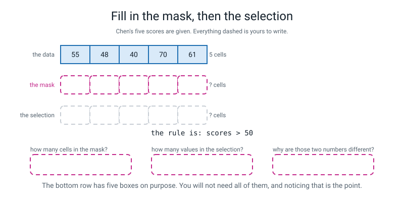
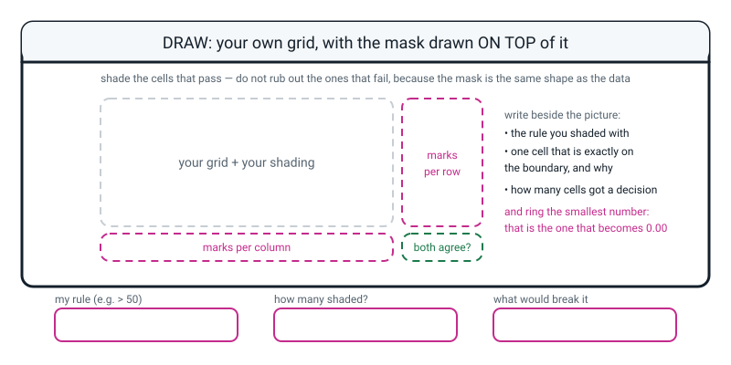

# Workbook — Week 20: The Vectorized Gradebook

**Name:** ________________________________  **Date:** ______________

[⬅ Week 19](week-19.md) · [📖 Read the chapter first](../student-guide/week-20.md) · [Course Home](../README.md) · [🧑‍🏫 Teacher guide](../teacher-guide/week-20.md) · [Next ➡](week-21.md)

---

## ✅ Warm-Up (5 min)

Five quick questions about **last week**.

**W1.** An array has shape `(7, 3)`. How many answers come out of `arr.mean(axis=0)`, and how many out of `arr.mean(axis=1)`?

**axis=0:** ______  **axis=1:** ______

**W2.** Finish the sentence so it is complete: *"The axis you name is the axis that..."*

________________________________________________________________

**W3.** `rain[1, 2]` — which row and which column, counted how?

________________________________________________________________

**W4.** You ask for the average rainfall per month on a 4-by-6 grid and four numbers come out. Nothing crashed. What went wrong, and how do you know without knowing anything about rainfall?

________________________________________________________________

**W5.** What is the corner check, and why must all three of its numbers agree?

________________________________________________________________

---

## 🔎 Predict the Output

**Write your prediction in pen before you run anything.** Every snippet starts with `import numpy as np`. **Two of these four run cleanly and are still wrong.**

### P1 — how many things, and how many things

```python
scores = np.array([[72, 65, 58], [45, 38, 30]])
mask = scores > 50
print(mask)
print(mask.shape)
print(scores[mask])
print(scores[mask].shape)
```

**I predict — how many `True`/`False` in the mask? How many numbers in the selection?**

**mask:** ______  **selection:** ______

**It really printed:**

________________________________________________________________

________________________________________________________________

**The two shapes are different. Say in one sentence why that is not a bug.**

________________________________________________________________

### P2 — one character, five marks

```python
marks = np.array([60, 45, 60, 72, 38])
print(marks > 60)
print(marks >= 60)
print((marks > 60).sum())
print((marks >= 60).sum())
print(marks[marks >= 60])
```

**I predict — the pass mark is 60. How many students pass?**

________________________________________________________________

**It really printed:**

________________________________________________________________

________________________________________________________________

**Lines 3 and 4 disagree. By how many?** ______  **Which students are they, and what did they score?**

________________________________________________________________

**Which of `>` and `>=` matches the rule "sixty is a pass"?** ____________

### P3 — two means, and only one of them is about everybody

```python
grid = np.array([[5, 10], [15, 20], [25, 30]])
big = grid > 12
print(big.sum())
print(big.sum(axis=0))
print(big.sum(axis=1))
print(grid[big].mean())
print(grid.mean())
```

**I predict — say the counts first. Line 2 gives ______ numbers, line 3 gives ______ numbers.**

**It really printed:**

________________________________________________________________

________________________________________________________________

**Lines 4 and 5 are both averages of the same grid and they are different. Which is bigger, and why must it be?**

________________________________________________________________

**One of the numbers in line 3 is a zero. What does a zero mean there?**

________________________________________________________________

### P4 — one extra zero

```python
row = np.array([20, 40, 60, 80, 100])
print((row - row.min()) / (row.max() - row.min()))

row2 = np.array([20, 40, 60, 80, 1000])
scaled = np.round((row2 - row2.min()) / (row2.max() - row2.min()), 2)
print(scaled)
print(scaled.min(), scaled.max())
```

**I predict — the second row has one value ten times too big. What happens to the other four?**

________________________________________________________________

**It really printed:**

**line 1:** ________________________________________________

**line 2:** ________________________________________________

**line 3:** ________________________________________________

**Line 3 is the check you were told to build. Did it pass?** ____________

**So what is line 3 actually worth? One sentence.**

________________________________________________________________

**How many of the answers on this page did you get right?** ______ / 16

**Which one surprised you most, and why?**

________________________________________________________________

---

## ✍️ Practice Set A — Read It

**A1. Read the mask, on paper, with no computer.** For each cell write **T** if the score is above 50 and **F** if it is not.

| Student | Scores | `> 50` mask |
|---|---|---|
| Aarav | 72, 65, 58, 88, 70 | ______ ______ ______ ______ ______ |
| Chen | 55, 48, 40, 70, 61 | ______ ______ ______ ______ ______ |
| Hugo | 45, 38, 30, 62, 50 | ______ ______ ______ ______ ______ |
| Jai | 67, 60, 55, 76, 71 | ______ ______ ______ ______ ______ |

**A1(a).** How many **cells** are in that table, and how many **letters** did you write? ______ and ______

**A1(b).** Hugo's last score is exactly 50. What did you write, and why?

________________________________________________________________

**A1(c).** What would change if the rule were `>= 50`? How many cells, out of how many?

________________________________________________________________

**A1(d).** Count your `T`s **along each row** and write the four numbers here. *(This is `mask.sum(axis=1)`.)*

______  ______  ______  ______

**A1(e).** Count your `T`s **down each column** and write the five numbers here. *(This is `mask.sum(axis=0)`.)*

______  ______  ______  ______  ______

**A1(f).** Add up your row counts. Add up your column counts. Do they agree?

**row total:** ______  **column total:** ______  **agree?** ______  **Why must they?**

________________________________________________________________

**A1(g).** Now write out **only the highlighted values**, in reading order. How many are there?

________________________________________________________________

**A1(h).** There are twenty cells and fewer numbers on that line. **Why is the line shorter, and where did the missing ones go?**

________________________________________________________________

**A2. Predict the shape.** The full ten-by-five gradebook. For each line, what shape comes out and how many numbers?

| # | The line | Shape | How many | Why |
|---|---|---|---|---|
| a | `scores.shape` | — | | |
| b | `scores > 50` | | | |
| c | `(scores > 50).sum()` | — | | |
| d | `(scores > 50).sum(axis=1)` | | | |
| e | `(scores > 50).sum(axis=0)` | | | |
| f | `scores[scores > 50]` | | | |
| g | `scores.max()` | — | | |
| h | `scores.max(axis=0)` | | | |
| i | `np.round(scores.mean(axis=1), 2)` | | | |

**A2(j).** Which two of these give the **same number** of answers but mean completely different things?

________________________________________________________________

**A2(k).** Which line's answer is a **different dtype** from all the others? ____________

**A2(l).** You expected 50 numbers from (f) and got 44. Is that a bug? Say why in one sentence.

________________________________________________________________

**A3. Spot the bug.** Each line is wrong. Say what is wrong and write the fix.

| # | The line, with its comment | What is wrong | The fix |
|---|---|---|---|
| a | `print("lowest:", scores.min)` | | |
| b | `print(names[passed])   # who passed everything` | | |
| c | `print(scores[scores > 50 and scores < 90])` | | |
| d | `print(tests[test_mean.min()])   # the hardest test's name` | | |
| e | `print(np.round(scaled))   # to 2 decimal places` | | |
| f | `passed = scores > 60   # passing is 60 or more` | | |

**A3(g).** Which of those six produce **no error message at all**? ____________

**A3(h).** For each of those silent ones, what is the check that finds it?

________________________________________________________________

________________________________________________________________

**A4. Match the code to the output.** Five of each, no output used twice. The grid is `cups = np.array([[22, 99, 18], [48, 52, 40]])`.

| | Code |
|---|---|
| i | `print(cups > 30)` |
| ii | `print((cups > 30).sum())` |
| iii | `print((cups > 30).sum(axis=1))` |
| iv | `print(cups[cups > 30])` |
| v | `print(cups.max(axis=0))` |

| | Output |
|---|---|
| P | `[48 99 40]` |
| Q | `[1 3]` |
| R | `4` |
| S | `[[False  True False]` <br> ` [ True  True  True]]` |
| T | `[99 48 52 40]` |

**Your answers:** i → ______  ii → ______  iii → ______  iv → ______  v → ______

**A4(f).** `P` and `T` both contain 48 and 40. **One of them has four numbers in it and one has three. Which is which, and why is the count different?**

________________________________________________________________

**A4(g).** Now change the `99` back to `30`. **Suddenly two of those five lines print exactly the same thing.** Which two, and why is a coincidence like that dangerous?

________________________________________________________________

**A5. Label the diagram.** Fill in the two empty rows, then answer the three questions underneath.


*Figure W20.1 — The top row is Chen's five scores. Fill in the mask, then the selection. The rule is `> 50`.*

**The mask row:** ______ ______ ______ ______ ______

**The selection row:** ______ ______ ______ (leave the rest blank)

**A5(a).** How many cells are in the **mask**? ______

**A5(b).** How many values are in the **selection**? ______

**A5(c).** Why do those two numbers differ?

________________________________________________________________

**A6. Say the sentence.** Finish each one so it is true and complete.

**a)** A mask is an array of ______________, and it is the same ______________ as my data.

**b)** Adding up a mask counts things because ______________________________.

**c)** `scores[mask]` is shorter than `scores` because ______________________________, and the `False` cells did **not** become ______________.

**d)** The smallest value in a normalized array is always ______, and the largest is always ______, **which is why that is not a real check** — because ______________________________.

**e)** A range check is worth having because it uses ______________________________.

---

## ✍️ Practice Set B — Write It

Every one of these uses the gradebook:

```python
import numpy as np

names = np.array(["Aarav", "Bela", "Chen", "Divya", "Emeka",
                  "Farah", "Gita", "Hugo", "Ivy", "Jai"])
tests = np.array(["Quiz1", "Quiz2", "Midterm", "Project", "Final"])

scores = np.array([
    [72, 65, 58, 88, 70],     # Aarav
    [90, 84, 77, 95, 92],     # Bela
    [55, 48, 40, 70, 61],     # Chen
    [83, 79, 66, 91, 85],     # Divya
    [61, 57, 52, 80, 68],     # Emeka
    [95, 92, 88, 99, 97],     # Farah
    [78, 70, 63, 85, 74],     # Gita
    [45, 38, 30, 62, 50],     # Hugo
    [88, 81, 72, 93, 89],     # Ivy
    [67, 60, 55, 76, 71],     # Jai
])
```

### B1 — one line

**Task:** build a pass mask, where passing is **60 or more**, and print its shape and dtype on one line.

**Expected output:**

```text
(10, 5) bool
```

**Done looks like:** the comparison is `>=`, not `>`, and you can say why.

```python
passed = ________________________________________________

# your print line here:
________________________________________________________________
```

### B2 — the count check, both directions

**Task:** print how many tests each student passed, how many students passed each test, and prove the two agree.

**Expected output:**

```text
passes per student: [4 5 2 5 3 5 5 1 5 4]
passes per test   : [ 8  7  5 10  9]
both ways add to  : 39 39
```

**Done looks like:** three lines, and the third one is one `print` with two things in it.

```python
________________________________________________________________

________________________________________________________________

________________________________________________________________
```

### B3 — a number turned back into a name

**Task:** print the names of the students who passed **nothing**, and the names of those who passed exactly **one** test.

**Expected output:**

```text
passed nothing :  []
passed just one: ['Hugo']
```

**Done looks like:** two lines, each with a mask built from `passed.sum(axis=1)` and used on `names`.

```python
________________________________________________________________

________________________________________________________________
```

**B3(a).** The first line printed empty brackets. **Is that a bug?** Say what it means.

________________________________________________________________

### B4 — the range check

**Task:** two range checks on one line — nothing above 100, nothing below 0.

**Expected output:**

```text
above 100? []  below 0? []
```

**Done looks like:** one `print`, two masks, two empty answers. **And it goes at the top of the file**, not the bottom.

```python
________________________________________________________________
```

**B4(a).** Why does this check go **first**, before anything is computed?

________________________________________________________________

### B5 — a whole program of your own, about 20 lines

**Task:** four players down, five weeks across, minutes of music practice. Write `practice20.py` from scratch. It must:

1. start with a **range check** — nobody practises for a negative number of minutes
2. print the shape and the dtype, and the counts of both label arrays
3. build a mask for **"60 minutes or more"** and print the mask itself
4. print the count both ways, and prove the two agree
5. print the names of anyone on target **every** week
6. print the selected values and how many there are
7. print the biggest and smallest, and each player's best week
8. normalize the whole grid to 0–1, rounded to 2 decimals
9. contain **no `for` loop at all**

Use these numbers:

```text
                W1    W2    W3    W4    W5
Rhea (violin)  120    90   150    60   110
Sami (drums)    45    30    20    60    35
Tom (piano)    200   180   210    90   175
Uma (flute)     60    75    60    60    80
```

**Expected output — the parts that are easiest to get wrong:**

```text
weeks on target per player: [5 1 5 5] - want 4
players on target per week: [3 3 3 4 3] - want 5
both ways add to          : 16 16
on target every week      : ['Rhea' 'Tom' 'Uma']
```

**Done looks like:** the counts are **4 and 5** here, not 10 and 5 — derive them from the shape you are actually looking at. And `Uma` appears in that last list, which is the point of question B5(b).

**B5(a).** **Hand-check Sami's row before you run it.** His five values are 45, 30, 20, 60, 35, and the target is 60 or more.

**How many weeks on target?** ______  **Which week?** ______  **Why is it not zero?**

________________________________________________________________

**B5(b).** **Uma's five values are 60, 75, 60, 60, 80.** Three of them are exactly 60. Predict her count with `>= 60`, and then with `> 60`.

**with `>=`:** ______  **with `>`:** ______  **and would she still be "on target every week"?** ____________

---

## 🐞 Fix the Broken Program

This program has **three** bugs: one **syntax**, one **runtime**, one **logic**. The real error messages are below, in the order you meet them.

```python
"""steps20.py - four friends down, five days across. Three bugs."""

import numpy as np

#                   Mon    Tue    Wed    Thu    Fri
steps = np.array([
    [ 6200,  8100,  4300,  7700,  3900],   # row 0 - Ana
    [11200,  9800,  6600,  7400,  5100],   # row 1 - Bilal
    [ 3100,  4200,  2800,  5000,  8000],   # row 2 - Cleo
    [ 8800, 12500,  9100, 10300,  8000],   # row 3 - Dara
])
friends = np.array(["Ana", "Bilal", "Cleo", "Dara"])

# the daily target is 8000 steps OR MORE
hit = steps > 8000

print("the mask:")
print(hit
print("mask shape:", hit.shape, " dtype:", hit.dtype)
print("days on target per friend:", hit.sum(axis=1))
print("friends on target per day :", hit.sum(axis=0))
print("both ways add to          :", hit.sum(axis=1).sum(), hit.sum(axis=0).sum())
print("hit it every day          :", friends[hit])
```

**Run 1 — nothing prints at all:**

```text
  File "steps20.py", line 18
    print(hit
         ^
SyntaxError: '(' was never closed
```

**Bug 1.** Which line? ______  **Kind of bug?** ______________

**The message is unusually helpful. What exactly is it telling you?**

________________________________________________________________

**The fix:** ______________________________

**Run 2 — after fixing bug 1:**

```text
the mask:
[[False  True False False False]
 [ True  True False False False]
 [False False False False False]
 [ True  True  True  True False]]
mask shape: (4, 5)  dtype: bool
days on target per friend: [1 2 0 4]
friends on target per day : [2 3 1 1 0]
both ways add to          : 7 7
Traceback (most recent call last):
  File "steps20.py", line 23, in <module>
    print("hit it every day          :", friends[hit])
IndexError: too many indices for array: array is 1-dimensional, but 2 were indexed
```

**Bug 2.** Which line? ______  **Kind of bug?** ______________

**`friends` holds four names. How many answers are in `hit`?** ______  **So what is the problem, in your own words?**

________________________________________________________________

**The fix:** ______________________________

**Run 3 — after fixing bug 2. It runs all the way through with no error at all:**

```text
the mask:
[[False  True False False False]
 [ True  True False False False]
 [False False False False False]
 [ True  True  True  True False]]
mask shape: (4, 5)  dtype: bool
days on target per friend: [1 2 0 4]
friends on target per day : [2 3 1 1 0]
both ways add to          : 7 7
hit it every day          : []
```

**Bug 3.** Which line? ______  **Kind of bug?** ______________

**Read the comment in the file, then read the code on the line under it. What is the difference?**

________________________________________________________________

**Look at the data. Which two cells hold a number that this bug gets wrong?**

________________________________________________________________

**The fix:** ______________________________

**Write the fixed output for the four lines that change:**

```text
days on target per friend: ________________________________
friends on target per day : ________________________________
both ways add to          : ________________________________
hit it every day          : ________________________________
```

**And the reflection:** the corner check printed `7 7` in the broken version and it **agreed.** Explain in one sentence why a check that passed did not save you.

________________________________________________________________

---

## 🧩 Puzzle of the Week

### Part 1 — The squashed row

Somebody normalized a row of five numbers and threw the original row away. All you have is this:

```text
[0.   0.05 0.1  0.15 1.  ]
```

You also know two things: **the smallest original value was 20**, and **the second-smallest was 40**.

**Work out the biggest original value.** Show every step.

**Step 1.** Which position holds the smallest value, and how do you know from the scaled row alone?

________________________________________________________________

**Step 2.** The second value scaled to `0.05`. Write the formula with the numbers you know in it, and one gap:

```text
0.05  =  ( ______  -  ______ )  /  gap
```

**Step 3.** So the gap is ________.  **Show the arithmetic:** ______________________________

**Step 4.** The biggest value is the smallest plus the gap, so it is ________.

**Step 5.** Check it. Fill in the other two originals and confirm they scale correctly.

```text
value  ?  ->  ( ____ - 20 ) / ____  =  0.1
value  ?  ->  ( ____ - 20 ) / ____  =  0.15
```

**Part 1(a).** Four of the five original values sit between 20 and 80. **What has the fifth one done to them, and how would you have caught it?**

________________________________________________________________

### Part 2 — The impossible mask

Here are three sets of mask counts, each claimed to come from a **3-row, 4-column** mask. **Two of them are impossible.** Find them and prove it.

| Set | counts per row (`axis=1`) | counts per column (`axis=0`) |
|---|---|---|
| **A** | `[3, 1, 2]` | `[2, 2, 1, 1]` |
| **B** | `[4, 2, 1]` | `[3, 2, 1, 0]` |
| **C** | `[5, 1, 0]` | `[2, 2, 1, 1]` |

**For each set: add up the row counts, add up the column counts, and compare.**

| Set | row total | column total | agree? | possible? |
|---|---|---|---|---|
| A | | | | |
| B | | | | |
| C | | | | |

**Part 2(a).** Set **C** fails a *second* test as well, and it is not about totals. What is wrong with `[5, 1, 0]` on a grid with four columns?

________________________________________________________________

**Part 2(b).** For the set that **is** possible, draw one mask that produces it. There is more than one right answer.

```text
        col 0   col 1   col 2   col 3     row count
row 0   [___]   [___]   [___]   [___]         3
row 1   [___]   [___]   [___]   [___]         1
row 2   [___]   [___]   [___]   [___]         2

col
count     2       2       1       1
```

**Part 2(c).** You checked the totals and they agreed, and you still had to draw a mask to be sure the counts were achievable. **What does that tell you about checks in general?**

________________________________________________________________

---

## 🤔 Think Deeper

**T1.** With the 950 typo in it, the gradebook's normalized grid was fifty tidy numbers, all legally between 0 and 1, correctly ordered, minimum exactly 0 and maximum exactly 1. **Both built-in checks passed and the answer was ruined.** Write a paragraph about what makes a check worth having. Where does a useful check get its information from? And what is wrong with a check that can never fail?

________________________________________________________________

________________________________________________________________

________________________________________________________________

________________________________________________________________

________________________________________________________________

**T2.** In the gradebook, the average of just the passing scores is **78.9** and the average of everybody's scores is **72.1**. Both numbers are correct. **Write a paragraph** about the sentence *"our students average 78.9"* — is it true, is it honest, and what is the difference? Then say what you would have to print alongside 78.9 to make it fair.

________________________________________________________________

________________________________________________________________

________________________________________________________________

________________________________________________________________

________________________________________________________________

---

## 🛠️ Build It — The Vectorized Gradebook

**The rule: zero `for` loops anywhere in the file.** Not "no loops doing maths" — **none at all.** Print the arrays whole: `print(student_mean)` gives all ten averages at once and `print(names)` gives all ten names, and lined up they read fine.

### Step checklist

- [ ] **1.** Put a **range check at the very top**: nothing above 100, nothing below 0. Both should print `[]`.
- [ ] **2.** Print the shape and dtype of `scores`, and the shapes of `names` and `tests` beside it. Check the numbers line up.
- [ ] **3.** One mean **per student** (`axis=1`), with a count line underneath.
- [ ] **4.** One mean **per test** (`axis=0`), with a count line underneath.
- [ ] **5.** The biggest and smallest score anywhere; the best and worst on each test.
- [ ] **6.** The **hardest** test and the **easiest** test, **by name**, using a mask over `tests`.
- [ ] **7.** A pass mask (`>= 60`). Print the mask, its shape and its dtype. Then the count both ways, and prove they agree. Then who passed everything, and who passed nothing.
- [ ] **8.** Use the mask to pull out the passing scores. Print how many, and their mean, and everybody's mean.
- [ ] **9.** Normalize the whole grid to 0–1 and print it rounded to 2 decimals, with `scaled.min()` and `scaled.max()` underneath.
- [ ] **10.** **In pen, before you run step 11:** normalize **Chen's** row by hand.
- [ ] **11.** Print Chen's row scaled by its own low and high, and compare it with your pen answer.
- [ ] **12.** Search your file for `for`. There should be nothing to find.

### The pen work — Chen's row, before any code

Chen's five scores are `55, 48, 40, 70, 61`.

**smallest:** ______  **largest:** ______  **gap (largest − smallest):** ______

| Score | Subtract the smallest | Divide by the gap | Rounded to 2 dp |
|---|---|---|---|
| 55 | ______ | ______ / ______ = ____________ | ________ |
| 48 | ______ | ______ / ______ = ____________ | ________ |
| 40 | ______ | ______ / ______ = ____________ | ________ |
| 70 | ______ | ______ / ______ = ____________ | ________ |
| 61 | ______ | ______ / ______ = ____________ | ________ |

**Which two of those five did you know before you divided anything?** ________ and ________

**Why?**

________________________________________________________________

### The results table — fill this in from your code

| # | What you asked for | The line you wrote | How many answers | Should be | ✔ / ✘ |
|---|---|---|---|---|---|
| 1 | range check, above 100 | | 0 | 0 | |
| 2 | shape of `scores` | | 2 numbers | 2 | |
| 3 | mean per **student** | | | | |
| 4 | mean per **test** | | | | |
| 5 | biggest / smallest anywhere | | 1 each | 1 | |
| 6 | hardest test, **by name** | | | | |
| 7a | passes per student | | | | |
| 7b | passes per test | | | | |
| 7c | both totals agree? | | | | |
| 8 | how many passing scores | | 1 | 1 | |
| 9 | `scaled.min()` / `scaled.max()` | | 1 each | 1 | |

**How many `for` loops are in your file?** ______

### The hand-check comparison

| | By pen | By code | Agree? |
|---|---|---|---|
| Chen's scaled row | | | |

### The 950 experiment

Add this line just above `low = scores.min()` and run everything again:

```python
scores[5, 0] = 950                        # Farah's Quiz1: 95 typed as 950
```

**Fill in both columns.**

| Quantity | Before | After |
|---|---|---|
| the biggest score | | |
| the class mean | | |
| Quiz1's mean | | |
| Farah's mean | | |
| the gap used for scaling | | |
| Aarav's first scaled score | | |
| `scaled.min()` and `scaled.max()` | | |
| `scores[scores > 100]` | | |

**Four things that changed:**

1. ______________________________
2. ______________________________
3. ______________________________
4. ______________________________

**One thing that did NOT change:**

________________________________________________________________

**Which of the checks you had already built would have caught it?**

________________________________________________________________

### The sentence being marked

**What did the 950 do to everybody else?** One sentence. It must be about somebody other than Farah.

________________________________________________________________

________________________________________________________________

### Two more range checks

Write two range checks that are **not** about test scores — invent a column and a rule you already know about it.

```python
________________________________________________________________

________________________________________________________________
```

### What this array doesn't know

Three things about these ten students that no number in the grid can capture. In English, no code, and **about these actual students.**

1. ______________________________________________________________

2. ______________________________________________________________

3. ______________________________________________________________

**Which of your three would most change the answer to "which test was hardest"?**

________________________________________________________________

### The Bug Log

Two entries today: one loud, one silent.

| What I saw | What it means | Cause | Fix |
|---|---|---|---|
| | | | |
| | | | |

---

## 🎨 Draw It

Draw your **own** grid — anything with rows, columns and numbers. Then draw the **mask on top of it** by shading cells, and fill in both margins with the counts.


*Figure W20.2 — Your grid, your shading rule, and both margin counts.*

**What a good answer looks like:** a grid with a name at the top of every column; **a written rule** beside it, like `> 30` or `>= 60`, with the comparison symbol spelled out; **shading, not crossing out** — the numbers still readable underneath, because a mask decorates data rather than deleting it; a **margin column** with one box per row holding the count of shaded cells in that row, labelled `axis=1`; a **margin row** with one box per column, labelled `axis=0`; and **both margins added up in the corner, agreeing.** Then the thing that earns the marks: **one cell circled that sits exactly on the boundary**, with a note saying whether your rule includes it and why.

**My rule is:** ______________________________

**How many cells did I shade?** ______  **How many cells are on the page?** ______

**Which cell is exactly on the boundary, and is it shaded?**

________________________________________________________________

**What would break my grid?** *(Think about one value typed ten times too big.)*

________________________________________________________________

---

## 📊 Self-Check

| I can... | 😀 | 🙂 | 😕 |
|---|---|---|---|
| build a boolean mask from a comparison and read it as an array of `True` and `False` | | | |
| say what shape a mask is, without looking | | | |
| use a mask to select values, and explain why the answer is shorter | | | |
| count a mask in both directions and check the two totals agree | | | |
| use a mask over one array to pick a name out of another | | | |
| find the min and max of a whole array, or of one axis | | | |
| normalize a row to 0–1 by hand and match it to the code | | | |
| write a gradebook with **zero `for` loops** | | | |
| explain what the 950 did to everybody else, not just to Farah | | | |
| say why a check that cannot fail is not a check | | | |

**The one thing I would ask about if I could ask one question:**

________________________________________________________________

---

## ✅ Answers

<details>
<summary>Check your answers</summary>

### Warm-Up

**W1.** `axis=0` gives **3** answers (the seven rows get eaten, three columns survive). `axis=1` gives **7** (the three columns get eaten, seven rows survive).

**W2.** *"The axis you name is the axis that **gets eaten**."* So naming the rows means the rows disappear and you get one answer per column.

**W3.** **Row 1, column 2** — and **both counted from zero.** So it is the *second* row and the *third* column. In the rainfall grid that is Pune in March.

**W4.** **The wrong axis.** `axis=1` was used where `axis=0` was meant, so the columns got eaten and the answers came out one per city. **You know without knowing anything about rainfall because you typed six month names and got four answers.** The count comes from the labels, and the labels are yours.

**W5.** Adding the grid up in rows, in columns, and all at once:

```python
print(rain.sum(axis=0).sum(), rain.sum(axis=1).sum(), rain.sum())
```

All three must agree because **it is the same numbers added in three different orders**, and the order you add numbers in cannot change the total. If they disagree, a value in the grid is not what you think it is.

### Predict the Output

**P1.** It really printed:

```python
import numpy as np
scores = np.array([[72, 65, 58], [45, 38, 30]])
mask = scores > 50
print(mask)
print(mask.shape)
print(scores[mask])
print(scores[mask].shape)
```

```text
[[ True  True  True]
 [False False False]]
(2, 3)
[72 65 58]
(3,)
```

**Six** `True`/`False` in the mask. **Three** numbers in the selection.

**Why that is not a bug:**

> *"The mask has one answer per **cell** — six cells, six answers. The selection has one value per **True** — three of them. They are two different counts of two different things."*

Note also: the selection is `(3,)` — **one direction, not a grid.** The grid went the moment the mask was used.

**P2.** It really printed:

```python
marks = np.array([60, 45, 60, 72, 38])
print(marks > 60)
print(marks >= 60)
print((marks > 60).sum())
print((marks >= 60).sum())
print(marks[marks >= 60])
```

```text
[False False False  True False]
[ True False  True  True False]
1
3
[60 60 72]
```

**Lines 3 and 4 disagree by 2.** The two students who scored **exactly 60** — positions 0 and 2.

**`>=` matches the rule "sixty is a pass."** With `>` those two students fail, and nothing in the output looks wrong. **One character, two people's grades**, and it is not a technicality: this happens to real schools.

**P3.** It really printed:

```python
grid = np.array([[5, 10], [15, 20], [25, 30]])
big = grid > 12
print(big.sum())
print(big.sum(axis=0))
print(big.sum(axis=1))
print(grid[big].mean())
print(grid.mean())
```

```text
4
[2 2]
[0 2 2]
22.5
17.5
```

**Line 2 gives 2 numbers** (three rows eaten, two columns survive). **Line 3 gives 3** (two columns eaten, three rows survive).

**Line 4 (22.5) must be bigger than line 5 (17.5)** because the mask threw away the small values. `grid[big]` is `[15 20 25 30]`, whose mean is `90 / 4 = 22.5`. The whole grid is `5+10+15+20+25+30 = 105`, and `105 / 6 = 17.5`.

**This is not a discovery, it is arithmetic** — and it is exactly how a misleading statistic is made.

**The zero in line 3** means row 0 has **no** cells above 12. `5` and `10` are both below. **A zero in a mask count is a real answer**, not an error — and the counts still add correctly: `0 + 2 + 2 = 4` and `2 + 2 = 4`.

**P4.** It really printed:

```python
row = np.array([20, 40, 60, 80, 100])
print((row - row.min()) / (row.max() - row.min()))

row2 = np.array([20, 40, 60, 80, 1000])
scaled = np.round((row2 - row2.min()) / (row2.max() - row2.min()), 2)
print(scaled)
print(scaled.min(), scaled.max())
```

```text
[0.   0.25 0.5  0.75 1.  ]
[0.   0.02 0.04 0.06 1.  ]
0.0 1.0
```

The first row spreads evenly across the whole ruler. In the second, **40, 60 and 80 have been squashed into 0.02, 0.04 and 0.06** — a range of four hundredths — and **none of those three numbers changed.** The gap went from 80 to 980.

**Did the check pass?** **Yes.** `scaled.min()` is exactly 0.0 and `scaled.max()` is exactly 1.0, just as promised.

**So what is line 3 worth?** Model sentence:

> *"Almost nothing. The formula guarantees that the smallest lands on 0 and the largest on 1, so that check can never fail — which means it can never catch anything either."*

### Practice Set A

**A1.**

| Student | Scores | `> 50` mask |
|---|---|---|
| Aarav | 72, 65, 58, 88, 70 | `T T T T T` |
| Chen | 55, 48, 40, 70, 61 | `T F F T T` |
| Hugo | 45, 38, 30, 62, 50 | `F F F T F` |
| Jai | 67, 60, 55, 76, 71 | `T T T T T` |

**A1(a).** **Twenty cells, twenty letters.** Every single cell gets a decision. That is what makes it a mask and not a list.

**A1(b).** **`F`.** The rule is `> 50`, which means *strictly* more than 50, and 50 is equal to 50, not more than it.

**A1(c).** **Only Hugo's last cell** changes — it becomes `T`. **One cell out of twenty.** One character in the code, one cell in the answer, and that one cell is a person's grade.

**A1(d).** Aarav **5**, Chen **3**, Hugo **1**, Jai **5**.

**A1(e).** Quiz1 **3**, Quiz2 **2**, Midterm **2**, Project **4**, Final **3**.

**A1(f).** `5 + 3 + 1 + 5 = 14` and `3 + 2 + 2 + 4 + 3 = 14`. **Both 14.** They must agree because **both are counting the same fourteen `T`s**, once along the rows and once down the columns. Adding a table up in two directions cannot change how many things are in it.

**A1(g).** `72, 65, 58, 88, 70, 55, 70, 61, 62, 67, 60, 55, 76, 71` — **fourteen numbers.**

**A1(h).** Because **six cells said `F` and those values are not in the answer at all.** They did **not** become zeros; they are simply absent.

*(And that is also why the answer cannot be a grid: Aarav's row keeps five and Hugo's keeps one, and there is no rectangle shaped like that.)*

**A2.**

| # | The line | Shape | How many | Why |
|---|---|---|---|---|
| a | `scores.shape` | — | **2 numbers** | `(10, 5)`. Rows first |
| b | `scores > 50` | `(10, 5)` | **50** | A mask is the **same shape as the data**. One answer per cell |
| c | `(scores > 50).sum()` | — | **1** | One number: how many `True`. It is 44 |
| d | `(scores > 50).sum(axis=1)` | `(10,)` | **10** | Names axis 1, so the five tests are eaten. One per student |
| e | `(scores > 50).sum(axis=0)` | `(5,)` | **5** | Names axis 0, so the ten students are eaten. One per test |
| f | `scores[scores > 50]` | `(44,)` | **44** | Only the `True`s survive, in one long row. The grid is gone |
| g | `scores.max()` | — | **1** | The biggest number anywhere: 99 |
| h | `scores.max(axis=0)` | `(5,)` | **5** | The best score on each test |
| i | `np.round(scores.mean(axis=1), 2)` | `(10,)` | **10** | Rounding does not change the shape — one per student |

```python
print((scores > 50).sum(), (scores > 50).sum(axis=1), (scores > 50).sum(axis=0))
print(scores.max(axis=0))
print(np.round(scores.mean(axis=1), 2))
```

```text
44 [5 5 3 5 5 5 5 1 5 5] [ 9  8  8 10  9]
[95 92 88 99 97]
[70.6 87.6 54.8 80.8 63.6 94.2 74.  45.  84.6 65.8]
```

**A2(j).** **(d) and (i)** both give ten. (d) is *how many tests each student passed* — a count, from 0 to 5. (i) is *each student's average score* — a mark, roughly 45 to 95. **Same count, completely different meaning and completely different range.**

*(Also acceptable: (e) and (h) both give five.)*

**A2(k).** **(b).** Its dtype is `bool`. Everything else is `int64` or `float64`.

**A2(l).** **No.** Fifty **cells** were tested; forty-four **passed**. The mask has fifty answers; the selection has forty-four values. Two different counts of two different things.

**A3.**

| # | What is wrong | The fix |
|---|---|---|
| a | Missing brackets. It prints the *method* rather than calling it: `<built-in method min of numpy.ndarray object at 0x...>`. **No error.** | `scores.min()`. **A verb takes brackets; a fact does not** |
| b | `passed` is `(10, 5)` and `names` is `(10,)` — fifty answers, ten names. `IndexError: too many indices for array` | Collapse it first: `names[passed.sum(axis=1) == 5]` |
| c | `and` wants **one** yes-or-no and you gave it fifty. `ValueError: The truth value of an array... is ambiguous` | Not this term. One condition, or two named masks used one at a time. **`and` never works on arrays** |
| d | `test_mean.min()` is a **value** (`60.1`), not a position. `IndexError: only integers, slices ... are valid indices` | Make a mask: `tests[test_mean == test_mean.min()]` |
| e | The `2` is missing, so everything rounds to whole numbers and a 0-to-1 grid becomes nothing but 0s and 1s. **No error.** | `np.round(scaled, 2)` |
| f | The comment says "60 or more" and the code says "more than 60". **Everyone on exactly 60 fails.** No error. | `scores >= 60` |

**A3(g).** **(a), (e) and (f)** produce no error message.

**A3(h).**

- **(a):** *look at what printed.* `<built-in method ...>` is not a number. Anything with the word "method" in it means you forgot the brackets.
- **(e):** *look at the range of the answer.* A 0-to-1 grid should have decimals in it. If every value is `0.` or `1.`, the rounding ate them.
- **(f):** *hand-check one boundary case.* Find a score of exactly 60 in the data and check whether the mask says `True` for it. **This is the only one of the three that needs you to know the rule**, which is why it is the dangerous one.

**A4.** i → **S**, ii → **R**, iii → **Q**, iv → **T**, v → **P**.

```python
cups = np.array([[22, 99, 18], [48, 52, 40]])
print(cups > 30)
print((cups > 30).sum())
print((cups > 30).sum(axis=1))
print(cups[cups > 30])
print(cups.max(axis=0))
print(cups[cups > 30].shape, cups.max(axis=0).shape)
```

```text
[[False  True False]
 [ True  True  True]]
4
[1 3]
[99 48 52 40]
[48 99 40]
(4,) (3,)
```

**A4(f).** **`T` has four numbers; `P` has three.**

- **`T`** is `cups[cups > 30]` — *every value that passed the test*, and four of the six cells passed. Its count comes from **how many cells were above 30**, which could be anything from 0 to 6.
- **`P`** is `cups.max(axis=0)` — *the biggest value in each column*, and there are three columns. Its count is **always three**, whatever the numbers are.

**One is a selection and one is an aggregation**, and only the second one has a count you can predict from the shape.

**A4(g).** With `30` back in place, **`iv` and `v` print exactly the same thing:**

```python
c2 = np.array([[22, 30, 18], [48, 52, 40]])
print(c2[c2 > 30])
print(c2.max(axis=0))
print(c2[c2 > 30].shape, c2.max(axis=0).shape)
```

```text
[48 52 40]
[48 52 40]
(3,) (3,)
```

**Same values and the same shape.** They match only because **every value above 30 happened to be in the bottom row**, so "the ones that passed" and "the biggest in each column" are the same three cells.

**Why that is dangerous:** if you wrote the wrong one of those two lines, this data would not tell you. It would agree with you, and you would move on. **Two lines that agree by coincidence are the most dangerous kind of output**, because your test passed and your code is wrong. Change one number — put the 99 back — and they come apart immediately.

**A5.** Chen's row is `55, 48, 40, 70, 61` and the rule is `> 50`.

**The mask row:** `T  F  F  T  T`

**The selection row:** `55  70  61` — **three boxes filled, two left blank.**

```python
chen = np.array([55, 48, 40, 70, 61])
above_50 = chen > 50
print("chen     :", chen)
print("above_50 :", above_50)
print("picked   :", chen[above_50])
print("counted  :", above_50.sum())
```

```text
chen     : [55 48 40 70 61]
above_50 : [ True False False  True  True]
picked   : [55 70 61]
counted  : 3
```

**A5(a).** **Five** cells in the mask.

**A5(b).** **Three** values in the selection.

**A5(c).** Because **two cells said `False`**, and those two values are not in the answer. **The mask makes a decision about every cell; the selection keeps only the yeses.** Five decisions, three values.

**A6.**

**a)** …an array of **`True` and `False`**, and it is the same **shape** as my data.

**b)** …because **Python treats `True` as 1 and `False` as 0**, so adding them up counts the yeses.

**c)** …because **only the cells the mask said yes to are in the answer**, and the `False` cells did **not** become **zeros** — they are absent.

**d)** The smallest is always **0.0** and the largest is always **1.0**, **which is why that is not a real check** — because **the formula guarantees it, so it can never disagree with the formula however wrong the data is.**

**e)** …because it uses **knowledge from outside the data** — something you know about what the numbers *are*, like "a test score cannot be over 100", which the computer has no way of knowing.

### Practice Set B

**B1.**

```python
passed = scores >= 60
print(passed.shape, passed.dtype)
```

```text
(10, 5) bool
```

**Why `>=`:** a school that says "60 is a pass" means 60 passes. Write `> 60` and everyone on exactly 60 fails — and in this gradebook, **Jai's Quiz2 score is exactly 60**, so it is not a hypothetical.

**B2.**

```python
print("passes per student:", passed.sum(axis=1))
print("passes per test   :", passed.sum(axis=0))
print("both ways add to  :", passed.sum(axis=1).sum(), passed.sum(axis=0).sum())
```

```text
passes per student: [4 5 2 5 3 5 5 1 5 4]
passes per test   : [ 8  7  5 10  9]
both ways add to  : 39 39
```

`4+5+2+5+3+5+5+1+5+4 = 39` and `8+7+5+10+9 = 39`. **Both count the same 39 `True`s.** If they disagree, one of the two `.sum()` calls has the wrong axis.

**B3.**

```python
print("passed nothing :  ", names[passed.sum(axis=1) == 0])
print("passed just one:", names[passed.sum(axis=1) == 1])
```

```text
passed nothing :   []
passed just one: ['Hugo']
```

**B3(a).** **Not a bug.** It means **nobody** failed everything, so the mask picked out no names. **An empty answer is a real answer** — and here it is good news.

*(Hugo passed exactly one: the Project, with 62. It is the only `True` in his row.)*

**B4.**

```python
print("above 100?", scores[scores > 100], " below 0?", scores[scores < 0])
```

```text
above 100? []  below 0? []
```

**B4(a).** Because **every number computed after it depends on the data being sane.** If a 950 is in there, then the max, the class mean, the gap and all fifty normalized values are already wrong by the time you look at them — and they will all look fine. **Check the ingredients before you cook, not after.**

**B5.** Complete working program, zero `for` loops:

```python
"""practice20.py - four players down, five weeks across. Minutes practised."""

import numpy as np                                  # the array library

#                     W1   W2   W3   W4   W5
minutes = np.array([
    [ 120,  90, 150,  60, 110],                     # row 0 - Rhea (violin)
    [  45,  30,  20,  60,  35],                     # row 1 - Sami (drums)
    [ 200, 180, 210,  90, 175],                     # row 2 - Tom (piano)
    [  60,  75,  60,  60,  80],                     # row 3 - Uma (flute)
])
players = np.array(["Rhea", "Sami", "Tom", "Uma"])
weeks = np.array(["W1", "W2", "W3", "W4", "W5"])

# --- 0. the range check FIRST. Nobody practises for a negative time,
# ---    and a week has 10080 minutes in it.
print("negative?", minutes[minutes < 0], " over a week?", minutes[minutes > 10080])

print("shape  :", minutes.shape, minutes.dtype)
print("players:", len(players), " weeks:", len(weeks))

# --- the target is 60 minutes OR MORE, so >= not > ------------------------
on_target = minutes >= 60
print()
print(on_target)
print("mask shape:", on_target.shape, " dtype:", on_target.dtype)

print()
print("weeks on target per player:", on_target.sum(axis=1), "- want 4")
print("players on target per week:", on_target.sum(axis=0), "- want 5")
print("both ways add to          :", on_target.sum(axis=1).sum(), on_target.sum(axis=0).sum())
print("on target every week      :", players[on_target.sum(axis=1) == 5])

print()
print("the on-target minutes:", minutes[on_target])
print("how many            :", minutes[on_target].shape)

print()
print("most in one week :", minutes.max())
print("least in one week:", minutes.min())
print("each player's best:", minutes.max(axis=1))
print("quietest week     :", weeks[minutes.sum(axis=0) == minutes.sum(axis=0).min()])

low = minutes.min()
high = minutes.max()
print()
print("low:", low, " high:", high, " gap:", high - low)
print(np.round((minutes - low) / (high - low), 2))
```

Real output:

```text
negative? []  over a week? []
shape  : (4, 5) int64
players: 4  weeks: 5

[[ True  True  True  True  True]
 [False False False  True False]
 [ True  True  True  True  True]
 [ True  True  True  True  True]]
mask shape: (4, 5)  dtype: bool

weeks on target per player: [5 1 5 5] - want 4
players on target per week: [3 3 3 4 3] - want 5
both ways add to          : 16 16
on target every week      : ['Rhea' 'Tom' 'Uma']

the on-target minutes: [120  90 150  60 110  60 200 180 210  90 175  60  75  60  60  80]
how many            : (16,)

most in one week : 210
least in one week: 20
each player's best: [150  60 210  80]
quietest week     : ['W4']

low: 20  high: 210  gap: 190
[[0.53 0.37 0.68 0.21 0.47]
 [0.13 0.05 0.   0.21 0.08]
 [0.95 0.84 1.   0.37 0.82]
 [0.21 0.29 0.21 0.21 0.32]]
```

**Note the counts: 4 and 5**, from the shape `(4, 5)`. If you wrote "want 10" you copied it from the gradebook without looking.

**B5(a).** Sami's row is `45, 30, 20, 60, 35`. **One** week on target — **W4**, with exactly 60.

**It is not zero because the target is "60 or more"**, and 60 is 60. With `> 60` his count would be zero, and he would look like somebody who never practised at all — which, on the week he practised exactly the right amount, would be a lie.

**B5(b).** Uma's row is `60, 75, 60, 60, 80`.

**with `>=`: 5.** **with `>`: 2** (only 75 and 80).

**And no, she would not still be "on target every week"** — she would drop out of that list entirely, along with the `== 5` test failing for her. **One character removes her from the list of the three most consistent players.** She is the most consistent one in the table.

### Fix the Broken Program

**Bug 1 — line 18. A syntax bug.**

```python
print(hit
```

```text
SyntaxError: '(' was never closed
```

**This message is unusually kind.** It does not just say "invalid syntax" — it tells you exactly what the problem is: a round bracket was opened and never closed. Python read to the end of the file still waiting for the `)`.

Notice too that **nothing printed at all**, not even the `the mask:` line above it. A `SyntaxError` happens **before your program runs**.

**The fix:** `print(hit)`.

**Bug 2 — line 23. A runtime bug.**

```python
print("hit it every day          :", friends[hit])
```

```text
IndexError: too many indices for array: array is 1-dimensional, but 2 were indexed
```

**`friends` holds four names. `hit` holds twenty answers** — it is `(4, 5)`.

In your own words:

> *"I handed a two-directional mask to a one-directional list. Twenty answers cannot pick out of four names — there is no way to line them up."*

**How to get from twenty answers down to four, one per friend?** Add along the row: `axis=1`. And a friend who hit it **every** day is one whose count is **5**.

**The fix:** `friends[hit.sum(axis=1) == 5]`.

**Bug 3 — line 15. A logic bug, with no error message.**

```python
# the daily target is 8000 steps OR MORE
hit = steps > 8000
```

**The comment says "OR MORE". The code says "more than".** One character apart, and they mean different things.

**The two cells this gets wrong:** **Cleo's Friday** (8000) and **Dara's Friday** (8000). Both are exactly on the target, and both are marked `False`.

The damage is visible once you know where to look. Cleo's count is `0` — she looks like somebody who never once hit the target, when in fact she hit it exactly. And **`hit it every day` printed `[]`** — nobody hit it every day — when Dara actually did, five days out of five.

**The fix:** `hit = steps >= 8000`.

**The fixed output:**

```text
days on target per friend: [1 2 1 5]
friends on target per day : [2 3 1 1 2]
both ways add to          : 9 9
hit it every day          : ['Dara']
```

**And the reflection.** Model sentence:

> *"The corner check only proves the two counts are counting the same `True`s. It cannot tell whether those were the right `True`s in the first place — so it agrees perfectly with a mask built from the wrong rule."*

**That is this week's lesson in one line: a check that cannot fail is not a check**, and the corner check *can* fail — just not for this. Different checks catch different things, and you need more than one.

*(How would you catch bug 3? Hand-check one boundary case. Find a value of exactly 8000 in the data and ask what the mask says about it.)*

### Puzzle of the Week

**Part 1 — the squashed row.**

**Step 1.** The **first** position, because **the smallest value always scales to exactly 0.0** — you subtract it from itself. So the `0.` at the start is the smallest.

**Step 2.**

```text
0.05  =  ( 40  -  20 )  /  gap
```

**Step 3.** The gap is **400**.

```text
0.05 = 20 / gap
so   gap = 20 / 0.05 = 400
```

**Step 4.** The biggest value is `20 + 400` = **420**.

**Step 5.** Check the other two:

```text
value 60   ->  ( 60 - 20 ) / 400  =  40 / 400  = 0.1   ✔
value 80   ->  ( 80 - 20 ) / 400  =  60 / 400  = 0.15  ✔
```

Proof:

```python
import numpy as np
row = np.array([20, 40, 60, 80, 420])
print(np.round((row - row.min()) / (row.max() - row.min()), 2))
print("gap:", row.max() - row.min())
```

```text
[0.   0.05 0.1  0.15 1.  ]
gap: 400
```

**Part 1(a).** **It has squashed them into the bottom sixth of the ruler.** Four values that span 20 to 80 — a real range of 60 — now sit between 0.00 and 0.15, because everything is being divided by 400 instead of 60.

**How you would catch it:** a **range check** on the original values, using something you already know about them. If those were test scores, `row[row > 100]` would hand you `[420]` immediately. **The scaled row cannot tell you** — it has a legal minimum of 0 and a legal maximum of 1, exactly as promised.

**Part 2 — the impossible masks.**

| Set | row total | column total | agree? | possible? |
|---|---|---|---|---|
| **A** | `3+1+2 = 6` | `2+2+1+1 = 6` | ✔ **yes** | **possible** |
| **B** | `4+2+1 = 7` | `3+2+1+0 = 6` | ✘ **no** | **impossible** |
| **C** | `5+1+0 = 6` | `2+2+1+1 = 6` | ✔ yes | **impossible anyway** |

**B is impossible** because the two totals disagree. Both are counting the same `True`s, so 7 and 6 cannot both be right.

**Part 2(a).** **A row of a 4-column grid has only four cells in it**, so its count cannot possibly be more than **4**. A count of `5` claims five `True`s in four cells.

**This is the more interesting failure**, because C **passes** the corner check. Its totals agree perfectly. The corner check is looking at totals and has no idea how wide a row is.

**Part 2(b).** One mask that produces set A — there are others:

```text
        col 0   col 1   col 2   col 3     row count
row 0   [ T ]   [ T ]   [ F ]   [ T ]         3
row 1   [ F ]   [ T ]   [ F ]   [ F ]         1
row 2   [ T ]   [ F ]   [ T ]   [ F ]         2

col
count     2       2       1       1
```

```python
m = np.array([[ True,  True, False,  True],
              [False,  True, False, False],
              [ True, False,  True, False]])
print(m.sum(axis=1))
print(m.sum(axis=0))
print(m.sum())
```

```text
[3 1 2]
[2 2 1 1]
6
```

**Part 2(c).** Model sentence:

> *"Passing a check does not mean the answer is right — it only means that one particular thing is not wrong. Set C passed the corner check and was still impossible, because the corner check never looks at how wide a row is."*

**Which is exactly why the 950 got through.** Both of the gradebook's checks passed. **Every check has a blind spot, and the only defence is more than one kind of check.**

### Build It

**Chen's row, worked in full, by pen.**

Chen's five scores are `55, 48, 40, 70, 61`. **Smallest 40. Largest 70. Gap 30.**

| Score | Subtract 40 | Divide by 30 | Rounded |
|---|---|---|---|
| 55 | 15 | 15/30 = 0.5 | **0.50** |
| 48 | 8 | 8/30 = 0.2666… | **0.27** |
| 40 | 0 | 0/30 = 0 | **0.00** |
| 70 | 30 | 30/30 = 1 | **1.00** |
| 61 | 21 | 21/30 = 0.7 | **0.70** |

**The two you knew in advance: `0.00` and `1.00`.** The smallest value always lands on 0, because you subtract it from itself. The largest always lands on 1, because the top of the fraction becomes the same as the bottom.

Code check:

```python
chen = scores[2, :]
print(chen, chen.min(), chen.max())
print(np.round((chen - chen.min()) / (chen.max() - chen.min()), 2))
```

```text
[55 48 40 70 61] 40 70
[0.5  0.27 0.   1.   0.7 ]
```

**Five for five.** *(And `0.5` printing as `0.5` rather than `0.50` is numpy trimming a trailing zero. Same number.)*

**The complete gradebook, zero `for` loops:**

```python
"""gradebook.py - the Vectorized Gradebook. Zero for loops anywhere in this file."""

import numpy as np

names = np.array(["Aarav", "Bela", "Chen", "Divya", "Emeka",
                  "Farah", "Gita", "Hugo", "Ivy", "Jai"])
tests = np.array(["Quiz1", "Quiz2", "Midterm", "Project", "Final"])

scores = np.array([
    [72, 65, 58, 88, 70],     # Aarav
    [90, 84, 77, 95, 92],     # Bela
    [55, 48, 40, 70, 61],     # Chen
    [83, 79, 66, 91, 85],     # Divya
    [61, 57, 52, 80, 68],     # Emeka
    [95, 92, 88, 99, 97],     # Farah
    [78, 70, 63, 85, 74],     # Gita
    [45, 38, 30, 62, 50],     # Hugo
    [88, 81, 72, 93, 89],     # Ivy
    [67, 60, 55, 76, 71],     # Jai
])

# --- 0. the range check, FIRST. What do I already know? -------------------
print("above 100?", scores[scores > 100], " below 0?", scores[scores < 0])

# --- 1. do the labels match the grid? -------------------------------------
print("scores :", scores.shape, scores.dtype)
print("names  :", names.shape, "  tests:", tests.shape)

# --- 2. one mean per student: eat the columns, axis=1 ---------------------
student_mean = scores.mean(axis=1)
print()
print("names        :", names)
print("student means:", student_mean)
print("count        :", student_mean.shape, "- one per student")

# --- 3. one mean per test: eat the rows, axis=0 ---------------------------
test_mean = scores.mean(axis=0)
print()
print("tests     :", tests)
print("test means:", test_mean)
print("count     :", test_mean.shape, "- one per test")

# --- 4. biggest and smallest, anywhere ------------------------------------
print()
print("highest score:", scores.max())
print("lowest  score:", scores.min())
print("best  on each test:", scores.max(axis=0))
print("worst on each test:", scores.min(axis=0))

# --- 5. the hardest test = the lowest test mean, looked up by mask --------
print()
print("lowest test mean:", test_mean.min())
print("hardest test    :", tests[test_mean == test_mean.min()])
print("easiest test    :", tests[test_mean == test_mean.max()])

# --- 6. the pass mask. Passing is 60 or more -----------------------------
passed = scores >= 60
print()
print("mask shape:", passed.shape, " dtype:", passed.dtype)
print(passed)
print("passes per student:", passed.sum(axis=1))
print("passes per test   :", passed.sum(axis=0))
print("passes, both ways :", passed.sum(axis=1).sum(), passed.sum(axis=0).sum())
print("passed everything :", names[passed.sum(axis=1) == 5])
print("passed nothing    :", names[passed.sum(axis=1) == 0])

# --- 7. use the mask to pull the passing scores out ----------------------
print()
print("the passing scores:", scores[passed])
print("how many          :", scores[passed].shape)
print("their mean        :", np.round(scores[passed].mean(), 2))
print("everybody's mean  :", np.round(scores.mean(), 2))

# --- 8. squash the whole grid onto 0 to 1 -------------------------------
low = scores.min()
high = scores.max()
scaled = (scores - low) / (high - low)
print()
print("low:", low, " high:", high, " gap:", high - low)
print(np.round(scaled, 2))
print("scaled min:", scaled.min(), " scaled max:", scaled.max())

# --- 9. hand-check, Chen's row ------------------------------------------
# By pencil: Chen's five scores are 55 48 40 70 61.
#   lowest 40, highest 70, so the gap is 30.
#   (55-40)/30 = 15/30 = 0.5     -> 0.50
#   (48-40)/30 =  8/30 = 0.2666  -> 0.27
#   (40-40)/30 =  0/30 = 0.0
#   (70-40)/30 = 30/30 = 1.0
#   (61-40)/30 = 21/30 = 0.7     -> 0.70
row = scores[2, :]
print()
print("Chen's row       :", row)
print("its low and high :", row.min(), row.max())
print("scaled by ITS own low and high:",
      np.round((row - row.min()) / (row.max() - row.min()), 2))
```

Real output:

```text
above 100? []  below 0? []
scores : (10, 5) int64
names  : (10,)   tests: (5,)

names        : ['Aarav' 'Bela' 'Chen' 'Divya' 'Emeka' 'Farah' 'Gita' 'Hugo' 'Ivy' 'Jai']
student means: [70.6 87.6 54.8 80.8 63.6 94.2 74.  45.  84.6 65.8]
count        : (10,) - one per student

tests     : ['Quiz1' 'Quiz2' 'Midterm' 'Project' 'Final']
test means: [73.4 67.4 60.1 83.9 75.7]
count     : (5,) - one per test

highest score: 99
lowest  score: 30
best  on each test: [95 92 88 99 97]
worst on each test: [45 38 30 62 50]

lowest test mean: 60.1
hardest test    : ['Midterm']
easiest test    : ['Project']

mask shape: (10, 5)  dtype: bool
[[ True  True False  True  True]
 [ True  True  True  True  True]
 [False False False  True  True]
 [ True  True  True  True  True]
 [ True False False  True  True]
 [ True  True  True  True  True]
 [ True  True  True  True  True]
 [False False False  True False]
 [ True  True  True  True  True]
 [ True  True False  True  True]]
passes per student: [4 5 2 5 3 5 5 1 5 4]
passes per test   : [ 8  7  5 10  9]
passes, both ways : 39 39
passed everything : ['Bela' 'Divya' 'Farah' 'Gita' 'Ivy']
passed nothing    : []

the passing scores: [72 65 88 70 90 84 77 95 92 70 61 83 79 66 91 85 61 80 68 95 92 88 99 97
 78 70 63 85 74 62 88 81 72 93 89 67 60 76 71]
how many          : (39,)
their mean        : 78.9
everybody's mean  : 72.1

low: 30  high: 99  gap: 69
[[0.61 0.51 0.41 0.84 0.58]
 [0.87 0.78 0.68 0.94 0.9 ]
 [0.36 0.26 0.14 0.58 0.45]
 [0.77 0.71 0.52 0.88 0.8 ]
 [0.45 0.39 0.32 0.72 0.55]
 [0.94 0.9  0.84 1.   0.97]
 [0.7  0.58 0.48 0.8  0.64]
 [0.22 0.12 0.   0.46 0.29]
 [0.84 0.74 0.61 0.91 0.86]
 [0.54 0.43 0.36 0.67 0.59]]
scaled min: 0.0  scaled max: 1.0

Chen's row       : [55 48 40 70 61]
its low and high : 40 70
scaled by ITS own low and high: [0.5  0.27 0.   1.   0.7 ]
```

**The cross-check table. Every value must match:**

| Quantity | Value |
|---|---|
| `scores.shape` | `(10, 5)` |
| Aarav's mean | `70.6` — because 72+65+58+88+70 = 353, and 353/5 = 70.6 |
| Quiz1's mean | `73.4` — because the column sums to 734, and 734/10 = 73.4 |
| all student means | `[70.6 87.6 54.8 80.8 63.6 94.2 74. 45. 84.6 65.8]` |
| all test means | `[73.4 67.4 60.1 83.9 75.7]` |
| hardest / easiest test | `Midterm` (60.1) / `Project` (83.9) |
| highest / lowest score | `99` / `30` |
| class mean | `72.1` |
| passes per student | `[4 5 2 5 3 5 5 1 5 4]` |
| passes per test | `[8 7 5 10 9]` |
| both add to | `39` |
| passed everything | `Bela, Divya, Farah, Gita, Ivy` |
| mean of just the passes | `78.9` |
| **`for` loops in the file** | **0** |

**The 950 experiment, both columns filled:**

| Quantity | Before | After |
|---|---|---|
| the biggest score | 99 | **950** |
| the class mean | 72.1 | **89.2** |
| Quiz1's mean | 73.4 | **158.9** |
| Farah's mean | 94.2 | **265.2** |
| the gap used for scaling | 69 | **920** |
| Aarav's first scaled score | 0.61 | **0.05** |
| `scaled.min()` / `scaled.max()` | 0.0 / 1.0 | **0.0 / 1.0 — unchanged** |
| `scores[scores > 100]` | `[]` | **`[950]`** |

Real output:

```text
--- BEFORE the typo ---
max              : 99
class mean       : 72.1
Quiz1 mean       : 73.4
Farah's mean     : 94.2
gap used         : 69
scaled, first row: [0.61 0.51 0.41 0.84 0.58]
scaled min / max : 0.0 1.0
above 100?       : []

--- AFTER the typo ---
max              : 950
class mean       : 89.2
Quiz1 mean       : 158.9
Farah's mean     : 265.2
gap used         : 920
scaled, first row: [0.05 0.04 0.03 0.06 0.04]
scaled min / max : 0.0 1.0
above 100?       : [950]
```

**Four things that changed:** any four from the table. The biggest score, Farah's mean, Quiz1's mean, the class mean, the gap, and every one of the fifty scaled values.

**One thing that did NOT change:** several, and any of them earns the mark. **The order** — Bela is still ahead of Chen, and every student is in exactly the same position relative to the others. **`scaled.min()` is still exactly 0.0 and `scaled.max()` is still exactly 1.0.** Every scaled value is still legally between 0 and 1. **Nobody else's actual score changed at all.**

**Which of the checks you had built would have caught it? NONE of them.** `scaled.min()` was 0.0 and `scaled.max()` was 1.0, so both checks **passed** while the answer was ruined. **This is the most important line on the page.**

**The sentence being marked.** Model answer:

> *"It made the gap between the smallest and largest score go from 69 to 920, so every real score got divided by a number thirteen times too big and everybody landed between 0.01 and 0.08 — even though nobody except Farah had their score changed at all."*

**What loses the marks:** a sentence about Farah's average being over 100. That has spotted the **loud** damage. The objective is the **quiet** damage — Aarav, who did nothing, going from 0.61 to 0.05.

**Two more range checks.** Any pair that carries knowledge from outside the data:

```python
print("negative steps?", steps[steps < 0])
print("more than a day of screen time?", screen[screen > 24])
```

Both should print `[]`. Other good answers: an age above 110; a price below 0; a percentage above 100; a rainfall figure below 0.

*(Also acceptable and genuinely good: a check on the **labels** rather than the values — that `len(names)` equals `scores.shape[0]` and `len(tests)` equals `scores.shape[1]`.)*

**What this array doesn't know.** Any three of this kind:

1. **Who was ill on Midterm day.** The Midterm is the hardest test by average, 60.1, and five of the ten failed it. That could be a hard paper, or a bad week, or a topic nobody had been taught. **The grid cannot tell those apart.**
2. **Whether the Project was done in a group.** It is the easiest test by a mile — 83.9, and all ten passed it. If it was a group task, part of each number is somebody else's work.
3. **Whether Hugo has ever been taught the thing the Midterm asked about.** He scored 30, the lowest number in the grid, and the array offers no distinction between "did not understand", "did not revise", "was not there", and "was never taught it".
4. **What any of these tests was out of.** We have been assuming 100. **Nothing in the array says so** — the range check we wrote is *our* knowledge, typed in by hand.

**Which would most change "which test was hardest"?** Usually the first. If three of the five who failed the Midterm were off ill, then "the Midterm is hard" might just mean "three people missed it", and 60.1 is measuring attendance rather than difficulty. **The number would not change; what it means would change completely.**

**Bug Log entries, done properly:**

| What I saw | What it means | Cause | Fix |
|---|---|---|---|
| `IndexError: too many indices for array: array is 1-dimensional, but 2 were indexed` | I used a `(10, 5)` mask on a `(10,)` list of names | `names[passed]` — fifty answers, ten names | Collapse the mask first: `names[passed.sum(axis=1) == 5]` |
| Every scaled score between 0.01 and 0.08. **No error.** | Nothing is wrong as far as numpy is concerned; every value is legally between 0 and 1 | One score was typed as 950, so the gap became 920 instead of 69 | Range-check first: `scores[scores > 100]` → `[950]` |

### Draw It

**What a full-mark answer contains**, using a worked example. Say the grid is four juices down and five days across, and the rule is `> 30`:

```text
              Mon  Tue  Wed  Thu  Fri  | shaded per row (axis=1)
Mango          22   30   18  [41] [55] |          2
Lime           14   12    9   20   26  |          0
Sugarcane    [48] [52] [40] [61] [77]  |          5
Beetroot        8   11    6   15   19  |          0
------------------------------------------------
shaded per     1    1    1    2    2   |    7 = 7  ✔
column (axis=0)
```

The six things being looked for:

1. **A written rule**, with the symbol spelled out: `> 30`, *"more than 30, so a cell holding exactly 30 is NOT shaded."*
2. **Shading, not crossing out.** The numbers must still be readable. A mask decorates data; it does not delete it. Crossing out destroys the "same shape" idea, which is the whole point of the week.
3. **A margin column with one box per row** — four boxes here — labelled **`axis=1`**.
4. **A margin row with one box per column** — five boxes — labelled **`axis=0`**.
5. **Both margins added up and agreeing.** `2 + 0 + 5 + 0 = 7` and `1 + 1 + 1 + 2 + 2 = 7`. ✔
6. **One boundary cell circled.** Here it is **Mango on Tuesday, exactly 30**, with the note: *"the rule is `> 30`, so 30 is not shaded. If the rule were `>= 30` this cell would flip and Mango's count would be 3."*

**Two rows have a count of zero, and that is a real answer**, not a mistake — Lime and Beetroot never sold more than 30 cups on any day.

**"What would break my grid?"** Model answer: *"one value typed ten times too big. If Sugarcane's Friday were 770 instead of 77, the mask would be unchanged — 770 is still above 30 — but normalizing would set the gap to 764 instead of 71 and squash every real value into the bottom tenth of the scale."*

**The good answer notices that the mask survives and the normalization does not.** They are affected differently by the same typo, and that is worth a sentence.

### Self-Check answers

There are no right answers on the Self-Check — it is a record of where you are, and it is most useful when it is honest.

Three of those lines carry the rest of the course, though:

**"say what shape a mask is, without looking."** If that is a 😕, the fix is the highlighter and nothing else. Print a grid, shade it, and count the cells on the page. Fifty cells, fifty decisions. **Nothing about that needs a computer.**

**"normalize a row to 0–1 by hand and match it to the code."** If that is a 😕, do one row with a calculator right now, with the screen turned away. You already know two of your five answers before you divide anything, and feeling that is what makes it stick.

**"say why a check that cannot fail is not a check."** This is the 😀 that matters most, and it is the one thing from this week that you will still be using in Week 35. If it is not a 😀 yet, reread the 950 section and pay attention to one specific sentence: *both checks passed and the answer was ruined.*

</details>

---

[⬅ Week 19 Workbook](week-19.md) · [📖 Week 20 Chapter](../student-guide/week-20.md) · [Course Home](../README.md) · [Week 21 Workbook ➡](week-21.md)
