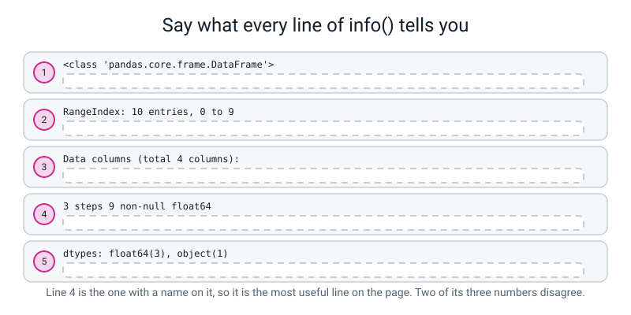
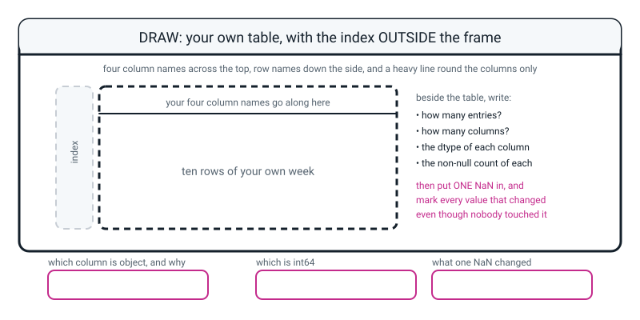

# Workbook — Week 21: Tables With Names On: Meet the DataFrame

**Name:** ________________________________  **Date:** ______________

[⬅ Week 20](week-20.md) · [📖 Read the chapter first](../student-guide/week-21.md) · [Course Home](../README.md) · [🧑‍🏫 Teacher guide](../teacher-guide/week-21.md) · [Next ➡](week-22.md)

---

## ✅ Warm-Up (5 min)

Five quick questions about **last week**.

**W1.** `scores` is a grid of ten students by five tests. You write `scores > 70`. **What shape is the answer, and what is in it?**

**shape:** ____________  **what is in it:** ______________________________

**W2.** `scores[scores > 70]` gives back 31 numbers. There were 50 cells. **Where did the other 19 go — and did they become zeros?**

________________________________________________________________

**W3.** Why does `mask.sum()` count things?

________________________________________________________________

**W4.** One score is typed as 950 instead of 95, and the normalized grid comes out with every value between 0.01 and 0.08. `scaled.min()` is still 0.0 and `scaled.max()` is still 1.0. **Why did both checks pass?**

________________________________________________________________

**W5.** `scores.min()` and `scores.shape` — one takes brackets and one does not. **What is the rule?**

________________________________________________________________

---

## 🔎 Predict the Output

**Write your prediction in pen before you run anything.** Every snippet starts with `import pandas as pd`. **Two of these four run cleanly and are not what you typed.**

### P1 — which way round is a column?

```python
menu = pd.DataFrame({"snack": ["idli", "dosa", "vada"], "price": [10, 30, 20]})
print(menu)
print(len(menu))
print(menu["price"])
```

**I predict — how many rows, and how many columns?**

**rows:** ______  **columns:** ______

**It really printed:**

________________________________________________________________

________________________________________________________________

**There are two things in the dictionary and three things in each list. Which number became the rows?** ____________

**The last line printed four lines, not three. What is the extra one, and what two facts does it carry?**

________________________________________________________________

### P2 — two ways to ask, and only one works

```python
menu = pd.DataFrame({"snack": ["idli", "dosa", "vada"], "price": [10, 30, 20]})
print(menu["snack"])
print(menu[0])
```

**I predict — the second line asks for the first row. Will it work?**

________________________________________________________________

**It really printed:**

________________________________________________________________

________________________________________________________________

**What does that error mean, in your own words?**

________________________________________________________________

**Square brackets on a DataFrame ask for ______________, not ______________.**

### P3 — one hole

```python
a = pd.DataFrame({"pet": ["cat", "dog", "rat"], "legs": [4, 4, 4]})
b = pd.DataFrame({"pet": ["cat", "dog", "rat"], "legs": [4, None, 4]})
print(a)
print(b)
```

**I predict — will `b` crash? And how many of `b`'s three `legs` values will look different from `a`'s?**

________________________________________________________________

**It really printed:**

```text
________________________________________________________________
________________________________________________________________
________________________________________________________________
________________________________________________________________
________________________________________________________________
________________________________________________________________
```

**How many legs values changed appearance?** ______  **How many did you actually change?** ______

**Now run `a.info()` and `b.info()`. Fill in the `legs` line from each:**

**from `a`:** ` 1   legs   ______ non-null   ______________ `

**from `b`:** ` 1   legs   ______ non-null   ______________ `

**Which of those two fields is the symptom, and which is the disease?**

________________________________________________________________

### P4 — one quote mark, and the worst output on this page

```python
c = pd.DataFrame({"pet": ["cat", "dog", "rat"], "legs": [4, "4", 4]})
print(c)
c.info()
print(c["legs"] * 2)
```

**I predict — one of the three 4s has quote marks round it. What will `print(c)` show?**

________________________________________________________________

**It really printed for `print(c)`:**

________________________________________________________________

**The `legs` line of `info()`:** ` 1   legs   ______ non-null   ______________ `

**Nothing is missing — the count is 3. So is the column fine?** ____________

**And now the last line. Write all three values it printed:**

______  ______  ______

**Say what happened. One of those three is not like the other two. Which, and why?**

________________________________________________________________

________________________________________________________________

**How many of the answers on this page did you get right?** ______ / 16

**Which one surprised you most, and why?**

________________________________________________________________

---

## ✍️ Practice Set A — Read It

**A1. Match the word to the thing.** Draw a line, or write the letter.

| Word | | Description |
|---|---|---|
| **DataFrame** | ______ | (i) The label along the top of a column. Text, and case-sensitive |
| **Series** | ______ | (ii) pandas's marker for "there is nothing here". It is itself a decimal |
| **index** | ______ | (iii) A whole table: named columns, an index down the side, mixed kinds allowed |
| **column name** | ______ | (iv) The row labels down the left-hand side. **Not a column** |
| **NaN** | ______ | (v) One column on its own, carrying the values, the index, and its own name |

**Now label the printed table.** Write **(a)** on the column names, **(b)** on the index, **(c)** on one whole row, **(d)** on one whole column.

```text
     name     team  runs  balls    out
0    Asha  Falcons    48     32   True
1    Ravi  Falcons    12     20   True
2    Nita  Falcons    77     55  False
```

**A1(e).** How many columns has that table got? ______

**A1(f).** Is the index one of them? ____________  **Name three separate ways of proving it.**

1. ______________________________________________________________
2. ______________________________________________________________
3. ______________________________________________________________

**A1(g).** What comes back from `df["runs"]`, and what **three** things does it carry?

________________________________________________________________

**A1(h).** In one sentence: what does a DataFrame give you that a numpy array does not?

________________________________________________________________

**A1(i).** In one sentence: what does a numpy array give you that a list of dictionaries does not?

________________________________________________________________

**A1(j).** So why did we not start with DataFrames back in Week 14? Give **two** reasons.

________________________________________________________________

________________________________________________________________

**A2. Predict `info()`, in pen, before running.** Here is the table:

```python
snacks = pd.DataFrame({
    "snack": ["samosa", "vada", "idli", "dosa", "poha", "upma"],
    "price": [15, 20, 10, 40, 25, 20],
    "spicy": [True, True, False, False, False, True],
    "stars": [4.5, 4.0, 3.5, 5.0, None, 3.0],
})
```

| # | Question | Your answer in pen |
|---|---|---|
| a | How many entries, and named what to what? | |
| b | How many columns? | |
| c | `snack` — non-null count and dtype | |
| d | `price` — non-null count and dtype | |
| e | `spicy` — non-null count and dtype | |
| f | `stars` — non-null count and dtype | |
| g | the `dtypes:` tally line | |

**A2(h).** Which one did you get wrong, and why?

________________________________________________________________

**A2(i).** `stars` was going to be `float64` **anyway**, because you typed `4.5`. **So what did the `None` actually change?**

________________________________________________________________

**A2(j).** This time the decimal point is **not** the clue. What is the only clue?

________________________________________________________________

**A2(k).** Which column would show a decimal point it did not need if one of *its* values went missing? ____________

**A2(l).** Add up the `dtypes:` tally. Does it match the column count? ______ and ______

**A3. Spot the bug.** Each line is wrong. Say what happens and write the fix.

| # | The line | What happens | The fix |
|---|---|---|---|
| a | `squad_df = pd.dataframe(squad)` | | |
| b | `print(squad_df["Runs"])` | | |
| c | `print(squad_df[0])   # the first row` | | |
| d | `print(squad_df.info())` | | |
| e | `print(squad_df.head[3])` | | |
| f | `pd.DataFrame({"day": ["Mon","Tue","Wed"], "steps": [6200, 8100]})` | | |

**A3(g).** Which of those six produces **no error message at all**? ____________  **What does it print that looks broken but isn't?**

________________________________________________________________

**A3(h).** Which of the six has the **longest** error, and what is the recipe for reading it?

________________________________________________________________

**A4. Match the code to the output.** Five of each, no output used twice. The table is:

```python
d = pd.DataFrame({"day": ["Mon", "Tue", "Wed"],
                  "sleep": [7.5, 8.0, 6.5],
                  "steps": [6200, 8100, 4300]})
```

| | Code |
|---|---|
| i | `print(len(d))` |
| ii | `print(type(d["sleep"]))` |
| iii | `print(d["steps"])` |
| iv | `print(d.head(2))` |
| v | `print(d["sleep"].head(1))` |

| | Output |
|---|---|
| P | `3` |
| Q | `<class 'pandas.core.series.Series'>` |
| R | `0    7.5` <br> `Name: sleep, dtype: float64` |
| S | `   day  sleep  steps` <br> `0  Mon    7.5   6200` <br> `1  Tue    8.0   8100` |
| T | `0    6200` <br> `1    8100` <br> `2    4300` <br> `Name: steps, dtype: int64` |

**Your answers:** i → ______  ii → ______  iii → ______  iv → ______  v → ______

**A4(f).** Two of those outputs end with a `Name:` line. **Which two? And what does the `Name:` line tell you about what kind of thing you are looking at?**

________________________________________________________________

**A5. Say what every line of `info()` tells you.** Fill in all five write-in lines.


*Figure W21.1 — Five lines from one `info()` report. One of them has a column name on it, and two of its numbers disagree.*

**Line 1 tells me:** ______________________________________________

**Line 2 tells me:** ______________________________________________

**Line 3 tells me:** ______________________________________________

**Line 4 tells me:** ______________________________________________

**Line 5 tells me:** ______________________________________________

**A5(a).** **Two of the numbers in line 4 disagree with line 2.** Which two, and what does that disagreement mean?

________________________________________________________________

**A5(b).** Which of the five lines has a **column name** on it, and why does that make it the most useful line?

________________________________________________________________

**A5(c).** If line 4 said `10 non-null  object` instead, what would be wrong — and would it be better or worse than what it actually says?

________________________________________________________________

**A6. Say the sentence.** Finish each one so it is true and complete.

**a)** A DataFrame is a numpy array with ______________________________, and each column is allowed to ______________________________.

**b)** The index is the ______________________________, not a ______________.

**c)** `head()` tells you ______________________________. `info()` tells you ______________________________.

**d)** You do **not** put `print()` round `info()` because ______________________________.

**e)** If you typed whole numbers and pandas shows you decimals, ______________________________, and the command that tells you where is ______________.

**f)** `object` on a column you meant to be numbers means ______________________________, and it raises ______________.

---

## ✍️ Practice Set B — Write It

### B1 — one line, plus a print

**Task:** build a DataFrame of three books with a title and a page count, and print it.

**Expected output:**

```text
       book  pages
0    Wonder    320
1     Holes    233
2  Coraline    176
```

**Done looks like:** a **dict of columns**, where each key is a column name and each list runs **down** the page. Capital D, capital F.

```python
library = pd.DataFrame({
    ________________________________________________________________
    ________________________________________________________________
})

________________________________________________________________
```

### B2 — the two commands

**Task:** add `head(2)` and `info()` to the table from B1.

**Expected output:**

```text
     book  pages
0  Wonder    320
1   Holes    233

<class 'pandas.core.frame.DataFrame'>
RangeIndex: 3 entries, 0 to 2
Data columns (total 2 columns):
 #   Column  Non-Null Count  Dtype 
---  ------  --------------  ----- 
 0   book    3 non-null      object
 1   pages   3 non-null      int64 
dtypes: int64(1), object(1)
memory usage: 176.0+ bytes
```

**Done looks like:** two lines. One of them has `print()` round it and one of them does **not**, and you can say which and why.

```python
________________________________________________________________

________________________________________________________________
```

### B3 — one column, and what kind of thing it is

**Task:** print the `pages` column, then print what kind of thing the whole table is and what kind of thing one column is.

**Expected output:**

```text
0    320
1    233
2    176
Name: pages, dtype: int64
the whole table is a: <class 'pandas.core.frame.DataFrame'>
one column is a    : <class 'pandas.core.series.Series'>
```

**Done looks like:** three lines, and the last two use `type(...)`.

```python
________________________________________________________________

________________________________________________________________

________________________________________________________________
```

### B4 — the same table, built both ways

**Task:** build the B1 table again from a **list of dictionaries** instead, and prove the two are identical.

**Expected output:**

```text
       book  pages
0    Wonder    320
1     Holes    233
2  Coraline    176

       book  pages
0    Wonder    320
1     Holes    233
2  Coraline    176

are they the same table? True
```

**Done looks like:** the second table is `pd.DataFrame([...])` with one dictionary per row, and the last line uses `by_columns.equals(by_rows)`.

```python
by_rows = pd.DataFrame([
    ________________________________________________________________
    ________________________________________________________________
    ________________________________________________________________
])

________________________________________________________________
```

**B4(a).** Which way was **less typing**? ____________

**B4(b).** Which way is **harder to get wrong**, and why?

________________________________________________________________

### B5 — a whole program of your own, about 20 lines

**Task:** write `myweek.py` — ten days of your own week. It must:

1. print the pandas version, so the install is proved
2. build a DataFrame with **four columns you choose**, using `pd.DataFrame({...})`
3. include **at least one** column of words, **at least one** of decimals, and **at least one** of whole numbers
4. print the whole table, then `head(3)`
5. run `info()` — with no `print()` round it
6. print one column as a Series
7. then, at the bottom, build the **same table again with one `None`** in the whole-number column, and run `info()` on that too

**Expected output — the shape of it, with your own columns:**

```text
pandas version: 1.5.3

--- the whole thing ---
   day  sleep  screen  steps
0  Mon    7.5     1.5   6200
...

--- info(), read this out loud ---
<class 'pandas.core.frame.DataFrame'>
RangeIndex: 10 entries, 0 to 9
Data columns (total 4 columns):
 #   Column  Non-Null Count  Dtype  
---  ------  --------------  -----  
 0   day     10 non-null     object 
 1   sleep   10 non-null     float64
 2   screen  10 non-null     float64
 3   steps   10 non-null     int64  
dtypes: float64(2), int64(1), object(1)
memory usage: 448.0+ bytes
```

**Done looks like:** `RangeIndex: 10 entries` matches the ten rows on your paper grid, and `total 4 columns` matches the four names you typed. **And at least one column is `int64`** — if all your numbers have decimals in them, the last part of the task cannot show you anything.

**B5(a).** Before you run the second version: **write down three things you think the `None` will change.**

1. ______________________________________________________________
2. ______________________________________________________________
3. ______________________________________________________________

**B5(b).** Compare the two `dtypes:` tally lines. **Something disappears completely.** What, and why?

________________________________________________________________

**B5(c).** Both tallies still add up to four. **So did that check catch anything?**

________________________________________________________________

---

## 🐞 Fix the Broken Program

This program has **three** bugs: one **syntax**, one **runtime**, one **logic**. The real error messages are below, in the order you meet them.

```python
"""snacks21.py - six snacks, four columns. Three bugs."""

import pandas as pd

snacks = pd.DataFrame({
    "snack": ["samosa", "vada", "idli", "dosa", "poha", "upma"],
    "price": [15, 20, 10, "40", 25, 20]
    "spicy": [True, True, False, False, False, True],
    "stars": [4.5, 4.0, 3.5, 5.0, None, 3.0],
})

print(snacks.head(3))
print()
snacks.info()
print()
print("the prices:", snacks["Price"])
```

**Run 1 — nothing prints at all:**

```text
  File "snacks21.py", line 7
    "price": [15, 20, 10, "40", 25, 20]
             ^^^^^^^^^^^^^^^^^^^^^^^^^^
SyntaxError: invalid syntax. Perhaps you forgot a comma?
```

**Bug 1.** Which line? ______  **Kind of bug?** ______________

**This message ends with a question. Is it right?** ____________  **Where exactly does the comma go?**

________________________________________________________________

**The fix:** ______________________________

**Run 2 — after fixing bug 1. Everything prints, and then:**

```text
    snack price  spicy  stars
0  samosa    15   True    4.5
1    vada    20   True    4.0
2    idli    10  False    3.5

<class 'pandas.core.frame.DataFrame'>
RangeIndex: 6 entries, 0 to 5
Data columns (total 4 columns):
 #   Column  Non-Null Count  Dtype  
---  ------  --------------  -----  
 0   snack   6 non-null      object 
 1   price   6 non-null      object 
 2   spicy   6 non-null      bool   
 3   stars   5 non-null      float64
dtypes: bool(1), float64(1), object(2)
memory usage: 278.0+ bytes

Traceback (most recent call last):
  File "/Library/.../pandas/core/indexes/base.py", line 3802, in get_loc
    return self._engine.get_loc(casted_key)
  ... six more lines inside pandas ...
KeyError: 'Price'

The above exception was the direct cause of the following exception:

Traceback (most recent call last):
  File "snacks21.py", line 16, in <module>
    print("the prices:", snacks["Price"])
  ... four more lines inside pandas ...
KeyError: 'Price'
```

**Bug 2.** Which line? ______  **Kind of bug?** ______________

**The message quotes exactly what you asked for. What did you ask for, and what is the column actually called?**

**asked for:** ____________  **actually called:** ____________

**Which `File` line in that traceback can you do something about?**

________________________________________________________________

**The fix:** ______________________________

**Run 3 — after fixing bug 2. It runs all the way through with no error at all.**

**Bug 3.** It is in the `info()` output above, and it has been there since Run 2. **Look at the four `Dtype` values.** Which one is wrong?

**the column:** ____________  **it says:** ____________  **it should say:** ____________

**Its non-null count is 6 out of 6, so nothing is missing. So what IS wrong?**

________________________________________________________________

**Find the cause in the code. Which character?**

________________________________________________________________

**The fix:** ______________________________

**Write the fixed `price` line and the fixed tally line:**

```text
 1   price   ______ non-null      ______________
dtypes: ________________________________________________
```

**Two more questions, and they are the point of the whole page.**

**Look at the `head(3)` printout from Run 2 again. `dosa` is row 3, so it does not appear.** Is the bug visible anywhere in that printout at all? Look very carefully at the header row.

________________________________________________________________

**Compare bug 3 with the `stars` column's missing value.** Both are faults. **Which one announces itself and which one hides — and which field of `info()` catches each?**

________________________________________________________________

________________________________________________________________

---

## 🧩 Puzzle of the Week

### Part 1 — Predict the whole report

Here is a table you have never seen. **Write out the entire `info()` report in pen before you type a single character.** There is one `None` hidden in it and one number wearing quote marks.

```python
mystery = pd.DataFrame({
    "city":  ["Pune", "Kochi", "Delhi", "Shimla", "Goa"],
    "temp":  [31, 33, 38, 12, 30],
    "rain":  [90.5, 480.0, 15.0, None, 220.5],
    "coast": [False, True, False, False, True],
    "pop":   [3100000, 600000, "16700000", 200000, 1500000],
})
```

**Your predicted report, in pen:**

```text
<class '________________________________________'>
RangeIndex: ______ entries, ______ to ______
Data columns (total ______ columns):
 #   Column  Non-Null Count  Dtype
---  ------  --------------  -----
 0   city    ______ non-null   ______________
 1   temp    ______ non-null   ______________
 2   rain    ______ non-null   ______________
 3   coast   ______ non-null   ______________
 4   pop     ______ non-null   ______________
dtypes: ________________________________________________
```

**Now run it. How many of the twelve blanks did you get right?** ______ / 12

**Part 1(a).** Which line did you get wrong, if any? ____________

**Part 1(b).** `rain` and `pop` are both wrong in the printed table, and they are wrong in **different fields** of the report. Fill in this table:

| Column | The fault | Which field of `info()` shows it | Is it visible in `print(mystery)`? |
|---|---|---|---|
| `rain` | | | |
| `pop` | | | |

**Part 1(c).** `temp` came out `int64`. **Which single change to the data would turn it into `float64`, and which would turn it into `object`?**

**into `float64`:** ______________________________

**into `object`:** ______________________________

### Part 2 — The three sick tables

Here are three `info()` reports, all from a table where **you typed ten rows and four columns**, and where `steps` should be whole numbers. **Each has exactly one thing wrong. Diagnose all three.**

**Report A**

```text
RangeIndex: 10 entries, 0 to 9
 3   steps   9 non-null      float64
```

**What is wrong:** ______________________________________________

**How you would find the culprit:** ____________________________

**Report B**

```text
RangeIndex: 10 entries, 0 to 9
 3   steps   10 non-null     object
```

**What is wrong:** ______________________________________________

**How you would find the culprit:** ____________________________

**Report C**

```text
RangeIndex: 9 entries, 0 to 8
 3   steps   9 non-null      int64
```

**What is wrong:** ______________________________________________

**How you would find the culprit:** ____________________________

**Part 2(a).** Rank the three from **easiest to spot** to **hardest to spot**, and say why.

**easiest → hardest:** ______  ______  ______

________________________________________________________________

**Part 2(b).** **One** of the three is invisible unless you know something that is not in the table at all. Which one, and what do you have to know?

________________________________________________________________

**Part 2(c).** So what is the one piece of paperwork that makes that fault findable?

________________________________________________________________

---

## 🤔 Think Deeper

**T1.** Week 17 made you rub the labels off a table. Week 21 gave them back. **Write a paragraph** about whether the four weeks in between were worth it. What did you learn from *not* having named columns that you could not have learned from having them? And is there anything you would now use a plain numpy array for, given the choice?

________________________________________________________________

________________________________________________________________

________________________________________________________________

________________________________________________________________

________________________________________________________________

**T2.** `info()` will tell you that a `sleep` column has ten non-null decimal values. It will never tell you that three of them were guesses, that your phone was in a bag on Tuesday, or that your two "Mon" rows are two different Mondays. **Write a paragraph** about what a DataFrame cannot record, whose job it is to record it, and where it would even go — since there is no slot for it in the table.

________________________________________________________________

________________________________________________________________

________________________________________________________________

________________________________________________________________

________________________________________________________________

---

## 🛠️ Build It — Your Own Week, In Ten Rows

**The paper goes first. In pencil. It is the only reason the entry count is a check rather than a number.**

### Step checklist

- [ ] **1.** On paper, draw a ten-row grid with **four column headings you choose.** One of words. **At least one of decimals.** **At least one of whole numbers.**
- [ ] **2.** Fill in ten days of your own week, **in pencil.** Guess if you have to — and write down that you guessed.
- [ ] **3.** Count the rows on your paper. Write the number here: ______
- [ ] **4.** New file, `myweek.py`. Print `pd.__version__` to prove the install.
- [ ] **5.** Build the table with `pd.DataFrame({...})` — key, colon, then a whole column running down the page.
- [ ] **6.** Print the whole table, then `head(3)`.
- [ ] **7.** Run `info()`. **No `print()` round it.**
- [ ] **8.** **Check `RangeIndex: ___ entries` against step 3.**
- [ ] **9.** Print one column as a Series and read its footer line.
- [ ] **10.** Write out **every line** of your `info()` in your own words. This is the marked part.
- [ ] **11.** Change **one** value in your whole-number column to `None`. Predict three changes first. Then run it.
- [ ] **12.** Write the one sentence: **why did everybody else's number change?**

### The paper grid

| index | ____________ | ____________ | ____________ | ____________ |
|---|---|---|---|---|
| 0 | | | | |
| 1 | | | | |
| 2 | | | | |
| 3 | | | | |
| 4 | | | | |
| 5 | | | | |
| 6 | | | | |
| 7 | | | | |
| 8 | | | | |
| 9 | | | | |

**Which of my columns is words?** ____________  **decimals?** ____________  **whole numbers?** ____________

**Any value I guessed rather than measured:** ______________________________

### `info()`, line by line, in my own words

**This is the part being marked. Every line gets a sentence. Not mine — yours.**

| The line from my own `info()` | What it tells me |
|---|---|
| `<class 'pandas.core.frame.DataFrame'>` | |
| `RangeIndex: ______ entries, ______ to ______` | |
| `Data columns (total ______ columns):` | |
| `#  Column  Non-Null Count  Dtype` | |
| `---  ------  --------------  -----` | |
| ` 0   ____________  ______ non-null  ____________` | |
| ` 1   ____________  ______ non-null  ____________` | |
| ` 2   ____________  ______ non-null  ____________` | |
| ` 3   ____________  ______ non-null  ____________` | |
| `dtypes: ________________________________` | |
| `memory usage: ________________` | |

### The three checks

**1. Does the entry count match the rows on your paper?**

**paper:** ______  **`info()`:** ______  **agree?** ____________

**2. Does the column count match the names you typed?**

**typed:** ______  **`info()`:** ______  **agree?** ____________

**3. Is any column a decimal when you typed whole numbers?**

________________________________________________________________

**If yes, why? If no, how do you know — which number proves it?**

________________________________________________________________

### The hole experiment

**Before you run it — three predictions, in pen:**

1. ______________________________________________________________
2. ______________________________________________________________
3. ______________________________________________________________

**Now fill in both columns from the two `info()` reports:**

| | Before the `None` | After the `None` |
|---|---|---|
| `RangeIndex: ___ entries` | | |
| `total ___ columns` | | |
| my whole-number column's **non-null count** | | |
| my whole-number column's **dtype** | | |
| how the values print (`6200` or `6200.0`) | | |
| the `dtypes:` tally line | | |

**Three things that changed:**

1. ______________________________________________________________
2. ______________________________________________________________
3. ______________________________________________________________

**One thing that did NOT change:**

________________________________________________________________

### The sentence being marked

**Why did everybody else's number change, when only one value was missing?**

________________________________________________________________

________________________________________________________________

### The same rule, three times

You have now met this rule three times. Fill in the table from your own Bug Log.

| Week | What one odd thing went in | What the whole container became |
|---|---|---|
| 17 | | |
| 18 | | |
| **21** | | |

**The rule, in one sentence:**

________________________________________________________________

### The Bug Log

Two entries today: one loud, one silent.

| What I saw | What it means | Cause | Fix |
|---|---|---|---|
| | | | |
| | | | |

---

## 🎨 Draw It

Draw your **own** table — anything with rows, columns and a couple of numbers. Then draw the **index outside the frame**, so it is visibly not one of the columns.


*Figure W21.2 — Your table, with the index outside the frame, and one `NaN` added on purpose.*

**What a good answer looks like:** a heavy outline round **the columns only**, with a header rule under the column names; the index strip drawn **outside** that outline, in grey, labelled *"row names — not a column"*; **four column names**, one of them words; ten rows numbered from **zero**; each column labelled with the dtype you would expect and its non-null count. Then the thing that earns the marks: **one cell replaced by `NaN`**, and **every other value in that column marked** with a small note — because they all changed even though nobody touched them.

**How many entries?** ______  **How many columns?** ______

**Which column is `object`, and why?**

________________________________________________________________

**Which is `int64`?** ____________

**What did the one `NaN` change?**

________________________________________________________________

________________________________________________________________

---

## 📊 Self-Check

| I can... | 😀 | 🙂 | 😕 |
|---|---|---|---|
| build a DataFrame from a dictionary of columns, unaided | | | |
| build one from a list of dictionaries | | | |
| read `df.head()` and name all four things in the printout | | | |
| read **every line** of `df.info()` out loud in my own words | | | |
| check the entry count against the rows I actually typed | | | |
| explain what the index is, and why it is not a column | | | |
| say what `object` means and why it is an alarm on a number column | | | |
| notice a whole-number column printing as decimals and say what caused it | | | |
| read a nineteen-line pandas traceback without panicking | | | |
| connect `NaN` → `float64` back to Week 17's one-kind rule | | | |

**The one thing I would ask about if I could ask one question:**

________________________________________________________________

---

## ✅ Answers

<details>
<summary>Check your answers</summary>

### Warm-Up

**W1.** **Shape `(10, 5)`** — the same shape as the data. It holds **`True` and `False`, one per cell**, fifty of them, dtype `bool`. It is **not** a shorter list of the high scores.

**W2.** The nineteen were `False`, so they are **simply not in the answer.** They did **not** become zeros — a zero score and a missing score are completely different things. *(And the answer is one long row rather than a grid, because different students have different numbers of high scores and there is no rectangle shaped like that.)*

**W3.** Because **Python treats `True` as 1 and `False` as 0.** So adding a mask up adds one for every yes and nothing for every no, which is counting.

**W4.** Because **the formula guarantees both of them.** You subtract the smallest value from everything, so the smallest becomes zero; you divide everything by the gap, so the largest becomes one. **A check that cannot fail is not a check.** The check that would have caught it is a range check — `scores[scores > 100]` → `[950]` — because it carries knowledge from outside the formula.

**W5.** **A verb takes brackets; a fact does not.** `.min()` is something the array **does**. `.shape` is something the array **is**.

### Predict the Output

**P1.** It really printed:

```python
import pandas as pd
menu = pd.DataFrame({"snack": ["idli", "dosa", "vada"], "price": [10, 30, 20]})
print(menu)
print(len(menu))
print(menu["price"])
```

```text
  snack  price
0  idli     10
1  dosa     30
2  vada     20
3
0    10
1    30
2    20
Name: price, dtype: int64
```

**Three rows, two columns.**

**The three became the rows.** The dictionary has **two keys**, and each key is a **column name**; each list has **three items**, and a list runs **down** the page. **Two keys → two columns. Three items → three rows.** Getting this backwards is the single most common beginner mistake with `pd.DataFrame({...})`.

**The extra line is `Name: price, dtype: int64`** — the Series footer. It carries **the column's own name** and **the one dtype shared by all its values.** A numpy array knew its dtype; it never knew its name.

**P2.** It really printed:

```python
menu = pd.DataFrame({"snack": ["idli", "dosa", "vada"], "price": [10, 30, 20]})
print(menu["snack"])
print(menu[0])
```

```text
0    idli
1    dosa
2    vada
Name: snack, dtype: object
```

then a long traceback ending:

```text
KeyError: 0
```

**In your own words:** *"There is no column called 0."*

**Square brackets on a DataFrame ask for COLUMNS, not ROWS.** And the index is not a column, so it has no name to ask for. Rows arrive next week, with two new words.

*(Notice too that `snack` printed `dtype: object` — pandas's word for text.)*

**P3.** It really printed:

```python
a = pd.DataFrame({"pet": ["cat", "dog", "rat"], "legs": [4, 4, 4]})
b = pd.DataFrame({"pet": ["cat", "dog", "rat"], "legs": [4, None, 4]})
print(a)
print(b)
```

```text
   pet  legs
0  cat     4
1  dog     4
2  rat     4
   pet  legs
0  cat   4.0
1  dog   NaN
2  rat   4.0
```

**It did not crash.** **All three** `legs` values look different — `4` became `4.0`, twice, plus the `NaN`. **You only changed one.**

The two `info()` lines:

```text
from a:   1   legs    3 non-null      int64
from b:   1   legs    2 non-null      float64
```

**The `float64` is the symptom. The `2 non-null` is the disease.**

The decimal point is what you *see*; the missing value is what is actually wrong. A person who shrugs at `4.0` will cheerfully average a column with holes in it and never know.

**Why the whole column changed:** `NaN` is a decimal, and a column holds **one kind of thing**. The only kind that can hold both `4` and `NaN` is decimals, so pandas converted the entire column. It had no choice.

**P4.** It really printed:

```python
c = pd.DataFrame({"pet": ["cat", "dog", "rat"], "legs": [4, "4", 4]})
print(c)
c.info()
print(c["legs"] * 2)
```

```text
   pet legs
0  cat    4
1  dog    4
2  rat    4
```

```text
 1   legs    3 non-null      object
```

```text
0     8
1    44
2     8
Name: legs, dtype: object
```

**`print(c)` shows three perfectly ordinary-looking 4s.** No `NaN`, no decimal point, nothing to see. **The only clue in the printed table is a single space** — the `legs` header sits one space closer to its column than it did when all three were numbers (pandas pads number columns slightly wider) — and that is far too subtle to rely on.

**The count is 3, and the column is still broken.** Nothing is *missing*; one value is *the wrong kind*.

**And the last line is the worst output on the page.** `[8, 44, 8]`.

- The two real integers `4` were **multiplied** by 2, giving `8`.
- The text `"4"` was **repeated** twice, giving `"44"` — because `*` on text means *repeat*, which is Week 11's rule, still true.

**The two `8`s are what real numbers give you; the middle `44` is not a number at all** — it is the character `4` written twice. So the column now holds a mixture, and one line of arithmetic has treated its values in two different ways.

**No error. A mixed, nonsensical answer, printed confidently.** This is what `object` on a number column costs you, and it is why it is the loudest alarm in pandas.

### Practice Set A

**A1.** DataFrame → **(iii)**. Series → **(v)**. index → **(iv)**. column name → **(i)**. NaN → **(ii)**.

**Labelling:**

```text
     name     team  runs  balls    out      <- (a) column names
0    Asha  Falcons    48     32   True
1    Ravi  Falcons    12     20   True      <- (c) one row
2    Nita  Falcons    77     55  False
^^                     ^^
(b) the index          (d) one column, which is a Series
```

**A1(e).** **Five** — `name`, `team`, `runs`, `balls`, `out`.

**A1(f).** **No.** Three ways to prove it:

1. **`info()` says "total 5 columns"** and the index is not counted among them.
2. **It has no column name.** Every column has a name; the index's strip has nothing written above it.
3. **`df[0]` raises `KeyError: 0`.** Square brackets ask for a column by name, and there is no name `0` to find.

**A1(g).** A **Series**. It carries the **values**, the **index** they belong to, and its own **name** — plus one dtype for all of it. The footer `Name: runs, dtype: int64` is where the last two show up.

**A1(h).** **Names on the columns, an index on the rows, and permission for each column to be a different kind of thing.** *(Any two of the three earns the mark; the third is the one an array genuinely cannot do at all.)*

**A1(i).** **Arithmetic on everything at once**, in one line, plus a shape it knows about. *(Week 17's answer, still true.)*

**A1(j).** Two honest reasons:

1. **It is slower and much more complicated** — a big library with several ways to write everything, and you would have drowned in it.
2. **You would not have known what named columns were worth.** Four weeks of carrying a separate `names` array around next to your data, and hoping the lengths matched, is what makes this week feel like a relief instead of a formality.

**A2.**

| # | Question | Answer |
|---|---|---|
| a | entries | **6**, named 0 to 5 |
| b | columns | **4** |
| c | `snack` | `6 non-null`, **`object`** (it is words) |
| d | `price` | `6 non-null`, **`int64`** (whole numbers, no holes) |
| e | `spicy` | `6 non-null`, **`bool`** |
| f | `stars` | **`5 non-null`, `float64`** ← the miss |
| g | tally | `bool(1), float64(1), int64(1), object(1)` |

Real output:

```python
snacks = pd.DataFrame({
    "snack": ["samosa", "vada", "idli", "dosa", "poha", "upma"],
    "price": [15, 20, 10, 40, 25, 20],
    "spicy": [True, True, False, False, False, True],
    "stars": [4.5, 4.0, 3.5, 5.0, None, 3.0],
})
print(snacks)
snacks.info()
```

```text
    snack  price  spicy  stars
0  samosa     15   True    4.5
1    vada     20   True    4.0
2    idli     10  False    3.5
3    dosa     40  False    5.0
4    poha     25  False    NaN
5    upma     20   True    3.0
<class 'pandas.core.frame.DataFrame'>
RangeIndex: 6 entries, 0 to 5
Data columns (total 4 columns):
 #   Column  Non-Null Count  Dtype  
---  ------  --------------  -----  
 0   snack   6 non-null      object 
 1   price   6 non-null      int64  
 2   spicy   6 non-null      bool   
 3   stars   5 non-null      float64
dtypes: bool(1), float64(1), int64(1), object(1)
memory usage: 278.0+ bytes
```

**A2(h).** Almost always **(f)**. The expected wrong answer is `6 non-null`, on the grounds that there are six snacks. **There *are* six rows** — `RangeIndex: 6 entries` is right — but one of `stars`'s cells holds nothing, so only **five** are non-null.

Model sentence:

> *"I said `stars` would be 6 non-null because there are six snacks. It's 5, because one cell has `None` in it — the row is still there, but that one cell holds nothing."*

**A2(i).** **Only the non-null count**, from 6 to 5. This is the sneaky bit: because `stars` already had `4.5` in it, the dtype was going to be `float64` **with or without** the hole.

**A2(j).** **The count, and nothing else.** There is no `12.0`-style giveaway here because the column was always decimals.

**Which is exactly why you read `info()` rather than glancing at the printed table.**

**A2(k).** **`price`.** It is `int64` now, and one `None` would turn it into `float64` and print `15` as `15.0`.

**A2(l).** The tally adds to **four**, and there are **four** columns. A free check, and it passes.

**A3.**

| # | What happens | The fix |
|---|---|---|
| a | `AttributeError: module 'pandas' has no attribute 'dataframe'` | `pd.DataFrame(...)` — capital D **and** capital F. **Read the name in quotes and compare it with the spelling you meant** (some versions add a `Did you mean` suggestion; read it if you see it) |
| b | A nineteen-line traceback ending `KeyError: 'Runs'` | `squad_df["runs"]`. Column names are text, and text is case-sensitive |
| c | A nineteen-line traceback ending `KeyError: 0`. Square brackets mean **columns** | Ask for a column by name. Rows come next week |
| d | **No error.** It prints the whole report, and then the word `None` underneath | `squad_df.info()` on its own. `info()` prints for itself and hands nothing back |
| e | `TypeError: 'method' object is not subscriptable` | `squad_df.head(3)` — **round** brackets. `head` is a verb |
| f | `ValueError: All arrays must be of the same length` | Count the items in every list. Three days, two step counts — that is not a rectangle |

Real messages:

```text
AttributeError: module 'pandas' has no attribute 'dataframe'
ValueError: All arrays must be of the same length
TypeError: 'method' object is not subscriptable
```

**A3(g).** **(d).** It prints the report correctly and then a lonely `None`, which looks broken and isn't. `info()` returns nothing, and `print` faithfully prints the nothing.

**A3(h).** **(b) and (c)** are both nineteen lines. The recipe never changes:

> **How many lines is it, and what does the last one say?** Then: **which `File` line has my own filename in it?**

Everything between those two is inside pandas and there is nothing you can do about it.

*(And say the length out loud before you read it. "That's nineteen lines for one wrong letter" removes the panic in about two seconds.)*

**A4.** i → **P**, ii → **Q**, iii → **T**, iv → **S**, v → **R**.

```python
d = pd.DataFrame({"day": ["Mon", "Tue", "Wed"],
                  "sleep": [7.5, 8.0, 6.5],
                  "steps": [6200, 8100, 4300]})
print(len(d))
print(type(d["sleep"]))
print(d["steps"])
print(d.head(2))
print(d["sleep"].head(1))
```

```text
3
<class 'pandas.core.series.Series'>
0    6200
1    8100
2    4300
Name: steps, dtype: int64
   day  sleep  steps
0  Mon    7.5   6200
1  Tue    8.0   8100
0    7.5
Name: sleep, dtype: float64
```

**A4(f).** **`T` and `R` end with a `Name:` line. `S` does not.**

**A `Name:` footer means you are looking at a Series — one column.** A whole DataFrame has no single name, because it has several columns, each with its own; so it prints no footer at all. **The footer is how you tell the two containers apart from the output alone**, without calling `type()`.

*(And note `v` — `head()` works on a Series too, and gives you back a Series, footer and all.)*

**A5.** The five lines and what they tell you:

**Line 1 — `<class 'pandas.core.frame.DataFrame'>`.** *This really is a DataFrame — a whole table, not a single column. If it said `Series`, I had handed pandas one column by mistake.*

**Line 2 — `RangeIndex: 10 entries, 0 to 9`.** *Ten rows, named 0 to 9. And I check that ten against the number of rows I actually typed.*

**Line 3 — `Data columns (total 4 columns):`.** *Four columns follow. I typed four names, so that matches. The index is **not** one of the four.*

**Line 4 — ` 3   steps   9 non-null   float64`.** *Column 3 is called `steps`. **Nine** of its cells hold something, and it holds decimals.*

**Line 5 — `dtypes: float64(3), object(1)`.** *A tally: three decimal columns and one text column. Adds to four, matching the column count.*

**A5(a).** **The `10` in line 2 and the `9` in line 4.** Ten rows, but only nine `steps` values.

**That disagreement means one cell in `steps` is empty.** The row did not disappear — it is still one of the ten and it still has a day in it. **The cell is empty; the row is fine.** And the `float64` is the knock-on effect: `NaN` is a decimal, so the whole column had to become decimals.

**A5(b).** **Line 4** — it is the only one with a column name on it.

That makes it the most useful, because it tells you **which** column and **how many** are missing. **The tally line tells you neither.** `float64(3)` says three columns are decimals and does not say which three, or why. Rule: **the line with a name on it is always the more useful line.**

**A5(c).** It would mean **`steps` has text in it** — a quote mark round a number, a stray space, or a word.

**And it would be worse.** With `9 non-null float64` you get **two** signals: the count is short, and the values print with decimal points. With `10 non-null object` you get **one**: the dtype. The count says nothing is missing, the values print looking exactly like numbers, and **no error is ever raised.** You only find out when you try to do arithmetic — if you ever do.

**A6.**

**a)** …with **the labels put back on**, and each column is allowed to **be a different kind of thing**.

**b)** The index is the **row's name** (its label), not a **column**.

**c)** `head()` tells you **what the table looks like** — the first five rows. `info()` tells you **whether you can trust it** — how many rows, how many columns, what kind each is, and where the holes are.

**d)** …because **`info()` prints for itself and hands nothing back**, so `print` would print the report and then the word `None`.

**e)** …**you have a hole somewhere**, and the command that tells you where is **`info()`** — specifically its non-null count.

**f)** …means **one of its values is text** — a quote mark, a stray space, or a word — and it raises **no error at all.**

### Practice Set B

**B1.**

```python
import pandas as pd

library = pd.DataFrame({
    "book":  ["Wonder", "Holes", "Coraline"],
    "pages": [320, 233, 176],
})

print(library)
```

```text
       book  pages
0    Wonder    320
1     Holes    233
2  Coraline    176
```

**Read the shape of that code out loud:** *"key, colon, and then a whole column running down the page."* Two keys → two columns. Three items → three rows.

**B2.**

```python
print(library.head(2))
print()
library.info()
```

```text
     book  pages
0  Wonder    320
1   Holes    233

<class 'pandas.core.frame.DataFrame'>
RangeIndex: 3 entries, 0 to 2
Data columns (total 2 columns):
 #   Column  Non-Null Count  Dtype 
---  ------  --------------  ----- 
 0   book    3 non-null      object
 1   pages   3 non-null      int64 
dtypes: int64(1), object(1)
memory usage: 176.0+ bytes
```

**`head(2)` has `print()` round it because it *hands you back* a table.** `info()` does **not**, because it prints for itself and returns nothing — `print(library.info())` would add a stray `None` at the bottom.

**B3.**

```python
print(library["pages"])
print("the whole table is a:", type(library))
print("one column is a    :", type(library["pages"]))
```

```text
0    320
1    233
2    176
Name: pages, dtype: int64
the whole table is a: <class 'pandas.core.frame.DataFrame'>
one column is a    : <class 'pandas.core.series.Series'>
```

**Two containers, and that is all there are** — in writing, from Python itself.

**B4.**

```python
by_columns = pd.DataFrame({
    "book":  ["Wonder", "Holes", "Coraline"],
    "pages": [320, 233, 176],
})

by_rows = pd.DataFrame([
    {"book": "Wonder",   "pages": 320},
    {"book": "Holes",    "pages": 233},
    {"book": "Coraline", "pages": 176},
])

print(by_columns)
print()
print(by_rows)
print()
print("are they the same table?", by_columns.equals(by_rows))
```

```text
       book  pages
0    Wonder    320
1     Holes    233
2  Coraline    176

       book  pages
0    Wonder    320
1     Holes    233
2  Coraline    176

are they the same table? True
```

**B4(a).** **The dict of columns** — you write each column name **once** instead of once per row. With ten rows and four columns that is 4 names against 40.

**B4(b).** **The list of dicts**, and the reason is worth having.

In the list-of-dicts version, **every value sits next to its own key.** `{"book": "Holes", "pages": 233}` — you can see that 233 is a page count. In the dict-of-columns version the values are in a long list far away from any label, and if you miss one out or add one extra, **everything after it shifts by one and lands under the wrong name.** pandas will only notice if the lists end up different lengths — and if you make two mistakes that cancel out, it will not notice at all.

**B5.** Model answer, actually run:

```python
"""myweek.py - ten days of my own week, as a DataFrame."""

import pandas as pd

print("pandas version:", pd.__version__)

my_week = pd.DataFrame({
    "day":    ["Mon", "Tue", "Wed", "Thu", "Fri",
               "Sat", "Sun", "Mon", "Tue", "Wed"],
    "sleep":  [7.5, 8.0, 6.5, 7.0, 6.0, 9.5, 9.0, 7.5, 8.0, 7.0],
    "screen": [1.5, 2.0, 3.5, 1.0, 4.0, 5.5, 4.5, 2.0, 1.5, 3.0],
    "steps":  [6200, 8100, 4300, 7700, 3900, 11200, 9800, 6600, 7400, 5100],
})

print()
print("--- the whole thing ---")
print(my_week)

print()
print("--- head(3) ---")
print(my_week.head(3))

print()
print("--- info(), read this out loud ---")
my_week.info()

print()
print("--- one column is a Series ---")
print(my_week["sleep"])
```

Real output:

```text
pandas version: 1.5.3

--- the whole thing ---
   day  sleep  screen  steps
0  Mon    7.5     1.5   6200
1  Tue    8.0     2.0   8100
2  Wed    6.5     3.5   4300
3  Thu    7.0     1.0   7700
4  Fri    6.0     4.0   3900
5  Sat    9.5     5.5  11200
6  Sun    9.0     4.5   9800
7  Mon    7.5     2.0   6600
8  Tue    8.0     1.5   7400
9  Wed    7.0     3.0   5100

--- head(3) ---
   day  sleep  screen  steps
0  Mon    7.5     1.5   6200
1  Tue    8.0     2.0   8100
2  Wed    6.5     3.5   4300

--- info(), read this out loud ---
<class 'pandas.core.frame.DataFrame'>
RangeIndex: 10 entries, 0 to 9
Data columns (total 4 columns):
 #   Column  Non-Null Count  Dtype  
---  ------  --------------  -----  
 0   day     10 non-null     object 
 1   sleep   10 non-null     float64
 2   screen  10 non-null     float64
 3   steps   10 non-null     int64  
dtypes: float64(2), int64(1), object(1)
memory usage: 448.0+ bytes

--- one column is a Series ---
0    7.5
1    8.0
2    6.5
3    7.0
4    6.0
5    9.5
6    9.0
7    7.5
8    8.0
9    7.0
Name: sleep, dtype: float64
```

*(Your columns will be your own. Check the entry count against the rows on **your** paper grid, not against this page.)*

**And the second version, with one `None` in `steps`:**

```python
with_hole = pd.DataFrame({
    "day":    ["Mon", "Tue", "Wed", "Thu", "Fri",
               "Sat", "Sun", "Mon", "Tue", "Wed"],
    "sleep":  [7.5, 8.0, 6.5, 7.0, 6.0, 9.5, 9.0, 7.5, 8.0, 7.0],
    "screen": [1.5, 2.0, 3.5, 1.0, 4.0, 5.5, 4.5, 2.0, 1.5, 3.0],
    "steps":  [6200, 8100, 4300, 7700, 3900, None, 9800, 6600, 7400, 5100],
})
print(with_hole)
with_hole.info()
```

```text
   day  sleep  screen   steps
0  Mon    7.5     1.5  6200.0
1  Tue    8.0     2.0  8100.0
2  Wed    6.5     3.5  4300.0
3  Thu    7.0     1.0  7700.0
4  Fri    6.0     4.0  3900.0
5  Sat    9.5     5.5     NaN
6  Sun    9.0     4.5  9800.0
7  Mon    7.5     2.0  6600.0
8  Tue    8.0     1.5  7400.0
9  Wed    7.0     3.0  5100.0
<class 'pandas.core.frame.DataFrame'>
RangeIndex: 10 entries, 0 to 9
Data columns (total 4 columns):
 #   Column  Non-Null Count  Dtype  
---  ------  --------------  -----  
 0   day     10 non-null     object 
 1   sleep   10 non-null     float64
 2   screen  10 non-null     float64
 3   steps   9 non-null      float64
dtypes: float64(3), object(1)
memory usage: 448.0+ bytes
```

**B5(a).** Three good predictions: the missing value prints as **`NaN`**; the dtype goes from **`int64` to `float64`**; the non-null count goes from **10 to 9**. *(A fourth, which almost nobody predicts: every other step count grows a decimal point.)*

**B5(b).**

```text
before:  dtypes: float64(2), int64(1), object(1)
after :  dtypes: float64(3), object(1)
```

**The `int64` has vanished completely.** Not moved, not renamed — **gone**, because after the conversion there is **no whole-number column left in the whole table.** One missing step count wiped out an entire category from the summary line.

**B5(c).** **No.** Both tallies still add up to **four**, which is still the number of columns. **The check passed, and the table is still not what you typed.**

Same lesson as last week's normalization: **a check that cannot fail is not much of a check.** The tally will always add to the column count, whatever happens to the dtypes. **Read the per-column lines instead** — they have names on them, and one of them says `9 non-null`.

### Fix the Broken Program

**Bug 1 — line 7. A syntax bug.**

```python
    "price": [15, 20, 10, "40", 25, 20]
    "spicy": [True, True, False, False, False, True],
```

```text
SyntaxError: invalid syntax. Perhaps you forgot a comma?
```

**The message is right.** Python got to the end of the `price` list, found no comma, and then found another string starting — which is not a thing that can follow a list inside a dictionary.

**The comma goes at the end of the `price` line**, after the closing `]`. Every entry in a dictionary needs a comma after it except, optionally, the last one.

*(And notice **nothing printed at all**, not even `head(3)`. A `SyntaxError` happens before your program runs.)*

**The fix:** `"price": [15, 20, 10, "40", 25, 20],`

**Bug 2 — line 16. A runtime bug.**

```python
print("the prices:", snacks["Price"])
```

```text
KeyError: 'Price'
```

**Asked for `'Price'`. Actually called `'price'`.** The message **quotes exactly what you asked for**, which is the fastest way to spot the difference — hold the two strings next to each other and the capital jumps out.

**The `File` line you can do something about:** `File "snacks21.py", line 16`. Everything else in those nineteen lines is inside pandas.

**The fix:** `snacks["price"]`.

**Bug 3 — line 7, and it has been sitting in the `info()` output since Run 2. A logic bug, with no error message.**

**The column:** `price`. **It says:** `object`. **It should say:** `int64`.

**Its count is 6 out of 6, so nothing is missing.** What is wrong is that **one value is the wrong kind of thing.** `"40"` has quote marks round it — it is the *text* four-zero, not the *number* forty. A column holds one kind, and the only kind that can hold both `15` and `"40"` is `object` (general stuff): the `15` stays a number and the `"40"` stays text, so nothing is converted and `+ 10` breaks only on the text one.

**The character:** the **quote mark** round the `40`. Two characters, strictly, and either one of them would do it.

**The fix:** `"price": [15, 20, 10, 40, 25, 20],`

**The fixed lines:**

```text
 1   price   6 non-null      int64
dtypes: bool(1), float64(1), int64(1), object(1)
```

Real output, fixed:

```python
snacks = pd.DataFrame({
    "snack": ["samosa", "vada", "idli", "dosa", "poha", "upma"],
    "price": [15, 20, 10, 40, 25, 20],
    "spicy": [True, True, False, False, False, True],
    "stars": [4.5, 4.0, 3.5, 5.0, None, 3.0],
})
print(snacks.head(3))
print()
snacks.info()
print()
print("the prices:", snacks["price"])
```

```text
    snack  price  spicy  stars
0  samosa     15   True    4.5
1    vada     20   True    4.0
2    idli     10  False    3.5

<class 'pandas.core.frame.DataFrame'>
RangeIndex: 6 entries, 0 to 5
Data columns (total 4 columns):
 #   Column  Non-Null Count  Dtype  
---  ------  --------------  -----  
 0   snack   6 non-null      object 
 1   price   6 non-null      int64  
 2   spicy   6 non-null      bool   
 3   stars   5 non-null      float64
dtypes: bool(1), float64(1), int64(1), object(1)
memory usage: 278.0+ bytes

the prices: 0    15
1    20
2    10
3    40
4    25
5    20
Name: price, dtype: int64
```

**Is the bug visible in `head(3)`?** **Only just, and only in the header row.** Put the two side by side:

```text
broken:      snack price  spicy  stars
fixed:       snack  price  spicy  stars
```

There is **one space less** before `price` in the broken version, because pandas pads a column of numbers slightly wider than a column of text. **The values themselves — `15`, `20`, `10` — look completely identical**, and `dosa`, the row with the actual quote mark in it, is row 3 and does not appear in `head(3)` at all.

**So: no, not usefully visible.** One character of whitespace is not a check.

**Bug 3 versus the `stars` hole:**

| Fault | Announces itself? | Which field of `info()` catches it |
|---|---|---|
| `stars` has a `None` | **Yes, twice.** The value prints as `NaN`, and if the column had been whole numbers every other value would grow a decimal point | the **Non-Null Count** — `5`, not `6` |
| `price` has a `"40"` | **No.** The count says 6, the values print as ordinary numbers, no error is ever raised | the **Dtype** — `object` where you expected `int64` |

**The quote mark is worse and harder to spot**, and this is the sentence to keep: **a hole shows up in the count; text-where-you-wanted-numbers shows up in the dtype. Read both fields, on every column, every time.**

### Puzzle of the Week

**Part 1 — the whole report.**

```python
mystery = pd.DataFrame({
    "city":  ["Pune", "Kochi", "Delhi", "Shimla", "Goa"],
    "temp":  [31, 33, 38, 12, 30],
    "rain":  [90.5, 480.0, 15.0, None, 220.5],
    "coast": [False, True, False, False, True],
    "pop":   [3100000, 600000, "16700000", 200000, 1500000],
})
print(mystery)
print()
mystery.info()
```

```text
     city  temp   rain  coast       pop
0    Pune    31   90.5  False   3100000
1   Kochi    33  480.0   True    600000
2   Delhi    38   15.0  False  16700000
3  Shimla    12    NaN  False    200000
4     Goa    30  220.5   True   1500000

<class 'pandas.core.frame.DataFrame'>
RangeIndex: 5 entries, 0 to 4
Data columns (total 5 columns):
 #   Column  Non-Null Count  Dtype  
---  ------  --------------  -----  
 0   city    5 non-null      object 
 1   temp    5 non-null      int64  
 2   rain    4 non-null      float64
 3   coast   5 non-null      bool   
 4   pop     5 non-null      object 
dtypes: bool(1), float64(1), int64(1), object(2)
memory usage: 293.0+ bytes
```

**Part 1(a).** The two most-missed blanks are **`rain`'s count** (people write 5) and **`pop`'s dtype** (people write `int64`). The `coast` line catching `bool` is the third.

**Part 1(b).**

| Column | The fault | Which field shows it | Visible in `print(mystery)`? |
|---|---|---|---|
| `rain` | one value is missing (`None`) | the **Non-Null Count** — `4`, not `5` | **Yes** — `NaN` on Shimla's row |
| `pop` | one value is text (`"16700000"`) | the **Dtype** — `object`, not `int64` | **No.** All five print as ordinary numbers |

**Note that `rain` was going to be `float64` anyway** because you typed `90.5`, so the dtype tells you nothing there — **only the count does.** And for `pop` it is the exact opposite: the count is a perfect 5 and **only the dtype tells you.**

**Two faults, two fields, and neither field catches both.** That is the whole lesson of the puzzle.

**Part 1(c).**

**Into `float64`:** put a **`None`** in `temp` — or type one of the temperatures with a decimal point, like `31.5`. Either does it, and **only the count distinguishes them.**

**Into `object`:** put **quote marks** round one of the temperatures — `"31"` — or put a word or a stray space in there.

**Part 2 — the three sick tables.**

**Report A** — `10 entries`, `steps  9 non-null  float64`.

**What is wrong:** **one `steps` value is missing.** Ten rows, nine values. And because `NaN` is a decimal and a column holds one kind, the whole column became `float64` and every step count grew a decimal point.

**How to find the culprit:** print the table and look for the `NaN`. *(Next week you will be able to filter straight to it; this week, look.)*

**Report B** — `10 entries`, `steps  10 non-null  object`.

**What is wrong:** **one `steps` value is text** — a quote mark round a number, a stray space, or a word. **Nothing is missing**, which is why the count is a clean 10.

**How to find the culprit:** print the column and look for a value that is a different kind from the rest (a stray quote mark or space is hard to see in a printout), or try one piece of arithmetic on it and read the `TypeError`. *(Or the diagnostic that always works: `print(df["steps"] * 2)` and look for a value that got **repeated** rather than **doubled**.)*

**Report C** — `9 entries`, `steps  9 non-null  int64`.

**What is wrong:** **a whole row is missing.** You typed ten and pandas has nine. Nothing is wrong with the `steps` column at all — `9 non-null` out of `9 entries` is perfect, and `int64` is exactly right.

**How to find the culprit:** count the items in every one of your four lists. Nine in all of them means you dropped a row — usually a missing comma that glued two values into one, or a line deleted while editing.

**Part 2(a).** **Easiest → hardest: A, then C, then B.**

- **A** is easiest: `NaN` is printed in the table in capital letters, and every other value in the column has visibly changed. **Two signals.**
- **C** is next: it is completely invisible *in the report*, but the moment you compare `9 entries` with the ten rows on your paper it is obvious. **One signal, and it is loud once you look.**
- **B** is hardest: the count is perfect, the values print looking exactly like numbers, and **no error is ever raised.** One signal, one word, in the middle of a twelve-line report.

**Part 2(b).** **Report C.** Nothing inside the table says how many rows there *should* be. `9 entries` and `9 non-null` are perfectly consistent with each other — **the table is internally flawless.** You have to know that you meant ten, and that fact lives outside the data entirely.

**Part 2(c).** **The paper grid, filled in first, in pencil.**

That is the whole reason it is on the checklist. It is not busywork and it is not about the drawing: **it is the only independent record of how many rows there were supposed to be.** Without it, `RangeIndex: 9 entries` is just a number. With it, it is a check — and it is the one check in this week that the computer genuinely cannot do for you.

### Build It

**The three checks, worked on the model table.**

**1. Entry count against the paper.** `RangeIndex: 10 entries, 0 to 9`, and ten rows on the paper. **They agree.** If they had not, a row was lost or doubled while typing, and the paper is the only thing that could have told you.

**2. Column count against the names typed.** `Data columns (total 4 columns)`, and four names typed. **They agree.** And the index is not one of the four.

**3. Is any column a decimal when you typed whole numbers?** **No** — `steps` is `int64`.

**And the number that proves it is the count, not the dtype:** `steps  10 non-null  int64`. Ten out of ten. *(If it had said `float64`, the count is what would tell you whether that was because you typed `7.5` or because a value was missing.)*

**`info()` line by line — model answers for the ten-row week table:**

| Line | What it tells me |
|---|---|
| `<class 'pandas.core.frame.DataFrame'>` | This is a DataFrame — a whole table, not a single column. If it said `Series` I had handed pandas one column by mistake. |
| `RangeIndex: 10 entries, 0 to 9` | Ten rows, named 0 to 9. **That matches the ten rows on my paper grid**, so nothing was lost or doubled while typing. |
| `Data columns (total 4 columns):` | Four columns follow. I typed four names, so that matches too. The index is not one of the four. |
| `#  Column  Non-Null Count  Dtype` | The headings of the little table under it: the column's number, its name, how many of its cells are filled, and what kind of thing it holds. |
| `---  ------  --------------  -----` | Just a divider. Nothing to read. |
| ` 0   day     10 non-null     object` | Column 0 is `day`. All ten cells filled. `object` means text — correct, because days are words. |
| ` 1   sleep   10 non-null     float64` | Column 1 is `sleep`. All ten filled. `float64` means decimals, which is right because I typed values like 7.5. |
| ` 2   screen  10 non-null     float64` | Same as `sleep`: ten values, decimals because I typed halves. |
| ` 3   steps   10 non-null     int64` | Column 3 is `steps`. Ten filled. `int64` means whole numbers, which is right — you cannot take half a step. |
| `dtypes: float64(2), int64(1), object(1)` | The tally: two decimal columns, one whole-number, one text. **Adds to four**, matching the column count. |
| `memory usage: 448.0+ bytes` | How much space the table takes. Not interesting. The `+` means it is an estimate, because text is stored elsewhere. |

**What loses the marks here:** *"it tells you about the DataFrame"* for line one, and then skipping to the dtypes. **Twelve lines, twelve sentences.** And the sentence for line two has to mention the paper, or the check did not happen.

**The hole experiment, both columns filled:**

| | Before the `None` | After the `None` |
|---|---|---|
| `RangeIndex: ___ entries` | **10** | **10 — unchanged** |
| `total ___ columns` | **4** | **4 — unchanged** |
| `steps` non-null count | **10** | **9** |
| `steps` dtype | **`int64`** | **`float64`** |
| how the values print | `6200` | **`6200.0`** |
| the `dtypes:` tally | `float64(2), int64(1), object(1)` | **`float64(3), object(1)`** |

**Three things that changed:** the missing value prints as **`NaN`**; the dtype went **`int64` → `float64`** and every step count grew a decimal point; the non-null count went **10 → 9**.

**One thing that did NOT change:** **`RangeIndex: 10 entries`.** There are still ten rows. The row did not disappear — it still has a `day` in it. **Only one cell is empty.** *(Also acceptable: `day`, `sleep` and `screen` are untouched; the number of columns is untouched.)*

**The sentence being marked.** Model answer:

> *"`NaN` is a decimal, and a column can only hold one kind of thing, so the only kind that can hold both 6200 and `NaN` is decimals — which means every step count in the column had to become a decimal, even though only one value was missing."*

**Mark for the reasoning about *one kind*.** A sentence that only says "because one was missing" has described the cause and not the mechanism.

**The same rule, three times:**

| Week | What one odd thing went in | What the whole container became |
|---|---|---|
| 17 | one **word** in a list of numbers | everything became text — `<U21`, and `48` became `'48'` |
| 18 | one **decimal** in a list of whole numbers | everything became `float64` |
| **21** | one **hole** (`None`) in a column of whole numbers | everything became `float64`, and `6200` became `6200.0` |

**The rule, in one sentence:**

> **A container picks the one kind that can hold everything in it.**

**Same rule, three costumes.** A student who spots that connection has had a very good term.

*(And a fourth costume, from this week's Worked Example 2: one **quote mark** round a number makes the whole column `object`. Four now.)*

**Bug Log entries, done properly:**

| What I saw | What it means | Cause | Fix |
|---|---|---|---|
| Nineteen lines of traceback ending `KeyError: 'Runs'` | There is no column with that name | A capital letter. Column names are case-sensitive text | `df["runs"]`. And read the last line first, then find the `File` line with my own filename |
| Whole numbers printing as `6200.0`. **No error.** | The column had to become decimals | One cell is empty, and `NaN` is a decimal, so the whole column changed kind | Run `info()` and read the non-null count. Fixing the hole is Week 23; today, noticing it is the job |

### Draw It

**What a full-mark answer contains**, using a worked example:

```text
  index  |  song            plays   minutes   fave
  -------+---------------------------------------------
    0    |  Golden Hour       142      3.5    True
    1    |  Kesariya           98      4.0    False
    2    |  Blinding          NaN      3.2    True      <- the hole
    3    |  Pasoori           210      4.5    True
    ...  |  ...

  ^^^^^^^   ^^^^^^^^^^^^^^^^^^^^^^^^^^^^^^^^^^^^^^^^
  index     the four columns, inside the heavy frame
  (outside)

  song     object   10 non-null    <- words
  plays    float64   9 non-null    <- SHOULD be int64. One hole.
  minutes  float64  10 non-null    <- decimals because I typed 3.5
  fave     bool     10 non-null
```

The five things being looked for:

1. **The heavy frame goes round the columns only**, with a header rule under the names.
2. **The index strip is drawn outside that frame**, in grey, labelled *"row names — not a column"*. Four columns inside, not five.
3. **Ten rows, numbered from zero** — so the last one is 9, not 10.
4. **Each column labelled with its dtype and its non-null count**, and the two number columns distinguished for the right reason: `minutes` is `float64` **because decimals were typed** (count 10), while `plays` is `float64` **because a value is missing** (count 9).
5. **The thing that earns the marks:** every other value in the `plays` column marked with a note — `142` written as `142.0`, `98` as `98.0` — because **they all changed and nobody touched them.**

**"What did the one `NaN` change?"** Model answer: *"the non-null count for `plays` dropped from 10 to 9, the dtype went from `int64` to `float64`, every other play count in that column grew a decimal point, and the `int64` disappeared from the tally line completely — because after the change there was no whole-number column left in the table."*

**"Which column is `object`, and why?"** `song`, because it holds words. **And the follow-up worth answering unprompted:** *"if `plays` had said `object`, that would be a bug — it would mean a quote mark or a stray space had got in."*

### Self-Check answers

There are no right answers on the Self-Check — it is a record of where you are, and it is most useful when it is honest.

Three of those lines matter more than the rest:

**"read every line of `df.info()` out loud in my own words."** This is the week's objective, and if it is not a 😀 the fix is not more reading — it is doing it, out loud, on a table you built, once. Twelve lines, three minutes. **A skimmed `info()` is the same as no `info()`.**

**"explain what the index is, and why it is not a column."** If that is a 😕, next week will be genuinely confusing rather than merely new. Go back and do the three proofs: count the names, read "total 5 columns", and try `df[0]`. Then say the coat peg out loud.

**"notice a whole-number column printing as decimals and say what caused it."** If that is a 😀, you have the single most useful habit in pandas. It is a four-second glance that will save you hours between here and Week 36.

</details>

---

[⬅ Week 20 Workbook](week-20.md) · [📖 Week 21 Chapter](../student-guide/week-21.md) · [Course Home](../README.md) · [Week 22 Workbook ➡](week-22.md)
