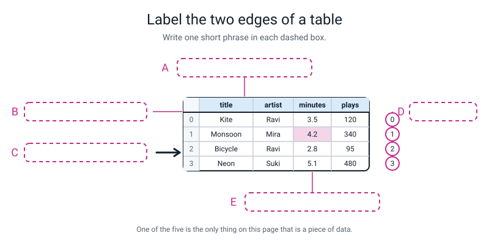
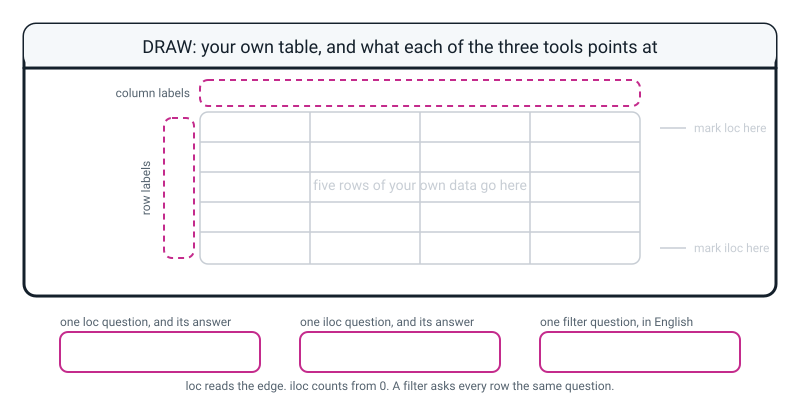

# Workbook — Week 22: Picking Rows and Columns Without Guessing

**Name:** ________________________________  **Date:** ______________

[⬅ Week 21](week-21.md) · [📖 Read the chapter first](../student-guide/week-22.md) · [Course Home](../README.md) · [🧑‍🏫 Teacher guide](../teacher-guide/week-22.md) · [Next ➡](week-23.md)

---

**The table every page below uses.** Type this once, at the top of a file called `playlist_drills.py`. Every question from here on is about it.

```python
import pandas as pd

songs = pd.DataFrame({
    "title":   ["Kite", "Monsoon", "Bicycle", "Neon", "Paper Boat", "Late Bus"],
    "artist":  ["Ravi", "Mira", "Ravi", "Suki", "Mira", "Dee"],
    "minutes": [3.5, 4.2, 2.8, 5.1, 3.0, 4.7],
    "plays":   [120, 340, 95, 480, 210, 60],
})
print(songs)
```

```text
        title artist  minutes  plays
0        Kite   Ravi      3.5    120
1     Monsoon   Mira      4.2    340
2     Bicycle   Ravi      2.8     95
3        Neon   Suki      5.1    480
4  Paper Boat   Mira      3.0    210
5    Late Bus    Dee      4.7     60
```

**Column positions, for every `iloc` question below:** `title` 0 · `artist` 1 · `minutes` 2 · `plays` 3.

---

## ✅ Warm-Up (5 min)

Five quick questions about **last week** — the DataFrame.

**W1.** You wrote `pd.DataFrame({...})` with a dictionary inside. What did each `"key": [list]` pair become?

________________________________________________________________

**W2.** In `df.info()`, one line said `RangeIndex: 6 entries, 0 to 5`. What are those six things, and are they a column of the table?

________________________________________________________________

________________________________________________________________

**W3.** `df["plays"]` and `df` print differently. Name each of the two shapes pandas is handing you.

________________________________________________________________

**W4.** You typed only whole numbers into a column and `info()` said `float64`. What causes that?

________________________________________________________________

**W5.** `df.head()` printed five rows out of ten. What is `head()` for, and what would you use if you wanted the shape of the whole thing instead?

________________________________________________________________

---

## 🔎 Predict the Output

This section is for guessing first and running second. Four small snippets, four predictions.

**Write your prediction before you run anything.** Every snippet assumes `songs` has already been built exactly as printed above.

### P1 — the labels that stopped matching

```python
loud = songs[songs["plays"] > 200]
print(loud)
print("loc[1] :", loud.loc[1, "title"])
print("iloc[1]:", loud.iloc[1, 0])
```

**I predict — what are the row labels of `loud`, and what are the last two lines?**

________________________________________________________________

________________________________________________________________

**It really printed:**

________________________________________________________________

________________________________________________________________

________________________________________________________________

**Did `loc[1]` and `iloc[1]` agree?** ____________  **Was there an error?** ____________

**In one sentence, why did filtering change the answer to `iloc[1]` but not to `loc[1]`?**

________________________________________________________________

### P2 — how many things come back?

```python
print(songs["minutes"] > 4)
print(len(songs[songs["minutes"] > 4]))
```

**I predict — how many lines does the first `print` produce, and what is the number on the last line?**

________________________________________________________________

**It really printed:**

________________________________________________________________

________________________________________________________________

**The last line of the first printout ends with a word after `dtype:`. Which word, and what does it mean?**

________________________________________________________________

### P3 — did it sort?

```python
songs.sort_values("plays")
print(songs.iloc[0, 0])
best = songs.sort_values("plays", ascending=False)
print(best.iloc[0, 0])
```

**I predict — two words. Write both:**

________________________________________________________________

**It really printed:**

________________________________________________________________

________________________________________________________________

**Was there an error on line 1?** ____________  **Did line 1 change `songs`?** ____________

**What is the ONE difference between line 1 and line 3?**

________________________________________________________________

### P4 — a very small table with a shuffled index

```python
mix = pd.DataFrame({
    "title": ["Kite", "Monsoon", "Bicycle"],
    "plays": [120, 340, 95],
}, index=[2, 0, 1])
print(mix.loc[0, "title"])
print(mix.iloc[0, 0])
```

**I predict — two song titles. Write both:**

________________________________________________________________

**It really printed:**

________________________________________________________________

________________________________________________________________

**Which one is "the first row of the table"?** ____________________

**Which one is "the row named 0"?** ____________________

**How many of the four predictions did you get right?** ______ / 4

**Which one surprised you most, and why?**

________________________________________________________________

---

## ✍️ Practice Set A — Read It

These questions are for reading and tracing code. You do not write a program in this set.

**A1. Name the tool.** For each English question, write **loc**, **iloc**, **filter**, **sort**, or **none needed**. Do not write any code yet.

| # | The question, in English | The tool |
|---|---|---|
| a | "How many plays did *Neon* get?" | |
| b | "What is in the fourth row?" | |
| c | "Which songs got more than 200 plays?" | |
| d | "What is the very last row?" | |
| e | "Give me everything Mira made." | |
| f | "Give me the whole `plays` column." | |
| g | "Put the table in order of length." | |
| h | "Give me just the titles and the plays." | |

**A1(i).** Two of those eight need **no tool at all**. Which two, and why?

________________________________________________________________

**A2. Trace the labels.** Fill in the table. The first row is done for you.

```python
step1 = songs                                   # the original
step2 = songs[songs["plays"] > 200]             # a filter
step3 = songs.sort_values("plays")              # a sort (hands back a copy)
step4 = step2.sort_values("plays")              # sort the filtered one
```

| Name | How many rows? | The row labels, in order |
|---|---|---|
| `step1` | 6 | 0, 1, 2, 3, 4, 5 |
| `step2` | | |
| `step3` | | |
| `step4` | | |

**A2(j).** In `step4`, which row label is sitting at **position 0**?

________________________________________________________________

**A2(k).** After line 3 has run, is `songs` in order of plays? Explain in one sentence.

________________________________________________________________

**A3. Same answer or different?** Tick one for each pair, on the `songs` table exactly as printed at the top.

| # | The pair | Same | Different |
|---|---|---|---|
| a | `songs.loc[1, "artist"]` and `songs.iloc[1, 1]` | ☐ | ☐ |
| b | `songs.loc[0]` and `songs.iloc[0]` | ☐ | ☐ |
| c | `songs.iloc[-1]` and `songs.loc[5]` | ☐ | ☐ |
| d | `songs.loc[2, "plays"]` and `songs.iloc[2, 3]` | ☐ | ☐ |

**A3(e).** All four are the same. **Does that prove `loc` and `iloc` are the same command?** Answer in one sentence, and say what would have to change for them to differ.

________________________________________________________________

________________________________________________________________

**A4. Spot the bug.** Each line is wrong. Write the fix.

| # | The line | The fix |
|---|---|---|
| a | `songs.loc[3, "play"]` | |
| b | `songs["title", "plays"]` | |
| c | `songs.loc(1, "artist")` | |
| d | `songs[songs["plays"] > "200"]` | |
| e | `songs.iloc[1, "plays"]` | |
| f | `songs.sort_values()` | |
| g | `songs.loc["Neon"]` | |
| h | `songs.iloc[6]` | |

**A5. Label the diagram.** Write one short phrase in each of the five dashed boxes.


*Figure W22.1 — Everything around the numbers in a table.*

The five phrases, in the wrong order: **the counting tabs iloc uses — they start at 0 · the column labels · the row labels (NOT row numbers) · one cell of actual data · the arrow loc takes, reading the labels off the edge**

**A** ______________________  **B** ______________________

**C** ______________________  **D** ______________________

**E** ______________________

**A5(f).** Only one of the five boxes points at something that is a **piece of data**. Which letter, and how do you know?

________________________________________________________________

**A6. Read the traceback.** Translate it, then fix it.

```text
Traceback (most recent call last):
  ...
  File ".../pandas/core/indexes/base.py", line 3804, in get_loc
    raise KeyError(key) from err
KeyError: 'play'
```

**Which line do you read first, and why?**

________________________________________________________________

**What does `KeyError` mean, in plain words?**

________________________________________________________________

**Where in the message is the thing pandas could not find?** ______________________

**Where do you go looking to fix it?**

________________________________________________________________

**Say the whole message in your own words:**

________________________________________________________________

________________________________________________________________

---

## ✍️ Practice Set B — Write It

These questions are for writing your own lines of pandas, from one line up to a small report.

### B1 — one line

Write the **single line** that prints how many plays *Neon* got, **using the tool that picks by name.**

```python
# your line here:
```

**Expected output:**

```text
480
```

**Done looks like:** one line, `loc`, square brackets, row before column.

### B2 — two columns

Write the line that prints **only** the `title` and `artist` columns, all six rows.

```python
# your line here:
```

**Expected output:**

```text
        title artist
0        Kite   Ravi
1     Monsoon   Mira
2     Bicycle   Ravi
3        Neon   Suki
4  Paper Boat   Mira
5    Late Bus    Dee
```

**Done looks like:** two pairs of square brackets, and you can say what each pair is doing.

### B3 — the question, then the filter

Write **two** lines. The first prints the True/False answers to "is this song longer than 4 minutes?". The second prints the rows that answered True.

```python
# line 1:
# line 2:
```

**Expected output:**

```text
0    False
1     True
2    False
3     True
4    False
5     True
Name: minutes, dtype: bool
      title artist  minutes  plays
1   Monsoon   Mira      4.2    340
3      Neon   Suki      5.1    480
5  Late Bus    Dee      4.7     60
```

**Done looks like:** six True/False answers, then three rows keeping the labels 1, 3 and 5.

### B4 — filter, then sort, then name it

Keep only the songs over 4 minutes, then put **those** in order of plays, biggest first. Catch each step in a name.

```python
# your lines here:
```

**Expected output:**

```text
      title artist  minutes  plays
3      Neon   Suki      5.1    480
1   Monsoon   Mira      4.2    340
5  Late Bus    Dee      4.7     60
```

**Done looks like:** two names on two lines, and you can say what the row labels `3, 1, 5` mean.

### B5 — a small report, about 15 lines

Write a program that prints a report about the playlist. It must use **all four** of this week's tools, and there must be a comment on every line naming which one you used.

The report must print:

- how many songs there are, and the total plays
- the **most played** song, by sorting into a named copy and taking the first row
- how many songs got over 200 plays, then those songs' titles and plays
- *Neon*'s length, found **by label**
- and, at the end, proof that sorting did not change the original table

**Expected output:**

```text
songs in the playlist: 6
total plays          : 1305
most played          : Neon - 480 plays
over 200 plays       : 3 songs
        title  plays
1     Monsoon    340
3        Neon    480
4  Paper Boat    210
Neon's length        : 5.1 minutes
original still first : Kite
```

**Done looks like:** the last line says `Kite`, and you can explain why that is the proof.

---

## 🐞 Fix the Broken Program

Here is `playlist_report.py`. It has **four** bugs: three that crash, and one that produces **no error at all**.

```python
# playlist_report.py - four bugs.
import pandas as pd

songs = pd.DataFrame({
    "title":   ["Kite", "Monsoon", "Bicycle", "Neon", "Paper Boat", "Late Bus"],
    "artist":  ["Ravi", "Mira", "Ravi", "Suki", "Mira", "Dee"],
    "minutes": [3.5, 4.2, 2.8, 5.1, 3.0, 4.7],
    "plays":   [120, 340, 95, 480, 210, 60],
})

print(songs.loc[3, "play"])                # BUG 1
print(songs["title", "plays"])             # BUG 2
print(songs[songs["plays"] > "200"])       # BUG 3
songs.sort_values("plays")                 # BUG 4
print(songs)
```

> **⚠️ Watch out:** there is **no `SyntaxError` in this file.** Python can read every single line of it. That is what makes this one nastier than last week's — nothing stops before it starts, so you have to run it, fix, run again, fix again, four times over.

**Bug 1.** Run it as it is. The real last line:

```text
KeyError: 'play'
```

**What kind of error is this, and what exactly is pandas telling you?**

________________________________________________________________

**The fix, and the output after it:**

________________________________________________________________

**Bug 2.** Fix bug 1 and run again. The real last line:

```text
KeyError: ('title', 'plays')
```

**Look at the round brackets in that message. What did pandas think you asked for?**

________________________________________________________________

**The fix — and say what each pair of square brackets is doing:**

________________________________________________________________

________________________________________________________________

**Bug 3.** Fix bug 2 and run again. The real last line:

```text
TypeError: Invalid comparison between dtype=int64 and str
```

**What are the two kinds of thing it is refusing to compare, and which one did you make by accident?**

________________________________________________________________

**The fix:**

________________________________________________________________

**Bug 4.** Fix bug 3 and run again. Now there is **no error at all**, and the last thing printed is:

```text
        title artist  minutes  plays
0        Kite   Ravi      3.5    120
1     Monsoon   Mira      4.2    340
2     Bicycle   Ravi      2.8     95
3        Neon   Suki      5.1    480
4  Paper Boat   Mira      3.0    210
5    Late Bus    Dee      4.7     60
```

**What did line 4 ask for, and what did the table actually do?**

________________________________________________________________

**The fix:**

________________________________________________________________

**And the check that catches this whole family of bug:**

________________________________________________________________

**One more question, and it is the important one:** which of the four bugs was the most dangerous, and why?

________________________________________________________________

________________________________________________________________

---

## 🧩 Puzzle of the Week

### Part 1 — make them agree, on purpose

> Find an index for the six songs where `loc[2]` and `iloc[2]` give the **same** song — **without** putting the numbers in order 0 to 5.

**(a)** Write the six numbers you chose.

`index=[ ______ , ______ , ______ , ______ , ______ , ______ ]`

**(b)** Which song do both commands give? ____________________

**(c)** Write the one rule that makes any answer work.

________________________________________________________________

**(d)** Now the real question. **Does the fact that they agree prove you used the right one?**

________________________________________________________________

________________________________________________________________

### Part 2 — break them apart, on purpose

**(e)** Using the same six songs, find an index where `loc[3]` and `iloc[3]` give **different** songs, and `loc[1]` and `iloc[1]` give the **same** song.

`index=[ ______ , ______ , ______ , ______ , ______ , ______ ]`

**(f)** Predict all four answers **before you run it**, then fill in what really happened.

| | I predicted | It really gave |
|---|---|---|
| `loc[3]` | | |
| `iloc[3]` | | |
| `loc[1]` | | |
| `iloc[1]` | | |

**(g)** One sentence: what does it take for `loc[n]` and `iloc[n]` to agree?

________________________________________________________________

---

## 🤔 Think Deeper

**T1.** After you filter a table, the surviving rows keep their **original** labels — so a three-row result can have the labels 1, 3, 4.

Write a paragraph. Explain what you **gain** from keeping the old labels, with a specific example of something you could check because of it. Then be fair to the other side: explain exactly what you **lose**, and why `loc[0]` on a filtered table can now be a crash rather than just a different answer. There is a command that renumbers them (`reset_index(drop=True)`) and experienced people argue about when to use it. **Say which side you are on and why** — and if you think the answer depends on what you are about to do next, say what it depends on.

________________________________________________________________

________________________________________________________________

________________________________________________________________

________________________________________________________________

________________________________________________________________

________________________________________________________________

**T2.** You used `iloc[-1]` to get the last row. There is no `loc[-1]`.

Write a paragraph explaining why not. Start from what `-1` actually means, then from what `loc` actually does. Then the interesting part: suppose somebody built a table with a row genuinely **labelled** `-1`. What would `loc[-1]` hand back, and would it have anything to do with the end of the table? Finish by saying, in your own words, why "the last one" is a thing you can only ask for by **counting** and never by **name**.

________________________________________________________________

________________________________________________________________

________________________________________________________________

________________________________________________________________

________________________________________________________________

**T3.** Name a real job where using `iloc` instead of `loc` would matter — not "it would be annoying", but where somebody would be affected.

Describe the situation, say what the wrong row would be, and then answer the question that makes it serious: **how would anybody find out?**

________________________________________________________________

________________________________________________________________

________________________________________________________________

________________________________________________________________

---

## 🛠️ Build It — The loc/iloc Trap, On Your Own Playlist

**This is the main assignment.** You are going to build the trap yourself, walk into it on purpose, and write the explanation.

### Part 1 — before you type anything

The mixtape these six songs came from had them in a different order, so each song has a **track number** that has nothing to do with its position in your table.

| Song | Track number on the mixtape |
|---|---|
| Kite | 6 |
| Monsoon | 3 |
| Bicycle | 1 |
| Neon | 5 |
| Paper Boat | 2 |
| Late Bus | 4 |

- [ ] I have written the six track numbers in order, ready to type: `index=[6, 3, 1, 5, 2, 4]`
- [ ] I have said out loud what `index=[...]` does

**Now predict, in pen, BEFORE you run anything:**

- `playlist.loc[3]` will print the row for ____________________
- `playlist.iloc[3]` will print the row for ____________________

> **⚠️ Watch out:** most people write the same song twice here. **Leave your prediction on the page even if it turns out wrong.** It is evidence that the trap is real, not a mistake you should hide.

### Part 2 — build it and run both

Make a file called `trap.py`:

```python
# trap.py - Week 22 homework, the loc/iloc trap.
import pandas as pd

playlist = pd.DataFrame({
    "title":   ["Kite", "Monsoon", "Bicycle", "Neon", "Paper Boat", "Late Bus"],
    "artist":  ["Ravi", "Mira", "Ravi", "Suki", "Mira", "Dee"],
    "minutes": [3.5, 4.2, 2.8, 5.1, 3.0, 4.7],
    "plays":   [120, 340, 95, 480, 210, 60],
}, index=[6, 3, 1, 5, 2, 4])          # track numbers on the mixtape

print(playlist)
print("--- loc[3]")
print(playlist.loc[3])
print("--- iloc[3]")
print(playlist.iloc[3])
```

- [ ] It ran
- [ ] I counted the error messages

### Part 3 — record what happened

| | The song | Its `Name:` line | Its `plays` |
|---|---|---|---|
| `loc[3]` gave me | | | |
| `iloc[3]` gave me | | | |

**How many error messages did you get?** ______

**How did you know which row each printout was, without looking back at the table?**

________________________________________________________________

### Part 4 — the explanation. This is the bit being marked.

> **In your own words: why did `loc[3]` and `iloc[3]` give two different songs?**

A full answer has **both halves** — what `loc` went looking for, and what `iloc` did instead of looking.

________________________________________________________________

________________________________________________________________

________________________________________________________________

________________________________________________________________

> **⚠️ Watch out:** "because they are different" is not an answer. It says the same thing as the question.

**If you are stuck, fill in this frame instead of a blank page:**

> *"`loc[3]` gave me ________ because it looked for the row whose ________ is 3. `iloc[3]` gave me ________ because it counted ________ rows down from the top."*

### Part 5 — which one do you type?

| You want… | Which command? | Why |
|---|---|---|
| track number 3 off the mixtape | | |
| whatever is fourth in your table | | |
| the very last track in the table | | |
| every song over 200 plays | | |

**Bonus.** Run `print(playlist.loc[0])`. Write down exactly what happens, and then say whether this is a **good** outcome or a bad one.

________________________________________________________________

________________________________________________________________

### Part 6 — The Bug Log

| What happened | Was there an error message? | What fixed it | What I will check next time |
|---|---|---|---|
| | | | |
| | | | |

---

## 🎨 Draw It

Draw **your own five-row table, by hand**, and mark on it what each of the three tools points at.


*Figure W22.2 — Your page.*

> **What a good answer might look like:** the subject is **five snacks from the school canteen and what they cost.**
>
> Along the top edge, in the dashed strip: **`snack`, `price`, `sold`** — and a small note saying *column labels*.
>
> Down the left edge, in the dashed strip: **`3, 1, 5, 2, 4`** — the canteen's own item numbers, deliberately out of order — with a note saying *row labels, NOT row numbers*.
>
> An arrow coming in from the left edge marked **`loc`**, with *reads the edge* beside it, pointing at the row labelled 5. A column of tabs outside the right edge reading **0, 1, 2, 3, 4**, marked **`iloc`**, with *ignores the edge, counts* beside it.
>
> The three bottom boxes: **`snacks.loc[5, "price"]` → ₹30** · **`snacks.iloc[2, 1]` → ₹30 as well, by accident** · *"which snacks cost less than ₹25?"*
>
> And one extra annotation that shows real understanding: an arrow to the two `loc`/`iloc` answers saying *"these agreed by luck — item 5 happens to be sitting third. Change one number in the index and they come apart."*
>
> **What a weak answer looks like:** row labels drawn as `0, 1, 2, 3, 4`. It is not wrong, exactly — but it makes `loc` and `iloc` agree everywhere, so the drawing cannot show the one thing the week is about. **Shuffle your labels.**

---

## 📊 Self-Check

Tick one face in each row to show how sure you are of each skill.

| I can… | 😀 got it | 🙂 nearly | 😕 not yet |
|---|---|---|---|
| Select one value by label with `df.loc[row, "col"]` | ☐ | ☐ | ☐ |
| Select one value by position with `df.iloc[row, col]`, counting from 0 | ☐ | ☐ | ☐ |
| Explain in writing why `loc` and `iloc` differ on a custom index | ☐ | ☐ | ☐ |
| Keep only the rows that answer True to a question | ☐ | ☐ | ☐ |
| Sort a table and say whether the original changed | ☐ | ☐ | ☐ |
| Read the `Name:` line to check which row I got | ☐ | ☐ | ☐ |
| Name the tool from an English question, before typing | ☐ | ☐ | ☐ |
| Read a `KeyError` and know where to go looking | ☐ | ☐ | ☐ |

**True or false?** Circle one on each row.

| Statement | | |
|---|---|---|
| `loc` and `iloc` always give the same answer | TRUE | FALSE |
| Inside `loc` and `iloc`, the row comes first | TRUE | FALSE |
| The numbers down the left of a table are a column of data | TRUE | FALSE |
| `df["plays"] > 200` gives you the rows with over 200 plays | TRUE | FALSE |
| `sort_values` puts your table in order | TRUE | FALSE |
| After filtering, the surviving rows keep their original labels | TRUE | FALSE |
| `iloc[-1]` gives the last row | TRUE | FALSE |
| `loc[-1]` gives the last row | TRUE | FALSE |
| `df["a", "b"]` selects two columns | TRUE | FALSE |
| The `i` in `iloc` stands for *index* | TRUE | FALSE |
| If two commands agree, you used the right one | TRUE | FALSE |
| `loc` uses round brackets, like every other command | TRUE | FALSE |

One thing I'd like explained again:

________________________________________________________________

---

## ✅ Answers

<details>
<summary>Check your answers</summary>

### Warm-Up

**W1.** Each `"key": [list]` pair became **one column**. The key became the **column name** printed along the top edge, and the list became the values going down that column. So four pairs gave four columns, and each list had to be the same length, because every column has to reach the bottom of the table.

**W2.** They are the **row labels** — the **index**. `RangeIndex: 6 entries, 0 to 5` means "six rows, labelled 0 up to 5". **They are not a column of the table.** Nobody's play count is 3. Pandas invented them for us, in order, because we never said what to call the rows — and that fact is the whole of Week 22.

**W3.** `df["plays"]` gives you a **Series** — one column, printed as a tall list with the row labels down the side and a `Name:` and `dtype:` line at the bottom. `df` gives you a **DataFrame** — the whole table, printed as a grid with a header row. A Series is one column; a DataFrame is a stack of them.

**W4.** A **hole** in the column — a missing value, which pandas prints as `NaN`. A hole cannot live in a whole-number column, because pandas has no whole number that means "missing", so the whole column becomes `float64` where `NaN` is allowed. (This comes back with a vengeance next week.)

**W5.** `head()` shows you the **first five rows** so you can eyeball the shape of a table without printing hundreds of lines. If you want the size instead, `df.shape` gives you `(rows, columns)` and `df.info()` gives you the row count plus what every column holds.

---

### Predict the Output

**P1** — real output:

```text
        title artist  minutes  plays
1     Monsoon   Mira      4.2    340
3        Neon   Suki      5.1    480
4  Paper Boat   Mira      3.0    210
loc[1] : Monsoon
iloc[1]: Neon
```

**They did not agree, and there was no error.**

The three surviving rows kept their **original** labels — `1, 3, 4`. So in this new table:

- `loc[1]` hunts for the row **labelled** 1. That is still Monsoon, exactly as it was before the filter. **Labels survive filtering.**
- `iloc[1]` counts one row down from the top. Position 0 is Monsoon, position 1 is Neon. **Positions were rebuilt from scratch the moment three rows were dropped.**

**This is the trap arriving without a custom index anywhere in sight.** You do not have to type `index=[...]` to make labels and positions disagree. **One filter does it.**

**P2** — real output:

```text
0    False
1     True
2    False
3     True
4    False
5     True
Name: minutes, dtype: bool
3
```

**Seven lines from the first `print`** — six answers plus the `Name:`/`dtype:` line — and then `3`.

The word after `dtype:` is **`bool`**, and it means *a column of True/False values*. That is the tell: `songs["minutes"] > 4` is **not** rows, it is **six answers, one per row**, with the row labels still attached. The rows only appear when you wrap the whole thing in `songs[ ... ]`, and then `len(...)` counts them: three songs are longer than four minutes.

**If you predicted "three rows" for the first line, you are the majority.** Print the inner part on its own once and it never happens again.

**P3** — real output:

```text
Kite
Neon
```

**No error on line 1, and line 1 changed nothing.**

Line 1 sorted the table into a copy and threw the copy away, because nothing caught it. So `songs.iloc[0, 0]` is still `Kite`, the first row of the original, untouched table.

Line 3 does the same sort the other way round **and catches the copy in a name**, so `best` is a real table you can point at. `best.iloc[0, 0]` is `Neon`, the most-played song.

**The one difference between line 1 and line 3 is the `best = ` on the front.** That is the entire bug, and there is no error message for it anywhere.

**P4** — real output:

```text
Monsoon
Kite
```

- `mix.iloc[0, 0]` is **Kite** — "the first row of the table", by counting.
- `mix.loc[0, "title"]` is **Monsoon** — "the row **named** 0", which is the *second* row down, because the index is `[2, 0, 1]`.

Three rows and two lines of code, and the two commands already point at different songs. **The table does not have to be big for this to bite.**

---

### Practice Set A

**A1.**

| # | The question | The tool | Why |
|---|---|---|---|
| a | *Neon*'s plays | **loc** | You know the row by name — label 3 — and the column by name |
| b | The fourth row | **iloc** | "Fourth" is a position. Position 3, counting from 0 |
| c | Over 200 plays | **filter** | A question, not a name and not a place |
| d | The very last row | **iloc** | `songs.iloc[-1]`. You do not know its name |
| e | Everything Mira made | **filter** | `songs[songs["artist"] == "Mira"]`. Two rows, and you named neither |
| f | The whole `plays` column | **none needed** | `songs["plays"]`. That is Week 21 |
| g | In order of length | **sort** | `songs.sort_values("minutes")` — and catch the copy |
| h | Titles and plays | **none needed** | `songs[["title", "plays"]]`. Two brackets, no tool |

**A1(i).** **(f) and (h).** Selecting whole columns needs no `loc` and no `iloc` at all — square brackets straight on the table do it, and that is last week's syntax. (`songs.loc[:, "plays"]` also works and is a near-miss worth half a mark, but the plain version is what everybody writes.) **Knowing which jobs need no tool is part of choosing the tool.**

**A2.**

| Name | How many rows? | The row labels, in order |
|---|---|---|
| `step1` | 6 | 0, 1, 2, 3, 4, 5 |
| `step2` | **3** | **1, 3, 4** |
| `step3` | **6** | **5, 2, 0, 4, 1, 3** |
| `step4` | **3** | **4, 1, 3** |

Proof, run for real:

```python
print(list(songs[songs["plays"] > 200].index))
print(list(songs.sort_values("plays").index))
print(list(songs[songs["plays"] > 200].sort_values("plays").index))
```

```text
[1, 3, 4]
[5, 2, 0, 4, 1, 3]
[4, 1, 3]
```

**A2(j).** Label **4** (Paper Boat, 210 plays — the smallest of the three). `step4.loc[4]` and `step4.iloc[0]` are the same row here, and `step4.loc[0]` is a `KeyError`, because there is no row labelled 0 left in that table at all.

**A2(k).** **No.** Line 3 built a sorted copy and put it in `step3`. `songs` itself was never touched — sorting always hands you a copy. (And even the copy's labels are shuffled rather than renumbered: `5, 2, 0, 4, 1, 3`.)

**A3.**

| # | The pair | Answer |
|---|---|---|
| a | `loc[1, "artist"]` / `iloc[1, 1]` | **Same** — both `Mira` |
| b | `loc[0]` / `iloc[0]` | **Same** — both Kite's row |
| c | `iloc[-1]` / `loc[5]` | **Same** — both Late Bus |
| d | `loc[2, "plays"]` / `iloc[2, 3]` | **Same** — both `95` |

**A3(e).** **No, it proves nothing.** They agree here because pandas invented the labels `0` to `5` in order, so **every label happens to equal its own position**. Change any one of three things and they come apart: give the table a custom `index`, **filter** it, or **sort** it into a named copy. Any of those, and `loc[2]` and `iloc[2]` are two different rows with no error to tell you.

**A4.**

| # | The line | The fix |
|---|---|---|
| a | `songs.loc[3, "play"]` | `songs.loc[3, "plays"]` — the column has an `s`. `KeyError: 'play'` |
| b | `songs["title", "plays"]` | `songs[["title", "plays"]]` — two brackets. `KeyError: ('title', 'plays')` |
| c | `songs.loc(1, "artist")` | `songs.loc[1, "artist"]` — **square** brackets. `loc` points, it is not called |
| d | `songs[songs["plays"] > "200"]` | `songs[songs["plays"] > 200]` — no quotes. `TypeError: Invalid comparison between dtype=int64 and str` |
| e | `songs.iloc[1, "plays"]` | Pick one tool: `songs.loc[1, "plays"]` **or** `songs.iloc[1, 3]`. Never one of each |
| f | `songs.sort_values()` | `songs.sort_values("plays")` — sort by *what*? |
| g | `songs.loc["Neon"]` | `songs[songs["title"] == "Neon"]` — titles are **data**, not labels on the edge |
| h | `songs.iloc[6]` | Six rows means positions 0–5. `songs.iloc[5]`, or `songs.iloc[-1]` for "the last one" |

**A5.**

| Box | Phrase |
|---|---|
| **A** | the column labels |
| **B** | the row labels (NOT row numbers) |
| **C** | the arrow `loc` takes, reading the labels off the edge |
| **D** | the counting tabs `iloc` uses — they start at 0 |
| **E** | one cell of actual data |

**A5(f).** **E.** Everything else on that page is an **address** — a name printed on an edge, or a way of getting to a cell. Only the highlighted cell holds something somebody actually measured: `4.2`, the length of *Monsoon* in minutes. The test is simple: *could I sort or filter this table and have this thing change what it refers to?* Addresses can drift. **The 4.2 belongs to Monsoon wherever Monsoon ends up.**

**A6.**

- **Which line first?** The **last** one. It names the kind of error and the thing that went wrong. Everything above it is just the route pandas took to get there.
- **`KeyError`** means *"you gave me a name, and I have nothing by that name."*
- **The thing it could not find is in quotes at the very end:** `'play'`. Pandas always tells you the missing name.
- **Where to look:** the column names. `print(songs)` and read the header row, letter by letter. The column is `plays`.
- In your own words: *"I asked for a column called `play`. There isn't one — it's `plays`, with an s. Pandas didn't guess what I meant; it stopped and told me the exact name it couldn't find."*

---

### Practice Set B

**B1.**

```python
print(songs.loc[3, "plays"])
```

```text
480
```

*Neon* is the row **labelled** 3, and `plays` is a column **name**, so both halves are names, so it is `loc`. Row first, column second.

**B2.**

```python
print(songs[["title", "artist"]])
```

```text
        title artist
0        Kite   Ravi
1     Monsoon   Mira
2     Bicycle   Ravi
3        Neon   Suki
4  Paper Boat   Mira
5    Late Bus    Dee
```

**The outer brackets select. The inner brackets make a list of names.** One pair would make pandas hunt for a single column called `title, artist`, and you would get `KeyError: ('title', 'artist')`.

**B3.**

```python
print(songs["minutes"] > 4)
print(songs[songs["minutes"] > 4])
```

```text
0    False
1     True
2    False
3     True
4    False
5     True
Name: minutes, dtype: bool
      title artist  minutes  plays
1   Monsoon   Mira      4.2    340
3      Neon   Suki      5.1    480
5  Late Bus    Dee      4.7     60
```

Line 1 is the **question**: six answers, `dtype: bool`. Line 2 hands those answers back to the table, which keeps the three True rows — **still labelled 1, 3 and 5**.

**B4.**

```python
long_ones = songs[songs["minutes"] > 4]                       # filter first
print(long_ones.sort_values("plays", ascending=False))        # then sort the result
```

```text
      title artist  minutes  plays
3      Neon   Suki      5.1    480
1   Monsoon   Mira      4.2    340
5  Late Bus    Dee      4.7     60
```

The labels `3, 1, 5` are the **original** row labels of those three songs, carried through **two** operations. Neon was labelled 3 in the six-row table, it was labelled 3 after the filter, and it is labelled 3 here at position 0. That is why you can always trace a survivor back — and it is why `iloc[0]` and `loc[0]` mean nothing like each other in this table (`loc[0]` is a `KeyError`; there is no row labelled 0 left).

**B5.**

```python
# b5.py - a small playlist report, one tool per line.
import pandas as pd

songs = pd.DataFrame({
    "title":   ["Kite", "Monsoon", "Bicycle", "Neon", "Paper Boat", "Late Bus"],
    "artist":  ["Ravi", "Mira", "Ravi", "Suki", "Mira", "Dee"],
    "minutes": [3.5, 4.2, 2.8, 5.1, 3.0, 4.7],
    "plays":   [120, 340, 95, 480, 210, 60],
})

print("songs in the playlist:", len(songs))               # how many rows
print("total plays          :", songs["plays"].sum())     # one whole column

by_plays = songs.sort_values("plays", ascending=False)     # sort -> catch the copy
top = by_plays.iloc[0]                                     # iloc: THE FIRST ROW
print("most played          :", top["title"], "-", top["plays"], "plays")

popular = songs[songs["plays"] > 200]                      # filter: a question
print("over 200 plays       :", len(popular), "songs")
print(popular[["title", "plays"]])                         # two columns, two brackets

print("Neon's length        :", songs.loc[3, "minutes"], "minutes")   # loc: by name
print("original still first :", songs.iloc[0, 0])          # sorting made a COPY
```

Real output:

```text
songs in the playlist: 6
total plays          : 1305
most played          : Neon - 480 plays
over 200 plays       : 3 songs
        title  plays
1     Monsoon    340
3        Neon    480
4  Paper Boat    210
Neon's length        : 5.1 minutes
original still first : Kite
```

**Two things worth pointing at in your own version.**

`by_plays.iloc[0]` is an **honest** `iloc`. You genuinely mean "the top row of the sorted copy, whoever that is" — you could not have used `loc`, because you did not know the answer's name before you asked.

And the last line is the proof. `songs.iloc[0, 0]` is still `Kite`. If `sort_values` had rearranged the original table, that line would have said `Neon`. **It says `Kite`, so the original never moved.**

---

### Fix the Broken Program

**Bug 1 — `KeyError: 'play'`.**

A `KeyError` means *"you gave me a name and I have nothing called that."* The name it could not find is in quotes at the end: `'play'`. The column is `plays`, with an `s`. Pandas did **not** guess — it stopped, which is the good kind of error.

```python
print(songs.loc[3, "plays"])
```

```text
480
```

**Bug 2 — `KeyError: ('title', 'plays')`.**

Look at the round brackets in the message. Pandas thought you asked for **one single column** whose name is the pair `title, plays`, and there is no such column. One pair of square brackets means one name.

```python
print(songs[["title", "plays"]])
```

```text
        title  plays
0        Kite    120
1     Monsoon    340
2     Bicycle     95
3        Neon    480
4  Paper Boat    210
5    Late Bus     60
```

**The outer brackets do the selecting. The inner brackets are a list** — a Week 11 list of two names.

**Bug 3 — `TypeError: Invalid comparison between dtype=int64 and str`.**

The two kinds of thing are `int64` — whole numbers, which is what the `plays` column holds — and `str`, which is writing. **You made the writing by accident, by putting quotes round the 200.** A number cannot be "greater than" a piece of writing; the question has no meaning.

```python
print(songs[songs["plays"] > 200])
```

```text
        title artist  minutes  plays
1     Monsoon   Mira      4.2    340
3        Neon   Suki      5.1    480
4  Paper Boat   Mira      3.0    210
```

**Bug 4 — the silent one, and the one to be pleased with yourself about if you found it.**

Line 4 asked for the table sorted by plays. The table **built a sorted copy and threw it away**, because nothing caught it. So the final `print(songs)` shows the original order, and there is **no error anywhere**.

```python
by_plays = songs.sort_values("plays")      # catch the copy in a name
print(by_plays)
```

```text
        title artist  minutes  plays
5    Late Bus    Dee      4.7     60
2     Bicycle   Ravi      2.8     95
0        Kite   Ravi      3.5    120
4  Paper Boat   Mira      3.0    210
1     Monsoon   Mira      4.2    340
3        Neon   Suki      5.1    480
```

**The check that catches this whole family:** after any `sort_values`, `print` the original straight afterwards — or look for the `=` on the left. **No name on the left means nothing was kept.**

**Which bug was most dangerous?** **Bug 4.** Bugs 1, 2 and 3 stopped the program and told you exactly which name or which type was the problem; each cost about ten seconds. Bug 4 produced a program that ran perfectly, printed a real table, and answered a different question from the one asked — and you could have handed it in. **Loud bugs cost you minutes. Silent bugs cost you the work.**

The whole corrected file:

```python
# playlist_report.py - all four bugs fixed.
import pandas as pd

songs = pd.DataFrame({
    "title":   ["Kite", "Monsoon", "Bicycle", "Neon", "Paper Boat", "Late Bus"],
    "artist":  ["Ravi", "Mira", "Ravi", "Suki", "Mira", "Dee"],
    "minutes": [3.5, 4.2, 2.8, 5.1, 3.0, 4.7],
    "plays":   [120, 340, 95, 480, 210, 60],
})

print(songs.loc[3, "plays"])               # FIXED 1: "plays", with the s
print(songs[["title", "plays"]])           # FIXED 2: two brackets for two columns
print(songs[songs["plays"] > 200])         # FIXED 3: no quotes round the 200
by_plays = songs.sort_values("plays")      # FIXED 4: catch the copy in a name
print(by_plays)
```

```text
480
        title  plays
0        Kite    120
1     Monsoon    340
2     Bicycle     95
3        Neon    480
4  Paper Boat    210
5    Late Bus     60
        title artist  minutes  plays
1     Monsoon   Mira      4.2    340
3        Neon   Suki      5.1    480
4  Paper Boat   Mira      3.0    210
        title artist  minutes  plays
5    Late Bus    Dee      4.7     60
2     Bicycle   Ravi      2.8     95
0        Kite   Ravi      3.5    120
4  Paper Boat   Mira      3.0    210
1     Monsoon   Mira      4.2    340
3        Neon   Suki      5.1    480
```

---

### Puzzle of the Week

**Part 1**

**(a)** Any index whose **third entry** — the one at position 2 — is the number `2`. For example `index=[6, 3, 2, 5, 1, 4]`.

```python
puzzle = pd.DataFrame({
    "title": ["Kite", "Monsoon", "Bicycle", "Neon", "Paper Boat", "Late Bus"],
    "plays": [120, 340, 95, 480, 210, 60],
}, index=[6, 3, 2, 5, 1, 4])
print(puzzle)
print(puzzle.loc[2, "title"], "|", puzzle.iloc[2, 0])
```

```text
        title  plays
6        Kite    120
3     Monsoon    340
2     Bicycle     95
5        Neon    480
1  Paper Boat    210
4    Late Bus     60
Bicycle | Bicycle
```

**(b)** **Bicycle**, from both commands.

**(c)** The rule: **the label sitting at position 2 has to be the number 2.** Nothing else about the index matters at all — the other five entries can be in any order you like.

**(d)** **No.** They agree here by coincidence, exactly the way they agreed on every row of the plain six-row table. `loc[2]` still went hunting for a **name** and `iloc[2]` still **counted** — two completely different questions that happen to land on the same row. **Agreement is never evidence.** The only thing that tells you whether you used the right tool is knowing which question you meant to ask.

**Part 2**

**(e)** You need the entry at position 1 to be the number `1`, and the entry at position 3 to be anything **except** `3`. For example `index=[6, 1, 2, 5, 3, 4]`.

**(f)** Run for real:

```python
mix = pd.DataFrame({
    "title": ["Kite", "Monsoon", "Bicycle", "Neon", "Paper Boat", "Late Bus"],
    "plays": [120, 340, 95, 480, 210, 60],
}, index=[6, 1, 2, 5, 3, 4])
print("loc[3] :", mix.loc[3, "title"])
print("iloc[3]:", mix.iloc[3, 0])
print("loc[1] :", mix.loc[1, "title"])
print("iloc[1]:", mix.iloc[1, 0])
```

```text
loc[3] : Paper Boat
iloc[3]: Neon
loc[1] : Monsoon
iloc[1]: Monsoon
```

| | It really gave |
|---|---|
| `loc[3]` | **Paper Boat** — the row labelled 3, sitting at position 4 |
| `iloc[3]` | **Neon** — three rows down from the top |
| `loc[1]` | **Monsoon** — the row labelled 1 |
| `iloc[1]` | **Monsoon** — one row down. Agrees, by luck |

**(g)** `loc[n]` and `iloc[n]` agree **only when the label `n` happens to be sitting at position `n`.** On a table pandas numbered for itself, that is true of every row, which is why they seem like the same command. On any table that has been given its own labels, filtered or sorted, it is true of some rows, none of the rows, or all of them by accident — and nothing on your screen tells you which.

---

### Think Deeper

**T1.** Model answer, and yours should have all three parts:

> *Keeping the old labels buys you **traceability**. My filtered table has the labels 1, 3 and 4, so if the number in it looks wrong I can go back to the six-row original, look at row 3, and check it against the raw data. If pandas had renumbered them 0, 1, 2 I would know I had three loud songs but not **which** three in the original, and there would be no way back.*
>
> *What it costs is confusion, and more than people admit. In my filtered table `iloc[0]` is Monsoon and `loc[0]` is not a different row — it is an outright `KeyError`, because there is **no** row labelled 0 left. So the two tools do not just disagree; one of them stops working, and a beginner reasonably reads that as the table being broken.*
>
> *I think it depends on what I am about to do next. If I am reporting particular songs and might need to check them, I keep the labels. If I am about to do something positional — take the top three, pair the rows up with another table — I run `reset_index(drop=True)` immediately after the filter, on purpose, and write down that I did it. What I would never do is renumber **halfway** through, because then some of my labels are original and some are not and I cannot tell them apart.*

**Marking note:** full marks needs (1) a specific thing you could check because the labels survived, (2) the `loc[0]` crash, not just "it's confusing", and (3) a position taken, with a reason. A student who argues the *opposite* side well gets full marks too — this one genuinely divides experienced people.

**T2.** Model answer:

> *`-1` means "one from the end". That is a **counting** idea — you can only work out what it points at by knowing how long the table is and counting backwards. `iloc` counts, so it can do it. `loc` does not count at all; it reads the names printed on the edge, and it has no idea whether a name is near the end, near the start, or in the middle.*
>
> *So suppose somebody built a table with a row genuinely **labelled** `-1`. Then `loc[-1]` would hand back **that row**, wherever it happened to sit — it could be the very first row in the table. It would have nothing whatsoever to do with the end. And if no row were labelled `-1`, `loc[-1]` would be a plain `KeyError`.*
>
> *That is why "the last one" is only ever a counting question. "Last" is not a name; it is a fact about **order**, and order is exactly the thing that labels are designed not to care about. It is the same reason labels survive a sort and positions do not.*

**Marking note:** the key move is realising `loc[-1]` is not an error in principle — it is a perfectly good label lookup for a row that is probably not there. Half marks for "because `loc` uses names".

**T3.** Any answer where a row means a **person or a record** and the table can be reordered. Three that students actually write:

- **Reporting one pupil's exam mark.** The class list gets sorted by mark for the report, and `iloc[7]` is now a completely different child from the one it was this morning. You read out the wrong mark, in front of everybody.
- **A pharmacy reading off patient 4's dose.** `loc[4]` means patient number 4. `iloc[4]` means the fifth row of whatever order the list happens to be in today.
- **A shop looking up order number 1002.** Orders arrive and get inserted, so every position shifts. The order number never does.

**And the answer to the question that makes it serious: nobody would find out.** There is no error, no warning, no red text. The output looks exactly as correct as it always does — a proper row, properly formatted, about the wrong person. The only defence is the `Name:` line at the bottom of the printout and knowing which question you asked. **The strongest answers say precisely that.**

---

### Build It

**The predictions.** Almost everybody writes the same song twice. That is the expected answer and it is not a mistake — it is what every example on a plain table has trained you to expect.

**The real output:**

```text
        title artist  minutes  plays
6        Kite   Ravi      3.5    120
3     Monsoon   Mira      4.2    340
1     Bicycle   Ravi      2.8     95
5        Neon   Suki      5.1    480
2  Paper Boat   Mira      3.0    210
4    Late Bus    Dee      4.7     60
--- loc[3]
title      Monsoon
artist        Mira
minutes        4.2
plays          340
Name: 3, dtype: object
--- iloc[3]
title      Neon
artist     Suki
minutes     5.1
plays       480
Name: 5, dtype: object
```

**Part 3, filled in:**

| | The song | Its `Name:` line | Its `plays` |
|---|---|---|---|
| `loc[3]` gave me | **Monsoon** | `Name: 3` | 340 |
| `iloc[3]` gave me | **Neon** | `Name: 5` | 480 |

**Error messages: zero.**

**How did you know which row each printout was?** The **`Name:` line at the bottom**. One says `Name: 3` and the other says `Name: 5`, so the two printouts are visibly two different rows without looking anything up. That line is your receipt, and reading it is a four-second habit that catches this bug for the rest of your life.

**Part 4 — the model explanation (full marks):**

> *`loc[3]` gave me Monsoon because `loc` goes hunting down the left edge for the row **named** 3, and Monsoon's track number on the mixtape is 3. `iloc[3]` gave me Neon because `iloc` ignores the track numbers completely and just **counts** — Kite is 0, Monsoon is 1, Bicycle is 2, so three rows down is Neon. Neither one was an error. Both printed a proper row. The only way to tell which one I got is to read the `Name:` line at the bottom: one says `Name: 3` and the other says `Name: 5`.*

**Three real partial answers, and what is missing from each:**

| What was written | What is missing |
|---|---|
| *"Because loc and iloc are different."* | Everything. That is the effect restated as if it were the cause. **Different how?** What did `loc` go looking for? |
| *"Because iloc starts at 0."* | Half. True, but not the reason on its own — `loc` has a row labelled 0 on a plain table and the two still agree there. **What else changed?** |
| *"Because the index is shuffled."* | Half, from the other side. That names the cause but not the mechanism. **What did each command actually do with that shuffled index?** One of them read it. What did the other one do? |

**Part 5:**

| You want… | Which command? | Why |
|---|---|---|
| track number 3 off the mixtape | `playlist.loc[3]` | 3 is a **name** printed on the mixtape |
| whatever is fourth in your table | `playlist.iloc[3]` | "Fourth" is a **position**, and counting starts at 0 |
| the very last track in the table | `playlist.iloc[-1]` | "Last" is a fact about order. There is no `loc[-1]` |
| every song over 200 plays | `playlist[playlist["plays"] > 200]` | A **question**, not a name and not a place |

**Both of the first two are correct code.** The bug was never in the typing.

**The bonus.** `print(playlist.loc[0])`:

```text
KeyError: 0
```

**This is a good outcome, and it is worth saying so out loud.** There is no track numbered 0 on the mixtape, so when the label genuinely does not exist, `loc` **crashes rather than guessing**. Loud and immediate, and you fix it in ten seconds. **The dangerous case is not the crash — it is when the label exists and belongs to somebody else.** That is `loc[3]` versus `iloc[3]`, and it does not crash at all.

---

### Draw It

There is no single right drawing. A good one has **row labels that are NOT 0, 1, 2, 3, 4**, a `loc` arrow coming in from *outside* the left edge, and `iloc` tabs starting at **0**.

The tell that it is right: somewhere on the page the student has written a `loc` answer and an `iloc` answer that are **different**, or has spotted a pair that agree **by luck** and said so. A drawing where every `loc` and `iloc` answer matches has drawn Week 21, not Week 22.

---

### Self-Check answers

| Statement | Answer | Why |
|---|---|---|
| `loc` and `iloc` always give the same answer | **FALSE** | Only when every label happens to equal its position. A custom index, a filter or a sort breaks it |
| Inside `loc` and `iloc`, the row comes first | **TRUE** | `df.loc[row, "column"]`. Always, in both |
| The numbers down the left of a table are a column of data | **FALSE** | They are **labels**. Nobody's play count is 3 |
| `df["plays"] > 200` gives you the rows with over 200 plays | **FALSE** | It gives you six True/False answers. The rows come from `df[ ... ]` around the outside |
| `sort_values` puts your table in order | **FALSE** | It hands you a sorted **copy**, and there is no error if you drop it |
| After filtering, the surviving rows keep their original labels | **TRUE** | That is how you trace one back — and it is why labels and positions come apart |
| `iloc[-1]` gives the last row | **TRUE** | `iloc` counts, and you can count backwards |
| `loc[-1]` gives the last row | **FALSE** | It looks for a row **labelled** `-1`. Usually a `KeyError`; never "the last one" |
| `df["a", "b"]` selects two columns | **FALSE** | It looks for one column called `a, b`. `KeyError: ('a', 'b')`. Use `df[["a", "b"]]` |
| The `i` in `iloc` stands for *index* | **FALSE** | **Integer** — whole-number counting. ("Index" is a common near-miss, and it is worth getting right because `loc` is the one that reads the index) |
| If two commands agree, you used the right one | **FALSE** | The whole puzzle this week. Agreement is a coincidence, not evidence |
| `loc` uses round brackets, like every other command | **FALSE** | **Square** brackets. `loc(1, "x")` gives `TypeError: __call__() takes from 1 to 2 positional arguments but 3 were given` |

</details>

---

[⬅ Week 21 Workbook](week-21.md) · [📖 Week 22 Chapter](../student-guide/week-22.md) · [Course Home](../README.md) · [Week 23 Workbook ➡](week-23.md)
