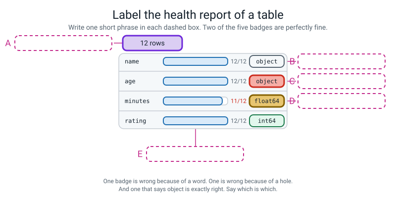
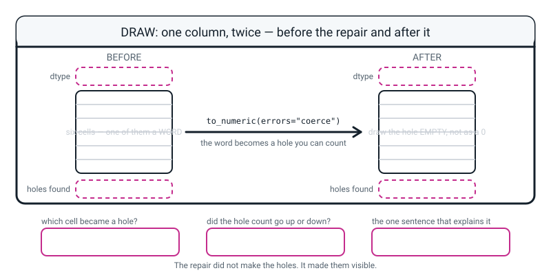

# Workbook — Week 23: Holes, Text-That-Should-Be-Numbers, and Duplicates

**Name:** ________________________________  **Date:** ______________

[⬅ Week 22](week-22.md) · [📖 Read the chapter first](../student-guide/week-23.md) · [Course Home](../README.md) · [🧑‍🏫 Teacher guide](../teacher-guide/week-23.md) · [Next ➡](week-24.md)

---

### The file every page below uses

Real data has to come from somewhere, so first you write it. Make a file called `make_reading_data.py` and run it **once**.

```python
# make_reading_data.py - run this ONCE. It writes the broken reading log.
raw_text = """name,age,genre,pages,minutes,rating
Anya Sharma,12,fantasy,320,45,4
Ben Osei,13,Fantasy,410,60,5
Cara Diaz,not given,SCIFI,150,,3
Dara Singh,12,scifi ,280,35,4
Eli Mensah,13,mystery,360,50,5
Fay Turner,not given, Mystery,120,20,2
Gus Nkemdi,12,fantasy,300,40,4
Hana Ito,11,MYSTERY,90,15,3
Ben Osei,13,Fantasy,410,60,5
Ira Volkov,not given,scifi,200,30,3
Jun Park,12,Mystery,340,55,4
Kai Brown,13,fantasy ,380,45,5
"""

with open("reading_raw.csv", "w") as f:
    f.write(raw_text)

print("reading_raw.csv written")
```

```text
reading_raw.csv written
```

Loaded with `raw = pd.read_csv("reading_raw.csv")`, it looks like this:

```text
           name        age     genre  pages  minutes  rating
0   Anya Sharma         12   fantasy    320     45.0       4
1      Ben Osei         13   Fantasy    410     60.0       5
2     Cara Diaz  not given     SCIFI    150      NaN       3
3    Dara Singh         12    scifi     280     35.0       4
4    Eli Mensah         13   mystery    360     50.0       5
5    Fay Turner  not given   Mystery    120     20.0       2
6    Gus Nkemdi         12   fantasy    300     40.0       4
7      Hana Ito         11   MYSTERY     90     15.0       3
8      Ben Osei         13   Fantasy    410     60.0       5
9    Ira Volkov  not given     scifi    200     30.0       3
10     Jun Park         12   Mystery    340     55.0       4
11    Kai Brown         13  fantasy     380     45.0       5
```

> **⚠️ Watch out:** open `reading_raw.csv` in a plain text editor once. Row 4 ends `SCIFI,150,,3` — **two commas together is an empty cell.** And two of the genres have a space you cannot see: `scifi ` with one on the end, ` Mystery` with one on the front.

---

## ✅ Warm-Up (5 min)

Five quick questions about **last week** — pointing at part of a table.

**W1.** `df.loc[2, "pages"]` and `df.iloc[2, 3]` gave the same answer. Name the **one** thing that would have to change for them to disagree.

________________________________________________________________

**W2.** You filtered a 12-row table down to 3 rows. What are the row labels of the result likely to be — `0, 1, 2` or something else? Why?

________________________________________________________________

________________________________________________________________

**W3.** `print(df["pages"] > 300)` — how many things come back, and what kind of thing are they?

________________________________________________________________

**W4.** You ran `df.sort_values("rating")` and it printed a sorted table. Is `df` sorted now? What is the one-line proof?

________________________________________________________________

**W5.** When you print one row on its own, the last line says `Name: 4`. What is that telling you, and why is it useful?

________________________________________________________________

---

## 🔎 Predict the Output

**Write your prediction before you run anything.** Every snippet assumes these two lines have already run:

```python
import pandas as pd
raw = pd.read_csv("reading_raw.csv")
```

### P1 — the count that is right and useless

```python
print(raw.shape)
print(raw["age"].head(4))
print(raw.isna().sum())
```

**I predict — the shape, and how many missing ages `isna` will report:**

________________________________________________________________

**It really printed:**

________________________________________________________________

________________________________________________________________

________________________________________________________________

**How many ages does the table actually not know?** ______

**How many did `isna()` report?** ______

**Both numbers are correct. Explain how, in one sentence.**

________________________________________________________________

### P2 — a hole is not a zero

```python
pages = pd.Series([320, 410, None, 280])
print(pages.mean())
print(pages.fillna(0).mean())
print(pages.count(), len(pages))
```

**I predict — three lines. Write all three:**

________________________________________________________________

________________________________________________________________

**It really printed:**

________________________________________________________________

________________________________________________________________

________________________________________________________________

**What did pandas divide by on line 1?** ______  **And on line 2?** ______

**`count()` and `len()` gave different numbers. What is the difference between them?**

________________________________________________________________

### P3 — the repair that never happened

```python
clean = raw.copy()
clean["minutes"].fillna(45)
print(clean["minutes"].isna().sum())
clean["minutes"] = clean["minutes"].fillna(45)
print(clean["minutes"].isna().sum())
```

**I predict — two numbers. Write both:**

________________________________________________________________

**It really printed:**

________________________________________________________________

________________________________________________________________

**Was there an error on line 2?** ____________

**What is the ONE difference between line 2 and line 4?**

________________________________________________________________

**Why is this the most dangerous kind of bug you have met so far?**

________________________________________________________________

### P4 — the number that goes UP

```python
clean = raw.copy()
print("before:", clean["age"].isna().sum(), clean["age"].dtype)
clean["age"] = pd.to_numeric(clean["age"], errors="coerce")
print("after :", clean["age"].isna().sum(), clean["age"].dtype)
```

**I predict — two lines, each with a number and a dtype:**

________________________________________________________________

**It really printed:**

________________________________________________________________

________________________________________________________________

**The missing count went UP. Did the repair break the file?** ____________

**Write the one sentence that explains it:**

________________________________________________________________

**The dtype went from `object` to `float64`, not to `int64`. Why not whole numbers?**

________________________________________________________________

**How many of the four predictions did you get right?** ______ / 4

**Which one surprised you most, and why?**

________________________________________________________________

---

## ✍️ Practice Set A — Read It

**A1. Name the four kinds of broken, from memory.** Cover the chapter first.

| # | The problem | How you spot it | The named fix |
|---|---|---|---|
| 1 | | | |
| 2 | | | |
| 3 | | | |
| 4 | | | |

**A1(e).** Two of the four are fixed **this** week. Which two?

________________________________________________________________

**A2. Read the health report.** Here is the real `info()` output for `reading_raw.csv`.

```text
<class 'pandas.core.frame.DataFrame'>
RangeIndex: 12 entries, 0 to 11
Data columns (total 6 columns):
 #   Column   Non-Null Count  Dtype  
---  ------   --------------  -----  
 0   name     12 non-null     object 
 1   age      12 non-null     object 
 2   genre    12 non-null     object 
 3   pages    12 non-null     int64  
 4   minutes  11 non-null     float64
 5   rating   12 non-null     int64  
dtypes: float64(1), int64(2), object(3)
memory usage: 704.0+ bytes
```

**(a)** How many rows? ______  **Which line told you?** ______________________

**(b)** Which column has a hole in it, and how many? ______________________

**(c)** Which column is writing when it should be numbers, and how can you tell?

________________________________________________________________

**(d)** What is blocking it?

________________________________________________________________

**(e)** Why is `minutes` `float64` when every minute count in the file is a whole number?

________________________________________________________________

**(f)** `name` says `object` too. **Is that a problem?** Answer carefully.

________________________________________________________________

**A3. Fact or guess?** For each fill, tick one. Then say what you would write in the WHY column.

| # | The fill | Fact | Guess | Your WHY |
|---|---|---|---|---|
| a | `DNP` in a minutes column → `0` | ☐ | ☐ | |
| b | A blank age → the median 12 | ☐ | ☐ | |
| c | A blank `minutes` → `0` | ☐ | ☐ | |
| d | `absent` in a marks column → the class median | ☐ | ☐ | |
| e | A blank `pages` → `0` for a reader who rated the book 5 | ☐ | ☐ | |

**A3(f).** Which of those five would you refuse to do at all, and why?

________________________________________________________________

**A4. Spot the bug.** Each line is wrong or will not do what was intended. Write the fix.

| # | The line | The fix |
|---|---|---|
| a | `clean["age"] = clean["age"].astype(int)` (with `not given` still in it) | |
| b | `clean["age"] = pd.to_numeric(clean["age"])` | |
| c | `clean["minutes"].fillna(45)` | |
| d | `print(raw.isnull_sum())` | |
| e | `clean["minutes"] = clean["minutes"].fillna()` | |
| f | `clean.to_csv("reading_clean.csv")` | |
| g | `raw = pd.read_csv("reading.csv")` | |
| h | `clean["age"] = clean["age"].fillna("not given").astype(int)` | |

**A5. Label the diagram.** Write one short phrase in each of the five dashed boxes.


*Figure W23.1 — A table's health report, column by column.*

The five phrases, in the wrong order: **`object` where a number belongs — a word is blocking it · how many rows the table has · `object`, and this one is CORRECT — names are writing · `float64` because there is a hole in the column · one cell is empty: 11 filled out of 12**

**A** ______________________  **B** ______________________

**C** ______________________  **D** ______________________

**E** ______________________

**A5(f).** Two of the five boxes are about a **problem** and one is about something that is **fine**. Which letter is fine, and how do you know?

________________________________________________________________

**A6. Read the traceback.** Translate it, then fix it.

```text
Traceback (most recent call last):
  ...
ValueError: invalid literal for int() with base 10: 'not given'
```

**Which line do you read first, and why?**

________________________________________________________________

**What does "invalid literal for int()" mean, in plain words?**

________________________________________________________________

**Where in the message is the thing that caused it?** ______________________

**Why is this a *kind* error message?**

________________________________________________________________

**What are the three steps of the fix, in order?**

1. ________________________________________________________________
2. ________________________________________________________________
3. ________________________________________________________________

---

## ✍️ Practice Set B — Write It

### B1 — one line

Write the **single line** that prints how many holes there are in every column of `raw`.

```python
# your line here:
```

**Expected output:**

```text
name       0
age        0
genre      0
pages      0
minutes    1
rating     0
dtype: int64
```

**Done looks like:** one line, two commands joined with a dot, and you can say what each one does.

### B2 — two lines

Turn the words in `age` into countable holes, then print how many there are **and** what kind of thing the column now holds.

```python
# line 1:
# line 2:
# line 3:
```

**Expected output:**

```text
3
float64
```

**Done looks like:** the count went **up**, and you can say in one sentence why that is a success.

### B3 — look before you decide

Print the rows whose `age` is a hole, showing only `name`, `genre`, `pages` and `rating`.

```python
# your line here:
```

**Expected output:**

```text
         name     genre  pages  rating
2   Cara Diaz     SCIFI    150       3
5  Fay Turner   Mystery    120       2
9  Ira Volkov     scifi    200       3
```

**Done looks like:** three rows, and you have **actually looked at them** and noticed something.

> **💡 Try this:** this uses Week 22's boolean filter with a new question inside it — `clean["age"].isna()` is a column of True/False, exactly like `clean["pages"] > 300` was.

### B4 — repair and prove it

Fill the hole in `minutes` with the median of the values you know, and **prove** it worked. Print the hole count before, the median you used, and the hole count after.

```python
# your lines here:
```

**Expected output:**

```text
holes before: 1
median      : 45.0
holes after : 0
```

**Done looks like:** the count is printed **after** the repair, not just before. "It looks right" is not proof.

### B5 — the whole repair, about 15 lines

Write `repair_reading.py`. It must, in this order:

1. read `reading_raw.csv` into `raw`, and make a copy called `clean`
2. print the shape, the duplicate count, the number of genre spellings, and the hole count
3. turn the words in `age` into holes, and print how many appeared
4. **print the rows whose age is missing** — look before you decide
5. print the median age, fill the holes with it, and convert `age` to whole numbers
6. print the median minutes, fill that hole, and convert `minutes` to whole numbers
7. print the hole count again, as proof
8. save to `reading_clean.csv` with **no index column**, read it back, and print the dtypes

**Expected output (the important lines):**

```text
shape          : (12, 6)
duplicate rows : 1
genre spellings: 10
holes in age, now visible: 3
median age    : 12.0
median minutes: 45.0
```

...and at the end:

```text
name       object
age         int64
genre      object
pages       int64
minutes     int64
rating      int64
dtype: object
```

**Done looks like:** `age` comes back from the file as `int64`. That is the proof the repair was real and not just something that looked right on screen.

---

## 🐞 Fix the Broken Program

Here is `repair_reading.py`. It has **four** bugs: three that crash, and one that produces **no error at all**.

```python
# repair_reading.py - four bugs.
import pandas as pd

raw = pd.read_csv("reading.csv")                 # BUG 1
clean = raw.copy()

clean["age"] = clean["age"].astype(int)          # BUG 2
clean["age"] = pd.to_numeric(clean["age"])       # BUG 3
clean["minutes"].fillna(45)                      # BUG 4

print(clean.isna().sum())
```

> **⚠️ Watch out:** there is **no `SyntaxError` in this file.** Python can read every line of it perfectly. So nothing stops before it starts — you have to run it, fix, run again, four times over. And the fourth time nothing goes wrong at all, which is the worst outcome available.

**Bug 1.** Run it as it is. The real last line:

```text
FileNotFoundError: [Errno 2] No such file or directory: 'reading.csv'
```

**What is Python telling you, in plain words?**

________________________________________________________________

**What is the ONE command you should run in the terminal instead of guessing?** ______________________

**The fix:**

________________________________________________________________

**Bug 2.** Fix bug 1 and run again. The real last line:

```text
ValueError: invalid literal for int() with base 10: 'not given'
```

**Python named the culprit. Where in the message is it, and what is it?**

________________________________________________________________

**There are TWO things wrong with this line.** One is what it tried to do. The other is **where it sits in the file.** Name both.

________________________________________________________________

________________________________________________________________

**The fix:**

________________________________________________________________

**Bug 3.** Fix bug 2 and run again. The real last line:

```text
ValueError: Unable to parse string "not given" at position 2
```

**This is a different message from bug 2, from a different command. What is missing?**

________________________________________________________________

**What does the missing word actually mean?**

________________________________________________________________

**What does `at position 2` tell you?**

________________________________________________________________

**The fix:**

________________________________________________________________

**Bug 4.** Fix bug 3 and run again. Now there is **no error at all**, and the last thing printed is:

```text
name       0
age        0
genre      0
pages      0
minutes    1
rating     0
dtype: int64
```

**What did you ask for, and what does the printout say happened?**

________________________________________________________________

**The fix — write the whole corrected line:**

________________________________________________________________

**And the output after it:**

________________________________________________________________

**Two questions to finish.**

**Which of the four bugs was the most dangerous, and why?**

________________________________________________________________

________________________________________________________________

**What is the four-second habit that catches bug 4 every single time?**

________________________________________________________________

---

## 🧩 Puzzle of the Week

### The fill that changes the answer

> Fill the three missing ages with 12. Then answer: **what is the average number of pages read by the 12-year-olds?** Now do it again, dropping those three rows instead.

**(a)** Predict, before you run anything. Will the two answers be close or far apart?

________________________________________________________________

**(b)** Run both. Fill in the table.

| | How many readers? | Average pages |
|---|---|---|
| filled with the median 12 | | |
| dropped those three rows | | |

**(c)** How far apart are the two answers? ______________________

**(d)** Hand-check the **dropped** version. List the page counts you added, the total, and the division.

________________________________________________________________

________________________________________________________________

**(e)** Hand-check the **filled** version the same way.

________________________________________________________________

________________________________________________________________

**(f)** Now the real question: **why did the answer move so much?** Look at the three readers whose ages were unknown, and look at their page counts.

________________________________________________________________

________________________________________________________________

**(g)** Write the general rule this puzzle proves, in one sentence.

________________________________________________________________

---

## 🤔 Think Deeper

**T1.** `isna()` reported **zero** missing ages when three ages were unknown.

Write a paragraph. Is pandas wrong? Start from the exact question `isna()` asks, and say honestly what the answer to that question is for a cell containing the words `not given`. Then work out whose mistake it actually was, and be precise about it: **which question did we ask, and which question did we mean?** Finish with the practical half — what is the *second* command you should always run, and exactly what would you be looking for in its output?

________________________________________________________________

________________________________________________________________

________________________________________________________________

________________________________________________________________

________________________________________________________________

**T2. Whose ages were missing, and why might that matter?** *(This is the graded question of the week.)*

Print the three rows. Then look at them properly — not just the names, but the numbers **beside** the names. Write a paragraph describing what those three readers have in common. Then explain what filling their ages with 12 does to the 12-year-old group, and what it does to any question you might want to ask **about age**. Finish with the general principle: **is missing data usually spread evenly?** And if it is not, what should you do before you decide how to repair it?

________________________________________________________________

________________________________________________________________

________________________________________________________________

________________________________________________________________

________________________________________________________________

________________________________________________________________

**T3.** Should the cleaning log travel with the results, or is it just working-out you can throw away?

Write a paragraph. Take a position and defend it. Consider what somebody reading only your number — *"the 12-year-olds read 244 pages on average"* — can and cannot know. Then consider whether you can imagine a situation where the log genuinely does not matter. And if you conclude it must travel with the number, say what that reminds you of in a subject that is not computing at all.

________________________________________________________________

________________________________________________________________

________________________________________________________________

________________________________________________________________

---

## 🛠️ Build It — The Cleaning Log

**This is the main assignment.** The code is most of the way done by now. **The log is what is being marked.**

### Part 1 — diagnose before you touch anything

Run the diagnosis and fill this in. **In pen, before any repair.**

| What I checked | The command | The number |
|---|---|---|
| rows and columns | `raw.shape` | |
| the same row twice | `raw.duplicated().sum()` | |
| spellings of genre | `raw["genre"].nunique()` | |
| holes, per column | `raw.isna().sum()` | |
| which column is writing when it should be numbers | `raw.info()` | |

- [ ] I ran `info()` **and** `isna()`, and I know why both were needed
- [ ] I looked at `reading_raw.csv` as plain text and found the two commas together

### Part 2 — look at who is missing, before deciding anything

```python
print(clean[clean["age"].isna()][["name", "genre", "pages", "rating"]])
```

| Row label | Name | Pages | Rating |
|---|---|---|---|
| | | | |
| | | | |
| | | | |

**What do those three readers have in common?**

________________________________________________________________

> **⚠️ Watch out:** do this **before** you choose fill or drop, not after. Choosing first and looking second is how you invent a pattern that was never there.

### Part 3 — the repairs

- [ ] `clean = raw.copy()` — the original is untouched
- [ ] `to_numeric(..., errors="coerce")` on `age`, and the count went **up** to 3
- [ ] I chose a value for the three ages, and I can say why that value
- [ ] `fillna` **then** `astype(int)` — in that order
- [ ] I chose a value for the one missing `minutes`, and it is **not 0**
- [ ] I re-ran `isna().sum()` after every repair, and it printed all zeros at the end
- [ ] Saved as `reading_clean.csv` with `index=False`
- [ ] Read it back and `age` came in as `int64`

| Repair | What I filled with | The count after |
|---|---|---|
| `age` | | |
| `minutes` | | |

### Part 4 — the log. This is the bit being marked.

**Numbered lines. One per repair. Every line needs a REASON, and the reason must be a reason, not a restatement.**

```
CLEANING LOG - reading_raw.csv, ______ rows, ______ columns
--------------------------------------------------------------------------
 #  WHAT I DID                          WHY I DID IT
--------------------------------------------------------------------------
 1  ________________________________    ____________________________________

    ________________________________    ____________________________________

 2  ________________________________    ____________________________________

    ________________________________    ____________________________________

 3  ________________________________    ____________________________________

    ________________________________    ____________________________________

 4  ________________________________    ____________________________________

    ________________________________    ____________________________________

 5  ________________________________    ____________________________________

    ________________________________    ____________________________________

 6  ________________________________    ____________________________________

    ________________________________    ____________________________________

 7  ________________________________    ____________________________________

    ________________________________    ____________________________________
--------------------------------------------------------------------------
```

**Your log must include at least two lines that say FOUND, NOT FIXED.** There are two problems you have no tools for until next week.

- [ ] Every line has a WHY
- [ ] One line warns that some values are now **guesses**
- [ ] One line says why the missing `minutes` was **not** filled with 0
- [ ] At least two lines say *found, not fixed*

> **⚠️ Watch out:** *"Filled the ages."* is not a log entry. Filled with **what**? And **why that number** rather than any other? If a line does not answer both, it does not count.

### Part 5 — the sentence at the bottom

> **Whose ages were missing, and why might that matter?**

________________________________________________________________

________________________________________________________________

### Part 6 — The Bug Log

| What happened | Was there an error message? | What fixed it | What I will check next time |
|---|---|---|---|
| | | | |
| | | | |

---

## 🎨 Draw It

Draw **one column, twice** — before the repair and after it.


*Figure W23.2 — Your page.*

> **What a good answer might look like:** the column is **`age`, six cells of it**.
>
> **BEFORE:** the six cells hold `12`, `13`, `not given`, `12`, `13`, `11`. The `not given` cell is drawn in a different colour from the rest. The badge above reads **`object`**. An arrow points at the `not given` cell with the note *"one word makes the whole column writing"*. The box underneath reads **holes found: 0**.
>
> **AFTER `to_numeric(errors="coerce")`:** the cells hold `12.0`, `13.0`, an **empty dashed cell** marked `NaN`, `12.0`, `13.0`, `11.0`. The badge above reads **`float64`**. The box underneath reads **holes found: 1**.
>
> The three bottom boxes: **"the `not given` cell"** · **"UP, from 0 to 1"** · *"the repair didn't make the hole — it made it visible, so I can count it and argue about it"*.
>
> And one extra annotation that shows real understanding: an arrow to the `float64` badge saying *"not `int64`, because a hole can't live in a whole-number column — that comes after the fill"*.
>
> **What a weak answer looks like:** the `NaN` cell drawn with a **0** in it. That is the exact misunderstanding this whole week exists to kill. **Draw the hole empty.** Also weak: the two badges both saying the same thing, or the hole count going *down* — if your count went down, you have drawn what you expected instead of what happened.

---

## 📊 Self-Check

| I can… | 😀 got it | 🙂 nearly | 😕 not yet |
|---|---|---|---|
| Load a CSV into a DataFrame and write one back out | ☐ | ☐ | ☐ |
| Count the missing values per column and say the number out loud | ☐ | ☐ | ☐ |
| Fill a hole and write down what I filled it with **and why** | ☐ | ☐ | ☐ |
| Force a column to the right dtype and explain what was blocking it | ☐ | ☐ | ☐ |
| Name all four ways data arrives broken, from memory | ☐ | ☐ | ☐ |
| Read `info()` in the four-step order without help | ☐ | ☐ | ☐ |
| Explain why a missing count went **up** after a repair | ☐ | ☐ | ☐ |
| Compute both fill and drop, and defend the one I chose | ☐ | ☐ | ☐ |

**True or false?** Circle one on each row.

| Statement | | |
|---|---|---|
| `NaN` and `0` mean the same thing | TRUE | FALSE |
| If `isna().sum()` says 0, the column has no missing data | TRUE | FALSE |
| `object` in `info()` always means something is wrong | TRUE | FALSE |
| You must deal with the holes before you can use `astype(int)` | TRUE | FALSE |
| `df["age"].fillna(13)` on its own repairs the column | TRUE | FALSE |
| A cleaning log entry needs the reason, not just what you did | TRUE | FALSE |
| One word in a column of numbers makes the whole column writing | TRUE | FALSE |
| `to_numeric` without `errors="coerce"` still works on `not given` | TRUE | FALSE |
| Filling is the safe option because you keep all your rows | TRUE | FALSE |
| A missing count going up after a repair means the repair failed | TRUE | FALSE |
| `to_csv("out.csv")` writes exactly the columns you can see | TRUE | FALSE |
| The mean is a safer thing to fill a hole with than the median | TRUE | FALSE |

One thing I'd like explained again:

________________________________________________________________

---

## ✅ Answers

<details>
<summary>Check your answers</summary>

### Warm-Up

**W1.** The **row labels would have to stop matching the positions** — and any *one* of three things does it: giving the table a custom `index`, **filtering** it, or **sorting** it into a named copy. On a table pandas numbered for itself, every label equals its own position, so the two tools agree on every row and nothing is being tested.

**W2.** **Something else** — the original labels of whichever three rows survived, for example `2, 5, 9`. Filtering **keeps** the labels, it does not renumber. That is what lets you trace a survivor back to the raw data — and it is why `iloc[0]` and `loc[0]` mean different things on a filtered table (and `loc[0]` may not exist at all).

**W3.** **Twelve things come back, and they are True/False answers**, one per row, with the row labels still attached and a `dtype: bool` line at the bottom. **Not rows.** The rows only appear when you wrap it in `df[ ... ]`.

**W4.** **No.** `sort_values` hands you a sorted **copy** and throws it away if nothing catches it. The one-line proof: `print(df)` straight afterwards, and you will see the original order. (To keep it: `by_rating = df.sort_values("rating")`.)

**W5.** It is the **row's label** — the name printed on the left edge of the table for that row. It is your **receipt**: it tells you *which* row you actually got. Reading it catches a `loc`/`iloc` mix-up in four seconds, which is the entire point of last week.

---

### Predict the Output

**P1** — real output:

```text
(12, 6)
0           12
1           13
2    not given
3           12
Name: age, dtype: object
name       0
age        0
genre      0
pages      0
minutes    1
rating     0
dtype: int64
```

**The table actually does not know three ages. `isna()` reported zero.**

Both numbers are correct, and here is how: **`isna()` asks "is this cell empty?"**, and for a cell containing the words `not given` the honest answer is **no — there is something in it.** The words are perfectly good writing. Pandas answered exactly the question it was asked.

**The tell is on the line above:** `dtype: object`. A column of ages has no business being writing, and `object` is pandas's word for writing. **That is why you run `info()` as well as `isna()`.**

**P2** — real output:

```text
336.6666666666667
252.5
3 4
```

Line 1 divided by **three**: 320 + 410 + 280 = 1010, and 1010 ÷ 3 = 336.67. **Pandas stepped over the hole**, quietly, without asking.

Line 2 divided by **four**: 1010 ÷ 4 = 252.5. Filling the hole with 0 invented a reader who read nothing.

**About 84 pages apart, from four numbers.** `NaN` is not `0`.

**`count()` counts the cells that have something in it — 3.** **`len()` counts the cells, full or empty — 4.** That difference is the whole of `NaN`, in two commands, and printing both beside an average is how you catch it happening.

**P3** — real output:

```text
1
0
```

**No error on line 2, and the hole was still there.**

`fillna` does not repair your column. It **hands you back a repaired copy**, and line 2 threw that copy away the instant it finished. Line 4 is the same command with **`clean["minutes"] = ` on the front**, so the repaired copy gets kept.

**Why is this the most dangerous kind of bug so far?** Because **nothing tells you.** No error, no warning, no change in colour. Your program runs, your log says you filled the hole, and the hole is still there — and every average you compute afterwards silently divides by the wrong number. Bugs that shout cost you a minute. Bugs that whisper cost you the work.

**P4** — real output:

```text
before: 0 object
after : 3 float64
```

**No, the repair did not break the file.**

**The sentence: the repair did not make the holes. It made them visible.** There were always three ages nobody knew — they were hiding inside the words `not given`, where nothing could count them. Now they are countable, and therefore arguable out loud.

**Why `float64` and not `int64`?** Because **a hole cannot live in a whole-number column.** Pandas has no whole-number value that means "missing", so as soon as one `NaN` appears the column must become decimals, where `NaN` is allowed. It is not a mistake to fix; it is a stage you pass through on the way to `astype(int)` — and you can only get there once the holes are gone.

---

### Practice Set A

**A1.**

| # | The problem | How you spot it | The named fix |
|---|---|---|---|
| 1 | **A hole** — nobody filled the cell in | `df.isna().sum()` is not zero | `fillna(value)` or `dropna()` |
| 2 | **Text pretending to be numbers** | `df.info()` says `object` where a number belongs | `to_numeric(errors="coerce")`, then `astype` |
| 3 | **The same row twice** | `df.duplicated().sum()` is not zero | `drop_duplicates()` — next week |
| 4 | **Several spellings of one thing** | `df["col"].value_counts()` shows `Blue`, `blue`, `BLUE` | `.str.strip().str.title()` — next week |

Any sensible wording counts — "a gap", "words in a number column", "a repeat", "spelling". **The names of the four problems are the graded bit.**

**A1(e).** **1 and 2.** Numbers 3 and 4 are *named* this week and *fixed* next week, and writing "next week" in the fix column is a correct answer, not a dodge.

**A2.**

**(a)** **12** rows. The line `RangeIndex: 12 entries, 0 to 11`.

**(b)** **`minutes`, one hole.** It says **11 non-null** out of 12, and everything else says 12.

**(c)** **`age`.** Its dtype says `object`, which is pandas's word for writing — and ages are numbers.

**(d)** **Three rows say `not given`**, and a column has to be one kind of thing all the way down, so **one word forces the whole column** to be writing. Nine perfectly good numbers do not save it.

**(e)** **Because it has a hole in it,** and a hole cannot live in a whole-number column. Pandas has no whole number that means "missing", so it uses decimals, where `NaN` is allowed. Fill the hole and `astype(int)` and the decimals go away.

**(f)** **No, and this is the question that catches people who learnt "object is bad" instead of the actual idea.** Names **are** writing, so `object` is exactly right for `name`. **`object` is only a problem where you expected numbers.**

**A3.**

| # | The fill | Answer | Why |
|---|---|---|---|
| a | `DNP` → `0` minutes | **Fact** | DNP means *did not play*. Somebody who did not play was on the pitch for exactly zero minutes. Nothing is invented |
| b | blank age → median 12 | **Guess** | Nobody knows that person's age. 12 is a reasonable stand-in and it is still a stand-in |
| c | blank `minutes` → `0` | **Guess, and a bad one** | Zero claims they read for no time at all. If they read 150 pages, that claim is false |
| d | `absent` → class median | **Guess** | They did not sit the test. There is no mark, and inventing one changes the class average |
| e | blank `pages` → `0` for a 5-star rating | **Guess, and an obviously wrong one** | Nobody gives five stars to a book they read none of |

**A3(f).** **(e), and (c) very nearly.** Both use 0 to mean "we don't know", and both make a claim the rest of the row contradicts. The honest options are to fill with the median **and log it**, or to leave the hole and let pandas step over it — but **printing the count beside any average that touches it**, so a reader knows how many rows the number came from.

**A4.**

| # | The line | The fix |
|---|---|---|
| a | `astype(int)` with `not given` still in it | `pd.to_numeric(..., errors="coerce")`, then `fillna`, **then** `astype(int)`. `ValueError: invalid literal for int() with base 10: 'not given'` |
| b | `pd.to_numeric(clean["age"])` | Add `errors="coerce"`, or it stops dead at the first word: `ValueError: Unable to parse string "not given" at position 2` |
| c | `clean["minutes"].fillna(45)` | `clean["minutes"] = clean["minutes"].fillna(45)`. **No error without it, and no repair either** |
| d | `raw.isnull_sum()` | It is **two** commands: `raw.isna().sum()`. (`raw.isnull().sum()` works too — same command, two names) |
| e | `.fillna()` with empty brackets | Fill with **what**? `fillna(45)`, or `fillna(clean["minutes"].median())`. `ValueError: Must specify a fill 'value' or 'method'.` |
| f | `to_csv("reading_clean.csv")` | Add `index=False`, or you get a mystery column called `Unnamed: 0` when you read it back |
| g | `pd.read_csv("reading.csv")` | The file is `reading_raw.csv`. `ls` in the terminal and read the real name |
| h | `fillna("not given").astype(int)` | Fill a numeric column with a **number**. Filling with the word that caused the problem puts you exactly back where you started |

**A5.**

| Box | Phrase |
|---|---|
| **A** | how many rows the table has |
| **B** | `object`, and this one is CORRECT — names are writing |
| **C** | `object` where a number belongs — a word is blocking it |
| **D** | `float64` because there is a hole in the column |
| **E** | one cell is empty: 11 filled out of 12 |

**A5(f).** **B is fine.** The column is `name`, and names *are* writing, so `object` is exactly the right answer for it. The test is not "does it say object" but **"did I expect a number here?"** For `name`, no. For `age`, yes — which is why the same badge is a problem one row down.

**A6.**

- **Which line first?** The **last** one. It names the kind of error and the exact thing that broke. Everything above it is just the route Python took to get there.
- **"Invalid literal for int()"** means *"I tried to turn a piece of writing into a whole number, and this piece of writing is not one."*
- **The culprit is in quotes at the very end:** `'not given'`.
- **Why is it kind?** Because it **names the culprit.** Most error messages tell you that something failed; this one tells you exactly which value did it, so you know where to look and what to do about it.
- **The three steps of the fix:**
  1. `clean["age"] = pd.to_numeric(clean["age"], errors="coerce")` — words become countable holes
  2. `clean["age"] = clean["age"].fillna(12)` — deal with the holes (or `dropna`)
  3. `clean["age"] = clean["age"].astype(int)` — **now** the type change is safe

---

### Practice Set B

**B1.**

```python
print(raw.isna().sum())
```

```text
name       0
age        0
genre      0
pages      0
minutes    1
rating     0
dtype: int64
```

`isna()` goes through every cell asking *"are you empty?"* and hands back a whole table of True/False. `.sum()` adds up each column, and because `True` counts as 1, the total is the number of holes.

**B2.**

```python
clean = raw.copy()
clean["age"] = pd.to_numeric(clean["age"], errors="coerce")
print(clean["age"].isna().sum())
print(clean["age"].dtype)
```

```text
3
float64
```

**The count went up from 0 to 3, and that is a success, not a failure.** The three ages were always unknown; they were hiding inside the words `not given` where nothing could count them. **The repair made them visible, it did not make them.**

**B3.**

```python
print(clean[clean["age"].isna()][["name", "genre", "pages", "rating"]])
```

```text
         name     genre  pages  rating
2   Cara Diaz     SCIFI    150       3
5  Fay Turner   Mystery    120       2
9  Ira Volkov     scifi    200       3
```

That is Week 22's boolean filter with a new question inside it. `clean["age"].isna()` is a column of twelve True/False answers, exactly like `clean["pages"] > 300` was, and the outer `clean[ ... ]` keeps the True rows.

**And now actually look at them**, because that is the point of the exercise. Those three read **150, 120 and 200** pages — the three lowest counts in the whole table, against a top of 410 — and they have the three lowest ratings. **The missing data is concentrated among the lightest readers.** Hold that thought; it is the puzzle and Think Deeper T2.

**B4.**

```python
print("holes before:", clean["minutes"].isna().sum())
print("median      :", clean["minutes"].median())
clean["minutes"] = clean["minutes"].fillna(clean["minutes"].median())
print("holes after :", clean["minutes"].isna().sum())
```

```text
holes before: 1
median      : 45.0
holes after : 0
```

**Printing the count *after* the repair is the whole point.** It is the four-second habit that catches the missing-`=` bug, and it is the same instinct as Week 18's "how many went in, how many came out".

**B5.** The full program:

```python
# repair_reading.py - Week 23 homework. Diagnose, repair two, log everything.
import pandas as pd

raw = pd.read_csv("reading_raw.csv")     # the untouched original
clean = raw.copy()                        # all repairs happen here

# ---------- DIAGNOSE (before touching anything)
print("shape          :", raw.shape)
print("duplicate rows :", raw.duplicated().sum())
print("genre spellings:", raw["genre"].nunique())
print("holes per column:")
print(raw.isna().sum())
raw.info()

# ---------- REPAIR 1: make the hidden holes visible
clean["age"] = pd.to_numeric(clean["age"], errors="coerce")
print("holes in age, now visible:", clean["age"].isna().sum())

# ---------- who is missing? (you must look before you decide)
print(clean[clean["age"].isna()][["name", "genre", "pages", "rating"]])

# ---------- REPAIR 2: fill with the median, then convert
print("median age    :", clean["age"].median())
clean["age"] = clean["age"].fillna(12)
clean["age"] = clean["age"].astype(int)

# ---------- REPAIR 3: the honest hole in minutes
print("median minutes:", clean["minutes"].median())
clean["minutes"] = clean["minutes"].fillna(45)
clean["minutes"] = clean["minutes"].astype(int)

# ---------- CHECK
print(clean.isna().sum())
print(clean)
clean.info()

# ---------- SAVE, under a new name
clean.to_csv("reading_clean.csv", index=False)
print(pd.read_csv("reading_clean.csv").dtypes)
```

Real output:

```text
shape          : (12, 6)
duplicate rows : 1
genre spellings: 10
holes per column:
name       0
age        0
genre      0
pages      0
minutes    1
rating     0
dtype: int64
<class 'pandas.core.frame.DataFrame'>
RangeIndex: 12 entries, 0 to 11
Data columns (total 6 columns):
 #   Column   Non-Null Count  Dtype  
---  ------   --------------  -----  
 0   name     12 non-null     object 
 1   age      12 non-null     object 
 2   genre    12 non-null     object 
 3   pages    12 non-null     int64  
 4   minutes  11 non-null     float64
 5   rating   12 non-null     int64  
dtypes: float64(1), int64(2), object(3)
memory usage: 704.0+ bytes
holes in age, now visible: 3
         name     genre  pages  rating
2   Cara Diaz     SCIFI    150       3
5  Fay Turner   Mystery    120       2
9  Ira Volkov     scifi    200       3
median age    : 12.0
median minutes: 45.0
name       0
age        0
genre      0
pages      0
minutes    0
rating     0
dtype: int64
           name  age     genre  pages  minutes  rating
0   Anya Sharma   12   fantasy    320       45       4
1      Ben Osei   13   Fantasy    410       60       5
2     Cara Diaz   12     SCIFI    150       45       3
3    Dara Singh   12    scifi     280       35       4
4    Eli Mensah   13   mystery    360       50       5
5    Fay Turner   12   Mystery    120       20       2
6    Gus Nkemdi   12   fantasy    300       40       4
7      Hana Ito   11   MYSTERY     90       15       3
8      Ben Osei   13   Fantasy    410       60       5
9    Ira Volkov   12     scifi    200       30       3
10     Jun Park   12   Mystery    340       55       4
11    Kai Brown   13  fantasy     380       45       5
<class 'pandas.core.frame.DataFrame'>
RangeIndex: 12 entries, 0 to 11
Data columns (total 6 columns):
 #   Column   Non-Null Count  Dtype 
---  ------   --------------  ----- 
 0   name     12 non-null     object
 1   age      12 non-null     int64 
 2   genre    12 non-null     object
 3   pages    12 non-null     int64 
 4   minutes  12 non-null     int64 
 5   rating   12 non-null     int64 
dtypes: int64(4), object(2)
memory usage: 704.0+ bytes
name       object
age         int64
genre      object
pages       int64
minutes     int64
rating      int64
dtype: object
```

**Marking notes.** Leaving `minutes` as `float64` is a **defensible** choice and needs a log line saying so. **`age` must end up `int64`.** And filling `minutes` with `0` instead of `45` is an error worth talking about rather than just marking wrong: **Cara Diaz read 150 pages, so she cannot have read for zero minutes.**

**Look at rows 2, 5 and 9 in the repaired table.** They say `12`, and they look exactly as solid as row 0's `12`. Nothing on the screen distinguishes a measurement from a repair. **That is what the log is for.**

---

### Fix the Broken Program

**Bug 1 — `FileNotFoundError`.**

*"There is no file by that name where I am standing."* Either the filename in the string is wrong, or the Python file is sitting in a different folder from the CSV.

**The one command to run instead of guessing: `ls` (macOS/Linux) or `dir` (Windows).** Read the real filename off the screen. Filenames are case-sensitive and underscores count.

```python
raw = pd.read_csv("reading_raw.csv")
```

**Bug 2 — `ValueError: invalid literal for int() with base 10: 'not given'`.**

**The culprit is in quotes at the end of the message:** `'not given'`. Python tried to turn that piece of writing into a whole number and it is not one.

**Two things are wrong with this line.**

1. **What it tried to do:** `astype(int)` cannot get past a word. It needs the words turned into holes first.
2. **Where it sits:** it comes **before** the `to_numeric` line that would have helped. The two lines are in the wrong order — and even in the right order, `astype` before `fillna` would then hit `IntCastingNaNError`.

**The fix: delete this line entirely**, let `to_numeric` come first, and put `astype(int)` **after** the fill.

**Bug 3 — `ValueError: Unable to parse string "not given" at position 2`.**

**What is missing is `errors="coerce"`.** Without it, `to_numeric` stops dead at the first thing it cannot convert, exactly like `astype` did — which is why the message is different but the outcome is the same.

**What the missing word means:** "coerce" means *force it*. `errors="coerce"` says **"anything you cannot turn into a number, turn into a hole instead of crashing."**

**And `at position 2` is a free gift:** it is the row where it gave up — row 2, Cara Diaz. Most error messages do not tell you which row.

```python
clean["age"] = pd.to_numeric(clean["age"], errors="coerce")
```

**Bug 4 — the silent one, and the one to be pleased with yourself about if you found it.**

You asked for the hole in `minutes` to be filled. The printout says **`minutes 1`** — the hole is still there, and **there is no error anywhere.** `fillna` returned a repaired copy and nothing caught it.

```python
clean["minutes"] = clean["minutes"].fillna(45)
```

The whole corrected middle of the file:

```python
clean["age"] = pd.to_numeric(clean["age"], errors="coerce")
clean["age"] = clean["age"].fillna(12).astype(int)
clean["minutes"] = clean["minutes"].fillna(45)
print(clean.isna().sum())
```

```text
name       0
age        0
genre      0
pages      0
minutes    0
rating     0
dtype: int64
```

**Which bug was most dangerous? Bug 4.** Bugs 1, 2 and 3 stopped the program and told you exactly what was wrong — a filename, a word, a missing argument — and each cost about ten seconds. **Bug 4 produced a program that ran perfectly and did not do what it said it did.** You could have handed it in, and your log would have claimed a repair that never happened.

**The four-second habit that catches it: run the count again.** After every `fillna`, `to_numeric` or `astype`, print `df.isna().sum()`. Not "does it look right" — **the count**. And the question that goes with it: **"is there an `=` on the left?"**

---

### Puzzle of the Week

**(b)** Run for real:

```python
# puzzle.py - the same question, answered two honest ways.
import pandas as pd

raw = pd.read_csv("reading_raw.csv")

filled = raw.copy()                                             # fill with the median
filled["age"] = pd.to_numeric(filled["age"], errors="coerce")
filled["age"] = filled["age"].fillna(12).astype(int)

dropped = raw.copy()                                            # drop instead
dropped["age"] = pd.to_numeric(dropped["age"], errors="coerce")
dropped = dropped.dropna(subset=["age"])
dropped["age"] = dropped["age"].astype(int)

print("filled :", len(filled[filled["age"] == 12]), "readers,",
      round(filled[filled["age"] == 12]["pages"].mean(), 2), "pages")
print("dropped:", len(dropped[dropped["age"] == 12]), "readers,",
      round(dropped[dropped["age"] == 12]["pages"].mean(), 2), "pages")
```

```text
filled : 7 readers, 244.29 pages
dropped: 4 readers, 310.0 pages
```

| | How many readers? | Average pages |
|---|---|---|
| filled with the median 12 | **7** | **244.29** |
| dropped those three rows | **4** | **310.0** |

**(c)** **65.71 pages apart.** From the same file, with the same tools, answering the same question.

**(d) Hand-check the dropped version.** The four known 12-year-olds are Anya (320), Dara (280), Gus (300) and Jun (340).

320 + 280 + 300 + 340 = **1240**, and 1240 ÷ 4 = **310.0** ✔

**(e) Hand-check the filled version.** The same four, plus Cara (150), Fay (120) and Ira (200).

1240 + 150 + 120 + 200 = **1710**, and 1710 ÷ 7 = **244.29** ✔

**(f) Why did it move so much?** Because the three readers whose ages are unknown read **150, 120 and 200 pages — the three lowest counts in the whole table.** Filling their age with 12 dropped all three of them into the 12-year-old group at once and pulled its average down by 66 pages.

**And they are not a random three.** They also have the three lowest ratings, and one of them is the reader with the missing `minutes` too. Whatever caused their forms to be incomplete is related to how much they read — perhaps they are the newest members, who joined late and never filled a form in properly.

**(g) The rule: never fill a column with a guess and then make that column the subject of your question.** We guessed at `age`, and then grouped by `age`. That is exactly the wrong order.

---

### Think Deeper

**T1.** Model answer:

> *No, pandas is not wrong. `isna()` asks one narrow question of every cell — **"is this cell empty?"** — and for a cell containing the words `not given` the honest answer is **no**. There is something in it. The words are perfectly good writing.*
>
> *The mistake was ours, and it is worth being precise about: **we asked "how many empty cells are there" when we meant "how many ages don't we know".** Those are two different questions, and on this file they have two different answers — 0 and 3. Pandas answered the one we typed.*
>
> *So the second command is `info()`, and the thing I am looking for is **`object` where I expected a number.** `age` says `object`, and ages are numbers, so something non-numeric is in that column. That is the tell, and it is the only thing on the screen that would have warned me.*

**Marking note:** full marks needs (1) the exact question `isna()` asks, (2) whose mistake it was, stated as two different questions, and (3) `info()` plus **what specifically** you look for in it. "Run info() too" alone is half marks.

**T2.** Model answer. **This is the graded question.**

```text
         name     genre  pages  rating
2   Cara Diaz     SCIFI    150       3
5  Fay Turner   Mystery    120       2
9  Ira Volkov     scifi    200       3
```

> *Cara Diaz, Fay Turner and Ira Volkov. And they are **not a random three**. They read 150, 120 and 200 pages — the three lowest counts in the whole table, against a top of 410. They also have the three lowest ratings, 3, 2 and 3. And Cara is the one reader who is also missing a minutes figure. **The missing data is concentrated among the lightest readers.***
>
> *Filling their age with the median 12 moves **all three of them into one group at once**, and it happens to be the group with the strongest readers in it. The 12-year-olds go from four readers averaging 310 pages to seven averaging 244 — a drop of 66 pages that came entirely from a repair, not from anybody's reading.*
>
> *So any question **about age** is now partly a question about **who forgot to fill a form in**, which is not what anybody wanted to measure. The general principle is that **missing data is rarely random** — it is usually missing for a reason, and the reason is usually connected to the thing you are trying to measure. Which means: look at whose data is missing **before** you decide how to repair it. If you fill the gaps without looking at whose gaps they are, you can invent a pattern that was never there.*

**Marking note:** the three names alone is half marks. Full marks needs (1) the observation that they are the *lightest readers*, not a random three, and (2) the consequence for a question about age. The general principle about missingness not being random is a bonus and worth praising loudly.

**T3.** Model answer:

> ***It must travel with the results.** A number and its log are one object, and separating them is exactly how misleading claims get made without anybody actually lying.*
>
> *Somebody reading only "the 12-year-olds read 244 pages on average" cannot tell which of three completely different worlds they are in: the 12-year-olds really read 244 pages; or they read 244 **because three unknown ages were filled with 12** and those three are the lightest readers in the table; or they read 244 **because somebody dropped the heaviest readers** for having no recorded age. **The number is identical in all three cases.** Only the log tells them apart.*
>
> *Can I imagine a case where it does not matter? Only if nobody is ever going to act on the number, and if nobody is going to act on it there was not much point computing it.*
>
> *And this is not a computing rule at all. It is a **methods section** — the part of a scientific paper where the authors say what they did to the data before drawing a conclusion. It is also the working-out in a maths exam. "I did the cleaning, trust me" is not a methods section.*

**Marking note:** the strongest answers name the *three different worlds behind one number*. Recognising the methods-section parallel, or the maths-working parallel, is full marks.

---

### Build It

**Part 1 — the diagnosis, filled in:**

| What I checked | The command | The number |
|---|---|---|
| rows and columns | `raw.shape` | **(12, 6)** |
| the same row twice | `raw.duplicated().sum()` | **1** (Ben Osei, rows 1 and 8) |
| spellings of genre | `raw["genre"].nunique()` | **10** — for three genres |
| holes, per column | `raw.isna().sum()` | **`minutes` 1**, everything else 0 |
| writing where numbers belong | `raw.info()` | **`age` is `object`** |

**Part 2 — who is missing:** Cara Diaz (150 pages, rating 3), Fay Turner (120, 2), Ira Volkov (200, 3). **They are the three lightest readers in the table** — see Think Deeper T2.

**Part 3 — the repairs:** `age` filled with **12** (the median of the nine known) then `astype(int)`; `minutes` filled with **45** (the median of the eleven known) then `astype(int)`; hole count **0** everywhere afterwards; `age` reads back from the file as **`int64`**.

**Part 4 — the model cleaning log, full marks.** Wording will vary. **The WHY column is what is being marked.**

```text
CLEANING LOG - reading_raw.csv, 12 rows, 6 columns
--------------------------------------------------------------------------
 #  WHAT I DID                          WHY I DID IT
--------------------------------------------------------------------------
 1  Worked on a copy called clean;       If a repair turns out to be wrong I
    never touched reading_raw.csv        need to be able to start again.

 2  Turned age from writing into         info() said age was object. Three rows
    numbers with to_numeric             said "not given", and one word makes the
    (errors="coerce")                   whole column writing, which blocked
                                        astype(int). This made 3 hidden holes
                                        countable - it did not create them.

 3  Filled 3 missing ages with 12        12 is the median of the 9 ages I know.
                                        The median isn't dragged about by one
                                        wrong value the way the mean is.
                                        WARNING: those 3 ages are guesses now.
                                        Do not use this column to answer
                                        questions about age.

 4  astype(int) on age                   Nobody is 12.0 years old. Also proves
                                        the holes really are gone - it would
                                        have crashed otherwise.

 5  Filled 1 missing minutes with 45     45 is the median of the 11 I know.
                                        I did NOT use 0: Cara read 150 pages,
                                        so she cannot have read for 0 minutes.

 6  Found 1 duplicate row (Ben Osei,     No tool for it until next week. Flagged
    twice, every field identical)        here so it isn't forgotten. Every single
    - NOT removed                       field matching means a typing slip, not
                                        two people with the same name.

 7  Found 10 spellings of 3 genres       Next week's job.
    (fantasy/Fantasy/"fantasy ",
    scifi/SCIFI/"scifi ",
    mystery/Mystery/MYSTERY/" Mystery")
    - NOT fixed
--------------------------------------------------------------------------
```

**Where the marks are: entries 2, 3 and 5.**

- **Entry 3 must mention that the ages are now guesses.** Saying "12 is the median" is only half a WHY — it explains *why 12* and not *what it costs*.
- **Entry 5 must say why 45 and not 0.** That is the entry that proves you understood that `NaN` is not zero.
- **Entries 6 and 7 earn credit for recording something found and deliberately not fixed.** A log that only lists fixes is a to-do list.

**Three real partial answers, and what to say to each:**

| What was written | What is missing | The question to ask yourself |
|---|---|---|
| *"3. Filled the ages."* | Filled with what? Why that? | Filled with **what**, and why **that number** rather than any other? |
| *"3. Filled 3 ages with 12 because 12 is the median."* | The consequence. A good WHAT and half a WHY | What does somebody reading my report need to be **careful about** because of this? |
| *"5. Filled minutes with 0."* | This one is **wrong**, not just thin | Cara read 150 pages. How long did that take her? So what did filling 0 claim about her? |

**Part 5 — the sentence at the bottom:** see Think Deeper T2. The three names plus **"they are the three lightest readers in the table, so filling their age moves the whole 12-year-old group"** is a full-mark answer.

---

### Draw It

There is no single right drawing. Full marks needs **three** things:

1. **The badge changing from `object` to `float64`** — not straight to `int64`.
2. **The hole count going UP**, from 0 to 1.
3. **The `NaN` cell drawn as EMPTY**, not as a zero.

The tell that it is wrong: a `0` drawn in the hole. That is the exact misunderstanding the week exists to kill, and it is worth going back to the four-number demo — 4.33 against 3.25 — rather than being told again.

---

### Self-Check answers

| Statement | Answer | Why |
|---|---|---|
| `NaN` and `0` mean the same thing | **FALSE** | `0` means we asked and the answer was none. `NaN` means nobody told us. On four numbers: 336.67 against 252.5 |
| If `isna().sum()` says 0, the column has no missing data | **FALSE** | It has no **empty cells**. It may be full of words meaning empty, like `not given`. Check `info()` too |
| `object` in `info()` always means something is wrong | **FALSE** | `name` is `object` and that is correct. `object` is only a problem where you expected numbers |
| You must deal with the holes before you can use `astype(int)` | **TRUE** | A hole is not a whole number, and pandas refuses: `IntCastingNaNError` |
| `df["age"].fillna(13)` on its own repairs the column | **FALSE** | It hands you a repaired **copy**. Without `df["age"] = ` on the front, nothing changes and nothing warns you |
| A cleaning log entry needs the reason, not just what you did | **TRUE** | Without the reason, nobody — including you, in six weeks — can tell whether the number came from the world or from a repair |
| One word in a column of numbers makes the whole column writing | **TRUE** | A column has to be one kind of thing all the way down. The basket-only queue |
| `to_numeric` without `errors="coerce"` still works on `not given` | **FALSE** | `ValueError: Unable to parse string "not given" at position 2`. Coerce is what turns it into a hole instead of a crash |
| Filling is the safe option because you keep all your rows | **FALSE** | Filling **invents facts**; dropping does not. Neither is safe — they are unsafe in different directions |
| A missing count going up after a repair means the repair failed | **FALSE** | It means the repair **worked**. The holes were always there, hiding in a word. Now they are countable |
| `to_csv("out.csv")` writes exactly the columns you can see | **FALSE** | It also writes the row labels, as a mystery column called `Unnamed: 0`. Use `index=False` |
| The mean is a safer thing to fill a hole with than the median | **FALSE** | The mean is dragged about by one silly value — an age typed as 130 sends it to nearly 25 while the median does not move. Also, the mean here is 13.111…, and nobody is 13.111 years old |

</details>

---

[⬅ Week 22 Workbook](week-22.md) · [📖 Week 23 Chapter](../student-guide/week-23.md) · [Course Home](../README.md) · [Week 24 Workbook ➡](week-24.md)
