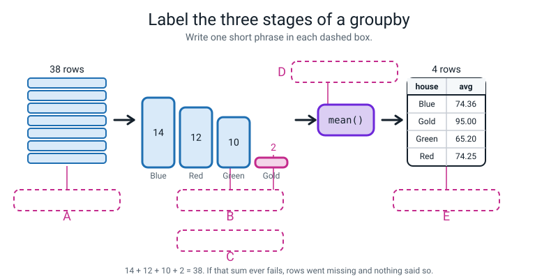
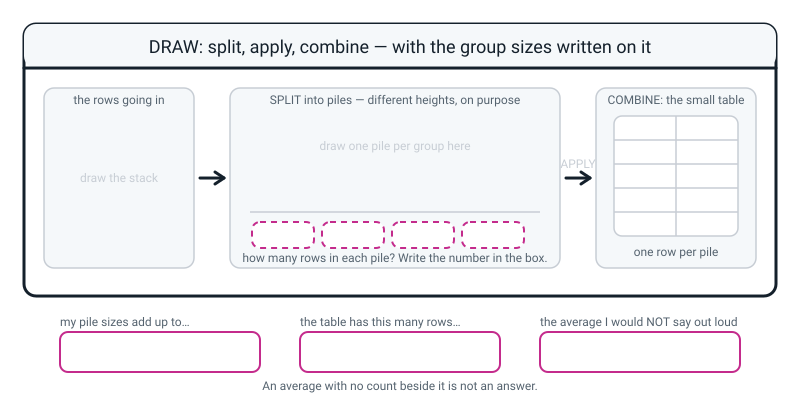

# Workbook — Week 24: Mess Detective

**Name:** ________________________________  **Date:** ______________

[⬅ Week 23](week-23.md) · [📖 Read the chapter first](../student-guide/week-24.md) · [Course Home](../README.md) · [🧑‍🏫 Teacher guide](../teacher-guide/week-24.md) · [Next ➡](week-25.md)

---

### The clean starting point

`house_raw.csv` is the 40-row file you wrote in class with `make_house_data.py`. Every page from the Build It section onwards assumes these seven lines have run:

```python
import pandas as pd

raw = pd.read_csv("house_raw.csv")
clean = raw.drop_duplicates().reset_index(drop=True)
clean["house"] = clean["house"].str.strip().str.title()
clean["club"] = clean["club"].str.strip().str.lower()
clean["age"] = clean["age"].fillna(13).astype(int)
clean["points_per_hour"] = (clean["score"] / clean["hours"]).round(2)
print(clean.shape)
```

```text
(38, 7)
```

> **⚠️ Watch out:** keep **last week's cleaning log sheet.** You are continuing it, not starting a new one. This week's first entry is number **eight**.

---

## ✅ Warm-Up (4 min)

Five quick questions about **last week** — the four kinds of broken.

**W1.** Name the four ways real data arrives broken. No book.

________________________________________________________________

________________________________________________________________

**W2.** `df.isna().sum()` said `0` for a column of ages, and three ages were unknown. Was pandas wrong? One sentence.

________________________________________________________________

**W3.** `df["hours"].fillna(3.5)` ran with no error and the hole was still there. What was missing?

________________________________________________________________

**W4.** Why can't you run `astype(int)` on a column that still has a hole in it?

________________________________________________________________

**W5.** A cleaning log line reads *"Filled 3 ages with 13."* Why is that not good enough?

________________________________________________________________

---

## 🔎 Predict the Output

**Write your prediction before you run anything.** Every snippet assumes `raw = pd.read_csv("house_raw.csv")` has run.

### P1 — two, or four?

```python
print(raw.duplicated().sum())
print(len(raw[raw.duplicated(keep=False)]))
```

**I predict — two numbers. Write both:**

________________________________________________________________

**It really printed:**

________________________________________________________________

________________________________________________________________

**The two numbers are different. Explain why, in one sentence.**

________________________________________________________________

**What does `keep=False` change, and why would you want it?**

________________________________________________________________

### P2 — the repair that looks broken

```python
m = raw.drop_duplicates().reset_index(drop=True)
print(m["house"].str.title().nunique())
print(m["house"].str.title().value_counts())
```

**I predict — the first number, and how many lines the second printout will have:**

________________________________________________________________

**It really printed:**

________________________________________________________________

________________________________________________________________

________________________________________________________________

**How many lines say `Blue`?** ______  **How can that be?**

________________________________________________________________

**Was there an error?** ____________  **What one extra command fixes it?**

________________________________________________________________

### P3 — the silent one, for the third week running

```python
clean = raw.copy()
clean.drop_duplicates()
print(clean.shape)
clean = clean.drop_duplicates()
print(clean.shape)
```

**I predict — two shapes. Write both:**

________________________________________________________________

**It really printed:**

________________________________________________________________

________________________________________________________________

**Was there an error on line 2?** ____________

**Name the ONE difference between line 2 and line 4:**

________________________________________________________________

**Name the two earlier commands that behave exactly the same way:**

________________________________________________________________

### P4 — the sum that does not add up

```python
holey = raw.drop_duplicates().reset_index(drop=True)
sizes = holey.groupby("age")["score"].size()
print(sizes)
print(sizes.sum(), len(holey))
```

**I predict — the group sizes, and whether they add up to the number of rows:**

________________________________________________________________

**It really printed:**

________________________________________________________________

________________________________________________________________

________________________________________________________________

**Sizes sum to** ______ **but the table has** ______ **rows.**

**How many rows are missing from that answer?** ______

**Where did they go, and why did nothing warn you?**

________________________________________________________________

________________________________________________________________

**How many of the four predictions did you get right?** ______ / 4

**Which one surprised you most, and why?**

________________________________________________________________

---

## ✍️ Practice Set A — Read It

**A1. Read a count.** Here is the real `raw["house"].value_counts()` output.

```text
Red       8
Green     5
Blue      5
green     4
blue      4
red       3
BLUE      3
RED       2
blue      1
 Blue     1
GREEN     1
green     1
gold      1
Gold      1
Name: house, dtype: int64
```

**(a)** How many lines? ______  **How many houses?** ______

**(b)** `blue` appears on two separate lines. **How is that possible?**

________________________________________________________________

**(c)** Which lines have an invisible space, and which end is it on? *(There are four, and two are easy to miss.)*

________________________________________________________________

________________________________________________________________

**(d)** Add up every Blue spelling. What should Blue's count be after cleaning? Show the sum.

________________________________________________________________

**(e)** The counts on this printout add to **40**, but the clean table has **38** rows. Why? And which houses lose a row?

________________________________________________________________

________________________________________________________________

**(f)** Given this printout, would `.str.title()` **on its own** be enough? Say what you would end up with.

________________________________________________________________

**A2. Read a groupby.** Here is a real result.

```text
house
Blue     74.36
Gold     95.00
Green    65.20
Red      74.25
Name: score, dtype: float64
```

**(g)** What is **missing** from this table that you would need before believing it?

________________________________________________________________

**(h)** Why is Gold **second** in the list when it has the highest average?

________________________________________________________________

**(i)** Somebody writes *"Gold is the best house in the school."* Is the **number** wrong, or is the **conclusion** wrong? Be precise.

________________________________________________________________

________________________________________________________________

**A3. Hand-check the arithmetic.** Fill in the table. The scores are given.

| Group | The scores | Sum | n | Mean |
|---|---|---|---|---|
| Gold | 97, 93 | | | |
| Green | 48, 50, 54, 59, 61, 63, 67, 70, 85, 95 | | | |
| Red | (sum is 891) | 891 | 12 | |
| Blue | (sum is 1041) | 1041 | 14 | |

**A3(j).** Do the four `n` values add up to the number of rows in the clean table? Show the sum.

________________________________________________________________

**A4. Spot the bug.** Each line is wrong or will not do what was intended — except possibly one, which is fine. Write the fix, or say "nothing to fix".

| # | The line | The fix |
|---|---|---|
| a | `clean["house"].strip()` | |
| b | `clean["house"].str.strip.str.title()` | |
| c | `clean.drop_duplicates()` | |
| d | `clean["house"] = clean["house"].str.title().str.strip()` | |
| e | `clean["pph"] = clean["score"] / clean["hour"]` | |
| f | `clean["new"] = [1, 2, 3]` | |
| g | `print(clean.groupby("house"))` | |
| h | `print(clean.groupby("house")["score"].size)` | |
| i | `print(clean.groupby("house")["score"].mean())` | |

**A4(j).** One of those nine produces **no error at all** and is still the worst line in the list. Which letter, and why?

________________________________________________________________

________________________________________________________________

**A5. Label the diagram.** Write one short phrase in each of the five dashed boxes.


*Figure W24.1 — split, apply, combine.*

The five phrases, in the wrong order: **APPLY — one calculation done to each pile · the smallest pile: only 2 rows · COMBINE — one row per pile comes out · the 38 rows going in · SPLIT — one pile per different value in the column**

**A** ______________________  **B** ______________________

**C** ______________________  **D** ______________________

**E** ______________________

**A5(f).** Which of the five boxes points at the thing that makes one of the four averages untrustworthy?

________________________________________________________________

**A6. Read the two tracebacks.** They are both "no column by that name" — but the wording differs, and that is useful.

```text
KeyError: 'hosue'
```

```text
KeyError: 'Column not found: scoer'
```

**Which of the two brackets is wrong in the first one?**

________________________________________________________________

**And in the second?**

________________________________________________________________

**In one sentence, what does the different wording tell you about how far pandas got?**

________________________________________________________________

**What is the one command you run instead of guessing at the spelling?**

________________________________________________________________

---

## ✍️ Practice Set B — Write It

### B1 — one line

Write the **single line** that prints how many different house spellings are left after cleaning.

```python
# your line here:
```

**Expected output:**

```text
4
```

**Done looks like:** you trust this number over anything the printout looks like.

### B2 — two lines

Tidy the `club` column so that eight spellings become three, then print the counts. Use **lower case**, not title case.

```python
# line 1:
# line 2:
```

**Expected output:**

```text
chess    14
music    12
art      12
Name: club, dtype: int64
```

**Done looks like:** 14 + 12 + 12 = 38, and you have done that sum.

### B3 — a derived column

Add a column called `points_per_hour`, rounded to two decimal places, then print the first three rows showing only `name`, `score`, `hours` and `points_per_hour`.

```python
# your lines here:
```

**Expected output:**

```text
         name  score  hours  points_per_hour
0  Aarav Shah     72    3.5            20.57
1    Bela Roy     90    5.0            18.00
2     Chen Wu     55    2.0            27.50
```

**Done looks like:** you have hand-checked one row on paper. 72 ÷ 3.5 = ?

### B4 — a groupby with three numbers in it

Print, for each club: the number of pupils, the average score, and the best score. Round to two decimal places.

```python
# your line here:
```

**Expected output:**

```text
        n    avg  best
club                  
art    12  70.58    97
chess  14  76.07    97
music  12  71.83    93
```

**Done looks like:** three named columns from one `agg(...)`, and you can read the `n=("score", "size")` pattern out loud as a sentence.

### B5 — the whole lab, about 20 lines

Write `six_questions.py`. It must:

1. read `house_raw.csv`, drop the duplicates, reset the index
2. tidy `house` (title case) and `club` (lower case), with `strip` first
3. fill the six missing ages with the median and convert to whole numbers
4. add the `points_per_hour` column
5. answer **six** questions, **each one with its group size beside it**
6. print the sizes-sum-to-38 check at least once

The six questions:

| # | The question |
|---|---|
| 1 | How many pupils in each house? |
| 2 | What is the average score in each house? |
| 3 | What is the average score in each club? |
| 4 | What is the average score at each age? |
| 5 | What are the average hours worked in each house? |
| 6 | Who gets the most marks per hour of work? (top five) |

**Expected output (the first two answers):**

```text
=== Q1: how many in each house?
house
Blue     14
Gold      2
Green    10
Red      12
Name: score, dtype: int64
check: sizes sum to 38 and the table has 38 rows
=== Q2: average score per house
        n    avg
house           
Blue   14  74.36
Gold    2  95.00
Green  10  65.20
Red    12  74.25
```

**Done looks like:** every single answer has an `n` beside it, and the check is printed in the file where a reader can see it.

---

## 🐞 Fix the Broken Program

Here is `detective.py`. It has **four** bugs. **Two of them produce no error at all**, and one of those two is the worst line in the file.

```python
# detective.py - four bugs.
import pandas as pd

raw = pd.read_csv("house_raw.csv")
clean = raw.copy()

clean.drop_duplicates()                                    # BUG 1
clean["house"] = clean["house"].strip().title()            # BUG 2
clean["points_per_hour"] = clean["score"] / clean["hour"]   # BUG 3
print(clean.groupby("house")["score"].mean())              # BUG 4
```

**Bug 1 — the silent one.** Run it and add `print(clean.shape)` after that line.

```text
(40, 6)
```

**What did you ask for, and what did the shape say happened?**

________________________________________________________________

**Was there an error?** ____________  **This is the third week for this bug. Say the rule:**

________________________________________________________________

**The fix, and the shape after it:**

________________________________________________________________

**Bug 2.** Fix bug 1 and run again. The real last line:

```text
AttributeError: 'Series' object has no attribute 'strip'
```

**What is a `Series` here, and what is Python telling you it hasn't got?**

________________________________________________________________

**The fix — and there are TWO things to get right, not one:**

________________________________________________________________

________________________________________________________________

**Bug 3.** Fix bug 2 and run again. The real last line:

```text
KeyError: 'hour'
```

**Where in the message is the thing pandas could not find?** ______________________

**The fix:**

________________________________________________________________

**Bug 4 — and this is the point of the whole page.** Fix bug 3 and run again. Now there is **no error whatsoever**, and the output is:

```text
house
Blue     74.36
Gold     95.00
Green    65.20
Red      74.25
Name: score, dtype: float64
```

**Every one of those four numbers is arithmetically correct. So what is wrong with this line?**

________________________________________________________________

________________________________________________________________

**The fix — write the whole line:**

________________________________________________________________

**And the output after it:**

________________________________________________________________

________________________________________________________________

> **⚠️ Watch out:** you only get the mark for bug 4 if you say **why**. "Add the `n`" is not the answer. **What does the average hide, and what wrong conclusion does hiding it invite?**

**Two questions to finish.**

**Rank the four bugs from most to least dangerous, and justify your first place.**

________________________________________________________________

________________________________________________________________

**Which two of the four would you never have found by reading the error messages?**

________________________________________________________________

---

## 🧩 Puzzle of the Week

### Part 1 — the missing combinations

```python
print(clean.groupby(["house", "club"]).size())
```

```text
house  club 
Blue   art       2
       chess     3
       music     9
Gold   art       2
Green  art       8
       chess     1
       music     1
Red    chess    10
       music     2
dtype: int64
```

**(a)** How many rows are in that printout? ______

**(b)** Four houses × three clubs. How many combinations are **possible**? ______

**(c)** So how many are **missing**? ______  **Name them.**

________________________________________________________________

**(d)** Do those three combinations have **zero** pupils, or did pandas just not tell you about them? Explain the difference.

________________________________________________________________

________________________________________________________________

**(e)** Do the nine numbers add up to 38? Show the sum.

________________________________________________________________

**(f)** Write the habit that stops this catching you out. *(It starts with a multiplication.)*

________________________________________________________________

### Part 2 — design a better column

`points_per_hour` put the three **lowest** scorers in the school at the top: 48, 45 and 42 marks, all from half an hour of work.

**(g)** Explain in one sentence **why** dividing by 0.5 does that.

________________________________________________________________

**(h)** Design a column that does **not** reward doing almost nothing. Write the formula.

```python
clean["______________"] = ______________________________________
```

**(i)** Apply it, sort by it, and write down your new top three.

| Rank | Name | Score | Hours | My column |
|---|---|---|---|---|
| 1 | | | | |
| 2 | | | | |
| 3 | | | | |

**(j)** Defend your design in two sentences. What does it reward, and what does it still get wrong?

________________________________________________________________

________________________________________________________________

---

## 🤔 Think Deeper

**T1.** Both duplicate rows had the same **name** AND the same **score**.

Write a paragraph. Why does that make you confident it is a mistake rather than two pupils who happen to share a name? List the fields that matched and say what the chance of all of them agreeing by accident really is. Then find the case where you would be **wrong** to delete: **what if one row of this table meant one test attempt rather than one pupil?** Finish with the question that actually decides it, and say who is the only person who can answer it.

________________________________________________________________

________________________________________________________________

________________________________________________________________

________________________________________________________________

________________________________________________________________

**T2.** `groupby(...).mean()` gave a **correct** answer that led you to a **wrong** conclusion. Is that pandas's fault?

Write a paragraph. Say exactly what pandas was asked and exactly what it did. Then name the gap — between *a correct number* and *a supported conclusion* — and say who can close it. Then be fair to the other side: **should pandas warn you about tiny groups?** Say what it would have to know in order to do that, and why it cannot know it. Finish with the practical half: if the tool will not do it, the habit has to. `.size()` beside `.mean()` does not make pandas smarter — **what does it make?**

________________________________________________________________

________________________________________________________________

________________________________________________________________

________________________________________________________________

________________________________________________________________

**T3. How many rows does a group need before you may say its average out loud?**

Pick a number. Defend it. Then apply your own rule to all six of your answers and count how many survive. There is no correct number and that is the exercise — but the *reasoning* is markable. Consider what a medical researcher with twelve patients would say about your rule, and what an opinion pollster with a thousand replies would say about it. Finish with the one thing everybody actually agrees on.

________________________________________________________________

________________________________________________________________

________________________________________________________________

________________________________________________________________

---

## 🛠️ Build It — Six Answers, Each With Its `n`

**This is the main assignment. Three things are being marked, and the third one is the real one.**

### Part 1 — the shape, accounted for

| | Rows | Columns |
|---|---|---|
| `raw.shape` before anything | | |
| after `drop_duplicates()` | | |
| after adding `points_per_hour` | | |

**Which two rows went, and how do you know they were duplicates and not two people?**

________________________________________________________________

________________________________________________________________

**Why did the column count go up by one?**

________________________________________________________________

**Write the accounting sentence out in full.** *("Forty rows in, … out. The two that went were …")*

________________________________________________________________

________________________________________________________________

### Part 2 — the cleaning log, continued from last week

**Your first entry this week is number 8.** Do not start a new sheet.

```
 8  ________________________________    ____________________________________

    ________________________________    ____________________________________

 9  ________________________________    ____________________________________

    ________________________________    ____________________________________

10  ________________________________    ____________________________________

    ________________________________    ____________________________________

11  ________________________________    ____________________________________

    ________________________________    ____________________________________

12  ________________________________    ____________________________________

    ________________________________    ____________________________________
```

- [ ] One line for `drop_duplicates`, **naming the two rows** and saying why they were slips
- [ ] One line for the `house` repair, with the **5+4+3+1+1 = 14** arithmetic in the reason
- [ ] One line for the `club` repair, saying why `lower` and not `title`
- [ ] One line for the age fill, with a **WARNING** that six ages are now guesses
- [ ] One line for the derived column, with the **hand-check** in it

### Part 3 — the six answers, each with its `n`

**An answer with an empty `n` box does not count, even if the number is right.**

| # | The question | The answer | n | My hand-check |
|---|---|---|---|---|
| 1 | pupils per house | | | |
| 2 | average score per house | | | |
| 3 | average score per club | | | |
| 4 | average score per age | | | |
| 5 | average hours per house | | | |
| 6 | most marks per hour | | | |

- [ ] At least **three** hand-checks done on paper
- [ ] The sizes-sum-to-38 check printed in my file

**The check, written out:** ______ + ______ + ______ + ______ = ______ , and `len(clean)` is ______

### Part 4 — the Gold sentence

> *"Gold has the highest average score (95.00), but it has only ______ members, so ______________________________________________________________________."*

**Full marks needs the consequence, not just the number.**

________________________________________________________________

________________________________________________________________

**Now answer these four, in order:**

**(a)** What are Gold's two scores? ______________________

**(b)** If one of them had been off school, what would Gold's average be? ______________________

**(c)** If one ordinary pupil scoring 73 joined Gold, what happens? Show the arithmetic.

________________________________________________________________

**(d)** How many pupils would have to join Blue to move its average seven marks? *(Assume each of them scores 100.)*

________________________________________________________________

### Part 5 — question 4 needs an extra sentence

**Why has age 13 got eighteen pupils when 12 and 14 have ten each?**

________________________________________________________________

**Before the fill, the twelve pupils with a *known* age of 13 averaged 71.92. After it, eighteen average 73.11. Which rule from last week is biting here?**

________________________________________________________________

________________________________________________________________

### Part 6 — the sentence at the bottom

> **Which one of your six answers would you NOT say out loud in assembly, and why?**

There is more than one defensible choice. **The reason is what is being marked.**

________________________________________________________________

________________________________________________________________

### Part 7 — The Bug Log

| What happened | Was there an error message? | What fixed it | What I will check next time |
|---|---|---|---|
| | | | |
| | | | |

---

## 🎨 Draw It

Draw **split, apply, combine** — with the group sizes written on it.


*Figure W24.2 — Your page.*

> **What a good answer might look like:** the subject is **the four houses**.
>
> In the left bay, a stack of small rectangles with **38 rows** written beside it.
>
> In the middle bay, **four piles of visibly different heights**: Blue tallest, then Red, then Green, and **Gold drawn as a single thin sliver** — because two rows is a sliver, and drawing it the same size as the others hides the whole point. Under each pile, in the dashed box: **14 · 12 · 10 · 2**. The word **SPLIT** written above them.
>
> The middle arrow labelled **APPLY**, with `mean()` written on it, and a small note: *"add each pile up, divide by how many are in it"*.
>
> In the right bay, a four-row table: Blue 74.36 · Gold 95.00 · Green 65.20 · Red 74.25, with **COMBINE** written above it.
>
> The three bottom boxes: **`14 + 12 + 10 + 2 = 38`** · **`38`** · *"Gold's 95.00 — it is two people, and one ordinary pupil joining would move it more than seven marks"*.
>
> And one extra annotation that shows real understanding: an arrow from the Gold sliver to the Gold row of the result table saying *"these two numbers look the same size on the page, and they are not made of the same amount of evidence."*
>
> **What a weak answer looks like:** four piles drawn the same height, or no numbers on the piles at all. **A drawing with the four averages and no sizes has drawn the trap rather than the lesson** — which is a genuinely useful thing to notice about your own work.

---

## 📊 Self-Check

| I can… | 😀 got it | 🙂 nearly | 😕 not yet |
|---|---|---|---|
| Remove duplicate rows and state how many went, **and which** | ☐ | ☐ | ☐ |
| Tidy several spellings into one, and say why `title` alone is not enough | ☐ | ☐ | ☐ |
| Add a derived column from columns I already have | ☐ | ☐ | ☐ |
| Group by a column and report the group sizes alongside | ☐ | ☐ | ☐ |
| Print before/after shape and account for the difference out loud | ☐ | ☐ | ☐ |
| Hand-check one pile of a groupby without being told to | ☐ | ☐ | ☐ |
| Run the sizes-sum-to-`len(df)` check as a matter of course | ☐ | ☐ | ☐ |
| Explain why a correct average can support a wrong conclusion | ☐ | ☐ | ☐ |

**True or false?** Circle one on each row.

| Statement | | |
|---|---|---|
| `raw.duplicated().sum()` gives 4 when two rows are repeated | TRUE | FALSE |
| `df["house"].strip()` removes the spaces from every value | TRUE | FALSE |
| `.str.title()` on its own is enough to fix the house column | TRUE | FALSE |
| `df["new"] = df["a"] / df["b"]` creates a new column | TRUE | FALSE |
| If a group has the highest average, it is the best group | TRUE | FALSE |
| The group sizes should add up to the number of rows | TRUE | FALSE |
| `clean.drop_duplicates()` on its own removes the duplicates | TRUE | FALSE |
| A space is a character | TRUE | FALSE |
| `groupby` shows every possible combination of two columns | TRUE | FALSE |
| `groupby` silently leaves out rows whose group value is a hole | TRUE | FALSE |
| Assigning to a column name that already exists gives an error | TRUE | FALSE |
| `groupby` sorts its result by the answer, biggest first | TRUE | FALSE |

One thing I'd like explained again:

________________________________________________________________

---

## ✅ Answers

<details>
<summary>Check your answers</summary>

### Warm-Up

**W1.** **A hole** — nobody filled the cell in · **text pretending to be numbers** — one word turns a whole column into writing · **the same row twice** · **several spellings of one thing.** Any sensible wording counts; the four *problems* are the graded bit.

**W2.** **No.** `isna()` asks *"is this cell empty?"*, and a cell containing the word `unknown` is not empty — there is something in it. Pandas answered exactly the question it was asked; **the mistake was asking that question when you meant "how many ages do we know?"**

**W3.** **The assignment.** `fillna` hands back a repaired **copy**; without `df["hours"] = ` on the front the copy is thrown away, nothing changes, and nothing warns you.

**W4.** Because **a hole is not a whole number.** Pandas has no whole-number value that means "missing", so it refuses rather than inventing one: `IntCastingNaNError`. Deal with the hole first, then change the type.

**W5.** It has a **WHAT** and no **WHY.** Filled with *what*, and *why that number*? And what should a reader be careful about because of it? In six weeks nobody — you least of all — will be able to tell whether 13 came from the world or from you.

---

### Predict the Output

**P1** — real output:

```text
2
4
```

**`duplicated()` marks a row `True` only if an identical row appeared ABOVE it.** So the first Bela Roy is `False` and the second is `True`; same for Farah Aziz. Two rows are marked, which is why the sum is 2 — even though **four** rows are involved.

**Most people predict 4, and it is a reasonable prediction.** The point of `keep=False` is that it marks **both** copies rather than just the later one, so you can put them side by side and compare them field by field. **You want that, because deleting a row is a judgement and you should look before you make it.**

**P2** — real output:

```text
8
Red       12
Blue      12
Green      9
Blue       1
 Blue      1
Green      1
Gold       1
Gold       1
Name: house, dtype: int64
```

**Three lines say `Blue`** — and that is impossible unless they are not the same piece of writing.

**They are not.** `title` fixes **capitals** and does nothing about **spaces**, so `"blue "` became `"Blue "` and `" Blue"` stayed `" Blue"`. And **a space prints as nothing**, so all three look identical on screen.

**There was no error.** The printout is perfectly correct and looks insane. **The one extra command is `.str.strip()`** (in the chain `.str.strip().str.title()`) — and then 8 becomes 4.

To see the invisible spaces for yourself: `print(m["house"].str.title().unique())` prints the quote marks.

```text
['Red' 'Blue' 'Blue ' 'Green' ' Blue' 'Green ' 'Gold' 'Gold ']
```

**P3** — real output:

```text
(40, 6)
(38, 6)
```

**No error on line 2, and nothing happened.** `drop_duplicates()` built a new 38-row table and handed it back, and line 2 threw it away.

**The one difference is `clean = ` on the front of line 4.**

**And the two earlier commands that behave exactly the same way: `sort_values` (Week 22) and `fillna` (Week 23).** Add `to_numeric` and `astype` and that is five. **The rule is one sentence: if there is no `=` on the left, nothing happened, and nothing warns you.**

**P4** — real output:

```text
age
12.0    10
13.0    12
14.0    10
Name: score, dtype: int64
32 38
```

**Sizes sum to 32 but the table has 38 rows. Six rows are missing from the answer.**

They are the **six pupils whose age nobody recorded.** `groupby` sorts rows into piles by the value in a column — and if a row's value is a hole, **there is no pile for it to go in**, so it is silently left out.

**Nothing warned you because nothing was wrong** as far as pandas is concerned. The three averages it did compute are perfectly correct averages *of the rows it included*. **The sum check is the only thing on the screen that would have told you.**

---

### Practice Set A

**A1.**

**(a)** **14** lines, **4** houses.

**(b)** They are **not the same piece of writing.** One of them has a trailing space. Two pieces of writing are the same only if **every character** matches, and **a space is a character.**

**(c)** Four of them:

- the second `blue` (count 1) has a **trailing** space
- ` Blue` (count 1) has a **leading** space
- the second `green` (count 1) has a **trailing** space — this is one everybody misses
- the only `Gold` (count 1) has a **trailing** space too — there is no plain `Gold` to make it look like a duplicate, so it is easy to miss as well

**(d)** `Blue` 5 + `blue` 4 + `BLUE` 3 + `blue ` 1 + ` Blue` 1 = **14** ✔

**That sum is the proof nothing was lost.** Blue has 14 after cleaning; five spellings went in, fourteen rows came out.

**(e)** This is the **raw** column, printed **before** the two duplicate rows were removed. The two duplicates were **Bela Roy (Red)** and **Farah Aziz (green)**, so **Red and Green each lose one row.** Blue and Gold are unaffected. 40 − 2 = 38.

**(f)** **No.** `.str.title()` fixes the capitals and leaves the spaces, so you get **8** distinct values instead of 4 — and the printout looks broken, because a space prints as nothing. **You need `strip` too.**

**A2.**

**(g)** **The group sizes.** Gold's 95.00 comes from **2** rows and Blue's 74.36 from **14**, and nothing on this table says so.

**(h)** `groupby` sorts by the **group name**, alphabetically — Blue, Gold, Green, Red — **not** by the answer. (You *can* sort by the answer with `.sort_values("avg", ascending=False)`, and notice what that does: it puts the two-member group at the top. Presentation can mislead all by itself.)

**(i)** **The number is right and the conclusion is wrong.** 97 + 93 over 2 really is 95.00; you can check it in your head. What is wrong is treating a two-row average as comparable with a fourteen-row one. **That distinction — correct number, unsupported conclusion — is the whole lab.**

**A3.**

| Group | Sum | n | Mean |
|---|---|---|---|
| Gold | **190** | **2** | **95.00** |
| Green | **652** | **10** | **65.20** |
| Red | 891 | 12 | **74.25** |
| Blue | 1041 | 14 | **74.36** (74.357… rounded) |

Green's sum: 48 + 50 + 54 + 59 + 61 + 63 + 67 + 70 + 85 + 95 = **652**, and 652 ÷ 10 = **65.20** ✔

**A3(j).** 14 + 12 + 10 + 2 = **38**, and `len(clean)` is **38** ✔

**A4.**

| # | The line | The fix |
|---|---|---|
| a | `clean["house"].strip()` | `clean["house"].str.strip()`. `AttributeError: 'Series' object has no attribute 'strip'` — `.str` is the doorway |
| b | `.str.strip.str.title()` | `.str.strip().str.title()` — brackets after `strip`. `AttributeError: 'function' object has no attribute 'str'` |
| c | `clean.drop_duplicates()` | `clean = clean.drop_duplicates()`. **No error without it, and no drop either** |
| d | `.str.title().str.strip()` | **Nothing to fix — this one works.** `.str.title().str.strip()` gives the same four houses as `.str.strip().str.title()`, because `strip` removes the spaces whichever order it runs in. Strip-first is just the habit; the bug would be leaving `strip` out |
| e | `clean["hour"]` | `clean["hours"]`. `KeyError: 'hour'` — the most common derived-column bug |
| f | `clean["new"] = [1, 2, 3]` | A derived column comes from **other columns**, not a hand-typed list. `ValueError: Length of values (3) does not match length of index (38)` |
| g | `print(clean.groupby("house"))` | Add what to do with each pile: `["score"].mean()`. Otherwise you print `<...DataFrameGroupBy object at 0x...>` — **the piles are not a result** |
| h | `.size` with no brackets | `.size()`. Otherwise you print `<bound method GroupBy.size of ...>` |
| i | `groupby("house")["score"].mean()` | `groupby("house").agg(n=("score", "size"), avg=("score", "mean"))` |

**A4(j).** **(i).** It runs perfectly and produces four correct numbers — and it hides the fact that one of them came from two rows. **Every other line on the list either crashes or does nothing.** This one does something, and what it does is invite a wrong conclusion. *(Line (c) is a runner-up: it also produces no error, and it leaves the duplicates exactly where they were.)*

**A5.**

| Box | Phrase |
|---|---|
| **A** | the 38 rows going in |
| **B** | SPLIT — one pile per different value in the column |
| **C** | the smallest pile: only 2 rows |
| **D** | APPLY — one calculation done to each pile |
| **E** | COMBINE — one row per pile comes out |

**A5(f).** **C.** The two-row pile is what makes Gold's 95.00 untrustworthy — and notice that **box E, the result table, gives you no way to see it.** That is exactly why `.size()` has to be printed beside `.mean()`.

**A6.**

- **First message, `KeyError: 'hosue'`:** the name inside `groupby(...)` — the **first** bracket. It could not even make the piles.
- **Second message, `KeyError: 'Column not found: scoer'`:** the name **after** the groupby — the **second** bracket. It made the piles fine and then could not find that column inside them.
- **What the different wording tells you: how far pandas got before it gave up.** One failed at the split; the other failed at the apply. **That is a free clue about which bracket to look at**, and reading it saves you scanning the line.
- **The command: `print(clean.columns.tolist())`.** Read the real names and copy one exactly.

---

### Practice Set B

**B1.**

```python
print(clean["house"].nunique())
```

```text
4
```

**Trust this number over the printout.** `value_counts()` can show you `Blue` three times and look broken; `nunique()` gives you one honest integer.

**B2.**

```python
clean["club"] = clean["club"].str.strip().str.lower()
print(clean["club"].value_counts())
```

```text
chess    14
music    12
art      12
Name: club, dtype: int64
```

14 + 12 + 12 = **38.** Every row accounted for. And `lower` rather than `title` because club names read better small — **which is a style decision, so it belongs on the log.** What matters is that you pick one and use it everywhere: `Chess` and `chess` are two clubs again the moment you are inconsistent.

**B3.**

```python
clean["points_per_hour"] = (clean["score"] / clean["hours"]).round(2)
print(clean[["name", "score", "hours", "points_per_hour"]].head(3))
```

```text
         name  score  hours  points_per_hour
0  Aarav Shah     72    3.5            20.57
1    Bela Roy     90    5.0            18.00
2     Chen Wu     55    2.0            27.50
```

**Hand-check: 72 ÷ 3.5 = 20.571… → 20.57** ✔ And row 2 is easier: 55 ÷ 2 = **27.5** ✔

Thirty-eight divisions from one line — that is Week 18's array arithmetic, on named columns. And `clean["points_per_hour"] = ` on the left is the whole syntax for making a new column: **a name that does not exist yet.**

**B4.**

```python
print(clean.groupby("club").agg(n=("score", "size"),
                                avg=("score", "mean"),
                                best=("score", "max")).round(2))
```

```text
        n    avg  best
club                  
art    12  70.58    97
chess  14  76.07    97
music  12  71.83    93
```

**Read the pattern out loud as a sentence:** `n=("score", "size")` means *"make me a column called `n`, from the `score` column, by counting how many rows are in the pile."* The name you want goes on the left of the `=`; the pair in brackets is *which column* and *what to do with it*.

**And notice how much sturdier this table is than the house one.** All three clubs have twelve or more members. **Chess winning by about four to five marks over fourteen rows is a far stronger claim than Gold's twenty-mark lead over two.**

**B5.** The full program:

```python
# six_questions.py - Week 24 homework. Six answers, every one with its count.
import pandas as pd

raw = pd.read_csv("house_raw.csv")
clean = raw.drop_duplicates().reset_index(drop=True)
clean["house"] = clean["house"].str.strip().str.title()
clean["club"] = clean["club"].str.strip().str.lower()
clean["age"] = clean["age"].fillna(13).astype(int)
clean["points_per_hour"] = (clean["score"] / clean["hours"]).round(2)

print("=== Q1: how many in each house?")
print(clean.groupby("house")["score"].size())
sizes = clean.groupby("house")["score"].size()
print("check: sizes sum to", sizes.sum(), "and the table has", len(clean), "rows")

print("=== Q2: average score per house")
print(clean.groupby("house").agg(n=("score", "size"), avg=("score", "mean")).round(2))

print("=== Q3: average score per club")
print(clean.groupby("club").agg(n=("score", "size"), avg=("score", "mean")).round(2))

print("=== Q4: average score per age")
print(clean.groupby("age").agg(n=("score", "size"), avg=("score", "mean")).round(2))

print("=== Q5: average hours per house")
print(clean.groupby("house").agg(n=("hours", "size"), avg_hours=("hours", "mean")).round(2))

print("=== Q6: most marks per hour of work")
print(clean.sort_values("points_per_hour", ascending=False).head(5)[["name", "house", "score", "hours", "points_per_hour"]])
```

Real output:

```text
=== Q1: how many in each house?
house
Blue     14
Gold      2
Green    10
Red      12
Name: score, dtype: int64
check: sizes sum to 38 and the table has 38 rows
=== Q2: average score per house
        n    avg
house           
Blue   14  74.36
Gold    2  95.00
Green  10  65.20
Red    12  74.25
=== Q3: average score per club
        n    avg
club            
art    12  70.58
chess  14  76.07
music  12  71.83
=== Q4: average score per age
      n    avg
age           
12   10  84.80
13   18  73.11
14   10  61.00
=== Q5: average hours per house
        n  avg_hours
house               
Blue   14       3.18
Gold    2       3.75
Green  10       2.60
Red    12       3.17
=== Q6: most marks per hour of work
           name  house  score  hours  points_per_hour
18    Sami Aden  Green     48    0.5             96.0
7    Hugo Silva    Red     45    0.5             90.0
32   Greta Hahn   Blue     42    0.5             84.0
6    Gita Menon   Blue     78    1.5             52.0
14  Omar Haddad   Blue     52    1.0             52.0
```

**Hand-checks you should have written down:**

| Group | The arithmetic | Result |
|---|---|---|
| Gold score | 97 + 93 = 190, 190 ÷ 2 | **95.00** ✔ |
| Green score | 48+50+54+59+61+63+67+70+85+95 = 652, 652 ÷ 10 | **65.20** ✔ |
| Blue score | sum 1041, 1041 ÷ 14 = 74.357… | **74.36** ✔ |
| Red score | sum 891, 891 ÷ 12 | **74.25** ✔ |
| Sami's rate | 48 ÷ 0.5 | **96.0** ✔ |
| All group sizes | 14 + 12 + 10 + 2 | **38** ✔ |

**Two things to say about Q5 and Q6.**

**Q5:** Green works the least (2.60 hours) and scores the least (65.20). **Do not call that cause and effect.** It is two numbers moving together on ten rows, which is a **reason to look further**, not a conclusion. Good question to ask yourself: *what would I need to know to be sure?*

**Q6:** the top three are the three **lowest scorers in the school** — 48, 45 and 42 — and they all worked half an hour. **Dividing by 0.5 doubles your number**, so `points_per_hour` mostly measures who did the least work. It is a fine column for *"who gets the most out of their time?"* and a bad one for *"who is doing well?"*

**Marking notes.** Full marks needs the `n` beside **every** answer and the sizes-sum check printed at least once. **Q4 needs one extra sentence:** age 13 has eighteen pupils because six missing ages were filled with 13, and six of those eighteen are 13 only because we said so. Before the fill, the **twelve** pupils with a known age of 13 averaged **71.92**; after it, eighteen average **73.11**.

---

### Fix the Broken Program

**Bug 1 — the silent one.**

You asked for the duplicates to be dropped. The shape says **(40, 6)** — nothing was dropped. **No error.**

**The rule, third week running: `drop_duplicates`, `sort_values`, `fillna`, `to_numeric` and `astype` all hand you back a NEW thing. If there is no `=` on the left, nothing happened.**

```python
clean = clean.drop_duplicates()
print(clean.shape)
```

```text
(38, 6)
```

**Bug 2 — `AttributeError: 'Series' object has no attribute 'strip'`.**

A **Series** is one whole column — here, 38 pieces of writing. `strip` is a thing you do to **one** piece of writing, and pandas will not assume you meant "do it to all of them".

**Two things to get right, not one:**

1. Add the **`.str` doorway** in front of `strip`.
2. Add it **again** in front of `title` — each method needs its own `.str`.

```python
clean["house"] = clean["house"].str.strip().str.title()
```

**Bug 3 — `KeyError: 'hour'`.**

**The missing name is in quotes at the end of the message:** `'hour'`. The column is `hours`, with an `s`.

```python
clean["points_per_hour"] = clean["score"] / clean["hours"]
```

**Bug 4 — and this is the point of the page.**

The line runs perfectly and every number is arithmetically correct. **What is wrong is what it does not say.** Gold's 95.00 comes from **two** rows and Blue's 74.36 from **fourteen**, and the printout gives a reader no way to know that. **It invites the conclusion "Gold is the best house", which the data does not support**, because one ordinary pupil joining Gold would move that number more than seven marks, and it would take six perfect scores to do that to Blue's.

```python
print(clean.groupby("house").agg(n=("score", "size"), avg=("score", "mean")).round(2))
```

```text
        n    avg
house           
Blue   14  74.36
Gold    2  95.00
Green  10  65.20
Red    12  74.25
```

**Ranking the four bugs, most dangerous first:**

1. **Bug 4.** It runs, it is correct, and it is wrong. You would hand it in, and somebody might act on it. **A correct number supporting a wrong conclusion is the most expensive kind of mistake in data work** because there is nothing to find.
2. **Bug 1.** Silent, and everything after it is computed on the wrong table — 40 rows including two double-counted pupils. Every average in the file would be slightly off, with no error anywhere.
3. **Bug 2** and **Bug 3.** Both crash immediately and both name the exact problem — one names the missing method, one names the missing column. Ten seconds each.

**The two you would never have found from the error messages: bugs 1 and 4**, because **there were no error messages.** Bug 1 you find with the shape check; bug 4 you find by asking *"how many rows is that number made of?"*

---

### Puzzle of the Week

**Part 1**

**(a)** **9** rows.

**(b)** 4 houses × 3 clubs = **12** possible combinations.

**(c)** **3** missing: **Red/art, Gold/chess and Gold/music.**

**(d)** **Those three genuinely have zero pupils — but pandas did not tell you that; it simply left them out.** And that is the important distinction: `groupby` gives you **a list of what exists**, not a complete grid with zeros in the gaps. **The absence is invisible unless you do the multiplication yourself.** If Red/art had existed and you had accidentally filtered it away, the printout would look exactly the same.

**(e)** 2 + 3 + 9 + 2 + 8 + 1 + 1 + 10 + 2 = **38** ✔

**(f)** **Before reading a two-column `groupby`, work out how many combinations there *should* be** — multiply the two `nunique()` values — and compare it with the number of rows you got. Then account for the difference.

**Part 2**

**(g)** Because dividing by a number smaller than 1 makes the answer **bigger**. Half an hour is 0.5, and dividing by 0.5 is the same as multiplying by 2 — so somebody who did the least work possible gets their score doubled, while somebody who worked six hours gets theirs divided by six. **The column rewards not working.**

**(h)** Any defensible design earns full marks. Three that students actually write:

```python
clean["score_minus_slacking"] = clean["score"] - (6 - clean["hours"]) * 5
```

```python
clean["fair_rate"] = clean["score"] / clean["hours"].clip(lower=2)
```

Or the simplest and arguably the best: **rank by `score`, and use `hours` only to break ties.**

**(i)** For the first of those, run for real:

```python
clean["score_minus_slacking"] = clean["score"] - (6 - clean["hours"]) * 5
print(clean.sort_values("score_minus_slacking", ascending=False).head(3)[["name", "score", "hours", "score_minus_slacking"]])
```

```text
          name  score  hours  score_minus_slacking
5   Farah Aziz     95    6.0                  95.0
19  Tara Joshi     97    5.0                  92.0
33   Hana Sato     93    5.5                  90.5
```

*(Your own top three will differ, and that is fine — what matters is that they are **actually high scorers**, not the three lowest.)*

**(j)** **What matters is the defence, not the formula.** A strong answer says what the column rewards (high scores from people who put the hours in) **and** what it still gets wrong (it punishes somebody who is genuinely quick, and the "5" is a number I chose out of thin air). **The point of this puzzle is that a derived column is a design decision made by a person — and that person can be twelve.**

---

### Think Deeper

**T1.** Model answer:

> *It is not just the name. **Every single field matches** — name, age, house, club, hours, and the score to the mark. Two different people called Bela Roy could easily exist. But they would not both be 14, both in Red, both in music club, both have done exactly 5.0 hours, **and** both score exactly 90. Six things agreeing by accident is close to impossible; somebody scrolling and losing their place while typing is an everyday event.*
>
> *But I would be wrong to delete if a row meant something different. **If this table were one row per test attempt rather than one row per pupil**, two identical rows could be two genuine attempts that happened to score the same — and deleting one would destroy a real fact about the world.*
>
> *So the question that actually decides it is: **what does one row of this table mean?** And the only person who can answer that is somebody who knows where the data came from. Which is why `drop_duplicates()` is a judgement with a keystroke attached, and why it needs a log line.*

**Marking note:** full marks needs (1) the list of matching fields, not just "the name", (2) the test-attempt counter-example or an equivalent, and (3) the recognition that the deciding question is about **meaning**, not code.

**T2.** Model answer:

> *No, and this is worth stating plainly. Pandas was asked for the mean score per house, and that is exactly what it computed — correctly, to more decimal places than I needed. **It has no idea what I intend to claim.** It cannot see my report, my assembly, or the sentence I am about to say out loud.*
>
> *The gap is between **a correct number** and **a supported conclusion**, and only a person can close it. The number 95.00 is a fact. "Gold is the best house" is a claim, and it needs evidence the number does not contain.*
>
> *Should pandas warn me about tiny groups? It is a reasonable thing to want. But to do it, pandas would have to know **what counts as tiny for my question** — and that depends on what I am asking, how much the values vary, and what I am going to do with the answer. A medical researcher with twelve patients has twelve patients; a warning would fire every time and she would learn to ignore it. **A warning that fires when nothing is wrong protects nobody.***
>
> *So the habit has to do it. `.size()` beside `.mean()` does not make pandas smarter — **it makes me harder to fool.** That is a better place to put the fix, because it also works on somebody else's table, somebody else's chart, and a number in a newspaper.*

**Marking note:** the key move is *correct number vs supported conclusion*. Full marks adds an honest cost for the warning, and finishes with the habit stated as something about **you**, not about the tool.

**T3.** Model answer:

> *I would say **five**. Below five, one person changes the answer by more than a fifth, and I would not want to say something in assembly that one absence could reverse.*
>
> *Applying my own rule to my six answers: Q1, Q2, Q3, Q4 and Q5 all involve at least one group of ten or more, so most of them survive — but **Gold (2) fails in Q2 and Q5**, and I would have to report those two rows as "Gold: 2 pupils, not enough to compare". Q6 is not a group average at all, so my rule does not apply, which is itself worth noticing.*
>
> *A medical researcher would say my rule is a luxury. **If twelve patients is all the patients there are, you report twelve and you say so** — refusing to publish would help nobody. An opinion pollster would say five is absurd; they want a thousand, because they are trying to describe millions of people from a sample.*
>
> *So the honest conclusion is that the number depends on what you are trying to describe and how much it varies. **The one thing everybody agrees on is: print the size, always, so the reader can decide for themselves.** And a second thing, which is not a rule of thumb but a fact: **two is not enough, for anything.***

**Marking note:** any number is acceptable. What is markable is (1) a reason for the number, (2) actually applying it to their own six answers, and (3) the recognition that "always print it" is the thing everybody agrees on.

---

### Build It

**Part 1 — the shapes:**

| | Rows | Columns |
|---|---|---|
| `raw.shape` before anything | **40** | **6** |
| after `drop_duplicates()` | **38** | **6** |
| after adding `points_per_hour` | **38** | **7** |

**The two rows that went** were the **second Bela Roy** and the **second Farah Aziz**. You know they were duplicates and not two people because **every single field matched** — name, age, house, club, hours and the exact score.

**The column count went up by one** because `points_per_hour` was added. Nothing came in from outside; the table did arithmetic on itself.

**The accounting sentence:**

> *"Forty rows in, thirty-eight out. The two that went were the second Bela Roy and the second Farah Aziz, both exact duplicates. Six columns became seven because I added `points_per_hour`. No other row moved."*

**Part 2 — the model log entries, continuing last week's numbering:**

```
 8  drop_duplicates(): 40 rows -> 38     Bela Roy and Farah Aziz each appeared
                                        twice with EVERY field identical, incl.
                                        the exact score. A typing slip, not two
                                        people. Keeping both would double-count
                                        them in every average.

 9  house: .str.strip().str.title()      value_counts() showed 14 spellings of 4
    14 spellings -> 4 houses            houses, two with spaces I could not see.
                                        strip AND title: title alone leaves the
                                        spaces and they print as nothing.
                                        5+4+3+1+1 = 14, so nothing was lost.

10  club: .str.strip().str.lower()       8 spellings of 3 clubs. lower not title
    8 spellings -> 3 clubs              because club names read better small.
                                        14+12+12 = 38, all rows accounted for.

11  Filled 6 missing ages with 13,       13 is the median of the 32 ages we know.
    then astype(int)                    WARNING: 6 of the 18 "13-year-olds" are
                                        13 only because I said so. Do NOT trust
                                        any answer that groups by age.

12  Added points_per_hour =              To ask "who gets most from their time?".
    score / hours, rounded to 2          Hand-checked row 0: 72 / 3.5 = 20.57.
                                        WARNING: dividing by 0.5 doubles the
                                        number, so this column rewards doing
                                        the least work. It is a choice, not a
                                        measurement.
```

**Entry 12's warning is where the extra marks are.** A log line that says what a derived column *gets wrong* is doing real work.

**Part 3 — the six answers:** all six outputs and hand-checks are under **B5** above. **An answer with an empty `n` box does not count.**

**The check:** 14 + 12 + 10 + 2 = **38**, and `len(clean)` is **38** ✔

**Part 4 — the Gold sentence. Two model answers, both full marks:**

> *"Gold has the highest average score (95.00), but it has only **2** members, so the number is far too fragile to compare with Blue's, which comes from 14. If one Gold pupil had been off school the average would have been 97 or 93 — from a single row. If one ordinary pupil scoring 73 joined Gold, the average would drop to 87.67 and the lead over Blue would shrink by about a third. Nothing that small could happen to a fourteen-row average, and the plain `.mean()` printout gave me no way to know any of this."*

> *"Gold has the highest average score (95.00), but it has only **2** members, so all it really tells me is that two particular pupils did well. It is not a fact about a house. Blue's 74.36 **is** a fact about a house, because fourteen different people had to agree to produce it. I should print `.size()` next to `.mean()` so that nobody reads my table the way I read it first."*

**(a)** **97 and 93.**
**(b)** **97 or 93** — still top of the table, and now from a **single** row.
**(c)** (97 + 93 + 73) ÷ 3 = 263 ÷ 3 = **87.67.** Still top, but the lead over Blue has shrunk from 20.6 marks to 13.3 (about a third), **from one person arriving.**
**(d)** **Six** — and every one of them would have to score 100 out of 100. Blue's sum is 1041 over 14 rows, so adding six perfect scores gives (1041 + 600) ÷ 20 = **82.05**, which is only **7.69** up. Meanwhile **one** ordinary pupil arriving moved Gold **7.33** the other way. **That is the difference between fourteen rows and two.**

**Three real partial answers, and what is missing:**

| What was written | What is missing | The question to ask yourself |
|---|---|---|
| *"…only 2 members, so it isn't fair."* | The mechanism. Right instinct, no reasoning | Not fair **how**? What could happen to two people that could not happen to fourteen? |
| *"…only 2 members, so we need more data."* | True, and it dodges the question | You have the data you have. What can you honestly say about Gold **today**, in one sentence? |
| *"…only 2 members, so the average is wrong."* | This one is **wrong** and must be corrected | No — the average is exactly right. 97 plus 93 over 2 is 95.00, and you checked it yourself. **The number is correct and the conclusion isn't.** That distinction is the whole lesson |

**Part 5 — question 4's extra sentence:**

**Age 13 has eighteen pupils because six missing ages were filled with 13.** Six of those eighteen are 13 only because we said so.

**The rule biting is last week's:** *never fill a column with a guess and then make that column the subject of your question.* We guessed at `age`, and then grouped by `age`. The answer is not worthless — but it must be reported with that sentence attached, and the log entry (number 11) already says so.

**Part 6 — the sentence at the bottom.** Any of these is a full-mark answer **if the reason is given**:

- **Q2's Gold row (95.00 from 2).** Two rows is not a fact about a house.
- **Q5's Gold row (3.75 hours from 2).** Same problem, same two people.
- **Q4 entirely.** Six of the eighteen "13-year-olds" are 13 because I said so, so any claim about age is partly a claim about who forgot to fill in a form.
- **Q6.** `points_per_hour` puts the three lowest scorers in the school on top, so saying "Sami Aden gets the most out of his time" in assembly would be heard as "Sami Aden is the best pupil", which is not what the number says.

**What does not earn the mark is naming an answer with no reason**, or naming Q3, which is the sturdiest result on the page — three groups of twelve or more, and a five-mark gap.

---

### Draw It

There is no single right drawing. Full marks needs **three** things:

1. **The group sizes written on the piles**: 14, 12, 10, 2.
2. **The Gold pile visibly the smallest** — drawn as a sliver, not as a fourth equal box.
3. **The sum check written out somewhere on the page**: `14 + 12 + 10 + 2 = 38`, with a note that 38 is the number of rows in the table.

**A drawing with the four averages and no sizes has drawn the trap rather than the lesson.** That is a useful thing to say out loud while checking your own work — and if it describes your drawing, the fix is one number per pile.

---

### Self-Check answers

| Statement | Answer | Why |
|---|---|---|
| `raw.duplicated().sum()` gives 4 when two rows are repeated | **FALSE** | It gives **2**. The first copy of each row is not marked; only later copies are |
| `df["house"].strip()` removes the spaces from every value | **FALSE** | `AttributeError: 'Series' object has no attribute 'strip'`. You need `.str.strip()` |
| `.str.title()` on its own is enough to fix the house column | **FALSE** | It leaves the spaces, so you get 8 values instead of 4 — and the printout looks broken because a space prints as nothing |
| `df["new"] = df["a"] / df["b"]` creates a new column | **TRUE** | A name on the left that does not exist yet creates a column. If it **does** exist, it is overwritten, silently |
| If a group has the highest average, it is the best group | **FALSE** | Not without its size. Gold's 95.00 comes from two rows; one ordinary pupil joining would move it more than seven marks |
| The group sizes should add up to the number of rows | **TRUE** | If they do not, rows were silently dropped — usually because the grouping column still has holes |
| `clean.drop_duplicates()` on its own removes the duplicates | **FALSE** | It hands you a new table. No `clean = ` on the front means nothing happened, and no error either. Third week for this one |
| A space is a character | **TRUE** | Which is why `"Blue"` and `"Blue "` are as different to a computer as `"Blue"` and `"Banana"` |
| `groupby` shows every possible combination of two columns | **FALSE** | It shows only the combinations that **exist**. Nine out of twelve here, with no zeros for the missing three |
| `groupby` silently leaves out rows whose group value is a hole | **TRUE** | There is no pile for them, so they vanish. Sizes sum to 32 instead of 38, and nothing says so |
| Assigning to a column name that already exists gives an error | **FALSE** | It **overwrites** it, silently. Which is why you choose new names carefully |
| `groupby` sorts its result by the answer, biggest first | **FALSE** | It sorts by the **group name**, alphabetically — which is why Gold sits second with the highest average |

</details>

---

[⬅ Week 23 Workbook](week-23.md) · [📖 Week 24 Chapter](../student-guide/week-24.md) · [Course Home](../README.md) · [Week 25 Workbook ➡](week-25.md)
