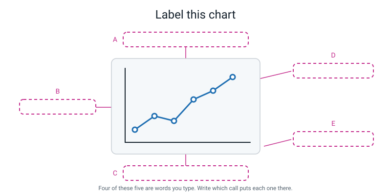
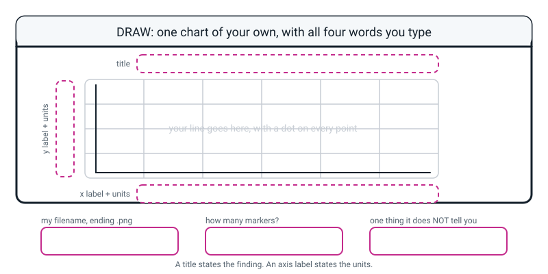

# Workbook — Week 25: Drawing the Table: Your First Chart

**Name:** ________________________________  **Date:** ______________

[⬅ Week 24](week-24.md) · [📖 Read the chapter first](../student-guide/week-25.md) · [Course Home](../README.md) · [🧑‍🏫 Teacher guide](../teacher-guide/week-25.md) · [Next ➡](week-26.md)

---

## ✅ Warm-Up (5 min)

Five quick questions about **last week** — Mess Detective.

**W1.** Your raw table had 40 rows. After `df = df.drop_duplicates()` it had 38. What exactly did those two vanished rows have in common?

________________________________________________________________

**W2.** `df["house"].str.strip().str.title()` — say what each of the two `.str` calls does, in your own words.

________________________________________________________________

________________________________________________________________

**W3.** You wrote `df["score_out_of_10"] = df["score"] / 10`. What is on the left of that equals sign, and did it exist before the line ran?

________________________________________________________________

**W4.** `df.groupby("house")["score"].mean()` gives you three numbers. Name the **one thing** you must always print alongside them, and why.

________________________________________________________________

________________________________________________________________

**W5.** `df["score"].astype(int)` worked on one column and crashed on another. Which kind of column would crash it, and what would you do first?

________________________________________________________________

---

## 🔎 Predict the Output

**Write your prediction before you run anything.** Every snippet starts with `import matplotlib.pyplot as plt`.

### P1 — the quiet one

```python
weeks = [1, 2, 3, 4]
visits = [118, 126, 131, 140]

print("about to draw")
fig, ax = plt.subplots(figsize=(6, 4))
ax.plot(weeks, visits, marker="o")
ax.set_title("Visits went up")
print("done")
```

**I predict — how many lines print, and does a file appear?**

________________________________________________________________

**It really printed:**

________________________________________________________________

________________________________________________________________

**List the folder. How many new `.png` files are there?** ______

**Was anything wrong with this program?** ______________________________

### P2 — what does a label call hand back?

```python
fig, ax = plt.subplots(figsize=(6, 4))
ax.plot([1, 2, 3], [10, 20, 30], marker="o")
print(ax.set_xlabel("Day of the week"))
print(ax.get_xlabel())
```

**I predict — two lines. Write both:**

________________________________________________________________

________________________________________________________________

**It really printed:**

________________________________________________________________

________________________________________________________________

**One sentence: what surprised you about the first line?**

________________________________________________________________

### P3 — twice is not twice

```python
fig, ax = plt.subplots(figsize=(6, 4))
ax.plot([1, 2, 3], [10, 20, 30], marker="o")
ax.set_ylabel("Steps")
ax.set_ylabel("Minutes")
print("y label is:", ax.get_ylabel())
print("title is  :", ax.get_title())
```

**I predict — what is the y label, and what is the title?**

________________________________________________________________

**It really printed:**

________________________________________________________________

________________________________________________________________

**Did calling `set_ylabel` twice cause an error?** ____________

**Why is that a dangerous thing for it NOT to do?**

________________________________________________________________

### P4 — two saves, one filename

```python
fig, ax = plt.subplots(figsize=(6, 4))
ax.plot([1, 2, 3], [4, 5, 6], marker="o")
fig.savefig("chart", dpi=120, bbox_inches="tight")
fig.savefig("chart.png", dpi=120, bbox_inches="tight")
print("saved twice")
```

**I predict — how many files appear, and what are they called?**

________________________________________________________________

**It really printed:**

________________________________________________________________

**List the folder. How many files?** ______  **Called what?** ______________

**Explain what happened in one sentence.**

________________________________________________________________

**How many of the four predictions did you get right?** ______ / 4

**Which one surprised you most, and why?**

________________________________________________________________

---

## ✍️ Practice Set A — Read It

**A1. Which name, `fig` or `ax`?** Write one in each row.

| # | The call | `fig` or `ax`? |
|---|---|---|
| a | `_____.plot(weeks, visits, marker="o")` | |
| b | `_____.set_title("Visits climbed 60%")` | |
| c | `_____.savefig("visits.png", dpi=120, bbox_inches="tight")` | |
| d | `_____.set_xlabel("School week")` | |
| e | `_____.set_ylabel("Visits (count)")` | |
| f | `_____` is the sheet of paper | |
| g | `_____` is one drawing frame | |

**A1(h).** State the rule that gets all seven right, in one sentence.

________________________________________________________________

**A2. Trace the file.** Here is a program. Beside each line, write what exists **on disk** after that line has run.

```python
1  import matplotlib.pyplot as plt
2  scores = [4, 9, 6]
3  fig, ax = plt.subplots(figsize=(6, 4))
4  ax.plot([1, 2, 3], scores, marker="o")
5  ax.set_title("My score doubled after Tuesday")
6  fig.savefig("scores.png", dpi=120, bbox_inches="tight")
7  ax.set_ylabel("Score (points out of 10)")
8  fig.savefig("scores.png", dpi=120, bbox_inches="tight")
```

| After line | Is there a `scores.png`? | Does it have a y label? |
|---|---|---|
| 4 | | |
| 6 | | |
| 7 | | |
| 8 | | |

**A2(i).** Line 7 comes **after** the first save. Does the file saved on line 6 have a y-axis label on it?

________________________________________________________________

**A2(j).** In one sentence, what does that tell you about **when** matplotlib actually draws the picture?

________________________________________________________________

**A3. Title or filename?** Tick one for each.

| # | The text | A title (states a finding) | A filename (lists ingredients) |
|---|---|---|---|
| a | "Steps by day" | ☐ | ☐ |
| b | "Saturday was my only 10,000-step day" | ☐ | ☐ |
| c | "Rainfall chart" | ☐ | ☐ |
| d | "Rainfall trebled after the first week of June" | ☐ | ☐ |
| e | "Homework minutes vs day number" | ☐ | ☐ |
| f | "I did no homework at all on day 6" | ☐ | ☐ |

**A3(g).** Write out the one-question test you used.

________________________________________________________________

**A4. Spot the bug.** Each line is wrong. Write the fix.

| # | The line | The fix |
|---|---|---|
| a | `ax = plt.subplots(figsize=(6, 4))` | |
| b | `ax.set_xlable("Week")` | |
| c | `ax.plot(weeks, visits, marker="0")` | |
| d | `fig.set_title("Visits climbed 60%")` | |
| e | `fig.savefig(dpi=120, bbox_inches="tight")` | |
| f | `ax.savefig("visits.png", dpi=120)` | |
| g | `ax.plot(visits, weeks, marker="o")` — you wanted weeks along the bottom | |

**A5. Label the diagram.** Write one short phrase in each of the five dashed boxes.


*Figure W25.1 — Everything you can say about one chart.*

The five phrases, in the wrong order: **the marker on one real point · the axes (the drawing frame) · the y axis label, with units · the title, stating the finding · the x axis label, with units**

**A** ______________________  **B** ______________________

**C** ______________________  **D** ______________________

**E** ______________________

**A5(f).** Beside each letter you filled in, write the **call** that puts it there. One of the five has no call — which?

________________________________________________________________

**A6. Read the traceback.** Translate it, then fix it.

```text
Traceback (most recent call last):
  File "week25_visits.py", line 13, in <module>
    ax.set_xlable("School week (week 1 = start of term)")
AttributeError: 'Axes' object has no attribute 'set_xlable'. Did you mean: 'set_xlabel'?
```

**Which line do you read first, and why?**

________________________________________________________________

**What does "has no attribute" mean, in plain words?**

________________________________________________________________

**What is `'Axes'` here — the sheet or the frame?** ______________________

**Python offered a suggestion. Is it right this time?** ______________________

**Say the whole message in your own words:**

________________________________________________________________

________________________________________________________________

---

## ✍️ Practice Set B — Write It

### B1 — one line

You have a figure in a variable called `fig`. Write the **single line** that saves it as `week.png`, sharp enough for a screen, with the labels not cut off.

```python
# your line here:
```

**Done looks like:** one line, three things inside the brackets, and a `.png` on the end of the filename.

### B2 — a whole chart, from nothing

Write a complete program that charts five numbers of your own choosing — one number per day, Monday to Friday — with a title that states a finding, both axis labels with units, markers, and a saved PNG. Print both list lengths first as a seatbelt.

**Expected output shape** (your title and numbers will differ):

```text
days   : 5
minutes: 5
saved reading.png
```

**Done looks like:** the PNG exists in the folder, you have **opened** it, and your title would not fit on any other chart of those numbers.

### B3 — repair four strings

Here is a working program with four bad strings in it. **Do not change any numbers.** Rewrite the title, both axis labels and the filename, and add the two seatbelt prints.

```python
import matplotlib.pyplot as plt

tests = [1, 2, 3, 4]
scores = [12, 15, 11, 19]

fig, ax = plt.subplots(figsize=(6, 4))
ax.plot(tests, scores, marker="o")
ax.set_title("Scores")
ax.set_xlabel("Test")
ax.set_ylabel("Score")
fig.savefig("spelling.png", dpi=120, bbox_inches="tight")
print("saved spelling.png")
```

**Done looks like:** somebody who has never seen your data can say what was measured, in what units, out of what, and what you found.

### B4 — three charts from one loop

Using your Week 21 table, write a loop that builds **one chart per column** for three number columns, each saved to its own filename built with an f-string.

**Expected output:**

```text
saved loop_homework_min.png
saved loop_screen_min.png
saved loop_steps.png
```

**Done looks like:** three files with **three different names**, and no copy-pasted chart code. Check the folder, not the terminal.

> **💡 Try this:** a list of column names and a `for` loop is all you need — Week 7 and Week 11, plus Week 3's f-strings for the filename.

### B5 — a function, called twice, about 20 lines

Write a function `line_chart(x, y, title, xlabel, ylabel, filename)` that draws one fully labelled line chart and saves it. Then call it twice with two completely different datasets — one about weather, one about money.

**Expected output:**

```text
saved rain.png
saved money.png
```

**Done looks like:** the six chart lines appear **once** in your file, and the two calls differ only in their arguments.

---

## 🐞 Fix the Broken Program

Here is `steps.py`, which is supposed to chart one week of step counts and save it. It has **three** bugs: one that stops Python reading the file at all, one that stops it partway through, and one that produces **no error whatsoever**.

```python
# steps.py - one week of step counts, drawn and saved. Three bugs.
import matplotlib.pyplot as plt

days = [1, 2, 3, 4, 5, 6, 7]
steps = [6200, 7100, 5800, 8400 6900, 11200, 4300]

print("days :", len(days))
print("steps:", len(steps))

fig, ax = plt.subplots(figsize=(6, 4))
ax.plot(days, steps, marker="o")

ax.set_title("My step count peaked on Saturday")
ax.set_xlable("Day of the week (day 1 = Monday)")
ax.set_ylabel("Steps walked (count)")

print("saved steps.png")
```

**Bug 1.** Run it as it is. The real message:

```text
  File "steps.py", line 5
    steps = [6200, 7100, 5800, 8400 6900, 11200, 4300]
                               ^^^^^^^^^
SyntaxError: invalid syntax. Perhaps you forgot a comma?
```

**What kind of error is this, and did any of the program run?**

________________________________________________________________

**What do the `^^^^^^^^^` marks under the line tell you?**

________________________________________________________________

**The fix — write exactly what you add and where:**

________________________________________________________________

**Bug 2.** Fix bug 1 and run again. The real message:

```text
days : 7
steps: 7
Traceback (most recent call last):
  File "steps.py", line 14, in <module>
    ax.set_xlable("Day of the week (day 1 = Monday)")
AttributeError: 'Axes' object has no attribute 'set_xlable'. Did you mean: 'set_xlabel'?
```

**Two lines of output appeared before the crash. What does that tell you?**

________________________________________________________________

**The fix:**

________________________________________________________________

**Bug 3.** Fix bug 2 and run again. Now there is **no error at all**:

```text
days : 7
steps: 7
saved steps.png
```

**List the folder.** How many `.png` files are there? ______

**So what is wrong, and which line told you a lie?**

________________________________________________________________

________________________________________________________________

**The fix, and the output after it:**

________________________________________________________________

________________________________________________________________

**And the check that catches this whole family of bug:**

________________________________________________________________

**One more question, and it is the important one:** which of the three bugs was the most dangerous, and why?

________________________________________________________________

________________________________________________________________

---

## 🧩 Puzzle of the Week

### Part 1 — One line, five worlds

Here is a line. It starts low on the left, dips once in the middle, and finishes high on the right. There are **eight markers** on it.

**(a)** Invent **five** completely different things this could be a chart of. Write the title, the x label and the y label for each. **One of your five must be alarming.**

| # | Title (a finding) | x label + units | y label + units |
|---|---|---|---|
| 1 | | | |
| 2 | | | |
| 3 | | | |
| 4 | | | |
| 5 | | | |

**(b)** Somebody hands you the naked line and lets you add **one** label only. Which of the three would you add, and why?

________________________________________________________________

________________________________________________________________

**(c)** Which of your five worlds is the *alarming* one, and what would somebody do about it if they believed the chart?

________________________________________________________________

**(d)** The chart has eight markers. Write down **two** things you now know that you would not know if the markers were missing.

________________________________________________________________

________________________________________________________________

### Part 2 — Check the claim

A chart of library visits is titled **"Library visits climbed 60% over one term."** The first marker is at 118 and the last is at 189.

**(e)** Work out the rise as a percentage. Show your arithmetic.

________________________________________________________________

________________________________________________________________

**(f)** Is the title honest? ____________

**(g)** Now the interesting one. The full list of twelve values is:

```
118, 126, 131, 140, 152, 149, 158, 171, 166, 158, 174, 189
```

Find the **two** places where the number went **down**. Write the week numbers.

________________________________________________________________

**(h)** So is "climbed" the whole truth? Write a title that is *more* honest and still says what happened.

________________________________________________________________

**(i)** A title that says "climbed 60%" is checkable. A title that says "climbed a lot" is not. Why does that difference matter to a reader?

________________________________________________________________

________________________________________________________________

---

## 🤔 Think Deeper

**T1.** A matplotlib program can run perfectly, print nothing unusual, exit with no error, and produce **no chart anywhere**.

Write a paragraph. Explain what has actually happened inside the computer when that occurs — where is the chart, if it is not on the screen and not on disk? Then argue about whose fault it is: should matplotlib warn you that you built a figure and never asked for it? Say honestly what such a warning would cost. *(Think about a program that builds fifty figures deliberately and only saves the best one.)* Finish with the practical half: **if the tool is not going to warn you, what habit has to do that job instead?**

________________________________________________________________

________________________________________________________________

________________________________________________________________

________________________________________________________________

________________________________________________________________

________________________________________________________________

**T2.** In the hook you could not say one true thing about a rising line. Then three labels turned it into evidence.

Write a paragraph about what the labels actually *promise* — and what they do **not**. Be specific: a title says what was found, an axis label says what was measured and in what units. Neither of them says anything about what was **left out**. So describe a chart that has a perfect title, perfect labels, perfect units, correct numbers and markers on every point, and is still misleading. Then the harder half: **is there any label you could add that would make the leaving-out visible?** And if there is not, what does that mean about how much a reader should trust *any* chart, however well labelled?

________________________________________________________________

________________________________________________________________

________________________________________________________________

________________________________________________________________

________________________________________________________________

________________________________________________________________

---

## 🛠️ Build It — Three Labelled Charts From Your Own Table

**This is the main assignment. Three charts, three files, six sentences.**

### Part 1 — Before you type anything

Fill this in **first**, in pen, on paper. Deciding before coding is the whole discipline.

| Chart | Which column goes up the side? | What will the filename be? |
|---|---|---|
| 1 | | |
| 2 | | |
| 3 | | |

- [ ] Three **different** filenames written down, all ending `.png`
- [ ] `day` goes along the bottom of all three
- [ ] I have said out loud why `day_name` cannot go on either axis

**Why can't `day_name` go on the x axis?** *(Two reasons. There is a good one and a better one.)*

________________________________________________________________

________________________________________________________________

### Part 2 — Build them

- [ ] All three have `marker="o"`
- [ ] All three have a title that states a **finding**
- [ ] Both axis labels on all three name **units**
- [ ] All three call `fig.savefig(...)` with `dpi=120` and `bbox_inches="tight"`
- [ ] Three files exist in the folder — **I counted them**
- [ ] I have **opened** all three pictures and looked at them

| Chart | Filename | File exists? | Markers I can count | Opened it? |
|---|---|---|---|---|
| 1 | | | | |
| 2 | | | | |
| 3 | | | | |

**How many markers should each chart have?** ______  **Did they?** ______

**If a count was wrong, what did you find?**

________________________________________________________________

### Part 3 — Six sentences. This is the bit being marked.

For each chart: one sentence saying **what it shows**, one saying **what it does NOT tell you.** The second one is worth more.

**Chart 1 — what it shows:**

________________________________________________________________

**Chart 1 — what it does NOT tell you:**

________________________________________________________________

**Chart 2 — what it shows:**

________________________________________________________________

**Chart 2 — what it does NOT tell you:**

________________________________________________________________

**Chart 3 — what it shows:**

________________________________________________________________

**Chart 3 — what it does NOT tell you:**

________________________________________________________________

> **⚠️ Watch out:** "it doesn't tell you everything" is not an answer. Somebody has to be able to **point at** the missing thing.

### Part 4 — Interrogate a naked chart

Take **one** of your three finished charts and make a stripped copy: no title, no axis labels. Save it under a different name and print both.

- [ ] Stripped copy saved and printed
- [ ] Shown to somebody in my house

**List five specific things the stripped version does not tell them.**

1. ________________________________________________________________
2. ________________________________________________________________
3. ________________________________________________________________
4. ________________________________________________________________
5. ________________________________________________________________

**What did they actually say it was a chart of?**

________________________________________________________________

**Now write the exact five lines of Python that would repair it.**

```python
# 1.
# 2.
# 3.
# 4.
# 5.
```

### Part 5 — The Bug Log

| What happened | Was there an error message? | What fixed it | What I will check next time |
|---|---|---|---|
| | | | |
| | | | |

---

## 🎨 Draw It

Draw **one chart of your own, by hand**, with all four words you type written into the dashed boxes.


*Figure W25.2 — Your page.*

> **What a good answer might look like:** the subject is **how long it took me to get to school each day for two weeks.**
>
> The title strip reads *"My journey took twice as long on the two days it rained"* — a finding, not a filename.
>
> The y label reads *"Journey time (minutes)"* and the x label reads *"School day (day 1 = first Monday)"*. **Both have units.**
>
> Inside the frame, **ten dots** joined by a line, with the two rainy days drawn as visible peaks, and a small note beside one dot saying *ten dots because I measured ten days*.
>
> The three bottom boxes: **`journey_time.png`** · **10** · *"it does not say whether I walked, cycled or got the bus, and two of the ten days I left late, which is nothing to do with the weather"*.
>
> And one extra annotation that shows real understanding: an arrow to the y label with *"without the word minutes, 40 could be seconds and this chart would be terrifying"*.
>
> **What a weak answer looks like:** a title that reads "Journey times", or a y label that just says "Time", or a frame with a smooth line and no dots on it. All three are the same mistake — the picture got made and the words got left as an afterthought, which is exactly the habit this week exists to break.

---

## 📊 Self-Check

| I can… | 😀 got it | 🙂 nearly | 😕 not yet |
|---|---|---|---|
| Type `fig, ax = plt.subplots(figsize=(6, 4))` from memory and say what both names hold | ☐ | ☐ | ☐ |
| Draw a line inside the frame with a marker on every real point | ☐ | ☐ | ☐ |
| Add a title that states a finding | ☐ | ☐ | ☐ |
| Add both axis labels, with the units in each | ☐ | ☐ | ☐ |
| Save a chart to a PNG and explain why saving beats showing | ☐ | ☐ | ☐ |
| Diagnose "no error, no picture" without help | ☐ | ☐ | ☐ |
| State four specific things an unlabelled chart fails to say | ☐ | ☐ | ☐ |
| Read a traceback's last line first | ☐ | ☐ | ☐ |

**True or false?** Circle one on each row.

| Statement | | |
|---|---|---|
| An *axes* is the plural of *axis* | TRUE | FALSE |
| You save the figure, not the axes | TRUE | FALSE |
| `ax.set_title(...)` and `fig.set_title(...)` both work | TRUE | FALSE |
| `marker="0"` puts a dot on every point | TRUE | FALSE |
| If a program runs with no error, a chart file must exist | TRUE | FALSE |
| `figsize=(6, 4)` means 6 pixels by 4 pixels | TRUE | FALSE |
| "Steps by day" is a title that states a finding | TRUE | FALSE |
| Two `savefig` calls with the same filename give you two files | TRUE | FALSE |
| `bbox_inches="tight"` can stop an axis label being cut off | TRUE | FALSE |
| `ax.plot` needs the x values first and the y values second | TRUE | FALSE |
| `plt.show()` always opens a window | TRUE | FALSE |
| A chart with no labels is about 80% finished | TRUE | FALSE |

One thing I'd like explained again:

________________________________________________________________

---

## ✅ Answers

<details>
<summary>Check your answers</summary>

### Warm-Up

**W1.** They were **exact duplicates of two other rows** — every single value in every column matched a row that appeared earlier. `drop_duplicates()` keeps the first of each set and throws the rest away. It does *not* look for "nearly the same" rows, and that is worth remembering: `"Red "` with a trailing space is a different row from `"Red"`, which is why you clean the text **before** you drop duplicates.

**W2.** `.str.strip()` removes spaces from the **ends** of every value — `" Red "` becomes `"Red"`. `.str.title()` puts the first letter of each word in capitals and the rest in lower case — `"RED"` and `"red"` both become `"Red"`. Together they make three different-looking values into one.

**W3.** On the left is `df["score_out_of_10"]`, a **new column**, and **no, it did not exist before that line ran.** Assigning to a column name that is not there creates it. Assigning to one that *is* there silently overwrites it, which is the same trap as two `savefig` calls with the same filename.

**W4.** The **count** — how many rows each mean came from. Because a mean of 2 rows and a mean of 2,000 rows print identically, and only one of them is worth anything. `df.groupby("house")["score"].agg(["count", "mean"])` gives you both.

**W5.** A column that holds **text which is not all digits** — an empty string, a `NaN`, a value like `"eighty"`, or anything with a stray space or symbol in it. First `print(df["score"].unique())` or `df["score"].isna().sum()` to *see* what is in there. You cannot convert what you have not looked at.

---

### Predict the Output

**P1** — real output:

```text
about to draw
done
```

**Two lines print, and no file appears at all.**

```text
$ ls
p1.py
```

**Was anything wrong with the program?** Nothing was wrong with it *as code*. It did exactly what it was told: build a figure, draw a line, set a title, print two things, stop. **The chart was built and left in memory, and nobody ever asked for it.**

This is the most important output on the page. **A silent success is not a success.**

**P2** — real output:

```text
Text(0.5, 0, 'Day of the week')
Day of the week
```

**The surprise is the first line.** `ax.set_xlabel(...)` does not return nothing — it hands back the **label object it just made**, and printing that object shows you its position (`0.5, 0` — halfway across, at the bottom) and its text.

You will never need this. What it teaches is that **every one of these calls is handing something back whether you catch it or not**, which is exactly what `plt.subplots()` was doing when it gave you two things at once.

**P3** — real output:

```text
y label is: Minutes
title is  : 
```

**The y label is `Minutes` — the second call silently replaced the first.** And **no, there was no error.**

The title is an **empty string**, because nobody ever set one. `get_title()` does not complain about a missing title; it hands back nothing at all, which is exactly what a chart with no title *is*.

**Why is the silent overwrite dangerous?** Because it is the same shape as every other trap this week. You copy a chart, change the plot line, forget to change one of the label strings, and there is no error — you just get a chart labelled with somebody else's units. And you cannot spot it from the terminal, because the terminal has nothing to say.

**P4** — real output:

```text
saved twice
```

```text
$ ls chart*
chart.png
```

**One file.** Called `chart.png`.

The first `savefig("chart")` had **no extension**, so matplotlib fell back to PNG and produced `chart.png`. The second `savefig("chart.png")` then wrote to **exactly the same filename** and silently flattened the first one.

Two saves, one file, no warning. **Which is why you write the `.png` yourself, and why you check the folder rather than the terminal.**

---

### Practice Set A

**A1.**

| # | The call | Answer |
|---|---|---|
| a | `ax.plot(...)` | **ax** — you draw *inside* a frame |
| b | `ax.set_title(...)` | **ax** — the title belongs to one frame |
| c | `fig.savefig(...)` | **fig** — you save the whole sheet |
| d | `ax.set_xlabel(...)` | **ax** |
| e | `ax.set_ylabel(...)` | **ax** |
| f | the sheet of paper | **fig** |
| g | one drawing frame | **ax** |

**A1(h).** **Everything you draw or write goes to the frame (`ax`); the only thing that goes to the sheet (`fig`) is saving it.** Or, the version to remember: *a sheet of paper does not have a title. A drawing on it does.*

**A2.**

| After line | Is there a `scores.png`? | Does it have a y label? |
|---|---|---|
| 4 | **no** | — |
| 6 | **yes** | **no** |
| 7 | yes (the one from line 6) | **no** — the file on disk has not changed |
| 8 | yes (rewritten) | **yes** |

**A2(i).** **No.** The file written on line 6 is a picture of the figure *as it was at that moment*, and at that moment there was no y label. Line 7 changes the figure in memory; it does not reach back into a file that has already been written.

**A2(j).** **matplotlib draws the picture at the moment you call `savefig`, not at the moment you call `plot`.** Everything before the save is instructions building up in memory; `savefig` is the shutter click. That is why the order of your label calls does not matter *as long as they all come before the save* — and why one of them landing after the save is a silent, invisible bug.

**A3.**

| # | The text | Answer |
|---|---|---|
| a | "Steps by day" | **filename** |
| b | "Saturday was my only 10,000-step day" | **title** |
| c | "Rainfall chart" | **filename** |
| d | "Rainfall trebled after the first week of June" | **title** |
| e | "Homework minutes vs day number" | **filename** |
| f | "I did no homework at all on day 6" | **title** |

**A3(g).** **Could this text sit, unchanged, on top of *any* chart of the same data?** If yes, it names the ingredients rather than the finding, and it is a filename.

Notice that (a), (c) and (e) would fit the data perfectly whichever way the numbers had come out. (b), (d) and (f) would all become **false** if the numbers changed — and that is exactly what makes them titles.

**A4.**

| # | The line | The fix |
|---|---|---|
| a | `ax = plt.subplots(...)` | `fig, ax = plt.subplots(...)` — **two** names, because it hands back two things |
| b | `ax.set_xlable("Week")` | `ax.set_xlabel("Week")` — l-a-b-e-l |
| c | `marker="0"` | `marker="o"` — lowercase letter o. `ValueError: Unrecognized marker style '0'` |
| d | `fig.set_title(...)` | `ax.set_title(...)` — titles belong to the frame |
| e | `fig.savefig(dpi=120, ...)` | `fig.savefig("visits.png", dpi=120, bbox_inches="tight")` — the filename comes first |
| f | `ax.savefig("visits.png", dpi=120)` | `fig.savefig("visits.png", dpi=120, bbox_inches="tight")` — you save the sheet |
| g | `ax.plot(visits, weeks, marker="o")` | `ax.plot(weeks, visits, marker="o")` — **x first, y second.** This one gives no error at all; it just draws the chart sideways |

**Note on (g):** that is the only one of the seven with no error message, and it is the one most likely to be handed in. Twelve visit counts along the bottom and twelve week numbers up the side, drawn perfectly.

**A5.**

| Box | Phrase | The call that puts it there |
|---|---|---|
| **A** | the title, stating the finding | `ax.set_title(...)` |
| **B** | the y axis label, with units | `ax.set_ylabel(...)` |
| **C** | the x axis label, with units | `ax.set_xlabel(...)` |
| **D** | the marker on one real point | `ax.plot(..., marker="o")` |
| **E** | the axes (the drawing frame) | `plt.subplots(...)` |

**A5(f).** All five have a call. The one that is different is **E** — you do not *add* the frame with a `set_` call; you **get** it, already made, from `plt.subplots(...)`. Accept "E, because it comes for free" as full marks.

And the point of the diagram: **four of the five are words you type.** The line is the bit everybody thinks is the chart, and it is one fifth of it.

**A6.**

- **Which line first?** The **last** one. It names the kind of error and what went wrong. Everything above it is just the route Python took to get there.
- **"Has no attribute"** means *"I asked this thing to do something, and it has never heard of that name."*
- **`'Axes'`** is the **frame** — the `ax` in `fig, ax = ...`.
- **Is the suggestion right?** **Yes.** `set_xlabel` is exactly what you meant. *(It will not always be right — Week 27 has one where the suggestion is wrong — so read it and then decide.)*

In your own words: *"I asked the drawing frame to do something called `set_xlable`. The frame has no such thing, because I spelled 'label' wrong. Python noticed how close it was to `set_xlabel` and offered that instead."*

---

### Practice Set B

**B1.**

```python
fig.savefig("week.png", dpi=120, bbox_inches="tight")
```

`dpi=120` for a screen; `bbox_inches="tight"` so a long axis label does not get cropped off; `.png` so matplotlib knows what kind of picture to write.

**B2.**

```python
"""b2.py - one fully labelled line chart of five numbers, saved."""

import matplotlib.pyplot as plt

days = [1, 2, 3, 4, 5]                       # day 1 = Monday, in order
minutes = [30, 45, 20, 60, 15]               # minutes of reading that day

print("days   :", len(days))
print("minutes:", len(minutes))

fig, ax = plt.subplots(figsize=(6, 4))
ax.plot(days, minutes, marker="o")

ax.set_title("My best reading day was Thursday, at 60 minutes")
ax.set_xlabel("Day of the week (day 1 = Monday)")
ax.set_ylabel("Reading done (minutes)")

fig.savefig("reading.png", dpi=120, bbox_inches="tight")
print("saved reading.png")
```

Real output:

```text
days   : 5
minutes: 5
saved reading.png
```

**Why the title works:** it names a specific day and a specific number, so it would become false if the numbers changed. **Why the y label works:** "Reading done (minutes)" cannot be misread as pages, books or hours.

**B3.** The repaired version:

```python
"""b3.py - the same chart with all four words repaired."""

import matplotlib.pyplot as plt

tests = [1, 2, 3, 4]
scores = [12, 15, 11, 19]

print("tests :", len(tests))
print("scores:", len(scores))

fig, ax = plt.subplots(figsize=(6, 4))
ax.plot(tests, scores, marker="o")

ax.set_title("My spelling score rose from 12 to 19 out of 20")
ax.set_xlabel("Spelling test number (test 1 = first week of term)")
ax.set_ylabel("Words spelled correctly (out of 20)")

fig.savefig("spelling_scores.png", dpi=120, bbox_inches="tight")
print("saved spelling_scores.png")
```

Real output:

```text
tests : 4
scores: 4
saved spelling_scores.png
```

**What each repair bought you:**

| Was | Now | What was missing |
|---|---|---|
| `"Scores"` | `"My spelling score rose from 12 to 19 out of 20"` | the finding, and the scale |
| `"Test"` | `"Spelling test number (test 1 = first week of term)"` | which test 1 is, so a reader knows when this happened |
| `"Score"` | `"Words spelled correctly (out of 20)"` | **out of what.** 12 out of 20 and 12 out of 100 are different lives |
| `"spelling.png"` | `"spelling_scores.png"` | nothing was wrong with it — but a folder with six charts in it needs names you can tell apart six months later |

**And notice what did *not* change: the four numbers.** Every improvement here was words.

**B4.**

```python
"""b4.py - three charts from one loop. No new syntax since Week 11."""

import matplotlib.pyplot as plt
from myweek import build_my_week

df = build_my_week()

columns = ["homework_min", "screen_min", "steps"]      # a list of column names
units = ["minutes", "minutes", "count"]                # the units, in the same order

for i in range(len(columns)):                          # Week 7's counting loop
    column = columns[i]
    unit = units[i]

    fig, ax = plt.subplots(figsize=(6, 4))
    ax.plot(df["day"], df[column], marker="o")
    ax.set_title(f"{column} across ten days, highest was {df[column].max()}")
    ax.set_xlabel("Day of the fortnight (day 1 = first Monday)")
    ax.set_ylabel(f"{column} ({unit})")

    filename = f"loop_{column}.png"                    # Week 3's f-string
    fig.savefig(filename, dpi=120, bbox_inches="tight")
    print("saved", filename)
```

Real output:

```text
saved loop_homework_min.png
saved loop_screen_min.png
saved loop_steps.png
```

**Three different filenames, and you did not have to remember to change any of them** — the f-string built each one from the column name. That is the whole reason this version is safer than three copy-pasted files.

**One honest weakness, and it is worth saying out loud.** The titles this loop produces — `"homework_min across ten days, highest was 90"` — are *better than "Homework data"* and *worse than a hand-written finding*, because a loop cannot know what you found. **A loop is the right tool for making three charts and the wrong tool for writing three titles.** If you hand these in, hand-edit the titles afterwards.

**B5.**

```python
"""b5.py - one function, two charts, and the labels passed in as strings."""

import matplotlib.pyplot as plt


def line_chart(x, y, title, xlabel, ylabel, filename):
    """Draw ONE fully labelled line chart and save it. Returns nothing."""
    fig, ax = plt.subplots(figsize=(6, 4))
    ax.plot(x, y, marker="o")                 # dot on every real point
    ax.set_title(title)                       # the finding
    ax.set_xlabel(xlabel)                     # what x is, with units
    ax.set_ylabel(ylabel)                     # what y is, with units
    fig.savefig(filename, dpi=120, bbox_inches="tight")
    print("saved", filename)


months = [1, 2, 3, 4, 5, 6]
rainfall = [12, 8, 22, 105, 260, 410]
pocket_money = [50, 50, 60, 60, 75, 75]

line_chart(months, rainfall,
           "Rainfall rose from 12 mm to 410 mm in six months",
           "Month (month 1 = January)", "Rainfall (mm)", "rain.png")

line_chart(months, pocket_money,
           "My pocket money went up twice in six months",
           "Month (month 1 = January)", "Pocket money (rupees per week)",
           "money.png")
```

Real output:

```text
saved rain.png
saved money.png
```

**Six parameters is a lot, and it is the right number here.** Four of the six are strings that *must* differ between charts — the title, both labels and the filename — and the whole point of this week is that those four are the chart. A function that took only `x`, `y` and `filename` and wrote its own labels would be re-creating exactly the problem you are learning to avoid.

---

### Fix the Broken Program

**Bug 1 — the syntax error.**

It is a **`SyntaxError`**, and **none of the program ran at all.** There is no `Traceback` above it, because there was no running program to trace — Python could not even finish reading the file. That is the fastest way to tell a `SyntaxError` from everything else: no traceback, and no output from earlier lines.

The `^^^^^^^^^` marks sit under `8400 6900`, which is Python showing you **exactly** where it stopped making sense of the line. Two numbers with nothing between them is not something Python has a meaning for, and its guess — *"Perhaps you forgot a comma?"* — is right.

The fix: put the comma back.

```python
steps = [6200, 7100, 5800, 8400, 6900, 11200, 4300]
```

**Bug 2 — the runtime error.**

```text
days : 7
steps: 7
Traceback (most recent call last):
  File "steps.py", line 14, in <module>
    ax.set_xlable("Day of the week (day 1 = Monday)")
AttributeError: 'Axes' object has no attribute 'set_xlable'. Did you mean: 'set_xlabel'?
```

**Two lines of output appeared before the crash**, and that tells you something useful: the first nine lines ran perfectly. Python got as far as line 14 and *then* hit something it could not do. A `SyntaxError` gives you nothing; a runtime error gives you everything up to the moment it broke — which is why the seatbelt prints are worth having.

And notice they say **7 and 7**, so the two lists are fine. One worry eliminated for free.

The fix:

```python
ax.set_xlabel("Day of the week (day 1 = Monday)")
```

**Bug 3 — the silent one.**

```text
days : 7
steps: 7
saved steps.png
```

**List the folder: there are zero `.png` files.**

```text
$ ls *.png
(no png files)
```

**The `print("saved steps.png")` line told you a lie.** It is a `print`. It prints whatever you put in the quotes, whether or not anything was saved — and nobody ever called `savefig`.

This is the sharpest version of the week's lesson: **a `print` that says "saved" is not evidence that anything was saved.** The only evidence is the file.

The fix — add the save **above** the print:

```python
fig.savefig("steps.png", dpi=120, bbox_inches="tight")
print("saved steps.png")
```

Real output after the fix:

```text
days : 7
steps: 7
saved steps.png
```

```text
$ ls *.png
steps.png
```

**The check that catches this whole family:** **look in the folder, not at the terminal.** `ls` on macOS or Linux, `dir` on Windows. And keep the `print` — but understand that its job is to tell you *which* file was written, not *that* one was.

**Which bug was most dangerous?** **Bug 3.** Bugs 1 and 2 stopped the program and told you exactly where to look; you cannot ignore them, and each cost about ten seconds. Bug 3 produced a program that ran, printed a reassuring sentence, and did nothing — and you could have handed that in. **Loud bugs cost you minutes. Silent bugs cost you the work.**

---

### Puzzle of the Week

**Part 1**

**(a)** Any five will do, as long as they are genuinely different *kinds* of thing and one is alarming. A model set:

| # | Title | x label + units | y label + units |
|---|---|---|---|
| 1 | Pizza orders rose 60% over the term | School week (week 1 = start of term) | Pizzas ordered (count) |
| 2 | Rainfall rose 60% as the monsoon arrived early | Week of June (week 1 = 1st June) | Rainfall (mm) |
| 3 | **Flu cases at this school rose 60% in a term** | School week (week 1 = start of term) | Students off sick with flu (count) |
| 4 | My reading speed climbed 60% after I started reading at night | Week of practice (week 1 = first week) | Reading speed (words per minute) |
| 5 | The bus was 60% more late by the end of term | School week (week 1 = start of term) | Minutes the bus was late (minutes) |

**(b)** The **y axis label**, and it is worth being able to argue this. Without it you do not know what the chart is *about*, and every other label is describing something unnamed. A title can imply the quantity, so "the title" is a defensible alternative answer **if** the reason is argued — but the y label is the one that cannot be guessed from anything else on the page.

**(c)** Number 3. Somebody who believed it might close the school, cancel a trip, or send letters home to a few hundred families. **That is the real reason labels matter: a chart is an argument, and arguments cause things to happen.**

**(d)** Any two of:

- **How many real measurements it came from** — eight, and you can count them.
- **That the dip in the middle is a real measured value**, not a wobble in how somebody drew the line.
- **That the line between two dots is not data** — nobody measured anything there.
- **That eight is a small number**, so this is a short story and not a trend.

**Part 2**

**(e)** 189 − 118 = **71**. And 71 ÷ 118 = **0.602**, so a rise of **60.2%**.

```text
60.2 1.602
```

**(f)** **Yes, the title is honest.** 60% is right to within a fifth of a percentage point, and a reader can check it against the first and last markers on the chart.

**(g)** It went down **twice**:

- from week 5 (152) to week 6 (**149**)
- from week 8 (171) to week 9 (166), and again to week 10 (**158**)

So strictly there are **three** drops in a row across weeks 8→9→10, in **two** places. Accept "weeks 5–6 and weeks 8–10" as full marks.

**(h)** Something like: **"Library visits rose 60% over the term, with a three-week dip in the middle."** Or: **"Visits climbed 60% overall, but fell for three weeks running after week 8."**

The point is that "climbed" is true about the *ends* and slightly misleading about the *middle*, and one extra clause fixes it. **A title should survive somebody looking at the chart carefully.**

**(i)** Because a checkable claim gives the reader something to do. "Climbed 60%" invites them to look at the first and last markers and confirm it — and if it were wrong, they would catch you. "Climbed a lot" cannot be checked, so it cannot be wrong, so it is not really a claim at all. **A number in a title is an offer to be corrected, and that is what makes it trustworthy.**

---

### Think Deeper

**T1.** Model answer, and yours should have all three parts:

> *When a matplotlib program runs and produces nothing, the figure has genuinely been built — it exists as a set of instructions and measurements sitting in the computer's memory, exactly the way a variable does. It is not on the screen because nobody asked for a window, and it is not on disk because nobody called `savefig`. When the program ends, that memory is thrown away, and the chart stops existing.*
>
> *Should matplotlib warn you? There is a real argument for it: it would kill the single most common beginner failure in the whole library. But the cost is that plenty of correct programs build figures they never save. A program that tries fifty bin counts and saves only the best one builds forty-nine figures on purpose. A warning would fire forty-nine times, and a warning that fires when nothing is wrong is a warning people learn to ignore — at which point it protects nobody.*
>
> *So if the tool will not do it, the habit has to. Mine is: **every chart program ends with a `savefig` and a `print`, and I look in the folder, not at the terminal.** The folder is the only thing that cannot lie to me.*

**Marking note:** full marks needs (1) where the figure actually is, (2) an honest cost of the warning, not just "it would be nice", and (3) a habit stated as something you will actually do.

**T2.** Model answer:

> *A title promises "here is what I found". An axis label promises "here is what was measured, and in what units". Between them, they tell you what is **in** the chart. Neither of them says one word about what is **not** in it.*
>
> *So here is a perfectly labelled misleading chart. Title: "Library visits climbed 60% over one term." x label: "School week (week 1 = start of term)". y label: "Visits per week (count of people)". Markers on all twelve points. Every number correct. And in week 13 — the week after my chart stops — visits collapsed to 60, because the library moved to a different building. My chart is true, checkable, honest about its units, and gives exactly the wrong impression, because **I chose where to stop.***
>
> *Could a label fix that? Partly. I could write "weeks 1–12 only; the library moved in week 13", and that would be a real improvement. But I cannot label the things I did not think of, and that is the honest limit: **labels tell you what a chart contains, and nothing can tell you what its maker chose not to look at.** So the trust a reader should give any chart, however well labelled, is: trust the numbers, check the framing, and always ask what happened just outside the edges.*

**Marking note:** the key move is inventing a **specific** perfectly-labelled-but-misleading chart. Vague answers ("charts can leave things out") get half marks. Anything that names a *specific* omission — a date range, a chosen quantity, a missing group — gets full marks.

---

### Build It

**Why can't `day_name` go on the x axis?** Two reasons, and the second is the better one:

1. **It is text, not a number**, so "halfway between Mon and Tue" is meaningless — and a line chart's whole promise is that the space between two points is real.
2. **`Mon`, `Tue` and `Wed` each appear twice in ten days**, so the chart would put day 1 and day 8 in the same place on the axis. **A line chart's x axis has to be ordered *and* unique.** `day` is both.

*(Full marks for either; both is a strong answer. And notice that reason 2 is the one you can only find by looking at the actual data — which is the habit.)*

**The full model answer**, using the Week 21 fallback table:

```python
# week25_myweek_charts.py -- three labelled line charts from my Week 21 table.
import matplotlib.pyplot as plt
from myweek import build_my_week            # my own 10-row table, from Week 21

df = build_my_week()
print(df.shape)


def line_chart(x, y, title, xlabel, ylabel, filename):
    """Draw ONE fully labelled line chart and save it to filename."""
    fig, ax = plt.subplots(figsize=(6, 4))
    ax.plot(x, y, marker="o")               # a dot on every real day
    ax.set_title(title)
    ax.set_xlabel(xlabel)
    ax.set_ylabel(ylabel)
    fig.savefig(filename, dpi=120, bbox_inches="tight")
    print("saved", filename)


DAY_LABEL = "Day of the fortnight (day 1 = first Monday)"

line_chart(df["day"], df["homework_min"],
           "Homework peaked at 90 minutes on day 7",
           DAY_LABEL, "Homework done (minutes)", "myweek_homework.png")

line_chart(df["day"], df["screen_min"],
           "Screen time trebled on day 6, then dropped back",
           DAY_LABEL, "Screen time (minutes)", "myweek_screen.png")

line_chart(df["day"], df["steps"],
           "Day 6 was my only day over 10,000 steps",
           DAY_LABEL, "Steps walked (count)", "myweek_steps.png")

print("homework mean:", round(df["homework_min"].mean(), 1))
print("screen  max  :", df["screen_min"].max())
print("steps   max  :", df["steps"].max())
```

Real output:

```text
(10, 6)
saved myweek_homework.png
saved myweek_screen.png
saved myweek_steps.png
homework mean: 48.0
screen  max  : 180
steps   max  : 11200
```

*(Three separate files is equally acceptable. This version uses Week 10's `def` and reuses `DAY_LABEL` so that a typo in the x label can only happen once.)*

**How many markers should each chart have?** **Ten** — one per row of a 10-row table. If you count nine, either a number is missing from a list or a row got lost, and the seatbelt trick catches it: `print(len(df["day"]), len(df["homework_min"]))`.

**The six sentences.** The second column is where the marks are:

| Chart | What it shows | What it does **not** tell you |
|---|---|---|
| `myweek_homework.png` | Homework climbed to 90 minutes on day 7, straight after a day with none at all. | Which subject, whether any of it was finished, or whether day 7 was catch-up for day 6. Also: ten days is a fortnight, not a habit. |
| `myweek_screen.png` | Screen time trebled to 180 minutes on day 6 — the Saturday — then dropped back to school-day levels. | What was *on* the screen. Homework research, a film and a group chat are all identical on this chart. |
| `myweek_steps.png` | Day 6 was the only day over 10,000 steps; day 7 was the lowest of the fortnight at 4,300. | Whether the tracker was worn all day, what counted as a step, or whether a bike ride got logged as walking. |

**Part 4 — the five things a stripped chart does not tell you.** Any five of these earn full marks, and every one must be a **specific absence**, not "it's confusing":

1. **What is being measured.** Minutes, steps, money, people — nothing says.
2. **The units.** Even if you knew it was time, is it minutes or hours?
3. **What the x axis is.** Days, weeks, tests, or something that is not time at all.
4. **Over what period.** A rise over ten days and a rise over ten years are different claims.
5. **How many real measurements it came from**, if the markers went too.
6. **How big the numbers actually are**, if the tick numbers went — a rise from 2 to 3 and a rise from 2,000 to 3,000 look identical.
7. **Whose data it is, and who drew it.** Every chart is somebody's argument.

**And the five repair lines:**

```python
ax.plot(df["day"], df["steps"], marker="o")              # 1. markers on every point
ax.set_title("Day 6 was my only day over 10,000 steps")  # 2. the finding
ax.set_xlabel("Day of the fortnight (day 1 = first Monday)")  # 3. what x is, with units
ax.set_ylabel("Steps walked (count)")                    # 4. what y is, with units
fig.savefig("myweek_steps.png", dpi=120, bbox_inches="tight")  # 5. so it exists
```

---

### Draw It

There is no single right drawing. A good one has **a title that would become false if the numbers changed**, **units inside both axis labels**, and **one dot per real measurement, countable**.

The tell that it is right: the bottom-right box — *one thing it does NOT tell you* — names something a reader could point at. "It doesn't tell you everything" is the weak answer; "it doesn't say whether I walked or got the bus" is the strong one.

---

### Self-Check answers

| Statement | Answer | Why |
|---|---|---|
| An *axes* is the plural of *axis* | **FALSE** | An *axes* is one drawing **frame**, and it contains an x axis and a y axis. Terrible name, real wart |
| You save the figure, not the axes | **TRUE** | `fig.savefig(...)`. You save the whole sheet |
| `ax.set_title(...)` and `fig.set_title(...)` both work | **FALSE** | Only `ax`. A sheet of paper has no title; a drawing on it does |
| `marker="0"` puts a dot on every point | **FALSE** | `ValueError: Unrecognized marker style '0'`. Lowercase letter o |
| If a program runs with no error, a chart file must exist | **FALSE** | This is the misconception of the week. No error and no file is a perfectly normal outcome |
| `figsize=(6, 4)` means 6 pixels by 4 pixels | **FALSE** | **Inches.** 6 inches at `dpi=120` is 720 pixels |
| "Steps by day" is a title that states a finding | **FALSE** | It names the ingredients. It would fit any chart of that data |
| Two `savefig` calls with the same filename give you two files | **FALSE** | One file. The second silently flattens the first, and `saved` prints twice |
| `bbox_inches="tight"` can stop an axis label being cut off | **TRUE** | Without it, matplotlib saves a fixed rectangle and a long label can fall off the edge |
| `ax.plot` needs the x values first and the y values second | **TRUE** | And swapping them gives **no error** — just a chart drawn sideways |
| `plt.show()` always opens a window | **FALSE** | On a machine with no window system it prints a `UserWarning` and carries on, producing nothing |
| A chart with no labels is about 80% finished | **FALSE** | It is 0% finished, because nobody can act on it — including you, in a month |

</details>

---

[⬅ Week 24 Workbook](week-24.md) · [📖 Week 25 Chapter](../student-guide/week-25.md) · [Course Home](../README.md) · [Week 26 Workbook ➡](week-26.md)
