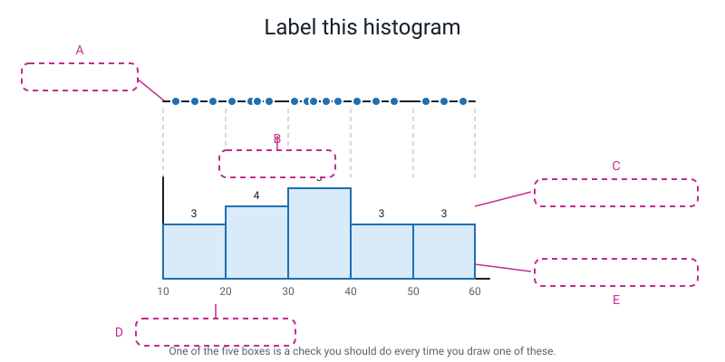
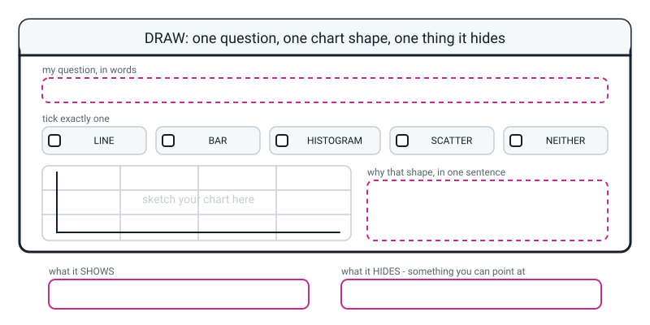

# Workbook — Week 26: Five Questions, Five Chart Shapes

**Name:** ________________________________  **Date:** ______________

[⬅ Week 25](week-25.md) · [📖 Read the chapter first](../student-guide/week-26.md) · [Course Home](../README.md) · [🧑‍🏫 Teacher guide](../teacher-guide/week-26.md) · [Next ➡](week-27.md)

---

## ✅ Warm-Up (5 min)

This warm-up brings back last week's ideas before the new work starts. Answer each question in a line or two.

These are five quick questions about **last week**.

**W1.** `fig, ax = plt.subplots(figsize=(6, 4))`. Which of the two names would you call `savefig` on, and why?

________________________________________________________________

**W2.** Your program ran, printed nothing unusual, and no picture appeared anywhere. What is the **first** thing you check — and where do you look?

________________________________________________________________

**W3.** Rewrite this title so it states a finding: **"Screen time chart"**.

________________________________________________________________

**W4.** `ax.set_ylabel("Score")`. Name what is missing, and write the repaired label.

________________________________________________________________

**W5.** Why does `marker="o"` matter, in one sentence that mentions **trust**?

________________________________________________________________

---

## 🔎 Predict the Output

This page is for making a prediction first and comparing it with the real result second. Each task shows a short piece of code and gives you space to write.

**Write your prediction before you run anything.** Snippets that use `df` start with `from students import build_students` and `df = build_students()`.

### P1 — what does `value_counts()` hand back?

Read this code, then write your four predictions below it.

```python
counts = df["club"].value_counts()
print(counts)
print(counts["chess"])
print(counts.index[0])
print(len(counts))
```

**I predict — four things. Write them all:**

________________________________________________________________

________________________________________________________________

**It really printed:**

________________________________________________________________

________________________________________________________________

**Why is `counts.index[0]` the *biggest* club and not the first one alphabetically?**

________________________________________________________________

### P2 — do the bins add up?

Read this code, then predict what it prints.

```python
scores = [50, 51, 52, 53, 54, 60, 61, 62, 70, 71]
fig, ax = plt.subplots(figsize=(6, 4))
counts, edges, bars = ax.hist(scores, bins=4, edgecolor="white")
print("counts:", counts)
print("sum   :", counts.sum())
print("edges :", edges)
```

**I predict — four bin counts. Write them:** ______ ______ ______ ______

**And their sum:** ______

**It really printed:**

________________________________________________________________

________________________________________________________________

**How many edges are there for four bins, and why is it not four?**

________________________________________________________________

**The value 71 is the highest. Which bin did it land in — and how do you know it was not left out?**

________________________________________________________________

### P3 — the brackets matter

Read this code, then predict what it prints.

```python
clubs = pd.Series(["art", "chess", "chess"])
print(clubs.value_counts)
```

**I predict — what does this print?**

________________________________________________________________

**It really printed:**

________________________________________________________________

________________________________________________________________

**Was this an error?** ____________  **What is the fix?** ____________

### P4 — the one with no error

Read this code, then predict what it prints. After you run it, open `oops.png`.

```python
fig, ax = plt.subplots(figsize=(6, 4))
bars = ax.bar(df["club"], df["score"])
print("rectangles drawn:", len(bars))
print("clubs in the table:", df["club"].nunique())
fig.savefig("oops.png", dpi=120, bbox_inches="tight")
print("saved oops.png")
```

**I predict — how many rectangles, and does it crash?**

________________________________________________________________

**It really printed:**

________________________________________________________________

________________________________________________________________

**Open `oops.png`. Now describe the chart out loud, in one sentence:**

________________________________________________________________

**Could you?** ____________  **What does that tell you?**

________________________________________________________________

**How many of the four predictions did you get right?** ______ / 4

**Which one surprised you most, and why?**

________________________________________________________________

---

## ✍️ Practice Set A — Read It

This set is for reading charts, code and tracebacks. Write your answers in the spaces and the tables.

**A1. Match the question to the shape.** Write LINE, BAR, HISTOGRAM, SCATTER or NEITHER — and then the reason, because the reason is what is being marked.

| # | The question | Shape | The reason (one sentence) |
|---|---|---|---|
| 1 | How did my homework time change day by day? | | |
| 2 | Which club has the most members? | | |
| 3 | How spread out are all 38 scores? | | |
| 4 | Do students who study more score higher? | | |
| 5 | What is the average score of all 38 students? | | |
| 6 | Which house has the highest average score? | | |
| 7 | Does age go with study hours? | | |
| 8 | Is the chess club better than the art club? | | |

**A1(a).** Two of the eight are NEITHER, **for two completely different reasons.** Write both reasons out.

________________________________________________________________

________________________________________________________________

**A1(b).** Cards 2 and 6 are both BAR. What is different **underneath**?

________________________________________________________________

________________________________________________________________

**A1(c).** Card 1 is a LINE. What would have to change about the data for it to become a BAR?

________________________________________________________________

**A2. Bar or histogram?** Somebody shows you a chart of rectangles with **all the labels covered up**. Tick what each clue tells you.

| # | The clue | Bar chart | Histogram | Cannot tell |
|---|---|---|---|---|
| a | The rectangles have gaps between them | ☐ | ☐ | ☐ |
| b | The rectangles are touching | ☐ | ☐ | ☐ |
| c | There are exactly three rectangles | ☐ | ☐ | ☐ |
| d | The numbers on the x axis sit at the rectangle **edges** | ☐ | ☐ | ☐ |
| e | The labels on the x axis are words | ☐ | ☐ | ☐ |
| f | Swapping two rectangles round would still make sense | ☐ | ☐ | ☐ |
| g | The rectangles get taller then shorter | ☐ | ☐ | ☐ |

**A2(h).** Which single clue is the most reliable, and why?

________________________________________________________________

**A3. Read a histogram out loud.** Here are the real bin counts and edges for the 38 student scores:

```text
counts: [3. 4. 4. 5. 6. 5. 6. 5.]
edges : [42.   48.88 55.75 62.62 69.5  76.38 83.25 90.12 97.  ]
```

**How many values altogether?** ______  **How do you know?** ______________

**Centre — where is the bulk?**

________________________________________________________________

**Spread — narrow or wide? Give the range.**

________________________________________________________________

**Shape — one hump, two humps, a tail, or a gap?**

________________________________________________________________

**A3(i).** The edges are 48.88, 55.75, 62.62… Who chose those numbers, and why are they so ugly?

________________________________________________________________

**A3(j).** `bins=range(40, 101, 10)` gives counts `[3. 6. 7. 8. 8. 6.]`. Add them up: ______. Which version would you put in front of somebody else, and why?

________________________________________________________________

**A4. Spot the bug.** Each line is wrong or dangerous. Write the fix.

| # | The line | The fix |
|---|---|---|
| a | `ax.bar(counts.index, counts.value)` | |
| b | `ax.bar(club_counts)` | |
| c | `ax.bar(df["club"], df["score"])` | |
| d | `ax.hist(df["club"], bins=8)` | |
| e | `ax.scatter(df["hours"])` | |
| f | `ax.plot(df["hours"], df["score"], marker="o")` — you wanted a scatter | |
| g | `print(df["club"].value_counts)` | |
| h | `counts = df.value_counts()` — you wanted club counts | |

**A4(i).** Five of those eight produce **no error at all.** Which five?

________________________________________________________________

**A4(j).** So what is the first question you ask when a chart looks wrong and nothing errored?

________________________________________________________________

**A5. Label the diagram.** Write one short phrase in each of the five dashed boxes.


*Figure W26.1 — Everything a histogram is made of.*

The five phrases, in the wrong order: **one bin — one range of values · the 18 raw values, one dot each · the bin's count becomes the bar's height · a bin edge, where one range stops and the next starts · the counts must add up to 18**

**A** ______________________  **B** ______________________

**C** ______________________  **D** ______________________

**E** ______________________

**A5(f).** One of the five boxes is a **check** rather than a part of the diagram. Which, and when do you do it?

________________________________________________________________

**A6. Read the traceback.** Translate it, then fix it.

Here is the traceback to read.

```text
Traceback (most recent call last):
  File "week26_counts.py", line 10, in <module>
    print("values:", list(club_counts.value))
  File ".../pandas/core/generic.py", line 5902, in __getattr__
    return object.__getattribute__(self, name)
AttributeError: 'Series' object has no attribute 'value'. Did you mean: 'values'?
```

**Which line do you read first?** ______________________

**What is a `'Series'` here — a whole table, or one column?**

________________________________________________________________

**Is Python's suggestion right this time?** ____________

**Write the rule that stops you making this mistake, in one line:**

________________________________________________________________

**One more.** The traceback has a line in the middle mentioning a file inside pandas. Should you go and read that file?

________________________________________________________________

---

## ✍️ Practice Set B — Write It

This set is for writing your own code. Each task shows the output your program should print.

### B1 — one line

You have `df` loaded. Write the **single line** that prints how many rows are in each `house`.

Type your line in this box.

```python
# your line here:
```

**Expected output:**

```text
Blue     14
Red      12
Green    12
Name: house, dtype: int64
```

**Done looks like:** one line, and the three numbers add up to 38.

### B2 — a bar chart of counts

Write a complete program that counts the rows in each `club` and draws a fully labelled, saved bar chart of the counts. Print the counts **and their total** before drawing anything.

**Expected output:**

```text
chess    14
music    12
art      12
Name: club, dtype: int64
total: 38
saved my_club_counts.png
```

**Done looks like:** three rectangles for three clubs, the total printed and checked, and a title that names which club won *and by how much*.

### B3 — a histogram with round edges

Draw a histogram of the 38 `score` values using **your own bin edges** — 40 to 100 in steps of 10 — and print the counts, the edges and the sum.

**Expected output:**

```text
counts: [3. 6. 7. 8. 8. 6.]
sum   : 38.0
edges : [ 40.  50.  60.  70.  80.  90. 100.]
```

**Done looks like:** the sum is 38, the edges are round numbers, and your title describes the **shape**, not the data.

> **💡 Try this:** `bins=range(40, 101, 10)`. Week 7's `range(start, stop, step)`, doing a completely new job.

### B4 — a scatter, described in three parts

Draw a scatter of `hours` against `score`, fully labelled and saved. Then **print three comment lines** into your file saying the direction, the tightness and any exception.

**Expected output:**

```text
rows: 38
saved my_scatter.png
```

**Done looks like:** no line joining the dots, and three written sentences using **"tended to"** and never **"caused"**.

### B5 — four charts, one program, about 30 lines

Write one program that produces all four homework charts: a bar of club counts, a bar of house means, a histogram of study hours, and a scatter of age against hours. Print a summary line for each.

**Expected output:**

```text
1 counts: {'chess': 14, 'music': 12, 'art': 12}
2 house means: {'Blue': 74.36, 'Red': 74.25, 'Green': 67.42}
3 hour counts: [5. 8. 8. 8. 6. 3.] edges: [0.5  1.42 2.33 3.25 4.17 5.08 6.  ]
4 mean hours by age:
     count  mean
age
12      10  4.30
13      18  2.97
14      10  1.95
saved four PNGs
```

**Done looks like:** four PNG files with four **different** names, four titles that each state a finding, and the two bar charts labelled so a reader can tell **counts** from **averages**.

---

## 🐞 Fix the Broken Program

This page is for finding and fixing bugs one at a time, reading each message Python gives you. Here is `clubroom.py`, which is supposed to draw a bar chart of club sizes and a histogram of the scores. It has **three** bugs. One stops Python reading the file at all, one stops it partway through, and one produces **no error whatsoever**.

Save this program as `clubroom.py`.

```python
# clubroom.py - which club is biggest, and how are the scores spread? Three bugs.
import matplotlib.pyplot as plt
from students import build_students

df = build_students()

counts = df["club"].value_counts()
print(counts)

fig, ax = plt.subplots(figsize=(6, 4)
ax.bar(counts.index, counts.value)
ax.set_title("Chess is the biggest club: 14 of 38 students")
ax.set_xlabel("Club")
ax.set_ylabel("Number of students (count)")
fig.savefig("clubs.png", dpi=120, bbox_inches="tight")
print("saved clubs.png")

fig, ax = plt.subplots(figsize=(6, 4))
spread, edges, bars = ax.hist(df["house"], bins=8, edgecolor="white")
print("counts:", spread)
print("edges :", edges)
ax.set_title("Scores run from 42 to 97 with no single peak")
ax.set_xlabel("Score (points out of 100)")
ax.set_ylabel("Number of students (count)")
fig.savefig("spread.png", dpi=120, bbox_inches="tight")
print("saved spread.png")
```

**Bug 1.** Run it as it is. The real message:

```text
  File "clubroom.py", line 10
    fig, ax = plt.subplots(figsize=(6, 4)
                          ^
SyntaxError: '(' was never closed
```

**Python points at line 10. Is the mistake on line 10?**

________________________________________________________________

**Did any of the program run? How can you tell in one second?**

________________________________________________________________

**The fix — write exactly what you add and where:**

________________________________________________________________

**Bug 2.** Fix bug 1 and run again. The real message ends:

```text
Name: club, dtype: int64
Traceback (most recent call last):
  File "clubroom.py", line 11, in <module>
    ax.bar(counts.index, counts.value)
AttributeError: 'Series' object has no attribute 'value'. Did you mean: 'values'?
```

**The counts printed before the crash. What does that prove about them?**

________________________________________________________________

**The fix:**

________________________________________________________________

**Bug 3.** Fix bug 2 and run again. Now there is **no error at all**:

```text
chess    14
music    12
art      12
Name: club, dtype: int64
saved clubs.png
counts: [12.  0.  0.  0. 14.  0.  0. 12.]
edges : [0.   0.25 0.5  0.75 1.   1.25 1.5  1.75 2.  ]
saved spread.png
```

**Look at the edges. What is 0.75 of a house?**

________________________________________________________________

**Do the counts add up to 38?** ____________  **So are they even wrong?** ____________

**So what IS wrong, and which line of the program caused it?**

________________________________________________________________

________________________________________________________________

**The title claims "Scores run from 42 to 97". Is anything on that chart a score?**

________________________________________________________________

**The fix, and the real output after it:**

________________________________________________________________

________________________________________________________________

**And the check that catches this whole family of bug:**

________________________________________________________________

**Bonus, and it is a good one.** The counts came out `12, 14, 12` — but the houses are Blue 14, Green 12, Red 12. **So matplotlib did not put them in alphabetical order. What order did it use?**

________________________________________________________________

---

## 🧩 Puzzle of the Week

These two puzzles are about histogram bins. The first gives you only counts and edges; the second changes the bin edges.

### Part 1 — Bin detective

Somebody hands you these bin counts and edges, and nothing else. The raw values are gone. Here are the counts and edges.

```text
counts: [3. 4. 5. 3. 3.]
edges : [10. 20. 30. 40. 50. 60.]
```

**(a)** How many values were there altogether? ______

**(b)** How wide is each bin? ______  **How many bins?** ______

**(c)** How many values were **between 20 and 40**? ______  Show how you got it.

________________________________________________________________

**(d)** Could there have been a value of exactly **55**? ______ Why?

________________________________________________________________

**(e)** Could there have been a value of exactly **7**? ______ Why?

________________________________________________________________

**(f)** What was the **smallest** value in the data? Be careful — write down what you can and cannot know.

________________________________________________________________

________________________________________________________________

**(g)** Which bin holds the most, and what is the **shape** of this distribution in three words?

________________________________________________________________

**(h)** Here is the hard one. Somebody claims the **mean** of these values is **31**. Can you check that from the histogram alone? Explain.

________________________________________________________________

________________________________________________________________

### Part 2 — Wreck the histogram on purpose

The 38 scores run from 42 to 97. Your bins are `range(40, 91, 10)` — edges 40, 50, 60, 70, 80, 90.

**(i)** Which students get silently thrown away? ______________________

**(j)** Predict the five bin counts and their sum.

Counts: ______ ______ ______ ______ ______   Sum: ______

**(k)** Run it. The real counts are `[3. 6. 7. 8. 9.]`, summing to **33**.

**Five students vanished and nothing warned you. How could you ever have noticed?**

________________________________________________________________

**(l)** Compare with `range(40, 101, 10)`, which gives `[3. 6. 7. 8. 8. 6.]`. The **fifth** bin changed from 8 to 9. Explain why, in one sentence.

________________________________________________________________

________________________________________________________________

---

## 🤔 Think Deeper

These two questions ask for a paragraph each. Write in full sentences on the lines below each question.

**T1.** The mean of the 20 quiz marks was 62.0. The median was 62.5. **Both** were misleading, and neither number was wrong.

Write a paragraph. Explain exactly *why the median failed*, given that the median is supposed to be the robust one. Be precise about what the median is robust *to* and what it is defenceless *against*. Then argue about the practical rule: some people say "always quote the median"; some say "always quote both, and if they differ that difference is the finding"; some say "it depends on the decision — if you are buying food for a party you want the mean, because the total is what matters." Pick one and say honestly what it costs. Finish with the procedure everybody actually agrees on, in one sentence.

________________________________________________________________

________________________________________________________________

________________________________________________________________

________________________________________________________________

________________________________________________________________

________________________________________________________________

**T2.** A histogram of the 38 scores throws away five of the six columns in the table. A bar chart of house means throws away every individual score. A scatter of hours against score hides fifteen students underneath other students.

Write a paragraph. Argue that **hiding things is what makes a chart readable**, and then draw the line: what is the difference between a chart that is *clear* and a chart that is *misleading*, given that the code is identical? Use one of the four charts as your example and describe a specific decision that the hidden thing would have changed. Then the hardest part: **if every chart hides something, and the code cannot tell you which hiding matters, whose job is it?** And what could you write next to a chart that would do that job?

________________________________________________________________

________________________________________________________________

________________________________________________________________

________________________________________________________________

________________________________________________________________

________________________________________________________________

---

## 🛠️ Build It — Four Charts, Four Shapes, Four Things They Hide

**This is the main assignment.** Four charts from your cleaned Week 24 table, and four sentences naming what each one hides.

### Part 1 — Decide before you type

| Chart | The question it answers | Shape | Which columns |
|---|---|---|---|
| 1 | Which club has the most members? | | |
| 2 | Which house has the highest average score? | | |
| 3 | How are the study hours spread out? | | |
| 4 | Does age go with study hours? | | |

- [ ] Four shapes written down **before** any code was typed
- [ ] I can say why chart 1 and chart 2 are the same shape but need different arithmetic
- [ ] I have said out loud which of the four needs only **one** column

**Which chart needs only one column, and why?**

________________________________________________________________

### Part 2 — Build them

- [ ] Chart 1: bar of `value_counts()` — and the counts add up to my row count
- [ ] Chart 2: bar of `groupby(...).mean()` — and the y label says **Mean**
- [ ] Chart 3: histogram — and the bin counts add up to my row count
- [ ] Chart 4: scatter — and there is **no line**
- [ ] All four fully labelled with units, all four saved, **four different filenames**
- [ ] All four opened and looked at

| Chart | Filename | Title states a finding? | Check that passed |
|---|---|---|---|
| 1 | | | counts total = ______ |
| 2 | | | row counts printed too? ______ |
| 3 | | | bins total = ______ |
| 4 | | | dots I can count = ______ |

**Chart 4: your table has ______ rows, and you can count ______ dots. Explain the difference.**

________________________________________________________________

________________________________________________________________

### Part 3 — Describe chart 3 in three parts

**Centre:** ________________________________________________________

**Spread:** ________________________________________________________

**Shape:** ________________________________________________________

**Is the mean of that column safe to quote? Why?**

________________________________________________________________

### Part 4 — Describe chart 4 in three parts

**Direction:** ______________________________________________________

**Tightness:** ______________________________________________________

**Exceptions:** _____________________________________________________

**Now read your sentences back. Circle any word that means "caused". How many did you find?** ______

### Part 5 — Four things they hide

**This is the bit being marked.** Not "some information". Something a reader could point at.

**Chart 1 hides:**

________________________________________________________________

**Chart 2 hides:**

________________________________________________________________

**Chart 3 hides:**

________________________________________________________________

**Chart 4 hides:**

________________________________________________________________

**Which of the four hides the most by design, and which hides the most by accident?**

________________________________________________________________

**Which is more dangerous, and why?**

________________________________________________________________

### Part 6 — The Bug Log

| What happened | Was there an error message? | What fixed it | What I will check next time |
|---|---|---|---|
| | | | |
| | | | |

---

## 🎨 Draw It

Take **one question of your own**, decide its shape, sketch the chart by hand, and name one thing it hides.


*Figure W26.2 — Your page.*

> **What a good answer might look like:** the question written into the top strip is **"How long do the songs in my playlist last?"**
>
> The **HISTOGRAM** box is ticked, and the reason box says: *"It is one column of numbers — the lengths — and I am asking about the shape of the whole pile, not about categories. There is nothing to compare and no second number per song."*
>
> Inside the sketch area: **six touching rectangles**, no gaps, with the x axis numbered at the **edges** — 2, 3, 4, 5, 6, 7, 8 minutes — and the counts written above each bar: 2, 9, 11, 5, 2, 1. Underneath, a small note: *2 + 9 + 11 + 5 + 2 + 1 = 30, and I have 30 songs. ✓*
>
> The **what it SHOWS** box: *"Most songs are 3 to 5 minutes, and there is one very long one at nearly 8 minutes."*
>
> The **what it HIDES** box: *"Which songs. The one 8-minute bar could be my favourite or one I always skip, and the histogram cannot say. It also hides the artist, so I cannot tell whether the long songs are all by one band."*
>
> And one extra annotation that shows real understanding: an arrow to the touching bars labelled *touching, because 3-to-4 minutes really does touch 4-to-5 — if I drew gaps here it would be a lie about the number line.*
>
> **What a weak answer looks like:** a histogram sketched with **gaps** between the bars, or with **artist names** along the x axis. Either one means the bar-versus-histogram distinction has not landed — and the second one is worse, because that is the chart matplotlib will draw for you without complaining.

---

## 📊 Self-Check

This section is for checking how sure you feel about this week. Tick one box on each row, then answer the true-or-false rows.

| I can… | 😀 got it | 🙂 nearly | 😕 not yet |
|---|---|---|---|
| Pick a chart shape from a question, and say why | ☐ | ☐ | ☐ |
| Say when the honest answer is **no chart** | ☐ | ☐ | ☐ |
| Draw a bar chart of `value_counts()` | ☐ | ☐ | ☐ |
| Tell a bar chart from a histogram with the labels covered | ☐ | ☐ | ☐ |
| Draw a histogram and check that the bins add up | ☐ | ☐ | ☐ |
| Read a histogram as centre, spread, shape | ☐ | ☐ | ☐ |
| Draw a scatter and describe it as direction, tightness, exceptions | ☐ | ☐ | ☐ |
| Explain why the mean of 62 was misleading | ☐ | ☐ | ☐ |
| Name something specific that a chart hides | ☐ | ☐ | ☐ |

**True or false?** Circle one on each row.

| Statement | | |
|---|---|---|
| A histogram needs two columns of data | TRUE | FALSE |
| Histogram bars touch; bar-chart bars have gaps | TRUE | FALSE |
| You can reorder the bars of a histogram | TRUE | FALSE |
| `ax.hist(df["club"], bins=8)` raises an error | TRUE | FALSE |
| `counts.index` has an s on the end | TRUE | FALSE |
| `ax.bar(df["club"], df["score"])` gives one bar per club | TRUE | FALSE |
| A scatter plot should have a line joining the dots | TRUE | FALSE |
| A histogram's bin counts must add up to the number of values | TRUE | FALSE |
| If the mean and median agree, the mean is safe to quote | TRUE | FALSE |
| A distribution with two humps usually means two groups mixed together | TRUE | FALSE |
| "Which club is best?" can be answered with one bar chart | TRUE | FALSE |
| Every chart hides something | TRUE | FALSE |

One thing I'd like explained again:

________________________________________________________________

---

## ✅ Answers

This section is for checking your work after you have tried every page. Open the box to see the answers.

<details>
<summary>Check your answers</summary>

### Warm-Up

**W1.** **`fig`.** You save the whole sheet of paper, not one drawing on it. `ax.savefig(...)` does not exist.

**W2.** Whether there is a `fig.savefig(...)` line at all — and then **look in the folder**, not at the terminal. `ls` on macOS or Linux, `dir` on Windows. The absence of the file is the diagnosis. Nothing was broken; the program was obedient.

**W3.** Anything that states a finding, for example: **"Screen time trebled on Saturday, then dropped back."** The test: could your title sit unchanged on *any* chart of that data? If yes, it is a filename.

**W4.** The **units** — or more precisely, the scale. `"Score"` could be out of 10, out of 100, or a percentage. Repaired: **`"Score (points out of 100)"`**.

**W5.** Because a line drawn through 4 points and a line drawn through 400 points can be pixel-for-pixel identical, and **those two charts deserve very different amounts of trust** — so without the dots the reader cannot tell how much to give.

---

### Predict the Output

**P1** — real output:

```text
chess    14
music    12
art      12
Name: club, dtype: int64
14
chess
3
```

`counts["chess"]` looks the club up by name and gets **14**. `counts.index[0]` is the **first name in the result**, and `len(counts)` is how many different clubs there are — **3**, not 38.

**Why is slot 0 the biggest club?** Because **`value_counts()` sorts biggest-first, automatically, without being asked.** It is not alphabetical. That is convenient for a bar chart — the tallest bar lands on the left — and it is worth knowing, because if you want alphabetical you have to ask: `.sort_index()`.

**P2** — real output:

```text
counts: [5. 1. 2. 2.]
sum   : 10.0
edges : [50.   55.25 60.5  65.75 71.  ]
```

**Five edges for four bins**, because bins are the *gaps between* the edges. Four fence panels need five posts. That is why `edges` is always one longer than `counts`, and it catches everybody once.

**Where did 71 go?** Into the **last** bin, 65.75 to 71. And you know it was not left out because **the counts sum to 10** and there were 10 values. matplotlib always includes the very highest value in the last bin — otherwise the biggest number in every dataset would silently fall off the end.

**P3** — real output:

```text
<bound method IndexOpsMixin.value_counts of 0      art
1    chess
2    chess
dtype: object>
```

**No, this is not an error.** It printed successfully. What it printed is a description of the **method itself** — "a thing you could call" — rather than the result of calling it. That is why it starts `<bound method` and ends with a `>`.

**The fix: add the brackets.** `clubs.value_counts()`. **Brackets mean "do it".** Without them you are pointing at the tool instead of using it.

*(Where you have seen this before: `runs.shape` in Week 17 needed **no** brackets, because a shape is something the array *is*. `value_counts()` needs them, because counting is something a column *does*. The question that sorts it: is this a fact about the thing, or a job it performs?)*

**P4** — real output:

```text
rectangles drawn: 38
clubs in the table: 3
saved oops.png
```

**No crash.** Thirty-eight rectangles for three clubs, all of them crammed into three columns, saved happily as a PNG.

**Could you describe it in one sentence?** No — and that is the whole point. *"It's a chart of, um, all the scores, but stacked up in three places"* is not a description; it is an admission. **When nothing errors, the diagnosis is your own inability to say what the chart shows.**

---

### Practice Set A

**A1.**

| # | Shape | The reason |
|---|---|---|
| 1 | **LINE** | Time on the bottom, in order, and the space between two days is real. |
| 2 | **BAR** | Three named categories; the eye compares heights. Heights come from `value_counts()`. |
| 3 | **HISTOGRAM** | One column of numbers, no categories, asking about the shape of the pile. |
| 4 | **SCATTER** | Two number columns, asking whether they move together. One dot per student. |
| 5 | **NEITHER** | The answer is one number, 72.1. Print it. A single bar has nothing beside it to compare to. |
| 6 | **BAR** | Three named categories again — but the heights are **averages**, so `groupby("house")["score"].mean()` first, not `value_counts()`. |
| 7 | **SCATTER** | Two number columns again. (The tilt turns out to go *down*, which is a surprise worth having.) |
| 8 | **NEITHER** | "Better" is not defined. Highest average? Highest lowest mark? Most members? Most consistent? Four questions, four different winners. |

**A1(a).** Card 5 is a **perfectly good, perfectly measurable question whose answer happens to be one number** — a chart would add nothing to "72.1". Card 8 is **not measurable at all** until somebody says what "better" means; the problem is not the chart, it is the question. **One needs a `print`. The other needs a conversation.**

**A1(b).** Card 2's heights are **counts** — how many rows are in each club — from `value_counts()`. Card 6's heights are **averages** — the mean score inside each house — from `groupby`. Identical picture, completely different arithmetic, and **a reader cannot tell which they are looking at unless your y-axis label says so.** That is why it reads `Mean score (points out of 100)` and not just `Score`.

**A1(c).** The x axis would have to stop being **ordered**. "Homework minutes per **subject**" — maths, English, science — is the same kind of number on the same kind of chart, but subjects have no order and no in-between, so it becomes a bar chart. **The y axis has not changed at all; the x axis decided the shape.**

**A2.**

| # | The clue | Answer |
|---|---|---|
| a | gaps between the rectangles | **bar chart** |
| b | rectangles touching | **histogram** |
| c | exactly three rectangles | **cannot tell** — a histogram with `bins=3` is perfectly legal |
| d | x numbers sit at the **edges** | **histogram** — a bar chart labels the middle of each bar |
| e | x labels are words | **bar chart** |
| f | swapping two would still make sense | **bar chart** — reordering a histogram is reordering a ruler |
| g | rectangles get taller then shorter | **cannot tell** — plenty of bar charts do that too |

**A2(h).** **(a)/(b) — whether the bars touch.** It works with every label covered, it works in a photocopy, and it works in a newspaper photo. (d) and (f) are just as *logical* but need you to be able to read the axis or think about the meaning; the gaps are visible in a quarter of a second.

**A3.**

**How many values?** **38.** Because the eight counts add up to 38: 3+4+4+5+6+5+6+5 = 38. **That is the free check, and it is how you know nothing fell off the end.**

**Centre:** the bulk sits between about 60 and 90 — the four middle bins hold 5, 6, 5 and 6 students, which is 22 of the 38.

**Spread:** **very wide** — 42 all the way to 97, a range of 55 points out of 100.

**Shape:** **one broad, flat pile.** No single peak (the tallest bins are only 6), no isolated bars off on their own, and **no gap.** Which is exactly why mean 72.1 and median 72.5 are 0.4 apart and both trustworthy.

**A3(i).** **matplotlib chose them**, and it chose them by taking the lowest value (42) and the highest (97) and dividing the 55-point gap into eight equal slices of 6.875 each. It did not care whether the answers were round numbers, because nothing in the arithmetic asked it to.

**A3(j).** 3 + 6 + 7 + 8 + 8 + 6 = **38.** ✓

**Which version for somebody else?** The round one. Not because it is more accurate — both are exactly correct — but because **you can describe it out loud**: "three students in the forties, six in the fifties, seven in the sixties…" Try saying the ugly one out loud and you will stop halfway through. *(A defensible opposite answer: the automatic bins use the full range with no wasted space at either end. Accept it if the reason is argued.)*

**A4.**

| # | The line | The fix |
|---|---|---|
| a | `counts.value` | `counts.values` — **with an s** |
| b | `ax.bar(club_counts)` | `ax.bar(club_counts.index, club_counts.values)` — bars need where *and* how tall |
| c | `ax.bar(df["club"], df["score"])` | Summarise first. `value_counts()` or `groupby(...).mean()` |
| d | `ax.hist(df["club"], bins=8)` | A histogram needs **numbers**. Bar-chart the text column instead |
| e | `ax.scatter(df["hours"])` | `ax.scatter(df["hours"], df["score"])` — a dot needs two coordinates |
| f | `ax.plot(x, y, marker="o")` | `ax.scatter(x, y)` — there is no order to join |
| g | `print(df["club"].value_counts)` | Add the brackets: `value_counts()` |
| h | `df.value_counts()` | `df["club"].value_counts()` — pick the column **first** |

**A4(i).** **c, d, f, g and h.** Every one of them runs, produces something, and raises no error.

- **c** gives 38 bars in three columns.
- **d** turns three words into 0, 1, 2 and bins those.
- **f** joins 38 dots into a scribble.
- **g** prints an odd-looking `<bound method ...>` line, the method itself instead of its result.
- **h** prints 38 lines with every count equal to 1.

*(a, b and e are the three that raise a real error.)*

**A4(j).** **"Describe my chart to me, out loud, in one sentence."** If you cannot, that is the bug report. It works on all five of the silent ones and it needs no tools at all.

**A5.**

| Box | Phrase |
|---|---|
| **A** | the 18 raw values, one dot each |
| **B** | one bin — one range of values |
| **C** | the bin's count becomes the bar's height |
| **D** | a bin edge, where one range stops and the next starts |
| **E** | the counts must add up to 18 |

**A5(f).** **E** is a check, not a part. And you do it **every single time you draw a histogram**, immediately, before you look at the shape — because if the counts do not add up, the shape you are about to read is a shape of the wrong data.

**A6.**

- **Which line first?** The **last** one, as always. The middle lines are just the route Python took through pandas' own code to get there.
- **A `'Series'`** is **one column** — or, here, the little result that `value_counts()` handed back. A whole table is a `DataFrame`.
- **Is the suggestion right?** **Yes.** `values` is exactly what you meant.
- **The rule:** **`index` has no s; `values` has an s.** There is no reason for it. Write it in your Bug Log.
- **Should you read the pandas file?** **No.** That line is telling you *where inside somebody else's library* the error surfaced, and there is nothing wrong in there. **The only line in a traceback that is about your program is the one naming your own filename.** Find that line, and read the last line for what went wrong.

---

### Practice Set B

**B1.** One way to write it:

```python
print(df["house"].value_counts())
```

```text
Blue     14
Red      12
Green    12
Name: house, dtype: int64
```

14 + 12 + 12 = 38. ✓

**B2.** One way to write it:

```python
"""b2.py - a bar chart of club counts, checked before it is drawn."""

import matplotlib.pyplot as plt
from students import build_students

df = build_students()

counts = df["club"].value_counts()       # count the rows for each club
print(counts)                            # LOOK at it before drawing
print("total:", counts.sum())            # must equal len(df)

fig, ax = plt.subplots(figsize=(6, 4))
ax.bar(counts.index, counts.values)      # names, then heights

ax.set_title("Chess is the biggest club: 14 of 38, two ahead of the others")
ax.set_xlabel("Club")
ax.set_ylabel("Number of students (count)")

fig.savefig("my_club_counts.png", dpi=120, bbox_inches="tight")
print("saved my_club_counts.png")
```

Real output:

```text
chess    14
music    12
art      12
Name: club, dtype: int64
total: 38
saved my_club_counts.png
```

**Note the title says "two ahead of the others".** That is the honest version of "chess wins" — the gap is two students, which is small, and saying so stops the chart overclaiming on your behalf.

**B3.** One way to write it:

```python
"""b3.py - a histogram with round bin edges I chose myself."""

import matplotlib.pyplot as plt
from students import build_students

df = build_students()

fig, ax = plt.subplots(figsize=(6, 4))
counts, edges, bars = ax.hist(df["score"], bins=range(40, 101, 10),
                              edgecolor="white")

print("counts:", counts)
print("sum   :", counts.sum())           # the free check
print("edges :", edges)

ax.set_title("Scores form one broad flat pile from 40 to 100")
ax.set_xlabel("Score (points out of 100)")
ax.set_ylabel("Number of students (count)")

fig.savefig("my_score_hist.png", dpi=120, bbox_inches="tight")
print("saved my_score_hist.png")
```

Real output:

```text
counts: [3. 6. 7. 8. 8. 6.]
sum   : 38.0
edges : [ 40.  50.  60.  70.  80.  90. 100.]
saved my_score_hist.png
```

**`range(40, 101, 10)`** — start at 40, stop *before* 101, step 10. The `101` rather than `100` is Week 7's off-by-one, and it matters: `range(40, 100, 10)` would stop at 90 and throw away everybody in the nineties.

**Now say the shape out loud:** three in the forties, six in the fifties, seven in the sixties, eight in the seventies, eight in the eighties, six in the nineties. **One broad flat pile.** You can only say that sentence because the edges are round.

**B4.** One way to write it:

```python
"""b4.py - a scatter of hours against score, and three honest sentences."""

import matplotlib.pyplot as plt
from students import build_students

df = build_students()
print("rows:", len(df))                  # one dot per row

fig, ax = plt.subplots(figsize=(6, 4))
ax.scatter(df["hours"], df["score"])     # NO line

ax.set_title("Students who studied more hours tended to score higher")
ax.set_xlabel("Study hours per week")
ax.set_ylabel("Score (points out of 100)")

fig.savefig("my_scatter.png", dpi=120, bbox_inches="tight")
print("saved my_scatter.png")

# DIRECTION : up to the right - more hours tended to go with higher scores.
# TIGHTNESS : a fairly tight band, not a blob. Most dots sit close to a rising line.
# EXCEPTION : one dot at about 1.5 hours and 78 sits well above everything near it.
```

Real output:

```text
rows: 38
saved my_scatter.png
```

**Check the exception yourself.** Three students studied exactly 1.5 hours, and they scored **78, 57 and 54**. A 24-mark spread at the identical x value. That is the most interesting fact on the chart, and the chart cannot tell you why.

**And check the verbs.** "Tended to go with", "tended to score higher". Not one word meaning "caused". *(Next week is entirely about why.)*

**B5.** One way to write it:

```python
# week26_homework.py -- four charts, four shapes, from the cleaned Week 24 table.
import matplotlib.pyplot as plt
from students import build_students

df = build_students()

# --- 1. BAR: how many students in each club? -------------------------------
counts = df["club"].value_counts()
print("1 counts:", dict(counts))
fig, ax = plt.subplots(figsize=(6, 4))
ax.bar(counts.index, counts.values)
ax.set_title("Chess is the biggest club with 14 of 38 students")
ax.set_xlabel("Club")
ax.set_ylabel("Number of students (count)")
fig.savefig("hw26_1_club_counts.png", dpi=120, bbox_inches="tight")

# --- 2. BAR: which house has the highest average score? --------------------
house_mean = df.groupby("house")["score"].mean().sort_values(ascending=False)
print("2 house means:", house_mean.round(2).to_dict())
fig, ax = plt.subplots(figsize=(6, 4))
ax.bar(house_mean.index, house_mean.values)
ax.set_title("Blue and Red are level; Green is 7 points behind")
ax.set_xlabel("House")
ax.set_ylabel("Mean score (points out of 100)")
fig.savefig("hw26_2_house_means.png", dpi=120, bbox_inches="tight")

# --- 3. HISTOGRAM: how are the study hours spread out? ---------------------
fig, ax = plt.subplots(figsize=(6, 4))
counts3, edges3, bars3 = ax.hist(df["hours"], bins=6, edgecolor="white")
print("3 hour counts:", counts3, "edges:", edges3.round(2))
ax.set_title("Most students study between 2 and 5 hours a week")
ax.set_xlabel("Study hours per week")
ax.set_ylabel("Number of students (count)")
fig.savefig("hw26_3_hours_hist.png", dpi=120, bbox_inches="tight")

# --- 4. SCATTER: does age go with study hours? -----------------------------
fig, ax = plt.subplots(figsize=(6, 4))
ax.scatter(df["age"], df["hours"])
ax.set_title("Older students in this table reported FEWER study hours")
ax.set_xlabel("Age (years)")
ax.set_ylabel("Study hours per week")
fig.savefig("hw26_4_age_vs_hours.png", dpi=120, bbox_inches="tight")

print("4 mean hours by age:")
print(df.groupby("age")["hours"].agg(["count", "mean"]).round(2))
print("saved four PNGs")
```

Real output:

```text
1 counts: {'chess': 14, 'music': 12, 'art': 12}
2 house means: {'Blue': 74.36, 'Red': 74.25, 'Green': 67.42}
3 hour counts: [5. 8. 8. 8. 6. 3.] edges: [0.5  1.42 2.33 3.25 4.17 5.08 6.  ]
4 mean hours by age:
     count  mean
age             
12      10  4.30
13      18  2.97
14      10  1.95
saved four PNGs
```

**Chart 3, read out loud:** hours run 0.5 to 6.0; the three middle bins are level at 8 students each; one broad pile with a thin tail off the high end. **5 + 8 + 8 + 8 + 6 + 3 = 38.** ✓

**Chart 4, the surprise.** The tilt goes **down** to the right, which nobody expects. The groupby confirms it: 12-year-olds average 4.30 hours, 13-year-olds 2.97, 14-year-olds 1.95.

**And the honest sentence is *"older students in this table reported fewer study hours"*** — not "getting older makes you study less". Ten fourteen-year-olds is not a generation, and there are half a dozen innocent explanations.

---

### Fix the Broken Program

**Bug 1 — the syntax error.**

**Is the mistake on line 10?** **Yes, this time it is** — and that is unusual, so it is worth noticing why. `SyntaxError: '(' was never closed` points at the **opening** bracket, which is the last place Python was certain about. Here the missing `)` is on the same line, so line 10 is both where it points and where the fix goes. *(In the Week 17 broken program the bracket was opened on one line and needed closing five lines later, and Python still pointed at the opening.)*

**Did any of it run?** **No.** There is no `Traceback`, and the `print(counts)` on line 8 produced nothing. **No traceback and no earlier output = Python never started your program.**

The fix — one more closing bracket:

```python
fig, ax = plt.subplots(figsize=(6, 4))
```

**Bug 2 — the runtime error.**

```text
chess    14
music    12
art      12
Name: club, dtype: int64
Traceback (most recent call last):
  File "clubroom.py", line 11, in <module>
    ax.bar(counts.index, counts.value)
AttributeError: 'Series' object has no attribute 'value'. Did you mean: 'values'?
```

**The counts printed before the crash**, which proves they are **fine** — chess 14, music 12, art 12, adding to 38. One whole worry eliminated before you even start debugging. That is what printing before drawing buys you.

The fix — add the s:

```python
ax.bar(counts.index, counts.values)
```

**Bug 3 — the silent one.**

```text
counts: [12.  0.  0.  0. 14.  0.  0. 12.]
edges : [0.   0.25 0.5  0.75 1.   1.25 1.5  1.75 2.  ]
```

**What is 0.75 of a house?** **Nothing.** Houses are Blue, Green and Red. There is no house three-quarters of the way from Red to Blue.

**Do the counts add up to 38?** **Yes** — 12 + 14 + 12 = 38. **So are they even wrong?** **No, the counts are correct.** That is what makes this bug so nasty: the numbers are right and the chart is nonsense.

**What is wrong** is line 19: `ax.hist(df["house"], bins=8)` asks for a histogram of a **text** column. matplotlib turned the three house names into 0, 1 and 2 and binned *those*, then chopped 0-to-2 into eight slices.

**Is anything on that chart a score?** **No.** The title says "Scores run from 42 to 97" and the x label says "Score (points out of 100)", and the chart is about houses, and the x axis runs from 0 to 2. **Three labels, all lying, and no error.**

The fix — histogram the column the labels actually describe:

```python
spread, edges, bars = ax.hist(df["score"], bins=8, edgecolor="white")
```

Real output after the fix:

```text
chess    14
music    12
art      12
Name: club, dtype: int64
saved clubs.png
counts: [3. 4. 4. 5. 6. 5. 6. 5.]
edges : [42.    48.875 55.75  62.625 69.5   76.375 83.25  90.125 97.   ]
saved spread.png
```

**The check that catches this family:** **print the counts and the edges, and read the edges.** If the edges are not numbers your column could plausibly contain, you have histogrammed the wrong column. Two seconds, before you even open the PNG.

**Bonus — what order did matplotlib use?** **The order the names first appear in the table.** Row 0 is Aarav Shah, house **Red**, so Red became 0. Row 2 is Chen Wu, house **Blue**, so Blue became 1. Row 4 is Emeka Obi, house **Green**, so Green became 2. Hence 12, 14, 12 — Red, Blue, Green.

**Not alphabetical, and not sorted by size.** Which is a third reason not to do this: even the ordering is an accident of how the rows happened to be typed.

---

### Puzzle of the Week

**Part 1 — Bin detective**

**(a)** 3 + 4 + 5 + 3 + 3 = **18 values.**

**(b)** Each bin is **10 wide**. There are **5 bins** (six edges, five gaps).

**(c)** **Nine.** The bin 20-to-30 holds 4 and the bin 30-to-40 holds 5, and 4 + 5 = 9.

**(d)** **Yes.** 55 falls in the last bin, 50-to-60, which holds 3 values. It could have been one of them.

**(e)** **No.** 7 is below the lowest edge, 10, so it would not have been counted at all — and if it had existed and been dropped, the counts would not add up to 18. *(This is the honest version of the answer: strictly, a value of 7 could have existed **and been silently thrown away**. But then somebody counted 18 values into the bins and had more than 18 to start with — so you can only say "no value of 7 is in this histogram".)*

**(f)** You **cannot** know the smallest value. You know it was **somewhere in the range 10 to 20**, because the first bin is not empty. It could be 10, it could be 19.9. **A histogram tells you how many, not which.** That is what it throws away, on purpose.

**(g)** The **middle** bin, 30-to-40, holds the most at 5. And the shape in three words: **one middling hump** — or more usefully, *"one hump, roughly symmetric"*: 3, 4, **5**, 3, 3.

**(h)** **No, you cannot check the mean from the histogram alone**, and this is the best question in the puzzle. The histogram tells you that 3 values are between 10 and 20 — but not whether they are 10, 10, 10 or 19, 19, 19. Those two possibilities give completely different means.

**What you *can* do is bracket it.** If every value sat at its bin's low edge, the total would be 3(10) + 4(20) + 5(30) + 3(40) + 3(50) = 30 + 80 + 150 + 120 + 150 = 530, so the mean would be 530 ÷ 18 = **29.4**. If every value sat at its bin's high edge, the total would be 3(20) + 4(30) + 5(40) + 3(50) + 3(60) = 60 + 120 + 200 + 150 + 180 = 710, and the mean would be 710 ÷ 18 = **39.4**.

**So the mean must be between 29.4 and 39.4, and 31 is possible.** You have not confirmed it; you have failed to rule it out. That is a genuinely useful distinction and it is worth knowing the difference.

*(The values that produced this histogram were `12, 15, 18, 21, 24, 25, 27, 31, 33, 34, 36, 38, 41, 44, 47, 52, 55, 58`, whose real mean is 33.9 — comfortably inside the bracket, and not 31.)*

**Part 2 — Wreck the histogram on purpose**

**(i)** Six students scored **90 or more**: Bela Roy (90), Farah Aziz (95), Rhea Bose (92), Tara Joshi (97), Anika Verma (93), Hana Sato (91). Bela's exactly 90 is **kept**, in the last bin (80-to-90), because matplotlib counts the highest edge's value in the last bin. The other **five students, all above 90, are dropped.**

**(j)/(k)** Real output:

```text
counts: [3. 6. 7. 8. 9.] sum 33.0
```

**Sum 33, not 38. Five students gone, and nothing said a word.**

**How could you have noticed?** **Only by printing `counts.sum()` and comparing it with `len(df)`.** There is no error, no warning, and the chart looks completely normal — five bars, a sensible shape, a plausible story. **The sum is the only witness.**

**(l)** Because with edges stopping at 90, the value **90 itself** now lands in the *last* bin (80-to-90) instead of the sixth bin (90-to-100). matplotlib always includes the top edge in the final bin, so Bela Roy's 90 moves from the nineties group into the eighties group: 8 becomes 9. The other five students in the nineties are above 90 and simply vanish.

**Two lessons in one:** the top edge behaves differently from all the others, **and** a bin range that does not cover your data silently deletes rows.

---

### Think Deeper

**T1.** Model answer:

> *The median is the **middle value by position** — line everybody up and pick the person in the middle. That makes it robust to **extreme values**: if one student scores 3 instead of 33, the ordering barely changes and the middle person does not move. That is the job the median is famous for.*
>
> *What it has no defence against is a **hole in the middle**, because the middle position is exactly where the hole is. With ten marks in the thirties and forties and ten in the eighties, the tenth and eleventh values are 44 and 81, and the median is forced to sit in the empty canyon between them. It is not fooled by an outlier; it is fooled by there being nobody in the middle to be the middle.*
>
> *Of the three rules, I would take **"quote both, and if they differ that difference is the finding"** — but I have to be honest that it would not have helped here at all, because 62.0 and 62.5 agreed almost perfectly. That is its cost: it catches skew and misses bimodality completely.*
>
> *Which is why everybody agrees on the procedure rather than the number: **look at the shape before you pick a summary.***

**Marking note:** full marks needs the phrase "robust to outliers, not to shape" or an equivalent, **and** the honest admission that the chosen rule has a cost.

**T2.** Model answer:

> *A chart is readable because it throws things away. The score histogram threw away name, age, house, club and hours — five of six columns — and that is exactly why you can read its shape in half a second. A chart that kept all six columns would be a table, and nobody reads tables in half a second.*
>
> *So the difference between clear and misleading cannot be **whether** it hides something. It has to be **what**. My example is the house-means bar chart: Blue 74.36, Red 74.25, Green 67.42. It hides how many students each average came from — Blue 14, Red 12, Green 12 — and it hides that Blue beats Red by 0.11 of a mark. If a school used that chart to hand a prize to Blue, the hidden thing would have changed the decision completely, because a gap of a tenth of a mark across a dozen students is nothing at all. The exact same code, used to show that Green is well behind the other two, hides nothing that matters.*
>
> *And the code cannot tell the difference, because the code does not know what anybody is about to do. So it is the person who made the chart, and the way to do the job is to **write the caption**: one sentence saying what it shows and one saying what it hides. Underneath that bar chart I would write "means from 14, 12 and 12 students; Blue's lead over Red is 0.11 of a mark and is not a real difference." Then nobody can be misled by it, including me in a month.*

**Marking note:** the key move is naming a **specific decision** that the hidden thing would change. "Somebody might be misled" is half marks; "Blue would get the prize on a 0.11 gap" is full marks.

---

### Build It

**Which chart needs only one column?** **Chart 3, the histogram.** It takes the `hours` column and nothing else — no categories, no second number. Chart 1 needs the `club` column *and* the counting; charts 2 and 4 need two columns each.

**Chart 4: 38 rows, and you can count about 23 dots.** The difference is **overplotting** — two students with the same age *and* the same hours land on exactly the same pixel, so the second one is invisible. You can check it in one line of Week 24 code:

```python
print(len(df.groupby(["age", "hours"]).size()))
```

```text
23
```

**There are only 23 different (age, hours) pairs for 38 students**, so 15 students are hidden underneath other students. Three students share age 13 and 3.0 hours and are drawn as a single dot. **The chart looks like it has 23 people in it.**

*(Real analysts fix this by making dots see-through with `alpha=0.5`, or by nudging them slightly apart. Neither is this week's syntax. The important part is that you noticed.)*

**Part 3 — chart 3 described.** Centre: the bulk is between 1.4 and 4.2 hours — the three middle bins hold 8 students each. Spread: 0.5 to 6.0 hours, fairly wide. Shape: **one broad pile with a thin tail off the high end** — no gap, no second hump.

**Is the mean safe to quote?** **Yes.** One hump, no gap, and the median sits inside the bulk. `df["hours"].mean()` is a fair summary of this column, **and you know that because you looked at the shape first.**

**Part 5 — four things they hide.** Model answers; full marks needs something you could point at:

| Chart | What it hides — specifically |
|---|---|
| 1. bar of club counts | **Every score.** Chess has 14 members ranging from 55 to 97; the bar is one number standing in front of a very mixed crowd. It also hides that these 38 rows came from a 40-row table with two duplicates removed. |
| 2. bar of house means | **How many rows each average came from** — Blue 14, Red 12, Green 12 — and the spread inside each house: Blue's scores run 42 to 93. Also that Blue's lead over Red is **0.11 of a mark**. |
| 3. histogram of hours | **Who.** The 8 students in any one of the middle bins (for example 2.33 to 3.25 hours) could be all one club or one from each. Five of the six columns were deliberately thrown away. |
| 4. scatter of age vs hours | **Fifteen students hidden under other students.** 38 rows, 23 visible dots. Three students at age 13 and 3.0 hours are one dot. |

**Which hides most by design, and which by accident?** Chart 3 hides the most **by design** — a histogram exists to throw columns away. Chart 4 hides the most **by accident**.

**Which is more dangerous?** **The accidental one**, and the reason is worth stating: a chart that hides something by design hides it the same way every time, so you can learn to allow for it. Chart 4 hides a different number of students depending on the data, and **nothing on the picture warns you it is happening at all.**

---

### Draw It

There is no single right drawing. A good one has **one ticked shape with a written reason**, a sketch whose **bars touch if it is a histogram and have gaps if it is a bar chart**, and a "what it hides" box naming something a reader could point at.

The two tells that it is right: the counts written above the bars **add up to the number of things in the dataset**, and the hidden thing is specific enough to argue about.

---

### Self-Check answers

| Statement | Answer | Why |
|---|---|---|
| A histogram needs two columns of data | **FALSE** | **One** column of numbers. It works out the rest |
| Histogram bars touch; bar-chart bars have gaps | **TRUE** | Because 50-to-60 touches 60-to-70, and art does not touch chess |
| You can reorder the bars of a histogram | **FALSE** | That would be reordering a ruler. A bar chart you can reorder freely |
| `ax.hist(df["club"], bins=8)` raises an error | **FALSE** | No error. It turns the words into 0, 1, 2 and bins those |
| `counts.index` has an s on the end | **FALSE** | `index` has none; `values` has one. No reason, and you will get it wrong again |
| `ax.bar(df["club"], df["score"])` gives one bar per club | **FALSE** | One bar per **row** — 38 of them, in three columns, with no error |
| A scatter plot should have a line joining the dots | **FALSE** | A line says you travelled from one dot to the next in that order. You did not |
| A histogram's bin counts must add up to the number of values | **TRUE** | And if they do not, rows fell outside your bin range and vanished silently |
| If the mean and median agree, the mean is safe to quote | **FALSE** | The quiz marks were 62.0 and 62.5 and both were misleading. Agreement is not shape |
| A distribution with two humps usually means two groups mixed together | **TRUE** | It is called **bimodal**, and going to look for the two groups is almost always worth it |
| "Which club is best?" can be answered with one bar chart | **FALSE** | Not until somebody defines "best". Four definitions, four different winners |
| Every chart hides something | **TRUE** | And that is what makes charts readable. The question is whether the hidden thing changes a decision |

</details>

---

[⬅ Week 25 Workbook](week-25.md) · [📖 Week 26 Chapter](../student-guide/week-26.md) · [Course Home](../README.md) · [Week 27 Workbook ➡](week-27.md)
