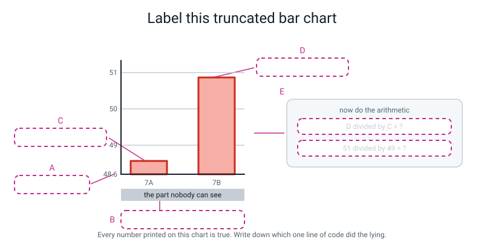
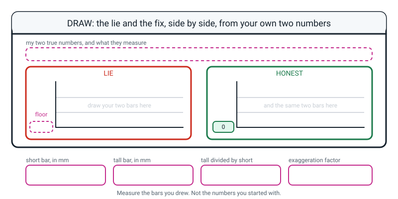

# Workbook — Week 27: Term 3 Checkpoint: Build a Lie, Then Confess

**Name:** ________________________________  **Date:** ______________

[⬅ Week 26](week-26.md) · [📖 Read the chapter first](../student-guide/week-27.md) · [Course Home](../README.md) · [🧑‍🏫 Teacher guide](../teacher-guide/week-27.md) · [Next ➡](week-28.md)

**You will need:** a ruler with millimetres on it · a printer · a calculator · a pencil

---

## ✅ Warm-Up (5 min)

Five quick questions about **last week**.

**W1.** "How spread out are the 38 scores?" — which chart shape, and why in one sentence?

________________________________________________________________

**W2.** Somebody shows you a chart of rectangles with every label covered up. Name **one** thing you could look at to tell a bar chart from a histogram.

________________________________________________________________

**W3.** A class of twenty averaged 62 out of 100. What is the one chart you draw before believing that, and what are you looking for?

________________________________________________________________

________________________________________________________________

**W4.** `ax.bar(df["club"], df["score"])` runs with no error. How many rectangles does it draw, and how many should there be?

________________________________________________________________

**W5.** Write down one thing a bar chart of house **averages** hides. Something you could point at.

________________________________________________________________

---

## 🔎 Predict the Output

**Write your prediction before you run anything.**

### P1 — one argument instead of two

```python
import matplotlib.pyplot as plt

fig, ax = plt.subplots(figsize=(6, 4))
ax.bar(["7A", "7B"], [49, 51])
print("before:", ax.get_ylim())
ax.set_ylim(48.6)
print("after :", ax.get_ylim())
```

**I predict — two lines. Write both pairs of numbers:**

________________________________________________________________

**It really printed:**

________________________________________________________________

________________________________________________________________

**Does `set_ylim(48.6)` raise an error?** ____________

**Where did the second number in the "after" line come from?**

________________________________________________________________

**Look at the "before" line. What did matplotlib choose for a bar chart, all on its own?**

________________________________________________________________

### P2 — what is `axes`, exactly?

```python
import matplotlib.pyplot as plt

fig, axes = plt.subplots(1, 2, figsize=(10, 4))
print(type(axes).__name__)
print(len(axes))
print(axes.shape)
print(axes[1] is axes[-1])
```

**I predict — four lines:**

________________________________________________________________

________________________________________________________________

**It really printed:**

________________________________________________________________

________________________________________________________________

**Line 1 is a word you met in Week 17. Which week 17 idea is `axes` reusing?**

________________________________________________________________

**What would `axes[2]` do, and what error would it give?**

________________________________________________________________

### P3 — a legend with nothing to name

```python
import matplotlib.pyplot as plt

fig, ax = plt.subplots(figsize=(6, 4))
ax.plot([1, 2, 3], [10, 20, 30], marker="o")
ax.plot([1, 2, 3], [30, 20, 10], marker="s")
ax.legend()
fig.savefig("two.png", dpi=120, bbox_inches="tight")
print("saved two.png")
```

**I predict — does it crash? Does the file appear? Is there a legend on it?**

________________________________________________________________

**It really printed:**

________________________________________________________________

________________________________________________________________

**Error or warning?** ____________  **How do you know which?**

________________________________________________________________

**"Artists" is matplotlib's word for what?** ______________________

### P4 — four correlations

```python
import pandas as pd

table = pd.DataFrame({
    "hours":  [1, 2, 3, 4, 5],
    "score":  [50, 60, 70, 80, 90],
    "age":    [12, 12, 12, 12, 12],
})
print(round(table["hours"].corr(table["score"]), 3))
print(round(table["score"].corr(table["hours"]), 3))
print(round(table["hours"].corr(table["hours"]), 3))
print(table["hours"].corr(table["age"]))
```

**I predict — four numbers:** ______ ______ ______ ______

**It really printed:**

________________________________________________________________

________________________________________________________________

**Lines 1 and 2 are identical. What does that tell you about which way round you write the two columns?**

________________________________________________________________

**Line 4 is not a number at all. What is it, and why?**

________________________________________________________________

**Line 1 is exactly 1.0. Does that prove that studying causes the score?**

________________________________________________________________

**How many of the four predictions did you get right?** ______ / 4

**Which one surprised you most, and why?**

________________________________________________________________

---

## ✍️ Practice Set A — Read It

**A1. Do the arithmetic.** Two bars, at 49 and 51. Fill in the table with a calculator.

| `set_ylim` bottom | 7A's visible bar | 7B's visible bar | The eye sees | Exaggeration factor |
|---|---|---|---|---|
| 0 | 49 | 51 | | |
| 45 | | | | |
| 48 | | | | |
| 48.6 | | | | |
| 48.9 | | | | |

**A1(a).** Write the two-step recipe you used, in words.

________________________________________________________________

________________________________________________________________

**A1(b).** As the floor creeps up towards 49, what happens to the exaggeration factor? Is there a limit?

________________________________________________________________

**A1(c).** Which single number on that chart was faked?

________________________________________________________________

**A2. `fig`, `ax`, `axes` or `axes[0]`?** Write one in each row.

| # | The call | Which name? |
|---|---|---|
| a | `_____ = plt.subplots(1, 2, figsize=(10, 4))` gives back… | |
| b | `_____.savefig("pair.png", dpi=120, bbox_inches="tight")` | |
| c | `_____.suptitle("The same two numbers")` | |
| d | `_____.bar(classes, on_time)` on the left-hand panel | |
| e | `_____.set_ylim(0, 100)` on the right-hand panel | |
| f | `print(len(_____))` prints `2` | |
| g | `_____.legend()` on a single-frame chart | |

**A2(h).** In one sentence, why is the name `axes` **plural**?

________________________________________________________________

**A3. Bar or line — must it start at zero?** Tick, then give the reason.

| # | The chart | Must start at 0 | Need not | The reason |
|---|---|---|---|---|
| a | Bar chart of homework percentages, 49 and 51 | ☐ | ☐ | |
| b | Line chart of body temperature over a week | ☐ | ☐ | |
| c | Bar chart of club sizes, 12, 12 and 14 | ☐ | ☐ | |
| d | Line chart of a share price over ten years | ☐ | ☐ | |
| e | Bar chart of house mean scores, 67, 74, 74 | ☐ | ☐ | |
| f | Line chart of runs scored in each over | ☐ | ☐ | |

**A3(g).** State the rule in one sentence, using the words **lengths** and **shape**.

________________________________________________________________

________________________________________________________________

**A3(h).** For the ones you ticked "need not", what is the honest thing you must do?

________________________________________________________________

**A4. Spot the bug.** Each line is wrong or dangerous. Write the fix.

| # | The line | The fix |
|---|---|---|
| a | `axes.bar(classes, on_time)` after `subplots(1, 2)` | |
| b | `axes[2].set_title("HONEST")` after `subplots(1, 2)` | |
| c | `ax.set_ylim(48.6)` | |
| d | `ax.set_ylim(51.4, 48.6)` | |
| e | `df["club"].corr(df["score"])` | |
| f | `df["hours"].corr()` | |
| g | `ax.legend()` with no `label=` anywhere | |
| h | A bar chart with no `set_ylim` at all, values 76.07 and 67.83 | |

**A4(i).** Four of those eight produce **no error and no traceback.** Which four?

________________________________________________________________

**A4(j).** So what is the first question you ask when a chart looks wrong and nothing errored?

________________________________________________________________

**A5. Label the diagram.** Write one short phrase in each of the five dashed boxes, then do the two sums in box E.


*Figure W27.1 — Where the lie lives.*

The five phrases, in the wrong order: **7B's visible bar, 2.4 units · the 48.6 units deleted from both bars · the floor of the axis, set by `set_ylim` · 7A's visible bar, 0.4 units · the two ratios, and the factor between them**

**A** ______________________  **B** ______________________

**C** ______________________  **D** ______________________

**E** ______________________

**A5(f).** In box E, work out both divisions and the factor:

D ÷ C = ______   51 ÷ 49 = ______   factor = ______

**A5(g).** Which **one line of code** did all the lying?

________________________________________________________________

**A6. Read the traceback, and judge the suggestion.**

```text
Traceback (most recent call last):
  File "week27_pair.py", line 11, in <module>
    axes.bar(classes, on_time)
AttributeError: 'numpy.ndarray' object has no attribute 'bar'. Did you mean: 'var'?
```

**Which line do you read first?** ______________________

**What is `'numpy.ndarray'`, in plain words?**

________________________________________________________________

**Say the whole message in your own words:**

________________________________________________________________

**Python suggested `var`. Should you use it?** ____________  **Why not?**

________________________________________________________________

________________________________________________________________

**Write the rule this teaches you about Python's suggestions:**

________________________________________________________________

---

## ✍️ Practice Set B — Write It

### B1 — one line

You have `df` loaded from `students.py`. Write the **single line** that prints the correlation between `hours` and `score`, rounded to three decimal places.

```python
# your line here:
```

**Expected output:**

```text
0.925
```

**Done looks like:** one line, three decimal places, and you can say out loud what the number is **not** (a percentage).

### B2 — build one lie, and convict it

Two teams won 11 and 12 matches. Write a program that draws a **truncated** bar chart of those two numbers, saves it, and then prints the visible bar lengths, both ratios and the exaggeration factor.

**Expected output shape** (your chosen floor may differ):

```text
saved teams_lie.png
visible bars      : 0.2 and 1.2 units
looks-like ratio  : 6.00 times taller
honest ratio      : 1.0909 times taller
exaggeration factor: 5.50
```

**Done looks like:** the floor is a named variable, the arithmetic uses that variable rather than a typed-in number, and the title is as dishonest as the axis.

### B3 — the lie and the fix, side by side

Turn B2 into a **two-panel** figure: the truncated version on the left, the zero-based version on the right. Add a `suptitle` naming the two true numbers.

**Expected output:**

```text
how many frames? 2
saved teams_lie_and_fix.png
```

**Done looks like:** both panels use `axes[0]` and `axes[1]`, both have a title saying where their axis starts, and putting them side by side makes the left one look silly.

### B4 — two lines, a legend, and two marker shapes

Using your Week 21 table, plot `homework_min` and `screen_min` on one frame with a legend. Give the two lines **different markers**. Then print which days screen time was higher.

**Expected output:**

```text
saved my_two_lines.png
days screen time was higher: [1, 3, 5, 6, 10]
```

**Done looks like:** a legend naming both series, one round marker and one square, and a title that names what actually happened rather than "homework and screen time".

> **💡 Try this:** you never need anything new to walk two lists side by side. `for i in range(len(...))` from Week 7, or `enumerate` from Week 14, plus `[i]` on the second list, does the whole job.

### B5 — sabotage your own chart, then repair it, about 30 lines

Take the house-means or club-means bar chart from Week 26. Build a two-panel figure: sabotage it on the left with a truncated axis **and** a y label with the units removed, and repair it on the right. Print all four numbers of the arithmetic, and the millimetre predictions.

**Expected output shape:**

```text
club
chess    76.07
music    71.83
art      67.83
Name: score, dtype: float64
saved story_lie_and_fix.png
chess = 76.07, art = 67.83, real gap = 8.24 points
honest ratio chess/art     = 1.12 times taller
truncated ratio chess/art  = 5.49 times taller
exaggeration factor        = 4.90
lie panel: 6.5 mm per point
  art bar   should measure 12 mm
  chess bar should measure 66 mm
```

**Done looks like:** you used **two** tricks on the left panel, you can say which of the two is worse, and you have **printed the figure and measured the bars** — the predicted millimetres match your ruler to within a millimetre or two.

---

## 🐞 Fix the Broken Program

Here is `houses.py`, which is supposed to draw the three house averages twice — dishonestly on the left, honestly on the right. It has **three** bugs: one that stops Python reading the file at all, one that stops it partway through, and one that produces **no error whatsoever**.

```python
# houses.py - three house averages, drawn twice. Three bugs.
import matplotlib.pyplot as plt
from students import build_students

df = build_students()
means = df.groupby("house")["score"].mean().sort_values(ascending=False)
print(means.round(2))

fig, axes = plt.subplots(1, 2, figsize=(10, 4))

axes[0].bar(means.index, means.values)
axes[0].set_ylim(67, 75)
axes[0].set_title("LIE: axis starts at 67")
axes[0].set_xlabel("House")
axes[0].set_ylabel("Mean score (points out of 100)"

axes[2].bar(means.index, means.values)
axes[2].set_ylim(100, 0)
axes[2].set_title("HONEST: axis starts at 0")
axes[2].set_xlabel("House")
axes[2].set_ylabel("Mean score (points out of 100)")

fig.savefig("houses.png", dpi=120, bbox_inches="tight")
print("saved houses.png")
```

**Bug 1.** Run it as it is. The real message:

```text
  File "houses.py", line 15
    axes[0].set_ylabel("Mean score (points out of 100)"
                      ^
SyntaxError: '(' was never closed
```

**Did any of the program run? How can you tell in one second?**

________________________________________________________________

**Python points at line 15. Where is the fix?**

________________________________________________________________

**Why does an unclosed bracket on line 15 not get reported until Python has read on past it?**

________________________________________________________________

**The fix:**

________________________________________________________________

**Bug 2.** Fix bug 1 and run again. The real message:

```text
house
Blue     74.36
Red      74.25
Green    67.42
Name: score, dtype: float64
Traceback (most recent call last):
  File "houses.py", line 17, in <module>
    axes[2].bar(means.index, means.values)
IndexError: index 2 is out of bounds for axis 0 with size 2
```

**How many frames did `subplots(1, 2)` make, and what are they numbered?**

________________________________________________________________

**Which earlier week is this exact mistake from?** ______________________

**The fix — and note there are FIVE lines to change:**

________________________________________________________________

**Bug 3.** Fix bug 2 and run again. Now there is **no error at all**:

```text
house
Blue     74.36
Red      74.25
Green    67.42
Name: score, dtype: float64
saved houses.png
```

**Open `houses.png`. Describe the right-hand panel.**

________________________________________________________________

**Run this to see it. What does it print?**

```python
print("panel 1 ylim:", axes[1].get_ylim())
```

```text
panel 1 ylim: (100.0, 0.0)
```

**So what is wrong with the right-hand panel, and which line caused it?**

________________________________________________________________

________________________________________________________________

**The fix:**

________________________________________________________________

**And the check that catches this whole family of bug:**

________________________________________________________________

**One more.** The left panel says "LIE: axis starts at 67". Compute its exaggeration factor for chess against art. Real gap: 76.07 − 67.83 = 8.24 points.

Visible bars: ______ and ______   The eye sees: ______   Honest: ______   Factor: ______

---

## 🧩 Puzzle of the Week

### Part 1 — Solve for the lie

Two bars, 49 and 51. You want to choose a `set_ylim` bottom `b` that makes 7B's bar look **exactly** a chosen number of times taller.

**(a)** Write down the equation you have to solve, using `b` and the factor `F`.

________________________________________________________________

**(b)** Rearrange it to get `b` on its own. Show your working — this is Week-appropriate algebra and it comes out clean.

________________________________________________________________

________________________________________________________________

________________________________________________________________

**(c)** Fill in the table with a calculator.

| Factor you want | `b` | Check: (51 − b) ÷ (49 − b) |
|---|---|---|
| 2 | | |
| 3 | | |
| 6 | | |
| 20 | | |
| 50 | | |
| 100 | | |

**(d)** Build the 50× one and print the two visible bar lengths. Does it match?

________________________________________________________________

**(e)** Round your 50× answer to two decimal places and check it again. What factor do you get now?

________________________________________________________________

**(f)** So how sensitive is the lie to the last digit of the floor? Write one sentence.

________________________________________________________________

________________________________________________________________

### Part 2 — Spot the floor

For each described chart, write down what you would look at **first**, and what you would suspect.

**(g)** An advert with two bars labelled "Us" and "Them", no numbers on the y axis at all.

________________________________________________________________

**(h)** A newspaper chart of a company's monthly income, a line, starting at 95% of its highest value.

________________________________________________________________

**(i)** A phone battery graph, a line, y axis from 60% to 100%.

________________________________________________________________

**(j)** A bar chart of exam pass rates for three schools, y axis from 0 to 100, correct numbers printed above each bar.

________________________________________________________________

**(k)** Only one of those four is fine. Which — and name one thing that could **still** be wrong with it.

________________________________________________________________

________________________________________________________________

---

## 🤔 Think Deeper

**T1.** Ice creams and drownings correlate at **0.997**. Temperature correlates with ice creams at **0.987** and with drownings at **0.989**.

Write a paragraph. Explain why the **strongest** of those three numbers is the one that is causally absurd, and what that tells you about using strength as evidence. Then go further with the school example from the chapter, where sleep-and-marks is 0.994, screen-and-marks is −0.997, and sleep-and-screen is −0.987: **when two candidate causes are tangled with each other, what can correlation possibly tell you?** Finish by describing, concretely, the one kind of evidence that *would* settle it — and say what the word "randomly" is doing in that description.

________________________________________________________________

________________________________________________________________

________________________________________________________________

________________________________________________________________

________________________________________________________________

________________________________________________________________

**T2.** A head teacher sees `r = 0.925` between study hours and marks, and orders two extra study hours a week for everybody.

Write a paragraph tracing that chart to a named person. Use the five students at the bottom of the scatter — Hugo, Omar, Sami, Bruno and Greta, four of whom are fourteen. Name **three specific reasons** a fourteen-year-old might study half an hour a week, and for each one, say whether "study two more hours" helps or punishes. Then the hard half: the chart was correct, the correlation was real, and the decision was made in good faith. **So where exactly did it go wrong?** And what one sentence, written under the chart, would have stopped it?

________________________________________________________________

________________________________________________________________

________________________________________________________________

________________________________________________________________

________________________________________________________________

________________________________________________________________

---

## 🛠️ Build It — The Lie, the Fix, and the Ruler

**Three pieces. This is the end of the term, so it is worth doing properly.**

### Part 1 — Sabotage one of your own charts

Take **one** bar chart from Week 26 — the house averages or the club averages are the easiest to sabotage, because the three values are close together.

- [ ] Two-panel figure built with `plt.subplots(1, 2, figsize=(10, 4))`
- [ ] Left panel: truncated axis, and I picked the floor **by fiddling until it looked how I wanted**
- [ ] Left panel: a **second** trick — the units removed from the y label
- [ ] Right panel: `set_ylim(0, 100)` and the units restored
- [ ] A `suptitle` naming the two or three true numbers
- [ ] Saved as one PNG, opened, and **printed on paper**

| | Value | Where I read it |
|---|---|---|
| The bigger real number | | |
| The smaller real number | | |
| The real gap | | |
| My dishonest floor | | |

### Part 2 — The arithmetic, and then the ruler

Print all four numbers from your program **and** measure the bars on the printout.

| | From the program | From my ruler |
|---|---|---|
| Smaller visible bar | ______ units | ______ mm |
| Bigger visible bar | ______ units | ______ mm |
| Ratio (big ÷ small) | ______ | ______ |
| Honest ratio | ______ | — |
| **Exaggeration factor** | ______ | — |

**Now measure the HONEST panel too:**

Smaller bar ______ mm   Bigger bar ______ mm   Ratio ______

**Do your ruler ratio and your program ratio agree?** ____________

**If they differ slightly, give three reasons why. All three are real.**

1. ________________________________________________________________
2. ________________________________________________________________
3. ________________________________________________________________

> **⚠️ Watch out:** measure on **paper**, not on a screen. On a screen you can zoom, both bars change together, and the number stops being yours.

### Part 3 — The written confession

Write it out in full. Full marks needs **five** things: both real numbers, the real gap, the honest ratio, the truncated ratio, and the fact that no number changed.

________________________________________________________________

________________________________________________________________

________________________________________________________________

________________________________________________________________

**You used two tricks. Which is worse, and why?**

________________________________________________________________

________________________________________________________________

### Part 4 — The Five-Chart Data Story

Five charts from your cleaned table, in **narrative order**, with one captioned sentence each.

| # | Its job in the story | My chart | My caption |
|---|---|---|---|
| 1 | **context** — how many people does this affect? | | |
| 2 | **baseline** — what does the whole group look like? | | |
| 3 | **the finding** — the chart the argument rests on | | |
| 4 | **the challenge** — maybe it is not what I think | | |
| 5 | **the caveat** — the thing that might be doing the real work | | |

- [ ] Five PNGs, five different filenames
- [ ] Every bar chart has `set_ylim(0, ...)`
- [ ] Every chart's title states a finding
- [ ] I read the five captions **out loud, on their own** and they made sense as a paragraph

**Read your five captions in order, with no charts. Write the paragraph they make:**

________________________________________________________________

________________________________________________________________

________________________________________________________________

**Did it make sense?** ____________  **If not, what order should they be in?**

________________________________________________________________

**Chart 4 or 5 probably weakens your own argument. Why is it in the story at all?**

________________________________________________________________

________________________________________________________________

**Your verdict — three to five sentences, and it must contain one honest uncertainty:**

________________________________________________________________

________________________________________________________________

________________________________________________________________

________________________________________________________________

### Part 5 — Correlation, with no causal verb

**Compute one correlation from your table:** ______ and ______ give **r = ______**

**Write the honest sentence. It needs four things: the description, the refusal, a named third thing that could be causing both, and who it lands on.**

________________________________________________________________

________________________________________________________________

________________________________________________________________

________________________________________________________________

**Now go back and circle every word that means "caused".** Words to hunt: *causes, makes, leads to, improves, boosts, results in, so you should.*

**How many did you find?** ______  **Rewrite any sentence that had one:**

________________________________________________________________

### Part 6 — Term 3 reflection

For each week: **✓** I could teach this to somebody else · **?** I want to look at this again.

| Week | The one thing it was about | ✓ or ? | Check yourself |
|---|---|---|---|
| 19 | `axis=0` down the columns, `axis=1` across the rows | | For a 3×4 grid, what shape is `arr.mean(axis=0)`? |
| 20 | A boolean mask is a yes/no array you use to pull out values | | Does `arr[arr > 50]` give values, or positions? |
| 21 | A DataFrame is a table whose columns have names | | Two things `df.info()` tells you that `df.head()` does not? |
| 22 | `.loc` picks by name, `.iloc` picks by position | | On an index of 10, 11, 12: `df.loc[10]` vs `df.iloc[10]`? |
| 23 | Real data arrives broken in four predictable ways | | Two calls for holes, one for text-that-should-be-numbers? |
| 24 | `groupby` answers "average per group" and hides the counts | | What must you print alongside a groupby mean? |
| 25 | The labels are what turn a chart into evidence | | Which four of a chart's five parts are words you type? |
| 26 | The question picks the chart shape | | Gaps between the bars: bar chart or histogram? |

**Now name TWO weeks you want to revisit, with a specific reason each.** "It was hard" and "all fine" are both non-answers. **Everybody has two.**

**Week ______ , because:**

________________________________________________________________

________________________________________________________________

**Week ______ , because:**

________________________________________________________________

________________________________________________________________

### Part 7 — The Bug Log

| What happened | Was there an error message? | What fixed it | What I will check next time |
|---|---|---|---|
| | | | |
| | | | |
| | | | |

---

## 🎨 Draw It

Draw the lie and the fix **by hand**, from two numbers of your own, and do the arithmetic in the boxes.


*Figure W27.2 — Your page.*

> **What a good answer might look like:** the top strip reads **"Two shops' delivery times: Shop A 28 minutes, Shop B 27 minutes. Lower is better."**
>
> On the **LIE** panel, the floor box reads **26.8**, and two bars are drawn: Shop B's is a stub about 4 mm tall and Shop A's is about 48 mm. The gridlines are labelled 27 and 28. A small note beside the bars reads *"I picked 26.8 by trying numbers until it looked how I wanted."*
>
> On the **HONEST** panel, the floor already says **0**, and the two bars are drawn nearly the same height — about 46 mm and 44 mm — so close that you have to look twice.
>
> The four bottom boxes: **4 mm** · **48 mm** · **48 ÷ 4 = 12** · **12 ÷ 1.04 = 11.5×**.
>
> And two annotations that show real understanding. An arrow to the grey area below the LIE panel's axis, labelled *"26.8 minutes of every bar, deleted"*. And a note under the HONEST panel: *"a one-minute difference in a 27-minute delivery is nothing, and this is what nothing looks like."*
>
> **What a weak answer looks like:** two panels whose bars are drawn the same on both sides — which means the truncation was written down but never actually *drawn* — or an exaggeration factor computed from the two original numbers rather than from the two **measured bars**. The whole point is that you measured the picture, not the data.

---

## 📊 Self-Check

| I can… | 😀 got it | 🙂 nearly | 😕 not yet |
|---|---|---|---|
| Exaggerate a 2% difference with `set_ylim` and compute the factor | ☐ | ☐ | ☐ |
| Put a lie and its fix side by side with `subplots(1, 2)` | ☐ | ☐ | ☐ |
| Say why the zero rule is strict for bars and negotiable for lines | ☐ | ☐ | ☐ |
| Add a legend with `label=` and two different markers | ☐ | ☐ | ☐ |
| Compute a correlation and say what `r` is not | ☐ | ☐ | ☐ |
| Name a plausible confounder for a correlation | ☐ | ☐ | ☐ |
| Write about a correlation with no causal verb in the sentence | ☐ | ☐ | ☐ |
| Trace a chart to a decision to a named person | ☐ | ☐ | ☐ |
| Name two Term 3 weeks I want to revisit, and say why | ☐ | ☐ | ☐ |

**True or false?** Circle one on each row.

| Statement | | |
|---|---|---|
| A bar chart's y axis must start at zero | TRUE | FALSE |
| A line chart's y axis must start at zero | TRUE | FALSE |
| `ax.set_ylim(48.6)` raises an error | TRUE | FALSE |
| `ax.set_ylim(51.4, 48.6)` raises an error | TRUE | FALSE |
| `subplots(1, 2)` gives you `axes[1]` and `axes[2]` | TRUE | FALSE |
| `ax.legend()` invents names for your lines | TRUE | FALSE |
| `r = 0.93` means 93% | TRUE | FALSE |
| A negative `r` is a weak `r` | TRUE | FALSE |
| `df["club"].corr(df["score"])` works fine | TRUE | FALSE |
| The strongest of three correlations is the most likely to be causal | TRUE | FALSE |
| Printing the real numbers on a truncated chart makes it honest | TRUE | FALSE |
| Python's "Did you mean…?" suggestions are always right | TRUE | FALSE |
| A confounder is a hidden third thing causing both of the things you measured | TRUE | FALSE |
| Every chart is a lie | TRUE | FALSE |

One thing I'd like explained again:

________________________________________________________________

---

## ✅ Answers

<details>
<summary>Check your answers</summary>

### Warm-Up

**W1.** A **histogram**, because it is one column of numbers with no categories, and the question is about the shape of the whole pile.

**W2.** **Whether the bars touch.** Touching means one bar per number range (histogram); gaps mean one bar per category (bar chart). Also full marks: whether the x axis holds names or numbers, or whether you could reorder the bars.

**W3.** A **histogram**, looking for whether the pile has **one hump or two** — because an average can land in a gap where nobody actually is. The quiz marks averaged 62 and nobody scored between 44 and 81.

**W4.** **38 rectangles**, one per row, crammed into three columns. There should be **3**. And there is no error.

**W5.** Any of: **how many rows each average came from** (Blue 14, Red 12, Green 12); the **spread** inside each house (Blue's scores run 42 to 93); or that Blue's lead over Red is **0.11 of a mark**.

---

### Predict the Output

**P1** — real output:

```text
before: (0.0, 53.55)
after : (48.6, 53.55)
```

**No, `set_ylim(48.6)` does not raise an error.** It set the bottom and left the top exactly where matplotlib had already put it.

**Where did 53.55 come from?** **matplotlib chose it**, before you touched anything — it is the top it picked automatically for a bar chart of 49 and 51, a little above the tallest bar.

**And look at the "before" line: `(0.0, 53.55)`.** For a **bar** chart, matplotlib started the axis at **zero all by itself.** The people who wrote matplotlib knew about the truncation problem and defended you from it.

*(A line chart of the same two numbers gets `(48.9, 51.1)` — truncated by default. So the tool protects you on bars and not on lines, which is worth knowing.)*

**P2** — real output:

```text
ndarray
2
(2,)
True
```

**`ndarray`** is numpy's word for a box of things — and yes, this is **Week 17's array**, showing up in a place nobody expects. `axes` is a numpy array whose contents happen to be drawing frames rather than numbers.

Which means everything you know about arrays applies: `len(axes)` is 2, `axes.shape` is `(2,)` — one direction, two slots, and the comma is not a typo — and `axes[-1]` is Week 11's "last slot", which for a two-slot array **is** `axes[1]`. Hence `True`.

**`axes[2]`** would give `IndexError: index 2 is out of bounds for axis 0 with size 2`. Two slots, numbered 0 and 1.

**P3** — real output:

```text
No artists with labels found to put in legend.  Note that artists whose label start with an underscore are ignored when legend() is called with no argument.
saved two.png
```

**It does not crash. The file appears. There is no legend on it.**

**Error or warning?** A **warning**. Two ways to tell: there is **no `Traceback`**, and the program **carried on** and printed `saved two.png` afterwards. An error stops the program dead; a warning is a comment on the way past.

**"Artists"** is matplotlib's word for **anything drawn on a frame** — a line, a bar, a dot, a piece of text. So the message means: *"you asked me to name the things I drew, and none of them have names."*

**P4** — real output:

```text
1.0
1.0
1.0
nan
```

**Lines 1 and 2 are identical**, which tells you correlation is **symmetric** — `a.corr(b)` and `b.corr(a)` are the same number. Which is itself a clue about causation: **a number that does not know which column came first cannot possibly tell you which one causes the other.** That is worth sitting with.

**Line 3 is 1.0** because anything correlates perfectly with itself. Not interesting, but a good sanity check.

**Line 4 is `nan`** — "not a number". The `age` column is **12 for everybody**: it never varies. Correlation asks "when this one goes up, does that one go up?" and `age` never goes up, so the question has no answer. Dividing by zero variation gives nothing at all.

**Does `r = 1.0` prove studying causes the score?** **No.** Those five rows were made up by writing 50, 60, 70, 80, 90 next to 1, 2, 3, 4, 5. A perfect correlation is still consistent with all four worlds — including "I invented both columns".

---

### Practice Set A

**A1.**

| bottom | 7A's bar | 7B's bar | The eye sees | Factor |
|---|---|---|---|---|
| 0 | 49 | 51 | 51 ÷ 49 = **1.04** | **1.00** |
| 45 | 4 | 6 | 6 ÷ 4 = **1.50** | 1.50 ÷ 1.0408 = **1.44** |
| 48 | 1 | 3 | 3 ÷ 1 = **3.00** | **2.88** |
| 48.6 | 0.4 | 2.4 | 2.4 ÷ 0.4 = **6.00** | **5.76** |
| 48.9 | 0.1 | 2.1 | 2.1 ÷ 0.1 = **21.00** | **20.18** |

**A1(a).** **Step 1: subtract the floor from both numbers** to get the two visible bar lengths. **Step 2: divide the big one by the small one**, then divide that by the honest ratio (51 ÷ 49 = 1.0408).

**A1(b).** It **grows without limit.** The smaller visible bar is heading towards zero, and dividing by something heading towards zero heads towards infinity. A floor of 48.99 gives 201×; 48.999 gives 2001×. **There is no limit, and each extra 9 is one keystroke.**

**A1(c).** **None of them.** Both bar heights are the true values and every tick number is correct. **The only thing that changed was where the axis starts.**

**A2.**

| # | The call | Answer |
|---|---|---|
| a | `plt.subplots(1, 2, ...)` gives back… | **`fig, axes`** — a sheet and a box of two frames |
| b | `savefig(...)` | **`fig`** — you save the whole sheet |
| c | `suptitle(...)` | **`fig`** — a headline across the whole sheet |
| d | `bar(...)` on the left panel | **`axes[0]`** |
| e | `set_ylim(0, 100)` on the right panel | **`axes[1]`** |
| f | `print(len(...))` prints `2` | **`axes`** |
| g | `legend()` on a single-frame chart | **`ax`** |

**A2(h).** Because **it holds more than one frame.** `plt.subplots()` with no numbers hands back one frame and you call it `ax`; `plt.subplots(1, 2)` hands back two and you call it `axes`. **The plural is a reminder that you have to index it.**

**A3.**

| # | The chart | Answer | The reason |
|---|---|---|---|
| a | bar of 49% and 51% | **must start at 0** | Bars ask the eye to compare lengths, and zero means something for a percentage |
| b | line of body temperature | **need not** | A line asks you to follow a shape, and 0 °C is not a meaningful floor for a person |
| c | bar of club sizes 12, 12, 14 | **must start at 0** | Bars, and a count of zero members is perfectly meaningful |
| d | line of a share price over ten years | **need not** — but this is the contested one | A line, so a shape; but a truncated share-price chart is the classic dishonest chart, so **say so in the label** |
| e | bar of house means 67, 74, 74 | **must start at 0** | Bars again — and this is exactly the one people truncate, because the values are close |
| f | line of runs per over | **must start at 0** *(arguably)* | It is a line, so strictly it need not — but zero runs in an over is a real and common thing, so starting at zero is the honest choice here |

**A3(g).** **A bar asks your eye to compare lengths, and deleted length cannot be put back; a line asks you to follow a shape, and a shape survives a moved floor.**

**A3(h).** **Say so, loudly, in the label.** `"Temperature (°C) — note: axis starts at 35"`. **Hiding it is the dishonest part; the choosing can be perfectly defensible.**

**A4.**

| # | The line | The fix |
|---|---|---|
| a | `axes.bar(...)` | `axes[0].bar(...)` — say which frame |
| b | `axes[2]` | `axes[1]` — two frames, numbered 0 and 1 |
| c | `ax.set_ylim(48.6)` | `ax.set_ylim(48.6, 51.4)` — **two** numbers |
| d | `ax.set_ylim(51.4, 48.6)` | Smaller first: `ax.set_ylim(48.6, 51.4)` |
| e | `df["club"].corr(df["score"])` | Correlation needs two **number** columns |
| f | `df["hours"].corr()` | `df["hours"].corr(df["score"])` — it takes two |
| g | `ax.legend()` with no labels | Add `label="..."` to each `plot` call |
| h | bar chart with no `set_ylim` | `ax.set_ylim(0, 100)`. matplotlib will start at zero here anyway, **but write it so the decision is visible in your own file** |

**A4(i).** **c, d, g and h.**

- **c** silently invents a top.
- **d** silently draws the chart upside down.
- **g** gives a **warning**, not an error, and saves a legend-less chart.
- **h** produces a perfectly good chart — but you did not decide anything, and if you had drawn the same values as a **line** it would have been truncated for you.

*(a, b, e and f all raise real tracebacks.)*

**A4(j).** **"Is that the chart I meant to make?"** Open the PNG and look. The terminal has nothing useful to say about any of the four.

**A5.**

| Box | Phrase |
|---|---|
| **A** | the floor of the axis, set by `set_ylim` |
| **B** | the 48.6 units deleted from both bars |
| **C** | 7A's visible bar, 0.4 units |
| **D** | 7B's visible bar, 2.4 units |
| **E** | the two ratios, and the factor between them |

**A5(f).** D ÷ C = 2.4 ÷ 0.4 = **6.00**.  51 ÷ 49 = **1.0408**.  Factor = 6.00 ÷ 1.0408 = **5.76**.

**A5(g).** **`ax.set_ylim(48.6, 51.4)`.** One line. One argument, really — the 48.6.

**A6.**

- **Which line first?** The **last** one, always.
- **`'numpy.ndarray'`** is **numpy's word for a box of things** — a row of slots you index with a number. Week 17. Here the slots hold drawing frames.
- **In your own words:** *"The thing I called `axes` is a box of frames, not a frame, and a box has no `bar` method. Which frame did I mean?"*
- **Should you use `var`?** **No.** `var` is a numpy function about **variance** — a statistics measure — and it has nothing whatever to do with drawing a bar. Python matched the **letters** (`bar` / `var` differ by one) and not the meaning.
- **The rule:** **Python's "Did you mean…?" suggestions are hints, not answers. Read them, then decide.** Follow them blindly and you will fix three errors and be badly lost on the fourth.

---

### Practice Set B

**B1.**

```python
print(round(df["hours"].corr(df["score"]), 3))
```

```text
0.925
```

**And what it is not:** a percentage. It does not mean "92.5% of the score comes from studying". It is a position on a scale from −1 through 0 to +1.

**B2.**

```python
"""b2.py - one truncated bar chart, and the arithmetic that convicts it."""

import matplotlib.pyplot as plt

teams = ["Falcons", "Kites"]
wins = [11, 12]                          # matches won. Both TRUE.
bottom, top = 10.8, 12.2                 # the dishonest floor

fig, ax = plt.subplots(figsize=(6, 4))
ax.bar(teams, wins)
ax.set_ylim(bottom, top)
ax.set_title("LIE: the Kites look unbeatable")
ax.set_xlabel("Team")
ax.set_ylabel("Matches won (count)")
fig.savefig("teams_lie.png", dpi=120, bbox_inches="tight")
print("saved teams_lie.png")

looks = (wins[1] - bottom) / (wins[0] - bottom)
honest = wins[1] / wins[0]
print(f"visible bars      : {wins[0] - bottom:.1f} and {wins[1] - bottom:.1f} units")
print(f"looks-like ratio  : {looks:.2f} times taller")
print(f"honest ratio      : {honest:.4f} times taller")
print(f"exaggeration factor: {looks / honest:.2f}")
```

Real output:

```text
saved teams_lie.png
visible bars      : 0.2 and 1.2 units
looks-like ratio  : 6.00 times taller
honest ratio      : 1.0909 times taller
exaggeration factor: 5.50
```

**Why the floor is a named variable.** Because the arithmetic uses it three lines later. Type `10.8` in two places and you will eventually change one and not the other, and then your printed factor will be a lie about your own lie.

**And notice the factor is 5.50, not 6.00.** The eye sees 6×; the honest ratio was already 1.09 rather than 1.04, because 11 and 12 really are a bit further apart than 49 and 51. **The exaggeration factor divides out the real difference, which is exactly what makes it the honest measure.**

**B3.**

```python
"""b3.py - the lie and the fix, side by side."""

import matplotlib.pyplot as plt

teams = ["Falcons", "Kites"]
wins = [11, 12]
bottom, top = 10.8, 12.2

fig, axes = plt.subplots(1, 2, figsize=(10, 4))
print("how many frames?", len(axes))

axes[0].bar(teams, wins)
axes[0].set_ylim(bottom, top)
axes[0].set_title(f"LIE: y-axis starts at {bottom}")
axes[0].set_xlabel("Team")
axes[0].set_ylabel("Matches won (count)")

axes[1].bar(teams, wins)
axes[1].set_ylim(0, 14)
axes[1].set_title("HONEST: y-axis starts at 0")
axes[1].set_xlabel("Team")
axes[1].set_ylabel("Matches won (count)")

fig.suptitle("The same two numbers: 11 wins and 12 wins")
fig.savefig("teams_lie_and_fix.png", dpi=120, bbox_inches="tight")
print("saved teams_lie_and_fix.png")
```

Real output:

```text
how many frames? 2
saved teams_lie_and_fix.png
```

**Note the f-string in the left title.** `f"LIE: y-axis starts at {bottom}"` means the title cannot drift out of step with the actual floor — change `bottom` and the title fixes itself.

**B4.**

```python
"""b4.py - two series on one frame, with a legend and two marker shapes."""

import matplotlib.pyplot as plt
from myweek import build_my_week

df = build_my_week()

fig, ax = plt.subplots(figsize=(6, 4))
ax.plot(df["day"], df["homework_min"], marker="o", label="Homework")
ax.plot(df["day"], df["screen_min"], marker="s", label="Screen time")

ax.set_title("Screen time beat homework on 5 of the 10 days")
ax.set_xlabel("Day of the fortnight (day 1 = first Monday)")
ax.set_ylabel("Minutes")
ax.set_ylim(0, 200)
ax.legend()

fig.savefig("my_two_lines.png", dpi=120, bbox_inches="tight")
print("saved my_two_lines.png")

crossings = [df["day"][i] for i in range(len(df))
             if df["screen_min"][i] > df["homework_min"][i]]
print("days screen time was higher:", crossings)
```

Real output:

```text
saved my_two_lines.png
days screen time was higher: [1, 3, 5, 6, 10]
```

**Five days out of ten**, which is why the title says "5 of the 10 days" — a checkable number rather than a vague claim. **Write the title after you have printed the fact**, not before.

**And the two markers.** `"o"` and `"s"`. Photocopy this chart in black and white and the colours vanish; the circles and squares do not. **Two cues for free.**

**B5.** The full model answer:

```python
# story_lie.py -- sabotage chart 3, then repair it, side by side.
import matplotlib.pyplot as plt
from students import build_students

df = build_students()
means = df.groupby("club")["score"].mean().sort_values(ascending=False)
print(means.round(2))

bottom = 66                                  # the dishonest floor I picked on purpose

fig, axes = plt.subplots(1, 2, figsize=(10, 4))

axes[0].bar(means.index, means.values)
axes[0].set_ylim(bottom, 78)
axes[0].set_title("LIE: axis from 66, no units on y")
axes[0].set_xlabel("Club")
axes[0].set_ylabel("Score")                  # second trick: no units

axes[1].bar(means.index, means.values)
axes[1].set_ylim(0, 100)
axes[1].set_title("HONEST: axis from 0, units stated")
axes[1].set_xlabel("Club")
axes[1].set_ylabel("Mean score (points out of 100)")

fig.suptitle("The same three club averages, drawn two ways")
fig.savefig("story_lie_and_fix.png", dpi=120, bbox_inches="tight")
print("saved story_lie_and_fix.png")

chess, art = means["chess"], means["art"]
honest = chess / art
looks = (chess - bottom) / (art - bottom)
print(f"chess = {chess:.2f}, art = {art:.2f}, real gap = {chess - art:.2f} points")
print(f"honest ratio chess/art     = {honest:.2f} times taller")
print(f"truncated ratio chess/art  = {looks:.2f} times taller")
print(f"exaggeration factor        = {looks / honest:.2f}")

axes_height_inches = axes[0].get_position().height * fig.get_figheight()
mm_per_point = axes_height_inches * 25.4 / (78 - bottom)
print(f"lie panel: {mm_per_point:.1f} mm per point")
print(f"  art bar   should measure {(art - bottom) * mm_per_point:.0f} mm")
print(f"  chess bar should measure {(chess - bottom) * mm_per_point:.0f} mm")
```

Real output:

```text
club
chess    76.07
music    71.83
art      67.83
Name: score, dtype: float64
saved story_lie_and_fix.png
chess = 76.07, art = 67.83, real gap = 8.24 points
honest ratio chess/art     = 1.12 times taller
truncated ratio chess/art  = 5.49 times taller
exaggeration factor        = 4.90
lie panel: 6.5 mm per point
  art bar   should measure 12 mm
  chess bar should measure 66 mm
```

**Which of the two tricks is worse?** **The truncated axis**, because it works on the reader **before** they read anything — the shape lands in about a quarter of a second and the labels take two or three. The missing units are worse in a different way: they remove the reader's ability to **check**. So the two together are much worse than either alone, because the first one misleads and the second one disarms.

---

### Fix the Broken Program

**Bug 1 — the syntax error.**

**Did any of it run?** **No.** Two tells, and both take a second: there is **no `Traceback`**, and the `print(means.round(2))` on line 7 produced nothing. Python never started the program; it could not finish reading the file.

**Where is the fix?** On **line 15**, the line Python is pointing at — add the missing `)`:

```python
axes[0].set_ylabel("Mean score (points out of 100)")
```

**Why not reported sooner?** Because an open bracket is a perfectly legal way to **continue onto the next line** — that is how the twelve library visits were split across two lines in Week 25. So Python has to keep reading, hoping for a `)`, until it runs out of file. Then it reports the place where the bracket was **opened**, because that is the last spot it was certain about.

**Bug 2 — the runtime error.**

**`subplots(1, 2)` makes two frames, numbered 0 and 1.** There is no frame 2.

**Which week?** **Week 11** — list slots start at 0, so the last slot of a two-slot thing is number 1. Same off-by-one, different clothing. *(And notice the error says `axis 0 with size 2`, which is Week 17's language for "the first direction has two slots in it".)*

**The fix — five lines**, all the `axes[2]` ones:

```python
axes[1].bar(means.index, means.values)
axes[1].set_ylim(100, 0)
axes[1].set_title("HONEST: axis starts at 0")
axes[1].set_xlabel("House")
axes[1].set_ylabel("Mean score (points out of 100)")
```

*(That is five `axes[2]` occurrences becoming `axes[1]` — the `bar`, the `set_ylim`, the `set_title`, the `set_xlabel` and the `set_ylabel`. Any answer that says "change every `axes[2]` to `axes[1]`" is full marks.)*

**Bug 3 — the silent one.**

```text
panel 1 ylim: (100.0, 0.0)
```

**The right-hand panel is drawn upside down**, with the three bars hanging down from the top of the frame and 100 printed at the bottom of the axis.

**What caused it:** `axes[1].set_ylim(100, 0)` — the two numbers **the wrong way round**. `set_ylim` takes bottom first, then top. Given 100 then 0, it does exactly what it was told: makes 100 the bottom and 0 the top, so the axis runs downwards.

**No error, no warning**, and a saved PNG that looks like a bug in matplotlib. It is not.

The fix:

```python
axes[1].set_ylim(0, 100)
```

**The check that catches this family:** **open the PNG and ask "is that the chart I meant?"** All three of this week's silent bugs — one-argument ylim, backwards ylim, and a bar chart nobody set a floor on — are invisible in the terminal and obvious in the picture. **The terminal is not where charts live.**

**The left panel's exaggeration factor.** Chess 76.07, art 67.83, floor 67:

- Visible bars: 67.83 − 67 = **0.83** and 76.07 − 67 = **9.07**
- The eye sees: 9.07 ÷ 0.83 = **10.93**
- Honest: 76.07 ÷ 67.83 = **1.1215**
- Factor: 10.93 ÷ 1.1215 = **9.74**

**Nearly ten times.** An 8-point gap out of 100, drawn as a bar nearly eleven times taller. *(Accept anything from 9.7 to 9.8 — the rounding depends on where you round.)*

---

### Puzzle of the Week

**Part 1 — Solve for the lie**

**(a)** (51 − b) ÷ (49 − b) = F

**(b)** The working:

```
51 - b = F(49 - b)
51 - b = 49F - Fb
51 - b + Fb = 49F
51 + b(F - 1) = 49F
b(F - 1) = 49F - 51
b = (49F - 51) / (F - 1)
```

*(Equivalently `b = (51 - 49F) / (1 - F)`. Both are the same expression with the top and bottom negated.)*

**(c)** Real output:

```text
F =    2  ->  bottom = 47.0000   check: 2.00
F =    3  ->  bottom = 48.0000   check: 3.00
F =    6  ->  bottom = 48.6000   check: 6.00
F =   20  ->  bottom = 48.8947   check: 20.00
F =   50  ->  bottom = 48.9592   check: 50.00
F =  100  ->  bottom = 48.9798   check: 100.00
```

**Notice F = 3 gives exactly 48**, which is a satisfying check that the algebra is right: 3 ÷ 1 = 3.

**(d)** With `b = 48.9592`, the visible bars are 51 − 48.9592 = **2.0408** and 49 − 48.9592 = **0.0408**, and 2.0408 ÷ 0.0408 = **50.02**. **Yes, it matches** — the 0.02 is rounding in the four decimal places.

**(e)** Rounded to **48.96**: the visible bars become 2.04 and 0.04, and 2.04 ÷ 0.04 = **51.00**.

**(f)** **Brutally sensitive.** Changing the floor by **less than a thousandth of a percentage point** (0.0008) — from 48.9592 to 48.96 — changed the lie from 50× to 51×. As the floor creeps towards the smaller bar, the smaller *visible* bar heads towards zero, and dividing by something near zero magnifies every tiny change. **Which is another way of saying: a number like 48.96 was not derived. It was nudged.**

**Part 2 — Spot the floor**

**(g)** Look for the **y-axis tick numbers**. There are none, which means you cannot compute anything at all, which means the chart is unfalsifiable. **Suspect the worst**: no numbers is a stronger warning sign than a bad floor, because a bad floor can at least be measured.

**(h)** Look at the **bottom tick number** — 95% of the maximum. **Suspect a truncated line chart designed to make an ordinary month look like a crisis, or an ordinary rise look like a boom.** It is a line, so truncation is not automatically dishonest, but a share price has a meaningful zero and the reader is being invited to read length rather than shape. **And nothing on the chart says the axis was cut.**

**(i)** Bottom tick 60%. **This one is probably fine.** It is a line, you are following a shape over the day, and a battery does not normally go anywhere near zero. **But it should say so** — and it almost never does.

**(j)** Look at the axis: **0 to 100, numbers printed. Nothing is wrong with the framing.**

**(k)** **(j) is the fine one.** And things that could **still** be wrong with it:

- **Which three schools were chosen**, and which ones were left out.
- **How many students each pass rate came from** — 95% of 20 and 95% of 2,000 are not the same evidence.
- Whether "pass rate" is even the right question — a school could raise its pass rate by entering fewer students.
- Whether the three schools have comparable intakes.

**A correct axis is necessary and not sufficient.** That is worth writing down.

---

### Think Deeper

**T1.** Model answer:

> *The ice-cream number is biggest because ice cream and drowning are both almost perfectly driven by the same third thing, and a correlation measures how tightly two columns move together **regardless of why**. Hot weather pushes both up in lockstep, and in this made-up table the two happen to track each other even more tightly than either one tracks the temperature (0.997 against 0.987 and 0.989). That is a quirk of these six invented rows: with real, noisier data, two things driven by a third usually track each other *less* tightly than each tracks the third, so you cannot rely on the ice-cream number being the biggest. Either way, strength is not evidence of direction at all: the strongest of my three numbers is the one that is nonsense.*
>
> *The school data makes it worse. Sleep and marks are 0.994; screens and marks are −0.997; and sleep and screens are −0.987 with **each other**. The two candidate causes are so tangled that the students who sleep a lot are exactly the students who use screens a little. Correlation can tell me that all three move together and nothing whatsoever about which one is doing the work — because there is no arrangement of these three numbers that could distinguish "screens ruin sleep which ruins marks" from "a strict bedtime causes both" from "a quiet, organised home causes all three".*
>
> *The one thing that would settle it is an **experiment**: take a large group and split it **randomly** into two halves, change one thing for one half — say, no screens after nine o'clock — leave the other half alone, and compare the marks afterwards. The word "randomly" is doing all the work. It is what makes the two halves similar in every single thing I did not measure and did not think of, including the quiet house. Without randomness, whatever I find could just be the confounder again.*

**Marking note:** full marks needs (1) why the strongest is the absurd one, (2) the tangling point about the school data, and (3) the word "randomly" explained rather than just used.

**T2.** Model answer:

> *At the bottom of that scatter are five real people: Hugo (14), Omar (14), Sami (14), Bruno (13) and Greta (14). Four of the five are fourteen.*
>
> *Three reasons a fourteen-year-old might study half an hour a week. **A part-time job** — "study two more hours" means either lose the money or lose the sleep, so it punishes. **A younger sibling to look after after school** — the two hours do not exist to be reallocated, so it punishes. **No quiet room or desk at home** — the two hours exist but are not usable, so ordering them produces two hours of failing to study, plus a detention when it does not work. **None of the three is helped. All three are punished.***
>
> *And the uncomfortable part is that nobody did anything obviously wrong. The chart was correct. r = 0.925 is real. The head teacher acted in good faith on the best evidence available. What went wrong is the step nobody wrote down: between "hours and marks move together" and "make everybody do more hours" there is a hidden assumption that **hours are a thing every student can freely choose**, and for the five students at the bottom that assumption is false — and the chart never measured it, so nobody had to defend it.*
>
> *One sentence under the chart would have stopped it: **"Every student in the bottom five is 13 or 14, and this chart does not measure whether they are able to study more."** That sentence does not argue with the correlation. It just makes the missing thing visible, which is enough.*

**Marking note:** full marks needs three **specific** reasons with "helps or punishes" answered for each, **and** a named location for the failure — the unwritten assumption, not the arithmetic.

---

### Build It

**Part 2 — three real reasons your ruler and your program disagree slightly:**

1. **The ruler is only good to about half a millimetre**, and you are reading two of them, so the ratio carries two readings' worth of error.
2. **Your printer may have scaled the page.** Both bars shrink together so the *ratio* survives, but the raw millimetres will not match the prediction.
3. **The bar tops are drawn with a line that has its own thickness**, so "where the bar ends" is a decision of about half a millimetre, twice.

**Measured 5.5 against computed 5.49 is agreement, not disagreement.** Being able to say why two nearly-identical numbers are not identical is a real skill, and it is worth more than getting them to match.

**Part 3 — the written confession.** A full-credit example, using the club averages:

> Chess averages 76.07 and art averages 67.83 — a real gap of **8.24 points**, which makes chess about 12% higher. Drawn honestly from zero, the chess bar is **1.12×** the art bar: visible, modest, and about right. Truncating the axis at 66 makes the chess bar **5.49×** the art bar, an exaggeration of roughly **4.9×**. I measured them on the printout: 12 mm and 66 mm, and 66 ÷ 12 = 5.5, which matches. I also used a second trick — I removed the units from the y-axis label, so it just says "Score". Without "out of 100" the reader cannot tell whether 8 points is a landslide or a rounding error. **Neither trick changed a single number.**

**Part 4 — the Five-Chart Data Story.** The model version, answering *which club should the school buy equipment for next year?* — with the decision named up front, because **a question with no decision behind it produces charts with no point.**

```python
# story.py -- the Five-Chart Data Story.
# QUESTION: which club should the school buy equipment for next year?
# DECISION: there is money for exactly one club.
import matplotlib.pyplot as plt
from students import build_students

df = build_students()


def chart1_club_sizes():
    """CONTEXT -- how many people would each choice affect?"""
    counts = df["club"].value_counts()
    print("1)", list(counts.index), list(counts.values))
    fig, ax = plt.subplots(figsize=(6, 4))
    ax.bar(counts.index, counts.values)
    ax.set_ylim(0, 16)
    ax.set_title("Chess is the biggest club: 14 of 38 students")
    ax.set_xlabel("Club")
    ax.set_ylabel("Number of students (count)")
    fig.savefig("story_1_sizes.png", dpi=120, bbox_inches="tight")
    plt.close(fig)


def chart2_all_scores():
    """BASELINE -- what does the whole school look like before we split it up?"""
    print("2) mean", round(df["score"].mean(), 1), "median", df["score"].median())
    fig, ax = plt.subplots(figsize=(6, 4))
    counts, edges, bars = ax.hist(df["score"], bins=8, edgecolor="white")
    print("   counts", counts)
    ax.set_title("Scores run from 42 to 97 with no single peak")
    ax.set_xlabel("Score (points out of 100)")
    ax.set_ylabel("Number of students (count)")
    fig.savefig("story_2_all_scores.png", dpi=120, bbox_inches="tight")
    plt.close(fig)


def chart3_score_by_club():
    """THE FINDING -- the chart the argument rests on."""
    means = df.groupby("club")["score"].mean().sort_values(ascending=False)
    print("3)", means.round(2).to_dict())
    fig, ax = plt.subplots(figsize=(6, 4))
    ax.bar(means.index, means.values)
    ax.set_ylim(0, 100)
    ax.set_title("Chess averages 76, art averages 68 -- an 8-point gap")
    ax.set_xlabel("Club")
    ax.set_ylabel("Mean score (points out of 100)")
    fig.savefig("story_3_score_by_club.png", dpi=120, bbox_inches="tight")
    plt.close(fig)
    return means


def chart4_hours_vs_score():
    """THE CHALLENGE -- maybe it is not the club at all."""
    r = df["hours"].corr(df["score"])
    print("4) r =", round(r, 3))
    fig, ax = plt.subplots(figsize=(6, 4))
    ax.scatter(df["hours"], df["score"])
    ax.set_title(f"Hours studied tracks score closely (r = {r:.2f})")
    ax.set_xlabel("Study hours per week")
    ax.set_ylabel("Score (points out of 100)")
    fig.savefig("story_4_hours_vs_score.png", dpi=120, bbox_inches="tight")
    plt.close(fig)
    return r


def chart5_hours_by_club():
    """THE CAVEAT -- the thing that might be doing the real work."""
    means = df.groupby("club")["hours"].mean().sort_values(ascending=False)
    print("5)", means.round(2).to_dict())
    fig, ax = plt.subplots(figsize=(6, 4))
    ax.bar(means.index, means.values)
    ax.set_ylim(0, 6)
    ax.set_title("Chess students also study the most hours")
    ax.set_xlabel("Club")
    ax.set_ylabel("Mean study hours per week")
    fig.savefig("story_5_hours_by_club.png", dpi=120, bbox_inches="tight")
    plt.close(fig)
    return means


chart1_club_sizes()
chart2_all_scores()
score_means = chart3_score_by_club()
r = chart4_hours_vs_score()
hours_means = chart5_hours_by_club()
print()
print(df.groupby("club")["score"].agg(["count", "mean", "min", "max"]).round(2))
```

Real output:

```text
1) ['chess', 'music', 'art'] [14, 12, 12]
2) mean 72.1 median 72.5
   counts [3. 4. 4. 5. 6. 5. 6. 5.]
3) {'chess': 76.07, 'music': 71.83, 'art': 67.83}
4) r = 0.925
5) {'chess': 3.39, 'music': 3.17, 'art': 2.54}

       count   mean  min  max
club                         
art       12  67.83   48   91
chess     14  76.07   55   97
music     12  71.83   42   93
```

> **💡 Try this:** `plt.close(fig)` throws the finished figure away once it is saved. You do not need it for five charts, but if you ever loop over fifty, matplotlib will warn you that too many figures are open. One line, and now you know what it is for.

**The five captions, which must read as one paragraph on their own:**

1. Chess is the biggest club, with 14 of our 38 students, so it affects the most people.
2. Across the whole school scores run from 42 to 97 with no single peak, so there is no "normal" student to compare a club against.
3. Chess averages 76.1 and art averages 67.8 — an 8-point gap, which is real but modest.
4. Study hours track scores very closely (r = 0.93), so the club gap might not be about the club at all.
5. Chess students also study the most hours on average (3.4 against art's 2.5), which means the two explanations are tangled and this data cannot separate them.

**Read together:** *Chess is the biggest club. There is no normal student. Chess scores about 8 points higher than art. But hours track scores closely. And chess students also study the most, so we cannot tell which is doing the work.* **That is a paragraph, and it is honest.**

**Why is chart 5 in the story when it weakens the argument?** Because **leaving it out would make the story an advertisement.** A five-chart story that shows only the flattering charts is not an analysis, and anybody who later found chart 5 would stop believing chart 3 as well. **Showing the caveat yourself is what makes the rest credible.**

**The verdict**, three to five sentences with one honest uncertainty:

> On this data I would spend the money on **chess**, mainly because it affects 14 students rather than 12, and its 8-point score advantage is at least consistent with the club being good for people. **I am not confident that the club is causing the higher scores**, because chess students also study 0.85 hours a week more than art students on average, and study hours correlate with score at 0.93 — so the club may simply be where the students who already study a lot happen to go. All three clubs have fewer than 15 members, which is far too few to be sure of anything. If I could collect one more thing it would be scores from *before* students joined a club, because that would let me look at the change rather than the level.

**Part 5 — the honest sentence about `r`.** Full credit needs four things. A model answer:

> In this table, students who studied more hours tended to score higher (r = 0.93). I do **not** know whether studying caused the higher marks. A quiet room with a desk could be causing both — it would give somebody more hours *and* better conditions to learn in — and if the school acts on this chart by making everybody do two extra hours, the five students at the bottom get blamed for something the chart never measured. Four of those five are fourteen, and I do not know why they study so little.

**Marking note:** the single thing to check is that **no word means "caused"**, except inside a sentence explicitly denying it.

**Part 6 — the eight check-yourself answers.**

| Week | Answer |
|---|---|
| 19 | **Four numbers — shape `(4,)`.** One per column, because `axis=0` collapses down the rows |
| 20 | **The values**, not their positions. `arr[arr > 50]` hands back the numbers themselves |
| 21 | **How many non-missing values are in each column, and each column's type.** `head()` shows you five rows and neither of those |
| 22 | `df.loc[10]` gives the row **named** 10, which is the first row. `df.iloc[10]` gives an `IndexError`, because there is no eleventh row |
| 23 | `isna` and `fillna` for holes; `astype` for text-that-should-be-numbers |
| 24 | The **count** — how many rows each mean came from |
| 25 | The **title**, the **x label**, the **y label**, and the **marks** via `plot`. The fifth part, the axes itself, comes free |
| 26 | **Bar chart.** Gaps mean categories; touching means number ranges |

**And two weeks named, with specific reasons.** Model answers, to show what "specific" means:

- *"Week 22. I still can't tell `loc` from `iloc` the moment the index isn't 0, 1, 2 — I get it right by luck."*
- *"Week 19. I can type `axis=0` but I work out which one it is by trying both and seeing which shape comes back, and that means I don't actually know."*

**"It was hard" and "all fine" are both non-answers. Everybody has two — including whoever wrote this.**

---

### Draw It

There is no single right drawing. A good one has **two panels whose bars genuinely look different**, a floor box with a number that was *nudged* rather than derived, and an exaggeration factor computed from the **measured bars** rather than from the original two numbers.

The tell that it is right: the third bottom box (tall ÷ short) is a big number like 12, and the fourth box (the factor) is that number divided by something close to 1. If the two bottom-right boxes are nearly the same, the truncation was written down but never drawn.

---

### Self-Check answers

| Statement | Answer | Why |
|---|---|---|
| A bar chart's y axis must start at zero | **TRUE** | The eye compares lengths, and deleted length cannot be put back |
| A line chart's y axis must start at zero | **FALSE** | A line asks you to follow a shape. But **say so in the label** if you truncate |
| `ax.set_ylim(48.6)` raises an error | **FALSE** | No error. It sets the bottom and invents a top |
| `ax.set_ylim(51.4, 48.6)` raises an error | **FALSE** | No error. It draws the chart upside down |
| `subplots(1, 2)` gives you `axes[1]` and `axes[2]` | **FALSE** | `axes[0]` and `axes[1]`. Week 11's off-by-one |
| `ax.legend()` invents names for your lines | **FALSE** | It reads the `label=` you already gave. With none, you get a warning and no legend |
| `r = 0.93` means 93% | **FALSE** | It is a position on a scale from −1 to +1. "Minus 57% of a study hour" means nothing |
| A negative `r` is a weak `r` | **FALSE** | The minus sign is a **direction**. −0.9 is stronger than +0.3 |
| `df["club"].corr(df["score"])` works fine | **FALSE** | `TypeError: unsupported operand type(s) for /: 'str' and 'int'`. You cannot average "chess" |
| The strongest of three correlations is the most likely to be causal | **FALSE** | In the seaside table the strongest, 0.997, is the absurd one |
| Printing the real numbers on a truncated chart makes it honest | **FALSE** | Better, and not enough. The shape lands in a quarter of a second; the numbers take three |
| Python's "Did you mean…?" suggestions are always right | **FALSE** | It offered `var` for `bar`. It matched the letters, not the meaning |
| A confounder is a hidden third thing causing both of the things you measured | **TRUE** | Hot weather, behind ice cream and drowning |
| Every chart is a lie | **FALSE** | Look at the honest panel: same two numbers, axis from zero, ratio 1.04, and it tells you the truth in half a second. **A chart is an argument, so check the framing** |

</details>

---

[⬅ Week 26 Workbook](week-26.md) · [📖 Week 27 Chapter](../student-guide/week-27.md) · [Course Home](../README.md) · [Week 28 Workbook ➡](week-28.md)
