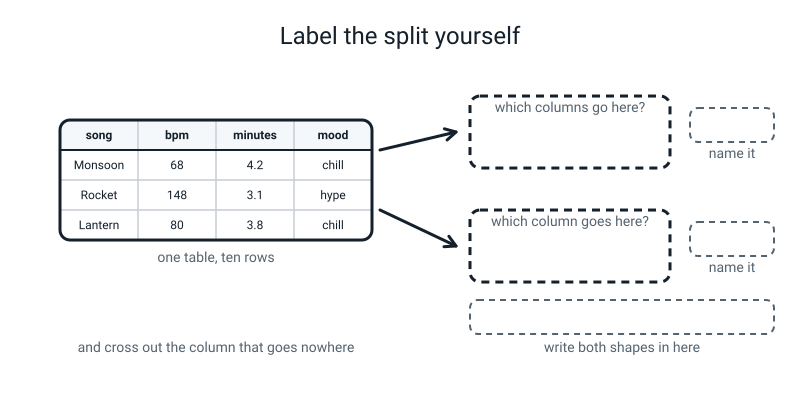
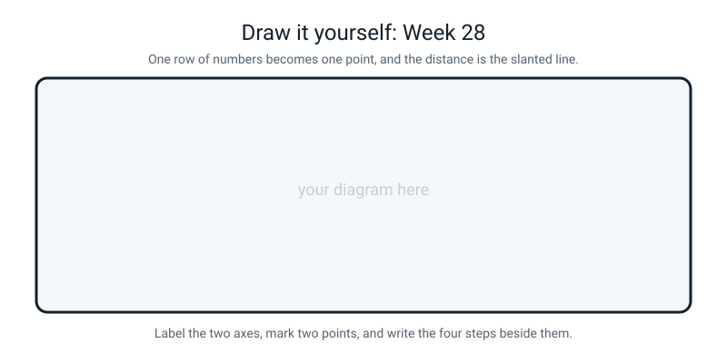

# Workbook — Week 28: X and y: Turning Your Table Into a Question

**Name:** ________________________________  **Date:** ______________

[⬅ Week 27](week-27.md) · [📖 Read the chapter first](../student-guide/week-28.md) · [Course Home](../README.md) · [🧑‍🏫 Teacher guide](../teacher-guide/week-28.md) · [Next ➡](week-29.md)

**You will need:** graph paper · a ruler with millimetres on it · a calculator · a pencil · your own table from Week 21

---

## ✅ Warm-Up (5 min)

Five quick questions about **last week**.

**W1.** `ax.set_ylim(48.6)` — one number instead of two. Does it raise an error? And what does it do?

________________________________________________________________

**W2.** `fig, axes = plt.subplots(1, 2)`. What are the two frames called?

________________________________________________________________

**W3.** You call `ax.legend()` and you never wrote a single `label=`. What happens — error, warning or nothing?

________________________________________________________________

**W4.** `r = 0.93`. Write down one thing that number is **not**.

________________________________________________________________

**W5.** Ice creams and drownings correlate at 0.997. Name the hidden third thing, and the word for it.

________________________________________________________________

---

## 🔎 Predict the Output

**Write your prediction before you run anything.** This is the most useful page in the workbook, and it only works if you commit first.

### P1 — one bracket, two brackets

```python
import pandas as pd

playlist = pd.DataFrame({
    "song": ["Monsoon", "Rocket", "Lantern"],
    "bpm": [68, 148, 80],
    "minutes": [4.2, 3.1, 3.8],
})

one = playlist["bpm"]
two = playlist[["bpm"]]
print(type(one).__name__, one.shape)
print(type(two).__name__, two.shape)
print(one.shape == two.shape)
```

**I predict — three lines:**

________________________________________________________________

________________________________________________________________

**It really printed:**

________________________________________________________________

________________________________________________________________

**Both of those asked for the same column. So what is different about what came back?**

________________________________________________________________

**Which of the two would you use for `X`, and which for `y`?**

________________________________________________________________

### P2 — three steps, and one of them is missing

```python
import numpy as np

gaps = np.array([-3.0, -1.2])
print(gaps.sum())
print((gaps ** 2).sum())
print(np.sqrt((gaps ** 2).sum()))
print(round(float(np.sqrt((gaps ** 2).sum())), 2))
```

**I predict — four numbers:** ______ ______ ______ ______

**It really printed:**

________________________________________________________________

________________________________________________________________

**Line 1 is negative. Which of the four distance steps got skipped to produce it?**

________________________________________________________________

**Line 3 has a lot of digits and line 4 has two. Which of the two would you write in a report, and why?**

________________________________________________________________

### P3 — does the order matter?

```python
import numpy as np

a = np.array([2.0, 1.0])
b = np.array([5.0, 5.0])
print(a - b)
print(b - a)
print(np.sqrt(((a - b) ** 2).sum()))
print(np.sqrt(((b - a) ** 2).sum()))
```

**I predict — four lines:**

________________________________________________________________

________________________________________________________________

**It really printed:**

________________________________________________________________

________________________________________________________________

**Lines 1 and 2 are different. Lines 3 and 4 are the same. Which step made that happen?**

________________________________________________________________

**So does it matter which row you write first when you measure a distance?** ____________

### P4 — what is actually inside `iris`?

```python
from sklearn.datasets import load_iris

iris = load_iris()
print(len(iris.feature_names))
print(iris.target[0], iris.target[75], iris.target[149])
print(iris.target_names[iris.target[75]])
print(iris.data[0].shape)
```

**I predict — four lines:**

________________________________________________________________

________________________________________________________________

**It really printed:**

________________________________________________________________

________________________________________________________________

**Line 2 prints three whole numbers, not three flower names. What are those numbers?**

________________________________________________________________

**Line 4 is `(4,)`, not `(1, 4)`. What is `iris.data[0]`, exactly?**

________________________________________________________________

**How many of the four predictions did you get right?** ______ / 4

**Which one surprised you most, and why?**

________________________________________________________________

---

## ✍️ Practice Set A — Read It

**A1. Which column is which?** For each table, write `X`, write `y`, and write the column that goes in **neither** — with the reason.

| # | The table (the answer column is in bold) | `X` | `y` | In neither, and why |
|---|---|---|---|---|
| a | song, bpm, minutes, **mood** | | | |
| b | flower id, petal length, petal width, sepal length, sepal width, **species** | | | |
| c | pupil name, hours slept, minutes of exercise, screen hours, **felt tired** | | | |
| d | date, temperature at 9am, cloud cover, wind speed, **rained today** | | | |
| e | shop, price, distance in km, rating out of 5, **would order again** | | | |

**A1(f).** In (a), what would happen if you put `mood` inside `X` as well?

________________________________________________________________

________________________________________________________________

**A1(g).** Why is a row number never a feature? Give a reason that is about the *thing*, not about the rule.

________________________________________________________________

________________________________________________________________

**A2. Shapes.** Fill both columns in. Rows first, columns second.

| # | The table | `X.shape` | `y.shape` |
|---|---|---|---|
| a | 10 songs, 2 measurements each | | |
| b | 150 flowers, 4 measurements each | | |
| c | 40 pupils, 3 measurements each | | |
| d | 178 wines, 13 measurements each | | |
| e | 6 fruits, 2 measurements each | | |
| f | 1 new flower you want a guess for, 4 measurements | | |

**A2(g).** What does the comma in `(10,)` actually mean?

________________________________________________________________

**A2(h).** You add a fourth measurement to a 40-row table. What changes, and what does not?

________________________________________________________________

**A2(i).** You delete five rows from a 40-row, 3-column table. Write both new shapes.

`X.shape` = ____________   `y.shape` = ____________

**A2(j).** Row (f) has no `y` at all. Why not?

________________________________________________________________

**A3. Match the code to what comes back.** Draw a line, or write the letter.

| # | The code | | What comes back |
|---|---|---|---|
| a | `playlist["mood"]` | | i. a **DataFrame** of shape `(10, 2)` |
| b | `playlist[["mood"]]` | | ii. a **Series** of shape `(10,)` |
| c | `playlist[["bpm", "minutes"]]` | | iii. a `KeyError` |
| d | `playlist["bpm", "minutes"]` | | iv. a **DataFrame** of shape `(10, 1)` |

**A3(e).** Two of those four look almost identical and one of them crashes. Which pair, and what is the single character of difference?

________________________________________________________________

**A3(f).** Say the sentence out loud that stops you making mistake (d) again:

________________________________________________________________

**A4. Spot the bug.** Every line below is wrong or dangerous. Write the fix.

| # | The line | The fix |
|---|---|---|
| a | `X = playlist["bpm", "minutes"]` | |
| b | `X = playlist[["bpm", "minutes", "mood"]]` (with `y = playlist["mood"]`) | |
| c | `print(X.shape())` | |
| d | `total = squares.sum` | |
| e | `gaps = [1.4, 0.2] - [4.4, 1.4]` | |
| f | `iris = load_iris` | |
| g | `X = playlist[["song", "bpm", "minutes"]]` | |
| h | `distance = (squares).sum() ** 2` | |

**A4(i).** Which **one** of those eight would stay silent even later, when you tried to use it, because the model never has a reason to complain?

________________________________________________________________

**A4(j).** That one is the most dangerous of the eight. Say why in one sentence.

________________________________________________________________

**A5. Label the diagram.** Write one short phrase in each of the two dashed name slots, then write both shapes in the long slot underneath.


*Figure W28.1 — One table, two pieces, and one column that goes nowhere.*

**Top box** ______________________  **Bottom box** ______________________

**Both shapes** ________________________________________________

**A5(a).** The table has four columns and only three of them ended up somewhere. Which one is missing, and where did it go?

________________________________________________________________

**A5(b).** How many brackets does each of the two boxes need? Top: ______  Bottom: ______

**A6. Read the traceback.** This is fifteen lines long and most of it is not about you.

```text
Traceback (most recent call last):
  File ".../pandas/core/indexes/base.py", line 3802, in get_loc
    return self._engine.get_loc(casted_key)
  ...
KeyError: ('bpm', 'minutes')

The above exception was the direct cause of the following exception:

Traceback (most recent call last):
  File "/Users/you/project/x_and_y.py", line 15, in <module>
    X = playlist["bpm", "minutes"]
  File ".../pandas/core/frame.py", line 3807, in __getitem__
    indexer = self.columns.get_loc(key)
  File ".../pandas/core/indexes/base.py", line 3804, in get_loc
    raise KeyError(key) from err
KeyError: ('bpm', 'minutes')
```

**Which line do you read first?** ______________________

**Which line tells you where *your* mistake is?** ______________________

**What does `KeyError` mean, in plain words?**

________________________________________________________________

**Pandas went hunting for a column called `('bpm', 'minutes')`. Why that, and not two separate columns?**

________________________________________________________________

________________________________________________________________

**How many of those fifteen lines are about code you wrote?** ______

---

## ✍️ Practice Set B — Write It

### B1 — one line

You have `X` and `y` already built. Write the **single line** that prints both shapes on one line, with a label on each.

```python
# your line here:
```

**Expected output:**

```text
X.shape: (10, 2)   y.shape: (10,)
```

**Done looks like:** one line, both shapes, and you can say out loud what each of the three numbers means.

### B2 — split a fresh table

Build the cricket table below as a DataFrame, then pull `X` and `y` out of it and print both shapes and the name of the column you left out.

| player | runs | wickets | role |
|---|---|---|---|
| Asha | 312 | 1 | batter |
| Ravi | 41 | 14 | bowler |
| Meera | 288 | 0 | batter |
| Karan | 27 | 17 | bowler |
| Divya | 350 | 2 | batter |
| Sanjay | 19 | 21 | bowler |

**Expected output:**

```text
X.shape: (6, 2) -> 6 players, 2 measurements each
y.shape: (6,) -> 6 answers, in one line
the column in neither: player
```

**Done looks like:** two brackets for `X`, one for `y`, and a printed sentence next to each shape saying what the numbers mean in words.

### B3 — one distance, four separate lines

Write a program that measures the distance between **Asha** `(312, 1)` and **Ravi** `(41, 14)`, printing all four steps on four separate lines. Do **not** write it as a one-liner.

**Expected output:**

```text
step 1  subtract   : [271. -13.]
step 2  square     : [73441.   169.]
step 3  add up     : 73610.0
step 4  square root: 271.31162894354526
2 dp               : 271.31
```

**Done looks like:** four named steps, four separate variables, `np.array` used for both players, and one rounded number at the end.

### B4 — a dataset you did not download

Write a program that loads iris and prints, in this order: the shape of `X`, the shape of `y`, the four column names one per line, the three species names, and how many of each species there are.

**Expected output:**

```text
X shape: (150, 4)
y shape: (150,)
the four things measured:
    sepal length (cm)
    sepal width (cm)
    petal length (cm)
    petal width (cm)
the three kinds of flower: ['setosa' 'versicolor' 'virginica']
how many of each: [50 50 50]
```

**Done looks like:** `load_iris()` with its brackets, a loop over `iris.feature_names`, and `np.bincount` for the counts.

### B5 — nearest known song, about 15 lines

Six known songs, each with a bpm and a length, and each already labelled chill or hype. One mystery song at **bpm 100, 4.0 minutes.** Write a program that measures the distance from the mystery song to all six, prints them **sorted nearest first**, and then names the nearest one and its mood.

The six songs: Monsoon `(68, 4.2)` chill · Rocket `(148, 3.1)` hype · Lantern `(80, 3.8)` chill · Corridor `(160, 2.8)` hype · Firecracker `(152, 3.4)` hype · Slow Bus `(72, 5.1)` chill.

**Expected output:**

```text
mystery song: bpm 100, 4.0 minutes

  20.00   Lantern      chill
  28.02   Slow Bus     chill
  32.00   Monsoon      chill
  48.01   Rocket       hype
  52.00   Firecracker  hype
  60.01   Corridor     hype

nearest is Lantern -> chill
```

**Done looks like:** a loop over the six rows, the four distance steps inside it, results collected into a list and passed through `sorted()` (Week 12), and the distances printed to two decimal places.

> **💡 Try this:** you do not need anything new for the sorting. `sorted()` on a list of tuples sorts by the **first** item in each tuple, so put the distance first and the name second and it sorts itself.

---

## 🐞 Fix the Broken Program

Here is `broken28.py`. It is supposed to split a table into `X` and `y` and then measure one distance. It has **three** bugs: one that stops Python reading the file at all, one that stops it partway through, and one that produces **no error whatsoever**.

```python
# broken28.py - split a table into X and y, then measure one distance. Three bugs.
import numpy as np
import pandas as pd

pupils = pd.DataFrame({
    "name":          ["Tara", "Ben", "Nia", "Omar", "Zoe"],
    "hours_slept":   [8.5, 5.0, 7.5, 4.5, 9.0],
    "revision_mins": [90, 20, 75, 15, 120],
    "passed":        ["yes", "no", "yes", "no", "yes"],
})

X = pupils[["hours_slept", "revision_mins", "passed"]]
y = pupils["passed"]

print("X.shape:", X.shape
print("y.shape:", y.shape)

tara = np.array(pupils["hours_slept", "revision_mins"].iloc[0])
ben = np.array([5.0, 20.0])

gaps = tara - ben
squares = gaps ** 2
total = squares.sum()
print("gaps    :", gaps)
print("squares :", squares)
print("distance:", round(float(np.sqrt(total)), 2))
```

**Bug 1.** Run it as it is. The real message:

```text
  File "/private/tmp/broken28.py", line 15
    print("X.shape:", X.shape
         ^
SyntaxError: '(' was never closed
```

**Did any of the program run? How can you tell in one second?**

________________________________________________________________

**Python's arrow points at the `(` after `print`, not at the end of the line. Why?**

________________________________________________________________

________________________________________________________________

**The fix:**

________________________________________________________________

**Bug 2.** Fix bug 1 and run again. The real message, trimmed:

```text
KeyError: ('hours_slept', 'revision_mins')

The above exception was the direct cause of the following exception:

Traceback (most recent call last):
  File "/private/tmp/broken28.py", line 18, in <module>
    tara = np.array(pupils["hours_slept", "revision_mins"].iloc[0])
  ...
KeyError: ('hours_slept', 'revision_mins')
```

**Which two lines of that mess are about your code?**

________________________________________________________________

**What did pandas think you were asking for?**

________________________________________________________________

**The fix:**

________________________________________________________________

**Bug 3.** Fix bug 2 and run again. Now there is **no error at all**:

```text
X.shape: (5, 3)
y.shape: (5,)
gaps    : [ 3.5 70. ]
squares : [  12.25 4900.  ]
distance: 70.09
```

**Look hard at the first line. What should `X.shape` have been?** ____________

**Which line caused it?**

________________________________________________________________

**What would happen if you trained a model on this `X`? Be specific about the score.**

________________________________________________________________

________________________________________________________________

**What did Level 1 call this mistake?** ______________________

**The fix:**

________________________________________________________________

**And the three-second test that catches it every time:**

________________________________________________________________

**One more.** Look at the `squares` line: `12.25` and `4900`. Work out each column's share of the distance.

`hours_slept` = ______ %   `revision_mins` = ______ %

---

## 🧩 Puzzle of the Week

### Part 1 — Two flowers, wrong species, wrong distance

Here are four real iris rows, petal length and petal width only.

| row | petal length | petal width | species |
|---|---|---|---|
| 52 | 4.9 | 1.5 | versicolor |
| 100 | 6.0 | 2.5 | virginica |
| 101 | 5.1 | 1.9 | virginica |
| 103 | 5.6 | 1.8 | virginica |

**(a)** Work out three distances, all four steps each. Use the space.

| pair | step 1 (gaps) | step 2 (squares) | step 3 (total) | step 4 (distance, 2 dp) |
|---|---|---|---|---|
| 52 – 101 | | | | |
| 100 – 101 | | | | |
| 100 – 103 | | | | |

**(b)** Rows 100, 101 and 103 are all the **same** species. Row 52 is a different one. Now look at your three answers. What is wrong with this picture?

________________________________________________________________

________________________________________________________________

**(c)** Put the three distances in order, smallest first: ______ , ______ , ______

**(d)** Write one sentence about what this means for a model that decides species by finding the single nearest flower.

________________________________________________________________

________________________________________________________________

**(e)** What could you give the model that would help it here? Name something specific.

________________________________________________________________

### Part 2 — The unit that flips the answer

Two songs. Monsoon is 68 bpm and 4.2 minutes long. Lantern is 80 bpm and 3.8 minutes long.

**(f)** Compute the distance with length in **minutes**, and each column's share of the total.

| | gap | squared | share |
|---|---|---|---|
| bpm | | | |
| minutes | | | |
| | | total: | distance: |

**(g)** Now write the lengths in **seconds** instead. Monsoon is 252 seconds; Lantern is 228. Redo it.

| | gap | squared | share |
|---|---|---|---|
| bpm | | | |
| seconds | | | |
| | | total: | distance: |

**(h)** Fill this in:

| length measured in… | bpm's share | length's share |
|---|---|---|
| minutes | | |
| seconds | | |

**(i)** How many songs changed? ______  How many notes were re-recorded? ______

**(j)** Write the one sentence this puzzle exists to make you write.

________________________________________________________________

________________________________________________________________

**(k)** Now go the other way. What unit could you write **bpm** in so that *length in minutes* did most of the work instead? Suggest one, and say roughly what would happen.

________________________________________________________________

---

## 🤔 Think Deeper

**T1.** Somebody hands you a table of 500 hospital patients with twelve columns, and asks you to predict the column called `needed_surgery`. One of the other eleven columns is called `days_in_recovery_ward`.

Write a paragraph. Explain, using the three-second test from the chapter, whether `days_in_recovery_ward` belongs in `X`. Then say what would happen if you left it in — be specific about the score, and specific about what would happen the first time somebody used your model on a **new** patient. Then go further: `days_in_recovery_ward` is not a name and not a row number, so none of the chapter's rules ban it. **So what rule does it break?** Finish by naming one other column heading you would be suspicious of in a table like this, and say why.

________________________________________________________________

________________________________________________________________

________________________________________________________________

________________________________________________________________

________________________________________________________________

________________________________________________________________

**T2.** The chapter says the picture stops at two columns but the arithmetic goes as far as you like.

Write a paragraph. Start concretely: describe what the distance calculation looks like for a table with **thirteen** columns — how many subtractions, how many squares, how many square roots. Then the hard part: if you cannot draw thirteen directions, **how do you know the answer means anything?** What could you check, using only things you already know how to compute, that would give you some confidence the thirteen-column distance is behaving sensibly? *(Hint: you know the species of every iris flower. What should the distances between same-species flowers look like compared with different-species ones?)* Finish with one honest sentence about what you have given up by not being able to see the picture.

________________________________________________________________

________________________________________________________________

________________________________________________________________

________________________________________________________________

________________________________________________________________

________________________________________________________________

---

## 🛠️ Build It — Your Own `X`, Your Own `y`, One Distance Twice

### Part 1 — `X` and `y` from your own table (page 28.5)

Use the table you have been carrying since Week 21. If it has gone walkabout, use the ten-song playlist printed on the next page.

- [ ] I loaded or rebuilt my table and printed it
- [ ] I wrote down which columns are measurements and which one is the answer
- [ ] `X = df[["...", "..."]]` — **two** brackets
- [ ] `y = df["..."]` — **one** bracket
- [ ] I printed both shapes
- [ ] I printed the name of the column that went in **neither**, and why

| | Value | In words |
|---|---|---|
| My `X` columns | | |
| My `y` column | | |
| Column in neither | | *because* |
| `X.shape` | | ______ rows, meaning ______ ; ______ columns, meaning ______ |
| `y.shape` | | ______ answers, in ______ |

**The ten-song playlist, if you need it:**

| song | bpm | minutes | mood |
|---|---|---|---|
| Monsoon | 68 | 4.2 | chill |
| Rocket | 148 | 3.1 | hype |
| Lantern | 80 | 3.8 | chill |
| Corridor | 160 | 2.8 | hype |
| Firecracker | 152 | 3.4 | hype |
| Slow Bus | 72 | 5.1 | chill |
| Neon | 168 | 2.6 | hype |
| Paper Boat | 76 | 4.6 | chill |
| Stadium | 140 | 3.0 | hype |
| Rooftop | 84 | 5.4 | chill |

### Part 2 — One distance, twice (page 28.6)

Pick **any two rows** of your own table. Do the distance on paper, then in numpy. They must match to two decimal places.

**On paper — all four steps, each on its own line:**

Row A = ( ______ , ______ )     Row B = ( ______ , ______ )

```
step 1   subtract      ______ − ______ = ______        ______ − ______ = ______

step 2   square        ______              ______

step 3   add up        ______ + ______ = ______

step 4   square root   √______ = ______        = ______  (2 dp)
```

**In numpy:**

| | Value |
|---|---|
| `gaps` | |
| `squares` | |
| `total` | |
| `distance` | |
| rounded to 2 dp | |

**Paper answer:** ____________   **numpy answer:** ____________   **Do they match?** ______

### Part 3 — The sentence that is worth more than the distance

Look at **step 2**, where the squares are. Not step 4.

| column | its square | its share of the total |
|---|---|---|
| | | ______ % |
| | | ______ % |

**Now write the sentence. It needs three things: which column did nearly all the work, how much of the work (a number), and *why* it happened.**

________________________________________________________________

________________________________________________________________

________________________________________________________________

**And one prediction to write down and date, because you will be shown the answer in a fortnight:** if this is a problem, what would fixing it have to do?

________________________________________________________________

### Part 4 — The extension, if you want it

Row 100 of iris is a virginica with petals `(6.0, 2.5)`. Call it flower C. Flower A is `(1.4, 0.2)` and flower B is `(4.4, 1.4)`.

| pair | distance (2 dp) |
|---|---|
| A – B | |
| A – C | |
| B – C | |

**Which pair is closest?** ____________  **Are they the same species?** ____________

**Write one sentence about why that is interesting rather than a mistake:**

________________________________________________________________

### Part 5 — The Bug Log

| What happened | Was there an error message? | What fixed it | What I will check next time |
|---|---|---|---|
| | | | |
| | | | |
| | | | |

---

## 🎨 Draw It

Draw one row of numbers as **one point**, and the distance as the slanted line. Two axes, two points, and the four steps written out beside them.


*Figure W28.2 — Your page.*

> **What a good answer might look like:** two axes drawn in the bottom-left, labelled **`petal length (cm)`, 0 to 6** across and **`petal width (cm)`, 0 to 2** up — and **the scale written on the sheet**: *1 cm of paper = 0.5 cm of flower.*
>
> Flower A marked at `(1.4, 0.2)` with a **circle**, flower B at `(4.4, 1.4)` with a **triangle** — different shapes, not just different colours, so it still reads in pencil. A straight line joining them, and the right-angled triangle completed underneath: across from A, then up to B.
>
> The two short sides labelled **3.0** and **1.2**, and the slanted side labelled **3.23**.
>
> Beside the drawing, the four steps written out in full, one per line, with `9.00 + 1.44 = 10.44` on the third and `√10.44 = 3.23` on the fourth.
>
> And two annotations that show real understanding. An arrow to the slanted side reading *"this is the only one you measure — the other two are how you work it out"*. And a note under step 2: *"squaring is what kills the minus signs. Without it, +3 and −3 would cancel."*
>
> **What a weak answer looks like:** two dots and a line with no numbers on the sides — which means the triangle was drawn but never used. Or two different scales on the two axes, which makes the triangle the wrong shape, so the ruler answer cannot possibly agree with the arithmetic. **The scale note is the part most people leave out and it is the part that makes the drawing true.**

---

## 📊 Self-Check

| I can… | 😀 got it | 🙂 nearly | 😕 not yet |
|---|---|---|---|
| Split a table into `X` and `y` and say both shapes out loud | ☐ | ☐ | ☐ |
| Explain why `X` needs two brackets and `y` needs one | ☐ | ☐ | ☐ |
| Say which columns go in neither, and why | ☐ | ☐ | ☐ |
| Load a dataset from inside scikit-learn and print its shape | ☐ | ☐ | ☐ |
| Compute a distance by hand in four steps | ☐ | ☐ | ☐ |
| Get numpy to agree with my pencil to 2 dp | ☐ | ☐ | ☐ |
| Spot which column is doing nearly all the work in a distance | ☐ | ☐ | ☐ |
| Read a fifteen-line traceback and find the two lines that are mine | ☐ | ☐ | ☐ |

**True or false?** Circle one on each row.

| Statement | | |
|---|---|---|
| `X` is the unknown you solve for | TRUE | FALSE |
| `(10,)` is a typo for `(10, 1)` | TRUE | FALSE |
| `playlist[["bpm"]]` and `playlist["bpm"]` give the same thing | TRUE | FALSE |
| A name column can safely go in `X` if some names repeat | TRUE | FALSE |
| Adding a column to `X` changes `y.shape` | TRUE | FALSE |
| `X.shape` needs brackets after it | TRUE | FALSE |
| `squares.sum` gives you the total | TRUE | FALSE |
| The distance from A to B equals the distance from B to A | TRUE | FALSE |
| You can skip the squaring if all the gaps are positive | TRUE | FALSE |
| A distance of 271 is bigger than a distance of 3.23, so those rows are more different | TRUE | FALSE |
| `load_iris` and `load_iris()` are the same thing | TRUE | FALSE |
| `10.440000000000003` means something went wrong | TRUE | FALSE |

One thing I'd like explained again:

________________________________________________________________

---

## ✅ Answers

<details>
<summary>Check your answers</summary>

### Warm-Up

**W1.** **No error.** It sets the **bottom** of the axis to 48.6 and leaves the top exactly where matplotlib had already put it. One of Week 27's silent bugs: it invents half of what you did not say.

**W2.** `axes[0]` and `axes[1]`. **Not** `axes[1]` and `axes[2]` — `axes` is a numpy array with two slots, numbered from zero.

**W3.** A **warning**, not an error: *"No artists with labels found to put in legend."* The program carries on, the file gets saved, and there is no legend on it. You can tell it is a warning because there is no `Traceback` and the next `print` still runs.

**W4.** Any of: it is **not a percentage** · not a slope · not a proof of cause · not "93% of the score comes from studying". It is a position on a scale from −1 through 0 to +1.

**W5.** **Hot weather.** The word is **confounder** — a hidden third thing causing both of the things you measured.

---

### Predict the Output

**P1** — real output:

```text
Series (3,)
DataFrame (3, 1)
False
```

**What is different?** Both asked for `bpm`. One bracket gave a **Series** — a single column, one direction, shape `(3,)`. Two brackets gave a **DataFrame** — a table, two directions, shape `(3, 1)`. **Same numbers inside; different kind of container.**

The inner brackets in `playlist[["bpm"]]` are a **list**, and asking a table for a *list of names* gets you a *table* back — even when the list has only one name in it.

**Which for `X`, which for `y`?** `X` wants the **DataFrame** (two brackets). `y` wants the **Series** (one bracket).

**P2** — real output:

```text
-4.2
10.44
3.2310988842807022
3.23
```

**Line 1 skipped step 2, the squaring.** `-3.0 + -1.2 = -4.2`. And notice it came out **negative**, which no distance ever can — that is the clearest possible sign a step is missing. Squaring exists partly to make the minus signs go away.

**Which would you write in a report?** **3.23.** Seventeen digits of precision on a flower somebody measured with a ruler in the 1930s is not honesty, it is noise. **Round when you report; never round in the middle of the arithmetic.**

**P3** — real output:

```text
[-3. -4.]
[3. 4.]
5.0
5.0
```

**Which step made lines 3 and 4 the same?** **Step 2, squaring.** `(-3)² = 9` and `3² = 9`. The minus signs disappear, so it stops mattering which way round you subtracted.

**Does the order matter?** **No.** The distance from A to B is always the distance from B to A. Which is a good sanity check: if swapping your two rows changes your answer, you have made an arithmetic slip.

*(And notice the answer is 5.0, not 7. Three across and four up gets you five away. It is the Week 28 trick in miniature.)*

**P4** — real output:

```text
4
0 1 2
versicolor
(4,)
```

**Line 2 — what are those numbers?** They are **codes**, not names. scikit-learn stores the answers as `0`, `1` and `2`, and keeps the names in a separate list called `target_names`. So flower 0 is species 0, flower 75 is species 1, flower 149 is species 2 — and because the file is sorted by species, those three happen to give you one of each.

**Line 3** is how you turn a code back into a name: `iris.target_names[1]` is `'versicolor'`.

**Line 4 — what is `iris.data[0]`?** **One row**, on its own — a single line of four numbers, shape `(4,)`. Not a table with one row in it, which would be `(1, 4)`. That difference is going to matter next week when `predict` insists on a table.

---

### Practice Set A

**A1.**

| # | `X` | `y` | In neither, and why |
|---|---|---|---|
| a | bpm, minutes | mood | `song` — a name appears in exactly one row, so there is nothing in it that transfers to a new song |
| b | the four measurements | species | `flower id` — a row number. It says nothing about the plant |
| c | hours slept, minutes of exercise, screen hours | felt tired | `pupil name` — unique per row |
| d | temperature, cloud cover, wind speed | rained today | `date` — every date appears once |
| e | price, distance, rating | would order again | `shop` — a name |

*(On (d): if you argued that a date could become `month` or `day_of_week`, which **do** repeat, you are right and those are perfectly good features. The **raw** date is not. On (e): if you argued that the same shop can appear twice, you have made a genuinely good point — but the moment a new shop appears you are stuck again, and you cannot tell in advance which shops will repeat. So the rule stays.)*

**A1(f).** The model would score **100%** and be worthless. `mood` **is** the answer, so you would be handing over the answer and asking for it back. Level 1 called it a **leak**. The test: at the moment you actually need the prediction, do you have this value? For a brand-new song you do not — that is the whole reason you wanted a prediction.

**A1(g).** Because a row number describes **where the row sits in your file**, not the thing the row is about. Sort the file differently and every row number changes while nothing about any song changes. **A feature has to be a property of the thing.**

**A2.**

| # | `X.shape` | `y.shape` |
|---|---|---|
| a | `(10, 2)` | `(10,)` |
| b | `(150, 4)` | `(150,)` |
| c | `(40, 3)` | `(40,)` |
| d | `(178, 13)` | `(178,)` |
| e | `(6, 2)` | `(6,)` |
| f | `(1, 4)` | — there is no `y` |

**A2(g).** It means **"there is no second number."** It marks the shape as a single line of ten values rather than a table. Without it, `(10)` would just be the number ten in brackets. Compare `(10, 1)`, which is ten rows of one column — a skinny table, not a line.

**A2(h).** `X.shape` becomes `(40, 4)`. `y.shape` stays `(40,)`. **Adding a column never adds an answer.**

**A2(i).** `X.shape` = `(35, 3)` and `y.shape` = `(35,)`. **Both change, together, always.** Which is exactly why you delete rows from the whole table *before* you pull `X` and `y` out — then it is impossible to get wrong.

**A2(j).** Because you do not know it. That single flower is the thing you want the model to tell you about. **`y` is what you are asking for, so of course it is missing.**

**A3.**

| # | The code | Answer |
|---|---|---|
| a | `playlist["mood"]` | **ii** — a Series, `(10,)` |
| b | `playlist[["mood"]]` | **iv** — a DataFrame, `(10, 1)` |
| c | `playlist[["bpm", "minutes"]]` | **i** — a DataFrame, `(10, 2)` |
| d | `playlist["bpm", "minutes"]` | **iii** — a `KeyError` |

**A3(e).** **(c) and (d).** The difference is **one character**: the inner `[`. Without it, pandas thinks you are asking for a single column whose name is the pair `('bpm', 'minutes')`, and there is no such column.

**A3(f).** *"A list of names, so a table comes back."* Say it every single time you type two brackets. Three or four repetitions and your fingers will do it without you.

**A4.**

| # | The fix |
|---|---|
| a | `X = playlist[["bpm", "minutes"]]` — add the inner brackets |
| b | Take `"mood"` out of `X`. It is the answer; it cannot also be evidence |
| c | `print(X.shape)` — `.shape` is a **fact**, not a machine. No brackets |
| d | `total = squares.sum()` — `.sum()` **is** a machine, so it does need them |
| e | Wrap both in `np.array(...)`. Plain lists do not subtract |
| f | `iris = load_iris()` — the brackets are what **run** it |
| g | Take `"song"` out. A name appears once, so there is nothing to learn |
| h | `distance = np.sqrt(squares.sum())` — step 4 is a square **root**, not a square |

**A4(i).** **(b).** *(Strictly, (b), (g) and (h) all run without an error at that line. (g) and the words-in-`X` version of (b) will be refused by scikit-learn later, because it cannot turn `chill` or a song title into a number. (h) runs but gives a wrong number, which an attentive student will catch. (b) is the answer the question wants because, once the answer column is stored as numbers such as 0 and 1, it never crashes and never looks wrong.)*

**A4(j).** Because it produces a model that scores **100%**, which looks like the best possible outcome, so nobody goes looking. **A bug that lowers your score gets found. A bug that raises it gets shipped.**

**A5.**

| Slot | Answer |
|---|---|
| **Top box** | `X` — the measurements: `bpm` and `minutes` |
| **Bottom box** | `y` — the answer: `mood` |
| **Both shapes** | `X.shape = (10, 2)` and `y.shape = (10,)` |

**A5(a).** `song`. It went **nowhere** — not into `X`, not into `y`. A song name appears in exactly one row.

**A5(b).** Top: **two.** Bottom: **one.**

**A6.**

- **Which line first?** The **last** one, always: `KeyError: ('bpm', 'minutes')`.
- **Which line is about you?** The one with **your own filename** in it: `File "/Users/you/project/x_and_y.py", line 15`.
- **`KeyError` means** *"I went looking for a column with that name and there isn't one."*
- **Why the pair?** Because with **one** bracket, `playlist["bpm", "minutes"]` asks for a single column whose name is the whole pair. That is a legitimate thing to ask a pandas table (some tables really do have paired column names) — so pandas took you at your word, looked for it, and did not find it.
- **How many lines are yours?** **One.** Everything else is pandas showing you its own insides.

*(Worth meeting the friendlier cousin on purpose: `playlist[["bpm", "minute"]]` — `minutes` misspelled — gives `KeyError: "['minute'] not in index"`, which **names the culprit**. And `print(playlist.columns)` shows you the exact spellings, including any stray spaces.)*

---

### Practice Set B

**B1.**

```python
print("X.shape:", X.shape, "  y.shape:", y.shape)
```

```text
X.shape: (10, 2)   y.shape: (10,)
```

**The three numbers:** 10 songs · 2 measurements each · 10 answers.

**B2.**

```python
# cricket_x_and_y.py
# Six players, split into what we measured and what we want back.

import pandas as pd

team = pd.DataFrame({
    "player":  ["Asha", "Ravi", "Meera", "Karan", "Divya", "Sanjay"],
    "runs":    [312, 41, 288, 27, 350, 19],
    "wickets": [1, 14, 0, 17, 2, 21],
    "role":    ["batter", "bowler", "batter", "bowler", "batter", "bowler"],
})

X = team[["runs", "wickets"]]            # two brackets -> a table
y = team["role"]                         # one bracket  -> a column

print("X.shape:", X.shape, "-> 6 players, 2 measurements each")
print("y.shape:", y.shape, "-> 6 answers, in one line")
print("the column in neither:", "player")
```

```text
X.shape: (6, 2) -> 6 players, 2 measurements each
y.shape: (6,) -> 6 answers, in one line
the column in neither: player
```

**B3.**

```python
# one_distance.py
# Asha against Ravi, all four steps on four lines.

import numpy as np

asha = np.array([312.0, 1.0])            # runs, wickets
ravi = np.array([41.0, 14.0])

gaps = asha - ravi                       # step 1  subtract
squares = gaps ** 2                      # step 2  square
total = squares.sum()                    # step 3  add up
distance = np.sqrt(total)                # step 4  square root

print("step 1  subtract   :", gaps)
print("step 2  square     :", squares)
print("step 3  add up     :", total)
print("step 4  square root:", distance)
print("2 dp               :", round(float(distance), 2))
```

```text
step 1  subtract   : [271. -13.]
step 2  square     : [73441.   169.]
step 3  add up     : 73610.0
step 4  square root: 271.31162894354526
2 dp               : 271.31
```

**And the thing worth noticing:** `runs` contributed 73441 of 73610 — **99.77%**. `wickets` contributed 0.23%. A model using this distance is sorting cricketers by run count and almost ignoring their wickets. Hold that thought; it is Week 30's whole lesson.

**B4.**

```python
# iris_shapes.py
# A real dataset that comes free inside scikit-learn.

import numpy as np
from sklearn.datasets import load_iris

iris = load_iris()                       # the () is what RUNS it

print("X shape:", iris.data.shape)
print("y shape:", iris.target.shape)
print("the four things measured:")
for name in iris.feature_names:
    print("   ", name)
print("the three kinds of flower:", iris.target_names)
print("how many of each:", np.bincount(iris.target))
```

```text
X shape: (150, 4)
y shape: (150,)
the four things measured:
    sepal length (cm)
    sepal width (cm)
    petal length (cm)
    petal width (cm)
the three kinds of flower: ['setosa' 'versicolor' 'virginica']
how many of each: [50 50 50]
```

**Fifty of each**, which is unusually tidy and one of the reasons iris is the dataset everybody learns on. Real tables are almost never balanced like that.

**B5.**

```python
# nearest_song.py
# Which known song is the mystery song most like?

import numpy as np

known = np.array([[68.0, 4.2],
                  [148.0, 3.1],
                  [80.0, 3.8],
                  [160.0, 2.8],
                  [152.0, 3.4],
                  [72.0, 5.1]])
names = ["Monsoon", "Rocket", "Lantern", "Corridor", "Firecracker", "Slow Bus"]
moods = ["chill", "hype", "chill", "hype", "hype", "chill"]

mystery = np.array([100.0, 4.0])
print("mystery song: bpm 100, 4.0 minutes")
print()

results = []                             # collect (distance, name, mood) tuples
for i in range(len(known)):
    gaps = known[i] - mystery            # step 1
    squares = gaps ** 2                  # step 2
    total = squares.sum()                # step 3
    distance = np.sqrt(total)            # step 4
    results.append((distance, names[i], moods[i]))

for distance, name, mood in sorted(results):     # sorted by the FIRST item
    print(f"{distance:7.2f}   {name:12s} {mood}")
print()
print("nearest is", sorted(results)[0][1], "->", sorted(results)[0][2])
```

```text
mystery song: bpm 100, 4.0 minutes

  20.00   Lantern      chill
  28.02   Slow Bus     chill
  32.00   Monsoon      chill
  48.01   Rocket       hype
  52.00   Firecracker  hype
  60.01   Corridor     hype

nearest is Lantern -> chill
```

**Two things worth noticing.** The three chill songs are all closer than all three hype songs — **the distances have sorted themselves into the two moods**, with no model involved at all. That is the whole reason next week's model works.

And look at the decimals: `20.00`, `28.02`, `32.00`. The lengths are barely moving the numbers. **Nearly all of every one of those distances is bpm.**

---

### Fix the Broken Program

**Bug 1 — the syntax error.**

**Did any of it run?** **No.** Two tells, both instant: there is **no `Traceback`**, and nothing at all got printed. Python never started the program — it could not finish reading the file.

**Why does the arrow point at the opening `(`?** Because an open bracket is a perfectly legal way to **continue onto the next line** — that is how the `train_test_split` calls get split across lines next week. So Python keeps reading, hoping for a `)`, until it runs out of file. Then it reports the place where the bracket was **opened**, because that is the last spot it was certain about.

**The fix:**

```python
print("X.shape:", X.shape)
```

**Bug 2 — the runtime error.**

**Which two lines are yours?** The line naming your own file (`line 18`) and the last line (`KeyError`). The rest is pandas.

**What did pandas think you wanted?** A single column named `('hours_slept', 'revision_mins')` — both names joined into one. That is what one bracket around two names asks for.

**The fix:**

```python
tara = np.array(pupils[["hours_slept", "revision_mins"]].iloc[0])
```

**Bug 3 — the silent one.**

**`X.shape` should have been `(5, 2)`.** It came out `(5, 3)` because there are three names in the list.

**Which line:**

```python
X = pupils[["hours_slept", "revision_mins", "passed"]]
```

`"passed"` is in `X` **and** it is `y`.

**What would happen if you trained on it?** The model would score **100%**, or extremely close to it, on any test you gave it — because one of its input columns *is* the answer. (As written, `passed` holds the words `yes` and `no`, so scikit-learn would actually refuse it; the leak only stays silent once the words are stored as numbers such as 1 and 0.) It would look like the best model anybody had ever built. And the first time you handed it a real new pupil, you would have nothing to put in that column, because whether they passed is exactly what you were trying to find out.

**What Level 1 called it:** a **leak**.

**The fix:**

```python
X = pupils[["hours_slept", "revision_mins"]]
```

**The three-second test:** *at the moment I actually need the prediction, do I already have this value?* If yes, it does not belong in `X`.

**The shares.** Total = 12.25 + 4900 = 4912.25.

- `hours_slept`: 12.25 ÷ 4912.25 × 100 = **0.25 %**
- `revision_mins`: 4900 ÷ 4912.25 × 100 = **99.75 %**

Confirmed by a real run:

```python
import numpy as np
squares = np.array([12.25, 4900.0])
total = squares.sum()
print("total:", total)
print("hours_slept  :", round(float(100 * squares[0] / total), 2), "%")
print("revision_mins:", round(float(100 * squares[1] / total), 2), "%")
```

```text
total: 4912.25
hours_slept  : 0.25 %
revision_mins: 99.75 %
```

---

### Puzzle of the Week

**Part 1 — Two flowers, wrong species, wrong distance**

**(a)**

| pair | step 1 (gaps) | step 2 (squares) | step 3 (total) | step 4 |
|---|---|---|---|---|
| 52 – 101 | −0.2, −0.4 | 0.04, 0.16 | 0.20 | √0.20 = **0.45** |
| 100 – 101 | 0.9, 0.6 | 0.81, 0.36 | 1.17 | √1.17 = **1.08** |
| 100 – 103 | 0.4, 0.7 | 0.16, 0.49 | 0.65 | √0.65 = **0.81** |

Confirmed in code:

```python
# puzzle_28.py
import numpy as np
from sklearn.datasets import load_iris

iris = load_iris()
for i, j in [(52, 101), (100, 101), (100, 103)]:
    a = iris.data[i, 2:4]                 # petal length and width
    b = iris.data[j, 2:4]
    gaps = a - b
    squares = gaps ** 2
    print(f"rows {i:3d} and {j:3d}:  gaps {np.round(gaps, 2)}"
          f"  squares {np.round(squares, 2)}"
          f"  total {round(float(squares.sum()), 2)}"
          f"  distance {round(float(np.sqrt(squares.sum())), 2)}")
```

```text
rows  52 and 101:  gaps [-0.2 -0.4]  squares [0.04 0.16]  total 0.2  distance 0.45
rows 100 and 101:  gaps [0.9 0.6]  squares [0.81 0.36]  total 1.17  distance 1.08
rows 100 and 103:  gaps [0.4 0.7]  squares [0.16 0.49]  total 0.65  distance 0.81
```

**(b)** **The two flowers of different species are closer together than the two flowers of the same species.** Row 52 is a versicolor and row 101 is a virginica, and they sit **0.45** apart. Rows 100 and 101 are *both* virginica and they sit **1.08** apart — more than twice as far.

**(c)** **0.45 < 0.81 < 1.08.** And the smallest one is the cross-species pair.

**(d)** A model that decides species by finding the single nearest flower, and has only these four rows to go on, will get row 101 **wrong** — it will look around, find a versicolor closer than any of its own kind, and call it versicolor. **The species overlap, so "nearest" and "same kind" are not the same thing.**

**(e)** Several good answers, all of which are worth credit:

- **More columns.** We are only using two of the four measurements. The sepal columns might separate these two rows.
- **More neighbours.** Ask the nearest *five* instead of the nearest one, so a single close-but-wrong flower cannot decide the answer on its own. **That is exactly what next week's `k` is for**, and if you wrote this, you have invented Week 29 a week early.
- **Honesty.** Have the model say "I am not sure" when the nearest two disagree and are nearly tied.

**Part 2 — The unit that flips the answer**

**(f)** Length in **minutes**. Monsoon `(68, 4.2)`, Lantern `(80, 3.8)`.

| | gap | squared | share |
|---|---|---|---|
| bpm | −12 | 144 | **99.89 %** |
| minutes | 0.4 | 0.16 | **0.11 %** |
| | | total: **144.16** | distance: **12.01** |

**(g)** Length in **seconds**. Monsoon `(68, 252)`, Lantern `(80, 228)`.

| | gap | squared | share |
|---|---|---|---|
| bpm | −12 | 144 | **20.00 %** |
| seconds | 24 | 576 | **80.00 %** |
| | | total: **720** | distance: **26.83** |

Confirmed:

```python
# units_flip.py
import numpy as np

for unit, a, b in [("minutes", np.array([68.0, 4.2]), np.array([80.0, 3.8])),
                   ("seconds", np.array([68.0, 252.0]), np.array([80.0, 228.0]))]:
    squares = (a - b) ** 2
    total = squares.sum()
    print(f"length in {unit}:")
    print(f"   bpm share    : {100 * squares[0] / total:.2f} %")
    print(f"   length share : {100 * squares[1] / total:.2f} %")
    print(f"   distance     : {np.sqrt(total):.2f}")
```

```text
length in minutes:
   bpm share    : 99.89 %
   length share : 0.11 %
   distance     : 12.01
length in seconds:
   bpm share    : 20.00 %
   length share : 80.00 %
   distance     : 26.83
```

**(h)**

| length measured in… | bpm's share | length's share |
|---|---|---|
| minutes | 99.89 % | 0.11 % |
| seconds | 20.00 % | 80.00 % |

**(i)** **Zero songs changed. Zero notes were re-recorded.**

**(j)** Something with this shape:

> Nothing about the two songs changed — only the word at the top of a column — and yet which measurement did nearly all the work flipped completely over, from bpm doing 99.89% to length doing 80%. **So a distance is not a fact about the songs. It is a fact about the songs *and* the units somebody happened to choose.**

**(k)** Write bpm in **beats per second** instead — divide by 60. Then the bpm gap becomes 12 ÷ 60 = 0.2, squared 0.04, against the minutes gap's 0.16. Length would now be doing about **80%** of the work with lengths in minutes. *(Any unit that shrinks the bpm numbers works: beats per second, or bpm as a fraction of the fastest song, or anything similar. The point is that you can put whichever column you like in charge, just by choosing units — which is precisely why nobody should be allowed to.)*

---

### Think Deeper

**T1.** Model answer:

> *`days_in_recovery_ward` must not go in `X`. Run the three-second test: at the moment I actually need the prediction — before the operation — do I have this value? No. Nobody has spent any days in a recovery ward yet, because the surgery has not happened. The column can only be filled in afterwards.*
>
> *If I leave it in, my model will score close to 100%, because almost everybody with a non-zero recovery-ward count had surgery and almost everybody with zero did not. It will look like the best model in the hospital. And the first time somebody uses it on a real new patient, they will have nothing to put in that column, so they will type a zero — and the model will confidently say "no surgery needed" for every single patient, including the ones who need it most urgently.*
>
> *The chapter's rules do not ban it, and that is the interesting part. It is not a name and not a row number. **The rule it breaks is about time.** A feature has to be something you would genuinely know *before* the answer exists. `days_in_recovery_ward` is a consequence of the answer, not evidence for it, and a column that is a consequence of the answer is the answer wearing a disguise.*
>
> *In a table like this I would also be suspicious of anything named like `discharge_date`, `anaesthetist_assigned`, `surgeon_name`, or `theatre_booked` — all of them describe things that only happen because the decision was already made.*

**Marking note:** full marks needs (1) the three-second test applied explicitly, (2) a specific prediction about the score **and** about what happens on a new patient, (3) the timing rule named as something the chapter's rules do not cover, and (4) one plausible extra column.

**T2.** Model answer:

> *For thirteen columns the arithmetic is: **thirteen subtractions**, then **thirteen squarings**, then **one addition of thirteen numbers**, then **one square root**. Exactly the same four steps as two columns; only the middle two get longer. Nothing about the method cares how many columns there are, which is why numpy can do it in one line whether it is 2 columns or 200.*
>
> *But I cannot draw it, so I cannot look at it and see whether it is sensible — and that is a genuine loss. What I can do instead is **check it against something I already know.** I know the species of every iris flower. So a thirteen-column distance is behaving sensibly if flowers of the **same** species come out closer together, on average, than flowers of **different** species. I could compute the distance between every pair, split the pairs into "same species" and "different species", and compare the two averages. If the same-species average is smaller, the distance is measuring something real about the flowers. If they are about the same, my distance is measuring nothing at all — and I would never have found that out by staring at the formula.*
>
> *What I have given up is the ability to see **why** a particular answer came out. On a two-column plot I can point at the dot and say "it's near those two, look". With thirteen columns I can only report the number and trust the arithmetic — so I need checks like the one above to stand in for the eyes I no longer have.*

**Marking note:** full marks needs (1) the correct counts — 13, 13, 1, 1 — (2) a **checkable** proposal using only same-species versus different-species distances, and (3) an honest statement of what is lost, not just a claim that everything is fine.

---

### Build It

**Part 1 — model answer**, using the ten-song playlist:

```python
# my_x_and_y.py
# Build X and y from my own table, and state both shapes.

import pandas as pd

playlist = pd.DataFrame({
    "song":    ["Monsoon", "Rocket", "Lantern", "Corridor", "Firecracker",
                "Slow Bus", "Neon", "Paper Boat", "Stadium", "Rooftop"],
    "bpm":     [68, 148, 80, 160, 152, 72, 168, 76, 140, 84],
    "minutes": [4.2, 3.1, 3.8, 2.8, 3.4, 5.1, 2.6, 4.6, 3.0, 5.4],
    "mood":    ["chill", "hype", "chill", "hype", "hype",
                "chill", "hype", "chill", "hype", "chill"],
})

X = playlist[["bpm", "minutes"]]        # two brackets, so a table comes back
y = playlist["mood"]                    # one bracket, so a column comes back

print("X.shape:", X.shape, "-> 10 songs, 2 measurements each")
print("y.shape:", y.shape, "-> 10 answers, in one line")
print()
print(X.head(3))
print()
print(y.head(3))
```

```text
X.shape: (10, 2) -> 10 songs, 2 measurements each
y.shape: (10,) -> 10 answers, in one line

   bpm  minutes
0   68      4.2
1  148      3.1
2   80      3.8

0    chill
1     hype
2    chill
Name: mood, dtype: object
```

**In words:** the 10 is how many songs there are, one row per song. The 2 is how many things were measured about each song. **Rows first, columns second.** And `(10,)` is ten answers in a single line — *"ten comma nothing"*.

**The column in neither:** `song`. Every song name appears in exactly one row, so a model could only memorise it, and memorising a name tells you nothing about a song you have not heard.

**Part 2 — model answer**, Monsoon against Lantern (both chill songs):

**On paper:**

```
Monsoon = (68, 4.2)        Lantern = (80, 3.8)

step 1   subtract      68 − 80 = −12          4.2 − 3.8 = 0.4
step 2   square        (−12)² = 144           0.4² = 0.16
step 3   add up        144 + 0.16 = 144.16
step 4   square root   √144.16 = 12.0066...   = 12.01
```

**In numpy:**

```python
# one_distance_twice.py
# The distance between two songs, on paper and in numpy.

import numpy as np

monsoon = np.array([68.0, 4.2])          # bpm, minutes
lantern = np.array([80.0, 3.8])

gaps = monsoon - lantern
squares = gaps ** 2
total = squares.sum()
distance = np.sqrt(total)

print("gaps    :", gaps)
print("squares :", squares)
print("total   :", total)
print("distance:", distance)
print("2 dp    :", round(distance, 2))
```

```text
gaps    : [-12.    0.4]
squares : [144.     0.16]
total   : 144.16
distance: 12.006664815842907
2 dp    : 12.01
```

**Paper: 12.01. numpy: 12.01. They match.** ✅

**Part 3 — the shares, and the sentence.**

| column | its square | its share |
|---|---|---|
| `bpm` | 144 | **99.89 %** |
| `minutes` | 0.16 | **0.11 %** |

Full-credit sentence:

> Nearly all of the distance — **99.89% of it** — came from the beats per minute, and only 0.11% from the length. So if I used this distance to decide which songs are similar, I would basically be sorting by bpm and ignoring the length completely. And it is not because length does not matter: it is because **bpm happens to be written in numbers in the hundreds while length is written in numbers under six**, and squaring makes that difference enormous.

**Marking note:** full marks needs the number, the named column, **and** the words "because of the units" or an equivalent. A sentence that says only "bpm mattered most" is missing the point of the exercise.

**And the prediction to date:** fixing it would have to make the two columns **comparable somehow** — divide each gap by something that describes how much that column normally varies, so a gap counts as big when it is big *for its own column*. *(That is standardisation, it is Week 30, and a student who writes anything like it here has arrived early.)*

**Part 4 — the extension.**

| pair | distance |
|---|---|
| A – B | **3.23** |
| A – C | **5.14** |
| B – C | **1.94** |

```python
# three_flowers.py
import numpy as np
from sklearn.datasets import load_iris

iris = load_iris()
a = iris.data[0, 2:4]                    # (1.4, 0.2) setosa
b = iris.data[65, 2:4]                   # (4.4, 1.4) versicolor
c = iris.data[100, 2:4]                  # (6.0, 2.5) virginica

for name, p, q in [("A-B", a, b), ("A-C", a, c), ("B-C", b, c)]:
    print(name, round(float(np.sqrt(((p - q) ** 2).sum())), 2))
```

```text
A-B 3.23
A-C 5.14
B-C 1.94
```

**Closest pair: B–C at 1.94.** And they are **different** species — versicolor and virginica.

> That is interesting rather than a mistake because it tells me something true about the flowers: versicolor and virginica genuinely overlap, and setosa genuinely does not. So a model that trusts the single closest flower will be excellent at setosa and will make its mistakes between the other two — which is a prediction I can write down now and check in a fortnight.

---

### Draw It

There is no single right drawing. A good one has **the scale written on the sheet**, both short sides of the triangle labelled with their lengths, and the four steps written out beside the picture rather than done in somebody's head.

The tell that it is right: the slanted side is labelled with a number **smaller than the two short sides added together** — 3.23 against 3.0 + 1.2 = 4.2. If the slanted side is labelled 4.2, step 2 got skipped.

The tell that it is *good* rather than merely correct: an annotation about why the squaring is there. Anybody can do the arithmetic. Explaining what step 2 is *for* is the thing.

---

### Self-Check answers

| Statement | Answer | Why |
|---|---|---|
| `X` is the unknown you solve for | **FALSE** | The exact opposite. `X` is everything you already know; `y` is the unknown |
| `(10,)` is a typo for `(10, 1)` | **FALSE** | The comma means "there is no second number". `(10, 1)` is a skinny table |
| `playlist[["bpm"]]` and `playlist["bpm"]` give the same thing | **FALSE** | A DataFrame `(10, 1)` and a Series `(10,)`. Same numbers, different container |
| A name column can safely go in `X` if some names repeat | **FALSE** | The moment a new name appears you are stuck, and you cannot tell in advance which will repeat |
| Adding a column to `X` changes `y.shape` | **FALSE** | Adding a column never adds an answer |
| `X.shape` needs brackets after it | **FALSE** | `.shape` is a fact. `X.shape()` gives `TypeError: 'tuple' object is not callable` |
| `squares.sum` gives you the total | **FALSE** | That is the machine, not the answer. `.sum()` **does** need its brackets |
| The distance from A to B equals the distance from B to A | **TRUE** | Squaring kills the minus signs, so the order stops mattering |
| You can skip the squaring if all the gaps are positive | **FALSE** | You would get 3 + 4 = 7 instead of 5. Squaring is not only about the signs |
| A distance of 271 is bigger than 3.23, so those rows are more different | **FALSE** | Different tables, different units. **A distance only means something next to other distances from the same table** |
| `load_iris` and `load_iris()` are the same thing | **FALSE** | One is the machine, one is the machine having been run. `iris.data` on the first gives `AttributeError: 'function' object has no attribute 'data'` |
| `10.440000000000003` means something went wrong | **FALSE** | Binary cannot store numbers like 1.4 and 4.4 exactly, the way decimal cannot store a third, so the gap comes out a hair off. Fifteen decimal places down, and it is why you round before you report |

</details>

---

[⬅ Week 27 Workbook](week-27.md) · [📖 Week 28 Chapter](../student-guide/week-28.md) · [Course Home](../README.md) · [Week 29 Workbook ➡](week-29.md)
